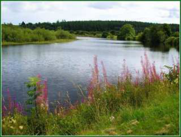

# _The hy_ _~~drosphere~~_ 

_CHAPTER 23. THE HYDROSPHERE_ _~~2~~ 3_ 

## _Introduction_ 

#### _ESAHQ_ 

As far as we know, the Earth we live on is the only planet that is able to support life. Amongst other factors, the Earth is just the right distance from the sun to have temperatures that are suitable for life to exist. Also, the Earth’s atmosphere has exactly the right type of gases in the right amounts for life to survive. Our planet also has **water** on its surface, which is something very unique. In fact, Earth is often called the “Blue Planet” because most of it is covered in water. This water is made up of _freshwater_ in rivers and lakes, the _saltwater_ of the oceans and estuaries, _groundwater_ and _water vapour_ . Together, all these water bodies are called the **hydrosphere** . See introductory video: ( Video: VPbzp at www.everythingscience.co.za) 

###### **The Earth** 

_Photo by NASA on Flickr.com_ 

## _Interactions of the hydrosphere_ 

#### _ESAHR_ 

###### **_FACT_** 

The total mass of the hydrosphere is approximately 1 _,_ 4 _×_ 10^{18} tonnes! (The volume of one tonne of water is approximately 1 cubic meter (this is about 900 A4 textbooks!)) 

It is important to realise that the hydrosphere is not an isolated system, but rather interacts with other global systems, including the _atmosphere_ , _lithosphere_ and _biosphere_ . These interactions are sometimes known collectively as the water cycle. 

- _Atmosphere_ When water is heated (e.g. by energy from the sun), it evaporates and forms water vapour. When water vapour cools again, it condenses to form liquid water which eventually returns to the surface by precipitation e.g. rain or snow. This cycle of water moving through the atmosphere and the energy changes that accompany it, is what drives weather patterns on earth. 

- _Lithosphere_ 

In the lithosphere (the ocean and continental crust at the Earth’s surface), water is an important _weathering_ agent, which means that it helps to break rock down into rock fragments and then soil. These fragments may then be transported by water to another place, where they are deposited. These two processes (weathering and the 

Chemistry: Chemical systems 

_CHAPTER 23. THE HYDROSPHERE_ 

_23.3_ 

transporting of fragments) are collectively called _erosion_ . Erosion helps to shape the earth’s surface. For example, you can see this in rivers. In the upper streams, rocks are eroded and sediments are transported down the river and deposited on the wide flood plains lower down. 

On a bigger scale, river valleys in mountains have been **River valley** carved out by the action of water, and cliffs and caves on rocky beach coastlines are also the result of weathering and erosion by water. The processes of weathering and erosion also increase the content of dissolved minerals in the water. These dissolved minerals are important for the plants and animals that live in the _photo by AlanVernon on Flickr.com_ water. 

- _Biosphere_ 

In the biosphere, land plants absorb water through their roots and then transport this through their vascular (transport) system to stems and leaves. This water is needed in _photosynthesis_ , the food production process in plants. Transpiration (evaporation of water from the leaf surface) then returns water back to the atmosphere. 

## _Exploring the hydrosphere_ 

_ESAHS_ 

The large amount of water on our planet is something quite unique. In fact, about 71% of the earth is covered by water. Of this, almost 97% is found in the oceans as saltwater, about 2 _,_ 2% occurs as a solid in ice sheets, while the remaining amount (less than 1%) is available as freshwater. So from a human perspective, despite the vast amount of water on the planet, only a very small amount is actually available for human consumption (e.g. drinking water). 

In chapter 18 we looked at some of the reactions that occur in aqueous solution and saw some of the chemistry of water, in this section we are going to spend some time exploring a part of the hydrosphere in order to start appreciating what a complex and beautiful part of the world it is. After completing the following investigation, you should start to see just how important it is to know about the chemistry of water. 



> **[Diagram Context - Textbook_PhysicalSciences_Gr10_The-hydrosphere.pdf-0002-11.png]**
> This photographic image depicts a freshwater aquatic ecosystem showing a river or lake with surrounding riparian vegetation, trees, and wildflowers. No explicit text, labels, or arrows are visible within the frame. Conceptually, this visual represents an aquatic habitat and freshwater biome to help learners identify biotic and abiotic components within environmental studies.


_Photo by Duncan Brown (Cradlehall) on Flickr.com_ 

Chemistry: Chemical systems 

_CHAPTER 23. THE HYDROSPHERE_ 

_23.3_ 

#### **_Investigation:_** _Investigating the hydrosphere_ 

In groups of 3 - 4 choose one of the following as a study site: rock pool, lake, river, wetland or small pond. When choosing your study site, consider how accessible it is (how easy is it to get to?) and the problems you may experience (e.g. tides, rain). 

Your teacher will provide you with the equipment you need to collect the following data. You can pick more than one study site and compare your data for each site. 

- Measure and record data such as temperature, pH, conductivity and dissolved oxygen at each of your sites. 

- Collect a water sample in a clear bottle, hold it to the light and see whether the water is clear or whether it has particles in it (i.e. what is the clarity of the water). 

- What types of animals and plants are found in or near this part of the hydrosphere? Are they specially adapted to their environment? 

Record your data in a table like the one shown below: 

||**Site 1**|**Site 2**|**Site 3**|
|---|---|---|---|
|**Temperature**||||
|**pH**||||
|**Conductivity**||||
|**Dissolved oxygen**||||
|**Clarity**||||
|**Animals**||||
|**Plants**||||

**Interpreting the data** Once you have collected and recorded your data, think about the following questions: 

- How does the data you have collected vary at different sites? 

- Can you explain these differences? 

- What effect do you think _temperature_ , _dissolved oxygen_ and _pH_ have on animals and plants that are living in the hydrosphere? 

- Water is seldom “pure”. It usually has lots of things dissolved (e.g. 

Chemistry: Chemical systems 

_CHAPTER 23. THE HYDROSPHERE_ 

_23.4_ 

- Mg^{2+} , Ca^{2+} and NO^{_−_} 3^{ions)orsuspended(e.g.soilparticles,de-} bris) in it. Where do these substances come from? 

- _•_ Are there any human activities near this part of the hydrosphere? What effect could these activities have on the hydrosphere? 

## _The importance of the ESAHT hydrosphere_ 

It is so easy sometimes to take our hydrosphere for granted and we seldom take the time to really think about the role that this part of the planet plays in keeping us alive. Below are just some of the important functions of water in the hydrosphere: 

- _Water is a part of living cells_ Each cell in a living organism is made up of almost 75% water, and this allows the cell to function normally. In fact, most of the chemical reactions that occur in life, involve substances that are dissolved in water. Without water, cells would not be able to carry out their normal functions and life could not exist. 

- _Water provides a habitat_ The hydrosphere provides an important place for many animals and plants to live. Many gases (e.g. $	ext{CO}_2$, $	ext{O}_2$), nutrients e.g. nitrate (NO^{_−_} 3^{),} nitrite (NO^{_−_} 2^{) and ammonium (NH+} 4<sup>) ions, as well as other ions (e.g. Mg2+ and Ca2+)</sup> are dissolved in water. The presence of these substances is critical for life to exist in water. 

- _Regulating climate_ One of water’s unique characteristics is its high _specific heat_ . This means that water takes a long time to heat up and also a long time to cool down. This is important in helping to regulate temperatures on earth so that they stay within a range that is acceptable for life to exist. _Ocean currents_ also help to disperse heat. 

- _Human needs_ Humans use water in a number of ways. Drinking water is obviously very important, but water is also used domestically (e.g. washing and cleaning) and in industry. Water can also be used to generate electricity through hydropower. 

These are just a few of the functions that water plays on our planet. Many of the functions of water relate to its chemistry and to the way in which it is able to dissolve substances in it. 

Chemistry: Chemical systems 

_CHAPTER 23. THE HYDROSPHERE_ 

_23.5_ 

## _Threats to the hydrosphere_ 

#### _ESAHU_ 

It should be clear by now that the hydrosphere plays an extremely important role in the survival of life on Earth and that the unique properties of water allow various important chemical processes to take place which would otherwise not be possible. Unfortunately for us however, there are a number of factors that threaten our hydrosphere and most of these threats are because of human activities. We are going to focus on two of these issues: **pollution** and **overuse** and look at ways in which these problems can possibly be overcome. See video: VPcbf at www.everythingscience.co.za 

###### **1** . **Pollution** 

Pollution of the hydrosphere is a major problem. When we think of pollution, we sometimes only think of things like plastic, bottles, oil and so on. But any chemical that is present in the hydrosphere in an amount that is not what it should be is a pollutant. Animals and plants that live in the Earth’s water bodies are specially adapted to surviving within a certain range of conditions. If these conditions are changed (e.g. through pollution), these organisms may not be able to survive. Pollution then, can affect entire aquatic ecosystems. The most common forms of pollution in the hydrosphere are _waste products_ from humans and from industries, _nutrient pollution_ e.g. fertiliser runoff which causes eutrophication (an excess of nutrients in the water leading to excessive plant growth) and toxic trace elements such as aluminium, mercury and copper to name a few. Most of these elements come from mines or from industries. 

###### **2** . **Overuse of water** 

We mentioned earlier that only a very small percentage of the hydrosphere’s water is available as freshwater. However, despite this, humans continue to use more and more water to the point where water _consumption_ is fast approaching the amount of water that is _available_ . The situation is a serious one, particularly in countries such as South Africa which are naturally dry and where water resources are limited. It is estimated that between 2020 and 2040, water supplies in South Africa will no longer be able to meet the growing demand for water in this country. This is partly due to population growth, but also because of the increasing needs of industries as they expand and develop. For each of us, this should be a very scary thought. Try to imagine a day without water... difficult isn’t it? Water is so much a part of our lives, that we are hardly aware of the huge part that it plays in our daily lives. 

As populations grow, so do the demands that are placed on dwindling water resources. While many people argue that building dams helps to solve this water-shortage problem, there is evidence that dams are only a temporary solution and that they often end up doing far more ecological damage than good. The only sustainable solution is to reduce the _demand_ for water, so that water supplies are sufficient to meet this. The more important 

Chemistry: Chemical systems 

_CHAPTER 23. THE HYDROSPHERE 23.5_ question then is how to do this. 

Chemistry: Chemical systems 

_CHAPTER 23. THE HYDROSPHERE_ 

_23.5_ 

#### **_Group Discussion:_ Creative water conservation** 

Divide the class into groups, so that there are about five people in each. Each group is going to represent a different sector within society. Your teacher will tell you which sector you belong to from the following: **Dry landscape** farming, industry, city management, water conservation, tourism or civil society (i.e. you will represent the ordinary “man on the street”). In your groups, discuss the following questions as they relate to the group of people you represent: (Remember to take notes dur- _Photo by flowcomm on Flickr.com_ ing your discussions and nominate a spokesperson to give feedback to the rest of the class on behalf of your group) 

- What steps could be taken by your group to conserve water? 

- Why do you think these steps are _not_ being taken? 

- What incentives do you think could be introduced to encourage this group to conserve water more efficiently? 

#### **_Investigation:_** _Building of dams_ 

In the previous discussion, we mentioned that there is evidence that dams are only a temporary solution to the water crisis. In this investigation you will look at why dams are a potentially bad solution to the problem. 

For this investigation you will choose a dam that has been built in your area, or an area close to you. Make a note of which rivers are in the area. Try to answer the following questions: 

**A dam** _Photo by Redeo on Flickr.com_ 

- If possible talk to people who have lived in the area for a long time and try to get their opinion on how life changed since the dam was built. If it is not possible to talk to people in the area, then look for relevant literature on the area. 

- Try to find out if any environmental impact assessments (this is where people study the environment and see what effect the proposed project has on the environment) were done before the dam was built. Why do you think this is important? 

Chemistry: Chemical systems 

_CHAPTER 23. THE HYDROSPHERE_ 

_23.6_ 

- Look at how the ecology has changed. What was the ecology of the river before the dam was built? What is the current ecology? Do you think it has changed in a good way or a bad way? You could interview people in the community who lived there long ago before the dam was built. 

Write a report or give a presentation in class on your findings from this investigation. Critically examine your findings and draw your own conclusion as to whether or not dams are only a short term solution to the growing water crisis. 

It is important to realise that our hydrosphere exists in a delicate balance with other systems and that disturbing this balance can have serious consequences for life on this planet. 

###### **_Project:_ School Action Project** 

There is a lot that can be done within a school to save water. As a class, discuss what actions could be taken by your class to make people more aware of how important it is to conserve water. Also consider what ways your school can save water. If possible, try to put some of these ideas into action and see if they really do conserve water. During break walk around the school and make a list of ll the places where water is being wasted. 

## _How pure is our water?_ 

_ESAHV_ 

When you drink a glass of water you are not just drinking water, but many other substances that are dissolved into the water. Some of these come from the process of making the water safe for humans to drink, while others come from the environment. Even if you took water from a mountain stream (which is often considered pure and bottled for people to consume), the water would still have impurities in it. Water pollution increases the amount of impurities in the water and sometimes makes the water unsafe for drinking. In this section we will look at a few of the substances that make water impure and how we can make pure water. We will also look at the pH of water. 

In chapter 18 we saw how compounds can dissolve in water. Most of these compounds (e.g. Na , Cl^{_−_} , Ca^{2+} , Mg^{2+} , etc.) are safe for humans to consume in the small amounts that are naturally present in water. It is only when the amounts of these ions rise above the safe levels that the water is considered to be polluted. 

You may have noticed sometimes that when you pour a glass a water straight from the tap, it has a sharp smell. This smell is the same smell that you notice around swimming pools and 

Chemistry: Chemical systems 

_CHAPTER 23. THE HYDROSPHERE_ 

_23.6_ 

tap 

is due to chlorine in the water. Chlorine is the most common compound added to water to make it safe for humans to use. Chlorine helps to remove bacteria and other biological contaminants in the water. Other methods to purify water include filtration (passing the water through a very fine mesh) and flocculation (a process of adding chemicals to the water to help remove small particles). 

pH of water is also important. Water that is too basic (pH greater than 7) or too acidic (pH less than 7) may present problems when humans consume the water. If you have ever noticed after swimming that your eyes are red or your skin is itchy, then the pH of the swimming pool was probably too basic or too acidic. This shows you just how sensitive we are to the smallest changes in our environment. The pH of water depends on what ions are dissolved in the water. Adding chlorine to water often lowers the pH. You will learn more about pH in grade 11. 

#### **_General experiment:_** _Water purity_ 

**Aim:** To test the purity and pH of water samples **Apparatus:** 

pH test strips (you can find these at pet shops, they are used to test pH of fish tanks), microscope (or magnifying glass), filter paper, funnel, silver nitrate, concentrated nitric acid, barium chloride, acid, chlorine water (a solution of chlorine in sea river rain water), carbon tetrachloride, some testtubes or beakers, water samples from different sources (e.g. a river, a dam, the sea, tap water, etc.). **Method:** 

- **1** . Look at each water sample and note if the water is clear or cloudy. 

- **2** . Examine each water sample under a microscope and note what you see. 

- **3** . Test the pH of each of the water samples. 

- **4** . Pour some of the water from each sample through filter paper. 

- **5** . Refer to chapter 18 for the details of common anion tests. Test for chloride, sulphate, carbonate, bromide and iodide in each of the water samples. 

**Results:** Write down what you saw when you just looked at the water samples. Write down what you saw when you looked at the water samples under a microscope. Where there any dissolved particles? Or other things in the water? Was there a difference in what you saw with just looking and with looking with a microscope? 

Chemistry: Chemical systems 

_CHAPTER 23. THE HYDROSPHERE_ 

_23.6_ 

Write down the pH of each water sample. Look at the filter paper from each sample. Is there sand or other particles on it? Which anions did you find in each sample? **Discussion:** Write a report on what you observed. Draw some conclusions on the purity of the water and how you can tell if water is pure or not. **Conclusion:** You should have seen that water is not pure, but rather has many substances dissolved in it. 

###### **_Project:_ Water purification** 

Prepare a presentation on how water is purified. This can take the form of a poster, or a presentation or a written report. Things that you should look at are: 

- Water for drinking (potable water) 

- Distilled water and its uses 

- Deionised water and its uses 

- What methods are used to prepare water for various uses 

- What regulations govern drinking water 

- Why water needs to be purified 

- How safe are the purification methods 

## Chapter 23 | Summary 

See the summary presentation ( Presentation: VPfbj at www.everythingscience.co.za) 

- The **hydrosphere** includes all the water that is on Earth. Sources of water include freshwater (e.g. rivers, lakes), saltwater (e.g. oceans), groundwater (e.g. boreholes) and water vapour. Ice (e.g. glaciers) is also part of the hydrosphere. 

- The hydrosphere interacts with other **global systems** , including the atmosphere, lithosphere and biosphere. 

- The hydrosphere has a number of important **functions** . Water is a part of all living cells, it provides a habitat for many living organisms, it helps to regulate climate and it is used by humans for domestic, industrial and other use. 

- Despite the importance of the hydrosphere, a number of factors threaten it. These include **overuse** of water, and **pollution** . 

- Water is not pure, but has many substances dissolved in it. 

Chemistry: Chemical systems 

_CHAPTER 23. THE HYDROSPHERE_ 

_23.6_ 

- **1** . What is the hydrosphere? How does it interact with other global systems? 

- **2** . Why is the hydrosphere important? 

- **3** . Write a one page essay on the importance of water and what can be done to ensure that we still have drinkable water in 50 years time. 

More practice video solutions or help at www.everythingscience.co.za 

- (1.) 00b5 (2.) 00b6 (3.) 024v 

Chemistry: Chemical systems 

## **Chapter 23. The hydrosphere** 

### **End of chapter exercises** 

1. What is the hydrosphere? How does it interact with other global systems? 

##### _Solution:_ 

The hydrosphere is all the water bodies on Earth. The hydrosphere includes rivers, lakes, streams, oceans and groundwater. The hydrosphere interacts with the atmosphere, the lithosphere and the biosphere. In the atmosphere water from lakes, rivers, streams etc. evaporates into the atmosphere. This evaporated water later returns to the earth in the form of rain or snow. In the lithosphere water helps break down rocks into smaller fragments (this is weathering). Water then transports these fragments to other places (erosion). These two processes, weathering and erosion, shape the face of the earth. In the biosphere, plants absorb water through their roots and then this water returns to the hydrosphere through transpiration (evaporation of water from plant leaves). 

2. Why is the hydrosphere important? 

##### _Solution:_ 

Water is part of living cells and so all living organisms need water 

Water provides a habitat for many animals and plants 

Water helps to regulate climate 

Humans need water to drink and for their biological processes 

3. Write a one page essay on the importance of water and what can be done to ensure that we still have drinkable water in 50 years time. 

##### _Solution:_ 

Answer should include the following points: 

Why water is needed for life, e.g. is part of cells, provides a habitat, regulates climate, drinking water, etc. 

Conservation of water e.g. taking a shower instead of a bath, using a low flow shower head, using minimal flush toilets, using washing machines with a full load, etc. 

Dealing with pollution, e.g. not throwing rubbish into rivers, educating companies to not throw waste into rivers, etc. 

Decreasing the amount of water that humans use _._ 

## 5. Authentic Exam Question Archetypes & Mark Allocations
*(Extracted from official CAPS examination papers to guide marking, pacing, and rubric design)*

### Archetype 1: QUESTION 10 (Start on a new page.)
- **Source Paper:** `Gr10_PhysicalSciences_Chem_Exam2.pdf`
- **Total Mark Allocation:** **[8 Marks]** (Sub-questions: 1, 1, 1, 1, 1 marks)
- **Recommended Time:** **10 Minutes** (Pacing: ~1.2 min/mark | *Calibrated to Official CAPS Paper Pace (1.2 min/mark)*)
- **Assessment Mode Calibration:** Timed Exam Simulation: 10 min countdown (Pacing Checkpoint: 8 min)
- **Cognitive / Marking Strategy:** NSC Standard (Method Marks [M], Accuracy Marks [A], Carry-Over [CA])

#### Question Prompt & Working:
```text
QUESTION 10   (Start on a new page.)  
  
 
The water cycle in the diagram below links the hydrosphere to the other global 
systems. The letters P, Q, R and S indicate some of the processes which take place in 
the water cycle. 
  
 
 
 
10.1 
Briefly explain the term hydrosphere. 
 (1) 
 
10.2 
Name the processes labelled: 
  
 
 
10.2.1 
P 
 (1) 
 
 
10.2.2 
Q 
 (1) 
 
 
10.2.3 
R 
 (1) 
 
 
10.2.4 
S 
 (1) 
 
10.3 
Write down ONE advantage of process R. 
 (1) 
 
10.4 
The building of dams has several advantages for humans and the 
environment. State TWO of these advantages.  
  
(2) 
 
 
 [8] 
 
TOTAL:  150 
 
Ocean 
S  
Clouds 
Water 
vapour 
 P 
Q 
Dam  
R 
Physical Sciences/P2 
DBE/November 2015 
CAPS – Grade 10 
Copyright reserved 
 
 
DATA FOR PHYSICAL SCIENCES GRADE 10 
PAPER 2 (C...
```

### Archetype 2: QUESTION 1: MULTIPLE-CHOICE QUESTIONS
- **Source Paper:** `Gr10_PhysicalSciences_Chem_Exam4.pdf`
- **Total Mark Allocation:** **[23 Marks]** (Sub-questions: 2, 2, 2, 2, 2 marks)
- **Recommended Time:** **28 Minutes** (Pacing: ~1.2 min/mark | *Calibrated to Official CAPS Paper Pace (1.2 min/mark)*)
- **Assessment Mode Calibration:** Timed Exam Simulation: 28 min countdown (Pacing Checkpoint: 21 min)
- **Cognitive / Marking Strategy:** NSC Standard (Method Marks [M], Accuracy Marks [A], Carry-Over [CA])

#### Question Prompt & Working:
```text
QUESTION 1:  MULTIPLE-CHOICE QUESTIONS 
  
Physical Sciences/P2 
4 
DBE/November 2016 
CAPS – Grade 10 
Copyright reserved 
 
Please turn over 
 
 
 
1.5 
The chemical formula for sodium sulphate is … 
  
 
 
A 
 
B 
 
C 
 
D 
NaSO4 
 
 
Na2(SO4)2 
 
Na2SO4 
 
Na(SO4)2 
 
(2) 
 
1.6 
Which ONE of the following electron configurations represents an ion of  
an alkali metal? 
  
 
 
A 
 
B 
 
C 
 
D 
1s2  
 
1s2 2s2  
 
1s2 2s2 2p5 
 
1s2 2s2 2p6 3s1 
 
(2) 
 
1.7 
Which ONE of the following groups of elements shows the correct trend  
of the atomic radii of elements? 
  
 
 
A 
 
B 
 
C 
 
D 
F ˃ Cℓ ˃ Br ˃ I 
 
I ˃ Br ˃ Cℓ ˃ F 
 
Li ˂ Be ˂ B ˂ N 
 
Li ˃ B ˃ N ˃ Be 
 
(2) 
 
1.8 
Consider the unbalanced chemical equation below.  
 
P4(s) + H2(g) → PH3(g) 
 
Which ONE of the sets of coefficie...
```

### Archetype 3: QUESTION 10 (Start on a new page)
- **Source Paper:** `Gr10_PhysicalSciences_Chem_Exam8.pdf`
- **Total Mark Allocation:** **[11 Marks]** (Sub-questions: 2, 1, 1, 1, 2 marks)
- **Recommended Time:** **13 Minutes** (Pacing: ~1.2 min/mark | *Calibrated to Official CAPS Paper Pace (1.2 min/mark)*)
- **Assessment Mode Calibration:** Timed Exam Simulation: 13 min countdown (Pacing Checkpoint: 10 min)
- **Cognitive / Marking Strategy:** NSC Standard (Method Marks [M], Accuracy Marks [A], Carry-Over [CA])

#### Question Prompt & Working:
```text
QUESTION 10 (Start on a new page) 
  
 
The diagram below shows how the hydrosphere is linked to the biosphere. Study the 
diagram and answer the questions that follow. 
 
 
 
 
 
 
 
 
 
 
 
 
 
 
 
 
10.1 
Differentiate between the hydrosphere and biosphere. 
 
(2) 
 
 
 
 
10.2 
Write down the name of process: 
 
 
 
 
 
 
10.2.1 
A 
 
(1) 
 
 
 
 
10.2.2 
B 
 
(1) 
 
10.2.3 
C 
 
(1) 
 
 
 
 
10.3 
Describe the energy changes during processes A and B. Write down only 
ENERGY GAINED or ENERGY LOST. 
 
 
(2) 
 
 
 
 
10.4 
Describe the interaction between the hydrosphere and plants. 
 
(4) 
 
 
 
[11] 
 
 
 
 
 
TOTAL:     150 
 
 
 
 
 C 
B 
A 
PLANTS  
CLOUDS 
Water 
vapour 
Physical Sciences/P2 
 
DBE/November 2018 
 
CAPS – Grade 10 
Copyright reserved 
 
 
DATA FOR PHYSICAL SCIENCES...
```
