# **CHAPTER 3** 

# _Atomic combinations_ 

|**3.1**|**_Chemical bonds_**|136|
|---|---|---|
|**3.2**|**_Molecular shape_**|148|
|**3.3**|**_Electronegativity_**|153|
|**3.4**|**_Energy and bonding_**|159|
|**3.5**|**_Chapter summary_**|160|

3 Atomic combinations 

We live in a world that is made up of many complex compounds. All around us we see evidence of chemical bonding from the chair you are sitting on, to the book you are holding, to the air you are breathing. Imagine if all the elements on the periodic table did not form bonds but rather remained on their own. Our world would be pretty boring with only 100 or so elements to use. 

Imagine you were painting a picture and wanted to show the colours around you. The only paints you have are red, green, yellow, blue, white and black. Yet you are able to make pink, purple, orange and many other colours by mixing these paints. In the same way, the elements can be thought of as natures paint box. The elements can be joined together in many different ways to make new compounds and so create the world around you. 

In Grade 10 we started exploring chemical bonding. In this chapter we will go on to explain more about chemical bonding and why chemical bonding occurs. We looked at the three types of bonding: covalent, ionic and metallic. In this chapter we will focus mainly on covalent bonding and on the molecules that form as a result of covalent bonding. 


> **[Diagram Context - Textbook_PhysicalSciences_Gr11_Atomic-combinations.pdf-0002-04.png]**
> This physical molecular model kit apparatus displays various assembled molecular structures and loose atomic components represented by color-coded spheres connected by bonds. Visible elements include black carbon, white hydrogen, red oxygen, blue nitrogen, and green halogen spheres linked by grey bond tubes to form different shapes such as tetrahedral, trigonal planar, and ring structures. Conceptually, this apparatus helps high school learners visualise three-dimensional molecular geometry, VSEPR theory, and the spatial arrangement of atoms in chemical bonding as prescribed by the CAPS curriculum.


##### **NOTE:** 

In this chapter we will use the term molecule to mean a covalent molecular structure. This is a covalent compound that interacts and exists as a single entity. 

## 3.1 Chemical bonds 

### Why do atoms bond? 

As we begin this section, it’s important to remember that what we will go on to discuss is a _model_ of bonding, that is based on a particular _model_ of the atom. You will remember from the discussion on atoms (in Grade 10) that a model is a _representation_ of what is happening in reality. In the model of the atom that you are learnt in Grade 10, the atom is made up of a central nucleus, surrounded by electrons that are arranged in fixed energy levels (sometimes called _shells_ ). Within each energy level, electrons move in _orbitals_ of different shapes. The electrons in the outermost energy level of an atom are called the **valence electrons** . This model of the atom is useful in trying to understand how different types of bonding take place between atoms. 


> **[Diagram Context - Textbook_PhysicalSciences_Gr11_Atomic-combinations.pdf-0002-12.png]**
> This educational graphic displays an Aufbau atomic structure model, specifically representing a neon atom with a central grey nucleus surrounded by concentric circular electron shells containing black dots (inner core electrons) and white circles (outer valence electrons). Aligned with the CAPS Physical Sciences curriculum, the diagram illustrates electron configuration by showing two electrons in the first inner energy level and eight electrons in the outer valence energy level. This visual conveys the concept of chemical stability and the octet rule, demonstrating how atoms achieve a stable electronic structure with a full outer shell.


Figure 3.1: 

Electron arrangement of a fluorine atom. The black electrons (small circles on the inner ring) are the core electrons and the white electrons (small circles on the outer ring) are the valence electrons. 

The following points were made in these earlier discussions on electrons and energy levels: 

- Electrons always try to occupy the lowest possible energy level. 

- The noble gases have a full valence electron orbital. For example neon has the following electronic configuration: $$1s^{2}$$ $$2s^{2}$$ $$2p^{6}$$ . The second energy level is the outermost (valence) shell and is full. 

##### **TIP** 

A model takes what we see in the world around us and uses that to make certain predictions about what we cannot see. 

- Atoms form bonds to try to achieve the same electron configuration as the noble gases. 

- Atoms with a full valence electron orbital are less reactive. 

### Energy and bonding ESBM6 

There are two cases that we need to consider when two atoms come close together. The first case is where the two atoms come close together and form a bond. The second case is where the two atoms come close together but do not form a bond. We will use hydrogen as an example of the first case and helium as an example of the second case. 

##### **Case 1: A bond forms** 

Let’s start by imagining that there are two hydrogen atoms approaching one another. As they move closer together, there are three forces that act on the atoms at the same time. These forces are described below: 

1. **repulsive force** between the electrons of the atoms, since like charges repel 


> **[Diagram Context - Textbook_PhysicalSciences_Gr11_Atomic-combinations.pdf-0003-12.png]**
> The educational graphic depicts two atomic models, each featuring a central positive charge (+) and an outer region with a negative charge (-), separated by a horizontal double-headed arrow spanning between them. The visible labels consist of positive (+) and negative (-) charge symbols along with bidirectional arrows indicating direction. This diagram conveys the concept of electrostatic forces, specifically illustrating how like charges repel each other when brought into proximity.


Figure 3.2: Repulsion between electrons 

2. **attractive force** between the nucleus of one atom and the electrons of another 


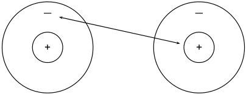
> **[Diagram Context - Textbook_PhysicalSciences_Gr11_Atomic-combinations.pdf-0003-15.png]**
> This physics diagram illustrates electrostatic forces between charged particles, showing two atomic models with inner positive (+) and outer negative (-) regions. An arrow extends from the negative region of the left atom to the positive region of the right atom. Conceptually, this conveys the attractive electrostatic force operating between unlike charges according to Coulomb's law in Grade 10-12 Physical Sciences.


Figure 3.3: Attraction between electrons and protons. 

3. **repulsive force** between the two positively-charged nuclei 


> **[Diagram Context - Textbook_PhysicalSciences_Gr11_Atomic-combinations.pdf-0003-18.png]**
> This educational diagram illustrates two atomic models, each featuring a central positive nucleus labelled with a plus sign (+) and surrounding negative charge labelled with a minus sign (-). A double-headed horizontal arrow spans the distance between the two atomic structures. Conceptually, it conveys electrostatic interactions between charges or the forces operating between atoms when studying matter and materials in the CAPS physical sciences curriculum.


Figure 3.4: Repulsion between protons 

These three forces work together when two atoms come close together. As the total force experienced by the atoms changes, the amount of energy in the system also changes. 

Now look at Figure 3.5 to understand the energy changes that take place when the two atoms move towards each other. 


> **[Diagram Context - Textbook_PhysicalSciences_Gr11_Atomic-combinations.pdf-0004-02.png]**
> The graphic is a potential energy graph illustrating the formation of a covalent bond between two atoms. Visible labels include the vertical axis labeled "Energy" (with positive "+" and negative "-" regions and an upward arrow), the horizontal axis labeled "Distance between atomic nuclei" with an arrow pointing right and label "A", point "X" at the potential energy minimum, and schematic atomic/molecular structures showing nuclei (black dots) and electron clouds (blue ovals) at various inter-nuclear distances. Conceptually, for high school chemistry learners, it demonstrates how potential energy decreases as two approaching atoms experience attractive forces until reaching a minimum energy state (bond length) at point X, beyond which electrostatic repulsion causes the energy to rise sharply if they get too close.


Figure 3.5: Graph showing the change in energy that takes place as two hydrogen atoms move closer together. 

Let us imagine that we have fixed the one atom and we will move the other atom closer to the first atom. As we move the second hydrogen atom closer to the first (from point A to point X) the energy of the system decreases. Attractive forces dominate this part of the interaction. As the second atom approaches the first one and gets closer to point X, more energy is needed to pull the atoms apart. This gives a negative potential energy. 

At point X, the attractive and repulsive forces acting on the two hydrogen atoms are balanced. The energy of the system is at a minimum. 

Further to the left of point X, the repulsive forces are stronger than the attractive forces and the energy of the system increases. 

For hydrogen the energy at point X is low enough that the two atoms stay together and do not break apart again. This is why when we draw the Lewis diagram for a hydrogen molecule we draw two hydrogen atoms next to each other with an electron pair between them. 


We also note that this arrangement gives both hydrogen atoms a full outermost energy level (through the sharing of electrons or covalent bonding). 

##### **Case 2: A bond does not form** 

Now if we look at helium we see that each helium atom has a filled outer energy level. Looking at Figure 3.6 we find that the energy minimum for two helium atoms is very close to zero. This means that the two atoms can come together and move apart very easily and never actually stick together. 


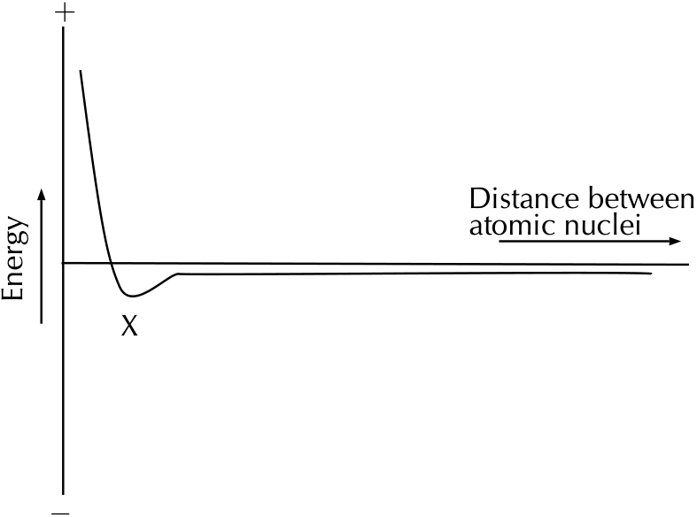
> **[Diagram Context - Textbook_PhysicalSciences_Gr11_Atomic-combinations.pdf-0005-02.png]**
> This graphic is a potential energy graph illustrating covalent bond formation. The visible labels include the vertical axis labeled "Energy" (with '+' and '-' signs) and the horizontal axis labeled "Distance between atomic nuclei", along with a point labeled "X" at the minimum of the potential energy curve. For a high school Physical Sciences student, this diagram conveys how potential energy changes as two atoms approach each other, showing that bond formation occurs at point X where potential energy is at a minimum and a stable covalent bond is formed.


Figure 3.6: Graph showing the change in energy that takes place as two helium atoms move closer together. 

For helium the energy minimum at point X is not low enough that the two atoms stay together and so they move apart again. This is why when we draw the Lewis diagram for helium we draw one helium atom on its own. There is no bond. 

We also see that helium already has a full outermost energy level and so no compound forms. 


### Valence electrons and Lewis diagrams ESBM7 

Now that we understand a bit more about bonding we need to refresh the concept of Lewis diagrams that you learnt about in Grade 10. With the knowledge of why atoms bond and the knowledge of how to draw Lewis diagrams we will have all the tools that we need to try to predict which atoms will bond and what shape the molecule will be. 

In grade 10 we learnt how to write the electronic structure for any element. For drawing Lewis diagrams the one that you should be familiar with is the spectroscopic notation. For example the electron configuration of chlorine in spectroscopic notation is: $$1s^{2}$$ $$2s^{2}$$ $$2p^{5}$$ . Or if we use the condensed form: [He]$$2s^{2}$$ $$2p^{5}$$ . The condensed spectroscopic notation quickly shows you the valence electrons for the element. 

##### **TIP** 

A **Lewis diagram** uses dots or crosses to represent the **valence electrons** on different atoms. The chemical symbol of the element is used to represent the nucleus and the core electrons of the atom. 

##### **TIP** 

You can place the unpaired electrons anywhere (top, bottom, left or right). The exact ordering in a Lewis diagram does not matter. 

Using the number of valence electrons we can easily draw Lewis diagrams for any element. In Grade 10 you learnt how to draw Lewis diagrams. We will refresh the concepts here as they will aid us in our discussion of bonding. 

Lewis diagrams for the elements in period 2 are shown below: 

|**Element**|**Group number**|**Valence electrons**|**Spectroscopic**<br>**notation**|**Lewis di-**<br>**agram**|
|---|---|---|---|---|
|Lithium|1|1|[He]$$2s^{1}$$|Li<br>•|
|Beryllium|2|2|[He]$$2s^{2}$$|Be<br>•<br>•|
|Boron|13|3|[He]$$2s^{2}$$$$2p^{1}$$|B<br><br>•<br>•|
|||||•|
|Carbon|14|4|[He]$$2s^{2}$$$$2p^{2}$$|C<br><br>•<br>•<br>•|
|||||•|
|Nitrogen|15|5|[He]$$2s^{2}$$$$2p^{3}$$|N<br>•<br>• •<br>•<br>•|
|Oxygen|16|6|[He]$$2s^{2}$$$$2p^{4}$$|O<br>• •<br>• •<br>•<br>•|
|Fluorine|17|7|[He]$$2s^{2}$$$$2p^{5}$$|F<br>• •<br>• •<br>• •<br>•|
|Neon|18|8|[He]$$2s^{2}$$$$2p^{6}$$|Ne<br>• •<br>• •<br>• •<br>• •|

##### **Exercise 3 – 1: Lewis diagrams** 

Give the spectroscopic notation and draw the Lewis diagram for: 

1. magnesium 3. chlorine 5. argon 2. sodium 4. aluminium 

1. 23NG 2. 23NH 3. 23NJ 4. 23NK 5. 23NM **www.everythingscience.co.za m.everythingscience.co.za** 

### Covalent bonds and bond formation 

#### ESBM8 

Covalent bonding involves the sharing of electrons to form a chemical bond. The outermost orbitals of the atoms overlap so that unpaired electrons in each of the bonding atoms can be shared. By overlapping orbitals, the outer energy shells of all the bonding atoms are filled. The shared electrons move in the orbitals around _both_ atoms. As 

they move, there is an attraction between these negatively charged electrons and the positively charged nuclei. This attractive force holds the atoms together in a covalent bond. 

**DEFINITION:** _Covalent bond_ 

A form of chemical bond where pairs of electrons are shared between atoms. 

We will look at a few simple cases to deduce some rules about covalent bonds. 

##### **Case 1: Two atoms that each have an unpaired electron** 

##### **TIP** 

Covalent bonds are examples of interatomic forces. 

##### **TIP** 

Remember that it is only the _valence electrons_ that are involved in bonding, and so when diagrams are drawn to show what is happening during bonding, it is only these electrons that are shown. Dots or crosses represent electrons in different atoms. 

For this case we will look at hydrogen chloride and methane. 

##### **Worked example 1: Lewis diagrams: Simple molecules** 

##### **_QUESTION_** 

Represent hydrogen chloride (HCl) using a Lewis diagram. 

##### **_SOLUTION_** 

**Step 1: For each atom, determine the number of valence electrons in the atom, and represent these using dots and crosses.** 

The electron configuration of hydrogen is $$1s^{1}$$ and the electron configuration for chlorine is [He]$$2s^{2}$$ $$2p^{5}$$ . The hydrogen atom has 1 valence electron and the chlorine atom has 7 valence electrons. 

The Lewis diagrams for hydrogen and chlorine are: 


Notice the single unpaired electron (highlighted in blue) on each atom. This does not mean this electron is different, we use highlighting here to help you see the unpaired electron. 

**Step 2: Arrange the electrons so that the outermost energy level of each atom is full.** 

Hydrogen chloride is represented below. 


Notice how the two unpaired electrons (one from each atom) form the covalent bond. 

Atomic combinations 

The dot and cross in between the two atoms, represent the pair of electrons that are shared in the covalent bond. We can also show this bond using a single line: 

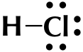

Note how we still show the other electron pairs around chlorine. 

From this we can conclude that any electron on its own will try to pair up with another electron. So in practise atoms that have at least one unpaired electron can form bonds with any other atom that also has an unpaired electron. This is not restricted to just two atoms. 

##### **Worked example 2: Lewis diagrams: Simple molecules** 

##### **_QUESTION_** 

Represent methane ($	ext{CH}_4$) using a Lewis diagram 

##### **_SOLUTION_** 

**Step 1: For each atom, determine the number of valence electrons in the atom, and represent these using dots and crosses.** 

The electron configuration of hydrogen is $$1s^{1}$$ and the electron configuration for carbon is [He]$$2s^{2}$$ $$2p^{2}$$ . Each hydrogen atom has 1 valence electron and the carbon atom has 4 valence electrons. 


> **[Diagram Context - Textbook_PhysicalSciences_Gr11_Atomic-combinations.pdf-0008-10.png]**
> This graphic is a Lewis dot diagram representing a methane ($CH_4$) molecule. It features a central carbon symbol (C) surrounded by four hydrogen symbols (H), with dots representing carbon valence electrons and crosses representing hydrogen valence electrons shared in covalent bonds. Conceptually, this diagram illustrates how atoms share valence electrons to achieve a stable octet (or duet for hydrogen), demonstrating covalent bonding and molecular structure in Grade 10 Physical Sciences.


Remember that we said we can place unpaired electrons at any position (top, bottom, left, right) around the elements symbol. 

**Step 2: Arrange the electrons so that the outermost energy level of each atom is full.** 

The methane molecule is represented below. 

H H H C H or H C H × • H H 

##### **Exercise 3 – 2:** 

##### **TIP** 

Represent the following molecules using Lewis diagram: 

1. chlorine ($	ext{Cl}_2$) 2. boron trifluoride ($	ext{BF}_3$) 

Notice how in this example we wrote a 2 in front of the hydrogen? Instead of writing the Lewis diagram for hydrogen twice, we simply write it once and use the 2 in front of it to indicate that two hydrogens are needed for each oxygen. 

##### **Case 2: Atoms with lone pairs** 

We will use water as an example. Water is made up of one oxygen and two hydrogen atoms. Hydrogen has one unpaired electron. Oxygen has two unpaired electrons and two electron pairs. From what we learnt in the first examples we see that the unpaired electrons can pair up. But what happens to the two pairs? Can these form bonds? 

**Worked example 3: Lewis diagrams: Simple molecules** 

##### **_QUESTION_** 

Represent water ($	ext{H}_2O$) using a Lewis diagram 

##### **_SOLUTION_** 

**Step 1: For each atom, determine the number of valence electrons in the atom, and represent these using dots and crosses.** 

The electron configuration of hydrogen is $$1s^{1}$$ and the electron configuration for oxygen is [He]$$2s^{2}$$ $$2p^{4}$$ . Each hydrogen atom has 1 valence electron and the oxygen atom has 6 valence electrons. 


##### **Step 2: Arrange the electrons so that the outermost energy level of each atom is full.** 

The water molecule is represented below. 


> **[Diagram Context - Textbook_PhysicalSciences_Gr11_Atomic-combinations.pdf-0009-17.png]**
> This graphic displays Lewis structures (electron-dot diagrams) and structural formulae for a water molecule. The visible chemical symbols are 'H' and 'O', accompanied by dots and crosses representing valence electrons and lines representing shared electron pairs (bonds). Conceptually, this helps Grade 10 Physical Sciences learners visualize covalent bonding, valence electron distribution, and how shared electron pairs can be represented either as dots/crosses or as bond lines.


##### **TIP** 

A lone pair can be used to form a dative covalent bond. 

And now we can answer the questions that we asked before the worked example. We see that oxygen forms two bonds, one with each hydrogen atom. Oxygen however keeps its electron pairs and does not share them. We can generalise this to any atom. If an atom has an electron pair it will normally not share that electron pair. 

A **lone pair** is an unshared electron pair. A lone pair stays on the atom that it belongs to. 

In the example above the lone pairs on oxygen are highlighted in red. When we draw the bonding pairs using lines it is much easier to see the lone pairs on oxygen. 

##### **Exercise 3 – 3:** 

Represent the following molecules using Lewis diagrams: 

1. ammonia ($	ext{NH}_3$) 2. oxygen difluoride ($	ext{OF}_2$) Think you got it? Get this answer and more practice on our Intelligent Practice Service 1. 23NQ 2. 23NR **www.everythingscience.co.za m.everythingscience.co.za** 

##### **Case 3: Atoms with multiple bonds** 

We will use oxygen and hydrogen cyanide as examples. 

**Worked example 4: Lewis diagrams: Molecules with multiple bonds** 

##### **_QUESTION_** 

Represent oxygen ($	ext{O}_2$) using a Lewis diagram 

##### **_SOLUTION_** 

**Step 1: For each atom, determine the number of valence electrons that the atom has from its electron configuration.** 

The electron configuration of oxygen is [He]$$2s^{2}$$ $$2p^{4}$$ . Oxygen has 6 valence electrons. 

##### **Step 2: Arrange the electrons in the O** 2 **molecule so that the outermost energy level in each atom is full.** 

The $	ext{O}_2$ molecule is represented below. Notice the two electron pairs between the two oxygen atoms (highlighted in blue). Because these two covalent bonds are between the same two atoms, this is a _double_ bond. 


> **[Diagram Context - Textbook_PhysicalSciences_Gr11_Atomic-combinations.pdf-0011-02.png]**
> The graphic displays two Lewis diagrams representing a molecule of oxygen gas ($O_2$). Visible elements include the chemical symbol "O", valence electrons represented by dots and crosses (some highlighted in blue to show sharing), and a double bond depicted either by two shared pairs of electrons or by two parallel lines between the atoms. Conceptually, this helps CAPS Grade 10 Physical Sciences learners visualize covalent bonding, illustrating how two oxygen atoms share four electrons to achieve a stable octet structure.


Each oxygen atom uses its two unpaired electrons to form two bonds. This forms a double covalent bond (which is shown by a double line between the two oxygen atoms). 

##### **Worked example 5: Lewis diagrams: Molecules with multiple bonds** 

##### **_QUESTION_** 

Represent hydrogen cyanide (HCN) using a Lewis diagram 

##### **_SOLUTION_** 

##### **Step 1: For each atom, determine the number of valence electrons that the atom has from its electron configuration.** 

The electron configuration of hydrogen is $$1s^{1}$$ , the electron configuration of nitrogen is [He]$$2s^{2}$$ $$2p^{3}$$ and for carbon is [He]$$2s^{2}$$ $$2p^{2}$$ . Hydrogen has 1 valence electron, carbon has 4 valence electrons and nitrogen has 5 valence electrons. 


> **[Diagram Context - Textbook_PhysicalSciences_Gr11_Atomic-combinations.pdf-0011-10.png]**
> This graphic displays Lewis dot diagrams for three individual atoms, featuring the chemical symbols H (Hydrogen), C (Carbon), and N (Nitrogen). The symbols are accompanied by surrounding dots and crosses representing their respective valence electrons. Conceptually, this diagram illustrates how to determine and represent the valence electrons of different atoms using Lewis notation, which serves as a foundational step for high school learners before drawing covalent bonding and molecular structures.


##### **Step 2: Arrange the electrons in the HCN molecule so that the outermost energy level in each atom is full.** 

The HCN molecule is represented below. Notice the three electron pairs (highlighted in red) between the nitrogen and carbon atom. Because these three covalent bonds are between the same two atoms, this is a _triple_ bond. 


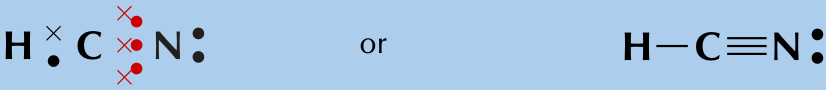
> **[Diagram Context - Textbook_PhysicalSciences_Gr11_Atomic-combinations.pdf-0011-13.png]**
> The graphic displays a Lewis diagram and a structural formula for hydrogen cyanide. Visible elements include chemical symbols (H, C, N), dots and crosses representing shared and lone electron pairs, and connecting lines indicating single and triple covalent bonds. This visual demonstrates how covalent bonding allows atoms to achieve stable noble gas configurations, linking electron sharing representations with standard structural formulas in chemical bonding.


As we have just seen carbon shares one electron with hydrogen and three with nitrogen. Nitrogen keeps its electron pair and shares its three unpaired electrons with carbon. 

##### **Exercise 3 – 4:** 

Represent the following molecules using Lewis diagrams: 

1. acetylene ($	ext{C}_2	ext{H}_2$) 2. formaldehyde ($	ext{CH}_2O$) 

##### **Case 4: Co-ordinate or dative covalent bonds** 

**DEFINITION:** _Dative covalent bond_ 

This type of bond is a description of covalent bonding that occurs between two atoms in which both electrons shared in the bond come from the same atom. 

A dative covalent bond is also known as a coordinate covalent bond. Earlier we said that atoms with a pair of electrons will normally not share that pair to form a bond. But now we will see how an electron pair can be used by atoms to form a covalent bond. 

One example of a molecule that contains a dative covalent bond is the ammonium ion (NH 4<sup>)showninthefigurebelow.ThehydrogenionH+doesnotcontainany</sup> electrons, and therefore the electrons that are in the bond that forms between this ion and the nitrogen atom, come only from the nitrogen. 


> **[Diagram Context - Textbook_PhysicalSciences_Gr11_Atomic-combinations.pdf-0012-09.png]**
> This graphic displays Lewis dot and cross diagrams illustrating the formation of a dative covalent (coordinate covalent) bond. The visible chemical symbols and labels include nitrogen ($\text{N}$), hydrogen ($\text{H}$), dots and crosses representing valence electrons, square brackets, and a positive charge superscript ($+$) indicating a polyatomic ion. Conceptually, it demonstrates how a neutral ammonia molecule donates its lone pair of electrons to bond with a hydrogen ion ($\text{H}^+$), forming the positively charged ammonium ion ($\text{NH}_4^+$) as prescribed by the CAPS Physical Sciences curriculum.


Notice that the hydrogen ion is charged and that this charge is shown on the ammonium ion using square brackets and a plus sign outside the square brackets. 

We can also show this as: 


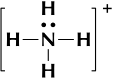
> **[Diagram Context - Textbook_PhysicalSciences_Gr11_Atomic-combinations.pdf-0012-12.png]**
> This graphic displays a Lewis structure for a polyatomic ion enclosed in square brackets with a positive charge superscript. Visible labels and symbols include the central nitrogen atom (N), four surrounding hydrogen atoms (H), shared electron-pair bonds represented by lines, an unshared pair of electrons represented by dots between the top hydrogen and nitrogen, and a positive charge (+) outside the brackets. Conceptually, this diagram illustrates how a dative covalent (coordinate covalent) bond forms between an ammonia molecule and a hydrogen ion to produce the ammonium cation, helping learners visualize molecular bonding and the formation of complex ions in chemical reactions.


Note that we do not use a line for the dative covalent bond. 

Another example of this is the hydronium ion (H3O ). 

To summarise what we have learnt: 

- Any electron on its own will try to pair up with another electron. So in theory atoms that have at least one unpaired electron can form bonds with any other atom that also has an unpaired electron. This is not restricted to just two atoms. 

- If an atom has an electron pair it will normally not share that pair to form a bond. This electron pair is known as a lone pair. 

- If an atom has more than one unpaired electron it can form multiple bonds to another atom. In this way double and triple bonds are formed. 

- A dative covalent bond can be formed between an atom with no electrons and an atom with a lone pair. 

##### **Exercise 3 – 5: Atomic bonding and Lewis diagrams** 

1. Represent each of the following _atoms_ using Lewis diagrams: 

a) calcium c) phosphorous e) silicon b) lithium d) potassium f) sulfur 

2. Represent each of the following _molecules_ using Lewis diagrams: 

a) bromine ($	ext{Br}_2$) d) hydronium ion (H3O ) b) carbon dioxide ($	ext{CO}_2$) c) nitrogen ($	ext{N}_2$) e) sulfur dioxide ($	ext{SO}_2$) 

3. Two chemical reactions are described below. 

   - nitrogen and hydrogen react to form $	ext{NH}_3$ 

   - carbon and hydrogen bond to form $	ext{CH}_4$ 

For each reaction, give: 

   - a) the number of valence electrons for each of the atoms involved in the reaction 

   - b) the Lewis diagram of the product that is formed 

   - c) the name of the product 

4. A chemical compound has the following Lewis diagram: 

a) How many valence electrons does element Y have? 

b) How many valence electrons does element X have? 

- c) How many covalent bonds are in the molecule? 

- d) Suggest a name for the elements X and Y. 

##### 5. Complete the following table: 


> **[Diagram Context - Textbook_PhysicalSciences_Gr11_Atomic-combinations.pdf-0014-01.png]**
> This graphic is a chemistry table structured to help learners analyze covalent chemical bonding. The table lists chemical formulas across the columns ($CO_2$, $CF_4$, $HI$, $C_2H_2$) and properties along the rows (Lewis diagram, Total number of bonding pairs, Total number of non-bonding pairs, and Single, double or triple bonds). Conceptually, it guides Grade 10-12 Physical Sciences students to systematically determine valence electron distributions, covalent bond multiplicities, and electron pair geometries for various molecules.


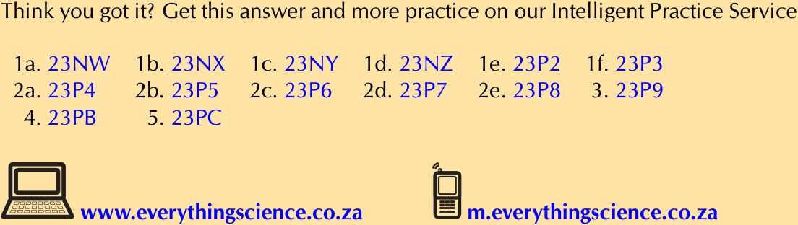
> **[Diagram Context - Textbook_PhysicalSciences_Gr11_Atomic-combinations.pdf-0014-02.png]**
> The image is an instructional resource banner featuring a list of alphanumeric reference codes (such as 23NW, 23NX, 23P2, and 23PB) arranged under numbered items alongside icons of a laptop and a mobile phone. Visible labels include website URLs ("www.everythingscience.co.za" and "m.everythingscience.co.za") and the promotional text "Think you got it? Get this answer and more practice on our Intelligent Practice Service." Conceptually, this graphic serves as a navigational call-to-action for South African high school learners, directing them to digital platforms where they can access online exercises, answers, and additional CAPS-aligned curriculum practice material.


## 3.2 Molecular shape ESBM9 

Molecular shape (the shape that a single molecule has) is important in determining how the molecule interacts and reacts with other molecules. Molecular shape also influences the boiling point and melting point of molecules. If all molecules were linear then life as we know it would not exist. Many of the properties of molecules come from the particular shape that a molecule has. For example if the water molecule was linear, it would be non-polar and so would not have all the special properties it has. 

Valence shell electron pair repulsion (VSEPR) theory ESBMB 

The shape of a covalent molecule can be predicted using the Valence Shell Electron Pair Repulsion (VSEPR) theory. Very simply, VSEPR theory says that the valence electron pairs in a molecule will arrange themselves around the central atom(s) of the molecule so that the repulsion between their negative charges is as small as possible. 

In other words, the valence electron pairs arrange themselves so that they are as **far apart** as they can be. 

##### **DEFINITION:** _Valence Shell Electron Pair Repulsion Theory_ 

Valence shell electron pair repulsion (VSEPR) theory is a model in chemistry, which is used to predict the shape of individual molecules. VSEPR is based upon minimising the extent of the electron-pair repulsion around the central atom being considered. 

VSEPR theory is based on the idea that the geometry (shape) of a molecule is mostly determined by repulsion among the pairs of electrons around a central atom. The pairs of electrons may be bonding or non-bonding (also called lone pairs). Only valence electrons of the central atom influence the molecular shape in a meaningful way. 

Determining molecular shape 

##### **TIP** 

To predict the shape of a covalent molecule, follow these steps: 

1. Draw the molecule using a Lewis diagram. Make sure that you draw _all_ the valence electrons around the molecule’s central atom. 

The central atom is the atom around which the other atoms are arranged. So in a molecule of water, the central atom is oxygen. In a molecule of ammonia, the central atom is nitrogen. 

2. Count the number of electron pairs around the central atom. 

3. Determine the basic geometry of the molecule using the table below. For example, a molecule with two electron pairs (and no lone pairs) around the central atom has a _linear_ shape, and one with four electron pairs (and no lone pairs) around the central atom would have a _tetrahedral_ shape. 

The table below gives the common molecular shapes. In this table we use **A** to represent the central atom, **X** to represent the terminal atoms (i.e. the atoms around the central atom) and **E** to represent any lone pairs. 

|**Number of bonding**<br>**electronpairs**|**Number**<br>**of**<br>**lonepairs**|**Geometry**|**General formula**|
|---|---|---|---|
|1 or 2|0|linear|AX or AX2|
|2|2|_bent or angular_|AX2E2|
|3|0|trigonalplanar|AX3|
|3|1|_trigonalpyramidal_|AX3E|
|4|0|tetrahedral|AX4|
|5|0|trigonal bipyramidal|AX5|
|6|0|octahedral|AX6|

Table 3.1: The effect of electron pairs in determining the shape of molecules. Note that in the general example A is the central atom and X represents the terminal atoms. 


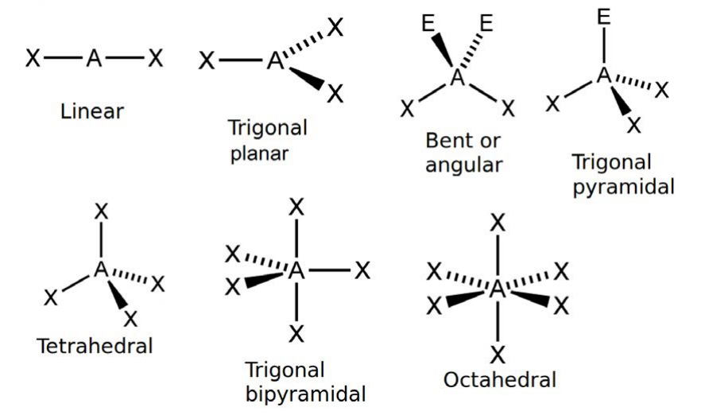
> **[Diagram Context - Textbook_PhysicalSciences_Gr11_Atomic-combinations.pdf-0015-11.png]**
> This educational graphic illustrates chemical structure and molecular geometry models using VSEPR theory notation. The diagrams feature central atoms labeled 'A', surrounding terminal atoms or bonding pairs labeled 'X', lone pairs labeled 'E', and solid lines, dashed wedges, and hashed wedges indicating three-dimensional spatial arrangements with labels for Linear, Trigonal planar, Bent or angular, Trigonal pyramidal, Tetrahedral, Trigonal bipyramidal, and Octahedral shapes. For a Grade 11 Physical Sciences learner studying chemical bonding, this graphic visually conveys how valence shell electron pair repulsion determines the three-dimensional shape and bond angles of different molecules based on the number of bonding and lone pairs around a central atom.


Figure 3.7: The common molecular shapes. 


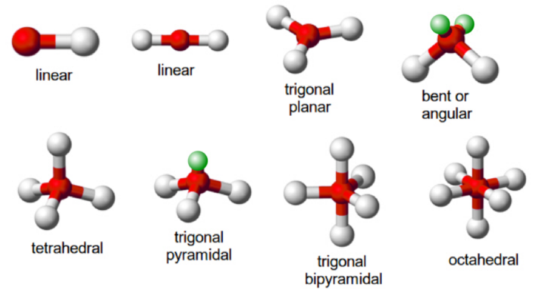
> **[Diagram Context - Textbook_PhysicalSciences_Gr11_Atomic-combinations.pdf-0016-00.png]**
> This educational graphic displays ball-and-stick molecular geometry models with corresponding text labels: linear, linear, trigonal planar, bent or angular, tetrahedral, trigonal pyramidal, trigonal bipyramidal, and octahedral. The 3D models utilize spheres of different colors and sizes connected by bonds to represent central and terminal atoms arranged in specific spatial orientations. Conceptually, this diagram helps Grade 11 and 12 Physical Sciences learners visualize Valence Shell Electron Pair Repulsion (VSEPR) theory, connecting electron pair arrangements and lone pairs to the distinct three-dimensional shapes of molecules.


Figure 3.8: The common molecular shapes in 3-D. 

In Figure 3.8 the green balls represent the lone pairs (E), the white balls (X) are the terminal atoms and the red balls (A) are the center atoms. 

Of these shapes, the ones with no lone pairs are called the **ideal shapes** . The five ideal shapes are: linear, trigonal planar, tetrahedral, trigonal bypramidal and octahedral. 

One important point to note about molecular shape is that all diatomic (compounds with two atoms) compounds are **linear** . So $	ext{H}_2$, HCl and $	ext{Cl}_2$ are all linear. 

##### **Worked example 6: Molecular shape** 

**_QUESTION_** 

Determine the shape of a molecule of $	ext{BeCl}_2$ 

**_SOLUTION_** 

**Step 1: Draw the molecule using a Lewis diagram** 


The central atom is beryllium. 

##### **Step 2: Count the number of electron pairs around the central atom** 

There are two electron pairs. 

##### **Step 3: Determine the basic geometry of the molecule** 

There are two electron pairs and no lone pairs around the central atom. $	ext{BeCl}_2$ has the general formula: AX2. Using this information and Table 3.1 we find that the molecular shape is linear. 

##### **Step 4: Write the final answer** 

The molecular shape of $	ext{BeCl}_2$ is linear. 

##### **Worked example 7: Molecular shape** 

##### **_QUESTION_** 

Determine the shape of a molecule of $	ext{BF}_3$ 

##### **_SOLUTION_** 

##### **Step 1: Draw the molecule using a Lewis diagram** 


> **[Diagram Context - Textbook_PhysicalSciences_Gr11_Atomic-combinations.pdf-0017-07.png]**
> This graphic displays a Lewis structure (electron dot diagram) depicting a boron trifluoride ($\text{BF}_3$) molecule. It features the chemical symbols "B" and "F" surrounded by dots and crosses representing valence electrons shared in covalent bonds and existing as lone pairs. Conceptually, this diagram illustrates chemical bonding and molecular structure, specifically highlighting boron's exception to the octet rule as it forms three covalent bonds resulting in only six valence electrons around the central atom.


The central atom is boron. 

##### **Step 2: Count the number of electron pairs around the central atom** 

There are three electron pairs. 

##### **Step 3: Determine the basic geometry of the molecule** 

There are three electron pairs and no lone pairs around the central atom. The molecule has the general formula AX3. Using this information and Table 3.1 we find that the molecular shape is trigonal planar. 

##### **Step 4: Write the final answer** 

The molecular shape of $	ext{BF}_3$ is trigonal planar. 

##### **Worked example 8: Molecular shape** 

##### **_QUESTION_** 

Determine the shape of a molecule of $	ext{NH}_3$ 

##### **_SOLUTION_** 

##### **Step 1: Draw the molecule using a Lewis diagram** 

##### **TIP** 

We can also work out the shape of a molecule with double or triple bonds. To do this, we count the double or triple bond as one pair of electrons. 

The central atom is nitrogen. 

##### **Step 2: Count the number of electron pairs around the central atom** 

There are four electron pairs. 

##### **Step 3: Determine the basic geometry of the molecule** 

There are three bonding electron pairs and one lone pair. The molecule has the general formula AX3E. Using this information and Table 3.1 we find that the molecular shape is trigonal pyramidal. 

##### **Step 4: Write the final answer** 

The molecular shape of $	ext{NH}_3$ is trigonal pyramidal. 

**Group discussion: Building molecular models** 

In groups, you are going to build a number of molecules using jellytots to represent the atoms in the molecule, and toothpicks to represent the bonds between the atoms. In other words, the toothpicks will hold the atoms (jellytots) in the molecule together. Try to use different coloured jellytots to represent different elements. 

You will need jellytots, toothpicks, labels or pieces of paper. 

On each piece of paper, write the words: “lone pair”. 

You will build models of the following molecules: 

HCl, $	ext{CH}_4$, $	ext{H}_2O$, $	ext{BF}_3$, $	ext{PCl}_5$, $	ext{SF}_6$ and $	ext{NH}_3$. 

For each molecule, you need to: 

- Determine the molecular geometry of the molecule 

- Build your model so that the atoms are as far apart from each other as possible (remember that the electrons around the central atom will try to avoid the repulsions between them). 

- Decide whether this shape is accurate for that molecule or whether there are any lone pairs that may influence it. If there are lone pairs then add a toothpick to the central jellytot. Stick a label (i.e. the piece of paper with “lone pair” on it) onto this toothpick. 

##### **TIP** 

- Adjust the position of the atoms so that the bonding pairs are further away from the lone pairs. 

- How has the shape of the molecule changed? 

Depending on which source you use for electronegativities you may see slightly different values. 

- Draw a simple diagram to show the shape of the molecule. It doesn’t matter if it is not 100% accurate. This exercise is only to help you to visualise the 3-dimensional shapes of molecules. (See Figure 3.8 to help you). 

Do the models help you to have a clearer picture of what the molecules look like? Try to build some more models for other molecules you can think of. 

##### **Exercise 3 – 6: Molecular shape** 

Determine the shape of the following molecules. 


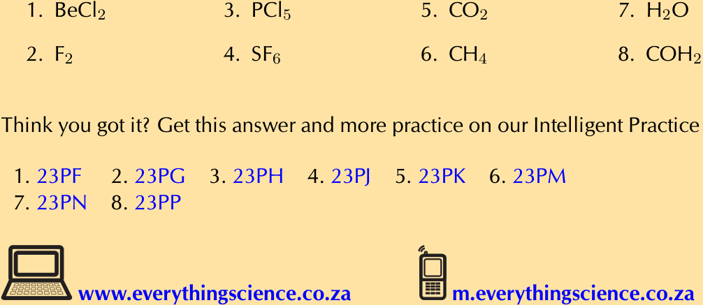
> **[Diagram Context - Textbook_PhysicalSciences_Gr11_Atomic-combinations.pdf-0019-08.png]**
> This educational graphic lists a series of eight chemical formulas: BeCl₂, F₂, PCl₅, SF₆, CO₂, CH₄, H₂O, and COH₂, numbered one through eight. Below the formulas, corresponding alphanumeric practice codes (23PF through 23PP) are provided alongside website and mobile links for digital learning resources. Conceptually, this content supports Grade 10-12 Physical Sciences learners in practicing chemical nomenclature, molecular geometry, and Lewis structures by identifying and working with diverse covalent compounds.


## 3.3 Electronegativity ESBMD 

So far we have looked at covalent molecules. But how do we know that they are covalent? The answer comes from electronegativity. Each element (except for the noble gases) has an electronegativity value. 

**Electronegativity** is a measure of how strongly an atom pulls a shared electron pair towards it. The table below shows the electronegativities of the some of the elements. 

For a full list of electronegativities see the periodic table at the front of the book. On this periodic table the electronegativity values are given in the top right corner. Do not confuse these values with the other numbers shown for the elements. Electronegativities will always be between 0 and 4 for any element. If you use a number greater than 4 then you are not using the electronegativity. 

##### **FACT** 

The concept of electronegativity was introduced by _Linus Pauling_ in 1932, and this became very useful in explaining the nature of bonds between atoms in molecules. For this work, Pauling was awarded the Nobel Prize in Chemistry in 1954. He also received the Nobel Peace Prize in 1962 for his campaign against above-ground nuclear testing. 

|**Element**|**Electronegativity**|**Element**|**Electronegativity**|
|---|---|---|---|
|Hydrogen (H)|2,1|Lithium (Li)|1,0|
|Beryllium (Be)|1,5|Boron (B)|2,0|
|Carbon (C)|2,5|Nitrogen (N)|3,0|
|Oxygen (O)|3,5|Fluorine (F)|4,0|
|Sodium (Na)|0,9|Magnesium (Mg)|1,2|
|Aluminium (Al)|1,5|Silicon (Si)|1,8|
|Phosphorous (P)|2,1|Sulfur (S)|2,5|
|Chlorine (Cl)|3,0|Potassium (K)|0,8|
|Calcium (Ca)|1,0|Bromine (Br)|2,8|

Table 3.2: Table of electronegativities for selected elements. 

##### **DEFINITION:** _Electronegativity_ 

Electronegativity is a chemical property which describes the power of an atom to attract electrons towards itself. 

The greater the electronegativity of an atom of an element, the stronger its attractive pull on electrons. For example, in a molecule of hydrogen bromide (HBr), the electronegativity of bromine (2,8) is higher than that of hydrogen (2,1), and so the shared electrons will spend more of their time closer to the bromine atom. Bromine will have a slightly negative charge, and hydrogen will have a slightly positive charge. In a molecule like hydrogen ($	ext{H}_2$) where the electronegativities of the atoms in the molecule are the same, both atoms have a neutral charge. 

##### **Worked example 9: Calculating electronegativity differences** 

##### **_QUESTION_** 

Calculate the electronegativity difference between hydrogen and oxygen. 

##### **_SOLUTION_** 

##### **Step 1: Read the electronegativity of each element off the periodic table.** 

From the periodic table we find that hydrogen has an electronegativity of 2,1 and oxygen has an electronegativity of 3,5. 

##### **Step 2: Calculate the electronegativity difference** 

3,5 _−_ 2,1 = 1,4 

##### **Exercise 3 – 7:** 

1. Calculate the electronegativity difference between: 

   - Be and C; H and C; Li and F; Al and Na; C and O. 

##### **TIP** 

**www.everythingscience.co.za m.everythingscience.co.za** 

### Electronegativity and bonding ESBMF 

Note that metallic bonding is not given here. Metals have low electronegativities and so the valence electrons are not drawn strongly to any one atom. Instead, the valence electrons are loosely shared by all the atoms in the metallic network. 

##### **TIP** 

The symbol _δ_ is read as delta. 

The electronegativity difference between two atoms can be used to determine what type of bonding exists between the atoms. The table below lists the approximate values. Although we have given ranges here bonding is more like a spectrum than a set of boxes. 


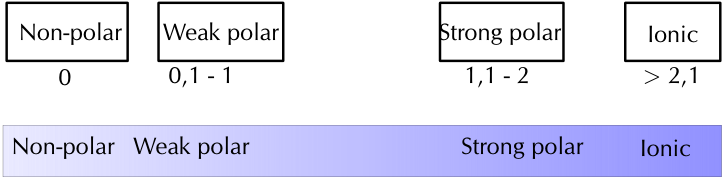
> **[Diagram Context - Textbook_PhysicalSciences_Gr11_Atomic-combinations.pdf-0021-08.png]**
> This educational graphic displays a continuum and categorisation chart mapping electronegativity difference ranges to bond types. It features text boxes labelled "Non-polar", "Weak polar", "Strong polar", and "Ionic" mapped to respective numerical electronegativity difference ranges ("0", "0,1 - 1", "1,1 - 2", and "> 2,1") alongside a corresponding shaded horizontal spectrum bar. For a CAPS Grade 11 Physical Sciences learner studying chemical bonding, this diagram visually conveys how the difference in electronegativity between bonded atoms determines the polarity and electrostatic nature of the chemical bond.


|**Electronegativity difference**|**Type of bond**|
|---|---|
|0|Non-polar covalent|
|0 - 1|Weakpolar covalent|
|1,1 - 2|Strong polar covalent|
|_>_2,1|Ionic|

### Non-polar and polar covalent bonds 

#### ESBMG 

It is important to be able to determine if a molecule is polar or non-polar since the _polarity_ of molecules affects properties such as _solubility_ , _melting points_ and _boiling points_ . 

Electronegativity can be used to explain the difference between two types of covalent bonds. **Non-polar covalent bonds** occur between two identical non-metal atoms, e.g. $	ext{H}_2$, $	ext{Cl}_2$ and $	ext{O}_2$. Because the two atoms have the same electronegativity, the electron pair in the covalent bond is shared equally between them. However, if two different non-metal atoms bond then the shared electron pair will be pulled more strongly by the atom with the higher electronegativity. As a result, a **polar covalent bond** is formed where one atom will have a slightly negative charge and the other a slightly positive charge. 

This slightly positive or slightly negative charge is known as a partial charge. These partial charges are represented using the symbols _δ_ (slightly positive) and _δ_^{_−_} (slightly negative). So, in a molecule such as hydrogen chloride (HCl), hydrogen is H^{_δ_+} and chlorine is Cl^{_δ−_} . 

##### **TIP** 

To determine if a molecule is symmetrical look first at the atoms around the central atom. If they are different then the molecule is not symmetrical. If they are the same then the molecule may be symmetrical and we need to look at the shape of the molecule. 

### Polar molecules 

Some molecules with polar covalent bonds are **polar molecules** , e.g. $	ext{H}_2O$. But not _all_ molecules with polar covalent bonds are polar. An example is $	ext{CO}_2$. Although $	ext{CO}_2$ has two polar covalent bonds (between C^{_δ_+} atom and the two O^{_δ−_} atoms), the molecule itself is not polar. The reason is that $	ext{CO}_2$ is a linear molecule, with both terminal atoms the same, and is therefore symmetrical. So there is no difference in charge between the two ends of the molecule. 

##### **DEFINITION:** _Polar molecules_ 

A **polar molecule** is one that has one end with a slightly positive charge, and one end with a slightly negative charge. Examples include water, ammonia and hydrogen chloride. 

##### **DEFINITION:** _Non-polar molecules_ 

A **non-polar molecule** is one where the charge is equally spread across the molecule or a symmetrical molecule with polar bonds. Examples include carbon dioxide and oxygen. 

We can easily predict which molecules are likely to be polar and which are likely to be non-polar by looking at the molecular shape. The following activity will help you determine this and will help you understand more about symmetry. 

##### **Activity: Polar and non-polar molecules** 

The following table lists the molecular shapes. Build the molecule given for each case using jellytots and toothpicks. Determine if the shape is symmetrical. (Does it look the same whichever way you look at it?) Now decide if the molecule is polar or non-polar. 

|**Geometry**|**Molecule**|**Symmetrical**|**Polar or non-polar**|
|---|---|---|---|
|Linear|HCl|||
|Linear|$	ext{CO}_2$|||
|Linear|HCN|||
|Bent or angular|$	ext{H}_2O$|||
|Trigonalplanar|$	ext{BF}_3$|||
|Trigonalplanar|$	ext{BF}_2Cl$|||
|Trigonalpyramidal|$	ext{NH}_3$|||
|Tetrahedral|$	ext{CH}_4$|||
|Tetrahedral|$	ext{CH}_3Cl$|||
|Trigonal bipyramidal|$	ext{PCl}_5$|||
|Trigonal bipyramidal|$	ext{PCl}_4F$|||
|Octahedral|$	ext{SF}_6$|||
|Octahedral|$	ext{SF}_5Cl$|||

**Worked example 10: Polar and non-polar molecules** 

##### **_QUESTION_** 

State whether hydrogen ($	ext{H}_2$) is polar or non-polar. 

##### **_SOLUTION_** 

##### **Step 1: Determine the shape of the molecule** 

The molecule is linear. There is one bonding pair of electrons and no lone pairs. 

**Step 2: Write down the electronegativities of each atom** Hydrogen: 2,1 

**Step 3: Determine the electronegativity difference for each bond** 

There is only one bond and the difference is 0. 

**Step 4: Determine the polarity of each bond** 

The bond is non-polar. 

**Step 5: Determine the polarity of the molecule** 

The molecule is non-polar. 

##### **Worked example 11: Polar and non-polar molecules** 

##### **_QUESTION_** 

State whether methane ($	ext{CH}_4$) is polar or non-polar. 

##### **_SOLUTION_** 

##### **Step 1: Determine the shape of each molecule** 

The molecule is tetrahedral. There are four bonding pairs of electrons and no lone pairs. 

##### **Step 2: Determine the electronegativity difference for each bond** 

There are four bonds. Since each bond is between carbon and hydrogen, we only need to calculate one electronegativity difference. This is: 2,5 _−_ 2,1 = 0,4 

**Step 3: Determine the polarity of each bond** 

Each bond is polar. 

**Step 4: Determine the polarity of the molecule** 

The molecule is symmetrical and so is non-polar. 

##### **Worked example 12: Polar and non-polar molecules** 

##### **_QUESTION_** 

State whether hydrogen cyanide (HCN) is polar or non-polar. 

##### **_SOLUTION_** 

##### **Step 1: Determine the shape of the molecule** 

The molecule is linear. There are four bonding pairs, three of which form a triple bond and so are counted as 1. There is one lone pair on the nitrogen atom. 

##### **Step 2: Determine the electronegativity difference and polarity for each bond** 

There are two bonds. One between hydrogen and carbon and the other between carbon and nitrogen. The electronegativity difference between carbon and hydrogen is 0,4 and the electronegativity difference between carbon and nitrogen is 0,5. Both of the bonds are polar. 

##### **Step 3: Determine the polarity of the molecule** 

The molecule is not symmetrical and so is polar. 

##### **Exercise 3 – 8: Electronegativity** 

1. In a molecule of beryllium chloride ($	ext{BeCl}_2$): 

   - a) What is the electronegativity of beryllium? 

   - b) What is the electronegativity of chlorine? 

   - c) Which atom will have a slightly positive charge and which will have a slightly negative charge in the molecule? Represent this on a sketch of the molecule using partial charges. 

   - d) Is the bond a non-polar or polar covalent bond? 

   - e) Is the molecule polar or non-polar? 

##### 2. Complete the table below: 


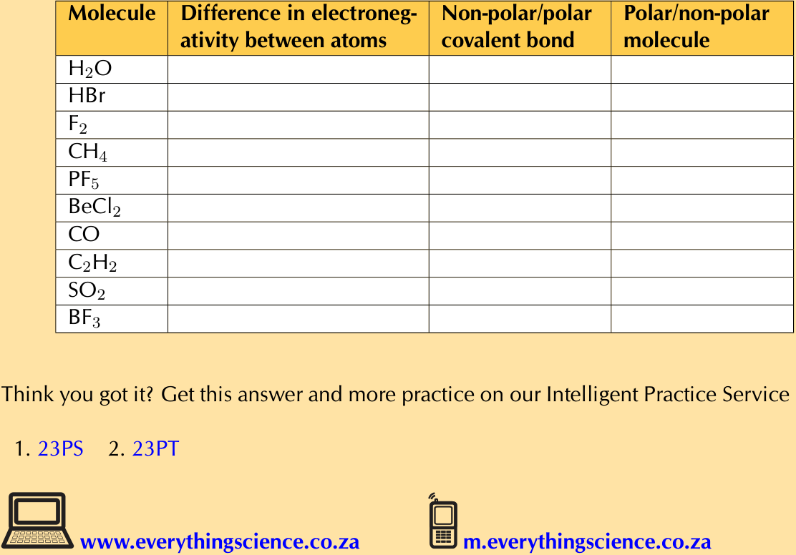
> **[Diagram Context - Textbook_PhysicalSciences_Gr11_Atomic-combinations.pdf-0025-01.png]**
> This educational graphic is a structured chemistry table designed for practicing chemical bonding and molecular polarity. The table features column headers labeled "Molecule", "Difference in electronegativity between atoms", "Non-polar/polar covalent bond", and "Polar/non-polar molecule", with row entries for various chemical formulas including $\text{H}_2\text{O}$, $\text{HBr}$, $\text{F}_2$, $\text{CH}_4$, $\text{PF}_5$, $\text{BeCl}_2$, $\text{CO}$, $\text{C}_2\text{H}_2$, $\text{SO}_2$, and $\text{BF}_3$. Conceptually, it guides Grade 11 Physical Sciences learners to systematically determine electronegativity differences, classify bond types, and integrate molecular geometry to deduce overall molecular polarity.


## 3.4 Energy and bonding ESBMJ 

As we saw earlier in the chapter we can show the energy changes that occur as atoms come together (Figure 3.5). Shown below is the same image but this time with two extra pieces of information: the bond energy and the bond length. 


> **[Diagram Context - Textbook_PhysicalSciences_Gr11_Atomic-combinations.pdf-0025-04.png]**
> This potential energy graph illustrates the relationship between potential energy and the distance between atomic nuclei during covalent bond formation. The visible labels and variables include "Energy" on the vertical axis, "Distance between atomic nuclei" on the horizontal axis, a zero-energy line marked "0", minimum potential energy point "X", "bond length", and "bond energy". Conceptually, it conveys to CAPS Physical Sciences learners how potential energy decreases to a minimum at point X where repulsive and attractive forces balance to form a stable covalent bond, demonstrating the definitions of bond length and bond energy.


Figure 3.9: Graph showing the change in energy that takes place as atoms move closer together. 

##### **DEFINITION:** _Bond length_ 

The distance between the nuclei of two adjacent atoms when they bond. 

##### **DEFINITION:** _Bond energy_ 

The amount of energy that must be added to the system to break the bond that has formed. 

It is important to remember that bond length is measured between two atoms that are bonded to each other. The following diagrams show the bond length for CO and for $	ext{CO}_2$. The grey circle represents carbon and the white circle represents oxygen. 


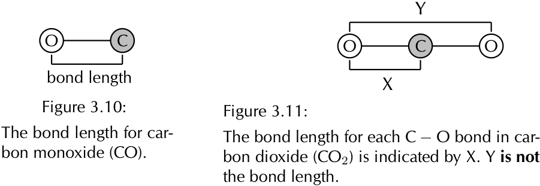
> **[Diagram Context - Textbook_PhysicalSciences_Gr11_Atomic-combinations.pdf-0026-05.png]**
> The educational graphic displays two structural models comparing chemical bond lengths in carbon monoxide (CO) and carbon dioxide (CO₂). Visible labels include chemical symbols ("C", "O"), bracketed measurement indicators ("bond length", "X", "Y"), and figure captions detailing each molecule. This diagram conceptually illustrates how to correctly define bond length as the distance between the nuclei of two bonded atoms (indicated by X) rather than the total distance across a multi-atom molecule (indicated by Y), supporting CAPS Physical Sciences chemical bonding concepts.


A third property of bonds is the bond strength. **Bond strength** means how strongly one atom attracts and is held to another. The strength of a bond is related to the bond length, the size of the bonded atoms and the number of bonds between the atoms. In general: 

- the shorter the bond length, the stronger the bond between the atoms. 

- the smaller the atoms involved, the stronger the bond. 

- the more bonds that exist between the same atoms, the stronger the bond. 

## 3.5 Chapter summary ESBMK 

- A **chemical bond** is the physical process that causes atoms to be attracted together and to be bound in new compounds. 

- The noble gases have a full valence shell. Atoms bond to try fill their outer valence shell. 

- There are three **forces** that act between atoms: attractive forces between the positive nucleus of one atom and the negative electrons of another; repulsive forces between like-charged electrons, and repulsion between like-charged nuclei. 

- The **energy** of a system of two atoms is at a minimum when the attractive and repulsive forces are balanced. 

- **Lewis** diagrams are one way of representing molecular structure. In a Lewis diagram, dots or crosses are used to represent the valence electrons around the central atom. 

- A **covalent bond** is a form of chemical bond where pairs of electrons are shared between two atoms. 

- A **single** bond occurs if there is one electron pair that is shared between the same two atoms. 

- A **double** bond occurs if there are two electron pairs that are shared between the same two atoms. 

- A **triple** bond occurs if there are three electron pairs that are shared between the same two atoms. 

- A **dative covalent bond** is a description of covalent bonding that occurs between two atoms in which both electrons shared in the bond come from the same atom. 

- Dative covalent bonds occur between atoms of elements with a lone pair and atoms of elements with no electrons. Examples include the hydronium ion (H3O ) and the ammonium ion (NH 4^{).} 

- The **shape of molecules** can be predicted using the VSEPR theory. 

- Valence shell electron pair repulsion (VSEPR) theory is a model in chemistry, which is used to predict the shape of individual molecules. VSEPR is based upon minimising the extent of the electron-pair repulsion around the central atom being considered. 

- **Electronegativity** is a chemical property which describes the power of an atom to attract electrons towards itself in a chemical. 

- Electronegativity can be used to explain the difference between two types of covalent bonds: **polar covalent bonds** (between non-identical atoms) and **nonpolar covalent bonds** (between identical atoms or atoms with the same electronegativity). 

- A **polar** molecule is one that has one end with a slightly positive charge, and one end with a slightly negative charge. Examples include water, ammonia and hydrogen chloride. 

- A **non-polar** molecule is one where the charge is equally spread across the molecule or a symmetrical molecule with polar bonds. 

- **Bond length** is the distance between the nuclei of two atoms when they bond. 

- **Bond energy** is the amount of energy that must be added to the system to break the bond that has formed. 

- **Bond strength** means how strongly one atom attracts and is held to another atom. Bond strength depends on the length of the bond, the size of the atoms and the number of bonds between the two atoms. 

##### **Exercise 3 – 9:** 

1. Give **one word/term** for each of the following descriptions. 

   - a) The distance between two adjacent atoms in a molecule. 

   - b) A type of chemical bond that involves the sharing of electrons between two atoms. 

   - c) A measure of an atom’s ability to attract electrons to itself in a chemical bond. 

2. Which ONE of the following best describes the bond formed between an H ion and the $	ext{NH}_3$ molecule? 

   - a) Covalent bond 

   - b) Dative covalent (co-ordinate covalent) bond 

   - c) Ionic Bond 

   - d) Hydrogen Bond 

3. Explain the meaning of each of the following terms: 

   - a) valence electrons 

   - b) bond energy 

   - c) covalent bond 

4. Which of the following reactions will _not_ take place? Explain your answer. a) H + H _→_ $	ext{H}_2$ 

   - b) Ne + Ne _→_ Ne2 c) Cl + Cl _→_ $	ext{Cl}_2$ 

5. Draw the Lewis diagrams for each of the following: 

   - a) An atom of strontium (Sr). (Hint: Which group is it in? It will have an identical Lewis diagram to other elements in that group). 

   - b) An atom of iodine. 

   - c) A molecule of hydrogen bromide (HBr). 

   - d) A molecule of nitrogen dioxide ($	ext{NO}_2$). (Hint: There will be a single unpaired electron). 

6. Given the following Lewis diagram, where X and Y each represent a different element: 

   - a) How many valence electrons does X have? b) How many valence electrons does Y have? 

   - c) Which elements could X and Y represent? 

7. Determine the shape of the following molecules: 

a) $	ext{O}_2$ c) $	ext{BCl}_3$ e) $	ext{CCl}_4$ g) $	ext{Br}_2$ b) $	ext{MgI}_2$ d) $	ext{CS}_2$ f) $	ext{CH}_3Cl$ h) $	ext{SCl}_5F$ 

8. Complete the following table: 

|**Element pair**|**Electronegativity**<br>**difference**|**Type of bond that could**<br>**form**|
|---|---|---|
|Hydrogen and lithium|||
|Hydrogen and boron|||
|Hydrogen and oxygen|||
|Hydrogen and sulfur|||
|Magnesium and nitrogen|||
|Magnesium and chlorine|||
|Boron and fluorine|||
|Sodium and fluorine|||
|Oxygen and nitrogen|||
|Oxygen and carbon|||

9. Are the following molecules polar or non-polar? 


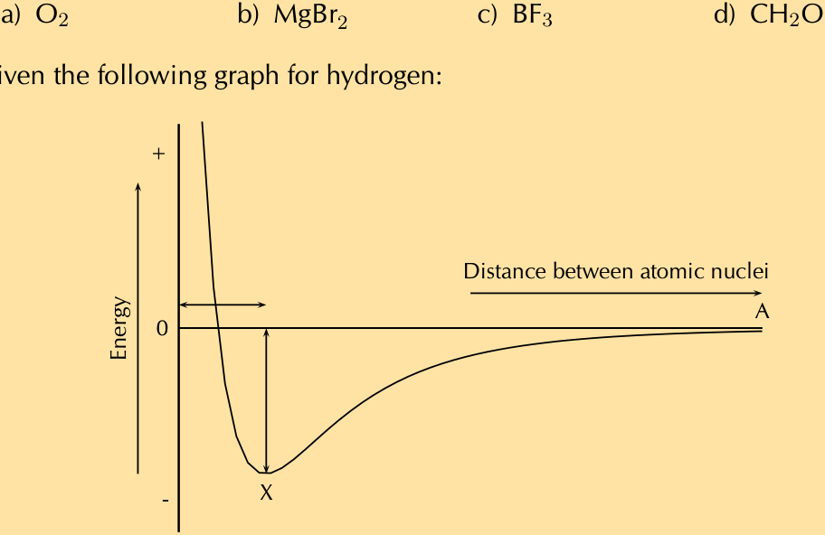
> **[Diagram Context - Textbook_PhysicalSciences_Gr11_Atomic-combinations.pdf-0029-02.png]**
> This educational graphic displays a potential energy graph showing the relationship between potential energy and the distance between atomic nuclei during covalent bond formation. Visible labels and symbols include "Energy" on the vertical axis, "Distance between atomic nuclei" on the horizontal axis, point "X" at the potential energy minimum, point "A", directional arrows, and chemical formulas $\text{O}_2$, $\text{MgBr}_2$, $\text{BF}_3$, and $\text{CH}_2\text{O}$ at the top. For a high school Physical Sciences student, the diagram visually conveys how a chemical bond forms when attractive and repulsive forces balance at minimum potential energy, defining bond length and bond energy.


10. Given the following graph for hydrogen: 

   - a) The bond length for hydrogen is $74\text{ pm}$. Indicate this value on the graph. (Remember that pm is a picometer and means 74 _×_ 10^{_−_12} m). The bond energy for hydrogen is 436 kJ _·_ mol^{_−_1} . Indicate this value on the graph. 

   - b) What is important about point X? 

11. Hydrogen chloride has a bond length of $127\text{ pm}$ and a bond energy of 432 kJ _·_ mol^{_−_1} . Draw a graph of energy versus distance and indicate these values on your graph. The graph does not have to be accurate, a rough sketch graph will do. 

|---|---|---|---|---|---|
|9c.23QR|9d.23QS|10.23QT|11.23QV|||

**www.everythingscience.co.za m.everythingscience.co.za** 

# **CHAPTER 3** 

# _Atomic combinations_ 

|**3.1**|**_Chemical bonds_**|147|
|---|---|---|
|**3.2**|**_Molecular shape_**|153|
|**3.3**|**_Electronegativity_**|155|
|**3.5**|**_Chapter summary_**|157|

3 Atomic combinations 

In this chapter learners will explore the concept of a covalent bond in greater detail. In grade ten learners learnt about the three types of chemical bond (ionic, covalent and metallic). A great video to introduce this topic is: Veritasium chemical bonding song. In this chapter the focus is on the covalent bond. A short breakdown of the topics in this chapter follows. 

##### _•_ **Electron structure and Lewis diagrams (from grade 10)** 

As revision you can ask learners to draw Lewis diagrams for the first 20 elements and give the electronic structure (this was covered in grade 10). This then leads into thinking how the elements can share electrons in a bond. Learners should recognise that there are unpaired electrons in atoms that can be shared to form the bonds. 

It is important to note that when drawing Lewis diagrams, we first place single electrons around the central atom and only once four electrons have been placed, do we pair electrons up. This will avoid the need to explain hybridisation. It is also important for learners to realise that the placement of electrons is arbitrary and the electrons can be placed anywhere around the atom. 

- **Why hydrogen is a diatomic molecule but helium is a monatomic molecule** 

This part of the chapter is interleaved with electron structure and Lewis diagrams as these two concepts play a key role in understanding why hydrogen is diatomic and helium is monatomic. In this part learners are introduced to the idea that when two atoms come close together there is a change in the potential energy. This forms a strong foundation for explaining the energy changes that occur in chemical reactions and will be seen again in chapter 12 (energy changes in chemical reactions). 

- **Deducing simple rules about bond formation (and drawing Lewis diagrams for these molecules)** 

Four cases are looked at to try to understand why bonds form. This is all about the covalent bond, so all the examples you use must be of covalent molecules (and you must also only pick examples of covalent molecular structures as covalent network structures are more like ionic networks and do not form simple molecular units). It is also important to help learners realise that a lone pair of electrons is very much dependant on the molecule that they are looking at. Lone pairs of electrons can be used under special circumstances to form dative (or coordinate) covalent bonds. 

- **The basic principles of VSEPR and predicting molecular shape** 

You can build the different molecular shapes before starting to teach VSEPR from large polystyrene balls and kebab sticks or you can give your learners jellytots or marshmallows and toothpicks and get them to build the molecular shapes. Remember that the shapes with lone pairs need more space for the lone pairs and so it is not as simple as just removing the toothpick for the lone pair. 

This topic covers the shapes that molecules have. This is only the shapes of covalent molecular compounds, covalent network structures, ionic compounds and metals have very different three dimensional forms. This topic is important to help learners determine polarity of molecules. Two approaches are used to determine the shape of a molecule. The first one looks at molecules matching 

up to a general formula while the second one considers how many electron pairs are around a central atom. These two approaches can be used together to help learners fully understand this topic. 

##### _•_ **Electronegativity and polarity of bonds** 

It is important to note that CAPs does not give a definitive source for electronegativity values. You should use the ones found on the periodic table in the matric exams (these are the same values as the ones on the periodic table at the front of this book). Learners should be aware that they may see different values on other periodic tables. Learners must not think of the different types of bonding as being exactly defined. Also, the values for where the types of bonding transition are not exact and different sources quote different cut-off points. 

The simplest examples of polarity are the ideal shapes with all the end atoms the same and so you should stick to this in your explanation. You can explain this for trigonal planar molecules by using your learners. Get three girls or three boys to link hands (they all put their right hand into the centre and hold the other two learners right hands). Then they try to pull away (all learners pull equally). This is the even sharing of electrons. Now replace a girl with a boy (or vice versa) and tell the new learner to pull a bit less. This shows the uneven sharing of electrons. 

##### _•_ **Bond length and bond energy** 

In this final part of the chapter we return to our energy diagram and add two pieces of information: bond energy and bond length. The bond length is the distance between the two atoms when they are at their minimum energy, while the bond energy is this minimum energy. The bond energy comes up again in chapter 12 (energy and chemical change) when the topic of exothermic and endothermic reactions is covered. 

Coloured text has been used as a tool to highlight different parts of Lewis diagrams. Ensure that learners understand that the coloured text does not mean there is anything special about that part of the diagram, this is simply a teaching tool to help them identify the important aspects of the diagram, in particular the unpaired electrons. 

## 3.1 Chemical bonds 

### Valence electrons and Lewis diagrams 

##### **Exercise 3 – 1: Lewis diagrams** 

Give the spectroscopic notation and draw the Lewis diagram for: 

1. magnesium 

**Solution:** 

[Ne]$$3s^{2}$$ 

**Mg** 


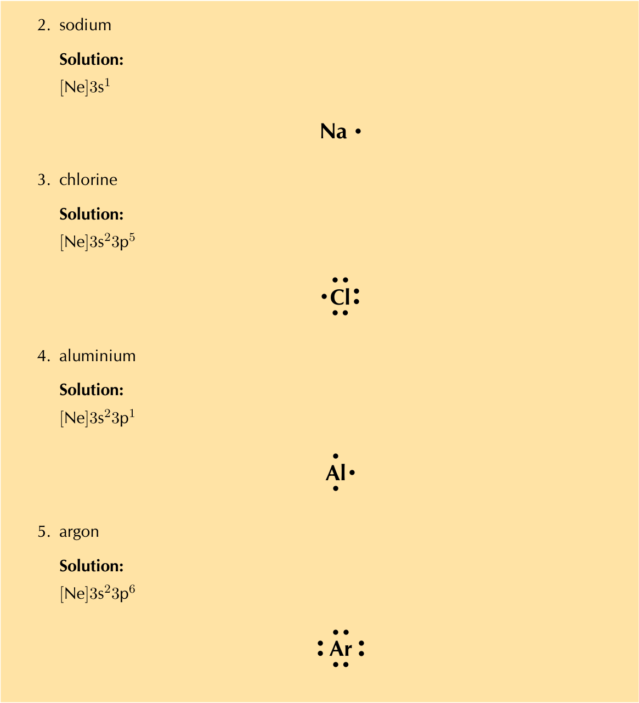
> **[Diagram Context - Textbook_PhysicalSciences_Gr11_Atomic-combinations.pdf-0033-00.png]**
> This educational graphic presents Lewis dot diagrams and electron configurations for selected elements: sodium (Na), chlorine (Cl), aluminium (Al), and argon (Ar). Visible labels include element names, "Solution", electron configurations using noble gas core notation ([Ne]3s¹, [Ne]3s²3p⁵, [Ne]3s²3p¹, [Ne]3s²3p⁶), chemical symbols (Na, Cl, Al, Ar), and valence electrons represented as surrounding dots. For high school Physical Sciences learners, this diagram conveys the relationship between valence electron configurations and Lewis structures, helping them visualize how many valence electrons each atom possesses to determine bonding capacity.


### Covalent bonds and bond formation 

**Case 1: Two atoms that each have an unpaired electron** 


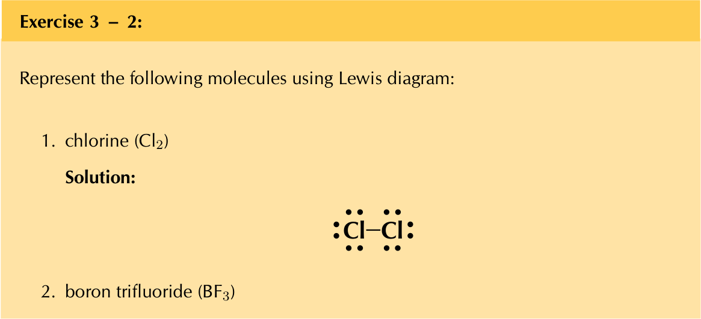
> **[Diagram Context - Textbook_PhysicalSciences_Gr11_Atomic-combinations.pdf-0033-03.png]**
> This educational graphic presents a chemical exercise containing text and a Lewis structure solution for a chlorine molecule. Visible labels and symbols include the text "Exercise 3 - 2", "chlorine ($\text{Cl}_2$)", "Solution", chemical symbols ($\text{Cl}$), a bonding line representing a shared electron pair, and dots representing lone pairs of electrons. Conceptually, this diagram helps high school learners visualize covalent bonding by showing how two chlorine atoms share a pair of electrons and retain lone pairs to achieve a stable octet structure.


> **[Diagram Context - Textbook_PhysicalSciences_Gr11_Atomic-combinations.pdf-0034-00.png]**
> The graphic presents a Lewis dot and dash diagram of a boron trifluoride molecule with the heading "Solution:". Visible labels include the chemical symbols "B" for the central boron atom and "F" for the three surrounding fluorine atoms, connected by single bonds and surrounded by dots representing valence electrons. Conceptually, this helps Grade 11 Physical Sciences learners understand covalent bonding and molecular structure, specifically illustrating an exception to the octet rule where the central boron atom accommodates only six valence electrons.


**Case 2: Atoms with lone pairs** 


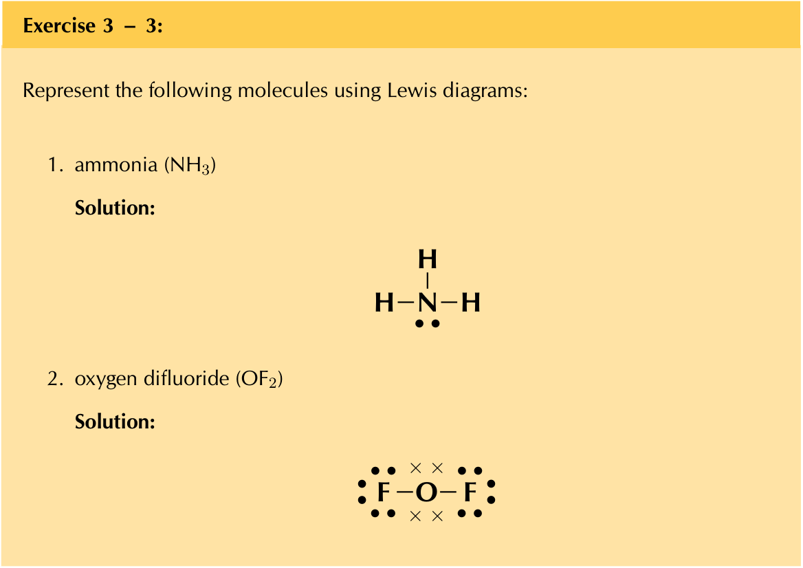
> **[Diagram Context - Textbook_PhysicalSciences_Gr11_Atomic-combinations.pdf-0034-02.png]**
> This educational graphic presents a chemistry exercise titled "Exercise 3 - 3" featuring Lewis diagrams for covalent molecules. It displays the chemical names and formulas for "1. ammonia (NH3)" and "2. oxygen difluoride (OF2)" alongside their corresponding solutions, using element symbols (H, N, F, O), solid lines for bonding electron pairs, and dots or crosses for lone pairs of electrons. Conceptually, this diagram helps high school learners visualize valence electrons, covalent bonding, and molecular structure according to the octet rule in chemical bonding.


**Case 3: Atoms with multiple bonds** 


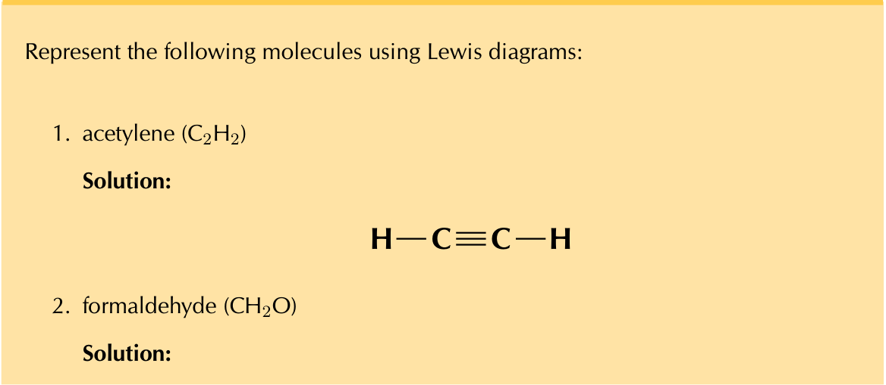
> **[Diagram Context - Textbook_PhysicalSciences_Gr11_Atomic-combinations.pdf-0034-05.png]**
> This educational graphic presents a chemistry exercise asking students to represent molecules using Lewis diagrams, showing the solution for acetylene with chemical symbols C and H linked by single and triple covalent bonds. Visible text includes the prompt instructions, chemical formulas $C_2H_2$ and $CH_2O$, and the structural formula representation $H-C\equiv C-H$. Conceptually, this diagram helps high school learners understand chemical bonding and molecular structure by illustrating how valence electrons are shared to form single and multiple covalent bonds in organic molecules.


> **[Diagram Context - Textbook_PhysicalSciences_Gr11_Atomic-combinations.pdf-0035-00.png]**
> This graphic shows a Lewis structure (structural formula) of a methanal (formaldehyde) molecule. Visible chemical symbols include C, O, and H, connected by a double covalent bond between carbon and oxygen, single covalent bonds between carbon and hydrogen, and two lone pairs of electrons represented as dots around the oxygen atom. Conceptually, this diagram illustrates how atoms share valence electrons to achieve stable octets and duplets, helping learners visualize molecular bonding and functional groups in organic chemistry.


**Case 4: Co-ordinate or dative covalent bonds** 

##### **Exercise 3 – 5: Atomic bonding and Lewis diagrams** 

1. Represent each of the following _atoms_ using Lewis diagrams: 

   - a) calcium b) lithium c) phosphorous d) potassium e) silicon f) sulfur 

##### **Solution:** 


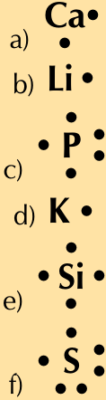
> **[Diagram Context - Textbook_PhysicalSciences_Gr11_Atomic-combinations.pdf-0035-06.png]**
> This graphic displays a collection of Lewis dot diagrams representing the valence electrons of various elements. The image shows chemical symbols labelled a) to f) with surrounding dots representing valence electrons: a) Ca, b) Li, c) P, d) K, e) Si, and f) S. For Grade 10 Physical Sciences learners, this diagram visually conveys how to use the periodic table to represent the valence electrons of an atom, helping them understand bonding capacity and chemical properties.


2. Represent each of the following _molecules_ using Lewis diagrams: 

   - a) bromine ($	ext{Br}_2$) 

   - b) carbon dioxide ($	ext{CO}_2$) 

   - c) nitrogen ($	ext{N}_2$) 

   - d) hydronium ion (H3O ) 

   - e) sulfur dioxide ($	ext{SO}_2$) 

##### **Solution:** 


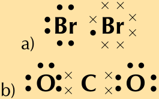
> **[Diagram Context - Textbook_PhysicalSciences_Gr11_Atomic-combinations.pdf-0035-14.png]**
> This educational graphic displays Lewis structures (electron dot diagrams) labelled a) and b). Diagram a) shows two bromine atoms (Br) with dots and crosses representing valence electrons, while diagram b) shows a carbon dioxide molecule with symbols C and O surrounded by shared electron pairs and lone pairs. Conceptually, this helps high-school learners understand chemical bonding, illustrating how non-metal atoms share valence electrons to form covalent bonds and achieve a stable octet.


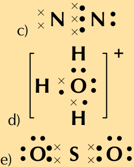
> **[Diagram Context - Textbook_PhysicalSciences_Gr11_Atomic-combinations.pdf-0036-00.png]**
> This graphic shows Lewis dot and cross diagrams for three chemical species: a nitrogen molecule ($N_2$) labeled c, a hydronium ion ($H_3O^+$) enclosed in square brackets with a positive charge labeled d, and a sulfur dioxide molecule ($SO_2$) labeled e. The visible labels consist of chemical symbols (N, H, O, S), dots and crosses representing valence electrons, square brackets, a positive superscript sign, and sub-labels (c, d, e). Conceptually, this helps CAPS Physical Sciences learners visualise covalent bonding, including multiple bonds (triple bond in $N_2$, double bonds in $SO_2$), lone pairs, and dative covalent (coordinate) bonding within a polyatomic ion ($H_3O^+$).


3. Two chemical reactions are described below. 

   - nitrogen and hydrogen react to form $	ext{NH}_3$ 

   - carbon and hydrogen bond to form $	ext{CH}_4$ 

For each reaction, give: 

- a) the number of valence electrons for each of the atoms involved in the reaction 

b) the Lewis diagram of the product that is formed 

c) the name of the product 

##### **Solution:** 

a) Nitrogen: 5, hydrogen: 1 Carbon: 4, hydrogen: 1 

b) $	ext{NH}_3$ 

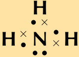


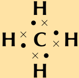

c) $	ext{NH}_3$: ammonia $	ext{CH}_4$: methane 

4. A chemical compound has the following Lewis diagram: 

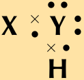

a) How many valence electrons does element Y have? b) How many valence electrons does element X have? 

c) How many covalent bonds are in the molecule? 

d) Suggest a name for the elements X and Y. 

##### **Solution:** 

   - a) 6. There are 6 dots around element Y and from our knowledge of Lewis diagrams we know that these represent the valence electrons. 

   - b) 1. X contributes one electron (represented by a cross) to the bond and X has no other electrons. 

   - c) 2 single bonds. From our knowledge of Lewis diagrams we look at how many cross and dot pairs there are in the molecule and that gives us the number of covalent bonds. 

      - These are single bonds since there is only one dot and cross pair between adjacent atoms. 

   - d) The most likely atoms are: Y: oxygen and X: hydrogen. Note that Y could also be sulfur and X hydrogen and the molecule would then be hydrogen sulfide (sulfur dihydride). 

5. Complete the following table: 

|**Compound**|$	ext{CO}_2$|CF4|HI|$	ext{C}_2	ext{H}_2$|
|---|---|---|---|---|
|**Lewis diagram**|||||
|**Total number of bonding pairs**|||||
|**Total number of non-bonding pairs**|||||
|**Single, double or triple bonds**|||||

##### **Solution:** 

|**Compound**|$	ext{CO}_2$|CF4|
|---|---|---|
|**Lewis diagram**|**O**<br>• •<br>• •<br>• •<br>**C**<br>× ×<br>× ×<br>**O**<br>• •<br>• •<br>• •|**F**<br>• •<br>• •<br>• •<br>**C**<br>× •<br>× •<br>× •<br>× •<br>**F**<br>• •<br>• •<br>• •<br>**F**<br>• •<br>• •<br>• •<br>**F**<br>• •<br>• •<br>• •|
|**Total number of**<br>**bonding pairs**|4|4|
|**Total**<br>**number**<br>**of**<br>**non-bonding**<br>**pairs**|4|12|
|**Single, double or**<br>**triple bonds**|Two<br>double<br>bonds|Four<br>single<br>bonds|
|**Compound**|HI|$	ext{C}_2	ext{H}_2$|
|**Lewis diagram**|**H**<br>**I**<br>• •<br>• •<br>• •<br>× •|**C**<br>**H**<br>**C**<br>**H**|
|**Total number of**<br>**bonding pairs**|1|5|
|**Total**<br>**number**<br>**of**<br>**non-bonding**<br>**pairs**|3|0|
|**Single, double or**<br>**triple bonds**|One single bond|One triple bond<br>and<br>two<br>single<br>bonds|

## 3.2 Molecular shape 

### Determining molecular shape 

##### **Exercise 3 – 6: Molecular shape** 

Determine the shape of the following molecules. 

##### 1. $	ext{BeCl}_2$ 

##### **Solution:** 

The central atom is beryllium (draw the molecules Lewis structure to see this). There are two electron pairs around beryllium and no lone pairs. 

There are two bonding electron pairs and no lone pairs. The molecule has the general formula AX2. Using this information and Table **??** we find that the molecular shape is linear. 


> **[Diagram Context - Textbook_PhysicalSciences_Gr11_Atomic-combinations.pdf-0038-08.png]**
> This graphic is a ball-and-stick molecular model illustrating a linear triatomic molecule (such as $BeCl_2$ or $CO_2$). It features a central magenta-coloured sphere bonded symmetrically by two connecting cylinders to two outer white spheres arranged at a 180-degree bond angle. For CAPS Grade 10 and 11 Physical Sciences learners, this model conveys VSEPR theory concepts by visually demonstrating how valence shell electron pair repulsion results in a linear molecular geometry to minimise electrostatic repulsion between bonding pairs.


##### 2. F2 

##### **Solution:** 

The molecular shape is linear. (This is a diatomic molecule) 


> **[Diagram Context - Textbook_PhysicalSciences_Gr11_Atomic-combinations.pdf-0038-12.png]**
> This graphic displays a ball-and-stick molecular model consisting of two spherical atoms connected by a cylindrical bond, with a larger pink sphere on the left and a smaller white sphere on the right. There are no explicit text labels, symbols, or arrows visible in the image. Conceptually, this diagram helps Grade 10 and 11 Physical Sciences learners visualize diatomic molecules and covalent bonding, illustrating how individual atoms combine spatially to form chemical molecules.


##### 3. $	ext{PCl}_5$ 

##### **Solution:** 

The central atom is phosphorous. 

There are five electron pairs around phosphorous and no lone pairs. 

The molecule has the general formula AX5. Using this information and Table **??** we find that the molecular shape is trigonal pyramidal. 


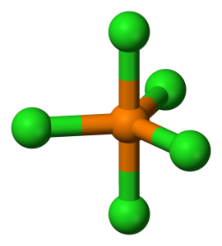
> **[Diagram Context - Textbook_PhysicalSciences_Gr11_Atomic-combinations.pdf-0038-18.png]**
> This graphic is a ball-and-stick molecular structure representing trigonal bipyramidal geometry. It features one central atom bonded to five surrounding atoms via cylindrical connecting bonds, rendered in orange and green spheres without text labels. Conceptually, this helps Grade 11 and 12 Physical Sciences learners visualize Valence Shell Electron Pair Repulsion (VSEPR) theory, illustrating how five regions of electron density around a central atom minimize repulsion to form 90° and 120° bond angles.


4. $	ext{SF}_6$ 

##### **Solution:** 

The central atom is sulfur. 

There are six electron pairs around phosphorous and no lone pairs. 

The molecule has the general formula AX6. Using this information and Table **??** we find that the molecular shape is octahedral. 


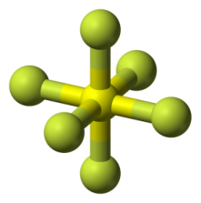
> **[Diagram Context - Textbook_PhysicalSciences_Gr11_Atomic-combinations.pdf-0039-04.png]**
> This graphic is a ball-and-stick molecular structure representing an octahedral molecular geometry. It features one central atom bonded to six peripheral atoms via straight bonds arranged symmetrically in three dimensions. For CAPS Physical Sciences learners, this model conveys VSEPR theory by illustrating how six electron pairs maximize their spatial separation around a central atom to form 90-degree bond angles.


##### 5. $	ext{CO}_2$ 

##### **Solution:** 

The central atom is carbon. (Draw the molecules Lewis diagram to see this.) There are four electron pairs around carbon. These form two double bonds. There are no lone pairs around carbon. 

The molecule has the general formula AX2. Using this information and Table **??** we find that the molecular shape is linear. 


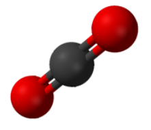
> **[Diagram Context - Textbook_PhysicalSciences_Gr11_Atomic-combinations.pdf-0039-09.png]**
> This educational graphic is a space-filling molecular structure model representing a carbon dioxide ($\text{CO}_2$) molecule. It features a central dark grey sphere representing a carbon atom bonded symmetrically to two outer red spheres representing oxygen atoms via double covalent bonds. Conceptually, this diagram helps learners visualize the linear molecular geometry, bond multiplicity, and atomic arrangement essential for understanding VSEPR theory and molecular polarity in CAPS Physical Sciences.


##### 6. $	ext{CH}_4$ 

##### **Solution:** 

The central atom is carbon. (Draw the molecules Lewis diagram to see this). There are four electron pairs around carbon and no lone pairs. 

The molecule has the general formula AX4. Using this information and Table **??** we find that the molecular shape is tetrahedral. 


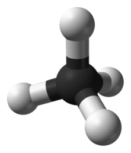
> **[Diagram Context - Textbook_PhysicalSciences_Gr11_Atomic-combinations.pdf-0039-14.png]**
> This graphic is a ball-and-stick molecular structure model depicting a central dark sphere bonded to four smaller white spheres arranged in a symmetrical spatial configuration. It visually represents a tetrahedral molecular geometry, commonly used in Grade 10-12 Physical Sciences to illustrate VSEPR theory and molecular shapes such as methane ($CH_4$). For high school learners, this model conveys the three-dimensional arrangement of atoms and bond angles around a central atom resulting from electron pair repulsion.


##### 7. $	ext{H}_2O$ 

##### **Solution:** 

The central atom is oxygen (you can see this by drawing the molecules Lewis diagram). 

There are two electron pairs around oxygen and two lone pairs. 

The molecule has the general formula AX2E2. Using this information and Table **??** we find that the molecular shape is bent or angular. 


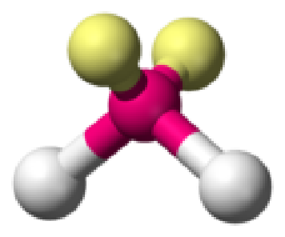
> **[Diagram Context - Textbook_PhysicalSciences_Gr11_Atomic-combinations.pdf-0040-00.png]**
> This 3D ball-and-stick molecular structure illustrates a chemical species featuring a central atom (pink) bonded to four surrounding terminal atoms (two yellow spheres at the top and two white spheres at the bottom). For Grade 11 Physical Sciences learners studying chemical bonding and molecular geometry, it conveys the spatial arrangement and three-dimensional shape predicted by Valence Shell Electron Pair Repulsion (VSEPR) theory.


##### 8. COH2 

##### **Solution:** 

The central atom is carbon. 

There are four electron pairs around carbon, two of which form a double bond to the oxygen atom. There are no lone pairs. 

The molecule has the general formula AX3. Using this information and Table **??** we find that the molecular shape is trigonal planar. 


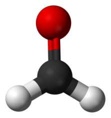
> **[Diagram Context - Textbook_PhysicalSciences_Gr11_Atomic-combinations.pdf-0040-06.png]**
> This graphic is a ball-and-stick molecular model representing formaldehyde (methanal). It features a central black sphere bonded to a red oxygen sphere via a double bond and two white hydrogen spheres via single bonds. For a high school Physical Sciences student, this visual illustrates VSEPR theory and molecular geometry, demonstrating how a trigonal planar shape arises from three regions of electron density around a central atom.


## 3.3 Electronegativity 

##### **Exercise 3 – 7:** 

1. Calculate the electronegativity difference between: Be and C, H and C, Li and F, Al and Na, C and O. 

##### **Solution:** 

- Be and C: 2,5 _−_ 1,5 = 1,0 _._ H and C: 2,5 _−_ 2,1 = 0,4 _._ Li and F: 4,0 _−_ 1,0 = 3,0 _._ Al and Na: 1,5 _−_ 0,9 = 0,6 _._ C and O: 3,5 _−_ 2,5 = 1,0 _._ 

### Polar molecules 

##### **Exercise 3 – 8: Electronegativity** 

1. In a molecule of beryllium chloride ($	ext{BeCl}_2$): 

   - a) What is the electronegativity of beryllium? 

   - b) What is the electronegativity of chlorine? 

   - c) Which atom will have a slightly positive charge and which will have a slightly negative charge in the molecule? Represent this on a sketch of the molecule using partial charges. 

   - d) Is the bond a non-polar or polar covalent bond? 

   - e) Is the molecule polar or non-polar? 

##### **Solution:** 

- a) 2,1 

b) 3,0 

   - c) Hydrogen will have a slightly positive charge and chlorine will have a slightly negative charge. δ^{−} δ δ^{−} Cl B ~~e~~ Cl 

   - d) Polar covalent bond. The electronegativity difference is: 3,0 _−_ 2,1 = 0,9. The bond is weakly polar. 

   - e) Hydrogen chloride is linear and therefore is a polar molecule. 

2. Complete the table below: 

|**Molecule**|**Difference in elec-**<br>**tronegativity**<br>**be-**<br>**tween atoms**|**Non-polar/polar**<br>**valent bond**|**co-**|**Polar/non-polar**<br>**molecule**|
|---|---|---|---|---|
|$	ext{H}_2O$|||||
|HBr|||||
|F2|||||
|$	ext{CH}_4$|||||
|PF5|||||
|$	ext{BeCl}_2$|||||
|CO|||||
|$	ext{C}_2	ext{H}_2$|||||
|$	ext{SO}_2$|||||
|$	ext{BF}_3$|||||

**Solution:** 

|**Molecule**|**Difference in **<br>**tronegativity**<br>**tween atoms**|**elec-**<br>**be-**|**Non-polar/polar**<br>**co-**<br>**valent bond**|**Polar/non-polar**<br>**molecule**|
|---|---|---|---|---|
|$	ext{H}_2O$|3,5_−_2,1 = 1,4||Polar covalent bond|Polar molecule. Wa-<br>ter has a bent or an-<br>gular shape.|
|HBr|2,8_−_2,1 = 0,7||Polar covalent bond|Polar molecule. Hy-<br>drogen<br>bromide<br>is<br>linear.|
|F2|4,0_−_4,0 = 0||Non-polar<br>covalent<br>bond|Non-polar molecule.|
|$	ext{CH}_4$|2,5_−_2,1 = 0,4||Polar covalent bond|Non-polar molecule.<br>Methane is tetrahe-<br>dral.|
|PF5|4,0_−_2,1 = 1,9||Polar covalent bond|Non-polar molecule.<br>Phosphorous<br>pentafluoride<br>is<br>trigonal<br>bypramidal<br>and symmetrical.|
|$	ext{BeCl}_2$|3,0_−_1,5 = 1,5||Polar covalent bond|Non-polar molecule.<br>Beryllium chloride is<br>linear and symmetri-<br>cal.|
|CO|3,5_−_2,5 = 1,0||Polar covalent bond|Polar molecule. Car-<br>bon monoxide is lin-<br>ear, but not symmet-<br>rical.|
|$	ext{C}_2	ext{H}_2$|2,5_−_2,1 = 0,4||Polar covalent bond|Non-polar molecule.<br>Acetylene<br>is<br>linear<br>and symmetrical.|
|$	ext{SO}_2$|3,5_−_2,5 = 1,0||Polar covalent bond|Polar molecule. Sul-<br>fur dioxide is bent<br>or angular and is not<br>symmetrical.|
|$	ext{BF}_3$|4,0_−_2,0 = 2,0||Polar covalent bond|Non-polar molecule.<br>Boron<br>trifluoride<br>is<br>trigonal<br>pyramidal<br>and not symmetrical.|

## 3.5 Chapter summary 

##### **Exercise 3 – 9:** 

1. Give **one word/term** for each of the following descriptions. 

   - a) The distance between two adjacent atoms in a molecule. 

   - b) A type of chemical bond that involves the sharing of electrons between two atoms. 

- c) A measure of an atom’s ability to attract electrons to itself in a chemical bond. 

##### **Solution:** 

   - a) Bond length 

   - b) Covalent bond 

   - c) Electronegativity 

2. Which ONE of the following best describes the bond formed between an H ion and the $	ext{NH}_3$ molecule? 

   - a) Covalent bond 

   - b) Dative covalent (co-ordinate covalent) bond 

   - c) Ionic Bond 

   - d) Hydrogen Bond 

##### **Solution:** 

Dative covalent (co-ordinate covalent) bond 

3. Explain the meaning of each of the following terms: 

   - a) valence electrons 

   - b) bond energy 

   - c) covalent bond 

##### **Solution:** 

   - a) The number of electrons in the outermost shell of an atom that are available for use in bonding either by sharing, donating or accepting. 

   - b) The amount of energy needed for a bond to break. 

   - c) A type of bond that occurs between two atoms with a difference in electronegativity between 0 and 2,1. 

4. Which of the following reactions will _not_ take place? Explain your answer. 

   - a) H + H _→_ $	ext{H}_2$ 

   - b) Ne + Ne _→_ Ne2 

   - c) Cl + Cl _→_ $	ext{Cl}_2$ 

##### **Solution:** 

Ne + Ne _→_ Ne2 will not take place as neon does not have electrons available for bonding. Neon is a noble gas and has a full outer shell of electrons. 

5. Draw the Lewis diagrams for each of the following: 

   - a) An atom of strontium (Sr). (Hint: Which group is it in? It will have an identical Lewis diagram to other elements in that group). 

   - b) An atom of iodine. 

   - c) A molecule of hydrogen bromide (HBr). 

   - d) A molecule of nitrogen dioxide ($	ext{NO}_2$). (Hint: There will be a single unpaired electron). 

##### **Solution:** 


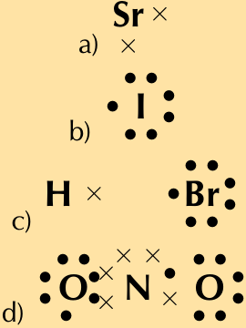
> **[Diagram Context - Textbook_PhysicalSciences_Gr11_Atomic-combinations.pdf-0044-01.png]**
> This graphic displays four Lewis dot diagrams labeled a, b, c, and d, representing different atoms and their valence electrons using chemical symbols (Sr, I, H, Br, N, O) alongside dots and crosses. Visible labels include lowercase letters a through d identifying each sub-diagram. Conceptually, this helps high school learners practice representing valence electrons and chemical bonding structures in accordance with the CAPS Physical Sciences curriculum.


6. Given the following Lewis diagram, where X and Y each represent a different element: 


> **[Diagram Context - Textbook_PhysicalSciences_Gr11_Atomic-combinations.pdf-0044-03.png]**
> This graphic is a Lewis dot (or Lewis structure) diagram illustrating chemical bonding with the central atom labeled "Y" and surrounding atoms labeled "X". The diagram displays valence electrons represented as crosses ($\times$) and dots ($\bullet$) shared between the atoms to form covalent bonds. Conceptually, this helps CAPS Physical Sciences learners visualize how atoms share electron pairs to achieve a stable octet configuration during covalent bonding.


- a) How many valence electrons does X have? 

- b) How many valence electrons does Y have? 

c) Which elements could X and Y represent? 

##### **Solution:** 

- a) 1 

b) 5 

   - c) X could be hydrogen and Y could be nitrogen. 

7. Determine the shape of the following molecules: 

   - a) $	ext{O}_2$ b) $	ext{MgI}_2$ c) $	ext{BCl}_3$ d) $	ext{CS}_2$ 

   - e) $	ext{CCl}_4$ 

   - f) $	ext{CH}_3Cl$ 

   - g) $	ext{Br}_2$ 

   - h) $	ext{SCl}_5F$ 

##### **Solution:** 

- a) This is a diatomic molecule and so the molecular shape is linear. 

- b) The central atom is magnesium (draw the molecules Lewis structure to see this). There are two electron pairs around magnesium and no lone pairs. There are two bonding electron pairs and no lone pairs. The molecule has the general formula AX2. Using this information and Table **??** we find that the molecular shape is linear. 

- c) The central atom is boron (draw the molecules Lewis structure to see this). There are three electron pairs around boron and no lone pairs. There are three bonding electron pairs and no lone pairs. The molecule has the general formula AX3. Using this information and Table **??** we find that the molecular shape is trigonal planar. 

- d) The central atom is carbon (draw the molecules Lewis structure to see this). There are four electron pairs around carbon forming two double bonds. There are no lone pairs. 

The molecule has the general formula AX2. Using this information and Table **??** we find that the molecular shape is linear. 

- e) The central atom is carbon (draw the molecules Lewis structure to see this). There are four bonding electron pairs and no lone pairs. The molecule has the general formula AX4. Using this information and Table **??** we find that the molecular shape is tetrahedral. 

- f) The central atom is carbon (draw the molecules Lewis structure to see this). There are four bonding electron pairs and no lone pairs. The molecule has the general formula AX4. Using this information and Table **??** we find that the molecular shape is tetrahedral. 

- g) This is a diatomic molecule and so the molecular shape is linear. 

- h) The central atom is sulfur 

There are six electron pairs around beryllium and no lone pairs. 

   - The molecule has the general formula AX6. Using this information and Table **??** we find that the molecular shape is octahedral. 

8. Complete the following table. 

|**Element pair**|**Electronegativity**<br>**difference**|**Type of bond that could**<br>**form**|
|---|---|---|
|Hydrogen and lithium|||
|Hydrogen and boron|||
|Hydrogen and oxygen|||
|Hydrogen and sulfur|||
|Magnesium and nitrogen|||
|Magnesium and chlorine|||
|Boron and fluorine|||
|Sodium and fluorine|||
|Oxygen and nitrogen|||
|Oxygen and carbon|||

##### **Solution:** 

|**Element pair**|**Electronegativity**<br>**difference**|**Type of **<br>**form**|**bond t**|**hat could**|
|---|---|---|---|---|
|Hydrogen and lithium|1,22|Strong<br>bond|polar|covalent|
|Hydrogen and boron|0,16|Weak<br>bond|polar|covalent|
|Hydrogen and oxygen|1,24|Strong<br>bond|polar|covalent|
|Hydrogen and sulfur|0,38|Weak<br>bond|polar|covalent|
|Magnesium and nitrogen|1,73|Strong<br>bond|polar|covalent|
|Magnesium and chlorine|1,73|Strong|polar|covalent|

bond 

Boron and fluorine3.5. Chapter summary1,94 Strong polar covalent bond 

9. Are the following molecules polar or non-polar? 

   - a) $	ext{O}_2$ 

   - b) MgBr2 

   - c) $	ext{BF}_3$ 

   - d) $	ext{CH}_2O$ 

##### **Solution:** 

- a) The molecule is linear. There are two bonding pairs forming a double bond and two lone pairs on each oxygen atom. 

   - There is one bond. The electronegativity difference between oxygen and oxygen is 0. The bond is non-polar. 

The molecule is symmetrical and is non-polar. 

- b) The molecule is linear. There are two bonding pairs forming two single bonds and three lone pairs on each bromine atom. There are two bonds, both of which are between magnesium and bromine. The electronegativity difference between magnesium and bromine is 1,6. The bonds are polar. 

The molecule is symmetrical and is non-polar. 

- c) The molecule is trigonal planar. There are three bonding pairs forming three single bonds and three lone pairs on each fluorine atom. There are three bonds, all of which are between boron and fluorine. The electronegativity difference between boron and fluorine is 2,0. The bonds are polar. 

The molecule is symmetrical and is non-polar. 

- d) The molecule is trigonal planar. There are four bonding pairs forming two single bonds and one double bond. There are two lone pairs on the oxygen atom. 

There are three bonds, two of which are between carbon and hydrogen. The electronegativity difference between carbon and hydrogen is 0,4. The other bond is between carbon and oxygen. The electronegativity difference between carbon and oxygen is 1,0. All the bonds are polar. 

The molecule is not symmetrical and is polar. 

##### 10. Given the following graph for hydrogen: 


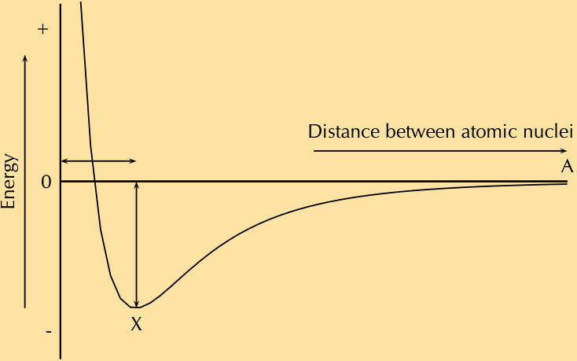
> **[Diagram Context - Textbook_PhysicalSciences_Gr11_Atomic-combinations.pdf-0046-17.png]**
> This educational graphic is a potential energy graph illustrating the relationship between potential energy and the distance between atomic nuclei during covalent bond formation. The visible labels include the vertical axis labeled "Energy" with '+' and '-' signs, a horizontal axis labeled "Distance between atomic nuclei" with point 'A', a minimum energy point labeled 'X', and horizontal and vertical double-headed arrows indicating bond length and bond energy. Conceptually, for a CAPS Grade 11 Physical Sciences learner, the curve demonstrates how potential energy decreases to a minimum at point X where attractive and repulsive forces balance to form a stable covalent bond, with the depth of the well representing bond energy and the corresponding internuclear distance representing bond length.


- a) The bond length for hydrogen is $74\text{ pm}$. Indicate this value on the graph. (Remember that pm is a picometer and means 74 _×_ 10^{-12} m). The bond energy for hydrogen is 436 kJ _·_ mol^{_−_1} . Indicate this value on the graph. 

- b) What is important about point X? 

##### **Solution:** 


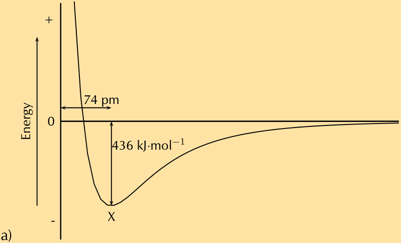
> **[Diagram Context - Textbook_PhysicalSciences_Gr11_Atomic-combinations.pdf-0047-03.png]**
> This graph illustrates a potential energy curve representing covalent bond formation between two hydrogen atoms. The axes and annotations include an y-axis labeled "Energy" with positive (+) and negative (-) regions and a zero line, a bond length of "74 pm" at the potential energy minimum labeled "X", and a bond energy of "436 kJ·mol⁻¹" indicated by a vertical double-headed arrow. For CAPS Physical Sciences learners, this conceptual model demonstrates how potential energy decreases as attractive forces balance repulsive forces to reach a stable equilibrium bond length and minimum energy state.


   - b) At point X the attractive and repulsive forces acting on the two hydrogen atoms are balanced. The energy is at a minimum. 

11. Hydrogen chloride has a bond length of $127\text{ pm}$ and a bond energy of 432 kJ _·_ mol^{_−_1} . Draw a graph of energy versus distance and indicate these values on your graph. The graph does not have to be accurate, a rough sketch graph will do. 

##### **Solution:** 


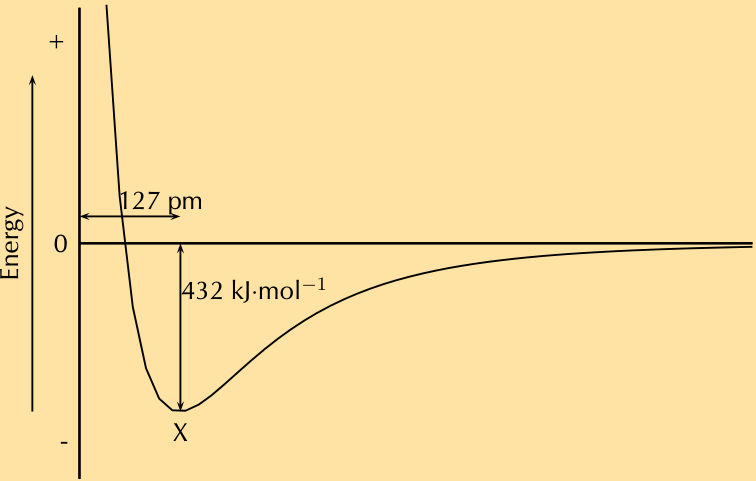
> **[Diagram Context - Textbook_PhysicalSciences_Gr11_Atomic-combinations.pdf-0047-07.png]**
> This graph shows a potential energy curve for chemical bonding, featuring a vertical axis labeled "Energy" with positive and negative regions, and a zero line. Visible annotations include bond length (127 pm), bond energy ($432\text{ kJ}\cdot\text{mol}^{-1}$), point X at the potential minimum, and arrows indicating the coordinate axes and measurement spans. For CAPS Physical Sciences learners, this diagram illustrates how potential energy changes as two atoms approach each other, demonstrating that the bond length occurs at the minimum potential energy and that the depth of the well represents the bond energy required to break the covalent bond.


## 5. Authentic Exam Question Archetypes & Mark Allocations
*(Extracted from official CAPS examination papers to guide marking, pacing, and rubric design)*

### Archetype 1: QUESTION 4 (Start on a new page.)
- **Source Paper:** `Gr11_PhysicalSciences_Chem_Exam2.pdf`
- **Total Mark Allocation:** **[19 Marks]** (Sub-questions: 1, 1, 4, 2, 6 marks)
- **Recommended Time:** **23 Minutes** (Pacing: ~1.2 min/mark | *Calibrated to Official CAPS Paper Pace (1.2 min/mark)*)
- **Assessment Mode Calibration:** Timed Exam Simulation: 23 min countdown (Pacing Checkpoint: 17 min)
- **Cognitive / Marking Strategy:** NSC Standard (Method Marks [M], Accuracy Marks [A], Carry-Over [CA])

#### Question Prompt & Working:
```text
QUESTION 4   (Start on a new page.) 
  
 
A learner investigates the relationship between the pressure and volume of an 
enclosed DIATOMIC gas at 25 °C. He records the volume of the gas for different 
pressures in the table below. 
  
 
PRESSURE 
(kPa) 
VOLUME 
(cm3) 
V
1 (cm-3) 
40 
43 
0,02 
80 
27 
0,04 
100 
22 
(a) 
120 
18 
(b) 
 
4.1 
Write down the name of the gas law being investigated. 
 (1) 
 
Answer QUESTION 4.2 and QUESTION 4.3 on the attached ANSWER SHEET. 
  
 
4.2 
Two V
1 values in the table, (a) and (b), have not been calculated.  
Calculate these values. 
 
(1) 
 
4.3 
Draw a graph of pressure versus V
1 on the attached ANSWER SHEET.  
 (4) 
 
4.4 
Use the graph to determine the volume of the gas at 68 kPa. 
 (2) 
 
4.5 
The mass of the enclosed DIATOMIC gas is 2,49 x 10...
```

### Archetype 2: QUESTION 1: MULTIPLE-CHOICE QUESTIONS
- **Source Paper:** `Gr11_PhysicalSciences_Phys_Exam1.pdf`
- **Total Mark Allocation:** **[20 Marks]** (Sub-questions: 2, 2, 2, 2, 2 marks)
- **Recommended Time:** **24 Minutes** (Pacing: ~1.2 min/mark | *Calibrated to Official CAPS Paper Pace (1.2 min/mark)*)
- **Assessment Mode Calibration:** Timed Exam Simulation: 24 min countdown (Pacing Checkpoint: 18 min)
- **Cognitive / Marking Strategy:** NSC Standard (Method Marks [M], Accuracy Marks [A], Carry-Over [CA])

#### Question Prompt & Working:
```text
QUESTION 1:  MULTIPLE-CHOICE QUESTIONS 
  
 
Four options are provided as possible answers to the following questions. Each 
question has only ONE correct answer. Choose the answer and write only the  
letter (A–D) next to the question number (1.1–1.10) in the ANSWER BOOK, for 
example 1.11 E. 
  
 
1.1 
Vector P and vector –P are acting on a common point O. The angle between 
the two vectors is ... 
  
 
 
A 
 
B 
 
C 
 
D 
0o 
 
90o 
 
180o 
 
270o 
 
(2) 
 
1.2 
The statements below refer to scalars and vectors: 
 
(i) 
Vectors can be added together but scalars cannot. 
(ii) 
A scalar quantity can be associated with direction.  
(iii) 
A vector quantity is always associated with direction. 
  
 
 
Which of the statements above are TRUE? 
  
 
 
A 
 
B 
 
C 
 
D 
(i) and (ii) only 
 
(ii...
```
