# Chapter 7: Ideal Gases

This chapter explores the behavior of gases, focusing on the kinetic molecular theory and the mathematical relationships governing ideal gases.

---

## Chapter Contents

| Section | Topic | Page |
| :--- | :--- | :--- |
| 7.1 | Motion of particles | 252 |
| 7.2 | Ideal gas laws | 255 |
| 7.3 | Chapter summary | 284 |

---

<!-- DIAGRAM_PLACEHOLDER: diagram -->

---

# Chapter 7: Ideal Gases

Gases are essential to life on Earth, forming our atmosphere and facilitating biological processes like respiration and photosynthesis. This chapter explores the behavior of gases and the laws that govern them.

## Key Mathematics Concepts
To succeed in this chapter, ensure you are familiar with the following concepts from Grade 10:
* **Ratio and proportion:** Essential for understanding gas law relationships.
* **Equations:** Required for solving gas law calculations.
* **Graphs:** Used to visualize the relationships between pressure, volume, and temperature.
* **Units and unit conversions:** Necessary for standardizing measurements in gas calculations.

---

## 7.1 Motion of Particles

### The Kinetic Theory of Gases
The kinetic theory of matter states that all matter is composed of particles possessing energy, which allows them to move at different speeds depending on their temperature. These particles have spaces between them and experience attractive forces when in close proximity.

> **[Diagram Context - Textbook_PhysicalSciences_Gr11_Ideal-gases.pdf-0001-00.png]**
> This graphic is a textbook section header featuring the green text "CHAPTER" alongside a circular icon enclosing the number "7" with a segmented border. It visually signals the start of the seventh unit or chapter in a CAPS-aligned curriculum textbook. Conceptually, it acts as a navigational signpost to help students and teachers quickly locate and reference specific topics during lessons and revision.

#### Assumptions of the Kinetic Theory of Gases
The behavior of gases is modeled based on the following assumptions:

1. **Particle Size:** Gases consist of particles (atoms or molecules) whose size is negligible compared to the vast distances between them.
2. **Motion:** Particles are in constant, random motion in straight lines at varying speeds due to their kinetic energy.
3. **Attractive Forces:** The attractive forces between gas particles are considered to be very weak.
4. **Collisions:** Collisions between particles and the walls of their container are elastic; they do not result in a change to the total kinetic energy of the system.
5. **Temperature:** The temperature of a gas is a direct measure of the average kinetic energy of its particles.

---

### Kinetic Theory of Gases: Pressure and Temperature

#### Definitions
*   **Pressure:** The pressure of a gas is a measure of the number of collisions of the gas particles with each other and with the sides of the container that they are in.
*   **Temperature:** The temperature of a substance is a measure of the average kinetic energy of the particles.

#### Kinetic Energy and State Changes
*   **Heating:** When a gas is heated, the temperature increases, which causes the average kinetic energy of the gas particles to increase.
*   **Cooling:** When the temperature is decreased, the average kinetic energy of the particles decreases.
*   **Liquefaction:** If the energy of the particles decreases significantly, the gas will liquefy (change state from a gas to a liquid).

#### Particle Speed
*   **Real Gases:** Particles have different speeds. We must use the average speed of all particles to describe the gas.
*   **Ideal Gases:** We assume that all particles in an ideal gas have the same speed.

---

### Ideal Gases and Non-Ideal Gas Behaviour

#### Definitions
*   **Ideal Gas:** An ideal gas has identical particles of zero volume, with no intermolecular forces between them. The atoms or molecules in an ideal gas move at the same speed.
*   **Real Gas:** Real gases behave more or less like ideal gases, except at high pressures and low temperatures.

#### Application of Gas Laws
*   Almost all gases obey the gas laws within a limited range of pressures and temperatures.
*   We use the gas laws to predict how real gases will behave under these conditions.
*   In subsequent sections, calculations and laws will focus specifically on **ideal gases**.

> **[Diagram Context - Textbook_PhysicalSciences_Gr11_Atomic-combinations.pdf-0002-04.png]**
> This physical molecular model kit apparatus displays various assembled molecular structures and loose atomic components represented by color-coded spheres connected by bonds. Visible elements include black carbon, white hydrogen, red oxygen, blue nitrogen, and green halogen spheres linked by grey bond tubes to form different shapes such as tetrahedral, trigonal planar, and ring structures. Conceptually, this apparatus helps high school learners visualise three-dimensional molecular geometry, VSEPR theory, and the spatial arrangement of atoms in chemical bonding as prescribed by the CAPS curriculum.

> **[Diagram Context - Textbook_PhysicalSciences_Gr11_Atomic-combinations.pdf-0002-12.png]**
> This educational graphic displays an Aufbau atomic structure model, specifically representing a neon atom with a central grey nucleus surrounded by concentric circular electron shells containing black dots (inner core electrons) and white circles (outer valence electrons). Aligned with the CAPS Physical Sciences curriculum, the diagram illustrates electron configuration by showing two electrons in the first inner energy level and eight electrons in the outer valence energy level. This visual conveys the concept of chemical stability and the octet rule, demonstrating how atoms achieve a stable electronic structure with a full outer shell.

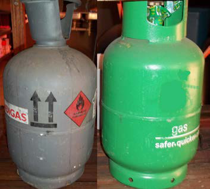
> **[Diagram Context - Textbook_PhysicalSciences_Gr11_Ideal-gases.pdf-0002-02.png]**
> This image shows a comparative photograph of two portable gas cylinders commonly used for domestic energy storage in South Africa. Visible labels and symbols on the grey cylinder include upward-pointing directional arrows and a red diamond-shaped flammable gas hazard warning symbol. Conceptually, this visual supports CAPS Physical Sciences and Technology topics on energy sources, chemical safety, and the practical handling and identification of hazardous substances.

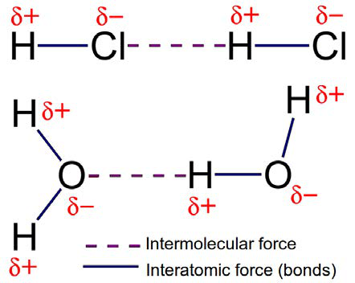
> **[Diagram Context - Textbook_PhysicalSciences_Gr11_Intermolecular-forces.pdf-0002-05.png]**
> This educational graphic illustrates chemical bonding and intermolecular forces using structural representations of hydrogen chloride (HCl) and water ($H_2O$) molecules. Visible labels include chemical symbols ($H$, $Cl$, $O$), partial charges ($\delta+$ and $\delta-$), solid blue lines representing interatomic forces (bonds), and purple dashed lines representing intermolecular forces. For a FET phase Physical Sciences learner, the diagram visually contrasts intramolecular covalent bonds within molecules with weaker intermolecular forces acting between adjacent polar molecules.

---

### Deviations from Ideal Gas Behaviour

While the ideal gas model assumes that gas particles have zero volume and no intermolecular forces, real gases deviate from this behaviour under specific conditions (high pressure or low temperature).

#### 1. Molecules do occupy volume
At very high pressures, gas molecules are compressed into a smaller space. Under these conditions, the volume of the individual molecules becomes significant relative to the total volume of the container.
*   **Effect:** The total volume available for the gas molecules to move is reduced.
*   **Result:** Collisions become more frequent, causing the pressure of the gas to be **higher** than what would be expected for an ideal gas.

> **[Diagram Context - Textbook_PhysicalSciences_Gr11_Atomic-combinations.pdf-0003-12.png]**
> The educational graphic depicts two atomic models, each featuring a central positive charge (+) and an outer region with a negative charge (-), separated by a horizontal double-headed arrow spanning between them. The visible labels consist of positive (+) and negative (-) charge symbols along with bidirectional arrows indicating direction. This diagram conveys the concept of electrostatic forces, specifically illustrating how like charges repel each other when brought into proximity.

*Figure 7.1: Gases deviate from ideal gas behaviour at high pressure.*

#### 2. Forces of attraction exist between molecules
At low temperatures, the kinetic energy of the molecules decreases, causing them to move more slowly and stay closer together. This allows intermolecular forces to become significant.
*   **Effect:** As the attraction between molecules increases, their movement decreases, leading to fewer collisions with the walls of the container.
*   **Result:** The pressure of the gas at low temperatures is **lower** than what would be expected for an ideal gas. If the temperature is low enough or the pressure high enough, a real gas will **liquefy**.

> **[Diagram Context - Textbook_PhysicalSciences_Gr11_Atomic-combinations.pdf-0003-15.png]**
> This physics diagram illustrates electrostatic forces between charged particles, showing two atomic models with inner positive (+) and outer negative (-) regions. An arrow extends from the negative region of the left atom to the positive region of the right atom. Conceptually, this conveys the attractive electrostatic force operating between unlike charges according to Coulomb's law in Grade 10-12 Physical Sciences.

*Figure 7.2: Gases deviate from ideal gas behaviour at low temperatures.*

---

### Exercise 7 – 1

**Question:** Summarise the difference between a real gas and an ideal gas in the following table:

| Property | Ideal gas | Real gas |
| :--- | :--- | :--- |
| Size of particles | Negligible (zero volume) | Significant (occupy volume) |
| Attractive forces | None | Exist between molecules |
| Speed of molecules | Dependent on temperature | Dependent on temperature |

> **[Diagram Context - Textbook_PhysicalSciences_Gr11_Atomic-combinations.pdf-0003-18.png]**
> This educational diagram illustrates two atomic models, each featuring a central positive nucleus labelled with a plus sign (+) and surrounding negative charge labelled with a minus sign (-). A double-headed horizontal arrow spans the distance between the two atomic structures. Conceptually, it conveys electrostatic interactions between charges or the forces operating between atoms when studying matter and materials in the CAPS physical sciences curriculum.

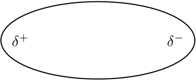
> **[Diagram Context - Textbook_PhysicalSciences_Gr11_Intermolecular-forces.pdf-0003-01.png]**
> The graphic depicts a conceptual model of a polar molecule represented as an elongated oval. Visible labels include partial charges $\delta^+$ on the left side and $\delta^-$ on the right side. For a high school Physical Sciences student, this diagram conveys the concept of an asymmetrical distribution of electron density in a polar covalent molecule, illustrating how electronegativity differences create distinct regions of partial positive and partial negative charge.

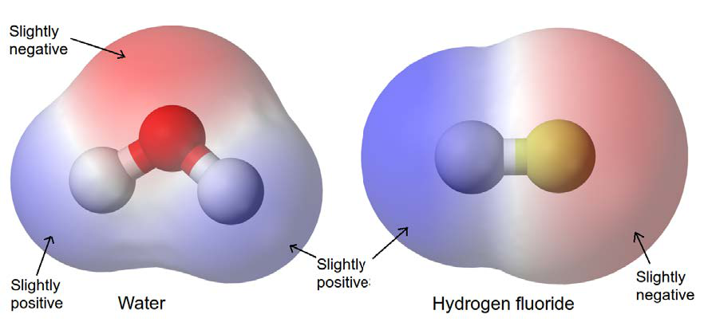
> **[Diagram Context - Textbook_PhysicalSciences_Gr11_Intermolecular-forces.pdf-0003-02.png]**
> The graphic displays electrostatic potential maps for two molecular structures: water and hydrogen fluoride, showing molecular models with overlaid electron density clouds. Visible labels include the text "Water", "Hydrogen fluoride", and arrows pointing to regions marked "Slightly negative" (red) and "Slightly positive" (blue). For a CAPS Physical Sciences student, this conveys how differences in electronegativity result in an asymmetrical distribution of charge, illustrating the concept of polar covalent molecules and permanent dipoles.

---

# 7.2 Ideal Gas Laws

The behaviour of ideal gases is described by several laws. These laws are combined to form the general gas equation and the ideal gas equation.

## Unit Conversions
Before applying gas laws, it is essential to use the correct SI units. The following table provides the standard SI units and common conversion factors.

| Variable | SI Units | Other units |
| :--- | :--- | :--- |
| **Pressure ($p$)** | Pascals ($\text{Pa}$) | $760\text{ mm Hg} = 1\text{ atm} = 101\,325\text{ Pa} = 101{,}325\text{ kPa}$ |
| **Volume ($V$)** | $\text{m}^3$ | $1\text{ m}^3 = 1\,000\,000\text{ cm}^3 = 1\,000\text{ dm}^3 = 1\,000\text{ L}$ |
| **Moles ($n$)** | $\text{mol}$ | - |
| **Universal gas constant ($R$)** | $\text{J}\cdot\text{K}^{-1}\cdot\text{mol}^{-1}$ | - |
| **Temperature ($K$)** | Kelvin ($\text{K}$) | $K = ^\circ\text{C} + 273$ |

**Useful volume relations:**
* $1\text{ mL} = 1\text{ cm}^3$
* $1\text{ L} = 1\text{ dm}^3$

---

## Boyle's Law: Pressure and Volume of an Enclosed Gas

Boyle's Law can be observed when forcing a plunger into a syringe or bicycle pump while sealing the opening.

### Definition: Boyle's Law
The pressure of a fixed quantity of gas is inversely proportional to the volume it occupies, provided the temperature remains constant.

### Informal Experiment: Boyle's Law
**Aim:** To verify Boyle's law.

> **[Diagram Context - Textbook_PhysicalSciences_Gr11_Atomic-combinations.pdf-0004-02.png]**
> The graphic is a potential energy graph illustrating the formation of a covalent bond between two atoms. Visible labels include the vertical axis labeled "Energy" (with positive "+" and negative "-" regions and an upward arrow), the horizontal axis labeled "Distance between atomic nuclei" with an arrow pointing right and label "A", point "X" at the potential energy minimum, and schematic atomic/molecular structures showing nuclei (black dots) and electron clouds (blue ovals) at various inter-nuclear distances. Conceptually, for high school chemistry learners, it demonstrates how potential energy decreases as two approaching atoms experience attractive forces until reaching a minimum energy state (bond length) at point X, beyond which electrostatic repulsion causes the energy to rise sharply if they get too close.

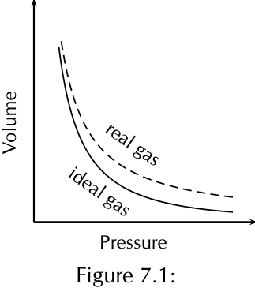
> **[Diagram Context - Textbook_PhysicalSciences_Gr11_Ideal-gases.pdf-0004-03.png]**
> This educational graphic is a line graph comparing the behaviour of real and ideal gases. The visible labels and axes include "Volume" on the vertical axis, "Pressure" on the horizontal axis, a solid curve labelled "ideal gas", a dashed curve labelled "real gas", and the caption "Figure 7.1". Conceptually, the graph illustrates Boyle's Law and the deviations of real gases from ideal gas behaviour at different pressures, helping learners understand that real gases do not perfectly obey the ideal gas equation under all conditions due to intermolecular forces and molecular volume.

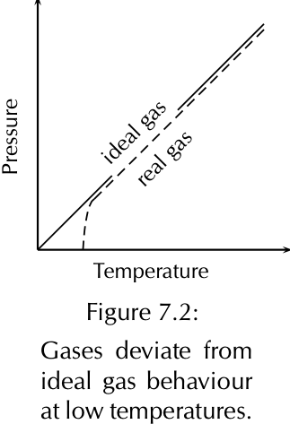
> **[Diagram Context - Textbook_PhysicalSciences_Gr11_Ideal-gases.pdf-0004-07.png]**
> This graph plots Pressure on the vertical axis against Temperature on the horizontal axis, comparing the linear relationship of an "ideal gas" (dashed line) with a "real gas" (solid line). The visible labels include "Pressure", "Temperature", "ideal gas", and "real gas", accompanied by the caption "Figure 7.2: Gases deviate from ideal gas behaviour at low temperatures." For a Grade 11 Physical Sciences student, this diagram conceptually illustrates that real gases deviate significantly from ideal gas behavior under conditions of low temperature, where intermolecular forces and molecular volume become important.

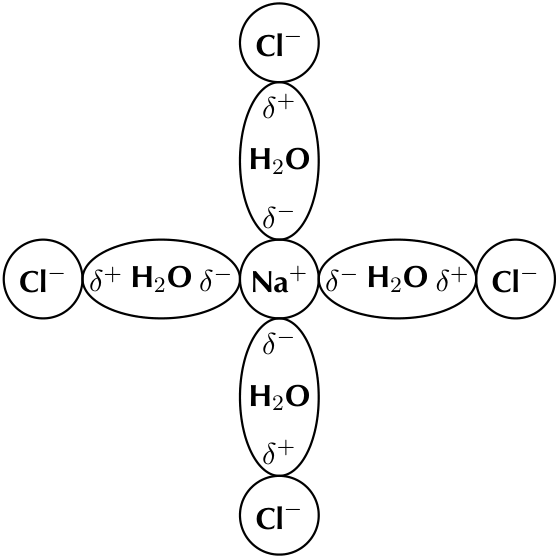
> **[Diagram Context - Textbook_PhysicalSciences_Gr11_Intermolecular-forces.pdf-0004-05.png]**
> This conceptual chemistry diagram illustrates the ion-dipole hydration shell surrounding a central sodium ion ($\text{Na}^+$) interacting with four surrounding chloride ions ($\text{Cl}^-$) mediated by water molecules ($\text{H}_2\text{O}$). Visible labels include the chemical symbols $\text{Na}^+$ and $\text{Cl}^-$, formula $\text{H}_2\text{O}$, and partial charge symbols ($\delta^+$ and $\delta^-$) oriented specifically with the negative oxygen ends facing the positive sodium ion and positive hydrogen ends facing the negative chloride ions. This visual conveys how polar solvent molecules orient themselves around ions during the dissolution process, helping learners understand ion-dipole forces and the mechanism of dissolution in aqueous solutions.

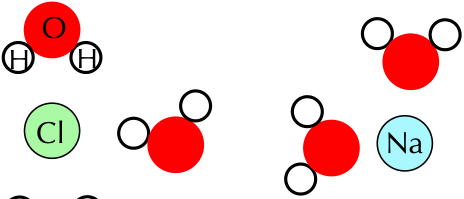
> **[Diagram Context - Textbook_PhysicalSciences_Gr11_Intermolecular-forces.pdf-0004-08.png]**
> This educational graphic illustrates a particulate molecular model showing the process of ionic dissolution in water. The diagram features chemical symbols and labels for water molecules (red oxygen spheres marked 'O' bonded to white hydrogen spheres marked 'H'), a chloride ion (green circle marked 'Cl'), and a sodium ion (blue circle marked 'Na'). Conceptually, it demonstrates how polar water molecules orient themselves around separated sodium and chloride ions during the dissolution of sodium chloride (table salt), helping learners visualize ion-dipole interactions at the microscopic level.

---

### Experiment: Investigating Boyle's Law

#### Apparatus
*   Boyle's law apparatus (a syringe or bicycle pump attached to a pressure gauge).

> **[Diagram Context - Textbook_PhysicalSciences_Gr11_Atomic-combinations.pdf-0005-02.png]**
> This graphic is a potential energy graph illustrating covalent bond formation. The visible labels include the vertical axis labeled "Energy" (with '+' and '-' signs) and the horizontal axis labeled "Distance between atomic nuclei", along with a point labeled "X" at the minimum of the potential energy curve. For a high school Physical Sciences student, this diagram conveys how potential energy changes as two atoms approach each other, showing that bond formation occurs at point X where potential energy is at a minimum and a stable covalent bond is formed.

#### Method
1.  Use the pump to fill the syringe (or glass tube) until the pressure gauge reads the maximum value. Note the volume and the pressure reading.
2.  Slowly release some of the air until the pressure has dropped by about 20 units (the units will depend on what your pressure gauge measures, e.g., $\text{kPa}$).
3.  Let the system stabilise for about 2 minutes and then read the volume.
4.  Repeat the above two steps until you have six pairs of pressure-volume readings.

#### Results
Record your results in the following table. Note that your pressure and volume units will be determined by the apparatus you are using.

| Pressure | Volume |
| :--- | :--- |
| | |
| | |
| | |
| | |
| | |
| | |

#### Analysis
*   **Observation:** What happens to the volume as the pressure decreases?
*   **Graph 1:** Plot your results as a graph of pressure versus volume (plot pressure on the x-axis and volume on the y-axis). Pressure is the independent variable, which we are changing to see what happens to volume.
*   **Graph 2:** Plot your results as a graph of pressure versus the inverse of volume ($\frac{1}{V}$). For each volume reading, calculate the value of $1$ divided by the volume reading.
*   **Conclusion:** What do you notice about each graph?

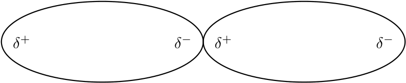
> **[Diagram Context - Textbook_PhysicalSciences_Gr11_Intermolecular-forces.pdf-0005-03.png]**
> This conceptual diagram illustrates intermolecular forces between polar molecules, showing two adjacent oval-shaped molecular representations labeled with partial charges ($\delta^+$ and $\delta^-$). The visible symbols consist of delta positive ($\delta^+$) and delta negative ($\delta^-$) notations positioned at opposite ends of each polar molecular boundary. For a Grade 11 Physical Sciences learner, it conveys how dipole-dipole forces arise from the electrostatic attraction between the partially positive region of one polar molecule and the partially negative region of a neighboring molecule.

---

### Boyle's Law: The Relationship Between Pressure and Volume

#### Conclusion
Experimental results demonstrate that:
*   If the volume of a gas **decreases**, the pressure of the gas **increases**.
*   If the volume of a gas **increases**, the pressure of the gas **decreases**.

These results support **Boyle's Law**.

---

#### The Inverse Relationship
The relationship between pressure and volume is described as an **inverse relationship** (or more-less relationship). As one variable increases, the other decreases.

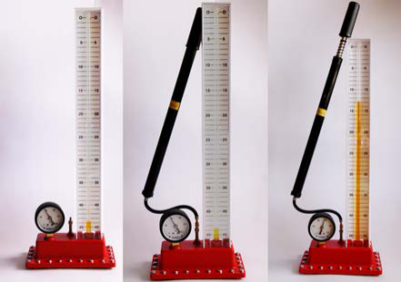
> **[Diagram Context - Textbook_PhysicalSciences_Gr11_Ideal-gases.pdf-0006-02.png]**
> The graphic shows three sequential experimental setups demonstrating Boyle's Law, featuring a gas syringe connected to a pressure gauge and a hand pump apparatus with graduated volume scales numbered from 0 to 45. Visible components include a cylindrical column with numerical graduation markings, a circular dial pressure gauge, a black bicycle-style pump handle, and a connected base unit. Conceptually, this apparatus allows students to investigate the inverse proportionality between the pressure and volume of a fixed mass of gas at a constant temperature, illustrating that as volume decreases, pressure increases.

*Figure 7.3: Graph showing the inverse relationship between pressure and volume.*

---

#### Kinetic Theory Explanation
The kinetic theory of gases explains why this inverse relationship occurs:

1.  **Pressure Definition:** Pressure is a measure of the number of collisions of gas particles with each other and with the sides of the container.
2.  **Decreasing Volume:** If you decrease the volume of a gas, the same number of gas particles are forced into a smaller space. This causes them to collide with the sides of the container more frequently. Consequently, the pressure increases.
3.  **Increasing Volume:** If you increase the volume of a gas, the gas particles have more space to move. They collide with the sides of the container less frequently, and the pressure decreases.

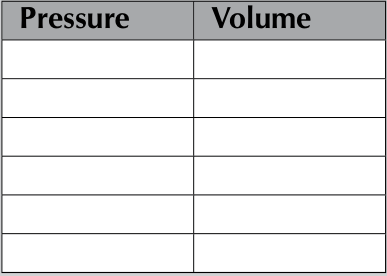
> **[Diagram Context - Textbook_PhysicalSciences_Gr11_Ideal-gases.pdf-0006-10.png]**
> This graphic is a blank two-column data table with column headers labelled "Pressure" and "Volume". It provides a structured template for recording experimental data to investigate the quantitative relationship between gas pressure and volume. Conceptually, this helps CAPS Physical Sciences learners practice data collection and analysis when studying Boyle's Law.

---

#### Mathematical Representation
Robert Boyle discovered that the pressure ($P$) and volume ($V$) of a sample of gas are **inversely proportional**. 

When pressure is plotted against the inverse of volume ($\frac{1}{V}$), the resulting graph is a straight line. This confirms the mathematical relationship:

$$P \propto \frac{1}{V}$$

Or, expressed as an equation where $k$ is a constant:

$$P = \frac{k}{V} \quad \text{or} \quad PV = k$$

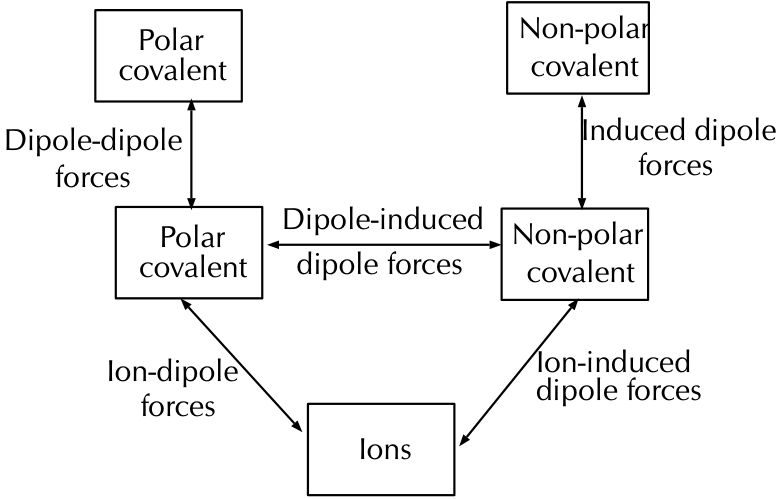
> **[Diagram Context - Textbook_PhysicalSciences_Gr11_Intermolecular-forces.pdf-0006-02.png]**
> This educational graphic is a conceptual flowchart illustrating the different types of intermolecular forces. It features text boxes labeled "Polar covalent", "Non-polar covalent", and "Ions", interconnected by double-headed arrows labeled with intermolecular forces: "Dipole-dipole forces", "Induced dipole forces", "Dipole-induced dipole forces", "Ion-dipole forces", and "Ion-induced dipole forces". Conceptually, the diagram helps high school learners understand the relationship between the nature of interacting particles (molecular polarity versus ions) and the specific type of intermolecular or ion-intermolecular force that arises between them.

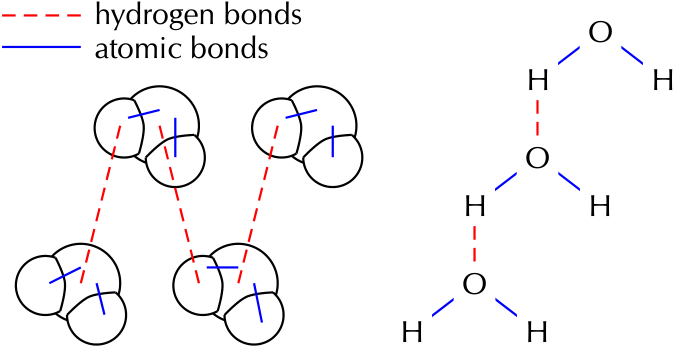
> **[Diagram Context - Textbook_PhysicalSciences_Gr11_Intermolecular-forces.pdf-0006-08.png]**
> The educational graphic illustrates chemical bonding within water molecules, featuring molecular models, atomic symbols (O and H), and a legend with the labels "hydrogen bonds" (red dashed lines) and "atomic bonds" (blue solid lines). It visually distinguishes between intramolecular covalent bonds holding the water molecules together and intermolecular hydrogen bonds forming between separate molecules. This helps high school learners comprehend how intermolecular forces arise and influence the physical properties of substances like water.

---

### The Relationship Between Pressure and Volume

When the temperature and the amount of gas remain constant, the pressure of a gas is **inversely proportional** to its volume.

#### Symbolic Representation
This relationship is expressed as:
$$p \propto \frac{1}{V}$$

*   The symbol $\propto$ denotes "proportional to".
*   The term $\frac{1}{V}$ indicates that the proportionality is inverse.

#### Mathematical Derivation
We can convert the proportionality into an equation by introducing a proportionality constant, $k$:
$$p = \frac{k}{V}$$

By rearranging this equation, we get:
$$pV = k$$

This implies that for a fixed amount of gas at a constant temperature, the product of pressure and volume is always constant.

*Figure 7.4: The graph of pressure plotted against the inverse of volume produces a straight line, confirming that pressure and volume are inversely proportional.*

#### Calculating Changes in Gas Conditions
If we have two different sets of conditions (1 and 2) for the same mass of gas at the same temperature, we can state:
$$p_1V_1 = k$$
$$p_2V_2 = k$$

Therefore, we can equate the two:
$$\boxed{p_1V_1 = p_2V_2}$$

#### Generalisation
This principle can be extended to any number of pressure and volume readings for the same gas under constant temperature conditions:
$$p_1V_1 = p_2V_2 = p_3V_3 = p_nV_n$$

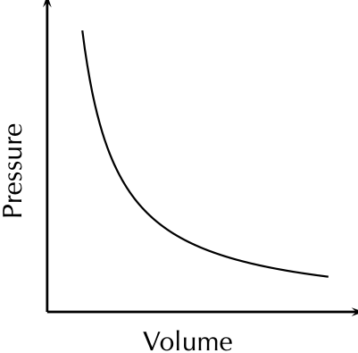
> **[Diagram Context - Textbook_PhysicalSciences_Gr11_Ideal-gases.pdf-0007-03.png]**
> This graphic is a line graph displaying an inverse proportionality relationship with axes labeled "Pressure" on the vertical axis and "Volume" on the horizontal axis, featuring a downward-sloping curved line. For Grade 11 Physical Sciences learners studying Ideal Gases under the CAPS curriculum, this diagram conceptually conveys Boyle's Law, demonstrating that the pressure of an enclosed gas is inversely proportional to its volume at a constant temperature.

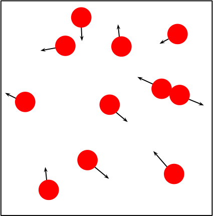
> **[Diagram Context - Textbook_PhysicalSciences_Gr11_Ideal-gases.pdf-0007-06.png]**
> This particulate model diagram illustrates the microscopic structure of matter, specifically representing gas particles. It features multiple red circular particles enclosed within a container, with attached black arrows indicating the direction and magnitude of their random motion and velocity. Conceptually, this helps learners in the CAPS Physical Sciences curriculum visualize the kinetic theory of matter, demonstrating how gas particles are widely spaced and in constant, rapid, random motion.

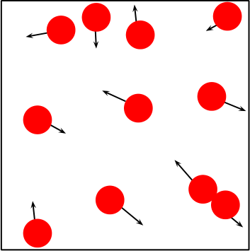
> **[Diagram Context - Textbook_PhysicalSciences_Gr11_Ideal-gases.pdf-0007-07.png]**
> This educational graphic is a particulate model of matter showing gas particles confined within a container. It features red circular particles, directional arrows indicating their varying velocities and directions of motion, and two particles colliding in the lower right corner. Conceptually, this diagram illustrates the kinetic molecular theory, helping students visualise how gas particles are in constant, random motion and exert pressure through collisions.

---

### Boyle's Law: Constant Proportionality

Boyle's Law states that for a fixed amount of gas at a constant temperature, the product of pressure ($p$) and volume ($V$) is a constant ($k$). You can use any two pairs of readings from an experiment to verify this constant.

#### Worked Example: Verifying the Constant ($k$)

Given the following readings:
* $p_1 = 1\text{ atm}$
* $p_2 = 2\text{ atm}$
* $V_1 = 4\text{ cm}^3$
* $V_2 = 2\text{ cm}^3$

**Calculation 1:**
$$k = p_1 V_1$$
$$k = (1\text{ atm})(4\text{ cm}^3)$$
$$k = 4\text{ atm}\cdot\text{cm}^3$$

**Calculation 2:**
$$k = p_2 V_2$$
$$k = (2\text{ atm})(2\text{ cm}^3)$$
$$k = 4\text{ atm}\cdot\text{cm}^3$$

---

### Conditions for Boyle's Law
For Boyle's Law to hold true, two conditions must be met:
1. **Constant Amount of Gas:** If gas escapes the container, the pressure-volume relationship is broken.
2. **Constant Temperature:** Heating or cooling the gas causes it to expand or contract, which changes the pressure and breaks the proportionality.

---

### Fact: Breathing and Boyle's Law
The mechanism of human breathing is a practical application of Boyle's Law:
* **Inhalation:** The diaphragm moves down and flattens, increasing the lung volume. As volume increases, the pressure in the lungs decreases. Air moves from the higher pressure outside the body into the lower pressure inside the lungs.
* **Exhalation:** The diaphragm moves upwards, decreasing the lung volume. As volume decreases, the pressure in the lungs increases. Air is forced out of the lungs toward the lower pressure outside the body.

---

### Units of Measurement
Before performing calculations, ensure you are familiar with the standard units:

* **Volume:** Usually measured in $\text{cm}^3$, $\text{dm}^3$, $\text{m}^3$, or $\text{L}$. The SI unit for volume is $\text{m}^3$.
* **Pressure:** Measured in millimetres of mercury ($\text{mm Hg}$), pascals ($\text{Pa}$), or atmospheres ($\text{atm}$). The SI unit for pressure is $\text{Pa}$.

---

### Worked Example 1: Boyle's Law

**Question:**
A sample of helium occupies a volume of $160\text{ cm}^3$ at $100\text{ kPa}$ and $25\text{ °C}$. What volume will it occupy if the pressure is adjusted to $80\text{ kPa}$ and the temperature remains unchanged?

> **[Diagram Context - Textbook_PhysicalSciences_Gr11_Atomic-combinations.pdf-0008-10.png]**
> This graphic is a Lewis dot diagram representing a methane ($CH_4$) molecule. It features a central carbon symbol (C) surrounded by four hydrogen symbols (H), with dots representing carbon valence electrons and crosses representing hydrogen valence electrons shared in covalent bonds. Conceptually, this diagram illustrates how atoms share valence electrons to achieve a stable octet (or duet for hydrogen), demonstrating covalent bonding and molecular structure in Grade 10 Physical Sciences.

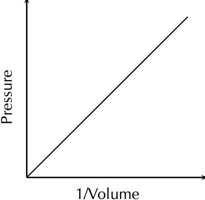
> **[Diagram Context - Textbook_PhysicalSciences_Gr11_Ideal-gases.pdf-0008-00.png]**
> This educational graphic is a Cartesian graph representing a linear relationship. The vertical axis is labeled "Pressure" with an upward-pointing arrow, and the horizontal axis is labeled "1/Volume" with a rightward-pointing arrow; a straight, solid diagonal line originates from the graph's origin and slopes upward. For a high school Physical Sciences student studying ideal gases under the CAPS curriculum, this diagram conveys Boyle's Law, demonstrating that pressure is directly proportional to the inverse of volume ($P \propto 1/V$) at a constant temperature.

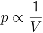

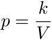

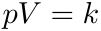

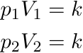

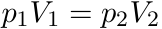

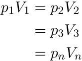

---

### Boyle's Law: Worked Example 1

#### Tip: Unit Conversions
It is not necessary to convert to SI units for Boyle's law. If you were to change the units, this would involve multiplication on both sides of the equation, and the conversion factors would cancel each other out. However, you must ensure that the **same units** are used for each variable throughout the equation. Note that this is not true for all gas law calculations; in later stages, SI units must be used.

---

#### Solution Steps

**Step 1: Identify known and unknown variables**
*   $p_1 = 100\text{ kPa}$
*   $p_2 = 80\text{ kPa}$
*   $V_1 = 160\text{ cm}^3$
*   $V_2 = ?$

**Step 2: Select the appropriate gas law equation**
Since the temperature of the gas remains constant, use Boyle's Law:
$$p_2V_2 = p_1V_1$$

**Step 3: Substitute and calculate**
Substitute the known values into the equation:
$$(80)V_2 = (100)(160)$$
$$(80)V_2 = 16\,000$$
$$V_2 = 200\text{ cm}^3$$

**Conclusion:** The volume occupied by the gas at a pressure of $80\text{ kPa}$ is $200\text{ cm}^3$.

**Step 4: Check your answer**
Boyle's law states that pressure is inversely proportional to volume. Since the pressure decreased, the volume must increase. Our calculated volume ($200\text{ cm}^3$) is greater than the initial volume ($160\text{ cm}^3$), therefore the answer is reasonable.

---

### Worked Example 2: Boyle's Law

**Question:**
The volume of a sample of gas is increased from $2,5\text{ L}$ to $2,8\text{ L}$ while a constant temperature is maintained. What is the final pressure of the gas under these volume conditions, if the initial pressure is $695\text{ Pa}$?

> **[Diagram Context - Textbook_PhysicalSciences_Gr11_Atomic-combinations.pdf-0009-17.png]**
> This graphic displays Lewis structures (electron-dot diagrams) and structural formulae for a water molecule. The visible chemical symbols are 'H' and 'O', accompanied by dots and crosses representing valence electrons and lines representing shared electron pairs (bonds). Conceptually, this helps Grade 10 Physical Sciences learners visualize covalent bonding, valence electron distribution, and how shared electron pairs can be represented either as dots/crosses or as bond lines.

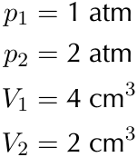
> **[Diagram Context - Textbook_PhysicalSciences_Gr11_Ideal-gases.pdf-0009-03.png]**
> The graphic displays a set of given numerical data values for gas pressure and volume, listing initial and final states as $p_1 = 1\text{ atm}$, $p_2 = 2\text{ atm}$, $V_1 = 4\text{ cm}^3$, and $V_2 = 2\text{ cm}^3$. It presents quantified variables representing pressure ($p$) and volume ($V$) in standard units of atmospheres and cubic centimeters. For Grade 11 Physical Sciences learners studying ideal gases, this text-based layout provides the raw input values needed to practice applying Boyle's Law ($p_1V_1 = p_2V_2$) to calculate inverse proportionality relationships.

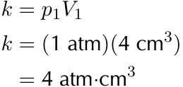
> **[Diagram Context - Textbook_PhysicalSciences_Gr11_Ideal-gases.pdf-0009-05.png]**
> This graphic displays mathematical equations demonstrating the calculation of a constant ($k$) using pressure and volume variables ($p_1$ and $V_1$). The visible variables and units include $k$, $p_1$, $V_1$, $\text{atm}$ (atmospheres), and $\text{cm}^3$ (cubic centimeters). Conceptually, this helps Grade 11 Physical Sciences learners understand Boyle's Law, illustrating how the product of pressure and volume yields a constant value for a fixed mass of gas at a constant temperature.

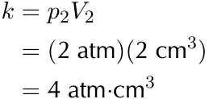
> **[Diagram Context - Textbook_PhysicalSciences_Gr11_Ideal-gases.pdf-0009-07.png]**
> This graphic displays an algebraic calculation for Boyle's Law within physical sciences. The visible symbols and labels include the constant $k$, pressure $p_2$, volume $V_2$, along with numerical values and units such as $\text{atm}$ and $\text{cm}^3$. Conceptually, it demonstrates how to calculate the constant proportionality for an enclosed gas by multiplying pressure and volume values, reinforcing the inverse relationship between these variables at constant temperature.

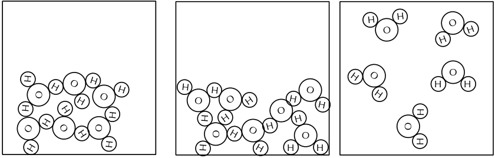
> **[Diagram Context - Textbook_PhysicalSciences_Gr11_Intermolecular-forces.pdf-0009-00.png]**
> The graphic consists of three particulate particle-model diagrams showing the arrangement of water molecules in different phases. The visible labels include chemical symbols 'O' for oxygen and 'H' for hydrogen arranged into distinct molecular units within boxed containers. Conceptually, this diagram illustrates the particle model of matter, depicting the decreasing intermolecular forces and increasing kinetic energy of water molecules as they transition from a tightly packed solid phase (left) through a liquid phase (middle) to a dispersed gas phase (right).

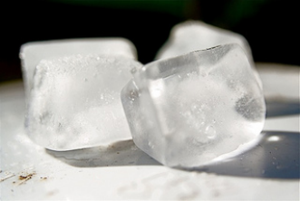
> **[Diagram Context - Textbook_PhysicalSciences_Gr11_Intermolecular-forces.pdf-0009-02.png]**
> This photograph shows solid ice cubes representing water in the solid state of matter. There are no visible labels, text, or arrows in the image. Conceptually, it demonstrates the macroscopic properties of a solid—such as a fixed shape and volume—which FET Physical Sciences learners study when examining intermolecular forces, phase changes, and the kinetic molecular theory.

> **[Diagram Context - Textbook_PhysicalSciences_Gr11_Intermolecular-forces.pdf-0009-03.png]**
> This photograph depicts a geographical landscape showing a steep river valley and canyon carved into rocky terrain, with a turquoise-colored river flowing along the base and sparse vegetation along the banks. The visual elements include steep mountain slopes, exposed rock faces, a winding river channel, and sediment deposits within the riverbed. Conceptually, this image illustrates fluvial processes such as downward erosion, valley deepening, and landform development studied in Grade 10-12 CAPS Geography.

---

### Worked Example: Applying Boyle's Law

**Problem Statement:** Calculate the final pressure of a gas sample when the volume changes, assuming constant temperature.

#### Step 1: Identify known and unknown variables
List all the information provided for the gas sample:
*   Initial Volume ($V_1$) = $2,5\text{ L}$
*   Final Volume ($V_2$) = $2,8\text{ L}$
*   Initial Pressure ($p_1$) = $695\text{ Pa}$
*   Final Pressure ($p_2$) = $?$

#### Step 2: Choose the relevant gas law equation
Since the sample of gas is at a constant temperature, we use **Boyle's Law**:
$$p_2V_2 = p_1V_1$$

#### Step 3: Substitute and calculate
Substitute the known values into the equation, ensuring units are consistent.
$$(2,8)p_2 = (695)(2,5)$$
$$(2,8)p_2 = 1737,5$$
$$p_2 = 620,5\text{ kPa}$$

**Conclusion:** The pressure of the gas at a volume of $2,8\text{ L}$ is $620,5\text{ kPa}$.

#### Step 4: Check your answer
Boyle's law states that pressure is inversely proportional to volume. Since the volume increased, the pressure must decrease. Our calculated pressure ($620,5\text{ kPa}$) is less than the initial pressure ($695\text{ Pa}$), confirming the answer is reasonable.

---

### Exercise 7 – 2: Boyle's Law

1. An unknown gas has an initial pressure of $150\text{ kPa}$ and a volume of $1\text{ L}$. If the volume is increased to $1,5\text{ L}$, what will the pressure be now?

2. A bicycle pump contains $250\text{ cm}^3$ of air at a pressure of $90\text{ kPa}$. If the air is compressed, the volume is reduced to $200\text{ cm}^3$. What is the pressure of the air inside the pump?

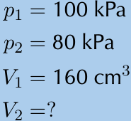

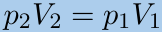

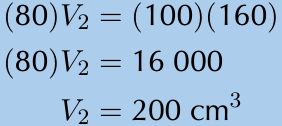

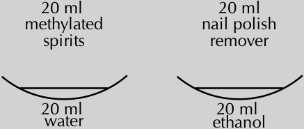

---

### Practice Exercises: Boyle's Law

#### Problem 3: Calculating Volume Change
The air inside a syringe occupies a volume of $10\text{ cm}^3$ and exerts a pressure of $100\text{ kPa}$. If the end of the syringe is sealed and the plunger is pushed down, the pressure increases to $120\text{ kPa}$. What is the volume of the air in the syringe?

**Formula:** Boyle's Law states $P_1V_1 = P_2V_2$ (at constant temperature).

---

#### Problem 4: Investigating Pressure and Volume
During an investigation to find the relationship between the pressure and volume of an enclosed gas at constant temperature, the following results were obtained:

| Volume ($\text{dm}^3$) | 12 | 16 | 20 | 24 | 28 | 32 | 36 | 40 |
| :--- | :--- | :--- | :--- | :--- | :--- | :--- | :--- | :--- |
| **Pressure (kPa)** | 400 | 300 | 240 | 200 | 171 | 150 | 133 | 120 |

*   **a)** Plot a graph of pressure ($p$) against volume ($V$). Volume will be on the x-axis and pressure on the y-axis. Describe the relationship that you see.
*   **b)** Plot a graph of $p$ against $\frac{1}{V}$. Describe the relationship that you see.
*   **c)** Do your results support Boyle's Law? Explain your answer.

---

#### Problem 5: Experimental Analysis
Masoabi and Justine are experimenting with Boyle's law. They both used the same amount of gas. Their data is given in the table below:

| | Masoabi (Initial) | Masoabi (Final) | Justine (Initial) | Justine (Final) |
| :--- | :--- | :--- | :--- | :--- |
| **Temperature (K)** | 325 | 350 | 325 | 325 |
| **Volume ($\text{dm}^3$)** | 1 | 3 | 1 | 3 |
| **Pressure (Pa)** | 650 | 233 | 650 | 217 |

*   **a)** Calculate the final pressure that would be expected using the initial pressure and volume and the final volume.
*   **b)** Who correctly followed Boyle's law and why?

---

### Charles' Law: Volume and Temperature of an Enclosed Gas

**Definition:** Charles' law describes the relationship between the volume and temperature of a gas. It states that at constant pressure, the volume of a given mass of an ideal gas increases or decreases by the same factor as its temperature (in Kelvin) increases or decreases.

> **[Diagram Context - Textbook_PhysicalSciences_Gr11_Atomic-combinations.pdf-0011-02.png]**
> The graphic displays two Lewis diagrams representing a molecule of oxygen gas ($O_2$). Visible elements include the chemical symbol "O", valence electrons represented by dots and crosses (some highlighted in blue to show sharing), and a double bond depicted either by two shared pairs of electrons or by two parallel lines between the atoms. Conceptually, this helps CAPS Grade 10 Physical Sciences learners visualize covalent bonding, illustrating how two oxygen atoms share four electrons to achieve a stable octet structure.

> **[Diagram Context - Textbook_PhysicalSciences_Gr11_Atomic-combinations.pdf-0011-10.png]**
> This graphic displays Lewis dot diagrams for three individual atoms, featuring the chemical symbols H (Hydrogen), C (Carbon), and N (Nitrogen). The symbols are accompanied by surrounding dots and crosses representing their respective valence electrons. Conceptually, this diagram illustrates how to determine and represent the valence electrons of different atoms using Lewis notation, which serves as a foundational step for high school learners before drawing covalent bonding and molecular structures.

> **[Diagram Context - Textbook_PhysicalSciences_Gr11_Atomic-combinations.pdf-0011-13.png]**
> The graphic displays a Lewis diagram and a structural formula for hydrogen cyanide. Visible elements include chemical symbols (H, C, N), dots and crosses representing shared and lone electron pairs, and connecting lines indicating single and triple covalent bonds. This visual demonstrates how covalent bonding allows atoms to achieve stable noble gas configurations, linking electron sharing representations with standard structural formulas in chemical bonding.

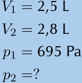
> **[Diagram Context - Textbook_PhysicalSciences_Gr11_Ideal-gases.pdf-0011-02.png]**
> This image displays a set of given numerical variables for a physical sciences problem involving ideal gases. The visible labels include initial volume $V_1 = 2,5\text{ L}$, final volume $V_2 = 2,8\text{ L}$, initial pressure $p_1 = 695\text{ Pa}$, and an unknown final pressure $p_2 = ?$. For a CAPS curriculum high school learner, this graphic sets up a quantitative problem to apply Boyle's Law ($p_1V_1 = p_2V_2$), reinforcing the inverse relationship between pressure and volume of an enclosed gas at a constant temperature.

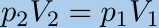

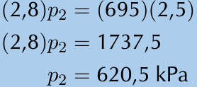
> **[Diagram Context - Textbook_PhysicalSciences_Gr11_Ideal-gases.pdf-0011-07.png]**
> This graphic displays algebraic manipulation steps used to solve for an unknown pressure variable in a gas laws calculation. The visible symbols and variables include parentheses, the pressure variable $p_2$, numerical values like $2$, $8$, $695$, $5$, $1737,5$, and the unit of pressure kilopascals ($\text{kPa}$). Conceptually, this demonstrates the step-by-step mathematical substitution and isolation required to determine the final pressure of an enclosed gas using ideal gas principles in physical sciences.

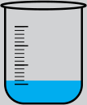

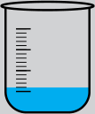

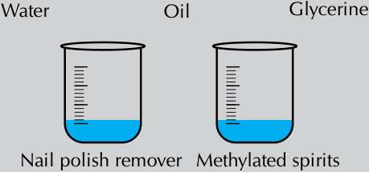
> **[Diagram Context - Textbook_PhysicalSciences_Gr11_Intermolecular-forces.pdf-0011-07.png]**
> This educational graphic shows two identical laboratory beakers with graduation marks containing measured blue liquid, accompanied by five distinct substance labels: Water, Oil, Glycerine, Nail polish remover, and Methylated spirits. The diagram visually supports practical investigations in Grade 10-12 Physical Sciences regarding intermolecular forces, viscosity, and surface tension by comparing different liquids. Conceptually, it prompts learners to compare physical properties such as intermolecular forces, boiling points, or density across various polar and non-polar liquids.

---

### Charles' Law

**DEFINITION: Charles' Law**
The volume of an enclosed sample of gas is directly proportional to its Kelvin temperature, provided the pressure and amount of gas are kept constant.

---

### Informal Experiment: Charles' Law

**Aim:**
To demonstrate Charles' Law.

**Apparatus:**
*   Glass bottle (e.g., empty glass coke bottle)
*   Balloon
*   Beaker or pot
*   Water
*   Hot plate

> **[Diagram Context - Textbook_PhysicalSciences_Gr11_Atomic-combinations.pdf-0012-09.png]**
> This graphic displays Lewis dot and cross diagrams illustrating the formation of a dative covalent (coordinate covalent) bond. The visible chemical symbols and labels include nitrogen ($\text{N}$), hydrogen ($\text{H}$), dots and crosses representing valence electrons, square brackets, and a positive charge superscript ($+$) indicating a polyatomic ion. Conceptually, it demonstrates how a neutral ammonia molecule donates its lone pair of electrons to bond with a hydrogen ion ($\text{H}^+$), forming the positively charged ammonium ion ($\text{NH}_4^+$) as prescribed by the CAPS Physical Sciences curriculum.

**Method:**
1. Place the balloon over the opening of the empty bottle.
2. Fill the beaker or pot with water and place it on the hot plate.
3. Stand the bottle in the beaker or pot and turn the hot plate on.
4. Observe what happens to the balloon.

**Results:**
The balloon starts to expand. As the air inside the bottle is heated, the kinetic energy of the particles increases. Since the volume of the glass bottle cannot increase, the air moves into the balloon, causing it to expand.

**Conclusion:**
The temperature and volume of the gas are directly related to each other. As one increases, so does the other. 

*Note: This relationship can also be observed in reverse; if you place the balloon and bottle into a freezer, the balloon will shrink after a short while.*

---

### Mathematical Representation

The relationship between volume ($V$) and temperature ($T$) is defined as directly proportional:

$$V \propto T$$

By introducing the constant of proportionality ($k$), the relationship is expressed as:

$$V = kT$$

Or, expressed as a ratio:

$$\frac{V}{T} = k$$

> **[Diagram Context - Textbook_PhysicalSciences_Gr11_Atomic-combinations.pdf-0012-12.png]**
> This graphic displays a Lewis structure for a polyatomic ion enclosed in square brackets with a positive charge superscript. Visible labels and symbols include the central nitrogen atom (N), four surrounding hydrogen atoms (H), shared electron-pair bonds represented by lines, an unshared pair of electrons represented by dots between the top hydrogen and nitrogen, and a positive charge (+) outside the brackets. Conceptually, this diagram illustrates how a dative covalent (coordinate covalent) bond forms between an ammonia molecule and a hydrogen ion to produce the ammonium cation, helping learners visualize molecular bonding and the formation of complex ions in chemical reactions.

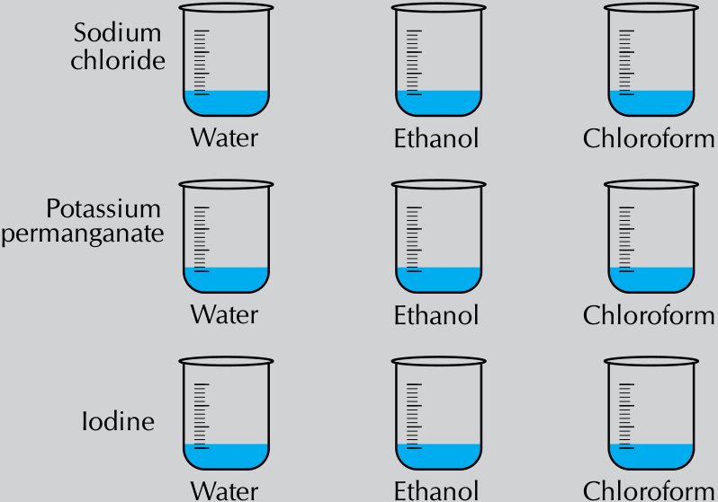
> **[Diagram Context - Textbook_PhysicalSciences_Gr11_Intermolecular-forces.pdf-0012-16.png]**
> This educational graphic displays an experimental matrix of laboratory beakers used to test solubility, featuring the solutes Sodium chloride, Potassium permanganate, and Iodine, tested across the solvents Water, Ethanol, and Chloroform. The diagram visually conveys the CAPS Physical Sciences concept of intermolecular forces and "like dissolves like," helping learners understand how polar and non-polar solutes interact with solvents of varying polarity.

---

### Charles's Law: Volume and Temperature

#### Mathematical Relationship
The relationship between volume ($V$) and temperature ($T$) can be expressed as a constant ($k$):

$$\frac{V}{T} = k$$

For a gas undergoing a change in conditions, this relationship is expressed as:

$$\frac{V_1}{T_1} = \frac{V_2}{T_2} = \dots = \frac{V_n}{T_n} = k$$

Therefore, for any two states of a gas, we use the formula:

$$\frac{V_1}{T_1} = \frac{V_2}{T_2}$$

#### Graphical Representation and the Kelvin Scale
The relationship between volume and temperature produces a straight-line graph. However, when using the **Celsius scale** ($^\circ\text{C}$), the graph does not pass through the origin. When the volume is zero, the temperature is $-273^\circ\text{C}$.

<!-- DIAGRAM_PLACEHOLDER: diagram -->

To simplify calculations, we use the **Kelvin scale** ($T_K$), where the zero point corresponds to $-273^\circ\text{C}$.

**Conversion Formulas:**

*   To convert Celsius to Kelvin:
    $$T_K = T_C + 273$$

*   To convert Kelvin to Celsius:
    $$T_C = T_K - 273$$

Using the Kelvin scale allows the graph of temperature versus volume to pass through the origin, confirming the direct proportionality required for gas law calculations.

---

### Charles' Law

> **[Diagram Context - Textbook_PhysicalSciences_Gr11_Atomic-combinations.pdf-0014-01.png]**
> This graphic is a chemistry table structured to help learners analyze covalent chemical bonding. The table lists chemical formulas across the columns ($CO_2$, $CF_4$, $HI$, $C_2H_2$) and properties along the rows (Lewis diagram, Total number of bonding pairs, Total number of non-bonding pairs, and Single, double or triple bonds). Conceptually, it guides Grade 10-12 Physical Sciences students to systematically determine valence electron distributions, covalent bond multiplicities, and electron pair geometries for various molecules.

**Figure 7.6:** The volume of a gas is directly proportional to its temperature, provided the pressure of the gas is constant.

#### Kinetic Theory Explanation
Charles' law can be explained using the kinetic theory of gases:
*   When the temperature of a gas increases, the average speed of its molecules increases.
*   These molecules collide with the walls of the container more frequently and with greater impact.
*   These collisions push back the walls, causing the gas to occupy a greater volume than it did initially.

---

### Worked Example 3: Charles' Law

**Question:**
At a temperature of $298\text{ K}$, a certain amount of $\text{CO}_2$ gas occupies a volume of $6\text{ L}$. What temperature will the gas be at if its volume is reduced to $5,5\text{ L}$? The pressure remains constant.

**Solution:**

**Step 1: Write down all the information known about the gas.**
*   $V_1 = 6\text{ L}$
*   $V_2 = 5,5\text{ L}$
*   $T_1 = 298\text{ K}$
*   $T_2 = ?$

**Step 2: Convert the known values to SI units if necessary.**
The temperature is already in Kelvin, so no conversions are necessary.

**Step 3: Choose a relevant gas law equation that will allow you to calculate the unknown variable.**
(Note: The calculation steps continue in the curriculum sequence).

> **[Diagram Context - Textbook_PhysicalSciences_Gr11_Atomic-combinations.pdf-0014-02.png]**
> The image is an instructional resource banner featuring a list of alphanumeric reference codes (such as 23NW, 23NX, 23P2, and 23PB) arranged under numbered items alongside icons of a laptop and a mobile phone. Visible labels include website URLs ("www.everythingscience.co.za" and "m.everythingscience.co.za") and the promotional text "Think you got it? Get this answer and more practice on our Intelligent Practice Service." Conceptually, this graphic serves as a navigational call-to-action for South African high school learners, directing them to digital platforms where they can access online exercises, answers, and additional CAPS-aligned curriculum practice material.

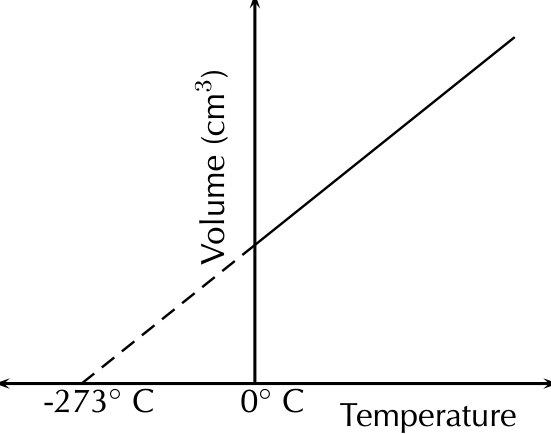
> **[Diagram Context - Textbook_PhysicalSciences_Gr11_Ideal-gases.pdf-0014-04.png]**
> This graphic displays a line graph of Volume ($\text{cm}^3$) versus Temperature, featuring labeled axes and an extrapolated dashed line intercepting the temperature axis at $-273^\circ\text{C}$ alongside $0^\circ\text{C}$. For a Grade 11 Physical Sciences learner studying Ideal Gases, it illustrates Charles's Law by showing the direct proportionality between gas volume and temperature and conceptually introduces absolute zero.

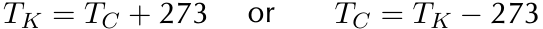

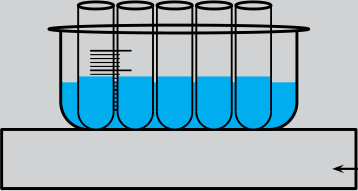
> **[Diagram Context - Textbook_PhysicalSciences_Gr11_Intermolecular-forces.pdf-0014-01.png]**
> This graphic illustrates a laboratory apparatus setup consisting of five test tubes immersed in a water bath placed on a heating surface, with one test tube containing a thermometer scale. The visible elements include five upright test tubes containing blue liquid, a larger outer container holding water, a flat heating block or surface at the base, and a thermometer scale inside the first test tube with an adjacent directional arrow. Conceptually, this setup demonstrates how to control and maintain constant temperatures across multiple reaction mixtures simultaneously when investigating factors affecting reaction rates or enzyme activity in CAPS Life Sciences and Physical Sciences.

---

### Charles' Law: Application and Worked Example

#### Concept: Charles' Law
Charles' Law describes the relationship between the volume and temperature of a gas when pressure and the amount of gas remain constant. The law states that volume is directly proportional to temperature.

The formula is:
$$\frac{V_1}{T_1} = \frac{V_2}{T_2}$$

---

#### Worked Example 4: Charles' Law

**Question:**
Ammonium chloride and calcium hydroxide are allowed to react. The ammonia that is released in the reaction is collected in a gas syringe (a syringe that has very little friction so that the plunger can move freely) and sealed in. This gas is allowed to come to room temperature which is $20\ ^\circ\text{C}$. The volume of the ammonia is found to be $122\ \text{mL}$. It is now placed in a water bath set at $32\ ^\circ\text{C}$. What will be the volume reading after the syringe has been left in the bath for 1 hour (assume the plunger moves completely freely)?

**Solution:**

**Step 1: Write down all the information that you know about the gas.**

**Step 4: Substitute the known values into the equation. Calculate the unknown variable.**

Given the conditions where pressure and the amount of gas are constant, we use Charles' law:
$$\frac{V_1}{T_1} = \frac{V_2}{T_2}$$

Substituting the values:
$$\frac{6}{298} = \frac{5,5}{T_2}$$

Calculating the result:
$$0,0201\dots = \frac{5,5}{T_2}$$
$$(0,0201\dots)T_2 = 5,5$$
$$T_2 = 273,2\ \text{K}$$

The gas will be at a temperature of $273,2\ \text{K}$.

**Step 5: Check your answer**
Charles' law states that the temperature is directly proportional to the volume. In this example, the volume decreases and so the temperature must decrease. Our answer gives a lower final temperature than the initial temperature and so is correct.

> **[Diagram Context - Textbook_PhysicalSciences_Gr11_Atomic-combinations.pdf-0015-11.png]**
> This educational graphic illustrates chemical structure and molecular geometry models using VSEPR theory notation. The diagrams feature central atoms labeled 'A', surrounding terminal atoms or bonding pairs labeled 'X', lone pairs labeled 'E', and solid lines, dashed wedges, and hashed wedges indicating three-dimensional spatial arrangements with labels for Linear, Trigonal planar, Bent or angular, Trigonal pyramidal, Tetrahedral, Trigonal bipyramidal, and Octahedral shapes. For a Grade 11 Physical Sciences learner studying chemical bonding, this graphic visually conveys how valence shell electron pair repulsion determines the three-dimensional shape and bond angles of different molecules based on the number of bonding and lone pairs around a central atom.

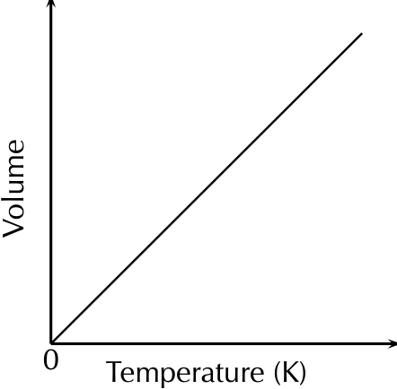
> **[Diagram Context - Textbook_PhysicalSciences_Gr11_Ideal-gases.pdf-0015-00.png]**
> This graphic is a line graph illustrating the relationship between gas volume and absolute temperature. The vertical axis is labeled "Volume", the horizontal axis is labeled "Temperature (K)" with an origin marked "0", and a straight diagonal line rises from the origin. For Physical Sciences learners, this diagram demonstrates Charles's Law, visually conveying that the volume of an enclosed gas is directly proportional to its Kelvin temperature when pressure remains constant.

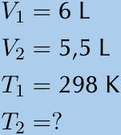
> **[Diagram Context - Textbook_PhysicalSciences_Gr11_Ideal-gases.pdf-0015-09.png]**
> The graphic displays a set of given gas law variables, specifically initial volume $V_1 = 6\text{ L}$, final volume $V_2 = 5,5\text{ L}$, initial temperature $T_1 = 298\text{ K}$, and an unknown final temperature $T_2 = ?$. This text-based problem setup helps Grade 11 Physical Sciences learners apply the ideal gas laws, specifically Charles's Law ($V \propto T$), to calculate an unknown state variable when a fixed mass of gas undergoes a change in conditions.

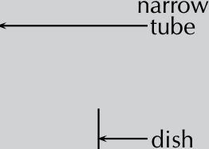
> **[Diagram Context - Textbook_PhysicalSciences_Gr11_Intermolecular-forces.pdf-0015-02.png]**
> This educational graphic shows a scientific apparatus diagram depicting two components labelled with text and pointing arrows: "narrow tube" and "dish". The diagram visually introduces standard laboratory glassware used in experimental setups. For CAPS physical sciences learners, this illustrates the basic equipment required for investigating physical or chemical phenomena, such as capillary action or rates of evaporation.

---

### Calculating Gas Volume using Charles' Law

#### Key Concept: Charles' Law
Charles' Law states that for a fixed amount of gas at a constant pressure, the volume of the gas is directly proportional to its absolute temperature (measured in Kelvin).

**Formula:**
$$\frac{V_1}{T_1} = \frac{V_2}{T_2}$$

---

#### Worked Example
**Given Data:**
*   $V_1 = 122\text{ mL}$
*   $V_2 = ?$
*   $T_1 = 20\text{ °C}$
*   $T_2 = 7\text{ °C}$ (Note: The text calculation uses $32\text{ °C}$ for $T_2$ in the conversion step).

> **TIP:** Temperature must always be converted to Kelvin. The conversion from Celsius to Kelvin involves addition ($+ 273$), not multiplication.

**Step 2: Convert known values to SI units (Kelvin)**
$$T_1 = 20 + 273 = 293\text{ K}$$
$$T_2 = 32 + 273 = 305\text{ K}$$

**Step 3: Choose the relevant gas law equation**
Since pressure and the amount of gas are constant, we use Charles' Law:
$$\frac{V_2}{T_2} = \frac{V_1}{T_1}$$

**Step 4: Substitute and calculate**
Substitute the known values into the equation:
$$\frac{V_2}{305} = \frac{122}{293}$$
$$\frac{V_2}{305} = 0,416\dots$$
$$V_2 = 127\text{ mL}$$

**Result:** The volume reading on the syringe will be $127\text{ mL}$ after the syringe has been left in the water bath.

**Step 5: Check your answer**
Charles' law states that temperature is directly proportional to volume. In this example, the temperature increased, therefore the volume must also increase. Since the final volume ($127\text{ mL}$) is higher than the initial volume ($122\text{ mL}$), the answer is consistent with the law.

> **[Diagram Context - Textbook_PhysicalSciences_Gr11_Atomic-combinations.pdf-0016-00.png]**
> This educational graphic displays ball-and-stick molecular geometry models with corresponding text labels: linear, linear, trigonal planar, bent or angular, tetrahedral, trigonal pyramidal, trigonal bipyramidal, and octahedral. The 3D models utilize spheres of different colors and sizes connected by bonds to represent central and terminal atoms arranged in specific spatial orientations. Conceptually, this diagram helps Grade 11 and 12 Physical Sciences learners visualize Valence Shell Electron Pair Repulsion (VSEPR) theory, connecting electron pair arrangements and lone pairs to the distinct three-dimensional shapes of molecules.

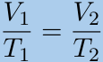

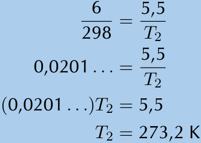
> **[Diagram Context - Textbook_PhysicalSciences_Gr11_Ideal-gases.pdf-0016-03.png]**
> The graphic displays a step-by-step mathematical calculation used to solve for an unknown temperature variable, $T_2$. It features algebraic fractions, decimal approximations, and equality steps leading to the final solution of $T_2 = 273,2\text{ K}$. Conceptually, this demonstrates the application of direct proportionality—specifically Gay-Lussac's or Charles's Law in Physical Sciences—to determine an unknown state of a gas using cross-multiplication and algebraic rearrangement.

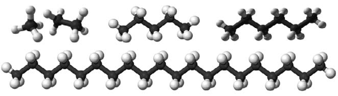
> **[Diagram Context - Textbook_PhysicalSciences_Gr11_Intermolecular-forces.pdf-0016-05.png]**
> This educational graphic shows ball-and-stick molecular models representing straight-chain alkane hydrocarbons of varying chain lengths, consisting of dark grey spheres for carbon atoms and white spheres for hydrogen atoms. The diagram conveys how increasing molecular mass and chain length in a homologous series affects physical properties such as intermolecular forces and boiling points, which is a core concept in Grade 12 Physical Sciences.

> **[Diagram Context - Textbook_PhysicalSciences_Gr11_Intermolecular-forces.pdf-0016-11.png]**
> This educational graphic is a macroscopic photograph illustrating a high-viscosity fluid (honey) being poured. There are no explicit labels, text, or arrows visible in the image. Conceptually, this visual supports the CAPS Physical Sciences curriculum by demonstrating the property of viscosity (resistance to flow) and intermolecular forces in dense liquids for Grades 10 to 12.

---

### Exercise 7 – 3: Charles' Law

**Tip:** You may see this law referred to as Gay-Lussac’s law or as Amontons’ law. Many scientists were working on the same problems at the same time and it is often difficult to know who actually discovered a particular law.

#### 1. Data Analysis
The table below gives the temperature ($^\circ\text{C}$) of helium gas under different volumes at a constant pressure.

| Volume (L) | Temperature ($^\circ\text{C}$) |
| :--- | :--- |
| 1,0 | $-161,9$ |
| 1,5 | $-106,7$ |
| 2 | $-50,8$ |
| 2,5 | $4,8$ |
| 3,0 | $60,3$ |
| 3,5 | $115,9$ |

*   **a)** Draw a graph to show the relationship between temperature and volume.
*   **b)** Describe the relationship you observe.
*   **c)** If you extrapolate the graph (extend the graph line), at what temperature does it intersect the $x$-axis?
*   **d)** What is significant about this temperature?
*   **e)** What conclusions can you draw? Use Charles' law to help you.

#### 2. Calculation Problems
*   **2.** A sample of nitrogen monoxide (NO) gas is at a temperature of $8 ^\circ\text{C}$ and occupies a volume of $4,4 \text{ dm}^3$. What volume will the sample of gas have if the temperature is increased to $25 ^\circ\text{C}$?
*   **3.** A sample of oxygen ($\text{O}_2$) gas is at a temperature of $340 \text{ K}$ and occupies a volume of $1,2 \text{ dm}^3$. What volume will the sample of gas be at if the volume is decreased to $200 \text{ cm}^3$?
*   **4.** Explain what would happen if you were verifying Charles' law and you let some of the gas escape.

---

### Pressure-Temperature Relation

The pressure of a gas is directly proportional to its temperature, if the volume is kept constant.

> **[Diagram Context - Textbook_PhysicalSciences_Gr11_Atomic-combinations.pdf-0017-07.png]**
> This graphic displays a Lewis structure (electron dot diagram) depicting a boron trifluoride ($\text{BF}_3$) molecule. It features the chemical symbols "B" and "F" surrounded by dots and crosses representing valence electrons shared in covalent bonds and existing as lone pairs. Conceptually, this diagram illustrates chemical bonding and molecular structure, specifically highlighting boron's exception to the octet rule as it forms three covalent bonds resulting in only six valence electrons around the central atom.

**Key Concept:**
As the temperature of a gas increases, the kinetic energy of the particles increases. This causes the particles to move more rapidly and collide with each other and the sides of the container more often. Since pressure is a measure of these collisions, the pressure of the gas increases with an increase in temperature. Conversely, the pressure of the gas will decrease if its temperature decreases.

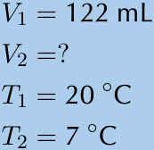
> **[Diagram Context - Textbook_PhysicalSciences_Gr11_Ideal-gases.pdf-0017-01.png]**
> This educational graphic presents a chemistry problem statement showing quantitative gas variables: an initial volume $V_1 = 122\text{ mL}$, an initial temperature $T_1 = 20\text{ }^\circ\text{C}$, a final temperature $T_2 = 7\text{ }^\circ\text{C}$, and an unknown final volume $V_2 = ?$. It provides the numerical data needed to apply Charles's Law ($\frac{V_1}{T_1} = \frac{V_2}{T_2}$), reinforcing the direct proportionality between the volume and Kelvin temperature of an enclosed gas at constant pressure.

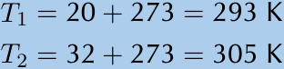
> **[Diagram Context - Textbook_PhysicalSciences_Gr11_Ideal-gases.pdf-0017-05.png]**
> This educational graphic displays two mathematical equations demonstrating temperature conversion calculations. The visible text consists of variables $T_1$ and $T_2$, addition operations involving the constant 273, and resulting temperature values in Kelvin (K). Conceptually, this demonstrates to Physical Sciences learners how to convert temperatures from degrees Celsius to Kelvin by adding 273, which is an essential mathematical skill required when applying the gas laws in CAPS Grade 11.

> **[Diagram Context - Textbook_PhysicalSciences_Gr11_Ideal-gases.pdf-0017-10.png]**
> This graphic displays a mathematical calculation sequence solving for an unknown gas volume in a chemistry problem. The visible variables and units include the unknown volume $V_2$ and milliliters ($\text{mL}$), alongside temperature values ($305$, $293$) and numerical ratios. Conceptually, this demonstrates the step-by-step algebraic manipulation of Charles's Law ($\frac{V_1}{T_1} = \frac{V_2}{T_2}$) to calculate the final volume of an enclosed gas at constant pressure, aligning with the Grade 11 Physical Sciences CAPS curriculum.

> **[Diagram Context - Textbook_PhysicalSciences_Gr11_Intermolecular-forces.pdf-0017-04.png]**
> This photographic educational graphic displays everyday consumer apparatus, specifically a plastic container of motor oil and a drinking glass filled with a brown, viscous liquid. The visible labels include text and logos on the motor oil bottle indicating "Fully Synthetic Motor Oil". Conceptually, this visual supports the Physical Sciences curriculum by demonstrating properties of matter and the importance of chemical safety, illustrating that hazardous household substances should never be stored in food or beverage containers to prevent accidental ingestion.

---

### The Relationship Between Temperature and Pressure

<!-- DIAGRAM_PLACEHOLDER: diagram -->
*Figure 7.7: The relationship between the temperature and pressure of a gas.*

The relationship between the temperature ($T$) and pressure ($p$) of a gas can be described using the following proportionality:

$$T \propto p$$

This means that pressure is directly proportional to temperature. We can express this as an equation:

$$p = kT$$

By rearranging the equation, we get:

$$\frac{p}{T} = k$$

Provided that the **amount** of gas and the **volume** remain constant, we can compare two different states of the same gas using the formula:

$$\frac{p_1}{T_1} = \frac{p_2}{T_2}$$

---

### Worked Example 5: Pressure-temperature relation

**QUESTION**
At a temperature of $298\text{ K}$, a certain amount of oxygen ($\text{O}_2$) gas has a pressure of $0,4\text{ atm}$. What temperature will the gas be at if its pressure is increased to $0,7\text{ atm}$?

**SOLUTION**

**Step 1: Write down all the information that you know about the gas.**

* $T_1 = 298\text{ K}$
* $T_2 = ?$
* $p_1 = 0,4\text{ atm}$
* $p_2 = 0,7\text{ atm}$

**Step 2: Convert the known values to SI units if necessary.**

---

### Gas Laws: Pressure-Temperature Relation

When the volume and the amount of gas are kept constant, the pressure of a gas is directly proportional to its temperature (Gay-Lussac's Law).

#### The Pressure-Temperature Relation Formula
$$\frac{p_1}{T_1} = \frac{p_2}{T_2}$$

Where:
*   $p_1$ = Initial pressure
*   $T_1$ = Initial temperature (in Kelvin)
*   $p_2$ = Final pressure
*   $T_2$ = Final temperature (in Kelvin)

---

#### Worked Example: Calculation Steps

**Scenario:** A gas at an initial pressure of $0,4$ units and a temperature of $298\text{ K}$ is heated until the pressure reaches $0,7$ units. Calculate the final temperature ($T_2$).

**Step 3: Choose the relevant gas law equation**
Since volume and amount of gas are constant, use:
$$\frac{p_1}{T_1} = \frac{p_2}{T_2}$$

**Step 4: Substitute and solve**
Substitute the known values into the equation:
$$\frac{0,4}{298} = \frac{0,7}{T_2}$$

Calculate the constant:
$$0,0013... = \frac{0,7}{T_2}$$

Solve for $T_2$:
$$(0,0013...)T_2 = 0,7$$
$$T_2 = 521,5\text{ K}$$

**Step 5: Check your answer**
The pressure-temperature relation states that pressure is directly proportional to temperature. Since the pressure increased, the temperature must also increase. The calculated final temperature ($521,5\text{ K}$) is higher than the initial temperature ($298\text{ K}$), confirming the result is logical.

---

#### Worked Example 6: Pressure-Temperature Relation

**QUESTION**
A fixed volume of carbon monoxide (CO) gas has a temperature of $32\text{ °C}$ and a pressure of $680\text{ Pa}$. If the temperature is decreased to $15\text{ °C}$, what will the pressure be?

**SOLUTION**
**Step 1: Write down all the information known about the gas.**

> **[Diagram Context - Textbook_PhysicalSciences_Gr11_Atomic-combinations.pdf-0019-08.png]**
> This educational graphic lists a series of eight chemical formulas: BeCl₂, F₂, PCl₅, SF₆, CO₂, CH₄, H₂O, and COH₂, numbered one through eight. Below the formulas, corresponding alphanumeric practice codes (23PF through 23PP) are provided alongside website and mobile links for digital learning resources. Conceptually, this content supports Grade 10-12 Physical Sciences learners in practicing chemical nomenclature, molecular geometry, and Lewis structures by identifying and working with diverse covalent compounds.

> **[Diagram Context - Textbook_PhysicalSciences_Gr11_Ideal-gases.pdf-0019-00.png]**
> This line graph illustrates the relationship between pressure and temperature for an enclosed gas. The vertical axis is labeled "Pressure" with an upward-pointing arrow, the horizontal axis is labeled "Temperature (K)" with a rightward-pointing arrow and a starting value of "0", and a straight diagonal line rises from the origin. For CAPS Physical Sciences learners, this visually conveys Gay-Lussac's Law, demonstrating that the pressure of a fixed mass of gas is directly proportional to its absolute temperature at constant volume ($P \propto T$).

> **[Diagram Context - Textbook_PhysicalSciences_Gr11_Ideal-gases.pdf-0019-15.png]**
> This educational graphic presents a data set of variables related to the ideal gas laws, specifically displaying initial and final temperature and pressure values. The visible text and symbols include $T_1 = 298\text{ K}$, $T_2 = ?$, $p_1 = 0,4\text{ atm}$, and $p_2 = 0,7\text{ atm}$. Conceptually, it provides learners with the numerical parameters needed to practice solving problems involving Gay-Lussac's Law ($\frac{p_1}{T_1} = \frac{p_2}{T_2}$), reinforcing the direct proportional relationship between the pressure and Kelvin temperature of an enclosed gas at a constant volume.

---

### Worked Example: Pressure-Temperature Relation

This example demonstrates how to calculate the final pressure of a gas when the temperature changes, using the pressure-temperature law (Gay-Lussac's Law).

#### Given Data
*   $T_1 = 32\ ^\circ\text{C}$
*   $T_2 = 15\ ^\circ\text{C}$
*   $p_1 = 680\ \text{Pa}$
*   $p_2 = ?$

---

#### Step 2: Convert the known values to SI units
Temperature must be converted from degrees Celsius ($^\circ\text{C}$) to Kelvin ($\text{K}$) by adding $273$.

*   $T_1 = 32 + 273 = 305\ \text{K}$
*   $T_2 = 15 + 273 = 288\ \text{K}$

#### Step 3: Choose the relevant gas law equation
To find the unknown pressure ($p_2$), use the pressure-temperature relationship:

$$\frac{p_2}{T_2} = \frac{p_1}{T_1}$$

#### Step 4: Substitute and calculate
Substitute the known values into the equation:

$$\frac{p_2}{288} = \frac{680}{305}$$

$$\frac{p_2}{288} = 2,2295\dots$$

$$p_2 = 2,2295\dots \times 288$$

$$p_2 = 642,1\ \text{Pa}$$

**Result:** The final pressure is $642,1\ \text{Pa}$.

#### Step 5: Check your answer
The pressure-temperature relation states that pressure is directly proportional to temperature. Since the temperature decreased in this example, the pressure must also decrease. Our calculated final pressure ($642,1\ \text{Pa}$) is lower than the initial pressure ($680\ \text{Pa}$), confirming the result is logical.

---

### Exercise 7 – 4: Pressure-temperature relation

1. The table below gives the temperature (in $^\circ\text{C}$) of helium under different pressures:

> **[Diagram Context - Textbook_PhysicalSciences_Gr11_Ideal-gases.pdf-0020-05.png]**
> This graphic displays a step-by-step mathematical calculation used to solve a gas law problem involving temperature and pressure or volume ratios. The visible algebraic steps include numerical fractions, decimal values, and the unknown variable $T_2$, culminating in the final solved temperature value of $521,5\text{ K}$. Conceptually, this demonstrates how to apply direct proportion to calculate an unknown final temperature ($T_2$) from initial conditions, supporting Physical Sciences learners mastering ideal gases.

> **[Diagram Context - Textbook_PhysicalSciences_Gr11_Intermolecular-forces.pdf-0020-15.png]**
> This educational graphic illustrates a molecular structure diagram of a water molecule. Visible labels include "Oxygen ($\delta-$)" and two "Hydrogen ($\delta+$)" indicators pointing to the respective atomic spheres via arrows, alongside a chemical formula representation ($H_2O$) on the right. Conceptually, this diagram conveys the polar nature of water, demonstrating how differences in electronegativity result in partial positive and negative charges across the molecule.

---

### Gas Laws: Pressure-Temperature Relationship

#### Experimental Data Analysis
The following table represents the relationship between pressure and temperature for a gas at a constant volume.

| Pressure (atm) | Temperature (°C) | Temperature (K) |
| :--- | :--- | :--- |
| 1,0 | 20 | |
| 1,2 | 78,6 | |
| 1,4 | 137,2 | |
| 1,6 | 195,8 | |
| 1,8 | 254,4 | |
| 2,0 | 313 | |

**Exercises:**
a) Convert all the temperature data to Kelvin.
b) Draw a graph to show the relationship between temperature and pressure.
c) Describe the relationship you observe.

---

#### Practice Problems

2. A cylinder that contains methane gas is kept at a temperature of $15\ ^\circ\text{C}$ and exerts a pressure of $7\ \text{atm}$. If the temperature of the cylinder increases to $25\ ^\circ\text{C}$, what pressure does the gas now exert?

3. A cylinder of propane gas at a temperature of $20\ ^\circ\text{C}$ exerts a pressure of $8\ \text{atm}$. When a cylinder has been placed in sunlight, its temperature increases to $25\ ^\circ\text{C}$. What is the pressure of the gas inside the cylinder at this temperature?

4. A hairspray can is a can that contains a gas under high pressures. The can has the following warning written on it: "Do not place near open flame. Do not dispose of in a fire. Keep away from heat." Use what you know about the pressure and temperature of gases to explain why it is dangerous to not follow this warning.

5. A cylinder of acetylene gas is kept at a temperature of $291\ \text{K}$. The pressure in the cylinder is $5\ \text{atm}$. This cylinder can withstand a pressure of $8\ \text{atm}$ before it explodes. What is the maximum temperature that the cylinder can safely be stored at?

> **[Diagram Context - Textbook_PhysicalSciences_Gr11_Atomic-combinations.pdf-0021-08.png]**
> This educational graphic displays a continuum and categorisation chart mapping electronegativity difference ranges to bond types. It features text boxes labelled "Non-polar", "Weak polar", "Strong polar", and "Ionic" mapped to respective numerical electronegativity difference ranges ("0", "0,1 - 1", "1,1 - 2", and "> 2,1") alongside a corresponding shaded horizontal spectrum bar. For a CAPS Grade 11 Physical Sciences learner studying chemical bonding, this diagram visually conveys how the difference in electronegativity between bonded atoms determines the polarity and electrostatic nature of the chemical bond.

---

### The General Gas Equation

All gas laws described previously rely on the fact that the amount of gas and one other variable (temperature, pressure, or volume) remains constant. Since this is rarely the case, we combine these relationships into the **general gas equation**.

**Boyle's Law:**
$$p \propto \frac{1}{V} \text{ (at constant } T)$$

This indicates that pressure is inversely proportional to volume at a constant temperature.

> **[Diagram Context - Textbook_PhysicalSciences_Gr11_Ideal-gases.pdf-0021-00.png]**
> This educational graphic presents a thermodynamics problem listing initial and final temperature variables along with an initial pressure value. The visible text displays symbols and numerical values: $T_1 = 32\text{ }^\circ\text{C}$, $T_2 = 15\text{ }^\circ\text{C}$, $p_1 = 680\text{ Pa}$, and an unknown final pressure $p_2 = ?$. Conceptually, this content prompts Grade 11 Physical Sciences learners to apply the ideal gas law or Gay-Lussac's law, requiring them to convert Celsius temperatures to Kelvin before calculating the unknown pressure.

> **[Diagram Context - Textbook_PhysicalSciences_Gr11_Ideal-gases.pdf-0021-03.png]**
> This graphic displays mathematical working steps for temperature conversion, specifically converting Celsius temperatures to Kelvin. The visible variables and symbols include $T_1$, $T_2$, addition signs, equal signs, and temperature units in Kelvin ($\text{K}$). Conceptually, this demonstrates the required CAPS Physical Sciences procedure of adding $273$ to Celsius values to obtain absolute temperature in Kelvin for gas law calculations.

> **[Diagram Context - Textbook_PhysicalSciences_Gr11_Ideal-gases.pdf-0021-07.png]**
> This graphic displays a mathematical calculation step for solving an ideal gas law problem in Physical Sciences. It shows the algebraic substitution of numerical values, including the pressure variable $p_2$, temperature values $288$, $680$, and $305$, and the final calculated pressure in Pascals ($\text{Pa}$). Conceptually, this demonstrates how to apply Gay-Lussac's law or the combined gas law to solve for an unknown final pressure when temperature and pressure conditions change at a constant volume.

> **[Diagram Context - Textbook_PhysicalSciences_Gr11_Intermolecular-forces.pdf-0021-01.png]**
> The graphic displays two text labels reading "intermolecular forces" and "covalent bonds". These labels outline key chemical bonding and interaction terms as specified in the CAPS Grade 11 Physical Sciences curriculum. The text supports learners in distinguishing between intramolecular bonds holding atoms together within molecules and intermolecular forces acting between molecules, which directly determines physical properties like boiling and melting points.

> **[Diagram Context - Textbook_PhysicalSciences_Gr11_Intermolecular-forces.pdf-0021-02.png]**
> The graphic is a chemical structure diagram depicting intermolecular bonding. It shows the chemical symbols 'O' (oxygen) and 'H' (hydrogen) connected by solid lines representing covalent bonds and dashed lines representing intermolecular hydrogen bonds. Conceptually, this diagram illustrates how hydrogen bonds form between polar water molecules, helping Grade 11 Physical Sciences learners understand intermolecular forces and their effect on the physical properties of substances.

> **[Diagram Context - Textbook_PhysicalSciences_Gr11_Intermolecular-forces.pdf-0021-03.png]**
> This particulate diagram illustrates intermolecular forces using a molecular model of water molecules represented as interconnected spheres. Dashed lines connect the molecules, symbolizing hydrogen bonding between polar water molecules. For Grade 11 Physical Sciences learners studying Matter and Materials, this conveys how intermolecular forces influence the physical properties of substances, such as the relatively high boiling and melting points of water.

---

### The General Gas Equation

#### Pressure-Temperature Relationship
At a constant volume ($V$), pressure ($p$) is directly proportional to temperature ($T$):
$$p \propto T$$

#### Deriving the General Gas Equation
When both volume and temperature vary, we combine the individual proportionalities to get:
$$p \propto \frac{T}{V}$$

By introducing a proportionality constant ($k$), we can express this as an equation:
$$p = k \frac{T}{V}$$

Rearranging this gives the standard form:
$$pV = kT$$

Alternatively, this can be written as:
$$\frac{pV}{T} = k$$

For a fixed mass of gas, we can compare two different sets of conditions (initial and final) using the **General Gas Equation**:
$$\frac{p_1V_1}{T_1} = \frac{p_2V_2}{T_2}$$

**Key Notes:**
*   **Subscripts:** The subscripts $1$ and $2$ refer to two different readings for the same mass of gas.
*   **Units:** Temperature must always be in **Kelvin (K)**. Pressure and volume units must be consistent on both sides of the equation.
*   **Constraint:** The general gas equation only applies if the mass (or number of moles) of the gas remains fixed.

---

### Worked Example 7: General Gas Equation

**Question:**
At the beginning of a journey, a truck tyre has a volume of $30\text{ dm}^3$ and an internal pressure of $170\text{ kPa}$. The temperature of the tyre is $16\text{ °C}$. By the end of the trip, the volume of the tyre has increased to $32\text{ dm}^3$ and the temperature of the air inside the tyre is $40\text{ °C}$. What is the tyre pressure at the end of the journey?

**Solution:**

**Step 1: Write down all the information that you know about the gas.**

| Variable | Initial State (1) | Final State (2) |
| :--- | :--- | :--- |
| Pressure ($p$) | $170\text{ kPa}$ | $p_2 = ?$ |
| Volume ($V$) | $30\text{ dm}^3$ | $32\text{ dm}^3$ |
| Temperature ($T$) | $16\text{ °C} + 273 = 289\text{ K}$ | $40\text{ °C} + 273 = 313\text{ K}$ |

> **[Diagram Context - Textbook_PhysicalSciences_Gr11_Intermolecular-forces.pdf-0022-06.png]**
> The graphic displays two line graphs titled "Heating curve" and "Cooling curve," plotting Temperature (°C) on the vertical axis against Time (min) on the horizontal axis. Visible labels include "melting" and "boiling" on the heating curve, and "condensing" and "freezing" on the cooling curve, marking specific phase changes. For a high school Physical Sciences student, these graphs conceptually illustrate how temperature changes uniformly during phase transitions where potential energy changes while kinetic energy remains constant.

---

### Worked Example: Calculating Gas Pressure

This example demonstrates how to solve for an unknown pressure ($p_2$) when temperature and volume are changing.

#### Given Data
*   $T_1 = 16\ ^\circ\text{C}$
*   $T_2 = 40\ ^\circ\text{C}$
*   $V_1 = 30\ \text{dm}^3$
*   $V_2 = 32\ \text{dm}^3$
*   $p_1 = 170\ \text{kPa}$
*   $p_2 = ?$

---

#### Step 1: Convert known values to SI units
Temperature must be converted from degrees Celsius ($^\circ\text{C}$) to Kelvin ($\text{K}$) by adding $273$.

*   $T_1 = 16 + 273 = 289\ \text{K}$
*   $T_2 = 40 + 273 = 313\ \text{K}$

---

#### Step 2: Choose the relevant gas law equation
Since temperature, pressure, and volume are all varying, use the general gas equation:

$$\frac{p_2 V_2}{T_2} = \frac{p_1 V_1}{T_1}$$

---

#### Step 3: Substitute and solve for the unknown
Substitute the known values into the equation and solve for $p_2$:

$$\frac{(32)p_2}{313} = \frac{(170)(30)}{289}$$

$$\frac{(32)p_2}{313} = 17,647\dots$$

$$(32)p_2 = 5523,529\dots$$

$$p_2 = 172,6\ \text{kPa}$$

**Final Answer:** The pressure will be $172,6\ \text{kPa}$.

---

### Worked Example: General Gas Equation

#### Question
A sample of a gas exerts a pressure of $100\text{ kPa}$ at $15\text{ °C}$. The volume under these conditions is $10\text{ dm}^3$. The pressure increases to $130\text{ kPa}$ and the temperature increases to $32\text{ °C}$. What is the new volume of the gas?

---

#### Solution

**Step 1: Identify known variables**
List all the information provided for the initial state (1) and the final state (2):
*   $T_1 = 15\text{ °C}$
*   $T_2 = 32\text{ °C}$
*   $p_1 = 100\text{ kPa}$
*   $p_2 = 130\text{ kPa}$
*   $V_1 = 10\text{ dm}^3$
*   $V_2 = ?$

**Step 2: Convert to SI units**
Temperature must be converted from degrees Celsius to Kelvin ($K$) for gas law calculations:
*   $T_1 = 15 + 273 = 288\text{ K}$
*   $T_2 = 32 + 273 = 305\text{ K}$

**Step 3: Select the relevant formula**
Use the general gas equation:
$$\frac{p_2 V_2}{T_2} = \frac{p_1 V_1}{T_1}$$

**Step 4: Substitute and solve**
Substitute the known values into the equation and solve for $V_2$:

$$\frac{(130)V_2}{305} = \frac{(100)(10)}{288}$$

$$\frac{(130)V_2}{305} = 3,47...$$

$$(130)V_2 = 1059,027...$$

$$V_2 = 8,15\text{ dm}^3$$

**Final Answer:**
The new volume of the gas is $8,15\text{ dm}^3$.

> **[Diagram Context - Textbook_PhysicalSciences_Gr11_Ideal-gases.pdf-0024-00.png]**
> The graphic presents a text-based problem statement listing initial and final variables for an enclosed gas system. The visible labels and symbols include temperature values $T_1 = 16\ ^\circ\text{C}$ and $T_2 = 40\ ^\circ\text{C}$, volume values $V_1 = 30\text{ dm}^3$ and $V_2 = 32\text{ dm}^3$, initial pressure $p_1 = 170\text{ kPa}$, and an unknown final pressure $p_2 = ?$. Conceptually, this graphic provides the numerical data needed for a Grade 11 Physical Sciences learner to apply the general gas equation ($\frac{p_1V_1}{T_1} = \frac{p_2V_2}{T_2}$), reinforcing skills in converting Celsius temperatures to Kelvin and solving for an unknown state variable.

> **[Diagram Context - Textbook_PhysicalSciences_Gr11_Ideal-gases.pdf-0024-03.png]**
> The graphic displays a mathematical conversion calculation showing temperature values converted from degrees Celsius to Kelvin. Visible labels include variables $T_1$ and $T_2$, along with numerical values (16, 40, 273, 289, 313) and the Kelvin unit symbol (K). This demonstrates the standard physical science procedure of adding 273 to Celsius temperatures to obtain absolute temperature in Kelvin for gas law calculations.

> **[Diagram Context - Textbook_PhysicalSciences_Gr11_Ideal-gases.pdf-0024-08.png]**
> This mathematical calculation graphic displays a step-by-step algebraic solution for determining an unknown pressure variable, designated as $p_2$. The visible symbols and numbers include fractional algebraic expressions with numerical values like 32, 313, 170, 30, and 289, culminating in a final solved value with units of kilopascals ($\text{kPa}$). Conceptually, it demonstrates the application of the general gas equation or proportional reasoning in physical sciences to calculate a final pressure state under changing thermodynamic conditions.

---

### Worked Example 9: General Gas Equation

#### Question
A cylinder of propane gas is kept at a temperature of $298\text{ K}$. The gas exerts a pressure of $5\text{ atm}$ and the cylinder holds $4\text{ dm}^3$ of gas. If the pressure of the cylinder increases to $5,2\text{ atm}$ and $0,3\text{ dm}^3$ of gas leaks out, what temperature is the gas now at?

> **[Diagram Context - Textbook_PhysicalSciences_Gr11_Atomic-combinations.pdf-0025-01.png]**
> This educational graphic is a structured chemistry table designed for practicing chemical bonding and molecular polarity. The table features column headers labeled "Molecule", "Difference in electronegativity between atoms", "Non-polar/polar covalent bond", and "Polar/non-polar molecule", with row entries for various chemical formulas including $\text{H}_2\text{O}$, $\text{HBr}$, $\text{F}_2$, $\text{CH}_4$, $\text{PF}_5$, $\text{BeCl}_2$, $\text{CO}$, $\text{C}_2\text{H}_2$, $\text{SO}_2$, and $\text{BF}_3$. Conceptually, it guides Grade 11 Physical Sciences learners to systematically determine electronegativity differences, classify bond types, and integrate molecular geometry to deduce overall molecular polarity.

---

#### Solution

**Step 1: Write down all the information known about the gas.**
*   $T_1 = 298\text{ K}$
*   $T_2 = ?$
*   $V_1 = 4\text{ dm}^3$
*   $V_2 = 4 - 0,3 = 3,7\text{ dm}^3$
*   $p_1 = 5\text{ atm}$
*   $p_2 = 5,2\text{ atm}$

**Step 2: Convert the known values to SI units if necessary.**
Temperature data is already in Kelvin. All other values are in consistent units.

**Step 3: Choose a relevant gas law equation.**
Since volume, pressure, and temperature are all varying, we must use the general gas equation:

$$\frac{p_1V_1}{T_1} = \frac{p_2V_2}{T_2}$$

**Step 4: Substitute the known values into the equation and calculate the unknown variable.**

$$\frac{(5)(4)}{298} = \frac{(5,2)(3,7)}{T_2}$$

$$0,067... = \frac{19,24}{T_2}$$

$$(0,067...)T_2 = 19,24$$

$$T_2 = 286,7\text{ K}$$

**Final Answer:**
The temperature will be $286,7\text{ K}$.

> **[Diagram Context - Textbook_PhysicalSciences_Gr11_Atomic-combinations.pdf-0025-04.png]**
> This potential energy graph illustrates the relationship between potential energy and the distance between atomic nuclei during covalent bond formation. The visible labels and variables include "Energy" on the vertical axis, "Distance between atomic nuclei" on the horizontal axis, a zero-energy line marked "0", minimum potential energy point "X", "bond length", and "bond energy". Conceptually, it conveys to CAPS Physical Sciences learners how potential energy decreases to a minimum at point X where repulsive and attractive forces balance to form a stable covalent bond, demonstrating the definitions of bond length and bond energy.

> **[Diagram Context - Textbook_PhysicalSciences_Gr11_Ideal-gases.pdf-0025-05.png]**
> This graphic presents a numerical problem statement for calculating ideal gas laws in Physical Sciences. It displays initial and final state variables labelled as temperatures ($T_1 = 15\ ^\circ\text{C}$, $T_2 = 32\ ^\circ\text{C}$), pressures ($p_1 = 100\text{ kPa}$, $p_2 = 130\text{ kPa}$), an initial volume ($V_1 = 10\text{ dm}^3$), and an unknown final volume ($V_2 = ?$). Conceptually, it provides learners with the data required to apply the General Gas Equation ($\frac{p_1 V_1}{T_1} = \frac{p_2 V_2}{T_2}$), reinforcing the conversion of Celsius to Kelvin and the manipulation of pressure, temperature, and volume relationships.

> **[Diagram Context - Textbook_PhysicalSciences_Gr11_Ideal-gases.pdf-0025-08.png]**
> The graphic displays two mathematical equations demonstrating temperature conversion calculations against a blue background. The visible variables and symbols include $T_1$, $T_2$, addition signs, equal signs, and the temperature unit Kelvin ($\text{K}$), alongside numerical values ($15$, $32$, $273$, $288$, and $305$). For a high school Physical Sciences student, this conveys the standard method for converting temperatures from degrees Celsius to Kelvin by adding $273$, which is essential for applying gas laws.

> **[Diagram Context - Textbook_PhysicalSciences_Gr11_Ideal-gases.pdf-0025-13.png]**
> This educational graphic displays a step-by-step mathematical calculation involving algebraic fractions and units of volume. The visible mathematical variables and numbers include $V_2$, 130, 305, 100, 10, 288, and the resulting unit $\text{dm}^3$. Conceptually, it demonstrates the algebraic manipulation and solving process for an unknown volume using the combined gas law, guiding learners through numerical substitution, simplification, and final unit attribution in Physical Sciences.

> **[Diagram Context - Textbook_PhysicalSciences_Gr11_Intermolecular-forces.pdf-0025-00.png]**
> This educational graphic presents a conceptual question about the properties of water acting as a heat reservoir and its climatic effects, accompanied by promotional text for the Intelligent Practice Service with codes 23R9, 23RB, and 23RC, alongside website links (www.everythingscience.co.za and m.everythingscience.co.za) represented by laptop and mobile phone icons. It serves as a CAPS-aligned assessment prompt that challenges high school Physical Sciences learners to apply their knowledge of water's high specific heat capacity and its moderating role on global climate systems.

---

### The Ideal Gas Equation

#### Avogadro's Law
**Definition:** Equal volumes of gases, at the same temperature and pressure, contain the same number of molecules.

#### Deriving the Universal Gas Constant ($R$)
From previous gas laws, we know that for a fixed mass of gas:
$$\frac{pV}{T} = k$$

Where $k$ is a constant that varies depending on the mass of the gas. When we calculate $k$ for exactly $1\text{ mol}$ of gas, we find:
$$\frac{pV}{T} = 8,314$$

This constant is known as the **universal gas constant**, denoted by $R$. It is measured in units of $\text{J}\cdot\text{K}^{-1}\cdot\text{mol}^{-1}$. Regardless of the type of gas used, $1\text{ mol}$ of that gas will always result in this same constant.

***

### Exercise 7 – 5: The general gas equation

**TIP:** A joule can be defined as $\text{Pa}\cdot\text{m}^3$. When using the ideal gas equation, you must use SI units to ensure the correct answer.

1. A closed gas system initially has a volume of $8\text{ L}$ and a temperature of $100\text{ °C}$. The pressure of the gas is unknown. If the temperature of the gas decreases to $50\text{ °C}$, the gas occupies a volume of $5\text{ L}$ and the pressure of the gas is $1,2\text{ atm}$. What is the initial pressure of the gas?

2. A balloon is filled with helium gas at $27\text{ °C}$ and a pressure of $1,0\text{ atm}$. As the balloon rises, the volume of the balloon increases by a factor of $1,6$ and the temperature decreases to $15\text{ °C}$. What is the final pressure of the gas (assuming none has escaped)?

3. $25\text{ cm}^3$ of gas at $1\text{ atm}$ has a temperature of $25\text{ °C}$. When the gas is compressed to $20\text{ cm}^3$, the temperature of the gas increases to $28\text{ °C}$. Calculate the final pressure of the gas.

> **[Diagram Context - Textbook_PhysicalSciences_Gr11_Atomic-combinations.pdf-0026-05.png]**
> The educational graphic displays two structural models comparing chemical bond lengths in carbon monoxide (CO) and carbon dioxide (CO₂). Visible labels include chemical symbols ("C", "O"), bracketed measurement indicators ("bond length", "X", "Y"), and figure captions detailing each molecule. This diagram conceptually illustrates how to correctly define bond length as the distance between the nuclei of two bonded atoms (indicated by X) rather than the total distance across a multi-atom molecule (indicated by Y), supporting CAPS Physical Sciences chemical bonding concepts.

> **[Diagram Context - Textbook_PhysicalSciences_Gr11_Ideal-gases.pdf-0026-03.png]**
> The visual content features two pressurized gas cylinders, specifically typical LPG (liquefied petroleum gas) containers. Visible labels and symbols include vertical orientation arrows, a red diamond-shaped flammable hazard warning symbol, and the word "gas" with branding text on the green cylinder. Conceptually, this real-world apparatus demonstrates the storage of compressed and liquefied hydrocarbon fuels, supporting topics related to energy sources, chemical safety, and the practical application of gas laws in the physical sciences curriculum.

> **[Diagram Context - Textbook_PhysicalSciences_Gr11_Ideal-gases.pdf-0026-06.png]**
> This educational graphic displays a text-based physical sciences problem outlining initial and final conditions for an enclosed gas sample. Visible variables and labels include temperature values ($T_1 = 298\text{ K}$, $T_2 = ?$), volume values ($V_1 = 4\text{ dm}^3$, $V_2 = 3,7\text{ dm}^3$), and pressure values ($p_1 = 5\text{ atm}$, $p_2 = 5,2\text{ atm}$). Conceptually, it provides the numerical data required for a high school learner to apply the General Gas Equation ($\frac{p_1 V_1}{T_1} = \frac{p_2 V_2}{T_2}$) in calculating an unknown final temperature.

> **[Diagram Context - Textbook_PhysicalSciences_Gr11_Ideal-gases.pdf-0026-13.png]**
> This graphic shows a step-by-step mathematical calculation applied to solve a physical chemistry problem involving the ideal gas law (or combined gas law), using variables such as temperature ($T_2$) and constants with numerical values like 298, 19,24, and 286,7 K. The visible mathematical expressions demonstrate the algebraic substitution of known values into a proportional ratio and the subsequent rearrangement to solve for the unknown variable $T_2$. Conceptually, this demonstrates the procedural skill required in the CAPS Physical Sciences curriculum to manipulate gas equation ratios and solve for an unknown final temperature in Kelvin.

---

### The Ideal Gas Equation

The ideal gas equation is derived by extending gas laws to account for any number of moles of a gas:

$$\frac{pV}{T} = nR$$

Rearranging this gives the standard form of the **Ideal Gas Equation**:

$$pV = nRT$$

**Where:**
*   $p$ = pressure
*   $V$ = volume
*   $n$ = number of moles of gas
*   $R$ = universal gas constant ($8,314 \text{ J}\cdot\text{K}^{-1}\cdot\text{mol}^{-1}$)
*   $T$ = temperature

> **TIP:** All quantities in the equation $pV = nRT$ must be in SI units to correspond with the value of $R$.

---

### Worked Example 10: Ideal Gas Equation

**Question:**
Two moles of oxygen ($\text{O}_2$) gas occupy a volume of $25 \text{ dm}^3$ at a temperature of $40 \text{ °C}$. Calculate the pressure of the gas under these conditions.

**Solution:**

**Step 1: Write down all the information known about the gas.**
*   $p = ?$
*   $V = 25 \text{ dm}^3$
*   $n = 2 \text{ mol}$
*   $T = 40 \text{ °C}$
*   $R = 8,314 \text{ J}\cdot\text{K}^{-1}\cdot\text{mol}^{-1}$

**Step 2: Convert the known values to SI units.**
We must convert volume to cubic metres ($\text{m}^3$) and temperature to Kelvin ($\text{K}$):
*   $V = \frac{25}{1000} = 0,025 \text{ m}^3$
*   $T = 40 + 273 = 313 \text{ K}$

**Step 3: Choose the relevant gas law equation.**
Since we are varying temperature, pressure, volume, and the amount of gas, we use the ideal gas equation:
$$pV = nRT$$

---
*Reference: 7.2 Ideal gas laws*

---

### Calculation of Gas Pressure

**Step 4: Substitute the known values into the equation. Calculate the unknown variable.**

$$(0,025\text{ m}^3)(p) = (2\text{ mol})(8,314\text{ J}\cdot\text{K}^{-1}\cdot\text{mol}^{-1})(313\text{ K})$$
$$(0,025\text{ m}^3)(p) = 5204,564\text{ Pa}\cdot\text{m}^3$$
$$p = 208\ 182,56\text{ Pa}$$

The pressure will be $208\ 182,56\text{ Pa}$ or $208,2\text{ kPa}$.

---

### Worked Example 11: Ideal gas equation

**QUESTION**
Carbon dioxide ($\text{CO}_2$) gas is produced as a result of the reaction between calcium carbonate and hydrochloric acid. The gas that is produced is collected in a container of unknown volume. The pressure of the gas is $105\text{ kPa}$ at a temperature of $20\text{ °C}$. If the number of moles of gas collected is $0,86\text{ mol}$, what is the volume?

**SOLUTION**

**Step 1: Write down all the information that you know about the gas.**
* $p = 105\text{ kPa}$
* $V = ?$
* $n = 0,86\text{ mol}$
* $T = 20\text{ °C}$
* $R = 8,314\text{ J}\cdot\text{K}^{-1}\cdot\text{mol}^{-1}$

**Step 2: Convert the known values to SI units if necessary.**
We need to convert the temperature to Kelvin and the pressure to Pa:
* $p = 105 \times 1000 = 105\ 000\text{ Pa}$
* $T = 20 + 273 = 293\text{ K}$

**Step 3: Choose a relevant gas law equation that will allow you to calculate the unknown variable.**

> **[Diagram Context - Textbook_PhysicalSciences_Gr11_Ideal-gases.pdf-0028-14.png]**
> This graphic presents a physical sciences problem statement detailing given and unknown variables for an ideal gas calculation. The visible symbols and values include pressure ($p = ?$), volume ($V = 25\text{ dm}^3$), amount of substance ($n = 2\text{ mol}$), temperature ($T = 40\text{ }^\circ\text{C}$), and the universal gas constant ($R = 8,314\text{ J}\cdot\text{K}\cdot\text{mol}^{-1}$). Conceptually, it challenges Grade 11 learners to apply the Ideal Gas Equation ($pV = nRT$), requiring unit conversions (such as converting volume to $\text{m}^3$ and temperature to Kelvin) to solve for the unknown pressure.

> **[Diagram Context - Textbook_PhysicalSciences_Gr11_Ideal-gases.pdf-0028-17.png]**
> This educational graphic displays two mathematical equations demonstrating unit conversions for volume and temperature. The graphic features the variables $V$, numbers representing cubic centimeters and cubic decimeters (specifically $\frac{25}{1000} = 0,025\text{ dm}^3$), and temperature conversion from Celsius to Kelvin ($T = 40 + 273 = 313\text{ K}$). Conceptually, it guides high school Physical Sciences learners on how to correctly convert millilitres or cubic centimeters to cubic decimeters and Celsius to Kelvin when preparing data for ideal gas law calculations.

---

### The Ideal Gas Equation

When temperature, pressure, volume, and the amount of gas are all varying, the **Ideal Gas Equation** must be used:

$$pV = nRT$$

Where:
*   $p$ = pressure (in Pascals, $\text{Pa}$)
*   $V$ = volume (in cubic metres, $\text{m}^3$)
*   $n$ = amount of substance (in moles, $\text{mol}$)
*   $R$ = universal gas constant ($8,314 \text{ J}\cdot\text{K}^{-1}\cdot\text{mol}^{-1}$)
*   $T$ = temperature (in Kelvin, $\text{K}$)

---

#### Worked Example: Applying the Ideal Gas Equation

**Question:**
Nitrogen ($N_2$) reacts with hydrogen ($H_2$) according to the following equation:
$$N_2 + 3H_2 \rightarrow 2NH_3$$

$2 \text{ mol}$ of ammonia ($NH_3$) gas is collected in a separate gas cylinder which has a volume of $25 \text{ dm}^3$. The pressure of the gas is $195,89 \text{ kPa}$. Calculate the temperature of the gas inside the cylinder.

**Solution:**

**Step 1: Write down all the information known about the gas.**
*   $p = 195,98 \text{ kPa}$
*   $V = 25 \text{ dm}^3$
*   $n = 2 \text{ mol}$
*   $R = 8,3 \text{ J}\cdot\text{K}^{-1}\cdot\text{mol}^{-1}$
*   $T = ?$

**Step 2: Convert the known values to SI units.**
*(Note: Ensure pressure is in $\text{Pa}$ and volume is in $\text{m}^3$ for the standard equation).*

---

#### Previous Calculation Example (Reference)

**Step 4: Substitute the known values into the equation and calculate the unknown variable.**

$$(105\,000 \text{ Pa})V = (8,314 \text{ J}\cdot\text{K}^{-1}\cdot\text{mol}^{-1})(293 \text{ K})(0,86 \text{ mol})$$
$$(105\,000 \text{ Pa})V = 2094,96 \text{ Pa}\cdot\text{m}^3$$
$$V = 0,020 \text{ m}^3$$
$$V = 20 \text{ dm}^3$$

The volume is $20 \text{ dm}^3$.

> **[Diagram Context - Textbook_PhysicalSciences_Gr11_Atomic-combinations.pdf-0029-02.png]**
> This educational graphic displays a potential energy graph showing the relationship between potential energy and the distance between atomic nuclei during covalent bond formation. Visible labels and symbols include "Energy" on the vertical axis, "Distance between atomic nuclei" on the horizontal axis, point "X" at the potential energy minimum, point "A", directional arrows, and chemical formulas $\text{O}_2$, $\text{MgBr}_2$, $\text{BF}_3$, and $\text{CH}_2\text{O}$ at the top. For a high school Physical Sciences student, the diagram visually conveys how a chemical bond forms when attractive and repulsive forces balance at minimum potential energy, defining bond length and bond energy.

> **[Diagram Context - Textbook_PhysicalSciences_Gr11_Ideal-gases.pdf-0029-01.png]**
> This graphic displays a worked numerical calculation solving the Ideal Gas Law equation, $pV = nRT$. Visible elements include substituted values for volume ($0,025\text{ m}^3$), pressure ($p$), moles ($2\text{ mol}$), the universal gas constant ($8,314\text{ J}\cdot\text{K}^{-1}\cdot\text{mol}^{-1}$), and temperature ($313\text{ K}$), followed by simplification steps leading to the final pressure in Pascals. Conceptually, it guides Grade 11 Physical Sciences learners through the proper application and algebraic rearrangement of the ideal gas equation to solve for an unknown macroscopic property.

> **[Diagram Context - Textbook_PhysicalSciences_Gr11_Ideal-gases.pdf-0029-08.png]**
> The graphic displays a set of given physical variables and constants for an ideal gas calculation, including pressure ($p = 105\text{ kPa}$), unknown volume ($V = ?$), amount of substance ($n = 0,86\text{ mol}$), temperature ($T = 20\text{ }^\circ\text{C}$), and the universal gas constant ($R = 8,314\text{ J}\cdot\text{K}\cdot\text{mol}^{-1}$). It serves as a prompt for Grade 11 Physical Sciences learners to apply the ideal gas equation ($pV = nRT$), requiring them to practice proper SI unit conversions—specifically converting pressure from kilopascals to Pascals and temperature from Celsius to Kelvin—before solving for the unknown volume.

> **[Diagram Context - Textbook_PhysicalSciences_Gr11_Ideal-gases.pdf-0029-11.png]**
> This educational graphic displays two worked mathematical conversion steps for physical quantities. The visible labels and symbols include pressure ($p$), Pascals ($\text{Pa}$), temperature ($T$), and Kelvin ($\text{K}$), alongside numerical conversion equations ($105 \times 1000 = 105\,000\text{ Pa}$ and $20 + 273 = 293\text{ K}$). Conceptually, it demonstrates how to convert pressure from kilopascals to Pascals and temperature from degrees Celsius to Kelvin, which are essential preparatory skills for solving ideal gas law problems in Physical Sciences.

---

### Unit Conversions for Gas Law Calculations

Before applying gas laws, ensure all variables are in standard SI units:
*   **Volume ($V$):** Convert litres to cubic metres ($\text{m}^3$) by dividing by $1000$.
    $$V = \frac{25}{1000} = 0,025 \text{ m}^3$$
*   **Pressure ($p$):** Convert kilopascals ($\text{kPa}$) to Pascals ($\text{Pa}$) by multiplying by $1000$.
    $$p = 195,89 \times 1000 = 195\,890 \text{ Pa}$$

---

### Worked Example 13: Ideal Gas Equation

#### Question
Calculate the number of moles of air particles in a classroom of length $10 \text{ m}$, a width of $7 \text{ m}$, and a height of $2 \text{ m}$ on a day when the temperature is $23 \text{ °C}$ and the air pressure is $98 \text{ kPa}$.

#### Solution

**Step 1: Calculate the volume of air in the classroom**
The classroom is a rectangular prism.
$$V = \text{length} \times \text{width} \times \text{height}$$
$$V = (10)(7)(2)$$
$$V = 140 \text{ m}^3$$

**Step 2: Choose the relevant gas law equation**
To calculate the unknown variable (number of moles, $n$), use the Ideal Gas Law:
$$pV = nRT$$

**Step 3: Substitute known values and calculate**
*   **Step 4: Substitute the known values into the equation.**
    $$(195\,890)(0,025) = (2)(8,314)T$$
    $$4897,25 = 16,628(T)$$
    $$T = 294,52 \text{ K}$$

*Note: The final temperature is $294,52 \text{ K}$.*

> **[Diagram Context - Textbook_PhysicalSciences_Gr11_Ideal-gases.pdf-0030-12.png]**
> This graphic presents a formatted list of physical variables and constants for an ideal gas calculation, commonly found in Grade 11 Physical Sciences under Chemical Systems. The visible labels and symbols include pressure ($p = 195,98\text{ Pa}$), volume ($V = 25\text{ dm}^3$), number of moles ($n = 2\text{ mol}$), the universal gas constant ($R = 8,3\text{ J}\cdot\text{K}^{-1}\text{mol}^{-1}$), and an unknown temperature ($T = ?$). Conceptually, it provides learners with the necessary data to apply the ideal gas equation ($pV = nRT$), reinforcing unit conversion skills (such as converting $\text{dm}^3$ to $\text{m}^3$ and $\text{Pa}$ to $\text{kPa}$) and algebraic manipulation to solve for absolute temperature.

---

### Worked Example: Calculating Moles of a Gas

This example demonstrates the systematic approach to solving problems using the Ideal Gas Law.

**Step 2: Write down all the information known about the gas.**
*   $p = 98\text{ kPa}$
*   $V = 140\text{ m}^3$
*   $n = ?$
*   $R = 8,314\text{ J}\cdot\text{K}^{-1}\text{mol}^{-1}$
*   $T = 23\text{ °C}$

**Step 3: Convert the known values to SI units if necessary.**
Temperature must be in Kelvin (K) and pressure in Pascals (Pa):
*   $T = 25 + 273 = 298\text{ K}$
*   $p = 98 \times 1000 = 98\text{ 000 Pa}$

**Step 4: Choose the relevant gas law equation.**
The Ideal Gas Law is used to relate pressure, volume, temperature, and the amount of substance:
$$pV = nRT$$

**Step 5: Substitute the known values and calculate the unknown variable.**
$$(98\text{ 000})(140) = n(8,314)(298)$$
$$13\text{ 720 000} = 2477,572(n)$$
$$n = 5537,7\text{ mol}$$

**Conclusion:** The number of moles in the classroom is $5537,7\text{ mol}$.

***

### Exercise 7 – 6: The Ideal Gas Equation

1. An unknown gas has a pressure of $0,9\text{ atm}$, a temperature of $120\text{ °C}$ and the number of moles is $0,28\text{ mol}$. What is the volume of the sample?
2. $6\text{ g}$ of chlorine ($\text{Cl}_2$) occupies a volume of $0,002\text{ m}^3$ at a temperature of $26\text{ °C}$. What is the pressure of the gas under these conditions?

> **[Diagram Context - Textbook_PhysicalSciences_Gr11_Ideal-gases.pdf-0031-01.png]**
> This image displays a worked mathematical calculation showing unit conversions for volume and pressure variables. The visible labels and symbols include volume $V$, cubic metres $\text{m}^3$, pressure $p$, and Pascals $\text{Pa}$. Conceptually, this demonstrates how to convert units into standard SI units (from litres or related metrics to $\text{m}^3$, and from kilopascals to Pascals) which is a crucial foundational skill for solving ideal gas law problems in Grade 11 Physical Sciences.

> **[Diagram Context - Textbook_PhysicalSciences_Gr11_Ideal-gases.pdf-0031-05.png]**
> This graphic shows a mathematical calculation solving an ideal gas law equation, structured in three sequential lines. The visible numbers and symbols include pressure values, volume, the universal gas constant (8,314), number of moles (2), temperature variable ($T$), and the final solved value of $T = 294,52\text{ K}$. Conceptually, this demonstrates how to substitute known physical quantities into the ideal gas equation ($PV = nRT$) and algebraically solve for an unknown variable like temperature in Kelvin, reinforcing stoichiometric and thermodynamic problem-solving skills in Physical Sciences.

> **[Diagram Context - Textbook_PhysicalSciences_Gr11_Ideal-gases.pdf-0031-13.png]**
> This graphic presents a step-by-step mathematical calculation for the volume of a rectangular prism. The visible text includes the formula $V = \text{length} \times \text{width} \times \text{height}$, followed by substituted numerical values $(10)(7)(2)$, and the final calculated result with units of $140\text{ m}^3$. Conceptually, it demonstrates how to apply the standard volume formula for 3D geometric shapes by substituting given linear dimensions and solving with correct cubic units.

---

### Ideal Gas Law Exercises

#### Question 3: Lung Capacity Calculation
An average pair of human lungs contains about $3,5\text{ L}$ of air after inhalation and about $3,0\text{ L}$ after exhalation. Assuming that air in your lungs is at $37\text{ °C}$ and $1,0\text{ atm}$, determine the number of moles of air in a typical breath.

---

#### Question 4: Error Analysis in Ideal Gas Calculations
A learner is asked to calculate the pressure exerted by $1,5\text{ mol}$ of nitrogen gas in a container with a volume of $20\text{ dm}^3$ at a temperature of $37\text{ °C}$.

**Learner's Attempt:**
*   $V = 20\text{ dm}^3$
*   $n = 1,5\text{ mol}$
*   $R = 8,314\text{ J}\cdot\text{K}^{-1}\cdot\text{mol}^{-1}$
*   $T = 37 + 273 = 310\text{ K}$

$$pT = nRV$$
$$p(310) = (1,5)(8,314)(20)$$
$$p(310) = (249,42)$$
$$= 0,8\text{ kPa}$$

**Tasks:**
a) Identify 2 mistakes the learner has made in the calculation.
b) Are the units of the final answer correct?
c) Rewrite the solution, correcting the mistakes to arrive at the right answer.

---

#### Question 5: Application - Car Airbags
Most modern cars are equipped with airbags. An airbag inflates in $0,05\text{ s}$. The reaction of sodium azide is:
$$2\text{NaN}_3(\text{s}) \rightarrow 2\text{Na}(\text{s}) + 3\text{N}_2(\text{g})$$

**Tasks:**
a) Calculate the mass of $\text{N}_2(\text{g})$ needed to inflate a sample airbag to a volume of $65\text{ dm}^3$ at $25\text{ °C}$ and $99,3\text{ kPa}$. Assume the gas temperature remains constant.
b) The reaction produces heat. Describe, in terms of the kinetic theory of gases, how the pressure in the sample airbag will change as the gas temperature returns to $25\text{ °C}$.

---

> **[Diagram Context - Textbook_PhysicalSciences_Gr11_Ideal-gases.pdf-0032-01.png]**
> This educational graphic displays a physics problem setup listing known and unknown variables for an ideal gas law calculation. The visible labels and symbols include pressure ($p = 98\text{ kPa}$), volume ($V = 140\text{ m}^3$), an unknown number of moles ($n = ?$), the universal gas constant ($R = 8,314\text{ J}\cdot\text{K}^{-1}\text{mol}^{-1}$), and temperature ($T = 23\text{ }^\circ\text{C}$). Conceptually, it helps Grade 11 Physical Sciences learners practise extracting data from a scenario and converting units (such as pressure to Pascals and temperature to Kelvin) before applying the ideal gas equation $pV = nRT$.

### Quick Reference: Ideal Gas Law
The Ideal Gas Law is given by the formula:
$$pV = nRT$$

Where:
*   $p$ = pressure (in $\text{Pa}$)
*   $V$ = volume (in $\text{m}^3$)
*   $n$ = number of moles ($\text{mol}$)
*   $R$ = universal gas constant ($8,314\text{ J}\cdot\text{K}^{-1}\cdot\text{mol}^{-1}$)
*   $T$ = temperature (in $\text{K}$)

*Note: Ensure all units are converted to SI units before calculation ($1\text{ dm}^3 = 10^{-3}\text{ m}^3$).*

> **[Diagram Context - Textbook_PhysicalSciences_Gr11_Ideal-gases.pdf-0032-04.png]**
> The educational graphic displays a mathematical conversion text showing the steps for converting temperature and pressure units. Visible variables and symbols include $T$, $25$, $273$, $298\text{ K}$, $p$, $98$, $1000$, and $98\,000\text{ Pa}$. Conceptually, it demonstrates how to convert Celsius to Kelvin by adding $273$ and kilopascals to pascals by multiplying by $1000$, which is essential for applying gas laws in Physical Sciences.

> **[Diagram Context - Textbook_PhysicalSciences_Gr11_Ideal-gases.pdf-0032-08.png]**
> This graphic presents a mathematical calculation using the Ideal Gas Equation ($PV = nRT$) featuring the values $98\,000$, $140$, the universal gas constant $8,314$, temperature $298$, and the unknown moles $n$. The steps demonstrate algebraic substitution into the formula and subsequent simplification to solve for the number of moles. For a Grade 11 Physical Sciences learner, this visually reinforces how to apply quantitative stoichiometry and gas laws to determine the amount of substance in moles under specific pressure, volume, and temperature conditions.

---

# 7.3 Chapter Summary: The Kinetic Theory of Gases

## Key Concepts and Definitions

*   **Kinetic Theory of Gases:** A model used to explain the behaviour of gases under different conditions. It states that gases are composed of particles in constant motion that exert attractive forces on one another.
*   **Pressure:** A measure of the number of collisions of gas particles with each other and with the walls of their container.
*   **Temperature:** A measure of the average kinetic energy of the particles in a substance.
*   **Ideal Gas:** A theoretical gas consisting of identical particles of zero volume with no intermolecular forces between them. Particles move at the same speed.
*   **Real Gas:** A gas that behaves like an ideal gas under most conditions, but deviates at high pressures and low temperatures (where intermolecular forces and particle volume become significant).

---

## Gas Laws

### 1. Boyle's Law
Boyle's Law states that the pressure of a fixed quantity of gas is inversely proportional to the volume it occupies, provided the temperature remains constant.

$$pV = k$$

For comparing two states:
$$p_1V_1 = p_2V_2$$

### 2. Charles' Law
Charles' Law states that the volume of an enclosed sample of gas is directly proportional to its Kelvin temperature, provided the pressure and amount of gas remain constant.

$$\frac{V}{T} = k$$

For comparing two states:
$$\frac{V_1}{T_1} = \frac{V_2}{T_2}$$

### 3. Pressure-Temperature Relation
The pressure of a fixed mass of gas is directly proportional to its temperature, provided the volume remains constant.

$$\frac{p}{T} = k$$

For comparing two states:
$$\frac{p_1}{T_1} = \frac{p_2}{T_2}$$

---

## Temperature Conversions
When performing calculations for Charles' Law or the pressure-temperature relation, temperature must be expressed in **Kelvin (K)**. Use the following formula to convert from degrees Celsius ($^\circ\text{C}$):

$$T_K = T_C + 273$$

---

## The General Gas Equation
By combining Boyle's Law and the temperature-pressure relationship, we derive the general gas equation (applicable when the amount of gas remains constant):

$$\frac{pV}{T} = k$$

For comparing two states:
$$\frac{p_1V_1}{T_1} = \frac{p_2V_2}{T_2}$$

> **[Diagram Context - Textbook_PhysicalSciences_Gr11_Atomic-combinations.pdf-0033-00.png]**
> This educational graphic presents Lewis dot diagrams and electron configurations for selected elements: sodium (Na), chlorine (Cl), aluminium (Al), and argon (Ar). Visible labels include element names, "Solution", electron configurations using noble gas core notation ([Ne]3s¹, [Ne]3s²3p⁵, [Ne]3s²3p¹, [Ne]3s²3p⁶), chemical symbols (Na, Cl, Al, Ar), and valence electrons represented as surrounding dots. For high school Physical Sciences learners, this diagram conveys the relationship between valence electron configurations and Lewis structures, helping them visualize how many valence electrons each atom possesses to determine bonding capacity.

> **[Diagram Context - Textbook_PhysicalSciences_Gr11_Atomic-combinations.pdf-0033-03.png]**
> This educational graphic presents a chemical exercise containing text and a Lewis structure solution for a chlorine molecule. Visible labels and symbols include the text "Exercise 3 - 2", "chlorine ($\text{Cl}_2$)", "Solution", chemical symbols ($\text{Cl}$), a bonding line representing a shared electron pair, and dots representing lone pairs of electrons. Conceptually, this diagram helps high school learners visualize covalent bonding by showing how two chlorine atoms share a pair of electrons and retain lone pairs to achieve a stable octet structure.

> **[Diagram Context - Textbook_PhysicalSciences_Gr11_Ideal-gases.pdf-0033-03.png]**
> The graphic displays a set of given numerical values and variables used in a physical sciences stoichiometry calculation: volume ($V = 20\text{ dm}^3$), number of moles ($n = 1,5\text{ mol}$), the universal gas constant ($R = 8,314\text{ J}\cdot\text{K}^{-1}\cdot\text{mol}^{-1}$), and temperature converted to Kelvin ($T = 37 + 273 = 310\text{ K}$). This visual supports Grade 11 and 12 learners in extracting data for ideal gas law problems ($pV = nRT$), demonstrating the correct conversion of Celsius to Kelvin and standard SI unit notation according to the CAPS curriculum.

> **[Diagram Context - Textbook_PhysicalSciences_Gr11_Ideal-gases.pdf-0033-04.png]**
> This graphic displays a worked mathematical calculation applying an incorrect rearrangement of the ideal gas law equation ($pV = nRT$). Visible elements include the variables $p$, $T$, $n$, $R$, and $V$ alongside numerical substitution steps resulting in a final pressure value in kilopascals ($\text{kPa}$). Conceptually, it demonstrates a common algebraic error in rearranging thermodynamic equations, serving as a cautionary example for learners to ensure dimensional and formulaic accuracy in physical sciences.

---

### The Ideal Gas Law

#### Key Concepts
*   **Avogadro’s Law:** States that equal volumes of gases, at the same temperature and pressure, contain the same number of molecules.
*   **Universal Gas Constant ($R$):** A constant value of $8,314 \text{ J}\cdot\text{K}^{-1}\cdot\text{mol}^{-1}$. It is derived from the calculation $\frac{pV}{T}$ for $1 \text{ mole}$ of any gas.
*   **Ideal Gas Equation:** The relationship between pressure, volume, amount of substance, and temperature is given by:
    $$pV = nRT$$

#### SI Units for Ideal Gas Calculations
When using the ideal gas equation, all variables must be converted to their standard SI units:

| Quantity | Unit name | Unit symbol |
| :--- | :--- | :--- |
| Moles ($n$) | moles | $\text{mol}$ |
| Pressure ($p$) | pascals | $\text{Pa}$ |
| Temperature ($T$) | kelvin | $\text{K}$ |
| Volume ($V$) | meters cubed | $\text{m}^3$ |

---

### Exercise 7 – 7

**1. Give one word or term for each of the following definitions:**
*   a) A gas that has identical particles of zero volume, with no intermolecular forces between the particles.
*   b) The law that states that the volume of a gas is directly proportional to the temperature of the gas, provided that the pressure and the amount of the gas remain constant.
*   c) A measure of the average kinetic energy of gas particles.

**2. Which one of the following properties of a fixed quantity of a gas must be kept constant during an investigation of Boyle’s law?**
*   a) density
*   b) pressure
*   c) temperature
*   d) volume
*(IEB 2003 Paper 2)*

**3. Three containers of equal volume are filled with equal masses of helium, nitrogen and carbon dioxide gas respectively. The gases in the three containers are all at the same temperature. Which one of the following statements is correct regarding the pressure of the gases?**
*   a) All three gases will be at the same pressure
*   b) The helium will be at the greatest pressure
*   c) The nitrogen will be at the greatest pressure

> **[Diagram Context - Textbook_PhysicalSciences_Gr11_Atomic-combinations.pdf-0034-00.png]**
> The graphic presents a Lewis dot and dash diagram of a boron trifluoride molecule with the heading "Solution:". Visible labels include the chemical symbols "B" for the central boron atom and "F" for the three surrounding fluorine atoms, connected by single bonds and surrounded by dots representing valence electrons. Conceptually, this helps Grade 11 Physical Sciences learners understand covalent bonding and molecular structure, specifically illustrating an exception to the octet rule where the central boron atom accommodates only six valence electrons.

> **[Diagram Context - Textbook_PhysicalSciences_Gr11_Atomic-combinations.pdf-0034-02.png]**
> This educational graphic presents a chemistry exercise titled "Exercise 3 - 3" featuring Lewis diagrams for covalent molecules. It displays the chemical names and formulas for "1. ammonia (NH3)" and "2. oxygen difluoride (OF2)" alongside their corresponding solutions, using element symbols (H, N, F, O), solid lines for bonding electron pairs, and dots or crosses for lone pairs of electrons. Conceptually, this diagram helps high school learners visualize valence electrons, covalent bonding, and molecular structure according to the octet rule in chemical bonding.

> **[Diagram Context - Textbook_PhysicalSciences_Gr11_Atomic-combinations.pdf-0034-05.png]**
> This educational graphic presents a chemistry exercise asking students to represent molecules using Lewis diagrams, showing the solution for acetylene with chemical symbols C and H linked by single and triple covalent bonds. Visible text includes the prompt instructions, chemical formulas $C_2H_2$ and $CH_2O$, and the structural formula representation $H-C\equiv C-H$. Conceptually, this diagram helps high school learners understand chemical bonding and molecular structure by illustrating how valence electrons are shared to form single and multiple covalent bonds in organic molecules.

---

### 4. Ideal Gas Law and Avogadro's Hypothesis

The ideal gas equation is given by:
$$pV = nRT$$

**Question:** Which one of the following conditions is true according to Avogadro's hypothesis?

| Option | Relationship | Conditions |
| :--- | :--- | :--- |
| a | $p \propto \frac{1}{V}$ | ($T = \text{constant}$) |
| b | $V \propto T$ | ($p = \text{constant}$) |
| c | $V \propto n$ | ($p, T = \text{constant}$) |
| d | $p \propto T$ | ($n = \text{constant}$) |

---

### 5. Gas Laws Property Table

Complete the following table by stating whether the property is **constant** or **variable** for the given gas law.

| Law | Pressure ($p$) | Volume ($V$) | Temperature ($T$) | Moles ($n$) |
| :--- | :--- | :--- | :--- | :--- |
| Boyle's law | | | | |
| Charles' law | | | | |
| Gay-Lussac's law | | | | |
| General gas equation | | | | |
| Ideal gas equation | | | | |

---

### 6. Application of Gas Laws

Use your knowledge of the gas laws to explain the following statements:

*   **a)** It is dangerous to put an aerosol can near heat.
*   **b)** A pressure vessel that is poorly designed and made can be a serious safety hazard (a pressure vessel is a closed, rigid container that is used to hold gases at a pressure that is higher than the normal air pressure).
*   **c)** The volume of a car tyre increases after a trip on a hot road.

---

### 7. Graphical Analysis

> **[Diagram Context - Textbook_PhysicalSciences_Gr11_Atomic-combinations.pdf-0035-00.png]**
> This graphic shows a Lewis structure (structural formula) of a methanal (formaldehyde) molecule. Visible chemical symbols include C, O, and H, connected by a double covalent bond between carbon and oxygen, single covalent bonds between carbon and hydrogen, and two lone pairs of electrons represented as dots around the oxygen atom. Conceptually, this diagram illustrates how atoms share valence electrons to achieve stable octets and duplets, helping learners visualize molecular bonding and functional groups in organic chemistry.

**a)** On the axes provided, using a solid line, draw the graph that would be obtained for a fixed mass of an ideal gas if the pressure is kept constant.

**b)** If the gradient of the above graph is measured to be $0,008 \text{ m}^3\cdot\text{K}^{-1}$, calculate the pressure that $0,3 \text{ mol}$ of this gas would exert.

> **[Diagram Context - Textbook_PhysicalSciences_Gr11_Atomic-combinations.pdf-0035-06.png]**
> This graphic displays a collection of Lewis dot diagrams representing the valence electrons of various elements. The image shows chemical symbols labelled a) to f) with surrounding dots representing valence electrons: a) Ca, b) Li, c) P, d) K, e) Si, and f) S. For Grade 10 Physical Sciences learners, this diagram visually conveys how to use the periodic table to represent the valence electrons of an atom, helping them understand bonding capacity and chemical properties.

> **[Diagram Context - Textbook_PhysicalSciences_Gr11_Atomic-combinations.pdf-0035-14.png]**
> This educational graphic displays Lewis structures (electron dot diagrams) labelled a) and b). Diagram a) shows two bromine atoms (Br) with dots and crosses representing valence electrons, while diagram b) shows a carbon dioxide molecule with symbols C and O surrounded by shared electron pairs and lone pairs. Conceptually, this helps high-school learners understand chemical bonding, illustrating how non-metal atoms share valence electrons to form covalent bonds and achieve a stable octet.

---

### Gas Laws Practice Problems

#### Problem 8
Two gas cylinders, A and B, have volumes $V_A = 0,15\text{ m}^3$ and $V_B = 0,20\text{ m}^3$.
*   Cylinder A: $n_A = 35\text{ mol}$, pressure $= p$.
*   Cylinder B: $n_B = 40\text{ mol}$, pressure $= 5\text{ atm}$.
*   Ratio of Kelvin temperatures $T_A : T_B = 1,80 : 1,00$.

**Task:** Calculate the pressure $p$ (in kPa) in cylinder A.

---

#### Problem 9
A learner investigates the relationship between Celsius temperature and pressure of a fixed amount of helium gas in a $500\text{ cm}^3$ container.

> **[Diagram Context - Textbook_PhysicalSciences_Gr11_Atomic-combinations.pdf-0036-00.png]**
> This graphic shows Lewis dot and cross diagrams for three chemical species: a nitrogen molecule ($N_2$) labeled c, a hydronium ion ($H_3O^+$) enclosed in square brackets with a positive charge labeled d, and a sulfur dioxide molecule ($SO_2$) labeled e. The visible labels consist of chemical symbols (N, H, O, S), dots and crosses representing valence electrons, square brackets, a positive superscript sign, and sub-labels (c, d, e). Conceptually, this helps CAPS Physical Sciences learners visualise covalent bonding, including multiple bonds (triple bond in $N_2$, double bonds in $SO_2$), lone pairs, and dative covalent (coordinate) bonding within a polyatomic ion ($H_3O^+$).

**Questions:**
a) Under these conditions, why does helium behave like an ideal gas?
b) Is the learner's conclusion that pressure is directly proportional to Celsius temperature correct? Explain.
c) Calculate the pressure of the helium gas at $0\text{ °C}$.
d) Calculate the mass of helium gas in the container.

---

#### Problem 10
A motor car engine cylinder contains $450\text{ cm}^3$ of air/petrol mixture at $30\text{ °C}$ and $100\text{ kPa}$. After compression, the volume is $\frac{1}{10}$ of the original, and the temperature rises to $140\text{ °C}$.

**Task:** Calculate the new pressure exerted by the gas mixture.

---

#### Problem 11
A gas of unknown volume has a temperature of $14\text{ °C}$. When the temperature is increased to $100\text{ °C}$, the volume is found to be $5,5\text{ L}$.

**Task:** What was the initial volume of the gas?

---

#### Problem 12
A gas has an initial volume of $2600\text{ mL}$ and a temperature of $350\text{ K}$.

a) If the volume is reduced to $1500\text{ mL}$, what will the temperature be in Kelvin?
b) Has the temperature increased or decreased?
c) Explain this change using the kinetic theory of gases.

---

#### Problem 13: Experimental Data
A group of learners obtained the following results for a fixed mass of gas:

| Pressure (kPa) | 101 | 120 | 130,5 | 138 |
| :--- | :--- | :--- | :--- | :--- |
| Temperature (°C) | 0 | 50 | 80 | 100 |
| Total gas volume (cm³) | 250 | 250 | 250 | 250 |

---

### Key Formulas for Reference

*   **Ideal Gas Law:** $PV = nRT$
*   **Combined Gas Law:** $\frac{P_1V_1}{T_1} = \frac{P_2V_2}{T_2}$
*   **Temperature Conversion:** $T(K) = t(^\circ C) + 273$
*   **Pressure Conversion:** $1\text{ atm} = 101,3\text{ kPa}$

> **[Diagram Context - Textbook_PhysicalSciences_Gr11_Ideal-gases.pdf-0036-12.png]**
> This graphic is a Cartesian graph template with an origin marked "0". The vertical axis is labeled "Volume ($m^3$)" with an upward-pointing arrow, and the horizontal axis is labeled "Temperature (K)" with a rightward-pointing arrow. For Physical Sciences learners, this coordinate system provides the foundational axes needed to plot and interpret experimental data relating gas volume to Kelvin temperature in Charles's Law investigations.

> **[Diagram Context - Textbook_PhysicalSciences_Gr11_Intermolecular-forces.pdf-0036-11.png]**
> This graphic is a scatter plot graph with "Temperature" on the horizontal axis ranging from -225 to -25 and "Hydride" on the vertical axis numbered from 1 to 5, featuring four distinct plotted points. It helps high school physical sciences learners analyze trends in physical properties—specifically boiling points of hydrides down a group—demonstrating how intermolecular forces influence phase change temperatures.

---

### Practical Exercise: Pressure and Temperature Relationship

This exercise focuses on the relationship between the pressure ($P$) and temperature ($T$) of a gas.

#### Instructions
a) Draw a straight-line graph of pressure (on the dependent, y-axis) versus temperature (on the independent, x-axis) on a piece of graph paper. Plot the points and provide a suitable heading for your graph.

b) A straight-line graph passing through the origin is essential to obtain a mathematical relationship between pressure and temperature. Extrapolate (extend) your graph and determine the temperature (in $^\circ\text{C}$) at which the graph will pass through the temperature axis.

c) Write down, in words, the relationship between pressure and Kelvin temperature.

d) From your graph, determine the pressure (in $\text{kPa}$) at $173\text{ K}$. Indicate on your graph how you obtained this value.

e) How would the gradient of the graph be affected (if at all) if a larger mass of the gas is used? Write down **ONLY** increases, decreases or stays the same.

***

#### Intelligent Practice Service
For further practice and solutions, use the following codes on the [Everything Science](http://www.everythingscience.co.za) platform:

| Question | Code | Question | Code | Question | Code |
| :--- | :--- | :--- | :--- | :--- | :--- |
| 1a | 23WT | 1b | 23WV | 1c | 23WW |
| 2 | 23WX | 3 | 23WY | 4 | 23WZ |
| 5 | 23X2 | 6a | 23X3 | 6b | 23X4 |
| 6c | 23X5 | 7 | 23X6 | 8 | 23X7 |
| 9 | 23X8 | 10 | 23X9 | 11 | 23XB |
| 12 | 23XC | 13 | 23XD | | |

> **[Diagram Context - Textbook_PhysicalSciences_Gr11_Ideal-gases.pdf-0037-03.png]**
> This graphic is a line graph illustrating the relationship between gas pressure and temperature. The vertical axis is labeled "pressure (kPa)" with a value of "300" marked by a dotted line, and the horizontal axis is labeled "temperature ($^\circ$C)" with values "10" and "20". Conceptually, the graph demonstrates Gay-Lussac's Law (or the pressure-temperature relationship of an enclosed gas), showing that as temperature increases, the pressure of the gas increases proportionally.

---

# Chapter 7: Ideal Gases

This chapter explores the behavior of gases, focusing on the kinetic molecular theory and the mathematical relationships governing ideal gases.

## Chapter Contents

| Section | Topic | Page |
| :--- | :--- | :--- |
| 7.1 | Motion of particles | 207 |
| 7.2 | Ideal gas laws | 208 |
| 7.3 | Chapter summary | 220 |

---

### Key Concepts Overview

*   **Motion of Particles:** Understanding how gas particles move and interact based on the kinetic molecular theory.
*   **Ideal Gas Laws:** The mathematical relationships between pressure ($P$), volume ($V$), and temperature ($T$). These are typically expressed using the Ideal Gas Equation:
    $$PV = nRT$$
    Where:
    *   $P$ = Pressure
    *   $V$ = Volume
    *   $n$ = Number of moles
    *   $R$ = Universal gas constant
    *   $T$ = Temperature (in Kelvin)

> **[Diagram Context - Textbook_PhysicalSciences_Gr11_Atomic-combinations.pdf-0038-08.png]**
> This graphic is a ball-and-stick molecular model illustrating a linear triatomic molecule (such as $BeCl_2$ or $CO_2$). It features a central magenta-coloured sphere bonded symmetrically by two connecting cylinders to two outer white spheres arranged at a 180-degree bond angle. For CAPS Grade 10 and 11 Physical Sciences learners, this model conveys VSEPR theory concepts by visually demonstrating how valence shell electron pair repulsion results in a linear molecular geometry to minimise electrostatic repulsion between bonding pairs.

> **[Diagram Context - Textbook_PhysicalSciences_Gr11_Atomic-combinations.pdf-0038-12.png]**
> This graphic displays a ball-and-stick molecular model consisting of two spherical atoms connected by a cylindrical bond, with a larger pink sphere on the left and a smaller white sphere on the right. There are no explicit text labels, symbols, or arrows visible in the image. Conceptually, this diagram helps Grade 10 and 11 Physical Sciences learners visualize diatomic molecules and covalent bonding, illustrating how individual atoms combine spatially to form chemical molecules.

> **[Diagram Context - Textbook_PhysicalSciences_Gr11_Atomic-combinations.pdf-0038-18.png]**
> This graphic is a ball-and-stick molecular structure representing trigonal bipyramidal geometry. It features one central atom bonded to five surrounding atoms via cylindrical connecting bonds, rendered in orange and green spheres without text labels. Conceptually, this helps Grade 11 and 12 Physical Sciences learners visualize Valence Shell Electron Pair Repulsion (VSEPR) theory, illustrating how five regions of electron density around a central atom minimize repulsion to form 90° and 120° bond angles.

> **[Diagram Context - Textbook_PhysicalSciences_Gr11_Ideal-gases.pdf-0038-06.png]**
> This educational graphic displays a numbered index of alphanumeric alphanumeric tracking codes (1a. 23WT through 13. 23XD) alongside website links and icons for a laptop and mobile phone (www.everythingscience.co.za and m.everythingscience.co.za). It serves as a digital navigation and referencing tool for South African CAPS curriculum science textbooks, linking specific assessment questions or online resources to their corresponding online digital platforms.

---

# Chapter 7: Ideal Gases

This chapter introduces the concept of ideal gases, the motion of gas particles, and the fundamental gas laws.

---

### 1. The Motion of Particles
Building on the Grade 10 Kinetic Molecular Theory, this section reinforces the concept that all particles in a substance are in constant motion. This principle is applied specifically to gases to distinguish between real and ideal gas behavior.

### 2. Real Gases vs. Ideal Gases
While real gases behave similarly to ideal gases under many conditions, they deviate at high pressures and low temperatures.

**Distinguishing characteristics of a real gas:**
*   **Particle Volume:** Particles in a real gas occupy a finite volume.
*   **Average Speed:** Particles move at varying speeds; therefore, we refer to their average speed.
*   **Intermolecular Forces:** Forces of attraction exist between real gas particles.

### 3. The Kinetic Theory of Gases
The kinetic theory of gases explains the behavior of gases based on the motion of their particles. Learners are encouraged to conceptualize the physical meaning behind gas laws rather than relying solely on rote memorization.

### 4. Gas Laws Overview
The curriculum covers several fundamental laws that describe the relationships between pressure ($P$), volume ($V$), and temperature ($T$).

*   **Boyle’s Law**
*   **Charles’ Law**
*   **Pressure-Temperature Relation:** Also known as **Gay-Lussac’s Law** or **Amonton’s Law**.
*   **General Gas Equation**
*   **Ideal Gas Equation**

**Note on Gas Law Application:**
Most gas laws (excluding the Ideal Gas Law) compare a sample of gas at two different sets of conditions, assuming the amount of gas remains constant.

### 5. Temperature and Pressure
Understanding these two concepts is essential for mastering gas behavior:

*   **Pressure:** A result of particle motion. It is a measure of the frequency of collisions between gas particles and the walls of their container.
*   **Temperature:** A measure of the average kinetic energy possessed by the particles.

> **[Diagram Context - Textbook_PhysicalSciences_Gr11_Atomic-combinations.pdf-0039-04.png]**
> This graphic is a ball-and-stick molecular structure representing an octahedral molecular geometry. It features one central atom bonded to six peripheral atoms via straight bonds arranged symmetrically in three dimensions. For CAPS Physical Sciences learners, this model conveys VSEPR theory by illustrating how six electron pairs maximize their spatial separation around a central atom to form 90-degree bond angles.

> **[Diagram Context - Textbook_PhysicalSciences_Gr11_Atomic-combinations.pdf-0039-09.png]**
> This educational graphic is a space-filling molecular structure model representing a carbon dioxide ($\text{CO}_2$) molecule. It features a central dark grey sphere representing a carbon atom bonded symmetrically to two outer red spheres representing oxygen atoms via double covalent bonds. Conceptually, this diagram helps learners visualize the linear molecular geometry, bond multiplicity, and atomic arrangement essential for understanding VSEPR theory and molecular polarity in CAPS Physical Sciences.

> **[Diagram Context - Textbook_PhysicalSciences_Gr11_Atomic-combinations.pdf-0039-14.png]**
> This graphic is a ball-and-stick molecular structure model depicting a central dark sphere bonded to four smaller white spheres arranged in a symmetrical spatial configuration. It visually represents a tetrahedral molecular geometry, commonly used in Grade 10-12 Physical Sciences to illustrate VSEPR theory and molecular shapes such as methane ($CH_4$). For high school learners, this model conveys the three-dimensional arrangement of atoms and bond angles around a central atom resulting from electron pair repulsion.

> **[Diagram Context - Textbook_PhysicalSciences_Gr11_Ideal-gases.pdf-0039-00.png]**
> This graphic is a textbook title element displaying the text "CHAPTER" alongside a green circular icon containing the number "7" framed by a segmented ring. The visible text and numbers are "CHAPTER" and "7". Conceptually, this visual serves as a clear section divider or navigational heading for a specific chapter in a CAPS curriculum textbook, helping learners orient themselves within the study material.

---

### Informal Experiments: Gas Laws

#### 1. Boyle's Law Verification
*   **Apparatus:** Pressure gauge, $10\text{ ml}$ syringe, $3\text{ cm}$ silicon tubing, water bowl.
*   **Procedure:** Learners record pressure and volume measurements.
*   **Data Analysis:**
    *   Plot pressure ($x$-axis) vs. volume ($y$-axis) to obtain a curved line.
    *   Plot pressure vs. inverse volume ($\frac{1}{V}$) to obtain a straight line.

#### 2. Charles' Law Verification
*   **Apparatus:** Glass bottles, balloons, beakers or pots, water, hot plates, freezer.
*   **Procedure:** 
    *   Place a balloon over the mouth of a bottle.
    *   Place the bottle in a beaker/pot of water and observe the effect of heat.
    *   Place the bottle in a freezer and observe the effect of cooling.

> **[Diagram Context - Textbook_PhysicalSciences_Gr11_Atomic-combinations.pdf-0040-00.png]**
> This 3D ball-and-stick molecular structure illustrates a chemical species featuring a central atom (pink) bonded to four surrounding terminal atoms (two yellow spheres at the top and two white spheres at the bottom). For Grade 11 Physical Sciences learners studying chemical bonding and molecular geometry, it conveys the spatial arrangement and three-dimensional shape predicted by Valence Shell Electron Pair Repulsion (VSEPR) theory.

---

### 7.1 Motion of Particles: Ideal vs. Real Gases

#### Exercise 7 – 1: Comparison of Gas Properties

Summarise the differences between an ideal gas and a real gas using the table below:

| Property | Ideal gas | Real gas |
| :--- | :--- | :--- |
| **Size of particles** | No volume and can be ignored | Non-negligible volume |
| **Attractive forces** | No attractive forces | Attractive forces exist |
| **Speed of molecules** | All molecules at the same speed | Molecules move at different speeds; we use the average speed |

> **[Diagram Context - Textbook_PhysicalSciences_Gr11_Atomic-combinations.pdf-0040-06.png]**
> This graphic is a ball-and-stick molecular model representing formaldehyde (methanal). It features a central black sphere bonded to a red oxygen sphere via a double bond and two white hydrogen spheres via single bonds. For a high school Physical Sciences student, this visual illustrates VSEPR theory and molecular geometry, demonstrating how a trigonal planar shape arises from three regions of electron density around a central atom.

---

# 7.2 Ideal Gas Laws: Boyle's Law

Boyle's Law describes the relationship between the pressure and volume of an enclosed gas at a constant temperature. The mathematical relationship is expressed as:

$$p_1V_1 = p_2V_2$$

---

## Exercise 7 – 2: Boyle's Law

### 1. Pressure change with volume increase
An unknown gas has an initial pressure of $150\text{ kPa}$ and a volume of $1\text{ L}$. If the volume is increased to $1,5\text{ L}$, what will the pressure be now?

**Solution:**
$$p_2V_2 = p_1V_1$$
$$(1,5\text{ L})p_2 = (150\text{ kPa})(1\text{ L})$$
$$p_2 = \frac{150}{1,5}$$
$$p_2 = 100\text{ kPa}$$

### 2. Compression in a bicycle pump
A bicycle pump contains $250\text{ cm}^3$ of air at a pressure of $90\text{ kPa}$. If the air is compressed, the volume is reduced to $200\text{ cm}^3$. What is the pressure of the air inside the pump?

**Solution:**
$$p_2V_2 = p_1V_1$$
$$(200\text{ cm}^3)p_2 = (90\text{ kPa})(250\text{ cm}^3)$$
$$200\text{ cm}^3 p_2 = 22\ 500\text{ kPa}$$
$$p_2 = \frac{22\ 500}{200}$$
$$p_2 = 112,5\text{ kPa}$$

### 3. Volume change in a syringe
The air inside a syringe occupies a volume of $10\text{ cm}^3$ and exerts a pressure of $100\text{ kPa}$. If the end of the syringe is sealed and the plunger is pushed down, the pressure increases to $120\text{ kPa}$. What is the volume of the air in the syringe?

**Solution:**
$$p_2V_2 = p_1V_1$$
$$(120\text{ kPa})V_2 = (100\text{ kPa})(10\text{ cm}^3)$$
$$V_2 = \frac{1000}{120}$$
$$V_2 = 8,33\text{ cm}^3$$

### 4. Investigation Data
During an investigation to find the relationship between the pressure and volume of an enclosed gas at constant temperature, the following results were obtained:

| Volume ($\text{dm}^3$) | 12 | 16 | 20 | 24 | 28 | 32 | 36 | 40 |
| :--- | :--- | :--- | :--- | :--- | :--- | :--- | :--- | :--- |
| **Pressure (kPa)** | 400 | 300 | 240 | 200 | 171 | 150 | 133 | 120 |

---

### Boyle's Law: Graphical Analysis and Experimental Data

#### 1. Graphical Representation of Boyle's Law
Boyle's Law states that for a fixed amount of gas at a constant temperature, the pressure ($p$) is inversely proportional to the volume ($V$). This is expressed as:
$$p \propto \frac{1}{V} \quad \text{or} \quad pV = k$$

**a) Graph of Pressure ($p$) against Volume ($V$)**

*   **Observation:** The graph shows a curve (hyperbola).
*   **Relationship:** As volume increases, pressure decreases. This indicates an **inverse relationship**.

**b) Graph of Pressure ($p$) against Inverse Volume ($\frac{1}{V}$)**

> **[Diagram Context - Textbook_PhysicalSciences_Gr11_Ideal-gases.pdf-0042-06.png]**
> This mathematical calculation sequence demonstrates the application of Boyle's Law to find an unknown pressure. Visible variables and units include volume (L) and pressure ($p_2$ in $\text{kPa}$). Conceptually, it conveys how to algebraically isolate and solve for a missing final pressure value when volume and initial pressure parameters are known.

*   **Observation:** The graph shows a straight line passing through the origin.
*   **Relationship:** This confirms that pressure is **directly proportional** to the inverse of volume ($\frac{1}{V}$), which is the mathematical definition of an inverse relationship between $p$ and $V$.

**c) Conclusion**
The results support Boyle's Law because the linear relationship between $p$ and $\frac{1}{V}$ confirms that $p \propto \frac{1}{V}$ when temperature is held constant.

---

#### 2. Experimental Data Analysis
Masoabi and Justine are testing Boyle's Law using the same amount of gas. Their experimental data is provided below:

| | Masoabi (Initial) | Masoabi (Final) | Justine (Initial) | Justine (Final) |
| :--- | :---: | :---: | :---: | :---: |
| **Temperature (K)** | 325 | 350 | 325 | 325 |
| **Volume ($\text{dm}^3$)** | 1 | 3 | 1 | 3 |
| **Pressure (Pa)** | 650 | 233 | 650 | 217 |

**Analysis of Results:**
*   **Justine's Experiment:** Justine kept the temperature constant at $325\text{ K}$. 
    *   Initial state: $p \times V = 650 \times 1 = 650$
    *   Final state: $p \times V = 217 \times 3 = 651$
    *   Since $pV$ remains constant, Justine's results correctly demonstrate Boyle's Law.
*   **Masoabi's Experiment:** Masoabi changed the temperature from $325\text{ K}$ to $350\text{ K}$. Because the temperature was not kept constant, the gas does not strictly follow Boyle's Law, and the change in pressure is influenced by both the change in volume and the change in temperature.

> **[Diagram Context - Textbook_PhysicalSciences_Gr11_Ideal-gases.pdf-0042-09.png]**
> This graphic displays a step-by-step mathematical calculation using the ideal gas equation for Boyle's Law. The visible labels and variables include pressure ($p_1$, $p_2$) measured in kilopascals ($\text{kPa}$) and volume ($V_1$, $V_2$) measured in cubic centimetres ($\text{cm}^3$). Conceptually, it demonstrates how to substitute known values into the inverse proportionality formula $p_1V_1 = p_2V_2$ to solve for an unknown final pressure, reinforcing the inverse relationship between pressure and volume for a fixed mass of gas at constant temperature as prescribed in the Physical Sciences curriculum.

> **[Diagram Context - Textbook_PhysicalSciences_Gr11_Ideal-gases.pdf-0042-12.png]**
> This graphic displays a step-by-step mathematical calculation involving an equation and its numerical solution. Visible variables and units include $p_2$, $V_2$, $p_1$, $V_1$, $\text{kPa}$, and $\text{cm}^3$, along with the fraction $\frac{1000}{120}$ evaluating to $8,33\text{ cm}^3$. Conceptually, it demonstrates how to substitute given pressure and volume values into Boyle's Law formula ($p_1V_1 = p_2V_2$) to solve for an unknown final volume in an ideal gas problem.

---

### Worked Example: Boyle's Law Application

**a) Calculate the final pressure that would be expected using the initial pressure and volume and the final volume.**

**Solution:**
Using Boyle's Law formula:
$$p_2V_2 = p_1V_1$$
$$(3)p_2 = (650)(1)$$
$$3p_2 = 650$$
$$p_2 = 217 \text{ Pa}$$

**b) Who correctly followed Boyle's law and why?**

**Solution:**
Justine has the correct pressure as predicted by Boyle's law. Justine kept the temperature constant, which is a requirement for Boyle's law. Masoabi changed the temperature during the experiment, meaning she did not follow Boyle's law.

---

### Charles' Law: Volume and Temperature of an Enclosed Gas

#### Exercise 7 – 3: Charles' Law

**1. The table below gives the temperature (in $^\circ\text{C}$) of helium gas under different volumes at a constant pressure.**

| Volume (L) | Temperature ($^\circ\text{C}$) |
| :--- | :--- |
| 1,0 | $-161,9$ |
| 1,5 | $-106,7$ |
| 2 | $-50,8$ |
| 2,5 | $4,8$ |
| 3,0 | $60,3$ |
| 3,5 | $115,9$ |

**Questions:**

a) Draw a graph to show the relationship between temperature and volume.

b) Describe the relationship you observe.

c) If you extrapolate the graph (extend the graph line), at what temperature does it intersect the $x$-axis?

d) What is significant about this temperature?

e) What conclusions can you draw? Use Charles' law to help you.

> **[Diagram Context - Textbook_PhysicalSciences_Gr11_Ideal-gases.pdf-0043-06.png]**
> This educational graphic is a Cartesian graph showing a curved, inversely proportional relationship plotted with marked data points. The vertical axis is labeled "Pressure (kPa)" with numerical values from 0 to 400, and the horizontal axis is labeled "Volume ($dm^3$)" with numerical values from 0 to 50. Conceptually, this diagram illustrates Boyle's Law for Grade 11 Physical Sciences, demonstrating that as the volume of an enclosed gas increases, its pressure decreases proportionally at a constant temperature.

> **[Diagram Context - Textbook_PhysicalSciences_Gr11_Ideal-gases.pdf-0043-07.png]**
> This educational graphic is a Cartesian graph representing a physical sciences relationship, featuring a vertical axis labeled "Druk (kPa)" (Pressure in kilopascals) and a horizontal axis labeled "1 / voluum" (inverse volume). Plotted points form a straight line passing through the origin region, illustrating direct proportionality. Conceptually, this diagram demonstrates Boyle's Law for an enclosed gas, helping high school learners understand that pressure is inversely proportional to volume ($p \propto \frac{1}{V}$), which linearizes into a direct proportional relationship when plotting pressure against the inverse of volume.

---

### Relationship Between Volume and Temperature (Charles's Law)

#### Observations from Graphs
*   **a)** 

> **[Diagram Context - Textbook_PhysicalSciences_Gr11_Atomic-combinations.pdf-0044-01.png]**
> This graphic displays four Lewis dot diagrams labeled a, b, c, and d, representing different atoms and their valence electrons using chemical symbols (Sr, I, H, Br, N, O) alongside dots and crosses. Visible labels include lowercase letters a through d identifying each sub-diagram. Conceptually, this helps high school learners practice representing valence electrons and chemical bonding structures in accordance with the CAPS Physical Sciences curriculum.

*   **b)** As the volume increases, the temperature also increases.
*   **c)** 

> **[Diagram Context - Textbook_PhysicalSciences_Gr11_Atomic-combinations.pdf-0044-03.png]**
> This graphic is a Lewis dot (or Lewis structure) diagram illustrating chemical bonding with the central atom labeled "Y" and surrounding atoms labeled "X". The diagram displays valence electrons represented as crosses ($\times$) and dots ($\bullet$) shared between the atoms to form covalent bonds. Conceptually, this helps CAPS Physical Sciences learners visualize how atoms share electron pairs to achieve a stable octet configuration during covalent bonding.

    The graph intersects the $x$-axis at $-273\ ^\circ\text{C}$.
*   **d)** This point corresponds to **absolute zero**. At absolute zero, all gases theoretically have zero volume. This is the lowest temperature possible.
*   **e)** We can conclude that volume and temperature are directly proportional.

---

### Worked Example 1: Calculating Volume Change
**Problem:** A sample of nitrogen monoxide (NO) gas is at a temperature of $8\ ^\circ\text{C}$ and occupies a volume of $4,4\ \text{dm}^3$. What volume will the sample of gas have if the temperature is increased to $25\ ^\circ\text{C}$?

**Solution:**
1. **Convert temperature to Kelvin:**
   $$T_1 = 8 + 273 = 281\ \text{K}$$
   $$T_2 = 25 + 273 = 298\ \text{K}$$

2. **Apply Charles's Law formula:**
   $$\frac{V_2}{T_2} = \frac{V_1}{T_1}$$

3. **Substitute and solve:**
   $$\frac{V_2}{298} = \frac{4,4}{281}$$
   $$V_2 = \frac{4,4}{281} \times 298$$
   $$V_2 = 4,67\ \text{dm}^3$$

---

### Worked Example 2: Calculating Temperature Change
**Problem:** A sample of oxygen ($\text{O}_2$) gas is at a temperature of $340\ \text{K}$ and occupies a volume of $1,2\ \text{dm}^3$. What temperature will the sample of gas be at if the volume is decreased to $200\ \text{cm}^3$?

**Solution:**
1. **Convert units:** Note that the two volumes are not in the same units. Convert the second volume to $\text{dm}^3$:
   $$V_2 = \frac{200}{1000} = 0,2\ \text{dm}^3$$

2. **Apply Charles's Law formula:**
   $$\frac{V_1}{T_1} = \frac{V_2}{T_2}$$
   $$\frac{1,2}{340} = \frac{0,2}{T_2}$$

3. **Solve for $T_2$:**
   $$T_2 = \frac{0,2 \times 340}{1,2}$$
   $$T_2 = 56,67\ \text{K}$$

> **[Diagram Context - Textbook_PhysicalSciences_Gr11_Ideal-gases.pdf-0044-04.png]**
> This graphic displays a step-by-step mathematical calculation using the gas law formula $p_2V_2 = p_1V_1$ to solve for an unknown pressure. The visible variables and values include pressures $p_1$ and $p_2$, volumes $V_1$ and $V_2$, substituted numerical values such as $650$ and $3$, and the final calculated pressure unit of Pascals ($\text{Pa}$). Conceptually, this demonstrates how Grade 11 Physical Sciences learners apply Boyle's Law to calculate the inverse relationship between the pressure and volume of an enclosed gas at constant temperature.

---

### Charles' Law: Worked Example

**Calculation:**
$$\frac{V_1}{T_1} = \frac{V_2}{T_2}$$
$$\frac{1,2}{340} = \frac{0,2}{T_2}$$
$$0,003529\dots = \frac{0,2}{T_2}$$
$$(0,003529\dots)T_2 = 0,2$$
$$T_2 = 56,67 \text{ K}$$

**Question 4:** Explain what would happen if you were verifying Charles' law and you let some of the gas escape.

**Solution:**
If some of the gas escaped, the volume of the gas would decrease. This would lead to a decrease in the temperature. Consequently, the final temperature recorded would be lower than it should be, leading to the incorrect conclusion that Charles' law is not correct.

---

### Pressure-Temperature Relation

#### Exercise 7 – 4: Pressure-temperature relation

**Question 1:** The table below gives the temperature (in $^\circ\text{C}$) of helium under different pressures at a constant volume.

| Pressure (atm) | Temperature ($^\circ\text{C}$) | Temperature (K) |
| :--- | :--- | :--- |
| 1,0 | 20 | |
| 1,2 | 78,6 | |
| 1,4 | 137,2 | |
| 1,6 | 195,8 | |
| 1,8 | 254,4 | |
| 2,0 | 313 | |

**a)** Convert all the temperature data to Kelvin.
**b)** Draw a graph to show the relationship between temperature and pressure. 

> **[Diagram Context - Textbook_PhysicalSciences_Gr11_Ideal-gases.pdf-0045-01.png]**
> This line graph plots volume ($V$) on the vertical axis against temperature ($T$) on the horizontal axis, displaying numbered scale divisions and plotted data points connected by a straight line. The horizontal axis includes negative and positive temperature values ranging from $-300$ to $150$, while the vertical axis shows values from $0$ to $4$. Conceptually, this diagram helps learners visualize the direct proportional relationship between gas volume and temperature, reinforcing key Physical Sciences concepts related to ideal gases and Charles's Law.

**c)** Describe the relationship you observe.

**Solution (a):**

| Pressure (atm) | Temperature ($^\circ\text{C}$) | Temperature (K) |
| :--- | :--- | :--- |
| 1,0 | 20 | 293 |
| 1,2 | 78,6 | 351,6 |
| 1,4 | 137,2 | 410,2 |
| 1,6 | 195,8 | 468,8 |
| 1,8 | 254,4 | 527,4 |
| 2,0 | 313 | 586 |

> **[Diagram Context - Textbook_PhysicalSciences_Gr11_Ideal-gases.pdf-0045-04.png]**
> This graphic is a Cartesian graph plotting volume ($V$) on the vertical axis against temperature ($T$) on the horizontal axis, featuring a solid straight line with plotted data points connecting negative temperature values up to approximately $120$ and volume values from $0$ to $4$. Visible labels include the axis variables $V$ and $T$, numerical tick marks on both axes ranging from $-300$ to $150$ for temperature and $1$ to $4$ for volume, and directional arrows on the axes. For high school physical sciences learners studying ideal gases, this diagram conveys the linear relationship between gas volume and temperature, illustrating how extrapolating this straight line to the temperature axis determines absolute zero.

> **[Diagram Context - Textbook_PhysicalSciences_Gr11_Ideal-gases.pdf-0045-11.png]**
> The graphic displays two mathematical equations demonstrating temperature unit conversion, specifically converting Celsius to Kelvin. The visible variables and symbols include temperature labels $T_1$ and $T_2$, addition signs, equals signs, and numerical values $8$, $25$, $273$, $281$, and $298$. This conveys the standard physical chemistry procedure of adding $273$ to a temperature in degrees Celsius to find the corresponding absolute temperature in Kelvin, which is essential for gas law calculations in the CAPS curriculum.

> **[Diagram Context - Textbook_PhysicalSciences_Gr11_Ideal-gases.pdf-0045-12.png]**
> This graphic displays a mathematical calculation sequence demonstrating the application of Charles's Law for an enclosed gas. The visible variables and values include initial and final volumes ($V_1 = 4,4$, $V_2$) and temperatures ($T_1 = 281$, $T_2 = 298$), with the final calculated volume expressed in cubic decimetres ($\text{dm}^3$). Conceptually, it guides Grade 11 Physical Sciences learners through substituting data into the ideal gas equation to solve for an unknown volume under constant pressure conditions.

> **[Diagram Context - Textbook_PhysicalSciences_Gr11_Ideal-gases.pdf-0045-16.png]**
> This graphic displays a mathematical conversion calculation involving volume, specifically showing the variable $V_2$ evaluated as the fraction $\frac{200}{1000}$ resulting in $0,2\text{ dm}^3$. The visible labels and symbols include the variable $V_2$, division fraction numbers (200 and 1000), an equals sign (=), and the derived value $0,2\text{ dm}^3$. For a Grade 10-12 Physical Sciences student, this conveys the essential stoichiometric conversion step of changing cubic centimetres ($\text{cm}^3$) to cubic decimetres ($\text{dm}^3$) by dividing by $1000$ when calculating solution concentrations.

---

### Gay-Lussac's Law: Pressure and Temperature Relationship

The relationship between the pressure ($p$) and temperature ($T$) of a gas at constant volume is defined by Gay-Lussac's Law. When temperature is measured in Kelvin, pressure and temperature are directly proportional, resulting in a straight-line graph.

> **[Diagram Context - Textbook_PhysicalSciences_Gr11_Atomic-combinations.pdf-0046-17.png]**
> This educational graphic is a potential energy graph illustrating the relationship between potential energy and the distance between atomic nuclei during covalent bond formation. The visible labels include the vertical axis labeled "Energy" with '+' and '-' signs, a horizontal axis labeled "Distance between atomic nuclei" with point 'A', a minimum energy point labeled 'X', and horizontal and vertical double-headed arrows indicating bond length and bond energy. Conceptually, for a CAPS Grade 11 Physical Sciences learner, the curve demonstrates how potential energy decreases to a minimum at point X where attractive and repulsive forces balance to form a stable covalent bond, with the depth of the well representing bond energy and the corresponding internuclear distance representing bond length.

---

### Worked Example 1: Methane Gas
**Problem:** A cylinder containing methane gas is kept at $15\ ^\circ\text{C}$ and exerts a pressure of $7\text{ atm}$. If the temperature increases to $25\ ^\circ\text{C}$, what is the new pressure?

**Solution:**
1. **Convert temperatures to Kelvin:**
   $$T_1 = 15 + 273 = 288\text{ K}$$
   $$T_2 = 25 + 273 = 298\text{ K}$$

2. **Apply Gay-Lussac's Law:**
   $$\frac{p_2}{T_2} = \frac{p_1}{T_1}$$

3. **Substitute and solve:**
   $$\frac{p_2}{298} = \frac{7}{288}$$
   $$\frac{p_2}{298} = 0,024\dots$$
   $$p_2 = 7,24\text{ atm}$$

**Final Answer:** The pressure will be $7,24\text{ atm}$.

---

### Worked Example 2: Propane Gas
**Problem:** A cylinder of propane gas at $20\ ^\circ\text{C}$ exerts a pressure of $8\text{ atm}$. If the temperature increases to $25\ ^\circ\text{C}$ due to sunlight, what is the new pressure?

**Solution:**
1. **Convert temperatures to Kelvin:**
   $$T_1 = 20 + 273 = 293\text{ K}$$
   $$T_2 = 25 + 273 = 298\text{ K}$$

2. **Apply Gay-Lussac's Law:**
   $$\frac{p_2}{T_2} = \frac{p_1}{T_1}$$

3. **Substitute and solve:**
   $$\frac{p_2}{298} = \frac{8}{293}$$
   $$\frac{p_2}{298} = 0,0273\dots$$
   $$p_2 = 8,14\text{ atm}$$

**Final Answer:** The pressure of the gas inside the cylinder is $8,14\text{ atm}$.

> **[Diagram Context - Textbook_PhysicalSciences_Gr11_Ideal-gases.pdf-0046-00.png]**
> This educational graphic shows a step-by-step mathematical calculation involving algebraic fractions and temperature conversion. Visible labels and symbols include variables $V_1, T_1, V_2,$ and $T_2$, decimal numbers, and the SI unit for temperature, Kelvin ($\text{K}$). Conceptually, it demonstrates how to solve for an unknown variable ($T_2$) using direct proportionality, specifically applying Charles's Law where volume is directly proportional to absolute temperature at constant pressure.

---

### 4. Safety Warning: Gas Pressure and Temperature
**Problem:** A hairspray can contains gas under high pressure. Explain why it is dangerous to place it near an open flame or heat.

**Solution:**
The pressure of a gas is directly proportional to its temperature when the volume is fixed (Gay-Lussac's Law). Because the volume of gas in an aerosol can is constant, this relationship holds true. If the temperature increases due to heat or fire, the internal pressure of the gas increases significantly, which may cause the can to explode.

---

### 5. Worked Example: Calculating Maximum Safe Temperature
**Problem:** A cylinder of acetylene gas is kept at $291\text{ K}$ with a pressure of $5\text{ atm}$. The cylinder can withstand a maximum pressure of $8\text{ atm}$ before exploding. What is the maximum safe storage temperature?

**Solution:**
Using Gay-Lussac's Law:
$$\frac{p_1}{T_1} = \frac{p_2}{T_2}$$

Substitute the known values:
$$\frac{5}{291} = \frac{8}{T_2}$$

Calculate the ratio:
$$0,017... = \frac{8}{T_2}$$

Solve for $T_2$:
$$(0,017...)T_2 = 8$$
$$T_2 = 465,6\text{ K}$$

---

### Exercise 7 – 5: The General Gas Equation

**Problem:** A closed gas system initially has a volume of $8\text{ L}$ and a temperature of $100\text{ °C}$. The initial pressure is unknown. If the temperature decreases to $50\text{ °C}$, the gas occupies a volume of $5\text{ L}$ and the pressure is $1,2\text{ atm}$. What was the initial pressure of the gas?

**Solution:**
First, convert the temperatures from Celsius to Kelvin:
$$T_1 = 100 + 273 = 373\text{ K}$$
$$T_2 = 50 + 273 = 323\text{ K}$$

Now, use the general gas equation:
$$\frac{p_1 V_1}{T_1} = \frac{p_2 V_2}{T_2}$$

> **[Diagram Context - Textbook_PhysicalSciences_Gr11_Atomic-combinations.pdf-0047-03.png]**
> This graph illustrates a potential energy curve representing covalent bond formation between two hydrogen atoms. The axes and annotations include an y-axis labeled "Energy" with positive (+) and negative (-) regions and a zero line, a bond length of "74 pm" at the potential energy minimum labeled "X", and a bond energy of "436 kJ·mol⁻¹" indicated by a vertical double-headed arrow. For CAPS Physical Sciences learners, this conceptual model demonstrates how potential energy decreases as attractive forces balance repulsive forces to reach a stable equilibrium bond length and minimum energy state.

> **[Diagram Context - Textbook_PhysicalSciences_Gr11_Atomic-combinations.pdf-0047-07.png]**
> This graph shows a potential energy curve for chemical bonding, featuring a vertical axis labeled "Energy" with positive and negative regions, and a zero line. Visible annotations include bond length (127 pm), bond energy ($432\text{ kJ}\cdot\text{mol}^{-1}$), point X at the potential minimum, and arrows indicating the coordinate axes and measurement spans. For CAPS Physical Sciences learners, this diagram illustrates how potential energy changes as two atoms approach each other, demonstrating that the bond length occurs at the minimum potential energy and that the depth of the well represents the bond energy required to break the covalent bond.

> **[Diagram Context - Textbook_PhysicalSciences_Gr11_Ideal-gases.pdf-0047-01.png]**
> This graphic is a line graph illustrating the direct relationship between pressure and temperature for an enclosed gas. The vertical axis is labeled "Pressure (kPa)" with values ranging from 1.0 to 2.0, while the horizontal axis is labeled "Temperature (K)" with values ranging from 250 to 650. Plotted data points form a straight line, conceptually conveying Gay-Lussac's Law ($p \propto T$) to show high school physical sciences learners that pressure is directly proportional to Kelvin temperature at constant volume.

> **[Diagram Context - Textbook_PhysicalSciences_Gr11_Ideal-gases.pdf-0047-06.png]**
> This educational graphic shows a worked algebraic calculation demonstrating Gay-Lussac's Law for ideal gases. The visible variables and symbols include temperature conversions ($T_1$ and $T_2$ in Kelvin), pressure values ($p_1$ and $p_2$ in atmospheres), and the proportionality formula $\frac{p_2}{T_2} = \frac{p_1}{T_1}$. Conceptually, it guides Grade 11 Physical Sciences learners through the proper conversion of Celsius to Kelvin and the step-by-step substitution required to solve problems involving the direct relationship between pressure and temperature at constant volume.

> **[Diagram Context - Textbook_PhysicalSciences_Gr11_Ideal-gases.pdf-0047-11.png]**
> The graphic displays two mathematical equations demonstrating temperature conversion from degrees Celsius to Kelvin. The visible symbols and numbers include temperature variables $T_1$ and $T_2$, Celsius values $20$ and $25$, the conversion constant $273$, and the resulting Kelvin values $293\text{ K}$ and $298\text{ K}$. This conveys the standard chemical calculation required in CAPS Physical Sciences for converting ambient or initial temperatures into absolute temperature (Kelvin) before applying gas laws or stoichiometric calculations.

> **[Diagram Context - Textbook_PhysicalSciences_Gr11_Ideal-gases.pdf-0047-13.png]**
> The graphic displays a step-by-step mathematical calculation involving algebraic variables and numerical values. Visible elements include pressure variables ($p_1, p_2$), temperature variables ($T_1, T_2$), and the unit of pressure (atm). Conceptually, this demonstrates how to apply Gay-Lussac's Law or the ideal gas equation to solve for an unknown final pressure ($p_2$) given initial pressure and temperatures in Kelvin.

---

### Combined Gas Law Applications

The Combined Gas Law is expressed as:
$$\frac{p_1V_1}{T_1} = \frac{p_2V_2}{T_2}$$

---

#### Worked Example 1 (Continuation)
Given the calculation steps:
$$\frac{(p_1)(8)}{373} = \frac{(1,2)(5)}{323}$$
$$\frac{(p_1)(8)}{373} = 0,0185\dots$$
$$(p_1)(8) = 6,928\dots$$
$$p_1 = 0,87 \text{ atm}$$

---

#### Worked Example 2: Helium Balloon
**Problem:** A balloon is filled with helium gas at $27\ ^\circ\text{C}$ and a pressure of $1,0\text{ atm}$. As the balloon rises, the volume increases by a factor of $1,6$ and the temperature decreases to $15\ ^\circ\text{C}$. Calculate the final pressure.

**Solution:**
1. **Convert temperature to Kelvin:**
   $$T_1 = 27 + 273 = 300\text{ K}$$
   $$T_2 = 15 + 273 = 288\text{ K}$$

2. **Define variables:**
   Initial volume = $V_1$
   Final volume = $1,6V_1$

3. **Apply the gas equation:**
   $$\frac{p_2V_2}{T_2} = \frac{p_1V_1}{T_1}$$
   $$\frac{p_2(1,6V_1)}{288} = \frac{(1)V_1}{300}$$
   $$480V_1p_2 = 288V_1$$
   $$p_2 = 0,6\text{ atm}$$

---

#### Worked Example 3: Compressed Gas
**Problem:** $25\text{ cm}^3$ of gas at $1\text{ atm}$ has a temperature of $25\ ^\circ\text{C}$. When compressed to $20\text{ cm}^3$, the temperature increases to $28\ ^\circ\text{C}$. Calculate the final pressure.

**Solution:**
1. **Convert temperature to Kelvin:**
   $$T_1 = 25 + 273 = 298\text{ K}$$
   $$T_2 = 28 + 273 = 301\text{ K}$$

2. **Apply the gas equation:**
   $$\frac{p_2V_2}{T_2} = \frac{p_1V_1}{T_1}$$
   $$\frac{(p_2)(20)}{301} = \frac{(1)(25)}{298}$$
   $$\frac{(p_2)(20)}{301} = 0,08389\dots$$
   $$(p_2)(20) = 25,516\dots$$
   $$p_1 = 1,26\text{ atm}$$

> **[Diagram Context - Textbook_PhysicalSciences_Gr11_Ideal-gases.pdf-0048-05.png]**
> The image shows a mathematical calculation demonstrating the step-by-step numerical solution for Gay-Lussac's Law in Physical Sciences. The visible labels and symbols include variables $p_1$, $p_2$, $T_1$, and $T_2$, along with numerical values substituted into the ratio formula ($\frac{5}{291} = \frac{8}{T_2}$) to solve for an unknown final temperature ($T_2 = 465,6\text{ K}$). Conceptually, this conveys how to apply the proportional relationship between pressure and Kelvin temperature for an enclosed gas at constant volume during problem-solving exercises.

---

# 7.2. Ideal Gas Laws

## The Ideal Gas Equation

The ideal gas equation is a fundamental relationship in chemistry and physics that describes the state of a hypothetical ideal gas. It combines the individual gas laws (Boyle's Law, Charles's Law, and Avogadro's Law) into a single mathematical expression.

### The Formula

The ideal gas equation is expressed as:

$$PV = nRT$$

Where:

*   $P$ = Pressure of the gas (measured in Pascals, $\text{Pa}$)
*   $V$ = Volume of the gas (measured in cubic metres, $\text{m}^{3}$)
*   $n$ = Amount of substance (measured in moles, $\text{mol}$)
*   $R$ = Universal gas constant ($8,314 \text{ J}\cdot\text{K}^{-1}\cdot\text{mol}^{-1}$)
*   $T$ = Temperature (measured in Kelvin, $\text{K}$)

---

> **[Diagram Context - Textbook_PhysicalSciences_Gr11_Ideal-gases.pdf-0049-00.png]**
> This graphic displays a step-by-step mathematical calculation using the combined gas law equation. It features the variables $p_1$, $V_1$, $T_1$, $p_2$, $V_2$, and $T_2$ substituted with numerical values (8, 373, 1,2, 5, 323) to solve for an unknown initial pressure ($p_1$) in atmospheres (atm). Conceptually, it demonstrates how to apply the ideal gas laws in physical sciences to solve quantitative problems involving changes in pressure, volume, and temperature of an enclosed gas.

---

*Note: Ensure all units are converted to SI units before performing calculations using this equation.*

> **[Diagram Context - Textbook_PhysicalSciences_Gr11_Ideal-gases.pdf-0049-04.png]**
> This educational graphic presents two mathematical equations demonstrating temperature conversion calculations. It displays the variables $T_1$ and $T_2$ being converted from degrees Celsius to Kelvin by adding 273, resulting in 300 K and 288 K respectively. Conceptually, this helps Physical Sciences learners master the essential skill of converting temperatures to Kelvin when applying the ideal gas laws or other thermodynamic equations in CAPS Grade 11.

> **[Diagram Context - Textbook_PhysicalSciences_Gr11_Ideal-gases.pdf-0049-06.png]**
> This graphic displays a mathematical calculation applying the combined gas law equation, featuring variables and constants such as pressure ($p_1$, $p_2$), volume ($V_1$, $V_2$), and temperature ($T_1$, $T_2$). The step-by-step algebraic substitution shows initial values ($1\text{ atm}$, $V_1$, $300\text{ K}$) and final values ($1,6V_1$, $288\text{ K}$) being manipulated to solve for the unknown final pressure ($p_2 = 0,6\text{ atm}$). For Physical Sciences learners, this demonstrates how to solve ideal gas problems under changing conditions of state.

> **[Diagram Context - Textbook_PhysicalSciences_Gr11_Ideal-gases.pdf-0049-10.png]**
> The graphic displays two mathematical equations demonstrating temperature conversion calculations. Visible text includes temperature variables $T_1$ and $T_2$, degree Celsius values ($25$ and $28$), the constant conversion factor ($273$), and resulting Kelvin values ($298\text{ K}$ and $301\text{ K}$). This illustrates the standard CAPS Physical Sciences procedure for converting temperatures from degrees Celsius to Kelvin by adding 273, which is essential for gas law and thermodynamics calculations.

> **[Diagram Context - Textbook_PhysicalSciences_Gr11_Ideal-gases.pdf-0049-12.png]**
> This educational graphic displays a step-by-step mathematical calculation using the combined gas law equation. The visible variables and symbols include $p_1$, $p_2$, $V_1$, $V_2$, $T_1$, $T_2$, and units of pressure like atm. It demonstrates how to substitute known initial and final values of pressure, volume, and absolute temperature into the formula to solve for an unknown variable ($p_1 = 1,26\text{ atm}$), reinforcing problem-solving skills for high school physical sciences.

---

### Exercise 7 – 6: The Ideal Gas Equation

The ideal gas equation is given by:
$$pV = nRT$$

Where:
*   $p$ = pressure (in Pascals, $\text{Pa}$)
*   $V$ = volume (in cubic metres, $\text{m}^3$)
*   $n$ = number of moles ($\text{mol}$)
*   $R$ = universal gas constant ($8,314 \text{ J}\cdot\text{K}^{-1}\cdot\text{mol}^{-1}$)
*   $T$ = temperature (in Kelvin, $\text{K}$)

---

#### Worked Example 1
**Problem:** An unknown gas has a pressure of $0,9 \text{ atm}$, a temperature of $120 \text{ °C}$ and the number of moles is $0,28 \text{ mol}$. What is the volume of the sample?

**Solution:**
1. **Convert all units to SI units:**
   *   $T = 273 + 120 = 393 \text{ K}$
   *   $p = \frac{101 325}{0,9} = 112 583,33 \text{ Pa}$

2. **Use the ideal gas equation to find the volume ($V$):**
   $$pV = nRT$$
   $$(112 583,33)V = (0,28)(8,314)(393)$$
   $$112 583,33V = 895,7256$$
   $$V = 0,008 \text{ m}^3$$
   $$V = 8 \text{ dm}^3$$

---

#### Worked Example 2
**Problem:** $6 \text{ g}$ of chlorine ($\text{Cl}_2$) occupies a volume of $0,002 \text{ m}^3$ at a temperature of $26 \text{ °C}$. What is the pressure of the gas under these conditions?

**Solution:**
1. **Find the number of moles ($n$):**
   $$n = \frac{m}{M}$$
   $$n = \frac{6}{70}$$
   $$n = 0,0857 \text{ mol}$$

2. **Convert all units to SI units:**
   *   $T = 273 + 26 = 299 \text{ K}$

3. **Use the ideal gas equation to find the pressure ($p$):**
   $$pV = nRT$$
   $$(p)(0,002) = (0,0857)(8,314)(299)$$
   $$(p)(0,002) = 213,075...$$
   $$p = 106 537,9714 \text{ Pa}$$
   $$p = 106,54 \text{ kPa}$$

---

### 3. Worked Example: Moles of Air in a Breath

**Problem:** An average pair of human lungs contains about $3,5\text{ L}$ of air after inhalation and about $3,0\text{ L}$ after exhalation. Assuming that air in your lungs is at $37\text{ °C}$ and $1,0\text{ atm}$, determine the number of moles of air in a typical breath.

**Solution:**

1. **Calculate the volume of one breath:**
   $$V = 3,5 - 3,0 = 0,5\text{ L}$$
   Convert to SI units ($\text{m}^3$):
   $$V = 0,0005\text{ m}^3$$

2. **Convert all units to SI units:**
   *   Temperature ($T$): $T = 273 + 37 = 310\text{ K}$
   *   Pressure ($p$): $p = 101\ 325\text{ Pa}$

3. **Use the Ideal Gas Equation ($pV = nRT$):**
   $$(101\ 325)(0,0005) = (n)(8,314)(310)$$
   $$50,6625 = (n)(2577,34)$$
   $$n = \frac{50,6625}{2577,34}$$
   $$n \approx 0,02\text{ mol}$$

---

### 4. Worked Example: Identifying Errors in Ideal Gas Calculations

**Problem:** A learner is asked to calculate the pressure exerted by $1,5\text{ moles}$ of nitrogen gas in a container with a volume of $20\text{ dm}^3$ at a temperature of $37\text{ °C}$.

**Learner's Incorrect Solution:**
*   $V = 20\text{ dm}^3$
*   $n = 1,5\text{ mol}$
*   $R = 8,314\text{ J}\cdot\text{K}^{-1}\cdot\text{mol}^{-1}$
*   $T = 37 + 273 = 310\text{ K}$
*   Formula used: $pT = nRV$
*   Calculation: $p(310) = (1,5)(8,314)(20)$
*   Result: $p = 0,8\text{ kPa}$

**Questions:**
a) Identify 2 mistakes the learner has made in the calculation.
b) Are the units of the final answer correct?
c) Rewrite the solution, correcting the mistakes to arrive at the right answer.

**Solution:**
a) 
1. The learner used an incorrect formula ($pT = nRV$ instead of $pV = nRT$).
2. The learner did not convert the volume to SI units ($\text{m}^3$).

b) No, the units are incorrect. The result should be in Pascals ($\text{Pa}$) if SI units are used, or the learner failed to account for the conversion factors required to reach $\text{kPa}$.

c) **Corrected Solution:**
*   $V = 20\text{ dm}^3 = 0,02\text{ m}^3$
*   $n = 1,5\text{ mol}$
*   $R = 8,314\text{ J}\cdot\text{K}^{-1}\cdot\text{mol}^{-1}$
*   $T = 310\text{ K}$

Using $pV = nRT$:
$$p(0,02) = (1,5)(8,314)(310)$$
$$p(0,02) = 3865,91$$
$$p = \frac{3865,91}{0,02}$$
$$p = 193\ 295,5\text{ Pa}$$

> **[Diagram Context - Textbook_PhysicalSciences_Gr11_Ideal-gases.pdf-0051-04.png]**
> The graphic displays mathematical working steps involving thermodynamic variables, specifically temperature ($T = 273 + 120 = 393\text{ K}$), volume ($V = ?$), and pressure ($p = \frac{101\ 325}{0,9} = 112\ 583,33\text{ Pa}$). It visually demonstrates the conversion of Celsius to Kelvin and the calculation of pressure in Pascals. Conceptually, this helps Grade 11 Physical Sciences learners practice data manipulation and unit conversions when applying the Ideal Gas Law ($pV = nRT$).

> **[Diagram Context - Textbook_PhysicalSciences_Gr11_Ideal-gases.pdf-0051-06.png]**
> The image displays a step-by-step mathematical calculation using the ideal gas equation, $pV = nRT$. It includes visible variables and constants such as pressure ($p$), volume ($V$), number of moles ($n$), universal gas constant ($R$), and temperature ($T$), alongside substituted numerical values and units like $\text{m}^3$ and $\text{dm}^3$. Conceptually, it demonstrates how to apply the ideal gas law to solve for an unknown variable (volume) and reinforces proper SI unit conversion, which is essential for Grade 11 Physical Sciences under the CAPS curriculum.

> **[Diagram Context - Textbook_PhysicalSciences_Gr11_Ideal-gases.pdf-0051-10.png]**
> This graphic displays a worked numerical calculation formula used in Physical Sciences stoichiometry. The visible variables and units include the number of moles ($n$), mass ($m$), molar mass ($M$), and the resulting unit of moles ($\text{mol}$). Conceptually, it demonstrates the algebraic relationship and substitution for calculating the number of moles of a substance by dividing its given mass by its molar mass ($n = \frac{m}{M}$).

---

### Worked Example: Ideal Gas Law Calculations

#### 1. Pressure Conversion
When performing calculations using the Ideal Gas Law ($pV = nRT$), ensure that pressure is expressed in Pascals (Pa) before converting to kiloPascals (kPa) for the final answer.

#### 2. Calculation Example
**Given:**
*   $V = 0,02 \text{ m}^3$
*   $n = 1,5 \text{ mol}$
*   $R = 8,314 \text{ J}\cdot\text{K}^{-1}\cdot\text{mol}^{-1}$
*   $T = 37 + 273 = 310 \text{ K}$

**Calculation:**
$$pV = nRT$$
$$p(0,020 \text{ m}^3) = (1,5 \text{ mol})(8,314 \text{ J}\cdot\text{K}^{-1}\cdot\text{mol}^{-1})(310 \text{ K})$$
$$p(0,020 \text{ m}^3) = 3866,01 \text{ J}$$
$$p = 193\,300,5 \text{ Pa}$$
$$p = 193,3 \text{ kPa}$$

---

### Application: Airbag Inflation Chemistry

**Problem Statement:**
Modern airbags use the decomposition of sodium azide ($2\text{NaN}_3(\text{s}) \rightarrow 2\text{Na}(\text{s}) + 3\text{N}_2(\text{g})$) to inflate rapidly.

**a) Calculate the mass of $\text{N}_2(\text{g})$ needed to inflate an airbag to $65 \text{ dm}^3$ at $25 \text{ °C}$ and $99,3 \text{ kPa}$.**

**Solution:**
1. **Convert to SI units:**
   *   $P = 99,3 \times 1000 = 99\,300 \text{ Pa}$
   *   $V = \frac{65}{1000} = 0,065 \text{ m}^3$
   *   $T = 25 + 273 = 298 \text{ K}$

2. **Calculate moles ($n$) using the Ideal Gas Law:**
   $$pV = nRT$$
   $$(99\,300)(0,065) = n(8,314)(298)$$
   $$6464,5 = n(2477,572)$$
   $$n = 2,61 \text{ mol}$$

3. **Convert moles to mass ($m$):**
   Using the molar mass of $\text{N}_2$ ($M = 28 \text{ g}\cdot\text{mol}^{-1}$):
   $$n = \frac{m}{M}$$
   $$2,61 = \frac{m}{28}$$
   $$m = 73,1 \text{ g}$$

**b) Kinetic Theory Explanation:**
As the gas temperature decreases (returning to $25 \text{ °C}$), the kinetic energy of the gas particles decreases. This results in a lower intensity of collisions with the walls of the airbag and between the particles themselves. Consequently, the pressure inside the airbag decreases.

> **[Diagram Context - Textbook_PhysicalSciences_Gr11_Ideal-gases.pdf-0052-03.png]**
> The graphic shows a mathematical calculation involving volume subtraction and unit conversion. The visible text displays the arithmetic equation "3,5 - 3,0 = 0,5 L" followed by the conversion "= 0,005 m³". Conceptually, this demonstrates how to find a volume difference in litres and convert that result into cubic metres ($m^3$), a fundamental conversion skill required in senior phase and FET physical sciences and mathematics.

> **[Diagram Context - Textbook_PhysicalSciences_Gr11_Ideal-gases.pdf-0052-05.png]**
> The graphic presents a mathematical calculation and physical value for temperature and pressure. The visible text displays the conversion equation $T = 273 + 37 = 310\text{ K}$ and the standard pressure value $p = 101\mathbf{325}\text{ Pa}$. Conceptually, this demonstrates standard thermodynamic conversions and SI unit values required for solving ideal gas law problems in Grade 11 Physical Sciences.

> **[Diagram Context - Textbook_PhysicalSciences_Gr11_Ideal-gases.pdf-0052-07.png]**
> The graphic shows a step-by-step algebraic calculation using the ideal gas equation, $pV = nRT$. Visible labels and symbols include pressure ($p$), volume ($V$), number of moles ($n$), universal gas constant ($R$), and absolute temperature ($T$), alongside numerical substitution values using standard South African comma decimal notation. This demonstrates to Grade 11 Physical Sciences learners how to correctly substitute SI units into the ideal gas equation to calculate the number of moles of an enclosed gas.

> **[Diagram Context - Textbook_PhysicalSciences_Gr11_Ideal-gases.pdf-0052-11.png]**
> This image displays a set of given numerical values and constants for solving a chemical calculations problem involving gases in Grade 11 Physical Sciences. It lists the volume ($V = 20\text{ dm}^3$), number of moles ($n = 1,5\text{ mol}$), universal gas constant ($R = 8,314\text{ J}\cdot\text{K}^{-1}\cdot\text{mol}^{-1}$), and a temperature conversion ($T = 37 + 273 = 310\text{ K}$). This demonstrates the correct preparation and conversion of SI units required before applying the ideal gas equation ($pV = nRT$).

---

# 7.3 Chapter Summary

## Exercise 7 - 7

### 1. Definitions
Give one word or term for each of the following definitions:

*   **a)** A gas that has identical particles of zero volume, with no intermolecular forces between the particles.
    *   **Solution:** Ideal gas
*   **b)** The law that states that the volume of a gas is directly proportional to the temperature of the gas, provided that the pressure and the amount of the gas remain constant.
    *   **Solution:** Charles' law
*   **c)** A measure of the average kinetic energy of gas particles.
    *   **Solution:** Temperature

---

### 2. Boyle's Law Investigation
Which one of the following properties of a fixed quantity of a gas must be kept constant during an investigation of Boyle's law?

*   a) density
*   b) pressure
*   c) temperature
*   d) volume

*(IEB 2003 Paper 2)*

*   **Solution:** Temperature must be kept constant.

---

### 3. Gas Pressure Comparison
Three containers of equal volume are filled with equal masses of helium, nitrogen and carbon dioxide gas respectively. The gases in the three containers are all at the same temperature. Which one of the following statements is correct regarding the pressure of the gases?

*   a) All three gases will be at the same pressure
*   b) The helium will be at the greatest pressure
*   c) The nitrogen will be at the greatest pressure
*   d) The carbon dioxide will be at the greatest pressure

*(IEB 2004 Paper 2)*

*   **Solution:** The sample of helium gas will be at the greatest pressure.

---

### 4. Ideal Gas Equation
The ideal gas equation is given by $pV = nRT$. Which one of the following conditions is true according to Avogadro's hypothesis?

> **[Diagram Context - Textbook_PhysicalSciences_Gr11_Ideal-gases.pdf-0053-02.png]**
> The graphic presents a text-based physical sciences problem data set listing known values for ideal gas calculations. It displays volume ($V = 0,02\text{ m}^3$), amount of substance ($n = 1,5\text{ mol}$), the universal gas constant ($R = 8,314\text{ J}\cdot\text{K}^{-1}\cdot\text{mol}^{-1}$), and absolute temperature calculated in Kelvin ($T = 37 + 273 = 310\text{ K}$). For a Grade 11 Physical Sciences learner, this visual conveys how to extract, convert, and format given parameters from a word problem before applying the ideal gas law equation ($pV = nRT$).

> **[Diagram Context - Textbook_PhysicalSciences_Gr11_Ideal-gases.pdf-0053-10.png]**
> This graphic shows a worked calculation for the Ideal Gas Law. It displays the variables pressure ($P$), volume ($V$), temperature ($T$), universal gas constant ($R$), and number of moles ($n$), alongside SI unit conversions and the formula $pV = nRT$. Conceptually, it guides Grade 11 and 12 Physical Sciences learners through substituting converted values into the ideal gas equation to solve for an unknown quantity of moles.

> **[Diagram Context - Textbook_PhysicalSciences_Gr11_Ideal-gases.pdf-0053-12.png]**
> This educational graphic displays mathematical formula steps for calculating mass in a chemistry context. It shows the formula $n = \frac{m}{M}$, followed by a substitution step with numerical values $2,61 = \frac{m}{28}$, and the final calculated result of $m = 73,1\text{ g}$. For a high school Physical Sciences student, this visual demonstrates the practical application of the mole concept to determine the mass of a substance when the number of moles and molar mass are known.

---

### Gas Laws Summary

The following table summarizes the relationships between pressure ($p$), volume ($V$), temperature ($T$), and moles ($n$) for various gas laws:

| Law | Relationship | Constant |
| :--- | :--- | :--- |
| a | $p \propto \frac{1}{V}$ | $T = \text{constant}$ |
| b | $V \propto T$ | $p = \text{constant}$ |
| c | $V \propto n$ | $p, T = \text{constant}$ |
| d | $p \propto T$ | $n = \text{constant}$ |

---

### Exercise 5: Gas Law Variables
Complete the table by identifying whether the property is **constant** or **variable** for each specific gas law.

| Law | Pressure ($p$) | Volume ($V$) | Temperature ($T$) | Moles ($n$) |
| :--- | :--- | :--- | :--- | :--- |
| Boyle's law | variable | variable | constant | constant |
| Charles' law | constant | variable | variable | constant |
| Gay-Lussac's law | variable | constant | variable | constant |
| General gas equation | variable | variable | variable | constant |
| Ideal gas equation | variable | variable | variable | variable |

---

### Exercise 6: Application of Gas Laws

**Questions:**
a) Why is it dangerous to put an aerosol can near heat?
b) Why is a poorly designed pressure vessel a serious safety hazard?
c) Why does the volume of a car tyre increase after a trip on a hot road?

**Solutions:**

**a) Aerosol cans and heat:**
As the temperature ($T$) of the gas inside the can increases, the pressure ($p$) also increases (Gay-Lussac's Law, $p \propto T$, provided volume is constant). Since the volume of an aerosol can is fixed, the increasing pressure can exceed the structural integrity of the metal, causing the can to explode.

<!-- DIAGRAM_PLACEHOLDER: diagram -->

---

### Gas Laws and Ideal Gas Behavior

#### Conceptual Principles
*   **Pressure-Temperature Relationship:** For a fixed volume, as temperature increases, pressure increases. This is why pressure vessels are at risk of bursting if overheated.
*   **Volume-Temperature Relationship:** At a fixed pressure, volume is directly proportional to temperature (Charles's Law). For example, a car tyre heats up during a trip, causing the air inside to expand and the volume to increase.

---

#### Exercise 7: Graphical Analysis of Ideal Gases

**Question:**
Given a graph of Volume ($V$) vs Temperature ($T$):
<!-- DIAGRAM_PLACEHOLDER: diagram -->

a) Draw the graph for a fixed mass of an ideal gas at constant pressure.
b) If the gradient is $0,008 \text{ m}^3\cdot\text{K}^{-1}$, calculate the pressure exerted by $0,3 \text{ mol}$ of the gas.

**Solution:**

a) The graph is a straight line passing through the origin ($0,0$).
<!-- DIAGRAM_PLACEHOLDER: diagram -->

b) **Calculation:**
1. The equation for a straight line is $V = mT + c$. Since it passes through the origin, $c = 0$.
2. Given the gradient $m = 0,008$, the equation is $V = 0,008T$.
3. Using the Ideal Gas Law: $pV = nRT$.
4. Rearranging for $V$: $V = \left(\frac{nR}{p}\right)T$.
5. Comparing the equations, the gradient $m = \frac{nR}{p}$.
6. Substitute the known values ($n = 0,3 \text{ mol}$, $R = 8,314 \text{ J}\cdot\text{K}^{-1}\cdot\text{mol}^{-1}$):

$$0,008 = \frac{(0,3)(8,314)}{p}$$
$$p = \frac{2,4942}{0,008}$$
$$p = 311,775 \text{ Pa}$$

---

#### Exercise 8: Comparative Gas Calculations

**Problem Statement:**
Two gas cylinders, A and B:
*   **Cylinder A:** $V_A = 0,15 \text{ m}^3$, $n_A = 35 \text{ mol}$, Pressure = $p$.
*   **Cylinder B:** $V_B = 0,20 \text{ m}^3$, $n_B = 40 \text{ mol}$, Pressure = $5 \text{ atm}$.
*   **Temperature Ratio:** $T_A : T_B = 1,80 : 1,00$.

**Task:** Calculate the pressure $p$ (in kPa) in cylinder A.

**Step-by-step derivation:**
1. Use the Ideal Gas Law ratio: $\frac{p_A V_A}{p_B V_B} = \frac{n_A R T_A}{n_B R T_B}$
2. Simplify: $\frac{p_A V_A}{p_B V_B} = \frac{n_A T_A}{n_B T_B}$
3. Substitute values:
   * $V_A = 0,15$
   * $V_B = 0,20$
   * $n_A = 35$
   * $n_B = 40$
   * $\frac{T_A}{T_B} = 1,8$
   * $p_B = 5 \text{ atm} = 5 \times 101,325 \text{ kPa} = 506,625 \text{ kPa}$

$$\frac{p_A (0,15)}{(506,625)(0,20)} = \frac{35}{40} \times 1,8$$
$$\frac{0,15 p_A}{101,325} = 0,875 \times 1,8$$
$$0,15 p_A = 1,575 \times 101,325$$
$$p_A = \frac{159,586875}{0,15}$$
$$p_A \approx 1063,91 \text{ kPa}$$

---

### Worked Example: Calculating Gas Temperatures and Pressures

This problem demonstrates the application of the Ideal Gas Law: $pV = nRT$.

#### Given Data
*   **Gas B:** Pressure $p_B = 5 \text{ atm}$, Volume $V = 0,2 \text{ m}^3$, Amount of substance $n = 40 \text{ mol}$.
*   **Gas A:** Volume $V = 0,15 \text{ m}^3$, Amount of substance $n = 35 \text{ mol}$.
*   **Relationship:** Temperature of Gas A ($T_A$) is $1,8$ times the temperature of Gas B ($T_B$).
*   **Constants:** Universal gas constant $R = 8,314 \text{ J}\cdot\text{K}^{-1}\cdot\text{mol}^{-1}$.

#### Step 1: Solve for Temperature of Gas B ($T_B$)
First, convert the pressure of Gas B to SI units (Pascals):
$$p_B = (5)(101\,325) = 506\,625 \text{ Pa}$$

Using the Ideal Gas Law $pV = nRT$:
$$(506\,625)(0,2) = (40)(8,314)(T_B)$$
$$101\,325 = (332,56)(T_B)$$
$$T_B = 304,68 \text{ K}$$

#### Step 2: Solve for Temperature of Gas A ($T_A$)
Using the given relationship $T_A = 1,8T_B$:
$$T_A = 1,8(304,68)$$
$$T_A = 548,43 \text{ K}$$

#### Step 3: Solve for Pressure of Gas A ($p$)
Using the Ideal Gas Law for Gas A:
$$pV = nRT$$
$$p(0,15) = (35)(8,314)(548,43)$$
$$p(0,15) = 159\,586,875$$
$$p = 106\,391,25 \text{ Pa}$$
$$p = 106,39 \text{ kPa}$$

---

### Investigation: Relationship between Temperature and Pressure

**Question 9:** A learner investigates the relationship between the Celsius temperature and the pressure of a fixed amount of helium gas in a $500 \text{ cm}^3$ closed container.

> **[Diagram Context - Textbook_PhysicalSciences_Gr11_Ideal-gases.pdf-0056-03.png]**
> This graphic is a Cartesian graph template designed for Physical Sciences learners to plot the relationship between the volume and temperature of an enclosed gas. The visible axes are labelled "Volume ($m^3$)" on the vertical axis and "Temperature (K)" on the horizontal axis, with an origin point marked as "0" at the bottom left. For Grade 11 learners studying ideal gases, this graph provides the foundational axes required to illustrate Charles's Law, demonstrating the direct proportional relationship between gas volume and absolute temperature.

**a) Under the conditions of this investigation, helium gas behaves like an ideal gas. Explain briefly why this is so.**

*   **Concept:** Ideal gas behavior is typically observed in real gases under conditions of **high temperature** and **low pressure**.
*   **Explanation:** Helium is a noble gas with very weak intermolecular forces. In a closed container at standard laboratory conditions (as implied by the graph), the particles are far apart and their volume is negligible compared to the volume of the container, and the collisions between particles are perfectly elastic.

> **[Diagram Context - Textbook_PhysicalSciences_Gr11_Ideal-gases.pdf-0056-08.png]**
> This line graph illustrates the direct proportionality between gas volume and absolute temperature. The vertical axis is labeled "Volume (m³)", the horizontal axis is labeled "Temperature (K)", the origin is marked "0", and an upward-sloping straight line originates from zero. Conceptually, this conveys Charles's Law (Gay-Lussac's Law of volumes), demonstrating for Grade 11 Physical Sciences learners that volume increases linearly with absolute temperature when pressure remains constant.

> **[Diagram Context - Textbook_PhysicalSciences_Gr11_Ideal-gases.pdf-0056-12.png]**
> The image displays an algebraic calculation step involving a mathematical formula with numerical values and a variable. Visible elements include numbers such as 0,008, 0,3, and 8,314, along with the variable $p$ and the unit symbol $\text{Pa}$ representing pressure. Conceptually, this demonstrates the substitution of known values into an equation—specifically relating to the ideal gas law in Physical Sciences—and solving for the unknown pressure variable $p$.

---

### Gas Laws: Worked Examples and Applications

#### Problem Analysis (IEB 2003 Paper 2)

**Questions:**
b) From the shape of the graph, the learner concludes that the pressure of the helium gas is directly proportional to the Celsius temperature. Is her conclusion correct? Briefly explain your answer.
c) Calculate the pressure of the helium gas at $0\ ^\circ\text{C}$.
d) Calculate the mass of helium gas in the container.

---

#### Solutions

**a) Theoretical Context**
The pressure is not high enough to cause molecular volume to start taking effect. The temperature range is well above helium's boiling point to prevent helium from becoming a liquid.

**b) Proportionality and Temperature Scales**
No. The pressure is directly proportional to the **Kelvin** temperature. The conversion between Kelvin and Celsius relies on addition and subtraction ($T(K) = T(^\circ C) + 273$). This conversion affects the proportionality constant differently depending on whether Celsius or Kelvin is used. If the conversion used multiplication or division, then the learner's conclusion would be correct.

**c) Calculating Pressure at $0\ ^\circ\text{C}$**
Given: At $20\ ^\circ\text{C}$, $p = 300\ \text{kPa}$.
Using the relationship $\frac{p_2}{T_2} = \frac{p_1}{T_1}$:

$$ \frac{p_2}{273} = \frac{300 \times 10^3}{293} $$
$$ p_2 = \frac{300 \times 10^3}{293} \times 273 $$
$$ p_2 = 279\ 522\ \text{Pa} \approx 279,5\ \text{kPa} $$
*(Note: The provided image calculation contains a typographical error in the intermediate step; the logic follows the Gay-Lussac Law).*

**d) Calculating Mass of Helium**
Using the Ideal Gas Law $pV = nRT$:

1. **Find moles ($n$):**
   $$ pV = nRT $$
   $$ (300 \times 10^3)(500 \times 10^{-3}) = n(8,314)(293) $$
   $$ 150\ 000 = (2436,002)n $$
   $$ n = 61,58\ \text{mol} $$

2. **Find mass ($m$):**
   $$ m = nM $$
   $$ m = (61,58)(4) $$
   $$ m = 246,31\ \text{g} $$

---

#### Exercise 10: Combined Gas Law Application

**Problem Statement:**
One of the cylinders of a motor car engine, before compression, contains $450\ \text{cm}^3$ of a mixture of air and petrol in the gaseous phase, at a temperature of $30\ ^\circ\text{C}$ and a pressure of $100\ \text{kPa}$. If the volume of the cylinder after compression decreases to one tenth of the original volume, and the temperature of the gas mixture rises to $140\ ^\circ\text{C}$, calculate the pressure now exerted by the gas mixture.

**Instructional Note:**
Use the Combined Gas Law formula:
$$ \frac{p_1V_1}{T_1} = \frac{p_2V_2}{T_2} $$

*   **Initial State ($1$):** $p_1 = 100\ \text{kPa}$, $V_1 = 450\ \text{cm}^3$, $T_1 = 30 + 273 = 303\ \text{K}$
*   **Final State ($2$):** $p_2 = ?$, $V_2 = 45\ \text{cm}^3$, $T_2 = 140 + 273 = 413\ \text{K}$

> **[Diagram Context - Textbook_PhysicalSciences_Gr11_Ideal-gases.pdf-0057-02.png]**
> The graphic displays a mathematical equation calculating pressure with the label $p_B$ and numerical values $5$, $101\ 325$, and $506\ 625$. It features the variable $p_B$ equated to the product of 5 and atmospheric pressure ($101\ 325\text{ Pa}$), resulting in a calculated pressure of $506\ 625\text{ Pa}$. Conceptually, this demonstrates how to determine the total pressure at a specific depth or condition involving multiple atmospheres in physical sciences problems.

> **[Diagram Context - Textbook_PhysicalSciences_Gr11_Ideal-gases.pdf-0057-06.png]**
> This graphic shows a mathematical calculation involving thermodynamic temperatures, displaying variables $T_A$ and $T_B$ along with numerical values and the SI unit Kelvin ($\text{K}$). The visible symbols and numbers include $T_A = 1,8T_B$, substituted values $(1,8)(304,68)$, and the final calculated result of $548,43\text{ K}$ using South African decimal comma formatting. Conceptually, it demonstrates the quantitative problem-solving step used in Physical Sciences to determine an unknown temperature scale or state relationship under ideal gas or thermal conditions.

> **[Diagram Context - Textbook_PhysicalSciences_Gr11_Ideal-gases.pdf-0057-10.png]**
> This line graph illustrates the relationship between gas pressure and temperature in degrees Celsius under constant volume, aligning with Gay-Lussac's law in the CAPS Physical Sciences curriculum. The axes are labeled "pressure (kPa)" and "temperature ($^o\text{C}$)", with visible numerical values of 300 on the pressure axis and 10 and 20 on the temperature axis, alongside dotted projection lines. Conceptually, the graph demonstrates that gas pressure is directly proportional to temperature and allows learners to extrapolate data to determine absolute zero when pressure theoretically reaches zero.

---

### Worked Example: Combined Gas Law Application

**Problem Statement:**
A gas of unknown volume has a temperature of $14\ ^\circ\text{C}$. When the temperature of the gas is increased to $100\ ^\circ\text{C}$, the volume is found to be $5,5\ \text{L}$. What was the initial volume of the gas?

**Solution:**

1. **Convert temperatures to Kelvin:**
   $$T_1 = 14 + 273 = 287\ \text{K}$$
   $$T_2 = 100 + 273 = 373\ \text{K}$$

2. **Apply Charles's Law ($\frac{V_1}{T_1} = \frac{V_2}{T_2}$):**
   $$\frac{V_1}{T_1} = \frac{V_2}{T_2}$$
   $$\frac{V_1}{287} = \frac{5,5}{373}$$
   $$\frac{V_1}{287} = 0,020\dots$$
   $$V_1 = 5,78\ \text{L}$$

---

### Exercise 12: Gas Laws

**Problem Statement:**
A gas has an initial volume of $2600\ \text{mL}$ and a temperature of $350\ \text{K}$.

**a) If the volume is reduced to $1500\ \text{mL}$, what will the temperature of the gas be in Kelvin?**

**b) Has the temperature increased or decreased?**

**c) Explain this change, using the kinetic theory of gases.**

---

### Previous Worked Example (Contextual Reference)

*Note: This refers to the calculation of pressure using the Combined Gas Law:*

**Conversions:**
$$T_1 = 30 + 273 = 303\ \text{K}$$
$$T_2 = 140 + 273 = 413\ \text{K}$$
$$V_1 = \frac{450}{1000} = 0,450\ \text{m}^3$$
$$V_2 = \frac{1}{10}V_1 = 0,0450\ \text{m}^3$$

**Calculation of Pressure ($p_2$):**
$$\frac{p_2V_2}{T_2} = \frac{p_1V_1}{T_1}$$
$$\frac{p_2(0,045)}{413} = \frac{(100\ 000)(0,450)}{303}$$
$$\frac{p_2(0,045)}{413} = 148,52$$
$$p_2(0,045) = 61\ 336,6$$
$$p_2 = 1\ 363\ 036,3\ \text{Pa}$$
$$p_2 = 1363,0\ \text{kPa}$$

> **[Diagram Context - Textbook_PhysicalSciences_Gr11_Ideal-gases.pdf-0058-08.png]**
> This mathematical problem-solving graphic demonstrates a step-by-step algebraic calculation based on Gay-Lussac's Law for enclosed gases. It displays the formula relating initial and final pressure and temperature variables ($p_1, p_2, T_1, T_2$), numerical substitution steps using SI units (Pascals and Kelvin), and the final computed pressure value ($p_2$) expressed in both Pascals and kilopascals. Conceptually, it guides Grade 11 Physical Sciences learners through applying the pressure-temperature relationship for a fixed mass of gas at constant volume, reinforcing correct unit conversion and algebraic isolation of an unknown variable.

> **[Diagram Context - Textbook_PhysicalSciences_Gr11_Ideal-gases.pdf-0058-10.png]**
> This graphic presents a mathematical calculation using the ideal gas equation ($pV = nRT$). Visible elements include the variables $p$, $V$, $n$, $R$, and $T$, along with numerical substitution steps yielding a final amount of substance of $n = 61,58\text{ mol}$. Conceptually, it demonstrates how Grade 11 Physical Sciences learners apply the ideal gas law to calculate the number of moles of an enclosed gas using standard SI units and the universal gas constant.

> **[Diagram Context - Textbook_PhysicalSciences_Gr11_Ideal-gases.pdf-0058-12.png]**
> This educational graphic shows a stoichiometric calculation step displaying the formula and numerical substitution for determining mass. The visible variables and values include $m$, $n$, $M$, $(61,58)$, $(4)$, and the final result $246,31\text{ g}$. Conceptually, it demonstrates to high school learners how to calculate the mass of a substance by multiplying the number of moles ($n$) by the molar mass ($M$) in accordance with CAPS Physical Sciences stoichiometry requirements.

---

### Worked Example: Gas Laws Calculation

**Solution to previous problem:**

To find the final temperature ($T_2$), we use Charles's Law:

$$\frac{V_1}{T_1} = \frac{V_2}{T_2}$$

Substitute the given values:

$$\frac{2,6}{350} = \frac{1,5}{T_2}$$

$$0,007428... = \frac{1,5}{T_2}$$

$$(0,007428...)T_2 = 1,5$$

$$T_2 = 201,9 \text{ K}$$

**b)** The temperature **decreased**.

**c)** When the temperature of a gas decreases, the average speed of its molecules decreases. The molecules collide with the walls of the container less often and with less impact. These collisions do not push back the walls as effectively, so the gas occupies a smaller volume than it did at the start.

---

### Experiment: Relationship Between Pressure and Temperature

**Data Table:**

| Pressure (kPa) | 101 | 120 | 130,5 | 138 |
| :--- | :--- | :--- | :--- | :--- |
| Temperature (°C) | 0 | 50 | 80 | 100 |
| Total gas volume (cm$^3$) | 250 | 250 | 250 | 250 |

#### Exercises

**a)** Draw a straight-line graph of pressure (dependent, y-axis) versus temperature (independent, x-axis). Plot the points and provide a suitable heading.

**b)** A straight-line graph passing through the origin is essential to obtain a mathematical relationship between pressure and temperature. Extrapolate (extend) your graph and determine the temperature (in °C) at which the graph will pass through the temperature axis.

**c)** Write down, in words, the relationship between pressure and Kelvin temperature.

**d)** From your graph, determine the pressure (in kPa) at 173 K. Indicate on your graph how you obtained this value.

**e)** How would the gradient of the graph be affected (if at all) if a larger mass of the gas is used? Write down ONLY **increases**, **decreases** or **stays the same**.

---

### Solution Diagram

> **[Diagram Context - Textbook_PhysicalSciences_Gr11_Ideal-gases.pdf-0059-02.png]**
> This educational graphic displays mathematical calculation steps for converting physical quantities, featuring the variables $T_1$, $T_2$, $V_1$, and $V_2$, alongside temperature units in Kelvin ($\text{K}$) and volume units in cubic metres ($\text{m}^3$). It demonstrates the essential procedural skills of converting Celsius temperatures to Kelvin by adding 273 and converting volume units (such as litres to $\text{m}^3$), which is foundational for solving ideal gas law problems in Grade 11 Physical Sciences.

*(Note: The graph above illustrates the linear relationship between pressure and temperature, showing the extrapolation to absolute zero on the Kelvin scale.)*

> **[Diagram Context - Textbook_PhysicalSciences_Gr11_Ideal-gases.pdf-0059-04.png]**
> The graphic shows a step-by-step mathematical calculation using the combined gas law formula for a fixed mass of gas. Visible symbols and variables include pressure ($p_1, p_2$), volume ($V_1, V_2$), temperature ($T_1, T_2$), and numerical values with units in Pascals ($\text{Pa}$) and kilopascals ($\text{kPa}$). This demonstrates for Physical Sciences learners how to substitute given initial and final values into the general gas equation to solve for an unknown variable, reinforcing problem-solving techniques for ideal gases under changing conditions.

> **[Diagram Context - Textbook_PhysicalSciences_Gr11_Ideal-gases.pdf-0059-08.png]**
> This graphic displays mathematical equations demonstrating temperature conversion calculations. The visible variables and symbols include $T_1$, $T_2$, numbers (14, 100, 273, 287, 373), addition and equality signs, and the unit kelvin (K). Conceptually, it conveys how to convert temperatures from degrees Celsius to Kelvin by adding 273, which is essential for high school physical sciences calculations involving ideal gases.

> **[Diagram Context - Textbook_PhysicalSciences_Gr11_Ideal-gases.pdf-0059-10.png]**
> The graphic displays a worked mathematical calculation applying Charles's Law for ideal gases. Visible algebraic variables and numbers include $V_1$, $T_1$, $V_2$, $T_2$, 287, 373, 5,5, and $V_1 = 5,78\text{ L}$. For a Grade 11 Physical Sciences learner, this demonstrates the step-by-step substitution and rearrangement required to calculate an unknown volume of an enclosed gas at constant pressure when temperature changes.

---

### Chapter 7: Ideal Gases

#### Key Concepts: Pressure-Temperature Relationship

*   **Gay-Lussac's Law:** For a fixed mass of gas, the pressure ($P$) is directly proportional to the Kelvin temperature ($T$).
    *   Relationship: $P \propto T$

#### Worked Example: Determining Pressure from Temperature

**Problem:** Find the pressure of a gas at $173\text{ K}$ (which is equivalent to $-100\text{ °C}$).

1.  **Graphical Method:**
    *   Locate $-100\text{ °C}$ on the temperature axis of the graph.
    *   Draw a vertical line from $-100\text{ °C}$ to intersect the plotted line.
    *   From the intersection point, draw a horizontal line across to the y-axis (pressure axis).
    *   **Result:** The pressure is approximately $64\text{ kPa}$.

2.  **Calculation Method:**
    *   You can verify the graphical result by using the gas law calculation formula to confirm the value.

> **[Diagram Context - Textbook_PhysicalSciences_Gr11_Ideal-gases.pdf-0060-00.png]**
> The graphic displays a step-by-step mathematical calculation working through an ideal gas law problem, specifically applying Charles's Law. Visible variables and symbols include $V_1$, $T_1$, $V_2$, $T_2$, and units in Kelvin ($\text{K}$), showing the proportional relationship between volume and temperature at constant pressure. This serves as a worked solution for Grade 11 Physical Sciences learners, demonstrating how to substitute known values into the formula $\frac{V_1}{T_1} = \frac{V_2}{T_2}$ and solve algebraically for an unknown final temperature.

#### Summary of Observations
*   **e) Trend:** As the temperature of a fixed mass of gas increases, the pressure of the gas also increases.

> **[Diagram Context - Textbook_PhysicalSciences_Gr11_Ideal-gases.pdf-0060-13.png]**
> This educational graphic is a Cartesian graph titled "Graph of pressure vs temperature" featuring a straight line representing the relationship between gas pressure and temperature. The vertical axis is labeled "Pressure (kPa)" with numerical increments from 25 to 150, the horizontal axis is labeled "Temperature (K)" ranging from -300 to 150 with a plotted x-intercept near -273 K, and data points are marked along the linear trend. For a high school Physical Sciences student, this diagram conveys Gay-Lussac's Law, demonstrating how pressure is directly proportional to Kelvin temperature and illustrating how extrapolating the linear relationship leads to absolute zero.

