# Chapter 2: Newton's Laws

This chapter covers the fundamental principles of classical mechanics as defined by Sir Isaac Newton.

## Chapter Contents

| Section | Topic | Page |
| :--- | :--- | :--- |
| 2.1 | Introduction | 56 |
| 2.2 | Force | 56 |
| 2.3 | Newton's laws | 74 |
| 2.4 | Forces between masses | 109 |
| 2.5 | Chapter summary | 119 |

<!-- DIAGRAM_PLACEHOLDER: diagram -->

---

# 2. Newton's Laws

## 2.1 Introduction
In this chapter, we explore how a net force is required to modify the motion of an object. We will review the definition of force, the relationship between force and motion, Newton's three laws of motion, and the force of gravity.

### Key Mathematics Concepts
To succeed in this chapter, ensure you are familiar with the following:
* **Ratio and proportion:** Physical Sciences, Grade 10, Science skills.
* **Equations:** Mathematics, Grade 10, Equations and inequalities.
* **Units and unit conversions:** Physical Sciences, Grade 10, Science skills.

> **[Diagram Context - Textbook_PhysicalSciences_Gr11_Electrostatics.pdf-0001-00.png]**
> This graphic is a navigational chapter heading featuring the text "CHAPTER" alongside a circular icon containing the numeral "9" and a segmented border. It serves as a structural signpost in a textbook to help learners identify and locate the ninth unit of study within the CAPS curriculum.

---

## 2.2 Force

### What is a force?
A force is defined as anything that can cause a change to objects. Forces can perform the following actions:
* Change the shape of an object.
* Accelerate or stop an object.
* Change the direction of a moving object.

Forces are classified into two main categories:
1. **Contact forces:** Forces that occur when objects are in physical contact (e.g., molding clay).
2. **Non-contact forces:** Forces that act over a distance without physical contact.

<!-- DIAGRAM_PLACEHOLDER: diagram -->
*Figure 2.1: Contact forces (a potter shaping clay).*

---

# Chapter 2: Newton's Laws

## 1. Types of Forces

Forces are categorized based on whether they require physical interaction between objects.

### Contact Forces
A contact force must touch or be in contact with an object to cause a change.
*   **Examples:**
    *   Pushing or pulling an object (e.g., opening or closing a door).
    *   Deforming materials (e.g., a sculptor shaping clay).
    *   Mechanical force (e.g., wind turning a windmill).

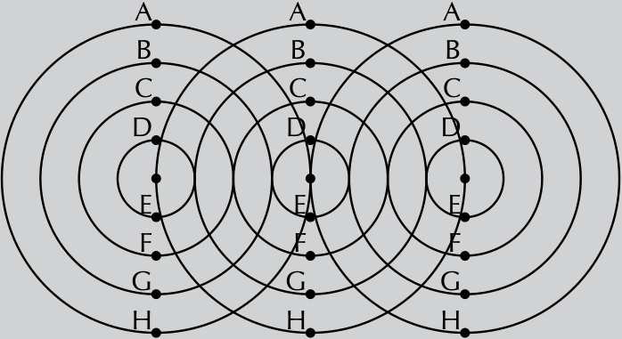
> **[Diagram Context - Textbook_PhysicalSciences_Gr11_2D-and-3D-wavefronts.pdf-0002-07.png]**
> This diagram illustrates the interference pattern of circular waves originating from three point sources, marked with labels A through H along the radii of the concentric circles. It conceptually demonstrates the principle of superposition, where the overlapping wave fronts create regions of constructive and destructive interference, a fundamental concept in Grade 11 Physical Sciences wave mechanics.

### Non-Contact Forces
A non-contact force does not have to touch an object to exert an influence.
*   **Examples:**
    *   **Gravity:** The force of attraction between masses (e.g., the Earth pulling the Moon).
    *   **Electricity:** The force between charged particles (e.g., a proton and an electron attracting each other).
    *   **Magnetism:** The force exerted by magnetic fields (e.g., a magnet pulling a paper clip).

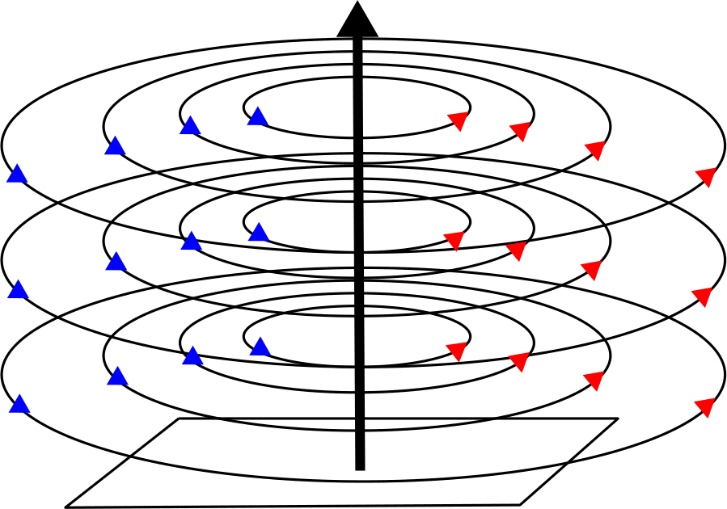
> **[Diagram Context - Textbook_PhysicalSciences_Gr11_Electromagnetism.pdf-0002-07.png]**
> This diagram illustrates the magnetic field pattern around a current-carrying conductor, featuring a central vertical wire represented by a black arrow and concentric circular field lines marked with blue and red directional arrows. It conceptually demonstrates the right-hand rule for electromagnetism, showing how an electric current creates a circular magnetic field perpendicular to the direction of the flow.

## 2. Units and Representation of Force

*   **S.I. Unit:** The unit of force in the International System of units is the **newton**, denoted by the symbol $N$. It is named after Sir Isaac Newton.
*   **Vector Nature:** Force is a vector quantity, meaning it possesses both a **magnitude** and a **direction**.
*   **Symbol:** We represent force using the symbol $\vec{F}$.

## 3. Resultant Force

The **resultant force** is the vector sum of all individual forces acting on a single object.

*   **Key Principle:** To calculate the resultant force, all forces must be acting on the **same object**.
*   **Definition:** The resultant force is the single force that produces the exact same effect as all the individual forces acting together.

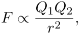

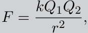

> **[Diagram Context - Textbook_PhysicalSciences_Gr11_Geometrical-optics.pdf-0002-09.png]**
> This image depicts a flat, rectangular plane mirror placed on a grassy surface, reflecting the sky and clouds above. It serves as a practical demonstration of specular reflection, illustrating how light rays from an object strike a smooth, polished surface and reflect at an angle equal to the angle of incidence.

---

# Different Types of Forces in Physics

## Introduction to Forces
Physics is the study of the natural world. Many everyday occurrences are governed by the laws of physics. By analyzing common situations, we can understand the fundamental principles of forces and their applications.

### Practical Observation: The Tilted Table Experiment
To visualize how forces interact, consider the following experiment:
1. Place a book on a flat table. The book remains at rest.
2. Slowly lift one side of the table to create an incline.
3. As the angle of the table increases, the book will eventually begin to slide.
4. Repeating this with books of different masses will show that the angle at which the book slides depends on the properties of the objects involved.

This experiment demonstrates the interaction of forces in a real-world context.

---

## The Normal Force

The normal force is a fundamental concept in mechanics. It acts perpendicular to the surface of contact between two objects.

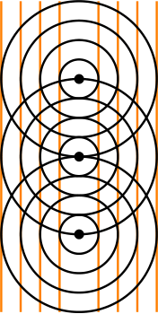
> **[Diagram Context - Textbook_PhysicalSciences_Gr11_2D-and-3D-wavefronts.pdf-0003-00.png]**
> This physics diagram illustrates Huygens' Principle, displaying an array of vertical parallel orange lines representing plane wavefronts alongside three vertically aligned black point sources emitting concentric black circular wavelets. The visual contains no text labels or arrows, relying on the geometric overlay of concentric circles and tangential lines to

*   **Definition:** The normal force is the force exerted by a surface on an object in contact with it, acting in a direction perpendicular (normal) to the surface.
*   **Context:** In the diagram provided, the normal force is the upward force exerted by the table on the book, counteracting the downward pull of gravity.

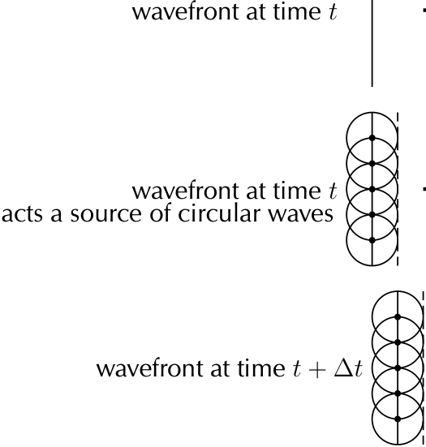
> **[Diagram Context - Textbook_PhysicalSciences_Gr11_2D-and-3D-wavefronts.pdf-0003-09.png]**
> This diagram illustrates Huygens' Principle using a series of wavefronts, labeled as "wavefront at time $t$" and "wavefront at time $t + \Delta t$," with secondary circular wavelets originating from points along the initial wavefront. It conceptually demonstrates how every point on a wavefront acts as a source of secondary spherical wavelets, the envelope of which determines the position and shape of the new wavefront at a subsequent time.

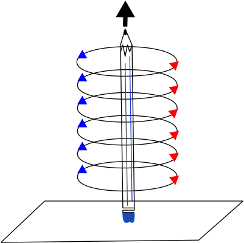
> **[Diagram Context - Textbook_PhysicalSciences_Gr11_Electromagnetism.pdf-0003-01.png]**
> This diagram illustrates a solenoid (coil of wire) wrapped around a central core, represented by a pencil, with arrows indicating the direction of current flow. It serves as a visual aid for applying the right-hand grip rule to determine the direction of the magnetic field generated by an electromagnet.

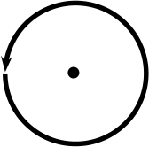
> **[Diagram Context - Textbook_PhysicalSciences_Gr11_Electromagnetism.pdf-0003-04.png]**
> This diagram is a geometric representation of a circular path featuring a central point and an arrow indicating a specific direction of rotation. It conceptually illustrates the principles of circular motion, such as centripetal force and angular displacement, which are fundamental to understanding kinematics and dynamics in the Physical Sciences curriculum.

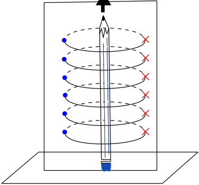
> **[Diagram Context - Textbook_PhysicalSciences_Gr11_Electromagnetism.pdf-0003-06.png]**
> This diagram illustrates a solenoid (coil of wire) wrapped around a central core, represented by a pencil, with blue dots indicating current flowing out of the page and red crosses indicating current flowing into the page. It conceptually demonstrates the generation of a magnetic field within a current-carrying coil, helping students visualize the relationship between electric current direction and the resulting magnetic field orientation.

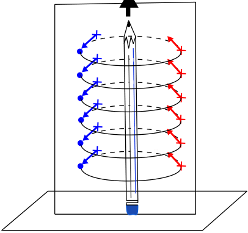
> **[Diagram Context - Textbook_PhysicalSciences_Gr11_Electromagnetism.pdf-0003-08.png]**
> This diagram illustrates a solenoid, represented by a helical coil of wire wrapped around a central core (pencil), featuring blue and red arrows to indicate the direction of current flow and positive/negative charge indicators. It conceptually demonstrates how a current-carrying coil generates a magnetic field, helping Grade 11 and 12 Physical Sciences learners visualize the relationship between electric current and electromagnetism.

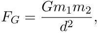

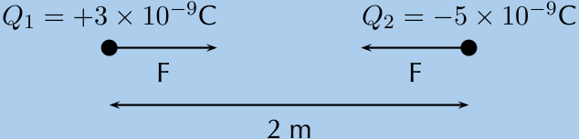
> **[Diagram Context - Textbook_PhysicalSciences_Gr11_Electrostatics.pdf-0003-19.png]**
> This diagram illustrates a physics problem involving two point charges, $Q_1$ ($+3 \times 10^{-9}\text{ C}$) and $Q_2$ ($-5 \times 10^{-9}\text{ C}$), separated by a distance of $2\text{ m}$. The arrows labeled $F$ represent the attractive electrostatic forces acting on each charge, demonstrating Newton's Third Law and Coulomb's Law for opposite charges. This visual serves as a foundational tool for Grade 11 learners to calculate the magnitude of electrostatic force using $F = k\frac{Q_1Q_2}{r^2}$.

> **[Diagram Context - Textbook_PhysicalSciences_Gr11_Geometrical-optics.pdf-0003-03.png]**
> This image features a glowing incandescent light bulb overlaid with a series of concentric circular lines and radiating spokes. It serves as a visual representation of energy transfer, illustrating the propagation of light and heat radiation from a point source into the surrounding environment.

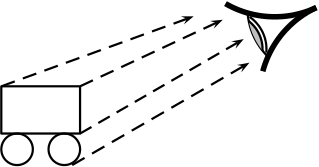
> **[Diagram Context - Textbook_PhysicalSciences_Gr11_Geometrical-optics.pdf-0003-06.png]**
> This diagram illustrates the physics of light, depicting a rectangular object being viewed by an eye through parallel dashed arrows representing light rays. It conceptually demonstrates how light travels from an object to the observer's eye, forming the basis for understanding image formation and the rectilinear propagation of light in the CAPS Physical Sciences curriculum.

---

### Normal Force

When an object is placed on a surface, multiple forces act upon it. For example, if a book is placed on a table, gravity pulls the book downward. To prevent the book from falling through the table, the table exerts an upward force on the book. 

For the book to remain stationary, the force exerted by the table must balance the force of gravity. This means the table's force must have the same magnitude as the gravitational force but act in the opposite direction.

#### Definition: Normal Force
The **normal force**, denoted as $\vec{N}$, is the force exerted by a surface on an object that is in contact with it.

*   **Key Characteristic:** The normal force is always perpendicular (at a right angle, $90^\circ$) to the surface.
*   **Directional Note:** Because it is always perpendicular to the surface, the normal force is not always directly opposite to gravity, especially if the surface is tilted.

> **[Diagram Context - Textbook_PhysicalSciences_Gr11_2D-and-3D-wavefronts.pdf-0004-03.png]**
> This graphic depicts a geometric figure representing a circular arc or a quadrant of a circle. It contains no visible labels, variables, or symbols, consisting only of a single curved line segment against a solid blue background. Conceptually, this figure serves as a foundational element for teaching circle geometry, trigonometry, or the properties of arcs and sectors in the CAPS mathematics curriculum.

---

### Friction Forces

Friction is the force that causes a sliding object to eventually come to a stop. 

*   **Definition:** Friction arises when two surfaces are in contact and are moving relative to each other.
*   **Everyday Example:** When you press your hands together and move them backwards and forwards, you are experiencing friction between two surfaces in contact moving relative to one another.

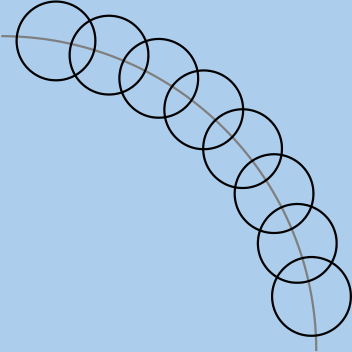
> **[Diagram Context - Textbook_PhysicalSciences_Gr11_2D-and-3D-wavefronts.pdf-0004-07.png]**
> This diagram depicts a series of overlapping circles arranged along a curved path, representing a strobe-like motion sequence or a chain of connected units. It illustrates the concept of uniform circular motion or a trajectory path, helping learners visualize how an object's position changes over discrete time intervals along a curved arc.

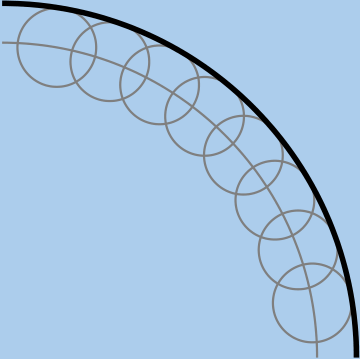
> **[Diagram Context - Textbook_PhysicalSciences_Gr11_2D-and-3D-wavefronts.pdf-0004-09.png]**
> This geometric figure displays a series of overlapping circles centered along a curved arc, bounded by a thick black circular segment. It illustrates the construction of a locus or a path of points equidistant from a central curve, helping students visualize the geometric properties of parallel curves and the relationship between circular arcs and their radii.

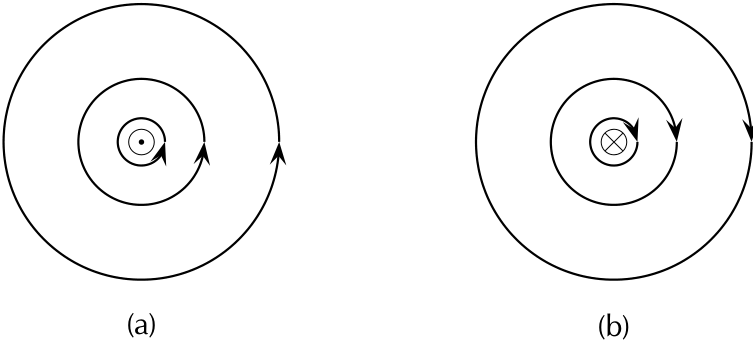
> **[Diagram Context - Textbook_PhysicalSciences_Gr11_Electromagnetism.pdf-0004-03.png]**
> This diagram illustrates the magnetic field patterns around a current-carrying conductor using dot (out of the page) and cross (into the page) notation to represent current direction. It demonstrates the right-hand rule, where the concentric circular arrows indicate the direction of the magnetic field lines relative to the current flow. This visual aid helps learners conceptualize the relationship between the direction of an electric current and the resulting orientation of the magnetic field in electromagnetism.

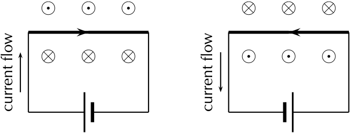
> **[Diagram Context - Textbook_PhysicalSciences_Gr11_Electromagnetism.pdf-0004-06.png]**
> This diagram illustrates two electrical circuits featuring batteries, current flow arrows, and magnetic field indicators represented by dots (out of the page) and crosses (into the page). It demonstrates the application of the right-hand rule to show how the direction of current flow determines the orientation of the magnetic field generated around a conductor.

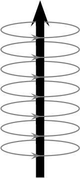
> **[Diagram Context - Textbook_PhysicalSciences_Gr11_Electromagnetism.pdf-0004-12.png]**
> This diagram illustrates the magnetic field pattern around a current-carrying conductor, featuring a central vertical arrow representing the direction of conventional current and concentric grey loops with directional arrows representing the magnetic field lines. It visually demonstrates the right-hand rule, showing how an electric current generates a circular magnetic field perpendicular to the flow of charge.

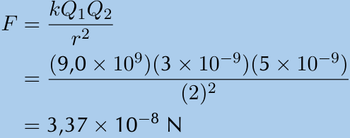
> **[Diagram Context - Textbook_PhysicalSciences_Gr11_Electrostatics.pdf-0004-03.png]**
> This image displays a mathematical calculation based on Coulomb’s Law, featuring the variables $F$ (electrostatic force), $k$ (Coulomb's constant), $Q_1$ and $Q_2$ (point charges), and $r$ (distance). It demonstrates the step-by-step substitution of numerical values into the formula to determine the magnitude of the electrostatic force between two charges, expressed in Newtons (N).

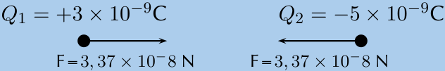
> **[Diagram Context - Textbook_PhysicalSciences_Gr11_Electrostatics.pdf-0004-07.png]**
> This diagram illustrates a pair of point charges, $Q_1$ ($+3 \times 10^{-9}\text{ C}$) and $Q_2$ ($-5 \times 10^{-9}\text{ C}$), with force vectors labeled as $F = 3,37 \times 10^{-8}\text{ N}$ pointing toward each other. It conceptually demonstrates Coulomb’s Law, showing that opposite charges exert equal and opposite attractive electrostatic forces on one another as per Newton’s Third Law.

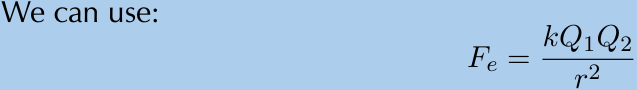
> **[Diagram Context - Textbook_PhysicalSciences_Gr11_Electrostatics.pdf-0004-16.png]**
> This graphic presents the mathematical formula for Coulomb's Law, featuring the variables $F_e$ (electrostatic force), $k$ (Coulomb's constant), $Q_1$ and $Q_2$ (point charges), and $r$ (distance between charges). It serves as a foundational tool for Grade 11 and 12 Physical Sciences learners to calculate the magnitude of the electrostatic force exerted between two point charges.

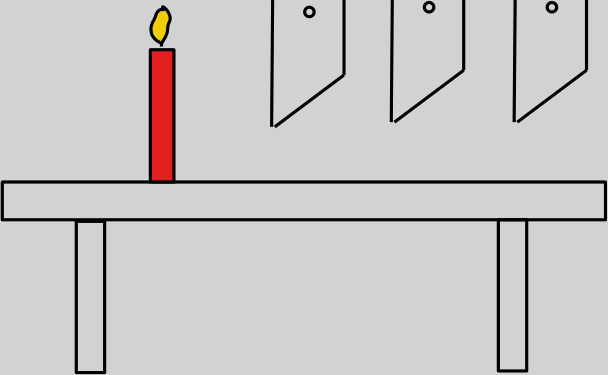
> **[Diagram Context - Textbook_PhysicalSciences_Gr11_Geometrical-optics.pdf-0004-03.png]**
> This diagram illustrates a classic physics experimental setup featuring a light source (a candle) placed in front of a series of opaque screens or barriers, each containing a small aperture or pinhole. The visual elements include a red candle with a yellow flame, a horizontal surface, and three vertical screens with circular openings aligned to demonstrate the rectilinear propagation of light. This setup conceptually teaches learners that light travels in straight lines, as only light rays passing directly through the aligned apertures will be visible on the other side.

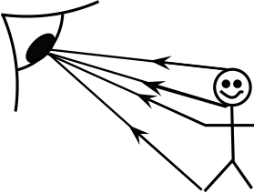
> **[Diagram Context - Textbook_PhysicalSciences_Gr11_Geometrical-optics.pdf-0004-10.png]**
> This diagram illustrates the physics of vision, depicting a human eye observing a person through light rays represented by lines with directional arrows. It conceptually demonstrates that we see objects because light reflects off them and travels into our eyes, a fundamental principle of optics in the Natural Sciences curriculum.

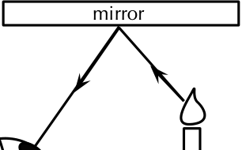
> **[Diagram Context - Textbook_PhysicalSciences_Gr11_Geometrical-optics.pdf-0004-11.png]**
> This ray diagram illustrates the reflection of light from a plane mirror, featuring labels for the "mirror," a candle as the light source, and an eye observing the reflected rays. The arrows indicate the path of light traveling from the candle to the mirror and reflecting into the observer's eye, demonstrating the law of reflection and the formation of a virtual image.

---

### Friction

Friction is a force generated when surfaces interact. It occurs because surfaces are not perfectly smooth; even surfaces that appear smooth have microscopic bumps and grooves that interlock when in contact.

#### Definition: Frictional Force
**Frictional force** is the force that opposes the motion of an object in contact with a surface. It acts **parallel** to the surface with which the object is in contact.

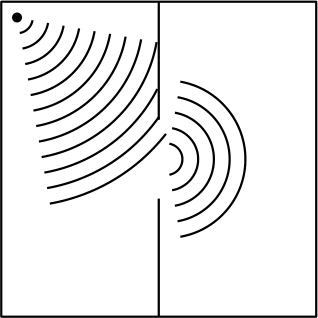
> **[Diagram Context - Textbook_PhysicalSciences_Gr11_2D-and-3D-wavefronts.pdf-0005-05.png]**
> This diagram illustrates the wave phenomenon of diffraction, showing a point source generating circular wavefronts that encounter a barrier with a narrow aperture. As the wavefronts pass through the opening, they spread out into the region beyond, demonstrating how waves bend around obstacles or through slits.

#### Factors Affecting Friction
The magnitude of the frictional force depends on two main factors:
1. The nature of the surfaces in contact.
2. The magnitude of the normal force ($N$).

Frictional forces are proportional to the magnitude of the normal force:
$$F_{\text{friction}} \propto N$$

#### Coefficients of Friction
To calculate the frictional force, we use a constant factor known as the **coefficient of friction**. Because static and kinetic friction have different magnitudes, we use different coefficients:

*   $\mu_s$: The coefficient of **static** friction.
*   $\mu_k$: The coefficient of **kinetic** friction.

#### Static Friction
Static friction acts on an object that is not yet moving. 
*   If a small force is applied to a heavy object, the object may not move. 
*   The frictional force opposing the motion is equal to the applied force but acts in the opposite direction.
*   As the applied force increases, the static frictional force increases until it reaches a maximum value.
*   Once the applied force exceeds this maximum value, the object begins to move.
*   The static frictional force can vary from zero (when the object is stationary and no other forces are present) to a maximum value determined by the nature of the surfaces.

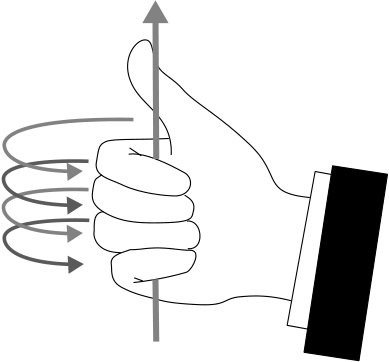
> **[Diagram Context - Textbook_PhysicalSciences_Gr11_Electromagnetism.pdf-0005-01.png]**
> This diagram illustrates the right-hand grip rule, featuring a hand grasping a straight conductor represented by a vertical line with an upward-pointing arrow. The curved arrows encircling the conductor indicate the direction of the induced magnetic field lines. Conceptually, this helps Grade 10-12 Physical Sciences learners visualize the relationship between the direction of conventional current flow and the resulting circular magnetic field around a current-carrying wire.

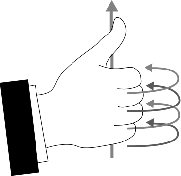
> **[Diagram Context - Textbook_PhysicalSciences_Gr11_Electromagnetism.pdf-0005-02.png]**
> This diagram illustrates the right-hand rule for a current-carrying wire, featuring a hand with an extended thumb and curled fingers alongside directional arrows. The vertical arrow represents the direction of conventional current, while the circular arrows indicate the orientation of the resulting magnetic field lines. This visual aid helps Grade 10-12 Physical Sciences learners determine the relationship between the direction of electric current and the direction of the induced magnetic field around a conductor.

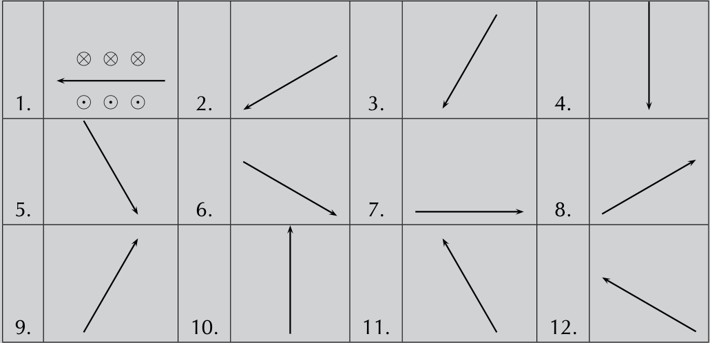
> **[Diagram Context - Textbook_PhysicalSciences_Gr11_Electromagnetism.pdf-0005-07.png]**
> This graphic presents a series of twelve vector diagrams illustrating the application of Fleming’s Left-Hand Rule for determining the direction of magnetic force on a current-carrying conductor. The panels use standard physics notation, including circles with crosses (⊗) to represent magnetic fields directed into the page and circles with dots (⊙) for fields directed out of the page, alongside directional arrows for current and force. It serves as a practice tool for Grade 12 Physical Sciences learners to master the spatial orientation of the magnetic field, current, and resultant force vectors.

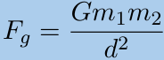

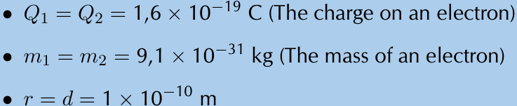
> **[Diagram Context - Textbook_PhysicalSciences_Gr11_Electrostatics.pdf-0005-04.png]**
> This text-based graphic provides the fundamental physical constants for two electrons, specifically their charge ($Q_1, Q_2$), mass ($m_1, m_2$), and the separation distance ($r$ or $d$) between them. It serves as a foundational data set for Grade 12 Physical Sciences learners to calculate and compare the electrostatic and gravitational forces acting between subatomic particles using Coulomb’s Law and Newton’s Law of Universal Gravitation.

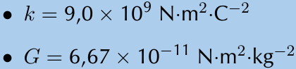
> **[Diagram Context - Textbook_PhysicalSciences_Gr11_Electrostatics.pdf-0005-06.png]**
> This text excerpt displays two fundamental physical constants commonly provided in the Grade 11 and 12 Physical Sciences

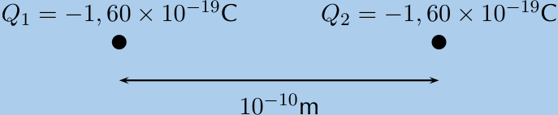
> **[Diagram Context - Textbook_PhysicalSciences_Gr11_Electrostatics.pdf-0005-09.png]**
> This diagram represents a point charge system featuring two identical negative charges, $Q_1$ and $Q_2$, each with a magnitude of $-1,60 \times 10^{-19}\text{ C}$, separated by a distance of $10^{-10}\text{ m}$. It serves as a foundational visual for Grade 11 and 12 Physics, illustrating the parameters required to calculate the electrostatic force between two electrons using Coulomb's Law.

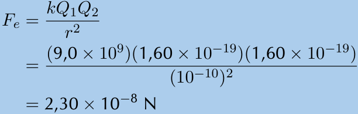
> **[Diagram Context - Textbook_PhysicalSciences_Gr11_Electrostatics.pdf-0005-11.png]**
> This image displays a mathematical calculation using Coulomb’s Law, featuring the variables $F_e$ (electrostatic force), $k$ (Coulomb's constant), $Q_1$ and $Q_2$ (point charges), and $r$ (distance). It demonstrates the application of the formula to calculate the force between two elementary charges separated by an atomic-scale distance, providing a practical example of how to substitute scientific notation values into the equation to solve for force in Newtons.

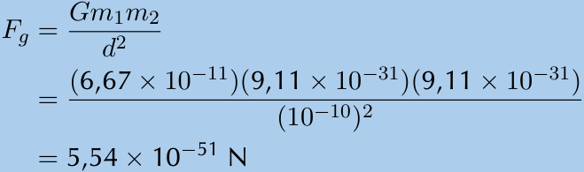
> **[Diagram Context - Textbook_PhysicalSciences_Gr11_Electrostatics.pdf-0005-14.png]**
> This mathematical expression illustrates Newton’s Law of Universal Gravitation, using the variables $F_g$ (gravitational force), $G$ (gravitational constant), $m_1$ and $m_2$ (masses), and $d$ (distance). It demonstrates the calculation of the extremely weak gravitational force between two electrons, highlighting the inverse-square relationship between distance and force as required in the Grade 11 Physical Sciences curriculum.

> **[Diagram Context - Textbook_PhysicalSciences_Gr11_Geometrical-optics.pdf-0005-03.png]**
> This image is a landscape photograph featuring the silhouette of a dead tree partially submerged in a calm body of water against a sunset sky. There are no labels, variables, or scientific symbols present in the visual field. Conceptually, this image serves as a visual stimulus for Life Sciences learners to discuss ecological succession, the impact of environmental changes on habitats, or the abiotic factors influencing aquatic ecosystems.

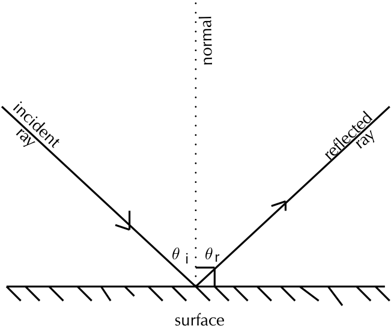
> **[Diagram Context - Textbook_PhysicalSciences_Gr11_Geometrical-optics.pdf-0005-06.png]**
> This ray diagram illustrates the law of reflection, featuring an incident ray, a reflected ray, a normal line, and a reflective surface. It labels the angle of incidence ($\theta_i$) and the angle of reflection ($\theta_r$) to demonstrate that, according to the law of reflection, these two angles are equal relative to the normal.

---

### Friction

Friction is a force that opposes the motion of an object. It acts between two surfaces that are in contact.

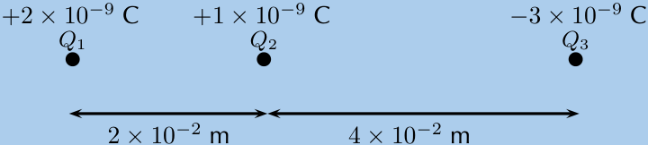
> **[Diagram Context - Textbook_PhysicalSciences_Gr11_Electrostatics.pdf-0006-10.png]**
> This diagram represents a system of three point charges ($Q_1, Q_2, Q_3$) arranged linearly with specific magnitudes of $+2 \times 10^{-9}\text{ C}$, $+1 \times 10^{-9}\text{ C}$, and $-3 \times 10^{-9}\text{ C}$, separated by distances of $2 \times 10^{-2}\text{ m}$ and $4 \times 10^{-2}\text{ m}$. It serves as a foundational setup for Grade 11 Physics students to apply Coulomb’s Law and the principle of superposition to calculate the net electrostatic force acting on a specific charge within the system.

#### 1. Static Friction
Static friction is the force that keeps an object at rest. It can vary up to a maximum value. Once the applied force exceeds this maximum value, the object begins to move.

*   **Definition:** The maximum value for static friction is defined as:
    $$f_s^{max} = \mu_s N$$
    Where:
    *   $f_s^{max}$ is the maximum static frictional force (N).
    *   $\mu_s$ is the coefficient of static friction.
    *   $N$ is the normal force (N).

#### 2. Kinetic Friction
When the applied force is greater than the maximum static frictional force, the object moves. Even while moving, the object experiences friction, known as kinetic friction. The magnitude of kinetic friction remains constant regardless of the magnitude of the applied force.

*   **Definition:** The magnitude of kinetic friction is:
    $$f_k = \mu_k N$$
    Where:
    *   $f_k$ is the kinetic frictional force (N).
    *   $\mu_k$ is the coefficient of kinetic friction.
    *   $N$ is the normal force (N).

#### Key Concepts Summary
| Concept | State of Motion | Description |
| :--- | :--- | :--- |
| **Static Friction** | Object is at rest | Opposes the start of motion; varies up to a maximum. |
| **Kinetic Friction** | Object is moving | Opposes ongoing motion; remains constant. |

*   **Coefficient of Friction:** The value of the coefficient of friction indicates the nature of the surfaces:
    *   **Higher value:** The surface is 'sticky' (more friction).
    *   **Lower value:** The surface is 'slippery' (less friction).

#### Practical Applications of Friction
*   **Stability:** Friction allows ladders to lean against walls without sliding.
*   **Safety:** Friction is essential for car brakes to function.
*   **Sports:** Rock climbers rely on friction to maintain their grip on cliff faces.
*   **Survival:** Early humans utilized friction to generate heat and create fire.

*Note: When a car drives at a constant velocity on a tar road, the wheels are rolling. This is a case of static friction. Kinetic friction only occurs if the wheels lock up and the car skids.*

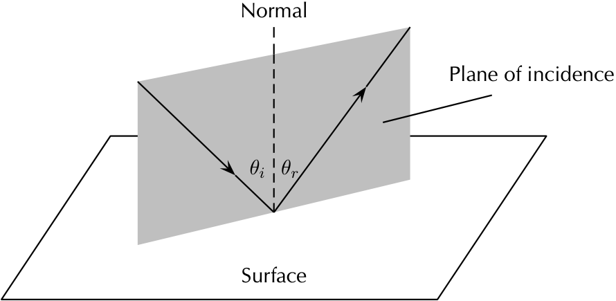
> **[Diagram Context - Textbook_PhysicalSciences_Gr11_Geometrical-optics.pdf-0006-00.png]**
> This diagram illustrates the geometric optics of light reflection, featuring a surface, a normal line, an incident ray, and a reflected ray contained within a shaded "plane of incidence." It labels the angle of incidence ($\theta_i$) and the angle of reflection ($\theta_r$) to demonstrate the law of reflection, which states that these two angles are equal relative to the normal. This visual helps learners understand the three-dimensional spatial relationship between light rays and the reflecting surface as required by the Physical Sciences curriculum.

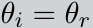

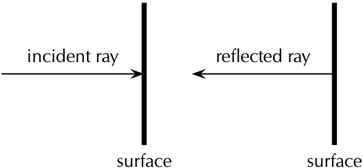
> **[Diagram Context - Textbook_PhysicalSciences_Gr11_Geometrical-optics.pdf-0006-07.png]**
> This ray diagram illustrates the reflection of light off a plane surface, featuring labels for the "incident ray," "reflected ray," and "surface." It demonstrates the concept of normal incidence, where a light ray strikes a surface at a 90-degree angle and reflects directly back along its original path.

---

### Friction and Heat Generation

Friction is a force that can generate heat. A practical example of this is rubbing two sticks together to start a fire. By applying downward pressure, you increase the **normal force**, which in turn increases the amount of friction between the two surfaces. As the surfaces rub against each other, tiny pieces of wood are rubbed off and become hot, eventually creating an ember.

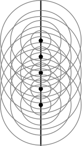
> **[Diagram Context - Textbook_PhysicalSciences_Gr11_2D-and-3D-wavefronts.pdf-0007-00.png]**
> This diagram illustrates a wave interference pattern, specifically showing circular wavefronts emanating from multiple point sources aligned along a central axis. It visually represents the principle of superposition, where the overlapping circular waves demonstrate how constructive and destructive interference patterns are formed in a two-dimensional medium.

#### Practical Application: The Bow Drill
To make the process of starting a fire more efficient, a bow with a string can be used. By twisting the string around the long piece of wood, the wood can be rotated rapidly without the need to use one's hands directly.

---

### Worked Example 1: Static Friction

**Question:**
A box resting on a surface experiences a normal force of magnitude $30\text{ N}$ and the coefficient of static friction between the surface and the box, $\mu_s$, is $0,34$. What is the maximum static frictional force?

**Solution:**

**Step 1: Identify the relationship**
The relationship between the maximum static friction ($f_s^{max}$), the coefficient of static friction ($\mu_s$), and the normal force ($N$) is given by the formula:
$$f_s^{max} = \mu_s N$$

**Step 2: Substitute and calculate**
Given:
*   $\mu_s = 0,34$
*   $N = 30\text{ N}$

Calculation:
$$f_s^{max} = 0,34 \times 30\text{ N}$$
$$f_s^{max} = 10,2\text{ N}$$

**Result:**
The maximum static frictional force is $10,2\text{ N}$.

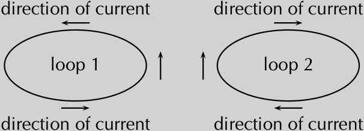
> **[Diagram Context - Textbook_PhysicalSciences_Gr11_Electromagnetism.pdf-0007-02.png]**
> This diagram illustrates two adjacent current-carrying loops labeled "loop 1" and "loop 2," featuring arrows to indicate the "direction of current" flow within each circuit. It conceptually demonstrates the interaction of magnetic fields generated by parallel currents, helping students apply the right-hand rule to determine the forces of attraction or repulsion between the loops.

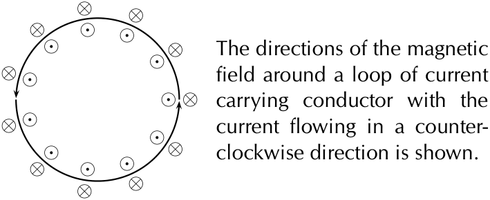
> **[Diagram Context - Textbook_PhysicalSciences_Gr11_Electromagnetism.pdf-0007-04.png]**
> This diagram illustrates the magnetic field pattern around a circular current-carrying conductor, using standard vector notation where dots (•) represent field lines directed out of the page and crosses (⊗) represent field lines directed into the page. It conceptually demonstrates the application of the right-hand rule for a current loop, showing how a counter-clockwise current generates a magnetic field that points out of the center of the loop and into the page outside the loop.

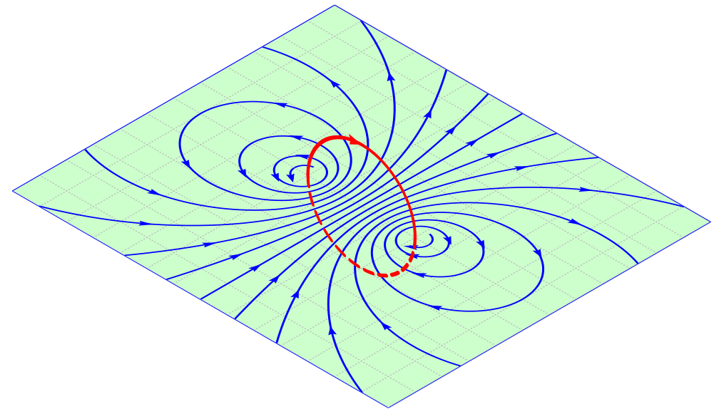
> **[Diagram Context - Textbook_PhysicalSciences_Gr11_Electromagnetism.pdf-0007-05.png]**
> This diagram illustrates the magnetic field lines of a bar magnet, represented by blue lines with directional arrows, intersected by a red loop representing a conducting coil. It visually demonstrates the concept of magnetic flux, showing how the orientation and number of field lines passing through the area of the loop determine the induced electromotive force according to Faraday’s Law of Induction.

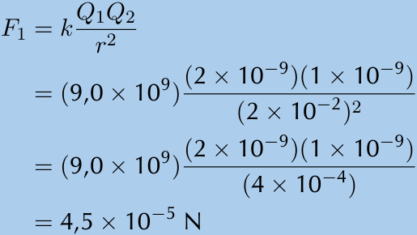
> **[Diagram Context - Textbook_PhysicalSciences_Gr11_Electrostatics.pdf-0007-00.png]**
> This graphic displays a mathematical calculation using Coulomb's Law, featuring variables for electrostatic force ($F_1$), Coulomb's constant ($k$), point charges ($Q_1, Q_2$), and the distance between them ($r$). It demonstrates the step-by-step substitution of scientific notation values into the formula to determine the magnitude of the electrostatic force in Newtons (N). This serves as a practical example for Grade 11 Physical Sciences learners to master the application of inverse-square law calculations in electrostatics.

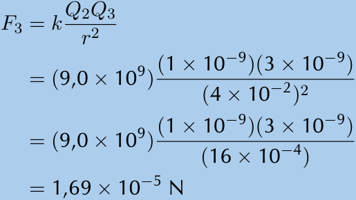
> **[Diagram Context - Textbook_PhysicalSciences_Gr11_Electrostatics.pdf-0007-02.png]**
> This mathematical calculation demonstrates the application of Coulomb’s Law, using the variables $F_3$, $k$, $Q_2$, $Q_3$, and $r$ to determine the electrostatic force between two point charges. It provides a step-by-step substitution of scientific notation values into the formula to solve for the final force in Newtons (N), illustrating the standard procedure for solving electrostatics problems in the Grade 11 Physics curriculum.

> **[Diagram Context - Textbook_PhysicalSciences_Gr11_Electrostatics.pdf-0007-07.png]**
> This vector diagram illustrates the electrostatic forces acting on a central point charge, $Q_2$, due to two external point charges, $Q_1$ and $Q_3$. The labels $F_1$ and $F_3$ represent the force vectors exerted on $Q_2$ by $Q_1$ and $Q_3$ respectively, demonstrating the application of Coulomb’s Law and the principle of superposition. This visual helps Grade 11 and 12 Physical Sciences learners calculate the resultant force on a charge by analyzing the magnitude and direction of individual electrostatic interactions.

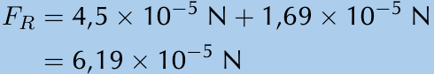
> **[Diagram Context - Textbook_PhysicalSciences_Gr11_Electrostatics.pdf-0007-10.png]**
> This image displays a mathematical calculation for the resultant force ($F_R$) expressed in scientific notation with the unit Newtons (N). It demonstrates the addition of two force vectors acting in the same direction, where the values $4,5 \times 10^{-5}$ N and $1,69 \times 10^{-5}$ N are summed to reach a total magnitude of $6,19 \times 10^{-5}$ N. This illustrates the application of vector addition in Physics, specifically for calculating net force when forces are collinear and act in the same direction.

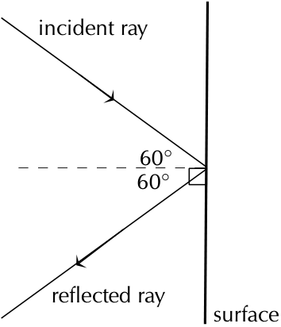
> **[Diagram Context - Textbook_PhysicalSciences_Gr11_Geometrical-optics.pdf-0007-00.png]**
> This ray diagram illustrates the reflection of light off a flat surface, featuring labels for the "incident ray," "reflected ray," and "surface," along with a dashed normal line and two 60° angles. It conceptually demonstrates the Law of Reflection, showing that the angle of incidence equals the angle of reflection relative to the normal.

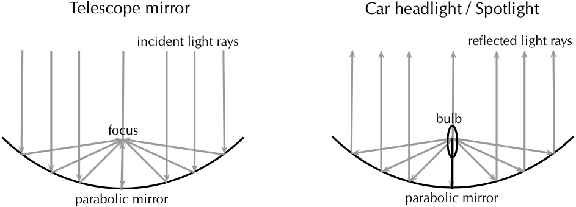
> **[Diagram Context - Textbook_PhysicalSciences_Gr11_Geometrical-optics.pdf-0007-04.png]**
> This diagram illustrates the geometric optics of parabolic mirrors, featuring labels for "incident light rays," "reflected light rays," "focus," "bulb," and "parabolic mirror." It demonstrates the principle of reversibility in optics, showing how parallel incoming rays converge at a focal point in a telescope, while a light source placed at the focus of a spotlight produces a parallel beam of reflected light.

---

### Static Friction Calculations

The maximum magnitude of static friction ($f_s^{max}$) is calculated using the coefficient of static friction ($\mu_s$) and the normal force ($N$):

$$f_s^{max} = \mu_s N$$

---

### Worked Example 2: Static Friction

#### Question
The forwards of your school’s rugby team are trying to push their scrum machine. The normal force exerted on the scrum machine is $10\,000\text{ N}$. The machine isn’t moving at all. If the coefficient of static friction is $0,78$, what is the minimum force they need to exert to get the scrum machine to start moving?

#### Solution

**Step 1: Minimum or maximum**
The question asks for the minimum force required to get the machine moving. While there is no direct formula for "minimum force," we know that the force required to initiate motion must be greater than the maximum force of static friction. Therefore, the threshold value is equal to $f_s^{max}$.

**Step 2: Maximum static friction**
The relationship is defined as:
$$f_s^{max} = \mu_s N$$

Given values:
*   $\mu_s = 0,78$
*   $N = 10\,000\text{ N}$

**Step 3: Calculate the result**
Substitute the values into the formula:

$$f_s^{max} = \mu_s N$$
$$f_s^{max} = (0,78)(10\,000)$$
$$f_s^{max} = 7800\text{ N}$$

The maximum magnitude of static friction is $7800\text{ N}$. To move the machine, the team must exert a force greater than $7800\text{ N}$.

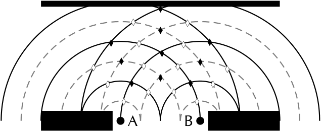
> **[Diagram Context - Textbook_PhysicalSciences_Gr11_2D-and-3D-wavefronts.pdf-0008-00.png]**
> This diagram illustrates the wave interference pattern produced by two coherent point sources, labeled A and B, passing through a double-slit aperture. It uses solid lines to represent wave crests and dashed lines to represent troughs, with solid diamonds indicating constructive interference (antinodal lines) and hollow diamonds indicating destructive interference (nodal lines). The graphic helps students visualize the principle of superposition, demonstrating how overlapping waves create distinct regions of reinforcement and cancellation in a two-dimensional interference pattern.

> **[Diagram Context - Textbook_PhysicalSciences_Gr11_2D-and-3D-wavefronts.pdf-0008-05.png]**
> This graphic displays a single-slit diffraction pattern, represented as a line graph showing intensity versus position. The curve features a prominent central maximum flanked by smaller, secondary maxima of decreasing intensity. It illustrates the wave nature of light, demonstrating how light waves interfere constructively and destructively when passing through a narrow aperture to create a characteristic diffraction pattern.

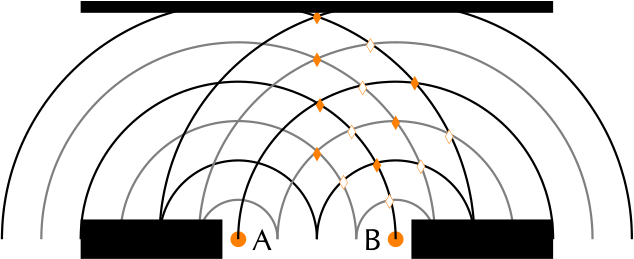
> **[Diagram Context - Textbook_PhysicalSciences_Gr11_2D-and-3D-wavefronts.pdf-0008-06.png]**
> This diagram illustrates the wave interference pattern produced by two coherent point sources, labeled A and B, passing through two slits. It displays overlapping circular wavefronts, with orange diamonds marking points of constructive interference (antinodal lines) and white diamonds marking points of destructive interference (nodal lines). This visual representation helps Grade 11 and 12 Physical Sciences learners understand the principle of superposition and the formation of interference patterns in waves.

> **[Diagram Context - Textbook_PhysicalSciences_Gr11_Electromagnetism.pdf-0008-03.png]**
> This diagram illustrates the magnetic field lines generated by a current-carrying solenoid, featuring a coil of wire, curved field lines, and a label indicating "current flow" with a directional arrow. It visually demonstrates how an electric current creates a magnetic field similar to that of a bar magnet, helping learners understand the principles of electromagnetism as required by the CAPS Physical Sciences curriculum.

> **[Diagram Context - Textbook_PhysicalSciences_Gr11_Electromagnetism.pdf-0008-06.png]**
> This diagram illustrates the magnetic field pattern of a solenoid, featuring red loops representing the current-carrying coil and black curved lines indicating the resulting magnetic field lines. It visually demonstrates how a solenoid creates a uniform magnetic field inside the coil that resembles the field of a bar magnet, a core concept in Grade 11 and 12 Physics regarding electromagnetism.

> **[Diagram Context - Textbook_PhysicalSciences_Gr11_Electrostatics.pdf-0008-03.png]**
> This diagram represents a system of three point charges arranged in an L-shaped configuration, labeled $Q_1$ (+4 nC), $Q_2$ (+6 nC), and $Q_3$ (-3 nC), with specified separation distances of $3 \times 10^{-2}$ m and $5 \times 10^{-2}$ m. It serves as a foundational setup for Grade 11/12 Physics students to calculate the resultant electrostatic force or electric field at a specific point using Coulomb’s Law and vector addition.

> **[Diagram Context - Textbook_PhysicalSciences_Gr11_Electrostatics.pdf-0008-14.png]**
> This graphic displays a step-by-step mathematical calculation using Coulomb’s Law, featuring the variables $F$ (force), $k$ (Coulomb's constant), $Q_1$ and $Q_2$ (point charges), and $r$ (distance). It demonstrates the application of the formula to determine the electrostatic force between two charges by substituting specific scientific notation values and simplifying the expression to a final result in Newtons (N).

> **[Diagram Context - Textbook_PhysicalSciences_Gr11_Geometrical-optics.pdf-0008-00.png]**
> This diagram illustrates a transverse wave profile marked with points A through H along its path. It serves to help learners identify and distinguish between key wave characteristics, such as crests (B), troughs (F), and points in phase or at different stages of displacement.

> **[Diagram Context - Textbook_PhysicalSciences_Gr11_Geometrical-optics.pdf-0008-02.png]**
> This ray diagram illustrates the reflection of light off a surface, featuring labels for the incident ray (B), reflected ray (A), normal line (E), angle of incidence (C), and angle of reflection (D). It conceptually demonstrates the law of reflection, which states that the angle of incidence is equal to the angle of reflection relative to the normal.

> **[Diagram Context - Textbook_PhysicalSciences_Gr11_Geometrical-optics.pdf-0008-10.png]**
> This ray diagram illustrates the reflection of light at a plane surface, featuring an incident ray labeled 'I', a dashed line representing the 'normal', and several potential reflected rays labeled 'A' through 'E'. It serves to test a learner's understanding of the law of reflection, which states that the angle of incidence must equal the angle of reflection relative to the normal.

---

### Worked Example 3: Kinetic Friction

#### Question
The normal force exerted on a pram is $100\text{ N}$. The pram's brakes are locked so that the wheels cannot turn. The owner tries to push the pram but it doesn't move. The owner pushes harder and harder until it suddenly starts to move when the applied force is three quarters of the normal force. After that, the owner is able to keep it moving with a force that is half of the force at which it started moving. 

**Calculate:**
1. The magnitude of the applied force at which it starts moving.
2. The coefficient of static friction ($\mu_s$).
3. The coefficient of kinetic friction ($\mu_k$).

---

#### Solution

**Step 1: Maximum static friction**
The owner increases the applied force until the pram starts to move. This force is equal to the maximum static friction ($f_s^{max}$), given by the formula:
$$f_s^{max} = \mu_s N$$

Given that the applied force is three quarters of the normal force ($N = 100\text{ N}$):
$$f_s^{max} = \frac{3}{4}N$$
$$f_s^{max} = \frac{3}{4}(100)$$
$$f_s^{max} = 75\text{ N}$$

**Step 2: Coefficient of static friction ($\mu_s$)**
Using the maximum static friction and the normal force, we solve for $\mu_s$:
$$f_s^{max} = \mu_s N$$
$$75 = \mu_s(100)$$
$$\mu_s = 0,75$$

**Step 3: Coefficient of kinetic friction ($\mu_k$)**
The force required to keep the pram moving ($f_k$) is half of the force required to start it moving ($f_s^{max}$):
$$f_k = \frac{1}{2}f_s^{max}$$
$$f_k = \frac{1}{2}(75)$$
$$f_k = 37,5\text{ N}$$

To find the coefficient of kinetic friction, we use the relationship:
$$f_k = \mu_k N$$
$$37,5 = \mu_k(100)$$
$$\mu_k = 0,375$$

> **[Diagram Context - Textbook_PhysicalSciences_Gr11_2D-and-3D-wavefronts.pdf-0009-00.png]**
> This diagram illustrates the wave interference pattern produced by two coherent point sources, A and B, passing through a double-slit barrier. It uses black and grey concentric arcs to represent wave crests and troughs, with black and white diamonds marking points of constructive and destructive interference. This visualizes the principle of superposition, demonstrating how overlapping waves create nodal and antinodal lines, a fundamental concept in Grade 11 and 12 Physical Sciences regarding wave optics.

> **[Diagram Context - Textbook_PhysicalSciences_Gr11_2D-and-3D-wavefronts.pdf-0009-04.png]**
> This diagram illustrates the interference pattern of two coherent point sources, A and B, represented by circular wavefronts where solid lines denote crests and dashed lines denote troughs. The markers indicate points of constructive interference (solid diamonds) where crests meet crests, and destructive interference (hollow diamonds) where crests meet troughs. This visualizes the principle of superposition in wave mechanics, helping students understand how path difference leads to the formation of nodal and antinodal lines in an interference pattern.

> **[Diagram Context - Textbook_PhysicalSciences_Gr11_2D-and-3D-wavefronts.pdf-0009-06.png]**
> This diagram is an arc-based network visualization representing connectivity or relationships between nodes, featuring solid and dashed semi-circular arcs connecting base points and intermediate diamond-shaped markers. The graphic utilizes a color-coded system of red and orange circles at the base, with corresponding solid and hollow diamond markers arranged along a central vertical axis and various arc paths. It conceptually illustrates complex data mapping, such as sequence alignment or network topology, helping students visualize how distinct elements interact or relate within a structured system.

> **[Diagram Context - Textbook_PhysicalSciences_Gr11_Electromagnetism.pdf-0009-02.png]**
> This image displays an experimental apparatus consisting of a current-carrying solenoid wrapped around a metal nail, with iron filings scattered on a surface to visualize the magnetic field. The iron filings align along the invisible magnetic field lines, demonstrating the dipole-like magnetic field pattern generated by an electromagnet. This visual representation helps learners understand the relationship between electric current and magnetism, illustrating how a solenoid creates a magnetic field similar to that of a bar magnet.

> **[Diagram Context - Textbook_PhysicalSciences_Gr11_Electrostatics.pdf-0009-01.png]**
> This graphic displays a step-by-step mathematical calculation using Coulomb’s Law, featuring the formula $F_3 = k \frac{Q_1Q_3}{r^2}$ and substituted values for electrostatic force, charge ($Q$), distance ($r$), and Coulomb’s constant ($k$). It demonstrates the application of the inverse-square law to determine the magnitude of the electrostatic force between two point charges in Newtons (N), serving as a practical example for Grade 11 Physics learners.

> **[Diagram Context - Textbook_PhysicalSciences_Gr11_Electrostatics.pdf-0009-08.png]**
> This diagram is a vector force diagram representing the electrostatic interaction between three point charges, labeled $Q_1$ (+4 nC), $Q_2$ (+6 nC), and $Q_3$ (-3 nC). It illustrates the resultant electrostatic forces acting on $Q_1$, with vectors $\vec{F}_2$ and $\vec{F}_3$ representing the attractive and repulsive forces exerted by the other charges, helping students apply Coulomb’s Law to calculate the net force on a charge in a 2D plane.

> **[Diagram Context - Textbook_PhysicalSciences_Gr11_Electrostatics.pdf-0009-11.png]**
> This mathematical representation demonstrates the calculation of a resultant force ($F_R$) using Pythagoras' theorem, incorporating variables $F_2$ and $F_3$ with scientific notation. It illustrates the application of vector addition for perpendicular forces, a fundamental concept in Grade 11 and 12 Physical Sciences for determining the net force acting on an object.

---

### Calculation of Kinetic Friction Coefficient
To find the coefficient of kinetic friction ($\mu_k$), use the formula:
$$f_k = \mu_k N$$

Given values:
*   $f_k = 37,5\text{ N}$
*   $N = 100\text{ N}$

Calculation:
$$37,5 = \mu_k(100)$$
$$\mu_k = 0,375$$

---

### Worked Example 4: Coefficient of Static Friction

#### Question
A block of wood experiences a normal force of $32\text{ N}$ from a rough, flat surface. There is a rope tied to the block. The rope is pulled parallel to the surface and the tension (force) in the rope can be increased to $8\text{ N}$ before the block starts to slide. Determine the coefficient of static friction.

#### Solution

**Step 1: Analyse the question and determine what is asked**
*   The normal force ($N$) is $32\text{ N}$.
*   The maximum static frictional force ($f_s$) before motion occurs is $8\text{ N}$.
*   We are asked to find the coefficient of static friction ($\mu_s$).

**Step 2: Find the coefficient of static friction**
Using the formula:
$$f_s = \mu_s N$$
$$8 = \mu_s(32)$$
$$\mu_s = \frac{8}{32}$$
$$\mu_s = 0,25$$

**Note:** The coefficient of friction does not have a unit as it represents a ratio. The value for the coefficient of static friction can have any value up to a maximum of $0,25$. When a force less than $8\text{ N}$ is applied, the coefficient of friction will be less than $0,25$.

---

### Worked Example 5: Static Friction

#### Question
A box resting on an inclined plane experiences a normal force of magnitude $130\text{ N}$ and the coefficient of static friction, $\mu_s$, between the box and the surface is $0,47$. What... 

---

### Worked Example: Calculating Maximum Static Frictional Force

**Problem:** Calculate the maximum static frictional force given the coefficient of static friction ($\mu_s = 0,47$) and the normal force ($N = 130\text{ N}$).

#### Solution

**Step 1: Identify the formula**
The relationship between the maximum static friction ($f_s^{max}$), the coefficient of static friction ($\mu_s$), and the normal force ($N$) is defined as:
$$f_s^{max} = \mu_s N$$

*Note: This relationship remains constant regardless of whether the surface is inclined or horizontal. While changing the inclination of a surface affects the magnitude of the normal force, the fundamental method for calculating the frictional force remains the same.*

**Step 2: Calculate the result**
Substitute the given values into the formula:
$$f_s^{max} = \mu_s N$$
$$f_s^{max} = (0,47)(130)$$
$$f_s^{max} = 61,1\text{ N}$$

**Final Answer:** The maximum magnitude of static friction is $61,1\text{ N}$.

---

### Informal Experiment: Normal Forces and Friction

**Aim:**
To investigate the relationship between normal force and friction.

**Apparatus:**
*   Spring balance
*   Several blocks (of the same material) with hooks attached
*   Several rough and smooth surfaces
*   Bricks or blocks (to incline the surfaces)

> **[Diagram Context - Textbook_PhysicalSciences_Gr11_Electrostatics.pdf-0011-00.png]**
> This diagram illustrates a linear arrangement of three point charges ($Q_1$, $Q_3$, and $Q_2$) separated by distances $r_1$ and $r_2$. It serves as a foundational model for Grade 11 and 12 Physics, enabling students to apply Coulomb’s Law to calculate the net electrostatic force exerted on a central charge by two surrounding charges.

**Method:**
1.  Attach each of the blocks to the spring balance in turn and note the reading.
2.  Take one block and attach it to the spring balance. Slide the block along each of the surfaces in turn. Note the readings. Repeat for the other blocks.
3.  Repeat the above step but incline the surfaces at different angles.

**Results:**
*(Space provided for recording observations)*

> **[Diagram Context - Textbook_PhysicalSciences_Gr11_Electrostatics.pdf-0011-02.png]**
> This diagram represents a one-dimensional electrostatics problem featuring three point charges ($Q_1$, $Q_2$, and $Q_3$) arranged linearly with specified distances ($r_1$ and $r_2$). It provides the numerical values for the charges and their separations, serving as a foundational setup for Grade 11 and 12 learners to calculate the net electrostatic force or electric field acting on $Q_3$ using Coulomb’s Law.

> **[Diagram Context - Textbook_PhysicalSciences_Gr11_Electrostatics.pdf-0011-04.png]**
> This diagram illustrates a system of three point charges ($Q_1 = +2\text{ nC}$, $Q_2 = +1\text{ nC}$, and $Q_3 = +3\text{ nC}$) arranged in a right-angled triangle configuration. The labels include the charge magnitudes in nanocoulombs and the spatial separation distances of $0,04\text{ m}$ and $0,07\text{ m}$ between the charges. Conceptually, this setup is used in Grade 11 Physics to calculate the net electrostatic force acting on a specific charge by applying Coulomb’s Law and vector addition.

> **[Diagram Context - Textbook_PhysicalSciences_Gr11_Electrostatics.pdf-0011-06.png]**
> This diagram illustrates a system of three point charges ($Q_1 = -9\text{ nC}$, $Q_2 = +1\text{ nC}$, and $Q_3 = -3\text{ nC}$) arranged at the vertices of a right-angled triangle with side lengths of $0,4\text{ m}$ and $0,65\text{ m}$. It serves as a foundational setup for Grade 11 and 12 Physics learners to calculate the resultant electrostatic force or electric field at a specific point using Coulomb’s Law and vector addition.

> **[Diagram Context - Textbook_PhysicalSciences_Gr11_Electrostatics.pdf-0011-08.png]**
> This diagram illustrates a system of three point charges ($Q_1 = +8\text{ nC}$, $Q_2 = +3\text{ nC}$, and $Q_3 = -2\text{ nC}$) arranged in a right-angled triangular configuration with side lengths of $0,05\text{ m}$ and $0,03\text{ m}$. It serves as a foundational setup for Grade 11 Physics, requiring students to apply Coulomb’s Law and the principle of vector superposition to calculate the net electrostatic force acting on a specific charge.

> **[Diagram Context - Textbook_PhysicalSciences_Gr11_Geometrical-optics.pdf-0011-04.png]**
> This diagram illustrates the physical phenomenon of light refraction using a straw placed in a glass of water, labeled with "observer," "straw," and "glass of water." It uses solid and dashed lines with arrows to demonstrate how light rays bending at the air-water interface cause the submerged portion of the straw to appear displaced to the observer. This visualizes the concept of refraction for Grade 10 Physical Sciences, showing how the change in optical density causes a change in the direction of light, resulting in a virtual image.

---

### Tension
**Definition:** Tension is the magnitude of the force that exists in objects like ropes, chains, and struts that are providing support. 
*Example:* The tension forces in the ropes supporting a child's swing hanging from a tree.

---

### Exercise 2 – 1

**1. Static Friction Calculation**
A box is placed on a rough surface. It has a normal force of magnitude $120\text{ N}$. A force of $20\text{ N}$ applied to the right cannot move the box. Calculate the magnitude and direction of the friction forces.

**2. Friction Analysis**
A block rests on a horizontal surface. The normal force is $20\text{ N}$. The coefficient of static friction ($\mu_s$) is $0,40$ and the coefficient of dynamic friction ($\mu_k$) is $0,20$.

*   **a)** What is the magnitude of the frictional force exerted on the block while the block is at rest?
*   **b)** What will the magnitude of the frictional force be if a horizontal force of magnitude $5\text{ N}$ is exerted on the block?
*   **c)** What is the minimum force required to start the block moving?
*   **d)** What is the minimum force required to keep the block in motion once it has been started?
*   **e)** If the horizontal force is $10\text{ N}$, determine the frictional force.

**3. Practical Investigation: Legal Case Study**
A lady injured her back in a supermarket. You are tasked to determine if the coefficient of static friction of the floor is a minimum of $0,5$ as required by standards. You are provided with a tile from the floor and one of the lady's shoes.

*   **a)** Write down an expression for the coefficient of static friction ($\mu_s$).
    *   *Hint:* $\mu_s = \frac{f_{s(max)}}{N}$
*   **b)** Plan an investigation to assist the judge:
    *   **i. Investigation Question:** Formulate a question to test the coefficient of friction.
    *   **ii. Apparatus:** List all additional apparatus required (excluding the tile and shoe).
    *   **iii. Stepwise Method:** Describe the procedure.
        

> **[Diagram Context - Textbook_PhysicalSciences_Gr11_2D-and-3D-wavefronts.pdf-0012-03.png]**
> This mathematical representation compares the diffraction of red and green light using the variables $\lambda$ (wavelength) and $w$ (slit width). It illustrates the physical principle that because red light has a longer wavelength than green light, it undergoes greater diffraction when passing through the same slit width.

    *   **iv. Results:** What data will you record?
    *   **v. Conclusion:** How will you interpret the results to draw a conclusion?

> **[Diagram Context - Textbook_PhysicalSciences_Gr11_Electromagnetism.pdf-0012-01.png]**
> This diagram illustrates a solenoid connected to a power source, displaying the resulting magnetic field lines and a labeled "current flow" arrow. It visually demonstrates the principle of electromagnetism, showing how an electric current passing through a coiled conductor generates a magnetic field similar to that of a bar magnet.

> **[Diagram Context - Textbook_PhysicalSciences_Gr11_Electromagnetism.pdf-0012-03.png]**
> This diagram illustrates the magnetic field lines around a current-carrying conductor, represented by concentric circles with labels A through H and symbols indicating current flowing out of (dot) and into (cross) the page. It helps Grade 10-12 Physical Sciences learners visualize the right-hand rule, demonstrating how the direction of the magnetic field changes relative to the direction of the conventional current.

> **[Diagram Context - Textbook_PhysicalSciences_Gr11_Electrostatics.pdf-0012-10.png]**
> This diagram illustrates the electric field pattern surrounding a positive point charge, featuring a central source charge (+Q) and a smaller positive test charge (+q) surrounded by radially outward-pointing arrows. It conceptually demonstrates how the electric field lines represent the direction of the electrostatic force that would be exerted on a positive test charge placed within the field of the source charge.

---

### Force Diagrams

Force diagrams are sketches of a physical situation. They use arrows to represent all the forces acting on a system.

#### Example 1: A block at rest on a surface
When a block rests on a surface, it is acted upon by the force of gravity pulling it down and a normal force pushing it up from the surface. In this static situation, the magnitudes of these two forces are equal.

> **[Diagram Context - Textbook_PhysicalSciences_Gr11_2D-and-3D-wavefronts.pdf-0013-04.png]**
> This diagram illustrates single-slit diffraction, showing incoming light waves of wavelength ($\lambda$) passing through a slit of width ($w$) to form a diffraction pattern on a screen. The variables $\theta$ and $y_n$ represent the angular position and linear distance of the diffraction minima, respectively, helping students apply the formula $\sin\theta = n\lambda/w$ to calculate the spread of light.

#### Example 2: A block with applied forces
Consider a block on a surface with an applied force to the left ($\vec{F}_L$) of $10\text{ N}$ and an applied force to the right ($\vec{F}_R$) of $20\text{ N}$. The weight ($\vec{F}_g$) and the normal force ($\vec{N}$) also have magnitudes of $10\text{ N}$.

> **[Diagram Context - Textbook_PhysicalSciences_Gr11_Electromagnetism.pdf-0013-05.png]**
> This diagram illustrates the magnetic field pattern of a bar magnet, featuring labels for the North (N) and South (S) poles and arrows indicating the direction of the field lines. It visually demonstrates the concept of magnetic flux, showing how field lines emerge from the North pole and enter the South pole to represent the spatial distribution and orientation of the magnetic force.

---

### Guidelines for Drawing Force Diagrams

When drawing force diagrams, keep the following rules in mind:

*   **Clarity:** Make your drawings large and clear.
*   **Direction:** Use arrows to indicate the direction of the force.
*   **Magnitude:** The length of the arrow represents the size (magnitude) of the force.
    *   A longer arrow indicates a larger force (e.g., $\vec{F}_R$ is longer than $\vec{F}_L$).
    *   Arrows of the same length indicate forces of equal size (e.g., $\vec{F}_N$ and $\vec{F}_g$).
    *   You may use "little lines" (hatch marks) on the arrows to indicate equal magnitude, similar to geometric notation in mathematics.

> **[Diagram Context - Textbook_PhysicalSciences_Gr11_Electrostatics.pdf-0013-03.png]**
> This diagram illustrates the radial electric field pattern surrounding a negative point charge (-Q) as it interacts with a positive test charge (+q). The visual features include a central black sphere labeled -Q, a smaller red sphere labeled +q, and directional arrows representing the inward-pointing electric field lines. Conceptually, this demonstrates the attractive electrostatic force exerted by a negative source charge on a positive test charge, reinforcing the convention that electric field lines originate at infinity and terminate on negative charges.

> **[Diagram Context - Textbook_PhysicalSciences_Gr11_Geometrical-optics.pdf-0013-06.png]**
> This mathematical expression represents the calculation of the speed of light ($v$) in a medium with a refractive index ($n$) of 1,4729. It utilizes the formula $v = c/n$, where $c$ is the speed of light in a vacuum ($3 \times 10^8 \text{ m}\cdot\text{s}^{-1}$), to demonstrate how light slows down when entering a denser optical medium.

---

### Guidelines for Drawing Force Diagrams

When representing forces acting on an object, adhere to the following conventions:
*   **Precision:** Use a ruler to draw neat, straight lines.
*   **Contact:** Ensure the arrows touch the system or object being analyzed.
*   **Labeling:** Every arrow must be clearly labeled. If space is limited, use letters and provide a key on the side.
*   **Context:** Labels must indicate the source of the force (e.g., "force of the car") and the direction of the force (e.g., "to the right").
*   **Quantification:** If the magnitudes of the forces are known, include these values in the diagram or the key.

---

### Free Body Diagrams (ESBKN)

A **free-body diagram** is a simplified representation of an object where the object of interest is drawn as a single dot. All forces acting on that object are represented as arrows pointing away from the dot.

> **[Diagram Context - Textbook_PhysicalSciences_Gr11_2D-and-3D-wavefronts.pdf-0014-05.png]**
> This mathematical calculation demonstrates the step-by-step algebraic process of solving for an unknown angle ($\theta$) using the inverse sine function. It features the variables $\sin \theta$ and $\theta$, alongside numerical values expressed in scientific notation ($10^{-9}$ m) and the final result in degrees. This sequence illustrates the application of trigonometry in Physics, typically used in the CAPS curriculum to determine diffraction angles in wave optics.

*   **Vertical Forces:** The normal force ($\vec{N}$) acts upwards, while the gravitational force ($\vec{F}_g$) acts downwards.
*   **Horizontal Forces:** Applied forces (such as $\vec{F}_L$ to the left or $\vec{F}_R$ to the right) are represented as horizontal vectors originating from the center dot.

---

### Resolving Forces into Components (ESBKP)

Resolving forces is particularly useful when analyzing motion on an **inclined plane**. In this scenario, the normal force is dependent on the component of the gravitational force ($\vec{F}_g$) that acts perpendicular to the slope.

#### The Inclined Plane Concept
When a block is placed on a plane inclined at an angle $\theta$ to the horizontal:
1.  The gravitational force ($\vec{F}_g$) acts directly downwards.
2.  This force can be resolved into two distinct components:
    *   A component **perpendicular** to the plane.
    *   A component **parallel** to the plane.

> **[Diagram Context - Textbook_PhysicalSciences_Gr11_Electromagnetism.pdf-0014-06.png]**
> This diagram illustrates the concept of magnetic flux through a surface, showing a rectangular loop interacting with a magnetic field ($\vec{B}$) at various orientations. It labels the magnetic field vector $\vec{B}$ and uses trigonometric components ($B \cos\theta$ and $B \sin\theta$) to demonstrate how the angle between the field and the surface normal determines the magnitude of the flux. These visuals help Grade 12 Physical Sciences learners understand the geometric relationship required to calculate magnetic flux ($\Phi = BA \cos\theta$) by isolating the perpendicular component of the field.

> **[Diagram Context - Textbook_PhysicalSciences_Gr11_Electrostatics.pdf-0014-00.png]**
> This diagram illustrates electric field line patterns for point charges, labeled as "+Q" (positive) and "-Q" (negative). It visually demonstrates the direction of the electric field, showing that field lines point radially outward from a positive charge and radially inward toward a negative charge, which is a fundamental concept for understanding electrostatic forces in the Grade 10-12 Physical Sciences curriculum.

> **[Diagram Context - Textbook_PhysicalSciences_Gr11_Electrostatics.pdf-0014-08.png]**
> This diagram illustrates the electric field lines surrounding two point charges, labeled as 1 nC and 10 nC, using arrows to represent the direction and relative magnitude of the field. By comparing the density of the outward-pointing field lines, the graphic demonstrates that the strength of an electric field is directly proportional to the magnitude of the source charge.

> **[Diagram Context - Textbook_PhysicalSciences_Gr11_Geometrical-optics.pdf-0014-12.png]**
> This ray diagram illustrates the refraction of light as it passes from water ($n=1,3$) into air ($n=1,0$), featuring labels for the incident ray, refracted ray, normal, and the respective angles of incidence ($\theta_1$) and refraction ($\theta_2$). It demonstrates the principle that light bends away from the normal when moving from an optically denser medium to a less dense medium, providing a visual basis for applying Snell’s Law in Grade 11 Physical Sciences.

---

### Resolving Gravitational Force on an Inclined Plane

When an object is placed on an inclined plane, the gravitational force ($\vec{F}_g$) acts vertically downwards. To simplify calculations, we align our coordinate system with the incline.

#### 1. Coordinate System Alignment
By setting the $x$-axis parallel to the inclined plane and the $y$-axis perpendicular to it, we can resolve the gravitational force into two perpendicular components:
*   **$F_{gx}$**: The component of gravity acting parallel to the slope (causing the object to slide down).
*   **$F_{gy}$**: The component of gravity acting perpendicular to the slope (pressing the object into the surface).

> **[Diagram Context - Textbook_PhysicalSciences_Gr11_2D-and-3D-wavefronts.pdf-0015-01.png]**
> This image displays a mathematical calculation involving the sine function to determine an angle, denoted by the variable $\theta$. The steps demonstrate the division of two values in scientific notation followed by the application of the inverse sine function to arrive at a final angular value of $12.2^\circ$. Conceptually, this illustrates the application of the single-slit diffraction formula used in Grade 12 Physical Sciences to calculate the angular position of the first diffraction minimum.

#### 2. Trigonometric Components
The angle of the incline ($\theta$) is geometrically equivalent to the angle between the gravitational force vector ($\vec{F}_g$) and the perpendicular component ($F_{gy}$). Using right-angled trigonometry, we define the components as follows:

*   **Parallel component:**
    $$F_{gx} = F_g \sin(\theta)$$

*   **Perpendicular component:**
    $$F_{gy} = F_g \cos(\theta)$$

> **[Diagram Context - Textbook_PhysicalSciences_Gr11_Electromagnetism.pdf-0015-03.png]**
> This diagram illustrates electromagnetic induction, featuring a rectangular conducting loop connected to an ammeter (A) positioned near a bar magnet with labeled North (N) and South (S) poles and directional magnetic field lines. It conceptually demonstrates how the relative motion between the magnetic field and the conductor induces an electromotive force, which the ammeter detects as an electric current.

#### 3. Key Concepts Summary
*   **Inclined Plane:** A flat supporting surface tilted at an angle $\theta$ to the horizontal.
*   **Resolution of Vectors:** Breaking a single vector ($\vec{F}_g$) into two components that act along the chosen $x$ and $y$ axes.
*   **Geometry:** The angle of the incline is always equal to the angle between the weight vector and the normal to the surface.

> **[Diagram Context - Textbook_PhysicalSciences_Gr11_Electrostatics.pdf-0015-05.png]**
> This diagram illustrates the electric field patterns surrounding point charges, labeled as positive (+Q) and negative (-Q) with arrows indicating the direction of the field lines. It visually demonstrates the fundamental CAPS physics concept that electric field lines point radially outward from a positive charge and radially inward toward a negative charge, representing the direction a positive test charge would move.

***

### Worked Example 6: Components of force due to gravity

**QUESTION**
*(Note: The specific numerical values for this example were not provided in the source text; however, the methodology for solving such problems is as follows:)*

1.  **Identify the given values:** Determine the mass ($m$) of the object and the angle of inclination ($\theta$).
2.  **Calculate total weight:** Use $F_g = mg$, where $g \approx 9,8 \text{ m}\cdot\text{s}^{-2}$.
3.  **Apply formulas:**
    *   Calculate $F_{gx} = F_g \sin(\theta)$
    *   Calculate $F_{gy} = F_g \cos(\theta)$
4.  **Units:** Ensure the final answers are expressed in Newtons ($\text{N}$).

> **[Diagram Context - Textbook_PhysicalSciences_Gr11_Electrostatics.pdf-0015-07.png]**
> This physics diagram illustrates the electric field between two point charges, featuring a positive charge (+Q) and a negative charge (-Q) connected by a line with three test points. The labels include the force vectors $F_+$ (repulsion from the positive charge) and $F_-$ (attraction toward the negative charge), represented by orange and blue arrows respectively, alongside red resultant force arrows. Conceptually, this demonstrates the principle of superposition in electrostatics, showing how a positive test charge experiences a net force directed from the positive source toward the negative source.

> **[Diagram Context - Textbook_PhysicalSciences_Gr11_Geometrical-optics.pdf-0015-00.png]**
> This ray diagram illustrates the refraction of light as it travels from water ($n=1,3$) into air ($n=1,0$), featuring labels for the incident ray, refracted ray, normal, and the angles of incidence ($\theta_1$) and refraction ($\theta_2$). It conceptually demonstrates Snell’s Law, showing how light bends away from the normal when moving from an optically denser medium to a less dense medium.

> **[Diagram Context - Textbook_PhysicalSciences_Gr11_Geometrical-optics.pdf-0015-02.png]**
> This ray diagram illustrates the refraction of light as it passes from air into water, featuring labels for the incident ray, refracted ray, normal, and refractive indices ($n=1,0$ and $n=1,3$) along with angles of incidence ($\theta_1$) and refraction ($\theta_2$). It conceptually demonstrates Snell’s Law, showing how light bends toward the normal when entering a medium with a higher optical density.

---

### Resolving Force due to Gravity on an Inclined Plane

When an object is placed on an inclined plane, the force due to gravity ($\vec{F}_g$) acts straight down. To analyze the motion, we resolve this force into two perpendicular components:
*   **Parallel component ($F_{gx}$):** Acts down the slope.
*   **Perpendicular component ($F_{gy}$):** Acts into the surface of the slope.

#### Formulas
The components are calculated using the angle of inclination ($\theta$):
$$F_{gx} = F_g \sin(\theta)$$
$$F_{gy} = F_g \cos(\theta)$$

---

### Worked Example
**Problem:** A block on an inclined plane experiences a force due to gravity, $\vec{F}_g$, of $137\text{ N}$ straight down. If the slope is inclined at $37^\circ$ to the horizontal, what is the component of the force due to gravity perpendicular and parallel to the slope?

**Step 1: Calculations**
Using the formulas provided above:

*   **Parallel component:**
    $$F_{gx} = F_g \sin(\theta)$$
    $$F_{gx} = (137) \sin(37^\circ)$$
    $$F_{gx} = 82,45\text{ N}$$

*   **Perpendicular component:**
    $$F_{gy} = F_g \cos(\theta)$$
    $$F_{gy} = (137) \cos(37^\circ)$$
    $$F_{gy} = 109,41\text{ N}$$

**Step 2: Final Answer**
*   The component of $\vec{F}_g$ perpendicular to the slope is $109,41\text{ N}$ in the negative $y$-direction.
*   The component of $\vec{F}_g$ parallel to the slope is $82,45\text{ N}$ in the negative $x$-direction.

---

### Exercise 2 – 2

1. A block on an inclined plane experiences a force due to gravity, $\vec{F}_g$, of $456\text{ N}$ straight down. If the slope is inclined at $67,8^\circ$ to the horizontal, what is the component of the force due to gravity perpendicular and parallel to the slope?

2. A block on an inclined plane is subjected to a force due to gravity, $\vec{F}_g$, of $456\text{ N}$ straight down. If the component of the gravitational force parallel to the slope is $\vec{F}_{gx} = 308,7\text{ N}$ in the negative $x$-direction (down the slope), what is the angle of the incline?

> **[Diagram Context - Textbook_PhysicalSciences_Gr11_2D-and-3D-wavefronts.pdf-0016-00.png]**
> This graphic displays a mathematical calculation using the single-slit diffraction formula, $\sin \theta = \frac{\lambda}{w}$, involving the variables $\theta$ (angle), $\lambda$ (wavelength of $532 \times 10^{-9}$ m), and $w$ (slit width). It demonstrates the step-by-step algebraic rearrangement and substitution process required to solve for the unknown slit width, resulting in a final value of $1500$ nm.

> **[Diagram Context - Textbook_PhysicalSciences_Gr11_Electromagnetism.pdf-0016-00.png]**
> This diagram illustrates the magnetic field lines surrounding two bar magnets, each positioned above a closed circuit containing an ammeter (A). The labels include the magnetic poles (N and S) and blue arrows indicating the direction of motion for the magnets relative to the coils. Conceptually, this visualizes the principle of electromagnetic induction, demonstrating how the relative motion between a magnetic field and a conductor induces an electric current, as measured by the ammeter.

> **[Diagram Context - Textbook_PhysicalSciences_Gr11_Electrostatics.pdf-0016-01.png]**
> This diagram illustrates the electric field line between two point charges, labeled +Q and -Q, using vector arrows to represent the forces acting on test charges. It displays the resultant force vectors (red) at three points along the field line, derived from the individual force components $F_+$ (repulsion from the positive charge) and $F_-$ (attraction toward the negative charge). Conceptually, this helps learners visualize how the superposition of electric forces determines the direction and curvature of electric field lines in an electrostatic field.

> **[Diagram Context - Textbook_PhysicalSciences_Gr11_Electrostatics.pdf-0016-03.png]**
> This diagram illustrates the electric field pattern between two point charges, labeled as a positive charge (+Q) and a negative charge (-Q). The field lines, indicated by arrows, demonstrate how the electric field originates from the positive charge and terminates at the negative charge, visually representing the attractive force between opposite charges as required by the Grade 11 Physical Sciences curriculum.

> **[Diagram Context - Textbook_PhysicalSciences_Gr11_Electrostatics.pdf-0016-06.png]**
> This diagram illustrates the electric field patterns surrounding two identical positive point charges (+Q) separated by a dashed line. The radial arrows pointing outward from each charge represent the direction of the electric field lines, demonstrating the concept of electrostatic repulsion between like charges.

> **[Diagram Context - Textbook_PhysicalSciences_Gr11_Geometrical-optics.pdf-0016-00.png]**
> This experimental apparatus features a light source (ray box) directed at a rectangular glass block placed on a circular protractor base. The setup allows students to observe and measure the refraction of light as it passes from air into a denser medium, specifically demonstrating the change in direction of the light ray relative to the normal. This visual aid is essential for investigating Snell's Law and the principles of optical refraction within the Physical Sciences curriculum.

> **[Diagram Context - Textbook_PhysicalSciences_Gr11_Geometrical-optics.pdf-0016-05.png]**
> This ray optics diagram illustrates a light ray originating from a "ray box" and striking the surface of a "glass block." It serves as an introductory visual for Grade 10 Physical Sciences, setting the stage for learners to investigate the phenomena of refraction and the change in direction of light as it passes between media of different optical densities.

---

# Finding the Resultant Force

## Concept: The Free Body Diagram
The most effective method for determining a resultant force is to construct a **free body diagram**. 
*   **Vector Representation:** The length of the arrow represents the magnitude of the force, while the direction of the arrow indicates the direction in which the force acts.
*   **Free Body Diagram:** An object is represented by a single dot, and all forces acting on that object are drawn as arrows originating from that dot.

> **[Diagram Context - Textbook_PhysicalSciences_Gr11_2D-and-3D-wavefronts.pdf-0017-00.png]**
> This diagram illustrates a wave interference pattern generated by three point sources labeled A, B, and C, represented by concentric black and grey circles. It visually demonstrates the principle of superposition, where the overlapping circular wavefronts create regions of constructive and destructive interference, essential for understanding wave phenomena in Grade 11 and 12 Physical Sciences.

## Algebraic Calculation of Resultant Force
When forces act along the same line, you can calculate the resultant force ($F_R$) algebraically by following these steps:

1.  **Choose a frame of reference:** Define one direction as positive (e.g., to the right).
2.  **Sum the vectors:** Add the forces while accounting for their directions using the chosen sign convention.

### Worked Example
Two people push a box from opposite sides with forces of $4\text{ N}$ and $6\text{ N}$. If we define the right as the positive direction:

$$F_R = (4) + (-6)$$
$$F_R = -2$$
$$F_R = -2\text{ N (to the left)}$$

**Key Notes:**
*   **Negative Result:** A negative answer indicates that the force acts in the direction opposite to the one you initially chose as positive.
*   **Consistency:** Once you have chosen a positive direction, you must use it consistently throughout the entire problem.
*   **Balanced Forces:** If the calculation results in $0\text{ N}$, the forces are balanced, and the resultant force is zero.

## Methods of Vector Addition
Once a force diagram is established, you can determine the resultant force using techniques from vector addition:
*   **Graphical Methods:** Tail-to-head method or the parallelogram method.
*   **Algebraic Method:** Summing components along a chosen axis.

> **[Diagram Context - Textbook_PhysicalSciences_Gr11_Electromagnetism.pdf-0017-00.png]**
> This diagram illustrates electromagnetic induction, featuring two bar magnets oriented vertically above a conductive loop connected to an ammeter (A), with magnetic field lines shown and blue arrows indicating the direction of magnet movement. It demonstrates Faraday’s Law by showing how the relative motion of a magnetic field through a conductor induces an electric current, which is measured by the ammeter.

> **[Diagram Context - Textbook_PhysicalSciences_Gr11_Electrostatics.pdf-0017-01.png]**
> This diagram illustrates the electrostatic forces acting on a point charge placed between two positive point charges, labeled $+Q_1$ and $+Q_2$. The vectors $F_1$ and $F_2$ represent the repulsive forces exerted by the charges on the central point, demonstrating how like charges exert forces away from each other in accordance with Coulomb's Law.

> **[Diagram Context - Textbook_PhysicalSciences_Gr11_Electrostatics.pdf-0017-04.png]**
> This physics diagram illustrates the electrostatic interaction between two positive point charges, $+Q_1$ and $+Q_2$, by showing the resultant force vectors acting on a test charge moving along a curved field line. The labels $F_1$ and $F_2$ represent the individual electrostatic force components exerted by each source charge, while the red arrow indicates the net force vector tangent to the path. This visualizes how the superposition of electric fields determines the trajectory of a charged particle in a non-uniform field, a core concept in Grade 12 Physical Sciences.

> **[Diagram Context - Textbook_PhysicalSciences_Gr11_Electrostatics.pdf-0017-06.png]**
> This physics diagram illustrates the electrostatic interaction between two positive point charges, $+Q_1$ and $+Q_2$, by showing the resultant force vectors acting on a test charge along a field line. The graphic labels the repulsive forces $F_1$ (from $Q_1$) and $F_2$ (from $Q_2$) as vectors, demonstrating how the vector sum of these forces determines the direction of the electric field line. This helps learners visualize the principle of superposition in electrostatics, showing how the net force on a positive test charge creates the characteristic curved path of electric field lines between like charges.

---

### Resolving Forces into Components

To determine the resultant force when multiple forces act on an object, follow these steps:

1.  **Resolve** all forces into components parallel to the $x$- and $y$-directions.
2.  **Calculate** the resultant in each direction, $\vec{R}_x$ and $\vec{R}_y$, using co-linear vectors.
3.  **Use** $\vec{R}_x$ and $\vec{R}_y$ to calculate the final resultant, $\vec{R}$.

---

### Worked Example 7: Finding the Resultant Force

#### Question
A car (experiencing a gravitational force of $12\,000\text{ N}$ and a normal force of the same magnitude) applies a force of $2\,000\text{ N}$ on a trailer (experiencing a gravitational force of $2\,500\text{ N}$ and a normal force of the same magnitude). A constant frictional force of $200\text{ N}$ acts on the trailer, and a constant frictional force of $300\text{ N}$ acts on the car.

1.  Draw a force diagram of all the forces acting on the car.
2.  Draw a free body diagram of all the forces acting on the trailer.
3.  Use the force diagram to determine the resultant force on the trailer.

> **[Diagram Context - Textbook_PhysicalSciences_Gr11_2D-and-3D-wavefronts.pdf-0018-00.png]**
> This graphic is a structural design element featuring the text "CHAPTER" alongside a circular icon containing the numeral "6" and a segmented border. It serves as a navigational heading or section marker within a textbook or digital learning module to clearly demarcate the start of a new curriculum unit.

#### Solution

**Step 1: Draw the force diagram for the car.**
The force diagram must include all horizontal and vertical forces acting on the car:
*   **Vertical:** Gravitational force ($\vec{F}_g = 12\,000\text{ N}$ downwards) and Normal force ($\vec{F}_N = 12\,000\text{ N}$ upwards).
*   **Horizontal:** Force of trailer on car ($\vec{F}_t = 2\,000\text{ N}$ to the left) and Frictional force ($\vec{F}_f = 300\text{ N}$ to the left).

> **[Diagram Context - Textbook_PhysicalSciences_Gr11_Electromagnetism.pdf-0018-05.png]**
> This diagram illustrates the magnetic field pattern around a bar magnet, labeled with North (N) and South (S) poles and featuring curved field lines with directional arrows. It demonstrates the concept that magnetic field lines originate from the North pole and terminate at the South pole, visually representing the direction and intensity of the magnetic field in the space surrounding the magnet.

> **[Diagram Context - Textbook_PhysicalSciences_Gr11_Electromagnetism.pdf-0018-06.png]**
> This diagram illustrates the interaction between a uniform magnetic field, represented by parallel red arrows, and the curved field lines of a magnetic dipole or bar magnet, represented by black lines. It visually demonstrates the principle of magnetic field superposition, showing how a uniform external field influences the orientation and density of the surrounding magnetic flux lines.

> **[Diagram Context - Textbook_PhysicalSciences_Gr11_Electromagnetism.pdf-0018-08.png]**
> This diagram illustrates the magnetic field pattern of a bar magnet, featuring labels for the North (N) and South (S) poles, curved field lines with directional arrows, and a single blue arrow indicating the internal direction of the magnetic field. It visually demonstrates the concept of magnetic flux, showing how field lines emerge from the North pole and enter the South pole to represent the region of magnetic influence surrounding the magnet.

> **[Diagram Context - Textbook_PhysicalSciences_Gr11_Electromagnetism.pdf-0018-09.png]**
> This diagram illustrates the magnetic field pattern of a solenoid, featuring parallel red lines representing the uniform magnetic field inside the coil and curved black lines representing the external field. It demonstrates how the superposition of individual circular magnetic fields around current-carrying wires creates a concentrated, uniform magnetic field within the core, which is a fundamental concept in Grade 11 and 12 Electromagnetism.

> **[Diagram Context - Textbook_PhysicalSciences_Gr11_Electromagnetism.pdf-0018-11.png]**
> This diagram illustrates the magnetic field pattern of a bar magnet, featuring labels for the North (N) and South (S) poles and directional arrows indicating the field lines. It visually demonstrates that magnetic field lines emerge from the North pole and enter the South pole, helping learners understand the direction and spatial distribution of a magnetic field.

> **[Diagram Context - Textbook_PhysicalSciences_Gr11_Electromagnetism.pdf-0018-12.png]**
> This diagram illustrates the magnetic field pattern between two opposing magnetic poles, represented by black curved field lines with directional arrows and five parallel red lines indicating a uniform magnetic field region. It conceptually demonstrates how magnetic field lines originate from a North pole and terminate at a South pole, highlighting the transition from a non-uniform field at the edges to a uniform, constant field strength in the central region.

> **[Diagram Context - Textbook_PhysicalSciences_Gr11_Electromagnetism.pdf-0018-14.png]**
> This diagram illustrates the magnetic field pattern between two parallel magnetic poles, represented by vertical red lines with directional arrows. The black curved lines with arrows depict the magnetic field lines, showing how they originate from one pole, pass through the space between them as a uniform field, and loop back around the exterior. This visualises the concept of a uniform magnetic field, helping learners understand field line density and direction in the context of electromagnetism.

> **[Diagram Context - Textbook_PhysicalSciences_Gr11_Electromagnetism.pdf-0018-15.png]**
> This diagram illustrates the magnetic field lines surrounding a bar magnet, labeled with 'N' (North) and 'S' (South) poles, and includes directional arrows indicating the flow of the magnetic field. It conceptually demonstrates that magnetic field lines emerge from the North pole and enter the South pole, providing a visual representation of the invisible force field that defines magnetic polarity and strength for Grade 10 Physical Sciences learners.

> **[Diagram Context - Textbook_PhysicalSciences_Gr11_Electrostatics.pdf-0018-00.png]**
> This diagram illustrates the electric field pattern between two identical positive point charges (+Q), represented by curved field lines with arrows indicating the direction of the field. It demonstrates the concept of electrostatic repulsion, showing how the field lines push away from each other and never cross, creating a region of zero electric field intensity at the midpoint between the charges.

> **[Diagram Context - Textbook_PhysicalSciences_Gr11_Electrostatics.pdf-0018-02.png]**
> This diagram illustrates the electric field pattern generated by two identical positive point charges (+Q), represented by field lines with arrows pointing radially outward. It demonstrates the concept of electrostatic repulsion, where the field lines curve away from each other in the region between the charges, indicating a zero-field point where the repulsive forces cancel out.

> **[Diagram Context - Textbook_PhysicalSciences_Gr11_Electrostatics.pdf-0018-05.png]**
> This diagram illustrates the electric field pattern surrounding two identical negative point charges, labeled as -Q, using field lines with inward-pointing arrows. It demonstrates the concept of electrostatic repulsion, showing how the field lines from like charges curve away from each other, creating a region of zero electric field intensity between them.

> **[Diagram Context - Textbook_PhysicalSciences_Gr11_Geometrical-optics.pdf-0018-09.png]**
> This ray diagram illustrates the refraction of light as it passes between two different optical media, featuring labels for the normal (A), incident ray (G), refracted ray (D), and the angles of incidence (E) and refraction (B). It conceptually demonstrates how light changes direction when crossing a boundary due to a change in optical density, providing a visual basis for applying Snell's Law in Grade 10-12 Physical Sciences.

---

### Step 2: Determine the resultant force on the trailer

To find the resultant force, add all horizontal forces together. Vertical forces are excluded because the motion of the car and trailer is restricted to the horizontal plane.

$$F_R = 2000 + (-200) = 1800\text{ N to the right}$$

---

### Exercise 2 – 3: Forces and motion

**1. A boy pushes a shopping trolley (weight due to gravity of $150\text{ N}$) with a constant force of $75\text{ N}$. A constant frictional force of $20\text{ N}$ is present.**

*   a) Draw a labelled force diagram to identify all the forces acting on the shopping trolley. 

*   b) Draw a free body diagram of all the forces acting on the trolley. 

> **[Diagram Context - Textbook_PhysicalSciences_Gr11_Electromagnetism.pdf-0019-09.png]**
> This diagram illustrates a rectangular coil of wire consisting of multiple turns, positioned within a uniform magnetic field represented by vertical parallel lines. It visually demonstrates the fundamental component of an electromagnetic device, such as a motor or generator, where the interaction between the current-carrying coil and the magnetic field lines facilitates electromagnetic induction or the production of a turning effect.

*   c) Determine the resultant force on the trolley.

**2. A donkey (experiencing a gravitational force of $2500\text{ N}$) is trying to pull a cart (force due to gravity of $800\text{ N}$) with a force of $400\text{ N}$. The rope between the donkey and the cart makes an angle of $30^{\circ}$ with the cart. The cart does not move.**

*   a) Draw a free body diagram of all the forces acting on the donkey. 

> **[Diagram Context - Textbook_PhysicalSciences_Gr11_Electrostatics.pdf-0019-02.png]**
> This diagram illustrates the electric field pattern between two point charges of unequal magnitude, labeled as -Q and +10Q, using field lines with directional arrows. It demonstrates how field lines originate from the positive charge and terminate on the negative charge, visually representing the relative strength and interaction of the electric fields created by these charges.

*   b) Draw a force diagram of all the forces acting on the cart. 

> **[Diagram Context - Textbook_PhysicalSciences_Gr11_Geometrical-optics.pdf-0019-00.png]**
> This ray diagram illustrates the physical phenomenon of light refraction at the interface between two different optical media. It features an incident ray approaching the boundary labeled "Medium 1" and "Medium 2," with a dashed vertical line representing the "normal" perpendicular to the surface. The diagram serves as a foundational model for Grade 10-12 Physical Sciences, helping learners visualize how light changes direction when passing between materials of different optical densities.

*   c) Find the magnitude and direction of the frictional force preventing the cart from moving.

---

### 2.3 Newton's laws

In this section, we will examine the effect of forces on objects and how we can make things move. This will link previous knowledge regarding motion and forces.

> **[Diagram Context - Textbook_PhysicalSciences_Gr11_Geometrical-optics.pdf-0019-07.png]**
> This graphic serves as a navigational index containing seven alphanumeric codes (23SK through 23SS) alongside icons for a laptop and a mobile phone. These codes act as unique identifiers for specific digital learning resources or exercises hosted on the "Everything Science" platform. For a CAPS student, this provides a direct link to supplementary online content, allowing them to bridge textbook material with interactive digital support.

> **[Diagram Context - Textbook_PhysicalSciences_Gr11_Geometrical-optics.pdf-0019-11.png]**
> This graphic presents Snell’s Law, the fundamental mathematical formula used in Grade 11 and 12 Physical Sciences to describe the refraction of light. It defines the variables $n_1$, $n_2$, $\theta_1$, and $\theta_2$, representing the refractive indices and the corresponding angles of incidence and refraction for two different media. This equation allows learners to calculate how light changes direction as it passes between materials of different optical densities.

---

# Newton's First Law

Sir Isaac Newton (1642–1727) was a scientist who studied the motion of objects. He observed that objects do not change their state of motion unless acted upon by an external force.

### Definition: Newton's First Law of Motion
An object continues in a state of rest or uniform motion (motion with a constant velocity) unless it is acted on by an unbalanced (net or resultant) force.

### Inertia
The property of an object to continue in its current state of motion (or rest) unless acted upon by a net force is called **inertia**.

---

### Practical Examples

#### 1. The Ice Skater

> **[Diagram Context - Textbook_PhysicalSciences_Gr11_2D-and-3D-wavefronts.pdf-0020-09.png]**
> This mathematical expression illustrates the physical principle of wave diffraction using the variables wavelength ($\lambda$) and slit width ($w$). It demonstrates that the extent of diffraction is directly proportional to the ratio of wavelength to slit width, showing how a specific calculation (20 m / 50 m = 0,4) quantifies the degree of wave spreading.

An ice skater pushes away from the side of a rink and glides across the ice. According to Newton's first law, she will continue to move in a straight line at a constant velocity unless an external force (like friction or an obstacle) acts on her to stop her or change her direction.

#### 2. The Soccer Ball

> **[Diagram Context - Textbook_PhysicalSciences_Gr11_2D-and-3D-wavefronts.pdf-0020-11.png]**
> This mathematical expression illustrates the relationship between diffraction, wavelength ($\lambda$), and slit width ($w$). It demonstrates that the extent of diffraction is directly proportional to the wavelength and inversely proportional to the slit width, using a specific calculation to quantify the relative magnitude of the diffraction effect.

If a soccer ball is kicked across a field, Newton's first law suggests it should keep moving forever. In reality, the ball eventually stops. This is because external forces are present:
*   **Air resistance:** Friction between the air and the ball.
*   **Friction:** Friction between the grass and the ball.

These external forces act as the "unbalanced force" that slows the ball down, proving that Newton's law holds true when all forces are accounted for.

---

### Summary
*   **Stationary objects** remain at rest unless a net force acts on them.
*   **Moving objects** continue to move at a constant velocity unless a net force acts on them.
*   **Inertia** is the natural tendency of an object to resist changes in its state of motion.

*For further study, see video: 23H7 at www.everythingscience.co.za*

> **[Diagram Context - Textbook_PhysicalSciences_Gr11_Electromagnetism.pdf-0020-04.png]**
> This mathematical derivation illustrates Faraday’s Law of Electromagnetic Induction, specifically calculating induced electromotive force (EMF) using variables for the number of turns ($N$), magnetic flux ($\phi$), magnetic field strength ($B$), area ($A$), and time interval ($\Delta t$). It demonstrates the step-by-step substitution of physical principles into a numerical calculation to determine the final induced voltage in Volts (V).

> **[Diagram Context - Textbook_PhysicalSciences_Gr11_Electromagnetism.pdf-0020-10.png]**
> This diagram illustrates a solenoid, represented by a series of evenly spaced, overlapping elliptical loops arranged along a central horizontal axis. It serves as a fundamental model for Grade 10-12 Physical Sciences students to visualize the structure of a current-carrying coil used to generate a uniform magnetic field.

> **[Diagram Context - Textbook_PhysicalSciences_Gr11_Electrostatics.pdf-0020-02.png]**
> This graphic displays the mathematical derivation of the electric field strength formula, using the variables $E$ (electric field), $F$ (electrostatic force), $q$ (test charge), $k$ (Coulomb's constant), $Q$ (source charge), and $r$ (distance). It demonstrates how the general definition of an electric field ($E = F/q$) is combined with Coulomb’s Law to derive the specific formula for the electric field created by a point charge ($E = kQ/r^2$).

> **[Diagram Context - Textbook_PhysicalSciences_Gr11_Electrostatics.pdf-0020-11.png]**
> This diagram illustrates an electrostatics problem featuring a point charge of +5 nC and a specific point in space labeled X, separated by a distance of 30 cm. It serves as a foundational setup for Grade 11 and 12 Physical Sciences learners to calculate the electric field strength or electric potential at point X due to the source charge.

> **[Diagram Context - Textbook_PhysicalSciences_Gr11_Geometrical-optics.pdf-0020-04.png]**
> This ray diagram illustrates the refraction of light as it passes between two media with different refractive indices ($n_1$ and $n_2$). It labels the incident ray, refracted ray, normal line, and the respective angles of incidence ($\theta_1$) and refraction ($\theta_2$). The diagram conceptually demonstrates how light changes direction at an interface, providing the visual foundation for applying Snell’s Law in Grade 11 Physical Sciences.

> **[Diagram Context - Textbook_PhysicalSciences_Gr11_Geometrical-optics.pdf-0020-10.png]**
> This image shows a physics apparatus consisting of a light source (ray box) directed at a rectangular glass block placed on a circular protractor. The setup features a visible light ray, a glass block, and a graduated circular scale used to measure angles of incidence and refraction. It demonstrates the phenomenon of light refraction as the ray passes from air into a denser medium, allowing students to experimentally verify Snell’s Law and calculate the refractive index of the glass.

---

# Newton's First Law in Action

Newton's first law describes the tendency of objects to maintain their state of motion. Below are practical applications of this law.

## 1. Seat Belts
When a car is travelling at a velocity of $120\text{ km}\cdot\text{h}^{-1}$, the passengers inside are also travelling at $120\text{ km}\cdot\text{h}^{-1}$. 

*   **The Scenario:** If the car suddenly stops, a force is exerted on the car, causing it to decelerate.
*   **The Law:** According to Newton's first law, the passengers will continue moving forward at their original velocity.
*   **The Function of Seat Belts:** Seat belts exert an external force on the passengers to stop their forward motion, thereby preventing injury.

> **[Diagram Context - Textbook_PhysicalSciences_Gr11_2D-and-3D-wavefronts.pdf-0021-07.png]**
> This diagram illustrates a wave interference pattern featuring three point sources labeled A, B, and C, represented by concentric black and grey circles that signify wave crests and troughs. It conceptually demonstrates the principle of superposition, where the overlapping circular waves create regions of constructive and destructive interference, essential for understanding wave phenomena in Grade 11 and 12 Physical Sciences.

## 2. Rockets
*   **Launch:** A spaceship is launched into space by the force of exploding gases pushing it through the air.
*   **In Space:** Once in space, the engines are switched off. The spaceship continues to move at a constant velocity.
*   **Changing Direction:** To change direction, the astronauts must fire an engine. This applies an external force to the rocket, which changes its state of motion (direction).

---

## Worked Example 8: Newton's first law in action

**QUESTION**
Why do passengers get thrown to the side when the car they are driving in goes around a corner?

**SOLUTION**

**Step 1: What happens before the car turns**
Before the car starts turning, both the passengers and the car are travelling at the same velocity.

**Step 2: What happens while the car turns**
The driver turns the wheels of the car, which then exert a force on the car, causing it to turn. This force acts on the car but not on the passengers. Consequently, due to Newton's first law, the passengers tend to continue moving in their original straight-line path, which makes them feel as though they are being thrown to the side of the car.

> **[Diagram Context - Textbook_PhysicalSciences_Gr11_Electromagnetism.pdf-0021-06.png]**
> This image displays a mathematical derivation and numerical calculation based on Faraday’s Law of Electromagnetic Induction, featuring variables for induced electromotive force ($\mathcal{E}$), number of turns ($N$), magnetic flux ($\phi$), magnetic field strength ($B$), area ($A$), time ($\Delta t$), and radius ($r$). It demonstrates the step-by-step application of the formula $\mathcal{E} = N \frac{\Delta\phi}{\Delta t}$ to solve for the radius of a coil, reinforcing the relationship between changing magnetic flux and induced voltage in Grade 12 Physical Sciences.

> **[Diagram Context - Textbook_PhysicalSciences_Gr11_Electrostatics.pdf-0021-00.png]**
> This graphic displays a mathematical calculation for the magnitude of an electric field, utilizing the formula $E = \frac{kQ}{r^2}$ with variables $E$ (electric field), $k$ (Coulomb's constant), $Q$ (point charge), and $r$ (distance). It demonstrates the step-by-step substitution of values into the equation to solve for the electric field strength, resulting in a final value of $4,99 \times 10^2 \text{ N}\cdot\text{C}^{-1}$. This serves as a practical application for Grade 11 and 12 Physical Sciences learners to master the quantitative relationship between a point charge and the intensity of its surrounding electric field.

> **[Diagram Context - Textbook_PhysicalSciences_Gr11_Electrostatics.pdf-0021-04.png]**
> This diagram represents a point charge configuration in electrostatics, featuring two point charges of +3 nC and -4 nC separated by a point 'x'. The labels include the charge magnitudes in nanocoulombs (nC) and the spatial distances of 10 cm and 30 cm between the charges and point x. Conceptually, this setup is used to calculate the net electric field or electrostatic potential at point x by applying the principle of superposition to the individual fields generated by the two point charges.

> **[Diagram Context - Textbook_PhysicalSciences_Gr11_Electrostatics.pdf-0021-14.png]**
> This image displays two mathematical calculations for electric field strength ($E$) using the formula $E = \frac{kQ}{r^2}$, incorporating variables for Coulomb's constant ($k$), point charges ($Q_1$ and $Q_2$), and radial distance ($r$). It demonstrates the application of electrostatics principles to determine the magnitude of an electric field at a specific distance from a point charge, reinforcing the inverse-square relationship between distance and field intensity.

> **[Diagram Context - Textbook_PhysicalSciences_Gr11_Geometrical-optics.pdf-0021-00.png]**
> This diagram illustrates a standard physics experimental setup featuring a ray box, a glass block, and A4 paper. It serves as a foundational visual for investigating the refraction of light as it passes from air into a denser medium, allowing students to trace incident and refracted rays to calculate refractive indices.

> **[Diagram Context - Textbook_PhysicalSciences_Gr11_Geometrical-optics.pdf-0021-07.png]**
> This diagram illustrates the refraction of a light ray passing through a rectangular glass block, featuring the variables $\theta_1$ (angle of incidence) and $\theta_2$ (angle of refraction). It conceptually demonstrates Snell's Law, showing how light changes direction as it travels between media of different optical densities.

---

### Step 3: Why passengers get thrown to the side?

If passengers are wearing seat belts, the belts exert a force on the passengers until the passengers' velocity is the same as that of the car. Without a seat belt, the passenger may hit the side of the car because they continue moving with their original velocity.

> **[Diagram Context - Textbook_PhysicalSciences_Gr11_2D-and-3D-wavefronts.pdf-0022-00.png]**
> This geometric figure illustrates an interference pattern created by the overlapping of multiple circular wave fronts, marked with alternating black and white diamond nodes at their intersections. By visualizing the superposition of waves, this diagram helps learners understand the principles of constructive and destructive interference, which are fundamental to the study of wave mechanics in Physical Sciences.

*   **A:** Both the car and the person are travelling at the same velocity.
*   **B:** The car turns, but the person continues in their original direction (inertia).
*   **C:** Both the car and the person are travelling at the same velocity again (after the seat belt exerts force).

---

### Exercise 2 – 4

1. If a passenger is sitting in a car and the car turns round a bend to the right, what happens to the passenger? What happens if the car turns to the left?
2. Helium is less dense than the air we breathe. Discuss why a helium balloon in a car driving around a corner appears to violate Newton’s first law and moves towards the inside of the turn, not the outside like a passenger.

---

### Newton’s second law of motion

According to Newton’s first law, objects tend to maintain their state of motion (an object in motion stays in motion in a straight line at the same speed, and a stationary object remains stationary). 

**Question:** How do objects start moving?

**Example:** Consider a $10\text{ kg}$ box on a rough table. If we push lightly on the box, we observe the effects of forces on motion.

> **[Diagram Context - Textbook_PhysicalSciences_Gr11_Electromagnetism.pdf-0022-00.png]**
> This diagram illustrates a coil of wire positioned within a uniform external magnetic field, represented by the vector $\vec{B}$, with a dashed line indicating the axis of the coil and the angle $\theta$ between the field lines and the coil's plane. It conceptually demonstrates the geometric orientation required to calculate magnetic flux ($\Phi = BA \cos\theta$), a fundamental principle in Grade 12 Physics for understanding electromagnetic induction and Faraday’s Law.

> **[Diagram Context - Textbook_PhysicalSciences_Gr11_Electromagnetism.pdf-0022-09.png]**
> This mathematical derivation illustrates Faraday’s Law of Electromagnetic Induction, specifically calculating the induced electromotive force ($\mathcal{E}$) in a coil. The steps expand the magnetic flux ($\phi$) using variables for the number of turns ($N$), magnetic field strength ($B$), area ($A$), and angle ($\theta$), culminating in a numerical substitution to solve for the induced voltage in Volts (V). This sequence helps Grade 12 Physical Sciences learners understand how changes in magnetic flux over time result in the generation of an induced current.

> **[Diagram Context - Textbook_PhysicalSciences_Gr11_Electrostatics.pdf-0022-04.png]**
> This diagram represents an electrostatics configuration featuring two point charges, $Q_3 = -3\text{ nC}$ and $Q_2 = +6\text{ nC}$, positioned relative to a point $A$ with defined separation distances of $0,03\text{ m}$ and $0,05\text{ m}$. It serves as a foundational visual for Grade 11 and 12 Physics, enabling students to apply Coulomb’s Law and the principle of superposition to calculate the resultant electric field or electrostatic force at point $A$.

> **[Diagram Context - Textbook_PhysicalSciences_Gr11_Geometrical-optics.pdf-0022-00.png]**
> This table is designed for recording experimental data related to Snell’s Law in Grade 11 Physical Sciences. It features columns for the angles of incidence ($\theta_1$) and refraction ($\theta_2$), alongside calculated values for the products $n_1 \sin \theta_1$ and $n_2 \sin \theta_2$. The structure guides learners to verify that these two products are equal, thereby demonstrating the mathematical relationship defined by Snell’s Law during light refraction investigations.

---

### Understanding Force, Friction, and Motion

#### The Concept of Resultant Force
When an object is pushed on a surface, it does not always move immediately due to **friction**. Friction is a resistive force that opposes motion.

*   **Stationary state:** If you apply a force of $100\text{ N}$ and the box does not move, the frictional force is also $100\text{ N}$. The forces are balanced.
*   **Overcoming friction:** To move an object, the applied force must exceed the maximum static frictional force.
*   **Acceleration:** If you apply a force of $200\text{ N}$ and the frictional force is $150\text{ N}$, the forces are unbalanced. The resultant force ($F_{res}$) is calculated as:
    $$F_{res} = F_{applied} - F_{friction}$$
    $$F_{res} = 200\text{ N} - 150\text{ N} = 50\text{ N}$$
    This resultant force of $50\text{ N}$ is what causes the object to accelerate.

> **[Diagram Context - Textbook_PhysicalSciences_Gr11_2D-and-3D-wavefronts.pdf-0023-01.png]**
> This image displays a mathematical calculation based on the single-slit diffraction formula, $\sin \theta = \frac{m\lambda}{w}$, using the variables $m$ (order of the minimum), $\lambda$ (wavelength), and $w$ (slit width). It demonstrates the step-by-step application of this formula to solve for the diffraction angle $\theta$ by substituting the given values and calculating the inverse sine. This illustrates the quantitative relationship between wave properties and diffraction patterns, a core concept in Grade 12 Physical Sciences.

---

### Formal Experiment: Newton’s Second Law of Motion

**Aim:** To investigate the relationship between the acceleration of objects and the application of a constant resultant force.

> **[Diagram Context - Textbook_PhysicalSciences_Gr11_2D-and-3D-wavefronts.pdf-0023-03.png]**
> This image displays a mathematical calculation based on the single-slit diffraction formula, $\sin \theta = \frac{m\lambda}{w}$, involving variables for the diffraction angle ($\theta$), order of minimum ($m$), wavelength ($\lambda$), and slit width ($w$). It demonstrates the algebraic rearrangement and substitution of values to solve for the slit width, providing a clear example of how to apply wave optics principles to determine physical dimensions in a Grade 12 Physics context.

#### Method
1.  Apply a constant force of $20\text{ N}$ at an angle of $60^\circ$ to the horizontal on a dynamics trolley.
2.  Use a ticker timer with a frequency of $20\text{ Hz}$ to record the motion of the trolley as it moves across a frictionless surface.
3.  Repeat the procedure 4 times, keeping the force constant while varying the mass of the trolley as follows:

| Case | Mass of Trolley ($m$) |
| :--- | :--- |
| Case 1 | $6,25\text{ kg}$ |
| Case 2 | $3,57\text{ kg}$ |
| Case 3 | $2,27\text{ kg}$ |
| Case 4 | $1,67\text{ kg}$ |

*Note: By keeping the force constant and changing the mass, you can observe how acceleration changes in relation to the mass of the object.*

> **[Diagram Context - Textbook_PhysicalSciences_Gr11_2D-and-3D-wavefronts.pdf-0023-06.png]**
> This image displays a mathematical calculation for single-slit diffraction using the formula $\sin \theta = \frac{m\lambda}{w}$, where $\theta$ represents the diffraction angle, $m$ the order of the minimum, $\lambda$ the wavelength, and $w$ the slit width. It demonstrates the step-by-step substitution of physical values into the diffraction equation to solve for the angular position of a dark fringe, a core concept in Grade 12 Physical Sciences wave optics.

> **[Diagram Context - Textbook_PhysicalSciences_Gr11_2D-and-3D-wavefronts.pdf-0023-08.png]**
> This mathematical calculation demonstrates the application of the single-slit diffraction formula, $\sin \theta = \frac{m\lambda}{w}$, using the variables $\theta$ (angle), $m$ (order), $\lambda$ (wavelength), and $w$ (slit width). It illustrates the step-by-step algebraic rearrangement and substitution of values to solve for the slit width, a core competency in the Grade 12 Physical Sciences Waves, Sound and Light topic.

> **[Diagram Context - Textbook_PhysicalSciences_Gr11_Electrostatics.pdf-0023-00.png]**
> This image displays a mathematical calculation for the magnitude of an electric field ($E_2$) using Coulomb's constant ($k$), charge ($Q_2$), and distance ($r$). It demonstrates the step-by-step substitution of scientific notation values into the formula $E = kQ/r^2$ to determine the field strength in Newtons per Coulomb ($\text{N}\cdot\text{C}^{-1}$). This serves as a practical example for Grade 11 and 12 Physical Sciences learners to master the application of inverse-square law calculations in electrostatics.

> **[Diagram Context - Textbook_PhysicalSciences_Gr11_Electrostatics.pdf-0023-02.png]**
> This mathematical calculation demonstrates the application of the formula for electric field strength, $E = kQ/r^2$, using the variables $E_3$ (electric field), $k$ (Coulomb's constant), $Q_3$ (charge), and $r$ (distance). It illustrates the step-by-step substitution of scientific notation values into the equation to solve for the magnitude of the electric field in Newtons per Coulomb ($\text{N}\cdot\text{C}^{-1}$), a core competency in Grade 11 and 12 Physical Sciences electrostatics.

> **[Diagram Context - Textbook_PhysicalSciences_Gr11_Electrostatics.pdf-0023-09.png]**
> This vector diagram illustrates the superposition of electric fields at point A, created by two point charges, $Q_3 = -3\text{ nC}$ and $Q_2 = +6\text{ nC}$. It displays the individual electric field vectors $\vec{E}_3$ and $\vec{E}_2$ acting at point A, demonstrating how the direction of the field is determined by the polarity of the source charges. This visual helps learners apply Coulomb’s Law and the principle of superposition to calculate the resultant electric field vector at a specific point in space.

> **[Diagram Context - Textbook_PhysicalSciences_Gr11_Geometrical-optics.pdf-0023-03.png]**
> This table is a data collection template for a Grade 12 Physical Sciences experiment on Snell's Law, featuring columns for the angle of incidence ($\theta_1$), the angle of refraction ($\theta_2$), and the calculated refractive index ($n_2$). It provides a structured framework for learners to record experimental measurements and apply the formula $n_2 = \frac{n_1 \sin \theta_1}{\sin \theta_2}$ to determine the refractive index of a medium.

---

### Investigation: Newton’s Second Law of Motion

> **[Diagram Context - Textbook_PhysicalSciences_Gr11_Electromagnetism.pdf-0024-00.png]**
> This diagram illustrates an electromagnetic induction apparatus consisting of a solenoid coil with $N$ turns and cross-sectional area $A$, an ammeter, and a bar magnet with visible magnetic field lines and a directional arrow. It demonstrates Faraday’s Law of Induction, showing how the relative motion of a magnetic field through a coil induces an electromotive force and a corresponding current measured by the ammeter.

#### 1. Concepts and Definitions
*   **Ticker Tape Analysis:** A method used to determine the motion of an object. The distance between dots represents the displacement over a specific time interval.
*   **Instantaneous Velocity ($v$):** The velocity of an object at a specific point in time. It is calculated using the formula:
    $$v = \frac{\Delta x}{\Delta t}$$
    *Note: In ticker tape experiments, the time interval ($\Delta t$) between two consecutive dots is typically $0,02\text{ s}$ (for a $50\text{ Hz}$ timer).*
*   **Acceleration ($a$):** The rate of change of velocity. It is calculated using:
    $$a = \frac{v_f - v_i}{\Delta t}$$
*   **Newton's Second Law:**
    *   **Inverse Proportion:** Acceleration is inversely proportional to mass when force is constant ($a \propto \frac{1}{m}$).
    *   **Direct Proportion:** Acceleration is directly proportional to the resultant force when mass is constant ($a \propto F$).
    *   **Combined Equation:** $$F = ma$$

---

#### 2. Instructions for Analysis
1.  **Calculate Velocity:** Determine the instantaneous velocity at points B and F for each tape.
    *   Convert distances from $\text{mm}$ to $\text{m}$ (divide by $1000$).
    *   Use the distance between the dots immediately before and after the point of interest to find the average velocity over that interval, which approximates the instantaneous velocity at that point.
2.  **Calculate Acceleration:** Use the velocities at B and F to find the acceleration for each tape.
3.  **Tabulate Data:** Create a table to record the mass and calculated acceleration for each of the four tapes.
4.  **Graphing:** Plot a graph of acceleration ($y$-axis) vs. mass ($x$-axis).
5.  **Interpolation:** Use the graph to determine the acceleration when the mass is $5\text{ kg}$.
6.  **Conclusion:** Summarize the relationship between mass and acceleration based on your findings.

---

#### 3. Data Representation Table
Use the following structure to record your experimental results:

| Tape | Mass ($m$) ($\text{kg}$) | Velocity at B ($v_B$) ($\text{m}\cdot\text{s}^{-1}$) | Velocity at F ($v_F$) ($\text{m}\cdot\text{s}^{-1}$) | Acceleration ($a$) ($\text{m}\cdot\text{s}^{-2}$) |
| :--- | :--- | :--- | :--- | :--- |
| 1 | | | | |
| 2 | | | | |
| 3 | | | | |
| 4 | | | | |

---

#### 4. Key Mathematical Relationships
*   **Proportionality to Mass:**
    $$a \propto \frac{1}{m}$$
*   **Proportionality to Force:**
    $$a \propto F$$
*   **Newton's Second Law Formula:**
    $$F = ma$$

*Note: Both force and acceleration are vector quantities, meaning they have both magnitude and direction.*

> **[Diagram Context - Textbook_PhysicalSciences_Gr11_Electrostatics.pdf-0024-01.png]**
> This mathematical calculation demonstrates the application of Pythagoras' theorem to determine the resultant electric field ($E_R$) from two perpendicular component fields ($E_2$ and $E_3$). By substituting the given values in scientific notation and calculating the square root of the sum of their squares, the final magnitude is expressed in the standard SI unit for electric field strength, newtons per coulomb ($\text{N}\cdot\text{C}^{-1}$).

> **[Diagram Context - Textbook_PhysicalSciences_Gr11_Electrostatics.pdf-0024-03.png]**
> This vector diagram illustrates the resolution of a resultant electric field vector ($\vec{E}_R$) into its perpendicular components using trigonometric functions. The graphic displays the vector components $\vec{E}_2$ and $\vec{E}_3$ originating from point $A$, with labels for the resultant angle $\theta_R$ and the corresponding mathematical steps to calculate the direction of the resultant vector. It serves as a practical application of trigonometry in Physics, demonstrating how to determine the orientation of a resultant vector by calculating the inverse tangent of the ratio between its vertical and horizontal components.

> **[Diagram Context - Textbook_PhysicalSciences_Gr11_Electrostatics.pdf-0024-07.png]**
> This diagram represents a point charge problem in electrostatics, featuring a positive point charge of +7 nC and a specific point in space labeled 'x' separated by a distance of 20 m. It serves as a foundational visual for Grade 11 and 12 learners to calculate the electric field strength or electric potential at point x using Coulomb’s law and related field equations.

> **[Diagram Context - Textbook_PhysicalSciences_Gr11_Electrostatics.pdf-0024-09.png]**
> This diagram illustrates a point charge configuration in electrostatics, featuring two negative point charges of -8 pC and -6 pC separated by a point 'x' at distances of 1 km and 2 km respectively. It serves as a foundational setup for Grade 11/12 learners to calculate the net electric field or electrostatic force at point 'x' by applying Coulomb’s Law and the principle of superposition.

> **[Diagram Context - Textbook_PhysicalSciences_Gr11_Geometrical-optics.pdf-0024-01.png]**
> This ray diagram illustrates the refraction of light as it travels from a denser medium (water) into a less dense medium (air). It labels the incident ray, refracted ray, normal, and the interface between media, while using a dashed line to contrast the actual path of light with its original trajectory. Conceptually, it demonstrates how light bends away from the normal when entering a medium with a lower refractive index, a core principle of Grade 10-12 Physical Sciences optics.

> **[Diagram Context - Textbook_PhysicalSciences_Gr11_Geometrical-optics.pdf-0024-03.png]**
> This ray diagram illustrates the refraction of light as it passes from a less optically dense medium (air) into a more optically dense medium (water). It labels the incident ray, refracted ray, normal, and the original path of light, using arrows to demonstrate the change in direction. The diagram conceptually shows that when light enters a denser medium, it bends towards the normal, helping students visualize the physical change in light propagation described by Snell's Law.

> **[Diagram Context - Textbook_PhysicalSciences_Gr11_Geometrical-optics.pdf-0024-06.png]**
> This mathematical expression represents Snell’s Law, featuring the variables $\theta_1$ and $\theta_2$ (angles of incidence and refraction) and $n_1$ and $n_2$ (refractive indices). It demonstrates the specific case where a light ray enters a medium at an angle of incidence of $0^\circ$ (normal incidence), resulting in a $0^\circ$ angle of refraction, meaning the light passes through the boundary without changing direction.

---

### Newton's Second Law of Motion

#### Definition
If a resultant force acts on a body, it will cause the body to accelerate in the direction of the resultant force. The acceleration of the body is directly proportional to the resultant force and inversely proportional to the mass of the body.

The mathematical representation is:
$$\vec{F}_{net} = m\vec{a}$$

**Key Notes:**
*   Force is a **vector quantity**.
*   Newton's second law should be applied to the $y$- and $x$-directions separately.
*   If multiple forces act simultaneously, use the resultant (net) force.

---

### Worked Example 9: Newton's second law: Box on a surface

**Question:**
A $10\text{ kg}$ box is placed on a table. A horizontal force of $32\text{ N}$ is applied to the box. A frictional force of $7\text{ N}$ is present between the surface and the box.

1. Draw a force diagram indicating all of the forces acting on the box.
2. Calculate the acceleration of the box.

> **[Diagram Context - Textbook_PhysicalSciences_Gr11_Geometrical-optics.pdf-0025-01.png]**
> This diagram illustrates the refraction of a vehicle moving from a medium of "short grass" into a denser medium, represented by arrows indicating the change in direction. It conceptually demonstrates the principle of refraction by showing how a change in speed—caused by the transition between surfaces—results in a change in the path of travel, analogous to how light waves bend when entering a medium with a different optical density.

**Solution:**

**Step 1: Identify the horizontal forces and draw a force diagram**
*   Applied force ($F_{app}$) = $32\text{ N}$
*   Frictional force ($f$) = $7\text{ N}$
*   Mass ($m$) = $10\text{ kg}$

**Step 2: Calculate the acceleration**
Using Newton's second law:
$$\vec{F}_{net} = m\vec{a}$$

Assuming the direction of the applied force is positive:
$$F_{app} - f = ma$$
$$32\text{ N} - 7\text{ N} = (10\text{ kg}) \cdot a$$
$$25\text{ N} = 10\text{ kg} \cdot a$$
$$a = \frac{25\text{ N}}{10\text{ kg}}$$
$$a = 2,5\text{ m}\cdot\text{s}^{-2}$$

The box accelerates at $2,5\text{ m}\cdot\text{s}^{-2}$ in the direction of the applied force.

> **[Diagram Context - Textbook_PhysicalSciences_Gr11_Geometrical-optics.pdf-0025-02.png]**
> This diagram illustrates the refraction of a vehicle moving from a smooth surface onto a region labeled "long grass," indicated by arrows showing the change in direction. It serves as a physical analogy for wave refraction, demonstrating how a change in medium speed causes a change in the direction of travel as the vehicle crosses the boundary.

---

### Newton's Second Law: Horizontal Motion

When analyzing forces on an object, we consider the $x$-direction (horizontal) and $y$-direction (vertical) separately. If an object is resting on a surface, the vertical forces (gravitational force $F_g$ and normal force $N$) are balanced, allowing us to focus solely on the horizontal forces.

> **[Diagram Context - Textbook_PhysicalSciences_Gr11_Electrostatics.pdf-0026-10.png]**
> This diagram illustrates a system of three point charges arranged at the vertices of a triangle, labeled with values of +1 µC, +1 µC, and -1 µC. It serves as a foundational model for Grade 11 and 12 Physics students to apply Coulomb’s Law and the principle of superposition to calculate the net electrostatic force or electric field acting on a specific charge within the configuration.

#### Step 2: Calculating Acceleration
To find the acceleration of an object, we use Newton's Second Law of Motion:
$$\vec{F}_R = m\vec{a}$$

Where:
*   $\vec{F}_R$ is the resultant (net) force.
*   $m$ is the mass of the object.
*   $\vec{a}$ is the acceleration.

**Worked Example: Calculating Acceleration**
Given:
*   Applied force $F_1 = 32\text{ N}$
*   Frictional force $F_f = -7\text{ N}$
*   Mass $m = 10\text{ kg}$

**Calculation:**
$$\vec{F}_R = m\vec{a}$$
$$\vec{F}_1 + \vec{F}_f = (10)\vec{a}$$
$$(32 - 7) = (10)\vec{a}$$
$$25 = (10)\vec{a}$$
$$\vec{a} = 2,5\text{ m}\cdot\text{s}^{-2} \text{ to the left.}$$

---

### Worked Example 10: Newton's Second Law (Box on a Surface)

**Question:**
Two crates, $10\text{ kg}$ and $15\text{ kg}$ respectively, are connected with a thick rope. A force of $500\text{ N}$ is applied to the right. The boxes move with an acceleration of $2\text{ m}\cdot\text{s}^{-2}$ to the right. One third of the total frictional force is acting on the $10\text{ kg}$ block and two thirds on the $15\text{ kg}$ block. Calculate the total frictional force.

> **[Diagram Context - Textbook_PhysicalSciences_Gr11_Geometrical-optics.pdf-0026-02.png]**
> This mathematical representation displays Snell's Law, using the variables $n_1, n_2$ for refractive indices and $\theta_1, \theta_2$ for the angles of incidence and refraction. It demonstrates the algebraic rearrangement of the formula to solve for an unknown refractive index ($n_2$) by substituting specific values into the equation. This serves as a practical example for Grade 11 and 12 Physical Sciences learners to calculate the optical properties of a medium when light travels between two different materials.

> **[Diagram Context - Textbook_PhysicalSciences_Gr11_Geometrical-optics.pdf-0026-13.png]**
> This image displays a mathematical calculation using Snell’s Law, featuring the variables $n_1, n_2, \theta_1,$ and $\theta_2$ with substituted values for refractive indices and angles. It demonstrates the step-by-step algebraic process of solving for an unknown angle of refraction when light travels between media, a core concept in Grade 11 Physical Sciences optics.

---

### Problem Statement
Two crates are connected by a rope and pulled across a surface.
*   **Crate 1:** $15\text{ kg}$
*   **Crate 2:** $10\text{ kg}$
*   **Acceleration ($a$):** $2\text{ m}\cdot\text{s}^{-2}$ to the right
*   **Applied Force ($F_{applied}$):** $500\text{ N}$

**Required:**
1. The magnitude and direction of the total frictional force.
2. The magnitude of the tension ($T$) in the rope.

> **[Diagram Context - Textbook_PhysicalSciences_Gr11_Geometrical-optics.pdf-0027-08.png]**
> This image displays a step-by-step mathematical calculation using Snell’s Law, featuring the variables $n_1, n_2, \theta_1,$ and $\theta_2$ with specific numerical values for refractive indices and angles. It demonstrates the application of the refraction formula to determine the angle of refraction when light passes between two media, a core concept in Grade 11 Physical Sciences (Optics).

---

### Solution

#### Step 1: Evaluate Given Information
*   The crates move together, so they share the same acceleration ($a = 2\text{ m}\cdot\text{s}^{-2}$).
*   The total frictional force ($\vec{F}_{fT}$) is the sum of friction on crate 1 ($\vec{F}_{f1}$) and crate 2 ($\vec{F}_{f2}$).
*   Relationships given:
    *   $\vec{F}_{f1} = \frac{2}{3}\vec{F}_{fT}$
    *   $\vec{F}_{f2} = \frac{1}{3}\vec{F}_{fT}$
*   Friction acts in the direction opposite to motion (to the left).

#### Step 2: Draw Force Diagrams
<!-- DIAGRAM_PLACEHOLDER: diagram -->

The free-body diagram for Crate 1 (the $15\text{ kg}$ crate) includes:
*   $\vec{F}_{applied}$ (to the right)
*   $\vec{T}$ (tension pulling to the left)
*   $\vec{F}_{f1}$ (friction to the left)
*   $\vec{N}_1$ (normal force upwards)
*   $\vec{F}_{g1}$ (gravitational force downwards)

<!-- DIAGRAM_PLACEHOLDER: diagram -->

---

### Mathematical Analysis

To find the total frictional force, we apply Newton's Second Law to the system as a whole:
$$\sum F = ma_{total}$$

The forces acting on the system are the applied force and the total friction:
$$F_{applied} - F_{fT} = (m_1 + m_2)a$$

Substitute the known values:
$$500 - F_{fT} = (15 + 10)(2)$$
$$500 - F_{fT} = (25)(2)$$
$$500 - F_{fT} = 50$$
$$F_{fT} = 450\text{ N}$$

**Direction:** The total frictional force acts to the **left** (opposite to the direction of motion).

---

### Calculating Tension ($T$)

Apply Newton's Second Law to Crate 2 ($10\text{ kg}$):
$$\sum F_2 = m_2 a$$
$$T - F_{f2} = m_2 a$$

First, calculate $F_{f2}$:
$$F_{f2} = \frac{1}{3} F_{fT} = \frac{1}{3}(450) = 150\text{ N}$$

Now, solve for $T$:
$$T - 150 = (10)(2)$$
$$T - 150 = 20$$
$$T = 170\text{ N}$$

**Result:** The magnitude of the tension in the rope is $170\text{ N}$.

---

### Force Analysis of Crate 2

The forces acting on the second crate are defined as follows:

*   $\vec{F}_{g2}$: The force due to gravity on the second crate.
*   $\vec{N}_{2}$: The normal force from the surface on the second crate.
*   $\vec{T}$: The force of tension in the rope.
*   $\vec{F}_{f2}$: The force of friction on the second crate.

> **[Diagram Context - Textbook_PhysicalSciences_Gr11_Electrostatics.pdf-0028-00.png]**
> This graphic is a navigational heading featuring the text "CHAPTER" alongside a circular icon containing the numeral "9" and a segmented border. It serves as a structural signpost in a textbook to help students identify and locate the ninth unit of the curriculum.

---

### Step 3: Applying Newton's Second Law of Motion

When crates are accelerating along the $x$-direction, the forces in the $y$-direction result in no net force. Therefore, we analyze the motion by considering only the $x$-direction.

#### Sign Convention
We choose the direction of the vectors to the right (positive $x$-direction) as positive.

#### Calculation for the First Crate
Given that the acceleration is known, we apply Newton's second law ($F_{res} = ma$) to the first crate. Based on our sign convention:

$$F_{res1} = F_{applied} - F_{f1} - T$$

Substituting the known values and the formula for the resultant force:

$$\vec{F}_{res1} = m_1 \vec{a}$$

$$F_{applied} - F_{f1} - T = m_1 a$$

Substituting the specific friction component ($\frac{2}{3}F_{fT}$) and the given values ($F_{applied} = 500\text{ N}$, $m_1 = 15\text{ kg}$, $a = 2\text{ m}\cdot\text{s}^{-2}$):

$$F_{applied} - \frac{2}{3}F_{fT} - T = m_1 a$$

$$(500) - \frac{2}{3}F_{fT} - T = (15)(2)$$

$$-T = (15)(2) - (500) + \frac{2}{3}F_{fT}$$

---

### Applying Newton’s Second Law to Connected Crates

To solve for the forces acting on connected objects, we apply Newton's Second Law to each object individually. For the second crate, the resultant force is given by $F_{res2} = T - F_{f2}$. 

**Note:** Tension ($T$) acts in the opposite direction to the frictional force.

#### Calculation for Crate 2
Using the formula $\vec{F}_{res} = m\vec{a}$:

$$F_{res2} = m_2a$$
$$T - F_{f2} = m_2a$$
$$T - \frac{1}{3}F_{fT} = m_2a$$
$$T = (10)(2) + \frac{1}{3}F_{fT}$$

---

### Step 4: Solve Simultaneously
Since we have two equations with two unknowns, we can solve them simultaneously. By adding the two equations together, the tension terms ($T$ and $-T$) cancel out, allowing us to solve for the total frictional force ($F_{fT}$):

$$(T) + (-T) = ((10)(2) + \frac{1}{3}F_{fT}) + ((15)(2) - (500) + \frac{2}{3}F_{fT})$$
$$0 = 20 + 30 - 500 + \frac{1}{3}F_{fT} + \frac{2}{3}F_{fT}$$
$$0 = -450 + F_{fT}$$
$$F_{fT} = 450\text{ N}$$

Now, substitute the magnitude of $F_{fT}$ back into the equation for crate 2 to find the tension:

$$T = (10)(2) + \frac{1}{3}F_{fT}$$
$$T = (10)(2) + \frac{1}{3}(450)$$
$$T = 20 + 150$$
$$T = 170\text{ N}$$

---

### Step 5: Final Answers
*   **Total force due to friction:** $450\text{ N}$ (to the left).
*   **Magnitude of the force of tension:** $170\text{ N}$.

---

### Worked Example 11: Newton’s Second Law (Alternative Method)

**Question:**
Two crates, $10\text{ kg}$ and $15\text{ kg}$ respectively, are connected with a thick rope. A force of $500\text{ N}$ is applied to the right. The boxes move with an acceleration.

> **[Diagram Context - Textbook_PhysicalSciences_Gr11_Electromagnetism.pdf-0029-00.png]**
> This diagram illustrates the right-hand rule for a current-carrying conductor, featuring a hand grasping a vertical wire with arrows indicating the direction of conventional current and the resulting circular magnetic field. It serves as a mnemonic device to help learners determine the orientation of magnetic field lines around a straight wire when the direction of the electric current is known.

> **[Diagram Context - Textbook_PhysicalSciences_Gr11_Electromagnetism.pdf-0029-02.png]**
> This diagram illustrates the magnetic field patterns generated by a solenoid (electromagnet) connected to a DC power source, labeled with "current flow" arrows and battery symbols. It demonstrates how reversing the direction of the electric current through the coil reverses the polarity of the resulting magnetic field, a fundamental concept in Grade 11 Physical Sciences electromagnetism.

> **[Diagram Context - Textbook_PhysicalSciences_Gr11_Electrostatics.pdf-0029-11.png]**
> This graphic displays a mathematical calculation using Coulomb’s Law, featuring the formula $F_e = \frac{kQ_1Q_2}{r^2}$ and the substitution of specific values for the electrostatic constant ($k$), charges ($Q_1, Q_2$), and distance ($r$). It demonstrates the application of the inverse-square law to determine the magnitude of the electrostatic force between two point charges, resulting in a final value expressed in Newtons (N).

---

### Problem Statement
Two blocks with masses $10\text{ kg}$ and $15\text{ kg}$ are connected by a rope and pulled by an applied force of $500\text{ N}$ to the right. The system accelerates at $2\text{ m}\cdot\text{s}^{-2}$ to the right. One-third of the total frictional force acts on the $10\text{ kg}$ block, and two-thirds acts on the $15\text{ kg}$ block.

**Calculate:**
1. The magnitude and direction of the total frictional force.
2. The magnitude of the tension ($T$) in the rope.

> **[Diagram Context - Textbook_PhysicalSciences_Gr11_Electromagnetism.pdf-0030-00.png]**
> This diagram illustrates two cross-sectional views of current-carrying conductors using standard physics notation, where the dot (•) represents current flowing out of the page and the cross (⊗) represents current flowing into the page. The labels A through H identify specific points within the concentric magnetic field lines surrounding these conductors. This visual aid helps learners apply the right-hand rule to determine the direction of magnetic field lines and the resulting magnetic field vectors at various distances from the wire.

---

### Solution

#### Step 1: Draw a force diagram
Always draw a force diagram to visualize the system. Since the two crates move as a single unit, we treat them as one system with a total mass of $m_{total} = 10\text{ kg} + 15\text{ kg} = 25\text{ kg}$.

#### Step 2: Calculate the total frictional force
We apply Newton’s Second Law of Motion: $F_{net} = ma$.
We define the direction of motion (to the right) as the positive direction.

$$F_{net} = ma$$
$$F_{applied} + F_f = (m_1 + m_2)a$$
$$500 + F_f = (10 + 15)(2)$$
$$500 + F_f = 25(2)$$
$$500 + F_f = 50$$
$$F_f = 50 - 500$$
$$F_f = -450\text{ N}$$

**Conclusion:** The total frictional force is $450\text{ N}$ acting to the left (opposite to the direction of motion).

#### Step 3: Find the tension in the rope
To find the tension ($T$), we isolate one of the crates. We will use the $10\text{ kg}$ crate.

*   **Mass ($m$):** $10\text{ kg}$
*   **Acceleration ($a$):** $2\text{ m}\cdot\text{s}^{-2}$
*   **Frictional force on $10\text{ kg}$ block ($F_{f1}$):** $\frac{1}{3} \times 450\text{ N} = 150\text{ N}$ (to the left)

Applying Newton's Second Law to the $10\text{ kg}$ block:

$$F_{net} = ma$$
$$T - F_{f1} = m_1 a$$
$$T - 150 = 10(2)$$
$$T - 150 = 20$$
$$T = 20 + 150$$
$$T = 170\text{ N}$$

**Conclusion:** The magnitude of the tension in the rope is $170\text{ N}$.

> **[Diagram Context - Textbook_PhysicalSciences_Gr11_Electrostatics.pdf-0030-00.png]**
> This image displays a mathematical calculation using Coulomb's Law, featuring the variables $F_e$, $k$, $Q_1$, $Q_2$, and $r$. It demonstrates the application of the formula to determine the electrostatic force between two point charges by substituting specific values for the constant $k$, charges in nanocoulombs, and distance in centimeters. This serves as a practical example for Grade 11 or 12 Physical Sciences learners to practice unit conversion and the calculation of force magnitudes in electrostatics.

> **[Diagram Context - Textbook_PhysicalSciences_Gr11_Electrostatics.pdf-0030-04.png]**
> This image displays a mathematical calculation based on Coulomb’s Law, featuring the formula $F_e = \frac{kQ_1Q_2}{r^2}$ and the substitution of values for the electrostatic constant ($k$), charges ($Q_1, Q_2$), and distance ($r$). It demonstrates the application of the inverse-square law to determine the magnitude of the electrostatic force between two point charges, resulting in a final value of $0,26\text{ N}$.

> **[Diagram Context - Textbook_PhysicalSciences_Gr11_Electrostatics.pdf-0030-17.png]**
> This mathematical derivation illustrates the inverse-square relationship between electrostatic force ($F_e$) and distance ($r$) as defined by Coulomb's Law. By substituting variables $F_{e1}$, $F_{e2}$, $r^2$, and $9r^2$, the calculation demonstrates how tripling the distance between two point charges results in a nine-fold decrease in the electrostatic force to a final value of $0,56\text{ N}$.

> **[Diagram Context - Textbook_PhysicalSciences_Gr11_Geometrical-optics.pdf-0030-01.png]**
> This image displays a laser beam propagating through a transparent medium, demonstrating the physical phenomenon of total internal reflection. The zigzag path of the red light illustrates how light is repeatedly reflected off the internal boundaries of the material, a core concept in Grade 11 Physical Sciences regarding optics and the fundamental principle behind fibre optic communication.

> **[Diagram Context - Textbook_PhysicalSciences_Gr11_Geometrical-optics.pdf-0030-05.png]**
> This ray diagram illustrates the concept of critical angle in optics, featuring a light ray traveling from a denser to a less dense medium, a normal line, and the angle of incidence labeled as $\theta_c$. It demonstrates the specific condition where the angle of refraction is 90 degrees, marking the threshold at which total internal reflection will occur if the angle of incidence is increased further.

> **[Diagram Context - Textbook_PhysicalSciences_Gr11_Geometrical-optics.pdf-0030-11.png]**
> This ray diagram illustrates the phenomenon of total internal reflection, featuring a light ray incident at an angle greater than the critical angle ($\theta_c$) at the interface between a denser and a less dense medium. The labels "denser medium," "less dense medium," and the symbol $\theta_c$ demonstrate that when light travels from an optically denser to a less dense medium at an angle exceeding the critical angle, it reflects entirely back into the denser medium.

---

### Application of Newton's Second Law

Newton's Second Law of Motion states that the net force acting on an object is equal to the product of its mass and acceleration:
$$F_{R} = ma$$

#### Worked Example: Calculating Tension in a Crate
In this scenario, a $10\text{ kg}$ crate is moving with an acceleration of $a = 2\text{ m}\cdot\text{s}^{-2}$. The frictional force ($F_f$) acting on the crate is one-third of the total frictional force ($450\text{ N}$).

> **[Diagram Context - Textbook_PhysicalSciences_Gr11_Electromagnetism.pdf-0031-02.png]**
> This diagram illustrates the magnetic field pattern between two opposing magnetic poles, represented by curved black field lines and a central region of uniform, parallel red field lines indicated by directional arrows. It demonstrates the concept of a uniform magnetic field, showing how field lines move from a north pole to a south pole and how their density and orientation represent the strength and direction of the magnetic flux.

**1. Calculate Frictional Force:**
$$F_f = \frac{1}{3} \times 450$$
$$F_f = 150\text{ N}$$

**2. Apply Newton's Second Law:**
Taking the direction of motion as positive:
$$F_{R} = ma$$
$$T + F_f = (10)(2)$$
$$T + (-150) = 20$$
$$T = 170\text{ N}$$

---

#### Note on Directionality
When applying the same principles to a $15\text{ kg}$ crate, the calculation is as follows:
$$F_{R} = ma$$
$$F_{applied} + T + F_f = (15)(2)$$
$$500 + T + (-300) = 30$$
$$T = -170\text{ N}$$

**Interpretation:** The negative sign indicates that the force acts in the direction opposite to the motion (to the left). When asked for the **magnitude** of the force, the answer is quoted as $170\text{ N}$.

---

### Worked Example 12: Newton's Second Law (Man pulling a box)

**Question:**
A man is pulling a $20\text{ kg}$ box with a rope that makes an angle of $60^{\circ}$ with the horizontal. If he applies a force of magnitude $150\text{ N}$ and a frictional force of magnitude $15\text{ N}$ is present, calculate the acceleration of the box.

> **[Diagram Context - Textbook_PhysicalSciences_Gr11_Electromagnetism.pdf-0031-03.png]**
> This diagram illustrates the magnetic field pattern of a bar magnet, featuring the North (N) and South (S) poles and curved field lines emanating from the poles. It conceptually demonstrates how magnetic field lines represent the region of influence around a magnet, helping learners visualize the direction and strength of the magnetic field.

> **[Diagram Context - Textbook_PhysicalSciences_Gr11_Electromagnetism.pdf-0031-05.png]**
> This diagram illustrates the superposition of magnetic fields, featuring black curved field lines representing a primary magnetic field and vertical red lines with arrows indicating a uniform magnetic field. It conceptually demonstrates how a uniform field interacts with and distorts an existing field, helping learners visualize the resultant magnetic field pattern in the context of electromagnetism.

> **[Diagram Context - Textbook_PhysicalSciences_Gr11_Electromagnetism.pdf-0031-06.png]**
> This diagram illustrates the magnetic field pattern of a bar magnet, featuring the labels "N" (North pole) and "S" (South pole) alongside curved field lines and a blue directional arrow. It conceptually demonstrates how magnetic field lines originate from the North pole and terminate at the South pole, visually representing the direction and intensity of the magnetic field surrounding the magnet.

> **[Diagram Context - Textbook_PhysicalSciences_Gr11_Electromagnetism.pdf-0031-08.png]**
> This diagram illustrates the superposition of two perpendicular magnetic fields using field lines with directional arrows. It depicts a uniform vertical magnetic field (red lines) intersecting a non-uniform horizontal magnetic field (black lines), demonstrating how vector fields combine to form a resultant field. For Grade 12 Physical Sciences learners, this visualises the principle of superposition and the resulting change in field line density and direction when multiple magnetic influences are present.

> **[Diagram Context - Textbook_PhysicalSciences_Gr11_Electromagnetism.pdf-0031-09.png]**
> This diagram illustrates the magnetic field pattern around a bar magnet, featuring the labels "S" and "N" for the south and north poles and a blue arrow indicating the direction of the field lines. It visually demonstrates how magnetic field lines emerge from the north pole and enter the south pole, helping learners understand the spatial distribution and orientation of magnetic force fields.

> **[Diagram Context - Textbook_PhysicalSciences_Gr11_Electromagnetism.pdf-0031-11.png]**
> This diagram illustrates the superposition of magnetic fields, featuring black curved field lines representing a primary field and vertical red lines with directional arrows representing a uniform magnetic field. It conceptually demonstrates how a uniform magnetic field interacts with and distorts an existing field, helping learners visualize the resultant magnetic field pattern in a specific region.

> **[Diagram Context - Textbook_PhysicalSciences_Gr11_Electromagnetism.pdf-0031-12.png]**
> This diagram illustrates the magnetic field pattern of a bar magnet, featuring the labels 'N' (North pole) and 'S' (South pole) alongside curved field lines and a blue directional arrow. It conceptually demonstrates the vector nature of magnetic fields, showing how lines emerge from the North pole and enter the South pole to represent the direction and strength of the magnetic force.

> **[Diagram Context - Textbook_PhysicalSciences_Gr11_Electrostatics.pdf-0031-04.png]**
> This graphic displays a mathematical equation representing Coulomb's Law, featuring the variables $F_e$ (electrostatic force), $k$ (Coulomb's constant), $Q_1$ and $Q_2$ (point charges), and a modified distance term $(xr)^2$. It illustrates the inverse-square relationship between electrostatic force and the distance between two point charges, specifically highlighting how a scaling factor $x$ applied to the distance $r$ affects the resulting force.

> **[Diagram Context - Textbook_PhysicalSciences_Gr11_Electrostatics.pdf-0031-06.png]**
> This image displays a mathematical equation representing Coulomb’s Law, featuring the variables $F_e$ (electrostatic force), $k$ (Coulomb's constant), $Q_1$ and $Q_2$ (point charges), and $r$ (distance between charges). It illustrates a specific calculation where the electrostatic force is scaled by a factor of 25, helping Grade 11 and 12 Physical Sciences learners understand how changes in charge or distance affect the magnitude of the force between two point charges.

> **[Diagram Context - Textbook_PhysicalSciences_Gr11_Electrostatics.pdf-0031-08.png]**
> This mathematical derivation utilizes Coulomb’s Law, $F = \frac{kQ_1Q_2}{r^2}$, to solve for a change in distance between two point charges. By setting the initial electrostatic force equal to a scaled version of the force, the variables $k$, $Q_1$, $Q_2$, and $r$ are cancelled to isolate the scaling factor $x$. This demonstrates the inverse-square relationship between electrostatic force and distance, showing how a 25-fold increase in force corresponds to a reduction in distance to 0,2 of the original value.

> **[Diagram Context - Textbook_PhysicalSciences_Gr11_Electrostatics.pdf-0031-11.png]**
> This graphic displays a mathematical calculation based on Coulomb’s Law, featuring the variables $F_e$ (electrostatic force), $k$ (Coulomb's constant), $Q_1$ and $Q_2$ (point charges), and $r$ (distance). It illustrates the application of the formula by substituting specific values for two unit charges separated by a distance of one kilometre to determine the resulting force in Newtons.

> **[Diagram Context - Textbook_PhysicalSciences_Gr11_Electrostatics.pdf-0031-16.png]**
> This image displays a mathematical calculation based on Coulomb's Law, featuring the variables $F_e$ (electrostatic force), $k$ (Coulomb's constant), $Q_1$ and $Q_2$ (point charges), and $r$ or $d$ (distance). It demonstrates the step-by-step algebraic manipulation required to solve for the distance between two point charges when the electrostatic force and charge magnitudes are known, a core competency in Grade 11 Physical Sciences.

> **[Diagram Context - Textbook_PhysicalSciences_Gr11_Geometrical-optics.pdf-0031-10.png]**
> This ray diagram illustrates the phenomenon of total internal reflection as a light ray travels from a denser medium (rectangular glass block) into a less dense medium (air). It labels the "ray box," "air," "rectangular glass block," and the angle of incidence ($\theta_i$) relative to a dashed normal line, demonstrating the specific condition where the angle of incidence equals the critical angle, causing the light to refract along the boundary.

---

### Worked Example: Calculating Acceleration with Applied Force at an Angle

**Problem Statement:**
A $20\text{ kg}$ object is pulled by a force of $150\text{ N}$ at an angle of $60^\circ$ to the horizontal. A frictional force of $15\text{ N}$ acts in the opposite direction. Calculate the acceleration of the object.

> **[Diagram Context - Textbook_PhysicalSciences_Gr11_Electromagnetism.pdf-0032-05.png]**
> This diagram illustrates electromagnetic induction, featuring a solenoid coil with $N$ turns and cross-sectional area $A$, a bar magnet with magnetic field lines, and an ammeter (A) to detect induced current. It demonstrates Faraday’s Law of Induction by showing the relative motion of a magnet toward a coil, which changes the magnetic flux linkage and induces an electromotive force (EMF) in the circuit.

---

#### Step 1: Draw a force diagram or free body diagram
When analyzing motion, we consider forces in the horizontal and vertical directions separately. Vertical forces do not influence horizontal motion.

> **[Diagram Context - Textbook_PhysicalSciences_Gr11_Electrostatics.pdf-0032-05.png]**
> This diagram represents a linear arrangement of three point charges, labeled $Q_1$, $Q_3$, and $Q_2$, with separation distances denoted by $r_1$ and $r_2$. The graphic provides the specific value for $r_2$ ($3,7 \times 10^{-2}\text{ m}$) and uses double-headed arrows to define the spatial intervals between the charges. It serves as a foundational visual for Grade 11 and 12 Physics students to apply Coulomb’s Law and the principle of superposition when calculating the net electrostatic force acting on a charge in a multi-charge system.

#### Step 2: Calculate the horizontal component of the applied force
We define the positive $x$-direction as to the right. Since the applied force acts at an angle, we must resolve it into its horizontal component ($F_x$):

$$F_x = F_{applied} \cos(\theta)$$
$$F_x = 150 \cos(60^\circ)$$
$$F_x = 75\text{ N}$$

#### Step 3: Calculate the acceleration
To find the acceleration, we apply Newton's Second Law of Motion:

$$F_R = ma$$

Where $F_R$ is the resultant force. Substituting the horizontal components:

$$F_x + F_f = ma$$

Substitute the known values ($F_f$ is negative because it acts in the opposite direction to the motion):

$$(75) + (-15) = (20)a$$
$$60 = 20a$$
$$a = \frac{60}{20}$$
$$a = 3\text{ m}\cdot\text{s}^{-2}$$

**Conclusion:**
The acceleration of the object is $3\text{ m}\cdot\text{s}^{-2}$ to the right.

> **[Diagram Context - Textbook_PhysicalSciences_Gr11_Electrostatics.pdf-0032-08.png]**
> This image displays a mathematical calculation based on Coulomb’s Law, featuring the formula $F_e = \frac{kQ_1Q_2}{r^2}$ and the subsequent substitution of scientific notation values for electrostatic constant $k$, charges $Q_1$ and $Q_2$, and distance $r$. It demonstrates the application of the inverse-square law to determine the magnitude of the electrostatic force between two point charges in Newtons (N), a core competency for Grade 11 and 12 Physics.

> **[Diagram Context - Textbook_PhysicalSciences_Gr11_Electrostatics.pdf-0032-10.png]**
> This mathematical expression applies Coulomb’s Law to calculate the electrostatic force ($F_{e2}$) between two point charges, incorporating variables for Coulomb's constant ($k$), the magnitudes of charges ($Q_2, Q_3$), and the separation distance ($r$). It demonstrates the substitution of scientific notation values into the formula to solve for the resultant force in Newtons (N), providing a practical example of electrostatics calculations required in the Grade 11 Physical Sciences curriculum.

> **[Diagram Context - Textbook_PhysicalSciences_Gr11_Electrostatics.pdf-0032-12.png]**
> This mathematical expression represents the calculation of a resultant electrostatic force ($F_{eR}$) by summing two individual force components ($F_{e1}$ and $F_{e2}$) measured in Newtons (N). It demonstrates the principle of vector addition for forces acting in the same direction, showing learners how to determine the magnitude and direction of a net force in electrostatics.

> **[Diagram Context - Textbook_PhysicalSciences_Gr11_Electrostatics.pdf-0032-17.png]**
> This diagram represents a linear arrangement of three point charges ($Q_1, Q_3, Q_2$) with defined separation distances $r_1$ and $r_2$. It provides the specific value for $r_2$ ($4,7 \times 10^{-2} \text{ m}$) to assist students in applying Coulomb’s Law to calculate the net electrostatic force or electric field acting on the charges.

> **[Diagram Context - Textbook_PhysicalSciences_Gr11_Geometrical-optics.pdf-0032-12.png]**
> This mathematical derivation displays the formula for calculating the critical angle ($\theta_c$) using Snell’s Law, where $n_1$ and $n_2$ represent the refractive indices of the two media. It illustrates the transition from the general refraction equation to the specific condition where the angle of refraction is $90^\circ$, allowing learners to determine the threshold for total internal reflection.

---

### Worked Example 13: Newton’s Second Law (Truck and Trailer)

#### Question
A $2000\text{ kg}$ truck pulls a $500\text{ kg}$ trailer with a constant acceleration. The engine of the truck produces a thrust of $10\,000\text{ N}$. Ignore the effect of friction. Calculate:
1. The acceleration of the truck.
2. The tension in the tow bar $T$ between the truck and the trailer, if the tow bar makes an angle of $25^\circ$ with the horizontal.

> **[Diagram Context - Textbook_PhysicalSciences_Gr11_Electromagnetism.pdf-0033-00.png]**
> This mathematical derivation illustrates Faraday’s Law of Electromagnetic Induction, specifically calculating induced electromotive force ($\mathcal{E}$) using variables for the number of turns ($N$), change in magnetic flux ($\Delta\phi$), magnetic field strength ($B$), area ($A$), angle ($\theta$), and time ($\Delta t$). It demonstrates the step-by-step expansion of the flux formula to solve a practical physics problem, showing how a change in magnetic field strength over time induces a potential difference measured in volts.

---

#### Solution

**Step 1: Draw a force diagram**
Draw a force diagram indicating all the forces on the system as a whole.

> **[Diagram Context - Textbook_PhysicalSciences_Gr11_Electromagnetism.pdf-0033-07.png]**
> This image displays a mathematical derivation based on Faraday’s Law of Electromagnetic Induction, specifically calculating induced electromotive force ($\mathcal{E}$) and the radius ($r$) of a coil. It utilizes variables such as the number of turns ($N$), magnetic flux ($\phi$), magnetic field strength ($B$), area ($A$), angle ($\theta$), and time ($\Delta t$). The sequence demonstrates how learners apply the formula $\mathcal{E} = N\frac{\Delta\phi}{\Delta t}$ to solve for unknown physical dimensions by substituting flux components and performing algebraic manipulation.

**Step 2: Apply Newton’s Second Law of Motion**
We choose the direction of motion as the positive $x$-direction. We only need to consider the horizontal forces. Note that the tension acts at an angle to the horizontal, so we must use the horizontal component of the tension ($T\cos25^\circ$) in our calculations.

> **[Diagram Context - Textbook_PhysicalSciences_Gr11_Electrostatics.pdf-0033-03.png]**
> This graphic displays a mathematical calculation based on Coulomb’s Law, featuring the formula $F_e = \frac{kQ_1Q_2}{r^2}$ and the substitution of specific values for the electrostatic constant ($k$), charges ($Q_1, Q_2$), and the separation distance ($r$). It demonstrates the application of the inverse-square law to determine the magnitude of the electrostatic force in Newtons (N) between two point charges, a core concept in Grade 11 Physical Sciences.

**Calculation for Acceleration:**
When considering the system as a whole, the internal tension forces cancel out.
$$F_{net} = ma_{system}$$
$$F_{engine} = (m_{truck} + m_{trailer}) \cdot a$$
$$10\,000 = (2000 + 500) \cdot a$$
$$10\,000 = 2500 \cdot a$$
$$a = \frac{10\,000}{2500}$$
$$a = 4\text{ m}\cdot\text{s}^{-2}$$

**Calculation for Tension ($T$):**
Apply Newton’s Second Law to the trailer only:
$$F_{net} = m_{trailer} \cdot a$$
$$T\cos25^\circ = m_{trailer} \cdot a$$
$$T\cos25^\circ = 500 \cdot 4$$
$$T\cos25^\circ = 2000$$
$$T = \frac{2000}{\cos25^\circ}$$
$$T \approx 2206.76\text{ N}$$

> **[Diagram Context - Textbook_PhysicalSciences_Gr11_Electrostatics.pdf-0033-05.png]**
> This image displays a mathematical calculation involving electrostatic forces, specifically using the variables $F_{eR}$ (resultant electrostatic force), $F_{e1}$, and $F_{e2}$ measured in Newtons (N). It demonstrates the principle of vector addition for forces acting on a charge, showing the subtraction of magnitudes to determine the final resultant force of 0,12 N.

> **[Diagram Context - Textbook_PhysicalSciences_Gr11_Electrostatics.pdf-0033-07.png]**
> This image displays a mathematical calculation based on Coulomb’s Law, featuring the formula $F_{e2} = \frac{kQ_2Q_3}{r^2}$ and the subsequent substitution of values for electrostatic force ($F_e$), Coulomb's constant ($k$), charges ($Q_2, Q_3$), and distance ($r$). It demonstrates the step-by-step algebraic process of solving for an unknown point charge ($Q_3$) in coulombs, reinforcing the application of electrostatics principles within the Grade 11 and 12 Physical Sciences curriculum.

> **[Diagram Context - Textbook_PhysicalSciences_Gr11_Electrostatics.pdf-0033-09.png]**
> This diagram represents a system of three point charges arranged in a right-angled triangle, labeled $Q_1$ (+2 nC), $Q_2$ (+1 nC), and $Q_3$ (+3 nC). It provides the spatial separation distances of 0,04 m and 0,07 m between the charges, serving as a foundational setup for calculating the resultant electrostatic force on a specific charge using Coulomb's Law and vector addition.

> **[Diagram Context - Textbook_PhysicalSciences_Gr11_Electrostatics.pdf-0033-12.png]**
> This graphic displays a mathematical calculation using Coulomb’s Law, featuring the variables $F_e$, $k$, $Q_1$, $Q_2$, and $r$. It demonstrates the step-by-step substitution of specific charge and distance values into the formula to determine the electrostatic force in Newtons (N). This serves as a practical application for Grade 11 or 12 Physical Sciences learners to master the quantitative relationship between point charges and the force exerted between them.

> **[Diagram Context - Textbook_PhysicalSciences_Gr11_Geometrical-optics.pdf-0033-01.png]**
> This mathematical derivation displays the formula for calculating the critical angle ($\theta_c$) using Snell's Law, incorporating variables for refractive indices ($n_1, n_2$) and the sine function. It conceptually demonstrates the transition from the general refraction equation to the specific condition where the angle of refraction is $90^\circ$, providing a step-by-step calculation for light moving from water ($n=1,33$) into air.

> **[Diagram Context - Textbook_PhysicalSciences_Gr11_Geometrical-optics.pdf-0033-07.png]**
> This ray diagram illustrates the refraction of light at the interface between two media (air and water) with varying angles of incidence. The figures label the media, the normal line, and specific incident angles (30°, 50°, and 48,8°) to demonstrate the concept of the critical angle. It helps learners visualize how light behaves when transitioning between optical media, specifically highlighting the threshold where total internal reflection occurs.

---

### Application of Newton’s Second Law to a Coupled System

This section demonstrates how to solve for acceleration ($a$) and tension ($T$) in a system consisting of a truck and a trailer using Newton's Second Law of Motion ($\vec{F}_{net} = m\vec{a}$).

#### 1. Analyzing the Truck
In the absence of friction, the net force acting on the truck is the difference between the engine's thrust and the horizontal component of the tension force.

Given:
*   Mass of truck ($m_{truck}$) = $2000\text{ kg}$
*   Engine thrust ($F_{engine}$) = $10\,000\text{ N}$
*   Horizontal component of tension = $T \cos(25^\circ)$

Applying Newton's Second Law:
$$\vec{F}_{Rtruck} = m_{truck}\vec{a}$$
$$F_{engine} - T \cos(25^\circ) = (2000)a$$
$$10\,000 - T \cos(25^\circ) = (2000)a$$
$$a = \frac{10\,000 - T \cos(25^\circ)}{2000} \quad \text{--- (Equation 1)}$$

#### 2. Analyzing the Trailer
The trailer is pulled by the horizontal component of the tension force.

Given:
*   Mass of trailer ($m_{trailer}$) = $500\text{ kg}$

Applying Newton's Second Law:
$$\vec{F}_{Rtrailer} = m_{trailer}\vec{a}$$
$$T \cos(25^\circ) = (500)a$$
$$a = \frac{T \cos(25^\circ)}{500} \quad \text{--- (Equation 2)}$$

#### 3. Solving Simultaneously
Since both objects share the same acceleration, we set the equations equal or subtract them to solve for $T$.

Subtracting Equation 2 from Equation 1:
$$(a) - (a) = \left( \frac{10\,000 - T \cos(25^\circ)}{2000} \right) - \left( \frac{T \cos(25^\circ)}{500} \right)$$
$$0 = \left( \frac{10\,000 - T \cos(25^\circ)}{2000} \right) - \left( \frac{T \cos(25^\circ)}{500} \right)$$

Multiply through by $2000$ to clear the denominators:
$$0 = (10\,000 - T \cos(25^\circ)) - 4T \cos(25^\circ)$$
$$5T \cos(25^\circ) = 10\,000$$
$$T = \frac{10\,000}{5 \cos(25^\circ)}$$
$$T = 2206,76\text{ N}$$

#### 4. Calculating Acceleration
Substitute the value of $T$ back into Equation 2 to find the magnitude of $a$:

$$a = \frac{T \cos(25^\circ)}{500}$$
$$a = \frac{(2206,76) \cos(25^\circ)}{500}$$
$$a = 4,00\text{ m}\cdot\text{s}^{-2}$$

> **[Diagram Context - Textbook_PhysicalSciences_Gr11_Electromagnetism.pdf-0034-04.png]**
> This image presents two mathematical derivations based on Faraday’s Law of Electromagnetic Induction, using variables for induced electromotive force ($\varepsilon$), number of turns ($N$), change in magnetic flux ($\Delta\phi$), time ($\Delta t$), magnetic field ($B$), area ($A$), and angle ($\theta$). Section (a) demonstrates a numerical calculation to solve for magnetic flux, while section (b) provides the algebraic expansion of the flux formula to show how changes in magnetic field strength and orientation affect induced voltage.

> **[Diagram Context - Textbook_PhysicalSciences_Gr11_Electromagnetism.pdf-0034-06.png]**
> This mathematical derivation uses Faraday’s Law of Electromagnetic Induction, represented by variables including induced EMF ($\mathcal{E}$), magnetic field strength ($B$), area ($A$), number of turns ($N$), angle ($\theta$), and time interval ($\Delta t$). It demonstrates the algebraic manipulation required to solve for an unknown time interval by equating two induced EMF expressions, illustrating how changes in orientation affect the rate of change of magnetic flux.

> **[Diagram Context - Textbook_PhysicalSciences_Gr11_Electrostatics.pdf-0034-01.png]**
> This image displays

> **[Diagram Context - Textbook_PhysicalSciences_Gr11_Electrostatics.pdf-0034-03.png]**
> This image displays a mathematical calculation using the Pythagorean theorem to determine the resultant force ($F_R$) from its perpendicular components ($F_x$ and $F_y$). It utilizes specific scientific notation values and the unit of Newtons (N) to demonstrate the vector addition of forces. This illustrates the standard CAPS Physics procedure for resolving two-dimensional force problems by calculating the magnitude of a resultant vector.

> **[Diagram Context - Textbook_PhysicalSciences_Gr11_Electrostatics.pdf-0034-05.png]**
> This mathematical calculation demonstrates the trigonometric method for determining the direction ($\theta_R$) of a resultant vector using the ratio of its vertical ($y$-component) and horizontal ($x$-component) values. By applying the tangent function to the given scientific notation values, the calculation illustrates the standard procedure for finding the angle of a resultant vector in Grade 10-12 Physical Sciences.

> **[Diagram Context - Textbook_PhysicalSciences_Gr11_Electrostatics.pdf-0034-08.png]**
> This diagram represents a system of three point charges ($Q_1, Q_2, Q_3$) arranged in a right-angled triangular configuration, with labels indicating charge magnitudes in nanocoulombs (nC) and separation distances in metres. It serves as a foundational visual for Grade 11 and 12 Physics, requiring learners to apply Coulomb’s Law to calculate the resultant electrostatic force or electric field acting on a specific charge due to the others.

> **[Diagram Context - Textbook_PhysicalSciences_Gr11_Electrostatics.pdf-0034-11.png]**
> This image displays a mathematical calculation based on Coulomb’s Law, featuring the formula $F_e = \frac{kQ_1Q_2}{r^2}$ alongside the substitution of specific values for the electrostatic constant ($k$), charges ($Q_1, Q_2$), and distance ($r$). It demonstrates the practical application of the inverse-square law to determine the magnitude of the electrostatic force between two point charges, resulting in a final value expressed in Newtons (N).

> **[Diagram Context - Textbook_PhysicalSciences_Gr11_Geometrical-optics.pdf-0034-04.png]**
> This ray diagram illustrates the behaviour of light at the interface between water and air, featuring labels for the media, the normal line, incident/refracted rays, and specific angles of incidence (30°, 50°, 48.8°). It conceptually demonstrates the transition from refraction to total internal reflection as the angle of incidence increases beyond the critical angle ($\theta_c$), while contrasting this with refraction towards the normal when light travels from a less dense to a more dense medium.

---

### Object on an Inclined Plane

**TIP:** Do not use the abbreviation $W$ for weight, as it is used to abbreviate 'work'. Always use the symbol $F_g$ for the force of gravity (weight).

#### Conceptual Overview
When an object is placed on an inclined plane, the force of gravity ($F_g$) acts vertically downwards. To analyze the motion, we resolve this force into two components relative to the slope:

1.  **Parallel Component ($F_g \sin(\theta)$):** This component acts parallel to the surface of the slope. It is the force that causes an object to slide down the incline. As the angle of inclination ($\theta$) increases, this component becomes larger. When this force exceeds the frictional force, the object accelerates down the slope.
2.  **Perpendicular Component ($F_g \cos(\theta)$):** This component acts 'into' the slope. Because there is no movement in this direction, it is balanced by the **Normal Force ($N$)**. The normal force is equal in magnitude to the perpendicular component of gravity but acts in the opposite direction.

> **[Diagram Context - Textbook_PhysicalSciences_Gr11_Electrostatics.pdf-0035-01.png]**
> This image displays a mathematical calculation using Coulomb’s Law, featuring the variables $F_e$ (electrostatic force), $k$ (Coulomb's constant), $Q_1$ and $Q_3$ (point charges), and $r$ (distance). It demonstrates the step-by-step substitution of numerical values into the formula to determine the magnitude of the electrostatic force between two point charges in Newtons (N).

#### Force Components Summary
*   **Parallel to surface:** $F_{g, \parallel} = F_g \sin(\theta)$
*   **Perpendicular to surface:** $F_{g, \perp} = F_g \cos(\theta)$

---

### Worked Example 14: Newton's Second Law: Box on an Inclined Plane

**QUESTION**
A body of mass $M$ is at rest on an inclined plane due to friction.

> **[Diagram Context - Textbook_PhysicalSciences_Gr11_Electrostatics.pdf-0035-03.png]**
> This mathematical expression demonstrates the application of the Pythagorean theorem to calculate the resultant force ($F_R$) from its perpendicular horizontal ($F_x$) and vertical ($F_y$) components. It utilizes specific scientific notation values to solve for the magnitude of a vector, providing a practical example of vector resolution and addition essential for Grade 11 and 12 Physics.

> **[Diagram Context - Textbook_PhysicalSciences_Gr11_Electrostatics.pdf-0035-05.png]**
> This mathematical expression demonstrates the calculation of a resultant vector's direction using the tangent trigonometric function, specifically identifying the variables $\tan \theta_R$, $y$-component, and $x$-component. It illustrates the standard CAPS Physics procedure for determining the angle of a resultant vector by dividing the vertical component by the horizontal component and applying the inverse tangent function.

> **[Diagram Context - Textbook_PhysicalSciences_Gr11_Electrostatics.pdf-0035-08.png]**
> This diagram represents a system of three point charges arranged in a right-angled triangle, labeled $Q_1$ (+8 nC), $Q_2$ (+3 nC), and $Q_3$ (-2 nC), with specified separation distances of 0,05 m and 0,03 m. It serves as a foundational setup for Grade 11/12 Physics students to apply Coulomb’s Law and the principle of superposition to calculate the net electrostatic force exerted on one of the charges by the other two.

> **[Diagram Context - Textbook_PhysicalSciences_Gr11_Electrostatics.pdf-0035-11.png]**
> This image displays a mathematical calculation using Coulomb’s Law, featuring the variables $F_e$ (electrostatic force), $k$ (Coulomb's constant), $Q_1$ and $Q_2$ (point charges), and $r$ (distance). It demonstrates the application of the formula by substituting specific values for the charges and distance to solve for the resulting force in Newtons (N). This serves as a foundational example for Grade 11 Physical Sciences learners to practice calculating the magnitude of the electrostatic force between two point charges.

> **[Diagram Context - Textbook_PhysicalSciences_Gr11_Geometrical-optics.pdf-0035-01.png]**
> This diagram illustrates the structure and function of an optical fibre, featuring labels for the "inner core" and "cladding" alongside arrows representing a light ray. It demonstrates the principle of total internal reflection, showing how light is confined and transmitted through the core by repeatedly reflecting off the boundary between the core and the cladding.

---

### Physics: Forces on an Inclined Plane

#### Problem Statement
Determine the magnitude of the frictional force acting on a body at rest on an inclined plane.

**Options:**
1. $F_g$
2. $F_g \cos(\theta)$
3. $F_g \sin(\theta)$
4. $F_g \tan(\theta)$

---

#### Solution

**Step 1: Analyse the situation**
The body is at rest on the plane, meaning it is in equilibrium (not moving). Therefore, the acceleration is zero ($a = 0$). Frictional force ($F_f$) acts parallel to the slope to oppose the tendency of the object to slide down. Gravity ($F_g$) is resolved into two components: one perpendicular to the slope and one parallel to the slope.

> **[Diagram Context - Textbook_PhysicalSciences_Gr11_Electromagnetism.pdf-0036-02.png]**
> This image displays a mathematical calculation for magnetic flux using the formula $\phi = BA \cos \theta$, incorporating variables for magnetic field strength ($B$), area ($A$), and the angle ($\theta$). It demonstrates the application of the magnetic flux formula to determine a result in Webers (Wb), illustrating how learners calculate the total magnetic field passing through a specific surface area in Grade 12 Physics.

**Step 2: Determine the magnitude of the frictional force**
We apply Newton’s Second Law. By choosing "up the slope" as the positive direction, we set the resultant force ($F_R$) to zero:

$$F_R = ma$$

Using the signs for direction:
$$F_f - F_g \sin(\theta) = m(0)$$
$$F_f - F_g \sin(\theta) = 0$$
$$F_f = F_g \sin(\theta)$$

**Step 3: Final Answer**
The magnitude of the frictional force is equal to the component of the force of gravity parallel to the slope:
$$F_f = F_g \sin(\theta)$$

**Correct Option:** 3

> **[Diagram Context - Textbook_PhysicalSciences_Gr11_Electromagnetism.pdf-0036-05.png]**
> This mathematical derivation illustrates Faraday’s Law of Electromagnetic Induction, specifically calculating induced electromotive force ($\mathcal{E}$) using variables for the number of turns ($N$), magnetic flux ($\phi$), area ($A$), magnetic field strength ($B$), angle ($\theta$), and time ($\Delta t$). It demonstrates the step-by-step substitution of flux components into the formula to solve a practical physics problem, resulting in a final induced voltage of 9,34 V.

> **[Diagram Context - Textbook_PhysicalSciences_Gr11_Electromagnetism.pdf-0036-10.png]**
> This mathematical derivation illustrates Faraday’s Law of Electromagnetic Induction, specifically calculating induced electromotive force (EMF) using variables for the number of turns ($N$), magnetic flux ($\phi$), magnetic field strength ($B$), area ($A$), angle ($\theta$), and time ($\Delta t$). It demonstrates the step-by-step algebraic expansion of the flux formula into a numerical calculation, providing a practical application for Grade 12 Physical Sciences learners to determine the induced voltage in a coil.

> **[Diagram Context - Textbook_PhysicalSciences_Gr11_Electrostatics.pdf-0036-01.png]**
> This graphic displays a mathematical calculation using Coulomb’s Law, featuring the variables $F_e$ (electrostatic force), $k$ (Coulomb’s constant), $Q_1$ and $Q_3$ (point charges), and $r$ (distance). It demonstrates the application of the formula to determine the magnitude of the electrostatic force between two point charges in Newtons (N), serving as a standard worked example for Grade 11 Physical Sciences learners.

> **[Diagram Context - Textbook_PhysicalSciences_Gr11_Electrostatics.pdf-0036-03.png]**
> This mathematical expression represents the calculation of a resultant force ($F_R$) using the Pythagorean theorem, with variables $F_x$ and $F_y$ representing the horizontal and vertical components. It demonstrates the application of vector addition in physics, specifically showing how to determine the magnitude of a resultant force from its perpendicular components using scientific notation and the unit of Newtons (N).

> **[Diagram Context - Textbook_PhysicalSciences_Gr11_Electrostatics.pdf-0036-05.png]**
> This mathematical calculation demonstrates the trigonometric method for determining the direction of a resultant vector using the tangent function, specifically identifying the variables $\theta_R$, $y$-component, and $x$-component. It illustrates the standard Grade 10-12 Physics procedure for calculating the angle of a resultant vector by taking the arctangent of the ratio of the vertical and horizontal components.

> **[Diagram Context - Textbook_PhysicalSciences_Gr11_Electrostatics.pdf-0036-11.png]**
> This diagram is a physics schematic representing a point charge and a specific position in space, labeled with the charge magnitude "+7 nC" and a separation distance of "20 m" between the charge and point "X". It serves as a foundational visual for Grade 11 and 12 learners to calculate the magnitude and direction of an electric field or electric potential at point X using Coulomb’s law principles.

> **[Diagram Context - Textbook_PhysicalSciences_Gr11_Geometrical-optics.pdf-0036-01.png]**
> This ray diagram illustrates the refraction of light at the interface between two optical media, labeled "water" and "diamond," with a normal line and an incident ray marked at an angle of 86°. It demonstrates the concept of Snell's Law, helping students visualize how light changes direction when traveling between materials with different refractive indices.

---

### Worked Example 15: Newton's Second Law - Object on an Incline

#### Question
A force of magnitude $T = 312\text{ N}$ up an incline is required to keep a body at rest on a frictionless inclined plane which makes an angle of $35^\circ$ with the horizontal. Calculate the magnitudes of the force due to gravity ($\vec{F}_g$) and the normal force ($\vec{N}$), giving your answers to three significant figures.

> **[Diagram Context - Textbook_PhysicalSciences_Gr11_Electromagnetism.pdf-0037-00.png]**
> This mathematical derivation applies Faraday’s Law of Electromagnetic Induction, using variables for induced electromotive force ($\mathcal{E}$), number of turns ($N$), magnetic flux ($\phi$), magnetic field strength ($B$), area ($A$), angle ($\theta$), and time ($\Delta t$). It demonstrates the step-by-step calculation of the radius ($r$) of a coil by substituting specific numerical values into the expanded flux formula to solve for the unknown dimension.

---

#### Solution

**Step 1: Find the magnitude of $\vec{F}_g$**

We are given the tension force $\vec{T}$ and asked to find the gravitational force $\vec{F}_g$. Since the object is at rest, the force $\vec{T}$ balances the component of $\vec{F}_g$ parallel to the plane ($F_{gx}$).

> **[Diagram Context - Textbook_PhysicalSciences_Gr11_Electromagnetism.pdf-0037-04.png]**
> This image displays a mathematical calculation based on Faraday’s Law of Electromagnetic Induction, featuring the variables $\mathcal{E}$ (induced emf), $N$ (number of turns), $\Delta\phi$ (change in magnetic flux), and $\Delta t$ (time interval). It demonstrates the step-by-step substitution of values into the formula to solve for the change in magnetic flux, expressed in Webers (Wb). This serves as a practical application for Grade 12 Physical Sciences learners to quantify the relationship between magnetic flux changes and induced electromotive force.

Applying Newton's second law, where the resultant acceleration is zero:

$$\vec{F}_R = m\vec{a}$$

Choosing "up the slope" as the positive direction:

$$T - F_g \sin(\theta) = m(0)$$
$$F_g = \frac{T}{\sin(\theta)}$$

Substitute the given values:

$$F_g = \frac{312}{\sin(35^\circ)}$$
$$F_g = 543,955\text{ N}$$

**Step 2: Find the magnitude of $\vec{N}$**

We treat the forces parallel and perpendicular to the slope separately. Because the block is stationary, the acceleration perpendicular to the slope is zero.

> **[Diagram Context - Textbook_PhysicalSciences_Gr11_Electromagnetism.pdf-0037-07.png]**
> This mathematical derivation illustrates Faraday’s Law of Electromagnetic Induction, specifically calculating the induced electromotive force ($\mathcal{E}$) in a coil. The steps show the expansion of magnetic flux ($\phi$) into its components—magnetic field strength ($B$), area ($A$), and angle ($\theta$)—before substituting numerical values to solve for the final potential difference in Volts (V). This sequence helps Grade 12 Physical Sciences learners understand how changes in magnetic flux over time result in an induced current.

> **[Diagram Context - Textbook_PhysicalSciences_Gr11_Electrostatics.pdf-0037-01.png]**
> This image displays a mathematical calculation for the magnitude of an electric field ($E$) using the formula $E = \frac{kQ}{r^2}$, incorporating the constant $k$ ($9,0 \times 10^9$), charge $Q$ ($7 \times 10^{-9}$), and distance $r$ ($20$). It demonstrates the application of Coulomb’s law principles to determine the electric field strength at a point, resulting in a final value of $0,15 \text{ N}\cdot\text{C}^{-1}$.

> **[Diagram Context - Textbook_PhysicalSciences_Gr11_Electrostatics.pdf-0037-03.png]**
> This diagram illustrates a point charge configuration in electrostatics, featuring two negative point charges of -8 pC and -6 pC separated by a point 'X' at distances of 1 km and 2 km respectively. It serves as a setup for calculating the net electric field or electrostatic force at point 'X' by applying Coulomb's Law and the principle of superposition.

> **[Diagram Context - Textbook_PhysicalSciences_Gr11_Electrostatics.pdf-0037-08.png]**
> This image displays a mathematical calculation for the magnitude of an electric field using the formula $E = \frac{kQ}{r^2}$, incorporating the variables $E$ (electric field), $k$ (Coulomb's constant), $Q$ (charge), and $r$ (distance). It demonstrates the application of scientific notation to solve for the electric field strength in Newtons per Coulomb ($\text{N}\cdot\text{C}^{-1}$), providing learners with a practical example of how to substitute values into the inverse-square law for point charges.

> **[Diagram Context - Textbook_PhysicalSciences_Gr11_Electrostatics.pdf-0037-10.png]**
> This mathematical expression displays the calculation of electric field strength using the formula $E = \frac{kQ}{r^2}$, incorporating the variables $E$ (electric field), $k$ (Coulomb's constant), $Q$ (charge), and $r$ (distance). It demonstrates the application of scientific notation to solve for the magnitude of an electric field in Newtons per Coulomb ($\text{N}\cdot\text{C}^{-1}$), a core concept in Grade 11 Physical Sciences electrostatics.

---

### Application of Newton's Second Law on an Inclined Plane

To determine the normal force ($N$) acting on an object on an inclined plane, we apply Newton's second law of motion. By choosing the direction of the normal force as the positive direction:

$$\vec{F}_R = m\vec{a}$$

Since there is no acceleration perpendicular to the surface, $a = 0$:

$$N - F_g \cos(\theta) = m(0)$$
$$N = F_g \cos(\theta)$$

#### Alternative Method using Trigonometric Ratios
If $F_g$ is unknown, we can use the relationship between the tension ($T$) and the normal force ($N$) using the tangent ratio:

$$\tan(\theta) = \frac{F_g \sin(\theta)}{F_g \cos(\theta)}$$
$$\tan(\theta) = \frac{T}{N}$$

Rearranging to solve for $N$:

$$N = \frac{T}{\tan(\theta)}$$

**Worked Example:**
Given $T = 312\text{ N}$ and $\theta = 35^\circ$:

$$N = \frac{312}{\tan(35^\circ)}$$
$$N = 445,58\text{ N}$$

**Note on Significant Figures:**
When required to round to 3 significant figures:
*   $N \approx 446\text{ N}$ (perpendicular to the surface, upwards)
*   $T \approx 544\text{ N}$ (parallel to the plane, up the slope)

---

### Lifts and Rockets: Vertical Motion

While previous examples focused on motion parallel to a surface, we now consider vertical motion where only vertical forces act on an object.

**Scenario:** A $500\text{ kg}$ lift hanging on a cable.

> **[Diagram Context - Textbook_PhysicalSciences_Gr11_Electrostatics.pdf-0038-04.png]**
> This graphic displays a mathematical calculation based on Coulomb’s Law, featuring the formula $F = \frac{kQ_1Q_2}{r^2}$ and the substitution of values for electrostatic constant $k$, charges $Q_1$ and $Q_2$, and distance $r$. It demonstrates the application of the inverse-square law to determine the magnitude of the electrostatic force between two point charges, reinforcing the CAPS requirement for learners to perform quantitative calculations in electrostatics.

We analyze the motion of the lift through five distinct stages:

1.  **Stationary:** The lift is suspended above the ground at rest.
2.  **Accelerating Upwards:** The lift begins to move upwards from a stationary position.
3.  **Constant Velocity:** The lift moves upwards or downwards at a steady speed.
4.  **Decelerating:** The lift slows down (e.g., as it approaches a floor).
5.  **Accelerating Downwards:** The lift moves downwards (e.g., in the event of a cable snap).

> **[Diagram Context - Textbook_PhysicalSciences_Gr11_Electrostatics.pdf-0038-11.png]**
> This image displays a mathematical calculation based on Coulomb's Law, featuring the variables $F$, $k$, $Q_1$, $Q_2$, and $r$. It demonstrates the step-by-step substitution of electrostatic values into the formula to determine the magnitude and direction of the electrostatic force between two point charges. This serves as a practical application for Grade 11 Physical Sciences learners to master the calculation of force using SI units and scientific notation.

> **[Diagram Context - Textbook_PhysicalSciences_Gr11_Electrostatics.pdf-0038-13.png]**
> This mathematical expression represents the calculation for the final charge on two identical conducting spheres after physical contact, using the variables $Q_1$, $Q_2$, and the unit of nanocoulombs (nC). It demonstrates the principle of charge conservation and redistribution, where the total charge is shared equally between the two objects upon contact.

> **[Diagram Context - Textbook_PhysicalSciences_Gr11_Geometrical-optics.pdf-0038-12.png]**
> This figure displays six ray diagrams illustrating light refraction at the interface of various media, including air, water, and glass, with labeled angles of incidence. By showing light rays approaching the normal at specific angles, the diagram helps students visualize how the change in optical density between media dictates whether light bends towards or away from the normal. This serves as a foundational tool for calculating refractive indices and identifying critical angles in accordance with Snell’s Law.

---

# Physics: Application of Newton's Laws to a Lift

**Convention:** Upwards is chosen as the positive direction.

---

## Stage 1: Stationary Lift
A $500\text{ kg}$ lift is stationary at the second floor. Because the lift is not accelerating, the net force is zero. The forces acting on the lift are the tension ($\vec{T}$) from the cable and the force due to gravity ($\vec{F}_g$).

> **[Diagram Context - Textbook_PhysicalSciences_Gr11_Electrostatics.pdf-0039-01.png]**
> This image displays a mathematical calculation based on Coulomb’s Law, featuring the variables $F_e$, $k$, $Q_1$, $Q_2$, and $r$ (represented as $d$). It demonstrates the step-by-step algebraic manipulation required to solve for the distance between two point charges when the electrostatic force is known. This serves as a practical application of Grade 11 Physics, illustrating how to substitute scientific notation values into a formula and isolate the unknown variable to determine physical displacement.

**Calculation using Newton's Second Law:**
$$\vec{F}_R = m_{\text{lift}}\vec{a}$$
$$T - F_g = m_{\text{lift}}(0)$$
$$T = F_g$$

*Conclusion: The forces are equal in magnitude and opposite in direction.*

---

## Stage 2: Accelerating Lift
The lift moves upwards at an acceleration of $1\text{ m}\cdot\text{s}^{-2}$. Because the lift is accelerating, there is a resultant force in the direction of motion. The upward force ($\vec{T}$) must be greater than the downward force ($\vec{F}_g$).

**Calculation using Newton's Second Law:**
$$\vec{F}_R = m_{\text{lift}}\vec{a}$$
$$T - F_g = m_{\text{lift}}(1)$$
$$T = F_g + m_{\text{lift}}(1)$$

*Conclusion: A larger upward force is required to overcome gravity and produce a positive resultant force.*

---

## Stage 3: Constant Velocity
The lift moves at a constant velocity. When velocity is constant, the acceleration is zero.

**Calculation using Newton's Second Law:**
$$\vec{F}_R = m_{\text{lift}}\vec{a}$$
$$T - F_g = m_{\text{lift}}(0)$$
$$T = F_g$$

*Conclusion: Similar to the stationary state, the tension in the cable equals the force of gravity when there is no acceleration.*

> **[Diagram Context - Textbook_PhysicalSciences_Gr11_Electrostatics.pdf-0039-06.png]**
> This diagram illustrates electric field line patterns for two pairs of identical point charges, labeled as positive (+Q) in panel (a) and negative (-Q) in panel (b), with arrows indicating the direction of the field. It demonstrates how like charges exert repulsive forces, causing the field lines to bend away from each other and creating a region of zero electric field intensity between them.

---

### Physics: Newton's Laws in Vertical Motion

#### Stage 4: Deceleration
When a lift slows down while moving upwards, it is decelerating. This means the acceleration is in the opposite direction to the motion (downwards).

**Mathematical Analysis:**
Using Newton's Second Law, $\vec{F}_R = m_{lift}\vec{a}$:

$$T - F_g = m_{lift}(-2)$$
$$T = F_g - 2m_{lift}$$

**Conceptual Note:**
*   Because the lift is slowing down, there is a resultant force acting downwards.
*   This implies that the downward force (gravity) is greater than the upward force (tension in the cable).

#### Stage 5: Free Fall
If the cable snaps, the upward tension force ($T$) becomes zero. The only force acting on the lift is the force of gravity ($F_g$). Consequently, the lift will fall freely under the influence of gravity.

---

#### Apparent Weight
**Definition:** Apparent weight is the sensation of weight change experienced when an object (like a person in a lift) accelerates. Your actual weight (gravitational force) does not change, but the **normal force** acting on you changes.

*   **Accelerating Upwards:** You feel heavier because the floor must exert a greater normal force to both balance your weight and provide the upward acceleration.
*   **Accelerating Downwards:** You feel lighter because a smaller normal force is required, as the net force is directed downwards.

---

#### Rockets
Rockets are examples of objects in vertical motion. 
*   **Forces involved:** The force of gravity ($F_g$) pulls the rocket downwards, while the thrust of the engine pushes the rocket upwards.
*   **Principle:** For a rocket to accelerate upwards, the thrust force must be greater than the force of gravity.

> **[Diagram Context - Textbook_PhysicalSciences_Gr11_Electrostatics.pdf-0040-08.png]**
> This diagram illustrates a system of three point charges arranged in a triangle, with two positive charges (+1 μC) and one negative charge (-1 μC), accompanied by four vector options labeled (a) through (d). It is designed to test a student's ability to apply Coulomb's Law and vector addition to determine the direction of the resultant electrostatic force acting on a specific charge within the configuration.

> **[Diagram Context - Textbook_PhysicalSciences_Gr11_Geometrical-optics.pdf-0040-00.png]**
> This graphic is a stylized chapter heading featuring the text "CHAPTER" alongside a circular icon containing the number "5" and a segmented border. It serves as a structural signpost within a CAPS-aligned textbook to demarcate the beginning of a new unit of study.

---

### Worked Example 16: Newton's Second Law (Rocket)

#### Question
A rocket (of mass $5000\text{ kg}$) is launched vertically upwards into the sky at an acceleration of $20\text{ m}\cdot\text{s}^{-2}$. If the magnitude of the force due to gravity on the rocket is $49\,000\text{ N}$, calculate the magnitude and direction of the thrust of the rocket's engines.

#### Solution

**Step 1: Analyse what is given and what is asked**
*   Mass ($m$) = $5000\text{ kg}$
*   Acceleration ($\vec{a}$) = $20\text{ m}\cdot\text{s}^{-2}$ (upwards)
*   Force due to gravity ($\vec{F}_g$) = $49\,000\text{ N}$ (downwards)
*   Required: Thrust of the rocket engine ($\vec{F}$)

**Step 2: Find the thrust of the engine**
We apply Newton's second law of motion:
$$\vec{F}_R = m\vec{a}$$

Using signs to indicate direction (taking upwards as positive):
$$F - F_g = m \cdot a$$
$$F - 49\,000 = (5000)(20)$$
$$F - 49\,000 = 100\,000$$
$$F = 100\,000 + 49\,000$$
$$F = 149\,000\text{ N}$$

**Step 3: Final Answer**
The force due to the thrust is $149\,000\text{ N}$ upwards.

***

### Worked Example 17: Rockets

#### Question
How do rockets accelerate in space?

> **[Diagram Context - Textbook_PhysicalSciences_Gr11_Electrostatics.pdf-0041-03.png]**
> This graphic displays a field line diagram for two point charges, labeled "3 nC" and "+2 nC," alongside a calculation using Coulomb’s Law ($F = kQ_1Q_2/r^2$) to determine the electrostatic force between them. It illustrates the interaction between unequal charges, where field lines originate from the positive charge and terminate on the negative charge, visually reinforcing the quantitative relationship between charge magnitude, distance, and electrostatic force.

---

### Physics: Newton's Laws of Motion

#### Worked Example: Rocket Propulsion

> **[Diagram Context - Textbook_PhysicalSciences_Gr11_Geometrical-optics.pdf-0042-12.png]**
> This graphic illustrates a transverse wave profile marked with points A through H, with the lower section demonstrating the geometric construction of tangents and normals at these specific positions. It serves to help Grade 10-12 Physical Sciences learners visualize the instantaneous direction of particle displacement and the orientation of wave properties relative to the equilibrium position.

**Solution Steps:**
1. **Gas Explosion:** Gas explodes inside the rocket chamber.
2. **Force Distribution:** The exploding gas exerts a force on all sides of the internal chamber.
   <!-- DIAGRAM_PLACEHOLDER: diagram -->
   *Note: The forces shown are representative; an explosion exerts forces in all directions.*
3. **Symmetry and Resultant Force:** Due to the symmetry of the chamber, forces on the sides are balanced. However, the force on the upper surface is unbalanced because the bottom is open (the tail nozzle).
4. **Acceleration:** This unbalanced resultant force acts on the rocket, causing it to accelerate forward.

---

### Exercise 2 – 5

**1. Tugboat Force Analysis**
Two tugs, each capable of a force of $100\text{ kN}$, are pulling a ship. Explain how they can produce a resultant force ranging from $0\text{ kN}$ to $200\text{ kN}$.

**2. Calculation: Resultant Force**
A car of mass $m = 850\text{ kg}$ accelerates at $a = 2\text{ m}\cdot\text{s}^{-2}$. Calculate the magnitude of the resultant force ($F_{net}$).
*Formula:* $F_{net} = m \cdot a$
$$F_{net} = 850\text{ kg} \times 2\text{ m}\cdot\text{s}^{-2} = 1700\text{ N}$$

**3. Calculation: Force Required**
Find the force needed to accelerate an object of mass $m = 3\text{ kg}$ at $a = 4\text{ m}\cdot\text{s}^{-2}$.
$$F = 3\text{ kg} \times 4\text{ m}\cdot\text{s}^{-2} = 12\text{ N}$$

**4. Calculation: Acceleration**
Calculate the acceleration of an object with mass $m = 1000\text{ kg}$ when acted upon by a force of $F = 100\text{ N}$.
*Formula:* $a = \frac{F}{m}$
$$a = \frac{100\text{ N}}{1000\text{ kg}} = 0.1\text{ m}\cdot\text{s}^{-2}$$

---

### Newton's Second Law of Motion: Practice Exercises

Newton's Second Law states that the resultant force acting on an object is equal to the product of its mass and its acceleration:
$$F_{net} = m \cdot a$$

Where:
*   $F_{net}$ is the resultant force in Newtons ($\text{N}$)
*   $m$ is the mass in kilograms ($\text{kg}$)
*   $a$ is the acceleration in meters per second squared ($\text{m}\cdot\text{s}^{-2}$)

---

#### Exercises

**5.** An object of mass $7\text{ kg}$ is accelerating at $2,5\text{ m}\cdot\text{s}^{-2}$. What resultant force acts on it?

**6.** Find the mass of an object if a force of $40\text{ N}$ gives it an acceleration of $2\text{ m}\cdot\text{s}^{-2}$.

**7.** Find the acceleration of a body of mass $1000\text{ kg}$ that has a force with a magnitude of $150\text{ N}$ acting on it.

**8.** Find the mass of an object which is accelerated at $3\text{ m}\cdot\text{s}^{-2}$ by a force of magnitude $25\text{ N}$.

**9.** Determine the acceleration of a mass of $24\text{ kg}$ when a force of magnitude $6\text{ N}$ acts on it. What is the acceleration if the force were doubled and the mass was halved?

**10.** A mass of $8\text{ kg}$ is accelerating at $5\text{ m}\cdot\text{s}^{-2}$.
*   a) Determine the resultant force that is causing the acceleration.
*   b) What acceleration would be produced if we doubled the force and reduced the mass by half?

**11.** A motorcycle of mass $100\text{ kg}$ is accelerated by a resultant force of $500\text{ N}$. If the motorcycle starts from rest:
*   a) What is its acceleration?
*   b) How fast will it be travelling after $20\text{ s}$?
*   c) How long will it take to reach a speed of $35\text{ m}\cdot\text{s}^{-1}$?
*   d) How far will it travel from its starting point in $15\text{ s}$?

**12.** A force of $200\text{ N}$, acting at $60^\circ$ to the horizontal, accelerates a block of mass $50\text{ kg}$ along a horizontal plane.

> **[Diagram Context - Textbook_PhysicalSciences_Gr11_Geometrical-optics.pdf-0043-01.png]**
> This ray diagram illustrates the reflection of light off a plane surface, featuring labels for the incident ray (B), reflected ray (A), normal line (E), angle of incidence (C), and angle of reflection (D). It conceptually demonstrates the Law of Reflection, which states that the angle of incidence is equal to the angle of reflection relative to the normal.

*   a) Calculate the component of the $200\text{ N}$ force that accelerates the block horizontally.
*   b) If the acceleration of the block is $1,5\text{ m}\cdot\text{s}^{-2}$, calculate the magnitude of the frictional force on the block.
*   c) Calculate the vertical force exerted by the block on the plane.

**13.** A toy rocket experiences a force due to gravity of magnitude $4,5\text{ N}$ and is supported vertically by placing it in a bottle. The rocket is then ignited. Calculate the force that is required to accelerate the rocket vertically upwards at $8\text{ m}\cdot\text{s}^{-2}$.

**14.** A constant force of magnitude $70\text{ N}$ is applied vertically to a block. The block experiences a force due to gravity of $49\text{ N}$. Calculate the acceleration of the block.

> **[Diagram Context - Textbook_PhysicalSciences_Gr11_Geometrical-optics.pdf-0043-12.png]**
> This ray diagram illustrates the law of reflection, featuring an incident ray, a reflected ray, a reflective surface, and a normal line. It labels the angle of incidence ($\theta_i$) and the angle of reflection ($\theta_r$) relative to the normal, which is perpendicular to the surface. Conceptually, this demonstrates that for light reflecting off a smooth surface, the angle of incidence is equal to the angle of reflection.

---

### Physics Exercises: Newton's Laws of Motion

> **[Diagram Context - Textbook_PhysicalSciences_Gr11_Geometrical-optics.pdf-0044-00.png]**
> This ray diagram illustrates the law of reflection, featuring an incident ray, a reflected ray, a vertical surface, and a normal line represented by a dashed line. Labels include the angle of incidence ($\theta_i$) and the angle of reflection ($\theta_r$), with a right-angle symbol indicating the normal's perpendicular orientation to the surface. It conceptually demonstrates that for light reflecting off a smooth surface, the angle of incidence is equal to the angle of reflection, both measured relative to the normal.

#### Question 15: Lift Motion Analysis
A student with a gravitational force (weight) of $686\text{ N}$ stands on a scale in a lift.
*   **Stage (a):** Scale reads $574\text{ N}$ for $2\text{ s}$.
*   **Stage (b):** Scale reads $686\text{ N}$ for $6\text{ s}$.
*   **Stage (c):** Scale reads $854\text{ N}$ for $2\text{ s}$.

**Questions:**
a) Determine the direction of motion and provide a reason.
b) Calculate the magnitude and direction of the resultant force for each stage.

---

#### Question 16: Car Dynamics
A car of mass $m = 800\text{ kg}$ accelerates at $a = 4\text{ m}\cdot\text{s}^{-2}$ on a level road. A frictional force $f = 700\text{ N}$ opposes the motion.
*   **Task:** Calculate the engine force ($F_{engine}$).
*   **Formula:** $F_{net} = ma$ and $F_{net} = F_{engine} - f$.

---

#### Question 17: Connected Objects
Two objects ($m_1 = 1\text{ kg}$, $m_2 = 2\text{ kg}$) are connected on a smooth surface. A horizontal force of $6\text{ N}$ is applied to the $1\text{ kg}$ mass.

> **[Diagram Context - Textbook_PhysicalSciences_Gr11_Geometrical-optics.pdf-0044-02.png]**
> This ray diagram illustrates the reflection of light at a plane surface, featuring an incident ray (I), a dashed line representing the normal, and several potential reflected rays labeled A through E. It serves to test the learner's understanding of the Law of Reflection, which states that the angle of incidence must equal the angle of reflection relative to the normal.

*   **Task:** Ignoring friction, find the force measured by the second spring balance acting on the $2\text{ kg}$ mass.

---

#### Question 18: Rocket Dynamics
A rocket of mass $m = 200\text{ kg}$ has a resultant force $F_{net} = 4000\text{ N}$ upwards. The gravitational force on Earth is $F_g = 1960\text{ N}$.

a) Calculate the acceleration ($a$) on Earth.
   *   Use: $F_{net} = ma$
b) Calculate the driving force ($F_{engine}$) required.
   *   Use: $F_{net} = F_{engine} - F_g$

---

#### Question 19: Braking Distance
A car traveling at $v_i = 20\text{ m}\cdot\text{s}^{-1}$ comes to a stop ($v_f = 0\text{ m}\cdot\text{s}^{-1}$) over a distance $\Delta x = 20\text{ m}$.

a) Calculate the acceleration ($a$).
   *   Use: $v_f^2 = v_i^2 + 2a\Delta x$
b) If the car mass $m = 1000\text{ kg}$, calculate the braking force ($F$).
   *   Use: $F = ma$

---

### Summary Table of Key Concepts

| Concept | Formula |
| :--- | :--- |
| **Newton's Second Law** | $F_{net} = ma$ |
| **Weight (Gravitational Force)** | $F_g = mg$ |
| **Resultant Force** | $F_{net} = \sum F$ |
| **Kinematic Equation** | $v_f^2 = v_i^2 + 2a\Delta x$ |

> **[Diagram Context - Textbook_PhysicalSciences_Gr11_Geometrical-optics.pdf-0044-09.png]**
> This ray diagram illustrates the reflection of light off a flat surface, featuring labels for the "incident ray," "reflected ray," and "surface," along with a dashed normal line and two 15° angles. It demonstrates the law of reflection, visually confirming that the angle of incidence equals the angle of reflection relative to the normal.

---

### Physics Exercises: Newton's Laws and Inclined Planes

#### Problem 20: Components of Gravitational Force
A block on an inclined plane experiences a gravitational force $\vec{F_g} = 300\text{ N}$ at an angle of $\theta = 67,8^\circ$ to the horizontal.
*   **Calculate:**
    1.  The component of force perpendicular to the slope ($F_{g\perp} = F_g \cos\theta$).
    2.  The component of force parallel to the slope ($F_{g\parallel} = F_g \sin\theta$).
    3.  The angle $\theta$ where $F_{g\perp} = F_{g\parallel}$.

#### Problem 21: Determining the Angle of Incline
A block experiences $\vec{F_g} = 287\text{ N}$. The parallel component is $F_{g\parallel} = 123,7\text{ N}$.
*   **Calculate:** The angle of the incline ($\theta$) using the relationship $F_{g\parallel} = F_g \sin\theta$.

#### Problem 22: Ratio of Components
A block experiences $\vec{F_g} = 98\text{ N}$. The ratio of the perpendicular component to the parallel component is $7:4$.
*   **Calculate:** The angle of the incline ($\theta$).
    *   *Hint:* $\tan\theta = \frac{F_{g\parallel}}{F_{g\perp}}$.

---

#### Problem 23: Connected Crates on a Horizontal Surface
Two crates ($m_1 = 30\text{ kg}$, $m_2 = 50\text{ kg}$) are connected by a rope. An applied force of $1500\text{ N}$ pulls them to the right with an acceleration $a = 7\text{ m}\cdot\text{s}^{-2}$. The ratio of frictional forces is equal to the ratio of their masses.

> **[Diagram Context - Textbook_PhysicalSciences_Gr11_Geometrical-optics.pdf-0045-03.png]**
> This ray diagram illustrates the reflection of light off a flat surface, featuring an incident ray, a reflected ray, a normal line, and two 45° angles. It demonstrates the Law of Reflection, visually confirming that the angle of incidence equals the angle of reflection relative to the normal.

*   **Calculate:**
    a) The magnitude and direction of the total frictional force ($f_{total}$).
    b) The magnitude of the tension ($T$) in the rope.

---

#### Problem 24: Connected Crates on an Inclined Plane
Two crates ($m_1 = 30\text{ kg}$, $m_2 = 50\text{ kg}$) are dragged up an incline.
*   $F_{g1} = 294\text{ N}$
*   $F_{g2} = 490\text{ N}$
*   Acceleration $a = 7\text{ m}\cdot\text{s}^{-2}$ up the slope.
*   Ratio of parallel to perpendicular components = $3:5$.
*   Ratio of frictional forces = Ratio of masses.

> **[Diagram Context - Textbook_PhysicalSciences_Gr11_Geometrical-optics.pdf-0045-08.png]**
> This ray diagram illustrates the law of reflection, featuring an incident ray, a reflected ray, a vertical surface, and a dashed normal line. By labeling the angles of incidence and reflection as 65°, it visually demonstrates that the angle of incidence is equal to the angle of reflection relative to the normal.

*   **Calculate:**
    a) The magnitude and direction of the total frictional force ($f_{total}$).
    b) The magnitude of the tension ($T$) in the rope.

---

### Key Formulas for Reference

| Concept | Formula |
| :--- | :--- |
| Parallel component of gravity | $F_{g\parallel} = F_g \sin\theta$ |
| Perpendicular component of gravity | $F_{g\perp} = F_g \cos\theta$ |
| Newton's Second Law | $F_{net} = ma$ |
| Frictional force ratio | $\frac{f_1}{f_2} = \frac{m_1}{m_2}$ |
| Tension calculation (System) | $F_{app} - F_{g\parallel} - f_{total} = (m_1 + m_2)a$ |

---

# Newton's Third Law of Motion

## Concept: Action-Reaction Pairs
Newton's third law of motion describes the interaction between pairs of objects. When one object exerts a force on a second object, the second object simultaneously exerts a force equal in magnitude and opposite in direction on the first object.

### Key Definitions
*   **Action-Reaction Pair:** Two forces that have the same magnitude, act in opposite directions, and act on different objects.
*   **Interaction:** The mutual action between two objects where each exerts a force on the other.

---

## Worked Example: Hand, Book, and Wall
Consider the scenario where a hand holds a book against a wall.

### 1. Hand and Book Interaction
*   **Force $F_1$:** The force of the hand pushing on the book.
*   **Force $F_2$:** The force of the book pushing back on the hand.
*   **Observation:** If the book did not push back on your hand, your hand would simply push through the book. These two forces ($F_1$ and $F_2$) form an action-reaction pair.

### 2. Book and Wall Interaction
*   **Force $F_3$:** The force of the book pushing against the wall (action force).
*   **Force $F_4$:** The force of the wall pushing back on the book (reaction force).

> **[Diagram Context - Textbook_PhysicalSciences_Gr11_Geometrical-optics.pdf-0046-00.png]**
> This ray diagram illustrates the reflection of light off a flat surface, featuring labels for the "incident ray," "reflected ray," and "surface," along with a dashed normal line and two 25° angles. It conceptually demonstrates the Law of Reflection, showing that the angle of incidence equals the angle of reflection relative to the normal.

### Summary of Forces
| Force Label | Description |
| :--- | :--- |
| $F_1$ | Force of hand on book |
| $F_2$ | Force of book on hand |
| $F_3$ | Force of book on wall |
| $F_4$ | Force of wall on book |

---

## Intelligent Practice
For further practice on Newton's laws, refer to the following codes on the Intelligent Practice Service:

| | | | | | |
| :--- | :--- | :--- | :--- | :--- | :--- |
| 1. 23HF | 2. 23HG | 3. 23HH | 4. 23HJ | 5. 23HK | 6. 23HM |
| 7. 23HN | 8. 23HP | 9. 23HQ | 10. 23HR | 11. 23HS | 12. 23HT |
| 13. 23HV | 14. 23HW | 15. 23HX | 16. 23HY | 17. 23HZ | 18. 23J2 |
| 19. 23J3 | 20. 23J4 | 21. 23J5 | 22. 23J6 | 23. 23J7 | 24. 23J8 |

**Online Resources:**
*   Website: [www.everythingscience.co.za](http://www.everythingscience.co.za)
*   Mobile: [m.everythingscience.co.za](http://m.everythingscience.co.za)

---

### Newton's Third Law of Motion

**DEFINITION:** Newton's third law of motion
If body A exerts a force on body B, then body B exerts a force of equal magnitude on body A, but in the opposite direction.

#### Properties of Action-Reaction Pairs
Action-reaction pairs possess the following characteristics:
* The same type of force acts on the objects.
* The forces have the same magnitude but opposite direction.
* The forces act on different objects.

---

### Worked Example 18: Newton's Third Law - Seat Belt

**QUESTION**
Dineo is seated in the passenger seat of a car with the seat belt on. The car suddenly stops and he moves forwards (Newton's first law - he continues in his state of motion) until the seat belt stops him. Draw a labelled force diagram identifying two action-reaction pairs in this situation.

> **[Diagram Context - Textbook_PhysicalSciences_Gr11_Geometrical-optics.pdf-0047-00.png]**
> This ray diagram illustrates the reflection of light from an object (a person) in a plane mirror, using labels for "head," "labcoat," and "feet" to track light paths. It demonstrates how light rays reflect off the mirror surface to form a virtual image, helping students visualize the geometric principles of reflection and image formation in optics.

**SOLUTION**

**Step 1: Draw a force diagram**
Start by drawing the picture. Use arrows to indicate the forces. Make your picture large enough so that detailed labels can be added. The picture needs to be accurate, but not artistic; stick-men are acceptable.

**Step 2: Label the diagram**
Take one pair at a time and label them carefully. If there is not enough space on the drawing, use a key on the side.

> **[Diagram Context - Textbook_PhysicalSciences_Gr11_Geometrical-optics.pdf-0047-03.png]**
> This ray diagram illustrates the formation of a virtual image in a plane mirror, using labels for "head," "labcoat," "feet," and "mirror" to track light paths. It demonstrates how light rays reflecting off an object and the mirror create a virtual image behind the mirror surface, helping learners understand the geometric principles of reflection and image orientation in optics.

> **[Diagram Context - Textbook_PhysicalSciences_Gr11_Geometrical-optics.pdf-0047-10.png]**
> This image displays a mathematical calculation for the speed of light in a medium, using the variables $v$ (velocity), $c$ (speed of light in a vacuum), and $n$ (refractive index). It demonstrates the application of the formula $v = c/n$ by substituting $3 \times 10^8 \text{ m}\cdot\text{s}^{-1}$ for $c$ and $1,31$ for the refractive index of water, resulting in a final velocity of $2,29 \times 10^8 \text{ m}\cdot\text{s}^{-1}$. This calculation helps Grade 11 and 12 Physical Sciences learners understand how light slows down when passing through optically denser media.

---

### Newton's Third Law: Forces in a Lift

#### Conceptual Overview
Newton's Third Law states that if object A exerts a force on object B, then object B simultaneously exerts a force of equal magnitude and opposite direction on object A. These are known as action-reaction pairs.

> **[Diagram Context - Textbook_PhysicalSciences_Gr11_Geometrical-optics.pdf-0048-02.png]**
> This graphic presents the mathematical formulas and a calculation for the refractive index ($n$) of a medium, using the variables $v$ (velocity of light in the medium) and $c$ (speed of light in a vacuum). It demonstrates how to calculate the refractive index by dividing the constant speed of light ($3 \times 10^8 \text{ m}\cdot\text{s}^{-1}$) by the speed of light in a specific material, resulting in a dimensionless value of 1,52.

**Key Force Pairs (Dineo in a seat):**
*   $F_1$: Force of Dineo on the seat belt.
*   $F_2$: Force of the seat belt on Dineo.
*   $F_3$: Force of Dineo on the seat (downwards).
*   $F_4$: Force of the seat on Dineo (upwards).

---

### Worked Example 19: Newton's Third Law in a Lift

#### Question
Tammy travels from the ground floor to the fifth floor of a hotel in a lift moving at constant velocity. Which ONE of the following statements is TRUE about the magnitude of the force exerted by the floor of the lift on Tammy's feet? Use Newton's third law to justify your answer.

1. It is greater than the magnitude of Tammy's weight.
2. It is equal in magnitude to the force Tammy's feet exert on the floor of the lift.
3. It is equal to what it would be in a stationary lift.
4. It is greater than what it would be in a stationary lift.

#### Solution

**Step 1: Analyse the situation**
This is a Newton's third law question. We must focus on the action-reaction pairs rather than the motion of the lift.

> **[Diagram Context - Textbook_PhysicalSciences_Gr11_Geometrical-optics.pdf-0048-16.png]**
> This ray diagram illustrates the refraction of light as it passes between two different optical media, featuring labels for the normal (A), incident ray (G), refracted ray (D), and the angles of incidence (E) and refraction (B). It conceptually demonstrates how light changes direction at an interface due to a change in optical density, providing a visual basis for learners to apply Snell’s Law and understand the relationship between the normal and the path of light.

**Force definitions in the diagram:**
*   $F_1$: Force of feet on lift (downwards).
*   $F_2$: Force of lift on feet (upwards).
*   $F_3$: Force of gravity on person (downwards).
*   $F_4$: Force of person on lift (upwards).

**Step 2: Justification**
The force exerted by the floor of the lift on Tammy's feet is $F_2$. According to Newton's third law, the reaction force to $F_2$ is the force that Tammy's feet exert on the floor of the lift ($F_1$). 

By definition, these two forces must be equal in magnitude and opposite in direction. Therefore, **Statement 2 is the correct answer.**

---

### Worked Example 20: Newton's Third Law: Book and Wall

#### Question
Bridget presses a book against a vertical wall.

1. Draw a labelled force diagram indicating all the forces acting on the book.
2. State, in words, Newton's third law of motion.
3. Name the action-reaction pairs of forces acting in the horizontal plane.

> **[Diagram Context - Textbook_PhysicalSciences_Gr11_Geometrical-optics.pdf-0049-00.png]**
> This ray diagram illustrates the refraction of light as it passes between two different optical media. It labels the incident ray, refracted ray, normal line, and the respective angles of incidence ($\theta_i$) and refraction ($\theta_r$). The diagram conceptually demonstrates how light changes direction at the boundary between media, serving as a foundational model for applying Snell’s Law in Grade 11 Physical Sciences.

---

#### Solution

**Step 1: Draw a force diagram**

A force diagram representing the forces acting on the book will look like this:

> **[Diagram Context - Textbook_PhysicalSciences_Gr11_Geometrical-optics.pdf-0049-08.png]**
> This ray diagram illustrates the interaction of light at an interface between two different optical media, featuring labels for "Medium 1," "Medium 2," and a dashed line representing the "normal." It serves as a foundational visual for Grade 10-12 Physical Sciences, demonstrating the incident ray approaching the boundary where refraction or reflection will occur based on the refractive indices of the two media.

---

#### Conceptual Notes

*   **Newton's Third Law of Motion:** If object A exerts a force on object B, then object B simultaneously exerts a force of equal magnitude and opposite direction on object A.
*   **Problem-Solving Strategy:** Always analyze the physical situation and identify all acting forces before attempting to select an answer or draw a diagram. This prevents confusion caused by looking at multiple-choice options prematurely.
*   **Force Pairs:** In the horizontal plane, the force exerted by the hand on the book is paired with the force exerted by the book on the hand. Similarly, the force exerted by the book on the wall is paired with the force exerted by the wall on the book.

> **[Diagram Context - Textbook_PhysicalSciences_Gr11_Geometrical-optics.pdf-0049-12.png]**
> This ray diagram illustrates the refraction of light as it passes between two different optical media, featuring labels for "Medium 1," "Medium 2," and the "normal" line. It demonstrates the change in direction of a light ray as it bends toward the normal when entering a denser medium, a fundamental concept in Grade 10-12 Physical Sciences regarding Snell's Law and optical density.

---

### Force Diagrams and Newton's Third Law

> **[Diagram Context - Textbook_PhysicalSciences_Gr11_Geometrical-optics.pdf-0050-00.png]**
> This ray diagram illustrates the refraction of light as it passes between two different optical media, featuring labels for "Medium 1," "Medium 2," and the "normal" line. It demonstrates how a light ray changes direction when crossing an interface, showing the actual refracted path compared to the original path (indicated by a dashed line) to help learners visualize the bending of light due to a change in optical density.

#### Key Concept: Force Diagrams
When drawing a force diagram (Free Body Diagram), you must represent all forces acting **on** the object. 

*   **Important Note:** Do not draw action-reaction pairs on the same force diagram. All forces in a force diagram must act on the same object (e.g., the book).
*   **Labeling Convention:** Be as specific as possible. Include the direction and the two objects involved.
    *   *Incorrect:* "Gravity"
    *   *Correct:* "Downward gravitational force of the Earth on the book."

#### Newton's Third Law
If body A exerts a force onto body B, then body B will exert a force equal in magnitude, but opposite in direction, onto body A.

#### Identifying Action-Reaction Pairs
To identify action-reaction pairs, look for the "swapping" of the objects involved in the description of the force.

**Example: Horizontal plane forces**

| Pair | Action | Reaction |
| :--- | :--- | :--- |
| 1 | Applied force of Bridget on the book | Force of the book on the girl |
| 2 | Force of the book on the wall | Force of the wall on the book |

**Note:** A Newton's third law pair will always involve the same combination of words, where the objects are swapped around (e.g., 'book on wall' and 'wall on book').

---

# General Experiment: Balloon Rocket

### Aim
To investigate Newton's third law using a balloon rocket. A fishing line will serve as a track, and a plastic straw taped to the balloon will attach the rocket to the track.

### Apparatus
*   Balloons (one for each team)
*   Plastic straws (one for each team)
*   Tape (cellophane or masking)
*   Fishing line (10 metres in length)
*   Stopwatch (optional; a cell phone may be used)
*   Measuring tape (optional)

> **[Diagram Context - Textbook_PhysicalSciences_Gr11_Geometrical-optics.pdf-0051-00.png]**
> This diagram represents an interface between two different optical media, labeled "air" and "glycerine," separated by a vertical boundary line. It serves as a foundational visual for Grade 10-12 Physical Sciences, illustrating the boundary where light refraction occurs as it travels between materials with different refractive indices.

### Method
1.  Divide into groups of at least five.
2.  Attach one end of the fishing line to the blackboard with tape. Have a teammate hold the other end so the line is taut and horizontal. The line must remain steady throughout the experiment.
3.  Blow up a balloon and hold it shut. Tape a straw along the side of the balloon. Thread the fishing line through the straw and hold the balloon at the far end of the line.
4.  Release the balloon and observe the forward motion.
5.  **Optional Timing Procedure:**
    *   a) A timekeeper yells "Go!" to release the balloon.
    *   b) A teammate at the blackboard yells "Stop!" when the rocket hits the target or stops moving. Record the flight time.
    *   c) Measure the distance travelled. Calculate the average speed using the formula:
        $$\text{Average Speed} = \frac{\text{Distance travelled}}{\text{Time in flight}}$$
    *   d) Conduct three trials and record the results in the table below to determine the final race entry time.

### Results Table

| Trial | Distance (m) | Time (s) | Average Speed (m/s) |
| :--- | :--- | :--- | :--- |
| Trial 1 | | | |
| Trial 2 | | | |
| Trial 3 | | | |
| **Average** | | | |

> **[Diagram Context - Textbook_PhysicalSciences_Gr11_Geometrical-optics.pdf-0051-04.png]**
> This ray diagram illustrates the reflection of light at the interface between two media, labeled "air" and "glycerine," featuring an incident ray, a reflected ray, a boundary line, and a dashed normal line. It includes the labels "incident ray," "reflected ray," and the variables 40° and $\theta_r$ to represent the angles of incidence and reflection relative to the boundary. The diagram helps students apply the law of reflection, which states that the angle of incidence equals the angle of reflection, to calculate the unknown angle $\theta_r$.

> **[Diagram Context - Textbook_PhysicalSciences_Gr11_Geometrical-optics.pdf-0051-06.png]**
> This image displays a mathematical calculation using Snell’s Law, featuring the variables $n_1$, $n_2$, $\theta_1$, and $\theta_2$ alongside specific numerical values for refractive indices and angles. It demonstrates the step-by-step algebraic process of solving for the angle of refraction ($\theta_2$) when light passes from a medium with a refractive index of 1 into a medium with a refractive index of 1,4729 at an incident angle of 40°.

> **[Diagram Context - Textbook_PhysicalSciences_Gr11_Geometrical-optics.pdf-0051-10.png]**
> This image displays a step-by-step mathematical calculation using Snell’s Law, featuring the variables $n_1, n_2, \theta_1,$ and $\theta_2$ with specific numerical values for refractive indices and angles. It demonstrates the application of the law of refraction to determine the angle of refraction ($\theta_2$) when light passes between two media, reinforcing the CAPS Physical Sciences requirement for calculating light behavior at boundaries.

---

### Results and Data Analysis

To determine the speed of the balloon during your experiment, record your findings in the table below. Calculate the speed for each trial using the formula:
$$v = \frac{d}{t}$$
Where $v$ is speed in $\text{m}\cdot\text{s}^{-1}$, $d$ is distance in $\text{m}$, and $t$ is time in $\text{s}$.

| | Distance (m) | Time (s) | Speed ($\text{m}\cdot\text{s}^{-1}$) |
| :--- | :--- | :--- | :--- |
| **Trial 1** | | | |
| **Trial 2** | | | |
| **Trial 3** | | | |
| | | **Average:** | |

**Conclusion:** The winner of the race is the team with the fastest average balloon speed.

---

### Experimental Reflection
While conducting the experiment, consider the following:
1. What physical mechanism caused your rocket to move?
2. How does this activity demonstrate Newton’s Third Law of Motion?
3. Draw a diagram using labelled arrows to represent the forces acting on the inside of the balloon before and after it was released.

> **[Diagram Context - Textbook_PhysicalSciences_Gr11_Geometrical-optics.pdf-0052-18.png]**
> This graphic displays a step-by-step mathematical calculation using Snell’s Law, featuring the variables $n_1, n_2, \theta_1,$ and $\theta_2$. It demonstrates the application of the refractive index formula to determine the angle of refraction when light passes from a medium with a refractive index of 1 into a medium with a refractive index of 1,5.

---

### Contextual Knowledge: The Saturn V Rocket
The Saturn V was an American human-rated expendable rocket used by NASA for the Apollo and Skylab programs between 1967 and 1973. 
* **Type:** Multistage liquid-fuelled launch vehicle.
* **Performance:** NASA launched 13 Saturn Vs from the Kennedy Space Center with no loss of crew or payload.
* **Record:** It remains the tallest, heaviest, and most powerful rocket ever brought to operational status and still holds the record for the heaviest launch vehicle payload.

> **[Diagram Context - Textbook_PhysicalSciences_Gr11_Geometrical-optics.pdf-0052-20.png]**
> This image displays a mathematical calculation using Snell’s Law, featuring the variables $n_1, n_2, \theta_1,$ and $\theta_2$ alongside specific numerical values for refractive indices and angles. It demonstrates the step-by-step algebraic process of solving for an unknown angle of refraction when light passes between two media of different optical densities.

---

### Exercise 2 – 6

**Question 1:** A fly hits the front windscreen of a moving car. Compared to the magnitude of the force the fly exerts on the windscreen, the magnitude of the force the windscreen exerts on the fly during the collision is:

*(Hint: Apply Newton's Third Law of Motion, which states that for every action, there is an equal and opposite reaction.)*

---

### Exercise: Newton's Third Law
**Question 2:** Which of the following pairs of forces correctly illustrates Newton's third law?

*   **A:** A man standing still (Force of floor on man vs. weight of man)
*   **B:** A book pushed against a wall (Force of wall on book vs. force of book on wall)
*   **C:** A bird flying at a constant height and velocity (Weight of bird vs. force of Earth on bird)
*   **D:** A crate moving at a constant speed (Force used to push the crate vs. frictional force exerted by the floor)

---

### Forces in Equilibrium

#### Concept: Equilibrium
Resultant forces cause objects to accelerate in a straight line. If an object is stationary or moving at a constant velocity, one of the following must be true:
1.  No forces are acting on the object.
2.  The forces acting on that object are exactly balanced.

In both cases, the resultant force acting on the object is zero.

**DEFINITION: Equilibrium**
An object in equilibrium has both the sum of the forces acting on it equal to zero.
$$\sum F = 0$$

> **[Diagram Context - Textbook_PhysicalSciences_Gr11_Geometrical-optics.pdf-0053-04.png]**
> This image displays a mathematical calculation based on Snell’s Law, featuring the variables $n_2$ (refractive index) and trigonometric sine functions of the angles $53^\circ$ and $37^\circ$. It demonstrates the application of the formula $n_1 \sin \theta_1 = n_2 \sin \theta_2$ to solve for the unknown refractive index of a medium, a core concept in Grade 11 and 12 Physical Sciences optics.

> **[Diagram Context - Textbook_PhysicalSciences_Gr11_Geometrical-optics.pdf-0053-09.png]**
> This image displays a mathematical calculation using Snell's Law, featuring the variables $1,5$, $45^\circ$, $2,1$, and $\theta_2$. It demonstrates the step-by-step algebraic process of solving for the angle of refraction when light passes between two media with different refractive indices.

> **[Diagram Context - Textbook_PhysicalSciences_Gr11_Geometrical-optics.pdf-0053-13.png]**
> This image displays a step-by-step mathematical calculation using Snell’s Law, featuring the variables $n_1, n_2, \theta_1,$ and $\theta_2$. It demonstrates the process of calculating the angle of refraction when light passes from air into a medium with a refractive index of 2,419. This serves as a practical application for Grade 11 Physical Sciences learners to determine how light bends when transitioning between different optical media.

---

# 2.4 Forces between masses

Gravity is a fundamental force that acts between all objects with mass. It is an **attractive, non-contact force** that acts at a distance. 

### Key Characteristics of Gravity
*   **Attractive:** It always pulls objects toward each other.
*   **Mass-dependent:** It depends only on the masses of the objects involved and the distance between them.
*   **Universal:** Every particle in the universe attracts every other particle.

---

## Newton's Law of Universal Gravitation

Sir Isaac Newton defined the gravitational force, establishing that the force is directly proportional to the product of the masses and inversely proportional to the square of the distance between them.

### Definition
Every point mass attracts every other point mass by a force directed along the line connecting the two. This force is proportional to the product of the masses and inversely proportional to the square of the distance between them.

### The Mathematical Formula
The magnitude of the attractive gravitational force ($F$) between two point masses is calculated as:

$$F = G\frac{m_1m_2}{d^2}$$

#### Variables and Units:
| Symbol | Description | SI Unit |
| :--- | :--- | :--- |
| $F$ | Gravitational force | Newtons (N) |
| $G$ | Gravitational constant ($6,67 \times 10^{-11}$) | $\text{N}\cdot\text{m}^2\cdot\text{kg}^{-2}$ |
| $m_1$ | Mass of the first object | Kilograms (kg) |
| $m_2$ | Mass of the second object | Kilograms (kg) |
| $d$ | Distance between the centres of the objects | Metres (m) |

### Important Notes for Calculations
1.  **Centre of Mass:** For large objects (like planets), the distance $d$ must be measured from the **centre** of the objects, not the surface.
2.  **Vector Nature:** Gravitational force is a vector. Use Newton's law to calculate the **magnitude** of the force, then analyze the physical situation to determine the **direction**.

> **[Diagram Context - Textbook_PhysicalSciences_Gr11_Geometrical-optics.pdf-0054-02.png]**
> This image displays a mathematical calculation based on Snell’s Law, featuring the variables $n_1$, $n_2$, $\theta_1$, and $\theta_2$ alongside specific numerical values for refractive indices and angles. It demonstrates the practical application of the law of refraction to determine the unknown refractive index ($n_2$) of a medium when light passes from air into another substance.

> **[Diagram Context - Textbook_PhysicalSciences_Gr11_Geometrical-optics.pdf-0054-05.png]**
> This image displays a mathematical calculation using Snell’s Law, featuring the variables $n_1$, $n_2$, $\theta_1$, and $\theta_2$ alongside specific numerical values for refractive indices and angles. It demonstrates the practical application of the law of refraction to solve for an unknown refractive index ($n_2$) when light passes between two different optical media.

> **[Diagram Context - Textbook_PhysicalSciences_Gr11_Geometrical-optics.pdf-0054-08.png]**
> This image displays a mathematical calculation based on Snell’s Law, featuring the variables $n_1, n_2, \theta_1,$ and $\theta_2$. It demonstrates the step-by-step application of the refractive index formula to solve for an unknown refractive index ($n_2$) given an incident angle of $44^\circ$ and a refracted angle of $16,7^\circ$. This calculation helps Grade 11 and 12 Physical Sciences learners quantify how light changes direction when passing between media of different optical densities.

> **[Diagram Context - Textbook_PhysicalSciences_Gr11_Geometrical-optics.pdf-0054-11.png]**
> This image displays a mathematical calculation using Snell’s Law, featuring the variables $n_1$, $n_2$, $\theta_1$, and $\theta_2$ alongside specific numerical values for refractive indices and angles. It demonstrates the practical application of the law of refraction to determine the unknown refractive index ($n_2$) of a medium when light passes from air into another material.

> **[Diagram Context - Textbook_PhysicalSciences_Gr11_Geometrical-optics.pdf-0054-14.png]**
> This graphic displays a mathematical calculation using Snell’s Law, featuring the variables $n_1$, $n_2$, $\theta_1$, and $\theta_2$ alongside specific numerical values for angles and the refractive index. It demonstrates the practical application of the law of refraction to calculate the refractive index of a medium ($n_2 = 1,49$) when light passes from air into another material.

---

### Newton's Law of Universal Gravitation: Worked Examples

#### 1. Gravitational Force between two people
Calculate the gravitational force between a man of $80\text{ kg}$ and a woman of $65\text{ kg}$ at different distances.

**Scenario A: Distance of $10\text{ m}$**
$$F = G\frac{m_1m_2}{d^2}$$
$$F = (6,67 \times 10^{-11}) \left( \frac{(80)(65)}{(10)^2} \right)$$
$$F = 3,47 \times 10^{-9}\text{ N}$$

**Scenario B: Distance of $1\text{ m}$**
$$F = G\frac{m_1m_2}{d^2}$$
$$F = (6,67 \times 10^{-11}) \left( \frac{(80)(65)}{(1)^2} \right)$$
$$F = 3,47 \times 10^{-7}\text{ N}$$

*Note: These forces are extremely small, demonstrating that gravitational attraction between everyday objects is negligible.*

---

#### 2. Gravitational Force between Earth and Moon
Given:
*   Mass of Earth ($M_E$) = $5,98 \times 10^{24}\text{ kg}$
*   Mass of Moon ($M_M$) = $7,35 \times 10^{22}\text{ kg}$
*   Distance ($d$) = $3,8 \times 10^8\text{ m}$

$$F = G\frac{m_1m_2}{d^2}$$
$$F = (6,67 \times 10^{-11}) \left( \frac{(5,98 \times 10^{24})(7,35 \times 10^{22})}{(0,38 \times 10^9)^2} \right)$$
$$F = 2,03 \times 10^{20}\text{ N}$$

*Conclusion: The force between planetary bodies is extremely large.*

---

### Key Concepts: Mass, Distance, and Acceleration

*   **Proportionality:** The gravitational force is directly proportional to the product of the masses ($m_1m_2$) and inversely proportional to the square of the distance ($d^2$).
*   **Proximity:** The closer two bodies are, the stronger the gravitational force between them.

#### Gravitational Acceleration and Mass
According to Newton's Second Law, $\vec{F} = m\vec{a}$. When an object of mass $m_o$ falls toward Earth ($M_{Earth}$):

1.  The gravitational force is: $F = \frac{G m_o M_{Earth}}{d^2}$
2.  The acceleration of the object is: $a_o = \frac{F}{m_o}$

By substituting the force equation into the acceleration equation, we find:
$$a_o = G\frac{M_{Earth}}{d^2_{Earth}}$$

**Important Principle:** Because the mass of the falling object ($m_o$) cancels out, the acceleration due to gravity does not depend on the mass of the object. Therefore, all objects fall with the same acceleration regardless of their mass.

> **[Diagram Context - Textbook_PhysicalSciences_Gr11_Geometrical-optics.pdf-0055-08.png]**
> This image displays the mathematical application of Snell’s Law, featuring the variables $n_1$, $n_2$, $\theta_1$, and $\theta_2$ representing refractive indices and angles of incidence and refraction. It demonstrates the step-by-step calculation used to determine the refractive index of a medium ($n_2 = 1,329$) by substituting known values into the formula.

> **[Diagram Context - Textbook_PhysicalSciences_Gr11_Geometrical-optics.pdf-0055-13.png]**
> This image displays a step-by-step mathematical calculation using Snell’s Law, featuring the variables $n_1, n_2, \theta_1,$ and $\theta_2$. It demonstrates the process of calculating the angle of refraction when light passes from a medium with a refractive index of 1 into a medium with a refractive index of 1,329.

---

### Gravitational Acceleration

All objects near a planet experience the same gravitational acceleration, regardless of their mass. While the gravitational force exerted on different bodies varies, the acceleration remains constant.

*   **Definition:** We denote gravitational acceleration as $g$.
*   **Earth's Gravity:** For Earth, the magnitude is approximately $g_{Earth} = 9,8 \text{ m}\cdot\text{s}^{-2}$.
*   **Universality:** Gravitational acceleration is independent of the mass of the object being acted upon. This principle applies to all planets, though the specific magnitude of $g$ will differ from planet to planet.

---

### Exercise 2 – 7

1. When the planet Jupiter is closest to Earth it is $6,28 \times 10^8 \text{ km}$ away. If Jupiter has a mass of $1,9 \times 10^{27} \text{ kg}$, what is the magnitude of the gravitational force between Jupiter and the Earth?

2. When the planet Jupiter is furthest from the Earth it is $9,28 \times 10^8 \text{ km}$ away. If Jupiter has a mass of $1,9 \times 10^{27} \text{ kg}$, what is the magnitude of the gravitational force between Jupiter and the Earth?

3. What distance must a satellite with a mass of $80 \text{ kg}$ be away from the Earth to feel a force of $1000 \text{ N}$? How far from Jupiter to feel the same force?

4. The radius of Jupiter is $71,5 \times 10^3 \text{ km}$ and the radius of the moon is $1,7 \times 10^3 \text{ km}$. If the moon has a mass of $7,35 \times 10^{22} \text{ kg}$, work out the gravitational acceleration on Jupiter and on the moon.

5. Astrology, NOT astronomy, makes much of the position of the planets at the moment of one's birth. The only known force a planet exerts on Earth is gravitational. Calculate:
    * a) The gravitational force exerted on a $4,20 \text{ kg}$ baby by a $100 \text{ kg}$ father $0,200 \text{ m}$ away at birth.
    * b) The force on the baby due to Jupiter if it is at its closest distance to Earth, some $6,29 \times 10^{11} \text{ m}$ away.
    * c) How does the force of Jupiter on the baby compare to the force of the father on the baby?

6. The existence of the dwarf planet Pluto was proposed based on irregularities in Neptune's orbit. Pluto was subsequently discovered near its predicted position. But it now appears that the discovery was fortuitous, because Pluto is small and the irregularities in Neptune's orbit were not well known. To illustrate that Pluto has a minor effect on the orbit of Neptune compared with the closest planet to Neptune:
    * a) Calculate the acceleration due to gravity at Neptune due to Pluto when they are $4,50 \times 10^{12} \text{ m}$ apart, as they are at present. The mass of Pluto is $1,4 \times 10^{22} \text{ kg}$ and the mass of Neptune is $1,02 \times 10^{26} \text{ kg}$.
    * b) Calculate the acceleration due to gravity at Neptune due to Uranus, presently about $2,50 \times 10^{12} \text{ m}$ apart, and compare it with that due to Pluto. The mass of Uranus is $8,62 \times 10^{25} \text{ kg}$.

> **[Diagram Context - Textbook_PhysicalSciences_Gr11_Geometrical-optics.pdf-0056-00.png]**
> This image displays a mathematical calculation using Snell’s Law, featuring the variables $n_1$, $n_2$, $\theta_1$, and $\theta_2$. It demonstrates the step-by-step algebraic process of solving for an unknown angle of refraction when light passes between two media with different refractive indices.

> **[Diagram Context - Textbook_PhysicalSciences_Gr11_Geometrical-optics.pdf-0056-02.png]**
> This image displays a mathematical calculation based on Snell’s Law, featuring the variables $n_1, n_2, \theta_1,$ and $\theta_2$. It demonstrates the step-by-step algebraic process of solving for the angle of refraction ($\theta_2$) when light passes from a medium with a refractive index of 1 into a medium with a refractive index of 1,329 at an incident angle of 80°.

> **[Diagram Context - Textbook_PhysicalSciences_Gr11_Geometrical-optics.pdf-0056-04.png]**
> This image displays a mathematical calculation based on Snell’s Law, featuring the variables $n_1, n_2, \theta_1,$ and $\theta_2$. It demonstrates the step-by-step algebraic process of solving for an unknown angle of refraction when light travels between two media with different refractive indices.

---

### Weight and Mass

In everyday language, "weight" and "mass" are often used interchangeably, but in physics, they have distinct meanings:

*   **Mass ($m$):** A scalar quantity representing the amount of matter in an object. It remains constant regardless of location (e.g., on Earth, the Moon, or in space). The SI unit is kilograms ($\text{kg}$).
*   **Weight ($\vec{F}_g$):** A vector quantity representing the gravitational force acting on an object. It depends on the strength of the gravitational field at that location. The SI unit is newtons ($\text{N}$).

#### Calculating Weight
The weight of an object can be calculated using the formula:
$$\vec{F}_g = m\vec{g}$$

Where:
*   $\vec{F}_g$ is the weight (gravitational force) in newtons ($\text{N}$).
*   $m$ is the mass in kilograms ($\text{kg}$).
*   $\vec{g}$ is the gravitational acceleration (on Earth, approximately $9,8 \text{ m}\cdot\text{s}^{-2}$ downwards).

---

### Worked Example 21: Newton's Second Law: Lifts and $g$

**Question:**
A lift, with a mass of $250 \text{ kg}$, is initially at rest on the ground floor. Passengers with an unknown total mass, $m$, climb into the lift. The lift accelerates upwards at $1,6 \text{ m}\cdot\text{s}^{-2}$. The cable supporting the lift exerts a constant upward force of $7700 \text{ N}$.

1.  Draw a labelled force diagram indicating all the forces acting on the lift while it accelerates upwards.
2.  What is the maximum mass, $m$, of the passengers the lift can carry in order to achieve a constant upward acceleration of $1,6 \text{ m}\cdot\text{s}^{-2}$?

**Solution:**

**Step 1: Draw a force diagram.**

> **[Diagram Context - Textbook_PhysicalSciences_Gr11_Geometrical-optics.pdf-0057-00.png]**
> This ray diagram illustrates the concept of critical angle in optics, showing a light ray traveling from a denser to a less dense medium. It features labels for the two media, a normal line, an angle of incidence labeled as the critical angle ($\theta_c$), and a refracted ray traveling along the boundary at 90 degrees. The diagram demonstrates the specific condition where the angle of incidence results in a 90-degree angle of refraction, serving as the threshold for total internal reflection.

*   We choose upwards as the positive direction.
*   The forces acting on the lift are:
    *   The upward tension force from the cable ($T = 7700 \text{ N}$).
    *   The downward gravitational force ($F_g$) acting on the total mass (lift + passengers).

> **[Diagram Context - Textbook_PhysicalSciences_Gr11_Geometrical-optics.pdf-0057-04.png]**
> This ray diagram illustrates the concept of critical angle in optics, featuring a light ray traveling from a denser to a less dense medium, a normal line, and the angle of incidence labeled as $\theta_c$. It demonstrates the specific condition where the angle of incidence results in a refracted ray traveling exactly along the boundary between the two media at an angle of 90 degrees.

> **[Diagram Context - Textbook_PhysicalSciences_Gr11_Geometrical-optics.pdf-0057-14.png]**
> This mathematical derivation displays the formula for calculating the critical angle ($\theta_c$) using Snell’s Law, incorporating variables for refractive indices ($n_1, n_2$) and the sine function. It illustrates the conceptual transition from the general condition for total internal reflection—where the angle of refraction is $90^\circ$—to a specific numerical calculation for a medium with a refractive index of 1,36.

---

### Worked Example: Calculating Mass in an Accelerating Lift

> **[Diagram Context - Textbook_PhysicalSciences_Gr11_Geometrical-optics.pdf-0058-01.png]**
> This ray diagram illustrates the refraction of light at the interface between two optical media, labeled "water" and "diamond," with a normal line and an incident ray marked at an angle of 86°. It demonstrates the concept of Snell's Law by showing an incident ray approaching the boundary, which learners use to calculate the angle of refraction when light travels between substances of different refractive indices.

#### Step 2: Gravitational Force
The gravitational acceleration on any object on Earth is $\vec{g} = 9,8 \text{ m}\cdot\text{s}^{-2}$ directed towards the centre of the Earth (downwards). The force due to gravity ($F_g$) acting on the lift and passengers is calculated as:
$$F_g = m\vec{g}$$

#### Step 3: Find the mass, $m$
Consider the lift and its passengers as a single unit. 
*   Total mass = $(250 \text{ kg} + m)$
*   Downward force of gravity ($F_g$) = $(250 + m) \times 9,8 \text{ m}\cdot\text{s}^{-2}$

Applying Newton's Second Law ($F_{net} = ma$):

$$F_{net} = ma$$
$$F_C - F_g = ma$$
$$7700 - (250 + m)(9,8) = (250 + m)(1,6)$$
$$7700 - 2500 - 9,8m = 400 + 1,6m$$
$$4800 = 11,4m$$
$$m = 421,05 \text{ kg}$$

#### Step 4: Final Answer
The mass of the passengers is $421,05 \text{ kg}$. 

**Note:** If the mass were larger, the total downward force would be greater, requiring the cable to exert a larger upward force to maintain the same acceleration.

---

### Conceptual Notes: Mass vs. Weight and Weightlessness

*   **Mass vs. Weight:** In everyday language, "weighing" something often refers to finding its mass. Scientifically, mass is the amount of matter in an object, while weight is the force due to gravity acting on that object.
*   **Weightlessness:** This is an extreme case of "apparent weight." 
    *   When a lift accelerates downwards, you feel lighter.
    *   If a lift were to accelerate downwards at exactly the same magnitude as gravitational acceleration ($g$), you would feel weightless because you and the lift would be falling at the same rate.
    *   This principle applies to astronauts in a space shuttle; because they and the shuttle experience the same gravitational acceleration, they experience apparent weightlessness.

> **[Diagram Context - Textbook_PhysicalSciences_Gr11_Geometrical-optics.pdf-0058-04.png]**
> This mathematical derivation displays the calculation of the critical angle ($\theta_c$) using Snell’s Law, incorporating variables for refractive indices ($n_1$ and $n_2$) and specific numerical values for water and diamond. It illustrates the conceptual transition from the general formula for total internal reflection to a concrete calculation, demonstrating how to determine the angle of incidence required for light to refract at exactly $90^\circ$.

> **[Diagram Context - Textbook_PhysicalSciences_Gr11_Geometrical-optics.pdf-0058-15.png]**
> This image displays a mathematical derivation for calculating the critical angle ($\theta_c$) using Snell’s Law, featuring variables $n_1$, $n_2$, $\theta_c$, and the constant $1,5$ representing a refractive index. It illustrates the specific condition where the angle of refraction is $90^\circ$, enabling Grade 12 Physical Sciences learners to determine the critical angle for light transitioning from a denser medium into air.

---

### Orbital Motion and Weightlessness

Objects in orbit around the Earth are technically in a state of freefall. They do not fall "downwards" toward the surface because they possess a very large velocity perpendicular to the direction of the gravitational force. This velocity and the gravitational pull are perfectly balanced, causing the object to fall in a circle around the Earth.

In a weightless environment (such as space), the conventional definitions of "up" and "down" do not apply because these directions are usually defined by the direction of gravity. This affects physical processes; for example, a candle flame in space appears different because hot gases cannot rise in the absence of gravity-defined buoyancy.

> **[Diagram Context - Textbook_PhysicalSciences_Gr11_Geometrical-optics.pdf-0059-03.png]**
> This mathematical derivation displays the formula for calculating the critical angle ($\theta_c$) using Snell's Law, incorporating variables for refractive indices ($n_1$ and $n_2$) and the constant $90^\circ$ angle of refraction. It demonstrates the step-by-step algebraic rearrangement and substitution of specific refractive index values (1,33 and 1,5) to solve for the critical angle in degrees. This resource helps Grade 12 Physical Sciences learners understand the quantitative relationship between optical density and the threshold angle required for total internal reflection.

*Figure 2.10: A candle burning on earth (left) and one burning in space (right).*

---

### Exercise 2 – 8

**1. Jojo has a mass of $87,5\text{ kg}$. Calculate his weight on the following planets:**

*   **a) Mercury:** (Radius = $2,440 \times 10^3\text{ km}$, Mass = $3,3 \times 10^{23}\text{ kg}$)
*   **b) Mars:** (Radius = $3,39 \times 10^3\text{ km}$, Mass = $6,42 \times 10^{23}\text{ kg}$)
*   **c) Neptune:** (Radius = $24,76 \times 10^3\text{ km}$, Mass = $1,03 \times 10^{26}\text{ kg}$)

**2. Comparison:**
If object 1 has a weight of $1,78 \times 10^3\text{ N}$ on Neptune and object 2 has a weight of $3,63 \times 10^5\text{ N}$ on Mars, which object has the greater mass?

---

### Comparative Problems

Comparative problems involve calculating a value based on a known reference. For example, if you weigh $490\text{ N}$ on Earth, you can determine your weight on other celestial bodies by comparing the gravitational acceleration of those bodies to that of Earth.

> **[Diagram Context - Textbook_PhysicalSciences_Gr11_Geometrical-optics.pdf-0059-08.png]**
> This graphic displays

> **[Diagram Context - Textbook_PhysicalSciences_Gr11_Geometrical-optics.pdf-0059-10.png]**
> This diagram illustrates the principle of total internal reflection within an optical fibre, featuring a core and cladding with refractive indices $n = 1,9$ and $n = 1,5$ respectively. It uses a light ray path and an angle of incidence $\theta$ to demonstrate how light is confined and guided through the medium, a core concept in Grade 12 Physical Sciences regarding wave optics and telecommunications.

> **[Diagram Context - Textbook_PhysicalSciences_Gr11_Geometrical-optics.pdf-0059-13.png]**
> This mathematical derivation displays the formula for calculating the critical angle ($\theta_c$) using Snell's Law, incorporating the variables $n_1$ and $n_2$ for refractive indices and the constant $90^\circ$ for the angle of refraction. It demonstrates the step-by-step algebraic process of isolating $\theta_c$ and substituting specific numerical values to determine the critical angle for a light ray transitioning between two media.

---

### Method for Answering Comparative Problems

When solving physics problems that compare two different scenarios (e.g., comparing weight on two different planets), follow these logical steps:

1.  **Identify variables:** Write out equations and calculate all quantities for the first situation.
2.  **Establish relationships:** Write out all relationships between variables from the first and second cases.
3.  **Define the second case:** Write out the equation for the second case.
4.  **Substitute:** Substitute the first case variables into the second case equation.
5.  **Solve:** Write the second case in terms of the first case.

---

### Worked Example 22: Comparative Problem

**Question:**
A man has a mass of $70\text{ kg}$. The planet Zirgon is the same size as the Earth but has twice the mass of the Earth. What would the man weigh on Zirgon, if the gravitational acceleration on Earth is $9,8\text{ m}\cdot\text{s}^{-2}$?

**Solution:**

**Step 1: Determine what information has been given**
*   Mass of the man: $m = 70\text{ kg}$
*   Mass of planet Zirgon ($m_Z$) in terms of Earth's mass ($M_{\text{Earth}}$): $m_Z = 2M_{\text{Earth}}$
*   Radius of planet Zirgon ($r_Z$) in terms of Earth's radius ($r_E$): $r_Z = r_{\text{Earth}}$

**Step 2: Determine how to approach the problem**
We are required to determine the man's weight on Zirgon ($w_Z$). We can use the universal law of gravitation formula:
$$F_g = mg = G\frac{m_1 \cdot m_2}{d^2}$$

We will calculate the weight of the man on Earth first, and then use that value to determine the weight of the man on Zirgon.

**Step 3: Situation on Earth**

> **[Diagram Context - Textbook_PhysicalSciences_Gr11_Geometrical-optics.pdf-0060-20.png]**
> This ray diagram illustrates the refraction of light at the interface between two optical media, labeled "water" and "glass," with a normal line and an incident ray marked at a 40° angle. It serves as a foundational tool for learners to practice applying Snell’s Law to calculate the angle of refraction when light travels between substances of different refractive indices.

---

### Gravitational Force Calculations

#### Calculation for Earth
The gravitational force (weight) of a man with a mass of $70\text{ kg}$ on Earth is calculated as follows:

$$F_{\text{Earth}} = mg_E = G\frac{M_{\text{Earth}} \cdot m}{d_E^2}$$
$$F_{\text{Earth}} = (70\text{ kg})(9,8\text{ m}\cdot\text{s}^{-2})$$
$$F_{\text{Earth}} = 686\text{ N}$$

#### Step 4: Situation on Zirgon in terms of situation on Earth
To find the weight on planet Zirgon, we write the equation for gravitational force and substitute the values for mass ($m_Z$) and radius ($r_Z$) in terms of Earth's values:

$$w_Z = mg_Z = G\frac{m_Z \cdot m}{r_Z^2}$$
$$w_Z = G\frac{2M_{\text{Earth}} \cdot m}{r_{\text{Earth}}^2}$$
$$w_Z = 2\left(G\frac{M_{\text{Earth}} \cdot m}{r_E^2}\right)$$
$$w_Z = 2F_{\text{Earth}}$$
$$w_Z = 2(686\text{ N})$$
$$w_Z = 1372\text{ N}$$

#### Step 5: Final Answer
The man weighs $1372\text{ N}$ on Zirgon.

***

### Worked Example 23: Comparative Problem

**Question:**
A man has a mass of $70\text{ kg}$. On the planet Beeble, how much will he weigh if Beeble has a mass half that of the Earth and a radius one quarter that of the Earth? (Gravitational acceleration on Earth is $9,8\text{ m}\cdot\text{s}^{-2}$).

**Solution:**

**Step 1: Determine what information has been given**
The following information is provided:
*   Mass of the man on Earth: $m = 70\text{ kg}$
*   Mass of planet Beeble ($m_B$) in terms of Earth's mass ($M_{\text{Earth}}$): $m_B = \frac{1}{2}M_{\text{Earth}}$
*   Radius of planet Beeble ($r_B$) in terms of Earth's radius ($r_E$): $r_B = \frac{1}{4}r_E$

> **[Diagram Context - Textbook_PhysicalSciences_Gr11_Geometrical-optics.pdf-0061-01.png]**
> This series of ray diagrams illustrates the refraction of light at the interface of two different optical media, labeled as air, glass, and water, with specific angles of incidence provided. By showing light rays approaching the normal at various angles, the diagrams help students visualize how light changes direction when moving between media of different refractive indices, specifically highlighting the conditions for total internal reflection.

---

### Worked Example: Calculating Weight on a Different Planet

#### Step 2: Determine how to approach the problem
To determine the man's weight on the planet Beeble ($w_B$), we use the universal law of gravitation:
$$F_g = mg = G\frac{m_1m_2}{d^2}$$
We calculate the weight of the man on Earth first, then use that value to determine the weight on Beeble.

#### Step 3: Situation on Earth
Using the gravitational formula for Earth:
$$F_{Earth} = mg_{Earth} = G\frac{M_{Earth}}{r_E^2}$$
Substituting the known values:
$$F_{Earth} = (70)(9,8)$$
$$F_{Earth} = 686\text{ N}$$

#### Step 4: Situation on Beeble in terms of Earth
Write the equation for the gravitational force on Beeble and substitute the values for mass ($m_B$) and radius ($r_B$) in terms of Earth's values:
$$F_{Beeble} = mg_{Beeble} = G\frac{M_{Beeble}}{r_B^2}$$
Given the relationships for Beeble:
$$F_{Beeble} = G\frac{\frac{1}{2}M_{Earth}}{(\frac{1}{4}r_E)^2}$$
$$F_{Beeble} = 8\left(G\frac{M_{Earth}}{r_E^2}\right)$$
$$F_{Beeble} = 8(686)$$
$$F_{Beeble} = 5488\text{ N}$$

#### Step 5: Final Answer
The man weighs $5488\text{ N}$ on Beeble.

---

### Exercise 2 – 9

**Question:**
Two objects of mass $2X$ and $3X$ respectively, where $X$ is an unknown quantity, exert a force $F$ on each other when they are a certain distance apart. What will be the force between two objects situated the same distance apart but having a mass of $5X$ and $6X$ respectively?

> **[Diagram Context - Textbook_PhysicalSciences_Gr11_Geometrical-optics.pdf-0062-00.png]**
> This graphic displays four ray diagrams illustrating the refraction of light at the interface between two different media, labeled as glass, air, and water, with incident rays marked by arrows and specific angles of incidence or refraction. These diagrams demonstrate the principles of Snell's Law and total internal reflection, helping learners visualize how light changes direction when traveling between materials of varying optical densities.

> **[Diagram Context - Textbook_PhysicalSciences_Gr11_Geometrical-optics.pdf-0062-03.png]**
> This ray diagram illustrates the law of reflection, featuring labels for the incident ray, reflected ray, normal, and surface. It demonstrates the principle that the angle of incidence equals the angle of reflection, both measured as 35° relative to the normal, providing a foundational visual for Grade 10 Physical Sciences optics.

---

### Physics Exercises: Forces Between Masses

#### Multiple Choice Questions

**2. As the distance of an object above the surface of the Earth is greatly increased, the weight of the object would:**
a) increase
b) decrease
c) increase and then suddenly decrease
d) remain the same

**3. A satellite circles around the Earth at a height where the gravitational force is a factor 4 less than at the surface of the Earth. If the Earth's radius is $R$, then the height of the satellite above the surface is:**
a) $R$
b) $2R$
c) $4R$
d) $16R$

**4. A satellite experiences a force $F$ when at the surface of the Earth. What will be the force on the satellite if it orbits at a height equal to the diameter of the Earth?**
a) $\frac{1}{F}$
b) $\frac{1}{2}F$
c) $\frac{1}{3}F$
d) $\frac{1}{9}F$

**5. The weight of a rock lying on the surface of the Moon is $W$. The radius of the Moon is $R$. On planet Alpha, the same rock has weight $8W$. If the radius of planet Alpha is half that of the Moon, and the mass of the Moon is $M$, then the mass, in kg, of planet Alpha is:**
a) $\frac{M}{2}$
b) $\frac{M}{4}$
c) $2M$
d) $4M$

---

#### Structured Questions

**6. Consider the symbols of the two physical quantities $g$ and $G$ used in Physics.**
a) Name the physical quantities represented by $g$ and $G$.
b) Derive a formula for calculating $g$ near the Earth's surface using Newton's law of universal gravitation. $M$ and $R$ represent the mass and radius of the Earth respectively.

**7. Two spheres of mass $800\text{ g}$ and $500\text{ g}$ respectively are situated so that their centres are $200\text{ cm}$ apart. Calculate the gravitational force between them.**

---

> **[Diagram Context - Textbook_PhysicalSciences_Gr11_Geometrical-optics.pdf-0063-06.png]**
> This image displays a step-by-step mathematical calculation using Snell’s Law, featuring the variables $n_1, n_2, \theta_1,$ and $\theta_2$ with specific numerical values for refractive indices and angles. It demonstrates the application of the refraction formula to solve for the angle of refraction ($\theta_2$) when light passes between two media, a core competency in Grade 11 Physical Sciences.

> **[Diagram Context - Textbook_PhysicalSciences_Gr11_Geometrical-optics.pdf-0063-11.png]**
> This image displays a mathematical calculation based on Snell’s Law, featuring the variables $n_1$, $n_2$, $\theta_1$, and $\theta_2$ alongside specific numerical values for refractive indices and angles. It demonstrates the application of the formula $n_1 \sin \theta_1 = n_2 \sin \theta_2$ to solve for an unknown refractive index ($n_2$) when light travels between two different optical media.

---

### Exercises: Newton's Law of Universal Gravitation

8. Two spheres of mass $2\text{ kg}$ and $3\text{ kg}$ respectively are situated so that the gravitational force between them is $2,5 \times 10^{-8}\text{ N}$. Calculate the distance between them.

9. Two identical spheres are placed $10\text{ cm}$ apart. A force of $1,6675 \times 10^{-9}\text{ N}$ exists between them. Find the masses of the spheres.

10. Halley's comet, of approximate mass $1 \times 10^{15}\text{ kg}$ was $1,3 \times 10^8\text{ km}$ from the Earth, at its point of closest approach during its last sighting in 1986.
    * a) Name the force through which the Earth and the comet interact.
    * b) Is the magnitude of the force experienced by the comet the same, greater than or less than the force experienced by the Earth? Explain.
    * c) Does the acceleration of the comet increase, decrease or remain the same as it moves closer to the Earth? Explain.
    * d) If the mass of the Earth is $6 \times 10^{24}\text{ kg}$, calculate the magnitude of the force exerted by the Earth on Halley's comet at its point of closest approach.

---

### 2.5 Chapter Summary: Forces

#### Key Concepts and Definitions

*   **Normal Force ($\vec{N}$):** The force exerted by a surface on an object in contact with it. The normal force is always perpendicular to the surface.
*   **Frictional Force:** The force that opposes the motion of an object in contact with a surface. It acts parallel to the surface. The magnitude of friction is proportional to the normal force.
*   **Coefficient of Friction:** A constant factor used to calculate frictional force based on the normal force. There are two types:
    *   $\mu_s$: The coefficient of **static** friction.
    *   $\mu_k$: The coefficient of **kinetic** friction.

#### Components of Gravity on a Slope
When an object is on a slope, the force due to gravity ($\vec{F}_g$) can be resolved into components parallel ($x$-direction) and perpendicular ($y$-direction) to the slope:

$$F_{gx} = F_g \sin(\theta)$$
$$F_{gy} = F_g \cos(\theta)$$

<!-- DIAGRAM_PLACEHOLDER: diagram -->

---

### Newton's Laws of Motion and Universal Gravitation

#### 1. Newton's First Law
An object continues in a state of rest or uniform motion (motion with a constant velocity) unless it is acted on by an unbalanced (net or resultant) force.

#### 2. Newton's Second Law
If a resultant force acts on a body, it will cause the body to accelerate in the direction of the resultant force. The acceleration of the body is directly proportional to the resultant force and inversely proportional to the mass of the body. The mathematical representation is:
$$\vec{F}_{net} = m\vec{a}$$

#### 3. Newton's Third Law
If body A exerts a force on body B, then body B exerts a force of equal magnitude on body A, but in the opposite direction.

#### 4. Newton's Law of Universal Gravitation
Every point mass attracts every other point mass by a force directed along the line connecting the two. This force is proportional to the product of the masses and inversely proportional to the square of the distance between them:
$$F = G\frac{m_1m_2}{d^2}$$

---

### Physical Quantities Table

| Quantity | Unit name | Unit symbol |
| :--- | :--- | :--- |
| Acceleration ($a$) | metres per second squared | $\text{m}\cdot\text{s}^{-2}$ |
| Force ($F$) | newton | $\text{N}$ |
| Mass ($m$) | kilogram | $\text{kg}$ |
| Tension ($T$) | newton | $\text{N}$ |
| Weight ($W$) | newton | $\text{N}$ |

---

### Exercise 2 – 10: Forces and Newton's Laws

1. A force acts on an object. Name three effects that the force can have on the object.
2. Identify each of the following forces as contact or non-contact forces:
    * a) The force between the north pole of a magnet and a paper clip.
    * b) The force required to open the door of a taxi.
    * c) The force required to stop a soccer ball.
    * d) The force causing a ball, dropped from a height of $2\text{ m}$, to fall to the floor.
3. A book of mass $2\text{ kg}$ is lying on a table. Draw a labelled force diagram indicating all the forces on the book. <!-- DIAGRAM_PLACEHOLDER: diagram -->
4. A constant, resultant force acts on a body which can move freely in a straight line. Which physical quantity will remain constant?
    * a) acceleration
    * b) velocity
    * c) momentum
    * d) kinetic energy

---

### Physics Exercises: Newton's Laws

#### Question 5 [SC 2003/11]
Two forces, $10\text{ N}$ and $15\text{ N}$, act at an angle at the same point.

<!-- DIAGRAM_PLACEHOLDER: diagram -->

Which of the following **cannot** be the resultant of these two forces?
a) $2\text{ N}$
b) $5\text{ N}$
c) $8\text{ N}$
d) $20\text{ N}$

---

#### Question 6 [SC 2005/11 SG1]
A concrete block weighing $250\text{ N}$ is at rest on an inclined surface at an angle of $20^{\circ}$. The magnitude of the normal force, in newtons, is:
a) $250$
b) $250 \cos 20^{\circ}$
c) $250 \sin 20^{\circ}$
d) $2500 \cos 20^{\circ}$

---

#### Question 7
A $30\text{ kg}$ box sits on a flat frictionless surface. Two forces of $200\text{ N}$ each are applied to the box as shown in the diagram. Which statement best describes the motion of the box?

<!-- DIAGRAM_PLACEHOLDER: diagram -->

a) The box is lifted off the surface.
b) The box moves to the right.
c) The box does not move.
d) The box moves to the left.

---

#### Question 8
A concrete block weighing $200\text{ N}$ is at rest on an inclined surface at an angle of $20^{\circ}$. The normal force, in newtons, is:
a) $200$
b) $200 \cos 20^{\circ}$

---

### Physics Exercises: Forces and Newton's Laws

#### Question 9: Force Analysis on a Rough Surface
A box of mass $m$ is at rest on a rough horizontal surface. A force $F$ is applied at an angle of $60^{\circ}$ to the horizontal.

<!-- DIAGRAM_PLACEHOLDER: diagram -->

If the box has a uniform horizontal acceleration of magnitude $a$, the frictional force acting on the box is:

a) $F \cos 60^{\circ} - ma$ in the direction of A
b) $F \cos 60^{\circ} - ma$ in the direction of B
c) $F \sin 60^{\circ} - ma$ in the direction of A
d) $F \sin 60^{\circ} - ma$ in the direction of B

*[SC 2003/11]*

---

#### Question 10: Inertia
Thabo stands in a train carriage moving eastwards. The train suddenly brakes. Thabo continues to move eastwards due to the effect of:

a) his inertia.
b) the inertia of the train.
c) the braking force on him.
d) a resultant force acting on him.

*[SC 2002/11 SG]*

---

#### Question 11: Forces on an Inclined Plane
A $100\text{ kg}$ crate is placed on a slope that makes an angle of $45^{\circ}$ with the horizontal. The gravitational force on the box is $98\text{ N}$. Calculate the magnitude and direction of the frictional force and the normal force present in this situation.

---

#### Question 12: Constant Velocity
A body moving at a **CONSTANT VELOCITY** on a horizontal plane has a number of unequal forces acting on it. Which one of the following statements is TRUE?

a) At least two of the forces must be acting in the same direction.
b) The resultant of the forces is zero.
c) Friction between the body and the plane causes a resultant force.
d) The vector sum of the forces causes a resultant force which acts in the direction of motion.

*[SC 2002/11 HG1]*

---

#### Question 13: Connected Masses
Two masses of $m$ and $2m$ respectively are connected by an elastic band on a frictionless surface. The masses are pulled in opposite directions by two forces each of magnitude $F$, stretching the elastic band and holding the masses stationary.

---

### Physics Revision: Newton's Laws of Motion

#### Concept 1: Tension in Connected Systems
When two masses are connected by an elastic band and pulled in opposite directions by equal forces $F$, the tension throughout the elastic band is uniform. 

**Worked Example:**
Consider two masses $m$ and $2m$ connected by an elastic band on a frictionless surface, pulled by force $F$ in opposite directions.
*   **Analysis:** The entire system is in equilibrium or moving as a single unit. The tension $T$ in the elastic band is the internal force required to transmit the pull. In this configuration, the magnitude of the tension is equal to the applied force $F$.
*   **Correct Answer:** c) $F$

---

#### Concept 2: Newton’s Third Law (Action-Reaction)
Newton's Third Law states that for every action, there is an equal and opposite reaction. This is fundamental to understanding rocket propulsion.

**Explanation:**
A rocket accelerates upward because it expels gas at high velocity through its tail nozzle. 
1.  **Action:** The rocket exerts a large downward force on the exhaust gases.
2.  **Reaction:** The exhaust gases exert an equal and opposite upward force on the rocket. This upward force is the thrust ($F$) that overcomes the weight ($W$) of the rocket.

**Question Analysis:**
*   **Statement:** "F is the reaction to the force that the rocket exerts on the gases which escape out through the tail nozzle."
*   **Conclusion:** This is the correct physical description of how the upward thrust $F$ arises.

---

#### Concept 3: Vector Addition of Forces
When multiple forces act on an object, we must resolve them into horizontal ($x$) and vertical ($y$) components to determine the net force.

**Worked Example:**
A box of mass $m = 20\text{ kg}$ is on a horizontal surface. Two forces are applied:
1.  $F_1 = 200\text{ N}$ (to the left)
2.  $F_2 = 200\text{ N}$ (at an angle of $30^\circ$ above the horizontal to the right)

**Step-by-Step Calculation:**
*   **Horizontal components ($\sum F_x$):**
    $$F_{2x} = 200 \cos(30^\circ) \approx 200 \times 0.866 = 173.2\text{ N (right)}$$
    $$F_{net,x} = 173.2 - 200 = -26.8\text{ N (left)}$$
*   **Vertical components ($\sum F_y$):**
    $$F_{2y} = 200 \sin(30^\circ) = 200 \times 0.5 = 100\text{ N (up)}$$
    $$Weight (W) = mg = 20 \times 9.8 = 196\text{ N (down)}$$
*   **Result:** Since the upward vertical component ($100\text{ N}$) is less than the weight of the box ($196\text{ N}$), the box will **not** be lifted off the surface. It will remain on the surface and accelerate to the left.

| Force Component | Magnitude (N) | Direction |
| :--- | :--- | :--- |
| $F_{1x}$ | $200$ | Left |
| $F_{2x}$ | $173.2$ | Right |
| $F_{2y}$ | $100$ | Up |
| $W$ | $196$ | Down |

---

### Physics Practice Problems: Forces and Resultants

#### Problem 16: Spring Balances in Series
A $2\text{ kg}$ mass is suspended from spring balance $X$, while a $3\text{ kg}$ mass is suspended from spring balance $Y$. Balance $X$ is in turn suspended from the $3\text{ kg}$ mass. Ignore the weights of the two spring balances.

<!-- DIAGRAM_PLACEHOLDER: diagram -->

**Task:** Determine the correct readings (in $\text{N}$) on balances $X$ and $Y$.

**Calculation Logic:**
*   **Balance $X$:** Supports only the $2\text{ kg}$ mass.
    $F_g = m \cdot g = 2\text{ kg} \cdot 9,8\text{ m}\cdot\text{s}^{-2} = 19,6\text{ N}$
*   **Balance $Y$:** Supports both the $3\text{ kg}$ mass and the $2\text{ kg}$ mass (total $5\text{ kg}$).
    $F_g = m \cdot g = 5\text{ kg} \cdot 9,8\text{ m}\cdot\text{s}^{-2} = 49\text{ N}$

| Option | Reading on X (N) | Reading on Y (N) |
| :--- | :--- | :--- |
| a) | 19,6 | 29,4 |
| b) | 19,6 | 49 |
| c) | 24,5 | 24,5 |
| d) | 49 | 49 |

---

#### Problem 17: Resultant of Two Forces
$P$ and $Q$ are two forces of equal magnitude applied simultaneously to a body at $X$.

<!-- DIAGRAM_PLACEHOLDER: diagram -->

**Task:** As the angle $\theta$ between the forces is decreased from $180^\circ$ to $0^\circ$, determine how the magnitude of the resultant force changes.

**Conceptual Analysis:**
*   At $\theta = 180^\circ$: The forces are in opposite directions, so the resultant is $0$.
*   As $\theta$ decreases: The vectors begin to align, increasing the resultant magnitude.
*   At $\theta = 0^\circ$: The forces are in the same direction, resulting in the maximum magnitude ($P + Q$).
*   **Conclusion:** The magnitude will increase only.

**Options:**
a) initially increase and then decrease.
b) initially decrease and then increase.
c) increase only.
d) decrease only.

---

#### Problem 18: Motion Analysis
*Note: The graph for this problem is truncated in the provided source.*

The graph below shows the velocity-time graph for a moving object.

---

### Physics: Newton's Laws - Practice Problems

#### Conceptual Question: Force-Time Graphs
<!-- DIAGRAM_PLACEHOLDER: diagram -->
Given a velocity-time ($v-t$) graph with a constant negative gradient, identify the corresponding resultant force-time ($F-t$) graph.

*   **Analysis:** According to Newton's Second Law, $F_{net} = ma$. Since the gradient of a $v-t$ graph represents acceleration ($a = \frac{\Delta v}{\Delta t}$), a constant negative gradient implies a constant negative acceleration. Therefore, the resultant force must be a constant negative value.
*   **Correct Graph:** (b) represents a constant negative force.

---

#### Problem 19: Connected Objects
<!-- DIAGRAM_PLACEHOLDER: diagram -->
Two blocks ($Q$ and $P$), each with mass $m = 8\text{ kg}$, are pushed by a force $F = 80\text{ N}$ on a frictionless surface. Calculate the force block $Q$ exerts on block $P$.

1.  **Calculate total acceleration ($a$):**
    $$F_{net} = m_{total} \cdot a$$
    $$80 = (8 + 8) \cdot a$$
    $$80 = 16a$$
    $$a = 5\text{ m}\cdot\text{s}^{-2}$$

2.  **Calculate force on block $P$:**
    Block $P$ is accelerated by the force exerted by $Q$ ($F_{QP}$):
    $$F_{QP} = m_P \cdot a$$
    $$F_{QP} = 8 \cdot 5$$
    $$F_{QP} = 40\text{ N}$$

**Answer:** b) $40\text{ N}$

---

#### Problem 20: Forces on a Rough Surface
A $12\text{ kg}$ box is on a rough surface. A force of $20\text{ N}$ is applied at an angle of $30^\circ$ to the horizontal. The box does not move.

*   **Vertical components:**
    *   Weight ($F_g$) = $mg = 12 \cdot 9.8 = 117.6\text{ N}$ (downwards)
    *   Vertical component of applied force ($F_y$) = $F \sin(30^\circ) = 20 \cdot 0.5 = 10\text{ N}$ (upwards)
    *   Normal force ($F_N$) = $F_g - F_y = 117.6 - 10 = 107.6\text{ N}$ (upwards)
*   **Horizontal components:**
    *   Horizontal component of applied force ($F_x$) = $F \cos(30^\circ) = 20 \cdot \cos(30^\circ) \approx 17.32\text{ N}$
    *   Since the box is stationary, static friction ($f_s$) must balance $F_x$.
    *   Friction force ($f_s$) = $17.32\text{ N}$ (opposite to applied force).

---

#### Problem 21: Acceleration and Mass
<!-- DIAGRAM_PLACEHOLDER: diagram -->
Three $1\text{ kg}$ masses are on a $2\text{ kg}$ trolley. Total mass $m_1 = 1 + 1 + 1 + 2 = 5\text{ kg}$.
Initial acceleration: $a = \frac{F}{m_1} = \frac{F}{5} \implies F = 5a$.

If one $1\text{ kg}$ mass falls off, the new total mass $m_2 = 4\text{ kg}$.
New acceleration ($a'$):
$$a' = \frac{F}{m_2} = \frac{5a}{4} = \frac{5}{4}a$$

*(Note: Based on the provided options, if the question implies the ratio of the new acceleration to the old, the calculation follows the change in mass inversely.)*

**Options provided:**
a) $\frac{1}{5}a$
b) $\frac{4}{5}a$

---

### Physics Practice Exercises: Newton's Laws of Motion

#### Question 22: Equilibrium and Constant Velocity
A car moves along a horizontal road at constant velocity. Which of the following statements is true?
*   a) The car is not in equilibrium.
*   b) There are no forces acting on the car.
*   c) There is zero resultant force.
*   d) There is no frictional force.
*[SC 2002/03 HG1]*

---

#### Question 23: Vertical Motion at Constant Speed
A crane lifts a load vertically upwards at constant speed. The upward force exerted on the load is $F$. Which of the following statements is correct?
*   a) The acceleration of the load is $9,8 \text{ m}\cdot\text{s}^{-1}$ downwards.
*   b) The resultant force on the load is $F$.
*   c) The load has a weight equal in magnitude to $F$.
*   d) The forces of the crane on the load, and the weight of the load, are an example of a Newton's third law 'action-reaction' pair.
*[IEB 2004/11 HG1]*

---

#### Question 24: Forces on a Body
A body of mass $M$ is at rest on a smooth horizontal surface with two forces applied to it as in the diagram below. Force $F_1$ is equal to $Mg$. The force $F_1$ is applied to the right at an angle $\theta$ to the horizontal, and a force $F_2$ is applied horizontally to the left.

<!-- DIAGRAM_PLACEHOLDER: diagram -->

How is the body affected when the angle $\theta$ is increased?
*   a) It remains at rest.
*   b) It lifts up off the surface, and accelerates towards the right.
*   c) It lifts up off the surface, and accelerates towards the left.
*   d) It accelerates to the left, moving along the smooth horizontal surface.
*[IEB 2004/11 HG1]*

---

#### Question 25: Inertia
Which of the following statements correctly explains why a passenger in a car, who is not restrained by the seat belt, continues to move forward when the brakes are applied suddenly?
*   a) The braking force applied to the car exerts an equal and opposite force on the passenger.
*[IEB 2004/11 HG1]*

---

### Question 26: Rocket Propulsion

**Scenario:** A rocket with a mass of $20\,000\text{ kg}$ accelerates from rest ($u = 0\text{ m}\cdot\text{s}^{-1}$) to $40\text{ m}\cdot\text{s}^{-1}$ in $1,6\text{ seconds}$.

**a) Explanation:**
According to **Newton’s Third Law of Motion**, for every action force, there is an equal and opposite reaction force. The rocket exerts a downward force on the exhaust gases, and the exhaust gases exert an equal and opposite upward force (thrust) on the rocket.

**b) Magnitude of total thrust:**
First, calculate the acceleration ($a$):
$$a = \frac{v - u}{t} = \frac{40 - 0}{1,6} = 25\text{ m}\cdot\text{s}^{-2}$$

Using **Newton’s Second Law** ($F_{net} = ma$):
$$F_{net} = F_{thrust} - F_{gravity}$$
$$F_{net} = (20\,000)(25) = 500\,000\text{ N}$$
$$F_{gravity} = mg = (20\,000)(9,8) = 196\,000\text{ N}$$
$$F_{thrust} = 500\,000 + 196\,000 = 696\,000\text{ N}$$

**c) Resultant force on the astronaut ($m = 80\text{ kg}$):**
$$F_{net} = ma = (80)(25) = 2\,000\text{ N (upwards)}$$

**d) Why the astronaut feels "heavier":**
The astronaut experiences a normal force from the seat that must support both his weight and provide the upward acceleration. Since the normal force is greater than his weight at rest, he experiences a sensation of increased weight (apparent weight).

---

### Question 27: Sports Car Dynamics

**a) Newton’s Second Law of Motion:**
The acceleration of an object is directly proportional to the resultant force acting on the object and inversely proportional to the mass of the object. The acceleration occurs in the same direction as the resultant force ($F_{net} = ma$).

**b) Calculations ($m = 1000\text{ kg}$, $v = 30\text{ m}\cdot\text{s}^{-1}$, $t = 6\text{ s}$):**
i. Acceleration:
$$a = \frac{v - u}{t} = \frac{30 - 0}{6} = 5\text{ m}\cdot\text{s}^{-2}$$
ii. Resultant force:
$$F_{net} = ma = (1000)(5) = 5\,000\text{ N}$$

**c) Retarding forces:**
$$F_{net} = F_{applied} - F_{retarding}$$
$$5\,000 = 7\,500 - F_{retarding}$$
$$F_{retarding} = 2\,500\text{ N}$$

**d) Importance of a headrest:**
According to **Newton’s First Law (Inertia)**, the passenger's head will remain at rest if the car accelerates rapidly forward. The headrest provides the necessary force to accelerate the head forward with the body, preventing whiplash (hyperextension of the neck).

---

### Question 28: Inertia and Braking

**Scenario:** A child ($18\text{ kg}$) and a tool box are in a car moving at a constant velocity. The driver brakes suddenly.

<!-- DIAGRAM_PLACEHOLDER: diagram -->

*Note: Due to inertia, when the car brakes suddenly, the tool box will continue to move forward at the car's original velocity until an external force acts upon it.*

---

### Physics Exercises: Newton's Laws of Motion

#### Question 28 (Contextual Application)
*   **a)** Draw a labelled free-body diagram of the forces acting on the child during the time that the car is being braked.
*   **b)** Draw a labelled free-body diagram of the forces acting on the box during the time that the car is being braked.
*   **c)** Modern cars are designed with safety features (besides seat belts) to protect drivers and passengers during collisions, e.g., the crumple zones on the car's body. Rather than remaining rigid during a collision, the crumple zones allow the car's body to collapse steadily. State Newton's second law of motion.

---

#### Question 29: Lift Dynamics
A lift with a total mass of $1200\text{ kg}$ is moving downwards at a constant velocity of $9\text{ m}\cdot\text{s}^{-1}$.

<!-- DIAGRAM_PLACEHOLDER: diagram -->

*   **a)** What is the magnitude of the force exerted by the cable on the lift while it is moving downwards at constant velocity? Provide an explanation.
*   **b)** The lift is uniformly brought to rest over a distance of $18\text{ m}$. Calculate the magnitude of the acceleration of the lift.
*   **c)** Calculate the magnitude of the force exerted by the cable while the lift is being brought to rest.

---

#### Question 30: Car Kinematics and Dynamics
A driving force of $800\text{ N}$ acts on a car of mass $600\text{ kg}$.

*   **a)** Calculate the car's acceleration.
*   **b)** Calculate the car's speed after $20\text{ s}$.
*   **c)** Calculate the new acceleration if a frictional force of $50\text{ N}$ starts to act on the car after $20\text{ s}$.
*   **d)** Calculate the speed of the car after another $20\text{ s}$ (i.e., a total of $40\text{ s}$ after the start).

---

#### Question 31: Inclined Planes
A stationary block of mass $3\text{ kg}$ is on top of a plane inclined at $35^{\circ}$ to the horizontal.

<!-- DIAGRAM_PLACEHOLDER: diagram -->

*   **a)** Draw a force diagram (not to scale). Include the weight of the block as well as the components of the weight that are perpendicular and parallel to the inclined plane.

---

### 32. A Crate on an Inclined Plane

**Scenario:** A crate containing an elephant is held stationary on a frictionless ramp inclined at $15^\circ$ by a rope parallel to the ramp. The tension in the rope is $5000\text{ N}$.

<!-- DIAGRAM_PLACEHOLDER: diagram -->

**Questions:**
*   **a)** Explain how one can deduce that the forces acting on the crate are in equilibrium.
*   **b)** Draw a labelled free-body diagram of the forces acting on the elephant (crate and elephant as one object). Show relevant angles.
*   **c)** The crate has a mass of $800\text{ kg}$. Determine the mass of the elephant.
*   **d)** The crate is now pulled up the ramp at a constant speed. How does this affect the forces acting on the crate and elephant? Justify your answer using the relevant law or principle.

---

### 33. Car in Tow

**Scenario:** Car A is towing Car B with a light tow rope along a straight, horizontal road.

**Questions:**
*   **a)** State Newton’s Second Law of Motion in words.
*   **b)** Car A exerts a forward force of $600\text{ N}$ on the tow rope. The force of friction on Car B is $200\text{ N}$. The mass of Car B is $1200\text{ kg}$. Calculate the acceleration of Car B.
*   **c)** The cars travel at constant velocity. The force on the tow rope is now $300\text{ N}$ and the friction on Car B increases. What is the magnitude and direction of the force of friction on Car B?
*   **d)** Explain the advantage of using a solid bar over a tow rope if Car A suddenly applies its brakes.
*   **e)** Both Car A and Car B have a mass of $1200\text{ kg}$ each. They are joined by a solid tow bar and the total braking force is $9600\text{ N}$. Calculate the stopping distance from an initial velocity of $20\text{ m}\cdot\text{s}^{-1}$.

---

### 34. Testing the Brakes of a Car

**Scenario:** A braking test is performed on a car travelling at $20\text{ m}\cdot\text{s}^{-1}$. A braking distance of $30\text{ m}$ is measured when a braking force of $6000\text{ N}$ is applied.

---

### Physics Practice Problems: Forces and Equilibrium

#### Problem 34: Forces on an Inclined Plane
A box is held stationary on a smooth plane that is inclined at angle $\theta$ to the horizontal. $F$ is the force exerted by a rope on the box, $w$ is the weight of the box, and $N$ is the normal force of the plane on the box.

<!-- DIAGRAM_PLACEHOLDER: diagram -->

**Question:** Which of the following statements is correct?
a) $\tan \theta = \frac{F}{w}$
b) $\tan \theta = \frac{F}{N}$
c) $\cos \theta = \frac{F}{w}$
d) $\sin \theta = \frac{N}{w}$

*[IEB 2005/11 HG]*

---

#### Problem 35: Equilibrium of Three Forces
As a result of three forces $F_1$, $F_2$, and $F_3$ acting on it, an object at point P is in equilibrium.

<!-- DIAGRAM_PLACEHOLDER: diagram -->

**Question:** Which of the following statements is **not true** with reference to the three forces?
a) The resultant of forces $F_1$, $F_2$ and $F_3$ is zero.
b) Force $F_1$, $F_2$ and $F_3$ lie in the same plane.
c) Force $F_3$ is the resultant of forces $F_1$ and $F_2$.
d) The sum of the components of all the forces in any chosen direction is zero.

*[SC 2001/11 HG]*

---

#### Problem 36: Block on an Inclined Plane
A block of mass $M$ is held stationary by a rope of negligible mass. The block rests on a frictionless plane which is inclined at $30^{\circ}$ to the horizontal.

---

### Problem Set: Forces and Equilibrium

#### 1. Block on an Inclined Plane
<!-- DIAGRAM_PLACEHOLDER: diagram -->
A block of mass $M$ rests on a plane inclined at $30^\circ$.

*   **a)** Draw a labelled force diagram showing all forces acting on the block.
*   **b)** Resolve the force due to gravity ($F_g = Mg$) into components parallel ($F_{g\parallel}$) and perpendicular ($F_{g\perp}$) to the plane:
    *   $F_{g\parallel} = Mg \sin(30^\circ)$
    *   $F_{g\perp} = Mg \cos(30^\circ)$
*   **c)** Calculate the weight of the block ($Mg$) if the tension in the rope is $8\text{ N}$ (assuming the block is in equilibrium and friction is negligible):
    *   $T = F_{g\parallel}$
    *   $8 = Mg \sin(30^\circ)$
    *   $Mg = \frac{8}{0,5} = 16\text{ N}$

---

#### 38. Equilibrium at Point P
<!-- DIAGRAM_PLACEHOLDER: diagram -->
A box of mass $m$ is held stationary by two ropes, R and S. The tension in rope R is $5850\text{ N}$. The angle between rope R and the vertical is $70^\circ$.

*   **a)** Draw a labelled force diagram for point P. The forces are:
    *   $T_R$ (Tension in rope R)
    *   $T_S$ (Tension in rope S, horizontal)
    *   $F_g$ (Weight of the box, acting downwards)
*   **b)** Resolve $T_R$ into vertical ($T_{Ry}$) and horizontal ($T_{Rx}$) components:
    *   $T_{Ry} = T_R \cos(70^\circ)$
    *   $T_{Rx} = T_R \sin(70^\circ)$
*   **i. Magnitude of force exerted by rope S ($T_S$):**
    *   Since the system is in equilibrium, $\sum F_x = 0$
    *   $T_S = T_{Rx} = 5850 \sin(70^\circ) \approx 5497,35\text{ N}$
*   **ii. Mass ($m$) of the box:**
    *   Since the system is in equilibrium, $\sum F_y = 0$
    *   $F_g = T_{Ry} = 5850 \cos(70^\circ) \approx 2000,75\text{ N}$
    *   $m = \frac{F_g}{g} = \frac{2000,75}{9,8} \approx 204,16\text{ kg}$

---

#### 39. Friction and Towing
A car of mass $m = 400\text{ kg}$ is towed.
*   $\mu_s = 0,60$ (static friction)
*   $\mu_k = 0,40$ (kinetic friction)
*   $F_g = mg = 400 \times 9,8 = 3920\text{ N}$

**a) To just move the car (parallel rope):**
*   $F_{applied} = f_{s(max)} = \mu_s F_N = 0,60 \times 3920 = 2352\text{ N}$

**b) To keep the car moving at constant speed (parallel rope):**
*   $F_{applied} = f_k = \mu_k F_N = 0,40 \times 3920 = 1568\text{ N}$

**c) To just move the car (rope at $30^\circ$):**
*   $F_N = F_g - F_{applied} \sin(30^\circ)$
*   $F_{applied} \cos(30^\circ) = \mu_s (F_g - F_{applied} \sin(30^\circ))$
*   $F_{applied} \cos(30^\circ) + \mu_s F_{applied} \sin(30^\circ) = \mu_s F_g$
*   $F_{applied} = \frac{0,60 \times 3920}{\cos(30^\circ) + 0,60 \sin(30^\circ)} \approx \frac{2352}{0,866 + 0,3} \approx 2017,15\text{ N}$

**d) To keep the car moving at constant speed (rope at $30^\circ$):**
*   $F_{applied} = \frac{\mu_k F_g}{\cos(30^\circ) + \mu_k \sin(30^\circ)}$
*   $F_{applied} = \frac{0,40 \times 3920}{\cos(30^\circ) + 0,40 \sin(30^\circ)} \approx \frac{1568}{0,866 + 0,2} \approx 1470,91\text{ N}$

---

### Exercise 2 – 11: Gravitation

#### Question 1
An object attracts another with a gravitational force $F$. If the distance between the centres of the two objects is now decreased to a third ($\frac{1}{3}$) of the original distance, the force of attraction that the one object would exert on the other would become...

a) $\frac{1}{9}F$
b) $\frac{1}{3}F$
c) $3F$
d) $9F$

*[SC 2003/11]*

---

#### Question 2
An object is dropped from a height of $1\text{ km}$ above the Earth. If air resistance is ignored, the acceleration of the object is dependent on the...

a) mass of the object
b) radius of the earth
c) mass of the earth
d) weight of the object

*[SC 2003/11]*

---

#### Question 3
A man has a mass of $70\text{ kg}$ on Earth. He is walking on a new planet that has a mass four times that of the Earth and the radius is the same as that of the Earth ($M_E = 6 \times 10^{24}\text{ kg}$, $r_E = 6 \times 10^6\text{ m}$).

a) Calculate the force between the man and the Earth.
b) What is the man's weight on the new planet?
c) Would his weight be bigger or smaller on the new planet? Explain how you arrived at your answer.

---

#### Question 4
Calculate the distance between two objects, $5000\text{ kg}$ and $6 \times 10^{12}\text{ kg}$ respectively, if the magnitude of the force between them is $3 \times 10^8\text{ N}$.

---

#### Question 5
An astronaut in a satellite $1600\text{ km}$ above the Earth experiences a gravitational force of magnitude $700\text{ N}$ on Earth. The Earth's radius is $6400\text{ km}$. Calculate:

<!-- DIAGRAM_PLACEHOLDER: diagram -->

---

### Exercises: Newton's Law of Universal Gravitation

**6.** An astronaut of mass $70\text{ kg}$ on Earth lands on a planet which has half the Earth's radius and twice its mass. Calculate the magnitude of the force of gravity which is exerted on him on the planet.

**7.** Calculate the magnitude of the gravitational force of attraction between two spheres of lead with a mass of $10\text{ kg}$ and $6\text{ kg}$ respectively if they are placed $50\text{ mm}$ apart.

**8.** The gravitational force between two objects is $1200\text{ N}$. What is the gravitational force between the objects if the mass of each is doubled and the distance between them halved?

**9.** Calculate the gravitational force between the Sun with a mass of $2 \times 10^{30}\text{ kg}$ and the Earth with a mass of $6 \times 10^{24}\text{ kg}$ if the distance between them is $1,4 \times 10^{8}\text{ km}$.

**10.** How does the gravitational force of attraction between two objects change when:
* a) The mass of each object is doubled.
* b) The distance between the centres of the objects is doubled.
* c) The mass of one object is halved, and the distance between the centres of the objects is halved.

**11.** Read each of the following statements and say whether you agree or not. Give reasons for your answer and rewrite the statement if necessary:
* a) The gravitational acceleration $g$ is constant.
* b) The weight of an object is independent of its mass.
* c) $G$ is dependent on the mass of the object that is being accelerated.

**12.** An astronaut weighs $750\text{ N}$ on the surface of the Earth.
* a) What will his weight be on the surface of Saturn, which has a mass $100$ times greater than the Earth, and a radius $5$ times greater than the Earth?
* b) What is his mass on Saturn?

**13.** Your mass is $60\text{ kg}$ in Paris at ground level. How much less would you weigh after taking a lift to the top of the Eiffel Tower, which is $405\text{ m}$ high? Assume the Earth's mass is $6,0 \times 10^{24}\text{ kg}$ and the Earth's radius is $6400\text{ km}$.

**14.** 
* a) State Newton's law of universal gravitation.
* b) Use Newton's law of universal gravitation to determine the magnitude of the acceleration due to gravity on the Moon.
    * The mass of the Moon is $7,4 \times 10^{22}\text{ kg}$.
    * The radius of the Moon is $1,74 \times 10^{6}\text{ m}$.
* c) Will an astronaut, kitted out in his space suit, jump higher on the Moon or on the Earth? Give a reason for your answer.

---

# Chapter 2: Newton's Laws

This chapter covers the fundamental principles of classical mechanics as defined by Sir Isaac Newton. Below is the curriculum outline for this chapter.

## Chapter Contents

| Section | Topic | Page |
| :--- | :--- | :--- |
| 2.1 | Introduction | 90 |
| 2.2 | Force | 91 |
| 2.3 | Newton's laws | 96 |
| 2.4 | Forces between masses | 109 |
| 2.5 | Chapter summary | 118 |

<!-- DIAGRAM_PLACEHOLDER: diagram -->

---

# Chapter 2: Newton's Laws

## 2.1 Introduction

This chapter explores the fundamental principles of motion and gravitation. The following key topics are covered:

### Key Topics
*   **Different kinds of forces:** An investigation into normal force, frictional force, applied force, and tension.
*   **Force diagrams and free body diagrams:** Techniques for identifying and representing all forces acting on a body.
*   **Newton’s three laws:** Detailed study of the three laws of motion, including practical applications such as rockets, lifts, and seat belts.
*   **Newton’s law of universal gravitation:** An exploration of gravity, the distinction between weight and mass, and acceleration due to gravity.

---

### Practical Assessments

#### Informal Assessment: Normal Forces and Friction
Learners will investigate the relationship between the normal force and maximum static friction.
*   **Objective:** Observe the effect of static and dynamic friction on different surfaces.
*   **Required Apparatus:** Spring balances, blocks (same material with hooks), various rough and smooth surfaces, and bricks or blocks to create inclines.

#### Formal Assessment: Newton’s Second Law
Learners will investigate the relationship between force and acceleration.
*   **Objective:** Verify Newton's second law of motion.
*   **Required Apparatus:** Trolleys, different masses, inclined plane, rubber bands, meter ruler, ticker tape apparatus, ticker timer, and graph paper.

<!-- DIAGRAM_PLACEHOLDER: diagram -->

---

# 2.2 Force: Different Types of Forces in Physics

## Exercise 2 – 1

### Question 1
A box is placed on a rough surface. It has a normal force of magnitude $120\text{ N}$. A force of $20\text{ N}$ applied to the right cannot move the box. Calculate the magnitude and direction of the friction forces.

**Solution:**
*   **Given:** Normal force ($F_N$) = $120\text{ N}$; Applied force ($F_{app}$) = $20\text{ N}$ (to the right).
*   **Analysis:** Since the block is stationary, the applied force is insufficient to overcome static friction. Therefore, the kinetic friction force is $0\text{ N}$.
*   **Calculation:** The frictional force opposes the motion. To keep the resultant force at zero, the static frictional force must equal the applied force in magnitude but act in the opposite direction.
*   **Result:** The static frictional force is $20\text{ N}$ to the left.

---

### Question 2
A block rests on a horizontal surface. The normal force is $20\text{ N}$. The coefficient of static friction ($\mu_s$) is $0,40$ and the coefficient of dynamic (kinetic) friction ($\mu_k$) is $0,20$.

**a) What is the magnitude of the frictional force exerted on the block while the block is at rest?**
*   **Solution:** Since there is no force applied to the block, there is no static friction acting on it. The frictional force is $0\text{ N}$.

**b) What will the magnitude of the frictional force be if a horizontal force of magnitude $5\text{ N}$ is exerted on the block?**
*   **Solution:** The block is not moving. The frictional force opposes the applied force. Therefore, the static frictional force is $5\text{ N}$ in the opposite direction to the applied force.

**c) What is the minimum force required to start the block moving?**
*   **Solution:** To start the block moving, the applied force must exceed the maximum static friction force ($f_{s(max)}$).
*   **Formula:** $f_{s(max)} = \mu_s \times F_N$
*   **Calculation:** $f_{s(max)} = 0,40 \times 20\text{ N} = 8\text{ N}$.
*   **Result:** A minimum force of $8\text{ N}$ is required to start the block moving.

**d) What is the minimum force required to keep the block in motion once it has been started?**
*   **Solution:** To keep the block in motion, the applied force must equal the kinetic friction force ($f_k$).
*   **Formula:** $f_k = \mu_k \times F_N$
*   **Calculation:** $f_k = 0,20 \times 20\text{ N} = 4\text{ N}$.
*   **Result:** A minimum force of $4\text{ N}$ is required to keep the block in motion.

**e) If the horizontal force is $10\text{ N}$, determine the frictional force.**
*   **Solution:** Since $10\text{ N} > 8\text{ N}$ (the maximum static friction), the block will be in motion. Once in motion, the friction acting on the block is kinetic friction.
*   **Result:** The frictional force is $4\text{ N}$.

<!-- DIAGRAM_PLACEHOLDER: diagram -->

---

### Friction Calculations and Experimental Investigation

#### 1. Calculating Frictional Forces
To determine the force required to start an object moving (static friction) or keep it in motion (kinetic friction), use the following formulas:

**Maximum Static Friction ($F_s^{\text{max}}$):**
$$F_s^{\text{max}} = \mu_s N$$
*Example calculation:*
Given $\mu_s = 0,40$ and $N = 20\text{ N}$:
$$F_s^{\text{max}} = (0,40)(20) = 8\text{ N}$$
*Conclusion:* A force greater than $8\text{ N}$ is required to start the box moving.

**Kinetic Friction ($F_k$):**
$$F_k = \mu_k N$$
*Example calculation:*
Given $\mu_k = 0,20$ and $N = 20\text{ N}$:
$$F_k = (0,20)(20) = 4\text{ N}$$
*Conclusion:* A force of $4\text{ N}$ is required to keep the box in motion.

---

#### 2. Practical Application: Forensic Investigation of Friction
**Scenario:** A legal dispute regarding a slip-and-fall incident requires determining if the floor's coefficient of static friction ($\mu_s$) meets the minimum safety standard of $0,5$.

**a) Expression for the coefficient of static friction:**
The relationship between static friction and the normal force is defined by:
$$F_s \leq \mu_s N$$
Therefore, the coefficient of static friction is expressed as:
$$\mu_s \geq \frac{F_s}{N}$$

**b) Investigation Plan**
To assist the judge, perform an investigation following these steps:

*   **i. Investigation Question:** What is the coefficient of static friction for the supermarket tiles when using the specific shoe worn during the incident?
*   **ii. Apparatus:**
    *   The supermarket tile.
    *   The shoe worn by the lady.
    *   A spring balance (to measure force).
    *   A set of masses (to vary the normal force).
    *   A string or cord.
*   **iii. Stepwise Method:**
    1. Place the tile on a flat, horizontal surface.
    2. Place the shoe on the tile.
    3. Attach the spring balance to the shoe using the string.
    4. Gradually pull the spring balance until the shoe just begins to move.
    5. Record the reading on the spring balance at the exact moment motion starts.
    6. Repeat the process with different masses placed inside the shoe to vary the normal force ($N$).
    <!-- DIAGRAM_PLACEHOLDER: diagram -->
*   **iv. Results to Record:**
    *   The applied force ($F_s$) at the point of slipping.
    *   The total mass of the shoe and added weights (to calculate $N = mg$).
*   **v. Interpretation and Conclusion:**
    *   Plot a graph of $F_s$ (y-axis) versus $N$ (x-axis).
    *   The gradient of the resulting straight-line graph represents the coefficient of static friction ($\mu_s$).
    *   If the calculated $\mu_s < 0,5$, the floor does not meet the safety standard.

---

### Investigation: Determining the Coefficient of Friction

**Apparatus:**
* Spring balance
* Several blocks of the same material with hooks
* Several rough and smooth surfaces
* Bricks or blocks to incline surfaces (e.g., tile and shoe)

**Method:**
1. Measure the frictional force for a minimum mass.
2. Measure the frictional force for a maximum mass.
3. Measure the frictional force for an average mass.
4. Repeat each of the above measurements and calculate the average.
5. Determine the average coefficient of friction.

**Conclusion:**
* If the coefficient of static friction is less than the minimum required, the supermarket owner is incorrect.
* If the coefficient of static friction is greater than the minimum required, the lady is incorrect.
* If the coefficient of static friction is the same as the minimum, other factors must be considered.

---

### Resolving Forces into Components

#### Exercise 2 – 2

**Problem:**
A block on an inclined plane experiences a force due to gravity, $\vec{F}_g$, of $456\text{ N}$ straight down. If the slope is inclined at $67,8^\circ$ to the horizontal, what is the component of the force due to gravity perpendicular and parallel to the slope?

<!-- DIAGRAM_PLACEHOLDER: diagram -->

**Solution:**
To resolve the force due to gravity $\vec{F}_g$ into components parallel and perpendicular to the slope, we use the following formulas:

$$F_{gx} = F_g \sin(\theta)$$
$$F_{gy} = F_g \cos(\theta)$$

Given the angle $\theta = 67,8^\circ$ and $F_g = 456\text{ N}$:

**1. Parallel component ($F_{gx}$):**
$$F_{gx} = F_g \sin(\theta)$$
$$F_{gx} = (456) \sin(67,8^\circ)$$
$$F_{gx} = 422,20\text{ N}$$

**2. Perpendicular component ($F_{gy}$):**
$$F_{gy} = F_g \cos(\theta)$$
$$F_{gy} = (456) \cos(67,8^\circ)$$
$$F_{gy} = 172,30\text{ N}$$

**Final Answer:**
* The component of $\vec{F}_g$ that is perpendicular to the slope is $F_{gy} = 172,30\text{ N}$ in the negative $y$-direction.
* The component of $\vec{F}_g$ that is parallel to the slope is $F_{gx} = 422,20\text{ N}$ in the negative $x$-direction.

---

### Worked Example: Force on an Inclined Plane

**Problem:** A block on an inclined plane is subjected to a force due to gravity, $\vec{F}_g$, of $456\text{ N}$ straight down. If the component of the gravitational force parallel to the slope is $F_{gx} = 308,7\text{ N}$ in the negative $x$-direction (down the slope), what is the incline of the slope?

**Concept:**
When an object is on a slope, the gravitational force $\vec{F}_g$ can be resolved into two perpendicular components:
*   **Parallel component:** $F_{gx} = F_g \sin(\theta)$
*   **Perpendicular component:** $F_{gy} = F_g \cos(\theta)$

**Calculation:**
Using the parallel component formula:
$$F_{gx} = F_g \sin(\theta)$$
$$308,7 = (456) \sin(\theta)$$
$$\sin(\theta) = \frac{308,7}{456}$$
$$\sin(\theta) = 0,6769\dots$$
$$\theta = \arcsin(0,6769\dots)$$
$$\theta = 42,61^\circ$$

**Result:** The slope is at an incline of $42,61^\circ$.

---

### Exercise 2 – 3: Forces and Motion

**Problem:** A boy pushes a shopping trolley (weight due to gravity of $150\text{ N}$) with a constant force of $75\text{ N}$. A constant frictional force of $20\text{ N}$ is present.

**a) Labelled Force Diagram**
<!-- DIAGRAM_PLACEHOLDER: diagram -->

**b) Free Body Diagram**
The forces acting on the trolley are:
*   Applied force ($\vec{F}_A = 75\text{ N}$) acting in the direction of motion.
*   Frictional force ($\vec{F}_f = 20\text{ N}$) acting opposite to the direction of motion.
*   Gravitational force ($\vec{F}_g = 150\text{ N}$) acting downwards.
*   Normal force ($\vec{N} = 150\text{ N}$) acting upwards.

**c) Determine the resultant force on the trolley**
To find the resultant force ($\vec{F}_{net}$), we sum the forces acting in the horizontal direction:

$$\vec{F}_{net} = \vec{F}_A + \vec{F}_f$$
Taking the direction of motion as positive:
$$\vec{F}_{net} = 75\text{ N} + (-20\text{ N})$$
$$\vec{F}_{net} = 55\text{ N}$$

The resultant force on the trolley is $55\text{ N}$ in the direction of the push.

---

### Force Analysis and Newton's Laws

#### Key Concepts and Definitions
*   **$\vec{F}_f$ (Frictional force):** A force that opposes motion between surfaces.
*   **$\vec{F}_A$ (Applied force):** A force exerted on an object by a person or another object.
*   **$\vec{F}_g$ (Gravitational force):** The weight of an object, acting downwards.
*   **$\vec{N}$ (Normal force):** The perpendicular force exerted by a surface on an object.
*   **Resultant Force ($\vec{F}_R$):** The vector sum of all forces acting on an object.

---

#### Worked Example: Trolley Analysis
In the provided scenario, the vertical forces ($\vec{N}$ and $\vec{F}_g$) are balanced, resulting in no net vertical force. To find the horizontal resultant force, we define the right as the positive direction.

**Given:**
*   $\vec{F}_f = 20\text{ N}$ (acting left, so $-20\text{ N}$)
*   $\vec{F}_A = 75\text{ N}$ (acting right, so $+75\text{ N}$)

**Calculation:**
$$\vec{F}_R = \vec{F}_f + \vec{F}_A$$
$$\vec{F}_R = -20 + 75$$
$$\vec{F}_R = 55\text{ N to the right}$$

<!-- DIAGRAM_PLACEHOLDER: diagram -->

---

#### Exercise: The Donkey and the Cart
**Problem Statement:**
A donkey (experiencing a gravitational force of $2500\text{ N}$) pulls a cart (force due to gravity of $800\text{ N}$) with a force of $400\text{ N}$. The rope makes an angle of $30^\circ$ with the cart. The cart does not move.

**Tasks:**
a) Draw a free body diagram of all forces acting on the donkey.
b) Draw a force diagram of all forces acting on the cart.
c) Find the magnitude and direction of the frictional force preventing the cart from moving.

**Solution (a): Free Body Diagram of the Donkey**
<!-- DIAGRAM_PLACEHOLDER: diagram -->

*   **$N$:** Upward force of ground on donkey ($2500\text{ N}$)
*   **$F_g$:** Downward gravitational force of the Earth on the donkey ($2500\text{ N}$)
*   **$F_1$:** Force of cart on donkey ($60^\circ$ downwards from horizontal)

---

### Analysis of Forces on a Stationary Object

<!-- DIAGRAM_PLACEHOLDER: diagram -->

**Key Definitions:**
*   $\vec{F}_f$: Frictional force
*   $\vec{F}_2$: Force of cart on donkey
*   $\vec{F}_g$: Gravitational force
*   $\vec{N}$: Normal force

**Worked Example: Calculating Static Friction**
When an object is stationary, the frictional force acts in the $x$-direction and is equal to the $x$-component of the applied force. It acts in the opposite direction to the applied force.

Given an applied force $F_A = 400\text{ N}$ at an angle of $30^\circ$:

$$\vec{F}_f = F_A \cos \theta$$
$$\vec{F}_f = 400 \cos(30^\circ)$$
$$\vec{F}_f = 346,41\text{ N}$$

The frictional force is $346,41\text{ N}$ in the opposite direction to the applied force.

---

## 2.3 Newton's Laws

### Newton's First Law

**Exercise 2 – 4**

**Question:** If a passenger is sitting in a car and the car turns round a bend to the right, what happens to the passenger? What happens if the car turns to the left?

**Solution:**
1.  **Initial State:** Before the car starts turning, both the passenger and the car are travelling at the same velocity.
2.  **Turning Right:** As the car turns to the right, a force acts on the car but not on the passenger. According to Newton's first law, the passenger continues moving with the same original velocity (in a straight line). Consequently, the passenger is "pulled" to the left relative to the car.
3.  **Turning Left:** If the car turns to the left, the passenger is "pulled" to the right for the same reason.

---

### Conceptual Application: Newton's First Law

**Problem:** Explain why a helium balloon in a car driving around a corner appears to move towards the inside of the turn, seemingly violating Newton's first law.

**Solution:**
1. As the car turns, the air inside the car continues to move in a straight line due to inertia (Newton's first law).
2. This causes the air to "pile up" on the side of the car opposite to the direction of the turn, creating a region of higher air pressure.
3. The helium balloon, being less dense than the surrounding air, is pushed by this pressure gradient toward the area of lower pressure, which is the inside of the turn.
4. Therefore, the balloon is not violating Newton's first law; it is responding to the pressure difference in the air caused by the inertia of the air molecules.

---

### Newton's Second Law of Motion

#### Exercise 2 – 5

**Problem:** A tugboat exerts a force of $100\text{ kN}$. If two such tugboats pull on one ship, explain how they can produce a resultant force ranging from $0\text{ kN}$ to $200\text{ kN}$.

**Solution:**

**1. Minimum Resultant Force ($0\text{ kN}$):**
When the two tugboats pull in exactly opposite directions, their forces cancel each other out.
*   Force 1: $100\text{ kN}$ (East)
*   Force 2: $100\text{ kN}$ (West)
*   Resultant Force: $100\text{ kN} - 100\text{ kN} = 0\text{ kN}$

<!-- DIAGRAM_PLACEHOLDER: diagram -->

**2. Maximum Resultant Force ($200\text{ kN}$):**
When the two tugboats pull in the same direction, their forces add together.
*   Force 1: $100\text{ kN}$
*   Force 2: $100\text{ kN}$
*   Resultant Force: $100\text{ kN} + 100\text{ kN} = 200\text{ kN}$

<!-- DIAGRAM_PLACEHOLDER: diagram -->

**3. Intermediate Forces:**
To achieve any resultant force between $0\text{ kN}$ and $200\text{ kN}$, the tugboats must pull at an angle relative to each other. By changing the angle between the two force vectors, the magnitude of the resultant vector $\vec{R}$ will change accordingly.

---

### Newton's Second Law of Motion

Newton's Second Law states that the resultant force acting on an object is equal to the product of the object's mass and its acceleration. The formula is:

$$F = ma$$

Where:
*   $F$ = Resultant force (measured in Newtons, $\text{N}$)
*   $m$ = Mass (measured in kilograms, $\text{kg}$)
*   $a$ = Acceleration (measured in meters per second squared, $\text{m}\cdot\text{s}^{-2}$)

<!-- DIAGRAM_PLACEHOLDER: diagram -->

---

### Worked Examples

#### Example 2: Calculating Resultant Force
**Problem:** A car of mass $850\text{ kg}$ accelerates at $2\text{ m}\cdot\text{s}^{-2}$. Calculate the magnitude of the resultant force causing the acceleration.

**Solution:**
$$F = ma$$
$$F = (850)(2)$$
$$F = 1700\text{ N}$$

#### Example 3: Calculating Force
**Problem:** Find the force needed to accelerate a $3\text{ kg}$ object at $4\text{ m}\cdot\text{s}^{-2}$.

**Solution:**
$$F = ma$$
$$F = (3)(4)$$
$$F = 12\text{ N}$$

#### Example 4: Calculating Acceleration
**Problem:** Calculate the acceleration of an object of mass $1000\text{ kg}$ accelerated by a force of magnitude $100\text{ N}$.

**Solution:**
$$F = ma$$
$$a = \frac{F}{m}$$
$$a = \frac{100}{1000}$$
$$a = 0,1\text{ m}\cdot\text{s}^{-2}$$

#### Example 5: Calculating Resultant Force
**Problem:** An object of mass $7\text{ kg}$ is accelerating at $2,5\text{ m}\cdot\text{s}^{-2}$. What resultant force acts on it?

**Solution:**
$$F = ma$$
$$F = (7)(2,5)$$
$$F = 17,5\text{ N}$$

---

### Exercises
**6.** Find the mass of an object if a force of $40\text{ N}$ gives it an acceleration of $2\text{ m}\cdot\text{s}^{-2}$.

---

### Newton's Second Law: Worked Examples

This section applies Newton's Second Law of Motion, defined by the formula:
$$F = ma$$

Where:
*   $F$ = Force (measured in Newtons, N)
*   $m$ = Mass (measured in kilograms, kg)
*   $a$ = Acceleration (measured in meters per second squared, $\text{m}\cdot\text{s}^{-2}$)

---

#### Worked Example 7
**Problem:** Find the acceleration of a body of mass $1000\text{ kg}$ that has a force with a magnitude of $150\text{ N}$ acting on it.

**Solution:**
Using the formula $F = ma$, we rearrange to solve for $a$:
$$a = \frac{F}{m}$$
$$a = \frac{150}{1000}$$
$$a = 0,15\text{ m}\cdot\text{s}^{-2}$$

---

#### Worked Example 8
**Problem:** Find the mass of an object which is accelerated at $3\text{ m}\cdot\text{s}^{-2}$ by a force of magnitude $25\text{ N}$.

**Solution:**
Using the formula $F = ma$, we rearrange to solve for $m$:
$$m = \frac{F}{a}$$
$$m = \frac{25}{3}$$
$$m = 8,33\text{ kg}$$

---

#### Worked Example 9
**Problem:** Determine the acceleration of a mass of $24\text{ kg}$ when a force of magnitude $6\text{ N}$ acts on it. What is the acceleration if the force were doubled and the mass was halved?

**Solution:**
First, find the initial acceleration:
$$a = \frac{F}{m}$$
$$a = \frac{6}{24}$$
$$a = 0,25\text{ m}\cdot\text{s}^{-2}$$

**Effect of changing variables:**
If the force is doubled ($2F$) and the mass is halved ($\frac{1}{2}m$), the new acceleration ($a_{new}$) is:
$$a_{new} = \frac{2F}{\frac{1}{2}m} = 4 \times \left(\frac{F}{m}\right)$$

Therefore, the acceleration will be four times the original amount:
$$a_{new} = 4 \times 0,25 = 1\text{ m}\cdot\text{s}^{-2}$$

---

### Newton's Second Law: Worked Examples

#### Problem 10: Calculating Force and Proportionality
**Question:** A mass of $8\text{ kg}$ is accelerating at $5\text{ m}\cdot\text{s}^{-2}$.
a) Determine the resultant force that is causing the acceleration.
b) What acceleration would be produced if we doubled the force and reduced the mass by half?

**Solution:**
a) Using Newton's Second Law ($F = ma$):
$$F = ma$$
$$F = (8)(5)$$
$$F = 40\text{ N}$$

b) If the force is doubled ($2F$) and the mass is halved ($\frac{1}{2}m$), the new acceleration ($a'$) is:
$$a' = \frac{2F}{\frac{1}{2}m} = 4 \times \frac{F}{m} = 4a$$
$$a' = 4 \times 5\text{ m}\cdot\text{s}^{-2} = 20\text{ m}\cdot\text{s}^{-2}$$

---

#### Problem 11: Dynamics and Equations of Motion
**Question:** A motorcycle of mass $100\text{ kg}$ is accelerated by a resultant force of $500\text{ N}$. If the motorcycle starts from rest ($v_i = 0\text{ m}\cdot\text{s}^{-1}$):
a) What is its acceleration?
b) How fast will it be travelling after $20\text{ s}$?
c) How long will it take to reach a speed of $35\text{ m}\cdot\text{s}^{-1}$?
d) How far will it travel from its starting point in $15\text{ s}$?

**Solution:**

a) **Calculate acceleration:**
$$F = ma$$
$$a = \frac{F}{m}$$
$$a = \frac{500}{100}$$
$$a = 5\text{ m}\cdot\text{s}^{-2}$$

b) **Calculate final velocity ($v_f$) after $20\text{ s}$:**
Using the equation of motion $v_f = v_i + at$:
$$v_f = 0 + (5)(20)$$
$$v_f = 100\text{ m}\cdot\text{s}^{-1}$$

c) **Calculate time ($t$) to reach $35\text{ m}\cdot\text{s}^{-1}$:**
Using the equation of motion $v_f = v_i + at$:
$$35 = 0 + (5)t$$
$$t = \frac{35}{5}$$
$$t = 7\text{ s}$$

d) **Calculate displacement ($\Delta x$) after $15\text{ s}$:**
Using the equation of motion $\Delta x = v_i t + \frac{1}{2}a t^2$:
$$\Delta x = (0)(15) + \frac{1}{2}(5)(15)^2$$
$$\Delta x = 0 + 2.5(225)$$
$$\Delta x = 562.5\text{ m}$$

---

### Equations of Motion: Displacement
To determine the displacement ($\Delta x$) of an object moving with constant acceleration, we use the kinematic equation:
$$\Delta x = v_i t + \frac{1}{2}at^2$$

**Example Calculation:**
Given $v_i = 0\text{ m}\cdot\text{s}^{-1}$, $a = 5\text{ m}\cdot\text{s}^{-2}$, and $t = 15\text{ s}$:
$$\Delta x = (0)(15) + \frac{1}{2}(5)(15)^2$$
$$\Delta x = 562,5\text{ m}$$

---

### Application of Newton's Laws: Force Components
**Problem Statement:**
A force of $200\text{ N}$ acts at an angle of $60^\circ$ to the horizontal on a block of mass $50\text{ kg}$ on a horizontal plane.

<!-- DIAGRAM_PLACEHOLDER: diagram -->

#### a) Horizontal Component of Force
To find the force accelerating the block horizontally ($F_x$):
$$F_x = F \cos \theta$$
$$F_x = (200) \cos(60^\circ)$$
$$F_x = 100\text{ N}$$

#### b) Calculating Frictional Force
Using Newton's Second Law ($F_{net} = ma$), where $F_{net} = F_x + F_f$:
$$F_R = ma$$
$$F_x + F_f = ma$$
$$100 + F_f = (50)(1,5)$$
$$F_f = 75 - 100$$
$$F_f = -25\text{ N}$$
*(The negative sign indicates the frictional force acts in the opposite direction to the motion).*

#### c) Vertical Force Exerted by the Block
To find the vertical component of the applied force ($F_y$):
$$F_y = F \sin \theta$$
$$F_y = (200) \sin(60^\circ)$$
$$F_y = 173,2\text{ N}$$

---

### Exercise: Vertical Motion
**Problem Statement:**
A toy rocket experiences a force due to gravity of magnitude $4,5\text{ N}$ and is supported by a bottle. The rocket is ignited. Calculate the force required to accelerate the rocket vertically upwards at $8\text{ m}\cdot\text{s}^{-2}$.

---

### Worked Example: Calculating Applied Force
**Problem:** A constant force is applied to a block. Given the mass $m = 0,5\text{ kg}$ and acceleration $a = 8\text{ m}\cdot\text{s}^{-2}$, with a gravitational force $F_g = -4,5\text{ N}$ (acting downwards). Calculate the applied force $F_1$.

**Solution:**
Taking the upwards direction as positive:

$$F_R = ma$$
$$F_1 + F_g = ma$$
$$F_1 + (-4,5) = (0,5)(8)$$
$$F_1 = 4 + 4,5$$
$$F_1 = 8,5\text{ N}$$

---

### Worked Example: Calculating Acceleration
**Problem 14:** A constant force of magnitude $70\text{ N}$ is applied vertically to a block. The block experiences a force due to gravity of $49\text{ N}$. Calculate the acceleration of the block.

<!-- DIAGRAM_PLACEHOLDER: diagram -->

**Solution:**
Taking the upwards direction as positive:

$$F_R = ma$$
$$F_1 + F_g = ma$$
$$70 - 49 = 5a$$
$$21 = 5a$$
$$a = 4,2\text{ m}\cdot\text{s}^{-2}$$

---

### Investigation: Motion of a Lift
**Problem 15:** A student experiences a gravitational force of magnitude $686\text{ N}$ and investigates the motion of a lift. While standing on a bathroom scale (calibrated in newtons), he notes three stages of his journey:
*   **Stage a:** For $2\text{ s}$ immediately after the lift starts, the scale reads $574\text{ N}$.
*   **Stage b:** For a further $6\text{ s}$ it reads $686\text{ N}$.
*   **Stage c:** For the final $2\text{ s}$ it reads $854\text{ N}$.

**Questions:**
a) Is the motion of the lift upward or downward? Give a reason for your answer.
b) Write down the magnitude and the direction of the resultant force acting on the student for each of the stages 1, 2, and 3.

---

### Newton's Laws: Worked Examples and Applications

#### 16. Calculating Engine Force
**Problem:** A car of mass $800\text{ kg}$ accelerates along a level road at $4\text{ m}\cdot\text{s}^{-2}$. A frictional force of $700\text{ N}$ opposes its motion. What force is produced by the car's engine?

**Solution:**
Using Newton's Second Law, $F_{R} = ma$, where $F_{R}$ is the resultant force.

$$F_{R} = ma$$
$$F_{f} + F_{E} = ma$$
$$700 + F_{E} = (800)(4)$$
$$F_{E} = 3200 - 700$$
$$F_{E} = 2500\text{ N}$$

---

#### 17. Connected Objects on a Smooth Surface
**Problem:** Two objects, with masses of $1\text{ kg}$ and $2\text{ kg}$ respectively, are placed on a smooth surface and connected with a piece of string. A horizontal force of $6\text{ N}$ is applied with the help of a spring balance to the $1\text{ kg}$ object. Ignoring friction, what will the force acting on the $2\text{ kg}$ mass, as measured by a second spring balance, be?

<!-- DIAGRAM_PLACEHOLDER: diagram -->

**Solution:**
The force acting on the $2\text{ kg}$ block is $6\text{ N}$. Since the surface is assumed to be frictionless, the applied force on the $1\text{ kg}$ block is equal to the force experienced by the $2\text{ kg}$ block.

---

#### 18. Rocket Dynamics
**Problem:** A rocket of mass $200\text{ kg}$ has a resultant force of $4000\text{ N}$ upwards on it.
a) What is its acceleration on the Earth, where it experiences a gravitational force of $1960\text{ N}$?
b) What driving force does the rocket engine need to exert on the back of the rocket on the Earth?

**Solution:**
a) The force on the rocket is in the upwards direction, while the force due to gravity is in the downwards direction. Taking upwards as positive:

*Note: The provided text concludes with the setup for part (a).*

---

### Worked Example: Rocket Motion
The resultant force is calculated using Newton's Second Law:
$$F_R = ma$$
$$F_g + F_{rocket} = ma$$
$$-1960 + 4000 = ma$$
$$a = \frac{2040}{200}$$
$$a = 10,2 \text{ m}\cdot\text{s}^{-2}$$

**Note:** On Earth, the rocket engines must overcome the gravitational force, requiring an exertion of $1960 \text{ N}$ or greater.

---

### Exercise 19: Car Braking
**Problem:** A car traveling at $20 \text{ m}\cdot\text{s}^{-1}$ accelerates uniformly and comes to a stop in a distance of $20 \text{ m}$.
a) What is its acceleration?
b) If the car is $1000 \text{ kg}$, how much force do the brakes exert?

**Solution:**
a) Using the equations of motion:
$$v_f^2 = v_i^2 + 2a\Delta x$$
$$0 = (20)^2 + 2(20)a$$
$$40a = -400$$
$$a = -10 \text{ m}\cdot\text{s}^{-2}$$

b) Using Newton's Second Law:
$$F = ma$$
$$F = (1000)(10)$$
$$F = 10\,000 \text{ N}$$

---

### Exercise 20: Forces on an Inclined Plane
**Problem:** A block on an inclined plane experiences a gravitational force ($\vec{F}_g$) of $300 \text{ N}$ straight down. The slope is inclined at $67,8^\circ$ to the horizontal.
1. Calculate the component of force parallel to the slope.
2. Calculate the component of force perpendicular to the slope.
3. At what angle are the perpendicular and parallel components equal?

**Solution:**

**1. Component parallel to the slope ($F_{gx}$):**
$$F_{gx} = F \sin \theta$$
$$F_{gx} = (300) \sin(67,8^\circ)$$
$$F_{gx} = 277,76 \text{ N}$$

**2. Component perpendicular to the slope ($F_{gy}$):**
$$F_{gy} = F \cos \theta$$
$$F_{gy} = (300) \cos(67,8^\circ)$$
$$F_{gy} = 113,35 \text{ N}$$

**3. Equality condition:**
The two components are equal when the angle is $45^\circ$, because $\sin(45^\circ) = \cos(45^\circ)$.

---

### Physics: Forces on Inclined Planes

#### Problem 21: Calculating the Angle of an Inclined Plane
**Question:** A block on an inclined plane is subjected to a force due to gravity, $\vec{F}_g$ of $287\text{ N}$ straight down. If the component of the gravitational force parallel to the slope is $\vec{F}_{gx} = 123,7\text{ N}$ in the negative $x$-direction (down the slope), what is the angle of the incline?

**Solution:**
The formula for the parallel component of gravity on an inclined plane is:
$$F_{gx} = F \sin \theta$$

Substitute the known values:
$$123,7 = (287) \sin \theta$$

Solve for $\sin \theta$:
$$\sin \theta = \frac{123,7}{287}$$
$$\sin \theta = 0,431\dots$$

Calculate the angle $\theta$:
$$\theta = \arcsin(0,431\dots)$$
$$\theta = 25,53^\circ$$

---

#### Problem 22: Using Ratios to Find the Angle of Inclination
**Question:** A block on an inclined plane experiences a force due to gravity, $\vec{F}_g$ of $98\text{ N}$ straight down. If the ratio of the components of the force due to gravity perpendicular ($F_{gy}$) and parallel ($F_{gx}$) to the slope is $7:4$, what is the angle the incline makes with the horizontal?

**Solution:**
1. **Define the components:**
   $$F_{gx} = F \sin \theta = 98 \sin \theta$$
   $$F_{gy} = F \cos \theta = 98 \cos \theta$$

2. **Set up the ratio equation:**
   Given the ratio $F_{gy} : F_{gx} = 7 : 4$, we can write:
   $$7 F_{gx} = 4 F_{gy}$$
   Substitute the expressions for $F_{gx}$ and $F_{gy}$:
   $$7(98 \sin \theta) = 4(98 \cos \theta)$$

3. **Solve for $\theta$:**
   Divide both sides by $98$:
   $$7 \sin \theta = 4 \cos \theta$$
   Rearrange to isolate $\tan \theta$ (recalling that $\tan \theta = \frac{\sin \theta}{\cos \theta}$):
   $$\frac{\sin \theta}{\cos \theta} = \frac{4}{7}$$
   $$\tan \theta = 0,5714$$
   $$\theta = \arctan(0,5714)$$
   $$\theta = 25,53^\circ$$

---

#### Problem 23: Connected Crates (Introduction)
**Question:** Two crates, $30\text{ kg}$ and $50\text{ kg}$ respectively, are connected with a thick rope according to the diagram. A force, to the right, of $1500\text{ N}$ is applied. The boxes move with an acceleration of $7\text{ m}\cdot\text{s}^{-2}$ to the right. The ratio of the frictional forces on the two crates is the same as the ratio of their masses. Calculate:

<!-- DIAGRAM_PLACEHOLDER: diagram -->

*(Note: The full calculation for this problem continues on the subsequent page.)*

---

### Worked Example: Newton's Second Law with Connected Objects

<!-- DIAGRAM_PLACEHOLDER: diagram -->

**Problem Statement:**
Two crates of $30\text{ kg}$ and $50\text{ kg}$ are connected by a rope $T$ and pulled by a force of $1500\text{ N}$ with an acceleration of $a = 2\text{ m}\cdot\text{s}^{-2}$. Calculate:
a) The magnitude and direction of the total frictional force.
b) The magnitude of the tension in the rope at $T$.

---

#### Solution

**a) Calculating Total Frictional Force ($F_f$)**
We apply Newton's Second Law to the system as a whole. Let the direction of motion (to the right) be positive.

*   Total mass ($m$) = $30\text{ kg} + 50\text{ kg} = 80\text{ kg}$
*   Acceleration ($a$) = $2\text{ m}\cdot\text{s}^{-2}$

$$F_R = ma$$
$$F_{\text{applied}} + F_f = ma$$
$$1500 + F_f = (30 + 50)(2)$$
$$F_f = 160 - 1500$$
$$F_f = -1340\text{ N}$$
*(The negative sign indicates the frictional force acts in the opposite direction to motion).*

**b) Calculating Tension ($T$)**
We note that the ratio of the masses is $m_1 = \frac{5}{3}m_2$, therefore the frictional force on each block follows the same ratio: $F_{f1} = \frac{5}{3}F_{f2}$.

First, find the frictional force on the $30\text{ kg}$ block ($F_{f2}$):
$$F_f = F_{f1} + F_{f2}$$
$$1340 = F_{f2} + \frac{5}{3}F_{f2}$$
$$1340 = \frac{8}{3}F_{f2}$$
$$F_{f2} = 502,5\text{ N}$$

Now, apply Newton's Second Law to the $30\text{ kg}$ block:
$$F_R = ma$$
$$T + F_f = (30)(2)$$
$$T + (-502,5) = 60$$
$$T = 562,5\text{ N}$$

---

### Exercise 24
Two crates, $30\text{ kg}$ and $50\text{ kg}$ respectively, are connected with a thick rope. They are dragged up an incline such that the ratio of the parallel and perpendicular components of the gravitational force on each block is $3 : 5$. The boxes move with an acceleration of $7\text{ m}\cdot\text{s}^{-2}$ up the slope. The ratio of the frictional forces on the two crates is the same as the ratio of their masses. The magnitude of the force due to gravity on the $30\text{ kg}$ crate is $294\text{ N}$ and on the $50\text{ kg}$ crate is $490\text{ N}$. Calculate:

*(Note: The specific questions for Exercise 24 are not listed on this page, but the provided data allows for the calculation of net forces, frictional components, and tension using the principles demonstrated above.)*

---

### Problem Statement
Two crates of mass $50\text{ kg}$ and $30\text{ kg}$ are connected by a rope and pulled up an incline with an applied force of $500\text{ N}$, resulting in an acceleration of $a = 7\text{ m}\cdot\text{s}^{-2}$.

<!-- DIAGRAM_PLACEHOLDER: diagram -->

**Calculate:**
a) The magnitude and direction of the total frictional force present.
b) The magnitude of the tension in the rope at $T$.

---

### Solution

Let crate 1 be the $50\text{ kg}$ crate and crate 2 be the $30\text{ kg}$ crate. We choose "up the slope" as the positive direction. We must find the forces acting parallel to the slope for each box to solve for the frictional force.

#### 1. Gravitational Force Parallel to the Slope
For each box, we calculate the gravitational force component parallel to the slope ($F_{gx}$):

**For Crate 1 ($50\text{ kg}$):**
$$F_{g1} = m_1g = 50 \times 9,8 = 490\text{ N}$$
$$F_{gx1} = \frac{3}{5}F_{g1}$$
$$F_{g1}^2 = F_{gx1}^2 + F_{gy1}^2$$
$$= F_{gx1}^2 + \frac{9}{25}F_{gx1}^2$$
$$= \frac{34}{25}F_{gx1}^2$$
$$(490)^2 = \frac{34}{25}F_{gx1}^2$$
$$F_{gx1}^2 = 176\ 533,1176$$
$$F_{gx1} = 420,17\text{ N}$$

**For Crate 2 ($30\text{ kg}$):**
$$F_{g2} = m_2g = 30 \times 9,8 = 294\text{ N}$$
$$F_{gx2} = \frac{3}{5}F_{g2}$$
$$F_{g2}^2 = F_{gx2}^2 + F_{gy2}^2$$
$$= F_{gx2}^2 + \frac{9}{25}F_{gx2}^2$$
$$= \frac{34}{25}F_{gx2}^2$$
$$(294)^2 = \frac{34}{25}F_{gx2}^2$$
$$F_{gx2}^2 = 63\ 555,88$$
$$F_{gx2} = 252,10\text{ N}$$

#### 2. Resultant Force Expression
Using Newton's Second Law ($\vec{F}_R = ma$) for the system:

**For Crate 1:**
$$F_A - F_{gx1} - F_{f1} - T = m_1a$$
$$500 - 420,17 - F_{f1} - T = (50)(7)$$
$$-T = 420,17 + F_f$$ 
*(Note: The provided text shows the derivation steps for the system of equations).*

---

### Worked Example: Solving for Frictional Force and Tension

To solve for the unknown variables in a system of connected objects, we apply Newton's Second Law ($\vec{F}_R = ma$) to each object and solve the resulting equations simultaneously.

**1. Setting up the equations:**
For the second crate:
$$\vec{F}_R = ma$$
$$T - F_{gx2} - F_f = ma$$
$$T - 252,10 - F_f = (30)(7)$$
$$T = 462,1 + F_f$$

**2. Solving simultaneously for the frictional force ($F_f$):**
Using the expression for the first crate ($-T + 420,17 + F_f = 0$):
$$-T + T = 420,17 + F_f + 462,1 + F_f$$
$$0 = 882,27 + 2F_f$$
$$F_f = -441,14 \text{ N}$$

**3. Solving for Tension ($T$):**
Substitute the value of $F_f$ back into the expression for crate 1:
$$-T = 420,17 + F_f$$
$$-T = 420,17 + (-441,14)$$
$$T = 20,97 \text{ N}$$

---

### Newton's Third Law of Motion

#### Exercise 2 – 6

**1. Conceptual Question: Collision between a fly and a car**
A fly hits the front windscreen of a moving car. Compared to the magnitude of the force the fly exerts on the windscreen, the magnitude of the force the windscreen exerts on the fly during the collision is:
a) zero.
b) smaller, but not zero.
c) bigger.
d) the same.

**Solution:**
The correct answer is **d) the same**. 
*Reasoning:* According to Newton's Third Law, for every action force, there is an equal and opposite reaction force. The force exerted by the fly on the windscreen is equal in magnitude and opposite in direction to the force exerted by the windscreen on the fly.

**2. Conceptual Question: Identifying Newton's Third Law pairs**
Which of the following pairs of forces correctly illustrates Newton's third law?

<!-- DIAGRAM_PLACEHOLDER: diagram -->

---

### Analysis of Forces and Equilibrium

The provided diagrams illustrate various scenarios involving forces acting on objects:

*   **A:** A man standing still (forces are balanced).
*   **B:** A book pushed against a wall (forces are balanced).
*   **C:** A bird flying at a constant height and velocity (forces are balanced).
*   **D:** A crate moving at a constant speed (forces are balanced).

<!-- DIAGRAM_PLACEHOLDER: diagram -->

---

## 2.4 Forces between masses

### Newton's Law of Universal Gravitation

Newton's law of universal gravitation states that every particle in the universe attracts every other particle with a force that is directly proportional to the product of their masses and inversely proportional to the square of the distance between their centers.

The formula for the magnitude of the gravitational force ($F$) is:

$$F = G \frac{m_1 m_2}{d^2}$$

Where:
*   $G$ is the gravitational constant ($6,67 \times 10^{-11} \text{ N}\cdot\text{m}^2/\text{kg}^2$)
*   $m_1$ and $m_2$ are the masses of the two objects in kilograms ($\text{kg}$)
*   $d$ is the distance between the centers of the masses in meters ($\text{m}$)

---

### Exercise 2 – 7

#### Worked Example 1
**Problem:** When the planet Jupiter is closest to Earth it is $6,28 \times 10^8 \text{ km}$ away. If Jupiter has a mass of $1,9 \times 10^{27} \text{ kg}$, what is the magnitude of the gravitational force between Jupiter and the Earth? (Mass of Earth = $5,98 \times 10^{24} \text{ kg}$)

**Solution:**
First, convert the distance to meters: $d = 6,28 \times 10^8 \text{ km} = 6,28 \times 10^{11} \text{ m}$.

Using the formula:
$$F = G \frac{m_1 m_2}{d^2}$$
$$F = (6,67 \times 10^{-11}) \left( \frac{(5,98 \times 10^{24})(1,9 \times 10^{27})}{(6,28 \times 10^{11})^2} \right)$$
$$F = 1,92 \times 10^{18} \text{ N}$$

#### Exercise 2
**Problem:** When the planet Jupiter is furthest from the Earth it is $9,28 \times 10^8 \text{ km}$ away. If Jupiter has a mass of $1,9 \times 10^{27} \text{ kg}$, what is the magnitude of the gravitational force between Jupiter and the Earth?

---

### Newton's Law of Universal Gravitation: Worked Examples

#### Example 1: Calculating Gravitational Force
Given the mass of the Earth is $5,98 \times 10^{24} \text{ kg}$, the magnitude of the gravitational force is calculated using Newton's Law of Universal Gravitation:

$$F = G\frac{m_1m_2}{d^2}$$

Substituting the values:
$$F = (6,67 \times 10^{-11}) \left( \frac{(5,98 \times 10^{24})(1,9 \times 10^{27})}{(9,28 \times 10^{11})^2} \right)$$
$$F = 8,80 \times 10^{17} \text{ N}$$

---

#### Example 2: Calculating Distance for a Specific Force
**Problem:** What distance must a satellite with a mass of $80 \text{ kg}$ be away from the Earth to feel a force of $1000 \text{ N}$? How far from Jupiter to feel the same force?
*(Given: Mass of Earth = $5,98 \times 10^{24} \text{ kg}$; Mass of Jupiter = $1,9 \times 10^{27} \text{ kg}$)*

**Solution (Earth):**
$$F = G\frac{m_1m_2}{d^2}$$
$$1000 = (6,67 \times 10^{-11}) \left( \frac{(5,98 \times 10^{24})(80)}{(d)^2} \right)$$
$$1000 = \frac{3,19 \times 10^{16}}{(d)^2}$$
$$d^2 = 3,19 \times 10^{13}$$
$$d = 5,65 \times 10^6 \text{ m}$$

**Solution (Jupiter):**
$$F = G\frac{m_1m_2}{d^2}$$
$$1000 = (6,67 \times 10^{-11}) \left( \frac{(1,9 \times 10^{27})(80)}{(d)^2} \right)$$
$$1000 = \frac{1,01 \times 10^{19}}{(d)^2}$$
$$d^2 = 1,01 \times 10^{16}$$
$$d = 1,00 \times 10^8 \text{ m}$$

---

#### Example 3: Gravitational Acceleration
**Problem:** The radius of Jupiter is $71,5 \times 10^3 \text{ km}$ and the radius of the moon is $1,7 \times 10^3 \text{ km}$. If the moon has a mass of $7,35 \times 10^{22} \text{ kg}$, work out the gravitational acceleration on Jupiter and on the moon.

**Solution (Jupiter):**
*Note: Convert distance to meters ($71,5 \times 10^3 \text{ km} = 71,5 \times 10^6 \text{ m}$)*

$$a_o = G\frac{M_{Jupiter}}{d_{Jupiter}^2}$$
$$a_o = (6,67 \times 10^{-11}) \left( \frac{1,9 \times 10^{27}}{(71,5 \times 10^6)^2} \right)$$
$$a_o = 24,8 \text{ m}\cdot\text{s}^{-2}$$

---

### Gravitational Acceleration on the Moon

To calculate the gravitational acceleration on the Moon ($a_o$), use the formula:

$$a_o = G \frac{M_{Moon}}{d_{Moon}^2}$$

**Calculation:**

$$a_o = (6,67 \times 10^{-11}) \left( \frac{7,35 \times 10^{22}}{(1,7 \times 10^6)^2} \right)$$
$$a_o = 1,7 \text{ m}\cdot\text{s}^{-2}$$

---

### Exercise 5: Gravitational Forces

**Problem:** Calculate the gravitational force exerted on a $4,20 \text{ kg}$ baby by a $100 \text{ kg}$ father at a distance of $0,200 \text{ m}$, and compare it to the force exerted by Jupiter ($1,9 \times 10^{27} \text{ kg}$) at a distance of $6,29 \times 10^{11} \text{ m}$.

#### a) Force exerted by the father
Using Newton's Law of Universal Gravitation $F = G \frac{m_1 m_2}{d^2}$:

$$F = (6,67 \times 10^{-11}) \left( \frac{(4,20)(100)}{(0,200)^2} \right)$$
$$F = 7 \times 10^{-7} \text{ N}$$

#### b) Force exerted by Jupiter
$$F = (6,67 \times 10^{-11}) \left( \frac{(1,9 \times 10^{27})(4,2)}{(6,29 \times 10^{11})^2} \right)$$
$$F = 1,35 \times 10^{-6} \text{ N}$$

#### c) Comparison
The force of the father on the baby is $0,52$ times the force of Jupiter on the baby. This is calculated using the ratio:
$$\frac{F_{father}}{F_{Jupiter}}$$

---

### Exercise 6: Gravitational Effects on Neptune

**Data:**
*   Mass of Pluto ($M_P$): $1,4 \times 10^{22} \text{ kg}$
*   Mass of Neptune ($M_N$): $1,02 \times 10^{26} \text{ kg}$
*   Mass of Uranus ($M_U$): $8,62 \times 10^{25} \text{ kg}$

#### a) Acceleration due to gravity at Neptune due to Pluto
Distance ($d$) = $4,50 \times 10^{12} \text{ m}$

$$a = G \frac{M_P}{d^2}$$
$$a = (6,67 \times 10^{-11}) \frac{1,4 \times 10^{22}}{(4,50 \times 10^{12})^2}$$

#### b) Acceleration due to gravity at Neptune due to Uranus
Distance ($d$) = $2,50 \times 10^{12} \text{ m}$

$$a = G \frac{M_U}{d^2}$$
$$a = (6,67 \times 10^{-11}) \frac{8,62 \times 10^{25}}{(2,50 \times 10^{12})^2}$$

*Compare the results of (a) and (b) to determine the relative gravitational influence on Neptune.*

---

### Worked Examples: Gravitational Force

**a)**
$$F = G\frac{m_1m_2}{d^2}$$
$$F = (6,67 \times 10^{-11}) \left( \frac{(1,4 \times 10^{22})(1,02 \times 10^{26})}{(4,50 \times 10^{12})^2} \right)$$
$$F = 4,7 \times 10^{12} \text{ N}$$

**b)**
$$F = G\frac{m_1m_2}{d^2}$$
$$F = (6,67 \times 10^{-11}) \left( \frac{(8,62 \times 10^{25})(1,02 \times 10^{26})}{(2,50 \times 10^{12})^2} \right)$$
$$F = 9,4 \times 10^{16} \text{ N}$$

---

### Weight and Mass

#### Exercise 2 – 8
**Question:** Jojo has a mass of $87,5 \text{ kg}$, what is his weight on the following planets:
*   a) Mercury (radius of $2,440 \times 10^3 \text{ km}$ and mass of $3,3 \times 10^{23} \text{ kg}$)
*   b) Mars (radius of $3,39 \times 10^3 \text{ km}$ and mass of $6,42 \times 10^{23} \text{ kg}$)
*   c) Neptune (radius of $24,76 \times 10^3 \text{ km}$ and mass of $1,03 \times 10^{26} \text{ kg}$)

**Solution:**

**a) Mercury**
We first find the gravitational acceleration:
$$a_o = G\frac{M_{\text{Mercury}}}{d^2_{\text{Mercury}}}$$
$$a_o = (6,67 \times 10^{-11}) \left( \frac{3,3 \times 10^{23}}{(2,440 \times 10^6)^2} \right)$$
$$a_o = 3,70 \text{ m}\cdot\text{s}^{-2}$$

Now we can calculate Jojo's weight:
$$\vec{F}_g = m\vec{a}_o$$
$$\vec{F}_g = (87,5)(3,70)$$
$$\vec{F}_g = 323,75 \text{ N}$$

**b) Mars**
We first find the gravitational acceleration:
*(Calculation follows the same structure as part a)*

---

### Calculation of Gravitational Acceleration and Weight

#### Worked Example: Jojo's Weight on Mars and Neptune

To determine the weight of an object on a specific planet, we first calculate the gravitational acceleration ($a_o$) using the formula:
$$a_o = G \frac{M}{d^2}$$

**1. Calculation for Mars:**
$$a_o = G \frac{M_{Mars}}{d_{Mars}^2}$$
$$a_o = (6,67 \times 10^{-11}) \left( \frac{6,42 \times 10^{23}}{(3,39 \times 10^6)^2} \right)$$
$$a_o = 3,73 \text{ m}\cdot\text{s}^{-2}$$

Now, calculate Jojo's weight ($F_g$) using $F_g = ma_o$:
$$\vec{F}_g = m\vec{a}_o$$
$$\vec{F}_g = (87,5)(3,73)$$
$$\vec{F}_g = 326,04 \text{ N}$$

**2. Calculation for Neptune:**
First, find the gravitational acceleration:
$$a_o = G \frac{M_{Neptune}}{d_{Neptune}^2}$$
$$a_o = (6,67 \times 10^{-11}) \left( \frac{1,03 \times 10^{26}}{(24,76 \times 10^6)^2} \right)$$
$$a_o = 11,21 \text{ m}\cdot\text{s}^{-2}$$

Now, calculate Jojo's weight:
$$\vec{F}_g = m\vec{a}_o$$
$$\vec{F}_g = (87,5)(11,21)$$
$$\vec{F}_g = 980,88 \text{ N}$$

---

### Exercise: Comparing Masses of Objects on Different Planets

**Problem:** If object 1 has a weight of $1,78 \times 10^3 \text{ N}$ on Neptune and object 2 has a weight of $3,63 \times 10^5 \text{ N}$ on Mars, which has the greater mass?

**Solution:**
We begin by calculating the gravitational acceleration for each planet:

**For Neptune:**
$$a_o = G \frac{M_{Neptune}}{d_{Neptune}^2}$$
$$a_o = (6,67 \times 10^{-11}) \left( \frac{1,03 \times 10^{26}}{(24,76 \times 10^6)^2} \right)$$
$$a_o = 11,21 \text{ m}\cdot\text{s}^{-2}$$

**For Mars:**
$$a_o = G \frac{M_{Mars}}{d_{Mars}^2}$$
$$a_o = (6,67 \times 10^{-11}) \left( \frac{6,42 \times 10^{23}}{(3,39 \times 10^6)^2} \right)$$
$$a_o = 3,73 \text{ m}\cdot\text{s}^{-2}$$

*Note: To complete this problem, one would proceed to calculate the mass ($m$) for each object using the rearranged formula $m = \frac{F_g}{a_o}$.*

---

### Worked Examples: Calculating Mass

To determine the mass of objects given the gravitational force and acceleration, we use the formula $\vec{F}_g = m\vec{a}_o$.

**For Object 1:**
$$\vec{F}_g = m_1\vec{a}_o$$
$$1,78 \times 10^3 = 11,21m_1$$
$$m_1 = 158,79 \text{ kg}$$

**For Object 2:**
$$\vec{F}_g = m_1\vec{a}_o$$
$$3,63 \times 10^5 = 3,73m_2$$
$$m_2 = 9,73 \times 10^4 \text{ kg}$$

**Conclusion:** Object 2 has the greater mass.

---

### Comparative Problems: Newton's Law of Universal Gravitation

#### Exercise 2 – 9
**Problem:** Two objects of mass $2X$ and $3X$ exert a force $F$ on each other at a certain distance. What will be the force between two objects at the same distance with masses $5X$ and $6X$?

**Options:**
a) $0,2 F$
b) $1,2 F$
c) $2,2 F$
d) $5 F$

**Solution:**
The correct answer is **5 F**.

To solve this, we express the gravitational force using Newton's Law: $F = G\frac{m_1m_2}{d^2}$.

1. **For the first case:**
   $$F_1 = G\frac{(2X)(3X)}{d^2}$$
   $$d^2 = \frac{G(2X)(3X)}{F_1}$$

2. **For the second case:**
   $$F_2 = G\frac{(5X)(6X)}{d^2}$$
   $$d^2 = \frac{G(6X)(5X)}{F_2}$$

3. **Equating the distances:**
   Since the distance $d$ is the same in both cases, we equate the expressions for $d^2$:
   $$\frac{G(2X)(3X)}{F_1} = \frac{G(6X)(5X)}{F_2}$$
   $$\frac{6X^2}{F_1} = \frac{30X^2}{F_2}$$
   $$F_2 = 5F_1$$

Therefore, the new force is $5F$.

---

### Physics: Gravitational Force and Distance

#### Concept: Relationship between Distance and Weight
The weight of an object (the gravitational force exerted on it) is inversely proportional to the square of the distance from the center of the Earth. As the distance of an object above the surface of the Earth increases, the gravitational force (weight) decreases.

---

#### Worked Example 1
**Question:** As the distance of an object above the surface of the Earth is greatly increased, the weight of the object would:
a) increase
b) decrease
c) increase and then suddenly decrease
d) remain the same

**Solution:**
The correct answer is **b) decrease**.
*Reasoning:* The distance is inversely proportional to the weight (or force of gravity), therefore as the distance increases, the weight decreases.

---

#### Worked Example 2
**Question:** A satellite circles around the Earth at a height where the gravitational force is a factor 4 less than at the surface of the Earth. If the Earth's radius is $R$, then the height of the satellite above the surface is:
a) $R$
b) $2R$
c) $4R$
d) $16R$

**Solution:**
1. The gravitational force on the satellite at the Earth's surface is:
   $$F_{surface} = G \frac{M_{Earth}m}{R^2}$$

2. The gravitational force on the satellite in orbit is:
   $$F_{orbit} = G \frac{M_{Earth}m}{r^2}$$

3. Given that the force in orbit is a factor of 4 less than at the surface:
   $$F_{orbit} = \frac{1}{4} F_{surface}$$

4. Substitute the formulas:
   $$G \frac{M_{Earth}m}{r^2} = \frac{1}{4} \left( G \frac{M_{Earth}m}{R^2} \right)$$
   $$r^2 = 4R^2$$
   $$r = 2R$$

5. The question asks for the distance **above** the Earth's surface. Since $r$ is the distance from the center of the Earth:
   $$\text{Height} = r - R = 2R - R = R$$

**Answer:** The height is **a) R**.

---

#### Exercise
**Question:** A satellite experiences a force $F$ when at the surface of the Earth. What will be the force on the satellite if it orbits at a height equal to the diameter of the Earth?
a) $\frac{1}{9}F$
b) $\frac{1}{2}F$

<!-- DIAGRAM_PLACEHOLDER: diagram -->

---

### Question 5: Gravitational Weight Comparison

**Problem:** The weight of a rock lying on the surface of the Moon is $W$. The radius of the Moon is $R$. On planet Alpha, the same rock has a weight of $8W$. If the radius of planet Alpha is half that of the Moon, and the mass of the Moon is $M$, determine the mass of planet Alpha.

**Options:**
a) $\frac{M}{2}$
b) $\frac{M}{4}$
c) $2M$
d) $4M$

**Solution:**
The correct answer is **2M**.

---

### Question 6: Derivation of Acceleration due to Gravity ($g$)

**Problem:**
a) Name the physical quantities represented by $g$ and $G$.
b) Derive a formula for calculating $g$ near the Earth's surface using Newton's law of universal gravitation. ($M$ and $R$ represent the mass and radius of the Earth respectively).

**Solution:**

**a) Definitions:**
*   $g$: Acceleration due to gravity on the Earth.
*   $G$: The universal gravitational constant.

**b) Derivation:**
We use the following two fundamental formulae:
1. Newton's Law of Universal Gravitation: $F = G\frac{m_oM}{R^2}$
2. Newton's Second Law of Motion: $F = m_o a_o$ (where $a_o = g$)

Rearranging the second equation to solve for $m_o$:
$$m_o = \frac{F}{a_o}$$

Substitute this into the first equation and solve for $a_o$ (which is $g$):

$$F = G\frac{(\frac{F}{a_o})M}{R^2}$$

Multiply both sides by $R^2$:
$$FR^2 = G\frac{F}{a_o}M$$

Divide both sides by $F$:
$$R^2 = \frac{G M}{a_o}$$

Rearrange to solve for $a_o$:
$$a_o = \frac{GM}{R^2}$$

Since $a_o$ represents the acceleration due to gravity ($g$) near the surface:
$$g = \frac{GM}{R^2}$$

---

### Newton's Law of Universal Gravitation: Worked Examples

The formula for Newton's Law of Universal Gravitation is:
$$F = G\frac{m_1m_2}{d^2}$$
Where $G = 6,67 \times 10^{-11} \text{ N}\cdot\text{m}^2\cdot\text{kg}^{-2}$.

---

#### 7. Calculating Gravitational Force
**Problem:** Two spheres of mass $800\text{ g}$ and $500\text{ g}$ are situated $200\text{ cm}$ apart. Calculate the gravitational force between them.

**Solution:**
Convert units to SI: $m_1 = 0,8\text{ kg}$, $m_2 = 0,5\text{ kg}$, $d = 2\text{ m}$.
$$F = G\frac{m_1m_2}{d^2}$$
$$F = (6,67 \times 10^{-11}) \left( \frac{(800 \times 10^{-3})(500 \times 10^{-3})}{(200 \times 10^{-2})^2} \right)$$
$$F = 6,67 \times 10^{-12} \text{ N}$$

---

#### 8. Calculating Distance
**Problem:** Two spheres of mass $2\text{ kg}$ and $3\text{ kg}$ have a gravitational force of $2,5 \times 10^{-8} \text{ N}$ between them. Calculate the distance.

**Solution:**
$$F = G\frac{m_1m_2}{d^2}$$
$$2,5 \times 10^{-8} = (6,67 \times 10^{-11}) \left( \frac{(2)(3)}{d^2} \right)$$
$$d^2 = \frac{4,002 \times 10^{-10}}{2,5 \times 10^{-8}}$$
$$d^2 = 1,6 \times 10^{-2}$$
$$d = 0,13 \text{ m}$$

---

#### 9. Calculating Mass
**Problem:** Two identical spheres are $10\text{ cm}$ apart. A force of $1,6675 \times 10^{-9} \text{ N}$ exists between them. Find the masses.

**Solution:**
Since spheres are identical, $m_1 = m_2 = m$.
$$F = G\frac{m^2}{d^2}$$
$$1,6675 \times 10^{-9} = (6,67 \times 10^{-11}) \left( \frac{m^2}{(10 \times 10^{-2})^2} \right)$$
$$1,6675 \times 10^{-9} = 6 \times 10^{-9} m^2$$
$$m^2 = 0,25$$
$$m = 0,5 \text{ kg}$$

---

#### 10. Conceptual Application: Halley's Comet
**Problem:** Halley's comet (mass $1 \times 10^{15} \text{ kg}$) is $1,3 \times 10^8 \text{ km}$ from Earth.

**a)** Name the force: Gravitational force.
**b)** Is the magnitude of the force experienced by the comet the same, greater than, or less than the force experienced by the Earth? 
*Answer:* The forces are the same (Newton's Third Law).
**c)** Does the acceleration of the comet increase, decrease, or remain the same as it moves closer to the Earth? 
*Answer:* It increases, because as $d$ decreases, $F$ increases, and according to $F=ma$, acceleration increases.
**d)** Calculate the magnitude of the force exerted by the Earth ($M = 6 \times 10^{24} \text{ kg}$) on the comet.

**Solution:**
$$F = G\frac{m_1m_2}{d^2}$$
$$F = (6,67 \times 10^{-11}) \frac{(1 \times 10^{15})(6 \times 10^{24})}{(1,3 \times 10^{11})^2}$$
*(Note: $1,3 \times 10^8 \text{ km} = 1,3 \times 10^{11} \text{ m}$)*

---

### 2.5 Chapter Summary: Forces and Newton's Laws

#### Worked Example: Gravitational Force Calculation
The following calculation demonstrates the application of Newton's Law of Universal Gravitation:

$$F = G\frac{m_1m_2}{d^2}$$

Substituting the given values:

$$F = (6,67 \times 10^{-11}) \left( \frac{(6 \times 10^{24})(1 \times 10^{15})}{(1,3 \times 10^{11})^2} \right)$$
$$F = 2,37 \times 10^7 \text{ N}$$

---

### Exercise 2 – 10: Forces and Newton's Laws

**1. A force acts on an object. Name three effects that the force can have on the object.**

*   **Solution:**
    *   A force can change the shape of the object.
    *   A force can change the direction in which the object is moving.
    *   A force can accelerate or stop a body.

**2. Identify each of the following forces as contact or non-contact forces.**

| Scenario | Classification |
| :--- | :--- |
| a) The force between the north pole of a magnet and a paper clip. | Non-contact |
| b) The force required to open the door of a taxi. | Contact |
| c) The force required to stop a soccer ball. | Contact |
| d) The force causing a ball, dropped from a height of 2 m, to fall to the floor. | Non-contact |

**3. A book of mass 2 kg is lying on a table. Draw a labelled force diagram indicating all the forces on the book.**

*   **Solution:**

<!-- DIAGRAM_PLACEHOLDER: diagram -->

*(Note: The diagram shows a box with an upward vector labelled $\vec{N}$ (Normal force) and a downward vector labelled $\vec{F}_g$ (Gravitational force).)*

---

### Physics: Newton's Laws - Practice Exercises

#### Question 4: Constant Resultant Force
A constant, resultant force acts on a body which can move freely in a straight line. Which physical quantity will remain constant?

*   a) acceleration
*   b) velocity
*   c) momentum
*   d) kinetic energy

**Solution:**
According to Newton's Second Law, $F_{net} = ma$. If the resultant force ($F_{net}$) is constant and the mass ($m$) is constant, the **acceleration** must remain constant.

---

#### Question 5: Resultant of Two Forces
Two forces, $10\text{ N}$ and $15\text{ N}$, act at an angle at the same point.

<!-- DIAGRAM_PLACEHOLDER: diagram -->

Which of the following **cannot** be the resultant of these two forces?

*   a) $2\text{ N}$
*   b) $5\text{ N}$
*   c) $8\text{ N}$
*   d) $20\text{ N}$

**Solution:**
The resultant of two forces $F_1$ and $F_2$ must fall within the range:
$|F_1 - F_2| \leq R \leq |F_1 + F_2|$
$|10 - 15| \leq R \leq |10 + 15|$
$5\text{ N} \leq R \leq 25\text{ N}$

Since $2\text{ N}$ is less than the minimum possible resultant of $5\text{ N}$, it **cannot** be the resultant.

---

#### Question 6: Normal Force on an Inclined Plane
A concrete block weighing $250\text{ N}$ is at rest on an inclined surface at an angle of $20^{\circ}$. The magnitude of the normal force, in newtons, is:

*   a) $250$
*   b) $250 \cos 20^{\circ}$
*   c) $250 \sin 20^{\circ}$
*   d) $2500 \cos 20^{\circ}$

**Solution:**
On an inclined plane, the component of the weight perpendicular to the surface is given by $F_{g\perp} = F_g \cos \theta$. Since the block is at rest, the normal force ($N$) is equal in magnitude to this perpendicular component:
$N = 250 \cos 20^{\circ}$

---

#### Question 7: Forces on a Frictionless Surface
A $30\text{ kg}$ box sits on a flat frictionless surface. Two forces of $200\text{ N}$ each are applied to the box as shown in the diagram. Which statement best describes the motion of the box?

*   a) The box is lifted off the surface.
*   b) The box moves to the right.

<!-- DIAGRAM_PLACEHOLDER: diagram -->

---

### Physics Exercises: Forces and Motion

#### Problem 8: Normal Force on an Inclined Plane
A concrete block weighing $200\text{ N}$ is at rest on an inclined surface at an angle of $20^\circ$. Determine the normal force ($N$).

<!-- DIAGRAM_PLACEHOLDER: diagram -->

**Analysis:**
For an object on an inclined plane, the weight component perpendicular to the surface is given by $F_{g\perp} = mg \cos\theta$. Since the block is at rest and not accelerating perpendicular to the surface, the normal force is equal to this component.

**Solution:**
The normal force is $200 \cos 20^\circ$.

---

#### Problem 9: Frictional Force on a Rough Horizontal Surface
A box of mass $m$ is at rest on a rough horizontal surface. A force of constant magnitude $F$ is applied at an angle of $60^\circ$ to the horizontal. The box experiences a uniform horizontal acceleration $a$.

<!-- DIAGRAM_PLACEHOLDER: diagram -->

**Concept:**
To find the frictional force ($f_k$), we use Newton's Second Law in the horizontal direction:
$$\sum F_x = ma$$

1. The horizontal component of the applied force is $F \cos 60^\circ$ (acting towards B).
2. The frictional force ($f_k$) acts in the opposite direction to the motion (towards A).
3. The equation of motion is:
   $$F \cos 60^\circ - f_k = ma$$

**Rearranging for $f_k$:**
$$f_k = F \cos 60^\circ - ma$$

**Direction:**
Since the force $F \cos 60^\circ$ is pulling the box towards B, and the box is accelerating, friction must act in the opposite direction to oppose the motion. Therefore, friction acts in the direction of A.

**Solution:**
The frictional force is $F \cos 60^\circ - ma$ in the direction of A.

---

### Physics: Newton's Laws - Practice Exercises

#### Question 10: Inertia
Thabo stands in a train carriage which is moving eastwards. The train suddenly brakes. Thabo continues to move eastwards due to the effect of:
a) his inertia.
b) the inertia of the train.
c) the braking force on him.
d) a resultant force acting on him.

**Solution:**
a) his inertia.

---

#### Question 11: Forces on an Inclined Plane
A $100\text{ kg}$ crate is placed on a slope that makes an angle of $45^\circ$ with the horizontal. The gravitational force on the box is $98\text{ N}$. The box does not slide down the slope. Calculate the magnitude and direction of the frictional force and the normal force present in this situation.

**Solution:**
Since the box does not move, the frictional force acting on the box is equal to the component of the gravitational force parallel to the plane.

$$F_f = F_{gx}$$
$$F_f = F \cos(45^\circ)$$
$$F_f = (98) \cos(45^\circ)$$
$$F_f = 69,3\text{ N}$$

*   **Direction:** This force acts at an angle of $45^\circ$ with the horizontal.
*   **Normal Force:** The normal force acts in the opposite direction to the gravitational force and has a magnitude of $98\text{ N}$ at an angle of $45^\circ$ with the horizontal.

---

#### Question 12: Constant Velocity
A body moving at a **CONSTANT VELOCITY** on a horizontal plane has a number of unequal forces acting on it. Which one of the following statements is TRUE?
a) At least two of the forces must be acting in the same direction.
b) The resultant of the forces is zero.
c) Friction between the body and the plane causes a resultant force.
d) The vector sum of the forces causes a resultant force which acts in the direction of motion.

**Solution:**
b) The resultant of the forces is zero.

---

#### Question 13: Connected Masses
Two masses of $m$ and $2m$ respectively are connected by an elastic band on a frictionless surface. The masses are pulled in opposite directions by two forces each of magnitude $F$, stretching the elastic band and holding the masses stationary.

<!-- DIAGRAM_PLACEHOLDER: diagram -->

---

### Physics Revision: Newton's Laws and Force Analysis

#### Concept: Newton's Third Law of Motion
Newton's Third Law states that for every action, there is an equal and opposite reaction. When a rocket accelerates, it exerts a force on the exhaust gases, pushing them out through the tail nozzle. Simultaneously, the gases exert an equal and opposite force on the rocket, pushing it upwards. This upward force is what causes the rocket to accelerate.

**Example: Rocket Propulsion**
*   **Scenario:** A rocket accelerates upwards because the upward thrust force ($F$) is greater than the weight ($W$) of the rocket.
*   **Explanation:** The force $F$ arises as the reaction to the force that the rocket exerts on the gases escaping through the tail nozzle.

---

#### Concept: Vector Addition of Forces
To determine the motion of an object, we must calculate the net force ($\vec{F}_{net}$) acting on it by summing all individual force vectors.

**Worked Example: Forces on a Box**
*   **Given:**
    *   Mass ($m$) = $20\text{ kg}$
    *   Force 1 ($F_1$) = $200\text{ N}$ (acting horizontally to the left)
    *   Force 2 ($F_2$) = $200\text{ N}$ (acting at an angle of $30^\circ$ above the horizontal to the right)

*   **Procedure:**
    1.  Resolve $F_2$ into horizontal ($x$) and vertical ($y$) components:
        *   $F_{2x} = F_2 \cos(30^\circ) = 200 \cos(30^\circ) \approx 173.21\text{ N}$ (to the right)
        *   $F_{2y} = F_2 \sin(30^\circ) = 200 \sin(30^\circ) = 100\text{ N}$ (upwards)
    2.  Calculate the net horizontal force ($\sum F_x$):
        *   $\sum F_x = F_{2x} - F_1$
        *   $\sum F_x = 173.21\text{ N} - 200\text{ N} = -26.79\text{ N}$
    3.  **Conclusion:** Since the net horizontal force is negative, the box will accelerate to the left.

---

#### Summary Table: Force Analysis

| Force Component | Magnitude | Direction |
| :--- | :--- | :--- |
| $F_1$ (Horizontal) | $200\text{ N}$ | Left |
| $F_2$ (Horizontal) | $173.21\text{ N}$ | Right |
| $F_2$ (Vertical) | $100\text{ N}$ | Upwards |
| **Net Horizontal Force** | **$26.79\text{ N}$** | **Left** |

*Note: Because the vertical component ($100\text{ N}$) is less than the weight of the box ($W = mg = 20 \times 9.8 = 196\text{ N}$), the box will remain in contact with the surface.*

---

### Question 16: Suspended Masses and Spring Balances

**Problem Statement:**
A $2\text{ kg}$ mass is suspended from spring balance X, while a $3\text{ kg}$ mass is suspended from spring balance Y. Balance X is in turn suspended from the $3\text{ kg}$ mass. Ignore the weights of the two spring balances.

<!-- DIAGRAM_PLACEHOLDER: diagram -->

**Calculation of Readings:**
The reading on a spring balance represents the tension force ($F_g = mg$) exerted by the mass(es) hanging below it. We use the gravitational acceleration $g \approx 9,8\text{ m}\cdot\text{s}^{-2}$.

*   **Balance X:** Supports only the $2\text{ kg}$ mass.
    $$F_X = m_X \cdot g = 2\text{ kg} \times 9,8\text{ m}\cdot\text{s}^{-2} = 19,6\text{ N}$$
*   **Balance Y:** Supports both the $3\text{ kg}$ mass and the $2\text{ kg}$ mass (total mass = $5\text{ kg}$).
    $$F_Y = (m_X + m_Y) \cdot g = (2\text{ kg} + 3\text{ kg}) \times 9,8\text{ m}\cdot\text{s}^{-2} = 5\text{ kg} \times 9,8\text{ m}\cdot\text{s}^{-2} = 49\text{ N}$$

**Readings Table:**

| | X | Y |
| :--- | :--- | :--- |
| a) | 19,6 | 29,4 |
| b) | 19,6 | 49 |
| c) | 24,5 | 24,5 |
| d) | 49 | 49 |

**Correct Option:** b) 19,6; 49

---

### Question 17: Resultant of Two Forces

**Problem Statement:**
$P$ and $Q$ are two forces of equal magnitude applied simultaneously to a body at $X$. As the angle $\theta$ between the forces is decreased from $180^\circ$ to $0^\circ$, determine the behavior of the magnitude of the resultant force.

<!-- DIAGRAM_PLACEHOLDER: diagram -->

**Conceptual Explanation:**
The resultant force $R$ of two vectors of equal magnitude $F$ with an angle $\theta$ between them is given by the law of cosines or vector addition:
$$R = \sqrt{F^2 + F^2 + 2F^2 \cos(\theta)}$$

*   When $\theta = 180^\circ$: The forces are in opposite directions. $R = F - F = 0$.
*   As $\theta$ decreases from $180^\circ$ towards $0^\circ$: The vectors align more closely, causing the resultant magnitude to increase.
*   When $\theta = 0^\circ$: The forces are in the same direction. $R = F + F = 2F$ (the maximum value).

**Conclusion:**
The magnitude of the resultant will **increase only** as the angle decreases from $180^\circ$ to $0^\circ$.

**Options:**
a) initially increase and then decrease.
b) initially decrease and then increase.
c) increase only.

---

### Question 18: Velocity-Time and Force-Time Relationship

**Problem Statement:**
The graph below shows the velocity-time ($v-t$) graph for a moving object. Which of the following graphs could best represent the relationship between the resultant force applied to the object and time?

<!-- DIAGRAM_PLACEHOLDER: diagram -->

**Analysis:**
1.  The velocity-time graph shows a straight line with a constant negative gradient.
2.  According to Newton's Second Law, $F_{net} = ma$.
3.  The gradient of a $v-t$ graph represents acceleration ($a = \frac{\Delta v}{\Delta t}$).
4.  Since the gradient is constant and negative, the acceleration is constant and negative.
5.  Therefore, the resultant force ($F_{net}$) must also be constant and negative.
6.  Graph (b) represents a constant force over time.

**Solution:**
Graph (b)

---

### Question 19: Newton’s Second Law with Connected Bodies

**Problem Statement:**
Two blocks, each of mass $8\text{ kg}$, are in contact with each other and are accelerated along a frictionless surface by a force of $80\text{ N}$ as shown in the diagram. What is the force that block Q exerts on block P?

<!-- DIAGRAM_PLACEHOLDER: diagram -->

**Step-by-Step Calculation:**

1.  **Identify the system:**
    Total mass ($m_{total}$) = $8\text{ kg} + 8\text{ kg} = 16\text{ kg}$.
    Applied force ($F$) = $80\text{ N}$.

2.  **Calculate the acceleration of the system:**
    Using Newton's Second Law:
    $$F = m_{total} \cdot a$$
    $$80 = 16 \cdot a$$
    $$a = \frac{80}{16} = 5\text{ m}\cdot\text{s}^{-2}$$

3.  **Calculate the force on block P:**
    Block P is accelerated by the force exerted by block Q ($F_{QP}$).
    $$F_{QP} = m_P \cdot a$$
    $$F_{QP} = 8\text{ kg} \cdot 5\text{ m}\cdot\text{s}^{-2}$$
    $$F_{QP} = 40\text{ N}$$

**Solution:**
b) $40\text{ N}$

---

### Question 20: Forces on a Rough Surface

**Problem Statement:**
A $12\text{ kg}$ box is placed on a rough surface. A force of $20\text{ N}$ applied at an angle of $30^\circ$ to the horizontal cannot move the box. Calculate the magnitude and direction of the normal and friction forces.

**Concepts:**
*   **Equilibrium:** Since the box cannot move, the sum of all forces in both the horizontal ($x$) and vertical ($y$) directions must be zero ($\sum F = 0$).
*   **Weight ($w$):** $w = mg = 12 \cdot 9.8 = 117.6\text{ N}$ (downwards).
*   **Applied Force Components:**
    *   $F_x = F \cos(30^\circ) = 20 \cos(30^\circ)$
    *   $F_y = F \sin(30^\circ) = 20 \sin(30^\circ)$ (upwards)

**Calculation:**
1.  **Normal Force ($F_N$):**
    $$\sum F_y = F_N + F_y - w = 0$$
    $$F_N + 20 \sin(30^\circ) - 117.6 = 0$$
    $$F_N = 117.6 - 10 = 107.6\text{ N} \text{ (upwards)}$$

2.  **Friction Force ($f$):**
    $$\sum F_x = F_x - f = 0$$
    $$f = 20 \cos(30^\circ)$$
    $$f \approx 17.32\text{ N} \text{ (opposing the applied force)}$$

---

### Worked Example: Normal and Friction Forces

**Calculation of Normal Force ($N$):**
The normal force is calculated using the formula:
$$N = mg$$
$$N = (12)(9,8)$$
$$N = 117,6 \text{ N}$$
*Note: This force points straight up from the surface.*

**Calculation of Friction Force ($F_f$):**
The friction force is calculated using the formula:
$$F_f = F_{\text{app}} \cos 30^\circ$$
$$F_f = (20) \cos(30^\circ)$$
$$F_f = 17,3 \text{ N}$$
*Note: The frictional force points in the opposite direction to the applied force.*

---

### Exercise 21: Newton's Second Law Application

**Problem Statement:**
Three $1 \text{ kg}$ mass pieces are placed on top of a $2 \text{ kg}$ trolley. When a force of magnitude $F$ is applied to the trolley, it experiences an acceleration $a$.

<!-- DIAGRAM_PLACEHOLDER: diagram -->

If one of the $1 \text{ kg}$ mass pieces falls off while $F$ is still being applied, the trolley will accelerate at:
a) $\frac{1}{5}a$
b) $\frac{4}{5}a$
c) $\frac{5}{4}a$
d) $5a$

**Solution:**
The correct answer is $\frac{5}{4}a$.

---

### Exercise 22: Equilibrium and Constant Velocity

**Problem Statement:**
A car moves along a horizontal road at constant velocity. Which of the following statements is true?
a) The car is not in equilibrium.
b) There are no forces acting on the car.
c) There is zero resultant force.
d) There is no frictional force.

**Solution:**
The correct answer is **c) There is zero resultant force.** 
*Reasoning: According to Newton's First Law, an object moving at a constant velocity has an acceleration of zero, which implies that the net (resultant) force acting on the object is zero.*

---

### Physics Practice Problems: Newton's Laws of Motion

---

#### Question 23: Vertical Motion at Constant Speed
A crane lifts a load vertically upwards at constant speed. The upward force exerted on the load is $F$. Which of the following statements is correct?

a) The acceleration of the load is $9,8 \text{ m}\cdot\text{s}^{-1}$ downwards.
b) The resultant force on the load is $F$.
c) The load has a weight equal in magnitude to $F$.
d) The forces of the crane on the load, and the weight of the load, are an example of a Newton's third law 'action-reaction' pair.

**Solution:**
The load has a weight equal in magnitude to $F$.
*Reasoning:* Since the load moves at a constant speed, the acceleration is $0 \text{ m}\cdot\text{s}^{-2}$. According to Newton's First Law, the net force must be zero. Therefore, the upward force $F$ must be equal in magnitude to the downward gravitational force (weight).

---

#### Question 24: Forces on a Horizontal Surface
A body of mass $M$ is at rest on a smooth horizontal surface with two forces applied to it. Force $F_1$ is equal to $Mg$. The force $F_1$ is applied to the right at an angle $\theta$ to the horizontal, and a force $F_2$ is applied horizontally to the left.

<!-- DIAGRAM_PLACEHOLDER: diagram -->

How is the body affected when the angle $\theta$ is increased?

a) It remains at rest.
b) It lifts up off the surface, and accelerates towards the right.
c) It lifts up off the surface, and accelerates towards the left.
d) It accelerates to the left, moving along the smooth horizontal surface.

**Solution:**
It accelerates to the left, moving along the smooth horizontal surface.
*Reasoning:* As $\theta$ increases, the vertical component of $F_1$ ($F_{1y} = F_1 \sin\theta$) increases. However, since $F_1 = Mg$, the vertical component will only equal the weight when $\theta = 90^\circ$. For angles less than $90^\circ$, the object remains on the surface. The horizontal component of $F_1$ ($F_{1x} = F_1 \cos\theta$) decreases as $\theta$ increases. Since $F_2$ remains constant and the opposing force $F_{1x}$ decreases, the net force in the leftward direction increases, causing acceleration to the left.

---

#### Question 25: Inertia and Newton's First Law
Which of the following statements correctly explains why a passenger in a car, who is not restrained by the seat belt, continues to move forward when the brakes are applied suddenly?

a) The braking force applied to the car exerts an equal and opposite force on the passenger.
b) A forward force (called inertia) acts on the passenger.
c) A resultant forward force acts on the passenger.
d) A zero resultant force acts on the passenger.

**Solution:**
A zero resultant force acts on the passenger.
*Reasoning:* According to Newton's First Law (the Law of Inertia), an object will maintain its state of motion unless acted upon by a resultant external force. When the car brakes, the car experiences a force, but the passenger continues moving at their original velocity because there is no resultant force acting on them to change their state of motion.

---

### Physics Problem: Rocket Propulsion and Newton's Laws

**Problem Statement:**
A rocket with a mass of $20\,000\text{ kg}$ accelerates from rest ($v_i = 0\text{ m}\cdot\text{s}^{-1}$) to $40\text{ m}\cdot\text{s}^{-1}$ in the first $1,6\text{ s}$ of its flight. The propulsion system functions by expelling exhaust gases downwards.

---

#### a) Newton's Third Law Application
**Concept:** Newton's Third Law states that if body A exerts a force on body B, then body B exerts a force of equal magnitude on body A, but in the opposite direction.

**Explanation:**
*   The rocket exerts a downward force on the exhaust gases.
*   Simultaneously, the exhaust gases exert an equal and opposite upward force (thrust) on the rocket.
*   Because the force on the gases is directed downwards, the reaction force on the rocket is directed upwards, propelling it into space.

---

#### b) Calculating Total Thrust
To find the total thrust ($T$), we must first determine the acceleration ($a$) of the rocket using the kinematic equation:
$$v_f = v_i + at$$

**Calculation:**
$$40 = 0 + a(1,6)$$
$$a = \frac{40}{1,6}$$
$$a = 25\text{ m}\cdot\text{s}^{-2}$$

Now, calculate the total thrust ($T$) required to overcome gravity ($W = mg$) and provide acceleration ($ma$):
$$T = W + ma$$
$$T = (20\,000)(9,8) + (20\,000)(25)$$
$$T = 196\,000 + 500\,000$$
$$T = 696\,000\text{ N}$$

---

#### c) Resultant Force on the Astronaut
An astronaut with a mass of $80\text{ kg}$ is inside the rocket. The resultant force ($F_{net}$) acting on the astronaut is the force required to accelerate him at the same rate as the rocket:
$$F_{net} = ma$$
$$F_{net} = (80)(25)$$
$$F_{net} = 2\,000\text{ N}$$

*(Note: The total upward force exerted by the chair on the astronaut is $T_{astronaut} = W + ma = (80)(9,8) + (80)(25) = 2\,784\text{ N}$)*

---

#### d) Why the Astronaut feels "Heavier"
**Concept:** Apparent weight is determined by the normal force ($N$) acting on a person.

**Explanation:**
When the rocket accelerates upwards, the chair must exert a force on the astronaut that is greater than his weight ($mg$). This force must both counteract gravity and provide the necessary upward acceleration. Because the normal force from the chair is greater than the astronaut's stationary weight, he experiences a sensation of being "heavier."

---

#### Summary of Variables
| Variable | Description | Value |
| :--- | :--- | :--- |
| $m_{rocket}$ | Mass of rocket | $20\,000\text{ kg}$ |
| $m_{astro}$ | Mass of astronaut | $80\text{ kg}$ |
| $v_i$ | Initial velocity | $0\text{ m}\cdot\text{s}^{-1}$ |
| $v_f$ | Final velocity | $40\text{ m}\cdot\text{s}^{-1}$ |
| $t$ | Time interval | $1,6\text{ s}$ |
| $g$ | Gravitational acceleration | $9,8\text{ m}\cdot\text{s}^{-2}$ |

<!-- DIAGRAM_PLACEHOLDER: diagram -->

---

### Newton's Laws of Motion: Application Exercise

#### Key Concept: Newton's Second Law
If a resultant force acts on a body, it will cause the body to accelerate in the direction of the resultant force. The acceleration is directly proportional to the resultant force and inversely proportional to the mass of the body.

**Mathematical Representation:**
$$\vec{F}_{net} = m\vec{a}$$

---

#### Worked Example: Sports Car Acceleration
**Problem Statement:**
A sports car (mass $1000\text{ kg}$) accelerates uniformly from rest to $30\text{ m}\cdot\text{s}^{-1}$ in a time of $6\text{ s}$.

**i. Calculate the magnitude of the acceleration:**
Using the formula for acceleration:
$$a = \frac{\Delta v}{\Delta t}$$
$$a = \frac{30}{6}$$
$$a = 5\text{ m}\cdot\text{s}^{-2}$$

**ii. Calculate the magnitude of the resultant force:**
Using Newton's Second Law:
$$F = ma$$
$$F = (1000)(5)$$
$$F = 5000\text{ N}$$

---

#### Concept: Retarding Forces
When a vehicle accelerates, the force exerted by the wheels ($F_{app}$) is opposed by retarding forces (such as friction and air resistance). The resultant force is the difference between the applied force and the retarding forces.

**Calculation:**
Given $F_{app} = 7500\text{ N}$ and $F_{res} = 5000\text{ N}$:
$$F_{retarding} = F_{app} - F_{res}$$
$$F_{retarding} = 7500 - 5000$$
$$F_{retarding} = 2500\text{ N}$$

---

#### Concept: Newton's First Law and Safety
**Definition:**
Newton's First Law states that an object continues in a state of rest or uniform motion (constant velocity) unless it is acted upon by an unbalanced (net or resultant) force.

**Application (Headrests):**
As a car accelerates rapidly, there is a resultant force on the person's body, but the head tends to remain in its state of rest due to inertia. This causes the head to be "pulled back" relative to the body. A headrest provides the necessary force to support the head, preventing it from snapping back and reducing the risk of whiplash.

---

#### Practice Problem
**28.** A child (mass $18\text{ kg}$) is strapped in his car seat as the car moves to the right at constant velocity along a straight level road. A tool box rests on the seat beside him.

<!-- DIAGRAM_PLACEHOLDER: diagram -->

---

### Physics: Newton's Laws of Motion

#### Scenario
A driver brakes suddenly, bringing the car rapidly to a halt. There is negligible friction between the car seat and the box placed on it.

<!-- DIAGRAM_PLACEHOLDER: diagram -->

#### Exercises

**a) Free-body diagram of the forces acting on the child:**
*   **N**: Normal force (upwards)
*   **W**: Weight/Gravitational force (downwards)
*   **Seat belt**: Force exerted by the seat belt (backwards/opposing motion)

**b) Free-body diagram of the forces acting on the box:**
*   **N**: Normal force (upwards)
*   **W**: Weight/Gravitational force (downwards)
*   *Note: Since there is negligible friction, there is no horizontal force acting on the box.*

**c) Newton's Second Law of Motion**
Modern cars are designed with safety features (such as crumple zones) to protect passengers. Rather than remaining rigid during a collision, crumple zones allow the car's body to collapse steadily.

**Definition:**
If a resultant force acts on a body, it will cause the body to accelerate in the direction of the resultant force. The acceleration of the body is directly proportional to the resultant force and inversely proportional to the mass of the body.

**Mathematical Representation:**
$$\vec{F}_{net} = m\vec{a}$$

---

#### Worked Example: Lift Dynamics

**Problem:**
The total mass of a lift together with its load is $1200\text{ kg}$. It is moving downwards at a constant velocity of $9\text{ m}\cdot\text{s}^{-1}$.

<!-- DIAGRAM_PLACEHOLDER: diagram -->

*(Note: The provided text ends at the problem statement for question 29.)*

---

### Physics Problem: Lift Dynamics

<!-- DIAGRAM_PLACEHOLDER: diagram -->

**Problem Statement:**
A lift with a mass of $1\,200\text{ kg}$ is moving downwards at a constant velocity of $9\text{ m}\cdot\text{s}^{-1}$.

a) What will be the magnitude of the force exerted by the cable on the lift while it is moving downwards at constant velocity? Give an explanation for your answer.
b) The lift is now uniformly brought to rest over a distance of $18\text{ m}$. Calculate the magnitude of the acceleration of the lift.
c) Calculate the magnitude of the force exerted by the cable while the lift is being brought to rest.

---

### Solution

**Assumption:** Upwards is taken as the positive direction.

**a) Constant velocity motion**
Since the lift is moving at a constant velocity, the acceleration ($a$) is $0$.

$$\Sigma F = T - W$$
$$(0)(m) = T - W$$
$$\therefore T = W$$
$$T = (9,8)(1200)$$
$$T = 11\,760\text{ N}$$

**b) Calculating acceleration**
Using the kinematic equation $v_f^2 = v_i^2 + 2a\Delta x$:

$$0 = (9)^2 + 2a(18)$$
$$36a = -81$$
$$a = \frac{-81}{36}$$
$$a = -2,25\text{ m}\cdot\text{s}^{-2}$$

**c) Force exerted by the cable while stopping**
Using Newton's Second Law:

$$T - W = ma$$
$$T = ma + mg$$
$$T = (1200)(-2,25) + (9,8)(1200)$$
$$T = 9060\text{ N}$$

---

### Exercise 30: Car Dynamics

**Problem Statement:**
A driving force of $800\text{ N}$ acts on a car of mass $600\text{ kg}$.

a) Calculate the car's acceleration.
b) Calculate the car's speed after $20\text{ s}$.
c) Calculate the new acceleration if a frictional force of $50\text{ N}$ starts to act on the car after $20\text{ s}$.

---

### Worked Example: Motion with Changing Acceleration

**Problem Statement:**
Calculate the speed of the car after another $20\text{ s}$ (i.e., a total of $40\text{ s}$ after the start).

**Solution:**

**a) Calculate acceleration ($a$):**
$$F = ma$$
$$a = \frac{F}{m}$$
$$a = \frac{800}{600}$$
$$a = 1,33\text{ m}\cdot\text{s}^{-2}$$

**b) Calculate final velocity ($v_f$) after first 20s:**
$$v_f = v_i + at$$
$$v_f = 0 + (20)(1,33)$$
$$v_f = 26,7\text{ m}\cdot\text{s}^{-1}$$

**c) Calculate new acceleration ($a_2$) with friction ($F_f$):**
$$a_2 = a_1 - \frac{F_f}{m}$$
$$a_2 = 1,33 - \frac{50}{600}$$
$$a_2 = 1,25\text{ m}\cdot\text{s}^{-2}$$

**d) Calculate final velocity ($v_{f2}$) after total 40s:**
$$v_{f2} = a_1t + a_2t$$
$$v_{f2} = (20)(1,33) + (20)(1,25)$$
$$v_{f2} = 51,6\text{ m}\cdot\text{s}^{-1}$$

---

### Problem 31: Block on an Inclined Plane

**Problem Statement:**
A stationary block of mass $3\text{ kg}$ is on top of a plane inclined at $35^\circ$ to the horizontal.

<!-- DIAGRAM_PLACEHOLDER: diagram -->

**a) Draw a force diagram:**
Include the weight of the block ($W$) as well as the components of the weight that are perpendicular ($W_{\perp}$) and parallel ($W_{\parallel}$) to the inclined plane.

<!-- DIAGRAM_PLACEHOLDER: diagram -->

**b) Determine the values of the weight's perpendicular and parallel components.**

**Solution:**

To find the components of the weight ($W = mg$):
*   $m = 3\text{ kg}$
*   $g = 9,8\text{ m}\cdot\text{s}^{-2}$
*   $W = 3 \times 9,8 = 29,4\text{ N}$

**Perpendicular component ($W_{\perp}$):**
$$W_{\perp} = W \cos(35^\circ)$$
$$W_{\perp} = 29,4 \cos(35^\circ)$$
$$W_{\perp} \approx 24,09\text{ N}$$

**Parallel component ($W_{\parallel}$):**
$$W_{\parallel} = W \sin(35^\circ)$$
$$W_{\parallel} = 29,4 \sin(35^\circ)$$
$$W_{\parallel} \approx 16,87\text{ N}$$

---

### Components of Weight on an Inclined Plane

When an object is on an inclined plane, the weight ($W = mg$) is resolved into two perpendicular components:

**1. Perpendicular Component ($W_{\perp}$)**
This component acts perpendicular to the surface of the incline.
$$W_{\perp} = F \sin(\theta) = mg \sin(\theta)$$
*Example calculation for $m = 3\text{ kg}$ and $\theta = 35^\circ$:*
$$W_{\perp} = (3)(9,8) \sin(35^\circ) = 16,86\text{ N}$$

**2. Parallel Component ($W_{\parallel}$)**
This component acts parallel to the surface of the incline.
$$W_{\parallel} = F \cos(\theta) = mg \cos(\theta)$$
*Example calculation for $m = 3\text{ kg}$ and $\theta = 35^\circ$:*
$$W_{\parallel} = (3)(9,8) \cos(35^\circ) = 24,01\text{ N}$$

---

### Worked Example: A Crate on an Inclined Plane

**Scenario:** A crate containing an elephant is held stationary on a ramp by a rope parallel to the ramp. The tension in the rope is $5000\text{ N}$ and the ramp angle is $15^\circ$.

<!-- DIAGRAM_PLACEHOLDER: diagram -->

#### Questions
a) Explain how one can deduce that the forces acting on the crate are in equilibrium.
b) Draw a labelled free-body diagram of the forces acting on the elephant (regard the crate and elephant as one object).
c) The crate has a mass of $800\text{ kg}$. Determine the mass of the elephant.
d) The crate is now pulled up the ramp at a constant speed. How does this affect the forces acting on the crate and elephant? Justify your answer using relevant physical laws.

#### Solutions

**a) Equilibrium Deduction**
The forces are in equilibrium because the crate is held stationary. According to Newton's Laws, if the acceleration is $0$, the sum of the forces ($\sum F$) must be $0$.

**b) Free-Body Diagram**
<!-- DIAGRAM_PLACEHOLDER: diagram -->

**c) Determining the mass of the elephant**
Since the crate is stationary, the tension ($T$) must balance the parallel component of the total weight ($W_{\parallel}$):
$$T = W_{\parallel}$$
$$T = (m_{total})g \cos(\theta)$$
$$5000 = (m_{total})(9,8) \cos(15^\circ)$$
$$m_{total} = \frac{5000}{9,8 \cdot \cos(15^\circ)}$$
$$m_{total} \approx 529,35\text{ kg}$$
*Note: Given the crate mass is $800\text{ kg}$, the elephant mass would be the difference (if the crate mass were smaller than the total).*

**d) Constant Speed Analysis**
When the crate is pulled at a constant speed, the acceleration remains $0$. According to **Newton’s First Law of Motion**, an object moving at a constant velocity has a net force of zero acting upon it. Therefore, the forces remain in equilibrium, and the magnitude of the pulling force remains equal to the parallel component of the weight (assuming no friction).

---

### Physics Calculation: Inclined Plane
**Calculation of Weight and Mass:**
$$W_{||} = W \sin(\theta)$$
$$5000 = W \sin(15^\circ)$$
$$W = \frac{5000}{\sin(15^\circ)}$$
$$W = 19\,318,52 \text{ N}$$

**Calculation of Mass ($m_E$):**
$$m_E = \frac{W}{g} - m_{\text{crate}}$$
$$m_E = \frac{19\,318,52}{9,8} - 800$$
$$m_E = 1171,28 \text{ kg}$$

**Note:**
d) There will be no changes to the forces since the acceleration is $0$.

---

### 33. Car in Tow
Car A is towing Car B with a light tow rope. The cars move along a straight, horizontal road.

#### a) Newton's Second Law of Motion
If a resultant force acts on a body, it will cause the body to accelerate in the direction of the resultant force. The acceleration of the body will be directly proportional to the resultant force and inversely proportional to the mass of the body.

#### b) Calculation of Acceleration
*   **Given:**
    *   Forward force ($F_{\text{applied}}$) = $600 \text{ N}$
    *   Friction force ($F_f$) = $200 \text{ N}$
    *   Mass of Car B ($m$) = $1200 \text{ kg}$

*   **Resultant Force ($F_{\text{net}}$):**
    $$F_{\text{net}} = 600 \text{ N} - 200 \text{ N} = 400 \text{ N}$$

*   **Acceleration ($a$):**
    $$F = ma$$
    $$a = \frac{F}{m}$$
    $$a = \frac{400}{1200}$$
    $$a = 0,33 \text{ m}\cdot\text{s}^{-2}$$

#### c) Constant Velocity
When the cars travel at constant velocity, the acceleration is $0$. Therefore, the resultant force is $0$. The frictional force is equal to the force exerted on the tow rope but in the opposite direction.
$$F_f = 300 \text{ N}$$

#### d) Conceptual Question: Solid Bar vs. Tow Rope
Towing with a rope is dangerous. A solid bar is preferred because it prevents the towed vehicle (Car B) from colliding with the towing vehicle (Car A) if Car A suddenly applies its brakes, as the bar maintains a fixed distance between the two vehicles.

#### e) Stopping Distance
*   **Given:**
    *   Total mass ($m_{\text{total}}$) = $1200 \text{ kg} + 1200 \text{ kg} = 2400 \text{ kg}$
    *   Total braking force ($F$) = $9600 \text{ N}$
    *   Initial velocity ($v_i$) = $20 \text{ m}\cdot\text{s}^{-1}$
    *   Final velocity ($v_f$) = $0 \text{ m}\cdot\text{s}^{-1}$

*   **Calculate Acceleration ($a$):**
    $$F = ma$$
    $$-9600 = 2400 \times a$$
    $$a = -4 \text{ m}\cdot\text{s}^{-2}$$

*   **Calculate Distance ($\Delta x$):**
    Using the equation: $v_f^2 = v_i^2 + 2a\Delta x$
    $$0^2 = (20)^2 + 2(-4)\Delta x$$
    $$0 = 400 - 8\Delta x$$
    $$8\Delta x = 400$$
    $$\Delta x = 50 \text{ m}$$

---

### Physics Concepts: Newton's Laws and Kinematics

#### Conceptual Notes
*   **Newton's First Law:** An object will maintain its state of motion (or rest) in a straight line unless acted upon by an external resultant force.
*   **Kinematic Equations:** Used to relate displacement ($\Delta x$), initial velocity ($v_i$), final velocity ($v_f$), acceleration ($a$), and time ($t$).
    *   $v_f^2 = v_i^2 + 2a\Delta x$
    *   $v_f = v_i + at$
*   **Newton's Second Law:** The acceleration of an object is directly proportional to the net force acting on it and inversely proportional to its mass.
    *   $F = ma$

---

### Worked Example: Testing the Brakes of a Car

**Problem Statement:**
A braking test is carried out on a car travelling at $20\text{ m}\cdot\text{s}^{-1}$. A braking distance of $30\text{ m}$ is measured when a braking force of $6000\text{ N}$ is applied to stop the car.

**a) Calculate the acceleration of the car.**
Using the kinematic equation:
$$v_f^2 = v_i^2 + 2a\Delta x$$
$$0 = (20)^2 + 2(30)a$$
$$60a = -400$$
$$a = -6,67\text{ m}\cdot\text{s}^{-2}$$

**b) Show that the mass of this car is $900\text{ kg}$.**
Using Newton's Second Law ($F = ma$):
$$6000 = (6,67)m$$
$$m = 900\text{ kg}$$

**c) How long (in s) does it take for this car to stop?**
Using the kinematic equation:
$$v_f = v_i + at$$
$$0 = 20 + (-6,67)t$$
$$6,67t = 20$$
$$t = 3,0\text{ s}$$

**d) Trailer Attachment Scenario**
A trailer of mass $600\text{ kg}$ is attached to the car ($900\text{ kg}$). The total mass is now $1500\text{ kg}$.
*   **New Acceleration:**
    $$F = ma$$
    $$a = \frac{F}{m} = \frac{9600}{2(1200)} = 4\text{ m}\cdot\text{s}^{-2}$$
    *(Note: Based on the provided text snippet for part d)*
*   **New Stopping Distance:**
    $$v_f^2 = v_i^2 + 2a\Delta x$$
    $$0 = (20)^2 + 2(-4)\Delta x$$
    $$8\Delta x = 400$$
    $$\Delta x = 50\text{ m}$$

<!-- DIAGRAM_PLACEHOLDER: diagram -->

---

### Worked Example: Dynamics Calculation
Given the previous context of a system calculation:
$$F = ma$$
$$6000 = (900 + 600)a$$
$$a = 4$$

$$t = \frac{-20}{4}$$
$$t = 5\text{ s}$$

**Conclusion:** It will take $2\text{ s}$ longer.

---

### Question 35: Forces on an Inclined Plane
A box is held stationary on a smooth plane that is inclined at angle $\theta$ to the horizontal. $F$ is the force exerted by a rope on the box, $w$ is the weight of the box, and $N$ is the normal force of the plane on the box.

<!-- DIAGRAM_PLACEHOLDER: diagram -->

**Which of the following statements is correct?**
a) $\tan \theta = \frac{F}{w}$
b) $\tan \theta = \frac{F}{N}$
c) $\cos \theta = \frac{F}{w}$
d) $\sin \theta = \frac{N}{w}$

**Solution:**
$$\sin \theta = \frac{N}{w}$$

---

### Question 36: Equilibrium of Forces
As a result of three forces $F_1$, $F_2$, and $F_3$ acting on it, an object at point P is in equilibrium.

<!-- DIAGRAM_PLACEHOLDER: diagram -->

**Which of the following statements is NOT true with reference to the three forces?**

a) The resultant of forces $F_1$, $F_2$ and $F_3$ is zero.
b) Force $F_1$, $F_2$ and $F_3$ lie in the same plane.
c) Force $F_3$ is the resultant of forces $F_1$ and $F_2$.
d) The sum of the components of all the forces in any chosen direction is zero.

---

### Problem 37: Block on an Inclined Plane

**Scenario:** A block of mass $M$ is held stationary by a rope on a frictionless plane inclined at $30^\circ$ to the horizontal.

<!-- DIAGRAM_PLACEHOLDER: diagram -->

#### a) Force Diagram
The forces acting on the block are:
*   $W$: The weight of the block acting vertically downwards.
*   $N$: The normal force acting perpendicular to the surface of the plane.
*   $T$: The tension force from the rope acting parallel to the plane.

<!-- DIAGRAM_PLACEHOLDER: diagram -->

#### b) Resolving Gravitational Force
The weight $W = Mg$ is resolved into components parallel ($W_{\parallel}$) and perpendicular ($W_{\perp}$) to the inclined plane:

$$W = Mg$$
$$W_{\parallel} = Mg \sin \theta$$
$$W_{\perp} = Mg \cos \theta$$

#### c) Calculation
Given the tension in the rope is $8\text{ N}$ and the block is stationary, the tension must balance the parallel component of the weight:

$$W_{\parallel} = Mg \sin \theta$$
$$8 = M(9,8) \sin(30^\circ)$$
$$M = \frac{8}{9,8 \times 0,5}$$
$$M \approx 1,63\text{ kg}$$

*(Note: The original text indicates $1,63\text{ N}$, but mass $M$ is measured in kilograms ($\text{kg}$)).*

---

### Problem 38: Box Suspended by Ropes

**Scenario:** A box of mass $m$ is held stationary by two ropes. Rope R is at an angle of $70^\circ$ to the vertical, and rope S exerts a horizontal force at point P. The tension in rope R is $5850\text{ N}$.

<!-- DIAGRAM_PLACEHOLDER: diagram -->

**Key Concepts:**
*   **Equilibrium:** Since the box is stationary, the sum of all forces in both the horizontal ($x$) and vertical ($y$) directions must be zero ($\sum F_x = 0$ and $\sum F_y = 0$).
*   **Vector Resolution:** The tension in rope R ($T_R = 5850\text{ N}$) must be resolved into vertical and horizontal components to balance the weight of the box and the tension in rope S.

---

### Equilibrium of Forces and Friction

#### Worked Example 1: Equilibrium at Point P
**Problem Statement:**
a) Draw a diagram (with labels) of all the forces acting at point P when it is in equilibrium.
b) By resolving the force exerted by rope R into components, calculate:
   i. The magnitude of the force exerted by rope S.
   ii. The mass, $m$, of the box.

**Solution:**

<!-- DIAGRAM_PLACEHOLDER: diagram -->

**b) i. Calculation of force S:**
Using the horizontal component of the tension in rope R:
$$S = R \cos\theta$$
$$S = (5850) \cos(20^\circ)$$
$$S = 5497,2 \text{ N}$$

**b) ii. Calculation of mass m:**
Using the vertical component of the tension in rope R to balance the weight ($W = mg$):
$$mg = R \sin\theta$$
$$9,8m = (5850) \sin(20^\circ)$$
$$m = \frac{(5850) \sin(20^\circ)}{9,8}$$
$$m = 204,17 \text{ kg}$$

---

#### Worked Example 2: Friction and Towing
**Problem Statement:**
A tow truck attempts to tow a broken-down car of mass $400 \text{ kg}$. The coefficient of static friction is $\mu_s = 0,60$ and the coefficient of kinetic (dynamic) friction is $\mu_k = 0,4$. A rope connects the tow truck to the car. Calculate the force required:
a) To just move the car if the rope is parallel to the road.
b) To keep the car moving at constant speed if the rope is parallel to the road.
c) To just move the car if the rope makes an angle of $30^\circ$ to the road.
d) To keep the car moving at constant speed if the rope makes an angle of $30^\circ$ to the road.

**Solution:**

**a) Force to just move the car (parallel):**
To just move the car, the applied force must overcome the maximum static friction:
$$F_s = \mu_s F_N$$
Since the rope is parallel, the normal force $F_N = mg$:
$$F_s = \mu_s mg$$
$$F_s = (0,6)(400)(9,8)$$
$$F_s = 2352 \text{ N}$$

**b) Force to keep the car moving at constant speed (parallel):**
To move at a constant speed, the applied force must equal the kinetic friction:
$$F_f = \mu_k F_N$$
$$F_f = \mu_k mg$$
$$F_f = (0,4)(400)(9,8)$$
$$F_f = 1568 \text{ N}$$

---

### Worked Examples: Force Calculations

**c)**
$$F_s \cos \theta = \mu_s F$$
$$F_s = \frac{2352}{\cos 30^\circ}$$
$$F_s = 2715,9 \text{ N}$$

**d)**
$$F_f \cos \theta = \mu_f F$$
$$F_f = \frac{1568}{\cos 30^\circ}$$
$$F_f = 1810,6 \text{ N}$$

---

### Exercise 2 – 11: Gravitation

**1. An object attracts another with a gravitational force $F$. If the distance between the centres of the two objects is now decreased to a third ($\frac{1}{3}$) of the original distance, the force of attraction that the one object would exert on the other would become...**

a) $\frac{1}{9}F$
b) $\frac{1}{3}F$
c) $3F$
d) $9F$

*[SC 2003/11]*

**Solution:**
$9F$

---

**2. An object is dropped from a height of $1 \text{ km}$ above the Earth. If air resistance is ignored, the acceleration of the object is dependent on the...**

a) mass of the object
b) radius of the earth
c) mass of the earth
d) weight of the object

*[SC 2003/11]*

**Solution:**
mass of the earth

---

**3. A man has a mass of $70 \text{ kg}$ on Earth. He is walking on a new planet that has a mass four times that of the Earth and the radius is the same as that of the Earth ($M_E = 6 \times 10^{24} \text{ kg}$, $r_E = 6 \times 10^6 \text{ m}$)**

a) Calculate the force between the man and the Earth.

---

### Worked Example: Gravitational Force on a New Planet

**Questions:**
b) What is the man's weight on the new planet?
c) Would his weight be bigger or smaller on the new planet? Explain how you arrived at your answer.

**Solution:**

**a)** (Calculation of force on Earth)
$$F_E = \frac{Gm_1m_2}{d^2}$$
$$F_E = \frac{(6,67 \times 10^{-11})(70)(6 \times 10^{24})}{(6 \times 10^6)^2}$$
$$F_E = 778,2 \text{ N}$$

**b)** The mass of the new planet is four times the mass of the Earth:
$$F_{\text{planet}} = \frac{Gm_1(4m_2)}{d^2}$$
$$F_{\text{planet}} = 4F_E$$
$$F_{\text{planet}} = (778,2)(4)$$
$$F_{\text{planet}} = 3112,8 \text{ N}$$

**c)** His weight is bigger on the new planet. The new planet has the same radius as the Earth, but a larger mass. Since the mass of the planet is proportional to the force of gravity (or the weight), the man's weight must be larger.

---

### Exercise 4: Calculating Distance

**Question:** Calculate the distance between two objects, $5000 \text{ kg}$ and $6 \times 10^{12} \text{ kg}$ respectively, if the magnitude of the force between them is $3 \times 10^8 \text{ N}$.

**Solution:**
$$F = \frac{Gm_1m_2}{d^2}$$
$$3 \times 10^8 = \frac{(6,67 \times 10^{-11})(5000)(6 \times 10^{12})}{d^2}$$
$$3 \times 10^8 d^2 = 2,001 \times 10^6$$
$$d^2 = 6,67 \times 10^{-3}$$
$$d = 8,2 \times 10^{-2} \text{ m}$$

---

### Exercise 5: Gravitational Force on an Astronaut

**Question:** An astronaut in a satellite $1600 \text{ km}$ above the Earth experiences a gravitational force of magnitude $700 \text{ N}$ on Earth. The Earth's radius is $6400 \text{ km}$. Calculate:

a) The magnitude of the gravitational force which the astronaut experiences in the satellite.
b) The magnitude of the gravitational force on an object in the satellite which weighs $300 \text{ N}$ on Earth.

**Solution:**

**a)** We first work out the mass of the astronaut.

---

### Newton's Law of Universal Gravitation: Worked Examples

#### Example: Calculating Gravitational Force at Altitude
To calculate the gravitational force on an object at a specific altitude, we use the formula:
$$F = \frac{Gm_1m_2}{d^2}$$

**Part a)**
Given the weight of an object on Earth's surface is $700\text{ N}$, we first find its mass ($m_A$):
$$700 = \frac{(6,67 \times 10^{-11})(6 \times 10^{24})m_A}{(6400 \times 10^3)^2}$$
$$9,77m_A = 700$$
$$m_A = 71,6\text{ kg}$$

Now, calculate the gravitational force on the object at an altitude of $1600\text{ km}$ (total distance $d = 6400 \times 10^3 + 1600 \times 10^3$):
$$F_S = \frac{Gm_1m_2}{d^2}$$
$$F_S = \frac{(6,67 \times 10^{-11})(6 \times 10^{24})(71,6)}{(6400 \times 10^3 + 1600 \times 10^3)^2}$$
$$F_S = 448\text{ N}$$

**Part b)**
Given the weight of an object on Earth's surface is $300\text{ N}$, we first find its mass ($m_O$):
$$300 = \frac{(6,67 \times 10^{-11})(6 \times 10^{24})m_O}{(6400 \times 10^3)^2}$$
$$9,77m_O = 300$$
$$m_O = 30,7\text{ kg}$$

Now, calculate the gravitational force on the object at an altitude of $1600\text{ km}$:
$$F_S = \frac{(6,67 \times 10^{-11})(6 \times 10^{24})(30,7)}{(6400 \times 10^3 + 1600 \times 10^3)^2}$$
$$F_S = 192\text{ N}$$

---

#### Problem 6: Gravitational Force on Another Planet
**Question:** An astronaut of mass $70\text{ kg}$ on Earth lands on a planet which has half the Earth's radius and twice its mass. Calculate the magnitude of the force of gravity exerted on him on the planet.

**Solution:**
1. The gravitational force on Earth is:
$$F_E = \frac{Gm_Em_A}{r_E^2}$$

2. On the planet, the mass is $2m_E$ and the radius is $\frac{1}{2}r_E$:
$$F_P = \frac{Gm_Pm_A}{r_P^2}$$
$$F_P = \frac{G(2m_E)m_A}{(\frac{1}{2}r_E)^2}$$
$$F_P = \frac{2Gm_Em_A}{\frac{r_E^2}{4}}$$
$$F_P = 8F_E$$

3. Substitute the known values ($F_E = mg = 70 \times 9,8 = 686\text{ N}$):
$$F_P = 8(70)(9,8)$$
$$F_P = 5488\text{ N}$$

---

### Newton's Law of Universal Gravitation: Worked Examples

#### Problem 7: Calculating Gravitational Force
Calculate the magnitude of the gravitational force of attraction between two spheres of lead with a mass of $10\text{ kg}$ and $6\text{ kg}$ respectively, if they are placed $50\text{ mm}$ apart.

**Solution:**
Using the formula $F = \frac{Gm_1m_2}{d^2}$:

$$F = \frac{(6,67 \times 10^{-11})(10)(6)}{(50 \times 10^{-3})^2}$$
$$F = 1,6 \times 10^{-6}\text{ N}$$

---

#### Problem 8: Proportionality in Gravitational Force
The gravitational force between two objects is $1200\text{ N}$. What is the gravitational force between the objects if the mass of each is doubled and the distance between them is halved?

**Solution:**
The initial gravitational force is:
$$F_1 = \frac{Gm_1m_2}{d^2}$$

If we double each mass ($2m_1$ and $2m_2$) and halve the distance ($0,5d$), the new force $F_2$ is:
$$F_2 = \frac{G(2m_1)(2m_2)}{(0,5d)^2}$$
$$F_2 = \frac{4Gm_1m_2}{0,25d^2}$$
$$F_2 = 16F_1$$

Since $F_1 = 1200\text{ N}$, the new force is $16 \times 1200\text{ N} = 19\,200\text{ N}$. The force will be 16 times as much.

---

#### Problem 9: Gravitational Force between Sun and Earth
Calculate the gravitational force between the Sun (mass $2 \times 10^{30}\text{ kg}$) and the Earth (mass $6 \times 10^{24}\text{ kg}$) if the distance between them is $1,4 \times 10^8\text{ km}$.

**Solution:**
Convert distance to meters: $1,4 \times 10^8\text{ km} = 1,4 \times 10^{11}\text{ m}$.

$$F = \frac{Gm_1m_2}{d^2}$$
$$F = \frac{(6,67 \times 10^{-11})(2 \times 10^{30})(6 \times 10^{24})}{(1,4 \times 10^{11})^2}$$
$$F = 4,1 \times 10^{22}\text{ N}$$

---

#### Problem 10: Conceptual Changes in Gravitational Force
How does the gravitational force of attraction between two objects change when:

**a) The mass of each object is doubled.**
*   **Solution:** Since $F \propto m_1m_2$, doubling both masses results in $2 \times 2 = 4$. The force increases by a factor of **4**.

**b) The distance between the centres of the objects is doubled.**
*   **Solution:** Since $F \propto \frac{1}{d^2}$, doubling the distance results in $\frac{1}{2^2} = \frac{1}{4}$. The force decreases to **one-quarter** of the original force.

**c) The mass of one object is halved, and the distance between the centres of the objects is halved.**
*   **Solution:** 
    *   Mass change: $\frac{1}{2}$
    *   Distance change: $\frac{1}{(0,5)^2} = \frac{1}{0,25} = 4$
    *   Total change: $\frac{1}{2} \times 4 = 2$. The force **doubles**.

---

### 11. Conceptual Understanding of Gravitation

**Task:** Read each statement, state whether you agree or disagree, provide reasons, and rewrite the statement if necessary.

| Statement | Agreement | Reason |
| :--- | :--- | :--- |
| a) The gravitational acceleration $g$ is constant. | Agree | $g$ is considered constant near the surface of a specific planet. |
| b) The weight of an object is independent of its mass. | Disagree | Weight ($w = mg$) is directly proportional to mass ($m$). |
| c) $G$ is dependent on the mass of the object that is being accelerated. | Disagree | $G$ is the Universal Gravitational Constant and is independent of the masses involved. |

---

### 12. Worked Example: Gravitational Force and Weight

**Problem:** An astronaut weighs $750\text{ N}$ on the surface of the Earth. Calculate his weight and mass on Saturn, given that Saturn has a mass $100$ times greater than Earth ($M_S = 100M_E$) and a radius $5$ times greater than Earth ($R_S = 5R_E$).

#### a) Weight on Saturn
**Step 1: Define gravitational acceleration on Earth ($a_E$)**
$$a_E = G\frac{M_E}{R_E^2}$$

**Step 2: Define gravitational acceleration on Saturn ($a_S$)**
Substitute $M_S = 100M_E$ and $R_S = 5R_E$ into the formula:
$$a_S = G\frac{M_S}{R_S^2}$$
$$a_S = G\frac{100M_E}{(5R_E)^2}$$
$$a_S = G\frac{100M_E}{25R_E^2}$$
$$a_S = 4 \left( G\frac{M_E}{R_E^2} \right)$$
$$\therefore a_S = 4a_E$$

**Step 3: Calculate weight on Saturn ($w_S$)**
Since weight $w = m \cdot a$:
$$w_S = m \cdot a_S$$
$$w_S = m \cdot (4a_E)$$
$$w_S = 4 \cdot (m \cdot a_E)$$
$$w_S = 4 \cdot (750\text{ N})$$
$$w_S = 3000\text{ N}$$

#### b) Mass on Saturn
Mass is a measure of the amount of matter in an object and remains constant regardless of location. Therefore, the astronaut's mass on Saturn is the same as his mass on Earth.

<!-- DIAGRAM_PLACEHOLDER: diagram -->

---

### Worked Example: Calculating Mass
Given the weight on Earth ($a_E = 750\text{ N}$ and $g_E = 9,8\text{ m}\cdot\text{s}^{-2}$):

$$m = \frac{a_E}{g_E}$$
$$m = \frac{750}{9,8}$$
$$m = 76,53\text{ kg}$$

**Note:** An object's mass remains constant regardless of location (e.g., on Saturn or Earth); only the weight changes.

---

### Worked Example: Weight Variation with Altitude
**Problem:** Your mass is $60\text{ kg}$ at ground level. Calculate the weight difference after taking a lift to the top of the Eiffel Tower ($405\text{ m}$ high).
*Given: $M_{Earth} = 6,0 \times 10^{24}\text{ kg}$, $R_{Earth} = 6400\text{ km}$*

**1. Weight at ground level:**
$$F_g = mg$$
$$F_g = (60)(9,8)$$
$$F_g = 588\text{ N}$$

**2. Gravitational acceleration at the top of the Eiffel Tower ($a_o$):**
$$a_o = G\frac{M_{Earth}}{d^2}$$
$$a_o = (6,67 \times 10^{-11})\frac{6,0 \times 10^{24}}{(6400 \times 10^3 + 405)^2}$$
$$a_o = 9,77\text{ m}\cdot\text{s}^{-2}$$

**3. Weight at the top of the Eiffel Tower:**
$$F_g = mg$$
$$F_g = (60)(9,77)$$
$$F_g = 586,2\text{ N}$$

**Conclusion:** You would weigh $1,8\text{ N}$ less at the top of the tower.

---

### Exercise 14
**a) State Newton's law of universal gravitation.**

**b) Use Newton's law of universal gravitation to determine the magnitude of the acceleration due to gravity on the Moon.**
*Given: $M_{Moon} = 7,4 \times 10^{22}\text{ kg}$, $R_{Moon} = 1,74 \times 10^6\text{ m}$*

**c) Will an astronaut, kitted out in his space suit, jump higher on the Moon or on the Earth? Give a reason for your answer.**

---

### Newton's Law of Universal Gravitation

**a) Definition**
Every body in the universe exerts a force on every other body. The force is directly proportional to the product of the masses of the bodies and inversely proportional to the square of the distance between them.

---

**b) Worked Example: Calculating Acceleration due to Gravity on the Moon**

To calculate the acceleration due to gravity ($g$) on the moon, we use the relationship between force and mass:

$$g = \frac{F}{m_o}$$

Substituting Newton's Law of Universal Gravitation ($F = \frac{G \cdot m_{moon} \cdot m_o}{r^2}$):

$$g = \frac{G \frac{m_{moon} \cdot m_o}{r^2}}{m_o}$$

Simplifying the equation:

$$g = G \frac{m_{moon}}{r^2}$$

Substituting the known values:

$$g = \frac{(6,67 \times 10^{-11})(7,4 \times 10^{22})}{(1,74 \times 10^6)^2}$$

$$g = 1,63 \text{ m}\cdot\text{s}^{-2}$$

---

**c) Conceptual Application**
An individual will be able to jump higher on the moon. This is because the acceleration due to gravity is lower on the moon than on the Earth, resulting in less gravitational force pulling the person down toward the surface.