# Electric circuits

## Potential difference and emf

When a circuit is connected and complete, charge can move through the circuit. Charge will not move unless there is a reason, a force to drive it round the circuit. Think of it as though charge is at rest and something has to push it along. This means that work needs to be done to make charge move. A force acts on the charges, doing work, to make them move. The force is provided by the battery in the circuit.

A battery has the potential to drive charge round a closed circuit, the battery has potential energy that can be converted into electrical energy by doing work on the charge in the circuit to make it move.

See introductory video: (Video: VPfqj at www.everythingscience.co.za)

> ### DEFINITION: Potential Difference
>
> Potential difference is the work done per unit charge, $\frac{W}{q}$. The units of potential difference are the volt ($\text{V}$) which is defined as one joule per coulomb.
>
> Quantity: Potential difference ($V$)
> Unit name: volt
> Unit symbol: $\text{V}$

## Voltmeter

A voltmeter is an instrument for measuring the potential difference between two points in an electric circuit.

The symbol for a voltmeter is:

<!-- DIAGRAM_PLACEHOLDER: diagram -->

A voltmeter

<!-- DIAGRAM_PLACEHORNTER: diagram -->

*Photography by windy_ on Flickr.com*

---

CHAPTER 17. ELECTRIC CIRCUITS  
17.1

# EMF

## Concepts & Structure

### 1. Electromotive Force (emf)
When you measure the potential difference across (or between) the terminals of a battery that is **not in a complete circuit**, you are measuring the emf of the battery. 

* **Definition:** This is the maximum amount of work per coulomb of charge the battery can do to drive charge from one terminal, through the circuit, to the other terminal.

### 2. Terminal Potential Difference
When you measure the potential difference across (or between) the terminals of a battery that is **in a complete circuit**, you are measuring the terminal potential difference of the battery. 

* **Note:** Although this is measured in volts, it is not identical to the emf. The difference will be the work done to drive charge through the battery itself.

---

## Diagrams & Illustrations

<!-- DIAGRAM_PLACEHOLDER: diagram -->
*(Circuit diagram showing a voltmeter measuring potential difference across a battery terminals not in a complete circuit)*

<!-- DIAGRAM_PLACEHOLDER: diagram -->
*(Circuit diagram showing a voltmeter measuring terminal potential difference of a battery in a complete circuit with a resistor)*

<!-- DIAGRAM_PLACEHOLDER: diagram -->
*(Photograph of bundled batteries)*

---

## Important Facts & Notes

> **FACT**
> 
> The volt is named after the Italian physicist Alessandro Volta (1745–1827).

* **Voltmeter Connection Rule:** One lead of the voltmeter is connected to one end of the battery and the other lead is connected to the opposite end. 
* The voltmeter may also be used to measure the voltage across a resistor or any other component of a circuit, but **must always be connected in parallel**.

---

# Chapter 17. Electric Circuits

## Current

---

### Flow of Charge

When we talk about current, we talk about how much charge moves past a fixed point in a circuit in one second. Think of charges being pushed around the circuit by the battery; there are charges in the wires, but unless there is a battery they won't move.

When one charge moves, the charges next to it also move. They keep their spacing as if you had a tube of marbles like in this picture or looked at a train and its carriages.

> **[Diagram Context - Textbook_PhysicalSciences_Gr11_Energy-and-chemical-change.pdf-0002-03.png]**
> This image depicts a combustion reaction, a chemical process characterized by the rapid oxidation of a fuel source. In the context of the CAPS Physical Sciences curriculum, this visual serves as a real-world example of an exothermic reaction where chemical potential energy is converted into thermal and radiant energy.

If you push one marble into the tube, one must come out the other side. If a train locomotive moves, all the carriages move immediately because they are connected. This is similar to charges in the wires of a circuit.

The idea is that if a battery started to drive charge in a circuit, all the charges start moving instantaneously.

---

### FACT

Benjamin Franklin made a guess about the direction of charge flow when rubbing smooth wax with rough wool. He thought that the charges flowed from the wax to the wool (i.e. from positive to negative), which was opposite to the real direction. Due to this, electrons are said to have a negative charge, and so objects which Ben Franklin called "negative" (meaning a shortage of charge) really have an excess of electrons. By the time the true direction of electron flow was discovered, the convention of "positive" and "negative" had already been so well accepted in the scientific world that no effort was made to change it.

---

### DEFINITION: Current

* **Current** is the rate at which charges move past a fixed point in a circuit.
* The units of current are the **ampere (A)**, which is defined as one coulomb per second.
* **Quantity:** Current ($I$)
* **Unit name:** ampere
* **Unit symbol:** $\text{A}$

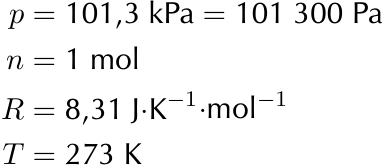
> **[Diagram Context - Textbook_PhysicalSciences_Gr11_Quantitative-aspects-of-chemical-change.pdf-0002-14.png]**
> The graphic is a text-based definition showing standard physical constants and values for gases. It lists the variables pressure ($p = 101,3\text{ kPa} = 101\ 300\text{ Pa}$), amount of substance ($n = 1\text{ mol}$), universal gas constant ($R = 8,31\text{ J}\cdot\text{K}^{-1}\cdot\text{mol}^{-1}$), and temperature ($T = 273\text{ K}$). Conceptually, this conveys standard temperature and pressure (STP) conditions and the numerical value of the universal gas constant used in ideal gas law calculations in Grade 11 Physical Sciences.

---

# Chapter 17. Electric Circuits

## Electric Current

* **Symbol:** $I$
* **Unit of Measurement:** Ampere ($\text{A}$)
* **Definition:** One ampere is one coulomb of charge moving in one second ($\text{C} \cdot \text{s}^{-1}$).

The relationship between electric current, charge, and time is given by the formula:

$$I = \frac{Q}{\Delta t}$$

Where:
* $I$ = Current ($\text{A}$)
* $Q$ = Charge ($\text{C}$)
* $\Delta t$ = Change in time ($\text{s}$)

### Direction of Current
* When current flows in a circuit, it is represented on diagrams using arrows.
* By convention, charge flows from the **positive terminal** of a battery to the **negative terminal**.

---

## Ammeter

* **Definition:** An ammeter is an instrument used to measure the rate of flow of electric current in a circuit.
* **Connection Rule:** To measure the current flowing *through* a circuit component, the ammeter **must be connected in series** with that component.

---

## Activity: Constructing circuits

Construct circuits to measure the emf and the terminal potential difference for a battery. 

**Common circuit components include:**
* Light bulbs
* Batteries
* Connecting leads
* Switches
* Resistors
* Voltmeters
* Ammeters

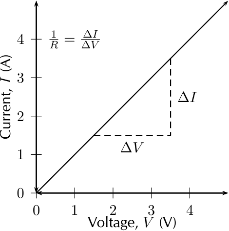
> **[Diagram Context - Textbook_PhysicalSciences_Gr11_Electric-circuits.pdf-0003-01.png]**
> This graph displays a linear relationship between current ($I$) and voltage ($V$) for an ohmic conductor, featuring labels for the axes, the gradient calculation $\Delta I / \Delta V$, and the reciprocal relationship $1/R$. It illustrates Ohm's Law, demonstrating that the gradient of an $I$ vs. $V$ graph represents the reciprocal of resistance ($1/R$), allowing learners to determine the resistance of a component from the slope of the line.

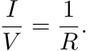

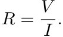

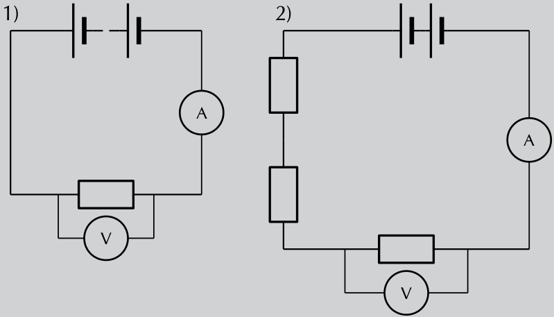
> **[Diagram Context - Textbook_PhysicalSciences_Gr11_Electric-circuits.pdf-0003-11.png]**
> This graphic displays two circuit diagrams featuring a battery, an ammeter (A), a voltmeter (V), and resistors. Diagram 1 shows a simple series circuit with one resistor, while Diagram 2 illustrates a series circuit with three resistors in total. These diagrams help learners understand how adding resistors in series affects the total resistance and current flow within a circuit, as per the CAPS Physical Sciences curriculum.

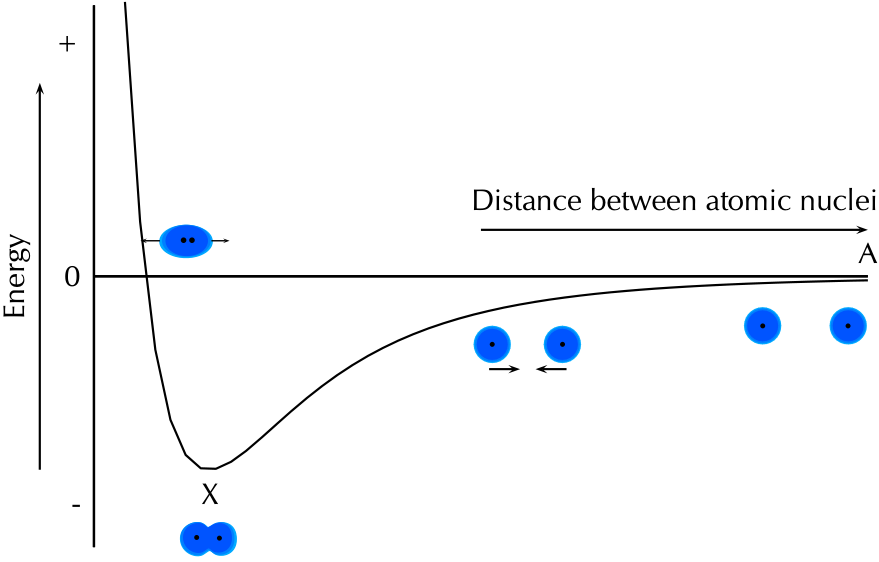
> **[Diagram Context - Textbook_PhysicalSciences_Gr11_Energy-and-chemical-change.pdf-0003-01.png]**
> This potential energy graph illustrates the relationship between the potential energy of a system and the distance between two atomic nuclei as they approach each other to form a covalent bond. The axes represent "Energy" and "Distance between atomic nuclei," while the visual models show atoms at varying distances, with point 'X' representing the state of minimum potential energy where a stable bond is formed. This diagram helps students understand the balance between attractive and repulsive forces that determine bond length and stability in chemical bonding.

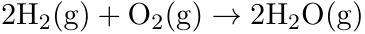

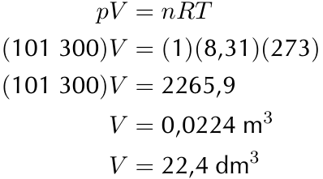
> **[Diagram Context - Textbook_PhysicalSciences_Gr11_Quantitative-aspects-of-chemical-change.pdf-0003-01.png]**
> The graphic shows a step-by-step mathematical calculation using the ideal gas equation ($pV = nRT$) to determine the molar volume of an ideal gas at Standard Temperature and Pressure (STP). Visible variables and constants include pressure $p$ ($101\ 300\text{ Pa}$), number of moles $n$ ($1\text{ mol}$), universal gas constant $R$ ($8,31\text{ J}\cdot\text{K}^{-1}\cdot\text{mol}^{-1}$), temperature $T$ ($273\text{ K}$), and resulting volume $V$ in both cubic meters ($\text{m}^3$) and cubic decimeters ($\text{dm}^3$). Conceptually, it demonstrates how to derive the standard molar volume of $22,4\text{ dm}^3\cdot\text{mol}^{-1}$ for any ideal gas at STP, reinforcing stoichiometric conversion skills required in Grade 11 Physical Sciences.

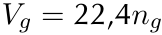

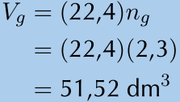
> **[Diagram Context - Textbook_PhysicalSciences_Gr11_Quantitative-aspects-of-chemical-change.pdf-0003-11.png]**
> The graphic displays a chemical calculation involving the molar gas volume formula $V_g = (22,4)n_g$. Visible labels and values include the variables $V_g$ and $n_g$, along with numerical substitution values $(22,4)$ and $(2,3)$, resulting in the final calculated volume of $51,52\text{ dm}^3$. Conceptually, this demonstrates to Grade 11 physical sciences learners how to calculate the volume of a gas at STP by multiplying the number of moles ($n_g$) by the molar gas volume constant ($22,4\text{ dm}^3\cdot\text{mol}^{-1}$).

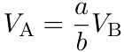

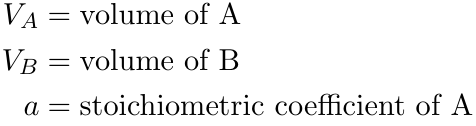
> **[Diagram Context - Textbook_PhysicalSciences_Gr11_Quantitative-aspects-of-chemical-change.pdf-0003-17.png]**
> This educational graphic provides definitions of algebraic variables used in stoichiometry and gas volume calculations. The visible text labels are $V_A = \text{volume of A}$, $V_B = \text{volume of B}$, and $a = \text{stoichiometric coefficient of A}$. Conceptually, this helps CAPS Physical Sciences learners define the terms required for solving quantitative problems involving reacting gases and molar volumes.

---

## CHAPTER 17. ELECTRIC CIRCUITS

### Circuit Components and Their Symbols

The table below outlines common circuit components, their standard symbols, and their primary functions:

| Component | Symbol | Usage |
| :--- | :---: | :--- |
| light bulb | 

 | glows when charge moves through it |
| battery | 

 | provides energy for charge to move |
| switch | <!-- DIAGRAM_PLACEHorton: diagram --> 

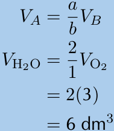
> **[Diagram Context - Textbook_PhysicalSciences_Gr11_Quantitative-aspects-of-chemical-change.pdf-0004-10.png]**
> This graphic displays algebraic chemical equations relating gas volumes using stoichiometric ratios. It features the formulas $V_A = \frac{a}{b}V_B$, $V_{\text{H}_2\text{O}} = \frac{2}{1}V_{\text{O}_2}$, followed by the substitution step $2(3)$ yielding a final calculated volume of $6\text{ dm}^3$. Conceptually, it demonstrates Avogadro's Law and stoichiometric calculations in gaseous reactions, helping learners use molar volume ratios to determine unknown gas volumes under the same temperature and pressure conditions.

 | allows a circuit to be open or closed |
| resistor | <!-- DIAGRAM_PLACEHOLDER: diagram --> OR <!-- DIAGRAM_PLACEHOLDER: diagram --> | resists the flow of charge |
| voltmeter | <!-- DIAGRAM_PLACEHOLDER: diagram --> | measures potential difference |
| ammeter | <!-- DIAGRAM_PLACEHOLDER: diagram --> | measures current in a circuit |
| connecting lead | <!-- DIAGRAM_PLACEHOLDER: diagram --> | connects circuit elements together |

---

> **Tip**
> 
> A battery **does not** produce the same amount of current no matter what is connected to it. While the voltage produced by a battery is constant, the amount of current supplied depends on what is in the circuit.

---

Experiment with different combinations of components in the circuits.

The table below summarises the use of each measuring instrument that we discussed and the way it should be connected to a circuit component:

| Instrument | Measured Quantity | Proper Connection |
| :--- | :--- | :--- |
| Voltmeter | Voltage | In Parallel |
| Ammeter | Current | In Series |

---

### Activity: Using meters

If possible, connect meters in circuits to get used to the use of meters to measure electrical quantities. If the meters have more than one scale, always connect to the **largest scale** first so that the meter will not be damaged by having to measure values that exceed its limits.

---

CHAPTER 17. ELECTRIC CIRCUITS

## Example 1: Calculating current I

### QUESTION

An amount of charge equal to $45\text{ C}$ moves past a point in a circuit in $1\text{ second}$, what is the current in the circuit?

### SOLUTION

#### Step 1: Analyse the question
We are given an amount of charge and a time and asked to calculate the current. We know that current is the rate at which charge moves past a fixed point in a circuit so we have all the information we need. We have quantities in the correct units already.

#### Step 2: Apply the principles
We know that:

$$I = \frac{Q}{\Delta t}$$

$$I = \frac{45\text{ C}}{1\text{ s}}$$

$$I = 45\text{ C}\cdot\text{s}^{-1}$$

$$I = 45\text{ A}$$

#### Step 3: Quote the final result
The current is $45\text{ A}$.

---

## Example 2: Calculating current II

### QUESTION

An amount of charge equal to $53\text{ C}$ moves past a fixed point in a circuit in $2\text{ s}$...

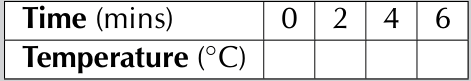
> **[Diagram Context - Textbook_PhysicalSciences_Gr11_Energy-and-chemical-change.pdf-0005-11.png]**
> 1. A table with the word "Time" at the top and "Temperature" at the bottom.

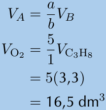
> **[Diagram Context - Textbook_PhysicalSciences_Gr11_Quantitative-aspects-of-chemical-change.pdf-0005-02.png]**
> This graphic displays a mathematical stoichiometry calculation relating gas volumes. It shows the algebraic formula $V_A = \frac{a}{b}V_B$ applied to find the volume of oxygen ($V_{\text{O}_2} = \frac{5}{1}V_{\text{C}_3\text{H}_8}$), substituting numerical values to yield $16,5\text{ dm}^3$. Conceptually, it demonstrates how Grade 11 Physical Sciences learners use molar gas volumes and balanced reaction coefficients to calculate unknown gas volumes under specific conditions.

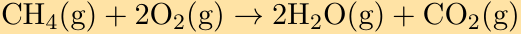

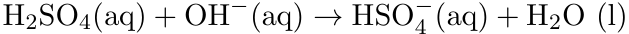

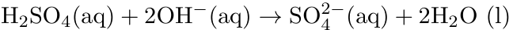
> **[Diagram Context - Textbook_PhysicalSciences_Gr11_Types-of-reaction.pdf-0005-08.png]**
> 1. A diagram of a chemical reaction between H2SO4 and H2O2.

---

## 17.2 CHAPTER 17. ELECTRIC CIRCUITS

seconds, what is the current in the circuit?

**SOLUTION**

**Step 1 : Analyse the question**  
We are given an amount of charge and a time and asked to calculate the current. We know that current is the rate at which charge moves past a fixed point in a circuit so we have all the information we need. We have quantities in the correct units already.

**Step 2 : Apply the principles**  
We know that:

$$I = \frac{Q}{\Delta t}$$

$$I = \frac{53\text{ C}}{2\text{ s}}$$

$$I = 26,5\text{ C} \cdot \text{s}^{-1}$$

$$I = 26,5\text{ A}$$

**Step 3 : Quote the final result**  
The current is $26,5\text{ A}$.

---

### Example 3: Calculating current III

**QUESTION**  
95 electrons move past a fixed point in a circuit in one tenth of a second, what is the current in the circuit?

**SOLUTION**  

**Step 1 : Analyse the question**  
We are given a number of charged particles that move past a fixed point and the time that it takes. We know that current is the rate at which charge moves past a fixed point in a circuit so we have to determine the charge. In the last chapter we learnt that the charge carried by an

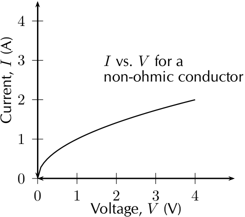
> **[Diagram Context - Textbook_PhysicalSciences_Gr11_Electric-circuits.pdf-0006-10.png]**
> This graph illustrates the relationship between current ($I$ in Amperes) and potential difference ($V$ in Volts) for a non-ohmic conductor. The non-linear curve demonstrates that the resistance of the component is not constant, as the ratio of $V$ to $I$ changes as the voltage increases.

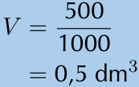
> **[Diagram Context - Textbook_PhysicalSciences_Gr11_Quantitative-aspects-of-chemical-change.pdf-0006-08.png]**
> This graphic shows a mathematical conversion formula for volume: $V = \frac{500}{1000} = 0,5\text{ dm}^3$. Visible labels and symbols include the variable $V$, fraction numbers 500 and 1000, and the unit $\text{dm}^3$. Conceptually, this demonstrates to Physical Sciences learners how to convert volume from cubic centimetres ($\text{cm}^3$) to cubic decimetres ($\text{dm}^3$) by dividing by $1000$, which is essential for stoichiometric calculations involving solution concentration.

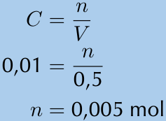
> **[Diagram Context - Textbook_PhysicalSciences_Gr11_Quantitative-aspects-of-chemical-change.pdf-0006-10.png]**
> This graphic presents a mathematical chemical calculation formula and its step-by-step substitution to find the number of moles. It displays the variables concentration ($C$), number of moles ($n$), and volume ($V$), along with the numerical values $0,01$, $0,5$, and the calculated result $n = 0,005\text{ mol}$. Conceptually, it demonstrates to Physical Sciences learners how to apply the concentration formula to calculate the amount of substance in moles given a specific concentration and volume.

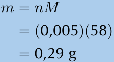
> **[Diagram Context - Textbook_PhysicalSciences_Gr11_Quantitative-aspects-of-chemical-change.pdf-0006-13.png]**
> This educational graphic shows a chemical calculation formula and its numerical substitution. The visible variables and symbols include $m$ (mass), $n$ (number of moles), $M$ (molar mass), and the unit $\text{g}$ (grams), with values substituted as $m = (0,005)(58) = 0,29\text{ g}$. Conceptually, this demonstrates how to calculate the mass of a substance in stoichiometric calculations by multiplying the number of moles by the molar mass, following the South African CAPS physical sciences curriculum.

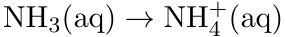

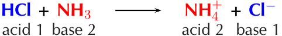
> **[Diagram Context - Textbook_PhysicalSciences_Gr11_Types-of-reaction.pdf-0006-22.png]**
> The image shows a Lewis diagram for the chemical reaction between HCCl and NH3 to form NH4Cl. The diagram is divided into two sections, with HCCl on the left and NH3 on the right. The arrows indicate the direction of the reaction, with HCCl going to NH3 and NH4Cl coming from HCCl. The diagram also includes labels for HCCl, NH3, and NH4Cl, as well as the chemical symbols HCCl and NH3.

---

# CHAPTER 17. ELECTRIC CIRCUITS

## Worked Example (Continuation)

* **Step 2:** **Apply the principles: determine the charge**
  We know that each electron carries a charge of $1,6 \times 10^{-19}\text{ C}$, therefore the total charge is:

  $$
  \begin{aligned}
  Q &= 95 \times 1,6 \times 10^{-19}\text{ C} \\
  &= 1,52 \times 10^{-17}\text{ C}
  \end{aligned}
  $$

* **Step 3:** **Apply the principles: determine the current**
  We know that:

  $$
  \begin{aligned}
  I &= \frac{Q}{\Delta t} \\
  I &= \frac{1,52 \times 10^{-17}\text{ C}}{\frac{1}{10}\text{ s}} \\
  I &= \frac{1,52 \times 10^{-17}\text{ C}}{1} \times \frac{1}{\frac{1}{10}\text{ s}} \\
  I &= \frac{1,52 \times 10^{-17}\text{ C}}{1} \times \frac{10}{1\text{ s}} \\
  I &= 1,52 \times 10^{-16}\text{ C}\cdot\text{s}^{-1} \\
  I &= 1,52 \times 10^{-16}\text{ A}
  \end{aligned}
  $$

* **Step 4:** **Quote the final result**
  The current is $1,52 \times 10^{-16}\text{ A}$.

---

## Resistance

Resistance is a measure of "how hard" it is to "push" electricity through a circuit element. 

Resistance can also apply to an entire circuit. 

*(See video: VPfvk at www.everythingscience.co.za)*

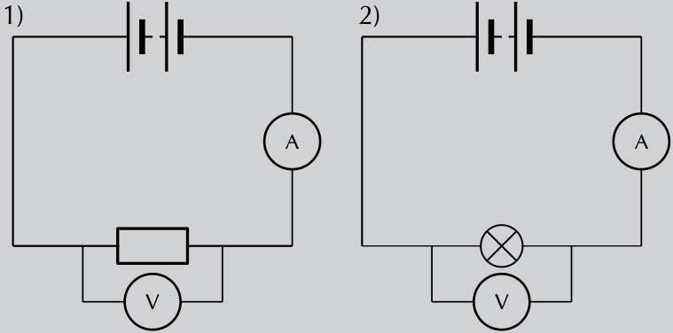
> **[Diagram Context - Textbook_PhysicalSciences_Gr11_Electric-circuits.pdf-0007-05.png]**
> This diagram displays two simple series circuits, each containing a battery, an ammeter (A) connected in series, and a voltmeter (V) connected in parallel across a resistor in circuit 1 and a light bulb in circuit 2. These circuits illustrate the standard experimental setup for investigating Ohm’s Law and the relationship between potential difference and current in different electrical components.

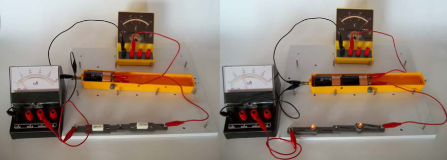
> **[Diagram Context - Textbook_PhysicalSciences_Gr11_Electric-circuits.pdf-0007-06.png]**
> This image displays two experimental electrical circuits featuring an ammeter, a voltmeter, and a power source connected to resistors and light bulbs. By comparing the two setups, learners can observe how changing the number of cells (potential difference) affects the current intensity and the brightness of the bulbs, illustrating fundamental concepts of Ohm’s Law and series circuit behavior in the Physical Sciences curriculum.

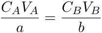

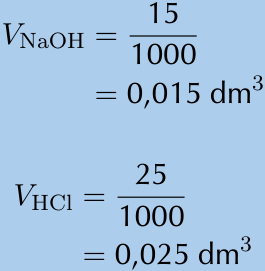
> **[Diagram Context - Textbook_PhysicalSciences_Gr11_Quantitative-aspects-of-chemical-change.pdf-0007-14.png]**
> This graphic presents two mathematical conversion steps for volume in stoichiometry calculations. The visible labels include chemical formulas and variables $V_{\text{NaOH}}$ and $V_{\text{HCl}}$, along with fractional values divided by 1000 resulting in units of $\text{dm}^3$. Conceptually, this demonstrates how to convert volumes from cubic centimeters ($\text{cm}^3$) to cubic decimeters ($\text{dm}^3$), a fundamental prerequisite for Grade 11 and 12 learners performing quantitative acid-base titrations under the CAPS curriculum.

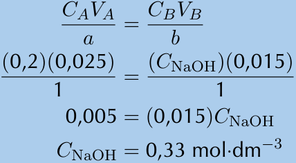
> **[Diagram Context - Textbook_PhysicalSciences_Gr11_Quantitative-aspects-of-chemical-change.pdf-0007-16.png]**
> The graphic displays a chemical calculation formula and its step-by-step numerical substitution used in stoichiometry. Visible symbols and labels include variables for concentration and volume ($C_A$, $V_A$, $C_B$, $V_B$), stoichiometric coefficients ($a$, $b$), specific values such as $0,2$, $0,025$, and $0,015$, chemical formulas like $\text{NaOH}$, and the resulting concentration unit $\text{mol}\cdot\text{dm}^{-3}$. This demonstrates how high school learners apply the acid-base mole ratio formula to calculate an unknown concentration from a titration experiment.

---

## CHAPTER 17. ELECTRIC CIRCUITS

### What causes resistance?

On a microscopic level, electrons moving through the conductor collide (or interact) with the particles of which the conductor (metal) is made. When they collide, they transfer kinetic energy. The electrons therefore lose kinetic energy and slow down. This leads to resistance. The transferred energy causes the resistor to heat up. You can feel this directly if you touch a cellphone charger when you are charging a cell phone - the charger gets warm because its circuits have some resistors in them!

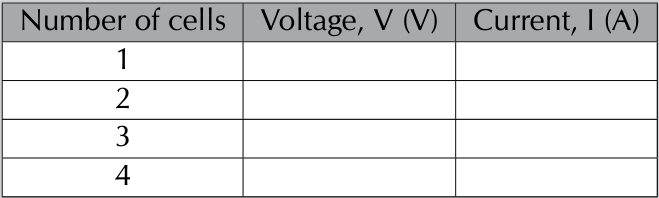
> **[Diagram Context - Textbook_PhysicalSciences_Gr11_Electric-circuits.pdf-0008-00.png]**
> This table is a data collection template for a Physical Sciences practical investigation, featuring columns for "Number of cells," "Voltage, V (V)," and "Current, I (A)." It is designed to help learners record experimental results to investigate the relationship between the number of cells connected in series and the resulting potential difference and current in an electric circuit.

> **DEFINITION: Resistance**
> 
> Resistance slows down the flow of charge in a circuit. The unit of resistance is the ohm ($\Omega$) which is defined as a volt per ampere of current.
> 
> Quantity: Resistance $R$ \quad Unit: ohm \quad Unit symbol: $\omega$

$$1 \text{ ohm} = 1 \frac{\text{volt}}{\text{ampere}}$$

> **FACT**
> 
> Fluorescent lightbulbs do not use thin wires; they use the fact that certain gases glow when a current flows through them. They are much more efficient (much less resistance) than lightbulbs.

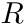

All conductors have some resistance. For example, a piece of wire has less resistance than a light bulb, but both have resistance.

A lightbulb is a very thin wire surrounded by a glass housing. The high resistance of the small wire (filament) in a lightbulb causes the electrons to transfer a lot of their kinetic energy in the form of heat. The heat energy is enough to cause the filament to glow white-hot which produces light.

The wires connecting the lamp to the cell or battery hardly even get warm while conducting the same amount of current. This is because of their much lower resistance due to their larger cross-section (they are thicker).

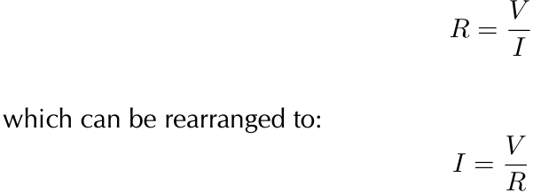
> **[Diagram Context - Textbook_PhysicalSciences_Gr11_Electric-circuits.pdf-0008-14.png]**
> This image displays the mathematical formula for Ohm's Law, showing the relationship between resistance ($R$), potential difference ($V$), and current ($I$). It demonstrates the algebraic rearrangement of the standard formula $R = V/I$ to solve for current as $I = V/R$, which is a fundamental skill for calculating electrical circuit variables in the CAPS Physical Sciences curriculum.

> **[Diagram Context - Textbook_PhysicalSciences_Gr11_Energy-and-chemical-change.pdf-0008-02.png]**
> 1. A glass of water with a yellow straw in it.

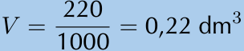
> **[Diagram Context - Textbook_PhysicalSciences_Gr11_Quantitative-aspects-of-chemical-change.pdf-0008-08.png]**
> This educational graphic shows a mathematical conversion equation for volume, specifically converting cubic centimeters to cubic decimeters. The visible symbols and numbers include the variable $V$, fraction $\frac{220}{1000}$, and the calculated result $0,22\text{ dm}^3$. Conceptually, this diagram demonstrates the standard conversion step required in high school Physical Sciences stoichiometry calculations when converting a volume from $\text{cm}^3$ to $\text{dm}^3$ by dividing by $1000$.

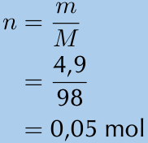
> **[Diagram Context - Textbook_PhysicalSciences_Gr11_Quantitative-aspects-of-chemical-change.pdf-0008-10.png]**
> This graphic displays a worked mathematical formula used in Grade 10-12 Physical Sciences to calculate the number of moles. The visible variables and values include $n$ (number of moles), $m$ (mass in grams, substituted as 4,9), $M$ (molar mass in g·mol⁻¹, substituted as 98), and the final calculated result of 0,05 mol. Conceptually, it demonstrates the stoichiometric relationship for converting a given mass of a substance into moles by dividing by its molar mass, a fundamental skill for quantitative chemistry calculations.

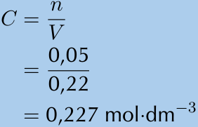
> **[Diagram Context - Textbook_PhysicalSciences_Gr11_Quantitative-aspects-of-chemical-change.pdf-0008-12.png]**
> This graphic shows a mathematical formula and calculation for molar concentration. It features the variables $C$, $n$, and $V$, along with numerical values substituted into the equation ($0,05$ and $0,22$) and the final answer expressed with the unit $\text{mol}\cdot\text{dm}^{-3}$. Conceptually, it demonstrates how Grade 10-12 Physical Sciences learners calculate the concentration of a solution by dividing the number of moles ($n$) by the volume in cubic decimetres ($V$).

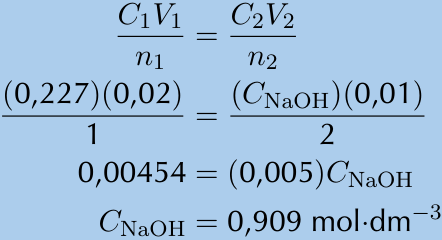
> **[Diagram Context - Textbook_PhysicalSciences_Gr11_Quantitative-aspects-of-chemical-change.pdf-0008-15.png]**
> This educational graphic displays a mathematical stoichiometry calculation used in acid-base titrations. The visible labels and symbols include concentration variables ($C_1$, $C_2$, $C_{\text{NaOH}}$), volume variables ($V_1$, $V_2$), stoichiometric mole ratios ($n_1$, $n_2$), numerical values, and the final concentration unit ($\text{mol}\cdot\text{dm}^{-3}$). Conceptually, it guides Grade 11 and 12 Physical Sciences learners through applying the standard dilution and titration formula to calculate the unknown concentration of a sodium hydroxide ($\text{NaOH}$) solution from stoichiometric data.

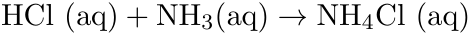
> **[Diagram Context - Textbook_PhysicalSciences_Gr11_Types-of-reaction.pdf-0008-05.png]**
> The image shows a diagram of a chemical reaction between HCl and NH3. The reaction is represented by a Lewis structure, which is a visual representation of the chemical bonds between atoms in a molecule. The diagram is set against a gray background, and the chemical symbols for HCl and NH3 are clearly visible. The arrows in the diagram indicate the direction of the reaction, with HCl on the left and NH3 on the right. The diagram also includes labels for the reactants and products, as well as the balanced chemical equation for the reaction.

---

CHAPTER 17. ELECTRIC CIRCUITS

An important effect of a resistor is that it *converts* electrical energy into other forms of heat energy. Light energy is a by-product of the heat that is produced.

***

### FACT

There is a special type of conductor, called a **superconductor** that has no resistance, but the materials that make up all known superconductors only start superconducting at very low temperatures. The "highest" temperature superconductor is mercury barium calcium copper oxide ($\text{HgBa}_2\text{Ca}_2\text{Cu}_3\text{O}_x$) which is superconducting for temperatures of $-140^\circ\text{ C}$ and colder.

***

### Physical attributes affecting resistance [NOT IN CAPS]

The physical attributes of a resistor affect its total resistance.

* **Length:** if a resistor is increased in length its resistance will increase. Typically if you increase the length of a resistor by a certain factor you will increase the resistance by the same factor.
* **Width and height or cross-sectional area:** if a resistor provides a larger pathway by being made wider or broader then more current can flow through it. If the total surface area through which current flows (cross-sectional area) is increased by a factor the resistance typically decreases by the same factor.

**Extension:** For a single resistor this can be summarised as

$$R \propto \frac{L}{A}$$

where $L$ is the length and $A$ is the cross-sectional area.

### Why do batteries go flat?

A battery stores chemical potential energy. When it is connected in a circuit, a chemical reaction takes place inside the battery which converts chemical potential energy to electrical energy which powers the electrons to move through the circuit. All the circuit elements (such as the conducting leads, resistors and lightbulbs) have some resistance to the flow of charge and convert the electrical energy to heat and, in the case of the lightbulb, light. Since energy is always conserved, the battery goes flat when all its chemical potential energy has been converted into other forms of energy.

---

## Resistors in electric circuits

It is important to understand what effect adding resistors to a circuit has on the *total* resistance of a circuit and on the current that can flow in the circuit.

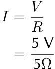

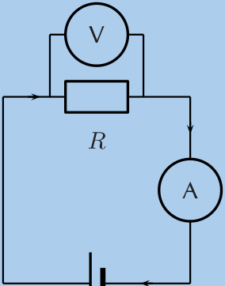
> **[Diagram Context - Textbook_PhysicalSciences_Gr11_Electric-circuits.pdf-0009-05.png]**
> This circuit diagram features a resistor ($R$) connected in series with an ammeter (A) and a DC power source, with a voltmeter (V) connected in parallel across the resistor. It illustrates the standard experimental setup for Ohm’s Law, demonstrating how to measure the potential difference across a resistor and the current flowing through it to determine resistance.

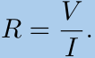

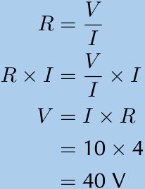
> **[Diagram Context - Textbook_PhysicalSciences_Gr11_Electric-circuits.pdf-0009-13.png]**
> This image displays a mathematical derivation and calculation based on Ohm’s Law, featuring the variables $R$ (resistance), $V$ (potential difference), and $I$ (current). It demonstrates the algebraic rearrangement of the formula $R = V/I$ to solve for potential difference ($V = I \times R$) and applies specific values ($10$ and $4$) to calculate a final result of $40\text{ V}$. This serves as a foundational example for Grade 10-12 Physical Sciences learners to understand how to manipulate electrical formulas to determine unknown circuit quantities.

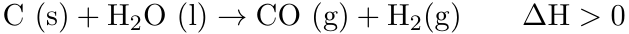

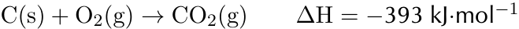
> **[Diagram Context - Textbook_PhysicalSciences_Gr11_Energy-and-chemical-change.pdf-0009-15.png]**
> The image shows a diagram of a chemical reaction involving the combustion of oxygen and the formation of water. The diagram is labeled with the chemical equation CO2(g) + O2(g) → 2H2O(l). The arrow points from the left side of the diagram to the right, indicating the direction of the reaction. The diagram also includes the chemical symbols CO2 and H2O, which represent the reactants and products of the reaction. The diagram is set against a gray background, which contrasts with the white text and arrows, making the elements stand out.

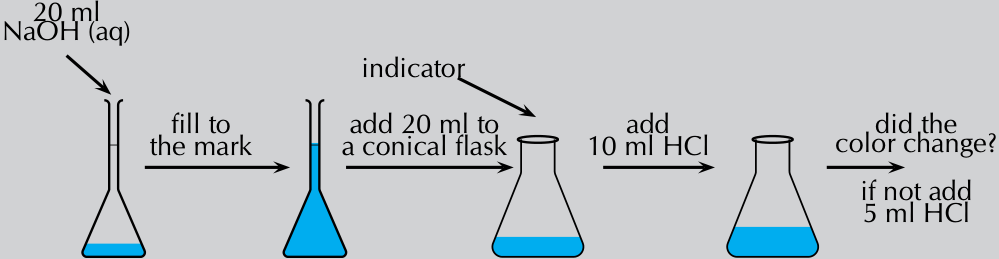
> **[Diagram Context - Textbook_PhysicalSciences_Gr11_Types-of-reaction.pdf-0009-05.png]**
> This educational graphic illustrates a step-by-step experimental procedure for preparing a standard solution and conducting an acid-base titration. The diagram includes labeled glassware (volumetric flask and conical flask), chemical formulas and quantities such as $20\text{ ml NaOH (aq)}$, $10\text{ ml HCl}$, and $5\text{ ml HCl}$, alongside directional arrows with instructional text like "fill to the mark", "indicator", and "did the color change?". Conceptually, it guides Grade 11 and 12 Physical Sciences learners through the practical steps of solution preparation, volumetric transfer, and neutralisation titration to determine the endpoint using an acid-base indicator.

> **[Diagram Context - Textbook_PhysicalSciences_Gr11_Types-of-reaction.pdf-0009-09.png]**
> This image shows laboratory apparatus in the form of a volumetric flask filled with an orange-red liquid, featuring an inset magnification pointing to the meniscus. Visible markings on the glassware include the capacity label "250 cm³", temperature specification "20 °C", and a calibration line on the narrow neck. Conceptually, it demonstrates the correct technique for preparing standard solutions in stoichiometric calculations by aligning the bottom of the liquid's meniscus precisely with the graduation mark.

---

CHAPTER 17. ELECTRIC CIRCUITS

## Series resistors (ESAFJ)

When we add resistors in series to a circuit:

* There is only one path for current to flow which ensures that the **current is the same at every point in the circuit**.
* The voltage is **divided** across the resistors. The voltage across the battery in the circuit is equal to the sum of voltages across the series resistors:

$$V_{battery} = V_1 + V_2 + \dots$$

* The resistance to the flow of current **increases**. The total resistance, $R_S$ is given by:

$$R_S = R_1 + R_2 + \dots$$

We will revisit each of these features of series circuits in more detail below.

When resistors are in series, one after the other, there is a potential difference across each resistor. The total potential difference across a set of resistors in series is the sum of the potential differences across each of the resistors in the set.

$$V_{battery} = V_1 + V_2 + \dots$$

Look at the circuits below. If we measured the potential difference between the black dots in all of these circuits it would be the same as we saw earlier. So we now know the total potential difference is the same across one, two or three resistors. We also know that some work is required to make charge flow through each resistor.

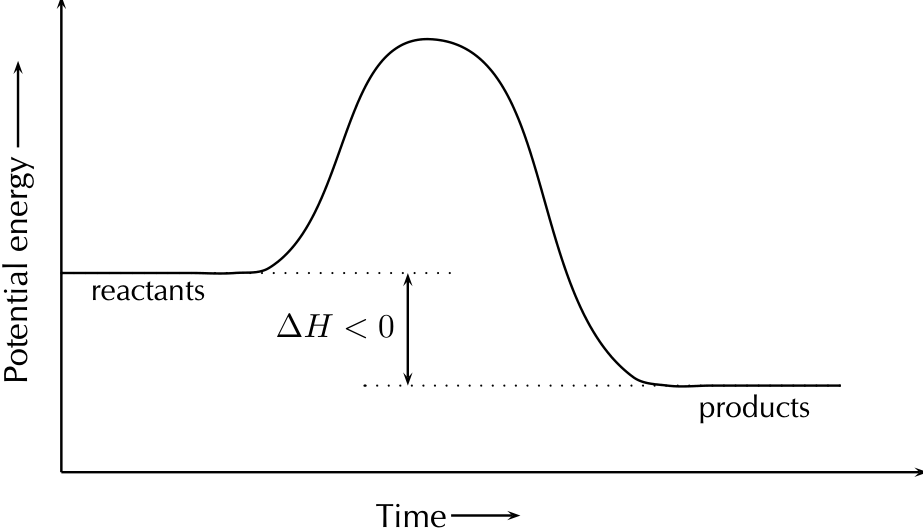

Let us look at this in a bit more detail. In the picture below you can see what the different measurements for 3 identical resistors in series could look like. The total voltage across all three resistors is the sum of the voltages across the individual resistors. Resistors in series are known as voltage dividers because the total voltage across all the resistors is divided amongst the individual resistors.

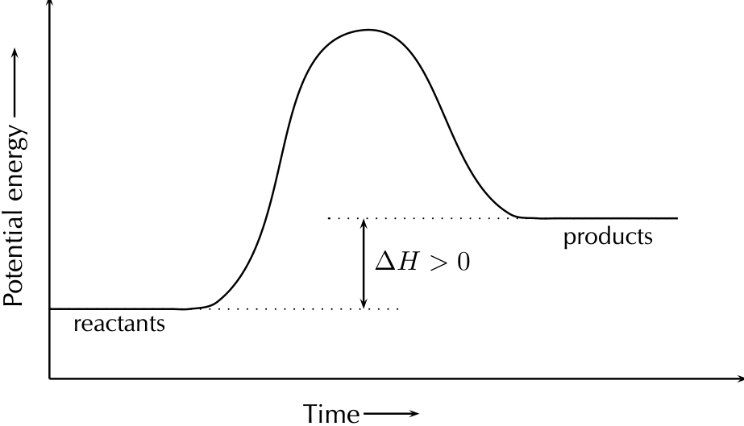

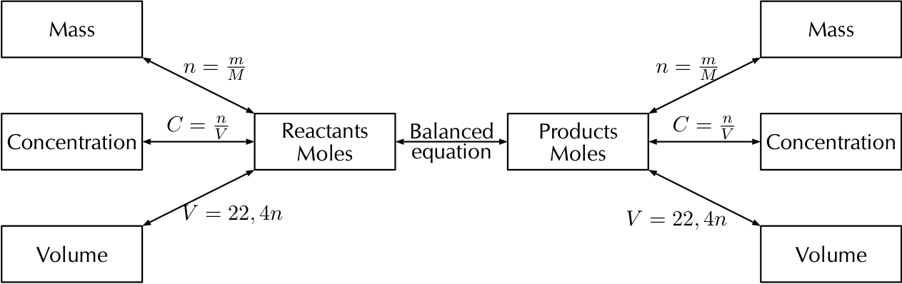

---

CHAPTER 17. ELECTRIC CIRCUITS
17.4

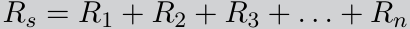

Consider the diagram below. On the left there is a circuit with a single resistor and a battery. **No matter where we measure the current, it is the same in a series circuit.** On the right, we have added a second resistor in series to the circuit. The *total* resistance of the circuit has *increased* and you can see from the reading on the ammeter that the current in the circuit has decreased.

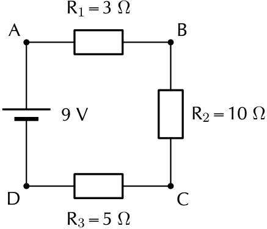
> **[Diagram Context - Textbook_PhysicalSciences_Gr11_Electric-circuits.pdf-0011-06.png]**
> This diagram displays a simple series circuit containing a 9 V voltage source and three resistors labeled $R_1$ (3 $\Omega$), $R_2$ (10 $\Omega$), and $R_3$ (5 $\Omega$), connected at nodes A, B, C, and D. It serves as a foundational exercise for Grade 10-12 Physical Sciences students to practice calculating total resistance, current, and potential difference in a series configuration using Ohm’s Law.

## General experiment: Voltage dividers

**Aim:** Test what happens to the current and the voltage in series circuits when additional resistors are added.

**Apparatus:**
* A battery
* A voltmeter
* An ammeter
* Wires
* Resistors

Physics: Electricity and Magnetism
291

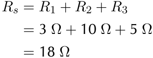
> **[Diagram Context - Textbook_PhysicalSciences_Gr11_Electric-circuits.pdf-0011-08.png]**
> This mathematical expression represents the calculation for the total equivalent resistance ($R_s$) of three resistors connected in series. It utilizes the variables $R_1$, $R_2$, and $R_3$ with their respective values of $3\ \Omega$, $10\ \Omega$, and $5\ \Omega$ to demonstrate the additive nature of series circuits. This illustrates the CAPS Physical Sciences principle that the total resistance in a series circuit is the sum of the individual resistances.

> **[Diagram Context - Textbook_PhysicalSciences_Gr11_Energy-and-chemical-change.pdf-0011-11.png]**
> The image shows a diagram of calcium, potassium, and sodium ions. The diagram is a line graph with the x-axis labeled "Calcium", the y-axis labeled "Potassium", and the z-axis labeled "Sodium". The diagram shows the relative amounts of calcium, potassium, and sodium ions. The diagram also includes labels for calcium, potassium, and sodium.

> **[Diagram Context - Textbook_PhysicalSciences_Gr11_Energy-and-chemical-change.pdf-0011-12.png]**
> 1. A diagram of a beaker with water and sodium hydroxide.

> **[Diagram Context - Textbook_PhysicalSciences_Gr11_Types-of-reaction.pdf-0011-10.png]**
> This graphic displays a chemical equation representing the general neutralization reaction between an acid and a metal hydroxide. The visible chemical symbols and labels include $n\text{H}^+(aq)$, $\text{M}(\text{OH})_n(aq)$, a forward reaction arrow, $n\text{H}_2\text{O}(l)$, and $\text{M}^{n+}(aq)$. Conceptually, this conveys how aqueous hydrogen ions react with a metal hydroxide base to form liquid water and an aqueous metal cation, illustrating the fundamental net ionic nature of acid-base neutralisation in Grade 11 Physical Sciences.

> **[Diagram Context - Textbook_PhysicalSciences_Gr11_Types-of-reaction.pdf-0011-14.png]**
> The image displays a text-based educational snippet with the numerical answer "1. 245V" on a light yellow background. It includes promotional text at the top, "Think you got it? Get this answer and more practice on our Intelligent Practice Service," and website links at the bottom with laptop and mobile phone icons. Conceptually, this graphic presents a specific worked answer (an electric potential difference of 245 volts) related to CAPS Physical Sciences electricity topics, serving as an online learning check for high school learners.

---

# CHAPTER 17. ELECTRIC CIRCUits

## Method:

* Construct each circuit shown below
* Measure the voltage across each resistor in the circuit.
* Measure the current before and after each resistor in the circuit.

> **[Diagram Context - Textbook_PhysicalSciences_Gr11_Electric-circuits.pdf-0012-00.png]**
> This circuit diagram illustrates a parallel configuration featuring a 9 V voltage source connected to three resistors with values of $R_1 = 10\ \Omega$, $R_2 = 2\ \Omega$, and $R_3 = 1\ \Omega$. It serves as a foundational tool for Grade 10-12 Physical Sciences learners to practice calculating equivalent resistance and branch currents in a parallel circuit where the potential difference remains constant across each resistor.

## Results and conclusions:

* Compare the sum of the voltages across all the resistors in each of the circuits.
* Compare the various current measurements within the same circuit.

The total resistance is equal to $R_1$ in the first circuit, to $R_1 + R_2$ in the second circuit and $R_1 + R_2 + R_3$ in the third circuit. In general, for resistors in series, the total resistance is given by:

$$R_S = R_1 + R_2 + \ldots$$

We know that the potential energy lost across a resistor is proportional to the resistance of the component because the higher the resistance the more work must be done to drive charge through the resistor.

---

## Example 4: Series resistors I

### QUESTION

A circuit contains two resistors in series. The resistors have resistance values of $5\ \Omega$ and $17\ \Omega$.

> **[Diagram Context - Textbook_PhysicalSciences_Gr11_Electric-circuits.pdf-0012-02.png]**
> This mathematical derivation displays the calculation for the equivalent resistance ($R_p$) of three resistors connected in parallel, using the variables $R_1$, $R_2$, and $R_3$ with specific values of $10\ \Omega$, $2\ \Omega$, and $1\ \Omega$. It illustrates the algebraic process of finding a common denominator to sum reciprocal resistance values, demonstrating how to determine the total resistance in a parallel circuit as required by the CAPS Physical Sciences curriculum.

> **[Diagram Context - Textbook_PhysicalSciences_Gr11_Electric-circuits.pdf-0012-11.png]**
> This diagram illustrates two electrical circuits featuring resistors connected in parallel to a DC voltage source. It labels individual resistors ($R_1$ to $R_4$) with specific resistance values in Ohms ($\Omega$) to demonstrate how to calculate equivalent resistance in parallel networks.

> **[Diagram Context - Textbook_PhysicalSciences_Gr11_Quantitative-aspects-of-chemical-change.pdf-0012-02.png]**
> This graphic displays two worked mathematical calculations demonstrating the application of the molar mass formula $n = \frac{m}{M}$. The visible text and variables include $n$ (number of moles), $m$ (mass in grams, with values 2000 and 1000), $M$ (molar mass in $\text{g}\cdot\text{mol}^{-1}$, with values 98 and 17), and resulting mole values with units $\text{mol}$ (20,4 mol and 58,8 mol). Conceptually, it illustrates the quantitative stoichiometric relationship used in Grade 10-12 Physical Sciences to convert between a substance's given mass and its amount in moles.

> **[Diagram Context - Textbook_PhysicalSciences_Gr11_Quantitative-aspects-of-chemical-change.pdf-0012-06.png]**
> This image displays a step-by-step mathematical calculation formula and substitution for determining the number of moles. Visible labels include chemical formulas such as $(NH_4)_2SO_4$ and $H_2SO_4$, the variable $n$ representing amount of substance, and the phrase "stoichiometric coefficient" along with numerical mole values like $20,4\text{ mol}$. Conceptually, it demonstrates how Grade 11 Physical Sciences learners use molar ratios derived from balanced chemical equations to calculate the unknown quantity of a product or reactant from a known quantity.

> **[Diagram Context - Textbook_PhysicalSciences_Gr11_Quantitative-aspects-of-chemical-change.pdf-0012-08.png]**
> This mathematical calculation shows a stoichiometric mole ratio problem involving ammonium sulphate and ammonia. The visible text displays chemical formulas and terms such as $n_{(\mathrm{NH}_4)_2\mathrm{SO}_4}$, $n_{\mathrm{NH}_3}$, stoichiometric coefficients, and mole values (58,8 mol $\mathrm{NH}_3$ and 29,4 mol $(\mathrm{NH}_4)_2\mathrm{SO}_4$). It demonstrates how to determine the number of moles of an unknown product from a given reactant using the mole ratio derived from balanced chemical equations.

> **[Diagram Context - Textbook_PhysicalSciences_Gr11_Quantitative-aspects-of-chemical-change.pdf-0012-13.png]**
> This graphic presents a mathematical calculation demonstrating the conversion between moles and mass using the formula $m = n \cdot M$. The visible variables and units include mass ($m$), number of moles ($n$), molar mass ($M$), grams ($\text{g}$), and kilograms ($\text{kg}$). Conceptually, it guides Grade 10-12 Physical Sciences learners through substituting quantitative values into the molar mass equation to solve for total mass and correctly convert units according to CAPS assessment standards.

---

CHAPTER 17. ELECTRIC CIRCUITS
17.4

> **[Diagram Context - Textbook_PhysicalSciences_Gr11_Electric-circuits.pdf-0013-00.png]**
> This diagram displays two series electrical circuits, labeled (c) and (d), featuring DC voltage sources and multiple resistors with assigned values ($R_1, R_2, R_3, R_4$) measured in Ohms ($\Omega$). It serves as a practical exercise for Grade 10-12 Physical Sciences learners to apply the principles of series circuits, specifically calculating total resistance by summing individual resistor values.

**What is the total resistance in the circuit?**

---

### **SOLUTION**

**Step 1 : Analyse the question**
We are told that the circuit is a series circuit and that we need to calculate the total resistance. The values of the two resistors have been given in the correct units, $\Omega$.

**Step 2 : Apply the relevant principles**
The total resistance for resistors in series is the sum of the individual resistances. We can use

$$R_{S} = R_{1} + R_{2} + \ldots$$

We have only two resistors and we know the resistances. In this case we have that:

$$\begin{aligned}
R_{S} &= R_{1} + R_{2} + \ldots \\
R_{S} &= R_{1} + R_{2} \\
&= 5\text{ }\Omega + 17\text{ }\Omega \\
&= 22\text{ }\Omega
\end{aligned}$$

**Step 3 : Quote the final result**
The total resistance of the resistors in series is $22\text{ }\Omega$.

---

Physics: Electricity and Magnetism
293

> **[Diagram Context - Textbook_PhysicalSciences_Gr11_Electric-circuits.pdf-0013-05.png]**
> This diagram illustrates a simple series circuit consisting of a voltage source ($V$) and three resistors ($R_1, R_2, R_3$) connected in a single loop between nodes A, B, C, and D. It serves as a foundational model for Grade 10-12 Physical Sciences learners to apply Ohm’s Law and calculate total resistance, current, and potential difference in a series configuration.

> **[Diagram Context - Textbook_PhysicalSciences_Gr11_Energy-and-chemical-change.pdf-0013-00.png]**
> 1. A diagram of a cell with the number 24 on it.

> **[Diagram Context - Textbook_PhysicalSciences_Gr11_Energy-and-chemical-change.pdf-0013-12.png]**
> The image is a black and white diagram that illustrates the concept of activation energy. The diagram is labeled with the words "activated complex" and "potential energy" and includes arrows pointing to the reactants and products. The diagram also includes a Lewis structure of a molecule, which is labeled with the chemical symbol "H2O". The diagram is accompanied by a table that provides the activation energy for the reaction.

> **[Diagram Context - Textbook_PhysicalSciences_Gr11_Types-of-reaction.pdf-0013-00.png]**
> This educational apparatus diagram illustrates a chemical reaction setup featuring two test tubes supported by a stand, connected by a delivery tube, and sealed with a rubber stopper. Visible labels include "rubber stopper", "delivery tube", "sodium bicarbonate and hydrochloric acid", and "limewater". Conceptually, it demonstrates how gas produced from an acid-base reaction is channeled into a test tube containing limewater to test for the presence of carbon dioxide, aligning with CAPS Physical Sciences requirements for investigating chemical reactions.

---

## CHAPTER 17. ELECTRIC CIRCUits

### Example 5: Series resistors II

#### **QUESTION**

A circuit contains three resistors in series. The resistors have resistance values of $0{,}5\ \Omega$, $7{,}5\ \Omega$ and $11\ \Omega$.

What is the total resistance in the circuit?

---

#### **SOLUTION**

* **Step 1 : Analyse the question**  
  We are told that the circuit is a series circuit and that we need to calculate the total resistance. The values of the three resistors have been given in the correct units, $\Omega$.

* **Step 2 : Apply the relevant principles**  
  The total resistance for resistors in series is the sum of the individual resistances. We can use

  $$R_{S} = R_{1} + R_{2} + \dots$$

  We have three resistors and we know the resistances. In this case we have that:

  $$R_{S} = R_{1} + R_{2} + \dots$$
  $$R_{S} = R_{1} + R_{2} + R_{3}$$
  $$= 0{,}5\ \Omega + 7{,}5\ \Omega + 11\ \Omega$$
  $$= 19\ \Omega$$

* **Step 3 : Quote the final result**

> **[Diagram Context - Textbook_PhysicalSciences_Gr11_Electric-circuits.pdf-0014-06.png]**
> This diagram illustrates a simple series circuit containing a voltage source and two resistors. The visible labels include the battery voltage ($V = 12\text{ V}$), two resistors ($R_1 = 2\text{ }\Omega$ and $R_2 = 4\text{ }\Omega$), and an arrow indicating the direction of conventional current ($I$). It serves to help learners apply Ohm’s Law and the principles of series circuits, specifically calculating total resistance and current flow through components connected in a single path.

> **[Diagram Context - Textbook_PhysicalSciences_Gr11_Energy-and-chemical-change.pdf-0014-16.png]**
> The image is a black and white diagram that illustrates the concept of activation energy and its relationship to the products of a chemical reaction. The diagram is divided into two parts: the left side shows the activation energy, and the right side displays the products of the reaction. The diagram also includes arrows that indicate the direction of the reaction and the flow of energy. The diagram is labeled with the terms "potential energy" and "energy change", and it is accompanied by a legend that explains the meaning of the arrows and the labels.

> **[Diagram Context - Textbook_PhysicalSciences_Gr11_Quantitative-aspects-of-chemical-change.pdf-0014-06.png]**
> The graphic displays a chemical calculation formula and solved example for percentage yield. It features the text labels "%yield =", "actual yield", "theoretical yield", and numerical substitution values showing an actual yield of 2,5, a theoretical yield of 2,694, and a final calculated result of 92,8%. This conveys the method for evaluating the efficiency of a chemical reaction in stoichiometry by comparing the experimentally obtained mass to the maximum calculated mass.

---

CHAPTER 17. ELECTRIC CIRCUITS | 17.4
---

The total resistance of the resistors in series is $19\ \Omega$.

---

## Example 6: Series resistors III

### QUESTION

A circuit contains two resistors in series. The resistors have resistance values of $750\text{ k}\Omega$ and $1,7\text{ M}\Omega$.

> **[Diagram Context - Textbook_PhysicalSciences_Gr11_Electric-circuits.pdf-0015-00.png]**
> This image displays a mathematical derivation using Ohm’s Law, featuring the variables $R$ (resistance), $V$ (potential difference), and $I$ (current). It demonstrates the algebraic rearrangement of the formula $R = V/I$ to solve for current ($I = V/R$) and provides a worked example using the values 12 and 6 to calculate a final current of 2 A.

What is the total resistance in the circuit?

### SOLUTION

* **Step 1: Analyse the question**  
  We are told that the circuit is a series circuit and that we need to calculate the total resistance. The values of the two resistors have been given in the correct units, $\Omega$.

* **Step 2: Apply the relevant principles**  
  The total resistance for resistors in series is the sum of the individual resistances. We can use

  $$R_{S} = R_{1} + R_{2} + \dots$$

  We have only two resistors and we now the resistances. In this case

---
Physics: Electricity and Magnetism | 295

> **[Diagram Context - Textbook_PhysicalSciences_Gr11_Electric-circuits.pdf-0015-08.png]**
> This diagram displays a simple series circuit containing a voltage source, a known resistor ($R_1 = 1\ \Omega$), and an unknown resistor ($R_2 = ?$). It includes the labels $V = 1,5\ \text{V}$ for potential difference, $I = 0,25\ \text{A}$ for current, and an arrow indicating the direction of conventional current flow. The circuit serves as a foundational problem for learners to apply Ohm’s Law ($V = IR$) and the principles of series circuits to calculate the value of the unknown resistance.

> **[Diagram Context - Textbook_PhysicalSciences_Gr11_Energy-and-chemical-change.pdf-0015-03.png]**
> The image is a diagram that shows a potential energy curve for a chemical reaction. The curve is a line graph with time on the x-axis and potential energy on the y-axis. The graph shows a steep incline in the middle, indicating a rapid change in potential energy. The curve is labeled with the text "potential energy" and "time" and has arrows pointing to the x and y axes. The graph is labeled with the text "potential energy" and "time" and has a legend that reads "energy" and "time".

> **[Diagram Context - Textbook_PhysicalSciences_Gr11_Quantitative-aspects-of-chemical-change.pdf-0015-13.png]**
> This educational graphic displays chemical calculation steps for determining the number of moles ($n$) of individual elements in an empirical formula calculation, using the variables $n_{\text{C}}$, $n_{\text{H}}$, and $n_{\text{O}}$, along with mass values divided by molar masses. Visible symbols and numbers include fraction formats with comma decimals typical of the CAPS curriculum (e.g., $39,9 / 12 = 3,325\text{ mol}$, $6,7 / 1,01 = 6,6337\text{ mol}$, and $53,4 / 16 = 3,3375\text{ mol}$). Conceptually, this demonstrates how to convert percentage composition or mass data into molar amounts for each constituent element, serving as the foundational step before finding the simplest whole-number mole ratio to determine a compound's empirical formula in Grade 11 Physical Sciences.

---

## CHAPTER 17. ELECTRIC CIRCUITS

### Worked Example (Continuation)

From the previous page, we have that:

$$R_S = R_1 + R_2 + \dots$$

$$R_S = R_1 + R_2$$

$$= 750\text{ k}\Omega + 1,7\text{ M}\Omega$$

$$= 750 \times 10^{3}\text{ }\Omega + 1,7 \times 10^{6}\text{ }\Omega$$

$$= 0,75 \times 10^{6}\text{ }\Omega + 1,7 \times 10^{6}\text{ }\Omega$$

$$= 2,45 \times 10^{6}\text{ }\Omega = 2,45\text{ M}\Omega$$

**Step 3: Quote the final result**

The total resistance of the resistors in series is $2,45\text{ M}\Omega$.

---

## Parallel resistors

When we add resistors in parallel to a circuit:

* There are more paths for current to flow which ensures that the **current splits across the different paths**.
* The voltage is **the same** across the resistors. The voltage across the battery in the circuit is equal to the voltage across each of the parallel resistors:

$$V_{battery} = V_1 = V_2 = V_3 \dots$$

* The resistance to the flow of current **decreases**. The total resistance, $R_P$ is given by:

$$\frac{1}{R_P} = \frac{1}{R_1} + \frac{1}{R_2} + \dots$$

When resistors are connected in parallel the start and end points for all the resistors are the same. These points have the same potential energy and so the potential difference between them is the same no matter what is put in between them. You can have one, two or many resistors between the two points, the potential difference will not change. You can ignore whatever components are between two points in a circuit when calculating the difference between the two points.

> **[Diagram Context - Textbook_PhysicalSciences_Gr11_Electric-circuits.pdf-0016-00.png]**
> This image displays a mathematical calculation based on Ohm’s Law, featuring the variables resistance ($R$), potential difference ($V$), and current ($I$). It demonstrates the practical application of the formula $R = V/I$ by substituting the values $1,5\text{ V}$ and $0,25\text{ A}$ to determine a resistance of $6\text{ }\Omega$, reinforcing the relationship between these electrical quantities for Grade 10-12 Physical Sciences learners.

> **[Diagram Context - Textbook_PhysicalSciences_Gr11_Electric-circuits.pdf-0016-02.png]**
> This graphic presents a step-by-step mathematical calculation for finding an unknown resistance in a series electric circuit. Visible components include the given values $R = 6\ \Omega$ and $R_1 = 1\ \Omega$, the

> **[Diagram Context - Textbook_PhysicalSciences_Gr11_Electric-circuits.pdf-0016-08.png]**
> This diagram illustrates a series circuit containing a voltage source ($V = 18\text{ V}$), a current flow ($I = 2\text{ A}$), and three resistors labeled $R_1 = 1\text{ }\Omega$, $R_2 = 3\text{ }\Omega$, and $R_3$. It serves as a foundational exercise for Grade 10-12 Physical Sciences students to apply Ohm’s Law and the principles of series circuits to calculate the unknown resistance of $R_3$.

> **[Diagram Context - Textbook_PhysicalSciences_Gr11_Energy-and-chemical-change.pdf-0016-05.png]**
> The image is a black and white diagram that shows a graph of potential energy over time. The graph has a steep slope, indicating a rapid change in potential energy. The x-axis of the graph represents time, while the y-axis represents potential energy. The graph is labeled with the units "potential energy (J)" and "time (s)", indicating that the graph is measuring the change in potential energy over time. The diagram also includes arrows pointing in different directions, which could represent the direction of change in potential energy. The diagram is labeled with the title "Potential Energy"

> **[Diagram Context - Textbook_PhysicalSciences_Gr11_Energy-and-chemical-change.pdf-0016-11.png]**
> 1. A diagram of a cell with a laptop computer and a phone on either side.

> **[Diagram Context - Textbook_PhysicalSciences_Gr11_Types-of-reaction.pdf-0016-09.png]**
> This photograph shows a rusted metal bolt resting outdoors on rocky ground. The surface is heavily coated in a reddish-brown layer of rust. For CAPS Physical Sciences learners, this image visually introduces the oxidation-reduction (redox) process of iron corrosion, where iron reacts with oxygen and moisture to form hydrated iron(III) oxide.

---

# CHAPTER 17. ELECTRIC CIRCUITS

## Potential Difference in Parallel Circuits

Look at the following circuit diagrams. The battery is the same in all cases, all that changes is more resistors are added between the points marked by the black dots. If we were to measure the potential difference between the two dots in these circuits we would get the same answer for all three cases.

> **[Diagram Context - Textbook_PhysicalSciences_Gr11_Electric-circuits.pdf-0017-04.png]**
> This image displays a step-by-step algebraic derivation based on Ohm’s Law, using the variables $R_1$ (resistance), $V_1$ (potential difference), and $I$ (current). It demonstrates the mathematical rearrangement of the formula $R = V/I$ to solve for potential difference, followed by a numerical substitution where $I=2$ and $R_1=1$ to calculate a final value of $2\text{ V}$. This serves as a fundamental example for Grade 10-12 Physical Sciences learners on how to manipulate circuit equations to determine unknown electrical quantities.

Let's look at two resistors in parallel more closely. When you construct a circuit you use wires and you might think that measuring the voltage in different places on the wires will make a difference. This is not true. The potential difference or voltage measurement will only be different if you measure a different set of components. All points on the wires that have no circuit components between them will give you the same measurements.

All three of the measurements shown in the picture below (i.e. $A-B$, $C-D$ and $E-F$) will give you the same voltage. The different measurement points on the left have no components between them so there is no change in potential energy. Exactly the same applies to the different points on the right. When you measure the potential difference between the points on the left and right you will get the same answer.

<!-- DIAG_PLACEHOLDER: diagram -->

> **[Diagram Context - Textbook_PhysicalSciences_Gr11_Electric-circuits.pdf-0017-07.png]**
> This image displays a step-by-step algebraic derivation based on Ohm’s Law, using the variables $R_2$ (resistance), $V_2$ (potential difference), and $I$ (current). It demonstrates the rearrangement of the formula $R = V/I$ to solve for potential difference, followed by a numerical substitution where $I = 2$ and $R_2 = 3$ to calculate a final value of $6\text{ V}$.

> **[Diagram Context - Textbook_PhysicalSciences_Gr11_Electric-circuits.pdf-0017-10.png]**
> This graphic presents a mathematical calculation involving the variables $V$, $V_1$, $V_2$, and $V_3$, with numerical values of 18, 2, 6, and a final result of 10 V. It illustrates the application of Kirchhoff’s Voltage Law for a series circuit, where the total potential difference ($V$) is the sum of the individual potential differences across components ($V_1 + V_2 + V_3$). This demonstrates how learners can algebraically rearrange the formula to solve for an unknown potential difference in a series circuit.

> **[Diagram Context - Textbook_PhysicalSciences_Gr11_Quantitative-aspects-of-chemical-change.pdf-0017-06.png]**
> The graphic displays a chemical formula equation for calculating percentage purity against a light blue background. The visible text and labels include "%purity", "mass of compound", "mass of sample", and multiplication by 100. Conceptually, this equation conveys to high school learners how to determine the proportion of a pure substance present within an impure sample by expressing the ratio of the active compound's mass to the total sample mass as a percentage, which is a key stoichiometric calculation in the CAPS Physical Sciences curriculum.

> **[Diagram Context - Textbook_PhysicalSciences_Gr11_Quantitative-aspects-of-chemical-change.pdf-0017-09.png]**
> This educational graphic presents a chemical calculation step involving mass units in grams (g). The visible text reads "Mass product = 3,2 g - 0,5 g = 2,7 g". Conceptually, this demonstrates how to determine the final mass of a product in a stoichiometry calculation by subtracting experimental loss or side-product mass, reinforcing quantitative chemistry problem-solving skills aligned with the CAPS curriculum.

> **[Diagram Context - Textbook_PhysicalSciences_Gr11_Quantitative-aspects-of-chemical-change.pdf-0017-12.png]**
> This graphic presents a mathematical formula and worked calculation for determining the percentage purity of a chemical sample. It displays the formula "% purity = (mass of compound / mass of sample) × 100", followed by a substitution step using the values 2,7 and 5, resulting in a final answer of 54%. Conceptually, this helps Grade 11 and 12 Physical Sciences learners understand quantitative stoichiometry and stoichiometric calculations involving impure substances.

---

17.5 CHAPTER 17. ELECTRIC CIRCUITS

## Example 7: Voltages I

### QUESTION

Consider this circuit diagram:

> **[Diagram Context - Textbook_PhysicalSciences_Gr11_Electric-circuits.pdf-0018-01.png]**
> This mathematical expression applies Ohm’s Law ($R = V/I$) to calculate the resistance of a specific component, $R_3$, using the variables $V_3$ (potential difference) and $I$ (current). By substituting the values 10 V and 2 A into the formula, the calculation demonstrates how to determine that the resistance is 5 $\Omega$, a fundamental skill for analyzing series and parallel circuits in the Physical Sciences curriculum.

What is the voltage across the resistor in the circuit shown?

---

### SOLUTION

#### Step 1: Check what you have and the units
We have a circuit with a battery and one resistor. We know the voltage across the battery. We want to find that voltage across the resistor.

$$V_{battery} = 2\text{ V}$$

#### Step 2: Applicable principles
We know that the voltage across the battery must be equal to the total voltage across all other circuit components.

$$V_{battery} = V_{total}$$

There is only one other circuit component, the resistor.

$$V_{total} = V_{1}$$

This means that the voltage across the battery is the same as the voltage across the resistor.

$$V_{battery} = V_{total} = V_{1}$$

$$V_{battery} = V_{total} = V_{1}$$

$$V_{1} = 2\text{ V}$$

---

298 Physics: Electricity and Magnetism

> **[Diagram Context - Textbook_PhysicalSciences_Gr11_Electric-circuits.pdf-0018-03.png]**
> This graphic presents a list of electrical variables, specifically three potential differences ($V_1, V_2, V_3$) measured in Volts (V) and one resistance value ($R_1$) measured in Ohms ($\Omega$). It serves as a foundational data set for Grade 10-12 Physical Sciences learners to apply Ohm’s Law ($V=IR$) or to calculate total voltage and equivalent resistance in series or parallel circuit configurations.

> **[Diagram Context - Textbook_PhysicalSciences_Gr11_Electric-circuits.pdf-0018-06.png]**
> This circuit diagram illustrates a parallel connection featuring a voltage source ($V$) and three resistors ($R_1, R_2, R_3$) connected across nodes labeled A through H. It serves to demonstrate the principles of parallel circuits, where the potential difference remains constant across each branch while the total current is divided among the resistors.

> **[Diagram Context - Textbook_PhysicalSciences_Gr11_Energy-and-chemical-change.pdf-0018-21.png]**
> The image is a diagram that illustrates the relationship between activation energy and the potential energy of a chemical reaction. The diagram is a bar graph that shows the relationship between the activation energy and the potential energy of a chemical reaction. The graph has two bars, one for the activation energy and the other for the potential energy. The activation energy is represented by the letter "A" and the potential energy is represented by the letter "P". The graph shows that the potential energy increases as the activation energy increases.

> **[Diagram Context - Textbook_PhysicalSciences_Gr11_Quantitative-aspects-of-chemical-change.pdf-0018-06.png]**
> This algebraic calculation demonstrates the determination of the number of moles using a chemical formula. The visible variables and values are $n$ (number of moles), $m$ (mass in grams, substituted with $3,6$), $M$ (molar mass in $\text{g}\cdot\text{mol}^{-1}$, substituted with $111$), resulting in a final calculated answer of $0,032\text{ mol}$. For a high school Physical Sciences student, this conveys the quantitative relationship between mass, molar mass, and moles in stoichiometry.

> **[Diagram Context - Textbook_PhysicalSciences_Gr11_Quantitative-aspects-of-chemical-change.pdf-0018-11.png]**
> The graphic displays a chemical calculation involving mathematical formula application and substitution. The visible variables and symbols include $m$, $n$, $M$, parentheses for multiplication, and the unit $g$. It conceptually demonstrates how to calculate mass by multiplying the number of moles by the molar mass, which is a fundamental stoichiometric calculation required in Grade 11 Physical Sciences.

> **[Diagram Context - Textbook_PhysicalSciences_Gr11_Quantitative-aspects-of-chemical-change.pdf-0018-14.png]**
> The graphic displays a chemical calculation formula and numerical working out for percentage purity against a light blue background. Visible text labels include "% purity", "mass of compound", and "mass of sample", alongside a substitution step using numerical values 3,3 and 3,5 multiplied by 100 to yield a final calculated result of 94,3%. Conceptually, this demonstrates to Grade 11 and 12 Physical Sciences learners how to apply stoichiometric principles to determine the proportion of a pure substance present within an impure sample.

> **[Diagram Context - Textbook_PhysicalSciences_Gr11_Types-of-reaction.pdf-0018-10.png]**
> This graphic displays a step-by-step algebraic equation on a light blue background. The visible text consists of the mathematical expression and working out: $x + (-8) = -2$, followed by the transposition step $x = -2 + 8$, and the final solution $= +6$. Conceptually, this demonstrates the process of solving a linear equation with integers by isolating the variable $x$ through inverse operations, reinforcing foundational algebraic manipulation aligned with the CAPS curriculum.

---

CHAPTER 17. ELECTRIC CIRCUITS | 17.5
---

## Example 8: Voltages II

### QUESTION

Consider this circuit:

> **[Diagram Context - Textbook_PhysicalSciences_Gr11_Electric-circuits.pdf-0019-03.png]**
> This circuit diagram illustrates two resistors ($R_1 = 2\ \Omega$ and $R_2 = 4\ \Omega$) connected in parallel to a voltage source ($V = 12\ \text{V}$), with an arrow indicating the direction of conventional current ($I$). It serves as a foundational tool for Grade 10-12 Physical Sciences learners to apply Ohm’s Law and calculate equivalent resistance, branch currents, and total current in a parallel circuit configuration.

What is the voltage across the unknown resistor in the circuit shown?

---

### SOLUTION

#### Step 1: Check what you have and the units
We have a circuit with a battery and two resistors. We know the voltage across the battery and one of the resistors. We want to find that voltage across the resistor.

$$V_{battery} = 2\text{V}$$

$$V_{B} = 1\text{V}$$

#### Step 2: Applicable principles
We know that the voltage across the battery must be equal to the total voltage across all other circuit components that are in series.

$$V_{battery} = V_{total}$$

The total voltage in the circuit is the sum of the voltages across the individual resistors

$$V_{total} = V_{A} + V_{B}$$

Using the relationship between the voltage across the battery and total voltage across the resistors

$$V_{battery} = V_{total}$$

---
Physics: Electricity and Magnetism | 299

> **[Diagram Context - Textbook_PhysicalSciences_Gr11_Electric-circuits.pdf-0019-11.png]**
> This graphic displays the mathematical formula and step-by-step calculation for determining the equivalent resistance ($R$) of two resistors ($R_1$ and $R_2$) connected in parallel. It utilizes the variables $R$, $R_1$, and $R_2$ with numerical substitutions of 2 and 4 to demonstrate the process of finding a common denominator and calculating the final resistance value in Ohms ($\Omega$). This serves as a practical application for Grade 10-12 Physical Sciences learners to master circuit calculations involving parallel resistor networks.

---

17.5 CHAPTER 17. ELECTRIC CIRCUITS

$$V_{battery} = V_{1} + V_{resistor}$$
$$2\text{ V} = V_{1} + 1\text{ V}$$
$$V_{1} = 1\text{ V}$$

---

### Example 9: Voltages III

#### QUESTION

Consider the circuit diagram:

> **[Diagram Context - Textbook_PhysicalSciences_Gr11_Electric-circuits.pdf-0020-00.png]**
> This graphic displays a step-by-step algebraic derivation of Ohm’s Law, using the variables $R$ (resistance), $V$ (potential difference), and $I$ (current). It demonstrates how to rearrange the formula $R = V/I$ to solve for current ($I$) and applies these concepts to a specific calculation resulting in $9\text{ A}$.

What is the voltage across the unknown resistor in the circuit shown?

#### SOLUTION

**Step 1 : Check what you have and the units**
We have a circuit with a battery and three resistors. We know the voltage across the battery and two of the resistors. We want to find that voltage across the unknown resistor.

$$V_{battery} = 7\text{ V}$$
$$V_{known} = V_{A} + V_{C}$$
$$= 1\text{ V} + 4\text{ V}$$

**Step 2 : Applicable principles**
We know that the voltage across the battery must be equal to the total voltage across all other circuit components that are in series.

$$V_{battery} = V_{total}$$

The total voltage in the circuit is the sum of the voltages across the

300 Physics: Electricity and Magnetism

> **[Diagram Context - Textbook_PhysicalSciences_Gr11_Electric-circuits.pdf-0020-06.png]**
> This circuit diagram illustrates two resistors connected in parallel to a DC voltage source, featuring the labels $R_1 = 3\ \Omega$, $R_2 = ?$, $V = 9\ \text{V}$, and a total current $I = 4,8\ \text{A}$. It serves as a problem-solving exercise for Grade 10-12 Physical Sciences, requiring learners to apply Ohm’s Law and the principles of parallel circuits to calculate the unknown resistance value.

---

CHAPTER 17. ELECTRIC CIRCUITS
17.5

individual resistors

$$V_{total} = V_{B} + V_{known}$$

Using the relationship between the voltage across the battery and total voltage across the resistors

$$\begin{aligned}
V_{battery} &= V_{total} \\
V_{battery} &= V_{B} + V_{known} \\
7\text{ V} &= V_{B} + 5\text{ V} \\
V_{B} &= 2\text{ V}
\end{aligned}$$

---

## Example 10: Voltages IV

### QUESTION

Consider the circuit diagram:

> **[Diagram Context - Textbook_PhysicalSciences_Gr11_Electric-circuits.pdf-0021-01.png]**
> This image displays a mathematical calculation based on Ohm’s Law, using the variables $R$ (resistance), $V$ (potential difference), and $I$ (current). It demonstrates the substitution of the values 9 and 4,8 into the formula $R = V/I$ to solve for the resistance, resulting in a final value of 1,875 $\Omega$. This serves as a practical example for Grade 10-12 Physical Sciences learners to apply the relationship between voltage, current, and resistance in an electrical circuit.

What is the voltage across the parallel resistor combination in the circuit shown?

*Hint:* the rest of the circuit is the same as the previous problem.

### SOLUTION

#### Step 1 : Quick Answer
The circuit is the same as the previous example and we know that the voltage difference between two points in a circuit does not depend on what is between them so the answer is the same as above $V_{parallel} = 2\text{ V}$.

#### Step 2 : Check what you have and the units - long answer
We have a circuit with a battery and five resistors (two in series and

---
Physics: Electricity and Magnetism
301

> **[Diagram Context - Textbook_PhysicalSciences_Gr11_Electric-circuits.pdf-0021-06.png]**
> This mathematical derivation uses the variables $R$, $R_1$, and $R_2$ to solve for an unknown resistance value. It demonstrates the algebraic rearrangement of the parallel resistor formula, $\frac{1}{R_p} = \frac{1}{R_1} + \frac{1}{R_2}$, to calculate the value of a missing resistor ($R_2 = 5\ \Omega$) when the total equivalent resistance and one branch resistance are known.

> **[Diagram Context - Textbook_PhysicalSciences_Gr11_Quantitative-aspects-of-chemical-change.pdf-0021-07.png]**
> The image displays a chemical equation showing the reaction of iron(III) oxide with carbon monoxide to form iron(II,III) oxide and carbon dioxide, represented with the symbols $3\text{Fe}_2\text{O}_3(\text{s}) + \text{CO}(\text{g}) \rightarrow 2\text{Fe}_2\text{O}_4(\text{s}) + \text{CO}_2(\text{g})$, along with state symbols such as (s) for solid and (g) for gas. For CAPS Physical Sciences learners, this chemical equation illustrates quantitative stoichiometry and redox reactions relevant to industrial metallurgical processes like iron extraction in a blast furnace.

---

## CHAPTER 17. ELECTRIC CIRCUITS

three in parallel). We know the voltage across the battery and two of the resistors. We want to find that voltage across the parallel resistors, $V_{parallel}$.

$$V_{battery} = 7\text{ V}$$

$$V_{known} = 1\text{ V} + 4\text{ V}$$

**Step 3 : Applicable principles**

We know that the voltage across the battery must be equal to the total voltage across all other circuit components.

$$V_{battery} = V_{total}$$

Voltages only add algebraically for components in series. The resistors in parallel can be thought of as a single component which is in series with the other components and then the voltages can be added.

$$V_{total} = V_{parallel} + V_{known}$$

Using the relationship between the voltage across the battery and total voltage across the resistors

$$V_{battery} = V_{total}$$

$$\begin{aligned}
V_{battery} &= V_{parallel} + V_{known} \\
7\text{ V} &= V_{parallel} + 5\text{ V} \\
V_{parallel} &= 2\text{ V}
\end{aligned}$$

---

In contrast to the series case, when we add resistors in parallel, we create **more paths** along which current can flow. By doing this we *decrease* the total resistance of the circuit!

Take a look at the diagram below. 

> **[Diagram Context - Textbook_PhysicalSciences_Gr11_Electric-circuits.pdf-0022-00.png]**
> This circuit diagram illustrates two resistors, $R_1 = 4\ \Omega$ and $R_2 = 12\ \Omega$, connected in parallel to an $18\text{ V}$ voltage source. The diagram uses standard circuit symbols and directional arrows to help Grade 10-12 learners calculate equivalent resistance, branch currents, and total power dissipation in a parallel circuit.

 On the left we have the same circuit as in the previous section with a battery and a resistor. The ammeter shows a current of $1\text{ A}$. On the right we have added a second resistor in parallel to the first resistor. This has increased the number of paths (branches) the charge can take through the circuit - the total resistance has decreased. You can see that the current in the circuit has increased. Also notice that the current in the different branches can be different.

---

> **[Diagram Context - Textbook_PhysicalSciences_Gr11_Electric-circuits.pdf-0022-05.png]**
> This mathematical derivation demonstrates the calculation of equivalent resistance for two resistors connected in parallel using the formula 1/R = 1/R₁ + 1/R₂. By substituting the values R₁ = 4 Ω and R₂ = 12 Ω, the steps illustrate finding a common denominator to solve for the total resistance, R = 3 Ω. This provides learners with a clear, step-by-step procedure for applying the parallel circuit resistance formula in Physics.

> **[Diagram Context - Textbook_PhysicalSciences_Gr11_Electric-circuits.pdf-0022-07.png]**
> This image displays a mathematical representation of Ohm's Law, featuring the variables $R$ (resistance), $V$ (potential difference), and $I$ (current). It demonstrates the algebraic rearrangement of the formula to solve for current ($I$) by substituting the values 18 and 3 to calculate a final result of 6 A. This serves as a practical example for Grade 10-12 Physical Sciences learners to apply the relationship between voltage, current, and resistance in electrical circuits.

> **[Diagram Context - Textbook_PhysicalSciences_Gr11_Quantitative-aspects-of-chemical-change.pdf-0022-13.png]**
> This graphic displays a mathematical formula and calculation for determining the number of moles ($n$). The visible variables and values include $n$ representing the number of moles, mass ($m$) substituted with $750$, molar mass ($M$) substituted with $80$, and the calculated result of $9,375\text{ mol}$. Conceptually, it demonstrates the stoichiometric calculation used in Grade 10 and 11 Physical Sciences to find the amount of substance in moles by dividing a given mass by its molar mass.

> **[Diagram Context - Textbook_PhysicalSciences_Gr11_Quantitative-aspects-of-chemical-change.pdf-0022-16.png]**
> This educational graphic displays a chemical calculation involving stoichiometric mole ratios. Visible variables and symbols include $n_{\text{O}_2}$, $n_{\text{NH}_4\text{NO}_3}$, and units of $\text{mol}$, alongside text labels for stoichiometric coefficients. Conceptually, it demonstrates how to calculate the moles of an unknown product or reactant ($\text{O}_2$) from a given amount of another substance ($\text{NH}_4\text{NO}_3$) by multiplying by the molar ratio derived from a balanced chemical equation, which is a core skill in Grade 11 Physical Sciences stoichiometry.

> **[Diagram Context - Textbook_PhysicalSciences_Gr11_Types-of-reaction.pdf-0022-10.png]**
> The graphic presents a chemical equation displaying a redox reaction. Visible components include the chemical symbols and states $\text{Cu}^{2+}(\text{aq})$, $\text{Zn}(\text{s})$, $\text{Cu}(\text{s})$, and $\text{Zn}^{2+}(\text{aq})$ separated by a plus sign and a right-pointing reaction arrow. Conceptually, this conveys how zinc metal reduces copper ions to copper metal while being oxidized to zinc ions, serving as a foundational example for galvanic and electrolytic cells in Grade 12 Physical Sciences.

---

CHAPTER 17. ELECTRIC CIRCUITS

17.5

> **[Diagram Context - Textbook_PhysicalSciences_Gr11_Electric-circuits.pdf-0023-01.png]**
> This image displays a series of algebraic equations based on Ohm’s Law, featuring the variables $R_1$ (resistance), $V_1$ (potential difference), and $I_1$ (current). It demonstrates the rearrangement of the formula $R = V/I$ to solve for current, followed by a numerical substitution of 18 V and 4 $\Omega$ to calculate a final current of 4,5 A. This serves as a practical example for Grade 10-12 Physical Sciences learners to practice algebraic manipulation and unit application within electric circuit calculations.

The total resistance of a number of parallel resistors is NOT the sum of the individual resistances as the overall resistance decreases with more paths for the current. The total resistance for parallel resistors is given by:

$$\frac{1}{R_P} = \frac{1}{R_1} + \frac{1}{R_2} + \dots$$

Let us consider the case where we have two resistors in parallel and work out what the final resistance would be. This situation is shown in the diagram below:

> **[Diagram Context - Textbook_PhysicalSciences_Gr11_Electric-circuits.pdf-0023-04.png]**
> This graphic displays a sequence of algebraic equations based on Ohm’s Law, featuring the variables $R_2$ (resistance), $V_2$ (potential difference), and $I_2$ (current). It demonstrates the rearrangement of the formula $R = V/I$ to solve for current, followed by a numerical substitution and calculation to determine that $I_2 = 1,5\text{ A}$.

Applying the formula for the total resistance we have:

$$\frac{1}{R_P} = \frac{1}{R_1} + \frac{1}{R_2} + \dots$$

There are only two resistors:

$$\frac{1}{R_P} = \frac{1}{R_1} + \frac{1}{R_2}$$

Add the fractions:

$$\frac{1}{R_P} = \frac{1}{R_1} \times \frac{R_2}{R_2} + \frac{1}{R_2} \times \frac{R_1}{R_1}$$

$$\frac{1}{R_P} = \frac{R_2}{R_1 R_2} + \frac{R_1}{R_1 R_2}$$

---

Physics: Electricity and Magnetism

303

> **[Diagram Context - Textbook_PhysicalSciences_Gr11_Electric-circuits.pdf-0023-06.png]**
> This graphic displays a mathematical calculation involving electrical current variables ($I, I_1, I_2$) and numerical values. It demonstrates the application of Kirchhoff’s Current Law for a parallel circuit, where the total current is the sum of the branch currents, to solve for an unknown current value of 1,5 A.

> **[Diagram Context - Textbook_PhysicalSciences_Gr11_Energy-and-chemical-change.pdf-0023-18.png]**
> 1. A diagram of a chemical reaction between two elements, H and O, with arrows pointing from the reactants to the products.

> **[Diagram Context - Textbook_PhysicalSciences_Gr11_Quantitative-aspects-of-chemical-change.pdf-0023-02.png]**
> This educational graphic shows a chemical calculation step involving the molar volume of a gas at STP. The visible symbols and labels include the volume variable $V$, the molar gas volume constant $22,4$, the moles variable $n$, and the resulting volume in cubic decimetres ($\text{dm}^3$). Conceptually, it demonstrates how Grade 11 and 12 Physical Sciences learners use Avogadro's law to calculate the volume of a gas by multiplying the number of moles by the standard molar volume ($22,4\text{ dm}^3\cdot\text{mol}^{-1}$).

> **[Diagram Context - Textbook_PhysicalSciences_Gr11_Quantitative-aspects-of-chemical-change.pdf-0023-12.png]**
> This educational graphic displays a mathematical chemical calculation formula involving the variables $n$, $m$, and $M$ with substituted numerical values resulting in $0,85\text{ mol}$. The visible labels and symbols include the variables $n$ (number of moles), $m$ (mass), $M$ (molar mass), numbers 55 and 65, and the SI unit $\text{mol}$. Conceptually, the diagram conveys the calculation for determining the number of moles of a substance by dividing a given mass ($55$) by its molar mass ($65$), illustrating a fundamental stoichiometric calculation aligned with the CAPS Physical Sciences curriculum.

---

# CHAPTER 17. ELECTRIC CIRCUITS

## Derivation for Two Resistors in Parallel

Rearranging the parallel resistance formula:

$$\frac{1}{R_P} = \frac{R_2 + R_1}{R_1 R_2}$$

$$\frac{1}{R_P} = \frac{R_1 + R_2}{R_1 R_2}$$

$$R_P = \frac{R_1 R_2}{R_1 + R_2}$$

For any two resistors in parallel, we now know that:

$$R_P = \frac{\text{product of resistances}}{\text{sum of resistances}} = \frac{R_1 R_2}{R_1 + R_2}$$

---

## General experiment: Current dividers

**Aim:** Test what happens to the current and the voltage in series circuits when additional resistors are added.

**Apparatus:**
* A battery
* A voltmeter
* An ammeter
* Wires
* Resistors

**Method:**
* Connect each circuit shown below 

> **[Diagram Context - Textbook_PhysicalSciences_Gr11_Electric-circuits.pdf-0024-00.png]**
> This diagram represents a series circuit containing a voltage source ($V = 9\text{ V}$), a current flow ($I = 1\text{ A}$), and four resistors ($R_1 = 3\text{ }\Omega$, $R_2 = 3\text{ }\Omega$, $R_3 = 1\text{ }\Omega$, and an unknown $R_4$). It serves as a problem-solving exercise for Grade 10-12 Physical Sciences, requiring students to apply Ohm’s Law ($V = IR$) and the principles of series circuits to calculate the value of the unknown resistor $R_4$.

* Measure the voltage across each resistor in the circuit.
* Measure the current before and after each resistor in the circuit and before and after the parallel branches.

> **[Diagram Context - Textbook_PhysicalSciences_Gr11_Electric-circuits.pdf-0024-02.png]**
> This diagram illustrates a simple series circuit containing a DC voltage source ($V = 9\text{ V}$) and three resistors ($R_1 = 1\text{ }\Omega$, $R_2 = 2,5\text{ }\Omega$, and $R_3 = 1,5\text{ }\Omega$) with an unknown total current ($I = ?$). It serves as a foundational exercise for Grade 10-12 Physical Sciences learners to apply Ohm’s Law and the rules for series circuits, specifically requiring the calculation of equivalent resistance ($R_{total} = R_1 + R_2 + R_3$) to determine the current flowing through the circuit.

> **[Diagram Context - Textbook_PhysicalSciences_Gr11_Electric-circuits.pdf-0024-05.png]**
> This circuit diagram illustrates two resistors, $R_1$ ($1\ \Omega$) and $R_2$ ($3\ \Omega$), connected in parallel to a voltage source ($V = 9\ \text{V}$) with a current $I$ indicated by an arrow. It serves as a foundational tool for Grade 10-12 Physical Sciences learners to practice calculating equivalent resistance, branch currents, and total current in a parallel circuit configuration.

> **[Diagram Context - Textbook_PhysicalSciences_Gr11_Energy-and-chemical-change.pdf-0024-01.png]**
> 1. A diagram of a chemical reaction.
 2. A diagram of a reaction vessel.
 3. A diagram of a reaction vessel.

> **[Diagram Context - Textbook_PhysicalSciences_Gr11_Quantitative-aspects-of-chemical-change.pdf-0024-01.png]**
> This graphic displays a stoichiometric calculation demonstrating mole ratios in a chemical reaction. It includes the chemical formulas and variables $n_{\text{N}_2}$ and $n_{\text{NaN}_3}$, along with terms such as "stoichiometric coefficient $\text{N}_2$", "stoichiometric coefficient $\text{NaN}_3$", and numerical mole values like $0,85\text{ mol NaN}_3$ and $3\text{ mol N}_2 / 2\text{ mol NaN}_3$. Conceptually, it guides Grade 11 Physical Sciences learners through calculating the unknown number of moles of a product ($\text{N}_2$) from a given reactant ($\text{NaN}_3$) using the molar ratio derived from balanced reaction coefficients.

> **[Diagram Context - Textbook_PhysicalSciences_Gr11_Quantitative-aspects-of-chemical-change.pdf-0024-03.png]**
> This mathematical equation calculates the volume of a gas. The visible variables and values are $V$, $n$ (number of moles), $22,4\text{ dm}^3\cdot\text{mol}^{-1}$ (molar gas volume at STP), and $1,27$, resulting in a final calculated volume of $28,4\text{ dm}^3$. For a high school Physical Sciences student, this conveys how to apply the molar volume relationship for gases at standard temperature and pressure ($V = n \times V_m$) to determine gas volume from a given number of moles.

> **[Diagram Context - Textbook_PhysicalSciences_Gr11_Types-of-reaction.pdf-0024-00.png]**
> This educational graphic shows a laboratory apparatus setup consisting of an Erlenmeyer flask containing a blue liquid, sealed with a rubber stopper connected to a delivery tube, positioned above a burning Bunsen burner with a visible flame and gas intake tube. The diagram conveys the process of heating a liquid reaction mixture to investigate rates of reaction or gas production in high school Physical Sciences practical investigations.

> **[Diagram Context - Textbook_PhysicalSciences_Gr11_Types-of-reaction.pdf-0024-01.png]**
> This graphic depicts a laboratory apparatus used to demonstrate chromatography, featuring a vertical glass column partially submerged in a solvent reservoir with a sample spotted near the bottom. Visible elements include a vertical glass tube, an inner delivery capillary tube, a liquid solvent phase shown in light blue, and a stack of circular filter paper discs or spots migrating vertically. Conceptually, this setup helps high school learners understand the principles of paper or column chromatography, illustrating how different components of a mixture separate based on their relative affinities for the stationary and mobile phases.

---

# CHAPTER 17. ELECTRIC CIRCUITS

## 17.5

Results and conclusions:
* Compare the currents through individual resistors with each other.
* Compare the sum of the currents through individual resistors with the current before the parallel branches.
* Compare the various voltage measurements across the parallel resistors.

### Example 11: Parallel resistors I

**QUESTION**

A circuit contains two resistors in parallel. The resistors have resistance values of $15\ \Omega$ and $7\ \Omega$.

* $15\ \Omega$
* $7\ \Omega$

What is the total resistance in the circuit?

**SOLUTION**

**Step 1 : Analyse the question**
We are told that the resistors in the circuit are in parallel circuit and that we need to calculate the total resistance. The values of the two resistors have been given in the correct units, $\Omega$.

**Step 2 : Apply the relevant principles**
The total resistance for resistors in parallel has been shown to be the

> **[Diagram Context - Textbook_PhysicalSciences_Gr11_Electric-circuits.pdf-0025-00.png]**
> This circuit diagram illustrates a parallel network consisting of a voltage source ($V = 24\text{ V}$), a total current ($I = 2\text{ A}$), and four resistors ($R_1 = 120\text{ }\Omega$, $R_2 = 40\text{ }\Omega$, $R_3 = 60\text{ }\Omega$, and an unknown $R_4$). It serves as a problem-solving exercise for Grade 11 Physical Sciences learners to apply Ohm’s Law and the principles of parallel circuits to calculate the unknown resistance by determining the total resistance of the circuit.

> **[Diagram Context - Textbook_PhysicalSciences_Gr11_Electric-circuits.pdf-0025-02.png]**
> This graphic is a navigational interface providing digital access to an Intelligent Practice Service for CAPS-aligned science curriculum support. It features a list of numerical identifiers (2433–2438) alongside icons for desktop and mobile web addresses, serving as a portal for students to retrieve specific practice questions and answers. The diagram functions as a signpost to facilitate independent learning and self-assessment by directing students to online resources linked to their textbook content.

> **[Diagram Context - Textbook_PhysicalSciences_Gr11_Electric-circuits.pdf-0025-05.png]**
> This circuit diagram illustrates a series-parallel combination circuit featuring a voltage source connected to two distinct parallel branches, labeled "Parallel Circuit 1" and "Parallel Circuit 2," which contain resistors $R_1, R_2, R_3,$ and $R_4$. The diagram uses arrows to indicate the direction of current flow, helping students visualize how total current splits and recombines across parallel resistor networks within a single closed circuit.

> **[Diagram Context - Textbook_PhysicalSciences_Gr11_Energy-and-chemical-change.pdf-0025-00.png]**
> The image is a black and white diagram that illustrates the concept of potential energy. The diagram shows a graph with a line representing potential energy and arrows pointing to the reactants and products. The reactants are represented by a line going from the left to the right, and the products are represented by a line going from the right to the left. The graph also includes labels for the reactants and products, as well as arrows pointing to the time on the left and right sides. The diagram is labeled with the words "potential energy" and "reactions" and "products" at the

> **[Diagram Context - Textbook_PhysicalSciences_Gr11_Quantitative-aspects-of-chemical-change.pdf-0025-09.png]**
> This graphic displays the chemical formula used to calculate the percentage yield of a reaction. The formula shows the terms "%yield", "actual yield", "theoretical yield", and the multiplier "100". Conceptually, it conveys how to determine the efficiency of a chemical reaction by comparing the experimentally obtained mass of a product (actual yield) against the maximum calculated mass predicted by stoichiometry (theoretical yield) expressed as a percentage.

> **[Diagram Context - Textbook_PhysicalSciences_Gr11_Quantitative-aspects-of-chemical-change.pdf-0025-14.png]**
> The graphic displays a chemical formula equation with the label "%purity" on the left, equal to a fraction representing the "mass of compound" divided by the "mass of sample", multiplied by 100. For a Grade 11 Physical Sciences learner, this formula conveys the quantitative relationship used to calculate the percentage purity of a substance in stoichiometric and quantitative compositional calculations.

> **[Diagram Context - Textbook_PhysicalSciences_Gr11_Types-of-reaction.pdf-0025-03.png]**
> This graphic displays a chemical equation showing a redox reaction. The visible chemical symbols and states are $\text{Fe}^{2+}(\text{aq})$, $\text{Cl}_2(\text{aq})$, $\text{Fe}^{3+}(\text{aq})$, and $\text{Cl}^-(\text{aq})$, connected by a forward arrow. Conceptually, this helps CAPS Physical Sciences learners identify oxidation and reduction half-reactions by demonstrating the transfer of electrons where iron(II) ions are oxidised to iron(III) ions and aqueous chlorine is reduced to chloride ions.

> **[Diagram Context - Textbook_PhysicalSciences_Gr11_Types-of-reaction.pdf-0025-13.png]**
> The graphic shows two distinct chemical half-reactions with visible chemical symbols and electrons: an oxidation half-reaction where iron(II) ions ($\text{Fe}^{2+}$) form iron(III) ions ($\text{Fe}^{3+}$) and release an electron ($e^-$), and a reduction half-reaction where chlorine gas ($\text{Cl}_{2}$) gains two electrons ($2e^-$) to form chloride ions ($2\text{Cl}^{-}$). Conceptually, this helps Grade 12 Physical Sciences learners understand the core principles of redox reactions, illustrating how electrons are explicitly transferred during oxidation and reduction processes.

> **[Diagram Context - Textbook_PhysicalSciences_Gr11_Types-of-reaction.pdf-0025-17.png]**
> The graphic displays two chemical half-reactions written on a blue background, with a reaction arrow pointing from left to right in each equation. The top equation shows iron(II) ions ($2\text{Fe}^{2+}$) forming iron(III) ions ($2\text{Fe}^{3+}$) and releasing two electrons ($2e^-$), while the bottom equation shows chlorine gas ($\text{Cl}_2$) gaining two electrons ($2e^-$) to form chloride ions ($2\text{Cl}^-$). Conceptually, this helps Grade 12 Physical Sciences learners identify oxidation (loss of electrons) and reduction (gain of electrons) half-cells when studying electrochemical and galvanic cells.

---

# CHAPTER 17. ELECTRIC CIRCUITS

product of the resistances divided by the sum. We can use

$$R_P = \frac{R_1 R_2}{R_1 + R_2}$$

. We have only two resistors and we now the resistances. In this case we have that:

$$\begin{aligned}
R_P &= \frac{R_1 R_2}{R_1 + R_2} \\
&= \frac{(15\ \Omega)(7\ \Omega)}{15\ \Omega + 7\ \Omega} \\
&= \frac{105\ \Omega^2}{22\ \Omega} \\
&= 4,77\ \Omega
\end{aligned}$$

**Step 3 : Quote the final result**

The total resistance of the resistors in parallel is $4,77\ \Omega$.

---

## Example 12: Parallel resistors II

### QUESTION

We add a third parallel resistor to the configuration (setup) in the previous example. The additional resistor has a resistance of .

> **[Diagram Context - Textbook_PhysicalSciences_Gr11_Electric-circuits.pdf-0026-02.png]**
> This circuit diagram features a DC voltage source connected in series with a resistor ($R_{p1}$) and a parallel combination of two resistors ($R_3$ and $R_4$). It illustrates a combination circuit where learners must apply Ohm’s Law and the rules for series and parallel resistors to calculate equivalent resistance, current distribution, and potential difference across individual components.

What is the total resistance in the circuit?

### SOLUTION

**Step 1 : Analyse the question**

We are told that the resistors in the circuit are in parallel circuit and that we need to calculate the total resistance. The value of the additional resistor has been given in the correct units, $\Omega$.

> **[Diagram Context - Textbook_PhysicalSciences_Gr11_Electric-circuits.pdf-0026-04.png]**
> This mathematical derivation displays the formula and step-by-step calculation for determining the equivalent resistance ($R_{p1}$) of two resistors connected in parallel, where $R_1$ and $R_2$ are both 10 $\Omega$. It demonstrates the application of the reciprocal resistance formula to show that two identical 10 $\Omega$ resistors in parallel result in a total resistance of 5 $\Omega$.

> **[Diagram Context - Textbook_PhysicalSciences_Gr11_Electric-circuits.pdf-0026-06.png]**
> This mathematical derivation shows the calculation for the equivalent resistance ($R_{p2}$) of two resistors connected in parallel, each with a resistance of 10 $\Omega$. It utilizes the standard reciprocal formula for parallel circuits to demonstrate how to determine the total resistance of a specific branch in a circuit.

> **[Diagram Context - Textbook_PhysicalSciences_Gr11_Energy-and-chemical-change.pdf-0026-07.png]**
> The image is a graph that shows the relationship between potential energy and kinetic energy. The graph is labeled with the words "potential energy" and "kinetic energy" and has a black and white color scheme. The graph is labeled with the numbers "15 kJ" and "0.15 kJ". The graph is labeled with the words "potential energy" and "kinetic energy" and has a black and white color scheme. The graph is labeled with the words "potential energy" and "kinetic energy" and has a black and white color scheme. The graph

> **[Diagram Context - Textbook_PhysicalSciences_Gr11_Types-of-reaction.pdf-0026-02.png]**
> This graphic presents two chemical half-reactions and their combined redox equation. Visible elements include chemical symbols ($Fe^{2+}$, $Fe^{3+}$, $Cl_2$, $Cl^-$), electrons ($e^-$), reaction arrows ($\rightarrow$), an addition sign ($+$), and a horizontal summation line. Conceptually, it demonstrates how to balance oxidation and reduction half-reactions by equating electron transfer to derive the overall redox reaction for Grade 11 and 12 Physical Sciences.

> **[Diagram Context - Textbook_PhysicalSciences_Gr11_Types-of-reaction.pdf-0026-05.png]**
> This chemical equation displays the redox reaction between aqueous iron(II) ions and chlorine gas, featuring the symbols $\text{Fe}^{2+}(\text{aq})$, $\text{Cl}_2(\text{aq})$, $\text{Fe}^{3+}(\text{aq})$, and $\text{Cl}^-(\text{aq})$ separated by a forward reaction arrow. It conveys how iron(II) is oxidised to iron(III) while chlorine is reduced to chloride ions, helping Grade 12 Physical Sciences learners identify oxidising and reducing agents and write half-reactions.

---

# CHAPTER 17. ELECTRIC CIRCUITS

## 17.5

### Step 2 : Apply the relevant principles

The total resistance for resistors in parallel has been given as $\frac{1}{R_P} = \frac{1}{R_1} + \frac{1}{R_2} + \ldots$. We have three resistors and we know the resistances. In this case we have that:

$$\frac{1}{R_P} = \frac{1}{R_1} + \frac{1}{R_2} + \ldots$$

there are three resistors

$$\frac{1}{R_P} = \frac{1}{R_1} + \frac{1}{R_2} + \frac{1}{R_3}$$

add the fractions

$$\frac{1}{R_P} = \frac{1}{R_1} \times \frac{R_2 R_3}{R_2 R_3} + \frac{1}{R_2} \times \frac{R_1 R_3}{R_1 R_3} + \frac{1}{R_3} \times \frac{R_1 R_2}{R_1 R_2}$$

$$\frac{1}{R_P} = \frac{R_2 R_3}{R_1 R_2 R_3} + \frac{R_1 R_3}{R_1 R_2 R_3} + \frac{R_1 R_2}{R_1 R_2 R_3}$$

rearrange

$$\frac{1}{R_P} = \frac{R_2 R_3 + R_1 R_3 + R_1 R_2}{R_1 R_2 R_3}$$

$$R_P = \frac{R_1 R_2 R_3}{R_2 R_3 + R_1 R_3 + R_1 R_2}$$

$$R_P = \frac{(15\ \Omega)(7\ \Omega)(3\ \Omega)}{(7\ \Omega)(3\ \Omega) + (15\ \Omega)(3\ \Omega) + (7\ \Omega)(15\ \Omega)}$$

$$R_P = \frac{315\ \Omega^3}{21\ \Omega^2 + 45\ \Omega^2 + 105\ \Omega^2}$$

$$R_P = \frac{315\ \Omega^3}{171\ \Omega^2}$$

$$R_P = 1,84\ \Omega$$

### Step 3 : Quote the final result

The total resistance of the resistors in parallel is $1,84\ \Omega$. It makes sense that this is less than in the previous example because we added an additional path and reduced the overall resistance in the circuit.

When calculating the resistance for complex resistor configurations, you can start with any combination of two resistors (in series or parallel) and calculate their total resistance. Then you can replace them with a single resistor that has the total resistance you calculated. Now use this new resistor in combination with any other resistor and repeat the process until there is only one resistor left. In the above example we could just have used the answer from the first example in parallel with the new resistor and we would get the same answer.

> **[Diagram Context - Textbook_PhysicalSciences_Gr11_Electric-circuits.pdf-0027-00.png]**
> This circuit diagram features a single DC voltage source connected in series with two resistors, labeled $R_{p1} = 5\ \Omega$ and $R_{p2} = 5\ \Omega$. It illustrates the fundamental principle of series circuits, where the total resistance is the sum of individual resistances, helping learners understand how current flows through a single path in a closed loop.

> **[Diagram Context - Textbook_PhysicalSciences_Gr11_Electric-circuits.pdf-0027-02.png]**
> This mathematical expression calculates the total resistance ($R$) of two components connected in series, using the variables $R_{p1}$ and $R_{p2}$ with values of 5 each. It demonstrates the fundamental CAPS Physics principle that total resistance in a series circuit is the sum of individual resistances, resulting in a final value of 10 Ohms ($\Omega$).

> **[Diagram Context - Textbook_PhysicalSciences_Gr11_Electric-circuits.pdf-0027-06.png]**
> This graphic displays three distinct electrical circuit diagrams (a, b, and c) featuring DC power sources and various resistors labeled with their resistance values in Ohms ($\Omega$). These diagrams illustrate complex series-parallel circuit configurations, requiring students to apply Ohm’s Law and the rules for equivalent resistance to simplify and solve for total current or voltage across specific components.

> **[Diagram Context - Textbook_PhysicalSciences_Gr11_Energy-and-chemical-change.pdf-0027-22.png]**
> The image shows a line graph with a yellow line representing the equation AB = 2A + B. The x-axis of the graph is labeled "A" and "B", and the y-axis is labeled "AB". The graph is set against a gray background. The equation AB = 2A + B is clearly visible, and the graph is labeled with the text "AB = 2A + B".

> **[Diagram Context - Textbook_PhysicalSciences_Gr11_Types-of-reaction.pdf-0027-03.png]**
> The graphic displays a chemical equation representing a redox reaction. Visible chemical formulas and state symbols include $\text{Cr}_2\text{O}_7^{2-}(\text{aq})$, $\text{H}_2\text{S}(\text{aq})$, $\text{Cr}^{3+}(\text{aq})$, and $\text{S}(\text{s})$, connected by a reaction arrow. For a Grade 12 Physical Sciences student, this conveys a typical redox process where dichromate ions oxidize hydrogen sulfide to form chromium(III) ions and solid sulfur, serving as a basis for practicing oxidation numbers and half-cell reactions.

> **[Diagram Context - Textbook_PhysicalSciences_Gr11_Types-of-reaction.pdf-0027-07.png]**
> This chemical half-reaction equation graphic displays two transformation rows featuring chemical symbols and ions: the top row shows dichromate reducing to chromium ions ($\text{Cr}_2\text{O}_7^{2-} \rightarrow \text{Cr}^{3+}$), and the bottom row shows hydrogen sulfide oxidizing to sulfur ($\text{H}_2\text{S} \rightarrow \text{S}$). For Grade 12 Physical Sciences learners studying electrochemistry, this diagram serves as a foundational prompt for practicing the critical skills of identifying oxidation and reduction half-reactions, assigning oxidation numbers, and balancing redox equations in acidic media.

> **[Diagram Context - Textbook_PhysicalSciences_Gr11_Types-of-reaction.pdf-0027-11.png]**
> The graphic displays a chemical reduction half-reaction equation containing the chemical symbols $\text{Cr}_2\text{O}_7^{2-}$, $\text{Cr}^{3+}$, and $\text{H}_2\text{O}$, separated by a forward reaction arrow. Visible elements include reactant and product species with stoichiometric coefficients and ionic charges. Conceptually, this conveys the reduction component of an electrochemical or redox reaction where dichromate ions are reduced to chromium(III) ions in an acidic medium, reinforcing the skill of balancing oxidation-reduction half-reactions required in Grade 12 Physical Sciences.

> **[Diagram Context - Textbook_PhysicalSciences_Gr11_Types-of-reaction.pdf-0027-13.png]**
> This graphic displays a chemical half-reaction equation featuring the dichromate ion reduction process. The visible chemical species and symbols include $\text{Cr}_2\text{O}_7^{2-}$, $\text{H}^+$, a forward reaction arrow, $\text{Cr}^{3+}$, and $\text{H}_2\text{O}$, along with stoichiometric coefficients. For CAPS Grade 12 Physical Sciences learners, this illustrates a reduction half-reaction where chromium is reduced from an oxidation number of +6 in the orange dichromate ion to +3 in green chromium ions within an acidic medium during redox reactions.

> **[Diagram Context - Textbook_PhysicalSciences_Gr11_Types-of-reaction.pdf-0027-20.png]**
> This graphic displays a balanced half-reaction equation representing a chemical reduction process. The visible chemical symbols, ions, and terms include $\text{Cr}_2\text{O}_7^{2-}$, $\text{H}^+$, $\text{e}^-$, $\text{Cr}^{3+}$, and $\text{H}_2\text{O}$, linked by a reaction arrow ($\rightarrow$). Conceptually, it helps Grade 12 Physical Sciences learners understand redox reactions by showing how dichromate ions gain electrons and protons in an acidic medium to form chromium(III) ions and water.

---

17.5 CHAPTER 17. ELECTRIC CIRCUITS

## Example 13: Parallel resistors III

### QUESTION

We add a third parallel resistor to the first parallel worked example configuration (setup). The additional resistor has a resistance of $3\ \Omega$.

> **[Diagram Context - Textbook_PhysicalSciences_Gr11_Electric-circuits.pdf-0028-00.png]**
> This circuit diagram features a 12 V DC voltage source connected to a combination of resistors with values of 1 Ω, 2 Ω, 5 Ω, and 3 Ω. It illustrates a series-parallel network, requiring students to apply Ohm’s law and the rules for equivalent resistance to determine the total current and potential difference across individual components.

What is the total resistance in the circuit?

---

### SOLUTION

#### Step 1: Analyse the question
We are told that the resistors in the circuit are in a parallel circuit and that we need to calculate the total resistance. The value of the additional resistor has been given in the correct units, $\Omega$.

#### Step 2: Apply the relevant principles
We can swap the resistors around without changing the circuit:

> **[Diagram Context - Textbook_PhysicalSciences_Gr11_Electric-circuits.pdf-0028-05.png]**
> This graphic displays two circuit diagrams featuring series and parallel resistor combinations, labeled with resistance values ($R_1, R_2, R_3, R_4$) and a voltage source ($V = 10\text{ V}$). It serves as a practice exercise for Grade 10-12 Physical Sciences learners to apply Ohm’s Law and the rules for equivalent resistance in series and parallel circuits.

We have already calculated the total resistance of the two resistors in the dashed box to be $4{,}77\ \Omega$. We can replace these two resistors with a single resistor of $4{,}77\ \Omega$ to get:

308 Physics: Electricity and Magnetism

> **[Diagram Context - Textbook_PhysicalSciences_Gr11_Energy-and-chemical-change.pdf-0028-03.png]**
> 1. A diagram of a Lewis structure of an amino acid.

> **[Diagram Context - Textbook_PhysicalSciences_Gr11_Energy-and-chemical-change.pdf-0028-11.png]**
> 1. A black and white diagram of a chemical reaction.
2. A line graph with a black line and a black arrow pointing to the right.
3. A line graph with a black line and a black arrow pointing to the right.

> **[Diagram Context - Textbook_PhysicalSciences_Gr11_Types-of-reaction.pdf-0028-04.png]**
> This graphic displays two balanced chemical half-reactions involving oxidation and reduction processes. The visible chemical formulas, symbols, and ions include $\text{Cr}_2\text{O}_7^{2-}$, $\text{H}^+$, $\text{e}^-$, $\text{Cr}^{3+}$, $\text{H}_2\text{O}$, $\text{H}_2\text{S}$, $\text{S}$, and reaction arrows ($\rightarrow$). For a Grade 12 Physical Sciences student, this conveys how to write and balance half-reactions for redox systems, illustrating electron gain (reduction of dichromate) and electron loss (oxidation of hydrogen sulfide).

> **[Diagram Context - Textbook_PhysicalSciences_Gr11_Types-of-reaction.pdf-0028-09.png]**
> The graphic displays a chemical equation showing the addition of two half-reactions for a redox process. Visible chemical species and symbols include $\text{Cr}_2\text{O}_7^{2-}$, $\text{H}^+$, $\text{e}^-$, $\text{Cr}^{3+}$, $\text{H}_2\text{O}$, $\text{H}_2\text{S}$, and $\text{S}$, separated by reaction arrows ($\rightarrow$) and addition signs ($+$). This diagram demonstrates to Grade 12 Physical Sciences learners how to combine reduction and oxidation half-reactions to construct a balanced overall redox equation.

> **[Diagram Context - Textbook_PhysicalSciences_Gr11_Types-of-reaction.pdf-0028-16.png]**
> The graphic displays two chemical half-reactions representing the process of iron corrosion. The visible symbols and labels include solid iron ($\text{Fe(s)}$), aqueous iron ions ($\text{Fe}^{2+}\text{(aq)}$), electrons ($e^-$), aqueous hydrogen ions ($\text{H}^{+}\text{(aq)}$), oxygen gas ($\text{O}_2\text{(g)}$), and liquid water ($\text{H}_2\text{O}\text{(l)}$), linked by reaction arrows. Conceptually, for a Grade 12 Physical Sciences learner, the top equation illustrates oxidation where iron loses electrons to form $\text{Fe}^{2+}$ ions, while the bottom equation illustrates reduction where oxygen and hydrogen ions gain electrons to form water.

---

CHAPTER 17. ELECTRIC CIRCUITS
17.5

*Step 3 : Calculate the total resistance for the next pair of resistors*

Then we use the formula for two parallel resistors again to get the total resistance for this new circuit:

$$R_{P} = \frac{R_{1}R_{2}}{R_{1} + R_{2}}$$

$$= \frac{(4,77\ \Omega)(3\ \Omega)}{4,77\ \Omega + 3\ \Omega}$$

$$= \frac{14,31\ \Omega^{2}}{11,77\ \Omega}$$

$$= 1,84\ \Omega$$

*Step 4 : Quote the final result*

The total resistance of the resistors in parallel is $1,84\ \Omega$. This is the same result as when we added all three resistors together at once.

---

### Exercise 17 - 1

1. What is the unit of resistance called and what is its symbol?
2. Explain what happens to the total resistance of a circuit when resistors are added in series?
3. Explain what happens to the total resistance of a circuit when resistors are added in parallel?
4. Why do batteries go flat?

More practice ($\text{A}^{+}$) | video solutions ($\blacktriangleright$) | or help at www.everythingscience.co.za (?)

(1.) 006u \quad (2.) 006v \quad (3.) 006w \quad (4.) 006x

See simulation: ($\blacktriangleright$ Simulation: VPfzj at www.everythingscience.co.za)

---

Physics: Electricity and Magnetism
309

> **[Diagram Context - Textbook_PhysicalSciences_Gr11_Electric-circuits.pdf-0029-12.png]**
> This graphic displays algebraic derivations for electrical power using the variables $P$ (power), $V$ (potential difference), $I$ (current), and $R$ (resistance). It demonstrates how to substitute Ohm’s Law into the standard power formula to derive the alternative expressions $P = I^2R$ and $P = \frac{V^2}{R}$, which are essential for solving circuit problems in the Grade 10-12 Physical Sciences curriculum.

> **[Diagram Context - Textbook_PhysicalSciences_Gr11_Energy-and-chemical-change.pdf-0029-00.png]**
> A diagram of a chemical reaction between two reactants and the products. The reactants are represented by a triangle and the products by a rectangle. The arrow points from the reactants to the products. The arrow is labeled with the chemical symbols H2O and CO2. The arrow is labeled with the variable "t" and the variable "P". The arrow is labeled with the variable "H".

> **[Diagram Context - Textbook_PhysicalSciences_Gr11_Energy-and-chemical-change.pdf-0029-04.png]**
> The image is a diagram that illustrates the concept of Activation Energy. It is a black and white diagram that shows the relationship between Activation Energy and the rate of reaction. The diagram is labeled with the words "Potential Energy" and "Activation Energy" and includes a graph that shows the relationship between Activation Energy and the rate of reaction. The graph shows that as the Activation Energy increases, the rate of reaction decreases. The diagram also includes a Lewis structure of a molecule, which is a visual representation of the chemical bonds between atoms in a molecule. The diagram is labeled with

---

# Chapter 17 | Summary

## Core Concepts and Definitions

- **Electromotive Force (emf):** The potential difference across the terminals of a battery when it is **not** in a complete circuit. Measured in volts ($\text{V}$).
- **Terminal Potential Difference:** The potential difference across the terminals of a battery when it is in a complete circuit. Measured in volts ($\text{V}$).
- **Voltage ($V$):** A measure of required/done work to move a certain amount of charge. Equivalent to $\text{J} \cdot \text{C}^{-1}$.
- **Current ($I$):** The rate at which charge moves/flows. Measured in amperes ($\text{A}$), which is equivalent to $\text{C} \cdot \text{s}^{-1}$.
- **Conventional Current:** Flows from the positive terminal of a battery, through a circuit, to the negative terminal.
- **Ammeters:** Measure current and must always be connected in **series**.
- **Voltmeters:** Measure potential difference (voltage) and must always be connected in **parallel**.
- **Resistance ($R$):** A measure of how much work must be done for charge to flow through a circuit element. Measured in ohms ($\Omega$), which is equivalent to $\text{V} \cdot \text{A}^{-1}$.
- **Factors affecting Resistance:** The material from which circuit elements are made, as well as their physical characteristics of length and cross-sectional area.

---

## Resistors in Series and Parallel

### Resistors in Series
- Current is constant through resistors in series.
- Resistors in series act as **voltage dividers** because the sum of the individual voltages is equal to the voltage across the entire set of resistors.
- The total resistance of resistors in series is calculated as the sum of the individual resistances:
  $$R_S = R_1 + R_2 + \dots$$

### Resistors in Parallel
- Voltage is constant across resistors in parallel.
- Resistors in parallel act as **current divides** because the sum of the current through each branch equals the total current through the circuit configuration.
- The total resistance of resistors in parallel is calculated using the formula:
  $$\frac{1}{R_P} = \frac{1}{R_1} + \frac{1}{R_2} + \dots$$
  For two parallel resistors specifically, this simplifies to:
  $$R_P = \frac{R_1 R_2}{R_1 + R_2}$$

---

## Physical Quantities Table

| Physical Quantities | | |
| :--- | :--- | :--- |
| **Quantity** | **Unit name** | **Unit symbol** |
| Potential difference ($V$) | volt | $\text{V}$ |
| emf | volt | $\text{V}$ |
| Voltage ($V$) | volt | $\text{V}$ |
| Current ($I$) | ampere | $\text{A}$ |
| Resistance ($R$) | ohm | $\Omega$ |

> **[Diagram Context - Textbook_PhysicalSciences_Gr11_Electric-circuits.pdf-0030-05.png]**
> This graphic displays a mathematical calculation for electrical power using the formula $P = \frac{V^2}{R}$, with the variables $P$ (power), $V$ (potential difference), and $R$ (resistance) substituted by the values 5 and 2 respectively. It demonstrates the application of the power formula in a circuit context, showing the step-by-step substitution and final calculation to arrive at a result of 12,5 Watts.

> **[Diagram Context - Textbook_PhysicalSciences_Gr11_Energy-and-chemical-change.pdf-0030-00.png]**
> The image shows a diagram of a Lewis structure for water, which is a molecule composed of two hydrogen atoms and one oxygen atom. The diagram is labeled with the chemical formula H2O and the arrow points from the left to the right, indicating the direction of the bonds between the atoms. The diagram also includes a graph that shows the potential energy of the reactants and products, with the reactants on the left and the products on the right. The diagram is set against a light brown background, and the text "Potential Energy" is written at the top of the image.

---

# CHAPTER 17. ELECTRIC CIRCUITS

## 17.5 Chapter 17 End of chapter exercises

1. Write definitions for each of the following:
   a. resistor
   b. coulomb
   c. voltmeter

2. Draw a circuit diagram which consists of the following components:
   a. 2 batteries in parallel
   b. an open switch
   c. 2 resistors in parallel
   d. an ammeter measuring total current
   e. a voltmeter measuring potential difference across one of the parallel resistors

3. Complete the table below:

| Quantity | Symbol | Unit of measurement | Symbol of unit |
| :--- | :--- | :--- | :--- |
| e.g. Distance | e.g. $D$ | e.g. kilometre | e.g. km |
| Resistance | | | |
| Current | | | |
| Potential difference | | | |

4. [SC 2003/11] The emf of a battery can best be explained as the . . .
   a. rate of energy delivered per unit current
   b. rate at which charge is delivered
   c. rate at which energy is delivered
   d. charge per unit of energy delivered by the battery

5. [IEB 2002/11 HG1] Which of the following is the correct definition of the emf of a battery?
   a. It is the product of current and the external resistance of the circuit.
   b. It is a measure of the cell’s ability to conduct an electric current.
   c. It is equal to the “lost volts” in the internal resistance of the circuit.
   d. It is the power supplied by the battery per unit current passing through the battery.

6. [IEB 2005/11 HG] Three identical light bulbs A, B and C are connected in an electric circuit as shown in the diagram below.

> **[Diagram Context - Textbook_PhysicalSciences_Gr11_Electric-circuits.pdf-0031-05.png]**
> This image displays a mathematical calculation for electrical power using the formula $P = I^2R$, with the variables $I$ (current) substituted as 4 and $R$ (resistance) as 15, resulting in a final value of 240 W. It demonstrates the application of Joule's Law to calculate the power dissipated by a resistor in a circuit, a fundamental concept in Grade 11 and 12 Physical Sciences.

> **[Diagram Context - Textbook_PhysicalSciences_Gr11_Electric-circuits.pdf-0031-13.png]**
> This diagram illustrates a simple series circuit containing a battery with a potential difference ($V = 6\text{ V}$), a known resistor ($R_1 = 1\text{ }\Omega$), and an unknown resistor ($R_2 = ?$), with a total current ($I = 0,25\text{ A}$) indicated by an arrow. It serves as a foundational problem for Grade 10-11 Physical Sciences, requiring students to apply Ohm’s Law ($V = IR$) and the principles of series circuits to calculate the value of the unknown resistor.

---

## CHAPTER 17. ELECTRIC CIRCUITS

> **[Diagram Context - Textbook_PhysicalSciences_Gr11_Quantitative-aspects-of-chemical-change.pdf-0032-01.png]**
> The graphic shows a mathematical chemistry equation and stoichiometric calculation relating gas volumes. Visible labels and symbols include variables $V_A$, $V_B$, chemical formulas $\text{H}_2\text{O}$ and $\text{CH}_4$, fractions, coefficients $a$ and $b$, and units of volume ($\text{dm}^3$). Conceptually, it demonstrates how to apply Avogadro's Law and molar volume ratios to determine the unknown volume of a product from a given volume of a reactant in gaseous reactions.

* **a.** How bright is bulb A compared to B and C?
* **b.** How bright are the bulbs after switch S has been opened?
* **c.** How do the currents in bulbs A and B change when switch S is opened?

| | Current in A | Current in B |
| :--- | :--- | :--- |
| (a) | decreases | increases |
| (b) | decreases | decreases |
| (c) | increases | increases |
| (d) | increases | decreases |

7. [IEB 2004/11 HG1] When a current $I$ is maintained in a conductor for a time of $t$, how many electrons with charge $e$ pass any cross-section of the conductor per second?

    * **a.** $It$
    * **b.** $\frac{It}{e}$
    * **c.** $Ite$
    * **d.** $\frac{e}{It}$

8. If you have a circuit consisting of $4$ resistors of equal resistance in series and the total voltage across all of them is $17\text{ V}$, what is the voltage across each of them?
9. If you have a circuit consisting of $4$ resistors of equal resistance in parallel and the total voltage across all of them is $17\text{ V}$, what is the voltage across each of them?
10. In a circuit consisting of a battery and $3$ resistors in series, what is the voltage across the first resistor if the voltage across the battery is $12\text{ V}$ and the voltages across the other two resistors is $3\text{ V}$ and $2\text{ V}$ respectively?
11. There are $3$ resistors in parallel with resistances of $3\ \Omega$, $4\ \Omega$ and $11\ \Omega$. What is the total resistance of the parallel combination?
12. The same three resistors as above are now arranged in series, $3\ \Omega$, $4\ \Omega$ and $11\ \Omega$. What is the total resistance of the series combination?
13. The total resistance of two resistors in parallel is $3\ \Omega$, the one resistor has a resistance of $5\ \Omega$, what is the resistance of the other resistor?
14. In a series circuit there are $3$ resistors with voltages of $2\text{ V}$, $5\text{ V}$ and $8\text{ V}$,

---

*Page 312*
*Physics: Electricity and Magnetism*

> **[Diagram Context - Textbook_PhysicalSciences_Gr11_Quantitative-aspects-of-chemical-change.pdf-0032-08.png]**
> This educational graphic displays mathematical stoichiometry equations related to gas volumes, featuring algebraic variables $V_A$, $V_B$, $a$, $b$, and chemical symbols such as $V_{\text{CO}_2}$ alongside SI units like $\text{dm}^3$. It shows the molar volume calculation where the ratio of balancing coefficients ($a$ and $b$) from a balanced chemical equation is multiplied by a known volume to determine the unknown gas volume. For a Grade 11 or 12 Physical Sciences learner, this reinforces Avogadro's law and stoichiometric calculations involving gases at standard temperature and pressure (STP).

> **[Diagram Context - Textbook_PhysicalSciences_Gr11_Quantitative-aspects-of-chemical-change.pdf-0032-14.png]**
> This mathematical formula graphic displays the calculation for the number of moles ($n$). The visible variables and values include $n$, mass $m$ ($130$), molar mass $M$ ($95$), and the final calculated amount of substance, $1,37\text{ mol}$. Conceptually, it demonstrates the quantitative stoichiometric relationship used in Grade 10-12 Physical Sciences to convert between the mass of a substance and its number of moles using the formula $n = \frac{m}{M}$.

---

# CHAPTER 17. ELECTRIC CIRCUITS

what is the voltage across the battery in the circuit?

15. In a parallel circuit there are $3$ resistors with voltages of $2\text{ V}$, $2\text{ V}$ and $2\text{ V}$, what is the voltage across the battery in the circuit?

---

A+ More practice 
▶ video solutions 
? or help at www.everythingscience.co.za

(1.) 006y &nbsp;&nbsp;&nbsp;&nbsp; (2.) 006z &nbsp;&nbsp;&nbsp;&nbsp; (3.) 0070 &nbsp;&nbsp;&nbsp;&nbsp; (4.) 0071 &nbsp;&nbsp;&nbsp;&nbsp; (5.) 0072 &nbsp;&nbsp;&nbsp;&nbsp; (6.) 0073  
(7.) 0074 &nbsp;&nbsp;&nbsp;&nbsp; (8.) 01uw &nbsp;&nbsp;&nbsp;&nbsp; (9.) 01ux &nbsp;&nbsp;&nbsp;&nbsp; (10.) 01uy &nbsp;&nbsp;&nbsp;&nbsp; (11.) 01uz &nbsp;&nbsp;&nbsp;&nbsp; (12.) 01v0  
(13.) 01v1 &nbsp;&nbsp;&nbsp;&nbsp; (14.) 01v2 &nbsp;&nbsp;&nbsp;&nbsp; (15.) 01v3  

---

Physics: Electricity and Magnetism
313

> **[Diagram Context - Textbook_PhysicalSciences_Gr11_Electric-circuits.pdf-0033-03.png]**
> This circuit diagram illustrates two distinct parallel resistor networks, labeled $R_{P1}$ (containing $R_1$ and $R_2$) and $R_{P2}$ (containing $R_3$ and $R_4$), connected in series with a voltage source. It conceptually demonstrates how to simplify complex circuits by calculating the equivalent resistance of individual parallel branches before determining the total resistance of the series combination.

> **[Diagram Context - Textbook_PhysicalSciences_Gr11_Quantitative-aspects-of-chemical-change.pdf-0033-01.png]**
> This educational graphic shows a chemical calculation formula and its numerical substitution. The visible variables and symbols include $C$, $n$, $V$, and the unit $\text{mol}\cdot\text{dm}^{-3}$, representing concentration, number of moles, and volume. Conceptually, it demonstrates how to calculate the concentration of a solution by dividing the number of moles ($1,37$) by the volume in cubic decimetres ($0,3$), yielding a final concentration of $4,56\text{ mol}\cdot\text{dm}^{-3}$ as required in Grade 10-12 Physical Sciences stoichiometry.

> **[Diagram Context - Textbook_PhysicalSciences_Gr11_Quantitative-aspects-of-chemical-change.pdf-0033-03.png]**
> This educational graphic displays a chemical calculation for amount of substance. It shows the formula $n = CV$, substituted with values $(6,7)$ and $(0,3)$, resulting in a final answer of $2,01\text{ mol}$. Conceptually, it demonstrates how to calculate the number of moles of a substance in a solution using concentration and volume in stoichiometric problem-solving.

> **[Diagram Context - Textbook_PhysicalSciences_Gr11_Quantitative-aspects-of-chemical-change.pdf-0033-05.png]**
> This educational graphic displays a mathematical calculation of chemical mass. It shows the formula $m = n M$, followed by numerical substitution using values $(2,01)$ and $(95)$, and the final calculated result of $190,95\text{ g}$. For a high school Physical Sciences student, this demonstrates the standard stoichiometric calculation used to find the mass ($m$) of a substance given its moles ($n$) and molar mass ($M$).

> **[Diagram Context - Textbook_PhysicalSciences_Gr11_Quantitative-aspects-of-chemical-change.pdf-0033-15.png]**
> This graphic displays a worked mathematical calculation showing the conversion of volume units for solutions in chemical calculations. The visible text includes variables and chemical symbols such as $V_{\text{KOH}}$, $V_{\text{HNO}_3}$, and units $\text{dm}^3$, alongside fraction equations dividing by 1000. It conveys the standard procedure for converting volumes given in cubic centimeters ($\text{cm}^3$) or milliliters into standard SI units of cubic decimeters ($\text{dm}^3$), which is essential for stoichiometric and acid-base titration calculations in the CAPS Physical Sciences curriculum.

---

# Chapter 17. Electric circuits

## Exercise 17-1

1. What is the unit of resistance called and what is its symbol?

   **Solution:**
   The unit of resistance is ohm and the symbol is $\Omega$.

2. Explain what happens to the total resistance of a circuit when resistors are added in series?

   **Solution:**
   When resistors are added in series to the circuit the total resistance increases. The total resistance is the sum of the individual values of the resistors ($R_s = R_1 + R_2 + R_3 + \dots$).

3. Explain what happens to the total resistance of a circuit when resistors are added in parallel?

   **Solution:**
   When resistors are added in parallel to the circuit the total resistance decreases. The total resistance is:

   $$\frac{1}{R_{\text{total}}} = \frac{1}{r_1} + \frac{1}{r_2} + \dots$$

   where $R_{\text{total}}$ is the total resistance and $r_1, r_2$, etc. is the resistance of the individual resistors.

4. Why do batteries go flat?

   **Solution:**
   A battery stores chemical potential energy. When it is connected in a circuit, a chemical reaction takes place inside the battery which converts chemical potential energy to electrical energy which powers the electrons to move through the circuit. All the circuit elements (such as the conducting leads, resistors and light bulbs) have some resistance to the flow of charge and convert the electrical energy to heat and, in the case of the light bulb, light. Since energy is always conserved, the battery goes flat when all its chemical potential energy has been converted into other forms of energy.

> **[Diagram Context - Textbook_PhysicalSciences_Gr11_Electric-circuits.pdf-0034-01.png]**
> This graphic displays a mathematical calculation based on the electrical power formula, $P = VI$, rearranged to solve for potential difference ($V$). It uses the variables $P$ (power), $V$ (potential difference), and $I$ (current) to demonstrate the substitution of the values $6,42$ and $1,07$ to arrive at a final result of $6,00\text{ V}$. This illustrates the application of algebraic manipulation and unit conversion in Grade 10-12 Physical Sciences to determine voltage in an electrical circuit.

> **[Diagram Context - Textbook_PhysicalSciences_Gr11_Electric-circuits.pdf-0034-06.png]**
> This diagram illustrates a simple series circuit containing a DC voltage source (battery) and two resistors, labeled $R_{P1}$ and $R_{P2}$. It serves as a foundational model for Grade 10-12 Physical Sciences learners to apply Ohm’s Law and analyze how current remains constant while potential difference is divided across components connected in series.

> **[Diagram Context - Textbook_PhysicalSciences_Gr11_Electric-circuits.pdf-0034-08.png]**
> This graphic presents a mathematical calculation based on Ohm’s Law, specifically using the variables $V_{battery}$ (voltage), $I$ (current), and $R_T$ (total resistance). It demonstrates the algebraic rearrangement of the formula $V=IR$ to solve for total resistance by substituting the given values of 6,00 V and 1,07 A to arrive at a final result of 5,61 $\Omega$.

> **[Diagram Context - Textbook_PhysicalSciences_Gr11_Quantitative-aspects-of-chemical-change.pdf-0034-01.png]**
> This educational graphic presents a step-by-step stoichiometric calculation for a titration problem commonly found in Grade 11 and 12 Physical Sciences. It features the standard dilution and titration formula $\frac{C_1V_1}{n_1} = \frac{C_2V_2}{n_2}$, populated with visible variables and values including concentrations ($C$), volumes ($V$), mole ratios ($n$), and specific chemical formulas like $\text{HNO}_3$. Conceptually, the diagram demonstrates how to substitute known experimental values into the mole ratio formula to solve for an unknown concentration expressed in standard South African units of $\text{mol}\cdot\text{dm}^{-3}$.

> **[Diagram Context - Textbook_PhysicalSciences_Gr11_Quantitative-aspects-of-chemical-change.pdf-0034-11.png]**
> This graphic displays two separate chemical calculation steps for converting solution volumes from cubic centimeters to cubic decimeters. The visible labels and symbols include the volume variables $V_{\text{Ca(OH)}_2}$ and $V_{\text{H}_3\text{PO}_4}$, fraction values dividing by 1000, and resulting values expressed in $\text{dm}^3$ using a comma as a decimal separator in accordance with CAPS standards. Conceptually, this demonstrates the standard stoichiometric conversion procedure required in Grade 11 and 12 Physical Sciences titration calculations, where volumes given in $\text{cm}^3$ or $\text{ml}$ must be converted to $\text{dm}^3$ before applying concentration formulae.

> **[Diagram Context - Textbook_PhysicalSciences_Gr11_Quantitative-aspects-of-chemical-change.pdf-0034-13.png]**
> This graphic shows a multi-step mathematical calculation used to solve a stoichiometry problem involving chemical titration. The visible labels and variables include the standard titration formula $\frac{C_1V_1}{n_1} = \frac{C_2V_2}{n_2}$, substituted values using concentrations $C$, volumes $V$, stoichiometric mole coefficients $n$, the chemical formula for phosphoric acid ($\text{H}_3\text{PO}_4$), and the final calculated concentration unit of $\text{mol}\cdot\text{dm}^{-3}$. Conceptually, it guides Grade 11 and 12 Physical Sciences learners through applying the mole ratio from a balanced chemical equation to determine the unknown concentration of an acid or base during volumetric analysis calculations.

---

# End of Chapter Exercises

## Question 1: Definitions

Write definitions for each of the following:

a) resistor  
b) coulomb  
c) voltmeter  

### Solution:

* **a) Resistor:** A physical component of a circuit that has resistance. Resistance is defined as the ratio of the voltage and the current through a physical component, as defined by Ohm's law.
* **b) Coulomb:** A unit of charge.
* **c) Voltmeter:** A device that measures the potential difference (in Volts) across a physical component, when connected in parallel with that component.

---

## Question 2: Circuit Diagrams

Draw a circuit diagram which consists of the following components:

a) 2 batteries in parallel  
b) an open switch  
c) 2 resistors in parallel  
d) an ammeter measuring total current  
e) a voltmeter measuring potential difference across one of the parallel resistors  

### Solution:

> **[Diagram Context - Textbook_PhysicalSciences_Gr11_Electric-circuits.pdf-0035-01.png]**
> This mathematical derivation uses the variables $R_{P1}$, $R_{P2}$, and $R_T$ to solve for the equivalent resistance of a circuit component. It demonstrates the algebraic substitution of a known total resistance value (5,61) into a series circuit formula to isolate and calculate the specific resistance value of $R_{P2}$ as 3,74 $\Omega$.

> **[Diagram Context - Textbook_PhysicalSciences_Gr11_Electric-circuits.pdf-0035-03.png]**
> This mathematical expression represents a physics calculation for electrical resistance, specifically involving the variables $R_{P1}$ and $R_{P2}$ and the unit of Ohms ($\Omega$). It demonstrates the algebraic substitution of a known value (3,74) into a formula to determine that $R_{P1}$ is half the value of $R_{P2}$, resulting in a final resistance of 1,87 $\Omega$.

> **[Diagram Context - Textbook_PhysicalSciences_Gr11_Electric-circuits.pdf-0035-05.png]**
> This image displays a mathematical calculation for electrical power using the formula $P = I^2R$, incorporating the variables $P_{P1}$, $I$, and $R_{P1}$ with substituted values of $1,07$ A and $1,87$ $\Omega$. It demonstrates the application of Joule's Law to determine the power dissipated by a specific resistor in a circuit, resulting in a final value of $2,14$ Watts.

> **[Diagram Context - Textbook_PhysicalSciences_Gr11_Electric-circuits.pdf-0035-07.png]**
> This image displays a physics calculation using the formula $P = I^2R$ to determine the power dissipated by a specific resistor ($R_{P2}$) in an electrical circuit. It utilizes the variables $P_{P2}$ (power), $I$ (current), and $R_{P2}$ (resistance) to demonstrate the substitution of numerical values and the final calculation of power in Watts (W).

> **[Diagram Context - Textbook_PhysicalSciences_Gr11_Electric-circuits.pdf-0035-10.png]**
> This electric circuit diagram illustrates a series-parallel network connected to a single cell power source. It features four individual resistor symbols labeled $R_1

> **[Diagram Context - Textbook_PhysicalSciences_Gr11_Quantitative-aspects-of-chemical-change.pdf-0035-02.png]**
> The graphic shows a mathematical conversion equation for volume. Visible elements include the variable $V$, fraction numbers $500$ and $1000$, and units $0,5\text{ L}$ and $0,5\text{ dm}^3$. For Grade 10-12 Physical Sciences learners, this conveys how to convert millilitres to litres and subsequently to cubic decimetres ($\text{dm}^3$) when preparing standard solutions for stoichiometric calculations.

> **[Diagram Context - Textbook_PhysicalSciences_Gr11_Quantitative-aspects-of-chemical-change.pdf-0035-04.png]**
> This educational graphic displays a mathematical formula and numerical calculation used in stoichiometric calculations for Grade 10 and 11 Physical Sciences. It shows the algebraic formula for calculating moles ($n = \frac{m}{M}$) alongside a worked substitution step using numerical values $3,7$ and $100$, resulting in a final calculated value of $0,037\text{ mol}$. Conceptually, this demonstrates how to apply the relationship between number of moles ($n$), mass ($m$), and molar mass ($M$) to solve quantitative chemistry problems.

> **[Diagram Context - Textbook_PhysicalSciences_Gr11_Quantitative-aspects-of-chemical-change.pdf-0035-06.png]**
> The graphic shows a mathematical formula and a step-by-step stoichiometric calculation. Visible variables and units include concentration ($C$), number of moles ($n$), volume ($V$), and the SI unit for concentration $\text{mol}\cdot\text{dm}^{-3}$. This conveys the concept of calculating the concentration of a solution by dividing the number of moles of solute by the volume of the solution in cubic decimetres, a core skill in Grade 10-12 Physical Sciences.

> **[Diagram Context - Textbook_PhysicalSciences_Gr11_Quantitative-aspects-of-chemical-change.pdf-0035-09.png]**
> This graphic displays a sequential mathematical calculation using the titration formula based on stoichiometric ratios. Visible labels and variables include concentration terms ($C_1$, $C_2$, $C_{\text{HCl}}$), volume terms ($V_1$, $V_2$), stoichiometric mole coefficients ($n_1$, $n_2$), and the final unit of concentration ($\text{mol}\cdot\text{dm}^{-3}$). Conceptually, it demonstrates how Grade 11 and 12 Physical Sciences learners apply quantitative stoichiometry to determine the unknown concentration of an acid through standard acid-base volumetric titration calculations.

---

3. Complete the table below:

| Quantity | Symbol | Unit of measurement | Symbol of unit |
| :--- | :--- | :--- | :--- |
| e.g. distance | e.g. d | e.g. metres | e.g. m |
| Resistance | | | |
| Current | | | |
| Potential difference | | | |

**Solution:**

| Quantity | Symbol | Unit of measurement | Symbol of unit |
| :--- | :--- | :--- | :--- |
| e.g. distance | e.g. d | e.g. metres | e.g. m |
| Resistance | $R$ | Ohms | $\Omega$ |
| Current | $I$ | Amperes | A |
| Potential difference | $V$ | Volts | V |

4. The emf of a battery can best be explained as the . . .
a) rate of energy delivered per unit current 
b) rate at which charge is delivered 
c) rate at which energy is delivered 
d) charge per unit of energy delivered by the battery

**Solution:** 
a) rate of energy delivered per unit current

5. Which of the following is the correct definition of the emf of a battery?
a) It is the product of current and the external resistance of the circuit.
b) It is a measure of the cell’s ability to conduct an electric current.
c) It is equal to the “lost volts” in the internal resistance of the circuit.

> **[Diagram Context - Textbook_PhysicalSciences_Gr11_Electric-circuits.pdf-0036-01.png]**
> This image displays a step-by-step algebraic derivation for calculating an unknown resistor value ($R_2$) in a parallel circuit using the formula $\frac{1}{R_P} = \frac{1}{R_1} + \frac{1}{R_2}$. It utilizes variables $R_{P1}$, $R_1$, and $R_2$, along with numerical constants and the unit symbol $\Omega$ (ohms). The sequence demonstrates the mathematical process of isolating a variable within a reciprocal equation to solve for the resistance of a specific component in a parallel network.

> **[Diagram Context - Textbook_PhysicalSciences_Gr11_Electric-circuits.pdf-0036-03.png]**
> This mathematical expression represents a physics calculation for electrical resistance, using the variables $R_1$ and $R_2$ with the SI unit for resistance, the ohm ($\Omega$). It demonstrates the substitution of a known value ($4,99$) into a ratio to solve for an unknown resistance, a fundamental skill required for solving circuit problems in the Physical Sciences curriculum.

> **[Diagram Context - Textbook_PhysicalSciences_Gr11_Electric-circuits.pdf-0036-05.png]**
> This image displays a mathematical calculation based on Ohm’s Law, featuring the variables $V$ (potential difference), $I$ (current), and $R$ (resistance). It demonstrates the application of the formula $V = IR$ by substituting the values $1,07$ and $1,87$ to solve for the potential difference, resulting in a final answer of $2,00\text{ V}$.

> **[Diagram Context - Textbook_PhysicalSciences_Gr11_Electric-circuits.pdf-0036-07.png]**
> This graphic displays two parallel mathematical calculations using the power formula $P = \frac{V^2}{R}$, incorporating variables for power ($P$), voltage ($V$), and resistance ($R$) with specific numerical values and units in Watts (W). It demonstrates the inverse relationship between resistance and power in a circuit with constant voltage, illustrating how different resistance values ($2,99\ \Omega$ and $4,99\ \Omega$) result in varying power outputs.

> **[Diagram Context - Textbook_PhysicalSciences_Gr11_Quantitative-aspects-of-chemical-change.pdf-0036-01.png]**
> This graphic displays a stoichiometric calculation equation used in Grade 10-12 Physical Sciences. It shows the formula for calculating moles ($n = \frac{m}{M}$) populated with numerical values, dividing a mass ($m$) of $4000\text{ g}$ by a molar mass ($M$) of $58,4\text{ g}\cdot\text{mol}^{-1}$ to yield a final amount of substance equal to $68,49\text{ mol}$. Conceptually, it demonstrates how to apply the fundamental relationship between mass, molar mass, and the number of moles when solving quantitative chemistry problems.

> **[Diagram Context - Textbook_PhysicalSciences_Gr11_Quantitative-aspects-of-chemical-change.pdf-0036-03.png]**
> This graphic displays a worked mathematical equation for calculating the number of moles. It features the variables $n$, $m$, and $M$, substituted with numerical values $3000$ and $18$, resulting in an answer of $166,67\text{ mol}$. For a Grade 10-12 Physical Sciences student, it conveys the practical application of the molar mass formula ($n = \frac{m}{M}$) to convert a given mass of a substance into moles.

> **[Diagram Context - Textbook_PhysicalSciences_Gr11_Quantitative-aspects-of-chemical-change.pdf-0036-05.png]**
> This image displays a step-by-step mathematical calculation for determining the moles of a substance using stoichiometric ratios in a chemical reaction. The visible labels and symbols include the variables $n_{\text{NaOH}}$ and $n_{\text{H}_2\text{O}}$, chemical formulas $\text{NaOH}$ and $\text{H}_2\text{O}$, multiplication and equality signs, fraction bars, and numerical values with units (e.g., $166,67\text{ mol H}_2\text{O}$, $1\text{ mol NaOH}$, $2\text{ mol H}_2\text{O}$, and $83,33\text{ mol NaOH}$). Conceptually, this demonstrates how to use the mole ratio from a balanced chemical equation to convert the known number of moles of one substance into the unknown number of moles of another, which is a core skill in Grade 11 Physical Sciences stoichiometry.

> **[Diagram Context - Textbook_PhysicalSciences_Gr11_Quantitative-aspects-of-chemical-change.pdf-0036-07.png]**
> This mathematical equation graphic displays a stoichiometric mole ratio calculation involving the chemical symbols $n_{\text{NaOH}}$, $n_{\text{NaCl}}$, and units of $\text{mol NaOH}$ and $\text{mol NaCl}$. It visually demonstrates to Grade 11 Physical Sciences learners how to use the mole ratio derived from balanced chemical equations to determine the unknown amount of a substance from a known quantity.

> **[Diagram Context - Textbook_PhysicalSciences_Gr11_Quantitative-aspects-of-chemical-change.pdf-0036-11.png]**
> This graphic displays a worked stoichiometric calculation step. Visible variables and units include mass ($m$), number of moles ($n$), molar mass ($M$), grams ($\text{g}$), and kilograms ($\text{kg}$). Conceptually, it demonstrates how to calculate the mass of a substance using the formula $m = n \times M$, reinforcing stoichiometric conversion skills required in Grade 10-12 Physical Sciences.

> **[Diagram Context - Textbook_PhysicalSciences_Gr11_Types-of-reaction.pdf-0036-14.png]**
> The educational graphic displays two chemical reaction equations illustrating acid-base proton transfer. Visible chemical formulas and labels include $\text{H}_2\text{SO}_4$, $\text{H}_2\text{O}$, $\text{H}_3\text{O}^+$, $\text{HSO}_4^-$, $\text{NH}_4^+$, $\text{F}^-$, $\text{HF}$, and $\text{NH}_3$, alongside reaction arrows and bracketed labels indicating "conjugate pair" as well as "acid 1", "base 2", "acid 2", and "base 1". This diagram helps Grade 11 Physical Sciences learners conceptualize the Brønsted-Lowry theory by visually mapping how proton donors and acceptors relate to form conjugate acid-base pairs during chemical reactions.

---

d) It is the power supplied by the battery per unit current passing through the battery.

**Solution:**
d) It is the power supplied by the battery per unit current passing through the battery.

6. Three identical light bulbs A, B and C are connected in an electric circuit as shown in the diagram below.

a) How bright is bulb A compared to B and C?  
b) How bright are the bulbs after switch S has been opened?  
c) How do the currents in bulbs A and B change when switch S is opened? (Write only the letter from the table below.)

| | Current in A | Current in B |
| :--- | :--- | :--- |
| **a)** | decreases | increases |
| **b)** | decreases | decreases |
| **c)** | increases | increases |
| **d)** | increases | decreases |

**Solution:**
a) Bulb A will be brighter than B and C as there is more current flowing through it.

b) Bulb A and B will be equally bright, but bulb C will not be lit up. (When the switch opens, no current flows through bulb C and bulbs A and B are now in series.)

c) b

> **[Diagram Context - Textbook_PhysicalSciences_Gr11_Electric-circuits.pdf-0037-01.png]**
> This mathematical expression represents the calculation for resistors connected in parallel, using the variables $R_{P2}$, $R_3$, and $R_4$ with specific numerical values in ohms ($\Omega$). It demonstrates the application of the parallel resistance formula to solve for an unknown resistor value ($R_4$) when the total parallel resistance and one branch resistance are known.

> **[Diagram Context - Textbook_PhysicalSciences_Gr11_Electric-circuits.pdf-0037-04.png]**
> This image displays two mathematical calculations for electrical power ($P$) using the formula $P = V^2/R$, involving variables for voltage ($V$) and resistance ($R_3$ and $R_2$). It demonstrates the application of the power formula to determine the power dissipation in specific components of an electrical circuit, with results expressed in the SI unit of Watts (W).

> **[Diagram Context - Textbook_PhysicalSciences_Gr11_Electric-circuits.pdf-0037-13.png]**
> This diagram represents a series-parallel combination circuit containing three resistors with values of 2 Ω, 4 Ω, and 2 Ω. It illustrates how a single resistor in series is connected to a parallel network, requiring students to apply Ohm’s law and equivalent resistance formulas to calculate the total resistance of the circuit.

> **[Diagram Context - Textbook_PhysicalSciences_Gr11_Quantitative-aspects-of-chemical-change.pdf-0037-08.png]**
> This graphic displays a chemical calculation formula for determining the number of moles. Visible variables and numbers include $n$, $m$, $M$, $4000$, $58,4$, and the final calculated value of $68,49\text{ mol}$. Conceptually, it demonstrates how to apply the formula $n = \frac{m}{M}$ using mass ($m$) and molar mass ($M$) to calculate the amount of substance in moles, a foundational stoichiometric skill in the Physical Sciences curriculum.

> **[Diagram Context - Textbook_PhysicalSciences_Gr11_Quantitative-aspects-of-chemical-change.pdf-0037-10.png]**
> This educational graphic shows a mathematical formula for calculating chemical amount. The visible variables and values are $n$, $m$, $M$, $3000$, $18$, and the final unit $166,67\text{ mol}$. Conceptually, it demonstrates how to determine the number of moles ($n$) of a substance by dividing a given mass ($m$) in grams by its molar mass ($M$) in grams per mole, which is a fundamental stoichiometric calculation in Grade 10-12 Physical Sciences.

> **[Diagram Context - Textbook_PhysicalSciences_Gr11_Quantitative-aspects-of-chemical-change.pdf-0037-12.png]**
> This graphic displays a chemical stoichiometry calculation step used in Grade 11 Physical Sciences. It shows the equation $n_{\text{NaOH}} = n_{\text{H}_2\text{O}} \times \frac{\text{stoichiometric coefficient NaOH}}{\text{stoichiometric coefficient }\text{H}_2\text{O}}$ populated with numerical values ($166{,}67\text{ mol H}_2\text{O} \times \frac{1\text{ mol NaOH}}{2\text{ mol H}_2\text{O}}$) to solve for the unknown mole quantity ($83{,}33\text{ mol NaOH}$). Conceptually, it guides learners on how to use molar ratios derived from balanced chemical equations to determine the amount of substance reacting or produced.

> **[Diagram Context - Textbook_PhysicalSciences_Gr11_Quantitative-aspects-of-chemical-change.pdf-0037-14.png]**
> This graphic displays a chemical calculation equation showing how to determine the number of moles of sodium hydroxide from a known amount of sodium chloride. The visible text and variables include $n_{\text{NaOH}}$, $n_{\text{NaCl}}$, stoichiometric coefficients, and numerical values with units such as $\text{mol NaCl}$ and $\text{mol NaOH}$. Conceptually, it guides Grade 11 and 12 Physical Sciences learners through stoichiometric mole-ratio calculations using balanced reaction proportions to find unknown quantities of reactants or products.

> **[Diagram Context - Textbook_PhysicalSciences_Gr11_Types-of-reaction.pdf-0037-00.png]**
> The graphic shows two chemical reaction equations illustrating acid-base proton transfer. Visible labels include chemical formulas ($\text{H}_2\text{O}$, $\text{CH}_3\text{COO}^-$, $\text{CH}_3\text{COOH}$, $\text{OH}^-$, $\text{H}_2\text{SO}_4$, $\text{Cl}^-$, $\text{HCl}$, $\text{HSO}_4^-$), reaction arrows, taxonomic roles (acid 1, base 2, acid 2, base 1), bracketed connection lines, and the text "conjugate pair". Conceptually, it demonstrates the Lowry-Brønsted definition of acids and bases for CAPS Grade 11 Physical Sciences, highlighting how proton donors and acceptors relate to form specific conjugate acid-base pairs.

> **[Diagram Context - Textbook_PhysicalSciences_Gr11_Types-of-reaction.pdf-0037-02.png]**
> This chemical equation displays the reaction between liquid water and aqueous ammonia. Visible chemical formulas and state symbols include $H_2O\ (l)$, $NH_3\ (aq)$, $NH_4^+\ (aq)$, and $OH^-\ (aq)$, linked by a reaction arrow. For Grade 11 Physical Sciences learners, this diagram illustrates an acid-base proton transfer reaction according to the Brønsted-Lowry theory, showing water acting as an acid by donating a proton to form the ammonium and hydroxide ions.

> **[Diagram Context - Textbook_PhysicalSciences_Gr11_Types-of-reaction.pdf-0037-11.png]**
> This chemical reaction equation illustrates the Brønsted-Lowry acid-base theory. The visible chemical formulas and labels include $\text{H}_2\text{O}$ (acid 1), $\text{NH}_3$ (base 2), $\text{NH}_4^+$ (acid 2), and $\text{OH}^+$ (base 1), connected by a reaction arrow and bracketed by "conjugate pair" labels. It visually demonstrates proton transfer and how acids and bases form respective conjugate pairs that differ by a single proton ($\text{H}^+$).

---

7. When a current $I$ is maintained in a conductor for a time of $t$, how many electrons with charge $e$ pass any cross-section of the conductor per second?

a) $It$  
b) $\frac{It}{e}$  
c) $Ite$  
d) $\frac{e}{It}$  

*Solution:*  
a) $It$

---

8. If you have a circuit consisting of $4$ resistors of equal resistance in series and the total voltage across all of them is $17\text{ V}$, what is the voltage across each of them?

*Solution:*  
Resistance of $1$ resistor is $V_R$. In series the resistors are voltage dividers and identical, so the voltage across each is the same. The voltage of the battery will be equal to the sum of voltage in a series circuit.

$$V_{\text{Battery}} = V_R + V_R + V_R + V_R$$
$$17\text{ V} = 4V_R$$
$$V_R = \frac{17}{4}\text{ V}$$
$$= 4,25\text{ V}$$

---

9. If you have a circuit consisting of $4$ resistors of equal resistance in parallel and the total voltage across all of them is $17\text{ V}$, what is the voltage across each of them?

*Solution:*  
The voltage across the parallel set up is the same as the voltage across each resistor.

$$V_R = 17\text{ V}$$

---

10. In a circuit consisting of a battery and $3$ resistors in series, what is the voltage across the first resistor if the voltage across the battery is $12\text{ V}$ and the voltages across the other...

> **[Diagram Context - Textbook_PhysicalSciences_Gr11_Electric-circuits.pdf-0038-00.png]**
> This circuit diagram features a DC power source connected to a combination of resistors labeled 1 Ω, 2 Ω, 6 Ω, and 4 Ω. It illustrates a complex series-parallel network, requiring students to apply Ohm’s law and equivalent resistance formulas to simplify the parallel branches before calculating the total circuit resistance.

> **[Diagram Context - Textbook_PhysicalSciences_Gr11_Electric-circuits.pdf-0038-02.png]**
> This circuit diagram illustrates a combination of resistors arranged in both series and parallel configurations, labeled with values of 1 Ω, 5 Ω, 3 Ω, and an unknown resistance denoted as ? Ω. It serves as a foundational exercise for Grade 10-12 Physical Sciences learners to apply Ohm’s Law and equivalent resistance formulas to solve for an unknown component within a complex network.

> **[Diagram Context - Textbook_PhysicalSciences_Gr11_Electric-circuits.pdf-0038-04.png]**
> This circuit diagram features a 7 V DC power source connected to a combination of resistors labeled 1 Ω, 2 Ω, 5 Ω, and 3 Ω. It illustrates a series-parallel network where the 1 Ω, 5 Ω, and 3 Ω resistors are arranged in parallel, with that entire combination connected in series with the 2 Ω resistor. This setup allows students to practice calculating equivalent resistance and applying Ohm’s Law to determine current and potential difference across different parts of a complex circuit.

> **[Diagram Context - Textbook_PhysicalSciences_Gr11_Electric-circuits.pdf-0038-10.png]**
> This diagram illustrates a series-parallel combination circuit containing a DC power source and three resistors labeled $R_1 = 4,66\ \Omega$, $R_2 = 2\ \Omega$, and $R_3 = 4\ \Omega$. It serves as a foundational exercise for Grade 10-12 Physical Sciences learners to practice calculating equivalent resistance by identifying the parallel branch ($R_2$ and $R_3$) connected in series with resistor $R_1$.

> **[Diagram Context - Textbook_PhysicalSciences_Gr11_Quantitative-aspects-of-chemical-change.pdf-0038-01.png]**
> The graphic displays a step-by-step stoichiometric calculation showing the relationship between mass, moles, and molar mass. It contains the variables and units $m$, $n$, $M$, $\text{g}$, and $\text{kg}$, along with numerical values representing a specific chemical calculation. Conceptually, this demonstrates how learners apply the formula $m = n \times M$ to calculate the mass of a substance, emphasizing correct unit conversion between grams and kilograms as required in Grade 10 and 11 Physical Sciences.

> **[Diagram Context - Textbook_PhysicalSciences_Gr11_Quantitative-aspects-of-chemical-change.pdf-0038-04.png]**
> This mathematical equation and calculation displays the formula for percentage yield in a chemical reaction. Visible labels include "% yield", "actual yield", "theoretical yield", and numerical values substituted into the formula resulting in "65,69%". Conceptually, this conveys how to quantitatively determine the efficiency of a chemical reaction by comparing the experimentally obtained mass (actual yield) to the maximum possible mass predicted by stoichiometric calculations (theoretical yield).

> **[Diagram Context - Textbook_PhysicalSciences_Gr11_Quantitative-aspects-of-chemical-change.pdf-0038-12.png]**
> The image displays three algebraic calculation steps for determining the number of moles of individual elements ($n_{\text{C}}$, $n_{\text{H}}$, and $n_{\text{O}}$) from percentage or mass data using molar masses. The visible labels and symbols include the variables $n_{\text{C}}$, $n_{\text{H}}$, and $n_{\text{O}}$, element symbols C, H, and O, division fractions with decimal numbers (26,7/12, 2,2/1,01, and 71,1/16), equal signs, and the unit "mol". Conceptually, this demonstrates how to convert percentage composition or mass values into the molar amounts of each constituent element—an essential intermediate step in stoichiometric calculations for finding the empirical formula of a compound in the CAPS Physical Sciences curriculum.

---

### Worked Examples and Practice Problems

#### Problem 11: Resistors in Parallel

**Question:** There are $3$ resistors in parallel with resistances of $3\ \Omega$, $4\ \Omega$ and $11\ \Omega$. What is the total resistance of the parallel combination?

**Solution:**

Given:
* $R_1 = 3\ \Omega$
* $R_2 = 4\ \Omega$
* $R_3 = 11\ \Omega$

The formula for resistors in parallel is:
$$\frac{1}{R_p} = \frac{1}{R_1} + \frac{1}{R_2} + \frac{1}{R_3}$$

Rearranging for $R_p$ with three resistors:
$$R_p = \frac{R_1 R_2 R_3}{R_1 R_2 + R_2 R_3 + R_1 R_3}$$

Substitute the given values into the formula:
$$R_p = \frac{(3)(4)(11)}{(3)(4) + (4)(11) + (3)(11)}$$

$$R_p = \frac{132}{12 + 44 + 33}$$

$$R_p = \frac{132}{89}$$

$$R_p \approx 1,48\ \Omega \quad (\text{or } 1,4\ \Omega \text{ as given})$$

---

#### Problem 12: Resistors in Series

**Question:** The same three resistors as above are now arranged in series ($3\ \Omega$, $4\ \Omega$ and $11\ \Omega$). What is the total resistance of the series combination?

**Solution:**

The formula for resistors in series is:
$$R_s = R_1 + R_2 + R_3$$

Substitute the given values:
$$R_s = 3\ \Omega + 4\ \Omega + 11\ \Omega$$

$$R_s = 18\ \Omega$$

---

#### Problem 13: Finding an Unknown Resistor in Parallel

**Question:** The total resistance of two resistors in parallel is $3\ \Omega$, and one resistor has a resistance of $5\ \Omega$. What is the resistance of the other resistor?

> **[Diagram Context - Textbook_PhysicalSciences_Gr11_Electric-circuits.pdf-0039-13.png]**
> This mathematical expression demonstrates the unit conversion of time from hours (hr) to seconds (s). It utilizes the conversion factor of 3600 seconds per hour to calculate that 8 hours is equivalent to 28 800 seconds, a fundamental skill required for solving physics problems involving speed, velocity, and energy calculations in the CAPS curriculum.

> **[Diagram Context - Textbook_PhysicalSciences_Gr11_Electric-circuits.pdf-0039-16.png]**
> This graphic displays a mathematical calculation for electrical energy using the formula $E = Pt$, where $E$ represents energy in Joules (J), $P$ is power, and $t$ is time in seconds. It demonstrates the application of the physical science principle that energy consumed is the product of power and the duration of time for which that power is used.

> **[Diagram Context - Textbook_PhysicalSciences_Gr11_Quantitative-aspects-of-chemical-change.pdf-0039-07.png]**
> This educational graphic displays the mathematical formula used in stoichiometric calculations to determine the percentage purity of a substance. The formula explicitly shows the equation: $\text{\% purity} = \frac{\text{mass of compound}}{\text{mass of sample}} \times 100$. For a high school Physical Sciences student, this conveys how to calculate the proportion of a pure active substance present in an impure sample, which is a crucial concept tested in Grade 11 and 12 stoichiometry problems.

> **[Diagram Context - Textbook_PhysicalSciences_Gr11_Quantitative-aspects-of-chemical-change.pdf-0039-09.png]**
> This image presents a calculation step for determining the mass of a product in a chemical reaction. The visible text reads "Mass product = 4,8 g - 0,5 g = 4,3 g", utilising decimal commas as per CAPS formatting standards. This conveys the practical application of stoichiometric calculations, specifically how to account for impurities, unreacted excess, or experimental loss to find the actual mass of a product.

> **[Diagram Context - Textbook_PhysicalSciences_Gr11_Quantitative-aspects-of-chemical-change.pdf-0039-11.png]**
> This educational graphic displays a mathematical formula and worked numerical example for calculating percentage purity. Visible text elements include the terms "% purity", "mass of compound", and "mass of sample", alongside numerical substitution values of 4,3 and 6,2 resulting in a final answer of 69%. Conceptually, this demonstrates for Grade 11 and 12 Physical Sciences learners how to determine the proportion of a pure substance present within an impure sample using mass ratios in stoichiometric calculations.

---

### Worked Example (Continuation)

*Solution:*

$$R_p = 3\,\Omega$$
$$R_1 = 5\,\Omega$$
$$R_2 = ?$$

$$R_p = \frac{R_1 R_2}{R_1 + R_2}$$

$$R_p(R_1 + R_2) = R_1 R_2$$
$$R_p R_1 + R_p R_2 - R_1 R_2 = 0$$
$$R_2(R_p - R_1) = -R_p R_1$$
$$R_2 = \frac{-R_p R_1}{R_p - R_1}$$
$$= \frac{-(3)(5)}{3 - 5}$$
$$= \frac{-15}{-2}$$
$$= 7,5\,\Omega$$

---

### Question 14

In a series circuit there are 3 resistors with voltages of $2\,\text{V}$, $5\,\text{V}$ and $8\,\text{V}$, what is the voltage across the battery in the circuit?

*Solution:*

$$\text{In series, } \begin{aligned} V_{\text{Battery}} &= V_1 + V_2 + \dots \\ V_{\text{Battery}} &= 2\,\text{V} + 5\,\text{V} + 8\,\text{V} \\ &= 15\,\text{V} \end{aligned}$$

---

### Question 15

In a parallel circuit there are 3 resistors with voltages of $2\,\text{V}$, $2\,\text{V}$ and $2\,\text{V}$, what is the voltage across the battery in the circuit?

*Solution:*

$$V_{\text{Battery}} = 2\,\text{V} \text{ in a parallel circuit.}$$

---

*Page 191*

> **[Diagram Context - Textbook_PhysicalSciences_Gr11_Electric-circuits.pdf-0040-09.png]**
> This graphic displays the physical science formula $E = Pt$, where $E$ represents electrical energy (measured in joules), $P$ represents power (measured in watts), and $t$ represents time (measured in seconds). It serves as a foundational mathematical relationship for Grade 10-12 learners to calculate the total energy consumed by an electrical appliance over a specific duration.

> **[Diagram Context - Textbook_PhysicalSciences_Gr11_Electric-circuits.pdf-0040-12.png]**
> This image displays a physics calculation using the formula for electrical power, $P = I^2R$, with the variables $P$ (power), $I$ (current), and $R$ (resistance). It demonstrates the substitution of values into the equation to determine that a current of $3,3\text{ A}$ flowing through a resistance of $27\text{ }\Omega$ results in a power output of $294,03\text{ W}$.

> **[Diagram Context - Textbook_PhysicalSciences_Gr11_Electric-circuits.pdf-0040-14.png]**
> This image displays a mathematical calculation for electrical energy using the formula $E = Pt$, where $E$ represents energy in Joules, $P$ is power, and $t$ is time. It demonstrates the application of the physical science formula by substituting the values 294,03 and 35 to arrive at a final energy value of 10 291,05 Joules. This serves as a practical example for Grade 10-12 learners to understand the relationship between power, time, and the total energy consumed in an electrical circuit.

> **[Diagram Context - Textbook_PhysicalSciences_Gr11_Quantitative-aspects-of-chemical-change.pdf-0040-04.png]**
> The graphic displays a chemical calculation formula involving mole calculations. Visible variables and numbers include $n$, $m$, $M$, $2300$, $160$, and $14,375\text{ mol}$. This demonstrates the fundamental relationship for Grade 11 Physical Sciences learners to determine the number of moles of a substance by dividing its given mass by its molar mass.

> **[Diagram Context - Textbook_PhysicalSciences_Gr11_Quantitative-aspects-of-chemical-change.pdf-0040-06.png]**
> This graphic displays a stoichiometric calculation using the standard algebraic formula for the number of moles. It features the variables $n$, $m$, and $M$ alongside numerical values ($1700$ and $28$) and the final calculated result with its unit ($60,71\text{ mol}$). Conceptually, it demonstrates the practical application of calculating the number of moles from a given mass and molar mass, which is a foundational stoichiometric skill in the Grade 10-12 Physical Sciences curriculum.

> **[Diagram Context - Textbook_PhysicalSciences_Gr11_Quantitative-aspects-of-chemical-change.pdf-0040-09.png]**
> This graphic displays a chemical stoichiometry calculation step used in Grade 11 Physical Sciences. It shows a formula multiplying the number of moles ($n_{\text{Fe}_2\text{O}_4} = n_{\text{Fe}_2\text{O}_4} \times \frac{\text{stoichiometric coefficient Fe}_2\text{O}_4}{\text{stoichiometric coefficient Fe}_2\text{O}_4}$) and a numerical substitution example evaluating to $9,58\text{ mol Fe}_2\text{O}_4$. The diagram conveys the mole ratio method required to determine the amount of an unknown substance from a known reactant or product using balanced equation coefficients.

> **[Diagram Context - Textbook_PhysicalSciences_Gr11_Quantitative-aspects-of-chemical-change.pdf-0040-11.png]**
> The graphic displays a chemical calculation formula for determining the number of moles. It features the chemical formulas $\text{Fe}_2\text{O}_4$ and $\text{CO}$, mole units ($\text{mol}$), variables like $n$, and stoichiometric coefficient ratios. Conceptually, this demonstrates how to use mole ratios derived from balanced chemical equations to calculate unknown quantities of reactants or products in stoichiometry problems aligned with the CAPS Physical Sciences curriculum.

> **[Diagram Context - Textbook_PhysicalSciences_Gr11_Quantitative-aspects-of-chemical-change.pdf-0040-15.png]**
> This graphic shows a chemical calculation formula involving mass ($m$), number of moles ($n$), and molar mass ($M$). The visible variables and values include $m = nM$, $(9,58)(176)$, $1686,08\text{ g}$, and $1,686\text{ kg}$. Conceptually, it demonstrates how to calculate the mass of a substance using the stoichiometric relationship between moles and molar mass, applying standard South African comma decimal formatting and unit conversion from grams to kilograms.

> **[Diagram Context - Textbook_PhysicalSciences_Gr11_Types-of-reaction.pdf-0040-17.png]**
> This graphic displays an algebraic equation step-by-step solution involving integers. It features the variable $x$, negative numbers, addition and equality symbols, specifically showing the linear equation $x + (-8) = -2$ being rearranged to $x = -2 + 8$ and evaluated to $x = +6$. Conceptually, it demonstrates the inverse operation method for solving linear equations by isolating the unknown variable using integer arithmetic rules.

