# CHAPTER 13

## Types of reactions

<!-- DIAGRAM_PLACEHOLDER: diagram -->

| Section | Topic | Page |
| :--- | :--- | :--- |
| **13.1** | *Acids and bases* | 438 |
| **13.2** | *Acid-base reactions* | 443 |
| **13.3** | *Redox reactions* | 452 |
| **13.4** | *Chapter summary* | 465 |

---

# 13 Types of reactions

All around you there are chemical reactions taking place. Green plants are photosynthesising, car engines are relying on the reaction between petrol and air and your body is performing many complex reactions. In this chapter we will look at two common types of reactions that can occur in the world around you and in the chemistry laboratory. These two types of reactions are acid-base reactions and redox reactions.

## 13.1 Acids and bases

### What are acids and bases?

#### Activity: Household acids and bases

Look around your home and school and find examples of acids and bases. Remember that foods can also be acidic or basic.

Make a list of all the items you find. Why do you think they are acids or bases?

---

Some common acids and bases, and their chemical formulae, are shown in Table 13.1.

| Acid | Formula | Base | Formula |
| :--- | :--- | :--- | :--- |
| Hydrochloric acid | $\text{HCl}$ | Sodium hydroxide | $\text{NaOH}$ |
| Sulfuric acid | $\text{H}_2\text{SO}_4$ | Potassium hydroxide | $\text{KOH}$ |
| Sulfurous acid | $\text{H}_2\text{SO}_3$ | Sodium carbonate | $\text{Na}_2\text{CO}_3$ |
| Acetic (ethanoic) acid | $\text{CH}_3\text{COOH}$ | Calcium hydroxide | $\text{Ca(OH)}_2$ |
| Carbonic acid | $\text{H}_2\text{CO}_3$ | Magnesium hydroxide | $\text{Mg(OH)}_2$ |
| Nitric acid | $\text{HNO}_3$ | Ammonia | $\text{NH}_3$ |
| Phosphoric acid | $\text{H}_3\text{PO}_4$ | Sodium bicarbonate | $\text{NaHCO}_3$ |

*Table 13.1: Some common acids and bases and their chemical formulae.*

---

Most acids share certain characteristics, and most bases also share similar characteristics. It is important to be able to have a definition for acids and bases so that they can be correctly identified in reactions.

### Defining acids and bases

One of the first things that was noted about acids is that they have a sour taste. Bases were noted to have a soapy feel and a bitter taste. However you cannot go around tasting and feeling unknown substances since they may be harmful. Also when chemists started to write down chemical reactions more practical definitions were needed.

---

# Acids and Bases: The Arrhenius and Brønsted-Lowry Models

## 1. The Arrhenius Definition

One of the earliest definitions for acids and bases was developed by **Arrhenius** (1887). Arrhenius noticed that water dissociates (splits up) into hydronium ($\text{H}_3\text{O}^+$) and hydroxide ($\text{OH}^-$) ions according to the following equation:

$$2\text{H}_2\text{O} \, (\text{l}) \rightarrow \text{H}_3\text{O}^+ (\text{aq}) + \text{OH}^- (\text{aq})$$

Based on this, Arrhenius described:
* **An acid:** A compound that increases the concentration of $\text{H}_3\text{O}^+$ ions in solution.
* **A base:** A compound that increases the concentration of $\text{OH}^-$ ions in solution.

### Examples of Arrhenius Dissociation

1. **Hydrochloric acid in water:**
   $$\text{HCl} \, (\text{aq}) + \text{H}_2\text{O} \, (\text{l}) \rightarrow \text{H}_3\text{O}^+ (\text{aq}) + \text{Cl}^- (\text{aq})$$
   *Hydrochloric acid in water increases the concentration of $\text{H}_3\text{O}^+$ ions and is therefore an **acid**.*

2. **Sodium hydroxide in water:**
   $$\text{NaOH} \, (\text{s}) \xrightarrow{\text{H}_2\text{O}} \text{Na}^+ (\text{aq}) + \text{OH}^- (\text{aq})$$
   *Sodium hydroxide in water increases the concentration of $\text{OH}^-$ ions and is therefore a **base**.*

> **Note:** We write $\xrightarrow{\text{H}_2\text{O}}$ to indicate that water is needed for the dissociation.

---

## 2. Limitations of the Arrhenius Definition

The Arrhenius definition can only be used for acids and bases **in water**. Since many reactions do not occur in water, it was necessary to develop a broader definition.

---

## 3. The Brønsted-Lowry Model

In 1923, Lowry and Brønsted built upon the work of Arrhenius to develop a broader definition based on the ability to donate or accept protons (hydrogen cations, $\text{H}^+$).

### DEFINITIONS

* **Brønsted-Lowry Acid:** A substance that gives away protons (hydrogen cations $\text{H}^+$), and is therefore called a **proton donor**.
* **Brønsted-Lowry Base:** A substance that takes up protons (hydrogen cations $\text{H}^+$), and is therefore called a **proton acceptor**.

### Examples of Brønsted-Lowry Reactions

$$\text{HCl} \, (\text{aq}) + \text{NH}_3 \, (\text{aq}) \rightarrow \text{NH}_4^+ (\text{aq}) + \text{Cl}^- (\text{aq})$$

> **Tip:** For more information on dissociation, refer to Grade 10 (Chapter 18: Reactions in aqueous solution).

> **[Diagram Context - Textbook_PhysicalSciences_Gr11_Energy-and-chemical-change.pdf-0002-03.png]**
> This image depicts a combustion reaction, a chemical process characterized by the rapid oxidation of a fuel source. In the context of the CAPS Physical Sciences curriculum, this visual serves as a real-world example of an exothermic reaction where chemical potential energy is converted into thermal and radiant energy.

> **[Diagram Context - Textbook_PhysicalSciences_Gr11_Quantitative-aspects-of-chemical-change.pdf-0002-14.png]**
> The graphic is a text-based definition showing standard physical constants and values for gases. It lists the variables pressure ($p = 101,3\text{ kPa} = 101\ 300\text{ Pa}$), amount of substance ($n = 1\text{ mol}$), universal gas constant ($R = 8,31\text{ J}\cdot\text{K}^{-1}\cdot\text{mol}^{-1}$), and temperature ($T = 273\text{ K}$). Conceptually, this conveys standard temperature and pressure (STP) conditions and the numerical value of the universal gas constant used in ideal gas law calculations in Grade 11 Physical Sciences.

---

In order to decide which substance is a proton donor and which is a proton acceptor, we need to look at what happens to each reactant. The reaction can be broken down as follows:

$\text{HCl (aq)} \rightarrow \text{Cl}^{-}(\text{aq})$ and  
$\text{NH}_{3}(\text{aq}) \rightarrow \text{NH}_{4}^{+}(\text{aq})$

From these reactions, it is clear that $\text{HCl}$ is a **proton donor** and is therefore an **acid**, and that $\text{NH}_{3}$ is a **proton acceptor** and is therefore a **base**.

2. $\text{CH}_{3}\text{COOH (aq)} + \text{H}_{2}\text{O (l)} \rightarrow \text{H}_{3}\text{O}^{+}(\text{aq}) + \text{CH}_{3}\text{COO}^{-}(\text{aq})$

Again we highlight the parts of the reactants that we want to follow in this reaction:

$\text{CH}_{3}\text{COOH (aq)} + \text{H}_{2}\text{O (l)} \rightarrow \text{H}_{3}\text{O}^{+}(\text{aq}) + \text{CH}_{3}\text{COO}^{-}(\text{aq})$

The reaction can be broken down as follows:

$\text{CH}_{3}\text{COOH (aq)} \rightarrow \text{CH}_{3}\text{COO}^{-}(\text{aq})$ and  
$\text{H}_{2}\text{O (l)} \rightarrow \text{H}_{3}\text{O}^{+}(\text{aq})$

In this reaction, $\text{CH}_{3}\text{COOH}$ (acetic acid or vinegar) is a proton donor and is therefore the **acid**. In this case, water acts as a **base** because it accepts a proton to form $\text{H}_{3}\text{O}^{+}$.

3. $\text{NH}_{3}(\text{aq}) + \text{H}_{2}\text{O (l)} \rightarrow \text{NH}_{4}^{+}(\text{aq}) + \text{OH}^{-}(\text{aq})$

Again we highlight the parts of the reactants that we want to follow in this reaction:

$\text{NH}_{3}(\text{aq}) + \text{H}_{2}\text{O (l)} \rightarrow \text{NH}_{4}^{+}(\text{aq}) + \text{OH}^{-}(\text{aq})$

The reaction can be broken down as follows:

$\text{H}_{2}\text{O (l)} \rightarrow \text{OH}^{-}(\text{aq})$ and  
$\text{NH}_{3}(\text{aq}) \rightarrow \text{NH}_{4}^{+}(\text{aq})$

Water donates a proton and is therefore an **acid** in this reaction. Ammonia accepts the proton and is therefore the **base**.

---

Notice in these examples how we looked at the common elements to break the reaction into two parts. So in the first example we followed what happened to chlorine to see if it was part of the acid or the base. And we also followed nitrogen to see if it was part of the acid or the base. You should also notice how in the reaction for the acid there is one less hydrogen on the right hand side and in the reaction for the base there is an extra hydrogen on the right hand side.

## Amphoteric substances

In examples 2 and 3 above we notice an interesting thing about water. In example 2 we find that water acts as a base (it accepts a proton). In example 3 however we see that water acts as an acid (it donates a proton)!

Depending on what water is reacting with it can either react as a base or as an acid. Water is said to be **amphoteric**. Water is not unique in this respect, several other substances are also amphoteric.

> **DEFINITION: Amphoteric**
> 
> An amphoteric substance is one that can react as either an acid or base.

> **[Diagram Context - Textbook_PhysicalSciences_Gr11_Electric-circuits.pdf-0003-01.png]**
> This graph displays a linear relationship between current ($I$) and voltage ($V$) for an ohmic conductor, featuring labels for the axes, the gradient calculation $\Delta I / \Delta V$, and the reciprocal relationship $1/R$. It illustrates Ohm's Law, demonstrating that the gradient of an $I$ vs. $V$ graph represents the reciprocal of resistance ($1/R$), allowing learners to determine the resistance of a component from the slope of the line.

> **[Diagram Context - Textbook_PhysicalSciences_Gr11_Electric-circuits.pdf-0003-11.png]**
> This graphic displays two circuit diagrams featuring a battery, an ammeter (A), a voltmeter (V), and resistors. Diagram 1 shows a simple series circuit with one resistor, while Diagram 2 illustrates a series circuit with three resistors in total. These diagrams help learners understand how adding resistors in series affects the total resistance and current flow within a circuit, as per the CAPS Physical Sciences curriculum.

> **[Diagram Context - Textbook_PhysicalSciences_Gr11_Energy-and-chemical-change.pdf-0003-01.png]**
> This potential energy graph illustrates the relationship between the potential energy of a system and the distance between two atomic nuclei as they approach each other to form a covalent bond. The axes represent "Energy" and "Distance between atomic nuclei," while the visual models show atoms at varying distances, with point 'X' representing the state of minimum potential energy where a stable bond is formed. This diagram helps students understand the balance between attractive and repulsive forces that determine bond length and stability in chemical bonding.

> **[Diagram Context - Textbook_PhysicalSciences_Gr11_Quantitative-aspects-of-chemical-change.pdf-0003-01.png]**
> The graphic shows a step-by-step mathematical calculation using the ideal gas equation ($pV = nRT$) to determine the molar volume of an ideal gas at Standard Temperature and Pressure (STP). Visible variables and constants include pressure $p$ ($101\ 300\text{ Pa}$), number of moles $n$ ($1\text{ mol}$), universal gas constant $R$ ($8,31\text{ J}\cdot\text{K}^{-1}\cdot\text{mol}^{-1}$), temperature $T$ ($273\text{ K}$), and resulting volume $V$ in both cubic meters ($\text{m}^3$) and cubic decimeters ($\text{dm}^3$). Conceptually, it demonstrates how to derive the standard molar volume of $22,4\text{ dm}^3\cdot\text{mol}^{-1}$ for any ideal gas at STP, reinforcing stoichiometric conversion skills required in Grade 11 Physical Sciences.

> **[Diagram Context - Textbook_PhysicalSciences_Gr11_Quantitative-aspects-of-chemical-change.pdf-0003-11.png]**
> The graphic displays a chemical calculation involving the molar gas volume formula $V_g = (22,4)n_g$. Visible labels and values include the variables $V_g$ and $n_g$, along with numerical substitution values $(22,4)$ and $(2,3)$, resulting in the final calculated volume of $51,52\text{ dm}^3$. Conceptually, this demonstrates to Grade 11 physical sciences learners how to calculate the volume of a gas at STP by multiplying the number of moles ($n_g$) by the molar gas volume constant ($22,4\text{ dm}^3\cdot\text{mol}^{-1}$).

> **[Diagram Context - Textbook_PhysicalSciences_Gr11_Quantitative-aspects-of-chemical-change.pdf-0003-17.png]**
> This educational graphic provides definitions of algebraic variables used in stoichiometry and gas volume calculations. The visible text labels are $V_A = \text{volume of A}$, $V_B = \text{volume of B}$, and $a = \text{stoichiometric coefficient of A}$. Conceptually, this helps CAPS Physical Sciences learners define the terms required for solving quantitative problems involving reacting gases and molar volumes.

---

When we look just at Brønsted-Lowry acids and bases we can also talk about amphiprotic substances which are a special type of amphoteric substances.

> **DEFINITION: Amphiprotic**
> 
> An amphiprotic substance is one that can react as either a proton donor (Brønsted-Lowry acid) or as a proton acceptor (Brønsted-Lowry base). Examples of amphiprotic substances include water, hydrogen carbonate ion ($\text{HCO}_3^{-}$) and hydrogen sulfate ion ($\text{HSO}_4^{-}$).

**Note:** You may also see the term **ampholyte** used to mean a substance that can act as both an acid and a base. This term is no longer in general use in chemistry.

---

### Polyprotic acids [NOT IN CAPS]

A polyprotic (many protons) acid is an acid that has more than one proton that it can donate. For example sulfuric acid can donate one proton to form the hydrogen sulfate ion:

$$\text{H}_2\text{SO}_4(\text{aq}) + \text{OH}^{-}(\text{aq}) \rightarrow \text{HSO}_4^{-}(\text{aq}) + \text{H}_2\text{O}(\text{l})$$

Or it can donate two protons to form the sulfate ion:

$$\text{H}_2\text{SO}_4(\text{aq}) + 2\text{OH}^{-}(\text{aq}) \rightarrow \text{SO}_4^{2-}(\text{aq}) + 2\text{H}_2\text{O}(\text{l})$$

In this chapter we will mostly consider monoprotic acids (acids with only one proton to donate). If you do see a polyprotic acid in a reaction then write the resulting reaction equation with the acid donating all its protons.

Some examples of polyprotic acids are:

$\text{H}_2\text{SO}_4$, $\text{H}_2\text{SO}_3$, $\text{H}_2\text{CO}_3$ and $\text{H}_3\text{PO}_4$.

▶ See simulation: 245H at www.everythingscience.co.za

---

### Exercise 13 – 1: Acids and bases

1. Identify the Brønsted-Lowry acid and the Brønsted-Lowry base in the following reactions:
   
   a) $\text{HNO}_3(\text{aq}) + \text{NH}_3(\text{aq}) \rightarrow \text{NO}_3^{-}(\text{aq}) + \text{NH}_4^{+}(\text{aq})$
   
   b) $\text{HBr}(\text{aq}) + \text{KOH}(\text{aq}) \rightarrow \text{KBr}(\text{aq}) + \text{H}_2\text{O}(\text{l})$

2. 
   a) Write a reaction equation to show $\text{HCO}_3^{-}$ acting as an acid.
   
   b) Write a reaction equation to show $\text{HCO}_3^{-}$ acting as a base.
   
   c) Compounds such as $\text{HCO}_3^{-}$ are $\dots$

> **[Diagram Context - Textbook_PhysicalSciences_Gr11_Quantitative-aspects-of-chemical-change.pdf-0004-10.png]**
> This graphic displays algebraic chemical equations relating gas volumes using stoichiometric ratios. It features the formulas $V_A = \frac{a}{b}V_B$, $V_{\text{H}_2\text{O}} = \frac{2}{1}V_{\text{O}_2}$, followed by the substitution step $2(3)$ yielding a final calculated volume of $6\text{ dm}^3$. Conceptually, it demonstrates Avogadro's Law and stoichiometric calculations in gaseous reactions, helping learners use molar volume ratios to determine unknown gas volumes under the same temperature and pressure conditions.

---

# 13.1. Acids and Bases

## Tip: Understanding Reactions and Products
Up to now you have looked at reactions as starting with the reactants and going to the products. For acids and bases we also need to consider what happens if we swop the reactants and the products around. This will help you understand conjugate acid-base pairs.

## Tip: Meaning of Conjugate
The word **conjugate** means coupled or connected.

---

## Conjugate Acid-Base Pairs

Look at the reaction between hydrochloric acid and ammonia to form ammonium and chloride ions (again we have highlighted the different parts of the equation):

$$\text{HCl (aq)} + \text{NH}_{3}\text{(aq)} \rightarrow \text{NH}_{4}^{+}\text{(aq)} + \text{Cl}^{-}\text{(aq)}$$

We look at what happens to each of the reactants in the reaction:

$$\text{HCl (aq)} \rightarrow \text{Cl}^{-}\text{(aq)}$$

and

$$\text{NH}_{3}\text{(aq)} \rightarrow \text{NH}_{4}^{+}\text{(aq)}$$

We see that $\text{HCl}$ acts as the acid and $\text{NH}_{3}$ acts as the base.

But what if we actually had the following reaction:

$$\text{NH}_{4}^{+}\text{(aq)} + \text{Cl}^{-}\text{(aq)} \rightarrow \text{HCl (aq)} + \text{NH}_{3}\text{(aq)}$$

This is the **same** reaction as the first one, but the products are now the reactants.

Now if we look at what happens to each of the reactants we see the following:

$$\text{NH}_{4}^{+}\text{(aq)} \rightarrow \text{NH}_{3}\text{(aq)}$$

and

$$\text{Cl}^{-}\text{(aq)} \rightarrow \text{HCl (aq)}$$

We see that $\text{NH}_{4}^{+}$ acts as the acid and $\text{Cl}^{-}$ acts as the base.

When $\text{HCl}$ (the acid) loses a proton it forms $\text{Cl}^{-}$ (the base). And that when $\text{Cl}^{-}$ (the base) gains a proton it forms $\text{HCl}$ (the acid). We call these two species a **conjugate acid-base pair**. Similarly $\text{NH}_{3}$ and $\text{NH}_{4}^{+}$ form a conjugate acid-base pair.

We can represent this as:

> **[Diagram Context - Textbook_PhysicalSciences_Gr11_Energy-and-chemical-change.pdf-0005-11.png]**
> 1. A table with the word "Time" at the top and "Temperature" at the bottom.

---

## Intelligent Practice Service

Think you got it? Get this answer and more practice on our Intelligent Practice Service:

* **1a.** $245\text{J}$
* **1b.** $245\text{K}$
* **2.** $245\text{M}$

* Website: [www.everythingscience.co.za](http://www.everythingscience.co.za)
* Mobile: [m.everythingscience.co.za](http://m.everythingscience.co.za)

> **[Diagram Context - Textbook_PhysicalSciences_Gr11_Quantitative-aspects-of-chemical-change.pdf-0005-02.png]**
> This graphic displays a mathematical stoichiometry calculation relating gas volumes. It shows the algebraic formula $V_A = \frac{a}{b}V_B$ applied to find the volume of oxygen ($V_{\text{O}_2} = \frac{5}{1}V_{\text{C}_3\text{H}_8}$), substituting numerical values to yield $16,5\text{ dm}^3$. Conceptually, it demonstrates how Grade 11 Physical Sciences learners use molar gas volumes and balanced reaction coefficients to calculate unknown gas volumes under specific conditions.

> **[Diagram Context - Textbook_PhysicalSciences_Gr11_Types-of-reaction.pdf-0005-08.png]**
> 1. A diagram of a chemical reaction between H2SO4 and H2O2.

---

### Activity: Conjugate acid-base pairs

Using the common acids and bases in Table 13.1, pick an acid and a base from the list. Write a chemical equation for the reaction of these two compounds.

Now identify the conjugate acid-base pairs in your chosen reaction. Compare your results to those of your classmates.

See video: $245\text{N}$ at www.everythingscience.co.za

---

### TIP

In chemistry the word salt does not mean the white substance that you sprinkle on your food (this white substance is a salt, but not the only salt). A salt (to chemists) is a product of an acid-base reaction and is made up of the cation from the base and the anion from the acid.

---

### Exercise $13-2$: Acids and bases

1. In each of the following reactions, label the conjugate acid-base pairs.
   * a) $\text{H}_2\text{SO}_4(\text{aq}) + \text{H}_2\text{O}(\text{l}) \rightarrow \text{H}_3\text{O}^+(\text{aq}) + \text{HSO}_4^-(\text{aq})$
   * b) $\text{NH}_4^+(\text{aq}) + \text{F}^-(\text{aq}) \rightarrow \text{HF}(\text{aq}) + \text{NH}_3(\text{aq})$
   * c) $\text{H}_2\text{O}(\text{l}) + \text{CH}_3\text{COO}^-(\text{aq}) \rightarrow \text{CH}_3\text{COOH}(\text{aq}) + \text{OH}^-(\text{aq})$
   * d) $\text{H}_2\text{SO}_4(\text{aq}) + \text{Cl}^-(\text{aq}) \rightarrow \text{HCl}(\text{aq}) + \text{HSO}_4^-(\text{aq})$

2. Given the following reaction:
   $$\text{H}_2\text{O}(\text{l}) + \text{NH}_3(\text{aq}) \rightarrow \text{NH}_4^+(\text{aq}) + \text{OH}^-(\text{aq})$$
   * a) Write down which reactant is the base and which is the acid.
   * b) Label the conjugate acid-base pairs.
   * c) In your own words explain what is meant by the term conjugate acid-base pair.

Think you got it? Get this answer and more practice on our Intelligent Practice Service

1a. $245\text{P}$ \quad 1b. $245\text{Q}$ \quad 1c. $245\text{R}$ \quad 1d. $245\text{S}$ \quad 2. $245\text{T}$

www.everythingscience.co.za \quad m.everythingscience.co.za

---

## $13.2$ Acid-base reactions (ESBQY)

The reaction between an acid and a base is known as a **neutralisation** reaction. Often when an acid and base react a salt and water will be formed. We will look at a few examples of acid-base reactions.

1. Hydrochloric acid reacts with sodium hydroxide to form sodium chloride (a salt) and water. Sodium chloride is made up of $\text{Na}^+$ cations from the base ($\text{NaOH}$) and $\text{Cl}^-$ anions from the acid ($\text{HCl}$).

$$\text{HCl}(\text{aq}) + \text{NaOH}(\text{aq}) \rightarrow \text{H}_2\text{O}(\text{l}) + \text{NaCl}(\text{aq})$$

> **[Diagram Context - Textbook_PhysicalSciences_Gr11_Electric-circuits.pdf-0006-10.png]**
> This graph illustrates the relationship between current ($I$ in Amperes) and potential difference ($V$ in Volts) for a non-ohmic conductor. The non-linear curve demonstrates that the resistance of the component is not constant, as the ratio of $V$ to $I$ changes as the voltage increases.

> **[Diagram Context - Textbook_PhysicalSciences_Gr11_Quantitative-aspects-of-chemical-change.pdf-0006-08.png]**
> This graphic shows a mathematical conversion formula for volume: $V = \frac{500}{1000} = 0,5\text{ dm}^3$. Visible labels and symbols include the variable $V$, fraction numbers 500 and 1000, and the unit $\text{dm}^3$. Conceptually, this demonstrates to Physical Sciences learners how to convert volume from cubic centimetres ($\text{cm}^3$) to cubic decimetres ($\text{dm}^3$) by dividing by $1000$, which is essential for stoichiometric calculations involving solution concentration.

> **[Diagram Context - Textbook_PhysicalSciences_Gr11_Quantitative-aspects-of-chemical-change.pdf-0006-10.png]**
> This graphic presents a mathematical chemical calculation formula and its step-by-step substitution to find the number of moles. It displays the variables concentration ($C$), number of moles ($n$), and volume ($V$), along with the numerical values $0,01$, $0,5$, and the calculated result $n = 0,005\text{ mol}$. Conceptually, it demonstrates to Physical Sciences learners how to apply the concentration formula to calculate the amount of substance in moles given a specific concentration and volume.

> **[Diagram Context - Textbook_PhysicalSciences_Gr11_Quantitative-aspects-of-chemical-change.pdf-0006-13.png]**
> This educational graphic shows a chemical calculation formula and its numerical substitution. The visible variables and symbols include $m$ (mass), $n$ (number of moles), $M$ (molar mass), and the unit $\text{g}$ (grams), with values substituted as $m = (0,005)(58) = 0,29\text{ g}$. Conceptually, this demonstrates how to calculate the mass of a substance in stoichiometric calculations by multiplying the number of moles by the molar mass, following the South African CAPS physical sciences curriculum.

> **[Diagram Context - Textbook_PhysicalSciences_Gr11_Types-of-reaction.pdf-0006-22.png]**
> The image shows a Lewis diagram for the chemical reaction between HCCl and NH3 to form NH4Cl. The diagram is divided into two sections, with HCCl on the left and NH3 on the right. The arrows indicate the direction of the reaction, with HCCl going to NH3 and NH4Cl coming from HCCl. The diagram also includes labels for HCCl, NH3, and NH4Cl, as well as the chemical symbols HCCl and NH3.

---

## Acid-Base Reactions and Their Applications

### Examples of Neutralisation Reactions

2. Hydrogen bromide reacts with potassium hydroxide to form potassium bromide (a salt) and water. Potassium bromide is made up of $\text{K}^+$ cations from the base ($\text{KOH}$) and $\text{Br}^-$ anions from the acid ($\text{HBr}$).

$$\text{HBr (aq)} + \text{KOH (aq)} \rightarrow \text{H}_2\text{O (l)} + \text{KBr (aq)}$$

3. Hydrochloric acid reacts with ammonia to form ammonium chloride (a salt). Ammonium chloride is made up of $\text{NH}_4^+$ cations from the base ($\text{NH}_3$) and $\text{Cl}^-$ anions from the acid ($\text{HCl}$).

$$\text{HCl (aq)} + \text{NH}_3\text{aq)} \rightarrow \text{NH}_4\text{Cl (aq)}$$

You should notice that in the first two examples, the base contained $\text{OH}^-$ ions, and therefore the products were a *salt* and *water*. $\text{NaCl}$ (table salt) and $\text{KBr}$ are both salts. In the third example, $\text{NH}_3$ also acts as a base, despite not having $\text{OH}^-$ ions. A salt is still formed as the only product, but no water is produced.

---

### Uses of Neutralisation Reactions

It is important to realise how useful these neutralisation reactions are. Below are some examples:

#### Domestic uses
* **Calcium oxide ($\text{CaO}$):** A base (all metal oxides are bases) that is put on soil that is too acidic. Powdered limestone ($\text{CaCO}_3$) can also be used but its action is much slower and less effective. These substances can also be used on a larger scale in farming and in rivers.
* **Limestone:** White stone or calcium carbonate ($\text{CaCO}_3$) is used in pit latrines (or long drops). The limestone is a base that helps to neutralise the acidic waste.

#### Biological uses
* **Stomach acid:** Acids in the stomach (e.g. hydrochloric acid) play an important role in helping to digest food. However, when a person has a stomach ulcer, or when there is too much acid in the stomach, these acids can cause a lot of pain. 
* **Antacids:** These are taken to neutralise the acids so that they don't burn as much. Antacids are bases which neutralise the acid. Examples of antacids are aluminium hydroxide, magnesium hydroxide ("milk of magnesia") and sodium bicarbonate ("bicarbonate of soda"). Antacids can also be used to relieve heartburn.

#### Industrial uses
* **Calcium hydroxide (limewater):** Can be used to absorb harmful acidic $\text{SO}_2$ gas that is released from power stations and from the burning of fossil fuels.

---

### FACT: Bee Stings
Bee stings are acidic and have a $\text{pH}$ between $5$ and $5,5$. They can be soothed by using substances such as bicarbonate of soda and milk of magnesia. Both bases help to neutralise the acidic bee sting and relieve some of the itchiness!

---

## General Experiment: Acid-Base Reactions

**Aim:**
To investigate acid-base reactions.

**Apparatus and materials:**
* Volumetric flask
* Conical flasks

> **[Diagram Context - Textbook_PhysicalSciences_Gr11_Electric-circuits.pdf-0007-05.png]**
> This diagram displays two simple series circuits, each containing a battery, an ammeter (A) connected in series, and a voltmeter (V) connected in parallel across a resistor in circuit 1 and a light bulb in circuit 2. These circuits illustrate the standard experimental setup for investigating Ohm’s Law and the relationship between potential difference and current in different electrical components.

> **[Diagram Context - Textbook_PhysicalSciences_Gr11_Electric-circuits.pdf-0007-06.png]**
> This image displays two experimental electrical circuits featuring an ammeter, a voltmeter, and a power source connected to resistors and light bulbs. By comparing the two setups, learners can observe how changing the number of cells (potential difference) affects the current intensity and the brightness of the bulbs, illustrating fundamental concepts of Ohm’s Law and series circuit behavior in the Physical Sciences curriculum.

> **[Diagram Context - Textbook_PhysicalSciences_Gr11_Quantitative-aspects-of-chemical-change.pdf-0007-14.png]**
> This graphic presents two mathematical conversion steps for volume in stoichiometry calculations. The visible labels include chemical formulas and variables $V_{\text{NaOH}}$ and $V_{\text{HCl}}$, along with fractional values divided by 1000 resulting in units of $\text{dm}^3$. Conceptually, this demonstrates how to convert volumes from cubic centimeters ($\text{cm}^3$) to cubic decimeters ($\text{dm}^3$), a fundamental prerequisite for Grade 11 and 12 learners performing quantitative acid-base titrations under the CAPS curriculum.

> **[Diagram Context - Textbook_PhysicalSciences_Gr11_Quantitative-aspects-of-chemical-change.pdf-0007-16.png]**
> The graphic displays a chemical calculation formula and its step-by-step numerical substitution used in stoichiometry. Visible symbols and labels include variables for concentration and volume ($C_A$, $V_A$, $C_B$, $V_B$), stoichiometric coefficients ($a$, $b$), specific values such as $0,2$, $0,025$, and $0,015$, chemical formulas like $\text{NaOH}$, and the resulting concentration unit $\text{mol}\cdot\text{dm}^{-3}$. This demonstrates how high school learners apply the acid-base mole ratio formula to calculate an unknown concentration from a titration experiment.

---

### Apparatus and Materials

* Sodium hydroxide solution ($\text{NaOH}$)
* Hydrochloric acid solution ($\text{HCl}$)
* Pipette
* Indicator

---

### Method

> **[Diagram Context - Textbook_PhysicalSciences_Gr11_Electric-circuits.pdf-0008-00.png]**
> This table is a data collection template for a Physical Sciences practical investigation, featuring columns for "Number of cells," "Voltage, V (V)," and "Current, I (A)." It is designed to help learners record experimental results to investigate the relationship between the number of cells connected in series and the resulting potential difference and current in an electric circuit.

1. Use the pipette to add $20\text{ ml}$ of the sodium hydroxide solution to a volumetric flask. Fill up to the mark with water and shake well.
2. Measure $20\text{ ml}$ of the sodium hydroxide solution into a conical flask. Add a few drops of indicator.
3. Slowly add $10\text{ ml}$ of hydrochloric acid. If there is a colour change stop. If not add another $5\text{ ml}$. Continue adding $5\text{ ml}$ increments until you notice a colour change.

---

### Observations

The solution changes colour after a set amount of hydrochloric acid is added.

In the above experiment you used an indicator to see when the acid had neutralised the base. Indicators are chemical compounds that change colour depending on whether they are in an acid or in a base.

---

### Informal Experiment: Indicators

#### Aim:
To determine which plants and foods can act as indicators.

#### Apparatus and Materials:
* Possible indicators: Red cabbage, beetroot, berries (e.g. mulberries), curry powder, red grapes, onions, tea (rooibos or regular), baking powder, vanilla essence.
* Acids (e.g. vinegar, hydrochloric acid), bases (e.g. ammonia (in many household cleaners)) to test.
* Beakers.

> **[Diagram Context - Textbook_PhysicalSciences_Gr11_Electric-circuits.pdf-0008-14.png]**
> This image displays the mathematical formula for Ohm's Law, showing the relationship between resistance ($R$), potential difference ($V$), and current ($I$). It demonstrates the algebraic rearrangement of the standard formula $R = V/I$ to solve for current as $I = V/R$, which is a fundamental skill for calculating electrical circuit variables in the CAPS Physical Sciences curriculum.

> **[Diagram Context - Textbook_PhysicalSciences_Gr11_Energy-and-chemical-change.pdf-0008-02.png]**
> 1. A glass of water with a yellow straw in it.

> **[Diagram Context - Textbook_PhysicalSciences_Gr11_Quantitative-aspects-of-chemical-change.pdf-0008-08.png]**
> This educational graphic shows a mathematical conversion equation for volume, specifically converting cubic centimeters to cubic decimeters. The visible symbols and numbers include the variable $V$, fraction $\frac{220}{1000}$, and the calculated result $0,22\text{ dm}^3$. Conceptually, this diagram demonstrates the standard conversion step required in high school Physical Sciences stoichiometry calculations when converting a volume from $\text{cm}^3$ to $\text{dm}^3$ by dividing by $1000$.

> **[Diagram Context - Textbook_PhysicalSciences_Gr11_Quantitative-aspects-of-chemical-change.pdf-0008-10.png]**
> This graphic displays a worked mathematical formula used in Grade 10-12 Physical Sciences to calculate the number of moles. The visible variables and values include $n$ (number of moles), $m$ (mass in grams, substituted as 4,9), $M$ (molar mass in g·mol⁻¹, substituted as 98), and the final calculated result of 0,05 mol. Conceptually, it demonstrates the stoichiometric relationship for converting a given mass of a substance into moles by dividing by its molar mass, a fundamental skill for quantitative chemistry calculations.

> **[Diagram Context - Textbook_PhysicalSciences_Gr11_Quantitative-aspects-of-chemical-change.pdf-0008-12.png]**
> This graphic shows a mathematical formula and calculation for molar concentration. It features the variables $C$, $n$, and $V$, along with numerical values substituted into the equation ($0,05$ and $0,22$) and the final answer expressed with the unit $\text{mol}\cdot\text{dm}^{-3}$. Conceptually, it demonstrates how Grade 10-12 Physical Sciences learners calculate the concentration of a solution by dividing the number of moles ($n$) by the volume in cubic decimetres ($V$).

> **[Diagram Context - Textbook_PhysicalSciences_Gr11_Quantitative-aspects-of-chemical-change.pdf-0008-15.png]**
> This educational graphic displays a mathematical stoichiometry calculation used in acid-base titrations. The visible labels and symbols include concentration variables ($C_1$, $C_2$, $C_{\text{NaOH}}$), volume variables ($V_1$, $V_2$), stoichiometric mole ratios ($n_1$, $n_2$), numerical values, and the final concentration unit ($\text{mol}\cdot\text{dm}^{-3}$). Conceptually, it guides Grade 11 and 12 Physical Sciences learners through applying the standard dilution and titration formula to calculate the unknown concentration of a sodium hydroxide ($\text{NaOH}$) solution from stoichiometric data.

> **[Diagram Context - Textbook_PhysicalSciences_Gr11_Types-of-reaction.pdf-0008-05.png]**
> The image shows a diagram of a chemical reaction between HCl and NH3. The reaction is represented by a Lewis structure, which is a visual representation of the chemical bonds between atoms in a molecule. The diagram is set against a gray background, and the chemical symbols for HCl and NH3 are clearly visible. The arrows in the diagram indicate the direction of the reaction, with HCl on the left and NH3 on the right. The diagram also includes labels for the reactants and products, as well as the balanced chemical equation for the reaction.

---

## Method

1. Take a small amount of your first possible indicator (do not use the onions, vanilla essence and baking powder). Boil the substance up until the water has changed colour.
2. Filter the resulting solution into a beaker being careful not to get any plant matter into the beaker. (You can also pour the water through a colander or sieve.)
3. Pour half the resulting coloured solution into a second beaker.
4. Place one beaker onto an A4 sheet of paper labelled "acids". Place the other beaker onto a sheet of paper labelled "bases".
5. Repeat with all your other possible indicators (except the onions, vanilla essence and baking powder).
6. Into all the beakers on the acid sheet carefully pour $5\text{ ml}$ of acid. Record your observations.
7. Into all the beakers on the base sheet carefully pour $5\text{ ml}$ of base. Record your observations.

If you have more than one acid or base then you will need to repeat the above steps to get fresh indicator samples for your second acid or base. Or you can use less of the resulting coloured solution for each acid and base you want to test.

8. Observe the smell of the onions and vanilla essence. Place a small piece of onion into a beaker. This is for testing with the acid. Pour $5\text{ ml}$ of acid. Wave your hand over the top of the beaker to blow the air towards your nose. What do you notice about the smell of the onions? Repeat with the vanilla essence.
9. Place a small piece of onion into a beaker. This is for testing with the base. Pour $5\text{ ml}$ of base. Wave your hand over the top of the beaker to blow the air towards your nose. What do you notice about the smell of the onions? Repeat with the vanilla essence.
10. Finally place a teaspoon of baking powder into a beaker. Carefully pour $5\text{ ml}$ of acid into the beaker. Record your observations. Repeat using the base.

## Observations

| Substance | Colour | Results with acid | Results with base |
| :--- | :--- | :--- | :--- |
| Red cabbage | | | |
| Beetroot | | | |
| Berries | | | |
| Curry powder | | | |
| Tea | | | |
| Red grapes | | | |
| Onions | | | |
| Vanilla essence | | | |
| Baking powder | | | |

You should note that some of the substances change colour in the presence of either an acid or a base. The baking powder fizzes when it is in the acid solution, but no reaction is noted when it is in the base solution. Vanilla essence and onions should lose their characteristic smell when in the base.

> **[Diagram Context - Textbook_PhysicalSciences_Gr11_Electric-circuits.pdf-0009-05.png]**
> This circuit diagram features a resistor ($R$) connected in series with an ammeter (A) and a DC power source, with a voltmeter (V) connected in parallel across the resistor. It illustrates the standard experimental setup for Ohm’s Law, demonstrating how to measure the potential difference across a resistor and the current flowing through it to determine resistance.

> **[Diagram Context - Textbook_PhysicalSciences_Gr11_Electric-circuits.pdf-0009-13.png]**
> This image displays a mathematical derivation and calculation based on Ohm’s Law, featuring the variables $R$ (resistance), $V$ (potential difference), and $I$ (current). It demonstrates the algebraic rearrangement of the formula $R = V/I$ to solve for potential difference ($V = I \times R$) and applies specific values ($10$ and $4$) to calculate a final result of $40\text{ V}$. This serves as a foundational example for Grade 10-12 Physical Sciences learners to understand how to manipulate electrical formulas to determine unknown circuit quantities.

> **[Diagram Context - Textbook_PhysicalSciences_Gr11_Energy-and-chemical-change.pdf-0009-15.png]**
> The image shows a diagram of a chemical reaction involving the combustion of oxygen and the formation of water. The diagram is labeled with the chemical equation CO2(g) + O2(g) → 2H2O(l). The arrow points from the left side of the diagram to the right, indicating the direction of the reaction. The diagram also includes the chemical symbols CO2 and H2O, which represent the reactants and products of the reaction. The diagram is set against a gray background, which contrasts with the white text and arrows, making the elements stand out.

> **[Diagram Context - Textbook_PhysicalSciences_Gr11_Types-of-reaction.pdf-0009-05.png]**
> This educational graphic illustrates a step-by-step experimental procedure for preparing a standard solution and conducting an acid-base titration. The diagram includes labeled glassware (volumetric flask and conical flask), chemical formulas and quantities such as $20\text{ ml NaOH (aq)}$, $10\text{ ml HCl}$, and $5\text{ ml HCl}$, alongside directional arrows with instructional text like "fill to the mark", "indicator", and "did the color change?". Conceptually, it guides Grade 11 and 12 Physical Sciences learners through the practical steps of solution preparation, volumetric transfer, and neutralisation titration to determine the endpoint using an acid-base indicator.

> **[Diagram Context - Textbook_PhysicalSciences_Gr11_Types-of-reaction.pdf-0009-09.png]**
> This image shows laboratory apparatus in the form of a volumetric flask filled with an orange-red liquid, featuring an inset magnification pointing to the meniscus. Visible markings on the glassware include the capacity label "250 cm³", temperature specification "20 °C", and a calibration line on the narrow neck. Conceptually, it demonstrates the correct technique for preparing standard solutions in stoichiometric calculations by aligning the bottom of the liquid's meniscus precisely with the graduation mark.

---

We will now look at three specific types of acid-base reactions. In each of these types of acid-base reaction the acid remains the same but the kind of base changes. We will look at what kind of products are produced when acids react with each of these bases and what the general reaction looks like.

**FACT**
Vanilla and onions are known as olfactory (smell) indicators. Olfactory indicators lose their characteristic smell when mixed with acids or bases.

## Acid and metal hydroxide (ESBQZ)

When an acid reacts with a metal hydroxide a *salt and water* are formed. We have already briefly explained this. Some examples are:

* $\text{HCl (aq)} + \text{NaOH (aq)} \rightarrow \text{H}_2\text{O (l)} + \text{NaCl (aq)}$
* $2\text{HBr (aq)} + \text{Mg(OH)}_2\text{(aq)} \rightarrow 2\text{H}_2\text{O (l)} + \text{MgBr}_2\text{(aq)}$
* $3\text{HCl (aq)} + \text{Al(OH)}_3\text{(aq)} \rightarrow 3\text{H}_2\text{O (l)} + \text{AlCl}_3\text{(aq)}$

We can write a general equation for this type of reaction:

$$nH^{+}\text{(aq)} + \text{M(OH)}_n\text{(aq)} \rightarrow n\text{H}_2\text{O (l)} + \text{M}^{n+}\text{(aq)}$$

Where $n$ is the group number of the metal and $\text{M}$ is the metal.

---

### Exercise 13 - 3:

1. Write a balanced equation for the reaction between $\text{HNO}_3$ and $\text{KOH}$.

Think you got it? Get this answer and more practice on our Intelligent Practice Service:
1. 245V

---

## Acid and metal oxide (ESBR2)

When an acid reacts with a metal oxide a *salt and water* are also formed. Some examples are:

* $2\text{HCl (aq)} + \text{Na}_2\text{O (aq)} \rightarrow \text{H}_2\text{O (l)} + 2\text{NaCl}$
* $2\text{HBr (aq)} + \text{MgO} \rightarrow \text{H}_2\text{O (l)} + \text{MgBr}_2\text{(aq)}$
* $6\text{HCl (aq)} + \text{Al}_2\text{O}_3\text{(aq)} \rightarrow 3\text{H}_2\text{O (l)} + 2\text{AlCl}_3\text{(aq)}$

---

We can write a general equation for the reaction of a metal oxide with an acid:

$$2y\text{H}^{+}(\text{aq}) + \text{M}_x\text{O}_y(\text{aq}) \rightarrow y\text{H}_2\text{O} \text{ (l)} + x\text{M}^{n+}(\text{aq})$$

Where $n$ is the group number of the metal. The $x$ and $y$ represent the ratio in which the metal combines with the oxide and depends on the valency of the metal.

---

### Exercise 13 - 4:

1. Write a balanced equation for the reaction between $\text{HBr}$ and $\text{K}_2\text{O}$.

---

## Acid and a metal carbonate (ESBR3)

### General experiment: The reaction of acids with carbonates

**Apparatus and materials:**

* Small amounts of baking powder (sodium bicarbonate)
* hydrochloric acid (dilute) and vinegar
* retort stand
* two test tubes
* one rubber stopper for the test tube
* a delivery tube
* lime water (calcium hydroxide in water)

The experiment should be set up as shown below.

> **[Diagram Context - Textbook_PhysicalSciences_Gr11_Electric-circuits.pdf-0011-06.png]**
> This diagram displays a simple series circuit containing a 9 V voltage source and three resistors labeled $R_1$ (3 $\Omega$), $R_2$ (10 $\Omega$), and $R_3$ (5 $\Omega$), connected at nodes A, B, C, and D. It serves as a foundational exercise for Grade 10-12 Physical Sciences students to practice calculating total resistance, current, and potential difference in a series configuration using Ohm’s Law.

> **[Diagram Context - Textbook_PhysicalSciences_Gr11_Electric-circuits.pdf-0011-08.png]**
> This mathematical expression represents the calculation for the total equivalent resistance ($R_s$) of three resistors connected in series. It utilizes the variables $R_1$, $R_2$, and $R_3$ with their respective values of $3\ \Omega$, $10\ \Omega$, and $5\ \Omega$ to demonstrate the additive nature of series circuits. This illustrates the CAPS Physical Sciences principle that the total resistance in a series circuit is the sum of the individual resistances.

> **[Diagram Context - Textbook_PhysicalSciences_Gr11_Energy-and-chemical-change.pdf-0011-11.png]**
> The image shows a diagram of calcium, potassium, and sodium ions. The diagram is a line graph with the x-axis labeled "Calcium", the y-axis labeled "Potassium", and the z-axis labeled "Sodium". The diagram shows the relative amounts of calcium, potassium, and sodium ions. The diagram also includes labels for calcium, potassium, and sodium.

> **[Diagram Context - Textbook_PhysicalSciences_Gr11_Energy-and-chemical-change.pdf-0011-12.png]**
> 1. A diagram of a beaker with water and sodium hydroxide.

> **[Diagram Context - Textbook_PhysicalSciences_Gr11_Types-of-reaction.pdf-0011-10.png]**
> This graphic displays a chemical equation representing the general neutralization reaction between an acid and a metal hydroxide. The visible chemical symbols and labels include $n\text{H}^+(aq)$, $\text{M}(\text{OH})_n(aq)$, a forward reaction arrow, $n\text{H}_2\text{O}(l)$, and $\text{M}^{n+}(aq)$. Conceptually, this conveys how aqueous hydrogen ions react with a metal hydroxide base to form liquid water and an aqueous metal cation, illustrating the fundamental net ionic nature of acid-base neutralisation in Grade 11 Physical Sciences.

> **[Diagram Context - Textbook_PhysicalSciences_Gr11_Types-of-reaction.pdf-0011-14.png]**
> The image displays a text-based educational snippet with the numerical answer "1. 245V" on a light yellow background. It includes promotional text at the top, "Think you got it? Get this answer and more practice on our Intelligent Practice Service," and website links at the bottom with laptop and mobile phone icons. Conceptually, this graphic presents a specific worked answer (an electric potential difference of 245 volts) related to CAPS Physical Sciences electricity topics, serving as an online learning check for high school learners.

---

> **[Diagram Context - Textbook_PhysicalSciences_Gr11_Electric-circuits.pdf-0012-00.png]**
> This circuit diagram illustrates a parallel configuration featuring a 9 V voltage source connected to three resistors with values of $R_1 = 10\ \Omega$, $R_2 = 2\ \Omega$, and $R_3 = 1\ \Omega$. It serves as a foundational tool for Grade 10-12 Physical Sciences learners to practice calculating equivalent resistance and branch currents in a parallel circuit where the potential difference remains constant across each resistor.

## Method:

1. Carefully stick the delivery tube through the rubber stopper.
2. Pour limewater into one of the test tubes.
3. Carefully pour a small amount of hydrochloric acid into the other test tube.
4. Add a small amount of sodium carbonate to the acid and seal the test tube with the rubber stopper. Place the other end of the delivery tube into the test tube containing the lime water.
5. Observe what happens to the colour of the limewater.
6. Repeat the above steps, this time using vinegar.

## Observations:

The clear lime water turns milky meaning that carbon dioxide has been produced. You may not see this for the hydrochloric acid as the reaction may happen too fast.

---

When an acid reacts with a metal carbonate, a **salt**, **carbon dioxide** and **water** are formed. Look at the following examples:

* **Nitric acid** reacts with **sodium carbonate** to form sodium nitrate, carbon dioxide and water.

$$2\text{HNO}_3\text{(aq)} + \text{Na}_2\text{CO}_3\text{(aq)} \rightarrow 2\text{NaNO}_3\text{(aq)} + \text{CO}_2\text{(g)} + \text{H}_2\text{O}\text{ (l)}$$

* **Sulfuric acid** reacts with **calcium carbonate** to form calcium sulfate, carbon dioxide and water.

$$\text{H}_2\text{SO}_4\text{(aq)} + \text{CaCO}_3\text{(aq)} \rightarrow \text{CaSO}_4\text{(s)} + \text{CO}_2\text{(g)} + \text{H}_2\text{O}\text{ (l)}$$

* **Hydrochloric acid** reacts with **calcium carbonate** to form calcium chloride, carbon dioxide and water.

$$2\text{HCl}\text{ (aq)} + \text{CaCO}_3\text{(s)} \rightarrow \text{CaCl}_2\text{(aq)} + \text{CO}_2\text{(g)} + \text{H}_2\text{O}\text{ (l)}$$

> **[Diagram Context - Textbook_PhysicalSciences_Gr11_Electric-circuits.pdf-0012-02.png]**
> This mathematical derivation displays the calculation for the equivalent resistance ($R_p$) of three resistors connected in parallel, using the variables $R_1$, $R_2$, and $R_3$ with specific values of $10\ \Omega$, $2\ \Omega$, and $1\ \Omega$. It illustrates the algebraic process of finding a common denominator to sum reciprocal resistance values, demonstrating how to determine the total resistance in a parallel circuit as required by the CAPS Physical Sciences curriculum.

> **[Diagram Context - Textbook_PhysicalSciences_Gr11_Electric-circuits.pdf-0012-11.png]**
> This diagram illustrates two electrical circuits featuring resistors connected in parallel to a DC voltage source. It labels individual resistors ($R_1$ to $R_4$) with specific resistance values in Ohms ($\Omega$) to demonstrate how to calculate equivalent resistance in parallel networks.

> **[Diagram Context - Textbook_PhysicalSciences_Gr11_Quantitative-aspects-of-chemical-change.pdf-0012-02.png]**
> This graphic displays two worked mathematical calculations demonstrating the application of the molar mass formula $n = \frac{m}{M}$. The visible text and variables include $n$ (number of moles), $m$ (mass in grams, with values 2000 and 1000), $M$ (molar mass in $\text{g}\cdot\text{mol}^{-1}$, with values 98 and 17), and resulting mole values with units $\text{mol}$ (20,4 mol and 58,8 mol). Conceptually, it illustrates the quantitative stoichiometric relationship used in Grade 10-12 Physical Sciences to convert between a substance's given mass and its amount in moles.

> **[Diagram Context - Textbook_PhysicalSciences_Gr11_Quantitative-aspects-of-chemical-change.pdf-0012-06.png]**
> This image displays a step-by-step mathematical calculation formula and substitution for determining the number of moles. Visible labels include chemical formulas such as $(NH_4)_2SO_4$ and $H_2SO_4$, the variable $n$ representing amount of substance, and the phrase "stoichiometric coefficient" along with numerical mole values like $20,4\text{ mol}$. Conceptually, it demonstrates how Grade 11 Physical Sciences learners use molar ratios derived from balanced chemical equations to calculate the unknown quantity of a product or reactant from a known quantity.

> **[Diagram Context - Textbook_PhysicalSciences_Gr11_Quantitative-aspects-of-chemical-change.pdf-0012-08.png]**
> This mathematical calculation shows a stoichiometric mole ratio problem involving ammonium sulphate and ammonia. The visible text displays chemical formulas and terms such as $n_{(\mathrm{NH}_4)_2\mathrm{SO}_4}$, $n_{\mathrm{NH}_3}$, stoichiometric coefficients, and mole values (58,8 mol $\mathrm{NH}_3$ and 29,4 mol $(\mathrm{NH}_4)_2\mathrm{SO}_4$). It demonstrates how to determine the number of moles of an unknown product from a given reactant using the mole ratio derived from balanced chemical equations.

> **[Diagram Context - Textbook_PhysicalSciences_Gr11_Quantitative-aspects-of-chemical-change.pdf-0012-13.png]**
> This graphic presents a mathematical calculation demonstrating the conversion between moles and mass using the formula $m = n \cdot M$. The visible variables and units include mass ($m$), number of moles ($n$), molar mass ($M$), grams ($\text{g}$), and kilograms ($\text{kg}$). Conceptually, it guides Grade 10-12 Physical Sciences learners through substituting quantitative values into the molar mass equation to solve for total mass and correctly convert units according to CAPS assessment standards.

---

## Exercise $13 - 5$

1. Write a balanced equation for the reaction between $\text{HCl}$ and $\text{K}_{2}\text{CO}_{3}$.

---

Using what we have learnt about acids and bases we can now look at preparing some salts.

### General experiment: Making salts

**Aim:**
To make some salts using acid-base reactions.

**Materials:**
- hydrochloric acid ($1\text{ mol}\cdot\text{dm}^{-3}$), sulfuric acid (dilute), sodium hydroxide, copper(II) oxide, calcium carbonate
- beakers, mass meter, funnels, filter paper, bunsen burner, measuring cylinders

**Method:**

> **WARNING!**
> Wear gloves and safety glasses when working with sulfuric acid. Work in a well ventilated room.

#### Part 1

1. Measure out $20\text{ ml}$ of hydrochloric acid into a beaker.
2. Measure out $20\text{ ml}$ of sodium hydroxide and carefully add this to the beaker containing hydrochloric acid.
3. Gently heat the resulting solution until all the water has evaporated. You should have a white powder left.

> **[Diagram Context - Textbook_PhysicalSciences_Gr11_Electric-circuits.pdf-0013-00.png]**
> This diagram displays two series electrical circuits, labeled (c) and (d), featuring DC voltage sources and multiple resistors with assigned values ($R_1, R_2, R_3, R_4$) measured in Ohms ($\Omega$). It serves as a practical exercise for Grade 10-12 Physical Sciences learners to apply the principles of series circuits, specifically calculating total resistance by summing individual resistor values.

> **[Diagram Context - Textbook_PhysicalSciences_Gr11_Electric-circuits.pdf-0013-05.png]**
> This diagram illustrates a simple series circuit consisting of a voltage source ($V$) and three resistors ($R_1, R_2, R_3$) connected in a single loop between nodes A, B, C, and D. It serves as a foundational model for Grade 10-12 Physical Sciences learners to apply Ohm’s Law and calculate total resistance, current, and potential difference in a series configuration.

> **[Diagram Context - Textbook_PhysicalSciences_Gr11_Energy-and-chemical-change.pdf-0013-00.png]**
> 1. A diagram of a cell with the number 24 on it.

> **[Diagram Context - Textbook_PhysicalSciences_Gr11_Energy-and-chemical-change.pdf-0013-12.png]**
> The image is a black and white diagram that illustrates the concept of activation energy. The diagram is labeled with the words "activated complex" and "potential energy" and includes arrows pointing to the reactants and products. The diagram also includes a Lewis structure of a molecule, which is labeled with the chemical symbol "H2O". The diagram is accompanied by a table that provides the activation energy for the reaction.

> **[Diagram Context - Textbook_PhysicalSciences_Gr11_Types-of-reaction.pdf-0013-00.png]**
> This educational apparatus diagram illustrates a chemical reaction setup featuring two test tubes supported by a stand, connected by a delivery tube, and sealed with a rubber stopper. Visible labels include "rubber stopper", "delivery tube", "sodium bicarbonate and hydrochloric acid", and "limewater". Conceptually, it demonstrates how gas produced from an acid-base reaction is channeled into a test tube containing limewater to test for the presence of carbon dioxide, aligning with CAPS Physical Sciences requirements for investigating chemical reactions.

---

## Chapter 13. Types of Reactions

### Part 2

1. Carefully add $25\text{ ml}$ of sulfuric acid to a clean beaker.
2. Add about a small amount (about $0,5\text{ g}$) of copper(II) oxide to the beaker containing sulfuric acid. Stir the solution.
3. Once all the copper(II) oxide has dissolved, add another small amount of copper(II) oxide. Repeat until no more solid dissolves and there is a small amount of undissolved solid.
4. Filter this solution and discard the filter paper.
5. Gently heat the resulting liquid. You should get a small amount of solid.

---

### Part 3

1. Measure out $20\text{ ml}$ of hydrochloric acid into a new beaker.
2. Add about a small amount (about $0,5\text{ g}$) of calcium carbonate to the beaker containing hydrochloric acid. Stir the solution.
3. Once all the calcium carbonate has dissolved, add another small amount of calcium carbonate. Repeat until no more solid dissolves and there is a small amount of undissolved solid.
4. Filter this solution and discard the filter paper.
5. Gently heat the resulting liquid. You should get a small amount of solid.

---

### Observations

* **First reaction** (hydrochloric acid with sodium hydroxide): The resulting solution was clear. When this solution was heated, a small amount of white powder was noted. This powder is **sodium chloride**.
* **Second reaction** (sulfuric acid with copper(II) oxide): The resulting solution was blue in colour. When this solution was heated, a small amount of white powder was noted. This powder is **copper sulfate**.
* **Third reaction** (hydrochloric acid with calcium carbonate): The resulting solution was clear. When this solution was heated, a small amount of white powder was noted. This powder is **calcium sulfate**.

Try write reaction equations for the three reactions above.

---

### Conclusion

We used acid-base reactions to produce different salts.

> **[Diagram Context - Textbook_PhysicalSciences_Gr11_Electric-circuits.pdf-0014-06.png]**
> This diagram illustrates a simple series circuit containing a voltage source and two resistors. The visible labels include the battery voltage ($V = 12\text{ V}$), two resistors ($R_1 = 2\text{ }\Omega$ and $R_2 = 4\text{ }\Omega$), and an arrow indicating the direction of conventional current ($I$). It serves to help learners apply Ohm’s Law and the principles of series circuits, specifically calculating total resistance and current flow through components connected in a single path.

> **[Diagram Context - Textbook_PhysicalSciences_Gr11_Energy-and-chemical-change.pdf-0014-16.png]**
> The image is a black and white diagram that illustrates the concept of activation energy and its relationship to the products of a chemical reaction. The diagram is divided into two parts: the left side shows the activation energy, and the right side displays the products of the reaction. The diagram also includes arrows that indicate the direction of the reaction and the flow of energy. The diagram is labeled with the terms "potential energy" and "energy change", and it is accompanied by a legend that explains the meaning of the arrows and the labels.

> **[Diagram Context - Textbook_PhysicalSciences_Gr11_Quantitative-aspects-of-chemical-change.pdf-0014-06.png]**
> The graphic displays a chemical calculation formula and solved example for percentage yield. It features the text labels "%yield =", "actual yield", "theoretical yield", and numerical substitution values showing an actual yield of 2,5, a theoretical yield of 2,694, and a final calculated result of 92,8%. This conveys the method for evaluating the efficiency of a chemical reaction in stoichiometry by comparing the experimentally obtained mass to the maximum calculated mass.

---

### Tip
> **You can remember this by using OilRiG:**
> **O**xidation **i**s **L**oss, **R**eduction **i**s **G**ain.

---

## Exercise 13 – 6: Acids and bases

For each of the following reactants, state what type of acid-base reaction the pair of reactants undergoes and write the balanced reaction equation:

1. $\text{HNO}_3$ and $\text{Ca(OH)}_2$
2. $\text{HCl}$ and $\text{BeO}$
3. $\text{HI}$ and $\text{K}_2\text{CO}_3$
4. $\text{H}_3\text{PO}_4$ and $\text{KOH}$
5. $\text{HCl}$ and $\text{MgCO}_3$
6. $\text{HNO}_3$ and $\text{Al}_2\text{O}_3$

---

## 13.3 Redox reactions (ESBR4)

If you have seen a piece of rusty metal, then you have seen the end result of a redox reaction (iron and oxygen forming iron oxide). Redox reactions are also used in electrochemistry and in biological reactions.

> **[Diagram Context - Textbook_PhysicalSciences_Gr11_Electric-circuits.pdf-0015-00.png]**
> This image displays a mathematical derivation using Ohm’s Law, featuring the variables $R$ (resistance), $V$ (potential difference), and $I$ (current). It demonstrates the algebraic rearrangement of the formula $R = V/I$ to solve for current ($I = V/R$) and provides a worked example using the values 12 and 6 to calculate a final current of 2 A.

When some reactions occur, an exchange of electrons takes place. It is this exchange of electrons that leads to the change in charge that we noted in Grade 10 (Chapter 18: Reactions in aqueous solution). When an atom gains electrons, it becomes more negative, and when it loses electrons, it becomes more positive.

**Oxidation** is the *loss* of electrons from an atom, while **reduction** is the *gain* of electrons by an atom. In a reaction, these two processes occur together so that one element or compound gains electrons while the other element or compound loses electrons. This is why we call this a redox reaction. It is a short way of saying **red**uction-**ox**idation reaction!

> ### DEFINITION: Oxidation
> Oxidation is the *loss* of electrons by a molecule, atom, or ion.

> ### DEFINITION: Reduction
> Reduction is the *gain* of electrons by a molecule, atom, or ion.

Before we look at redox reactions, we need to first learn how to tell if a reaction is a redox reaction. In Grade 10, you learnt that a redox reaction involves a change in the charge on an atom. Now we will look at why this change in charge occurs.

> **[Diagram Context - Textbook_PhysicalSciences_Gr11_Electric-circuits.pdf-0015-08.png]**
> This diagram displays a simple series circuit containing a voltage source, a known resistor ($R_1 = 1\ \Omega$), and an unknown resistor ($R_2 = ?$). It includes the labels $V = 1,5\ \text{V}$ for potential difference, $I = 0,25\ \text{A}$ for current, and an arrow indicating the direction of conventional current flow. The circuit serves as a foundational problem for learners to apply Ohm’s Law ($V = IR$) and the principles of series circuits to calculate the value of the unknown resistance.

> **[Diagram Context - Textbook_PhysicalSciences_Gr11_Energy-and-chemical-change.pdf-0015-03.png]**
> The image is a diagram that shows a potential energy curve for a chemical reaction. The curve is a line graph with time on the x-axis and potential energy on the y-axis. The graph shows a steep incline in the middle, indicating a rapid change in potential energy. The curve is labeled with the text "potential energy" and "time" and has arrows pointing to the x and y axes. The graph is labeled with the text "potential energy" and "time" and has a legend that reads "energy" and "time".

> **[Diagram Context - Textbook_PhysicalSciences_Gr11_Quantitative-aspects-of-chemical-change.pdf-0015-13.png]**
> This educational graphic displays chemical calculation steps for determining the number of moles ($n$) of individual elements in an empirical formula calculation, using the variables $n_{\text{C}}$, $n_{\text{H}}$, and $n_{\text{O}}$, along with mass values divided by molar masses. Visible symbols and numbers include fraction formats with comma decimals typical of the CAPS curriculum (e.g., $39,9 / 12 = 3,325\text{ mol}$, $6,7 / 1,01 = 6,6337\text{ mol}$, and $53,4 / 16 = 3,3375\text{ mol}$). Conceptually, this demonstrates how to convert percentage composition or mass data into molar amounts for each constituent element, serving as the foundational step before finding the simplest whole-number mole ratio to determine a compound's empirical formula in Grade 11 Physical Sciences.

---

# Oxidation numbers

By giving elements an oxidation number, it is possible to keep track of whether that element is losing or gaining electrons during a chemical reaction. The loss of electrons in one part of the reaction must be balanced by a gain of electrons in another part of the reaction.

> **DEFINITION: Oxidation number**
> 
> Oxidation number is the charge an atom would have if it was in a compound composed of ions.

---

> **TIP**
> 
> You will notice that some elements always have the same oxidation number while other elements can change oxidation numbers depending on the compound they are in.

---

There are a number of rules that you need to know about oxidation numbers, and these are listed below:

1. **A molecule consisting of only one element always has an oxidation number of zero**, since it is neutral.
   * *For example:* The oxidation number of hydrogen in $\text{H}_2$ is $0$. The oxidation number of bromine in $\text{Br}_2$ is also $0$.

2. **Monatomic ions** (ions with only one element or type of atom) have an oxidation number that is **equal to the charge on the ion**.
   * *For example:* The chloride ion $\text{Cl}^{-}$ has an oxidation number of $-1$, and the magnesium ion $\text{Mg}^{2+}$ has an oxidation number of $+2$.

3. **In a molecule or compound, the sum of the oxidation numbers for each element in the molecule or compound will be zero.**
   * *For example:* The sum of the oxidation numbers for the elements in water will be $0$.

4. **In a polyatomic ion the sum of the oxidation numbers is equal to the charge.**
   * *For example:* The sum of the oxidation numbers for the elements in the sulfate ion ($\text{SO}_{4}^{2-}$) will be $-2$.

5. **An oxygen atom usually has an oxidation number of $-2$.** One exception is in peroxides (e.g. hydrogen peroxide) when oxygen has an oxidation number of $-1$.
   * *For example:* Oxygen in water will have an oxidation number of $-2$ while in hydrogen peroxide ($\text{H}_2\text{O}_2$) it will have an oxidation number of $-1$.

6. **The oxidation number of hydrogen is often $+1$.** One exception is in the metal hydrides where the oxidation number is $-1$.
   * *For example:* The oxidation number of the hydrogen atom in water is $+1$, while the oxidation number of hydrogen in lithium hydride ($\text{LiH}$) is $-1$.

7. **The oxidation number of fluorine is $-1$.**

> **[Diagram Context - Textbook_PhysicalSciences_Gr11_Electric-circuits.pdf-0016-00.png]**
> This image displays a mathematical calculation based on Ohm’s Law, featuring the variables resistance ($R$), potential difference ($V$), and current ($I$). It demonstrates the practical application of the formula $R = V/I$ by substituting the values $1,5\text{ V}$ and $0,25\text{ A}$ to determine a resistance of $6\text{ }\Omega$, reinforcing the relationship between these electrical quantities for Grade 10-12 Physical Sciences learners.

> **[Diagram Context - Textbook_PhysicalSciences_Gr11_Electric-circuits.pdf-0016-02.png]**
> This graphic presents a step-by-step mathematical calculation for finding an unknown resistance in a series electric circuit. Visible components include the given values $R = 6\ \Omega$ and $R_1 = 1\ \Omega$, the

> **[Diagram Context - Textbook_PhysicalSciences_Gr11_Electric-circuits.pdf-0016-08.png]**
> This diagram illustrates a series circuit containing a voltage source ($V = 18\text{ V}$), a current flow ($I = 2\text{ A}$), and three resistors labeled $R_1 = 1\text{ }\Omega$, $R_2 = 3\text{ }\Omega$, and $R_3$. It serves as a foundational exercise for Grade 10-12 Physical Sciences students to apply Ohm’s Law and the principles of series circuits to calculate the unknown resistance of $R_3$.

> **[Diagram Context - Textbook_PhysicalSciences_Gr11_Energy-and-chemical-change.pdf-0016-05.png]**
> The image is a black and white diagram that shows a graph of potential energy over time. The graph has a steep slope, indicating a rapid change in potential energy. The x-axis of the graph represents time, while the y-axis represents potential energy. The graph is labeled with the units "potential energy (J)" and "time (s)", indicating that the graph is measuring the change in potential energy over time. The diagram also includes arrows pointing in different directions, which could represent the direction of change in potential energy. The diagram is labeled with the title "Potential Energy"

> **[Diagram Context - Textbook_PhysicalSciences_Gr11_Energy-and-chemical-change.pdf-0016-11.png]**
> 1. A diagram of a cell with a laptop computer and a phone on either side.

> **[Diagram Context - Textbook_PhysicalSciences_Gr11_Types-of-reaction.pdf-0016-09.png]**
> This photograph shows a rusted metal bolt resting outdoors on rocky ground. The surface is heavily coated in a reddish-brown layer of rust. For CAPS Physical Sciences learners, this image visually introduces the oxidation-reduction (redox) process of iron corrosion, where iron reacts with oxygen and moisture to form hydrated iron(III) oxide.

---

## Worked example 1: Oxidation numbers

### QUESTION

Give the oxidation number of sulfur in a sulfate ($\text{SO}_{4}^{2-}$) ion.

### SOLUTION

#### Step 1: Determine the oxidation number for each atom

Oxygen will have an oxidation number of $-2$. (Rule 5, this is not a peroxide.) The oxidation number of sulfur at this stage is uncertain since sulfur does not have a set oxidation number.

#### Step 2: Determine the oxidation number of sulfur by using the fact that the oxidation numbers of the atoms must add up to the charge on the compound

In the polyatomic $\text{SO}_{4}^{2-}$ ion, the sum of the oxidation numbers must be $-2$ (rule 4).

Let the oxidation number of sulfur be $x$. We know that oxygen has an oxidation number of $-2$ and since there are four oxygen atoms in the sulfate ion, then the sum of the oxidation numbers of these four oxygen atoms is $-8$.

Putting this together gives:

$$
\begin{aligned}
x + (-8) &= -2 \\
x &= -2 + 8 \\
&= +6
\end{aligned}
$$

So the oxidation number of sulfur is $+6$.

#### Step 3: Write down the final answer

In the sulfate ion, the oxidation number of sulfur is $+6$.

---

## Worked example 2: Oxidation numbers

### QUESTION

Give the oxidation number of both elements in ammonia ($\text{NH}_{3}$).

### SOLUTION

#### Step 1: Determine the oxidation number for each atom

Hydrogen will have an oxidation number of $+1$ (rule 6, ammonia is not a metal hydride). At this stage we do not know the oxidation number for nitrogen.

#### Step 2: Determine the oxidation number of nitrogen by using the fact that the oxidation numbers of the atoms must add up to the charge on the compound

> **[Diagram Context - Textbook_PhysicalSciences_Gr11_Electric-circuits.pdf-0017-04.png]**
> This image displays a step-by-step algebraic derivation based on Ohm’s Law, using the variables $R_1$ (resistance), $V_1$ (potential difference), and $I$ (current). It demonstrates the mathematical rearrangement of the formula $R = V/I$ to solve for potential difference, followed by a numerical substitution where $I=2$ and $R_1=1$ to calculate a final value of $2\text{ V}$. This serves as a fundamental example for Grade 10-12 Physical Sciences learners on how to manipulate circuit equations to determine unknown electrical quantities.

> **[Diagram Context - Textbook_PhysicalSciences_Gr11_Electric-circuits.pdf-0017-07.png]**
> This image displays a step-by-step algebraic derivation based on Ohm’s Law, using the variables $R_2$ (resistance), $V_2$ (potential difference), and $I$ (current). It demonstrates the rearrangement of the formula $R = V/I$ to solve for potential difference, followed by a numerical substitution where $I = 2$ and $R_2 = 3$ to calculate a final value of $6\text{ V}$.

> **[Diagram Context - Textbook_PhysicalSciences_Gr11_Electric-circuits.pdf-0017-10.png]**
> This graphic presents a mathematical calculation involving the variables $V$, $V_1$, $V_2$, and $V_3$, with numerical values of 18, 2, 6, and a final result of 10 V. It illustrates the application of Kirchhoff’s Voltage Law for a series circuit, where the total potential difference ($V$) is the sum of the individual potential differences across components ($V_1 + V_2 + V_3$). This demonstrates how learners can algebraically rearrange the formula to solve for an unknown potential difference in a series circuit.

> **[Diagram Context - Textbook_PhysicalSciences_Gr11_Quantitative-aspects-of-chemical-change.pdf-0017-06.png]**
> The graphic displays a chemical formula equation for calculating percentage purity against a light blue background. The visible text and labels include "%purity", "mass of compound", "mass of sample", and multiplication by 100. Conceptually, this equation conveys to high school learners how to determine the proportion of a pure substance present within an impure sample by expressing the ratio of the active compound's mass to the total sample mass as a percentage, which is a key stoichiometric calculation in the CAPS Physical Sciences curriculum.

> **[Diagram Context - Textbook_PhysicalSciences_Gr11_Quantitative-aspects-of-chemical-change.pdf-0017-09.png]**
> This educational graphic presents a chemical calculation step involving mass units in grams (g). The visible text reads "Mass product = 3,2 g - 0,5 g = 2,7 g". Conceptually, this demonstrates how to determine the final mass of a product in a stoichiometry calculation by subtracting experimental loss or side-product mass, reinforcing quantitative chemistry problem-solving skills aligned with the CAPS curriculum.

> **[Diagram Context - Textbook_PhysicalSciences_Gr11_Quantitative-aspects-of-chemical-change.pdf-0017-12.png]**
> This graphic presents a mathematical formula and worked calculation for determining the percentage purity of a chemical sample. It displays the formula "% purity = (mass of compound / mass of sample) × 100", followed by a substitution step using the values 2,7 and 5, resulting in a final answer of 54%. Conceptually, this helps Grade 11 and 12 Physical Sciences learners understand quantitative stoichiometry and stoichiometric calculations involving impure substances.

---

In the compound $\text{NH}_3$, the sum of the oxidation numbers must be $0$ (rule 3).

Let the oxidation number of nitrogen be $x$. We know that hydrogen has an oxidation number of $+1$ and since there are three hydrogen atoms in the ammonia molecule, then the sum of the oxidation numbers of these three hydrogen atoms is $+3$. 

Putting this together gives:

$$x + (+3) = 0$$

$$x = -3$$

So the oxidation number of nitrogen is $-3$.

**Step 3: Write the final answer**
Hydrogen has an oxidation number of $+1$ and nitrogen has an oxidation number of $-3$.

---

### Worked example 3: Oxidation numbers

**QUESTION**
Give the oxidation numbers for all the atoms in sodium chloride ($\text{NaCl}$).

**SOLUTION**

**Step 1: Determine the oxidation number for each atom in the compound**
This is an ionic compound composed of $\text{Na}^+$ and $\text{Cl}^-$ ions. Using rule 2, the oxidation number for the sodium ion is $+1$ and for the chlorine ion it is $-1$. 

This then gives us a sum of $0$ for the compound.

**Step 2: Write the final answer**
The oxidation number for sodium is $+1$ and for chlorine it is $-1$.

---

### Exercise 13 – 7: Oxidation numbers

1. Give the oxidation numbers for each element in the following chemical compounds:
   * a) $\text{MgF}_2$
   * b) $\text{CaCl}_2$
   * c) $\text{CH}_4$
   * d) $\text{MgSO}_4$

2. Compare the oxidation numbers of:

> **[Diagram Context - Textbook_PhysicalSciences_Gr11_Electric-circuits.pdf-0018-01.png]**
> This mathematical expression applies Ohm’s Law ($R = V/I$) to calculate the resistance of a specific component, $R_3$, using the variables $V_3$ (potential difference) and $I$ (current). By substituting the values 10 V and 2 A into the formula, the calculation demonstrates how to determine that the resistance is 5 $\Omega$, a fundamental skill for analyzing series and parallel circuits in the Physical Sciences curriculum.

> **[Diagram Context - Textbook_PhysicalSciences_Gr11_Electric-circuits.pdf-0018-03.png]**
> This graphic presents a list of electrical variables, specifically three potential differences ($V_1, V_2, V_3$) measured in Volts (V) and one resistance value ($R_1$) measured in Ohms ($\Omega$). It serves as a foundational data set for Grade 10-12 Physical Sciences learners to apply Ohm’s Law ($V=IR$) or to calculate total voltage and equivalent resistance in series or parallel circuit configurations.

> **[Diagram Context - Textbook_PhysicalSciences_Gr11_Electric-circuits.pdf-0018-06.png]**
> This circuit diagram illustrates a parallel connection featuring a voltage source ($V$) and three resistors ($R_1, R_2, R_3$) connected across nodes labeled A through H. It serves to demonstrate the principles of parallel circuits, where the potential difference remains constant across each branch while the total current is divided among the resistors.

> **[Diagram Context - Textbook_PhysicalSciences_Gr11_Energy-and-chemical-change.pdf-0018-21.png]**
> The image is a diagram that illustrates the relationship between activation energy and the potential energy of a chemical reaction. The diagram is a bar graph that shows the relationship between the activation energy and the potential energy of a chemical reaction. The graph has two bars, one for the activation energy and the other for the potential energy. The activation energy is represented by the letter "A" and the potential energy is represented by the letter "P". The graph shows that the potential energy increases as the activation energy increases.

> **[Diagram Context - Textbook_PhysicalSciences_Gr11_Quantitative-aspects-of-chemical-change.pdf-0018-06.png]**
> This algebraic calculation demonstrates the determination of the number of moles using a chemical formula. The visible variables and values are $n$ (number of moles), $m$ (mass in grams, substituted with $3,6$), $M$ (molar mass in $\text{g}\cdot\text{mol}^{-1}$, substituted with $111$), resulting in a final calculated answer of $0,032\text{ mol}$. For a high school Physical Sciences student, this conveys the quantitative relationship between mass, molar mass, and moles in stoichiometry.

> **[Diagram Context - Textbook_PhysicalSciences_Gr11_Quantitative-aspects-of-chemical-change.pdf-0018-11.png]**
> The graphic displays a chemical calculation involving mathematical formula application and substitution. The visible variables and symbols include $m$, $n$, $M$, parentheses for multiplication, and the unit $g$. It conceptually demonstrates how to calculate mass by multiplying the number of moles by the molar mass, which is a fundamental stoichiometric calculation required in Grade 11 Physical Sciences.

> **[Diagram Context - Textbook_PhysicalSciences_Gr11_Quantitative-aspects-of-chemical-change.pdf-0018-14.png]**
> The graphic displays a chemical calculation formula and numerical working out for percentage purity against a light blue background. Visible text labels include "% purity", "mass of compound", and "mass of sample", alongside a substitution step using numerical values 3,3 and 3,5 multiplied by 100 to yield a final calculated result of 94,3%. Conceptually, this demonstrates to Grade 11 and 12 Physical Sciences learners how to apply stoichiometric principles to determine the proportion of a pure substance present within an impure sample.

> **[Diagram Context - Textbook_PhysicalSciences_Gr11_Types-of-reaction.pdf-0018-10.png]**
> This graphic displays a step-by-step algebraic equation on a light blue background. The visible text consists of the mathematical expression and working out: $x + (-8) = -2$, followed by the transposition step $x = -2 + 8$, and the final solution $= +6$. Conceptually, this demonstrates the process of solving a linear equation with integers by isolating the variable $x$ through inverse operations, reinforcing foundational algebraic manipulation aligned with the CAPS curriculum.

---

### TIP

The word **species** is used in chemistry to indicate either a compound, a molecule, an ion, an atom or an element.

---

a) nitrogen in: $\text{NO}_2$ and $\text{NO}$
b) carbon in: $\text{CO}_2$ and $\text{CO}$
c) chromium in: $\text{Cr}_2\text{O}_7^{2-}$ and $\text{CrO}_4^{-}$
d) oxygen in: $\text{H}_2\text{O}$ and $\text{H}_2\text{O}_2$
e) hydrogen in: $\text{NaH}$ and $\text{H}_2\text{O}$

3. Give the oxidation numbers for each of the elements in all the compounds. State if there is any difference between the oxidation number of the element in the reactant and the element in the product.

   a) $\text{C (s)} + \text{O}_2\text{(g)} \to \text{CO}_2\text{(g)}$
   b) $\text{N}_2\text{(g)} + 3\text{H}_2\text{(g)} \to 2\text{NH}_3\text{(g)}$

Think you got it? Get this answer and more practice on our Intelligent Practice Service

* 1a. $2466$
* 1b. $2467$
* 1c. $2468$
* 1d. $2469$
* 2a. $246\text{B}$
* 2b. $246\text{C}$
* 2c. $246\text{D}$
* 2d. $246\text{F}$
* 2e. $246\text{G}$
* 3a. $246\text{H}$
* 3b. $246\text{J}$

> **[Diagram Context - Textbook_PhysicalSciences_Gr11_Electric-circuits.pdf-0019-03.png]**
> This circuit diagram illustrates two resistors ($R_1 = 2\ \Omega$ and $R_2 = 4\ \Omega$) connected in parallel to a voltage source ($V = 12\ \text{V}$), with an arrow indicating the direction of conventional current ($I$). It serves as a foundational tool for Grade 10-12 Physical Sciences learners to apply Ohm’s Law and calculate equivalent resistance, branch currents, and total current in a parallel circuit configuration.

---

## Redox reactions (ESBR6)

Now that we know how to determine the oxidation number of a compound, we will go on to look at how to use this knowledge in reactions.

### Oxidation and reduction

By looking at how the oxidation number of an element changes during a reaction, we can easily see whether that element is being **oxidised** (lost electrons) or **reduced** (gained electrons).

If the oxidation number of a species becomes more positive, the species has been **oxidised** and if the oxidation number of a species becomes more negative, the species has been **reduced**.

We will use the reaction between magnesium and chlorine as an example.

The chemical equation for this reaction is:

$$\text{Mg (aq)} + \text{Cl}_2\text{(aq)} \to \text{MgCl}_2\text{(aq)}$$

As a *reactant*, magnesium has an oxidation number of zero, but as part of the *product* magnesium chloride, the element has an oxidation number of $+2$. Magnesium has *lost* two electrons and has therefore been *oxidised* (note how the oxidation number becomes more positive). This can be written as a **half-reaction**. The half-reaction for this change is:

$$\text{Mg} \to \text{Mg}^{2+} + 2\text{e}^{-}$$

> **[Diagram Context - Textbook_PhysicalSciences_Gr11_Electric-circuits.pdf-0019-11.png]**
> This graphic displays the mathematical formula and step-by-step calculation for determining the equivalent resistance ($R$) of two resistors ($R_1$ and $R_2$) connected in parallel. It utilizes the variables $R$, $R_1$, and $R_2$ with numerical substitutions of 2 and 4 to demonstrate the process of finding a common denominator and calculating the final resistance value in Ohms ($\Omega$). This serves as a practical application for Grade 10-12 Physical Sciences learners to master circuit calculations involving parallel resistor networks.

---

As a reactant, chlorine has an oxidation number of zero, but as part of the product magnesium chloride, the element has an oxidation number of $-1$. Each chlorine atom has gained an electron and the element has therefore been reduced (note how the oxidation number becomes more negative). The half-reaction for this change is:

$$\text{Cl}_2 + 2\text{e}^- \rightarrow 2\text{Cl}^-$$

> **DEFINITION: Half-reaction**
> 
> A half reaction is either the oxidation or reduction reaction part of a redox reaction. In the two half-reactions for a redox reaction the number of electrons donated is exactly the same as the number of electrons accepted. We will use this to help us balance redox reactions.

Two further terms that we use in redox reactions and that you may see are reducing agents and oxidising agents.

An element that is oxidised is called a reducing agent, while an element that is reduced is called an oxidising agent.

You can remember this by thinking of the fact that when a compound is oxidised, it causes another compound to be reduced (the electrons have to go somewhere and they go to the compound being reduced).

## Redox reactions

> **DEFINITION: Redox reaction**
> 
> A redox reaction is one involving oxidation and reduction, where there is always a change in the oxidation numbers of the elements involved. Redox reactions involve the transfer of electrons from one compound to another.

### Informal experiment: Redox reaction - displacement reaction

* **Aim:**
  To investigate the redox reaction between copper sulfate and zinc.
* **Materials:**
  * A few granules of zinc
  * $15\text{ ml}$ copper (II) sulfate solution (blue colour)
  * Glass beaker
  * Copper sulfate solution
  * Zinc granules

> **[Diagram Context - Textbook_PhysicalSciences_Gr11_Electric-circuits.pdf-0020-00.png]**
> This graphic displays a step-by-step algebraic derivation of Ohm’s Law, using the variables $R$ (resistance), $V$ (potential difference), and $I$ (current). It demonstrates how to rearrange the formula $R = V/I$ to solve for current ($I$) and applies these concepts to a specific calculation resulting in $9\text{ A}$.

> **[Diagram Context - Textbook_PhysicalSciences_Gr11_Electric-circuits.pdf-0020-06.png]**
> This circuit diagram illustrates two resistors connected in parallel to a DC voltage source, featuring the labels $R_1 = 3\ \Omega$, $R_2 = ?$, $V = 9\ \text{V}$, and a total current $I = 4,8\ \text{A}$. It serves as a problem-solving exercise for Grade 10-12 Physical Sciences, requiring learners to apply Ohm’s Law and the principles of parallel circuits to calculate the unknown resistance value.

---

### Method:

Add the zinc granules to the copper sulfate solution and observe what happens. What happens to the zinc granules? What happens to the colour of the solution?

### Results:

* Zinc becomes covered in a layer that looks like copper.
* The blue copper sulfate solution becomes clearer.

$\text{Cu}^{2+}$ ions from the $\text{CuSO}_4$ solution are **reduced** to form copper metal. This is what you saw on the zinc crystals. The reduction of the copper ions (in other words, their removal from the copper sulfate solution), also explains the change in colour of the solution (copper ions in solution are blue). The equation for this reaction is:

$$\text{Cu}^{2+}(\text{aq}) + 2\text{e}^- \rightarrow \text{Cu}(\text{s})$$

Zinc is **oxidised** to form $\text{Zn}^{2+}$ ions which are clear in the solution. The equation for this reaction is:

$$\text{Zn}(\text{s}) \rightarrow \text{Zn}^{2+}(\text{aq}) + 2\text{e}^-$$

The overall reaction is:

$$\text{Cu}^{2+}(\text{aq}) + \text{Zn}(\text{s}) \rightarrow \text{Cu}(\text{s}) + \text{Zn}^{2+}(\text{aq})$$

### Conclusion:

A redox reaction has taken place. $\text{Cu}^{2+}$ ions are reduced and the zinc is oxidised. This is a displacement reaction as the zinc replace the copper ions to form zinc sulfate.

---

### Informal experiment: Redox reaction - synthesis reaction

#### Aim:

To investigate the redox reaction that occurs when magnesium is burnt in air.

#### Materials:

A strip of magnesium; bunsen burner; tongs; glass beaker.

#### Method:

> **[Diagram Context - Textbook_PhysicalSciences_Gr11_Electric-circuits.pdf-0021-01.png]**
> This image displays a mathematical calculation based on Ohm’s Law, using the variables $R$ (resistance), $V$ (potential difference), and $I$ (current). It demonstrates the substitution of the values 9 and 4,8 into the formula $R = V/I$ to solve for the resistance, resulting in a final value of 1,875 $\Omega$. This serves as a practical example for Grade 10-12 Physical Sciences learners to apply the relationship between voltage, current, and resistance in an electrical circuit.

> **[Diagram Context - Textbook_PhysicalSciences_Gr11_Electric-circuits.pdf-0021-06.png]**
> This mathematical derivation uses the variables $R$, $R_1$, and $R_2$ to solve for an unknown resistance value. It demonstrates the algebraic rearrangement of the parallel resistor formula, $\frac{1}{R_p} = \frac{1}{R_1} + \frac{1}{R_2}$, to calculate the value of a missing resistor ($R_2 = 5\ \Omega$) when the total equivalent resistance and one branch resistance are known.

> **[Diagram Context - Textbook_PhysicalSciences_Gr11_Quantitative-aspects-of-chemical-change.pdf-0021-07.png]**
> The image displays a chemical equation showing the reaction of iron(III) oxide with carbon monoxide to form iron(II,III) oxide and carbon dioxide, represented with the symbols $3\text{Fe}_2\text{O}_3(\text{s}) + \text{CO}(\text{g}) \rightarrow 2\text{Fe}_2\text{O}_4(\text{s}) + \text{CO}_2(\text{g})$, along with state symbols such as (s) for solid and (g) for gas. For CAPS Physical Sciences learners, this chemical equation illustrates quantitative stoichiometry and redox reactions relevant to industrial metallurgical processes like iron extraction in a blast furnace.

---

### WARNING!

**Do not look directly at the flame.**

1. Light the bunsen burner and use a pair of tongs to hold the magnesium ribbon in the flame.
2. Hold the lit piece of magnesium over a beaker. What do you observe?

#### Results:

The magnesium burns with a bright white flame. When the magnesium is held over a beaker, a fine powder is observed in the beaker. This is magnesium oxide.

The overall reaction is:

$$2\text{Mg (s)} + \text{O}_2\text{(g)} \rightarrow 2\text{MgO (s)}$$

#### Conclusion:

A redox reaction has taken place. Magnesium is oxidised and the oxygen is reduced. This is a synthesis reaction as we have made magnesium oxide from magnesium and oxygen.

---

### Informal experiment: Redox reaction - decomposition reaction

#### Aim:

To investigate the decomposition of hydrogen peroxide.

#### Materials:

Dilute hydrogen peroxide (about $3\%$); manganese dioxide; test tubes; a water bowl; stopper and delivery tube; Bunsen burner

> **[Diagram Context - Textbook_PhysicalSciences_Gr11_Electric-circuits.pdf-0022-00.png]**
> This circuit diagram illustrates two resistors, $R_1 = 4\ \Omega$ and $R_2 = 12\ \Omega$, connected in parallel to an $18\text{ V}$ voltage source. The diagram uses standard circuit symbols and directional arrows to help Grade 10-12 learners calculate equivalent resistance, branch currents, and total power dissipation in a parallel circuit.

> **[Diagram Context - Textbook_PhysicalSciences_Gr11_Electric-circuits.pdf-0022-05.png]**
> This mathematical derivation demonstrates the calculation of equivalent resistance for two resistors connected in parallel using the formula 1/R = 1/R₁ + 1/R₂. By substituting the values R₁ = 4 Ω and R₂ = 12 Ω, the steps illustrate finding a common denominator to solve for the total resistance, R = 3 Ω. This provides learners with a clear, step-by-step procedure for applying the parallel circuit resistance formula in Physics.

> **[Diagram Context - Textbook_PhysicalSciences_Gr11_Electric-circuits.pdf-0022-07.png]**
> This image displays a mathematical representation of Ohm's Law, featuring the variables $R$ (resistance), $V$ (potential difference), and $I$ (current). It demonstrates the algebraic rearrangement of the formula to solve for current ($I$) by substituting the values 18 and 3 to calculate a final result of 6 A. This serves as a practical example for Grade 10-12 Physical Sciences learners to apply the relationship between voltage, current, and resistance in electrical circuits.

> **[Diagram Context - Textbook_PhysicalSciences_Gr11_Quantitative-aspects-of-chemical-change.pdf-0022-13.png]**
> This graphic displays a mathematical formula and calculation for determining the number of moles ($n$). The visible variables and values include $n$ representing the number of moles, mass ($m$) substituted with $750$, molar mass ($M$) substituted with $80$, and the calculated result of $9,375\text{ mol}$. Conceptually, it demonstrates the stoichiometric calculation used in Grade 10 and 11 Physical Sciences to find the amount of substance in moles by dividing a given mass by its molar mass.

> **[Diagram Context - Textbook_PhysicalSciences_Gr11_Quantitative-aspects-of-chemical-change.pdf-0022-16.png]**
> This educational graphic displays a chemical calculation involving stoichiometric mole ratios. Visible variables and symbols include $n_{\text{O}_2}$, $n_{\text{NH}_4\text{NO}_3}$, and units of $\text{mol}$, alongside text labels for stoichiometric coefficients. Conceptually, it demonstrates how to calculate the moles of an unknown product or reactant ($\text{O}_2$) from a given amount of another substance ($\text{NH}_4\text{NO}_3$) by multiplying by the molar ratio derived from a balanced chemical equation, which is a core skill in Grade 11 Physical Sciences stoichiometry.

> **[Diagram Context - Textbook_PhysicalSciences_Gr11_Types-of-reaction.pdf-0022-10.png]**
> The graphic presents a chemical equation displaying a redox reaction. Visible components include the chemical symbols and states $\text{Cu}^{2+}(\text{aq})$, $\text{Zn}(\text{s})$, $\text{Cu}(\text{s})$, and $\text{Zn}^{2+}(\text{aq})$ separated by a plus sign and a right-pointing reaction arrow. Conceptually, this conveys how zinc metal reduces copper ions to copper metal while being oxidized to zinc ions, serving as a foundational example for galvanic and electrolytic cells in Grade 12 Physical Sciences.

---

> **[Diagram Context - Textbook_PhysicalSciences_Gr11_Electric-circuits.pdf-0023-01.png]**
> This image displays a series of algebraic equations based on Ohm’s Law, featuring the variables $R_1$ (resistance), $V_1$ (potential difference), and $I_1$ (current). It demonstrates the rearrangement of the formula $R = V/I$ to solve for current, followed by a numerical substitution of 18 V and 4 $\Omega$ to calculate a final current of 4,5 A. This serves as a practical example for Grade 10-12 Physical Sciences learners to practice algebraic manipulation and unit application within electric circuit calculations.

## WARNING!

Hydrogen peroxide can cause chemical burns. Work carefully with it.

## Method:

1. Put a small amount (about $5\text{ ml}$) of hydrogen peroxide in a test tube.
2. Set up the apparatus as shown above.
3. Very carefully add a small amount (about $0,5\text{ g}$) of manganese dioxide to the test tube containing hydrogen peroxide.

## Results:

You should observe a gas bubbling up into the second test tube. This reaction happens quite rapidly.

The overall reaction is:

$$2\text{H}_2\text{O}_2(\text{aq}) \rightarrow 2\text{H}_2\text{O}(\text{l}) + \text{O}_2(\text{g})$$

## Conclusion:

A redox reaction has taken place. $\text{H}_2\text{O}_2$ is both oxidised and reduced in this decomposition reaction.

---

▶ See video: $246\text{K}$ at www.everythingscience.co.za

Using what you have learnt about oxidation numbers and redox reactions we can balance redox reactions in the same way that you have learnt to balance other reactions. The following worked examples will show you how.

> **[Diagram Context - Textbook_PhysicalSciences_Gr11_Electric-circuits.pdf-0023-04.png]**
> This graphic displays a sequence of algebraic equations based on Ohm’s Law, featuring the variables $R_2$ (resistance), $V_2$ (potential difference), and $I_2$ (current). It demonstrates the rearrangement of the formula $R = V/I$ to solve for current, followed by a numerical substitution and calculation to determine that $I_2 = 1,5\text{ A}$.

> **[Diagram Context - Textbook_PhysicalSciences_Gr11_Electric-circuits.pdf-0023-06.png]**
> This graphic displays a mathematical calculation involving electrical current variables ($I, I_1, I_2$) and numerical values. It demonstrates the application of Kirchhoff’s Current Law for a parallel circuit, where the total current is the sum of the branch currents, to solve for an unknown current value of 1,5 A.

> **[Diagram Context - Textbook_PhysicalSciences_Gr11_Energy-and-chemical-change.pdf-0023-18.png]**
> 1. A diagram of a chemical reaction between two elements, H and O, with arrows pointing from the reactants to the products.

> **[Diagram Context - Textbook_PhysicalSciences_Gr11_Quantitative-aspects-of-chemical-change.pdf-0023-02.png]**
> This educational graphic shows a chemical calculation step involving the molar volume of a gas at STP. The visible symbols and labels include the volume variable $V$, the molar gas volume constant $22,4$, the moles variable $n$, and the resulting volume in cubic decimetres ($\text{dm}^3$). Conceptually, it demonstrates how Grade 11 and 12 Physical Sciences learners use Avogadro's law to calculate the volume of a gas by multiplying the number of moles by the standard molar volume ($22,4\text{ dm}^3\cdot\text{mol}^{-1}$).

> **[Diagram Context - Textbook_PhysicalSciences_Gr11_Quantitative-aspects-of-chemical-change.pdf-0023-12.png]**
> This educational graphic displays a mathematical chemical calculation formula involving the variables $n$, $m$, and $M$ with substituted numerical values resulting in $0,85\text{ mol}$. The visible labels and symbols include the variables $n$ (number of moles), $m$ (mass), $M$ (molar mass), numbers 55 and 65, and the SI unit $\text{mol}$. Conceptually, the diagram conveys the calculation for determining the number of moles of a substance by dividing a given mass ($55$) by its molar mass ($65$), illustrating a fundamental stoichiometric calculation aligned with the CAPS Physical Sciences curriculum.

---

## Worked example 4: Balancing redox reactions

### QUESTION

Balance the following redox reaction:

$$\mathrm{Fe^{2+}(aq) + Cl_2(aq) \rightarrow Fe^{3+}(aq) + Cl^{-}(aq)}$$

---

### SOLUTION

#### Step 1: Write a reaction for each compound

$$\mathrm{Fe^{2+} \rightarrow Fe^{3+}}$$

$$\mathrm{Cl_2 \rightarrow Cl^{-}}$$

#### Step 2: Balance the atoms on either side of the arrow

We check that the atoms on both sides of the arrow are balanced:

$$\mathrm{Fe^{2+} \rightarrow Fe^{3+}}$$

$$\mathrm{Cl_2 \rightarrow 2Cl^{-}}$$

#### Step 3: Add electrons to balance the charges

We now add electrons to each reaction so that the charges balance. 

We add the electrons to the side with the greater positive charge.

$$\mathrm{Fe^{2+} \rightarrow Fe^{3+} + e^{-}}$$

$$\mathrm{Cl_2 + 2e^{-} \rightarrow 2Cl^{-}}$$

#### Step 4: Balance the number of electrons

We now make sure that the number of electrons in both reactions is the same.

The reaction for iron has one electron, while the reaction for chlorine has two electrons. So we must multiply the reaction for iron by $2$ to ensure that the charges balance.

$$\mathrm{2Fe^{2+} \rightarrow 2Fe^{3+} + 2e^{-}}$$

$$\mathrm{Cl_2 + 2e^{-} \rightarrow 2Cl^{-}}$$

We now have the two half-reactions for this redox reaction.

> **[Diagram Context - Textbook_PhysicalSciences_Gr11_Electric-circuits.pdf-0024-00.png]**
> This diagram represents a series circuit containing a voltage source ($V = 9\text{ V}$), a current flow ($I = 1\text{ A}$), and four resistors ($R_1 = 3\text{ }\Omega$, $R_2 = 3\text{ }\Omega$, $R_3 = 1\text{ }\Omega$, and an unknown $R_4$). It serves as a problem-solving exercise for Grade 10-12 Physical Sciences, requiring students to apply Ohm’s Law ($V = IR$) and the principles of series circuits to calculate the value of the unknown resistor $R_4$.

> **[Diagram Context - Textbook_PhysicalSciences_Gr11_Electric-circuits.pdf-0024-02.png]**
> This diagram illustrates a simple series circuit containing a DC voltage source ($V = 9\text{ V}$) and three resistors ($R_1 = 1\text{ }\Omega$, $R_2 = 2,5\text{ }\Omega$, and $R_3 = 1,5\text{ }\Omega$) with an unknown total current ($I = ?$). It serves as a foundational exercise for Grade 10-12 Physical Sciences learners to apply Ohm’s Law and the rules for series circuits, specifically requiring the calculation of equivalent resistance ($R_{total} = R_1 + R_2 + R_3$) to determine the current flowing through the circuit.

> **[Diagram Context - Textbook_PhysicalSciences_Gr11_Electric-circuits.pdf-0024-05.png]**
> This circuit diagram illustrates two resistors, $R_1$ ($1\ \Omega$) and $R_2$ ($3\ \Omega$), connected in parallel to a voltage source ($V = 9\ \text{V}$) with a current $I$ indicated by an arrow. It serves as a foundational tool for Grade 10-12 Physical Sciences learners to practice calculating equivalent resistance, branch currents, and total current in a parallel circuit configuration.

> **[Diagram Context - Textbook_PhysicalSciences_Gr11_Energy-and-chemical-change.pdf-0024-01.png]**
> 1. A diagram of a chemical reaction.
 2. A diagram of a reaction vessel.
 3. A diagram of a reaction vessel.

> **[Diagram Context - Textbook_PhysicalSciences_Gr11_Quantitative-aspects-of-chemical-change.pdf-0024-01.png]**
> This graphic displays a stoichiometric calculation demonstrating mole ratios in a chemical reaction. It includes the chemical formulas and variables $n_{\text{N}_2}$ and $n_{\text{NaN}_3}$, along with terms such as "stoichiometric coefficient $\text{N}_2$", "stoichiometric coefficient $\text{NaN}_3$", and numerical mole values like $0,85\text{ mol NaN}_3$ and $3\text{ mol N}_2 / 2\text{ mol NaN}_3$. Conceptually, it guides Grade 11 Physical Sciences learners through calculating the unknown number of moles of a product ($\text{N}_2$) from a given reactant ($\text{NaN}_3$) using the molar ratio derived from balanced reaction coefficients.

> **[Diagram Context - Textbook_PhysicalSciences_Gr11_Quantitative-aspects-of-chemical-change.pdf-0024-03.png]**
> This mathematical equation calculates the volume of a gas. The visible variables and values are $V$, $n$ (number of moles), $22,4\text{ dm}^3\cdot\text{mol}^{-1}$ (molar gas volume at STP), and $1,27$, resulting in a final calculated volume of $28,4\text{ dm}^3$. For a high school Physical Sciences student, this conveys how to apply the molar volume relationship for gases at standard temperature and pressure ($V = n \times V_m$) to determine gas volume from a given number of moles.

> **[Diagram Context - Textbook_PhysicalSciences_Gr11_Types-of-reaction.pdf-0024-00.png]**
> This educational graphic shows a laboratory apparatus setup consisting of an Erlenmeyer flask containing a blue liquid, sealed with a rubber stopper connected to a delivery tube, positioned above a burning Bunsen burner with a visible flame and gas intake tube. The diagram conveys the process of heating a liquid reaction mixture to investigate rates of reaction or gas production in high school Physical Sciences practical investigations.

> **[Diagram Context - Textbook_PhysicalSciences_Gr11_Types-of-reaction.pdf-0024-01.png]**
> This graphic depicts a laboratory apparatus used to demonstrate chromatography, featuring a vertical glass column partially submerged in a solvent reservoir with a sample spotted near the bottom. Visible elements include a vertical glass tube, an inner delivery capillary tube, a liquid solvent phase shown in light blue, and a stack of circular filter paper discs or spots migrating vertically. Conceptually, this setup helps high school learners understand the principles of paper or column chromatography, illustrating how different components of a mixture separate based on their relative affinities for the stationary and mobile phases.

---

The reaction for iron is the oxidation half-reaction as iron became more positive (lost electrons). The reaction for chlorine is the reduction half-reaction as chlorine has become more negative (gained electrons).

### Step 5: Combine the two half-reactions

$$
\begin{array}{r@{\quad}r@{\quad}c@{\quad}l}
& 2\text{Fe}^{2+} & \rightarrow & 2\text{Fe}^{3+} + 2e^{-} \\
+ & \text{Cl}_2 + 2e^{-} & \rightarrow & 2\text{Cl}^{-} \\
\hline
& 2\text{Fe}^{2+} + \text{Cl}_2 + 2e^{-} & \rightarrow & 2\text{Fe}^{3+} + 2\text{Cl}^{-} + 2e^{-}
\end{array}
$$

### Step 6: Write the final answer

Cancelling out the electrons gives:

$$2\text{Fe}^{2+}(\text{aq}) + \text{Cl}_2(\text{aq}) \rightarrow 2\text{Fe}^{3+}(\text{aq}) + 2\text{Cl}^{-}(\text{aq})$$

> **Note:** We leave the co-efficients in front of the iron ions since the charge on the left hand side has to be the same as the charge on the right hand side in a redox reaction.

---

In the example above we did not need to know if the reaction was taking place in an acidic or basic medium (solution). However if there is hydrogen or oxygen in the reactants and not in the products (or if there is hydrogen or oxygen in the products but not in the reactants) then we need to know what medium the reaction is taking place in. This will help us to balance the redox reaction.

If a redox reaction takes place in an **acidic** medium then we can add water molecules to either side of the reaction equation to balance the number of oxygen atoms. We can also add hydrogen ions to balance the number of hydrogen atoms. We do this because we are writing the net ionic equation (showing only the ions involved and often only the ions containing the elements that change oxidation number) for redox reactions and not the net reaction equation (showing all the compounds that are involved in the reaction). If a Brønsted acid is dissolved in water then there will be free hydrogen ions.

If a redox reaction takes place in a **basic** medium then we can add water molecules to either side of the reaction equation to balance the number of oxygen atoms. We can also add hydroxide ions ($\text{OH}^{-}$) to balance the number of hydrogen atoms. We do this because we are writing the net ionic equation (showing only the ions involved and often only the ions containing the elements that change oxidation number) for redox reactions and not the net reaction equation (showing all the compounds that are involved in the reaction). If a Brønsted base is dissolved in water then there will be free hydroxide ions.

> **[Diagram Context - Textbook_PhysicalSciences_Gr11_Electric-circuits.pdf-0025-00.png]**
> This circuit diagram illustrates a parallel network consisting of a voltage source ($V = 24\text{ V}$), a total current ($I = 2\text{ A}$), and four resistors ($R_1 = 120\text{ }\Omega$, $R_2 = 40\text{ }\Omega$, $R_3 = 60\text{ }\Omega$, and an unknown $R_4$). It serves as a problem-solving exercise for Grade 11 Physical Sciences learners to apply Ohm’s Law and the principles of parallel circuits to calculate the unknown resistance by determining the total resistance of the circuit.

> **[Diagram Context - Textbook_PhysicalSciences_Gr11_Electric-circuits.pdf-0025-02.png]**
> This graphic is a navigational interface providing digital access to an Intelligent Practice Service for CAPS-aligned science curriculum support. It features a list of numerical identifiers (2433–2438) alongside icons for desktop and mobile web addresses, serving as a portal for students to retrieve specific practice questions and answers. The diagram functions as a signpost to facilitate independent learning and self-assessment by directing students to online resources linked to their textbook content.

> **[Diagram Context - Textbook_PhysicalSciences_Gr11_Electric-circuits.pdf-0025-05.png]**
> This circuit diagram illustrates a series-parallel combination circuit featuring a voltage source connected to two distinct parallel branches, labeled "Parallel Circuit 1" and "Parallel Circuit 2," which contain resistors $R_1, R_2, R_3,$ and $R_4$. The diagram uses arrows to indicate the direction of current flow, helping students visualize how total current splits and recombines across parallel resistor networks within a single closed circuit.

> **[Diagram Context - Textbook_PhysicalSciences_Gr11_Energy-and-chemical-change.pdf-0025-00.png]**
> The image is a black and white diagram that illustrates the concept of potential energy. The diagram shows a graph with a line representing potential energy and arrows pointing to the reactants and products. The reactants are represented by a line going from the left to the right, and the products are represented by a line going from the right to the left. The graph also includes labels for the reactants and products, as well as arrows pointing to the time on the left and right sides. The diagram is labeled with the words "potential energy" and "reactions" and "products" at the

> **[Diagram Context - Textbook_PhysicalSciences_Gr11_Quantitative-aspects-of-chemical-change.pdf-0025-09.png]**
> This graphic displays the chemical formula used to calculate the percentage yield of a reaction. The formula shows the terms "%yield", "actual yield", "theoretical yield", and the multiplier "100". Conceptually, it conveys how to determine the efficiency of a chemical reaction by comparing the experimentally obtained mass of a product (actual yield) against the maximum calculated mass predicted by stoichiometry (theoretical yield) expressed as a percentage.

> **[Diagram Context - Textbook_PhysicalSciences_Gr11_Quantitative-aspects-of-chemical-change.pdf-0025-14.png]**
> The graphic displays a chemical formula equation with the label "%purity" on the left, equal to a fraction representing the "mass of compound" divided by the "mass of sample", multiplied by 100. For a Grade 11 Physical Sciences learner, this formula conveys the quantitative relationship used to calculate the percentage purity of a substance in stoichiometric and quantitative compositional calculations.

> **[Diagram Context - Textbook_PhysicalSciences_Gr11_Types-of-reaction.pdf-0025-03.png]**
> This graphic displays a chemical equation showing a redox reaction. The visible chemical symbols and states are $\text{Fe}^{2+}(\text{aq})$, $\text{Cl}_2(\text{aq})$, $\text{Fe}^{3+}(\text{aq})$, and $\text{Cl}^-(\text{aq})$, connected by a forward arrow. Conceptually, this helps CAPS Physical Sciences learners identify oxidation and reduction half-reactions by demonstrating the transfer of electrons where iron(II) ions are oxidised to iron(III) ions and aqueous chlorine is reduced to chloride ions.

> **[Diagram Context - Textbook_PhysicalSciences_Gr11_Types-of-reaction.pdf-0025-13.png]**
> The graphic shows two distinct chemical half-reactions with visible chemical symbols and electrons: an oxidation half-reaction where iron(II) ions ($\text{Fe}^{2+}$) form iron(III) ions ($\text{Fe}^{3+}$) and release an electron ($e^-$), and a reduction half-reaction where chlorine gas ($\text{Cl}_{2}$) gains two electrons ($2e^-$) to form chloride ions ($2\text{Cl}^{-}$). Conceptually, this helps Grade 12 Physical Sciences learners understand the core principles of redox reactions, illustrating how electrons are explicitly transferred during oxidation and reduction processes.

> **[Diagram Context - Textbook_PhysicalSciences_Gr11_Types-of-reaction.pdf-0025-17.png]**
> The graphic displays two chemical half-reactions written on a blue background, with a reaction arrow pointing from left to right in each equation. The top equation shows iron(II) ions ($2\text{Fe}^{2+}$) forming iron(III) ions ($2\text{Fe}^{3+}$) and releasing two electrons ($2e^-$), while the bottom equation shows chlorine gas ($\text{Cl}_2$) gaining two electrons ($2e^-$) to form chloride ions ($2\text{Cl}^-$). Conceptually, this helps Grade 12 Physical Sciences learners identify oxidation (loss of electrons) and reduction (gain of electrons) half-cells when studying electrochemical and galvanic cells.

---

# Worked Example 5: Balancing Redox Reactions

## QUESTION

Balance the following redox reaction:

$$\text{Cr}_2\text{O}_7^{2-} \text{ (aq)} + \text{H}_2\text{S } (\text{aq}) \rightarrow \text{Cr}^{3+} \text{ (aq)} + \text{S } (\text{s})$$

The reaction takes place in an acidic medium.

---

## SOLUTION

### Step 1: Write a reaction for each compound

$$\text{Cr}_2\text{O}_7^{2-} \rightarrow \text{Cr}^{3+}$$

$$\text{H}_2\text{S} \rightarrow \text{S}$$

---

### Step 2: Balance the atoms on either side of the arrow

We check that the atoms on both sides of the arrow are balanced.

In the first reaction we have $2$ chromium atoms and $7$ oxygen atoms on the left hand side. On the right hand side we have $1$ chromium atom and no oxygen atoms. Since we are in an acidic medium we can add water to the right hand side to balance the number of oxygen atoms. We also multiply the chromium by $2$ on the right hand side to make the number of chromium atoms balance.

$$\text{Cr}_2\text{O}_7^{2-} \rightarrow 2\text{Cr}^{3+} + 7\text{H}_2\text{O}$$

Now we have hydrogen atoms on the right hand side, but not on the left hand side so we must add $14$ hydrogen ions to the left hand side (we can do this because the reaction is in an acidic medium):

$$\text{Cr}_2\text{O}_7^{2-} + 14\text{H}^+ \rightarrow 2\text{Cr}^{3+} + 7\text{H}_2\text{O}$$

We do not use water to balance the hydrogens as this will make the number of oxygen atoms unbalanced.

For the second part of the reaction we need to add $2$ hydrogen ions to the right hand side to balance the number of hydrogens:

$$\text{H}_2\text{S} \rightarrow \text{S} + 2\text{H}^+$$

---

### Step 3: Add electrons to balance the charges

We now add electrons to each reaction so that the charges balance.

We add the electrons to the side with the greater positive charge.

$$\text{Cr}_2\text{O}_7^{2-} + 14\text{H}^+ + 6\text{e}^- \rightarrow 2\text{Cr}^{3+} + 7\text{H}_2\text{O}$$

> **[Diagram Context - Textbook_PhysicalSciences_Gr11_Electric-circuits.pdf-0026-02.png]**
> This circuit diagram features a DC voltage source connected in series with a resistor ($R_{p1}$) and a parallel combination of two resistors ($R_3$ and $R_4$). It illustrates a combination circuit where learners must apply Ohm’s Law and the rules for series and parallel resistors to calculate equivalent resistance, current distribution, and potential difference across individual components.

> **[Diagram Context - Textbook_PhysicalSciences_Gr11_Electric-circuits.pdf-0026-04.png]**
> This mathematical derivation displays the formula and step-by-step calculation for determining the equivalent resistance ($R_{p1}$) of two resistors connected in parallel, where $R_1$ and $R_2$ are both 10 $\Omega$. It demonstrates the application of the reciprocal resistance formula to show that two identical 10 $\Omega$ resistors in parallel result in a total resistance of 5 $\Omega$.

> **[Diagram Context - Textbook_PhysicalSciences_Gr11_Electric-circuits.pdf-0026-06.png]**
> This mathematical derivation shows the calculation for the equivalent resistance ($R_{p2}$) of two resistors connected in parallel, each with a resistance of 10 $\Omega$. It utilizes the standard reciprocal formula for parallel circuits to demonstrate how to determine the total resistance of a specific branch in a circuit.

> **[Diagram Context - Textbook_PhysicalSciences_Gr11_Energy-and-chemical-change.pdf-0026-07.png]**
> The image is a graph that shows the relationship between potential energy and kinetic energy. The graph is labeled with the words "potential energy" and "kinetic energy" and has a black and white color scheme. The graph is labeled with the numbers "15 kJ" and "0.15 kJ". The graph is labeled with the words "potential energy" and "kinetic energy" and has a black and white color scheme. The graph is labeled with the words "potential energy" and "kinetic energy" and has a black and white color scheme. The graph

> **[Diagram Context - Textbook_PhysicalSciences_Gr11_Types-of-reaction.pdf-0026-02.png]**
> This graphic presents two chemical half-reactions and their combined redox equation. Visible elements include chemical symbols ($Fe^{2+}$, $Fe^{3+}$, $Cl_2$, $Cl^-$), electrons ($e^-$), reaction arrows ($\rightarrow$), an addition sign ($+$), and a horizontal summation line. Conceptually, it demonstrates how to balance oxidation and reduction half-reactions by equating electron transfer to derive the overall redox reaction for Grade 11 and 12 Physical Sciences.

> **[Diagram Context - Textbook_PhysicalSciences_Gr11_Types-of-reaction.pdf-0026-05.png]**
> This chemical equation displays the redox reaction between aqueous iron(II) ions and chlorine gas, featuring the symbols $\text{Fe}^{2+}(\text{aq})$, $\text{Cl}_2(\text{aq})$, $\text{Fe}^{3+}(\text{aq})$, and $\text{Cl}^-(\text{aq})$ separated by a forward reaction arrow. It conveys how iron(II) is oxidised to iron(III) while chlorine is reduced to chloride ions, helping Grade 12 Physical Sciences learners identify oxidising and reducing agents and write half-reactions.

---

$$\text{H}_2\text{S} \rightarrow \text{S} + 2\text{H}^+ + 2\text{e}^-$$

### Step 4: Balance the number of electrons

We now make sure that the number of electrons in both reactions is the same.

The reaction for chromium has $6$ electrons, while the reaction for sulfur has $2$ electrons. So we must multiply the reaction for sulfur by $3$ to ensure that the charges balances.

$$\text{Cr}_2\text{O}_7^{2-} + 14\text{H}^+ + 6\text{e}^- \rightarrow 2\text{Cr}^{3+} + 7\text{H}_2\text{O}$$
$$3\text{H}_2\text{S} \rightarrow 3\text{S} + 6\text{H}^+ + 6\text{e}^-$$

We now have the two half-reactions for this redox reaction.

The reaction involving sulfur is the oxidation half-reaction as sulfur became more positive (lost electrons). The reaction for chromium is the reduction half-reaction as chromium has become more negative (gained electrons).

### Step 5: Combine the two half-reactions

We combine the two half-reactions:

$$\begin{array}{lrcl}
 & \text{Cr}_2\text{O}_7^{2-} + 14\text{H}^+ + 6\text{e}^- & \rightarrow & 2\text{Cr}^{3+} + 7\text{H}_2\text{O} \\
+ & 3\text{H}_2\text{S} & \rightarrow & 3\text{S} + 6\text{H}^+ + 6\text{e}^- \\
\hline
 & \text{Cr}_2\text{O}_7^{2-} + 14\text{H}^+ + 6\text{e}^- + 3\text{H}_2\text{S} & \rightarrow & 2\text{Cr}^{3+} + 7\text{H}_2\text{O} + 3\text{S} + 6\text{H}^+ + 6\text{e}^-
\end{array}$$

### Step 6: Write the final answer

Crossing off the electrons and hydrogen ions gives:

$$\text{Cr}_2\text{O}_7^{2-}(\text{aq}) + 3\text{H}_2\text{S}(\text{aq}) + 8\text{H}^+(\text{aq}) \rightarrow 2\text{Cr}^{3+}(\text{aq}) + 3\text{S}(\text{s}) + 7\text{H}_2\text{O}(\text{l})$$

In Grade 12, you will go on to look at electrochemical reactions, and the role that electron transfer plays in this type of reaction.

---

## Exercise 13 – 8: Redox reactions

1. Consider the following chemical equations:

$$\text{Fe}(\text{s}) \rightarrow \text{Fe}^{2+}(\text{aq}) + 2\text{e}^-$$

$$4\text{H}^+(\text{aq}) + \text{O}_2(\text{g}) + 4\text{e}^- \rightarrow 2\text{H}_2\text{O}(\text{l})$$

> **[Diagram Context - Textbook_PhysicalSciences_Gr11_Electric-circuits.pdf-0027-00.png]**
> This circuit diagram features a single DC voltage source connected in series with two resistors, labeled $R_{p1} = 5\ \Omega$ and $R_{p2} = 5\ \Omega$. It illustrates the fundamental principle of series circuits, where the total resistance is the sum of individual resistances, helping learners understand how current flows through a single path in a closed loop.

> **[Diagram Context - Textbook_PhysicalSciences_Gr11_Electric-circuits.pdf-0027-02.png]**
> This mathematical expression calculates the total resistance ($R$) of two components connected in series, using the variables $R_{p1}$ and $R_{p2}$ with values of 5 each. It demonstrates the fundamental CAPS Physics principle that total resistance in a series circuit is the sum of individual resistances, resulting in a final value of 10 Ohms ($\Omega$).

> **[Diagram Context - Textbook_PhysicalSciences_Gr11_Electric-circuits.pdf-0027-06.png]**
> This graphic displays three distinct electrical circuit diagrams (a, b, and c) featuring DC power sources and various resistors labeled with their resistance values in Ohms ($\Omega$). These diagrams illustrate complex series-parallel circuit configurations, requiring students to apply Ohm’s Law and the rules for equivalent resistance to simplify and solve for total current or voltage across specific components.

> **[Diagram Context - Textbook_PhysicalSciences_Gr11_Energy-and-chemical-change.pdf-0027-22.png]**
> The image shows a line graph with a yellow line representing the equation AB = 2A + B. The x-axis of the graph is labeled "A" and "B", and the y-axis is labeled "AB". The graph is set against a gray background. The equation AB = 2A + B is clearly visible, and the graph is labeled with the text "AB = 2A + B".

> **[Diagram Context - Textbook_PhysicalSciences_Gr11_Types-of-reaction.pdf-0027-03.png]**
> The graphic displays a chemical equation representing a redox reaction. Visible chemical formulas and state symbols include $\text{Cr}_2\text{O}_7^{2-}(\text{aq})$, $\text{H}_2\text{S}(\text{aq})$, $\text{Cr}^{3+}(\text{aq})$, and $\text{S}(\text{s})$, connected by a reaction arrow. For a Grade 12 Physical Sciences student, this conveys a typical redox process where dichromate ions oxidize hydrogen sulfide to form chromium(III) ions and solid sulfur, serving as a basis for practicing oxidation numbers and half-cell reactions.

> **[Diagram Context - Textbook_PhysicalSciences_Gr11_Types-of-reaction.pdf-0027-07.png]**
> This chemical half-reaction equation graphic displays two transformation rows featuring chemical symbols and ions: the top row shows dichromate reducing to chromium ions ($\text{Cr}_2\text{O}_7^{2-} \rightarrow \text{Cr}^{3+}$), and the bottom row shows hydrogen sulfide oxidizing to sulfur ($\text{H}_2\text{S} \rightarrow \text{S}$). For Grade 12 Physical Sciences learners studying electrochemistry, this diagram serves as a foundational prompt for practicing the critical skills of identifying oxidation and reduction half-reactions, assigning oxidation numbers, and balancing redox equations in acidic media.

> **[Diagram Context - Textbook_PhysicalSciences_Gr11_Types-of-reaction.pdf-0027-11.png]**
> The graphic displays a chemical reduction half-reaction equation containing the chemical symbols $\text{Cr}_2\text{O}_7^{2-}$, $\text{Cr}^{3+}$, and $\text{H}_2\text{O}$, separated by a forward reaction arrow. Visible elements include reactant and product species with stoichiometric coefficients and ionic charges. Conceptually, this conveys the reduction component of an electrochemical or redox reaction where dichromate ions are reduced to chromium(III) ions in an acidic medium, reinforcing the skill of balancing oxidation-reduction half-reactions required in Grade 12 Physical Sciences.

> **[Diagram Context - Textbook_PhysicalSciences_Gr11_Types-of-reaction.pdf-0027-13.png]**
> This graphic displays a chemical half-reaction equation featuring the dichromate ion reduction process. The visible chemical species and symbols include $\text{Cr}_2\text{O}_7^{2-}$, $\text{H}^+$, a forward reaction arrow, $\text{Cr}^{3+}$, and $\text{H}_2\text{O}$, along with stoichiometric coefficients. For CAPS Grade 12 Physical Sciences learners, this illustrates a reduction half-reaction where chromium is reduced from an oxidation number of +6 in the orange dichromate ion to +3 in green chromium ions within an acidic medium during redox reactions.

> **[Diagram Context - Textbook_PhysicalSciences_Gr11_Types-of-reaction.pdf-0027-20.png]**
> This graphic displays a balanced half-reaction equation representing a chemical reduction process. The visible chemical symbols, ions, and terms include $\text{Cr}_2\text{O}_7^{2-}$, $\text{H}^+$, $\text{e}^-$, $\text{Cr}^{3+}$, and $\text{H}_2\text{O}$, linked by a reaction arrow ($\rightarrow$). Conceptually, it helps Grade 12 Physical Sciences learners understand redox reactions by showing how dichromate ions gain electrons and protons in an acidic medium to form chromium(III) ions and water.

---

Which one of the following statements is correct?

a) $\text{Fe}$ is oxidised and $\text{H}^{+}$ is reduced  
b) $\text{Fe}$ is reduced and $\text{O}_2$ is oxidised  
c) $\text{Fe}$ is oxidised and $\text{O}_2$ is reduced  
d) $\text{Fe}$ is reduced and $\text{H}^{+}$ is oxidised  

(DoE Grade 11 Paper 2, 2007)

2. Which one of the following reactions is a redox reaction?

a) $\text{HCl (aq)} + \text{NaOH (aq)} \rightarrow \text{NaCl (aq)} + \text{H}_2\text{O (l)}$  
b) $\text{AgNO}_3\text{(aq)} + \text{NaI (aq)} \rightarrow \text{AgI (s)} + \text{NaNO}_3\text{(aq)}$  
c) $2\text{FeCl}_3\text{(aq)} + 2\text{H}_2\text{O (l)} + \text{SO}_2\text{(g)} \rightarrow \text{H}_2\text{SO}_4\text{(aq)} + 2\text{HCl (aq)} + 2\text{FeCl}_2\text{(aq)}$  
d) $\text{BaCl}_2\text{(aq)} + \text{MgSO}_4\text{(aq)} \rightarrow \text{MgCl}_2\text{(aq)} + \text{BaSO}_4\text{(s)}$  

3. Balance the following redox reactions:

a) $\text{Zn (s)} + \text{Ag}^{+}\text{(aq)} \rightarrow \text{Zn}^{2+}\text{(aq)} + \text{Ag (s)}$  
b) $\text{Cu}^{2+}\text{(aq)} + \text{Cl}^{-}\text{(aq)} \rightarrow \text{Cu (s)} + \text{Cl}_2\text{(g)}$  
c) $\text{Pb}^{2+}\text{(aq)} + \text{Br}^{-}\text{(aq)} \rightarrow \text{Pb (s)} + \text{Br}_2\text{(aq)}$  
d) $\text{HCl (aq)} + \text{MnO}_2\text{(s)} \rightarrow \text{Cl}_2\text{(g)} + \text{Mn}^{2+}\text{(aq)}$  
   This reaction takes place in an acidic medium.

Think you got it? Get this answer and more practice on our Intelligent Practice Service

1. 246M $\quad$ 2. 246N $\quad$ 3a. 246P $\quad$ 3b. 246Q $\quad$ 3c. 246R $\quad$ 3d. 246S

> **[Diagram Context - Textbook_PhysicalSciences_Gr11_Electric-circuits.pdf-0028-00.png]**
> This circuit diagram features a 12 V DC voltage source connected to a combination of resistors with values of 1 Ω, 2 Ω, 5 Ω, and 3 Ω. It illustrates a series-parallel network, requiring students to apply Ohm’s law and the rules for equivalent resistance to determine the total current and potential difference across individual components.

---

## 13.4 Chapter summary

ESBR7

See presentation: 246T at www.everythingscience.co.za

* There are many different **types of reactions** that can take place. These include acid-base and redox reactions.

* The **Arrhenius** definition of acids and bases defines an acid as a substance that increases the concentration of hydronium ions ($\text{H}_3\text{O}^{+}$) in a solution. A base is a substance that increases the concentration of hydroxide ions ($\text{OH}^{-}$) in a solution. However this description only applies to substances that are in water.

* The **Bronsted-Lowry** model defines acids and bases in terms of their ability to donate or accept protons.

* A **Bronsted-Lowry acid** is a substance that gives away protons (hydrogen cations $\text{H}^{+}$), and is therefore called a **proton donor**.

> **[Diagram Context - Textbook_PhysicalSciences_Gr11_Electric-circuits.pdf-0028-05.png]**
> This graphic displays two circuit diagrams featuring series and parallel resistor combinations, labeled with resistance values ($R_1, R_2, R_3, R_4$) and a voltage source ($V = 10\text{ V}$). It serves as a practice exercise for Grade 10-12 Physical Sciences learners to apply Ohm’s Law and the rules for equivalent resistance in series and parallel circuits.

> **[Diagram Context - Textbook_PhysicalSciences_Gr11_Energy-and-chemical-change.pdf-0028-03.png]**
> 1. A diagram of a Lewis structure of an amino acid.

> **[Diagram Context - Textbook_PhysicalSciences_Gr11_Energy-and-chemical-change.pdf-0028-11.png]**
> 1. A black and white diagram of a chemical reaction.
2. A line graph with a black line and a black arrow pointing to the right.
3. A line graph with a black line and a black arrow pointing to the right.

> **[Diagram Context - Textbook_PhysicalSciences_Gr11_Types-of-reaction.pdf-0028-04.png]**
> This graphic displays two balanced chemical half-reactions involving oxidation and reduction processes. The visible chemical formulas, symbols, and ions include $\text{Cr}_2\text{O}_7^{2-}$, $\text{H}^+$, $\text{e}^-$, $\text{Cr}^{3+}$, $\text{H}_2\text{O}$, $\text{H}_2\text{S}$, $\text{S}$, and reaction arrows ($\rightarrow$). For a Grade 12 Physical Sciences student, this conveys how to write and balance half-reactions for redox systems, illustrating electron gain (reduction of dichromate) and electron loss (oxidation of hydrogen sulfide).

> **[Diagram Context - Textbook_PhysicalSciences_Gr11_Types-of-reaction.pdf-0028-09.png]**
> The graphic displays a chemical equation showing the addition of two half-reactions for a redox process. Visible chemical species and symbols include $\text{Cr}_2\text{O}_7^{2-}$, $\text{H}^+$, $\text{e}^-$, $\text{Cr}^{3+}$, $\text{H}_2\text{O}$, $\text{H}_2\text{S}$, and $\text{S}$, separated by reaction arrows ($\rightarrow$) and addition signs ($+$). This diagram demonstrates to Grade 12 Physical Sciences learners how to combine reduction and oxidation half-reactions to construct a balanced overall redox equation.

> **[Diagram Context - Textbook_PhysicalSciences_Gr11_Types-of-reaction.pdf-0028-16.png]**
> The graphic displays two chemical half-reactions representing the process of iron corrosion. The visible symbols and labels include solid iron ($\text{Fe(s)}$), aqueous iron ions ($\text{Fe}^{2+}\text{(aq)}$), electrons ($e^-$), aqueous hydrogen ions ($\text{H}^{+}\text{(aq)}$), oxygen gas ($\text{O}_2\text{(g)}$), and liquid water ($\text{H}_2\text{O}\text{(l)}$), linked by reaction arrows. Conceptually, for a Grade 12 Physical Sciences learner, the top equation illustrates oxidation where iron loses electrons to form $\text{Fe}^{2+}$ ions, while the bottom equation illustrates reduction where oxygen and hydrogen ions gain electrons to form water.

---

# 13.4. Chapter Summary

## Acids, Bases, and Amphiprotic Substances

* A **Bronsted-Lowry base** is a substance that takes up protons (hydrogen cations $\text{H}^{+}$), and is therefore called a **proton acceptor**.
* An **amphoteric** substance is one that can react as either an acid or base. Water ($\text{H}_2\text{O}$) is an example of an amphoteric substance.
* An **amphiprotic** substance is one that can react as either a proton donor (Bronsted-Lowry acid) or as a proton acceptor (Bronsted-Lowry base). $\text{HCO}_3^{-}$ and $\text{HSO}_4^{-}$ are examples of amphiprotic substances.
* A **conjugate acid-base pair** refers to two compounds in a reaction (one reactant and one product) that transform or change into the other through the loss or gain of a proton.
* The reaction between an acid and a base is a **neutralisation** reaction.
* Acids and bases are used in domestic uses (for example calcium carbonate on acidic soil), in biology (for example in antacids for stomach ulcers) and in industry (for example in absorbing harmful $\text{SO}_2$ gas).
* Indicators are chemical compounds that change colour depending on whether they are in an acid or in a base.

## Reactions of Acids

* When an acid reacts with a metal hydroxide, a **salt** and water are formed. The salt is made up of a cation from the base and an anion from the acid. An example of a salt is potassium chloride ($\text{KCl}$), which is the product of the reaction between potassium hydroxide ($\text{KOH}$) and hydrochloric acid ($\text{HCl}$).
* When an acid reacts with a metal oxide, a salt and water are formed. An example is the reaction between magnesium oxide ($\text{MgO}$) and hydrochloric acid ($\text{HCl}$).
* When an acid reacts with a metal carbonate salt, water and carbon dioxide are formed. An example is the reaction between calcium carbonate ($\text{CaCO}_3$) and hydrochloric acid ($\text{HCl}$).

## Oxidation and Reduction (Redox) Reactions

* **Oxidation** is the loss of electrons by a molecule, atom or ion.
* **Reduction** is the gain of electrons by a molecule, atom or ion.
* A **redox reaction** is one involving oxidation and reduction, where there is always a change in the oxidation numbers of the elements involved. Redox reactions involve the transfer of electrons from one compound to another.
* An **oxidation number** is the charge an atom would have if it was in a compound composed of ions.
* If the oxidation number of a species becomes more positive, the species has been oxidised and if the oxidation number of the species becomes more negative, the species has been reduced.
* A half reaction is either the oxidation or reduction reaction part of a redox reaction. In the two half-reactions for a redox reaction the number of electrons donated is exactly the same as the number of electrons accepted.
* An element that is **oxidised** is called a **reducing agent**, while an element that is **reduced** is called an **oxidising agent**.

> **[Diagram Context - Textbook_PhysicalSciences_Gr11_Electric-circuits.pdf-0029-12.png]**
> This graphic displays algebraic derivations for electrical power using the variables $P$ (power), $V$ (potential difference), $I$ (current), and $R$ (resistance). It demonstrates how to substitute Ohm’s Law into the standard power formula to derive the alternative expressions $P = I^2R$ and $P = \frac{V^2}{R}$, which are essential for solving circuit problems in the Grade 10-12 Physical Sciences curriculum.

> **[Diagram Context - Textbook_PhysicalSciences_Gr11_Energy-and-chemical-change.pdf-0029-00.png]**
> A diagram of a chemical reaction between two reactants and the products. The reactants are represented by a triangle and the products by a rectangle. The arrow points from the reactants to the products. The arrow is labeled with the chemical symbols H2O and CO2. The arrow is labeled with the variable "t" and the variable "P". The arrow is labeled with the variable "H".

> **[Diagram Context - Textbook_PhysicalSciences_Gr11_Energy-and-chemical-change.pdf-0029-04.png]**
> The image is a diagram that illustrates the concept of Activation Energy. It is a black and white diagram that shows the relationship between Activation Energy and the rate of reaction. The diagram is labeled with the words "Potential Energy" and "Activation Energy" and includes a graph that shows the relationship between Activation Energy and the rate of reaction. The graph shows that as the Activation Energy increases, the rate of reaction decreases. The diagram also includes a Lewis structure of a molecule, which is a visual representation of the chemical bonds between atoms in a molecule. The diagram is labeled with

---

# Exercise 13 - 9

### 1. Give one word/term for each of the following descriptions:
a) A chemical reaction during which electrons are transferred.  
b) A substance that takes up protons and is said to be a proton acceptor.  
c) The loss of electrons by a molecule, atom or ion.  
d) A substance that can act as either an acid or as a base.  

---

### 2. Given the following reaction:

$$\text{HNO}_3\text{(aq)} + \text{NH}_3\text{(aq)} \rightarrow \text{NH}_4^{+}\text{(aq)} + \text{NO}_3^{-}\text{(aq)}$$

Which of the following statements is true?

a) $\text{HNO}_3$ accepts protons and is a Bronsted-Lowry base  
b) $\text{HNO}_3$ accepts protons and is a Bronsted-Lowry acid  
c) $\text{NH}_3$ donates protons and is a Bronsted-Lowry acid  
d) $\text{HNO}_3$ donates protons and is a Bronsted-Lowry acid  

---

### 3. When chlorine water ($\text{Cl}_2$ dissolved in water) is added to a solution of potassium bromide, bromine is produced. Which one of the following statements concerning this reaction is correct?

a) $\text{Br}$ is oxidised  
b) $\text{Cl}_2$ is oxidised  
c) $\text{Br}^{-}$ is the oxidising agent  
d) $\text{Cl}^{-}$ is the oxidising agent  

*(IEB Paper 2, 2005)*

---

### 4. Given the following reaction:

$$\text{H}_2\text{SO}_3\text{(aq)} + 2\text{KOH (aq)} \rightarrow \text{K}_2\text{SO}_3\text{(aq)} + 2\text{H}_2\text{O (l)}$$

Which substance acts as the acid and which substance acts as the base?

---

### 5. Use balanced chemical equations to explain why $\text{HSO}_4^{-}$ is amphoteric.

---

### 6. Milk of magnesia is an example of an antacid and is only slightly soluble in water. Milk of magnesia has the chemical formula $\text{Mg(OH)}_2$ and is taken as a powder dissolved in water. Write a balanced chemical equation to show how the antacid reacts with hydrochloric acid (the main acid found in the stomach).

---

### 7. In an experiment sodium carbonate was used to neutralise a solution of hydrochloric acid. Write a balanced chemical equation for this reaction.

---

### 8. Write a balanced chemical equation for phosphoric acid ($\text{H}_3\text{PO}_4$) reacting with calcium oxide ($\text{CaO}$).

---

### 9. Label the acid-base conjugate pairs in the following equation:

$$\text{HCO}_3^{-}\text{(aq)} + \text{H}_2\text{O} \rightarrow \text{CO}_3^{2-}\text{(aq)} + \text{H}_3\text{O}^{+}\text{(aq)}$$

> **[Diagram Context - Textbook_PhysicalSciences_Gr11_Electric-circuits.pdf-0030-05.png]**
> This graphic displays a mathematical calculation for electrical power using the formula $P = \frac{V^2}{R}$, with the variables $P$ (power), $V$ (potential difference), and $R$ (resistance) substituted by the values 5 and 2 respectively. It demonstrates the application of the power formula in a circuit context, showing the step-by-step substitution and final calculation to arrive at a result of 12,5 Watts.

> **[Diagram Context - Textbook_PhysicalSciences_Gr11_Energy-and-chemical-change.pdf-0030-00.png]**
> The image shows a diagram of a Lewis structure for water, which is a molecule composed of two hydrogen atoms and one oxygen atom. The diagram is labeled with the chemical formula H2O and the arrow points from the left to the right, indicating the direction of the bonds between the atoms. The diagram also includes a graph that shows the potential energy of the reactants and products, with the reactants on the left and the products on the right. The diagram is set against a light brown background, and the text "Potential Energy" is written at the top of the image.

---

10. Look at the following reaction:

$$2\text{H}_2\text{O}_2(l) \rightarrow 2\text{H}_2\text{O}(l) + \text{O}_2(g)$$

a) What is the oxidation number of the oxygen atom in each of the following compounds?
   i. $\text{H}_2\text{O}_2$
   ii. $\text{H}_2\text{O}$
   iii. $\text{O}_2$

b) Does the hydrogen peroxide ($\text{H}_2\text{O}_2$) act as an oxidising agent or a reducing agent or both, in the above reaction? Give a reason for your answer.

---

11. **Challenge question:** Zinc reacts with aqueous copper sulfate ($\text{CuSO}_4(\text{aq})$) to form zinc sulfate ($\text{ZnSO}_4(\text{aq})$) and copper ions. What is the oxidation number for each element in the reaction?

---

12. Balance the following redox reactions:

a) $\text{Pb}(s) + \text{Ag}^+(\text{aq}) \rightarrow \text{Pb}^{2+}(\text{aq}) + \text{Ag}(s)$

b) $\text{Zn}^{2+}(\text{aq}) + \text{I}^-(\text{aq}) \rightarrow \text{Zn}(s) + \text{I}_2(g)$

c) $\text{Fe}^{3+}(\text{aq}) + \text{NO}_2(\text{aq}) \rightarrow \text{Fe}(s) + \text{NO}_3^-(\text{aq})$  
   *This reaction takes place in an acidic medium.*

---

13. A nickel-cadmium battery is used in various portable devices such as calculators. This battery uses a redox reaction to work. The equation for the reaction is:

$$\text{Cd}(s) + \text{NiO}(\text{OH})(s) \rightarrow \text{Cd}(\text{OH})_2(s) + \text{Ni}(\text{OH})_2(s)$$

This reaction takes place in a basic medium. Balance the equation.

---

### Think you got it? Get this answer and more practice on our Intelligent Practice Service

* **1a.** 246V
* **1b.** 246W
* **1c.** 246X
* **1d.** 246Y
* **2.** 246Z
* **3.** 2472
* **4.** 2473
* **5.** 2474
* **6.** 2475
* **7.** 2476
* **8.** 2477
* **9.** 2478
* **10.** 2479
* **11.** 247F
* **12a.** 247G
* **12b.** 247H
* **12c.** 247J
* **13.** 247K

www.everythingscience.co.za  
m.everythingscience.co.za

> **[Diagram Context - Textbook_PhysicalSciences_Gr11_Electric-circuits.pdf-0031-05.png]**
> This image displays a mathematical calculation for electrical power using the formula $P = I^2R$, with the variables $I$ (current) substituted as 4 and $R$ (resistance) as 15, resulting in a final value of 240 W. It demonstrates the application of Joule's Law to calculate the power dissipated by a resistor in a circuit, a fundamental concept in Grade 11 and 12 Physical Sciences.

> **[Diagram Context - Textbook_PhysicalSciences_Gr11_Electric-circuits.pdf-0031-13.png]**
> This diagram illustrates a simple series circuit containing a battery with a potential difference ($V = 6\text{ V}$), a known resistor ($R_1 = 1\text{ }\Omega$), and an unknown resistor ($R_2 = ?$), with a total current ($I = 0,25\text{ A}$) indicated by an arrow. It serves as a foundational problem for Grade 10-11 Physical Sciences, requiring students to apply Ohm’s Law ($V = IR$) and the principles of series circuits to calculate the value of the unknown resistor.

---

# CHAPTER 13

## Types of reactions

> **[Diagram Context - Textbook_PhysicalSciences_Gr11_Quantitative-aspects-of-chemical-change.pdf-0032-01.png]**
> The graphic shows a mathematical chemistry equation and stoichiometric calculation relating gas volumes. Visible labels and symbols include variables $V_A$, $V_B$, chemical formulas $\text{H}_2\text{O}$ and $\text{CH}_4$, fractions, coefficients $a$ and $b$, and units of volume ($\text{dm}^3$). Conceptually, it demonstrates how to apply Avogadro's Law and molar volume ratios to determine the unknown volume of a product from a given volume of a reactant in gaseous reactions.

| Section | Topic | Page |
| :--- | :--- | :--- |
| **13.1** | *Acids and bases* | 331 |
| **13.2** | *Acid-base reactions* | 334 |
| **13.3** | *Redox reactions* | 335 |
| **13.4** | *Chapter summary* | 343 |

> **[Diagram Context - Textbook_PhysicalSciences_Gr11_Quantitative-aspects-of-chemical-change.pdf-0032-08.png]**
> This educational graphic displays mathematical stoichiometry equations related to gas volumes, featuring algebraic variables $V_A$, $V_B$, $a$, $b$, and chemical symbols such as $V_{\text{CO}_2}$ alongside SI units like $\text{dm}^3$. It shows the molar volume calculation where the ratio of balancing coefficients ($a$ and $b$) from a balanced chemical equation is multiplied by a known volume to determine the unknown gas volume. For a Grade 11 or 12 Physical Sciences learner, this reinforces Avogadro's law and stoichiometric calculations involving gases at standard temperature and pressure (STP).

> **[Diagram Context - Textbook_PhysicalSciences_Gr11_Quantitative-aspects-of-chemical-change.pdf-0032-14.png]**
> This mathematical formula graphic displays the calculation for the number of moles ($n$). The visible variables and values include $n$, mass $m$ ($130$), molar mass $M$ ($95$), and the final calculated amount of substance, $1,37\text{ mol}$. Conceptually, it demonstrates the quantitative stoichiometric relationship used in Grade 10-12 Physical Sciences to convert between the mass of a substance and its number of moles using the formula $n = \frac{m}{M}$.

---

# Chapter 13: Types of Reactions

In this chapter, learners explore acid-base reactions and redox reactions. The concepts of acids, bases, reduction, oxidation, and oxidation numbers are studied as a foundation for understanding these chemical processes.

## Chapter Overview & Topics

* **Acids and Bases:** 
  * Revision of core concepts up to this point.
  * Focus on the **Brønsted-Lowry definition** as a robust working model for acids and bases encountered at school.
  * Introduction to the concept of a **polyprotic acid** (such as sulfuric acid, $\text{H}_2\text{SO}_4$) to help learners handle polyprotic acids in reactions.

* **Conjugate Acids and Bases and Amphoteric (Amphiprotic) Substances:**
  * Examination of conjugate acid-base pairs by considering reactions in reverse.
  * Identification of conjugate bases and conjugate acids linked through proton transfer ($H^+$).

* **Acid-Hydroxide, Acid-Oxide, and Acid-Carbonate Reactions:**
  * Detailed examination of three different types of bases reacting with acids.
  * Analysis of general equations and specific examples for each type of reaction.

* **Oxidation Numbers for Compounds:**
  * Foundational rules and tools required to understand and balance redox reactions.

* **Balancing Redox Reactions:**
  * Moving beyond simple balancing by inspection (learned in Grade 10) to balance more complex redox reactions.
  * Breaking reactions down into half-reactions to track chemical species through an equation.

---

## Pedagogical Note
* **Coloured Text:** Used as a visual tool in learning materials to highlight different parts of chemical reactions, helping learners easily identify reactive species and changes.
* **Term Distribution:** Acids and bases are typically completed in Term 3, while redox reactions are studied in Term 4.

> **[Diagram Context - Textbook_PhysicalSciences_Gr11_Electric-circuits.pdf-0033-03.png]**
> This circuit diagram illustrates two distinct parallel resistor networks, labeled $R_{P1}$ (containing $R_1$ and $R_2$) and $R_{P2}$ (containing $R_3$ and $R_4$), connected in series with a voltage source. It conceptually demonstrates how to simplify complex circuits by calculating the equivalent resistance of individual parallel branches before determining the total resistance of the series combination.

> **[Diagram Context - Textbook_PhysicalSciences_Gr11_Quantitative-aspects-of-chemical-change.pdf-0033-01.png]**
> This educational graphic shows a chemical calculation formula and its numerical substitution. The visible variables and symbols include $C$, $n$, $V$, and the unit $\text{mol}\cdot\text{dm}^{-3}$, representing concentration, number of moles, and volume. Conceptually, it demonstrates how to calculate the concentration of a solution by dividing the number of moles ($1,37$) by the volume in cubic decimetres ($0,3$), yielding a final concentration of $4,56\text{ mol}\cdot\text{dm}^{-3}$ as required in Grade 10-12 Physical Sciences stoichiometry.

> **[Diagram Context - Textbook_PhysicalSciences_Gr11_Quantitative-aspects-of-chemical-change.pdf-0033-03.png]**
> This educational graphic displays a chemical calculation for amount of substance. It shows the formula $n = CV$, substituted with values $(6,7)$ and $(0,3)$, resulting in a final answer of $2,01\text{ mol}$. Conceptually, it demonstrates how to calculate the number of moles of a substance in a solution using concentration and volume in stoichiometric problem-solving.

> **[Diagram Context - Textbook_PhysicalSciences_Gr11_Quantitative-aspects-of-chemical-change.pdf-0033-05.png]**
> This educational graphic displays a mathematical calculation of chemical mass. It shows the formula $m = n M$, followed by numerical substitution using values $(2,01)$ and $(95)$, and the final calculated result of $190,95\text{ g}$. For a high school Physical Sciences student, this demonstrates the standard stoichiometric calculation used to find the mass ($m$) of a substance given its moles ($n$) and molar mass ($M$).

> **[Diagram Context - Textbook_PhysicalSciences_Gr11_Quantitative-aspects-of-chemical-change.pdf-0033-15.png]**
> This graphic displays a worked mathematical calculation showing the conversion of volume units for solutions in chemical calculations. The visible text includes variables and chemical symbols such as $V_{\text{KOH}}$, $V_{\text{HNO}_3}$, and units $\text{dm}^3$, alongside fraction equations dividing by 1000. It conveys the standard procedure for converting volumes given in cubic centimeters ($\text{cm}^3$) or milliliters into standard SI units of cubic decimeters ($\text{dm}^3$), which is essential for stoichiometric and acid-base titration calculations in the CAPS Physical Sciences curriculum.

---

A recommended experiment for informal assessment on discovering natural indicators is included. Learners can test a variety of colourful plants to see what happens to each plant when mixed with an acid or a base. The basic idea is for learners to extract the colour of the plant by boiling the plant matter and then draining the liquid. For substances such as the curry powder, learners can dissolve this in water and for the tea they can brew a cup of tea and then remove the teabag before testing. The resulting liquid can then be tested to see if it is an indicator. An alternative to mixing the acid or base into the liquid is to soak strips of paper in the liquid and then place a drop of the acid or base onto the paper. The experiment below also covers some other substances such as baking powder, vanilla essence and onions. Baking powder fizzes in acids but not in bases. Onions and vanilla essence lose their characteristic smell when in a basic solution.

It is important that learners do not place their faces or noses directly over or into the beaker when smelling the onions and vanilla essence. They must hold the beaker in one hand and use the other hand to waft (i.e. wave their hand back and forth) the smell towards their face.

Acids and bases are corrosive and can cause serious burns so must be handled with care.

A recommended experiment for informal assessment on redox reactions is also included. This experiment is split into three parts. Each part looks at a different type of redox reaction (displacement, synthesis and decomposition). Learners looked at the second two reactions in grade 10.

When burning magnesium ribbon remind learners to not look directly at the flame. Also, since this experiment involves Bunsen burners, learners must work in a well ventilated room and take the usual care with loose scarves and long hair.

Hydrogen peroxide can cause serious chemical burns. Learners must work carefully with this substance. If they spill any on themselves then they must rinse the affected area with plenty of water and call you. If necessary they may need to go to the bathroom to rinse affected clothing off. You or a learner should accompany them.

# 13.1 Acids and bases

## Defining acids and bases

### Exercise 13 - 1: Acids and bases

1. Identify the Brønsted-Lowry acid and the Brønsted-Lowry base in the following reactions:

   a) $\text{HNO}_3\text{(aq)} + \text{NH}_3\text{(aq)} \rightarrow \text{NO}_3^{-}\text{ (aq)} + \text{NH}_4^{+}\text{ (aq)}$
   
   b) $\text{HBr (aq)} + \text{KOH (aq)} \rightarrow \text{KBr (aq)} + \text{H}_2\text{O (l)}$

#### Solution:

a) We break the reaction into two parts:

> **[Diagram Context - Textbook_PhysicalSciences_Gr11_Electric-circuits.pdf-0034-01.png]**
> This graphic displays a mathematical calculation based on the electrical power formula, $P = VI$, rearranged to solve for potential difference ($V$). It uses the variables $P$ (power), $V$ (potential difference), and $I$ (current) to demonstrate the substitution of the values $6,42$ and $1,07$ to arrive at a final result of $6,00\text{ V}$. This illustrates the application of algebraic manipulation and unit conversion in Grade 10-12 Physical Sciences to determine voltage in an electrical circuit.

> **[Diagram Context - Textbook_PhysicalSciences_Gr11_Electric-circuits.pdf-0034-06.png]**
> This diagram illustrates a simple series circuit containing a DC voltage source (battery) and two resistors, labeled $R_{P1}$ and $R_{P2}$. It serves as a foundational model for Grade 10-12 Physical Sciences learners to apply Ohm’s Law and analyze how current remains constant while potential difference is divided across components connected in series.

> **[Diagram Context - Textbook_PhysicalSciences_Gr11_Electric-circuits.pdf-0034-08.png]**
> This graphic presents a mathematical calculation based on Ohm’s Law, specifically using the variables $V_{battery}$ (voltage), $I$ (current), and $R_T$ (total resistance). It demonstrates the algebraic rearrangement of the formula $V=IR$ to solve for total resistance by substituting the given values of 6,00 V and 1,07 A to arrive at a final result of 5,61 $\Omega$.

> **[Diagram Context - Textbook_PhysicalSciences_Gr11_Quantitative-aspects-of-chemical-change.pdf-0034-01.png]**
> This educational graphic presents a step-by-step stoichiometric calculation for a titration problem commonly found in Grade 11 and 12 Physical Sciences. It features the standard dilution and titration formula $\frac{C_1V_1}{n_1} = \frac{C_2V_2}{n_2}$, populated with visible variables and values including concentrations ($C$), volumes ($V$), mole ratios ($n$), and specific chemical formulas like $\text{HNO}_3$. Conceptually, the diagram demonstrates how to substitute known experimental values into the mole ratio formula to solve for an unknown concentration expressed in standard South African units of $\text{mol}\cdot\text{dm}^{-3}$.

> **[Diagram Context - Textbook_PhysicalSciences_Gr11_Quantitative-aspects-of-chemical-change.pdf-0034-11.png]**
> This graphic displays two separate chemical calculation steps for converting solution volumes from cubic centimeters to cubic decimeters. The visible labels and symbols include the volume variables $V_{\text{Ca(OH)}_2}$ and $V_{\text{H}_3\text{PO}_4}$, fraction values dividing by 1000, and resulting values expressed in $\text{dm}^3$ using a comma as a decimal separator in accordance with CAPS standards. Conceptually, this demonstrates the standard stoichiometric conversion procedure required in Grade 11 and 12 Physical Sciences titration calculations, where volumes given in $\text{cm}^3$ or $\text{ml}$ must be converted to $\text{dm}^3$ before applying concentration formulae.

> **[Diagram Context - Textbook_PhysicalSciences_Gr11_Quantitative-aspects-of-chemical-change.pdf-0034-13.png]**
> This graphic shows a multi-step mathematical calculation used to solve a stoichiometry problem involving chemical titration. The visible labels and variables include the standard titration formula $\frac{C_1V_1}{n_1} = \frac{C_2V_2}{n_2}$, substituted values using concentrations $C$, volumes $V$, stoichiometric mole coefficients $n$, the chemical formula for phosphoric acid ($\text{H}_3\text{PO}_4$), and the final calculated concentration unit of $\text{mol}\cdot\text{dm}^{-3}$. Conceptually, it guides Grade 11 and 12 Physical Sciences learners through applying the mole ratio from a balanced chemical equation to determine the unknown concentration of an acid or base during volumetric analysis calculations.

---

## Worked Examples and Exercises

- $\text{HNO}_3\text{ (aq)} \rightarrow \text{NO}_3^{-}\text{ (aq)}$ and $\text{NH}_3\text{ (aq)} \rightarrow \text{NH}_4^{+}\text{ (aq)}$
  
  From this we see that the Brønsted-Lowry acid is $\text{HNO}_3$ and the Brønsted-Lowry base is $\text{NH}_3$.

- b) We break the reaction into two parts:
  $\text{HBr (aq)} \rightarrow \text{KBr (aq)}$ and $\text{KOH (aq)} \rightarrow \text{H}_2\text{O (l)}$
  
  From this we see that the Brønsted-Lowry acid is $\text{HBr}$ and the Brønsted-Lowry base is $\text{KOH}$.

2. 
   - a) Write a reaction equation to show $\text{HCO}_3^{-}$ acting as an acid.
   - b) Write a reaction equation to show $\text{HCO}_3^{-}$ acting as a base.
   - c) Compounds such as $\text{HCO}_3^{-}$ are \dots

**Solution:**

- a) $\text{HCO}_3^{-}\text{ (aq)} \rightarrow \text{CO}_3^{2-}\text{ (aq)} + \text{H}^{+}\text{ (aq)}$
- b) $\text{HCO}_3^{-}\text{ (aq)} + \text{H}^{+}\text{ (aq)} \rightarrow \text{H}_2\text{CO}_3\text{ (aq)}$
- c) Amphoteric

---

## Conjugate Acid-Base Pairs

### Exercise 13 - 2: Acids and Bases

1. In each of the following reactions, label the conjugate acid-base pairs.

   - a) $\text{H}_2\text{SO}_4\text{ (aq)} + \text{H}_2\text{O (l)} \rightarrow \text{H}_3\text{O}^{+}\text{ (aq)} + \text{HSO}_4^{-}\text{ (aq)}$
   - b) $\text{NH}_4^{+}\text{ (aq)} + \text{F}^{-}\text{ (aq)} \rightarrow \text{HF (aq)} + \text{NH}_3\text{ (aq)}$
   - c) $\text{H}_2\text{O (l)} + \text{CH}_3\text{COO}^{-}\text{ (aq)} \rightarrow \text{CH}_3\text{COOH (aq)} + \text{OH}^{-}\text{ (aq)}$
   - d) $\text{H}_2\text{SO}_4\text{ (aq)} + \text{Cl}^{-}\text{ (aq)} \rightarrow \text{HCl (aq)} + \text{HSO}_4^{-}\text{ (aq)}$

**Solution:**

a) 

> **[Diagram Context - Textbook_PhysicalSciences_Gr11_Electric-circuits.pdf-0035-01.png]**
> This mathematical derivation uses the variables $R_{P1}$, $R_{P2}$, and $R_T$ to solve for the equivalent resistance of a circuit component. It demonstrates the algebraic substitution of a known total resistance value (5,61) into a series circuit formula to isolate and calculate the specific resistance value of $R_{P2}$ as 3,74 $\Omega$.

b) 

> **[Diagram Context - Textbook_PhysicalSciences_Gr11_Electric-circuits.pdf-0035-03.png]**
> This mathematical expression represents a physics calculation for electrical resistance, specifically involving the variables $R_{P1}$ and $R_{P2}$ and the unit of Ohms ($\Omega$). It demonstrates the algebraic substitution of a known value (3,74) into a formula to determine that $R_{P1}$ is half the value of $R_{P2}$, resulting in a final resistance of 1,87 $\Omega$.

> **[Diagram Context - Textbook_PhysicalSciences_Gr11_Electric-circuits.pdf-0035-05.png]**
> This image displays a mathematical calculation for electrical power using the formula $P = I^2R$, incorporating the variables $P_{P1}$, $I$, and $R_{P1}$ with substituted values of $1,07$ A and $1,87$ $\Omega$. It demonstrates the application of Joule's Law to determine the power dissipated by a specific resistor in a circuit, resulting in a final value of $2,14$ Watts.

> **[Diagram Context - Textbook_PhysicalSciences_Gr11_Electric-circuits.pdf-0035-07.png]**
> This image displays a physics calculation using the formula $P = I^2R$ to determine the power dissipated by a specific resistor ($R_{P2}$) in an electrical circuit. It utilizes the variables $P_{P2}$ (power), $I$ (current), and $R_{P2}$ (resistance) to demonstrate the substitution of numerical values and the final calculation of power in Watts (W).

> **[Diagram Context - Textbook_PhysicalSciences_Gr11_Electric-circuits.pdf-0035-10.png]**
> This electric circuit diagram illustrates a series-parallel network connected to a single cell power source. It features four individual resistor symbols labeled $R_1

> **[Diagram Context - Textbook_PhysicalSciences_Gr11_Quantitative-aspects-of-chemical-change.pdf-0035-02.png]**
> The graphic shows a mathematical conversion equation for volume. Visible elements include the variable $V$, fraction numbers $500$ and $1000$, and units $0,5\text{ L}$ and $0,5\text{ dm}^3$. For Grade 10-12 Physical Sciences learners, this conveys how to convert millilitres to litres and subsequently to cubic decimetres ($\text{dm}^3$) when preparing standard solutions for stoichiometric calculations.

> **[Diagram Context - Textbook_PhysicalSciences_Gr11_Quantitative-aspects-of-chemical-change.pdf-0035-04.png]**
> This educational graphic displays a mathematical formula and numerical calculation used in stoichiometric calculations for Grade 10 and 11 Physical Sciences. It shows the algebraic formula for calculating moles ($n = \frac{m}{M}$) alongside a worked substitution step using numerical values $3,7$ and $100$, resulting in a final calculated value of $0,037\text{ mol}$. Conceptually, this demonstrates how to apply the relationship between number of moles ($n$), mass ($m$), and molar mass ($M$) to solve quantitative chemistry problems.

> **[Diagram Context - Textbook_PhysicalSciences_Gr11_Quantitative-aspects-of-chemical-change.pdf-0035-06.png]**
> The graphic shows a mathematical formula and a step-by-step stoichiometric calculation. Visible variables and units include concentration ($C$), number of moles ($n$), volume ($V$), and the SI unit for concentration $\text{mol}\cdot\text{dm}^{-3}$. This conveys the concept of calculating the concentration of a solution by dividing the number of moles of solute by the volume of the solution in cubic decimetres, a core skill in Grade 10-12 Physical Sciences.

> **[Diagram Context - Textbook_PhysicalSciences_Gr11_Quantitative-aspects-of-chemical-change.pdf-0035-09.png]**
> This graphic displays a sequential mathematical calculation using the titration formula based on stoichiometric ratios. Visible labels and variables include concentration terms ($C_1$, $C_2$, $C_{\text{HCl}}$), volume terms ($V_1$, $V_2$), stoichiometric mole coefficients ($n_1$, $n_2$), and the final unit of concentration ($\text{mol}\cdot\text{dm}^{-3}$). Conceptually, it demonstrates how Grade 11 and 12 Physical Sciences learners apply quantitative stoichiometry to determine the unknown concentration of an acid through standard acid-base volumetric titration calculations.

---

## Chapter 13: Types of Reactions

---

### Examples of Conjugate Acid-Base Pairs

c) $\text{H}_2\text{O} + \text{CH}_3\text{COO}^- \longrightarrow \text{CH}_3\text{COOH} + \text{OH}^-$  
   $\text{acid 1} \quad \text{base 2} \quad \quad \quad \text{acid 2} \quad \text{base 1}$  
   

> **[Diagram Context - Textbook_PhysicalSciences_Gr11_Electric-circuits.pdf-0036-01.png]**
> This image displays a step-by-step algebraic derivation for calculating an unknown resistor value ($R_2$) in a parallel circuit using the formula $\frac{1}{R_P} = \frac{1}{R_1} + \frac{1}{R_2}$. It utilizes variables $R_{P1}$, $R_1$, and $R_2$, along with numerical constants and the unit symbol $\Omega$ (ohms). The sequence demonstrates the mathematical process of isolating a variable within a reciprocal equation to solve for the resistance of a specific component in a parallel network.

d) $\text{H}_2\text{SO}_4 + \text{Cl}^- \longrightarrow \text{HCl} + \text{HSO}_4^-$  
   $\text{acid 1} \quad \text{base 2} \quad \quad \quad \text{acid 2} \quad \text{base 1}$  
   

> **[Diagram Context - Textbook_PhysicalSciences_Gr11_Electric-circuits.pdf-0036-03.png]**
> This mathematical expression represents a physics calculation for electrical resistance, using the variables $R_1$ and $R_2$ with the SI unit for resistance, the ohm ($\Omega$). It demonstrates the substitution of a known value ($4,99$) into a ratio to solve for an unknown resistance, a fundamental skill required for solving circuit problems in the Physical Sciences curriculum.

---

### Exercise 2

**Given the following reaction:**

$$\text{H}_2\text{O } (l) + \text{NH}_3 (\text{aq}) \longrightarrow \text{NH}_4^+ (\text{aq}) + \text{OH}^- (\text{aq})$$

a) Write down which reactant is the base and which is the acid.  
b) Label the conjugate acid-base pairs.  
c) In your own words explain what is meant by the term conjugate acid-base pair.  

---

### Solution

a) We break the reaction into two parts:  
   - $\text{H}_2\text{O } (\text{aq}) \rightarrow \text{OH}^- (\text{aq})$ and  
   - $\text{NH}_3 (\text{aq}) \rightarrow \text{NH}_4^+ (\text{aq})$  
   
   From this we see that the Bronsted-Lowry acid is $\text{H}_2\text{O}$ and the Bronsted-Lowry base is $\text{NH}_3$.

b) 
   $$\text{H}_2\text{O} + \text{NH}_3 \longrightarrow \text{NH}_4^+ + \text{OH}^+$$  
   $\text{acid 1} \quad \text{base 2} \quad \quad \quad \text{acid 2} \quad \text{base 1}$  
   

> **[Diagram Context - Textbook_PhysicalSciences_Gr11_Electric-circuits.pdf-0036-05.png]**
> This image displays a mathematical calculation based on Ohm’s Law, featuring the variables $V$ (potential difference), $I$ (current), and $R$ (resistance). It demonstrates the application of the formula $V = IR$ by substituting the values $1,07$ and $1,87$ to solve for the potential difference, resulting in a final answer of $2,00\text{ V}$.

c) A conjugate acid-base pair is a reactant and product pair that is transformed into each other through the loss or gain of a proton. So for example an acid loses a proton to form a base. The acid and the resulting base are said to be a conjugate acid-base pair.

> **[Diagram Context - Textbook_PhysicalSciences_Gr11_Electric-circuits.pdf-0036-07.png]**
> This graphic displays two parallel mathematical calculations using the power formula $P = \frac{V^2}{R}$, incorporating variables for power ($P$), voltage ($V$), and resistance ($R$) with specific numerical values and units in Watts (W). It demonstrates the inverse relationship between resistance and power in a circuit with constant voltage, illustrating how different resistance values ($2,99\ \Omega$ and $4,99\ \Omega$) result in varying power outputs.

> **[Diagram Context - Textbook_PhysicalSciences_Gr11_Quantitative-aspects-of-chemical-change.pdf-0036-01.png]**
> This graphic displays a stoichiometric calculation equation used in Grade 10-12 Physical Sciences. It shows the formula for calculating moles ($n = \frac{m}{M}$) populated with numerical values, dividing a mass ($m$) of $4000\text{ g}$ by a molar mass ($M$) of $58,4\text{ g}\cdot\text{mol}^{-1}$ to yield a final amount of substance equal to $68,49\text{ mol}$. Conceptually, it demonstrates how to apply the fundamental relationship between mass, molar mass, and the number of moles when solving quantitative chemistry problems.

> **[Diagram Context - Textbook_PhysicalSciences_Gr11_Quantitative-aspects-of-chemical-change.pdf-0036-03.png]**
> This graphic displays a worked mathematical equation for calculating the number of moles. It features the variables $n$, $m$, and $M$, substituted with numerical values $3000$ and $18$, resulting in an answer of $166,67\text{ mol}$. For a Grade 10-12 Physical Sciences student, it conveys the practical application of the molar mass formula ($n = \frac{m}{M}$) to convert a given mass of a substance into moles.

> **[Diagram Context - Textbook_PhysicalSciences_Gr11_Quantitative-aspects-of-chemical-change.pdf-0036-05.png]**
> This image displays a step-by-step mathematical calculation for determining the moles of a substance using stoichiometric ratios in a chemical reaction. The visible labels and symbols include the variables $n_{\text{NaOH}}$ and $n_{\text{H}_2\text{O}}$, chemical formulas $\text{NaOH}$ and $\text{H}_2\text{O}$, multiplication and equality signs, fraction bars, and numerical values with units (e.g., $166,67\text{ mol H}_2\text{O}$, $1\text{ mol NaOH}$, $2\text{ mol H}_2\text{O}$, and $83,33\text{ mol NaOH}$). Conceptually, this demonstrates how to use the mole ratio from a balanced chemical equation to convert the known number of moles of one substance into the unknown number of moles of another, which is a core skill in Grade 11 Physical Sciences stoichiometry.

> **[Diagram Context - Textbook_PhysicalSciences_Gr11_Quantitative-aspects-of-chemical-change.pdf-0036-07.png]**
> This mathematical equation graphic displays a stoichiometric mole ratio calculation involving the chemical symbols $n_{\text{NaOH}}$, $n_{\text{NaCl}}$, and units of $\text{mol NaOH}$ and $\text{mol NaCl}$. It visually demonstrates to Grade 11 Physical Sciences learners how to use the mole ratio derived from balanced chemical equations to determine the unknown amount of a substance from a known quantity.

> **[Diagram Context - Textbook_PhysicalSciences_Gr11_Quantitative-aspects-of-chemical-change.pdf-0036-11.png]**
> This graphic displays a worked stoichiometric calculation step. Visible variables and units include mass ($m$), number of moles ($n$), molar mass ($M$), grams ($\text{g}$), and kilograms ($\text{kg}$). Conceptually, it demonstrates how to calculate the mass of a substance using the formula $m = n \times M$, reinforcing stoichiometric conversion skills required in Grade 10-12 Physical Sciences.

> **[Diagram Context - Textbook_PhysicalSciences_Gr11_Types-of-reaction.pdf-0036-14.png]**
> The educational graphic displays two chemical reaction equations illustrating acid-base proton transfer. Visible chemical formulas and labels include $\text{H}_2\text{SO}_4$, $\text{H}_2\text{O}$, $\text{H}_3\text{O}^+$, $\text{HSO}_4^-$, $\text{NH}_4^+$, $\text{F}^-$, $\text{HF}$, and $\text{NH}_3$, alongside reaction arrows and bracketed labels indicating "conjugate pair" as well as "acid 1", "base 2", "acid 2", and "base 1". This diagram helps Grade 11 Physical Sciences learners conceptualize the Brønsted-Lowry theory by visually mapping how proton donors and acceptors relate to form conjugate acid-base pairs during chemical reactions.

---

## 13.2 Acid-base reactions

### Acid and metal hydroxide

#### Exercise $13-3$:

1. Write a balanced equation for the reaction between $\text{HNO}_3$ and $\text{KOH}$.

   **Solution:**
   $$\text{HNO}_3(\text{aq}) + \text{KOH}(\text{aq}) \rightarrow \text{KNO}_3(\text{aq}) + \text{H}_2\text{O}(\text{l})$$

---

### Acid and metal oxide

#### Exercise $13-4$:

1. Write a balanced equation for the reaction between $\text{HBr}$ and $\text{K}_2\text{O}$.

   **Solution:**
   $$2\text{HBr}(\text{aq}) + \text{K}_2\text{O}(\text{aq}) \rightarrow 2\text{KBr}(\text{aq}) + \text{H}_2\text{O}(\text{l})$$

---

### Acid and a metal carbonate

#### Exercise $13-5$:

1. Write a balanced equation for the reaction between $\text{HCl}$ and $\text{K}_2\text{CO}_3$.

   **Solution:**
   $$2\text{HCl}(\text{aq}) + \text{K}_2\text{CO}_3(\text{aq}) \rightarrow 2\text{KCl}(\text{aq}) + \text{H}_2\text{O}(\text{l}) + \text{CO}_2(\text{g})$$

---

#### Exercise $13-6$: Acids and bases

For each of the following reactants state what type of acid-base reaction the pair of reactants undergoes and write the balanced reaction equation.

1. $\text{HNO}_3$ and $\text{Ca(OH)}_2$

> **[Diagram Context - Textbook_PhysicalSciences_Gr11_Electric-circuits.pdf-0037-01.png]**
> This mathematical expression represents the calculation for resistors connected in parallel, using the variables $R_{P2}$, $R_3$, and $R_4$ with specific numerical values in ohms ($\Omega$). It demonstrates the application of the parallel resistance formula to solve for an unknown resistor value ($R_4$) when the total parallel resistance and one branch resistance are known.

> **[Diagram Context - Textbook_PhysicalSciences_Gr11_Electric-circuits.pdf-0037-04.png]**
> This image displays two mathematical calculations for electrical power ($P$) using the formula $P = V^2/R$, involving variables for voltage ($V$) and resistance ($R_3$ and $R_2$). It demonstrates the application of the power formula to determine the power dissipation in specific components of an electrical circuit, with results expressed in the SI unit of Watts (W).

> **[Diagram Context - Textbook_PhysicalSciences_Gr11_Electric-circuits.pdf-0037-13.png]**
> This diagram represents a series-parallel combination circuit containing three resistors with values of 2 Ω, 4 Ω, and 2 Ω. It illustrates how a single resistor in series is connected to a parallel network, requiring students to apply Ohm’s law and equivalent resistance formulas to calculate the total resistance of the circuit.

> **[Diagram Context - Textbook_PhysicalSciences_Gr11_Quantitative-aspects-of-chemical-change.pdf-0037-08.png]**
> This graphic displays a chemical calculation formula for determining the number of moles. Visible variables and numbers include $n$, $m$, $M$, $4000$, $58,4$, and the final calculated value of $68,49\text{ mol}$. Conceptually, it demonstrates how to apply the formula $n = \frac{m}{M}$ using mass ($m$) and molar mass ($M$) to calculate the amount of substance in moles, a foundational stoichiometric skill in the Physical Sciences curriculum.

> **[Diagram Context - Textbook_PhysicalSciences_Gr11_Quantitative-aspects-of-chemical-change.pdf-0037-10.png]**
> This educational graphic shows a mathematical formula for calculating chemical amount. The visible variables and values are $n$, $m$, $M$, $3000$, $18$, and the final unit $166,67\text{ mol}$. Conceptually, it demonstrates how to determine the number of moles ($n$) of a substance by dividing a given mass ($m$) in grams by its molar mass ($M$) in grams per mole, which is a fundamental stoichiometric calculation in Grade 10-12 Physical Sciences.

> **[Diagram Context - Textbook_PhysicalSciences_Gr11_Quantitative-aspects-of-chemical-change.pdf-0037-12.png]**
> This graphic displays a chemical stoichiometry calculation step used in Grade 11 Physical Sciences. It shows the equation $n_{\text{NaOH}} = n_{\text{H}_2\text{O}} \times \frac{\text{stoichiometric coefficient NaOH}}{\text{stoichiometric coefficient }\text{H}_2\text{O}}$ populated with numerical values ($166{,}67\text{ mol H}_2\text{O} \times \frac{1\text{ mol NaOH}}{2\text{ mol H}_2\text{O}}$) to solve for the unknown mole quantity ($83{,}33\text{ mol NaOH}$). Conceptually, it guides learners on how to use molar ratios derived from balanced chemical equations to determine the amount of substance reacting or produced.

> **[Diagram Context - Textbook_PhysicalSciences_Gr11_Quantitative-aspects-of-chemical-change.pdf-0037-14.png]**
> This graphic displays a chemical calculation equation showing how to determine the number of moles of sodium hydroxide from a known amount of sodium chloride. The visible text and variables include $n_{\text{NaOH}}$, $n_{\text{NaCl}}$, stoichiometric coefficients, and numerical values with units such as $\text{mol NaCl}$ and $\text{mol NaOH}$. Conceptually, it guides Grade 11 and 12 Physical Sciences learners through stoichiometric mole-ratio calculations using balanced reaction proportions to find unknown quantities of reactants or products.

> **[Diagram Context - Textbook_PhysicalSciences_Gr11_Types-of-reaction.pdf-0037-00.png]**
> The graphic shows two chemical reaction equations illustrating acid-base proton transfer. Visible labels include chemical formulas ($\text{H}_2\text{O}$, $\text{CH}_3\text{COO}^-$, $\text{CH}_3\text{COOH}$, $\text{OH}^-$, $\text{H}_2\text{SO}_4$, $\text{Cl}^-$, $\text{HCl}$, $\text{HSO}_4^-$), reaction arrows, taxonomic roles (acid 1, base 2, acid 2, base 1), bracketed connection lines, and the text "conjugate pair". Conceptually, it demonstrates the Lowry-Brønsted definition of acids and bases for CAPS Grade 11 Physical Sciences, highlighting how proton donors and acceptors relate to form specific conjugate acid-base pairs.

> **[Diagram Context - Textbook_PhysicalSciences_Gr11_Types-of-reaction.pdf-0037-02.png]**
> This chemical equation displays the reaction between liquid water and aqueous ammonia. Visible chemical formulas and state symbols include $H_2O\ (l)$, $NH_3\ (aq)$, $NH_4^+\ (aq)$, and $OH^-\ (aq)$, linked by a reaction arrow. For Grade 11 Physical Sciences learners, this diagram illustrates an acid-base proton transfer reaction according to the Brønsted-Lowry theory, showing water acting as an acid by donating a proton to form the ammonium and hydroxide ions.

> **[Diagram Context - Textbook_PhysicalSciences_Gr11_Types-of-reaction.pdf-0037-11.png]**
> This chemical reaction equation illustrates the Brønsted-Lowry acid-base theory. The visible chemical formulas and labels include $\text{H}_2\text{O}$ (acid 1), $\text{NH}_3$ (base 2), $\text{NH}_4^+$ (acid 2), and $\text{OH}^+$ (base 1), connected by a reaction arrow and bracketed by "conjugate pair" labels. It visually demonstrates proton transfer and how acids and bases form respective conjugate pairs that differ by a single proton ($\text{H}^+$).

---

**Solution:**
Acid and metal hydroxide
$2\text{HNO}_3\text{(aq)} + \text{Ca(OH)}_2\text{(aq)} \rightarrow \text{Ca(NO}_3)_2\text{(aq)} + 2\text{H}_2\text{O (l)}$

2. $\text{HCl}$ and $\text{BeO}$

**Solution:**
Acid and metal oxide
$2\text{HCl (aq)} + \text{BeO (aq)} \rightarrow \text{BeCl}_2\text{(aq)} + \text{H}_2\text{O (l)}$

3. $\text{HI}$ and $\text{K}_2\text{CO}_3$

**Solution:**
Acid and carbonate
$2\text{HI (aq)} + \text{K}_2\text{CO}_3\text{(aq)} \rightarrow 2\text{KI (aq)} + \text{H}_2\text{O (l)} + \text{CO}_2\text{(g)}$

4. $\text{H}_3\text{PO}_4$ and $\text{KOH}$

**Solution:**
Acid and metal hydroxide
$\text{H}_3\text{PO}_4\text{(aq)} + 3\text{KOH (aq)} \rightarrow \text{K}_3\text{PO}_4\text{(aq)} + 3\text{H}_2\text{O (l)}$

5. $\text{HCl}$ and $\text{MgCO}_3$

**Solution:**
Acid and carbonate
$2\text{HCl (aq)} + \text{MgCO}_3\text{(aq)} \rightarrow \text{MgCl}_2\text{(aq)} + \text{H}_2\text{O (l)} + \text{CO}_2\text{(g)}$

6. $\text{HNO}_3$ and $\text{Al}_2\text{O}_3$

**Solution:**
Acid and metal oxide
$6\text{HNO}_3\text{(aq)} + \text{Al}_2\text{O}_3\text{(aq)} \rightarrow 2\text{Al(NO}_3)_3\text{(aq)} + 3\text{H}_2\text{O (l)}$

---

## 13.3 Redox reactions

### Oxidation numbers

**Exercise 13 – 7: Oxidation numbers**

1. Give the oxidation numbers for each element in the following chemical compounds:
   a) $\text{MgF}_2$
   b) $\text{CaCl}_2$
   c) $\text{CH}_4$

> **[Diagram Context - Textbook_PhysicalSciences_Gr11_Electric-circuits.pdf-0038-00.png]**
> This circuit diagram features a DC power source connected to a combination of resistors labeled 1 Ω, 2 Ω, 6 Ω, and 4 Ω. It illustrates a complex series-parallel network, requiring students to apply Ohm’s law and equivalent resistance formulas to simplify the parallel branches before calculating the total circuit resistance.

> **[Diagram Context - Textbook_PhysicalSciences_Gr11_Electric-circuits.pdf-0038-02.png]**
> This circuit diagram illustrates a combination of resistors arranged in both series and parallel configurations, labeled with values of 1 Ω, 5 Ω, 3 Ω, and an unknown resistance denoted as ? Ω. It serves as a foundational exercise for Grade 10-12 Physical Sciences learners to apply Ohm’s Law and equivalent resistance formulas to solve for an unknown component within a complex network.

> **[Diagram Context - Textbook_PhysicalSciences_Gr11_Electric-circuits.pdf-0038-04.png]**
> This circuit diagram features a 7 V DC power source connected to a combination of resistors labeled 1 Ω, 2 Ω, 5 Ω, and 3 Ω. It illustrates a series-parallel network where the 1 Ω, 5 Ω, and 3 Ω resistors are arranged in parallel, with that entire combination connected in series with the 2 Ω resistor. This setup allows students to practice calculating equivalent resistance and applying Ohm’s Law to determine current and potential difference across different parts of a complex circuit.

> **[Diagram Context - Textbook_PhysicalSciences_Gr11_Electric-circuits.pdf-0038-10.png]**
> This diagram illustrates a series-parallel combination circuit containing a DC power source and three resistors labeled $R_1 = 4,66\ \Omega$, $R_2 = 2\ \Omega$, and $R_3 = 4\ \Omega$. It serves as a foundational exercise for Grade 10-12 Physical Sciences learners to practice calculating equivalent resistance by identifying the parallel branch ($R_2$ and $R_3$) connected in series with resistor $R_1$.

> **[Diagram Context - Textbook_PhysicalSciences_Gr11_Quantitative-aspects-of-chemical-change.pdf-0038-01.png]**
> The graphic displays a step-by-step stoichiometric calculation showing the relationship between mass, moles, and molar mass. It contains the variables and units $m$, $n$, $M$, $\text{g}$, and $\text{kg}$, along with numerical values representing a specific chemical calculation. Conceptually, this demonstrates how learners apply the formula $m = n \times M$ to calculate the mass of a substance, emphasizing correct unit conversion between grams and kilograms as required in Grade 10 and 11 Physical Sciences.

> **[Diagram Context - Textbook_PhysicalSciences_Gr11_Quantitative-aspects-of-chemical-change.pdf-0038-04.png]**
> This mathematical equation and calculation displays the formula for percentage yield in a chemical reaction. Visible labels include "% yield", "actual yield", "theoretical yield", and numerical values substituted into the formula resulting in "65,69%". Conceptually, this conveys how to quantitatively determine the efficiency of a chemical reaction by comparing the experimentally obtained mass (actual yield) to the maximum possible mass predicted by stoichiometric calculations (theoretical yield).

> **[Diagram Context - Textbook_PhysicalSciences_Gr11_Quantitative-aspects-of-chemical-change.pdf-0038-12.png]**
> The image displays three algebraic calculation steps for determining the number of moles of individual elements ($n_{\text{C}}$, $n_{\text{H}}$, and $n_{\text{O}}$) from percentage or mass data using molar masses. The visible labels and symbols include the variables $n_{\text{C}}$, $n_{\text{H}}$, and $n_{\text{O}}$, element symbols C, H, and O, division fractions with decimal numbers (26,7/12, 2,2/1,01, and 71,1/16), equal signs, and the unit "mol". Conceptually, this demonstrates how to convert percentage composition or mass values into the molar amounts of each constituent element—an essential intermediate step in stoichiometric calculations for finding the empirical formula of a compound in the CAPS Physical Sciences curriculum.

---

d) $\text{MgSO}_4$

**Solution:**

a) In the compound $\text{MgF}_2$, the oxidation number of fluorine is $-1$ (rule 7). 
Let the oxidation number of magnesium be $x$. We know that fluorine has an oxidation number of $-1$ and since there are two fluorine atoms in the compound, then the sum of the oxidation numbers of these two fluorine atoms is $-2$. 

Putting this together gives:
$$x + (-2) = 0$$
$$= +2$$

So the oxidation number of magnesium is $+2$. 
Magnesium has an oxidation number of $+2$ and fluorine has an oxidation number of $-1$.

b) This is an ionic compound composed of $\text{Ca}^{2+}$ and $\text{Cl}^{-}$ ions. Using rule 2 the oxidation number for the calcium ion is $+2$ and for the chlorine ion it is $-1$. 

This then gives us a sum of $0$ for the compound. 
Calcium has an oxidation number of $+2$ and chlorine has an oxidation number of $-1$.

c) In the compound $\text{CH}_4$, the sum of the oxidation numbers must be $0$ (rule 3). 
Let the oxidation number of carbon be $x$. We know that hydrogen has an oxidation number of $+1$ (this is not a metal hydride) and since there are four hydrogen atoms in the molecule, then the sum of the oxidation numbers of these four hydrogen atoms is $+4$. 

Putting this together gives:
$$x + (+4) = 0$$
$$= -4$$

So the oxidation number of carbon is $-4$. 
Hydrogen has an oxidation number of $+1$ and carbon has an oxidation number of $-4$.

d) This is an ionic compound composed of $\text{Mg}^{2+}$ and $\text{SO}_4^{2-}$ ions. Using rule 2 the oxidation number for the magnesium ion is $+2$. In the polyatomic $\text{SO}_4^{2-}$ ion, the sum of the oxidation numbers must be $-2$ (rule 4). 

Let the oxidation number of sulfur be $x$. We know that oxygen has an oxidation number of $-2$ (it is not in a peroxide) and since there are four oxygen atoms in the sulfate ion, then the sum of the oxidation numbers of these four oxygen atoms is $-8$. 

Putting this together gives:
$$x + (-8) = -2$$
$$x = -2 + 8$$
$$= +6$$

So the oxidation number of sulfur is $+6$. 
Putting all the information together we find that magnesium has an oxidation number of $+2$, oxygen has an oxidation number of $-2$ and sulfur has an oxidation number of $+6$.

> **[Diagram Context - Textbook_PhysicalSciences_Gr11_Electric-circuits.pdf-0039-13.png]**
> This mathematical expression demonstrates the unit conversion of time from hours (hr) to seconds (s). It utilizes the conversion factor of 3600 seconds per hour to calculate that 8 hours is equivalent to 28 800 seconds, a fundamental skill required for solving physics problems involving speed, velocity, and energy calculations in the CAPS curriculum.

> **[Diagram Context - Textbook_PhysicalSciences_Gr11_Electric-circuits.pdf-0039-16.png]**
> This graphic displays a mathematical calculation for electrical energy using the formula $E = Pt$, where $E$ represents energy in Joules (J), $P$ is power, and $t$ is time in seconds. It demonstrates the application of the physical science principle that energy consumed is the product of power and the duration of time for which that power is used.

> **[Diagram Context - Textbook_PhysicalSciences_Gr11_Quantitative-aspects-of-chemical-change.pdf-0039-07.png]**
> This educational graphic displays the mathematical formula used in stoichiometric calculations to determine the percentage purity of a substance. The formula explicitly shows the equation: $\text{\% purity} = \frac{\text{mass of compound}}{\text{mass of sample}} \times 100$. For a high school Physical Sciences student, this conveys how to calculate the proportion of a pure active substance present in an impure sample, which is a crucial concept tested in Grade 11 and 12 stoichiometry problems.

> **[Diagram Context - Textbook_PhysicalSciences_Gr11_Quantitative-aspects-of-chemical-change.pdf-0039-09.png]**
> This image presents a calculation step for determining the mass of a product in a chemical reaction. The visible text reads "Mass product = 4,8 g - 0,5 g = 4,3 g", utilising decimal commas as per CAPS formatting standards. This conveys the practical application of stoichiometric calculations, specifically how to account for impurities, unreacted excess, or experimental loss to find the actual mass of a product.

> **[Diagram Context - Textbook_PhysicalSciences_Gr11_Quantitative-aspects-of-chemical-change.pdf-0039-11.png]**
> This educational graphic displays a mathematical formula and worked numerical example for calculating percentage purity. Visible text elements include the terms "% purity", "mass of compound", and "mass of sample", alongside numerical substitution values of 4,3 and 6,2 resulting in a final answer of 69%. Conceptually, this demonstrates for Grade 11 and 12 Physical Sciences learners how to determine the proportion of a pure substance present within an impure sample using mass ratios in stoichiometric calculations.

---

## Chapter 13: Types of Reactions

### Exercise: Comparing Oxidation Numbers

**2. Compare the oxidation numbers of:**

*   a) nitrogen in: $\text{NO}_2$ and $\text{NO}$
*   b) carbon in: $\text{CO}_2$ and $\text{CO}$
*   c) chromium in: $\text{Cr}_2\text{O}_7^{2-}$ and $\text{CrO}_4^{-}$
*   d) oxygen in: $\text{H}_2\text{O}$ and $\text{H}_2\text{O}_2$
*   e) hydrogen in: $\text{NaH}$ and $\text{H}_2\text{O}$

---

### Solutions

#### a) Nitrogen in $\text{NO}_2$ and $\text{NO}$

*   In the compound $\text{NO}_2$, the sum of the oxidation numbers must be $0$ (rule 3).
*   Let the oxidation number of nitrogen be $x$. We know that oxygen has an oxidation number of $-2$ (this is not a peroxide) and since there are two oxygen atoms in the molecule, then the sum of the oxidation numbers of these two oxygen atoms is $-4$.
*   Putting this together gives:

$$
\begin{aligned}
x + (-4) &= 0 \\
&= +4
\end{aligned}
$$

*   So the oxidation number of nitrogen is $+4$ in $\text{NO}_2$.
*   In the compound $\text{NO}$, the sum of the oxidation numbers must be $0$ (rule 3).
*   We know that oxygen has an oxidation number of $-2$ (this is not a peroxide) and since there is only one oxygen atom in the molecule, then the nitrogen atom must have an oxidation number of $+2$.
*   So the oxidation number of nitrogen is $+2$ in $\text{NO}$.
*   **Conclusion:** Nitrogen has an oxidation number of $+4$ in $\text{NO}_2$ and $+2$ in $\text{NO}$.

---

#### b) Carbon in $\text{CO}_2$ and $\text{CO}$

*   In the compound $\text{CO}_2$, the sum of the oxidation numbers must be $0$ (rule 3).
*   Let the oxidation number of carbon be $x$. We know that oxygen has an oxidation number of $-2$ (this is not a peroxide) and since there are two oxygen atoms in the molecule, then the sum of the oxidation numbers of these two oxygen atoms is $-4$.
*   Putting this together gives:

$$
\begin{aligned}
x + (-4) &= 0 \\
&= +4
\end{aligned}
$$

*   So the oxidation number of carbon is $+4$ in $\text{CO}_2$.
*   In the compound $\text{CO}$, the sum of the oxidation numbers must be $0$ (rule 3).
*   We know that oxygen has an oxidation number of $-2$ (this is not a peroxide) and since there is only one oxygen atom in the molecule, then the carbon atom must have an oxidation number of $+2$.
*   So the oxidation number of carbon is $+2$ in $\text{CO}$.
*   **Conclusion:** Carbon has an oxidation number of $+4$ in $\text{CO}_2$ and $+2$ in $\text{CO}$.

> **[Diagram Context - Textbook_PhysicalSciences_Gr11_Electric-circuits.pdf-0040-09.png]**
> This graphic displays the physical science formula $E = Pt$, where $E$ represents electrical energy (measured in joules), $P$ represents power (measured in watts), and $t$ represents time (measured in seconds). It serves as a foundational mathematical relationship for Grade 10-12 learners to calculate the total energy consumed by an electrical appliance over a specific duration.

> **[Diagram Context - Textbook_PhysicalSciences_Gr11_Electric-circuits.pdf-0040-12.png]**
> This image displays a physics calculation using the formula for electrical power, $P = I^2R$, with the variables $P$ (power), $I$ (current), and $R$ (resistance). It demonstrates the substitution of values into the equation to determine that a current of $3,3\text{ A}$ flowing through a resistance of $27\text{ }\Omega$ results in a power output of $294,03\text{ W}$.

> **[Diagram Context - Textbook_PhysicalSciences_Gr11_Electric-circuits.pdf-0040-14.png]**
> This image displays a mathematical calculation for electrical energy using the formula $E = Pt$, where $E$ represents energy in Joules, $P$ is power, and $t$ is time. It demonstrates the application of the physical science formula by substituting the values 294,03 and 35 to arrive at a final energy value of 10 291,05 Joules. This serves as a practical example for Grade 10-12 learners to understand the relationship between power, time, and the total energy consumed in an electrical circuit.

> **[Diagram Context - Textbook_PhysicalSciences_Gr11_Quantitative-aspects-of-chemical-change.pdf-0040-04.png]**
> The graphic displays a chemical calculation formula involving mole calculations. Visible variables and numbers include $n$, $m$, $M$, $2300$, $160$, and $14,375\text{ mol}$. This demonstrates the fundamental relationship for Grade 11 Physical Sciences learners to determine the number of moles of a substance by dividing its given mass by its molar mass.

> **[Diagram Context - Textbook_PhysicalSciences_Gr11_Quantitative-aspects-of-chemical-change.pdf-0040-06.png]**
> This graphic displays a stoichiometric calculation using the standard algebraic formula for the number of moles. It features the variables $n$, $m$, and $M$ alongside numerical values ($1700$ and $28$) and the final calculated result with its unit ($60,71\text{ mol}$). Conceptually, it demonstrates the practical application of calculating the number of moles from a given mass and molar mass, which is a foundational stoichiometric skill in the Grade 10-12 Physical Sciences curriculum.

> **[Diagram Context - Textbook_PhysicalSciences_Gr11_Quantitative-aspects-of-chemical-change.pdf-0040-09.png]**
> This graphic displays a chemical stoichiometry calculation step used in Grade 11 Physical Sciences. It shows a formula multiplying the number of moles ($n_{\text{Fe}_2\text{O}_4} = n_{\text{Fe}_2\text{O}_4} \times \frac{\text{stoichiometric coefficient Fe}_2\text{O}_4}{\text{stoichiometric coefficient Fe}_2\text{O}_4}$) and a numerical substitution example evaluating to $9,58\text{ mol Fe}_2\text{O}_4$. The diagram conveys the mole ratio method required to determine the amount of an unknown substance from a known reactant or product using balanced equation coefficients.

> **[Diagram Context - Textbook_PhysicalSciences_Gr11_Quantitative-aspects-of-chemical-change.pdf-0040-11.png]**
> The graphic displays a chemical calculation formula for determining the number of moles. It features the chemical formulas $\text{Fe}_2\text{O}_4$ and $\text{CO}$, mole units ($\text{mol}$), variables like $n$, and stoichiometric coefficient ratios. Conceptually, this demonstrates how to use mole ratios derived from balanced chemical equations to calculate unknown quantities of reactants or products in stoichiometry problems aligned with the CAPS Physical Sciences curriculum.

> **[Diagram Context - Textbook_PhysicalSciences_Gr11_Quantitative-aspects-of-chemical-change.pdf-0040-15.png]**
> This graphic shows a chemical calculation formula involving mass ($m$), number of moles ($n$), and molar mass ($M$). The visible variables and values include $m = nM$, $(9,58)(176)$, $1686,08\text{ g}$, and $1,686\text{ kg}$. Conceptually, it demonstrates how to calculate the mass of a substance using the stoichiometric relationship between moles and molar mass, applying standard South African comma decimal formatting and unit conversion from grams to kilograms.

> **[Diagram Context - Textbook_PhysicalSciences_Gr11_Types-of-reaction.pdf-0040-17.png]**
> This graphic displays an algebraic equation step-by-step solution involving integers. It features the variable $x$, negative numbers, addition and equality symbols, specifically showing the linear equation $x + (-8) = -2$ being rearranged to $x = -2 + 8$ and evaluated to $x = +6$. Conceptually, it demonstrates the inverse operation method for solving linear equations by isolating the unknown variable using integer arithmetic rules.

---

c) In the compound $\text{Cr}_2\text{O}_7^{2-}$, the sum of the oxidation numbers must be $-2$ (rule 4).
Let the oxidation number of chromium be $x$. We know that oxygen has an oxidation number of $-2$ (this is not a peroxide) and since there are seven oxygen atoms in the molecule, then the sum of the oxidation numbers of these seven oxygen atoms is $-14$.
Putting this together gives:

$$
\begin{aligned}
2x + (-14) &= -2 \\
2x &= -2 + 14 \\
x &= +6
\end{aligned}
$$

So the oxidation number of chromium is $+6$ in $\text{Cr}_2\text{O}_7^{2-}$.

In the compound $\text{CrO}_4^{-}$, the sum of the oxidation numbers must be $-1$ (rule 4).
Let the oxidation number of chromium be $x$. We know that oxygen has an oxidation number of $-2$ (this is not a peroxide) and since there are four oxygen atoms in the molecule, then the sum of the oxidation numbers of these four oxygen atoms is $-8$.
Putting this together gives:

$$
\begin{aligned}
x + (-8) &= -1 \\
x &= +7
\end{aligned}
$$

So the oxidation number of chromium is $+7$ in $\text{CrO}_4^{-}$.

Chromium has an oxidation number of $+6$ in $\text{Cr}_2\text{O}_7^{2-}$ and $+7$ in $\text{CrO}_4^{-}$.

d) In the compound $\text{H}_2\text{O}$, the sum of the oxidation numbers must be $0$ (rule 3).
This compound is not a metal hydride, so the oxidation number of hydrogen is $+1$ (rule 6). This compound is also not a peroxide, so the oxidation number of oxygen is $-2$ (rule 5).
We confirm that this gives us a sum of $0$: $2(+1) + (-2) = 0$. So the oxidation number of oxygen is $-2$ in $\text{H}_2\text{O}$.

In the compound $\text{H}_2\text{O}_2$, the sum of the oxidation numbers must be $0$ (rule 4).
Let the oxidation number of oxygen be $x$ (this is a peroxide and so oxygen does not have an oxidation number of $-2$). We know that hydrogen has an oxidation number of $+1$ (this is not a metal hydride) and since there are two hydrogen atoms in the molecule, the sum of the oxidation numbers of these two hydrogen atoms is $+2$.
Putting this together gives:

$$
\begin{aligned}
2x + (+2) &= 0 \\
x &= -1
\end{aligned}
$$

So the oxidation number of oxygen is $-1$ in $\text{H}_2\text{O}_2$. (Note that this confirms what has been stated about peroxides (see rule 5).)

Oxygen has an oxidation number of $-2$ in $\text{H}_2\text{O}$ and $-1$ in $\text{H}_2\text{O}_2$.

e) In the compound $\text{NaH}$, the sum of the oxidation numbers must be $0$ (rule 3).
This compound is a metal hydride, so the oxidation number of hydrogen is $-1$ (rule 6). This compound is also an ionic compound with sodium ions and so sodium must have an oxidation number of $+1$ (rule 2).

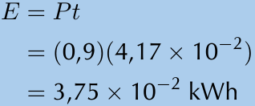
> **[Diagram Context - Textbook_PhysicalSciences_Gr11_Electric-circuits.pdf-0041-12.png]**
> This image displays a mathematical calculation using the physics formula $E = Pt$, where $E$ represents electrical energy, $P$ is power, and $t$ is time. It demonstrates the substitution of numerical values into the formula to determine energy consumption in kilowatt-hours (kWh), a core concept in the Grade 10-12 Physical Sciences curriculum regarding electricity and household energy usage.

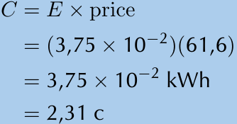
> **[Diagram Context - Textbook_PhysicalSciences_Gr11_Electric-circuits.pdf-0041-15.png]**
> This mathematical calculation demonstrates the formula for determining the cost ($C$) of electrical energy consumption by multiplying energy used ($E$) by the electricity price. It utilizes scientific notation for energy in kilowatt-hours (kWh) and calculates the final cost in South African cents (c). This illustrates a practical application of Physical Sciences and Mathematical Literacy, showing how to convert energy usage data into monetary value.

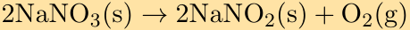

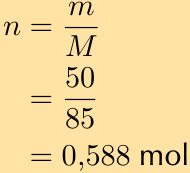
> **[Diagram Context - Textbook_PhysicalSciences_Gr11_Quantitative-aspects-of-chemical-change.pdf-0041-06.png]**
> The graphic displays a chemical calculation formula involving the number of moles. Visible elements include the variables $n$, $m$, and $M$, numerical substitution values $50$ and $85$, and the final calculated unit $0,588\text{ mol}$. This demonstrates the fundamental stoichiometric relationship for Grade 10 and 11 Physical Sciences learners, showing how to calculate the number of moles ($n$) by dividing the given mass ($m$) by the molar mass ($M$).

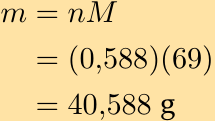
> **[Diagram Context - Textbook_PhysicalSciences_Gr11_Quantitative-aspects-of-chemical-change.pdf-0041-10.png]**
> This graphic is a mathematical chemistry calculation showing the formula and substitution for determining mass. The visible variables and values are $m = nM$, substitution values $(0,588)(69)$, and the final calculated result of $40,588\text{ g}$. Conceptually, it demonstrates to Grade 10 and 11 Physical Sciences learners how to calculate the mass of a substance using the molar mass formula ($m = n \times M$), reinforcing stoichiometric calculations and correct use of SI units.

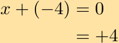

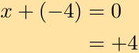

---

We confirm that this gives us a sum of $0$: $+1 + (-1) = 0$. So the oxidation number of hydrogen is $-1$ in $\text{NaH}$.

In the compound $\text{H}_2\text{O}$, the sum of the oxidation numbers must be $0$ (rule 4). 

This compound is not a metal hydride, so the oxidation number of hydrogen is $+1$ (rule 6). This compound is also not a peroxide, so the oxidation number of oxygen is $-2$ (rule 5).

So the oxidation number of hydrogen is $+2$ in $\text{H}_2\text{O}$ *(Note: text clarifies final values below)*. Hydrogen has an oxidation number of $-1$ in $\text{NaH}$ and $+1$ in $\text{H}_2\text{O}$.

---

### Exercise 3

Give the oxidation numbers for each of the elements in all the compounds. State if there is any difference between the oxidation number of the element in the reactant and the element in the product.

a) $\text{C (s)} + \text{O}_2\text{(g)} \rightarrow \text{CO}_2\text{(g)}$

b) $\text{N}_2\text{(g)} + 3\text{H}_2\text{(g)} \rightarrow 2\text{NH}_3\text{(g)}$

---

### Solution

#### a) $\text{C (s)} + \text{O}_2\text{(g)} \rightarrow \text{CO}_2\text{(g)}$

* In the compound $\text{C}$, the oxidation number of carbon is $0$ (rule 1).
* In the compound $\text{O}_2$, the oxidation number of oxygen is $0$ (rule 1).
* In the compound $\text{CO}_2$, the sum of the oxidation numbers must be $0$ (rule 3).

Let the oxidation number of carbon be $x$. We know that oxygen has an oxidation number of $-2$ (this is not a peroxide) and since there are two oxygen atoms in the molecule, then the sum of the oxidation numbers of these two oxygen atoms is $-4$. 

Putting this together gives:

$$x + (-4) = 0$$

$$x = +4$$

So the oxidation number of carbon is $+4$.

* The oxidation number of carbon in the products is $0$ and in the reactants it is $+4$. The oxidation number has increased (become more positive).
* The oxidation number of oxygen in the products is $0$ and in the reactants it is $-2$. The oxidation number has decreased (become more negative).

---

#### b) $\text{N}_2\text{(g)} + 3\text{H}_2\text{(g)} \rightarrow 2\text{NH}_3\text{(g)}$

* In the compound $\text{N}_2$, the oxidation number of nitrogen is $0$ (rule 1).
* In the compound $\text{H}_2$, the oxidation number of hydrogen is $0$ (rule 1).
* In the compound $\text{NH}_3$, the sum of the oxidation numbers must be $0$ (rule 3).

Let the oxidation number of nitrogen be $x$. We know that hydrogen has an oxidation number of $+1$ (this is not a metal hydride) and since there are three hydrogen atoms in the molecule, then the sum of the oxidation numbers of these three hydrogen atoms is $+3$.

Putting this together gives:

$$x + (+3) = 0$$

$$x = -3$$

So the oxidation number of nitrogen is $-3$.

* The oxidation number of hydrogen in the products is $0$ and in the reactants it is $+1$. The oxidation number has increased (become more positive).
* The oxidation number of nitrogen in the products is $0$ and in the reactants it is $-3$. The oxidation number has decreased (become more negative).

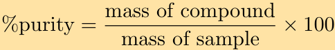
> **[Diagram Context - Textbook_PhysicalSciences_Gr11_Quantitative-aspects-of-chemical-change.pdf-0042-06.png]**
> This educational graphic displays the mathematical formula used to calculate the percentage purity of a substance. The visible text components include the formula: "%purity = (mass of compound / mass of sample) × 100". For a Grade 11 Physical Sciences learner following the CAPS curriculum, this diagram conveys the quantitative relationship needed to determine the proportion of a pure substance present in an impure sample during stoichiometric and quantitative chemistry calculations.

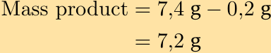
> **[Diagram Context - Textbook_PhysicalSciences_Gr11_Quantitative-aspects-of-chemical-change.pdf-0042-08.png]**
> This educational graphic displays a chemical calculation for determining the final mass of a product. The visible text reads "Mass product = 7,4 g - 0,2 g = 7,2 g". Conceptually, this demonstrates how to account for experimental errors, side losses, or unreacted impurities when calculating the actual yield or final mass of a product in stoichiometry problems aligned with the CAPS curriculum.

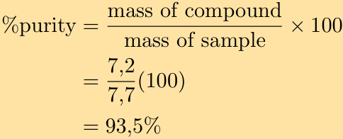
> **[Diagram Context - Textbook_PhysicalSciences_Gr11_Quantitative-aspects-of-chemical-change.pdf-0042-10.png]**
> This educational graphic displays a mathematical formula and a worked numerical calculation for percentage purity. The visible text includes the equation "%purity = (mass of compound / mass of sample) x 100", followed by the substitution step "(7,2 / 7,7) x 100", and the final calculated result of "93,5%". For a Grade 11 or 12 Physical Sciences student, this diagram conveys the standard method used in stoichiometry to calculate the percentage of a pure substance present within an impure sample.

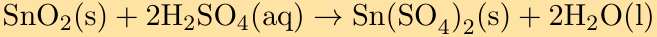
> **[Diagram Context - Textbook_PhysicalSciences_Gr11_Quantitative-aspects-of-chemical-change.pdf-0042-12.png]**
> The graphic displays a balanced chemical equation showing the reaction between tin(IV) oxide and sulfuric acid. Visible chemical symbols and state indicators include $\text{SnO}_2(\text{s})$, $\text{H}_2\text{SO}_4(\text{aq})$, $\text{Sn}(\text{SO}_4)_2(\text{s})$, and $\text{H}_2\text{O}(\text{l})$, linked by a reaction arrow. For a CAPS Physical Sciences student, this conveys how solid metal oxides react with acids to form metal salts and water, reinforcing quantitative stoichiometry and reaction phase notation.

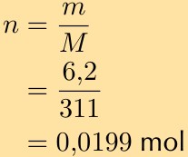
> **[Diagram Context - Textbook_PhysicalSciences_Gr11_Quantitative-aspects-of-chemical-change.pdf-0042-16.png]**
> This graphic shows a mathematical formula and calculation for determining the number of moles ($n$) of a substance. The visible variables and values include $n$ (number of moles), $m$ (mass in grams, substituted as $6,2$), $M$ (molar mass in $\text{g}\cdot\text{mol}^{-1}$, substituted as $311$), and the final calculated result of $0,0199\text{ mol}$. For a high school Physical Sciences student, this demonstrates the application of the stoichiometric formula $n = \frac{m}{M}$ to convert a given mass of a substance into moles, reinforcing foundational quantitative chemistry skills required in the CAPS curriculum.

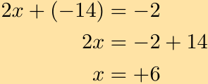
> **[Diagram Context - Textbook_PhysicalSciences_Gr11_Types-of-reaction.pdf-0042-03.png]**
> The image displays an algebraic equation step-by-step solution, featuring the linear equation $2x + (-14) = -2$, the transposed form $2x = -2 + 14$, and the final solved value $x = +6$, all incorporating the variable $x$ and integers. It demonstrates the fundamental CAPS algebraic technique of isolating the unknown variable by transposing terms across the equals sign and applying inverse operations. This visually guides learners through solving linear equations by reinforcing the rule that changing a term's side reverses its sign.

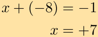

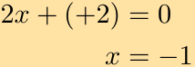

---

# Redox reactions

## Exercise 13 - 8: Redox reactions

1. Consider the following chemical equations:

$$\text{Fe (s)} \to \text{Fe}^{2+}(\text{aq}) + 2e^{-}$$

$$4\text{H}^{+}(\text{aq}) + \text{O}_2(\text{g}) + 4e^{-} \to 2\text{H}_2\text{O (l)}$$

Which one of the following statements is correct?

- a) $\text{Fe}$ is oxidised and $\text{H}^{+}$ is reduced
- b) $\text{Fe}$ is reduced and $\text{O}_2$ is oxidised
- c) $\text{Fe}$ is oxidised and $\text{O}_2$ is reduced
- d) $\text{Fe}$ is reduced and $\text{H}^{+}$ is oxidised

(DoE Grade 11 Paper 2, 2007)

**Solution:**

$\text{Fe}$ is oxidised and $\text{O}_2$ is reduced

---

2. Which one of the following reactions is a redox reaction?

- a) $\text{HCl (aq)} + \text{NaOH (aq)} \to \text{NaCl (aq)} + \text{H}_2\text{O (l)}$
- b) $\text{AgNO}_3(\text{aq}) + \text{NaI (aq)} \to \text{AgI (s)} + \text{NaNO}_3(\text{aq})$
- c) $2\text{FeCl}_3(\text{aq}) + 2\text{H}_2\text{O (l)} + \text{SO}_2(\text{aq}) \to \text{H}_2\text{SO}_4(\text{aq}) + 2\text{HCl (aq)} + 2\text{FeCl}_2(\text{aq})$
- d) $\text{BaCl}_2(\text{aq}) + \text{MgSO}_4(\text{aq}) \to \text{MgCl}_2(\text{aq}) + \text{BaSO}_4(\text{s})$

**Solution:**

$$2\text{FeCl}_3(\text{aq}) + 2\text{H}_2\text{O (l)} + \text{SO}_2(\text{aq}) \to \text{H}_2\text{SO}_4(\text{aq}) + 2\text{HCl (aq)} + 2\text{FeCl}_2(\text{aq})$$

---

3. Balance the following redox reactions:

- a) $\text{Zn (s)} + \text{Ag}^{+}(\text{aq}) \to \text{Zn}^{2+}(\text{aq}) + \text{Ag (s)}$
- b) $\text{Cu}^{2+}(\text{aq}) + \text{Cl}^{-}(\text{aq}) \to \text{Cu (s)} + \text{Cl}_2(\text{g})$
- c) $\text{Pb}^{2+}(\text{aq}) + \text{Br}^{-}(\text{aq}) \to \text{Pb (s)} + \text{Br}_2(\text{aq})$
- d) $\text{HCl (aq)} + \text{MnO}_2(\text{s}) \to \text{Cl}_2(\text{g}) + \text{Mn}^{2+}(\text{aq})$  
  This reaction takes place in an acidic medium.

**Solution:**

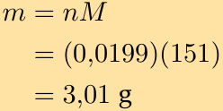
> **[Diagram Context - Textbook_PhysicalSciences_Gr11_Quantitative-aspects-of-chemical-change.pdf-0043-02.png]**
> The graphic displays a step-by-step mathematical calculation in the context of chemical stoichiometry. Visible variables and units include mass ($m$), number of moles ($n$), molar mass ($M$), and grams ($\text{g}$), along with numerical values $0,0199$, $151$, and $3,01$. This calculation demonstrates to Grade 10 and 11 Physical Sciences learners how to determine the mass of a substance by multiplying the number of moles by its molar mass ($m = n \times M$).

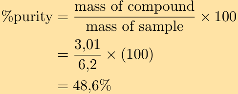
> **[Diagram Context - Textbook_PhysicalSciences_Gr11_Quantitative-aspects-of-chemical-change.pdf-0043-04.png]**
> This educational graphic displays a mathematical formula and worked numerical calculation for determining the percentage purity of a chemical sample. The visible labels and variables include "%purity", "mass of compound", "mass of sample", and specific numerical substitution values (3,01 over 6,2 multiplied by 100) leading to a final calculated result of 48,6%. Conceptually, this conveys how to quantitatively assess the purity of a substance in stoichiometric calculations by comparing the pure mass of the compound to the total mass of the impure sample.

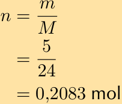
> **[Diagram Context - Textbook_PhysicalSciences_Gr11_Quantitative-aspects-of-chemical-change.pdf-0043-12.png]**
> This educational graphic displays a mathematical formula and calculation for determining chemical moles. It includes the variables $n$, $m$, and $M$, numerical values such as $5$, $24$, and $0,083$, as well as fraction bars, equal signs, and the unit 'mol'. This formula conveys the quantitative relationship for calculating the number of moles ($n$) by dividing the given mass ($m$) by the molar mass ($M$), illustrating a fundamental stoichiometric calculation required in high school chemistry.

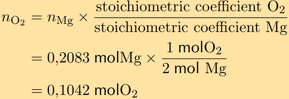
> **[Diagram Context - Textbook_PhysicalSciences_Gr11_Quantitative-aspects-of-chemical-change.pdf-0043-14.png]**
> This graphic displays a chemical calculation formula and worked numerical example for determining moles. It features the variables $n_{\text{O}_2}$ and $n_{\text{Mg}}$, along with the chemical symbols $\text{O}_2$ and $\text{Mg}$, the units $\text{mol}$, and a stoichiometric ratio fraction. Conceptually, this demonstrates stoichiometric mole-ratio calculations used in Grade 11 Physical Sciences to find the quantity of an unknown reactant or product based on balanced chemical equations.

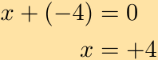

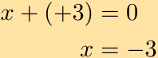

---

a) Write a reaction for each compound:

$$\text{Zn} \rightarrow \text{Zn}^{2+}$$
$$\text{Ag}^+ \rightarrow \text{Ag}$$

The atoms are balanced.

Add electrons to each reaction so that the charges balance. We add the electrons to the side with the greater positive charge.

$$\text{Zn} \rightarrow \text{Zn}^{2+} + 2e^{-}$$
$$\text{Ag}^+ + e^- \rightarrow \text{Ag}$$

We now make sure that the number of electrons in both reactions is the same.

The reaction for zinc has two electrons, while the reaction for silver has one electron. So we must multiply the reaction for silver by 2 to ensure that the charges balance.

$$\text{Zn} \rightarrow \text{Zn}^{2+} + 2e^{-}$$
$$2\text{Ag}^+ + 2e^- \rightarrow 2\text{Ag}$$

We combine the two half-reactions:

$$\begin{array}{r@{\quad}rcl}
  & \text{Zn} & \rightarrow & \text{Zn}^{2+} + 2e^{-} \\
+ & 2\text{Ag}^+ + 2e^- & \rightarrow & 2\text{Ag} \\
\hline
  & \text{Zn} + \text{Ag}^+ + 2e^- & \rightarrow & \text{Zn}^{2+} + 2\text{Ag} + 2e^{-}
\end{array}$$

Cancelling out the electrons gives:

$$\text{Zn (s)} + 2\text{Ag}^+ \text{(aq)} \rightarrow \text{Zn}^{2+} \text{(aq)} + 2\text{Ag (s)}$$

b) Write a reaction for each compound:

$$\text{Cu}^{2+} \rightarrow \text{Cu}$$
$$\text{Cl}^- \rightarrow \text{Cl}_2$$

Balance the atoms:

$$\text{Cu}^{2+} \rightarrow \text{Cu}$$
$$2\text{Cl}^- \rightarrow \text{Cl}_2$$

Add electrons to each reaction so that the charges balance. We add the electrons to the side with the greater positive charge.

$$\text{Cu}^{2+} + 2e^- \rightarrow \text{Cu}$$
$$2\text{Cl}^- \rightarrow \text{Cl}_2 + 2e^{-}$$

We now make sure that the number of electrons in both reactions is the same.

The reaction for copper has two electrons and the reaction for chlorine also has two electrons. So the charges balance.

We combine the two half-reactions:

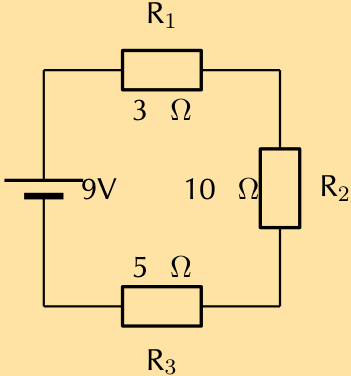
> **[Diagram Context - Textbook_PhysicalSciences_Gr11_Electric-circuits.pdf-0044-18.png]**
> This diagram represents a simple series circuit containing a 9V voltage source and three resistors labeled $R_1$ (3 $\Omega$), $R_2$ (10 $\Omega$), and $R_3$ (5 $\Omega$). It serves as a foundational tool for learners to practice calculating total resistance, current, and potential difference across components in a single-path circuit according to Ohm’s Law.

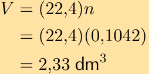
> **[Diagram Context - Textbook_PhysicalSciences_Gr11_Quantitative-aspects-of-chemical-change.pdf-0044-00.png]**
> This image displays a multi-step chemical calculation involving algebraic variables and numerical values. Visible symbols and labels include $V$, $n$, the molar volume constant $22,4$, and the unit of volume $\text{dm}^3$. Conceptually, it demonstrates how to calculate the volume of a gas at STP using the molar gas volume formula $V = V_m \times n$, reinforcing stoichiometry principles for Grade 11 and 12 Physical Sciences learners.

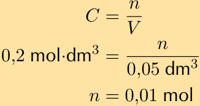
> **[Diagram Context - Textbook_PhysicalSciences_Gr11_Quantitative-aspects-of-chemical-change.pdf-0044-06.png]**
> The graphic displays a chemical formula equation for concentration alongside a worked calculation. The visible symbols and labels include $C$ for concentration, $n$ for number of moles, and $V$ for volume, with numerical values substituted into the equation to solve for $n$. This conveys the quantitative relationship between concentration, number of moles, and volume, helping learners apply the formula to stoichiometric calculations in solution chemistry.

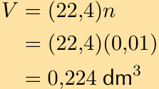
> **[Diagram Context - Textbook_PhysicalSciences_Gr11_Quantitative-aspects-of-chemical-change.pdf-0044-08.png]**
> This graphic shows a calculation of gas volume using the molar gas volume at STP in a stepped algebraic format. Visible components include the formula $V = (22,4)n$, substitution values like $(22,4)(0,01)$, and the final calculated result of $0,224\text{ dm}^3$. Conceptually, it demonstrates how to determine the volume of a given number of moles of gas at standard temperature and pressure using Avogadro's law in Stoichiometry.

---

$$\begin{array}{r@{\quad}rc@{\quad}l}
 & \text{Cu}^{2+} + 2e^{-} & \rightarrow & \text{Cu} \\
+ & 2\text{Cl}^{-} & \rightarrow & \text{Cl}_2 + 2e^{-} \\
\hline
 & \text{Cu}^{2+} + 2\text{Cl}^{-} + 2e^{-} & \rightarrow & \text{Cu} + \text{Cl}_2 + 2e^{-}
\end{array}$$

Cancelling out the electrons gives:

$$\text{Cu}^{2+}(\text{aq}) + 2\text{Cl}^{-}(\text{aq}) \rightarrow \text{Cu}(\text{s}) + \text{Cl}_2(\text{g})$$

c) Write a reaction for each compound:

$$\text{Pb}^{2+} \rightarrow \text{Pb}$$

$$\text{Br}^{-} \rightarrow \text{Br}_2$$

Balance the atoms:

$$\text{Pb}^{2+} \rightarrow \text{Pb}$$

$$2\text{Br}^{-} \rightarrow \text{Br}_2$$

Add electrons to each reaction so that the charges balance. We add the electrons to the side with the greater positive charge.

$$\text{Pb}^{2+} + 2e^{-} \rightarrow \text{Pb}$$

$$2\text{Br}^{-} \rightarrow \text{Br}_2 + 2e^{-}$$

We now make sure that the number of electrons in both reactions is the same.
The reaction for lead has two electrons and the reaction for bromine also has two electrons. So the charges balance.
We combine the two half-reactions:

$$\begin{array}{r@{\quad}rc@{\quad}l}
 & \text{Pb}^{2+} + 2e^{-} & \rightarrow & \text{Pb} \\
+ & 2\text{Br}^{-} & \rightarrow & \text{Br}_2 + 2e^{-} \\
\hline
 & \text{Pb}^{2+} + 2\text{Br}^{-} + 2e^{-} & \rightarrow & \text{Pb} + \text{Br}_2 + 2e^{-}
\end{array}$$

Cancelling out the electrons gives:

$$\text{Pb}^{2+}(\text{aq}) + 2\text{Br}^{-}(\text{aq}) \rightarrow \text{Pb}(\text{s}) + \text{Br}_2(\text{g})$$

d) Write a reaction for each compound:

$$\text{HCl} \rightarrow \text{Cl}_2$$

$$\text{MnO}_2 \rightarrow \text{Mn}^{2+}$$

Balance the atoms.
In the first reaction we have 1 chlorine atom on the left hand side and 2 chlorine atoms on the right hand side. So we multiply the left hand side by 2:

$$2\text{HCl} \rightarrow \text{Cl}_2$$

Now we note that there are 2 hydrogen atoms on the left hand side and no hydrogen atoms on the right hand side so we add 2 hydrogen ions to the right hand side:

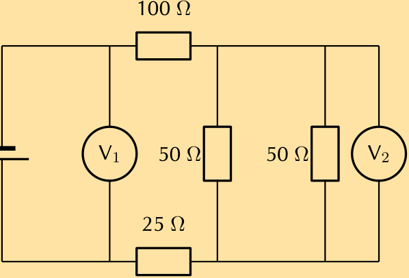
> **[Diagram Context - Textbook_PhysicalSciences_Gr11_Electric-circuits.pdf-0045-00.png]**
> This circuit diagram features a DC power source connected to a combination of resistors (100 Ω, 50 Ω, 50 Ω, and 25 Ω) and two voltmeters labeled V₁ and V₂. It illustrates the principles of series and parallel circuit configurations, requiring students to apply Ohm’s Law and potential difference rules to calculate voltage drops across specific components.

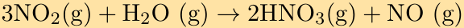
> **[Diagram Context - Textbook_PhysicalSciences_Gr11_Quantitative-aspects-of-chemical-change.pdf-0045-06.png]**
> The graphic displays a balanced chemical equation showing the reaction between nitrogen dioxide and water vapour: $3\text{NO}_2(\text{g}) + \text{H}_2\text{O}(\text{g}) \rightarrow 2\text{HNO}_3(\text{g}) + \text{NO}(\text{g})$. Visible chemical symbols include $\text{NO}_2$, $\text{H}_2\text{O}$, $\text{HNO}_3$, and $\text{NO}$, alongside state symbols $(\text{g})$ indicating the gas phase and a reaction arrow separating reactants from products. For Grade 11 and 12 Physical Sciences learners, this illustrates stoichiometric relationships and chemical change involving gaseous reactants and products in industrial chemical processes such as the preparation of nitric acid.

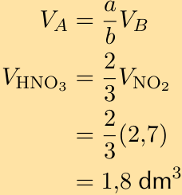
> **[Diagram Context - Textbook_PhysicalSciences_Gr11_Quantitative-aspects-of-chemical-change.pdf-0045-11.png]**
> The image displays algebraic equations showing stoichiometric volume calculations involving chemical formulas and units. Visible variables and symbols include $V_A$, $V_B$, $V_{\text{HNO}_3}$, $V_{\text{NO}_2}$, fractions ($a/b$, $2/3$), parentheses, and the unit $\text{dm}^3$. Conceptually, this demonstrates how to determine the volume of a reacting gas or solution using molar volume ratios derived from balanced chemical equations in Grade 11 and 12 Physical Sciences.

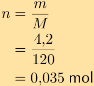
> **[Diagram Context - Textbook_PhysicalSciences_Gr11_Quantitative-aspects-of-chemical-change.pdf-0045-17.png]**
> This graphic shows a mathematical formula and calculation step for determining the number of moles. Visible elements include the variables $n$ (number of moles), $m$ (mass), $M$ (molar mass), along with numerical values (4,2, 120) and the final calculated result with its unit (0,035 mol). Conceptually, this demonstrates how to apply the stoichiometric relation $n = \frac{m}{M}$ to calculate the amount of substance in moles from a given mass and molar mass, aligning with Grade 10-12 Physical Sciences stoichiometry.

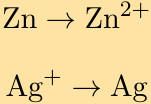

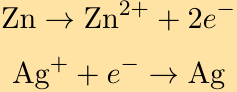
> **[Diagram Context - Textbook_PhysicalSciences_Gr11_Types-of-reaction.pdf-0045-04.png]**
> The graphic displays two half-reaction chemical equations. The visible chemical symbols and terms include $\text{Zn}$, $\text{Zn}^{2+}$, $e^-$, $\text{Ag}^+$, and $\text{Ag}$, connected by reaction arrows. Conceptually, this demonstrates oxidation (loss of electrons by zinc) and reduction (gain of electrons by silver ions) as foundational components of electrochemical cells in the CAPS Physical Sciences curriculum.

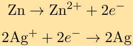
> **[Diagram Context - Textbook_PhysicalSciences_Gr11_Types-of-reaction.pdf-0045-07.png]**
> This graphic displays two distinct half-reaction chemical equations. The visible symbols and labels include zinc ($\text{Zn}$), zinc ions ($\text{Zn}^{2+}$), silver ions ($\text{Ag}^{+}$), silver ($\text{Ag}$), electrons ($e^{-}$), plus signs, and directional arrows. Conceptually, this conveys oxidation and reduction half-reactions in electrochemistry, illustrating the loss of electrons (oxidation of zinc) and gain of electrons (reduction of silver ions) required for Grade 12 learners to construct overall redox reactions and galvanic cells.

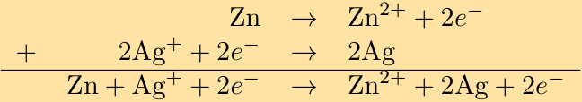
> **[Diagram Context - Textbook_PhysicalSciences_Gr11_Types-of-reaction.pdf-0045-09.png]**
> The graphic displays a chemical equation showing half-reactions and an overall redox reaction, featuring chemical symbols ($\text{Zn}$, $\text{Zn}^{2+}$, $\text{Ag}^{+}$, $\text{Ag}$), electrons ($e^{-}$), horizontal addition lines, and reaction arrows ($\rightarrow$). It demonstrates how individual oxidation and reduction half-reactions are balanced and combined to form an overall electrochemical cell equation, reinforcing the conservation of charge and mass essential for Grade 12 Physical Sciences.

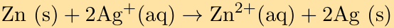
> **[Diagram Context - Textbook_PhysicalSciences_Gr11_Types-of-reaction.pdf-0045-11.png]**
> The graphic displays a balanced chemical equation representing a redox reaction between solid zinc and aqueous silver ions, denoted as $\text{Zn (s)} + 2\text{Ag}^+\text{(aq)} \rightarrow \text{Zn}^{2+}\text{(aq)} + 2\text{Ag (s)}$ with a reaction arrow pointing from reactants to products. Visible symbols and labels include chemical formulas with physical state indicators in parentheses: $\text{Zn (s)}$, $\text{Ag}^+\text{(aq)}$, $\text{Zn}^{2+}\text{(aq)}$, and $\text{Ag (s)}$. This equation conveys the concept of oxidation-reduction (redox) processes for Grade 12 Physical Sciences learners, illustrating how electrons are transferred from zinc atoms (which are oxidized to $\text{Zn}^{2+}$) to silver ions (which are reduced to silver metal $\text{Ag}$).

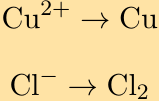

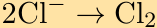

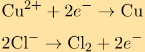
> **[Diagram Context - Textbook_PhysicalSciences_Gr11_Types-of-reaction.pdf-0045-18.png]**
> The graphic displays two chemical half-equations featuring the chemical symbols $\text{Cu}^{2+}$, $e^-$, $\text{Cu}$, $\text{Cl}^-$, and $\text{Cl}_2$, connected by directional reaction arrows. Specifically, it illustrates a reduction half-reaction where copper ions gain electrons to form solid copper ($\text{Cu}^{2+} + 2e^- \rightarrow \text{Cu}$) and an oxidation half-reaction where chloride ions lose electrons to form chlorine gas ($2\text{Cl}^- \rightarrow \text{Cl}_2 + 2e^-$). For a Grade 12 Physical Sciences learner under the CAPS curriculum, this conveys the fundamental electron transfer processes occurring at the cathode and anode during electrolytic or galvanic cell reactions.

---

$$2\text{HCl} \rightarrow \text{Cl}_2 + 2\text{H}^+$$

The equation is now balanced.

For the second equation we need to add two water molecules to the right hand side:

$$\text{MnO}_2 \rightarrow \text{Mn}^{2+} + 2\text{H}_2\text{O}$$

We now need to add four hydrogen ions to the left hand side to balance the hydrogens:

$$\text{MnO}_2 + 4\text{H}^+ \rightarrow \text{Mn}^{2+} + 2\text{H}_2\text{O}$$

This equation is now balanced.

Add electrons to each reaction so that the charges balance. We add the electrons to the side with the greater positive charge.

$$2\text{HCl} \rightarrow \text{Cl}_2 + 2\text{H}^+ + 2\text{e}^-$$
$$\text{MnO}_2 + 4\text{H}^+ + 2\text{e}^- \rightarrow \text{Mn}^{2+} + 2\text{H}_2\text{O}$$

We now make sure that the number of electrons in both reactions is the same.

The reaction for chlorine has two electrons and the reaction for manganese also has two electrons. So the charges balance.

We combine the two half-reactions:

$$\begin{array}{rrcl}
& 2\text{HCl} & \rightarrow & \text{Cl}_2 + 2\text{H}^+ + 2\text{e}^- \\
+ & \text{MnO}_2 + 4\text{H}^+ + 2\text{e}^- & \rightarrow & \text{Mn}^{2+} + 2\text{H}_2\text{O} \\
\hline
& 2\text{HCl} + \text{MnO}_2 + 4\text{H}^+ + 2\text{e}^- & \rightarrow & \text{Cl}_2 + 2\text{H}^+ + 2\text{e}^- + \text{Mn}^{2+} + 2\text{H}_2\text{O}
\end{array}$$

Cancelling out the electrons and hydrogen ions gives:

$$2\text{HCl} + \text{MnO}_2 + 2\text{H}^+ \rightarrow \text{Cl}_2 + \text{Mn}^{2+} + 2\text{H}_2\text{O}$$

---

## 13.4 Chapter summary

### Exercise 13 - 9:

1. Give one word/term for each of the following descriptions:
   
   a) A chemical reaction during which electrons are transferred.
   
   b) A substance that takes up protons and is said to be a proton acceptor.
   
   c) The loss of electrons by a molecule, atom or ion.
   
   d) A substance that can act as either an acid or as a base.

**Solution:**

a) Redox reaction

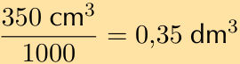
> **[Diagram Context - Textbook_PhysicalSciences_Gr11_Quantitative-aspects-of-chemical-change.pdf-0046-01.png]**
> This graphic illustrates a unit conversion calculation for volume, specifically converting cubic centimetres to cubic decimetres. The visible mathematical expression shows $\frac{350\text{ cm}^3}{1000} = 0,35\text{ dm}^3$ utilizing standard decimal comma notation. For a high school Physical Sciences learner, it demonstrates the proportional conversion factor between $\text{cm}^3$ and $\text{dm}^3$ essential for stoichiometric calculations involving solution concentration and gas volumes.

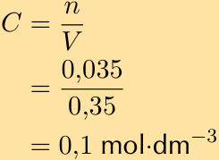
> **[Diagram Context - Textbook_PhysicalSciences_Gr11_Quantitative-aspects-of-chemical-change.pdf-0046-03.png]**
> The graphic displays a chemical calculation for molar concentration using the formula $C = \frac{n}{V}$. It shows visible variables and numerical values: concentration $C$, number of moles $n = 0,035$, and volume $V = 0,35$, resulting in a final calculated concentration of $0,1\text{ mol}\cdot\text{dm}^{-3}$. This conveys the quantitative relationship for solution concentration required in Grade 10-12 Physical Sciences, demonstrating the correct substitution of moles and volume with proper SI units.

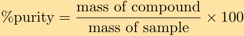
> **[Diagram Context - Textbook_PhysicalSciences_Gr11_Quantitative-aspects-of-chemical-change.pdf-0046-09.png]**
> The graphic displays a chemical formula equation for calculating percentage purity. It features the visible text elements "% purity", "mass of compound", "mass of sample", a division fraction bar, an equals sign, and multiplication by 100. This formula conveys conceptually for FET Physical Sciences learners how to determine the proportion of a pure substance contained within an impure sample using mass ratios in stoichiometric calculations.

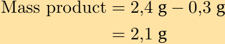
> **[Diagram Context - Textbook_PhysicalSciences_Gr11_Quantitative-aspects-of-chemical-change.pdf-0046-11.png]**
> This educational graphic displays a mathematical calculation for determining the mass of a product in grams. The visible text reads "Mass product = 2,4 g - 0,3 g = 2,1 g", utilizing comma decimal separators standard in the South African CAPS curriculum. Conceptually, this demonstrates how to account for experimental error or subtraction of mass in chemical or physical measurements to find the final experimental product mass.

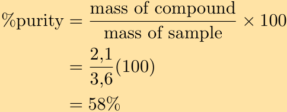
> **[Diagram Context - Textbook_PhysicalSciences_Gr11_Quantitative-aspects-of-chemical-change.pdf-0046-13.png]**
> This graphic presents an equation and a worked numerical calculation for determining percentage purity in stoichiometry. Visible elements include the formula `\text{\%purity} = \frac{\text{mass of compound}}{\text{mass of sample}} \times 100`, followed by substituted values `\frac{2,1}{3,6}(100)` using a comma as a decimal separator, resulting in `58\%`. Conceptually, it demonstrates to Grade 11 and 12 Physical Sciences learners how to calculate the proportion of a pure substance present within an impure sample using mass ratios.

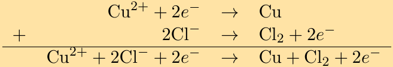
> **[Diagram Context - Textbook_PhysicalSciences_Gr11_Types-of-reaction.pdf-0046-00.png]**
> The graphic presents a chemical equation derivation showing half-reactions and an overall redox reaction. It features chemical symbols and ions ($\text{Cu}^{2+}$, $e^-$, $\text{Cu}$, $\text{Cl}^-$, $\text{Cl}_2$), plus signs, reaction arrows, and an addition line. For Grade 12 Physical Sciences learners studying electrochemistry, this demonstrates how reduction and oxidation half-reactions are combined to determine the overall cell reaction.

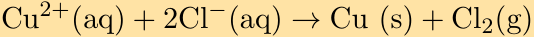
> **[Diagram Context - Textbook_PhysicalSciences_Gr11_Types-of-reaction.pdf-0046-02.png]**
> This chemical equation features reactants $\text{Cu}^{2+}(\text{aq})$ and $2\text{Cl}^-(\text{aq})$, a forward reaction arrow, and products $\text{Cu}(\text{s})$ and $\text{Cl}_2(\text{g})$. Conceptually, it represents a redox reaction in electrochemistry where copper ions are reduced to solid copper and chloride ions are oxidized to chlorine gas, aligning with Grade 12 Physical Sciences requirements for galvanic and electrolytic cells.

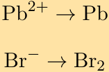

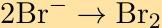

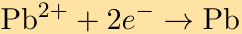

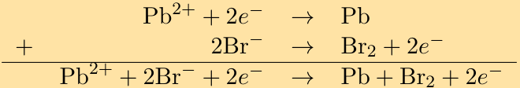
> **[Diagram Context - Textbook_PhysicalSciences_Gr11_Types-of-reaction.pdf-0046-14.png]**
> This graphic displays two half-reactions and a combined net ionic equation involving chemical symbols and electrons: $\text{Pb}^{2+} + 2e^- \rightarrow \text{Pb}$, $2\text{Br}^- \rightarrow \text{Br}_2 + 2e^-$, and $\text{Pb}^{2+} + 2\text{Br}^- + 2e^- \rightarrow \text{Pb} + \text{Br}_2 + 2e^-$, all connected by horizontal addition and reaction arrows. Conceptually, it demonstrates how individual oxidation and reduction half-equations are summed together to construct a balanced overall redox equation for Grade 12 Physical Sciences.

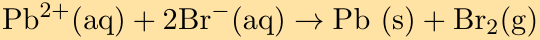
> **[Diagram Context - Textbook_PhysicalSciences_Gr11_Types-of-reaction.pdf-0046-16.png]**
> This graphic shows a chemical equation representing a redox reaction. Visible components include chemical formulas and state symbols ($\text{Pb}^{2+}(\text{aq})$, $2\text{Br}^-(\text{aq})$, $\text{Pb}(\text{s})$, $\text{Br}_2(\text{g})$) separated by a forward reaction arrow. For a Grade 12 Physical Sciences student, this equation illustrates the transfer of electrons between lead ions and bromide ions, allowing learners to identify oxidizing and reducing agents and write half-reactions as prescribed by the CAPS curriculum.

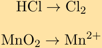
> **[Diagram Context - Textbook_PhysicalSciences_Gr11_Types-of-reaction.pdf-0046-18.png]**
> This educational graphic presents two chemical half-reaction transformation schemas relevant to redox reactions in the CAPS Physical Sciences curriculum. The visible text and formulas include the chemical species $\text{HCl}$, $\text{Cl}_2$, $\text{MnO}_2$, and $\text{Mn}^{2+}$, connected by reaction arrows ($\rightarrow$). Conceptually, it helps learners practice identifying oxidation and reduction half-reactions by tracking changes in chemical species and oxidation numbers during electrochemical or redox processes.

---

b) Brønsted-Lowry base
c) Oxidation
d) Amphoteric substance

2. Given the following reaction:

$$\text{HNO}_3\text{(aq)} + \text{NH}_3\text{(aq)} \rightarrow \text{NH}_4^+\text{(aq)} + \text{NO}_3^-\text{(aq)}$$

Which of the following statements is true?

a) $\text{HNO}_3$ accepts protons and is a Brønsted-Lowry base
b) $\text{HNO}_3$ accepts protons and is a Brønsted-Lowry acid
c) $\text{NH}_3$ donates protons and is a Brønsted-Lowry acid
d) $\text{HNO}_3$ donates protons and is a Brønsted-Lowry acid

**Solution:**  
$\text{HNO}_3$ donates protons and is a Brønsted-Lowry acid.

3. When chlorine water ($\text{Cl}_2$ dissolved in water) is added to a solution of potassium bromide, bromine is produced. Which one of the following statements concerning this reaction is correct?

a) $\text{Br}$ is oxidised
b) $\text{Cl}_2$ is oxidised
c) $\text{Br}^-$ is the oxidising agent
d) $\text{Cl}^-$ is the oxidising agent

*(IEB Paper 2, 2005)*

**Solution:**  
$\text{Br}^-$ is the oxidising agent (chlorine is reduced in this reaction).

4. Given the following reaction:

$$\text{H}_2\text{SO}_3\text{(aq)} + 2\text{KOH (aq)} \rightarrow \text{K}_2\text{SO}_3\text{(aq)} + 2\text{H}_2\text{O (l)}$$

Which substance acts as the acid and which substance acts as the base?

**Solution:**  
$\text{H}_2\text{SO}_3$ is the Brønsted-Lowry acid and $\text{KOH}$ is the Brønsted-Lowry base.

5. Use balanced chemical equations to explain why $\text{HSO}_4^-$ is amphoteric.

**Solution:**  
$\text{HSO}_4^-$ accepts a proton to form sulfuric acid (in other words it acts as a Brønsted-Lowry base):

$$\text{HSO}_4^- + \text{H}^+ \rightarrow \text{H}_2\text{SO}_4$$

$\text{HSO}_4^-$ also donates a proton to form the sulfate ion (in other words it acts as a Brønsted-Lowry acid):

$$\text{HSO}_4^- \rightarrow \text{SO}_4^{2-} + \text{H}^+$$

Since $\text{HSO}_4^-$ can act as either an acid or as a base it is said to be amphoteric.

> **[Diagram Context - Textbook_PhysicalSciences_Gr11_Quantitative-aspects-of-chemical-change.pdf-0047-04.png]**
> The graphic displays a balanced chemical equation representing an acid-base neutralization reaction. It features the chemical symbols and formulas $2\text{NaOH}$, $\text{H}_2\text{SO}_4$, $\text{Na}_2\text{SO}_4$, and $2\text{H}_2\text{O}$, along with a reaction arrow and the label "a)". Conceptually, this conveys to Physical Sciences learners how a strong base (sodium hydroxide) reacts with a diprotic acid (sulfuric acid) to produce a salt (sodium sulfate) and water, reinforcing the principles of stoichiometry and neutralization in aqueous solutions.

> **[Diagram Context - Textbook_PhysicalSciences_Gr11_Quantitative-aspects-of-chemical-change.pdf-0047-05.png]**
> This educational graphic presents a chemical calculation showing the formula for concentration alongside a worked numerical example. The visible symbols and variables include $C$, $n$, and $V$, with substituted values ($0,1 = \frac{n}{0,3}$) leading to the final calculated amount of substance ($n = 0,03\text{ mol}$). This demonstrates to Grade 10-12 Physical Sciences learners how to apply the molar concentration formula to calculate the number of moles from a given concentration and volume.

> **[Diagram Context - Textbook_PhysicalSciences_Gr11_Quantitative-aspects-of-chemical-change.pdf-0047-08.png]**
> The graphic displays a chemical equation involving concentration calculation formulas with the variables $C$, $n$, and $V$. Visible labels and values include concentration $C = 0,5$, volume $V = 0,2$, and the calculated number of moles $n = 0,1\text{ mol}$. Conceptually, it demonstrates how to substitute known values into the molar concentration formula to calculate the number of moles of a solute in solution, aligning with Grade 10-12 Physical Sciences stoichiometry.

> **[Diagram Context - Textbook_PhysicalSciences_Gr11_Quantitative-aspects-of-chemical-change.pdf-0047-10.png]**
> This educational graphic presents a stoichiometric calculation formula and its numerical substitution involving sodium hydroxide ($\text{NaOH}$) and sulfuric acid ($\text{H}_2\text{SO}_4$). Visible labels include chemical formulas ($n_{\text{NaOH}}$, $n_{\text{H}_2\text{SO}_4}$), the terms "stoichiometric coefficient $\text{NaOH}$" and "stoichiometric coefficient $\text{H}_2\text{SO}_4$", and numerical values with units ($\text{mol}$). Conceptually, it demonstrates how to use the mole ratio from a balanced chemical equation to determine the unknown amount of substance from a known reactant quantity during quantitative volumetric analysis in Grade 11 and 12 Chemistry.

> **[Diagram Context - Textbook_PhysicalSciences_Gr11_Types-of-reaction.pdf-0047-05.png]**
> This chemical equation displays a redox half-reaction relevant to Grade 12 Physical Sciences. The visible symbols and formulas include manganese dioxide ($\text{MnO}_2$), hydrogen ions ($\text{H}^+$), manganese ions ($\text{Mn}^{2+}$), and water ($\text{H}_2\text{O}$), linked by a reaction arrow. Conceptually, this illustrates the reduction half-reaction where manganese in $\text{MnO}_2$ gains electrons and undergoes a decrease in oxidation number to form $\text{Mn}^{2+}$ in acidic medium, a key concept for understanding electrochemical and galvanic cells.

> **[Diagram Context - Textbook_PhysicalSciences_Gr11_Types-of-reaction.pdf-0047-08.png]**
> This educational graphic displays two chemical half-equations featuring the symbols $2\text{HCl}$, $\text{Cl}_2$, $\text{H}^+$, $e^-$, $\text{MnO}_2$, $\text{Mn}^{2+}$, and $\text{H}_2\text{O}$, connected by reaction arrows ($\rightarrow$). Conceptually, it demonstrates oxidation and reduction half-reactions where hydrochloric acid is oxidized and manganese dioxide is reduced through electron transfer. For a Grade 12 Physical Sciences student following the CAPS curriculum, this serves as practice for identifying half-reactions, assigning oxidation numbers, and combining them into an overall redox reaction.

> **[Diagram Context - Textbook_PhysicalSciences_Gr11_Types-of-reaction.pdf-0047-11.png]**
> This graphic displays two half-reactions and their preliminary addition for a redox process involving hydrochloric acid and manganese dioxide. The visible chemical formulas, ions, and electrons include $2\text{HCl}$, $\text{Cl}_2$, $\text{H}^+}$, $e^-$, $\text{MnO}_2$, $\text{Mn}^{2+}$, and $\text{H}_2\text{O}$, connected by reaction arrows ($\rightarrow$) and an addition layout. Conceptually, this helps Grade 12 Physical Sciences learners practice combining oxidation and reduction half-reactions, demonstrating how spectator ions or common species are balanced before deriving the final net ionic redox equation.

> **[Diagram Context - Textbook_PhysicalSciences_Gr11_Types-of-reaction.pdf-0047-13.png]**
> The graphic displays a chemical equation showing reactants and products connected by a directional arrow pointing from left to right. The visible chemical symbols and formulas include $2\text{HCl}$, $\text{MnO}_2$, $2\text{H}^+$, $\text{Cl}_2$, $\text{Mn}^{2+}$, and $2\text{H}_2\text{O}$, separated by plus signs. Conceptually, this conveys a redox reaction demonstrating how hydrochloric acid and manganese dioxide react in an acidic medium to produce chlorine gas, manganese ions, and water, supporting Grade 12 CAPS Physical Sciences outcomes on oxidation-reduction reactions.

---

6. Milk of magnesia is an example of an antacid and is only slightly soluble in water. Milk of magnesia has the chemical formula $\text{Mg(OH)}_2$ and is taken as a powder dissolved in water. Write a balanced chemical equation to show how the antacid reacts with hydrochloric acid (the main acid found in the stomach).

**Solution:**

$$2\text{HCl (aq)} + \text{Mg(OH)}_2\text{(aq)} \rightarrow \text{MgCl}_2\text{(aq)} + 2\text{H}_2\text{O (l)}$$

---

7. In an experiment sodium carbonate was used to neutralise a solution of hydrochloric acid. Write a balanced chemical equation for this reaction.

**Solution:**

$$2\text{HCl (aq)} + \text{Na}_2\text{CO}_3\text{(aq)} \rightarrow 2\text{NaCl (aq)} + \text{H}_2\text{O (l)} + \text{CO}_2\text{(g)}$$

---

8. Write a balanced chemical equation for phosphoric acid ($\text{H}_3\text{PO}_4$) reacting with calcium oxide ($\text{CaO}$).

**Solution:**

$$2\text{H}_3\text{PO}_4\text{(aq)} + 3\text{CaO (s)} \rightarrow \text{Ca}_3(\text{PO}_4)_2\text{ (aq)} + 3\text{H}_2\text{O (l)}$$

---

9. Label the acid-base conjugate pairs in the following equation:

$$\text{HCO}_3^{-}\text{(aq)} + \text{H}_2\text{O} \rightarrow \text{CO}_3^{2-}\text{(aq)} + \text{H}_3\text{O}^{+}\text{(aq)}$$

**Solution:**

> **[Diagram Context - Textbook_PhysicalSciences_Gr11_Electric-circuits.pdf-0048-11.png]**
> This line graph plots Current ($I$) in Amperes against Voltage ($V$) in Volts, showing a linear relationship between the two variables. The graph illustrates Ohm’s Law, demonstrating that for an ohmic conductor, the current is directly proportional to the potential difference across it, with the gradient representing the reciprocal of the resistance ($1/R$).

---

10. Look at the following reaction:

$$2\text{H}_2\text{O}_2\text{(l)} \rightarrow 2\text{H}_2\text{O (l)} + \text{O}_2\text{(g)}$$

a) What is the oxidation number of the oxygen atom in each of the following compounds?
   i. $\text{H}_2\text{O}_2$
   ii. $\text{H}_2\text{O}$
   iii. $\text{O}_2$

b) Does the hydrogen peroxide ($\text{H}_2\text{O}_2$) act as an oxidising agent or a reducing agent or both, in the above reaction? Give a reason for your answer.

**Solution:**

> **[Diagram Context - Textbook_PhysicalSciences_Gr11_Quantitative-aspects-of-chemical-change.pdf-0048-02.png]**
> This graphic shows two algebraic conversion calculations for solution volumes, displaying the variables $V_{\text{H}_2\text{SO}_4}$ and $V_{\text{NaOH}}$ with values given in cubic decimetres ($\text{dm}^3$). The visible labels and symbols include the chemical formulas $\text{H}_2\text{SO}_4$ and $\text{NaOH}$, volume fractions dividing by 1000, and South African decimal formatting using commas ($0,025\text{ dm}^3$ and $0,023\text{ dm}^3$). Conceptually, it guides Grade 11 and 12 Physical Sciences learners on how to correctly convert solution volumes from cubic centimetres ($\text{cm}^3$) to standard $\text{dm}^3$ units required for stoichiometric and acid-base titration calculations.

> **[Diagram Context - Textbook_PhysicalSciences_Gr11_Quantitative-aspects-of-chemical-change.pdf-0048-04.png]**
> This educational graphic presents a chemical calculation formula and its step-by-step substitution for a stoichiometric titration problem. Visible elements include the dilution or titration formula $\frac{C_1V_1}{n_1} = \frac{C_2V_2}{n_2}$, substituted numerical values, chemical formulas like $\text{NaOH}$, and the final calculated concentration unit $\text{mol}\cdot\text{dm}^{-3}$. Conceptually, it guides Grade 11 and 12 Physical Sciences learners through applying mole ratios from a balanced chemical equation to determine an unknown concentration from volumetric titration data.

> **[Diagram Context - Textbook_PhysicalSciences_Gr11_Quantitative-aspects-of-chemical-change.pdf-0048-14.png]**
> This graphic displays a chemical calculation formula for determining the number of moles ($n$) using mass ($m$) and molar mass ($M$). The visible variables and values include $n$, $m$, $M$, the substitution values $0,74$ and $48$, and the final calculated result of $0,0154\text{ mol}$. For a high school Physical Sciences learner, it demonstrates the practical application of stoichiometric calculations by showing how to convert a given mass of a substance into moles using its molar mass.

> **[Diagram Context - Textbook_PhysicalSciences_Gr11_Quantitative-aspects-of-chemical-change.pdf-0048-16.png]**
> This graphic displays a worked numerical calculation for determining the amount of substance. The visible variables and values are $n$, $m$, $M$, with substituted numerical values $\frac{0,67}{30}$ resulting in $0,0223\text{ mol}$. For a high school Physical Sciences learner studying stoichiometry, it demonstrates the practical application of the molar mass formula $n = \frac{m}{M}$ to calculate the number of moles from a given mass and molar mass.

> **[Diagram Context - Textbook_PhysicalSciences_Gr11_Types-of-reaction.pdf-0048-21.png]**
> This graphic displays a balanced chemical equation representing an acid-base neutralization reaction. The equation features the chemical formulas H₂SO₃(aq), KOH(aq), K₂SO₃(aq), and H₂O(l), connected by a reaction arrow and state symbols in parentheses. Conceptually, it conveys how a diprotic acid reacts with a metal hydroxide base to form a salt and water, which is a core concept in Grade 11 Physical Sciences under chemical change and reactions in aqueous solutions.

---

a) 
i. In the compound $\text{H}_2\text{O}_2$, the sum of the oxidation numbers must be $0$ (rule $4$). Let the oxidation number of oxygen be $x$ (this is a peroxide and so oxygen does not have an oxidation number of $-2$). We know that hydrogen has an oxidation number of $+1$ (this is not a metal hydride) and since there are two hydrogen atoms in the molecule, the sum of the oxidation numbers of these two hydrogen atoms is $+2$. 

Putting this together gives:

$$2x + (+2) = 0$$

$$x = -1$$

So the oxidation number of oxygen is $-1$ in $\text{H}_2\text{O}_2$. (Note that this confirms what has been stated about peroxides (see rule $5$).)

ii. In the compound $\text{H}_2\text{O}$, the sum of the oxidation numbers must be $0$ (rule $3$). 
This compound is not a metal hydride, so the oxidation number of hydrogen is $+1$ (rule $6$). This compound is also not a peroxide, so the oxidation number of oxygen is $-2$ (rule $5$). 

We confirm that this gives us a sum of $0$: $2(+1) + (-2) = 0$. So the oxidation number of oxygen is $-2$ in $\text{H}_2\text{O}$.

iii. In the compound $\text{O}_2$, the oxidation number of oxygen is $0$.

b) Hydrogen peroxide ($\text{H}_2\text{O}_2$) acts as both an oxidising agent and a reducing agent in the above reaction. In this example there is only one reactant and this reactant decomposes into two parts.

---

### 11. Challenge Question

Zinc reacts with aqueous copper sulfate ($\text{CuSO}_4(\text{aq})$) to form zinc sulfate ($\text{ZnSO}_4(\text{aq})$) and copper ions. What is the oxidation number for each element in the reaction?

#### Solution:

Start by writing the balanced equation:

$$\text{Zn (s)} + \text{CuSO}_4\text{(aq)} \rightarrow \text{ZnSO}_4\text{aq} + \text{Cu (s)}$$

Next we determine the oxidation number of each element in the reactants. Zinc is an element and so has oxidation number of $0$ (rule $1$). The copper sulfate consists of $\text{Cu}^{2+}$ ions and $\text{SO}_4$ ions. The copper ions will have an oxidation number of $+2$ (rule $3$). Oxygen usually has an oxidation number of $-2$ (rule $6$). In the polyatomic $\text{SO}_4^{2-}$ ion, the sum of the oxidation numbers must be $-2$ (rule $4$). Since there are four oxygen atoms in the ion, the total charge of the oxygen is $-8$. If the overall charge of the ion is $-2$, then the oxidation number of sulfur must be $+6$. ($x + 4(-2) = -2$ therefore $x - 8 = -2$).

Next we determine the oxidation number of each element in the products. Copper is an element and so has oxidation number of $0$ (rule $1$). The zinc sulfate consists of $\text{Zn}^{2+}$ ions and $\text{SO}_4$ ions. The zinc ions will have an oxidation number of $+2$ (rule $3$). Oxygen usually has an oxidation number of $-2$ (rule $6$). In the polyatomic $\text{SO}_4^{2-}$ ion, the sum of the oxidation numbers must be $-2$ (rule $4$). Since there are four oxygen atoms in the ion, the total charge of the oxygen is $-8$. If the overall charge of the ion is $-2$, then the oxidation number of sulfur must be $+6$. ($x + 4(-2) = -2$ therefore $x - 8 = -2$).

> **[Diagram Context - Textbook_PhysicalSciences_Gr11_Electric-circuits.pdf-0049-04.png]**
> This image displays a mathematical derivation based on Ohm’s Law, utilizing variables $V$ (potential difference), $I$ (current), and $R$ (resistance) with subscripts $0$ and $U$ to denote different states. It demonstrates the algebraic process of equating two expressions for current ($I$) to solve for an unknown resistance ($R_U$) in terms of the other known variables. This is a fundamental technique in Grade 10-12 Physical Sciences for analyzing series and parallel circuits or potential divider calculations.

> **[Diagram Context - Textbook_PhysicalSciences_Gr11_Quantitative-aspects-of-chemical-change.pdf-0049-05.png]**
> This algebraic equation demonstrates the calculation of mass from moles and molar mass. The visible variables and values are $m$, $n$, $M$, $(0,0154)$, $(46)$, and $0,71\text{ g}$. Conceptually, it conveys how to determine the mass of a substance by multiplying the number of moles by its molar mass in stoichiometry problems.

> **[Diagram Context - Textbook_PhysicalSciences_Gr11_Quantitative-aspects-of-chemical-change.pdf-0049-13.png]**
> This mathematical equation displays a chemical calculation involving mole stoichiometry. The visible labels and symbols include $n$, $m$, $M$, the fraction numbers $127$ and $100$, and the final calculated value of $1,27\text{ mol}$. For a Grade 10-12 Physical Sciences student, this demonstrates the core formula for calculating the number of moles ($n$) by dividing the given mass ($m$) by the molar mass ($M$).

> **[Diagram Context - Textbook_PhysicalSciences_Gr11_Quantitative-aspects-of-chemical-change.pdf-0049-17.png]**
> This graphic presents a chemical calculation formula involving stoichiometry. The visible symbols and numbers include $m$, $n$, $M$, $(1,27)$, $(56)$, and $71,12\text{ g}$. Conceptually, the graphic demonstrates how to calculate the mass ($m$) of a substance by multiplying the number of moles ($n$) by its molar mass ($M$) within high school Physical Sciences stoichiometry problems.

> **[Diagram Context - Textbook_PhysicalSciences_Gr11_Types-of-reaction.pdf-0049-02.png]**
> This image displays a balanced chemical equation representing an acid-base neutralization reaction. The visible chemical formulas and symbols include $\text{HCl (aq)}$, $\text{Mg(OH)}_2\text{ (aq)}$, a reaction arrow ($\rightarrow$), $\text{MgCl}_2\text{ (aq)}$, and $\text{H}_2\text{O (l)}$. Conceptually, it conveys to CAPS Physical Sciences learners how a strong acid reacts with a metal hydroxide base to form a salt and water.

> **[Diagram Context - Textbook_PhysicalSciences_Gr11_Types-of-reaction.pdf-0049-10.png]**
> This chemical reaction equation displays the Brønsted-Lowry acid-base behavior of the hydrogen carbonate ion in aqueous solution. Visible symbols include the reactants $\text{HCO}_3^-(\text{aq})$ and $\text{H}_2\text{O}$, a forward reaction arrow, and the products $\text{CO}_3^{2-}(\text{aq})$ and $\text{H}_3\text{O}^+(\text{aq})$. Conceptually, it demonstrates proton ($\text{H}^+$) transfer where $\text{HCO}_3^-$ acts as an acid by donating a proton to water, forming its conjugate base ($\text{CO}_3^{2-}$) and the hydronium ion, aligning with Grade 11 CAPS physical sciences requirements for acids and bases.

> **[Diagram Context - Textbook_PhysicalSciences_Gr11_Types-of-reaction.pdf-0049-12.png]**
> This chemical reaction diagram illustrates acid-base proton transfer according to the Brønsted-Lowry theory. Visible labels include the chemical formulas $\text{HCO}_3^-$, $\text{H}_2\text{O}$, $\text{H}_3\text{O}^+$, and $\text{CO}_3^{2-}$, designated terms such as "acid 1," "base 2," "acid 2," and "base 1," plus brackets marking "conjugate pair" relationships connected by a reaction arrow. Conceptually, it helps Grade 11 Physical Sciences learners identify conjugate acid-base pairs by showing how a proton donor becomes a conjugate base and a proton acceptor becomes a conjugate acid.

---

Write the final answer:

$$\text{Zn} = 0$$
$$\text{Cu}^{2+} = +2$$
$$\text{S}^{6+} = +6$$
$$\text{O}^{2-} = -2$$
$$\text{Cu} = 0$$
$$\text{Zn}^{2+} = +2$$
$$\text{S}^{6+} = +6$$
$$\text{O}^{2-} = -2$$

---

## 12. Balance the following redox reactions:

a) $\text{Pb}\text{ (s)} + \text{Ag}^{+}\text{ (aq)} \rightarrow \text{Pb}^{2+}\text{ (aq)} + \text{Ag}\text{ (s)}$  
b) $\text{Zn}^{2+}\text{ (aq)} + \text{I}^{-}\text{ (aq)} \rightarrow \text{Zn}\text{ (s)} + \text{I}_2\text{ (g)}$  
c) $\text{Fe}^{3+}\text{ (aq)} + \text{NO}_2\text{ (aq)} \rightarrow \text{Fe}\text{ (s)} + \text{NO}_3^{-}\text{ (aq)}$  
*(This reaction takes place in an acidic medium.)*

---

### Solution:

#### a) Write a reaction for each compound:

$$\text{Pb} \rightarrow \text{Pb}^{2+}$$

$$\text{Ag}^{+} \rightarrow \text{Ag}$$

The atoms are balanced. 

Add electrons to each reaction so that the charges balance. We add the electrons to the side with the greater positive charge.

$$\text{Pb} \rightarrow \text{Pb}^{2+} + 2e^{-}$$

$$\text{Ag}^{+} + e^{-} \rightarrow \text{Ag}$$

We now make sure that the number of electrons in both reactions is the same. 

The reaction for lead has two electrons, while the reaction for silver has one electron. So we must multiply the reaction for silver by $2$ to ensure that the charges balance.

$$\text{Pb} \rightarrow \text{Pb}^{2+} + 2e^{-}$$

$$2\text{Ag}^{+} + 2e^{-} \rightarrow 2\text{Ag}$$

We combine the two half-reactions:

$$\begin{array}{rll}
\text{Pb} & \rightarrow & \text{Pb}^{2+} + 2e^{-} \\
+\quad 2\text{Ag}^{+} + 2e^{-} & \rightarrow & 2\text{Ag} \\
\hline
\text{Pb} + \text{Ag}^{+} + 2e^{-} & \rightarrow & \text{Pb}^{2+} + 2\text{Ag} + 2e^{-}
\end{array}$$

Cancelling out the electrons gives:

$$\text{Pb}\text{ (s)} + 2\text{Ag}^{+}\text{ (aq)} \rightarrow \text{Pb}^{2+}\text{ (aq)} + 2\text{Ag}\text{ (s)}$$

> **[Diagram Context - Textbook_PhysicalSciences_Gr11_Electric-circuits.pdf-0050-08.png]**
> This diagram illustrates a simple series circuit containing a battery and a single resistor labeled $R$, accompanied by a calculation using Ohm’s Law ($V = I \cdot R$). It demonstrates the application of the formula to determine the potential difference ($V$) across a resistor when given a current ($I$) of 1,5 A and a resistance ($R$) of 10 $\Omega$.

> **[Diagram Context - Textbook_PhysicalSciences_Gr11_Quantitative-aspects-of-chemical-change.pdf-0050-00.png]**
> This algebraic calculation graphic illustrates the formula for percentage yield and its numerical application in stoichiometry. It displays the equation "% yield = (actual yield / theoretical yield) × 100" populated with the values 68,2 and 71,12, resulting in a final calculated percentage of 96,9%. For Grade 11 and 12 Physical Sciences learners, this conveys how to quantitatively determine the efficiency of a chemical reaction by comparing the experimentally obtained mass to the maximum theoretical mass calculated from balanced equations.

> **[Diagram Context - Textbook_PhysicalSciences_Gr11_Quantitative-aspects-of-chemical-change.pdf-0050-10.png]**
> This image shows a chemical calculation step involving a mathematical formula with variables and numerical values. The visible elements include the symbol $n$, fraction numbers $250$ and $65$, an equals sign, and the calculated result of $3,846\text{ mol}$. For a Grade 10-12 Physical Sciences student, this conveys how to calculate the number of moles ($n$) of a substance by dividing a given mass (in grams) by its molar mass (in $\text{g}\cdot\text{mol}^{-1}$).

> **[Diagram Context - Textbook_PhysicalSciences_Gr11_Quantitative-aspects-of-chemical-change.pdf-0050-13.png]**
> This mathematical calculation graphic displays a two-step multiplication problem resulting in a mass value in grams. The visible symbols and numbers include the variable $m$, parentheses containing numerical values $(3,846)(23)$, an equals sign, and the final evaluated product $88,461\text{ g}$. Conceptually, this demonstrates standard algebraic substitution and arithmetic evaluation used in physical sciences calculations to determine physical quantities like mass.

> **[Diagram Context - Textbook_PhysicalSciences_Gr11_Quantitative-aspects-of-chemical-change.pdf-0050-16.png]**
> This image displays a step-by-step chemical stoichiometry calculation in equation format. Visible text includes chemical symbols and terms such as $n_{\text{N}_2}$, $n_{\text{NaN}_3}$, "stoichiometric coefficient $\text{N}_2$", "stoichiometric coefficient $\text{NaN}_3$", and molar quantities like $3,846\text{ mol NaN}_3$ and $2,564\text{ mol N}_2$. Conceptually, it conveys how to determine the number of moles of an unknown substance from a known substance using the mole ratio derived from balanced chemical equations, reinforcing core stoichiometric principles in high school Physical Sciences.

---

b) Write a reaction for each compound:

$$\text{Zn}^{2+} \rightarrow \text{Zn}$$
$$\text{I}^- \rightarrow \text{I}_2$$

Balance the atoms:

$$\text{Zn}^{2+} \rightarrow \text{Zn}$$
$$2\text{I}^- \rightarrow \text{I}_2$$

Add electrons to each reaction so that the charges balance. We add the electrons to the side with the greater positive charge.

$$\text{Zn}^{2+} + 2e^- \rightarrow \text{Zn}$$
$$2\text{I}^- \rightarrow \text{I}_2 + 2e^-$$

We now make sure that the number of electrons in both reactions is the same.
The reaction for copper has two electrons and the reaction for chlorine also has two electrons. So the charges balance.
We combine the two half-reactions:

$$\begin{array}{r@{\quad}rcl}
\text{Zn}^{2+} + 2e^- & \rightarrow & \text{Zn} \\
+\quad 2\text{I}^- & \rightarrow & \text{I}_2 + 2e^- \\
\hline
\text{Zn}^{2+} + 2\text{I}^- + 2e^- & \rightarrow & \text{Zn} + \text{I}_2 + 2e^-
\end{array}$$

Cancelling out the electrons gives:

$$\text{Zn}^{2+}(\text{aq}) + 2\text{I}^-(\text{aq}) \rightarrow \text{Zn}(\text{s}) + \text{I}_2(\text{g})$$

c) Write a reaction for each compound:

$$\text{Fe}^{3+} \rightarrow \text{Fe}$$
$$\text{NO}_2 \rightarrow \text{NO}_3^-$$

Balance the atoms.
The first equation is balanced.
For the second equation we need to add one water molecule to the left hand side:

$$\text{H}_2\text{O} + \text{NO}_2 \rightarrow \text{NO}_3^-$$

We now need to add two hydrogen ions to the right hand side to balance the hydrogens:

$$\text{H}_2\text{O} + \text{NO}_2 \rightarrow \text{NO}_3^- + \text{H}^+$$

This equation is now balanced.
Add electrons to each reaction so that the charges balance. We add the electrons to the side with the greater positive charge.

$$\text{Fe}^{3+} + 3e^- \rightarrow \text{Fe}(\text{s})$$

> **[Diagram Context - Textbook_PhysicalSciences_Gr11_Quantitative-aspects-of-chemical-change.pdf-0051-01.png]**
> This algebraic calculation shows the mathematical steps for determining gas volume using standard molar volume at STP. It displays the formula $V = 22,4n$, substituted with values $(22,4)(2,564)$, yielding a final calculated volume of $57,436\text{ dm}^3$. For a Grade 11 Physical Sciences learner, this demonstrates how to apply Avogadro's law and molar gas volume relationships to calculate the volume of a gas from its number of moles.

> **[Diagram Context - Textbook_PhysicalSciences_Gr11_Quantitative-aspects-of-chemical-change.pdf-0051-03.png]**
> The graphic displays a chemical equation illustrating the stoichiometric mole ratio calculation for a reaction involving sodium ($\text{Na}$) and nitrogen gas ($\text{N}_2$). Visible labels include chemical symbols ($n_{\text{N}_2}$, $n_{\text{Na}}$, $\text{N}_2$, $\text{Na}$), the terms "stoichiometric coefficient", and numerical values with units ($\text{3,846 mol Na}$, $\text{1 mol N}_2$, $\text{10 mol Na}$). This equation demonstrates to Grade 11 and 12 Physical Sciences learners how to use balanced reaction coefficients to determine the unknown mole quantity of a product or reactant from a known amount of another substance.

> **[Diagram Context - Textbook_PhysicalSciences_Gr11_Quantitative-aspects-of-chemical-change.pdf-0051-06.png]**
> This graphic shows a calculation formula using molar gas volume for stoichiometry in physical sciences. The visible variables and symbols include $V$, $n$, and the unit $\text{dm}^3$, along with numerical values such as $22,4$, $0,385$, and $8,615$. It conveys how to calculate the volume of a gas at STP by multiplying the molar volume constant ($22,4\text{ dm}^3\cdot\text{mol}^{-1}$) by the number of moles ($n$).

> **[Diagram Context - Textbook_PhysicalSciences_Gr11_Quantitative-aspects-of-chemical-change.pdf-0051-08.png]**
> This graphic displays a mathematical calculation sequence for total volume ($V_T$), showing the variables $V_T$, $V_1$, and $V_2$, alongside numerical addition steps culminating in a final value with the unit $\text{dm}^3$. Conceptually, this demonstrates how to calculate the sum of volumes measured in cubic decimetres ($\text{dm}^3$), a standard unit frequently used in Grade 10-12 Physical Sciences stoichiometry and gas laws.

> **[Diagram Context - Textbook_PhysicalSciences_Gr11_Quantitative-aspects-of-chemical-change.pdf-0051-10.png]**
> This graphic displays a chemical stoichiometry calculation set out in algebraic and numerical steps, featuring the variables $n_{\text{KNO}_3}$ and $n_{\text{Na}}$, chemical symbols $\text{KNO}_3$ and $\text{Na}$, and the unit $\text{mol}$. It conveys how to use molar ratios derived from balanced chemical equations to determine the unknown number of moles of a substance from a known quantity of another reactant.

> **[Diagram Context - Textbook_PhysicalSciences_Gr11_Quantitative-aspects-of-chemical-change.pdf-0051-12.png]**
> The graphic displays a mathematical calculation of mass. It features the algebraic expression and variable $m$, numerical values $0,7692$ and $101$, multiplication parentheses, and the final evaluated mass equal to $77,69\text{ g}$. Conceptually, this demonstrates how to calculate the mass of a substance using stoichiometry or molar mass formulas in a CAPS physical sciences problem.

> **[Diagram Context - Textbook_PhysicalSciences_Gr11_Types-of-reaction.pdf-0051-01.png]**
> This educational graphic displays a series of chemical symbols alongside assigned oxidation numbers. The visible elements and ions include $\text{Zn}$, $\text{Cu}^{2+}$, $\text{S}^{6+}$, $\text{O}^{2-}$, $\text{Cu}$, $\text{Zn}^{2+}$, $\text{S}^{6+}$, and $\text{O}^{2-}$, equated to values such as $0$, $+2$, $+6$, and $-2$. In the context of Grade 11 Physical Sciences (Chemical Change), this graphic demonstrates how to assign oxidation numbers to various atoms and ions in order to identify oxidation and reduction half-reactions in redox processes.

> **[Diagram Context - Textbook_PhysicalSciences_Gr11_Types-of-reaction.pdf-0051-03.png]**
> This graphic presents three chemical equations labeled a), b), and c) involving oxidation-reduction reactions. The visible text contains chemical species and their phases, including $\text{Pb (s)}$, $\text{Ag}^+\text{(aq)}$, $\text{Pb}^{2+}\text{(aq)}$, $\text{Ag (s)}$, $\text{Zn}^{2+}\text{(aq)}$, $\text{I}^-\text{(aq)}$, $\text{Zn (s)}$, $\text{I}_2\text{(g)}$, $\text{Fe}^{3+}\text{(aq)}$, $\text{NO}_2\text{(aq)}$, $\text{Fe (s)}$, $\text{NO}_3^-\text{(aq)}$, reaction arrows, and the note "This reaction takes place in an acidic medium." For a Grade 12 Physical Sciences student following the CAPS curriculum, these equations serve as practice material for identifying oxidizing and reducing agents, predicting whether redox reactions are spontaneous using standard reduction potentials, and balancing complex half-reactions.

> **[Diagram Context - Textbook_PhysicalSciences_Gr11_Types-of-reaction.pdf-0051-10.png]**
> The graphic displays two chemical half-equations featuring the symbols $\text{Pb}$, $\text{Pb}^{2+}$, $e^-$, $\text{Ag}^+$, and $\text{Ag}$, linked by reaction arrows pointing from reactants to products. The top equation illustrates oxidation ($\text{Pb} \rightarrow \text{Pb}^{2+} + 2e^-$) where lead loses electrons, and the bottom illustrates reduction ($\text{Ag}^+ + e^- \rightarrow \text{Ag}$) where silver ions gain electrons. Conceptually, this conveys the core redox half-reactions essential for understanding electrochemical and galvanic cells in the Grade 12 Physical Sciences curriculum.

> **[Diagram Context - Textbook_PhysicalSciences_Gr11_Types-of-reaction.pdf-0051-13.png]**
> The graphic displays two half-reaction chemical equations. The visible symbols and labels include lead ($\text{Pb}$), lead ions ($\text{Pb}^{2+}$), silver ions ($\text{Ag}^{+}$), silver ($\text{Ag}$), and electrons ($e^{-}$), connected by reaction arrows. For Grade 12 Physical Sciences learners, this illustrates oxidation (loss of electrons, where lead is oxidized) and reduction (gain of electrons, where silver ions are reduced) as fundamental half-cell processes in electrochemistry.

> **[Diagram Context - Textbook_PhysicalSciences_Gr11_Types-of-reaction.pdf-0051-15.png]**
> This graphic illustrates two half-reactions combining to form a net ionic equation for a redox reaction. Visible chemical symbols and species include solid lead ($\text{Pb}$), lead ions ($\text{Pb}^{2+}$), silver ions ($\text{Ag}^+$), solid silver ($\text{Ag}$), and electrons ($e^-$), connected by reaction arrows ($\rightarrow$) and addition signs ($+$). Conceptually, it demonstrates to Grade 11 and 12 Physical Sciences learners how to balance oxidation and reduction half-reactions by equating electrons to derive the final overall redox reaction.

> **[Diagram Context - Textbook_PhysicalSciences_Gr11_Types-of-reaction.pdf-0051-17.png]**
> The graphic displays a chemical equation showing a redox reaction between solid lead and silver ions. Visible components include chemical symbols and state indicators: $\text{Pb (s)}$, $\text{Ag}^+ \text{(aq)}$, $\text{Pb}^{2+} \text{(aq)}$, $\text{Ag (s)}$, along with coefficients and a reaction arrow ($\rightarrow$). Conceptually, it demonstrates how solid lead ($\text{Pb}$) undergoes oxidation to form aqueous lead ions ($\text{Pb}^{2+}$) while reducing aqueous silver ions ($\text{Ag}^+$) to solid silver ($\text{Ag}$), illustrating electron transfer and relative strengths of reducing and oxidizing agents in electrochemistry.

---

$\text{H}_2\text{O} + \text{NO}_2 \rightarrow \text{NO}_3^- + 2\text{H}^+ + e^-$

We now make sure that the number of electrons in both reactions is the same.

The reaction for iron has two electrons, but the reaction for $\text{NO}_2$ only has one. So we multiply the second equation by 3:

$3\text{H}_2\text{O} + 3\text{NO}_2 \rightarrow 3\text{NO}_3^- + 6\text{H}^+ + 3e^-$

The number of electrons is now the same.

We combine the two half-reactions:

$$\begin{aligned}
\text{Fe}^{3+} + 3e^- &\rightarrow \text{Fe (s)} \\
+ \quad 3\text{H}_2\text{O} + 3\text{NO}_2 &\rightarrow 3\text{NO}_3^- + 6\text{H}^+ + 3e^- \\
\hline
\text{Fe}^{3+} + 3e^- + 3\text{H}_2\text{O} + 3\text{NO}_2 &\rightarrow \text{Fe} + 3\text{NO}_3^- + 6\text{H}^+ + 3e^-
\end{aligned}$$

Cancelling out the electrons gives:

$\text{Fe}^{3+} + 3\text{H}_2\text{O} + 3\text{NO}_2 \rightarrow \text{Fe} + 3\text{NO}_3^- + 6\text{H}^+$

13. A nickel-cadmium battery is used in various portable devices such as calculators. This battery uses a redox reaction to work. The equation for the reaction is:

$\text{Cd (s)} + \text{NiO(OH) (s)} \rightarrow \text{Cd(OH)}_2\text{(s)} + \text{Ni(OH)}_2\text{(s)}$

This reaction takes place in a basic medium. Balance the equation.

**Solution:**

Write a reaction for each compound:
$$\begin{aligned}
\text{Cd} &\rightarrow \text{Cd(OH)}_2 \\
\text{NiO(OH)} &\rightarrow \text{Ni(OH)}_2
\end{aligned}$$

Balance the atoms.

In the first reaction we have 0 oxygen atoms and 0 hydrogen atoms on the left hand side. On the right hand side we have 2 oxygen atoms and 0 hydrogen atoms (or two hydroxide ions). So we add two hydroxide ions to the left hand side (we don't add water as this would cause the number of hydrogen ions to be unbalanced):

$\text{Cd} + 2\text{OH}^- \rightarrow \text{Cd(OH)}_2$

The equation is now balanced.

For the second equation we have 2 oxygen atoms and 1 hydrogen atom on the left hand side (or one hydroxide ion and one oxygen atom). On the right hand side we have 2 oxygen atoms and 0 hydrogen atoms (or two hydroxide ions). So we add one hydroxide ion to the right hand side:

$\text{NiO(OH)} \rightarrow \text{Ni(OH)}_2 + \text{OH}^-$

We now need to add one water molecule to the left hand side to balance the hydrogens and oxygens:

$\text{NiO(OH)} + \text{H}_2\text{O} \rightarrow \text{Ni(OH)}_2 + \text{OH}^-$

> **[Diagram Context - Textbook_PhysicalSciences_Gr11_Electric-circuits.pdf-0052-06.png]**
> This graphic displays a mathematical calculation for the equivalent resistance of two resistors connected in series, using the variables $R_s$, $R_1$, and $R_2$ with values given in kilohms (kΩ). It illustrates the CAPS Physical Sciences principle that total resistance in a series circuit is the sum of individual resistances, demonstrating the additive nature of resistors in series.

> **[Diagram Context - Textbook_PhysicalSciences_Gr11_Electric-circuits.pdf-0052-12.png]**
> This image displays a mathematical derivation for calculating electrical resistance in a series circuit, using the variables $R_s$ (total series resistance), $R_1$, and $R_2$ with the unit symbol for Ohms ($\Omega$). It demonstrates the algebraic rearrangement of the series resistance formula to solve for an unknown resistor value, providing a practical application of the principle that total resistance in series is the sum of individual resistances.

> **[Diagram Context - Textbook_PhysicalSciences_Gr11_Electric-circuits.pdf-0052-18.png]**
> This mathematical derivation displays the calculation for the equivalent resistance ($R_p$) of two resistors connected in parallel, using the variables $R_1$ (100) and $R_2$ (10). It demonstrates the step-by-step algebraic process of finding a common denominator to solve the reciprocal formula, ultimately determining the total resistance of the parallel circuit.

> **[Diagram Context - Textbook_PhysicalSciences_Gr11_Quantitative-aspects-of-chemical-change.pdf-0052-03.png]**
> This calculation graphic displays mathematical equations for determining the number of moles of specific elements. The visible elements and symbols include $n_\text{C} = \frac{14,05}{12} = 1,17\text{ mol}$, $n_\text{Cl} = \frac{41,48}{35} = 1,19\text{ mol}$, and $n_\text{F} = \frac{44,46}{19} = 2,34\text{ mol}$. For a Grade 10-12 Physical Sciences student, this demonstrates the conversion of percentage composition or mass values into moles by dividing given masses by molar masses ($n = \frac{m}{M}$), which serves as a crucial intermediate step in calculating empirical and molecular formulas.

> **[Diagram Context - Textbook_PhysicalSciences_Gr11_Quantitative-aspects-of-chemical-change.pdf-0052-09.png]**
> The graphic displays a balanced chemical equation for an acid-base or salt-forming reaction. It features the chemical formulas and state symbols $\text{SnO}_2\text{(s)}$, $\text{H}_2\text{SO}_4\text{(aq)}$, $\text{Sn(SO}_4)_2\text{(s)}$, and $\text{H}_2\text{O}\text{(l)}$, separated by a reaction arrow ($\rightarrow$). For a high school Physical Sciences student, this conveys how solid tin(IV) oxide reacts with aqueous sulfuric acid to produce solid tin(IV) sulfate and liquid water, reinforcing stoichiometry, balancing equations, and the application of state symbols.

> **[Diagram Context - Textbook_PhysicalSciences_Gr11_Quantitative-aspects-of-chemical-change.pdf-0052-13.png]**
> This educational graphic displays a mathematical calculation of chemical moles using a standard formula. The visible variables and values include $n$ (number of moles), $m$ (mass in grams, substituted with $6,2$), $M$ (molar mass in $\text{g}\cdot\text{mol}^{-1}$, substituted with $311$), resulting in a final calculated value of $0,0199\text{ mol}$. Conceptually, this demonstrates for Grade 10-12 Physical Sciences learners how to apply the relationship between mass, molar mass, and amount of substance in stoichiometric calculations.

> **[Diagram Context - Textbook_PhysicalSciences_Gr11_Quantitative-aspects-of-chemical-change.pdf-0052-16.png]**
> This graphic displays a chemical calculation formula and its numerical substitution used for stoichiometry in Grade 11 Physical Sciences. It shows the algebraic formula relating mass ($m$), number of moles ($n$), and molar mass ($M$), specifically evaluated as $m = n \times M = (0,0199)(151) = 3,01\text{ g}$. Conceptually, it demonstrates how to calculate the mass of a substance by multiplying its mole quantity by its molar mass, following standard South African decimal comma notation.

> **[Diagram Context - Textbook_PhysicalSciences_Gr11_Types-of-reaction.pdf-0052-10.png]**
> The graphic displays two half-reactions and a combined overall equation. Visible chemical symbols and species include $\text{Zn}^{2+}$, $e^-$, $\text{Zn}$, $\text{I}^-$, and $\text{I}_2$, along with addition and reaction arrows ($\rightarrow$). For a Grade 12 Physical Sciences student, this diagram illustrates how individual oxidation and reduction half-equations are added together—ensuring electron transfer is balanced—to construct a net ionic redox reaction.

> **[Diagram Context - Textbook_PhysicalSciences_Gr11_Types-of-reaction.pdf-0052-12.png]**
> This graphic displays a chemical equation showing reactants and products with state symbols. The visible chemical symbols and formulas include $\text{Zn}^{2+}(\text{aq})$, $\text{I}^-(\text{aq})$, $\text{Zn}(\text{s})$, and $\text{I}_2(\text{g})$, separated by a reaction arrow pointing from left to right. For a high school Physical Sciences student, this representation illustrates the transformation of aqueous zinc ions and iodide ions into solid zinc and iodine gas, serving as a basis for practicing balancing redox equations and identifying oxidation and reduction half-reactions.

---

## Balancing Redox Reactions Using Half-Reactions

This section covers the procedure for balancing redox reactions by balancing charges using electrons in half-reactions.

### Steps to Balance Charges

1. **Add electrons** to each half-reaction so that the charges balance. Add the electrons to the side with the greater positive charge.

$$\text{CdOH}^- \rightarrow \text{Cd(OH)}_2 + 2e^-$$

$$\text{NiO(OH)} + \text{H}_2\text{O} + e^- \rightarrow \text{Ni(OH)}_2 + \text{OH}^-$$

2. **Equalize the number of electrons** in both half-reactions. If one reaction has two electrons and the other has one, multiply the entire equation to match them:

Multiply the nickel reaction by $2$:

$$2\text{NiO(OH)} + 2\text{H}_2\text{O} + 2e^- \rightarrow 2\text{Ni(OH)}_2 + 2\text{OH}^-$$

3. **Combine the two half-reactions** by adding them together:

$$\begin{array}{rcccl}
\text{CdOH}^- & \rightarrow & \text{Cd(OH)}_2 + 2e^- \\
+ \quad 2\text{NiO(OH)} + 2\text{H}_2\text{O} + 2e^- & \rightarrow & 2\text{Ni(OH)}_2 + 2\text{OH}^- \\
\hline
\text{CdOH}^- + 2\text{NiO(OH)} + 2\text{H}_2\text{O} + 2e^- & \rightarrow & \text{Cd(OH)}_2 + 2e^- + 2\text{Ni(OH)}_2 + 2\text{OH}^-
\end{array}$$

4. **Cancel out common terms** (such as electrons on both sides) to arrive at the final balanced equation:

$$\text{Cd (s)} + 2\text{NiO(OH) (s)} + 2\text{H}_2\text{O (l)} \rightarrow \text{Cd(OH)}_2\text{(s)} + 2\text{Ni(OH)}_2\text{(s)} + 2\text{OH}^-\text{(aq)}$$

> **[Diagram Context - Textbook_PhysicalSciences_Gr11_Electric-circuits.pdf-0053-04.png]**
> This graphic displays a mathematical derivation for calculating the resistance of a parallel circuit using the formula $1/R_p = 1/R_1 + 1/R_2$. It utilizes the variables $R_p$, $R_1$, and $R_2$ with specific numerical values to demonstrate how to rearrange the formula and solve for an unknown resistor value. This step-by-step algebraic process helps Grade 10-12 Physical Sciences learners understand how to determine the resistance of individual components within a parallel network.

> **[Diagram Context - Textbook_PhysicalSciences_Gr11_Electric-circuits.pdf-0053-06.png]**
> This diagram illustrates four electrical circuit configurations (a-d) featuring cells and resistors with varying values ($R_1$ to $R_4$), alongside the mathematical formula for calculating equivalent resistance in parallel circuits. It serves to help learners distinguish between series and parallel connections, reinforcing how the physical arrangement of components dictates the application of specific circuit laws.

> **[Diagram Context - Textbook_PhysicalSciences_Gr11_Quantitative-aspects-of-chemical-change.pdf-0053-01.png]**
> The graphic displays a chemical calculation formula and solved example for percentage purity. It shows the equation "%purity = (mass of compound / mass of sample) × 100" populated with numerical values (3,01 / 6,2) × 100, resulting in 48,6%. This helps Grade 11 and 12 Physical Sciences learners understand stoichiometry by demonstrating how to calculate the proportion of a pure substance present within an impure sample.

> **[Diagram Context - Textbook_PhysicalSciences_Gr11_Quantitative-aspects-of-chemical-change.pdf-0053-09.png]**
> This graphic shows a chemical calculation step involving gas volume stoichiometry. The visible symbols and variables include chemical formulas $\text{V}_{\text{CO}_2}$ and $\text{V}_{\text{CH}_4}$, stoichiometric coefficients $a$ and $b$, fraction $\frac{1}{1}$, numerical value $(4)$, and the final volume unit $\text{dm}^3$. It conveys how to use the molar volume ratios of reacting gases to calculate the volume of a product ($\text{CO}_2$) from a given volume of a reactant ($\text{CH}_4$).

> **[Diagram Context - Textbook_PhysicalSciences_Gr11_Quantitative-aspects-of-chemical-change.pdf-0053-11.png]**
> The graphic displays a chemical calculation formula for determining gas volumes based on stoichiometric ratios. It features the variables $V_{\text{H}_2}$, $V_{\text{CH}_4}$, coefficients $a$ and $b$, along with numerical substitution values resulting in a final answer of $1,33\text{ dm}^3$. Conceptually, this demonstrates how to apply stoichiometric mole ratios from balanced chemical equations to calculate unknown gas volumes under identical temperature and pressure conditions, aligning with Grade 11 Physical Sciences stoichiometry.

> **[Diagram Context - Textbook_PhysicalSciences_Gr11_Types-of-reaction.pdf-0053-03.png]**
> This graphic displays a chemical equation representing a half-reaction involving chemical formulas and ions. The visible components include the reactants water ($3\text{H}_2\text{O}$) and nitrogen dioxide ($3\text{NO}_2$), a reaction arrow pointing right, and the products nitrate ion ($3\text{NO}_3^-$), hydrogen ions ($6\text{H}^+$), and electrons ($3e^-$). For a high school Physical Sciences student studying Grade 12 redox reactions, this conveys an oxidation half-reaction where species lose electrons and undergo an increase in oxidation number.

> **[Diagram Context - Textbook_PhysicalSciences_Gr11_Types-of-reaction.pdf-0053-06.png]**
> The graphic displays a chemical equation showing the addition of two half-reactions for a redox process. Visible chemical species and symbols include $\text{Fe}^{3+}$, $e^{-}$, $\text{Fe(s)}$, $\text{H}_2\text{O}$, $\text{NO}_2$, $\text{NO}_3^-$, $\text{H}^+$, addition signs, and reaction arrows yielding a combined ionic equation. For a CAPS Physical Sciences student, this demonstrates the step-by-step method of combining oxidation and reduction half-reactions by balancing electrons to establish a complete redox reaction.

> **[Diagram Context - Textbook_PhysicalSciences_Gr11_Types-of-reaction.pdf-0053-08.png]**
> This graphic displays a chemical equation showing reactants and products connected by a directional reaction arrow. The visible chemical symbols and formulas include $\text{Fe}^{3+}$, $\text{H}_2\text{O}$, $\text{NO}_2$, $\text{Fe}$, $\text{NO}_3^-$, and $\text{H}^+$, along with stoichiometric coefficients. For a high school Physical Sciences student, this illustrates a balanced or unbalanced chemical reaction, serving as a basis for practicing stoichiometry, identifying reactants and products, or applying oxidation-reduction and acid-base concepts aligned with the CAPS curriculum.

> **[Diagram Context - Textbook_PhysicalSciences_Gr11_Types-of-reaction.pdf-0053-10.png]**
> The image displays a chemical equation showing the overall reaction for a nickel-cadmium (NiCd) cell. Visible chemical symbols and state labels include solid reactants $\text{Cd(s)}$ and $\text{NiO(OH)(s)}$ reacting to form solid products $\text{Cd(OH)}_2\text{(s)}$ and $\text{Ni(OH)}_2\text{(s)}$ via a forward arrow. This equation helps learners understand the redox processes, half-reactions, and energy storage mechanisms occurring in secondary electrochemical cells within the Grade 12 Physical Sciences curriculum.

