# Quantitative aspects of chemical change

## Atomic mass and the mole *(ESAFW)*

An equation for a chemical reaction can provide us with a lot of useful information. It tells us what the reactants and the products are in the reaction, and it also tells us the ratio in which the reactants combine to form products. Look at the equation below:

$$\text{Fe} + \text{S} \rightarrow \text{FeS}$$

In this reaction, every atom of iron ($\text{Fe}$) will react with a single atom of sulphur ($\text{S}$) to form iron sulphide ($\text{FeS}$). However, what the equation does not tell us, is the **quantities** or the **amount** of each substance that is involved. You may for example be given a small sample of iron for the reaction. How will you know how many atoms of iron are in this sample? And how many atoms of sulphur will you need for the reaction to use up all the iron you have? Is there a way of knowing what mass of iron sulphide will be produced at the end of the reaction? These are all very important questions, especially when the reaction is an industrial one, where it is important to know the quantities of reactants that are needed, and the quantity of product that will be formed. This chapter will look at how to quantify the changes that take place in chemical reactions.

See introductory video: Video: VPbrj at www.everythingscience.co.za

---

## The Mole *(ESAFX)*

Sometimes it is important to know exactly how many particles (e.g. atoms or molecules) are in a sample of a substance, or what quantity of a substance is needed for a chemical reaction to take place.

The amount of substance is so important in chemistry that it is given its own name, which is the mole.

---

# CHAPTER 19. QUANTITATIVE ASPECTS OF CHEMICAL CHANGE

## DEFINITION: Mole

The mole (abbreviation "mol") is the SI (Standard International) unit for "amount of substance".

---

The mole is a counting unit just like hours or days. We can easily count one second or one minute or one hour. If we want bigger units of time, we refer to days, months and years. Even longer time periods are centuries and millennia. The mole is even bigger than these numbers. The mole is $602\,204\,500\,000\,000\,000\,000\,000$ or $6,022 \times 10^{23}$ particles. This is a very big number! We call this number Avogadro's number.

## DEFINITION: Avogadro's number

The number of particles in a mole, equal to $6,022 \times 10^{23}$.

---

> **FACT**
> The original hypothesis that was proposed by Amadeo Avogadro was that "equal volumes of gases, at the same temperature and pressure, contain the same number of molecules". His ideas were not accepted by the scientific community and it was only four years after his death, that his original hypothesis was accepted and that it became known as "Avogadro's Law". In honour of his contribution to science, the number of particles in one mole was named Avogadro's number.

If we had this number of cold drink cans, then we could cover the surface of the earth to a depth of over $300\text{ km}$! If you could count atoms at a rate of $10\text{ million}$ per second, then it would take you $2\text{ billion}$ years to count the atoms in one mole!

We use Avogadro's number and the mole in chemistry to help us quantify what happens in a chemical reaction. The mole is a very special number. If we measure $12,0\text{ g}$ of carbon we have one mole or $6,022 \times 10^{23}$ carbon atoms. $63,5\text{ g}$ of copper is one mole of copper or $6,022 \times 10^{23}$ copper atoms. In fact, if we measure the relative atomic mass of any element on the periodic table, we have one mole of that element.

▶ See video: VPbsf at www.everythingscience.co.za

## Exercise 19 - 1

1. How many atoms are there in:
   - **a.** $1\text{ mole}$ of a substance
   - **b.** $2\text{ moles}$ of calcium
   - **c.** $5\text{ moles}$ of phosphorus
   - **d.** $24,3\text{ g}$ of magnesium
   - **e.** $24,0\text{ g}$ of carbon

2. Complete the following table:

---

# CHAPTER 19. QUANTITATIVE ASPECTS OF CHEMICAL CHANGE

## Relative Atomic Mass and Sample Masses

| Element | Relative atomic mass (u) | Sample mass (g) | Number of moles in the sample |
| :--- | :--- | :--- | :--- |
| Hydrogen | $1,01$ | $1,01$ | |
| Magnesium | $24,3$ | $24,3$ | |
| Carbon | $12,0$ | $24,0$ | |
| Chlorine | $35,45$ | $70,9$ | |
| Nitrogen | $14,0$ | $42,0$ | |

---

## Molar Mass

> ### DEFINITION: Molar mass
> 
> Molar mass ($M$) is the mass of $1\text{ mole}$ of a chemical substance. The unit for molar mass is **grams per mole** or $\text{g} \cdot \text{mol}^{-1}$.

### Note
You may sometimes see the molar mass written as $M_m$. We will use $M$ in this book, but you should be aware of the alternate notation.

---

You will remember that when the mass, in grams, of an element is equal to its relative atomic mass, the sample contains one mole of that element. This mass is called the **molar mass** of that element.

It is worth remembering the following: On the periodic table, the relative atomic mass that is shown can be interpreted in two ways:

1. The mass (in grams) of a *single, average atom* of that element relative to the mass of an atom of carbon.
2. The average atomic mass of all the isotopes of that element. This use is the *relative atomic mass*.
3. The mass of *one mole of the element*. This third use is the molar mass of the element.


> **[Diagram Context - Textbook_PhysicalSciences_Gr11_Energy-and-chemical-change.pdf-0002-03.png]**
> This image depicts a combustion reaction, a chemical process characterized by the rapid oxidation of a fuel source. In the context of the CAPS Physical Sciences curriculum, this visual serves as a real-world example of an exothermic reaction where chemical potential energy is converted into thermal and radiant energy.


> **[Diagram Context - Textbook_PhysicalSciences_Gr11_Quantitative-aspects-of-chemical-change.pdf-0002-14.png]**
> The graphic is a text-based definition showing standard physical constants and values for gases. It lists the variables pressure ($p = 101,3\text{ kPa} = 101\ 300\text{ Pa}$), amount of substance ($n = 1\text{ mol}$), universal gas constant ($R = 8,31\text{ J}\cdot\text{K}^{-1}\cdot\text{mol}^{-1}$), and temperature ($T = 273\text{ K}$). Conceptually, this conveys standard temperature and pressure (STP) conditions and the numerical value of the universal gas constant used in ideal gas law calculations in Grade 11 Physical Sciences.


---

## CHAPTER 19. QUANTITATIVE ASPECTS OF CHEMICAL CHANGE

### Table 19.1: The relationship between relative atomic mass, molar mass and the mass of one mole for a number of elements.

| Element | Relative atomic mass (u) | Molar mass ($\text{g} \cdot \text{mol}^{-1}$) | Mass of one mole of the element (g) |
| :--- | :--- | :--- | :--- |
| Magnesium | $24,3$ | $24,3$ | $24,3$ |
| Lithium | $6,94$ | $6,94$ | $6,94$ |
| Oxygen | $16,0$ | $16,0$ | $16,0$ |
| Nitrogen | $14,0$ | $14,0$ | $14,0$ |
| Iron | $55,8$ | $55,8$ | $55,8$ |

---

### Example 1: Calculating the number of moles from mass

#### QUESTION

Calculate the number of moles of iron ($\text{Fe}$) in an $11,7\text{ g}$ sample.

#### SOLUTION

*Step 1 : Find the molar mass of iron*

If we look at the periodic table, we see that the molar mass of iron is $55,8\text{ g} \cdot \text{mol}^{-1}$. This means that $1\text{ mole}$ of iron will have a mass of $55,8\text{ g}$.

*Step 2 : Find the mass of iron*

If $1\text{ mole}$ of iron has a mass of $55,8\text{ g}$, then: the number of moles of iron in $111,7\text{ g}$ must be:

$$
\begin{aligned}
n &= \frac{111,7\text{ g}}{55,8\text{ g} \cdot \text{mol}^{-1}} \\
&= \frac{111,7\text{ g} \cdot \text{mol}}{55,8\text{ g}} \\
&= 2\text{ mol}
\end{aligned}
$$

There are $2\text{ moles}$ of iron in the sample.


> **[Diagram Context - Textbook_PhysicalSciences_Gr11_Electric-circuits.pdf-0003-01.png]**
> This graph displays a linear relationship between current ($I$) and voltage ($V$) for an ohmic conductor, featuring labels for the axes, the gradient calculation $\Delta I / \Delta V$, and the reciprocal relationship $1/R$. It illustrates Ohm's Law, demonstrating that the gradient of an $I$ vs. $V$ graph represents the reciprocal of resistance ($1/R$), allowing learners to determine the resistance of a component from the slope of the line.


> **[Diagram Context - Textbook_PhysicalSciences_Gr11_Electric-circuits.pdf-0003-11.png]**
> This graphic displays two circuit diagrams featuring a battery, an ammeter (A), a voltmeter (V), and resistors. Diagram 1 shows a simple series circuit with one resistor, while Diagram 2 illustrates a series circuit with three resistors in total. These diagrams help learners understand how adding resistors in series affects the total resistance and current flow within a circuit, as per the CAPS Physical Sciences curriculum.


> **[Diagram Context - Textbook_PhysicalSciences_Gr11_Energy-and-chemical-change.pdf-0003-01.png]**
> This potential energy graph illustrates the relationship between the potential energy of a system and the distance between two atomic nuclei as they approach each other to form a covalent bond. The axes represent "Energy" and "Distance between atomic nuclei," while the visual models show atoms at varying distances, with point 'X' representing the state of minimum potential energy where a stable bond is formed. This diagram helps students understand the balance between attractive and repulsive forces that determine bond length and stability in chemical bonding.


> **[Diagram Context - Textbook_PhysicalSciences_Gr11_Quantitative-aspects-of-chemical-change.pdf-0003-01.png]**
> The graphic shows a step-by-step mathematical calculation using the ideal gas equation ($pV = nRT$) to determine the molar volume of an ideal gas at Standard Temperature and Pressure (STP). Visible variables and constants include pressure $p$ ($101\ 300\text{ Pa}$), number of moles $n$ ($1\text{ mol}$), universal gas constant $R$ ($8,31\text{ J}\cdot\text{K}^{-1}\cdot\text{mol}^{-1}$), temperature $T$ ($273\text{ K}$), and resulting volume $V$ in both cubic meters ($\text{m}^3$) and cubic decimeters ($\text{dm}^3$). Conceptually, it demonstrates how to derive the standard molar volume of $22,4\text{ dm}^3\cdot\text{mol}^{-1}$ for any ideal gas at STP, reinforcing stoichiometric conversion skills required in Grade 11 Physical Sciences.


> **[Diagram Context - Textbook_PhysicalSciences_Gr11_Quantitative-aspects-of-chemical-change.pdf-0003-11.png]**
> The graphic displays a chemical calculation involving the molar gas volume formula $V_g = (22,4)n_g$. Visible labels and values include the variables $V_g$ and $n_g$, along with numerical substitution values $(22,4)$ and $(2,3)$, resulting in the final calculated volume of $51,52\text{ dm}^3$. Conceptually, this demonstrates to Grade 11 physical sciences learners how to calculate the volume of a gas at STP by multiplying the number of moles ($n_g$) by the molar gas volume constant ($22,4\text{ dm}^3\cdot\text{mol}^{-1}$).


> **[Diagram Context - Textbook_PhysicalSciences_Gr11_Quantitative-aspects-of-chemical-change.pdf-0003-17.png]**
> This educational graphic provides definitions of algebraic variables used in stoichiometry and gas volume calculations. The visible text labels are $V_A = \text{volume of A}$, $V_B = \text{volume of B}$, and $a = \text{stoichiometric coefficient of A}$. Conceptually, this helps CAPS Physical Sciences learners define the terms required for solving quantitative problems involving reacting gases and molar volumes.


---

19.1 CHAPTER 19. QUANTITATIVE ASPECTS OF CHEMICAL CHANGE

## Example 2: Calculating mass from moles

### QUESTION

You have a sample that contains $5\text{ moles}$ of zinc.

a. What is the mass of the zinc in the sample?
b. How many atoms of zinc are in the sample?

### SOLUTION

**Step 1 : Find the molar mass of zinc**
Molar mass of zinc is $65,4\text{ g}\cdot\text{mol}^{-1}$, meaning that $1\text{ mole}$ of zinc has a mass of $65,4\text{ g}$.

**Step 2 : Find the mass**
If $1\text{ mole}$ of zinc has a mass of $65,4\text{ g}$, then $5\text{ moles}$ of zinc has a mass of:
$65,4\text{ g} \times 5\text{ mol} = 327\text{ g}$ (answer to a)

**Step 3 : Find the number of atoms**
$5\text{ mol} \times 6,022 \times 10^{23}\text{ atoms}\cdot\text{mol}^{-1} = 3,011 \times 10^{23}\text{ atoms}$ (answer to b)

---

## Exercise 19 - 2

1. Give the molar mass of each of the following elements:
   
   a. hydrogen gas
   b. nitrogen gas
   c. bromine gas

2. Calculate the number of moles in each of the following samples:
   
   a. $21,6\text{ g}$ of boron (B)
   b. $54,9\text{ g}$ of manganese (Mn)
   c. $100,3\text{ g}$ of mercury (Hg)
   d. $50\text{ g}$ of barium (Ba)
   e. $40\text{ g}$ of lead (Pb)

---

336 Chemistry: Chemical change


> **[Diagram Context - Textbook_PhysicalSciences_Gr11_Quantitative-aspects-of-chemical-change.pdf-0004-10.png]**
> This graphic displays algebraic chemical equations relating gas volumes using stoichiometric ratios. It features the formulas $V_A = \frac{a}{b}V_B$, $V_{\text{H}_2\text{O}} = \frac{2}{1}V_{\text{O}_2}$, followed by the substitution step $2(3)$ yielding a final calculated volume of $6\text{ dm}^3$. Conceptually, it demonstrates Avogadro's Law and stoichiometric calculations in gaseous reactions, helping learners use molar volume ratios to determine unknown gas volumes under the same temperature and pressure conditions.


---

# CHAPTER 19. QUANTITATIVE ASPECTS OF CHEMICAL CHANGE

## An equation to calculate moles and mass

We can calculate molar mass as follows:

$$\text{molar mass } (M) = \frac{\text{mass } (\text{g})}{\text{mole } (\text{mol})}$$

This can be rearranged to give the number of moles ($n$):

$$n = \frac{m}{M}$$

### The Triangle Method

The following diagram may help to remember the relationship between these three variables. You need to imagine that the horizontal line is like a division sign and that the vertical line is like a multiplication sign. 

* If you want to calculate $M$, the remaining two letters in the triangle are $m$ and $n$, and $m$ is above $n$ with a division sign between them. Your calculation will then be $M = \frac{m}{n}$.

```
      /\
     /  \
    / m  \
   /______\
  /   |    \
 / n  | M   \
/_____|______\
```

:::tip
Remember that when you use the equation $n = \frac{m}{M}$, the mass is always in grams ($\text{g}$) and molar mass is in grams per mol ($\text{g} \cdot \text{mol}^{-1}$). Always write the units next to any number you use in a formula or sum.
:::

---

## Example 3: Calculating moles from mass

### QUESTION

Calculate the number of moles of copper there are in a sample that has a mass of $127\text{ g}$.

### SOLUTION


> **[Diagram Context - Textbook_PhysicalSciences_Gr11_Energy-and-chemical-change.pdf-0005-11.png]**
> 1. A table with the word "Time" at the top and "Temperature" at the bottom.


> **[Diagram Context - Textbook_PhysicalSciences_Gr11_Quantitative-aspects-of-chemical-change.pdf-0005-02.png]**
> This graphic displays a mathematical stoichiometry calculation relating gas volumes. It shows the algebraic formula $V_A = \frac{a}{b}V_B$ applied to find the volume of oxygen ($V_{\text{O}_2} = \frac{5}{1}V_{\text{C}_3\text{H}_8}$), substituting numerical values to yield $16,5\text{ dm}^3$. Conceptually, it demonstrates how Grade 11 Physical Sciences learners use molar gas volumes and balanced reaction coefficients to calculate unknown gas volumes under specific conditions.


> **[Diagram Context - Textbook_PhysicalSciences_Gr11_Types-of-reaction.pdf-0005-08.png]**
> 1. A diagram of a chemical reaction between H2SO4 and H2O2.


---

19.1 CHAPTER 19. QUANTITATIVE ASPECTS OF CHEMICAL CHANGE

---

*Step 1 : Write down the equation*

$$n = \frac{m}{M}$$

*Step 2 : Find the moles*

$$n = \frac{127\text{ g}}{63,5\text{ g}\cdot\text{mol}^{-1}} = 2\text{ mol}$$

There are $2$ moles of copper in the sample.

---

### **Example 4:** Calculating atoms from mass

#### **QUESTION**

Calculate the number of atoms there are in a sample of aluminium that with a mass of $81\text{ g}$.

#### **SOLUTION**

*Step 1 : Find the number of moles*

$$n = \frac{m}{M} = \frac{81\text{ g}}{27,0\text{ g}\cdot\text{mol}^{-1}} = 3\text{ mol}$$

*Step 2 : Find the number of atoms*

$$\text{Number of atoms in } 3\text{ mol aluminium} = 3 \times 6,022 \times 10^{23}$$

There are $1,8069 \times 10^{24}$ aluminium atoms in a sample of $81\text{ g}$.

---

338  
Chemistry: Chemical change


> **[Diagram Context - Textbook_PhysicalSciences_Gr11_Electric-circuits.pdf-0006-10.png]**
> This graph illustrates the relationship between current ($I$ in Amperes) and potential difference ($V$ in Volts) for a non-ohmic conductor. The non-linear curve demonstrates that the resistance of the component is not constant, as the ratio of $V$ to $I$ changes as the voltage increases.


> **[Diagram Context - Textbook_PhysicalSciences_Gr11_Quantitative-aspects-of-chemical-change.pdf-0006-08.png]**
> This graphic shows a mathematical conversion formula for volume: $V = \frac{500}{1000} = 0,5\text{ dm}^3$. Visible labels and symbols include the variable $V$, fraction numbers 500 and 1000, and the unit $\text{dm}^3$. Conceptually, this demonstrates to Physical Sciences learners how to convert volume from cubic centimetres ($\text{cm}^3$) to cubic decimetres ($\text{dm}^3$) by dividing by $1000$, which is essential for stoichiometric calculations involving solution concentration.


> **[Diagram Context - Textbook_PhysicalSciences_Gr11_Quantitative-aspects-of-chemical-change.pdf-0006-10.png]**
> This graphic presents a mathematical chemical calculation formula and its step-by-step substitution to find the number of moles. It displays the variables concentration ($C$), number of moles ($n$), and volume ($V$), along with the numerical values $0,01$, $0,5$, and the calculated result $n = 0,005\text{ mol}$. Conceptually, it demonstrates to Physical Sciences learners how to apply the concentration formula to calculate the amount of substance in moles given a specific concentration and volume.


> **[Diagram Context - Textbook_PhysicalSciences_Gr11_Quantitative-aspects-of-chemical-change.pdf-0006-13.png]**
> This educational graphic shows a chemical calculation formula and its numerical substitution. The visible variables and symbols include $m$ (mass), $n$ (number of moles), $M$ (molar mass), and the unit $\text{g}$ (grams), with values substituted as $m = (0,005)(58) = 0,29\text{ g}$. Conceptually, this demonstrates how to calculate the mass of a substance in stoichiometric calculations by multiplying the number of moles by the molar mass, following the South African CAPS physical sciences curriculum.


> **[Diagram Context - Textbook_PhysicalSciences_Gr11_Types-of-reaction.pdf-0006-22.png]**
> The image shows a Lewis diagram for the chemical reaction between HCCl and NH3 to form NH4Cl. The diagram is divided into two sections, with HCCl on the left and NH3 on the right. The arrows indicate the direction of the reaction, with HCCl going to NH3 and NH4Cl coming from HCCl. The diagram also includes labels for HCCl, NH3, and NH4Cl, as well as the chemical symbols HCCl and NH3.


---

CHAPTER 19. QUANTITATIVE ASPECTS OF CHEMICAL CHANGE  
19.1

---

## Exercise 19 - 3

**1.** Calculate the number of moles in each of the following samples:
   - **a.** $5,6\text{ g}$ of calcium
   - **b.** $0,02\text{ g}$ of manganese
   - **c.** $40\text{ g}$ of aluminium

**2.** A lead sinker has a mass of $5\text{ g}$.
   - **a.** Calculate the number of moles of lead the sinker contains.
   - **b.** How many lead atoms are in the sinker?

**3.** Calculate the mass of each of the following samples:
   - **a.** $2,5\text{ mol}$ magnesium
   - **b.** $12\text{ mol}$ lithium
   - **c.** $4,5 \times 10^{25}$ atoms of silicon

*(A+)* More practice $\quad$ *(▶)* video solutions $\quad$ *(?)* or help at www.everythingscience.co.za

---

## Compounds

So far, we have only discussed moles, mass and molar mass in relation to **elements**. But what happens if we are dealing with a compound? Do the same concepts and rules apply? The answer is **yes**. However, you need to remember that all your calculations will apply to the **whole compound**. 

So, when you calculate the **molar mass** of a covalent compound, you will need to add the molar mass of each atom in that compound. The number of moles will also apply to the whole molecule. 

For example, if you have one mole of nitric acid ($\text{HNO}_3$) the molar mass is $63,01\text{ g}\cdot\text{mol}^{-1}$ and there are $6,022 \times 10^{23}$ molecules of nitric acid. 

For network structures we have to use the formula mass. This is the mass of all the atoms in **one formula unit** of the compound. For example, one mole of sodium chloride ($\text{NaCl}$) has a formula mass of $58,44\text{ g}\cdot\text{mol}^{-1}$ (Note: standard accepted value) and there are $6,022 \times 10^{23}$ formula units of sodium chloride in one mole.

In a balanced chemical equation, the number that is written in front of the element or compound, shows the **mole ratio** in which the reactants combine to form a product. If there are no numbers in front of the element symbol, this means the number is '1'.

---

Chemistry: Chemical change  
339


> **[Diagram Context - Textbook_PhysicalSciences_Gr11_Electric-circuits.pdf-0007-05.png]**
> This diagram displays two simple series circuits, each containing a battery, an ammeter (A) connected in series, and a voltmeter (V) connected in parallel across a resistor in circuit 1 and a light bulb in circuit 2. These circuits illustrate the standard experimental setup for investigating Ohm’s Law and the relationship between potential difference and current in different electrical components.


> **[Diagram Context - Textbook_PhysicalSciences_Gr11_Electric-circuits.pdf-0007-06.png]**
> This image displays two experimental electrical circuits featuring an ammeter, a voltmeter, and a power source connected to resistors and light bulbs. By comparing the two setups, learners can observe how changing the number of cells (potential difference) affects the current intensity and the brightness of the bulbs, illustrating fundamental concepts of Ohm’s Law and series circuit behavior in the Physical Sciences curriculum.


> **[Diagram Context - Textbook_PhysicalSciences_Gr11_Quantitative-aspects-of-chemical-change.pdf-0007-14.png]**
> This graphic presents two mathematical conversion steps for volume in stoichiometry calculations. The visible labels include chemical formulas and variables $V_{\text{NaOH}}$ and $V_{\text{HCl}}$, along with fractional values divided by 1000 resulting in units of $\text{dm}^3$. Conceptually, this demonstrates how to convert volumes from cubic centimeters ($\text{cm}^3$) to cubic decimeters ($\text{dm}^3$), a fundamental prerequisite for Grade 11 and 12 learners performing quantitative acid-base titrations under the CAPS curriculum.


> **[Diagram Context - Textbook_PhysicalSciences_Gr11_Quantitative-aspects-of-chemical-change.pdf-0007-16.png]**
> The graphic displays a chemical calculation formula and its step-by-step numerical substitution used in stoichiometry. Visible symbols and labels include variables for concentration and volume ($C_A$, $V_A$, $C_B$, $V_B$), stoichiometric coefficients ($a$, $b$), specific values such as $0,2$, $0,025$, and $0,015$, chemical formulas like $\text{NaOH}$, and the resulting concentration unit $\text{mol}\cdot\text{dm}^{-3}$. This demonstrates how high school learners apply the acid-base mole ratio formula to calculate an unknown concentration from a titration experiment.


---

19.1 CHAPTER 19. QUANTITATIVE ASPECTS OF CHEMICAL CHANGE

See video: VPezc at www.everythingscience.co.za

e.g. $\text{N}_2 + 3\text{H}_2 \rightarrow 2\text{NH}_3$

In this reaction, $1\text{ mole}$ of nitrogen molecules reacts with $3\text{ moles}$ of hydrogen molecules to produce $2\text{ moles}$ of ammonia molecules.

---

### Example 5: Calculating molar mass

#### QUESTION

Calculate the molar mass of $\text{H}_2\text{SO}_4$.

#### SOLUTION

**Step 1 : Give the molar mass for each element**
* $\text{Hydrogen} = 1,01\text{ g}\cdot\text{mol}^{-1}$
* $\text{Sulphur} = 32,1\text{ g}\cdot\text{mol}^{-1}$
* $\text{Oxygen} = 16,0\text{ g}\cdot\text{mol}^{-1}$

**Step 2 : Work out the molar mass of the compound**

$$M_{(\text{H}_2\text{SO}_4)} = (2 \times 1,01\text{ g}\cdot\text{mol}^{-1}) + (32,1\text{ g}\cdot\text{mol}^{-1}) + (4 \times 16,0\text{ g}\cdot\text{mol}^{-1}) = 98,12\text{ g}\cdot\text{mol}^{-1}$$

---

### Example 6: Calculating moles from mass

#### QUESTION

Calculate the number of moles in $1\text{ kg}$ of $\text{MgCl}_2$.

#### SOLUTION


> **[Diagram Context - Textbook_PhysicalSciences_Gr11_Electric-circuits.pdf-0008-00.png]**
> This table is a data collection template for a Physical Sciences practical investigation, featuring columns for "Number of cells," "Voltage, V (V)," and "Current, I (A)." It is designed to help learners record experimental results to investigate the relationship between the number of cells connected in series and the resulting potential difference and current in an electric circuit.


> **[Diagram Context - Textbook_PhysicalSciences_Gr11_Electric-circuits.pdf-0008-14.png]**
> This image displays the mathematical formula for Ohm's Law, showing the relationship between resistance ($R$), potential difference ($V$), and current ($I$). It demonstrates the algebraic rearrangement of the standard formula $R = V/I$ to solve for current as $I = V/R$, which is a fundamental skill for calculating electrical circuit variables in the CAPS Physical Sciences curriculum.


> **[Diagram Context - Textbook_PhysicalSciences_Gr11_Energy-and-chemical-change.pdf-0008-02.png]**
> 1. A glass of water with a yellow straw in it.


> **[Diagram Context - Textbook_PhysicalSciences_Gr11_Quantitative-aspects-of-chemical-change.pdf-0008-08.png]**
> This educational graphic shows a mathematical conversion equation for volume, specifically converting cubic centimeters to cubic decimeters. The visible symbols and numbers include the variable $V$, fraction $\frac{220}{1000}$, and the calculated result $0,22\text{ dm}^3$. Conceptually, this diagram demonstrates the standard conversion step required in high school Physical Sciences stoichiometry calculations when converting a volume from $\text{cm}^3$ to $\text{dm}^3$ by dividing by $1000$.


> **[Diagram Context - Textbook_PhysicalSciences_Gr11_Quantitative-aspects-of-chemical-change.pdf-0008-10.png]**
> This graphic displays a worked mathematical formula used in Grade 10-12 Physical Sciences to calculate the number of moles. The visible variables and values include $n$ (number of moles), $m$ (mass in grams, substituted as 4,9), $M$ (molar mass in g·mol⁻¹, substituted as 98), and the final calculated result of 0,05 mol. Conceptually, it demonstrates the stoichiometric relationship for converting a given mass of a substance into moles by dividing by its molar mass, a fundamental skill for quantitative chemistry calculations.


> **[Diagram Context - Textbook_PhysicalSciences_Gr11_Quantitative-aspects-of-chemical-change.pdf-0008-12.png]**
> This graphic shows a mathematical formula and calculation for molar concentration. It features the variables $C$, $n$, and $V$, along with numerical values substituted into the equation ($0,05$ and $0,22$) and the final answer expressed with the unit $\text{mol}\cdot\text{dm}^{-3}$. Conceptually, it demonstrates how Grade 10-12 Physical Sciences learners calculate the concentration of a solution by dividing the number of moles ($n$) by the volume in cubic decimetres ($V$).


> **[Diagram Context - Textbook_PhysicalSciences_Gr11_Quantitative-aspects-of-chemical-change.pdf-0008-15.png]**
> This educational graphic displays a mathematical stoichiometry calculation used in acid-base titrations. The visible labels and symbols include concentration variables ($C_1$, $C_2$, $C_{\text{NaOH}}$), volume variables ($V_1$, $V_2$), stoichiometric mole ratios ($n_1$, $n_2$), numerical values, and the final concentration unit ($\text{mol}\cdot\text{dm}^{-3}$). Conceptually, it guides Grade 11 and 12 Physical Sciences learners through applying the standard dilution and titration formula to calculate the unknown concentration of a sodium hydroxide ($\text{NaOH}$) solution from stoichiometric data.


> **[Diagram Context - Textbook_PhysicalSciences_Gr11_Types-of-reaction.pdf-0008-05.png]**
> The image shows a diagram of a chemical reaction between HCl and NH3. The reaction is represented by a Lewis structure, which is a visual representation of the chemical bonds between atoms in a molecule. The diagram is set against a gray background, and the chemical symbols for HCl and NH3 are clearly visible. The arrows in the diagram indicate the direction of the reaction, with HCl on the left and NH3 on the right. The diagram also includes labels for the reactants and products, as well as the balanced chemical equation for the reaction.


---

# CHAPTER 19. QUANTITATIVE ASPECTS OF CHEMICAL CHANGE

## Worked Example: Calculating moles from mass

* **Step 1: Convert mass into grams**
  $$m = 1\text{ kg} \times 1\text{ }000 = 1\text{ }000\text{ g}$$

* **Step 2: Calculate the molar mass**
  $$M_{(\text{MgCl}_2)} = 24,3\text{ g}\cdot\text{mol}^{-1} + (2 \times 35,45\text{ g}\cdot\text{mol}^{-1}) = 95,2\text{ g}\cdot\text{mol}^{-1}$$

* **Step 3: Find the number of moles**
  $$n = \frac{1\text{ }000\text{ g}}{95,2\text{ g}\cdot\text{mol}^{-1}} = 10,5\text{ mol}$$

There are $10,5$ moles of magnesium chloride in a $1\text{ kg}$ sample.

---

## Group Discussion: Understanding moles, molecules and Avogadro's number

Divide into groups of three and spend about 20 minutes answering the following questions together:

1. What are the units of the mole? *Hint: Check the definition of the mole.*
2. You have a $46\text{ g}$ sample of nitrogen dioxide ($\text{NO}_2$)
   * **a.** How many **moles** of $\text{NO}_2$ are there in the sample?
   * **b.** How many moles of nitrogen atoms are there in the sample?
   * **c.** How many moles of oxygen atoms are there in the sample?
   * **d.** How many **molecules** of $\text{NO}_2$ are there in the sample?
   * **e.** What is the difference between a mole and a molecule?
3. The exact size of **Avogadro's number** is sometimes difficult to imagine.
   * **a.** Write down Avogadro's number without using scientific notation.
   * **b.** How long would it take to count to Avogadro's number? You can assume that you can count two numbers in each second.

---

## Exercise 19 - 4

1. Calculate the molar mass of the following chemical compounds:


> **[Diagram Context - Textbook_PhysicalSciences_Gr11_Electric-circuits.pdf-0009-05.png]**
> This circuit diagram features a resistor ($R$) connected in series with an ammeter (A) and a DC power source, with a voltmeter (V) connected in parallel across the resistor. It illustrates the standard experimental setup for Ohm’s Law, demonstrating how to measure the potential difference across a resistor and the current flowing through it to determine resistance.


> **[Diagram Context - Textbook_PhysicalSciences_Gr11_Electric-circuits.pdf-0009-13.png]**
> This image displays a mathematical derivation and calculation based on Ohm’s Law, featuring the variables $R$ (resistance), $V$ (potential difference), and $I$ (current). It demonstrates the algebraic rearrangement of the formula $R = V/I$ to solve for potential difference ($V = I \times R$) and applies specific values ($10$ and $4$) to calculate a final result of $40\text{ V}$. This serves as a foundational example for Grade 10-12 Physical Sciences learners to understand how to manipulate electrical formulas to determine unknown circuit quantities.


> **[Diagram Context - Textbook_PhysicalSciences_Gr11_Energy-and-chemical-change.pdf-0009-15.png]**
> The image shows a diagram of a chemical reaction involving the combustion of oxygen and the formation of water. The diagram is labeled with the chemical equation CO2(g) + O2(g) → 2H2O(l). The arrow points from the left side of the diagram to the right, indicating the direction of the reaction. The diagram also includes the chemical symbols CO2 and H2O, which represent the reactants and products of the reaction. The diagram is set against a gray background, which contrasts with the white text and arrows, making the elements stand out.


> **[Diagram Context - Textbook_PhysicalSciences_Gr11_Types-of-reaction.pdf-0009-05.png]**
> This educational graphic illustrates a step-by-step experimental procedure for preparing a standard solution and conducting an acid-base titration. The diagram includes labeled glassware (volumetric flask and conical flask), chemical formulas and quantities such as $20\text{ ml NaOH (aq)}$, $10\text{ ml HCl}$, and $5\text{ ml HCl}$, alongside directional arrows with instructional text like "fill to the mark", "indicator", and "did the color change?". Conceptually, it guides Grade 11 and 12 Physical Sciences learners through the practical steps of solution preparation, volumetric transfer, and neutralisation titration to determine the endpoint using an acid-base indicator.


> **[Diagram Context - Textbook_PhysicalSciences_Gr11_Types-of-reaction.pdf-0009-09.png]**
> This image shows laboratory apparatus in the form of a volumetric flask filled with an orange-red liquid, featuring an inset magnification pointing to the meniscus. Visible markings on the glassware include the capacity label "250 cm³", temperature specification "20 °C", and a calibration line on the narrow neck. Conceptually, it demonstrates the correct technique for preparing standard solutions in stoichiometric calculations by aligning the bottom of the liquid's meniscus precisely with the graduation mark.


---

## CHAPTER 19. QUANTITATIVE ASPECTS OF CHEMICAL CHANGE

### Exercises (Continued)

1. (Continuing from previous section formulas)
   a. $\text{KOH}$
   b. $\text{FeCl}_3$
   c. $\text{Mg(OH)}_2$

2. How many moles are present in:
   a. $10\text{ g}$ of $\text{Na}_2\text{SO}_4$
   b. $34\text{ g}$ of $\text{Ca(OH)}_2$
   c. $2,45 \times 10^{23}$ molecules of $\text{CH}_4$?

3. For a sample of $0,2$ moles of magnesium bromide ($\text{MgBr}_2$), calculate:
   a. the number of moles of $\text{Mg}^{2+}$ ions
   b. the number of moles of $\text{Br}^-$ ions

4. You have a sample containing $3\text{ mol}$ of calcium chloride.
   a. What is the chemical formula of calcium chloride?
   b. How many calcium atoms are in the sample?

5. Calculate the mass of:
   a. $3\text{ moles}$ of $\text{NH}_4\text{OH}$
   b. $4,2\text{ moles}$ of $\text{Ca(NO}_3\text{)}_2$

---

## Composition

Knowing either the empirical or molecular formula of a compound can help to determine its composition in more detail. The opposite is also true. Knowing the *composition* of a substance can help you to determine its formula. There are four different types of composition problems that you might come across:

1. **Problems where you will be given the formula** of the substance and asked to calculate the **percentage by mass** of each element in the substance.
2. **Problems where you will be given the percentage composition** and asked to **calculate the formula**.
3. **Problems where you will be given the products** of a chemical reaction and asked to **calculate the formula** of one of the reactants. These are often referred to as combustion analysis problems.


---

*CHAPTER 19. QUANTITATIVE ASPECTS OF CHEMICAL CHANGE* $\quad$ $19.2$

4. Problems where you will be asked to **find number of moles of waters of crystallisation**.

The following worked examples will show you how to do each of these.

▶ See video: VPbue at www.everythingscience.co.za

---

### **Example 7:** *Calculating the percentage by mass of elements in a compound*

#### **QUESTION**

Calculate the percentage that each element contributes to the overall mass of sulphuric acid ($\text{H}_2\text{SO}_4$).

#### **SOLUTION**

*Step 1 : Calculate the molar masses*
$$\text{Hydrogen} = 2 \times 1{,}01 = 2{,}02\text{ g}\cdot\text{mol}^{-1}$$
$$\text{Sulphur} = 32{,}1\text{ g}\cdot\text{mol}^{-1}$$
$$\text{Oxygen} = 4 \times 16{,}0 = 64{,}0\text{ g}\cdot\text{mol}^{-1}$$

*Step 2 : Use the calculations in the previous step to calculate the molecular mass of sulphuric acid.*
$$\text{Mass} = 2{,}02\text{ g}\cdot\text{mol}^{-1} + 32{,}1\text{ g}\cdot\text{mol}^{-1} + 64{,}0\text{ g}\cdot\text{mol}^{-1} = 98{,}12\text{ g}\cdot\text{mol}^{-1}$$

*Step 3 : Use the equation*
$$\text{Percentage by mass} = \frac{\text{atomic mass}}{\text{molecular mass of }\text{H}_2\text{SO}_4} \times 100\%$$

*Hydrogen*
$$\frac{2{,}02\text{ g}\cdot\text{mol}^{-1}}{98{,}12\text{ g}\cdot\text{mol}^{-1}} \times 100\% = 2{,}0587\%$$

*Sulphur*
$$\frac{32{,}1\text{ g}\cdot\text{mol}^{-1}}{98{,}12\text{ g}\cdot\text{mol}^{-1}} \times 100\% = 32{,}7150\%$$

*Oxygen*
$$\frac{64{,}0\text{ g}\cdot\text{mol}^{-1}}{98{,}12\text{ g}\cdot\text{mol}^{-1}} \times 100\% = 65{,}2263\%$$

---

Chemistry: Chemical change $\quad$ $343$


> **[Diagram Context - Textbook_PhysicalSciences_Gr11_Electric-circuits.pdf-0011-06.png]**
> This diagram displays a simple series circuit containing a 9 V voltage source and three resistors labeled $R_1$ (3 $\Omega$), $R_2$ (10 $\Omega$), and $R_3$ (5 $\Omega$), connected at nodes A, B, C, and D. It serves as a foundational exercise for Grade 10-12 Physical Sciences students to practice calculating total resistance, current, and potential difference in a series configuration using Ohm’s Law.


> **[Diagram Context - Textbook_PhysicalSciences_Gr11_Electric-circuits.pdf-0011-08.png]**
> This mathematical expression represents the calculation for the total equivalent resistance ($R_s$) of three resistors connected in series. It utilizes the variables $R_1$, $R_2$, and $R_3$ with their respective values of $3\ \Omega$, $10\ \Omega$, and $5\ \Omega$ to demonstrate the additive nature of series circuits. This illustrates the CAPS Physical Sciences principle that the total resistance in a series circuit is the sum of the individual resistances.


> **[Diagram Context - Textbook_PhysicalSciences_Gr11_Energy-and-chemical-change.pdf-0011-11.png]**
> The image shows a diagram of calcium, potassium, and sodium ions. The diagram is a line graph with the x-axis labeled "Calcium", the y-axis labeled "Potassium", and the z-axis labeled "Sodium". The diagram shows the relative amounts of calcium, potassium, and sodium ions. The diagram also includes labels for calcium, potassium, and sodium.


> **[Diagram Context - Textbook_PhysicalSciences_Gr11_Energy-and-chemical-change.pdf-0011-12.png]**
> 1. A diagram of a beaker with water and sodium hydroxide.


> **[Diagram Context - Textbook_PhysicalSciences_Gr11_Types-of-reaction.pdf-0011-10.png]**
> This graphic displays a chemical equation representing the general neutralization reaction between an acid and a metal hydroxide. The visible chemical symbols and labels include $n\text{H}^+(aq)$, $\text{M}(\text{OH})_n(aq)$, a forward reaction arrow, $n\text{H}_2\text{O}(l)$, and $\text{M}^{n+}(aq)$. Conceptually, this conveys how aqueous hydrogen ions react with a metal hydroxide base to form liquid water and an aqueous metal cation, illustrating the fundamental net ionic nature of acid-base neutralisation in Grade 11 Physical Sciences.


> **[Diagram Context - Textbook_PhysicalSciences_Gr11_Types-of-reaction.pdf-0011-14.png]**
> The image displays a text-based educational snippet with the numerical answer "1. 245V" on a light yellow background. It includes promotional text at the top, "Think you got it? Get this answer and more practice on our Intelligent Practice Service," and website links at the bottom with laptop and mobile phone icons. Conceptually, this graphic presents a specific worked answer (an electric potential difference of 245 volts) related to CAPS Physical Sciences electricity topics, serving as an online learning check for high school learners.


---

## CHAPTER 19. QUANTITATIVE ASPECTS OF CHEMICAL CHANGE

*(You should check at the end that these percentages add up to $100\%$!)*

In other words, in one molecule of sulphuric acid, hydrogen makes up $2,06\%$ of the mass of the compound, sulphur makes up $32,71\%$ and oxygen makes up $65,23\%$.

---

### **Example 8:** Determining the empirical formula of a compound

#### **QUESTION**
A compound contains $52,2\%$ carbon (C), $13,0\%$ hydrogen (H) and $34,8\%$ oxygen (O). Determine its empirical formula.

#### **SOLUTION**

* **Step 1 : Give the masses**
  $\text{Carbon} = 52,2\text{ g}$, $\text{hydrogen} = 13,0\text{ g}$ and $\text{oxygen} = 34,8\text{ g}$

* **Step 2 : Calculate the number of moles**

  $$n = \frac{m}{M}$$

  Therefore:

  $$n(\text{Carbon}) = \frac{52,2\text{ g}}{12,0\text{ g}\cdot\text{mol}^{-1}} = 4,35\text{ mol}$$

  $$n(\text{Hydrogen}) = \frac{13,0\text{ g}}{1,01\text{ g}\cdot\text{mol}^{-1}} = 12,871\text{ mol}$$

  $$n(\text{Oxygen}) = \frac{34,8\text{ g}}{16,0\text{ g}\cdot\text{mol}^{-1}} = 2,175\text{ mol}$$

* **Step 3 : Find the smallest number of moles**


> **[Diagram Context - Textbook_PhysicalSciences_Gr11_Electric-circuits.pdf-0012-00.png]**
> This circuit diagram illustrates a parallel configuration featuring a 9 V voltage source connected to three resistors with values of $R_1 = 10\ \Omega$, $R_2 = 2\ \Omega$, and $R_3 = 1\ \Omega$. It serves as a foundational tool for Grade 10-12 Physical Sciences learners to practice calculating equivalent resistance and branch currents in a parallel circuit where the potential difference remains constant across each resistor.


> **[Diagram Context - Textbook_PhysicalSciences_Gr11_Electric-circuits.pdf-0012-02.png]**
> This mathematical derivation displays the calculation for the equivalent resistance ($R_p$) of three resistors connected in parallel, using the variables $R_1$, $R_2$, and $R_3$ with specific values of $10\ \Omega$, $2\ \Omega$, and $1\ \Omega$. It illustrates the algebraic process of finding a common denominator to sum reciprocal resistance values, demonstrating how to determine the total resistance in a parallel circuit as required by the CAPS Physical Sciences curriculum.


> **[Diagram Context - Textbook_PhysicalSciences_Gr11_Electric-circuits.pdf-0012-11.png]**
> This diagram illustrates two electrical circuits featuring resistors connected in parallel to a DC voltage source. It labels individual resistors ($R_1$ to $R_4$) with specific resistance values in Ohms ($\Omega$) to demonstrate how to calculate equivalent resistance in parallel networks.


> **[Diagram Context - Textbook_PhysicalSciences_Gr11_Quantitative-aspects-of-chemical-change.pdf-0012-02.png]**
> This graphic displays two worked mathematical calculations demonstrating the application of the molar mass formula $n = \frac{m}{M}$. The visible text and variables include $n$ (number of moles), $m$ (mass in grams, with values 2000 and 1000), $M$ (molar mass in $\text{g}\cdot\text{mol}^{-1}$, with values 98 and 17), and resulting mole values with units $\text{mol}$ (20,4 mol and 58,8 mol). Conceptually, it illustrates the quantitative stoichiometric relationship used in Grade 10-12 Physical Sciences to convert between a substance's given mass and its amount in moles.


> **[Diagram Context - Textbook_PhysicalSciences_Gr11_Quantitative-aspects-of-chemical-change.pdf-0012-06.png]**
> This image displays a step-by-step mathematical calculation formula and substitution for determining the number of moles. Visible labels include chemical formulas such as $(NH_4)_2SO_4$ and $H_2SO_4$, the variable $n$ representing amount of substance, and the phrase "stoichiometric coefficient" along with numerical mole values like $20,4\text{ mol}$. Conceptually, it demonstrates how Grade 11 Physical Sciences learners use molar ratios derived from balanced chemical equations to calculate the unknown quantity of a product or reactant from a known quantity.


> **[Diagram Context - Textbook_PhysicalSciences_Gr11_Quantitative-aspects-of-chemical-change.pdf-0012-08.png]**
> This mathematical calculation shows a stoichiometric mole ratio problem involving ammonium sulphate and ammonia. The visible text displays chemical formulas and terms such as $n_{(\mathrm{NH}_4)_2\mathrm{SO}_4}$, $n_{\mathrm{NH}_3}$, stoichiometric coefficients, and mole values (58,8 mol $\mathrm{NH}_3$ and 29,4 mol $(\mathrm{NH}_4)_2\mathrm{SO}_4$). It demonstrates how to determine the number of moles of an unknown product from a given reactant using the mole ratio derived from balanced chemical equations.


> **[Diagram Context - Textbook_PhysicalSciences_Gr11_Quantitative-aspects-of-chemical-change.pdf-0012-13.png]**
> This graphic presents a mathematical calculation demonstrating the conversion between moles and mass using the formula $m = n \cdot M$. The visible variables and units include mass ($m$), number of moles ($n$), molar mass ($M$), grams ($\text{g}$), and kilograms ($\text{kg}$). Conceptually, it guides Grade 10-12 Physical Sciences learners through substituting quantitative values into the molar mass equation to solve for total mass and correctly convert units according to CAPS assessment standards.


---

CHAPTER 19. QUANTITATIVE ASPECTS OF CHEMICAL CHANGE  
19.2

Use the ratios of molar numbers calculated above to find the empirical formula.

$$\text{units in empirical formula} = \frac{\text{moles of this element}}{\text{smallest number of moles}}$$

In this case, the smallest number of moles is $2,175$. Therefore:

*Carbon*

$$\frac{4,35}{2,175} = 2$$

*Hydrogen*

$$\frac{12,871}{2,175} = 6$$

*Oxygen*

$$\frac{2,175}{2,175} = 1$$

Therefore the empirical formula of this substance is: $\text{C}_2\text{H}_6\text{O}$.

---

### Example 9: Determining the formula of a compound

#### QUESTION

$207\text{ g}$ of lead combines with oxygen to form $239\text{ g}$ of a lead oxide. Use this information to work out the formula of the lead oxide (Relative atomic masses: $\text{Pb} = 207,2\text{ u}$ and $\text{O} = 16,0\text{ u}$).

#### SOLUTION

*Step 1 : Find the mass of oxygen*

$$239\text{ g} - 207\text{ g} = 32\text{ g}$$

---
Chemistry: Chemical change  
345


> **[Diagram Context - Textbook_PhysicalSciences_Gr11_Electric-circuits.pdf-0013-00.png]**
> This diagram displays two series electrical circuits, labeled (c) and (d), featuring DC voltage sources and multiple resistors with assigned values ($R_1, R_2, R_3, R_4$) measured in Ohms ($\Omega$). It serves as a practical exercise for Grade 10-12 Physical Sciences learners to apply the principles of series circuits, specifically calculating total resistance by summing individual resistor values.


> **[Diagram Context - Textbook_PhysicalSciences_Gr11_Electric-circuits.pdf-0013-05.png]**
> This diagram illustrates a simple series circuit consisting of a voltage source ($V$) and three resistors ($R_1, R_2, R_3$) connected in a single loop between nodes A, B, C, and D. It serves as a foundational model for Grade 10-12 Physical Sciences learners to apply Ohm’s Law and calculate total resistance, current, and potential difference in a series configuration.


> **[Diagram Context - Textbook_PhysicalSciences_Gr11_Energy-and-chemical-change.pdf-0013-00.png]**
> 1. A diagram of a cell with the number 24 on it.


> **[Diagram Context - Textbook_PhysicalSciences_Gr11_Energy-and-chemical-change.pdf-0013-12.png]**
> The image is a black and white diagram that illustrates the concept of activation energy. The diagram is labeled with the words "activated complex" and "potential energy" and includes arrows pointing to the reactants and products. The diagram also includes a Lewis structure of a molecule, which is labeled with the chemical symbol "H2O". The diagram is accompanied by a table that provides the activation energy for the reaction.


> **[Diagram Context - Textbook_PhysicalSciences_Gr11_Types-of-reaction.pdf-0013-00.png]**
> This educational apparatus diagram illustrates a chemical reaction setup featuring two test tubes supported by a stand, connected by a delivery tube, and sealed with a rubber stopper. Visible labels include "rubber stopper", "delivery tube", "sodium bicarbonate and hydrochloric acid", and "limewater". Conceptually, it demonstrates how gas produced from an acid-base reaction is channeled into a test tube containing limewater to test for the presence of carbon dioxide, aligning with CAPS Physical Sciences requirements for investigating chemical reactions.


---

CHAPTER 19. QUANTITATIVE ASPECTS OF CHEMICAL CHANGE

*Step 2 : Find the moles of oxygen*

$$n = \frac{m}{M}$$

*Lead*

$$n = \frac{207\text{ g}}{207{,}2\text{ g}\cdot\text{mol}^{-1}} = 1\text{ mol}$$

*Oxygen*

$$n = \frac{32\text{ g}}{16{,}0\text{ g}\cdot\text{mol}^{-1}} = 2\text{ mol}$$

*Step 3 : Find the mole ratio*  
The mole ratio of $\text{Pb} : \text{O}$ in the product is $1 : 2$, which means that for every atom of lead, there will be two atoms of oxygen. The formula of the compound is $\text{PbO}_2$.

---

### Example 10: Empirical and molecular formula

#### QUESTION

Vinegar, which is used in our homes, is a dilute form of acetic acid. A sample of acetic acid has the following percentage composition: $39{,}9\%$ carbon, $6{,}7\%$ hydrogen and $53{,}4\%$ oxygen.

1. Determine the empirical formula of acetic acid.
2. Determine the molecular formula of acetic acid if the molar mass of acetic acid is $60{,}06\text{ g}\cdot\text{mol}^{-1}$.

#### SOLUTION

*Step 1 : Find the mass*  
In $100\text{ g}$ of acetic acid, there is $39{,}9\text{ g}$ $\text{C}$, $6{,}7\text{ g}$ $\text{H}$ and $53{,}4\text{ g}$ $\text{O}$

*Step 2 : Find the moles*


> **[Diagram Context - Textbook_PhysicalSciences_Gr11_Electric-circuits.pdf-0014-06.png]**
> This diagram illustrates a simple series circuit containing a voltage source and two resistors. The visible labels include the battery voltage ($V = 12\text{ V}$), two resistors ($R_1 = 2\text{ }\Omega$ and $R_2 = 4\text{ }\Omega$), and an arrow indicating the direction of conventional current ($I$). It serves to help learners apply Ohm’s Law and the principles of series circuits, specifically calculating total resistance and current flow through components connected in a single path.


> **[Diagram Context - Textbook_PhysicalSciences_Gr11_Energy-and-chemical-change.pdf-0014-16.png]**
> The image is a black and white diagram that illustrates the concept of activation energy and its relationship to the products of a chemical reaction. The diagram is divided into two parts: the left side shows the activation energy, and the right side displays the products of the reaction. The diagram also includes arrows that indicate the direction of the reaction and the flow of energy. The diagram is labeled with the terms "potential energy" and "energy change", and it is accompanied by a legend that explains the meaning of the arrows and the labels.


> **[Diagram Context - Textbook_PhysicalSciences_Gr11_Quantitative-aspects-of-chemical-change.pdf-0014-06.png]**
> The graphic displays a chemical calculation formula and solved example for percentage yield. It features the text labels "%yield =", "actual yield", "theoretical yield", and numerical substitution values showing an actual yield of 2,5, a theoretical yield of 2,694, and a final calculated result of 92,8%. This conveys the method for evaluating the efficiency of a chemical reaction in stoichiometry by comparing the experimentally obtained mass to the maximum calculated mass.


---

CHAPTER 19. QUANTITATIVE ASPECTS OF CHEMICAL CHANGE

19.2

$$n = \frac{m}{M}$$

$$n_{\text{C}} = \frac{39,9\text{ g}}{12,0\text{ g}\cdot\text{mol}^{-1}} = 3,325\text{ mol}$$

$$n_{\text{H}} = \frac{6,7\text{ g}}{1,01\text{ g}\cdot\text{mol}^{-1}} = 6,6337\text{ mol}$$

$$n_{\text{O}} = \frac{53,4\text{ g}}{16,0\text{ g}\cdot\text{mol}^{-1}} = 3,3375\text{ mol}$$

*Step 3 : Find the empirical formula*

$$\text{C} : \text{H} : \text{O}$$

$$3,325 : 6,6337 : 3,3375$$

$$1 : 2 : 1$$

Empirical formula is $\text{CH}_{2}\text{O}$

*Step 4 : Find the molecular formula*

The molar mass of acetic acid using the empirical formula is $30,02\text{ g}\cdot\text{mol}^{-1}$. However the question gives the molar mass as $60,06\text{ g}\cdot\text{mol}^{-1}$. Therefore the actual number of moles of each element must be double what it is in the empirical formula ($\frac{60,06}{30,02} = 2$). The molecular formula is therefore $\text{C}_{2}\text{H}_{4}\text{O}_{2}$ or $\text{CH}_{3}\text{COOH}$

---

## Example 11: Waters of crystallisation

### QUESTION

Aluminium trichloride ($\text{AlCl}_{3}$) is an ionic substance that forms crystals in the solid phase. Water molecules may be trapped inside the crystal lattice. We represent this as: $\text{AlCl}_{3} \cdot n\text{H}_{2}\text{O}$. Carine heated some aluminium trichloride crystals until all the water had evaporated and found that the mass after heating was $2,8\text{ g}$. The mass before heating was $5\text{ g}$. What is the number of moles of water molecules in the...

---

Chemistry: Chemical change

347


> **[Diagram Context - Textbook_PhysicalSciences_Gr11_Electric-circuits.pdf-0015-00.png]**
> This image displays a mathematical derivation using Ohm’s Law, featuring the variables $R$ (resistance), $V$ (potential difference), and $I$ (current). It demonstrates the algebraic rearrangement of the formula $R = V/I$ to solve for current ($I = V/R$) and provides a worked example using the values 12 and 6 to calculate a final current of 2 A.


> **[Diagram Context - Textbook_PhysicalSciences_Gr11_Electric-circuits.pdf-0015-08.png]**
> This diagram displays a simple series circuit containing a voltage source, a known resistor ($R_1 = 1\ \Omega$), and an unknown resistor ($R_2 = ?$). It includes the labels $V = 1,5\ \text{V}$ for potential difference, $I = 0,25\ \text{A}$ for current, and an arrow indicating the direction of conventional current flow. The circuit serves as a foundational problem for learners to apply Ohm’s Law ($V = IR$) and the principles of series circuits to calculate the value of the unknown resistance.


> **[Diagram Context - Textbook_PhysicalSciences_Gr11_Energy-and-chemical-change.pdf-0015-03.png]**
> The image is a diagram that shows a potential energy curve for a chemical reaction. The curve is a line graph with time on the x-axis and potential energy on the y-axis. The graph shows a steep incline in the middle, indicating a rapid change in potential energy. The curve is labeled with the text "potential energy" and "time" and has arrows pointing to the x and y axes. The graph is labeled with the text "potential energy" and "time" and has a legend that reads "energy" and "time".


> **[Diagram Context - Textbook_PhysicalSciences_Gr11_Quantitative-aspects-of-chemical-change.pdf-0015-13.png]**
> This educational graphic displays chemical calculation steps for determining the number of moles ($n$) of individual elements in an empirical formula calculation, using the variables $n_{\text{C}}$, $n_{\text{H}}$, and $n_{\text{O}}$, along with mass values divided by molar masses. Visible symbols and numbers include fraction formats with comma decimals typical of the CAPS curriculum (e.g., $39,9 / 12 = 3,325\text{ mol}$, $6,7 / 1,01 = 6,6337\text{ mol}$, and $53,4 / 16 = 3,3375\text{ mol}$). Conceptually, this demonstrates how to convert percentage composition or mass data into molar amounts for each constituent element, serving as the foundational step before finding the simplest whole-number mole ratio to determine a compound's empirical formula in Grade 11 Physical Sciences.


---

19.2 CHAPTER 19. QUANTITATIVE ASPECTS OF CHEMICAL CHANGE

---

## SOLUTION

**Step 1: Find the number of water molecules**  
We first need to find $n$, the number of water molecules that are present in the crystal. To do this we first note that the mass of water lost is:  
$5\text{ g} - 2{,}8\text{ g} = 2{,}2\text{ g}$.

**Step 2: Find the mass ratio**  
The mass ratio is:  
$$\text{AlCl}_3 : \text{H}_2\text{O}$$  
$$2{,}8 : 2{,}2$$

**Step 3: Find the mole ratio**  
To work out the mole ratio we divide the mass ratio by the molecular mass of each species:  
$$\text{AlCl}_3 : \text{H}_2\text{O}$$  
$$\frac{2{,}8\text{ g}}{133{,}35\text{ g}\cdot\text{mol}^{-1}} : \frac{2{,}2\text{ g}}{18{,}02\text{ g}\cdot\text{mol}^{-1}}$$  
$$0{,}02099\dots : 0{,}12\dots$$  

Next we convert the ratio to whole numbers by dividing both sides by the smaller amount:  
$$\text{AlCl}_3 : \text{H}_2\text{O}$$  
$$0{,}020997375 : 0{,}12208657$$  
$$\frac{0{,}021}{0{,}021} : \frac{0{,}122}{0{,}021}$$  
$$1 : 6$$  

The mole ratio of aluminium trichloride to water is: $1 : 6$

**Step 4: Write the final answer**  
And now we know that there are $6$ moles of water molecules in the crystal. The formula is $\text{AlCl}_3 \cdot 6\text{H}_2\text{O}$.

---

We can perform experiments to determine the composition of substances. For example, blue copper sulphate ($\text{CuSO}_4$) crystals contain water. On heating the waters of crystallisation evaporate and the blue crystals become white. By weighing the starting and ending products, we can determine the amount of water that is in copper sulphate. Another example is reducing copper oxide to copper.

---

348  
Chemistry: Chemical change


> **[Diagram Context - Textbook_PhysicalSciences_Gr11_Electric-circuits.pdf-0016-00.png]**
> This image displays a mathematical calculation based on Ohm’s Law, featuring the variables resistance ($R$), potential difference ($V$), and current ($I$). It demonstrates the practical application of the formula $R = V/I$ by substituting the values $1,5\text{ V}$ and $0,25\text{ A}$ to determine a resistance of $6\text{ }\Omega$, reinforcing the relationship between these electrical quantities for Grade 10-12 Physical Sciences learners.


> **[Diagram Context - Textbook_PhysicalSciences_Gr11_Electric-circuits.pdf-0016-02.png]**
> This graphic presents a step-by-step mathematical calculation for finding an unknown resistance in a series electric circuit. Visible components include the given values $R = 6\ \Omega$ and $R_1 = 1\ \Omega$, the


> **[Diagram Context - Textbook_PhysicalSciences_Gr11_Electric-circuits.pdf-0016-08.png]**
> This diagram illustrates a series circuit containing a voltage source ($V = 18\text{ V}$), a current flow ($I = 2\text{ A}$), and three resistors labeled $R_1 = 1\text{ }\Omega$, $R_2 = 3\text{ }\Omega$, and $R_3$. It serves as a foundational exercise for Grade 10-12 Physical Sciences students to apply Ohm’s Law and the principles of series circuits to calculate the unknown resistance of $R_3$.


> **[Diagram Context - Textbook_PhysicalSciences_Gr11_Energy-and-chemical-change.pdf-0016-05.png]**
> The image is a black and white diagram that shows a graph of potential energy over time. The graph has a steep slope, indicating a rapid change in potential energy. The x-axis of the graph represents time, while the y-axis represents potential energy. The graph is labeled with the units "potential energy (J)" and "time (s)", indicating that the graph is measuring the change in potential energy over time. The diagram also includes arrows pointing in different directions, which could represent the direction of change in potential energy. The diagram is labeled with the title "Potential Energy"


> **[Diagram Context - Textbook_PhysicalSciences_Gr11_Energy-and-chemical-change.pdf-0016-11.png]**
> 1. A diagram of a cell with a laptop computer and a phone on either side.


> **[Diagram Context - Textbook_PhysicalSciences_Gr11_Types-of-reaction.pdf-0016-09.png]**
> This photograph shows a rusted metal bolt resting outdoors on rocky ground. The surface is heavily coated in a reddish-brown layer of rust. For CAPS Physical Sciences learners, this image visually introduces the oxidation-reduction (redox) process of iron corrosion, where iron reacts with oxygen and moisture to form hydrated iron(III) oxide.


---

*CHAPTER 19. QUANTITATIVE ASPECTS OF CHEMICAL CHANGE* $\hfill$ *19.2*

## Exercise 19 - 5

1. Calcium chloride is produced as the product of a chemical reaction.
   - **a.** What is the formula of calcium chloride?
   - **b.** What is the percentage mass of each of the elements in a molecule of calcium chloride?
   - **c.** If the sample contains $5\text{ g}$ of calcium chloride, what is the mass of calcium in the sample?
   - **d.** How many moles of calcium chloride are in the sample?

2. $13\text{ g}$ of zinc combines with $6{,}4\text{ g}$ of sulphur.
   - **a.** What is the empirical formula of zinc sulphide?
   - **b.** What mass of zinc sulphide will be produced?
   - **c.** What is the percentage mass of each of the elements in zinc sulphide?
   - **d.** The molar mass of zinc sulphide is found to be $97{,}44\text{ g}\cdot\text{mol}^{-1}$. Determine the molecular formula of zinc sulphide.

3. A calcium mineral consisted of $29{,}4\%$ calcium, $23{,}5\%$ sulphur and $47{,}1\%$ oxygen by mass. Calculate the empirical formula of the mineral.

4. A chlorinated hydrocarbon compound was analysed and found to consist of $24{,}24\%$ carbon, $4{,}04\%$ hydrogen and $71{,}72\%$ chlorine. From another experiment the molecular mass was found to be $99\text{ g}\cdot\text{mol}^{-1}$. Deduce the empirical and molecular formula.

5. Magnesium sulphate has the formula $\text{MgSO}_{4} \cdot n\text{ H}_{2}\text{O}$. A sample containing $5{,}0\text{ g}$ of magnesium sulphate was heated until all the water had evaporated. The final mass was found to be $2{,}6\text{ g}$. How many water molecules were in the original sample?

---

(A+) More practice $\quad$ ($\blacktriangleright$) video solutions $\quad$ (?) or help at www.everythingscience.co.za

(1.) 007v $\quad$ (2.) 007w $\quad$ (3.) 007x $\quad$ (4.) 007y $\quad$ (5.) 007z

---

*Chemistry: Chemical change* $\hfill$ *349*


> **[Diagram Context - Textbook_PhysicalSciences_Gr11_Electric-circuits.pdf-0017-04.png]**
> This image displays a step-by-step algebraic derivation based on Ohm’s Law, using the variables $R_1$ (resistance), $V_1$ (potential difference), and $I$ (current). It demonstrates the mathematical rearrangement of the formula $R = V/I$ to solve for potential difference, followed by a numerical substitution where $I=2$ and $R_1=1$ to calculate a final value of $2\text{ V}$. This serves as a fundamental example for Grade 10-12 Physical Sciences learners on how to manipulate circuit equations to determine unknown electrical quantities.


> **[Diagram Context - Textbook_PhysicalSciences_Gr11_Electric-circuits.pdf-0017-07.png]**
> This image displays a step-by-step algebraic derivation based on Ohm’s Law, using the variables $R_2$ (resistance), $V_2$ (potential difference), and $I$ (current). It demonstrates the rearrangement of the formula $R = V/I$ to solve for potential difference, followed by a numerical substitution where $I = 2$ and $R_2 = 3$ to calculate a final value of $6\text{ V}$.


> **[Diagram Context - Textbook_PhysicalSciences_Gr11_Electric-circuits.pdf-0017-10.png]**
> This graphic presents a mathematical calculation involving the variables $V$, $V_1$, $V_2$, and $V_3$, with numerical values of 18, 2, 6, and a final result of 10 V. It illustrates the application of Kirchhoff’s Voltage Law for a series circuit, where the total potential difference ($V$) is the sum of the individual potential differences across components ($V_1 + V_2 + V_3$). This demonstrates how learners can algebraically rearrange the formula to solve for an unknown potential difference in a series circuit.


> **[Diagram Context - Textbook_PhysicalSciences_Gr11_Quantitative-aspects-of-chemical-change.pdf-0017-06.png]**
> The graphic displays a chemical formula equation for calculating percentage purity against a light blue background. The visible text and labels include "%purity", "mass of compound", "mass of sample", and multiplication by 100. Conceptually, this equation conveys to high school learners how to determine the proportion of a pure substance present within an impure sample by expressing the ratio of the active compound's mass to the total sample mass as a percentage, which is a key stoichiometric calculation in the CAPS Physical Sciences curriculum.


> **[Diagram Context - Textbook_PhysicalSciences_Gr11_Quantitative-aspects-of-chemical-change.pdf-0017-09.png]**
> This educational graphic presents a chemical calculation step involving mass units in grams (g). The visible text reads "Mass product = 3,2 g - 0,5 g = 2,7 g". Conceptually, this demonstrates how to determine the final mass of a product in a stoichiometry calculation by subtracting experimental loss or side-product mass, reinforcing quantitative chemistry problem-solving skills aligned with the CAPS curriculum.


> **[Diagram Context - Textbook_PhysicalSciences_Gr11_Quantitative-aspects-of-chemical-change.pdf-0017-12.png]**
> This graphic presents a mathematical formula and worked calculation for determining the percentage purity of a chemical sample. It displays the formula "% purity = (mass of compound / mass of sample) × 100", followed by a substitution step using the values 2,7 and 5, resulting in a final answer of 54%. Conceptually, this helps Grade 11 and 12 Physical Sciences learners understand quantitative stoichiometry and stoichiometric calculations involving impure substances.


---

19.3

# CHAPTER 19. QUANTITATIVE ASPECTS OF CHEMICAL CHANGE

## Amount of substance

ESAGC

### Molar Volumes of Gases

ESAGD

> **DEFINITION:**
>
> **Molar volume of gases**
> 
> One mole of gas occupies $22,4\text{ dm}^3$ at standard temperature and pressure.

This applies to any gas that is at standard temperature and pressure. In grade 11 you will learn more about this and the gas laws.

> **Note**
> 
> Standard temperature and pressure (S.T.P.) is defined as a temperature of $273,15\text{ K}$ and a pressure of $0,986\text{ atm}$.

For example, $2\text{ mol}$ of $\text{H}_2$ gas will occupy a volume of $44,8\text{ dm}^3$ at standard temperature and pressure (S.T.P.), and $67,2\text{ dm}^3$ of ammonia gas ($\text{NH}_3$) contains $3\text{ mol}$ of ammonia.

### Molar concentrations of liquids

ESAGE

A typical solution is made by dissolving some solid substance in a liquid. The amount of substance that is dissolved in a given volume of liquid is known as the concentration of the liquid. Mathematically, concentration ($C$) is defined as moles of solute ($n$) per unit volume ($V$) of solution.

*See video: VPbur at www.everythingscience.co.za*

$$C = \frac{n}{V}$$

$$\begin{array}{|c|c|}
\hline
\multicolumn{2}{|c|}{n} \\
\hline
C & V \\
\hline
\end{array}$$

350

Chemistry: Chemical change


> **[Diagram Context - Textbook_PhysicalSciences_Gr11_Electric-circuits.pdf-0018-01.png]**
> This mathematical expression applies Ohm’s Law ($R = V/I$) to calculate the resistance of a specific component, $R_3$, using the variables $V_3$ (potential difference) and $I$ (current). By substituting the values 10 V and 2 A into the formula, the calculation demonstrates how to determine that the resistance is 5 $\Omega$, a fundamental skill for analyzing series and parallel circuits in the Physical Sciences curriculum.


> **[Diagram Context - Textbook_PhysicalSciences_Gr11_Electric-circuits.pdf-0018-03.png]**
> This graphic presents a list of electrical variables, specifically three potential differences ($V_1, V_2, V_3$) measured in Volts (V) and one resistance value ($R_1$) measured in Ohms ($\Omega$). It serves as a foundational data set for Grade 10-12 Physical Sciences learners to apply Ohm’s Law ($V=IR$) or to calculate total voltage and equivalent resistance in series or parallel circuit configurations.


> **[Diagram Context - Textbook_PhysicalSciences_Gr11_Electric-circuits.pdf-0018-06.png]**
> This circuit diagram illustrates a parallel connection featuring a voltage source ($V$) and three resistors ($R_1, R_2, R_3$) connected across nodes labeled A through H. It serves to demonstrate the principles of parallel circuits, where the potential difference remains constant across each branch while the total current is divided among the resistors.


> **[Diagram Context - Textbook_PhysicalSciences_Gr11_Energy-and-chemical-change.pdf-0018-21.png]**
> The image is a diagram that illustrates the relationship between activation energy and the potential energy of a chemical reaction. The diagram is a bar graph that shows the relationship between the activation energy and the potential energy of a chemical reaction. The graph has two bars, one for the activation energy and the other for the potential energy. The activation energy is represented by the letter "A" and the potential energy is represented by the letter "P". The graph shows that the potential energy increases as the activation energy increases.


> **[Diagram Context - Textbook_PhysicalSciences_Gr11_Quantitative-aspects-of-chemical-change.pdf-0018-06.png]**
> This algebraic calculation demonstrates the determination of the number of moles using a chemical formula. The visible variables and values are $n$ (number of moles), $m$ (mass in grams, substituted with $3,6$), $M$ (molar mass in $\text{g}\cdot\text{mol}^{-1}$, substituted with $111$), resulting in a final calculated answer of $0,032\text{ mol}$. For a high school Physical Sciences student, this conveys the quantitative relationship between mass, molar mass, and moles in stoichiometry.


> **[Diagram Context - Textbook_PhysicalSciences_Gr11_Quantitative-aspects-of-chemical-change.pdf-0018-11.png]**
> The graphic displays a chemical calculation involving mathematical formula application and substitution. The visible variables and symbols include $m$, $n$, $M$, parentheses for multiplication, and the unit $g$. It conceptually demonstrates how to calculate mass by multiplying the number of moles by the molar mass, which is a fundamental stoichiometric calculation required in Grade 11 Physical Sciences.


> **[Diagram Context - Textbook_PhysicalSciences_Gr11_Quantitative-aspects-of-chemical-change.pdf-0018-14.png]**
> The graphic displays a chemical calculation formula and numerical working out for percentage purity against a light blue background. Visible text labels include "% purity", "mass of compound", and "mass of sample", alongside a substitution step using numerical values 3,3 and 3,5 multiplied by 100 to yield a final calculated result of 94,3%. Conceptually, this demonstrates to Grade 11 and 12 Physical Sciences learners how to apply stoichiometric principles to determine the proportion of a pure substance present within an impure sample.


> **[Diagram Context - Textbook_PhysicalSciences_Gr11_Types-of-reaction.pdf-0018-10.png]**
> This graphic displays a step-by-step algebraic equation on a light blue background. The visible text consists of the mathematical expression and working out: $x + (-8) = -2$, followed by the transposition step $x = -2 + 8$, and the final solution $= +6$. Conceptually, this demonstrates the process of solving a linear equation with integers by isolating the variable $x$ through inverse operations, reinforcing foundational algebraic manipulation aligned with the CAPS curriculum.


---

CHAPTER 19. QUANTITATIVE ASPECTS OF CHEMICAL CHANGE | 19.3
---

For this equation, the units for volume are $\text{dm}^{3}$ (which is equal to litres). Therefore, the unit of concentration is $\text{mol} \cdot \text{dm}^{-3}$.

> **DEFINITION: Concentration**
> 
> Concentration is a measure of the amount of solute that is dissolved in a given volume of liquid. It is measured in $\text{mol} \cdot \text{dm}^{-3}$.

---

### Example 12: Concentration Calculations 1

#### QUESTION

If $3,5\text{ g}$ of sodium hydroxide ($\text{NaOH}$) is dissolved in $2,5\text{ dm}^{3}$ of water, what is the concentration of the solution in $\text{mol} \cdot \text{dm}^{-3}$?

#### SOLUTION

**Step 1 : Find the number of moles of sodium hydroxide**

$$n = \frac{m}{M} = \frac{3,5\text{ g}}{40,01\text{ g} \cdot \text{mol}^{-1}} = 0,0875\text{ mol}$$

**Step 2 : Calculate the concentration**

$$C = \frac{n}{V} = \frac{0,0875\text{ mol}}{2,5\text{ dm}^{3}} = 0,035\text{ mol} \cdot \text{dm}^{-3}$$

The concentration of the solution is $0,035\text{ mol} \cdot \text{dm}^{-3}$.

---
Chemistry: Chemical change | 351


> **[Diagram Context - Textbook_PhysicalSciences_Gr11_Electric-circuits.pdf-0019-03.png]**
> This circuit diagram illustrates two resistors ($R_1 = 2\ \Omega$ and $R_2 = 4\ \Omega$) connected in parallel to a voltage source ($V = 12\ \text{V}$), with an arrow indicating the direction of conventional current ($I$). It serves as a foundational tool for Grade 10-12 Physical Sciences learners to apply Ohm’s Law and calculate equivalent resistance, branch currents, and total current in a parallel circuit configuration.


> **[Diagram Context - Textbook_PhysicalSciences_Gr11_Electric-circuits.pdf-0019-11.png]**
> This graphic displays the mathematical formula and step-by-step calculation for determining the equivalent resistance ($R$) of two resistors ($R_1$ and $R_2$) connected in parallel. It utilizes the variables $R$, $R_1$, and $R_2$ with numerical substitutions of 2 and 4 to demonstrate the process of finding a common denominator and calculating the final resistance value in Ohms ($\Omega$). This serves as a practical application for Grade 10-12 Physical Sciences learners to master circuit calculations involving parallel resistor networks.


---

## CHAPTER 19. QUANTITATIVE ASPECTS OF CHEMICAL CHANGE

### Example 13: Concentration Calculations 2

**QUESTION**

You have a $1\text{ dm}^3$ container in which to prepare a solution of potassium permanganate ($\text{KMnO}_4$). What mass of $\text{KMnO}_4$ is needed to make a solution with a concentration of $0,2\text{ mol}\cdot\text{dm}^{-3}$?

**SOLUTION**

* **Step 1 : Calculate the number of moles**

  Since $C = \frac{n}{V}$ therefore:

  $$n = C \times V = 0,2\text{ mol}\cdot\text{dm}^{-3} \times 1\text{ dm}^3 = 0,2\text{ mol}$$

* **Step 2 : Find the mass**

  $$m = n \times M = 0,2\text{ mol} \times 158\text{ g}\cdot\text{mol}^{-1} = 31,6\text{ g}$$

  The mass of $\text{KMnO}_4$ that is needed is $31,6\text{ g}$.

---

### Example 14: Concentration Calculations 3

**QUESTION**

How much sodium chloride (in $\text{g}$) will one need to prepare $500\text{ cm}^3$ of solution with a concentration of $0,01\text{ mol}\cdot\text{dm}^{-3}$?

**SOLUTION**

* **Step 1 : Convert the given volume to the correct units**

  $$V = 500\text{ cm}^3 \frac{1\text{ dm}^3}{1000\text{ cm}^3} = 0,5\text{ dm}^3$$

* **Step 2 : Find the number of moles**


> **[Diagram Context - Textbook_PhysicalSciences_Gr11_Electric-circuits.pdf-0020-00.png]**
> This graphic displays a step-by-step algebraic derivation of Ohm’s Law, using the variables $R$ (resistance), $V$ (potential difference), and $I$ (current). It demonstrates how to rearrange the formula $R = V/I$ to solve for current ($I$) and applies these concepts to a specific calculation resulting in $9\text{ A}$.


> **[Diagram Context - Textbook_PhysicalSciences_Gr11_Electric-circuits.pdf-0020-06.png]**
> This circuit diagram illustrates two resistors connected in parallel to a DC voltage source, featuring the labels $R_1 = 3\ \Omega$, $R_2 = ?$, $V = 9\ \text{V}$, and a total current $I = 4,8\ \text{A}$. It serves as a problem-solving exercise for Grade 10-12 Physical Sciences, requiring learners to apply Ohm’s Law and the principles of parallel circuits to calculate the unknown resistance value.


---

*CHAPTER 19. QUANTITATIVE ASPECTS OF CHEMICAL CHANGE* $\quad 19.4$

---

$$n = C \times V = 0,01\text{ mol}\cdot\text{dm}^{-3} \times 0,5\text{ dm}^{-3} = 0,005\text{ mol}$$

**Step 3 : Find the mass**

$$m = n \times M = 0,005\text{ mol} \times 58,45\text{ g}\cdot\text{mol}^{-1} = 0,29\text{ g}$$

The mass of sodium chloride needed is $0,29\text{ g}$

---

### Exercise 19 - 6

1. $5,95\text{ g}$ of potassium bromide was dissolved in $400\text{ cm}^{3}$ of water. Calculate its concentration.
2. $100\text{ g}$ of sodium chloride ($\text{NaCl}$) is dissolved in $450\text{ cm}^{3}$ of water.
   - **a.** How many moles of $\text{NaCl}$ are present in solution?
   - **b.** What is the volume of water (in $\text{dm}^{3}$)?
   - **c.** Calculate the concentration of the solution.
3. What is the molarity of the solution formed by dissolving $80\text{ g}$ of sodium hydroxide ($\text{NaOH}$) in $500\text{ cm}^{3}$ of water?
4. What mass ($\text{g}$) of hydrogen chloride ($\text{HCl}$) is needed to make up $1000\text{ cm}^{3}$ of a solution of concentration $1\text{ mol}\cdot\text{dm}^{-3}$?
5. How many moles of $\text{H}_{2}\text{SO}_{4}$ are there in $250\text{ cm}^{3}$ of a $0,8\text{ mol}\cdot\text{dm}^{-3}$ sulphuric acid solution? What mass of acid is in this solution?

$\text{A}^{+}$ More practice $\quad$ $\blacktriangleright$ video solutions $\quad$ (?) or help at www.everythingscience.co.za

(1.) 0080 $\quad$ (2.) 0081 $\quad$ (3.) 0082 $\quad$ (4.) 0083 $\quad$ (5.) 0084

---

## Stoichiometric calculations

Stoichiometry is the calculation of the quantities of reactants and products in chemical reactions. It is important to know how much product will be formed in a chemical reaction,

*Chemistry: Chemical change* $\quad 353$


> **[Diagram Context - Textbook_PhysicalSciences_Gr11_Electric-circuits.pdf-0021-01.png]**
> This image displays a mathematical calculation based on Ohm’s Law, using the variables $R$ (resistance), $V$ (potential difference), and $I$ (current). It demonstrates the substitution of the values 9 and 4,8 into the formula $R = V/I$ to solve for the resistance, resulting in a final value of 1,875 $\Omega$. This serves as a practical example for Grade 10-12 Physical Sciences learners to apply the relationship between voltage, current, and resistance in an electrical circuit.


> **[Diagram Context - Textbook_PhysicalSciences_Gr11_Electric-circuits.pdf-0021-06.png]**
> This mathematical derivation uses the variables $R$, $R_1$, and $R_2$ to solve for an unknown resistance value. It demonstrates the algebraic rearrangement of the parallel resistor formula, $\frac{1}{R_p} = \frac{1}{R_1} + \frac{1}{R_2}$, to calculate the value of a missing resistor ($R_2 = 5\ \Omega$) when the total equivalent resistance and one branch resistance are known.


> **[Diagram Context - Textbook_PhysicalSciences_Gr11_Quantitative-aspects-of-chemical-change.pdf-0021-07.png]**
> The image displays a chemical equation showing the reaction of iron(III) oxide with carbon monoxide to form iron(II,III) oxide and carbon dioxide, represented with the symbols $3\text{Fe}_2\text{O}_3(\text{s}) + \text{CO}(\text{g}) \rightarrow 2\text{Fe}_2\text{O}_4(\text{s}) + \text{CO}_2(\text{g})$, along with state symbols such as (s) for solid and (g) for gas. For CAPS Physical Sciences learners, this chemical equation illustrates quantitative stoichiometry and redox reactions relevant to industrial metallurgical processes like iron extraction in a blast furnace.


---

19.4 CHAPTER 19. QUANTITATIVE ASPECTS OF CHEMICAL CHANGE

or how much of a reactant is needed to make a specific product.

The following diagram shows how the concepts that we have learnt in this chapter relate to each other and to the balanced chemical equation:


> **[Diagram Context - Textbook_PhysicalSciences_Gr11_Electric-circuits.pdf-0022-00.png]**
> This circuit diagram illustrates two resistors, $R_1 = 4\ \Omega$ and $R_2 = 12\ \Omega$, connected in parallel to an $18\text{ V}$ voltage source. The diagram uses standard circuit symbols and directional arrows to help Grade 10-12 learners calculate equivalent resistance, branch currents, and total power dissipation in a parallel circuit.


> See video: VPbxk at www.everythingscience.co.za

---

### **Example 15:** Stoichiometric calculation 1

#### **QUESTION**

What volume of oxygen at S.T.P. is needed for the complete combustion of $2\text{ dm}^{3}$ of propane ($\text{C}_{3}\text{H}_{8}$)? (Hint: $\text{CO}_{2}$ and $\text{H}_{2}\text{O}$ are the products in this reaction (and in all combustion reactions))

#### **SOLUTION**

* **Step 1:** Write the balanced equation
  $$\text{C}_{3}\text{H}_{8}\text{ (g)} + 5\text{O}_{2}\text{ (g)} \rightarrow 3\text{CO}_{2}\text{ (g)} + 4\text{H}_{2}\text{O}\text{ (g)}$$

* **Step 2:** Find the ratio
  Because all the reactants are gases, we can use the mole ratios to do a comparison. From the balanced equation, the ratio of oxygen to propane in the reactants is $5 : 1$.

* **Step 3:** Find the answer
  One volume of propane needs five volumes of oxygen, therefore $2\text{ dm}^{3}$ of propane will need $10\text{ dm}^{3}$ of oxygen for the reaction to proceed to completion.

---

354 | Chemistry: Chemical change


> **[Diagram Context - Textbook_PhysicalSciences_Gr11_Electric-circuits.pdf-0022-05.png]**
> This mathematical derivation demonstrates the calculation of equivalent resistance for two resistors connected in parallel using the formula 1/R = 1/R₁ + 1/R₂. By substituting the values R₁ = 4 Ω and R₂ = 12 Ω, the steps illustrate finding a common denominator to solve for the total resistance, R = 3 Ω. This provides learners with a clear, step-by-step procedure for applying the parallel circuit resistance formula in Physics.


> **[Diagram Context - Textbook_PhysicalSciences_Gr11_Electric-circuits.pdf-0022-07.png]**
> This image displays a mathematical representation of Ohm's Law, featuring the variables $R$ (resistance), $V$ (potential difference), and $I$ (current). It demonstrates the algebraic rearrangement of the formula to solve for current ($I$) by substituting the values 18 and 3 to calculate a final result of 6 A. This serves as a practical example for Grade 10-12 Physical Sciences learners to apply the relationship between voltage, current, and resistance in electrical circuits.


> **[Diagram Context - Textbook_PhysicalSciences_Gr11_Quantitative-aspects-of-chemical-change.pdf-0022-13.png]**
> This graphic displays a mathematical formula and calculation for determining the number of moles ($n$). The visible variables and values include $n$ representing the number of moles, mass ($m$) substituted with $750$, molar mass ($M$) substituted with $80$, and the calculated result of $9,375\text{ mol}$. Conceptually, it demonstrates the stoichiometric calculation used in Grade 10 and 11 Physical Sciences to find the amount of substance in moles by dividing a given mass by its molar mass.


> **[Diagram Context - Textbook_PhysicalSciences_Gr11_Quantitative-aspects-of-chemical-change.pdf-0022-16.png]**
> This educational graphic displays a chemical calculation involving stoichiometric mole ratios. Visible variables and symbols include $n_{\text{O}_2}$, $n_{\text{NH}_4\text{NO}_3}$, and units of $\text{mol}$, alongside text labels for stoichiometric coefficients. Conceptually, it demonstrates how to calculate the moles of an unknown product or reactant ($\text{O}_2$) from a given amount of another substance ($\text{NH}_4\text{NO}_3$) by multiplying by the molar ratio derived from a balanced chemical equation, which is a core skill in Grade 11 Physical Sciences stoichiometry.


> **[Diagram Context - Textbook_PhysicalSciences_Gr11_Types-of-reaction.pdf-0022-10.png]**
> The graphic presents a chemical equation displaying a redox reaction. Visible components include the chemical symbols and states $\text{Cu}^{2+}(\text{aq})$, $\text{Zn}(\text{s})$, $\text{Cu}(\text{s})$, and $\text{Zn}^{2+}(\text{aq})$ separated by a plus sign and a right-pointing reaction arrow. Conceptually, this conveys how zinc metal reduces copper ions to copper metal while being oxidized to zinc ions, serving as a foundational example for galvanic and electrolytic cells in Grade 12 Physical Sciences.


---

## CHAPTER 19. QUANTITATIVE ASPECTS OF CHEMICAL CHANGE

### Example 16: Stoichiometric calculation 2

**QUESTION**

What mass of iron (II) sulphide is formed when $5,6\text{ g}$ of iron is completely reacted with sulphur?

**SOLUTION**

*Step 1 : Write the balanced equation*
$$\text{Fe (s)} + \text{S (s)} \rightarrow \text{FeS (s)}$$

*Step 2 : Calculate the number of moles*

We find the number of moles of the given substance:

$$n = \frac{m}{M} = \frac{5,6\text{ g}}{55,8\text{ g}\cdot\text{mol}^{-1}} = 0,1\text{ mol}$$

*Step 3 : Find the mole ratio*

We find the mole ratio between what was given and what you are looking for. From the equation $1\text{ mol}$ of $\text{Fe}$ gives $1\text{ mol}$ of $\text{FeS}$. Therefore, $0,1\text{ mol}$ of iron in the reactants will give $0,1\text{ mol}$ of iron sulphide in the product.

*Step 4 : Find the mass of iron sulphide*

$$m = n \times M = 0,1\text{ mol} \times 87,9\text{ g}\cdot\text{mol}^{-1} = 8,79\text{ g}$$

The mass of iron (II) sulphide that is produced during this reaction is $8,79\text{ g}$.

---

### Theoretical yield

When we are given a known mass of a reactant and are asked to work out how much product is formed, we are working out the theoretical yield of the reaction. In the laboratory, chemists almost never get this amount of product. In each step of a reaction a small amount


> **[Diagram Context - Textbook_PhysicalSciences_Gr11_Electric-circuits.pdf-0023-01.png]**
> This image displays a series of algebraic equations based on Ohm’s Law, featuring the variables $R_1$ (resistance), $V_1$ (potential difference), and $I_1$ (current). It demonstrates the rearrangement of the formula $R = V/I$ to solve for current, followed by a numerical substitution of 18 V and 4 $\Omega$ to calculate a final current of 4,5 A. This serves as a practical example for Grade 10-12 Physical Sciences learners to practice algebraic manipulation and unit application within electric circuit calculations.


> **[Diagram Context - Textbook_PhysicalSciences_Gr11_Electric-circuits.pdf-0023-04.png]**
> This graphic displays a sequence of algebraic equations based on Ohm’s Law, featuring the variables $R_2$ (resistance), $V_2$ (potential difference), and $I_2$ (current). It demonstrates the rearrangement of the formula $R = V/I$ to solve for current, followed by a numerical substitution and calculation to determine that $I_2 = 1,5\text{ A}$.


> **[Diagram Context - Textbook_PhysicalSciences_Gr11_Electric-circuits.pdf-0023-06.png]**
> This graphic displays a mathematical calculation involving electrical current variables ($I, I_1, I_2$) and numerical values. It demonstrates the application of Kirchhoff’s Current Law for a parallel circuit, where the total current is the sum of the branch currents, to solve for an unknown current value of 1,5 A.


> **[Diagram Context - Textbook_PhysicalSciences_Gr11_Energy-and-chemical-change.pdf-0023-18.png]**
> 1. A diagram of a chemical reaction between two elements, H and O, with arrows pointing from the reactants to the products.


> **[Diagram Context - Textbook_PhysicalSciences_Gr11_Quantitative-aspects-of-chemical-change.pdf-0023-02.png]**
> This educational graphic shows a chemical calculation step involving the molar volume of a gas at STP. The visible symbols and labels include the volume variable $V$, the molar gas volume constant $22,4$, the moles variable $n$, and the resulting volume in cubic decimetres ($\text{dm}^3$). Conceptually, it demonstrates how Grade 11 and 12 Physical Sciences learners use Avogadro's law to calculate the volume of a gas by multiplying the number of moles by the standard molar volume ($22,4\text{ dm}^3\cdot\text{mol}^{-1}$).


> **[Diagram Context - Textbook_PhysicalSciences_Gr11_Quantitative-aspects-of-chemical-change.pdf-0023-12.png]**
> This educational graphic displays a mathematical chemical calculation formula involving the variables $n$, $m$, and $M$ with substituted numerical values resulting in $0,85\text{ mol}$. The visible labels and symbols include the variables $n$ (number of moles), $m$ (mass), $M$ (molar mass), numbers 55 and 65, and the SI unit $\text{mol}$. Conceptually, the diagram conveys the calculation for determining the number of moles of a substance by dividing a given mass ($55$) by its molar mass ($65$), illustrating a fundamental stoichiometric calculation aligned with the CAPS Physical Sciences curriculum.


---

## Chapter 19: Quantitative Aspects of Chemical Change

### Percentage Yield

In chemical reactions, the amount of product actually obtained is often less than the theoretical amount. This loss occurs either because a reactant did not completely react or because some other unwanted products are formed. 

* **Actual yield:** The amount of product that you actually get from a reaction.
* **Theoretical yield:** The maximum calculated amount of product that can be formed from the given reactants.

You can calculate the percentage yield using the following equation:

$$\% \text{ yield} = \frac{\text{actual yield}}{\text{theoretical yield}} \times 100$$

---

### Example 17: Industrial reaction to produce fertiliser

#### Question
Sulphuric acid ($\text{H}_2\text{SO}_4$) reacts with ammonia ($\text{NH}_3$) to produce the fertiliser ammonium sulphate ($(\text{NH}_4)_2\text{SO}_4$). What is the theoretical yield of ammonium sulphate that can be obtained from $2,0\text{ kg}$ of sulphuric acid? It is found that $2,2\text{ kg}$ of fertiliser is formed. Calculate the $\%$ yield.

#### Solution

**Step 1: Write the balanced equation**

$$\text{H}_2\text{SO}_4\text{ (aq)} + 2\text{NH}_3\text{ (g)} \rightarrow (\text{NH}_4)_2\text{SO}_4\text{ (aq)}$$

**Step 2: Calculate the number of moles of the given substance**

$$n(\text{H}_2\text{SO}_4) = \frac{m}{M} = \frac{2\ 000\text{ g}}{98,12\text{ g}\cdot\text{mol}^{-1}} = 20,38320424\text{ mol}$$

**Step 3: Find the mole ratio**

From the balanced equation, the mole ratio of $\text{H}_2\text{SO}_4$ in the reactants to $(\text{NH}_4)_2\text{SO}_4$ in the product is $1 : 1$. Therefore, $20,383\text{ mol}$ of $\text{H}_2\text{SO}_4$ forms $20,383\text{ mol}$ of $(\text{NH}_4)_2\text{SO}_4$.

**Step 4: Write the answer**

The maximum mass of ammonium sulphate that can be produced is calculated as follows:

$$m = n \times M = 20,383\text{ mol} \times 114,04\text{ g}\cdot\text{mol}^{-1} = 2\ 324,477\text{ g}$$

The maximum amount of ammonium sulphate that can be produced is $2,324\text{ kg}$.

**Step 5: Calculate the $\%$ yield**


> **[Diagram Context - Textbook_PhysicalSciences_Gr11_Electric-circuits.pdf-0024-00.png]**
> This diagram represents a series circuit containing a voltage source ($V = 9\text{ V}$), a current flow ($I = 1\text{ A}$), and four resistors ($R_1 = 3\text{ }\Omega$, $R_2 = 3\text{ }\Omega$, $R_3 = 1\text{ }\Omega$, and an unknown $R_4$). It serves as a problem-solving exercise for Grade 10-12 Physical Sciences, requiring students to apply Ohm’s Law ($V = IR$) and the principles of series circuits to calculate the value of the unknown resistor $R_4$.


> **[Diagram Context - Textbook_PhysicalSciences_Gr11_Electric-circuits.pdf-0024-02.png]**
> This diagram illustrates a simple series circuit containing a DC voltage source ($V = 9\text{ V}$) and three resistors ($R_1 = 1\text{ }\Omega$, $R_2 = 2,5\text{ }\Omega$, and $R_3 = 1,5\text{ }\Omega$) with an unknown total current ($I = ?$). It serves as a foundational exercise for Grade 10-12 Physical Sciences learners to apply Ohm’s Law and the rules for series circuits, specifically requiring the calculation of equivalent resistance ($R_{total} = R_1 + R_2 + R_3$) to determine the current flowing through the circuit.


> **[Diagram Context - Textbook_PhysicalSciences_Gr11_Electric-circuits.pdf-0024-05.png]**
> This circuit diagram illustrates two resistors, $R_1$ ($1\ \Omega$) and $R_2$ ($3\ \Omega$), connected in parallel to a voltage source ($V = 9\ \text{V}$) with a current $I$ indicated by an arrow. It serves as a foundational tool for Grade 10-12 Physical Sciences learners to practice calculating equivalent resistance, branch currents, and total current in a parallel circuit configuration.


> **[Diagram Context - Textbook_PhysicalSciences_Gr11_Energy-and-chemical-change.pdf-0024-01.png]**
> 1. A diagram of a chemical reaction.
 2. A diagram of a reaction vessel.
 3. A diagram of a reaction vessel.


> **[Diagram Context - Textbook_PhysicalSciences_Gr11_Quantitative-aspects-of-chemical-change.pdf-0024-01.png]**
> This graphic displays a stoichiometric calculation demonstrating mole ratios in a chemical reaction. It includes the chemical formulas and variables $n_{\text{N}_2}$ and $n_{\text{NaN}_3}$, along with terms such as "stoichiometric coefficient $\text{N}_2$", "stoichiometric coefficient $\text{NaN}_3$", and numerical mole values like $0,85\text{ mol NaN}_3$ and $3\text{ mol N}_2 / 2\text{ mol NaN}_3$. Conceptually, it guides Grade 11 Physical Sciences learners through calculating the unknown number of moles of a product ($\text{N}_2$) from a given reactant ($\text{NaN}_3$) using the molar ratio derived from balanced reaction coefficients.


> **[Diagram Context - Textbook_PhysicalSciences_Gr11_Quantitative-aspects-of-chemical-change.pdf-0024-03.png]**
> This mathematical equation calculates the volume of a gas. The visible variables and values are $V$, $n$ (number of moles), $22,4\text{ dm}^3\cdot\text{mol}^{-1}$ (molar gas volume at STP), and $1,27$, resulting in a final calculated volume of $28,4\text{ dm}^3$. For a high school Physical Sciences student, this conveys how to apply the molar volume relationship for gases at standard temperature and pressure ($V = n \times V_m$) to determine gas volume from a given number of moles.


> **[Diagram Context - Textbook_PhysicalSciences_Gr11_Types-of-reaction.pdf-0024-00.png]**
> This educational graphic shows a laboratory apparatus setup consisting of an Erlenmeyer flask containing a blue liquid, sealed with a rubber stopper connected to a delivery tube, positioned above a burning Bunsen burner with a visible flame and gas intake tube. The diagram conveys the process of heating a liquid reaction mixture to investigate rates of reaction or gas production in high school Physical Sciences practical investigations.


> **[Diagram Context - Textbook_PhysicalSciences_Gr11_Types-of-reaction.pdf-0024-01.png]**
> This graphic depicts a laboratory apparatus used to demonstrate chromatography, featuring a vertical glass column partially submerged in a solvent reservoir with a sample spotted near the bottom. Visible elements include a vertical glass tube, an inner delivery capillary tube, a liquid solvent phase shown in light blue, and a stack of circular filter paper discs or spots migrating vertically. Conceptually, this setup helps high school learners understand the principles of paper or column chromatography, illustrating how different components of a mixture separate based on their relative affinities for the stationary and mobile phases.


---

CHAPTER 19. QUANTITATIVE ASPECTS OF CHEMICAL CHANGE  
19.4

$$\% \text{ yield} = \frac{\text{actual yield}}{\text{theoretical yield}} \times 100 = \frac{2,2}{2,324} \times 100 = 94,64\%$$

---

## Example 18: Calculating the mass of reactants and products

### QUESTION

Barium chloride and sulphuric acid react according to the following equation to produce barium sulphate and hydrochloric acid.

$$\text{BaCl}_2 + \text{H}_2\text{SO}_4 \rightarrow \text{BaSO}_4 + 2\text{HCl}$$

If you have $2\text{ g}$ of $\text{BaCl}_2$:

1. What quantity (in $\text{g}$) of $\text{H}_2\text{SO}_4$ will you need for the reaction so that all the barium chloride is used up?
2. What mass of $\text{HCl}$ is produced during the reaction?

---

### SOLUTION

#### Step 1 : Find the number of moles of barium chloride

$$n = \frac{m}{M} = \frac{2\text{ g}}{208,2\text{ g}\cdot\text{mol}^{-1}} = 0,0096\text{ mol}$$

#### Step 2 : Find the number of moles of sulphuric acid

According to the balanced equation, $1\text{ mole}$ of $\text{BaCl}_2$ will react with $1\text{ mole}$ of $\text{H}_2\text{SO}_4$. Therefore, if $0,0096\text{ mol}$ of $\text{BaCl}_2$ react, then there must be the same number of moles of $\text{H}_2\text{SO}_4$ that react because their mole ratio is $1 : 1$.

#### Step 3 : Find the mass of sulphuric acid

$$m = n \times M = 0,0096\text{ mol} \times 98,12\text{ g}\cdot\text{mol}^{-1} = 0,94\text{ g}$$  
(answer to 1)

#### Step 4 : Find the moles of hydrochloric acid

According to the balanced equation, $2\text{ moles}$ of $\text{HCl}$ are produced for every $1\text{ mole}$ of the two reactants. Therefore the number of moles of

---
Chemistry: Chemical change  
357


> **[Diagram Context - Textbook_PhysicalSciences_Gr11_Electric-circuits.pdf-0025-00.png]**
> This circuit diagram illustrates a parallel network consisting of a voltage source ($V = 24\text{ V}$), a total current ($I = 2\text{ A}$), and four resistors ($R_1 = 120\text{ }\Omega$, $R_2 = 40\text{ }\Omega$, $R_3 = 60\text{ }\Omega$, and an unknown $R_4$). It serves as a problem-solving exercise for Grade 11 Physical Sciences learners to apply Ohm’s Law and the principles of parallel circuits to calculate the unknown resistance by determining the total resistance of the circuit.


> **[Diagram Context - Textbook_PhysicalSciences_Gr11_Electric-circuits.pdf-0025-02.png]**
> This graphic is a navigational interface providing digital access to an Intelligent Practice Service for CAPS-aligned science curriculum support. It features a list of numerical identifiers (2433–2438) alongside icons for desktop and mobile web addresses, serving as a portal for students to retrieve specific practice questions and answers. The diagram functions as a signpost to facilitate independent learning and self-assessment by directing students to online resources linked to their textbook content.


> **[Diagram Context - Textbook_PhysicalSciences_Gr11_Electric-circuits.pdf-0025-05.png]**
> This circuit diagram illustrates a series-parallel combination circuit featuring a voltage source connected to two distinct parallel branches, labeled "Parallel Circuit 1" and "Parallel Circuit 2," which contain resistors $R_1, R_2, R_3,$ and $R_4$. The diagram uses arrows to indicate the direction of current flow, helping students visualize how total current splits and recombines across parallel resistor networks within a single closed circuit.


> **[Diagram Context - Textbook_PhysicalSciences_Gr11_Energy-and-chemical-change.pdf-0025-00.png]**
> The image is a black and white diagram that illustrates the concept of potential energy. The diagram shows a graph with a line representing potential energy and arrows pointing to the reactants and products. The reactants are represented by a line going from the left to the right, and the products are represented by a line going from the right to the left. The graph also includes labels for the reactants and products, as well as arrows pointing to the time on the left and right sides. The diagram is labeled with the words "potential energy" and "reactions" and "products" at the


> **[Diagram Context - Textbook_PhysicalSciences_Gr11_Quantitative-aspects-of-chemical-change.pdf-0025-09.png]**
> This graphic displays the chemical formula used to calculate the percentage yield of a reaction. The formula shows the terms "%yield", "actual yield", "theoretical yield", and the multiplier "100". Conceptually, it conveys how to determine the efficiency of a chemical reaction by comparing the experimentally obtained mass of a product (actual yield) against the maximum calculated mass predicted by stoichiometry (theoretical yield) expressed as a percentage.


> **[Diagram Context - Textbook_PhysicalSciences_Gr11_Quantitative-aspects-of-chemical-change.pdf-0025-14.png]**
> The graphic displays a chemical formula equation with the label "%purity" on the left, equal to a fraction representing the "mass of compound" divided by the "mass of sample", multiplied by 100. For a Grade 11 Physical Sciences learner, this formula conveys the quantitative relationship used to calculate the percentage purity of a substance in stoichiometric and quantitative compositional calculations.


> **[Diagram Context - Textbook_PhysicalSciences_Gr11_Types-of-reaction.pdf-0025-03.png]**
> This graphic displays a chemical equation showing a redox reaction. The visible chemical symbols and states are $\text{Fe}^{2+}(\text{aq})$, $\text{Cl}_2(\text{aq})$, $\text{Fe}^{3+}(\text{aq})$, and $\text{Cl}^-(\text{aq})$, connected by a forward arrow. Conceptually, this helps CAPS Physical Sciences learners identify oxidation and reduction half-reactions by demonstrating the transfer of electrons where iron(II) ions are oxidised to iron(III) ions and aqueous chlorine is reduced to chloride ions.


> **[Diagram Context - Textbook_PhysicalSciences_Gr11_Types-of-reaction.pdf-0025-13.png]**
> The graphic shows two distinct chemical half-reactions with visible chemical symbols and electrons: an oxidation half-reaction where iron(II) ions ($\text{Fe}^{2+}$) form iron(III) ions ($\text{Fe}^{3+}$) and release an electron ($e^-$), and a reduction half-reaction where chlorine gas ($\text{Cl}_{2}$) gains two electrons ($2e^-$) to form chloride ions ($2\text{Cl}^{-}$). Conceptually, this helps Grade 12 Physical Sciences learners understand the core principles of redox reactions, illustrating how electrons are explicitly transferred during oxidation and reduction processes.


> **[Diagram Context - Textbook_PhysicalSciences_Gr11_Types-of-reaction.pdf-0025-17.png]**
> The graphic displays two chemical half-reactions written on a blue background, with a reaction arrow pointing from left to right in each equation. The top equation shows iron(II) ions ($2\text{Fe}^{2+}$) forming iron(III) ions ($2\text{Fe}^{3+}$) and releasing two electrons ($2e^-$), while the bottom equation shows chlorine gas ($\text{Cl}_2$) gaining two electrons ($2e^-$) to form chloride ions ($2\text{Cl}^-$). Conceptually, this helps Grade 12 Physical Sciences learners identify oxidation (loss of electrons) and reduction (gain of electrons) half-cells when studying electrochemical and galvanic cells.


---

19.4 CHAPTER 19. QUANTITATIVE ASPECTS OF CHEMICAL CHANGE

$\text{HCl produced is } (2 \times 0,0096\text{ mol}), \text{ which equals } 0,0192\text{ mol}$.

*Step 5: Find the mass of hydrochloric acid*

$$m = n \times M = 0,0192\text{ mol} \times 36,46\text{ g}\cdot\text{mol}^{-1} = 0,7\text{ g}$$
(answer to 2)

---

### Exercise 19 - 7

1. Diborane, $\text{B}_2\text{H}_6$, was once considered for use as a rocket fuel. The combustion reaction for diborane is:

   $$\text{B}_2\text{H}_6\text{ (g)} + 3\text{O}_2\text{ (g)} \rightarrow 2\text{HBO}_2\text{ (g)} + 2\text{H}_2\text{O}\text{ (\ell)}$$

   If we react $2,37\text{ g}$ of diborane, how many grams of water would we expect to produce?

2. Sodium azide is a commonly used compound in airbags. When triggered, it has the following reaction:

   $$2\text{NaN}_3\text{ (s)} \rightarrow 2\text{Na}\text{ (s)} + 3\text{N}_2\text{ (g)}$$

   If $23,4\text{ g}$ of sodium azide is used, how many moles of nitrogen gas would we expect to produce? What volume would this nitrogen gas occupy at STP?

3. Photosynthesis is a chemical reaction that is vital to the existence of life on Earth. During photosynthesis, plants and bacteria convert carbon dioxide gas, liquid water, and light into glucose ($\text{C}_6\text{H}_{12}\text{O}_6$) and oxygen gas.

   **a.** Write down the equation for the photosynthesis reaction.
   
   **b.** Balance the equation.
   
   **c.** If $3\text{ mol}$ of carbon dioxide are used up in the photosynthesis reaction, what mass of glucose will be produced?

---

($\text{A}^+$) More practice \quad ($\blacktriangleright$) video solutions \quad ($?$) or help at www.everythingscience.co.za

(1.) $0085$ \quad (2.) $0086$ \quad (3.) $0087$

---

358 \hfill Chemistry: Chemical change


> **[Diagram Context - Textbook_PhysicalSciences_Gr11_Electric-circuits.pdf-0026-02.png]**
> This circuit diagram features a DC voltage source connected in series with a resistor ($R_{p1}$) and a parallel combination of two resistors ($R_3$ and $R_4$). It illustrates a combination circuit where learners must apply Ohm’s Law and the rules for series and parallel resistors to calculate equivalent resistance, current distribution, and potential difference across individual components.


> **[Diagram Context - Textbook_PhysicalSciences_Gr11_Electric-circuits.pdf-0026-04.png]**
> This mathematical derivation displays the formula and step-by-step calculation for determining the equivalent resistance ($R_{p1}$) of two resistors connected in parallel, where $R_1$ and $R_2$ are both 10 $\Omega$. It demonstrates the application of the reciprocal resistance formula to show that two identical 10 $\Omega$ resistors in parallel result in a total resistance of 5 $\Omega$.


> **[Diagram Context - Textbook_PhysicalSciences_Gr11_Electric-circuits.pdf-0026-06.png]**
> This mathematical derivation shows the calculation for the equivalent resistance ($R_{p2}$) of two resistors connected in parallel, each with a resistance of 10 $\Omega$. It utilizes the standard reciprocal formula for parallel circuits to demonstrate how to determine the total resistance of a specific branch in a circuit.


> **[Diagram Context - Textbook_PhysicalSciences_Gr11_Energy-and-chemical-change.pdf-0026-07.png]**
> The image is a graph that shows the relationship between potential energy and kinetic energy. The graph is labeled with the words "potential energy" and "kinetic energy" and has a black and white color scheme. The graph is labeled with the numbers "15 kJ" and "0.15 kJ". The graph is labeled with the words "potential energy" and "kinetic energy" and has a black and white color scheme. The graph is labeled with the words "potential energy" and "kinetic energy" and has a black and white color scheme. The graph


> **[Diagram Context - Textbook_PhysicalSciences_Gr11_Types-of-reaction.pdf-0026-02.png]**
> This graphic presents two chemical half-reactions and their combined redox equation. Visible elements include chemical symbols ($Fe^{2+}$, $Fe^{3+}$, $Cl_2$, $Cl^-$), electrons ($e^-$), reaction arrows ($\rightarrow$), an addition sign ($+$), and a horizontal summation line. Conceptually, it demonstrates how to balance oxidation and reduction half-reactions by equating electron transfer to derive the overall redox reaction for Grade 11 and 12 Physical Sciences.


> **[Diagram Context - Textbook_PhysicalSciences_Gr11_Types-of-reaction.pdf-0026-05.png]**
> This chemical equation displays the redox reaction between aqueous iron(II) ions and chlorine gas, featuring the symbols $\text{Fe}^{2+}(\text{aq})$, $\text{Cl}_2(\text{aq})$, $\text{Fe}^{3+}(\text{aq})$, and $\text{Cl}^-(\text{aq})$ separated by a forward reaction arrow. It conveys how iron(II) is oxidised to iron(III) while chlorine is reduced to chloride ions, helping Grade 12 Physical Sciences learners identify oxidising and reducing agents and write half-reactions.


---

# Chapter 19 | Summary

## Core Concepts and Definitions

- **The Mole ($n$):** Abbreviated as $\text{mol}$, it is the SI (Standard International) unit for the amount of substance.
- **Avogadro's Number:** The number of particles in a mole, with a value of $6,022 \times 10^{23}$. These particles could be atoms, molecules, or other particle units, depending on the substance.
- **Molar Mass ($M$):** The mass of one mole of a substance, measured in grams per mole or $\text{g} \cdot \text{mol}^{-1}$. 
  - The numerical value of an element's molar mass is the same as its relative atomic mass.
  - For a covalent compound, the molar mass has the same numerical value as the molecular mass.
  - For an ionic substance, the molar mass has the same numerical value as the formula mass.
- **Mole Ratio:** In a balanced chemical equation, the number in front of the chemical symbols describes the mole ratio of the reactants and products.
- **Empirical Formula:** An expression of the relative number of each type of atom in the compound.
- **Molecular Formula:** Describes the actual number of atoms of each element in a molecule of the compound.
- **Percentage by Mass and Composition:** The formula of a substance can be used to calculate the percentage by mass that each element contributes, and the percentage composition can be used to deduce its chemical formula.
- **Waters of Crystallisation:** We can use the products of a reaction to determine the formula of one of the reactants and find the number of moles of waters of crystallisation.
- **Molar Volume of Gases:** One mole of gas occupies a volume of $22,4 \text{ dm}^{3}$ at S.T.P.
- **Stoichiometry:** The calculation of the quantities of reactants and products in chemical reactions. It is also the numerical relationship between reactants and products.
- **Theoretical Yield:** The maximum amount of product that we expect from a reaction.

---

## Key Equations and Formulas

### 1. Relationship Between Moles, Mass, and Molar Mass
$$n = \frac{m}{M}$$

Where:
- $n =$ number of moles ($\text{mol}$)
- $m =$ mass in grams ($\text{g}$)
- $M =$ molar mass ($\text{g} \cdot \text{mol}^{-1}$)

### 2. Concentration of a Solution
$$C = \frac{n}{V}$$

Where:
- $C =$ concentration ($\text{mol} \cdot \text{dm}^{-3}$)
- $n =$ number of moles of solute dissolved in the solution ($\text{mol}$)
- $V =$ volume of the solution ($\text{dm}^{-3}$)


> **[Diagram Context - Textbook_PhysicalSciences_Gr11_Electric-circuits.pdf-0027-00.png]**
> This circuit diagram features a single DC voltage source connected in series with two resistors, labeled $R_{p1} = 5\ \Omega$ and $R_{p2} = 5\ \Omega$. It illustrates the fundamental principle of series circuits, where the total resistance is the sum of individual resistances, helping learners understand how current flows through a single path in a closed loop.


> **[Diagram Context - Textbook_PhysicalSciences_Gr11_Electric-circuits.pdf-0027-02.png]**
> This mathematical expression calculates the total resistance ($R$) of two components connected in series, using the variables $R_{p1}$ and $R_{p2}$ with values of 5 each. It demonstrates the fundamental CAPS Physics principle that total resistance in a series circuit is the sum of individual resistances, resulting in a final value of 10 Ohms ($\Omega$).


> **[Diagram Context - Textbook_PhysicalSciences_Gr11_Electric-circuits.pdf-0027-06.png]**
> This graphic displays three distinct electrical circuit diagrams (a, b, and c) featuring DC power sources and various resistors labeled with their resistance values in Ohms ($\Omega$). These diagrams illustrate complex series-parallel circuit configurations, requiring students to apply Ohm’s Law and the rules for equivalent resistance to simplify and solve for total current or voltage across specific components.


> **[Diagram Context - Textbook_PhysicalSciences_Gr11_Energy-and-chemical-change.pdf-0027-22.png]**
> The image shows a line graph with a yellow line representing the equation AB = 2A + B. The x-axis of the graph is labeled "A" and "B", and the y-axis is labeled "AB". The graph is set against a gray background. The equation AB = 2A + B is clearly visible, and the graph is labeled with the text "AB = 2A + B".


> **[Diagram Context - Textbook_PhysicalSciences_Gr11_Types-of-reaction.pdf-0027-03.png]**
> The graphic displays a chemical equation representing a redox reaction. Visible chemical formulas and state symbols include $\text{Cr}_2\text{O}_7^{2-}(\text{aq})$, $\text{H}_2\text{S}(\text{aq})$, $\text{Cr}^{3+}(\text{aq})$, and $\text{S}(\text{s})$, connected by a reaction arrow. For a Grade 12 Physical Sciences student, this conveys a typical redox process where dichromate ions oxidize hydrogen sulfide to form chromium(III) ions and solid sulfur, serving as a basis for practicing oxidation numbers and half-cell reactions.


> **[Diagram Context - Textbook_PhysicalSciences_Gr11_Types-of-reaction.pdf-0027-07.png]**
> This chemical half-reaction equation graphic displays two transformation rows featuring chemical symbols and ions: the top row shows dichromate reducing to chromium ions ($\text{Cr}_2\text{O}_7^{2-} \rightarrow \text{Cr}^{3+}$), and the bottom row shows hydrogen sulfide oxidizing to sulfur ($\text{H}_2\text{S} \rightarrow \text{S}$). For Grade 12 Physical Sciences learners studying electrochemistry, this diagram serves as a foundational prompt for practicing the critical skills of identifying oxidation and reduction half-reactions, assigning oxidation numbers, and balancing redox equations in acidic media.


> **[Diagram Context - Textbook_PhysicalSciences_Gr11_Types-of-reaction.pdf-0027-11.png]**
> The graphic displays a chemical reduction half-reaction equation containing the chemical symbols $\text{Cr}_2\text{O}_7^{2-}$, $\text{Cr}^{3+}$, and $\text{H}_2\text{O}$, separated by a forward reaction arrow. Visible elements include reactant and product species with stoichiometric coefficients and ionic charges. Conceptually, this conveys the reduction component of an electrochemical or redox reaction where dichromate ions are reduced to chromium(III) ions in an acidic medium, reinforcing the skill of balancing oxidation-reduction half-reactions required in Grade 12 Physical Sciences.


> **[Diagram Context - Textbook_PhysicalSciences_Gr11_Types-of-reaction.pdf-0027-13.png]**
> This graphic displays a chemical half-reaction equation featuring the dichromate ion reduction process. The visible chemical species and symbols include $\text{Cr}_2\text{O}_7^{2-}$, $\text{H}^+$, a forward reaction arrow, $\text{Cr}^{3+}$, and $\text{H}_2\text{O}$, along with stoichiometric coefficients. For CAPS Grade 12 Physical Sciences learners, this illustrates a reduction half-reaction where chromium is reduced from an oxidation number of +6 in the orange dichromate ion to +3 in green chromium ions within an acidic medium during redox reactions.


> **[Diagram Context - Textbook_PhysicalSciences_Gr11_Types-of-reaction.pdf-0027-20.png]**
> This graphic displays a balanced half-reaction equation representing a chemical reduction process. The visible chemical symbols, ions, and terms include $\text{Cr}_2\text{O}_7^{2-}$, $\text{H}^+$, $\text{e}^-$, $\text{Cr}^{3+}$, and $\text{H}_2\text{O}$, linked by a reaction arrow ($\rightarrow$). Conceptually, it helps Grade 12 Physical Sciences learners understand redox reactions by showing how dichromate ions gain electrons and protons in an acidic medium to form chromium(III) ions and water.


---

## CHAPTER 19. QUANTITATIVE ASPECTS OF CHEMICAL CHANGE

### 19.4

to get out of a reaction.


> **[Diagram Context - Textbook_PhysicalSciences_Gr11_Electric-circuits.pdf-0028-00.png]**
> This circuit diagram features a 12 V DC voltage source connected to a combination of resistors with values of 1 Ω, 2 Ω, 5 Ω, and 3 Ω. It illustrates a series-parallel network, requiring students to apply Ohm’s law and the rules for equivalent resistance to determine the total current and potential difference across individual components.


> **[Diagram Context - Textbook_PhysicalSciences_Gr11_Electric-circuits.pdf-0028-05.png]**
> This graphic displays two circuit diagrams featuring series and parallel resistor combinations, labeled with resistance values ($R_1, R_2, R_3, R_4$) and a voltage source ($V = 10\text{ V}$). It serves as a practice exercise for Grade 10-12 Physical Sciences learners to apply Ohm’s Law and the rules for equivalent resistance in series and parallel circuits.


> **[Diagram Context - Textbook_PhysicalSciences_Gr11_Energy-and-chemical-change.pdf-0028-03.png]**
> 1. A diagram of a Lewis structure of an amino acid.


> **[Diagram Context - Textbook_PhysicalSciences_Gr11_Energy-and-chemical-change.pdf-0028-11.png]**
> 1. A black and white diagram of a chemical reaction.
2. A line graph with a black line and a black arrow pointing to the right.
3. A line graph with a black line and a black arrow pointing to the right.


> **[Diagram Context - Textbook_PhysicalSciences_Gr11_Types-of-reaction.pdf-0028-04.png]**
> This graphic displays two balanced chemical half-reactions involving oxidation and reduction processes. The visible chemical formulas, symbols, and ions include $\text{Cr}_2\text{O}_7^{2-}$, $\text{H}^+$, $\text{e}^-$, $\text{Cr}^{3+}$, $\text{H}_2\text{O}$, $\text{H}_2\text{S}$, $\text{S}$, and reaction arrows ($\rightarrow$). For a Grade 12 Physical Sciences student, this conveys how to write and balance half-reactions for redox systems, illustrating electron gain (reduction of dichromate) and electron loss (oxidation of hydrogen sulfide).


> **[Diagram Context - Textbook_PhysicalSciences_Gr11_Types-of-reaction.pdf-0028-09.png]**
> The graphic displays a chemical equation showing the addition of two half-reactions for a redox process. Visible chemical species and symbols include $\text{Cr}_2\text{O}_7^{2-}$, $\text{H}^+$, $\text{e}^-$, $\text{Cr}^{3+}$, $\text{H}_2\text{O}$, $\text{H}_2\text{S}$, and $\text{S}$, separated by reaction arrows ($\rightarrow$) and addition signs ($+$). This diagram demonstrates to Grade 12 Physical Sciences learners how to combine reduction and oxidation half-reactions to construct a balanced overall redox equation.


> **[Diagram Context - Textbook_PhysicalSciences_Gr11_Types-of-reaction.pdf-0028-16.png]**
> The graphic displays two chemical half-reactions representing the process of iron corrosion. The visible symbols and labels include solid iron ($\text{Fe(s)}$), aqueous iron ions ($\text{Fe}^{2+}\text{(aq)}$), electrons ($e^-$), aqueous hydrogen ions ($\text{H}^{+}\text{(aq)}$), oxygen gas ($\text{O}_2\text{(g)}$), and liquid water ($\text{H}_2\text{O}\text{(l)}$), linked by reaction arrows. Conceptually, for a Grade 12 Physical Sciences learner, the top equation illustrates oxidation where iron loses electrons to form $\text{Fe}^{2+}$ ions, while the bottom equation illustrates reduction where oxygen and hydrogen ions gain electrons to form water.


---

CHAPTER 19. QUANTITATIVE ASPECTS OF CHEMICAL CHANGE $19.4$

# Chapter 19: End of chapter exercises

1. Write only the word/term for each of the following descriptions:
   - **a.** the mass of one mole of a substance
   - **b.** the number of particles in one mole of a substance

2. $5\text{ g}$ of magnesium chloride is formed as the product of a chemical reaction. Select the **true** statement from the answers below:
   - **a.** $0,08\text{ moles}$ of magnesium chloride are formed in the reaction
   - **b.** the number of atoms of $\text{Cl}$ in the product is $0,6022 \times 10^{23}$
   - **c.** the number of atoms of $\text{Mg}$ is $0,05$
   - **d.** the atomic ratio of $\text{Mg}$ atoms to $\text{Cl}$ atoms in the product is $1 : 1$

3. $2\text{ moles}$ of oxygen gas react with hydrogen. What is the mass of oxygen in the reactants?
   - **a.** $32\text{ g}$
   - **b.** $0,125\text{ g}$
   - **c.** $64\text{ g}$
   - **d.** $0,063\text{ g}$

4. In the compound potassium sulphate ($\text{K}_2\text{SO}_4$), oxygen makes up $x\%$ of the mass of the compound. $x = \text{?}$
   - **a.** $36,8$
   - **b.** $9,2$
   - **c.** $4$
   - **d.** $18,3$

5. The concentration of a $150\text{ cm}^3$ solution, containing $5\text{ g}$ of $\text{NaCl}$ is:
   - **a.** $0,09\text{ mol} \cdot \text{dm}^{-3}$
   - **b.** $5,7 \times 10^{-4}\text{ mol} \cdot \text{dm}^{-3}$
   - **c.** $0,57\text{ mol} \cdot \text{dm}^{-3}$
   - **d.** $0,03\text{ mol} \cdot \text{dm}^{-3}$

6. Calculate the number of moles in:
   - **a.** $5\text{ g}$ of methane ($\text{CH}_4$)
   - **b.** $3,4\text{ g}$ of hydrochloric acid
   - **c.** $6,2\text{ g}$ of potassium permanganate ($\text{KMnO}_4$)
   - **d.** $4\text{ g}$ of neon
   - **e.** $9,6\text{ kg}$ of titanium tetrachloride ($\text{TiCl}_4$)

7. Calculate the mass of:
   - **a.** $0,2\text{ mol}$ of potassium hydroxide ($\text{KOH}$)
   - **b.** $0,47\text{ mol}$ of nitrogen dioxide

---
*Chemistry: Chemical change* $361$


> **[Diagram Context - Textbook_PhysicalSciences_Gr11_Electric-circuits.pdf-0029-12.png]**
> This graphic displays algebraic derivations for electrical power using the variables $P$ (power), $V$ (potential difference), $I$ (current), and $R$ (resistance). It demonstrates how to substitute Ohm’s Law into the standard power formula to derive the alternative expressions $P = I^2R$ and $P = \frac{V^2}{R}$, which are essential for solving circuit problems in the Grade 10-12 Physical Sciences curriculum.


> **[Diagram Context - Textbook_PhysicalSciences_Gr11_Energy-and-chemical-change.pdf-0029-00.png]**
> A diagram of a chemical reaction between two reactants and the products. The reactants are represented by a triangle and the products by a rectangle. The arrow points from the reactants to the products. The arrow is labeled with the chemical symbols H2O and CO2. The arrow is labeled with the variable "t" and the variable "P". The arrow is labeled with the variable "H".


> **[Diagram Context - Textbook_PhysicalSciences_Gr11_Energy-and-chemical-change.pdf-0029-04.png]**
> The image is a diagram that illustrates the concept of Activation Energy. It is a black and white diagram that shows the relationship between Activation Energy and the rate of reaction. The diagram is labeled with the words "Potential Energy" and "Activation Energy" and includes a graph that shows the relationship between Activation Energy and the rate of reaction. The graph shows that as the Activation Energy increases, the rate of reaction decreases. The diagram also includes a Lewis structure of a molecule, which is a visual representation of the chemical bonds between atoms in a molecule. The diagram is labeled with


---

## CHAPTER 19. QUANTITATIVE ASPECTS OF CHEMICAL CHANGE

### Exercises (Continued)

c. $5,2\text{ mol}$ of helium
d. $0,05\text{ mol}$ of copper (II) chloride ($\text{CuCl}_2$)
e. $31,31 \times 10^{23}$ molecules of carbon monoxide ($\text{CO}$)

8. Calculate the percentage that each element contributes to the overall mass of:
   a. Chloro-benzene ($\text{C}_6\text{H}_5\text{Cl}$)
   b. Lithium hydroxide ($\text{LiOH}$)

9. CFC's (chlorofluorocarbons) are one of the gases that contribute to the depletion of the ozone layer. A chemist analysed a CFC and found that it contained $58,64\%$ chlorine, $31,43\%$ fluorine and $9,93\%$ carbon. What is the empirical formula?

10. $14\text{ g}$ of nitrogen combines with oxygen to form $46\text{ g}$ of a nitrogen oxide. Use this information to work out the formula of the oxide.

11. Iodine can exist as one of three oxides ($\text{I}_2\text{O}_4$ ; $\text{I}_2\text{O}_5$ ; $\text{I}_4\text{O}_9$). A chemist has produced one of these oxides and wishes to know which one they have. If he started with $508\text{ g}$ of iodine and formed $652\text{ g}$ of the oxide, which oxide has he produced?

12. A fluorinated hydrocarbon (a hydrocarbon is a chemical compound containing hydrogen and carbon) was analysed and found to contain $8,57\%$ $\text{H}$, $51,05\%$ $\text{C}$ and $40,38\%$ $\text{F}$.
    a. What is its empirical formula?
    b. What is the molecular formula if the molar mass is $94,1\text{ g} \cdot \text{mol}^{-1}$?

13. Copper sulphate crystals often include water. A chemist is trying to determine the number of moles of water in the copper sulphate crystals. She weighs out $3\text{ g}$ of copper sulphate and heats this. After heating, she finds that the mass is $1,9\text{ g}$. What is the number of moles of water in the crystals? (Copper sulphate is represented by $\text{CuSO}_4 \cdot x\text{H}_2\text{O}$).

14. $300\text{ cm}^3$ of a $0,1\text{ mol} \cdot \text{dm}^{-3}$ solution of sulphuric acid is added to $200\text{ cm}^3$ of a $0,5\text{ mol} \cdot \text{dm}^{-3}$ solution of sodium hydroxide.
    a. Write down a balanced equation for the reaction which takes place when these two solutions are mixed.
    b. Calculate the number of moles of sulphuric acid which were added to the sodium hydroxide solution.
    c. Is the number of moles of sulphuric acid enough to fully neutralise the sodium hydroxide solution? Support your answer by showing all relevant calculations.

15. A learner is asked to make $200\text{ cm}^3$ of sodium hydroxide ($\text{NaOH}$) solution of concentration $0,5\text{ mol} \cdot \text{dm}^{-3}$.
    a. Determine the mass of sodium hydroxide pellets he needs to use to do this.
    b. Using an accurate balance the learner accurately measures the correct mass of the $\text{NaOH}$ pellets. To the pellets he now adds exactly $200\text{ cm}^3$ of pure water. Will his solution have the correct concentration? Explain your answer.


> **[Diagram Context - Textbook_PhysicalSciences_Gr11_Electric-circuits.pdf-0030-05.png]**
> This graphic displays a mathematical calculation for electrical power using the formula $P = \frac{V^2}{R}$, with the variables $P$ (power), $V$ (potential difference), and $R$ (resistance) substituted by the values 5 and 2 respectively. It demonstrates the application of the power formula in a circuit context, showing the step-by-step substitution and final calculation to arrive at a result of 12,5 Watts.


> **[Diagram Context - Textbook_PhysicalSciences_Gr11_Energy-and-chemical-change.pdf-0030-00.png]**
> The image shows a diagram of a Lewis structure for water, which is a molecule composed of two hydrogen atoms and one oxygen atom. The diagram is labeled with the chemical formula H2O and the arrow points from the left to the right, indicating the direction of the bonds between the atoms. The diagram also includes a graph that shows the potential energy of the reactants and products, with the reactants on the left and the products on the right. The diagram is set against a light brown background, and the text "Potential Energy" is written at the top of the image.


---

# CHAPTER 19. QUANTITATIVE ASPECTS OF CHEMICAL CHANGE

**c.** The learner then takes $300\text{ cm}^3$ of a $0,1\text{ mol}\cdot\text{dm}^{-3}$ solution of sulphuric acid ($\text{H}_2\text{SO}_4$) and adds it to $200\text{ cm}^3$ of a $0,5\text{ mol}\cdot\text{dm}^{-3}$ solution of $\text{NaOH}$ at $25^{\circ}\text{C}$.

**d.** Write down a balanced equation for the reaction which takes place when these two solutions are mixed.

**e.** Calculate the number of moles of $\text{H}_2\text{SO}_4$ which were added to the $\text{NaOH}$ solution.

**16.** $96,2\text{ g}$ sulphur reacts with an unknown quantity of zinc according to the following equation:
$$\text{Zn} + \text{S} \rightarrow \text{ZnS}$$

* **a.** What mass of zinc will you need for the reaction, if all the sulphur is to be used up?
* **b.** Calculate the theoretical yield for this reaction.
* **c.** It is found that $275\text{ g}$ of zinc sulphide was produced. Calculate the $\%$ yield.

**17.** Calcium chloride reacts with carbonic acid to produce calcium carbonate and hydrochloric acid according to the following equation:
$$\text{CaCl}_2 + \text{H}_2\text{CO}_3 \rightarrow \text{CaCO}_3 + 2\text{HCl}$$

If you want to produce $10\text{ g}$ of calcium carbonate through this chemical reaction, what quantity (in $\text{g}$) of calcium chloride will you need at the start of the reaction?

---

* More practice 
* Video solutions 
* Or help at www.everythingscience.co.za

*(1.)* $0088 \quad$ *(2.)* $0089 \quad$ *(3.)* $008\text{a} \quad$ *(4.)* $008\text{b} \quad$ *(5.)* $008\text{c} \quad$ *(6.)* $008\text{d}$

*(7.)* $008\text{e} \quad$ *(8.)* $008\text{f} \quad$ *(9.)* $008\text{g} \quad$ *(10.)* $008\text{h} \quad$ *(11.)* $008\text{i} \quad$ *(12.)* $008\text{j}$

*(13.)* $008\text{k} \quad$ *(14.)* $008\text{m} \quad$ *(15.)* $008\text{n} \quad$ *(16.)* $008\text{p} \quad$ *(17.)* $008\text{q}$

---
*Chemistry: Chemical change*
*363*


> **[Diagram Context - Textbook_PhysicalSciences_Gr11_Electric-circuits.pdf-0031-05.png]**
> This image displays a mathematical calculation for electrical power using the formula $P = I^2R$, with the variables $I$ (current) substituted as 4 and $R$ (resistance) as 15, resulting in a final value of 240 W. It demonstrates the application of Joule's Law to calculate the power dissipated by a resistor in a circuit, a fundamental concept in Grade 11 and 12 Physical Sciences.


> **[Diagram Context - Textbook_PhysicalSciences_Gr11_Electric-circuits.pdf-0031-13.png]**
> This diagram illustrates a simple series circuit containing a battery with a potential difference ($V = 6\text{ V}$), a known resistor ($R_1 = 1\text{ }\Omega$), and an unknown resistor ($R_2 = ?$), with a total current ($I = 0,25\text{ A}$) indicated by an arrow. It serves as a foundational problem for Grade 10-11 Physical Sciences, requiring students to apply Ohm’s Law ($V = IR$) and the principles of series circuits to calculate the value of the unknown resistor.


---

# Chapter 19. Quantitative aspects of chemical change

## Exercise 19-1

1. How many atoms are there in:
   a) 1 mole of a substance
   b) 2 moles of calcium
   c) 5 moles of phosphorus
   d) 24,3 g of magnesium
   e) 24,0 g of carbon

### Solution:

a) The number of atoms is given by Avogadro's number. To determine the number of atoms in a sample we only need the number of moles, we do not need to know what the substance is. So the number of atoms in 1 mole of a substance is: 
$$1 \times (6,02 \times 10^{23}) = 6,02 \times 10^{23}$$

b) In 2 moles of calcium there are: 
$$2 \times (6,02 \times 10^{23}) = 1,204 \times 10^{24}$$

c) In 5 moles of phosphorus there are: 
$$5 \times (6,02 \times 10^{23}) = 3,01 \times 10^{24}$$

d) Before we can work out the number of atoms, we must work out the number of moles. The relative atomic mass of magnesium is $24,31\text{ u}$.  
So we have $1$ mole of magnesium. (Relative atomic mass = sample mass)  
The number of atoms are: 
$$1 \times (6,02 \times 10^{23}) = 6,02 \times 10^{23}$$

e) The relative atomic mass of carbon is $12,01\text{ u}$.  
The number of moles in the sample is $2$. (Relative atomic mass = half sample mass)  
The number of atoms is: 
$$2 \times (6,02 \times 10^{23}) = 1,204 \times 10^{24}$$

198


> **[Diagram Context - Textbook_PhysicalSciences_Gr11_Quantitative-aspects-of-chemical-change.pdf-0032-01.png]**
> The graphic shows a mathematical chemistry equation and stoichiometric calculation relating gas volumes. Visible labels and symbols include variables $V_A$, $V_B$, chemical formulas $\text{H}_2\text{O}$ and $\text{CH}_4$, fractions, coefficients $a$ and $b$, and units of volume ($\text{dm}^3$). Conceptually, it demonstrates how to apply Avogadro's Law and molar volume ratios to determine the unknown volume of a product from a given volume of a reactant in gaseous reactions.


> **[Diagram Context - Textbook_PhysicalSciences_Gr11_Quantitative-aspects-of-chemical-change.pdf-0032-08.png]**
> This educational graphic displays mathematical stoichiometry equations related to gas volumes, featuring algebraic variables $V_A$, $V_B$, $a$, $b$, and chemical symbols such as $V_{\text{CO}_2}$ alongside SI units like $\text{dm}^3$. It shows the molar volume calculation where the ratio of balancing coefficients ($a$ and $b$) from a balanced chemical equation is multiplied by a known volume to determine the unknown gas volume. For a Grade 11 or 12 Physical Sciences learner, this reinforces Avogadro's law and stoichiometric calculations involving gases at standard temperature and pressure (STP).


> **[Diagram Context - Textbook_PhysicalSciences_Gr11_Quantitative-aspects-of-chemical-change.pdf-0032-14.png]**
> This mathematical formula graphic displays the calculation for the number of moles ($n$). The visible variables and values include $n$, mass $m$ ($130$), molar mass $M$ ($95$), and the final calculated amount of substance, $1,37\text{ mol}$. Conceptually, it demonstrates the quantitative stoichiometric relationship used in Grade 10-12 Physical Sciences to convert between the mass of a substance and its number of moles using the formula $n = \frac{m}{M}$.


---

2. Complete the following table:

| Element | Relative atomic mass ($u$) | Sample mass ($g$) | Number of moles in the sample |
| :--- | :--- | :--- | :--- |
| Hydrogen | 1,01 | 1,01 | |
| Magnesium | 24,3 | 24,3 | |
| Carbon | 12,0 | 24,0 | |
| Chlorine | 35,45 | 70,9 | |
| Nitrogen | 14,0 | 42,0 | |

**Solution:**

The relative atomic mass for nitrogen is the value written on the periodic table. To work out the number of moles in the sample we note that when we have one mole of a substance we have the same sample mass and relative atomic mass.

For hydrogen we have $1,01\text{ g}$ of sample and $1,01\text{ u}$ for relative atomic mass, so we have one mole of hydrogen. For carbon we have $24,0\text{ g}$ of sample and $12,0\text{ u}$ for relative atomic mass, so we have two moles of substance ($12,01 \times 2 = 24,02$).

Doing this for the rest of the elements in the table we get:

| Element | Relative atomic mass ($u$) | Sample mass ($g$) | Number of moles in the sample |
| :--- | :--- | :--- | :--- |
| Hydrogen | 1,01 | 1,01 | 1 |
| Magnesium | 24,3 | 24,3 | 1 |
| Carbon | 12,0 | 24,0 | 2 |
| Chlorine | 35,45 | 70,9 | 2 |
| Nitrogen | 14,0 | 42,0 | 3 |

**Exercise 19-2:**

1. Give the molar mass of each of the following elements:
   a) hydrogen gas
   b) nitrogen gas


> **[Diagram Context - Textbook_PhysicalSciences_Gr11_Electric-circuits.pdf-0033-03.png]**
> This circuit diagram illustrates two distinct parallel resistor networks, labeled $R_{P1}$ (containing $R_1$ and $R_2$) and $R_{P2}$ (containing $R_3$ and $R_4$), connected in series with a voltage source. It conceptually demonstrates how to simplify complex circuits by calculating the equivalent resistance of individual parallel branches before determining the total resistance of the series combination.


> **[Diagram Context - Textbook_PhysicalSciences_Gr11_Quantitative-aspects-of-chemical-change.pdf-0033-01.png]**
> This educational graphic shows a chemical calculation formula and its numerical substitution. The visible variables and symbols include $C$, $n$, $V$, and the unit $\text{mol}\cdot\text{dm}^{-3}$, representing concentration, number of moles, and volume. Conceptually, it demonstrates how to calculate the concentration of a solution by dividing the number of moles ($1,37$) by the volume in cubic decimetres ($0,3$), yielding a final concentration of $4,56\text{ mol}\cdot\text{dm}^{-3}$ as required in Grade 10-12 Physical Sciences stoichiometry.


> **[Diagram Context - Textbook_PhysicalSciences_Gr11_Quantitative-aspects-of-chemical-change.pdf-0033-03.png]**
> This educational graphic displays a chemical calculation for amount of substance. It shows the formula $n = CV$, substituted with values $(6,7)$ and $(0,3)$, resulting in a final answer of $2,01\text{ mol}$. Conceptually, it demonstrates how to calculate the number of moles of a substance in a solution using concentration and volume in stoichiometric problem-solving.


> **[Diagram Context - Textbook_PhysicalSciences_Gr11_Quantitative-aspects-of-chemical-change.pdf-0033-05.png]**
> This educational graphic displays a mathematical calculation of chemical mass. It shows the formula $m = n M$, followed by numerical substitution using values $(2,01)$ and $(95)$, and the final calculated result of $190,95\text{ g}$. For a high school Physical Sciences student, this demonstrates the standard stoichiometric calculation used to find the mass ($m$) of a substance given its moles ($n$) and molar mass ($M$).


> **[Diagram Context - Textbook_PhysicalSciences_Gr11_Quantitative-aspects-of-chemical-change.pdf-0033-15.png]**
> This graphic displays a worked mathematical calculation showing the conversion of volume units for solutions in chemical calculations. The visible text includes variables and chemical symbols such as $V_{\text{KOH}}$, $V_{\text{HNO}_3}$, and units $\text{dm}^3$, alongside fraction equations dividing by 1000. It conveys the standard procedure for converting volumes given in cubic centimeters ($\text{cm}^3$) or milliliters into standard SI units of cubic decimeters ($\text{dm}^3$), which is essential for stoichiometric and acid-base titration calculations in the CAPS Physical Sciences curriculum.


---

c) bromine gas

*Solution:*

We simply find the element on the periodic table and read off its molar mass.

a) $1,01\text{ g}\cdot\text{mol}^{-1}$
b) $14,01\text{ g}\cdot\text{mol}^{-1}$
c) $79,9\text{ g}\cdot\text{mol}^{-1}$

---

2. Calculate the number of moles in each of the following samples:

a) $21,6\text{ g}$ of boron (B)
b) $54,9\text{ g}$ of manganese (Mn)
c) $100,3\text{ g}$ of mercury (Hg)
d) $50\text{ g}$ of barium (Ba)
e) $40\text{ g}$ of lead (Pb)

*Solution:*

a) Molar mass of boron is: $10,8\text{ g}\cdot\text{mol}^{-1}$  
If one mole of boron has a mass of $10\text{ g}$ then the number of moles of boron in $21,6\text{ g}$ must be:  
$$\frac{21,6\text{ g}}{10,8\text{ g}\cdot\text{mol}^{-1}} = 2\text{ mol}$$

b) Molar mass of manganese is: $54,9\text{ g}\cdot\text{mol}^{-1}$  
If one mole of manganese has a mass of $59,908\text{ g}$ then the number of moles of manganese in $54,94\text{ g}$ must be:  
$$\frac{54,9\text{ g}}{54,9\text{ g}\cdot\text{mol}^{-1}} = 1\text{ mol}$$

c) Molar mass of mercury is: $200,6\text{ g}\cdot\text{mol}^{-1}$  
If one mole of mercury has a mass of $200,6\text{ g}$ then the number of moles of manganese in $100,03\text{ g}$ must be:  
$$\frac{100,3\text{ g}}{200,6\text{ g}\cdot\text{mol}^{-1}} = 0,5\text{ mol}$$

d) Molar mass of barium is: $137,3\text{ g}\cdot\text{mol}^{-1}$  
If one mole of barium has a mass of $137,3\text{ g}$ then the number of moles of barium in $50\text{ g}$ must be:  
$$\frac{50\text{ g}}{137,3\text{ g}\cdot\text{mol}^{-1}} = 0,36\text{ mol}$$

---

200


> **[Diagram Context - Textbook_PhysicalSciences_Gr11_Electric-circuits.pdf-0034-01.png]**
> This graphic displays a mathematical calculation based on the electrical power formula, $P = VI$, rearranged to solve for potential difference ($V$). It uses the variables $P$ (power), $V$ (potential difference), and $I$ (current) to demonstrate the substitution of the values $6,42$ and $1,07$ to arrive at a final result of $6,00\text{ V}$. This illustrates the application of algebraic manipulation and unit conversion in Grade 10-12 Physical Sciences to determine voltage in an electrical circuit.


> **[Diagram Context - Textbook_PhysicalSciences_Gr11_Electric-circuits.pdf-0034-06.png]**
> This diagram illustrates a simple series circuit containing a DC voltage source (battery) and two resistors, labeled $R_{P1}$ and $R_{P2}$. It serves as a foundational model for Grade 10-12 Physical Sciences learners to apply Ohm’s Law and analyze how current remains constant while potential difference is divided across components connected in series.


> **[Diagram Context - Textbook_PhysicalSciences_Gr11_Electric-circuits.pdf-0034-08.png]**
> This graphic presents a mathematical calculation based on Ohm’s Law, specifically using the variables $V_{battery}$ (voltage), $I$ (current), and $R_T$ (total resistance). It demonstrates the algebraic rearrangement of the formula $V=IR$ to solve for total resistance by substituting the given values of 6,00 V and 1,07 A to arrive at a final result of 5,61 $\Omega$.


> **[Diagram Context - Textbook_PhysicalSciences_Gr11_Quantitative-aspects-of-chemical-change.pdf-0034-01.png]**
> This educational graphic presents a step-by-step stoichiometric calculation for a titration problem commonly found in Grade 11 and 12 Physical Sciences. It features the standard dilution and titration formula $\frac{C_1V_1}{n_1} = \frac{C_2V_2}{n_2}$, populated with visible variables and values including concentrations ($C$), volumes ($V$), mole ratios ($n$), and specific chemical formulas like $\text{HNO}_3$. Conceptually, the diagram demonstrates how to substitute known experimental values into the mole ratio formula to solve for an unknown concentration expressed in standard South African units of $\text{mol}\cdot\text{dm}^{-3}$.


> **[Diagram Context - Textbook_PhysicalSciences_Gr11_Quantitative-aspects-of-chemical-change.pdf-0034-11.png]**
> This graphic displays two separate chemical calculation steps for converting solution volumes from cubic centimeters to cubic decimeters. The visible labels and symbols include the volume variables $V_{\text{Ca(OH)}_2}$ and $V_{\text{H}_3\text{PO}_4}$, fraction values dividing by 1000, and resulting values expressed in $\text{dm}^3$ using a comma as a decimal separator in accordance with CAPS standards. Conceptually, this demonstrates the standard stoichiometric conversion procedure required in Grade 11 and 12 Physical Sciences titration calculations, where volumes given in $\text{cm}^3$ or $\text{ml}$ must be converted to $\text{dm}^3$ before applying concentration formulae.


> **[Diagram Context - Textbook_PhysicalSciences_Gr11_Quantitative-aspects-of-chemical-change.pdf-0034-13.png]**
> This graphic shows a multi-step mathematical calculation used to solve a stoichiometry problem involving chemical titration. The visible labels and variables include the standard titration formula $\frac{C_1V_1}{n_1} = \frac{C_2V_2}{n_2}$, substituted values using concentrations $C$, volumes $V$, stoichiometric mole coefficients $n$, the chemical formula for phosphoric acid ($\text{H}_3\text{PO}_4$), and the final calculated concentration unit of $\text{mol}\cdot\text{dm}^{-3}$. Conceptually, it guides Grade 11 and 12 Physical Sciences learners through applying the mole ratio from a balanced chemical equation to determine the unknown concentration of an acid or base during volumetric analysis calculations.


---

e) Molar mass of lead is: $207,2 \text{ g}\cdot\text{mol}^{-1}$

If one mole of lead has a mass of $207,2\text{ g}$ then the number of moles of lead in $40\text{ g}$ must be:

$$\frac{40\text{ g}}{207,2\text{ g}\cdot\text{mol}^{-1}} = 0,19\text{ mol}$$

---

## Exercise 19-3:

1. Calculate the number of moles in each of the following samples:
   - a) $5,6\text{ g}$ of calcium
   - b) $0,02\text{ g}$ of manganese
   - c) $40\text{ g}$ of aluminium

### Solution:

- a) Molar mass of calcium: $40,08\text{ g}\cdot\text{mol}^{-1}$
  
  $$n = \frac{m}{M} = \frac{5,6}{40,08} = 0,140\text{ mol}$$

- b) Molar mass of manganese: $54,94\text{ g}\cdot\text{mol}^{-1}$
  
  $$n = \frac{m}{M} = \frac{0,02}{54,94} = 0,00036\text{ mol}$$

- c) Molar mass of aluminium: $26,98\text{ g}\cdot\text{mol}^{-1}$

---

2. A lead sinker has a mass of $5\text{ g}$.
   - a) Calculate the number of moles of lead the sinker contains.
   - b) How many lead atoms are in the sinker?

### Solution:

- a) Molar mass of lead: $207,2\text{ g}\cdot\text{mol}^{-1}$
  
  $$n = \frac{m}{M} = \frac{5}{207,2} = 0,024\text{ mol}$$

---
*(Page 201)*


> **[Diagram Context - Textbook_PhysicalSciences_Gr11_Electric-circuits.pdf-0035-01.png]**
> This mathematical derivation uses the variables $R_{P1}$, $R_{P2}$, and $R_T$ to solve for the equivalent resistance of a circuit component. It demonstrates the algebraic substitution of a known total resistance value (5,61) into a series circuit formula to isolate and calculate the specific resistance value of $R_{P2}$ as 3,74 $\Omega$.


> **[Diagram Context - Textbook_PhysicalSciences_Gr11_Electric-circuits.pdf-0035-03.png]**
> This mathematical expression represents a physics calculation for electrical resistance, specifically involving the variables $R_{P1}$ and $R_{P2}$ and the unit of Ohms ($\Omega$). It demonstrates the algebraic substitution of a known value (3,74) into a formula to determine that $R_{P1}$ is half the value of $R_{P2}$, resulting in a final resistance of 1,87 $\Omega$.


> **[Diagram Context - Textbook_PhysicalSciences_Gr11_Electric-circuits.pdf-0035-05.png]**
> This image displays a mathematical calculation for electrical power using the formula $P = I^2R$, incorporating the variables $P_{P1}$, $I$, and $R_{P1}$ with substituted values of $1,07$ A and $1,87$ $\Omega$. It demonstrates the application of Joule's Law to determine the power dissipated by a specific resistor in a circuit, resulting in a final value of $2,14$ Watts.


> **[Diagram Context - Textbook_PhysicalSciences_Gr11_Electric-circuits.pdf-0035-07.png]**
> This image displays a physics calculation using the formula $P = I^2R$ to determine the power dissipated by a specific resistor ($R_{P2}$) in an electrical circuit. It utilizes the variables $P_{P2}$ (power), $I$ (current), and $R_{P2}$ (resistance) to demonstrate the substitution of numerical values and the final calculation of power in Watts (W).


> **[Diagram Context - Textbook_PhysicalSciences_Gr11_Electric-circuits.pdf-0035-10.png]**
> This electric circuit diagram illustrates a series-parallel network connected to a single cell power source. It features four individual resistor symbols labeled $R_1


> **[Diagram Context - Textbook_PhysicalSciences_Gr11_Quantitative-aspects-of-chemical-change.pdf-0035-02.png]**
> The graphic shows a mathematical conversion equation for volume. Visible elements include the variable $V$, fraction numbers $500$ and $1000$, and units $0,5\text{ L}$ and $0,5\text{ dm}^3$. For Grade 10-12 Physical Sciences learners, this conveys how to convert millilitres to litres and subsequently to cubic decimetres ($\text{dm}^3$) when preparing standard solutions for stoichiometric calculations.


> **[Diagram Context - Textbook_PhysicalSciences_Gr11_Quantitative-aspects-of-chemical-change.pdf-0035-04.png]**
> This educational graphic displays a mathematical formula and numerical calculation used in stoichiometric calculations for Grade 10 and 11 Physical Sciences. It shows the algebraic formula for calculating moles ($n = \frac{m}{M}$) alongside a worked substitution step using numerical values $3,7$ and $100$, resulting in a final calculated value of $0,037\text{ mol}$. Conceptually, this demonstrates how to apply the relationship between number of moles ($n$), mass ($m$), and molar mass ($M$) to solve quantitative chemistry problems.


> **[Diagram Context - Textbook_PhysicalSciences_Gr11_Quantitative-aspects-of-chemical-change.pdf-0035-06.png]**
> The graphic shows a mathematical formula and a step-by-step stoichiometric calculation. Visible variables and units include concentration ($C$), number of moles ($n$), volume ($V$), and the SI unit for concentration $\text{mol}\cdot\text{dm}^{-3}$. This conveys the concept of calculating the concentration of a solution by dividing the number of moles of solute by the volume of the solution in cubic decimetres, a core skill in Grade 10-12 Physical Sciences.


> **[Diagram Context - Textbook_PhysicalSciences_Gr11_Quantitative-aspects-of-chemical-change.pdf-0035-09.png]**
> This graphic displays a sequential mathematical calculation using the titration formula based on stoichiometric ratios. Visible labels and variables include concentration terms ($C_1$, $C_2$, $C_{\text{HCl}}$), volume terms ($V_1$, $V_2$), stoichiometric mole coefficients ($n_1$, $n_2$), and the final unit of concentration ($\text{mol}\cdot\text{dm}^{-3}$). Conceptually, it demonstrates how Grade 11 and 12 Physical Sciences learners apply quantitative stoichiometry to determine the unknown concentration of an acid through standard acid-base volumetric titration calculations.


---

b) $0,024 \times (6,02 \times 10^{23}) = 1,44 \times 10^{22}$

3. Calculate the mass of each of the following samples:

a) $2,5\text{ mol}$ magnesium  
b) $12\text{ mol}$ lithium  
c) $4,5 \times 10^{25}$ atoms of silicon  

*Solution:*

a) Molar mass of magnesium:

$24,31\text{ g}\cdot\text{mol}^{-1}$

$n = \frac{m}{M}$

$m = n M$

$m = 60,775\text{ g}$

b) Molar mass of lithium:

$6,94\text{ g}\cdot\text{mol}^{-1}$

$m = n M$

$m = (12)(6,94)$

$m = 83,28\text{ g}$

c) Number of moles of silicon:

$4,5 \times 10^{25} \div 6,02 \times 10^{23} = 74,751\text{ mol}$

Silicon has a mass of $28\text{ g}\cdot\text{mol}^{-1}$.

The mass of the sample is:

$m = n \times M$

---
202


> **[Diagram Context - Textbook_PhysicalSciences_Gr11_Electric-circuits.pdf-0036-01.png]**
> This image displays a step-by-step algebraic derivation for calculating an unknown resistor value ($R_2$) in a parallel circuit using the formula $\frac{1}{R_P} = \frac{1}{R_1} + \frac{1}{R_2}$. It utilizes variables $R_{P1}$, $R_1$, and $R_2$, along with numerical constants and the unit symbol $\Omega$ (ohms). The sequence demonstrates the mathematical process of isolating a variable within a reciprocal equation to solve for the resistance of a specific component in a parallel network.


> **[Diagram Context - Textbook_PhysicalSciences_Gr11_Electric-circuits.pdf-0036-03.png]**
> This mathematical expression represents a physics calculation for electrical resistance, using the variables $R_1$ and $R_2$ with the SI unit for resistance, the ohm ($\Omega$). It demonstrates the substitution of a known value ($4,99$) into a ratio to solve for an unknown resistance, a fundamental skill required for solving circuit problems in the Physical Sciences curriculum.


> **[Diagram Context - Textbook_PhysicalSciences_Gr11_Electric-circuits.pdf-0036-05.png]**
> This image displays a mathematical calculation based on Ohm’s Law, featuring the variables $V$ (potential difference), $I$ (current), and $R$ (resistance). It demonstrates the application of the formula $V = IR$ by substituting the values $1,07$ and $1,87$ to solve for the potential difference, resulting in a final answer of $2,00\text{ V}$.


> **[Diagram Context - Textbook_PhysicalSciences_Gr11_Electric-circuits.pdf-0036-07.png]**
> This graphic displays two parallel mathematical calculations using the power formula $P = \frac{V^2}{R}$, incorporating variables for power ($P$), voltage ($V$), and resistance ($R$) with specific numerical values and units in Watts (W). It demonstrates the inverse relationship between resistance and power in a circuit with constant voltage, illustrating how different resistance values ($2,99\ \Omega$ and $4,99\ \Omega$) result in varying power outputs.


> **[Diagram Context - Textbook_PhysicalSciences_Gr11_Quantitative-aspects-of-chemical-change.pdf-0036-01.png]**
> This graphic displays a stoichiometric calculation equation used in Grade 10-12 Physical Sciences. It shows the formula for calculating moles ($n = \frac{m}{M}$) populated with numerical values, dividing a mass ($m$) of $4000\text{ g}$ by a molar mass ($M$) of $58,4\text{ g}\cdot\text{mol}^{-1}$ to yield a final amount of substance equal to $68,49\text{ mol}$. Conceptually, it demonstrates how to apply the fundamental relationship between mass, molar mass, and the number of moles when solving quantitative chemistry problems.


> **[Diagram Context - Textbook_PhysicalSciences_Gr11_Quantitative-aspects-of-chemical-change.pdf-0036-03.png]**
> This graphic displays a worked mathematical equation for calculating the number of moles. It features the variables $n$, $m$, and $M$, substituted with numerical values $3000$ and $18$, resulting in an answer of $166,67\text{ mol}$. For a Grade 10-12 Physical Sciences student, it conveys the practical application of the molar mass formula ($n = \frac{m}{M}$) to convert a given mass of a substance into moles.


> **[Diagram Context - Textbook_PhysicalSciences_Gr11_Quantitative-aspects-of-chemical-change.pdf-0036-05.png]**
> This image displays a step-by-step mathematical calculation for determining the moles of a substance using stoichiometric ratios in a chemical reaction. The visible labels and symbols include the variables $n_{\text{NaOH}}$ and $n_{\text{H}_2\text{O}}$, chemical formulas $\text{NaOH}$ and $\text{H}_2\text{O}$, multiplication and equality signs, fraction bars, and numerical values with units (e.g., $166,67\text{ mol H}_2\text{O}$, $1\text{ mol NaOH}$, $2\text{ mol H}_2\text{O}$, and $83,33\text{ mol NaOH}$). Conceptually, this demonstrates how to use the mole ratio from a balanced chemical equation to convert the known number of moles of one substance into the unknown number of moles of another, which is a core skill in Grade 11 Physical Sciences stoichiometry.


> **[Diagram Context - Textbook_PhysicalSciences_Gr11_Quantitative-aspects-of-chemical-change.pdf-0036-07.png]**
> This mathematical equation graphic displays a stoichiometric mole ratio calculation involving the chemical symbols $n_{\text{NaOH}}$, $n_{\text{NaCl}}$, and units of $\text{mol NaOH}$ and $\text{mol NaCl}$. It visually demonstrates to Grade 11 Physical Sciences learners how to use the mole ratio derived from balanced chemical equations to determine the unknown amount of a substance from a known quantity.


> **[Diagram Context - Textbook_PhysicalSciences_Gr11_Quantitative-aspects-of-chemical-change.pdf-0036-11.png]**
> This graphic displays a worked stoichiometric calculation step. Visible variables and units include mass ($m$), number of moles ($n$), molar mass ($M$), grams ($\text{g}$), and kilograms ($\text{kg}$). Conceptually, it demonstrates how to calculate the mass of a substance using the formula $m = n \times M$, reinforcing stoichiometric conversion skills required in Grade 10-12 Physical Sciences.


> **[Diagram Context - Textbook_PhysicalSciences_Gr11_Types-of-reaction.pdf-0036-14.png]**
> The educational graphic displays two chemical reaction equations illustrating acid-base proton transfer. Visible chemical formulas and labels include $\text{H}_2\text{SO}_4$, $\text{H}_2\text{O}$, $\text{H}_3\text{O}^+$, $\text{HSO}_4^-$, $\text{NH}_4^+$, $\text{F}^-$, $\text{HF}$, and $\text{NH}_3$, alongside reaction arrows and bracketed labels indicating "conjugate pair" as well as "acid 1", "base 2", "acid 2", and "base 1". This diagram helps Grade 11 Physical Sciences learners conceptualize the Brønsted-Lowry theory by visually mapping how proton donors and acceptors relate to form conjugate acid-base pairs during chemical reactions.


---

$m = 74{,}751 \times 28$

$m = 2093\text{ g}$

## Exercise 19-4:

1. Calculate the molar mass of the following chemical compounds:

a) $\text{KOH}$

b) $\text{FeCl}_{3}$

c) $\text{Mg(OH)}_{2}$

### Solution:

a) $\text{Molar mass} = \text{molar mass K} + \text{molar mass O} + \text{molar mass H}$

$39{,}10 + 16{,}00 + 1{,}01 = 56{,}11\text{ g}\cdot\text{mol}^{-1}$

b) $\text{Molar mass} = \text{molar mass Fe} + 3\text{ molar mass Cl}$

$55{,}85 + 3(35{,}45) = 162{,}2\text{ g}\cdot\text{mol}^{-1}$

c) $\text{Molar mass} = \text{molar mass Mg} + 2\text{ molar mass O} + 2\text{ molar mass H}$ (note that the $\text{OH}$ part is multiplied by $2$.)

$24{,}31 + 2(16{,}00) + 2(1{,}01) = 58{,}33\text{ g}\cdot\text{mol}^{-1}$

2. How many moles are present in:

a) $10\text{ g of }\text{Na}_{2}\text{SO}_{4}$

b) $34\text{ g of }\text{Ca(OH)}_{2}$

c) $2{,}45 \times 10^{23}\text{ molecules of }\text{CH}_{4}$

---
203


> **[Diagram Context - Textbook_PhysicalSciences_Gr11_Electric-circuits.pdf-0037-01.png]**
> This mathematical expression represents the calculation for resistors connected in parallel, using the variables $R_{P2}$, $R_3$, and $R_4$ with specific numerical values in ohms ($\Omega$). It demonstrates the application of the parallel resistance formula to solve for an unknown resistor value ($R_4$) when the total parallel resistance and one branch resistance are known.


> **[Diagram Context - Textbook_PhysicalSciences_Gr11_Electric-circuits.pdf-0037-04.png]**
> This image displays two mathematical calculations for electrical power ($P$) using the formula $P = V^2/R$, involving variables for voltage ($V$) and resistance ($R_3$ and $R_2$). It demonstrates the application of the power formula to determine the power dissipation in specific components of an electrical circuit, with results expressed in the SI unit of Watts (W).


> **[Diagram Context - Textbook_PhysicalSciences_Gr11_Electric-circuits.pdf-0037-13.png]**
> This diagram represents a series-parallel combination circuit containing three resistors with values of 2 Ω, 4 Ω, and 2 Ω. It illustrates how a single resistor in series is connected to a parallel network, requiring students to apply Ohm’s law and equivalent resistance formulas to calculate the total resistance of the circuit.


> **[Diagram Context - Textbook_PhysicalSciences_Gr11_Quantitative-aspects-of-chemical-change.pdf-0037-08.png]**
> This graphic displays a chemical calculation formula for determining the number of moles. Visible variables and numbers include $n$, $m$, $M$, $4000$, $58,4$, and the final calculated value of $68,49\text{ mol}$. Conceptually, it demonstrates how to apply the formula $n = \frac{m}{M}$ using mass ($m$) and molar mass ($M$) to calculate the amount of substance in moles, a foundational stoichiometric skill in the Physical Sciences curriculum.


> **[Diagram Context - Textbook_PhysicalSciences_Gr11_Quantitative-aspects-of-chemical-change.pdf-0037-10.png]**
> This educational graphic shows a mathematical formula for calculating chemical amount. The visible variables and values are $n$, $m$, $M$, $3000$, $18$, and the final unit $166,67\text{ mol}$. Conceptually, it demonstrates how to determine the number of moles ($n$) of a substance by dividing a given mass ($m$) in grams by its molar mass ($M$) in grams per mole, which is a fundamental stoichiometric calculation in Grade 10-12 Physical Sciences.


> **[Diagram Context - Textbook_PhysicalSciences_Gr11_Quantitative-aspects-of-chemical-change.pdf-0037-12.png]**
> This graphic displays a chemical stoichiometry calculation step used in Grade 11 Physical Sciences. It shows the equation $n_{\text{NaOH}} = n_{\text{H}_2\text{O}} \times \frac{\text{stoichiometric coefficient NaOH}}{\text{stoichiometric coefficient }\text{H}_2\text{O}}$ populated with numerical values ($166{,}67\text{ mol H}_2\text{O} \times \frac{1\text{ mol NaOH}}{2\text{ mol H}_2\text{O}}$) to solve for the unknown mole quantity ($83{,}33\text{ mol NaOH}$). Conceptually, it guides learners on how to use molar ratios derived from balanced chemical equations to determine the amount of substance reacting or produced.


> **[Diagram Context - Textbook_PhysicalSciences_Gr11_Quantitative-aspects-of-chemical-change.pdf-0037-14.png]**
> This graphic displays a chemical calculation equation showing how to determine the number of moles of sodium hydroxide from a known amount of sodium chloride. The visible text and variables include $n_{\text{NaOH}}$, $n_{\text{NaCl}}$, stoichiometric coefficients, and numerical values with units such as $\text{mol NaCl}$ and $\text{mol NaOH}$. Conceptually, it guides Grade 11 and 12 Physical Sciences learners through stoichiometric mole-ratio calculations using balanced reaction proportions to find unknown quantities of reactants or products.


> **[Diagram Context - Textbook_PhysicalSciences_Gr11_Types-of-reaction.pdf-0037-00.png]**
> The graphic shows two chemical reaction equations illustrating acid-base proton transfer. Visible labels include chemical formulas ($\text{H}_2\text{O}$, $\text{CH}_3\text{COO}^-$, $\text{CH}_3\text{COOH}$, $\text{OH}^-$, $\text{H}_2\text{SO}_4$, $\text{Cl}^-$, $\text{HCl}$, $\text{HSO}_4^-$), reaction arrows, taxonomic roles (acid 1, base 2, acid 2, base 1), bracketed connection lines, and the text "conjugate pair". Conceptually, it demonstrates the Lowry-Brønsted definition of acids and bases for CAPS Grade 11 Physical Sciences, highlighting how proton donors and acceptors relate to form specific conjugate acid-base pairs.


> **[Diagram Context - Textbook_PhysicalSciences_Gr11_Types-of-reaction.pdf-0037-02.png]**
> This chemical equation displays the reaction between liquid water and aqueous ammonia. Visible chemical formulas and state symbols include $H_2O\ (l)$, $NH_3\ (aq)$, $NH_4^+\ (aq)$, and $OH^-\ (aq)$, linked by a reaction arrow. For Grade 11 Physical Sciences learners, this diagram illustrates an acid-base proton transfer reaction according to the Brønsted-Lowry theory, showing water acting as an acid by donating a proton to form the ammonium and hydroxide ions.


> **[Diagram Context - Textbook_PhysicalSciences_Gr11_Types-of-reaction.pdf-0037-11.png]**
> This chemical reaction equation illustrates the Brønsted-Lowry acid-base theory. The visible chemical formulas and labels include $\text{H}_2\text{O}$ (acid 1), $\text{NH}_3$ (base 2), $\text{NH}_4^+$ (acid 2), and $\text{OH}^+$ (base 1), connected by a reaction arrow and bracketed by "conjugate pair" labels. It visually demonstrates proton transfer and how acids and bases form respective conjugate pairs that differ by a single proton ($\text{H}^+$).


---

*Solution:*

**a) Molar mass of $\text{Na}_2\text{SO}_4$ is:**

$$2(22,99) + 32,06 + 4(16,00) = 142,04\text{ g}\cdot\text{mol}^{-1}$$

$$n = \frac{m}{M}$$

$$n = \frac{10}{142,04}$$

$$n = 0,07\text{ mol}$$

**b) Molar mass of $\text{Ca(OH)}_2$:**

$$40,08 + 2(16,00) + 2(1,01) = 74,1\text{ g}\cdot\text{mol}^{-1}$$

$$n = \frac{m}{M}$$

$$n = \frac{34}{74,1}$$

$$n = 0,46\text{ mol}$$

**c) We divide by Avogadro's number to get the number of moles:**

$$\frac{2,45 \times 10^{23}}{6,022 \times 10^{23}} = 0,41\text{ mol}$$

---

**3.** For a sample of $0,2$ moles of magnesium bromide ($\text{MgBr}_2$), calculate:
* a) the number of moles of $\text{Mg}^{+}$ ions
* b) the number of moles of $\text{Br}^{-}$ ions

*Solution:*
* a) $0,2\text{ mol}$
* b) $0,2\text{ mol}$

---

**4.** You have a sample containing $3$ moles of calcium chloride.
* a) What is the chemical formula of calcium chloride?
* b) How many calcium atoms are in the sample?


> **[Diagram Context - Textbook_PhysicalSciences_Gr11_Electric-circuits.pdf-0038-00.png]**
> This circuit diagram features a DC power source connected to a combination of resistors labeled 1 Ω, 2 Ω, 6 Ω, and 4 Ω. It illustrates a complex series-parallel network, requiring students to apply Ohm’s law and equivalent resistance formulas to simplify the parallel branches before calculating the total circuit resistance.


> **[Diagram Context - Textbook_PhysicalSciences_Gr11_Electric-circuits.pdf-0038-02.png]**
> This circuit diagram illustrates a combination of resistors arranged in both series and parallel configurations, labeled with values of 1 Ω, 5 Ω, 3 Ω, and an unknown resistance denoted as ? Ω. It serves as a foundational exercise for Grade 10-12 Physical Sciences learners to apply Ohm’s Law and equivalent resistance formulas to solve for an unknown component within a complex network.


> **[Diagram Context - Textbook_PhysicalSciences_Gr11_Electric-circuits.pdf-0038-04.png]**
> This circuit diagram features a 7 V DC power source connected to a combination of resistors labeled 1 Ω, 2 Ω, 5 Ω, and 3 Ω. It illustrates a series-parallel network where the 1 Ω, 5 Ω, and 3 Ω resistors are arranged in parallel, with that entire combination connected in series with the 2 Ω resistor. This setup allows students to practice calculating equivalent resistance and applying Ohm’s Law to determine current and potential difference across different parts of a complex circuit.


> **[Diagram Context - Textbook_PhysicalSciences_Gr11_Electric-circuits.pdf-0038-10.png]**
> This diagram illustrates a series-parallel combination circuit containing a DC power source and three resistors labeled $R_1 = 4,66\ \Omega$, $R_2 = 2\ \Omega$, and $R_3 = 4\ \Omega$. It serves as a foundational exercise for Grade 10-12 Physical Sciences learners to practice calculating equivalent resistance by identifying the parallel branch ($R_2$ and $R_3$) connected in series with resistor $R_1$.


> **[Diagram Context - Textbook_PhysicalSciences_Gr11_Quantitative-aspects-of-chemical-change.pdf-0038-01.png]**
> The graphic displays a step-by-step stoichiometric calculation showing the relationship between mass, moles, and molar mass. It contains the variables and units $m$, $n$, $M$, $\text{g}$, and $\text{kg}$, along with numerical values representing a specific chemical calculation. Conceptually, this demonstrates how learners apply the formula $m = n \times M$ to calculate the mass of a substance, emphasizing correct unit conversion between grams and kilograms as required in Grade 10 and 11 Physical Sciences.


> **[Diagram Context - Textbook_PhysicalSciences_Gr11_Quantitative-aspects-of-chemical-change.pdf-0038-04.png]**
> This mathematical equation and calculation displays the formula for percentage yield in a chemical reaction. Visible labels include "% yield", "actual yield", "theoretical yield", and numerical values substituted into the formula resulting in "65,69%". Conceptually, this conveys how to quantitatively determine the efficiency of a chemical reaction by comparing the experimentally obtained mass (actual yield) to the maximum possible mass predicted by stoichiometric calculations (theoretical yield).


> **[Diagram Context - Textbook_PhysicalSciences_Gr11_Quantitative-aspects-of-chemical-change.pdf-0038-12.png]**
> The image displays three algebraic calculation steps for determining the number of moles of individual elements ($n_{\text{C}}$, $n_{\text{H}}$, and $n_{\text{O}}$) from percentage or mass data using molar masses. The visible labels and symbols include the variables $n_{\text{C}}$, $n_{\text{H}}$, and $n_{\text{O}}$, element symbols C, H, and O, division fractions with decimal numbers (26,7/12, 2,2/1,01, and 71,1/16), equal signs, and the unit "mol". Conceptually, this demonstrates how to convert percentage composition or mass values into the molar amounts of each constituent element—an essential intermediate step in stoichiometric calculations for finding the empirical formula of a compound in the CAPS Physical Sciences curriculum.


---

Solution:

a) $\text{CaCl}_2$

b) There are $3$ moles of calcium atoms. The number of calcium atoms is:
$3 \times (6,022 \times 10^{23}) = 1,81 \times 10^{24}$

---

5. Calculate the mass of:
a) $3\text{ moles of }\text{NH}_4\text{OH}$

b) $4,2\text{ moles of }\text{Ca(NO}_3)_2$

Solution:

a) Molar mass of $\text{NH}_4\text{OH}$ is:

$14,01 + 4(1,01) + 16,00 + 1,01 = 35,06\text{ g}\cdot\text{mol}^{-1}$

Mass is:

$m = nM$

$m = (3)(35,06)$

$m = 105,18\text{ g}$

b) Molar mass of $\text{Ca(NO}_3)_2$ is:

$40,08 + 2(14,01) + 6(16,00) = 164,1\text{ g}\cdot\text{mol}^{-1}$

Mass is:

$m = nM$

$m = (4,2)(164,1)$

$m = 689,22\text{ g}$


> **[Diagram Context - Textbook_PhysicalSciences_Gr11_Electric-circuits.pdf-0039-13.png]**
> This mathematical expression demonstrates the unit conversion of time from hours (hr) to seconds (s). It utilizes the conversion factor of 3600 seconds per hour to calculate that 8 hours is equivalent to 28 800 seconds, a fundamental skill required for solving physics problems involving speed, velocity, and energy calculations in the CAPS curriculum.


> **[Diagram Context - Textbook_PhysicalSciences_Gr11_Electric-circuits.pdf-0039-16.png]**
> This graphic displays a mathematical calculation for electrical energy using the formula $E = Pt$, where $E$ represents energy in Joules (J), $P$ is power, and $t$ is time in seconds. It demonstrates the application of the physical science principle that energy consumed is the product of power and the duration of time for which that power is used.


> **[Diagram Context - Textbook_PhysicalSciences_Gr11_Quantitative-aspects-of-chemical-change.pdf-0039-07.png]**
> This educational graphic displays the mathematical formula used in stoichiometric calculations to determine the percentage purity of a substance. The formula explicitly shows the equation: $\text{\% purity} = \frac{\text{mass of compound}}{\text{mass of sample}} \times 100$. For a high school Physical Sciences student, this conveys how to calculate the proportion of a pure active substance present in an impure sample, which is a crucial concept tested in Grade 11 and 12 stoichiometry problems.


> **[Diagram Context - Textbook_PhysicalSciences_Gr11_Quantitative-aspects-of-chemical-change.pdf-0039-09.png]**
> This image presents a calculation step for determining the mass of a product in a chemical reaction. The visible text reads "Mass product = 4,8 g - 0,5 g = 4,3 g", utilising decimal commas as per CAPS formatting standards. This conveys the practical application of stoichiometric calculations, specifically how to account for impurities, unreacted excess, or experimental loss to find the actual mass of a product.


> **[Diagram Context - Textbook_PhysicalSciences_Gr11_Quantitative-aspects-of-chemical-change.pdf-0039-11.png]**
> This educational graphic displays a mathematical formula and worked numerical example for calculating percentage purity. Visible text elements include the terms "% purity", "mass of compound", and "mass of sample", alongside numerical substitution values of 4,3 and 6,2 resulting in a final answer of 69%. Conceptually, this demonstrates for Grade 11 and 12 Physical Sciences learners how to determine the proportion of a pure substance present within an impure sample using mass ratios in stoichiometric calculations.


---

Exercise 19-5:

1. Calcium chloride is produced as the product of a chemical reaction.
   - a) What is the formula of calcium chloride?
   - b) What percentage does each of the elements contribute to the mass of a molecule of calcium chloride?
   - c) If the sample contains $5\text{ g}$ of calcium chloride, what is the mass of calcium in the sample?
   - d) How many moles of calcium chloride are in the sample?

Solution:
- a) $\text{CaCl}_2$
- b) The percentage by mass is the atomic mass of the element divided by the molecular mass of the compound:
  - $\text{Ca: } \frac{40,08}{110,98} \times 100\% = 36,11\%$ (or $36,15\%$)
  - $\text{Cl: } \frac{2 \times 35,45}{110,98} \times 100\% = 63,89\%$ (or $63,85\%$)
  - If we add these up we get $100\%$: $36,15\% + 63,85\% = 100\%$

- c) Calcium makes up $36,15\%$ of the calcium chloride, so the mass of calcium in the sample must be $36,15\%$ of $5\text{ g}$:
  $$\text{Mass} = 5\text{ g} \times 0,3615 = 1,81\text{ g}$$

- d) The number of moles is:
  $$n = 0,045\text{ mol}$$

  (Notice that this is the same as the number of moles in $5\text{ g}$ of calcium chloride:
  $$n = \frac{5}{110,9} = 0,045\text{ mol}$$


> **[Diagram Context - Textbook_PhysicalSciences_Gr11_Electric-circuits.pdf-0040-09.png]**
> This graphic displays the physical science formula $E = Pt$, where $E$ represents electrical energy (measured in joules), $P$ represents power (measured in watts), and $t$ represents time (measured in seconds). It serves as a foundational mathematical relationship for Grade 10-12 learners to calculate the total energy consumed by an electrical appliance over a specific duration.


> **[Diagram Context - Textbook_PhysicalSciences_Gr11_Electric-circuits.pdf-0040-12.png]**
> This image displays a physics calculation using the formula for electrical power, $P = I^2R$, with the variables $P$ (power), $I$ (current), and $R$ (resistance). It demonstrates the substitution of values into the equation to determine that a current of $3,3\text{ A}$ flowing through a resistance of $27\text{ }\Omega$ results in a power output of $294,03\text{ W}$.


> **[Diagram Context - Textbook_PhysicalSciences_Gr11_Electric-circuits.pdf-0040-14.png]**
> This image displays a mathematical calculation for electrical energy using the formula $E = Pt$, where $E$ represents energy in Joules, $P$ is power, and $t$ is time. It demonstrates the application of the physical science formula by substituting the values 294,03 and 35 to arrive at a final energy value of 10 291,05 Joules. This serves as a practical example for Grade 10-12 learners to understand the relationship between power, time, and the total energy consumed in an electrical circuit.


> **[Diagram Context - Textbook_PhysicalSciences_Gr11_Quantitative-aspects-of-chemical-change.pdf-0040-04.png]**
> The graphic displays a chemical calculation formula involving mole calculations. Visible variables and numbers include $n$, $m$, $M$, $2300$, $160$, and $14,375\text{ mol}$. This demonstrates the fundamental relationship for Grade 11 Physical Sciences learners to determine the number of moles of a substance by dividing its given mass by its molar mass.


> **[Diagram Context - Textbook_PhysicalSciences_Gr11_Quantitative-aspects-of-chemical-change.pdf-0040-06.png]**
> This graphic displays a stoichiometric calculation using the standard algebraic formula for the number of moles. It features the variables $n$, $m$, and $M$ alongside numerical values ($1700$ and $28$) and the final calculated result with its unit ($60,71\text{ mol}$). Conceptually, it demonstrates the practical application of calculating the number of moles from a given mass and molar mass, which is a foundational stoichiometric skill in the Grade 10-12 Physical Sciences curriculum.


> **[Diagram Context - Textbook_PhysicalSciences_Gr11_Quantitative-aspects-of-chemical-change.pdf-0040-09.png]**
> This graphic displays a chemical stoichiometry calculation step used in Grade 11 Physical Sciences. It shows a formula multiplying the number of moles ($n_{\text{Fe}_2\text{O}_4} = n_{\text{Fe}_2\text{O}_4} \times \frac{\text{stoichiometric coefficient Fe}_2\text{O}_4}{\text{stoichiometric coefficient Fe}_2\text{O}_4}$) and a numerical substitution example evaluating to $9,58\text{ mol Fe}_2\text{O}_4$. The diagram conveys the mole ratio method required to determine the amount of an unknown substance from a known reactant or product using balanced equation coefficients.


> **[Diagram Context - Textbook_PhysicalSciences_Gr11_Quantitative-aspects-of-chemical-change.pdf-0040-11.png]**
> The graphic displays a chemical calculation formula for determining the number of moles. It features the chemical formulas $\text{Fe}_2\text{O}_4$ and $\text{CO}$, mole units ($\text{mol}$), variables like $n$, and stoichiometric coefficient ratios. Conceptually, this demonstrates how to use mole ratios derived from balanced chemical equations to calculate unknown quantities of reactants or products in stoichiometry problems aligned with the CAPS Physical Sciences curriculum.


> **[Diagram Context - Textbook_PhysicalSciences_Gr11_Quantitative-aspects-of-chemical-change.pdf-0040-15.png]**
> This graphic shows a chemical calculation formula involving mass ($m$), number of moles ($n$), and molar mass ($M$). The visible variables and values include $m = nM$, $(9,58)(176)$, $1686,08\text{ g}$, and $1,686\text{ kg}$. Conceptually, it demonstrates how to calculate the mass of a substance using the stoichiometric relationship between moles and molar mass, applying standard South African comma decimal formatting and unit conversion from grams to kilograms.


> **[Diagram Context - Textbook_PhysicalSciences_Gr11_Types-of-reaction.pdf-0040-17.png]**
> This graphic displays an algebraic equation step-by-step solution involving integers. It features the variable $x$, negative numbers, addition and equality symbols, specifically showing the linear equation $x + (-8) = -2$ being rearranged to $x = -2 + 8$ and evaluated to $x = +6$. Conceptually, it demonstrates the inverse operation method for solving linear equations by isolating the unknown variable using integer arithmetic rules.


---

2. 13g of zinc combines with 6,4g of sulphur. 

a) What is the empirical formula of zinc sulphide? 

b) What mass of zinc sulphide will be produced? 

c) What percentage does each of the elements in zinc sulphide contribute to its mass? 

d) The molar mass of zinc sulphide is found to be $\text{...}$. Determine the molecular formula of zinc sulphide. 

### Solution:

a) We work out the number of moles of each reactant: 
* Zinc: $\text{...}$
* Sulphur: $n = 0,20\text{ mol}$

Zinc and sulphur combine in a $1:1$ ratio, i.e. $1$ atom of zinc reacts with $1$ atom of sulphur. The empirical formula of zinc sulphide is therefore: 
$$\text{ZnS}$$

b) The mass of zinc sulphide produced is: $\text{...}$

c) 
* Zinc: $\text{...}$
* Sulphur: $\text{...}$

d) The molecular mass from the empirical formula is the same as the molecular mass of the molecular formula and so the molecular formula is: $\text{ZnS}$


> **[Diagram Context - Textbook_PhysicalSciences_Gr11_Electric-circuits.pdf-0041-12.png]**
> This image displays a mathematical calculation using the physics formula $E = Pt$, where $E$ represents electrical energy, $P$ is power, and $t$ is time. It demonstrates the substitution of numerical values into the formula to determine energy consumption in kilowatt-hours (kWh), a core concept in the Grade 10-12 Physical Sciences curriculum regarding electricity and household energy usage.


> **[Diagram Context - Textbook_PhysicalSciences_Gr11_Electric-circuits.pdf-0041-15.png]**
> This mathematical calculation demonstrates the formula for determining the cost ($C$) of electrical energy consumption by multiplying energy used ($E$) by the electricity price. It utilizes scientific notation for energy in kilowatt-hours (kWh) and calculates the final cost in South African cents (c). This illustrates a practical application of Physical Sciences and Mathematical Literacy, showing how to convert energy usage data into monetary value.


> **[Diagram Context - Textbook_PhysicalSciences_Gr11_Quantitative-aspects-of-chemical-change.pdf-0041-06.png]**
> The graphic displays a chemical calculation formula involving the number of moles. Visible elements include the variables $n$, $m$, and $M$, numerical substitution values $50$ and $85$, and the final calculated unit $0,588\text{ mol}$. This demonstrates the fundamental stoichiometric relationship for Grade 10 and 11 Physical Sciences learners, showing how to calculate the number of moles ($n$) by dividing the given mass ($m$) by the molar mass ($M$).


> **[Diagram Context - Textbook_PhysicalSciences_Gr11_Quantitative-aspects-of-chemical-change.pdf-0041-10.png]**
> This graphic is a mathematical chemistry calculation showing the formula and substitution for determining mass. The visible variables and values are $m = nM$, substitution values $(0,588)(69)$, and the final calculated result of $40,588\text{ g}$. Conceptually, it demonstrates to Grade 10 and 11 Physical Sciences learners how to calculate the mass of a substance using the molar mass formula ($m = n \times M$), reinforcing stoichiometric calculations and correct use of SI units.


---

3. A calcium mineral consists of $29{,}4\%$ calcium, $23{,}5\%$ sulphur and $47{,}1\%$ oxygen by mass. Calculate the empirical formula of the mineral.

*Solution:*

In $100\text{ g}$ of the mineral there will be $29{,}4\text{ g}$ calcium, $23{,}5\text{ g}$ sulphur and $47{,}1\text{ g}$ oxygen. We can calculate the number of moles for each of these:

Calcium: $n = \frac{m}{M}$

$n = \frac{29{,}4}{40{,}08}$

$n = 0{,}73\text{ mol}$

Sulphur: $n = \frac{m}{M}$

$n = \frac{23{,}5}{32{,}06}$

$n = 0{,}73\text{ mol}$

Oxygen: $n = \frac{m}{M}$

$n = \frac{47{,}1}{16{,}00}$

$n = 2{,}95\text{ mol}$

The smallest number is $0{,}73$ so we divide all the values by $0{,}73$.

This gives $1$ for calcium and sulphur and $\frac{2{,}95}{0{,}73} = 4$ for oxygen.

So the molar ratio of the mineral is $1 : 1 : 4$ and the empirical formula is:

$\text{CaSO}_4$

---

4. A chlorinated hydrocarbon compound was analysed and found to consist of $24{,}24\%$ carbon, $4{,}04\%$ hydrogen and $71{,}72\%$ chlorine. From another experiment the molecular mass was found to be $99\text{ g}\cdot\text{mol}^{-1}$. Deduce the empirical and molecular formula.

*Solution:*

In $100\text{ g}$ of the mineral there will be $24{,}24\text{ g}$ carbon, $4{,}04\text{ g}$ hydrogen and $71{,}72\text{ g}$ chlorine.


> **[Diagram Context - Textbook_PhysicalSciences_Gr11_Quantitative-aspects-of-chemical-change.pdf-0042-06.png]**
> This educational graphic displays the mathematical formula used to calculate the percentage purity of a substance. The visible text components include the formula: "%purity = (mass of compound / mass of sample) × 100". For a Grade 11 Physical Sciences learner following the CAPS curriculum, this diagram conveys the quantitative relationship needed to determine the proportion of a pure substance present in an impure sample during stoichiometric and quantitative chemistry calculations.


> **[Diagram Context - Textbook_PhysicalSciences_Gr11_Quantitative-aspects-of-chemical-change.pdf-0042-08.png]**
> This educational graphic displays a chemical calculation for determining the final mass of a product. The visible text reads "Mass product = 7,4 g - 0,2 g = 7,2 g". Conceptually, this demonstrates how to account for experimental errors, side losses, or unreacted impurities when calculating the actual yield or final mass of a product in stoichiometry problems aligned with the CAPS curriculum.


> **[Diagram Context - Textbook_PhysicalSciences_Gr11_Quantitative-aspects-of-chemical-change.pdf-0042-10.png]**
> This educational graphic displays a mathematical formula and a worked numerical calculation for percentage purity. The visible text includes the equation "%purity = (mass of compound / mass of sample) x 100", followed by the substitution step "(7,2 / 7,7) x 100", and the final calculated result of "93,5%". For a Grade 11 or 12 Physical Sciences student, this diagram conveys the standard method used in stoichiometry to calculate the percentage of a pure substance present within an impure sample.


> **[Diagram Context - Textbook_PhysicalSciences_Gr11_Quantitative-aspects-of-chemical-change.pdf-0042-12.png]**
> The graphic displays a balanced chemical equation showing the reaction between tin(IV) oxide and sulfuric acid. Visible chemical symbols and state indicators include $\text{SnO}_2(\text{s})$, $\text{H}_2\text{SO}_4(\text{aq})$, $\text{Sn}(\text{SO}_4)_2(\text{s})$, and $\text{H}_2\text{O}(\text{l})$, linked by a reaction arrow. For a CAPS Physical Sciences student, this conveys how solid metal oxides react with acids to form metal salts and water, reinforcing quantitative stoichiometry and reaction phase notation.


> **[Diagram Context - Textbook_PhysicalSciences_Gr11_Quantitative-aspects-of-chemical-change.pdf-0042-16.png]**
> This graphic shows a mathematical formula and calculation for determining the number of moles ($n$) of a substance. The visible variables and values include $n$ (number of moles), $m$ (mass in grams, substituted as $6,2$), $M$ (molar mass in $\text{g}\cdot\text{mol}^{-1}$, substituted as $311$), and the final calculated result of $0,0199\text{ mol}$. For a high school Physical Sciences student, this demonstrates the application of the stoichiometric formula $n = \frac{m}{M}$ to convert a given mass of a substance into moles, reinforcing foundational quantitative chemistry skills required in the CAPS curriculum.


> **[Diagram Context - Textbook_PhysicalSciences_Gr11_Types-of-reaction.pdf-0042-03.png]**
> The image displays an algebraic equation step-by-step solution, featuring the linear equation $2x + (-14) = -2$, the transposed form $2x = -2 + 14$, and the final solved value $x = +6$, all incorporating the variable $x$ and integers. It demonstrates the fundamental CAPS algebraic technique of isolating the unknown variable by transposing terms across the equals sign and applying inverse operations. This visually guides learners through solving linear equations by reinforcing the rule that changing a term's side reverses its sign.


---

We can calculate the number of moles for each of these:

* **Carbon:** $n = \frac{m}{M}$
  
  $$n = \frac{24,24}{12,011}$$
  
  $$n = 2\text{ mol}$$

* **Hydrogen:** $n = \frac{m}{M}$
  
  $$n = \frac{4,04}{1,01}$$
  
  $$n = 4\text{ mol}$$

* **Chlorine:** $n = \frac{m}{M}$
  
  $$n = \frac{71,72}{35,45}$$
  
  $$n = 2\text{ mol}$$

The smallest number is $2$, so we divide all the values by $2$.

This gives $1$ for carbon and chlorine and $2$ for hydrogen.

So the molar ratio of the mineral is: $1:2:1$ and the empirical formula is:

$$\text{CH}_2\text{Cl}$$

The molecular mass is:

$$12,011 + 1,01 + 35,45 = 48,471\text{ g}\cdot\text{mol}^{-1}$$

The molecular mass of the compound is found to be $99\text{ g}\cdot\text{mol}^{-1}$

The empirical formula must be multiplied by: $\frac{99}{48,471} = 2$

The molecular formula is therefore: $\text{C}_2\text{H}_4\text{Cl}_2$


> **[Diagram Context - Textbook_PhysicalSciences_Gr11_Quantitative-aspects-of-chemical-change.pdf-0043-02.png]**
> The graphic displays a step-by-step mathematical calculation in the context of chemical stoichiometry. Visible variables and units include mass ($m$), number of moles ($n$), molar mass ($M$), and grams ($\text{g}$), along with numerical values $0,0199$, $151$, and $3,01$. This calculation demonstrates to Grade 10 and 11 Physical Sciences learners how to determine the mass of a substance by multiplying the number of moles by its molar mass ($m = n \times M$).


> **[Diagram Context - Textbook_PhysicalSciences_Gr11_Quantitative-aspects-of-chemical-change.pdf-0043-04.png]**
> This educational graphic displays a mathematical formula and worked numerical calculation for determining the percentage purity of a chemical sample. The visible labels and variables include "%purity", "mass of compound", "mass of sample", and specific numerical substitution values (3,01 over 6,2 multiplied by 100) leading to a final calculated result of 48,6%. Conceptually, this conveys how to quantitatively assess the purity of a substance in stoichiometric calculations by comparing the pure mass of the compound to the total mass of the impure sample.


> **[Diagram Context - Textbook_PhysicalSciences_Gr11_Quantitative-aspects-of-chemical-change.pdf-0043-12.png]**
> This educational graphic displays a mathematical formula and calculation for determining chemical moles. It includes the variables $n$, $m$, and $M$, numerical values such as $5$, $24$, and $0,083$, as well as fraction bars, equal signs, and the unit 'mol'. This formula conveys the quantitative relationship for calculating the number of moles ($n$) by dividing the given mass ($m$) by the molar mass ($M$), illustrating a fundamental stoichiometric calculation required in high school chemistry.


> **[Diagram Context - Textbook_PhysicalSciences_Gr11_Quantitative-aspects-of-chemical-change.pdf-0043-14.png]**
> This graphic displays a chemical calculation formula and worked numerical example for determining moles. It features the variables $n_{\text{O}_2}$ and $n_{\text{Mg}}$, along with the chemical symbols $\text{O}_2$ and $\text{Mg}$, the units $\text{mol}$, and a stoichiometric ratio fraction. Conceptually, this demonstrates stoichiometric mole-ratio calculations used in Grade 11 Physical Sciences to find the quantity of an unknown reactant or product based on balanced chemical equations.


---

5. Magnesium sulphate has the formula $\text{MgSO}_4 \cdot n\text{H}_2\text{O}$. A sample containing $5,0\text{ g}$ of magnesium sulphate was heated until all the water had evaporated. The final mass was found to be $2,6\text{ g}$. How many water molecules were in the original sample?

**Solution:**
We first need to find $n$, the number of water molecules that are present in the crystal. To do this we first note that the mass of water lost is $5 - 2,6 = 2,4\text{ g}$.

The mass ratio is: 
$$2,6 : 2,4$$

To work out the mole ratio we divide the mass ratio by the molecular mass of each species:
$$\frac{2,6}{120,4} : \frac{2,4}{18,02}$$
$$= 0,021594684 : 0,13318535$$
$$= 1 : 6$$

So the number of water molecules is $6$ and the formula is: 
$$\text{MgSO}_4 \cdot 6\text{H}_2\text{O}$$

---

### Exercise 19-6:

1. $5,95\text{ g}$ of potassium bromide ($\text{KBr}$) was dissolved in $400\text{ cm}^3$ of water. Calculate its concentration.

**Solution:**
We use $C = \frac{n}{V}$ to calculate the concentration.

First we need to find $n$:
The molecular formula for potassium bromide is $\text{KBr}$. The molar mass of potassium bromide is:
$$39,1 + 79,9 = 119\text{ g}\cdot\text{mol}^{-1}$$

The number of moles is:
$$n = \frac{m}{M}$$
$$n = \frac{5,95}{119}$$
$$n = 0,05\text{ mol}$$

We need to also convert the volume to the correct units:
$$\frac{400\text{ cm}^3}{1000} = 0,4\text{ dm}^3$$

210


> **[Diagram Context - Textbook_PhysicalSciences_Gr11_Electric-circuits.pdf-0044-18.png]**
> This diagram represents a simple series circuit containing a 9V voltage source and three resistors labeled $R_1$ (3 $\Omega$), $R_2$ (10 $\Omega$), and $R_3$ (5 $\Omega$). It serves as a foundational tool for learners to practice calculating total resistance, current, and potential difference across components in a single-path circuit according to Ohm’s Law.


> **[Diagram Context - Textbook_PhysicalSciences_Gr11_Quantitative-aspects-of-chemical-change.pdf-0044-00.png]**
> This image displays a multi-step chemical calculation involving algebraic variables and numerical values. Visible symbols and labels include $V$, $n$, the molar volume constant $22,4$, and the unit of volume $\text{dm}^3$. Conceptually, it demonstrates how to calculate the volume of a gas at STP using the molar gas volume formula $V = V_m \times n$, reinforcing stoichiometry principles for Grade 11 and 12 Physical Sciences learners.


> **[Diagram Context - Textbook_PhysicalSciences_Gr11_Quantitative-aspects-of-chemical-change.pdf-0044-06.png]**
> The graphic displays a chemical formula equation for concentration alongside a worked calculation. The visible symbols and labels include $C$ for concentration, $n$ for number of moles, and $V$ for volume, with numerical values substituted into the equation to solve for $n$. This conveys the quantitative relationship between concentration, number of moles, and volume, helping learners apply the formula to stoichiometric calculations in solution chemistry.


> **[Diagram Context - Textbook_PhysicalSciences_Gr11_Quantitative-aspects-of-chemical-change.pdf-0044-08.png]**
> This graphic shows a calculation of gas volume using the molar gas volume at STP in a stepped algebraic format. Visible components include the formula $V = (22,4)n$, substitution values like $(22,4)(0,01)$, and the final calculated result of $0,224\text{ dm}^3$. Conceptually, it demonstrates how to determine the volume of a given number of moles of gas at standard temperature and pressure using Avogadro's law in Stoichiometry.


---

Finally we work out the concentration:

$$C = nV$$
$$C = (0,05)(0,4)$$
$$C = 0,125\text{ mol}\cdot\text{dm}^{-3}$$

---

**2.** $100\text{ g}$ of sodium chloride ($\text{NaCl}$) is dissolved in $450\text{ cm}^3$ of water.

a) How many moles of $\text{NaCl}$ are present in solution?  
b) What is the volume of water (in $\text{dm}^3$)?  
c) Calculate the concentration of the solution.

*Solution:*

a) The molar mass of sodium chloride is:
$$58,45\text{ g}\cdot\text{mol}^{-1}$$

The number of moles of sodium chloride is:
$$n = \frac{m}{M}$$
$$n = \frac{100}{58,45}$$
$$n = 1,71\text{ mol}$$

b) To convert from $\text{cm}^3$ to $\text{dm}^3$ we divide by $1\text{ }000$:
$$\frac{450}{1000} = 0,45\text{ dm}^3$$

c) The concentration is:
$$C = nV$$
$$C = 1,71 \times 0,45$$
$$C = 0,78\text{ mol}\cdot\text{dm}^{-1}$$

---

**3.** What is the molarity of the solution formed by dissolving $80\text{ g}$ of sodium hydroxide ($\text{NaOH}$) in $500\text{ cm}^3$ of water?

*Solution:*

The molar mass of sodium hydroxide is: $22,99 + 1,01 + 15,99 = 39,99\text{g}\cdot\text{mol}^{-1}$

The number of moles of sodium hydroxide is:

---
211


> **[Diagram Context - Textbook_PhysicalSciences_Gr11_Electric-circuits.pdf-0045-00.png]**
> This circuit diagram features a DC power source connected to a combination of resistors (100 Ω, 50 Ω, 50 Ω, and 25 Ω) and two voltmeters labeled V₁ and V₂. It illustrates the principles of series and parallel circuit configurations, requiring students to apply Ohm’s Law and potential difference rules to calculate voltage drops across specific components.


> **[Diagram Context - Textbook_PhysicalSciences_Gr11_Quantitative-aspects-of-chemical-change.pdf-0045-06.png]**
> The graphic displays a balanced chemical equation showing the reaction between nitrogen dioxide and water vapour: $3\text{NO}_2(\text{g}) + \text{H}_2\text{O}(\text{g}) \rightarrow 2\text{HNO}_3(\text{g}) + \text{NO}(\text{g})$. Visible chemical symbols include $\text{NO}_2$, $\text{H}_2\text{O}$, $\text{HNO}_3$, and $\text{NO}$, alongside state symbols $(\text{g})$ indicating the gas phase and a reaction arrow separating reactants from products. For Grade 11 and 12 Physical Sciences learners, this illustrates stoichiometric relationships and chemical change involving gaseous reactants and products in industrial chemical processes such as the preparation of nitric acid.


> **[Diagram Context - Textbook_PhysicalSciences_Gr11_Quantitative-aspects-of-chemical-change.pdf-0045-11.png]**
> The image displays algebraic equations showing stoichiometric volume calculations involving chemical formulas and units. Visible variables and symbols include $V_A$, $V_B$, $V_{\text{HNO}_3}$, $V_{\text{NO}_2}$, fractions ($a/b$, $2/3$), parentheses, and the unit $\text{dm}^3$. Conceptually, this demonstrates how to determine the volume of a reacting gas or solution using molar volume ratios derived from balanced chemical equations in Grade 11 and 12 Physical Sciences.


> **[Diagram Context - Textbook_PhysicalSciences_Gr11_Quantitative-aspects-of-chemical-change.pdf-0045-17.png]**
> This graphic shows a mathematical formula and calculation step for determining the number of moles. Visible elements include the variables $n$ (number of moles), $m$ (mass), $M$ (molar mass), along with numerical values (4,2, 120) and the final calculated result with its unit (0,035 mol). Conceptually, this demonstrates how to apply the stoichiometric relation $n = \frac{m}{M}$ to calculate the amount of substance in moles from a given mass and molar mass, aligning with Grade 10-12 Physical Sciences stoichiometry.


> **[Diagram Context - Textbook_PhysicalSciences_Gr11_Types-of-reaction.pdf-0045-04.png]**
> The graphic displays two half-reaction chemical equations. The visible chemical symbols and terms include $\text{Zn}$, $\text{Zn}^{2+}$, $e^-$, $\text{Ag}^+$, and $\text{Ag}$, connected by reaction arrows. Conceptually, this demonstrates oxidation (loss of electrons by zinc) and reduction (gain of electrons by silver ions) as foundational components of electrochemical cells in the CAPS Physical Sciences curriculum.


> **[Diagram Context - Textbook_PhysicalSciences_Gr11_Types-of-reaction.pdf-0045-07.png]**
> This graphic displays two distinct half-reaction chemical equations. The visible symbols and labels include zinc ($\text{Zn}$), zinc ions ($\text{Zn}^{2+}$), silver ions ($\text{Ag}^{+}$), silver ($\text{Ag}$), electrons ($e^{-}$), plus signs, and directional arrows. Conceptually, this conveys oxidation and reduction half-reactions in electrochemistry, illustrating the loss of electrons (oxidation of zinc) and gain of electrons (reduction of silver ions) required for Grade 12 learners to construct overall redox reactions and galvanic cells.


> **[Diagram Context - Textbook_PhysicalSciences_Gr11_Types-of-reaction.pdf-0045-09.png]**
> The graphic displays a chemical equation showing half-reactions and an overall redox reaction, featuring chemical symbols ($\text{Zn}$, $\text{Zn}^{2+}$, $\text{Ag}^{+}$, $\text{Ag}$), electrons ($e^{-}$), horizontal addition lines, and reaction arrows ($\rightarrow$). It demonstrates how individual oxidation and reduction half-reactions are balanced and combined to form an overall electrochemical cell equation, reinforcing the conservation of charge and mass essential for Grade 12 Physical Sciences.


> **[Diagram Context - Textbook_PhysicalSciences_Gr11_Types-of-reaction.pdf-0045-11.png]**
> The graphic displays a balanced chemical equation representing a redox reaction between solid zinc and aqueous silver ions, denoted as $\text{Zn (s)} + 2\text{Ag}^+\text{(aq)} \rightarrow \text{Zn}^{2+}\text{(aq)} + 2\text{Ag (s)}$ with a reaction arrow pointing from reactants to products. Visible symbols and labels include chemical formulas with physical state indicators in parentheses: $\text{Zn (s)}$, $\text{Ag}^+\text{(aq)}$, $\text{Zn}^{2+}\text{(aq)}$, and $\text{Ag (s)}$. This equation conveys the concept of oxidation-reduction (redox) processes for Grade 12 Physical Sciences learners, illustrating how electrons are transferred from zinc atoms (which are oxidized to $\text{Zn}^{2+}$) to silver ions (which are reduced to silver metal $\text{Ag}$).


> **[Diagram Context - Textbook_PhysicalSciences_Gr11_Types-of-reaction.pdf-0045-18.png]**
> The graphic displays two chemical half-equations featuring the chemical symbols $\text{Cu}^{2+}$, $e^-$, $\text{Cu}$, $\text{Cl}^-$, and $\text{Cl}_2$, connected by directional reaction arrows. Specifically, it illustrates a reduction half-reaction where copper ions gain electrons to form solid copper ($\text{Cu}^{2+} + 2e^- \rightarrow \text{Cu}$) and an oxidation half-reaction where chloride ions lose electrons to form chlorine gas ($2\text{Cl}^- \rightarrow \text{Cl}_2 + 2e^-$). For a Grade 12 Physical Sciences learner under the CAPS curriculum, this conveys the fundamental electron transfer processes occurring at the cathode and anode during electrolytic or galvanic cell reactions.


---

## Worked Examples: Amount of Substance and Concentration

### Example Calculation

$$n = \frac{m}{M}$$

$$n = \frac{80}{39,99}$$

$$n = 2\text{ mol}$$

$$\frac{500\text{ cm}^{3}}{1000} = 0,5\text{ dm}^{3}$$

The concentration is:

$$C = \frac{n}{V}$$

$$C = \frac{2}{0,5}$$

$$C = 4\text{ mol}\cdot\text{dm}^{-3}$$

---

### Question 4

What mass (g) of hydrogen chloride ($\text{HCl}$) is needed to make up $1000\text{ cm}^{3}$ of a solution of concentration $1\text{ mol}\cdot\text{dm}^{-3}$?

#### Solution

$$\frac{1000\text{ cm}^{3}}{1000} = 1\text{ dm}^{3}$$

The number of moles of hydrogen chloride is:

$$n = CV$$

$$n = (1)(1)$$

$$n = 1\text{ mol}$$

The molar mass of hydrogen chloride is:

$$1,01 + 35,45 = 36,46\text{ g}\cdot\text{mol}^{-1}$$

The mass of hydrogen chloride needed is:

$$m = nM$$


> **[Diagram Context - Textbook_PhysicalSciences_Gr11_Quantitative-aspects-of-chemical-change.pdf-0046-01.png]**
> This graphic illustrates a unit conversion calculation for volume, specifically converting cubic centimetres to cubic decimetres. The visible mathematical expression shows $\frac{350\text{ cm}^3}{1000} = 0,35\text{ dm}^3$ utilizing standard decimal comma notation. For a high school Physical Sciences learner, it demonstrates the proportional conversion factor between $\text{cm}^3$ and $\text{dm}^3$ essential for stoichiometric calculations involving solution concentration and gas volumes.


> **[Diagram Context - Textbook_PhysicalSciences_Gr11_Quantitative-aspects-of-chemical-change.pdf-0046-03.png]**
> The graphic displays a chemical calculation for molar concentration using the formula $C = \frac{n}{V}$. It shows visible variables and numerical values: concentration $C$, number of moles $n = 0,035$, and volume $V = 0,35$, resulting in a final calculated concentration of $0,1\text{ mol}\cdot\text{dm}^{-3}$. This conveys the quantitative relationship for solution concentration required in Grade 10-12 Physical Sciences, demonstrating the correct substitution of moles and volume with proper SI units.


> **[Diagram Context - Textbook_PhysicalSciences_Gr11_Quantitative-aspects-of-chemical-change.pdf-0046-09.png]**
> The graphic displays a chemical formula equation for calculating percentage purity. It features the visible text elements "% purity", "mass of compound", "mass of sample", a division fraction bar, an equals sign, and multiplication by 100. This formula conveys conceptually for FET Physical Sciences learners how to determine the proportion of a pure substance contained within an impure sample using mass ratios in stoichiometric calculations.


> **[Diagram Context - Textbook_PhysicalSciences_Gr11_Quantitative-aspects-of-chemical-change.pdf-0046-11.png]**
> This educational graphic displays a mathematical calculation for determining the mass of a product in grams. The visible text reads "Mass product = 2,4 g - 0,3 g = 2,1 g", utilizing comma decimal separators standard in the South African CAPS curriculum. Conceptually, this demonstrates how to account for experimental error or subtraction of mass in chemical or physical measurements to find the final experimental product mass.


> **[Diagram Context - Textbook_PhysicalSciences_Gr11_Quantitative-aspects-of-chemical-change.pdf-0046-13.png]**
> This graphic presents an equation and a worked numerical calculation for determining percentage purity in stoichiometry. Visible elements include the formula `\text{\%purity} = \frac{\text{mass of compound}}{\text{mass of sample}} \times 100`, followed by substituted values `\frac{2,1}{3,6}(100)` using a comma as a decimal separator, resulting in `58\%`. Conceptually, it demonstrates to Grade 11 and 12 Physical Sciences learners how to calculate the proportion of a pure substance present within an impure sample using mass ratios.


> **[Diagram Context - Textbook_PhysicalSciences_Gr11_Types-of-reaction.pdf-0046-00.png]**
> The graphic presents a chemical equation derivation showing half-reactions and an overall redox reaction. It features chemical symbols and ions ($\text{Cu}^{2+}$, $e^-$, $\text{Cu}$, $\text{Cl}^-$, $\text{Cl}_2$), plus signs, reaction arrows, and an addition line. For Grade 12 Physical Sciences learners studying electrochemistry, this demonstrates how reduction and oxidation half-reactions are combined to determine the overall cell reaction.


> **[Diagram Context - Textbook_PhysicalSciences_Gr11_Types-of-reaction.pdf-0046-02.png]**
> This chemical equation features reactants $\text{Cu}^{2+}(\text{aq})$ and $2\text{Cl}^-(\text{aq})$, a forward reaction arrow, and products $\text{Cu}(\text{s})$ and $\text{Cl}_2(\text{g})$. Conceptually, it represents a redox reaction in electrochemistry where copper ions are reduced to solid copper and chloride ions are oxidized to chlorine gas, aligning with Grade 12 Physical Sciences requirements for galvanic and electrolytic cells.


> **[Diagram Context - Textbook_PhysicalSciences_Gr11_Types-of-reaction.pdf-0046-14.png]**
> This graphic displays two half-reactions and a combined net ionic equation involving chemical symbols and electrons: $\text{Pb}^{2+} + 2e^- \rightarrow \text{Pb}$, $2\text{Br}^- \rightarrow \text{Br}_2 + 2e^-$, and $\text{Pb}^{2+} + 2\text{Br}^- + 2e^- \rightarrow \text{Pb} + \text{Br}_2 + 2e^-$, all connected by horizontal addition and reaction arrows. Conceptually, it demonstrates how individual oxidation and reduction half-equations are summed together to construct a balanced overall redox equation for Grade 12 Physical Sciences.


> **[Diagram Context - Textbook_PhysicalSciences_Gr11_Types-of-reaction.pdf-0046-16.png]**
> This graphic shows a chemical equation representing a redox reaction. Visible components include chemical formulas and state symbols ($\text{Pb}^{2+}(\text{aq})$, $2\text{Br}^-(\text{aq})$, $\text{Pb}(\text{s})$, $\text{Br}_2(\text{g})$) separated by a forward reaction arrow. For a Grade 12 Physical Sciences student, this equation illustrates the transfer of electrons between lead ions and bromide ions, allowing learners to identify oxidizing and reducing agents and write half-reactions as prescribed by the CAPS curriculum.


> **[Diagram Context - Textbook_PhysicalSciences_Gr11_Types-of-reaction.pdf-0046-18.png]**
> This educational graphic presents two chemical half-reaction transformation schemas relevant to redox reactions in the CAPS Physical Sciences curriculum. The visible text and formulas include the chemical species $\text{HCl}$, $\text{Cl}_2$, $\text{MnO}_2$, and $\text{Mn}^{2+}$, connected by reaction arrows ($\rightarrow$). Conceptually, it helps learners practice identifying oxidation and reduction half-reactions by tracking changes in chemical species and oxidation numbers during electrochemical or redox processes.


---

$$m = (1)(36,46)$$
$$m = 36,46\text{ g}$$

**5.** How many moles of $H_2SO_4$ are there in $250\text{ cm}^3$ of a $0,8\text{ mol}\cdot\text{dm}^{-3}$ sulphuric acid solution? What mass of acid is in this solution?

*Solution:*

$$\frac{250\text{ cm}^3}{1000} = 0,25\text{ dm}^3$$

The number of moles is:

$$n = CV$$

$$n = (0,8)(0,25)$$

$$n = 0,2\text{ mol}$$

The molar mass of $H_2SO_4$ is:

$$2(1,01) + 4(15,99) + 32,07 = 98,05\text{ g}\cdot\text{mol}^{-1}$$

The mass of $H_2SO_4$ is:

$$m = nM$$

$$m = (0,2)(98,05)$$

$$m = 19,61\text{ g}$$

---

## Exercise 19-7:

**1.** Diborane, $B_2H_6$, was once considered for use as a rocket fuel. The combustion reaction for diborane is: 
$$B_2H_6(g) + 3O_2(g) \rightarrow 2HBO_2(g) + 2H_2O(l)$$

If we react $2,37$ grams of diborane, how many grams of water would we expect to produce?

*Solution:*


> **[Diagram Context - Textbook_PhysicalSciences_Gr11_Quantitative-aspects-of-chemical-change.pdf-0047-04.png]**
> The graphic displays a balanced chemical equation representing an acid-base neutralization reaction. It features the chemical symbols and formulas $2\text{NaOH}$, $\text{H}_2\text{SO}_4$, $\text{Na}_2\text{SO}_4$, and $2\text{H}_2\text{O}$, along with a reaction arrow and the label "a)". Conceptually, this conveys to Physical Sciences learners how a strong base (sodium hydroxide) reacts with a diprotic acid (sulfuric acid) to produce a salt (sodium sulfate) and water, reinforcing the principles of stoichiometry and neutralization in aqueous solutions.


> **[Diagram Context - Textbook_PhysicalSciences_Gr11_Quantitative-aspects-of-chemical-change.pdf-0047-05.png]**
> This educational graphic presents a chemical calculation showing the formula for concentration alongside a worked numerical example. The visible symbols and variables include $C$, $n$, and $V$, with substituted values ($0,1 = \frac{n}{0,3}$) leading to the final calculated amount of substance ($n = 0,03\text{ mol}$). This demonstrates to Grade 10-12 Physical Sciences learners how to apply the molar concentration formula to calculate the number of moles from a given concentration and volume.


> **[Diagram Context - Textbook_PhysicalSciences_Gr11_Quantitative-aspects-of-chemical-change.pdf-0047-08.png]**
> The graphic displays a chemical equation involving concentration calculation formulas with the variables $C$, $n$, and $V$. Visible labels and values include concentration $C = 0,5$, volume $V = 0,2$, and the calculated number of moles $n = 0,1\text{ mol}$. Conceptually, it demonstrates how to substitute known values into the molar concentration formula to calculate the number of moles of a solute in solution, aligning with Grade 10-12 Physical Sciences stoichiometry.


> **[Diagram Context - Textbook_PhysicalSciences_Gr11_Quantitative-aspects-of-chemical-change.pdf-0047-10.png]**
> This educational graphic presents a stoichiometric calculation formula and its numerical substitution involving sodium hydroxide ($\text{NaOH}$) and sulfuric acid ($\text{H}_2\text{SO}_4$). Visible labels include chemical formulas ($n_{\text{NaOH}}$, $n_{\text{H}_2\text{SO}_4}$), the terms "stoichiometric coefficient $\text{NaOH}$" and "stoichiometric coefficient $\text{H}_2\text{SO}_4$", and numerical values with units ($\text{mol}$). Conceptually, it demonstrates how to use the mole ratio from a balanced chemical equation to determine the unknown amount of substance from a known reactant quantity during quantitative volumetric analysis in Grade 11 and 12 Chemistry.


> **[Diagram Context - Textbook_PhysicalSciences_Gr11_Types-of-reaction.pdf-0047-05.png]**
> This chemical equation displays a redox half-reaction relevant to Grade 12 Physical Sciences. The visible symbols and formulas include manganese dioxide ($\text{MnO}_2$), hydrogen ions ($\text{H}^+$), manganese ions ($\text{Mn}^{2+}$), and water ($\text{H}_2\text{O}$), linked by a reaction arrow. Conceptually, this illustrates the reduction half-reaction where manganese in $\text{MnO}_2$ gains electrons and undergoes a decrease in oxidation number to form $\text{Mn}^{2+}$ in acidic medium, a key concept for understanding electrochemical and galvanic cells.


> **[Diagram Context - Textbook_PhysicalSciences_Gr11_Types-of-reaction.pdf-0047-08.png]**
> This educational graphic displays two chemical half-equations featuring the symbols $2\text{HCl}$, $\text{Cl}_2$, $\text{H}^+$, $e^-$, $\text{MnO}_2$, $\text{Mn}^{2+}$, and $\text{H}_2\text{O}$, connected by reaction arrows ($\rightarrow$). Conceptually, it demonstrates oxidation and reduction half-reactions where hydrochloric acid is oxidized and manganese dioxide is reduced through electron transfer. For a Grade 12 Physical Sciences student following the CAPS curriculum, this serves as practice for identifying half-reactions, assigning oxidation numbers, and combining them into an overall redox reaction.


> **[Diagram Context - Textbook_PhysicalSciences_Gr11_Types-of-reaction.pdf-0047-11.png]**
> This graphic displays two half-reactions and their preliminary addition for a redox process involving hydrochloric acid and manganese dioxide. The visible chemical formulas, ions, and electrons include $2\text{HCl}$, $\text{Cl}_2$, $\text{H}^+}$, $e^-$, $\text{MnO}_2$, $\text{Mn}^{2+}$, and $\text{H}_2\text{O}$, connected by reaction arrows ($\rightarrow$) and an addition layout. Conceptually, this helps Grade 12 Physical Sciences learners practice combining oxidation and reduction half-reactions, demonstrating how spectator ions or common species are balanced before deriving the final net ionic redox equation.


> **[Diagram Context - Textbook_PhysicalSciences_Gr11_Types-of-reaction.pdf-0047-13.png]**
> The graphic displays a chemical equation showing reactants and products connected by a directional arrow pointing from left to right. The visible chemical symbols and formulas include $2\text{HCl}$, $\text{MnO}_2$, $2\text{H}^+$, $\text{Cl}_2$, $\text{Mn}^{2+}$, and $2\text{H}_2\text{O}$, separated by plus signs. Conceptually, this conveys a redox reaction demonstrating how hydrochloric acid and manganese dioxide react in an acidic medium to produce chlorine gas, manganese ions, and water, supporting Grade 12 CAPS Physical Sciences outcomes on oxidation-reduction reactions.


---

The molar mass of diborane is: 
$$M = 2(10,81) + 6(1,01) = 27,68\text{ g}\cdot\text{mol}^{-1}$$

The number of moles of diborane is:
$$n = \frac{m}{M}$$

$$n = \frac{2,37}{27,68}$$

$$n = 0,086\text{ mol}$$

For every mole of diborane we get two moles of water and so the number of moles of water is: 
$$2(0,086) = 0,17\text{ mol}$$

The molar mass of water is: 
$$15,99 + 2(1,01) = 18,01\text{ g}\cdot\text{mol}^{-1}$$

And the mass of water is:
$$m = n \cdot M$$

$$m = (0,17)(18,01)$$

$$m = 3,06\text{ g}$$

---

2. Sodium azide is a commonly used compound in airbags. When triggered, it has the following reaction:

$$2\text{NaN}_3(s) \rightarrow 2\text{Na}(s) + 3\text{N}_2(g)$$

If $23,4$ grams of sodium azide is used, how many moles of nitrogen gas would we expect to produce? What volume would this nitrogen gas occupy at STP?

*Solution:*  
The molar mass of sodium azide is:
$$23,0 + 3(14,0) = 65,0\text{ g}\cdot\text{mol}^{-1}$$

The number of moles of sodium azide produced is:
$$n = \frac{m}{M}$$


> **[Diagram Context - Textbook_PhysicalSciences_Gr11_Electric-circuits.pdf-0048-11.png]**
> This line graph plots Current ($I$) in Amperes against Voltage ($V$) in Volts, showing a linear relationship between the two variables. The graph illustrates Ohm’s Law, demonstrating that for an ohmic conductor, the current is directly proportional to the potential difference across it, with the gradient representing the reciprocal of the resistance ($1/R$).


> **[Diagram Context - Textbook_PhysicalSciences_Gr11_Quantitative-aspects-of-chemical-change.pdf-0048-02.png]**
> This graphic shows two algebraic conversion calculations for solution volumes, displaying the variables $V_{\text{H}_2\text{SO}_4}$ and $V_{\text{NaOH}}$ with values given in cubic decimetres ($\text{dm}^3$). The visible labels and symbols include the chemical formulas $\text{H}_2\text{SO}_4$ and $\text{NaOH}$, volume fractions dividing by 1000, and South African decimal formatting using commas ($0,025\text{ dm}^3$ and $0,023\text{ dm}^3$). Conceptually, it guides Grade 11 and 12 Physical Sciences learners on how to correctly convert solution volumes from cubic centimetres ($\text{cm}^3$) to standard $\text{dm}^3$ units required for stoichiometric and acid-base titration calculations.


> **[Diagram Context - Textbook_PhysicalSciences_Gr11_Quantitative-aspects-of-chemical-change.pdf-0048-04.png]**
> This educational graphic presents a chemical calculation formula and its step-by-step substitution for a stoichiometric titration problem. Visible elements include the dilution or titration formula $\frac{C_1V_1}{n_1} = \frac{C_2V_2}{n_2}$, substituted numerical values, chemical formulas like $\text{NaOH}$, and the final calculated concentration unit $\text{mol}\cdot\text{dm}^{-3}$. Conceptually, it guides Grade 11 and 12 Physical Sciences learners through applying mole ratios from a balanced chemical equation to determine an unknown concentration from volumetric titration data.


> **[Diagram Context - Textbook_PhysicalSciences_Gr11_Quantitative-aspects-of-chemical-change.pdf-0048-14.png]**
> This graphic displays a chemical calculation formula for determining the number of moles ($n$) using mass ($m$) and molar mass ($M$). The visible variables and values include $n$, $m$, $M$, the substitution values $0,74$ and $48$, and the final calculated result of $0,0154\text{ mol}$. For a high school Physical Sciences learner, it demonstrates the practical application of stoichiometric calculations by showing how to convert a given mass of a substance into moles using its molar mass.


> **[Diagram Context - Textbook_PhysicalSciences_Gr11_Quantitative-aspects-of-chemical-change.pdf-0048-16.png]**
> This graphic displays a worked numerical calculation for determining the amount of substance. The visible variables and values are $n$, $m$, $M$, with substituted numerical values $\frac{0,67}{30}$ resulting in $0,0223\text{ mol}$. For a high school Physical Sciences learner studying stoichiometry, it demonstrates the practical application of the molar mass formula $n = \frac{m}{M}$ to calculate the number of moles from a given mass and molar mass.


> **[Diagram Context - Textbook_PhysicalSciences_Gr11_Types-of-reaction.pdf-0048-21.png]**
> This graphic displays a balanced chemical equation representing an acid-base neutralization reaction. The equation features the chemical formulas H₂SO₃(aq), KOH(aq), K₂SO₃(aq), and H₂O(l), connected by a reaction arrow and state symbols in parentheses. Conceptually, it conveys how a diprotic acid reacts with a metal hydroxide base to form a salt and water, which is a core concept in Grade 11 Physical Sciences under chemical change and reactions in aqueous solutions.


---

$$n = \frac{23.4}{64.99}$$

$$n = 0.36\text{ mol}$$

For every two moles of sodium azide we get three moles of nitrogen gas. This gives the number of moles of nitrogen gas:

$$\frac{(0.36)(3)}{2} = 0.54\text{ mol}$$

At STP one mole of gas would occupy $22.4\text{ dm}^{-3}$ so $0.54$ moles occupies:

$$22.4 \times 0.54 = 12.096\text{ dm}^{-3}$$

---

3. Photosynthesis is a chemical reaction that is vital to the existence of life on Earth. During photosynthesis, plants and bacteria convert carbon dioxide gas, liquid water, and light into glucose ($C_6H_{12}O_6$) and oxygen gas.

a) Write down the equation for the photosynthesis reaction.  
b) Balance the equation.  
c) If $3\text{ mol}$ of carbon dioxide are used up in the photosynthesis reaction, what mass of glucose will be produced?  

*Solution:*

a) $\text{CO}_2(\text{g}) + \text{H}_2\text{O}(l) \xrightarrow{\text{light}} \text{C}_6\text{H}_{12}\text{O}_6 + \text{O}_2(\text{g})$

*(note that we put light above the arrow indicating that light is needed to make the reaction take place.)*

b) We have 6 carbons on the RHS and only 1 on the LHS so we add a 6 in front of the $\text{CO}_2$: 
$$6\text{CO}_2 + \text{H}_2\text{O} \xrightarrow{\text{light}} \text{C}_6\text{H}_{12}\text{O}_6 + \text{O}_2$$

Finally we balance the oxygens. There are 18 on the LHS and 8 on the RHS. We add a 6 in front of the oxygen gas and now the equation is balanced:

$$6\text{CO}_2(\text{g}) + 6\text{H}_2\text{O}(l) \xrightarrow{\text{light}} \text{C}_6\text{H}_{12}\text{O}_6 + 6\text{O}_2(\text{g})$$

c) From the balanced equation we see that for every 6 moles of carbon dioxide used we get one mole of glucose. So from 3 moles of carbon dioxide we get $0.5$ moles of glucose.


> **[Diagram Context - Textbook_PhysicalSciences_Gr11_Electric-circuits.pdf-0049-04.png]**
> This image displays a mathematical derivation based on Ohm’s Law, utilizing variables $V$ (potential difference), $I$ (current), and $R$ (resistance) with subscripts $0$ and $U$ to denote different states. It demonstrates the algebraic process of equating two expressions for current ($I$) to solve for an unknown resistance ($R_U$) in terms of the other known variables. This is a fundamental technique in Grade 10-12 Physical Sciences for analyzing series and parallel circuits or potential divider calculations.


> **[Diagram Context - Textbook_PhysicalSciences_Gr11_Quantitative-aspects-of-chemical-change.pdf-0049-05.png]**
> This algebraic equation demonstrates the calculation of mass from moles and molar mass. The visible variables and values are $m$, $n$, $M$, $(0,0154)$, $(46)$, and $0,71\text{ g}$. Conceptually, it conveys how to determine the mass of a substance by multiplying the number of moles by its molar mass in stoichiometry problems.


> **[Diagram Context - Textbook_PhysicalSciences_Gr11_Quantitative-aspects-of-chemical-change.pdf-0049-13.png]**
> This mathematical equation displays a chemical calculation involving mole stoichiometry. The visible labels and symbols include $n$, $m$, $M$, the fraction numbers $127$ and $100$, and the final calculated value of $1,27\text{ mol}$. For a Grade 10-12 Physical Sciences student, this demonstrates the core formula for calculating the number of moles ($n$) by dividing the given mass ($m$) by the molar mass ($M$).


> **[Diagram Context - Textbook_PhysicalSciences_Gr11_Quantitative-aspects-of-chemical-change.pdf-0049-17.png]**
> This graphic presents a chemical calculation formula involving stoichiometry. The visible symbols and numbers include $m$, $n$, $M$, $(1,27)$, $(56)$, and $71,12\text{ g}$. Conceptually, the graphic demonstrates how to calculate the mass ($m$) of a substance by multiplying the number of moles ($n$) by its molar mass ($M$) within high school Physical Sciences stoichiometry problems.


> **[Diagram Context - Textbook_PhysicalSciences_Gr11_Types-of-reaction.pdf-0049-02.png]**
> This image displays a balanced chemical equation representing an acid-base neutralization reaction. The visible chemical formulas and symbols include $\text{HCl (aq)}$, $\text{Mg(OH)}_2\text{ (aq)}$, a reaction arrow ($\rightarrow$), $\text{MgCl}_2\text{ (aq)}$, and $\text{H}_2\text{O (l)}$. Conceptually, it conveys to CAPS Physical Sciences learners how a strong acid reacts with a metal hydroxide base to form a salt and water.


> **[Diagram Context - Textbook_PhysicalSciences_Gr11_Types-of-reaction.pdf-0049-10.png]**
> This chemical reaction equation displays the Brønsted-Lowry acid-base behavior of the hydrogen carbonate ion in aqueous solution. Visible symbols include the reactants $\text{HCO}_3^-(\text{aq})$ and $\text{H}_2\text{O}$, a forward reaction arrow, and the products $\text{CO}_3^{2-}(\text{aq})$ and $\text{H}_3\text{O}^+(\text{aq})$. Conceptually, it demonstrates proton ($\text{H}^+$) transfer where $\text{HCO}_3^-$ acts as an acid by donating a proton to water, forming its conjugate base ($\text{CO}_3^{2-}$) and the hydronium ion, aligning with Grade 11 CAPS physical sciences requirements for acids and bases.


> **[Diagram Context - Textbook_PhysicalSciences_Gr11_Types-of-reaction.pdf-0049-12.png]**
> This chemical reaction diagram illustrates acid-base proton transfer according to the Brønsted-Lowry theory. Visible labels include the chemical formulas $\text{HCO}_3^-$, $\text{H}_2\text{O}$, $\text{H}_3\text{O}^+$, and $\text{CO}_3^{2-}$, designated terms such as "acid 1," "base 2," "acid 2," and "base 1," plus brackets marking "conjugate pair" relationships connected by a reaction arrow. Conceptually, it helps Grade 11 Physical Sciences learners identify conjugate acid-base pairs by showing how a proton donor becomes a conjugate base and a proton acceptor becomes a conjugate acid.


---

). 

The molar mass of glucose is: 

So the mass of glucose produced is: 

## End of Chapter Exercises

1. Write only the word/term for each of the following descriptions: 
   - a) the mass of one mole of a substance 
   - b) the number of particles in one mole of a substance 

   **Solution:**
   - a) Molar mass 
   - b) Avogadro's number 

2. $5\text{ g}$ of magnesium chloride is formed as the product of a chemical reaction. Select the true statement from the answers below: 
   - a) $0,08$ moles of magnesium chloride are formed in the reaction
   - b) the number of atoms of $\text{Cl}$ in the product is $0,6022 \times 10^{23}$
   - c) the atomic ratio of $\text{Mg}$ atoms to $\text{Cl}$ atoms in the product is $1:1$
   - d) the number of atoms of $\text{Mg}$ is $0,05$

   **Solution:**
   - c) the atomic ratio of $\text{Mg}$ atoms to $\text{Cl}$ atoms in the product is $1:1$

3. $2$ moles of oxygen gas react with hydrogen. What is the mass of oxygen in the reactants? 
   - a) $32\text{ g}$
   - b) $64\text{ g}$ 
   - c) $0,063\text{ g}$ 
   - d) $0,125\text{ g}$ 

216


> **[Diagram Context - Textbook_PhysicalSciences_Gr11_Electric-circuits.pdf-0050-08.png]**
> This diagram illustrates a simple series circuit containing a battery and a single resistor labeled $R$, accompanied by a calculation using Ohm’s Law ($V = I \cdot R$). It demonstrates the application of the formula to determine the potential difference ($V$) across a resistor when given a current ($I$) of 1,5 A and a resistance ($R$) of 10 $\Omega$.


> **[Diagram Context - Textbook_PhysicalSciences_Gr11_Quantitative-aspects-of-chemical-change.pdf-0050-00.png]**
> This algebraic calculation graphic illustrates the formula for percentage yield and its numerical application in stoichiometry. It displays the equation "% yield = (actual yield / theoretical yield) × 100" populated with the values 68,2 and 71,12, resulting in a final calculated percentage of 96,9%. For Grade 11 and 12 Physical Sciences learners, this conveys how to quantitatively determine the efficiency of a chemical reaction by comparing the experimentally obtained mass to the maximum theoretical mass calculated from balanced equations.


> **[Diagram Context - Textbook_PhysicalSciences_Gr11_Quantitative-aspects-of-chemical-change.pdf-0050-10.png]**
> This image shows a chemical calculation step involving a mathematical formula with variables and numerical values. The visible elements include the symbol $n$, fraction numbers $250$ and $65$, an equals sign, and the calculated result of $3,846\text{ mol}$. For a Grade 10-12 Physical Sciences student, this conveys how to calculate the number of moles ($n$) of a substance by dividing a given mass (in grams) by its molar mass (in $\text{g}\cdot\text{mol}^{-1}$).


> **[Diagram Context - Textbook_PhysicalSciences_Gr11_Quantitative-aspects-of-chemical-change.pdf-0050-13.png]**
> This mathematical calculation graphic displays a two-step multiplication problem resulting in a mass value in grams. The visible symbols and numbers include the variable $m$, parentheses containing numerical values $(3,846)(23)$, an equals sign, and the final evaluated product $88,461\text{ g}$. Conceptually, this demonstrates standard algebraic substitution and arithmetic evaluation used in physical sciences calculations to determine physical quantities like mass.


> **[Diagram Context - Textbook_PhysicalSciences_Gr11_Quantitative-aspects-of-chemical-change.pdf-0050-16.png]**
> This image displays a step-by-step chemical stoichiometry calculation in equation format. Visible text includes chemical symbols and terms such as $n_{\text{N}_2}$, $n_{\text{NaN}_3}$, "stoichiometric coefficient $\text{N}_2$", "stoichiometric coefficient $\text{NaN}_3$", and molar quantities like $3,846\text{ mol NaN}_3$ and $2,564\text{ mol N}_2$. Conceptually, it conveys how to determine the number of moles of an unknown substance from a known substance using the mole ratio derived from balanced chemical equations, reinforcing core stoichiometric principles in high school Physical Sciences.


---

### Worked Examples and Exercises

#### Question 4
In the compound potassium sulphate ($K_{2}SO_{4}$), oxygen makes up $x\%$ of the mass of the compound. $x = \dots$
* a) $36,8$
* b) $4$
* c) $18,3$
* d) $9,2$

*Solution:*
* a) $36,8$

---

#### Question 5
The concentration of a $150\text{ cm}^{3}$ solution, containing $5\text{ g}$ of $\text{NaCl}$ is...
* a) $0,09\text{ mol}\cdot\text{dm}^{-3}$
* b) $5,7 \times 10^{-4}\text{ mol}\cdot\text{dm}^{-3}$
* c) $0,57\text{ mol}\cdot\text{dm}^{-3}$
* d) $0,03\text{ mol}\cdot\text{dm}^{-3}$

*Solution:*
* c) $0,57\text{ mol}\cdot\text{dm}^{-3}$

---

#### Question 6
Calculate the number of moles in:
* a) $5\text{ g}$ of methane ($\text{CH}_{4}$)
* b) $3,4\text{ g}$ of hydrochloric acid
* c) $4\text{ g}$ of neon
* d) $9,6\text{ kg}$ of titanium tetrachloride ($\text{TiCl}_{4}$)

*Solution:*
* a) The molar mass of methane is $12,011 + 4(1,008) = 16,043\text{ g}\cdot\text{mol}^{-1}$

So the number of moles is:

$$n = \frac{m}{M}$$

$$n = \frac{5}{16,043}$$

$$n = 0,31\text{ mol}$$

---
*(Page 217)*


> **[Diagram Context - Textbook_PhysicalSciences_Gr11_Quantitative-aspects-of-chemical-change.pdf-0051-01.png]**
> This algebraic calculation shows the mathematical steps for determining gas volume using standard molar volume at STP. It displays the formula $V = 22,4n$, substituted with values $(22,4)(2,564)$, yielding a final calculated volume of $57,436\text{ dm}^3$. For a Grade 11 Physical Sciences learner, this demonstrates how to apply Avogadro's law and molar gas volume relationships to calculate the volume of a gas from its number of moles.


> **[Diagram Context - Textbook_PhysicalSciences_Gr11_Quantitative-aspects-of-chemical-change.pdf-0051-03.png]**
> The graphic displays a chemical equation illustrating the stoichiometric mole ratio calculation for a reaction involving sodium ($\text{Na}$) and nitrogen gas ($\text{N}_2$). Visible labels include chemical symbols ($n_{\text{N}_2}$, $n_{\text{Na}}$, $\text{N}_2$, $\text{Na}$), the terms "stoichiometric coefficient", and numerical values with units ($\text{3,846 mol Na}$, $\text{1 mol N}_2$, $\text{10 mol Na}$). This equation demonstrates to Grade 11 and 12 Physical Sciences learners how to use balanced reaction coefficients to determine the unknown mole quantity of a product or reactant from a known amount of another substance.


> **[Diagram Context - Textbook_PhysicalSciences_Gr11_Quantitative-aspects-of-chemical-change.pdf-0051-06.png]**
> This graphic shows a calculation formula using molar gas volume for stoichiometry in physical sciences. The visible variables and symbols include $V$, $n$, and the unit $\text{dm}^3$, along with numerical values such as $22,4$, $0,385$, and $8,615$. It conveys how to calculate the volume of a gas at STP by multiplying the molar volume constant ($22,4\text{ dm}^3\cdot\text{mol}^{-1}$) by the number of moles ($n$).


> **[Diagram Context - Textbook_PhysicalSciences_Gr11_Quantitative-aspects-of-chemical-change.pdf-0051-08.png]**
> This graphic displays a mathematical calculation sequence for total volume ($V_T$), showing the variables $V_T$, $V_1$, and $V_2$, alongside numerical addition steps culminating in a final value with the unit $\text{dm}^3$. Conceptually, this demonstrates how to calculate the sum of volumes measured in cubic decimetres ($\text{dm}^3$), a standard unit frequently used in Grade 10-12 Physical Sciences stoichiometry and gas laws.


> **[Diagram Context - Textbook_PhysicalSciences_Gr11_Quantitative-aspects-of-chemical-change.pdf-0051-10.png]**
> This graphic displays a chemical stoichiometry calculation set out in algebraic and numerical steps, featuring the variables $n_{\text{KNO}_3}$ and $n_{\text{Na}}$, chemical symbols $\text{KNO}_3$ and $\text{Na}$, and the unit $\text{mol}$. It conveys how to use molar ratios derived from balanced chemical equations to determine the unknown number of moles of a substance from a known quantity of another reactant.


> **[Diagram Context - Textbook_PhysicalSciences_Gr11_Quantitative-aspects-of-chemical-change.pdf-0051-12.png]**
> The graphic displays a mathematical calculation of mass. It features the algebraic expression and variable $m$, numerical values $0,7692$ and $101$, multiplication parentheses, and the final evaluated mass equal to $77,69\text{ g}$. Conceptually, this demonstrates how to calculate the mass of a substance using stoichiometry or molar mass formulas in a CAPS physical sciences problem.


> **[Diagram Context - Textbook_PhysicalSciences_Gr11_Types-of-reaction.pdf-0051-01.png]**
> This educational graphic displays a series of chemical symbols alongside assigned oxidation numbers. The visible elements and ions include $\text{Zn}$, $\text{Cu}^{2+}$, $\text{S}^{6+}$, $\text{O}^{2-}$, $\text{Cu}$, $\text{Zn}^{2+}$, $\text{S}^{6+}$, and $\text{O}^{2-}$, equated to values such as $0$, $+2$, $+6$, and $-2$. In the context of Grade 11 Physical Sciences (Chemical Change), this graphic demonstrates how to assign oxidation numbers to various atoms and ions in order to identify oxidation and reduction half-reactions in redox processes.


> **[Diagram Context - Textbook_PhysicalSciences_Gr11_Types-of-reaction.pdf-0051-03.png]**
> This graphic presents three chemical equations labeled a), b), and c) involving oxidation-reduction reactions. The visible text contains chemical species and their phases, including $\text{Pb (s)}$, $\text{Ag}^+\text{(aq)}$, $\text{Pb}^{2+}\text{(aq)}$, $\text{Ag (s)}$, $\text{Zn}^{2+}\text{(aq)}$, $\text{I}^-\text{(aq)}$, $\text{Zn (s)}$, $\text{I}_2\text{(g)}$, $\text{Fe}^{3+}\text{(aq)}$, $\text{NO}_2\text{(aq)}$, $\text{Fe (s)}$, $\text{NO}_3^-\text{(aq)}$, reaction arrows, and the note "This reaction takes place in an acidic medium." For a Grade 12 Physical Sciences student following the CAPS curriculum, these equations serve as practice material for identifying oxidizing and reducing agents, predicting whether redox reactions are spontaneous using standard reduction potentials, and balancing complex half-reactions.


> **[Diagram Context - Textbook_PhysicalSciences_Gr11_Types-of-reaction.pdf-0051-10.png]**
> The graphic displays two chemical half-equations featuring the symbols $\text{Pb}$, $\text{Pb}^{2+}$, $e^-$, $\text{Ag}^+$, and $\text{Ag}$, linked by reaction arrows pointing from reactants to products. The top equation illustrates oxidation ($\text{Pb} \rightarrow \text{Pb}^{2+} + 2e^-$) where lead loses electrons, and the bottom illustrates reduction ($\text{Ag}^+ + e^- \rightarrow \text{Ag}$) where silver ions gain electrons. Conceptually, this conveys the core redox half-reactions essential for understanding electrochemical and galvanic cells in the Grade 12 Physical Sciences curriculum.


> **[Diagram Context - Textbook_PhysicalSciences_Gr11_Types-of-reaction.pdf-0051-13.png]**
> The graphic displays two half-reaction chemical equations. The visible symbols and labels include lead ($\text{Pb}$), lead ions ($\text{Pb}^{2+}$), silver ions ($\text{Ag}^{+}$), silver ($\text{Ag}$), and electrons ($e^{-}$), connected by reaction arrows. For Grade 12 Physical Sciences learners, this illustrates oxidation (loss of electrons, where lead is oxidized) and reduction (gain of electrons, where silver ions are reduced) as fundamental half-cell processes in electrochemistry.


> **[Diagram Context - Textbook_PhysicalSciences_Gr11_Types-of-reaction.pdf-0051-15.png]**
> This graphic illustrates two half-reactions combining to form a net ionic equation for a redox reaction. Visible chemical symbols and species include solid lead ($\text{Pb}$), lead ions ($\text{Pb}^{2+}$), silver ions ($\text{Ag}^+$), solid silver ($\text{Ag}$), and electrons ($e^-$), connected by reaction arrows ($\rightarrow$) and addition signs ($+$). Conceptually, it demonstrates to Grade 11 and 12 Physical Sciences learners how to balance oxidation and reduction half-reactions by equating electrons to derive the final overall redox reaction.


> **[Diagram Context - Textbook_PhysicalSciences_Gr11_Types-of-reaction.pdf-0051-17.png]**
> The graphic displays a chemical equation showing a redox reaction between solid lead and silver ions. Visible components include chemical symbols and state indicators: $\text{Pb (s)}$, $\text{Ag}^+ \text{(aq)}$, $\text{Pb}^{2+} \text{(aq)}$, $\text{Ag (s)}$, along with coefficients and a reaction arrow ($\rightarrow$). Conceptually, it demonstrates how solid lead ($\text{Pb}$) undergoes oxidation to form aqueous lead ions ($\text{Pb}^{2+}$) while reducing aqueous silver ions ($\text{Ag}^+$) to solid silver ($\text{Ag}$), illustrating electron transfer and relative strengths of reducing and oxidizing agents in electrochemistry.


---

b) The molar mass of hydrochloric acid ($\text{HCl}$) is $35,45 + 1,008 = 36,46\text{ g}\cdot\text{mol}^{-1}$

So the number of moles is:

$n = \frac{m}{M}$

$n = \frac{3,4}{36,46}$

$n = 0,09\text{ mol}$

c) The molar mass of neon is $20,18\text{ g}\cdot\text{mol}^{-1}$

So the number of moles is:

$n = \frac{m}{M}$

$n = \frac{4}{20,18}$

$n = 0,2\text{ mol}$

d) The molar mass of titanium tetrachloride is $47,88 + 4(35,45) = 189,68\text{ g}\cdot\text{mol}^{-1}$

So the number of moles is:

$n = \frac{m}{M}$

$n = \frac{960}{189,68}$

$n = 5,06\text{ mol}$

7. Calculate the mass of:
a) $0,2\text{ mol}$ of potassium hydroxide ($\text{KOH}$)
b) $0,47\text{ mol}$ of nitrogen dioxide
c) $5,2\text{ mol}$ of helium
d) $0,05\text{ mol}$ of copper (II) chloride ($\text{CuCl}_2$)
e) $31,31 \times 10^{23}$ molecules of carbon monoxide ($\text{CO}$)

*Solution:*

a) The molar mass of potassium hydroxide is: $39,09 + 1,008 + 16 = 56,1\text{ g}\cdot\text{mol}^{-1}$

---
*Page 218*


> **[Diagram Context - Textbook_PhysicalSciences_Gr11_Electric-circuits.pdf-0052-06.png]**
> This graphic displays a mathematical calculation for the equivalent resistance of two resistors connected in series, using the variables $R_s$, $R_1$, and $R_2$ with values given in kilohms (kΩ). It illustrates the CAPS Physical Sciences principle that total resistance in a series circuit is the sum of individual resistances, demonstrating the additive nature of resistors in series.


> **[Diagram Context - Textbook_PhysicalSciences_Gr11_Electric-circuits.pdf-0052-12.png]**
> This image displays a mathematical derivation for calculating electrical resistance in a series circuit, using the variables $R_s$ (total series resistance), $R_1$, and $R_2$ with the unit symbol for Ohms ($\Omega$). It demonstrates the algebraic rearrangement of the series resistance formula to solve for an unknown resistor value, providing a practical application of the principle that total resistance in series is the sum of individual resistances.


> **[Diagram Context - Textbook_PhysicalSciences_Gr11_Electric-circuits.pdf-0052-18.png]**
> This mathematical derivation displays the calculation for the equivalent resistance ($R_p$) of two resistors connected in parallel, using the variables $R_1$ (100) and $R_2$ (10). It demonstrates the step-by-step algebraic process of finding a common denominator to solve the reciprocal formula, ultimately determining the total resistance of the parallel circuit.


> **[Diagram Context - Textbook_PhysicalSciences_Gr11_Quantitative-aspects-of-chemical-change.pdf-0052-03.png]**
> This calculation graphic displays mathematical equations for determining the number of moles of specific elements. The visible elements and symbols include $n_\text{C} = \frac{14,05}{12} = 1,17\text{ mol}$, $n_\text{Cl} = \frac{41,48}{35} = 1,19\text{ mol}$, and $n_\text{F} = \frac{44,46}{19} = 2,34\text{ mol}$. For a Grade 10-12 Physical Sciences student, this demonstrates the conversion of percentage composition or mass values into moles by dividing given masses by molar masses ($n = \frac{m}{M}$), which serves as a crucial intermediate step in calculating empirical and molecular formulas.


> **[Diagram Context - Textbook_PhysicalSciences_Gr11_Quantitative-aspects-of-chemical-change.pdf-0052-09.png]**
> The graphic displays a balanced chemical equation for an acid-base or salt-forming reaction. It features the chemical formulas and state symbols $\text{SnO}_2\text{(s)}$, $\text{H}_2\text{SO}_4\text{(aq)}$, $\text{Sn(SO}_4)_2\text{(s)}$, and $\text{H}_2\text{O}\text{(l)}$, separated by a reaction arrow ($\rightarrow$). For a high school Physical Sciences student, this conveys how solid tin(IV) oxide reacts with aqueous sulfuric acid to produce solid tin(IV) sulfate and liquid water, reinforcing stoichiometry, balancing equations, and the application of state symbols.


> **[Diagram Context - Textbook_PhysicalSciences_Gr11_Quantitative-aspects-of-chemical-change.pdf-0052-13.png]**
> This educational graphic displays a mathematical calculation of chemical moles using a standard formula. The visible variables and values include $n$ (number of moles), $m$ (mass in grams, substituted with $6,2$), $M$ (molar mass in $\text{g}\cdot\text{mol}^{-1}$, substituted with $311$), resulting in a final calculated value of $0,0199\text{ mol}$. Conceptually, this demonstrates for Grade 10-12 Physical Sciences learners how to apply the relationship between mass, molar mass, and amount of substance in stoichiometric calculations.


> **[Diagram Context - Textbook_PhysicalSciences_Gr11_Quantitative-aspects-of-chemical-change.pdf-0052-16.png]**
> This graphic displays a chemical calculation formula and its numerical substitution used for stoichiometry in Grade 11 Physical Sciences. It shows the algebraic formula relating mass ($m$), number of moles ($n$), and molar mass ($M$), specifically evaluated as $m = n \times M = (0,0199)(151) = 3,01\text{ g}$. Conceptually, it demonstrates how to calculate the mass of a substance by multiplying its mole quantity by its molar mass, following standard South African decimal comma notation.


> **[Diagram Context - Textbook_PhysicalSciences_Gr11_Types-of-reaction.pdf-0052-10.png]**
> The graphic displays two half-reactions and a combined overall equation. Visible chemical symbols and species include $\text{Zn}^{2+}$, $e^-$, $\text{Zn}$, $\text{I}^-$, and $\text{I}_2$, along with addition and reaction arrows ($\rightarrow$). For a Grade 12 Physical Sciences student, this diagram illustrates how individual oxidation and reduction half-equations are added together—ensuring electron transfer is balanced—to construct a net ionic redox reaction.


> **[Diagram Context - Textbook_PhysicalSciences_Gr11_Types-of-reaction.pdf-0052-12.png]**
> This graphic displays a chemical equation showing reactants and products with state symbols. The visible chemical symbols and formulas include $\text{Zn}^{2+}(\text{aq})$, $\text{I}^-(\text{aq})$, $\text{Zn}(\text{s})$, and $\text{I}_2(\text{g})$, separated by a reaction arrow pointing from left to right. For a high school Physical Sciences student, this representation illustrates the transformation of aqueous zinc ions and iodide ions into solid zinc and iodine gas, serving as a basis for practicing balancing redox equations and identifying oxidation and reduction half-reactions.


---

So the mass is:

$$m = n M$$

$$m = (0,2)(56,1)$$

$$m = 11,2\text{ g}$$

b) The molar mass of nitrogen dioxide ($\text{NO}_{2}$) is: $14 + 2(16) = 46\text{ g}\cdot\text{mol}^{-1}$  
So the mass is:

$$m = n M$$

$$m = (0,47)(46)$$

$$m = 21,62\text{ g}$$

c) The molar mass of helium is $4\text{ g}\cdot\text{mol}^{-1}$  
So the mass is:

$$m = n M$$

$$m = (5,2)(4)$$

$$m = 20,8\text{ g}$$

d) The molar mass of copper (II) chloride is $63,55 + 2(35,45) = 134,45\text{ g}\cdot\text{mol}^{-1}$  
So the mass is:

$$m = n M$$

$$m = (0,05)(134,45)$$

$$m = 6,72\text{ g}$$

e) The molar mass of carbon monoxide is $12,011 + 16 = 28,011\text{ g}\cdot\text{mol}^{-1}$  

The number of moles of carbon dioxide is $\frac{31,31 \times 10^{23}}{6,022 \times 10^{23}} = 5,2\text{ mol}$  
So the mass is:

$$m = n M$$

$$m = (5,2)(28,011)$$

219


> **[Diagram Context - Textbook_PhysicalSciences_Gr11_Electric-circuits.pdf-0053-04.png]**
> This graphic displays a mathematical derivation for calculating the resistance of a parallel circuit using the formula $1/R_p = 1/R_1 + 1/R_2$. It utilizes the variables $R_p$, $R_1$, and $R_2$ with specific numerical values to demonstrate how to rearrange the formula and solve for an unknown resistor value. This step-by-step algebraic process helps Grade 10-12 Physical Sciences learners understand how to determine the resistance of individual components within a parallel network.


> **[Diagram Context - Textbook_PhysicalSciences_Gr11_Electric-circuits.pdf-0053-06.png]**
> This diagram illustrates four electrical circuit configurations (a-d) featuring cells and resistors with varying values ($R_1$ to $R_4$), alongside the mathematical formula for calculating equivalent resistance in parallel circuits. It serves to help learners distinguish between series and parallel connections, reinforcing how the physical arrangement of components dictates the application of specific circuit laws.


> **[Diagram Context - Textbook_PhysicalSciences_Gr11_Quantitative-aspects-of-chemical-change.pdf-0053-01.png]**
> The graphic displays a chemical calculation formula and solved example for percentage purity. It shows the equation "%purity = (mass of compound / mass of sample) × 100" populated with numerical values (3,01 / 6,2) × 100, resulting in 48,6%. This helps Grade 11 and 12 Physical Sciences learners understand stoichiometry by demonstrating how to calculate the proportion of a pure substance present within an impure sample.


> **[Diagram Context - Textbook_PhysicalSciences_Gr11_Quantitative-aspects-of-chemical-change.pdf-0053-09.png]**
> This graphic shows a chemical calculation step involving gas volume stoichiometry. The visible symbols and variables include chemical formulas $\text{V}_{\text{CO}_2}$ and $\text{V}_{\text{CH}_4}$, stoichiometric coefficients $a$ and $b$, fraction $\frac{1}{1}$, numerical value $(4)$, and the final volume unit $\text{dm}^3$. It conveys how to use the molar volume ratios of reacting gases to calculate the volume of a product ($\text{CO}_2$) from a given volume of a reactant ($\text{CH}_4$).


> **[Diagram Context - Textbook_PhysicalSciences_Gr11_Quantitative-aspects-of-chemical-change.pdf-0053-11.png]**
> The graphic displays a chemical calculation formula for determining gas volumes based on stoichiometric ratios. It features the variables $V_{\text{H}_2}$, $V_{\text{CH}_4}$, coefficients $a$ and $b$, along with numerical substitution values resulting in a final answer of $1,33\text{ dm}^3$. Conceptually, this demonstrates how to apply stoichiometric mole ratios from balanced chemical equations to calculate unknown gas volumes under identical temperature and pressure conditions, aligning with Grade 11 Physical Sciences stoichiometry.


> **[Diagram Context - Textbook_PhysicalSciences_Gr11_Types-of-reaction.pdf-0053-03.png]**
> This graphic displays a chemical equation representing a half-reaction involving chemical formulas and ions. The visible components include the reactants water ($3\text{H}_2\text{O}$) and nitrogen dioxide ($3\text{NO}_2$), a reaction arrow pointing right, and the products nitrate ion ($3\text{NO}_3^-$), hydrogen ions ($6\text{H}^+$), and electrons ($3e^-$). For a high school Physical Sciences student studying Grade 12 redox reactions, this conveys an oxidation half-reaction where species lose electrons and undergo an increase in oxidation number.


> **[Diagram Context - Textbook_PhysicalSciences_Gr11_Types-of-reaction.pdf-0053-06.png]**
> The graphic displays a chemical equation showing the addition of two half-reactions for a redox process. Visible chemical species and symbols include $\text{Fe}^{3+}$, $e^{-}$, $\text{Fe(s)}$, $\text{H}_2\text{O}$, $\text{NO}_2$, $\text{NO}_3^-$, $\text{H}^+$, addition signs, and reaction arrows yielding a combined ionic equation. For a CAPS Physical Sciences student, this demonstrates the step-by-step method of combining oxidation and reduction half-reactions by balancing electrons to establish a complete redox reaction.


> **[Diagram Context - Textbook_PhysicalSciences_Gr11_Types-of-reaction.pdf-0053-08.png]**
> This graphic displays a chemical equation showing reactants and products connected by a directional reaction arrow. The visible chemical symbols and formulas include $\text{Fe}^{3+}$, $\text{H}_2\text{O}$, $\text{NO}_2$, $\text{Fe}$, $\text{NO}_3^-$, and $\text{H}^+$, along with stoichiometric coefficients. For a high school Physical Sciences student, this illustrates a balanced or unbalanced chemical reaction, serving as a basis for practicing stoichiometry, identifying reactants and products, or applying oxidation-reduction and acid-base concepts aligned with the CAPS curriculum.


> **[Diagram Context - Textbook_PhysicalSciences_Gr11_Types-of-reaction.pdf-0053-10.png]**
> The image displays a chemical equation showing the overall reaction for a nickel-cadmium (NiCd) cell. Visible chemical symbols and state labels include solid reactants $\text{Cd(s)}$ and $\text{NiO(OH)(s)}$ reacting to form solid products $\text{Cd(OH)}_2\text{(s)}$ and $\text{Ni(OH)}_2\text{(s)}$ via a forward arrow. This equation helps learners understand the redox processes, half-reactions, and energy storage mechanisms occurring in secondary electrochemical cells within the Grade 12 Physical Sciences curriculum.


---

$m = 145,66\text{ g}$

---

### **8. Percentage Composition Calculation**

Calculate the percentage that each element contributes to the overall mass of:
a) Chloro-benzene ($\text{C}_6\text{H}_5\text{Cl}$)  
b) Lithium hydroxide ($\text{LiOH}$)  

#### **Solution:**

**a) Chloro-benzene ($\text{C}_6\text{H}_5\text{Cl}$)**

The molar mass is: $112,56\text{ g}\cdot\text{mol}^{-1}$

For each element we get:

* $\text{Cl: } \frac{35,45}{112,56} \times 100 = 31,49\%$
* $\text{C: } \frac{72,07}{112,56} \times 100 = 64,02\%$
* $\text{H: } \frac{5,04}{112,56} \times 100 = 4,48\%$

---

**b) Lithium hydroxide ($\text{LiOH}$)**

The formula mass of $\text{LiOH}$ is: $24\text{ g}\cdot\text{mol}^{-1}$

For each element we get:

* $\text{Li: } \frac{7}{24} \times 100 = 29,17\%$
* $\text{O: } \frac{16}{24} \times 100 = 66,67\%$
* $\text{H: } \frac{1}{24} \times 100 = 4,17\%$

---

### **9. Empirical Formula Calculation**

CFC's (chlorofluorocarbons) are one of the gases that contribute to the depletion of the ozone layer. A chemist analysed a CFC and found that it contained $58,64\%$ chlorine, $31,43\%$ fluorine and $9,93\%$ carbon. What is the empirical formula?

#### **Solution:**

We assume that we have $100\text{ g}$ of compound. So the mass of each element is: 
* $\text{Cl: } 58,64\text{ g}$
* $\text{F: } 31,43\text{ g}$
* $\text{C: } 9,93\text{ g}$

Next, we find the number of moles of each element:

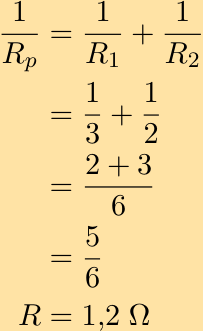
> **[Diagram Context - Textbook_PhysicalSciences_Gr11_Electric-circuits.pdf-0054-01.png]**
> This mathematical derivation displays the formula for calculating the equivalent resistance ($R_p$) of two resistors connected in parallel, using the specific values $R_1 = 3$ and $R_2 = 2$. It demonstrates the algebraic process of finding a common denominator to sum the reciprocal values, ultimately solving for the total resistance of $1,2\ \Omega$. This serves as a practical application of Grade 10-12 Physical Sciences circuit theory, highlighting the necessity of taking the reciprocal of the final fraction to determine the total resistance.


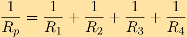


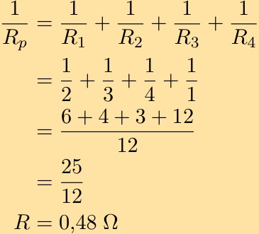
> **[Diagram Context - Textbook_PhysicalSciences_Gr11_Electric-circuits.pdf-0054-05.png]**
> This mathematical derivation displays the calculation for the equivalent resistance ($R_p$) of four resistors connected in parallel, using the variables $R_1, R_2, R_3,$ and $R_4$ with assigned values of 2, 3, 4, and 1 ohm respectively. It demonstrates the algebraic process of finding a common denominator to sum reciprocal resistance values, ultimately solving for the total resistance of 0,48 $\Omega$ as required in Grade 10-12 Physical Sciences circuit calculations.


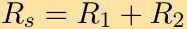


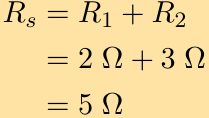
> **[Diagram Context - Textbook_PhysicalSciences_Gr11_Electric-circuits.pdf-0054-09.png]**
> This mathematical expression represents the calculation for the total resistance of resistors connected in series, using the variables $R_s$, $R_1$, and $R_2$ with the unit of Ohms ($\Omega$). It demonstrates the additive property of series circuits, where the equivalent resistance is the sum of individual resistances, specifically showing that two resistors of $2\,\Omega$ and $3\,\Omega$ result in a total resistance of $5\,\Omega$.


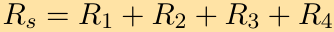


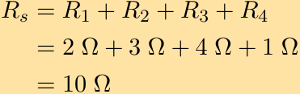
> **[Diagram Context - Textbook_PhysicalSciences_Gr11_Electric-circuits.pdf-0054-13.png]**
> This mathematical expression represents the calculation for the total equivalent resistance ($R_s$) of four resistors connected in series. It utilizes the variables $R_1, R_2, R_3,$ and $R_4$ with their respective values in Ohms ($\Omega$) to demonstrate that total resistance in a series circuit is the simple algebraic sum of individual resistances.


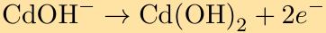
> **[Diagram Context - Textbook_PhysicalSciences_Gr11_Types-of-reaction.pdf-0054-02.png]**
> This graphic shows a chemical half-reaction equation featuring chemical symbols and formulas ($\text{CdOH}^-$, $\text{Cd(OH)}_2$, and $e^-$), a right-pointing arrow indicating the direction of the reaction, and explicit electron loss. Conceptually, for a Grade 12 Physical Sciences learner, it illustrates an oxidation half-reaction where a reactant loses electrons to form a product, typical of processes occurring at the anode in galvanic or electrolytic cells.


> **[Diagram Context - Textbook_PhysicalSciences_Gr11_Types-of-reaction.pdf-0054-03.png]**
> The graphic displays a chemical half-reaction equation featuring nickel oxyhydroxide, water, and electrons. The visible chemical symbols and formulas include $\text{NiO(OH)}$, $\text{H}_2\text{O}$, $e^-$, $\text{Ni(OH)}_2$, and $\text{OH}^-$, linked by a forward reaction arrow. This equation represents a reduction half-reaction crucial for understanding electrochemical cells, specifically the cathode process in nickel-metal hydride or nickel-cadmium batteries studied in Grade 12 Physical Sciences.


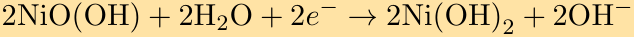
> **[Diagram Context - Textbook_PhysicalSciences_Gr11_Types-of-reaction.pdf-0054-05.png]**
> This graphic displays a chemical half-reaction equation representing a reduction process. The equation features chemical formulas and symbols including $\text{NiO(OH)}$, $\text{H}_2\text{O}$, electrons ($e^-$), $\text{Ni(OH)}_2$, and hydroxide ions ($\text{OH}^-$), linked by a reaction arrow. Conceptually, it conveys the gain of electrons (reduction) occurring at the cathode during the operation of an alkaline secondary cell, such as a nickel-metal hydride battery, which is a key application of electrochemistry in the CAPS Physical Sciences curriculum.


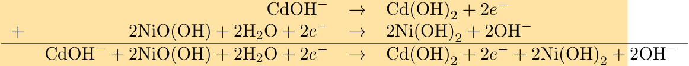
> **[Diagram Context - Textbook_PhysicalSciences_Gr11_Types-of-reaction.pdf-0054-08.png]**
> The graphic displays chemical half-reactions and a combined overall cell reaction for a redox system. Visible labels include chemical formulas such as $\text{CdOH}^-$, $\text{Cd(OH)}_2$, $\text{NiO(OH)}$, $\text{H}_2\text{O}$, $\text{Ni(OH)}_2$, $\text{OH}^-$, electrons ($e^-$), addition signs, reaction arrows ($\rightarrow$), and a horizontal summation line. This diagram conceptually demonstrates how to add individual oxidation and reduction half-reactions together to construct the balanced overall equation for an electrochemical cell.


---

## Worked Examples: Determining Empirical and Molecular Formulas

### Worked Example 1 (continued from previous page)

Continuing the calculation to find the ratio of elements:

$\text{Cl: } n = \frac{m}{M} = \frac{58,64}{35,45} = 1,65$

$\text{F: } n = \frac{m}{M} = \frac{31,43}{19} = 1,65$

$\text{C: } n = \frac{m}{M} = \frac{9,93}{12,011} = 0,77$

Dividing by the smallest number ($0,77$) gives:

$\text{Cl: } 2 \text{ ; F: } 2 \text{ ; C: } 1$

So the empirical formula is: $\text{CF}_2\text{Cl}_2$

---

### Exercise 10

$14\text{ g}$ of nitrogen combines with oxygen to form $46\text{ g}$ of a nitrogen oxide. Use this information to work out the formula of the oxide.

#### Solution:

We first calculate the mass of oxygen in the reactants:

$$46 - 14 = 32\text{ g}$$

Next we calculate the number of moles of nitrogen and oxygen in the reactants:

Nitrogen: $n = \frac{m}{M} = \frac{14}{14} = 1$

Oxygen: $n = \frac{m}{M} = \frac{32}{16} = 2$

So the formula of the oxide is: $\text{NO}_2$

---

### Exercise 11

Iodine can exist as one of three oxides ($I_2O_4; I_2O_5; I_4O_9$). A chemist has produced one of these oxides and wishes to know which one they have. If he started with $508\text{ g}$ of iodine and formed $652\text{ g}$ of the oxide, which oxide has he produced?

#### Solution:

We first calculate the mass of oxygen in the reactants:

$$652 - 508 = 144\text{ g}$$

Next we calculate the number of moles of iodine and oxygen in the reactants:

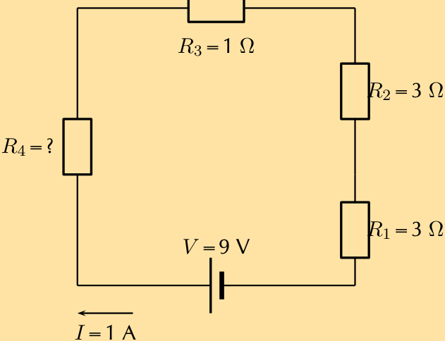
> **[Diagram Context - Textbook_PhysicalSciences_Gr11_Electric-circuits.pdf-0055-03.png]**
> This diagram represents a series circuit containing a voltage source ($V = 9\text{ V}$), a current flow ($I = 1\text{ A}$), and four resistors ($R_1=3\text{ }\Omega$, $R_2=3\text{ }\Omega$, $R_3=1\text{ }\Omega$, and an unknown $R_4$). It serves as a practical application for Grade 10-12 Physical Sciences learners to apply Ohm’s Law and the rules for total resistance in a series circuit to calculate the value of the unknown resistor.


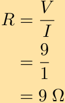


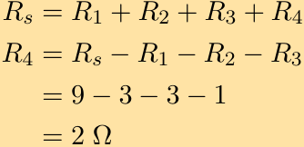
> **[Diagram Context - Textbook_PhysicalSciences_Gr11_Electric-circuits.pdf-0055-08.png]**
> This mathematical representation displays the formula for total resistance in a series circuit ($R_s = R_1 + R_2 + R_3 + R_4$) and its algebraic rearrangement to solve for an unknown resistor ($R_4$). It demonstrates the application of the series circuit principle, where the sum of individual resistances equals the total resistance, using specific numerical values to calculate a final resistance of $2\ \Omega$.


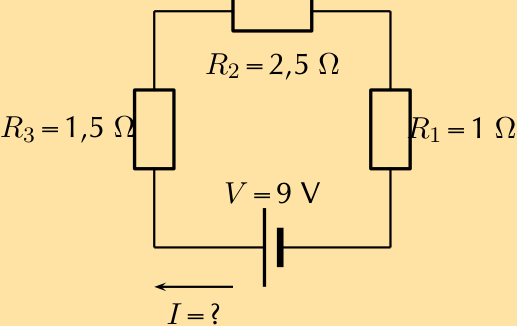
> **[Diagram Context - Textbook_PhysicalSciences_Gr11_Electric-circuits.pdf-0055-10.png]**
> This diagram represents a series circuit containing a voltage source and three resistors, labeled with values $R_1 = 1\ \Omega$, $R_2 = 2,5\ \Omega$, $R_3 = 1,5\ \Omega$, a potential difference $V = 9\ \text{V}$, and an unknown current $I$. It serves as a foundational problem for Grade 10-12 Physical Sciences, requiring students to apply Ohm’s Law and the principles of series circuits to calculate the total resistance and the resulting current flowing through the loop.


---

### Worked Example: Empirical and Molecular Formula Calculation

**Problem Statement:**

12. A fluorinated hydrocarbon (a hydrocarbon is a chemical compound containing hydrogen and carbon) was analysed and found to contain $8,57\%$ $\text{H}$, $51,05\%$ $\text{C}$ and $40,38\%$ $\text{F}$.

* a) What is its empirical formula?
* b) What is the molecular formula if the molar mass is $94,1\text{ g}\cdot\text{mol}^{-1}$?

---

### Solution:

#### a) Determining the Empirical Formula

1. **Assume a $100\text{ g}$ sample of the compound.** 
   In $100\text{ g}$, the mass of each element is:
   * Mass of $\text{H} = 8,57\text{ g}$
   * Mass of $\text{C} = 51,05\text{ g}$
   * Mass of $\text{F} = 40,38\text{ g}$

2. **Calculate the number of moles ($n$) of each element using $n = \frac{m}{M}$:**

   * **For Hydrogen ($\text{H}$):**
     $$n = \frac{m}{M} = \frac{8,57}{1,008} = 8,5\text{ mol}$$

   * **For Carbon ($\text{C}$):**
     $$n = \frac{m}{M} = \frac{51,05}{12,011} = 4,3\text{ mol}$$

   * **For Fluorine ($\text{F}$):**
     $$n = \frac{m}{M} = \frac{40,38}{19} = 2,1\text{ mol}$$

3. **Determine the mole ratio by dividing each value by the smallest number of moles calculated ($2,1$):**

   * $\text{H}: \frac{8,5}{2,1} \approx 4$
   * $\text{C}: \frac{4,3}{2,1} \approx 2$
   * $\text{F}: \frac{2,1}{2,1} = 1$

   Therefore, the mole ratio is $\text{H} : \text{C} : \text{F} = 4 : 2 : 1$.

* **Empirical Formula:** $C_{2}H_{4}F$

---

#### b) Determining the Molecular Formula

1. **Calculate the molar mass of the empirical formula ($C_{2}H_{4}F$):**
   $$\text{Molar mass} = 47,05\text{ g}\cdot\text{mol}^{-1}$$

2. **Compare the given molar mass with the empirical formula's molar mass to find the multiplier:**
   $$\text{Given molar mass} = 94,1\text{ g}\cdot\text{mol}^{-1}$$
   $$\frac{94,1}{47,05} \approx 2$$

3. **Multiply the subscripts in the empirical formula by $2$ to find the molecular formula:**
   $$\text{Molecular formula} = C_{(2 \times 2)}H_{(4 \times 2)}F_{(1 \times 2)} = C_{4}H_{8}F_{2}$$

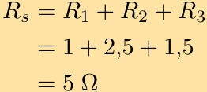
> **[Diagram Context - Textbook_PhysicalSciences_Gr11_Electric-circuits.pdf-0056-02.png]**
> This image displays a mathematical formula for calculating the total equivalent resistance ($R_s$) of resistors connected in series, using the variables $R_1$, $R_2$, and $R_3$ with the values 1, 2,5, and 1,5. It demonstrates the additive property of series circuits, showing how individual resistance values are summed to determine a final total resistance measured in Ohms ($\Omega$).


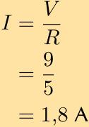


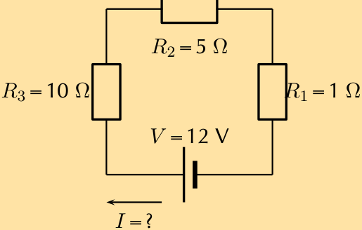
> **[Diagram Context - Textbook_PhysicalSciences_Gr11_Electric-circuits.pdf-0056-08.png]**
> This diagram illustrates a simple series circuit containing a voltage source ($V = 12\text{ V}$) and three resistors ($R_1 = 1\text{ }\Omega$, $R_2 = 5\text{ }\Omega$, and $R_3 = 10\text{ }\Omega$) connected in a single loop. It prompts the learner to apply Ohm’s Law and the principles of series circuits to calculate the unknown total current ($I$) flowing through the circuit.


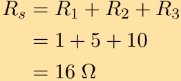
> **[Diagram Context - Textbook_PhysicalSciences_Gr11_Electric-circuits.pdf-0056-10.png]**
> This mathematical expression illustrates the calculation of total resistance ($R_s$) for resistors connected in series. It uses the variables $R_1$, $R_2$, and $R_3$ with assigned values of 1, 5, and 10 to demonstrate that the equivalent resistance is the simple algebraic sum of individual resistances, resulting in 16 Ohms ($\Omega$).


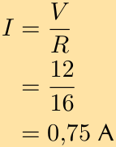
> **[Diagram Context - Textbook_PhysicalSciences_Gr11_Electric-circuits.pdf-0056-12.png]**
> This graphic displays a mathematical calculation based on Ohm’s Law, using the variables $I$ (current), $V$ (potential difference), and $R$ (resistance). It demonstrates the application of the formula $I = V/R$ by substituting the values 12 V and 16 $\Omega$ to solve for the current, resulting in a final value of 0,75 A.


---

13. Copper sulphate crystals often include water. A chemist is trying to determine the number of moles of water in the copper sulphate crystals. She weighs out $3\text{ g}$ of copper sulphate and heats this. After heating, she finds that the mass is $1,9\text{ g}$. What is the number of moles of water in the crystals? (Copper sulphate is represented by $\text{CuSO}_4 \cdot x\text{H}_2\text{O}$).

*Solution:*  
We first work out how many water molecules are lost:

$$3\text{ g} - 1,9\text{ g} = 1,1\text{ g}$$

The mass ratio of copper sulphate to water is:

$$1,9\text{ g} : 1,1\text{ g}$$

Now we divide this by the molar mass of each species. $\text{CuSO}_4$ has a molar mass of $159,55\text{ g}\cdot\text{mol}^{-1}$ and water has a molar mass of $18\text{ g}\cdot\text{mol}^{-1}$.

So the mole ratio is:

$$\frac{1,9}{159,55} : \frac{1,1}{18}$$

$$0,012 : 0,06$$

Dividing both of these numbers by $0,012$ we find that the number of water molecules is $5$.  
So the formula for copper sulphate is: $\text{CuSO}_4 \cdot 5\text{H}_2\text{O}$

---

14. $300\text{ cm}^3$ of a $0,1\text{ mol}\cdot\text{dm}^{-3}$ solution of sulphuric acid is added to $200\text{ cm}^3$ of a $0,5\text{ mol}\cdot\text{dm}^{-3}$ solution of sodium hydroxide.

a) Write down a balanced equation for the reaction which takes place when these two solutions are mixed.  
b) Calculate the number of moles of sulphuric acid which were added to the sodium hydroxide solution.  
c) Is the number of moles of sulphuric acid enough to fully neutralise the sodium hydroxide solution? Support your answer by showing all relevant calculations.

*Solution:*  
a) $\text{H}_2\text{SO}_4 + 2\text{NaOH} \rightarrow 2\text{H}_2\text{O} + \text{Na}_2\text{SO}_4$

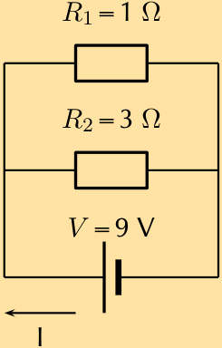
> **[Diagram Context - Textbook_PhysicalSciences_Gr11_Electric-circuits.pdf-0057-00.png]**
> This circuit diagram illustrates two resistors ($R_1 = 1\ \Omega$ and $R_2 = 3\ \Omega$) connected in parallel to a $9\text{ V}$ voltage source, with an arrow indicating the direction of conventional current ($I$). It serves as a foundational tool for Grade 10-12 Physical Sciences learners to practice calculating equivalent resistance, branch currents, and total current in a parallel circuit configuration.


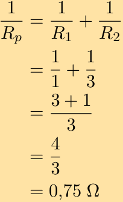
> **[Diagram Context - Textbook_PhysicalSciences_Gr11_Electric-circuits.pdf-0057-03.png]**
> This graphic displays a mathematical derivation for calculating the equivalent resistance ($R_p$) of two resistors connected in parallel, using the variables $R_1$ and $R_2$ with substituted values of 1 and 3. It demonstrates the step-by-step algebraic process of finding a common denominator to solve for the reciprocal of resistance, ultimately yielding a final value of $0,75\ \Omega$. This serves as a practical application of the CAPS Physical Sciences curriculum, illustrating how to determine total resistance in a parallel circuit configuration.


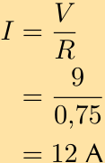
> **[Diagram Context - Textbook_PhysicalSciences_Gr11_Electric-circuits.pdf-0057-05.png]**
> This image displays a mathematical calculation based on Ohm’s Law, using the variables $I$ (current), $V$ (potential difference), and $R$ (resistance). By substituting the values $V = 9$ and $R = 0,75$ into the formula $I = V/R$, the calculation demonstrates how to determine that the resulting current is $12\text{ A}$.


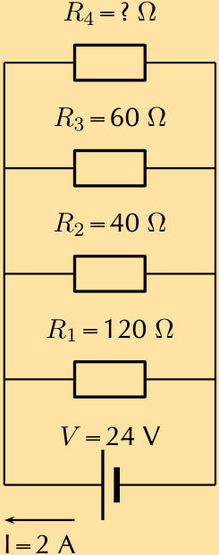
> **[Diagram Context - Textbook_PhysicalSciences_Gr11_Electric-circuits.pdf-0057-07.png]**
> This circuit diagram illustrates a parallel network containing four resistors ($R_1=120\ \Omega$, $R_2=40\ \Omega$, $R_3=60\ \Omega$, and an unknown $R_4$) connected to a 24 V DC power source with a total current of 2 A. It serves as a problem-solving exercise for Grade 11 Physical Sciences learners to apply Ohm’s Law and the principles of parallel circuits to calculate the value of the unknown resistor.


---

b) We first convert the volume to $\text{dm}^{3}$:

$$\frac{300}{1000} = 0,3\text{ dm}^{3}$$

$$n = cV$$

$$n = (0,3)(0,1)$$

$$n = 0,03\text{ mol}$$

c) The number of moles of sodium hydroxide used is:

$$n = cV$$

$$n = (0,5)(0,2)$$

$$n = 0,1\text{ mol}$$

The molar ratio of sulphuric acid to sodium hydroxide is $1:2$

So we need twice the number of moles of sulphuric acid (i.e. $0,1 \times 2 = 0,2$) to neutralise the sodium hydroxide. The number of moles of sulphuric acid is more than twice the number of moles of sodium hydroxide and so the number of moles added is enough to fully neutralise the sodium hydroxide.

---

**15.** A learner is asked to make $200\text{ cm}^{3}$ of sodium hydroxide ($\text{NaOH}$) solution of concentration $0,5\text{ mol}\cdot\text{dm}^{-3}$.

a) Determine the mass of sodium hydroxide pellets he needs to use to do this.  
b) Using an accurate balance the learner accurately measures the correct mass of the $\text{NaOH}$ pellets. To the pellets he now adds exactly $200\text{ cm}^{3}$ of pure water. Will his solution have the correct concentration? Explain your answer.  
c) The learner then takes $300\text{ cm}^{3}$ of a $0,1\text{ mol}\cdot\text{dm}^{-3}$ solution of sulphuric acid ($\text{H}_{2}\text{SO}_{4}$) and adds it to $200\text{ cm}^{3}$ of a $0,5\text{ mol}\cdot\text{dm}^{-3}$ solution of $\text{NaOH}$ at $25\text{ }^\circ\text{C}$.  
d) Write down a balanced equation for the reaction which takes place when these two solutions are mixed.  
e) Calculate the number of moles of $\text{H}_{2}\text{SO}_{4}$ which were added to the $\text{NaOH}$ solution.

*Solution:*

a) We first convert the volume to $\text{dm}^{3}$

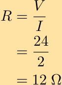


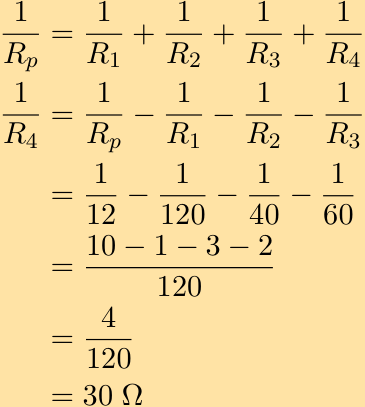
> **[Diagram Context - Textbook_PhysicalSciences_Gr11_Electric-circuits.pdf-0058-04.png]**
> This image displays a mathematical derivation for calculating an unknown resistor ($R_4$) in a parallel circuit using the formula $\frac{1}{R_p} = \frac{1}{R_1} + \frac{1}{R_2} + \frac{1}{R_3} + \frac{1}{R_4}$. It utilizes algebraic rearrangement and numerical substitution to solve for the final resistance value of $30\ \Omega$. This demonstrates the practical application of the parallel resistance law, showing students how to isolate a specific variable when the total equivalent resistance ($R_p$) and other individual resistances are known.


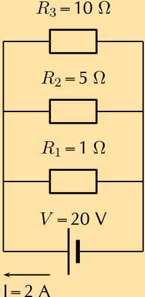
> **[Diagram Context - Textbook_PhysicalSciences_Gr11_Electric-circuits.pdf-0058-10.png]**
> This circuit diagram illustrates three resistors ($R_1=1\ \Omega$, $R_2=5\ \Omega$, $R_3=10\ \Omega$) connected in parallel to a voltage source ($V=20\ \text{V}$) with a total current ($I=2\ \text{A}$) indicated by an arrow. It serves as a foundational tool for Grade 10-12 Physical Sciences learners to practice applying Ohm’s Law and the rules for parallel circuits, specifically calculating equivalent resistance and branch currents.


---

The number of moles is:
$$n = 0{,}1\text{ mol}$$

The molar mass of $\text{NaOH}$ is:
And the mass of $\text{NaOH}$ needed is:

b) The concentration will be incorrect. The volume will change slightly when the pellets dissolve in the solution. The learner should have first dissolved the pellets and then made the volume up to the correct amount.

c) 

d) 
$$n = 0{,}1\text{ mol}$$

e) No. The number of moles of $\text{H}_2\text{SO}_4$ needs to be twice the number of moles of $\text{NaOH}$ as the molar ratio is $1:2$.

16. $96{,}2\text{ g}$ sulphur reacts with an unknown quantity of zinc according to the following equation:

$$2\text{Zn} + \text{S} \rightarrow \text{Zn}_2\text{S}$$

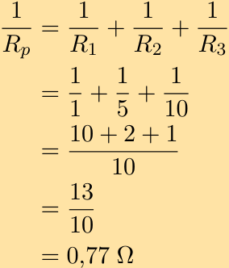
> **[Diagram Context - Textbook_PhysicalSciences_Gr11_Electric-circuits.pdf-0059-00.png]**
> This mathematical derivation illustrates the calculation of total equivalent resistance ($R_p$) for three resistors connected in parallel. It uses the formula $1/R_p = 1/R_1 + 1/R_2 + 1/R_3$ with specific values of 1Ω, 5Ω, and 10Ω to demonstrate the process of finding a common denominator and simplifying the fraction to reach a final resistance of 0,77Ω. This provides learners with a step-by-step procedural model for solving parallel circuit problems as required by the Physical Sciences curriculum.


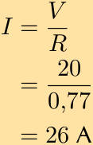
> **[Diagram Context - Textbook_PhysicalSciences_Gr11_Electric-circuits.pdf-0059-02.png]**
> This image displays a mathematical calculation based on Ohm’s Law, featuring the variables current ($I$), potential difference ($V$), and resistance ($R$). It demonstrates the application of the formula $I = V/R$ to solve for current by substituting the values 20 and 0,77 to arrive at a final result of 26 A.


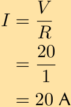


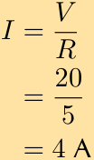


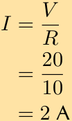


---

$$\text{Zn} + \text{S} \rightarrow \text{ZnS}$$

a) What mass of zinc will you need for the reaction, if all the sulphur is to be used up?  
b) Calculate the theoretical yield for this reaction.  
c) It is found that $275\text{ g}$ of zinc sulphide was produced. Calculate the $\%$ yield.

---

### Solution:

#### a) We first calculate the number of moles of sulphur:
Molar mass of sulphur: $32{,}06\text{ g}\cdot\text{mol}^{-1}$

$$n = \frac{m}{M}$$

$$n = \frac{96{,}2}{32{,}06}$$

$$n = 3{,}00\text{ mol}$$

The molar ratio of sulphur to zinc is $1:1$, so this is also the number of moles of zinc that must be added to use up all the sulphur.

The mass of zinc is therefore:

$$m = nM$$

$$m = (3)(65{,}38)$$

$$m = 196{,}14\text{ g}$$

---

#### b) We can use either the moles of zinc or the moles of sulphur to determine the moles of zinc sulphide.

The molar ratio of sulphur to zinc sulphide is $1:1$, so the number of moles of zinc sulphide is $3\text{ mol}$.

The mass is:

$$m = nM$$

$$m = (3)(65{,}38 + 32{,}06)$$

$$m = (3)(97{,}44)$$

$$m = 292{,}32\text{ g}$$

---

#### c) 

$$\% \text{ yield} = \frac{\text{actual yield}}{\text{theoretical yield}} \times 100 = \frac{275}{292{,}32} \times 100 = 94{,}1\%$$

---

17. Calcium chloride reacts with carbonic acid to produce calcium carbonate and hydrochloric acid according to the following equation:

$$\text{CaCl}_2 + \text{H}_2\text{CO}_3 \rightarrow \text{CaCO}_3 + 2\text{HCl}$$

If you want to produce $10\text{ g}$ of calcium carbonate through this chemical reaction, what quantity (in $\text{g}$) of calcium chloride will you need at the start of the reaction?

*Solution:*

Molar mass of $\text{CaCO}_3$:

$$40,08 + 12,01 + 3(16,00) = 100,09\text{ g}\cdot\text{mol}^{-1}$$

Number of moles of $\text{CaCO}_3$:

$$n = \frac{m}{M}$$

$$n = \frac{10}{100,09}$$

$$n = 0,10\text{ mol}$$

The molar ratio of calcium carbonate to calcium chloride is $1:1$, so the number of moles of calcium chloride is $0,10$ moles.

The mass of calcium chloride needed is therefore:

$$m = nM$$

$$m = (0,10)(40,08 + 2(35,45))$$

$$m = (0,10)(110,98)$$

$$m = 11,098\text{ g}$$

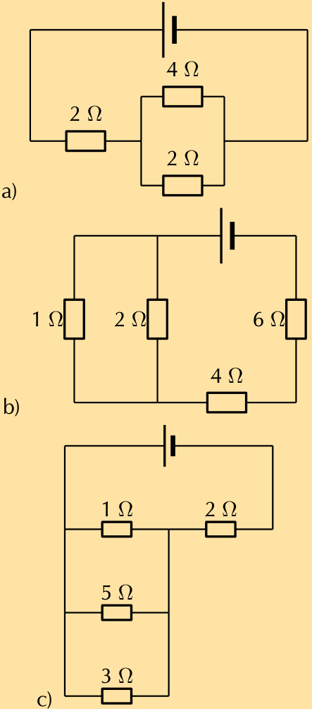
> **[Diagram Context - Textbook_PhysicalSciences_Gr11_Electric-circuits.pdf-0061-02.png]**
> This graphic displays three distinct circuit diagrams (a, b, and c) featuring DC voltage sources and various resistors labeled with their respective resistance values in Ohms ($\Omega$). These diagrams serve as exercises for Grade 10-12 Physical Sciences learners to practice identifying series and parallel combinations to calculate the equivalent resistance of complex circuits.


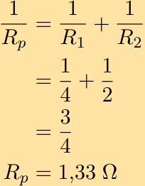
> **[Diagram Context - Textbook_PhysicalSciences_Gr11_Electric-circuits.pdf-0061-05.png]**
> This mathematical expression illustrates the calculation of equivalent resistance ($R_p$) for two resistors connected in parallel using the formula $1/R_p = 1/R_1 + 1/R_2$. By substituting the values $R_1 = 4\,\Omega$ and $R_2 = 2\,\Omega$, the steps demonstrate how to sum the fractions to determine the final total resistance of $1,33\,\Omega$.


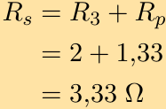
> **[Diagram Context - Textbook_PhysicalSciences_Gr11_Electric-circuits.pdf-0061-07.png]**
> This image displays a mathematical calculation for total resistance in a series circuit, featuring the variables $R_s$, $R_3$, and $R_p$ alongside the unit symbol for Ohms ($\Omega$). It demonstrates the final step of a physics problem where a series resistor is added to an equivalent parallel resistance to determine the total circuit resistance.

