# 2
# The lithosphere

**KEY QUESTIONS:**
* What does the centre of the Earth look like?
* Why is it important to know about the structure of the Earth?
* Why is there so much variety in the rocks you see around you?
* How do rocks form?
* Why do we need to know about rocks?
* Why are rocks important?

The Earth is a system consisting of many parts. In the previous chapter we looked at how these parts or spheres interact. In this section we are going to look more closely at one of these spheres, namely the lithosphere.

## 2.1 What is the lithosphere?

On Earth, water, air, stone and life interact. Let's think about the stone part of this statement. Where on Earth do we find stone? What are the different forms of stone that are found on Earth? Why is it important to know about this part of the Earth? Let's investigate these questions.

* Sand
* Pebbles
* Stones
* Large boulders

**NEW WORDS**
* geosphere
* lithosphere
* continental crust
* oceanic crust
* crust
* mantle
* core
* composition

---

# ACTIVITY: Investigating stones

## MATERIALS
* magnifying glasses
* hammers
* paper towel
* samples collected, as described below

> **TAKE NOTE**
> 'lithos' comes from the Ancient Greek word meaning 'stone'.

## INSTRUCTIONS
1. Collect the following items and bring them to school: sand, pebbles, a small stone/rock, a larger rock.
2. When you collect sand, stones or rock, look for the samples that look interesting and different and bring these to class.
3. Find at least four different items from different locations.
4. Study the different samples and complete the following table. If you have magnifying glasses available, use these to study the detail of the different samples.
5. Wrap some of the samples in paper towel and see if you can crush them with a hammer. Your teacher might instruct you to do this outside.

> **TAKE NOTE**
> When we look at the composition of something, we look at what it is made up of.

| Sample | Location   *Describe where you have found your sample.* | Shape and colour   *Describe the size, shape and colour.* | Texture   *Describe the texture and hardness.* | Composition   *Is it made of more than one material? Describe what it is made up of.* |
| :--- | :--- | :--- | :--- | :--- |
| **Sand** | | | | |
| **Pebble** | | | | |
| **Small stone/rock** | | | | |
| **Larger rock** | | | | |

---

Chapter 2. The lithosphere | 223

---

# Lesson Notes: Inside the Earth

## The Lithosphere

* The lithosphere consists of all the mountains, rocks, stones, topsoil, and sand found on the planet.
* It also includes all the rocks under the sea and under the surface of the Earth.
* The lithosphere surrounds us, and we interact closely with it every day. There is great variety in the shape, colour, and texture of rocks found on Earth.

---

## Inside the Earth

The lithosphere is considered the outer layer of the Earth. Internally, the Earth is made up of three concentric layers:

1. **The Crust**
2. **The Mantle**
3. **The Core**

> **Take Note:** Concentric objects share the same point as their centre.

---

## Layers of the Earth

When looking at a cross-section of the Earth, the approximate dimensions and layers are structured as follows:

* **Crust:** The outermost solid shell of the Earth.
* **Mantle:** Located beneath the crust, with an approximate thickness of $2900\text{ km}$.
* **Core:** The innermost layer of the Earth, with an approximate radius/thickness of $3500\text{ km}$.

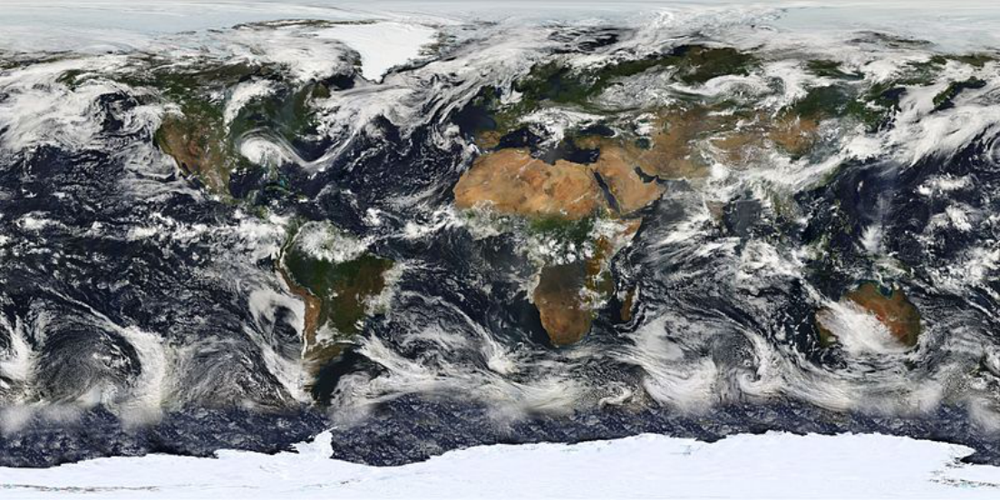
> **[Diagram Context - Textbook_PhysicalSciences_Gr11_The-lithosphere.pdf-0002-04.png]**
> This visual content is a satellite-based global weather and climate map showing a flat rectangular projection of Earth with swirling cloud formations, oceans, landmasses, and polar ice caps. The graphic displays distinct geographic continents (such as Africa, the Americas, and Eurasia), deep blue oceans, white cloud swirls representing atmospheric circulation, and ice-covered polar regions. Conceptually, this diagram helps high school learners visualize global atmospheric circulation, cloud patterns, and weather systems on a planetary scale, supporting topics on climatology, meteorology, and Earth's energy balance within the CAPS curriculum.

---

# Chapter 2. The Lithosphere

## 1. Core Concepts: The Layers of the Earth

The Earth is structured into distinct layers, each possessing unique physical properties, states of matter, and compositions. 

### A. The Core
The core is situated at the center of the Earth (approximately $6371\text{ km}$ deep) and is divided into two parts:
*   **Inner Core:** Solid in state.
*   **Outer Core:** Liquid in state.

### B. The Mantle
The mantle surrounds the core and is divided into:
*   **Lower Mantle**
*   **Upper Mantle**

### C. The Crust
The outermost solid shell of the Earth is divided into two distinct regions:
*   **Oceanic Crust:** Found beneath the oceans.
*   **Continental Crust:** Forms the continents.

### D. The Lithosphere and Geosphere
*   **Lithosphere:** Formed by the brittle upper part of the mantle combined with the crust.
*   **Geosphere:** Collective term for the lithosphere, the mantle, and the core. 

The geosphere interacts with other major Earth systems:
1.  **Hydrosphere** (water systems)
2.  **Atmosphere** (air systems)
3.  **Biosphere** (living organisms)

---

## 2. Activity: Build a 3D-Model of the Earth

### Instructions
1. Use recycled material and modelling clay to build a three-dimensional model of the inside of the Earth.
2. Ensure all layers of the Earth are included and accurately labelled on your model:
   * Inner core (solid)
   * Outer core (liquid)
   * Lower mantle
   * Upper mantle
   * Crust (Oceanic and Continental)
   * Lithosphere
3. Write a one-page summary on the layers of the Earth. Research each layer using the internet, library books, or community experts to answer the following questions in your write-up:
   * **a)** Thickness of each layer
   * **b)** State of matter (solid, liquid, semi-fluid/plastic)
   * **c)** Temperature ranges
   * **d)** Composition (what materials each layer is made up of)

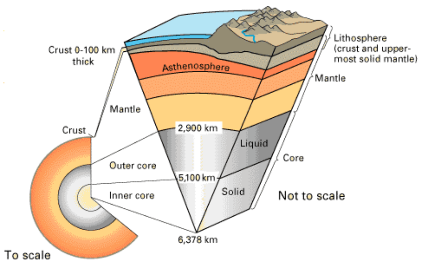
> **[Diagram Context - Textbook_PhysicalSciences_Gr11_The-lithosphere.pdf-0003-00.png]**
> This geological cross-section diagram illustrates the layered internal structure of the Earth. Visible labels include the Crust (0-100 km thick), Lithosphere, Asthenosphere, Mantle, Outer core (liquid, marked at 2,900 km), and Inner core (solid, marked at 5,100 km), extending to a total radius of 6,378 km. For Grade 10 Geography learners, this conceptual model conveys the composition and depth of the Earth's geosphere, distinguishing between the mechanical properties of the lithosphere and asthenosphere and the chemical states of the core layers.

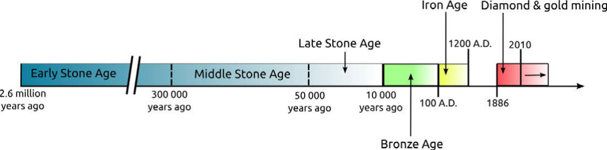
> **[Diagram Context - Textbook_PhysicalSciences_Gr11_The-lithosphere.pdf-0003-08.png]**
> This horizontal timeline graphic illustrates historical and archaeological periods, partitioned into coloured blocks along a chronological axis. Visible text and period labels include "Early Stone Age", "Middle Stone Age", "Late Stone Age", "Bronze Age", "Iron Age", and "Diamond & gold mining", accompanied by numerical dates and years such as "2.6 million years ago", "300 000 years ago", "50 000 years ago", "10 000 years ago", "100 A.D.", "1200 A.D.", "1886", and "2010". Conceptually, the diagram visually conveys the chronological sequence and transition of human technological and cultural eras in South African history, helping learners contextualise deep-time archaeology alongside more recent historical developments.

---

## ACTIVITY: The layers inside the Earth

### INSTRUCTIONS:
Use all the words in bold in the previous section to complete the following map:

<!-- DIAGRAM_PLACEHOLDER: diagram -->

---

# 2.2 The Rock Cycle

## Introduction to Cycles

A **cycle** is a combination of processes that take place in a certain sequence and repeat over and over again from the beginning. Processes in a cycle do not stop and are therefore continuous. 

Examples of natural cycles include:
* **The water cycle:** Part of the biosphere, describing how water forms clouds, rain, rivers, and evaporates again.
* **The carbon cycle:** Part of the biosphere, describing the movement of carbon through carbon dioxide, fossil fuels, and carbohydrates.
* **The rock cycle:** Part of the lithosphere, describing how rocks change from one form into another and eventually back into the first form.

---

## Categories of Rocks

Rocks on Earth are divided into three broad categories based on where and how they were formed:

1. **Sedimentary rocks**
2. **Metamorphic rocks**
3. **Igneous rocks**

---

## New Words & Vocabulary

| Term | Definition / Description |
| :--- | :--- |
| **Cycle** | A continuous series of events or processes that repeat in order. |
| **Weathering** | The breaking down of rocks on Earth's surface. |
| **Compaction** | The process by which sediments are squeezed together by the weight of overlying layers. |
| **Erosion** | The movement of weathered rock pieces by wind, water, or ice. |
| **Deposition** | The dropping or settling of eroded rock particles in a new location. |
| **Melting** | The transition of solid rock into liquid magma due to extreme heat. |
| **Cooling** | The process by which magma or lava loses heat and becomes solid. |
| **Solidify** | To become hard or solid. |
| **Sedimentary rock** | Rocks formed from the accumulation, compaction, and cementation of mineral particles or organic matter. |
| **Metamorphic rock** | Rocks formed when existing rocks are subjected to intense heat and pressure. |
| **Igneous rock** | Rocks formed through the cooling and solidification of magma or lava. |
| **Sediment** | Small particles of rock, minerals, and organic matter. |
| **Sedimentation** | The process of settling or being deposited as a sediment. |
| **Cementation** | The binding together of sediment particles by precipitated minerals acting as a natural glue. |

---

# Lesson: The Rock Cycle

## Core Concepts

The **rock cycle** is a natural, continuous process in which rocks form, are broken down, and re-form again over long periods of time. 

### Key Stages of the Rock Cycle

1. **Weathering and Erosion**
   * Wind, water, heat, and cold cause the weathering of rocks on the surface of the Earth. 
   * Rocks are broken up into smaller and smaller pieces and form sand.
   * *Take Note:* Heat causes expansion of rocks and cold causes contraction.

2. **Transport and Deposition**
   * Wind and water wash sand and small stones away and deposit them into lakes and the ocean. This process is called **deposition**.

3. **Compation and Cementation (Sedimentary Rock Formation)**
   * Sediments settle at the bottom of the oceans, lakes, and rivers. Over time, they get covered with more layers of sediment.
   * The pressure from additional layers causes the sediments to compact and solidify, forming **sedimentary rock**.

4. **Metamorphism (Metamorphic Rock Formation)**
   * Sedimentary rock may be buried deeper and deeper beneath the Earth's surface through movement in the Earth's crust (where oceanic and continental plates meet).
   * Rocks can also be pushed deeper (subducted) as they move deeper into the Earth, where temperature and pressure increase.
   * As chemical compounds in the rocks change due to heat and pressure, **metamorphic rock** is formed.

5. **Melting and Crystallization (Igneous Rock Formation)**
   * Over time, metamorphic rock can move deeper into the Earth, melt, and become **magma**.
   * **Magma** moves towards the surface of the Earth through volcanic pipes. 
   * Hot magma cools slowly on its way to the surface and forms **igneous rock**. Magma can also break through the surface as lava in volcanoes, where it solidifies quickly on the surface to form igneous rocks.
   * Igneous rocks get eroded by wind and water, and the whole process starts again.

---

## Key Vocabulary

* **Geologist:** A scientist who studies the Earth, the rocks from which it is made, and the processes and history that have shaped it.
* **Deposition:** The process where wind and water wash away sand and small stones and deposit them into lakes and the ocean.
* **Magma:** Molten crust and mantle found beneath the Earth's surface.

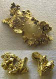
> **[Diagram Context - Textbook_PhysicalSciences_Gr11_The-lithosphere.pdf-0006-05.png]**
> The image shows a photograph of naturally occurring gold nuggets exhibiting a metallic yellow luster and irregular, crystalline shapes. There are no explicit text labels, symbols, or arrows present in the visual. Conceptually, this image helps CAPS Physical Sciences and Natural Sciences learners visualize a pure metallic element in its natural state, linking macroscopic properties like malleability and metallic bonding to real-world mineral samples found in South Africa.

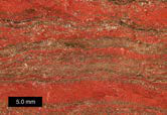
> **[Diagram Context - Textbook_PhysicalSciences_Gr11_The-lithosphere.pdf-0006-06.png]**
> The educational graphic is a geological macro-photograph of Banded Iron Formation (BIF) showing alternating sedimentary layers, accompanied by a scale bar reading "5.0 mm". The visible features include distinct reddish-brown bands rich in iron oxides (hematite/jasper) alternating with darker, mineralized layers. For Grade 10-12 CAPS Life Sciences and Geography learners, this visual conveys the Earth's history of oxygenation, illustrating how dissolved iron in ancient oceans reacted with photosynthetically produced oxygen to precipitate out and form these iconic South African mineral deposits.

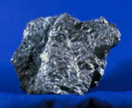
> **[Diagram Context - Textbook_PhysicalSciences_Gr11_The-lithosphere.pdf-0006-07.png]**
> This photograph shows a raw mineral sample of a dark, metallic ore set against a solid blue background. There are no visible labels, text, or arrows within the image. Conceptually, this visual supports CAPS Physical Sciences and Geography topics related to mineral resources and ore extraction by illustrating the natural macroscopic appearance of a mined metallic mineral before processing.

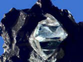
> **[Diagram Context - Textbook_PhysicalSciences_Gr11_The-lithosphere.pdf-0006-08.png]**
> This photographic visual content shows a raw, octahedral diamond crystal embedded within its host kimberlite rock matrix. The image displays no text labels, variables, or chemical symbols, presenting purely a macro specimen against a blue background. Conceptually, for high school CAPS Physical Sciences learners studying chemical bonding, this illustrates the natural macroscopic appearance of a giant covalent network structure formed under extreme pressure and temperature in the Earth's mantle.

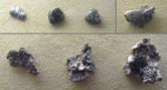
> **[Diagram Context - Textbook_PhysicalSciences_Gr11_The-lithosphere.pdf-0006-09.png]**
> This educational graphic displays photographs of various solid rock and mineral specimens arranged against a textured background. The image features seven unprocessed, irregularly shaped geological samples showing varying grey, silver, and dark metallic hues and textures with no explicit text labels or arrows. Conceptually, this visual supports CAPS Physical Sciences and Natural Sciences topics by helping learners identify physical properties of matter, metallic lustre, and mineral ores during practical classification exercises.

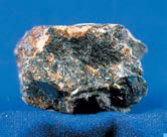
> **[Diagram Context - Textbook_PhysicalSciences_Gr11_The-lithosphere.pdf-0006-10.png]**
> This visual shows a geological specimen of raw kimberlite rock against a blue background, with no visible text, labels, or arrows. It demonstrates the dark, brecciated, and heterogeneous physical appearance of kimberlite, which serves as the primary host rock for diamonds in South African mining contexts.

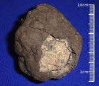
> **[Diagram Context - Textbook_PhysicalSciences_Gr11_The-lithosphere.pdf-0006-11.png]**
> The image is a photograph of a fossilized hominid endocast next to a vertical scale bar marked from 1cm to 10cm against a blue background. The visible labels consist of numerical measurements on the scale bar indicating size. Conceptually, this visual helps learners study human evolution and fossil evidence by showing the relative size and brain shape of early hominids like *Australopithecus*.

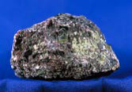
> **[Diagram Context - Textbook_PhysicalSciences_Gr11_The-lithosphere.pdf-0006-12.png]**
> The graphic displays a geological specimen, specifically a rough ore sample against a plain blue background, with no visible text, labels, or arrows. In the context of the CAPS curriculum (such as Grade 10-12 Geography and Agricultural Sciences), this visual represents economic minerals and rock types associated with South Africa's major mining industries, such as the Bushveld Igneous Complex. It helps learners identify macro-level ore characteristics and understand the raw geological resources that underpin South Africa's mineral wealth and mining sector.

---

# Chapter 2. The Lithosphere: The Rock Cycle

## Core Concepts

* **Metamorphic Rock Formation:** Metamorphic rock is formed deeper under the Earth's surface. It only becomes exposed to the surface when the layers above it are removed by erosion.
* **Rock Transformation:** Any type of rock (igneous, sedimentary, or metamorphic) can move deeper into the Earth and form metamorphic rock due to an increase in pressure and temperatures.
* **The Rock Cycle:** Rocks of all types may move down through the mantle, melt, and mix with magma. Because the Earth's crust is continually recycled through these processes, the ongoing system is referred to as the **rock cycle**.

---

## Take Note: Magma vs. Lava

* **Magma** and **lava** are both molten rock, but they refer to different locations:
  * **Magma** is molten rock that forms **beneath** the Earth's surface.
  * **Lava** is magma that erupts out of a volcano onto the surface.

---

## ACTIVITY: Summarising the Rock Cycle

### Questions

1. Complete the diagram by filling in which type of rock belongs where: **Sedimentary rock**, **Metamorphic rock**, **Igneous rock**.

2. Name the process by which igneous rock is formed.

3. Which type(s) of rock form sediment?

4. What conditions are needed for metamorphic rock to form?

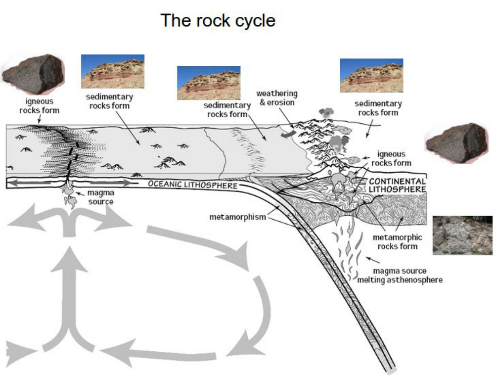
> **[Diagram Context - Textbook_PhysicalSciences_Gr11_The-lithosphere.pdf-0007-05.png]**
> This educational graphic illustrates the geological rock cycle in the context of plate tectonics, featuring cross-sections of oceanic and continental lithosphere, geological processes, and rock samples. Visible labels include "igneous rocks form," "sedimentary rocks form," "metamorphic rocks form," "weathering & erosion," "magma source," "metamorphism," "OCEANIC LITHOSPHERE," and "CONTINENTAL LITHOSPHERE," accompanied by directional arrows indicating mantle convection and crustal movement. Conceptually, the diagram demonstrates how Earth's internal and external processes—such as melting, cooling, weathering, and heat and pressure—continuously transform one rock type into another over geological time.

---

5. Explain what 'weathering and erosion' of rock mean.

6. Explain what 'compaction' means.

7. What type of rock is formed through compaction?

8. What is magma? Explain the role of magma in the rock cycle.

---

### ACTIVITY: Explaining the rock cycle

**INSTRUCTIONS:**
Write a paragraph to explain the rock cycle in your own words. Start the explanation with the formation of igneous rock. Use full sentences and include the following key words in your write-up.

**Key words:**
* melting
* deposition
* erosion
* cooling
* compact
* temperature
* pressure
* metamorphic rock
* igneous rock
* sedimentary rock

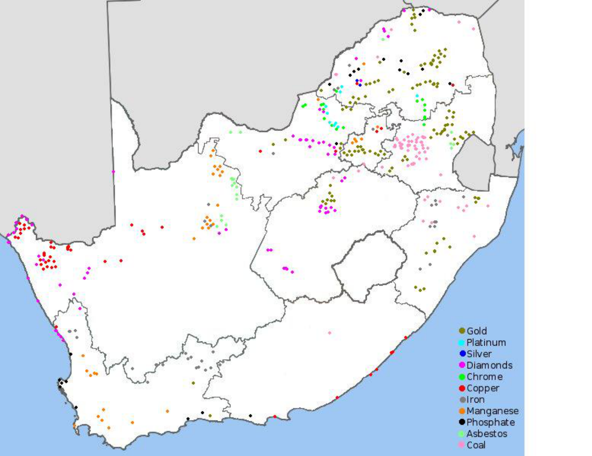
> **[Diagram Context - Textbook_PhysicalSciences_Gr11_The-lithosphere.pdf-0008-03.png]**
> The graphic is a thematic distribution map of South Africa displaying the geographical locations of various mineral resources. It features a key in the bottom right corner with colour-coded dots corresponding to minerals such as Gold, Platinum, Silver, Diamonds, Chrome, Copper, Iron, Manganese, Phosphate, Asbestos, and Coal. For CAPS FET Geography learners, this map conceptually illustrates the spatial distribution and concentration of South Africa's primary mineral wealth, highlighting the economic geography and geological significance of different mining regions across the provinces.

---

## Chapter 2. The Lithosphere

### Activity Instructions

* The words can be used more than once, and you should add your own keywords as well. 
* You should also include a labelled diagram in your write-up.

---

### VISIT
* **Website Reference:** `bit.ly/17nxyiC`
* **Description:** A useful website which shows all the different rock types and classifications.

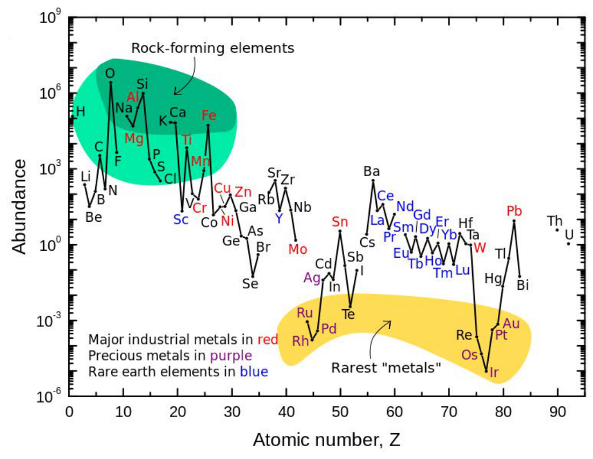
> **[Diagram Context - Textbook_PhysicalSciences_Gr11_The-lithosphere.pdf-0009-00.png]**
> This educational graphic is a log-scale line graph displaying the cosmic or terrestrial abundance of chemical elements plotted against their atomic number, $Z$. The axes are labeled "Atomic number, Z" and "Abundance," with plotted data points labeled with standard chemical symbols (such as H, O, Si, Fe, Au) and color-coded regions highlighting "Rock-forming elements," "Major industrial metals in red," "Precious metals in purple," and "Rare earth elements in blue." For high school Physical Sciences learners, this graph conceptually demonstrates the Oddo-Harkins rule—showing that elements with even atomic numbers are generally more abundant than adjacent odd-numbered elements—and explains the natural distribution and terrestrial availability of key chemical resources.

---

## Sedimentary Rock

We are now going to take a closer look at each of the three main types of rocks.

### Definition

**Sedimentary rocks** are formed when layers of sediment solidify over time. 

* **Sediments** are layers of particles from pre-existing rock or once-living organisms, for example, shells. 
* Rocks on the surface of the Earth are weathered by expansion and contraction due to changes in temperature, wind, and water, and also by erosion due to animals. 
* Bigger rocks break up into smaller and smaller particles through the process of erosion.

---

### Processes of Weathering and Erosion

<!-- DIAGRAM_PLACEHOLDER: diagram -->

1. **Changes in temperature:** Causes rocks to crack and break up. Plants may grow in the cracks, causing them to break up further.
2. **Rain:** Wears down rocks and causes smaller pieces to break off.
3. **Animals:** Break up rocks into smaller particles as they walk along.

---

### VISIT
* **Website Reference:** `bit.ly/1ak9Rlb`
* **Description:** Rocks erode to form soil.

---

# Lesson Revision Notes: The Formation of Sedimentary Rock

## 1. Core Concepts

* **Erosion**: The process by which wind and water transport loose, smaller particles, debris from living organisms, and large stones, eventually depositing them in flood plains and in the sea.
* **Sedimentation**: The accumulation of material at the bottom of oceans, rivers, lakes, and swamps where sediment settles and forms distinct horizontal layers.
* **Compaction and Solidification**: As layers build up upon each other over time, the weight and pressure cause the bottom layers to solidify, forming layers of **sedimentary rock**.

---

## 2. Key Facts

* **Crust Composition**: Sedimentary rock is found in most places on Earth, yet it makes up only $8\%$ of the Earth's crust.
* **Geological Timeline**: The oldest layers of sedimentary rock visible in the Grand Canyon are believed to be nearly $2 \text{ billion}$ years old.

---

# Revision Notes: Types of Sedimentary Rock

## 1. Core Concepts of Sedimentary Rock

Sedimentary rocks are formed from layers of sediment that accumulate over time. A prominent real-world example is Table Mountain in Cape Town, which clearly displays these visible horizontal layers of sandstone.

### Common Types of Sedimentary Rock

*   **Sandstone:** A common sedimentary rock visible in locations such as Table Mountain and the Cederberg in the Western Cape.
*   **Limestone:** A sedimentary rock made from the mineral calcium carbonate ($\text{CaCO}_3$). It is often formed from the remains of the skeletons of marine animals. 
    *   *Uses:* Building stone, manufacturing of lime, and cement.
*   **Dolomite:** A sedimentary rock made from calcium magnesium carbonate ($\text{CaMg(CO}_3)_2$).
*   **Coal:** Formed from the solidified remains of ancient plants at the bottom of swamps.
*   **Shale:** A very fine-grained sedimentary rock formed from the deposition of mud and silt, made up of very thin layers stuck together.
*   **Conglomerate:** A sedimentary rock made up of small stones, shells, and other pieces of sediment.

---

## 2. Key Processes and Terminology

*   **Cementation:** The geological process whereby sand and associated shells, pebbles, and other sediment become cemented together to form sedimentary rock.
*   **Erosion:** Sedimentary rock is generally softer than other types of rock and is easily eroded by the actions of wind, water, or ice (glaciers).
*   **Fossil Formation:** Fossils (especially of sea creatures) are frequently found in sedimentary rocks. They lie cemented in the sediments where the organisms fell when they died. When plants or animals die, they are often covered in sand, which later hardens into rock, capturing and preserving the fossil inside.

---

## 3. Chemical Compounds Reference

| Common Name | Chemical Name | Chemical Formula |
| :--- | :--- | :--- |
| **Lime (Calcium-containing compounds)** | Calcium Oxide | $\text{CaO}$ |
| | Calcium Hydroxide | $\text{Ca(OH)}_2$ |
| **Limestone** | Calcium Carbonate | $\text{CaCO}_3$ |
| **Dolomite** | Calcium Magnesium Carbonate | $\text{CaMg(CO}_3)_2$ |

---

# Planet Earth and Beyond: Sedimentary Rock Formation

## Visual Examples of Sedimentary Rock Features

* **Dolomite mountains:** Mountain ranges formed from geological strata.
* **Fossils in sedimentary rock:** Preserved remains or traces of organisms embedded within sedimentary layers.
* **Limestone on shale:** Creamy-brown limestone resting on top of dark grey shale.
* **Conglomerate:** Rock formations displaying distinct layers with small pebbles embedded within the rock structure.

Over long periods, layers of sediment accumulate, are compressed, and become harder due to continuous pressure.

---

## ACTIVITY: Modelling the formation of sedimentary rock

### MATERIALS:
* 3 slices of white bread
* 3 slices of brown bread
* Heavy books or object

### INSTRUCTIONS:
1. Cut off the crust from all the sides of each bread slice.
2. Layer the slices on top of each other, alternating the white and brown slices. Each slice represents a different layer of sediment.
3. Place the heavy books or object on top of the stacked bread slices to simulate the process of compression and pressure over time.

---

3. Draw a labelled diagram of what the stack looks like.

4. Place a piece of plastic on top of the bread stack to protect the bottom book in your bookstack, then place a pile of books on top of the bread stack. Observe what happens to the layers. Write your observations here.

5. Add more books to the pile and observe. What happens to the layers?

6. Remove the books from the bread pile. Can you distinguish the different layers now?

***

235

Chapter 2. The lithosphere

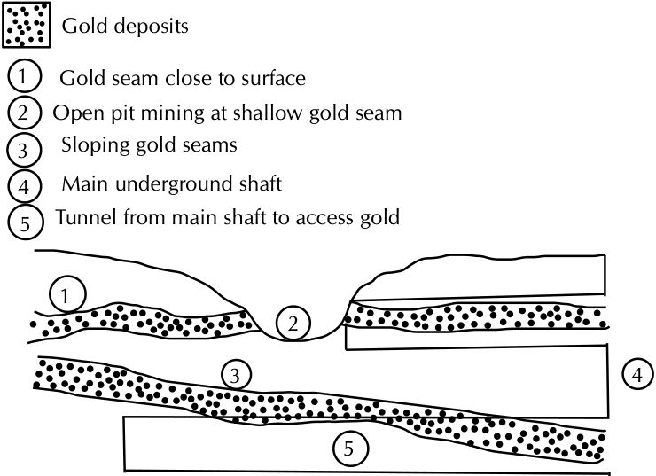
> **[Diagram Context - Textbook_PhysicalSciences_Gr11_The-lithosphere.pdf-0013-00.png]**
> This educational diagram is a geological cross-section illustrating mining methods for mineral deposits. It features numbered labels 1 to 5 corresponding to "Gold deposits," "Gold seam close to surface," "Open pit mining at shallow gold seam," "Sloping gold seams," "Main underground shaft," and "Tunnel from main shaft to access gold." Conceptually, this diagram demonstrates the different extraction techniques used in South Africa's mining industry—specifically contrasting surface open-pit mining for shallow deposits with deep-level shaft mining required for reaching deeper, sloping underground mineral seams.

---

7. Draw a labelled diagram of the bread layer.

8. Explain how this model demonstrates the formation of sedimentary rock.

## Metamorphic rock

Metamorphic rock makes up a large part of the Earth's crust. Metamorphic rocks are formed when sedimentary or igneous rocks are exposed to heat and pressure. Metamorphic rocks do not form on the surface of the Earth, but rather deeper underneath the surface where the temperatures and pressures are much higher. When other types of rock experience higher pressures and temperatures the rock crystals are squashed together. They undergo changes in crystal structure to form metamorphic rock.

Metamorphic rock may move deeper into the Earth where they melt, forming magma. The magma may then cool and form igneous rock.

Some examples of metamorphic rocks are slate, marble, soapstone, and quartzite.

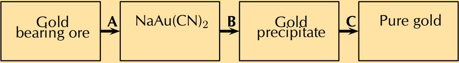
> **[Diagram Context - Textbook_PhysicalSciences_Gr11_The-lithosphere.pdf-0014-15.png]**
> This educational graphic is a flow diagram representing an industrial chemical extraction process. The diagram features four sequential rectangular process boxes containing the labels "Gold bearing ore", "NaAu(CN)₂", "Gold precipitate", and "Pure gold", connected by right-facing arrows labelled with variables A, B, and C. It illustrates the metallurgical process of extracting and purifying gold from its ore via cyanidation, helping Grade 12 Physical Sciences learners understand redox reactions and chemical industry applications within the CAPS curriculum.

---

# Chapter 2. The Lithosphere

## Uses of Metamorphic Rocks

### 1. Slate
* **Origin:** Formed by shale (a sedimentary rock) that was metamorphosed.
* **Properties:** Can be cut into shapes and does not absorb moisture.
* **Uses:** Often used for roofing or flooring, making it a good material for tiles.
<!-- DIAGRAM_PLACEHOLDER: diagram -->
*Roof tiles made from slate, which was formed from shale (a sedimentary rock).*

---

### 2. Marble
* **Origin:** Produced from the metamorphosis of limestone.
* **Properties:** Very durable building material.
* **Uses:** Used for countertops, flooring, and tombstones.
<!-- DIAGRAM_PLACEHOLDER: diagram -->
*Marble blocks in a wall.*

<!-- DIAGRAM_PLACEHOLDER: diagram -->
*A marble arch in London.*

> **DID YOU KNOW?**
> 'Metamorphic' refers to metamorphism – a process where one thing is transformed into a completely different thing, like a pupa becoming a butterfly.

---

### 3. Soapstone
* **Origin:** A relatively soft metamorphic rock.
* **Properties:** 
  * Unaffected by acids and alkalis.
  * Not stained or altered by tomatoes, wine, vinegar, grape juice, and other common food items.
  * Unaffected by heat (hotpots can be placed directly on it without fear of melting, burning, or other damage).
* **Uses:** 
  * Often used as an alternative natural stone countertop instead of granite or marble in kitchens and laboratories.
  * Used for many statues and carvings.
<!-- DIAGRAM_PLACEHOLDER: diagram -->
*Soapstone carvings.*

<!-- DIAGRAM_PLACEHOLDER: diagram -->
*A pot made from soapstone.*

---

### 4. Quartzite
* **Origin:** Formed through the actions of heat and temperature on sandstone.
* **Characteristics:** Comparing the texture of sandstone with quartzite shows how the process of metamorphism changes the texture from sandy to more glossy.

---

# Revision Notes: Planet Earth and Beyond - Rocks and Igneous Rock Formation

## New Words & Key Terminology

* **Extrusive rock:** Igneous rock formed on the Earth's surface when magma cools.
* **Intrusive rock:** Igneous rock formed under the Earth's surface when magma cools.
* **Molten:** Refers to liquids which are extremely hot, and whose usual form is a solid (e.g., rock). However, something melted need not be hot, nor a complete liquid (e.g., butter).

---

## Metamorphic Rock Characteristics (Comparison)

* **Sandstone vs. Quartzite:** 
  * The crystals in quartzite are bigger and the layers have disappeared.
  * Quartzite is much harder than sandstone.

---

## Igneous Rock

**Igneous rock** is formed when magma cools down. Three key factors play a role when igneous rocks are formed:

1. **Where it is formed:** 
   * Rocks formed **on** the surface are called **extrusive rocks**.
   * Rocks formed **under** the surface are called **intrusive rocks**.

2. **How quickly it cools:** 
   * When magma cools **quickly**, small crystals are formed, resulting in a fine-grained texture.
   * When magma cools **slowly**, larger crystals form, resulting in a more coarse-grained rock where individual crystals can sometimes be seen with the naked eye.

3. **How much gas is trapped:** 
   * Magma contains molten rock and gas under pressure deep in the Earth. 
   * When magma breaks through the surface, gas is released. 
   * Depending on how quickly the magma cools down, the gas has more or less time to escape. 
   * When magma cools down **very quickly**, lots of gas is trapped, resulting in cavities and openings forming in the rock.

---

## Volcanoes

* **Definition:** A volcano is an opening or rupture in the surface of the Earth's crust (or another planet) which allows hot lava and volcanic ash to escape in an eruption from the magma chamber below.

---

# Chapter 2. The Lithosphere

## Examples of Igneous Rock

Examples of igneous rock include **basalt**, **granite**, and **pumice**.

### 1. Basalt
* **Description:** Basalt is the most common igneous rock and makes up a large part of the rocks just under the surface of the Earth. Most of the oceanic crust is basalt rock. It is a dark-coloured rock.
* **Uses:** Used as building material, particularly in building stone walls.
* **Extraterrestrial Occurrence:** Basalt is not only found on Earth, but also on the Moon and Mars! 
* **Notable Feature:** The highest mountain on Mars, and also the biggest known volcano in our solar system—**Olympus Mons**—was formed from basaltic lava flows.

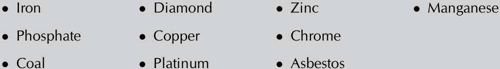
> **[Diagram Context - Textbook_PhysicalSciences_Gr11_The-lithosphere.pdf-0017-05.png]**
> This educational graphic is a bulleted list of various mineral resources and elements found in South Africa, specifically featuring items like Iron, Diamond, Zinc, Manganese, Phosphate, Copper, Chrome, Coal, Platinum, and Asbestos. The text elements consist of plain black bullet points followed by the names of these natural resources arranged in a three-column grid format against a light grey background. Conceptually, this diagram helps high school Natural Sciences and Geography learners identify and categorise South Africa's major geological resources, supporting topics on mining, economic geography, and Earth's resources within the CAPS curriculum.

### 2. Granite
* **Description:** Granite is an igneous rock with large grains. It was formed from magma which slowly crystallised below the surface of the Earth. Granite is one of the most well-known types of rock.
* **Uses:** Used to make numerous objects such as tabletops, floor tiles, and paving stone.

---

## Did You Know?
* Pompeii was an ancient Roman city that was completely destroyed and buried under ash and pumice in the eruption of Mount Vesuvius in $27\text{ AD}$. The town and objects were preserved for thousands of years and have now been excavated. Today it is visited by millions of tourists annually.

## Visit
* **Pompeii (full documentary):** `bit.ly/HbQULb`
* **Mars' largest volcano:** `bit.ly/lioFjEn`

---

## Lesson: Igneous Rocks

### Core Concepts

* **Igneous Rocks:** Rocks formed from the cooling and solidification of molten rock (magma or lava).
* **Extrusive Igneous Rock:** Rock formed when lava is emitted during volcanic eruptions and cools down very quickly on the Earth's surface. 
* **Properties of Extrusive Rocks:** Rapid cooling often traps gas inside the rock, creating a very porous structure with many holes. Because of this trapped air, some extrusive rocks (such as pumice) are lightweight enough to float on water.
* **Uses of Pumice:** Pumice stones are widely used in lightweight concrete, as an abrasive in industries, and in homes (such as for personal care as an exfoliator).

---

### ACTIVITY: Comparing the properties of igneous rocks

#### Instructions
Study the provided igneous rock samples (Sample 1, Sample 2, Sample 3, and Sample 4) and compare their similarities and differences.

---

Chapter 2. The lithosphere

# ACTIVITY: Classifying rocks

## INSTRUCTIONS:
1. In this project you will be working in pairs. You need to collect rocks from your neighbourhood, or borrow some rocks from someone's rock collection.
2. You will need at least 12 different samples of rock.
3. Try to find as much variety as possible, applying what you now know about the three different rock types.
4. You could also ask a geologist to provide you with a variety of rock samples to identify.
5. Go to the website provided in the Visit margin box and follow the flow diagram to identify all your rock samples.
6. You need to create a display of the rocks and how you have identified them using the flow diagram and their properties.

| Sample | Sample 1 | Sample 2 | Sample 3 | Sample 4 |
| :--- | :--- | :--- | :--- | :--- |
| Where was the sample formed? | | | | |
| Extrusively or intrusively | | | | |
| How quickly did it cool? | | | | |
| What evidence do you have for your answer? | | | | |
| Was air trapped when it was formed? | | | | |
| What evidence do you have for your answer? | | | | |
| Describe the colour | | | | |

---

### VISIT
Resource to use for the project on classifying rocks:
[bit.ly/16gyySK](http://bit.ly/16gyySK)

Identifying types of rocks:
[bit.ly/17TqDYJ](http://bit.ly/17TqDYJ)

---

241

---

# Rocks Contain Minerals

## Core Concepts

* **Mineral:** A chemical compound that occurs naturally, for example, in rocks. Minerals consist of metal and non-metal atoms combined in various ratios. They are found in different combinations in rocks.
* **Rock Composition:** A rock may be composed almost entirely of one single mineral, or it could be made of a combination of different minerals. Different combinations of minerals result in different types of rocks (sedimentary, metamorphic, or igneous).

---

## Examples of Minerals and Chemical Formulas

* **Copper:** A valuable metal used in electrical cabling and other electrical applications because it is a good conductor.
* **Copper Compounds found in rocks:**
  * **Copper(I) sulfide ($\text{Cu}_2\text{S}$):** Found in the mineral named **chalcocite**.
  * **Chalcopyrite ($\text{CuFeS}_2$):** Another mineral containing copper.
* **Abundant Minerals in Earth's Crust:**
  * **Quartz:** The mineral form of silicon dioxide ($\text{SiO}_2$).
  * **Potassium feldspar:** Has the chemical formula $\text{KAlSi}_3\text{O}_8$.

---

# Chapter 2. The lithosphere

## ACTIVITY: What minerals are found on Earth?

### INSTRUCTIONS:
In this chapter you have learnt about the Earth's crust and minerals that occur in rocks. Read more about the Earth's crust and answer the following questions:

1. What are the most abundant elements in the Earth's crust?
2. Why are these elements so abundant?
3. How did the elements get into the Earth's crust?
4. Why are the elements important?
5. What do you think are the most important element(s) in the Earth's crust? Give a reason for your answer.

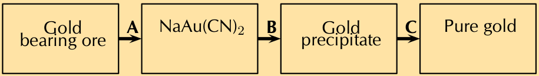
> **[Diagram Context - Textbook_PhysicalSciences_Gr11_The-lithosphere.pdf-0021-08.png]**
> This flowchart represents the chemical extraction process of gold from its ore as covered in the CAPS Grade 12 Physical Sciences curriculum. The diagram contains four sequential rectangular boxes labeled "Gold bearing ore", "NaAu(CN)₂", "Gold precipitate", and "Pure gold", connected by right-facing arrows labeled A, B, and C. Conceptually, it illustrates the stepwise industrial extraction of gold, showing cyanidation (A) to form sodiumurocyanide, precipitation with zinc (B), and final purification (C) to yield pure gold.

---

# SUMMARY

## Key Concepts

* The Earth consists of four concentric layers called the inner core, the outer core, the mantle and the crust.
* The lithosphere consists of the solid outermost part of the mantle, the crust and sediments covering it.
* The rock cycle is the natural continuous process in which rocks form, are broken down and re-form over long periods of time. The rock cycle has a number of steps.
* There are three rock types: igneous rock, sedimentary rock and metamorphic rock.
* Sedimentary rock is formed when rocks on the surface are weathered and the small particles, along with plant and animal material, are deposited in sediments at the bottom of lakes, oceans and rivers. Over time, more and more layers of sediment are deposited. The resulting increase in pressure causes compaction and the formation of hard layers of sedimentary rock.
* Fossils are often found in sedimentary rock as when some organisms die, they become incorporated into the layers of sediment.
* Hot magma is found deep below the surface of the Earth. When magma cools slowly, below the surface of the Earth, it forms intrusive igneous rock. When the magma pushes up through the crust (for example in a volcano), it cools rapidly and forms extrusive igneous rock.
* Hot magma can heat the surrounding rock and change other types of rock into metamorphic rock.
* Different combinations of elements and compounds form the minerals in the crust.

## Concept Map

Use the concept map on the next page to summarise what you learnt about the lithosphere and rock cycle in this chapter. If you want to add more links or information into the concept map, you should do so.

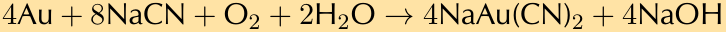

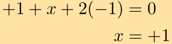

---

# Educational Content: The Lithosphere and Rock Cycle

<!-- DIAGRAM_PLACEHOLDER: diagram -->

## 1. Concepts and Structure

### The Lithosphere
* **Definition:** The solid outermost part of Earth.
* **Structure:** Consists of $3$ layers, which make up the $4$ concentric layers of Earth.
* **Components:** Contains elements and compounds, found as minerals (such as gold, copper, and hematite).

### The Rock Cycle
* **Definition:** A natural, continuous process over a long time period in which rocks are formed, broken down, and reformed.
* **Types of Rocks:** Rocks are classified into $3$ main types.

#### Formation and Transformation Processes:
* **Magma Activity:**
  * Magma pushes up through the crust.
  * Magma can erupt in a volcano, then **cools rapidly** to form surface rocks.
  * Magma can also **cool slowly** to form intrusive rocks.
* **Weathering and Erosion:**
  * Surface rocks can be subjected to **weathering**.
  * Weathering breaks rocks down from surface rocks into **small particles**.
  * These small particles are transported by **water, wind, or the sea**.
* **Sedimentation and Deposition:**
  * Particles are laid down as top layers over time.
  * Top layers are **compacted by pressure** to become lower layers of rock.
* **Metamorphism:**
  * Rocks can be heated by surrounding magma.
  * This causes chemical structure changes.
  * Examples of transformation include shale becoming slate, and limestone undergoing chemical changes.

---

# REVISION: Planet Earth and Beyond

## 1. The Earth consists of different layers.

### a) Label the following diagram: [4 marks]
* **A.** Crust
* **B.** Mantle
* **C.** Outer core
* **D.** Inner core

---

### b) What is the difference between parts C and D? [2 marks]
* **Part C (Outer core):** This layer is liquid.
* **Part D (Inner core):** This layer is solid.

---

### c) What does part B consist of? [1 mark]
Part B (the mantle) consists of thick, hot, semi-solid rock (magma).

---

### d) Give three examples of things found around your school that form part of part A. [3 marks]
* Examples include:
  1. Concrete walkways and buildings
  2. Soil in the school garden
  3. Natural rocks and stones found on the school grounds

---

## 2. Why are there so many different rocks found on Earth? [2 marks]
Rocks are formed in different ways (igneous, sedimentary, and metamorphic) under various conditions of heat, pressure, cooling, and weathering over millions of years, which creates a wide variety of rock types.

---

## Chapter 2. The Lithosphere - Revision Notes

### 3. Rock Formation Analysis

**Study the diagram showing the formation of a specific rock type and answer the questions below:**

* **a) What type of rock formation is shown in the diagram? Give a reason for your answer. [2 marks]**
  * **Answer:** Sedimentary rock formation. 
  * **Reason:** The diagram illustrates material (sediments) being washed or blown into the sea, settling in layers at the bottom, and over time turning into rock.

* **b) What processes are involved in the formation of this type of rock? [2 marks]**
  * **Answer:** The key processes are:
    1. **Deposition / Sedimentation:** Accumulation of weathered rock fragments, minerals, and organic matter settling in layers (often in water bodies).
    2. **Compaction and Cementation (Lithification):** Pressure from overlying layers squeezes out water (compaction), and dissolved minerals glue the particles together (cementation) to form solid rock.

* **c) What will happen if the rocks formed here move deeper into the Earth? [3 marks]**
  * **Answer:** If sedimentary rocks are pushed deeper into the Earth's crust:
    1. They will be subjected to **increasing temperature and extreme pressure**.
    2. These conditions cause the original rock to undergo a physical and chemical transformation.
    3. The sedimentary rock will eventually transform into **metamorphic rock**.

---

### 4. Fossils in Sedimentary Rocks

* **Question:** Fossils are often found in sedimentary rocks. Explain why this is the case. [4 marks]
* **Answer:** 
  * Sedimentary rocks form at temperatures and pressures that do not destroy organic remains, unlike igneous or metamorphic rocks which involve intense heat or pressure that would melt or distort fossils.
  * Organisms (plants and animals) die and get buried quickly by accumulating layers of sediment (sand, mud, silt) before scavengers or complete decomposition can destroy them.
  * The soft parts decay, but the hard parts (bones, shells, wood) are preserved and eventually mineralized within the layering of the sediment as it turns into rock.

---

5. Explain the difference between the formation of igneous rock, such as granite, and igneous rock, such as pumice. [4 marks]

6. Iron is an element found abundantly on Earth, especially in the core of the Earth. Iron combines with oxygen to form haematite, the mineral form of iron (III) oxide. Haematite is present in sedimentary rocks, for example in the Sishen area in the Northern Cape.

a) What is the formula for iron (III) oxide? [1 mark]

b) How does iron end up in sedimentary rock? [3 marks]

c) Why is hematite an important mineral? [1 mark]

Total [32 marks]

---

# Chapter 2. The lithosphere

Draw and discover the possibilities of what a slinky can be.

<!-- DIAGRAM_PLACEHOLDER: diagram -->

249

---

# Unit 21: The lithosphere

**Unit overview:** 2 weeks

> **TEACHER'S NOTE**
> The focus for this Unit is the lithosphere and the processes involved in its formation. The lithosphere is part of a larger sphere called the geosphere. The geosphere consists of the three concentric layers of the Earth: the core, the mantle and the crust. The lithosphere refers to the outer part of the geosphere, which includes the upper part of the mantle and the crust. The lithosphere is also part of the Earth where the rock cycle is found.
> 
> The first section on 'What is the lithosphere?' gets learners to investigate their environment first, discovering that the lithosphere is found all around them. We then step back and look at the concentric layers which make up the Earth. This gives the background information need to introduce the rock cycle which involves the upper part of the mantle and the crust. The three rock types are introduced, which is followed by investigating what rocks are really made of – minerals. This sets the scene for the next Unit on mining the mineral resources.

---

## 21.1 What is the lithosphere? (2 hours)

| Tasks | Skills | Recommendation |
| :--- | :--- | :--- |
| Activity: Investigating stones | Observation, writing, describing | CAPS suggested |
| Activity: Build a 3D model of the Earth | Design, making a model, applying knowledge, translating information | Optional *(This can be used as a project to be conducted throughout the term.)* |
| Activity: The layers inside the Earth | Classification, comprehension | CAPS suggested |

---

## 21.2 The rock cycle (4 hours)

| Tasks | Skills | Recommendation |
| :--- | :--- | :--- |
| Activity: Summarising the rock cycle | Recall, comprehension | CAPS suggested |
| Activity: Explaining the rock cycle | Writing, comprehension | CAPS suggested |
| Activity: Building a model of the formation of sedimentary rock | Making a model, translating information | CAPS suggested |
| Activity: Comparing the properties of igneous rocks | Comparing, observation, application | Optional |
| Activity: Classifying rocks | Classification, organising information, making deductions | Optional extension |
| Activity: What minerals are found on Earth? | Researching, reading, writing | CAPS suggested |

---

## Key questions

* What does the centre of the Earth look like?
* Why is it important to know about the structure of the Earth?
* Why is there so much variety in the rocks you see around you?
* How do rocks form?
* Why do we need to know about rocks?

---

1. Why are rocks important?

## 21.1 What is the lithosphere?

### ACTIVITY: Investigating stones (LB page 327)

#### Guidelines for the Activity
* **Objective:** Observe stones carefully and put observations into words, capturing as much detail as possible.
* **Preparation:** 
  * Learners should bring items to school before the lesson. Note: Concrete and brick are *made-made materials*, not natural rocks, though they share similar properties.
  * Alternatively, send learners out onto the school grounds for about 10 minutes, or set up stations (e.g., 10 similar stones at station 1, 10 sand samples at station 2). 
* **Procedure:** Allow learners to spend 3 minutes at each station observing. Learners may attempt to crush some samples using a hammer (wrapped in a paper towel to prevent flying pieces). If actual stones are unavailable, use textbook pictures as a last resort.

#### Aim of the Activity
* Examine real artifacts and practice descriptive writing.
* Realise that different types of stone form part of the **lithosphere**, including sand (which is made from stone worn down by wind and water). The lithosphere is found all around us.

#### Discussion Questions
1. What types of stone found on Earth have we not collected in the activity? *(e.g., molten rock, rock from the seafloor)*
2. What do we use the lithosphere for? *(e.g., minerals, fuels, plant nutrients, building materials)*
3. What is rock or stone actually made of? *(Open question: sand is explored further in Unit 2 and Unit 3 on mining the lithosphere).*

---

### Observational Recording Example

| | Location | Shape and colour | Texture | Composition |
|---|---|---|---|---|
| | Describe where you have found your sample. | Describe the size, shape and colour. | Describe the texture and hardness. | Can you see more than one part? Describe what it is made up of. |

---

# Lesson Revision Notes: Inside the Earth

## Core Concepts & Observations

### Physical Properties of Matter (Example: Sand)
When observing natural materials such as sand, we examine several physical characteristics:

| Material | Location/Source | Size & Shape | Texture & State | Cohesion & Structure |
| :--- | :--- | :--- | :--- | :--- |
| Sand | At building site next door to our house | The sand has small round grains of about $1\text{ mm}$ in diameter on average. It is cream-coloured with some darker brown grains. | The grains are all more or less the same size. The sand is dry, so it feels smooth and soft. The grains are hard but break up even further when hit with a hammer. | All the grains look the same, except for the variations in colour. The grains are not connected/stuck to each other and are free-flowing. |

---

## Inside the Earth

This section builds upon previous knowledge from Social Sciences regarding the structure of the Earth. 

### ACTIVITY: Build a 3D-model of the Earth (LB page 329)

* **Objective:** Create a physical representation of the Earth's internal layers.
* **Instructions for Learners:**
  1. Work in pairs.
  2. Build a labelled 3D model of the Earth.
  3. Conduct additional research to understand the characteristics of each layer.
* **Materials:** Coloured paper or painted papier-mâché can be used as cost-effective alternatives to expensive modeling supplies.
* **Assessment:** Assessed using the designated Assessment Rubric provided in the Teacher's Guide.

---

### ACTIVITY: The layers inside the Earth (LB page 330)

* **Objective:** Comprehend geological terminology and organize information visually using a topic map.
* **Purpose:** 
  * Help learners organize and link new terminology.
  * Test the ability to translate text-based information into a structured visual map.
  * Develop effective study habits and summaries for natural sciences.

---

# Planet Earth: Structure and Systems

<!-- DIAGRAM_PLACEHOLDER: diagram -->

## 1. Concepts and Structure

Planet Earth consists of four major interconnected systems and structural components:

* **Biosphere**: Represents all life on Earth.
* **Atmosphere**: Represents all the air on Earth.
* **Hydrosphere**: Represents all the water on Earth.
* **Geosphere**: Is made up of the crust, mantle, and core.

### The Geosphere Breakdown

* **Crust**: 
  * Consists of **oceanic crust** and **continental crust**.
  * The continental crust and the brittle part of the upper mantle form the **lithosphere**.
* **Mantle**: 
  * Consists of the **upper mantle** and the **lower mantle**.
* **Core**: 
  * Consists of the **inner core** and the **outer core**.

---

## 21.2 The rock cycle

### How does the rock cycle work?

#### ACTIVITY: Summarising the rock cycle (LB page 332)

1. **Diagram Reference:** The rock cycle process involves interactions between magma, igneous rock, sediments, sedimentary rock, and metamorphic rock through processes such as cooling, melting, weathering and erosion, heat and pressure, and compaction and cementation.
2. **Cooling:** The process by which magma or lava transforms into igneous rock.
3. **Igneous, metamorphic as well as sedimentary:** All major rock types are involved in the continuous rock cycle.
4. **Increased temperature and pressure:** The geological conditions required to transform rocks into metamorphic rocks.
5. **Weathering and erosion:** The action of wind and water which cracks and breaks up pieces of rock into sediments.
6. **Compaction and cementation:** A process where particles are compressed closer together (for example through the action of pressure) to form sedimentary rock.
7. **Sedimentary rock:** The rock type formed directly from the accumulation and cementation of sediments.
8. **Magma and Igneous Formation:** Magma is molten (melted) rock. It is called lava when it flows onto the surface of the Earth. Magma and lava form igneous rock when they cool, either above or below the Earth's surface.

---

#### ACTIVITY: Explaining the rock cycle (LB page 333)

This activity serves as an alternative practice exercise, homework task, or quick class test to check for understanding. Learners should assess their own writing or swap with a peer.

* **Guidelines for Evaluation:** Learner-dependent answer. Ensure that learners use scientific terms correctly and that geological processes are explained accurately. Learners should **NOT** copy the text directly from the workbook, but should write explanations in their own words, using the rock cycle diagram as a structural guide.

---

# The Rock Cycle and Sedimentary Rocks

## Concepts and Structure

### The Rock Cycle
The rock cycle is the natural, continuous process in which rocks form, are broken down, and re-form over long periods of time. 

There are three primary rock types:
1. Igneous rocks
2. Sedimentary rocks
3. Metamorphic rocks

#### Steps of the Rock Cycle
The rock cycle can be explained in the following sequential steps:
* Molten rock from the mantle (magma) pushes up through the crust.
* Pools of magma cool down slowly in the crust to form igneous rocks, such as granite.
* Some magma escapes to longitude the surface as lava in the form of a volcano.
* Lava cools to form igneous rocks.
* The rate at which the lava cools affects the properties of the rocks formed.
* Rocks on the surface of the Earth are weathered by heat (expansion), cold (contraction), wind, and water to form smaller particles.
* Wind and water transport these particles to floodplains and the sea by erosion.
* The particles are laid down as sediments.
* The sediments are covered by more layers of sediment.
* The pressure of many layers turns the lower layers into sedimentary rock, like sandstone.
* Magma heats the surrounding rock and changes its chemical structure to form metamorphic rock, like slate from shale or marble from limestone.
* Some rock is pushed below the crust, melts, and becomes magma again.

---

### Sedimentary Rock and Daily Life
* Learners do not need to memorise the different names for all the examples of rocks, but should be able to name one or two examples for each rock type.
* Rocks are used as materials in our daily lives. Many of the words will be familiar from everyday language (e.g., limestone, granite), so it is beneficial to understand the origins of these stones.
* This section links with the **Matter and Materials** strand. Stone is a natural material and resource used by humans historically and today. The usefulness of a particular material, such as stone, depends on its properties.

---

### Demonstrations and Visual Aids

#### Demonstration of Deposition
* **Classroom Demo:** Mix some soil in water in a glass jar, place it on a table in front of the class, and allow the particles to settle at the bottom through the course of the class.
* **Layering Demo:** Pour in different colours of sand or soil to illustrate different sedimentary layers.
* **Video/Model Reference:** The video link in the **Visit** box on the *'Formation of sedimentary rock under the sea'* provides a clear demonstration of sediment being deposited at the bottom of the sea in layers. Similar models can be constructed in the classroom.

---

## Activity: Modelling the Formation of Sedimentary Rock (LB page 337)

### Instructions
1. This activity can be done as a classroom demonstration.
2. Pile books on top of a few slices of bread until they cannot be compressed further.
3. Let learners make observations and draw what they observe. 
4. Examine the layers afterwards—the different layers are no longer distinguishable and merge into one mass.

### Educational Purpose
* This provides a good opportunity to discuss how models are used in science to represent and explain reality.
* This model demonstrates how different layers of sediment are deposited, represented here by the different layers of brown and white bread. Initially, the layers are quite loose, but over time, as more layers are added, pressure compresses them.

---

### Rock Formation and Types

#### Sedimentary Rock Formation (Continued)
* As more layers are added, the bottom layers become compressed. This can be modeled by adding more books to increase the pressure on the layers below, representing the passing of time and increasing pressure.
* Eventually, the layers of rock are squashed together through a process called **cementation**, making the different original layers harder to recognise, resulting in sedimentary rock.

#### Metamorphic Rock
* **Suggestion for study:** Get physical samples of slate, marble, sandstone, and granite from natural stone tile shops for learners to inspect, observe, and handle.

#### Igneous Rock
* **Formation of Pumice Rock:** 
  * Pumice rock is formed when volcanoes erupt. 
  * A large volume of gas is trapped inside magma while it is under the Earth's surface. 
  * When the magma breaks through the surface, the immense pressure is released in a very short period.
  * The rapidly expanding gas is forced upwards and out of the volcano, carrying molten rock with it. 
  * This results in an explosion of gas and molten rock that can propel materials kilometres away.
  * The magma cools very rapidly, forming rocks ranging in size from small pebbles to rocks as large as a house.

<!-- DIAGRAM_PLACEHOLDER: diagram -->

#### Classroom Demonstration: Modeling Volcanic Eruption with Fizzy Drinks
* **Concept:** Fizzy drinks have gas dissolved under high pressure. When the cap is opened, the gas escapes quickly. If the bottle is shaken beforehand, it simulates a volcanic explosion.
* **Classroom Consolidation:** 
  * The liquid shooting out of the bottle represents hot lava with gas dissolved in it. 
  * When magma breaks through the Earth's crust, it explodes with high force. 
  * The lava is projected high into the air, cools rapidly, and forms rocks strewn over a large area around the volcano.
* **WARNING:** This demonstration must be performed **outside**, and learners must stay a safe distance away from the area.

---

### ACTIVITY: Comparing the properties of igneous rocks (LB page 341)

This is an optional activity. 

* Sample 1: Basalt
* Sample 2: Obsidian
* Sample 3: Granite
* Sample 4: Pumice

| Sample | Where was the sample formed? Extrusively or intrusively | How quickly did it cool? What evidence do you have for your answer? | Was air trapped when it was formed? What evidence do you have for your answer? | Describe the colour |
| :--- | :--- | :--- | :--- | :--- |
| **Sample 1** | Extrusively | Very fine crystals | No, no visible holes | Dark, green-grey |
| **Sample 2** | Extrusively | Fast, no visible crystals | No, no visible holes | Shiny black |
| **Sample 3** | Intrusively | Slowly, there are large interlocking crystals | No, no visible holes | Mottled with yellow-brown, white and black |
| **Sample 4** | Extrusively | Fast, there are no crystals | Yes, there are holes in the rock where gas bubbles were trapped | Grey-black |

---

### ACTIVITY: Classifying rocks (LB page 342)

This can be used as an optional, extension project. 

#### Rocks contain minerals
CAPS places this section directly after discussing the core, mantle and crust. 

We have moved it to the end of the Unit so that learners have a bit more knowledge about the different rock types. Placing it here also prepares learners for the next Unit on mining these minerals. 

---

### ACTIVITY: What minerals are found on Earth? (LB page 343)

This can be used as a research project. It can be presented as a written report. 

A useful resource giving the relevant information for this activity can be found here: `rsc.li/17rVgrL` 

This link also includes a very useful worksheet that can be used as an end of section exercise.

---

# Revision Notes: Earth Science

## 1. Structure of the Earth

The Earth is composed of four distinct layers:
* **A. Crust:** The outermost solid shell of the Earth.
* **B. Mantle:** The thick layer situated below the crust, consisting of semi-solid rock.
* **C. Outer Core:** The liquid layer composed mainly of iron and nickel.
* **D. Inner Core:** The solid innermost center of the Earth.

---

## 2. Rock Formation Processes

* Rocks are formed through many different geological processes resulting in a large variety of different combinations of rock minerals.
* **Sedimentary Rock:** Formed when layers of sediment accumulate (often at the bottom of the ocean) and undergo **sedimentation and cementation**.
* **Metamorphic Rock:** Formed when existing rocks are subjected to increased temperature and pressure, becoming more compact, which changes their chemical compounds.
* **Igneous Rock:**
  * **Intrusive Igneous Rock (e.g., Granite):** Formed when magma beneath the Earth's surface cools slowly, allowing large crystals to form.
  * **Extrusive Igneous Rock (e.g., Pumice):** Formed when magma pushes out to the surface of the Earth and cools very quickly, trapping bubbles of gas.

---

## 3. Fossils

When animals or plants die, their remains often end up on the ground and are covered by layers of sand over time. The sand gets compacted and eventually becomes sedimentary rock, preserving the fossilised remains of the plant or animal inside the rock.

---

## 4. Minerals and Chemical Compounds

* **Hematite Chemical Formula:** $\text{Fe}_2\text{O}_3$
* **Formation of Sedimentary Hematite Crystals:** Formed as evaporating oceans left deposits of iron in the sedimentary layers. The iron then combined with oxygen molecules created by the process of photosynthesis (or as part of the rock cycle, from magma to sedimentary rock).
* **Uses of Iron:** Used to manufacture steel, stainless steel, and cars (or any other appropriate industrial application).