# CHAPTER 3

## Vertical projectile motion in one dimension

<!-- DIAGRAM_PLACEHOLDER: diagram -->

### Contents

| Section | Topic | Page |
| :--- | :--- | :--- |
| **3.1** | Introduction | 72 |
| **3.2** | Vertical projectile motion | 72 |
| **3.3** | Chapter summary | 101 |

---

# 3 Vertical projectile motion in one dimension

## 3.1 Introduction (ESCJV)

In this chapter we are going to look at the motion of objects that are either projected, thrown, or shot directly into the air, be it vertically upwards, downwards or when objects are dropped. This is something that everyone has experienced while playing games and we all have a strong intuition that 'what goes up, must come down', but now we'll study why that is the case.

**Key linked concepts**
* Units and unit conversions — Physical Sciences, Grade 10, Science skills
* Rectilinear motion — Physical Sciences, Grade 10, Motion in one dimension
* Linear equations — Mathematics, Grade 10, Equations and inequalities
* Quadratic equations — Mathematics, Grade 10, Functions

---

## 3.2 Vertical projectile motion (ESCW)

In Grade 11, we studied the motion of objects in free fall and saw that such an object has a constant gravitational acceleration of $\vec{g}$. We now study the motion of objects that are moving upwards or downwards while experiencing a force due to gravity. We call this projectile motion. We will only consider the case where objects move vertically upwards and/or downwards – meaning that there is no horizontal displacement of the object, only vertical displacement.

When we talk about a projectile we mean a body or particle that is projected or launched and then moves under the influence of **only gravity**.

### Motion in a gravitational field (ESCJX)

We know from Newton's Law of Universal Gravitation that an object in the Earth's gravitational field experiences a force pulling it towards the centre of the Earth. If this is the only force acting on the object then the object will accelerate towards the centre of the Earth.

A person standing on the Earth's surface will interpret this acceleration as objects always falling downwards. In Grade 11, we showed that the value of the acceleration due to gravity can be treated as a having a constant magnitude of $g = 9,8 \text{ m}\cdot\text{s}^{-2}$.

**IMPORTANT!**

In reality, if you go very far away from the Earth's surface, the magnitude of $\vec{g}$ would change, but, for everyday problems, we can safely treat it as constant. We also ignore any effects that air resistance (drag) might have.

> **[Diagram Context - Textbook_PhysicalSciences_Gr12_Vertical-projectile-motion-in-one-dimension.pdf-0001-00.png]**
> The image shows a chapter number 3, written in white text against a gray background. The chapter is titled "Chapter 3" and is accompanied by a green circle with a white border. The circle contains a green dot, which is the number 3. The chapter number is clearly visible and stands out against the gray background.

---

# Chapter 3. Vertical projectile motion in one dimension

For the rest of this chapter we will deal only with the case where the force due to gravity is the only force acting on the projectile that is falling. Any projectile can be described as falling, even if its motion is upwards initially.

The initial velocity, $\vec{v}_i$, that an object has and the acceleration that it experiences are two different quantities. It is very important to remember that the gravitational acceleration is always towards the centre of the Earth and constant, regardless of the direction or magnitude of the velocity.

> **TIP**
> Projectiles moving upwards or downwards in the Earth's field always accelerate downwards with a constant acceleration $\vec{g}$. Note: non-zero acceleration means that the velocity is changing.

> **[Diagram Context - Textbook_PhysicalSciences_Gr12_Momentum-and-Impulse.pdf-0002-05.png]**
> 1. A close-up of a mosquito on a person's arm.

**Figure 3.1:** Objects moving upwards or downwards in the Earth's gravitational field always accelerate towards the centre of the Earth. This looks like a downwards acceleration to someone standing on the Earth's surface. We don't draw both vectors on the object because we would be mixing velocity and acceleration which are two *different* physical quantities.

* See video: 27JZ at www.everythingscience.co.za

This means that if an object is moving upwards with some initial velocity in the vertical direction, the magnitude of the velocity in the vertical direction decreases until it stops ($v = 0\text{ m}\cdot\text{s}^{-1}$) for an instant. The point at which the velocity is reduced to zero corresponds with the maximum height, $h_{max}$, that the object reaches. After this, the object starts to fall. It is very important to remember that the acceleration is constant but the velocity vector has changed in magnitude and direction. At the maximum height where the velocity is zero the acceleration is still $\vec{g}$.

> **TIP**
> Projectiles that have an initial velocity upwards will have zero velocity at their greatest height, $h_{max}$. The acceleration is still $\vec{g}$.

> **[Diagram Context - Textbook_PhysicalSciences_Gr12_Momentum-and-Impulse.pdf-0002-06.png]**
> 1. A man wearing a plaid shirt holding a bird.

**Figure 3.2:** (a) An object is thrown upwards from height $h_i$. After time $t_m$, the object reaches its maximum height, and starts to drop downwards. After a time $2t_m$ the object returns to height $h_i$.

Consider an object thrown upwards from a vertical height $h_i$. We have said that the object will travel upwards with decreasing vertical velocity until it stops, and then starts moving vertically downwards. The time that it takes for the object to fall back down

> **[Diagram Context - Textbook_PhysicalSciences_Gr12_Momentum-and-Impulse.pdf-0002-08.png]**
> 1. A diagram of a cell with a Lewis structure.

> **[Diagram Context - Textbook_PhysicalSciences_Gr12_Momentum-and-Impulse.pdf-0002-09.png]**
> 1. A blue car driving on a road.

> **[Diagram Context - Textbook_PhysicalSciences_Gr12_Momentum-and-Impulse.pdf-0002-10.png]**
> The image shows a red semi-truck driving on a highway. The truck is positioned in the center of the image, with a mountain range visible in the background. The truck is facing towards the right side of the image, and it appears to be in motion. The highway is marked with yellow lines, indicating a no-passing zone. The truck is carrying a trailer, which is white in color.

> **[Diagram Context - Textbook_PhysicalSciences_Gr12_Organic-molecules.pdf-0002-08.png]**
> 1. A tree with a chain hanging from it.

---

## 3.2. Vertical Projectile Motion (Continued)

### Time Symmetry in Free-Fall

The time taken for an object to reach a specific height $h_i$ on its upward journey is the same as the time taken for the object to reach its maximum height from height $h_i$ on its downward journey. This is known as **time symmetry**, which is a consequence of the uniform acceleration experienced by the projectile.

For projectiles that pass through a point on both the upward and downward parts of their motion in free-fall, this has two major implications:

* **Time symmetry:** The time intervals during the upward motion and the downward motion are the same. For example, it will take the same time to rise from an initial position to maximum height as it will to drop back to the initial position. This applies to any point as shown by the pink dot in Figure 3.2. The time interval between the projectile passing the point and being at maximum height is the same, $\Delta t$.
* **Magnitude of velocity:** The magnitude of the velocity at the same point on the upward and downward motion will be the same, though the direction will be reversed, as indicated by the shaded region in Figure 3.2.

This property is very useful when solving problems because any information known about the upward motion can be applied to understand the downward motion as well, and vice versa.

---

### Formal Experiment: Investigate the Motion of a Falling Body

#### Aim:
To measure the position and time during motion and to use that data to plot a "Position vs Time" and "Velocity vs Time" graph from which we can calculate the magnitude for gravitational acceleration, $\vec{g}$.

#### Apparatus:
* ticker tape apparatus
* ticker timer
* tape
* graph paper
* ruler
* foam cushion

> **[Diagram Context - Textbook_PhysicalSciences_Gr12_Momentum-and-Impulse.pdf-0003-02.png]**
> 1. A diagram of a moon with a black background and a white moon.

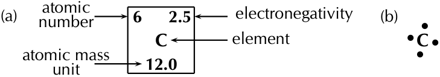
> **[Diagram Context - Textbook_PhysicalSciences_Gr12_Organic-molecules.pdf-0003-00.png]**
> 1. A diagram of an atom with the number 6 and the element C.

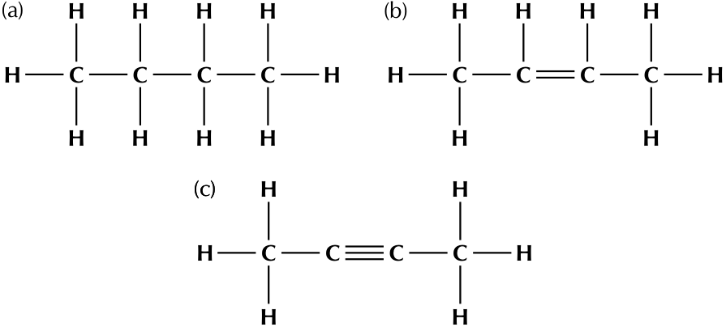
> **[Diagram Context - Textbook_PhysicalSciences_Gr12_Organic-molecules.pdf-0003-05.png]**
> 1. A diagram of a molecule with carbon, hydrogen, and oxygen atoms.

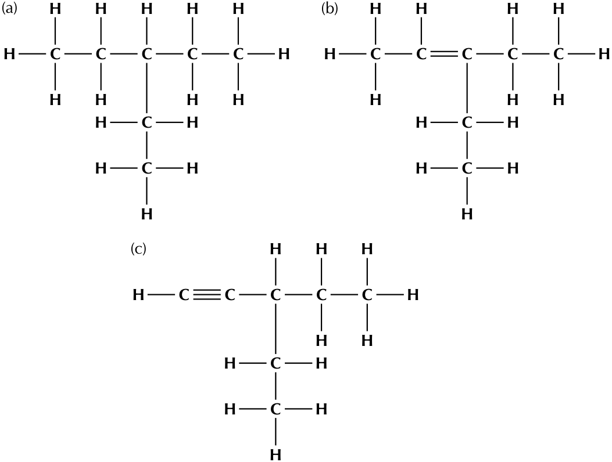
> **[Diagram Context - Textbook_PhysicalSciences_Gr12_Organic-molecules.pdf-0003-07.png]**
> 1. A diagram of a molecule with three different structures.

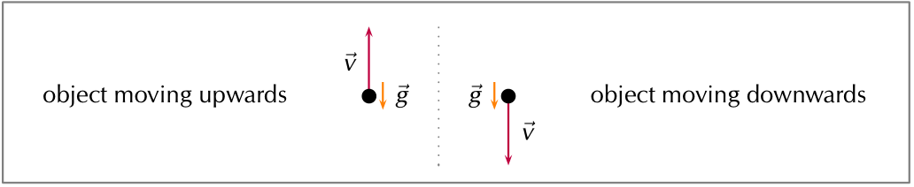
> **[Diagram Context - Textbook_PhysicalSciences_Gr12_Vertical-projectile-motion-in-one-dimension.pdf-0003-02.png]**
> The image presents a diagram of two objects, one of which is moving upwards and the other is moving downwards. The objects are depicted as black dots, with arrows pointing from the moving object to the stationary object. The diagram also includes labels for the objects and arrows, as well as the words "motion" and "downwards" to describe the movement of the objects. The diagram is set against a gray background, and the text "motion upwards" and "motion downwards" are visible, indicating the direction of the movement.

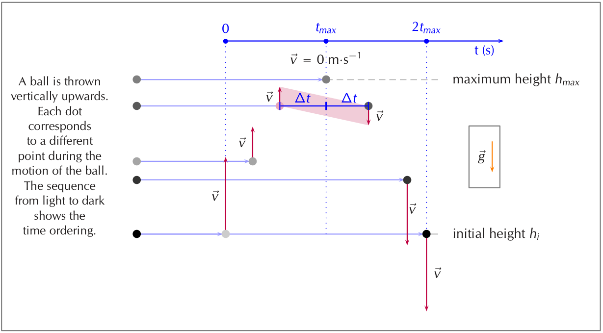
> **[Diagram Context - Textbook_PhysicalSciences_Gr12_Vertical-projectile-motion-in-one-dimension.pdf-0003-10.png]**
> A diagram of a ball thrown upwards, showing the maximum height of the ball and the velocity of the ball.

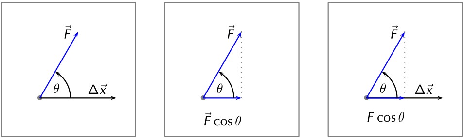
> **[Diagram Context - Textbook_PhysicalSciences_Gr12_Work-energy-and-power.pdf-0003-14.png]**
> 1. A diagram of a Lewis structure for carbon dioxide.

---

# Lesson: Investigating Motion Using a Ticker Timer

## Core Concepts

In physics, studying motion requires accurate measurements of displacement and time intervals. A **ticker timer** is a device used to record the motion of an object over time by making regular marks (dots) on a paper tape pulled through it.

### Key Terminology
* **Ticker Timer:** A device that typically makes a fixed number of dots per second (frequency, $f$). A common frequency is $50\text{ Hz}$, meaning it makes $50$ dots every second.
* **Time Interval ($\Delta t$):** The time between successive dots. For a $50\text{ Hz}$ timer, the time interval between two consecutive dots is:
  $$\Delta t = \frac{1}{\text{frequency}} = \frac{1}{50\text{ Hz}} = 0.02\text{ s}$$
* **Constant Velocity:** Represented on ticker tape by dots that are spaced equally apart, as the object covers equal displacements in equal time intervals (Figure 3.3).
* **Increasing Velocity (Acceleration):** Represented on ticker tape by dots whose spacing increases progressively, as the object covers greater displacements in equal time intervals (Figure 3.4).

---

## Experimental Method

Follow these systematic procedures to investigate vertical motion using a ticker timer and a falling mass:

1. **Preparation:** Work with a partner and copy the required data tables into your workbook.
2. **Setup Timer:** Clamp the ticker timer securely to the edge of a laboratory table so that the tape can fall freely and vertically through the staples, perpendicular to the floor. Plug in the timer.
3. **Thread Tape:** Thread a piece of ticker tape through the staples, ensuring the tape lies directly under the carbon disc. The length of the tape should equal the distance from the timer to the floor.
4. **Attach Mass:** Using masking tape, securely attach a $100\text{ g}$ mass to the end of the tape closest to the floor.
5. **Protect Floor:** Position a foam cushion directly below the hanging mass to protect both the mass and the floor upon impact.
6. **Alignment:** Hold the tape vertically so it passes smoothly and without friction through the staples.
7. **Operation:** Turn on the ticker timer.
8. **Release:** Let go of the tape with the mass, allowing it to drop freely to the floor.
9. **Power Down:** Turn off the ticker timer immediately after the drop.
10. **Repeat:** Repeat the process to gather multiple trials of data.
11. **Dot Labelling:** 
    * Take each tape and locate the first clear dot nearest the mass end.
    * Circle this first clear dot and label it as dot **zero ($0$)**.
    * Count five dots forward and label the fifth dot as number **$1$**.
    * Count another five dots and label the fifth dot as number **$2$**. Continue this procedure for the length of the tape.
12. **Measurement:** On each piece of tape, measure the distance between successive numbered dots and record these values.
13. **Calculate Time Intervals:** Use the frequency of the ticker timer to calculate the time intervals between successive numbered dots and record these in your table.
14. **Averaging:** Calculate the average of the distance values obtained between successive numbered dots across multiple trials.

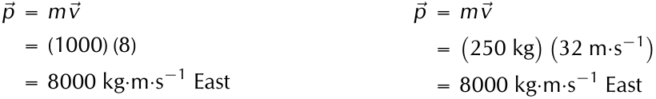
> **[Diagram Context - Textbook_PhysicalSciences_Gr12_Momentum-and-Impulse.pdf-0004-04.png]**
> 1. A table with two columns and three rows. The first column is labeled "p" and the first row is labeled "mv". The second column is labeled "p" and the second row is labeled "mv". The third column is labeled "p" and the third row is labeled "mv". The third row is labeled "p" and the third column is labeled "mv". The third row is labeled "p" and the third column is labeled "mv".

> **[Diagram Context - Textbook_PhysicalSciences_Gr12_Momentum-and-Impulse.pdf-0004-10.png]**
> The image shows a question with a blue background and a gray border. The question is about the momentum of a soccer ball. The answer is provided in the text box, which is in black. The text box contains a brief explanation of the concept of momentum and its relation to a soccer ball.

> **[Diagram Context - Textbook_PhysicalSciences_Gr12_Momentum-and-Impulse.pdf-0004-12.png]**
> The image shows a soccer game in progress, with a player kicking a soccer ball towards the goal. There are several players on the field, including a player in a white jersey with the number 4 and a player in a black jersey with the number 5. The goal is located in the background, and there are cars parked nearby.

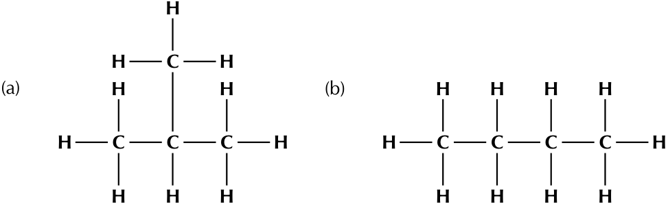
> **[Diagram Context - Textbook_PhysicalSciences_Gr12_Organic-molecules.pdf-0004-11.png]**
> 1. A diagram of a molecule with the chemical formula CH4.

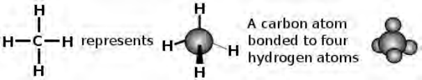
> **[Diagram Context - Textbook_PhysicalSciences_Gr12_Organic-molecules.pdf-0004-13.png]**
> The graphic displays chemical representations of a methane molecule, progressing from a two-dimensional structural formula to three-dimensional ball-and-stick models. Visible labels include chemical symbols "C" and "H", connecting bond lines, the text "represents", and the explanatory caption "A carbon atom bonded to four hydrogen atoms". Conceptually, this diagram helps high school learners transition from abstract 2D structural formulas to spatial 3D molecular shapes, illustrating how a central carbon atom covalently bonds with four hydrogen atoms in tetrahedral geometry.

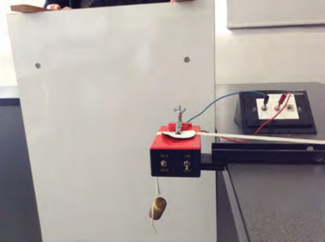
> **[Diagram Context - Textbook_PhysicalSciences_Gr12_Vertical-projectile-motion-in-one-dimension.pdf-0004-14.png]**
> 1. A diagram of a circuit with a red component and a yellow component.

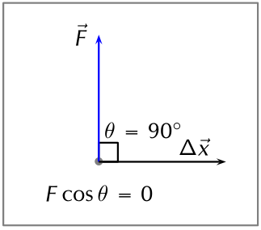
> **[Diagram Context - Textbook_PhysicalSciences_Gr12_Work-energy-and-power.pdf-0004-01.png]**
> The image presents a diagram of a geometric figure with a blue line and a 90 degree angle. The diagram also includes a label for the x-axis and a label for the y-axis. The diagram is labeled with the text "F cos θ = 0".

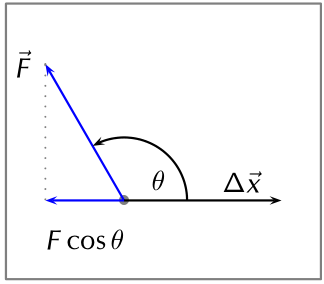
> **[Diagram Context - Textbook_PhysicalSciences_Gr12_Work-energy-and-power.pdf-0004-03.png]**
> The image shows a diagram of a Lewis structure, which is a diagram used to represent the valence electrons of an atom. The diagram is colored blue and black, with arrows pointing to the valence electrons. The diagram also includes labels for the Lewis structure, such as "F" for the force constant, "COSO" for cosine of the angle, and "DX" for the displacement. The diagram is set against a white background, and the text "Lewis structure" is written at the top.

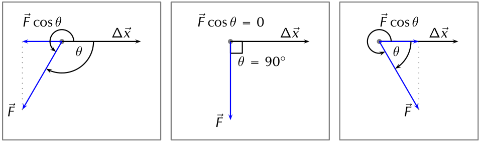
> **[Diagram Context - Textbook_PhysicalSciences_Gr12_Work-energy-and-power.pdf-0004-05.png]**
> 1. A diagram of a Lewis structure for an oxygen molecule.

> **[Diagram Context - Textbook_PhysicalSciences_Gr12_Work-energy-and-power.pdf-0004-08.png]**
> 1. A man lifting a barbell.

> **[Diagram Context - Textbook_PhysicalSciences_Gr12_Work-energy-and-power.pdf-0004-09.png]**
> The image shows a man lifting a barbell with both hands while lying on a bench. The bench is blue and has a yellow weight on it. The man is wearing a red shirt and black shorts. The image also contains text that reads "Lewis diagram, anatomical/cellular structure, circuit, graph, evolutionary tree, apparatus, geometry figure".

---

15. The time interval between two dots is $0,02\text{ s}$ so the time between numbered dots is $0,1\text{ s}$.
16. Use the average distance between numbered dots and the known time interval to calculate velocity.
17. Use the magnitude of the velocity and time values to plot a graph of "Velocity vs Time" onto graph paper. Stick the graph paper into your workbook.
18. Draw the best straight line through your data points.
19. Determine the slope of the straight line. This is the magnitude of the acceleration.

**Results:**

| Change in distance ($\text{m}$) | Change in time ($\text{s}$) | Magnitude of velocity ($\text{m}\cdot\text{s}^{-1}$) |
| :--- | :--- | :--- |
| | | |
| | | |
| | | |
| | | |
| | | |
| | | |
| | | |

**Discussion:**

Describe the motion of the mass using the graphs.

---

## Equations of motion ESCJY

The equations of rectilinear motion that you learnt about in Grade 10 can be used for vertical projectile motion, with acceleration from gravity: $\vec{a} = \vec{g}$. Why, because the equations of rectilinear motion can be applied to any motion in a straight line with constant acceleration. If we are only considering vertical motion (up and down) it is motion in a straight line and the acceleration, $\vec{g}$, is constant and along the same line. We use the magnitude of $g = 9,8\text{ m}\cdot\text{s}^{-2}$ for our calculations.

**IMPORTANT!**

Now would be a good time to revise both rectilinear motion and quadratic equations from Grade 10.

Remember that when you use these equations, you are dealing with vectors which have magnitude *and* direction. Therefore, you need to decide which direction will be the positive direction so that your vectors have the correct signs.

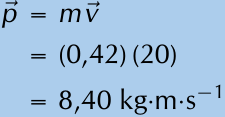
> **[Diagram Context - Textbook_PhysicalSciences_Gr12_Momentum-and-Impulse.pdf-0005-02.png]**
> This image shows a step

> **[Diagram Context - Textbook_PhysicalSciences_Gr12_Momentum-and-Impulse.pdf-0005-08.png]**
> 1. A diagram of a cell with a chemical symbol and arrows pointing to different parts of the cell.

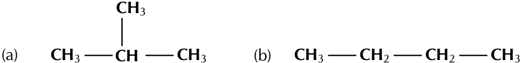
> **[Diagram Context - Textbook_PhysicalSciences_Gr12_Organic-molecules.pdf-0005-02.png]**
> This graphic displays structural formulas for two organic molecules labeled (a) and (b), consisting of carbon and hydrogen atoms represented by the chemical symbols CH3, CH, and CH2 connected by single bonds. Molecule (a) represents 2-methylpropane (a branched-chain isomer), while molecule (b) represents butane (a straight-chain alkane). For Grade 12 Physical Sciences learners, this diagram visually conveys the concept of chain isomers, showing how compounds with the same molecular formula can possess different structural arrangements and physical properties.

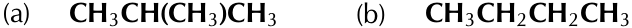

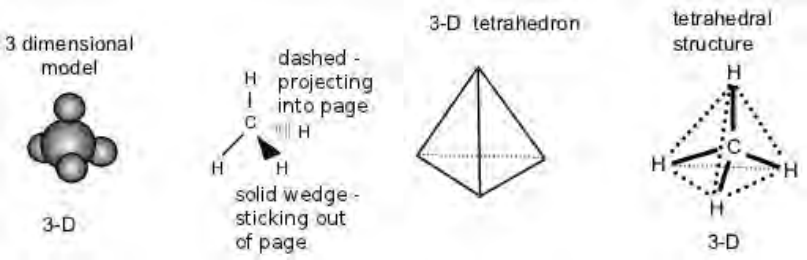
> **[Diagram Context - Textbook_PhysicalSciences_Gr12_Organic-molecules.pdf-0005-16.png]**
> 1. Solid wedge projection into page.

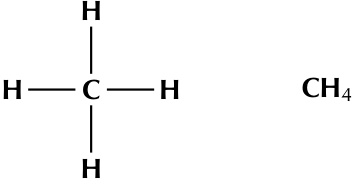

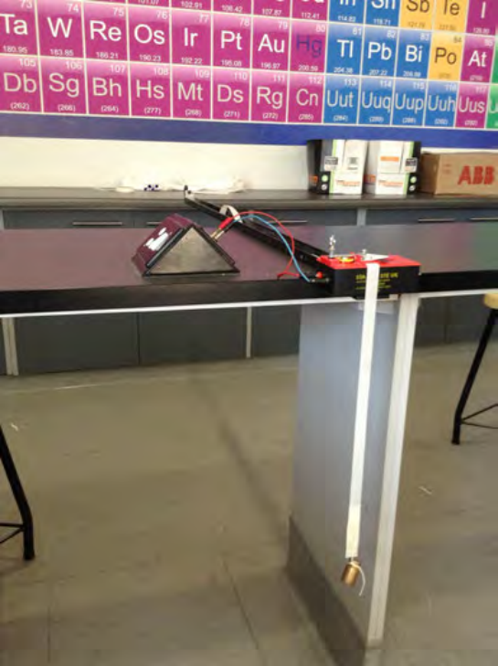
> **[Diagram Context - Textbook_PhysicalSciences_Gr12_Vertical-projectile-motion-in-one-dimension.pdf-0005-00.png]**
> 1. A diagram of a Lewis structure of carbon dioxide.
 2. A diagram of a cell.
 3. A diagram of a circuit.
 4. A diagram of a graph.
 5. A diagram of an evolutionary tree.
 6. A diagram of a geometric figure.

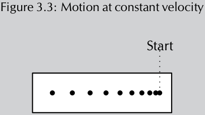
> **[Diagram Context - Textbook_PhysicalSciences_Gr12_Vertical-projectile-motion-in-one-dimension.pdf-0005-01.png]**
> Figure 3: Motion at constant velocity.

> **[Diagram Context - Textbook_PhysicalSciences_Gr12_Work-energy-and-power.pdf-0005-03.png]**
> 1. A man carrying a large pipe and a cone.

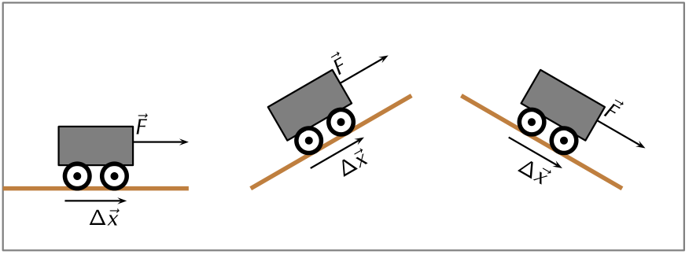
> **[Diagram Context - Textbook_PhysicalSciences_Gr12_Work-energy-and-power.pdf-0005-11.png]**
> 1. A diagram of a car going up a hill.

---

# Chapter 3: Vertical Projectile Motion in One Dimension

## Equations of Motion

### Grade 10 Equations of Motion (General)
The equations of motion that you learnt about in Grade 10 are:

$$\vec{v}_f = \vec{v}_i + \vec{a}t$$

$$\Delta \vec{x} = \frac{(\vec{v}_i + \vec{v}_f)}{2} t$$

$$\Delta \vec{x} = \vec{v}_i t + \frac{1}{2}\vec{a}t^{2}$$

$$\vec{v}_f^{\,2} = \vec{v}_i^{\,2} + 2\vec{a}\Delta \vec{x}$$

### Equations of Motion for Vertical Projectile Motion
In the case of vertical projectile motion, we know that the only force we will consider is gravity, and therefore the acceleration will be $\vec{a} = \vec{g}$.

$$\vec{v}_f = \vec{v}_i + \vec{g}t$$

$$\Delta \vec{x} = \frac{(\vec{v}_i + \vec{v}_f)}{2} t$$

$$\Delta \vec{x} = \vec{v}_i t + \frac{1}{2}\vec{g}t^{2}$$

$$\vec{v}_f^{\,2} = \vec{v}_i^{\,2} + 2\vec{g}\Delta \vec{x}$$

### Where:
* $\vec{v}_i = \text{initial velocity } (\text{m} \cdot \text{s}^{-1}) \text{ at start}$
* $\vec{v}_f = \text{final velocity } (\text{m} \cdot \text{s}^{-1}) \text{ at time } t$
* $\Delta \vec{x} = \text{change in vertical position } (\text{m})$
* $t = \text{time } (\text{s})$
* $\Delta t = \text{time interval } (\text{s})$
* $\vec{a} = \vec{g} = \text{acceleration due to gravity } (\text{m} \cdot \text{s}^{-2})$

---

## IMPORTANT!

$\Delta \vec{x}$ is displacement, the change in position. If the coordinate system you choose isn't centred at the point from which the motion starts (i.e. you don't have $\vec{x}_i = 0$) then you must remember that the displacement and the final position are not the same. The position is given by $\vec{x}_f = \vec{x}_i + \Delta \vec{x}$. If $\vec{x}_i = 0$ then $\vec{x}_f = (0) + \Delta \vec{x}$.

> See simulation: **27K2** at **www.everythingscience.co.za**

Now we can apply this mathematical description of vertical motion to solving problems.

---

## Worked Example 1: Projectile motion

### QUESTION

A ball is thrown vertically upwards with an initial velocity of $10\text{ m}\cdot\text{s}^{-1}$. A photograph (shown) is taken when the ball is $1,5\text{ m}$ above the point of release.

> **[Diagram Context - Textbook_PhysicalSciences_Gr12_Momentum-and-Impulse.pdf-0006-05.png]**
> 1. A diagram of a moon with a black background and a white moon.

1. Determine the maximum height above the thrower's hand reached by the ball.
2. Determine the time it takes the ball to reach its maximum height.
3. Determine the time(s) when the ball will be at the position shown in the photograph.

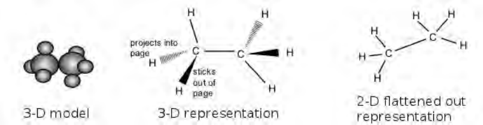
> **[Diagram Context - Textbook_PhysicalSciences_Gr12_Organic-molecules.pdf-0006-00.png]**
> 1. 3D model of a molecule with a 3D printed page of the molecule.

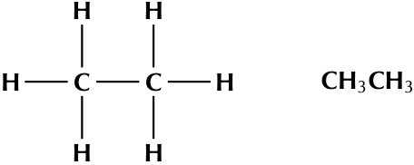
> **[Diagram Context - Textbook_PhysicalSciences_Gr12_Organic-molecules.pdf-0006-01.png]**
> This educational graphic displays chemical structural representations, specifically showing a structural formula on the left and a condensed structural formula on the right. The diagram features the chemical symbols "C" for carbon and "H" for hydrogen connected by solid lines representing covalent bonds, alongside the condensed notation $\text{CH}_3\text{CH}_3$. For a high school Physical Sciences student studying organic chemistry, this illustrates the difference between structural and condensed formulae for the alkane ethane ($\text{C}_2\text{H}_6$).

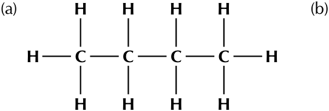
> **[Diagram Context - Textbook_PhysicalSciences_Gr12_Organic-molecules.pdf-0006-04.png]**
> 1. A diagram of a molecule with six carbon atoms and six hydrogen atoms.

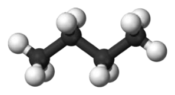
> **[Diagram Context - Textbook_PhysicalSciences_Gr12_Organic-molecules.pdf-0006-05.png]**
> 1. A 3D rendering of a molecule with four spheres and a line connecting them.

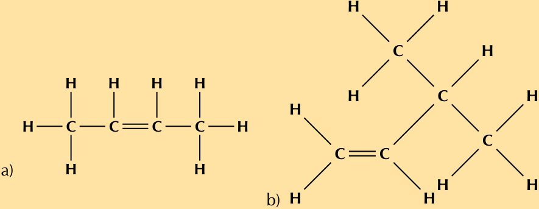
> **[Diagram Context - Textbook_PhysicalSciences_Gr12_Organic-molecules.pdf-0006-11.png]**
> 1. A diagram of a molecule with carbon, hydrogen, and oxygen atoms.

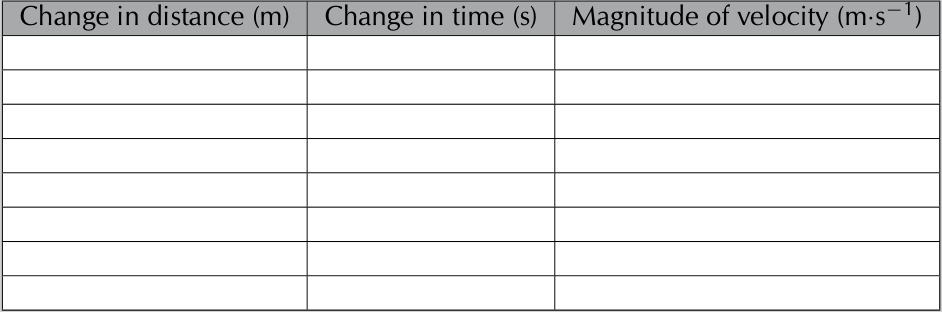
> **[Diagram Context - Textbook_PhysicalSciences_Gr12_Vertical-projectile-motion-in-one-dimension.pdf-0006-06.png]**
> The image shows a white grid with three rows and three columns, each cell containing a list of terms. The first row has the terms "Change in distance", "Change in time", and "Magnitude of velocity". The second row has the terms "Change in distance", "Change in time", and "Magnitude of velocity". The third row has the terms "Change in distance", "Change in time", and "Magnitude of velocity". The diagram is set against a gray background, and the text is in black.

> **[Diagram Context - Textbook_PhysicalSciences_Gr12_Work-energy-and-power.pdf-0006-09.png]**
> 1. A blue sky with clouds.

---

## SOLUTION

### Step 1: Identify what is required and what is given

We are required to determine the maximum height reached by the ball and how long it takes to reach this height. We are given the initial velocity $\vec{v}_{i} = 10\text{ m}\cdot\text{s}^{-1}$ upwards and the acceleration due to gravity $\vec{g} = 9{,}8\text{ m}\cdot\text{s}^{-2}$ downwards. We also need to determine when the ball is at the position shown in the photograph.

The ball is thrown straight up and will reach a maximum height, at which point its velocity will be zero, before beginning to fall downwards. The height of the ball in the photograph is given as $1{,}5\text{ m}$ above the initial point. Adding the information to the picture helps us understand what is going on more effectively:

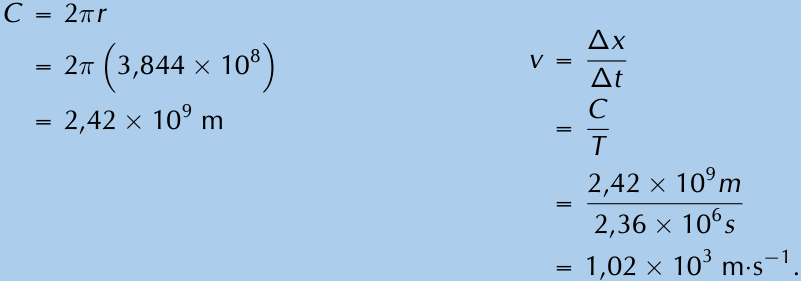
> **[Diagram Context - Textbook_PhysicalSciences_Gr12_Momentum-and-Impulse.pdf-0007-02.png]**
> A blue table with a white border that has a list of equations and variables.

### Step 2: Determine how to approach the problem

Even though there are a number of questions to answer, the best approach is to work through them one at a time.

First, as with rectilinear motion in Grade 10, select a positive direction. We choose **down as positive** and remember to **keep this sign convention for the whole problem**. This will allow us to analyse the information given and determine directions and signs. We know that at the maximum height the velocity of the ball is $0\text{ m}\cdot\text{s}^{-1}$. We therefore have the following:

* $\vec{v}_{i} = -10\text{ m}\cdot\text{s}^{-1}$ (it is negative because we chose downwards as positive)
* $\vec{v}_{f} = 0\text{ m}\cdot\text{s}^{-1}$
* $\vec{g} = 9{,}8\text{ m}\cdot\text{s}^{-2}$

We know that the position shown ($1{,}5\text{ m}$ above the point of release) will be passed as the ball rises to its maximum height and then again as the ball falls downwards.

### Step 3: Identify the appropriate equation to determine the maximum height

We can use $v_{f}^{2} = v_{i}^{2} + 2\vec{g}\Delta\vec{x}$ to solve for the height.

### Step 4: Substitute the values into the equation and find the maximum height

$$\begin{aligned}
v_{f}^{2} &= v_{i}^{2} + 2\vec{g}\Delta\vec{x} \\
(0)^{2} &= (-10)^{2} + (2)(9{,}8)(\Delta x) \\
-100 &= 19{,}6\Delta x \\
\Delta x &= -5{,}102\text{ m}
\end{aligned}$$

The value for the displacement will be negative because the displacement is upwards and we have chosen downward as positive (and upward as negative). The maximum height will be a positive number, $h_{m} = 5{,}10\text{ m}$.

### Step 5: Identify the appropriate equation to determine the time to reach maximum height

We know the values of $\vec{v}_{i}$, $\vec{v}_{f}$ and $\vec{g}$ so we can use: $\vec{v}_{f} = \vec{v}_{i} + \vec{g}t$ to solve for the time.

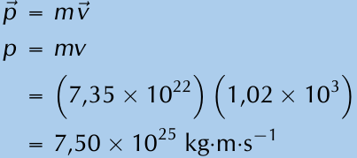
> **[Diagram Context - Textbook_PhysicalSciences_Gr12_Momentum-and-Impulse.pdf-0007-05.png]**
> The image shows a blue background with a table of values for the equation p = mv. The table includes the values of p, m, and v, along with the corresponding values of kgms.

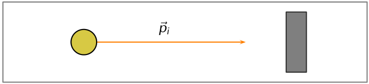
> **[Diagram Context - Textbook_PhysicalSciences_Gr12_Momentum-and-Impulse.pdf-0007-13.png]**
> This physics diagram illustrates a

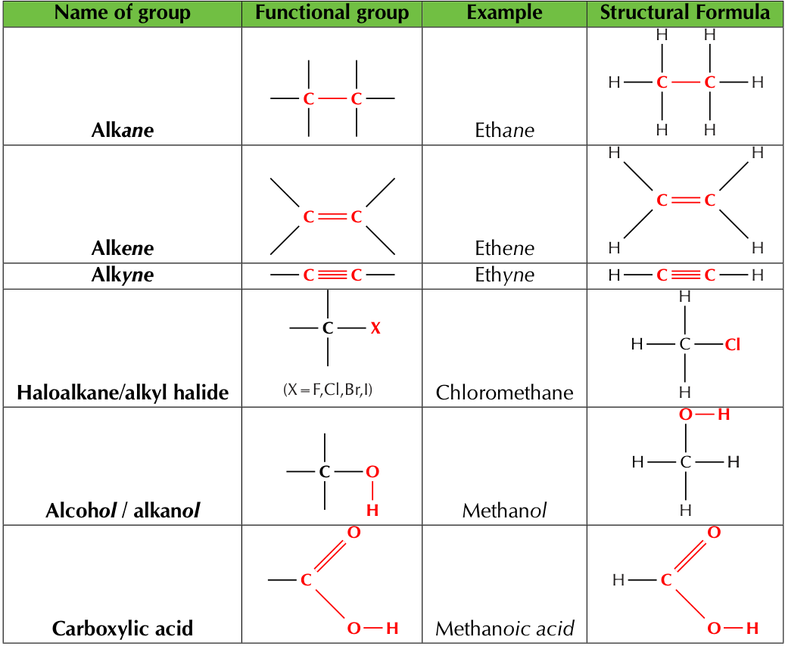
> **[Diagram Context - Textbook_PhysicalSciences_Gr12_Organic-molecules.pdf-0007-07.png]**
> 1. A diagram of a molecule with the chemical formula CH3CH2CH2CH2CH2CH3.
2. The molecule is a carbohydrate.
3. The molecule is composed of carbon, hydrogen, and oxygen atoms.

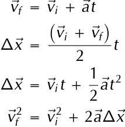
> **[Diagram Context - Textbook_PhysicalSciences_Gr12_Vertical-projectile-motion-in-one-dimension.pdf-0007-01.png]**
> 1. A diagram of a Lewis structure for water.

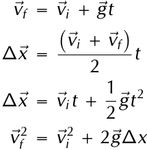
> **[Diagram Context - Textbook_PhysicalSciences_Gr12_Vertical-projectile-motion-in-one-dimension.pdf-0007-03.png]**
> 1. A diagram of a Lewis structure for carbon dioxide.

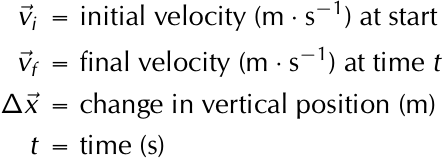
> **[Diagram Context - Textbook_PhysicalSciences_Gr12_Vertical-projectile-motion-in-one-dimension.pdf-0007-05.png]**
> 1. The diagram shows the initial velocity of an object, which is equal to the final velocity. The final velocity is represented by the variable "vf" and the initial velocity is represented by the variable "vi". The diagram also includes the change in vertical position, represented by the variable "dv". The diagram is labeled with the variable "t" and the variable "s".

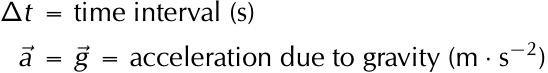
> **[Diagram Context - Textbook_PhysicalSciences_Gr12_Vertical-projectile-motion-in-one-dimension.pdf-0007-06.png]**
> The graphic presents key kinematic variables and their standard SI units for Grade 11 Physics mechanics under the CAPS curriculum. Visible text and symbols include $\Delta t$ representing the time interval in seconds (s), and vector notation $\vec{a} = \vec{g}$ indicating the acceleration due to gravity in metres per second squared ($\text{m}\cdot\text{s}^{-2}$). This definition serves as a foundational reference for solving vertical projectile motion problems by standardising the symbols and units used in equations of motion.

> **[Diagram Context - Textbook_PhysicalSciences_Gr12_Vertical-projectile-motion-in-one-dimension.pdf-0007-17.png]**
> 1. A woman with red hair and a green shirt is reaching up to catch a red ball.

---

## Step 6: Substitute the values in and find the time to reach maximum height

$$\vec{v}_f = \vec{v}_i + \vec{g}t$$

$$0 = -10 + 9,8t$$

$$10 = 9,8t$$

$$t = 1,02\text{ s}$$

---

## Step 7: Determine the times at which the ball is in the position in the photograph

We know the displacement, initial velocity and the acceleration of the ball. We also expect to get two values as we know the ball will pass through the point twice.

We substitute our values into the equation $\Delta\vec{x} = \vec{v}_i t + \frac{1}{2}\vec{g}t^2$, which is a quadratic equation in time, so we expect to find two different solutions if we solve for time.

It is important to notice that we can use the value $-1,5\text{ m}$ as the displacement above the initial position.

$$\Delta\vec{x} = \vec{v}_i t + \frac{1}{2}\vec{g}t^2$$

$$\frac{1}{2}\vec{g}t^2 + \vec{v}_i t - \Delta\vec{x} = 0$$

$$\frac{1}{2}(9,8)t^2 + (-10)t - (-1,5) = 0$$

$$\underbrace{(4,9)}_{a}\underbrace{t^2}_{x^2} + \underbrace{(-10)}_{b}\underbrace{t}_{x} + \underbrace{(1,5)}_{c} = 0$$

$$t = \frac{-b \pm \sqrt{b^2 - 4ac}}{2a}$$

$$t = \frac{-(-10) \pm \sqrt{(-10)^2 - 4(4,9)(1,5)}}{2(4,9)}$$

$$t = \frac{10 \pm \sqrt{70,6}}{9,8}$$

$$t = \frac{10 \pm 8,40238}{9,8}$$

$$t = 1,02041 \pm 0,857386$$

$$t = 0,16\text{ s}\text{ or }t = 1,88\text{ s}$$

---

## Step 8: Write the final answer

The ball:

1. reaches a maximum height of $5,10\text{ m}$;
2. takes $1,02\text{ s}$ to reach the top; and
3. passes through the point in the photograph at $t = 0,16\text{ s}$ on the way up and $t = 1,88\text{ s}$ on the way down.

---

The use of a sign convention should not affect your result. As an exercise, repeat the

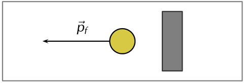

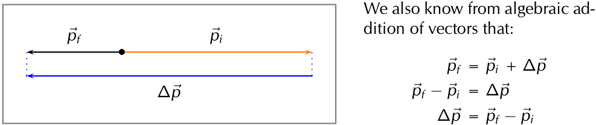
> **[Diagram Context - Textbook_PhysicalSciences_Gr12_Momentum-and-Impulse.pdf-0008-03.png]**
> The image shows a diagram of a Lewis structure for water. The diagram is divided into two parts, with the left side being a black line and the right side being a blue line. The diagram is labeled with the chemical formula for water, H2O, and the Lewis structure of water. The diagram also includes arrows pointing to the bonds and lone pairs of electrons. The diagram is accompanied by a text that explains the concept of Lewis structures and their use in understanding the bonding and electron configuration of organic compounds.

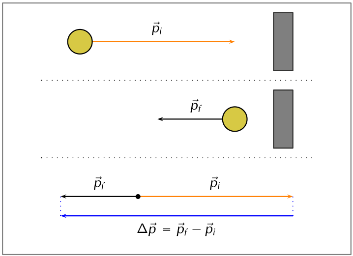
> **[Diagram Context - Textbook_PhysicalSciences_Gr12_Momentum-and-Impulse.pdf-0008-05.png]**
> 1. A diagram of a Lewis structure for oxygen.

> **[Diagram Context - Textbook_PhysicalSciences_Gr12_Momentum-and-Impulse.pdf-0008-08.png]**
> 1. A diagram of a tennis net with a tennis ball on it.

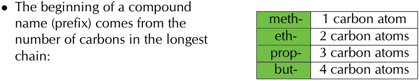
> **[Diagram Context - Textbook_PhysicalSciences_Gr12_Organic-molecules.pdf-0008-01.png]**
> 1. A diagram of a carbon atom.

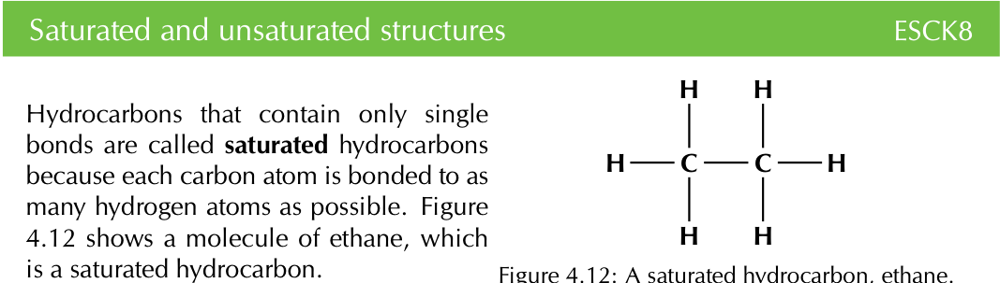
> **[Diagram Context - Textbook_PhysicalSciences_Gr12_Organic-molecules.pdf-0008-04.png]**
> 1. A diagram of a molecule of ethane.

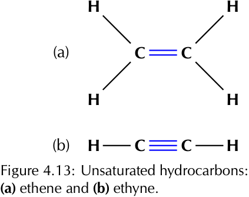
> **[Diagram Context - Textbook_PhysicalSciences_Gr12_Organic-molecules.pdf-0008-12.png]**
> Figure 4.13: Unsaturated hydrocarbons: (ethane and butane)

---

## Worked example 2: Height of a projectile

### QUESTION

A cricketer hits a cricket ball so that it goes vertically upwards. If the ball takes $10\text{ s}$ to return to the initial height, determine its maximum height above the initial position.

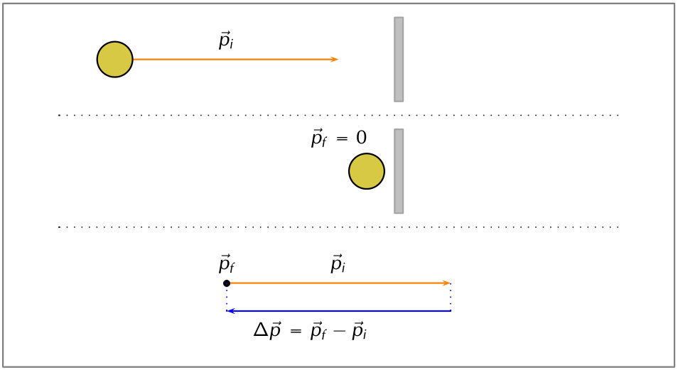
> **[Diagram Context - Textbook_PhysicalSciences_Gr12_Momentum-and-Impulse.pdf-0009-01.png]**
> 1. A diagram of a Lewis structure for oxygen.

### SOLUTION

#### Step 1: Identify what is required and what is given
We need to find how high the ball goes. We know that it takes $10\text{ s}$ to go up and down. We do not know what the initial velocity ($\vec{v}_i$) of the ball is. After the batsman strikes the ball it goes directly upwards and the only force that will be acting on the ball will be the gravitational force. This information is represented in the photograph.

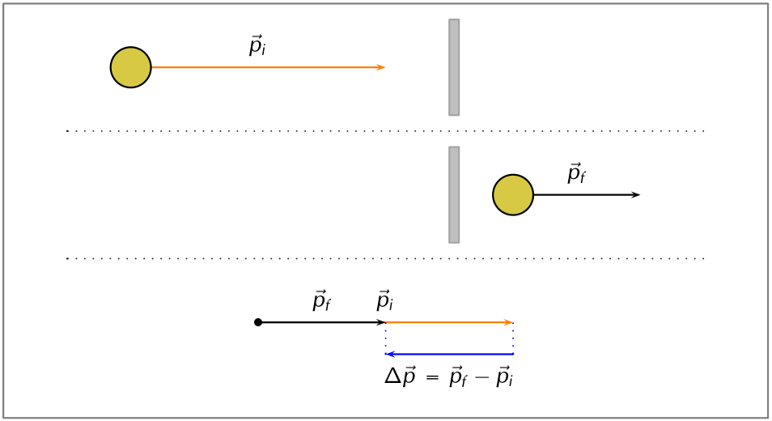
> **[Diagram Context - Textbook_PhysicalSciences_Gr12_Momentum-and-Impulse.pdf-0009-04.png]**
> The image presents a diagram of a Lewis structure for oxygen. The diagram is divided into two sections, with the top section showing a yellow circle and the bottom section showing a blue circle. The diagram also includes arrows pointing to the oxygen atoms. The diagram is labeled with the chemical symbol "O" and the names of the oxygen atoms "O2" and "O3". The diagram is labeled with the names "O2" and "O3" and the chemical symbol "O".

#### Step 2: Determine how to approach the problem
For a problem like this it is useful to divide the motion into two parts. The first part of the motion consists of the upward motion of the ball with an initial velocity ($\vec{v}_i$) and a final velocity ($\vec{v}_f = 0$) at the maximum height. The second part of the motion consists of the downward motion of the ball with an initial velocity ($\vec{v}_i = 0$) and final velocity ($\vec{v}_f$) which is not yet known.

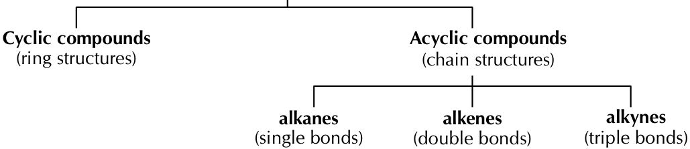
> **[Diagram Context - Textbook_PhysicalSciences_Gr12_Organic-molecules.pdf-0009-13.png]**
> 1. A diagram of a molecule with the chemical formula C6H12O6.

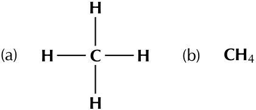
> **[Diagram Context - Textbook_PhysicalSciences_Gr12_Organic-molecules.pdf-0009-18.png]**
> This graphic displays chemical representations labeled (a) and (b). Representation (a) shows a structural formula with a central carbon atom (C) bonded to four surrounding hydrogen atoms (H) using solid lines representing shared electron pairs, while representation (b) shows the condensed molecular formula $\text{CH}_4$. Conceptually, this helps Grade 10 Physical Sciences learners connect the structural arrangement of covalent bonds in a molecule to its simplified molecular formula.

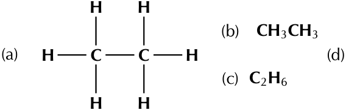
> **[Diagram Context - Textbook_PhysicalSciences_Gr12_Organic-molecules.pdf-0009-21.png]**
> 1. A diagram of a molecule with the chemical formula CH3CH2CH2CH3.

> **[Diagram Context - Textbook_PhysicalSciences_Gr12_Organic-molecules.pdf-0009-22.png]**
> The image shows a Lewis diagram of two carbon atoms connected by four bonds. The diagram is composed of eight spheres, each representing a carbon atom, with the carbon atoms connected by gray lines. The diagram is set against a brown background, and the spheres are arranged in a square formation. The diagram conveys the concept of a molecule of carbon dioxide, which consists of two carbon atoms and four oxygen atoms.

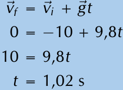
> **[Diagram Context - Textbook_PhysicalSciences_Gr12_Vertical-projectile-motion-in-one-dimension.pdf-0009-01.png]**
> This graphic displays a step-by-step mathematical calculation using a standard Grade 11 Physical Sciences equation of motion under gravity: $\vec{v}_f = \vec{v}_i + \vec{g}t$. Visible elements include vector symbols for final velocity ($\vec{v}_f$), initial velocity ($\vec{v}_i$), gravitational acceleration ($\vec{g}$), time ($t$), and numerical substitution steps resolving to $t = 1,02\text{ s}$. Conceptually, it demonstrates how to apply kinematic equations in vertical projectile motion problems to solve for unknown time variables using standard South African metric notation.

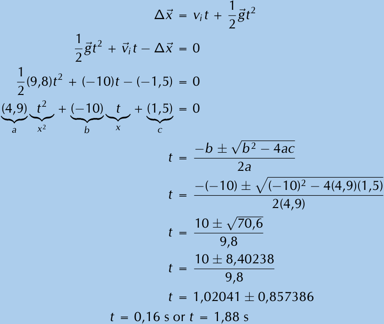
> **[Diagram Context - Textbook_PhysicalSciences_Gr12_Vertical-projectile-motion-in-one-dimension.pdf-0009-06.png]**
> The image shows a blue background with a math problem written on it. The problem involves solving for t and x, and it includes several equations and diagrams. The problem is presented in a clear and organized manner, making it easy for a high school student to understand and follow the steps to solve it.

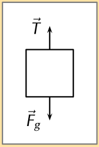

---

Choose down as positive. We know that at the maximum height, the velocity of the ball is $0\text{ m}\cdot\text{s}^{-1}$. We also know that the ball takes the same time to reach its maximum height as it takes to travel from its maximum height to the initial position, due to time symmetry. The time taken is half the total time. Therefore, we have the following information for the second (downward) part of the motion of the ball:

* $t = 5\text{ s}$ (half of the total time)
* $\vec{v}_{\text{top}} = 0\text{ m}\cdot\text{s}^{-1}$
* $\vec{g} = 9{,}8\text{ m}\cdot\text{s}^{-2}$ downwards
* $\Delta\vec{x} = ?$

---

### Step 3: Find an appropriate equation to use
We do not know the final velocity of the ball coming down. We need to choose an equation that does not have $\vec{v}_f$ in it. We can use the following equation to solve for $\Delta\vec{x}$:

$$\Delta\vec{x} = \vec{v}_i t + \frac{1}{2}\vec{g}t^2$$

---

### Step 4: Substitute values and find the height

$$\Delta\vec{x} = (0)(5) + \frac{1}{2}(9{,}8)(5)^2$$

$$\Delta\vec{x} = 122{,}5\text{ m downwards}$$

In the second motion, the displacement of the ball is $122{,}5\text{ m}$ downwards. This means that the height was $h = 122{,}5\text{ m}$.

---

### Step 5: Write the final answer
The ball reaches a maximum height of $122{,}5\text{ m}$.

---

## Worked Example 3: Equal displacements [attribution: Sunil Kumar Singh]

### QUESTION
A sequence of balls are successively dropped from the top of a tower. The time interval between the release of consecutive balls is equal. At the precise instant that the ninth ball (ball 9) is released, the first ball hits the ground. Which of the balls in the sequence is at $\frac{3}{4}$ of the height, $h$, of the tower when the first ball hits the ground?

---

### SOLUTION

#### Step 1: Understand what is happening
A ball is dropped from a tower. After a time, $t_i$, a second ball is dropped. After another time interval, $t_i$, a third ball is dropped. This means that when ball 3 is dropped the total time that has passed is $2t_i$.

After a third time interval, $t_i$, a fourth ball is dropped. This means that at the instant that ball 4 is dropped the total time that has passed is $3t_i$. This process continues until the ninth ball is dropped. At the same instant that the ninth ball is dropped, the first ball that was dropped strikes the ground. The ninth ball would have been released after $8$ time intervals, therefore it took the first ball a time interval of $8t_i$ to hit the ground.

#### Step 2: Describe the events mathematically
As this is a vertical motion problem where everything is falling towards the ground, it is simplest to choose downwards as the positive direction.

The first ball hits the ground when the ninth ball is dropped. This means that the first

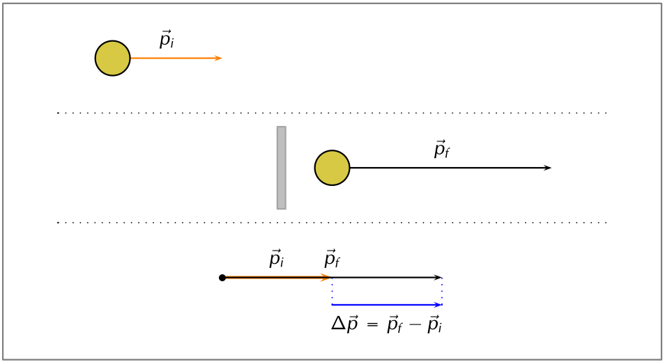

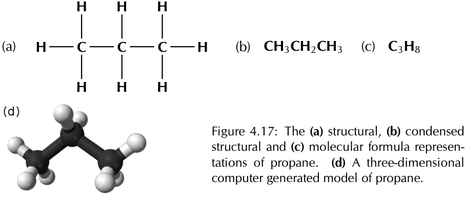

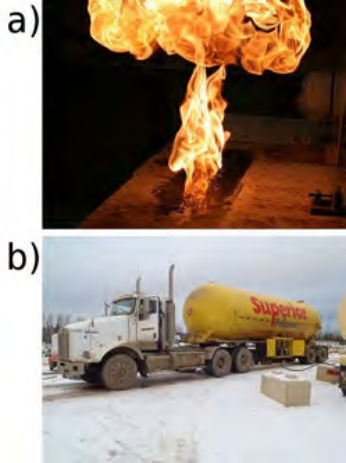

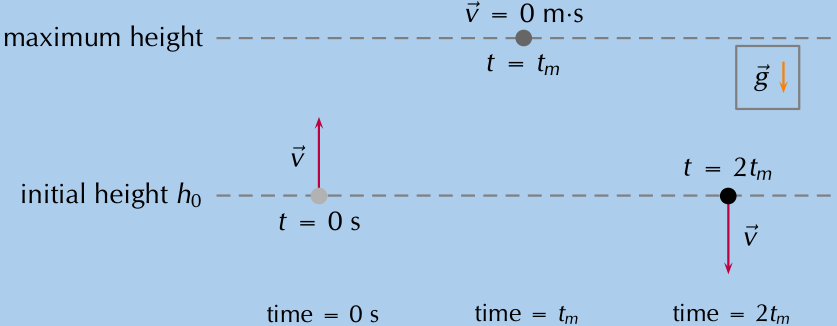

---

ball has fallen for a total time of $(9 - 1)t_i = 8t_i$. The displacement of the first ball is also described by the equation $\Delta\vec{x} = \vec{v}_i t + \frac{1}{2}\vec{g}t^2$. The balls are dropped so their initial velocity is zero, $\vec{v}_i = 0$ and we know the time for the first ball to fall the height of the tower therefore, in the case of the first ball, we have:

$$\Delta\vec{x} = \vec{v}_i t + \frac{1}{2}\vec{g}t^2$$
$$h = \frac{1}{2}(9,8)(8t_i)^2$$

Let the $n\text{th}$ ball be the ball that is at $\frac{3}{4}$ of the height, $h$, of the tower when the first ball strikes the ground. The $n\text{th}$ ball will have fall for a time of $(n - 1)t_i$. If it is $\frac{3}{4}$ of the way up the tower it will have fall a distance of $\frac{1}{4}h$. This motion is also described by $\Delta\vec{x} = \vec{v}_i t + \frac{1}{2}\vec{g}t^2$, and therefore we know, in the case of the $n\text{th}$ ball, we have:

$$\Delta\vec{x} = \vec{v}_i t + \frac{1}{2}\vec{g}t^2$$
$$\frac{1}{4}h = \frac{1}{2}(9,8)((n - 1)t_i)^2$$
$$h = 2(9,8)((n - 1)t_i)^2$$

We can't solve for $n$ from this final equation because it will contain $h$ and $t_i$. We can use the two equations we have to eliminate $h$. Both equations are written in the form $h = \dots$ therefore we can equate them eliminating $h$:

$$\frac{1}{2}(9,8)(8t_i)^2 = 2(9,8)((n - 1)t_i)^2$$
$$\frac{1}{2}(9,8)8^2 t_i^2 = 2(9,8)(n - 1)^2 t_i^2$$
$$\left(\frac{2}{(9,8)t_i^2}\right) \times \frac{1}{2}(9,8)8^2 t_i^2 = \left(\frac{2}{(9,8)t_i^2}\right) \times 2(9,8)(n - 1)^2 t_i^2$$
$$8^2 = 4(n - 1)^2$$
$$8 = 2(n - 1)$$
$$4 = (n - 1)$$
$$n = 5$$

---

### IMPORTANT!

We know that $n$ must be a positive integer which is why we use the positive roots when we take the square root above.

---

### Step 3: Write the final answer

The fifth ball is at $\frac{3}{4}$ of the height of the tower when the first ball strikes the ground.

---

## Exercise 3 - 1: Equations of motion

1. A cricketer hits a cricket ball straight up into the air. The cricket ball has an initial velocity of $20\text{ m}\cdot\text{s}^{-1}$ vertically upwards.

> **[Diagram Context - Textbook_PhysicalSciences_Gr12_Momentum-and-Impulse.pdf-0011-01.png]**
> This photograph depicts a real-world scenario

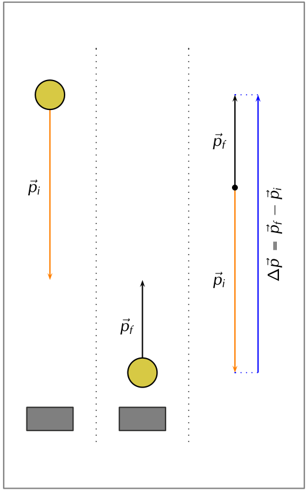
> **[Diagram Context - Textbook_PhysicalSciences_Gr12_Momentum-and-Impulse.pdf-0011-03.png]**
> The image is a diagram that illustrates the concept of forces and motion. It features two yellow circles, each with a black dot in the center, connected by an orange line. The diagram also includes arrows pointing in different directions, representing the forces acting on the objects. The diagram is labeled with the names "PI" and "P1" and is accompanied by a legend that explains the meaning of the arrows. The diagram is set against a white background, making the colors of the circles and arrows stand out.

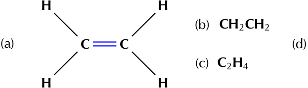
> **[Diagram Context - Textbook_PhysicalSciences_Gr12_Organic-molecules.pdf-0011-03.png]**
> 1. A diagram of a molecule with two carbon atoms and two hydrogen atoms.

> **[Diagram Context - Textbook_PhysicalSciences_Gr12_Organic-molecules.pdf-0011-04.png]**
> 1. A Lewis diagram of four atoms, two of which are black and two of which are white.

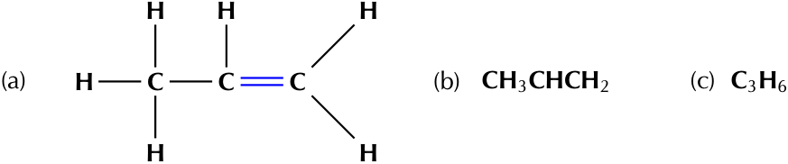
> **[Diagram Context - Textbook_PhysicalSciences_Gr12_Organic-molecules.pdf-0011-08.png]**
> 1. A diagram of a molecule with the chemical formula CH3CH2CH2CH3.

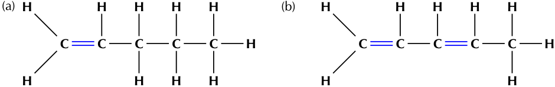
> **[Diagram Context - Textbook_PhysicalSciences_Gr12_Organic-molecules.pdf-0011-11.png]**
> 1. A diagram of a molecule with two bonds between carbon and hydrogen atoms.

> **[Diagram Context - Textbook_PhysicalSciences_Gr12_Organic-molecules.pdf-0011-16.png]**
> 1. A diagram of a flower with a yellow center and red petals.

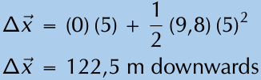
> **[Diagram Context - Textbook_PhysicalSciences_Gr12_Vertical-projectile-motion-in-one-dimension.pdf-0011-04.png]**
> This educational graphic displays a physics calculation showing the substitution of values into a kinematic equation of motion, $\Delta\vec{x} = v_i\Delta t + \frac{1}{2}a\Delta t^2$. The visible terms and symbols include displacement ($\Delta\vec{x}$), initial velocity ($0$), acceleration due to gravity ($9,8$), time interval ($5$), and the final calculated vector result ($122,5\text{ m}$ downwards). Conceptually, it demonstrates the step-by-step application of equations of motion in one dimension for Grade 10-12 Physical Sciences, emphasizing the correct inclusion of sign convention and vector direction in free-fall problems.

---

## Exercises: Vertical Projectile Motion

a) What height does the ball reach before it stops to fall back to the ground.
b) How long has the ball been in the air for?

2. Zingi throws a tennis ball straight up into the air. It reaches a height of $80\text{ cm}$.
   a) Determine the initial velocity of the tennis ball.
   b) How long does the ball take to reach its maximum height?

3. A tourist takes a trip in a hot air balloon. The hot air balloon is ascending (moving up) at a velocity of $4\text{ m}\cdot\text{s}^{-1}$ vertically upwards. He accidentally drops his camera over the side of the balloon's basket, at a height of $20\text{ m}$. Calculate the velocity with which the camera hits the ground.

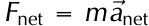

4. A ball is dropped vertically from a tower. If the vertical distance covered in the last second is equal to the distance covered in first three seconds, find the height of the tower.

5. More questions. Sign in at Everything Science online and click 'Practise Science'.

Check answers online with the exercise code below or click on 'show me the answer'.
1. 27K3 $\quad$ 2. 27K4 $\quad$ 3. 27K5 $\quad$ 4. 27K6

www.everythingscience.co.za | m.everythingsscience.co.za

---

## Graphs of Vertical Projectile Motion (ESCJZ)

We can describe vertical projectile motion through a series of graphs: position, velocity and acceleration versus time graphs. This isn't new; in Grade 10 you learnt about the graphs for describing rectilinear motion with constant acceleration. In the previous section we motivated for using the same equations of motion as in rectilinear motion. Therefore, everything you learnt about the graphs describing rectilinear motion is applicable when describing vertical projectile motion.

### IMPORTANT!

Now would be a good time to revise the section on graphs in rectilinear motion from Grade 10.

Remember that: $\vec{a} = \frac{\Delta\vec{v}}{\Delta t}$ and $\vec{v} = \frac{\Delta\vec{x}}{\Delta t}$. For the graphs of these quantities the slope and the area under a graph can tell us about changes in other quantities. As a reminder, here is a summary table, from Grade 10 rectilinear motion, about which information we can derive from the slope and the area of various graphs:

> **[Diagram Context - Textbook_PhysicalSciences_Gr12_Organic-molecules.pdf-0012-02.png]**
> 1. A diagram of a cell with a chemical symbol on it.

> **[Diagram Context - Textbook_PhysicalSciences_Gr12_Organic-molecules.pdf-0012-05.png]**
> The image shows a clear glass bottle with a skull and crossbones symbol on the front, along with a warning label that reads "Bromine Water" and "Corrosive". The bottle is placed on a table, and the label is positioned on the front of the bottle. The skull and crossbones symbol is a common warning symbol for corrosive substances, indicating that the contents of the bottle should be handled with care due to its corrosive nature.

> **[Diagram Context - Textbook_PhysicalSciences_Gr12_Organic-molecules.pdf-0012-06.png]**
> 1. A diagram of a cell with a Lewis structure.

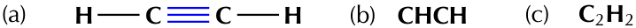

> **[Diagram Context - Textbook_PhysicalSciences_Gr12_Organic-molecules.pdf-0012-11.png]**
> This educational graphic is a molecular model representing an ethyne (acetylene) molecule with the label (d). The model features two central black spheres representing carbon atoms connected by a triple bond (one straight central rod and two curved bridge rods forming a cylinder) and two outer white spheres representing hydrogen atoms bonded to each carbon. Conceptually, this diagram illustrates the linear geometry and multiple bonding (one sigma and two pi bonds) between carbon atoms in an alkyne, helping learners visualise three-dimensional molecular structure and bond multiplicity in organic chemistry.

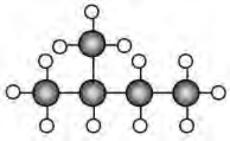
> **[Diagram Context - Textbook_PhysicalSciences_Gr12_Organic-molecules.pdf-0012-13.png]**
> 1. A black and white diagram of a molecule with eight spheres and eight lines.

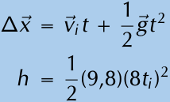
> **[Diagram Context - Textbook_PhysicalSciences_Gr12_Vertical-projectile-motion-in-one-dimension.pdf-0012-01.png]**
> The image shows a math problem with two equations on a blue background. The first equation is "h = 9.8t" and the second equation is "h = 2t". The variables "h" and "t" are represented by the letters "9.8" and "2", respectively. The equations are set against a blue background, and the text "1" is written in black at the top of the image.

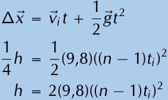
> **[Diagram Context - Textbook_PhysicalSciences_Gr12_Vertical-projectile-motion-in-one-dimension.pdf-0012-03.png]**
> The image shows a diagram of a Lewis structure for carbon dioxide. The diagram is divided into two sections, with the top section containing the Lewis structure of carbon and the bottom section showing the Lewis structure of oxygen. The diagram is set against a blue background, and the text "1" is written in black at the top of the image.

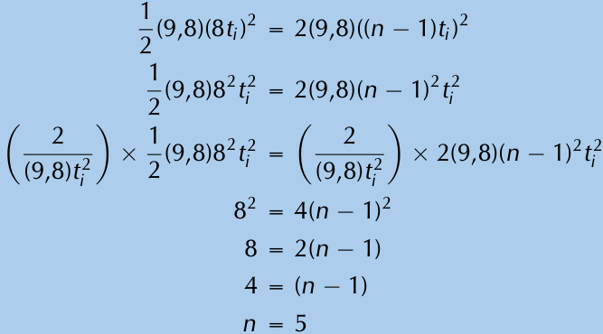
> **[Diagram Context - Textbook_PhysicalSciences_Gr12_Vertical-projectile-motion-in-one-dimension.pdf-0012-05.png]**
> The image shows a blue background with a math problem written on it. The problem is a complex equation involving multiple variables and exponents. The equation is in a scientific style, with numbers and symbols representing different mathematical concepts. The problem is presented in a clear and organized manner, making it easy to understand and follow. The text is written in a simple, easy-to-read font, and the numbers and symbols are clearly labeled, providing a visual representation of the mathematical concepts involved.

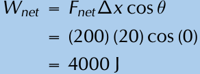
> **[Diagram Context - Textbook_PhysicalSciences_Gr12_Work-energy-and-power.pdf-0012-04.png]**
> This graphic displays a physics calculation showing the formula for net work ($W_{net} = F_{net}\Delta x \cos\theta$) applied with numerical substitution ($200 \times 20 \times \cos(0^\circ)$) to yield a final calculated value of $4000\text{ J}$. The visible labels and symbols include $W_{net}$, $F_{net}$, $\Delta x$, $\theta$, and the unit joules ($\text{J}$). Conceptually, this demonstrates for Grade 11 Physical Sciences learners how to calculate the net work done on an object by substituting magnitude, displacement, and the angle between the force and displacement vectors into the standard work equation.

---

## Motion Graphs: Slope and Area Summary

| Graph | Slope | Area |
| :--- | :---: | :---: |
| Displacement vs time ($x$ vs $t$) | $\vec{v}$ | - |
| Velocity vs time ($v$ vs $t$) | $\vec{a}$ | $\Delta\vec{x}$ |
| Acceleration vs time ($a$ vs $t$) | - | $\vec{v}$ |

---

## Graphical Representations of Motion

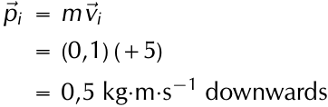
> **[Diagram Context - Textbook_PhysicalSciences_Gr12_Momentum-and-Impulse.pdf-0013-01.png]**
> This image shows a step

*Figure 3.5: Position vs time, velocity vs time and acceleration vs time graphs.*

---

## Key Concepts and Explanations

The graphs shown above are graphical representations of the equations of motion. This means that if you have the graph for one type of motion (position, velocity, or acceleration), you should be able to write down the corresponding equation and vice versa.

The type of graph is directly related to the equation of motion:
* **Position ($x$ vs $t$):** Can be represented as a straight line (uniform motion) or a parabola (constant acceleration).
* **Velocity ($v$ vs $t$):** Can be represented as a horizontal line (uniform motion) or a straight sloped line (constant acceleration).
* **Acceleration ($a$ vs $t$):** Is represented as a constant value (horizontal line).

The characteristic features of these graphs depend on the chosen sign convention and the specific values of the problem.

---

## Cases of Vertical Motion

To illustrate the variation in motion, we consider three separate cases:
1. The object has an initial velocity in the upward direction (opposite direction to $\vec{g}$).
2. The object falls from rest (no initial velocity).
3. The object has an initial velocity in the downward direction (same direction as $\vec{g}$).

> **Important:** The horizontal axis in all of these motion graphs represents time ($t$), not space.

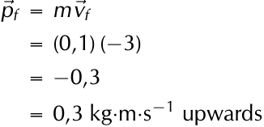
> **[Diagram Context - Textbook_PhysicalSciences_Gr12_Momentum-and-Impulse.pdf-0013-03.png]**
> The image shows a table with a formula for calculating the velocity of an object. The table is divided into three columns, with the first column containing the variables and the second and third columns representing the values of the variables. The formula is written in a way that is easy to understand and follow, with the variables clearly labeled and the values provided. The image is a visual representation of the concept of velocity, which is a fundamental concept in physics and is used to describe the rate of change of an object's position with respect to time.

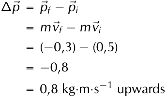
> **[Diagram Context - Textbook_PhysicalSciences_Gr12_Momentum-and-Impulse.pdf-0013-06.png]**
> 1. A diagram of a cell with arrows pointing to different parts of the cell.

> **[Diagram Context - Textbook_PhysicalSciences_Gr12_Vertical-projectile-motion-in-one-dimension.pdf-0013-06.png]**
> The image shows a hot air balloon floating in the sky. The balloon is painted in a vibrant yellow color and has a red and blue striped pattern on its sides. The balloon is positioned in the top left corner of the image, and it appears to be floating above a field. The field is surrounded by trees, and the sky is filled with clouds. The image does not contain any text or other objects, and the balloon is the main focus of the image.

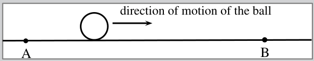
> **[Diagram Context - Textbook_PhysicalSciences_Gr12_Work-energy-and-power.pdf-0013-02.png]**
> 1. A diagram of a ball and arrows pointing in opposite directions.

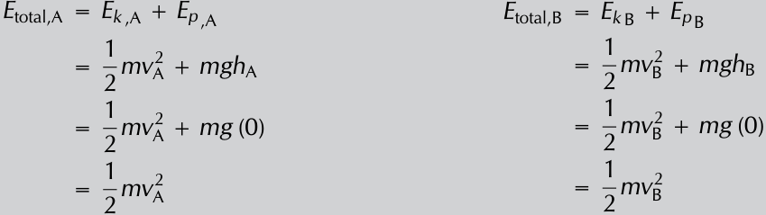
> **[Diagram Context - Textbook_PhysicalSciences_Gr12_Work-energy-and-power.pdf-0013-05.png]**
> 1. A table with two columns and four rows. The first column is labeled "E" and "Ebola". The second column is labeled "Ebola" and "Ebola virus". The first row is labeled "1", "2", "3", and "4". The second row is labeled "1", "2", "3", and "4". The table contains two equations, one for each column.

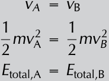
> **[Diagram Context - Textbook_PhysicalSciences_Gr12_Work-energy-and-power.pdf-0013-07.png]**
> This educational graphic displays mathematical physics equations showing the relationships between velocities ($v_A = v_B$), kinetic energies ($\frac{1}{2}mv_A^2 = \frac{1}{2}mv_B^2$), and total mechanical energies ($E_{\text{total},A} = E_{\text{total},B}$) at two points, A and B. Visible labels include variables for velocity ($v$), mass ($m$), and total energy ($E_{\text{total}}$). Conceptually, this conveys the principle of conservation of mechanical energy in an isolated system where no non-conservative forces do work, illustrating that kinetic and potential energy transformations maintain a constant total mechanical energy between two positions.

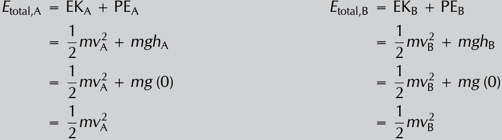
> **[Diagram Context - Textbook_PhysicalSciences_Gr12_Work-energy-and-power.pdf-0013-12.png]**
> 1. A table with two columns and four rows. The table has a gray background. The first column has the letters EK and PE. The second column has the letters EK+PE. The third column has the letters EK+PE. The fourth column has the letters EK+PE. The first row has the numbers 1 and 2. The second row has the numbers 1 and 2. The third row has the numbers 1 and 2. The fourth row has the numbers 1 and 2.

---

## Case 1: Initial velocity upwards

Consider an object undergoing the following motion:

1. At time $t = 0\text{ s}$ the object has an initial position, $\vec{x}_i = 0$, and an initial upward velocity of magnitude $v_i$.
2. The object reaches a maximum height, $h_m$, above the ground.
3. The object then falls down to a final position, $\vec{x}_f$, with a final velocity $v_f$ downward at time $t = t_f$.

We choose upwards as positive. The position versus time graph for the motion described is shown below:

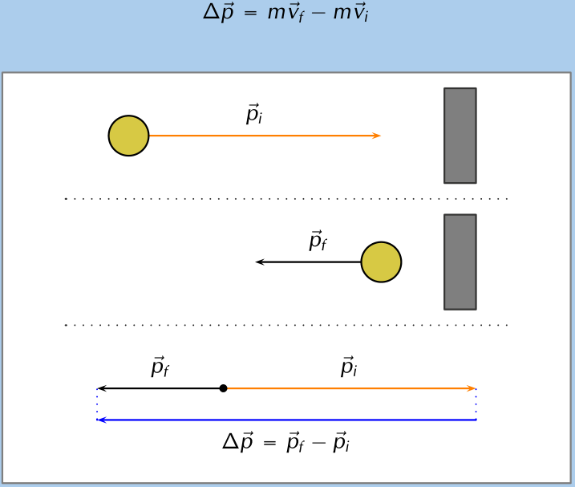
> **[Diagram Context - Textbook_PhysicalSciences_Gr12_Momentum-and-Impulse.pdf-0014-02.png]**
> The image presents a diagram that illustrates the concept of forces and motion. The diagram is divided into two sections, each representing a different type of force. The left section shows a yellow ball being pulled by an orange line, while the right section depicts a black box being pushed by an orange line. The diagram also includes arrows to represent the forces acting on the objects. The diagram is labeled with text that explains the concept of forces and motion, and it includes the variables "P" and "m" to represent the forces and the mass of the objects, respectively.

The equation for position is given by:
$$\vec{x} = \vec{x}_i + \vec{v}_i t + \frac{1}{2}\vec{g}t^2$$

We have to choose a positive direction as before.

---

### IMPORTANT!

It is important to notice that we are plotting position versus time and the initial position, $\vec{x}_i$, is not necessarily zero. The position as a function of time will be given by:
$$\vec{x} = \vec{x}_i + \vec{v}_i t + \frac{1}{2}\vec{g}t^2$$

The initial position, $\vec{x}_i$, will shift the graph of $\vec{x}$ up or down by a constant value. Whether it is an upward or downward shift will depend on which direction was chosen as the positive direction. The magnitude of the shift will depend on the choice of origin for the coordinate system (frame of reference).

---

The second graph is a linear function showing the velocity as a function of time:
$$\vec{v}_f = \vec{v}_i + \vec{g}t$$

Note that we chose upwards as our positive direction therefore the acceleration due to gravity will be negative. The slope (i.e. the coefficient of $t$) of the velocity versus time graph is the acceleration and the slope is negative which is consistent with our expectations after choosing upwards as the positive direction.

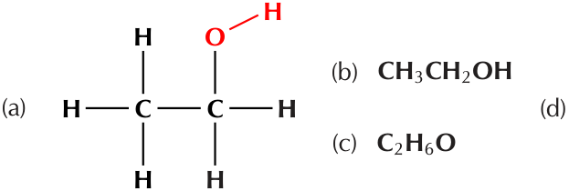
> **[Diagram Context - Textbook_PhysicalSciences_Gr12_Organic-molecules.pdf-0014-10.png]**
> 1. A diagram of a molecule with a red arrow pointing to the H atom.

> **[Diagram Context - Textbook_PhysicalSciences_Gr12_Organic-molecules.pdf-0014-11.png]**
> 1. A diagram of a molecule with two black spheres and a red sphere.

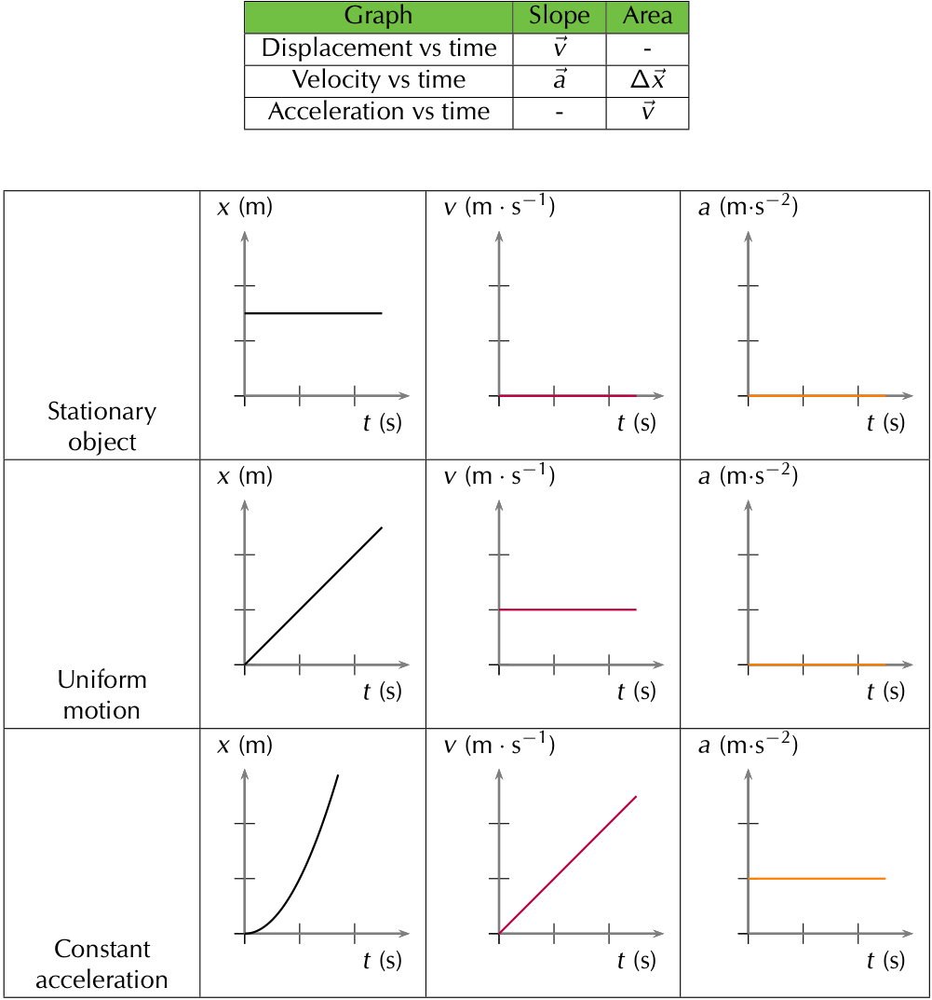
> **[Diagram Context - Textbook_PhysicalSciences_Gr12_Vertical-projectile-motion-in-one-dimension.pdf-0014-00.png]**
> 1. A diagram of a graph with labeled axes and points.
2. A diagram of a graph with labeled axes and points.
3. A diagram of a graph with labeled axes and points.

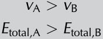

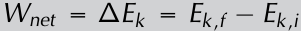

---

# 3.2. Vertical Projectile Motion

The final plot is a graph of acceleration versus time, and is constant because the magnitude and direction of the acceleration due to gravity are constant.

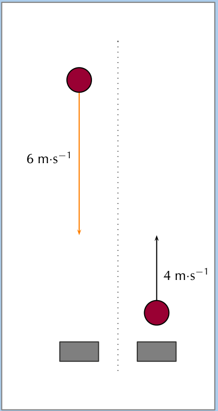
> **[Diagram Context - Textbook_PhysicalSciences_Gr12_Momentum-and-Impulse.pdf-0015-09.png]**
> The image shows a diagram of a red ball and a black ball on a white surface. The diagram is labeled with the names of the balls and arrows pointing to the balls. The diagram also includes a label for the x-axis and a label for the y-axis. The diagram is labeled with the variable "m" and the variable "s".

## Cases 2 & 3: Initial velocity zero or downwards

We start by choosing a direction as the positive direction. We want to compare the graphs with the first case, so we will choose the same direction (upwards) to be the positive direction.

The one thing that remains the same is the acceleration, $\vec{g}$, due to gravity. Therefore:

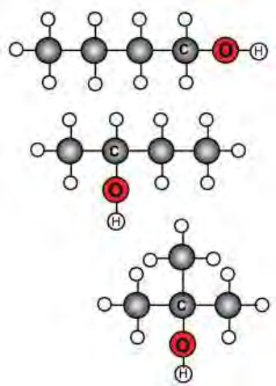
> **[Diagram Context - Textbook_PhysicalSciences_Gr12_Organic-molecules.pdf-0015-01.png]**
> 1. A diagram of a molecule with carbon, hydrogen, and oxygen atoms.

If an object starts from rest (for example if dropped), then the initial velocity is zero. We know that there is constant acceleration and hence the graph of velocity versus time looks like this:

> **[Diagram Context - Textbook_PhysicalSciences_Gr12_Organic-molecules.pdf-0015-13.png]**
> This educational graphic is a standard laboratory safety hazard symbol featuring a black skull and crossbones icon set against a solid orange square background. There are no text labels or variables visible in the graphic. For CAPS Physical Sciences and Life Sciences learners, this symbol conveys that a chemical substance or laboratory apparatus is highly toxic or poisonous, alerting students to exercise strict safety precautions such as wearing protective gear and avoiding ingestion or inhalation.

If the object starts with an initial velocity downwards the velocity graph looks like:

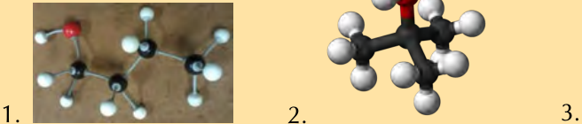
> **[Diagram Context - Textbook_PhysicalSciences_Gr12_Organic-molecules.pdf-0015-26.png]**
> 1. A diagram of a molecule with a red ring in the middle.

> **[Diagram Context - Textbook_PhysicalSciences_Gr12_Organic-molecules.pdf-0015-27.png]**
> 1. A 3D rendering of a molecule with a red sphere and a silver rod.

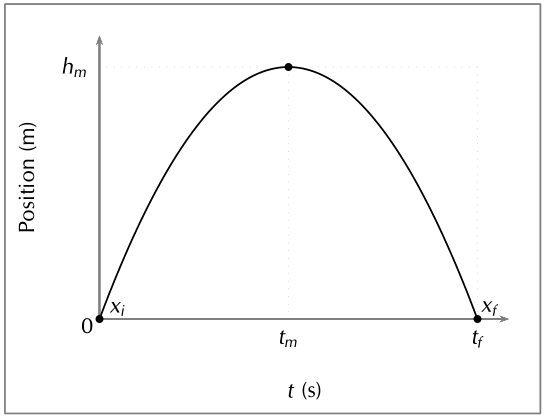
> **[Diagram Context - Textbook_PhysicalSciences_Gr12_Vertical-projectile-motion-in-one-dimension.pdf-0015-07.png]**
> The image is a black and white diagram that shows a graph of a curve. The curve is labeled with the letter "h" and the x-axis is labeled with the letter "t". The graph is labeled with the letter "m" and the y-axis is labeled with the letter "t". The curve is labeled with the letter "h" and the x-axis is labeled with the letter "t". The graph is labeled with the letter "m" and the y-axis is labeled with the letter "t". The curve is labeled with the letter "h" and

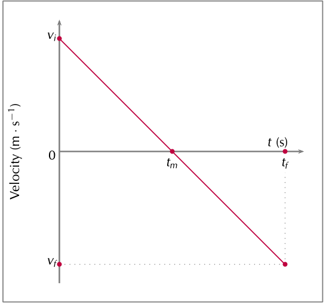
> **[Diagram Context - Textbook_PhysicalSciences_Gr12_Vertical-projectile-motion-in-one-dimension.pdf-0015-11.png]**
> The image presents a diagram of a velocity graph, which is a visual representation of the relationship between velocity and time. The graph is drawn on a white background, with a red line that slopes downwards, indicating a decrease in velocity over time. The x-axis of the graph is labeled "Time" and the y-axis is labeled "Velocity". The graph is labeled with the title "Velocity" and the units "m/s". The diagram is labeled with the variable "t" and the variable "m".

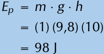
> **[Diagram Context - Textbook_PhysicalSciences_Gr12_Work-energy-and-power.pdf-0015-03.png]**
> This educational graphic shows a mathematical formula and calculation for gravitational potential energy. The visible labels and variables include $E_p$ representing potential energy, $m$ for mass, $g$ for gravitational acceleration, and $h$ for height, accompanied by numerical substitution values and the final unit J for joules. For a CAPS physical sciences learner, it demonstrates the direct proportionality between gravitational potential energy and an object's mass, gravitational acceleration, and height above a reference point.

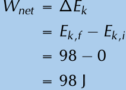
> **[Diagram Context - Textbook_PhysicalSciences_Gr12_Work-energy-and-power.pdf-0015-07.png]**
> This graphic presents a mathematical calculation sequence demonstrating the Work-Energy Theorem in Grade 11 Physical Sciences. The visible text and variables include $W_{\text{net}}$, $\Delta E_k$, $E_{k,f}$, $E_{k,i}$, and numerical values with the unit Joules (J). Conceptually, it conveys how the net work done on an object equals its change in kinetic energy, showing the substitution of final and initial kinetic energy values to determine the final work done.

---

## IMPORTANT!

It is important to notice that the slope of all the velocity versus time graphs has the same magnitude. If the same direction is chosen as positive then the slope has the same magnitude AND the same sign (direction). The difference in these graphs is related to the initial velocity, $\vec{v}_i$. The magnitude of the slope of the graph is the magnitude of the acceleration.

---

### Object Falls From Rest

For the case where the object falls from rest, the equation for position is:

$$\vec{x} = \vec{x}_i + \vec{v}_i t + \frac{1}{2}\vec{g}t^2$$

*(where $\vec{v}_i = 0$)*

The graph of the position versus time looks as shown below:

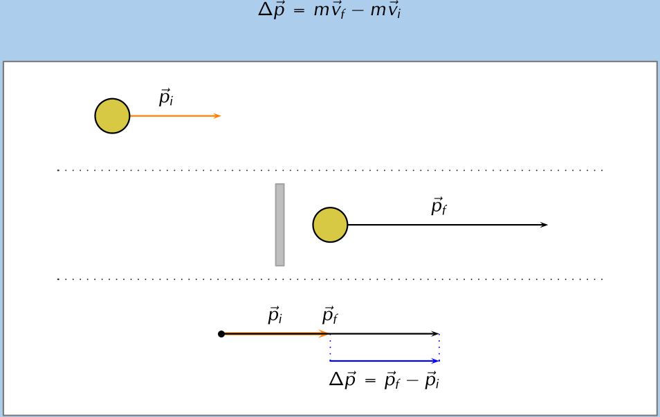
> **[Diagram Context - Textbook_PhysicalSciences_Gr12_Momentum-and-Impulse.pdf-0016-05.png]**
> 1. A diagram of a cell with arrows pointing to different parts of the cell.

**In this graph the initial velocity is zero:**
* The graph starts with a horizontal tangent at $t = 0$ ($\vec{v}_i = 0$).
* As time increases, the curve curves downwards, showing an increase in downward displacement.

---

### Motion with Initial Velocity in the Negative Direction

For motion with an initial velocity in the negative direction, the graph of displacement versus time will be a narrower parabola as compared to the case where the object falls from rest.

> **[Diagram Context - Textbook_PhysicalSciences_Gr12_Organic-molecules.pdf-0016-02.png]**
> 1. A can of soup with a black and white label that says "no cfca" on it.

**In this graph the initial velocity is in the negative direction:**
* The graph starts with a steeper downward slope at $t = 0$.

---

### Key Differences in Features

* **Case 1 (e.g., thrown upwards and returning):** The position graph has a maximum positive displacement (it has a peak).
* **Cases 2 and 3 (where initial velocity is zero or negative):** The displacement is always negative.

### Final Position vs. Initial Position

You may be wondering if the final position is always the same as the initial position, as we had for our Case 1 example. That is not necessarily true. If an object is thrown up from the edge of a cliff, the initial position of the object will be the height of the cliff but the final position will be at the base of the cliff.

> **[Diagram Context - Textbook_PhysicalSciences_Gr12_Organic-molecules.pdf-0016-06.png]**
> 1. A black and white label with a diagram of a cell and arrows pointing to different parts of the cell.

> **[Diagram Context - Textbook_PhysicalSciences_Gr12_Organic-molecules.pdf-0016-11.png]**
> 1. A 3D rendering of a molecule with a green ball at the top.

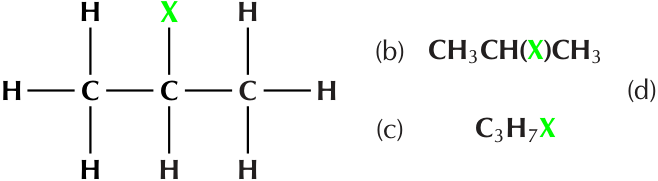
> **[Diagram Context - Textbook_PhysicalSciences_Gr12_Organic-molecules.pdf-0016-12.png]**
> 1. A diagram of a molecule with two carbon atoms and two hydrogen atoms.

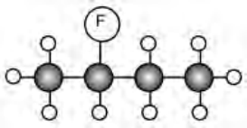
> **[Diagram Context - Textbook_PhysicalSciences_Gr12_Organic-molecules.pdf-0016-14.png]**
> 1. A black and white diagram of a molecule with a circle labeled F in the center.

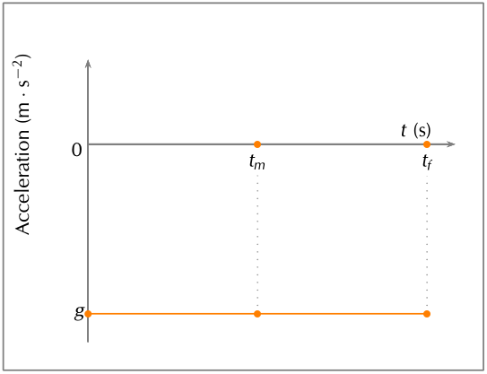
> **[Diagram Context - Textbook_PhysicalSciences_Gr12_Vertical-projectile-motion-in-one-dimension.pdf-0016-00.png]**
> The image presents a diagram of a Lewis structure for water, which is a visual representation of the bonding of oxygen to hydrogen in a molecule. The diagram is drawn on a white background, with the Lewis structure outlined in orange and the chemical formula of water, H2O, written in black. The diagram also includes arrows pointing to the oxygen atom and the hydrogen atoms, indicating the bonds between them. The diagram is labeled with the variable "g" and the chemical formula "H2O".

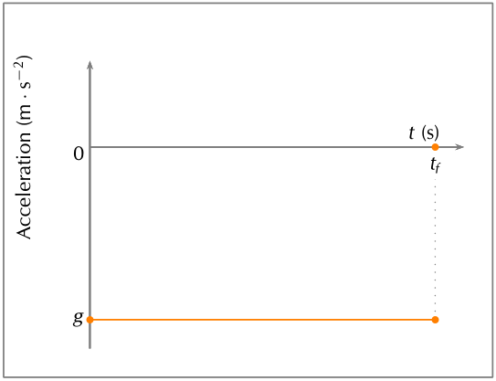
> **[Diagram Context - Textbook_PhysicalSciences_Gr12_Vertical-projectile-motion-in-one-dimension.pdf-0016-05.png]**
> A diagram of a graph with a line and a point labeled "Acceleration" and "Time".

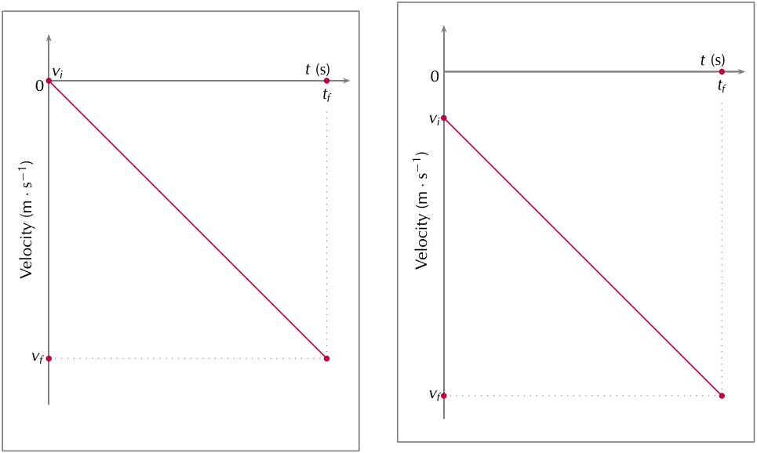
> **[Diagram Context - Textbook_PhysicalSciences_Gr12_Vertical-projectile-motion-in-one-dimension.pdf-0016-08.png]**
> 1. A diagram of a velocity graph with two lines, one labeled "velocity" and the other "time".

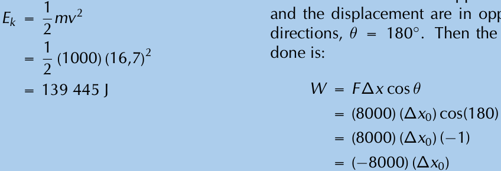
> **[Diagram Context - Textbook_PhysicalSciences_Gr12_Work-energy-and-power.pdf-0016-09.png]**
> 1. A diagram of a cell with arrows pointing to different parts of the cell.

---

If we choose the point from which the object is thrown as the origin of our coordinate system then the graph will look like this:

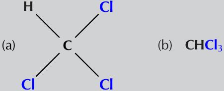
> **[Diagram Context - Textbook_PhysicalSciences_Gr12_Organic-molecules.pdf-0017-03.png]**
> 1. A chemical structure of CH3CH2Cl3.

If we choose to centre our coordinate system at the base of the cliff then the graph will look like this, because the initial displacement is the height of the cliff:

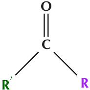

Now let's look at some examples involving graphs of projectile motion.

---

### Worked Example 4: Drawing graphs of projectile motion

#### QUESTION
Stanley is standing on a balcony $20\text{ m}$ above the ground. Stanley tosses a rubber ball upwards with an initial velocity of $4,9\text{ m}\cdot\text{s}^{-1}$. The ball travels upwards to a maximum height, and then falls to the ground. Draw graphs of position vs time, velocity vs time and acceleration vs time. Choose upwards as the positive direction.

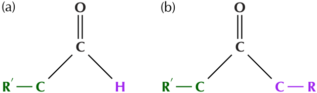
> **[Diagram Context - Textbook_PhysicalSciences_Gr12_Organic-molecules.pdf-0017-23.png]**
> 1. A diagram of two chemical compounds, one of which is aldehyde.

#### SOLUTION

**Step 1: Determine what is required**  
We are required to draw graphs of:
1. $\vec{x} \text{ vs } t$
2. $\vec{v} \text{ vs } t$
3. $\vec{a} \text{ vs } t$

**Step 2: Determine how to approach the problem**  
There are two parts to the motion of the ball:
1. ball travelling upwards from the building
2. ball falling to the ground

We examine each of these parts separately. To be able to draw the graphs, we need to determine the time taken and displacement for each of the motions.

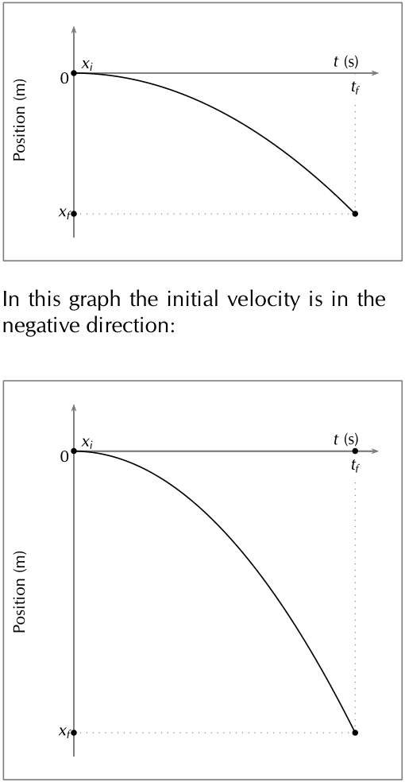
> **[Diagram Context - Textbook_PhysicalSciences_Gr12_Vertical-projectile-motion-in-one-dimension.pdf-0017-08.png]**
> 1. A graph showing the initial velocity of an object in motion.

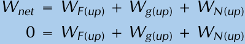
> **[Diagram Context - Textbook_PhysicalSciences_Gr12_Work-energy-and-power.pdf-0017-13.png]**
> This graphic displays a mathematical physics equation showing the work-energy theorem relationship for net work. Visible variables and labels include $W_{net}$, $W_{F(up)}$, $W_{g(up)}$, and $W_{N(up)}$, set equal to zero. Conceptually, this conveys to Grade 11 Physical Sciences learners how the Work-Energy Theorem applies when multiple forces (applied, gravitational, and normal) act on an object moving upward at constant velocity, resulting in zero net work done.

---

### Step 3: Find the height and the time taken for the first motion

For the first part of the motion, we have:
* $\vec{v}_i = +4,9\text{ m}\cdot\text{s}^{-1}$
* $\vec{v}_f = 0\text{ m}\cdot\text{s}^{-1}$
* $\vec{g} = -9,8\text{ m}\cdot\text{s}^{-2}$

Therefore, we can use $\vec{v}_f^2 = \vec{v}_i^2 + 2\vec{g}\Delta\vec{x}$ to solve for the height, and $\vec{v}_f = \vec{v}_i + \vec{g}t$ to solve for the time.

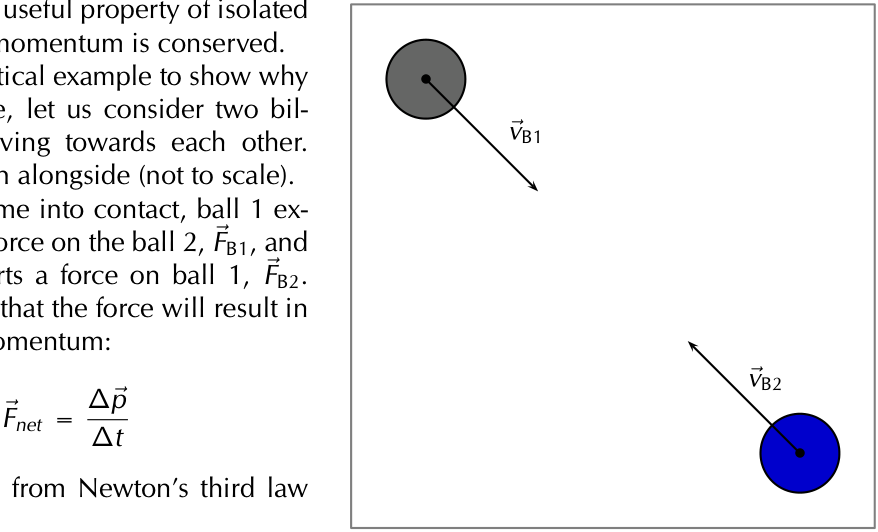
> **[Diagram Context - Textbook_PhysicalSciences_Gr12_Momentum-and-Impulse.pdf-0018-07.png]**
> 1. A diagram of a ball and two arrows pointing at the ball.

$$\vec{v}_f^2 = \vec{v}_i^2 + 2\vec{g}\Delta\vec{x}$$
$$(0)^2 = (4,9)^2 + 2 \times (-9,8) \times \Delta\vec{x}$$
$$19,6\Delta\vec{x} = (4,9)^2$$
$$\Delta\vec{x} = +1,225\text{ m}$$
$$h = \Delta\vec{x} = 1,225\text{ m}$$

$$\vec{v}_f = \vec{v}_i + \vec{g}t$$
$$0 = 4,9 + (-9,8) \times t$$
$$9,8t = 4,9$$
$$t = 0,5\text{ s}$$

---

### Step 4: Find the height and the time taken for the second motion

For the second part of the motion, we have:
* $\vec{v}_i = 0\text{ m}\cdot\text{s}^{-1}$
* $\Delta\vec{x} = -(20 + 1,225)\text{ m}$
* $\vec{g} = -9,8\text{ m}\cdot\text{s}^{-2}$

Therefore, we can use $\Delta\vec{x} = \vec{v}_i t + \frac{1}{2}\vec{g}t^2$ to solve for the time.

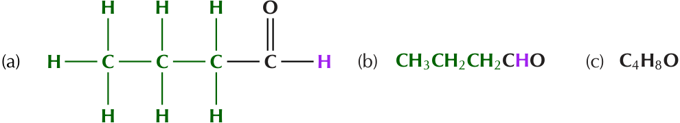
> **[Diagram Context - Textbook_PhysicalSciences_Gr12_Organic-molecules.pdf-0018-05.png]**
> 1. A diagram of a molecule with a green arrow pointing to the right.

$$\Delta\vec{x} = \vec{v}_i t + \frac{1}{2}\vec{g}t^2$$
$$-(20 + 1,225) = (0) \times t + \frac{1}{2} \times (-9,8) \times t^2$$
$$-21,225 = 0 - 4,9t^2$$
$$t^2 = 4,33163...$$
$$t = 2,08125\text{ s}$$

> **[Diagram Context - Textbook_PhysicalSciences_Gr12_Organic-molecules.pdf-0018-06.png]**
> 1. A diagram of a molecule with a red ball at the top.

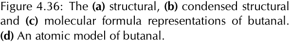
> **[Diagram Context - Textbook_PhysicalSciences_Gr12_Organic-molecules.pdf-0018-07.png]**
> The graphic is a text-based figure caption detailing different chemical representations (structural formula, condensed structural formula, molecular formula, and atomic model) for the organic compound butanal. The visible labels include part indicators (a), (b), (c), and (d), along with chemical terminology specifying structural, condensed structural, and molecular formula representations. Conceptually, this text guides South African Grade 12 Physical Sciences learners on organic chemistry nomenclature and molecular representation, helping them understand how to transition between structural formulas, condensed formulas, molecular formulas, and atomic models for aldehydes like butanal.

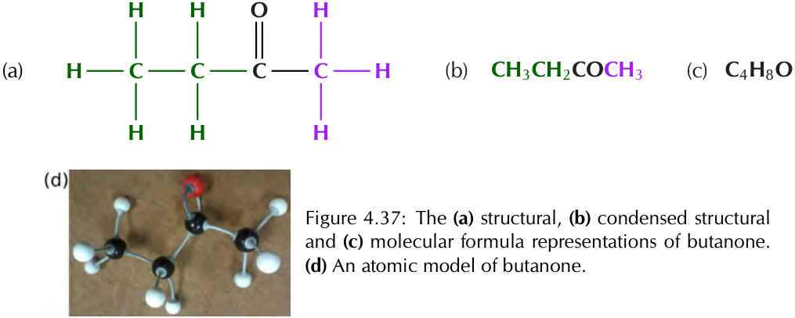
> **[Diagram Context - Textbook_PhysicalSciences_Gr12_Organic-molecules.pdf-0018-13.png]**
> 1. A diagram of a molecule with the chemical formula CH3CH2COCH3.

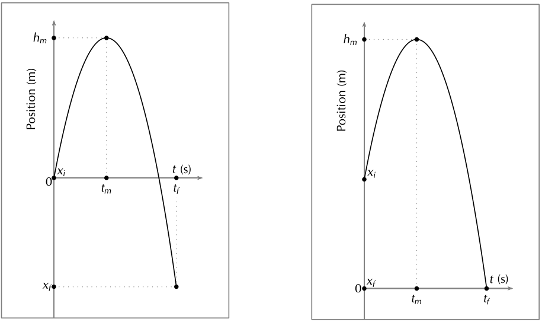
> **[Diagram Context - Textbook_PhysicalSciences_Gr12_Vertical-projectile-motion-in-one-dimension.pdf-0018-02.png]**
> 1. A black and white diagram of a graph with two lines labeled "x" and "y".

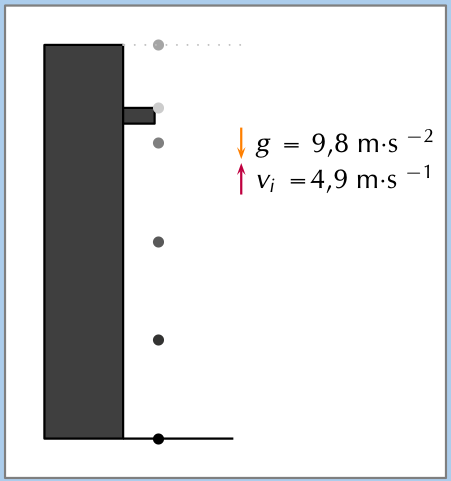
> **[Diagram Context - Textbook_PhysicalSciences_Gr12_Vertical-projectile-motion-in-one-dimension.pdf-0018-07.png]**
> The image shows a diagram of a black object with a series of dots on it. The diagram is labeled with the text "g = 9.8 m/s - 2" and "v = 4.9 m/s - 1". The diagram also includes a line labeled "g = 9.8 m/s - 2" and a line labeled "v = 4.9 m/s - 1". The diagram is set against a white background.

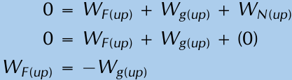
> **[Diagram Context - Textbook_PhysicalSciences_Gr12_Work-energy-and-power.pdf-0018-01.png]**
> This graphic displays a sequence of algebraic equations applying the Work-Energy Theorem to a physical system. The visible labels include work terms represented by variables $W_{F(up)}$, $W_{g(up)}$, and $W_{N(up)}$, representing the work done by an applied force, gravitational force, and normal force respectively, with the normal force term reducing to zero. Conceptually, this conveys how the work-energy theorem simplifies for an object moving vertically at constant velocity, demonstrating that the work done by a non-conservative applied force equals the negative change in gravitational potential energy.

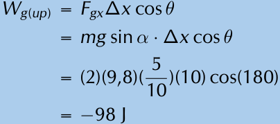
> **[Diagram Context - Textbook_PhysicalSciences_Gr12_Work-energy-and-power.pdf-0018-07.png]**
> The image shows a table with a blue background and white text. The table contains a list of equations and variables related to the topic of physics. The equations include the formulas for force, gravity, and energy. The variables in the equations represent different physical quantities, such as mass, acceleration, and potential energy. The table is organized with the equations and variables listed in a clear and concise manner, making it easy to understand and follow the calculations.

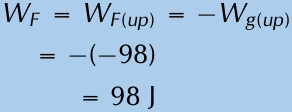
> **[Diagram Context - Textbook_PhysicalSciences_Gr12_Work-energy-and-power.pdf-0018-11.png]**
> This educational graphic presents a sequence of mathematical equations calculating work done in a physics context against a blue background. The visible labels and symbols include $W_F$, $W_{F(up)}$, $W_{g(up)}$, numerical values such as $-98$ and $98$, and the unit of joules ($\text{J}$). Conceptually, this demonstrates for Grade 11 Physical Sciences learners how the work done by an applied upward force equals the negative work done by the gravitational force, resulting in a positive work value of $98\text{ J}$.

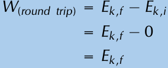
> **[Diagram Context - Textbook_PhysicalSciences_Gr12_Work-energy-and-power.pdf-0018-15.png]**
> This image displays a physical equation for work-energy calculations, specifically showing the algebraic steps $W_{\text{(round trip)}} = E_{k,f} - E_{k,i} = E_{k,f} - 0 = E_{k,f}$. Visible labels include the variables for work ($W$) and kinetic energy ($E_k$), with subscripts indicating round trip, final ($f$), and initial ($i$) states. For a Grade 11 or 12 Physical Sciences student, this conveys how the work-energy theorem simplifies during a complete round trip (such as an object thrown vertically upwards and returning to its starting point), demonstrating that if initial and final speeds are equal, the net work done on the system can be evaluated using these energy changes.

---

## Step 5: Graph of position vs time

The ball starts from a position of $20\text{ m}$ (at $t = 0\text{ s}$) from the ground and moves upwards until it reaches $20 + 1,225\text{ m}$ (at $t = 0,5\text{ s}$). It then falls back to $20\text{ m}$ (at $t = 0,5 + 0,5 = 1,0\text{ s}$) and then falls to the ground, $\Delta\vec{x} = 0\text{ m}$ (at $t = 0,5 + 2,08 = 2,58\text{ s}$).

> **[Diagram Context - Textbook_PhysicalSciences_Gr12_Momentum-and-Impulse.pdf-0019-03.png]**
> This image depicts a classic Newton's

---

## Step 6: Graph of velocity vs time

The ball starts off with a velocity of $+4,9\text{ m}\cdot\text{s}^{-1}$ at $t = 0\text{ s}$, it then reaches a velocity of $0\text{ m}\cdot\text{s}^{-1}$ at $t = 0,5\text{ s}$. It stops and falls back to the Earth. At $t = 1,0\text{ s}$ (i.e. after a further $0,5\text{ s}$) it has a velocity of $-4,9\text{ m}\cdot\text{s}^{-1}$. This is the same as the initial upwards velocity but it is downwards. It carries on at constant acceleration until $t = 2,58\text{ s}$. In other words, the velocity graph will be a straight line. The final velocity of the ball can be calculated as follows:

$$\vec{v}_f = \vec{v}_i + \vec{g}t$$

$$\vec{v}_f = 0 + (-9,8)(2,08...)$$

$$\vec{v}_f = -20,396...\text{ m}\cdot\text{s}^{-1}$$

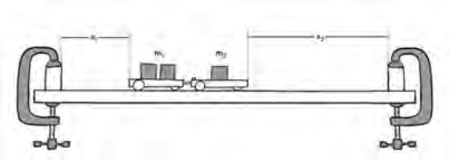
> **[Diagram Context - Textbook_PhysicalSciences_Gr12_Momentum-and-Impulse.pdf-0019-12.png]**
> This diagram illustrates a

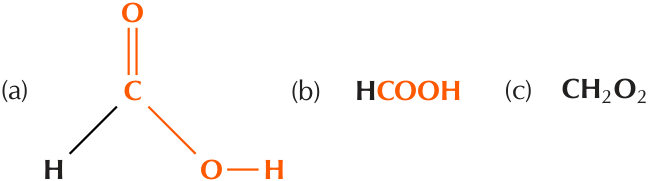
> **[Diagram Context - Textbook_PhysicalSciences_Gr12_Organic-molecules.pdf-0019-00.png]**
> 1. A diagram of a molecule with a redox reaction.

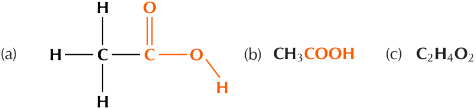
> **[Diagram Context - Textbook_PhysicalSciences_Gr12_Organic-molecules.pdf-0019-02.png]**
> 1. A diagram of a molecule with a redox reaction.

> **[Diagram Context - Textbook_PhysicalSciences_Gr12_Organic-molecules.pdf-0019-03.png]**
> This graphic is a ball-and-stick molecular model representing an organic molecule, marked with the label (d). It consists of black spheres representing carbon atoms, white spheres representing hydrogen atoms, and red spheres representing oxygen atoms, all connected by grey rods representing covalent bonds. For a Grade 12 CAPS Physical Sciences student, this visual illustrates the three-dimensional spatial arrangement and functional group of ethanoic acid ($CH_3COOH$), aiding in the understanding of molecular structure and isomerism in organic chemistry.

> **[Diagram Context - Textbook_PhysicalSciences_Gr12_Organic-molecules.pdf-0019-07.png]**
> 1. A diagram of a cell with a red ant on top.

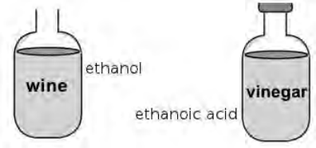
> **[Diagram Context - Textbook_PhysicalSciences_Gr12_Organic-molecules.pdf-0019-10.png]**
> 1. A diagram of two bottles of alcohol, one labeled ethanol and the other vinegar.

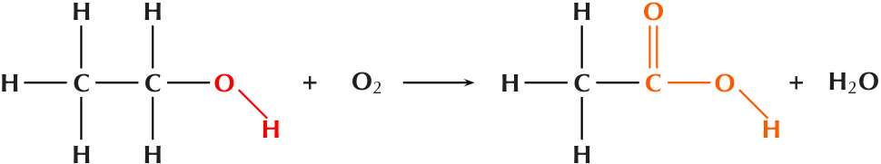
> **[Diagram Context - Textbook_PhysicalSciences_Gr12_Organic-molecules.pdf-0019-13.png]**
> 1. A diagram of a molecule with a red arrow pointing to the right.

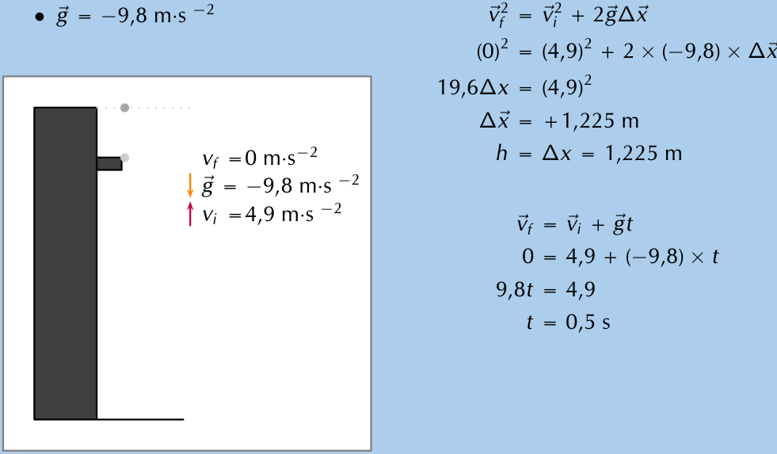
> **[Diagram Context - Textbook_PhysicalSciences_Gr12_Vertical-projectile-motion-in-one-dimension.pdf-0019-05.png]**
> A diagram of a Lewis structure of a molecule with the chemical formula H2O.

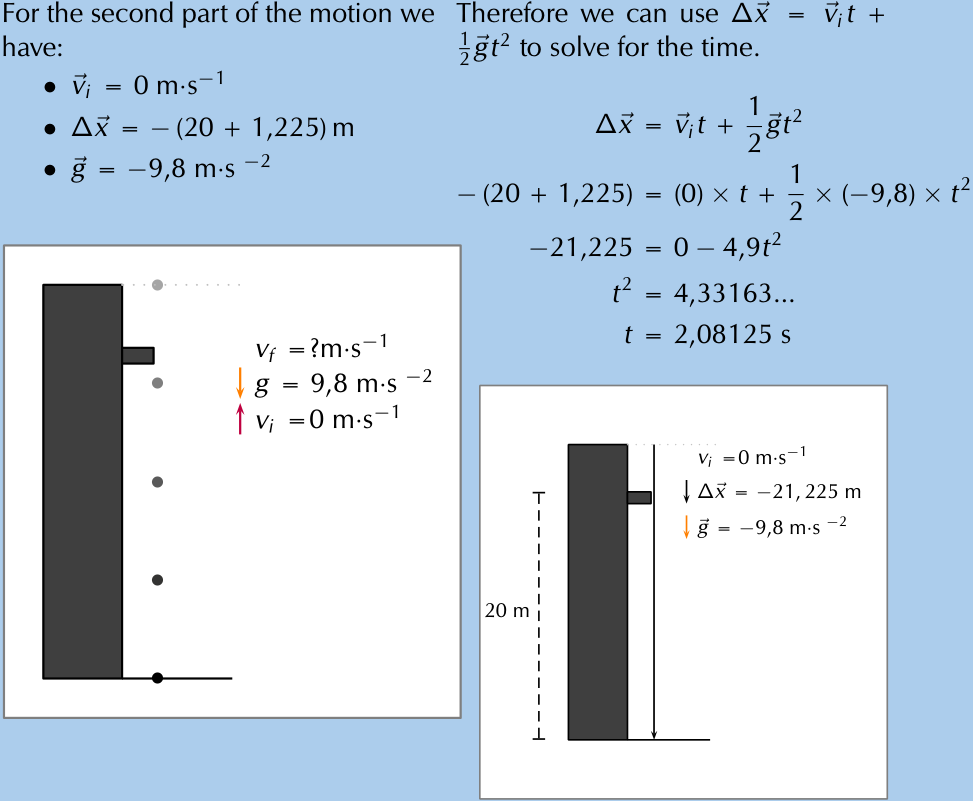
> **[Diagram Context - Textbook_PhysicalSciences_Gr12_Vertical-projectile-motion-in-one-dimension.pdf-0019-07.png]**
> The image shows a diagram of a cell with a Lewis structure, a diagram of a circuit, and a diagram of a graph. The diagram of the cell has arrows pointing to the different parts of the cell, and the diagram of the circuit has arrows pointing to the different components of the circuit. The diagram of the graph has arrows pointing to the different points on the graph. The diagram of the circuit has arrows pointing to the different components of the circuit. The diagram of the cell has arrows pointing to the different parts of the cell. The diagram of the circuit has arrows pointing to the different components

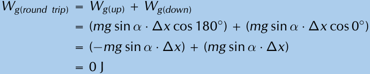
> **[Diagram Context - Textbook_PhysicalSciences_Gr12_Work-energy-and-power.pdf-0019-03.png]**
> 1. A diagram of a cell with arrows pointing to different parts of the cell.

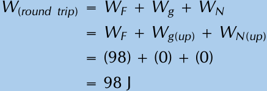
> **[Diagram Context - Textbook_PhysicalSciences_Gr12_Work-energy-and-power.pdf-0019-05.png]**
> The image shows a blue table with a black and white diagram on the left side. The diagram depicts a Lewis structure of a molecule, with the molecule's name and a number indicating the number of atoms. The diagram also includes arrows pointing to the molecule's bonds. The table has a blue background and black text, with the table's title "W(round trip) = WF + WG(up)".

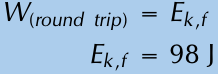
> **[Diagram Context - Textbook_PhysicalSciences_Gr12_Work-energy-and-power.pdf-0019-07.png]**
> This educational graphic displays a physics equation relating work and kinetic energy, specifically showing $W_{(round trip)} = E_{k,f}$ and $E_{k,f} = 98\text{ J}$. The visible labels and variables include $W_{(round trip)}$ for total work done over a complete journey and $E_{k,f}$ for final kinetic energy measured in joules (J). For a Grade 11 physical sciences student, this conveys the application of the Work-Energy Theorem to closed paths, illustrating that the net work done by conservative forces over a round trip is zero, leaving the final kinetic energy equal to the work done by non-conservative forces.

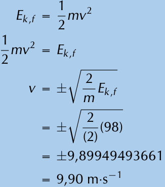
> **[Diagram Context - Textbook_PhysicalSciences_Gr12_Work-energy-and-power.pdf-0019-10.png]**
> 1. A math problem with a blue background and a black and white diagram.

---

## Step 7: Graph of $a$ vs $t$

We chose upwards to be positive. The acceleration of the ball is downward, $\vec{g} = 9,8\text{ m}\cdot\text{s}^{-2}$ downwards. Because the acceleration is constant throughout the motion, the graph looks like this:

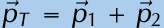

---

## Worked example 5: Analysing graphs of projectile motion

### QUESTION

The graph below (not drawn to scale) shows the motion of a tennis ball that was thrown vertically upwards from an open window some distance from the ground. It takes the ball $0,2\text{ s}$ to reach its highest point before falling back to the ground.

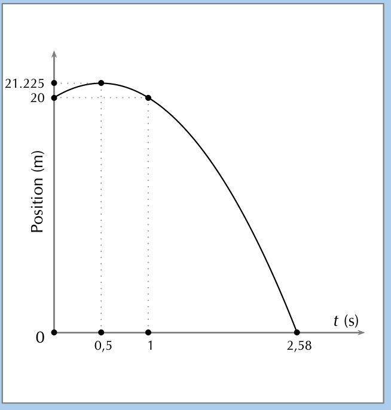
> **[Diagram Context - Textbook_PhysicalSciences_Gr12_Vertical-projectile-motion-in-one-dimension.pdf-0020-02.png]**
> A black and white diagram of a projectile motion graph with a black arrow pointing to the right and a black line labeled "position" and "time".

Study the graph given and calculate:
1. how high the window is above the ground.
2. the time it takes the ball to reach the maximum height.
3. the initial velocity of the ball.
4. the maximum height that the ball reaches.
5. the final velocity of the ball when it reaches the ground.

---

### SOLUTION

#### Step 1: Find the height of the window
The initial position of the ball will tell us how high the window is. From the y-axis on the graph we can see that the ball is $4\text{ m}$ from the ground.

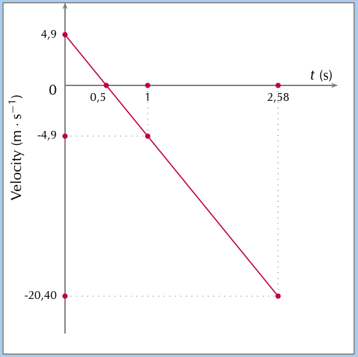
> **[Diagram Context - Textbook_PhysicalSciences_Gr12_Vertical-projectile-motion-in-one-dimension.pdf-0020-07.png]**
> The image is a graph that shows the relationship between velocity and time. The graph is a line graph with a red line that slopes downwards, indicating a negative relationship between the two variables. The x-axis of the graph is labeled "Time" and the y-axis is labeled "Velocity". The graph is labeled with the title "Velocity vs Time" and the units "m/s". The graph is labeled with the variable "t" and the variable "v". The graph is labeled with the variable "v" and the variable "t".

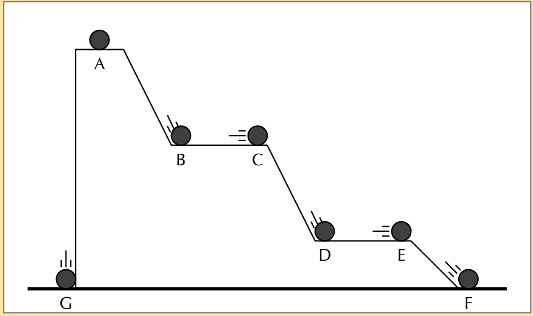
> **[Diagram Context - Textbook_PhysicalSciences_Gr12_Work-energy-and-power.pdf-0020-02.png]**
> The image is a diagram that shows a series of balls falling from a height, each ball represented by a black dot. The diagram is labeled with the letters A, B, C, D, and E, and the numbers F, G, H, I, and J are also present. The diagram is set against a brown background, and the balls are falling from a height, creating a sense of motion. The diagram is labeled with the letters and numbers, providing a clear visual representation of the falling balls.

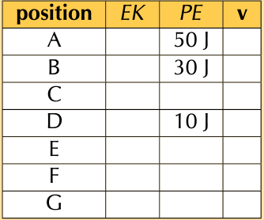
> **[Diagram Context - Textbook_PhysicalSciences_Gr12_Work-energy-and-power.pdf-0020-03.png]**
> 1. A diagram of a cell with arrows pointing to different parts of the cell.

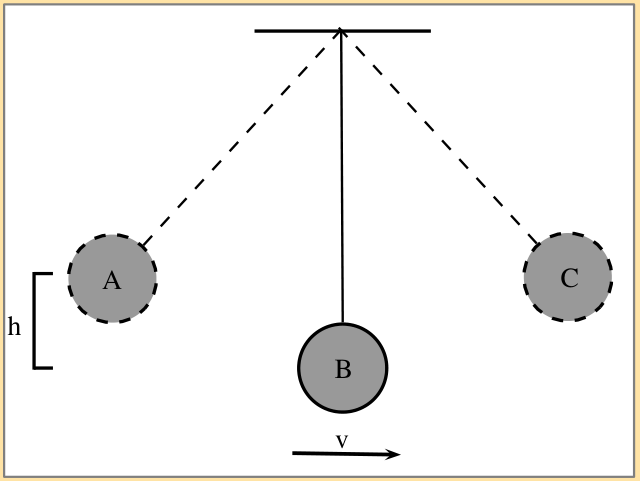
> **[Diagram Context - Textbook_PhysicalSciences_Gr12_Work-energy-and-power.pdf-0020-06.png]**
> 1. A diagram of a pendulum with two balls labeled A and B.
 2. The pendulum is shown in motion, with a black arrow pointing from A to B.
 3. The diagram also includes a label for the x-axis and a label for the y-axis.

---

The window is therefore $4\text{ m}$ above the ground.

---

### Step 2: Find the time taken to reach the maximum height
The maximum height is where the position vs time graph reaches its maximum position. This is when $t = 0,2\text{ s}$.

It takes the ball $0,2\text{ s}$ to reach the maximum height.

---

### Step 3: Find the initial velocity ($\vec{v}_i$) of the ball
To find the initial velocity we only look at the first part of the motion of the ball. That is from when the ball is released until it reaches its maximum height. We have the following for this:

In this case, let's choose upwards as positive.

$$t = 0,2\text{ s}$$
$$\vec{g} = 9,8\text{ m}\cdot\text{s}^{-2}$$
$$\vec{v}_f = 0\text{ m}\cdot\text{s}^{-1} \text{ (because the ball stops)}$$

To calculate the initial velocity of the ball ($\vec{v}_i$), we use:

$$\vec{v}_f = \vec{v}_i + \vec{g}t$$
$$0 = \vec{v}_i + (-9,8)(0,2)$$
$$\vec{v}_i = 1,96\text{ m}\cdot\text{s}^{-1}$$

The initial velocity of the ball is $1,96\text{ m}\cdot\text{s}^{-1}$ upwards.

---

### Step 4: Find the maximum height of the ball
To find the maximum height we look at the initial motion of the ball.

We have the following:
$$t = 0,2\text{ s}$$
$$\vec{g} = 9,8\text{ m}\cdot\text{s}^{-2}$$
$$\vec{v}_f = 0\text{ m}\cdot\text{s}^{-1} \text{ (because the ball stops)}$$
$$\vec{v}_i = +1,96\text{ m}\cdot\text{s}^{-1} \text{ (calculated above)}$$

To calculate the displacement from the window to the maximum height ($\Delta\vec{x}$) we use:

$$\Delta\vec{x} = \vec{v}_i t + \frac{1}{2}\vec{g}t^2$$
$$\Delta\vec{x} = (1,96)(0,2) + \frac{1}{2}(-9,8)(0,2)^2$$
$$\Delta\vec{x} = 0,196\text{ m}$$

The maximum height of the ball is $(4 + 0,196) = 4,196\text{ m}$ above the ground.

---

### Step 5: Find the final velocity ($\vec{v}_f$) of the ball
To find the final velocity of the ball we look at the second part of the motion. For this we have:

$$\Delta\vec{x} = -4,196\text{ m} \text{ (because upwards is positive)}$$
$$\vec{g} = -9,8\text{ m}\cdot\text{s}^{-2}$$
$$\vec{v}_i = 0\text{ m}\cdot\text{s}^{-1}$$

We can use $\vec{v}_f^2 = \vec{v}_i^2 + 2\vec{g}\Delta\vec{x}$ to calculate the final velocity of the ball.

$$\vec{v}_f^2 = \vec{v}_i^2 + 2\vec{g}\Delta\vec{x}$$
$$\vec{v}_f^2 = (0)^2 + 2(-9,8)(-4,196)$$
$$\vec{v}_f^2 = 82,2416$$
$$\vec{v}_f = 9,0687\text{ m}\cdot\text{s}^{-1} \text{ downwards}$$

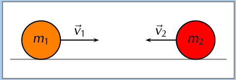
> **[Diagram Context - Textbook_PhysicalSciences_Gr12_Momentum-and-Impulse.pdf-0021-00.png]**
> The image presents a diagram of two red spheres, each with a black arrow pointing to the other sphere. The spheres are positioned on a white surface, and the arrows indicate the direction of the forces acting on the spheres. The diagram is labeled with the letters "M1" and "M2" on the spheres, and the arrows point from "M1" to "M2". The diagram also includes the letters "V1" and "V2" on the spheres, and the arrows point from "M1" to "M2". The diagram is set against a gray background

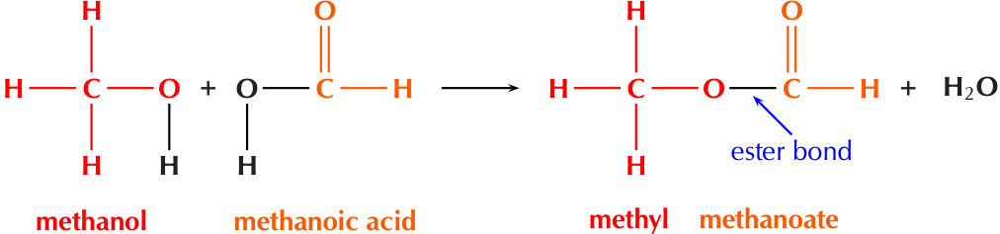
> **[Diagram Context - Textbook_PhysicalSciences_Gr12_Organic-molecules.pdf-0021-01.png]**
> This educational graphic illustrates a chemical reaction using structural formulae to show the esterification process between an alcohol and a carboxylic acid. Visible labels and symbols include chemical elements (H, C, O), IUPAC names ("methanol", "methanoic acid", "methyl methanoate"), an arrow indicating the direction of the reaction, water ($\text{H}_2\text{O}$), and a blue arrow pointing to the newly formed "ester bond". Conceptually, it conveys how methanol reacts with methanoic acid in a condensation (esterification) reaction to produce the ester methyl methanoate and a molecule of water.

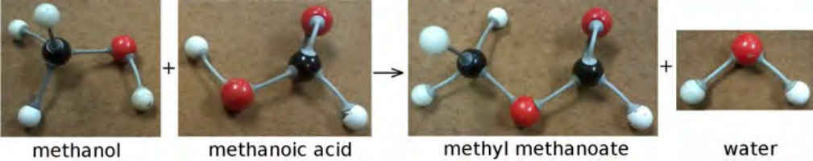
> **[Diagram Context - Textbook_PhysicalSciences_Gr12_Organic-molecules.pdf-0021-05.png]**
> 1. A diagram of a molecule of Methane (CH4) with a Lewis structure.

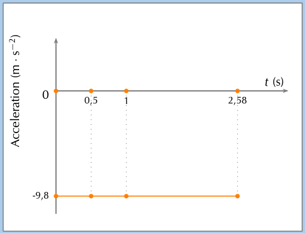
> **[Diagram Context - Textbook_PhysicalSciences_Gr12_Vertical-projectile-motion-in-one-dimension.pdf-0021-02.png]**
> The image is a diagram that shows a graph of acceleration over time. The graph has a line that goes from the top left to the bottom right, and a line that goes from the top right to the bottom left. The x-axis is labeled "Time" and the y-axis is labeled "Acceleration". The graph has a line that goes from the top left to the bottom right, and a line that goes from the top right to the bottom left. The graph has a line that goes from the top left to the bottom right, and a line that goes from the top

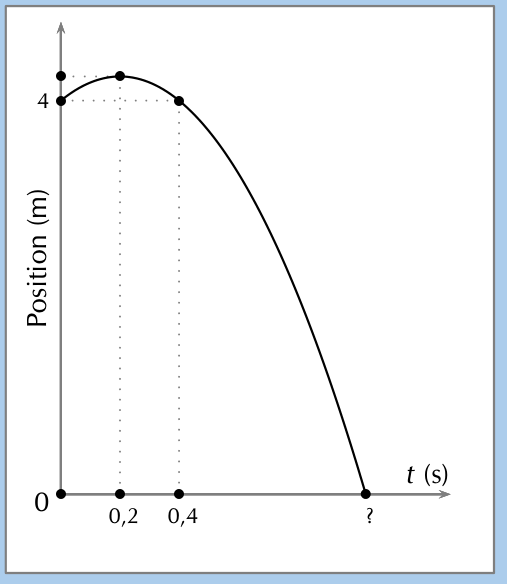
> **[Diagram Context - Textbook_PhysicalSciences_Gr12_Vertical-projectile-motion-in-one-dimension.pdf-0021-12.png]**
> The image presents a diagram of a Lewis structure for water, which is a molecule composed of two hydrogen atoms and one oxygen atom. The diagram is drawn in black and white, with arrows indicating the bonds between the atoms. The diagram is labeled with the variable "t" and "s", which represent the time and speed of the reaction, respectively. The diagram also includes a question mark, which could be a prompt for the student to answer or a placeholder for the teacher to fill in.

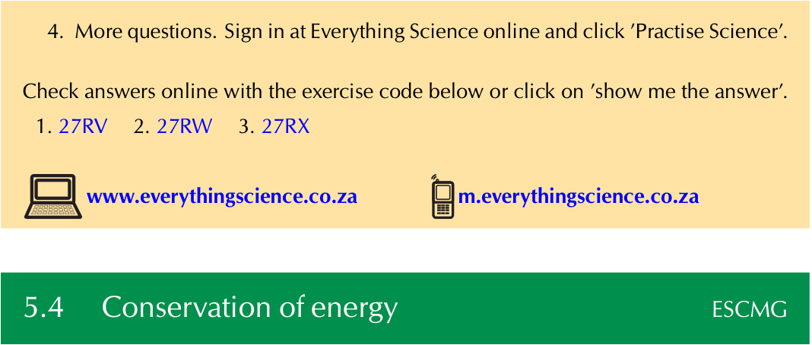
> **[Diagram Context - Textbook_PhysicalSciences_Gr12_Work-energy-and-power.pdf-0021-00.png]**
> 4. More questions. Sign in at EverythingScience online and click on "Practise Science". Check answers online with the exercise code below or click on "Show me the answer".

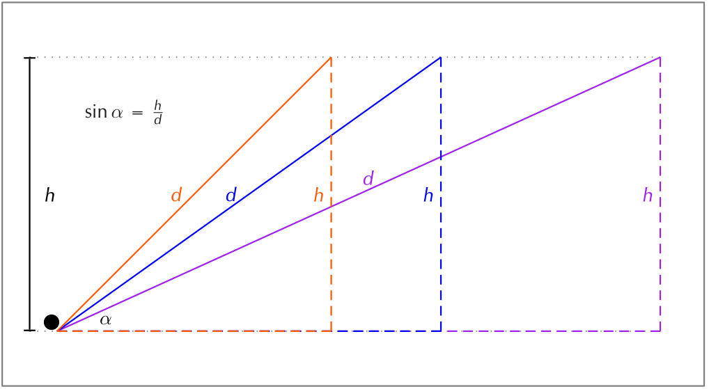
> **[Diagram Context - Textbook_PhysicalSciences_Gr12_Work-energy-and-power.pdf-0021-06.png]**
> The image shows a diagram of a Lewis structure for carbon dioxide. The diagram is color-coded, with blue, orange, and purple lines representing the valence electrons of carbon. The diagram also includes arrows to indicate the bonds between the carbon atoms. The diagram is labeled with the chemical formula of carbon dioxide, which is C12H22O11. The diagram is set against a gray background, and the text "sin a" is written in the top left corner.

---

The final velocity of the ball is $9,07\text{ m}\cdot\text{s}^{-1}$ downwards.

---

## Worked Example 6: Describing projectile motion

### QUESTION

A cricketer hits a cricket ball from the ground and the following graph of velocity vs time was drawn. Upwards was taken as positive. Study the graph and follow the instructions below:

1. Describe the motion of the ball according to the graph.
2. Draw a sketch graph of the corresponding position-time graph. Label the axes.
3. Draw a sketch graph of the corresponding acceleration-time graph. Label the axes.

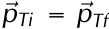

---

### SOLUTION

#### Step 1: Describe the motion of the ball

We need to study the velocity-time graph to answer this question. We will break the motion of the ball up into two time zones: $t = 0\text{ s}$ to $t = 2\text{ s}$ and $t = 2\text{ s}$ to $t = 4\text{ s}$.

From $t = 0\text{ s}$ to $t = 2\text{ s}$ the following happens:

The ball starts to move at an initial velocity of $19,6\text{ m}\cdot\text{s}^{-1}$ and decreases its velocity to $0\text{ m}\cdot\text{s}^{-1}$ at $t = 2\text{ s}$. At $t = 2\text{ s}$ the velocity of the ball is $0\text{ m}\cdot\text{s}^{-1}$ and therefore it stops.

From $t = 2\text{ s}$ to $t = 4\text{ s}$ the following happens:

The ball moves from a velocity of $0\text{ m}\cdot\text{s}^{-1}$ to $19,6\text{ m}\cdot\text{s}^{-1}$ in the opposite direction to the original motion.

If we assume that the ball is hit straight up in the air (and we take upwards as positive), it reaches its maximum height at $t = 2\text{ s}$, stops, and falls back to the Earth to reach the ground at $t = 4\text{ s}$.

> **[Diagram Context - Textbook_PhysicalSciences_Gr12_Momentum-and-Impulse.pdf-0022-07.png]**
> 1. A pool table with a white ball and a black 8 ball.

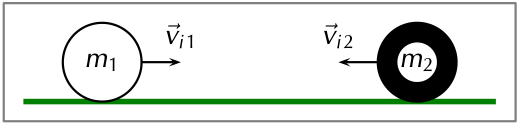
> **[Diagram Context - Textbook_PhysicalSciences_Gr12_Momentum-and-Impulse.pdf-0022-08.png]**
> The image presents a diagram of a physics concept, specifically the relationship between a ball and a wheel. The diagram is divided into two sections, with the left section depicting a ball on the left side of the image and the right section showing a wheel on the right side. The diagram also includes labels for the ball and the wheel, as well as arrows indicating the direction of motion. The diagram is set against a gray background, and the text "V1" and "V2" are visible, likely representing the velocities of the ball and the wheel, respectively.

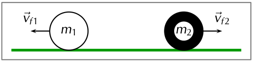
> **[Diagram Context - Textbook_PhysicalSciences_Gr12_Momentum-and-Impulse.pdf-0022-12.png]**
> The image presents a diagram of a Lewis structure for a molecule of water, with a black circle representing an oxygen atom and a green line representing a hydrogen bond. The diagram is labeled with the chemical symbols "H2O" and "V1-2", indicating the molecule's structure and the forces acting upon it. The diagram also includes arrows pointing to the bonds and the Lewis dot, which are essential components of the Lewis structure.

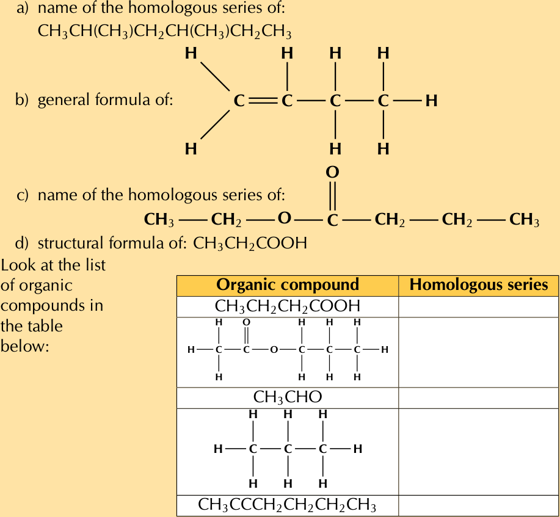
> **[Diagram Context - Textbook_PhysicalSciences_Gr12_Organic-molecules.pdf-0022-02.png]**
> )CH_2CH_

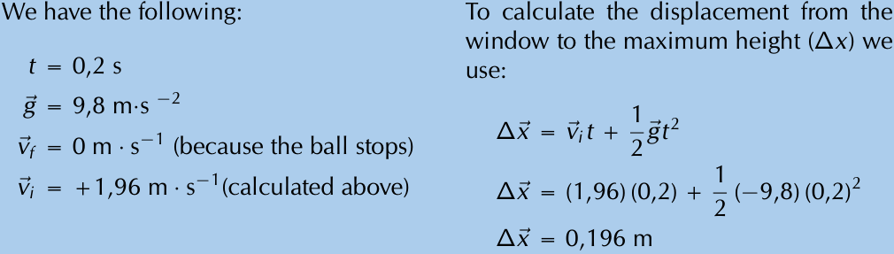
> **[Diagram Context - Textbook_PhysicalSciences_Gr12_Vertical-projectile-motion-in-one-dimension.pdf-0022-09.png]**
> The image shows a blue table with a math problem on it. The problem is about calculating the maximum height of a ball that stops at a certain point. The table has two columns and two rows, with the first column labeled "We have the following" and the second column labeled "To calculate the displacement from the window to the maximum height (AX) we use: v = 0.8 m/s2 g = 9.8 m/s2". The problem is asking the viewer to calculate the maximum height of a ball that stops at a certain point.

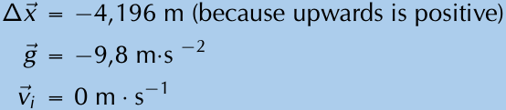
> **[Diagram Context - Textbook_PhysicalSciences_Gr12_Vertical-projectile-motion-in-one-dimension.pdf-0022-13.png]**
> The image shows a diagram of a cell with arrows pointing to different parts of the cell. The diagram also includes labels for the cell's organelles and a Lewis structure of the cell. The diagram is set against a light blue background.

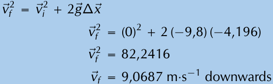
> **[Diagram Context - Textbook_PhysicalSciences_Gr12_Vertical-projectile-motion-in-one-dimension.pdf-0022-15.png]**
> The image shows a math problem involving the conversion of units. The problem is presented in a table format, with the variables and equations clearly labeled. The problem is about converting downward motion from meters per second to meters per second squared. The problem is set against a blue background, and the text is written in a simple, easy-to-read font.

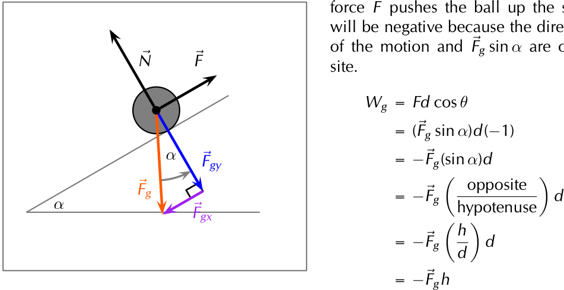
> **[Diagram Context - Textbook_PhysicalSciences_Gr12_Work-energy-and-power.pdf-0022-02.png]**
> The image shows a diagram of a ball being pushed up the side of a hill. The diagram is accompanied by a text box that explains the concept of force and how it affects the ball's motion. The diagram also includes a Lewis structure of the ball and arrows pointing to the forces acting on it.

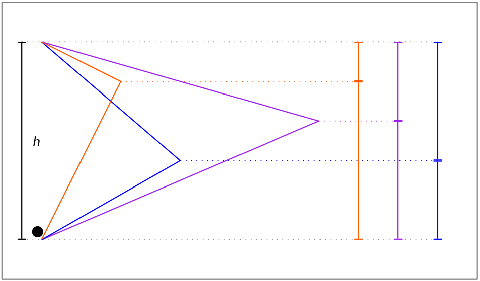
> **[Diagram Context - Textbook_PhysicalSciences_Gr12_Work-energy-and-power.pdf-0022-05.png]**
> The image shows a diagram of a triangle with two blue triangles and a purple triangle. The diagram is labeled with the terms "h" and "h" and "h" and "h" and "h". The diagram also includes a line labeled "h" and a line labeled "h". The diagram is set against a gray background.

---

### Step 2: Draw the position-time graph

To draw this graph, we need to determine the displacements at $t = 2\text{ s}$ and $t = 4\text{ s}$.

#### At $t = 2\text{ s}$:
* The displacement is equal to the area under the graph:
* $\text{Area under graph} = \text{Area of triangle}$
* $\text{Area} = \frac{1}{2}bh$
* $\text{Area} = \frac{1}{2} \times 2 \times 19,6$
* $\text{Position} = 19,6\text{ m}$

#### At $t = 4\text{ s}$:
* The displacement is equal to the area under the whole graph (top and bottom). 
* *Note:* Remember that an area under the time line must be subtracted.
* $\text{Area under graph} = \text{Area of triangle 1} + \text{Area of triangle 2}$
* $\text{Area} = \frac{1}{2}bh + \frac{1}{2}bh$
* $\text{Area} = \left(\frac{1}{2} \times 2 \times 19,6\right) + \left(\frac{1}{2} \times 2 \times (-19,6)\right)$
* $\text{Area} = 19,6 - 19,6$
* $\text{Displacement} = 0\text{ m}$

The position vs time graph for motion at constant acceleration is a curve. The graph will look like this:

> **[Diagram Context - Textbook_PhysicalSciences_Gr12_Momentum-and-Impulse.pdf-0023-14.png]**
> The image shows a black and white illustration of a train and a car on a blue background. The train is depicted as a steam engine, and the car is a modern vehicle. The train is moving towards the car, and there is a diagram of the train and car on the blue background. The diagram includes arrows pointing from the train to the car, and the train is labeled with the letters "V1" and "V2". The car is labeled with the letters "V2" and "V1".

---

### Step 3: Draw the acceleration versus time graph

To draw the acceleration vs time graph, we need to know what the acceleration is. The velocity versus time graph is a straight line which means that the acceleration is constant. The gradient of the line will give the acceleration.

The line has a negative slope (goes down towards the left) which means that the acceleration has a negative value.

Calculate the gradient of the line:

$$\text{gradient} = \frac{\Delta \vec{v}}{\Delta t}$$

$$\text{gradient} = \frac{0 - 19,6}{2 - 0}$$

$$\text{gradient} = \frac{-19,6}{2}$$

$$\text{gradient} = -9,8$$

Therefore the acceleration $= 9,8\text{ m}\cdot\text{s}^{-2}$ downwards.

<!-- DIAG_PLACEHOLDER: diagram -->

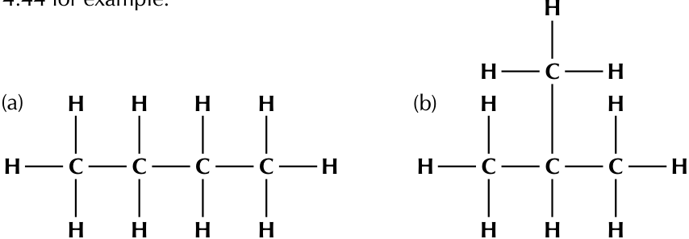
> **[Diagram Context - Textbook_PhysicalSciences_Gr12_Organic-molecules.pdf-0023-03.png]**
> 1. A diagram of a molecule with carbon, hydrogen, and oxygen atoms.

> **[Diagram Context - Textbook_PhysicalSciences_Gr12_Organic-molecules.pdf-0023-08.png]**
> 1. A diagram of a candle flame.

> **[Diagram Context - Textbook_PhysicalSciences_Gr12_Organic-molecules.pdf-0023-09.png]**
> 1. A red and silver pot with a plant inside.

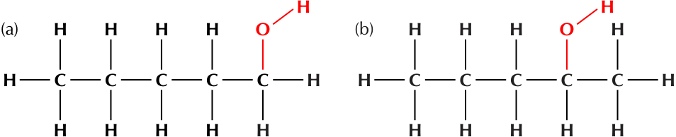
> **[Diagram Context - Textbook_PhysicalSciences_Gr12_Organic-molecules.pdf-0023-14.png]**
> 1. A diagram of a molecule with two hydrogen atoms and one oxygen atom.

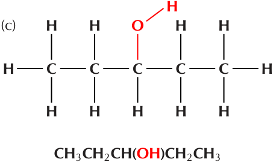
> **[Diagram Context - Textbook_PhysicalSciences_Gr12_Organic-molecules.pdf-0023-17.png]**
> 1. A diagram of a molecule with a red arrow pointing to the hydroxyl group.

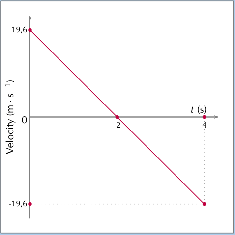
> **[Diagram Context - Textbook_PhysicalSciences_Gr12_Vertical-projectile-motion-in-one-dimension.pdf-0023-07.png]**
> The image is a graph that shows the relationship between velocity and time. The graph is a line graph with a red line that slopes downwards, indicating a negative relationship between the two variables. The x-axis is labeled with the variable "Time" and the y-axis is labeled with the variable "Velocity". The graph also includes a legend that explains the meaning of the different colors on the line.

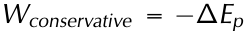

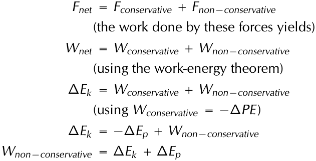
> **[Diagram Context - Textbook_PhysicalSciences_Gr12_Work-energy-and-power.pdf-0023-11.png]**
> 1. A diagram of a cell with arrows pointing to different parts of the cell.

---

## Worked Example 7: Interpreting Velocity Graphs

### QUESTION

Describe the motion corresponding to the following velocity vs time graph and plot the position vs time and acceleration vs time assuming the initial position is $0$:

---

### SOLUTION

#### Step 1: Determine what is required
The velocity vs time graph corresponding to the motion of an object is given. Using the graph, we need to describe the actual motion. Notice that the graph has discontinuities; this naturally breaks the graph into phases. We should process each phase separately and then try to infer (figure out) what probably happened to change from one phase to the next.

The first thing that you normally do in a vertical projectile motion problem is choose a positive direction. In this case, you can't do that because it has already been decided. We need to use the information given to figure out which direction was chosen as positive.

#### Step 2: Determine the direction chosen as positive
We are given a velocity vs time graph. We know that the slope of the velocity-time graph is the acceleration and we know that in these problems we are only dealing with gravitational acceleration. We can use what we know about gravitational acceleration and the slope of the graph to determine which direction was chosen as positive.

Gravitational acceleration is always directed towards the centre of the Earth. If we choose:
* **upwards as the positive** direction then the slope of the velocity vs time graph will be negative
* **downwards as the positive** direction then the slope of the velocity vs time graph will be positive

In this problem, the slope of the velocity vs time graph is negative, and so we know that upwards was chosen as the positive direction.

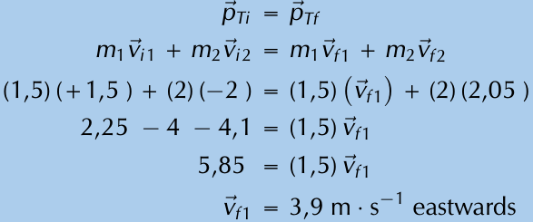
> **[Diagram Context - Textbook_PhysicalSciences_Gr12_Momentum-and-Impulse.pdf-0024-01.png]**
> The image shows a math problem written in a blue font on a light blue background. The problem is about calculating the velocity of a molecule. The problem is divided into four parts, each with a different equation. The first part is about the mass of the molecule, the second part is about the charge of the molecule, the third part is about the charge of the molecule, and the fourth part is about the velocity of the molecule. The problem also includes a list of variables and a list of equations.

> **[Diagram Context - Textbook_PhysicalSciences_Gr12_Momentum-and-Impulse.pdf-0024-05.png]**
> 1. A fighter jet is flying through the sky.

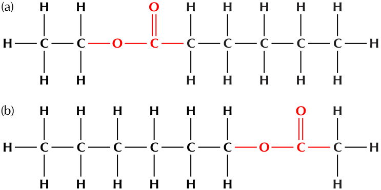
> **[Diagram Context - Textbook_PhysicalSciences_Gr12_Organic-molecules.pdf-0024-01.png]**
> 1. A diagram of a molecule with two bonds between carbon and hydrogen atoms.

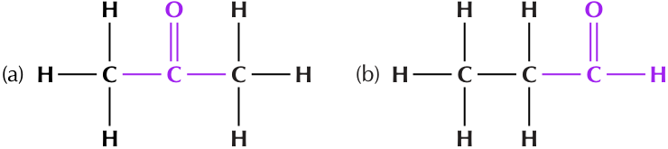
> **[Diagram Context - Textbook_PhysicalSciences_Gr12_Organic-molecules.pdf-0024-04.png]**
> 1. A purple amino acid is shown in the diagram.
 2. The amino acid is connected to a purple molecule.
 3. The amino acid is shown in a purple amino acid.

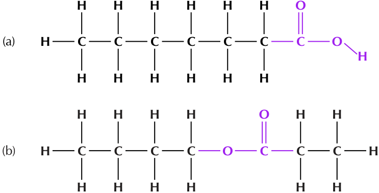
> **[Diagram Context - Textbook_PhysicalSciences_Gr12_Organic-molecules.pdf-0024-09.png]**
> 1. A diagram of a molecule with purple and black arrows pointing to the bonds.

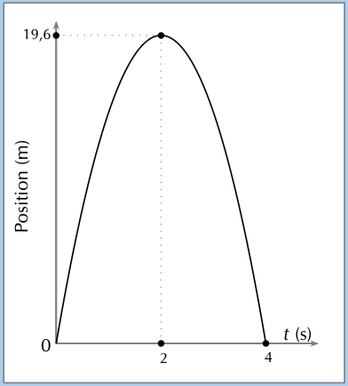
> **[Diagram Context - Textbook_PhysicalSciences_Gr12_Vertical-projectile-motion-in-one-dimension.pdf-0024-04.png]**
> The image is a black and white diagram that shows a graph of a curve. The curve is labeled "position" and has a line labeled "time" on it. The graph is labeled "19.6 m/s". The diagram also includes arrows pointing to the x and y axes.

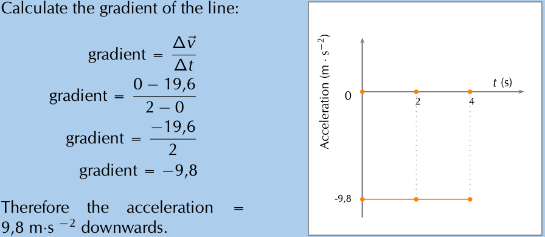
> **[Diagram Context - Textbook_PhysicalSciences_Gr12_Vertical-projectile-motion-in-one-dimension.pdf-0024-08.png]**
> 1. A diagram of a cell with arrows pointing to different parts of the cell.

> **[Diagram Context - Textbook_PhysicalSciences_Gr12_Work-energy-and-power.pdf-0024-03.png]**
> The image shows a group of people playing soccer on a field. There are at least five people in the scene, with two of them actively engaged in a game, one of them falling to the ground, and another player attempting to block the fall. The soccer ball is located in the center of the image, surrounded by the players. The players are wearing different colored jerseys, indicating that they are part of different teams. The image conveys the excitement and competitive nature of the sport, as well as the physical exertion and skill required to play soccer.

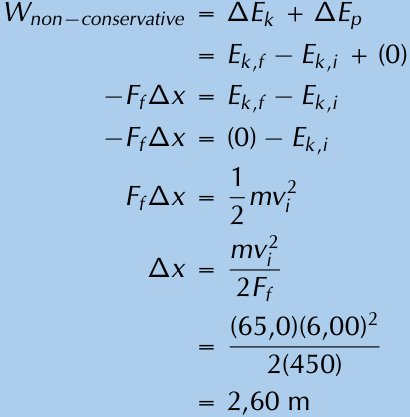
> **[Diagram Context - Textbook_PhysicalSciences_Gr12_Work-energy-and-power.pdf-0024-12.png]**
> The image shows a blue background with a table of values for a physics problem. The problem involves calculating the velocity of an object, given the force and mass. The table includes the variables "F", "D", "m", "v", and "2F". The table also includes the equation "2F = m * v" and the solution "v = sqrt(2F/m)". The problem is presented in a clear and organized manner, making it easy for a high school student to understand and solve.

---

## Step 3: First phase

In the plot below we highlight only the first phase of interest.

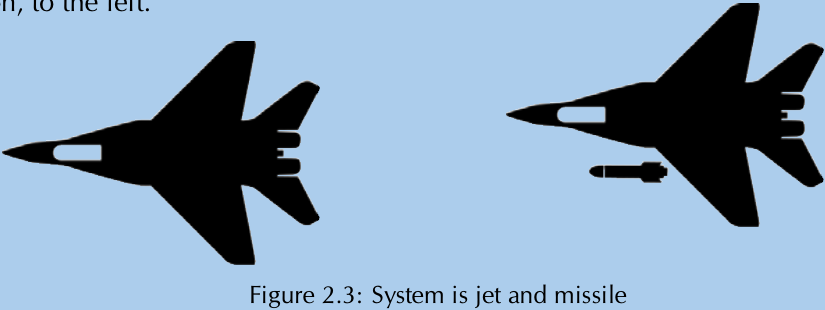
> **[Diagram Context - Textbook_PhysicalSciences_Gr12_Momentum-and-Impulse.pdf-0025-02.png]**
> The image shows two jet airplanes flying in opposite directions. The airplane on the left is flying towards the top left corner, while the one on the right is flying towards the bottom right corner. The airplanes are depicted in black and white, and the text "Figure 2.3 System is jet and missile" is present, indicating that the image is a diagram or illustration of a jet system and its components.

The initial velocity is positive and then decreases linearly, passes through zero and reaches the same magnitude in the negative direction. The positive starting value means the object was going upwards, the linear decreases means a constant acceleration in the negative direction, passing through zero means that the object reaches a maximum height before beginning to fall in the negative direction. The fact that the magnitude of the initial and final velocities is the same means that there is time symmetry.

This is just the plot of an object being thrown/shot/projected upwards, peaking and falling back to the same level as it was thrown from.

---

## Step 4: Second phase

In the plot below we highlight only the second phase.

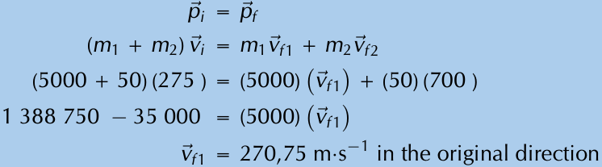
> **[Diagram Context - Textbook_PhysicalSciences_Gr12_Momentum-and-Impulse.pdf-0025-05.png]**
> The image shows a math problem written in a blue font on a light blue background. The problem is about a velocity and acceleration, and it includes a diagram of a cell and a graph. The problem is about a velocity and acceleration, and it includes a diagram of a cell and a graph.

Just as in the first phase, the initial velocity is positive and then decreases linearly, passes through zero and reaches the same magnitude in the negative direction. The positive starting value means the object was going upwards, the linear decreases means a constant acceleration in the negative direction, passing through zero means that the object reaches a maximum height before beginning to fall in the negative direction. The fact that the magnitude of the initial and final velocities is the same means that there is time symmetry.

This is just the plot of an object being thrown upwards, peaking and falling back to the same level as it was thrown from.

---

## Step 5: Combining phases

We know that the two phases look the same, the object starts off moving upwards, peaks, falls down to the initial position and then repeats the process. This could be a description of a ball bouncing as an example.

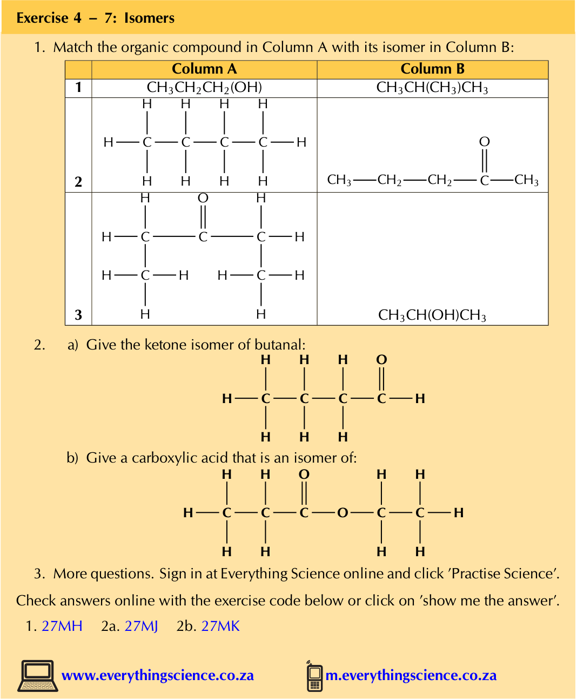
> **[Diagram Context - Textbook_PhysicalSciences_Gr12_Organic-molecules.pdf-0025-02.png]**
> 1. A diagram of a carbohydrate is shown.

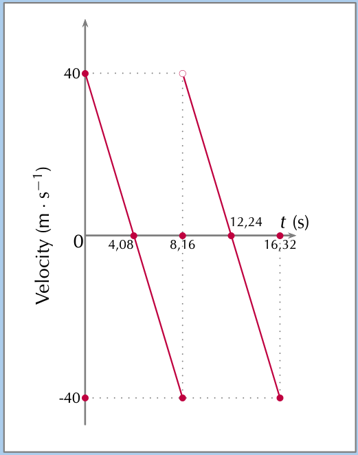
> **[Diagram Context - Textbook_PhysicalSciences_Gr12_Vertical-projectile-motion-in-one-dimension.pdf-0025-03.png]**
> The image shows a graph with two lines, one red and one blue, intersecting at a point labeled 12.24. The graph is labeled with the equation y = mx + b, and the x and y axes are labeled with the numbers 1 and 2, respectively. The graph is labeled with the variable t, and the equation y = mx + b is labeled with the variable y. The graph is labeled with the variable x, and the equation y = mx + b is labeled with the variable y.

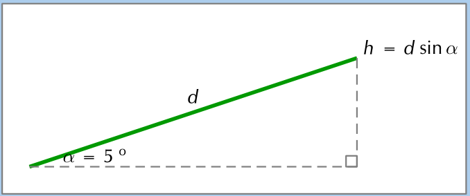
> **[Diagram Context - Textbook_PhysicalSciences_Gr12_Work-energy-and-power.pdf-0025-09.png]**
> The image shows a diagram of a green line and a small square labeled "h" with a "d" inside it. The diagram is set against a gray background, and the text "h = d sin a" is written above the line. The diagram is labeled with the variable "h" and the variable "d" and is accompanied by a small square labeled "a". The diagram is labeled with the variable "h" and the variable "d" and is accompanied by a small square labeled "a".

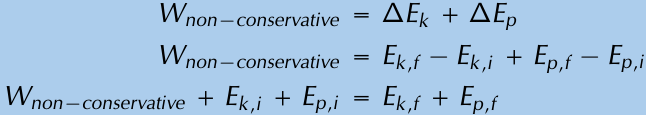
> **[Diagram Context - Textbook_PhysicalSciences_Gr12_Work-energy-and-power.pdf-0025-11.png]**
> The graphic displays three mathematical equations relating to the work-energy theorem for non-conservative forces. The visible variables and terms include $W_{non-conservative}$, $\Delta E_k$, $\Delta E_p$, $E_{k,i}$, $E_{k,f}$, $E_{p,i}$, and $E_{p,f}$. For a Grade 12 Physical Sciences learner, these formulas convey the work-energy theorem, showing how work done by non-conservative forces equals the change in total mechanical energy, which is essential for solving conservation of energy problems.

---

## Step 6: Position vs Time

To draw an accurate position graph, we need to determine the height that the object rises to, and then we can plot position versus time. We already know the timing information from the velocity versus time plot.

We can verify that the acceleration is in fact from gravity by using the equation:

$$\vec{v}_{f} = \vec{v}_{i} + \vec{g}t$$

$$\begin{aligned}
\vec{v}_{f} &= \vec{v}_{i} + \vec{g}t \\
(-40) &= (40) + \vec{g}(8,16) \\
(-80) &= \vec{g}(8,16) \\
\vec{g} &= \frac{-80}{8,16} \\
\vec{g} &= -9,8\text{ m}\cdot\text{s}^{-2}
\end{aligned}$$

We can work out the height using the equation for displacement:

$$\vec{v}_{f}^2 = \vec{v}_{i}^2 + 2\vec{g}\Delta\vec{x}$$

$$\begin{aligned}
0 &= (40)^2 + 2(-9,8)\Delta\vec{x} \\
\Delta\vec{x} &= \frac{-(40)^2}{2(-8,16)} \\
\Delta\vec{x} &= 81,63\text{ m}
\end{aligned}$$

So we can now draw the displacement versus time plot:

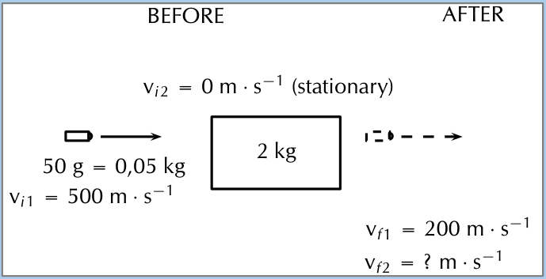
> **[Diagram Context - Textbook_PhysicalSciences_Gr12_Momentum-and-Impulse.pdf-0026-01.png]**
> 1. A diagram of a molecule with a box labeled "2 kg" and arrows pointing to the molecule and the box.

---

## Step 7: Acceleration vs Time

<!-- DIAG_PLACEHOLDER -->

The acceleration is due to gravity except at one point, when the object bounces.

At that point the acceleration must be some other, very large, value in the positive direction, but we don't have enough information to determine what the value must be.

We explicitly note that at that point the acceleration is NOT $-9,8\text{ m}\cdot\text{s}^{-2}$.

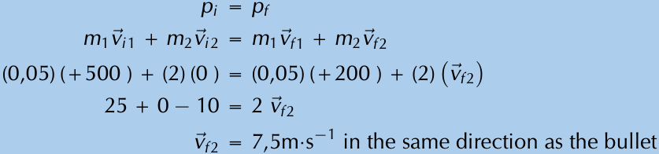
> **[Diagram Context - Textbook_PhysicalSciences_Gr12_Momentum-and-Impulse.pdf-0026-03.png]**
> A diagram of a bullet with arrows pointing to the bullet's direction as it moves through the air.

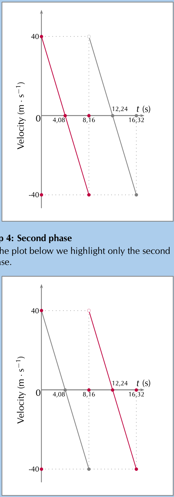
> **[Diagram Context - Textbook_PhysicalSciences_Gr12_Vertical-projectile-motion-in-one-dimension.pdf-0026-01.png]**
> 1. A graph showing the velocity of a falling object over time.

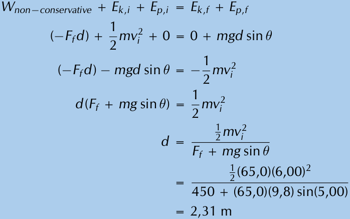
> **[Diagram Context - Textbook_PhysicalSciences_Gr12_Work-energy-and-power.pdf-0026-02.png]**
> The image shows a math problem written on a blue background. The problem involves calculating the velocity of an object, given the acceleration and time. The problem is presented in a step-by-step manner, with each step clearly labeled. The problem also includes a diagram of a cell, which is used to explain the concept of a cell's structure and function. The problem is designed to help students understand the relationship between acceleration, time, and velocity.

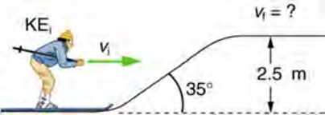
> **[Diagram Context - Textbook_PhysicalSciences_Gr12_Work-energy-and-power.pdf-0026-07.png]**
> 1. A diagram of a person skiing down a hill with a question about the slope's angle.

---

# Worked example 8: Hot air balloon [NSC 2011 Paper 1]

## QUESTION

A hot-air balloon is moving vertically upwards at a constant speed. A camera is accidentally dropped from the balloon at a height of $92,4\text{ m}$ as shown in the diagram below. The camera strikes the ground after $6\text{ s}$. Ignore the effects of friction.

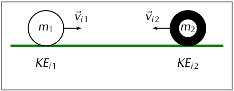
> **[Diagram Context - Textbook_PhysicalSciences_Gr12_Momentum-and-Impulse.pdf-0027-07.png]**
> The image presents a diagram of a Lewis structure for a molecule of water, with a black circle representing an oxygen atom and a green line representing a hydrogen bond. The diagram also includes a black circle representing a proton and a green line representing a neutron. The diagram is labeled with the names of the atoms and the Lewis structure of water. The diagram is set against a gray background.

1. At the instant the camera is dropped, it moves upwards. Give a reason for this observation. (1 mark)
2. Calculate the speed $v_i$ at which the balloon is rising when the camera is dropped. (4 marks)
3. Draw a sketch graph of velocity versus time for the entire motion of the camera. Indicate the following on the graph:
   * Initial velocity
   * Time at which it reaches the ground (4 marks)
4. If a jogger, $10\text{ m}$ away from point $\text{P}$ as shown in the above diagram and running at a constant speed of $2\text{ m}\cdot\text{s}^{-1}$, sees the camera at the same instant it starts falling from the balloon, will he be able to catch the camera before it strikes the ground? Use a calculation to show how you arrived at the answer. (5 marks)

**[TOTAL: 14 marks]**

---

## SOLUTION

### Question 1
The initial velocity / speed of the camera is the same (as that of the balloon). (1 mark)

---

### Question 2

| Taking downwards as the positive direction: | Taking downwards as the negative direction: |
| :--- | :--- |
| $\Delta y = v_i\Delta t + \frac{1}{2}a\Delta t^2$ | $\Delta y = v_i\Delta t + \frac{1}{2}a\Delta t^2$ |
| $\therefore 92,4 = v_i(6) + \frac{1}{2}(9,8)(6)^2$ | $\therefore -92,4 = v_i(6) + \frac{1}{2}(-9,8)(6)^2$ |
| $\therefore v_i = -14\text{ m}\cdot\text{s}^{-1}$ | $\therefore v_i = 14\text{ m}\cdot\text{s}^{-1}$ |
| $\therefore v_i = 14\text{ m}\cdot\text{s}^{-1}$ | |

*(4 marks)*

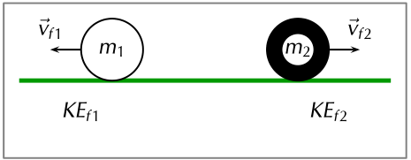
> **[Diagram Context - Textbook_PhysicalSciences_Gr12_Momentum-and-Impulse.pdf-0027-11.png]**
> The image presents a diagram of a simple machine, a wheel and axle, with two wheels and a rod. The diagram is labeled with the names of the two types of wheels, one labeled "V1" and the other "V2". The diagram also includes arrows pointing to the center of the diagram, which is labeled "KE". The diagram is set against a gray background, and the text "LEFT", "RIGHT", "V1", and "V2" are visible.

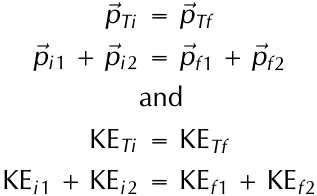
> **[Diagram Context - Textbook_PhysicalSciences_Gr12_Momentum-and-Impulse.pdf-0027-16.png]**
> 1. A diagram of a Lewis structure for water.

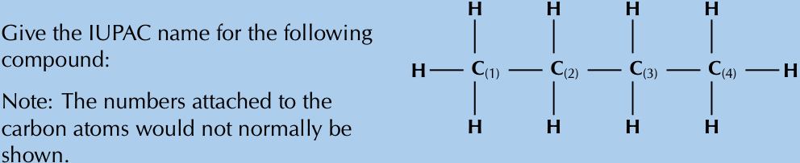
> **[Diagram Context - Textbook_PhysicalSciences_Gr12_Organic-molecules.pdf-0027-14.png]**
> 1. A diagram of a molecule with carbon atoms and hydrogen atoms.

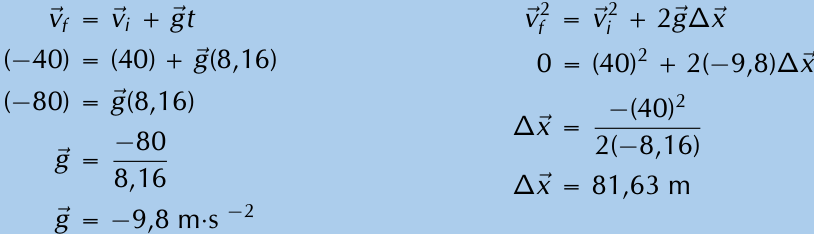
> **[Diagram Context - Textbook_PhysicalSciences_Gr12_Vertical-projectile-motion-in-one-dimension.pdf-0027-03.png]**
> The image shows a diagram of a Lewis structure for oxygen. The diagram is divided into two columns, with the left column containing the Lewis structure of oxygen and the right column showing the Lewis structure of carbon dioxide. The diagram includes the chemical symbols for oxygen (O) and carbon dioxide (CO2), as well as the Lewis structure of oxygen and carbon dioxide. The diagram also includes the Lewis structure of a molecule of water (H2O). The diagram is set against a light blue background, and the text "v = 40 g/8.16" is present.

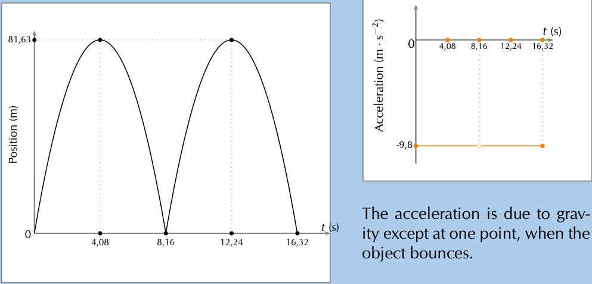
> **[Diagram Context - Textbook_PhysicalSciences_Gr12_Vertical-projectile-motion-in-one-dimension.pdf-0027-06.png]**
> 1. A diagram of a double-layered graph with two black lines and arrows.

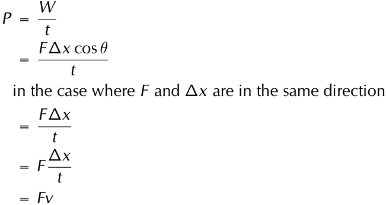
> **[Diagram Context - Textbook_PhysicalSciences_Gr12_Work-energy-and-power.pdf-0027-14.png]**
> 1. A diagram of a molecule with a water molecule and oxygen molecule.

---

## Question 3

### Taking downwards as the positive direction:

> **[Diagram Context - Textbook_PhysicalSciences_Gr12_Momentum-and-Impulse.pdf-0028-15.png]**
> This graphic displays a mathematical equation

#### Criteria for graph:
* Correct shape as shown. (Straight line with gradient.)
* Graph starts at $v = 14\text{ m}\cdot\text{s}^{-1}$ ($v_i$ at $t = 0\text{ s}$).
* Graph extends below $t$ axis until $t = 6\text{ s}$.
* Section of graph below $t$ axis is longer than section above $t$ axis.

---

### Taking downwards as the negative direction:

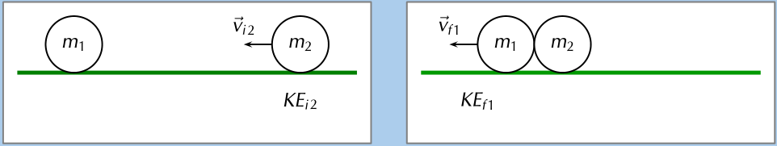
> **[Diagram Context - Textbook_PhysicalSciences_Gr12_Momentum-and-Impulse.pdf-0028-17.png]**
> 1. A diagram of two sets of balls on a blue line.
 2. The balls are labeled with the letters M, M, and M.
 3. The balls are connected by arrows.
 4. The diagram is labeled with the letters K, E, and N.

#### Criteria for graph:
* Correct shape as shown. (Straight line with gradient.)
* Graph starts at $v = -14\text{ m}\cdot\text{s}^{-1}$ ($v_i$ at $t = 0\text{ s}$).
* Graph extends above $t$ axis until $t = 6\text{ s}$.
* Section of graph above $t$ axis is longer than section below $t$ axis.

*(4 marks)*

---

## Question 4

### Option 1:
$$\Delta x = v \Delta t$$
$$\therefore 10 = (2)\Delta t$$
$$\therefore \Delta t = 5\text{ s}$$

**Conclusion:** Yes, he will catch the camera since the time is less than $6\text{ s}$.

---

### Option 2:
$$\Delta x = v \Delta t$$
$$\therefore \Delta x = (2)(6)$$
$$\therefore \Delta x = 12\text{ m}$$

**Conclusion:** Yes, he will catch the camera since the distance covered is greater than $10\text{ m}$.

---

### Option 3:
$$\Delta x = v_i \Delta t + \frac{1}{2}a\Delta t^2$$
$$\therefore 10 = (2)\Delta t + \frac{1}{2}(0)\Delta t^2$$
$$\therefore \Delta t = 5\text{ t}$$

**Conclusion:** Yes, he will catch the camera since the time is less than $6\text{ s}$.

---

### Option 4:
$$\Delta x = \left(\frac{v_i + v_f}{2}\right)\Delta t$$
$$\therefore 10 = \left(\frac{2 + 2}{2}\right)\Delta t$$
$$\therefore \Delta t = 5\text{ s}$$

**Conclusion:** Yes, he will catch the camera since the time is less than $6\text{ s}$.

---

### Option 5:
$$\Delta x = \left(\frac{v_i + v_f}{2}\right)\Delta t$$
$$\Delta x = \left(\frac{2 + 2}{2}\right)(6)$$
$$\therefore \Delta x = 12\text{ m}$$

**Conclusion:** Yes, he will catch the camera since the distance covered is greater than $10\text{ m}$.

*(5 marks)*

**[TOTAL: 14 marks]**

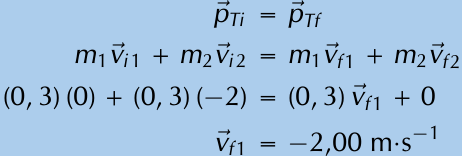
> **[Diagram Context - Textbook_PhysicalSciences_Gr12_Momentum-and-Impulse.pdf-0028-20.png]**
> The image shows a blue line graph with a black x-axis and a black y-axis. The graph displays a series of equations and variables, including the equation P = Pt, where P represents pressure and Pt represents temperature. The graph also includes other equations and variables, such as m = Pt, m1 = Pt1, m2 = Pt2, and m3 = Pt3. The graph is set against a light blue background, and the equations are clearly labeled and organized.

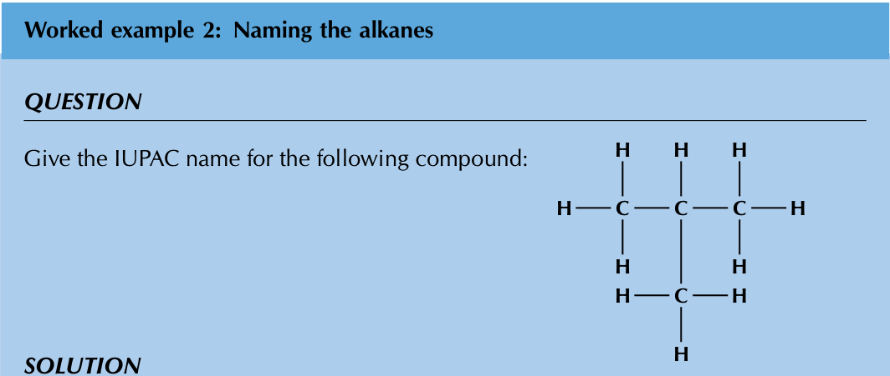
> **[Diagram Context - Textbook_PhysicalSciences_Gr12_Organic-molecules.pdf-0028-01.png]**
> 1. A diagram of a molecule with the chemical formula CH4.

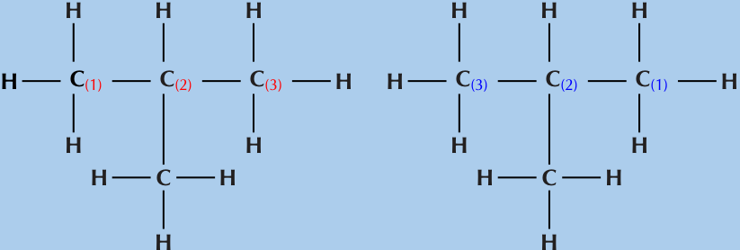
> **[Diagram Context - Textbook_PhysicalSciences_Gr12_Organic-molecules.pdf-0028-08.png]**
> 1. A diagram of a molecule with two carbon atoms and two hydrogen atoms.

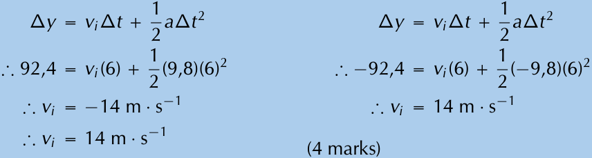
> **[Diagram Context - Textbook_PhysicalSciences_Gr12_Vertical-projectile-motion-in-one-dimension.pdf-0028-14.png]**
> The image shows a math problem involving the concept of velocity and acceleration. The problem is presented in a table format with two columns, one for the velocity and the other for the acceleration. The problem also includes a diagram that illustrates the relationship between the velocity and acceleration. The diagram is a Lewis diagram, which is a visual representation of a molecule's structure, showing the valence electrons and the bonding electrons. The diagram is color-coded, with each color representing a different type of bond. The diagram is accompanied by a table that provides the mathematical equations for calculating the velocity and acceleration.

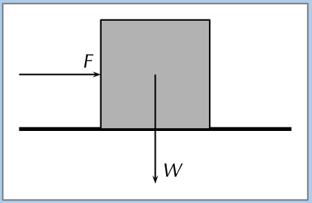

---

## Exercise 3 - 2: Graphs of vertical projectile motion

1. Amanda throws a tennis ball from a height of $1,5\text{ m}$ straight up into the air and then lets it fall to the ground. Draw graphs of $x$ vs $t$; $v$ vs $t$ and $a$ vs $t$ for the motion of the ball. The initial velocity of the tennis ball is $2\text{ m}\cdot\text{s}^{-1}$. Choose upwards as positive.

2. A bullet is shot straight upwards from a gun.

   The following graph is drawn. Downwards was chosen as positive.

   

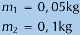

   a) Describe the motion of the bullet.
   
   b) Draw a displacement - time graph.
   
   c) Draw an acceleration - time graph.

3. Describe the motion resulting from the velocity vs time graph shown below, assuming an initial height of $0\text{ m}$, and draw a displacement vs time graph and an acceleration vs time graph:

   

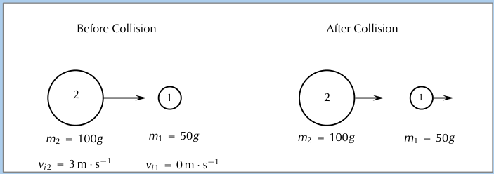
> **[Diagram Context - Textbook_PhysicalSciences_Gr12_Momentum-and-Impulse.pdf-0029-23.png]**
> 1. Before collision: 2 m/s/g balls on a circle.
 2. After collision: 1 m/s/g balls on a circle.

4. What is the initial height? Draw a velocity vs time graph and an acceleration vs time graph that would result in this displacement vs time graph:

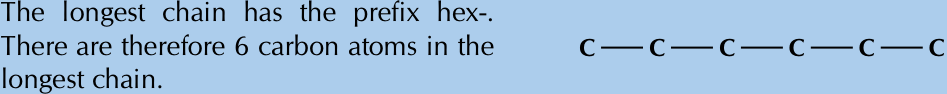
> **[Diagram Context - Textbook_PhysicalSciences_Gr12_Organic-molecules.pdf-0029-07.png]**
> The graphic is an organic chemistry instructional diagram showing a structural carbon backbone with accompanying explanatory text. It features the chemical symbol 'C' connected by single covalent bonds in a linear chain of six carbon atoms, alongside the text "The longest chain has the prefix hex-. There are therefore 6 carbon atoms in the longest chain." Conceptually, this demonstrates how to determine the IUPAC root name for an organic compound by identifying and counting the maximum number of continuous carbon atoms in the parent chain, aligning with CAPS Physical Sciences requirements for naming hydrocarbons.

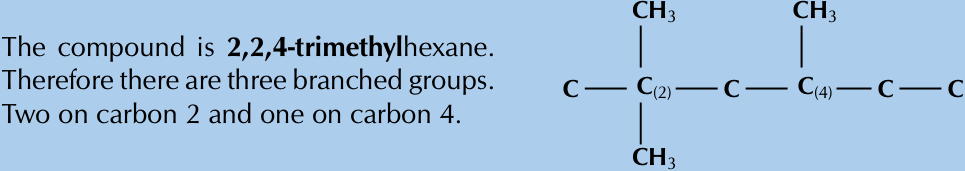
> **[Diagram Context - Textbook_PhysicalSciences_Gr12_Organic-molecules.pdf-0029-09.png]**
> The image shows a diagram of a molecule with the chemical formula CH2CH2CH2CH2CH2CH2CH2CH2CH2CH2CH2CH2CH2CH2CH2CH2CH2CH2CH2CH2CH2CH2CH2CH2CH2CH2CH2CH2CH2CH2CH2CH2CH2CH2CH2CH2CH2CH2CH2CH2CH2CH2CH2CH2CH2CH2CH2CH2CH2CH2CH2CH2CH2CH

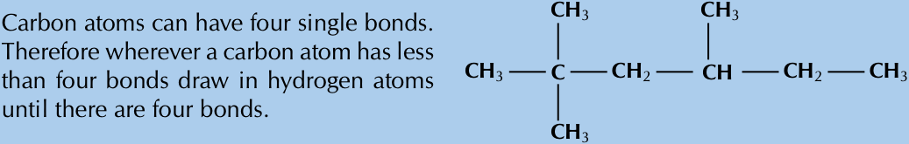
> **[Diagram Context - Textbook_PhysicalSciences_Gr12_Organic-molecules.pdf-0029-11.png]**
> 1. A diagram of a molecule with four carbon atoms and four hydrogen atoms.

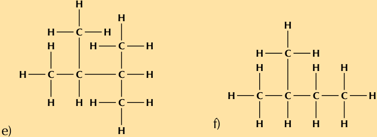
> **[Diagram Context - Textbook_PhysicalSciences_Gr12_Organic-molecules.pdf-0029-19.png]**
> The image presents two different types of chemical structures, each labeled with a chemical symbol. The first structure is a Lewis diagram, which is a visual representation of a molecule's electron configuration. The second structure is a geometric figure, which is a diagram of a molecule's three-dimensional arrangement. The diagram of the molecule is labeled with the chemical symbol H, while the Lewis diagram is labeled with the chemical symbol C. The image also includes a list of visible labels, variables, biological structures, chemical symbols, axis names, and arrows.

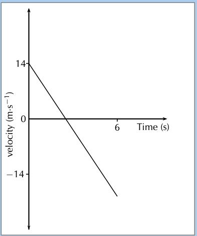
> **[Diagram Context - Textbook_PhysicalSciences_Gr12_Vertical-projectile-motion-in-one-dimension.pdf-0029-02.png]**
> The image is a diagram that shows a graph of velocity over time. The graph is labeled with the x and y axes and has a line graph with a slope of 14 m/s. The x-axis is labeled with the variable "Time" and the y-axis is labeled with the variable "Velocity". The graph shows a straight line with a slope of 14 m/s, indicating a constant velocity. The graph is labeled with the variable "Time" and the variable "Velocity" and the x and y axes are labeled with the variable "Time" and "Velocity

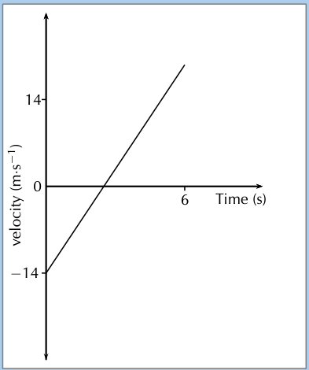
> **[Diagram Context - Textbook_PhysicalSciences_Gr12_Vertical-projectile-motion-in-one-dimension.pdf-0029-04.png]**
> The image shows a graph with a line and a time series. The x-axis is labeled "Time" and the y-axis is labeled "Velocity". The line on the graph is a straight line, and the x-coordinate of the line is 14. The y-coordinate of the line is 6. The graph is labeled with the title "Time Series".

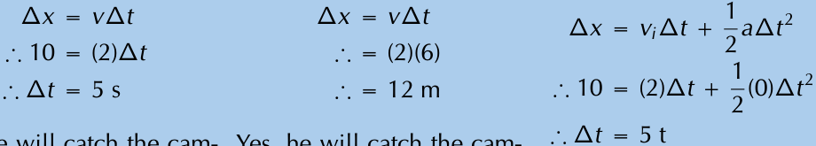
> **[Diagram Context - Textbook_PhysicalSciences_Gr12_Vertical-projectile-motion-in-one-dimension.pdf-0029-20.png]**
> 1. A diagram of a cell with arrows pointing to different parts of the cell.

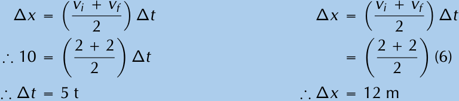
> **[Diagram Context - Textbook_PhysicalSciences_Gr12_Vertical-projectile-motion-in-one-dimension.pdf-0029-24.png]**
> The image shows a diagram of a Lewis structure for carbon dioxide. The diagram is divided into two rows, with the top row containing the carbon atom and the bottom row showing the oxygen atom. The Lewis structure is a visual representation of the chemical bonding between carbon and oxygen, and it is used to determine the electron configuration of carbon dioxide. The diagram is labeled with the chemical symbols C and O, and arrows are used to indicate the bonding between the atoms. The diagram is set against a light blue background, and the text "Lewis structure" is written in black at the bottom of the image.

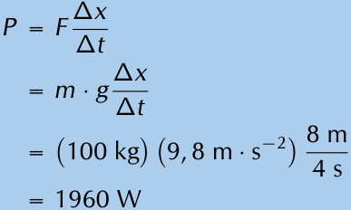
> **[Diagram Context - Textbook_PhysicalSciences_Gr12_Work-energy-and-power.pdf-0029-12.png]**
> The image shows a diagram of a Lewis structure for oxygen, with the chemical formula O2. The diagram is set against a blue background, and the diagram is labeled with the variables P, F, M, g, t, D, and X. The diagram also includes a table with the values of P, F, M, g, t, D, and X.

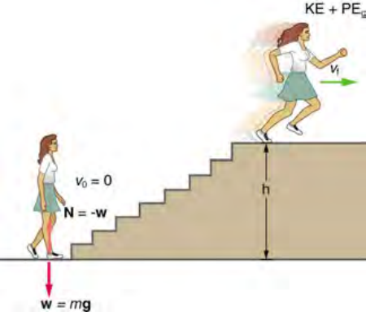
> **[Diagram Context - Textbook_PhysicalSciences_Gr12_Work-energy-and-power.pdf-0029-20.png]**
> 1. A diagram of a girl running up a staircase.

---

## Vertical Projectile Motion in One Dimension

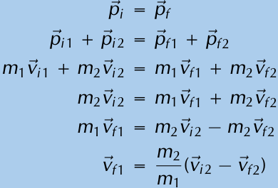
> **[Diagram Context - Textbook_PhysicalSciences_Gr12_Momentum-and-Impulse.pdf-0030-02.png]**
> The image shows a diagram of a Lewis structure for water, which is a molecule composed of two hydrogen atoms and one oxygen atom. The diagram is set against a blue background, and it is labeled with the chemical symbols H2O and the Lewis structure of the molecule. The diagram also includes arrows pointing to the bonds between the atoms and the Lewis structure of the molecule.

### Problem 5

A ball that always bounces off the floor with the same magnitude of the velocity as it hit the floor is dropped from $3\text{ m}$ above a stack of $4$ crates. Each crate is $30\text{ cm}$ high. After the ball bounces off a crate it is quickly removed so that the next time the ball bounces it bounces off the next crate in the pile. This is repeated until all the crates have been removed. Draw the following graphs for the situation:

* Displacement vs time
* Velocity vs time
* Acceleration vs time

---

### Problem 6

A ball is dropped from $4\text{ m}$ above a cushioned mat. Each time the ball bounces the magnitude of the velocity in the upwards direction is half the magnitude of the velocity with which it hit the floor. The ball is allowed to bounce $3$ times, draw the following graphs for the situation and the equation describing each section of the graph:

* Displacement vs time
* Velocity vs time
* Acceleration vs time

---

### Problem 7

More questions. Sign in at Everything Science online and click 'Practise Science'.

Check answers online with the exercise code below or click on 'show me the answer'.

1. $27\text{K7}$
2. $27\text{K8}$
3. $27\text{K9}$
4. $27\text{KB}$
5. $27\text{KC}$
6. $27\text{KD}$

* Website: www.everythingscience.co.nz
* Mobile: m.everythingscience.co.nz

---

## 3.3 Chapter summary

*See presentation: $27\text{KF}$ at www.everythingscience.co.nz*

* Projectiles are objects that move through the air. In vertical projectile motion we deal with objects that fall under the influence of gravity and only vertically.
* Objects that move up and down (vertical projectiles) on the Earth accelerate with a constant acceleration $\vec{g}$ which is approximately equal to $9{,}8\text{ m}\cdot\text{s}^{-2}$ directed downwards.

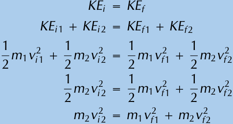
> **[Diagram Context - Textbook_PhysicalSciences_Gr12_Momentum-and-Impulse.pdf-0030-04.png]**
> The image shows a diagram of a Lewis structure for carbon dioxide (CO2). The diagram is divided into two rows, with the top row containing the carbon atom and the bottom row showing the oxygen atom. The Lewis structure is a visual representation of the chemical bonding between the carbon and oxygen atoms. The diagram is color-coded, with the carbon atom in black and the oxygen atom in red. The diagram also includes arrows to indicate the bonds between the atoms. The diagram is set against a light blue background, and the text "KE" and "KEE" are visible, indicating the chemical

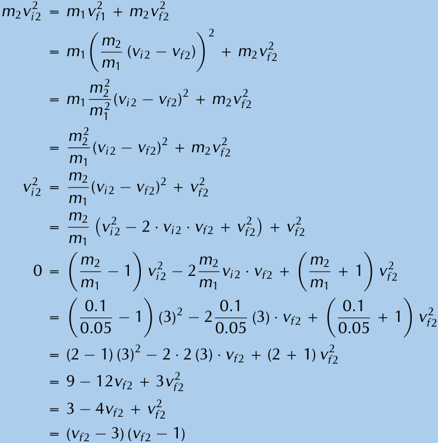
> **[Diagram Context - Textbook_PhysicalSciences_Gr12_Momentum-and-Impulse.pdf-0030-06.png]**
> The image shows a math problem on a blue background. The problem is a list of equations and variables, including the following:
m1 = m2 + m3
m2 = m3 + m4
m3 = m4 + m5
m4 = m5 + m6
m5 = m6 + m7
m6 = m7 + m8
m7 = m8 + m9
m8 = m9 + m10

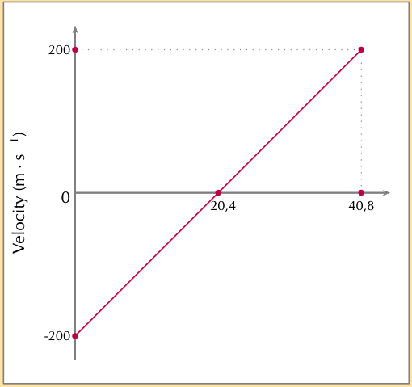
> **[Diagram Context - Textbook_PhysicalSciences_Gr12_Vertical-projectile-motion-in-one-dimension.pdf-0030-07.png]**
> The image is a graph that shows the relationship between velocity and time. The x-axis is labeled "velocity" and the y-axis is labeled "time". The graph shows a line that goes through the points (200, 0.2) and (400, 0.8). The line is red and has a slope of 0.4.

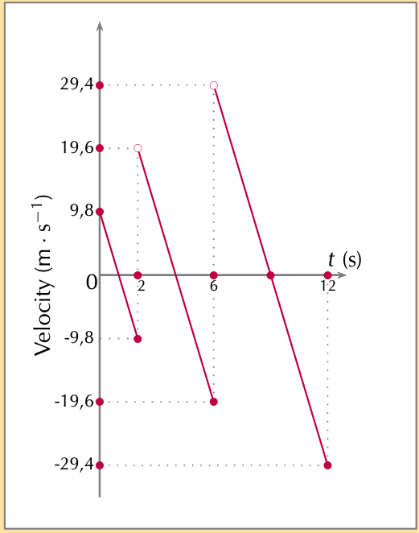
> **[Diagram Context - Textbook_PhysicalSciences_Gr12_Vertical-projectile-motion-in-one-dimension.pdf-0030-09.png]**
> The image presents a graph that illustrates the relationship between velocity and time. The graph is a line graph with a red line that slopes upwards, indicating a positive relationship between the two variables. The x-axis of the graph is labeled "Time" and the y-axis is labeled "Velocity". The graph is labeled with the title "Velocity vs Time" and the units "m/s". The graph is labeled with the variable "t" and the units "s". The graph is labeled with the variable "v" and the units "m/s". The graph is labeled

---

## Vertical Projectile Motion

### Key Concepts and Principles

* **Symmetry of Time:** The time it takes an object to rise to its maximum height is equal to the time it takes to fall back to its initial height. The magnitude of the velocity remains the same at the same height, but the direction is reversed. This phenomenon is known as **time symmetry** and is a consequence of uniform gravitational acceleration.
* **Equations of Motion:** Vertical projectile problems can be solved using the standard equations of motion under constant acceleration ($g$):
  $$v_{f} = v_{i} + gt$$
  $$\Delta \vec{x} = \frac{(\vec{v}_{i} + \vec{v}_{f})}{2}t$$
  $$\Delta \vec{x} = \vec{v}_{i}t + \frac{1}{2}gt^{2}$$
  $$v_{f}^{2} = v_{i}^{2} + 2g\Delta \vec{x}$$
* **Graphs of Motion:** Graphs for vertical projectile motion are similar to graphs for motion at constant acceleration.

---

### Physical Quantities and Units

The table below summarizes the quantities, vector nature, unit names, and unit symbols used in vertical projectile motion:

| Quantity | Vector | Unit name | Unit symbol |
| :--- | :---: | :--- | :---: |
| Position ($x$) | $-$ | metre | $\text{m}$ |
| Displacement ($\Delta \vec{x}$) | $\checkmark$ | metre | $\text{m}$ |
| Instantaneous velocity ($\vec{v}$) | $\checkmark$ | metre per second | $\text{m}\cdot\text{s}^{-1}$ |
| Instantaneous speed ($v$) | $-$ | metre per second | $\text{m}\cdot\text{s}^{-1}$ |
| Instantaneous acceleration ($\vec{a}$) | $\checkmark$ | metre per second per second | $\text{m}\cdot\text{s}^{-2}$ |
| Magnitude of acceleration ($a$) | $-$ | metre per second per second | $\text{m}\cdot\text{s}^{-2}$ |

*Table 3.1: Units used in vertical projectile motion.*

---

## Exercise 3 – 3

1. **[SC 2001/11 HG1]** A bullet fired vertically upwards reaches a maximum height and falls back to the ground. 
   
   Which **one** of the following statements is **true** with reference to the acceleration of the bullet during its motion, if air resistance is ignored? The acceleration:
   
   a) is always downwards
   
   b) is first upwards and then downwards
   
   c) is first downwards and then upwards
   
   d) decreases first and then increases

2. **[IEB 2002/11 HG1]** Two balls, $P$ and $Q$, are simultaneously thrown into the air from the same height above the ground. $P$ is thrown vertically upwards and $Q$ vertically downwards with the same initial speed. Which of the following is true of both balls just before they hit the ground? (Ignore any air resistance. Take downwards as the positive direction.)

| | Velocity | Acceleration |
| :---: | :--- | :--- |
| **A** | The same | The same |
| **B** | $P$ has a greater velocity than $Q$ | $P$ has a negative acceleration; $Q$ has a positive acceleration |
| **C** | $P$ has a greater velocity than $Q$ | The same |
| **D** | The same | $P$ has a negative acceleration; $Q$ has a positive acceleration |

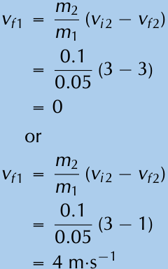
> **[Diagram Context - Textbook_PhysicalSciences_Gr12_Momentum-and-Impulse.pdf-0031-01.png]**
> 1. A blue background with a black and white diagram of a Lewis structure.

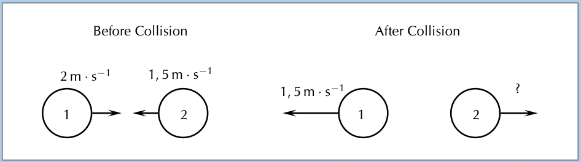
> **[Diagram Context - Textbook_PhysicalSciences_Gr12_Momentum-and-Impulse.pdf-0031-13.png]**
> Before collision: 2m/s/m, 1.5m/s/m, 1m/s/m, 1m/s/m, 1m/s/m

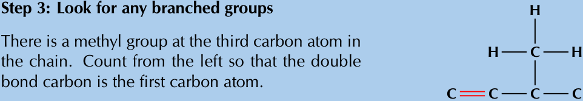
> **[Diagram Context - Textbook_PhysicalSciences_Gr12_Organic-molecules.pdf-0031-00.png]**
> 1. A diagram of a carbon atom with a bond carbon and two hydrogen atoms.

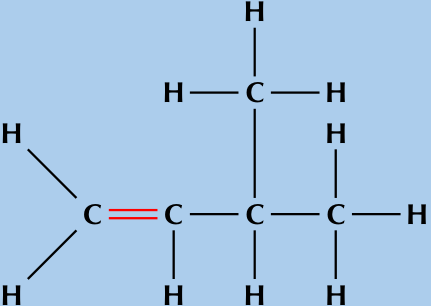
> **[Diagram Context - Textbook_PhysicalSciences_Gr12_Organic-molecules.pdf-0031-02.png]**
> 1. A diagram of a molecule with the chemical formula C6H12O6.

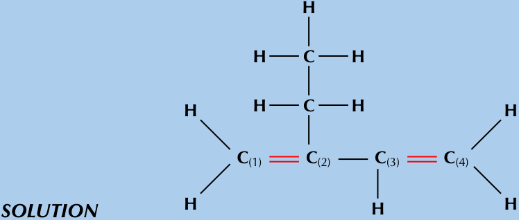
> **[Diagram Context - Textbook_PhysicalSciences_Gr12_Organic-molecules.pdf-0031-07.png]**
> The image shows a diagram of a molecule, specifically a molecule of ethyne, which is composed of two carbon atoms and two hydrogen atoms. The molecule is depicted as a ring structure, with the carbon atoms arranged in a ring and the hydrogen atoms arranged in a line. The diagram also includes the text "Solution" and "H", which likely refers to the solution to the problem of finding the molecular weight of ethyne.

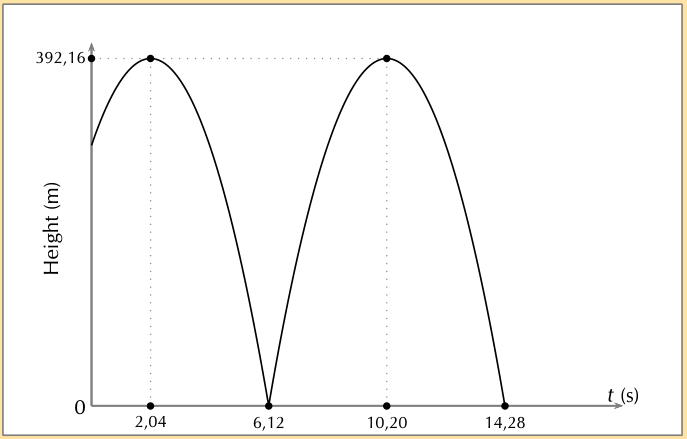
> **[Diagram Context - Textbook_PhysicalSciences_Gr12_Vertical-projectile-motion-in-one-dimension.pdf-0031-00.png]**
> The image is a black and white diagram that shows the relationship between the height of a person and the number of cells in their body. The diagram is labeled with the variables "height" and "cell count" and is accompanied by a line graph that shows the relationship between these two variables. The graph is labeled with the variable "height" on the x-axis and "cell count" on the y-axis. The diagram also includes a legend that explains the different types of cells represented by the lines on the graph.

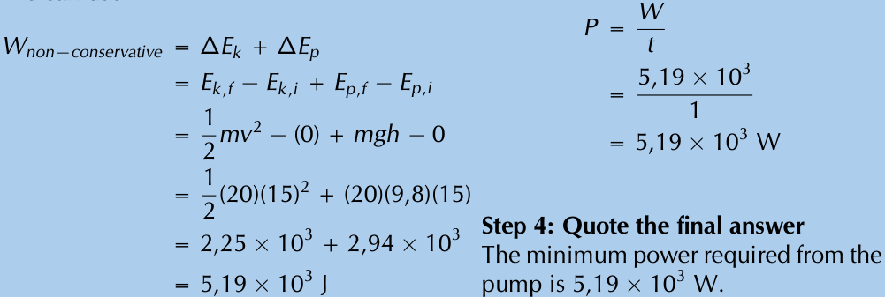
> **[Diagram Context - Textbook_PhysicalSciences_Gr12_Work-energy-and-power.pdf-0031-02.png]**
> 1. A diagram of a cell with arrows pointing to different parts of the cell.

---

### Chapter 3. Vertical projectile motion in one dimension

---

#### 3. [SC 2003/11]
A ball $X$ of mass $m$ is projected vertically upwards at a speed $u_x$ from a bridge $20\text{ m}$ high. A ball $Y$ of mass $2m$ is projected vertically downwards from the same bridge at a speed of $u_y$. The two balls reach the water at the same speed. Air friction can be ignored. 

Which of the following is true with reference to the speeds with which the balls are projected?

* a) $u_x = \frac{1}{2}u_y$
* b) $u_x = u_y$
* c) $u_x = 2u_y$
* d) $u_x = 4u_y$

---

#### 4. [SC 2002/03 HG1]
A stone falls freely from rest from a certain height. Which one of the following quantities could be represented on the $y$-axis of the graph below?

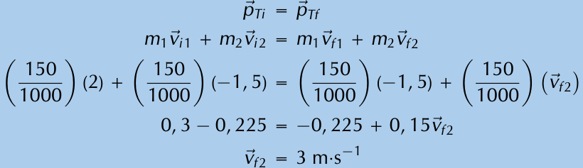
> **[Diagram Context - Textbook_PhysicalSciences_Gr12_Momentum-and-Impulse.pdf-0032-01.png]**
> The image shows a diagram of a Lewis structure for oxygen. The diagram is blue and features a number of arrows and labels. The diagram is labeled with the chemical symbol "O2" and the Lewis structure of oxygen. The diagram also includes the Lewis structure of carbon dioxide, which is labeled with the chemical symbol "CO2". The diagram is accompanied by a table of values, which includes the Lewis structure of oxygen, carbon dioxide, and water. The table also includes the Lewis structure of methane, which is labeled with the chemical symbol "CH4".

* a) velocity
* b) acceleration
* c) momentum
* d) displacement

---

#### 5.
A stone is thrown vertically upwards and it returns to the ground. If friction is ignored, its acceleration as it reaches the highest point of its motion is:

* a) greater than just after it left the throwers hand.
* b) less than just before it hits the ground.
* c) the same as when it left the throwers hand.
* d) less than it will be when it strikes the ground.

---

#### 6. [IEB 2004/11 HG1]
A stone is thrown vertically up into the air. Which of the following graphs best shows the resultant force exerted on the stone against time while it is in the air? (Air resistance is negligible.)

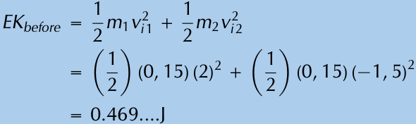
> **[Diagram Context - Textbook_PhysicalSciences_Gr12_Momentum-and-Impulse.pdf-0032-06.png]**
> The image shows a blue table with a mathematical equation written on it. The equation is in black text and includes variables such as m, v, and m2. The table also contains a diagram of a Lewis structure, a geometric figure, and a circuit diagram. The table is set against a light blue background.

---

#### 7.
What is the velocity of a ball just as it hits the ground if it is thrown upward at $10\text{ m}\cdot\text{s}^{-1}$ from a height $5\text{ meters}$ above the ground?

---

#### 8. [IEB 2002/11 HG1 - Bouncing Ball]
A ball bounces vertically on a hard surface after being thrown vertically up into the air by a boy standing on the ledge of a building. 

Just before the ball hits the ground for the first time, it has a velocity of magnitude $15\text{ m}\cdot\text{s}^{-1}$. Immediately, after bouncing, it has a velocity of magnitude $10\text{ m}\cdot\text{s}^{-1}$.

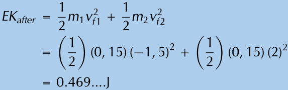
> **[Diagram Context - Textbook_PhysicalSciences_Gr12_Momentum-and-Impulse.pdf-0032-08.png]**
> The image shows a math problem written in a blue font on a light blue background. The problem is about calculating the number of protons, neutrons, and electrons in an atom. The problem is labeled "EK after 2mV = 1mV + 2mV = 2mV + 2mV = 0.5mV + 2mV = 0.5mV + 2mV = 0.5mV + 2mV = 0.5mV + 2mV = 0.5mV + 2mV = 0.5m

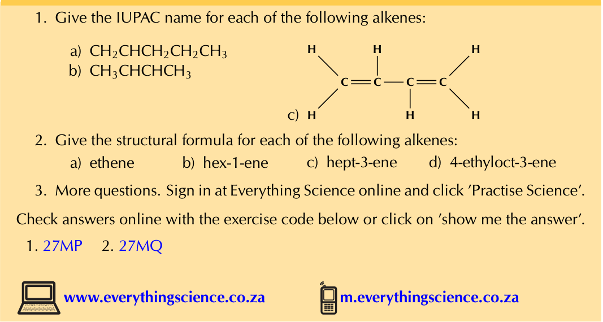
> **[Diagram Context - Textbook_PhysicalSciences_Gr12_Organic-molecules.pdf-0032-02.png]**
> 1. Give the structural formula for each of the following following alkenes:
 2. Give the structural formula for each of the following following alkanes:
 3. Give the structural formula for each of the following following alkanes:
 4. Give the structural formula for each of the following following alkanes:
 5. Give the structural formula for each of the following following alkanes:
 6. Give the structural formula for each of the following following alkanes:
 7. Give the structural formula for each of the following following alkanes:
 8. Give the structural formula

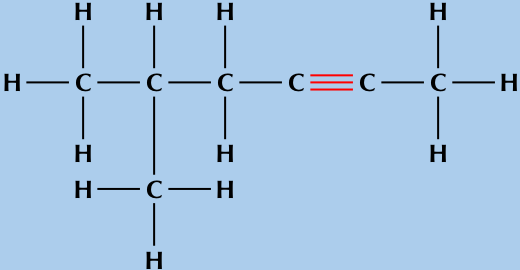
> **[Diagram Context - Textbook_PhysicalSciences_Gr12_Organic-molecules.pdf-0032-09.png]**
> The graphic is a structural formula (chemical diagram) of an organic molecule featuring carbon (C) and hydrogen (H) atoms connected by single bonds and a central triple bond (highlighted in red). Visible labels consist of the chemical symbols 'C' and 'H' arranged with connecting lines representing covalent bonds. Conceptually, this diagram helps Grade 12 Physical Sciences learners identify functional groups—specifically an alkyne—and practise IUPAC naming rules for branched, unsaturated hydrocarbons containing a triple bond.

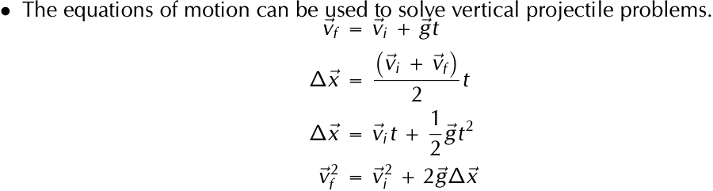
> **[Diagram Context - Textbook_PhysicalSciences_Gr12_Vertical-projectile-motion-in-one-dimension.pdf-0032-02.png]**
> The image shows a diagram of a molecule with two atoms and a bond. The diagram is labeled with the chemical symbols for carbon, oxygen, and nitrogen. The diagram also includes arrows pointing to the atoms and bonds. The diagram is set against a gray background.

---

The graph below shows the velocity of the ball as a function of time from the moment it is thrown upwards into the air until it reaches its maximum height after bouncing once.

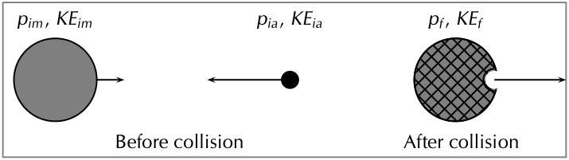
> **[Diagram Context - Textbook_PhysicalSciences_Gr12_Momentum-and-Impulse.pdf-0033-02.png]**
> 1. A diagram of a collision between two particles.

a) At what velocity does the boy throw the ball into the air?

b) What can be determined by calculating the gradient of the graph during the first two seconds?

c) Determine the gradient of the graph over the first two seconds. State its units.

d) How far below the boy's hand does the ball hit the ground?

e) Use an equation of motion to calculate how long it takes, from the time the ball was thrown, for the ball to reach its maximum height after bouncing.

f) What is the position of the ball, measured from the boy's hand, when it reaches its maximum height after bouncing?

---

### 9. [IEB 2001/11 HG1] - Free Falling?

A parachutist steps out of an aircraft, flying high above the ground. She falls for the first $8\text{ seconds}$ before opening her parachute. A graph of her velocity is shown in Graph A below.

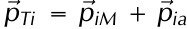

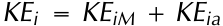

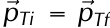

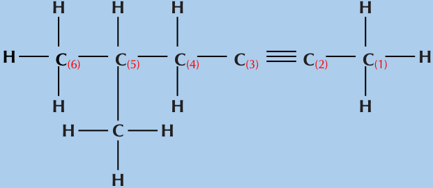
> **[Diagram Context - Textbook_PhysicalSciences_Gr12_Organic-molecules.pdf-0033-00.png]**
> 1. A diagram of a molecule with a chemical formula.

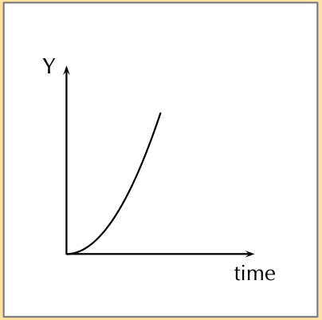
> **[Diagram Context - Textbook_PhysicalSciences_Gr12_Vertical-projectile-motion-in-one-dimension.pdf-0033-11.png]**
> The image is a black and white diagram that shows a graph with a line going up and to the right. The graph is labeled "time" at the bottom. The diagram is labeled with the words "time" and "time" at the top. The diagram is labeled with the words "time" and "time" at the bottom. The diagram is labeled with the words "time" and "time" at the top.

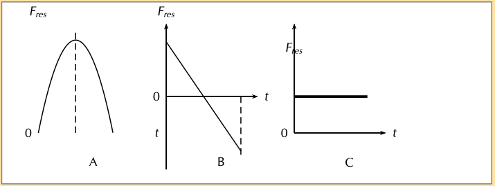
> **[Diagram Context - Textbook_PhysicalSciences_Gr12_Vertical-projectile-motion-in-one-dimension.pdf-0033-18.png]**
> 1. A diagram of a Lewis structure with arrows pointing to the bonds.

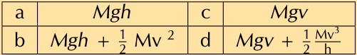
> **[Diagram Context - Textbook_PhysicalSciences_Gr12_Work-energy-and-power.pdf-0033-05.png]**
> The graphic presents a multiple-choice question format displaying algebraic physics expressions in a structured table labeled with options a, b, c, and d. The visible variables and symbols include mass ($M$), gravitational acceleration ($g$), height ($h$), velocity ($v$), and numerical fractions like $\frac{1}{2}$, forming terms such as $Mgh$, $Mgv$, $\frac{1}{2}Mv^2$, and $\frac{1}{2}\frac{Mv^3}{h}$. For a Physical Sciences student, this graphic tests dimensional analysis or the identification of correct mechanical energy formulas, such as gravitational potential energy ($Mgh$) and kinetic energy ($\frac{1}{2}Mv^2$).

---

a) Use the information from the graph to calculate an approximate height of the aircraft when she stepped out of it (to the nearest $10\text{ m}$).

b) What is the magnitude of her velocity during her descent with the parachute fully open?

The air resistance acting on the parachute is related to the speed at which the parachutist descends. Graph B shows the relationship between air resistance and velocity of the parachutist descending with the parachute open.

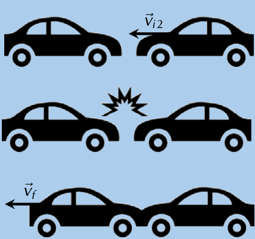
> **[Diagram Context - Textbook_PhysicalSciences_Gr12_Momentum-and-Impulse.pdf-0034-05.png]**
> 1. A diagram of a car crash.

c) Use Graph B to find the magnitude of the air resistance on her parachute when she was descending with the parachute open.

d) Assume that the mass of the parachute is negligible. Calculate the mass of the parachutist showing your reasoning clearly.

10. Niko, in the basket of a hot-air balloon, is stationary at a height of $10\text{ m}$ above the level from where his friend, Bongi, will throw a ball. Bongi intends throwing the ball upwards and Niko, in the basket, needs to **descend** (move downwards) to catch the ball at its maximum height.

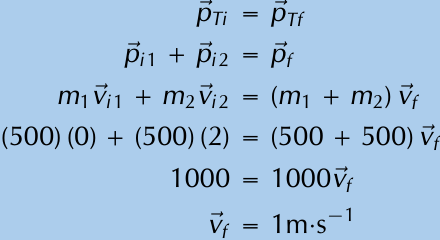
> **[Diagram Context - Textbook_PhysicalSciences_Gr12_Momentum-and-Impulse.pdf-0034-18.png]**
> The image shows a blue background with a mathematical equation written in black. The equation is a complex one, involving multiple variables and terms. The equation is accompanied by a table of numbers, which provides additional information about the variables and their values. The table includes labels for the variables, such as "P1", "P2", "Pr", "Pt", "P1 + P2", "P1 - P2", "P1 * P2", "P1 / P2", and "P1 + P2 - P1". The table also contains the values of

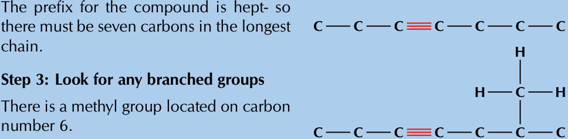
> **[Diagram Context - Textbook_PhysicalSciences_Gr12_Organic-molecules.pdf-0034-07.png]**
> 1. A diagram of a carbon chain with two carbon atoms and four hydrogen atoms.

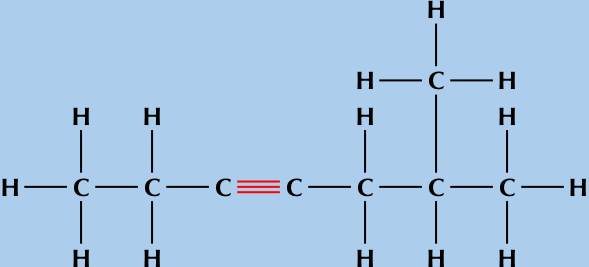
> **[Diagram Context - Textbook_PhysicalSciences_Gr12_Organic-molecules.pdf-0034-09.png]**
> This graphic displays a structural formula (or expanded structural formula) of a branched alkyne, specifically showing carbon (C) and hydrogen (H) atoms connected by single bonds and a central triple bond (represented by three red lines). Visible labels include the chemical symbols 'C' and 'H' interconnected by bond lines. For a high school Physical Sciences student studying organic chemistry under the CAPS curriculum, this diagram visually conveys molecular structure, functional groups (the carbon-carbon triple bond characteristic of alkynes), and branching isomers in unsaturated hydrocarbons.

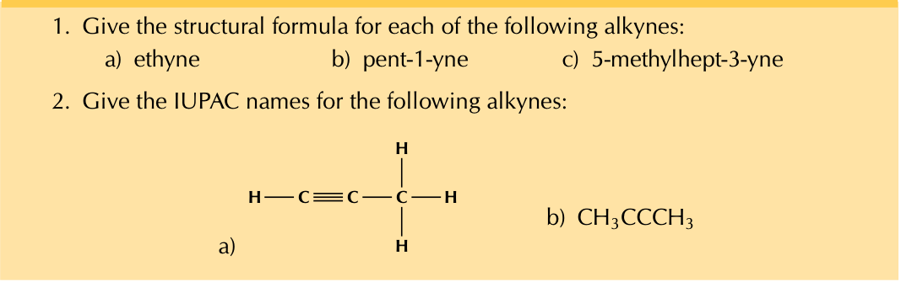
> **[Diagram Context - Textbook_PhysicalSciences_Gr12_Organic-molecules.pdf-0034-13.png]**
> 1. Give the structural formula for each of the following alkynes: ethane, propane, butane, pentane, hexane, heptane, octane, nonane.

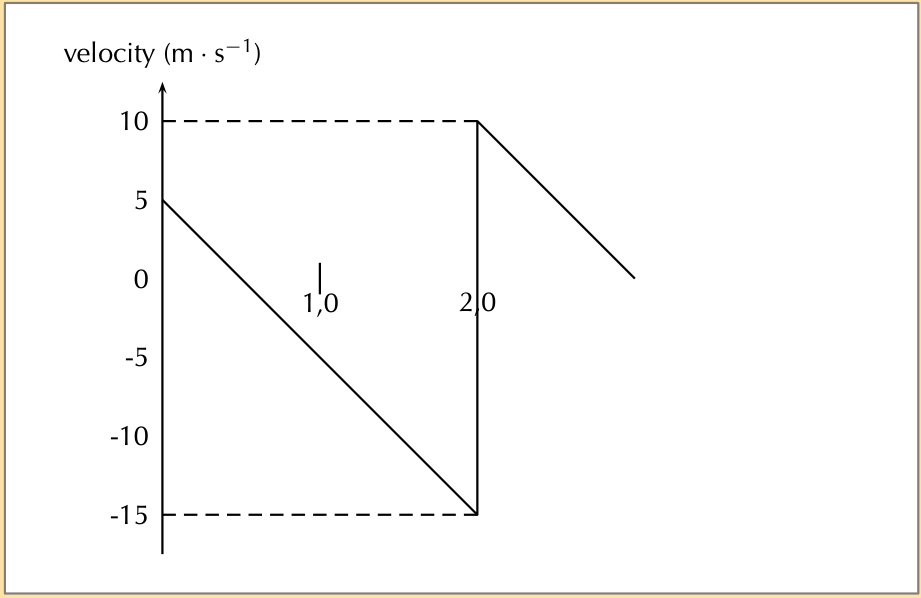
> **[Diagram Context - Textbook_PhysicalSciences_Gr12_Vertical-projectile-motion-in-one-dimension.pdf-0034-01.png]**
> The image shows a graph with a velocity curve, labeled "velocity m/s". The graph is a black and white diagram with a line and a curve, which is labeled "1.0" and "20". The graph is labeled "velocity m/s" and "velocity m/s".

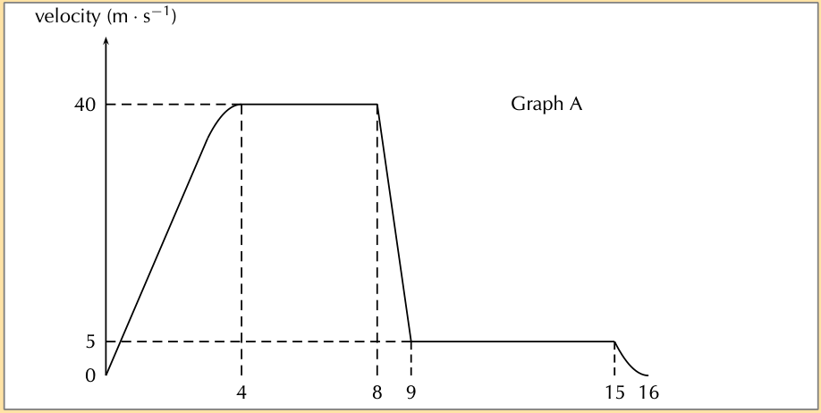
> **[Diagram Context - Textbook_PhysicalSciences_Gr12_Vertical-projectile-motion-in-one-dimension.pdf-0034-10.png]**
> The image shows a graph with the x-axis labeled "velocity" and the y-axis labeled "graph A". The graph is a black and white line graph, and it is labeled with the word "velocity" at the top. The graph is labeled with the word "graph A" at the bottom. The graph is labeled with the number "40" at the top and the number "15" at the bottom. The graph is labeled with the number "4" at the top and the number "8" at the bottom. The graph is labeled with the number "

> **[Diagram Context - Textbook_PhysicalSciences_Gr12_Work-energy-and-power.pdf-0034-00.png]**
> The image shows a chapter number 5 displayed in green and white. The chapter is titled "Chapter 5" and is positioned at the top of the image. The chapter number is clearly visible, making it easy to identify the content.

---

Bongi throws the ball upwards with a velocity of $13\text{ m}\cdot\text{s}^{-1}$. Niko starts his descent at the same instant the ball is thrown upwards, by letting air escape from the balloon, causing it to accelerate downwards. Ignore the effect of air friction on the ball.

a) Calculate the maximum height reached by the ball.

b) Calculate the magnitude of the minimum average acceleration the balloon must have in order for Niko to catch the ball at its maximum height.

11. More questions. Sign in at Everything Science online and click 'Practise Science'.

Check answers online with the exercise code below or click on 'show me the answer'.

1. 27KG
2. 27KH
3. 27KJ
4. 27KK
5. 27KM
6. 27KN
7. 27KP
8. 27KQ
9. 27KR
10. 27KS

www.everythingscience.co.za

m.everythingscience.co.za

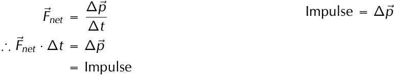
> **[Diagram Context - Textbook_PhysicalSciences_Gr12_Momentum-and-Impulse.pdf-0035-18.png]**
> 1. A diagram of a cell with arrows pointing to different parts of the cell.

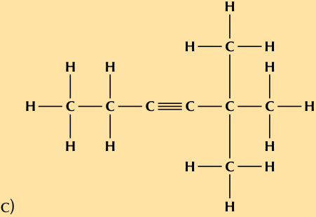
> **[Diagram Context - Textbook_PhysicalSciences_Gr12_Organic-molecules.pdf-0035-00.png]**
> This graphic displays the structural formula of a branched alkyne, specifically showing carbon (C) and hydrogen (H) atoms connected by single bonds and a triple carbon-carbon bond. Visible labels include the chemical symbols "C" and "H" arranged in a branched chain with single and triple covalent bond lines, accompanied by the subsection label "c)". Conceptually, this diagram helps Grade 12 Physical Sciences learners practice IUPAC naming conventions, identify functional groups, and recognize structural isomerism in organic chemistry.

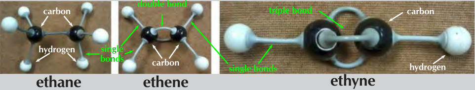
> **[Diagram Context - Textbook_PhysicalSciences_Gr12_Organic-molecules.pdf-0035-06.png]**
> 1. A diagram of a molecule of ethane.

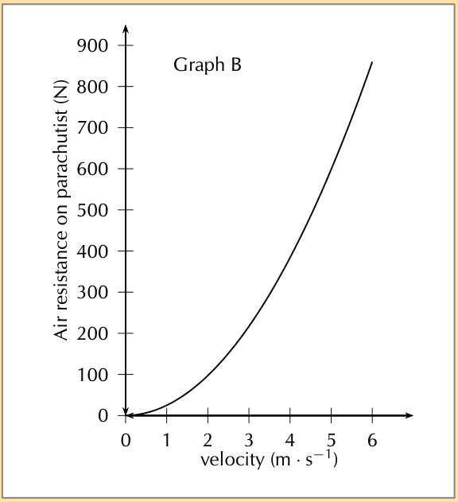
> **[Diagram Context - Textbook_PhysicalSciences_Gr12_Vertical-projectile-motion-in-one-dimension.pdf-0035-03.png]**
> A graph showing the relationship between air resistance and velocity of a falling object. The x-axis is labeled "Air resistance" and the y-axis is labeled "Velocity". The graph shows a positive relationship between the two variables, with the line representing the velocity of the falling object increasing as the air resistance increases.

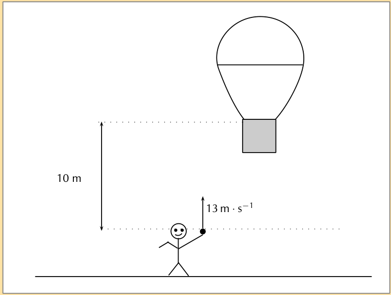
> **[Diagram Context - Textbook_PhysicalSciences_Gr12_Vertical-projectile-motion-in-one-dimension.pdf-0035-07.png]**
> The image shows a diagram of a stick figure holding a balloon. The stick figure is positioned on the left side of the image, while the balloon is located on the right side. The diagram also includes a scale that reads "10m" and a label that says "13m/s-1".

---

# CHAPTER 3

## Vertical projectile motion in one dimension

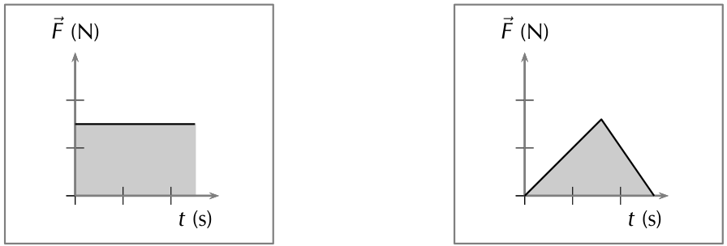
> **[Diagram Context - Textbook_PhysicalSciences_Gr12_Momentum-and-Impulse.pdf-0036-02.png]**
> 1. A diagram of a Lewis structure for an amino acid.

### Contents

| Section | Topic | Page |
| :--- | :--- | :--- |
| **3.1** | Introduction | 52 |
| **3.2** | Vertical projectile motion | 52 |
| **3.3** | Chapter summary | 64 |

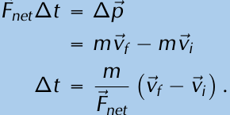
> **[Diagram Context - Textbook_PhysicalSciences_Gr12_Momentum-and-Impulse.pdf-0036-14.png]**
> 1. A diagram of a molecule with arrows pointing to the different parts of the molecule.

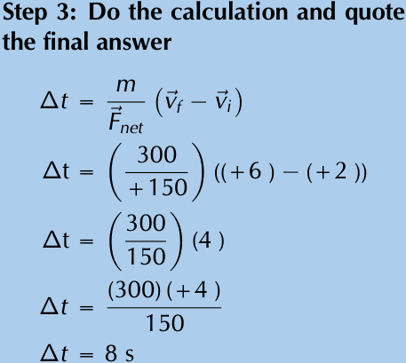
> **[Diagram Context - Textbook_PhysicalSciences_Gr12_Momentum-and-Impulse.pdf-0036-17.png]**
> 1. A diagram of a cell with arrows pointing to different parts of the cell.

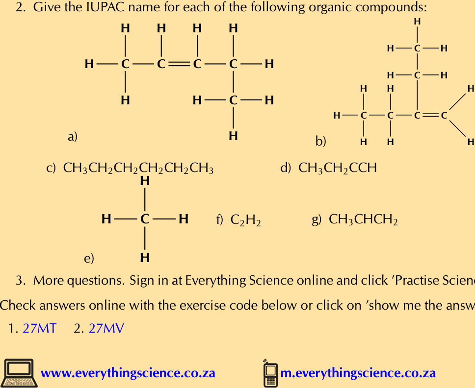
> **[Diagram Context - Textbook_PhysicalSciences_Gr12_Organic-molecules.pdf-0036-02.png]**
> 1. A diagram of a molecule with the chemical formula CH3CH2CH2CH3.

> **[Diagram Context - Textbook_PhysicalSciences_Gr12_Organic-molecules.pdf-0036-09.png]**
> The image shows a diagram of a molecule with the chemical formula C6H12O6. The molecule is composed of six carbon atoms, twelve hydrogen atoms, and six oxygen atoms. The diagram is labeled with the chemical formula C6H12O6 and the number of atoms for each element. The diagram also includes a red arrow pointing to the center of the molecule.

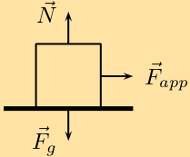

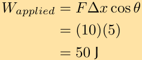
> **[Diagram Context - Textbook_PhysicalSciences_Gr12_Work-energy-and-power.pdf-0036-12.png]**
> This graphic displays a physics calculation showing the formula for work done by an applied force, $W_{applied} = F\Delta x \cos\theta$, alongside a substituted numerical example yielding $50\text{ J}$. Visible elements include the variables $W_{applied}$, $F$, $\Delta x$, $\theta$, and units in Joules ($\text{J}$). Conceptually, it guides Grade 11 Physical Sciences learners through applying the work equation to calculate the energy transferred when a force displaces an object.

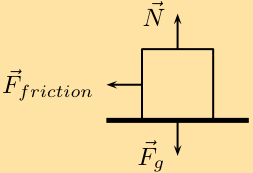
> **[Diagram Context - Textbook_PhysicalSciences_Gr12_Work-energy-and-power.pdf-0036-15.png]**
> This force diagram illustrates a free-body diagram of an object resting on a horizontal surface. It features vector labels for normal force ($\vec{N}$ pointing vertically upwards), gravitational force ($\vec{F}_g$ pointing vertically downwards), and frictional force ($\vec{F}_{friction}$ pointing horizontally to the left). In the CAPS Grade 11 Physics curriculum, this visual helps learners understand how to identify and represent all external forces acting on an object during Newton's Laws of Motion problem-solving.

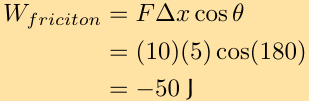
> **[Diagram Context - Textbook_PhysicalSciences_Gr12_Work-energy-and-power.pdf-0036-18.png]**
> This graphic presents a physics calculation showing the formula and step-by-step substitution for work done by a non-conservative force. The visible text displays the equation $W_{friciton} = F \Delta x \cos \theta$, substituted with numerical values $(10)(5)\cos(180)$, yielding a final answer of $-50\text{ J}$. Conceptually, this demonstrates for Grade 12 Physical Sciences learners how to calculate the negative work done by a frictional force acting in the direction opposite to displacement.

---

# 3 Vertical projectile motion in one dimension

## 3.1 Introduction

* Understand the principle of free falling under gravity with a constant acceleration for an upwards and downwards motion.
* Know that it's only vertical displacement no horizontal displacement.
* Always move only under the influence of only gravity.
* The meaning of time symmetry and the magnitude of velocity.
* Do an experiment to measure the position and time during a motion.
* Calculations done on projectiles by knowing how to use a single set of equations.
* Graphical representations of the equations of motion - Draw graphs for the projectiles motions.
* Deduct equations and determine the position, displacement, velocity or acceleration from the graphs.
* Describe the motion of the object from the graphs.

### Key Mathematics Concepts

* Units and unit conversions — Physical Sciences, Grade 10, Science skills
* Rectilinear motion — Physical Sciences, Grade 10, Todo
* Linear equations — Mathematics, Grade 10, Todo
* Quadratic equations — Mathematics, Grade 10, Todo

---

## 3.2 Vertical projectile motion

### Equations of motion

#### Exercise 3 – 1: Equations of motion

1. A cricketer hits a cricket ball straight up into the air. The cricket ball has an initial velocity of $20\text{ m}\cdot\text{s}^{-1}$ vertically upwards.
   
   a) What height does the ball reach before it stops to fall back to the ground?  
   b) How long has the ball been in the air for?  
   
   *(Note that the final velocity is $0$ at the maximum height that the ball reaches. Take upwards as $+\text{ve}$ direction.)*

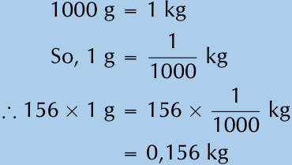
> **[Diagram Context - Textbook_PhysicalSciences_Gr12_Momentum-and-Impulse.pdf-0037-15.png]**
> The image shows a blue background with a table that contains three equations. The first equation is "1 kg = 1000 g", the second equation is "1 g = 1 kg", and the third equation is "1 g = 1 kg". The table also includes a diagram of a cell, a Lewis diagram, and a graph. The text "0.1 kg = 1.1 g" is also present in the image.

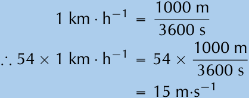
> **[Diagram Context - Textbook_PhysicalSciences_Gr12_Momentum-and-Impulse.pdf-0037-17.png]**
> The image shows a diagram of a cell with a Lewis structure. The diagram is set against a blue background and is labeled with the variables "1 km/h", "1 km/s", and "1 m/s". The diagram also includes arrows pointing to the x and y axes. The diagram is labeled with the variable "1 km/h" and "1 km/s" on the x and y axes, respectively. The diagram also includes the variable "1 m/s" on the x and y axes.

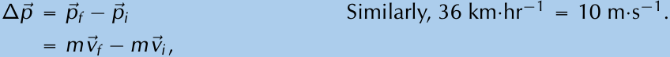
> **[Diagram Context - Textbook_PhysicalSciences_Gr12_Momentum-and-Impulse.pdf-0037-18.png]**
> Momentum and Impulse

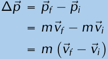
> **[Diagram Context - Textbook_PhysicalSciences_Gr12_Momentum-and-Impulse.pdf-0037-24.png]**
> This image displays the

> **[Diagram Context - Textbook_PhysicalSciences_Gr12_Organic-molecules.pdf-0037-09.png]**
> 1. A diagram of a molecule with six carbon atoms and six hydrogen atoms.

> **[Diagram Context - Textbook_PhysicalSciences_Gr12_Vertical-projectile-motion-in-one-dimension.pdf-0037-00.png]**
> The image shows a graphic of a green circle with the word "chapter" written in white letters. The circle is surrounded by a gray border, and the word "3" is positioned directly below the circle. The image does not contain any text or additional objects.

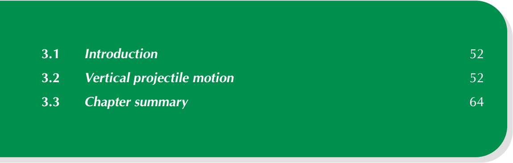
> **[Diagram Context - Textbook_PhysicalSciences_Gr12_Vertical-projectile-motion-in-one-dimension.pdf-0037-02.png]**
> The image shows a green book with a white border, divided into three sections. The first section is titled "3.1 Introduction" and contains three bullet points. The second section is titled "3.2 Vertical Projectile Motion" and contains three bullet points. The third section is titled "53.2 Chapter Summary" and contains three bullet points.

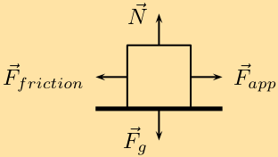
> **[Diagram Context - Textbook_PhysicalSciences_Gr12_Work-energy-and-power.pdf-0037-01.png]**
> This educational graphic is a force diagram (free-body diagram) showing a rectangular block resting on a horizontal surface. It clearly displays four directional vector arrows representing normal force ($\vec{N}$) pointing upwards, gravitational force ($\vec{F}_g$) pointing downwards, applied force ($\vec{F}_{app}$) pointing to the right, and frictional force ($\vec{F}_{friction}$) pointing to the left. For a Grade 11 Physical Sciences learner studying Newtonian Mechanics, this diagram visually conveys how to identify, represent, and balance concurrent forces acting on an object in one dimension to determine the net force.

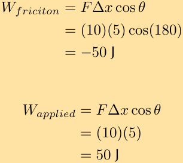
> **[Diagram Context - Textbook_PhysicalSciences_Gr12_Work-energy-and-power.pdf-0037-05.png]**
> The image shows a diagram of a Lewis structure for water, with the formula F = 10J applied to it. The diagram is labeled with the variables "W" and "Applied" and the equation "F = 10J" is written below it. The diagram also includes the variable "W" and the equation "F = 10J" in the top left corner.

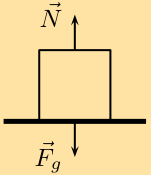

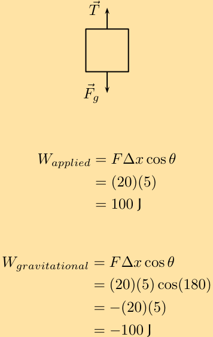
> **[Diagram Context - Textbook_PhysicalSciences_Gr12_Work-energy-and-power.pdf-0037-13.png]**
> 1. A diagram of a square and a box with arrows pointing to them.

---

## Chapter 3: Vertical Projectile Motion in One Dimension

### Worked Example: Motion Under Gravity (Continuation)

$$v_{f}^{2} = v_{i}^{2} + 2g\Delta x$$

$$\Delta x = \frac{v_{i}^{2}}{2g}$$

$$= \frac{-(20^{2})}{(2)(-9,8)}$$

$$= 20,41\text{ m}$$

b)

$$\vec{v}_{f} = \vec{v}_{i} + \vec{g}t$$

$$t = \frac{\vec{v}_{f} - \vec{v}_{i}}{\vec{g}}$$

$$= \frac{0 - 20}{-9,8}$$

$$= 2,04\text{ s}$$

**Answers:**
- a) $20,41\text{ m}$
- b) $2,04\text{ s}$

---

### Exercise 2

Zingi throws a tennis ball straight up into the air. It reaches a height of $80\text{ cm}$.

a) Determine the initial velocity of the tennis ball.  
b) How long does the ball take to reach its maximum height?  

#### Solutions

a) We first convert the height given to meters:

$$\frac{80}{100} = 0,8\text{ m}$$

$$v_{f}^{2} = v_{i}^{2} + 2g\Delta x$$

$$0 = v_{i}^{2} + 2(-9,8)(0,8)$$

$$v_{i}^{2} = 15,68$$

$$v_{i} = 3,96\text{ m}\cdot\text{s}^{-1}$$

b)

$$\vec{v}_{f} = \vec{v}_{i} + \vec{g}t$$

$$0 = 3,96 + (-9,8)(t)$$

$$9,8t = 3,96$$

$$t = 0,4\text{ s}$$

**Final Answers:**
- a) $3,96\text{ m}\cdot\text{s}^{-1}$ upwards
- b) $0,4\text{ s}$

---

### Exercise 3

A tourist takes a trip in a hot air balloon. The hot air balloon is ascending (moving up) at a velocity of $4\text{ m}\cdot\text{s}^{-1}$ vertically upwards. He accidentally drops his camera over the side of the balloon's basket, at a height of $20\text{ m}$. Calculate the velocity with which the camera hits the ground.

> **[Diagram Context - Textbook_PhysicalSciences_Gr12_Momentum-and-Impulse.pdf-0038-01.png]**
> This mathematical expression

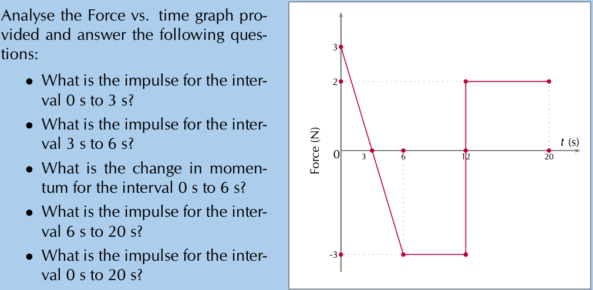
> **[Diagram Context - Textbook_PhysicalSciences_Gr12_Momentum-and-Impulse.pdf-0038-07.png]**
> 1. A diagram of a force graph with a line and a curve.

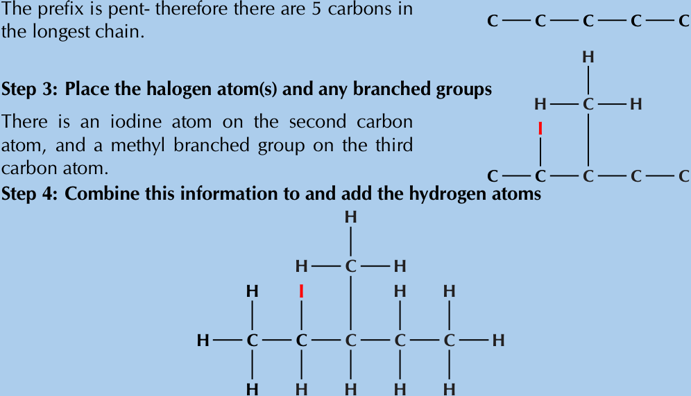
> **[Diagram Context - Textbook_PhysicalSciences_Gr12_Organic-molecules.pdf-0038-07.png]**
> 1. A diagram of a molecule with carbon, hydrogen, and oxygen atoms.

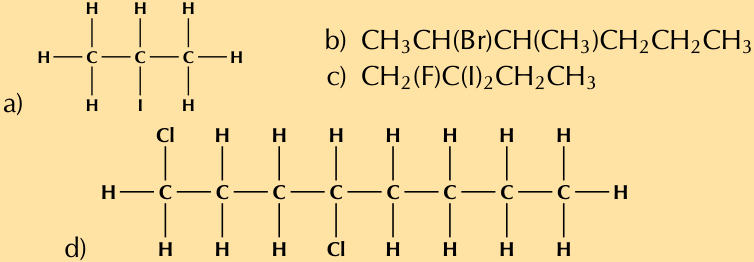
> **[Diagram Context - Textbook_PhysicalSciences_Gr12_Organic-molecules.pdf-0038-15.png]**
> 1. A diagram of a molecule with two carbon atoms and four hydrogen atoms.

---

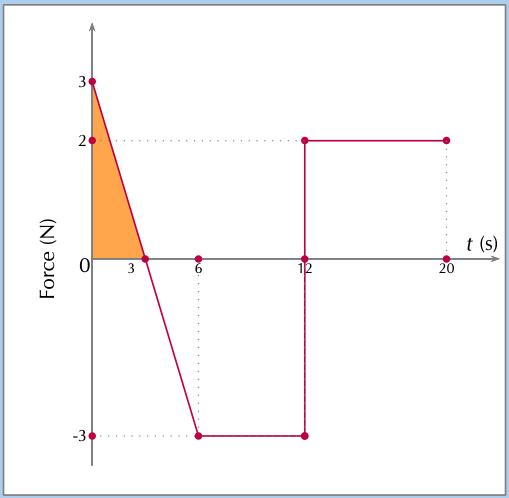
> **[Diagram Context - Textbook_PhysicalSciences_Gr12_Momentum-and-Impulse.pdf-0039-02.png]**
> The image is a diagram that shows a force diagram with an orange line representing a force and a red line representing a velocity. The diagram also includes a graph with a line and a scatter plot with dots. The diagram is labeled with the text "force" and "velocity" and the x and y axes are labeled with the text "time" and "force". The diagram is labeled with the text "N" and "force" and the x and y axes are labeled with the text "time" and "force".

Draw a rough sketch:

We now calculate the additional height above the ground that the camera reaches:

$$v_{f}^{2} = v_{i}^{2} + 2\vec{g}\Delta\vec{x}$$

$$\Delta\vec{x} = \frac{14^{2}}{2(9,8)}$$

$$\Delta\vec{x} = 0,82\text{ m}$$

So the total height above the ground is $20,82\text{ m}$.

---

**3.2. Vertical projectile motion**

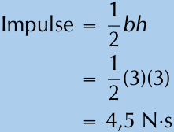
> **[Diagram Context - Textbook_PhysicalSciences_Gr12_Momentum-and-Impulse.pdf-0039-04.png]**
> 1. Impressise = 1/2 bh.

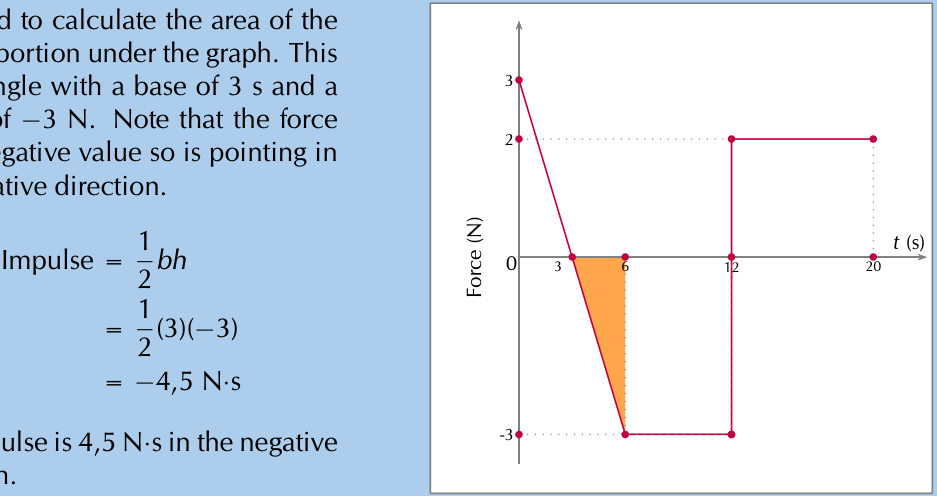
> **[Diagram Context - Textbook_PhysicalSciences_Gr12_Momentum-and-Impulse.pdf-0039-07.png]**
> 1. A diagram of a force diagram showing the relationship between force and acceleration.

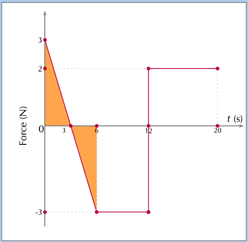
> **[Diagram Context - Textbook_PhysicalSciences_Gr12_Momentum-and-Impulse.pdf-0039-11.png]**
> The image is a diagram that shows a force diagram for a South African student learning about forces. The diagram is a line graph with an orange line and a red line, which represent the force and acceleration of an object. The diagram also includes a legend that explains the different forces represented by the lines. The diagram is labeled with the force diagram, force diagram, and force diagram.

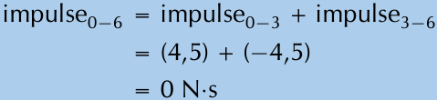
> **[Diagram Context - Textbook_PhysicalSciences_Gr12_Momentum-and-Impulse.pdf-0039-13.png]**
> This mathematical calculation demonstrates the determination of total

> **[Diagram Context - Textbook_PhysicalSciences_Gr12_Organic-molecules.pdf-0039-05.png]**
> The image shows a diagram of a molecule with the chemical formula H2O. The molecule is composed of two hydrogen atoms and one oxygen atom. The diagram is labeled with the chemical name "H2O" and the molecular structure. The diagram also includes a red arrow pointing to the molecule's center, which is labeled "H". The diagram is set against a gray background, and the text "Give the IUPAC name for the following organic compound" is written at the bottom.

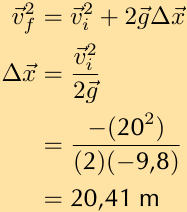
> **[Diagram Context - Textbook_PhysicalSciences_Gr12_Vertical-projectile-motion-in-one-dimension.pdf-0039-00.png]**
> The image shows a diagram of a Lewis structure for carbon dioxide. The diagram is divided into two sections, with the top section containing a triangle and the bottom section containing a rectangle. The diagram is labeled with the chemical symbol "CO2" and the atomic number "6". The diagram also includes the atomic mass of carbon, which is approximately 12.01 atomic mass units. The diagram is set against a beige background, and the text "2.2 = 2g" is visible, indicating the relationship between the atomic mass and the number of valence electrons.

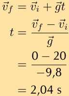
> **[Diagram Context - Textbook_PhysicalSciences_Gr12_Vertical-projectile-motion-in-one-dimension.pdf-0039-02.png]**
> This educational graphic displays a physics problem-solving sequence using the kinematic equation of motion, $\vec{v}_f = \vec{v}_i + \vec{g}t$. Visible variables and symbols include final velocity ($\vec{v}_f$), initial velocity ($\vec{v}_i$), gravitational acceleration ($\vec{g}$), time ($t$), numerical values such as $0$, $20$, and $-9,8$, and units of seconds ($\text{s}$). Conceptually, it demonstrates how to algebraically rearrange the equation to solve for time ($t$) and correctly substitute vector values using standard South African sign conventions for vertical projectile motion.

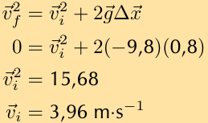
> **[Diagram Context - Textbook_PhysicalSciences_Gr12_Vertical-projectile-motion-in-one-dimension.pdf-0039-09.png]**
> 1. A diagram of a cell with arrows pointing to different parts of the cell.

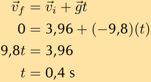
> **[Diagram Context - Textbook_PhysicalSciences_Gr12_Vertical-projectile-motion-in-one-dimension.pdf-0039-11.png]**
> 1. A diagram of a cell with arrows pointing to different parts of the cell.

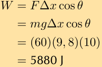
> **[Diagram Context - Textbook_PhysicalSciences_Gr12_Work-energy-and-power.pdf-0039-01.png]**
> The image shows a diagram of a Lewis structure for a molecule of water. The diagram is black and white and is labeled with the chemical formula of H2O. The diagram also includes the atomic masses of the elements Hydrogen and Oxygen. The diagram is labeled with the variable names W, F, and COS. The diagram also includes the variable names x, m, and cos. The diagram is labeled with the variable names x, m, and cos.

> **[Diagram Context - Textbook_PhysicalSciences_Gr12_Work-energy-and-power.pdf-0039-03.png]**
> 1. 27 rhh 2. 2 rr 3 rr 4 rr 5 rr 6 rr 7 rr 8 rr 9 rr 10 rr 11 rr 12 rr 13 rr 14 rr 15 rr 16 rr 17 rr 18 rr 19 rr 20 rr 21 rr 22 rr 23 rr 24 rr 25 rr 26 rr 27 rr 28 rr 29 rr 30 rr 31 rr 32 rr 33 rr 34 rr 35 rr 36 rr 37 rr 38 rr 39

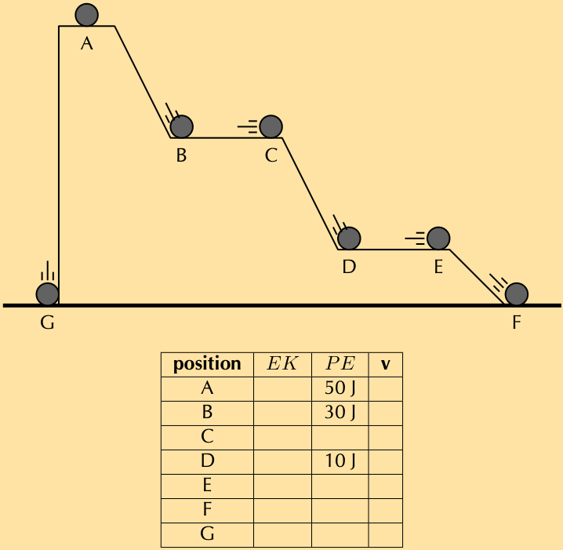
> **[Diagram Context - Textbook_PhysicalSciences_Gr12_Work-energy-and-power.pdf-0039-08.png]**
> 1. A diagram of a graph with balls labeled A, B, C, D, E, F, G, and A, B, C, D, E, F, G.

---

### Worked Example: Motion in One Dimension

$$\vec{v}_{f}^2 = \vec{v}_{i}^2 + 2\vec{g}\Delta\vec{x}$$
$$\vec{v}_{f}^2 = 2(9,8)(20,82) = 408,072$$
$$\vec{v}_{f} = 20,2\text{ m}\cdot\text{s}^{-1}$$

**Problem Statement:**
4. A ball is dropped vertically from a tower. If the vertical distance covered in the last second is equal to the distance covered in the first three seconds, find the height of the tower.

**Solution:**
Let us consider that the ball covers the height $y_n$ in $n^{\text{th}}$ second. Then, the distance covered in the $n^{\text{th}}$ second is given as:

$$y_n = u + \frac{g}{2} \times (2n - 1) = 0 + \frac{10}{2} \times (2n - 1) = 10n - 5$$

On the other hand, the distance covered in first $3$ seconds is:

$$y_3 = ut + \frac{1}{2}gt^2 = 0 + \frac{1}{2} \times 10 \times 3^2 = 45\text{ m}$$

According to the question,

$$y_n = y_3$$
$$10n - 5 = 45$$
$$n = 5\text{ s}$$

Therefore, the height of the tower is:

$$y = \frac{1}{2} \times 10 \times 5^2 = 125\text{ m}$$
$$125\text{ m}$$

---

### Graphs of Vertical Projectile Motion

#### Exercise 3 – 2: Graphs of vertical projectile motion

1. Amanda throws a tennis ball from a height of $1,5\text{ m}$ straight up into the air and then lets it fall to the ground. Draw graphs of $x\text{ vs }t$; $v\text{ vs }t$ and $a\text{ vs }t$ for the motion of the ball. The initial velocity of the tennis ball is $2\text{ m}\cdot\text{s}^{-1}$. Choose upwards as positive.

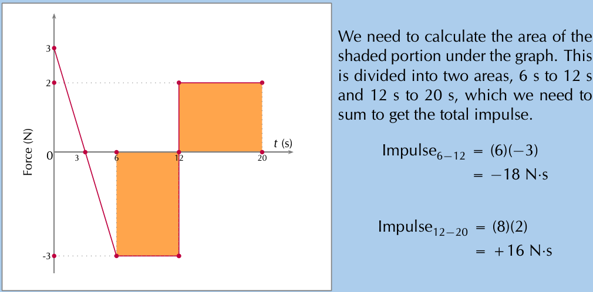
> **[Diagram Context - Textbook_PhysicalSciences_Gr12_Momentum-and-Impulse.pdf-0040-03.png]**
> A diagram of a Lewis structure is shown, with two orange squares and a red line connecting them. The diagram is accompanied by a text explaining the concept of calculating the area of the shaded portion under the graph.

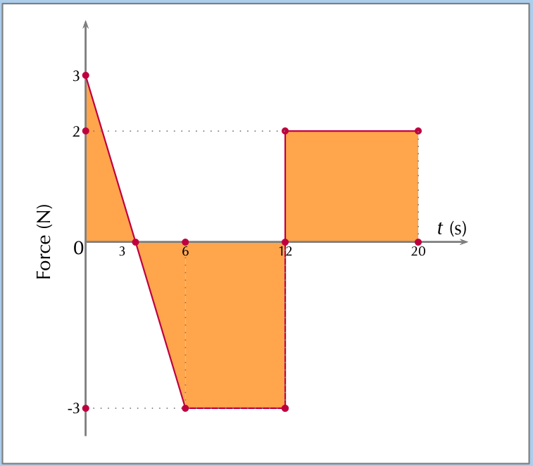
> **[Diagram Context - Textbook_PhysicalSciences_Gr12_Momentum-and-Impulse.pdf-0040-08.png]**
> The image is a diagram that shows the relationship between force and acceleration. The diagram is a graph with two lines, one representing force and the other representing acceleration. The force line is orange, and the acceleration line is orange as well. The diagram also includes a legend that explains the meaning of the different colors. The diagram is labeled with the text "force" and "acceleration" and has a scale of 0 to 20 units for both the force and acceleration lines.

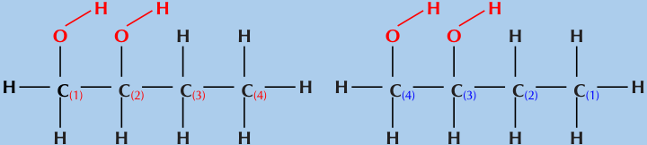
> **[Diagram Context - Textbook_PhysicalSciences_Gr12_Organic-molecules.pdf-0040-01.png]**
> 1. A diagram of a molecule with two hydrogens and two oxygens.

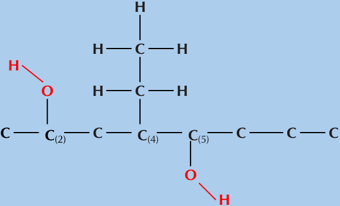
> **[Diagram Context - Textbook_PhysicalSciences_Gr12_Organic-molecules.pdf-0040-17.png]**
> 1. A diagram of a molecule with a hydroxyl group on the right side.

> **[Diagram Context - Textbook_PhysicalSciences_Gr12_Vertical-projectile-motion-in-one-dimension.pdf-0040-00.png]**
> 1. A hot air balloon in the sky.

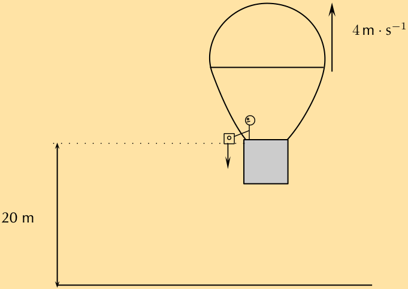
> **[Diagram Context - Textbook_PhysicalSciences_Gr12_Vertical-projectile-motion-in-one-dimension.pdf-0040-01.png]**
> 1. A diagram of a hot air balloon with a wire attached to it.
 2. A diagram of a wire attached to a wire attached to a wire attached to a wire attached to a wire attached to a wire attached to a wire attached to a wire attached to a wire attached to a wire attached to a wire attached to a wire attached to a wire attached to a wire attached to a wire attached to a wire attached to a wire attached to a wire attached to a wire attached to a wire attached to a wire attached to a wire attached to a wire attached to a wire attached to a

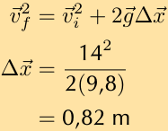
> **[Diagram Context - Textbook_PhysicalSciences_Gr12_Vertical-projectile-motion-in-one-dimension.pdf-0040-04.png]**
> The image shows a diagram of a Lewis structure for carbon dioxide. The diagram is divided into two sections, with the top section containing the Lewis structure of carbon dioxide and the bottom section showing the Lewis structure of water. The diagram also includes a chemical formula for carbon dioxide and a chemical formula for water. The diagram is labeled with the chemical symbols for carbon dioxide (CO2) and water (H2O). The diagram also includes arrows pointing to the Lewis structures of carbon dioxide and water.

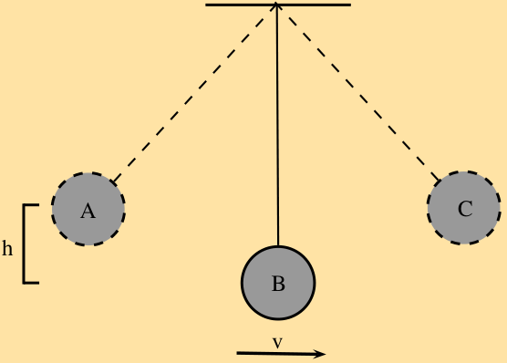
> **[Diagram Context - Textbook_PhysicalSciences_Gr12_Work-energy-and-power.pdf-0040-04.png]**
> 1. A diagram of a pendulum with two gray balls labeled A and B.
 2. A diagram of a pendulum with a gray ball labeled B and a gray ball labeled A.

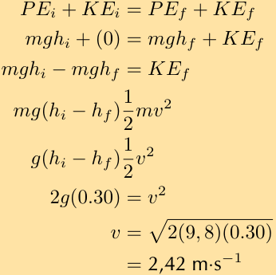
> **[Diagram Context - Textbook_PhysicalSciences_Gr12_Work-energy-and-power.pdf-0040-08.png]**
> The image shows a math problem written on a yellow background. The problem is about calculating the velocity of an object, given the mass and acceleration. The problem is presented in a step-by-step manner, with each step clearly labeled. The problem also includes a diagram of a cell, which is used to explain the concept of a Lewis structure. The problem is written in a clear and concise manner, making it easy for a high school student to understand and solve.

---

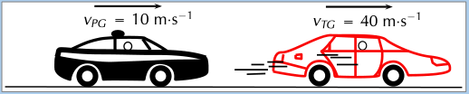
> **[Diagram Context - Textbook_PhysicalSciences_Gr12_Momentum-and-Impulse.pdf-0041-03.png]**
> Kinematics).

2. A bullet is shot straight upwards from a gun. The following graph is drawn. Downwards was chosen as positive

a) Describe the motion of the bullet.

b) Draw a displacement - time graph.

c) Draw an acceleration - time graph.

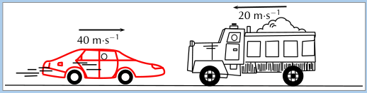
> **[Diagram Context - Textbook_PhysicalSciences_Gr12_Momentum-and-Impulse.pdf-0041-07.png]**
> 1. A black and red diagram of a car and a truck.
 2. The car is red and the truck is black.
 3. The car is moving away from the truck.
 4. The truck is carrying a load.

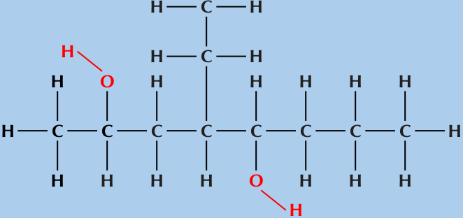
> **[Diagram Context - Textbook_PhysicalSciences_Gr12_Organic-molecules.pdf-0041-02.png]**
> 1. A diagram of a molecule with a hydroxyl group and a carbon atom.

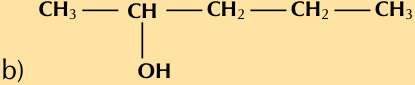
> **[Diagram Context - Textbook_PhysicalSciences_Gr12_Organic-molecules.pdf-0041-14.png]**
> The graphic shows a structural formula of an organic molecule with the label "b)" on the left. The diagram displays a carbon chain with chemical symbols and groups including $\text{CH}_3$, $\text{CH}$, $\text{CH}_2$, and a hydroxyl group ($\text{-OH}$) attached to the second carbon atom, connected by solid bonding lines. Conceptually, this conveys the semi-structural formula of a secondary alcohol (specifically pentan-2-ol), helping Grade 12 CAPS Physical Sciences learners identify functional groups, name organic compounds according to IUPAC nomenclature, and understand molecular structure.

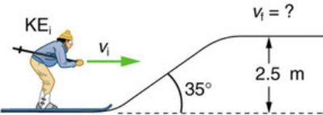
> **[Diagram Context - Textbook_PhysicalSciences_Gr12_Work-energy-and-power.pdf-0041-07.png]**
> 1. A diagram of a person skiing down a hill.
 2. The person is wearing a blue jacket and a yellow hat.
 3. The person is holding a ski pole.
 4. The person is skiing down a slope.
 5. The slope is marked with a line.

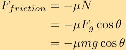
> **[Diagram Context - Textbook_PhysicalSciences_Gr12_Work-energy-and-power.pdf-0041-09.png]**
> The graphic shows mathematical physics equations for frictional force, displaying the variables $F_{friction}$, coefficient of friction $\mu$, normal force $N$, gravitational force $F_g$, mass $m$, gravitational acceleration $g$, and angle $\theta$. In line with the CAPS Grade 11 Physics curriculum, this shows how to calculate the magnitude and direction of friction on an inclined plane by substituting normal force with its component components ($mg\cos\theta$).

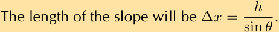
> **[Diagram Context - Textbook_PhysicalSciences_Gr12_Work-energy-and-power.pdf-0041-10.png]**
> This educational graphic presents a mathematical equation relating geometric variables for an inclined plane. The visible variables and symbols include $\Delta x$, $h$, $\sin$, and $\theta$. Conceptually, it conveys the trigonometric relationship used to calculate the hypotenuse length ($\Delta x$) of an inclined plane in physics mechanics problems, utilizing the vertical height ($h$) and the angle of inclination ($\theta$).

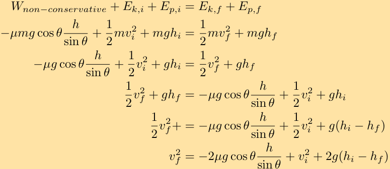
> **[Diagram Context - Textbook_PhysicalSciences_Gr12_Work-energy-and-power.pdf-0041-11.png]**
> The image shows a math problem written in black and white. The problem is about the relationship between the speed of light and the mass of an object. The problem is presented in a scientific style, with a diagram of a cell and a graph of the relationship between the speed of light and the mass of an object. The problem is labeled "W non-conservative E k+E eps = E k+E eps = E k+E eps = E k+E eps = E k+E eps = E k+E eps = E k+E e

---

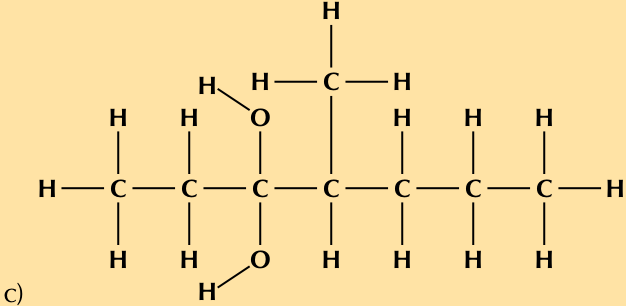
> **[Diagram Context - Textbook_PhysicalSciences_Gr12_Organic-molecules.pdf-0042-00.png]**
> 1. A diagram of a molecule of carbon dioxide.

a) The bullet moves at a decreasing velocity upwards for $20,4\text{ s}$. It then stops and drops back down for another $20,4\text{ s}$ until it reaches a speed of $200\text{ m}\cdot\text{s}^{-1}$ which is the same speed with which it started.

> **[Diagram Context - Textbook_PhysicalSciences_Gr12_Organic-molecules.pdf-0042-10.png]**
> The image shows a diagram of a molecule with the word "Solution" written in white text at the bottom. The molecule is composed of carbon, hydrogen, and oxygen atoms, and it is depicted in a three-dimensional view. The diagram also includes arrows pointing to the carbon, hydrogen, and oxygen atoms, as well as labels for the carbon, hydrogen, and oxygen bonds. The diagram is set against a blue background, and the text "Solution" is written in white at the bottom.

3. Describe the motion resulting from the velocity vs time graph shown below, assuming an initial height of $0\text{ m}$, and draw a displacement vs time graph and an acceleration vs time graph:

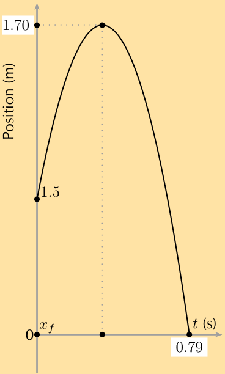
> **[Diagram Context - Textbook_PhysicalSciences_Gr12_Vertical-projectile-motion-in-one-dimension.pdf-0042-00.png]**
> The image presents a diagram of a Lewis structure, a diagram used to represent the valence electrons of an atom. The diagram is drawn on a light yellow background and is labeled with the text "1.5 m" and "0.79 m". The diagram also includes arrows and labels for the x, f, and t values. The diagram is labeled with the text "1.5 m" and "0.79 m" and is accompanied by a legend that provides the x, f, and t values.

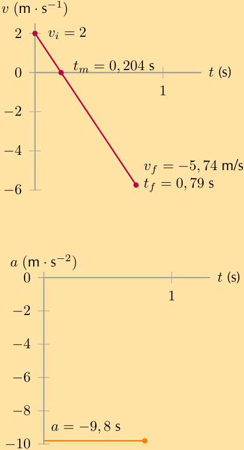
> **[Diagram Context - Textbook_PhysicalSciences_Gr12_Vertical-projectile-motion-in-one-dimension.pdf-0042-01.png]**
> The image shows a diagram of a Lewis structure, a diagram of a cell, and a graph of a function. The diagram of the Lewis structure shows a red dot labeled with the number 2, and the Lewis structure shows a red dot labeled with the number 2. The diagram of the cell shows a red dot labeled with the number 2, and the Lewis structure shows a red dot labeled with the number 2. The graph of the function shows a red dot labeled with the number 1, and the Lewis structure shows a red dot labeled with the number 1.

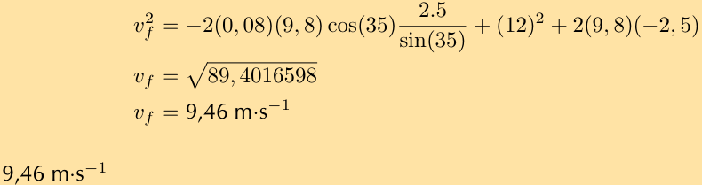
> **[Diagram Context - Textbook_PhysicalSciences_Gr12_Work-energy-and-power.pdf-0042-00.png]**
> The image shows a math problem written in a scientific calculator. The problem involves solving for the velocity of an object, given the distance traveled and the time taken. The problem is presented in a tabular format, with the distance traveled on the left side and the time taken on the right side. The problem also includes a formula for velocity, which is given by the equation v = d/t. The problem is set against a gray background, and the text is written in a clear, easy-to-read font.

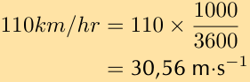
> **[Diagram Context - Textbook_PhysicalSciences_Gr12_Work-energy-and-power.pdf-0042-02.png]**
> This graphic displays a mathematical conversion formula for physical units, specifically converting speed from kilometers per hour to meters per second. The visible text and symbols include "110km/hr", "=", multiplication and division signs, numeric values (110, 1000, 3600, 30,56), and the SI unit for velocity, "m·s⁻¹". Conceptually, this demonstrates the standard conversion method required in CAPS Grade 10-12 Physics, showing learners how to multiply a speed value by the ratio of meters in a kilometer (1000) to seconds in an hour (3600) to yield the equivalent SI unit.

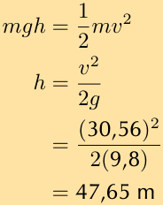
> **[Diagram Context - Textbook_PhysicalSciences_Gr12_Work-energy-and-power.pdf-0042-03.png]**
> The image shows a diagram of a Lewis structure for oxygen. The diagram is divided into two sections, with the top section containing the Lewis structure of oxygen and the bottom section showing the Lewis structure of sulfur. The diagram is labeled with the chemical symbols O and S, and the Lewis structures are labeled with the chemical formulas O2 and SO4. The diagram also includes arrows pointing to the respective Lewis structures.

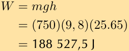
> **[Diagram Context - Textbook_PhysicalSciences_Gr12_Work-energy-and-power.pdf-0042-08.png]**
> This graphic presents a physics calculation using the equation for work, $W = mgh$, where $W$ represents work, $m$ mass, $g$ gravitational acceleration, and $h$ height. The substitution steps show numerical values—mass $(750\text{ kg})$, gravitational acceleration $(9,8\text{ m}\cdot\text{s}^{-2})$, and height $(25,65\text{ m})$—yielding a final calculated work or gravitational potential energy value of $188\text{ }527,5\text{ J}$. Conceptually, this demonstrates how to calculate the work done against gravity or the change in gravitational potential energy in accordance with the CAPS Physical Sciences curriculum.

---

## 3.2. Vertical projectile motion

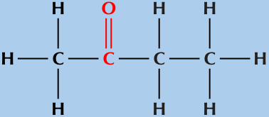
> **[Diagram Context - Textbook_PhysicalSciences_Gr12_Organic-molecules.pdf-0043-16.png]**
> This structural formula depicts the organic molecule butan-2-one against a light blue background. The diagram shows carbon (C), hydrogen (H), and oxygen (O) atomic symbols connected by single and double covalent bonds, highlighting the central carbonyl functional group. For CAPS Grade 12 Physical Sciences learners, this visual demonstrates how to draw the structural formula of a ketone and identify its functional group.

The object starts with an initial height of $0\text{ m}$, moves upwards for $1\text{ s}$, then slows and falls back to its starting position where it bounces upwards at a higher velocity, and travels upwards (higher than before) for $2\text{ s}$, then stops and falls back to its starting position where it bounces upwards again at an even higher velocity, travelling over $3\text{ s}$ to an even higher position, before finally falling back to the ground and stopping.

<!-- DIAGRAM_PLACEHolder: diagram -->

4. What is the initial height? Draw a velocity vs time graph and an acceleration vs time graph that would result in this displacement vs time graph:

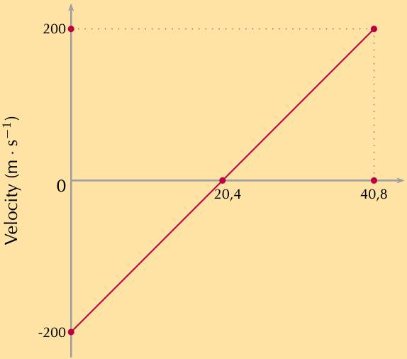
> **[Diagram Context - Textbook_PhysicalSciences_Gr12_Vertical-projectile-motion-in-one-dimension.pdf-0043-00.png]**
> The image shows a graph with a red line that slopes upwards from left to right. The x-axis is labeled "velocity" and the y-axis is labeled "m/s". The graph is labeled "200 m/s". The graph is labeled with a legend that says "velocity" on the x-axis and "m/s" on the y-axis. The graph is labeled with a title that says "velocity".

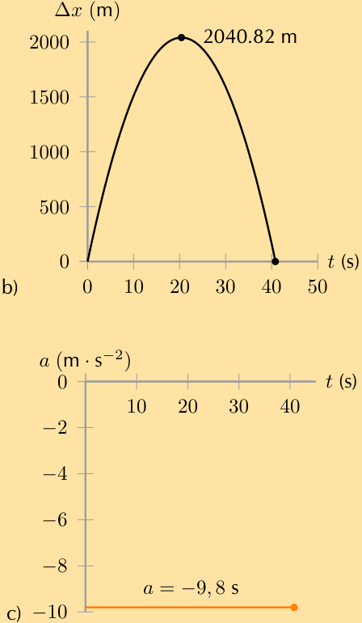
> **[Diagram Context - Textbook_PhysicalSciences_Gr12_Vertical-projectile-motion-in-one-dimension.pdf-0043-02.png]**
> 1. A graph showing the relationship between the time it takes for a chemical reaction to occur and the concentration of the reactants.

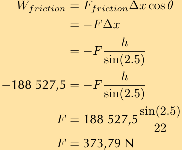
> **[Diagram Context - Textbook_PhysicalSciences_Gr12_Work-energy-and-power.pdf-0043-00.png]**
> The image shows a diagram of a Lewis structure for a molecule of water. The diagram is divided into four sections, each representing a different atom. The diagram is labeled with the chemical symbols for the elements Hydrogen and Oxygen, and the Lewis structure shows the bonds between the atoms. The diagram also includes the atomic masses of the elements, which are represented by the numbers 18 and 57. The diagram is set against a light beige background, and the text "Wfraction = Fraction" is written at the top.

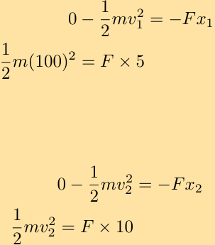
> **[Diagram Context - Textbook_PhysicalSciences_Gr12_Work-energy-and-power.pdf-0043-06.png]**
> The image shows a diagram of a Lewis structure for a molecule, with the formula "2mv2" and "F" representing the mole fraction of the molecule. The diagram is set against a light beige background, and the text "1m(100) = F(5)" is present. The diagram is labeled with the variable names "m" and "v2", and the text "2mv2 = F(5)" is also present.

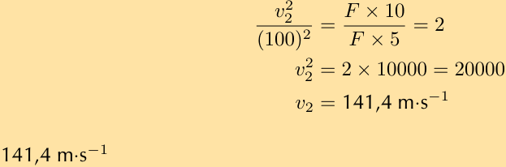
> **[Diagram Context - Textbook_PhysicalSciences_Gr12_Work-energy-and-power.pdf-0043-08.png]**
> The image shows a math problem involving the conversion of units. The problem is presented in a table format, with the first column labeled "14.4 m/s-1" and the second column labeled "14.4 m/s-1". The problem also includes a diagram of a Lewis structure of an atom, which is labeled "F". The problem is accompanied by a list of variables and units, including "F", "2x10", "2x5", "2x1000", "2x2x1000", "2x1x1m", and "

---

# Chapter 3. Vertical projectile motion in one dimension

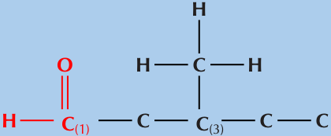
> **[Diagram Context - Textbook_PhysicalSciences_Gr12_Organic-molecules.pdf-0044-24.png]**
> This graphic is a structural formula (Lewis/structural representation) of an organic molecule. It displays carbon (C), hydrogen (H), and oxygen (O) atomic symbols connected by single and double bonding lines, with numbered carbon atoms such as C₍₁₎ and C₍₃₎ highlighted in red and black. Conceptually, this diagram helps Grade 12 Physical Sciences learners identify functional groups (such as the formyl group of an aldehyde) and apply IUPAC naming rules to determine correct organic nomenclature based on carbon chain length and substituent positions.

## Worked Example: Calculating Starting Height

To calculate the starting height, we can use time symmetry. The initial height is at time zero ($t = 0\text{ s}$) and the maximum height is at time $t = 2,04\text{ s}$. The ball will fall back to the same height as the initial height in $2,04\text{ s}$, therefore:

$$
\begin{aligned}
s &= \frac{1}{2}gt^2 \\
&= \frac{1}{2}(9,8)(2,04)^2 \\
&= 20,39\text{ m downwards}
\end{aligned}
$$

Therefore, the initial height is:

$$81,63 - 20,39 = 61,24\text{ m}$$

---

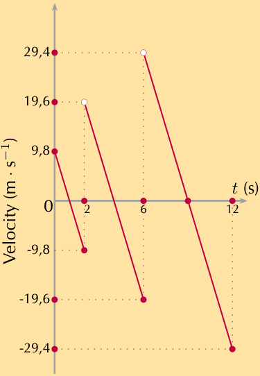
> **[Diagram Context - Textbook_PhysicalSciences_Gr12_Vertical-projectile-motion-in-one-dimension.pdf-0044-00.png]**
> The image presents a graph of velocity against time, with red lines representing the velocity of an object over time. The graph is labeled with the units "m/s" and "s", indicating the units of measurement for the velocity and time respectively. The graph is labeled with the variable "t" and "v", representing the time and velocity respectively. The graph is labeled with the variable "x" and "y", representing the time and velocity respectively. The graph is labeled with the variable "x1" and "y1", representing the x and y axes respectively. The graph is

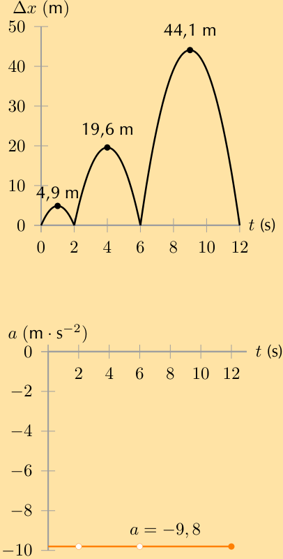
> **[Diagram Context - Textbook_PhysicalSciences_Gr12_Vertical-projectile-motion-in-one-dimension.pdf-0044-02.png]**
> The image shows a graph and a diagram of a cell. The graph displays the number of cells in a population over time, while the diagram illustrates the structure of a cell. The diagram shows the cell's organelles, including the nucleus, mitochondria, and endoplasmic reticulum. The diagram also includes the cell's membrane and the cell's cytoplasm. The graph shows a line graph with a black line representing the number of cells over time, and the diagram shows a black and white illustration of a cell with labeled organelles.

## Exercises

5. A ball that always bounces off the floor with the same magnitude of the velocity as it hit the floor is dropped from $3\text{ m}$ above a stack of $4$ crates. Each crate is $30\text{ cm}$ high. After the ball bounces off a crate it is quickly removed so that the next time the ball bounces it bounces off the next crate in the pile. This is repeated until all the crates have been removed. Draw the following graphs for the situation:

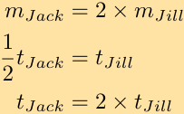

---

### 3.2. Vertical Projectile Motion

* Displacement vs time
* Velocity vs time
* Acceleration vs time

The time in each case for the ball to fall from maximum to the crate can be calculated from the distance:

$$s = ut + \frac{1}{2}gt^2$$

$$(u = 0)$$

$$s = \frac{1}{2}gt^2$$

$$\frac{2s}{g} = t^2$$

$$t = \sqrt{\frac{2s}{g}}$$

The ball bounces perfectly which means it always bounces back to the original height. The distances for each bounce are then:

* $x_1 = 3\text{ m}$
* $x_2 = 3,3\text{ m}$
* $x_3 = 3,6\text{ m}$
* $x_4 = 3,9\text{ m}$

The times to drop these distances under gravitational acceleration from rest are then:

* $x_1 = 3\text{ m} \;;\; t_1 = 0,782460\text{ s}$
* $x_2 = 3,3\text{ m} \;;\; t_2 = 0,820651\text{ s}$
* $x_3 = 3,6\text{ m} \;;\; t_3 = 0,857142\text{ s}$
* $x_4 = 3,9\text{ m} \;;\; t_4 = 0,892142\text{ s}$

* $x_1 = 3\text{ m} \;;\; t_1 = 0,782460\text{ s}$
* $x_2 = 3,3\text{ m} \;;\; t_2 = 0,820651\text{ s}$
* $x_3 = 3,6\text{ m} \;;\; t_3 = 0,857142\text{ s}$
* $x_4 = 3,9\text{ m} \;;\; t_4 = 0,892142\text{ s}$

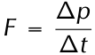

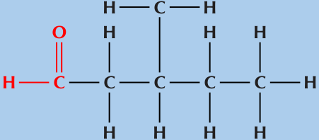
> **[Diagram Context - Textbook_PhysicalSciences_Gr12_Organic-molecules.pdf-0045-02.png]**
> 1. A diagram of a molecule with six carbon atoms and six hydrogen atoms.

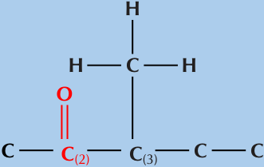
> **[Diagram Context - Textbook_PhysicalSciences_Gr12_Organic-molecules.pdf-0045-17.png]**
> This graphic shows a structural formula of an organic molecule containing a carbon chain with a carbonyl functional group. Visible labels and chemical symbols include carbon atoms labeled $\text{C}$, $\text{C}_{(2)}$, and $\text{C}_{(3)}$, hydrogen atoms ($\text{H}$), and a double-bonded oxygen atom ($\text{O}$) in red. This diagram helps learners identify functional groups, specifically the carbonyl group ($\text{C=O}$), and apply IUPAC naming rules for branched ketones within the FET Physical Sciences curriculum.

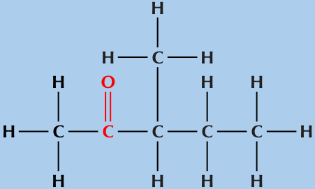
> **[Diagram Context - Textbook_PhysicalSciences_Gr12_Organic-molecules.pdf-0045-19.png]**
> 1. A diagram of a molecule with six carbon atoms and six hydrogen atoms.

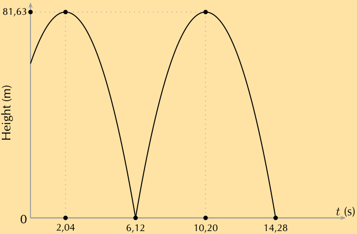
> **[Diagram Context - Textbook_PhysicalSciences_Gr12_Vertical-projectile-motion-in-one-dimension.pdf-0045-00.png]**
> The image is a diagram that shows the relationship between the height of a person and their age. The diagram is a line graph with the x-axis labeled "Age" and the y-axis labeled "Height". The graph shows a curve that starts at 6.12 and goes up to 10.20, indicating that the height of a person increases as they get older. The graph also shows a curve that starts at 14.28 and goes up to 18.28, indicating that the height of a person increases as they get older. The graph is labeled with the text "height (m

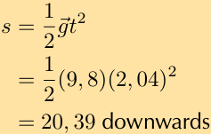
> **[Diagram Context - Textbook_PhysicalSciences_Gr12_Vertical-projectile-motion-in-one-dimension.pdf-0045-02.png]**
> 1. A graph with two lines on it.

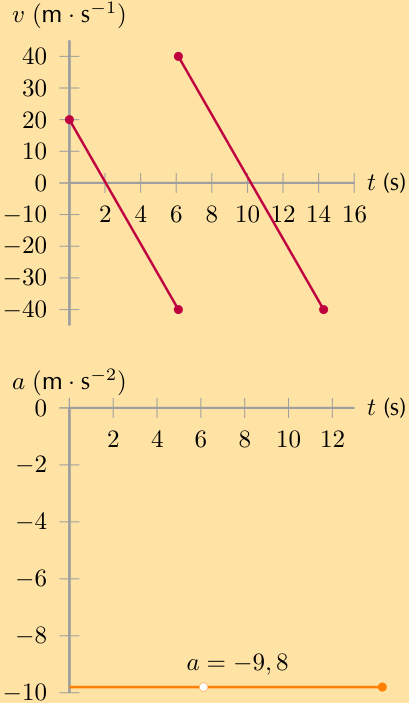
> **[Diagram Context - Textbook_PhysicalSciences_Gr12_Vertical-projectile-motion-in-one-dimension.pdf-0045-04.png]**
> The image shows a graph and a diagram of a cell. The graph is a line graph with two lines, one red and one orange, and the diagram is a labeled diagram of a cell. The diagram includes a cell's organelles and a cell's structure. The graph and diagram are both labeled, and the text is in a standard scientific style.

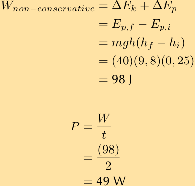
> **[Diagram Context - Textbook_PhysicalSciences_Gr12_Work-energy-and-power.pdf-0045-02.png]**
> The image shows a diagram of a Lewis structure for water, with the formula E°F°H°F°H°F°H°F°F°H°F°F°F°F°F°F°F°F°F°F°F°F°F°F°F°F°F°F°F°F°F°F°F°F°F°F°F°F°F°F°F°F°F°F°F°F°F°F°F°F°F°F°

---

# Chapter 3. Vertical projectile motion in one dimension

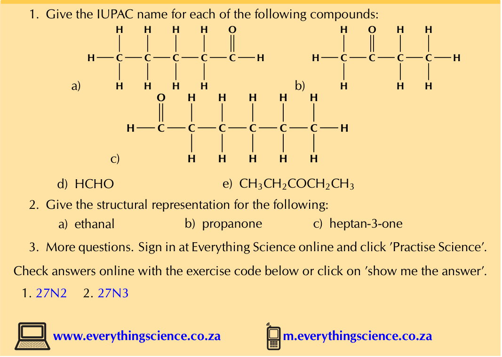
> **[Diagram Context - Textbook_PhysicalSciences_Gr12_Organic-molecules.pdf-0046-04.png]**
> 1. Give the IUPAC name for each following compounds.

## Worked Example: Bouncing Ball Motion

**6.** A ball is dropped from $4\text{ m}$ above a cushioned mat. Each time the ball bounces the magnitude of the velocity in the upwards direction is half the magnitude of the velocity with which it hit the floor. The ball is allowed to bounce $2$ times, draw the following graphs for the situation and the equation describing each section of the graph:

* Displacement vs time
* Velocity vs time
* Acceleration vs time

---

### Calculating the Times and Velocities

The time in each case for the ball to fall from maximum to the mat can be calculated from the distance:

$$s = ut + \frac{1}{2}gt^2$$

Since the ball is dropped, initial velocity $u = 0$:

$$s = \frac{1}{2}gt^2$$

$$\frac{2s}{g} = t^2$$

$$t = \sqrt{\frac{2s}{g}}$$

We calculate the velocity with which it hits the mat from:

$$v^2 = u^2 + 2gs$$

After the bounce it has an initial velocity upwards of $\frac{1}{2}$ the magnitude that it hit with. We use this reduced initial velocity to calculate the new height:

$$v^2 = u^2 + 2gs$$

#### a) First motion:

$$v_{1f}^2 = 2gs$$

$$v_{1f}^2 = 2(9,8)(4)$$

$$v_{1f} = \sqrt{2(9,8)(4)}$$

$$v_{f1} = 8,854377\text{ m}\cdot\text{s}^{-1}$$

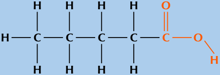
> **[Diagram Context - Textbook_PhysicalSciences_Gr12_Organic-molecules.pdf-0046-10.png]**
> 1. A diagram of a molecule with six carbon atoms and two hydrogen atoms.

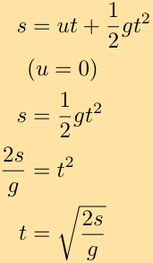
> **[Diagram Context - Textbook_PhysicalSciences_Gr12_Vertical-projectile-motion-in-one-dimension.pdf-0046-04.png]**
> The image shows a diagram of a Lewis structure for carbon dioxide (CO2). The diagram is divided into four quadrants, each representing a different energy level. The diagram is labeled with the chemical symbol "CO2" and the energy levels "2s", "2g", and "2t". The diagram also includes arrows pointing to the energy levels and labels for the carbon atom and oxygen atom. The diagram is set against a light beige background.

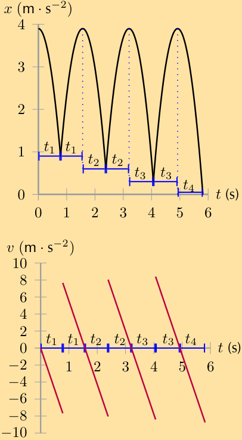
> **[Diagram Context - Textbook_PhysicalSciences_Gr12_Vertical-projectile-motion-in-one-dimension.pdf-0046-19.png]**
> The image presents a diagram of a Lewis structure and a graph of a function. The Lewis structure shows a molecule with multiple bonds and atoms, while the graph displays a function with multiple peaks and valleys. The diagram is color-coded, with the Lewis structure in red and the graph in blue. The text "x" is also present in the diagram.

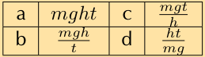
> **[Diagram Context - Textbook_PhysicalSciences_Gr12_Work-energy-and-power.pdf-0046-14.png]**
> This educational graphic is a multiple-choice question table presenting four algebraic expressions. The table contains option labels 'a', 'b', 'c', and 'd' paired with the algebraic formulas $mght$, $\frac{mgh}{t}$, $\fracmgt{h}$, and $\frac{ht}{mg}$ respectively, using variables representing mass ($m$), gravitational acceleration ($g$), height ($h$), and time ($t$). For a high school Physical Sciences learner, this graphic is typically used in questions assessing dimensional analysis, unit derivations, or the correct formula for mechanical power ($P = \frac{W}{\Delta t} = \frac{mgh}{t}$).

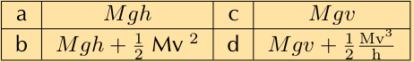
> **[Diagram Context - Textbook_PhysicalSciences_Gr12_Work-energy-and-power.pdf-0046-17.png]**
> The graphic is a multiple-choice options table displaying four physical equations labeled a, b, c, and d. The visible algebraic expressions contain variables representing mass ($M$), gravitational acceleration ($g$), height ($h$), and velocity ($v$). For a Grade 12 Physical Sciences student, this tests dimensional analysis and the conceptual understanding of mechanical energy components, specifically gravitational potential energy ($Mgh$) and kinetic energy ($\frac{1}{2}Mv^2$).

---

### Time to fall from max:

$$s_1 = ut + \frac{1}{2}gt_{1}^2$$

$$(u = 0)$$

$$s_1 = \frac{1}{2}gt_{1}^2$$

$$\frac{2s_2}{g} = t_{1}^2$$

$$t_1 = \sqrt{\frac{2s_1}{g}}$$

$$t_1 = \sqrt{\frac{2(4)}{9,8}}$$

$$= 0,9035079\text{ s}$$

---

### b) First bounce, height attained:

$$v_{max}^2 = v_{i2}^2 + 2gs$$

$$(v_{max} = 0)$$

$$-(0,5 \times 8,854377)^2 = 2(-9,8)s$$

$$s_2 = \frac{-(0,5 \times 8,854377)^2}{2(-9,8)}$$

$$s_2 = 1,00000\text{ m}$$

---

### Time to fall from max:

$$s_2 = \frac{1}{2}gt_{2}^2$$

$$(v_i = 0)$$

$$s_2 = \frac{1}{2}gt_{2}^2$$

$$\frac{2s_2}{g} = t_{2}^2$$

$$t_2 = \sqrt{\frac{2s_2}{g}}$$

$$t_2 = \sqrt{\frac{2(1)}{9,8}}$$

$$= 0,45175395\text{ s}$$

---

### c) Second bounce, height attained:

$$v_{max}^2 = v_{i3}^2 + 2gs$$

$$(v_{max} = 0)$$

$$-(0,5 \times 0,5 \times 8,854377)^2 = 2(-9,8)s_3$$

$$s_3 = \frac{-(0,5 \times 0,5 \times 8,854377)^2}{2(-9,8)}$$

$$s_3 = 0,25000\text{ m}$$

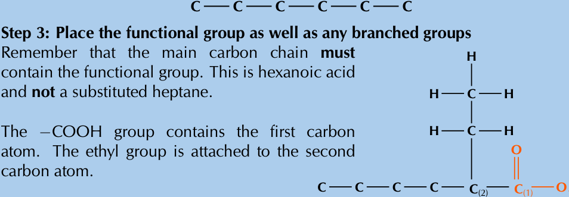
> **[Diagram Context - Textbook_PhysicalSciences_Gr12_Organic-molecules.pdf-0047-17.png]**
> 1. A diagram of a carbon chain with the first carbon attached to the second carbon.

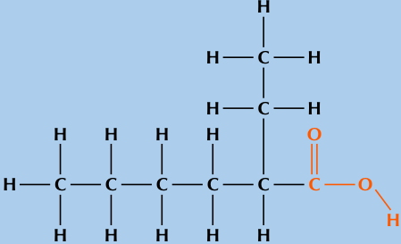
> **[Diagram Context - Textbook_PhysicalSciences_Gr12_Organic-molecules.pdf-0047-20.png]**
> 1. A diagram of a molecule with a Lewis structure.

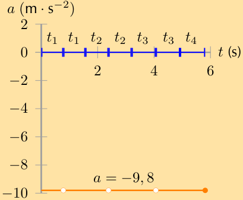
> **[Diagram Context - Textbook_PhysicalSciences_Gr12_Vertical-projectile-motion-in-one-dimension.pdf-0047-00.png]**
> The image presents a graph with a line and a bar graph. The line graph has a blue line and a yellow line, while the bar graph has a blue bar and a yellow bar. The graph is labeled with the variables "t" and "a" and has a legend that reads "t = 2t - 2" and "a = 9 - 8". The graph is set against a light orange background.

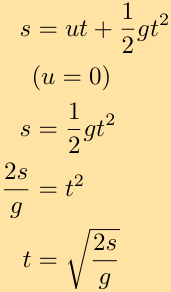
> **[Diagram Context - Textbook_PhysicalSciences_Gr12_Vertical-projectile-motion-in-one-dimension.pdf-0047-06.png]**
> The image shows a diagram of a Lewis structure for carbon dioxide. The diagram is divided into four quadrants, each representing a different atom. The diagram is color-coded, with each color representing a different element. The diagram also includes arrows pointing to the bonds between the atoms. The diagram is set against a light beige background.

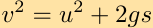

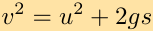

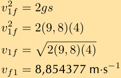
> **[Diagram Context - Textbook_PhysicalSciences_Gr12_Vertical-projectile-motion-in-one-dimension.pdf-0047-12.png]**
> The image shows a diagram of a Lewis structure for water. The diagram is divided into three sections, each representing a different energy level. The diagram is color-coded, with each energy level being a different color. The diagram is accompanied by a table that provides information about the Lewis structure, including the number of valence electrons, the number of protons, and the number of neutrons. The diagram also includes arrows pointing to the valence electrons, protons, and neutrons.

---

## Time to Fall from Maximum Height

### Key Concepts & Worked Examples

When analyzing the vertical projectile motion of an object, we can calculate the time taken to fall from maximum height ($s_3$) using the kinematic equations of motion. Assuming initial velocity $u = 0\text{ m}\cdot\text{s}^{-1}$ at the maximum height:

$$s_3 = \frac{1}{2}gt_3^2$$

Rearranging the formula to solve for time ($t_3$):

$$\frac{2s_3}{g} = t_3^2$$

$$t_3 = \sqrt{\frac{2s_3}{g}}$$

Substituting the given values ($s_3 = 0.25000\text{ m}$ and $g = 9.8\text{ m}\cdot\text{s}^{-2}$):

$$t_3 = \sqrt{\frac{2(0.25000)}{9.8}}$$

$$t_3 = 0.225877\text{ s}$$

---

### Graphical Representation of Motion

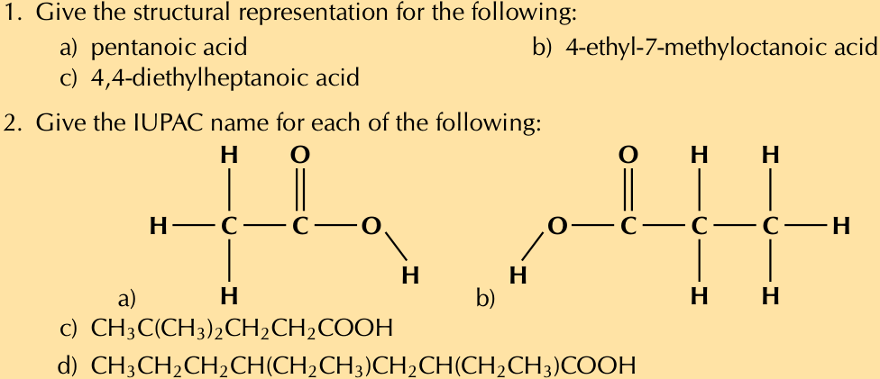
> **[Diagram Context - Textbook_PhysicalSciences_Gr12_Organic-molecules.pdf-0048-08.png]**
> 1. Give the structural representation for the following: a) pentanoic acid, b) 4-ethyl-7-methyl-lactanic acid, c) 4-hydroxy-4-methyl-lactanic acid, d) 4-hydroxy-4-methyl-lactanic acid.

#### 1. Position vs. Time Graph ($x$ vs $t$)
* **Description:** Shows the parabolic trajectory of a vertically projected and bouncing object over time ($t$).
* **Key points:** Reaches a peak position of $4\text{ m}$ at $t = 1.25\text{ s}$, with subsequent smaller bounces at intervals $t_1, t_2,$ and $t_3$.

#### 2. Velocity vs. Time Graph ($v$ vs $t$)
* **Description:** Shows straight linear segments representing constant gravitational acceleration ($g = -9.8\text{ m}\cdot\text{s}^{-2}$).
* **Key points:** Velocity decreases linearly, crosses zero at the maximum height, and reverses direction.

#### 3. Acceleration vs. Time Graph ($a$ vs $t$)
* **Description:** Shows a constant acceleration due to gravity throughout the motion.
* **Key points:** Acceleration remains constant at $-9.8\text{ m}\cdot\text{s}^{-2}$ (or downwards equivalent) across intervals $t_1, t_2,$ and $t_3$.

---

### Practice Codes
1. 27K7
2. 27K8
3. 27K9
4. 27KB
5. 27KC
6. 27KD

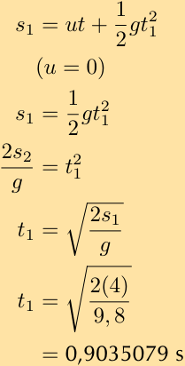
> **[Diagram Context - Textbook_PhysicalSciences_Gr12_Vertical-projectile-motion-in-one-dimension.pdf-0048-01.png]**
> The image shows a diagram of a Lewis structure for water. The diagram is composed of multiple elements, including a water molecule, a hydrogen atom, and a lone pair of electrons. The diagram is set against a light beige background, and the text "1s+2s+2gs+2t+1" is written in black above the diagram. The text "0.9035079" is written below the diagram.

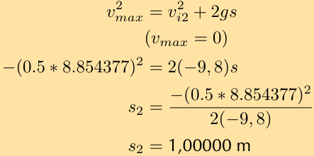
> **[Diagram Context - Textbook_PhysicalSciences_Gr12_Vertical-projectile-motion-in-one-dimension.pdf-0048-03.png]**
> The image shows a math problem on a yellow background. The problem is about calculating the maximum velocity of a molecule. The problem is divided into two parts, with the first part asking for the maximum velocity of a molecule and the second part asking for the maximum velocity of a molecule. The problem also includes a formula for calculating the maximum velocity of a molecule.

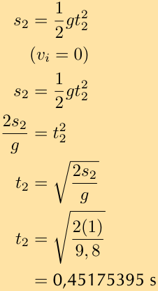
> **[Diagram Context - Textbook_PhysicalSciences_Gr12_Vertical-projectile-motion-in-one-dimension.pdf-0048-05.png]**
> The image shows a diagram of a Lewis structure for water, which is a molecule composed of two hydrogen atoms and one oxygen atom. The diagram is presented in a table format, with the elements and their respective charges labeled. The diagram also includes arrows to indicate the bonds between the atoms. The diagram is set against a light beige background, and the text "1s2g" is written in black at the top of the image.

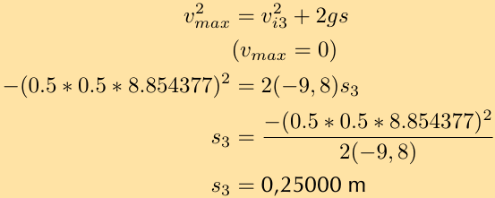
> **[Diagram Context - Textbook_PhysicalSciences_Gr12_Vertical-projectile-motion-in-one-dimension.pdf-0048-07.png]**
> The image shows a math problem written on a piece of paper. The problem is about calculating the maximum velocity of a molecule. The problem is presented in a scientific style, with a diagram of a molecule and a graph of the molecule's velocity. The problem is written in a way that is easy to understand, and it is designed to help a high school student learn about the concept of maximum velocity.

---

## 3.3 Chapter summary

### Exercise 3 - 3:

1. [SC 2001/11 HG1] A bullet fired vertically upwards reaches a maximum height and falls back to the ground.

Which **one** of the following statements is **true** with reference to the acceleration of the bullet during its motion, if air resistance is ignored? The acceleration:

a) is always downwards  
b) is first upwards and then downwards  
c) is first downwards and then upwards  
d) decreases first and then increases  

*Answer:* is always downwards

---

2. [IEB 2002/11 HG1] Two balls, $P$ and $Q$, are simultaneously thrown into the air from the same height above the ground. $P$ is thrown vertically upwards and $Q$ vertically downwards with the same initial speed. Which of the following is true of both balls just before they hit the ground? (Ignore any air resistance. Take downwards as the positive direction.)

| | Velocity | Acceleration |
| :---: | :--- | :--- |
| A | The same | The same |
| B | P has a greater velocity than Q | P has a negative acceleration; Q has a positive acceleration |
| C | P has a greater velocity than Q | The same |
| D | The same | P has a negative acceleration; Q has a positive acceleration |

*Answer:* A. The same velocity and the same acceleration.

---

3. [SC 2003/11] A ball $X$ of mass $m$ is projected vertically upwards at a speed $u_x$ from a bridge $20\text{ m}$ high. A ball $Y$ of mass $2m$ is projected vertically downwards from the same bridge at a speed of $u_y$. The two balls reach the water at the same speed. Air friction can be ignored.

Which of the following is true with reference to the speeds with which the balls are projected?

a) $u_x = \frac{1}{2}u_y$  
b) $u_x = u_y$  
c) $u_x = 2u_y$  
d) $u_x = 4u_y$  

*Answer:* b) $u_x = u_y$

---

4. [SC 2002/03 HG1] A stone falls freely from rest from a certain height. Which one of the following quantities could be represented on the y-axis of the graph below?

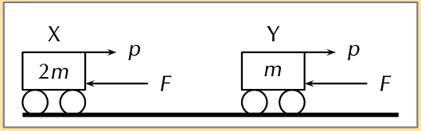
> **[Diagram Context - Textbook_PhysicalSciences_Gr12_Momentum-and-Impulse.pdf-0049-14.png]**
> 1. A diagram of two trains on a track with arrows pointing to the direction of motion.

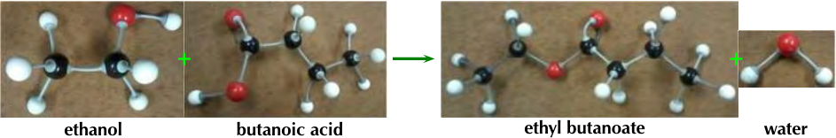
> **[Diagram Context - Textbook_PhysicalSciences_Gr12_Organic-molecules.pdf-0049-00.png]**
> 1. A diagram of a molecule of ethyl butanate.

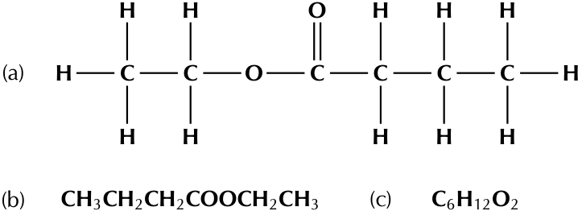
> **[Diagram Context - Textbook_PhysicalSciences_Gr12_Organic-molecules.pdf-0049-02.png]**
> 1. A diagram of a molecule with a carbon chain and oxygen atoms.

> **[Diagram Context - Textbook_PhysicalSciences_Gr12_Organic-molecules.pdf-0049-03.png]**
> 1. A diagram of a molecule with red spheres and black spheres.

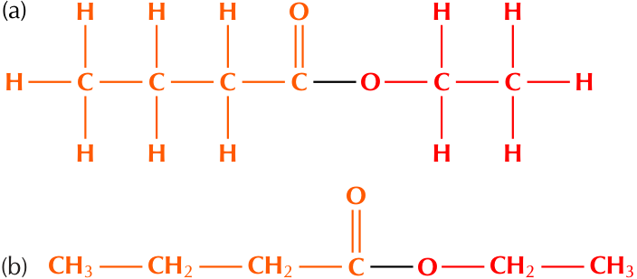
> **[Diagram Context - Textbook_PhysicalSciences_Gr12_Organic-molecules.pdf-0049-06.png]**
> 1. A diagram of a molecule with a red arrow pointing to the right.

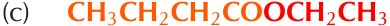

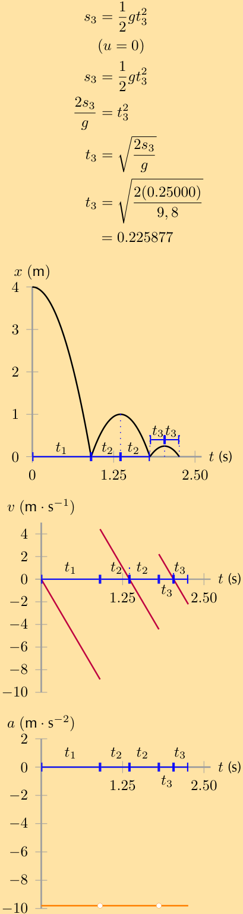
> **[Diagram Context - Textbook_PhysicalSciences_Gr12_Vertical-projectile-motion-in-one-dimension.pdf-0049-01.png]**
> 1. A diagram of a Lewis structure of an amino acid.

> **[Diagram Context - Textbook_PhysicalSciences_Gr12_Vertical-projectile-motion-in-one-dimension.pdf-0049-02.png]**
> 1. 27kb/2.7kb/3.7kb/4.7kb/5.7kb/6.7kb/7.7kb/8.7kb/9.7kb/10.7kb/11.7kb/12.7kb/13.7kb/14.7kb/15.7kb/16.7kb/17.7kb/18.7kb/19.7kb/20.7kb

---

## Chapter 3. Vertical Projectile Motion in One Dimension

### Review Exercises

#### Question 5
A stone is thrown vertically upwards and it returns to the ground. If friction is ignored, its acceleration as it reaches the highest point of its motion is:

* a) greater than just after it left the throwers hand.
* b) less than just before it hits the ground.
* c) **the same as when it left the throwers hand.** *(Correct Answer)*
* d) less than it will be when it strikes the ground.

---

#### Question 6 [IEB 2004/11 HG1]
A stone is thrown vertically up into the air. Which of the following graphs best shows the resultant force exerted on the stone against time while it is in the air? (Air resistance is negligible.)

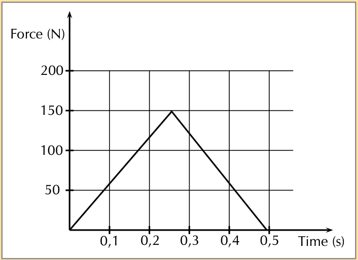
> **[Diagram Context - Textbook_PhysicalSciences_Gr12_Momentum-and-Impulse.pdf-0050-03.png]**
> The image is a black and white diagram that shows a force diagram. The diagram is a graph that shows the relationship between force and acceleration. The graph has a line that goes through the points (0, 0.5) and (0.5, 0.5), which are located at the bottom of the graph. The x-axis of the graph is labeled "Time" and the y-axis is labeled "Acceleration". The diagram shows that the force is constant, and the acceleration is constant.

**Answer:** **C** 

**Explanation:** The force is constant since the acceleration is constant ($g = 9.8\text{ m}\cdot\text{s}^{-2}$ downwards).

---

#### Question 7
What is the velocity of a ball just as it hits the ground if it is thrown upward at $10\text{ m}\cdot\text{s}^{-1}$ from a height $5\text{ meters}$ above the ground?

##### Worked Example / Solution
The ball will travel upwards, stop at its highest point, and then fall back down to the ground. As it reaches the initial position of $5\text{ metres}$ above the ground, it will be travelling once again at $10\text{ m}\cdot\text{s}^{-1}$ but this time in the downwards direction. 

Taking downwards as the $+ve$ direction:

$$v_f^2 = v_i^2 + 2a\Delta x$$

$$v_f^2 = (10)^2 + 2(9.8)(5)$$

$$v_f^2 = 198$$

$$v_f = \sqrt{198} = 14.07\text{ m}\cdot\text{s}^{-1}$$

---

#### Question 8 [IEB 2002/11 HG1 - Bouncing Ball]
A ball bounces vertically on a hard surface after being thrown vertically into the air by a boy standing on the ledge of a building.

Just before the ball hits the ground for the first time, it has a velocity of magnitude $15\text{ m}\cdot\text{s}^{-1}$. Immediately, after bouncing, it has a velocity of magnitude $10\text{ m}\cdot\text{s}^{-1}$.

The graph below shows the velocity of the ball as a function of time from the moment it is thrown upwards into the air until it reaches its maximum height after bouncing once.

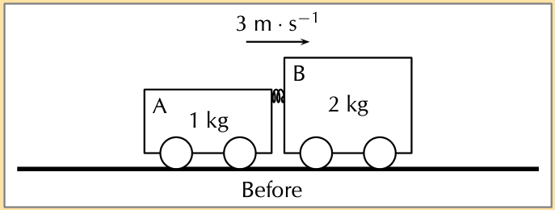
> **[Diagram Context - Textbook_PhysicalSciences_Gr12_Momentum-and-Impulse.pdf-0050-12.png]**
> The image shows a diagram of two trains on a track, with a weight of 1 kg on each train. The diagram also includes a text that reads "Before" and "2 m/s-1".

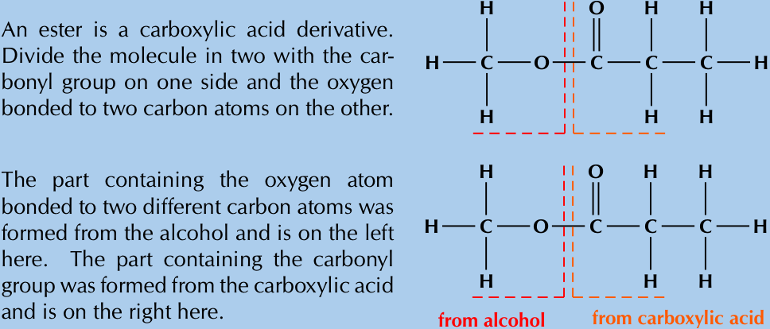
> **[Diagram Context - Textbook_PhysicalSciences_Gr12_Organic-molecules.pdf-0050-01.png]**
> The image is a diagram that shows the structure of a molecule. The molecule is composed of two carbon atoms and four oxygen atoms. The diagram is color-coded, with the carbon atoms colored in blue and the oxygen atoms colored in red. The diagram also includes labels for the carbon atoms and oxygen atoms, as well as arrows pointing to the bonds between the atoms. The diagram is labeled with the chemical formula for the molecule, which is represented by the chemical symbols C6H12O6.

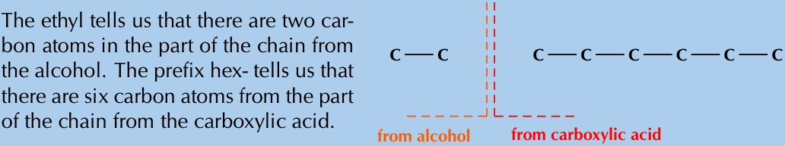
> **[Diagram Context - Textbook_PhysicalSciences_Gr12_Organic-molecules.pdf-0050-12.png]**
> 1. A diagram of a carbon chain with two carbon atoms and two oxygen atoms.

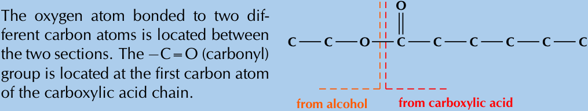
> **[Diagram Context - Textbook_PhysicalSciences_Gr12_Organic-molecules.pdf-0050-14.png]**
> 1. A diagram of a molecule of alcohol.

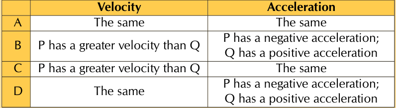
> **[Diagram Context - Textbook_PhysicalSciences_Gr12_Vertical-projectile-motion-in-one-dimension.pdf-0050-10.png]**
> 1. A table with two columns labeled "velocity" and "acceleration" and a third column labeled "the same".

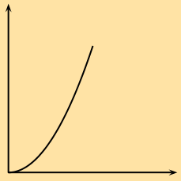

---

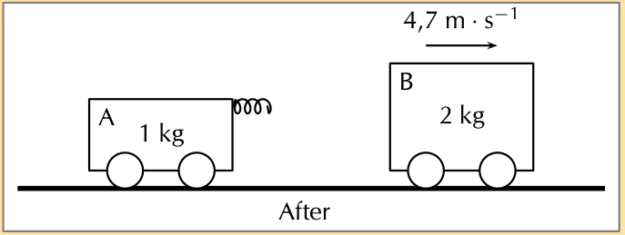
> **[Diagram Context - Textbook_PhysicalSciences_Gr12_Momentum-and-Impulse.pdf-0051-00.png]**
> The image shows two black boxes with wheels, one with a 1 kg mass and the other with a 2 kg mass, positioned on a track. The boxes are labeled with the letters A and B. The image also includes a caption that reads "After" and a diagram of the boxes and their weights.

## Exercises

a) At what velocity does the boy throw the ball into the air?

b) What can be determined by calculating the gradient of the graph during the first two seconds?

c) Determine the gradient of the graph over the first two seconds. State its units.

d) How far below the boy's hand does the ball hit the ground?

e) Use an equation of motion to calculate how long it takes, from the time the ball was thrown, for the ball to reach its maximum height after bouncing.

f) What is the position of the ball, measured from the boy's hand, when it reaches its maximum height after bouncing?

---

## Solutions

a) $5\text{ m}\cdot\text{s}^{-1}$

b) The acceleration of the ball

c) 
$$\begin{aligned}
\text{gradient} &= \frac{\Delta y}{\Delta x} \\
&= \frac{5 - (-15)}{2 - 0} \\
&= 10
\end{aligned}$$

$10\text{ m}\cdot\text{s}^{-2}$

d) According to the graph, the ball reaches the boy's hand again after $1\text{ second}$ (when the downward speed of $5\text{ m}\cdot\text{s}^{-1}$ is the same as its initial upward speed). Therefore the area under the graph between $1$ and $2\text{ seconds}$ (when it reaches its maximum negative velocity) is equal to the remaining distance the ball falls to the ground. The area is equal to $10$.

$\text{Distance} = 10\text{ m}$.

e) It takes $2\text{ s}$ until the ball bounces. Calculate the additional time from bouncing to reach maximum height. **Assume the acceleration is the same as before**, i.e. $10\text{ m}\cdot\text{s}^{-2}$.

$$\begin{aligned}
v_f &= v_i + at \\
t &= \frac{v_f - v_i}{a} \\
&= \frac{0 - 10}{-10} \\
&= 1\text{ s}
\end{aligned}$$

Therefore the total time taken is $3\text{ s}$.

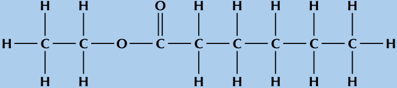
> **[Diagram Context - Textbook_PhysicalSciences_Gr12_Organic-molecules.pdf-0051-01.png]**
> 1. A blue line with a black arrow pointing to the right.

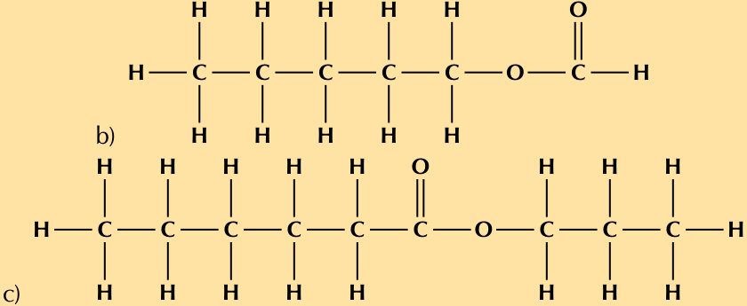
> **[Diagram Context - Textbook_PhysicalSciences_Gr12_Organic-molecules.pdf-0051-08.png]**
> 1. A diagram of a molecule with a Lewis structure.

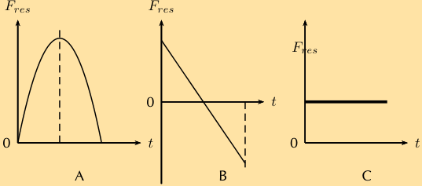
> **[Diagram Context - Textbook_PhysicalSciences_Gr12_Vertical-projectile-motion-in-one-dimension.pdf-0051-12.png]**
> 1. A diagram of a Lewis structure for oxygen.

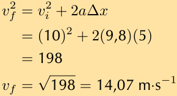
> **[Diagram Context - Textbook_PhysicalSciences_Gr12_Vertical-projectile-motion-in-one-dimension.pdf-0051-16.png]**
> The image shows a math problem on a yellow background. The problem involves solving for the velocity of an object, represented by the equation vf = 10. The problem also includes a diagram of a Lewis structure, which is a visual representation of the chemical formula of a molecule. The diagram shows the Lewis structure of water, composed of two hydrogen atoms and one oxygen atom. The problem also includes a graph of the velocity of the object over time, which is a line graph. The graph shows the object's velocity increasing over time.

---

f) Calculate the area under the graph for the final $1\text{ s}$ or use equation of motion to find maximum height after the bounce:

$$\Delta x = v_i t + \frac{1}{2}at^2$$

$$= (10)(1) + \frac{1}{2}(-10)(1)^2$$

$$= 5\text{ m}$$

Therefore the position of the ball, measured from the boy's hand is $5\text{ m} - 5\text{ m} = 0\text{ m}$. In other words, it is the same height as the boy's hand.

---

### 9. [IEB 2001/11 HG1] - Free Falling?

A parachutist steps out of an aircraft, flying high above the ground. She falls for the first $8\text{ seconds}$ before opening her parachute. A graph of her velocity is shown in Graph A below.

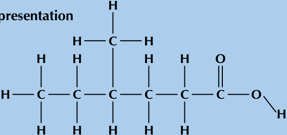
> **[Diagram Context - Textbook_PhysicalSciences_Gr12_Organic-molecules.pdf-0052-01.png]**
> Examine the Graphic:**

a) Use the information from the graph to calculate an approximate height of the aircraft when she stepped out of it (to the nearest $10\text{ m}$).

b) What is the magnitude of her velocity during her descent with the parachute fully open?

The air resistance acting on the parachute is related to the speed at which the parachutist descends. Graph B shows the relationship between air resistance and velocity of the parachutist descending with the parachute open.

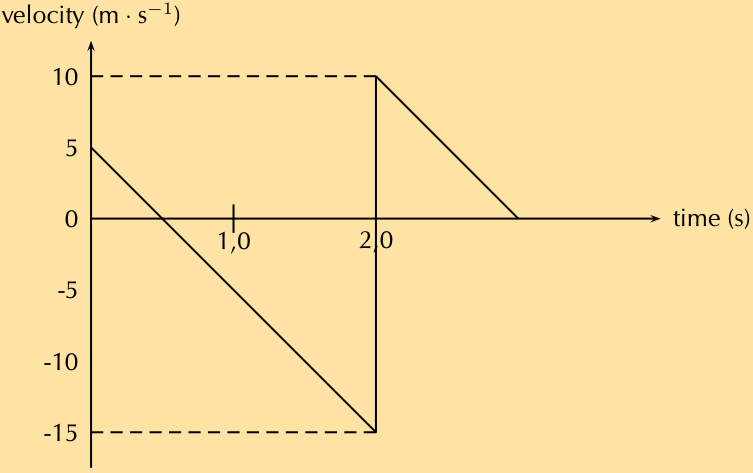
> **[Diagram Context - Textbook_PhysicalSciences_Gr12_Vertical-projectile-motion-in-one-dimension.pdf-0052-00.png]**
> The image presents a diagram of a Lewis structure for water, which is a molecule composed of two hydrogen atoms and one oxygen atom. The diagram is drawn in black and white, with the Lewis structure outlined in black and the water molecule depicted in a simple, geometric shape. The diagram is labeled with the chemical formula "H2O" and the time "time (s)" at the bottom. The diagram also includes a line labeled "velocity (m/s)" and a line labeled "time (s)" at the top.

c) Use Graph B to find the magnitude of the air resistance on her parachute when she was descending with the parachute open.

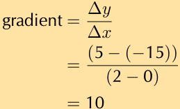
> **[Diagram Context - Textbook_PhysicalSciences_Gr12_Vertical-projectile-motion-in-one-dimension.pdf-0052-10.png]**
> The image shows a diagram of a graph with the x-axis labeled "Gradient" and the y-axis labeled "Degree". The graph is labeled with the equation "y = 5x - 15". The graph is set against a light beige background.

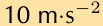

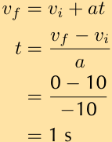
> **[Diagram Context - Textbook_PhysicalSciences_Gr12_Vertical-projectile-motion-in-one-dimension.pdf-0052-15.png]**
> This graphic presents a step-by-step algebraic manipulation of a Grade 10 Physical Sciences equations of motion formula. It displays the variables final velocity ($v_f$), initial velocity ($v_i$), acceleration ($a$), and time ($t$), along with substituted numerical values ($0$, $10$, $-10$) resulting in a final unit of time ($1\text{ s}$). Conceptually, it guides learners through rearranging the first kinematic equation to solve for time during vertical projectile motion problems.

---

d) Assume that the mass of the parachute is negligible. Calculate the mass of the parachutist showing your reasoning clearly.

a) Calculate the area under the graph to find the total height she falls. For the first $4\text{ s}$, approximate area with a triangle:

$$\begin{aligned}
\Delta x_1 &= \frac{1}{2} \text{base} \times \text{height} \\
&= \frac{1}{2}(4)(40) \\
&= 80\text{ m}
\end{aligned}$$

For the time $4\text{--}8\text{ s}$:

$$\begin{aligned}
\Delta x_2 &= \text{base} \times \text{height} \\
&= (4)(40) \\
&= 160\text{ m}
\end{aligned}$$

For the time $8\text{--}9\text{ s}$, approximate area with a triangle plus a square:

$$\begin{aligned}
\Delta x_3 &= \frac{1}{2}\text{base} \times \text{height} + \text{base} \times \text{height}_2 \\
&= \frac{1}{2}(1)(35) + (1)(5) \\
&= 22,5\text{ m}
\end{aligned}$$

For the time $9\text{--}15\text{ s}$, approximate area with a rectangle:

$$\begin{aligned}
\Delta x_4 &= (6)(5) \\
&= 30\text{ m}
\end{aligned}$$

For the time $15\text{--}16\text{ s}$, approximate area with a triangle:

$$\begin{aligned}
\Delta x_5 &= \frac{1}{2}(1)(5) \\
&= 2,5\text{ m}
\end{aligned}$$

$$\text{Total distance fallen} = 80\text{ m} + 160\text{ m} + 22,5\text{ m} + 30\text{ m} + 2,5\text{ m} = 295\text{ m}$$
Rounded to the nearest $10\text{ m}$ is $300\text{ m}$

b) $5\text{ m}\cdot\text{s}^{-1}$

c) $600\text{ N}$

d) Once the parachute is open, the parachutist falls at constant speed, implying that her net acceleration is zero. Therefore the force on her due to gravity and the force on her due to air resistance are equal and opposite:

$$\begin{aligned}
\vec{F}_g &= \vec{F}_{air} \\
mg &= 600\text{ N} \\
m(9,8) &= 600\text{ N} \\
m &= \frac{600}{9,8} \\
m &= 61,22\text{ kg}
\end{aligned}$$

---

### Answers Summary:
* a) $300\text{ m}$
* b) $5\text{ m}\cdot\text{s}^{-1}$
* c) $600\text{ N}$
* d) $61,22\text{ kg}$

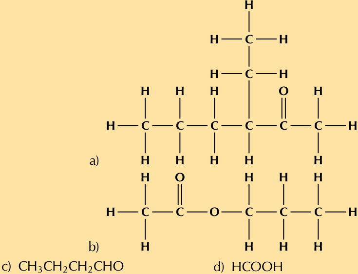
> **[Diagram Context - Textbook_PhysicalSciences_Gr12_Organic-molecules.pdf-0053-11.png]**
> Concise, 2-3 sentences

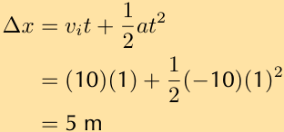
> **[Diagram Context - Textbook_PhysicalSciences_Gr12_Vertical-projectile-motion-in-one-dimension.pdf-0053-01.png]**
> The image shows a math problem involving the conversion of units. The problem is presented in a diagram format, with two equations written on a light brown background. The first equation is a linear equation, while the second equation is a quadratic equation. The variables in the equations are labeled with letters, and the problem is set against a gray background. The problem appears to be about converting units, as indicated by the use of the word "at" in the equations. The problem is designed to help high school students learn about unit conversion and mathematical concepts.

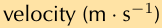

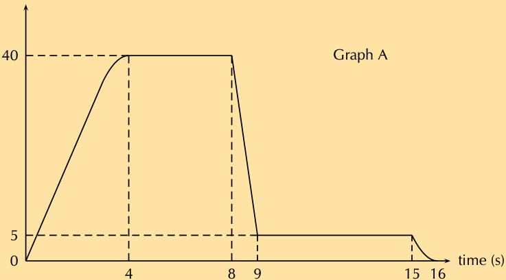
> **[Diagram Context - Textbook_PhysicalSciences_Gr12_Vertical-projectile-motion-in-one-dimension.pdf-0053-06.png]**
> The image is a graph that shows the relationship between time and a physical quantity. The graph is labeled "Graph A" and is accompanied by a line that connects the points. The x-axis of the graph is labeled "Time" and the y-axis is labeled "Quantity". The graph shows a curve that starts at the bottom left corner and slopes upwards to the top right corner.

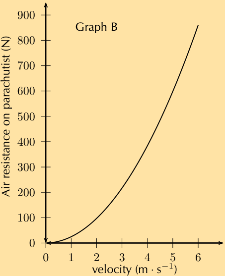
> **[Diagram Context - Textbook_PhysicalSciences_Gr12_Vertical-projectile-motion-in-one-dimension.pdf-0053-10.png]**
> The image shows a graph with the x-axis labeled "Air resistance" and the y-axis labeled "Air velocity". The graph shows a steep upward curve, indicating a positive relationship between air resistance and air velocity. The graph is labeled with the numbers "800", "700", "300", "400", "500", "600", "700", "800", "900", "1000", and "2000". The graph also includes a legend that reads "Air resistance on 500", "Air resistance on 700", "Air resistance on 900", and "Air resistance on 2000".

---

## Chapter 3. Vertical Projectile Motion in One Dimension

### Problem 10

Niko, in the basket of a hot-air balloon, is stationary at a height of $10\text{ m}$ above the level from where his friend, Bongi, will throw a ball. Bongi intends throwing the ball upwards and Niko, in the basket, needs to **descend** (move downwards) to catch the ball at its maximum height.

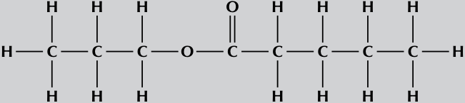
> **[Diagram Context - Textbook_PhysicalSciences_Gr12_Organic-molecules.pdf-0054-03.png]**
> 1. A diagram of a molecule with a Lewis structure.
 2. The molecule is composed of carbon, hydrogen, and oxygen atoms.
 3. The molecule is a carbohydrate.

Bongi throws the ball upwards with a velocity of $13\text{ m}\cdot\text{s}^{-1}$. Niko starts his descent at the same instant the ball is thrown upwards, by letting air escape from the balloon, causing it to accelerate downwards. Ignore the effect of air friction on the ball.

---

### Questions

a) Calculate the maximum height reached by the ball.  
b) Calculate the magnitude of the minimum average acceleration the balloon must have in order for Niko to catch the ball at its maximum height.  

---

### Worked Solutions

#### a) Calculate the maximum height reached by the ball:

$$v_{f}^{2} = v_{i}^{2} + 2a\Delta x$$

$$\Delta x = \frac{v_{f}^{2} - v_{i}^{2}}{2a}$$

$$\Delta x = \frac{(0)^{2} - (13)^{2}}{2(-9,8)}$$

$$\Delta x = 8,62\text{ m}$$

---

#### b) Calculate the time taken for the ball to reach its maximum height:

$$v_{f} = v_{i} + at$$

$$t = \frac{v_{f} - v_{i}}{a}$$

$$t = \frac{0 - 13}{-9,8}$$

$$t = 1,33\text{ s}$$

---

#### Now calculate the acceleration needed for the balloon:

$$\Delta x = v_{i}t + \frac{1}{2}at^{2}$$

$$\Delta x = (0)t + \frac{1}{2}at^{2}$$

$$a = \frac{2\Delta x}{t^{2}}$$

$$a = \frac{2(10 - 8,62)}{(1,33)^{2}} = 1,63\text{ m}\cdot\text{s}^{-2}$$

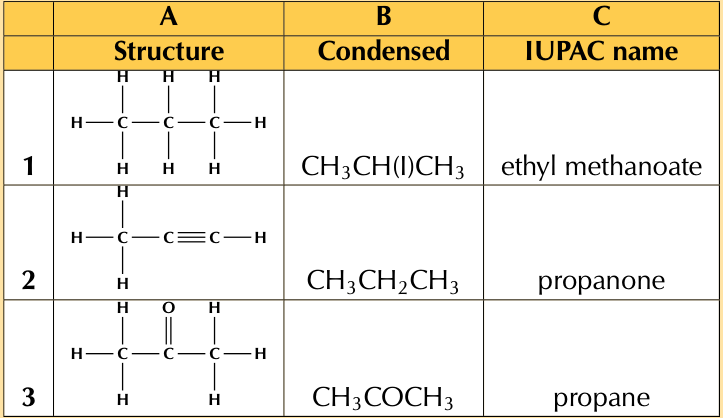
> **[Diagram Context - Textbook_PhysicalSciences_Gr12_Organic-molecules.pdf-0054-12.png]**
> 1. A table with columns labeled A, B, C, and D. The table has a yellow background and is titled "Structure". The table has three rows and four columns. The first row has the letters A, B, and C. The second row has the letters D, I, and U. The third row has the letters A, C, and H. The table also has a legend that says "CH2CH3CH2CH2CH2CH2CH2CH2CH2CH2CH2CH2CH2CH2CH2CH2CH

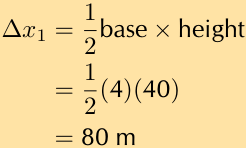
> **[Diagram Context - Textbook_PhysicalSciences_Gr12_Vertical-projectile-motion-in-one-dimension.pdf-0054-02.png]**
> The image shows a diagram of a Lewis structure for water. The diagram is divided into three sections, each representing a different part of the molecule. The diagram is color-coded, with each color representing a different element. The diagram is accompanied by a table that provides information about the Lewis structure, including the number of valence electrons, the number of protons, and the number of neutrons. The diagram is accompanied by a legend that explains the different colors used in the Lewis structure.

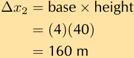
> **[Diagram Context - Textbook_PhysicalSciences_Gr12_Vertical-projectile-motion-in-one-dimension.pdf-0054-04.png]**
> The graphic displays a mathematical calculation for displacement ($\Delta x_2$) using the area of a geometric shape under a velocity-time graph. Visible text includes the variables and values: $\Delta x_2 = \text{base} \times \text{height} = (4)(40) = 160\text{ m}$. For a Grade 10-12 Physical Sciences learner, this demonstrates how to determine displacement from the rectangular area under a velocity-time graph in kinematics.

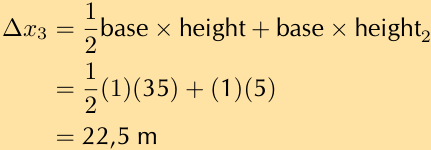
> **[Diagram Context - Textbook_PhysicalSciences_Gr12_Vertical-projectile-motion-in-one-dimension.pdf-0054-06.png]**
> The image shows a diagram of a Lewis structure for water. The diagram is labeled with the chemical formula H2O and the atomic radii of oxygen and hydrogen. The diagram also includes the base and height of the Lewis structure. The diagram is set against a light beige background.

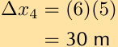

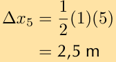

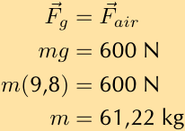
> **[Diagram Context - Textbook_PhysicalSciences_Gr12_Vertical-projectile-motion-in-one-dimension.pdf-0054-15.png]**
> The image shows a diagram of a molecule with the chemical formula Ff. The diagram also includes a graph of the force acting on the molecule. The diagram is labeled with the chemical formula Ff, and the force is labeled with the variable "m". The diagram also includes a graph of the force acting on the molecule, labeled with the variable "m". The diagram is set against a beige background.

---

## Answers

a) $8{,}62\text{ m}$

b) $1{,}63\text{ m}\cdot\text{s}^{-2}$

---

## Intelligent Practice Service

Think you got it? Get this answer and more practice on our Intelligent Practice Service:

1. $27\text{KG}$
2. $27\text{KH}$
3. $27\text{KJ}$
4. $27\text{KK}$
5. $27\text{KM}$
6. $27\text{KN}$
7. $27\text{KP}$
8. $27\text{KQ}$
9. $27\text{KR}$
10. $27\text{KS}$

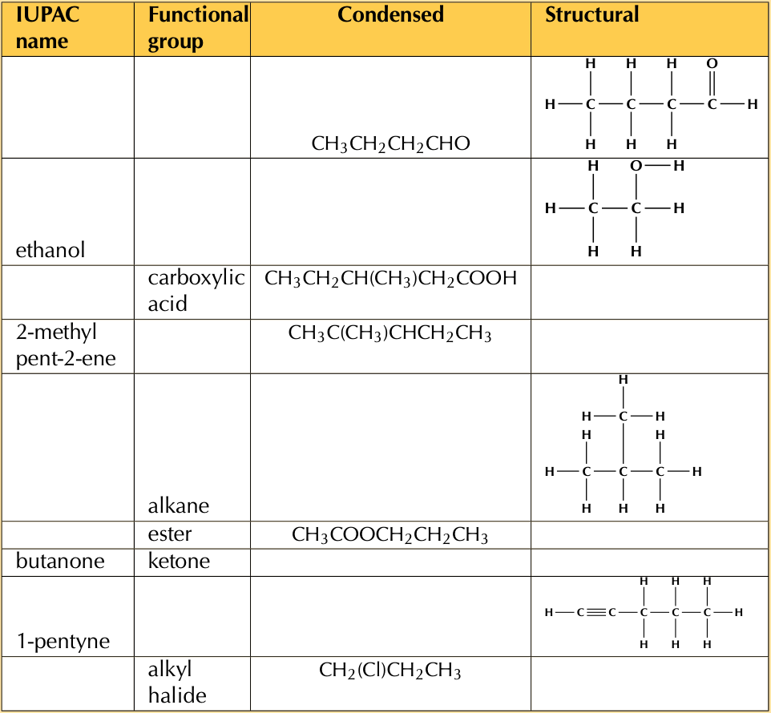
> **[Diagram Context - Textbook_PhysicalSciences_Gr12_Organic-molecules.pdf-0055-02.png]**
> 1. A diagram of a molecule with the chemical formula CH3CH2CH2CH3.

www.everythingscience.co.za  
m.everythingscience.co.za

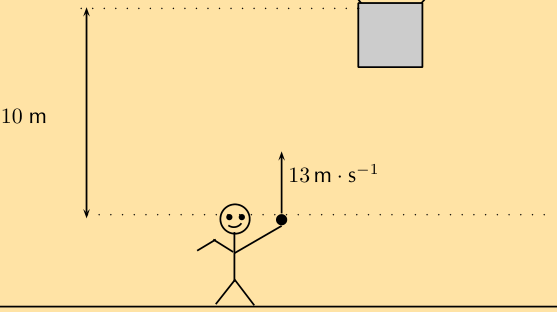
> **[Diagram Context - Textbook_PhysicalSciences_Gr12_Vertical-projectile-motion-in-one-dimension.pdf-0055-01.png]**
> The image shows a stick figure standing in front of a diagram of a cell. The stick figure is holding a ball in its hand, and the diagram shows the cell's structure. The diagram also includes arrows pointing to different parts of the cell. The stick figure is positioned in the center of the image, and the diagram is located to the right of the stick figure.

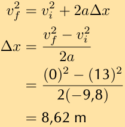
> **[Diagram Context - Textbook_PhysicalSciences_Gr12_Vertical-projectile-motion-in-one-dimension.pdf-0055-06.png]**
> The image shows a math problem involving the conversion of units. The problem is presented in a diagram that includes a Lewis diagram, a geometric figure, and a chemical formula. The diagram is set against a yellow background, and the problem is written in black text. The problem is designed to help a high school student learn about unit conversion.

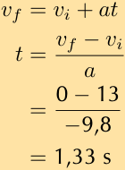
> **[Diagram Context - Textbook_PhysicalSciences_Gr12_Vertical-projectile-motion-in-one-dimension.pdf-0055-08.png]**
> The graphic displays a physics calculation showing algebraic rearrangement of the kinematic equation $v_f = v_i + at$ to solve for time ($t$). The visible variables and values include final velocity ($v_f = 0$), initial velocity ($v_i = 13$), acceleration due to gravity ($a = -9,8$), and the resulting time ($1,33\text{ s}$). Conceptually, this demonstrates how learners apply the equations of motion under constant acceleration for vertical projectile problems in the CAPS Grade 11-12 curriculum.

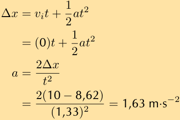
> **[Diagram Context - Textbook_PhysicalSciences_Gr12_Vertical-projectile-motion-in-one-dimension.pdf-0055-10.png]**
> The image shows a math problem involving a Lewis structure and a graph. The problem is presented in a table format, with the x and y axes labeled. The problem is asking to find the value of a function, which is represented by the equation 2(x) + 8 = 8.62. The problem also includes a diagram of a Lewis structure and a graph of the function. The problem is designed to help students understand the relationship between the Lewis structure and the graph of the function.

