# CHAPTER 4

## Organic molecules

<!-- DIAGRAM_PLACEHOLDER: diagram -->

| Section | Topic | Page |
| :--- | :--- | :--- |
| **4.1** | *What are organic molecules?* | 108 |
| **4.2** | *Organic molecular structures* | 108 |
| **4.3** | *IUPAC naming and formulae* | 131 |
| **4.4** | *Physical properties and structure* | 162 |
| **4.5** | *Applications of organic chemistry* | 179 |
| **4.6** | *Addition, elimination and substitution reactions* | 186 |
| **4.7** | *Plastics and polymers* | 196 |
| **4.8** | *Chapter summary* | 213 |

---

# 4 Organic molecules

## 4.1 What are organic molecules?

ESCK3

Organic chemistry is the branch of chemistry that deals with organic molecules. An organic molecule is one which contains carbon, although not all compounds that contain carbon are organic molecules. Noticeable exceptions are carbon monoxide ($\text{CO}$), carbon dioxide ($\text{CO}_2$), carbonates (e.g. calcium carbonate), carbides (e.g. calcium carbide) and cyanides (e.g. sodium cyanide). Pure carbon compounds such as diamond and graphite are also not organic compounds. Organic molecules can range in size from simple molecules to complex structures containing thousands of atoms!

Although carbon is present in all organic compounds, other elements such as hydrogen ($\text{H}$), oxygen ($\text{O}$), nitrogen ($\text{N}$), sulfur ($\text{S}$) and phosphorus ($\text{P}$) are also common in these molecules.

> **DEFINITION: Organic molecule**
> 
> An organic molecule is a molecule that contains carbon atoms (generally bonded to other carbon atoms as well as hydrogen atoms).

Organic compounds are very important in daily life and they range from simple to extremely complex (Figure 4.1). 

Organic molecules make up a big part of our own bodies, they are in the food we eat and in the clothes we wear. Organic compounds are also used to make products such as medicines, plastics, washing powders, dyes, along with a long list of other items.

There are millions of organic compounds found in nature, as well as millions of synthetic (man-made) organic compounds.

*Figure 4.1: A simple organic molecule, propane, can be used in a gas lamp (left). The complex organic molecule DNA carries the genetic code of a person and can be used to identify them.*

---

## 4.2 Organic molecular structures

ESCK4

### Special properties of carbon

ESCK5

Carbon has a number of unique properties which influence how it behaves and how it bonds with other atoms:

* Carbon has four valence electrons which means that each carbon atom can form a maximum of four bonds with other atoms. Because of the number of bonds that carbon can form with other atoms, organic compounds can be very complex.
  * Carbon can form bonds with other carbon atoms to form single, double or triple covalent bonds.
  * Carbon can also form bonds with other atoms like hydrogen, oxygen, nitrogen and the halogens.
  * Carbon can bond to form straight chain, branched, and cyclic molecules.


> **[Diagram Context - Textbook_PhysicalSciences_Gr12_Vertical-projectile-motion-in-one-dimension.pdf-0001-00.png]**
> The image shows a chapter number 3, written in white text against a gray background. The chapter is titled "Chapter 3" and is accompanied by a green circle with a white border. The circle contains a green dot, which is the number 3. The chapter number is clearly visible and stands out against the gray background.


---

# Chapter 4. Organic Molecules

## Catenation and Carbon Chain Structures

Because of carbon's unique bonding properties, long chain structures can form. 

* **Catenation:** The bonding of atoms of the same element into longer chains. 

These chains can take different structural forms:
* **Unbranched chains:** Chains without any branched substituent groups.
* **Branched chains:** Chains that possess a branched group attached to the main backbone.
* **Bond types:** These chains can contain single carbon-carbon bonds only, as well as double and triple carbon-carbon bonds.

---

## Diagrams & Representations


> **[Diagram Context - Textbook_PhysicalSciences_Gr12_Momentum-and-Impulse.pdf-0002-05.png]**
> 1. A close-up of a mosquito on a person's arm.


*Figure 4.2: Carbon (**a**) as seen on the periodic table showing atomic number, electronegativity, element symbol, and atomic mass unit, and (**b**) a Lewis dot representation.*

> **TIP:** Do not confuse organic compounds with *naturally produced food*. Organic compounds are often produced in a laboratory.

---


> **[Diagram Context - Textbook_PhysicalSciences_Gr12_Momentum-and-Impulse.pdf-0002-06.png]**
> 1. A man wearing a plaid shirt holding a bird.


*Figure 4.3: Unbranched carbon chains with (**a**) single carbon-carbon bonds, (**b**) single and double carbon-carbon bonds, and (**c**) single and triple carbon-carbon bonds.*

---


> **[Diagram Context - Textbook_PhysicalSciences_Gr12_Momentum-and-Impulse.pdf-0002-08.png]**
> 1. A diagram of a cell with a Lewis structure.


*Figure 4.4: Branched carbon chains with (**a**) single carbon-carbon bonds, (**b**) single and double carbon-carbon bonds, and (**c**) single and triple carbon-carbon bonds.*


> **[Diagram Context - Textbook_PhysicalSciences_Gr12_Momentum-and-Impulse.pdf-0002-09.png]**
> 1. A blue car driving on a road.


> **[Diagram Context - Textbook_PhysicalSciences_Gr12_Momentum-and-Impulse.pdf-0002-10.png]**
> The image shows a red semi-truck driving on a highway. The truck is positioned in the center of the image, with a mountain range visible in the background. The truck is facing towards the right side of the image, and it appears to be in motion. The highway is marked with yellow lines, indicating a no-passing zone. The truck is carrying a trailer, which is white in color.


> **[Diagram Context - Textbook_PhysicalSciences_Gr12_Organic-molecules.pdf-0002-08.png]**
> 1. A tree with a chain hanging from it.


---

* Because of its position on the periodic table, most of the bonds that carbon forms with other atoms are **covalent**. Think for example of a $\text{C}-\text{C}$ bond. The difference in electronegativity between the two atoms is zero, so this is a pure covalent bond. In the case of a $\text{C}-\text{H}$ bond, the difference in electronegativity between carbon ($2,5$) and hydrogen ($2,2$) is so small that $\text{C}-\text{H}$ bonds are almost purely covalent. The result of this is that most organic compounds are non-polar. This affects some of the properties of organic compounds.

## Sources of carbon

The main source of the carbon in organic compounds is **carbon dioxide** in the atmosphere. Plants use sunlight to convert carbon dioxide and water (inorganic compounds) into sugar (an organic compound) through the process of **photosynthesis**.

$$6\text{CO}_2(\text{g}) + 6\text{H}_2\text{O}(\ell) \rightarrow \text{C}_6\text{H}_{12}\text{O}_6(\text{aq}) + 6\text{O}_2(\text{g})$$

Plants are therefore able to make their own organic compounds through photosynthesis, while animals feed on plants or plant products in order to gain the organic compounds that they need to survive.

Other important sources of carbon are **fossil fuels** such as coal, petroleum and natural gas. This is because fossil fuels are themselves formed from the decaying remains of dead organisms (refer to Grade 11 for more information on fossil fuels).

---

## Representing organic molecules (ESCK6)

There are a number of ways to represent organic compounds. It is useful to know all of these so that you can recognise a molecule regardless of how it is shown. There are four main ways of representing a compound in two dimensions (on your page). We will use the examples of two molecules called 2-methylpropane and butane to help explain the difference between each.

* **Structural formula**  
  The structural formula of an organic compound shows every bond between every atom in the molecule. Each bond is represented by a line. The structural formulae of 2-methylpropane and butane are shown in Figure 4.5.


> **[Diagram Context - Textbook_PhysicalSciences_Gr12_Momentum-and-Impulse.pdf-0003-02.png]**
> 1. A diagram of a moon with a black background and a white moon.


*Figure 4.5: The structural formula of **(a)** 2-methylpropane and **(b)** butane.*


> **[Diagram Context - Textbook_PhysicalSciences_Gr12_Organic-molecules.pdf-0003-00.png]**
> 1. A diagram of an atom with the number 6 and the element C.


*Figure 4.6: Different ways of representing a carbon atom bonding to four hydrogen atoms.*


> **[Diagram Context - Textbook_PhysicalSciences_Gr12_Organic-molecules.pdf-0003-05.png]**
> 1. A diagram of a molecule with carbon, hydrogen, and oxygen atoms.


> **[Diagram Context - Textbook_PhysicalSciences_Gr12_Organic-molecules.pdf-0003-07.png]**
> 1. A diagram of a molecule with three different structures.


> **[Diagram Context - Textbook_PhysicalSciences_Gr12_Vertical-projectile-motion-in-one-dimension.pdf-0003-02.png]**
> The image presents a diagram of two objects, one of which is moving upwards and the other is moving downwards. The objects are depicted as black dots, with arrows pointing from the moving object to the stationary object. The diagram also includes labels for the objects and arrows, as well as the words "motion" and "downwards" to describe the movement of the objects. The diagram is set against a gray background, and the text "motion upwards" and "motion downwards" are visible, indicating the direction of the movement.


> **[Diagram Context - Textbook_PhysicalSciences_Gr12_Vertical-projectile-motion-in-one-dimension.pdf-0003-10.png]**
> A diagram of a ball thrown upwards, showing the maximum height of the ball and the velocity of the ball.


> **[Diagram Context - Textbook_PhysicalSciences_Gr12_Work-energy-and-power.pdf-0003-14.png]**
> 1. A diagram of a Lewis structure for carbon dioxide.


---

## Chapter 4. Organic Molecules

### Representations of Organic Molecules

---

### 1. Semi-structural formula

It is possible to understand the structure of an organic molecule without writing out all the carbon-hydrogen bonds. This way of writing a structure is called a **semi-structural formula**.

* (a) $\text{CH}_3 - \text{CH}(\text{CH}_3) - \text{CH}_3$ (2-methylpropane)
* (b) $\text{CH}_3 - \text{CH}_2 - \text{CH}_2 - \text{CH}_3$ (butane)

Figure 4.7: The semi-structural formulae of **(a)** 2-methylpropane and **(b)** butane.

Compare these semi-structural representations with the structural representations shown in Figure 4.5.

---

### TIP

> A **substituent** is an atom or group of atoms that replaces a hydrogen atom on the main chain of an organic molecule. Therefore a branched group is a substituent. A halogen atom can also be a substituent.

---

### 2. Condensed structural formula

It is also possible to represent a molecule without showing any bonds between atoms at all. This is called a **condensed structural formula** (Figure 4.8). As for a semi-structural representation, the carbon atoms are grouped with the hydrogen atoms bonded directly to it. The bonds between these groups are not shown. Branched or substituent groups are shown in brackets after the carbon atom to which they are bonded.

* (a) $\text{CH}_3\text{CH}(\text{CH}_3)\text{CH}_3$
* (b) $\text{CH}_3\text{CH}_2\text{CH}_2\text{CH}_3$

Figure 4.8: The condensed structural formulae of **(a)** 2-methylpropane and **(b)** butane.

Note that in Figure 4.8 (b) the two $\text{CH}_2$ groups can be abbreviated to $(\text{CH}_2)_2$. Compare these condensed structural representations with the structural (Figure 4.5) and the semi-structural representations (Figure 4.7).

---

### 3. Molecular formula

The **molecular formula** of a compound shows how many atoms of each type are in a molecule. The number of each atom is written as a subscript after the atomic symbol. The molecular formula of 2-methylpropane is:

$$\text{C}_4\text{H}_{10}$$

This means that each molecule of 2-methylpropane consists of four carbon atoms and ten hydrogen atoms. The molecular formula of butane is also $\text{C}_4\text{H}_{10}$. Molecular formula gives no structural information about the compound.

---

Of course molecules are not two-dimensional so shown below are a few examples of different ways to represent methane ($\text{CH}_4$, Figure 4.9) and ethane ($\text{C}_2\text{H}_6$, Figure 4.10).


> **[Diagram Context - Textbook_PhysicalSciences_Gr12_Momentum-and-Impulse.pdf-0004-04.png]**
> 1. A table with two columns and three rows. The first column is labeled "p" and the first row is labeled "mv". The second column is labeled "p" and the second row is labeled "mv". The third column is labeled "p" and the third row is labeled "mv". The third row is labeled "p" and the third column is labeled "mv". The third row is labeled "p" and the third column is labeled "mv".


Figure 4.9: Different ways of representing methane.


> **[Diagram Context - Textbook_PhysicalSciences_Gr12_Momentum-and-Impulse.pdf-0004-10.png]**
> The image shows a question with a blue background and a gray border. The question is about the momentum of a soccer ball. The answer is provided in the text box, which is in black. The text box contains a brief explanation of the concept of momentum and its relation to a soccer ball.


> **[Diagram Context - Textbook_PhysicalSciences_Gr12_Momentum-and-Impulse.pdf-0004-12.png]**
> The image shows a soccer game in progress, with a player kicking a soccer ball towards the goal. There are several players on the field, including a player in a white jersey with the number 4 and a player in a black jersey with the number 5. The goal is located in the background, and there are cars parked nearby.


> **[Diagram Context - Textbook_PhysicalSciences_Gr12_Organic-molecules.pdf-0004-11.png]**
> 1. A diagram of a molecule with the chemical formula CH4.


> **[Diagram Context - Textbook_PhysicalSciences_Gr12_Organic-molecules.pdf-0004-13.png]**
> The graphic displays chemical representations of a methane molecule, progressing from a two-dimensional structural formula to three-dimensional ball-and-stick models. Visible labels include chemical symbols "C" and "H", connecting bond lines, the text "represents", and the explanatory caption "A carbon atom bonded to four hydrogen atoms". Conceptually, this diagram helps high school learners transition from abstract 2D structural formulas to spatial 3D molecular shapes, illustrating how a central carbon atom covalently bonds with four hydrogen atoms in tetrahedral geometry.


> **[Diagram Context - Textbook_PhysicalSciences_Gr12_Vertical-projectile-motion-in-one-dimension.pdf-0004-14.png]**
> 1. A diagram of a circuit with a red component and a yellow component.


> **[Diagram Context - Textbook_PhysicalSciences_Gr12_Work-energy-and-power.pdf-0004-01.png]**
> The image presents a diagram of a geometric figure with a blue line and a 90 degree angle. The diagram also includes a label for the x-axis and a label for the y-axis. The diagram is labeled with the text "F cos θ = 0".


> **[Diagram Context - Textbook_PhysicalSciences_Gr12_Work-energy-and-power.pdf-0004-03.png]**
> The image shows a diagram of a Lewis structure, which is a diagram used to represent the valence electrons of an atom. The diagram is colored blue and black, with arrows pointing to the valence electrons. The diagram also includes labels for the Lewis structure, such as "F" for the force constant, "COSO" for cosine of the angle, and "DX" for the displacement. The diagram is set against a white background, and the text "Lewis structure" is written at the top.


> **[Diagram Context - Textbook_PhysicalSciences_Gr12_Work-energy-and-power.pdf-0004-05.png]**
> 1. A diagram of a Lewis structure for an oxygen molecule.


> **[Diagram Context - Textbook_PhysicalSciences_Gr12_Work-energy-and-power.pdf-0004-08.png]**
> 1. A man lifting a barbell.


> **[Diagram Context - Textbook_PhysicalSciences_Gr12_Work-energy-and-power.pdf-0004-09.png]**
> The image shows a man lifting a barbell with both hands while lying on a bench. The bench is blue and has a yellow weight on it. The man is wearing a red shirt and black shorts. The image also contains text that reads "Lewis diagram, anatomical/cellular structure, circuit, graph, evolutionary tree, apparatus, geometry figure".


---

## Representations of Organic Compounds


> **[Diagram Context - Textbook_PhysicalSciences_Gr12_Momentum-and-Impulse.pdf-0005-02.png]**
> This image shows a step


**Figure 4.10:** Different ways of representing ethane ($CH_3CH_3$).

Organic compounds can be represented in multiple ways:
* **3-D model:** Shows spatial arrangements using spheres.
* **3-D representation:** Uses solid lines, dashed wedges (pointing away), and wedged lines (pointing towards) to show three-dimensional structure.
* **2-D flattened out representation:** Simplifies the molecule into a two-dimensional plane.
* **Structural formula / Expanded structural formula:** Shows every atom and bond explicitly.

---


> **[Diagram Context - Textbook_PhysicalSciences_Gr12_Momentum-and-Impulse.pdf-0005-08.png]**
> 1. A diagram of a cell with a chemical symbol and arrows pointing to different parts of the cell.


**Figure 4.11:** **(a)** Two-dimensional and **(b)** three-dimensional representations of butane ($C_4H_{10}$).

This demonstrates that while butane can be drawn in two dimensions (a), its actual physical structure is three-dimensional (b) due to tetrahedral geometry around carbon atoms.

---

### Exercise 4 – 1: Representing organic compounds

1. For each of the following, give the **structural formula** and the **molecular formula**.
   * a) $\text{CH}_3\text{CH}_2\text{CH}_3$
   * b) $\text{CH}_3\text{CH}_2\text{CH}(\text{CH}_3)\text{CH}_3$
   * c) $\text{CH}_3\text{CH}_3$

2. For each of the following organic compounds, give the **condensed structural formula** and the **molecular formula**.

   


> **[Diagram Context - Textbook_PhysicalSciences_Gr12_Organic-molecules.pdf-0005-02.png]**
> This graphic displays structural formulas for two organic molecules labeled (a) and (b), consisting of carbon and hydrogen atoms represented by the chemical symbols CH3, CH, and CH2 connected by single bonds. Molecule (a) represents 2-methylpropane (a branched-chain isomer), while molecule (b) represents butane (a straight-chain alkane). For Grade 12 Physical Sciences learners, this diagram visually conveys the concept of chain isomers, showing how compounds with the same molecular formula can possess different structural arrangements and physical properties.


   * a) Expanded structural formula showing a four-carbon chain with a carbon-carbon double bond: $\text{H}_3\text{C}-\text{CH}=\text{CH}-\text{CH}_3$
   * b) Expanded structural formula showing a branched alkene structure.

3. Give two possible structural formulae for the compound with a molecular formula of $\text{C}_4\text{H}_{10}$.

4. More questions. Sign in at Everything Science online and click 'Practise Science'. Check answers online with the exercise code below or click on 'show me the answer'.
   * 1. 27KT
   * 2. 27KV
   * 3. 27KW

* **Website:** www.everythingscience.co.za
* **Mobile site:** m.everythingscience.co.za


> **[Diagram Context - Textbook_PhysicalSciences_Gr12_Organic-molecules.pdf-0005-16.png]**
> 1. Solid wedge projection into page.


> **[Diagram Context - Textbook_PhysicalSciences_Gr12_Vertical-projectile-motion-in-one-dimension.pdf-0005-00.png]**
> 1. A diagram of a Lewis structure of carbon dioxide.
 2. A diagram of a cell.
 3. A diagram of a circuit.
 4. A diagram of a graph.
 5. A diagram of an evolutionary tree.
 6. A diagram of a geometric figure.


> **[Diagram Context - Textbook_PhysicalSciences_Gr12_Vertical-projectile-motion-in-one-dimension.pdf-0005-01.png]**
> Figure 3: Motion at constant velocity.


> **[Diagram Context - Textbook_PhysicalSciences_Gr12_Work-energy-and-power.pdf-0005-03.png]**
> 1. A man carrying a large pipe and a cone.


> **[Diagram Context - Textbook_PhysicalSciences_Gr12_Work-energy-and-power.pdf-0005-11.png]**
> 1. A diagram of a car going up a hill.


---

# Functional groups

## Concepts & Structure

### Definition: Functional group
> In organic chemistry a functional group is a specific group of atoms (and the bonds between them) that are responsible for the characteristic chemical reactions of those molecules.

The way in which a compound will react is determined by a particular characteristic of a group of atoms and the way they are bonded (e.g. double $\text{C}-\text{C}$ bond, $\text{C}-\text{OH}$ group). This is called the **functional group**. This group is important in determining how a compound will react. The same functional group will undergo the same or similar chemical reaction(s) regardless of the size of the molecule it is a part of. Molecules can have more than one functional group.

### Hydrocarbons
In one group of organic compounds, called the **hydrocarbons**, the single, double and triple bonds between carbon atoms give rise to the alkanes, alkenes and alkynes, respectively. The double carbon-carbon bonds (in the alkenes) and triple carbon-carbon bonds (in the alkynes) are examples of functional groups.

### Alcohols
In another group of organic compounds, called the **alcohols**, an oxygen and a hydrogen atom are bonded to each other to form the functional group (in other words an alcohol has an $\text{OH}$ in it). All alcohols will contain an oxygen and a hydrogen atom bonded together in some part of the molecule. Table 4.1 summarises some of the common functional groups. We will look at these in more detail later in this chapter.

---

## Summary of Functional Groups

Table 4.1: Some functional groups of organic compounds.

| Name of group | Functional group | Example | Structural Formula |
| :--- | :---: | :---: | :---: |
| **Alkane** | 


> **[Diagram Context - Textbook_PhysicalSciences_Gr12_Momentum-and-Impulse.pdf-0006-05.png]**
> 1. A diagram of a moon with a black background and a white moon.

 | Ethane | 


> **[Diagram Context - Textbook_PhysicalSciences_Gr12_Organic-molecules.pdf-0006-00.png]**
> 1. 3D model of a molecule with a 3D printed page of the molecule.

 |
| **Alkene** | 


> **[Diagram Context - Textbook_PhysicalSciences_Gr12_Organic-molecules.pdf-0006-01.png]**
> This educational graphic displays chemical structural representations, specifically showing a structural formula on the left and a condensed structural formula on the right. The diagram features the chemical symbols "C" for carbon and "H" for hydrogen connected by solid lines representing covalent bonds, alongside the condensed notation $\text{CH}_3\text{CH}_3$. For a high school Physical Sciences student studying organic chemistry, this illustrates the difference between structural and condensed formulae for the alkane ethane ($\text{C}_2\text{H}_6$).

 | Ethene | 


> **[Diagram Context - Textbook_PhysicalSciences_Gr12_Organic-molecules.pdf-0006-04.png]**
> 1. A diagram of a molecule with six carbon atoms and six hydrogen atoms.

 |
| **Alkyne** | 


> **[Diagram Context - Textbook_PhysicalSciences_Gr12_Organic-molecules.pdf-0006-05.png]**
> 1. A 3D rendering of a molecule with four spheres and a line connecting them.

 | Ethyne | 


> **[Diagram Context - Textbook_PhysicalSciences_Gr12_Organic-molecules.pdf-0006-11.png]**
> 1. A diagram of a molecule with carbon, hydrogen, and oxygen atoms.

 |
| **Haloalkane / alkyl halide** | 


> **[Diagram Context - Textbook_PhysicalSciences_Gr12_Vertical-projectile-motion-in-one-dimension.pdf-0006-06.png]**
> The image shows a white grid with three rows and three columns, each cell containing a list of terms. The first row has the terms "Change in distance", "Change in time", and "Magnitude of velocity". The second row has the terms "Change in distance", "Change in time", and "Magnitude of velocity". The third row has the terms "Change in distance", "Change in time", and "Magnitude of velocity". The diagram is set against a gray background, and the text is in black.

 <br> ($X = \text{F}, \text{Cl}, \text{Br}, \text{I}$) | Chloromethane | 


> **[Diagram Context - Textbook_PhysicalSciences_Gr12_Work-energy-and-power.pdf-0006-09.png]**
> 1. A blue sky with clouds.

 |
| **Alcohol / alkanol** | <!-- DIAGRAM_PLACEHOLDER: diagram --> | Methanol | <!-- DIAGRAM_PLACEHOLDER: diagram --> |
| **Carboxylic acid** | <!-- DIAGRAM_PLACEHOLDER: diagram --> | Methanoic acid | <!-- DIAGRAM_PLACEHOLDER: diagram --> |

---

There are some important points to note as we discuss functional groups:

* The beginning of a compound name (prefix) comes from the number of carbons in the longest chain:

| Prefix | Number of Carbon Atoms |
| :--- | :--- |
| meth- | 1 carbon atom |
| eth- | 2 carbon atoms |
| prop- | 3 carbon atoms |
| but- | 4 carbon atoms |

* The end of a compound name (suffix) comes from the functional group, e.g. an alkane has the suffix -ane. Refer to the examples in Table 4.1.

For more information on naming organic molecules see Section 4.3.

---

## Saturated and unsaturated structures (ESCK8)

Hydrocarbons that contain only single bonds are called **saturated** hydrocarbons because each carbon atom is bonded to as many hydrogen atoms as possible. Figure 4.12 shows a molecule of ethane, which is a saturated hydrocarbon.


> **[Diagram Context - Textbook_PhysicalSciences_Gr12_Momentum-and-Impulse.pdf-0007-02.png]**
> A blue table with a white border that has a list of equations and variables.


**DEFINITION: Saturated compounds**

> A **saturated** compound has no double or triple bonds (i.e. they have single bonds only). All carbon atoms are bonded to four other atoms.

Hydrocarbons that contain double or triple bonds are called **unsaturated** hydrocarbons because they don't contain as many hydrogen atoms as possible.

**DEFINITION: Unsaturated compounds**

> An **unsaturated** compound contains double or triple bonds. A carbon atom may therefore be bonded to only two or three other atoms.

Figure 4.13 shows molecules of ethene and ethyne which are unsaturated hydrocarbons. If you compare the number of carbon and hydrogen atoms in a molecule of ethane and a molecule of ethene, you will see that the number of hydrogen atoms in ethene is *less* than the number of hydrogen atoms in ethane despite the fact that they both contain two carbon atoms. In order for an unsaturated hydrocarbon compound to become saturated, one of the two (or three) bonds in a double (or triple) bond has to be broken, and additional atoms added.

<!-- DIAG_PLACEHOLDER: diagram -->


> **[Diagram Context - Textbook_PhysicalSciences_Gr12_Momentum-and-Impulse.pdf-0007-05.png]**
> The image shows a blue background with a table of values for the equation p = mv. The table includes the values of p, m, and v, along with the corresponding values of kgms.


> **[Diagram Context - Textbook_PhysicalSciences_Gr12_Momentum-and-Impulse.pdf-0007-13.png]**
> This physics diagram illustrates a


> **[Diagram Context - Textbook_PhysicalSciences_Gr12_Organic-molecules.pdf-0007-07.png]**
> 1. A diagram of a molecule with the chemical formula CH3CH2CH2CH2CH2CH3.
2. The molecule is a carbohydrate.
3. The molecule is composed of carbon, hydrogen, and oxygen atoms.


> **[Diagram Context - Textbook_PhysicalSciences_Gr12_Vertical-projectile-motion-in-one-dimension.pdf-0007-01.png]**
> 1. A diagram of a Lewis structure for water.


> **[Diagram Context - Textbook_PhysicalSciences_Gr12_Vertical-projectile-motion-in-one-dimension.pdf-0007-03.png]**
> 1. A diagram of a Lewis structure for carbon dioxide.


> **[Diagram Context - Textbook_PhysicalSciences_Gr12_Vertical-projectile-motion-in-one-dimension.pdf-0007-05.png]**
> 1. The diagram shows the initial velocity of an object, which is equal to the final velocity. The final velocity is represented by the variable "vf" and the initial velocity is represented by the variable "vi". The diagram also includes the change in vertical position, represented by the variable "dv". The diagram is labeled with the variable "t" and the variable "s".


> **[Diagram Context - Textbook_PhysicalSciences_Gr12_Vertical-projectile-motion-in-one-dimension.pdf-0007-06.png]**
> The graphic presents key kinematic variables and their standard SI units for Grade 11 Physics mechanics under the CAPS curriculum. Visible text and symbols include $\Delta t$ representing the time interval in seconds (s), and vector notation $\vec{a} = \vec{g}$ indicating the acceleration due to gravity in metres per second squared ($\text{m}\cdot\text{s}^{-2}$). This definition serves as a foundational reference for solving vertical projectile motion problems by standardising the symbols and units used in equations of motion.


> **[Diagram Context - Textbook_PhysicalSciences_Gr12_Vertical-projectile-motion-in-one-dimension.pdf-0007-17.png]**
> 1. A woman with red hair and a green shirt is reaching up to catch a red ball.


---

# The hydrocarbons (ESCK9)

Let us first look at a group of organic compounds known as the **hydrocarbons**.

> **DEFINITION: Hydrocarbon**
> 
> An organic molecule which contains only carbon and hydrogen atoms with no other functional groups besides single, double or triple carbon-carbon bonds.

---

> **FACT**
> 
> An aliphatic compound is one that does not contain an aromatic ring.
> 
> 


> 
> *benzene*
> 
> The simplest aromatic compound is benzene. There are aliphatic cyclic compounds, but if a compound contains an aromatic ring it is an aromatic compound, not an aliphatic one.

---

The hydrocarbons that we are going to look at are called **aliphatic compounds**. The aliphatic compounds are divided into **acyclic compounds** (chain structures) and **cyclic compounds** (ring structures). The chain structures are further divided into structures that contain only **single bonds** (**alkanes**), those that contain at least one **double bond** (**alkenes**) and those that contain at least one **triple bond** (**alkynes**).

Cyclic compounds (which will not be covered in this book) include structures such as a *cyclopentane ring*, which is found in insulating foam and in appliances such as fridges and freezers. Figure 4.14 summarises the classification of the hydrocarbons.


> **[Diagram Context - Textbook_PhysicalSciences_Gr12_Momentum-and-Impulse.pdf-0008-03.png]**
> The image shows a diagram of a Lewis structure for water. The diagram is divided into two parts, with the left side being a black line and the right side being a blue line. The diagram is labeled with the chemical formula for water, H2O, and the Lewis structure of water. The diagram also includes arrows pointing to the bonds and lone pairs of electrons. The diagram is accompanied by a text that explains the concept of Lewis structures and their use in understanding the bonding and electron configuration of organic compounds.


*Figure 4.14: The classification of the aliphatic hydrocarbons.*

We will now look at each of the acyclic, aliphatic hydrocarbon groups in more detail.

---

## The alkanes

The alkanes are hydrocarbons that only contain *single covalent bonds* between their carbon atoms. This means that they are *saturated* compounds and are quite un-reactive. The simplest alkane has only one carbon atom and is called **methane**. This molecule is shown in Figure 4.15.


> **[Diagram Context - Textbook_PhysicalSciences_Gr12_Momentum-and-Impulse.pdf-0008-05.png]**
> 1. A diagram of a Lewis structure for oxygen.


*Figure 4.15: The **(a)** structural and **(b)** molecular formula representations of methane.*

The second alkane in the series has two carbon atoms and is called **ethane**. This is shown in Figure 4.16.


> **[Diagram Context - Textbook_PhysicalSciences_Gr12_Momentum-and-Impulse.pdf-0008-08.png]**
> 1. A diagram of a tennis net with a tennis ball on it.


*Figure 4.16: The **(a)** structural, **(b)** condensed structural and **(c)** molecular formula representations of ethane. **(d)** An atomic model of ethane.*


> **[Diagram Context - Textbook_PhysicalSciences_Gr12_Organic-molecules.pdf-0008-01.png]**
> 1. A diagram of a carbon atom.


> **[Diagram Context - Textbook_PhysicalSciences_Gr12_Organic-molecules.pdf-0008-04.png]**
> 1. A diagram of a molecule of ethane.


> **[Diagram Context - Textbook_PhysicalSciences_Gr12_Organic-molecules.pdf-0008-12.png]**
> Figure 4.13: Unsaturated hydrocarbons: (ethane and butane)


---

### Fact Box

*   **Fact:** Some fungi use alkanes as a source of carbon and energy. One fungus *Amorphotheca resinae* (also known as kerosene fungus) prefers the alkanes used in aviation fuel, and this can cause problems for aircraft in tropical areas.

---

### Alkanes and the Homologous Series

The third alkane in the series has three carbon atoms and is called **propane**.


> **[Diagram Context - Textbook_PhysicalSciences_Gr12_Momentum-and-Impulse.pdf-0009-01.png]**
> 1. A diagram of a Lewis structure for oxygen.


*Figure 4.17: The **(a)** structural, **(b)** condensed structural and **(c)** molecular formula representations of propane. **(d)** A three-dimensional computer generated model of propane.*

When you look at the molecular formula for each of the alkanes, you should notice a pattern developing. For each carbon atom that is added to the molecule, two hydrogen atoms are added. In other words, each molecule differs from the one before it by $\text{CH}_2$. This is called a **homologous series**.

> **DEFINITION: Homologous series**
> 
> A homologous series is a series of compounds with the same general formula. All molecules in this series will contain the same functional groups.

The general formula is similar to both the molecular formula and the condensed structural formula. The functional group is written as it would be in the condensed structural formula (to make it more obvious), while the rest of the atoms in the compound are written in the same style as the molecular formula. The alkanes have the general formula: $\text{C}_n\text{H}_{2n+2}$.

*   The alkanes are the most important source of fuel in the world and are used extensively in the chemical industry.
*   Alkanes that contain four or less carbon atoms are gases (e.g. methane and ethane).
*   Others are liquid fuels (e.g. octane, an important component of petrol).


> **[Diagram Context - Textbook_PhysicalSciences_Gr12_Momentum-and-Impulse.pdf-0009-04.png]**
> The image presents a diagram of a Lewis structure for oxygen. The diagram is divided into two sections, with the top section showing a yellow circle and the bottom section showing a blue circle. The diagram also includes arrows pointing to the oxygen atoms. The diagram is labeled with the chemical symbol "O" and the names of the oxygen atoms "O2" and "O3". The diagram is labeled with the names "O2" and "O3" and the chemical symbol "O".


*Figure 4.18: **(a)** Methane gas bubbles burning and **(b)** propane (under high pressure) being transported by truck.*


*Figure 4.19: Liquid fuels that contain octane are kept in tanks at petrol stations.*


> **[Diagram Context - Textbook_PhysicalSciences_Gr12_Organic-molecules.pdf-0009-13.png]**
> 1. A diagram of a molecule with the chemical formula C6H12O6.


> **[Diagram Context - Textbook_PhysicalSciences_Gr12_Organic-molecules.pdf-0009-18.png]**
> This graphic displays chemical representations labeled (a) and (b). Representation (a) shows a structural formula with a central carbon atom (C) bonded to four surrounding hydrogen atoms (H) using solid lines representing shared electron pairs, while representation (b) shows the condensed molecular formula $\text{CH}_4$. Conceptually, this helps Grade 10 Physical Sciences learners connect the structural arrangement of covalent bonds in a molecule to its simplified molecular formula.


> **[Diagram Context - Textbook_PhysicalSciences_Gr12_Organic-molecules.pdf-0009-21.png]**
> 1. A diagram of a molecule with the chemical formula CH3CH2CH2CH3.


> **[Diagram Context - Textbook_PhysicalSciences_Gr12_Organic-molecules.pdf-0009-22.png]**
> The image shows a Lewis diagram of two carbon atoms connected by four bonds. The diagram is composed of eight spheres, each representing a carbon atom, with the carbon atoms connected by gray lines. The diagram is set against a brown background, and the spheres are arranged in a square formation. The diagram conveys the concept of a molecule of carbon dioxide, which consists of two carbon atoms and four oxygen atoms.


> **[Diagram Context - Textbook_PhysicalSciences_Gr12_Vertical-projectile-motion-in-one-dimension.pdf-0009-01.png]**
> This graphic displays a step-by-step mathematical calculation using a standard Grade 11 Physical Sciences equation of motion under gravity: $\vec{v}_f = \vec{v}_i + \vec{g}t$. Visible elements include vector symbols for final velocity ($\vec{v}_f$), initial velocity ($\vec{v}_i$), gravitational acceleration ($\vec{g}$), time ($t$), and numerical substitution steps resolving to $t = 1,02\text{ s}$. Conceptually, it demonstrates how to apply kinematic equations in vertical projectile motion problems to solve for unknown time variables using standard South African metric notation.


> **[Diagram Context - Textbook_PhysicalSciences_Gr12_Vertical-projectile-motion-in-one-dimension.pdf-0009-06.png]**
> The image shows a blue background with a math problem written on it. The problem involves solving for t and x, and it includes several equations and diagrams. The problem is presented in a clear and organized manner, making it easy for a high school student to understand and follow the steps to solve it.


---

# The Alkenes

In the alkenes, there must be at least one double bond between two carbon atoms. This means that they are **unsaturated** and are **more reactive** than the alkanes. The simplest alkene is ethene (also known as ethylene).


**Figure 4.20:** The **(a)** structural, **(b)** condensed structural, and **(c)** molecular formula representations of ethene. **(d)** An atomic model of ethene.

---

### TIP
Note that if an alkene has two double bonds, it is called a **diene**. If you don't understand the names of compounds, don't worry. We will go into more detail on this later in the chapter.

---

## Homologous Series and General Formula

As with the alkanes, the alkenes also form a homologous series. They have the general formula:

$$\text{C}_n\text{H}_{2n}$$

The second alkene in the series would therefore be $\text{C}_3\text{H}_6$. This molecule is known as propene.


**Figure 4.21:** The **(a)** structural, **(b)** condensed structural, and **(c)** molecular formula representations of propene.

There can be more than one double bond in an alkene as shown in Figure 4.22. The naming of these compounds is covered in Section 4.3, IUPAC naming and formulae.


**Figure 4.22:** The structural representations of **(a)** pent-1-ene and **(b)** pent-1,3-diene.

---

## Physical Properties

The alkenes are more reactive than the alkanes because they are unsaturated. As with the alkanes, compounds that have four or less carbon atoms are gases at room temperature. Those with five or more carbon atoms are liquids.

---

## Uses of Alkenes

The alkenes have a variety of uses:

* For example, ethene is a chemical compound used in plants to stimulate the ripening of fruits and the opening of flowers.
* Propene is an important compound in the petrochemicals industry. It is used to make polypropylene (see Section 4.7 for more information) and is also used as a fuel gas for other industrial processes.


**Figure 4.23:** **(a)** Unripe (green) and ripe (yellow) bananas and **(b)** a flowering plant.


---

## The Alkynes

In the alkynes, there must be at least one triple bond between two of the carbon atoms. They are unsaturated compounds and are therefore more reactive than alkanes. Their **general formula** is $C_{n}H_{2n-2}$. For example, **but-1-yne** has the molecular formula $C_{4}H_{6}$. The simplest alkyne is ethyne (Figure 4.25), also known as acetylene. Many of the alkynes are used to synthesise other chemical products.


> **[Diagram Context - Textbook_PhysicalSciences_Gr12_Momentum-and-Impulse.pdf-0011-01.png]**
> This photograph depicts a real-world scenario


**Figure 4.25:** The **(a)** structural, **(b)** condensed structural and **(c)** molecular representations of ethyne (acetylene). **(d)** An atomic model of ethyne.

---

### Fact
* **Acetylene** is the industrial name for the organic compound ethyne. The raw materials that are needed to make acetylene are calcium carbonate and coal.
* An important use of acetylene is in oxyacetylene gas welding. The fuel gas burns with oxygen in a torch. Because the combustion of alkenes and alkynes is exothermic, an incredibly high heat is produced, which is hot enough to melt metal.


> **[Diagram Context - Textbook_PhysicalSciences_Gr12_Momentum-and-Impulse.pdf-0011-03.png]**
> The image is a diagram that illustrates the concept of forces and motion. It features two yellow circles, each with a black dot in the center, connected by an orange line. The diagram also includes arrows pointing in different directions, representing the forces acting on the objects. The diagram is labeled with the names "PI" and "P1" and is accompanied by a legend that explains the meaning of the arrows. The diagram is set against a white background, making the colors of the circles and arrows stand out.


**Figure 4.24:** A lamp made of polypropylene. Propene is used to make polypropylene.

---

Remember that organic molecules do not need to be straight chains. They can have branched groups as well, as shown in Figure 4.26.


> **[Diagram Context - Textbook_PhysicalSciences_Gr12_Organic-molecules.pdf-0011-03.png]**
> 1. A diagram of a molecule with two carbon atoms and two hydrogen atoms.


**Figure 4.26:** A methyl branched group on carbon 2 of butane (2-methylbutane).

---

A summary of the relative reactivity and the homologous series that occur in the hydrocarbons is given in Table 4.2.

| Functional group | Homologous series | Reactivity |
| :--- | :--- | :--- |
| **alkane** | $C_{n}H_{2n+2}$ | low reactivity |
| **alkene** | $C_{n}H_{2n}$ | high reactivity |
| **alkyne** | $C_{n}H_{2n-2}$ | high reactivity |

**Table 4.2:** A summary of the homologous series of the hydrocarbons.

---

### Fact
Liquid bromine is highly corrosive and toxic. Handle with extreme care!


> **[Diagram Context - Textbook_PhysicalSciences_Gr12_Organic-molecules.pdf-0011-04.png]**
> 1. A Lewis diagram of four atoms, two of which are black and two of which are white.


---

## Experiment: Saturated vs. Unsaturated Compounds

**Aim:**  
To study the effect of bromine water and potassium permanganate on saturated and unsaturated compounds.

**Apparatus:**  


> **[Diagram Context - Textbook_PhysicalSciences_Gr12_Organic-molecules.pdf-0011-08.png]**
> 1. A diagram of a molecule with the chemical formula CH3CH2CH2CH3.


**WARNING!**  
Liquid bromine (required to make bromine water) is a highly volatile, corrosive and toxic compound. Please handle with care: wear the appropriate safety clothing including gloves, labcoat, safety glasses and mask. Work in a fumehood. If you do not have the apparatus to handle liquid bromine safely, use potassium permanganate only.


> **[Diagram Context - Textbook_PhysicalSciences_Gr12_Organic-molecules.pdf-0011-11.png]**
> 1. A diagram of a molecule with two bonds between carbon and hydrogen atoms.


> **[Diagram Context - Textbook_PhysicalSciences_Gr12_Organic-molecules.pdf-0011-16.png]**
> 1. A diagram of a flower with a yellow center and red petals.


> **[Diagram Context - Textbook_PhysicalSciences_Gr12_Vertical-projectile-motion-in-one-dimension.pdf-0011-04.png]**
> This educational graphic displays a physics calculation showing the substitution of values into a kinematic equation of motion, $\Delta\vec{x} = v_i\Delta t + \frac{1}{2}a\Delta t^2$. The visible terms and symbols include displacement ($\Delta\vec{x}$), initial velocity ($0$), acceleration due to gravity ($9,8$), time interval ($5$), and the final calculated vector result ($122,5\text{ m}$ downwards). Conceptually, it demonstrates the step-by-step application of equations of motion in one dimension for Grade 10-12 Physical Sciences, emphasizing the correct inclusion of sign convention and vector direction in free-fall problems.


---

* cyclohexane, cyclohexene, bromine water ($\text{Br}_{2}\text{aq}$), potassium permanganate ($\text{KMnO}_{4}$) in an acidic solution
* 4 glass containers (test tubes/beakers/shallow basins), two A4 sheets of paper
* 2 plastic pipettes

## Method

1. Label one piece of paper $A$ and the other piece of paper $B$.
2. Place $20\text{ ml}$ of cyclohexane into a container and place the container on paper $A$.
3. Place $20\text{ ml}$ of cyclohexane into a container and place the container on paper $B$.
4. Repeat steps 2 and 3 with cyclohexene.
5. Take $12\text{ ml}$ of bromine water and add it to the beaker of cyclohexane on paper $A$. Observe any colour changes.
6. Repeat step 5 with the beaker of cyclohexene on paper $A$.
7. Take $12\text{ ml}$ of $\text{KMnO}_{4}$ and add it to the beaker of cyclohexane on paper $B$. Observe any colour changes.
8. Repeat step 7 with the beaker of cyclohexene on paper $B$.

## Results

Record your results in the table. 

Cyclohexane is an *alkane*, cyclohexene is an *alkene*.

| Compound | Initial colour | Solution added | Final colour |
| :--- | :--- | :--- | :--- |
| cyclohexane | | bromine water | |
| cyclohexane | | $\text{KMnO}_{4}$ | |
| cyclohexene | | bromine water | |
| cyclohexene | | $\text{KMnO}_{4}$ | |

## Questions

* Which of these compounds (cyclohexane, cyclohexene) is saturated and which is unsaturated?
* What colour changes did you observe with the alkane compound?
* What colour changes did you observe with the alkene compound?
* Can you suggest a reason for the differences?

## Discussion and Conclusion

Bromine water and $\text{KMnO}_{4}$ both have intense colours. Cyclohexane is a saturated, colourless liquid. When bromine water and $\text{KMnO}_{4}$ are added to the cyclohexane there is no reaction and the solution becomes the colour of the bromine water or $\text{KMnO}_{4}$.

Cyclohexene is also a colourless liquid, but it is unsaturated. This results in a reaction with bromine water and with $\text{KMnO}_{4}$. Cyclohexene will form a bromoalkane with bromine water. Bromoalkanes are colourless liquids and the solution will be colourless - liquid bromine is decolourised by cyclohexene. Similarly $\text{KMnO}_{4}$ will be decolourised by the cyclohexene.

---

## Exercise 4 - 2: The Hydrocarbons

1. Answer these questions on the hydrocarbons.
   a) What is the difference between the alkanes, alkenes and alkynes?
   b) Give the general formula for the alkynes


> **[Diagram Context - Textbook_PhysicalSciences_Gr12_Organic-molecules.pdf-0012-02.png]**
> 1. A diagram of a cell with a chemical symbol on it.


> **[Diagram Context - Textbook_PhysicalSciences_Gr12_Organic-molecules.pdf-0012-05.png]**
> The image shows a clear glass bottle with a skull and crossbones symbol on the front, along with a warning label that reads "Bromine Water" and "Corrosive". The bottle is placed on a table, and the label is positioned on the front of the bottle. The skull and crossbones symbol is a common warning symbol for corrosive substances, indicating that the contents of the bottle should be handled with care due to its corrosive nature.


> **[Diagram Context - Textbook_PhysicalSciences_Gr12_Organic-molecules.pdf-0012-06.png]**
> 1. A diagram of a cell with a Lewis structure.


> **[Diagram Context - Textbook_PhysicalSciences_Gr12_Organic-molecules.pdf-0012-11.png]**
> This educational graphic is a molecular model representing an ethyne (acetylene) molecule with the label (d). The model features two central black spheres representing carbon atoms connected by a triple bond (one straight central rod and two curved bridge rods forming a cylinder) and two outer white spheres representing hydrogen atoms bonded to each carbon. Conceptually, this diagram illustrates the linear geometry and multiple bonding (one sigma and two pi bonds) between carbon atoms in an alkyne, helping learners visualise three-dimensional molecular structure and bond multiplicity in organic chemistry.


> **[Diagram Context - Textbook_PhysicalSciences_Gr12_Organic-molecules.pdf-0012-13.png]**
> 1. A black and white diagram of a molecule with eight spheres and eight lines.


> **[Diagram Context - Textbook_PhysicalSciences_Gr12_Vertical-projectile-motion-in-one-dimension.pdf-0012-01.png]**
> The image shows a math problem with two equations on a blue background. The first equation is "h = 9.8t" and the second equation is "h = 2t". The variables "h" and "t" are represented by the letters "9.8" and "2", respectively. The equations are set against a blue background, and the text "1" is written in black at the top of the image.


> **[Diagram Context - Textbook_PhysicalSciences_Gr12_Vertical-projectile-motion-in-one-dimension.pdf-0012-03.png]**
> The image shows a diagram of a Lewis structure for carbon dioxide. The diagram is divided into two sections, with the top section containing the Lewis structure of carbon and the bottom section showing the Lewis structure of oxygen. The diagram is set against a blue background, and the text "1" is written in black at the top of the image.


> **[Diagram Context - Textbook_PhysicalSciences_Gr12_Vertical-projectile-motion-in-one-dimension.pdf-0012-05.png]**
> The image shows a blue background with a math problem written on it. The problem is a complex equation involving multiple variables and exponents. The equation is in a scientific style, with numbers and symbols representing different mathematical concepts. The problem is presented in a clear and organized manner, making it easy to understand and follow. The text is written in a simple, easy-to-read font, and the numbers and symbols are clearly labeled, providing a visual representation of the mathematical concepts involved.


> **[Diagram Context - Textbook_PhysicalSciences_Gr12_Work-energy-and-power.pdf-0012-04.png]**
> This graphic displays a physics calculation showing the formula for net work ($W_{net} = F_{net}\Delta x \cos\theta$) applied with numerical substitution ($200 \times 20 \times \cos(0^\circ)$) to yield a final calculated value of $4000\text{ J}$. The visible labels and symbols include $W_{net}$, $F_{net}$, $\Delta x$, $\theta$, and the unit joules ($\text{J}$). Conceptually, this demonstrates for Grade 11 Physical Sciences learners how to calculate the net work done on an object by substituting magnitude, displacement, and the angle between the force and displacement vectors into the standard work equation.


---

c) Of the alkanes, alkenes and alkynes, which is:
- i. saturated
- ii. unsaturated

d) Which series is the least reactive? Explain why.

2. Draw the structural formulae for:
- a) $\text{CHCCH}_3$
- b) $\text{CH}_3\text{CH}_2\text{CH}_3$
- c) $\text{CH}_2\text{CHCH}_3$

3. Fill in the table:

| Compound | Saturated or unsaturated? |
| :--- | :--- |
| $\text{CH}_3\text{CH}_2\text{CH}_3$ | |
| $\text{H} - \text{C} \equiv \text{C} - \text{H}$ | |
| $\text{CH}_3\text{CH}_2\text{CHCH}_2\text{CH}_2\text{CH}_2\text{CH}_3$ | |
| heptane | |
| $\text{CH}_2 = \text{CH} - \text{CH}_2 - \text{CH}_3$ | |

4. More questions. Sign in at Everything Science online and click 'Practise Science'. Check answers online with the exercise code below or click on 'show me the answer'.

1. $27\text{KY}$ $\quad$ 2. $27\text{KZ}$ $\quad$ 3. $27\text{M2}$

www.everythingscience.co.za $\quad$ m.everythingscience.co.za

---

## The alcohols (ESCKB)

An alcohol is any organic compound where there is a hydroxyl functional group ($-\text{OH}$) bound to a carbon atom. The general formula for a simple alcohol is $\text{C}_n\text{H}_{2n+1}\text{OH}$.

The simplest and most commonly used alcohols are methanol and ethanol (Figures 4.27 and 4.28).


> **[Diagram Context - Textbook_PhysicalSciences_Gr12_Momentum-and-Impulse.pdf-0013-01.png]**
> This image shows a step


*Figure 4.27: The **(a)** structural, **(b)** condensed structural and **(c)** molecular formula representations of methanol.*


> **[Diagram Context - Textbook_PhysicalSciences_Gr12_Momentum-and-Impulse.pdf-0013-03.png]**
> The image shows a table with a formula for calculating the velocity of an object. The table is divided into three columns, with the first column containing the variables and the second and third columns representing the values of the variables. The formula is written in a way that is easy to understand and follow, with the variables clearly labeled and the values provided. The image is a visual representation of the concept of velocity, which is a fundamental concept in physics and is used to describe the rate of change of an object's position with respect to time.


*Figure 4.28: The **(a)** structural, **(b)** condensed structural and **(c)** molecular formula representations of ethanol. **(d)** An atomic model of ethanol.*

There are three possible types of carbon atoms - primary, secondary and tertiary. A *primary* carbon is attached to only one other carbon atom. A *secondary* carbon is attached to two other carbon atoms, while a *tertiary* carbon atom is attached to three other carbon atoms.

There can be a functional group attached to these different types of carbon atom. When a hydroxyl ($-\text{OH}$) functional group is attached to a primary carbon atom it is called a **primary alcohol**. For a **secondary alcohol** the hydroxyl is bonded to a secondary


> **[Diagram Context - Textbook_PhysicalSciences_Gr12_Momentum-and-Impulse.pdf-0013-06.png]**
> 1. A diagram of a cell with arrows pointing to different parts of the cell.


> **[Diagram Context - Textbook_PhysicalSciences_Gr12_Vertical-projectile-motion-in-one-dimension.pdf-0013-06.png]**
> The image shows a hot air balloon floating in the sky. The balloon is painted in a vibrant yellow color and has a red and blue striped pattern on its sides. The balloon is positioned in the top left corner of the image, and it appears to be floating above a field. The field is surrounded by trees, and the sky is filled with clouds. The image does not contain any text or other objects, and the balloon is the main focus of the image.


> **[Diagram Context - Textbook_PhysicalSciences_Gr12_Work-energy-and-power.pdf-0013-02.png]**
> 1. A diagram of a ball and arrows pointing in opposite directions.


> **[Diagram Context - Textbook_PhysicalSciences_Gr12_Work-energy-and-power.pdf-0013-05.png]**
> 1. A table with two columns and four rows. The first column is labeled "E" and "Ebola". The second column is labeled "Ebola" and "Ebola virus". The first row is labeled "1", "2", "3", and "4". The second row is labeled "1", "2", "3", and "4". The table contains two equations, one for each column.


> **[Diagram Context - Textbook_PhysicalSciences_Gr12_Work-energy-and-power.pdf-0013-07.png]**
> This educational graphic displays mathematical physics equations showing the relationships between velocities ($v_A = v_B$), kinetic energies ($\frac{1}{2}mv_A^2 = \frac{1}{2}mv_B^2$), and total mechanical energies ($E_{\text{total},A} = E_{\text{total},B}$) at two points, A and B. Visible labels include variables for velocity ($v$), mass ($m$), and total energy ($E_{\text{total}}$). Conceptually, this conveys the principle of conservation of mechanical energy in an isolated system where no non-conservative forces do work, illustrating that kinetic and potential energy transformations maintain a constant total mechanical energy between two positions.


> **[Diagram Context - Textbook_PhysicalSciences_Gr12_Work-energy-and-power.pdf-0013-12.png]**
> 1. A table with two columns and four rows. The table has a gray background. The first column has the letters EK and PE. The second column has the letters EK+PE. The third column has the letters EK+PE. The fourth column has the letters EK+PE. The first row has the numbers 1 and 2. The second row has the numbers 1 and 2. The third row has the numbers 1 and 2. The fourth row has the numbers 1 and 2.


---

carbon atom. When the hydroxyl is bonded to a tertiary carbon atom it is a **tertiary alcohol**. Examples are given below.

(a) **Primary Alcohols** (C atom at the end of a chain)  
-OH (hydroxyl group) is bonded to a carbon atom that is bonded to only one other carbon atom  
**butan-1-ol**  


> **[Diagram Context - Textbook_PhysicalSciences_Gr12_Momentum-and-Impulse.pdf-0014-02.png]**
> The image presents a diagram that illustrates the concept of forces and motion. The diagram is divided into two sections, each representing a different type of force. The left section shows a yellow ball being pulled by an orange line, while the right section depicts a black box being pushed by an orange line. The diagram also includes arrows to represent the forces acting on the objects. The diagram is labeled with text that explains the concept of forces and motion, and it includes the variables "P" and "m" to represent the forces and the mass of the objects, respectively.


(b) **Secondary Alcohols** (C atom inside a chain)  
-OH group is bonded to a carbon atom that is bonded to two other carbon atoms  
**butan-2-ol**  


> **[Diagram Context - Textbook_PhysicalSciences_Gr12_Organic-molecules.pdf-0014-10.png]**
> 1. A diagram of a molecule with a red arrow pointing to the H atom.


(c) **Tertiary Alcohols** (needs a branched chain)  
-OH group is bonded to a carbon atom that is bonded to three other carbon atoms  
**2-methylpropan-2-ol**  


> **[Diagram Context - Textbook_PhysicalSciences_Gr12_Organic-molecules.pdf-0014-11.png]**
> 1. A diagram of a molecule with two black spheres and a red sphere.


**Figure 4.29:** A (**a**) primary (butan-1-ol), (**b**) secondary (butan-2-ol) and (**c**) tertiary (2-methylpropan-2-ol) alcohol.

---

### FACT


> **[Diagram Context - Textbook_PhysicalSciences_Gr12_Vertical-projectile-motion-in-one-dimension.pdf-0014-00.png]**
> 1. A diagram of a graph with labeled axes and points.
2. A diagram of a graph with labeled axes and points.
3. A diagram of a graph with labeled axes and points.


**Methanol is toxic.** If ingested it forms formic acid or formate salts, which damage the central nervous system and can cause blindness, coma or death.

---

### Uses of Alcohols

The alcohols have a number of different uses:
- methylated spirits is ethanol with methanol added
- all alcohols are toxic, but in low concentrations ethanol can be used in alcoholic drinks
- ethanol is the only alcohol used in alcoholic drinks
- ethanol is used as an industrial solvent
- methanol and ethanol can both be used as a fuel and they burn more cleanly than petrol or diesel.
- ethanol is used as a solvent in medical drugs, perfumes and plant essences
- ethanol is an antiseptic

---

### Exercise 4 - 3: The alcohols

Give the structural and condensed structural formula for the following alcohols. State, with reasons, whether the compound is a primary, secondary, or tertiary alcohol.  
(Note: a black ball represents a carbon atom, a white ball represents a hydrogen atom, and a red ball represents an oxygen atom)


1.  


2.  
<!-- DIAGRAM_PLACEHOLDER: diagram -->
3.  

4. More questions. Sign in at Everything Science online and click 'Practise Science'.

Check answers online with the exercise code below or click on 'show me the answer'.  
1. 27M3 $\quad$ 2. 27M4 $\quad$ 3. 27M5

www.everythingscience.co.za $\quad$ m.everythingscience.co.za

---

# Alkyl Halides

## Concepts & Structure

Alkyl halides (also known as **haloalkanes** or **halogenoalkanes**) are hydrocarbons in which one or more hydrogen atoms have been replaced by a halogen atom ($\text{F}$, $\text{Cl}$, $\text{Br}$, $\text{I}$). 

The term *alkyl* originates from the fact that a hydrocarbon branched group has the suffix *-yl* and is derived from one of the three hydrocarbons: alkanes, alkenes, or alkynes. Alkyl groups containing one or more halogen atoms lead to the name **alkyl halides**. Our primary focus will be on the alkane alkyl halides.

---

## Fact: Chlorofluorocarbons (CFCs)
CFCs stand for chlorofluorocarbons. Due to their low toxicity and low reactivity, CFCs were widely used in refrigeration and as propellants in aerosols. However, the low reactivity means that CFCs can get into the upper atmosphere where they are degraded by UV light and damage the ozone layer.


> **[Diagram Context - Textbook_PhysicalSciences_Gr12_Momentum-and-Impulse.pdf-0015-09.png]**
> The image shows a diagram of a red ball and a black ball on a white surface. The diagram is labeled with the names of the balls and arrows pointing to the balls. The diagram also includes a label for the x-axis and a label for the y-axis. The diagram is labeled with the variable "m" and the variable "s".


---

## Representations of Halogenated Compounds

### 1. Halomethane
Figure 4.30 illustrates representations of a halomethane where $\text{X}$ can be $\text{F}$, $\text{Cl}$, $\text{Br}$, or $\text{I}$:
* **(a)** Structural formula
* **(b)** Molecular formula: $\text{CH}_3\text{X}$
* **(c)** 3-D line drawing
* **(d)** 3-D ball and stick model
* **(e)** 3-D space-filling model


> **[Diagram Context - Textbook_PhysicalSciences_Gr12_Organic-molecules.pdf-0015-01.png]**
> 1. A diagram of a molecule with carbon, hydrogen, and oxygen atoms.


### 2. 2-Halopropane
Figure 4.31 illustrates representations of 2-halopropane where $\text{X}$ can be $\text{F}$, $\text{Cl}$, $\text{Br}$, or $\text{I}$:
* **(a)** Structural formula
* **(b)** Condensed structural formula: $\text{CH}_3\text{CH(X)CH}_3$
* **(c)** Molecular formula: $\text{C}_3\text{H}_7\text{X}$
* **(d)** Ball and stick model


> **[Diagram Context - Textbook_PhysicalSciences_Gr12_Organic-molecules.pdf-0015-13.png]**
> This educational graphic is a standard laboratory safety hazard symbol featuring a black skull and crossbones icon set against a solid orange square background. There are no text labels or variables visible in the graphic. For CAPS Physical Sciences and Life Sciences learners, this symbol conveys that a chemical substance or laboratory apparatus is highly toxic or poisonous, alerting students to exercise strict safety precautions such as wearing protective gear and avoiding ingestion or inhalation.


---

## Fact: Chloroform
Chloroform ($\text{CHCl}_3$) was used as an anesthetic for years. However, aside from causing dizziness, fatigue, and headaches, it was discovered to be toxic, often fatally so. Even non-fatal doses can cause damage to the kidneys and liver. Chloroform can sometimes be found in cough syrups, although not often anymore.


> **[Diagram Context - Textbook_PhysicalSciences_Gr12_Organic-molecules.pdf-0015-26.png]**
> 1. A diagram of a molecule with a red ring in the middle.


---

## Definitions

> **DEFINITION: Substituent**
> 
> A substituent is an *atom or group of atoms* bonded to a carbon chain. This can be an inorganic atom (e.g. halogen) or an alkyl group that is shorter than the main group.

*Note that the halogen atom is called a **substituent**.* (See Figure 4.32: A fluorine atom as a substituent on carbon 2 of butane, yielding 2-fluorobutane).


> **[Diagram Context - Textbook_PhysicalSciences_Gr12_Organic-molecules.pdf-0015-27.png]**
> 1. A 3D rendering of a molecule with a red sphere and a silver rod.


---

## Naming Organic Compounds
An organic compound is always named in accordance with the longest chain of carbon atoms that contains the functional group. If the substituent is an alkyl group, it is known as a branched chain.

---

## Uses of Haloalkanes
Some uses of haloalkanes include:
* in fire extinguishers
* as aerosol propellants
* in refrigeration
* generating foamed plastics
* solvents in dry cleaning processes (not actually *dry*, but no water is required)


> **[Diagram Context - Textbook_PhysicalSciences_Gr12_Vertical-projectile-motion-in-one-dimension.pdf-0015-07.png]**
> The image is a black and white diagram that shows a graph of a curve. The curve is labeled with the letter "h" and the x-axis is labeled with the letter "t". The graph is labeled with the letter "m" and the y-axis is labeled with the letter "t". The curve is labeled with the letter "h" and the x-axis is labeled with the letter "t". The graph is labeled with the letter "m" and the y-axis is labeled with the letter "t". The curve is labeled with the letter "h" and


> **[Diagram Context - Textbook_PhysicalSciences_Gr12_Vertical-projectile-motion-in-one-dimension.pdf-0015-11.png]**
> The image presents a diagram of a velocity graph, which is a visual representation of the relationship between velocity and time. The graph is drawn on a white background, with a red line that slopes downwards, indicating a decrease in velocity over time. The x-axis of the graph is labeled "Time" and the y-axis is labeled "Velocity". The graph is labeled with the title "Velocity" and the units "m/s". The diagram is labeled with the variable "t" and the variable "m".


> **[Diagram Context - Textbook_PhysicalSciences_Gr12_Work-energy-and-power.pdf-0015-03.png]**
> This educational graphic shows a mathematical formula and calculation for gravitational potential energy. The visible labels and variables include $E_p$ representing potential energy, $m$ for mass, $g$ for gravitational acceleration, and $h$ for height, accompanied by numerical substitution values and the final unit J for joules. For a CAPS physical sciences learner, it demonstrates the direct proportionality between gravitational potential energy and an object's mass, gravitational acceleration, and height above a reference point.


> **[Diagram Context - Textbook_PhysicalSciences_Gr12_Work-energy-and-power.pdf-0015-07.png]**
> This graphic presents a mathematical calculation sequence demonstrating the Work-Energy Theorem in Grade 11 Physical Sciences. The visible text and variables include $W_{\text{net}}$, $\Delta E_k$, $E_{k,f}$, $E_{k,i}$, and numerical values with the unit Joules (J). Conceptually, it conveys how the net work done on an object equals its change in kinetic energy, showing the substitution of final and initial kinetic energy values to determine the final work done.


---

## Extension

### Chloroform

Haloalkanes can contain more than one halogen atom. Chloromethanes are substances that can be used as anaesthetics during operations. One example is trichloromethane, also known as *chloroform* (Figure 4.33).


> **[Diagram Context - Textbook_PhysicalSciences_Gr12_Momentum-and-Impulse.pdf-0016-05.png]**
> 1. A diagram of a cell with arrows pointing to different parts of the cell.


**Figure 4.33:** The **(a)** structural and **(b)** molecular formula representations of trichloromethane (chloroform).

---

## Exercise 4 – 4: Haloalkanes

1. Answer these questions on the haloalkanes:
   a) Give the general formula for the haloalkanes with only one halogen atom
   b) Are haloalkanes saturated compounds?

2. Draw the structural formulae for:
   a) $\text{CH}_{2}(\text{Br})\text{CH}_{2}\text{CH}_{3}$
   b) $\text{CH}_{3}\text{CH}(\text{Cl})\text{CH}_{2}\text{CH}_{3}$
   c) $\text{CH}_{2}(\text{F})\text{CH}_{3}$

3. More questions. Sign in at Everything Science online and click 'Practise Science'. Check answers online with the exercise code below or click on 'show me the answer'.

   1. 27M6
   2. 27M7

---

## Carbonyl-containing compounds

The carbonyl group consists of a carbon atom that is joined to an oxygen by a double bond (see Figure 4.34).

In Figure 4.34 $\mathbf{R'}$ and $\mathbf{R}$ are used to represent the rest of the atoms in the molecule. For example $\mathbf{R}$ could represent an alkyl chain, or a hydrogen atom.


> **[Diagram Context - Textbook_PhysicalSciences_Gr12_Organic-molecules.pdf-0016-02.png]**
> 1. A can of soup with a black and white label that says "no cfca" on it.


**Figure 4.34:** A compound containing a carbonyl group.

### Aldehydes and ketones

If the functional group is on the *end* of the carbon chain, the organic compound is called an **aldehyde** (Figure 4.35 (a)). Being at the *end* of the chain means that $\mathbf{R'}$ or $\mathbf{R}$ represents a hydrogen atom. The simplest aldehyde is *methanal*.


> **[Diagram Context - Textbook_PhysicalSciences_Gr12_Organic-molecules.pdf-0016-06.png]**
> 1. A black and white label with a diagram of a cell and arrows pointing to different parts of the cell.


**Figure 4.35:** **(a)** An aldehyde and **(b)** a ketone.


> **[Diagram Context - Textbook_PhysicalSciences_Gr12_Organic-molecules.pdf-0016-11.png]**
> 1. A 3D rendering of a molecule with a green ball at the top.


> **[Diagram Context - Textbook_PhysicalSciences_Gr12_Organic-molecules.pdf-0016-12.png]**
> 1. A diagram of a molecule with two carbon atoms and two hydrogen atoms.


> **[Diagram Context - Textbook_PhysicalSciences_Gr12_Organic-molecules.pdf-0016-14.png]**
> 1. A black and white diagram of a molecule with a circle labeled F in the center.


> **[Diagram Context - Textbook_PhysicalSciences_Gr12_Vertical-projectile-motion-in-one-dimension.pdf-0016-00.png]**
> The image presents a diagram of a Lewis structure for water, which is a visual representation of the bonding of oxygen to hydrogen in a molecule. The diagram is drawn on a white background, with the Lewis structure outlined in orange and the chemical formula of water, H2O, written in black. The diagram also includes arrows pointing to the oxygen atom and the hydrogen atoms, indicating the bonds between them. The diagram is labeled with the variable "g" and the chemical formula "H2O".


> **[Diagram Context - Textbook_PhysicalSciences_Gr12_Vertical-projectile-motion-in-one-dimension.pdf-0016-05.png]**
> A diagram of a graph with a line and a point labeled "Acceleration" and "Time".


> **[Diagram Context - Textbook_PhysicalSciences_Gr12_Vertical-projectile-motion-in-one-dimension.pdf-0016-08.png]**
> 1. A diagram of a velocity graph with two lines, one labeled "velocity" and the other "time".


> **[Diagram Context - Textbook_PhysicalSciences_Gr12_Work-energy-and-power.pdf-0016-09.png]**
> 1. A diagram of a cell with arrows pointing to different parts of the cell.


---

### 1. Concepts & Structure

#### Aldehydes (Continued)
*   **Definition & Structure:** The aldehyde containing 4 carbon atoms is **butanal**. In general representations, $\text{R}$ represents $\text{H}$ and $\text{R}'$ represents $\text{CH}_3\text{CH}_2\text{CH}_2$.
*   **Representations of Butanal:**
    *   **(a) Structural formula:** 


> **[Diagram Context - Textbook_PhysicalSciences_Gr12_Organic-molecules.pdf-0017-03.png]**
> 1. A chemical structure of CH3CH2Cl3.


    *   **(b) Condensed structural formula:** $\text{CH}_3\text{CH}_2\text{CH}_2\text{CHO}$
    *   **(c) Molecular formula:** $\text{C}_4\text{H}_8\text{O}$
    *   **(d) Atomic model:** 


> **TIP:** Note that the condensed structural formula for an aldehyde ends in $\text{CHO}$, not $\text{COH}$. This is because $\text{COH}$ could be confused with the hydroxyl ($-\text{OH}$) group of an alcohol.

> **FACT:** The molecular formulae representations for butanal and butanone are identical ($\text{C}_4\text{H}_8\text{O}$). This is why structural and condensed structural representations are necessary.

*   **Uses of Aldehydes:**
    *   In resins (over 6 million tons of formaldehyde are produced per year)
    *   In the production of plasticisers and alcohols used in detergents
    *   In perfumes and flavourants

---

#### Ketones
*   **Definition & Structure:** If the carbonyl group is located in the **middle** of the carbon chain, the compound is called a **ketone**. Because it is in the middle of the chain, neither $\text{R}'$ nor $\text{R}$ can represent $\text{H}$.
*   **Examples:**
    *   The simplest ketone is **propanone** (also known as acetone, the main component in nail varnish remover), which contains three carbon atoms.
    *   The ketone containing 4 carbon atoms is **butanone**.
*   **Representations of Butanone:**
    *   **(a) Structural formula:** 


> **[Diagram Context - Textbook_PhysicalSciences_Gr12_Organic-molecules.pdf-0017-23.png]**
> 1. A diagram of two chemical compounds, one of which is aldehyde.


    *   **(b) Condensed structural formula:** $\text{CH}_3\text{CH}_2\text{COCH}_3$
    *   **(c) Molecular formula:** $\text{C}_4\text{H}_8\text{O}$
    *   **(d) Atomic model:** 


> **[Diagram Context - Textbook_PhysicalSciences_Gr12_Vertical-projectile-motion-in-one-dimension.pdf-0017-08.png]**
> 1. A graph showing the initial velocity of an object in motion.


*   **Uses of Ketones:**
    *   As solvents
    *   In the production of polymers
    *   In the production of pharmaceuticals

---

#### General Formula for Aldehydes and Ketones
*   Both aldehydes and ketones share the same general formula: **$\text{C}_n\text{H}_{2n}\text{O}$**.
*   Because their general formulas are identical, they cannot be distinguished by their molecular formula alone. More complex structural formulas are required to tell them apart.

---

#### Carboxylic Acids
*   **Definition:** Carboxylic acids are organic acids characterised by having a carboxyl group, written as $-\text{COOH}$.
*   **Structure:** In a carboxyl group, a carbon atom is double-bonded to an oxygen atom (carbonyl group) and single-bonded to a hydroxyl group ($-\text{OH}$).
*   **Examples:** 
    *   The simplest carboxylic acid is **methanoic acid**.
    *   The next member is **ethanoic acid**.


> **[Diagram Context - Textbook_PhysicalSciences_Gr12_Work-energy-and-power.pdf-0017-13.png]**
> This graphic displays a mathematical physics equation showing the work-energy theorem relationship for net work. Visible variables and labels include $W_{net}$, $W_{F(up)}$, $W_{g(up)}$, and $W_{N(up)}$, set equal to zero. Conceptually, this conveys to Grade 11 Physical Sciences learners how the Work-Energy Theorem applies when multiple forces (applied, gravitational, and normal) act on an object moving upward at constant velocity, resulting in zero net work done.


---

## Chapter 4. Organic Molecules

---

### Carboxylic Acids

Carboxylic acids are widespread in nature. 

* **Methanoic acid** (also known as *formic acid*) has the formula $\text{HCOOH}$ and is found in insect stings.
* **Ethanoic acid** ($\text{CH}_3\text{COOH}$), or *acetic acid*, is the main component of vinegar.
* More complex organic acids also have a variety of different functions. **Benzoic acid** for example, is used as a food preservative.

Carboxylic acids have the general formula: $\text{C}_n\text{H}_{2n+1}\text{COOH}$.

---

### Representations of Carboxylic Acids

#### 1. Methanoic Acid
* **(a) Structural formula:** 


> **[Diagram Context - Textbook_PhysicalSciences_Gr12_Momentum-and-Impulse.pdf-0018-07.png]**
> 1. A diagram of a ball and two arrows pointing at the ball.


* **(b) Condensed structural formula:** $\text{HCOOH}$
* **(c) Molecular formula:** $\text{CH}_2\text{O}_2$

> **FACT:** A certain type of ant, called formicine ants, manufacture and secrete formic acid, which is used to defend themselves against other organisms that might try to eat them.
> 
> 


> **[Diagram Context - Textbook_PhysicalSciences_Gr12_Organic-molecules.pdf-0018-05.png]**
> 1. A diagram of a molecule with a green arrow pointing to the right.


#### 2. Ethanoic Acid
* **(a) Structural formula:** 


> **[Diagram Context - Textbook_PhysicalSciences_Gr12_Organic-molecules.pdf-0018-06.png]**
> 1. A diagram of a molecule with a red ball at the top.


* **(b) Condensed structural formula:** $\text{CH}_3\text{COOH}$
* **(c) Molecular formula:** $\text{C}_2\text{H}_4\text{O}_2$
* **(d) Atomic model:** 


> **[Diagram Context - Textbook_PhysicalSciences_Gr12_Organic-molecules.pdf-0018-07.png]**
> The graphic is a text-based figure caption detailing different chemical representations (structural formula, condensed structural formula, molecular formula, and atomic model) for the organic compound butanal. The visible labels include part indicators (a), (b), (c), and (d), along with chemical terminology specifying structural, condensed structural, and molecular formula representations. Conceptually, this text guides South African Grade 12 Physical Sciences learners on organic chemistry nomenclature and molecular representation, helping them understand how to transition between structural formulas, condensed formulas, molecular formulas, and atomic models for aldehydes like butanal.


---

### Production of Ethanoic Acid (Oxidation of Wine)

Ethanoic acid can be produced through the oxidation of ethanol upon exposure to the oxygen in air. This is why wine that is left too long can taste acidic. Wine can easily go sour if exposed to the oxygen molecules ($\text{O}_2$) in the air, especially if the weather is warm.

$$\text{ethanol} + \text{oxygen} \longrightarrow \text{ethanoic acid} + \text{water}$$


> **[Diagram Context - Textbook_PhysicalSciences_Gr12_Organic-molecules.pdf-0018-13.png]**
> 1. A diagram of a molecule with the chemical formula CH3CH2COCH3.


#### Chemical Reaction Equation for the Oxidation of Wine:


> **[Diagram Context - Textbook_PhysicalSciences_Gr12_Vertical-projectile-motion-in-one-dimension.pdf-0018-02.png]**
> 1. A black and white diagram of a graph with two lines labeled "x" and "y".


---

### Oxidation of Ethanol with Potassium Dichromate

The oxidation of ethanol to ethanoic acid can also be seen in the reaction of ethanol with potassium dichromate:

$$2(\text{Cr}_2\text{O}_7)^{2-}(\text{aq}) + 3\text{C}_2\text{H}_5\text{OH}(\text{aq}) + 16\text{H}^+(\text{aq}) \rightarrow 4\text{Cr}^{3+}(\text{aq}) + 3\text{CH}_3\text{COOH}(\text{aq}) + 11\text{H}_2\text{O}(\ell)$$

The colour change that occurs is shown in the image below:

<!-- DIAG_PLACEHOLDER: diagram -->

> **See video:** 27M8 at www.everythingscience.co.za


> **[Diagram Context - Textbook_PhysicalSciences_Gr12_Vertical-projectile-motion-in-one-dimension.pdf-0018-07.png]**
> The image shows a diagram of a black object with a series of dots on it. The diagram is labeled with the text "g = 9.8 m/s - 2" and "v = 4.9 m/s - 1". The diagram also includes a line labeled "g = 9.8 m/s - 2" and a line labeled "v = 4.9 m/s - 1". The diagram is set against a white background.


> **[Diagram Context - Textbook_PhysicalSciences_Gr12_Work-energy-and-power.pdf-0018-01.png]**
> This graphic displays a sequence of algebraic equations applying the Work-Energy Theorem to a physical system. The visible labels include work terms represented by variables $W_{F(up)}$, $W_{g(up)}$, and $W_{N(up)}$, representing the work done by an applied force, gravitational force, and normal force respectively, with the normal force term reducing to zero. Conceptually, this conveys how the work-energy theorem simplifies for an object moving vertically at constant velocity, demonstrating that the work done by a non-conservative applied force equals the negative change in gravitational potential energy.


> **[Diagram Context - Textbook_PhysicalSciences_Gr12_Work-energy-and-power.pdf-0018-07.png]**
> The image shows a table with a blue background and white text. The table contains a list of equations and variables related to the topic of physics. The equations include the formulas for force, gravity, and energy. The variables in the equations represent different physical quantities, such as mass, acceleration, and potential energy. The table is organized with the equations and variables listed in a clear and concise manner, making it easy to understand and follow the calculations.


> **[Diagram Context - Textbook_PhysicalSciences_Gr12_Work-energy-and-power.pdf-0018-11.png]**
> This educational graphic presents a sequence of mathematical equations calculating work done in a physics context against a blue background. The visible labels and symbols include $W_F$, $W_{F(up)}$, $W_{g(up)}$, numerical values such as $-98$ and $98$, and the unit of joules ($\text{J}$). Conceptually, this demonstrates for Grade 11 Physical Sciences learners how the work done by an applied upward force equals the negative work done by the gravitational force, resulting in a positive work value of $98\text{ J}$.


> **[Diagram Context - Textbook_PhysicalSciences_Gr12_Work-energy-and-power.pdf-0018-15.png]**
> This image displays a physical equation for work-energy calculations, specifically showing the algebraic steps $W_{\text{(round trip)}} = E_{k,f} - E_{k,i} = E_{k,f} - 0 = E_{k,f}$. Visible labels include the variables for work ($W$) and kinetic energy ($E_k$), with subscripts indicating round trip, final ($f$), and initial ($i$) states. For a Grade 11 or 12 Physical Sciences student, this conveys how the work-energy theorem simplifies during a complete round trip (such as an object thrown vertically upwards and returning to its starting point), demonstrating that if initial and final speeds are equal, the net work done on the system can be evaluated using these energy changes.


---

## TIP
Esters will be dealt with in much greater detail in Section 4.7.

---

## Case study: Breathalysers

Read the following extract taken from HowStuffWorks (12/08/13):

The **Breathalyzer** device contains:
* A system to sample the breath of the suspect
* Two glass vials containing the chemical reaction mixture
* A system of photocells connected to a meter to measure the color change associated with the chemical reaction

To measure alcohol, a suspect breathes into the device. The breath sample is bubbled in one vial through a mixture of sulfuric acid, potassium dichromate, silver nitrate and water. The principle of the measurement is based on the following chemical reaction:

$$2K_2Cr_2O_7(aq) + 3CH_3CH_2OH(aq) + 8H_2SO_4(aq) \rightarrow 2Cr_2(SO_4)_3(aq) + 2K_2SO_4 + 3CH_3COOH(aq) + 11H_2O(\ell)$$

In this reaction:
1. The **sulfuric acid removes the alcohol from the air** into a liquid solution.
2. The **alcohol reacts with potassium dichromate** to produce: chromium sulfate, potassium sulfate, acetic acid, water

The silver nitrate is a **catalyst**, a substance that makes a reaction go faster without participating in it. The sulfuric acid, in addition to removing the alcohol from the air, also might provide the acidic condition needed for this reaction.

During this reaction, the reddish-orange dichromate ion **changes color** to the green chromium ion when it reacts with the alcohol; the degree of the color change is directly related to the level of alcohol in the expelled air. To determine the amount of alcohol in that air, the reacted mixture is compared to a vial of unreacted mixture in the **photocell system**, which produces an **electric current** that causes the needle in the meter to move from its resting place. The operator then rotates a knob to bring the needle back to the resting place and reads the level of alcohol from the knob – the more the operator must turn the knob to return it to rest, the greater the level of alcohol.

Break into groups of three or four. Research breathalysers and then report your information to the class.

Make sure to cover the following areas:
* The effect of alcohol on the body
* The effect of alcohol on reaction times
* The origins of the breathalyser
* The term *mouth alcohol* and its effect on breathalyser tests

---

## Esters

When an alcohol reacts with a carboxylic acid, an **ester** is formed. Most esters have a characteristic smell. In the reaction a molecule of water is removed from the two compounds and a new bond is formed between what remains of the alcohol and the carboxylic acid. A **catalyst** is required in this reaction, in this case it must be an inorganic acid (e.g. $H_2SO_4$). An example is shown in Figure 4.42.


> **[Diagram Context - Textbook_PhysicalSciences_Gr12_Momentum-and-Impulse.pdf-0019-03.png]**
> This image depicts a classic Newton's


> **[Diagram Context - Textbook_PhysicalSciences_Gr12_Momentum-and-Impulse.pdf-0019-12.png]**
> This diagram illustrates a


> **[Diagram Context - Textbook_PhysicalSciences_Gr12_Organic-molecules.pdf-0019-00.png]**
> 1. A diagram of a molecule with a redox reaction.


> **[Diagram Context - Textbook_PhysicalSciences_Gr12_Organic-molecules.pdf-0019-02.png]**
> 1. A diagram of a molecule with a redox reaction.


> **[Diagram Context - Textbook_PhysicalSciences_Gr12_Organic-molecules.pdf-0019-03.png]**
> This graphic is a ball-and-stick molecular model representing an organic molecule, marked with the label (d). It consists of black spheres representing carbon atoms, white spheres representing hydrogen atoms, and red spheres representing oxygen atoms, all connected by grey rods representing covalent bonds. For a Grade 12 CAPS Physical Sciences student, this visual illustrates the three-dimensional spatial arrangement and functional group of ethanoic acid ($CH_3COOH$), aiding in the understanding of molecular structure and isomerism in organic chemistry.


> **[Diagram Context - Textbook_PhysicalSciences_Gr12_Organic-molecules.pdf-0019-07.png]**
> 1. A diagram of a cell with a red ant on top.


> **[Diagram Context - Textbook_PhysicalSciences_Gr12_Organic-molecules.pdf-0019-10.png]**
> 1. A diagram of two bottles of alcohol, one labeled ethanol and the other vinegar.


> **[Diagram Context - Textbook_PhysicalSciences_Gr12_Organic-molecules.pdf-0019-13.png]**
> 1. A diagram of a molecule with a red arrow pointing to the right.


> **[Diagram Context - Textbook_PhysicalSciences_Gr12_Vertical-projectile-motion-in-one-dimension.pdf-0019-05.png]**
> A diagram of a Lewis structure of a molecule with the chemical formula H2O.


> **[Diagram Context - Textbook_PhysicalSciences_Gr12_Vertical-projectile-motion-in-one-dimension.pdf-0019-07.png]**
> The image shows a diagram of a cell with a Lewis structure, a diagram of a circuit, and a diagram of a graph. The diagram of the cell has arrows pointing to the different parts of the cell, and the diagram of the circuit has arrows pointing to the different components of the circuit. The diagram of the graph has arrows pointing to the different points on the graph. The diagram of the circuit has arrows pointing to the different components of the circuit. The diagram of the cell has arrows pointing to the different parts of the cell. The diagram of the circuit has arrows pointing to the different components


> **[Diagram Context - Textbook_PhysicalSciences_Gr12_Work-energy-and-power.pdf-0019-03.png]**
> 1. A diagram of a cell with arrows pointing to different parts of the cell.


> **[Diagram Context - Textbook_PhysicalSciences_Gr12_Work-energy-and-power.pdf-0019-05.png]**
> The image shows a blue table with a black and white diagram on the left side. The diagram depicts a Lewis structure of a molecule, with the molecule's name and a number indicating the number of atoms. The diagram also includes arrows pointing to the molecule's bonds. The table has a blue background and black text, with the table's title "W(round trip) = WF + WG(up)".


> **[Diagram Context - Textbook_PhysicalSciences_Gr12_Work-energy-and-power.pdf-0019-07.png]**
> This educational graphic displays a physics equation relating work and kinetic energy, specifically showing $W_{(round trip)} = E_{k,f}$ and $E_{k,f} = 98\text{ J}$. The visible labels and variables include $W_{(round trip)}$ for total work done over a complete journey and $E_{k,f}$ for final kinetic energy measured in joules (J). For a Grade 11 physical sciences student, this conveys the application of the Work-Energy Theorem to closed paths, illustrating that the net work done by conservative forces over a round trip is zero, leaving the final kinetic energy equal to the work done by non-conservative forces.


> **[Diagram Context - Textbook_PhysicalSciences_Gr12_Work-energy-and-power.pdf-0019-10.png]**
> 1. A math problem with a blue background and a black and white diagram.


---

## Esterification and Carbonyl Compounds

### Formation of Esters
Esterification is the reaction between an alcohol and a carboxylic acid to form an **ester** and **water**. 


**Figure 4.42:** The formation of an ester and water from an alcohol and carboxylic acid (showing structural formula: $\text{methanol} + \text{methanoic acid} \rightarrow \text{methyl methanoate} + \text{H}_2\text{O}$).

> **FACT:** The esterification process is reversible with large quantities of water (although it can be slow). In an acidic environment, the reaction speeds up. Reversible reactions are covered in greater detail in Chapter 8.


> **[Diagram Context - Textbook_PhysicalSciences_Gr12_Vertical-projectile-motion-in-one-dimension.pdf-0020-02.png]**
> A black and white diagram of a projectile motion graph with a black arrow pointing to the right and a black line labeled "position" and "time".


**Figure 4.43:** The esterification process of methanol and methanoic acid to methyl methanoate and water, shown with three-dimensional model kits.

### General Formula
Esters have the general formula:
$$C_n\text{H}_{2n}\text{O}_2$$

This general formula can also be applied to carboxylic acids, but the more complex general formula for esters alone is not covered in this book.

### Uses of Esters
Some common uses for esters are:
* In cosmetics and beauty products because they typically have a fruity smell, making them good as artificial flavourants and scents.
* In nail varnish remover and model plane glue.
* As solvents for non-water soluble compounds (e.g. oils, resins) because the ester of a specific carboxylic acid will be less water-soluble than the carboxylic acid.
* As plasticisers because esters can make a compound less brittle and more flexible.

---

### Exercise 4 – 5: Carbonyl compounds

1. Answer these questions on carbonyl compounds.
   * a) What other functional group does a carboxylic acid have in addition to a carbonyl group?
   * b) What is the main difference between aldehydes and ketones?
   * c) What two reactants are required to make an ester?
   * d) How is ethanoic acid produced?

2. Draw the structural formulae for each of the following compounds. What series does each compound belong to?
   * a) $\text{CH}_3\text{COCH}_3$
   * b) $\text{CH}_3\text{CH}_2\text{COOH}$
   * c) $\text{CH}_3\text{CH}_2\text{CHO}$
   * d) $\text{CH}_3\text{COOCH}_3$

3. More questions. Sign in at Everything Science online and click 'Practise Science'. Check answers online with the exercise code below or click on 'show me the answer'.
   * 1. 27M9
   * 2. 27MB

* [www.everythingscience.co.za](www.everythingscience.co.za)
* [m.everythingscience.co.za](m.everythingscience.co.za)


> **[Diagram Context - Textbook_PhysicalSciences_Gr12_Vertical-projectile-motion-in-one-dimension.pdf-0020-07.png]**
> The image is a graph that shows the relationship between velocity and time. The graph is a line graph with a red line that slopes downwards, indicating a negative relationship between the two variables. The x-axis of the graph is labeled "Time" and the y-axis is labeled "Velocity". The graph is labeled with the title "Velocity vs Time" and the units "m/s". The graph is labeled with the variable "t" and the variable "v". The graph is labeled with the variable "v" and the variable "t".


> **[Diagram Context - Textbook_PhysicalSciences_Gr12_Work-energy-and-power.pdf-0020-02.png]**
> The image is a diagram that shows a series of balls falling from a height, each ball represented by a black dot. The diagram is labeled with the letters A, B, C, D, and E, and the numbers F, G, H, I, and J are also present. The diagram is set against a brown background, and the balls are falling from a height, creating a sense of motion. The diagram is labeled with the letters and numbers, providing a clear visual representation of the falling balls.


> **[Diagram Context - Textbook_PhysicalSciences_Gr12_Work-energy-and-power.pdf-0020-03.png]**
> 1. A diagram of a cell with arrows pointing to different parts of the cell.


> **[Diagram Context - Textbook_PhysicalSciences_Gr12_Work-energy-and-power.pdf-0020-06.png]**
> 1. A diagram of a pendulum with two balls labeled A and B.
 2. The pendulum is shown in motion, with a black arrow pointing from A to B.
 3. The diagram also includes a label for the x-axis and a label for the y-axis.


---

## Exercise 4 – 6: Functional groups

### 1. Write down the:
* a) name of the homologous series of: $\text{CH}_3\text{CH(CH}_3\text{)CH}_2\text{CH(CH}_3\text{)CH}_2\text{CH}_3$
* b) general formula of: 


> **[Diagram Context - Textbook_PhysicalSciences_Gr12_Momentum-and-Impulse.pdf-0021-00.png]**
> The image presents a diagram of two red spheres, each with a black arrow pointing to the other sphere. The spheres are positioned on a white surface, and the arrows indicate the direction of the forces acting on the spheres. The diagram is labeled with the letters "M1" and "M2" on the spheres, and the arrows point from "M1" to "M2". The diagram also includes the letters "V1" and "V2" on the spheres, and the arrows point from "M1" to "M2". The diagram is set against a gray background


* c) name of the homologous series of: $\text{CH}_3 - \text{CH}_2 - \text{O} - \text{C}(=\text{O}) - \text{CH}_2 - \text{CH}_2 - \text{CH}_3$
* d) structural formula of: $\text{CH}_3\text{CH}_2\text{COOH}$

---

### 2. Look at the list of organic compounds in the table below:

| Organic compound | Homologous series |
| :--- | :--- |
| $\text{CH}_3\text{CH}_2\text{CH}_2\text{COOH}$ | |
| 


> **[Diagram Context - Textbook_PhysicalSciences_Gr12_Organic-molecules.pdf-0021-01.png]**
> This educational graphic illustrates a chemical reaction using structural formulae to show the esterification process between an alcohol and a carboxylic acid. Visible labels and symbols include chemical elements (H, C, O), IUPAC names ("methanol", "methanoic acid", "methyl methanoate"), an arrow indicating the direction of the reaction, water ($\text{H}_2\text{O}$), and a blue arrow pointing to the newly formed "ester bond". Conceptually, it conveys how methanol reacts with methanoic acid in a condensation (esterification) reaction to produce the ester methyl methanoate and a molecule of water.

 | |
| $\text{CH}_3\text{CHO}$ | |
| 


> **[Diagram Context - Textbook_PhysicalSciences_Gr12_Organic-molecules.pdf-0021-05.png]**
> 1. A diagram of a molecule of Methane (CH4) with a Lewis structure.

 | |
| $\text{CH}_3\text{CCCH}_2\text{CH}_2\text{CH}_3$ | |

* a) Complete the table by identifying the functional group of each compound.
* b) Give the structural representation of the compounds represented by condensed structural formulae.

---

### 3. A chemical reaction takes place and ethyl methanoate is formed.
* a) Identify the homologous series to which ethyl methanoate belongs?
* b) Name the two types of reactants used to produce this compound in a chemical reaction.
* c) Give the structural formula of ethyl methanoate ($\text{HCOOCH}_2\text{CH}_3$).

---

### 4. The following reaction takes place: $\text{CH}_3\text{CHCH}_2(\text{g}) + \text{H}_2(\text{g}) \rightarrow \text{CH}_3\text{CH}_2\text{CH}_3(\text{g})$
* a) Give the name of the homologous series of the organic compound in the reactants.
* b) What is the name of the homologous series of the product?
* c) Which compound in the reaction is a saturated hydrocarbon?

---

### 5. More questions
Sign in at Everything Science online and click 'Practise Science'. Check answers online with the exercise code below or click on 'show me the answer'.

1. 27MC 
2. 27MD 
3. 27MF 
4. 27MG


> **[Diagram Context - Textbook_PhysicalSciences_Gr12_Vertical-projectile-motion-in-one-dimension.pdf-0021-02.png]**
> The image is a diagram that shows a graph of acceleration over time. The graph has a line that goes from the top left to the bottom right, and a line that goes from the top right to the bottom left. The x-axis is labeled "Time" and the y-axis is labeled "Acceleration". The graph has a line that goes from the top left to the bottom right, and a line that goes from the top right to the bottom left. The graph has a line that goes from the top left to the bottom right, and a line that goes from the top


> **[Diagram Context - Textbook_PhysicalSciences_Gr12_Vertical-projectile-motion-in-one-dimension.pdf-0021-12.png]**
> The image presents a diagram of a Lewis structure for water, which is a molecule composed of two hydrogen atoms and one oxygen atom. The diagram is drawn in black and white, with arrows indicating the bonds between the atoms. The diagram is labeled with the variable "t" and "s", which represent the time and speed of the reaction, respectively. The diagram also includes a question mark, which could be a prompt for the student to answer or a placeholder for the teacher to fill in.


> **[Diagram Context - Textbook_PhysicalSciences_Gr12_Work-energy-and-power.pdf-0021-00.png]**
> 4. More questions. Sign in at EverythingScience online and click on "Practise Science". Check answers online with the exercise code below or click on "Show me the answer".


> **[Diagram Context - Textbook_PhysicalSciences_Gr12_Work-energy-and-power.pdf-0021-06.png]**
> The image shows a diagram of a Lewis structure for carbon dioxide. The diagram is color-coded, with blue, orange, and purple lines representing the valence electrons of carbon. The diagram also includes arrows to indicate the bonds between the carbon atoms. The diagram is labeled with the chemical formula of carbon dioxide, which is C12H22O11. The diagram is set against a gray background, and the text "sin a" is written in the top left corner.


---

# Isomers

It is possible for two organic compounds to have the same *molecular formula* but a different *structural formula*.

**FACT:** Both butane and 2-methylpropane (isobutane) are used in camping stoves and lighters.


If you were to count the number of carbon and hydrogen atoms in each compound, you would find that they are the same. They both have the same molecular formula $C_4H_{10}$, but their structure is different and so are their properties. Such compounds are called **isomers**.

> **DEFINITION: Isomer**
> In chemistry, isomers are molecules with the same molecular formula but different structural formula.

Isomers are molecules with the same molecular formula and often (though not always) with the same kinds of chemical bonds between atoms, but with the atoms arranged differently.

The isomers shown in Figure 4.44 differ only in the location of the carbon atoms. The functional groups are the same but butane has all four carbons in one chain, while 2-methylpropane has three carbons in the longest chain and a methyl group attached to the second carbon in the chain. It is also possible to have **positional isomers** (Figure 4.45). In this case the $-\text{OH}$ functional group can be on different carbon atoms, for example carbon 1 for pentan-1-ol, on carbon 2 for pentan-2-ol or on carbon 3 for pentan-3-ol.


> **[Diagram Context - Textbook_PhysicalSciences_Gr12_Momentum-and-Impulse.pdf-0022-07.png]**
> 1. A pool table with a white ball and a black 8 ball.


Figure 4.45: The structural and condensed structural representations of the isomers **(a)** pentan-1-ol, **(b)** pentan-2-ol and **(c)** pentan-3-ol.


> **[Diagram Context - Textbook_PhysicalSciences_Gr12_Momentum-and-Impulse.pdf-0022-08.png]**
> The image presents a diagram of a physics concept, specifically the relationship between a ball and a wheel. The diagram is divided into two sections, with the left section depicting a ball on the left side of the image and the right section showing a wheel on the right side. The diagram also includes labels for the ball and the wheel, as well as arrows indicating the direction of motion. The diagram is set against a gray background, and the text "V1" and "V2" are visible, likely representing the velocities of the ball and the wheel, respectively.


> **[Diagram Context - Textbook_PhysicalSciences_Gr12_Momentum-and-Impulse.pdf-0022-12.png]**
> The image presents a diagram of a Lewis structure for a molecule of water, with a black circle representing an oxygen atom and a green line representing a hydrogen bond. The diagram is labeled with the chemical symbols "H2O" and "V1-2", indicating the molecule's structure and the forces acting upon it. The diagram also includes arrows pointing to the bonds and the Lewis dot, which are essential components of the Lewis structure.


> **[Diagram Context - Textbook_PhysicalSciences_Gr12_Organic-molecules.pdf-0022-02.png]**
> )CH_2CH_


> **[Diagram Context - Textbook_PhysicalSciences_Gr12_Vertical-projectile-motion-in-one-dimension.pdf-0022-09.png]**
> The image shows a blue table with a math problem on it. The problem is about calculating the maximum height of a ball that stops at a certain point. The table has two columns and two rows, with the first column labeled "We have the following" and the second column labeled "To calculate the displacement from the window to the maximum height (AX) we use: v = 0.8 m/s2 g = 9.8 m/s2". The problem is asking the viewer to calculate the maximum height of a ball that stops at a certain point.


> **[Diagram Context - Textbook_PhysicalSciences_Gr12_Vertical-projectile-motion-in-one-dimension.pdf-0022-13.png]**
> The image shows a diagram of a cell with arrows pointing to different parts of the cell. The diagram also includes labels for the cell's organelles and a Lewis structure of the cell. The diagram is set against a light blue background.


> **[Diagram Context - Textbook_PhysicalSciences_Gr12_Vertical-projectile-motion-in-one-dimension.pdf-0022-15.png]**
> The image shows a math problem involving the conversion of units. The problem is presented in a table format, with the variables and equations clearly labeled. The problem is about converting downward motion from meters per second to meters per second squared. The problem is set against a blue background, and the text is written in a simple, easy-to-read font.


> **[Diagram Context - Textbook_PhysicalSciences_Gr12_Work-energy-and-power.pdf-0022-02.png]**
> The image shows a diagram of a ball being pushed up the side of a hill. The diagram is accompanied by a text box that explains the concept of force and how it affects the ball's motion. The diagram also includes a Lewis structure of the ball and arrows pointing to the forces acting on it.


> **[Diagram Context - Textbook_PhysicalSciences_Gr12_Work-energy-and-power.pdf-0022-05.png]**
> The image shows a diagram of a triangle with two blue triangles and a purple triangle. The diagram is labeled with the terms "h" and "h" and "h" and "h" and "h". The diagram also includes a line labeled "h" and a line labeled "h". The diagram is set against a gray background.


---

## Positional Isomers in Esters

Positional isomers can also be found in esters. For example, if one ester is made from ethanol and hexanoic acid, and another is made from hexanol and ethanoic acid, the two esters produced are isomers.


> **[Diagram Context - Textbook_PhysicalSciences_Gr12_Momentum-and-Impulse.pdf-0023-14.png]**
> The image shows a black and white illustration of a train and a car on a blue background. The train is depicted as a steam engine, and the car is a modern vehicle. The train is moving towards the car, and there is a diagram of the train and car on the blue background. The diagram includes arrows pointing from the train to the car, and the train is labeled with the letters "V1" and "V2". The car is labeled with the letters "V2" and "V1".


**Figure 4.46:** The structural representations of the isomers (a) ethyl hexanoate and (b) hexyl ethanoate.

---

## Functional Isomers

It is important to note that molecules do not need to have the same functional groups to be isomers. 

**Definition:** **Functional isomers** are molecules that have the same molecular formula but different functional groups, resulting in different chemical and physical properties.

### Example 1: Propanone and Propanal

Propanone (commonly known as acetone) and propanal have the same molecular formula ($\text{C}_3\text{H}_6\text{O}$), but different functional groups and properties.


> **[Diagram Context - Textbook_PhysicalSciences_Gr12_Organic-molecules.pdf-0023-03.png]**
> 1. A diagram of a molecule with carbon, hydrogen, and oxygen atoms.


**Figure 4.47:** Two $\text{C}_3\text{H}_6\text{O}$ isomers (a) propanone and (b) propanal.

#### Table 4.3: Properties of the isomers propanone and propanal

| Name | Functional Group | Melting point ($^\circ\text{C}$) | Boiling point ($^\circ\text{C}$) | Reactivity |
| :--- | :--- | :---: | :---: | :--- |
| propanone | ketone | $-95$ | $56$ | less reactive |
| propanal | aldehyde | $-81$ | $48$ | more reactive |

---

### Example 2: Heptanoic acid and Butyl propanoate

Heptanoic acid and butyl propanoate serve as another example of functional isomers containing different functional groups. They both share the same molecular formula ($\text{C}_7\text{H}_{14}\text{O}_2$), yet possess different functional groups and distinct properties.


> **[Diagram Context - Textbook_PhysicalSciences_Gr12_Organic-molecules.pdf-0023-08.png]**
> 1. A diagram of a candle flame.


**Figure 4.48:** The structural representations of the isomers (a) heptanoic acid and (b) butyl propanoate.


> **[Diagram Context - Textbook_PhysicalSciences_Gr12_Organic-molecules.pdf-0023-09.png]**
> 1. A red and silver pot with a plant inside.


> **[Diagram Context - Textbook_PhysicalSciences_Gr12_Organic-molecules.pdf-0023-14.png]**
> 1. A diagram of a molecule with two hydrogen atoms and one oxygen atom.


> **[Diagram Context - Textbook_PhysicalSciences_Gr12_Organic-molecules.pdf-0023-17.png]**
> 1. A diagram of a molecule with a red arrow pointing to the hydroxyl group.


> **[Diagram Context - Textbook_PhysicalSciences_Gr12_Vertical-projectile-motion-in-one-dimension.pdf-0023-07.png]**
> The image is a graph that shows the relationship between velocity and time. The graph is a line graph with a red line that slopes downwards, indicating a negative relationship between the two variables. The x-axis is labeled with the variable "Time" and the y-axis is labeled with the variable "Velocity". The graph also includes a legend that explains the meaning of the different colors on the line.


> **[Diagram Context - Textbook_PhysicalSciences_Gr12_Work-energy-and-power.pdf-0023-11.png]**
> 1. A diagram of a cell with arrows pointing to different parts of the cell.


---

### Table 4.4: Physical properties of isomers

| Name | Functional group | Melting point ($^\circ\text{C}$) | Boiling point ($^\circ\text{C}$) |
| :--- | :--- | :--- | :--- |
| heptanoic acid | carboxylic acid | -7,5 | 223 |
| butyl propanoate | ester | -89,5 | 145 |

---

## Exercise 4 – 7: Isomers

**1. Match the organic compound in Column A with its isomer in Column B:**

| | Column A | Column B |
| :---: | :---: | :--- |
| **1** | $\text{CH}_3\text{CH}_2\text{CH}_2(\text{OH})$ | $\text{CH}_3\text{CH}(\text{CH}_3)\text{CH}_3$ |
| **2** | 


> **[Diagram Context - Textbook_PhysicalSciences_Gr12_Momentum-and-Impulse.pdf-0024-01.png]**
> The image shows a math problem written in a blue font on a light blue background. The problem is about calculating the velocity of a molecule. The problem is divided into four parts, each with a different equation. The first part is about the mass of the molecule, the second part is about the charge of the molecule, the third part is about the charge of the molecule, and the fourth part is about the velocity of the molecule. The problem also includes a list of variables and a list of equations.

 | $\text{CH}_3-\text{CH}_2-\text{CH}_2-\text{C}-\text{CH}_3$ || **3** | 


> **[Diagram Context - Textbook_PhysicalSciences_Gr12_Momentum-and-Impulse.pdf-0024-05.png]**
> 1. A fighter jet is flying through the sky.

 | $\text{CH}_3\text{CH}(\text{OH})\text{CH}_3$ |

**2.** 
* **a)** Give the ketone isomer of butanal:
  


> **[Diagram Context - Textbook_PhysicalSciences_Gr12_Organic-molecules.pdf-0024-01.png]**
> 1. A diagram of a molecule with two bonds between carbon and hydrogen atoms.


* **b)** Give a carboxylic acid that is an isomer of:
  


> **[Diagram Context - Textbook_PhysicalSciences_Gr12_Organic-molecules.pdf-0024-04.png]**
> 1. A purple amino acid is shown in the diagram.
 2. The amino acid is connected to a purple molecule.
 3. The amino acid is shown in a purple amino acid.


**3.** More questions. Sign in at Everything Science online and click 'Practise Science'. Check answers online with the exercise code below or click on 'show me the answer'.
* **1.** $\text{27MH}$
* **2a.** $\text{27MJ}$
* **2b.** $\text{27MK}$

---

## 4.3 IUPAC naming and formulae (ESCKG)

### What is IUPAC naming? (ESCKH)

In order to give compounds a name, certain rules must be followed. When naming organic compounds, the IUPAC (International Union of Pure and Applied Chemistry) nomenclature (naming scheme) is used. This is to give consistency to the names. It also enables every compound to have a unique name, which is not possible with the common names used (for example in industry). We will first look at some of the steps


> **[Diagram Context - Textbook_PhysicalSciences_Gr12_Organic-molecules.pdf-0024-09.png]**
> 1. A diagram of a molecule with purple and black arrows pointing to the bonds.


> **[Diagram Context - Textbook_PhysicalSciences_Gr12_Vertical-projectile-motion-in-one-dimension.pdf-0024-04.png]**
> The image is a black and white diagram that shows a graph of a curve. The curve is labeled "position" and has a line labeled "time" on it. The graph is labeled "19.6 m/s". The diagram also includes arrows pointing to the x and y axes.


> **[Diagram Context - Textbook_PhysicalSciences_Gr12_Vertical-projectile-motion-in-one-dimension.pdf-0024-08.png]**
> 1. A diagram of a cell with arrows pointing to different parts of the cell.


> **[Diagram Context - Textbook_PhysicalSciences_Gr12_Work-energy-and-power.pdf-0024-03.png]**
> The image shows a group of people playing soccer on a field. There are at least five people in the scene, with two of them actively engaged in a game, one of them falling to the ground, and another player attempting to block the fall. The soccer ball is located in the center of the image, surrounded by the players. The players are wearing different colored jerseys, indicating that they are part of different teams. The image conveys the excitement and competitive nature of the sport, as well as the physical exertion and skill required to play soccer.


> **[Diagram Context - Textbook_PhysicalSciences_Gr12_Work-energy-and-power.pdf-0024-12.png]**
> The image shows a blue background with a table of values for a physics problem. The problem involves calculating the velocity of an object, given the force and mass. The table includes the variables "F", "D", "m", "v", and "2F". The table also includes the equation "2F = m * v" and the solution "v = sqrt(2F/m)". The problem is presented in a clear and organized manner, making it easy for a high school student to understand and solve.


---

## 4.3. IUPAC Naming and Formulae

### Rules for Naming Organic Compounds

A good general rule to follow is to start at the **end (the suffix)** and work backwards (from right to left) in the name.

1. **Recognise the functional group** in the compound. This will determine the suffix of the name (see Table 4.5).

| Functional group | Suffix |
| :--- | :--- |
| alkane | -ane |
| alkene | -ene |
| alkyne | -yne |
| alcohol | -ol |
| aldehyde | -al |
| ketone | -one |
| carboxylic acid | -oic acid |
| ester | -oate |

*Table 4.5: The suffix associated with various functional groups.*

2. **Find the longest continuous carbon chain** that contains the functional group (it won't always be a *straight chain*) and count the number of carbon atoms in this chain. This number will determine the prefix (the *beginning*) of the compound's name (see Table 4.6).

| Carbon atoms | Prefix |
| :---: | :---: |
| 1 | meth- |
| 2 | eth- |
| 3 | prop- |
| 4 | but- |
| 5 | pent- |
| 6 | hex- |
| 7 | hept- |
| 8 | oct- |
| 9 | non- |
| 10 | dec- |

*Table 4.6: The prefix of a compound's name is determined by the number of carbon atoms in the longest chain that contains the functional group.*

3. **Number the carbons in the longest carbon chain** (**Important:** If the molecule is not an alkane (i.e. has a functional group) you need to start numbering so that the *functional group* is on the carbon with the *lowest possible number*). Start with the carbon at the end closest to the functional group.

4. **Look for any branched groups:**
   * Name them by counting the number of carbon atoms in the branched group and referring to Table 4.6, these groups will all end in **-yl**.
   * Note the position of the group on the main carbon chain. If there is more than one of the same type of branched group then both numbers must be listed (e.g. $2,4\text{-}$) and one of the prefixes listed in Table 4.7 must be used. **Important:** If the molecule is an *alkane* the branched group must be on the carbon with the *lowest possible number*.
   * The branched groups must be listed before the name of the main chain in alphabetical order (ignoring di/tri/tetra).

If there are no branched groups this step can be ignored.

| Number | Prefix |
| :---: | :---: |
| 2 | di- |
| 3 | tri- |
| 4 | tetra- |

*Table 4.7: Prefixes for multiple substituents with the same name. These apply to multiple functional groups as well.*

5. **For the alkyl halides** the halogen atom is treated in much the same way as branched groups:
   * To name them take the name of the halogen atom (e.g. iodine) and replace the **-ine** with **-o** (e.g. iodo).

---

### TIP

Molecules can contain both double or triple bonds and other functional groups (e.g. an alkene and an alcohol functional group in one molecule - propenol). However, all molecules explored in this book will contain only single carbon-carbon bonds when combined with other functional groups.


> **[Diagram Context - Textbook_PhysicalSciences_Gr12_Momentum-and-Impulse.pdf-0025-02.png]**
> The image shows two jet airplanes flying in opposite directions. The airplane on the left is flying towards the top left corner, while the one on the right is flying towards the bottom right corner. The airplanes are depicted in black and white, and the text "Figure 2.3 System is jet and missile" is present, indicating that the image is a diagram or illustration of a jet system and its components.


> **[Diagram Context - Textbook_PhysicalSciences_Gr12_Momentum-and-Impulse.pdf-0025-05.png]**
> The image shows a math problem written in a blue font on a light blue background. The problem is about a velocity and acceleration, and it includes a diagram of a cell and a graph. The problem is about a velocity and acceleration, and it includes a diagram of a cell and a graph.


> **[Diagram Context - Textbook_PhysicalSciences_Gr12_Organic-molecules.pdf-0025-02.png]**
> 1. A diagram of a carbohydrate is shown.


> **[Diagram Context - Textbook_PhysicalSciences_Gr12_Vertical-projectile-motion-in-one-dimension.pdf-0025-03.png]**
> The image shows a graph with two lines, one red and one blue, intersecting at a point labeled 12.24. The graph is labeled with the equation y = mx + b, and the x and y axes are labeled with the numbers 1 and 2, respectively. The graph is labeled with the variable t, and the equation y = mx + b is labeled with the variable y. The graph is labeled with the variable x, and the equation y = mx + b is labeled with the variable y.


> **[Diagram Context - Textbook_PhysicalSciences_Gr12_Work-energy-and-power.pdf-0025-09.png]**
> The image shows a diagram of a green line and a small square labeled "h" with a "d" inside it. The diagram is set against a gray background, and the text "h = d sin a" is written above the line. The diagram is labeled with the variable "h" and the variable "d" and is accompanied by a small square labeled "a". The diagram is labeled with the variable "h" and the variable "d" and is accompanied by a small square labeled "a".


> **[Diagram Context - Textbook_PhysicalSciences_Gr12_Work-energy-and-power.pdf-0025-11.png]**
> The graphic displays three mathematical equations relating to the work-energy theorem for non-conservative forces. The visible variables and terms include $W_{non-conservative}$, $\Delta E_k$, $\Delta E_p$, $E_{k,i}$, $E_{k,f}$, $E_{p,i}$, and $E_{p,f}$. For a Grade 12 Physical Sciences learner, these formulas convey the work-energy theorem, showing how work done by non-conservative forces equals the change in total mechanical energy, which is essential for solving conservation of energy problems.


---

* Give the halogen atom a number to show its position on the carbon chain. If there is more than one halogen atom the numbers should be listed and a prefix should be used (e.g. 3,4-diiodo- or 1,2,2-trichloro-). See the table below for a list of the prefixes.

| Halogen | Name |
| :--- | :--- |
| fluorine | fluoro |
| chlorine | chloro |
| bromine | bromo |
| iodine | iodo |

* The halogen atoms must be listed before the name of the main chain in alphabetical order (ignore di/tri/tetra).

If there are no halogen atoms this step can be ignored.

6. Combine the elements of the name into a single word in the following order:
   * branched groups/halogen atoms in alphabetical order (ignoring prefixes)
   * prefix of main chain
   * name ending according to the functional group and its position on the longest carbon chain.

---

## Naming hydrocarbons

### Naming alkanes

The suffix for an alkanes is **-ane**.

---

### Worked example 1: Naming the alkanes

**QUESTION**

Give the IUPAC name for the following compound:

*(Note: The numbers attached to the carbon atoms would not normally be shown. The carbon atoms have been numbered to help you to name the compound.)*

**SOLUTION**

**Step 1: Identify the functional group**
The compound is a hydrocarbon with single bonds between the carbon atoms. It is an alkane and will have a suffix of **-ane**.

**Step 2: Find the longest carbon chain**
There are four carbon atoms in the longest chain. The prefix of the compound will be **but-**.

**Step 3: Number the carbon atoms in the longest chain**
The numbering has been done for you here.

**Step 4: Look for any branched group, name them and give their position on the carbon chain**
There are no branched groups in this compound.


> **[Diagram Context - Textbook_PhysicalSciences_Gr12_Momentum-and-Impulse.pdf-0026-01.png]**
> 1. A diagram of a molecule with a box labeled "2 kg" and arrows pointing to the molecule and the box.


> **[Diagram Context - Textbook_PhysicalSciences_Gr12_Momentum-and-Impulse.pdf-0026-03.png]**
> A diagram of a bullet with arrows pointing to the bullet's direction as it moves through the air.


> **[Diagram Context - Textbook_PhysicalSciences_Gr12_Vertical-projectile-motion-in-one-dimension.pdf-0026-01.png]**
> 1. A graph showing the velocity of a falling object over time.


> **[Diagram Context - Textbook_PhysicalSciences_Gr12_Work-energy-and-power.pdf-0026-02.png]**
> The image shows a math problem written on a blue background. The problem involves calculating the velocity of an object, given the acceleration and time. The problem is presented in a step-by-step manner, with each step clearly labeled. The problem also includes a diagram of a cell, which is used to explain the concept of a cell's structure and function. The problem is designed to help students understand the relationship between acceleration, time, and velocity.


> **[Diagram Context - Textbook_PhysicalSciences_Gr12_Work-energy-and-power.pdf-0026-07.png]**
> 1. A diagram of a person skiing down a hill with a question about the slope's angle.


---

**Step 5:** Combine the elements of the name into a single word
The name of the compound is **butane**.

---

### Worked example 2: Naming the alkanes

**QUESTION**

Give the IUPAC name for the following compound:


> **[Diagram Context - Textbook_PhysicalSciences_Gr12_Momentum-and-Impulse.pdf-0027-07.png]**
> The image presents a diagram of a Lewis structure for a molecule of water, with a black circle representing an oxygen atom and a green line representing a hydrogen bond. The diagram also includes a black circle representing a proton and a green line representing a neutron. The diagram is labeled with the names of the atoms and the Lewis structure of water. The diagram is set against a gray background.


**SOLUTION**

**Step 1: Identify the functional group**  
The compound is a hydrocarbon with single bonds between the carbon atoms. It is an alkane and will have the suffix *-ane*.

**Step 2: Find the longest carbon chain**  
There are three carbon atoms in the longest chain. The prefix for this compound is *prop-*.

**Step 3: Number the carbons in the carbon chain**  
If we start at the carbon on the left, we can number the atoms as shown in red (left). If we start at the carbon on the right, we can number the atoms as shown in blue (right).


> **[Diagram Context - Textbook_PhysicalSciences_Gr12_Momentum-and-Impulse.pdf-0027-11.png]**
> The image presents a diagram of a simple machine, a wheel and axle, with two wheels and a rod. The diagram is labeled with the names of the two types of wheels, one labeled "V1" and the other "V2". The diagram also includes arrows pointing to the center of the diagram, which is labeled "KE". The diagram is set against a gray background, and the text "LEFT", "RIGHT", "V1", and "V2" are visible.


**Step 4: Look for any branched groups, name them and give their position on the carbon chain**  
There is a branched group attached to the second carbon atom. In this case the methyl group is on carbon 2 regardless of which side you number the longest chain from.  
This group has the formula $\text{CH}_{3}$, which is methane without a hydrogen atom. However, because it is not part of the main chain, it is given the suffix *-yl* (i.e. methyl). The position of the methyl group comes just before its name (see the next step).

**Step 5: Combine the elements of the compound's name into a single word in the order of branched group; prefix; name ending according to the functional group**  
The compound's name is **2-methylpropane**.


> **[Diagram Context - Textbook_PhysicalSciences_Gr12_Momentum-and-Impulse.pdf-0027-16.png]**
> 1. A diagram of a Lewis structure for water.


> **[Diagram Context - Textbook_PhysicalSciences_Gr12_Organic-molecules.pdf-0027-14.png]**
> 1. A diagram of a molecule with carbon atoms and hydrogen atoms.


> **[Diagram Context - Textbook_PhysicalSciences_Gr12_Vertical-projectile-motion-in-one-dimension.pdf-0027-03.png]**
> The image shows a diagram of a Lewis structure for oxygen. The diagram is divided into two columns, with the left column containing the Lewis structure of oxygen and the right column showing the Lewis structure of carbon dioxide. The diagram includes the chemical symbols for oxygen (O) and carbon dioxide (CO2), as well as the Lewis structure of oxygen and carbon dioxide. The diagram also includes the Lewis structure of a molecule of water (H2O). The diagram is set against a light blue background, and the text "v = 40 g/8.16" is present.


> **[Diagram Context - Textbook_PhysicalSciences_Gr12_Vertical-projectile-motion-in-one-dimension.pdf-0027-06.png]**
> 1. A diagram of a double-layered graph with two black lines and arrows.


> **[Diagram Context - Textbook_PhysicalSciences_Gr12_Work-energy-and-power.pdf-0027-14.png]**
> 1. A diagram of a molecule with a water molecule and oxygen molecule.


---

## Worked Example 3: Naming the Alkanes

### QUESTION
Draw the semi-structural, structural, and condensed structural formula for the organic compound **2,2,4-trimethylhexane**.

---

### SOLUTION

#### Step 1: Identify the functional group
The name ends in `-ane`, therefore the compound is an **alkane**.

#### Step 2: Determine the number of carbon atoms in the longest chain
The longest chain has the prefix `hex-`. 
There are therefore 6 carbon atoms in the longest chain.


> **[Diagram Context - Textbook_PhysicalSciences_Gr12_Momentum-and-Impulse.pdf-0028-15.png]**
> This graphic displays a mathematical equation


#### Step 3: Look for any branched groups and place them on the structure
The compound is **2,2,4-trimethylhexane**. 
Therefore there are three branched groups: two on carbon 2 and one on carbon 4.


> **[Diagram Context - Textbook_PhysicalSciences_Gr12_Momentum-and-Impulse.pdf-0028-17.png]**
> 1. A diagram of two sets of balls on a blue line.
 2. The balls are labeled with the letters M, M, and M.
 3. The balls are connected by arrows.
 4. The diagram is labeled with the letters K, E, and N.


#### Step 4: Combine this information and add the hydrogen atoms
Carbon atoms can have four single bonds. Therefore, wherever a carbon atom has less than four bonds, draw in hydrogen atoms until there are four bonds.


> **[Diagram Context - Textbook_PhysicalSciences_Gr12_Momentum-and-Impulse.pdf-0028-20.png]**
> The image shows a blue line graph with a black x-axis and a black y-axis. The graph displays a series of equations and variables, including the equation P = Pt, where P represents pressure and Pt represents temperature. The graph also includes other equations and variables, such as m = Pt, m1 = Pt1, m2 = Pt2, and m3 = Pt3. The graph is set against a light blue background, and the equations are clearly labeled and organized.


#### Step 5: Condense the structural formula
* First condense the main chain: $\text{CH}_3\text{CCH}_2\text{CHCH}_2\text{CH}_3$
* Then add the side chains (in brackets) on the relevant carbon atoms:
$$\text{CH}_3\text{C(CH}_3)_2\text{CH}_2\text{CH(CH}_3)\text{CH}_2\text{CH}_3$$

---

## Exercise 4 – 8: Naming Alkanes

1. Give the structural formula for each of the following alkanes:
   * a) Octane
   * b) Propane
   * c) 2-methylpropane
   * d) 3-ethylpentane

2. Give the IUPAC name for each of the following alkanes:
   * a) $\text{CH}_3\text{CH}_2\text{CH(CH}_3)\text{CH}_2\text{CH}_3$
   * b) $\text{CH}_3\text{CH(CH}_3)\text{CH}_2\text{CH(CH}_3)\text{CH}_3$
   * c) $\text{CH}_3\text{CH}_2\text{CH}_2\text{CH}_2\text{CH}_2\text{CH}_3$
   * d) $\text{CH}_3\text{CH}_3$
   * e) 
     


> **[Diagram Context - Textbook_PhysicalSciences_Gr12_Organic-molecules.pdf-0028-01.png]**
> 1. A diagram of a molecule with the chemical formula CH4.


   * f) 
     


> **[Diagram Context - Textbook_PhysicalSciences_Gr12_Organic-molecules.pdf-0028-08.png]**
> 1. A diagram of a molecule with two carbon atoms and two hydrogen atoms.


3. More questions. Sign in at Everything Science online and click 'Practise Science'. Check answers online with the exercise code below or click on 'show me the answer'.
   * 1. **27MM**
   * 2. **27MN**


> **[Diagram Context - Textbook_PhysicalSciences_Gr12_Vertical-projectile-motion-in-one-dimension.pdf-0028-14.png]**
> The image shows a math problem involving the concept of velocity and acceleration. The problem is presented in a table format with two columns, one for the velocity and the other for the acceleration. The problem also includes a diagram that illustrates the relationship between the velocity and acceleration. The diagram is a Lewis diagram, which is a visual representation of a molecule's structure, showing the valence electrons and the bonding electrons. The diagram is color-coded, with each color representing a different type of bond. The diagram is accompanied by a table that provides the mathematical equations for calculating the velocity and acceleration.


---

## Naming Alkenes

The suffix for an alkene is **-ene**.

---

### Worked Example 4: Naming the Alkenes

#### QUESTION
Give the IUPAC name for the following compound:


#### SOLUTION

##### Step 1: Identify the functional group
The compound has a double carbon-carbon bond and is an alkene. It will have the suffix **-ene**.

##### Step 2: Find the longest carbon chain containing the functional group
The functional group is a double bond, so the longest chain must contain the double bond. There are four carbon atoms in the longest chain and so the prefix for this compound will be **but-**.

##### Step 3: Number the carbon atoms
Remember that the carbon atoms must be numbered so that the functional group is at the lowest numbered carbon atom possible. In this case, it doesn't matter whether we number the carbons from the left to right, or from the right to left. The double bond will still fall between the second and third carbon atoms.

##### Step 4: Look for any branched groups, name them and give their position on the carbon chain
There are no branched groups in this molecule.

##### Step 5: Combine the elements of the name into a single word in the following order: branched groups; prefix; name ending according to the functional group and its position along the longest carbon chain
The name of this compound is **but-2-ene** or **2-butene**.

---

### Worked Example 5: Naming the Alkenes

#### QUESTION
Draw the structural and molecular formula for the organic compound **3-methylbut-1-ene**

#### SOLUTION

##### Step 1: Identify the functional group
The suffix **-ene** means that this compound is an alkene and there must be a double bond in the molecule. The number 1 immediately before the suffix means that the double bond must be at the first carbon in the chain (but-1-ene).

##### Step 2: Determine the number of carbon atoms in the longest chain containing the functional group
The prefix for the compound is **but-** so there must be four carbons in the longest chain containing the double bond.


> **[Diagram Context - Textbook_PhysicalSciences_Gr12_Momentum-and-Impulse.pdf-0029-23.png]**
> 1. Before collision: 2 m/s/g balls on a circle.
 2. After collision: 1 m/s/g balls on a circle.


> **[Diagram Context - Textbook_PhysicalSciences_Gr12_Organic-molecules.pdf-0029-07.png]**
> The graphic is an organic chemistry instructional diagram showing a structural carbon backbone with accompanying explanatory text. It features the chemical symbol 'C' connected by single covalent bonds in a linear chain of six carbon atoms, alongside the text "The longest chain has the prefix hex-. There are therefore 6 carbon atoms in the longest chain." Conceptually, this demonstrates how to determine the IUPAC root name for an organic compound by identifying and counting the maximum number of continuous carbon atoms in the parent chain, aligning with CAPS Physical Sciences requirements for naming hydrocarbons.


> **[Diagram Context - Textbook_PhysicalSciences_Gr12_Organic-molecules.pdf-0029-09.png]**
> The image shows a diagram of a molecule with the chemical formula CH2CH2CH2CH2CH2CH2CH2CH2CH2CH2CH2CH2CH2CH2CH2CH2CH2CH2CH2CH2CH2CH2CH2CH2CH2CH2CH2CH2CH2CH2CH2CH2CH2CH2CH2CH2CH2CH2CH2CH2CH2CH2CH2CH2CH2CH2CH2CH2CH2CH2CH2CH2CH2CH


> **[Diagram Context - Textbook_PhysicalSciences_Gr12_Organic-molecules.pdf-0029-11.png]**
> 1. A diagram of a molecule with four carbon atoms and four hydrogen atoms.


> **[Diagram Context - Textbook_PhysicalSciences_Gr12_Organic-molecules.pdf-0029-19.png]**
> The image presents two different types of chemical structures, each labeled with a chemical symbol. The first structure is a Lewis diagram, which is a visual representation of a molecule's electron configuration. The second structure is a geometric figure, which is a diagram of a molecule's three-dimensional arrangement. The diagram of the molecule is labeled with the chemical symbol H, while the Lewis diagram is labeled with the chemical symbol C. The image also includes a list of visible labels, variables, biological structures, chemical symbols, axis names, and arrows.


> **[Diagram Context - Textbook_PhysicalSciences_Gr12_Vertical-projectile-motion-in-one-dimension.pdf-0029-02.png]**
> The image is a diagram that shows a graph of velocity over time. The graph is labeled with the x and y axes and has a line graph with a slope of 14 m/s. The x-axis is labeled with the variable "Time" and the y-axis is labeled with the variable "Velocity". The graph shows a straight line with a slope of 14 m/s, indicating a constant velocity. The graph is labeled with the variable "Time" and the variable "Velocity" and the x and y axes are labeled with the variable "Time" and "Velocity


> **[Diagram Context - Textbook_PhysicalSciences_Gr12_Vertical-projectile-motion-in-one-dimension.pdf-0029-04.png]**
> The image shows a graph with a line and a time series. The x-axis is labeled "Time" and the y-axis is labeled "Velocity". The line on the graph is a straight line, and the x-coordinate of the line is 14. The y-coordinate of the line is 6. The graph is labeled with the title "Time Series".


> **[Diagram Context - Textbook_PhysicalSciences_Gr12_Vertical-projectile-motion-in-one-dimension.pdf-0029-20.png]**
> 1. A diagram of a cell with arrows pointing to different parts of the cell.


> **[Diagram Context - Textbook_PhysicalSciences_Gr12_Vertical-projectile-motion-in-one-dimension.pdf-0029-24.png]**
> The image shows a diagram of a Lewis structure for carbon dioxide. The diagram is divided into two rows, with the top row containing the carbon atom and the bottom row showing the oxygen atom. The Lewis structure is a visual representation of the chemical bonding between carbon and oxygen, and it is used to determine the electron configuration of carbon dioxide. The diagram is labeled with the chemical symbols C and O, and arrows are used to indicate the bonding between the atoms. The diagram is set against a light blue background, and the text "Lewis structure" is written in black at the bottom of the image.


> **[Diagram Context - Textbook_PhysicalSciences_Gr12_Work-energy-and-power.pdf-0029-12.png]**
> The image shows a diagram of a Lewis structure for oxygen, with the chemical formula O2. The diagram is set against a blue background, and the diagram is labeled with the variables P, F, M, g, t, D, and X. The diagram also includes a table with the values of P, F, M, g, t, D, and X.


> **[Diagram Context - Textbook_PhysicalSciences_Gr12_Work-energy-and-power.pdf-0029-20.png]**
> 1. A diagram of a girl running up a staircase.


---

### Step 3: Look for any branched groups

There is a methyl group at the third carbon atom in the chain. Count from the left so that the double bond carbon is the first carbon atom.


> **[Diagram Context - Textbook_PhysicalSciences_Gr12_Momentum-and-Impulse.pdf-0030-02.png]**
> The image shows a diagram of a Lewis structure for water, which is a molecule composed of two hydrogen atoms and one oxygen atom. The diagram is set against a blue background, and it is labeled with the chemical symbols H2O and the Lewis structure of the molecule. The diagram also includes arrows pointing to the bonds between the atoms and the Lewis structure of the molecule.


### Step 4: Combine this information and add the hydrogen atoms


> **[Diagram Context - Textbook_PhysicalSciences_Gr12_Momentum-and-Impulse.pdf-0030-04.png]**
> The image shows a diagram of a Lewis structure for carbon dioxide (CO2). The diagram is divided into two rows, with the top row containing the carbon atom and the bottom row showing the oxygen atom. The Lewis structure is a visual representation of the chemical bonding between the carbon and oxygen atoms. The diagram is color-coded, with the carbon atom in black and the oxygen atom in red. The diagram also includes arrows to indicate the bonds between the atoms. The diagram is set against a light blue background, and the text "KE" and "KEE" are visible, indicating the chemical


### Step 5: Reduce the structural formula to the molecular formula

There are 5 carbon atoms and 10 hydrogen atoms so the molecular formula is $\text{C}_{5}\text{H}_{10}$. 

*(Remember that there is no structural information given by the molecular formula)*

---

## Worked example 6: Naming the alkenes

### QUESTION
Give the IUPAC name for the following compound:


> **[Diagram Context - Textbook_PhysicalSciences_Gr12_Momentum-and-Impulse.pdf-0030-06.png]**
> The image shows a math problem on a blue background. The problem is a list of equations and variables, including the following:
m1 = m2 + m3
m2 = m3 + m4
m3 = m4 + m5
m4 = m5 + m6
m5 = m6 + m7
m6 = m7 + m8
m7 = m8 + m9
m8 = m9 + m10


### SOLUTION

#### Step 1: Identify the functional group
The compound is an alkene and will have the suffix *-ene*. There is a double bond between the first and second carbons and also between the third and fourth carbons. The organic compound therefore contains '1,3-diene'.

#### Step 2: Find the longest carbon chain containing the functional group, and number the carbon atoms
Remember that the main carbon chain must contain both the double bonds. There are four carbon atoms in the longest chain containing the double bonds and so the prefix for this compound will be *but-*. The carbon atoms are already numbered 1 to 4 in the diagram.

#### Step 3: Look for any branched groups, name them and give their position on the carbon chain
There is an ethyl group on the second carbon. 

Note that if we had numbered from the right to left the suffix would still have been 1,3-diene, however the ethyl group would have been on the third carbon. So we had to number left to right.


> **[Diagram Context - Textbook_PhysicalSciences_Gr12_Vertical-projectile-motion-in-one-dimension.pdf-0030-07.png]**
> The image is a graph that shows the relationship between velocity and time. The x-axis is labeled "velocity" and the y-axis is labeled "time". The graph shows a line that goes through the points (200, 0.2) and (400, 0.8). The line is red and has a slope of 0.4.


> **[Diagram Context - Textbook_PhysicalSciences_Gr12_Vertical-projectile-motion-in-one-dimension.pdf-0030-09.png]**
> The image presents a graph that illustrates the relationship between velocity and time. The graph is a line graph with a red line that slopes upwards, indicating a positive relationship between the two variables. The x-axis of the graph is labeled "Time" and the y-axis is labeled "Velocity". The graph is labeled with the title "Velocity vs Time" and the units "m/s". The graph is labeled with the variable "t" and the units "s". The graph is labeled with the variable "v" and the units "m/s". The graph is labeled


---

**Step 4: Combine the elements of the name into a single word**
Combine the elements of the name into a single word in the following order:
1. Branched groups
2. Prefix
3. Name ending according to the functional group and its position along the longest carbon chain

*Example:* The name of this compound is **2-ethylbut-1,3-diene**.

---

### Exercise 4 – 9: Naming alkenes

1. Give the IUPAC name for each of the following alkenes:
   - a) $\text{CH}_2\text{CHCH}_2\text{CH}_2\text{CH}_3$
   - b) $\text{CH}_3\text{CHCHCH}_3$
   - c) 


> **[Diagram Context - Textbook_PhysicalSciences_Gr12_Momentum-and-Impulse.pdf-0031-01.png]**
> 1. A blue background with a black and white diagram of a Lewis structure.


2. Give the structural formula for each of the following alkenes:
   - a) ethene
   - b) hex-1-ene
   - c) hept-3-ene
   - d) 4-ethyloct-3-ene

3. More questions. Sign in at Everything Science online and click 'Practise Science'. Check answers online with the exercise code below or click on 'show me the answer'.
   - 1. $\text{27MP}$
   - 2. $\text{27MQ}$

---

### Naming alkynes

The suffix for an alkyne is **-yne**.

---

### Worked example 7: Naming the alkynes

**QUESTION**  
Give the IUPAC name for the following compound:


> **[Diagram Context - Textbook_PhysicalSciences_Gr12_Momentum-and-Impulse.pdf-0031-13.png]**
> Before collision: 2m/s/m, 1.5m/s/m, 1m/s/m, 1m/s/m, 1m/s/m


**SOLUTION**  

**Step 1: Identify the functional group**  
There is a triple bond between two of the carbon atoms, so this compound is an alkyne. The suffix will be **-yne**.

**Step 2: Find the longest carbon chain containing the functional group**  
The functional group is a triple bond, so the longest chain must contain the triple bond. There are six carbon atoms in the longest chain. The prefix of the compound's name will be **hex-**.

**Step 3: Number the carbons in the longest chain**  
In this example, you will need to number the carbons from right to left so that the triple bond is between carbon atoms with the lowest numbers (the suffix for the compound will therefore be **-2-yne**).


> **[Diagram Context - Textbook_PhysicalSciences_Gr12_Organic-molecules.pdf-0031-00.png]**
> 1. A diagram of a carbon atom with a bond carbon and two hydrogen atoms.


> **[Diagram Context - Textbook_PhysicalSciences_Gr12_Organic-molecules.pdf-0031-02.png]**
> 1. A diagram of a molecule with the chemical formula C6H12O6.


> **[Diagram Context - Textbook_PhysicalSciences_Gr12_Organic-molecules.pdf-0031-07.png]**
> The image shows a diagram of a molecule, specifically a molecule of ethyne, which is composed of two carbon atoms and two hydrogen atoms. The molecule is depicted as a ring structure, with the carbon atoms arranged in a ring and the hydrogen atoms arranged in a line. The diagram also includes the text "Solution" and "H", which likely refers to the solution to the problem of finding the molecular weight of ethyne.


> **[Diagram Context - Textbook_PhysicalSciences_Gr12_Vertical-projectile-motion-in-one-dimension.pdf-0031-00.png]**
> The image is a black and white diagram that shows the relationship between the height of a person and the number of cells in their body. The diagram is labeled with the variables "height" and "cell count" and is accompanied by a line graph that shows the relationship between these two variables. The graph is labeled with the variable "height" on the x-axis and "cell count" on the y-axis. The diagram also includes a legend that explains the different types of cells represented by the lines on the graph.


> **[Diagram Context - Textbook_PhysicalSciences_Gr12_Work-energy-and-power.pdf-0031-02.png]**
> 1. A diagram of a cell with arrows pointing to different parts of the cell.


---


> **[Diagram Context - Textbook_PhysicalSciences_Gr12_Momentum-and-Impulse.pdf-0032-01.png]**
> The image shows a diagram of a Lewis structure for oxygen. The diagram is blue and features a number of arrows and labels. The diagram is labeled with the chemical symbol "O2" and the Lewis structure of oxygen. The diagram also includes the Lewis structure of carbon dioxide, which is labeled with the chemical symbol "CO2". The diagram is accompanied by a table of values, which includes the Lewis structure of oxygen, carbon dioxide, and water. The table also includes the Lewis structure of methane, which is labeled with the chemical symbol "CH4".


**Step 4: Look for any branched groups, name them and assign the number of the carbon atom to which the group is attached**
There is a methyl ($\text{CH}_{3}$) group attached to the fifth carbon (remember we have numbered the carbon atoms from right to left).

**Step 5: Combine the elements of the name into a single word in the following order:** 
branched groups; prefix; name ending according to the functional group and its position along the longest carbon chain

If we follow this order, the name of the compound is **5-methylhex-2-yne**.

---

### Worked example 8: Naming the alkynes

**QUESTION**
Give the IUPAC name for the following compound:

$$\text{CH} \equiv \text{C} - \text{CH}_{2} - \text{CH}_{2} - \text{C} \equiv \text{C} - \text{CH}_{3}$$

**SOLUTION**

**Step 1: Identify the functional group**
There are two triple bonds. The suffix will therefore be **-diyne**.

**Step 2: Find the longest carbon chain containing the functional group**
The functional group is a triple bond, so the longest chain must contain all triple bonds. The longest carbon chain contains seven carbon atoms, therefore the prefix will be **hept-**.

**Step 3: Number the carbons in the longest chain**


> **[Diagram Context - Textbook_PhysicalSciences_Gr12_Momentum-and-Impulse.pdf-0032-06.png]**
> The image shows a blue table with a mathematical equation written on it. The equation is in black text and includes variables such as m, v, and m2. The table also contains a diagram of a Lewis structure, a geometric figure, and a circuit diagram. The table is set against a light blue background.


Numbering from left to right (shown in red) the first triple bond is on carbon 1 and the second is on carbon 5. The suffix will therefore be **-1,5-diyne**. 
(Numbering from right to left (shown in blue) will give the suffix **-2,6-diyne**, and is incorrect).

**Step 4: Look for any branched groups**
There are no branched groups for this molecule.

**Step 5: Combine the elements of the name into a single word in the following order:** 
branched groups; prefix; name ending according to the functional group and its position along the longest carbon chain

The name of the compound is **hept-1,5-diyne**.


> **[Diagram Context - Textbook_PhysicalSciences_Gr12_Momentum-and-Impulse.pdf-0032-08.png]**
> The image shows a math problem written in a blue font on a light blue background. The problem is about calculating the number of protons, neutrons, and electrons in an atom. The problem is labeled "EK after 2mV = 1mV + 2mV = 2mV + 2mV = 0.5mV + 2mV = 0.5mV + 2mV = 0.5mV + 2mV = 0.5mV + 2mV = 0.5mV + 2mV = 0.5m


> **[Diagram Context - Textbook_PhysicalSciences_Gr12_Organic-molecules.pdf-0032-02.png]**
> 1. Give the structural formula for each of the following following alkenes:
 2. Give the structural formula for each of the following following alkanes:
 3. Give the structural formula for each of the following following alkanes:
 4. Give the structural formula for each of the following following alkanes:
 5. Give the structural formula for each of the following following alkanes:
 6. Give the structural formula for each of the following following alkanes:
 7. Give the structural formula for each of the following following alkanes:
 8. Give the structural formula


> **[Diagram Context - Textbook_PhysicalSciences_Gr12_Organic-molecules.pdf-0032-09.png]**
> The graphic is a structural formula (chemical diagram) of an organic molecule featuring carbon (C) and hydrogen (H) atoms connected by single bonds and a central triple bond (highlighted in red). Visible labels consist of the chemical symbols 'C' and 'H' arranged with connecting lines representing covalent bonds. Conceptually, this diagram helps Grade 12 Physical Sciences learners identify functional groups—specifically an alkyne—and practise IUPAC naming rules for branched, unsaturated hydrocarbons containing a triple bond.


> **[Diagram Context - Textbook_PhysicalSciences_Gr12_Vertical-projectile-motion-in-one-dimension.pdf-0032-02.png]**
> The image shows a diagram of a molecule with two atoms and a bond. The diagram is labeled with the chemical symbols for carbon, oxygen, and nitrogen. The diagram also includes arrows pointing to the atoms and bonds. The diagram is set against a gray background.


---

## Worked example 9: Naming the alkynes

### QUESTION
Draw the structural and condensed structural formula for the organic compound **6-methylhept-3-yne**.

---

### SOLUTION

#### Step 1: Identify the functional group
The suffix `-3-yne` means that this compound is an alkyne and there must be a triple bond located on carbon number 3.

#### Step 2: Determine the number of carbon atoms in the longest chain containing the functional group
The prefix for the compound is `hept-` so there must be seven carbons in the longest chain.


> **[Diagram Context - Textbook_PhysicalSciences_Gr12_Momentum-and-Impulse.pdf-0033-02.png]**
> 1. A diagram of a collision between two particles.


#### Step 3: Look for any branched groups
There is a methyl group located on carbon number 6.


#### Step 4: Combine this information and add the hydrogen atoms


#### Step 5: Condense the structural formula
First condense the main chain: $\text{CH}_3\text{CH}_2\text{CCCH}_2\text{CHCH}_3$

Then add the side chains (in brackets) on the relevant carbon atoms:
$\text{CH}_3\text{CH}_2\text{CCCH}_2\text{CH(CH}_3)\text{CH}_3$

---

## Exercise 4 – 10: Naming alkynes

1. Give the structural formula for each of the following alkynes:
   - a) ethyne
   - b) pent-1-yne
   - c) 5-methylhept-3-yne

2. Give the IUPAC names for the following alkynes:
   - a) 


   - b) $\text{CH}_3\text{CCCH}_3$


> **[Diagram Context - Textbook_PhysicalSciences_Gr12_Organic-molecules.pdf-0033-00.png]**
> 1. A diagram of a molecule with a chemical formula.


> **[Diagram Context - Textbook_PhysicalSciences_Gr12_Vertical-projectile-motion-in-one-dimension.pdf-0033-11.png]**
> The image is a black and white diagram that shows a graph with a line going up and to the right. The graph is labeled "time" at the bottom. The diagram is labeled with the words "time" and "time" at the top. The diagram is labeled with the words "time" and "time" at the bottom. The diagram is labeled with the words "time" and "time" at the top.


> **[Diagram Context - Textbook_PhysicalSciences_Gr12_Vertical-projectile-motion-in-one-dimension.pdf-0033-18.png]**
> 1. A diagram of a Lewis structure with arrows pointing to the bonds.


> **[Diagram Context - Textbook_PhysicalSciences_Gr12_Work-energy-and-power.pdf-0033-05.png]**
> The graphic presents a multiple-choice question format displaying algebraic physics expressions in a structured table labeled with options a, b, c, and d. The visible variables and symbols include mass ($M$), gravitational acceleration ($g$), height ($h$), velocity ($v$), and numerical fractions like $\frac{1}{2}$, forming terms such as $Mgh$, $Mgv$, $\frac{1}{2}Mv^2$, and $\frac{1}{2}\frac{Mv^3}{h}$. For a Physical Sciences student, this graphic tests dimensional analysis or the identification of correct mechanical energy formulas, such as gravitational potential energy ($Mgh$) and kinetic energy ($\frac{1}{2}Mv^2$).


---

### Concepts & Structure

#### Chemical Structure Analysis
c) 


> **[Diagram Context - Textbook_PhysicalSciences_Gr12_Momentum-and-Impulse.pdf-0034-05.png]**
> 1. A diagram of a car crash.


3. More questions. Sign in at Everything Science online and click 'Practise Science'. Check answers online with the exercise code below or click on 'show me the answer'.
   1. $27MR$
   2. $27MS$

---

### Activity: Building hydrocarbons

An example of ethane, ethene and ethyne built with atomic model kits is given in the picture below:

<!-- DIAG_PLACEHOLDER: diagram -->

#### Instructions and Questions

1. Using atomic model kits, build the molecules of methane, propane, butane, pentane and octane. If you don't have atomic model kits, jelly tots (or playdough) and toothpicks will work just as well. Use one colour jelly tot for the carbon atoms and one for the hydrogen atoms.
   - Remember that carbon atoms should have four bonds and hydrogen atoms can have only one. You should see that all these compounds have a similar formula, remember they all have the general formula $C_{n}H_{2n+2}$.
   - What is the name of the homologous series that all these molecules belong to?

2. Build the molecules of prop-$1$-ene, but-$1$-ene, pent-$1$-ene and oct-$1$-ene. Use two toothpicks to represent a double bond. You should see that all these compounds have a similar formula. Remember, they all have the general formula $C_{n}H_{2n}$.
   - Try placing the double bond at different positions within the molecule. Does this make any difference to the total number of carbon and hydrogen atoms in the molecule?
   - What is the name of the homologous series that all these molecules belong to?

3. Build the molecules of prop-$1$-yne, but-$1$-yne, pent-$1$-yne and oct-$1$-yne. Use three toothpicks to represent a triple bond. You should see that all these compounds have a similar formula. Remember, they are all alkynes.
   - Try placing the triple bond at different positions within the molecule. Does this make any difference to the total number of carbon and hydrogen atoms in the molecule?
   - What is the general formula for the alkynes?


> **[Diagram Context - Textbook_PhysicalSciences_Gr12_Momentum-and-Impulse.pdf-0034-18.png]**
> The image shows a blue background with a mathematical equation written in black. The equation is a complex one, involving multiple variables and terms. The equation is accompanied by a table of numbers, which provides additional information about the variables and their values. The table includes labels for the variables, such as "P1", "P2", "Pr", "Pt", "P1 + P2", "P1 - P2", "P1 * P2", "P1 / P2", and "P1 + P2 - P1". The table also contains the values of


> **[Diagram Context - Textbook_PhysicalSciences_Gr12_Organic-molecules.pdf-0034-07.png]**
> 1. A diagram of a carbon chain with two carbon atoms and four hydrogen atoms.


> **[Diagram Context - Textbook_PhysicalSciences_Gr12_Organic-molecules.pdf-0034-09.png]**
> This graphic displays a structural formula (or expanded structural formula) of a branched alkyne, specifically showing carbon (C) and hydrogen (H) atoms connected by single bonds and a central triple bond (represented by three red lines). Visible labels include the chemical symbols 'C' and 'H' interconnected by bond lines. For a high school Physical Sciences student studying organic chemistry under the CAPS curriculum, this diagram visually conveys molecular structure, functional groups (the carbon-carbon triple bond characteristic of alkynes), and branching isomers in unsaturated hydrocarbons.


> **[Diagram Context - Textbook_PhysicalSciences_Gr12_Organic-molecules.pdf-0034-13.png]**
> 1. Give the structural formula for each of the following alkynes: ethane, propane, butane, pentane, hexane, heptane, octane, nonane.


> **[Diagram Context - Textbook_PhysicalSciences_Gr12_Vertical-projectile-motion-in-one-dimension.pdf-0034-01.png]**
> The image shows a graph with a velocity curve, labeled "velocity m/s". The graph is a black and white diagram with a line and a curve, which is labeled "1.0" and "20". The graph is labeled "velocity m/s" and "velocity m/s".


> **[Diagram Context - Textbook_PhysicalSciences_Gr12_Vertical-projectile-motion-in-one-dimension.pdf-0034-10.png]**
> The image shows a graph with the x-axis labeled "velocity" and the y-axis labeled "graph A". The graph is a black and white line graph, and it is labeled with the word "velocity" at the top. The graph is labeled with the word "graph A" at the bottom. The graph is labeled with the number "40" at the top and the number "15" at the bottom. The graph is labeled with the number "4" at the top and the number "8" at the bottom. The graph is labeled with the number "


> **[Diagram Context - Textbook_PhysicalSciences_Gr12_Work-energy-and-power.pdf-0034-00.png]**
> The image shows a chapter number 5 displayed in green and white. The chapter is titled "Chapter 5" and is positioned at the top of the image. The chapter number is clearly visible, making it easy to identify the content.


---

## Exercise 4 – 11: Naming hydrocarbons

1. Give the structural formula for each of the following compounds:
   - a) oct-2-ene
   - b) 3-methylhexane
   - c) 4-ethyl-4-methylhept-2-yne
   - d) hept-3-yne
   - e) pentane
   - f) 2-methylbut-1-ene
   - g) propyne

2. Give the IUPAC name for each of the following organic compounds:
   - a) 


   - b) 


> **[Diagram Context - Textbook_PhysicalSciences_Gr12_Momentum-and-Impulse.pdf-0035-18.png]**
> 1. A diagram of a cell with arrows pointing to different parts of the cell.


   - c) $\text{CH}_3\text{CH}_2\text{CH}_2\text{CH}_2\text{CH}_2\text{CH}_3$
   - d) $\text{CH}_3\text{CH}_2\text{CCH}$
   - e) 


> **[Diagram Context - Textbook_PhysicalSciences_Gr12_Organic-molecules.pdf-0035-00.png]**
> This graphic displays the structural formula of a branched alkyne, specifically showing carbon (C) and hydrogen (H) atoms connected by single bonds and a triple carbon-carbon bond. Visible labels include the chemical symbols "C" and "H" arranged in a branched chain with single and triple covalent bond lines, accompanied by the subsection label "c)". Conceptually, this diagram helps Grade 12 Physical Sciences learners practice IUPAC naming conventions, identify functional groups, and recognize structural isomerism in organic chemistry.


   - f) $\text{C}_2\text{H}_2$
   - g) $\text{CH}_3\text{CHCH}_2$

3. More questions. Sign in at Everything Science online and click 'Practise Science'. Check answers online with the exercise code below or click on 'show me the answer'.
   - 1. 27MT
   - 2. 27MV

---

## Naming alkyl halides (ESCKK)

All the same rules apply when naming the alkyl halides as for naming the hydrocarbons. We will only be dealing with the haloalkanes (i.e. there are no other functional groups). The halogen atom is treated in the same way as a branched group.

### Worked example 10: Naming the haloalkanes

**QUESTION**

Give the IUPAC name for the following compound:


> **[Diagram Context - Textbook_PhysicalSciences_Gr12_Organic-molecules.pdf-0035-06.png]**
> 1. A diagram of a molecule of ethane.


**SOLUTION**

**Step 1: Identify the functional group**  
There is a halogen atom and no other functional group. This compound is therefore a haloalkane, and will have the suffix `-ane`.

**Step 2: Find the longest carbon chain containing the functional group**  
There are three carbons in the longest chain containing the halogen atom. The prefix is `prop-`.

**Step 3: Number the carbon atoms in the longest chain**  
You need to number the carbon atoms so that the halogen atom is on the carbon atom...


> **[Diagram Context - Textbook_PhysicalSciences_Gr12_Vertical-projectile-motion-in-one-dimension.pdf-0035-03.png]**
> A graph showing the relationship between air resistance and velocity of a falling object. The x-axis is labeled "Air resistance" and the y-axis is labeled "Velocity". The graph shows a positive relationship between the two variables, with the line representing the velocity of the falling object increasing as the air resistance increases.


> **[Diagram Context - Textbook_PhysicalSciences_Gr12_Vertical-projectile-motion-in-one-dimension.pdf-0035-07.png]**
> The image shows a diagram of a stick figure holding a balloon. The stick figure is positioned on the left side of the image, while the balloon is located on the right side. The diagram also includes a scale that reads "10m" and a label that says "13m/s-1".


---

### Naming Haloalkanes

#### Steps for Naming Haloalkanes (continued from previous page)
* **Step 4:** Name the halogen atom and assign the number for the carbon atom it is attached to.
  * The halogen is a chlorine atom. It is attached to carbon number $2$ and so will have the name **2-chloro**.
* **Step 5:** Look for branched groups.
  * There are no branched groups in this compound.
* **Step 6:** Combine the elements of the name into a single word in the following order: halogen atoms; prefix; name ending according to functional group.
  * The name of the compound is **2-chloropropane**.

---

### Worked Example 11: Naming the haloalkanes

#### QUESTION
Give the IUPAC name for the following compound:


> **[Diagram Context - Textbook_PhysicalSciences_Gr12_Momentum-and-Impulse.pdf-0036-02.png]**
> 1. A diagram of a Lewis structure for an amino acid.


#### SOLUTION

* **Step 1: Identify the functional group**
  * There are three halogen atoms and no other functional groups. This compound is therefore a haloalkane, and will have the suffix **-ane**.

* **Step 2: Find the longest carbon chain containing the functional group**
  * There are four carbons in the longest chain containing all the halogen atoms. The prefix for this compound will be **but-**.

* **Step 3: Number the carbon atoms in the longest chain**
  * You need to number the carbon atoms so that the halogen atoms are on the carbon atoms with the lowest numbers. You must number from left to right here so that one halogen atom is on carbon $1$ and two halogen atoms are on carbon $3$.

* **Step 4: Name the halogen atoms and assign the number for the carbon atom attached to it**
  * There are two halogen atoms that are bromine atoms and one that is fluorine. One bromine is attached to carbon $1$ and one is attached to carbon $3$. The fluorine atom is attached to carbon $3$. So you have **1,3-dibromo-** and **3-fluoro**.

* **Step 5: Look for branched groups**
  * There are no branched groups in this compound.

* **Step 6: Combine the elements of the name into a single word in the following order:** 
  * halogen atoms in alphabetical order; prefix; name ending according to functional group.
  * The name of the compound is **1,3-dibromo-3-fluorobutane**. Note that we place the halogens in alphabetical order: *bromo* (ignore the di/tri/tetra) is before *fluoro*.


> **[Diagram Context - Textbook_PhysicalSciences_Gr12_Momentum-and-Impulse.pdf-0036-14.png]**
> 1. A diagram of a molecule with arrows pointing to the different parts of the molecule.


> **[Diagram Context - Textbook_PhysicalSciences_Gr12_Momentum-and-Impulse.pdf-0036-17.png]**
> 1. A diagram of a cell with arrows pointing to different parts of the cell.


> **[Diagram Context - Textbook_PhysicalSciences_Gr12_Organic-molecules.pdf-0036-02.png]**
> 1. A diagram of a molecule with the chemical formula CH3CH2CH2CH3.


> **[Diagram Context - Textbook_PhysicalSciences_Gr12_Organic-molecules.pdf-0036-09.png]**
> The image shows a diagram of a molecule with the chemical formula C6H12O6. The molecule is composed of six carbon atoms, twelve hydrogen atoms, and six oxygen atoms. The diagram is labeled with the chemical formula C6H12O6 and the number of atoms for each element. The diagram also includes a red arrow pointing to the center of the molecule.


> **[Diagram Context - Textbook_PhysicalSciences_Gr12_Work-energy-and-power.pdf-0036-12.png]**
> This graphic displays a physics calculation showing the formula for work done by an applied force, $W_{applied} = F\Delta x \cos\theta$, alongside a substituted numerical example yielding $50\text{ J}$. Visible elements include the variables $W_{applied}$, $F$, $\Delta x$, $\theta$, and units in Joules ($\text{J}$). Conceptually, it guides Grade 11 Physical Sciences learners through applying the work equation to calculate the energy transferred when a force displaces an object.


> **[Diagram Context - Textbook_PhysicalSciences_Gr12_Work-energy-and-power.pdf-0036-15.png]**
> This force diagram illustrates a free-body diagram of an object resting on a horizontal surface. It features vector labels for normal force ($\vec{N}$ pointing vertically upwards), gravitational force ($\vec{F}_g$ pointing vertically downwards), and frictional force ($\vec{F}_{friction}$ pointing horizontally to the left). In the CAPS Grade 11 Physics curriculum, this visual helps learners understand how to identify and represent all external forces acting on an object during Newton's Laws of Motion problem-solving.


> **[Diagram Context - Textbook_PhysicalSciences_Gr12_Work-energy-and-power.pdf-0036-18.png]**
> This graphic presents a physics calculation showing the formula and step-by-step substitution for work done by a non-conservative force. The visible text displays the equation $W_{friciton} = F \Delta x \cos \theta$, substituted with numerical values $(10)(5)\cos(180)$, yielding a final answer of $-50\text{ J}$. Conceptually, this demonstrates for Grade 12 Physical Sciences learners how to calculate the negative work done by a frictional force acting in the direction opposite to displacement.


---

## Worked Example 12: Naming the haloalkanes

### QUESTION
Draw the structural and condensed structural formula for the organic compound **2-iodo-3-methylpentane**.

---

### SOLUTION

#### Step 1: Identify the functional group
This compound has the suffix *-ane*, but also contains a halogen atom. It is therefore a haloalkane. Note that the methyl and iodo are written in alphabetical order.

#### Step 2: Find the longest carbon chain containing the functional group
The prefix is *pent-*, therefore there are $5$ carbons in the longest chain.


#### Step 3: Place the halogen atom(s) and any branched groups
There is an iodine atom on the second carbon atom, and a methyl branched group on the third carbon atom.


> **[Diagram Context - Textbook_PhysicalSciences_Gr12_Momentum-and-Impulse.pdf-0037-15.png]**
> The image shows a blue background with a table that contains three equations. The first equation is "1 kg = 1000 g", the second equation is "1 g = 1 kg", and the third equation is "1 g = 1 kg". The table also includes a diagram of a cell, a Lewis diagram, and a graph. The text "0.1 kg = 1.1 g" is also present in the image.


#### Step 4: Combine this information to add the hydrogen atoms


> **[Diagram Context - Textbook_PhysicalSciences_Gr12_Momentum-and-Impulse.pdf-0037-17.png]**
> The image shows a diagram of a cell with a Lewis structure. The diagram is set against a blue background and is labeled with the variables "1 km/h", "1 km/s", and "1 m/s". The diagram also includes arrows pointing to the x and y axes. The diagram is labeled with the variable "1 km/h" and "1 km/s" on the x and y axes, respectively. The diagram also includes the variable "1 m/s" on the x and y axes.


#### Step 5: Condense the structural formula
First condense the main chain: $\text{CH}_3\text{CHCHCH}_2\text{CH}_3$

Then add the side chains and halogen atoms (in brackets) on the relevant carbon atoms: 
$$\text{CH}_3\text{CH(I)CH(CH}_3\text{)CH}_2\text{CH}_3$$

---

## Exercise 4 – 12: Naming haloalkanes

1. Give the structural representation for the following haloalkanes:
   a) 2-chlorobutane  
   b) 1-bromopropane  
   c) 2,3-difluoropentane

2. Give the IUPAC name for the following haloalkanes:
   
   a) 


> **[Diagram Context - Textbook_PhysicalSciences_Gr12_Momentum-and-Impulse.pdf-0037-18.png]**
> Momentum and Impulse


   
   b) $\text{CH}_3\text{CH(Br)CH(CH}_3\text{)CH}_2\text{CH}_2\text{CH}_3$
   
   c) $\text{CH}_2\text{(F)C(I)}_2\text{CH}_2\text{CH}_3$
   
   d) 


> **[Diagram Context - Textbook_PhysicalSciences_Gr12_Momentum-and-Impulse.pdf-0037-24.png]**
> This image displays the


3. More questions. Sign in at Everything Science online and click 'Practise Science'. Check answers online with the exercise code below or click on 'show me the answer'.
   1. $27\text{MW}$
   2. $27\text{MX}$


> **[Diagram Context - Textbook_PhysicalSciences_Gr12_Organic-molecules.pdf-0037-09.png]**
> 1. A diagram of a molecule with six carbon atoms and six hydrogen atoms.


> **[Diagram Context - Textbook_PhysicalSciences_Gr12_Vertical-projectile-motion-in-one-dimension.pdf-0037-00.png]**
> The image shows a graphic of a green circle with the word "chapter" written in white letters. The circle is surrounded by a gray border, and the word "3" is positioned directly below the circle. The image does not contain any text or additional objects.


> **[Diagram Context - Textbook_PhysicalSciences_Gr12_Vertical-projectile-motion-in-one-dimension.pdf-0037-02.png]**
> The image shows a green book with a white border, divided into three sections. The first section is titled "3.1 Introduction" and contains three bullet points. The second section is titled "3.2 Vertical Projectile Motion" and contains three bullet points. The third section is titled "53.2 Chapter Summary" and contains three bullet points.


> **[Diagram Context - Textbook_PhysicalSciences_Gr12_Work-energy-and-power.pdf-0037-01.png]**
> This educational graphic is a force diagram (free-body diagram) showing a rectangular block resting on a horizontal surface. It clearly displays four directional vector arrows representing normal force ($\vec{N}$) pointing upwards, gravitational force ($\vec{F}_g$) pointing downwards, applied force ($\vec{F}_{app}$) pointing to the right, and frictional force ($\vec{F}_{friction}$) pointing to the left. For a Grade 11 Physical Sciences learner studying Newtonian Mechanics, this diagram visually conveys how to identify, represent, and balance concurrent forces acting on an object in one dimension to determine the net force.


> **[Diagram Context - Textbook_PhysicalSciences_Gr12_Work-energy-and-power.pdf-0037-05.png]**
> The image shows a diagram of a Lewis structure for water, with the formula F = 10J applied to it. The diagram is labeled with the variables "W" and "Applied" and the equation "F = 10J" is written below it. The diagram also includes the variable "W" and the equation "F = 10J" in the top left corner.


> **[Diagram Context - Textbook_PhysicalSciences_Gr12_Work-energy-and-power.pdf-0037-13.png]**
> 1. A diagram of a square and a box with arrows pointing to them.


---

# Naming alcohols

The rules used to name the alcohols are similar to those already discussed for the hydrocarbons. The suffix of an alcohol is $-\text{ol}$.

---

## Worked example 13: Naming the alcohols

### QUESTION

Give the IUPAC name for the following organic compound:


> **[Diagram Context - Textbook_PhysicalSciences_Gr12_Momentum-and-Impulse.pdf-0038-01.png]**
> This mathematical expression


### SOLUTION

#### Step 1: Identify the functional group
The compound has an $-\text{OH}$ (hydroxyl) functional group and is therefore an alcohol. The compound will have the suffix $-\text{ol}$.

#### Step 2: Find the longest carbon chain containing the functional group
There are three carbon atoms in the longest chain that contains the functional group. The prefix for this compound will be $\text{prop-}$. As there are only single bonds between the carbon atoms, the prefix includes $\text{an}$ to become $\text{propan-}$.

#### Step 3: Number the carbons in the carbon chain
In this case, it doesn't matter whether you start numbering from the left or right. The hydroxyl group will still be attached to second carbon atom ($2-\text{ol}$).

#### Step 4: Look for branched groups
There are no branched groups in this compound.

#### Step 5: Combine the elements of the compound's name into a single word in the order of branched groups; prefix; name ending according to the functional group
The compound's name is **propan-2-ol** or **2-propanol**.

---

## Worked example 14: Naming the alcohols

### QUESTION

Give the IUPAC name for the following compound:


> **[Diagram Context - Textbook_PhysicalSciences_Gr12_Momentum-and-Impulse.pdf-0038-07.png]**
> 1. A diagram of a force graph with a line and a curve.


### SOLUTION

#### Step 1: Identify the functional group
The compound has an $-\text{OH}$ (hydroxyl) functional group and is therefore an alcohol. There are two hydroxyl groups in the compound, so the suffix will be $-\text{diol}$.

#### Step 2: Find the longest carbon chain that contains the functional group
There are four carbon atoms in the longest chain that contains the functional group ($\text{but-}$) and only single bonds ($\text{an}$). The prefix for this compound will be $\text{butan-}$.


> **[Diagram Context - Textbook_PhysicalSciences_Gr12_Organic-molecules.pdf-0038-07.png]**
> 1. A diagram of a molecule with carbon, hydrogen, and oxygen atoms.


> **[Diagram Context - Textbook_PhysicalSciences_Gr12_Organic-molecules.pdf-0038-15.png]**
> 1. A diagram of a molecule with two carbon atoms and four hydrogen atoms.


---

### Step 3: Number the carbons in the carbon chain


> **[Diagram Context - Textbook_PhysicalSciences_Gr12_Momentum-and-Impulse.pdf-0039-02.png]**
> The image is a diagram that shows a force diagram with an orange line representing a force and a red line representing a velocity. The diagram also includes a graph with a line and a scatter plot with dots. The diagram is labeled with the text "force" and "velocity" and the x and y axes are labeled with the text "time" and "force". The diagram is labeled with the text "N" and "force" and the x and y axes are labeled with the text "time" and "force".


There are two hydroxyl groups attached to the main chain. If we number as shown in red (on the left) they are attached to the first and second carbon atoms. If we number as shown in blue (on the right) they are attached to the third and fourth carbon atoms.

The functional groups should have the lowest numbers possible. Therefore the red numbering is correct. The hydroxyl groups are attached to the first and second carbon atoms ($1,2\text{-diol}$).

### Step 4: Look for branched groups

There are no branched groups in this compound.

### Step 5: Combine the elements of the compound's name into a single word in the order of branched groups; prefix; name ending according to the functional group

The compound's name is **butan-1,2-diol**.

---

## Worked Example 15: Naming the alcohols

### QUESTION

Draw the structural and condensed structural representations for the organic compound **4-ethyloctan-2,5-diol**.

### SOLUTION

#### Step 1: Identify the functional group

The compound has the suffix *-ol*. It is therefore an alcohol.

#### Step 2: Find the longest carbon chain that contains the functional group

The prefix is *oct-* therefore there are $8$ carbons in the longest chain containing the functional group.

$$\text{C}-\text{C}-\text{C}-\text{C}-\text{C}-\text{C}-\text{C}-\text{C}$$

#### Step 3: Place the functional group as well as any branched groups

There is one $-\text{OH}$ attached to carbon $2$ and one attached to carbon $5$. There is also an ethyl ($-\text{CH}_2\text{CH}_3$) branched group attached to carbon $4$.


> **[Diagram Context - Textbook_PhysicalSciences_Gr12_Momentum-and-Impulse.pdf-0039-04.png]**
> 1. Impressise = 1/2 bh.


> **[Diagram Context - Textbook_PhysicalSciences_Gr12_Momentum-and-Impulse.pdf-0039-07.png]**
> 1. A diagram of a force diagram showing the relationship between force and acceleration.


> **[Diagram Context - Textbook_PhysicalSciences_Gr12_Momentum-and-Impulse.pdf-0039-11.png]**
> The image is a diagram that shows a force diagram for a South African student learning about forces. The diagram is a line graph with an orange line and a red line, which represent the force and acceleration of an object. The diagram also includes a legend that explains the different forces represented by the lines. The diagram is labeled with the force diagram, force diagram, and force diagram.


> **[Diagram Context - Textbook_PhysicalSciences_Gr12_Momentum-and-Impulse.pdf-0039-13.png]**
> This mathematical calculation demonstrates the determination of total


> **[Diagram Context - Textbook_PhysicalSciences_Gr12_Organic-molecules.pdf-0039-05.png]**
> The image shows a diagram of a molecule with the chemical formula H2O. The molecule is composed of two hydrogen atoms and one oxygen atom. The diagram is labeled with the chemical name "H2O" and the molecular structure. The diagram also includes a red arrow pointing to the molecule's center, which is labeled "H". The diagram is set against a gray background, and the text "Give the IUPAC name for the following organic compound" is written at the bottom.


> **[Diagram Context - Textbook_PhysicalSciences_Gr12_Vertical-projectile-motion-in-one-dimension.pdf-0039-00.png]**
> The image shows a diagram of a Lewis structure for carbon dioxide. The diagram is divided into two sections, with the top section containing a triangle and the bottom section containing a rectangle. The diagram is labeled with the chemical symbol "CO2" and the atomic number "6". The diagram also includes the atomic mass of carbon, which is approximately 12.01 atomic mass units. The diagram is set against a beige background, and the text "2.2 = 2g" is visible, indicating the relationship between the atomic mass and the number of valence electrons.


> **[Diagram Context - Textbook_PhysicalSciences_Gr12_Vertical-projectile-motion-in-one-dimension.pdf-0039-02.png]**
> This educational graphic displays a physics problem-solving sequence using the kinematic equation of motion, $\vec{v}_f = \vec{v}_i + \vec{g}t$. Visible variables and symbols include final velocity ($\vec{v}_f$), initial velocity ($\vec{v}_i$), gravitational acceleration ($\vec{g}$), time ($t$), numerical values such as $0$, $20$, and $-9,8$, and units of seconds ($\text{s}$). Conceptually, it demonstrates how to algebraically rearrange the equation to solve for time ($t$) and correctly substitute vector values using standard South African sign conventions for vertical projectile motion.


> **[Diagram Context - Textbook_PhysicalSciences_Gr12_Vertical-projectile-motion-in-one-dimension.pdf-0039-09.png]**
> 1. A diagram of a cell with arrows pointing to different parts of the cell.


> **[Diagram Context - Textbook_PhysicalSciences_Gr12_Vertical-projectile-motion-in-one-dimension.pdf-0039-11.png]**
> 1. A diagram of a cell with arrows pointing to different parts of the cell.


> **[Diagram Context - Textbook_PhysicalSciences_Gr12_Work-energy-and-power.pdf-0039-01.png]**
> The image shows a diagram of a Lewis structure for a molecule of water. The diagram is black and white and is labeled with the chemical formula of H2O. The diagram also includes the atomic masses of the elements Hydrogen and Oxygen. The diagram is labeled with the variable names W, F, and COS. The diagram also includes the variable names x, m, and cos. The diagram is labeled with the variable names x, m, and cos.


> **[Diagram Context - Textbook_PhysicalSciences_Gr12_Work-energy-and-power.pdf-0039-03.png]**
> 1. 27 rhh 2. 2 rr 3 rr 4 rr 5 rr 6 rr 7 rr 8 rr 9 rr 10 rr 11 rr 12 rr 13 rr 14 rr 15 rr 16 rr 17 rr 18 rr 19 rr 20 rr 21 rr 22 rr 23 rr 24 rr 25 rr 26 rr 27 rr 28 rr 29 rr 30 rr 31 rr 32 rr 33 rr 34 rr 35 rr 36 rr 37 rr 38 rr 39


> **[Diagram Context - Textbook_PhysicalSciences_Gr12_Work-energy-and-power.pdf-0039-08.png]**
> 1. A diagram of a graph with balls labeled A, B, C, D, E, F, G, and A, B, C, D, E, F, G.


---

## Step 4: Combine this information and add the hydrogen atoms


> **[Diagram Context - Textbook_PhysicalSciences_Gr12_Momentum-and-Impulse.pdf-0040-03.png]**
> A diagram of a Lewis structure is shown, with two orange squares and a red line connecting them. The diagram is accompanied by a text explaining the concept of calculating the area of the shaded portion under the graph.


## Step 5: Condense the structural formula

First condense the main chain: $\text{CH}_3\text{CHCH}_2\text{CHCHCH}_2\text{CH}_2\text{CH}_3$

Then add the side chains and alcohol functional groups (in brackets) on the relevant carbon atoms: $\text{CH}_3\text{CH(OH)CH}_2\text{CH(CH}_2\text{CH}_3)\text{CH(OH)CH}_2\text{CH}_2\text{CH}_3$

---

## Activity: Building alcohols

The structural representation of butan-1-ol built using an atomic model kit is given below:


> **[Diagram Context - Textbook_PhysicalSciences_Gr12_Momentum-and-Impulse.pdf-0040-08.png]**
> The image is a diagram that shows the relationship between force and acceleration. The diagram is a graph with two lines, one representing force and the other representing acceleration. The force line is orange, and the acceleration line is orange as well. The diagram also includes a legend that explains the meaning of the different colors. The diagram is labeled with the text "force" and "acceleration" and has a scale of 0 to 20 units for both the force and acceleration lines.


Using atomic model kits, build the molecules of methanol, ethanol, propan-1-ol, pentan-1-ol and octan-1-ol. If you don't have an atomic model kit remember that you can use jelly tots (or playdough) and toothpicks. Use different colour jelly tots to represent the different atoms.

* You should see that all these compounds have a similar formula. Remember, they belong to the homologous series of the alcohols. What is the general formula for this series?
* Try placing the hydroxyl group at different positions within the molecule. Does this make any difference to the total number of carbon, hydrogen and oxygen atoms in the molecule?

---

## Exercise 4 – 13: Naming alcohols

1. Give the structural representation of each of the following organic compounds:
   a) pentan-3-ol  
   b) butan-2,3-diol  
   c) 2-methylpropan-1-ol

2. Give the IUPAC name for each of the following:  
   a) $\text{CH}_3\text{CH}_2\text{CH(OH)CH}_3$  
   b) $\text{CH}_3 - \text{CH} - \text{CH}_2 - \text{CH}_2 - \text{CH}_3$ (with an $\text{OH}$ group attached to the second carbon)


> **[Diagram Context - Textbook_PhysicalSciences_Gr12_Organic-molecules.pdf-0040-01.png]**
> 1. A diagram of a molecule with two hydrogens and two oxygens.


> **[Diagram Context - Textbook_PhysicalSciences_Gr12_Organic-molecules.pdf-0040-17.png]**
> 1. A diagram of a molecule with a hydroxyl group on the right side.


> **[Diagram Context - Textbook_PhysicalSciences_Gr12_Vertical-projectile-motion-in-one-dimension.pdf-0040-00.png]**
> 1. A hot air balloon in the sky.


> **[Diagram Context - Textbook_PhysicalSciences_Gr12_Vertical-projectile-motion-in-one-dimension.pdf-0040-01.png]**
> 1. A diagram of a hot air balloon with a wire attached to it.
 2. A diagram of a wire attached to a wire attached to a wire attached to a wire attached to a wire attached to a wire attached to a wire attached to a wire attached to a wire attached to a wire attached to a wire attached to a wire attached to a wire attached to a wire attached to a wire attached to a wire attached to a wire attached to a wire attached to a wire attached to a wire attached to a wire attached to a wire attached to a wire attached to a wire attached to a


> **[Diagram Context - Textbook_PhysicalSciences_Gr12_Vertical-projectile-motion-in-one-dimension.pdf-0040-04.png]**
> The image shows a diagram of a Lewis structure for carbon dioxide. The diagram is divided into two sections, with the top section containing the Lewis structure of carbon dioxide and the bottom section showing the Lewis structure of water. The diagram also includes a chemical formula for carbon dioxide and a chemical formula for water. The diagram is labeled with the chemical symbols for carbon dioxide (CO2) and water (H2O). The diagram also includes arrows pointing to the Lewis structures of carbon dioxide and water.


> **[Diagram Context - Textbook_PhysicalSciences_Gr12_Work-energy-and-power.pdf-0040-04.png]**
> 1. A diagram of a pendulum with two gray balls labeled A and B.
 2. A diagram of a pendulum with a gray ball labeled B and a gray ball labeled A.


> **[Diagram Context - Textbook_PhysicalSciences_Gr12_Work-energy-and-power.pdf-0040-08.png]**
> The image shows a math problem written on a yellow background. The problem is about calculating the velocity of an object, given the mass and acceleration. The problem is presented in a step-by-step manner, with each step clearly labeled. The problem also includes a diagram of a cell, which is used to explain the concept of a Lewis structure. The problem is written in a clear and concise manner, making it easy for a high school student to understand and solve.


---


> **[Diagram Context - Textbook_PhysicalSciences_Gr12_Momentum-and-Impulse.pdf-0041-03.png]**
> Kinematics).


3. More questions. Sign in at Everything Science online and click 'Practise Science'. Check answers online with the exercise code below or click on 'show me the answer'.
1. $27MY$
2. $27MZ$

www.everythingscience.co.za | m.everythingscience.co.za

---

## Naming carbonyl compounds (ESCKN)

A **carbonyl group** consists of a carbon atom that is bonded to an oxygen atom through a double bond ($C=O$). There are many different functional groups that contain a carbonyl group.

### Naming aldehydes
If the carbonyl group is on the *end* of the carbon chain, the organic compound is called an **aldehyde**. An aldehyde has the suffix **-al**.

---

### Worked example 16: Naming aldehydes

**QUESTION**

Give the IUPAC name and molecular formula for the following organic compound:


> **[Diagram Context - Textbook_PhysicalSciences_Gr12_Momentum-and-Impulse.pdf-0041-07.png]**
> 1. A black and red diagram of a car and a truck.
 2. The car is red and the truck is black.
 3. The car is moving away from the truck.
 4. The truck is carrying a load.


**SOLUTION**

**Step 1: Identify the functional group**  
The compound has a $C=O$ (carbonyl) group and no other functional groups. It is therefore either an aldehyde or a ketone. The carbonyl group is on the last (terminal) carbon in the main chain so the compound is an aldehyde. It will have the suffix *-al*.

**Step 2: Find the longest carbon chain containing the functional group**  
There are three carbons in the longest chain that contains the functional group. The prefix for this compound will be *prop-*. As there are only single bonds between the carbon atoms, the prefix becomes *propan-*.

**Step 3: Number the carbon atoms in the carbon chain**  
The carbon atoms will be numbered so that the carbon atom of the aldehyde group has the lowest number possible. In this case that is from right to left.


> **[Diagram Context - Textbook_PhysicalSciences_Gr12_Organic-molecules.pdf-0041-02.png]**
> 1. A diagram of a molecule with a hydroxyl group and a carbon atom.


> **[Diagram Context - Textbook_PhysicalSciences_Gr12_Organic-molecules.pdf-0041-14.png]**
> The graphic shows a structural formula of an organic molecule with the label "b)" on the left. The diagram displays a carbon chain with chemical symbols and groups including $\text{CH}_3$, $\text{CH}$, $\text{CH}_2$, and a hydroxyl group ($\text{-OH}$) attached to the second carbon atom, connected by solid bonding lines. Conceptually, this conveys the semi-structural formula of a secondary alcohol (specifically pentan-2-ol), helping Grade 12 CAPS Physical Sciences learners identify functional groups, name organic compounds according to IUPAC nomenclature, and understand molecular structure.


> **[Diagram Context - Textbook_PhysicalSciences_Gr12_Work-energy-and-power.pdf-0041-07.png]**
> 1. A diagram of a person skiing down a hill.
 2. The person is wearing a blue jacket and a yellow hat.
 3. The person is holding a ski pole.
 4. The person is skiing down a slope.
 5. The slope is marked with a line.


> **[Diagram Context - Textbook_PhysicalSciences_Gr12_Work-energy-and-power.pdf-0041-09.png]**
> The graphic shows mathematical physics equations for frictional force, displaying the variables $F_{friction}$, coefficient of friction $\mu$, normal force $N$, gravitational force $F_g$, mass $m$, gravitational acceleration $g$, and angle $\theta$. In line with the CAPS Grade 11 Physics curriculum, this shows how to calculate the magnitude and direction of friction on an inclined plane by substituting normal force with its component components ($mg\cos\theta$).


> **[Diagram Context - Textbook_PhysicalSciences_Gr12_Work-energy-and-power.pdf-0041-10.png]**
> This educational graphic presents a mathematical equation relating geometric variables for an inclined plane. The visible variables and symbols include $\Delta x$, $h$, $\sin$, and $\theta$. Conceptually, it conveys the trigonometric relationship used to calculate the hypotenuse length ($\Delta x$) of an inclined plane in physics mechanics problems, utilizing the vertical height ($h$) and the angle of inclination ($\theta$).


> **[Diagram Context - Textbook_PhysicalSciences_Gr12_Work-energy-and-power.pdf-0041-11.png]**
> The image shows a math problem written in black and white. The problem is about the relationship between the speed of light and the mass of an object. The problem is presented in a scientific style, with a diagram of a cell and a graph of the relationship between the speed of light and the mass of an object. The problem is labeled "W non-conservative E k+E eps = E k+E eps = E k+E eps = E k+E eps = E k+E eps = E k+E eps = E k+E e


---

### Step 4: Look for any branched groups
There are no branched groups in this compound.

### Step 5: Combine the elements of the compound's name into a single word in the order of branched groups; prefix; name ending according to the functional group
The compound's name is **propanal** (there is no need to say propan-1-al as by definition all aldehydes are -1-al).

### Step 6: Reduce the structural representation to the molecular formula
There are 3 carbon atoms, 6 hydrogen atoms and 1 oxygen atom so the molecular formula is $\text{C}_3\text{H}_6\text{O}$.  
(Remember that there is no *structural* information given by the molecular formula)

---

### Naming ketones
If the carbonyl group is in the middle of the carbon chain, the compound is called a **ketone**. A ketone has the suffix **-one**.

---

### Worked example 17: Naming ketones

#### QUESTION
Give the IUPAC name and molecular formula for the following compound:


> **[Diagram Context - Textbook_PhysicalSciences_Gr12_Organic-molecules.pdf-0042-00.png]**
> 1. A diagram of a molecule of carbon dioxide.


#### SOLUTION

**Step 1: Identify the functional group**  
The compound has a $\text{C}=\text{O}$ (carbonyl) group and no other functional groups. It is therefore either an aldehyde or a ketone. The carbonyl group is **not** at the end of the chain. Therefore the compound is a ketone and the suffix will be **-one**.

**Step 2: Find the longest carbon chain containing the functional group**  
There are four carbons in the longest chain that contains the functional group, and only single carbon-carbon bonds. The prefix for this compound will be **butan-**.

**Step 3: Number the carbon atoms in the carbon chain**  
The carbon atoms will be numbered from left to right so that the carbon atom of the ketone group has the lowest number possible (**-2-one**).

**Step 4: Look for any branched groups**  
There are no branched groups in this compound.

**Step 5: Combine the elements of the compound's name into a single word in the order of branched groups; prefix; name ending according to the functional group**  
The compound's name is **butan-2-one** or **2-butanone**.

**Step 6: Reduce the structural representation to the molecular formula**  
There are 4 carbon atoms, 8 hydrogen atoms and 1 oxygen atom so the molecular formula is $\text{C}_4\text{H}_8\text{O}$.  
(Remember that there is no *structural* information given by the molecular formula)

---

> **TIP**  
> Ketone is pronounced **keytone**. Therefore propanone is pronounced **propanown**.

> **FACT**  
> Note that butanone can only be butan-2-one. If the carbonyl group were on carbon 1 it would be an aldehyde, while if it were on carbon 3 we would simply count from the other side of the molecule. The 2 is still required for IUPAC naming however.


> **[Diagram Context - Textbook_PhysicalSciences_Gr12_Organic-molecules.pdf-0042-10.png]**
> The image shows a diagram of a molecule with the word "Solution" written in white text at the bottom. The molecule is composed of carbon, hydrogen, and oxygen atoms, and it is depicted in a three-dimensional view. The diagram also includes arrows pointing to the carbon, hydrogen, and oxygen atoms, as well as labels for the carbon, hydrogen, and oxygen bonds. The diagram is set against a blue background, and the text "Solution" is written in white at the bottom.


> **[Diagram Context - Textbook_PhysicalSciences_Gr12_Vertical-projectile-motion-in-one-dimension.pdf-0042-00.png]**
> The image presents a diagram of a Lewis structure, a diagram used to represent the valence electrons of an atom. The diagram is drawn on a light yellow background and is labeled with the text "1.5 m" and "0.79 m". The diagram also includes arrows and labels for the x, f, and t values. The diagram is labeled with the text "1.5 m" and "0.79 m" and is accompanied by a legend that provides the x, f, and t values.


> **[Diagram Context - Textbook_PhysicalSciences_Gr12_Vertical-projectile-motion-in-one-dimension.pdf-0042-01.png]**
> The image shows a diagram of a Lewis structure, a diagram of a cell, and a graph of a function. The diagram of the Lewis structure shows a red dot labeled with the number 2, and the Lewis structure shows a red dot labeled with the number 2. The diagram of the cell shows a red dot labeled with the number 2, and the Lewis structure shows a red dot labeled with the number 2. The graph of the function shows a red dot labeled with the number 1, and the Lewis structure shows a red dot labeled with the number 1.


> **[Diagram Context - Textbook_PhysicalSciences_Gr12_Work-energy-and-power.pdf-0042-00.png]**
> The image shows a math problem written in a scientific calculator. The problem involves solving for the velocity of an object, given the distance traveled and the time taken. The problem is presented in a tabular format, with the distance traveled on the left side and the time taken on the right side. The problem also includes a formula for velocity, which is given by the equation v = d/t. The problem is set against a gray background, and the text is written in a clear, easy-to-read font.


> **[Diagram Context - Textbook_PhysicalSciences_Gr12_Work-energy-and-power.pdf-0042-02.png]**
> This graphic displays a mathematical conversion formula for physical units, specifically converting speed from kilometers per hour to meters per second. The visible text and symbols include "110km/hr", "=", multiplication and division signs, numeric values (110, 1000, 3600, 30,56), and the SI unit for velocity, "m·s⁻¹". Conceptually, this demonstrates the standard conversion method required in CAPS Grade 10-12 Physics, showing learners how to multiply a speed value by the ratio of meters in a kilometer (1000) to seconds in an hour (3600) to yield the equivalent SI unit.


> **[Diagram Context - Textbook_PhysicalSciences_Gr12_Work-energy-and-power.pdf-0042-03.png]**
> The image shows a diagram of a Lewis structure for oxygen. The diagram is divided into two sections, with the top section containing the Lewis structure of oxygen and the bottom section showing the Lewis structure of sulfur. The diagram is labeled with the chemical symbols O and S, and the Lewis structures are labeled with the chemical formulas O2 and SO4. The diagram also includes arrows pointing to the respective Lewis structures.


> **[Diagram Context - Textbook_PhysicalSciences_Gr12_Work-energy-and-power.pdf-0042-08.png]**
> This graphic presents a physics calculation using the equation for work, $W = mgh$, where $W$ represents work, $m$ mass, $g$ gravitational acceleration, and $h$ height. The substitution steps show numerical values—mass $(750\text{ kg})$, gravitational acceleration $(9,8\text{ m}\cdot\text{s}^{-2})$, and height $(25,65\text{ m})$—yielding a final calculated work or gravitational potential energy value of $188\text{ }527,5\text{ J}$. Conceptually, this demonstrates how to calculate the work done against gravity or the change in gravitational potential energy in accordance with the CAPS Physical Sciences curriculum.


---

## Worked example 18: Naming carbonyl compounds

### QUESTION

Give the IUPAC name for the following compound:


> **[Diagram Context - Textbook_PhysicalSciences_Gr12_Organic-molecules.pdf-0043-16.png]**
> This structural formula depicts the organic molecule butan-2-one against a light blue background. The diagram shows carbon (C), hydrogen (H), and oxygen (O) atomic symbols connected by single and double covalent bonds, highlighting the central carbonyl functional group. For CAPS Grade 12 Physical Sciences learners, this visual demonstrates how to draw the structural formula of a ketone and identify its functional group.


### SOLUTION

#### Step 1: Identify the functional group
The compound has a $\text{C}=\text{O}$ (carbonyl) group and no other functional groups. It is therefore either an aldehyde or a ketone. The carbonyl group is **not** at the end of the chain. Therefore the compound is a ketone and the suffix will be **-one**.

#### Step 2: Find the longest carbon chain that contains the functional group
The longest carbon chain that contains the functional group has four carbon atoms in it, and only single bonds. The prefix for this compound will be **butan-**.

#### Step 3: Number the carbon atoms in the carbon chain
The carbon atoms will be numbered from left to right so that the carbon atom of the ketone functional group has the lowest possible number. The suffix will be **-2-one**.

#### Step 4: Look for any branched groups
There is a branched group on carbon 3. This group has only one carbon atom. The branched group is attached to the third carbon atom (**3-methyl**).

#### Step 5: Combine the elements of the compound's name into a single word in the order of branched groups; prefix; name ending according to the functional group
The compound's name is **3-methylbutan-2-one**.

---

## Worked example 19: Naming carbonyl compounds

### QUESTION

Draw the structural and condensed structural representations for the organic compound **3-methylpentanal**.

### SOLUTION

#### Step 1: Identify the functional group
The compound has the suffix **-al**. It is therefore an aldehyde and has a $\text{C}=\text{O}$ (carbonyl) group on the first carbon atom.

#### Step 2: Find the longest carbon chain that contains the functional group
The prefix is **pent-** so there are 5 carbon atoms in the longest chain.

$$\text{C} - \text{C} - \text{C} - \text{C} - \text{C}$$

#### Step 3: Place the functional group as well as any branched groups
There is a $\text{C}=\text{O}$ (carbonyl) group at the first carbon atom and a methyl group attached to the third carbon atom (**3-methyl**).


> **[Diagram Context - Textbook_PhysicalSciences_Gr12_Vertical-projectile-motion-in-one-dimension.pdf-0043-00.png]**
> The image shows a graph with a red line that slopes upwards from left to right. The x-axis is labeled "velocity" and the y-axis is labeled "m/s". The graph is labeled "200 m/s". The graph is labeled with a legend that says "velocity" on the x-axis and "m/s" on the y-axis. The graph is labeled with a title that says "velocity".


> **[Diagram Context - Textbook_PhysicalSciences_Gr12_Vertical-projectile-motion-in-one-dimension.pdf-0043-02.png]**
> 1. A graph showing the relationship between the time it takes for a chemical reaction to occur and the concentration of the reactants.


> **[Diagram Context - Textbook_PhysicalSciences_Gr12_Work-energy-and-power.pdf-0043-00.png]**
> The image shows a diagram of a Lewis structure for a molecule of water. The diagram is divided into four sections, each representing a different atom. The diagram is labeled with the chemical symbols for the elements Hydrogen and Oxygen, and the Lewis structure shows the bonds between the atoms. The diagram also includes the atomic masses of the elements, which are represented by the numbers 18 and 57. The diagram is set against a light beige background, and the text "Wfraction = Fraction" is written at the top.


> **[Diagram Context - Textbook_PhysicalSciences_Gr12_Work-energy-and-power.pdf-0043-06.png]**
> The image shows a diagram of a Lewis structure for a molecule, with the formula "2mv2" and "F" representing the mole fraction of the molecule. The diagram is set against a light beige background, and the text "1m(100) = F(5)" is present. The diagram is labeled with the variable names "m" and "v2", and the text "2mv2 = F(5)" is also present.


> **[Diagram Context - Textbook_PhysicalSciences_Gr12_Work-energy-and-power.pdf-0043-08.png]**
> The image shows a math problem involving the conversion of units. The problem is presented in a table format, with the first column labeled "14.4 m/s-1" and the second column labeled "14.4 m/s-1". The problem also includes a diagram of a Lewis structure of an atom, which is labeled "F". The problem is accompanied by a list of variables and units, including "F", "2x10", "2x5", "2x1000", "2x2x1000", "2x1x1m", and "


---

### Step 4: Combine this information and add the hydrogen atoms


> **[Diagram Context - Textbook_PhysicalSciences_Gr12_Organic-molecules.pdf-0044-24.png]**
> This graphic is a structural formula (Lewis/structural representation) of an organic molecule. It displays carbon (C), hydrogen (H), and oxygen (O) atomic symbols connected by single and double bonding lines, with numbered carbon atoms such as C₍₁₎ and C₍₃₎ highlighted in red and black. Conceptually, this diagram helps Grade 12 Physical Sciences learners identify functional groups (such as the formyl group of an aldehyde) and apply IUPAC naming rules to determine correct organic nomenclature based on carbon chain length and substituent positions.


### Step 5: Condense the structural representation

First condense the main chain including the carbonyl group oxygen atom:
$\text{CHOCH}_2\text{CHCH}_2\text{CH}_3$

Then add the side chains on the relevant carbon atoms: $\text{CHOCH}_2\text{CH}(\text{CH}_3)\text{CH}_2\text{CH}_3$

---

## Worked example 20: Naming carbonyl compounds

### QUESTION

Draw the structural and condensed structural representations for the organic compound **3-methylpentan-2-one**.

### SOLUTION

#### Step 1: Identify the functional group

The compound has the suffix **-one**. It is therefore a ketone and has a $\text{C}=\text{O}$ (carbonyl) group. This group *cannot* be on the first carbon atom.

#### Step 2: Find the longest carbon chain that contains the functional group

The prefix is **pent-** therefore there are $5$ carbon atoms in the longest chain.


> **[Diagram Context - Textbook_PhysicalSciences_Gr12_Vertical-projectile-motion-in-one-dimension.pdf-0044-00.png]**
> The image presents a graph of velocity against time, with red lines representing the velocity of an object over time. The graph is labeled with the units "m/s" and "s", indicating the units of measurement for the velocity and time respectively. The graph is labeled with the variable "t" and "v", representing the time and velocity respectively. The graph is labeled with the variable "x" and "y", representing the time and velocity respectively. The graph is labeled with the variable "x1" and "y1", representing the x and y axes respectively. The graph is


#### Step 3: Place the functional group as well as any branched groups

There is a $\text{C}=\text{O}$ (carbonyl) group at the second carbon atom (-2-one) and a methyl group attached to the third carbon atom (3-methyl).


> **[Diagram Context - Textbook_PhysicalSciences_Gr12_Vertical-projectile-motion-in-one-dimension.pdf-0044-02.png]**
> The image shows a graph and a diagram of a cell. The graph displays the number of cells in a population over time, while the diagram illustrates the structure of a cell. The diagram shows the cell's organelles, including the nucleus, mitochondria, and endoplasmic reticulum. The diagram also includes the cell's membrane and the cell's cytoplasm. The graph shows a line graph with a black line representing the number of cells over time, and the diagram shows a black and white illustration of a cell with labeled organelles.


#### Step 4: Combine this information and add the hydrogen atoms


---

### Step 5: Condense the structural representation

First condense the main chain including the carbonyl group oxygen atom: $\text{CH}_3\text{COCH}_2\text{CH}_3$

Then add the side chains on the relevant carbon atoms: $\text{CH}_3\text{COCH}(\text{CH}_3)\text{CH}_2\text{CH}_3$

---

## Exercise 4 – 14: Naming aldehydes and ketones

1. Give the IUPAC name for each of the following compounds:

   a) 


   b) 


> **[Diagram Context - Textbook_PhysicalSciences_Gr12_Organic-molecules.pdf-0045-02.png]**
> 1. A diagram of a molecule with six carbon atoms and six hydrogen atoms.


   c) 


   d) $\text{HCHO}$

   e) $\text{CH}_3\text{CH}_2\text{COCH}_2\text{CH}_3$

2. Give the structural representation for the following:

   a) ethanal
   b) propanone
   c) heptan-3-one

3. More questions. Sign in at Everything Science online and click 'Practise Science'. Check answers online with the exercise code below or click on 'show me the answer'.

   1. $\text{27N2}$
   2. $\text{27N3}$

www.everythingscience.co.za | m.everythingscience.co.za

---

## Naming carboxylic acids

Carboxylic acids are characterised by having a carboxyl group, which has the formula $-\text{COOH}$. In a carboxyl group a carbon atom is double-bonded to an oxygen atom (a carbonyl group), and is also bonded to a hydroxyl (alcohol) group. The IUPAC suffix for a carboxylic acid is -oic acid.

---

### Worked example 21: Naming carboxylic acids

**QUESTION**

Give the IUPAC name and molecular formula for the following compound:


> **[Diagram Context - Textbook_PhysicalSciences_Gr12_Organic-molecules.pdf-0045-17.png]**
> This graphic shows a structural formula of an organic molecule containing a carbon chain with a carbonyl functional group. Visible labels and chemical symbols include carbon atoms labeled $\text{C}$, $\text{C}_{(2)}$, and $\text{C}_{(3)}$, hydrogen atoms ($\text{H}$), and a double-bonded oxygen atom ($\text{O}$) in red. This diagram helps learners identify functional groups, specifically the carbonyl group ($\text{C=O}$), and apply IUPAC naming rules for branched ketones within the FET Physical Sciences curriculum.


**SOLUTION**

**Step 1: Identify the functional group**

The compound has a $-\text{COOH}$ group and is therefore a carboxylic acid. The suffix will be -oic acid.


> **[Diagram Context - Textbook_PhysicalSciences_Gr12_Organic-molecules.pdf-0045-19.png]**
> 1. A diagram of a molecule with six carbon atoms and six hydrogen atoms.


> **[Diagram Context - Textbook_PhysicalSciences_Gr12_Vertical-projectile-motion-in-one-dimension.pdf-0045-00.png]**
> The image is a diagram that shows the relationship between the height of a person and their age. The diagram is a line graph with the x-axis labeled "Age" and the y-axis labeled "Height". The graph shows a curve that starts at 6.12 and goes up to 10.20, indicating that the height of a person increases as they get older. The graph also shows a curve that starts at 14.28 and goes up to 18.28, indicating that the height of a person increases as they get older. The graph is labeled with the text "height (m


> **[Diagram Context - Textbook_PhysicalSciences_Gr12_Vertical-projectile-motion-in-one-dimension.pdf-0045-02.png]**
> 1. A graph with two lines on it.


> **[Diagram Context - Textbook_PhysicalSciences_Gr12_Vertical-projectile-motion-in-one-dimension.pdf-0045-04.png]**
> The image shows a graph and a diagram of a cell. The graph is a line graph with two lines, one red and one orange, and the diagram is a labeled diagram of a cell. The diagram includes a cell's organelles and a cell's structure. The graph and diagram are both labeled, and the text is in a standard scientific style.


> **[Diagram Context - Textbook_PhysicalSciences_Gr12_Work-energy-and-power.pdf-0045-02.png]**
> The image shows a diagram of a Lewis structure for water, with the formula E°F°H°F°H°F°H°F°F°H°F°F°F°F°F°F°F°F°F°F°F°F°F°F°F°F°F°F°F°F°F°F°F°F°F°F°F°F°F°F°F°F°F°F°F°F°F°F°F°F°F°F°


---

### Step 2: Find the longest carbon chain that contains the functional group
There are five carbon atoms in the longest chain that contains the functional group, and only single bonds between carbon atoms. The prefix for this compound is pentan-.

### Step 3: Number the carbon atoms in the carbon chain
The carbon atoms will be numbered from right to left so that the carboxylic acid functional group has the lowest numbered carbon atom.

### Step 4: Look for any branched groups
There are no branched groups in this compound.

### Step 5: Combine the elements of the compound's name into a single word in the order of branched groups; prefix, name ending according to the functional group
The compound's name is **pentanoic acid**.

### Step 6: Reduce the structural representation to the molecular formula
There are 5 carbon atoms, 10 hydrogen atoms and 2 oxygen atoms so the molecular formula is $\text{C}_5\text{H}_{10}\text{O}_2$.

---

## Worked Example 22: Naming carboxylic acids

### QUESTION
Draw the structural and condensed structural representations for the organic compound **2-ethylhexanoic acid**.

### SOLUTION

#### Step 1: Identify the functional group
The compound has the suffix *-oic acid*. It is therefore a carboxylic acid and has a $-\text{COOH}$ group. This group can only be on carbon 1 (at the end of the carbon chain).

#### Step 2: Find the longest carbon chain that contains the functional group
The prefix is *hex-* therefore there are 6 carbons in the longest chain.


> **[Diagram Context - Textbook_PhysicalSciences_Gr12_Organic-molecules.pdf-0046-04.png]**
> 1. Give the IUPAC name for each following compounds.


#### Step 3: Place the functional group as well as any branched groups
Remember that the main carbon chain **must** contain the functional group. This is hexanoic acid and **not** a substituted heptane.

The $-\text{COOH}$ group contains the first carbon atom. The ethyl group is attached to the second carbon atom.


> **[Diagram Context - Textbook_PhysicalSciences_Gr12_Organic-molecules.pdf-0046-10.png]**
> 1. A diagram of a molecule with six carbon atoms and two hydrogen atoms.


#### Step 4: Combine this information and add the hydrogen atoms


> **[Diagram Context - Textbook_PhysicalSciences_Gr12_Vertical-projectile-motion-in-one-dimension.pdf-0046-04.png]**
> The image shows a diagram of a Lewis structure for carbon dioxide (CO2). The diagram is divided into four quadrants, each representing a different energy level. The diagram is labeled with the chemical symbol "CO2" and the energy levels "2s", "2g", and "2t". The diagram also includes arrows pointing to the energy levels and labels for the carbon atom and oxygen atom. The diagram is set against a light beige background.


> **[Diagram Context - Textbook_PhysicalSciences_Gr12_Vertical-projectile-motion-in-one-dimension.pdf-0046-19.png]**
> The image presents a diagram of a Lewis structure and a graph of a function. The Lewis structure shows a molecule with multiple bonds and atoms, while the graph displays a function with multiple peaks and valleys. The diagram is color-coded, with the Lewis structure in red and the graph in blue. The text "x" is also present in the diagram.


> **[Diagram Context - Textbook_PhysicalSciences_Gr12_Work-energy-and-power.pdf-0046-14.png]**
> This educational graphic is a multiple-choice question table presenting four algebraic expressions. The table contains option labels 'a', 'b', 'c', and 'd' paired with the algebraic formulas $mght$, $\frac{mgh}{t}$, $\fracmgt{h}$, and $\frac{ht}{mg}$ respectively, using variables representing mass ($m$), gravitational acceleration ($g$), height ($h$), and time ($t$). For a high school Physical Sciences learner, this graphic is typically used in questions assessing dimensional analysis, unit derivations, or the correct formula for mechanical power ($P = \frac{W}{\Delta t} = \frac{mgh}{t}$).


> **[Diagram Context - Textbook_PhysicalSciences_Gr12_Work-energy-and-power.pdf-0046-17.png]**
> The graphic is a multiple-choice options table displaying four physical equations labeled a, b, c, and d. The visible algebraic expressions contain variables representing mass ($M$), gravitational acceleration ($g$), height ($h$), and velocity ($v$). For a Grade 12 Physical Sciences student, this tests dimensional analysis and the conceptual understanding of mechanical energy components, specifically gravitational potential energy ($Mgh$) and kinetic energy ($\frac{1}{2}Mv^2$).


---

Step 5: Condense the structural representation

First condense the main chain, including the $-\text{COOH}$ functional group:

$$\text{CH}_3\text{CH}_2\text{CH}_2\text{CH}_2\text{CHCOOH}$$

Then add the side chains (in brackets) on the relevant carbon atoms:

$$\text{CH}_3\text{CH}_2\text{CH}_2\text{CH}_2\text{CH}(\text{CH}_2\text{CH}_3)\text{COOH}$$

### Activity: Building carboxylic acids

Using atomic model kits build the molecules of methanoic acid, ethanoic acid, butanoic acid, pentanoic acid and octanoic acid. If you don’t have an atomic model kit remember that you can use jelly tots (or playdough) and toothpicks. Use different colour jelly tots to represent the different atoms and two toothpicks to represent double bonds.

* You should see that all these compounds have a similar formula. Remember, they belong to the carboxylic acid homologous series. What is the general formula for this series?
* Remember that carbon must have four bonds, oxygen must have two bonds and hydrogen can only have one bond. Thinking about this fact, is it possible to have the carboxylic acid ($-\text{COOH}$) group in a position other than the last (or first) carbon atom?

---

### Exercise 4 – 15: Naming carboxylic acids

1. Give the structural representation for the following:
   a) pentanoic acid
   b) 4-ethyl-7-methyloctanoic acid
   c) 4,4-diethylheptanoic acid

2. Give the IUPAC name for each of the following:
   
   a) 
   $$\begin{matrix} \text{H} \\ \text{C} \\ \text{H} \end{matrix} \begin{matrix} \text{H} \\ \text{C} \\ \text{H} \end{matrix} \begin{matrix} \text{C} \\ \text{O} \end{matrix} \begin{matrix} \text{O} \\ \text{H} \end{matrix}$$

   b) 
   $$\begin{matrix} \text{H} \\ \text{O} \end{matrix} \begin{matrix} \text{C} \\ \text{O} \end{matrix} \begin{matrix} \text{C} \\ \text{H} \\ \text{H} \end{matrix} \begin{matrix} \text{C} \\ \text{H} \\ \text{H} \\ \text{H} \end{matrix}$$

   c) $\text{CH}_3\text{C}(\text{CH}_3)_2\text{CH}_2\text{CH}_2\text{COOH}$

   d) $\text{CH}_3\text{CH}_2\text{CH}_2\text{CH}(\text{CH}_2\text{CH}_3)\text{CH}_2\text{CH}(\text{CH}_2\text{CH}_3)\text{COOH}$

3. More questions. Sign in at Everything Science online and click ’Practise Science’. Check answers online with the exercise code below or click on ’show me the answer’.

* 1. 27N4
* 2. 27N5

---

## Naming esters

When an alcohol reacts with a carboxylic acid an ester is formed. A new bond is formed between the oxygen atom of the hydroxyl group and the carbonyl carbon atom of the carboxylic acid. The suffix for an ester is *-oate*.


> **[Diagram Context - Textbook_PhysicalSciences_Gr12_Organic-molecules.pdf-0047-17.png]**
> 1. A diagram of a carbon chain with the first carbon attached to the second carbon.


> **[Diagram Context - Textbook_PhysicalSciences_Gr12_Organic-molecules.pdf-0047-20.png]**
> 1. A diagram of a molecule with a Lewis structure.


> **[Diagram Context - Textbook_PhysicalSciences_Gr12_Vertical-projectile-motion-in-one-dimension.pdf-0047-00.png]**
> The image presents a graph with a line and a bar graph. The line graph has a blue line and a yellow line, while the bar graph has a blue bar and a yellow bar. The graph is labeled with the variables "t" and "a" and has a legend that reads "t = 2t - 2" and "a = 9 - 8". The graph is set against a light orange background.


> **[Diagram Context - Textbook_PhysicalSciences_Gr12_Vertical-projectile-motion-in-one-dimension.pdf-0047-06.png]**
> The image shows a diagram of a Lewis structure for carbon dioxide. The diagram is divided into four quadrants, each representing a different atom. The diagram is color-coded, with each color representing a different element. The diagram also includes arrows pointing to the bonds between the atoms. The diagram is set against a light beige background.


> **[Diagram Context - Textbook_PhysicalSciences_Gr12_Vertical-projectile-motion-in-one-dimension.pdf-0047-12.png]**
> The image shows a diagram of a Lewis structure for water. The diagram is divided into three sections, each representing a different energy level. The diagram is color-coded, with each energy level being a different color. The diagram is accompanied by a table that provides information about the Lewis structure, including the number of valence electrons, the number of protons, and the number of neutrons. The diagram also includes arrows pointing to the valence electrons, protons, and neutrons.


---

# Chapter 4. Organic molecules

## Esterification and Naming Esters


> **[Diagram Context - Textbook_PhysicalSciences_Gr12_Organic-molecules.pdf-0048-08.png]**
> 1. Give the structural representation for the following: a) pentanoic acid, b) 4-ethyl-7-methyl-lactanic acid, c) 4-hydroxy-4-methyl-lactanic acid, d) 4-hydroxy-4-methyl-lactanic acid.


### Key Concepts & Structure

#### 1. The Esterification Process
Esterification is the reaction between an alcohol and a carboxylic acid to form an ester and water. 
* **Figure 4.49** illustrates the esterification process of **ethanol** and **butanoic acid** producing **ethyl butanoate** and **water**.
* **Figure 4.50** shows various representations of **ethyl butanoate**:
  * (a) Structural formula
  * (b) Condensed structural formula ($\text{CH}_{3}\text{CH}_{2}\text{CH}_{2}\text{COOCH}_{2}\text{CH}_{3}$)
  * (c) Molecular formula ($\text{C}_{6}\text{H}_{12}\text{O}_{2}$)
  * (d) Atomic model

---

#### 2. Rules for Naming Esters
When naming an ester:
1. **Alcohol Part:** The part of the ester derived from the alcohol is written **first** (e.g., *ethyl* from ethanol). In structural formulas, this often appears on the right side.
2. **Carboxylic Acid Part:** The part derived from the carboxylic acid is written **second**, ending with the suffix **-oate** (e.g., *butanoate* from butanoic acid).
3. **Carbon Counting:** Always count the carbon atom in the carbonyl group ($\text{-C}=\text{O}$) when determining the total number of carbon atoms in the acid chain.

* **Figure 4.51** demonstrates multiple representations for **ethyl butanoate**:
  * (a) Structural formula highlighting the chain components.
  * (b) Semi-structural structural formula ($\text{CH}_{3}-\text{CH}_{2}-\text{CH}_{2}-\text{C}(=\text{O})-\text{O}-\text{CH}_{2}-\text{CH}_{3}$).
  * (c) Condensed structural formula ($\text{CH}_{3}\text{CH}_{2}\text{CH}_{2}\text{COOCH}_{2}\text{CH}_{3}$).

---

### Worked Example 23: Naming esters

#### QUESTION
Give the IUPAC name for the following compound:


> **[Diagram Context - Textbook_PhysicalSciences_Gr12_Vertical-projectile-motion-in-one-dimension.pdf-0048-01.png]**
> The image shows a diagram of a Lewis structure for water. The diagram is composed of multiple elements, including a water molecule, a hydrogen atom, and a lone pair of electrons. The diagram is set against a light beige background, and the text "1s+2s+2gs+2t+1" is written in black above the diagram. The text "0.9035079" is written below the diagram.


#### SOLUTION

##### Step 1: Identify the functional group
There is a $-\text{C}=\text{O}$ (carbonyl) group as well as an oxygen atom bonded to the carbon atom of the carbonyl and another carbon atom. This is therefore an **ester** and the suffix is **-oate**.


> **[Diagram Context - Textbook_PhysicalSciences_Gr12_Vertical-projectile-motion-in-one-dimension.pdf-0048-03.png]**
> The image shows a math problem on a yellow background. The problem is about calculating the maximum velocity of a molecule. The problem is divided into two parts, with the first part asking for the maximum velocity of a molecule and the second part asking for the maximum velocity of a molecule. The problem also includes a formula for calculating the maximum velocity of a molecule.


> **[Diagram Context - Textbook_PhysicalSciences_Gr12_Vertical-projectile-motion-in-one-dimension.pdf-0048-05.png]**
> The image shows a diagram of a Lewis structure for water, which is a molecule composed of two hydrogen atoms and one oxygen atom. The diagram is presented in a table format, with the elements and their respective charges labeled. The diagram also includes arrows to indicate the bonds between the atoms. The diagram is set against a light beige background, and the text "1s2g" is written in black at the top of the image.


> **[Diagram Context - Textbook_PhysicalSciences_Gr12_Vertical-projectile-motion-in-one-dimension.pdf-0048-07.png]**
> The image shows a math problem written on a piece of paper. The problem is about calculating the maximum velocity of a molecule. The problem is presented in a scientific style, with a diagram of a molecule and a graph of the molecule's velocity. The problem is written in a way that is easy to understand, and it is designed to help a high school student learn about the concept of maximum velocity.


---

### Step 2: Determine which part is from the alcohol and which is from the carboxylic acid

An ester is a carboxylic acid derivative. Divide the molecule in two with the carbonyl group on one side and the oxygen bonded to two carbon atoms on the other.


> **[Diagram Context - Textbook_PhysicalSciences_Gr12_Momentum-and-Impulse.pdf-0049-14.png]**
> 1. A diagram of two trains on a track with arrows pointing to the direction of motion.


The part containing the oxygen atom bonded to two different carbon atoms was formed from the alcohol and is on the left here. The part containing the carbonyl group was formed from the carboxylic acid and is on the right here.

---

### Step 3: Number the carbon atoms on the carbon chains

There is only one carbon atom in the left-hand chain (from the alcohol). Therefore this will be methyl. There are three carbon atoms in the right-hand chain (from the carboxylic acid) therefore the prefix will be propan-.

---

### Step 4: Combine the elements of the compound's name into a single word

Order of naming:
1. Chain from the alcohol
2. Prefix from the chain containing the carbonyl functional group
3. Name ending according to the functional group

The compound's name is **methyl propanoate**.

---

## Worked Example 24: Naming esters

### QUESTION
Draw the structural and condensed structural representations for the organic compound **ethyl hexanoate**.

### SOLUTION

#### Step 1: Identify the functional group
The compound has the suffix `-oate`. It is therefore an ester and has a $-\text{C}=\text{O}$ (carbonyl) group as well as an oxygen atom bonded to the carbon atom of the carbonyl and another carbon atom.

#### Step 2: Determine which part is from the alcohol and which is from the carboxylic acid
The ethyl tells us that there are two carbon atoms in the part of the chain from the alcohol. The prefix hex- tells us that there are six carbon atoms from the part of the chain from the carboxylic acid.


> **[Diagram Context - Textbook_PhysicalSciences_Gr12_Organic-molecules.pdf-0049-00.png]**
> 1. A diagram of a molecule of ethyl butanate.


#### Step 3: Place the functional group as well as any branched groups
The oxygen atom bonded to two different carbon atoms is located between the two sections. The $-\text{C}=\text{O}$ (carbonyl) group is located at the first carbon atom of the carboxylic acid chain.

<!-- DIAG_PLACEHOLDER: diagram -->


> **[Diagram Context - Textbook_PhysicalSciences_Gr12_Organic-molecules.pdf-0049-02.png]**
> 1. A diagram of a molecule with a carbon chain and oxygen atoms.


> **[Diagram Context - Textbook_PhysicalSciences_Gr12_Organic-molecules.pdf-0049-03.png]**
> 1. A diagram of a molecule with red spheres and black spheres.


> **[Diagram Context - Textbook_PhysicalSciences_Gr12_Organic-molecules.pdf-0049-06.png]**
> 1. A diagram of a molecule with a red arrow pointing to the right.


> **[Diagram Context - Textbook_PhysicalSciences_Gr12_Vertical-projectile-motion-in-one-dimension.pdf-0049-01.png]**
> 1. A diagram of a Lewis structure of an amino acid.


> **[Diagram Context - Textbook_PhysicalSciences_Gr12_Vertical-projectile-motion-in-one-dimension.pdf-0049-02.png]**
> 1. 27kb/2.7kb/3.7kb/4.7kb/5.7kb/6.7kb/7.7kb/8.7kb/9.7kb/10.7kb/11.7kb/12.7kb/13.7kb/14.7kb/15.7kb/16.7kb/17.7kb/18.7kb/19.7kb/20.7kb


---

### Step 4: Combine this information and add the hydrogen atoms


> **[Diagram Context - Textbook_PhysicalSciences_Gr12_Momentum-and-Impulse.pdf-0050-03.png]**
> The image is a black and white diagram that shows a force diagram. The diagram is a graph that shows the relationship between force and acceleration. The graph has a line that goes through the points (0, 0.5) and (0.5, 0.5), which are located at the bottom of the graph. The x-axis of the graph is labeled "Time" and the y-axis is labeled "Acceleration". The diagram shows that the force is constant, and the acceleration is constant.


### Step 5: Condense the structural representation

Condense the part of the compound that came from the carboxylic acid first, so start from the right here: $\text{CH}_3\text{CH}_2\text{CH}_2\text{CH}_2\text{CH}_2\text{COO}$

The first $\text{O}$ is for the $-\text{C}=\text{O}$, the second is from the $-\text{O}-$. Now condense the part that came from the alcohol, starting from the $-\text{O}-$:

$\text{CH}_3\text{CH}_2\text{CH}_2\text{CH}_2\text{CH}_2\text{COOCH}_2\text{CH}_3$

---

## Exercise 4 – 16: Naming esters

1. Give the IUPAC name for each of the following compounds:

   a) $\text{CH}_3\text{COOCH}_2\text{CH}_3$

   


> **[Diagram Context - Textbook_PhysicalSciences_Gr12_Momentum-and-Impulse.pdf-0050-12.png]**
> The image shows a diagram of two trains on a track, with a weight of 1 kg on each train. The diagram also includes a text that reads "Before" and "2 m/s-1".


   b) 

   


> **[Diagram Context - Textbook_PhysicalSciences_Gr12_Organic-molecules.pdf-0050-01.png]**
> The image is a diagram that shows the structure of a molecule. The molecule is composed of two carbon atoms and four oxygen atoms. The diagram is color-coded, with the carbon atoms colored in blue and the oxygen atoms colored in red. The diagram also includes labels for the carbon atoms and oxygen atoms, as well as arrows pointing to the bonds between the atoms. The diagram is labeled with the chemical formula for the molecule, which is represented by the chemical symbols C6H12O6.


   c) 

   


> **[Diagram Context - Textbook_PhysicalSciences_Gr12_Organic-molecules.pdf-0050-12.png]**
> 1. A diagram of a carbon chain with two carbon atoms and two oxygen atoms.


2. Give the structural representations for the following esters:

   a) heptyl propanoate  
   b) methyl octanoate  
   c) hexyl pentanoate  

3. More questions. Sign in at Everything Science online and click 'Practise Science'. Check answers online with the exercise code below or click on 'show me the answer'.

   1. $\text{27N6}$  
   2. $\text{27N7}$

---

## Worked example 25: Naming carbonyl compounds

### QUESTION

Give the IUPAC name for the following compound: $\text{CH}_3\text{CH}_2\text{CH}(\text{CH}_3)\text{CH}_2\text{CH}_2\text{COOH}$

*(Remember that the side groups are shown in brackets after the carbon atom to which they are attached)*


> **[Diagram Context - Textbook_PhysicalSciences_Gr12_Organic-molecules.pdf-0050-14.png]**
> 1. A diagram of a molecule of alcohol.


> **[Diagram Context - Textbook_PhysicalSciences_Gr12_Vertical-projectile-motion-in-one-dimension.pdf-0050-10.png]**
> 1. A table with two columns labeled "velocity" and "acceleration" and a third column labeled "the same".


---

## SOLUTION

### Step 1: Draw the structural representation


> **[Diagram Context - Textbook_PhysicalSciences_Gr12_Momentum-and-Impulse.pdf-0051-00.png]**
> The image shows two black boxes with wheels, one with a 1 kg mass and the other with a 2 kg mass, positioned on a track. The boxes are labeled with the letters A and B. The image also includes a caption that reads "After" and a diagram of the boxes and their weights.


### Step 2: Identify the functional group
The compound has a $-\text{COOH}$ functional group. It is therefore a carboxylic acid and the suffix is **-oic acid**.

### Step 3: Find the longest carbon chain containing the functional group
There are six carbon atoms in the longest chain containing the functional group. The prefix for this compound is **hexan-**.

### Step 4: Number the carbon atoms in the carbon chain
The carbon atoms should be numbered from right to left so that the carboxylic acid functional group has the lowest numbered carbon atom.

### Step 5: Look for any branched groups, name them and give their position on the carbon chain
There is a branched group attached to the fourth carbon atom. This group has only one carbon atom and is therefore a methyl group (**4-methyl**).

### Step 6: Combine the elements of the compound's name into a single word in the order of branched groups; prefix; name ending according to the functional group
The compound's name is **4-methylhexanoic acid**.

---

## Worked example 26: Naming carbonyl compounds

### QUESTION
Give the IUPAC name for the following compound: $\text{CH}_3\text{COOCH}_2\text{CH}_2\text{CH}_2\text{CH}_3$

### SOLUTION

### Step 1: Identify the functional group
The compound has a $-\text{COO}$ functional group. It is therefore an ester and the suffix will be **-oate**. This can also be shown as:


> **[Diagram Context - Textbook_PhysicalSciences_Gr12_Organic-molecules.pdf-0051-01.png]**
> 1. A blue line with a black arrow pointing to the right.


### Step 2: Determine which part is from the alcohol and which is from the carboxylic acid
The left half of the compound contains the carbonyl group and is therefore from the carboxylic acid. The right half of the compound must be from the alcohol.


> **[Diagram Context - Textbook_PhysicalSciences_Gr12_Organic-molecules.pdf-0051-08.png]**
> 1. A diagram of a molecule with a Lewis structure.


### Step 3: Determine the number of carbon atoms in each chain
There are 2 carbon atoms in the part that contains the $\text{C}=\text{O}$ group (from the carboxylic acid), therefore the prefix is **ethan-**. There are 4 carbon atoms in part of the chain without the carbonyl group (from the alcohol), which is therefore **butyl**.


> **[Diagram Context - Textbook_PhysicalSciences_Gr12_Vertical-projectile-motion-in-one-dimension.pdf-0051-12.png]**
> 1. A diagram of a Lewis structure for oxygen.


> **[Diagram Context - Textbook_PhysicalSciences_Gr12_Vertical-projectile-motion-in-one-dimension.pdf-0051-16.png]**
> The image shows a math problem on a yellow background. The problem involves solving for the velocity of an object, represented by the equation vf = 10. The problem also includes a diagram of a Lewis structure, which is a visual representation of the chemical formula of a molecule. The diagram shows the Lewis structure of water, composed of two hydrogen atoms and one oxygen atom. The problem also includes a graph of the velocity of the object over time, which is a line graph. The graph shows the object's velocity increasing over time.


---

## Step-by-Step Naming Process

* **Step 4:** Look for any branched groups, name them and give their position on the carbon chain.
  * *There are no branched groups.*

* **Step 5:** Combine the elements of the compound's name into a single word in the order of name of chain from the alcohol; prefix (from chain containing carbonyl functional group); suffix.
  * *The compound's name is **butyl ethanoate**.*

---

## Exercise 4 – 17: Naming carbonyl compounds

1. Give the structural representation for the following compounds:
   * a) 3-methylpentanal
   * b) butyl pentanoate
   * c) 2-methylbutanoic acid
   * d) octan-4-one

2. Give the IUPAC name for each of the following compounds:

   


> **[Diagram Context - Textbook_PhysicalSciences_Gr12_Organic-molecules.pdf-0052-01.png]**
> Examine the Graphic:**


   * c) $\text{CH}_3\text{CH}_2\text{CH}_2\text{CHO}$
   * d) $\text{HCOOH}$

3. More questions. Sign in at Everything Science online and click 'Practise Science'. Check answers online with the exercise code below or click on 'show me the answer'.
   * 1. 27N8
   * 2. 27N9

* [www.everythingscience.co.za](www.everythingscience.co.za)
* [m.everythingscience.co.za](m.everythingscience.co.za)

---

## Activity: Building molecules

Using atomic model kits build molecules of butane, but-1-ene, but-1-yne, butan-1-ol, butanoic acid, butyl butanoate, butan-2-one, butanal. If you don't have an atomic model kit remember that you can use jelly tots (or playdough) and toothpicks. Use different colour jelly tots to represent the different atoms and extra toothpicks to represent double and triple bonds.

* Identify the functional group in each of these molecules. Move the functional group around the molecule. You should find that you can do so with but-1-ene,


> **[Diagram Context - Textbook_PhysicalSciences_Gr12_Vertical-projectile-motion-in-one-dimension.pdf-0052-00.png]**
> The image presents a diagram of a Lewis structure for water, which is a molecule composed of two hydrogen atoms and one oxygen atom. The diagram is drawn in black and white, with the Lewis structure outlined in black and the water molecule depicted in a simple, geometric shape. The diagram is labeled with the chemical formula "H2O" and the time "time (s)" at the bottom. The diagram also includes a line labeled "velocity (m/s)" and a line labeled "time (s)" at the top.


> **[Diagram Context - Textbook_PhysicalSciences_Gr12_Vertical-projectile-motion-in-one-dimension.pdf-0052-10.png]**
> The image shows a diagram of a graph with the x-axis labeled "Gradient" and the y-axis labeled "Degree". The graph is labeled with the equation "y = 5x - 15". The graph is set against a light beige background.


> **[Diagram Context - Textbook_PhysicalSciences_Gr12_Vertical-projectile-motion-in-one-dimension.pdf-0052-15.png]**
> This graphic presents a step-by-step algebraic manipulation of a Grade 10 Physical Sciences equations of motion formula. It displays the variables final velocity ($v_f$), initial velocity ($v_i$), acceleration ($a$), and time ($t$), along with substituted numerical values ($0$, $10$, $-10$) resulting in a final unit of time ($1\text{ s}$). Conceptually, it guides learners through rearranging the first kinematic equation to solve for time during vertical projectile motion problems.


---

- but-1-yne and butan-1-ol. It will not be possible with butanoic acid and there is no functional group to move in butane.
- Can you see that if you move the carbonyl group in butan-2-one you will either still get butan-2-one or you will get butanal? Similarly, when moving the carbonyl group in butanal you can only get butanal or butan-2-one.
- Build a model of the molecule below:


> **[Diagram Context - Textbook_PhysicalSciences_Gr12_Organic-molecules.pdf-0053-11.png]**
> Concise, 2-3 sentences


Compare this to butyl butanoate. What differences are there between these two molecules? What similarities are there? What is the name of the new molecule?
- Continue by building different compounds for your friends. Make them identify the functional group, the number of carbon atoms and therefore the name of the compound.

---

## Exercise 4 – 18: IUPAC naming

1. Study the table below and answer the questions that follow:

| | A | B | C |
|--:|:---:|:---:|:---:|
| | **Compound** | **Functional group** | **Number of carbon atoms** |
| **1** | e.g. methane | e.g. alkane | e.g. 1 |
| **2** | propanoic acid | alkyne | 8 |
| **3** | 2-chloroethane | ketone | 4 |
| **4** | 1-octanal | carboxylic acid | 6 |
| **5** | 3-heptyne | aldehyde | 2 |
| **6** | butanone | ester | 6 |
| **7** | 3-hexene | haloalkane | 1 and 5 |
| **8** | 1-hexanol | alkene | 3 |
| **9** | methyl pentanoate | alcohol | 7 |

a) Match the compounds in column A with the correct functional group in column B. For example methane is an alkane: **A1, B1**.
b) Match the compounds in column A with the correct number of carbon atoms in column C. For example methane has one carbon atom in its longest chain: **A1, C1**.

2. Match the structural representation in column A with the condensed structural representation (column B) and IUPAC name (column C).

| | A | B | C |
|--:|:---:|:---:|:---:|
| | **Structure** | **Condensed** | **IUPAC name** |
| **1** | 


> **[Diagram Context - Textbook_PhysicalSciences_Gr12_Vertical-projectile-motion-in-one-dimension.pdf-0053-01.png]**
> The image shows a math problem involving the conversion of units. The problem is presented in a diagram format, with two equations written on a light brown background. The first equation is a linear equation, while the second equation is a quadratic equation. The variables in the equations are labeled with letters, and the problem is set against a gray background. The problem appears to be about converting units, as indicated by the use of the word "at" in the equations. The problem is designed to help high school students learn about unit conversion and mathematical concepts.

 | $\text{CH}_3\text{CH(I)}\text{CH}_3$ | ethyl methanoate |
| **2** | 


 | $\text{CH}_3\text{CH}_2\text{CH}_3$ | propanone |
| **3** | 


> **[Diagram Context - Textbook_PhysicalSciences_Gr12_Vertical-projectile-motion-in-one-dimension.pdf-0053-06.png]**
> The image is a graph that shows the relationship between time and a physical quantity. The graph is labeled "Graph A" and is accompanied by a line that connects the points. The x-axis of the graph is labeled "Time" and the y-axis is labeled "Quantity". The graph shows a curve that starts at the bottom left corner and slopes upwards to the top right corner.

 | $\text{CH}_3\text{COCH}_3$ | propane |


> **[Diagram Context - Textbook_PhysicalSciences_Gr12_Vertical-projectile-motion-in-one-dimension.pdf-0053-10.png]**
> The image shows a graph with the x-axis labeled "Air resistance" and the y-axis labeled "Air velocity". The graph shows a steep upward curve, indicating a positive relationship between air resistance and air velocity. The graph is labeled with the numbers "800", "700", "300", "400", "500", "600", "700", "800", "900", "1000", and "2000". The graph also includes a legend that reads "Air resistance on 500", "Air resistance on 700", "Air resistance on 900", and "Air resistance on 2000".


---

## Organic Molecules

### 1. Structure, Condensed Formula, and IUPAC Name Match Table

| Item | A (Structure) | B (Condensed) | C (IUPAC name) |
| :---: | :---: | :---: | :---: |
| **4** | 


> **[Diagram Context - Textbook_PhysicalSciences_Gr12_Organic-molecules.pdf-0054-03.png]**
> 1. A diagram of a molecule with a Lewis structure.
 2. The molecule is composed of carbon, hydrogen, and oxygen atoms.
 3. The molecule is a carbohydrate.

 | $\text{HCOOCH}_2\text{CH}_3$ | propyne |
| **5** | 


> **[Diagram Context - Textbook_PhysicalSciences_Gr12_Organic-molecules.pdf-0054-12.png]**
> 1. A table with columns labeled A, B, C, and D. The table has a yellow background and is titled "Structure". The table has three rows and four columns. The first row has the letters A, B, and C. The second row has the letters D, I, and U. The third row has the letters A, C, and H. The table also has a legend that says "CH2CH3CH2CH2CH2CH2CH2CH2CH2CH2CH2CH2CH2CH2CH2CH2CH

 | $\text{CH}_3\text{CCH}$ | propanal |
| **6** | 


> **[Diagram Context - Textbook_PhysicalSciences_Gr12_Vertical-projectile-motion-in-one-dimension.pdf-0054-02.png]**
> The image shows a diagram of a Lewis structure for water. The diagram is divided into three sections, each representing a different part of the molecule. The diagram is color-coded, with each color representing a different element. The diagram is accompanied by a table that provides information about the Lewis structure, including the number of valence electrons, the number of protons, and the number of neutrons. The diagram is accompanied by a legend that explains the different colors used in the Lewis structure.

 | $\text{CH}_3\text{CHCH}_2$ | 2-iodopropane |
| **7** | 


> **[Diagram Context - Textbook_PhysicalSciences_Gr12_Vertical-projectile-motion-in-one-dimension.pdf-0054-04.png]**
> The graphic displays a mathematical calculation for displacement ($\Delta x_2$) using the area of a geometric shape under a velocity-time graph. Visible text includes the variables and values: $\Delta x_2 = \text{base} \times \text{height} = (4)(40) = 160\text{ m}$. For a Grade 10-12 Physical Sciences learner, this demonstrates how to determine displacement from the rectangular area under a velocity-time graph in kinematics.

 | $\text{CH}_3\text{CH}_2\text{CHO}$ | propanoic acid |
| **8** | 


> **[Diagram Context - Textbook_PhysicalSciences_Gr12_Vertical-projectile-motion-in-one-dimension.pdf-0054-06.png]**
> The image shows a diagram of a Lewis structure for water. The diagram is labeled with the chemical formula H2O and the atomic radii of oxygen and hydrogen. The diagram also includes the base and height of the Lewis structure. The diagram is set against a light beige background.

 | $\text{CH}_3\text{CH}_2\text{COOH}$ | propene |

---

### 3. Fill in the Gaps Activity

| IUPAC name | Functional group | Condensed | Structural |
| :--- | :--- | :--- | :--- |
| | | $\text{CH}_3\text{CH}_2\text{CH}_2\text{CHO}$ | 


 |
| | | | 


 |
| ethanol | | | |
| | carboxylic acid | $\text{CH}_3\text{CH}_2\text{CH}(\text{CH}_3)\text{CH}_2\text{COOH}$ | |
| 2-methyl pent-2-ene | | $\text{CH}_3\text{C}(\text{CH}_3)\text{CHCH}_2\text{CH}_3$ | |
| | alkane | | 


> **[Diagram Context - Textbook_PhysicalSciences_Gr12_Vertical-projectile-motion-in-one-dimension.pdf-0054-15.png]**
> The image shows a diagram of a molecule with the chemical formula Ff. The diagram also includes a graph of the force acting on the molecule. The diagram is labeled with the chemical formula Ff, and the force is labeled with the variable "m". The diagram also includes a graph of the force acting on the molecule, labeled with the variable "m". The diagram is set against a beige background.

 |
| | ester | $\text{CH}_3\text{COOCH}_2\text{CH}_2\text{CH}_3$ | |
| butanone | ketone | | |
| 1-pentyne | | | <!-- DIAGRAM_PLACEHOLDER: diagram --> |
| | alkyl halide | $\text{CH}_2(\text{Cl})\text{CH}_2\text{CH}_3$ | |

---

### 4. Practice Science Online
More questions. Sign in at Everything Science online and click 'Practise Science'. Check answers online with the exercise code below or click on 'show me the answer'.

1. 27NB
2. 27NC
3. 27ND

*www.everythingscience.co.za* | *m.everythingscience.co.za*

---
Chapter 4. Organic molecules | 161

---

## 4.4 Physical properties and structure

### Physical properties and intermolecular forces

The types of intermolecular forces that occur in a substance will affect its physical properties, such as its **phase**, **melting point** and **boiling point**. 

From the kinetic theory of matter, the *phase* of a substance is determined by how strong the forces are between its particles:
* **Weaker forces:** The more likely the substance is to exist as a gas because the particles are able to move far apart since they are not held together very strongly.
* **Very strong forces:** The particles are held closely together in a solid structure.

Additionally, the *temperature* of a material affects the energy of its particles. The more energy the particles have, the more likely they are to be able to overcome the forces that are holding them together, which can cause a change in phase.


> **[Diagram Context - Textbook_PhysicalSciences_Gr12_Organic-molecules.pdf-0055-02.png]**
> 1. A diagram of a molecule with the chemical formula CH3CH2CH2CH3.


*Figure 4.52: Submicroscopic diagrams of the three phases of water.*

---

### The effects of intermolecular forces

The forces between molecules that bind them together are known as **intermolecular forces**. Intermolecular forces allow us to determine which substances are likely to dissolve in other substances, and what the melting and boiling points of substances are. Without intermolecular forces holding molecules together, we would not exist.

> **DEFINITION: Intermolecular forces**
> 
> Intermolecular forces are forces that act between molecules.

A dipole molecule is a molecule that has its charge unevenly distributed—one end of the molecule is slightly positive and the other is slightly negative. 

An overview of the different types of intermolecular forces is given below:

#### 1. Dipole-dipole forces
When one dipole molecule comes into contact with another dipole molecule, the positive pole of the one molecule will be attracted to the negative pole of the other, and the molecules will be held together in this way.


> **[Diagram Context - Textbook_PhysicalSciences_Gr12_Vertical-projectile-motion-in-one-dimension.pdf-0055-01.png]**
> The image shows a stick figure standing in front of a diagram of a cell. The stick figure is holding a ball in its hand, and the diagram shows the cell's structure. The diagram also includes arrows pointing to different parts of the cell. The stick figure is positioned in the center of the image, and the diagram is located to the right of the stick figure.


> **[Diagram Context - Textbook_PhysicalSciences_Gr12_Vertical-projectile-motion-in-one-dimension.pdf-0055-06.png]**
> The image shows a math problem involving the conversion of units. The problem is presented in a diagram that includes a Lewis diagram, a geometric figure, and a chemical formula. The diagram is set against a yellow background, and the problem is written in black text. The problem is designed to help a high school student learn about unit conversion.


> **[Diagram Context - Textbook_PhysicalSciences_Gr12_Vertical-projectile-motion-in-one-dimension.pdf-0055-08.png]**
> The graphic displays a physics calculation showing algebraic rearrangement of the kinematic equation $v_f = v_i + at$ to solve for time ($t$). The visible variables and values include final velocity ($v_f = 0$), initial velocity ($v_i = 13$), acceleration due to gravity ($a = -9,8$), and the resulting time ($1,33\text{ s}$). Conceptually, this demonstrates how learners apply the equations of motion under constant acceleration for vertical projectile problems in the CAPS Grade 11-12 curriculum.


> **[Diagram Context - Textbook_PhysicalSciences_Gr12_Vertical-projectile-motion-in-one-dimension.pdf-0055-10.png]**
> The image shows a math problem involving a Lewis structure and a graph. The problem is presented in a table format, with the x and y axes labeled. The problem is asking to find the value of a function, which is represented by the equation 2(x) + 8 = 8.62. The problem also includes a diagram of a Lewis structure and a graph of the function. The problem is designed to help students understand the relationship between the Lewis structure and the graph of the function.


---

One special case of this is hydrogen bonding:

* **Hydrogen bonds**  
  As the name implies, this type of intermolecular bond involves a hydrogen atom. When a molecule contains a hydrogen atom covalently bonded to a small, highly electronegative atom (e.g. $\text{O}$, $\text{N}$ or $\text{F}$) this type of intermolecular force can occur. The highly electronegative atom on one molecule attracts the hydrogen atom on a nearby molecule (see Figure 4.53).


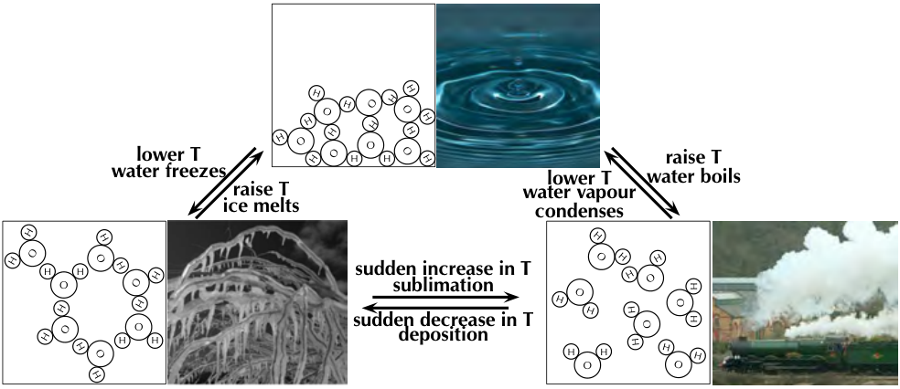
> **[Diagram Context - Textbook_PhysicalSciences_Gr12_Organic-molecules.pdf-0056-03.png]**
> 1. A diagram of water molecules and their arrangement.


*Figure 4.53: Hydrogen bonding between two molecules of ethanol.*

> **TIP**  
> Do not confuse hydrogen bonds with *intramolecular* covalent bonds. Hydrogen bonding is an example of a scientist naming something, believing it to be one thing when in fact it was another. In this case the strength of the hydrogen bonds misled scientists into thinking this was an intramolecular bond when it is really just a strong intermolecular force.

> **FACT**  
> Dipole-induced-dipole intermolecular forces are also sometimes called *London* forces or dispersion forces.

---

### 2. van der Waals forces

* **Induced-dipole forces**  
  In non-polar molecules the electronic charge is usually evenly distributed but it is possible that at a particular moment in time, the electrons might not be evenly distributed (remember that the electrons are always moving in their orbitals). The molecule will have a *temporary dipole*. When this happens, molecules that are next to each other attract each other very weakly.

* **Dipole-induced-dipole forces**  
  These forces exist between dipoles and non-polar molecules. The dipole induces a dipole in the non-polar molecule leading to a weak, short lived force which holds the compounds together.

In this chapter we will focus on the effects of van der Waals forces and hydrogen bonding on the physical properties of organic molecules.

---

### Viscosity

Viscosity is the resistance to flow of a liquid. Think how easy it is to pour water compared to syrup or honey. The water flows much faster than the syrup or honey.

> **DEFINITION: Viscosity**  
> Viscosity is a measure of how much a liquid resists flowing. i.e. The higher the viscosity, the more viscous a substance is.


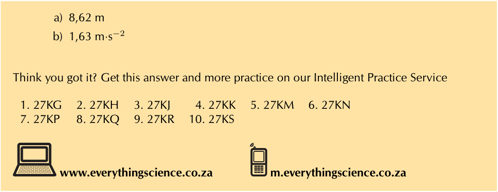
> **[Diagram Context - Textbook_PhysicalSciences_Gr12_Vertical-projectile-motion-in-one-dimension.pdf-0056-00.png]**
> The image shows a diagram of a cell, which is a fundamental unit of life. The diagram is labeled with various terms and concepts related to biology and cellular structure. The diagram also includes a list of labels, variables, and arrows that help explain the diagram's content. The diagram is accompanied by a website address, indicating that it is a visual aid for learning about cellular structure and biology.


*Figure 4.54: Pouring water versus pouring syrup.*

You can see this if you take a cylinder filled with water and a cylinder filled with glycerol (propane-1,2,3-triol). Drop a small metal ball into each cylinder and note how easy it is for the ball to fall to the bottom (Figure 4.55). In the glycerol the ball falls slowly, while in the water it falls faster.

---


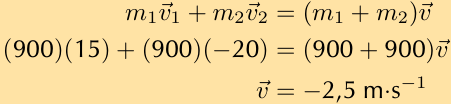
> **[Diagram Context - Textbook_PhysicalSciences_Gr12_Momentum-and-Impulse.pdf-0057-06.png]**
> This mathematical calculation represents a physics


Figure 4.55: The higher the viscosity (red) the slower the ball moves through the liquid.

As implied by the definition, substances with stronger intermolecular forces are more viscous than substances with weaker intermolecular forces. The stronger the intermolecular forces the more the substance will resist flowing. The greater the internal friction the more a substance will slow down an object moving through it.

## Activity: Resistance to flow

Take a sheet of glass at least $10\text{ by }15\text{ cm}$ in size. Using a water-proof marker draw a straight line across the width of the glass about $2\text{ cm}$ from each end.

Place the glass flat on top of two pencils, then carefully put a drop of water on one end of the line. Leave at least $2\text{ cm}$ space next to the water drop, and carefully place a drop of alcohol. Repeat this with a drop of oil and a drop of syrup.

Slowly and carefully remove the pencil from the end opposite the drops (make sure you don't tilt the glass to either side in the process).


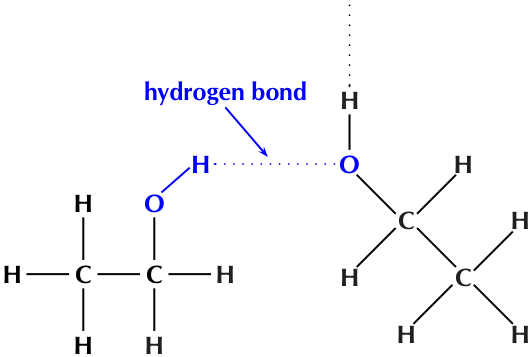
> **[Diagram Context - Textbook_PhysicalSciences_Gr12_Organic-molecules.pdf-0057-03.png]**
> The image shows a diagram of a molecule of methane, which is composed of carbon and hydrogen atoms. The molecule is depicted in a three-dimensional view, with the carbon atoms arranged in a tetrahedral shape and the hydrogen atoms arranged in a linear fashion. The diagram also includes a hydrogen bond between the carbon and hydrogen atoms, which is represented by a blue line. The diagram is labeled "hydrogen bond" and "hydrogen bond" is written in blue text above the molecule.


* Which drop moves fastest and reaches the end line first?
* Which drop moves slowest?

The fastest moving substance has the least resistance to flow, and therefore has the least viscosity (is the least viscous). The slowest moving substance has the most resistance to flow, and therefore has the most viscosity (is the most viscous).

---

## Density

### DEFINITION: Density

Density is a measure of the mass per unit of volume.

The solid phase is often the most dense phase (water is one noteworthy exception to this). This can be explained by the strong intermolecular forces found in a solid. These forces pull the molecules together, which results in more molecules in one unit of volume than in the liquid or gas phases. The more molecules in a unit volume the denser, and heavier that volume of the substance will be.

Density can be used to separate different liquids, with the more dense liquid settling

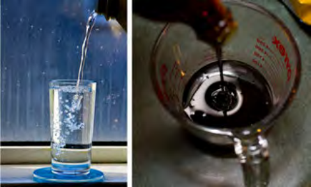
> **[Diagram Context - Textbook_PhysicalSciences_Gr12_Organic-molecules.pdf-0057-21.png]**
> 1. A glass of water with a droplet of water on the side.


---

### Melting and Boiling Points

Intermolecular forces affect the boiling and melting points of substances. 
* Substances with weak intermolecular forces will have low melting and boiling points as less energy (heat) is needed to overcome these forces.
* Those with strong intermolecular forces will have high melting and boiling points as more energy (heat) is required to overcome these forces. 

When the temperature of a substance is raised beyond its melting or boiling point the intermolecular forces are not weakened. Rather, the molecules have enough energy to overcome those forces.

#### FACT
An ether is a compound that contains two alkyl chains (e.g. methyl, ethyl) joined at an oxygen atom ($-\text{O}-$).

---

### Table 4.9: Relationship between intermolecular forces and melting point, boiling point and physical state

| Name | Main intermolecular forces | Molecular Mass ($\text{g}\cdot\text{mol}^{-1}$) | Melting point ($^\circ\text{C}$) | Boiling point ($^\circ\text{C}$) | Phase (at $25^\circ\text{C}$) |
| :--- | :--- | :--- | :--- | :--- | :--- |
| ethane | induced-dipole | $30,06$ | $-183$ | $-89$ | gas |
| dimethyl ether | dipole-dipole | $46,06$ | $-141$ | $-24$ | gas |
| chloroethane | dipole-dipole | $64,5$ | $-139$ | $12,3$ | gas |
| pentane | induced-dipole | $72,12$ | $-130$ | $36$ | liquid |
| propan-1-ol | hydrogen bonds | $60,08$ | $-126$ | $97$ | liquid |
| ethanol | hydrogen bonds | $46,06$ | $-114$ | $78,4$ | liquid |
| butan-1-ol | hydrogen bonds | $74,1$ | $-90$ | $118$ | liquid |
| ethanoic acid | hydrogen bonds | $60,04$ | $16,5$ | $118,5$ | liquid |

As the intermolecular forces increase (from top to bottom in Table 4.9) the melting and boiling points increase. The stronger the intermolecular forces the more likely a substance is to be a liquid or a solid at room temperature.


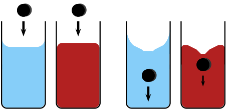
> **[Diagram Context - Textbook_PhysicalSciences_Gr12_Organic-molecules.pdf-0058-00.png]**
> 1. A diagram of a water droplet in a glass of water.


**Figure 4.56:** The structural formula of dimethyl ether.

---

### Worked Example 27: Comparing physical properties

**QUESTION**

| Given: | Melting point ($^\circ\text{C}$) | Boiling point ($^\circ\text{C}$) |
| :--- | :---: | :---: |
| propane | $-188$ | $-42$ |
| butanoic acid | $-7,9$ | $163,5$ |
| bromoethane | $-118$ | $38,5$ |
| diethyl ether | $-116,3$ | $34,6$ |

Fill in the table below:

| Name | Main intermolecular forces | Molecular formula | Molecular mass ($\text{g}\cdot\text{mol}^{-1}$) | Phase (at $25^\circ\text{C}$) |
| :--- | :--- | :--- | :--- | :--- |
| propane | | | | |
| butanoic acid | | | | |
| bromoethane | | | | |
| diethyl ether | | | | |

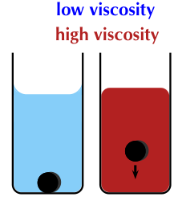
> **[Diagram Context - Textbook_PhysicalSciences_Gr12_Organic-molecules.pdf-0058-01.png]**
> The image shows two glass containers filled with water, one blue and one red. The blue container has a black ball inside, while the red container has a black ball outside. The blue container is labeled "low viscosity" and the red container is labeled "high viscosity". The text "low viscosity high viscosity" is written above the blue container, and "high viscosity low viscosity" is written above the red container.


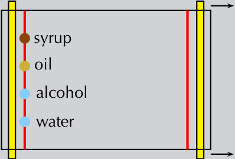
> **[Diagram Context - Textbook_PhysicalSciences_Gr12_Organic-molecules.pdf-0058-08.png]**
> 1. A diagram of a syrup, oil, alcohol, and water.


---

## SOLUTION

### Step 1: Draw the structural representation of each molecule


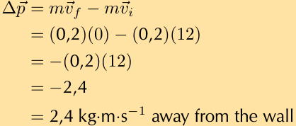
> **[Diagram Context - Textbook_PhysicalSciences_Gr12_Momentum-and-Impulse.pdf-0059-01.png]**
> A diagram of a cell with arrows pointing to different parts of the cell.


### Step 2: What are the intermolecular forces that each molecule will experience?

* **propane** has only single carbon-carbon bonds and no other functional group. It will therefore have induced-dipole forces only.
* **butanoic acid** has the carboxylic acid functional group. It can therefore form hydrogen bonds.
* **bromoethane** has the highly electronegative bromine atom. This means that it will form dipole-dipole interactions with neighbouring molecules.
* **diethyl ether** will have induced-dipole forces, however due to the flexible nature of the molecule is can also have dipole-induced-dipole (stronger van der Waals interactions) and dipole-dipole forces.

### Step 3: Do these forces make sense with the melting and boiling points provided?

Propane has the lowest melting and boiling points and the weakest interactions. The next lowest melting and boiling points are for bromoethane and diethyl ether, which both have dipole-dipole interactions, the next strongest intermolecular forces. The highest melting and boiling points are for butanoic acid which has strong hydrogen bonds. Therefore these forces do make sense.

### Step 4: Calculate the molecular mass of these molecules

* propane - $C_{3}H_{8}$, molecular mass $= 44,08 \text{ g}\cdot\text{mol}^{-1}$
* butanoic acid - $C_{4}H_{8}O_{2}$, molecular mass $= 88,08 \text{ g}\cdot\text{mol}^{-1}$
* bromoethane - $C_{2}H_{5}Br$, molecular mass $= 108,95 \text{ g}\cdot\text{mol}^{-1}$
* diethyl ether - $C_{4}H_{10}O$, molecular mass $= 74,10 \text{ g}\cdot\text{mol}^{-1}$

### Step 5: What will the phase of each compound be at $25 \text{ }^\circ\text{C}$?

To determine the phase of a molecule at $25 \text{ }^\circ\text{C}$ look at the melting and boiling points:

* The melting and boiling points of propane are both below $25 \text{ }^\circ\text{C}$, therefore the molecule will be a gas at $25 \text{ }^\circ\text{C}$.
* The melting points of butanoic acid, bromoethane and dimethyl ether are below $25 \text{ }^\circ\text{C}$, however the boiling points of all three molecules are above $25 \text{ }^\circ\text{C}$. Therefore these molecules will be liquids at $25 \text{ }^\circ\text{C}$.

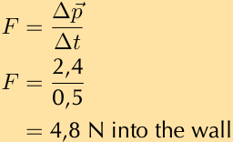
> **[Diagram Context - Textbook_PhysicalSciences_Gr12_Momentum-and-Impulse.pdf-0059-05.png]**
> The image shows a diagram of a Lewis structure for a molecule of water. The diagram is labeled with the chemical formula "H2O" and the atomic masses of hydrogen and oxygen. The diagram also includes arrows pointing to the bonds between the atoms. The diagram is set against a light beige background, and the text "4.8 N into the wall" is written below the diagram.


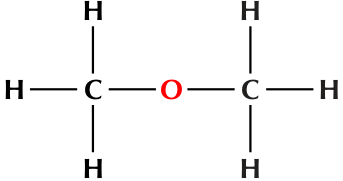
> **[Diagram Context - Textbook_PhysicalSciences_Gr12_Organic-molecules.pdf-0059-07.png]**
> This graphic displays a structural formula (or structural representation) of an organic molecule. It features the chemical symbols C (carbon), H (hydrogen), and O (oxygen), interconnected by solid lines representing covalent bonds in a symmetrical arrangement. Conceptually, this diagram illustrates the structural isomerism and functional group of methoxymethane (an ether), helping Grade 12 Physical Sciences learners visualize molecular connectivity and functional groups within the CAPS organic chemistry curriculum.


---

## Step 6: Fill in the table

| Name | Main intermolecular forces | Molecular formula | Molecular mass ($\text{g}\cdot\text{mol}^{-1}$) | Phase (at $25\ ^{\circ}\text{C}$) |
| :--- | :--- | :--- | :---: | :---: |
| propane | induced-dipole | $\text{C}_3\text{H}_8$ | 44,08 | gas |
| butanoic acid | hydrogen bonds | $\text{C}_4\text{H}_8\text{O}_2$ | 88,08 | liquid |
| bromoethane | dipole-dipole | $\text{C}_2\text{H}_5\text{Br}$ | 108,95 | liquid |
| diethyl ether | dipole-dipole | $\text{C}_4\text{H}_{10}\text{O}$ | 74,10 | liquid |

---

## Experiment: Investigation of boiling and melting points

### Aim:
To investigate the relationship between boiling points and intermolecular forces

### Apparatus:
* butan-1-ol ($\text{CH}_2(\text{OH})\text{CH}_2\text{CH}_2\text{CH}_3$), propanoic acid ($\text{CH}_3\text{CH}_2\text{COOH}$) and ethyl methanoate ($\text{HCOOCH}_2\text{CH}_3$), cooking oil
* three test tubes, a beaker, a thermometer, a hot plate

### Method:
**WARNING!**  
Ethyl methanoate can irritate your eyes, skin, nose and lungs. Keep open flames away from your experiment and make sure you work in a well ventilated area.

1. Label the test tubes **1**, **2** and **3**. Place $20\text{ ml}$ of butan-1-ol into test tube 1, $20\text{ ml}$ of propanoic acid into test tube 2, and $20\text{ ml}$ of ethyl methanoate into test tube 3.
2. Half-fill the beaker with cooking oil and place it on the hot plate.
3. Place the thermometer and the three test tubes in the beaker.
4. Make a note of the temperature when each substance starts to boil.


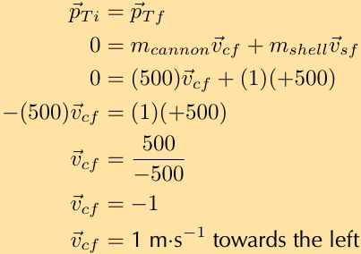
> **[Diagram Context - Textbook_PhysicalSciences_Gr12_Momentum-and-Impulse.pdf-0060-00.png]**
> 1. A diagram of a cell with arrows pointing to different parts of the cell.


### Results:
Fill in the gaps in the table below. Do the values you obtained match those reported in literature?

| Compound | ethyl methanoate | butan-1-ol | propanoic acid |
| :--- | :---: | :---: | :---: |
| **Molecular formula** | | | |
| **Molecular mass** | | | |
| **Main intermolecular forces** | | | |
| **Literature boiling point ($^{\circ}\text{C}$)** | 54 | 118 | 141 |
| **Experimental boiling point ($^{\circ}\text{C}$)** | | | |

Draw the structural representation of ethyl methanoate, butan-1-ol and propanoic acid.

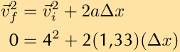
> **[Diagram Context - Textbook_PhysicalSciences_Gr12_Momentum-and-Impulse.pdf-0060-16.png]**
> This image displays a physics equation


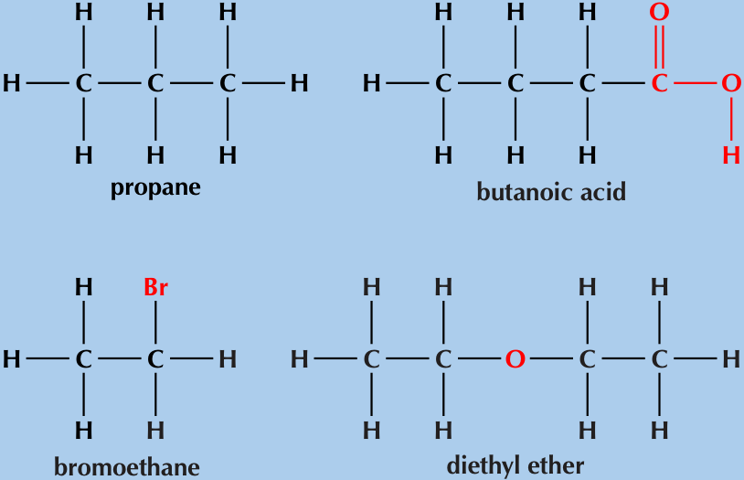
> **[Diagram Context - Textbook_PhysicalSciences_Gr12_Organic-molecules.pdf-0060-01.png]**
> 1. A diagram of a molecule with the chemical formula C6H12O6.


---

## Discussion and Conclusion

* **Order of boiling points:** Ethyl methanoate boils first, followed by butan-1-ol, and then propanoic acid.
* **Ethyl methanoate:** Possesses dipole-dipole interactions, but cannot form hydrogen bonds.
* **Butan-1-ol (Alcohol):** Can form hydrogen bonds, resulting in stronger intermolecular forces, higher energy required to break them, and thus a higher boiling point than ethyl methanoate.
* **Propanoic acid (Carboxylic acid):** Hydrogen bonds form between the carbonyl group on one acid and the hydroxyl group on another. Each molecule can participate in two hydrogen bonds (a process called **dimerisation**, see Figure 4.57), giving propanoic acid an even higher boiling point than butan-1-ol.


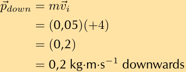
> **[Diagram Context - Textbook_PhysicalSciences_Gr12_Momentum-and-Impulse.pdf-0061-02.png]**
> A diagram of a cell with arrows pointing to different parts of the cell.


*Figure 4.57: A carboxylic acid hydrogen bonding dimer.*

---

## Flammability and Vapour Pressure

* **Flammability:** A measure of how easy it is for a substance to catch alight and burn.
* **Flash point:** The lowest temperature that is likely to form a gaseous mixture you could set alight.
    * *Flammable:* Liquids with a low enough flash point that can be ignited easily.
    * *Nonflammable:* Substances with higher flash points that will not ignite easily (though they can still be forced to burn).
* **Vapour pressure:** In liquid or solid states, some molecules have enough energy to escape into the gas phase. The pressure exerted by these gas molecules on the liquid or solid (and the container) is the vapour pressure.
    * *Relationship:* Weaker intermolecular forces $\rightarrow$ higher vapour pressure $\rightarrow$ lower flash points $\rightarrow$ higher flammability.

> **DEFINITION: Vapour pressure**
> 
> The pressure exerted (at a specific temperature) on a solid or liquid compound by molecules of that compound that are in the gas phase.

---

### Table 4.10: Relationship between intermolecular forces and the flammability of a substance

| Name | Main intermolecular forces | Vapour pressure ($\text{kPa}$ at $20\,^{\circ}\text{C}$) | Flash point ($^{\circ}\text{C}$) | Flammability |
| :--- | :--- | :---: | :---: | :--- |
| ethane | induced-dipole | 3750 | -135 | very high |
| propane | induced-dipole | 843 | -104 | very high |
| dimethyl ether | dipole-dipole | 510 | 41 | very high |
| butane | induced-dipole | 204 | -60 | very high |
| chloroethane | dipole-dipole | 132,4 | -50 | very high |
| pentane | induced-dipole | 57,9 | -49 | very high |
| propanone | dipole-dipole | 24,6 | -17 | high |
| ethanol | hydrogen bonds | 5,8 | 17 | high |
| water | hydrogen bonds | 2,3 | - | very low |
| propan-1-ol | hydrogen bonds | 2 | 22 | high |
| ethanoic acid | hydrogen bonds | 1,6 | 40 | moderate |
| butan-1-ol | hydrogen bonds | 0,6 | 35 | high |

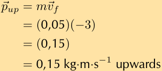
> **[Diagram Context - Textbook_PhysicalSciences_Gr12_Momentum-and-Impulse.pdf-0061-04.png]**
> The image shows a table with three columns and four rows. The first column contains the text "Pup" and the first row has the number "0.15". The second column has the text "mv" and the second row has the number "0.05". The third column has the text "0.15" and the third row has the number "0.05". The fourth column has the text "0.15" and the fourth row has the number "0.05". The table is set against a light brown background.


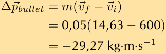
> **[Diagram Context - Textbook_PhysicalSciences_Gr12_Momentum-and-Impulse.pdf-0061-11.png]**
> This graphic displays a physics calculation step showing the mathematical equation for momentum change: $\Delta\vec{p}_{bullet} = m(\vec{v}_f - \vec{v}_i)$. The visible variables and values include mass ($m = 0,05$), final velocity ($\vec{v}_f = 14,63$), initial velocity ($\vec{v}_i = 600$), and the resulting momentum change of $-29,27\text{ kg}\cdot\text{m}\cdot\text{s}^{-1}$. Conceptually, it demonstrates how to apply the impulse-momentum theorem in a one-dimensional collision or ballistic problem, emphasizing proper vector direction through negative signs and correct SI units as required in the Grade 12 CAPS curriculum.


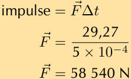
> **[Diagram Context - Textbook_PhysicalSciences_Gr12_Momentum-and-Impulse.pdf-0061-13.png]**
> 1. A math problem involving the acceleration of a body.


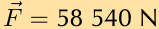


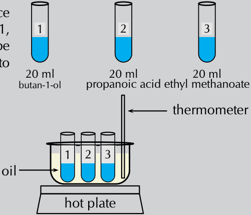
> **[Diagram Context - Textbook_PhysicalSciences_Gr12_Organic-molecules.pdf-0061-11.png]**
> 1. A diagram of a laboratory experiment with four test tubes filled with different colored liquids. The first test tube has a blue liquid, the second has a green liquid, the third has a yellow liquid, and the fourth has a clear liquid. The diagram also includes labels for the test tubes and the different liquids they contain.


---

As the intermolecular forces increase (from top to bottom in Table 4.10) you can see a decrease in the vapour pressure. This corresponds with an increase in the flash point temperature and a decrease in the flammability of the substance. Figure 4.58 shows a few examples.


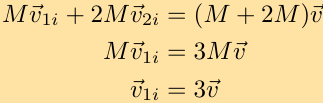
> **[Diagram Context - Textbook_PhysicalSciences_Gr12_Momentum-and-Impulse.pdf-0062-18.png]**
> This algebraic calculation sequence demonstrates the application of the Principle of Conservation of Linear Momentum for Grade 12 Physical Sciences. The visible symbols include masses ($M$, $2M$), initial and final velocity vectors ($\vec{v}_{1i}$, $\vec{v}_{2i}$, $\vec{v}$), and vector arrows indicating direction. Conceptually, it conveys how to equate total initial momentum to total final momentum in a collision and algebraically simplify the equation to solve for an unknown variable.


**Figure 4.58:** The vapour pressure of **(a)** water, **(b)** ethanol and **(c)** propanone at $20\text{ }^\circ\text{C}$. (Images by Duncan Watson)

---

### Exercise 4 – 19: Types of intermolecular forces

1. Use your knowledge of different types of intermolecular forces to explain the following statements:
   a) The boiling point of hex-1-ene is much lower than the boiling point of propanoic acid.
   b) Water evaporates more slowly than propanone.

2. 

| | IUPAC name | Boiling point ($^\circ\text{C}$) |
|---|---|---|
| **A** | ethane | $-89,0$ |
| **B** | ethanol | $78,4$ |
| **C** | ethanoic acid | $118,5$ |

   a) Which of the compounds listed in the table are gases at room temperature?
   b) Name the main type of intermolecular forces for A, B and C.
   c) Account for the difference in boiling point between A and B.
   d) Account for the difference in boiling point between B and C.
   e) Draw the structural representations of A, B and C.

3. 
   a) Which container (A or B) has the compound with higher vapour pressure in it? Explain your answer.

   

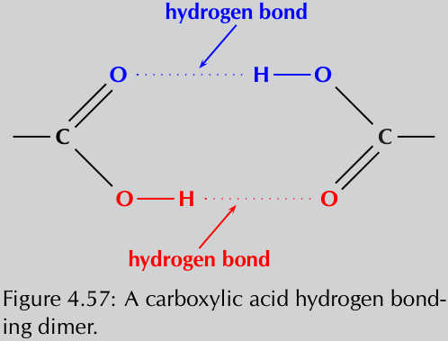
> **[Diagram Context - Textbook_PhysicalSciences_Gr12_Organic-molecules.pdf-0062-02.png]**
> Figure 4.57: A carboxylic acid hydrogen bond.


   b) Draw the condensed structural formula for each of these compounds:
      i. propanoic acid
      ii. butan-1-ol
   c) Propanoic acid has a vapour pressure of $0,32\text{ kPa}$ at $20\text{ }^\circ\text{C}$.

---

*Chapter 4. Organic molecules* **169**

---

## TIP

Vanilla has a sweet smell. The smell of ethene and dimethyl ether cling in your nose though, and the smell of ether can even stay on your skin up to 24 hours.

Butan-1-ol has a vapour pressure of $0,64\text{ kPa}$ at $20\text{ }\text{}^{\circ}\text{C}$. Explain the difference in vapour pressure.

4. More questions. Sign in at Everything Science online and click 'Practise Science'. Check answers online with the exercise code below or click on 'show me the answer'.
   - 1a. $27\text{NF}$
   - 1b. $27\text{NG}$
   - 2. $27\text{NH}$
   - 3a. $27\text{NJ}$
   - 3b. $27\text{NK}$
   - 3c. $27\text{NM}$

---

## FACT

In humans, ethanol reduces the secretion of a hormone called antidiuretic hormone (ADH). The role of ADH is to control the amount of water that the body retains. When this hormone is not secreted in the right quantities, it can cause dehydration because too much water is lost from the body in the urine (ethanol is a diuretic). This is why people who drink too much alcohol can become dehydrated, and experience symptoms such as headaches, dry mouth, and lethargy. Part of the reason for the headaches is that dehydration causes the brain to shrink away from the skull slightly.

---

## Physical properties and functional groups (ESCKR)

Compounds that contain very similar atoms can have very different properties depending on how those atoms are arranged. This is especially true when they have different functional groups. Table $4.11$ shows some properties of different functional groups.

| Functional group | Typical Smell | Example | Formula | Melting point ($^{\circ}\text{C}$) | Boiling point ($^{\circ}\text{C}$) | Phase (at $25\text{ }\text{}^{\circ}\text{C}$) |
| :--- | :--- | :--- | :--- | :--- | :--- | :--- |
| alkane | odourless | ethane | $\text{C}_{2}\text{H}_{6}$ | $-183$ | $-89$ | gas |
| alkene | sweet/musky | ethene | $\text{C}_{2}\text{H}_{4}$ | $-169,2$ | $-103,7$ | gas |
| ether ($\text{-O-}$ ) | sweet | dimethyl ether | $\text{C}_{2}\text{H}_{6}\text{O}$ | $-141$ | $-24$ | gas |
| haloalkane | almost odourless | chloroethane | $\text{C}_{2}\text{H}_{5}\text{Cl}$ | $-139$ | $12,3$ | gas |
| aldehyde | pungent fruity | ethanal | $\text{C}_{2}\text{H}_{4}\text{O}$ | $-123,4$ | $20,2$ | gas |
| alcohol | sharp | ethanol | $\text{C}_{2}\text{H}_{6}\text{O}$ | $-114$ | $78,4$ | liquid |
| ester | often fruity | methyl methanoate | $\text{C}_{2}\text{H}_{4}\text{O}_{2}$ | $-100$ | $32$ | liquid |
| alkyne | odourless | ethyne | $\text{C}_{2}\text{H}_{2}$ | $-80,8$ | $-84$ | gas |
| carboxylic acid | vinegar, rancid butter | ethanoic acid | $\text{C}_{2}\text{H}_{4}\text{O}_{2}$ | $16,5$ | $118,5$ | liquid |

*Table 4.11: Some properties of compounds with different functional groups.*

Listed in the table are the common smells and other physical properties found for common functional groups. Only one representative example from each homologous series is provided. This does not mean that all compounds in that series have exactly the same properties. For example, short-chain and long-chain alkanes are generally odourless, while those with moderate chain length (approximately $6-12$ carbon atoms) smell like petrol (Table $4.15$).

Some specific properties of a few functional groups will now be discussed in more detail.

### Physical properties of the alcohols

The hydroxyl group ($\text{-OH}$) affects the **solubility** of the alcohols.

> **DEFINITION: Solubility**
> 
> Solubility is a measure of the ability of a substance (solid, liquid or gas) to dissolve in another substance. The amount of the substance than can dissolve is the measure of its solubility.

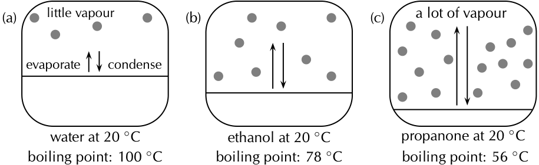
> **[Diagram Context - Textbook_PhysicalSciences_Gr12_Organic-molecules.pdf-0063-01.png]**
> 1. A diagram of a boiling point apparatus showing water at 20 degrees Celsius and propane at 20 degrees Celsius.


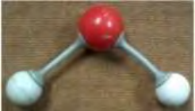
> **[Diagram Context - Textbook_PhysicalSciences_Gr12_Organic-molecules.pdf-0063-02.png]**
> 1. A red and white diagram of a molecule with two spheres and a wire connecting them.


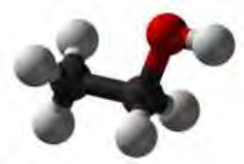
> **[Diagram Context - Textbook_PhysicalSciences_Gr12_Organic-molecules.pdf-0063-03.png]**
> 1. A 3D rendering of a molecule with a red ball at the center.


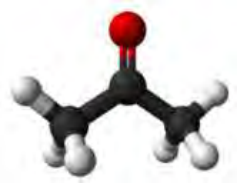
> **[Diagram Context - Textbook_PhysicalSciences_Gr12_Organic-molecules.pdf-0063-04.png]**
> 1. A 3D rendering of a molecule with a red oxygen atom at the top.


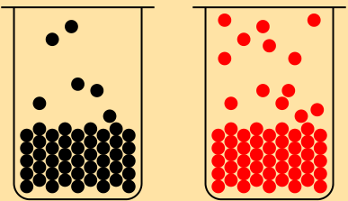
> **[Diagram Context - Textbook_PhysicalSciences_Gr12_Organic-molecules.pdf-0063-19.png]**
> 1. A black and red diagram of a flask with red spheres in it.


---

### Physical Properties of Alcohols

* **Solubility:** The hydroxyl group ($\text{-OH}$) generally makes the alcohol molecule **polar** and therefore more likely to be **soluble** in water. However, the carbon chain resists solubility, creating two opposing trends:
  * Alcohols with shorter carbon chains are usually more soluble in water than those with longer carbon chains.
* **Boiling Points:** Alcohols tend to have higher **boiling points** than hydrocarbons because of the strong hydrogen bonds between hydrogen atoms of one hydroxyl group and the oxygen atom of another hydroxyl group.

---

### Physical Properties of Haloalkanes

There can be more than one halogen substituted for a hydrogen atom on a haloalkane. The more halogens that are substituted, the less **volatile** the haloalkane becomes.

> **DEFINITION: Volatility**
> 
> The tendency of molecules at the surface of a compound to enter the gas phase. The more volatile a compound, the more likely this is.


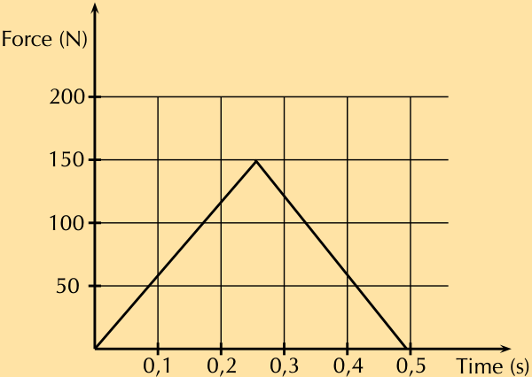
> **[Diagram Context - Textbook_PhysicalSciences_Gr12_Momentum-and-Impulse.pdf-0064-10.png]**
> The image presents a graph with a triangular shape, labeled with the number of times it takes for a force to change the direction of an object. The x-axis of the graph is labeled "time" and the y-axis is labeled "force". The graph shows a steep incline in the y-axis, indicating a strong relationship between time and force. The graph is set against a light beige background, and the title "Time (s) vs Force (N)" is prominently displayed at the top.


**Figure 4.59:** A series of haloalkanes with increasing numbers of chlorine atoms: **(a)** chloromethane, **(b)** dichloromethane, **(c)** trichloromethane, and **(d)** tetrachloromethane.

For every *extra* chlorine atom on the original methane molecule, the volatility of the compound decreases. This is seen by the increase in both the melting and boiling points as one goes from chloromethane through to tetrachloromethane. The more halogen atoms in the compound, the stronger the intermolecular forces are, which leads to higher melting and boiling points.

| Common Name | Number $\text{Cl}$ atoms | Melting point ($^\circ\text{C}$) | Boiling point ($^\circ\text{C}$) |
| :--- | :---: | :---: | :---: |
| chloromethane | $1$ | $-97,4$ | $-24,2$ |
| dichloromethane | $2$ | $-96,7$ | $39,6$ |
| trichloromethane | $3$ | $-63,5$ | $61,2$ |
| tetrachloromethane | $4$ | $-22,9$ | $76,7$ |

**Table 4.12:** Melting and boiling points of haloalkanes with increasing numbers of chlorine atoms.

---

### Properties of Carbonyl Compounds

Carboxylic acids are **weak acids**, meaning they only dissociate partially. 

In the carboxyl group, the hydrogen tends to separate itself (dissociate) from the oxygen atom, making the carboxyl group a source of positively-charged hydrogen ions ($\text{H}^+$).

<!-- DIAGRAM_PLACEHOLDER: diagram -->

**Figure 4.60:** The dissociation of a carboxylic acid (showing ethanoic acid dissociating into an ethanoate ion and a hydrogen ion).

---

## Solubility of Carboxylic Acids

* The carboxylic acid functional group is soluble in water.
* However, as the number of carbon atoms in the attached carbon chain increases, the solubility decreases.

## Hydrogen Bonding and Dimerisation

* Carboxylic acids can form hydrogen bonding dimers (the formation is called **dimerisation**).


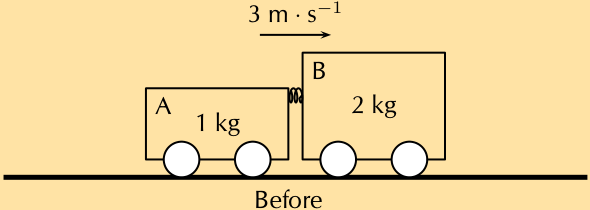
> **[Diagram Context - Textbook_PhysicalSciences_Gr12_Momentum-and-Impulse.pdf-0065-07.png]**
> The image shows a diagram of a train with two cars connected by a rope. The diagram also includes text that explains the concept of a Lewis diagram, which is a visual representation of a chemical reaction. The diagram is labeled with the names of the reactants and products, and the reaction is represented by a Lewis structure. The diagram also includes text that explains the concept of a 2 kg mass and a 1 kg mass, which are used to represent the masses of the reactants and products in the reaction.


* **Figure 4.61:** Ethanoic acid forming a carboxylic acid hydrogen bonding dimer.

## Effect of Hydrogen Bonding on Melting and Boiling Points

* The ability of a molecule to hydrogen bond leads to increased melting and boiling points when compared to a similar molecule that is unable to hydrogen bond.
* Similarly, the ability of a molecule to form a hydrogen bonding dimer leads to increased melting and boiling points when compared to similar molecules that can only form one hydrogen bond.

| Molecule | Hydrogen bonds per molecule | Melting point ($^\circ\text{C}$) | Boiling point ($^\circ\text{C}$) |
| :--- | :---: | :---: | :---: |
| ethane | 0 | -183 | -89 |
| ethanol | 1 | -114 | 78,4 |
| ethanoic acid | 2 | 16,5 | 118,5 |

* **Table 4.13:** The melting and boiling points of similar organic compounds that can form different numbers of hydrogen bonds.

## Physical Properties of Ketones

* Hydrogen bonds are stronger than the van der Waals forces found in ketones. 
* Therefore, compounds with functional groups that can form hydrogen bonds are more likely to be soluble in water. This applies to aldehydes as well as to ketones.


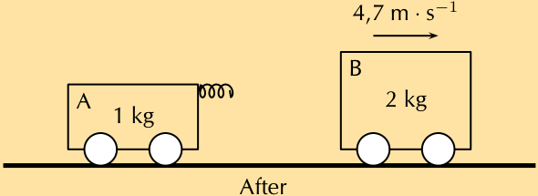
> **[Diagram Context - Textbook_PhysicalSciences_Gr12_Momentum-and-Impulse.pdf-0065-09.png]**
> 1. A black and white diagram of two cars on a track.


* **Figure 4.62:** The hydrogen bond between water and a ketone (propanone).

---

## Exercise 4 – 20: Physical properties and functional groups

1. Refer to the data table below which shows the melting point and boiling point for a number of organic compounds with different functional groups.

| Formula | Name | Melting point ($^\circ\text{C}$) | Boiling point ($^\circ\text{C}$) |
| :--- | :--- | :---: | :---: |
| $\text{C}_4\text{H}_{10}$ | butane | $-137$ | 0 |
| $\text{C}_4\text{H}_8$ | but-1-ene | $-185$ | $-6,5$ |
| $\text{C}_4\text{H}_{10}\text{O}$ | butan-1-ol | $-90$ | 118 |
| $\text{C}_4\text{H}_8\text{O}_2$ | butanoic acid | $-7,9$ | 163,5 |
| $\text{C}_5\text{H}_{12}$ | pentane | $-130$ | 36 |
| $\text{C}_5\text{H}_{10}$ | pent-1-ene | $-165,2$ | 30 |
| $\text{C}_5\text{H}_{12}\text{O}$ | pentan-1-ol | $-78$ | 138 |
| $\text{C}_5\text{H}_{10}\text{O}_2$ | pentanoic acid | $-34,5$ | 186,5 |

a) At room temperature (approx. $25^\circ\text{C}$), which of the organic compounds in the table are:

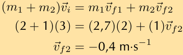
> **[Diagram Context - Textbook_PhysicalSciences_Gr12_Momentum-and-Impulse.pdf-0065-12.png]**
> This image displays a step-by-step algebraic physics calculation demonstrating the principle of conservation of momentum. It features mathematical variables and symbols including masses ($m_1$, $m_2$), initial and final velocity vectors ($\vec{v}_i$, $\vec{v}_{f1}$, $\vec{v}_{f2}$), numerical values with SI units ($\text{m}\cdot\text{s}^{-1}$), and equality signs. Conceptually, it guides Grade 11 and 12 Physical Sciences learners through substituting known values into the conservation of linear momentum equation to solve for an unknown final velocity.


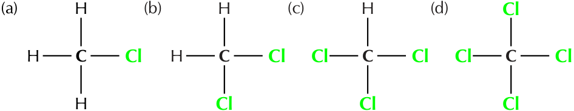
> **[Diagram Context - Textbook_PhysicalSciences_Gr12_Organic-molecules.pdf-0065-04.png]**
> 1. A diagram of a molecule with six carbon atoms and six hydrogen atoms.


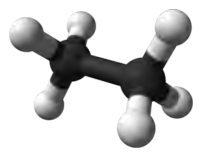
> **[Diagram Context - Textbook_PhysicalSciences_Gr12_Organic-molecules.pdf-0065-12.png]**
> 1. A 3D rendering of a molecule with six spheres and a cross-section view.


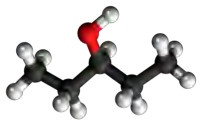
> **[Diagram Context - Textbook_PhysicalSciences_Gr12_Organic-molecules.pdf-0065-14.png]**
> 1. A 3D rendering of a molecule with a red hydrant on the left side.


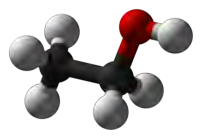
> **[Diagram Context - Textbook_PhysicalSciences_Gr12_Organic-molecules.pdf-0065-16.png]**
> 1. A 3D rendering of a molecule with a red ball at the top and a black rod at the bottom.


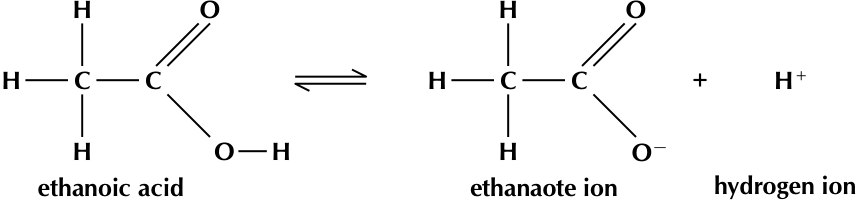
> **[Diagram Context - Textbook_PhysicalSciences_Gr12_Organic-molecules.pdf-0065-21.png]**
> 1. A diagram of an ethane molecule with hydrogens attached.


---

## Physical properties and chain length (ESCKS)

Remember that the alkanes are a group of organic compounds that contain carbon and hydrogen atoms bonded together. The carbon atoms link together to form chains of varying lengths. We have already mentioned that the alkanes are relatively unreactive because of their stable C-C and C-H bonds. The boiling points and melting points of these molecules are determined by their molecular structure and their surface area.


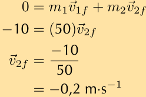
> **[Diagram Context - Textbook_PhysicalSciences_Gr12_Momentum-and-Impulse.pdf-0066-06.png]**
> The image shows a math problem involving the relationship between velocity and mass. The problem is presented in a table format, with the variables labeled and the equations written in a clear, legible font. The problem is designed to help students understand the concept of velocity and its relationship to mass. The problem is presented in a straightforward manner, with the variables clearly labeled and the equations written in a simple, easy-to-read font.


*Figure 4.63: Some alkanes, from top left to bottom right: methane, ethane, propane, butane, hexane, octane and icosane.*


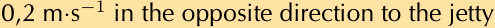


*Figure 4.64: van der Waals intermolecular forces increase as chain length increases. (Image by Duncan Watson)*

The more carbon atoms there are in an alkane, the greater the surface area available for intermolecular interactions. 

This increase in intermolecular attractions leads to higher melting and boiling points. This is shown in Table 4.14.

---

### Questions and Exercises

i. gases  
ii. liquids  

b) Look at an alkane, alkene, alcohol and carboxylic acid with the same number of carbon atoms:
   i. How do their melting and boiling points compare?
   ii. Explain why their melting points and boiling points are different?

2. More questions. Sign in at Everything Science online and click 'Practise Science'. Check answers online with the exercise code below or click on 'show me the answer'.
   1. 27NN

www.everythingscience.co.za  
m.everythingscience.co.za

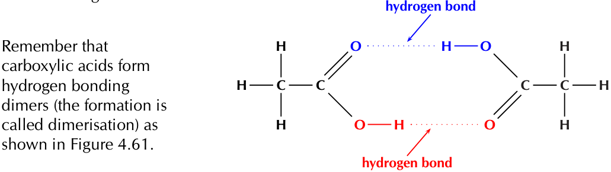
> **[Diagram Context - Textbook_PhysicalSciences_Gr12_Organic-molecules.pdf-0066-01.png]**
> The image shows a diagram of a molecule with two oxygen atoms and two hydrogen atoms. The molecule is shown in a Lewis structure, which is a diagram that represents the bonding between atoms in a molecule. The diagram is color-coded, with the oxygen atoms colored blue and the hydrogen atoms colored red. The diagram also includes labels for the oxygen atoms and the hydrogen atoms, as well as the Lewis structure of the molecule.


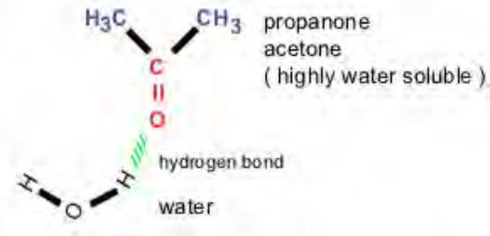
> **[Diagram Context - Textbook_PhysicalSciences_Gr12_Organic-molecules.pdf-0066-06.png]**
> The image is a diagram that illustrates the structure of a molecule. The molecule is composed of carbon, hydrogen, and oxygen atoms. The diagram shows the carbon atom at the center, with two hydrogen atoms attached to it, and an oxygen atom on the right side. The diagram also includes labels for the carbon, hydrogen, and oxygen atoms, as well as the hydrogens bond and water. The diagram is labeled with the words "hydrogen bond" and "water", and the text "hydrogen bond" is written in green, while "water" is written in red.


---

## 4.4. Physical properties and structure

### Tips and Facts

> **TIP:** Be careful when comparing molecules with different types of intermolecular forces. For example, a small molecule with hydrogen bonding can have stronger intermolecular forces than a large molecule with only van der Waals forces.

> **FACT:** It is partly the stronger intermolecular forces that explain why petrol (mainly octane, $\text{C}_8\text{H}_{18}$) is a liquid, while candle wax ($\text{C}_{23}\text{H}_{48}$) is a solid. If these intermolecular forces did not increase with increasing molecular size, we would not be able to put liquid fuel into our cars or use solid candles.

---

### Physical Properties of Alkanes

Table 4.14 shows the physical properties of some alkanes:

| Formula | Name | Molecular mass ($\text{g}\cdot\text{mol}^{-1}$) | Melting point ($^\circ\text{C}$) | Boiling point ($^\circ\text{C}$) | Phase (at $25^\circ\text{C}$) |
| :--- | :--- | :--- | :--- | :--- | :--- |
| $\text{CH}_4$ | methane | $16,04$ | $-182$ | $-162$ | gas |
| $\text{C}_2\text{H}_6$ | ethane | $30,06$ | $-183$ | $-89$ | gas |
| $\text{C}_3\text{H}_8$ | propane | $44,08$ | $-188$ | $-42$ | gas |
| $\text{C}_4\text{H}_{10}$ | butane | $58,1$ | $-137$ | $0$ | gas |
| $\text{C}_6\text{H}_{14}$ | hexane | $86,14$ | $-95$ | $68,5$ | liquid |
| $\text{C}_8\text{H}_{18}$ | octane | $114,18$ | $-57$ | $125,5$ | liquid |
| $\text{C}_{20}\text{H}_{42}$ | icosane | $282,42$ | $37$ | $343$ | solid |

*Table 4.14: The physical properties of some alkanes.*


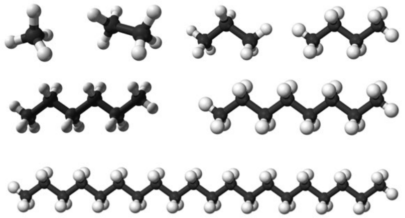
> **[Diagram Context - Textbook_PhysicalSciences_Gr12_Organic-molecules.pdf-0067-10.png]**
> 1. A 3D rendering of a molecule of ethyne (C2H2) with a chain of carbon atoms.


*Figure 4.65: As the molar mass of an alkane increases so does the boiling point. (Image by Duncan Watson)*

Notice that when the molecular mass of the alkanes is low (i.e. there are few carbon atoms), the organic compounds are gases because the intermolecular forces are weak. As the number of carbon atoms and the molecular mass increases, the compounds are more likely to be liquids or solids because the intermolecular forces are stronger.

The larger a molecule is, the stronger the intermolecular forces are between the molecules. This is one of the reasons why methane ($\text{CH}_4$) is a gas at room temperature while hexane ($\text{C}_6\text{H}_{14}$) is a liquid and icosane ($\text{C}_{20}\text{H}_{42}$) is a solid.

---

### Additional Properties of Alkanes

Table 4.15 shows some other properties of the alkanes that also vary with chain length.

| Name | Density ($\text{g}\cdot\text{dm}^{-3}$) | Flash point ($^\circ\text{C}$) | Smell | Phase (at $25^\circ\text{C}$) |
| :--- | :--- | :--- | :--- | :--- |
| methane | $0,66$ | $-188$ | odourless | gas |
| ethane | $1,28$ | $-135$ | odourless | gas |
| propane | $2,01$ | $-104$ | odourless | gas |
| butane | $2,48$ | $-60$ | like petrol | gas |
| hexane | $650$ | $-26$ | like petrol | liquid |
| octane | $700$ | $13$ | like petrol | liquid |
| icosane | $790$ | $>113$ | odourless | solid |

*Table 4.15: Properties of some of the alkanes.*

Density increases with increasing molecular size. Note that compounds that are gaseous are much less dense than compounds that are liquid or solid.

Remember that the flash point of a volatile molecule is the lowest temperature at which that molecule can form a vapour mixture with air and be ignited. The flash point increases with increasing chain length meaning that the longer chains are less flammable (Table 4.10) although they can still be ignited.

The change in physical properties due to chain length does not only apply to the hydrocarbons. The solubility of ketones in water decreases as the chain length increases. The longer the chain length, the stronger the intermolecular interactions between the ketone molecules.

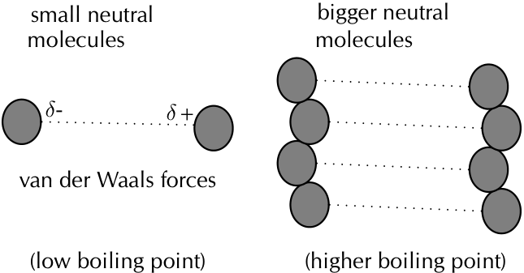
> **[Diagram Context - Textbook_PhysicalSciences_Gr12_Organic-molecules.pdf-0067-13.png]**
> 1. A diagram of a boiling point and a Lewis structure.


---

This means that more energy is required to overcome those interactions and the molecule is therefore less soluble in water. Long chains can also fold around the polar carbonyl group and stop water molecules from bonding with it.

This same idea can be applied to all the compounds with water-soluble functional groups. The longer the chain becomes, the less soluble the compound is in water.


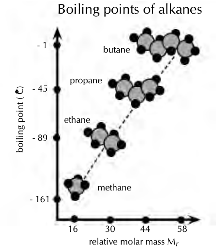
> **[Diagram Context - Textbook_PhysicalSciences_Gr12_Organic-molecules.pdf-0068-06.png]**
> 1. Boiling point of alkanes.


Figure 4.66: The water solubility of a ketone decreases as the chain length increases.

---

## Exercise 4 - 21: Physical properties and chain length

1. Refer to the table below which gives information about a number of carboxylic acids, and then answer the questions that follow.

| Condensed formula | Common name | Source | IUPAC name | Melting point ($^{\circ}\text{C}$) | Boiling point ($^{\circ}\text{C}$) |
| :--- | :--- | :--- | :--- | :--- | :--- |
| | formic acid | ants | methanoic acid | $8,4$ | $101$ |
| $\text{CH}_3\text{COOH}$ | | vinegar | ethanoic acid | $16,5$ | $118,5$ |
| | propionic acid | milk | propanoic acid | $-20,8$ | $141$ |
| $\text{CH}_3(\text{CH}_2)_2\text{COOH}$ | butyric acid | butter | | $-7,9$ | $163,5$ |
| | valeric acid | valerian root | pentanoic acid | $-34,5$ | $186,5$ |
| $\text{CH}_3(\text{CH}_2)_4\text{COOH}$ | caproic acid | goat skin | | $-3,4$ | $205,8$ |
| | enanthic acid | vines | heptanoic acid | $-7,5$ | $223$ |
| $\text{CH}_3(\text{CH}_2)_6\text{COOH}$ | caprylic acid | goat milk | | $16,7$ | $239,7$ |

a) Fill in the missing spaces in the table by writing the formula, common name or IUPAC name.  
b) Draw the structural representation of butyric acid.  
c) Give the molecular formula for caprylic acid.  
d) 
   i. Draw a graph to show the relationship between molecular mass (on the x-axis) and boiling point (on the y-axis).  
   ii. Describe the trend you see.  
   iii. Suggest a reason for this trend.  

2. Refer to the data table below which shows the melting point and boiling point for a number of organic compounds with different functional groups.

| Formula | Name | Melting point ($^{\circ}\text{C}$) | Boiling point ($^{\circ}\text{C}$) |
| :--- | :--- | :--- | :--- |
| $\text{C}_4\text{H}_{10}$ | Butane | $-137$ | $0$ |
| $\text{C}_5\text{H}_{12}$ | Pentane | $-130$ | $36$ |
| $\text{C}_6\text{H}_{14}$ | Hexane | $-95$ | $68,5$ |
| $\text{C}_4\text{H}_8$ | But-1-ene | $-185$ | $-6,5$ |
| $\text{C}_5\text{H}_{10}$ | Pent-1-ene | $-165,2$ | $30$ |
| $\text{C}_6\text{H}_{12}$ | Hex-1-ene | $-140$ | $63$ |

---

## Questions and Exercises

a) At room temperature (approx. $25\text{ }^\circ\text{C}$), which of the organic compounds in the table are:
   i. gases
   ii. liquids

b) In the alkanes:
   i. Describe what happens to the melting point and boiling point as the number of carbon atoms in the compound increases.
   ii. Explain why this is the case.

3. Fill in the table below. Under boiling point put $1$ for the compound with the lowest boiling point, $2$ for the next lowest boiling point until you get to $6$ for the compound with the highest boiling point. Do not use specific boiling point values, but rather use your knowledge of intermolecular forces.

| Compound | Condensed Structure | Boiling point |
| :--- | :--- | :--- |
| propane | $\text{CH}_{3}\text{CH}_{2}\text{CH}_{3}$ | |
| hexane | $\text{CH}_{3}\text{CH}_{2}\text{CH}_{2}\text{CH}_{2}\text{CH}_{2}\text{CH}_{3}$ | |
| methane | $\text{CH}_{4}$ | e.g. $1$ |
| octane | $\text{CH}_{3}\text{CH}_{2}\text{CH}_{2}\text{CH}_{2}\text{CH}_{2}\text{CH}_{2}\text{CH}_{2}\text{CH}_{3}$ | |
| butane | $\text{CH}_{3}\text{CH}_{2}\text{CH}_{2}\text{CH}_{3}$ | |
| ethane | $\text{CH}_{3}\text{CH}_{3}$ | |

4. Draw the structural representations for each of the following compounds and answer the question that follows.
   a) but-2-yne
   b) hex-2-yne
   c) pent-2-yne
   d) Which of these compounds will have the highest viscosity?

5. More questions. Sign in at Everything Science online and click 'Practise Science'. Check answers online with the exercise code below or click on 'show me the answer'.
   1. 27NP
   2. 27NQ
   3. 27NR
   4. 27NS

---

# Physical properties and branched groups (ESCKT)

In a straight chain molecule, the carbon atoms are connected to *at most* two other carbon atoms. However, in a branched molecule some carbon atoms are connected to *three or four* other carbon atoms. This is the same principle that was discussed with primary, secondary and tertiary alcohols.

Straight chains always have higher boiling points than the equivalent molecule with branched chains. This is because the molecules with straight chains have a larger surface area that allows close contact. Branched chains have a lower boiling point due to a smaller area of contact. The molecules are more compact and cannot get too close together, resulting in fewer places for the van der Waals forces to act.


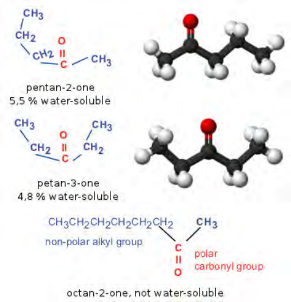
> **[Diagram Context - Textbook_PhysicalSciences_Gr12_Organic-molecules.pdf-0069-02.png]**
> 1. A Lewis diagram of an octan-2-one molecule.


Figure 4.67: **(a)** Straight chains of pentane and **(b)** branched chains of 2-methylbutane. (Image by Duncan Watson)

---

# Chapter 4. Organic molecules

## Isomers and Physical Properties

Shown in Figure 4.68 are three isomers that all have the molecular formula $\text{C}_5\text{H}_{12}$. They are all alkanes with the only difference being branched groups leading to longer or shorter main chains.


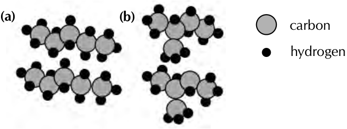
> **[Diagram Context - Textbook_PhysicalSciences_Gr12_Organic-molecules.pdf-0070-16.png]**
> 1. A diagram of a molecule of carbon dioxide.


**Figure 4.68:** Three isomers of $\text{C}_5\text{H}_{12}$: **(a)** pentane, **(b)** 2-methylbutane and **(c)** 2,2-dimethylpropane.

As shown in Table 4.16 the properties of these three compounds are significantly different. The melting points have significant differences and the boiling points steadily decrease with an increasing number of branched groups.

| Name | Melting point ($^\circ\text{C}$) | Boiling point ($^\circ\text{C}$) | Density ($\text{g}\cdot\text{dm}^{-3}$) | Vapour pressure ($\text{kPa}$ at $20^\circ\text{C}$) | Flash point ($^\circ\text{C}$) |
| :--- | :---: | :---: | :---: | :---: | :---: |
| pentane | -130 | 36 | 621 | 57,9 | -49 |
| 2-methylbutane | -160 | 27,7 | 616 | 77 | -51 |
| 2,2-dimethylpropane | -16,6 | 9,5 | 586 | 147 | <-7 |

**Table 4.16:** Properties of compounds with different numbers of branched groups.

Although the densities of all three compounds are very similar, there is a decrease in density with the increase of branched groups. The vapour pressure increases with increasing branched groups and the flash point of 2,2-dimethylpropane is significantly higher than those of pentane and 2-methylbutane.

It is interesting that the common trend of melting and boiling points is not followed here - 2,2-dimethylpropane has the highest melting point, lowest boiling point and is the least flammable although all three compounds are very flammable. **Symmetrical** molecules (such as 2,2-dimethylpropane) tend to have higher melting points than similar molecules with **less symmetry** due to their packing in the solid state. Once in the liquid state they follow the normal trends.

---

## Exercise 4 – 22: Physical properties and branched chains

1. <!-- DIAGRAM_PLACEHOLDER: diagram -->

| Structural Formula | Boiling point ($^\circ\text{C}$) |
| :---: | :---: |
| <!-- DIAGRAM_PLACEHOLDER: diagram --> | 78 |
| <!-- DIAG_PLACEHOLDER: diagram --> | 51 |

a) Give the IUPAC name for each compound

---

b) Explain the difference in the melting points

2. There are five isomers with the molecular formula $\text{C}_6\text{H}_{14}$.
   a) Draw the structural representations of:
      2-methylpentane and 2,2-dimethylbutane (two of the isomers)
   b) What are the names of the other three isomers?
   c) Draw the semi-structural representations of these three molecules.
   d) The melting points of these three isomers are: $-118$, $-95$ and $-130\text{ }^\circ\text{C}$. Assign the correct melting points to the correct isomer. Give a reason for your answers.

3. More questions. Sign in at Everything Science online and click 'Practise Science'. Check answers online with the exercise code below or click on 'show me the answer'.
   1. $27\text{NT}$  2. $27\text{NV}$

www.everythingscience.co.za  |  m.everythingscience.co.za

---

## Exercise 4 – 23: Physical properties of organic compounds

1. The table shows data collected for four organic compounds ($\text{A} - \text{C}$) during a practical investigation.

| Compound | Molecular Mass ($\text{g}\cdot\text{mol}^{-1}$) | Boiling point ($^\circ\text{C}$) |
| :---: | :---: | :---: |
| **A** | $\text{CH}_3\text{CH}_2\text{CH}_3$ | $44,08$ | $-42$ |
| **B** | $\text{CH}_3\text{CHO}$ | $44,04$ | $20$ |
| **C** | $\text{CH}_3\text{CH}_2\text{OH}$ | $46,06$ | $78$ |

   a) Is compound **A** saturated or unsaturated? Give a reason for your answer.
   b) To which homologous series does compound **B** belong?
   c) Write down the IUPAC name for each of the following compounds:
      i. **B**
      ii. **C**
   d) Refer to intermolecular forces to explain the difference in boiling points between compounds **A** and **C**.
   e) Which one of compounds **B** or **C** will have the highest vapour pressure at a specific temperature? Give a reason for your answer.

2. Give the IUPAC names for the following compounds and answer the questions that follow.

   

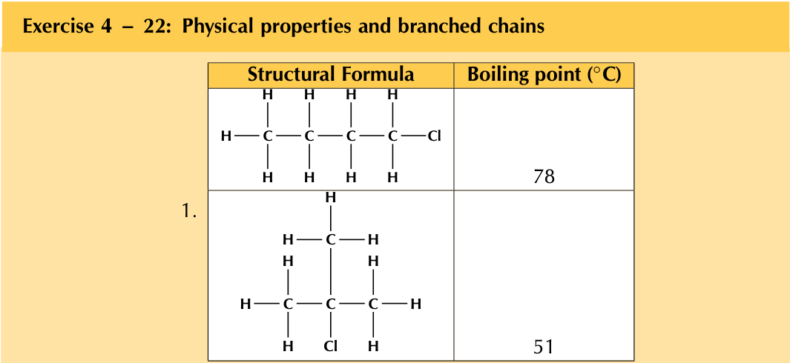
> **[Diagram Context - Textbook_PhysicalSciences_Gr12_Organic-molecules.pdf-0071-07.png]**
> Exercise 4 - Physical Properties and Branched Chains:
1. Boiling point of a substance.


   a) Boiling point $= 118\text{ }^\circ\text{C}$

   <!-- DIAGRAM_PLACEHOLDER: diagram -->
   b) Boiling point $= 99\text{ }^\circ\text{C}$

   <!-- DIAGRAM_PLACEHOLDER: diagram -->
   c) Boiling point $= 82,5\text{ }^\circ\text{C}$

   d) Explain the difference in boiling points.

---

3. More questions. Sign in at Everything Science online and click 'Practise Science'. Check answers online with the exercise code below or click on 'show me the answer'.
1. $27\text{NW}$ \quad 2a. $27\text{NX}$ \quad 2b. $27\text{NY}$ \quad 2c. $27\text{NZ}$ \quad 2d. $27\text{P}2$

www.everythingscience.co.za \quad m.everythingscience.co.za

---

## 4.5 Applications of organic chemistry (ESCKV)

### Alkanes as fossil fuels (ESCKW)

Fossil fuels are fuels formed by the natural process of the decomposition of organisms under heat and pressure. They contain a high percentage of carbon and include fuels such as coal, petrol, and natural gases. They are also a **non-renewable** resource.

> **DEFINITION:** Hydrocarbon cracking
> 
> Hydrocarbon cracking is the process of breaking carbon-carbon bonds in long-chain hydrocarbons to form simpler, shorter-chain hydrocarbons.

Hydrocarbon cracking is an important industrial process. Through this process long, bulky alkanes are broken up into smaller compounds. These compounds include shorter alkanes and alkenes. A few examples of cracking hydrocarbons are given in Figure 4.69.

(a) $\text{C}_2\text{H}_6 \longrightarrow \text{C}_2\text{H}_4 + \text{H}_2$  
\quad \quad ethane \quad \quad ethene \quad hydrogen

(b) $\text{C}_{12}\text{H}_{26} \longrightarrow \text{C}_6\text{H}_{14} + \text{C}_2\text{H}_4 + \text{C}_4\text{H}_8$  
\quad \quad dodecane \quad \quad hexane \quad ethene \quad butene

(c) $\text{C}_{20}\text{H}_{42} \longrightarrow \text{C}_8\text{H}_{18} + \text{C}_3\text{H}_6 + \text{C}_9\text{H}_{18}$  
\quad \quad icosane \quad \quad octane \quad propene \quad nonene


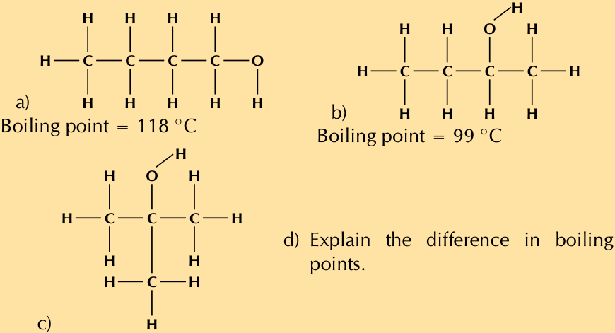
> **[Diagram Context - Textbook_PhysicalSciences_Gr12_Organic-molecules.pdf-0072-21.png]**
> 1. A diagram of a molecule with bonds between carbon, hydrogen, and oxygen.


*Figure 4.69: The cracking of various hydrocarbons to produce alkanes and alkenes.*

There are two types of hydrocarbon cracking. **Thermal** cracking occurs under high pressures and temperatures without a catalyst, **catalytic** cracking occurs at lower pressures and temperatures in the presence of a catalyst. This process is a common source of shorter (more useful) alkanes as well as unsaturated alkenes. The alkanes are then used in combustion processes.

It is possible to separate the products of hydrocarbon cracking and obtain specific products from a crude oil mix through a process called *fractional distillation*. This is done using a *fractionating column*. Crude oil evaporates when heated to $700^\circ\text{C}$. The gas bubbles through a tray that is kept at a certain temperature. The alkanes and alkenes that condense at that temperature will then condense in the tray. For example if the tray is kept at $170^\circ\text{C}$ the product will be paraffin oil (Figure 4.70).


---

## 4.5. Applications of organic chemistry

### Fractional Distillation of Crude Oil

A fractionating column consists of a series of trays (as shown in Figure 4.70 and Figure 4.71), each maintained at a constant temperature. This allows many compounds to be separated from the crude oil mixture.

<!-- DIAGRAM_PLACEHOLDER: diagram -->

* **Process:** Crude oil is heated to $700\,^{\circ}\text{C}$ and the resulting gases are passed through the bottom of the column.
* **Bottom of the Column (Hottest):** Bitumen for tar roads is collected at the very bottom. These are heavy compounds containing more than 70 carbon atoms ($> \text{C}_{70}$).
* **Temperature Gradient:** As you move up the column, the temperature decreases. 
* **Top of the Column (Coolest):** As the gases rise, compounds with different chain lengths condense at their respective boiling points. Chains with $1 - 4$ carbon atoms are collected at the top as liquid petroleum gas (LPG).

> **Note:** This process relates directly to molecular structure and intermolecular forces. The more carbon atoms in a chain, the greater the intermolecular forces, and therefore the higher the boiling point. Consequently, larger molecules condense at higher temperatures lower down in the column, while smaller molecules remain as gases longer and condense near the cooler top.

### Summary of Fractions in a Fractionating Column

| Temperature | Fraction / Use | Carbon Chain Length |
| :--- | :--- | :--- |
| **Coolest (Top)** | LPG (Liquid Petroleum Gas) | $\text{C}_{1} - \text{C}_{4}$ |
| $70\,^{\circ}\text{C}$ | Naphtha for chemicals | $\text{C}_{5} - \text{C}_{7}$ |
| $120\,^{\circ}\text{C}$ | Petrol | $\text{C}_{5} - \text{C}_{10}$ |
| $170\,^{\circ}\text{C}$ | Paraffin and jet fuel | $\text{C}_{10} - \text{C}_{16}$ |
| $270\,^{\circ}\text{C}$ | Diesel fuels | $\text{C}_{14} - \text{C}_{20}$ |
| --- | Wax | $\text{C}_{20} - \text{C}_{50}$ |
| $600\,^{\circ}\text{C}$ | Fuel oil for ships and factories | $\text{C}_{20} - \text{C}_{70}$ |
| **Hottest ($700\,^{\circ}\text{C}$, Bottom)** | Bitumen for tar roads | $> \text{C}_{70}$ |

*For more information on the process of fractional distillation, view simulation **27P3** at [www.everythingscience.co.za](http://www.everythingscience.co.za).*

---

### Combustion of Alkanes

Alkanes serve as our most important fossil fuels. The combustion (burning) of alkanes—also known as oxidation—is highly *exothermic*.

> **DEFINITION: Combustion**
> 
> In a combustion reaction, a substance reacts with an oxidising agent (e.g., oxygen), and heat and light are released.

In the complete combustion reaction of alkanes, carbon dioxide ($\text{CO}_{2}$) and water ($\text{H}_{2}\text{O}$) are released along with energy. Fossil fuels are burnt primarily for this released energy.

---

### Combustion of Alkanes

The general word equation for the complete combustion of an alkane as a fossil fuel is:

$$\text{alkane} + \text{O}_{2}\text{(g)} \longrightarrow \text{CO}_{2}\text{(g)} + \text{H}_{2}\text{O}\text{(g)} + \text{energy}$$


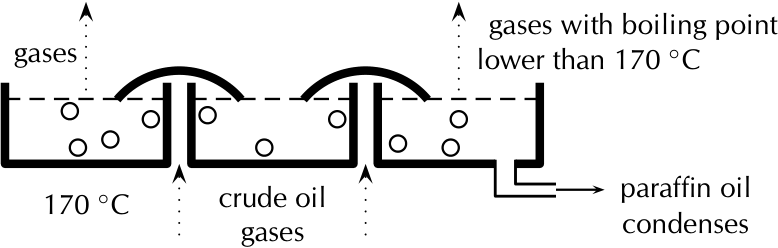
> **[Diagram Context - Textbook_PhysicalSciences_Gr12_Organic-molecules.pdf-0074-00.png]**
> 1. A diagram of a boiling point apparatus with three pans and a graph showing the boiling point of oil at different temperatures.


Examples of complete combustion reactions for various alkanes:

* (a) Methane: 
  $$\text{CH}_{4}\text{(g)} + 2\text{O}_{2}\text{(g)} \longrightarrow \text{CO}_{2}\text{(g)} + 2\text{H}_{2}\text{O}\text{(g)} + \text{energy}$$

* (b) Propane: 
  $$\text{C}_{3}\text{H}_{8}\text{(g)} + 5\text{O}_{2}\text{(g)} \longrightarrow 3\text{CO}_{2}\text{(g)} + 4\text{H}_{2}\text{O}\text{(g)} + \text{energy}$$

* (c) Hexane: 
  $$2\text{C}_{6}\text{H}_{14}(\ell) + 19\text{O}_{2}\text{(g)} \longrightarrow 12\text{CO}_{2}\text{(g)} + 14\text{H}_{2}\text{O}\text{(g)} + \text{energy}$$

* (d) Octane: 
  $$2\text{C}_{8}\text{H}_{18}(\ell) + 25\text{O}_{2}\text{(g)} \longrightarrow 16\text{CO}_{2}\text{(g)} + 18\text{H}_{2}\text{O}\text{(g)} + \text{energy}$$

---

### Important Notes

#### FACT
The complete combustion of alkanes produces only $\text{CO}_2$ and $\text{H}_2\text{O}$. Not all combustion processes are complete, though. An incomplete combustion will also produce carbon monoxide ($\text{CO}$).

#### TIP
Remember that an exothermic reaction releases energy ($\Delta\text{H} < 0$), while an endothermic reaction absorbs energy ($\Delta\text{H} > 0$). The fact that energy is released in a combustion reaction implies that $\Delta\text{H} < 0$ and the reaction is exothermic.

---

### Worked Examples

#### Worked Example 28: Balancing equations

**QUESTION**  
Balance the following equation: $\text{C}_{4}\text{H}_{10}\text{(g)} + \text{O}_{2}\text{(g)} \rightarrow \text{CO}_{2}\text{(g)} + \text{H}_{2}\text{O}\text{(g)}$

**SOLUTION**

* **Step 1: Balance the carbon atoms**  
  There are $4$ carbon atoms on the left. There is $1$ carbon atom on the right. Add a $4$ in front of the $\text{CO}_{2}$ molecule on the right:
  $$\text{C}_{4}\text{H}_{10}\text{(g)} + \text{O}_{2}\text{(g)} \rightarrow 4\text{CO}_{2}\text{(g)} + \text{H}_{2}\text{O}\text{(g)}$$

* **Step 2: Balance the hydrogen atoms**  
  There are $10$ hydrogen atoms on the left. There are $2$ hydrogen atoms on the right. Add a $5$ in front of the $\text{H}_{2}\text{O}$ molecule on the right:
  $$\text{C}_{4}\text{H}_{10}\text{(g)} + \text{O}_{2}\text{(g)} \rightarrow 4\text{CO}_{2}\text{(g)} + 5\text{H}_{2}\text{O}\text{(g)}$$

* **Step 3: Balance the oxygen atoms**  
  There are $2$ oxygen atoms on the left. There are $13$ oxygen atoms on the right ($4 \times 2$ in the $\text{CO}_{2}$ and $5$ in the $\text{H}_{2}\text{O}$). Divide the number of $\text{O}$ atoms on the right by $2$ to get $\frac{13}{2}$, this is the number of $\text{O}_{2}$ molecules required on the left:
  $$\text{C}_{4}\text{H}_{10}\text{(g)} + \frac{13}{2}\text{O}_{2}\text{(g)} \rightarrow 4\text{CO}_{2}\text{(g)} + 5\text{H}_{2}\text{O}\text{(g)}$$  
  This is acceptable, but it is better for all numbers to be whole numbers.

* **Step 4: Make sure all numbers are whole numbers**  
  There is $\frac{13}{2}$ in front of the $\text{O}_{2}$ while all other numbers are whole numbers. So multiply the entire equation by $2$:
  $$2\text{C}_{4}\text{H}_{10}\text{(g)} + 13\text{O}_{2}\text{(g)} \rightarrow 8\text{CO}_{2}\text{(g)} + 10\text{H}_{2}\text{O}\text{(g)}$$

---

#### Worked Example 29: Balancing equations

**QUESTION**  
Balance the equation for the complete combustion of **heptane**.

**SOLUTION**

* **Step 1: Write the unbalanced equation**  
  The molecular formula for heptane is $\text{C}_{7}\text{H}_{16}$. Combustion always involves oxygen ($\text{O}_{2}$). The complete combustion of an alkane always produces carbon dioxide ($\text{CO}_{2}$) and water ($\text{H}_{2}\text{O}$):
  $$\text{C}_{7}\text{H}_{16}(\ell) + \text{O}_{2}\text{(g)} \rightarrow \text{CO}_{2}\text{(g)} + \text{H}_{2}\text{O}\text{(g)}$$

---

### FACT

In the formation of an ester, one oxygen atom comes from the alcohol molecule, while the carbonyl group comes from the carboxylic acid. This is known because it is possible to *label* (using radioactive nuclides) the atoms of the reactants and see where they end up in the products.

---

### Step-by-Step Balancing of Chemical Equations

#### Step 2: Balance the carbon atoms
There are $7$ carbon atoms on the left. There is $1$ carbon atom on the right. Add a $7$ in front of the $\text{CO}_2$ molecule on the right:
$$\text{C}_7\text{H}_{16}(\ell) + \text{O}_2(\text{g}) \rightarrow 7\text{CO}_2(\text{g}) + \text{H}_2\text{O}(\text{g})$$

#### Step 3: Balance the hydrogen atoms
There are $16$ hydrogen atoms on the left. There are $2$ hydrogen atoms on the right. Add an $8$ in front of the $\text{H}_2\text{O}$ molecule on the right:
$$\text{C}_7\text{H}_{16}(\ell) + \text{O}_2(\text{g}) \rightarrow 7\text{CO}_2(\text{g}) + 8\text{H}_2\text{O}(\text{g})$$

#### Step 4: Balance the oxygen atoms
There are $2$ oxygen atoms on the left. There are $22$ oxygen atoms on the right ($7 \times 2$ in the $\text{CO}_2$ and $8$ in the $\text{H}_2\text{O}$). Divide the number of $\text{O}$ atoms on the right by $2$ to get $11$, this is the number of $\text{O}_2$ molecules required on the left:
$$\text{C}_7\text{H}_{16}(\ell) + 11\text{O}_2(\text{g}) \rightarrow 7\text{CO}_2(\text{g}) + 8\text{H}_2\text{O}(\text{g})$$

---

### Exercise 4 – 24: Alkanes as fossil fuels

1. Balance the following complete combustion equations:
   - a) $\text{C}_3\text{H}_8(\text{g}) + \text{O}_2(\text{g}) \rightarrow \text{CO}_2(\text{g}) + \text{H}_2\text{O}(\text{g})$
   - b) $\text{C}_7\text{H}_{16}(\ell) + \text{O}_2(\text{g}) \rightarrow \text{CO}_2(\text{g}) + \text{H}_2\text{O}(\text{g})$
   - c) $\text{C}_2\text{H}_6(\text{g}) + \text{O}_2(\text{g}) \rightarrow \text{CO}_2(\text{g}) + \text{H}_2\text{O}(\text{g})$

2. Write the balanced equation for the complete combustion of:
   - a) octane
   - b) pentane
   - c) hexane
   - d) butane

3. Is the combustion of alkanes exothermic or endothermic? What does that mean?
4. More questions. Sign in at Everything Science online and click 'Practise Science'.

---

### Production of esters

As was discussed earlier in this chapter, one way to form an ester is through the reaction of an alcohol and a carboxylic acid. This process is called an **acid-catalysed condensation** or **esterification** of a carboxylic acid.

<!-- DIAGRAM_PLACEHOLDER: diagram -->

*Figure 4.74: The acid-catalysed condensation of a carboxylic acid to form an ester.*

In the general form above, an alcohol (red) and a carboxylic acid (orange) combine to form an ester and water. A specific example is given in Figure 4.75 for the formation of butyl propanoate and water.

---

## Esterification and Naming of Esters

Esters are organic compounds formed through the condensation reaction between an **alcohol** and a **carboxylic acid**.

### General Reaction Equation

$$\text{alcohol} + \text{carboxylic acid} \longrightarrow \text{ester} + \text{water}$$

#### Example 1: Reaction between butanol and propanoic acid

$$\text{CH}_3(\text{CH}_2)_3-\text{OH} + \text{CH}_3\text{CH}_2-\text{C}(=\text{O})-\text{OH} \longrightarrow \text{CH}_3(\text{CH}_2)_3-\text{O}-\text{C}(=\text{O})-\text{CH}_2\text{CH}_3 + \text{H}_2\text{O}$$

$$\text{butanol} + \text{propanoic acid} \longrightarrow \text{butyl propanoate} + \text{water}$$

Condensed formula representation:
$$\text{CH}_3\text{CH}_2\text{CH}_2\text{CH}_2\text{OH} + \text{CH}_3\text{CH}_2\text{COOH} \longrightarrow \text{CH}_3\text{CH}_2\text{COOCH}_2\text{CH}_2\text{CH}_2\text{CH}_3 + \text{H}_2\text{O}$$


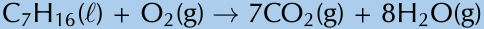


---

### Naming Esters

It is important to be able to identify what ester a specific alcohol and carboxylic acid will form. 

* **First part of the ester name:** Derived from the **alcohol**, using the alkyl group prefix with the suffix **-yl** (e.g., butanol forms a *butyl* group).
* **Second part of the ester name:** Derived from the **carboxylic acid**, using the alkane prefix with the ester suffix **-oate** (e.g., propanoic acid forms *propanoate*).

---

### Worked Examples

#### Worked Example 30: Determining ester names

**QUESTION**
What is the name of the ester that will form from **hexanol** and **propanoic acid**?

**SOLUTION**

* **Step 1: Which compound forms the first part of the ester name and which forms the second part of the ester name?**  
  The alcohol forms the first part of the ester name and takes the suffix *-yl*. The carboxylic acid forms the second part of the ester name and takes the suffix *-oate*.

* **Step 2: Determine the first part of the ester name**  
  The alcohol is *hexanol*, therefore there are $6$ carbons and this will be **hexyl**.

* **Step 3: Determine the second part of the ester name**  
  The carboxylic acid is *propanoic acid*, therefore there are $3$ carbons and this will be **propanoate**.

* **Step 4: Combine the first and second parts of the ester name**  
  The ester will be **hexyl propanoate**.

---

#### Worked Example 31: Determining starting materials of esters

**QUESTION**
What compounds did the ester **octyl heptanoate** come from?

**SOLUTION**

* **Step 1: What types of compounds are used to form esters?**  
  Esters are formed from alcohols (which become the first part of the ester name) and carboxylic acids (which become the second part of the ester name).

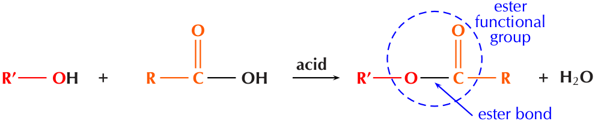
> **[Diagram Context - Textbook_PhysicalSciences_Gr12_Organic-molecules.pdf-0076-22.png]**
> 1. A diagram of a chemical reaction between two compounds, one of which is a carboxylic acid. The reaction is represented by a Lewis structure, and the compounds are shown in red and orange. The reaction is a double displacement reaction, and the compounds are shown in a double layer structure. The reaction is a ester bond.


---

### Step 2: Determine the prefix for the alcohol
The first part of the ester name comes from the alcohol (-ol). Therefore the prefix is **oct-**.

### Step 3: Determine the prefix for the carboxylic acid
The second part of the ester name comes from the carboxylic acid (-oic acid). Therefore the prefix is **hept-**.

### Step 4: Determine the compounds use to form the ester
Octyl heptanoate was formed from **octanol** and **heptanoic acid**.

A few examples of esters are given in Table 4.17.

| Ester name | Smell | Uses |
| :--- | :--- | :--- |
| methyl methanoate | ether | quick-dry finishes, insecticide, pharmaceuticals |
| ethyl methanoate | rum | lacquers, safety glass, fumigating foods |
| propyl methanoate | pears | solvent, flavour, fragrance |
| methyl ethanoate | glue | glues, paints, nail polish remover |
| ethyl ethanoate | apple | glues etc, solvents, decaffeination |
| propyl ethanoate | pear | solvent, flavour, fragrance |
| butyl ethanoate | banana or apple | lacquers, flavour |
| pentyl ethanoate | banana or apple | lacquers, solvents, resins |
| methyl butanoate | apple or pineapple | flavour, fragrance |
| ethyl butanoate | pineapple | flavour, fragrance, plasticiser |
| propyl hexanoate | blackberry or cheese | flavour, solvent, fragrance |

*Table 4.17: The uses of some esters.*

The following experiment will help you to prepare esters. Use what you have learned in this section to answer the questions that follow.

---

### Experiment: Preparation of esters

**Aim:**  
To prepare and identify esters.

**Apparatus:**  
* Methanol ($\text{CH}_3\text{OH}$), ethanol ($\text{CH}_3\text{CH}_2(\text{OH})$), pentan-1-ol ($\text{CH}_3\text{CH}_2\text{CH}_2\text{CH}_2\text{CH}_2(\text{OH})$), methanoic acid ($\text{HCOOH}$), ethanoic acid ($\text{CH}_3\text{COOH}$), sulfuric acid ($\text{H}_2\text{SO}_4$)
* Marble chips (or small, clean stones)


> **[Diagram Context - Textbook_PhysicalSciences_Gr12_Organic-molecules.pdf-0077-04.png]**
> This educational graphic displays a chemical reaction equation for the esterification process. The visible chemical formulas and IUPAC names include butanol ($\text{CH}_3\text{CH}_2\text{CH}_2\text{CH}_2\text{OH}$), propanoic acid ($\text{CH}_3\text{CH}_2\text{COOH}$), the ester butyl propanoate ($\text{CH}_3\text{CH}_2\text{COOCH}_2\text{CH}_2\text{CH}_2\text{CH}_3$), and water ($\text{H}_2\text{O}$), connected by addition and reaction arrows. For Grade 12 Physical Sciences learners, this diagram illustrates how condensation or esterification reactions occur when an alcohol reacts with a carboxylic acid to produce an ester and water.


---

## Requirements & Safety Notes

### Apparatus Required
* Five tall test tubes or beakers
* A water bath
* A hot-plate (or Bunsen burner)
* A thermometer
* Rubber bands
* Paper towel
* Five bowls of cold water

---

### WARNING!
* **Concentrated acids can cause serious burns.** We suggest using gloves and safety glasses whenever you work with an acid. Always add the acid to the water and avoid sniffing the acid.
* **Remember that all alcohols are toxic.** Methanol is particularly toxic and can cause blindness, coma, or death. Handle all chemicals with care.

---

## Method

<!-- DIAGRAM_PLACEHOLDER: diagram -->

1. Place the marble chips (or clean stones) in the test tubes and label them $A - E$.
2. Add $4\text{ ml}$ methanoic acid to test tubes $\mathbf{A}$ and $\mathbf{B}$.
3. Add $4\text{ ml}$ ethanoic acid to test tubes $\mathbf{C}$, $\mathbf{D}$ and $\mathbf{E}$.
4. Add $5\text{ ml}$ methanol to test tubes $\mathbf{A}$ and $\mathbf{C}$.
5. Add $5\text{ ml}$ ethanol to test tubes $\mathbf{B}$ and $\mathbf{D}$.
6. Add $5\text{ ml}$ pentanol to test tube $\mathbf{E}$.
7. **Slowly** add $2\text{ ml}$ $\text{H}_2\text{SO}_4$ to each test tube.
8. Soak the paper towel in cold water and attach it to the sides near the top of each test tube with a rubber band (do not close the test tube, just wrap the paper around the sides near the top).
9. Heat the water bath to $60\text{ }^\circ\text{C}$ (using the hot-plate or Bunsen burner) and place the test tubes in it for $10-15\text{ min}$.
10. After $10-15\text{ min}$ cool each test tube in cold water. Label the bowls of cold water $A - E$ and pour the contents of test tube $\text{A}$ into bowl $\text{A}$, etc.
11. Observe the surface of the water and note the smell in each bowl.

---

## Questions

1. What is the purpose of the $\text{H}_2\text{SO}_4$?
2. What is the purpose of the wet paper towel?
3. What did you observe on the top of the water in each bowl at the end?
4. Fill in the details in a table like this one:

| Carboxylic acid | Alcohol | Product | Smell |
| :--- | :--- | :--- | :--- |
| methanoic acid | methanol | | |
| methanoic acid | ethanol | | |
| ethanoic acid | methanol | | |
| ethanoic acid | ethanol | | |
| ethanoic acid | pentanol | | |

---

## Discussion and Conclusion

* **Definition of an Ester:** An ester is the product of an acid-catalysed condensation reaction between an alcohol and a carboxylic acid.
* **Properties of Esters:**
  * Esters have identifiable aromas (such as the fragrant smell and odour of fruit) and are commonly used in perfumes.
  * **Note on Experimentation:** If no smell is detected during an esterification experiment, it is likely that the water bath was set at too high a temperature and the ester degraded.
  * Esters are less water-soluble than the carboxylic acids they were formed from and often appear as an oily substance on water.
  * **Practical Tip:** Before being cooled, some of the ester may exist as a vapour. Using a wet paper towel helps prevent the loss of product.
  * **Safety Precaution:** Always waft the smell towards you using your hand; never sniff fumes directly.

---

## Exercise 4 – 25: Esters

1. Give the IUPAC name for the product in the esterification of ethanoic acid with:
   a) methanol
   b) octanol
   c) hexanol
   d) propanol

2. What is another name for the type of reaction in the question above?

3. Give the IUPAC name for the product in the reaction of butanol with:
   a) ethanoic acid
   b) pentanoic acid
   c) heptanoic acid
   d) methanoic acid

4. Fill in the missing reactant or part of the product name in the reactions below:
   a) $\text{octanol} + \text{------} \rightarrow \text{hexanoate}$
   b) $\text{------} + \text{propanoic acid} \rightarrow \text{hexyl ------}$
   c) $\text{------} + \text{butanol} \rightarrow \text{------ pentanoate}$

5. More questions. Sign in at Everything Science online and click 'Practise Science'. Check answers online with the exercise code below or click on 'show me the answer':
   * 1a. 27PD
   * 1b. 27PF
   * 1c. 27PG
   * 1d. 27PH
   * 2. 27PJ
   * 3a. 27PK
   * 3b. 27PM
   * 3c. 27PN
   * 3d. 27PP
   * 4a. 27PQ
   * 4b. 27PR
   * 4c. 27PS

---

## 4.6 Addition, Elimination and Substitution Reactions (ESCKY)

We will study three main types of reactions: addition, elimination, and substitution.

* **Addition Reaction:**
  * **Definition:** Occurs when two or more reactants combine to form a single product. This product will contain *all* the atoms that were present in the reactants.
  * **Occurrence:** Addition reactions occur with **unsaturated** compounds.
  * **General Equation:** 
    $$A + B \rightarrow C$$
    *(Notice that $C$ is the final product with no $A$ or $B$ remaining as a residue.)*

* **Elimination Reaction:**
  * **Definition:** Occurs when a reactant is broken up into two products.
  * **Occurrence:** Elimination reactions occur with **saturated** compounds.
  * **General Equation:** 
    $$A \rightarrow B + C$$

* **Substitution Reaction:**
  * **Definition:** Occurs when an exchange of elements in the reactants takes place. The initial reactants are transformed or *swopped around* to give a final product.
  * **General Equation:** 
    $$AB + CD \rightarrow AD + BC$$


> **[Diagram Context - Textbook_PhysicalSciences_Gr12_Organic-molecules.pdf-0079-15.png]**
> 1. A diagram of a test tube with a blue liquid in it.
 2. A diagram of a test tube with a blue liquid in it.
 3. A diagram of a test tube with a blue liquid in it.
 4. A diagram of a test tube with a blue liquid in it.
 5. A diagram of a test tube with a blue liquid in it.
 6. A diagram of a test tube with a blue liquid in it.
 7. A diagram of a test tube with a blue liquid in it.
 8. A diagram of a test


---

## Addition Reactions

### 1. Hydrohalogenation
Hydrohalogenation involves the addition of a **hydrogen atom** and a **halogen atom** to an unsaturated compound (containing a carbon-carbon double bond). An example is given in Figure 4.76. X can be fluorine ($F$), chlorine ($Cl$), bromine ($Br$) or iodine ($I$).

<!-- DIAGRAM_PLACEHOLDER: diagram -->

**Figure 4.76:** The hydrohalogenation of *ethene* to a *haloethane*.

If more than one product is possible the **major product** will be the compound where:
* the **hydrogen atom** is added to **least substituted carbon atom**
* i.e. the carbon atom with the least number of carbon atoms bonded to it
* the **halogen atom** is added to the **more substituted carbon atom**
* i.e. the carbon atom with the most number of carbon atoms bonded to it

This is shown in Figure 4.77.

> **DEFINITION:** *Major and minor products*
> 
> The major product of a reaction is the product that is most likely to form. Minor products are those that are less likely to form.

<!-- DIAGRAM_PLACEHOLDER: diagram -->

**Figure 4.77:** The hydrohalogenation of *2-methylpropene* to form *2-fluoro-2-methylpropane* (major product) and *1-fluoro-2-methylpropane* (minor product).

**Reaction conditions:**
* **no water** present in the reaction

---

### 2. Halogenation
Halogenation is very similar to hydrohalogenation but a **diatomic halogen molecule** is added across the double bond. An example is given in Figure 4.78.

---

### FACT
Remember from the section on saturated and unsaturated structures that you can perform tests to determine if a compound is saturated or not. If bromine water or potassium permanganate are decolourised by a compound, the compound is unsaturated; if they are not decolourised the compound is saturated.

### TIP
Remember that a **tertiary carbon atom** is bonded to three other carbon atoms, a **secondary carbon atom** is bonded to two other carbon atoms, and a **primary carbon atom** is bonded to one other carbon atom. So tertiary is the most substituted, secondary is less substituted than tertiary and more substituted than primary, and primary is the least substituted.

---

# 4.6. Addition, elimination and substitution reactions

## FACT: Fermentation
Fermentation can refer to the conversion of sugar to alcohol using yeast (a fungus). The process of fermentation produces items such as wine, beer and yogurt. To make wine, grape juice is fermented to produce alcohol. This reaction is shown below:

$$\text{C}_6\text{H}_{12}\text{O}_6 \rightarrow 2\text{CO}_2 + 2\text{C}_2\text{H}_5\text{OH} + \text{energy}$$


> **[Diagram Context - Textbook_PhysicalSciences_Gr12_Organic-molecules.pdf-0081-06.png]**
> 1. A diagram of a chemical reaction between H and X.


*Figure 4.78: The reaction between ethene and bromine to form 1,2-dibromoethane.*

---

## 3. Hydration
A hydration reaction involves the addition of water ($\text{H}_2\text{O}$) to an **unsaturated compound**. This is one way of preparing an alcohol from the corresponding alkene (Figure 4.79).


> **[Diagram Context - Textbook_PhysicalSciences_Gr12_Organic-molecules.pdf-0081-19.png]**
> 1. A diagram of a molecule with the chemical formula CH3CH2CH2CH2CH2CH2CH2CH2CH2CH2CH2CH2CH2CH2CH2CH2CH2CH2CH2CH2CH2CH2CH2CH2CH2CH2CH2CH2CH2CH2CH2CH2CH2CH2CH2CH2CH2CH2CH2CH2CH2CH2CH2CH2CH2CH2CH2CH2CH2CH2CH2CH2CH2CH2


*Figure 4.79: The hydration of ethene to ethanol.*

If more than one product is possible the **major product** will be the compound where:
* the **hydrogen atom** is added to the **least substituted carbon atom**
* the **hydroxyl anion** ($\text{OH}^-$) is added to the **more substituted carbon atom**

<!-- DIAGRAM_PLACEHOLDER: diagram -->
*Figure 4.80: The hydration of 2-methylpropene to form **2-methylpropan-2-one** (major product) and **2-methyl-propan-1-one** (minor product).*

### Reaction conditions:
* water must be present in **excess**
* an **acid catalyst** is needed for this reaction to take place
* the catalyst that is most commonly used is phosphoric acid ($\text{H}_3\text{PO}_4$)

---

## Activity: Formation of alcohol through fermentation
Ethanol can also be formed through the process of fermentation. In almost every country there is a local product that people make by fermenting local fruits. For example in Malawi people ferment potatoes, sugar cane or maize to form *katchasu*. Here in South Africa people ferment marula fruit to make *mampoer*, grapes to make *witblits* and sorghum to make beer.
* Research the chemistry behind the fermentation process.

---

### Discussion Questions

* What other plants do people ferment?
* Fermentation leads to acid formation, research why this occurs.
* Sorghum is also used to make sour porridge. How is it made?

---

### 4. Hydrogenation

Hydrogenation involves adding **hydrogen** ($\text{H}_2$) to an **alkene**. During hydrogenation, the double bond is broken (as with hydrohalogenation and halogenation) and more hydrogen atoms are added to the molecule. A specific example is shown in Figure 4.81.


> **[Diagram Context - Textbook_PhysicalSciences_Gr12_Organic-molecules.pdf-0082-02.png]**
> 1. A diagram of a molecule with six bonds and six atoms.


**Reaction conditions:**
* A **catalyst** such as platinum ($\text{Pt}$), palladium ($\text{Pd}$) or nickel ($\text{Ni}$) is needed for these reactions.
* **Heating** is required.
* The reaction must be done under an **inert atmosphere**, not air (e.g. $\text{N}_2\text{(g)}$ atmosphere).

The hydrogenation of vegetable oils to form margarine is another example of this addition reaction (see Figure 4.82).


> **[Diagram Context - Textbook_PhysicalSciences_Gr12_Organic-molecules.pdf-0082-06.png]**
> 1. A diagram of a molecule with the chemical formula H2O.


---

### 5. Polymerisation reactions

A polymer is made up of lots of smaller units called **monomers**. When these monomers are added together, they form a polymer. One way for *polymerisation* to occur is through an **addition reaction**. More details are given later in this chapter in *Plastics and polymers* (Section 4.7).


> **[Diagram Context - Textbook_PhysicalSciences_Gr12_Organic-molecules.pdf-0082-11.png]**
> 1. A diagram of a molecule with the chemical formula CH3CH2CH2CH2CH3.


Polyvinyl chloride (Figure 4.101) is used in construction and in clothing, as well as having many other uses.

---

## Fact
**Reflux** is a technique whereby a reaction solution is placed in a container with a small opening at the top. A tube that is constantly being cooled is connected to the opening. The solution is heated to approximately its boiling point, but any gases produced are condensed in the tube and fall back into the container. This way the reaction rate can be increased without the loss of material.


> **[Diagram Context - Textbook_PhysicalSciences_Gr12_Organic-molecules.pdf-0083-05.png]**
> 1. A diagram of a molecule with six atoms and two bonds.
2. The molecule is a combination of two elements, C and H.
3. The molecule is a double bond between C and H.
4. The molecule is a double bond between H and C.


## Tip
See hydrolysis in the substitution reactions section for more information on what happens when different reaction conditions are used.

---

## Exercise 4 – 26: Addition reactions

1. The following diagram shows the reactants in an addition reaction.

<!-- DIAG_PLACEHOLDER: diagram -->

   a) Draw the structural representation of the final product in this reaction.
   b) What is the condensed structural representation of the product?

2. The following diagram shows the reactants in an addition reaction.

<!-- DIAG_PLACEHOLDER: diagram -->

   a) Draw the structural representation of the major product in this reaction and give reasons.
   b) Draw the structural representation of the minor product in this reaction and give reasons.
   c) What type of addition reaction is this reaction?

3. 
   a) Which types of homologous series can undergo addition reactions?
   b) Is this a saturated or unstaturated series?

4. More questions. Sign in at Everything Science online and click 'Practise Science'.

Check answers online with the exercise code below or click on 'show me the answer'.
* 1. 27PT
* 2. 27PV
* 3. 27PW

---

## Elimination reactions (ESCM2)

### 1. Dehydrohalogenation
In dehydrohalogenation a **haloalkane** is exposed to a **base**, the base then helps the elimination of the halogen and a hydrogen atom. A double bond is formed ($\text{alkane} \rightarrow \text{alkene}$). Dehydrohalogenation is considered the opposite of hydro-halogenation. The elimination of iodine from iodoethane is an example of dehydrohalogenation (Figure 4.84).


> **[Diagram Context - Textbook_PhysicalSciences_Gr12_Organic-molecules.pdf-0083-12.png]**
> The image is a black and white diagram that illustrates the process of photosynthesis. It shows the sunflower oil and hydrogen gas interacting with the water, which is saturated with oxygen. The diagram also includes a Lewis structure of the molecule of water, which is a polyunsaturated molecule. The diagram is labeled with the chemical symbols of the elements involved in the reaction, and arrows are used to show the direction of the reaction. The diagram is labeled with the names of the elements and the chemical symbols of the elements involved in the reaction.


*Figure 4.84: The dehydrohalogenation of iodoethane with potassium hydroxide ($\text{KOH}$) to form ethene, potassium iodide ($\text{KI}$) and water.*

In order for elimination to occur the following reaction conditions must be used:
* heat under reflux (approximately $70^\circ\text{C}$)
* a concentrated, strong base (e.g. $\text{NaOH}$, $\text{KOH}$)
* the base must be dissolved in pure ethanol (hot ethanolic base)


> **[Diagram Context - Textbook_PhysicalSciences_Gr12_Organic-molecules.pdf-0083-16.png]**
> 1. A diagram of a molecule with a monomer and a polymers.


---

## Elimination Reactions of Organic Compounds

### 1. Elimination of Dihalogenated Saturated Compounds
Dihalogenated saturated compounds can also undergo elimination reactions to become unsaturated, losing one halogen and one hydrogen atom.


> **[Diagram Context - Textbook_PhysicalSciences_Gr12_Organic-molecules.pdf-0084-03.png]**
> 1. A diagram of a water system with a glass tube and a burner on the bottom.


**Figure 4.85:** The elimination of hydrochloric acid ($\text{HCl}$) from $1,2\text{-dichloroethane}$ to form *chloroethene*.

#### Determining the Major Product
If more than one product is possible, the major product will be the compound where:
* The hydrogen atom is removed from the **more substituted carbon atom**.
* i.e., the carbon that is bonded to the most number of carbon atoms.


> **[Diagram Context - Textbook_PhysicalSciences_Gr12_Organic-molecules.pdf-0084-06.png]**
> 1. The following diagram shows the reactants in an addition reaction.


**Figure 4.86:** The dehydrohalogenation of $2\text{-bromobutane}$ to form **but-2-ene** (major product) and **but-1-ene** (minor product).

---

### 2. Dehydration of an Alcohol
During the dehydration of an alcohol, the **hydroxyl ($-\text{OH}$)** group and a **hydrogen atom** are eliminated from the reactant. A molecule of water is formed as a product in the reaction, along with an alkene (Figure 4.87). This can be thought of as the reverse of a hydration (addition) reaction.


> **[Diagram Context - Textbook_PhysicalSciences_Gr12_Organic-molecules.pdf-0084-09.png]**
> 1. A Lewis diagram showing the reactants and products of a chemical reaction.


**Figure 4.87:** The dehydration of *ethanol* to form *ethene* and $\text{H}_2\text{O}$.

#### Reaction Conditions:
* An **excess** of a **strong acid catalyst** (generally $\text{H}_2\text{SO}_4$ or $\text{H}_3\text{PO}_4$)
* High temperature (approximately $180^\circ\text{C}$)

#### Determining the Major Product for Dehydration
If more than one elimination product is possible, the major product will be the compound where:
* The hydrogen atom is removed from the carbon atom bonded to the most number of carbon atoms (i.e., the **more substituted carbon atom**).

---

> **FACT**
> Sulfuric acid ($\text{H}_2\text{SO}_4$) is a dehydrating agent and is often used to prepare dried fruits.


> **[Diagram Context - Textbook_PhysicalSciences_Gr12_Organic-molecules.pdf-0084-18.png]**
> 1. A diagram of a molecule with a red arrow pointing to a molecule with a blue arrow pointing to a molecule with a red arrow pointing to a molecule with a blue arrow pointing to a molecule with a red arrow pointing to a molecule with a blue arrow pointing to a molecule with a red arrow pointing to a molecule with a blue arrow pointing to a molecule with a red arrow pointing to a molecule with a blue arrow pointing to a molecule with a red arrow pointing to a molecule with a blue arrow pointing to a molecule with a red arrow pointing to a molecule with a blue arrow pointing to a molecule


---

Figure 4.88: The dehydration of *butan-2-ol* to form **but-2-ene** (major product) and **but-1-ene** (minor product).


> **[Diagram Context - Textbook_PhysicalSciences_Gr12_Organic-molecules.pdf-0085-01.png]**
> 1. A diagram of a chemical reaction between two molecules.
2. A Lewis structure of the molecule.
3. A diagram of a molecule.


## Exercise 4 – 27: Elimination reactions

1. Answer the following questions about elimination reactions:
   a) What two compounds do you need for a dehydrohalogenation reaction?
   b) What carbon atom will the hydrogen atom be removed from in a dehydration reaction (major product)?

2. 
   a) Are the reactants in an elimination reaction saturated or unsaturated?
   b) Name the elimination reaction that is considered the reverse of a hydration addition reaction.

3. More questions. Sign in at Everything Science online and click 'Practise Science'. Check answers online with the exercise code below or click on 'show me the answer'.

1. 27PX  
2. 27PY

---

## Substitution reactions (ESCM3)

Some simple examples of substitution reactions are shown below:

$$\text{CH}_{4} + \text{Cl}_{2} \rightarrow \text{CH}_{3}\text{Cl} + \text{HCl}$$


> **[Diagram Context - Textbook_PhysicalSciences_Gr12_Organic-molecules.pdf-0085-05.png]**
> 1. A diagram of a cell with a diagram of a cell and a diagram of a cell with a diagram of a cell and a diagram of a cell with a diagram of a cell and a diagram of a cell with a diagram of a cell and a diagram of a cell with a diagram of a cell and a diagram of a cell with a diagram of a cell and a diagram of a cell with a diagram of a cell and a diagram of a cell with a diagram of a cell and a diagram of a cell with a diagram of a cell and a diagram of a cell with a diagram of


Figure 4.89: A chlorine atom (from $\text{Cl}_{2}$) and a hydrogen atom (from $\text{CH}_{4}$) are exchanged to create new products ($\text{CH}_{3}\text{Cl}$ and $\text{HCl}$).

### 1. Formation of haloalkanes

Haloalkanes can be formed when the hydroxyl ($\text{-OH}$) group of an **alcohol** is replaced by a **halogen atom** ($X = \text{Cl}, \text{Br}$). This reaction works best with tertiary alcohols where it can occur at room temperature (Figure 4.90).

<!-- DIAG_PLACEHOLDER: diagram -->

Figure 4.90: The formation of a *tertiary haloalkane* from a *tertiary alcohol* by a substitution with $\text{HX}$ ($X = \text{Cl}, \text{Br}$).


> **[Diagram Context - Textbook_PhysicalSciences_Gr12_Organic-molecules.pdf-0085-10.png]**
> 1. A diagram of a molecule with a red arrow pointing to the center of the molecule.


> **[Diagram Context - Textbook_PhysicalSciences_Gr12_Organic-molecules.pdf-0085-14.png]**
> 1. A diagram of a molecule with a red arrow pointing to the right.


---

## Concepts & Structure

### Carbon Atom Classification
* **Tertiary carbon atom:** A carbon atom attached to three other carbon atoms.
* **Secondary carbon atom:** A carbon atom attached to two other carbon atoms.
* **Primary carbon atom:** A carbon atom attached to one other carbon atom.

---

### Tip
> See the dehydrohalogenation in the elimination reactions section for more information on what happens when different reaction conditions are used.

---

### 2. Hydrolysis
Alcohols can be formed through a substitution reaction with a **haloalkane**. 


> **[Diagram Context - Textbook_PhysicalSciences_Gr12_Organic-molecules.pdf-0086-00.png]**
> 1. A diagram of a molecule with a red arrow pointing to the right.


#### Reaction Conditions for Substitution (Hydrolysis)
Using a base (e.g., $\text{KOH}$, $\text{NaOH}$) dissolved in water and warming the solution increases the rate of the reaction. To ensure substitution occurs rather than elimination, the following conditions must be used:
* Low temperatures (around room temperature)
* A dilute solution of a strong base (e.g., $\text{NaOH}$)
* The solution must be aqueous (in water)

*Note:* If the concentration of the base is too high, the halogen atom and a hydrogen atom could be eliminated (**dehydrohalogenation**).

---

### 3. Formation of Haloalkanes from Alkanes
Another way of forming a haloalkane involves the removal of a hydrogen atom from a **saturated compound**. The hydrogen atom is replaced by a **halogen** ($\text{F}$, $\text{Cl}$, $\text{Br}$ or $\text{I}$) to form a haloalkane. As alkanes are not very reactive, light is needed for this reaction to take place.


> **[Diagram Context - Textbook_PhysicalSciences_Gr12_Organic-molecules.pdf-0086-14.png]**
> 1. A diagram of a molecule with two hydrogen atoms and two carbon atoms.


> **[Diagram Context - Textbook_PhysicalSciences_Gr12_Organic-molecules.pdf-0086-18.png]**
> 1. A diagram of a chemical reaction between two compounds, CH3CH2CH2CH3 and CH3CH2CH2CH3H2O.


---

### FACT
Refer to the section on saturated and unsaturated structures for more information on why alkanes are not very reactive.


> **[Diagram Context - Textbook_PhysicalSciences_Gr12_Organic-molecules.pdf-0087-05.png]**
> 1. A diagram of a molecule with a red arrow pointing to the right.


**Figure 4.94:** The formation of *bromoethane* from *ethane* through a substitution reaction with $\text{Br}_2$.

**Reaction conditions:**
- energy in the form of light

---

### Exercise 4 – 28: Substitution reactions

1. When forming haloalkanes through a substitution reaction with alcohols is it best to use a tertiary, secondary or primary alcohol? Give a reason for your answer.
2. 
   a) What is a substitution reaction?
   b) Write the general equation for a substitution reaction using the reactants $WX$ and $YZ$
3. More questions. Sign in at Everything Science online and click 'Practise Science'. Check answers online with the exercise code below or click on 'show me the answer'.

- `1.` $27PZ$
- `2.` $27Q2$

---

### Exercise 4 – 29: Addition, elimination and substitution reactions

1. 
   a) Answer the following questions about hydration reactions:
      i. What type of reaction is a hydration reaction?
      ii. What is the most common catalyst used in this reaction?
   b) Name one of the most common catalysts used in a hydrogenation reaction.
   c) Answer the following questions about alkane reactions:
      i. Are alkanes reactive compared to alkenes and alkynes?
      ii. In a haloalkane reaction an alkane and a halogen react. What condition is necessary for this reaction to take place?
   d) Look at the general equations given below and answer the questions that follow:
      i. $\text{haloalkane} + \text{base} \rightarrow \mathbf{A} + \mathbf{B}$
         - A. Name $A$ and $B$ for a hydrolysis reaction.
         - B. What type of reaction is a hydrolysis reaction?
      ii. $\text{haloalkane} + \text{base} \rightarrow \mathbf{A} + \mathbf{B} + \mathbf{C}$
         - A. Name $A$, $B$ and $C$ for a dehydrohalogenation reaction.
         - B. What type of reaction is a dehydrohalogenation reaction?
      iii. Fill in the reaction conditions required for dehydrohalogenation and hydrolysis reactions in the table below:

| | Dehydrohalogenation | Hydrolysis |
| :--- | :--- | :--- |
| **Temperature** | | |
| **Solvent** | | |
| **Concentration of base** | | |

2. Refer to the diagram and then answer the questions that follow:


> **[Diagram Context - Textbook_PhysicalSciences_Gr12_Organic-molecules.pdf-0087-09.png]**
> 1. A diagram of a molecule with a red arrow pointing to the H atom.


> **[Diagram Context - Textbook_PhysicalSciences_Gr12_Organic-molecules.pdf-0087-15.png]**
> 1. A diagram of a molecule with a red arrow pointing to a molecule with a blue arrow pointing to a molecule with a black arrow pointing to a molecule with a white arrow pointing to a molecule with a red arrow pointing to a molecule with a black arrow pointing to a molecule with a blue arrow pointing to a molecule with a red arrow pointing to a molecule with a black arrow pointing to a molecule with a white arrow pointing to a molecule with a red arrow pointing to a molecule with a black arrow pointing to a molecule with a blue arrow pointing to a molecule with a red arrow pointing to a molecule


---

<!-- DIAGRAM_PLACEHOLDER: diagram -->

a) What type of reaction is this?  
b) Give a reason for your answer above.  
c) What are the required reaction conditions?

3. Write the equation for the following reactions using the condensed structural representation. Say what type of reaction they are:

   a) The dehydration of hexan-2-ol ($\text{CH}_3\text{CH}(\text{OH})\text{CH}_2\text{CH}_2\text{CH}_2\text{CH}_3$)  
   b) The hydration of pent-1-ene ($\text{CH}_2\text{CHCH}_2\text{CH}_2\text{CH}_3$)  
   c) The hydrolysis of 2-fluorobutane ($\text{CH}_3\text{CH}(\text{F})\text{CH}_2\text{CH}_3$) with water (no base).

4. The following reaction takes place:

<!-- DIAGRAM_PLACEHOLDER: diagram -->

   a) What type of reaction is this?  
   b) Give a reason for your answer.

5. Write the equations for the following reactions using condensed structural representations. State the type of reaction as well.

   a) The hydrogenation of propene ($\text{CH}_2\text{CHCH}_3$)  
   b) The formation of a haloalkane from:  
      i. butan-1-ol ($\text{CH}_2(\text{OH})\text{CH}_2\text{CH}_2\text{CH}_3$) and hydrochloric acid ($\text{HCl}$)  
      ii. 2-methylpent-2-ene ($\text{CH}_3\text{C}(\text{CH}_3)\text{CHCH}_2\text{CH}_3$) and hydroiodic acid ($\text{HI}$). Indicate the major and minor products and give reasons.  
   c) Write balanced equations for the following reactions involving hept-3-ene ($\text{CH}_3\text{CH}_2\text{CHCHCH}_2\text{CH}_2\text{CH}_3$) and name the product.  
      i. Hydrohalogenation, choose any halogen  
      ii. The dehydrohalogenation with potassium hydroxide ($\text{KOH}$) of the product from c) i  
      iii. Halogenation, choose any halogen  
      iv. The dehydrohalogenation of the product from c) iii

6. More questions. Sign in at Everything Science online and click 'Practise Science'.

Check answers online with the exercise code below or click on 'show me the answer'.  
1a. 27Q3 \quad 1b. 27Q4 \quad 1c. 27Q5 \quad 1d. 27Q6 \quad 2. 27Q7 \quad 3. 27Q8 \quad 4. 27Q9 \quad 5. 27QB

www.everythingscience.co.za \quad m.everythingscience.co.za

Chapter 4. Organic molecules \quad 195

---

# 4.7 Plastics and polymers (ESCM4)

## What is a polymer? (ESCM5)

Polymers are large molecules (macromolecules) that are made up of many repeating structural units called **monomers** which have various functional groups. To put it more simply, a monomer is like a building block.

> **FACT**
> **Mono** means one, while **poly** means many. So a monomer is the single unit, and a polymer is made from many monomers.

> **TIP**
> A polymer consists of a backbone, made up of repeating units.


> **[Diagram Context - Textbook_PhysicalSciences_Gr12_Organic-molecules.pdf-0089-00.png]**
> 1. A diagram of a molecule with six carbon atoms and six hydrogen atoms.


> **DEFINITION: Monomer**
> A monomer is a small molecule that can be combined through a reaction to form a polymer. It is a repeating unit in the polymer.

When lots of monomers are joined together by covalent bonds, they form a **polymer**.

> **DEFINITION: Polymer**
> Polymer is a term used to describe large molecules consisting of repeating structural units (monomers) connected by covalent chemical bonds.

In an **organic polymer**, the monomers are joined by the *carbon* atoms of the polymer backbone or *chain*. A polymer can also be **inorganic**, in which case there may be atoms such as *silicon* in the place of carbon atoms. We will look solely at organic polymers. Polymers are a specific group of *macromolecules*. A macromolecule is any compound with a large number of atoms. A *biological macromolecule* is one that is found in living organisms. Biological macromolecules include molecules such as carbohydrates, proteins, nucleic acids and lipids. They are essential for all known forms of life to survive.

> **DEFINITION: Macromolecule**
> A macromolecule is any molecule containing a large number of atoms.

The key feature that makes a polymer different from other macromolecules is the repetition of identical or similar monomers in the polymer chain. Polymers will contain chains of the same type of functional group and that functional group is dependent on the monomer used. The examples given over the following pages will help to make these concepts clearer. *Plastics* are a group of polymers that can be molded during manufacture. They can be one polymer or a blend (mixture) of polymers and may contain other substances as well. These other substances can be inorganic (e.g. used for electronic packaging) or stabilising (e.g. used for increasing fire resistance).

> **DEFINITION: Plastic**
> A subgroup of organic polymers that can be molded. Plastics may contain more than one organic polymer as well as other additives.

> **FACT**
> A thermoplastic is a plastic that can be heated and molded multiple times without changing chemically.


> **[Diagram Context - Textbook_PhysicalSciences_Gr12_Organic-molecules.pdf-0089-09.png]**
> 1. A Lewis diagram of a molecule with H2O on the right side.


---

## Activity: What is a polymer?

1. SASOL polymers is the largest division of the Johannesburg based companies' chemical business. Divide the class into 4 groups and have each group research the production of polymers in South Africa, including investigations into one of the products listed below:
   * Kevlar and Mylar
   * Break pads
   * Windscreens
   * Polymers to replace glass

   Research the functions of the materials, who invented or discovered them, and what they are made of. Present your findings to the rest of the class in a five minute discussion.

2. Read this section (*What is a polymer?*) carefully. Research any concepts you don't understand and draw up a concept map (mindmap) describing what a polymer is.

   *A concept map is a way of showing concepts and linking knowledge using graphics. An example is given below:*

   


> **[Diagram Context - Textbook_PhysicalSciences_Gr12_Organic-molecules.pdf-0090-09.png]**
> The image shows a diagram of a polymerside chain, which is a type of organic molecule. The chain is composed of repeating units, and it is shown in blue and red colors. The diagram is labeled with the words "side chain unit" and "repeat unit", indicating the different components of the chain. The diagram also includes a legend that explains the meaning of the colors used. The diagram is set against a gray background, which makes the colors of the chain stand out.


---

## How do polymers form? (ESCM6)

Polymers are formed through a process called **polymerisation**, where monomers react together to form a polymer chain. Two of the types of polymerisation reactions are **addition polymerisation** and **condensation polymerisation**.

> ### DEFINITION: Polymerisation
> Polymerisation is a process of bonding monomers, or *single units* together to form longer chains called polymers.

### Addition polymerisation

In this type of reaction, **monomer molecules** are added to a growing **polymer chain** one at a time. (*No small molecules are eliminated in the process*).

Four major examples of addition polymers are polyethylene, polypropylene, polyvinylchloride (PVC) and polystyrene (Table 4.18). All four of these organic polymers are also plastics.


> **[Diagram Context - Textbook_PhysicalSciences_Gr12_Organic-molecules.pdf-0090-18.png]**
> 1. A diagram of a cell with a green stem and a red leaf.


---

## Plastics and Polymers

### Core Concepts: Polymers and Addition Reactions

A **polymer** is a large molecule (macromolecule) made up of many small, repeating units called **monomers** joined together by covalent bonds. 

* **Monomer:** The small, unsaturated molecules (usually containing a carbon-carbon double bond, $C=C$) that react together to form a polymer.
* **Polymerisation:** The chemical process during which many small monomers bond together to form a very large chain-like molecule. 
* **Addition Polymerisation:** A reaction where unsaturated monomers add together to form a saturated polymer without the loss of any small molecules.

---

### Major Addition Polymers and Their Uses

| Polymer name | Production (metric tons) | Some uses |
| :--- | :--- | :--- |
| polyethylene (polyethene) | $>80$ million | plastic bags, bottles, plastic films, toys, molded objects, electric insulation |
| polypropylene | $>45$ million | labelling, textiles, stationery |
| polyvinyl chloride | $>30$ million | construction, clothing, insulation |
| polystyrene | $>2$ million | packaging, molds, cutlery |

---

### Detailed Study: Polythene (Polyethylene)

**Polyethene** (commonly known as polyethylene) is the most common plastic produced globally, with an annual production exceeding $80$ million metric tons. 

* **Monomer:** Ethene ($\text{C}_2\text{H}_4$), an unsaturated hydrocarbon containing a carbon-carbon double bond ($C=C$).
* **Polymer:** Polyethene, a saturated polymer consisting of a long chain of carbon atoms bonded to hydrogen atoms.
* **Properties:** Cheap to produce, easy to process, possesses high strength, toughness, and flexibility, easy to seal, and acts as an effective barrier to moisture. It has a recycling number of $4$.
* **Common Uses:** Squeeze bottles, plastic bags, films, toys, molded objects, and electric insulation.

#### Representation of Polymerisation

During polymerisation, the double bond in the ethene monomer opens up to form single bonds with neighboring monomers, creating a long continuous carbon chain:

$$n(\text{C}_2\text{H}_4) \xrightarrow{\text{polymerisation}} (-\text{CH}_2-\text{CH}_2-)_n$$

Where:
* The monomer unit is enclosed in brackets.
* $n$ represents the number of repeating units (where $n$ is any whole number, indicating thousands of monomers linked together).


> **[Diagram Context - Textbook_PhysicalSciences_Gr12_Organic-molecules.pdf-0091-07.png]**
> The image is a diagram that illustrates the concept of addition reactions in chemistry. It is a visual representation of the chemical reactions and their components. The diagram is divided into different sections, each representing a specific type of reaction. The diagram includes various elements such as water, hydrogen, oxygen, and hydrogens. The diagram also includes arrows that show the direction of the reaction and the flow of the reaction. The diagram is color-coded, with each color representing a different type of reaction. The diagram is labeled with the names of the different types of reactions, such as hydration, halogenation


---

## 2. Polypropene (Polypropylene)

Polypropene (commonly known as polypropylene) is a type of plastic. It is stronger than polyethene and is used to manufacture:
* Crates
* Fibres and ropes
* Textiles
* Stationery
* Car parts
* Lamp covers and shopping trolleys

In this polymer, the monomer is the alkene called **propene**.

### Polymerisation Reaction

* **Monomer:** Propene
* **Polymerisation Process:** 

$$\text{n } [\text{C}_3\text{H}_6] \xrightarrow{\text{polymerisation}} [-\text{CH}(\text{CH}_3)-\text{CH}_2-]_{\text{n}}$$

### Simplified Representation
* The repeat unit for polypropene is highlighted in blue structural chains with methyl ($\text{-CH}_3$) side groups.

---

## 3. Polyvinyl Chloride (PVC)

Polyvinyl chloride (or **PVC**) is formed from the monomer **chloroethene** (commonly known as vinyl chloride).

### Uses of PVC
* Construction (especially plastic piping)
* Clothing and upholstery (with the addition of a plasticiser)
* Replacing rubber

> **Note on Plasticisers:** The role of a plasticiser is to increase the ability of a material to change shape without breaking.

### Polymerisation Reaction

* **Monomer:** Chloroethene (Vinyl chloride)
* **Polymerisation Process:**

$$\text{n } [\text{C}_2\text{H}_3\text{Cl}] \xrightarrow{\text{polymerisation}} [-\text{CH}(\text{Cl})-\text{CH}_2-]_{\text{n}}$$


> **[Diagram Context - Textbook_PhysicalSciences_Gr12_Organic-molecules.pdf-0092-03.png]**
> 1. A diagram of a cell with a green tube and a brown pipe.


> **[Diagram Context - Textbook_PhysicalSciences_Gr12_Organic-molecules.pdf-0092-07.png]**
> 1. A diagram of a molecule with a blue arrow pointing to the molecule.


> **[Diagram Context - Textbook_PhysicalSciences_Gr12_Organic-molecules.pdf-0092-09.png]**
> 1. A diagram of a molecule with a chain of monomers.


---

## Revision Notes: Plastics and Polymers

---

### 1. Key Terminology & Definitions

* **Ethenyl vs. Ethyl:**
  * **Ethyl:** An ethane molecule bonded to another compound ($\text{R}$), represented as $\text{CH}_3-\text{CH}_2-\text{R}$ (or with structural H atoms attached to carbon backbones).
  * **Ethenyl:** An ethene molecule bonded to another compound ($\text{R}$), featuring a carbon-carbon double bond ($\text{C}=\text{C}$).

---

### 2. Core Concepts: Polymers

#### A. Polyvinyl Chloride (PVC)
* **Monomer:** Chloroethane
* **Polymerisation Reaction:** Monomers join together by breaking their double bonds to form a continuous carbon chain.
* **Representation:** 
  * The repeat unit of polyvinyl chloride is highlighted in structural chains.
  * Simplified repeat unit structure:

$$\left[ \text{CH}_2 - \text{CHCl} \right]_n$$

---

#### B. Polyvinyl Acetate (PVA)
* **Monomer:** Ethenyl ethanoate (commonly known as vinyl acetate)
* **Properties & Uses:** PVA is used in various glues and adhesives (such as wood glue). It can also be used to create glowing slime.
* **Polymerisation Process:**
  * Ethenyl ethanoate monomers undergo polymerisation where the $\text{C}=\text{C}$ double bond opens up to form long chains:

$$\text{n } \text{CH}_2=\text{CH}(\text{OCOCH}_3) \xrightarrow{\text{polymerisation}} \left[ -\text{CH}_2-\text{CH}(\text{OCOCH}_3)- \right]_n$$

---

#### C. Polystyrene
* **Monomer:** Styrene (a liquid petrochemical)
* **Structure of Monomer:** Styrene consists of a benzene ring (a six-membered ring with three double bonds) bonded to an ethene chain. Polystyrene is classified as an **aromatic polymer**.
* **Common Uses:** Protective packaging, cups, guitar cases, polystyrene carvings, and floating pool noodles.

---

### 3. Structural Representation of Aromatic Rings (Benzene)

Benzene can be represented in two standard ways:
1. With **three alternating double bonds** inside a six-membered ring.
2. With **a circle inside the ring** to represent delocalised electrons.


> **[Diagram Context - Textbook_PhysicalSciences_Gr12_Organic-molecules.pdf-0093-01.png]**
> 1. A diagram of a cell with a green square and a green rectangle.


> **[Diagram Context - Textbook_PhysicalSciences_Gr12_Organic-molecules.pdf-0093-05.png]**
> Figure 4-99: The Polymerisation of a Propene to form a Polyprolinee. The repeat unit is highlighted in blue. A simplified representation of a Polyprolinee.


> **[Diagram Context - Textbook_PhysicalSciences_Gr12_Organic-molecules.pdf-0093-07.png]**
> 1. A yellow tape on a wooden table.


> **[Diagram Context - Textbook_PhysicalSciences_Gr12_Organic-molecules.pdf-0093-10.png]**
> 1. A diagram of a molecule with a green arrow pointing to the molecule.


---

## Concepts & Structure

### Fact Box: IUPAC Nomenclature
Remember that the IUPAC name of:
* ethylene is **ethene**
* propylene is **propene**
* vinyl chloride is **chloroethene**

---

### Polymerisation of Monomers
* **Figure 4.105:** 
  * **(a)** The polymerisation of a **styrene** monomer to form a **polystyrene** polymer. The repeat unit is highlighted in blue.
  * **(b)** A simplified representation of polystyrene.


> **[Diagram Context - Textbook_PhysicalSciences_Gr12_Organic-molecules.pdf-0094-02.png]**
> 1. A diagram of a molecule with two carbon atoms and two hydrogen atoms.


* **Video Resource:** See video: `27QG` at [www.everythingscience.co.za](http://www.everythingscience.co.za)

It is interesting to note that the polymerisation of a monomer leads to different physical properties of the polymer (Table 4.19). For the polymers, the melting points are dependent on the polymer grade.

---

### Table 4.19: Different physical properties of addition monomers and polymers

| Name | Melting point ($^{\circ}\text{C}$) | Boiling point ($^{\circ}\text{C}$) | Phase (at $25^{\circ}\text{C}$) |
| :--- | :---: | :---: | :---: |
| ethylene | -169,2 | -103,7 | gas |
| polyethylene | 105 - 130 | does not boil | solid |
| propylene | -185,2 | -47,6 | gas |
| polypropylene | 130 - 171 | does not boil | solid |
| vinyl chloride | -153,8 | -13,4 | gas |
| polyvinyl chloride | 100 - 260 | does not boil | solid |
| vinyl acetate | -93 | 72,7 | liquid |
| polyvinyl acetate | 60 | does not boil | solid |
| styrene | -30 | 145 | liquid |
| polystyrene | 240 | does not boil | solid |

---

### Activities

#### Activity: Development of addition polymers
Polythene was discovered by accident, twice. Look into the history of this commonly used plastic as well as other addition polymers.
* Who discovered them?
* How were they discovered?
* What difference have they made to modern life?

#### Activity: Building polymers
Using atomic model kits, jelly tots, or playdough and toothpicks build four ethene monomers, four propene monomers and four vinyl chloride monomers.


> **[Diagram Context - Textbook_PhysicalSciences_Gr12_Organic-molecules.pdf-0094-03.png]**
> This informational text graphic displays a factual statement about organic chemistry structure. The visible text reads "FACT Benzene can be represented with three double bonds:". Conceptually, this introduces the traditional Kekulé structural representation of benzene as an aromatic hydrocarbon featuring alternating single and double carbon-carbon bonds, aligning with Grade 12 Physical Sciences curriculum content on organic molecular structures.


> **[Diagram Context - Textbook_PhysicalSciences_Gr12_Organic-molecules.pdf-0094-05.png]**
> This educational graphic consists of a text fragment stating "or with a circle inside the ring:". It serves as a descriptive caption or instructional lead-in for a diagram illustrating alternative schematic representations or structural symbols in Physical Sciences. Conceptually, it prepares learners to identify and interpret specific visual notations used in chemistry or physics contexts, such as ring structures or circuit components.


> **[Diagram Context - Textbook_PhysicalSciences_Gr12_Organic-molecules.pdf-0094-06.png]**
> This graphic is a structural formula representing an aromatic organic molecule, specifically benzene. It consists of a solid black hexagonal ring enclosing a clear circle with no additional text labels, symbols, or arrows present. Conceptually, it conveys the delocalised $\pi$-electron system characteristic of benzene's resonance structure, aiding CAPS Grade 12 learners in understanding organic molecular structures and aromatic hydrocarbons.


> **[Diagram Context - Textbook_PhysicalSciences_Gr12_Organic-molecules.pdf-0094-07.png]**
> This graphic illustrates a structural representation of a polymer repeat unit enclosed in square brackets with the subscript "n", labeled with (b). Visible labels include chemical symbols for carbon (C), hydrogen (H), and chlorine (Cl) connected by single covalent bond lines. Conceptually, this diagram helps Grade 12 Physical Sciences learners identify the repeating monomer unit of polyvinyl chloride (PVC) and understand how smaller unsaturated molecules (alkenes) join together through addition polymerization to form macromolecules.


> **[Diagram Context - Textbook_PhysicalSciences_Gr12_Organic-molecules.pdf-0094-11.png]**
> The image shows a close-up view of a green, fuzzy, and somewhat fuzzy-looking object. The object appears to be a fossil or a preserved leaf, possibly a plant or a creature. The object is set against a dark background, which makes it stand out prominently. The object is not a typical object, as it is not a common item found in everyday life. The image is a visual representation of a scientific concept, possibly related to biology or paleontology.


> **[Diagram Context - Textbook_PhysicalSciences_Gr12_Organic-molecules.pdf-0094-14.png]**
> 1. Figure 4 103: The polymerisation of an ethylene monomer to form a polyvinyl acetate. The polymerisation unit is highlighted in blue.


> **[Diagram Context - Textbook_PhysicalSciences_Gr12_Organic-molecules.pdf-0094-16.png]**
> 1. A diagram of a cell with a green head and a blue body.


---

- Join three of each type of monomer to form polyethene, polypropene and polyvinyl chloride.
- Identify the repeating unit in each polymer.
- List the differences and similarities between the monomers and the repeating unit.

**Note:** That the monomers all contain double bonds, while the repeating unit has only a single bond.

---

## Exercise 4 - 30: Addition polymers

1. What trend is visible when comparing the melting points of monomers and their polymers?
2. Name the monomer (where polymer is given) or polymer (where monomer is given) for the following:


> **[Diagram Context - Textbook_PhysicalSciences_Gr12_Organic-molecules.pdf-0095-00.png]**
> Figure 4105: The Polymerization of a Syrenomer to Form a Polymer. The repeat unit is highlighted in blue. A simplified representation of a Polymer is shown in the image.


3. More questions. Sign in at Everything Science online and click 'Practise Science'. Check answers online with the exercise code below or click on 'show me the answer'.
   1. $27QH$
   2. $27QJ$

[www.everythingscience.co.za](www.everythingscience.co.za) | [m.everythingscience.co.za](m.everythingscience.co.za)

---

## Condensation polymerisation

In this type of reaction, two monomer molecules combine by means of a covalent bond, and a small molecule such as water is lost in the bonding process. Nearly all biological macromolecules are formed using this process. **Polyesters** are polymers that form through condensation polymerisation.

Polyesters have a number of characteristics which make them very useful. They are resistant to stretching and shrinking, they are easily washed and dry quickly, and they are resistant to mildew. It is for these reasons that polyesters are being used more and more in **textiles**. Polyesters are stretched out into fibres and can then be made into fabric and articles of clothing. In the home, polyesters are used to make clothing, carpets, curtains, sheets, pillows and upholstery.

Polyesters are a group of polymers that contain the **ester** functional group in their main chain. This bond is called an **ester linkage**. For a polyester however there needs to be continuation of the chain. This requires a *-diol* (two alcohol functional groups) and a *diacid* (two carboxylic acid functional groups) as shown in Figure $4.106$, or a monomer that contains both a hydroxyl group and a carboxylic acid.

---

## Chapter 4. Organic molecules

---

### 1. Polyethylene terephthalate (PET)

Although there are many forms of polyesters, the term **polyester** usually refers to **polyethylene terephthalate (PET)**. 

#### Formation of PET
PET is made from two monomer units:
1. **Ethan-1,2-diol (ethylene glycol)** — an alcohol containing two $-\text{OH}$ groups.
2. **Terephthalic acid** — a carboxylic acid containing two $-\text{COOH}$ groups.

During the condensation polymerization reaction:
* A hydrogen atom ($-\text{H}$) is lost from the alcohol molecule.
* A hydroxyl group ($-\text{OH}$) is lost from the carboxylic acid molecule.
* Together, these combine to form one water molecule ($\text{H}_2\text{O}$), which is eliminated during the reaction.
* A new ester bond is formed between an oxygen atom and a carbon atom. This bond is called an **ester linkage**.


> **[Diagram Context - Textbook_PhysicalSciences_Gr12_Organic-molecules.pdf-0096-06.png]**
> 2. Name the monomer (where polymer is given) or monomer (where monomer is given) for the following: CH3COOH.


*Figure 4.106: The propagation of the ester linkage in a polyester.*

---

### Fact Box: Recycling PET

> **FACT**
> Polyethylene terephthalate (PET) is not just a textile. PET is in fact a plastic which can also be used to make plastic drink bottles. Many drink bottles are recycled by being reheated and turned into polyester fibres. This type of recycling helps to reduce disposal problems.

<!-- DIAGRAM_PLACEHOLDER: diagram -->

*Figure 4.107: A collection of products made from polyethylene terephthalate: sailcloth and plastic squeeze bottles.*

---

### Monomers and Polymer Structure

<!-- DIAGRAM_PLACEHOLDER: diagram -->

*Figure 4.108: **(a)** Ethylene glycol (alcohol) and terephthalic acid (carboxylic acid) monomers react to form **(b)** the polymer poly(ethylene terephthalate) (PET). **(c)** A simplified representation of PET.*

---

### Additional Resources
* See video: **27QK** at [www.everythingscience.co.cz](www.everythingscience.co.cz)

---

## 4.7 Plastics and Polymers

### 2. Polylactic acid (PLA)


> **[Diagram Context - Textbook_PhysicalSciences_Gr12_Organic-molecules.pdf-0097-00.png]**
> 1. A diagram of a molecule with the chemical formula H2O2.


*Figure 4.109: 3-D printing using polylactic acid as the ink.*

> **FACT**
> 3D printing is the process of printing a solid, three-dimensional object. If you have a 3D printer it is possible to print objects ranging from fashion items (e.g. cell phone covers), to human organs, although organs require living cells as the 'ink'.

Despite the name, polylactic acid (PLA) is actually a polyester (look for the ester linkage we spoke about before). It is an interesting polymer because the monomer used for this polymer (Figure 4.110) comes from the biological fermentation of plant materials, while most monomers used in plastics come from petroleum. As a result PLA is biodegradable and has low carbon dioxide ($CO_2$) emissions.


> **[Diagram Context - Textbook_PhysicalSciences_Gr12_Organic-molecules.pdf-0097-05.png]**
> 1. A sailboat with the number 3822 on it.


*Figure 4.110: Ester linkages between lactic acid monomers.*

PLA is mostly used for packaging material and, because it is biodegradable, it has the potential to alleviate land-fill disposal problems. The PLA polymer structural repeat unit is given in Figure 4.111.


> **[Diagram Context - Textbook_PhysicalSciences_Gr12_Organic-molecules.pdf-0097-08.png]**
> 1. A diagram of a molecule showing the reactants and products.


*Figure 4.111: The polyester polylactic acid.*

▶ See video: $27\text{QM}$ at www.everythingscience.co.za

| Polymer name | Some uses |
| :--- | :--- |
| polyethylene terephthalate | synthetic fibre | plastic containers | resins |
| polylactic acid | medical implants | packaging | textiles |

*Table 4.20: Some common uses of polymers formed through condensation reactions.*

For polyethylene terephthalate there are two monomers *ethylene glycol* and *terephthalic acid* that join to form the polymer. Each monomer has its own unique properties (Table 4.21).

---

### Physical Properties of Condensation Monomers and Polymers

| Name | Monomer/polymer | Melting point ($^\circ\text{C}$) | Boiling point ($^\circ\text{C}$) | Phase (at $25^\circ\text{C}$) |
| :--- | :--- | :--- | :--- | :--- |
| terephthalic acid | monomer | $300$ | sublimes ($\text{solid} \to \text{gas}$) | solid |
| ethylene glycol | monomer | $-12,9$ | $197,3$ | liquid |
| polyethylene terephthalate | polymer | $>250$ | decomposes | solid |
| lactic acid | monomer | $16,8$ | $122$ | liquid |
| polylactic acid | polymer | $150 - 160$ | does not boil | solid |

*Table 4.21: Different physical properties of condensation monomers and polymers.*

---

### Exercise 4 – 31: Condensation polymers

1. What is the main difference between the reactants used in an addition polymerisation and those used in a condensation polymerisation?
2. More questions. Sign in at Everything Science online and click 'Practise Science'.

Check answers online with the exercise code below or click on 'show me the answer'.
* Exercise code: $27\text{QN}$

---

### Extension: Initiation, Propagation, and Termination

There are three stages in the process of addition polymerisation:
* **Initiation:** Refers to a chemical reaction that triggers the first reaction. In other words, initiation is the starting point of the polymerisation reaction.
* **Chain propagation:** The part where monomers are continually added to form a longer and longer polymer chain. During chain propagation it is the reactive end groups of the polymer chain that react in each propagation step to add a new monomer to the chain. Once a monomer has been added, the reactive part of the polymer is now in this last monomer unit so that propagation will continue.
* **Termination:** Refers to a chemical reaction that destroys the reactive part of the polymer chain so that propagation stops.

---

### Worked Example 32: Identifying Monomers

**QUESTION**

Which monomer was used to make this polymer (give the name and draw the structure):


> **[Diagram Context - Textbook_PhysicalSciences_Gr12_Organic-molecules.pdf-0098-03.png]**
> 1. A 3D rendering of a white object with a blue base.


**SOLUTION**

**Step 1: Identify the polymer through functional groups**
This polymer contains a chlorine atom. Which polymers contain chlorine? Polyvinyl chloride contains chlorine.


> **[Diagram Context - Textbook_PhysicalSciences_Gr12_Organic-molecules.pdf-0098-06.png]**
> 1. A diagram of a molecule showing the reactants and products.


> **[Diagram Context - Textbook_PhysicalSciences_Gr12_Organic-molecules.pdf-0098-08.png]**
> 1. A diagram of a molecule with a chemical formula.


---

### Step 2: Consider what you know of this polymer

PVC forms through an addition reaction. There are two carbon atoms in the repeat unit (ethane) and the polymer contains chlorine atoms.

### Step 3: Apply this knowledge to the monomer

An addition reaction indicates that the monomer must contain a double bond. As the polymer contains units of ethane the monomer must be an ethene. The monomer must contain a chlorine atom.

### Step 4: Name the monomer

The monomer must be **chloroethene** also known as **vinyl chloride**.

### Step 5: Draw the structure of this monomer


> **[Diagram Context - Textbook_PhysicalSciences_Gr12_Organic-molecules.pdf-0099-15.png]**
> The image shows a diagram of a molecule with the chemical formula CH4. The molecule is depicted as a three-dimensional structure, with the carbon atom positioned at the center and the four hydrogen atoms arranged around it. The molecule is shown in a three-dimensional view, with the carbon atom at the center and the four hydrogen atoms surrounding it. The diagram is labeled with the chemical formula CH4 and the arrow pointing to the molecule.


---

## Worked example 33: Identifying monomers

### QUESTION

Which monomer was used to make this polymer (give the name and draw the structure):

<!-- DIAGRAM_PLACEHOLDER: diagram -->

### SOLUTION

#### Step 1: Identify the polymer through functional groups

This polymer contains a benzene ring connected to two carbon atoms. Which polymers contain a benzene ring? Polystyrene contains a benzene ring connected to two carbon atoms.

#### Step 2: Consider what you know of this polymer

Polystyrene forms through an addition reaction. There are two carbon atoms attached to the benzene ring.

#### Step 3: Apply this knowledge to the monomer

An addition reaction means that the monomer must contain a double bond. The polymer contains two carbon atoms attached to the benzene ring which must be connected by a double bond in the monomer.

#### Step 4: Name the monomer

The monomer must be **styrene**.

#### Step 5: Draw the structure of this monomer

<!-- DIAGRAM_PLACEHOLDER: diagram -->

---

## Worked Example 34: Identifying monomers

### QUESTION
Give the structure of the monomer used to make polyvinyl acetate:

### SOLUTION

**Step 1: Draw the repeat unit structure of polyvinyl acetate**


**Step 2: Consider what you know of this polymer**
Polyvinyl acetate must form from vinyl acetate. The IUPAC name of vinyl acetate is ethenyl ethanoate. The polymer forms through an addition reaction.

**Step 3: Apply this knowledge to the monomer**
An addition reaction means that the monomer must contain a double bond. The only place this bond can occur is between carbon 1 and carbon 2:


> **[Diagram Context - Textbook_PhysicalSciences_Gr12_Organic-molecules.pdf-0100-10.png]**
> 1. A diagram of a molecule with a name and structure.


**Step 4: Draw the structure of the monomer**


> **[Diagram Context - Textbook_PhysicalSciences_Gr12_Organic-molecules.pdf-0100-18.png]**
> 1. A diagram of a molecule with a carbon atom and two hydrogen atoms.


---

## Worked Example 35: Identifying polymers

### QUESTION
Which polymer is formed from propene? Give the name and repeat structural unit.

### SOLUTION

**Step 1: Draw the structural representation of the monomer**


**Step 2: Consider what you about this monomer**
Propene contains a double bond between the first and second carbon atoms.

**Step 3: Apply this knowledge to the polymer**
The polymer must form through an addition reaction by breaking the double bond. There must be a methyl group on every second carbon atom.

---

## Step 4: Name the polymer

The polymer must be **polypropene** (polypropylene).

## Step 5: Draw the repeat structural unit of this polymer


> **[Diagram Context - Textbook_PhysicalSciences_Gr12_Organic-molecules.pdf-0101-04.png]**
> 1. Draw the structure of the monomer.


---

## Worked Example 36: Identifying types of polymerisation reactions

### QUESTION

Was an addition or a condensation reaction used to make this polymer?


> **[Diagram Context - Textbook_PhysicalSciences_Gr12_Organic-molecules.pdf-0101-09.png]**
> 1. A diagram of a molecule with two carbon atoms and four hydrogen atoms.


### SOLUTION

#### Step 1: Look at the types of bonds and functional groups in the polymer repeat unit
There are only single carbon-carbon bonds, there are no functional groups.

#### Step 2: What type of monomer could this polymer have formed from?
As there are no oxygen atoms in the repeat unit, this polymer could only have formed from a monomer containing a double bond.

#### Step 3: Apply this knowledge to determine the type of reaction
This polymer must have formed through an **addition** reaction. 
(This is polyethene and was formed by the addition of ethene monomers)

---

## Worked Example 37: Identifying types of polymerisation reactions

### QUESTION

Was an addition or a condensation reaction used to make this polymer?

<!-- DIAGRAM_PLACEHOLDER: diagram -->

### SOLUTION

#### Step 1: Look at the types of bonds in the polymer repeat unit
There are carbon-carbon single bonds. If you expand the repeating unit you can see that there is an ester linkage in the structural chain.

<!-- DIAGRAM_PLACEHOLDER: diagram -->

#### Step 2: What type of monomer could this polymer have formed from?
The ester linkage requires an alcohol and a carboxylic acid monomer or a monomer that contains both a hydroxyl and carboxyl functional group.

---

## Step 3: Apply this knowledge to determine the type of reaction

The reaction of an alcohol and carboxylic acid to form an ester linkage (and resulting in the loss of water) is a **condensation reaction**. 

*(Note: Polylactic acid is formed by the condensation reaction of lactic acid monomers)*

---

## Experiment: Making polymer slime

### Aim
To compare the differences in slime made from polyvinyl alcohol and polyvinyl acetate.

### Apparatus
* $4\%$ aqueous polyvinyl alcohol solution
* $4\%$ aqueous borax (hydrated sodium tetraborate) solution
* White glue (polyvinyl acetate)
* Food colourant
* A beaker
* Two disposable plastic cups
* A metal spatula
* Disposable plastic gloves

### Method
1. Place $40\text{ cm}^3$ of the polyvinyl alcohol solution in one plastic cup and label it A.
2. Place $20\text{ cm}^3$ of the white glue in the second cup. Add $20\text{ cm}^3$ of water and stir. Label this cup B.
3. Add one drop of food colourant to each cup and stir well.
4. Measure out $10\text{ cm}^3$ of the borax solution into the beaker, then add to cup A.
5. Repeat step 4 with cup B.
6. Stir until gelling is complete (i.e. the slime).
7. Put on the disposable plastic gloves, take the slime out of cup A and roll it around in your hand to remove air bubbles, repeat with the slime in cup B.

### Questions
1. Pull each slime apart slowly, what happens?
2. Pull each slime apart quickly, what happens?
3. Roll each slime into a ball and drop it onto the bench, what happens?
4. Place a small bit of each slime on the bench and hit it hard with your hand, what happens?
5. What are the similarities and differences between the two slimes?

### Discussion and Conclusions
You should find that the slime does not break under slow stress, but will break if you pull it apart too quickly. This is because the slime can expand under stress. It should even bounce slightly if you throw it onto a hard surface.

---

## Impact of polymers and plastics

### Plastics and the environment
Although plastics have had a huge impact globally, there is also an environmental price that has to be paid for their use. The following are just some of the ways in which plastics can cause damage to the environment.


> **[Diagram Context - Textbook_PhysicalSciences_Gr12_Organic-molecules.pdf-0102-00.png]**
> Step 4: Name the Polymer. The polymer must be polyprolene (C6H12O6).


> **[Diagram Context - Textbook_PhysicalSciences_Gr12_Organic-molecules.pdf-0102-03.png]**
> 1. A diagram of a molecule with four carbon atoms and two hydrogen atoms.


> **[Diagram Context - Textbook_PhysicalSciences_Gr12_Organic-molecules.pdf-0102-14.png]**
> This graphic displays the structural formula of a repeating monomer unit enclosed in brackets with a subscript 'n', representing a polymer. Visible chemical symbols include C (carbon), H (hydrogen), O (oxygen), and the methyl group ($\text{CH}_3$), along with single and double bond lines. For Grade 12 CAPS Physical Sciences learners, this diagram conveys the concept of macromolecules and addition or condensation polymerization, illustrating how repeating structural units link together to form long-chain polymers.


> **[Diagram Context - Textbook_PhysicalSciences_Gr12_Organic-molecules.pdf-0102-17.png]**
> The graphic displays a structural formula of a repeating polymer chain showing the arrangement of carbon (C), hydrogen (H), oxygen (O), and methyl ($\text{CH}_3$) groups joined by single and double bonds, with "etc" indicating continuation. This diagram illustrates the ester linkage functional group within a polyester macromolecule, helping CAPS Grade 12 learners visualize condensation polymerization and organic molecular structures.


---

## Environmental Impacts of Plastics

### 1. Waste disposal
Plastics are not easily broken down by micro-organisms and therefore most are not easily biodegradable. This leads to serious waste disposal problems.

> **FACT**
> The Great Pacific Garbage Patch is a large area of waste that has collected in the central North Pacific Ocean. It is estimated to cover at least $700\,000\text{ km}^2$.

### 2. Air pollution
When plastics burn, they can produce toxic gases such as carbon monoxide, hydrogen cyanide, and hydrogen chloride (particularly from PVC and other plastics that contain chlorine or nitrogen).

### 3. Recycling
It is difficult to recycle plastics because each type of plastic has different properties, meaning different recycling methods may be needed for each plastic. Some plastics can be remelted and re-used, while others can be ground up and used as a filler. 

One of the main challenges with recycling plastics is that they have to be sorted according to their plastic type. 

---

### Table 4.22: Plastic Identification Codes (PIC), Types, Properties, and Uses

| PIC | Plastic type | Properties | Uses | Recycling |
| :---: | :--- | :--- | :--- | :--- |
| **01**<br>**PET** | polyethylene terephthalate | very clear<br>high strength<br>barrier to gas<br>barrier to moisture | water bottles<br>peanut butter jars<br>mouthwash bottles | can recycle most places |
| **02**<br>**PE-HD** | high-density polyethylene | very stiff<br>high strength<br>barrier to moisture<br>allows gas through | yoghurt tubs<br>detergent bottles<br>cereal box liners | can recycle most places |
| **03**<br>**PVC** | polyvinyl chloride | easily blended<br>high strength<br>very toughness | detergent bottles<br>medical equipment<br>piping | very rarely recycled |
| **04**<br>**PE-LD** | low-density polyethylene | very flexible<br>high strength<br>barrier to moisture | clothing<br>squeeze bottles<br>bread bags | not often recycled |
| **05**<br>**PP** | polypropylene | high strength<br>resistance to heat<br>barrier to moisture | syrup bottles<br>plastic caps<br>straws | fairly easy to recycle |
| **06**<br>**PS** | polystyrene | many uses<br>very clear<br>is easily formed | egg cartons<br>disposable cups<br>take-away boxes | fairly easy to recycle |
| **07**<br>**O** | other | dependent on combination of polymers | large containers<br>sunglasses<br>computer cases | often not recycled |

---

## Case study: Plastic pollution in South Africa

Read the following extract, taken from *Planet Ark* (September 2003), and then answer the questions that follow.

> *'South Africa launches a programme this week to exterminate its national flower - the millions of used plastic bags that litter the landscape.*
> 
> *Beginning on Friday, plastic shopping bags used in the country must be both thicker and more recyclable, a move officials hope will stop people from simply tossing them away. 'Government has targeted plastic bags because they are the most visible kind of waste,' said Phindile Makwakwa, spokeswoman for the Department of Environmental Affairs and Tourism. 'But this is mostly about changing people's mindsets about the environment.'*
> 
> *South Africa is awash in plastic pollution. Plastic bags are such a common eyesore that they are dubbed roadside daisies and referred to as the national flower. Bill Naude of the Plastics Federation of South Africa said the country used about eight billion plastic bags annually, a figure which could drop by $50\%$ if the new law works.'*

It is difficult sometimes to imagine exactly how much waste is produced in our country every year. Where does all of this go to? You are going to do some simple calculations to try to estimate the volume of plastic packets that is produced in South Africa every year.

### Exercises / Questions

1. Take a plastic shopping packet and fold it until it forms a tightly compressed cube.
   - a) Measure the approximate length, breadth and depth of your compressed plastic bag.
   - b) Calculate the approximate volume that is occupied by the packet.
   - c) Now calculate the approximate volume of your classroom by measuring its length, breadth and height.
   - d) Calculate the number of compressed plastic packets that would fit into a classroom of this volume.
   - e) If South Africa produces an average of $8\text{ billion}$ plastic bags each year, how many classrooms would be filled if all of these bags were thrown away and not re-used?

2. What has South Africa done to try to reduce the number of plastic bags that are produced?
3. Do you think this has helped the situation?
4. What can *you* do to reduce the amount of plastic that you throw away?
5. Take a survey of your classmates, family and friends on the quantities and types of solid waste they generate. What methods could they use to reduce that waste?
6. It has now been over *ten years* since shops started charging for plastic bags. Research the effects this law has had on South African plastic waste.

---

## Case study: Biodegradable plastics

Read the following extract, taken from *Nova: Science in the news* (July 2006), and then answer the questions that follow.

> *Our whole world seems to be wrapped in plastic. Almost every product we buy, most of the food we eat and many of the liquids we drink come*


> **[Diagram Context - Textbook_PhysicalSciences_Gr12_Organic-molecules.pdf-0104-07.png]**
> The image shows a close-up view of a pile of debris, including plastic bottles, straws, and other trash. The debris is a mix of different colors and sizes, indicating a variety of waste materials. The pile is situated on a dark surface, which contrasts with the colorful debris. The image does not contain any text, and the focus is on the pile of trash, making it a visual representation of the issue of pollution and waste management.


---

encased in plastic. Plastic packaging provides excellent protection for the product, it is cheap to manufacture and seems to last forever. Lasting forever, however, is proving to be a major environmental problem. Another problem is that traditional plastics are manufactured from non-renewable resources - oil, coal and natural gas. In an effort to overcome these problems, researchers and engineers have been trying to develop biodegradable plastics that are made from renewable resources, such as plants.

The term **biodegradable** means that a substance can be broken down into simpler substances by the activities of living organisms, and therefore is unlikely to remain in the environment. The reason most plastics are not biodegradable is because their long polymer molecules are too large and too tightly bonded together to be broken apart and used by decomposer organisms. However, plastics based on natural plant polymers that come from wheat or corn starch have molecules that can be more easily broken down by microbes.

Starch is a natural polymer. It is a white, granular carbohydrate produced by plants during photosynthesis and it serves as the plant's energy store. Many plants contain large amounts of starch. Starch can be processed directly into a bioplastic but, because it is soluble in water, articles made from starch will swell and deform when exposed to moisture, and this limits its use. This problem can be overcome by changing starch into a different polymer. First, starch is harvested from corn, wheat or potatoes, then micro-organisms transform it into lactic acid, a monomer. Finally, the lactic acid is chemically treated to cause the molecules of lactic acid to link up into long chains or polymers, which bond together to form a plastic called polylactide (PLA).

**PLA** can be used for products such as plant pots and disposable nappies. It has been commercially available in some countries since 1990, and certain blends have proved successful in medical implants, sutures and drug delivery systems because they are able to dissolve away over time. However, because PLA is much more expensive than normal plastics, it has not become as popular as one would have hoped.

---

### Questions:

1. In your own words, explain what is meant by a *biodegradable plastic*.
2. Using your knowledge of chemical bonding, explain why some polymers are biodegradable and others are not.
3. Explain why lactic acid is a more useful monomer than starch, when making a biodegradable plastic.
4. If you were a consumer (shopper), would you choose to buy a biodegradable plastic rather than another? Explain your answer.
5. What do you think could be done to make biodegradable plastics more popular with consumers?

---

## Exercise 4 - 32: Polymers

1. The following monomer is a reactant in a polymerisation reaction:

<!-- DIAGRAM_PLACEHOLDER: diagram -->

a) What is the IUPAC name of this monomer?

---

b) Give the structural representation of the polymer that is formed in this polymerisation reaction.

c) Is the reaction an addition or condensation reaction?

2. The polymer below is the product of a polymerisation reaction.


> **[Diagram Context - Textbook_PhysicalSciences_Gr12_Organic-molecules.pdf-0106-11.png]**
> 1. The following monomer is a reactant in a polymerisation reaction.


a) Give the structural formula of the monomer used to form this polymer.

b) What is the name of the monomer?

c) Draw the abbreviated structural formula for the polymer (the repeat unit).

d) Has this polymer been formed through an addition or condensation polymerisation reaction?

3. A polymerisation reaction takes place between two lactic acid monomers.

a) Give the structural representation for:
   i. lactic acid
   ii. the repeat unit of the polymer product

b) What is the name of the product?

c) Was this polymer formed through an addition or a condensation reaction?

4. More questions. Sign in at Everything Science online and click 'Practise Science'. Check answers online with the exercise code below or click on 'show me the answer'.

1. 27QP 2. 27QQ 3. 27QR

---

## 4.8 Chapter summary

*See presentation: 27QS at www.everythingscience.co.za*

*See presentation: 27QT at www.everythingscience.co.za*

* **Organic chemistry** is the branch of chemistry that deals with organic molecules. An **organic molecule** is one that contains carbon.
* **All living organisms** contain carbon. Plants use sunlight to convert carbon dioxide in the air into organic compounds through the process of **photosynthesis**. Animals and other organisms then feed on plants to obtain their own organic compounds. **Fossil fuels** are another important source of carbon.
* It is the **unique properties of the carbon atom** that give organic compounds certain properties.
* The carbon atom has **four valence electrons**, so it can bond with many other atoms, often resulting in long chain structures. It also forms mostly **covalent bonds** with the atoms that it bonds to.
* An organic compound can be represented in different ways, using its **molecular formula**, **structural formula**, **semi-structural formula** or **condensed structural formula**.
* A **functional group** is a particular group of atoms within a molecule, which give it certain reaction characteristics. Organic compounds can be grouped according to their functional group.
* The **hydrocarbons** are organic compounds that contain only carbon and hydrogen.

---

## 4.8. Chapter Summary

### Hydrocarbons and Functional Groups

* **Alkanes:** Have only single bonds between their carbon atoms and are unreactive.
* **Alkenes:** Have at least one double bond between two of their carbon atoms.
* **Alkynes:** Have at least one triple bond between two of their carbon atoms. 
  *(Note: Alkenes and alkynes are both more reactive than alkanes).*

### Alcohols

* **Definition:** An alcohol is an organic compound that contains a **hydroxyl group** ($-\text{OH}$).
* **Uses:** Alcohols are used as solvents, for medicinal purposes, and in alcoholic drinks.
* **Properties:** 
  * The hydroxyl group affects the **solubility** of alcohols in water. Shorter carbon chains are generally more soluble, while longer chains are less soluble.
  * The strong hydrogen bond between the hydrogen and oxygen atoms in the hydroxyl group gives alcohols a higher melting point and boiling point than corresponding hydrocarbons.

### Carbonyl Groups: Ketones and Aldehydes

* **Definition:** A **carbonyl group** consists of an oxygen atom that is double-bonded to a carbon atom.
  * **Ketone:** The carbonyl group is in the middle of the carbon chain.
  * **Aldehyde:** The carbonyl group is at the end of the carbon chain.

### Carboxylic Acids

* **Definition:** Organic acids that contain a **carboxyl group** with the formula $-\text{COOH}$. In a carboxyl group, a carbon atom is double-bonded to an oxygen atom and also bonded to a hydroxyl group.
* **Properties:** Carboxylic acids have weak **acidic properties** because the hydrogen atom is able to dissociate from the carboxyl group.

### Esters

* **Definition:** Formed when an alcohol reacts with a carboxylic acid. 
* **Structure:** Esters contain a carbonyl functional group as well as an oxygen atom bonded to the carbonyl carbon atom and another carbon atom.

### Saturated and Unsaturated Molecules

* **Saturated:** A molecule is saturated if it contains the maximum possible number of hydrogen (or other) atoms for that molecule. **Alkanes** are all saturated compounds.
* **Unsaturated:** A molecule is unsaturated if it does not contain the maximum number of hydrogen atoms. **Alkenes and alkynes** are examples of unsaturated molecules. If a double or triple bond is broken, more hydrogen (or other) atoms can be added to the molecule.

### Isomers

* **Definition:** If two compounds are **isomers**, it means that they have the same molecular formulae but different structural formulae.

### Naming Organic Compounds

* Organic compounds are **named** according to:
  1. Their functional group and its position in the molecule.
  2. The number of carbon atoms in the molecule.
  3. The position of any double and triple bonds.
* The **IUPAC rules** for nomenclature are used in the naming of organic molecules.

### Physical Properties of Hydrocarbons

* **Determining Factors:** Many of the **properties** of hydrocarbons are determined by their **molecular structure**, the **bonds** between atoms and molecules, and their **surface area**.
* **Melting and Boiling Points:** The **melting points and boiling points** of hydrocarbons increase as their number of carbon atoms increases.
* **Phase (State):** The **molecular mass** of hydrocarbons determines whether they will be in the gaseous, liquid, or solid phase at specific temperatures.
* **Volatility and Vapour Pressure:** The weaker the **intermolecular forces** between molecules, the more **volatile** and the higher the **vapour pressure** of that compound. (For example, haloalkanes become less volatile the more halogen atoms they contain due to increased intermolecular forces).

### Types of Reactions

* Three types of reactions that occur are **addition**, **elimination**, and **substitution**.
* The alkenes undergo **addition** reactions because they are unsaturated.

### Polymers

* **Definition:** A **polymer** is a macromolecule that is made up of many repeating structural units.


> **[Diagram Context - Textbook_PhysicalSciences_Gr12_Organic-molecules.pdf-0107-03.png]**
> This graphic displays a structural chemical representation of a polymer chain, specifically polyvinyl chloride (PVC). The diagram features a continuous horizontal backbone of carbon (C) atoms bonded to alternating chlorine (Cl) and hydrogen (H) atoms, with bonds represented by straight lines extending vertically and horizontally. Conceptually, it illustrates how monomer units join together through addition polymerization to form a macromolecule, a key concept in Grade 12 Physical Sciences.


---

### Concepts & Structure

#### **Polymers**
* **Monomers:** Small molecules that join together by covalent bonds to form larger chains.
* **Organic Polymers:** Polymers that contain carbon atoms in the main chain.
* **Classification of Organic Polymers:**
  * **Natural organic polymers:** e.g., natural rubber.
  * **Synthetic organic polymers:** e.g., polystyrene.
* **Example:** The polymer **polythene** is made up of many ethene monomers joined into a polymer chain.

---

#### **Polymerisation**
The process through which polymers are formed. There are two main types of polymerisation reactions:
1. **Addition polymerisation reaction:**
   * Occurs when unsaturated monomers (e.g., alkenes) are added to each other one by one.
   * The breaking of a double bond between carbon atoms in the monomer allows a bond to form with the next monomer.
   * Examples of polymers formed through addition polymerisation: polythene, polypropene, polyvinyl chloride, polyvinyl acetate, and **polystyrene**.
2. **Condensation polymerisation reaction:**
   * A molecule of water is released as a product of the reaction.
   * The water molecule is made up of atoms that have been lost from each of the monomers.
   * Examples of polymers formed through condensation polymerisation: **polyethylene terephthalate** and **polylactic acid**.

---

#### **Properties and Uses of Polymers**
* **Chemical Properties:** The properties of polymers (such as their ability to withstand stress and their melting point) are determined by:
  * The types of atoms in the polymer.
  * The strength of the bonds between adjacent polymer chains (stronger bonds result in greater strength and higher melting points).
* **Plastics:** A subgroup of organic polymers that can be molded and can contain more than one polymer.
* **Environmental Impact:**
  * It is not easy to **recycle** all plastics, leading to environmental problems.
  * **Environmental problems** include issues of waste disposal, air pollution, and recycling challenges.
  * **Polylactic acid** is an example of a biodegradable polymer made from renewable resources.

---

### Exercise 4 – 33:

1. Give **one word or phrase** for each of the following descriptions:
   * a) The name of the homologous series to which 2-methylpropene belongs.
   * b) The name of the functional group that gives alcohols their properties.
   * c) The group of organic compounds that have acidic properties.
   * d) The IUPAC name of the organic compound that is found in vinegar.
   * e) The name of the organic compound that is found in alcoholic beverages.

2. When 1-propanol is oxidised by acidified potassium permanganate, the possible product formed is:
   * $\bullet$ propane 
   * $\bullet$ propanoic acid 
   * $\bullet$ methyl propanol 
   * $\bullet$ propyl methanoate  
   *(IEB 2004)*

3. What is the IUPAC name for the compound represented by the following structure?

<!-- DIAGRAM_PLACEHOLDER: diagram -->

* $\bullet$ 1,2-dichlorobutane
* $\bullet$ 2,2-dichlorobutane
* $\bullet$ 1,2-dichloro-3-methylpropane
* $\bullet$ 1,1-dichloro-3-methylpropane  
*(IEB 2003)*

---

4. Give the structural representation and IUPAC name of all possible isomers for $\text{C}_6\text{H}_{14}$ (hint: there are 5)

5. Write balanced equations for the following reactions:
   a) Ethene reacts with bromine (use condensed structural representations)
   b) The complete combustion of ethyne gas (use molecular formula)
   c) Ethanoic acid ionises in water

6. The table gives the boiling point of ten organic compounds.

| Compound | Name | Molecular formula | Boiling Point ($^\circ\text{C}$) |
| :--- | :--- | :--- | :--- |
| 1 | methane | $\text{CH}_4$ | $-162$ |
| 2 | ethane | $\text{C}_2\text{H}_6$ | $-89$ |
| 3 | propane | $\text{C}_3\text{H}_8$ | $-42$ |
| 4 | butane | $\text{C}_4\text{H}_{10}$ | $0$ |
| 5 | pentane | $\text{C}_5\text{H}_{12}$ | $36$ |
| 6 | methanol | $\text{CH}_4\text{O}$ | $64{,}7$ |
| 7 | ethanol | $\text{C}_2\text{H}_6\text{O}$ | $78{,}4$ |
| 8 | propan-1-ol | $\text{C}_3\text{H}_8\text{O}$ | $97$ |
| 9 | propan-1,2-diol | $\text{C}_3\text{H}_8\text{O}_2$ | $188$ |
| 10 | propan-1,2,3-triol | $\text{C}_3\text{H}_8\text{O}_3$ | $290$ |

The following questions refer to the compounds shown in the above table.
   a) To which homologous series do the following compounds belong?
      i. Compounds 1 - 5
      ii. Compounds 6 - 10
   b) Which of the above compounds are gases at room temperature?
   c) What is the reason for the trend of increasing boiling points seen in compounds 1 to 5?
   d) Despite the fact that the length of the carbon chain in compounds 8, 9 and 10 is the same, the boiling point of propan-1,2,3-triol is much higher than the boiling point of propan-1-ol. What is responsible for this large difference in boiling point?
   e) Give the IUPAC name and the structural representation of an isomer of butane.
   f) Which one of the compounds is used as a reactant in the preparation of the ester ethyl methanoate?
   g) Using structural representation, write an equation for the reaction which produces ethyl methanoate.

7. Refer to the numbered diagrams below and then answer the questions that follow.

   * **Diagram 1:** $\text{H}-\text{C}(-\text{H})(-\text{H})-\text{C}(-\text{H})(-\text{H})-\text{C}(-\text{H})(-\text{H})-\text{C}(=\text{O})-\text{O}-\text{H}$ (Butanoic acid)
   * **Diagram 2:** $\text{H}-\text{C}(-\text{H})(-\text{H})-\text{C}(-\text{H})(-\text{H})-\text{O}-\text{H}$ (Ethanol)
   * **Diagram 3:** $\text{H}-\text{C}(-\text{H})(\text{-Br})-\text{C}(-\text{H})(-\text{H})-\text{C}(-\text{H})(-\text{H})-\text{C}(-\text{H})(-\text{H})-\text{Br}$ or similar halogenated structure
   * **Diagram 4:** $\text{H}-\text{C}(-\text{H})(-\text{H})-\text{C}(=\text{O})-\text{O}-\text{C}(-\text{H})(-\text{H})-\text{C}(-\text{H})(-\text{H})-\text{H}$ (Ethyl methanoate)

   a) Which one of the above compounds is produced from the fermentation of starches and sugars in plant matter?


> **[Diagram Context - Textbook_PhysicalSciences_Gr12_Organic-molecules.pdf-0109-24.png]**
> 1. Ieb 2003


---

b) To which one of the following homologous series does compound 1 belong?
   * i. esters
   * ii. alcohols
   * iii. aldehydes
   * iv. carboxylic acids

c) The correct IUPAC name for compound 3 is...
   * i. 1,1-dibromobut-3-yne
   * ii. 4,4-dibromobut-1-yne
   * iii. 2,4-dibromobut-1-yne
   * iv. 4,4-dibromoprop-1-yne

d) What is the correct IUPAC name for compound 4?
   * i. propanoic acid
   * ii. ethyl methanoate
   * iii. methyl ethanoate
   * iv. methyl propanoate
   *(IEB 2005)*

---

**8. Answer the following questions:**

a) Explain the term **homologous series**.

b) A mixture of ethanoic acid and methanol is warmed in the presence of concentrated sulfuric acid.
   * i. Using structural representations, give an equation for the reaction which takes place.
   * ii. What is the IUPAC name of the organic compound formed in this reaction?

c) Consider the following hydrocarbon:


   * i. Give the IUPAC name for this compound.
   * ii. Give the balanced equation for the complete combustion of this compound in excess oxygen (use molecular formulae).  
     *(IEB Paper 2, 2003)*

---

**9. Consider the organic compounds labelled A to D:**
* A. $\text{CH}_3\text{CH}_2\text{CH}_2\text{CH}_2\text{CH}_2\text{CH}_3$
* B. $\text{C}_6\text{H}_6$
* C. $\text{CH}_3 - \text{Cl}$
* D. <!-- DIAGRAM_PLACEHOLDER: diagram -->

a) Write a balanced chemical equation for the preparation of compound C using an alkane as one of the reactants.

b) Write down the IUPAC name for compound D.

c) Write down the structural representation of an isomer of compound A that has only FOUR carbon atoms in the longest chain.

d) Write down the structural representation of compound B.

---

**10. Chlorine and ethane react to form chloroethane and hydrochloric acid.**
a) Write a balanced chemical equation for this reaction, using molecular formulae.

b) Give the structural representation of chloroethane.

c) What type of reaction has taken place in this example?

---

**11. Petrol is in fact not pure $\text{C}_8\text{H}_{18}$ but a mixture of various alkanes.** The **octane rating** of petrol refers to the percentage of the petrol which is $\text{C}_8\text{H}_{18}$. For example, $93$ octane fuel contains $93\% \text{C}_8\text{H}_{18}$ and $7\%$ other alkanes. The **isomer** of $\text{C}_8\text{H}_{18}$ referred to in the **octane rating** is in fact not octane but $2,2,4\text{-trimethylpentane}$.

a) Write a balanced equation for the chemical reaction which takes place when $\text{C}_8\text{H}_{18}$ burns in excess oxygen (complete combustion).

b) Give the general formula of the alkanes.

---

c) Define the term *isomer*.

d) Use the information given in this question and your knowledge of naming organic compounds to deduce and draw the full structural formula for 2,2,4-trimethylpentane. (I.E.B.)

12. More questions. Sign in at Everything Science online and click 'Practise Science'. Check answers online with the exercise code below or click on 'show me the answer'.

| | | | | | |
|---|---|---|---|---|---|
| 1a. 27QV | 1b. 27QW | 1c. 27QX | 1d. 27QY | 1e. 27QZ | 2. 27R2 |
| 3. 27R3 | 4. 27R4 | 5a. 27R5 | 5b. 27R6 | 5c. 27R7 | 6. 27R8 |
| 7. 27R9 | 8. 27RB | 9. 27RC | 10. 27RD | 11. 27RF | |


www.everythingscience.co.cz

m.everythingscience.co.za


> **[Diagram Context - Textbook_PhysicalSciences_Gr12_Organic-molecules.pdf-0111-15.png]**
> 1. A diagram of a molecule labeled A to D.


---

# CHAPTER 4

## Organic molecules

<!-- DIAGRAM_PLACEHOLDER: diagram -->

### Contents

| Section | Topic | Page |
| :--- | :--- | :--- |
| **4.1** | What are organic molecules? | 72 |
| **4.2** | Organic molecular structures | 73 |
| **4.3** | IUPAC naming and formulae | 85 |
| **4.4** | Physical properties and structure | 109 |
| **4.5** | Applications of organic chemistry | 118 |
| **4.6** | Addition, elimination and substitution reactions | 119 |
| **4.7** | Plastics and polymers | 125 |
| **4.8** | Chapter summary | 128 |

---

# 4. Organic molecules

## 4.1 What are organic molecules?

This section studies simple organic molecules, functional groups, and the physical properties associated with these functional groups. Only molecules with one type of functional group, and no more than three of the same functional group, should be studied. This section is a basis for any organic chemistry they may study beyond school, so it is important that learners have a thorough understanding of this chapter. Some common polymers are also covered in this chapter; learners should understand the environmental impacts of these polymers as well as their connection with simple organic molecules through the monomers they are formed from.

This section of work is the first chemistry chapter of the Grade 12 year. Learners should have an understanding of intermolecular forces and chemical bonds from Grade 11. These will be particularly important in the physical properties section. Only 12 hours are allocated in CAPS for this section. If possible, more time could be given here to ensure a thorough understanding, as there is a lot of work to cover.

Emphasis should be placed on the different representations of organic compounds: macroscopic, sub-microscopic, symbolic representations, and the links between all three. Where possible, use atomic model kits to help explain reactions, physical properties, and the structure of molecules.

The following topics are covered in this chapter:

* **What makes a molecule organic, and organic molecular structures**
  This chapter starts with a brief introduction to what makes a molecule organic (containing carbon atoms). This then leads in to the properties of carbon that make it so unique. Learners are introduced to structural, semi-structural, condensed, and molecular formula representations for molecules. It is important that they have a thorough understanding of this before moving on, as they will use these representations throughout the chapter. It is also important that learners understand that molecules are not two-dimensional; if possible, do some demonstrations with atomic model kits so they can get a better feel for the shape of an organic molecule. Semi-structural representations are not required by CAPS, but will be shown in many textbooks and so it would be good for the student to understand them.

* **Functional groups**
  Understanding functional groups is essential to understanding organic molecules. An introduction to each of the required basic functional groups, the homologous series to which they belong, and their general formulas are covered in this section: hydrocarbons (alkanes, alkenes, alkynes), alcohols, alkyl halides (specifically haloalkanes), aldehydes, ketones, carboxylic acids, and esters. The concept of saturated and unsaturated compounds is also covered; this will become more important later in the chapter when studying reactions. Isomers of compounds with the same functional groups, and compounds with different functional groups, are also covered.

* **IUPAC naming**
  A good knowledge of IUPAC naming is very important in organic chemistry. This section walks the learners through the naming of the functional groups, with many worked examples. Going through those worked examples and the associated exercises will help the learners understand this section. There are a number of in-class activities provided that will also help with understanding. The naming of compounds with more than three of the same functional group, or more than one functional group, is not required by CAPS. Chain lengths of no more than eight carbon atoms are allowed, and esters may not have branched groups.

* **Physical properties and structure**
  A revision of Grade 11 intermolecular forces would be useful before starting this section. The important IMF this year are hydrogen bonds and van der Waals forces. The physical properties covered include: viscosity, density, melting and boiling points, flammability and vapour pressure, volatility, physical state, smell. It would be good for learners to


> **[Diagram Context - Textbook_PhysicalSciences_Gr12_Organic-molecules.pdf-0113-00.png]**
> The image shows a chapter 4 book cover with a green circle and the word "chapter" written in white. The cover is set against a gray background. The cover features a diagram of a cell, which is a key component of the chapter. The diagram is labeled with the word "cell" and the number "4". The cover also includes a legend that provides a visual representation of the cell structure. The title "CHAPTER 4" is prominently displayed in white text at the top of the cover.


---

## Applications of Organic Chemistry

In this section learners will explore the applications of organic molecules, specifically:
- The cracking of hydrocarbons
- The (complete) combustion of alkanes
- Esters, along with their industrial uses

---

## Addition, Elimination, and Substitution Reactions

Learners need to know the addition, elimination, and substitution reactions mentioned in this section, including:
- Reaction conditions
- Major and minor products that will be formed
- The difference between an addition reaction, an elimination reaction, and a substitution reaction
- The reactants required in each specific reaction

> **Note:** No mechanisms of reactions are required, only the reaction equations.

---

## Plastics and Polymers

The polymers covered in this section are:
- Polythene
- Polypropene
- Polyvinyl chloride
- Polyvinyl acetate
- Polystyrene
- Polyethylene terephthalate
- Polylactic acid

### Key Learning Objectives
Learners should understand:
- What makes a compound a polymer
- The difference between an addition reaction and a condensation reaction
- How to determine the polymer from the monomer, and the monomer from the polymer

---

## Safety Precautions in Laboratory Work

There are several experiments in this chapter. Learners will be using dangerous chemicals and should be properly instructed on the correct use of safety equipment, including:
- Safety goggles
- Gloves
- Protective clothing

Learners should also be reminded **not to sniff any chemicals**, as the fumes can be dangerous. More information on laboratory procedures as well as safety precautions is provided in Chapter 1 (Science skills).

These experiments are an excellent opportunity to get learners to research organic molecules. Before any experiment, the hazards of the chemicals being worked with should be studied. Have the learners do the research for at least some of the experiments before completing them as a way of better understanding the molecules. More information for each experiment is provided in the relevant sections.

---

# 4.2 Organic Molecular Structures

## Representing Organic Molecules

### Exercise 4 – 1: Representing Organic Compounds

1. For each of the following, give the **structural formula** and the **molecular formula**.

   a) $\text{CH}_3\text{CH}_2\text{CH}_3$

   **Structural formula:**
   
   <!-- DIAGRAM_PLACEHOLDER: diagram -->

   **Molecular formula:** $\text{C}_3\text{H}_8$

---

b) $\text{CH}_{3}\text{CH}_{2}\text{CH}(\text{CH}_{3})\text{CH}_{3}$

Structural formula:


> **[Diagram Context - Textbook_PhysicalSciences_Gr12_Organic-molecules.pdf-0115-14.png]**
> 1. A diagram of a molecule with the chemical formula CH3CH2CH2CH3.


Although the condensed formula was written with the methyl group attached to the third carbon, if we look at the formula from right to left you will see that it is attached to the second carbon and so either of the representations given above are acceptable.

Molecular formula: $\text{C}_{5}\text{H}_{12}$

c) $\text{CH}_{3}\text{CH}_{3}$

Structural formula:
<!-- DIAGRAM_PLACEHOLDER: diagram -->

Molecular formula: $\text{C}_{2}\text{H}_{6}$

---

### Exercise 2

For each of the following organic compounds, give the **condensed structural formula** and the **molecular formula**.

a) 
<!-- DIAGRAM_PLACEHOLDER: diagram -->
* **Condensed Structural:** $\text{CH}_{3}\text{CHCHCH}_{3}$
* **Molecular:** $\text{C}_{4}\text{H}_{8}$

b) 
<!-- DIAGRAM_PLACEHOLDER: diagram -->
* **Condensed Structural:** $\text{CH}_{2}\text{CHCH}(\text{CH}_{3})\text{CH}_{3}$
* **Molecular:** $\text{C}_{5}\text{H}_{10}$

---

### Exercise 3

Give two possible structural formulae for the compound with a molecular formula of $\text{C}_{4}\text{H}_{10}$.

The only two possible options are:
<!-- DIAGRAM_PLACEHOLDER: diagram -->

---

### Exercise 4

More questions. Sign in at Everything Science online and click 'Practise Science'.

---

# The hydrocarbons

## Teacher Notes: Experiments on Saturated and Unsaturated Compounds

* If cyclohexane and cyclohexene are not available for the experiment on saturated and unsaturated compounds, any alkanes/alkenes that are liquids at room temperature are acceptable and should be relatively easy to source.
* **Safety Warning:** Liquid bromine is corrosive and toxic, including the fumes. If you have to prepare your own bromine water from liquid bromine, do not let learners handle the liquid bromine. Wear full safety gear and do not breathe in the fumes. Work in a well-ventilated area (preferably a fume hood) and be careful.

### How to make $50\text{ ml}$ bromine water:
1. Take a bottle with a capacity of at least $100\text{ ml}$ and a lid that closes securely (screw top).
2. Label the bottle and place $50\text{ ml}$ of water into the bottle.
3. Decant the vapours from a bottle of liquid bromine (with appropriate precautions) into the labelled bottle until the airspace above the water is completely full of the reddish-brown gas.
4. Cap both bottles and gently swirl the bromine water bottle so that the bromine gas dissolves in the water.
5. Repeat the process at least one more time, until the water retains an orange colour.

---

## Exercise 4 – 2: The hydrocarbons

1. **Answer these questions on the hydrocarbons:**

   **a) What is the difference between the alkanes, alkenes and alkynes?**  
   Alkanes have only single bonds between carbon atoms, alkenes have at least one double bond between carbon atoms and alkynes have at least one triple bond between carbon atoms.

   **b) Give the general formula for the alkynes**  
   $C_nH_{2n-2}$

   **c) Of the alkanes, alkenes and alkynes which is:**
   * **i. saturated:** The alkanes
   * **ii. unsaturated:** The alkenes and alkynes

   **d) Which series is the least reactive? Explain why.**  
   The alkanes are the least reactive. The saturated bonds are less reactive than the unsaturated double or triple bonds found in alkenes and alkynes. *(Note: The original text states "The saturated bonds are more reactive than the unsaturated double or triple bonds", which contains a scientific error; saturated single $\sigma$-bonds are stable and less reactive than unsaturated $\pi$-bonds).*

2. **Draw the structural formulae for:**

   **a) $\text{CHCCH}_3$**

   


> **[Diagram Context - Textbook_PhysicalSciences_Gr12_Organic-molecules.pdf-0116-00.png]**
> 1. A diagram of a molecule with two structures, one of which is a Lewis structure.


> **[Diagram Context - Textbook_PhysicalSciences_Gr12_Organic-molecules.pdf-0116-02.png]**
> 1. A diagram of a molecule with the chemical formula CH3CH2CH2CH3.
2. The molecule is a hexane, which is a molecule with six carbon atoms.
3. The molecule is represented by a Lewis structure, which is a diagram that shows the bonding between atoms in a molecule.


> **[Diagram Context - Textbook_PhysicalSciences_Gr12_Organic-molecules.pdf-0116-05.png]**
> 1. Condensed structural: CH3CH2CH3CH3CH3CH3CH3CH3CH3CH3CH3CH3CH3CH3CH3CH3CH3CH3CH3CH3CH3CH3CH3CH3CH3CH3CH3CH3CH3CH3CH3CH3CH3CH3CH3CH3CH3CH3CH3CH3CH3CH3CH3CH3CH3CH3CH3CH3CH3CH3CH3CH3CH3CH3CH3CH3CH


> **[Diagram Context - Textbook_PhysicalSciences_Gr12_Organic-molecules.pdf-0116-07.png]**
> 3. Give two possible structural formulas for the compound with a molecular formula of C(4H2).


---

<!-- DIAGRAM_PLACEHOLDER: diagram -->

## 3. Fill in the table below:

| Compound | Saturated or unsaturated? |
| :--- | :--- |
| $\text{CH}_3\text{CH}_2\text{CH}_3$ | |
| $\text{H} - \text{C} \equiv \text{C} - \text{H}$ | |
| $\text{CH}_3\text{CH}_2\text{CH}\text{CH}\text{CH}_2\text{CH}_2\text{CH}_3$ | |
| heptane | |
| $\text{CH}_2 = \text{CH} - \text{CH}_2 - \text{CH}_3$ | |

### Answer Key Table:

| Compound | Saturated or unsaturated? |
| :--- | :--- |
| $\text{CH}_3\text{CH}_2\text{CH}_3$ | saturated |
| $\text{H} - \text{C} \equiv \text{C} - \text{H}$ | unsaturated |
| $\text{CH}_3\text{CH}_2\text{CH}\text{CH}\text{CH}_2\text{CH}_2\text{CH}_3$ | unsaturated |
| heptane | saturated |
| $\text{CH}_2 = \text{CH} - \text{CH}_2 - \text{CH}_3$ | unsaturated |

4. More questions. Sign in at Everything Science online and click 'Practise Science'.

Think you got it? Get this answer and more practice on our Intelligent Practice Service:
1. 27KY
2. 27KZ
3. 27M2

www.everythingscience.co.za | m.everythingscience.co.za

---

# The alcohols

Make sure the learners understand the difference between primary, secondary and tertiary carbons:

* **Primary**
  A primary carbon is a carbon atom bonded to one other carbon atom.
* **Secondary**
  A secondary carbon is a carbon atom bonded to two other carbon atoms.
* **Tertiary**
  A tertiary carbon is a carbon atom bonded to three other carbon atoms.

**For example:**

$\text{CH}_3\text{CH}_2\text{CH}_3$, carbon 1 and carbon 3 are primary carbon atoms because they are only bonded to one other carbon atom. Carbon 2 is a secondary carbon atom because it is bonded to two other carbon atoms.

$\text{C}(\text{CH}_3)_3\text{X}$, The central carbon atom in this compound is a tertiary carbon atom because it is bonded to three other carbon atoms.

---

A primary alcohol has the hydroxyl ($-\text{OH}$) group bonded to a primary carbon atom. Similarly, a secondary alcohol has the hydroxyl bonded to a secondary carbon atom and a tertiary alcohol has the hydroxyl bonded to a tertiary carbon atom.

## Exercise 4 – 3: The alcohols

Give the structural and condensed structural formula for the following alcohols. State, with reasons, whether the compound is a primary, secondary, or tertiary alcohol.

*(Note: a black ball represents a carbon atom, a white ball represents a hydrogen atom, and a red ball represents an oxygen atom)*

### Question 1


> **[Diagram Context - Textbook_PhysicalSciences_Gr12_Organic-molecules.pdf-0118-00.png]**
> 1. A Lewis diagram of a molecule of CH3CH2CH2CH2CH2CH2CH2CH2CH2CH2CH2CH2CH2CH2CH2CH2CH2CH2CH2CH2CH2CH2CH2CH2CH2CH2CH2CH2CH2CH2CH2CH2CH2CH2CH2CH2CH2CH2CH2CH2CH2CH2CH2CH2CH2CH2CH2CH2CH2CH2CH2CH2CH2CH2CH2


**Structural Formula:**

$$
\begin{array}{ccccccc}
& \text{H} & \text{H} & \text{H} & \text{H} & & & \text{H} & \text{H} & \text{H} & \text{H} \\
& | & | & | & | & & & | & | & | & | \\
\text{H} - & \text{C} - & \text{C} - & \text{C} - & \text{C} - \text{O} & \text{or} & \text{O} - & \text{C} - & \text{C} - & \text{C} - & \text{C} - \text{H} \\
& | & | & | & | & \text{H} \quad \text{H} & | & | & | & | \\
& \text{H} & \text{H} & \text{H} & \text{H} & & & \text{H} & \text{H} & \text{H} & \text{H}
\end{array}
$$

**Condensed Structural Formula:**
$\text{CH}_3\text{CH}_2\text{CH}_2\text{CH}_2\text{OH}$ or $\text{CH}_2(\text{OH})\text{CH}_2\text{CH}_2\text{CH}_3$

**Classification & Reason:**
This is a primary alcohol. The hydroxyl ($-\text{OH}$) group is bonded to a carbon atom that is bonded to only one other carbon atom.

---

### Question 2


> **[Diagram Context - Textbook_PhysicalSciences_Gr12_Organic-molecules.pdf-0118-04.png]**
> 1. A diagram of a cell with arrows pointing to different parts of the cell.


**Structural Formula:**

$$
\begin{array}{ccc}
& \text{H} & \text{O} & \text{H} \\
& | & | & | \\
\text{H} - & \text{C} - & \text{C} - & \text{C} - \text{H} \\
& | & | \\
& \text{H} & \text{H} \\
& & | \\
& & \text{C} - \text{H} \\
& & | \\
& & \text{H}
\end{array}
$$

**Condensed Structural Formula:**
$\text{CH}_3\text{C}(\text{CH}_3)(\text{OH})\text{CH}_3$ or $\text{CH}_3\text{C}(\text{OH})(\text{CH}_3)\text{CH}_3$

**Classification & Reason:**
This is a tertiary alcohol. The hydroxyl ($-\text{OH}$) group is bonded to a carbon atom that is bonded to three other carbon atoms.

---

### Question 3

<!-- DIAGRAM_PLACEHOLDER: diagram -->

**Structural Formula:**

$$
\begin{array}{ccccccccc}
& & & \text{H} & & & \text{H} & & \\
& \text{H} & \text{H} & \text{O} & \text{H} & \text{H} & \text{O} & \text{H} & \text{H} \\
& | & | & | & | & | & | & | & | \\
\text{H} - & \text{C} - & \text{C} - & \text{C} - & \text{C} - \text{H} & \text{or} & \text{H} - & \text{C} - & \text{C} - & \text{C} - & \text{C} - \text{H} \\
& | & | & | & | & | & | & | & | \\
& \text{H} & \text{H} & \text{H} & \text{H} & \text{H} & \text{H} & \text{H} & \text{H}
\end{array}
$$

---

$\text{CH}_3\text{CH}_2\text{CH(OH)CH}_3 \text{ or } \text{CH}_3\text{CH(OH)CH}_2\text{CH}_3$

This is a secondary alcohol. The hydroxyl ($\text{-OH}$) group is bonded to a carbon atom that is bonded to two other carbon atoms.

4. More questions. Sign in at Everything Science online and click 'Practise Science'.

Think you got it? Get this answer and more practice on our Intelligent Practice Service

1. 27M3 $\quad$ 2. 27M4 $\quad$ 3. 27M5

www.everythingscience.co.za $\quad$ m.everythingscience.co.za

---

## Alkyl halides

### Exercise 4 – 4: Haloalkanes

1. Answer these questions on the haloalkanes.
   - a) Give the general formula for the haloalkanes with only one halogen atom
     $$\text{C}_n\text{H}_{2n+1}\text{X} \text{ where X is any halogen atom}$$
   - b) Are haloalkanes saturated compounds?
     Yes

2. Draw the structural formulae for:
   - a) $\text{CH}_2(\text{Br})\text{CH}_2\text{CH}_3$
     


> **[Diagram Context - Textbook_PhysicalSciences_Gr12_Organic-molecules.pdf-0119-04.png]**
> 1. A Lewis diagram of a molecule with a red dot in the middle.


   - b) $\text{CH}_3\text{CH(Cl)}\text{CH}_2\text{CH}_3$
     


> **[Diagram Context - Textbook_PhysicalSciences_Gr12_Organic-molecules.pdf-0119-07.png]**
> 1. A 3D rendering of a molecule with a red dot in the center.


   - c) $\text{CH}_2(\text{F})\text{CH}_3$
     


> **[Diagram Context - Textbook_PhysicalSciences_Gr12_Organic-molecules.pdf-0119-10.png]**
> 1. A 3D rendering of a molecule with a red atom and a double bond.


3. More questions. Sign in at Everything Science online and click 'Practise Science'.

Think you got it? Get this answer and more practice on our Intelligent Practice Service

1. 27M6 $\quad$ 2. 27M7

www.everythingscience.co.za $\quad$ m.everythingscience.co.za

---

## Carbonyl-containing compounds

### Exercise 4 – 5: Carbonyl compounds

1. Answer these questions on carbonyl compounds.
   - a) What other functional group does a carboxylic acid have in addition to a carbonyl group?

---

hydroxyl group

b) What is the main difference between aldehydes and ketones?

An aldehyde **must** have the carbonyl group at the **end** of the carbon chain (carbonyl carbon atom bonded to a hydrogen atom). A ketone **must** have the carbonyl group in the **middle** of the chain (carbonyl carbon atom not bonded to a hydrogen atom).

c) What two reactants are required to make an ester?

alcohol and carboxylic acid

d) How is ethanoic acid produced?

Through the oxidation of ethanol.

2. Draw the structural formulae for each of the following compounds. What series does each compound belong to?

a) $\text{CH}_3\text{COCH}_3$


> **[Diagram Context - Textbook_PhysicalSciences_Gr12_Organic-molecules.pdf-0120-10.png]**
> 1. A diagram of a molecule with a Lewis structure.


ketone

b) $\text{CH}_3\text{CH}_2\text{COOH}$

<!-- DIAGRAM_PLACEHOLDER: diagram -->

carboxylic acid

c) $\text{CH}_3\text{CH}_2\text{CHO}$

<!-- DIAGRAM_PLACEHOLDER: diagram -->

aldehyde

d) $\text{CH}_3\text{COOCH}_3$

<!-- DIAGRAM_PLACEHOLDER: diagram -->

ester

3. More questions. Sign in at Everything Science online and click 'Practise Science'.

Think you got it? Get this answer and more practice on our Intelligent Practice Service

1. 27M9 
2. 27MB

www.everythingscience.co.za  
m.everythingscience.co.za

---

## Exercise 4 – 6: Functional groups

1. Write down the:

a) name of the homologous series of:
$\text{CH}_3\text{CH}(\text{CH}_3)\text{CH}_2\text{CH}(\text{CH}_3)\text{CH}_2\text{CH}_3$

All the carbon atoms are bonded to the maximum number of other atoms (four) and there are only hydrogen and carbon atoms in the molecule. Therefore this is an alkane.

OR

Draw the structural formula:

---

# 4.2. Organic Molecular Structures


> **[Diagram Context - Textbook_PhysicalSciences_Gr12_Organic-molecules.pdf-0121-06.png]**
> 1. 2794.


There are only single carbon-carbon bonds, and all the atoms are carbon or hydrogen atoms. This compound belongs to the alkane homologous series.

b) general formula of:

<!-- DIAGRAM_PLACEHOLDER: diagram -->

$C_n H_{2n}$

c) name of the homologous series of:

<!-- DIAGRAM_PLACEHOLDER: diagram -->

esters

d) structural formula of:

$CH_3 CH_2 COOH$

<!-- DIAGRAM_PLACEHOLDER: diagram -->

---

Look at the list of organic compounds in the table below:

| Organic compound | Homologous series |
| :--- | :--- |
| $\text{CH}_3\text{CH}_2\text{CH}_2\text{COOH}$ | |
| 


> **[Diagram Context - Textbook_PhysicalSciences_Gr12_Organic-molecules.pdf-0122-00.png]**
> The image is a black and white diagram that shows a molecule of ethyne, which is CH3CH2CH2CH2CH3. The molecule is composed of carbon, hydrogen, and oxygen atoms arranged in a specific pattern. The diagram is labeled with the chemical symbols C, H, and O, and the molecule is depicted in a three-dimensional manner, with the carbon atoms arranged in a triangular shape and the oxygen atoms forming a ring around the carbon atoms. The diagram also includes arrows pointing to the carbon and oxygen atoms, which help to illustrate the bonding between the atoms.

 | |
| 2. $\text{CH}_3\text{CHO}$ | |
| 


> **[Diagram Context - Textbook_PhysicalSciences_Gr12_Organic-molecules.pdf-0122-03.png]**
> This structural formula displays the chemical structure of an organic molecule containing carbon (C) and hydrogen (H) atoms bonded together with single and double covalent bonds. The diagram explicitly labels the four carbon atoms forming a continuous chain and the eight surrounding hydrogen atoms, highlighted by chemical symbols connected with lines representing shared electron pairs. For FET Physical Sciences learners, this conceptual graphic illustrates the structural formula of pent-1-ene (an alkene homologous series member), demonstrating how functional groups and carbon skeletons determine IUPAC nomenclature and molecular properties.

 | |
| $\text{CH}_3\text{CCCH}_2\text{CH}_2\text{CH}_3$ | |

---

### Exercises

#### a) Complete the table by identifying the functional group of each compound.

| Organic compound | Homologous series |
| :--- | :--- |
| $\text{CH}_3\text{CH}_2\text{CH}_2\text{COOH}$ | carboxylic acid |
| 


 | ester |
| $\text{CH}_3\text{CHO}$ | aldehyde |
| 


> **[Diagram Context - Textbook_PhysicalSciences_Gr12_Organic-molecules.pdf-0122-06.png]**
> This graphic displays a structural chemical formula representing an organic compound. Visible labels include the chemical symbols CH3, CH2, O, and C, connected by single bonds and a double bond between the central carbon and oxygen atom. Conceptually, it illustrates the functional group and molecular structure of an ester (specifically ethyl butanoate) for Grade 12 Physical Sciences learners studying organic chemistry.

 | alkane |
| $\text{CH}_3\text{CCCH}_2\text{CH}_2\text{CH}_3$ | alkyne |

#### b) Give the structural representation of the compounds represented by condensed structural formulae.

* $\text{CH}_3\text{CH}_2\text{CH}_2\text{COOH}$

  


> **[Diagram Context - Textbook_PhysicalSciences_Gr12_Organic-molecules.pdf-0122-10.png]**
> The graphic is a structural formula (chemical structure diagram) representing an organic molecule. Visible elements include chemical symbols for carbon (C), hydrogen (H), and oxygen (O) connected by single and double covalent bonds. Conceptually, this diagram conveys the spatial arrangement and bonding of propanoic acid (a carboxylic acid), helping Grade 12 Physical Sciences learners identify functional groups, determine IUPAC names, and understand molecular structure.


* $\text{CH}_3\text{CHO}$

  <!-- DIAGRAM_PLACEHOLDER: diagram -->

* $\text{CH}_3\text{CCCH}_2\text{CH}_2\text{CH}_3$

  <!-- DIAGRAM_PLACEHOLDER: diagram -->

---

3. A chemical reaction takes place and ethyl methanoate is formed.

   * **a)** Identify the homologous series to which ethyl methanoate belongs?  
     Esters

   * **b)** Name the two types of reactants used to produce this compound in a chemical reaction.  
     alcohol and carboxylic acid

---

c) Give the structural formula of ethyl methanoate ($\text{HCOOCH}_2\text{CH}_3$).


> **[Diagram Context - Textbook_PhysicalSciences_Gr12_Organic-molecules.pdf-0123-01.png]**
> 1. A diagram of a molecule of organic compounds.


4. The following reaction takes place:
$$\text{CH}_3\text{CHCH}_2(\text{g}) + \text{H}_2(\text{g}) \rightarrow \text{CH}_3\text{CH}_2\text{CH}_3(\text{g})$$

a) Give the name of the homologous series of the organic compound in the reactants.

Draw the structural representation:


The organic compound in the reactants has a double carbon-carbon bond, therefore it is an alkene.

b) What is the name of the homologous series of the product?

Draw the structural representation:


> **[Diagram Context - Textbook_PhysicalSciences_Gr12_Organic-molecules.pdf-0123-05.png]**
> 1. A diagram of a molecule with the chemical formula CH3CH2CH2CH3.


The organic compound in the reactants has only single carbon-carbon bonds and no other functional group. Therefore it is an alkane.

c) Which compound in the reaction is a saturated hydrocarbon?

The product (the alkane), propane.

5. More questions. Sign in at Everything Science online and click 'Practise Science'.

Think you got it? Get this answer and more practice on our Intelligent Practice Service

1. 27MC \quad 2. 27MD \quad 3. 27MF \quad 4. 27MG

www.everythingscience.co.za \quad m.everythingscience.co.za

---

# Isomers

## Exercise 4 – 7: Isomers

1. Match the organic compound in Column A with its isomer in Column B:

| | Column A | Column B |
|---|---|---|
| **1** | $\text{CH}_3\text{CH}_2\text{CH}_2(\text{OH})$ | $\text{CH}_3\text{CH}(\text{CH}_3)\text{CH}_3$ |
| **2** | 


> **[Diagram Context - Textbook_PhysicalSciences_Gr12_Organic-molecules.pdf-0124-01.png]**
> 1. A diagram of a molecule with four carbon atoms and four oxygen atoms.

 | $\text{CH}_3\text{-}\text{CH}_2\text{-}\text{CH}_2\text{-}\text{C}(=\text{O})\text{-}\text{CH}_3$ |
| **3** | <!-- DIAG_PLACEHOLDER: diagram --> | $\text{CH}_3\text{CH}(\text{OH})\text{CH}_3$ |

* **A1** ($\text{CH}_3\text{CH}_2\text{CH}_2(\text{OH})$) and **B3** ($\text{CH}_3\text{CH}(\text{OH})\text{CH}_3$) are isomers.

* **A2** 


> **[Diagram Context - Textbook_PhysicalSciences_Gr12_Organic-molecules.pdf-0124-05.png]**
> This structural formula represents the organic molecule prop-1-ene, featuring a three-carbon chain with single and double covalent bonds represented by lines between carbon (C) and hydrogen (H) atoms. The visible labels include elemental symbols 'C' and 'H' interconnected by single bonds and a double bond between the second and third carbon atoms. For CAPS Grade 11 and 12 Physical Sciences students, this diagram visually conveys the concept of unsaturated hydrocarbons, functional groups, and structural isomerism within organic chemistry.

 and **B1** ($\text{CH}_3\text{CH}(\text{CH}_3)\text{CH}_3$) are isomers.

* **A3** 


> **[Diagram Context - Textbook_PhysicalSciences_Gr12_Organic-molecules.pdf-0124-08.png]**
> The graphic is a structural formula of an organic molecule showing chemical symbols for carbon (C) and hydrogen (H) connected by straight lines representing covalent bonds. Visible labels include the letters "C" and "H" arranged in a branched chain with connecting bond lines. For a Grade 10-12 Physical Sciences student following the CAPS curriculum, this diagram conveys the molecular structure of propane ($C_3H_8$), illustrating how carbon atoms form a continuous backbone bonded to hydrogen atoms within an alkane homologous series.

 and **B2** ($\text{CH}_3\text{-}\text{CH}_2\text{-}\text{CH}_2\text{-}\text{C}(=\text{O})\text{-}\text{CH}_3$) are isomers.

---

2. 
   a) Give the ketone isomer of butanal:
   
   <!-- DIAGRAM_PLACEHOLDER: diagram -->

   *A ketone requires that the carbonyl group **is not** at the end of the chain. Therefore it must be on carbon 2. The isomer must have the same number of each type of atom: $\text{C}_4\text{H}_8\text{O}$*

   <!-- DIAGRAM_PLACEHOLDER: diagram -->
   
   *or*
   
   <!-- DIAGRAM_PLACEHOLDER: diagram -->

   b) Give a carboxylic acid that is an isomer of:
   
   <!-- DIAGRAM_PLACEHOLDER: diagram -->

---

The molecule is an ester. A carboxylic acid must have the $-\text{COOH}$ functional group. The isomer must have the same number of each type of atom: $\text{C}_5\text{H}_{10}\text{O}_2$. So there are four options (names not required):

One isomer with no branching methyl groups:


> **[Diagram Context - Textbook_PhysicalSciences_Gr12_Organic-molecules.pdf-0125-02.png]**
> 1. A diagram of a molecule with two carbon atoms, two hydrogen atoms, and two oxygen atoms.


Two isomers that have one branching methyl group:


> **[Diagram Context - Textbook_PhysicalSciences_Gr12_Organic-molecules.pdf-0125-04.png]**
> This graphic displays the structural formula of an organic compound, showing how individual atoms are bonded together. The diagram uses the chemical symbols C (carbon), H (hydrogen), and O (oxygen), connected by single and double covalent bonds represented by lines. In the context of Grade 12 Physical Sciences (Organic Chemistry), it illustrates a four-carbon aldehyde (butanal), helping learners identify functional groups and write IUPAC names and molecular formulas.


One isomer that has two branching methyl groups:


> **[Diagram Context - Textbook_PhysicalSciences_Gr12_Organic-molecules.pdf-0125-06.png]**
> The image shows a diagram of a molecule with carbon, hydrogen, and oxygen atoms. The diagram is labeled with chemical symbols for carbon, hydrogen, and oxygen. The diagram also includes arrows pointing to the different parts of the molecule. The diagram is set against a light brown background, and the text at the bottom of the image provides a definition of a molecule.


3. More questions. Sign in at Everything Science online and click 'Practise Science'.

Think you got it? Get this answer and more practice on our Intelligent Practice Service

1. 27MH 2a. 27MJ 2b. 27MK

---

# 4.3 IUPAC naming and formulae

## Naming hydrocarbons

### Exercise 4 – 8: Naming alkanes

1. Give the structural formula for each of the following alkanes:

    a) **Octane**  
    The suffix `-ane` tells us that this is an alkane. The prefix `oct-` tells us that there are eight carbon atoms in the longest chain.  
    


> **[Diagram Context - Textbook_PhysicalSciences_Gr12_Organic-molecules.pdf-0126-02.png]**
> The image shows a diagram of a pentaneic acid molecule. The molecule is composed of carbon, hydrogen, and oxygen atoms arranged in a specific order. The diagram is labeled with the word "pentaneic acid" and includes a chemical symbol for pentaneic acid, which is C8H18. The molecule is shown in a three-dimensional view, with the carbon atoms arranged in a linear fashion and the oxygen atoms positioned at the ends of the molecule. The diagram also includes arrows pointing to the carbon and oxygen atoms, indicating the bonds between them.


    b) **Propane**  
    The suffix `-ane` tells us that this is an alkane. The prefix `prop-` tells us that there are three carbon atoms in the longest chain.  
    


> **[Diagram Context - Textbook_PhysicalSciences_Gr12_Organic-molecules.pdf-0126-04.png]**
> 1. A diagram of a molecule with two types of atoms, labeled 2-methylbutanone and 3-methylbutanone.


    c) **2-methylpropane**  
    The suffix `-ane` tells us that this is an alkane. The prefix `prop-` tells us that there are three carbon atoms in the longest chain. $2\text{-methyl}$ tells us that there is a methyl ($\text{CH}_3-$) branched group attached to the second carbon atom.  
    


> **[Diagram Context - Textbook_PhysicalSciences_Gr12_Organic-molecules.pdf-0126-06.png]**
> 2, 2-dimer ethyne (C2H2O)


    d) **3-ethylpentane**  
    The suffix `-ane` tells us that this is an alkane. The prefix `pent-` tells us that there are five carbon atoms in the longest chain. $3\text{-ethyl}$ tells us that there is an ethyl branched group ($\text{CH}_3\text{CH}_2-$) group attached to the third carbon atom.  
    <!-- DIAGRAM_PLACEHOLDER: diagram -->

---

## 2. Give the IUPAC name for each of the following alkanes:

*This is hard to do unless you draw the structural formula of the molecule out. It is recommended that you do this in exams.*

---

### a) $\text{CH}_3\text{CH}_2\text{CH}(\text{CH}_3)\text{CH}_2\text{CH}_3$


> **[Diagram Context - Textbook_PhysicalSciences_Gr12_Organic-molecules.pdf-0127-06.png]**
> 1. A diagram of a molecule with a chain of carbon atoms.


**Explanation:**
There are five carbons in the longest chain so the prefix is **pent-**. There are only single carbon-carbon bonds and no other functional group so the compound is an alkane and the suffix is **-ane**. There is one methyl group at position $3$ (you can number from either end of the chain for this example). So the compound is **3-methylpentane**.

---

### b) $\text{CH}_3\text{CH}(\text{CH}_3)\text{CH}_2\text{CH}(\text{CH}_3)\text{CH}_3$


**Explanation:**
There are five carbons in the longest chain, so the prefix is **pent-**. There are only single carbon-carbon bonds so the compound is an alkane and the suffix is **-ane**. There is one methyl group at position $2$ and one at position $4$ (once again you can number from either end). So the compound is **2,4-dimethylpentane**.

---

### c) $\text{CH}_3\text{CH}_2\text{CH}_2\text{CH}_2\text{CH}_2\text{CH}_3$


> **[Diagram Context - Textbook_PhysicalSciences_Gr12_Organic-molecules.pdf-0127-12.png]**
> This graphic displays a structural formula (specifically a Lewis-style structural representation) of an organic molecule containing carbon (C) and hydrogen (H) atoms bonded together by single covalent lines. The visible labels consist of the chemical symbols 'C' and 'H' connected by straight lines representing bonding electron pairs. Conceptually, this diagram illustrates the structural isomerism and bonding arrangement of a branched-chain alkane (specifically 2-methylpropane), helping Grade 10-12 Physical Sciences learners visualize molecular structure, valency, and IUPAC nomenclature.


**Explanation:**
There are six carbon atoms in the longest chain so the prefix is **hex-**. There are only single carbon-carbon bonds and no other functional group so the compound is an alkane and the suffix is **-ane**. There are no branched groups, so the molecule is **hexane**.

---

### d) $\text{CH}_3\text{CH}_3$

*This is hard to do unless you draw the structural formula of the molecule out. It is recommended that you do this in exams.*


> **[Diagram Context - Textbook_PhysicalSciences_Gr12_Organic-molecules.pdf-0127-15.png]**
> 1. A diagram of a molecule with six carbon atoms and six hydrogen atoms.


---


> **[Diagram Context - Textbook_PhysicalSciences_Gr12_Organic-molecules.pdf-0128-03.png]**
> 1. A diagram of a molecule with six carbon atoms and eight hydrogen atoms.


There are two carbon atoms in the longest chain so the prefix is **eth-**. There are only single carbon-carbon bonds and no other functional group so the compound is an alkane and the suffix is **-ane**. There are no branched groups, so the molecule is **ethane**.


> **[Diagram Context - Textbook_PhysicalSciences_Gr12_Organic-molecules.pdf-0128-07.png]**
> The image is a black and white diagram that shows a molecule of carbon dioxide (CO2). The molecule is composed of six carbon atoms and two oxygen atoms, arranged in a two-dimensional space. The carbon atoms are connected by double bonds, while the oxygen atoms are connected by triple bonds. The diagram is labeled with the chemical symbols C and O, and the molecule is named "CO2". The diagram also includes arrows pointing to the carbon and oxygen atoms, which help to visualize the structure of the molecule.


**e)**

There are four carbon atoms in the longest chain, so the prefix is **but-**. There are two methyl branches at positions 2 and 3. The functional group is an alkane, so the suffix is **-ane**. Combining all this information we get: *2,3-dimethylbutane*. Note that in this example it does not matter which end you start numbering from.


> **[Diagram Context - Textbook_PhysicalSciences_Gr12_Organic-molecules.pdf-0128-12.png]**
> This graphic displays the structural formula of an organic molecule with chemical symbols representing carbon (C) and hydrogen (H) atoms connected by solid lines indicating covalent bonds. The diagram explicitly shows a continuous chain of six carbon atoms bonded to fourteen hydrogen atoms, corresponding to the alkane hexane. For FET Physical Sciences learners, this structural representation clearly illustrates how atoms are bonded in a straight-chain saturated hydrocarbon, aiding in the understanding of molecular structure, IUPAC naming, and homologous series.


**f)**

There are four carbon atoms in the longest chain so the prefix is **but-**. The functional group is an alkane, so the suffix is **-ane**. There is one branched group which is a methyl group and this is at position 2. The molecule is *2-methylbutane*. 

Note that in this example it **does** matter which way you number the chain as the branched group needs to have the lowest number possible and so the compound is **not** 3-methylbutane.

3. More questions. Sign in at Everything Science online and click 'Practise Science'.

Think you got it? Get this answer and more practice on our Intelligent Practice Service

1. 27MM
2. 27MN

www.everythingscience.co.za
m.everythingscience.co.za

---

## Exercise 4 – 9: Naming alkenes

1. Give the IUPAC name for each of the following alkenes:
   - a) $\text{CH}_2\text{CHCH}_2\text{CH}_2\text{CH}_3$
     
     Draw the structural representation:

---

## 4.3. IUPAC naming and formulae


The molecule contains a double carbon-carbon bond. It is an alkene and so the suffix is `-ene`. There are five carbons in the longest chain, so the prefix is `pent-`. There are no branched groups. The double bond occurs between carbons 1 and 2. So the molecule is *1-pentene* or *pent-1-ene*.

Note that the way you number the carbon atoms matters here, the molecule is **not** *pent-4-ene*.

b) $\text{CH}_3\text{CHCHCH}_3$

Draw the structural representation:


> **[Diagram Context - Textbook_PhysicalSciences_Gr12_Organic-molecules.pdf-0129-02.png]**
> The image shows a diagram of a molecule with six carbon atoms arranged in a hexagonal shape. The molecule is labeled with the chemical symbol "CH2CH3CH2CH3". The diagram also includes arrows pointing to the carbon atoms and the molecule's structure. The diagram is set against a light beige background, and the text "e" is present, possibly indicating the title or a specific element of the molecule.


The molecule contains a double carbon-carbon bond. It is an alkene and so the suffix is `-ene`. There are four carbons in the longest chain so the prefix is `but-`. There are no branched groups. The double bond occurs between carbons 2 and 3. The molecule is *2-butene* or *but-2-ene*.

<!-- DIAGRAM_PLACEHOLDER: diagram -->

c) The compound contains two double carbon-carbon bonds. It is an alkene and so the suffix is `-diene`. There are four carbons in the longest chain containing the double bonds, so the prefix is `but-`. There are no branched chains. The first double bond occurs between carbons 1 and 2. The second double bond occurs between carbons 3 and 4. The compound is *but-1,3-diene*.

2. Give the structural formula for each of the following alkenes:

a) ethene

The prefix `eth-` tells us there are two carbon atoms in the chain. The suffix `-ene` tells us there is a double bond between these carbon atoms.

<!-- DIAGRAM_PLACEHOLDER: diagram -->

b) hex-1-ene

The prefix `hex-` tells us there are six carbon atoms in the chain. The suffix `-1-ene` tells us there is a double bond between the first and second carbon atoms.

<!-- DIAGRAM_PLACEHOLDER: diagram -->

c) hept-3-ene

The prefix `hept-` tells us there are seven carbon atoms in the chain. The suffix `-3-ene` tells us there is a double bond between the third and fourth carbon atoms.

---

## Worked Example: 4-ethyloct-3-ene


> **[Diagram Context - Textbook_PhysicalSciences_Gr12_Organic-molecules.pdf-0130-00.png]**
> This graphic displays a structural (or expanded structural) formula of an organic molecule against a yellow background. The diagram shows carbon (C) and hydrogen (H) atoms connected by single and double covalent bonds, specifically representing pent-1-ene with five carbon atoms in a chain and a double bond between the first two carbons. Conceptually, this helps CAPS Grade 10 and 12 Physical Sciences learners identify functional groups, name unsaturated hydrocarbons, and understand molecular structure within organic chemistry.


d) **4-ethyloct-3-ene**

* The prefix **oct-** tells us there are eight carbon atoms in the longest chain containing the functional group.
* The suffix **-3-ene** tells us there is a double bond between the third and fourth carbon atoms.
* **4-ethyl** tells us that there is an ethyl ($\text{CH}_3\text{CH}_2-$) branched group attached to the fourth carbon atom.


> **[Diagram Context - Textbook_PhysicalSciences_Gr12_Organic-molecules.pdf-0130-05.png]**
> This graphic is a structural formula (specifically a displayed structural formula) representing an organic molecule. It displays carbon ($C$) and hydrogen ($H$) atomic symbols connected by single and double covalent bonds. For a high school student following the CAPS curriculum, this diagram conveys the structural arrangement of but-2-ene, illustrating the concept of unsaturated hydrocarbons containing a double bond between carbon atoms within the alkedne homologous series.


---

## Exercise 4 – 10: Naming alkynes

1. Give the structural formula for each of the following alkynes:

   a) **ethyne**
   * The prefix **eth-** tells us there are two carbon atoms in the longest chain. 
   * The suffix **-yne** tells us there is a triple bond between the carbon atoms.
   
   


> **[Diagram Context - Textbook_PhysicalSciences_Gr12_Organic-molecules.pdf-0130-07.png]**
> The graphic is a structural formula representing an organic hydrocarbon molecule. It displays carbon (C) and hydrogen (H) atomic symbols connected by single and double covalent bonds. Conceptually, this diagram helps learners visualize molecular structure and bonding in organic chemistry, specifically illustrating an unsaturated hydrocarbon (a diene with double bonds) for IUPAC naming and isomer identification under the CAPS curriculum.


   b) **pent-1-yne**
   * The prefix **pent-** tells us there are five carbon atoms in the longest chain. 
   * The suffix **-1-yne** tells us there is a triple bond between the first and second carbon atoms.

   


   c) **5-methylhept-3-yne**
   * The prefix **hept-** tells us there are seven carbon atoms in the longest chain. 
   * The suffix **-3-yne** tells us there is a triple bond between the third and fourth carbon atoms. 
   * **5-methyl** tells us there is a methyl branched chain on the fifth carbon atom.


> **[Diagram Context - Textbook_PhysicalSciences_Gr12_Organic-molecules.pdf-0130-15.png]**
> This structural formula displays an organic molecule containing carbon and hydrogen atoms, specifically showing a six-carbon chain with a double bond. Visible labels include the chemical symbols "C" for carbon and "H" for hydrogen, connected by single and double covalent bond lines. For CAPS Physical Sciences learners, this diagram conveys the structural arrangement of hex-1-ene, illustrating functional groups, homologous series, and IUPAC naming conventions for unsaturated hydrocarbons.


---

### 4.3. IUPAC Naming and Formulae

#### 2. Give the IUPAC names for the following alkynes:

##### a)


> **[Diagram Context - Textbook_PhysicalSciences_Gr12_Organic-molecules.pdf-0131-00.png]**
> This graphic displays the structural formula of an organic molecule containing carbon (C) and hydrogen (H) atoms linked by single covalent bonds and one carbon-carbon double bond. The visible chemical symbols include multiple 'C' and 'H' atoms connected by solid lines representing single bonds and a double line representing the double bond between the third and fourth carbon atoms. Conceptually, this diagram helps Grade 12 Physical Sciences learners identify functional groups and homologous series, specifically illustrating an unsaturated alkene (hept-3-ene) with a double bond as its defining functional group.


**Explanation:**
There is a triple carbon-carbon bond. This compound is an alkyne and will have the suffix **-yne**. There are six carbon atoms in the longest chain, therefore the prefix will be **hex-**. The triple bond is between the third and fourth carbon atoms regardless of how you number the chain (**3-yne**). There are two branched methyl groups. Depending on the order of numbering they are either on the fourth carbon atom (left to right) or the second carbon atom (right to left). The lower numbering is correct (right to left) and as there are two methyl groups this is **2,2-dimethyl**. The molecule is **2,2-dimethylhex-3-yne**.

---

##### b)


> **[Diagram Context - Textbook_PhysicalSciences_Gr12_Organic-molecules.pdf-0131-03.png]**
> 1. A diagram of a molecule with carbon, hydrogen, and oxygen atoms.


**Explanation:**
There is a triple carbon-carbon bond. This compound is an alkyne and will have the suffix **-yne**. There are three carbon atoms in the longest chain, therefore the prefix will be **prop-**. The triple bond is between the first and second carbon atoms (numbering from the left) making the suffix **-1-yne**. There are no branched groups. This molecule is **prop-1-yne** or propyne.

---

##### c) $\text{CH}_3\text{CCCH}_3$

**Draw the structure:**


> **[Diagram Context - Textbook_PhysicalSciences_Gr12_Organic-molecules.pdf-0131-14.png]**
> This graphic is a structural formula (or expanded structural formula) representing an organic molecule. It features carbon (C) and hydrogen (H) chemical symbols connected by single and triple covalent bonds represented by solid lines. Conceptually, it illustrates the molecular structure of pent-1-yne, an alkyne, helping Grade 12 learners identify functional groups, name organic compounds according to IUPAC nomenclature, and understand tetrahedral and linear molecular geometries.


**Explanation:**
There is a triple carbon-carbon bond. This compound is an alkyne and will have the suffix **-yne**. There are four carbon atoms in the longest chain, therefore the prefix will be **but-**. The triple bond is between the second and third carbon atoms regardless of you number the chain (**-2-yne**). There are no branched groups. This molecule is **but-2-yne** or 2-butyne.

---

#### 3. More questions. Sign in at Everything Science online and click 'Practise Science'.

Think you got it? Get this answer and more practice on our Intelligent Practice Service

---

# Chapter 4. Organic Molecules

## Building Models of Organic Molecules

Model kits are a great way to help learners understand and visualise organic molecules. If you do not have access to model kits, substitutes can be used. A bag of jelly tots (or a similar soft sweet) would work just as well, using toothpicks to represent the bonds. It is also possible to make your own playdough (which can be coloured for different atoms using food colourants). A recipe is given here:

* $2$ cups flour, $2$ cups warm water, $1$ cup salt, $2$ tablespoons vegetable oil, $1$ tablespoon of cream of tartar (this improves elasticity, and is optional).
* Mix all the ingredients together over a low heat and stir continually.
* When the dough pulls away from the sides of the pot, remove it from the heat and allow to cool.
* If your dough is still sticky just cook it a bit longer.
* Once cool, knead the dough until it becomes smooth, then separate and add food colourant, different colours for different types of atoms.
* The dough is ready. Remember to store it in an airtight container between uses. If it dries out a bit, knead in a bit of water.

The full process is provided at `http://www.instructables.com/id/How-to-Make-Playdough-Play-doh/`. This playdough can be used for all the model building activities.

**Caution:** Be careful to keep the playdough away from animals, as it is edible, but contains large amounts of salt.

---

## Exercise 4 – 11: Naming hydrocarbons

1. Give the structural formula for each of the following compounds:

   a) **oct-2-ene**
      
      The prefix **oct-** tells us there are eight carbon atoms in the longest chain. The suffix **-2-ene** tells us there is a double bond between the second and third carbon atoms.
      
      


> **[Diagram Context - Textbook_PhysicalSciences_Gr12_Organic-molecules.pdf-0132-00.png]**
> 1. A chemical structure diagram of a molecule.


   b) **3-methylhexane**
      
      The prefix **hex-** tells us there are six carbon atoms in the longest chain. The suffix **-ane** tells us this is an alkane and that there are only single carbon-carbon bonds and no other functional groups. **3-methyl** tells us there is a branched methyl group on the third carbon atom.
      
      


> **[Diagram Context - Textbook_PhysicalSciences_Gr12_Organic-molecules.pdf-0132-02.png]**
> 1. A black and white diagram of a molecule with a carbon atom and six hydrogen atoms.


> **[Diagram Context - Textbook_PhysicalSciences_Gr12_Organic-molecules.pdf-0132-05.png]**
> This educational graphic displays a structural formula of an organic molecule containing carbon (C) and hydrogen (H) atoms linked by single and triple covalent bonds. The visible chemical symbols include C and H connected by lines representing covalent bonds, specifically featuring a carbon-carbon triple bond ($\text{C}\equiv\text{C}$). Conceptually, this diagram helps Grade 12 Physical Sciences learners identify functional groups and homologous series—specifically alkynes—by visualizing molecular structure and bonding in organic chemistry.


> **[Diagram Context - Textbook_PhysicalSciences_Gr12_Organic-molecules.pdf-0132-09.png]**
> This structural formula displays the organic molecule but-2-yne, featuring the chemical symbols "C" for carbon and "H" for hydrogen connected by single and triple covalent bond lines. It illustrates the linear spatial arrangement around the central alkyne functional group, helping Grade 12 learners identify homologous series, functional groups, and IUPAC naming conventions in organic chemistry.


---

## 4.3. IUPAC Naming and Formulae (Continued)

### c) hept-3-yne

* **Prefix (`hept-`):** Tells us there are seven carbon atoms in the longest chain.
* **Suffix (`-3-yne`):** Tells us that this is an alkyne and there is a triple bond between the third and fourth carbon atoms.


> **[Diagram Context - Textbook_PhysicalSciences_Gr12_Organic-molecules.pdf-0133-14.png]**
> The graphic displays the structural formula of an organic molecule containing eight carbon atoms linked in a continuous chain with a double bond between the second and third carbon atoms, surrounded by hydrogen atoms. Visible chemical symbols include "C" for carbon and "H" for hydrogen, connected by single and double bond lines. This diagram helps high school students visualize structural isomerism, naming conventions according to IUPAC rules, and the functional group characteristic of alkenes.


---

### d) 4-ethyl-4-methylhept-2-yne

* **Prefix (`hept-`):** Tells us there are seven carbon atoms in the longest chain.
* **Suffix (`-2-yne`):** Tells us that this is an alkyne and there is a triple bond between the second and third carbon atoms.
* **`4-ethyl`:** Tells us there is an ethyl ($\text{CH}_3\text{CH}_2-$) branched group on the fourth carbon atom.
* **`4-methyl`:** Tells us there is a methyl ($\text{CH}_3-$) branched group on the fourth carbon atom.

<!-- DIAGRAM_PLACEHOLDER: diagram -->

---

### e) pentane

* **Prefix (`pent-`):** Tells us there are five carbon atoms in the longest chain.
* **Suffix (`-ane`):** Tells us this is an alkane.

<!-- DIAGRAM_PLACEHOLDER: diagram -->

---

### f) 2-methylbut-1-ene

* **Prefix (`but-`):** Tells us there are four carbon atoms in the longest chain containing the functional group.
* **Suffix (`-1-ene`):** Tells us that this is an alkene and there is a double bond between the first and second carbon atoms.
* **`2-methyl`:** Tells us that there is a methyl ($\text{CH}_3-$) group attached to the second carbon atom.

<!-- DIAGRAM_PLACEHOLDER: diagram -->

---

### g) propyne

* **Prefix (`prop-`):** Tells us there are three carbon atoms in the longest chain.
* **Suffix (`-yne`):** Tells us there is a triple carbon-carbon bond between the first and second carbon atoms.

---

### Chapter 4: Organic Molecules

#### Organic Nomenclature and Structural Representations

##### Exercise: Give the IUPAC name for each of the following organic compounds:

1. 


> **[Diagram Context - Textbook_PhysicalSciences_Gr12_Organic-molecules.pdf-0134-02.png]**
> This graphic is a structural formula (specifically a expanded structural formula) of an organic molecule. It displays carbon (C) and hydrogen (H) atoms connected by single covalent bonds and a triple covalent bond between the third and fourth carbon atoms. Conceptually, this diagram represents an alkyne (specifically oct-3-yne), illustrating the tetravalency of carbon and how unsaturated hydrocarbons are structured in organic chemistry.


2. a) 


> **[Diagram Context - Textbook_PhysicalSciences_Gr12_Organic-molecules.pdf-0134-05.png]**
> 1. A diagram of a molecule with six carbon atoms and six hydrogen atoms.


**Worked Example / Explanation:**
The compound has a double carbon-carbon bond and no other functional groups. Therefore, it is an **alkene** and the suffix is **-ene**. There are five carbon atoms in the longest chain and so the prefix is **pent-**. There are no branched groups. The double bond occurs between carbons $2$ and $3$. The compound is **2-pentene** or **pent-2-ene**. 

*Note:* The way we number the carbon atoms matters. The double bond is given the lowest possible number and so this compound is *not* pent-3-ene.

---

b) 


> **[Diagram Context - Textbook_PhysicalSciences_Gr12_Organic-molecules.pdf-0134-08.png]**
> The graphic displays a structural formula of an organic molecule featuring a straight chain of carbon atoms. The visible chemical symbols include carbon (C) and hydrogen (H) connected by single covalent bonds represented by straight lines. This diagram helps CAPS Physical Sciences learners visualize the continuous chain of five carbon atoms bonded to twelve hydrogen atoms, representing the alkane pentane and demonstrating tetrahedral carbon bonding and structural isomerism foundations.


**Worked Example / Explanation:**
There is a double carbon-carbon bond, therefore the compound is an **alkene** and the suffix is **-ene**. There are four carbon atoms in the main chain (the longest chain containing the functional group) so the prefix is **but-**. There is an **ethyl** group on the second carbon atom. The double bond occurs between carbons $1$ and $2$. The compound is therefore **2-ethylbut-1-ene**.

*Remember* that you have to have the functional group in the main chain so the compound is *not* a substituted pentane.

---

c) $\text{CH}_{3}\text{CH}_{2}\text{CH}_{2}\text{CH}_{2}\text{CH}_{2}\text{CH}_{3}$

Draw the structural representation:


> **[Diagram Context - Textbook_PhysicalSciences_Gr12_Organic-molecules.pdf-0134-12.png]**
> 1. A black and white diagram of a molecule with a hexagonal carbon chain.


**Worked Example / Explanation:**
There are only single carbon-carbon bonds in this compound and no other functional groups, therefore it is an **alkane** and the suffix is **-ane**. There are six carbon atoms in the longest chain so the prefix is **hex-**. There are no branched groups in this compound. This molecule is **hexane**.

---

d) $\text{CH}_{3}\text{CH}_{2}\text{CCH}$

Draw the structural representation of the compound:
<!-- DIAGRAM_PLACEHOLDER: diagram -->

---

### Concepts & Structure

#### Organic Chemistry: IUPAC Naming and Formulae

##### Worked Examples and Structural Analysis

*   **Compound (e)**
    *   **Analysis:** The compound has a triple carbon-carbon bond, therefore it is an alkyne and the suffix is **-yne**. There are four carbon atoms in the longest chain so the prefix is **but-**. There are no branched chains. The double bond (Note: text refers to the multiple bond position) occurs between the first and second carbon atoms. The compound is therefore **but-1-yne** or butyne.
    *   *Note:* The way we number the carbon atoms matters. The multiple bond is given the lowest possible number and so this compound is *not* but-3-yne.
    *   **Structure:**
        


> **[Diagram Context - Textbook_PhysicalSciences_Gr12_Organic-molecules.pdf-0135-00.png]**
> 1. A Lewis diagram of a molecule of ethane.


*   **Compound (f): $C_2H_2$**
    *   **Instruction:** Draw the structural representation of the compound.
    *   **Structure:**
        


> **[Diagram Context - Textbook_PhysicalSciences_Gr12_Organic-molecules.pdf-0135-04.png]**
> 1. A diagram of a molecule with carbon, hydrogen, and oxygen atoms.


    *   **Analysis:** The compound has a triple carbon-carbon bond, therefore it is an alkyne and the suffix is **-yne**. There are two carbon atoms in the longest chain so the prefix is **eth-**. There are no branched chains. There are only two carbon atoms, so the triple bond has to be between them. The compound is **ethyne**.

*   **Compound (g): $CH_3CHCH_2$**
    *   **Instruction:** Draw the structural representation of the compound.
    *   **Structure:**
        


> **[Diagram Context - Textbook_PhysicalSciences_Gr12_Organic-molecules.pdf-0135-09.png]**
> This structural formula displays the straight-chain alkane hexane, consisting of a continuous backbone of six carbon atoms bonded together with single covalent bonds. Visible labels include the chemical symbols 'C' for carbon and 'H' for hydrogen, connected by solid lines representing shared electron pairs. For a Grade 12 Physical Sciences learner, this diagram conveys the concept of homologous series, saturated hydrocarbons, and how molecular structure dictates IUPAC nomenclature and intermolecular forces like London dispersion forces.


    *   **Analysis:** The compound has a double carbon-carbon bond, therefore it is an alkene and the suffix is **-ene**. There are three carbon atoms in the longest chain so the prefix is **prop-**. There are no branched chains. The double bond occurs between the first and second carbon atoms. The compound is **propene**.
    *   *Note:* The way we number the carbon atoms matters. The double bond is given the lowest possible number and so this compound is *not* prop-2-ene. Also, we do not include the 1 in the name as this is *the only position* that the double bond can occur in propene.

---

### Exercises & Online Resources

3. More questions. Sign in at Everything Science online and click 'Practise Science'.

Think you got it? Get this answer and more practice on our Intelligent Practice Service:
1. $27MT$
2. $27MV$

*   [www.everythingscience.co.nz](www.everythingscience.co.nz)
*   [m.everythingscience.co.nz](m.everythingscience.co.nz)


---

## Naming alkyl halides

### Exercise 4 - 12: Naming haloalkanes

1. Give the structural representation for the following haloalkanes:

   a) 2-chlorobutane  
      The **but-** prefix tells us that there are four carbon atoms in the longest chain. The **-ane** suffix tells us there are only single carbon-carbon bonds. The **2-chloro** prefix means there is a chlorine atom attached to the second carbon atom.  
      


> **[Diagram Context - Textbook_PhysicalSciences_Gr12_Organic-molecules.pdf-0136-10.png]**
> This graphic displays a structural formula of an organic molecule containing carbon (C) and hydrogen (H) atoms linked by single and double covalent bonds. The visible labels include the chemical symbols 'C' and 'H' connected by straight lines representing single bonds and a double line representing a carbon-carbon double bond. For CAPS Grade 12 Physical Sciences learners, this diagram conveys the structural layout of prop-1-ene, illustrating the concept of unsaturated hydrocarbons and functional groups within the homologous series of alkenes.


   b) 1-bromopropane  
      The **prop-** prefix tells us that there are three carbon atoms in the longest chain. The **-ane** suffix tells us there are only single carbon-carbon bonds. The **1-bromo** prefix means there is a bromine atom attached to the first carbon atom.  
      <!-- DIAGRAM_PLACEHOLDER: diagram -->

   c) 2,3-difluoropentane  
      The **pent-** prefix tells us that there are five carbon atoms in the longest chain. The **-ane** suffix tells us there are only single carbon-carbon bonds. The **2,3-difluoro** prefix means there are two fluorine atoms, one attached to carbon 2 and the other attached to carbon 3.  
      <!-- DIAGRAM_PLACEHOLDER: diagram -->

2. Give the IUPAC name for the following haloalkanes:

   a) <!-- DIAGRAM_PLACEHOLDER: diagram -->  
      There is a halogen atom and only single carbon-carbon bonds, therefore this is a haloalkane and the suffix is **-ane**. There are three carbon atoms in the longest chain, therefore the prefix is **prop-**. There is an iodine atom attached to the second carbon atom (**2-iodo**). There are no branched groups. Therefore this molecule is **2-iodopropane**.

   b) $\text{CH}_3\text{CH}(\text{Br})\text{CH}(\text{CH}_3)\text{CH}_2\text{CH}_2\text{CH}_3$  
      Draw the structural representation:  
      <!-- DIAGRAM_PLACEHOLDER: diagram -->

---

### Worked Examples & Naming Conventions for Haloalkanes

#### c) Haloalkane Example 1
There is a halogen atom and only single carbon-carbon bonds, therefore this is a haloalkane and the suffix is `-ane`. There are six carbon atoms in the longest chain, therefore the prefix is `hex-`. There is a bromine atom attached to the second carbon atom (`2-bromo`). There is a branched methyl group attached to the third carbon atom (`3-methyl`). This molecule is **2-bromo-3-methylhexane**.


> **[Diagram Context - Textbook_PhysicalSciences_Gr12_Organic-molecules.pdf-0137-04.png]**
> This structural formula displays a haloalkane containing a continuous carbon chain with attached hydrogen and halogen atoms. Visible chemical symbols include carbon (C), hydrogen (H), and chlorine (Cl), connected by single covalent bonds represented by straight lines. For FET learners, this diagram visually conveys the IUPAC naming conventions, molecular structure, and functional groups required for organic chemistry in Physical Sciences.


---

#### d) Haloalkane Example 2
$$\text{CH}_2\text{(F)C(I)}_2\text{CH}_2\text{CH}_3$$

Draw the structural representation:


> **[Diagram Context - Textbook_PhysicalSciences_Gr12_Organic-molecules.pdf-0137-07.png]**
> This graphic shows a structural formula of an organic molecule containing carbon (C), hydrogen (H), and bromine (Br) atoms connected by single covalent bonds represented as lines. Visible labels include the chemical symbols C, H, and Br arranged to form a three-carbon chain substituted with a halogen atom. Conceptually, this diagram helps Grade 12 Physical Sciences learners identify, name, and understand the functional groups and isomerism of haloalkanes within organic chemistry.


There are halogen atoms and only single carbon-carbon bonds, therefore this is a haloalkane and the suffix is `-ane`. There are four carbon atoms in the longest chain containing all the halogen atoms, therefore the prefix is `but-`. There is a fluorine atom attached to the first carbon atom (`1-fluoro`). There are two iodine atoms attached to the second carbon atom (`2,2-diiodo`). These must be put in alphabetical order, ignoring any prefixes on the halogen atoms. **F** comes before **i** (`1-fluoro-2,2-diiodobutane`). This molecule is **1-fluoro-2,2-diiodobutane**.

---

### Exercise 4 - 13: Naming alcohols

#### 1. Give the structural representation of each of the following organic compounds:

##### a) pentan-3-ol
The prefix `pentan-` tells us there are five carbon atoms in the longest chain and only single carbon-carbon bonds. The suffix `-3-ol` tells us there is a hydroxyl ($-\text{OH}$) group on the third carbon atom.


> **[Diagram Context - Textbook_PhysicalSciences_Gr12_Organic-molecules.pdf-0137-10.png]**
> This structural formula represents a haloalkane, specifically a halogenated hydrocarbon chain. The diagram displays a 5-carbon continuous backbone labelled with chemical symbols **C** and **H**, interconnected by single covalent bonds, along with two fluorine atoms labelled **F** substituting hydrogen atoms at specific carbon positions. For a high-school Physical Sciences learner, this visual demonstrates how functional groups and halogen atoms are incorporated into saturated carbon chains, aiding in the identification of organic molecular structures and IUPAC nomenclature.


> **[Diagram Context - Textbook_PhysicalSciences_Gr12_Organic-molecules.pdf-0137-12.png]**
> This graphic displays a structural formula of an organic molecule with the label "a)" in the bottom left corner. The visible chemical symbols include carbon ("C") atoms bonded together in a central chain and hydrogen ("H") atoms bonded around them via single covalent lines. Conceptually, this diagram conveys the structural arrangement of a saturated hydrocarbon (specifically propane), helping FET phase physical sciences learners visualise molecular structure, bonding, and functional groups in organic chemistry.


> **[Diagram Context - Textbook_PhysicalSciences_Gr12_Organic-molecules.pdf-0137-17.png]**
> The image is a diagram of a molecule, specifically a molecule of ethyne, or propane. The molecule is composed of six carbon atoms and six hydrogen atoms arranged in a two-dimensional structure. The carbon atoms are connected by double bonds, while the hydrogen atoms are connected by single bonds. The molecule is depicted in black and white, with the carbon atoms represented by a line and the hydrogen atoms represented by a dot. The molecule is shown in a two-dimensional perspective, with the carbon atoms on the left and the hydrogen atoms on the right. The molecule is labeled with the chemical formula


---

### Revision Notes: Organic Chemistry - Naming and Drawing Alcohols

#### b) butan-2,3-diol

* **Prefix (`butan-`):** Indicates there are four carbon atoms in the longest continuous chain and only single carbon-carbon bonds ($\text{C-C}$).
* **Suffix (`-2,3-diol`):** Indicates there are two hydroxyl ($-\text{OH}$) groups, one attached to the second carbon atom and one attached to the third carbon atom.

**Structural Formula:**

```text
       H   H   H   H
       |   |   |   |
   H — C — C — C — C — H
       |   |   |   |
       H   O   O   H
           |   |
           H   H
```

---

#### c) 2-methylpropan-1-ol

* **Prefix (`propan-`):** Indicates there are three carbon atoms in the longest continuous chain and only single carbon-carbon bonds ($\text{C-C}$).
* **Suffix (`-1-ol`):** Indicates a hydroxyl group ($-\text{OH}$) is attached to the first carbon atom.
* **`2-methyl`:** Indicates there is a methyl branched group ($-\text{CH}_3$) attached to the second carbon atom.

**Structural Formulas:**

```text
           H                   H
           |                   |
       H — C — H           H — C — H
           |                   |
       H — C — C — C — H   H — C — C — C — H
           |   |   |           |   |   |
       H — C — C — C — H   H — C — C — C — H
           |   |   |           |   |   |
           H   H   O           O   H   H
                   |           |
                   H           H
          (or equivalent structural representation)
```

---

### Practice Exercises: Determining IUPAC Names

#### a) $\text{CH}_3\text{CH}_2\text{CH(OH)CH}_3$

1. **Draw the structural representation:**

```text
       H   H   H   H
       |   |   |   |
   H — C — C — C — C — H
       |   |   |   |
       H   H   O   H
               |
               H
```

2. **Derive the name:**
   * Contains a hydroxyl group ($-\text{OH}$) $\rightarrow$ classified as an alcohol with the suffix **`-ol`**.
   * Longest continuous carbon chain has four carbon atoms $\rightarrow$ prefix is **`but-`**.
   * Only single carbon-carbon bonds $\rightarrow$ prefix becomes **`butan-`**.
   * No branched groups are present.
   * The hydroxyl group is attached to the second carbon atom.
   * **IUPAC Name:** *2-butanol* or *butan-2-ol*.

> **Important Rule on Numbering:** The way we number the carbon atoms matters. The functional group (hydroxyl group) must be given the lowest possible number. Therefore, naming this compound **butan-3-ol** is incorrect.

*Incorrect numbering example:**
$$\text{CH}_3 — \text{CH} — \text{CH}_2 — \text{CH}_2 — \text{CH}_3$$
$$\text{|}$$
$$\text{OH}$$
*(Note: This incorrectly numbers the chain from right to left, yielding the invalid name butan-3-ol instead of the correct numbering from left to right yielding pentan-2-ol / pentan-3-ol depending on the full formula).*

---

#### b) Analysing a Five-Carbon Alcohol

* **Functional Group:** Hydroxyl group ($-\text{OH}$) $\rightarrow$ Alcohol, suffix **`-ol`**.
* **Carbon Chain:** Five carbon atoms in the longest continuous chain $\rightarrow$ prefix **`pent-`**.
* **Carbon-Carbon Bonds:** Only single bonds $\rightarrow$ **`pentan-`**.
* **Substituents:** No branched groups.
* **Position:** The hydroxyl group is attached to the second carbon atom.
* **IUPAC Name:** *2-pentanol* or *pentan-2-ol*.

> **Rule Application:** Numbering must start from the end closest to the hydroxyl group to ensure it receives the lowest possible locant. Thus, naming this compound **pentan-4-ol** is incorrect.


> **[Diagram Context - Textbook_PhysicalSciences_Gr12_Organic-molecules.pdf-0138-02.png]**
> 1. A diagram of a molecule with the chemical formula C6H12O6.


> **[Diagram Context - Textbook_PhysicalSciences_Gr12_Organic-molecules.pdf-0138-06.png]**
> This structural formula depicts an organic molecule featuring a carbon chain backbone with attached substituent atoms. The visible chemical symbols and labels include carbon (C), hydrogen (H), and fluorine (F), interconnected by solid lines representing covalent bonds. For a high school Physical Sciences student, this diagram illustrates how to interpret structural isomers, functional groups, and IUPAC nomenclature for haloalkanes within organic chemistry.


> **[Diagram Context - Textbook_PhysicalSciences_Gr12_Organic-molecules.pdf-0138-14.png]**
> 1. A diagram of a molecule with a hydroxyl group and a carbon atom.


---

c) 


> **[Diagram Context - Textbook_PhysicalSciences_Gr12_Organic-molecules.pdf-0139-02.png]**
> 1. A diagram of a molecule with four carbon atoms and four hydrogen atoms.


There are two hydroxyl groups, therefore the compound is an alcohol and the suffix is -diol. There are seven carbon atoms in the longest chain so the prefix is hept-. There are only single carbon-carbon bonds, therefore the prefix becomes heptan-. The hydroxyl groups are both attached to the third carbon atom (-3,3-diol). The branched methyl chain is attached to the fourth carbon atom. The molecule is **4-methylheptan-3,3-diol**.

*Note that the way we number the carbon atoms matters. The hydroxyl groups are given the lowest possible numbers and so this compound **is not** 4-methylheptan-5,5-diol.*

3. More questions. Sign in at Everything Science online and click 'Practise Science'.

Think you got it? Get this answer and more practice on our Intelligent Practice Service

1. 27MY 2. 27MZ

www.everythingscience.co.za  
m.everythingscience.co.za

---

## Naming carbonyl compounds

### Exercise 4 – 14: Naming aldehydes and ketones

1. Give the IUPAC name for each of the following compounds:

a) 


> **[Diagram Context - Textbook_PhysicalSciences_Gr12_Organic-molecules.pdf-0139-05.png]**
> 1. A diagram of a molecule with two carbon atoms and two oxygen atoms.


The compound has a carbonyl group and no other functional groups. Therefore it is either an aldehyde or a ketone. The carbonyl group carbon atom **is** the last (terminal) carbon atom. Therefore this is an aldehyde and the suffix is -al. There are five carbon atoms in the longest chain, therefore the prefix is pentan-. This molecule is **pentanal**.

*Note that no number is needed for the position of the aldehyde. We must number the chain so that the carbonyl group is always the first carbon atom.*

b) 


> **[Diagram Context - Textbook_PhysicalSciences_Gr12_Organic-molecules.pdf-0139-09.png]**
> 1. A diagram of a molecule with a hydroxyl group on the right side.


The compound has a carbonyl group and no other functional groups. Therefore it is either an aldehyde or a ketone. The carbonyl group carbon atom **is not** the last carbon atom. Therefore this is a ketone and the suffix is -one. There are four


> **[Diagram Context - Textbook_PhysicalSciences_Gr12_Organic-molecules.pdf-0139-12.png]**
> This graphic displays a condensed structural formula of an organic molecule labeled with the letter "b)". The structure consists of a continuous carbon chain with groups denoted as $\text{CH}_3$, $\text{CH}$, $\text{CH}_2$, $\text{CH}_2$, $\text{CH}_3$, and a hydroxyl functional group ($\text{OH}$) branching downwards from the second carbon atom. Conceptually, this diagram helps Grade 12 Physical Sciences learners practice IUPAC naming conventions, identify functional groups such as secondary alcohols, and distinguish between different types of organic isomers.


---

### Naming and Drawing Organic Molecules: Aldehydes and Ketones

#### 1. Worked Examples: Determining IUPAC Names from Structures

##### c) Hexanal
* **Structural Representation:** 


> **[Diagram Context - Textbook_PhysicalSciences_Gr12_Organic-molecules.pdf-0140-00.png]**
> 1. A black and white diagram of a molecule with a hydroxyl group.


* **Analysis:** 
  * The compound has a carbonyl group ($C=O$) and no other functional groups, meaning it is either an aldehyde or a ketone.
  * The carbonyl carbon atom is a terminal carbon atom (at the end of the chain), which means this compound is an **aldehyde**.
  * The suffix for aldehydes is **-al**.
  * There are six carbon atoms in the longest chain, giving the prefix **hexan-**.
  * **IUPAC Name:** **hexanal**
  * *Note:* No number is needed for the position of the aldehyde group because numbering always starts from the carbonyl carbon, making it carbon position 1.

---

##### d) $\text{HCHO}$ (Methanal)
* **Draw the structural representation:** 


> **[Diagram Context - Textbook_PhysicalSciences_Gr12_Organic-molecules.pdf-0140-09.png]**
> 1. A diagram of a molecule with six carbon atoms and six hydrogen atoms.


* **Analysis:**
  * The compound contains a carbonyl group with no other functional groups (an aldehyde or ketone).
  * The carbonyl carbon is at the end of the chain, making it an **aldehyde** (suffix **-al**).
  * There is only one carbon atom in the longest chain, giving the prefix **methan-**.
  * **IUPAC Name:** **methanal**

---

##### e) $\text{CH}_3\text{CH}_2\text{COCH}_2\text{CH}_3$
* **Draw the structural representation:** 


> **[Diagram Context - Textbook_PhysicalSciences_Gr12_Organic-molecules.pdf-0140-12.png]**
> This graphic is a structural formula (specifically a expanded structural formula) of an organic molecule. It displays carbon (C), hydrogen (H), and oxygen (O) chemical symbols connected by single and double covalent bonds represented as lines. Conceptually, it conveys the bonding arrangement and functional group of butan-2-one (a ketone), helping FET Physical Sciences learners identify homologous series, functional groups, and write IUPAC names.


* **Analysis:**
  * The compound has a carbonyl group and no other functional groups.
  * The carbonyl carbon atom is the third carbon atom in the chain, meaning this is a **ketone** (suffix **-one**).
  * There are five carbon atoms in the longest continuous chain, giving the prefix **pentan-**.
  * **IUPAC Name:** **pentan-3-one** (or *3-pentanone*).

---

#### 2. Exercises: Drawing Structures from IUPAC Names

##### a) Ethanal
* **Analysis:** 
  * The prefix **eth-** indicates two carbon atoms in the longest chain.
  * The suffix **-al** indicates that the first (or last) carbon atom is part of a terminal carbonyl group.
* **Structural Representation:** <!-- DIAGRAM_PLACEHOLDER: diagram -->

---

##### b) Propanone
* **Analysis:**
  * The prefix **prop-** indicates three carbon atoms in the longest chain.
  * The suffix **-one** indicates a carbonyl group that is *not* on the end of the chain (a ketone). 
  * With three carbons, the only position for the carbonyl carbon not on the end is the second carbon atom.
* **Structural Representation:** <!-- DIAGRAM_PLACEHOLDER: diagram -->

---

c) **heptan-3-one**

The prefix **hept-** tells us there are seven carbon atoms in the longest chain. The suffix **-3-one** tells us that the third carbon atom is part of a carbonyl group.


> **[Diagram Context - Textbook_PhysicalSciences_Gr12_Organic-molecules.pdf-0141-02.png]**
> 1. A diagram of a molecule with six carbon atoms and six hydrogen atoms.


3. More questions. Sign in at Everything Science online and click 'Practise Science'.

Think you got it? Get this answer and more practice on our Intelligent Practice Service

1. 27N2  
2. 27N3

---

## Exercise 4 – 15: Naming carboxylic acids

1. Give the structural representation for the following:

   a) **pentanoic acid**  
   The prefix **pent-** tells us that there are five carbon atoms in the longest chain. The suffix **-oic acid** tells us that this is a carboxylic acid ($\text{-COOH}$).

   


   b) **4-ethyl-7-methyloctanoic acid**  
   The prefix **oct-** tells us that there are eight carbon atoms in the longest chain. The suffix **-oic acid** tells us that this is a carboxylic acid ($\text{-COOH}$). 4-ethyl means that there is an ethyl branched group ($\text{CH}_{3}\text{CH}_{2}\text{-}$) attached to the fourth carbon atom. 7-methyl means that there is a methyl branched group ($\text{CH}_{3}\text{-}$) attached to the seventh carbon atom. Remember to always number from the carboxylic acid side of the compound.

   


> **[Diagram Context - Textbook_PhysicalSciences_Gr12_Organic-molecules.pdf-0141-10.png]**
> The graphic shows the structural formula of an organic molecule. It features chemical symbols for carbon (C), hydrogen (H), and oxygen (O), connected by single and double covalent bonds represented by solid lines. Conceptually, this diagram illustrates the bonding arrangement of pentan-3-one, helping CAPS Grade 12 learners identify the ketone functional group and understand molecular structure in organic chemistry.


   c) **4,4-diethylheptanoic acid**  
   The prefix **hept-** tells us that there are seven carbon atoms in the longest chain. The suffix **-oic acid** tells us that this is a carboxylic acid ($\text{-COOH}$). 4,4-diethyl means that there are two ethyl branched groups ($\text{CH}_{3}\text{CH}_{2}\text{-}$) attached to the fourth carbon atom. Remember to always number from the carboxylic acid side of the compound.

---

**100** | 4.3. IUPAC naming and formulae


> **[Diagram Context - Textbook_PhysicalSciences_Gr12_Organic-molecules.pdf-0141-15.png]**
> The graphic displays two structural diagrams of organic molecules, utilizing chemical symbols for carbon (C), hydrogen (H), and oxygen (O) connected by single and double bond lines. The two structures are linked by the text "or", representing equivalent orientations of ethanal (an aldehyde) as taught in the CAPS Grade 12 Physical Sciences curriculum. This visual aids learners in recognizing functional groups and understanding that rotating or flipping structural formulae still depicts the exact same chemical compound.


> **[Diagram Context - Textbook_PhysicalSciences_Gr12_Organic-molecules.pdf-0141-18.png]**
> This structural formula represents the organic molecule propan-2-one (acetone). It displays chemical symbols for carbon (C), hydrogen (H), and oxygen (O) interconnected by single covalent bonds and a central double bond between carbon and oxygen. Aligned with the CAPS Grade 12 Physical Sciences curriculum for organic chemistry, this diagram helps learners identify functional groups—specifically the carbonyl group located on a non-terminal carbon atom, which characterizes ketones.


---

# Chapter 4. Organic molecules

## Naming and Structure of Carboxylic Acids


> **[Diagram Context - Textbook_PhysicalSciences_Gr12_Organic-molecules.pdf-0142-02.png]**
> 1. A diagram of a molecule with a Lewis structure.


## 2. Give the IUPAC name for each of the following:

### a)

<!-- DIAG_PLACEHOLDER: diagram -->

- **Analysis:** This compound contains a carbonyl group and a hydroxyl group, both attached to the same carbon atom. Therefore, this is a **carboxylic acid** and the suffix is **-oic acid**.
- There are two carbon atoms in the longest chain, therefore the prefix is **eth-**.
- There are no branched groups.
- **IUPAC Name:** **ethanoic acid**

---

### b) $\text{CH}_3\text{C(CH}_3\text{)}_2\text{CH}_2\text{CH}_2\text{COOH}$

#### Draw the structural representation:

<!-- DIAG_PLACEHOLDER: diagram -->

- **Analysis:** This compound contains a carbonyl group and a hydroxyl group, both attached to the same carbon atom. Therefore, this is a **carboxylic acid** and the suffix is **-oic acid**.
- There are five carbon atoms in the longest chain, therefore the prefix is **pent-**.
- There are two branched groups attached to the fourth carbon atom (remember to count from the carboxylic acid functional group).
- **IUPAC Name:** **4,4-dimethylpentanoic acid**

---

### c)

<!-- DIAG_PLACEHOLDER: diagram -->

- **Analysis:** This compound contains a carbonyl group and a hydroxyl group, both attached to the same carbon atom. Therefore, this is a **carboxylic acid** and the suffix is **-oic acid**.
- There are three carbon atoms in the longest chain, therefore the prefix is **prop-**.
- There are no branched groups.
- **IUPAC Name:** **propanoic acid**


> **[Diagram Context - Textbook_PhysicalSciences_Gr12_Organic-molecules.pdf-0142-10.png]**
> 1. A diagram of a molecule with five carbon atoms.


> **[Diagram Context - Textbook_PhysicalSciences_Gr12_Organic-molecules.pdf-0142-13.png]**
> 1. A black and white diagram of a molecule.


---

### Organic Chemistry: Naming and Formulae

#### Worked Example: Carboxylic Acid

**Formula:** 
$\text{CH}_3\text{CH}_2\text{CH}(\text{CH}_2\text{CH}_3)\text{CH}_2\text{CH}(\text{CH}_2\text{CH}_3)\text{COOH}$

**Draw the structural representation:**


> **[Diagram Context - Textbook_PhysicalSciences_Gr12_Organic-molecules.pdf-0143-00.png]**
> 1. A diagram of a molecule with two carbon atoms and two hydrogen atoms.


**Explanation:**
* This compound has a carbonyl group and a hydroxyl group, both attached to the same carbon atom. Therefore, this is a **carboxylic acid** and the suffix is **-oic acid**.
* There are seven carbon atoms in the longest chain, therefore the prefix is **heptan-**.
* There are two branched ethyl groups ($\text{CH}_3\text{CH}_2-$), one attached to the second carbon atom and one attached to the fourth carbon atom. 
* This molecule is therefore **2,4-diethylheptanoic acid**.

---

### Exercise 4 – 16: Naming Esters

**1. Give the IUPAC name for each of the following compounds:**

#### a) $\text{CH}_3\text{COOCH}_2\text{CH}_3$

**Draw the structural representation:**


> **[Diagram Context - Textbook_PhysicalSciences_Gr12_Organic-molecules.pdf-0143-05.png]**
> 1. A diagram of a molecule with the chemical formula C6H12O6.


**Explanation:**
* This compound contains a carbonyl group and an oxygen atom attached to two different carbon atoms. Therefore, this is an **ester** and the suffix is **-oate**.
* There are two carbon atoms in the chain **without** the carbonyl group (from the alcohol), therefore this group is **ethyl**.
* There are two carbon atoms in the chain **with** the carbonyl group (from the carboxylic acid), therefore the prefix is **ethan-**.
* There are no branched groups. 
* This molecule is therefore **ethyl ethanoate**.


> **[Diagram Context - Textbook_PhysicalSciences_Gr12_Organic-molecules.pdf-0143-07.png]**
> This graphic displays the structural formula of propanoic acid, an organic molecule labelled with the chemical symbols C (carbon), H (hydrogen), and O (oxygen) connected by single and double covalent bonds. Visible structures include a three-carbon chain with a terminal carboxyl functional group (–COOH) consisting of a carbonyl group and a hydroxyl group. In alignment with the CAPS Physical Sciences curriculum, this diagram helps learners identify functional groups, name organic compounds, and understand the bonding capacity of carbon in homologous series.


---

### Concepts & Structure

#### Worked Examples: Naming Esters from Structural Representations

##### b)


> **[Diagram Context - Textbook_PhysicalSciences_Gr12_Organic-molecules.pdf-0144-01.png]**
> 1. A diagram of a molecule with a Lewis structure.


* **Analysis:** This compound contains a carbonyl group ($C=O$) and an oxygen atom attached to two different carbon atoms. Therefore, this is an **ester** and the suffix is **-oate**.
* **Alcohol chain (without the carbonyl group):** There are five carbon atoms in the chain, therefore this group is **pentyl**.
* **Carboxylic acid chain (with the carbonyl group):** There is one carbon atom in the chain, therefore the prefix is **methan-**. There are no branched groups.
* **IUPAC Name:** **pentyl methanoate**.

---

##### c)


> **[Diagram Context - Textbook_PhysicalSciences_Gr12_Organic-molecules.pdf-0144-11.png]**
> This graphic shows the structural formula of an organic molecule with element symbols C, H, and O connected by single and double bonds. Specifically, it displays the structural formula of ethyl ethanoate (an ester), featuring a carbonyl group and an ester linkage. For CAPS Grade 12 Physical Sciences learners, this diagram helps identify functional groups, name esters using IUPAC nomenclature, and understand the esterification reaction between alcohols and carboxylic acids.


* **Analysis:** This compound contains a carbonyl group and an oxygen atom attached to two different carbon atoms. Therefore, this is an **ester** and the suffix is **-oate**.
* **Alcohol chain (without the carbonyl group):** There are three carbon atoms in the chain, therefore this group is **propyl**.
* **Carboxylic acid chain (with the carbonyl group):** There are six carbon atoms in the chain, therefore the prefix is **hexan-**. There are no branched groups.
* **IUPAC Name:** **propyl hexanoate**.

---

#### Exercises

##### 2. Give the structural representations for the following esters:

###### a) heptyl propanoate
* **Analysis:** 
  * The suffix **-oate** tells us that this is an ester. 
  * The **heptyl** prefix tells us that there are seven carbon atoms in the chain **without** the carbonyl group (from the alcohol). 
  * The **prop-** prefix tells us that there are three carbon atoms in the chain **with** the carbonyl group (from the carboxylic acid).
* **Structure:**
<!-- DIAGRAM_PLACEHOLDER: diagram -->

---

###### b) methyl octanoate
* **Analysis:** 
  * The suffix **-oate** tells us that this is an ester. 
  * The **methyl** prefix tells us that there is one carbon atom in the chain **without** the carbonyl group (from the alcohol). 
  * The **oct-** prefix tells us that there are eight carbon atoms in the chain **with** the carbonyl group (from the carboxylic acid).
* **Structure:**
<!-- DIAGRAM_PLACEHOLDER: diagram -->

---

###### c) hexyl pentanoate
* **Analysis:** 
  * The suffix **-oate** tells us that this is an ester. 
  * The **hexyl** prefix tells us that there are six carbon atoms in the chain **without** the carbonyl group (from the alcohol). 
  * The **pent-** prefix tells us that there are five carbon atoms in the chain **with** the carbonyl group (from the carboxylic acid).
* **Structure:**
<!-- DIAGRAM_PLACEHOLDER: diagram -->

---

##### 3. More questions
Sign in at Everything Science online and click 'Practise Science'.

---

## Exercise 4 - 17: Naming carbonyl compounds

### 1. Give the structural representation for the following compounds:

#### a) 3-methylpentanal
The suffix `-al` tells us that the compound is an aldehyde. The prefix `pent-` tells us that there are five carbon atoms in the longest chain. `3-methyl` tells us that there is a methyl branched group on the third carbon atom.


> **[Diagram Context - Textbook_PhysicalSciences_Gr12_Organic-molecules.pdf-0145-00.png]**
> 1. A diagram of a molecule with a carbon chain and oxygen atoms.


#### b) butyl pentanoate
The suffix `-oate` tells us that the compound is an ester. The prefix `pent-` tells us that there are five carbon atoms in the chain containing the carbonyl group. `Butyl` tells us that there are four carbon atoms in the chain that **does not** contain the carbonyl group. There are no branched groups.


> **[Diagram Context - Textbook_PhysicalSciences_Gr12_Organic-molecules.pdf-0145-10.png]**
> 1. A chemical structure diagram of a molecule.


#### c) 2-methylbutanoic acid
The suffix `-oic acid` tells us that the compound is a carboxylic acid. The prefix `but-` tells us that there are four carbon atoms in the longest chain. `2-methyl` tells us that there is a branched methyl chain attached to the second carbon atom (remember to count from the carboxylic acid carbon atom).


> **[Diagram Context - Textbook_PhysicalSciences_Gr12_Organic-molecules.pdf-0145-13.png]**
> 1. A diagram of a molecule with a Lewis structure.


#### d) octan-4-one
The suffix `-4-one` tells us that the compound is a ketone and that the fourth carbon atom is the carbonyl carbon atom. The prefix `oct-` tells us that there are eight carbon atoms in the longest chain. There are no branched chains.

---

## Chapter 4: Organic Molecules


> **[Diagram Context - Textbook_PhysicalSciences_Gr12_Organic-molecules.pdf-0146-07.png]**
> 1. A diagram of a molecule with six carbon atoms and six hydrogen atoms.


2. Give the IUPAC name for each of the following compounds:


> **[Diagram Context - Textbook_PhysicalSciences_Gr12_Organic-molecules.pdf-0146-10.png]**
> 1. A diagram of a molecule with a Lewis structure.


### a)

There is a carbonyl group and it is **not** on the first or last carbon atom. This compound must be a ketone and have the suffix **-one**. There are six carbon atoms in the longest chain containing the carbonyl functional group, therefore the prefix is **hexan-**. The carbonyl is on the second carbon atom. There is a branched ethyl group attached to the third carbon atom. This molecule is therefore **3-ethylhexan-2-one**.

Note that the way you number this compound is important. This is **not** 4-ethylhexan-5-one.

### b) $\text{CH}_3\text{CH}_2\text{CH}_2\text{CHO}$

Draw the structural representation:


> **[Diagram Context - Textbook_PhysicalSciences_Gr12_Organic-molecules.pdf-0146-13.png]**
> 1. A diagram of a molecule with six carbon atoms and six hydrogen atoms.


There is a carbonyl group and it is on the first/last carbon atom. This compound must be an aldehyde and have the suffix **-al**. There are four carbon atoms in the chain containing the carbonyl group, therefore the prefix is **butan-**. There are no branched chains. This molecule is **butanal**.

### c)

<!-- DIAGRAM_PLACEHOLDER: diagram -->

There is a carbonyl group and an oxygen atom attached to two different carbon atoms. This compound must be an ester and have the suffix **-oate**. There are three carbon atoms in the chain **without** the carbonyl group and this is **propyl**. There are two carbon atoms in the chain **with** the carbonyl group so the prefix is **ethan-**. There are no branched chains. This molecule is **propyl ethanoate**.

### d) $\text{HCOOH}$

Draw the structural representation:

<!-- DIAGRAM_PLACEHOLDER: diagram -->

There is a carbonyl group and a hydroxyl group attached to the same carbon atom. This compound must be a carboxylic acid and have the suffix **-oic acid**. There is one carbon atom in the longest chain therefore the prefix is **methan-**. There are no branched chains (there can be no branched chains). This molecule is **methanoic acid**.

---

3. More questions. Sign in at Everything Science online and click 'Practise Science'.

Think you got it? Get this answer and more practice on our Intelligent Practice Service

1. 27N8 2. 27N9


> **[Diagram Context - Textbook_PhysicalSciences_Gr12_Organic-molecules.pdf-0147-00.png]**
> 1. A diagram of a molecule with a chemical formula.


www.everythingscience.co.za  
m.everythingscience.co.za

---

## Exercise 4 - 18: IUPAC naming

1. Study the table below and answer the questions that follow:

| | A | B | C |
|--|---|---|---|
| | **Compound** | **Functional group** | **Number of carbon atoms** |
| **1** | e.g. *methane* | e.g. *alkane* | e.g. $1$ |
| **2** | propanoic acid | alkyne | $8$ |
| **3** | 2-chloroethane | ketone | $4$ |
| **4** | 1-octanal | carboxylic acid | $6$ |
| **5** | 3-heptyne | aldehyde | $2$ |
| **6** | butanone | ester | $6$ |
| **7** | 3-hexene | haloalkane | $1$ and $5$ |
| **8** | 1-hexanol | alkene | $3$ |
| **9** | methyl pentanoate | alcohol | $7$ |

a) Match the compounds in column A with the correct functional group in column B. For example methane is an alkane: **A1, B1**.

* **A1 (methane), B1 (alkane)**
* **A2 (propanoic acid), B4 (carboxylic acid)**
* **A3 (2-chloroethane), B7 (haloalkane)**
* **A4 (1-octanal), B5 (aldehyde)**
* **A5 (3-heptyne), B2 (alkyne)**
* **A6 (butanone), B3 (ketone)**
* **A7 (3-hexene), B8 (alkene)**
* **A8 (1-hexanol), B9 (alcohol)**
* **A9 (methyl pentanoate), B6 (ester)**

b) Match the compounds in column A with the correct number of carbon atoms in column C. For example methane has one carbon atom in its longest chain: **A1, C1**.

* **A1 (methane), C1 (1)**
* **A2 (propanoic acid), C8 (3)** *(Note: based on key provided in image)*
* **A3 (2-chloroethane), C5 (2)** *(Note: based on key provided in image)*
* **A4 (1-octanal), C2 (8)** *(Note: based on key provided in image)*
* **A5 (3-heptyne), C9 (7)** *(Note: based on key provided in image)*
* **A6 (butanone), C3 (4)** *(Note: based on key provided in image)*
* **A7 (3-hexene), C4 or C6 (6)** *(Note: based on key provided in image)*
* **A8 (1-hexanol), C4 or C6 (6)** *(Note: based on key provided in image)*
* **A9 (methyl pentanoate), C7 (1 and 5)** *(Note: based on key provided in image)*

---
*Page 106 | 4.3. IUPAC naming and formulae*


> **[Diagram Context - Textbook_PhysicalSciences_Gr12_Organic-molecules.pdf-0147-02.png]**
> The image shows a diagram of a molecule, which is a black and white representation of a molecule. The molecule is composed of carbon, hydrogen, and oxygen atoms. The diagram is labeled with the chemical symbols C, H, and O, and the molecule is shown in a three-dimensional view. The diagram also includes arrows pointing to the different parts of the molecule, such as the carbon, hydrogen, and oxygen atoms. The diagram is set against a light beige background, and the text "a" is written at the bottom of the image.


> **[Diagram Context - Textbook_PhysicalSciences_Gr12_Organic-molecules.pdf-0147-06.png]**
> This graphic is a structural formula (Lewis/structural representation) of an organic molecule. It displays the chemical symbols C (carbon), H (hydrogen), and O (oxygen) connected by single and double bond lines in a four-carbon chain with a terminal carbonyl group. Conceptually, this conveys the structural isomerism and functional group (aldehyde) of butanal, helping CAPS Grade 12 learners identify homologous series, IUPAC nomenclature, and bonding arrangements in organic chemistry.


> **[Diagram Context - Textbook_PhysicalSciences_Gr12_Organic-molecules.pdf-0147-08.png]**
> The image shows a detailed diagram of a molecule, which is a chemical structure. The molecule is composed of carbon, hydrogen, and oxygen atoms. The diagram is labeled with the chemical symbols C, H, and O, and the molecule is depicted in a three-dimensional view. The diagram also includes arrows pointing to the different parts of the molecule, such as the carbon, hydrogen, and oxygen atoms. The diagram is set against a gray background, which contrasts with the black and white colors used to represent the different parts of the molecule.


> **[Diagram Context - Textbook_PhysicalSciences_Gr12_Organic-molecules.pdf-0147-10.png]**
> 1. A diagram of a molecule of H2O.


---

2. Match the structural representation in column A with the condensed structural representation (column B) and IUPAC name (column C).

| Row | A (Structure) | B (Condensed) | C (IUPAC name) |
| :---: | :---: | :---: | :---: |
| **1** | <!-- DIAGRAM_PLACEHOLDER: diagram --> | $\text{CH}_3\text{CH(I)}\text{CH}_3$ | ethyl methanoate |
| **2** | <!-- DIAGRAM_PLACEHOLDER: diagram --> | $\text{CH}_3\text{CH}_2\text{CH}_3$ | propanone |
| **3** | <!-- DIAGRAM_PLACEHOLDER: diagram --> | $\text{CH}_3\text{COCH}_3$ | propane |
| **4** | <!-- DIAGRAM_PLACEHOLDER: diagram --> | $\text{HCOOCH}_2\text{CH}_3$ | propyne |
| **5** | <!-- DIAGRAM_PLACEHOLDER: diagram --> | $\text{CH}_3\text{CCH}$ | propanal |
| **6** | <!-- DIAGRAM_PLACEHOLDER: diagram --> | $\text{CH}_3\text{CHCH}_2$ | 2-iodopropane |
| **7** | <!-- DIAGRAM_PLACEHOLDER: diagram --> | $\text{CH}_3\text{CH}_2\text{CHO}$ | propanoic acid |
| **8** | <!-- DIAGRAM_PLACEHOLDER: diagram --> | $\text{CH}_3\text{CH}_2\text{COOH}$ | propene |

---

### Answers and Matching Guide

* propane - **A1, B2, C3**
* propyne - **A2, B5, C4**
* propanone - **A3, B3, C2**
* propanoic acid - **A4, B8, C7**
* 2-iodopropane - **A5, B1, C6**
* ethyl methanoate - **A6, B4, C1**
* propene - **A7, B6, C8**
* propanal - **A8, B7, C5**

---

## 3. Fill in the gaps in the table below:

### Part 1: Organic Compounds Practice Table

| IUPAC name | Functional group | Condensed | Structural |
| :--- | :--- | :--- | :--- |
| butanal | aldehyde | $\text{CH}_3\text{CH}_2\text{CH}_2\text{CHO}$ | 


> **[Diagram Context - Textbook_PhysicalSciences_Gr12_Organic-molecules.pdf-0149-01.png]**
> 1. A table with chemical structures and names.

 |
| ethanol | alcohol | $\text{CH}_3\text{CH}_2\text{OH}$ | <!-- DIAGRAM_PLACEHOLDER: diagram --> |
| 3-methylpentanoic acid | carboxylic acid | $\text{CH}_3\text{CH}_2\text{CH}(\text{CH}_3)\text{CH}_2\text{COOH}$ | <!-- DIAGRAM_PLACEHOLDER: diagram --> |
| 2-methylpent-2-ene | alkene | $\text{CH}_3\text{C}(\text{CH}_3)\text{CHCH}_2\text{CH}_3$ | <!-- DIAGRAM_PLACEHOLDER: diagram --> |
| propane (or 2-methylpropane) | alkane | $\text{CH}_3\text{CH}(\text{CH}_3)\text{CH}_3$ | <!-- DIAGRAM_PLACEHOLDER: diagram --> |
| ester | ester | $\text{CH}_3\text{COOCH}_2\text{CH}_2\text{CH}_3$ | <!-- DIAGRAM_PLACEHOLDER: diagram --> |
| butanone | ketone | $\text{CH}_3\text{COCH}_2\text{CH}_3$ | <!-- DIAGRAM_PLACEHOLDER: diagram --> |
| 1-pentyne | alkyne | $\text{HC}\equiv\text{CCH}_2\text{CH}_2\text{CH}_3$ | <!-- DIAGRAM_PLACEHOLDER: diagram --> |
| 1-chloropropane | alkyl halide | $\text{CH}_2(\text{Cl})\text{CH}_2\text{CH}_3$ | <!-- DIAGRAM_PLACEHOLDER: diagram --> |

---

### Part 2: Organic Compounds Answer Key Table

| IUPAC name | Functional group | Condensed | Structural |
| :--- | :--- | :--- | :--- |
| butanal | aldehyde | $\text{CH}_3\text{CH}_2\text{CH}_2\text{CHO}$ | <!-- DIAGRAM_PLACEHOLDER: diagram --> |
| ethanol | alcohol | $\text{CH}_3\text{CH}_2\text{OH}$ | <!-- DIAGRAM_PLACEHOLDER: diagram --> |
| 3-methylpentanoic acid | carboxylic acid | $\text{CH}_3\text{CH}_2\text{CH}(\text{CH}_3)\text{CH}_2\text{COOH}$ | <!-- DIAGRAM_PLACEHOLDER: diagram --> |
| 2-methylpent-2-ene | alkene | $\text{CH}_3\text{C}(\text{CH}_3)\text{CHCH}_2\text{CH}_3$ | <!-- DIAGRAM_PLACEHOLDER: diagram --> |
| 2-methylpropane | alkane | $\text{CH}_3\text{CH}(\text{CH}_3)\text{CH}_3$ | <!-- DIAGRAM_PLACEHOLDER: diagram --> |

---

## Organic Molecules: Summary of Functional Groups and Physical Properties

### Summary of Organic Compounds Table

| IUPAC Name | Functional Group | Condensed Structural Formula | Structural Formula |
| :--- | :--- | :--- | :--- |
| propyl ethanoate | ester | $\text{CH}_3\text{COOCH}_2\text{CH}_2\text{CH}_3$ | <!-- DIAGRAM_PLACEHOLDER: diagram --> |
| butanone | ketone | $\text{CH}_3\text{COCH}_2\text{CH}_3$ | <!-- DIAGRAM_PLACEHOLDER: diagram --> |
| 1-pentyne | alkyne | $\text{CHC}\equiv\text{CCH}_2\text{CH}_2\text{CH}_3$ | <!-- DIAGRAM_PLACEHOLDER: diagram --> |
| 1-chloropropane | haloalkane | $\text{CH}_2(\text{Cl})\text{CH}_2\text{CH}_3$ | <!-- DIAGRAM_PLACEHOLDER: diagram --> |

---

## 4.4 Physical Properties and Structure

### Physical Properties and Intermolecular Forces

* **Safety & Research:** Always research safety data for various compounds, especially those used in experiments, to link the properties of organic molecules with their molecular structure.
* **Viscosity Activity (Resistance to Flow):** 
  * If the glass sheet is tilted to either side, the drops will run into each other and the activity will fail.
  * Drops should reach the *finish* line in order of increasing viscosity:
    $$\text{alcohol (least viscous)} \rightarrow \text{water} \rightarrow \text{oil} \rightarrow \text{syrup (most viscous)}$$
* **Handling Esters (e.g., Ethyl Methanoate):**
  * May irritate eyes, skin, nose, and lungs.
  * Appropriate safety equipment must be worn: gloves, safety glasses, and protective clothing.
  * Keep all open flames away due to high flammability.
* **Boiling Points (e.g., Propanoic Acid):**
  * The boiling point of propanoic acid is approximately $141\ ^{\circ}\text{C}$, meaning cooking oil will be very hot by the time it boils.
  * Do not place hands near the oil; allow it to cool completely before cleaning apparatus.
* **Additional Research Opportunities:** Investigate hazard data sheets for butan-1-ol, propanoic acid, and ethyl methanoate.

---

## Exercise 4 - 19: Types of intermolecular forces

### 1. Use your knowledge of different types of intermolecular forces to explain the following statements:

* **a) The boiling point of hex-1-ene is much lower than the boiling point of propanoic acid.**  
  Propanoic acid has hydrogen bonds which are much stronger than the induced-dipole forces in hex-1-ene. In order for a liquid to boil the intermolecular forces must be broken. The stronger the intermolecular forces, the more energy it will take to overcome these forces. As a result the boiling point will be higher for propanoic acid than for hex-1-ene.

* **b) Water evaporates more slowly than propanone.**  
  Water has strong intermolecular forces (hydrogen bonds) while propanone only has weaker dipole-dipole forces. Substances with stronger intermolecular forces take longer to evaporate than substances with weaker intermolecular forces.

---

### 2. Consider the table below:

| | IUPAC name | Boiling point (°C) |
| :---: | :---: | :---: |
| **A** | ethane | $-89,0$ |
| **B** | ethanol | $78,4$ |
| **C** | ethanoic acid | $118,5$ |

* **a) Which of the compounds listed in the table are gases at room temperature?**  
  Ethane

* **b) Name the main type of intermolecular forces for A, B and C.**  
  * A - induced-dipole forces
  * B - hydrogen bonding
  * C - hydrogen bonding

* **c) Account for the difference in boiling point between A and B.**  
  A has only induced-dipole forces (weak van der Waals forces). B has hydrogen bonding. Since hydrogen bonding is a stronger intermolecular force than van der Waals forces, more energy is required to separate the molecules of ethanol than the molecules of ethane. Thus ethanol has a higher boiling point than ethane.

* **d) Account for the difference in boiling point between B and C.**  
  Both B and C undergo hydrogen bonding. However the hydrogen bonding in C (carbonyl and hydroxyl group) is stronger than that of B (hydroxyl group). This is because C forms a hydrogen bonding dimer, while B forms only single hydrogen bonds. Thus C has a higher boiling point than B.

* **e) Draw the structural representations of A, B and C.**  
  


> **[Diagram Context - Textbook_PhysicalSciences_Gr12_Organic-molecules.pdf-0151-04.png]**
> The graphic is a digital banner displaying the text "www.everythingscience.co.za" and "m.everythingscience.co.za" alongside a small icon of a mobile phone with signal waves. It serves as a navigational and branding footer pointing learners to online educational resources for physical sciences. For CAPS learners, it provides a direct web and mobile link to curriculum-aligned textbooks, study guides, and exercises to support independent study.


---

### 3. Questions on vapour pressure:

* **a) Which container (A or B) has the compound with higher vapour pressure in it? Explain your answer.**  
  <!-- DIAGRAM_PLACEHOLDER: diagram -->

---

B. There are more molecules of $\text{B}$ in the vapour phase than there are of $\text{A}$. More molecules in the vapour phase means a higher vapour pressure.

b) Draw the condensed structural formula for each of these compounds:
   i. propanoic acid
      $\text{CH}_{3}\text{CH}_{2}\text{COOH}$
   ii. butan-$1$-ol
      $\text{CH}_{2}(\text{OH})\text{CH}_{2}\text{CH}_{2}\text{CH}_{3}$

c) Propanoic acid has a vapour pressure of $0,32\text{ kPa}$ at $20\text{ }^\circ\text{C}$
   Butan-$1$-ol has a vapour pressure of $0,64\text{ kPa}$ at $20\text{ }^\circ\text{C}$
   Explain the difference in vapour pressure.
   Both compounds have the same molecular mass, but propanoic acid has two sites for hydrogen bonding (can form a hydrogen bonding dimer) while butan-$1$-ol has only one. So butan-$1$-ol has weaker intermolecular forces and will go into the vapour phase easier than propanoic acid. Butan-$1$-ol therefore has a higher vapour pressure than propanoic acid.

4. More questions. Sign in at Everything Science online and click 'Practise Science'.

Think you got it? Get this answer and more practice on our Intelligent Practice Service

$1\text{a. } 27\text{NF} \quad 1\text{b. } 27\text{NG} \quad 2. 27\text{NH} \quad 3\text{a. } 27\text{NJ} \quad 3\text{b. } 27\text{NK} \quad 3\text{c. } 27\text{NM}$

www.everythingscience.co.za

m.everythingscience.co.za


> **[Diagram Context - Textbook_PhysicalSciences_Gr12_Organic-molecules.pdf-0152-06.png]**
> The image shows a table with the names of different types of acids and their corresponding boiling points. The table is organized with columns for the acid names and rows for the boiling points. The first row contains the names of the acids, and the first column contains the boiling points. The table is color-coded with yellow for the boiling points and black for the acid names. The table is neatly arranged with the acid names and boiling points labeled in a clear and organized manner.


---

# Physical properties and functional groups

## Exercise $4 - 20$: Physical properties and functional groups

1. Refer to the data table below which shows the melting point and boiling point for a number of organic compounds with different functional groups.

| Formula | Name | Melting point ($^\circ\text{C}$) | Boiling point ($^\circ\text{C}$) |
| :---: | :---: | :---: | :---: |
| $\text{C}_{4}\text{H}_{10}$ | butane | $-137$ | $0$ |
| $\text{C}_{4}\text{H}_{8}$ | but-$1$-ene | $-185$ | $-6,5$ |
| $\text{C}_{4}\text{H}_{10}\text{O}$ | butan-$1$-ol | $-90$ | $118$ |
| $\text{C}_{4}\text{H}_{8}\text{O}_{2}$ | butanoic acid | $-7,9$ | $163,5$ |
| $\text{C}_{5}\text{H}_{12}$ | pentane | $-130$ | $36$ |
| $\text{C}_{5}\text{H}_{10}$ | pent-$1$-ene | $-165,2$ | $30$ |
| $\text{C}_{5}\text{H}_{12}\text{O}$ | pentan-$1$-ol | $-78$ | $138$ |
| $\text{C}_{5}\text{H}_{10}\text{O}_{2}$ | pentanoic acid | $-34,5$ | $186,5$ |

a) At room temperature (approx. $25\text{ }^\circ\text{C}$), which of the organic compounds in the table are:
   i. gases
      butane, but-$1$-ene
   ii. liquids
      All except butane and but-$1$-ene

b) Look at an alkane, alkene, alcohol and carboxylic acid with the same number of carbon atoms:
   i. How do their melting and boiling points compare?
      The carboxylic acids have the highest melting and boiling points, then the alcohols, then the alkanes and the alkenes have the lowest melting and boiling points.
      Looking at those compounds with four carbon atoms:

---

Chapter 4. Organic molecules  
111


> **[Diagram Context - Textbook_PhysicalSciences_Gr12_Organic-molecules.pdf-0152-16.png]**
> 1. A diagram of a molecule with carbon, hydrogen, and oxygen atoms.


> **[Diagram Context - Textbook_PhysicalSciences_Gr12_Organic-molecules.pdf-0152-18.png]**
> 1. A diagram of a beaker filled with black balls.


> **[Diagram Context - Textbook_PhysicalSciences_Gr12_Organic-molecules.pdf-0152-19.png]**
> The image shows a diagram of a red ball in a beaker filled with red balls. The diagram is labeled with the letters "B" and "B" and is accompanied by a line of red balls. The diagram is a Lewis diagram, which is a visual representation of the chemical structure of an atom. The diagram is labeled with the letters "B" and "B" and is accompanied by a line of red balls. The diagram is labeled with the letters "B" and "B" and is accompanied by a line of red balls.


---

## Physical Properties and Chain Length

### Concepts & Structure

* **Boiling and Melting Point Trends (Four-Carbon Chain):** Butanoic acid has the highest boiling and melting point, followed by butan-1-ol, then butane (alkane), and finally but-1-ene (alkene).
* **Boiling and Melting Point Trends (Five-Carbon Chain):** Pentanoic acid has the highest boiling and melting point, followed by pentan-1-ol, then pentane (alkane), and finally pent-1-ene (alkene).
* **Explanation of Differences in Melting and Boiling Points:**
  * **Carboxylic acids:** Possess the strongest intermolecular forces due to their ability to form two hydrogen bonds (dimerisation).
  * **Alcohols:** Can only form one hydrogen bond, leading to lower melting and boiling points compared to carboxylic acids.
  * **Alkanes:** Cannot form hydrogen bonds (rely on weaker London dispersion forces).
  * **Alkenes:** More reactive than alkanes due to the presence of a double bond (unsaturated). Consequently, the melting and boiling points of an alkene are lower than those of an alkane with the same number of carbon atoms.

---

### Exercise 4 – 21: Physical properties and chain length

1. Refer to the table below which gives information about a number of carboxylic acids, and then answer the questions that follow.

| Condensed formula | Common name | Source | IUPAC name | Melting point ($^\circ\text{C}$) | Boiling point ($^\circ\text{C}$) |
| :--- | :--- | :--- | :--- | :---: | :---: |
| | formic acid | ants | methanoic acid | 8,4 | 101 |
| $\text{CH}_3\text{COOH}$ | | vinegar | ethanoic acid | 16,5 | 118,5 |
| | propionic acid | milk | propanoic acid | -20,8 | 141 |
| $\text{CH}_3(\text{CH}_2)_2\text{COOH}$ | butyric acid | butter | | -7,9 | 163,5 |
| | valeric acid | valerian root | pentanoic acid | -34,5 | 186,5 |
| $\text{CH}_3(\text{CH}_2)_4\text{COOH}$ | caproic acid | goat skin | | -3,4 | 205,8 |
| | enanthic acid | vines | heptanoic acid | -7,5 | 223 |
| $\text{CH}_3(\text{CH}_2)_6\text{COOH}$ | caprylic acid | goat milk | | 16,7 | 239,7 |

a) Fill in the missing spaces in the table by writing the formula, common name or IUPAC name.

---

### Properties of Carboxylic Acids

#### Data Table: Carboxylic Acids

| Condensed formula | Common name | Source | IUPAC name | Melting point ($^\circ\text{C}$) | Boiling point ($^\circ\text{C}$) |
| :--- | :--- | :--- | :--- | :--- | :--- |
| $\text{HCOOH}$ | formic acid | ants | methanoic acid | $8,4$ | $101$ |
| $\text{CH}_3\text{COOH}$ | acetic acid | vinegar | ethanoic acid | $16,5$ | $118,5$ |
| $\text{CH}_3\text{CH}_2\text{COOH}$ | propionic acid | milk | propanoic acid | $-20,8$ | $141$ |
| $\text{CH}_3(\text{CH}_2)_2\text{COOH}$ | butyric acid | butter | butanoic acid | $-7,9$ | $163,5$ |
| $\text{CH}_3(\text{CH}_2)_3\text{COOH}$ | valeric acid | valerian root | pentanoic acid | $-34,5$ | $186,5$ |
| $\text{CH}_3(\text{CH}_2)_4\text{COOH}$ | caproic acid | goat skin | hexanoic acid | $-3,4$ | $205,8$ |
| $\text{CH}_3(\text{CH}_2)_5\text{COOH}$ | enanthic acid | vines | heptanoic acid | $-7,5$ | $223$ |
| $\text{CH}_3(\text{CH}_2)_6\text{COOH}$ | caprylic acid | goat milk | octanoic acid | $16,7$ | $239,7$ |

---

#### Exercises & Questions

**b)** Draw the structural representation of butyric acid.

<!-- DIAGRAM_PLACEHOLDER: diagram -->

**c)** Give the molecular formula for caprylic acid.

$\text{C}_8\text{H}_{16}\text{O}_2$

**d)** 
* **i.** Draw a graph to show the relationship between molecular mass (on the x-axis) and boiling point (on the y-axis).

<!-- DIAGRAM_PLACEHOLDER: diagram -->

* **ii.** Describe the trend you see.

As the molecular mass increases, so does the boiling point (or boiling point increases with an increase in molecular mass).

* **iii.** Suggest a reason for this trend.

Longer chains allow for greater van der Waals forces (intermolecular forces), leading to higher boiling points. The forces holding the molecules in the condensed phase increase with larger molecular mass and longer chains.

---

**2.** Refer to the data table below which shows the melting point and boiling point for a number of organic compounds with different functional groups.

---

| Formula | Name | Melting point ($^\circ\text{C}$) | Boiling point ($^\circ\text{C}$) |
| :--- | :--- | :--- | :--- |
| $\text{C}_4\text{H}_{10}$ | Butane | $-137$ | $0$ |
| $\text{C}_5\text{H}_{12}$ | Pentane | $-130$ | $36$ |
| $\text{C}_6\text{H}_{14}$ | Hexane | $-95$ | $68,5$ |
| $\text{C}_4\text{H}_8$ | But-1-ene | $-185$ | $-6,5$ |
| $\text{C}_5\text{H}_{10}$ | Pent-1-ene | $-165,2$ | $30$ |
| $\text{C}_6\text{H}_{12}$ | Hex-1-ene | $-140$ | $63$ |

a) At room temperature (approx. $25\ ^\circ\text{C}$), which of the organic compounds in the table are:
   i. gases
      butane, butene
   ii. liquids
      pentane, pentene, hexane, hexene

b) In the alkanes:
   i. Describe what happens to the melting point and boiling point as the number of carbon atoms in the compound increases.
      The melting and boiling points increase as the number of carbon atoms increase.
   ii. Explain why this is the case.
      As the number of carbon atoms increases, so does the surface area of the molecule. This leads to greater intermolecular forces, which are responsible for the increase in melting and boiling points.

---

3. Fill in the table below. Under boiling point put $1$ for the compound with the lowest boiling point, $2$ for the next lowest boiling point until you get to $6$ for the compound with the highest boiling point. Do not use specific boiling point values, but rather use your knowledge of intermolecular forces.

| Compound | Condensed Structure | Boiling point |
| :--- | :--- | :--- |
| propane | $\text{CH}_3\text{CH}_2\text{CH}_3$ | |
| hexane | $\text{CH}_3\text{CH}_2\text{CH}_2\text{CH}_2\text{CH}_2\text{CH}_3$ | |
| methane | $\text{CH}_4$ | e.g. $1$ |
| octane | $\text{CH}_3\text{CH}_2\text{CH}_2\text{CH}_2\text{CH}_2\text{CH}_2\text{CH}_2\text{CH}_3$ | |
| butane | $\text{CH}_3\text{CH}_2\text{CH}_2\text{CH}_3$ | |
| ethane | $\text{CH}_3\text{CH}_3$ | |

**Answer Key / Completed Table:**

| Compound | Condensed Structure | Boiling point |
| :--- | :--- | :--- |
| propane | $\text{CH}_3\text{CH}_2\text{CH}_3$ | $3$ |
| hexane | $\text{CH}_3\text{CH}_2\text{CH}_2\text{CH}_2\text{CH}_2\text{CH}_3$ | $5$ |
| methane | $\text{CH}_4$ | $1$ |
| octane | $\text{CH}_3\text{CH}_2\text{CH}_2\text{CH}_2\text{CH}_2\text{CH}_2\text{CH}_2\text{CH}_3$ | $6$ |
| butane | $\text{CH}_3\text{CH}_2\text{CH}_2\text{CH}_3$ | $4$ |
| ethane | $\text{CH}_3\text{CH}_3$ | $2$ |

---

4. Draw the structural representations for each of the following compounds and answer the question that follows.

   a) but-2-yne
      The prefix *but-* tells us that there are four carbon atoms in the longest chain. The suffix *-2-yne* tells us that there is a triple bond between the second and third carbon atoms.

      


> **[Diagram Context - Textbook_PhysicalSciences_Gr12_Organic-molecules.pdf-0155-02.png]**
> The graphic is a structural formula (chemical structure diagram) representing an organic molecule. It displays carbon (C), hydrogen (H), and oxygen (O) atoms connected by single and double covalent bonds in a specific arrangement. Conceptually, this diagram conveys the structural formula of butanoic acid, allowing high school learners to identify its functional group (carboxyl group) and understand how atoms are bonded in a four-carbon carboxylic acid.


> **[Diagram Context - Textbook_PhysicalSciences_Gr12_Organic-molecules.pdf-0155-06.png]**
> The image is a graph that shows the relationship between boiling point and molecular mass. The x-axis of the graph is labeled "Boiling Point" and the y-axis is labeled "Molecular Mass". The graph shows a positive linear relationship between the two variables, with the boiling point increasing as the molecular mass increases. The graph is black and white, and the x-axis is labeled in degrees. The graph is labeled with the title "Boiling Point vs Molecular Mass" and the units "gram/mol".


---

### Organic Chemistry Revision Notes: Physical Properties of Organic Molecules

#### 1. Naming Alkynes (Examples)

*   **b) hex-2-yne**
    *   **Prefix (`hex-`):** Indicates that there are six carbon atoms in the longest continuous chain.
    *   **Suffix (`-2-yne`):** Indicates the presence of a triple bond between the second and third carbon atoms.
    *   **Structure:** $H-C\equiv C-C-C-C-H$ (with corresponding hydrogens attached to the carbon backbone).

*   **c) pent-2-yne**
    *   **Prefix (`pent-`):** Indicates that there are five carbon atoms in the longest continuous chain.
    *   **Suffix (`-2-yne`):** Indicates the presence of a triple bond between the second and third carbon atoms.
    *   **Structure:** $H-C\equiv C-C-C-H$ (with corresponding hydrogens attached to the carbon backbone).

---

#### 2. Viscosity and Chain Length

*   **Concept:** Viscosity is a fluid's resistance to flow.
*   **Trend:** As molecular chain length increases within a homologous series (such as alkynes: but-2-yne, pent-2-yne, hex-2-yne), the surface area of the molecule increases.
*   **Explanation:** Larger surface areas result in stronger intermolecular **van der Waals forces** (London dispersion forces) between molecules. 
*   **Conclusion:** **Hex-2-yne** has the longest chain among the compared alkynes, the largest surface area, the strongest van der Waals forces, and therefore the **highest viscosity** because its molecules experience the greatest resistance to flow.

---

#### 3. Physical Properties and Branched Groups

##### Exercise 4 – 22: Physical properties and branched chains

| No. | Structural Formula | Boiling point ($^\circ\text{C}$) |
| :---: | :--- | :---: |
| **1.** |

---

b) Explain the difference in the melting points

The branched haloalkane (2-chloro-2-methylpropane) will have less surface area and thus weaker intermolecular forces than the straight chain haloalkane (1-chlorobutane). Less energy will be needed to break the intermolecular forces of 2-chloro-2-methylpropane, and therefore a lower boiling point is observed.

2. There are five isomers with the molecular formula $\text{C}_6\text{H}_{14}$.

a) Draw the structural representations of:
2-methylpentane and 2,2-dimethylbutane (two of the isomers)


> **[Diagram Context - Textbook_PhysicalSciences_Gr12_Organic-molecules.pdf-0157-02.png]**
> This graphic displays the structural formula of an organic molecule with element symbols representing carbon (C) and hydrogen (H) atoms connected by single and triple covalent bonds. Visible labels include chemical symbols for carbon and hydrogen, alongside solid lines indicating single bonds and three parallel lines indicating a triple carbon-carbon bond. Conceptually, this diagram helps Grade 12 Physical Sciences learners identify functional groups, name unsaturated hydrocarbons according to IUPAC nomenclature rules, and determine structural isomers in organic chemistry.


b) What are the names of the other three isomers?
hexane, 3-methylpentane and 2,3-dimethylbutane

c) Draw the semi-structural representations of these three molecules.


d) The melting points of these three isomers are: $-118$, $-95$ and $-130\text{ }^\circ\text{C}$. Assign the correct melting points to the correct isomer. Give a reason for your answers.

The lowest melting point will be with the molecule with the weakest intermolecular forces. This molecule is 2,3-dimethylbutane as it is the isomer with the most branched chains. The highest melting point will be with the molecule with the strongest intermolecular forces. This molecule is hexane as it is the isomer with no branched groups.

Therefore the melting points will be:
* 2,3-dimethylbutane: $-130\text{ }^\circ\text{C}$
* 3-methylpentane: $-118\text{ }^\circ\text{C}$
* hexane: $-95\text{ }^\circ\text{C}$

3. More questions. Sign in at Everything Science online and click 'Practise Science'.

Think you got it? Get this answer and more practice on our Intelligent Practice Service

1. 27NT 
2. 27NV


> **[Diagram Context - Textbook_PhysicalSciences_Gr12_Organic-molecules.pdf-0157-13.png]**
> 1. A table with two columns and three rows. The first column is labeled "Structural Formula" and the second column is labeled "Boiling Point (°C)" and the third column is labeled "Boiling Point (K)" and the fourth column is labeled "Boiling Point (K)" and the fifth column is labeled "Boiling Point (K)" and the sixth column is labeled "Boiling Point (K)" and the seventh column is labeled "Boiling Point (K)" and the eighth column is labeled "Boiling Point (K)" and the ninth column is labeled


---

# Exercise 4 – 23: Physical properties of organic compounds

## Question 1

The table shows data collected for four organic compounds ($\text{A} - \text{C}$) during a practical investigation.

| Compound | Molecular Mass ($\text{g}\cdot\text{mol}^{-1}$) | Boiling point ($^\circ\text{C}$) |
| :---: | :---: | :---: |
| $\text{A}$ | $\text{CH}_3\text{CH}_2\text{CH}_3$ | $44,08$ | $-42$ |
| $\text{B}$ | $\text{CH}_3\text{CHO}$ | $44,04$ | $20$ |
| $\text{C}$ | $\text{CH}_3\text{CH}_2\text{OH}$ | $46,06$ | $78$ |

### a)
**Question:** Is compound $\text{A}$ saturated or unsaturated? Give a reason for your answer.  
**Answer:** Saturated. It contains only single carbon-carbon bonds.

### b)
**Question:** To which homologous series does compound $\text{B}$ belong?  
**Answer:** aldehydes

### c)
**Question:** Write down the IUPAC name for each of the following compounds:
* **i. B:** ethanal
* **ii. C:** ethanol

**Question:** Refer to intermolecular forces to explain the difference in boiling points between compounds $\text{A}$ and $\text{C}$.  
**Answer:** 
* Between alkane molecules/molecules of compound $\text{A}$ / propane molecules there are only weak van der Waals forces/intermolecular forces.
* Between alcohol molecules/molecules of compound $\text{C}$ / ethanol molecules there are strong hydrogen bonds (as well as weak van der Waals forces).
* More energy is needed to overcome the intermolecular forces/hydrogen bonds between alcohol molecules / ethanol molecules / molecules of compound $\text{C}$.  
**OR**  
Less energy is needed to overcome the intermolecular forces / van der Waals forces between alkane molecules / propane molecules / molecules of compound $\text{A}$.

### d)
**Question:** Which one of compounds $\text{B}$ or $\text{C}$ will have the highest vapour pressure at a specific temperature? Give a reason for your answer.  
**Answer:** $\text{B}$. A lower boiling point (or weaker intermolecular forces) means that more molecules will go into the vapour phase, resulting in a higher vapour pressure.

---

## Question 2

Give the IUPAC names for the following compounds and answer the questions that follow.

### a)


> **[Diagram Context - Textbook_PhysicalSciences_Gr12_Organic-molecules.pdf-0158-05.png]**
> 1. A diagram of a molecule with two carbon atoms and two hydrogen atoms.


* **Boiling point:** $118\ ^\circ\text{C}$
* **IUPAC name:** butan-1-ol

### b)


> **[Diagram Context - Textbook_PhysicalSciences_Gr12_Organic-molecules.pdf-0158-08.png]**
> 1. A diagram of a molecule with the chemical formula CH3CH2CH2CH3.


* **Boiling point:** $99\ ^\circ\text{C}$
* **IUPAC name:** butan-2-ol

### c)
<!-- DIAGRAM_PLACEHOLDER: diagram -->

---

Boiling point = $82,5\ ^\circ\text{C}$

2-methylpropan-2-ol

d) Explain the difference in boiling points.
The hydrogen bonding hydroxyl group is located on an end carbon atom in butan-1-ol. This allows it to form hydrogen bonds more easily than butan-2-ol. The branched group in 2-methylpropan-2-ol means that it is even more difficult for hydrogen bonds to form between these molecules (weak intermolecular forces). The greater the intermolecular forces, the more energy that is required to overcome them, and the higher the boiling point will be.

3. More questions. Sign in at Everything Science online and click 'Practise Science'.

Think you got it? Get this answer and more practice on our Intelligent Practice Service

1. 27NW 2a. 27NX 2b. 27NY 2c. 27NZ 2d. 27P2


> **[Diagram Context - Textbook_PhysicalSciences_Gr12_Organic-molecules.pdf-0159-16.png]**
> 1. A diagram of a molecule with a boiling point of 118 degrees Celsius.


---

## 4.5 Applications of organic chemistry

### Alkanes as fossil fuels

---

### Exercise 4 – 24: Alkanes as fossil fuels

1. Balance the following complete combustion equations:

   a) $\text{C}_3\text{H}_8(\text{g}) + \text{O}_2(\text{g}) \rightarrow \text{CO}_2(\text{g}) + \text{H}_2\text{O}(\text{g})$  
   $\text{C}_3\text{H}_8(\text{g}) + 5\text{O}_2(\text{g}) \rightarrow 3\text{CO}_2(\text{g}) + 4\text{H}_2\text{O}(\text{g})$

   b) $\text{C}_7\text{H}_{16}(\ell) + \text{O}_2(\text{g}) \rightarrow \text{CO}_2(\text{g}) + \text{H}_2\text{O}(\text{g})$  
   $\text{C}_7\text{H}_{16}(\ell) + 11\text{O}_2(\text{g}) \rightarrow 7\text{CO}_2(\text{g}) + 8\text{H}_2\text{O}(\text{g})$

   c) $\text{C}_2\text{H}_6(\text{g}) + \text{O}_2(\text{g}) \rightarrow \text{CO}_2(\text{g}) + \text{H}_2\text{O}(\text{g})$  
   $2\text{C}_2\text{H}_6(\text{g}) + 7\text{O}_2(\text{g}) \rightarrow 4\text{CO}_2(\text{g}) + 6\text{H}_2\text{O}(\text{g})$

2. Write the balanced equation for the complete combustion of:

   a) octane  
   $2\text{C}_8\text{H}_{18}(\ell) + 25\text{O}_2(\text{g}) \rightarrow 16\text{CO}_2(\text{g}) + 18\text{H}_2\text{O}(\text{g})$

   b) pentane  
   $\text{C}_5\text{H}_{12}(\ell) + 8\text{O}_2(\text{g}) \rightarrow 5\text{CO}_2(\text{g}) + 6\text{H}_2\text{O}(\text{g})$

   c) hexane  
   $2\text{C}_6\text{H}_{14}(\ell) + 19\text{O}_2(\text{g}) \rightarrow 12\text{CO}_2(\text{g}) + 14\text{H}_2\text{O}(\text{g})$

   d) butane  
   $2\text{C}_4\text{H}_{10}(\text{g}) + 13\text{O}_2(\text{g}) \rightarrow 8\text{CO}_2(\text{g}) + 10\text{H}_2\text{O}(\text{g})$

3. Is the combustion of alkanes exothermic or endothermic? What does that mean?  
   It is exothermic. This means that energy is released during the combustion of an alkane.

4. More questions. Sign in at Everything Science online and click 'Practise Science'.

Think you got it? Get this answer and more practice on our Intelligent Practice Service

1a. 27P4 1b. 27P5 1c. 27P6 2a. 27P7 2b. 27P8 2c. 27P9  
2d. 27PB 3. 27PC

<!-- DIAGRAM_PLACEHOLDER: diagram -->

---

118  
4.5. Applications of organic chemistry

---

# Esters

## Safety and Experimental Notes

* **Chemical Hazards:** In the preparation of esters, learners work with various ester compounds and strong acids. 
* **Irritants and Burns:** Some esters can irritate eyes, skin, nose, and lungs. Strong, concentrated acids can cause serious burns.
* **Safety Gear:** Always wear appropriate safety equipment, including gloves, safety glasses, and protective clothing.
* **Flammability:** Keep all open flames away from the experiment due to flammable substances.
* **Practical Tips:**
  * If vapour bubbles start to form, porcelain chips can be added to the test tube.
  * If the learners can only smell the acid, a few drops of sodium carbonate can help neutralise those acid fumes.
  * Exact volumes are not critical, provided the reactants are in approximately the correct ratio. Boiled water can be used instead of a water bath.

---

## Exercise 4 – 25: Esters

1. Give the IUPAC name for the product in the esterification of ethanoic acid with:
   * a) methanol $\rightarrow$ methyl ethanoate
   * b) octanol $\rightarrow$ octyl ethanoate
   * c) hexanol $\rightarrow$ hexyl ethanoate
   * d) propanol $\rightarrow$ propyl ethanoate

2. What is another name for the type of reaction in the question above?
   * **Acid-catalysed condensation**

3. Give the IUPAC name for the product in the reaction of butanol with:
   * a) ethanoic acid $\rightarrow$ butyl ethanoate
   * b) pentanoic acid $\rightarrow$ butyl pentanoate
   * c) heptanoic acid $\rightarrow$ butyl heptanoate
   * d) methanoic acid $\rightarrow$ butyl methanoate

4. Fill in the missing reactant or part of the product name in the reactions below:
   * a) $\text{octanol} + \text{hexanoic acid} \rightarrow \text{octyl hexanoate}$
   * b) $\text{hexanol} + \text{propanoic acid} \rightarrow \text{hexyl propanoate}$
   * c) $\text{pentanoic acid} + \text{butanol} \rightarrow \text{butyl pentanoate}$

5. More questions: Sign in at Everything Science online and click 'Practise Science'.

---

## 4.6 Addition, elimination and substitution reactions

Mechanisms and arrow-pushing are not required by CAPS. Learners need to know the types of reactants, the types of reactions, and the reaction conditions.

---

# Addition reactions

## Exercise 4 – 26: Addition reactions

1. The following diagram shows the reactants in an addition reaction.

<!-- DIAGRAM_PLACEHOLDER: diagram -->

a) Draw the structural representation of the final product in this reaction.

<!-- DIAGRAM_PLACEHOLDER: diagram -->

b) What is the condensed structural representation of the product?

$\text{CH}_3\text{CH}_2(\text{Cl})$

2. The following diagram shows the reactants in an addition reaction.

<!-- DIAGRAM_PLACEHOLDER: diagram -->

a) Draw the structural representation of the major product in this reaction and give reasons.

<!-- DIAGRAM_PLACEHOLDER: diagram -->

The hydroxyl anion ($\text{OH}^-$) can bond to carbon one, or carbon two. Carbon atom one is bonded only to carbon atom two. Carbon atom two is bonded to carbon atom one and carbon atom three. 

Therefore, carbon atom one is less substituted and carbon atom two is more substituted. In the major product, the hydroxyl anion will add to the more substituted carbon atom (two).

<!-- DIAGRAM_PLACEHOLDER: diagram -->

b) Draw the structural representation of the minor product in this reaction and give reasons.

<!-- DIAGRAM_PLACEHOLDER: diagram -->

---

The hydroxyl anion ($\text{OH}^{-}$) can bond to carbon one, or carbon two. Carbon atom one is bonded only to carbon atom two. Carbon two is bonded to carbon atom one and carbon atom three.

Therefore, carbon atom one is less substituted and carbon atom two is more substituted. In the minor product, the hydroxyl anion will add to the less substituted carbon atom (one).


> **[Diagram Context - Textbook_PhysicalSciences_Gr12_Organic-molecules.pdf-0162-03.png]**
> This graphic is a structural chemical reaction setup displaying ethene reacting with hydrogen chloride. The visible labels and symbols include the chemical formula "HCl" and the structural formula for ethene featuring carbon and hydrogen atoms ("C" and "H") connected by single and double bonds, separated by a plus sign. Conceptually, this diagram helps Grade 12 Physical Sciences learners visualize the reactants involved in an addition reaction (specifically hydrohalogenation) of alkenes.


c) What type of addition reaction is this reaction?  
**Hydration reaction**

3. a) Which types of homologous series can undergo addition reactions?  
   Any series where the functional group contains double or triple bonds (e.g. alkenes, alkynes).  
   b) Is this a saturated or unsaturated series?  
   Unsaturated  

4. More questions. Sign in at Everything Science online and click 'Practise Science'.

Think you got it? Get this answer and more practice on our Intelligent Practice Service

1. 27PT 2. 27PV 3. 27PW

www.everythingscience.co.za  
m.everythingscience.co.za

---

## Elimination reactions

### Exercise 4 – 27: Elimination reactions

1. Answer the following questions about elimination reactions:
   a) What two compounds do you need for a dehydrohalogenation reaction?  
   **Haloalkane and a base**  
   b) What carbon atom will the hydrogen atom be removed from in a dehydration reaction (major product)?  
   **The more substituted carbon atom of those atoms directly bonded to the carbon atom the hydroxyl group is attached to. That is the carbon atom bonded to the most other carbon atoms.**

2. a) Are the reactants in an elimination reaction saturated or unsaturated?  
   **saturated**  
   b) Name the elimination reaction that is considered the reverse of a hydration addition reaction  
   **dehydration reaction (of an alcohol)**

3. More questions. Sign in at Everything Science online and click 'Practise Science'.

Think you got it? Get this answer and more practice on our Intelligent Practice Service

1. 27PX 2. 27PY

---
Chapter 4. Organic molecules | **121**


> **[Diagram Context - Textbook_PhysicalSciences_Gr12_Organic-molecules.pdf-0162-08.png]**
> This graphic displays a structural formula representing an organic chemistry reaction involving an alkene and water. Visible labels include carbon (C) and hydrogen (H) atoms, single and double covalent bonds represented by lines, and the chemical formula H₂O. Conceptually, this illustrates the reactants involved in an addition reaction (specifically hydration) where a water molecule is added across the carbon-carbon double bond of an alkene to form a saturated alcohol, aligning with Grade 12 CAPS organic chemistry outcomes.


> **[Diagram Context - Textbook_PhysicalSciences_Gr12_Organic-molecules.pdf-0162-10.png]**
> This structural formula displays the organic molecule but-1-ene with chemical symbols representing carbon ($\text{C}_1, \text{C}_2, \text{C}_3, \text{C}$) and hydrogen ($\text{H}$) atoms linked by single and double covalent bonds. Visible labels include numbered carbon atoms indicating the position of the functional group. For Grade 12 Physical Sciences learners, this diagram conveys the structural representation of an unsaturated hydrocarbon, illustrating how IUPAC naming rules are applied based on the lowest locant for the double bond.


> **[Diagram Context - Textbook_PhysicalSciences_Gr12_Organic-molecules.pdf-0162-13.png]**
> This graphic displays a structural (Lewis) formula of an organic molecule containing carbon (C), hydrogen (H), and oxygen (O) atoms connected by single covalent bonds. Visible labels include the chemical symbols 'C', 'H', and 'O' arranged to show a four-carbon chain with a hydroxyl (-OH) functional group attached to the second carbon atom. For CAPS Grade 12 Physical Sciences learners studying organic molecules, this diagram illustrates the structural formula of butan-2-ol, helping students identify functional groups, name compounds according to IUPAC rules, and understand isomerism.


> **[Diagram Context - Textbook_PhysicalSciences_Gr12_Organic-molecules.pdf-0162-15.png]**
> This structural formula represents the organic molecule 1-butene, showing carbon and hydrogen atoms connected by single and double covalent bonds. The graphic displays chemical symbols for carbon atoms labeled $\text{C}_1$, $\text{C}_2$, $\text{C}_3$, and $\text{C}$, bonded to hydrogen atoms ($\text{H}$) with straight lines representing single bonds and parallel lines representing a double bond. Conceptually, this diagram helps Grade 12 Physical Sciences learners identify functional groups, apply IUPAC naming rules for alkenes, and understand how numbering begins at the end nearest the double bond.


---

## Substitution reactions

### Exercise 4 – 28: Substitution reactions

1. When forming haloalkanes through a substitution reaction with alcohols is it best to use a tertiary, secondary or primary alcohol? Give a reason for your answer.
   
   *Answer:* A tertiary alcohol. The reaction works best with tertiary alcohols (it can occur at room temperature). Higher temperatures are required for secondary and primary alcohols and the reaction is much slower.

2. 
   a) What is a substitution reaction?
      
      *Answer:* An exchange of elements in the reactants must take place. The initial reactants are transformed or 'swopped around' to give the final products.
   
   b) Write the general equation for a substitution reaction using the reactants $WX$ and $YZ$.
      
      *Answer:* 
      $$WX + YZ \to WZ + XY$$ 
      or 
      $$WX + YZ \to WY + XZ$$

3. More questions. Sign in at Everything Science online and click 'Practise Science'.

Think you got it? Get this answer and more practice on our Intelligent Practice Service:
1. $27PZ$
2. $27Q2$

---

### Exercise 4 – 29: Addition, elimination and substitution reactions

1. 
   a) Answer the following questions about hydration reactions:
      i. What type of reaction is a hydration reaction?
         
         *Answer:* An addition reaction
      ii. What is the most common catalyst used in this reaction?
         
         *Answer:* $\text{H}_3\text{PO}_4$
   
   b) Name one of the most common catalysts used in a hydrogenation reaction.
      
      *Answer:* Platinum OR palladium OR nickel
   
   c) Answer the following questions about alkane reactions:
      i. Are alkanes reactive compared to alkenes and alkynes?
         
         *Answer:* No
      ii. In a haloalkane reaction an alkane and a halogen react. What condition is necessary for this reaction to take place?
         
         *Answer:* Energy in the form of light
   
   d) Look at the general equations given below and answer the questions that follow:
      i. $\text{haloalkane} + \text{base} \to \mathbf{A} + \mathbf{B}$
         * A. Name $\mathbf{A}$ and $\mathbf{B}$ for a hydrolysis reaction.
            
            *Answer:* alcohol and salt (containing the halogen atom)
         * B. What type of reaction is a hydrolysis reaction?
            
            *Answer:* substitution
      ii. $\text{haloalkane} + \text{base} \to \mathbf{A} + \mathbf{B} + \mathbf{C}$
         * A. Name $\mathbf{A}$, $\mathbf{B}$ and $\mathbf{C}$ for a dehydrohalogenation reaction.
            
            *Answer:* alkene, salt and water


> **[Diagram Context - Textbook_PhysicalSciences_Gr12_Organic-molecules.pdf-0163-02.png]**
> This graphic is a structural formula (or expanded structural formula) of an organic molecule. It displays the element symbols C (carbon), H (hydrogen), and O (oxygen) connected by solid lines representing covalent bonds in a four-carbon chain with a hydroxyl (-OH) functional group. Conceptually, this diagram helps high school learners visualize the bonding arrangement and functional group of butan-1-ol, illustrating how atoms are connected within an alcohol molecule to determine its IUPAC name and chemical properties.


---

B. What type of reaction is a dehydrohalogenation reaction?
Elimination

iii. Fill in the reaction conditions required for dehydrohalogenation and hydrolysis reactions in the table below:

| | Dehydrohalogenation | Hydrolysis |
| :--- | :--- | :--- |
| **Temperature** | | |
| **Solvent** | | |
| **Concentration of base** | | |

| | Dehydrohalogenation | Hydrolysis |
| :--- | :--- | :--- |
| **Temperature** | high ($70\,^{\circ}\text{C}$) | low (room temperature) |
| **Solvent** | alcoholic | aqueous |
| **Concentration of base** | concentrated | dilute |

---

2. Refer to the diagram below and then answer the questions that follow:

<!-- DIAGRAM_PLACEHOLDER: diagram -->

a) What type of reaction is this reaction?  
Elimination

b) Give a reason for your answer above.  
A single bond becomes a double bond and a hydrogen atom and a chlorine atom are eliminated from the reactant.

c) What are the required reaction conditions?  
Heat, under reflux (approximately $70\,^{\circ}\text{C}$), a concentrated alcoholic (ethanol) solution of a strong base (e.g. $\text{NaOH}$ or $\text{KOH}$).

---

3. Write the equation for the following reactions using the condensed structural representation. Say what type of reaction they are:

a) The dehydration of hexan-2-ol ($\text{CH}_{3}\text{CH}(\text{OH})\text{CH}_{2}\text{CH}_{2}\text{CH}_{3}$)

$$\text{CH}_{3}\text{CH}(\text{OH})\text{CH}_{2}\text{CH}_{2}\text{CH}_{3} \rightarrow \text{CH}_{3}\text{CHCHCH}_{2}\text{CH}_{2}\text{CH}_{3} + \text{H}_{2}\text{O}$$
$$\text{hexan-2-ol} \rightarrow \text{hex-2-ene} + \text{water (major product)}$$

OR

$$\text{CH}_{3}\text{CH}(\text{OH})\text{CH}_{2}\text{CH}_{2}\text{CH}_{3} \rightarrow \text{CH}_{2}\text{CHCH}_{2}\text{CH}_{2}\text{CH}_{2}\text{CH}_{3} + \text{H}_{2}\text{O}$$
$$\text{hexan-2-ol} \rightarrow \text{hex-1-ene} + \text{water (minor product)}$$

**Elimination**

b) The hydration of pent-1-ene ($\text{CH}_{2}\text{CHCH}_{2}\text{CH}_{3}$)

$$\text{CH}_{2}\text{CHCH}_{2}\text{CH}_{3} + \text{H}_{2}\text{O} \rightarrow \text{CH}_{3}\text{CH}(\text{OH})\text{CH}_{2}\text{CH}_{3}$$
$$\text{pent-1-ene} + \text{water} \rightarrow \text{pentan-2-ol (major product)}$$

OR

$$\text{CH}_{2}\text{CHCH}_{2}\text{CH}_{3} + \text{H}_{2}\text{O} \rightarrow \text{CH}_{2}(\text{OH})\text{CH}_{2}\text{CH}_{2}\text{CH}_{3}$$
$$\text{pent-1-ene} + \text{water} \rightarrow \text{pentan-1-ol (minor product)}$$

**Addition**

c) The hydrolysis of 2-fluorobutane ($\text{CH}_{3}\text{CH}(\text{F})\text{CH}_{2}\text{CH}_{3}$) with water (no base).

$$\text{CH}_{3}\text{CH}(\text{F})\text{CH}_{2}\text{CH}_{3} + \text{H}_{2}\text{O} \rightarrow \text{CH}_{3}\text{CH}(\text{OH})\text{CH}_{2}\text{CH}_{3} + \text{HF}$$
$$\text{2-fluorobutane} + \text{water} \rightarrow \text{butan-2-ol} + \text{hydrofluoric acid}$$

**Substitution**

---

4. The following reaction takes place:

---


> **[Diagram Context - Textbook_PhysicalSciences_Gr12_Organic-molecules.pdf-0165-02.png]**
> 1. A diagram of a cell with arrows pointing to different parts of the cell.


a) What type of reaction is this?  
**Elimination**

b) Give a reason for your answer.  
A saturated compound (alcohol) becomes an unsaturated compound (alkene) with a molecule of water eliminated from the reactant (alcohol).

---

5. Write the equations for the following reactions using condensed structural representations. State the type of reaction as well.

    a) The hydrogenation of propene ($\text{CH}_2\text{CHCH}_3$)  
    $\text{CH}_2\text{CHCH}_3 + \text{H}_2 \rightarrow \text{CH}_3\text{CH}_2\text{CH}_3$  
    propene + hydrogen $\rightarrow$ propane  
    **Addition**

    b) The formation of a haloalkane from:  
    i. butan-1-ol ($\text{CH}_2(\text{OH})\text{CH}_2\text{CH}_2\text{CH}_3$) and hydrochloric acid ($\text{HCl}$)  
    $\text{CH}_2(\text{OH})\text{CH}_2\text{CH}_2\text{CH}_3 + \text{HCl} \rightarrow \text{CH}_2(\text{Cl})\text{CH}_2\text{CH}_2\text{CH}_3 + \text{H}_2\text{O}$  
    butan-1-ol + hydrochloric acid $\rightarrow$ 1-chlorobutane + water  
    **Substitution**

    ii. 2-methylpent-2-ene ($\text{CH}_3\text{C}(\text{CH}_3)\text{CHCH}_2\text{CH}_3$) and hydroiodic acid ($\text{HI}$). Indicate the major and minor products and give reasons.  
    * In the major product, the hydrogen will add to the less substituted carbon atom (third carbon atom), and the iodine will add to the more substituted carbon atom (second carbon atom):  
      $\text{CH}_3\text{C}(\text{CH}_3)\text{CHCH}_2\text{CH}_3 + \text{HI} \rightarrow \text{CH}_3\text{C}(\text{CH}_3)(\text{I})\text{CH}_2\text{CH}_2\text{CH}_3$  
      2-methylpent-2-ene + hydroiodic acid $\rightarrow$ 2-iodo-2-methylpentane  
    * In the minor product, the hydrogen will add to the more substituted carbon atom (second carbon atom), and the iodine will add to the less substituted carbon atom (third carbon atom):  
      $\text{CH}_3\text{C}(\text{CH}_3)\text{CHCH}_2\text{CH}_3 + \text{HI} \rightarrow \text{CH}_3\text{CH}(\text{CH}_3)\text{CH}(\text{I})\text{CH}_2\text{CH}_3$  
      2-methylpent-2-ene + hydroiodic acid $\rightarrow$ 3-iodo-2-methylpentane  
    **Addition**

    c) Write balanced equations for the following reactions involving hept-3-ene ($\text{CH}_3\text{CH}_2\text{CHCHCH}_2\text{CH}_2\text{CH}_3$) and name the product.  
    i. Hydrohalogenation, choose any halogen  
    $\text{CH}_3\text{CH}_2\text{CHCHCH}_2\text{CH}_2\text{CH}_3 + \text{HX} \rightarrow \text{CH}_3\text{CH}_2\text{CH}(\text{X})\text{CH}_2\text{CH}_2\text{CH}_2\text{CH}_3$  
    hept-3-ene + hydrochloric acid (e.g.) $\rightarrow$ 3-chloroheptane  
    **OR**  
    $\text{CH}_3\text{CH}_2\text{CHCHCH}_2\text{CH}_2\text{CH}_3 + \text{HX} \rightarrow \text{CH}_3\text{CH}_2\text{CH}_2\text{CH}(\text{X})\text{CH}_2\text{CH}_2\text{CH}_3$  
    hept-3-ene + hydrochloric acid (e.g.) $\rightarrow$ 4-chloroheptane  
    *(Either product is possible as the carbons on either side of the double bond are equally substituted, bonded to two carbon atoms and one hydrogen atom).*  
    **Addition**

    ii. The dehydrohalogenation with potassium hydroxide ($\text{KOH}$) of the product from c) i  
    $\text{CH}_3\text{CH}_2\text{CH}(\text{X})\text{CH}_2\text{CH}_2\text{CH}_2\text{CH}_3 + \text{KOH} \rightarrow \text{CH}_3\text{CHCHCH}_2\text{CH}_2\text{CH}_2\text{CH}_3$  
    3-chloroheptane + potassium hydroxide $\rightarrow$ hept-2-ene  
    **OR**  
    $\text{CH}_3\text{CH}_2\text{CH}(\text{X})\text{CH}_2\text{CH}_2\text{CH}_2\text{CH}_3 + \text{KOH} \rightarrow \text{CH}_3\text{CH}_2\text{CHCHCH}_2\text{CH}_2\text{CH}_3$  
    3-chloroheptane + potassium hydroxide $\rightarrow$ hept-3-ene  
    *(Either product is possible as the carbons on either side of the double bond are equally substituted, bonded to two carbon atoms and one hydrogen atom).*  
    **Elimination**


> **[Diagram Context - Textbook_PhysicalSciences_Gr12_Organic-molecules.pdf-0165-04.png]**
> 1. A diagram of a chemical reaction between two molecules.
2. The reaction is between H2O and HCl.
3. The reaction is represented by a Lewis structure.


---

## Organic Reactions (Continued)

### iii. Halogenation (Choose any halogen)
$\text{CH}_3\text{CH}_2\text{CHCH}_2\text{CH}_2\text{CH}_3 + \text{X}_2 \rightarrow \text{CH}_3\text{CH}_2\text{CH}(\text{X})\text{CH}(\text{X})\text{CH}_2\text{CH}_3$

* **Example:** $\text{hept-3-ene} + \text{bromine} \rightarrow \text{3,4-dibromoheptane}$
* **Reaction Type:** Addition

### iv. Dehydrohalogenation of the product from c) iii
$\text{CH}_3\text{CH}_2\text{CH}(\text{X})\text{CH}(\text{X})\text{CH}_2\text{CH}_3 \rightarrow \text{CH}_3\text{CH}_2\text{C}(\text{X})\text{CHCH}_2\text{CH}_3 + \text{HX}$

* **Example:** $\text{3,4-dibromoheptane} \rightarrow \text{3-bromohept-3-ene} + \text{hydrobromic acid}$

**OR**

$\text{CH}_3\text{CH}_2\text{CH}(\text{X})\text{CH}(\text{X})\text{CH}_2\text{CH}_3 \rightarrow \text{CH}_3\text{CH}_2\text{CHC}(\text{X})\text{CH}_2\text{CH}_3 + \text{HX}$

* **Example:** $\text{3,4-dibromoheptane} \rightarrow \text{4-bromo-hept-3-ene} + \text{hydrobromic acid}$
* **Reaction Type:** Elimination

---

## 4.7 Plastics and Polymers

### What is a polymer?
* **Note:** The learners should come back to the *What is a polymer?* concept map throughout this section, whenever they have new information to add. This can then be used as a study tool.

### How do polymers form?

---

### Exercise 4 – 30: Addition polymers

1. What trend is visible when comparing the melting points of monomers and their polymers?
   * *Answer:* Polymerisation increases the melting point *OR* while the monomers are in the gas or liquid phase the polymers are solid.

2. Name the monomer (where polymer is given) or polymer (where monomer is given) for the following:
   * a) 


> **[Diagram Context - Textbook_PhysicalSciences_Gr12_Organic-molecules.pdf-0166-00.png]**
> The image shows a diagram of a molecule, which is a chemical structure, and a Lewis diagram. The Lewis diagram is a visual representation of a chemical reaction, showing the reactants and products of a chemical reaction. The diagram is color-coded, with the reactants on the left and the products on the right. The diagram also includes arrows to show the direction of the reaction. The molecule shown in the image is composed of carbon and oxygen atoms, and it is a hydrocarbon. The diagram is set against a gray background, and it is labeled with the chemical symbols C and O.


     The polymer is **polypropene** or **polypropylene**.
   * b) <!-- DIAG_PLACEHOLDER: diagram -->

---

The monomer is ethene or ethylene.


> **[Diagram Context - Textbook_PhysicalSciences_Gr12_Organic-molecules.pdf-0167-10.png]**
> 2. Name the monomer where polymer is given (C2H4)


c) The monomer is chloroethene or vinyl chloride.

3. More questions. Sign in at Everything Science online and click 'Practise Science'.

Think you got it? Get this answer and more practice on our Intelligent Practice Service

1. 27QH
2. 27QJ

<!-- DIAGRAM_PLACEHOLDER: diagram --> www.everythingscience.co.za
<!-- DIAGRAM_PLACEHOLDER: diagram --> m.everythingscience.co.za

---

## Exercise 4 – 31: Condensation polymers

1. What is the main difference between the reactants used in an addition polymerisation and those used in a condensation polymerisation?

   A condensation reaction requires two monomer molecules (or a monomer with two functional groups) while an addition reaction requires only one.

   **OR**

   An addition polymerisation is an addition reaction while a condensation polymerisation is a substitution reaction.

   **OR**

   An addition polymerisation requires an unsaturated monomer while a condensation polymerisation does not.

2. More questions. Sign in at Everything Science online and click 'Practise Science'.

Think you got it? Get this answer and more practice on our Intelligent Practice Service

1. 27QN

<!-- DIAG_PLACEHOLDER: diagram --> www.everythingscience.co.za
<!-- DIAGRAM_PLACEHOLDER: diagram --> m.everythingscience.co.za

---

In the *making polymer slime experiment* make sure the learners keep the slime away from their clothes as it can permanently stain. You can store the slime by dipping it in some water and then storing it in an air-tight container. However, it may become mouldy after a few days, at that stage throw it away (not down the sink).

---

## Exercise 4 – 32: Polymers

1. The following monomer is a reactant in a polymerisation reaction:

<!-- DIAGRAM_PLACEHOLDER: diagram -->

a) What is the IUPAC name of this monomer?  
   propene

b) Give the structural representation of the polymer that is formed in this polymerisation reaction.

---

c) Is the reaction an addition or condensation reaction?  
**Addition**

---

2. The polymer below is the product of a polymerisation reaction.


> **[Diagram Context - Textbook_PhysicalSciences_Gr12_Organic-molecules.pdf-0168-01.png]**
> The image shows a diagram of a molecule, specifically a molecule of ethyne, which is composed of two carbon atoms and two hydrogen atoms. The molecule is depicted as a square, with the carbon atoms arranged in two rows of two, and the hydrogen atoms arranged in two rows of two. The diagram is labeled with the chemical formula ethyne, which is C2H2. The diagram also includes a label for the monomer, which is "ethyne".


a) Give the structural formula of the monomer used to form this polymer.


> **[Diagram Context - Textbook_PhysicalSciences_Gr12_Organic-molecules.pdf-0168-19.png]**
> This structural formula displays an organic molecule containing a central carbon-carbon double bond. The visible chemical symbols and labels include a central double-bonded carbon pair ($\text{C=C}$), bonded to a methyl group ($\text{H}_3\text{C}$) at the top left, and three individual hydrogen atoms ($\text{H}$) at the bottom left and right sides. In the context of Grade 12 Physical Sciences (CAPS), this diagram helps learners identify functional groups and name unsaturated hydrocarbons like alkenes, specifically demonstrating the structural features of prop-1-ene.


b) What is the name of the monomer?  
The monomer is **chloroethene** or **vinyl chloride**.

c) Draw the abbreviated structural formula for the polymer (the repeat unit).

<!-- DIAGRAM_PLACEHOLDER: diagram -->

d) Has this polymer been formed through an addition or condensation polymerisation reaction?  
**Addition**

---

3. A polymerisation reaction takes place between two lactic acid monomers.

a) Give the structural representation for:

   i. lactic acid

   <!-- DIAGRAM_PLACEHOLDER: diagram -->

   ii. the repeat unit of the polymer product

   <!-- DIAGRAM_PLACEHOLDER: diagram -->

b) What is the name of the product?  
**polylactic acid**

---

## Chapter 4: Chapter Summary

### Exercise 4 – 33:

1. Give **one word or phrase** for each of the following descriptions:
   * **a)** The name of the homologous series to which 2-methylpropene belongs.  
     *Alkenes*
   * **b)** The name of the functional group that gives alcohols their properties.  
     *Hydroxyl group*
   * **c)** The group of organic compounds that have acidic properties.  
     *Carboxylic acid*
   * **d)** The IUPAC name of the organic compound that is found in vinegar.  
     *Ethanoic acid*
   * **e)** The name of the organic compound that is found in alcoholic beverages.  
     *Ethanol*

---

2. When 1-propanol is oxidised by acidified potassium permanganate, the possible product formed is:
   * propane
   * methyl propanol
   * propanoic acid
   * propyl methanoate  
   *(IEB 2004)*

   **Answer:** propanoic acid

---

3. What is the IUPAC name for the compound represented by the following structure?

```text
       Cl    H    H
       |     |    |
H — C — C — C — H
       |     |    |
       H     Cl   H
                  |
                  C — H
                  |
                  H
```

*(Note: The structure shows a continuous chain with chlorine atoms attached at carbons 1 and 2 of a butane chain, or interpreted via standard multiple-choice options below).*

* 1,2-dichlorobutane
* 1,2-dichloro-3-methylpropane
* 2,2-dichlorobutane
* 1,1-dichloro-3-methylpropane  
*(IEB 2003)*

**Answer:** 1,2-dichlorobutane

---

4. Give the structural representation and IUPAC name of all possible isomers for $\text{C}_6\text{H}_{14}$ (hint: there are 5).


> **[Diagram Context - Textbook_PhysicalSciences_Gr12_Organic-molecules.pdf-0169-00.png]**
> 1. A diagram of a molecule with the chemical formula CH3CH2CH2CH3.


> **[Diagram Context - Textbook_PhysicalSciences_Gr12_Organic-molecules.pdf-0169-03.png]**
> This graphic displays a structural formula of a polymer chain, specifically polychloroprene or a chlorinated hydrocarbon chain. The visible chemical symbols include carbon (C), hydrogen (H), and chlorine (Cl) atoms connected by solid lines representing covalent bonds, with open bonds at both ends indicating a repeating macromolecular structure. Conceptually, this diagram helps Grade 12 Physical Sciences learners visualize how repeating monomer units join via addition polymerization to form complex macromolecules.


> **[Diagram Context - Textbook_PhysicalSciences_Gr12_Organic-molecules.pdf-0169-14.png]**
> 1. A diagram of a molecule with a Lewis structure.


> **[Diagram Context - Textbook_PhysicalSciences_Gr12_Organic-molecules.pdf-0169-16.png]**
> This graphic shows the structural formula for a repeating monomer unit enclosed in square brackets with a subscript "n", representing a polymer chain. Visible chemical symbols include carbon (C), hydrogen (H), oxygen (O), and a methyl group ($\text{CH}_3$), along with single and double covalent bonds. Conceptually, this diagram helps Grade 12 Physical Sciences learners identify the repeating structural unit of a condensation polymer, specifically polyesters like poly(lactic acid).


---

<!-- DIAGRAM_PLACEHOLDER: diagram -->

5. Write balanced equations for the following reactions:

    a) Ethene reacts with bromine (use condensed structural representations)
    
    $$\text{CH}_2\text{CH}_2 + \text{Br}_2 \rightarrow \text{CH}_2(\text{Br})\text{CH}_2(\text{Br})$$
    
    $$\text{ethene} + \text{bromine} \rightarrow \text{1,2-dibromoethane}$$

    b) The complete combustion of ethyne gas (used molecular formula)
    
    $$2\text{C}_2\text{H}_2(\text{g}) + 5\text{O}_2(\text{g}) \rightarrow 4\text{CO}_2(\text{g}) + 2\text{H}_2\text{O}(\text{g})$$

    c) Ethanoic acid ionises in water
    
    $$\text{CH}_3\text{COOH}(\ell) + \text{H}_2\text{O}(\ell) \rightarrow \text{CH}_3\text{COO}^-(\text{aq}) + \text{H}_3\text{O}^+(\text{aq})$$

6. The table below gives the boiling point of ten organic compounds.

| | Compound | Molecular formula | Boiling Point ($^\circ\text{C}$) |
|---|---|---|---|
| 1 | methane | $\text{CH}_4$ | $-162$ |
| 2 | ethane | $\text{C}_2\text{H}_6$ | $-89$ |
| 3 | propane | $\text{C}_3\text{H}_8$ | $-42$ |
| 4 | butane | $\text{C}_4\text{H}_{10}$ | $0$ |
| 5 | pentane | $\text{C}_5\text{H}_{12}$ | $36$ |
| 6 | methanol | $\text{CH}_4\text{O}$ | $64,7$ |
| 7 | ethanol | $\text{C}_2\text{H}_6\text{O}$ | $78,4$ |
| 8 | propan-1-ol | $\text{C}_3\text{H}_8\text{O}$ | $97$ |
| 9 | propan-1,2-diol | $\text{C}_3\text{H}_8\text{O}_2$ | $188$ |
| 10 | propan-1,2,3-triol | $\text{C}_3\text{H}_8\text{O}_3$ | $290$ |

The following questions refer to the compounds shown in the above table.

a) To which homologous series do the following compounds belong?
   
   i. Compounds 1 - 5
      Alkanes
      
   ii. Compounds 6 - 10
      Alcohols

b) Which of the above compounds are gases at room temperature?
   
   Methane, ethane, propane and butane (i.e. compounds 1 - 4)

c) What is the reason for the trend of increasing boiling points seen in compounds 1 to 5?
   
   As the alkanes increase in chain length so does their surface area. This leads to stronger intermolecular forces and an increase in boiling point.

---

### Revision Notes: Organic Chemistry Concepts and Nomenclature

---

#### 1. Boiling Points and Intermolecular Forces in Alcohols

* **Core Concept:** The boiling point of organic compounds depends heavily on the strength and number of intermolecular forces.
* **Explanation:** 
  * As the number of hydroxyl ($\text{-OH}$) groups in a molecule increases, the ability to form hydrogen bonds increases.
  * More hydrogen bonds require more thermal energy to break, resulting in significantly higher boiling points.
  * *Example:* Propan-1,2,3-triol has three $\text{-OH}$ groups, allowing it to form more extensive hydrogen bonding networks compared to propan-1-ol, which has only one $\text{-OH}$ group.

---

#### 2. Isomerism: 2-Methylpropane

* **Definition:** Isomers are molecules with the same molecular formula but different structural arrangements.
* **Structural Representation:** 
  * Isomer of butane ($\text{C}_4\text{H}_{10}$): **2-methylpropane**
  * Structure consists of a 3-carbon main chain with a methyl ($\text{-methyl}$) branch attached to carbon 2.

---

#### 3. Esterification Reactions

* **Reactants:** Esters are formed through the condensation reaction between a carboxylic acid and an alcohol in the presence of an acid catalyst (e.g., concentrated $\text{H}_2\text{SO}_4$).
* **Preparation of Ethyl Methanoate:**
  * **Alcohol Reactant:** Ethanol ($\text{C}_2\text{H}_5\text{OH}$) — compound 7.
  * **Reaction Equation:** 
    $$\text{Methanoic acid} + \text{Ethanol} \longrightarrow \text{Ethyl methanoate} + \text{Water}$$
    $$\text{H}-\text{C}(=\text{O})-\text{OH} + \text{H}-\text{C}-\text{C}-\text{OH} \longrightarrow \text{H}-\text{C}(=\text{O})-\text{O}-\text{C}-\text{C}-\text{H} + \text{H}_2\text{O}$$

---

#### 4. Activity: Analysis of Numbered Organic Diagrams

Refer to the numbered structures in the source material (Diagrams 1 to 4) to answer the following core question sets:

##### Question a: Fermentation Product
* **Question:** Which of the above compounds is produced from the fermentation of starches and sugars in plant matter?
* **Answer:** **Compound 2 (Ethanol)**, produced via the biochemical breakdown of sugars by yeast.

##### Question b: Homologous Series Identification
* **Question:** To which homologous series does compound 1 belong?
* **Options:** 
  * i. esters
  * ii. alcohols
  * iii. aldehydes
  * iv. carboxylic acids
* **Answer:** **iv. carboxylic acids** (identified by the terminal $\text{-COOH}$ group).

##### Question c: IUPAC Naming (Compound 3)
* **Question:** What is the correct IUPAC name for compound 3 (an alkyne with two bromine substituents)?
* **Options:**
  * i. 1,1-dibromobut-3-yne
  * ii. 4,4-dibromobut-1-yne
  * iii. 2,4-dibromobut-1-yne
  * iv. 4,4-dibromoprop-1-yne
* **Answer:** **ii. 4,4-dibromobut-1-yne** (Numbering gives the triple bond the lowest possible locant at carbon-1).

##### Question d: IUPAC Naming (Compound 4)
* **Question:** What is the correct IUPAC name for compound 4 (an ester)?
* **Options:**
  * i. propanoic acid
  * ii. ethyl methanoate
  * iii. methyl ethanoate
  * iv. methyl propanoate
* **Answer:** **iii. methyl ethanoate** (Derived from ethanoic acid and methanol).


> **[Diagram Context - Textbook_PhysicalSciences_Gr12_Organic-molecules.pdf-0171-00.png]**
> 1. A diagram of a molecule with the chemical formula C2H6O.


---

### iii) methyl ethanoate

---

### 8. Answer the following questions:

#### a) Explain the term **homologous series**.
A homologous series is a series of compounds with the same general formula. All molecules in this series will contain the same functional groups. For example, the alkanes are a homologous series: they have the general formula $\text{C}_{n}\text{H}_{2n+2}$; for every extra carbon atom there are two extra hydrogen atoms.

#### b) A mixture of ethanoic acid and methanol is warmed in the presence of concentrated sulfuric acid.

##### i. Using structural representations, give an equation for the reaction which takes place.


> **[Diagram Context - Textbook_PhysicalSciences_Gr12_Organic-molecules.pdf-0172-02.png]**
> This graphic is a structural formula showing the arrangement of atoms and covalent bonds within an organic molecule, utilizing chemical symbols "C" for carbon and "H" for hydrogen connected by straight lines representing single bonds. Specifically, it depicts 2-methylpropane (an isomer of butane), demonstrating the concept of chain branching in alkanes for Grade 12 Physical Sciences.


##### ii. What is the IUPAC name of the organic compound formed in this reaction?
methyl ethanoate

#### c) Consider the following hydrocarbon:


> **[Diagram Context - Textbook_PhysicalSciences_Gr12_Organic-molecules.pdf-0172-05.png]**
> 1. A diagram of a molecule with a Lewis structure.


##### i. Give the IUPAC name for this compound.
There are four carbon atoms, therefore the prefix is **but-**. There are only single carbon-carbon bonds and no other functional group, therefore this is an alkane and the suffix is **-ane**.  
**butane**

##### ii. Give the balanced equation for the complete combustion of this compound in excess oxygen (use molecular formulae). *(IEB Paper 2, 2003)*
* Write the unbalanced equation:  
  $$\text{C}_{4}\text{H}_{10}\text{(g)} + \text{O}_{2}\text{(g)} \rightarrow \text{CO}_{2}\text{(g)} + \text{H}_{2}\text{O}\text{(g)}$$
* Balance the equation:  
  $$2\text{C}_{4}\text{H}_{10}\text{(g)} + 13\text{O}_{2}\text{(g)} \rightarrow 8\text{CO}_{2}\text{(g)} + 10\text{H}_{2}\text{O}\text{(g)}$$

---

### 9. Consider the organic compounds labelled A to D.
* **A.** $\text{CH}_{3}\text{CH}_{2}\text{CH}_{2}\text{CH}_{2}\text{CH}_{2}\text{CH}_{3}$
* **B.** $\text{C}_{6}\text{H}_{6}$
* **C.** $\text{CH}_{3} - \text{Cl}$
* **D.** 


> **[Diagram Context - Textbook_PhysicalSciences_Gr12_Organic-molecules.pdf-0172-07.png]**
> 1. A Lewis diagram of an amino acid.


#### a) Write a balanced chemical equation for the preparation of compound C using an alkane as one of the reactants.
$$\text{CH}_{4} + \text{Cl}_{2} + \text{light} \rightarrow \text{CH}_{3}\text{Cl} + \text{HCl}$$

#### b) Write down the IUPAC name for compound D.
There are six carbon atoms in the longest chain containing the functional group so the prefix is **hex-**. The compound is a ketone and the ketone carbon is the second carbon atom, so the suffix is **-2-one**. There are 2 methyl groups attached to the fourth carbon atom ($4,4\text{-dimethyl}$). The compound is ***4,4-dimethylhexan-2-one***.

---

*Chapter 4. Organic molecules* **131**

---

c) Write down the structural representation of an isomer of compound A that has only FOUR carbon atoms in the longest chain.

The molecular formula of compound A is $\text{C}_6\text{H}_{14}$.


> **[Diagram Context - Textbook_PhysicalSciences_Gr12_Organic-molecules.pdf-0173-06.png]**
> The graphic displays structural formulae and chemical symbols representing an organic esterification reaction. Visible labels include the elements carbon (C), hydrogen (H), and oxygen (O), connected by single and double covalent bonds, alongside a reaction arrow pointing from reactants to products, including water ($\text{H}_2\text{O}$). Conceptually, this diagram illustrates the condensation reaction where an alcohol reacts with a carboxylic acid to form an ester and water, a key reaction mechanism taught in Grade 12 Physical Sciences.


Note that these are the only two possibilities.

d) Write down the structural representation of compound B.


> **[Diagram Context - Textbook_PhysicalSciences_Gr12_Organic-molecules.pdf-0173-09.png]**
> This graphic displays a structural formula representing an organic molecule, specifically a straight-chain hydrocarbon. The diagram clearly labels the atomic symbols "C" for carbon and "H" for hydrogen, connected by solid lines representing covalent bonds in a butane skeleton. For a Grade 12 Physical Sciences learner, this visual conveys how the carbon chain and surrounding hydrogen atoms form a saturated alkane, helping them understand molecular structure, IUPAC naming, and intermolecular forces.


or


> **[Diagram Context - Textbook_PhysicalSciences_Gr12_Organic-molecules.pdf-0173-16.png]**
> 1. A diagram of a molecule with a Lewis structure.


or

<!-- DIAGRAM_PLACEHOLDER: diagram -->

Any one of the above structures is reasonable. Learners can also draw *benzene*.

10. Chlorine and ethane react to form chloroethane and hydrochloric acid.
    
    a) Write a balanced chemical equation for this reaction, using molecular formulae.
       $$\text{Cl}_2(\text{g}) + \text{C}_2\text{H}_6(\text{g}) + \text{light} \rightarrow \text{C}_2\text{H}_5\text{Cl}(\text{g}) + \text{HCl}(\ell)$$
       
    b) Give the structural representation of chloroethane.
       
       <!-- DIAGRAM_PLACEHOLDER: diagram -->
       
    c) What type of reaction has taken place in this example?
       
       Substitution

11. Petrol is in fact not pure $\text{C}_8\text{H}_{18}$ but a mixture of various *alkanes*. The *octane rating* of petrol refers to the percentage of the petrol which is $\text{C}_8\text{H}_{18}$. For example, $93$ octane fuel contains $93\%$ $\text{C}_8\text{H}_{18}$ and $7\%$ other alkanes. The *isomer* of $\text{C}_8\text{H}_{18}$ referred to in the *octane rating* is in fact not octane but 2,2,4-trimethylpentane.
    
    a) Write a balanced equation for the chemical reaction which takes place when $\text{C}_8\text{H}_{18}$ burns in excess oxygen (complete combustion).
       $$2\text{C}_8\text{H}_{18}(\ell) + 25\text{O}_2(\text{g}) \rightarrow 16\text{CO}_2(\text{g}) + 18\text{H}_2\text{O}(\text{g}) + \text{heat}$$
       
    b) Give the general formula of the *alkanes*.
       $$\text{C}_n\text{H}_{2n+2}$$
       
    c) Define the term *isomer*.
       
       Isomers are two (or more) organic compounds that have the same molecular formula but a different structural formula.

---

d) Use the information given in this question and your knowledge of naming organic compounds to deduce and draw the full structural formula for 2,2,4-trimethylpentane. (I.E.B.)


> **[Diagram Context - Textbook_PhysicalSciences_Gr12_Organic-molecules.pdf-0174-01.png]**
> 1. A diagram of a molecule with two carbon atoms and four hydrogen atoms.


12. More questions. Sign in at Everything Science online and click 'Practise Science'.

Think you got it? Get this answer and more practice on our Intelligent Practice Service

| Practice Codes | | | | | |
| :--- | :--- | :--- | :--- | :--- | :--- |
| 1a. 27QV | 1b. 27QW | 1c. 27QX | 1d. 27QY | 1e. 27QZ | 2. 27R2 |
| 3. 27R3 | 4. 27R4 | 5a. 27R5 | 5b. 27R6 | 5c. 27R7 | 6. 27R8 |
| 7. 27R9 | 8. 27RB | 9. 27RC | 10. 27RD | 11. 27RF | |

www.everythingscience.co.za  
m.everythingscience.co.za

---
Chapter 4. Organic molecules | **133**


> **[Diagram Context - Textbook_PhysicalSciences_Gr12_Organic-molecules.pdf-0174-03.png]**
> 1. A diagram of a molecule with three carbon atoms and two hydrogen atoms.

