# CHAPTER 8

## Chemical equilibrium

<!-- DIAGRAM_PLACEHOLDER: diagram -->

### Contents

* 8.1 What is chemical equilibrium? — 300
* 8.2 The equilibrium constant — 304
* 8.3 Le Chatelier's principle — 313
* 8.4 Chapter Summary — 331

---

# 8 Chemical equilibrium

Systems in equilibrium are balanced. For example, if you are running on a treadmill you are in constant motion. However, you are not moving forward or backwards. As fast as you run forward the treadmill is moving you backwards. You are in equilibrium with the treadmill.

<!-- DIAGRAM_PLACEHOLDER: diagram -->

In the same way chemical reactions can be in equilibrium (the products and reactants are produced at the same rate). 

We will begin by exploring chemical equilibrium in more detail. Ways of measuring equilibrium and the factors that affect equilibrium will be covered.

---

## 8.1 What is chemical equilibrium? (ESCND)

To define chemical equilibrium we need to ask some important questions about reactions:

1. **Does a reaction always run its full course so that all the reactants are used up?**
   * When all the reactants in a reaction are used up the reaction is said to have **gone to completion**. However, in some reactions not all the reactants are used. **Not all reactions go to completion.**

2. **Does a reaction always proceed in the same direction or can it be reversed?**
   In other words, does a reaction always proceed $\text{reactants} \to \text{products}$, or is it possible that a reaction will reverse and go $\text{products} \to \text{reactants}$?
   * Reactions that go to completion are **irreversible**. However, in some reactions the reactants form products (in a **forward reaction**), and the products can change back into reactants (in a **reverse reaction**).

3. **Can a reaction reach a point where reactants are still present, but there does not seem to be any further change taking place in the reaction?**
   * In all reactions, as the amount of reactant in a reaction decreases the product is formed more slowly. In a reversible reaction, as the amount of product increases the reactant is formed more quickly. Eventually the rate of the forward reaction ($\text{reactants} \to \text{products}$) equals the rate of the reverse reaction ($\text{products} \to \text{reactants}$).
   * At this point there **are still reactants present** but there does not *appear* to be any further change taking place. The reaction is said to be in **chemical equilibrium**.

> **DEFINITION: Chemical equilibrium**
>
> A reaction is in chemical equilibrium when the rate of the forward reaction equals the rate of the reverse reaction.

Chemical equilibrium is the state of a reversible reaction where the rate of the forward reaction equals the rate of the reverse reaction. While a reaction is in equilibrium the concentration of the reactants and products are constant.

There are many examples of chemical equilibrium all around you. One example is a bottle of fizzy cooldrink. In the bottle there is carbon dioxide ($\text{CO}_2$) dissolved in the liquid. There is also $\text{CO}_2$ gas in the space between the liquid and the cap. There is a

---

constant movement of $\text{CO}_2$ from the liquid to the gas phase, and from the gas phase into the liquid. However, if you look at the bottle there does not appear to be any change. The system is in equilibrium.

$\text{CO}_2(\text{g}) + \text{H}_2\text{O}(\ell) \rightleftharpoons \text{H}_2\text{CO}_3(\text{aq})$

Without chemical equilibrium life as we know it would not be possible. Another example of equilibrium in our everyday lives goes on within our very bodies. Haemoglobin is a macromolecule that transports oxygen around our bodies. Without it we would not survive. The haemoglobin has to be able to take up oxygen, but also to release it and this is done through changes in the chemical equilibrium of this reaction in different places in our bodies.

$\text{haemoglobin}(\text{aq}) + 4\text{O}_2(\text{g}) \rightleftharpoons \text{haemoglobin}(\text{O}_2)_4(\text{aq})$

This video is a good demonstration of how a reaction reaches equilibrium with time.

See video: 27VF at www.everythingscience.co.za

---

**FACT**
Haemoglobin, inside red blood cells in the lungs, bonds with oxygen. This *oxyhaemoglobin* moves with the red blood cells through the blood stream to cells throughout the body.

> **[Diagram Context - Textbook_PhysicalSciences_Gr12_Chemical-equilibrium.pdf-0002-03.png]**
> 1. A diagram of a human leg and foot on a treadmill.

---

# Open and closed systems

## Experiment: Liquid-gas phase equilibrium

### Apparatus:
* 2 beakers, glass cover
* water

### Method:
1. Half-fill two beakers with water and mark the level of the water in each case.
2. Cover one of the beakers with a glass cover.
3. Leave the beakers and, over the course of a day or two, observe how the water levels in the two beakers change. What do you notice? Note: You could speed up this demonstration by placing the two beakers over a Bunsen burner, or in direct sunlight, to heat the water.

<!-- DIAG_PLACEHOLDER: diagram -->

### Observations:
You should notice that in the beaker that is uncovered, the water level drops more quickly than in the covered beaker. This is because of evaporation. In the beaker that is covered, there is an initial drop in the water level, but after a while evaporation appears to stop and the water level in this beaker is higher than that in the one that is open.

### Discussion:
In the first beaker, liquid water becomes water vapour as a result of evaporation and the water level drops. A small amount of gas molecules will condense again, but because the gas molecules can escape from the system there is much less condensation than evaporation.

> **[Diagram Context - Textbook_PhysicalSciences_Gr12_Rate-and-Extent-of-Reaction.pdf-0002-04.png]**
> 1. A car with a white body and red lights.

> **[Diagram Context - Textbook_PhysicalSciences_Gr12_Rate-and-Extent-of-Reaction.pdf-0002-05.png]**
> 1. A lit match is shown in the center of the image.
 2. The match is burning on the right side of the image.
 3. The flame is yellow and orange.

> **[Diagram Context - Textbook_PhysicalSciences_Gr12_Rate-and-Extent-of-Reaction.pdf-0002-06.png]**
> 1. A diagram of a cell with a white ball in the center.

---

# 8.1. What is Chemical Equilibrium?

## Key Concepts and Definitions

### Phase Changes and Systems
*   **Evaporation:** The process where a substance goes from the liquid phase to the gas phase (it evaporates).
*   **Condensation:** The process where a substance goes from the gas phase to the liquid phase (it condenses).
*   **Open System:** An open system is one whose borders allow the movement of **energy and matter** into and out of the system (matter or energy can flow freely).
*   **Closed System:** A closed system is one in which **only energy** can move into and out of the system. Matter cannot be gained by or lost from the system.

### Reversible Reactions
*   **Forward Reaction:** The reaction in one direction where reactants combine to form the products.
*   **Reverse Reaction:** The reaction in the opposite direction where the products react to form the reactants again.
*   **Reversible Reaction (Definition):** A chemical reaction that can proceed in both the forward and reverse directions. In other words, the reactants and products of the reaction may reverse roles.

---

## Phase Change Dynamics

In the second beaker of a phase change demonstration, evaporation takes place, but the vapour comes into contact with the surface of a glass cover, cools, and condenses back into liquid water, which returns to the beaker. 

Once condensation has begun, the rate at which the water level drops starts to decrease. At some point, the rate of evaporation becomes equal to the rate of condensation, resulting in no overall change in the water level. This dynamic state is represented as:

$$\text{liquid} \rightleftharpoons \text{vapour}$$

In this example, the phase change of water can proceed in either direction:
1.  **Forward direction:** Change in phase from liquid to gas (water vapour).
2.  **Reverse change:** Vapour condenses to form liquid again.

> **[Diagram Context - Textbook_PhysicalSciences_Gr12_Chemical-equilibrium.pdf-0003-10.png]**
> 1. A diagram of a molecule with a Fe(II) ion.

---

## Systems in Science

When studying reactions, it is useful to simplify situations by dividing the world into:
*   **The system:** The specific reaction and substances we are studying.
*   **The surrounding environment:** Everything else that might influence the reaction, but is not part of it.

*   **Example of an Open System:** The first beaker in a liquid-gas demonstration, because the beaker could be heated or cooled (change in energy), and water vapour ($the\ matter$) could evaporate freely from the beaker.
*   **Example of a Closed System:** The second beaker with the glass cover. It can still be heated or cooled (energy enters or leaves), but water vapour cannot escape because the glass cover acts as a barrier, preventing any loss of matter.

---

## Reversible Reactions and Equilibrium

Some reactions can take place in two directions. A special double-headed arrow ($\rightleftharpoons$) is used to show a **reversible reaction**:

$$\text{XY} + \text{Z} \rightleftharpoons \text{X} + \text{YZ}$$

In a closed system, it is possible for reactions to be **reversible**, and under the right conditions, it is also possible for a chemical reaction to reach **chemical equilibrium**.

> **[Diagram Context - Textbook_PhysicalSciences_Gr12_Chemical-equilibrium.pdf-0003-19.png]**
> A diagram of a closed system with two containers, one with water and the other with a closed system of arrows pointing upwards. The diagram also includes labels for the system and the arrows.

> **[Diagram Context - Textbook_PhysicalSciences_Gr12_Rate-and-Extent-of-Reaction.pdf-0003-06.png]**
> 1. FeS(s) is shown in the center of the image.
 2. A spoon full of FeS(s) is shown in the bottom left corner.
 3. A small glass vial of FeS(s) is shown in the bottom right corner.

> **[Diagram Context - Textbook_PhysicalSciences_Gr12_The-Doppler-effect.pdf-0003-13.png]**
> The image presents a diagram of a car driving on a road. The car is positioned in the center of the image, moving towards the right side. The road is marked with a series of lines, indicating the lanes and directions for the car. The diagram also includes labels for the x and y axes, as well as arrows pointing to the car and the x and y axes. The diagram is labeled with the word "trough" and "crest" on the x and y axes, respectively. The diagram also includes the word "A" on the x and y axes.

---

### Concepts & Structure

#### Reversible Reactions and Reaction Direction
Consider the following reversible reaction:
$$\text{H}_{2}\text{(g)} + \text{I}_{2}\text{(g)} \rightleftharpoons 2\text{HI}\text{(g)}$$

* **Forward Reaction:** $\text{H}_{2}\text{(g)} + \text{I}_{2}\text{(g)} \rightarrow 2\text{HI}\text{(g)}$
  * The forward reaction is always taken from the given equation and written from **left to right**.
* **Reverse Reaction:** $2\text{HI}\text{(g)} \rightarrow \text{H}_{2}\text{(g)} + \text{I}_{2}\text{(g)}$
  * The reverse reaction is always taken from the given equation and written from **right to left**.

> **FACT**
> Remember that $\rightarrow$ implies that A goes to B and cannot become A again. $\rightleftharpoons$ implies that the reaction is reversible. A can go to B and B can go to A.

---

### Exercise 8 – 1: Chemical equilibrium

1. Which of the following situations describes a closed system?
   * a) 
     * i. A pot of water (without a lid) heated to $80\,^{\circ}\text{C}$
     * ii. A pot of water (with a lid) heated to $80\,^{\circ}\text{C}$
   * b) 
     * i. $\text{NaCl(aq)} + \text{AgNO}_{3}\text{(aq)} \rightarrow \text{NaNO}_{3}\text{(aq)} + \text{AgCl(s)}$ in an open container.
     * ii. $2\text{CO}\text{(g)} + \text{MoO}_{2}\text{(s)} \rightarrow 2\text{CO}_{2}\text{(g)} + \text{Mo}\text{(s)}$ in an open container.

2. For the reaction: $\text{A} + \text{B} \rightleftharpoons \text{C} + \text{D}$
   * a) Write down the forward reaction
   * b) Write down the reverse reaction
   * c) This reaction is said to be $\dots\dots\dots$ (fill in the missing word)

3. More questions. Sign in at Everything Science online and click 'Practise Science'. Check answers online with the exercise code below or click on 'show me the answer'.
   * 1. 27VG
   * 2. 27VH

---

### Dynamic Equilibrium (ESC$\text{NH}$)

We will use the same reversible reaction that we used in an earlier example:
$$\text{H}_{2}\text{(g)} + \text{I}_{2}\text{(g)} \rightleftharpoons 2\text{HI}\text{(g)}$$

* The **forward** reaction is: $\text{H}_{2}\text{(g)} + \text{I}_{2}\text{(g)} \rightarrow 2\text{HI}\text{(g)}$
* The **reverse** reaction is: $2\text{HI}\text{(g)} \rightarrow \text{H}_{2}\text{(g)} + \text{I}_{2}\text{(g)}$

When the rate of the forward reaction and the rate of the reverse reaction are equal, the system is said to be in **equilibrium**. Figure 8.1 shows this. Initially ($\text{time} = 0$), the rate of the **forward reaction** is high (fast). With time, the rate of the **forward reaction decreases**. As the reaction gets closer to equilibrium the rate of decrease levels out until the forward reaction has a constant rate.

Initially the rate of the **reverse reaction** is low (slow). As the reaction proceeds with time, the rate of the **reverse reaction increases**. As the reaction progresses the rate of increase levels out until the reverse reaction has a constant rate.

At this point the forward and reverse reaction rates are equal and this is called **equilibrium**.

> **[Diagram Context - Textbook_PhysicalSciences_Gr12_Chemical-equilibrium.pdf-0004-03.png]**
> 1. A close-up of a water bottle with a white cap.

> **[Diagram Context - Textbook_PhysicalSciences_Gr12_The-Doppler-effect.pdf-0004-04.png]**
> 1. A diagram of a cell with arrows pointing to the different parts of the cell.

> **[Diagram Context - Textbook_PhysicalSciences_Gr12_The-Doppler-effect.pdf-0004-06.png]**
> The image shows a diagram of a car driving through a tunnel. The tunnel is depicted as a large, curved arch, and the car is shown driving through the center of the arch. The diagram also includes labels for the crest and crest crest, as well as the x and y axes. The diagram is labeled with the letters A and B, and the word "tough" is also present.

---

### 1. Concepts & Structure

#### Facts on Equilibrium
* **FACT:** In the equilibrium constant ($K_c$), the subscript $c$ refers to the concentration of all the substances at equilibrium.
* **FACT:** The equation for the equilibrium constant uses the concentrations of the reactants and products. Square brackets mean the concentration of the compound written within the square brackets: $[x]$ means the concentration of $x$.

#### Definition: Dynamic Equilibrium
> There is a dynamic equilibrium in a reversible reaction when the rate of the forward reaction equals the rate of the reverse reaction. The amounts of reactants and products remain constant.

Although it is not always possible to observe any macroscopic changes, this does not mean that the reaction has stopped. The forward and reverse reactions continue to take place and so microscopic changes still occur in the system. This state is called **dynamic equilibrium**.

This can be compared to a liquid-gas phase equilibrium where dynamic equilibrium is reached when there is no observable change in the level of the water in a beaker even though evaporation and condensation continue to take place.

---

### 2. The Equilibrium Constant ($K_c$)

Consider the reversible chemical reaction:

$$a\text{A} + b\text{B} \rightleftharpoons c\text{C} + d\text{D}$$

* $\text{A}$ and $\text{B}$ are the reactants.
* $\text{C}$ and $\text{D}$ are the products.
* $a$, $b$, $c$, and $d$ are the coefficients from the balanced reaction.

When the rate of the forward reaction equals the rate of the reverse reaction, the system is in chemical equilibrium. It is useful to know how much of each substance is in the container—in particular the amount of products compared to the amount of reactants. A simple ratio from the balanced chemical equation gives us a number called the **equilibrium constant ($K_c$)**.

$$K_c = \frac{[\text{C}]^{c}[\text{D}]^{d}}{[\text{A}]^{a}[\text{B}]^{b}}$$

Where $[\text{A}]$, $[\text{B}]$, $[\text{C}]$ and $[\text{D}]$ are the molar concentrations of each substance present at equilibrium.

#### Definition: The equilibrium constant
> The equilibrium constant ($K_c$) is the ratio between the concentration of products and reactants in a chemical reaction.

* When the concentration of the reactants is much larger than the concentration of the products, $K_c$ will be small (normally less than one).
* When the concentration of the reactants is much less than that of the products, $K_c$ will be large (normally greater than one).

---

### Diagrams

> **[Diagram Context - Textbook_PhysicalSciences_Gr12_The-Doppler-effect.pdf-0005-07.png]**
> This educational graphic is a physics motion diagram depicting a sequence of overhead positions for a motorcycle and a police vehicle along a straight horizontal road. The visual features two motorcycles at different positions relative to a stationary police car, with an arched trajectory line labelled with the number 1 spanning the police car. Conceptually, this diagram helps Grade 10 Physical Sciences learners visualize relative motion, displacement, and time intervals in kinematics problems.

> **[Diagram Context - Textbook_PhysicalSciences_Gr12_The-Doppler-effect.pdf-0005-09.png]**
> The image shows a diagram of a car and two motorcycles on a street. The diagram is divided into four sections, each representing a different angle of the street. The diagram also includes a line of arrows pointing to the street, indicating the direction of traffic flow. The diagram is labeled with the names of the vehicles and the street names. The diagram is a visual representation of a Lewis diagram, which is used to show the relationships between different elements in a molecule or a cell.

---

## Writing Expressions for the Equilibrium Constant ($K_c$)

### Key Concepts

* **Reactants and Products:** In a balanced chemical equation, the species on the left are the **reactants** and the species on the right are the **products**.
* **Coefficients as Powers:** In the expression for the equilibrium constant ($K_c$), the concentration of each product or reactant is raised to the power of its stoichiometric coefficient in the balanced reaction. For example, if the coefficient of a product $C$ is $3$ in the balanced equation, its concentration will be written as $[C]^3$ in the $K_c$ expression.
* **Phase Exclusion:** We **leave out** reactants or products that are in the **pure liquid** ($\text{l}$) or **solid** ($\text{s}$) phase when calculating $K_c$. Only gases ($\text{g}$) and aqueous solutions ($\text{aq}$) are included.

### General Form of the Equilibrium Constant Expression

For a general reversible reaction at chemical equilibrium:

$$a\text{A} + b\text{B} \rightleftharpoons c\text{C} + d\text{D}$$

The equilibrium constant expression ($K_c$) is written as:

$$K_c = \frac{[C]^c[D]^d}{[A]^a[B]^b}$$

---

### Tips for Calculating the Equilibrium Constant

1. **Read carefully:** Always read the question carefully to be sure that you understand what you have been asked to calculate.
2. **Use equilibrium values:** Make sure that the concentrations you use are the concentrations **at equilibrium**, and not the concentrations or quantities present at some other time in the reaction.
3. **Use a RICE table:** When you are doing more complicated calculations, it helps to draw up a RICE table.

---

### Worked Example 1: Writing expressions for $K_c$

**QUESTION**

For the reaction: 

$$9\text{X(g)} + \text{Y}_3\text{g)} \rightleftharpoons 3\text{X}_3\text{Y(g)}$$

Write an expression for the equilibrium constant $K_c$.

**SOLUTION**

**Step 1: Write the general expression for $K_c$**

$$K_c = \frac{[C]^c[D]^d}{[A]^a[B]^b}$$

**Step 2: Determine the reactants and the products of the reaction**
$\text{X(g)}$ and $\text{Y}_3\text{g)}$ are both reactants. They are gases and will be included in the expression. $\text{X}_3\text{Y(g)}$ is a product. It is a gas and will be included in the expression.

**Step 3: Write the general expression for $K_c$ for this reaction**

$$K_c = \frac{[X_3Y]^z}{[X]^x[Y_3]^y}$$

> **[Diagram Context - Textbook_PhysicalSciences_Gr12_Rate-and-Extent-of-Reaction.pdf-0006-02.png]**
> . Exactly 2-3 sentences

> **[Diagram Context - Textbook_PhysicalSciences_Gr12_Rate-and-Extent-of-Reaction.pdf-0006-03.png]**
> 1. A diagram of a stick figure with the body labeled with the words "side to side" and the head labeled with "front to front".

> **[Diagram Context - Textbook_PhysicalSciences_Gr12_The-Doppler-effect.pdf-0006-00.png]**
> 1. A diagram of a car and a motorcycle on a road.

---

**Step 4: What are the coefficients in the balanced equation?**
The compound $\text{X}$ has a coefficient of $\mathbf{9}$. The compound $\text{Y}_3$ has a coefficient of $\mathbf{1}$. The compound $\text{X}_3\text{Y}$ has a coefficient of $\mathbf{3}$.

**Step 5: Write the expression for $K_c$ for this reaction**
$$K_c = \frac{[\text{X}_3\text{Y}]^3}{[\text{X}]^9[\text{Y}_3]^1}$$

---

### Worked example 2: Calculating reagent concentration

**QUESTION**

For the reaction: 
$$\text{S}(s) + \text{O}_2(g) \rightleftharpoons \text{SO}_2(g)$$

1. Write an expression for the equilibrium constant.
2. Calculate the equilibrium concentration of $\text{O}_2$ if:
   $K_c = 6$ and $[\text{SO}_2] = 3\text{ mol}\cdot\text{dm}^{-3}$ at equilibrium.

**SOLUTION**

**Step 1: Determine which compounds will be part of the $K_c$ expression**
$\text{S}(s) + \text{O}_2(g) \rightleftharpoons \text{SO}_2(g)$

$\text{O}_2$ and $\text{SO}_2$ are gases and so will be part of the expression for $K_c$. $\text{S}$ is solid and so will not be part of the expression for $K_c$.

**Step 2: Write the expression for $K_c$**
$$K_c = \frac{[\text{SO}_2]}{[\text{O}_2]}$$

**Step 3: Re-arrange the expression so that oxygen is on its own on one side of the expression**
$$[\text{O}_2] = \frac{[\text{SO}_2]}{K_c}$$

**Step 4: Fill in the values you know and calculate $[\text{O}_2]$**
$$[\text{O}_2] = \frac{3\text{ mol}\cdot\text{dm}^{-3}}{6} = 0,5\text{ mol}\cdot\text{dm}^{-3}$$

---

### Worked example 3: Calculating $K_c$

**QUESTION**

For the reaction: 
$$\text{SO}_2(g) + \text{NO}_2(g) \rightleftharpoons \text{NO}(g) + \text{SO}_3(g)$$

The concentrations of the compounds used are:

* $[\text{SO}_2] = 0,2\text{ mol}\cdot\text{dm}^{-3}$
* $[\text{NO}_2] = 0,1\text{ mol}\cdot\text{dm}^{-3}$
* $[\text{NO}] = 0,4\text{ mol}\cdot\text{dm}^{-3}$
* $[\text{SO}_3] = 0,2\text{ mol}\cdot\text{dm}^{-3}$

Calculate the value of $K_c$.

**SOLUTION**

**Step 1: Write the general expression for $K_c$**
$$K_c = \frac{[\text{C}]^c[\text{D}]^d}{[\text{A}]^a[\text{B}]^b}$$

> **[Diagram Context - Textbook_PhysicalSciences_Gr12_Chemical-equilibrium.pdf-0007-04.png]**
> The graphic displays a chemical equilibrium equation, $2\text{NO(g)} + 2\text{H}_2\text{g)} \rightleftharpoons 1\text{N}_2\text{g)} + 2\text{H}_2\text{O(g)}$, alongside its corresponding equilibrium constant expression, $K_c = \frac{[\text{N}_2]^1[\text{H}_2\text{O}]^2}{[\text{NO}]^2[\text{H}_2]^2}$. Visible elements include chemical formulas with state indicators $(\text{g})$, a double-headed equilibrium arrow, stoichiometric coefficients color-coded in orange and purple, square brackets denoting concentration, and exponents corresponding to the balanced equation. This visual demonstrates to Grade 12 Physical Sciences learners how to correctly construct the equilibrium constant expression by placing product concentrations over reactant concentrations, raised to powers equal to their stoichiometric coefficients.

> **[Diagram Context - Textbook_PhysicalSciences_Gr12_Chemical-equilibrium.pdf-0007-07.png]**
> The graphic displays a chemical equilibrium equation alongside its corresponding equilibrium constant expression. Visible elements include chemical formulas with phase indicators ($\text{C(s)}$, $\text{H}_2\text{O(g)}$, $\text{CO(g)}$, $\text{H}_2\text{g)}$), a double equilibrium arrow, and the expression $K_c = \frac{[\text{CO}][\text{H}_2]}{[\text{H}_2\text{O}]}$. Conceptually, this demonstrates the application of the law of mass action to a heterogeneous equilibrium, specifically illustrating to Grade 12 Physical Sciences learners that pure solids (highlighted in red as $\text{C(s)}$) are omitted from the $K_c$ expression because their concentrations remain constant.

> **[Diagram Context - Textbook_PhysicalSciences_Gr12_Chemical-equilibrium.pdf-0007-15.png]**
> The graphic shows the mathematical expression for the equilibrium constant ($K_c$) used in chemical equilibrium calculations. The visible labels include the constant $K_c$, chemical species represented by letters $A$ and $B$ (reactants in the denominator) and $C$ and $D$ (products in the numerator), enclosed in square brackets denoting concentration, and raised to powers $a, b, c,$ and $d$ corresponding to their stoichiometric balancing coefficients. For a Grade 12 Physical Sciences learner under the CAPS curriculum, this formula conveys the Law of Mass Action, demonstrating that $K_c$ is calculated as the product of the equilibrium concentrations of the products raised to their stoichiometric coefficients divided by the product of the equilibrium concentrations of the reactants raised to their stoichiometric coefficients at a constant temperature.

> **[Diagram Context - Textbook_PhysicalSciences_Gr12_Chemical-equilibrium.pdf-0007-20.png]**
> This educational graphic presents a mathematical formula and instructional text for chemical equilibrium. The visible text and symbols include the heading "Step 1: Write the general expression for Kc" alongside the equilibrium constant formula $K_c = \frac{[C]^c[D]^d}{[A]^a[B]^b}$, where uppercase letters represent chemical species concentrations and lowercase letters represent stoichiometric coefficients. This visual conveys the foundational rule for setting up an equilibrium constant expression by placing product concentrations in the numerator and reactant concentrations in the denominator, each raised to the power of their balancing coefficients.

> **[Diagram Context - Textbook_PhysicalSciences_Gr12_Chemical-equilibrium.pdf-0007-23.png]**
> This educational graphic presents a step-by-step chemical equilibrium problem showing the formula for the equilibrium constant. The text includes the instruction "Step 3: Write the general expression for $K_c$ for this reaction" alongside the algebraic expression $K_c = \frac{[X_3Y]^z}{[X]^x[Y_3]^y}$, featuring chemical species variables $X$, $Y$, $X_3Y$, and $Y_3$ with stoichiometric coefficients $x$, $y$, and $z$. This image guides Grade 12 Physical Sciences learners on how to construct an equilibrium constant expression from a balanced hypothetical reaction, placing product concentrations in the numerator and reactant concentrations in the denominator, each raised to the power of their respective stoichiometric coefficients.

> **[Diagram Context - Textbook_PhysicalSciences_Gr12_Rate-and-Extent-of-Reaction.pdf-0007-09.png]**
> 1. A diagram of two test tubes filled with water, with the water being a different color than the water in the other test tube.

> **[Diagram Context - Textbook_PhysicalSciences_Gr12_Rate-and-Extent-of-Reaction.pdf-0007-11.png]**
> 1. A diagram of a flask and a measuring cup. The flask contains a blue liquid, while the measuring cup contains water. The flask is labeled with the chemical symbol H2O, and the measuring cup is labeled with the units of 10 cm3.

> **[Diagram Context - Textbook_PhysicalSciences_Gr12_Rate-and-Extent-of-Reaction.pdf-0007-15.png]**
> 1. A diagram of two test tubes with blue liquid in them. The diagram also includes arrows pointing to the variables labeled "KMNO4" and "KMNO".

> **[Diagram Context - Textbook_PhysicalSciences_Gr12_The-Doppler-effect.pdf-0007-12.png]**
> The image shows a red and white ambulance driving down a street. The ambulance is moving quickly, and the driver is wearing a white shirt. The background of the image is blurred, making it difficult to see the details of the surroundings. The image is labeled as an educational graphic, and it is intended for a high school student learning about biology and cellular structures.

---

### Step 2: Determine the reactants and the products of the reaction
* $\text{SO}_2(\text{g})$ and $\text{NO}_2(\text{g})$ are both reactants. They are gases and will be included in the expression.
* $\text{NO}(\text{g})$ and $\text{SO}_3(\text{g})$ are both products. They are gases and will be included in the expression.

### Step 3: Write the expression for $K_c$ for this reaction
All four compounds have a coefficient of $1$.

$$K_c = \frac{[\text{NO}]^1[\text{SO}_3]^1}{[\text{SO}_2]^1[\text{NO}_2]^1}$$

### Step 4: Fill in the values you know for this expression and calculate $K_c$

$$K_c = \frac{(0,4)(0,2)}{(0,2)(0,1)} = 4$$

---

### TIP
You do not need to fill in the coefficients in a $K_c$ calculation when they are $1$. They are shown here so that you do not forget where the coefficients are reflected in the equation.

---

When you are doing more complicated calculations, it helps to draw up a RICE table (Table 8.1). A RICE table is an easy way of organising information in equilibrium calculations.

| R | Reaction | the balanced chemical equation |
| :---: | :--- | :--- |
| **I** | Initial quantity | the moles of reactants and products at the beginning of the reaction |
| **C** | Change | how much the moles of the reactants and products changed between the beginning of the reaction and equilibrium |
| **E** | Equilibrium quantity | the moles of the reactants and products at equilibrium |
| **E** | Equilibrium concentration | to calculate $K_c$ you need the concentration of the reactants and products at equilibrium |

*Table 8.1: The use of each row in a RICE.*

Here are some guidelines on how to use a RICE table:

1. Fill in the balanced chemical equation: $a\text{A} + b\text{B} \rightleftharpoons c\text{C} + d\text{D}$

| Reaction | $a\text{A}$ | $b\text{B}$ | $c\text{C}$ | $d\text{D}$ |
| :--- | :--- | :--- | :--- | :--- |
| Initial quantity ($\text{mol}$) | | | | |
| Change ($\text{mol}$) | | | | |
| Equilibrium quantity ($\text{mol}$) | | | | |
| Equilibrium concentration ($\text{mol}\cdot\text{dm}^{-3}$) | | | | |

2. In the **initial** row fill in the number of **moles** of each substance present at the beginning of the reaction. For example, if there are $0,3$ moles of $\text{A}$, $0,7$ moles of $\text{B}$ and no moles of product initially:

| Reaction | $a\text{A}$ | $b\text{B}$ | $c\text{C}$ | $d\text{D}$ |
| :--- | :--- | :--- | :--- | :--- |
| Initial quantity ($\text{mol}$) | $0,3$ | $0,7$ | $0$ | $0$ |
| Change ($\text{mol}$) | | | | |
| Equilibrium quantity ($\text{mol}$) | | | | |
| Equilibrium concentration ($\text{mol}\cdot\text{dm}^{-3}$) | | | | |

3. In the **change** row fill in the number of moles of reactant used, or the number of moles of product formed, in terms of $x$. Use the balanced equation for this. For example, if $dx$ moles of $\text{D}$ is produced, $bx$ moles of $\text{B}$ will be used:

> **[Diagram Context - Textbook_PhysicalSciences_Gr12_Chemical-equilibrium.pdf-0008-13.png]**
> This educational graphic presents a procedural step for determining the equilibrium constant in a chemical reaction. It displays the text "Step 2: Write the expression for Kc" alongside the mathematical formula $K_c = \frac{[\text{SO}_2]}{[\text{O}_2]}$, utilizing square brackets to represent concentration and chemical symbols for sulfur dioxide and oxygen. Conceptually, this guides Grade 12 Physical Sciences learners on how to translate a balanced chemical equilibrium into a correct equilibrium constant expression (product concentrations over reactant concentrations).

> **[Diagram Context - Textbook_PhysicalSciences_Gr12_Rate-and-Extent-of-Reaction.pdf-0008-02.png]**
> 1. A diagram of a chemical reaction between KMnO4 and oxalic acid.

> **[Diagram Context - Textbook_PhysicalSciences_Gr12_The-Doppler-effect.pdf-0008-06.png]**
> The image shows a diagram of a Lewis structure for oxygen. The diagram is divided into two columns, with the left column containing the Lewis structure of oxygen and the right column showing the Lewis structure of nitrogen. The diagram also includes the Lewis structure of carbon dioxide. The diagram is labeled with the chemical symbols for oxygen, nitrogen, and carbon dioxide. The diagram is color-coded, with the oxygen structure being blue and the nitrogen structure being green. The diagram also includes arrows pointing to the Lewis structures of the carbon dioxide molecule.

---

4. In the **equilibrium** row fill in the number of **moles** of each substance present at equilibrium in terms of $x$. For example, there will be $0,3 - ax$ moles of $A$ at equilibrium.

| Reaction | $a\text{A}$ | $b\text{B}$ | $c\text{C}$ | $d\text{D}$ |
| :--- | :--- | :--- | :--- | :--- |
| **I**nitial quantity (mol) | $0,3$ | $0,7$ | $0$ | $0$ |
| **C**hange (mol) | $-ax$ | $-bx$ | $+cx$ | $+dx$ |
| **E**quilibrium quantity (mol) | $0,3 - ax$ | $0,7 - bx$ | $+cx$ | $+dx$ |
| **E**quilibrium concentration ($\text{mol}\cdot\text{dm}^{-3}$) | | | | |

5. Use any extra information you have been given to calculate $x$, and then finish filling in the table.  
   For example, if the number of moles of $\text{B}$ at equilibrium is $0,2$:  
   $0,7 - bx = 0,2$ and you can solve for $x$.

6. In the last row fill in the concentration of each substance at equilibrium. You will have to calculate this value.

---

### Worked Example 4: Equilibrium calculations

**QUESTION**  
$1,4\text{ moles}$ of $\text{NH}_3(\text{g})$ is introduced into a sealed $2,0\text{ dm}^3$ reaction vessel. The ammonia decomposes when the temperature is increased to $600\text{ K}$ and reaches equilibrium as follows:

$$2\text{NH}_3(\text{g}) \rightleftharpoons \text{N}_2(\text{g}) + 3\text{H}_2(\text{g})$$

When the equilibrium mixture is analysed, the concentration of $\text{NH}_3(\text{g})$ is $0,3\text{ mol}\cdot\text{dm}^{-3}$.

1. Calculate the concentration of $\text{N}_2(\text{g})$ and $\text{H}_2(\text{g})$ in the equilibrium mixture.
2. Calculate the equilibrium constant for the reaction at $600\text{ K}$.

---

**SOLUTION**  

**Step 1: Draw a RICE table**

| Reaction | | | |
| :--- | :--- | :--- | :--- |
| **I**nitial quantity (mol) | | | |
| **C**hange (mol) | | | |
| **E**quilibrium quantity (mol) | | | |
| **E**quilibrium concentration ($\text{mol}\cdot\text{dm}^{-3}$) | | | |

**Step 2: Fill in the balanced chemical equation on the table:**

| Reaction | $2\text{NH}_3$ | $1\text{N}_2$ | $3\text{H}_2$ |
| :--- | :--- | :--- | :--- |
| **I**nitial quantity (mol) | | | |
| **C**hange (mol) | | | |
| **E**quilibrium quantity (mol) | | | |
| **E**quilibrium concentration ($\text{mol}\cdot\text{dm}^{-3}$) | | | |

> **Note:** Make sure you know which compounds are the **reactants**, and which are the **products**.

> **[Diagram Context - Textbook_PhysicalSciences_Gr12_Chemical-equilibrium.pdf-0009-06.png]**
> This graphic displays a mathematical equation for calculating the equilibrium constant, \(K_c\). The visible symbols and numbers include the variable \(K_c\), an equals sign, a fractional expression with numerator terms \((0,4)(0,2)\) and denominator terms \((0,2)(0,1)\), and the final calculated numerical value of \(4\). Conceptually, this demonstrates the substitution of equilibrium concentration values into the mass action expression to determine the numerical magnitude of the equilibrium constant for a reversible chemical reaction in Grade 12 Physical Sciences.

> **[Diagram Context - Textbook_PhysicalSciences_Gr12_Rate-and-Extent-of-Reaction.pdf-0009-03.png]**
> The graphic illustrates standard laboratory apparatus consisting of a graduated glass beaker containing a blue liquid positioned above a test tube holding solid reactant pieces at the bottom. The visual elements include a graduated scale marked on the beaker and solid chunks resting inside the base of the test tube. For CAPS Physical Sciences learners, this diagram visually represents the preparation phase of a chemical reaction, demonstrating how liquid reactants are measured and added to solid reactants in practical investigations.

> **[Diagram Context - Textbook_PhysicalSciences_Gr12_Rate-and-Extent-of-Reaction.pdf-0009-04.png]**
> This educational text graphic presents a description of laboratory apparatus and reactants. The visible text reads "beaker containing dilute HCl", incorporating the chemical formula HCl for hydrochloric acid. Conceptually, it sets up a chemical reaction scenario, commonly used in CAPS Physical Sciences stoichiometry or reaction rate investigations involving acids.

> **[Diagram Context - Textbook_PhysicalSciences_Gr12_Rate-and-Extent-of-Reaction.pdf-0009-16.png]**
> 1. A diagram of a cell with a blue square and a red square.

> **[Diagram Context - Textbook_PhysicalSciences_Gr12_The-Doppler-effect.pdf-0009-02.png]**
> The image shows a diagram of a Lewis structure for oxygen, with the oxygen atom at the center and two oxygen bonds surrounding it. The diagram is set against a light blue background, and the oxygen atom is labeled with the chemical symbol "O". The diagram also includes a table with the Lewis structure of carbon dioxide (CO2), with the carbon atom at the center and two carbon bonds surrounding it. The table is set against a light brown background, and the carbon atom is labeled with the chemical symbol "C".

---

### Step 3: Fill in the number of moles of $\text{NH}_3$, $\text{N}_2$ and $\text{H}_2$ present at the beginning of the reaction

| Reaction | $2\text{NH}_3$ | $1\text{N}_2$ | $3\text{H}_2$ |
| :--- | :--- | :--- | :--- |
| Initial quantity ($\text{mol}$) | $1,4$ | $0$ | $0$ |
| Change ($\text{mol}$) | | | |
| Equilibrium quantity ($\text{mol}$) | | | |
| Equilibrium concentration ($\text{mol}\cdot\text{dm}^{-3}$) | | | |

* **Note:** There are $1,4\text{ mol}$ of $\text{NH}_3$, and no moles of $\text{N}_2$ or $\text{H}_2$ at the beginning of the reaction.

---

### Step 4: Fill in the change in the number of moles of $\text{NH}_3$, $\text{N}_2$ and $\text{H}_2$ in terms of $x$

The mole ratio of $\text{NH}_3(\text{g}) : \text{N}_2 : \text{H}_2$ is $2 : 1 : 3$. 

Therefore, for every $2\text{ moles}$ of $\text{NH}_3$ used, $1\text{ mole}$ of $\text{N}_2$ and $3\text{ moles}$ of $\text{H}_2$ will be formed. If the number of moles of $\text{NH}_3$ decreases by $2x$ ($-2x$), then the number of moles of $\text{N}_2$ increases by $1x$ ($+1x$) and the number of moles of $\text{H}_3$ increases by $3x$ ($+3x$).

| Reaction | $2\text{NH}_3$ | $1\text{N}_2$ | $3\text{H}_2$ |
| :--- | :--- | :--- | :--- |
| Initial quantity ($\text{mol}$) | $1,4$ | $0$ | $0$ |
| Change ($\text{mol}$) | $-2x$ | $+x$ | $+3x$ |
| Equilibrium quantity ($\text{mol}$) | | | |
| Equilibrium concentration ($\text{mol}\cdot\text{dm}^{-3}$) | | | |

---

### Step 5: Fill in the number of moles of $\text{NH}_3$, $\text{N}_2$ and $\text{H}_2$ at equilibrium in terms of $x$

| Reaction | $2\text{NH}_3$ | $1\text{N}_2$ | $3\text{H}_2$ |
| :--- | :--- | :--- | :--- |
| Initial quantity ($\text{mol}$) | $1,4$ | $0$ | $0$ |
| Change ($\text{mol}$) | $-2x$ | $+x$ | $+3x$ |
| Equilibrium quantity ($\text{mol}$) | $1,4 - 2x$ | $+x$ | $+3x$ |
| Equilibrium concentration ($\text{mol}\cdot\text{dm}^{-3}$) | | | |

* **Note:** To get the number of moles of a substance at equilibrium you take the number of moles initially, and add the change in number of moles in terms of $x$.

---

### Step 6: Calculate the value of $x$

You know that the concentration of $\text{NH}_3$ is $0,3\text{ mol}\cdot\text{dm}^{-3}$ at equilibrium and the reaction vessel has a volume of $2\text{ dm}^3$.

$$C = \frac{n}{V}, \text{ therefore } n = C \times V$$

$$n(\text{NH}_3 \text{ at equilibrium}) = 0,3\text{ mol}\cdot\text{dm}^{-3} \times 2,0\text{ dm}^3 = 0,6\text{ mol}$$

From the RICE table we can see that there are $1,4 - 2x\text{ moles}$ of $\text{NH}_3$ at equilibrium.

$$0,6\text{ mol} = 1,4\text{ mol} - 2x$$
$$2x = 1,4\text{ mol} - 0,6\text{ mol} = 0,8\text{ mol}$$
$$\text{Therefore, } x = 0,4\text{ mol}$$

---

### Step 7: Calculate the concentration of $\text{N}_2$ formed (at equilibrium).

From the RICE table we can see that the number of moles of $\text{N}_2$ at equilibrium $= x$

$$\text{therefore } n(\text{N}_2) = 0,4\text{ mol}$$

$$C(\text{N}_2) = \frac{n}{V} = \frac{0,4\text{ mol}}{2,0\text{ dm}^3} = 0,2\text{ mol}\cdot\text{dm}^{-3}$$

---

### Step 8: Calculate the concentration of $\text{H}_2$ formed (at equilibrium).

From the RICE table we can see that the number of moles of $\text{H}_2$ at equilibrium $= 3x$

$$n(\text{H}_2) = 3 \times 0,4\text{ mol} = 1,2\text{ mol}$$

$$C(\text{H}_2) = \frac{n}{V} = \frac{1,2\text{ mol}}{2,0\text{ dm}^3} = 0,6\text{ mol}\cdot\text{dm}^{-3}$$

---

### Step 9: Complete the RICE table

| Reaction | $2\text{NH}_3$ | $1\text{N}_2$ | $3\text{H}_2$ |
| :--- | :--- | :--- | :--- |
| **I**nitial quantity ($\text{mol}$) | $1,4$ | $0$ | $0$ |
| **C**hange ($\text{mol}$) | $-2x$ | $+x$ | $+3x$ |
| **E**quilibrium quantity ($\text{mol}$) | $1,4 - 2x$ | $+x$ | $+3x$ |
| **E**quilibrium concentration ($\text{mol}\cdot\text{dm}^{-3}$) | $0,3$ | $0,2$ | $0,6$ |

---

### Step 10: Write the expression for $\text{K}_\text{c}$ for this reaction

$\text{NH}_3$ is the reactant, $\text{N}_2$ and $\text{H}_2$ are the products. They are all in the gas phase, and so are included in the expression for $\text{K}_\text{c}$.

$$\text{K}_\text{c} = \frac{[\text{N}_2][\text{H}_2]^3}{[\text{NH}_3]^2}$$

---

### Step 11: Calculate $\text{K}_\text{c}$

$$\text{K}_\text{c} = \frac{(0,2)(0,6)^3}{(0,3)^2} = 0,48$$

---

## Worked example 5: Calculating $\text{K}_\text{c}$

### QUESTION

Hydrogen and iodine gas react according to the following expression:

$$\text{H}_2\text{(g)} + \text{I}_2\text{(g)} \rightleftharpoons 2\text{HI}\text{(g)}$$

When $0,496\text{ mol }\text{H}_2$ and $0,181\text{ mol }\text{I}_2$ are heated at $450\ \text{^\circ C}$ in a $1\text{ dm}^3$ container, the equilibrium mixture is found to contain $0,00749\text{ mol }\text{I}_2$. Calculate the equilibrium constant for the reaction at $450\ \text{^\circ C}$.

---

### SOLUTION

#### Step 1: Draw a RICE table

| Reaction | | | |
| :--- | :--- | :--- | :--- |
| **I**nitial quantity ($\text{mol}$) | | | |
| **C**hange ($\text{mol}$) | | | |
| **E**quilibrium quantity ($\text{mol}$) | | | |
| **E**quilibrium concentration ($\text{mol}\cdot\text{dm}^{-3}$) | | | |

#### Step 2: Fill in the balanced chemical equation on the table:

| Reaction | $1\text{H}_2$ | $1\text{I}_2$ | $2\text{HI}$ |
| :--- | :--- | :--- | :--- |
| **I**nitial quantity ($\text{mol}$) | | | |
| **C**hange ($\text{mol}$) | | | |
| **E**quilibrium quantity ($\text{mol}$) | | | |
| **E**quilibrium concentration ($\text{mol}\cdot\text{dm}^{-3}$) | | | |

#### Step 3: Fill in the number of moles of $\text{H}_2$, $\text{I}_2$ and $\text{HI}$ present at the beginning of the reaction

| Reaction | $1\text{H}_2$ | $1\text{I}_2$ | $2\text{HI}$ |
| :--- | :--- | :--- | :--- |
| **I**nitial quantity ($\text{mol}$) | $0,496$ | $0,181$ | $0$ |
| **C**hange ($\text{mol}$) | | | |
| **E**quilibrium quantity ($\text{mol}$) | | | |
| **E**quilibrium concentration ($\text{mol}\cdot\text{dm}^{-3}$) | | | |

There are $0,496$ moles of $\text{H}_2$, $0,181$ moles of $\text{I}_2$ and no moles $\text{HI}$ at the beginning of the reaction.

> **[Diagram Context - Textbook_PhysicalSciences_Gr12_Chemical-equilibrium.pdf-0011-14.png]**
> The image displays a chemical calculation showing numerical steps for determining amount of substance and concentration. Visible text includes chemical formulas and variables such as $n(N_2) = 0,4\text{ mol}$, $C(N_2) = \frac{n}{V} = \frac{0,4\text{ mol}}{2,0\text{ dm}^3} = 0,2\text{ mol}\cdot\text{dm}^{-3}$. This conveys the stoichiometric calculation for finding molar concentration using the formula $c = \frac{n}{V}$, reinforcing core Grade 11 Physical Sciences quantitative chemistry concepts.

> **[Diagram Context - Textbook_PhysicalSciences_Gr12_Chemical-equilibrium.pdf-0011-17.png]**
> This graphic displays a worked numerical calculation in a chemical context. The visible text includes chemical symbols, variables, and units such as $n(\text{H}_2)$, $\text{mol}$, $C(\text{H}_2)$, $V$, and $\text{mol}\cdot\text{dm}^{-3}$. It demonstrates the step-by-step CAPS methodology for calculating the concentration of a solution by first determining the number of moles and then applying the concentration formula $C = \frac{n}{V}$.

---

### Step 4: Fill in the change in the number of moles of $\text{H}_2$, $\text{I}_2$ and $\text{HI}$ in terms of x

The mole ratio of $\text{H}_2 : \text{I}_2 : \text{HI}$ is $1 : 1 : 2$. 

Therefore, for every $1\text{ mol}$ of $\text{H}_2$ used, $1\text{ mol}$ of $\text{I}_2$ is used and $2\text{ moles}$ of $\text{HI}$ will be formed. If the number of moles of $\text{H}_2$ decreases by $\text{x}$ $(-1\text{x})$, then the number of moles of $\text{I}_2$ also decreases by $\text{x}$ $(-1\text{x})$ and the number of moles of $\text{HI}$ increases by $2\text{x}$ $(+2\text{x})$.

| Reaction | $\text{1H}_2$ | $\text{1I}_2$ | $\text{2HI}$ |
| :--- | :--- | :--- | :--- |
| Initial quantity ($\text{mol}$) | $0,496$ | $0,181$ | $0$ |
| Change ($\text{mol}$) | $-\text{x}$ | $-\text{x}$ | $+2\text{x}$ |
| Equilibrium quantity ($\text{mol}$) | | | |
| Equilibrium concentration ($\text{mol}\cdot\text{dm}^{-3}$) | | | |

---

### Step 5: Fill in the number of moles of $\text{H}_2$, $\text{I}_2$ and $\text{HI}$ at equilibrium in terms of x

To get the number of moles of a substance at equilibrium you take the number of moles initially, and add the change in number of moles in terms of $\text{x}$.

| Reaction | $\text{1H}_2$ | $\text{1I}_2$ | $\text{2HI}$ |
| :--- | :--- | :--- | :--- |
| Initial quantity ($\text{mol}$) | $0,496$ | $0,181$ | $0$ |
| Change ($\text{mol}$) | $-\text{x}$ | $-\text{x}$ | $+2\text{x}$ |
| Equilibrium quantity ($\text{mol}$) | $0,496 - \text{x}$ | $0,181 - \text{x}$ | $+2\text{x}$ |
| Equilibrium concentration ($\text{mol}\cdot\text{dm}^{-3}$) | | | |

---

### Step 6: Calculate the value of x

You know that number of moles of $\text{I}_2$ at equilibrium is $0,00749\text{ mol}$. From the RICE table we can see that there are $0,181 - \text{x}$ moles of $\text{I}_2$ at equilibrium. Therefore:

$$0,00749\text{ mol} = 0,181\text{ mol} - \text{x}$$

$$\text{x} = 0,181\text{ mol} - 0,00749\text{ mol} = 0,1735\text{ mol}$$

---

### Step 7: Calculate the concentration of $\text{H}_2$ at equilibrium.

The volume of the container is $1\text{ dm}^3$. From the RICE table we can see that the number of moles of $\text{H}_2$ at equilibrium $= 0,496\text{ mol} - \text{x}$. Therefore:

$$\text{n}(\text{H}_2) = 0,496\text{ mol} - 0,1735\text{ mol} = 0,3225\text{ mol}$$

$$\text{C}(\text{H}_2) = \frac{\text{n}}{\text{V}} = \frac{0,3225\text{ mol}}{1\text{ dm}^3} = 0,3225\text{ mol}\cdot\text{dm}^{-3}$$

---

### Step 8: Calculate the concentration of $\text{I}_2$ at equilibrium.

$$\text{C}(\text{I}_2) = \frac{\text{n}}{\text{V}} = \frac{0,00749\text{ mol}}{1\text{ dm}^3} = 0,00749\text{ mol}\cdot\text{dm}^{-3}$$

---

### Step 9: Calculate the concentration of $\text{HI}$ at equilibrium.

From the RICE table we can see that the number of moles of $\text{HI}$ at equilibrium $= 2\text{x}$. Therefore:

$$\text{n}(\text{HI}) = 2 \times 0,1735\text{ mol} = 0,347\text{ mol}$$

---

### Step 10: Complete the RICE table

| Reaction | $\text{1H}_2$ | $\text{1I}_2$ | $\text{2HI}$ |
| :--- | :--- | :--- | :--- |
| Initial quantity ($\text{mol}$) | $0,496$ | $0,181$ | $0$ |
| Change ($\text{mol}$) | $-\text{x}$ | $-\text{x}$ | $+2\text{x}$ |
| Equilibrium quantity ($\text{mol}$) | $0,496 - \text{x}$ | $0,181 - \text{x}$ | $+2\text{x}$ |
| Equilibrium concentration ($\text{mol}\cdot\text{dm}^{-3}$) | $0,3225$ | $0,00749$ | $0,347$ |

> **[Diagram Context - Textbook_PhysicalSciences_Gr12_Rate-and-Extent-of-Reaction.pdf-0012-14.png]**
> 1. A bowl of water with a red balloon in it.

---

## Step-by-Step Calculation Example

* **Step 11: Write the expression for $K_c$ for this reaction**
  $$K_c = \frac{[\text{HI}]^2}{[\text{H}_2][\text{I}_2]}$$

* **Step 12: Calculate $K_c$**
  $$K_c = \frac{(0,347)^2}{(0,3225)(0,00749)} = 49,85$$

---

## The meaning of $K_c$ values

The formula for $K_c$ has:
* the concentration of the products in the numerator and the concentration of reactants in the denominator.
* A $K_c$ value **greater than 1** means that the equilibrium lies **to the right** (there are **more products than reactants**).
* A $K_c$ value **between 0 and 1** means that the equilibrium lies **to the left** (there are **more reactants than products**).

This has been summarised in Table 8.2. Note that $K_c$ cannot be $0$ or less.

Yield describes the quantity of product in the container relative to the maximum product possible.

| $K_c$ value | Equilibrium | Yield |
| :---: | :---: | :---: |
| $K_c > 1$ | to the right | **more products** than reactants |
| $0 < K_c < 1$ | to the left | **more reactants** than products |

*Table 8.2: The meaning of $K_c$ values.*

A **high** $K_c$ value means that:
* the concentration of products is high
* the equilibrium lies far to the right
* the reaction has a **high yield**

A **low** $K_c$ value (close to $0$) means that:
* the concentration of reactants is high
* the equilibrium lies far to the left
* the reaction has a **low yield**

---

## Exercise 8 – 2: The equilibrium constant

1. Write the equilibrium constant expression, $K_c$, or balanced chemical equation for the following reactions:
   * a) $\text{NO}$ and $\text{Cl}_2$ are both reactants. $\text{NOCl}$ is the product. They are all in the gas state and will be included in the equilibrium constant expression. $\text{NO}$ has a coefficient of $2$, $\text{Cl}_2$ has a coefficient of $1$ and $\text{NOCl}$ has a coefficient of $2$.
     $$2\text{NO}(g) + \text{Cl}_2(g) \rightleftharpoons 2\text{NOCl}(g)$$
   * b) 
     $$K_c = \frac{[\text{H}_2\text{O}(g)]^2}{[\text{H}_2(g)]^2[\text{O}_2(g)]}$$

2. The following reaction takes place:
   $$\text{Fe}^{3+}(aq) + 4\text{Cl}^-(aq) \rightleftharpoons \text{FeCl}_4^-(aq)$$
   $K_c$ for the reaction is $7,5 \times 10^{-2}$. At equilibrium, the concentration of $\text{FeCl}_4^-(aq)$ is $0,95 \times 10^{-4}\text{ mol}\cdot\text{dm}^{-3}$ and the concentration of $\text{Fe}^{3+}(aq)$ is $0,2\text{ mol}\cdot\text{dm}^{-3}$. Calculate the concentration of chloride ions at equilibrium.

3. Ethanoic acid ($\text{CH}_3\text{COOH}$) reacts with ethanol ($\text{CH}_3\text{CH}_2\text{OH}$) to produce ethyl ethanoate and water. The reaction is:
   $$\text{CH}_3\text{COOH}(aq) + \text{CH}_3\text{CH}_2\text{OH}(aq) \rightleftharpoons \text{CH}_3\text{COOCH}_2\text{CH}_3(aq) + \text{H}_2\text{O}(\ell)$$

> **[Diagram Context - Textbook_PhysicalSciences_Gr12_Chemical-equilibrium.pdf-0013-09.png]**
> 1. A diagram of a rice table with the number of moles of H2O and O2.

> **[Diagram Context - Textbook_PhysicalSciences_Gr12_Chemical-equilibrium.pdf-0013-10.png]**
> This educational graphic presents a chemical calculation step with the heading "Step 8: Calculate the concentration of $I_2$ at equilibrium." It displays the formula $C(I_2) = \frac{n}{V}$, substituted with numerical values resulting in $C(I_2) = \frac{0,00749 \text{ mol}}{1 \text{ dm}^3} = 0,00749 \text{ mol}\cdot\text{dm}^{-3}$. Conceptually, it demonstrates how to determine the final equilibrium concentration of a reactant or product in a chemical equilibrium problem by dividing the number of moles ($n$) by the volume ($V$) in cubic decimetres.

> **[Diagram Context - Textbook_PhysicalSciences_Gr12_Rate-and-Extent-of-Reaction.pdf-0013-14.png]**
> 1. A glass cylinder with a white substance inside.

> **[Diagram Context - Textbook_PhysicalSciences_Gr12_The-Doppler-effect.pdf-0013-00.png]**
> The image shows a graph of velocity away from Earth (10 km/s) against time (x 10 km/s). The graph is black and white, with a line graph that shows the relationship between the two variables. The x-axis is labeled "Time" and the y-axis is labeled "Velocity (10 km/s)", with the line graph showing a downward trend. The graph is labeled with the title "Velocity away from Earth (x 10 km/s)" and the units "10 km/s".

> **[Diagram Context - Textbook_PhysicalSciences_Gr12_The-Doppler-effect.pdf-0013-13.png]**
> 1. A diagram of a cell with a red circle in the center.

---

# 8.3 Le Chatelier’s principle

## Key Concepts and Definitions

Any factor that can affect the rate of either the forward or reverse reaction relative to the other can potentially affect the equilibrium position. The following factors can change the chemical equilibrium position of a reaction:

* **Concentration**
* **Temperature**
* **Pressure** (for gaseous reactants)

It is important to understand what effect a change in one of these factors will have on a system that is in chemical equilibrium. However, performing an experiment every time to find out would waste a lot of time. Towards the end of the 1800s, the French chemist Henry Louis Le Chatelier came up with a principle to predict those effects.

### Le Chatelier’s Principle

**Le Chatelier’s Principle** helps to predict what effect a change in temperature, concentration or pressure will have on the position of the equilibrium in a chemical reaction. This is very important, particularly in industrial applications, where yields must be accurately predicted and maximised. **IMPORTANT!**

#### Definition

> **When an external stress (change in pressure, temperature or concentration) is applied to a system in chemical equilibrium, the equilibrium will change in such a way as to reduce the effect of the stress.**

---

## How the Factors Affect Equilibrium

So if the concentration of one (or more) of the reactants or products is increased the equilibrium will shift to decrease the concentration. Or if the temperature is decreased the equilibrium will shift to increase the temperature by favouring the exothermic reaction. Le Chatelier's principle is that:

* If you change the **concentration** of a reactant then the position of the equilibrium will shift to counteract that change.
* If you change the **temperature** of the reaction the equilibrium will shift to counteract that change.
* If you change the **pressure** of the system the position of the equilibrium will shift to counteract that change.

Each of these concepts is discussed in detail in the following pages.

---

## Practice Exercises and Examples

### Worked Example / Practice Problem from Header

At the beginning of the reaction, there is $0,5\text{ mol}$ of ethanoic acid and $0,5\text{ mol}$ of ethanol. At equilibrium, $0,3\text{ mol}$ of ethanoic acid was left unreacted. The volume of the reaction container is $2\text{ dm}^{3}$. Calculate the value of $K_c$.

* More questions. Sign in at Everything Science online and click 'Practise Science'.
* Check answers online with the exercise code below or click on 'show me the answer'.

1. `27VK`
2. `27VM`
3. `27VN`

**Websites:**
* www.everythingscience.co.cz
* m.everythingscience.co.cz

---
*See video: `27VP` at www.everythingscience.co.cz*

---

# The effect of concentration on equilibrium

If the concentration of a substance is changed, the equilibrium will shift to minimise the effect of that change.

* If the concentration of a **reactant** is **increased**, the equilibrium will shift in the direction of the reaction that **uses** the reactants, so that the reactant concentration decreases. **The forward reaction is favoured.**
* The forward reaction is also favoured if the concentration of the **product** is **decreased**, so that more product is formed.
* If the concentration of a **reactant** is **decreased**, the equilibrium will shift in the direction of the reaction that **produces** the reactants, so that the reactant concentration increases. **The reverse reaction is favoured.**
* The reverse reaction is also favoured if the concentration of the **product** is **increased**, so that product is used.

---

## Fact
When the concentration of reactants is increased, the equilibrium shifts to the right and there will be more product than before. There will also be more reactants than before (more reactants were added). Once equilibrium has been reestablished (the rate of the forward and reverse reactions are equal again), $K_c$ will be the same as it was before the change. This concept is explained in more detail later in this chapter.

---

## Example: The reaction between sulfur dioxide and oxygen

$$2SO_{2}(g) + O_{2}(g) \rightleftharpoons 2SO_{3}(g)$$

* **If the $SO_2$ or $O_2$ concentration was increased:**
  * Le Chatelier's principle predicts that equilibrium will shift to decrease the concentration of reactants.
  * Increasing the rate of the **forward reaction** will mean a decrease in reactants.
  * So some of the sulfur dioxide or oxygen is used to produce sulfur trioxide.
  * Equilibrium shifts to the **right**. That is, when a new equilibrium is reached (when the rate of forward and reverse reactions are equal again), there will be more product than before.

* **If the $SO_2$ or $O_2$ concentration was decreased:**
  * Le Chatelier's principle predicts that the equilibrium will shift to increase the concentration of reactants.
  * Increasing the rate of the **reverse reaction** will mean an increase in reactants.
  * So some sulfur trioxide would change back to sulfur dioxide and oxygen to restore equilibrium.
  * Equilibrium shifts to the **left**. That is, when a new equilibrium is reached there will be less product than before.

* **If $[SO_3]$ decreases:**
  * Le Chatelier's principle predicts that the equilibrium will shift to increase the concentration of products.
  * Increasing the rate of the **forward reaction** will mean an increase in products.
  * So some sulfur dioxide or oxygen is used to produce sulfur trioxide.
  * Equilibrium shifts to the **right**. That is, when a new equilibrium is reached there will be more product than before.

* **If $[SO_3]$ increases:**
  * Le Chatelier's principle predicts that the equilibrium will shift to decrease the concentration of products.
  * Increasing the rate of the **reverse reaction** will mean a decrease in products.
  * So some of the sulfur trioxide would change back to sulfur dioxide and oxygen to restore equilibrium.
  * Equilibrium shifts to the **left**. That is, when a new equilibrium is reached there will be less product than before.

> **[Diagram Context - Textbook_PhysicalSciences_Gr12_Chemical-equilibrium.pdf-0015-04.png]**
> 1. A man with a mustache and glasses.

> **[Diagram Context - Textbook_PhysicalSciences_Gr12_Rate-and-Extent-of-Reaction.pdf-0015-10.png]**
> 1. Stop timing, when the solution starts to change colour, Write down your observations.
 2. Start timing, when the solution starts to change colour, Draw a diagram of the cell.
 3. Stop timing, when the solution starts to change colour, Draw a diagram of the cell.
 4. Stop timing, when the solution starts to change colour, Draw a diagram of the cell.
 5. Stop timing, when the solution starts to change colour, Draw a diagram of the cell.
 6. Stop timing, when the solution starts to change colour, Draw a diagram

---

## Extension: Common-ion effect

### Concept Definition
In solutions, the change in equilibrium position can come about due to the **common-ion effect**. The common-ion effect is where one substance releases ions (upon dissociating or dissolving) which are already present in the equilibrium reaction.

### Worked Example / Illustration
If solid sodium chloride is added to an aqueous solution and dissolves, the following dissociation occurs:

$$\text{NaCl}(s) \rightarrow \text{Na}^{+}(aq) + \text{Cl}^{-}(aq)$$

If that solution contains the following equilibrium:

$$\text{HCl}(\ell) + \text{H}_2\text{O}(\ell) \rightleftharpoons \text{Cl}^{-}(aq) + \text{H}_3\text{O}^{+}(aq)$$

The added $\text{Cl}^{-}$ ion (common-ion) interferes with the equilibrium by raising the concentration of the $\text{Cl}^{-}$ ion. According to Le Chatelier's principle, the reverse reaction speeds up as it tries to reduce the effect of the added $\text{Cl}^{-}$. As a result, the equilibrium position shifts to the left.

---

> **FACT**
> Remember that heat is released during an exothermic reaction. It is a *product* of the reaction.

---

## The effect of temperature on equilibrium (ESCNQ)

If the temperature of a reaction mixture is changed, the equilibrium will shift to minimise that change.

* If the temperature is **increased**, the equilibrium will shift to favour the reaction which will **reduce the temperature**. **The endothermic reaction is favoured.**
* If the temperature is **decreased**, the equilibrium will shift to favour the reaction which will **increase the temperature**. **The exothermic reaction is favoured.**

### Worked Example

Consider the formation of ammonia where the forward reaction is exothermic (shown by the negative value for $\Delta H$):

$$\text{N}_2(g) + 3\text{H}_2(g) \rightleftharpoons 2\text{NH}_3(g) \quad \Delta H = -92\text{ kJ}$$

This means that the forward reaction, where nitrogen and hydrogen react to form ammonia, gives off heat, increasing the temperature (**the forward reaction is exothermic**). In the reverse reaction, where ammonia decomposes into hydrogen and nitrogen gas, heat is taken in by the reaction, cooling the vessel (**the reverse reaction is endothermic**).

* **An increase in temperature:**
  * Favours the **endothermic** reaction because it **takes in** energy (cools the container).
  * The reverse reaction is endothermic, so the **reverse reaction** is favoured.
  * The **yield** of ammonia ($\text{NH}_3$) will **decrease**.

* **A decrease in temperature:**
  * Favours the **exothermic** reaction because it **releases** energy (warms the container).
  * The forward reaction is exothermic, so the **forward reaction** is favoured.
  * The **yield** of $\text{NH}_3$ will **increase**.

---

## Informal experiment: Le Chatelier's principle

### Aim
To determine the effect of a change in concentration and temperature on chemical equilibrium.

> **[Diagram Context - Textbook_PhysicalSciences_Gr12_The-Doppler-effect.pdf-0016-00.png]**
> The image shows a chapter six book cover with a green circle and the word "chapter" written in white. The cover also features a green arrow pointing to the right, which is a common design element used to indicate the direction of the chapter. The cover is set against a gray background, which contrasts with the green elements and makes the title and chapter title stand out.

---

## Apparatus:

* $0,2\text{ mol}\cdot\text{dm}^{-3}$ purple $\text{CoCl}_2$ in ethanol solution, concentrated $\text{HCl}$, water
* test tube, tongs
* ice-bath, water-bath, hot-plate or bunsen burner

---

## Method:

1. Place the water bath on the hot-plate and heat.
2. During each step observe and record the colour change that takes place.
3. Put $4 - 5$ drops of $0,2\text{ mol}\cdot\text{dm}^{-3}$ $\text{CoCl}_2$ solution into the test tube.
4. Add $10 - 12$ drops of water.
5. Add $20 - 25$ drops of concentrated $\text{HCl}$.
6. Place the test tube in the water-bath on the hot-plate (use tongs). Leave for $1 - 2$ minutes. Record your observations.
7. Place the test tube in the ice-bath. Leave for $1 - 2$ minutes. Record your observations.

The equation for the reaction that takes place is:

$$\text{CoCl}_{4}^{2-}(\text{aq}) + 6\text{H}_2\text{O}(\ell) \rightleftharpoons \text{Co}(\text{H}_2\text{O})_{6}^{2+}(\text{aq}) + 4\text{Cl}^{-}(\text{aq})$$

*(Note: $\text{CoCl}_{4}^{2-}$ is blue, and $\text{Co}(\text{H}_2\text{O})_{6}^{2+}$ is pink)*

---

## Results:

Complete your observations in the table below, noting the colour changes that take place, and also indicating whether the concentration of each of the ions in solution increases or decreases.

| | Original colour | Final colour | $[\text{CoCl}_{4}^{2-}]$ | $[\text{Co}(\text{H}_2\text{O})_{6}^{2+}]$ | $[\text{Cl}^{-}]$ |
| :--- | :--- | :--- | :--- | :--- | :--- |
| **Add $\text{HCl}$** | | | | | |
| **Add $\text{H}_2\text{O}$** | | | | | |
| **Increase temp** | | | | | |
| **Decrease temp** | | | | | |

---

## Conclusions:

* Use Le Chatelier's principle to explain the changes that you recorded in the table above.
* Draw a conclusion about the effect of a *change in concentration* of either the reactants or products on the equilibrium position.
* Also draw a conclusion about the effect of a *change in temperature* on the equilibrium position.

---

*See video: $27\text{VQ}$ at www.everythingscience.co.za*

## The effect of pressure on equilibrium (ESCNR)

If the pressure of a gaseous reaction mixture is changed the equilibrium will shift to minimise that change.

> **[Diagram Context - Textbook_PhysicalSciences_Gr12_Rate-and-Extent-of-Reaction.pdf-0017-11.png]**
> 1. A graph of a reaction against time.

---

# Chapter 8. Chemical Equilibrium

## Effect of Pressure on Chemical Equilibrium

* If the pressure is **increased**, the equilibrium will shift to favour a **decrease** in pressure.
* If the pressure is **decreased**, the equilibrium will shift to favour an **increase** in pressure.

When the volume of a system is decreased (and the temperature is constant), the pressure will increase. There are more collisions with the walls of the container. If there are fewer gas molecules there will be fewer collisions, and therefore lower pressure. The equilibrium will shift in a direction that reduces the number of gas molecules so that the pressure is also reduced. So, to predict in which direction the equilibrium will shift to change pressure you need to look at the number of gas molecules in the balanced reactions.

> **TIP**
> Remember from Grade 11 that:
> $$p \propto \frac{T}{V}$$
> That is, if the temperature remains constant, and the volume is increased, the pressure will decrease.

> **[Diagram Context - Textbook_PhysicalSciences_Gr12_Chemical-equilibrium.pdf-0018-13.png]**
> This graphic illustrates a reversible chemical equilibrium equation representing the color change system between cobalt(II) complexes. Visible labels include the chemical formulas $\text{CoCl}_4^{2-}(\text{aq})$, $\text{H}_2\text{O}(\ell)$, $\text{Co}(\text{H}_2\text{O})_6^{2+}(\text{aq})$, and $\text{Cl}^-(\text{aq})$, with brackets identifying the blue $\text{CoCl}_4^{2-}$ reactant and the pink $\text{Co}(\text{H}_2\text{O})_6^{2+}$ product. Conceptually, for Physical Sciences Grade 12 learners studying chemical equilibrium and Le Chatelier's principle, it visually connects the shift in equilibrium position to a macroscopic color change when temperature or concentration is altered.

For example, the equation for the reaction between nitrogen and hydrogen is shown below:

$$N_{2}(g) + 3H_{2}(g) \rightleftharpoons 2NH_{3}(g)$$

The ratio in the balanced equation is $1 : 3 : 2$. That is, for every $1$ molecule of $N_2$ gas there are $3$ molecules of $H_2$ gas and $2$ molecules of $NH_3$ gas (from the balanced equation). Therefore the ratio is **$4$ molecules of reactant gas to $2$ molecules of product gas**.

* An **increase** in pressure will:
  * Favour the reaction that **decreases** the number of gas molecules.
  * There are **fewer molecules of product gas** than reactant gas, so the **forward reaction** is favoured.
  * The equilibrium will **shift to the right** and the yield of $NH_3$ will **increase**.
* A **decrease** in pressure will:
  * Favour the reaction that **increases** the number of gas molecules.
  * There are **more molecules of reactant gas**, so the **reverse reaction** is favoured.
  * The equilibrium will **shift to the left** and the yield of $NH_3$ will **decrease**.

---

## Figure 8.2 Illustration

Consider illustration in Figure 8.2.

> **[Diagram Context - Textbook_PhysicalSciences_Gr12_Chemical-equilibrium.pdf-0018-14.png]**
> 1. A diagram of a flask containing a purple liquid.

**Figure 8.2:** 
* **(a)** A decrease in the pressure of this reaction favours the reverse reaction (more gas molecules), the equilibrium shifts to the left. 
* **(b)** An increase in the pressure of this reaction favours the forward reaction (fewer gas molecules), the equilibrium shifts to the right.

> **[Diagram Context - Textbook_PhysicalSciences_Gr12_The-Doppler-effect.pdf-0018-02.png]**
> The image shows a math problem involving the relationship between velocity and acceleration. The problem is presented in a table format, with three columns and four rows. The first column contains the equation v = f/t, the second column contains the equation a = v/s, and the third column contains the equation a = (1/15)m s-1. The problem is designed to help students understand the relationship between velocity, acceleration, and time.

> **[Diagram Context - Textbook_PhysicalSciences_Gr12_The-Doppler-effect.pdf-0018-06.png]**
> The image shows a diagram of a Lewis structure for a molecule of water. The diagram is filled with various elements and bonds, including oxygen, hydrogen, and carbon. The diagram is labeled with the chemical symbols for oxygen, hydrogen, and carbon, and the Lewis structure is labeled with the number of valence electrons for each atom. The diagram also includes arrows to indicate the bonds between the atoms. The diagram is set against a light beige background, and the text "FL = f(s) = 1/fs" is visible, which is a key piece of information about Lewis structures.

---

## 8.3 Le Chatelier's Principle (Continued)

### Effect of Pressure on Equilibrium

Changing the pressure of a system results in a shift in the equilibrium to counter that change. 

Consider a system with an initial total of 12 molecules:
$$6\text{H}_2 + 2\text{N}_2 \rightleftharpoons 4\text{NH}_3$$

* **If you decrease the pressure** (shown by an increase in volume), the equilibrium will shift to **increase** the number of gas molecules to counteract the change. That shift is to the left, and the number of $\text{H}_2$ and $\text{N}_2$ molecules will increase while the number of $\text{NH}_3$ molecules will decrease:
  $$(a) \quad 9\text{H}_2 + 3\text{N}_2 \rightleftharpoons 2\text{NH}_3 \quad \text{total number of molecules} = 14$$

* **If you increase the pressure** (shown by a decrease in volume), the equilibrium will shift to **decrease** the number of gas molecules. That shift is to the right, and the number of $\text{H}_2$ and $\text{N}_2$ molecules will decrease while the number of $\text{NH}_3$ molecules will increase:
  $$(b) \quad 3\text{H}_2 + 1\text{N}_2 \rightleftharpoons 6\text{NH}_3 \quad \text{total number of molecules} = 10$$

> **Note:** The total number of nitrogen and hydrogen atoms remains the same in all three situations. Equations (a) and (b) are not balanced equations.

---

### Another Example: Sulfur Dioxide and Oxygen

Consider the reaction between sulfur dioxide and oxygen:
$$2\text{SO}_{2\text{(g)}} + \text{O}_{2\text{(g)}} \rightleftharpoons 2\text{SO}_{3\text{(g)}}$$

In this reaction, **two molecules of product gas** are formed for every **three molecules of reactant gas**.

* **An increase in pressure will:**
  * Favour the reaction that **decreases** the number of gas molecules.
  * There are **fewer molecules of product gas** than reactant gas, so the **forward reaction is favoured**.
  * The equilibrium will **shift to the right** and the **yield of $\text{SO}_3$ will increase**.

* **A decrease in pressure will:**
  * Favour the reaction that **increases** the number of gas molecules.
  * There are **more molecules of reactant gas** than product gas, so the **reverse reaction is favoured**.
  * The equilibrium will **shift to the left** and the **yield of $\text{SO}_3$ will decrease**.

---

## The Effect of a Catalyst on Equilibrium

If a catalyst is added to a reaction, both the **forward** and **reverse** reaction rates will be increased. If both rates are increased, then the concentrations of the reactants and products will **remain the same**. This means that a catalyst **has no effect on the equilibrium position**.

However, a catalyst will affect *how quickly equilibrium is reached*. This is very important in industry where the longer a process takes, the more money it costs. So if a catalyst reduces the amount of time it takes to form specific products, it also reduces the cost of production.

---

## Factors that Influence the Value of $K_c$

Concentration, pressure, and temperature all affect the equilibrium position of a reaction, and a catalyst affects reaction rates. However, **only temperature affects the value of $K_c$**.

* **Changing concentration:**
  * Changing the concentration of a reactant or product results in one of the reactions (forward or reverse) being favoured.

> **[Diagram Context - Textbook_PhysicalSciences_Gr12_Chemical-equilibrium.pdf-0019-22.png]**
> 1. A diagram of a Lewis structure for NH3.

> **[Diagram Context - Textbook_PhysicalSciences_Gr12_Rate-and-Extent-of-Reaction.pdf-0019-00.png]**
> The image is a diagram that illustrates the concept of reaction rates. It shows the relationship between the volume of a gas and the rate of a chemical reaction. The diagram is divided into three sections, each representing a different reaction rate. The x-axis of the diagram is labeled "Volume of gas" and the y-axis is labeled "Reaction rate". The diagram shows that as the volume of the gas increases, the reaction rate also increases. The diagram is color-coded, with the color blue representing a slower reaction rate and the color red representing a faster reaction rate. The diagram also

> **[Diagram Context - Textbook_PhysicalSciences_Gr12_The-Doppler-effect.pdf-0019-00.png]**
> The image shows a math problem that involves rearranging the Doppler formula. The problem is written in a scientific style, with a beige background and a black text box containing the math problem. The problem is accompanied by a diagram of a cell, which is used to explain the concept of the Doppler effect. The diagram is labeled with the variables involved in the problem, such as v, f, s, and l. The problem also includes a list of variables and their values, which are used to solve the problem.

> **[Diagram Context - Textbook_PhysicalSciences_Gr12_The-Doppler-effect.pdf-0019-02.png]**
> The image shows a math problem involving the conversion of frequency from Hertz (Hz) to cycles per second (Cps). The problem is presented in a table format, with the frequency value in the top row and the corresponding cycles per second value in the bottom row. The problem also includes a formula for converting frequency from Hz to cycles per second. The problem is set against a beige background, and the text is in black.

> **[Diagram Context - Textbook_PhysicalSciences_Gr12_The-Doppler-effect.pdf-0019-04.png]**
> This educational graphic displays a mathematical conversion equation, specifically converting speed from metres per second to kilometres per hour. The visible text and symbols include the initial value $68\text{ }\frac{\text{m}}{\text{s}}$, conversion factors $\frac{1\text{km}}{1000\text{m}}$ and $\frac{3600\text{s}}{1\text{h}}$, multiplication signs, an equals sign, and the final result $244,8\text{ km}\cdot\text{h}^{-1}$. This graphic demonstrates the step-by-step dimensional analysis method required in Grade 10 Physical Sciences to convert units of velocity by multiplying by appropriate conversion fractions.

---

– This change in reaction rate minimises the effect of the change and restores the concentration ratio between reactants and products. There will just be more reactants and products.
– $K_c$ will remain the same.

• Changing pressure:
– Changing the pressure of the system will change the ratio between the reactant and product concentrations.
– The equilibrium then shifts to minimise the effect of the change and restores the ratio between reactant and product concentrations.
– $K_c$ will remain the same.

• Adding a catalyst to the system:
– Both the forward and reverse reactions rates are increased.
– Therefore the ratio between reactant and product concentrations will remain the same.
– $K_c$ will remain the same.

• Changing temperature:
– Changing the temperature will favour either the endothermic or exothermic reaction.
– The ratio between the concentration of the reactants and products will change.
– $K_c$ will change.

> **IMPORTANT!**
> So make sure that when comparing $K_c$ values for different reactions, the different reactions took place at the same temperature.

## Using Le Chatelier’s Principle

When a system is in chemical equilibrium, and there has been a change in conditions (e.g. concentration, pressure, temperature) the following steps are suggested:

1. **Identify the disturbance or stress on the system.**
   For example, there is an increase in the concentration of reactant.
2. **Use Le Chatelier’s principle to decide how the system will respond.**
   Le Chatelier predicts a shift to decrease the concentration of reactant.
3. **Look at the given equation and decide whether the rate of the forward reaction or the rate of the reverse reaction is increased. State the shift in equilibrium.**
   The forward reaction will be favoured. The equilibrium will shift to the right.
4. **Where appropriate, link equilibrium shift to any observed change in the system.**
   This might result in a colour change.

---

### Worked example 6: Using Le Chatelier’s principle

**QUESTION**

Table salt is added to the (purple) solution in equilibrium:

$$\underset{\text{blue}}{\text{CoCl}_4^{2-}} + 6\text{H}_2\text{O} \rightleftharpoons \underset{\text{pink}}{\text{Co(H}_2\text{O)}_6^{2+}} + 4\text{Cl}^-$$

1. Use Le Chatelier’s principle to predict the change in equilibrium position.
2. What would be observed?

> **[Diagram Context - Textbook_PhysicalSciences_Gr12_Rate-and-Extent-of-Reaction.pdf-0020-02.png]**
> 1. Label a conical flask. A. Weigh 5 g zinc granules into it.
 2. Repeat with the second conical flask but label it B.
 3. Label the other beaker. 2. Pour 10 cm HCl into it.
 4. Label the other beaker. 5 cm HCl into it.
 5. Label the other beaker. 10 cm HCl into it.

> **[Diagram Context - Textbook_PhysicalSciences_Gr12_Rate-and-Extent-of-Reaction.pdf-0020-04.png]**
> 1. A diagram of a cell with a Lewis structure.

> **[Diagram Context - Textbook_PhysicalSciences_Gr12_The-Doppler-effect.pdf-0020-07.png]**
> The image shows a diagram of a Lewis structure for oxygen, with the formula v = (v1 + v2) / 2. The diagram is labeled with the variables v1, v2, and v, and the formula v = (v1 + v2) / 2. The diagram also includes arrows pointing to the oxygen atom and the bonds between the oxygen atoms. The diagram is set against a light beige background, and the text "From the observer, so: v = (v1 + v2) / 2" is written in black at the bottom of the image

> **[Diagram Context - Textbook_PhysicalSciences_Gr12_The-Doppler-effect.pdf-0020-15.png]**
> The image shows a diagram of a Lewis structure for oxygen, with the Lewis structure of oxygen being represented by a brown line. The diagram also includes a table with the Lewis structure of oxygen, represented by a brown line, and the Lewis structure of carbon dioxide, represented by a black line. The table also includes the Lewis structure of carbon dioxide, represented by a black line. The diagram and table are set against a light beige background.

---

### SOLUTION

**Step 1: Identify the disturbance or stress on the system**
Adding $\text{NaCl}$ produces $\text{Na}^+$ ions and $\text{Cl}^-$ ions as the salt dissolves. Looking at the given equilibrium, $\text{Cl}^-$ is in the equation and the disturbance is the increase in concentration of the $\text{Cl}^-$ ion.

**Step 2: Use Le Chatelier's principle to decide how the system will respond**
By Le Chatelier's principle, the equilibrium position will shift to reduce the concentration of $\text{Cl}^-$ ions.

**Step 3: Decide whether the rate of the forward reaction or the rate of the reverse reaction is increased and state the resulting shift in equilibrium**
The reverse reaction uses $\text{Cl}^-$ ions and hence the rate of the reverse reaction will increase. The reverse reaction is favoured and the equilibrium will shift to the left.

**Step 4: What would the colour change be due to this equilibrium shift?**
The solution will appear more blue as more blue $\text{CoCl}_4^{2-}$ ions are formed.

---

### Graphs and Le Chatelier's principle

Graphs can be used to represent data about equilibrium reactions. The following are some points to keep in mind when presented with a graph:

1. Identify the type of graph by looking at the label on the y-axis. You will find either:
   a) a rate-time graph
   b) a mole-time or concentration-time graph

2. For rate-time graphs, when the rate for the forward reaction and the rate for the reverse reaction are equal, the system is in equilibrium.

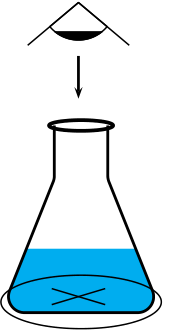
> **[Diagram Context - Textbook_PhysicalSciences_Gr12_Rate-and-Extent-of-Reaction.pdf-0021-01.png]**
> Output constraint: ONLY the

3. For concentration-time graphs or mole-time graphs equilibrium occurs where the concentration or number of moles of the reactants and products are **constant**. These values need not be equal to one another.

4. When calculating $K_c$ make sure you only take values from the sections of the graph where the y-value is constant. $K_c$ can only be calculated when the system is in equilibrium.

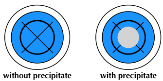
> **[Diagram Context - Textbook_PhysicalSciences_Gr12_Rate-and-Extent-of-Reaction.pdf-0021-03.png]**
> 1. A blue circle with an x in the center.

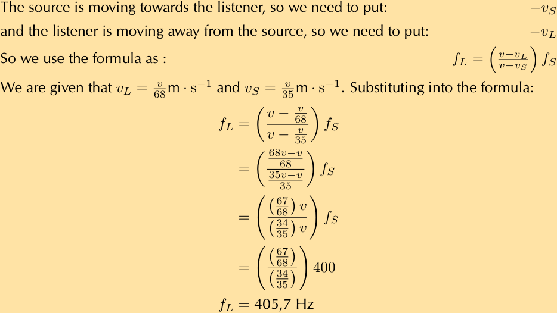
> **[Diagram Context - Textbook_PhysicalSciences_Gr12_The-Doppler-effect.pdf-0021-02.png]**
> The image shows a diagram of a Lewis structure for oxygen. The diagram is a visual representation of the bonding between oxygen and other elements. The diagram is color-coded, with each color representing a different element. The diagram is labeled with the chemical symbols for oxygen, carbon, and nitrogen. The diagram also includes arrows to show the bonds between the elements. The diagram is set against a beige background, and the text at the bottom of the image provides a pedagogical description of the Lewis structure.

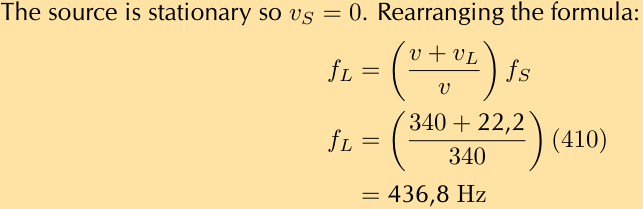
> **[Diagram Context - Textbook_PhysicalSciences_Gr12_The-Doppler-effect.pdf-0021-09.png]**
> The image shows a math problem that involves rearranging a formula. The problem is set against a gray background, and the text is written in a clear, easy-to-read font. The problem is presented in a step-by-step manner, with each step clearly labeled. The problem is designed to help students understand the concept of rearranging a formula and applying it to real-life situations.

---

## Rate-time graphs

* **A change in concentration** of a substance would favour the reaction that decreases the amount of that substance. This will appear as a sharp increase in the rate of either the forward or reverse reaction and a sharp decrease in the rate of the other reaction.
  The increased rate will then gradually decrease and the decreased rate will gradually increase until they are equal again.
* **A change in pressure** of the reaction would cause a sharp increase or decrease in all the reactants and products. This will have the same effect as a change in concentration, although the increase or decrease would be more gradual.
* **A change in temperature** of a substance would affect both rates in the same direction (either both increase or both decrease). However, the effect will be unequal, with the endothermic reaction favoured by an increase in temperature, and the exothermic reaction favoured by a decrease in temperature.
* **The addition of a catalyst** would favour both the forward and reverse reactions by the same amount.

---

### Worked Example 7: Rate-time graphs

#### QUESTION
For the reaction $2\text{AB(g)} \rightleftharpoons 2\text{A(g)} + \text{B}_2\text{g}$, $\Delta H = 26 \text{ kJ}$ the following graph can be plotted:

What stress has occurred in this system? Label the graph with what is happening at each stage.

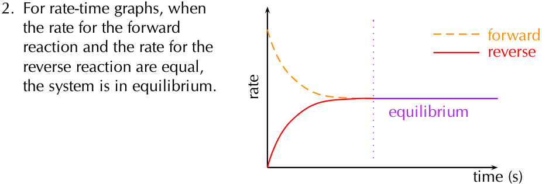
> **[Diagram Context - Textbook_PhysicalSciences_Gr12_Chemical-equilibrium.pdf-0022-14.png]**
> A diagram of a chemical reaction with a rate graph showing the forward and backward rates of the reaction.

#### SOLUTION

**Step 1: Check the axes so that you know what the variables are on this graph**  
The axes are labelled rate and time. Therefore this is a rate-time graph.

**Step 2: Are the rates both affected in the same way or is one rate increased and the other decreased when the stress is applied?**  
Both rates are affected in the same way (increased) therefore the stress must be a catalyst or a change in temperature.  
(A change in pressure or concentration would favour one reaction direction only)

**Step 3: Are both rates affected equally?**  
No, the forward rate is increased more than the reverse rate. Therefore the stress must be a change in temperature.  
(A catalyst would increase both rates equally)

**Step 4: Was the temperature increased or decreased? (Use Le Chatelier's principle)**  
The forward reaction is endothermic ($\Delta H$ is positive). The forward reaction was favoured more than the reverse reaction. An increase in temperature will favour the reaction that cools the reaction vessel (the endothermic reaction). Therefore the stress must have been an increase in temperature.

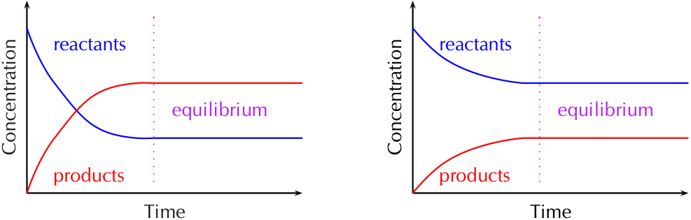
> **[Diagram Context - Textbook_PhysicalSciences_Gr12_Chemical-equilibrium.pdf-0022-16.png]**
> 1. A graph showing the relationship between concentration and the number of products.

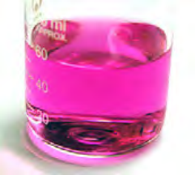
> **[Diagram Context - Textbook_PhysicalSciences_Gr12_Rate-and-Extent-of-Reaction.pdf-0022-17.png]**
> 1. A glass beaker filled with a pink liquid.

---

## Step 5: Label what is occuring at each stage on the graph

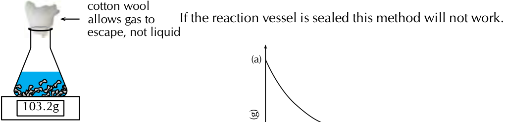
> **[Diagram Context - Textbook_PhysicalSciences_Gr12_Rate-and-Extent-of-Reaction.pdf-0023-00.png]**
> 1. A diagram of a reaction vessel with a blue liquid inside.

---

## Worked example 8: Rate-time graphs

### QUESTION

What is responsible for the change at $t = 10\text{ minutes}$ in the graph below?

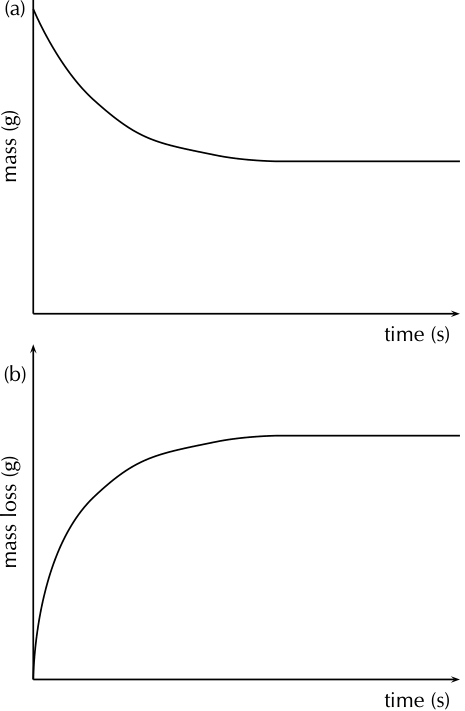
> **[Diagram Context - Textbook_PhysicalSciences_Gr12_Rate-and-Extent-of-Reaction.pdf-0023-01.png]**
> The image shows a black and white diagram of a mass-loss curve. The curve is divided into two sections, with the upper section representing the mass loss of a system and the lower section representing the time. The diagram is labeled with the terms "mass loss" and "time" and includes arrows pointing to the x and y axes. The diagram also includes a legend that explains the meaning of the arrows. The diagram is labeled with the terms "mass loss" and "time" and includes arrows pointing to the x and y axes.

### SOLUTION

#### Step 1: Check the axes so that you know what the variables are on this graph
The axes are labelled rate and time. Therefore this is a rate-time graph.

#### Step 2: Are the rates both affected in the same way or is one rate increased and the other decreased when the stress is applied?
Both rates are affected in the same way (increased) therefore the stress must be a catalyst or a change in temperature. 
*(A change in pressure or concentration would favour one reaction direction only)*

#### Step 3: Are both rates affected equally?
Yes, both rates are increased by the same amount.

#### Step 4: What was responsible for the change at $t = 10\text{ minutes}$?
The addition of a catalyst (a change in temperature would affect both rates, but unequally).

---

## Concentration-time and mole-time graphs

* **A change in concentration** of a substance would appear as a sharp increase or decrease in the concentration or number of moles of that substance and a gradual change in the other substances.
* **A change in temperature** would affect both the forward and reverse reactions. However, one reaction would be affected more than the other. So the reactants and products would be affected gradually, in the opposite direction (one increased, the other decreased).

---

* A change in pressure of the reaction would cause a sharp increase or decrease in all the reactants and products. For an increase in pressure, if the forward reaction is then favoured the reactant concentrations will decrease, and if the reverse reaction is then favoured the product concentrations will decrease.
* The addition of a catalyst would increase both the forward and reverse reaction rates, meaning the equilibrium is reached faster. So if the reaction is already at equilibrium there will be no effect on a concentration-time or moles-time graph.

---

### Worked Example 9: Concentration-time graphs

#### QUESTION
Consider the following chemical equilibrium and graph and answer the questions that follow:

$$\text{CO}(g) + \text{Cl}_2(g) \rightleftharpoons \text{COCl}_2(g)$$

*(Note: The graph plots concentration in $\text{mol}\cdot\text{dm}^{-3}$ against time in seconds ($\text{s}$). It shows curves for $\text{CO}$ starting at $2.5\text{ mol}\cdot\text{dm}^{-3}$, $\text{Cl}_2$ starting at $1.5\text{ mol}\cdot\text{dm}^{-3}$, and $\text{COCl}_2$ starting at $0\text{ mol}\cdot\text{dm}^{-3}$. Disturbances occur at $t = 20\text{ s}$ and $t = 45\text{ s}$.)*

1. How much time was necessary for the system to reach equilibrium for the first time?
2. How do the rates of the forward and reverse reactions compare at the following times:
   * $t = 5\text{ s}$
   * $t = 17\text{ s}$
   * $t = 23\text{ s}$
3. Determine the equilibrium constants for the system at $t = 17\text{ s}$, $25\text{ s}$, and $45\text{ s}$.
4. What happens at $t = 20\text{ s}$? Explain your answer by referring to Le Chatelier's principle.
5. What effect does the stress at $t = 20\text{ s}$ have on $K_c$?

---

#### SOLUTION

**Step 1: Check the axes so that you know what the variables are on this graph**  
The axes are labelled concentration and time. Therefore this is a concentration-time graph.

**Step 2: How much time was necessary for the system to reach equilibrium?**  
The concentration of all three compounds becomes constant at $t = 15\text{ s}$. This means that the reaction has reached equilibrium.

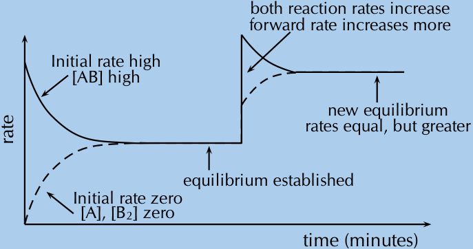
> **[Diagram Context - Textbook_PhysicalSciences_Gr12_Chemical-equilibrium.pdf-0024-01.png]**
> The image is a diagram that illustrates the concept of reaction rates and how they increase over time. The diagram is divided into two sections, with the initial rate being represented by a line and the equilibrium rate being represented by a curve. The diagram also includes labels for the initial rate, equilibrium rate, and reaction rate. The diagram is set against a blue background, and the text at the bottom of the image provides additional information about the concept of reaction rates.

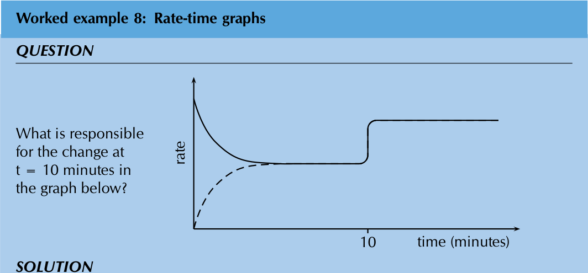
> **[Diagram Context - Textbook_PhysicalSciences_Gr12_Chemical-equilibrium.pdf-0024-02.png]**
> The image shows a blue graph with a rate-time graph and a question. The graph is labeled with the words "worked example 8. Rate-time graphs" and "What is responsible for the change at rate below?". The graph is labeled with the words "Solution" and "10 minutes". The graph is labeled with the words "rate below 10 minutes". The graph is labeled with the words "rate below 10 minutes". The graph is labeled with the words "rate below 10 minutes". The graph is labeled with the words "rate below 10 minutes". The graph is labeled with the words

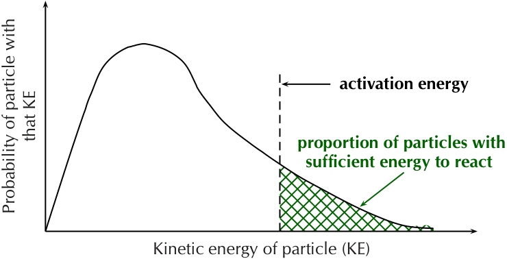
> **[Diagram Context - Textbook_PhysicalSciences_Gr12_Rate-and-Extent-of-Reaction.pdf-0024-00.png]**
> The image is a diagram that illustrates the relationship between kinetic energy and the probability of particles with sufficient energy to react. The diagram is a black and white line graph with a green line that represents the kinetic energy of particles. The x-axis of the graph is labeled "Probability of particles with sufficient energy to react" and the y-axis is labeled "Kinetic energy of particles". The graph shows that as the probability of particles with sufficient energy increases, the kinetic energy of the particles also increases.

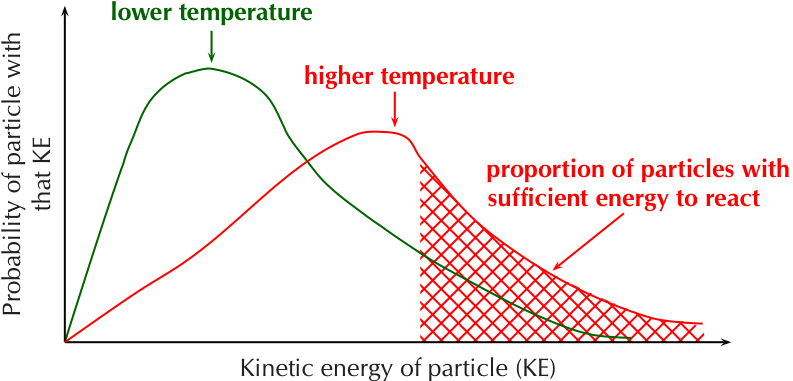
> **[Diagram Context - Textbook_PhysicalSciences_Gr12_Rate-and-Extent-of-Reaction.pdf-0024-04.png]**
> 1. A graph showing Kinetic Energy of particles with a red line and a green line.

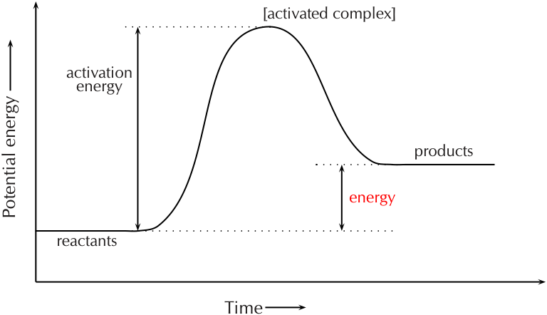
> **[Diagram Context - Textbook_PhysicalSciences_Gr12_Rate-and-Extent-of-Reaction.pdf-0024-09.png]**
> The image is a diagram that illustrates the concept of Activation Energy. It is a black and white diagram that shows the Activation Energy, Potential Energy, and Products. The Activation Energy is represented by a red arrow, and the Potential Energy is represented by a black arrow. The Products are represented by a black line. The diagram is labeled with the words "Activation Energy", "Potential Energy", and "Products". The diagram is set against a brown background.

---

### Step 3: How can you determine which rate is faster from the concentration graphs?

* If the concentrations of the reactants ($\text{CO}$ and $\text{Cl}_2$) are steadily decreasing or the concentration of the product ($\text{COCl}_2$) is increasing, then the **forward reaction** is faster than the reverse reaction.
* Similarly, if the concentrations of the reactants ($\text{CO}$ and $\text{Cl}_2$) are steadily increasing or the concentration of the product ($\text{COCl}_2$) is decreasing, then the **reverse reaction** is faster than the forward reaction.

---

### Step 4: Compare the forward and reverse reaction rates at $t = 5\text{ s}$, $t = 17\text{ s}$ and $t = 23\text{ s}$

* **At $t = 5\text{ s}$ and at $t = 23\text{ s}$:** The concentrations of the reactants are decreasing and the concentration of the product is increasing. Therefore, the rate of the forward reaction is **faster** than the rate of the reverse reaction.
* **At $t = 17\text{ s}$:** The concentrations of the reactants and products are constant (unchanging). Therefore, the reaction is in **equilibrium** and the rate of the forward reaction **equals** the rate of the reverse reaction.

---

### Step 5: What are the concentrations of $\text{CO}$, $\text{Cl}_2$ and $\text{COCl}_2$ at $t = 17\text{ s}$?

Reading off the graph you can see that:
$$\begin{align*}
[\text{CO}] &= 1,75\text{ mol}\cdot\text{dm}^{-3} \\
[\text{Cl}_2] &= 0,6\text{ mol}\cdot\text{dm}^{-3} \\
[\text{COCl}_2] &= 0,75\text{ mol}\cdot\text{dm}^{-3}
\end{align*} $$

---

### Step 6: Write an expression for the equilibrium constant of this reaction and calculate $K_c$

$$K_c = \frac{[\text{COCl}_2]}{[\text{CO}][\text{Cl}_2]}$$

$$K_c = \frac{0,75}{(1,75)(0,6)} = 0,71$$

---

### Step 7: What happens at $t = 20\text{ s}$?

* The concentration of $\text{CO}$ increases sharply. The concentrations of the other compounds do not change dramatically. Therefore, $\text{CO}$ must have been added to the system.
* After this addition of $\text{CO}$, there is a shift to reduce the amount of $\text{CO}$, that is in the **forward direction**. Therefore, the concentration of the product increases while the concentrations of the reactants decrease.

---

### Step 8: What effect will this have on $K_c$?

Only a change in temperature affects $K_c$, therefore this will have **no effect** on $K_c$.

---

## Worked Example 10: Concentration-time graphs

### QUESTION
Consider the following chemical equilibrium and graph and answer the questions.

$$\text{H}_2\text{(g)} + \text{I}_2\text{(g)} \rightleftharpoons 2\text{HI}\text{(g)}$$

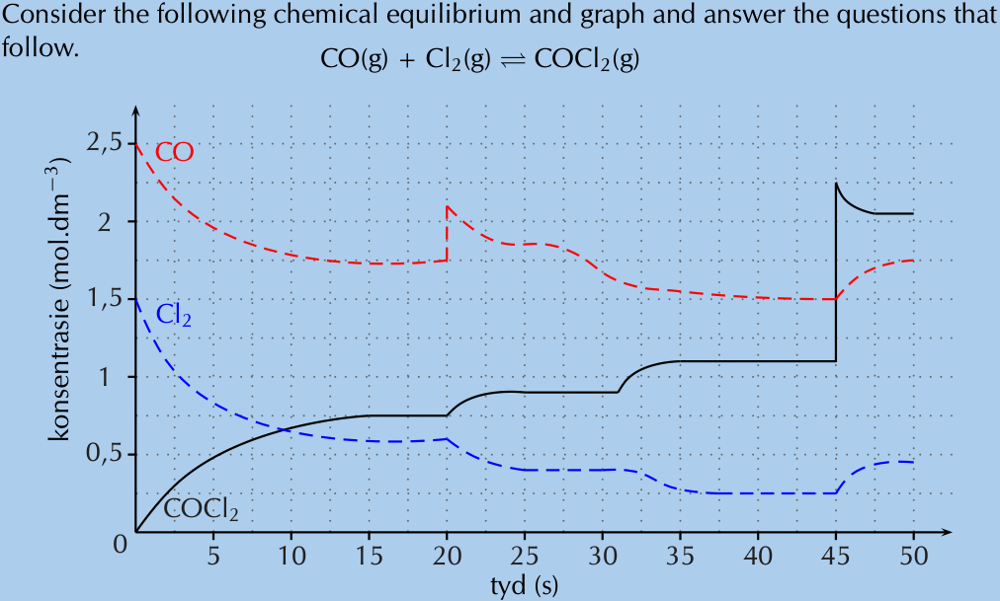
> **[Diagram Context - Textbook_PhysicalSciences_Gr12_Chemical-equilibrium.pdf-0025-04.png]**
> The image is a graph that shows the relationship between the concentration of a chemical and the rate of a reaction. The x-axis of the graph is labeled "Concentration" and the y-axis is labeled "Rate". The graph shows a line that starts at the origin (0, 0) and increases linearly to the right, indicating that as the concentration of the chemical increases, the rate of the reaction also increases. The graph also includes a legend that explains the different colors used to represent the different chemical species.

1. After how many seconds does the system reach equilibrium?
2. Calculate the value of the equilibrium constant.
3. Explain what happened at $t = 20\text{ s}$.
4. If the change at $t = 35\text{ s}$ is due to an increase in temperature, is the reaction exothermic or endothermic? Explain your answer.

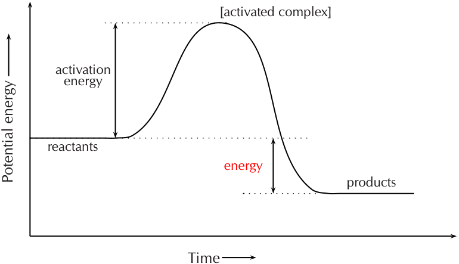
> **[Diagram Context - Textbook_PhysicalSciences_Gr12_Rate-and-Extent-of-Reaction.pdf-0025-05.png]**
> The image is a diagram that illustrates the concept of Activation Energy. It is a black and white diagram that shows the Activation Energy curve and the products of the reaction. The Activation Energy curve is a graph that shows the relationship between Activation Energy and the rate of reaction. The products of the reaction are the substances that are formed as a result of the reaction. The diagram also includes arrows that indicate the direction of the reaction and the direction of the products. The diagram is labeled with the words "Activation Energy" and "Products".

---

# Chapter 8: Chemical Equilibrium

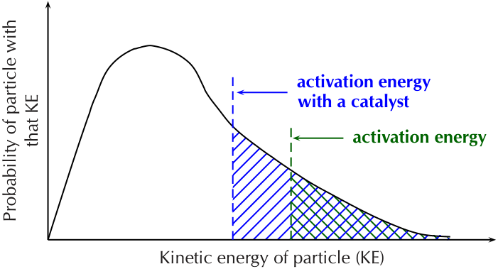
> **[Diagram Context - Textbook_PhysicalSciences_Gr12_Rate-and-Extent-of-Reaction.pdf-0026-01.png]**
> The image presents a diagram illustrating the relationship between activation energy and kinetic energy in a chemical reaction. The diagram is divided into two parts, with the upper part representing the activation energy and the lower part representing the kinetic energy. The diagram is labeled with the terms "activation energy" and "kinetic energy" and is accompanied by a legend that explains the relationship between the two. The diagram also includes a graph that shows the relationship between the two variables. The diagram is set against a gray background, and the text "probability that energy is kinetic energy" is written at the bottom.

## SOLUTION

### Step 1: Check the axes so that you know what the variables are on this graph
The axes are labelled concentration and time. Therefore this is a concentration-time graph.

### Step 2: After how many seconds does the system reach equilibrium?
The concentration of all three compounds becomes constant at $t = 10\text{ s}$. This means that the system takes $10\text{ s}$ to reach equilibrium.

### Step 3: What are the concentrations of $\text{H}_2$, $\text{I}_2$, and $\text{HI}$ at $t = 10\text{ s}$, $25\text{ s}$, and $45\text{ s}$?
Reading off the graph you can see that:
* At $10\text{ s}$: $[\text{H}_2]$ and $[\text{I}_2] = 0,75\text{ mol}\cdot\text{dm}^{-3}$, $[\text{HI}] = 6,0\text{ mol}\cdot\text{dm}^{-3}$
* At $25\text{ s}$: $[\text{H}_2]$ and $[\text{I}_2] = 0,6\text{ mol}\cdot\text{dm}^{-3}$, $[\text{HI}] = 4,8\text{ mol}\cdot\text{dm}^{-3}$
* At $45\text{ s}$: $[\text{H}_2]$ and $[\text{I}_2] = 1,5\text{ mol}\cdot\text{dm}^{-3}$, $[\text{HI}] = 2,75\text{ mol}\cdot\text{dm}^{-3}$

### Step 4: Write an expression for the equilibrium constant of this reaction and calculate $K_c$.
$$K_c = \frac{[\text{HI}]^2}{[\text{H}_2][\text{I}_2]}$$

* **At $t = 10\text{ s}$:** 
  $$K_c = \frac{6,0^2}{(0,75)(0,75)} = 64,0$$

* **At $t = 25\text{ s}$:** 
  $$K_c = \frac{4,8^2}{(0,6)(0,6)} = 64,0$$

* **At $t = 45\text{ s}$:** 
  $$K_c = \frac{2,75^2}{(1,5)(1,5)} = 3,4$$

The different $K_c$ at $45\text{ s}$ means that the event at $t = 35\text{ s}$ must be a change in temperature.

### Step 5: Explain what happened at $t = 20\text{ s}$?
The concentration of $\text{HI}$ decreases sharply, as a result there is a slight decrease in the concentration of $\text{H}_2$ and $\text{I}_2$. Therefore $\text{HI}$ must have been removed from the system. After this there is a shift to increase the amount of $\text{HI}$, that is in the forward direction.

### Step 6: If the change at $t = 35\text{ s}$ is due to an increase in temperature, is the reaction exothermic or endothermic? Explain your answer.
An increase in temperature caused the concentration of the product to decrease and the concentrations of the reactants to increase. This means that the reverse reaction has been favoured.

An increase in temperature will favour the reaction that takes heat in and cools the reaction vessel (endothermic). Therefore the reverse reaction must be endothermic and the forward reaction must be exothermic. The reaction is exothermic.

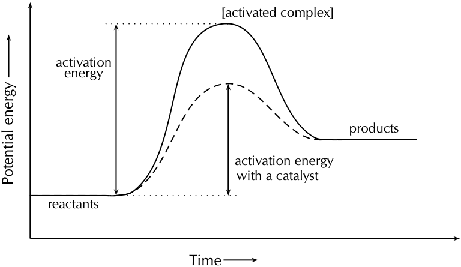
> **[Diagram Context - Textbook_PhysicalSciences_Gr12_Rate-and-Extent-of-Reaction.pdf-0026-06.png]**
> The image is a black and white diagram that illustrates the concept of Activation Energy. It is divided into three sections, each representing a different aspect of Activation Energy: Activation Energy, Activation Energy with a Catalyst, and Activation Energy with a Catalyst and Products. The diagram is labeled with the terms "Activation Energy", "Potential Energy", "Potential Energy with a Catalyst", and "Potential Energy with a Catalyst and Products". The diagram also includes arrows that connect the Activation Energy to the Activation Energy with a Catalyst and Activation Energy with a Catalyst and Products

---

# Summary: Predicting Changes in Equilibrium Reactions

The following rules help in predicting the changes that take place in equilibrium reactions:

* **Effect of Reactant Concentration (Increase):** If the concentration of a reactant (on the left) is **increased**, some of it must be used to form the products (on the right) for equilibrium to be maintained. The equilibrium position will shift to the **right**. The equilibrium constant ($K_c$) is unchanged.
* **Effect of Reactant Concentration (Decrease):** If the concentration of a reactant (on the left) is **decreased**, some of the products (on the right) must be used to form reactants for equilibrium to be maintained. The equilibrium position will shift to the **left**. The equilibrium constant ($K_c$) is unchanged.
* **Effect of Temperature (Endothermic Forward Reaction):** If the forward reaction is **endothermic**, an **increase** in temperature will favour this reaction and the product yield and $K_c$ will **increase**. A **decrease** in temperature will **decrease product yield** and likewise **decrease $K_c$**.
* **Effect of Temperature (Exothermic Forward Reaction):** If the forward reaction is **exothermic**, a **decrease** in temperature will favour this reaction and the product yield and $K_c$ will **increase**. An **increase** in temperature will **decrease product yield** and likewise **decrease $K_c$**.
* **Effect of Pressure (Increase):** **Increasing the pressure** favours the side of the equilibrium with the **least number of gas molecules**. This is shown in the balanced chemical equation. This rule applies in reactions with one or more gaseous reactants or products. The equilibrium constant ($K_c$) is unchanged.
* **Effect of Pressure (Decrease):** **Decreasing the pressure** favours the side of the equilibrium with **more gas molecules**. This is shown in the balanced chemical equation. This rule applies in reactions with one or more gaseous reactants or products. The equilibrium constant ($K_c$) is unchanged.
* **Effect of a Catalyst:** A **catalyst** does not affect the equilibrium position of a reaction. It only influences the *rate of the reaction*, in other words, how quickly equilibrium is reached.

---

## Worked Example 11: Chemical equilibrium

### Question

$$2\text{NO}(g) + \text{O}_2(g) \rightleftharpoons 2\text{NO}_2(g) \quad \Delta H < 0$$

How will:
1. the reverse reaction
2. the equilibrium position be affected by:
   - a) A decrease in temperature?
   - b) The addition of a catalyst?
   - c) The addition of more $\text{NO}_2$ gas?

### Solution

1. **The reverse reaction:**
   - a) The forward reaction is exothermic ($\Delta H < 0$) so the reverse reaction must be endothermic. A decrease in temperature will cause the equilibrium to shift to favour the exothermic reaction. Therefore the reverse reaction rate will decrease sharply, and then gradually increase until equilibrium is re-established.
   - b) The addition of a catalyst will speed up both the forward and reverse reactions.
   - c) $\text{NO}_2$ is a product. Therefore the addition of more $\text{NO}_2$ will increase the reverse reaction rate.

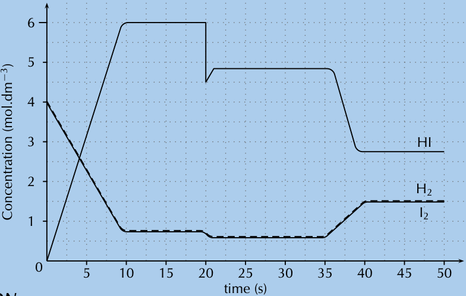
> **[Diagram Context - Textbook_PhysicalSciences_Gr12_Chemical-equilibrium.pdf-0027-00.png]**
> The image shows a graph with a black line and a black dot labeled "H". The graph is set against a light blue background. The x-axis of the graph is labeled "time" and the y-axis is labeled "concentration". The graph shows a decrease in concentration over time. The graph also includes a legend that reads "H", which is a chemical symbol for hydrogen. The graph is labeled with the title "H(t) = H(t) - H(t-tau)".

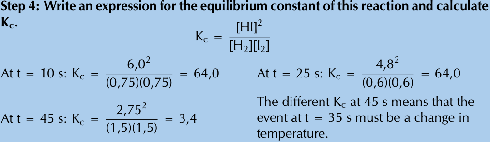
> **[Diagram Context - Textbook_PhysicalSciences_Gr12_Chemical-equilibrium.pdf-0027-07.png]**
> Step 4: Write an expression for the equilibrium constant of this reaction and calculate K.

---

rate of the formation of reactants. The rate of the reverse reaction will therefore increase sharply, and then gradually decrease until equilibrium is re-established.

2. **The equilibrium position:**
   * a) A decrease in temperature will favour the exothermic reaction and the forward reaction is exothermic. Therefore the equilibrium position will shift to the right.
   * b) The addition of a catalyst will have no effect on the equilibrium position as both the forward and reverse reactions rates would be increased equally.
   * c) The addition of more $\text{NO}_2$ will favour the formation of the reactants and so the equilibrium will shift to the left.

---

## Worked Example 12: Graphs of Equilibrium

### QUESTION

Study the graph and answer the questions that follow:

<!-- DIAGRAM_PLACEHOLDER: diagram -->

1. Does the equilibrium favour the reactants or the products?
2. Determine the value of $K_c$ if the coefficients of the balanced equation all equal $1$.
3. The forward reaction has $\Delta H > 0$. What effect will an increase in temperature have on $[\text{A}]$, $[\text{B}]$ and $[\text{C}]$?

---

### SOLUTION

**Step 1: Determine which compounds are the reactants and which are the products**  
The concentration of reactants decreases from the start of the reaction to equilibrium. Therefore $A$ and $B$ are reactants.

The concentration of products increases from the start of the reaction to equilibrium. Therefore $C$ is a product.

$$a\text{A} + b\text{B} \rightleftharpoons c\text{C}$$

We are told that all coefficients in the balanced equation equal $1$. Therefore the general equation is: 

$$\text{A} + \text{B} \rightleftharpoons \text{C}$$

**Step 2: Do reactants or products have higher concentrations at equilibrium?**  
$A$ and $B$ (the reactants) have higher concentrations at equilibrium.

**Step 3: Does the equilibrium favour the reactants or products?**  
The reactants have higher concentrations than the products, therefore the equilibrium must favour the reactants.

---

## Step 4: Determine the equilibrium concentration values of A, B and C

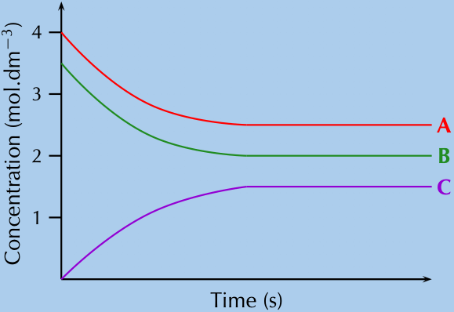
> **[Diagram Context - Textbook_PhysicalSciences_Gr12_Chemical-equilibrium.pdf-0029-10.png]**
> The image is a graph that shows the concentration of a substance over time. The x-axis is labeled with the time in seconds, and the y-axis is labeled with concentration in mol/L. The graph has three lines, each representing a different concentration of the substance at different time intervals. The first line is labeled "A", the second line is labeled "B", and the third line is labeled "C". The graph is set against a blue background, and there are arrows pointing to the different concentration levels at each time point.

**Equilibrium concentrations from the graph:**
* $[\text{A}] = 2,5\text{ mol}\cdot\text{dm}^{-3}$
* $[\text{B}] = 2,0\text{ mol}\cdot\text{dm}^{-3}$
* $[\text{C}] = 1,5\text{ mol}\cdot\text{dm}^{-3}$

---

## Step 5: Calculate $K_c$

$$K_c = \frac{[\text{C}]}{[\text{A}][\text{B}]} = \frac{1,5}{(2,5)(2,0)} = 0,3$$

---

## Step 6: Determine which reaction is exothermic and which is endothermic

The forward reaction has $\Delta H > 0$. This means that the forward reaction is endothermic. The reverse reaction must therefore be exothermic.

---

## Step 7: Which reaction is favoured by an increase in temperature?

The endothermic reaction would be favoured by an increase in temperature (to lower the temperature). This is the forward reaction.

---

## Step 8: How would $[\text{A}]$, $[\text{B}]$ and $[\text{C}]$ change?

The forward reaction is favoured, therefore the equilibrium would shift to the right. This means that the reactant concentrations ($[\text{A}]$ and $[\text{B}]$) would decrease and the product concentration ($[\text{C}]$) would increase.

---

## Exercise 8 – 3: Equilibrium

1. The following reaction has reached equilibrium in a closed container:
   $$\text{C(s)} + \text{H}_2\text{O(g)} \rightleftharpoons \text{CO(g)} + \text{H}_2\text{g)} \quad \Delta H > 0$$

   The pressure of the system is then decreased. How will the concentration of the $\text{H}_2\text{(g)}$ and the value of $K_c$ be affected when the new equilibrium is established?
   Assume that the temperature of the system remains unchanged.
   *(IEB Paper 2, 2004)*

| | Hydrogen concentration | $K_c$ |
|---|---|---|
| (a) | increases | increases |
| (b) | increases | stays the same |
| (c) | stays the same | stays the same |
| (d) | decreases | stays the same |

2. During a classroom experiment copper metal reacts with concentrated nitric acid to produce $\text{NO}_2$ gas.

   

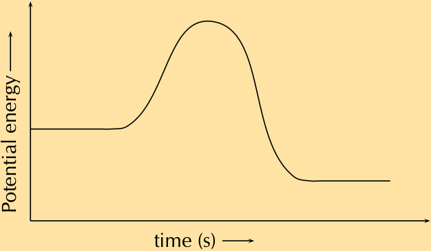
> **[Diagram Context - Textbook_PhysicalSciences_Gr12_Rate-and-Extent-of-Reaction.pdf-0029-19.png]**
> The image presents a graph of potential energy against time. The graph is a black and white line graph with a curved line representing the potential energy. The x-axis of the graph is labeled "Time" and the y-axis is labeled "Potential Energy". The graph shows a curve, which indicates the change in potential energy over time. The graph is labeled with the text "Potential Energy" and "Time". The graph is set against a beige background.

   The $\text{NO}_2$ is collected in a gas syringe.

---

When enough gas has collected in the syringe, the delivery tube is clamped so that no gas can escape. The brown $\text{NO}_2$ gas collected reaches an equilibrium with colourless $\text{N}_2\text{O}_4$ gas as represented by the following equation:

$$2\text{NO}_2\text{(g)} \rightleftharpoons \text{N}_2\text{O}_4\text{(g)}, \Delta H < 0$$

Once this equilibrium has been established, there are $0,01\text{ moles}$ of $\text{NO}_2\text{ gas}$ and $0,03\text{ moles}$ of $\text{N}_2\text{O}_4\text{ gas}$ present in the syringe.

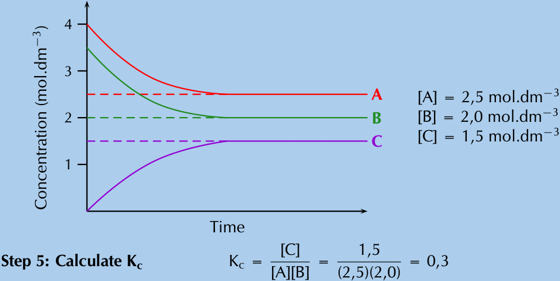
> **[Diagram Context - Textbook_PhysicalSciences_Gr12_Chemical-equilibrium.pdf-0030-01.png]**
> 1. A step by step guide to calculating the concentration of a solution.

a) A learner, noticing that the colour of the gas mixture in the syringe is no longer changing, comments that all chemical reactions in the syringe must have stopped. Is this assumption correct? Explain.

b) The gas in the syringe is cooled. The volume of the gas is kept constant during the cooling process. Will the gas be lighter or darker at the lower temperature? Explain your answer.

c) The volume of the syringe is now reduced (at constant temperature) to $75\text{ cm}^3$ by pushing the plunger in and holding it in the new position. There are $0,032\text{ moles}$ of $\text{N}_2\text{O}_4\text{ gas}$ present once the equilibrium has been re-established at the reduced volume ($75\text{ cm}^3$). Calculate the value of the equilibrium constant for this equilibrium.
*(IEB Paper 2, 2004)*

---

3. Gases X and Y are pumped into a $2\text{ dm}^3$ container. When the container is sealed, $4\text{ moles}$ of gas X and $4\text{ moles}$ of gas Y are present. The following equilibrium is established:

$$2\text{X}\text{(g)} + 3\text{Y}\text{(g)} \rightleftharpoons \text{X}_2\text{Y}_3\text{(g)}$$

The graph shows the number of moles of gas X and gas $\text{X}_2\text{Y}_3$ that are present from the time the container is sealed.

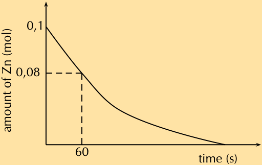
> **[Diagram Context - Textbook_PhysicalSciences_Gr12_Rate-and-Extent-of-Reaction.pdf-0030-00.png]**
> The image is a black and white diagram that shows a graph of the amount of time (in seconds) it takes for a chemical reaction to occur. The x-axis of the graph is labeled "time" and the y-axis is labeled "moles". The graph shows a steep decline in the amount of time it takes for the reaction to occur, indicating a decrease in the rate of the reaction. The graph is labeled with the number "60" and the units "s".

a) How many moles of gas $\text{X}_2\text{Y}_3$ are formed by the time the reaction reaches equilibrium at $30\text{ seconds}$?

b) Calculate the value of the equilibrium constant at $t = 50\text{ s}$.

c) At $70\text{ s}$ the temperature is increased. Is the forward reaction endothermic or exothermic? Explain in terms of Le Chatelier's Principle.

d) How will this increase in temperature affect the value of the equilibrium constant?

---

4. Consider the following hypothetical reaction that takes place in a **closed $2\text{ dm}^3$ flask at $298\text{ K}$**.

$$\text{A}_2\text{(g)} + 2\text{B}_2\text{(g)} \rightleftharpoons 2\text{AB}_2\text{(g)}$$

The graph represents the change in the number of moles of each gas in the flask over a period of $20\text{ minutes}$.

---

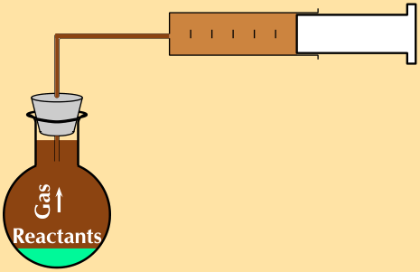
> **[Diagram Context - Textbook_PhysicalSciences_Gr12_Chemical-equilibrium.pdf-0031-02.png]**
> 1. A brown glass vial with a brown liquid inside.
 2. A white tube with a brown liquid on the end.
 3. The word "gas" on the vial.
 4. The word "reacts" on the tube.

## Exercises: Chemical Equilibrium and Le Chatelier's Principle

a) State how long (in minutes) it took for the reaction to reach equilibrium for the first time.

b) Write down an expression for the equilibrium constant, $K_c$, for this particular reaction.

c) Calculate the concentration of each of the reactants and the product using figures from the graph between $5\text{ minutes}$ and $10\text{ minutes}$ and hence calculate the equilibrium constant $K_c$ for this reaction at $298\text{ K}$.

d) State what a low value of $K_c$ indicates about the yield of product for a reaction.

e) Why is it not possible to calculate $K_c$ using figures from the graph during the first $5\text{ minutes}$?

f) State Le Chatelier's principle.

g) At $10\text{ minutes}$ the temperature of the flask was increased. Using Le Chatelier's principle, determine if the production of $\text{AB}_2$ is exothermic or endothermic?

h) How would the equilibrium constant be affected by each of the following changes (state either increase, decrease or no effect):
   i. Increasing the pressure of the flask with no change to temperature.
   ii. Adding a catalyst to the flask.
   iii. Increasing the temperature of the flask.

5. More questions. Sign in at Everything Science online and click 'Practise Science'. Check answers online with the exercise code below or click on 'show me the answer'.
   1. $\text{27VS}$ 
   2. $\text{27VT}$ 
   3. $\text{27VV}$ 
   4. $\text{27VW}$

www.everythingscience.co.za | m.everythingscience.co.za

---

## Industrial Applications (ESCNX)

In industrial processes, it is important to get the product as quickly and as efficiently as possible. The less expensive the process the better.

The **Haber process** is a good example of an industrial process which uses the equilibrium principles that have been discussed. The equation for the process is as follows:

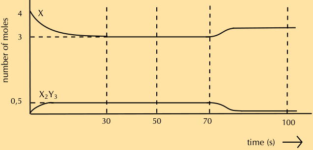
> **[Diagram Context - Textbook_PhysicalSciences_Gr12_Chemical-equilibrium.pdf-0031-11.png]**
> , dynamic balance, shift in equilibrium

> **[Diagram Context - Textbook_PhysicalSciences_Gr12_Rate-and-Extent-of-Reaction.pdf-0031-00.png]**
> The image shows a graphic design featuring a green circle with the word "chapter" written in white text. The circle is surrounded by a gray border, and the word "7" is written in white text directly below the circle. The design is simple and straightforward, with the text and the circle being the main visual elements.

---

$$N_{2}(g) + 3H_{2}(g) \rightleftharpoons 2NH_{3}(g) + \text{energy}$$

Since the forward reaction is exothermic, to produce a lot of product and favour the forward reaction the system needs to be colder. However, cooling a system slows down all chemical reactions and so the system can't be too cold. This process is carried out at a much higher temperature to ensure the speed of production.

Because high temperature favours the reverse reaction, the $NH_{3}$ product is actually removed as it is made (product concentration decreased) to prevent ammonia being used in the reverse reaction. The decrease of product concentration favours the forward reaction.

High pressure is also used to ensure faster reaction time and to favour the production of $NH_{3}$. The forward reaction is favoured by higher pressures because there are $2$ gas molecules of product for every $4$ gas molecules of reactant.

Refer to Chapter 14 for more information on the Haber process and other industrial applications.

---

### Exercise 8 – 4: Applying equilibrium principles

1. Look at the values of $K_{c}$ calculated for the Haber process reaction at different temperatures, and then answer the questions that follow:

| $T$ ($^{\circ}\text{C}$) | $K_{c}$ |
| :---: | :---: |
| $25$ | $6,4 \times 10^{2}$ |
| $200$ | $4,4 \times 10^{-1}$ |
| $300$ | $4,3 \times 10^{-3}$ |
| $400$ | $1,6 \times 10^{-4}$ |
| $500$ | $1,5 \times 10^{-5}$ |

a) What happens to the value of $K_{c}$ as the temperature increases?  
b) Which reaction is being favoured when the temperature is $300\text{ }^{\circ}\text{C}$?  
c) According to this table, which temperature would be best if you wanted to produce as much ammonia as possible? Explain.  

2. More questions. Sign in at Everything Science online and click 'Practise Science'. Check answers online with the exercise code below or click on 'show me the answer'.  
   1. $27\text{VX}$

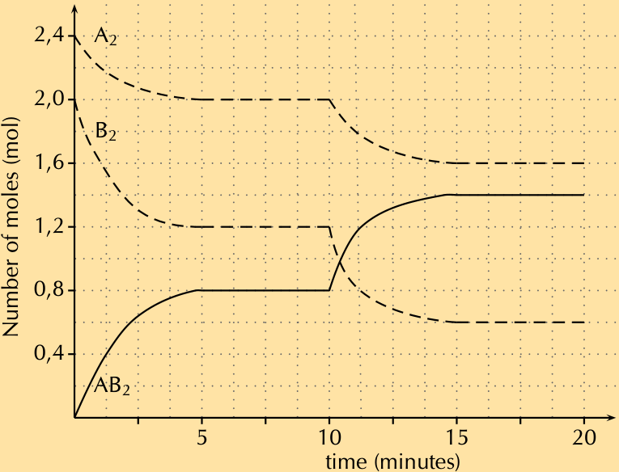
> **[Diagram Context - Textbook_PhysicalSciences_Gr12_Chemical-equilibrium.pdf-0032-00.png]**
> The image is a graph that shows the relationship between the number of A's and B's in a Lewis diagram. The graph has two lines, one for A's and one for B's, and the x-axis is labeled "Time (minutes)" and the y-axis is labeled "Number of Molecules". The graph shows that as the number of A's increases, the number of B's also increases, and vice versa. The graph also shows that there is a relationship between the number of A's and B's, and that the relationship is linear.

---

## 8.4 Chapter Summary (ESCNY)

* A reaction is **reversible** when reactants can react to form products, and products can react to form the reactants again.
* A reaction is in **chemical equilibrium** when the rate of the forward reaction equals the rate of the reverse reaction.
* In an **open system** energy and matter can enter and leave the system. In a **closed system** energy can enter and leave the system, but matter cannot.
* The **equilibrium constant** ($K_{c}$) relates to the concentration of the reactants and products at equilibrium, and can be calculated using the following expression:
  $$K_{c} = \frac{[C]^{c}[D]^{d}}{[A]^{a}[B]^{b}} \quad \text{where } aA + bB \rightleftharpoons cC + dD$$
  $A$ and $B$ are reactants, $C$ and $D$ are products and $a$, $b$, $c$, and $d$ are the coefficients of the respective reactants and products.
* A **high $K_{c}$ value** means that the concentration of products at equilibrium is high.

---

and the reaction has a high yield of the products. A **low $K_c$ value** means that the concentration of products at equilibrium is low and the reaction has a low yield of the products.

* **Le Chatelier's Principle** states that if an external stress (change in pressure, temperature or concentration) is applied to a system in chemical equilibrium, the equilibrium will change in such a way as to reduce the effect of the stress.
* Although a change in temperature, concentration or total pressure will affect the equilibrium position, only **temperature** will affect the equilibrium constant $K_c$.
* The principles of equilibrium are very important in **industrial applications** such as the Haber process, so that productivity can be maximised.

---

### Exercise 8 - 5:

1. Explain the following concepts:
   a) Chemical equilibrium
   b) A closed system
   c) A reversible reaction

2. The following equilibrium constant expression is given $K_c = \frac{[\text{H}_2\text{O}]^4[\text{CO}_2]^3}{[\text{C}_3\text{H}_8][\text{O}_2]^5}$ for a particular reaction:
   For which one of the following reactions is the above expression of $K_c$ correct?
   
   a) $\text{C}_3\text{H}_8(\text{g}) + 5\text{O}_2(\text{g}) \rightleftharpoons 4\text{H}_2\text{O}(\text{g}) + 3\text{CO}_2(\text{g})$
   
   b) $4\text{H}_2\text{O}(\text{g}) + 3\text{CO}_2(\text{g}) \rightleftharpoons \text{C}_3\text{H}_8(\text{g}) + 5\text{O}_2(\text{g})$
   
   c) $2\text{C}_3\text{H}_8(\text{g}) + 7\text{O}_2(\text{g}) \rightleftharpoons 6\text{CO}(\text{g}) + 8\text{H}_2\text{O}(\text{g})$
   
   d) $\text{C}_3\text{H}_8(\text{g}) + 5\text{O}_2(\text{g}) \rightleftharpoons 4\text{H}_2\text{O}(\ell) + 3\text{CO}_2(\text{g})$

   (IEB Paper 2, 2001)

3. Cobalt chloride crystals are dissolved in a beaker containing ethanol and then a few drops of water are added. After a period of time, the reaction reaches equilibrium as follows:
   
   $\text{CoCl}_4^{2-}(\text{aq})(\text{blue}) + 6\text{H}_2\text{O} \rightleftharpoons \text{Co}(\text{H}_2\text{O})_6^{2+}(\text{aq})(\text{pink}) + 4\text{Cl}^-$

   The solution, which is now purple, is poured into three test tubes. State, in each case, what colour changes, if any, will be observed if the following are added in turn to each test tube:
   
   a) $1\text{ cm}^3$ of distilled water
   
   b) A few crystals of sodium chloride

4. More questions. Sign in at Everything Science online and click 'Practise Science'.

Check answers online with the exercise code below or click on 'show me the answer'.

1. `27VY` $\quad$ 2. `27VZ` $\quad$ 3. `27W2`

www.everythingscience.co.za $\quad\quad\quad$ m.everythingscience.co.za

---

# CHAPTER 8

## Chemical equilibrium

---

### Contents

| Section | Topic | Page |
| :--- | :--- | :--- |
| **8.1** | *What is chemical equilibrium?* | 170 |
| **8.2** | *The equilibrium constant* | 171 |
| **8.3** | *Le Chatelier's principle* | 173 |
| **8.4** | *Chapter Summary* | 179 |

---

# 8 Chemical equilibrium

In this chapter, learners will explore the concept of chemical equilibrium in detail. Before starting this chapter, it is essential that learners have a thorough understanding of rates of reactions and chemical kinetics as covered in Chapter 7. In Grade 11, the definition of equilibrium in physics was covered; it is important that learners understand the difference between this and a dynamic, chemical equilibrium.

The following topics are covered in this chapter:

* **What the term *chemical equilibrium* means**
  In this section, learners will be introduced to the concept of chemical equilibrium including everyday examples. Covered under this introduction are the concepts of open and closed systems, and the fact that reactions cannot reach equilibrium in an open system. Chemical equilibrium reactions require reversible reactions that can form a dynamic equilibrium; these concepts are also covered here.
* **The equilibrium constant**
  The equilibrium constant is used to determine whether reactants or products are favoured in a reaction at chemical equilibrium. Aside from introducing the meaning of $K_c$ values, this section will require learners to calculate equilibrium constants from known concentrations, as well as to calculate the concentrations of reactants and products. To do that, they should use a RICE table. The acronym makes it easier for learners to remember the information necessary, and the table helps them to organise the information they have and see what information they still need.
  It is important that learners have a thorough understanding of equilibrium constants before they begin Chapter 9.
* **Le Chatelier's principle**
  The concept of understanding how a reaction will be affected by an external stress, without actually doing an experiment, is quite abstract and the learners often struggle with it. Lots of examples with different reactions would be a good idea here to make sure they understand the concepts, before you move on to the more advanced interpretations of graphs. The Haber process could be used as an example to make sure they understand the concepts, before you move on to that section.

The informal assessment in this chapter requires the use of concentrated hydrochloric acid. The learners should be properly instructed on the correct use of safety equipment, including safety goggles, gloves, and protective clothing. They should also be reminded not to sniff any chemicals as the fumes can be dangerous as well. More information on laboratory procedures as well as safety precautions is provided in Chapter 1 (Science skills). The initial solution at room temperature should be purple. When heated, the solution should turn a deep blue, and when cooled it should turn a pink or red colour. More information is provided in the relevant section.

---

## 8.1 What is chemical equilibrium?

### Open and closed systems

The important thing for students to understand in this experiment is that there is constant movement. Molecules at the surface of the water in the closed beaker are constantly evaporating, and gas molecules are constantly condensing. There is no change in the level of the liquid, and the total number of molecules in the liquid and the gas state remain constant.

Point out that the level of water in the sealed container also drops initially, before finally remaining constant. This concept will help learners understand how the rate of the forward reaction decreases until equilibrium is reached.

---

# Reversible reactions

## Exercise 8 - 1: Chemical equilibrium

1. Which of the following situations describes a closed system?
   a) 
   - i. A pot of water (without a lid) heated to $80^{\circ}\text{C}$
   - ii. A pot of water (with a lid) heated to $80^{\circ}\text{C}$

   *The water is being heated, therefore there is water in the liquid and the gas phase. The water vapour can leave the pot (system) if there is no lid.*

   - ii) A closed pot of water (with a lid) heated to $80^{\circ}\text{C}$

   b) 
   - i. $\text{NaCl(aq)} + \text{AgNO}_3\text{(aq)} \rightarrow \text{NaNO}_3\text{(aq)} + \text{AlCl(s)}$ in an open container.
   - ii. $2\text{CO(g)} + \text{MoO}_2\text{(s)} \rightarrow 2\text{CO}_2\text{(g)} + \text{Mo(s)}$ in an open container.

   *Assume that none of the solid or liquid reactants or products go into the gas phase.*
   - i) $\text{NaCl(aq)} + \text{AgNO}_3\text{(aq)} \rightarrow \text{NaNO}_3\text{(aq)} + \text{AlCl(s)}$

2. For the reaction: $\text{A} + \text{B} \rightleftharpoons \text{C} + \text{D}$
   a) Write down the forward reaction
      $$\text{A} + \text{B} \rightarrow \text{C} + \text{D}$$
   b) Write down the reverse reaction
      $$\text{C} + \text{D} \rightarrow \text{A} + \text{B}$$
   c) This reaction is said to be ....... (fill in the missing word)
      *This reaction is said to be reversible*

3. More questions. Sign in at Everything Science online and click 'Practise Science'.

Think you got it? Get this answer and more practice on our Intelligent Practice Service

1. 27VG $\quad$ 2. 27VH

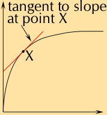
> **[Diagram Context - Textbook_PhysicalSciences_Gr12_Rate-and-Extent-of-Reaction.pdf-0036-07.png]**
> 1. A diagram of a curve with a red line indicating a slope.

---

## 8.2 The equilibrium constant

### The meaning of $K_c$ values

## Exercise 8 - 2: The equilibrium constant

1. Write the equilibrium constant expression, $K_c$, or balanced chemical equation for the following reactions:
   
   a) $\text{NO}$ and $\text{Cl}_2$ are both reactants. $\text{NOCl}$ is the product. They are all in the gas state and will be included in the equilibrium constant expression.
   $\text{NO}$ has a coefficient of $2$, $\text{Cl}_2$ has a coefficient of $1$ and $\text{NOCl}$ has a coefficient of $2$.

   $$2\text{NO(g)} + \text{Cl}_2\text{(g)} \rightleftharpoons 2\text{NOCl(g)}$$

   $$K_c = \frac{[\text{NOCl}]^2}{[\text{NO}]^2[\text{Cl}_2]}$$

   b) 
   $$K_c = \frac{[\text{H}_2\text{O(g)}]^2}{[\text{H}_2\text{g}]^2[\text{O}_2\text{g}]}$$
   *The $\text{H}_2\text{O(g)}$ must be the product and have a coefficient of $2$.*

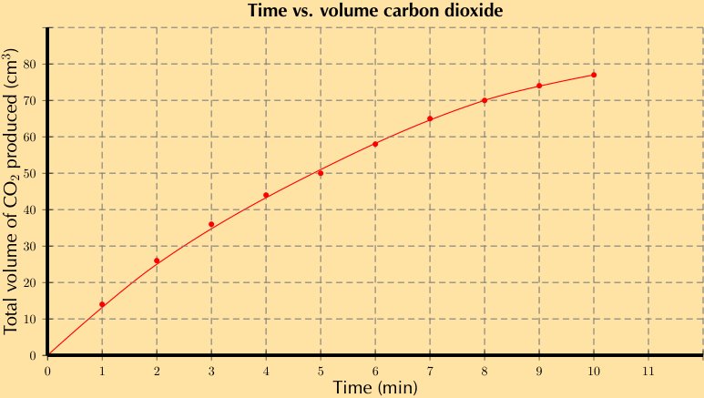
> **[Diagram Context - Textbook_PhysicalSciences_Gr12_Rate-and-Extent-of-Reaction.pdf-0036-09.png]**
> The image is a graph that shows the relationship between time and volume of carbon dioxide. The x-axis of the graph is labeled "Time" and the y-axis is labeled "Volume Carbon Dioxide". The graph shows a line that starts at the bottom left corner and goes up to the top right corner, indicating a positive relationship between time and volume of carbon dioxide.

---

The $\text{H}_2\text{(g)}$ must be a reactant and have a coefficient of $2$.
The $\text{O}_2\text{(g)}$ must be a reactant and have a coefficient of $1$.
$$2\text{H}_2\text{(g)} + \text{O}_2\text{(g)} \rightarrow 2\text{H}_2\text{O}\text{(g)}$$

---

### Worked Example 2

**Reaction:**
$$\text{Fe}^{3+}\text{(aq)} + 4\text{Cl}^-\text{(aq)} \rightleftharpoons \text{FeCl}_4^-\text{(aq)}$$

$K_c$ for the reaction is $7{,}5 \times 10^{-2}$. At equilibrium, the concentration of $\text{FeCl}_4^-\text{(aq)}$ is $0{,}95 \times 10^{-4}\text{ mol}\cdot\text{dm}^{-3}$ and the concentration of $\text{Fe}^{3+}\text{(aq)}$ is $0{,}2\text{ mol}\cdot\text{dm}^{-3}$. Calculate the concentration of chloride ions at equilibrium.

#### Solution:
We know the value of $K_c$ and the concentration of two of the three substances at equilibrium. So we use the expression for $K_c$ to find the concentration of chloride ions.

* $\text{FeCl}_4^-\text{(aq)}$ is the product and has a coefficient of $1$.
* $\text{Fe}^{3+}\text{(aq)}$ is a reactant and has a coefficient of $1$.
* $\text{Cl}^-\text{(aq)}$ is a reactant and has a coefficient of $4$.

$$K_c = \frac{[\text{FeCl}_4^-]}{[\text{Fe}^{3+}][\text{Cl}^-]^4}$$

$$[\text{Cl}^-]^4 = \frac{[\text{FeCl}_4^-]}{[\text{Fe}^{3+}][K_c]}$$

$$[\text{Cl}^-]^4 = \frac{0{,}95 \times 10^{-4}}{(0{,}2)(7{,}5 \times 10^{-2})} = 0{,}0063$$

$$[\text{Cl}^-] = 0{,}28\text{ mol}\cdot\text{dm}^{-3}$$

---

### Worked Example 3

Ethanoic acid ($\text{CH}_3\text{COOH}$) reacts with ethanol ($\text{CH}_3\text{CH}_2\text{OH}$) to produce ethyl ethanoate and water. The reaction is:

$$\text{CH}_3\text{COOH}\text{(aq)} + \text{CH}_3\text{CH}_2\text{OH}\text{(aq)} \rightleftharpoons \text{CH}_3\text{COOCH}_2\text{CH}_3\text{(aq)} + \text{H}_2\text{O}\text{(}\ell\text{)}$$

At the beginning of the reaction, there is $0{,}5\text{ mol}$ of ethanoic acid and $0{,}5\text{ mol}$ of ethanol. At equilibrium, $0{,}3\text{ mol}$ of ethanoic acid was left unreacted. The volume of the reaction container is $2\text{ dm}^3$. Calculate the value of $K_c$.

#### Fill in a RICE table with initial moles, change in moles in terms of $x$, and number of moles at equilibrium in terms of $x$:

| Reaction | $\text{CH}_3\text{COOH}$ | $\text{CH}_3\text{CH}_2\text{OH}$ | $\text{CH}_3\text{COOCH}_2\text{CH}_3$ | $\text{H}_2\text{O}$ |
| :--- | :--- | :--- | :--- | :--- |
| **Initial quantity (mol)** | $0{,}5$ | $0{,}5$ | $0$ | $0$ |
| **Change (mol)** | $-x$ | $-x$ | $+x$ | $+x$ |
| **Equilibrium quantity (mol)** | $0{,}5 - x$ | $0{,}5 - x$ | $+x$ | $+x$ |
| **Equilibrium concentration ($\text{mol}\cdot\text{dm}^{-3}$)** | | | | |

#### Calculate $x$:
$n(\text{CH}_3\text{COOH}) = 0{,}3\text{ mol}$ at equilibrium. Therefore:

$$0{,}5\text{ mol} - x = 0{,}3\text{ mol}$$

$$x = 0{,}5 - 0{,}3\text{ mol} = 0{,}2\text{ mol}$$

#### Substitute $x$ into the RICE table:

| Reaction | $\text{CH}_3\text{COOH}$ | $\text{CH}_3\text{CH}_2\text{OH}$ | $\text{CH}_3\text{COOCH}_2\text{CH}_3$ | $\text{H}_2\text{O}$ |
| :--- | :--- | :--- | :--- | :--- |
| **Initial quantity (mol)** | $0{,}5$ | $0{,}5$ | $0$ | $0$ |
| **Change (mol)** | $-0{,}2$ | $-0{,}2$ | $0{,}2$ | $0{,}2$ |
| **Equilibrium quantity (mol)** | $0{,}3$ | $0{,}3$ | $0{,}2$ | $0{,}2$ |
| **Equilibrium concentration ($\text{mol}\cdot\text{dm}^{-3}$)** | | | | |

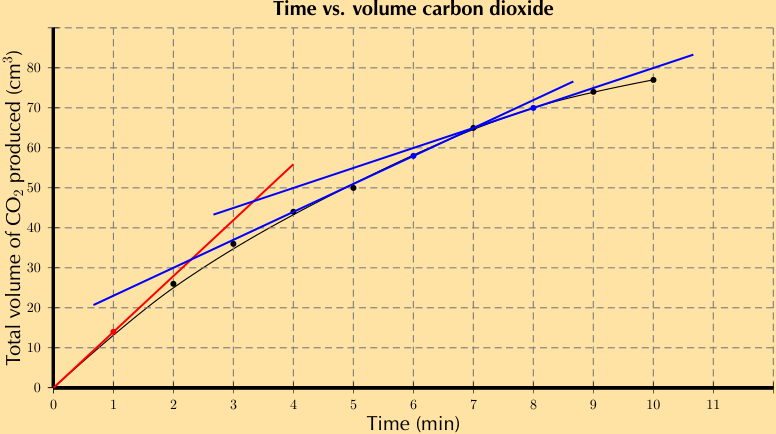
> **[Diagram Context - Textbook_PhysicalSciences_Gr12_Rate-and-Extent-of-Reaction.pdf-0037-00.png]**
> The image shows a graph with a line that slopes upwards from left to right. The x-axis of the graph is labeled "Time (min)", and the y-axis is labeled "Volume (cm3)". The line on the graph represents the change in volume over time. The graph is labeled "Time vs Volume Carbon Dioxide", which indicates that the graph is a visual representation of the relationship between time and the volume of carbon dioxide. The graph is color-coded, with red and blue lines representing the change in volume over time. The x-axis is labeled "Time (

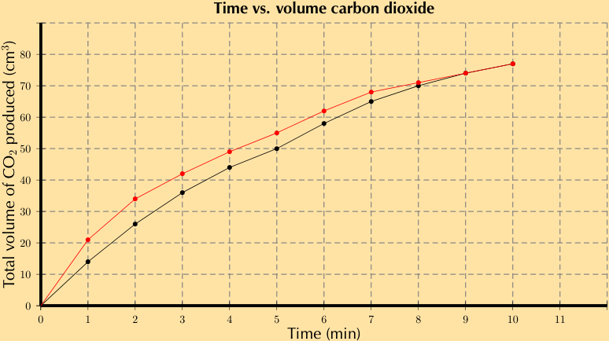
> **[Diagram Context - Textbook_PhysicalSciences_Gr12_Rate-and-Extent-of-Reaction.pdf-0037-10.png]**
> The image shows a graph that displays the relationship between time and volume of carbon dioxide. The x-axis of the graph represents time, while the y-axis represents the volume of carbon dioxide. The graph shows a curve, indicating a change in the volume of carbon dioxide over time. The graph is labeled "Time vs Volume Carbon Dioxide" and has a legend that explains the different colors used to represent different volumes of carbon dioxide. The graph is set against a beige background, and the title "Time vs Volume Carbon Dioxide" is prominently displayed at the top of the image.

---

Calculate the concentration of each of the reactants and products at equilibrium using $C = \frac{n}{V}$ where $V = 2\text{ dm}^{3}$.

$$C(\text{CH}_{3}\text{COOH}) = C(\text{CH}_{3}\text{CH}_{2}\text{OH}) = \frac{0,3\text{ mol}}{2\text{ dm}^{3}} = 0,15\text{ mol}\cdot\text{dm}^{-3}$$

$$C(\text{CH}_{3}\text{COOCH}_{2}\text{CH}_{3}) = C(\text{H}_{2}\text{O}) = \frac{0,2\text{ mol}}{2\text{ dm}^{3}} = 0,1\text{ mol}\cdot\text{dm}^{-3}$$

| Reaction | $1\text{CH}_{3}\text{COOH}$ | $1\text{CH}_{3}\text{CH}_{2}\text{OH}$ | $1\text{CH}_{3}\text{COOCH}_{2}\text{CH}_{3}$ | $1\text{H}_{2}\text{O}$ |
| :--- | :--- | :--- | :--- | :--- |
| Initial quantity ($\text{mol}$) | $0,5$ | $0,5$ | $0$ | $0$ |
| Change ($\text{mol}$) | $-0,2$ | $-x$ | $0,2$ | $0,2$ |
| Equilibrium quantity ($\text{mol}$) | $0,3$ | $0,3$ | $0,2$ | $0,2$ |
| Equilibrium concentration ($\text{mol}\cdot\text{dm}^{-3}$) | $0,15$ | $0,15$ | $0,1$ | $0,1$ |

$\text{CH}_{3}\text{COOH}$ and $\text{CH}_{3}\text{CH}_{2}\text{OH}$ are reactants, and $\text{CH}_{3}\text{COOCH}_{2}\text{CH}_{3}$ and $\text{H}_{2}\text{O}$ are products.

However, $\text{H}_{2}\text{O}$ is a pure liquid and is not included in the $K_{c}$ expression. So the equilibrium constant is:

$$K_{c} = \frac{[\text{CH}_{3}\text{COOCH}_{2}\text{CH}_{3}]}{[\text{CH}_{3}\text{COOH}][\text{CH}_{3}\text{CH}_{2}\text{OH}]} = \frac{(0,1)}{(0,15)(0,15)} = 4,44$$

4. More questions. Sign in at Everything Science online and click 'Practise Science'.

Think you got it? Get this answer and more practice on our Intelligent Practice Service

1. 27VK
2. 27VM
3. 27VN

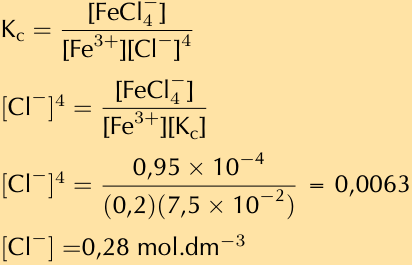
> **[Diagram Context - Textbook_PhysicalSciences_Gr12_Chemical-equilibrium.pdf-0038-05.png]**
> 1. Fe3+ + 4Ci4 = Fe4.

---

## 8.3 Le Chatelier's principle

### The effect of concentration on equilibrium

Although not required by CAPS the common-ion effect is a useful concept for the students to know if there is time.

### The effect of temperature on equilibrium

In the informal experiment on Le Chatelier's principle, the solution should be purple to start. To achieve this $\text{CoCl}_{2}$ must be dissolved in ethanol and a few drops of water must be added. This solution is **toxic**, and all the usual laboratory precautions should be taken.

The hot water will make the solution a deep blue, the cold water will make the solution a pink/red colour. If necessary the test tube can be gently shaken to ensure mixing.

---

### Exercise 8 - 3: Equilibrium

1. The following reaction has reached equilibrium in a closed container:
$$\text{C}(\text{s}) + \text{H}_{2}\text{O}(\text{g}) \rightleftharpoons \text{CO}(\text{g}) + \text{H}_{2}(\text{g}) \quad \Delta H > 0$$

---

The pressure of the system is then decreased. How will the concentration of the $\text{H}_2\text{ (g)}$ and the value of $K_c$ be affected when the new equilibrium is established? Assume that the temperature of the system remains unchanged.

| | Hydrogen concentration | $K_c$ |
| :---: | :---: | :---: |
| (a) | increases | increases |
| (b) | increases | stays the same |
| (c) | stays the same | stays the same |
| (d) | decreases | stays the same |

(IEB Paper 2, 2004)

Equilibrium will shift to increase the number of gas molecules. That is to the right and so the concentration of hydrogen will increase. Only temperature affects the value of $K_c$, therefore $K_c$ remains the same.

**b)** Hydrogen concentration increases and equilibrium constant stays the same

---

2. During a classroom experiment copper metal reacts with concentrated nitric acid to produce $\text{NO}_2$ gas.

<!-- DIAGRAM_PLACEHOLDER: diagram -->

The $\text{NO}_2$ is collected in a gas syringe.

<!-- DIAGRAM_PLACEHOLDER: diagram -->

When enough gas has collected in the syringe, the delivery tube is clamped so that no gas can escape. The brown $\text{NO}_2$ gas collected reaches an equilibrium with colourless $\text{N}_2\text{O}_4$ gas as represented by the following equation:

$$2\text{NO}_2\text{(g)} \rightleftharpoons \text{N}_2\text{O}_4\text{(g)}, \Delta H < 0$$

Once this equilibrium has been established, there are $0,01\text{ moles}$ of $\text{NO}_2$ gas and $0,03\text{ moles}$ of $\text{N}_2\text{O}_4$ gas present in the syringe.

**a)** A learner, noticing that the colour of the gas mixture in the syringe is no longer changing, comments that all chemical reactions in the syringe must have stopped. Is this assumption correct? Explain.

No. The learner is not correct. A dynamic chemical equilibrium has been reached and the products are changing into reactants at the same rate as reactants are changing into products. This results in no colour change being observed in the syringe.

**b)** The gas in the syringe is cooled. The volume of the gas is kept constant during the cooling process. Will the gas be lighter or darker at the lower temperature? Explain your answer.

The forward reaction is exothermic ($\Delta H < 0$). A decrease in temperature will favour the forward reaction. $\text{N}_2\text{O}_4\text{(g)}$ is colourless, therefore the gas will be lighter at the lower temperature.

---

c) The volume of the syringe is now reduced (at constant temperature) to $75\text{ cm}^3$ by pushing the plunger in and holding it in the new position. There are $0{,}032\text{ moles}$ of $\text{N}_2\text{O}_4$ gas present once the equilibrium has been re-established at the reduced volume ($75\text{ cm}^3$). Calculate the value of the equilibrium constant for this equilibrium.
*(IEB Paper 2, 2004)*

The volume is reduced, so the pressure is increased. This means that the forward reaction will be favoured to reduce the number of gas molecules. 

There are $0{,}01\text{ moles}$ of $\text{NO}_2$ and $0{,}03\text{ moles}$ of $\text{N}_2\text{O}_4$ initially. 
For every $2x\text{ moles}$ of $\text{NO}_2$ used, $1x\text{ moles}$ of $\text{N}_2\text{O}_4$ are produced.

| Reaction | $2\text{NO}_2\text{(g)}$ | $1\text{N}_2\text{O}_4\text{(g)}$ |
| :--- | :---: | :---: |
| **Initial quantity (mol)** | $0{,}01$ | $0{,}03$ |
| **Change (mol)** | $-2x$ | $+x$ |
| **Equilibrium quantity (mol)** | $0{,}01 - 2x$ | $0{,}03 + x$ |
| **Equilibrium concentration ($\text{mol}\cdot\text{dm}^{-3}$)** | | |

There are $0{,}032\text{ mol}$ $\text{N}_2\text{O}_4$ at the new equilibrium.
Therefore $0{,}03\text{ mol} + x = 0{,}032\text{ mol}$
$x = 0{,}032 - 0{,}03\text{ mol} = 0{,}002\text{ mol}$

$\text{n}(\text{NO}_2)\text{ at equilibrium} = 0{,}01\text{ mol} - 2 \times 0{,}002\text{ mol} = 0{,}006\text{ mol}$

$\text{C}(\text{NO}_2)\text{ at equilibrium} = \frac{0{,}006\text{ mol}}{0{,}075\text{ dm}^3} = 0{,}08\text{ mol}\cdot\text{dm}^{-3}$

$\text{C}(\text{N}_2\text{O}_4)\text{ at equilibrium} = \frac{0{,}032\text{ mol}}{0{,}075\text{ dm}^3} = 0{,}43\text{ mol}\cdot\text{dm}^{-3}$

| Reaction | $2\text{NO}_2\text{(g)}$ | $1\text{N}_2\text{O}_4\text{(g)}$ |
| :--- | :---: | :---: |
| **Initial quantity (mol)** | $0{,}01$ | $0{,}03$ |
| **Change (mol)** | $-2x$ | $+x$ |
| **Equilibrium quantity (mol)** | $0{,}01 - 2x$ | $0{,}03 + x$ |
| **Equilibrium concentration ($\text{mol}\cdot\text{dm}^{-3}$)** | $0{,}08$ | $0{,}43$ |

$$K_c = \frac{[\text{N}_2\text{O}_4]}{[\text{NO}_2]^2} = \frac{0{,}43}{(0{,}08)^2} = 67{,}19$$

3. Gases X and Y are pumped into a $2\text{ dm}^3$ container. When the container is sealed, $4\text{ moles}$ of gas X and $4\text{ moles}$ of gas Y are present. The following equilibrium is established:

$$2\text{X(g)} + 3\text{Y(g)} \rightleftharpoons \text{X}_2\text{Y}_3\text{(g)}$$

The graph below shows the number of moles of gas X and gas $\text{X}_2\text{Y}_3$ that are present from the time the container is sealed.

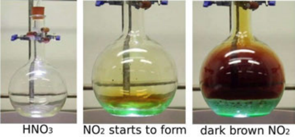
> **[Diagram Context - Textbook_PhysicalSciences_Gr12_Chemical-equilibrium.pdf-0040-06.png]**
> 1. HNO3 starts to form dark brown NO2.

a) How many moles of gas $\text{X}_2\text{Y}_3$ are formed by the time the reaction reaches equilibrium at $30\text{ seconds}$?
* From the graph: $0{,}5\text{ mol}$

b) Calculate the value of the equilibrium constant at $t = 50\text{ s}$.
* Draw up a RICE table.

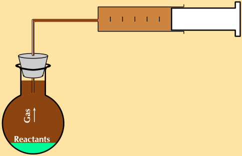
> **[Diagram Context - Textbook_PhysicalSciences_Gr12_Chemical-equilibrium.pdf-0040-08.png]**
> 1. A brown glass vial with the word "gas" written on it.

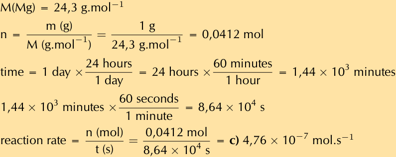
> **[Diagram Context - Textbook_PhysicalSciences_Gr12_Rate-and-Extent-of-Reaction.pdf-0040-00.png]**
> A diagram of a cell with a Lewis structure and arrows pointing to the bonds.

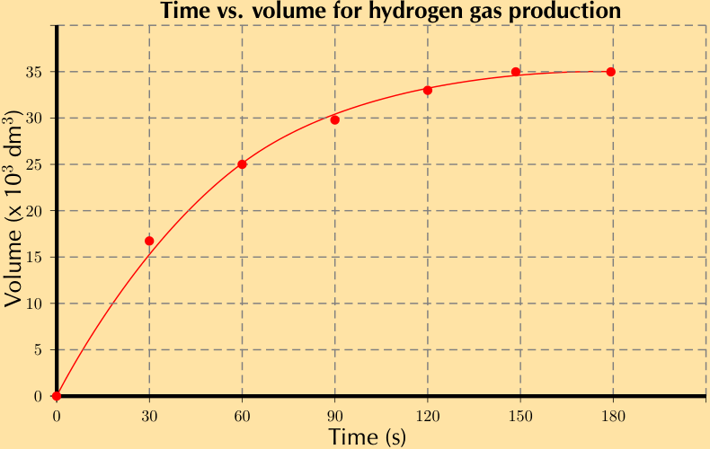
> **[Diagram Context - Textbook_PhysicalSciences_Gr12_Rate-and-Extent-of-Reaction.pdf-0040-07.png]**
> The image shows a graph that illustrates the relationship between time and volume for a hydrogen gas production process. The graph is a line graph with time on the x-axis and volume on the y-axis. The line on the graph slopes upwards, indicating that as time increases, the volume of the gas also increases. The graph is labeled with the title "Time vs Volume for Hydrogen Gas Production" and the units "time (s)", "volume (L)", and "time (s)", respectively.

---

## Chemical Equilibrium: Worked Examples & Le Chatelier's Principle

### 1. ICE Table Method (Initial, Change, Equilibrium)

When solving chemical equilibrium problems involving moles and concentrations, we use an **ICE** table to systematically track the reaction progress.

| Reaction | $2\text{X}_{(g)}$ | $3\text{Y}_{(g)}$ | $\text{X}_2\text{Y}_{3(g)}$ |
| :--- | :---: | :---: | :---: |
| **I**nitial quantity $(\text{mol})$ | $4$ | $4$ | $0$ |
| **C**hange $(\text{mol})$ | $-2x$ | $-3x$ | $+x$ |
| **E**quilibrium quantity $(\text{mol})$ | $4 - 2x$ | $4 - 3x$ | $0 + x$ |
| Equilibrium concentration $(\text{mol}\cdot\text{dm}^{-3})$ | &nbsp; | &nbsp; | &nbsp; |

---

### 2. Solving for Unknown Quantities

Given that there are $0{,}5\text{ mol}$ of $\text{X}$ present at equilibrium:

$$\text{Therefore } x = 0{,}5\text{ mol}$$

From the graph data:
* $n(\text{X}) = 3\text{ mol}$
* $n(\text{Y}) = 4 - 3 \times 0{,}5\text{ mol} = 2{,}5\text{ mol}$

#### Completed ICE Table (Moles)

| Reaction | $2\text{X}_{(g)}$ | $3\text{Y}_{(g)}$ | $\text{X}_2\text{Y}_{3(g)}$ |
| :--- | :---: | :---: | :---: |
| **I**nitial quantity $(\text{mol})$ | $4$ | $4$ | $0$ |
| **C**hange $(\text{mol})$ | $-1$ | $-1{,}5$ | $+0{,}5$ |
| **E**quilibrium quantity $(\text{mol})$ | $3$ | $2{,}5$ | $0{,}5$ |
| Equilibrium concentration $(\text{mol}\cdot\text{dm}^{-3})$ | &nbsp; | &nbsp; | &nbsp; |

---

### 3. Calculating Equilibrium Concentrations

Assuming a volume of $2\text{ dm}^3$:

$$C(\text{X}) = \frac{3\text{ mol}}{2\text{ dm}^3} = 1{,}5\text{ mol}\cdot\text{dm}^{-3}$$

$$C(\text{Y}) = \frac{2{,}5\text{ mol}}{2\text{ dm}^3} = 1{,}25\text{ mol}\cdot\text{dm}^{-3}$$

$$C(\text{X}_2\text{Y}_3) = \frac{0{,}5\text{ mol}}{2\text{ dm}^3} = 0{,}25\text{ mol}\cdot\text{dm}^{-3}$$

#### Final ICE Table (Concentrations Included)

| Reaction | $2\text{X}_{(g)}$ | $3\text{Y}_{(g)}$ | $\text{X}_2\text{Y}_{3(g)}$ |
| :--- | :---: | :---: | :---: |
| **I**nitial quantity $(\text{mol})$ | $4$ | $4$ | $0$ |
| **C**hange $(\text{mol})$ | $-1$ | $-1{,}5$ | $+0{,}5$ |
| **E**quilibrium quantity $(\text{mol})$ | $3$ | $2{,}5$ | $0{,}5$ |
| Equilibrium concentration $(\text{mol}\cdot\text{dm}^{-3})$ | $1{,}5$ | $1{,}25$ | $0{,}25$ |

---

### 4. Calculating the Equilibrium Constant ($K_c$)

Using the equilibrium concentrations calculated above:

$$K_c = \frac{[\text{X}_2\text{Y}_3]}{[\text{X}]^2[\text{Y}]^3}$$

$$K_c = \frac{0{,}25}{(1{,}5)^2(1{,}25)^3} = 0{,}057$$

---

### 5. Application of Le Chatelier's Principle

#### c) Temperature Changes
**Question:** At $70\text{ s}$ the temperature is increased. Is the forward reaction endothermic or exothermic? Explain in terms of Le Chatelier's Principle.

**Answer:** 
Exothermic. The amount of product decreases (and the amount of reactants increases) when the temperature is increased, indicating that the reverse reaction is favoured. 

Le Chatelier's principle states that an increase in temperature will favour the endothermic reaction (cooling the reaction vessel). Therefore, the reverse reaction must be endothermic, which means the **forward reaction must be exothermic**.

#### d) Effect on the Equilibrium Constant ($K_c$)
**Question:** How will this increase in temperature affect the value of the equilibrium constant?

**Answer:** 
An increase in temperature is the only factor that alters the value of the equilibrium constant ($K_c$). Because the amount of product decreased and the amount of reactants increased, the equilibrium constant will **decrease**.

---

### 6. Practice Exercises

**4.** Consider the following hypothetical reaction that takes place in a **closed $2\text{ dm}^3$ flask** at $298\text{ K}$:

$$\text{A}_{2(g)} + 2\text{B}_{2(g)} \rightleftharpoons 2\text{AB}_{2(g)}$$

The graph beneath represents the change in the number of moles of each gas in the flask over a period of $20\text{ minutes}$.

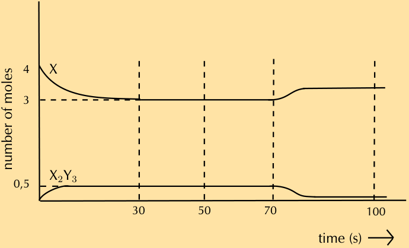
> **[Diagram Context - Textbook_PhysicalSciences_Gr12_Chemical-equilibrium.pdf-0041-12.png]**
> The image shows a graph with a number of lines and dots representing different variables. The graph is labeled with the variable "X" and "Y" and is accompanied by a legend that explains the different lines and dots. The graph is set against a beige background, and there is a small arrow pointing to the right. The graph is labeled with the variable "time" and "70", and there is a small arrow pointing to the right. The graph also includes a small arrow pointing to the right.

---

# Chapter 8: Chemical Equilibrium

## Exercises and Worked Examples

### a) Time to Reach Equilibrium
State how long (in minutes) it took for the reaction to reach equilibrium for the first time.
* **Explanation:** The number of moles of each reactant and the product is constant (have reached equilibrium) after $t = 5\text{ minutes}$.

### b) Equilibrium Constant Expression
Write down an expression for the equilibrium constant, $K_c$, for this particular reaction.

$$K_c = \frac{[\text{AB}_2]^2}{[\text{A}_2][\text{B}_2]^2}$$

### c) Calculating Concentrations and $K_c$
Calculate the concentration of each of the reactants and the product using figures from the graph between $5\text{ minutes}$ and $10\text{ minutes}$ and hence calculate the equilibrium constant $K_c$ for this reaction at $298\text{ K}$.

The concentration values are read off the graph:

$$C(\text{A}_2) = \frac{2,0\text{ mol}}{2\text{ dm}^3} = 1,0\text{ mol}\cdot\text{dm}^{-3}$$

$$C(\text{B}_2) = \frac{1,2\text{ mol}}{2\text{ dm}^3} = 0,6\text{ mol}\cdot\text{dm}^{-3}$$

$$C(\text{AB}_2) = \frac{0,8\text{ mol}}{2\text{ dm}^3} = 0,4\text{ mol}\cdot\text{dm}^{-3}$$

$$K_c = \frac{[\text{AB}_2]^2}{[\text{A}_2][\text{B}_2]^2} = \frac{0,4^2}{(1,0)(0,6)^2} = 0,44$$

### d) Interpretation of $K_c$ Values
State what a low value of $K_c$ indicates about the yield of product for a reaction.
* **Explanation:** A value of $K_c$ between $0$ and $1$ indicates that the equilibrium lies to the left. Therefore, the yield of product is low (more reactants than products).

### e) Conditions for Calculating $K_c$
Why is it not possible to calculate $K_c$ using figures from the graph during the first $5\text{ minutes}$?
* **Explanation:** $K_c$ is the equilibrium constant, therefore it cannot be calculated except when the reaction is in equilibrium. During the first $5\text{ minutes}$ the reaction is not in equilibrium.

### f) Le Chatelier's Principle
State Le Chatelier's principle.
* **Definition:** When an external stress (change in pressure, temperature or concentration) is applied to a system in chemical equilibrium, the equilibrium will change in such a way as to reduce the effect of the stress.

### g) Temperature Changes and Le Chatelier's Principle
At $10\text{ minutes}$ the temperature of the flask was increased. Using Le Chatelier's principle, determine if the production of $\text{AB}_2$ is exothermic or endothermic?
* **Explanation:** $\text{AB}_2$ is produced through the forward reaction. Le Chatelier's principle states that if the temperature is increased the equilibrium will change to decrease the temperature of the vessel. That is the reaction that takes in heat (endothermic) will be favoured.
* **Conclusion:** The number of moles of the reactants decreases after the temperature increase, while the number of moles of the product increases. Therefore the temperature...

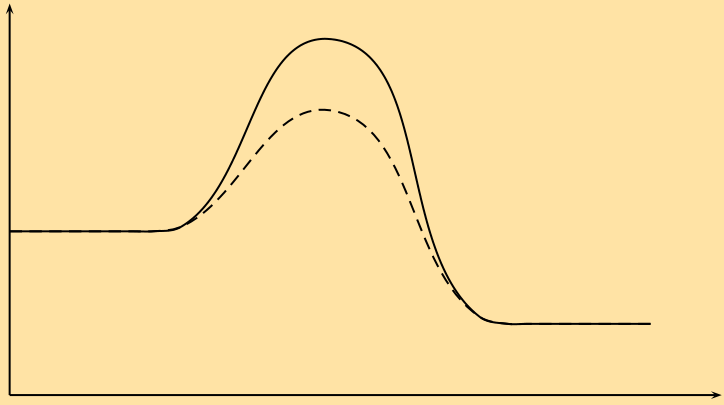
> **[Diagram Context - Textbook_PhysicalSciences_Gr12_Rate-and-Extent-of-Reaction.pdf-0042-01.png]**
> The image shows a diagram of a Lewis structure, which is a diagram used to represent the valence electrons of an atom. The diagram is drawn in black and white, with a line representing the valence electron shell. The diagram is set against a light beige background, and the x-axis is labeled with the number of valence electrons. The y-axis is labeled with the number of valence electrons. The diagram is labeled with the title "Lewis Structure" at the top, and the title "Valence Electrons" at the bottom.

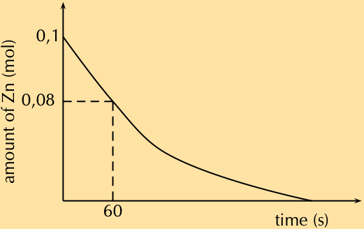
> **[Diagram Context - Textbook_PhysicalSciences_Gr12_Rate-and-Extent-of-Reaction.pdf-0042-08.png]**
> The image is a black and white diagram that shows a graph of the amount of time it takes for a reaction to occur. The x-axis of the graph is labeled "time" and the y-axis is labeled "moles". The graph shows a steep decline in the amount of time it takes for the reaction to occur as the amount of reactants increases. The graph also includes a line that represents the rate of the reaction, which is 0.08 mol/s.

---

h) How would the equilibrium constant ($K_c$) be affected by each of the following changes? (state either increase, decrease or no effect)
   1. Increasing the pressure of the flask with no change to temperature.  
      *no effect*
   2. Adding a catalyst to the flask.  
      *no effect*
   3. Increasing the temperature of the flask.  
      *increase*

5. More questions. Sign in at Everything Science online and click 'Practise Science'.

Think you got it? Get this answer and more practice on our Intelligent Practice Service:

1. $27VS$  
2. $27VT$  
3. $27VV$  
4. $27VW$

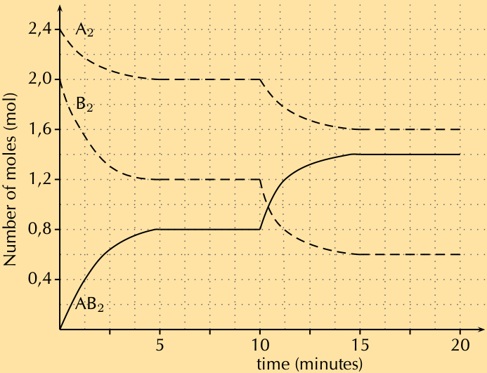
> **[Diagram Context - Textbook_PhysicalSciences_Gr12_Chemical-equilibrium.pdf-0043-00.png]**
> The image shows a graph with a line graph and a bar graph. The line graph shows the change in the number of moles over time, while the bar graph shows the change in the number of moles over time. The x-axis of the bar graph is labeled "Time (minutes)", and the y-axis is labeled "Number of moles". The graph is set against a light brown background.

---

## Industrial applications

### Exercise 8 – 4: Applying equilibrium principles

1. Look at the values of $K_c$ calculated for the Haber process reaction at different temperatures, and then answer the questions that follow:

| $T$ ($\text{}^{\circ}\text{C}$) | $K_c$ |
| :---: | :---: |
| $25$ | $6,4 \times 10^{2}$ |
| $200$ | $4,4 \times 10^{-1}$ |
| $300$ | $4,3 \times 10^{-3}$ |
| $400$ | $1,6 \times 10^{-4}$ |
| $500$ | $1,5 \times 10^{-5}$ |

   * **a)** What happens to the value of $K_c$ as the temperature increases?  
     The value of $K_c$ decreases.
   * **b)** Which reaction is being favoured when the temperature is $300\text{}^{\circ}\text{C}$?  
     A value of $K_c$ between $0$ and $1$ means that there are more reactants than products. Therefore the reverse reaction is favoured.
   * **c)** According to this table, which temperature would be best if you wanted to produce as much ammonia as possible? Explain.  
     $25\text{}^{\circ}\text{C}$. At this temperature the forward reaction is favoured and so the maximum yield of ammonia is achieved.

2. More questions. Sign in at Everything Science online and click 'Practise Science'.

Think you got it? Get this answer and more practice on our Intelligent Practice Service:

1. $27VX$

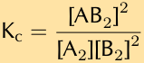

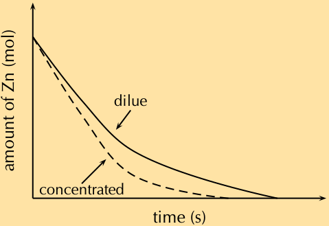
> **[Diagram Context - Textbook_PhysicalSciences_Gr12_Rate-and-Extent-of-Reaction.pdf-0043-07.png]**
> The image is a black and white diagram that shows the relationship between the amount of time (in seconds) and the concentration of a substance (in mol/L). The diagram is labeled with the words "concentrated" and "time" to indicate the relationship between the two variables. The x-axis of the diagram is labeled "time" and the y-axis is labeled "concentration" to show the relationship between the two variables. The diagram also includes a line that connects the two points, which represents the concentration of the substance as it changes over time.

---

# 8.4 Chapter Summary

## Exercise 8 – 5:

1. Explain the following concepts:
   * **a) Chemical equilibrium**
     A reaction is in **chemical equilibrium** when the rate of the forward reaction equals the rate of the reverse reaction.
   * **b) A closed system**
     A closed system is one in which energy can enter or leave the system, but matter cannot.
   * **c) A reversible reaction**
     A reversible reaction is a chemical reaction that can proceed in both the forward and reverse directions. In other words, the reactants and products of one reaction may reverse roles.

2. The following equilibrium constant expression is given for a particular reaction:
   $$K_c = \frac{[\text{H}_2\text{O}]^4 [\text{CO}_2]^3}{[\text{C}_3\text{H}_8] [\text{O}_2]^5}$$

   For which one of the following reactions is the above expression of $K_c$ correct?
   * **a)** $\text{C}_3\text{H}_8(\text{g}) + 5\text{O}_2(\text{g}) \rightleftharpoons 4\text{H}_2\text{O}(\text{g}) + 3\text{CO}_2(\text{g})$
   * **b)** $4\text{H}_2\text{O}(\text{g}) + 3\text{CO}_2(\text{g}) \rightleftharpoons \text{C}_3\text{H}_8(\text{g}) + 5\text{O}_2(\text{g})$
   * **c)** $2\text{C}_3\text{H}_8(\text{g}) + 7\text{O}_2(\text{g}) \rightleftharpoons 6\text{CO}(\text{g}) + 8\text{H}_2\text{O}(\text{g})$
   * **d)** $\text{C}_3\text{H}_8(\text{g}) + 5\text{O}_2(\text{g}) \rightleftharpoons 4\text{H}_2\text{O}(\ell) + 3\text{CO}_2(\text{g})$

   *(IEB Paper 2, 2001)*

   **Answer:**
   * **a)** $\text{C}_3\text{H}_8(\text{g}) + 5\text{O}_2(\text{g}) \rightleftharpoons 4\text{H}_2\text{O}(\text{g}) + 3\text{CO}_2(\text{g})$

3. Cobalt chloride crystals are dissolved in a beaker containing ethanol and then a few drops of water are added. After a period of time, the reaction reaches equilibrium as follows:

   $$\text{CoCl}_4^{2-}(\text{aq}) (\text{blue}) + 6\text{H}_2\text{O} \rightleftharpoons \text{Co}(\text{H}_2\text{O})_6^{2+}(\text{aq}) (\text{pink}) + 4\text{Cl}^-$$

   The solution, which is now purple, is poured into three test tubes. State, in each case, what colour changes, if any, will be observed if the following are added in turn to each test tube:
   * **a) $1\text{ cm}^3$ of distilled water**
     The concentration of reactant (water) is increased, therefore the equilibrium will shift to the right and so the colour will change to pink.
   * **b) A few crystals of sodium chloride**
     The concentration of product ($\text{Cl}^-$) is increased, therefore the equilibrium will shift to the left and the colour will change to blue.

   *(IEB Paper 2, 2001)*

4. More questions. Sign in at Everything Science online and click 'Practise Science'.

---

Think you got it? Get this answer and more practice on our Intelligent Practice Service:

1. 27VY
2. 27VZ
3. 27W2

<!-- DIAGRAM_PLACEHOLDER: diagram -->

www.everythingscience.co.za  
m.everythingscience.co.za