# CHAPTER 6

## Doppler effect

<!-- DIAGRAM_PLACEHOLDER: diagram -->

### Contents

* 6.1 Introduction .......................................................................................... 254
* 6.2 The Doppler effect with sound ............................................................. 255
* 6.3 The Doppler effect with light ................................................................ 263
* 6.4 Chapter summary ................................................................................ 266

---

# 6 Doppler effect

## 6.1 Introduction (ESCMM)

Have you noticed how the pitch of a police car or ambulance siren changes as it passes where you are standing, or how an approaching car or train sounds different to when it is travelling away from you? If you haven't, try to do an experiment by paying extra careful attention the next time it happens to see if you can notice a difference in pitch. This doesn't apply to just vehicles and trains but anything that emits waves, be those sound waves or any other electromagnetic (EM) waves.

The effect actually occurs if you move towards or away from the source of the sound as well. This effect is known as the **Doppler effect** and will be studied in this chapter.

---

### Investigation: Creating the Doppler effect in class

You can create the Doppler effect in class. One way of doing this is to get:
* string, and
* a tuning fork.

Tie the string to the base of the tuning fork. Strike the tuning fork to create a note and then hold the other end of the string and swing the tuning fork in circles in the air in a horizontal plane.

> **WARNING!**
> 
> The string needs to be very securely tied to the tuning fork to ensure that it does not come loose during the demonstration.

The class should be able to hear that the frequency heard when the tuning fork is moving is different to the frequency heard when it is stationary.

* See video: 27SP at www.everythingscience.co.za
* See video: 27SQ at www.everythingscience.co.za

---

* See video: 27SR at www.everythingscience.co.za

### Key linked concepts

* Units and unit conversions — Physical Sciences, Grade 10, Science skills
* Equations — Mathematics, Grade 10, Equations and inequalities
* Sound waves — Physical Sciences, Grade 10, Sound
* Electromagnetic radiation — Physical Sciences, Grade 10, Electromagnetic radiation

---

# 6.2 The Doppler effect with sound

You, the person hearing the sounds, are called the **observer** or **listener**, and the thing emitting the sound is called the **source**. As mentioned in the introduction, there are two situations which lead to the Doppler effect:

1. When the source moves relative to a stationary observer.
2. When the observer moves relative to a stationary source.

In points 1 and 2 above, there is relative motion between the source and the observer. Both the source and the observer can be moving at the same time, but we won't deal with that case in this chapter.

> **DEFINITION: Doppler effect**
> 
> The Doppler effect is the change in the observed frequency of a wave when the source or the detector moves relative to the transmitting medium.

The Doppler effect occurs when a source of waves and/or an observer move relative to each other, resulting in the observer measuring a different frequency of the waves than the frequency that the source is emitting. The medium that the waves are travelling through, the transmitting medium, is also stationary in the cases we will study.

The question that probably comes to mind is: *"How does the Doppler effect come about?"* We can understand what is happening by thinking through the situation in detail.

---

## Case 1: Moving source, stationary observer

Let us consider a source of sound waves with a constant frequency and amplitude. The sound waves can be represented as concentric circles where each circle represents a crest or peak as the wavefronts radiate away from the source. This is because the waves travel away from the source in all directions and the distance between consecutive crests or consecutive troughs in a wave is constant (the wavelength $\lambda$ as we learnt in Grade 10). In this figure, the crests are represented by the black lines and the troughs by the orange lines.

> **[Diagram Context - Textbook_PhysicalSciences_Gr12_Chemical-equilibrium.pdf-0002-03.png]**
> 1. A diagram of a human leg and foot on a treadmill.

*Figure 6.1: Stationary sound source as more wavefronts are emmitted.*

---

### FACT
The Doppler effect is named after Johann Christian Andreas Doppler (29 November 1803 - 17 March 1853), an Austrian mathematician and physicist who first explained the phenomenon in 1842.

> **[Diagram Context - Textbook_PhysicalSciences_Gr12_Rate-and-Extent-of-Reaction.pdf-0002-04.png]**
> 1. A car with a white body and red lights.

> **[Diagram Context - Textbook_PhysicalSciences_Gr12_Rate-and-Extent-of-Reaction.pdf-0002-05.png]**
> 1. A lit match is shown in the center of the image.
 2. The match is burning on the right side of the image.
 3. The flame is yellow and orange.

> **[Diagram Context - Textbook_PhysicalSciences_Gr12_Rate-and-Extent-of-Reaction.pdf-0002-06.png]**
> 1. A diagram of a cell with a white ball in the center.

---

# 6.2. The Doppler Effect with Sound

The sound source in the middle is stationary. For the Doppler effect to take place (manifest), the source must be moving *relative* to the observer.

---

## Understanding the Stationary Source

Let's consider the following situation: The source (represented by the black dot) emits one wave (the black circles represent the crests of the sound wave) that moves away from the source at the same rate in all directions. 

The distance between the crests represents the wavelength ($\lambda$) of the sound. The closer together the crests, the higher the frequency (or pitch) of the sound according to the formula:

$$f = \frac{v}{\lambda}$$

where $v$ (speed of sound) is constant.

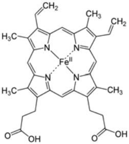
> **[Diagram Context - Textbook_PhysicalSciences_Gr12_Chemical-equilibrium.pdf-0003-10.png]**
> 1. A diagram of a molecule with a Fe(II) ion.

---

## Moving Sound Source

As this crest moves away, the source also moves and then emits more crests. Now the two circles are not concentric any more, but on the one side they are closer together and on the other side they are further apart. This is shown in the next diagram.

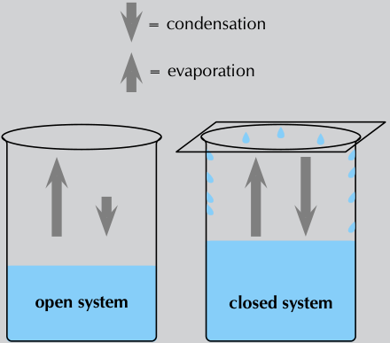
> **[Diagram Context - Textbook_PhysicalSciences_Gr12_Chemical-equilibrium.pdf-0003-19.png]**
> A diagram of a closed system with two containers, one with water and the other with a closed system of arrows pointing upwards. The diagram also includes labels for the system and the arrows.

If the source continues moving at the same speed in the same direction, then the distance between crests on the right of the source is constant. The distance between crests on the left is also constant. The distance between successive crests on the left is constant but larger than the distance between successive crests on the right.

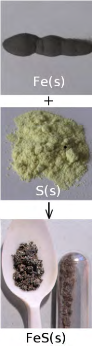
> **[Diagram Context - Textbook_PhysicalSciences_Gr12_Rate-and-Extent-of-Reaction.pdf-0003-06.png]**
> 1. FeS(s) is shown in the center of the image.
 2. A spoon full of FeS(s) is shown in the bottom left corner.
 3. A small glass vial of FeS(s) is shown in the bottom right corner.

---

## Summary of Apparent Frequency Changes

* **When a car approaches you:**
  * The sound waves that reach you have a **shorter wavelength** ($\lambda$) and a **higher frequency** ($f$).
  * You hear a sound with a **higher pitch**.

* **When the car moves away from you:**
  * The sound waves that reach you have a **longer wavelength** ($\lambda$) and a **lower frequency** ($f$).
  * You hear a sound with a **lower pitch**.

*Figure 6.2: Moving sound source as more wavefronts are emmitted.*

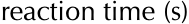

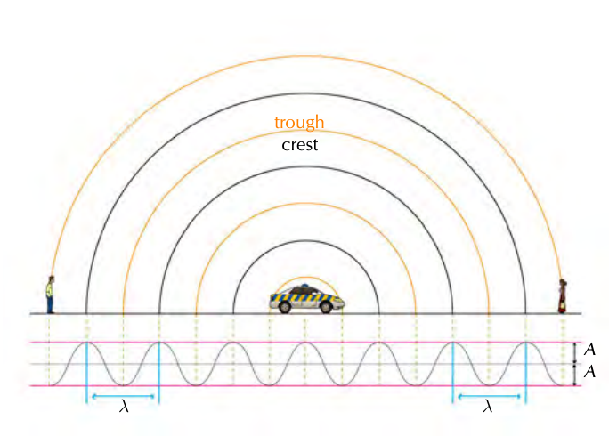
> **[Diagram Context - Textbook_PhysicalSciences_Gr12_The-Doppler-effect.pdf-0003-13.png]**
> The image presents a diagram of a car driving on a road. The car is positioned in the center of the image, moving towards the right side. The road is marked with a series of lines, indicating the lanes and directions for the car. The diagram also includes labels for the x and y axes, as well as arrows pointing to the car and the x and y axes. The diagram is labeled with the word "trough" and "crest" on the x and y axes, respectively. The diagram also includes the word "A" on the x and y axes.

---

# Case 2: Moving observer, stationary source (ESCMQ)

Let us consider a source (a police car) of sound waves with a constant frequency and amplitude. There are two observers: one on the left that will move away from the source and one on the right that will move towards the source. 

## Sequence of Events

We analyze the situation across three distinct stages:

1. Shows the overall situation with the siren starting at time $t_1$.
2. Shows the situation at time $t_2$ when the observers are moving.
3. Shows the situation at $t_3$ after the observers have been moving for a time interval, $\Delta t = t_3 - t_2$.

The crests and troughs are numbered so you can see how they move further away and so that we can track which ones an observer has measured.

> **[Diagram Context - Textbook_PhysicalSciences_Gr12_Chemical-equilibrium.pdf-0004-03.png]**
> 1. A close-up of a water bottle with a white cap.

The observers can hear the sound waves emitted by the police car and they start to move (we ignore the time it takes them to accelerate).

<!-- DIAGram_PLACEHOLDER: diagram -->

## Measuring Frequency

The frequency of the wave that an observer measures is the number of complete waves cycles per unit time. By numbering the crests and troughs we can see which complete wave cycles have been measured by each of the observers in time, $\Delta t$. To find the frequency we divide the number of wave cycles by $\Delta t$.

In the time interval that passed, the observer moving towards the police car observed the crests and troughs numbered 1 through 5 (the portion of the wave is highlighted below). The observer moving away encountered a smaller portion of the wavefront, crest 3 and trough 4. The time interval for each of them is the same. To the observers this will mean that the frequency they measured is different.

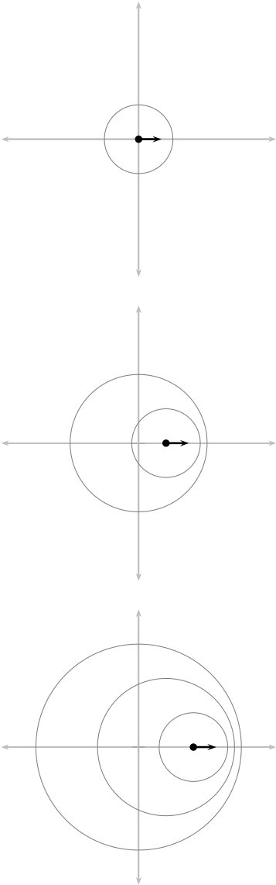
> **[Diagram Context - Textbook_PhysicalSciences_Gr12_The-Doppler-effect.pdf-0004-04.png]**
> 1. A diagram of a cell with arrows pointing to the different parts of the cell.

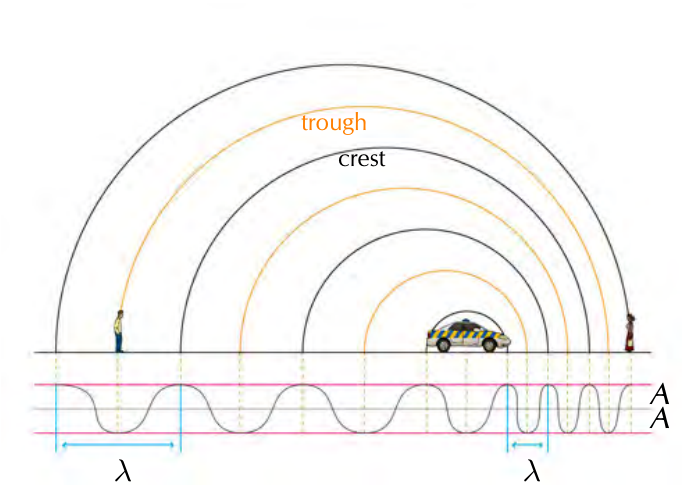
> **[Diagram Context - Textbook_PhysicalSciences_Gr12_The-Doppler-effect.pdf-0004-06.png]**
> The image shows a diagram of a car driving through a tunnel. The tunnel is depicted as a large, curved arch, and the car is shown driving through the center of the arch. The diagram also includes labels for the crest and crest crest, as well as the x and y axes. The diagram is labeled with the letters A and B, and the word "tough" is also present.

---

# 6.2. The Doppler Effect with Sound

The motion of the observer will alter the frequency of the measured sound from a stationary source:

* An observer moving **towards** the source measures a **higher** frequency.
* An observer moving **away from** the source measures a **lower** frequency.

It is important to note that we have only looked at the cases where the source and observer are moving directly towards or away from each other and these are the only cases we will consider.

---

> **NOTE:**
> We didn't actually need to analyse both cases. We could have used either explanation because of relative motion. The case of a stationary source with moving observer is the same as the case of the stationary observer and the moving source because the relative motion is the same. Do you agree? Discuss with your friends and try to convince yourselves that this is the case. Being able to explain work to each other will help you understand it better. If you don't understand it, you won't be able to explain it convincingly.
> 
> For a real conceptual test, discuss what you think will happen if the source and the observer are both moving, in the same direction and at the same speed.

---

The formula that provides the relationship between the frequency emitted by the source and the frequency measured by the listener is:

$$f_L = \left( \frac{v \pm v_L}{v \pm v_S} \right) f_S$$

* where $f_L$ is the frequency perceived by the observer (listener),
* $f_S$ is the frequency of the source,
* $v$ is the speed of the waves,
* $v_L$ is the speed of the listener and
* $v_S$ is the speed of the source.

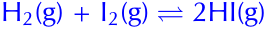

> **[Diagram Context - Textbook_PhysicalSciences_Gr12_The-Doppler-effect.pdf-0005-07.png]**
> This educational graphic is a physics motion diagram depicting a sequence of overhead positions for a motorcycle and a police vehicle along a straight horizontal road. The visual features two motorcycles at different positions relative to a stationary police car, with an arched trajectory line labelled with the number 1 spanning the police car. Conceptually, this diagram helps Grade 10 Physical Sciences learners visualize relative motion, displacement, and time intervals in kinematics problems.

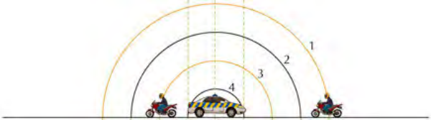
> **[Diagram Context - Textbook_PhysicalSciences_Gr12_The-Doppler-effect.pdf-0005-09.png]**
> The image shows a diagram of a car and two motorcycles on a street. The diagram is divided into four sections, each representing a different angle of the street. The diagram also includes a line of arrows pointing to the street, indicating the direction of traffic flow. The diagram is labeled with the names of the vehicles and the street names. The diagram is a visual representation of a Lewis diagram, which is used to show the relationships between different elements in a molecule or a cell.

---

Note: The signs show whether or not the relative motion of the source and observer is towards each other or away from each other:

| Motion | Sign Convention |
| :--- | :--- |
| Source moves towards listener | $v_S$ is negative |
| Source moves away from listener | $v_S$ is positive |
| Listener moves towards source | $v_L$ is positive |
| Listener moves away from source | $v_L$ is negative |

We only deal with one of the source or observer moving in this chapter. To understand the sign choice you can think about the pictures of the motion. For the listener/observer we are using the numerator in the equation. A fraction gets larger when the numerator gets larger so if we expect the frequency to increase we expect addition in the numerator ($f_L = (\frac{v + v_L}{v})f_S$). If the numerator gets smaller the fraction gets smaller so if we expect the frequency to decrease then it is subtraction in the numerator ($f_L = (\frac{v - v_L}{v})f_S$).

For the denominator the reverse is true because of the fact that we divide by the denominator. The larger the denominator the smaller the fraction and vice versa. So if we expect the motion of the source to increase the frequency we expect subtraction in the denominator ($f_L = (\frac{v}{v - v_S})f_S$) and if we expect the frequency to decrease we expect addition in the denominator ($f_L = (\frac{v}{v + v_S})f_S$).

▶ See video: **27SS** at www.everythingscience.co.za

---

## Worked example 1: Ambulance siren

### QUESTION
The siren of an ambulance emits sound with a frequency of $700\text{ Hz}$. You are standing on the pavement.

If the ambulance drives past you at a speed of $20\text{ m}\cdot\text{s}^{-1}$, what frequency will you hear, when:
1. a) the ambulance is approaching you
2. b) the ambulance is driving away from you

Take the speed of sound in air to be $340\text{ m}\cdot\text{s}^{-1}$.

> **[Diagram Context - Textbook_PhysicalSciences_Gr12_Rate-and-Extent-of-Reaction.pdf-0006-02.png]**
> . Exactly 2-3 sentences

### SOLUTION

#### Step 1: Analyse the question
The question explicitly asks what frequency you will hear when the source is moving at a certain speed. This tells you immediately that the question is related to the Doppler effect. The values given in the question are all in S.I. units so no conversions are required.

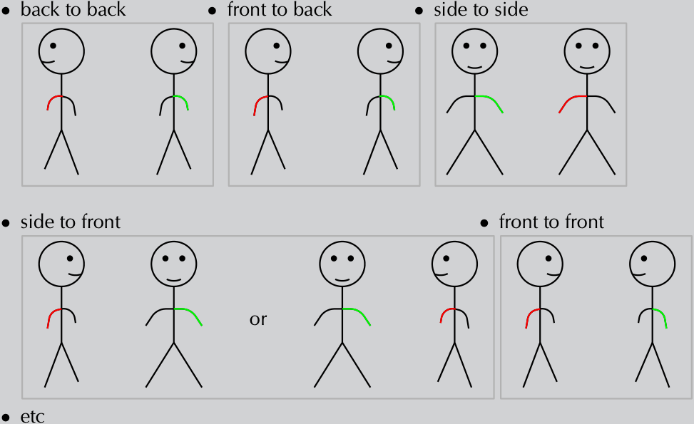
> **[Diagram Context - Textbook_PhysicalSciences_Gr12_Rate-and-Extent-of-Reaction.pdf-0006-03.png]**
> 1. A diagram of a stick figure with the body labeled with the words "side to side" and the head labeled with "front to front".

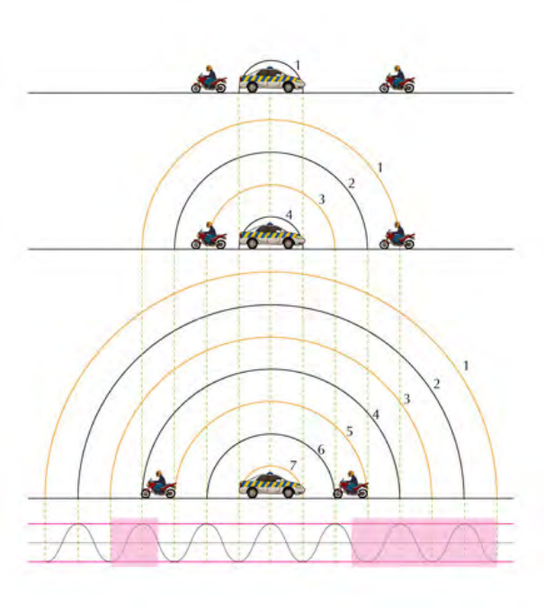
> **[Diagram Context - Textbook_PhysicalSciences_Gr12_The-Doppler-effect.pdf-0006-00.png]**
> 1. A diagram of a car and a motorcycle on a road.

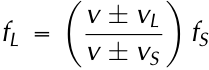

---

### Step 2: Determine how to approach the problem based on what is given

We know that we are looking for the observed frequency with a moving source. The change in frequency can be calculated using:

$$f_L = \left( \frac{v \pm v_L}{v \pm v_S} \right) f_S$$

To correctly apply this we need to confirm that it is valid and determine what signs we need to use for the various speeds. You (the listener) are not moving but we have to consider two different cases, when the ambulance is moving towards you (a) and away from you (b). We have been told that if the source is moving towards the observer then we will use subtraction in the denominator and if it is moving away, addition. This means:

* $f_S = 700\text{ Hz}$
* $v = 340\text{ m}\cdot\text{s}^{-1}$
* $v_L = 0$ because you, the observer, are not moving
* $v_S = -20\text{ m}\cdot\text{s}^{-1}$ for (a) and
* $v_S = +20\text{ m}\cdot\text{s}^{-1}$ for (b)

---

### Step 3: Determine $f_L$ when ambulance is approaching

$$
\begin{aligned}
f_L &= \left( \frac{v \pm v_L}{v \pm v_S} \right) f_S \\[6pt]
f_L &= \left( \frac{340 + 0}{340 - 20} \right) (700) \\[6pt]
&= 743,75\text{ Hz}
\end{aligned}
$$

---

### Step 4: Determine $f_L$ when ambulance has passed

$$
\begin{aligned}
f_L &= \left( \frac{v \pm v_L}{v \pm v_S} \right) f_S \\[6pt]
f_L &= \left( \frac{340 + 0}{340 + 20} \right) (700) \\[6pt]
&= 661,11\text{ Hz}
\end{aligned}
$$

---

### Step 5: Quote the final answer

When the ambulance is approaching you, you hear a frequency of $743,75\text{ Hz}$ and when it is going away you hear a frequency of $661,11\text{ Hz}$.

---

## Worked Example 2: Moving observer

### QUESTION

What is the frequency heard by a person driving at $15\text{ m}\cdot\text{s}^{-1}$ toward a factory whistle that is blowing at a frequency of $800\text{ Hz}$. Assume that the speed of sound in air is $340\text{ m}\cdot\text{s}^{-1}$.

### SOLUTION

#### Step 1: Analyse the question

The question explicitly asks what frequency you will hear when the observer is moving at a certain speed. This tells you immediately that the question is related to the Doppler shift. The values given in the question are all in S.I. units so no conversions

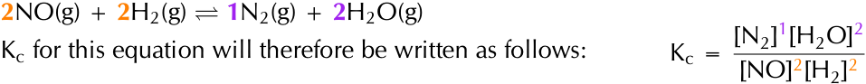
> **[Diagram Context - Textbook_PhysicalSciences_Gr12_Chemical-equilibrium.pdf-0007-04.png]**
> The graphic displays a chemical equilibrium equation, $2\text{NO(g)} + 2\text{H}_2\text{g)} \rightleftharpoons 1\text{N}_2\text{g)} + 2\text{H}_2\text{O(g)}$, alongside its corresponding equilibrium constant expression, $K_c = \frac{[\text{N}_2]^1[\text{H}_2\text{O}]^2}{[\text{NO}]^2[\text{H}_2]^2}$. Visible elements include chemical formulas with state indicators $(\text{g})$, a double-headed equilibrium arrow, stoichiometric coefficients color-coded in orange and purple, square brackets denoting concentration, and exponents corresponding to the balanced equation. This visual demonstrates to Grade 12 Physical Sciences learners how to correctly construct the equilibrium constant expression by placing product concentrations over reactant concentrations, raised to powers equal to their stoichiometric coefficients.

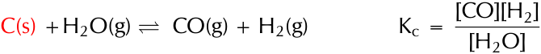
> **[Diagram Context - Textbook_PhysicalSciences_Gr12_Chemical-equilibrium.pdf-0007-07.png]**
> The graphic displays a chemical equilibrium equation alongside its corresponding equilibrium constant expression. Visible elements include chemical formulas with phase indicators ($\text{C(s)}$, $\text{H}_2\text{O(g)}$, $\text{CO(g)}$, $\text{H}_2\text{g)}$), a double equilibrium arrow, and the expression $K_c = \frac{[\text{CO}][\text{H}_2]}{[\text{H}_2\text{O}]}$. Conceptually, this demonstrates the application of the law of mass action to a heterogeneous equilibrium, specifically illustrating to Grade 12 Physical Sciences learners that pure solids (highlighted in red as $\text{C(s)}$) are omitted from the $K_c$ expression because their concentrations remain constant.

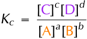
> **[Diagram Context - Textbook_PhysicalSciences_Gr12_Chemical-equilibrium.pdf-0007-15.png]**
> The graphic shows the mathematical expression for the equilibrium constant ($K_c$) used in chemical equilibrium calculations. The visible labels include the constant $K_c$, chemical species represented by letters $A$ and $B$ (reactants in the denominator) and $C$ and $D$ (products in the numerator), enclosed in square brackets denoting concentration, and raised to powers $a, b, c,$ and $d$ corresponding to their stoichiometric balancing coefficients. For a Grade 12 Physical Sciences learner under the CAPS curriculum, this formula conveys the Law of Mass Action, demonstrating that $K_c$ is calculated as the product of the equilibrium concentrations of the products raised to their stoichiometric coefficients divided by the product of the equilibrium concentrations of the reactants raised to their stoichiometric coefficients at a constant temperature.

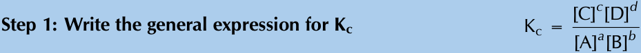
> **[Diagram Context - Textbook_PhysicalSciences_Gr12_Chemical-equilibrium.pdf-0007-20.png]**
> This educational graphic presents a mathematical formula and instructional text for chemical equilibrium. The visible text and symbols include the heading "Step 1: Write the general expression for Kc" alongside the equilibrium constant formula $K_c = \frac{[C]^c[D]^d}{[A]^a[B]^b}$, where uppercase letters represent chemical species concentrations and lowercase letters represent stoichiometric coefficients. This visual conveys the foundational rule for setting up an equilibrium constant expression by placing product concentrations in the numerator and reactant concentrations in the denominator, each raised to the power of their balancing coefficients.

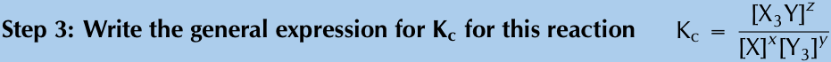
> **[Diagram Context - Textbook_PhysicalSciences_Gr12_Chemical-equilibrium.pdf-0007-23.png]**
> This educational graphic presents a step-by-step chemical equilibrium problem showing the formula for the equilibrium constant. The text includes the instruction "Step 3: Write the general expression for $K_c$ for this reaction" alongside the algebraic expression $K_c = \frac{[X_3Y]^z}{[X]^x[Y_3]^y}$, featuring chemical species variables $X$, $Y$, $X_3Y$, and $Y_3$ with stoichiometric coefficients $x$, $y$, and $z$. This image guides Grade 12 Physical Sciences learners on how to construct an equilibrium constant expression from a balanced hypothetical reaction, placing product concentrations in the numerator and reactant concentrations in the denominator, each raised to the power of their respective stoichiometric coefficients.

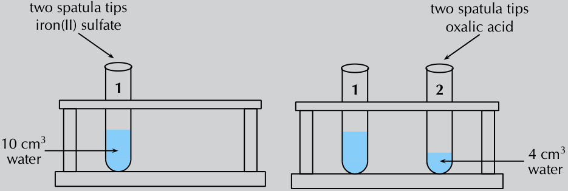
> **[Diagram Context - Textbook_PhysicalSciences_Gr12_Rate-and-Extent-of-Reaction.pdf-0007-09.png]**
> 1. A diagram of two test tubes filled with water, with the water being a different color than the water in the other test tube.

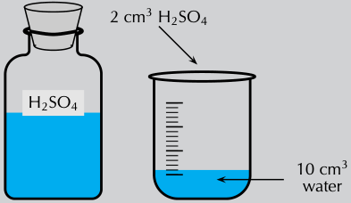
> **[Diagram Context - Textbook_PhysicalSciences_Gr12_Rate-and-Extent-of-Reaction.pdf-0007-11.png]**
> 1. A diagram of a flask and a measuring cup. The flask contains a blue liquid, while the measuring cup contains water. The flask is labeled with the chemical symbol H2O, and the measuring cup is labeled with the units of 10 cm3.

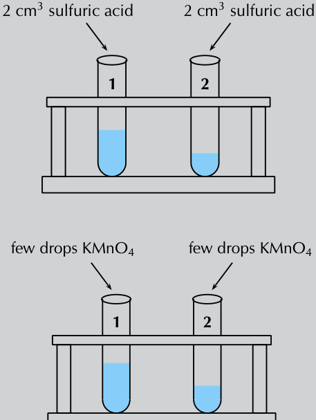
> **[Diagram Context - Textbook_PhysicalSciences_Gr12_Rate-and-Extent-of-Reaction.pdf-0007-15.png]**
> 1. A diagram of two test tubes with blue liquid in them. The diagram also includes arrows pointing to the variables labeled "KMNO4" and "KMNO".

> **[Diagram Context - Textbook_PhysicalSciences_Gr12_The-Doppler-effect.pdf-0007-12.png]**
> The image shows a red and white ambulance driving down a street. The ambulance is moving quickly, and the driver is wearing a white shirt. The background of the image is blurred, making it difficult to see the details of the surroundings. The image is labeled as an educational graphic, and it is intended for a high school student learning about biology and cellular structures.

---

**Step 2: Determine how to approach the problem based on what is given**

We can use:
$$f_L = \left(\frac{v \pm v_L}{v \pm v_S}\right) f_S$$

with:
- $v = 340\text{ m}\cdot\text{s}^{-1}$
- $v_L = +15\text{ m}\cdot\text{s}^{-1}$
- $v_S = 0\text{ m}\cdot\text{s}^{-1}$
- $f_S = 800\text{ Hz}$
- $f_L = ?$

The listener is moving towards the source, so $v_L$ is positive and the source is stationary, so $v_S = 0$.

---

**Step 3: Calculate the frequency**

$$
\begin{aligned}
f_L &= \left(\frac{v + v_L}{v + v_S}\right) f_S \\
&= \left(\frac{340 + 15}{340 + 0}\right) (800) \\
&= 835,29\text{ Hz}
\end{aligned}
$$

---

**Step 4: Write the final answer**
The driver hears a frequency of $835,29\text{ Hz}$.

---

### Worked Example 3: Doppler effect [NSC 2011 Paper 1]

**QUESTION**

A train approaches a station at a constant speed of $20\text{ m}\cdot\text{s}^{-1}$ with its whistle blowing at a frequency of $458\text{ Hz}$. An observer, standing on the platform, hears a change in pitch as the train approaches him, passes him and moves away from him.

1. Name the phenomenon that explains the change in pitch heard by the observer. (1 mark)
2. Calculate the frequency of the sound that the observer hears while the train is approaching him. Use the speed of sound in air as $340\text{ m}\cdot\text{s}^{-1}$. (4 marks)
3. How will the observed frequency change as the train passes and moves away from the observer? Write down only INCREASES, DECREASES or REMAINS THE SAME. (1 mark)
4. How will the frequency observed by the train driver compare to that of the sound waves emitted by the whistle? Write down only GREATER THAN, EQUAL TO or LESS THAN. Give a reason for the answer. (2 marks)

**[TOTAL: 8 marks]**

---

**SOLUTION**

| Question 1: | | Question 2: | | Question 3: | |
| :--- | :--- | :--- | :--- | :--- | :--- |
| Doppler effect | (1 mark) | $$f_L = \left(\frac{v \pm v_L}{v \pm v_S}\right) f_S$$    $$\therefore f_L = \frac{340 \pm 0}{340 - 20}(458)$$    $$= 486,63\text{ Hz}$$ | (4 marks) | Decreases | (1 mark) |

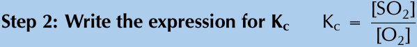
> **[Diagram Context - Textbook_PhysicalSciences_Gr12_Chemical-equilibrium.pdf-0008-13.png]**
> This educational graphic presents a procedural step for determining the equilibrium constant in a chemical reaction. It displays the text "Step 2: Write the expression for Kc" alongside the mathematical formula $K_c = \frac{[\text{SO}_2]}{[\text{O}_2]}$, utilizing square brackets to represent concentration and chemical symbols for sulfur dioxide and oxygen. Conceptually, this guides Grade 12 Physical Sciences learners on how to translate a balanced chemical equilibrium into a correct equilibrium constant expression (product concentrations over reactant concentrations).

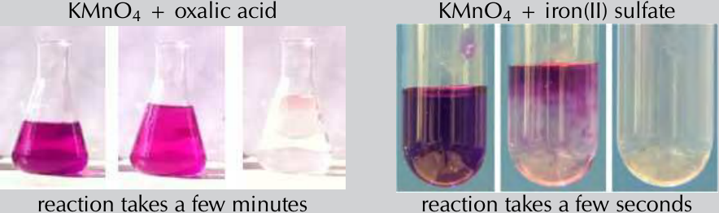
> **[Diagram Context - Textbook_PhysicalSciences_Gr12_Rate-and-Extent-of-Reaction.pdf-0008-02.png]**
> 1. A diagram of a chemical reaction between KMnO4 and oxalic acid.

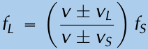

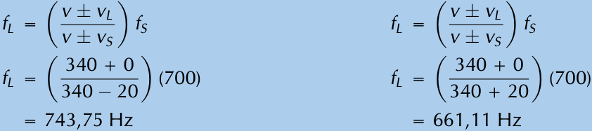
> **[Diagram Context - Textbook_PhysicalSciences_Gr12_The-Doppler-effect.pdf-0008-06.png]**
> The image shows a diagram of a Lewis structure for oxygen. The diagram is divided into two columns, with the left column containing the Lewis structure of oxygen and the right column showing the Lewis structure of nitrogen. The diagram also includes the Lewis structure of carbon dioxide. The diagram is labeled with the chemical symbols for oxygen, nitrogen, and carbon dioxide. The diagram is color-coded, with the oxygen structure being blue and the nitrogen structure being green. The diagram also includes arrows pointing to the Lewis structures of the carbon dioxide molecule.

---

## Question 4

Equal to, because ...

* the velocity of train driver relative to the whistle is zero. **OR**
* the train driver has same velocity as the whistle. **OR**
* there is no relative motion between source and observer.

(2 marks)

**[TOTAL: 11 marks]**

---

## Ultrasound and the Doppler Effect

Ultrasonic waves (ultrasound) are sound waves with a frequency greater than $20\,000\text{ Hz}$ (the upper limit of human hearing). These waves can be used in medicine to determine the direction of blood flow. The device, called a Doppler flow meter, sends out sound waves. The sound waves can travel through skin and tissue and will be reflected by moving objects in the body (like blood). The reflected waves return to the flow meter where its frequency (received frequency) is compared to the transmitted frequency. Because of the Doppler effect, blood that is moving towards the flow meter will change the sound to a higher frequency and blood that is moving away from the flow meter will cause a lower frequency.

Ultrasound can be used to determine whether blood is flowing in the right direction in the circulation system of unborn babies, or identify areas in the body where blood flow is restricted due to narrow veins. The use of ultrasound equipment in medicine is called sonography or ultrasonography.

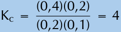
> **[Diagram Context - Textbook_PhysicalSciences_Gr12_Chemical-equilibrium.pdf-0009-06.png]**
> This graphic displays a mathematical equation for calculating the equilibrium constant, \(K_c\). The visible symbols and numbers include the variable \(K_c\), an equals sign, a fractional expression with numerator terms \((0,4)(0,2)\) and denominator terms \((0,2)(0,1)\), and the final calculated numerical value of \(4\). Conceptually, this demonstrates the substitution of equilibrium concentration values into the mass action expression to determine the numerical magnitude of the equilibrium constant for a reversible chemical reaction in Grade 12 Physical Sciences.

*Figure 6.3: Colour Doppler imaging of cervico-cephalic fibromuscular dysplasia*

---

## Exercise 6 – 1: The Doppler effect with sound

1. Suppose a train is approaching you as you stand on the platform at the station. As the train approaches the station, it slows down. All the while, the engineer is sounding the hooter at a constant frequency of $400\text{ Hz}$. Describe the pitch of the hooter and the changes in pitch of the hooter that you hear as the train approaches you. Assume the speed of sound in air is $340\text{ m}\cdot\text{s}^{-1}$.

2. Passengers on a train hear its whistle at a frequency of $740\text{ Hz}$. Anja is standing next to the train tracks. What frequency does Anja hear as the train moves

> **[Diagram Context - Textbook_PhysicalSciences_Gr12_Rate-and-Extent-of-Reaction.pdf-0009-03.png]**
> The graphic illustrates standard laboratory apparatus consisting of a graduated glass beaker containing a blue liquid positioned above a test tube holding solid reactant pieces at the bottom. The visual elements include a graduated scale marked on the beaker and solid chunks resting inside the base of the test tube. For CAPS Physical Sciences learners, this diagram visually represents the preparation phase of a chemical reaction, demonstrating how liquid reactants are measured and added to solid reactants in practical investigations.

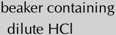
> **[Diagram Context - Textbook_PhysicalSciences_Gr12_Rate-and-Extent-of-Reaction.pdf-0009-04.png]**
> This educational text graphic presents a description of laboratory apparatus and reactants. The visible text reads "beaker containing dilute HCl", incorporating the chemical formula HCl for hydrochloric acid. Conceptually, it sets up a chemical reaction scenario, commonly used in CAPS Physical Sciences stoichiometry or reaction rate investigations involving acids.

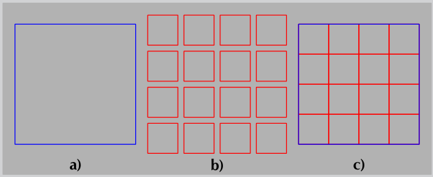
> **[Diagram Context - Textbook_PhysicalSciences_Gr12_Rate-and-Extent-of-Reaction.pdf-0009-16.png]**
> 1. A diagram of a cell with a blue square and a red square.

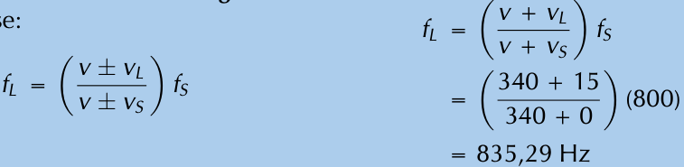
> **[Diagram Context - Textbook_PhysicalSciences_Gr12_The-Doppler-effect.pdf-0009-02.png]**
> The image shows a diagram of a Lewis structure for oxygen, with the oxygen atom at the center and two oxygen bonds surrounding it. The diagram is set against a light blue background, and the oxygen atom is labeled with the chemical symbol "O". The diagram also includes a table with the Lewis structure of carbon dioxide (CO2), with the carbon atom at the center and two carbon bonds surrounding it. The table is set against a light brown background, and the carbon atom is labeled with the chemical symbol "C".

---

## Revision Notes: The Doppler Effect (Part 2)

### 3. Problem-Solving Practice (The Doppler Effect with Sound)

#### Question 3
A small plane is taxiing directly away from you down a runway. The noise of the engine, as the pilot hears it, has a frequency $1{,}15$ times the frequency that you hear. What is the speed of the plane? Assume the speed of sound in air is $340\text{ m}\cdot\text{s}^{-1}$.

#### Question 4
In places like Canada during winter, temperatures can get as low as $-35\^{\circ}\text{C}$. This affects the speed of sound in air, and you can use the Doppler effect to determine what the speed of sound is. On a winter's day in Canada with a temperature of $-35\^{\circ}\text{C}$, a source emits sound at a frequency of $1050\text{ Hz}$ and moves away from an observer at $25\text{ m}\cdot\text{s}^{-1}$. The frequency that the observer measures is $971{,}41\text{ Hz}$. What is the speed of sound?

#### Question 5
Cecil approaches a source emitting sound with a frequency of $437{,}1\text{ Hz}$.
* **a)** How fast does Cecil need to move to observe a frequency that is $20$ percent higher?
* **b)** If he passes the source at this speed, what frequency will he measure when he is moving away?
* **c)** What is a practical means of achieving this speed?

*(Assume the speed of sound in air is $340\text{ m}\cdot\text{s}^{-1}$.)*

---

### 6.3 The Doppler Effect with Light

#### Core Concepts
* **Light as a Wave:** Light is a wave phenomenon, meaning the underlying principles of the Doppler effect apply to both sound and light (electromagnetic waves).
* **Relative Motion:** In the context of light (EM waves), the frequency of observed light differs from the emitted frequency whenever the source of the light is moving relative to the observer.
* **Visible Spectrum Shifts:** A frequency shift of light within the visible spectrum results in a noticeable change of colour. However, frequency shifts occur for all electromagnetic radiation, including invisible frequencies.

#### Key Relationships for Light
For light waves, the wave speed equation is given by:
$$c = f\lambda$$

Where:
* $c$ is the speed of light in a vacuum ($3 \times 10^8\text{ m}\cdot\text{s}^{-1}$).
* $f$ is the frequency.
* $\lambda$ is the wavelength.

From this relationship, shorter wavelengths correspond to higher frequencies, while longer wavelengths correspond to lower frequencies. 

#### Colour Shifts in Astronomy
* **Blue Light vs. Red Light:** Blue light has a shorter wavelength than red light. 
* **Redshift:** Shifts towards longer wavelengths (lower frequencies) are known as **"redshifts"** (indicating the source is moving away).
* **Blueshift:** Shifts towards shorter wavelengths (higher frequencies) are known as **"blueshifts"** (indicating the source is moving closer).

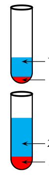

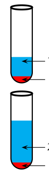

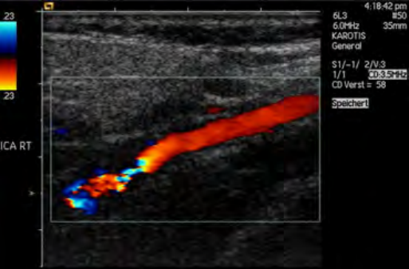

---

### TIP

1. If the light source is moving away from the observer (positive velocity) then the observed frequency is lower and the observed wavelength is greater (redshifted).
2. If the source is moving towards the observer (negative velocity), the observed frequency is higher and the wavelength is shorter (blueshifted).

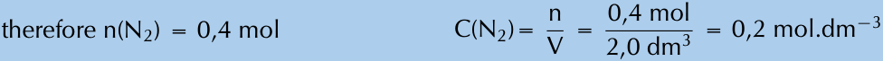
> **[Diagram Context - Textbook_PhysicalSciences_Gr12_Chemical-equilibrium.pdf-0011-14.png]**
> The image displays a chemical calculation showing numerical steps for determining amount of substance and concentration. Visible text includes chemical formulas and variables such as $n(N_2) = 0,4\text{ mol}$, $C(N_2) = \frac{n}{V} = \frac{0,4\text{ mol}}{2,0\text{ dm}^3} = 0,2\text{ mol}\cdot\text{dm}^{-3}$. This conveys the stoichiometric calculation for finding molar concentration using the formula $c = \frac{n}{V}$, reinforcing core Grade 11 Physical Sciences quantitative chemistry concepts.

**Figure 6.4:** Blue light has a shorter wavelength than red light.

A shift in wavelength implies that there is also a shift in frequency. Longer wavelengths of light have lower frequencies and shorter wavelengths have higher frequencies. From the Doppler effect we know that when the source moves towards the observer any waves they emit that you measure are shifted to shorter wavelengths (blueshifted). If the source moves away from the observer, the shift is to longer wavelengths (redshifted).

---

## The Expanding Universe

ESCMT

Stars emit light, which is why we can see them at night. Galaxies are huge collections of stars. An example is our own Galaxy, the Milky Way, of which our sun is only one of the billions of stars!

Using large telescopes like the Southern African Large Telescope (SALT) in the Karoo, astronomers can measure the light from distant galaxies. The spectrum of light can tell us what elements are in the stars in the galaxies because each element has unique energy levels and therefore emits or absorbs light at particular wavelengths. These characteristic wavelengths are called spectral lines because the lines show up as discrete frequencies in the spectrum of light from the star.

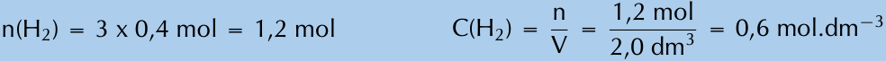
> **[Diagram Context - Textbook_PhysicalSciences_Gr12_Chemical-equilibrium.pdf-0011-17.png]**
> This graphic displays a worked numerical calculation in a chemical context. The visible text includes chemical symbols, variables, and units such as $n(\text{H}_2)$, $\text{mol}$, $C(\text{H}_2)$, $V$, and $\text{mol}\cdot\text{dm}^{-3}$. It demonstrates the step-by-step CAPS methodology for calculating the concentration of a solution by first determining the number of moles and then applying the concentration formula $C = \frac{n}{V}$.

**Figure 6.5:** A subset of the spectral lines of hydrogen

If these lines are observed to be shifted from their usual wavelengths to shorter wavelengths, then the light from the galaxy is said to be *blueshifted*. If the spectral lines are shifted to longer wavelengths, then the light from the galaxy is said to be *redshifted*. If we think of the blueshift and redshift in Doppler effect terms, then a blueshifted galaxy would appear to be moving *towards* us (the observers) and a redshifted galaxy would appear to be moving away from us.

Edwin Hubble (20 November 1889 - 28 September 1953) measured the Doppler shift of a large sample of galaxies. He found that the light from distant galaxies is *redshifted* and he discovered that there is a proportionality relationship between the *redshift* and the *distance* to the galaxy. Galaxies that are further away always appear more redshifted than nearby galaxies. Remember that a redshift in Doppler terms means a velocity of the light source directed away from the observer. So why do all distant galaxies appear to be moving away from our Galaxy? None of them seem to be moving towards us.

---

**FACT**

Hubble Law is:

$$v = H_0 \times d$$

where latest value of $H_0$ is $67,15 \text{ km}\cdot\text{s}^{-1}\cdot\text{Mpc}^{-1}$ (rate of expansion of the Universe). Latest value from Planck mission, 2013.

**TIP**

Cool exercise that can be done with Sloan Digital Sky Survey data: [skyserver.sdss3.org/dr8/en/proj/basic/universe_original/simple.asp](http://skyserver.sdss3.org/dr8/en/proj/basic/universe_original/simple.asp)

Figure 6.6: The distance to galaxies plotted against their speed away from us. The distance Mpc is a megaparsec which is very big, $1 \text{ Mpc} = 3.3 \text{ million light years}$. A light year is the distance that light can travel in one year, $365 \text{ days} \times 24 \text{ hours} \times 60 \text{ minutes} \times 60 \text{ s} \times 3 \times 10^8 \text{ m}\cdot\text{s}^{-1} = 9.5 \times 10^{15} \text{ m}$.

The reason is that the **universe is expanding**! Some of the galaxies will be moving in our direction but more slowly than the space between us and them is expanding. The expansion is so large that it is the primary effect that we observe. The primary reason the light is redshifted isn't actually because all of the Doppler effect, it is redshifted because the space is expanding, the waves are being stretched out. If the Doppler effect were a larger effect then some of the galaxies would still be blueshifted (just less than if space were not expanding).

---

### IMPORTANT!

You might think that this means we are at the centre of the universe. This isn't correct, the situation will look the same from every galaxy because space is expanding in all directions.

---

There are two things you can do to help you visualise this a little better. One thing to try is to get a balloon and draw some dots on it with a marker. As you blow the balloon up all the dots get further away from all the other dots. The dots represent galaxies in a two-dimensional, expanding universe (the balloon surface). Another thing to imagine is baking raisin bread. As the bread rises, the distance between all the raisins gets larger. Every raisin thinks that all the other raisins are moving away from it.

> **[Diagram Context - Textbook_PhysicalSciences_Gr12_Rate-and-Extent-of-Reaction.pdf-0012-14.png]**
> 1. A bowl of water with a red balloon in it.

In this picture the bottom vertex represents the beginning of time, the flat surface represents space. As you move up through the panels you are moving later in time and the expansion of the the flat surface shows the expansion of the universe. The galaxies shown on the surface get further away from each other just because of the expansion of space.

▶ See video: **27SZ** at www.everythingscience.co.za

---

Chapter 6. Doppler effect **265**

---

## 6.4 Chapter summary

* See presentation: `27T2` at `www.everythingscience.co.za`

* The Doppler effect is a change in observed frequency due to the relative motion of a source and an observer.
* The following equation can be used to calculate the frequency of the wave according to the observer or listener:

$$f_L = \left(\frac{v + v_L}{v + v_S}\right) f_S$$

* If the direction of the wave from the listener to the source is chosen as positive, the velocities have the following signs:

| Motion | Velocity Sign |
| :--- | :--- |
| Source moves towards listener | $v_S$: negative |
| Source moves away from listener | $v_S$: positive |
| Listener moves towards source | $v_L$: positive |
| Listener moves away from source | $v_L$: negative |

* The Doppler effect can be observed in all types of waves, including ultrasound, light and radiowaves.
* Sonography makes use of ultrasound and the Doppler effect to determine the direction of blood flow.
* Light is emitted by stars. Due to the Doppler effect, the frequency of this light decreases and the stars appear redder than if they were stationary. This is called a red shift and means that the stars are moving away from the Earth. This is one of the reasons we can conclude that the Universe is expanding.

### Physical Quantities

| Quantity | Unit name | Unit symbol |
| :--- | :--- | :--- |
| Frequency ($f$) | hertz | $\text{Hz}$ |
| Speed ($v$) | metres per second | $\text{m}\cdot\text{s}^{-1}$ |

*Table 6.1: Units used in Doppler effect.*

---

## Exercise 6 – 2:

1. Write a definition for each of the following terms.
   
   a) Doppler effect
   
   b) Redshift
   
   c) Ultrasound

2. The hooter of an approaching taxi has a frequency of $500\text{ Hz}$. If the taxi is travelling at $30\text{ m}\cdot\text{s}^{-1}$ and the speed of sound is $340\text{ m}\cdot\text{s}^{-1}$, calculate the frequency of sound that you hear when
   
   a) the taxi is approaching you.

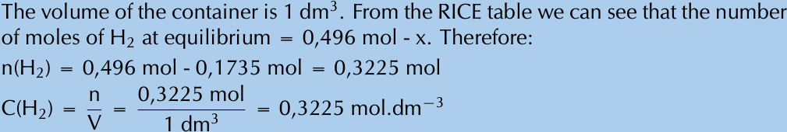
> **[Diagram Context - Textbook_PhysicalSciences_Gr12_Chemical-equilibrium.pdf-0013-09.png]**
> 1. A diagram of a rice table with the number of moles of H2O and O2.

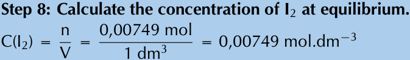
> **[Diagram Context - Textbook_PhysicalSciences_Gr12_Chemical-equilibrium.pdf-0013-10.png]**
> This educational graphic presents a chemical calculation step with the heading "Step 8: Calculate the concentration of $I_2$ at equilibrium." It displays the formula $C(I_2) = \frac{n}{V}$, substituted with numerical values resulting in $C(I_2) = \frac{0,00749 \text{ mol}}{1 \text{ dm}^3} = 0,00749 \text{ mol}\cdot\text{dm}^{-3}$. Conceptually, it demonstrates how to determine the final equilibrium concentration of a reactant or product in a chemical equilibrium problem by dividing the number of moles ($n$) by the volume ($V$) in cubic decimetres.

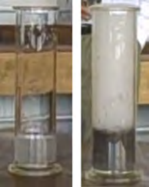
> **[Diagram Context - Textbook_PhysicalSciences_Gr12_Rate-and-Extent-of-Reaction.pdf-0013-14.png]**
> 1. A glass cylinder with a white substance inside.

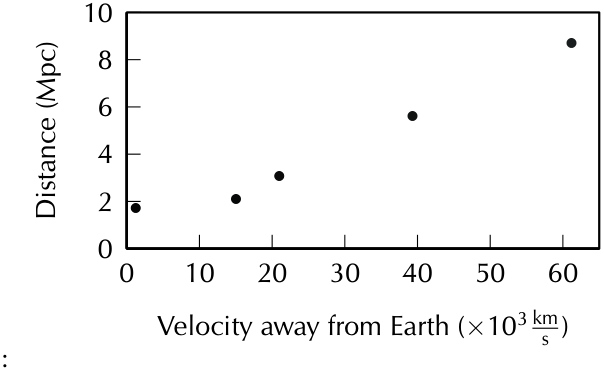
> **[Diagram Context - Textbook_PhysicalSciences_Gr12_The-Doppler-effect.pdf-0013-00.png]**
> The image shows a graph of velocity away from Earth (10 km/s) against time (x 10 km/s). The graph is black and white, with a line graph that shows the relationship between the two variables. The x-axis is labeled "Time" and the y-axis is labeled "Velocity (10 km/s)", with the line graph showing a downward trend. The graph is labeled with the title "Velocity away from Earth (x 10 km/s)" and the units "10 km/s".

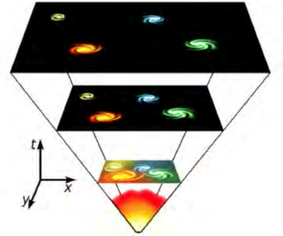
> **[Diagram Context - Textbook_PhysicalSciences_Gr12_The-Doppler-effect.pdf-0013-13.png]**
> 1. A diagram of a cell with a red circle in the center.

---

b) the taxi passed you and is driving away.

Draw a sketch of the observed frequency as a function of time.

3. A truck approaches you at an unknown speed. The sound of the truck's engine has a frequency of $210\text{ Hz}$, however you hear a frequency of $220\text{ Hz}$. The speed of sound is $340\text{ m}\cdot\text{s}^{-1}$.

    a) Calculate the speed of the truck.
    
    b) How will the sound change as the truck passes you? Explain this phenomenon in terms of the wavelength and frequency of the sound.

4. **[Extension question]** A police car is driving towards a fleeing suspect at $\frac{v}{35}\text{ m}\cdot\text{s}^{-1}$, where $v$ is the speed of sound. The frequency of the police car's siren is $400\text{ Hz}$. The suspect is running away at $\frac{v}{68}$. What frequency does the suspect hear?

5. Explain how the Doppler effect is used to determine the direction of flow of blood in veins.

6. An person in a car travelling at $22,2\text{ m}\cdot\text{s}^{-1}$ approaches a source emitting sound waves with a frequency of $410\text{ Hz}$. What is the frequency of the sound waves observed by the person? Assume the speed of sound in air is $340\text{ m}\cdot\text{s}^{-1}$.

7. More questions. Sign in at Everything Science online and click 'Practise Science'.

Check answers online with the exercise code below or click on 'show me the answer'.

1. 27T3 \quad 2. 27T4 \quad 3. 27T5 \quad 4. 27T6 \quad 5. 27T7 \quad 6. 27T8

www.everythingscience.co.co.za \quad m.everythingscience.co.za

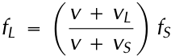

---

# CHAPTER 6

## Doppler effect

> **[Diagram Context - Textbook_PhysicalSciences_Gr12_Chemical-equilibrium.pdf-0015-04.png]**
> 1. A man with a mustache and glasses.

* **6.1** Introduction ..................................................................................................... 150
* **6.2** The Doppler effect with sound ....................................................................... 150
* **6.4** Chapter summary ........................................................................................... 152

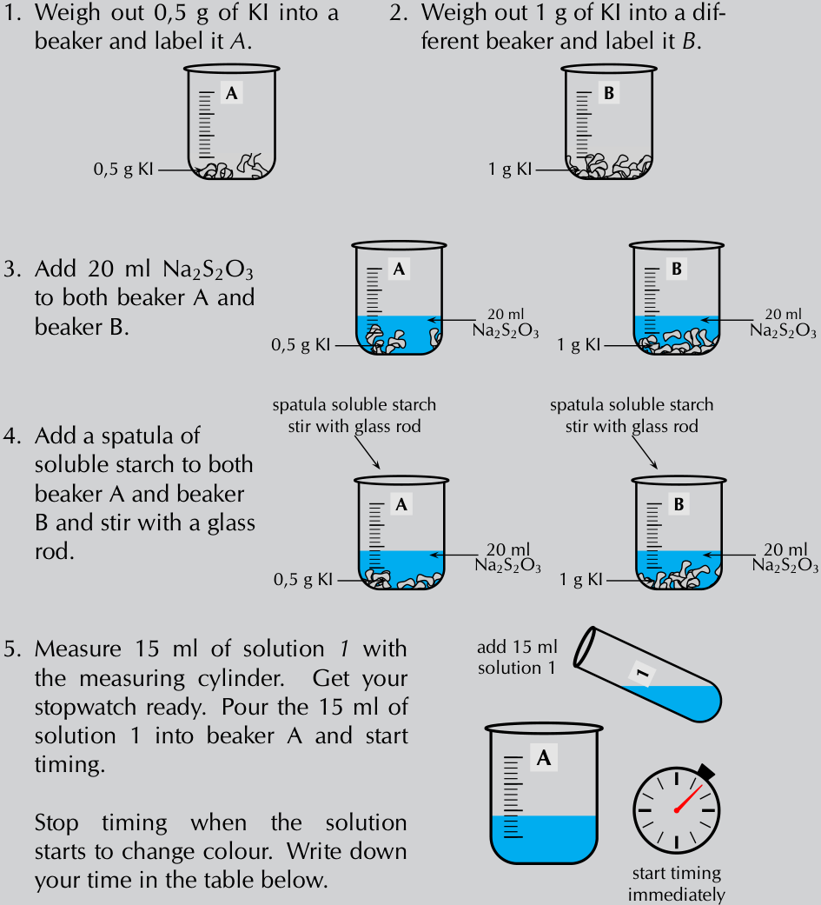
> **[Diagram Context - Textbook_PhysicalSciences_Gr12_Rate-and-Extent-of-Reaction.pdf-0015-10.png]**
> 1. Stop timing, when the solution starts to change colour, Write down your observations.
 2. Start timing, when the solution starts to change colour, Draw a diagram of the cell.
 3. Stop timing, when the solution starts to change colour, Draw a diagram of the cell.
 4. Stop timing, when the solution starts to change colour, Draw a diagram of the cell.
 5. Stop timing, when the solution starts to change colour, Draw a diagram of the cell.
 6. Stop timing, when the solution starts to change colour, Draw a diagram

---

# 6 Doppler effect

## 6.1 Introduction

The Doppler Effect with sound:
* Definition of the Doppler Effect with examples.
* Explanation to what happens with sound when objects move relative to each other.
* Calculations done to determine the frequency when one of the two objects are moving.
* Description of applications with ultra sound waves.

THE Doppler Effect with light:
* Understand the relationship between light and the Doppler Effect.
* Application of the Doppler Effect and light concerning the universe.

### Key Mathematics Concepts
* Units and unit conversions — Physical Sciences, Grade 10, Science skills
* Equations — Mathematics, Grade 10, Equations and inequalities
* Sound waves — Physical Sciences, Grade 10, Sound
* Electromagnetic radiation — Physical Sciences, Grade 10, Electromagnetic radiation

---

## 6.2 The Doppler effect with sound

### Exercise 6 – 1: The Doppler effect with sound

1. Suppose a train is approaching you as you stand on the platform at the station. As the train approaches the station, it slows down. All the while, the engineer is sounding the hooter at a constant frequency of $400\text{ Hz}$. Describe the pitch of the hooter and the changes in pitch of the hooter that you hear as the train approaches you. Assume the speed of sound in air is $340\text{ m}\cdot\text{s}^{-1}$.

   **Answer:**
   The frequency of the sound gradually increases as the train moves towards you. The pitch increases. You would hear a higher pitched sound.

2. Passengers on a train hear its whistle at a frequency of $740\text{ Hz}$. Anja is standing next to the train tracks. What frequency does Anja hear as the train moves directly toward her at a speed of $25\text{ m}\cdot\text{s}^{-1}$? Assume the speed of sound in air is $340\text{ m}\cdot\text{s}^{-1}$.

   **Answer:**
   $$f_L = \left(\frac{v + v_L}{v - v_S}\right) f_S$$

   $$f_L = \left(\frac{340 + 0}{340 - 25}\right) (740) = 798,73\text{ Hz}$$

   $$798,73\text{ Hz}$$

> **[Diagram Context - Textbook_PhysicalSciences_Gr12_The-Doppler-effect.pdf-0016-00.png]**
> The image shows a chapter six book cover with a green circle and the word "chapter" written in white. The cover also features a green arrow pointing to the right, which is a common design element used to indicate the direction of the chapter. The cover is set against a gray background, which contrasts with the green elements and makes the title and chapter title stand out.

---

## Chapter 6: Doppler Effect

---

### Worked Examples and Exercises

#### Question 3: Plane Taxiing Away

**Problem Statement:**
A small plane is taxiing directly away from you down a runway. The noise of the engine, as the pilot hears it, has a frequency $1,15$ times the frequency that you hear. What is the speed of the plane? Assume the speed of sound in air is $340 \text{ m}\cdot\text{s}^{-1}$.

**Analysis & Given Information:**
* You (the listener) are stationary, so your velocity is $v_L = 0$.
* The source (plane) is moving away from you at an unknown velocity $v_S$, which must be positive.
* Speed of sound: $v = 340 \text{ m}\cdot\text{s}^{-1}$
* Frequency heard by the pilot (source frequency): $f_S = 1,15 f_L$

**Solution:**

Using the general Doppler formula:

$$f_L = \left(\frac{v + v_L}{v + v_S}\right) f_S$$

Substitute the known values ($v_L = 0$ and $f_S = 1,15 f_L$):

$$f_L = \left(\frac{340 + 0}{340 + v_S}\right) (1,15 f_L)$$

Divide both sides by $f_L$:

$$340 + v_S = (340) (1,15)$$

$$340 + v_S = 391$$

$$v_S = 391 - 340 = 51 \text{ m}\cdot\text{s}^{-1}$$

**Answer:**
The speed of the plane is $51 \text{ m}\cdot\text{s}^{-1}$.

---

#### Question 4: Speed of Sound in Cold Temperatures

**Problem Statement:**
In places like Canada during winter, temperatures can get as low as $-35\text{ }^\circ\text{C}$. This affects the speed of sound in air, and you can use the Doppler effect to determine what the speed of sound is. On a winter's day in Canada with a temperature of $-35\text{ }^\circ\text{C}$, a source emits sound at a frequency of $1050\text{ Hz}$ and moves away from an observer at $25 \text{ m}\cdot\text{s}^{-1}$. The frequency that the observer measures is $971,41\text{ Hz}$. What is the speed of sound?

**Analysis & Given Information:**
* Observer is stationary, so $v_L = 0$.
* Source frequency: $f_S = 1050\text{ Hz}$
* Listener frequency: $f_L = 971,41\text{ Hz}$
* Speed of the source: $v_S = 25 \text{ m}\cdot\text{s}^{-1}$

**Solution:**

Start with the Doppler equation for a moving source away from a stationary listener:

$$f_L = \left(\frac{v + v_L}{v + v_S}\right) f_S$$

Substitute $v_L = 0$:

$$\frac{f_L}{f_S} = \frac{v + 0}{v + v_S}$$

$$\frac{f_S}{f_L} = \frac{v + v_S}{v}$$

$$\frac{f_S}{f_L} = 1 + \frac{v_S}{v}$$

$$\frac{v_S}{v} = \frac{f_S}{f_L} - 1$$

$$\frac{v_S}{v} = \frac{f_S - f_L}{f_L}$$

$$\frac{v}{v_S} = \frac{f_L}{f_S - f_L}$$

$$v = v_S \left(\frac{f_L}{f_S - f_L}\right)$$

Substitute the numerical values:

$$v = 25 \left(\frac{971,41}{1050 - 971,41}\right)$$

$$v = 309 \text{ m}\cdot\text{s}^{-1}$$

**Answer:**
The speed of sound in air at $-35\text{ }^\circ\text{C}$ is $309 \text{ m}\cdot\text{s}^{-1}$.

---

#### Question 5: Cecil Approaching a Sound Source

**Problem Statement:**
Cecil approaches a source emitting sound with a frequency of $437,1\text{ Hz}$. 

Assume the speed of sound in air is $340 \text{ m}\cdot\text{s}^{-1}$. First we need to determine Cecil's approach speed. The source is stationary, so $v_S = 0$.

* **a)** How fast does Cecil need to move to observe a frequency that is $20$ percent higher?
* **b)** If he passes the source at this speed, what frequency will he measure when he is moving away?
* **c)** What is a practical means of achieving this speed?

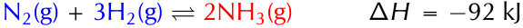

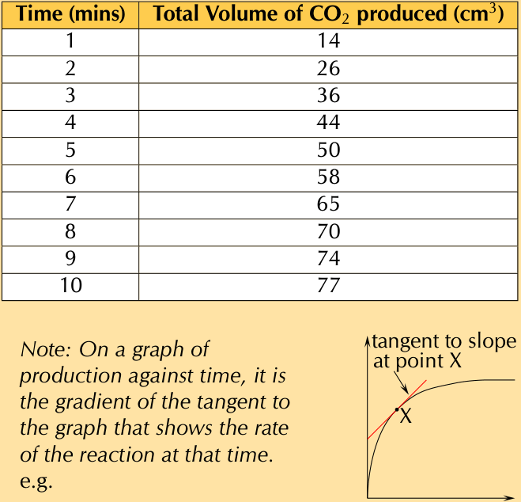
> **[Diagram Context - Textbook_PhysicalSciences_Gr12_Rate-and-Extent-of-Reaction.pdf-0017-11.png]**
> 1. A graph of a reaction against time.

---

Given $f_L = 1.2f_S$, rearranging the Doppler formula:

$$\frac{f_L}{f_S} = \left(\frac{v + v_L}{v + 0}\right)$$

$$\frac{1.2f_S}{f_S} = \left(\frac{v + v_L}{v}\right)$$

$$1.2 = 1 + \frac{v_L}{v}$$

$$1.2 - 1 = \frac{v_L}{340}$$

$$v_L = 68\text{ m}\cdot\text{s}^{-1}$$

The second part of the question asks what the frequency will be that Cecil hears after passing the source and moving away:

$$\frac{f_L}{f_S} = \left(\frac{v - v_L}{v}\right)$$

$$\frac{f_L}{f_S} = \left(\frac{340 - 68}{340}\right)$$

$$f_L = 0.8f_S$$

$$= 0.8 (437.1)$$

$$= 349.7\text{ Hz}$$

Converting $68\text{ m}\cdot\text{s}^{-1}$ to $\text{km}\cdot\text{h}^{-1}$:

$$68\frac{\text{m}}{\text{s}} \times \frac{1\text{ km}}{1000\text{ m}} \times \frac{3600\text{ s}}{1\text{ h}} = 244.8\text{ km}\cdot\text{h}^{-1}$$

This sort of speed could be reached if the observer was in a high-speed train or a racing car.

The approach speed is $68\text{ m}\cdot\text{s}^{-1}$.

The frequency observed when moving away is $349.7\text{ Hz}$.

A speed of $68\text{ m}\cdot\text{s}^{-1}$ or equivalently, $244.8\text{ km}\cdot\text{h}^{-1}$, could be reached if the observer was in a high-speed train or a racing car.

Think you got it? Get this answer and more practice on our Intelligent Practice Service

1. 27ST 2. 27SV 3. 27SW 4. 27SX 5. 27SY

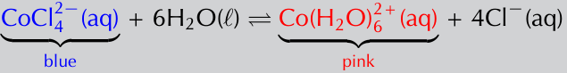
> **[Diagram Context - Textbook_PhysicalSciences_Gr12_Chemical-equilibrium.pdf-0018-13.png]**
> This graphic illustrates a reversible chemical equilibrium equation representing the color change system between cobalt(II) complexes. Visible labels include the chemical formulas $\text{CoCl}_4^{2-}(\text{aq})$, $\text{H}_2\text{O}(\ell)$, $\text{Co}(\text{H}_2\text{O})_6^{2+}(\text{aq})$, and $\text{Cl}^-(\text{aq})$, with brackets identifying the blue $\text{CoCl}_4^{2-}$ reactant and the pink $\text{Co}(\text{H}_2\text{O})_6^{2+}$ product. Conceptually, for Physical Sciences Grade 12 learners studying chemical equilibrium and Le Chatelier's principle, it visually connects the shift in equilibrium position to a macroscopic color change when temperature or concentration is altered.

## 6.4 Chapter summary

---

## Exercise 6 – 2:

1. Write a definition for each of the following terms:
   
   a) Doppler effect
   
   b) Redshift
   
   c) Ultrasound

   a) The Doppler effect occurs when a source of waves and/or an observer move relative to each other, resulting in the observer measuring a different frequency of the waves than the frequency at which the source is emitting.

> **[Diagram Context - Textbook_PhysicalSciences_Gr12_Chemical-equilibrium.pdf-0018-14.png]**
> 1. A diagram of a flask containing a purple liquid.

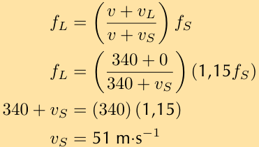
> **[Diagram Context - Textbook_PhysicalSciences_Gr12_The-Doppler-effect.pdf-0018-02.png]**
> The image shows a math problem involving the relationship between velocity and acceleration. The problem is presented in a table format, with three columns and four rows. The first column contains the equation v = f/t, the second column contains the equation a = v/s, and the third column contains the equation a = (1/15)m s-1. The problem is designed to help students understand the relationship between velocity, acceleration, and time.

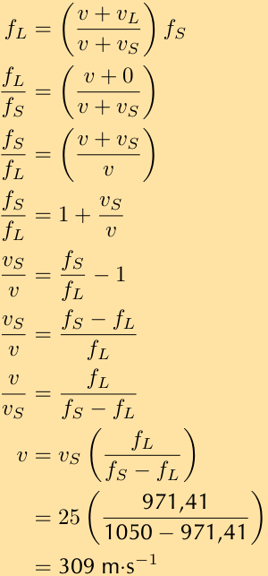
> **[Diagram Context - Textbook_PhysicalSciences_Gr12_The-Doppler-effect.pdf-0018-06.png]**
> The image shows a diagram of a Lewis structure for a molecule of water. The diagram is filled with various elements and bonds, including oxygen, hydrogen, and carbon. The diagram is labeled with the chemical symbols for oxygen, hydrogen, and carbon, and the Lewis structure is labeled with the number of valence electrons for each atom. The diagram also includes arrows to indicate the bonds between the atoms. The diagram is set against a light beige background, and the text "FL = f(s) = 1/fs" is visible, which is a key piece of information about Lewis structures.

---

b) **Redshift** is the shift in the position of spectral lines to longer wavelengths due to the relative motion of a source away from the observer.

c) **Ultrasound** or ultra-sonic waves are sound waves with a frequency greater than $20\,000\text{ Hz}$ (or $20\text{ kHz}$).

---

### Worked Example 2

The hooters of an approaching taxi has a frequency of $500\text{ Hz}$. If the taxi is travelling at $30\text{ m}\cdot\text{s}^{-1}$ and the speed of sound is $340\text{ m}\cdot\text{s}^{-1}$, calculate the frequency of sound that you hear when:

a) the taxi is approaching you.  
b) the taxi passed you and is driving away.  

Draw a sketch of the observed frequency as a function of time.

#### Solution:

a) The observer is not moving, so $v_L = 0$, and the source is approaching. Therefore:
$$f_L = \left(\frac{v}{v - v_S}\right) f_S$$
$$f_L = \left(\frac{340}{340 - 30}\right) (500)$$
$$f_L = 548,4\text{ Hz}$$

b) Now the taxi is moving away from the observer, so:
$$f_L = \left(\frac{v}{v + v_S}\right) f_S$$
$$f_L = \left(\frac{340}{340 + 30}\right) (500)$$
$$f_L = 459,5\text{ Hz}$$

*Answers:*
a) $548,4\text{ Hz}$  
b) $459,5\text{ Hz}$

---

### Worked Example 3

A truck approaches you at an unknown speed. The sound of the truck's engine has a frequency of $210\text{ Hz}$, however you hear a frequency of $220\text{ Hz}$. The speed of sound is $340\text{ m}\cdot\text{s}^{-1}$.

a) Calculate the speed of the truck.  
b) How will the sound change as the truck passes you? Explain this phenomenon in terms of the wavelength and frequency of the sound.  

#### Solution:

a) The observer is stationary, so $v_L = 0$. Therefore:
$$\frac{f_L}{f_S} = \frac{v}{v - v_S}$$
$$\frac{v - v_S}{v} = \frac{f_S}{f_L}$$
$$1 - \frac{v_S}{v} = \frac{f_S}{f_L}$$
$$\frac{v_S}{v} = 1 - \frac{f_S}{f_L}$$
$$v_S = 340 \left(1 - \frac{210}{220}\right)$$
$$v_S = 15,5\text{ m}\cdot\text{s}^{-1}$$

b) As the truck goes by, the frequency goes from higher to lower and the wavelength of the sound waves goes from shorter to longer.

*Answers:*
a) $15,5\text{ m}\cdot\text{s}^{-1}$  
b) As the truck goes by, the frequency goes from higher to lower and the wavelength of the sound waves goes from shorter to longer.

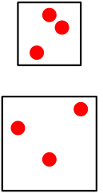

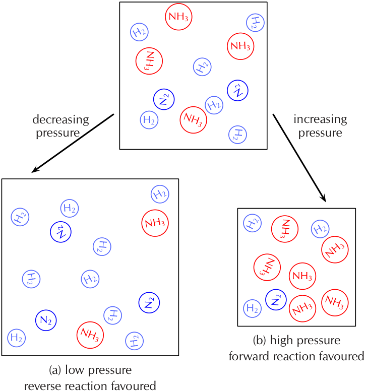
> **[Diagram Context - Textbook_PhysicalSciences_Gr12_Chemical-equilibrium.pdf-0019-22.png]**
> 1. A diagram of a Lewis structure for NH3.

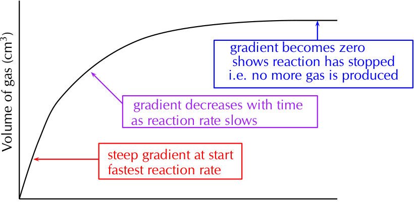
> **[Diagram Context - Textbook_PhysicalSciences_Gr12_Rate-and-Extent-of-Reaction.pdf-0019-00.png]**
> The image is a diagram that illustrates the concept of reaction rates. It shows the relationship between the volume of a gas and the rate of a chemical reaction. The diagram is divided into three sections, each representing a different reaction rate. The x-axis of the diagram is labeled "Volume of gas" and the y-axis is labeled "Reaction rate". The diagram shows that as the volume of the gas increases, the reaction rate also increases. The diagram is color-coded, with the color blue representing a slower reaction rate and the color red representing a faster reaction rate. The diagram also

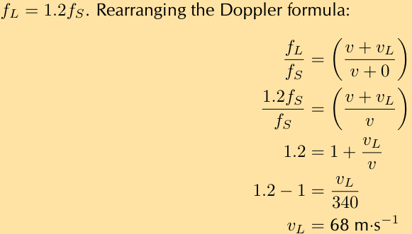
> **[Diagram Context - Textbook_PhysicalSciences_Gr12_The-Doppler-effect.pdf-0019-00.png]**
> The image shows a math problem that involves rearranging the Doppler formula. The problem is written in a scientific style, with a beige background and a black text box containing the math problem. The problem is accompanied by a diagram of a cell, which is used to explain the concept of the Doppler effect. The diagram is labeled with the variables involved in the problem, such as v, f, s, and l. The problem also includes a list of variables and their values, which are used to solve the problem.

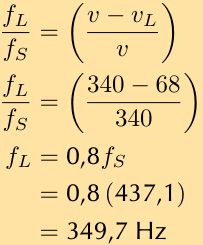
> **[Diagram Context - Textbook_PhysicalSciences_Gr12_The-Doppler-effect.pdf-0019-02.png]**
> The image shows a math problem involving the conversion of frequency from Hertz (Hz) to cycles per second (Cps). The problem is presented in a table format, with the frequency value in the top row and the corresponding cycles per second value in the bottom row. The problem also includes a formula for converting frequency from Hz to cycles per second. The problem is set against a beige background, and the text is in black.

> **[Diagram Context - Textbook_PhysicalSciences_Gr12_The-Doppler-effect.pdf-0019-04.png]**
> This educational graphic displays a mathematical conversion equation, specifically converting speed from metres per second to kilometres per hour. The visible text and symbols include the initial value $68\text{ }\frac{\text{m}}{\text{s}}$, conversion factors $\frac{1\text{km}}{1000\text{m}}$ and $\frac{3600\text{s}}{1\text{h}}$, multiplication signs, an equals sign, and the final result $244,8\text{ km}\cdot\text{h}^{-1}$. This graphic demonstrates the step-by-step dimensional analysis method required in Grade 10 Physical Sciences to convert units of velocity by multiplying by appropriate conversion fractions.

---

## 4. [Extension question]

A police car is driving towards a fleeing suspect at $\frac{v}{35}\text{ m}\cdot\text{s}^{-1}$, where $v$ is the speed of sound. The frequency of the police car's siren is $400\text{ Hz}$. The suspect is running away at $\frac{v}{68}\text{ m}\cdot\text{s}^{-1}$. What frequency does the suspect hear?

$$f_L = \left(\frac{v \pm v_L}{v \pm v_S}\right) f_S$$

* The source is moving towards the listener, so we need to put: $-v_S$
* The listener is moving away from the source, so we need to put: $-v_L$

So we use the formula:

$$f_L = \left(\frac{v - v_L}{v - v_S}\right) f_S$$

We are given that $v_L = \frac{v}{68}\text{ m}\cdot\text{s}^{-1}$ and $v_S = \frac{v}{35}\text{ m}\cdot\text{s}^{-1}$. Substituting into the formula:

$$\begin{aligned}
f_L &= \left(\frac{v - \frac{v}{68}}{v - \frac{v}{35}}\right) f_S \\[6pt]
&= \left(\frac{\frac{68v - v}{68}}{\frac{35v - v}{35}}\right) f_S \\[6pt]
&= \left(\frac{\left(\frac{67}{68}\right)v}{\left(\frac{34}{35}\right)v}\right) f_S \\[6pt]
&= \left(\frac{\frac{67}{68}}{\frac{34}{35}}\right) 400 \\[6pt]
f_L &= 405,7\text{ Hz}
\end{aligned}$$

**Answer:** $405,7\text{ Hz}$

---

## 5. Applications of the Doppler Effect

Explain how the Doppler effect is used to determine the direction of flow of blood in veins.

An instrument called a Doppler flow meter can be used to transmit ultrasonic waves into a person's body. The sound waves will be reflected by tissue, bone, blood etc., and measured by the flow meter. If blood flow is being measured in an artery for example, the moving blood cells will reflect the transmitted wave and due to the movement of the cells, the reflected sound waves will be Doppler shifted to higher frequency if the blood is moving towards the flow meter and to lower frequency if the blood is moving away from the flow meter.

---

## 6. Worked Example: Moving Listener and Stationary Source

An person in a car travelling at $22,2\text{ m}\cdot\text{s}^{-1}$ approaches a source emitting sound waves with a frequency of $410\text{ Hz}$. What is the frequency of the sound waves observed by the person? Assume the speed of sound in air is $340\text{ m}\cdot\text{s}^{-1}$.

The Doppler formula is:

$$f_L = \left(\frac{v \pm v_L}{v \pm v_S}\right) f_S$$

The source is stationary so $v_S = 0$. Rearranging the formula:

$$\begin{aligned}
f_L &= \left(\frac{v + v_L}{v}\right) f_S \\[6pt]
f_L &= \left(\frac{340 + 22,2}{340}\right) (410) \\[6pt]
&= 436,8\text{ Hz}
\end{aligned}$$

**Answer:** $436,8\text{ Hz}$

> **[Diagram Context - Textbook_PhysicalSciences_Gr12_Rate-and-Extent-of-Reaction.pdf-0020-02.png]**
> 1. Label a conical flask. A. Weigh 5 g zinc granules into it.
 2. Repeat with the second conical flask but label it B.
 3. Label the other beaker. 2. Pour 10 cm HCl into it.
 4. Label the other beaker. 5 cm HCl into it.
 5. Label the other beaker. 10 cm HCl into it.

> **[Diagram Context - Textbook_PhysicalSciences_Gr12_Rate-and-Extent-of-Reaction.pdf-0020-04.png]**
> 1. A diagram of a cell with a Lewis structure.

> **[Diagram Context - Textbook_PhysicalSciences_Gr12_The-Doppler-effect.pdf-0020-07.png]**
> The image shows a diagram of a Lewis structure for oxygen, with the formula v = (v1 + v2) / 2. The diagram is labeled with the variables v1, v2, and v, and the formula v = (v1 + v2) / 2. The diagram also includes arrows pointing to the oxygen atom and the bonds between the oxygen atoms. The diagram is set against a light beige background, and the text "From the observer, so: v = (v1 + v2) / 2" is written in black at the bottom of the image

> **[Diagram Context - Textbook_PhysicalSciences_Gr12_The-Doppler-effect.pdf-0020-15.png]**
> The image shows a diagram of a Lewis structure for oxygen, with the Lewis structure of oxygen being represented by a brown line. The diagram also includes a table with the Lewis structure of oxygen, represented by a brown line, and the Lewis structure of carbon dioxide, represented by a black line. The table also includes the Lewis structure of carbon dioxide, represented by a black line. The diagram and table are set against a light beige background.

