# Electric circuits

## Potential difference and emf

When a circuit is connected and complete, charge can move through the circuit. Charge will not move unless there is a reason, a force to drive it round the circuit. Think of it as though charge is at rest and something has to push it along. This means that work needs to be done to make charge move. A force acts on the charges, doing work, to make them move. The force is provided by the battery in the circuit.

A battery has the potential to drive charge round a closed circuit, the battery has potential energy that can be converted into electrical energy by doing work on the charge in the circuit to make it move.

See introductory video: (Video: VPfqj at www.everythingscience.co.za)

> ### DEFINITION: Potential Difference
> 
> Potential difference is the work done per unit charge, $\frac{W}{q}$. The units of potential difference are the volt ($\text{V}$) which is defined as one joule per coulomb.
> 
> Quantity: Potential difference ($V$) \quad Unit name: volt \quad Unit symbol: $\text{V}$

---

## Voltmeter

A voltmeter is an instrument for measuring the potential difference between two points in an electric circuit.

The symbol for a voltmeter is:

<!-- DIAGRAM_PLACEHOLDER: diagram -->

A voltmeter

<!-- DIAGRAM_PLACEHOLDER: diagram -->

*Photography by windy_ on Flickr.com*

---

CHAPTER 17. ELECTRIC CIRCUITS

# EMF

## 1. Concepts and Definitions

### Electromotive Force (emf)
When you measure the potential difference across (or between) the terminals of a battery that is **not in a complete circuit**, you are measuring the emf of the battery. 

* **Definition:** This is the maximum amount of work per coulomb of charge the battery can do to drive charge from one terminal, through the circuit, to the other terminal.
* **Note:** Electrical potential difference is also called voltage.

### Terminal Potential Difference
When you measure the potential difference across (or between) the terminals of a battery that is **in a complete circuit**, you are measuring the terminal potential difference of the battery. 

* **Note:** Although this is measured in volts, it is not identical to the emf. The difference will be the work done to drive charge through the battery.

---

## 2. Measurement of Potential Difference

* One lead of the voltmeter is connected to one end of the battery and the other lead is connected to the opposite end.
* The voltmeter may also be used to measure the voltage across a resistor or any other component of a circuit, but must always be connected in **parallel**.

---

## 3. Diagrams and Illustrations

<!-- DIAGRAM_PLACEHOLDER: diagram -->

* **Fact:** The volt is named after the Italian physicist Alessandro Volta ($1745–1827$).
* **Photograph:** Batteries (Source: *Photography on Flickr.com*)

---

# CHAPTER 17. ELECTRIC CIRCUITS

## Current

### Flow of charge

When we talk about current we talk about how much charge moves past a fixed point in a circuit in one second. Think of charges being pushed around the circuit by the battery, there are charges in the wires but unless there is a battery they won't move.

When one charge moves the charges next to it also move. They keep their spacing as if you had a tube of marbles like in this picture or looked at a train and its carriages.

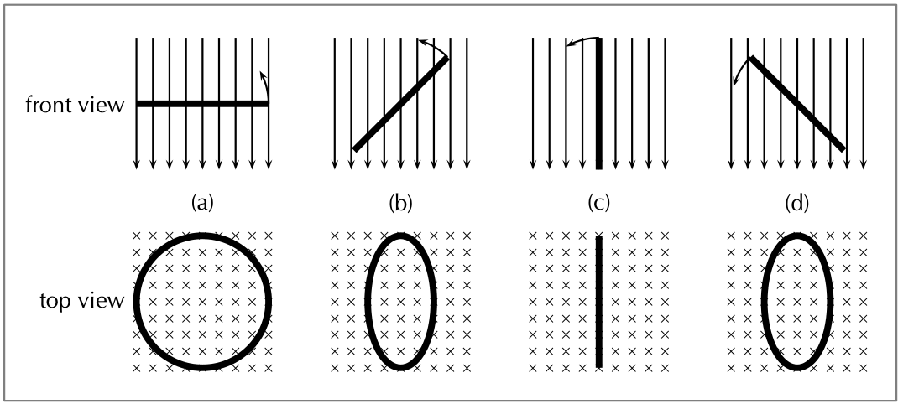
> **[Diagram Context - Textbook_PhysicalSciences_Gr12_Electrodynamics.pdf-0002-11.png]**
> 1. A diagram of a Lewis structure for oxygen.

If you push one marble into the tube one must come out the other side, if a train locomotive moves all the carriages move immediately because they are connected. This is similar to charges in the wires of a circuit.

The idea is that if a battery started to drive charge in a circuit all the charges start moving instantaneously.

---

### DEFINITION: Current

* **Current** is the rate at which charges moves past a fixed point in a circuit.
* The units of current are the **ampere (A)** which is defined as one coulomb per second.
* **Quantity:** Current ($I$)
* **Unit name:** ampere
* **Unit symbol:** $\text{A}$

---

### FACT

Benjamin Franklin made a guess about the direction of charge flow when rubbing smooth wax with rough wool. He thought that the charges flowed from the wax to the wool (i.e. from positive to negative) which was opposite to the real direction. Due to this, electrons are said to have a negative charge and so objects which Ben Franklin called "negative" (meaning a shortage of charge) really have an excess of electrons. By the time the true direction of electron flow was discovered, the convention of "positive" and "negative" had already been so well accepted in the scientific world that no effort was made to change it.

> **[Diagram Context - Textbook_PhysicalSciences_Gr12_Optical-phenomena-and-properties-of-matter.pdf-0002-03.png]**
> This photograph displays an array of photovoltaic solar panels mounted on a building roof under a clear blue sky. There are no visible text labels, axes, or arrows, capturing a real-world application of renewable energy infrastructure. For CAPS Physical Sciences and Technology learners, the image illustrates the practical conversion of solar (radiant) energy into electrical energy, highlighting sustainable energy sources and the generation of electricity from the sun.

---

# Chapter 17. Electric Circuits

## Electric Current

We use the symbol $I$ to show current, and it is measured in amperes (A). One ampere is defined as one coulomb of charge moving in one second ($\text{C} \cdot \text{s}^{-1}$).

$$I = \frac{Q}{\Delta t}$$

When current flows in a circuit, we show this on a diagram by adding arrows. The arrows show the direction of flow in a circuit. By convention, we say that charge flows from the positive terminal of a battery to the negative terminal.

If the voltage is high enough, a current can be driven through almost anything. In the plasma ball example, a voltage is created that is high enough to get charge to flow through the gas in the ball. The voltage is very high, but the resulting current is very low, making it safe to touch.

---

## Ammeter

An ammeter is an instrument used to measure the rate of flow of electric current in a circuit. 

Since one is interested in measuring the current flowing *through* a circuit component, the ammeter must be connected in **series** with the measured circuit component.

---

### Activity: Constructing circuits

Construct circuits to measure the emf and the terminal potential difference for a battery. Some common elements (components) which can be found in electrical circuits include light bulbs, batteries, connecting leads, switches, resistors, voltmeters, and ammeters.

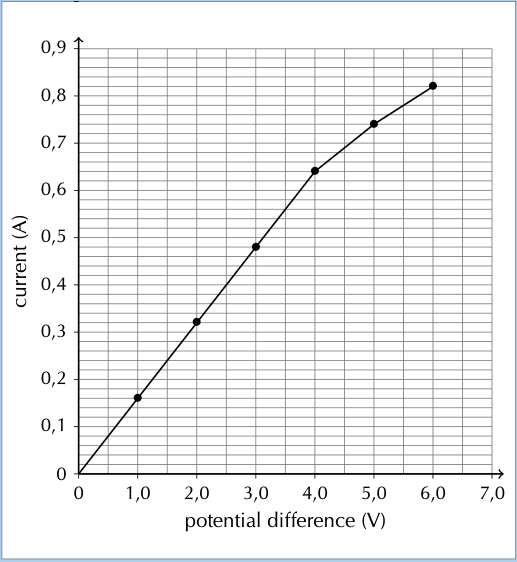
> **[Diagram Context - Textbook_PhysicalSciences_Gr12_Electric-circuits.pdf-0003-08.png]**
> This line graph illustrates the relationship

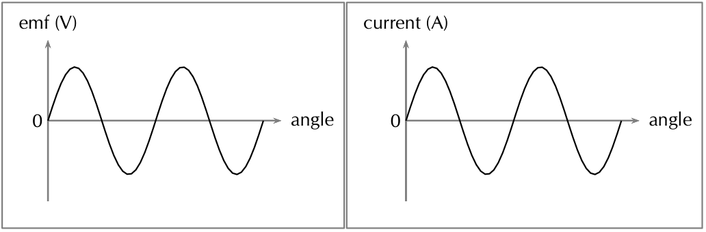
> **[Diagram Context - Textbook_PhysicalSciences_Gr12_Electrodynamics.pdf-0003-01.png]**
> 1. A diagram of a current wave and a current angle.

> **[Diagram Context - Textbook_PhysicalSciences_Gr12_Electrodynamics.pdf-0003-07.png]**
> The graphic presents an algebraic equation and definition related to electromagnetic induction. It displays the symbols $\mathcal{E}$, $N$, $\Delta\phi$, $\Delta t$, $\phi$, $B$, $A$, and $\theta$, along with the explanatory text defining $\phi = B \cdot A \cos\theta$ and $B$. Conceptually, this conveys Faraday's Law of Electromagnetic Induction—showing that the induced electromotive force ($\mathcal{E}$) in a coil is directly proportional to the rate of change of magnetic flux ($\Delta\phi / \Delta t$) and the number of turns ($N$), where the negative sign represents Lenz's Law.

---

## CHAPTER 17. ELECTRIC CIRCUITS

### Circuit Components and Their Symbols

The table below summarizes common circuit components, their schematic symbols, and their usage:

| Component | Symbol | Usage |
| :--- | :--- | :--- |
| light bulb | 

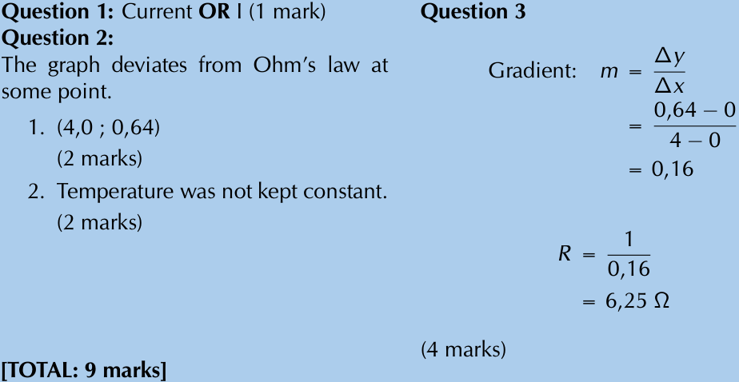
> **[Diagram Context - Textbook_PhysicalSciences_Gr12_Electric-circuits.pdf-0004-01.png]**
> This image displays worked memo answers and mark allocations for a Grade 11 Physical Sciences electricity assessment. Visible text elements include "Question 1: Current OR I", coordinate points "(4,0 ; 0,64)", explanations regarding Ohm's law and temperature, and gradient calculation steps using the formula $m = \frac{\Delta y}{\Delta x}$ to determine resistance $R$ in ohms ($\Omega$). Conceptually, it demonstrates how to extract physical quantities like resistance from graphical data gradients and tests learners' understanding of ohmic conductors and the conditions required for Ohm's law to hold true under the CAPS curriculum.

 | glows when charge moves through it |
| battery | 

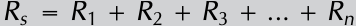
 | provides energy for charge to move |
| switch | <!-- DIAGRAM_PLACEHorton: diagram --> | allows a circuit to be open or closed |
| resistor | 

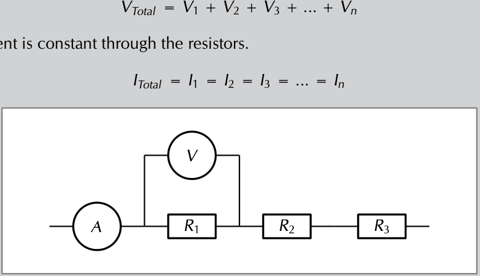
> **[Diagram Context - Textbook_PhysicalSciences_Gr12_Electric-circuits.pdf-0004-09.png]**
> This electric circuit diagram illustrates three resistors

 (OR 

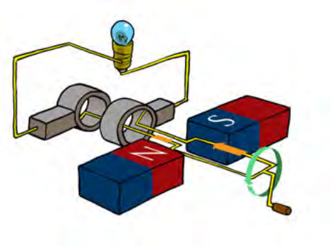
> **[Diagram Context - Textbook_PhysicalSciences_Gr12_Electrodynamics.pdf-0004-04.png]**
> 1. A diagram of a circuit with a light bulb, magnets, and wires.

) | resists the flow of charge |
| voltmeter | 

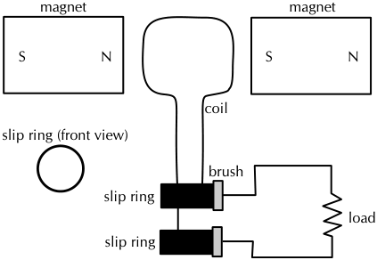
> **[Diagram Context - Textbook_PhysicalSciences_Gr12_Electrodynamics.pdf-0004-05.png]**
> 1. A diagram of a circuit with a motor, a load, and a switch.

 | measures potential difference |
| ammeter | 

> **[Diagram Context - Textbook_PhysicalSciences_Gr12_Optical-phenomena-and-properties-of-matter.pdf-0004-09.png]**
> The educational graphic illustrates the photoelectric effect on a metal surface. Visible labels include "Incoming radiation" with wavy directional arrows, "Sea of electrons inside the metal waiting to be set free" containing multiple circles with minus signs representing electrons, and "Electrons knocked out" pointing to emitted electrons leaving the surface via straight arrows. For a Grade 12 Physical Sciences learner, the diagram conceptually conveys how incident photons transfer energy to free electrons within a metal, causing them to be ejected when the threshold frequency is met.

 | measures current in a circuit |
| connecting lead | <!-- DIAGRAM_PLACEHOLDER: diagram --> | connects circuit elements together |

Experiment with different combinations of components in the circuits.

---

### Tip
> A battery **does not** produce the same amount of current no matter what is connected to it. While the voltage produced by a battery is constant, the amount of current supplied depends on what is in the circuit.

---

### Summary of Measuring Instruments

The table below summarizes the use of each measuring instrument and the way it should be connected relative to a circuit component:

| Instrument | Measured Quantity | Proper Connection |
| :--- | :--- | :--- |
| Voltmeter | Voltage | In Parallel |
| Ammeter | Current | In Series |

---

### Activity: Using meters

If possible, connect meters in circuits to get used to the use of meters to measure electrical quantities. If the meters have more than one scale, always connect to the **largest scale** first so that the meter will not be damaged by having to measure values that exceed its limits.

---

CHAPTER 17. ELECTRIC CIRCUITS | 17.2
---

## Example 1: Calculating current I

### QUESTION

An amount of charge equal to $45\text{ C}$ moves past a point in a circuit in $1\text{ second}$, what is the current in the circuit?

### SOLUTION

*   **Step 1 : Analyse the question**  
    We are given an amount of charge and a time and asked to calculate the current. We know that current is the rate at which charge moves past a fixed point in a circuit so we have all the information we need. We have quantities in the correct units already.

*   **Step 2 : Apply the principles**  
    We know that:

    $$I = \frac{Q}{\Delta t}$$

    $$I = \frac{45\text{ C}}{1\text{ s}}$$

    $$I = 45\text{ C}\cdot\text{s}^{-1}$$

    $$I = 45\text{ A}$$

*   **Step 3 : Quote the final result**  
    The current is $45\text{ A}$.

---

## Example 2: Calculating current II

### QUESTION

An amount of charge equal to $53\text{ C}$ moves past a fixed point in a circuit in $2\text{ s}$...

---
Physics: Electricity and Magnetism | 285

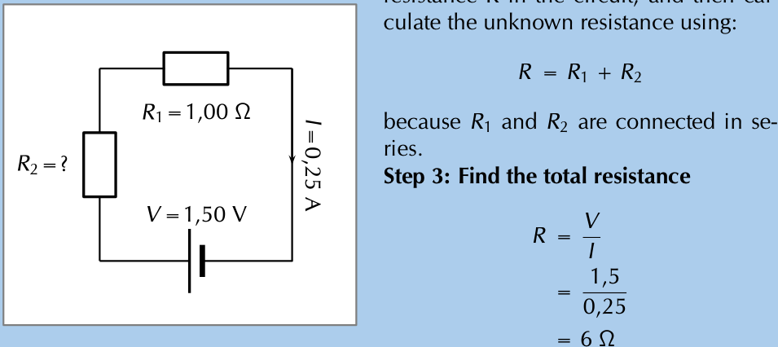
> **[Diagram Context - Textbook_PhysicalSciences_Gr12_Electric-circuits.pdf-0005-09.png]**
> The graphic displays an electric circuit diagram accompanied by step-by-step worked calculations for total resistance. Visible labels include components such as a voltage source ($V = 1,50\text{ V}$), known resistor ($R_1 = 1,00\ \Omega$), unknown resistor ($R_2 = ?$), circuit current ($I = 0,25\text{ A}$ with a directional arrow), and equations applying Ohm's law and series resistor formulas ($R = R_1 + R_2$ and $R = \frac{V}{I}$). This visual supports Grade 10-12 Physical Sciences learners in mastering electric circuits by demonstrating how to apply Ohm's law and series circuit principles to determine an unknown resistance.

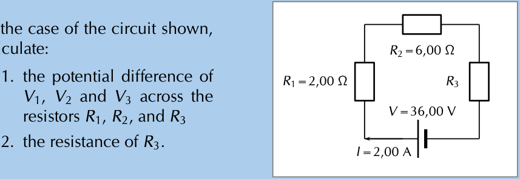
> **[Diagram Context - Textbook_PhysicalSciences_Gr12_Electric-circuits.pdf-0005-14.png]**
> /12 electric circuits: series

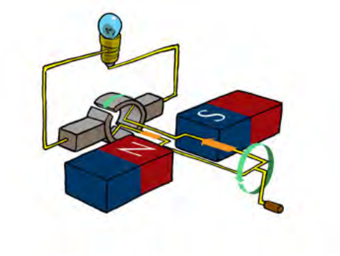
> **[Diagram Context - Textbook_PhysicalSciences_Gr12_Electrodynamics.pdf-0005-03.png]**
> 1. A diagram of a circuit with a light bulb, magnets, and wires.

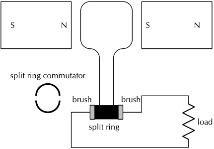
> **[Diagram Context - Textbook_PhysicalSciences_Gr12_Electrodynamics.pdf-0005-04.png]**
> 1. A diagram of a split ring commutator.

> **[Diagram Context - Textbook_PhysicalSciences_Gr12_Optical-phenomena-and-properties-of-matter.pdf-0005-01.png]**
> This educational graphic illustrates a gold-leaf electroscope apparatus used to demonstrate the photoelectric effect. Visible labels include "zinc plate," "gold foil leaves," "glass container," "red light," and "ultraviolet light," with negative charge symbols (-) indicating electron presence on the plate and leaves. Conceptually, it conveys that low-frequency red light cannot cause photoemission (leaving leaves charged and separated), whereas high-frequency ultraviolet light successfully ejects photoelectrons, causing the electroscope to discharge and the gold leaves to collapse.

---

seconds, what is the current in the circuit?

**SOLUTION**

**Step 1 : Analyse the question**  
We are given an amount of charge and a time and asked to calculate the current. We know that current is the rate at which charge moves past a fixed point in a circuit so we have all the information we need. We have quantities in the correct units already.

**Step 2 : Apply the principles**  
We know that:

$$I = \frac{Q}{\Delta t}$$

$$I = \frac{53\text{ C}}{2\text{ s}}$$

$$I = 26,5\text{ C}\cdot\text{s}^{-1}$$

$$I = 26,5\text{ A}$$

**Step 3 : Quote the final result**  
The current is $26,5\text{ A}$.

---

### Example 3: Calculating current III

**QUESTION**  
$95$ electrons move past a fixed point in a circuit in one tenth of a second, what is the current in the circuit?

**SOLUTION**  
**Step 1 : Analyse the question**  
We are given a number of charged particles that move past a fixed point and the time that it takes. We know that current is the rate at which charge moves past a fixed point in a circuit so we have to determine the charge. In the last chapter we learnt that the charge carried by an

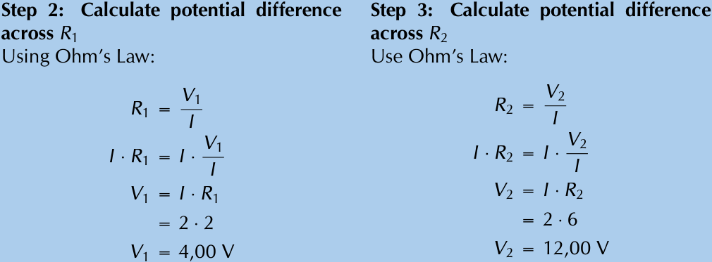
> **[Diagram Context - Textbook_PhysicalSciences_Gr12_Electric-circuits.pdf-0006-03.png]**
> This graphic displays a step-by

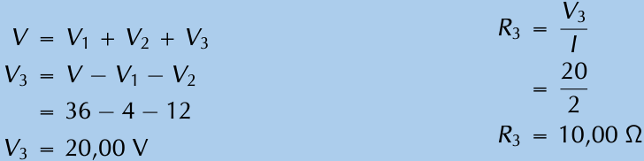
> **[Diagram Context - Textbook_PhysicalSciences_Gr12_Electric-circuits.pdf-0006-08.png]**
> The graphic displays algebraic calculations for electric circuit analysis involving potential difference and resistance. It features the variables $V$, $V_1$, $V_2$, $V_3$, $I$, and $R_3$, along with numerical values and units such as volts (V) and ohms ($\Omega$). Conceptually, it demonstrates how to apply Ohm's law and potential difference relationships in series circuits to determine an unknown resistance value step-by-step.

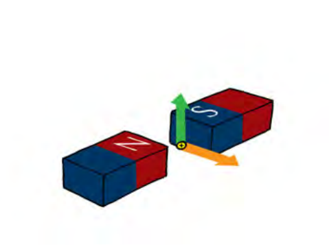
> **[Diagram Context - Textbook_PhysicalSciences_Gr12_Electrodynamics.pdf-0006-11.png]**
> 1. A diagram of two magnets with arrows pointing to the north and south poles.

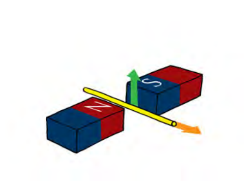
> **[Diagram Context - Textbook_PhysicalSciences_Gr12_Electrodynamics.pdf-0006-13.png]**
> The image presents a diagram of two magnets, one red and one blue, with arrows pointing in opposite directions. The magnets are positioned on top of each other, with the red magnet on the left and the blue magnet on the right. The diagram also includes a label for the magnet's north pole and a label for the south pole. The diagram is labeled with the letters "N" and "S" and the word "magnetism" is written in the top right corner.

> **[Diagram Context - Textbook_PhysicalSciences_Gr12_Optical-phenomena-and-properties-of-matter.pdf-0006-03.png]**
> This educational graphic is an experimental apparatus demonstrating the photoelectric effect, showing a light source shining ultraviolet light onto a metal plate inside an evacuated tube connected to a circuit. Visible labels and indicators include "Intensity," a wavelength of "400 nm," a spectrum bar ranging from UV to IR, voltage set to "0.00 V," and a measured "Current: 0.035" with blue dots representing emitted photoelectrons traveling between the electrodes. Conceptually, this helps learners understand how incident light above the threshold frequency ejects electrons from a metal surface to generate a measurable electric current.

---

CHAPTER 17. ELECTRIC CIRCUITS
17.3

electron is $1,6 \times 10^{-19}\text{ C}$.

*Step 2 : Apply the principles: determine the charge*  
We know that each electron carries a charge of $1,6 \times 10^{-19}\text{ C}$, therefore the total charge is:

$$
\begin{aligned}
Q &= 95 \times 1,6 \times 10^{-19}\text{ C} \\
&= 1,52 \times 10^{-17}\text{ C}
\end{aligned}
$$

*Step 3 : Apply the principles: determine the charge*  
We know that:

$$
\begin{aligned}
I &= \frac{Q}{\Delta t} \\
I &= \frac{1,52 \times 10^{-17}\text{ C}}{\frac{1}{10}\text{ s}} \\
I &= \frac{1,52 \times 10^{-17}\text{ C}}{1} \times \frac{1}{\frac{1}{10}\text{ s}} \\
I &= \frac{1,52 \times 10^{-17}\text{ C}}{1} \times \frac{10}{1\text{ s}} \\
I &= 1,52 \times 10^{-16}\text{ C}\cdot\text{s}^{-1} \\
I &= 1,52 \times 10^{-16}\text{ A}
\end{aligned}
$$

*Step 4 : Quote the final result*  
The current is $1,52 \times 10^{-16}\text{ A}$.

---

# Resistance

Resistance is a measure of "how hard" it is to "push" electricity through a circuit element.  
Resistance can also apply to an entire circuit.  
See video: VPfvk at www.everythingscience.co.za

---

Physics: Electricity and Magnetism
287

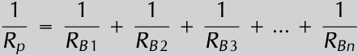
> **[Diagram Context - Textbook_PhysicalSciences_Gr12_Electric-circuits.pdf-0007-03.png]**
> The graphic displays a mathematical equation for electrical circuits, specifically the formula for calculating total equivalent resistance in a parallel combination. Visible symbols include the variables $R_p$ representing total parallel resistance, and individual branch resistances labeled $R_{B1}$, $R_{B2}$, $R_{B3}$, up to $R_{Bn}$ connected by addition signs and an ellipsis indicating multiple resistors. Conceptually, this conveys to Grade 10-12 Physical Sciences learners how resistors in parallel share current and reduce the combined total resistance of the circuit according to the reciprocal relationship $\frac{1}{R_p} = \frac{1}{R_1} + \frac{1}{R_2} + ...$.

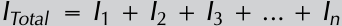

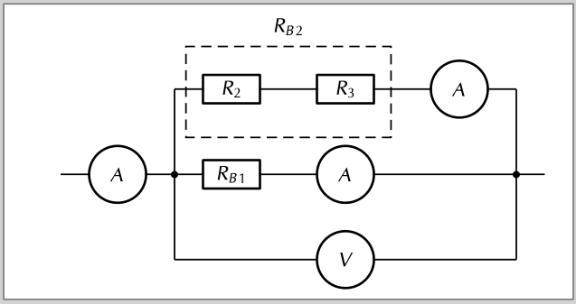
> **[Diagram Context - Textbook_PhysicalSciences_Gr12_Electric-circuits.pdf-0007-08.png]**
> This graphic displays an electric circuit diagram featuring a combination of series and parallel resistor networks connected with ammeters and a voltmeter. Visible labels include resistors $R_2$, $R_3$, $R_{B1}$, and $R_{B2}$ (enclosing a series branch of $R_2$ and $R_3$), alongside multiple ammeters ($A$) and a voltmeter ($V$). Conceptually, this helps Grade 11 and 12 Physical Sciences learners analyze current division, potential difference, and equivalent resistance in complex circuits according to Ohm's Law and Kirchhoff's laws.

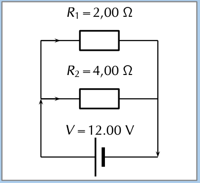
> **[Diagram Context - Textbook_PhysicalSciences_Gr12_Electric-circuits.pdf-0007-15.png]**
> The graphic is an electric circuit diagram showing a parallel combination of resistors connected to a voltage source. Visible labels include resistor values $R_1 = 2,00\ \Omega$ and $R_2 = 4,00\ \Omega$, a potential difference $V = 12,00\ \text{V}$, and directional arrows indicating conventional current flow. For a Grade 10-12 Physical Sciences learner, this diagram conveys how multiple resistors share the same potential difference in a parallel network, allowing them to calculate equivalent resistance and branch currents using Ohm's law.

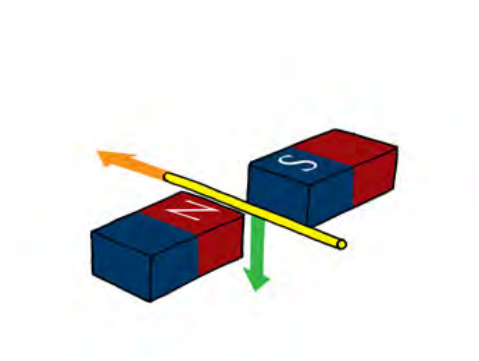
> **[Diagram Context - Textbook_PhysicalSciences_Gr12_Electrodynamics.pdf-0007-00.png]**
> The image presents a diagram of two magnets, each with a different color and a label indicating the north and south poles. The magnets are positioned in such a way that they are facing each other, with their ends pointing in opposite directions. The diagram also includes arrows pointing in the same direction, indicating the magnetic field lines. The diagram is labeled with the names of the north and south poles, as well as the names of the magnetic field lines.

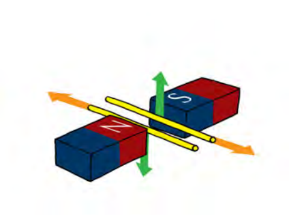
> **[Diagram Context - Textbook_PhysicalSciences_Gr12_Electrodynamics.pdf-0007-02.png]**
> 1. A diagram of two magnets with arrows pointing in opposite directions.

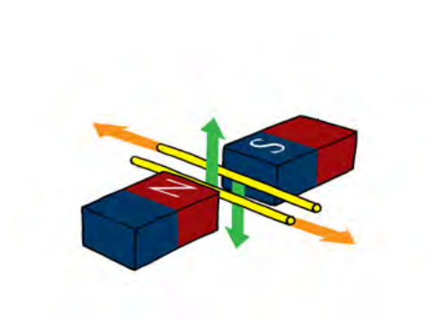
> **[Diagram Context - Textbook_PhysicalSciences_Gr12_Electrodynamics.pdf-0007-03.png]**
> The image presents a diagram of two magnets, each with a red and blue block and a yellow pole. The magnets are positioned in such a way that they are facing each other, with the magnets' north poles facing each other. The magnets are connected by a yellow pole, and the blocks are connected by a red pole. The diagram is labeled with the names of the magnets and the blocks, and arrows are used to indicate the direction of the magnetic fields. The diagram also includes a legend that explains the meaning of the different symbols used in the diagram.

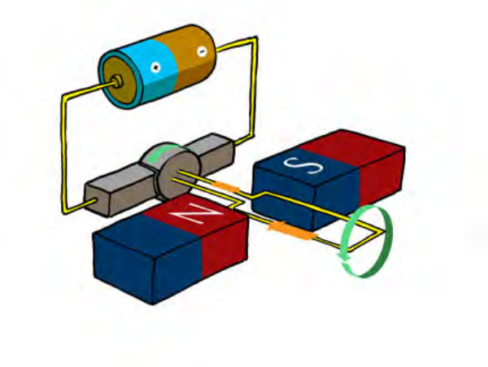
> **[Diagram Context - Textbook_PhysicalSciences_Gr12_Electrodynamics.pdf-0007-07.png]**
> 1. A diagram of a circuit with a battery, two magnets, and a wire.

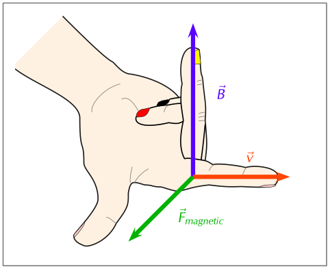
> **[Diagram Context - Textbook_PhysicalSciences_Gr12_Electrodynamics.pdf-0007-09.png]**
> The image presents a hand with a green arrow pointing to the right, labeled "F" and "magnetic", and a green arrow pointing to the left, labeled "V". The diagram also includes a green arrow pointing to the right, labeled "B", and a green arrow pointing to the left, labeled "A". The diagram is set against a white background, and the text "magnetic" and "F" are visible.

> **[Diagram Context - Textbook_PhysicalSciences_Gr12_Optical-phenomena-and-properties-of-matter.pdf-0007-03.png]**
> The graphic displays two variations of the photoelectric effect equation showing Planck's quantum energy relationship. Visible variables and symbols include $E_{k\text{ max}}$, $h$, $f$, $W_0$, $f_0$, along with algebraic mapping brackets labeled $y$ under $E_{k\text{ max}}$ and $x$ under $f$. This demonstrates to Grade 12 Physical Sciences learners how to map the photoelectric equation to the linear equation format $y = mx + c$ for analyzing graphical problems.

> **[Diagram Context - Textbook_PhysicalSciences_Gr12_Optical-phenomena-and-properties-of-matter.pdf-0007-04.png]**
> This educational graphic is a line graph illustrating the photoelectric effect, showing maximum kinetic energy as a function of frequency. Visible labels include the vertical axis $E_k\text{ (J)}$, the horizontal axis $f\text{ (Hz)}$, threshold frequency $f_0$, and regions marked "No emission ($f < f_0$)" and "Emission ($f > f_0$)" separated by a vertical dashed line. For Grade 12 Physical Sciences learners, the graph visually demonstrates that photoelectrons are only emitted when incident light exceeds the threshold frequency ($f_0$), with kinetic energy increasing linearly above this cutoff value.

> **[Diagram Context - Textbook_PhysicalSciences_Gr12_Optical-phenomena-and-properties-of-matter.pdf-0007-16.png]**
> This educational graphic displays a physics calculation showing a solved problem for the photoelectric effect. Visible elements include the formula $E_k = \frac{hc}{\lambda} - W_{0 \text{ silver}}$, substituted numerical values containing Planck's constant ($6,63 \times 10^{-34}$), the speed of light ($3 \times 10^8$), wavelength ($\lambda = 2,5 \times 10^{-7}$), work function for silver ($6,9 \times 10^{-19}$), and the final calculated maximum kinetic energy in Joules ($\text{J}$). For a Grade 12 Physical Sciences learner, this demonstrates the step-by-step application of Einstein's photoelectric equation to calculate the maximum kinetic energy of emitted photoelectrons from a specific metal surface.

---

## CHAPTER 17. ELECTRIC CIRCUITS

### What causes resistance?

On a microscopic level, electrons moving through the conductor collide (or interact) with the particles of which the conductor (metal) is made. When they collide, they transfer kinetic energy. The electrons therefore lose kinetic energy and slow down. This leads to resistance. The transferred energy causes the resistor to heat up. You can feel this directly if you touch a cellphone charger when you are charging a cell phone - the charger gets warm because its circuits have some resistors in them!

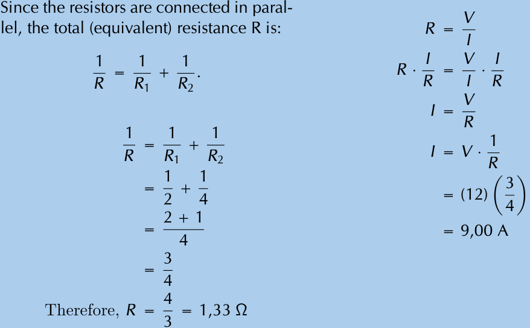
> **[Diagram Context - Textbook_PhysicalSciences_Gr12_Electric-circuits.pdf-0008-06.png]**
> The educational graphic displays a mathematical step-by-step calculation solving for equivalent resistance and total current in an electrical circuit. Visible variables, symbols, and units include $R$, $R_1$, $R_2$, $V$, $I$, fractions, and ohms ($\Omega$) and amperes (A). Conceptually, this demonstrates how to apply Ohm's Law and the parallel resistance formula to calculate combined resistance and total current for Grade 10-12 Physical Sciences learners studying electricity and magnetism.

> **DEFINITION: Resistance**
> 
> Resistance slows down the flow of charge in a circuit. The unit of resistance is the ohm ($\Omega$) which is defined as a volt per ampere of current.
> 
> Quantity: Resistance $R \quad \text{Unit: ohm} \quad \text{Unit symbol: } \omega$
> 
> $$1 \text{ ohm} = 1 \frac{\text{volt}}{\text{ampere}}$$

---

> **FACT**
> 
> Fluorescent lightbulbs do not use thin wires; they use the fact that certain gases glow when a current flows through them. They are much more efficient (much less resistance) than lightbulbs.

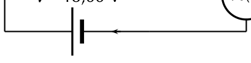

All conductors have some resistance. For example, a piece of wire has less resistance than a light bulb, but both have resistance.

A lightbulb is a very thin wire surrounded by a glass housing. The high resistance of the small wire (filament) in a lightbulb causes the electrons to transfer a lot of their kinetic energy in the form of heat. The heat energy is enough to cause the filament to glow white-hot which produces light.

The wires connecting the lamp to the cell or battery hardly even get warm while conducting the same amount of current. This is because of their much lower resistance due to their larger cross-section (they are thicker).

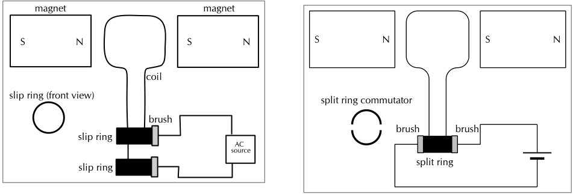
> **[Diagram Context - Textbook_PhysicalSciences_Gr12_Electrodynamics.pdf-0008-03.png]**
> 1. A diagram of a circuit with a brush and split ring components.

> **[Diagram Context - Textbook_PhysicalSciences_Gr12_Optical-phenomena-and-properties-of-matter.pdf-0008-06.png]**
> The image displays a text-based physics equation showing the work function value for gold, represented by the mathematical expression $W_{0\text{ gold}} = 8,92 \times 10^{-19}\text{ J}$. Visible symbols include the variable $W_0$, the subscript "gold", an equals sign, and the numerical value with its SI unit joules ($\text{J}$). For Grade 12 Physical Sciences learners studying the photoelectric effect under the CAPS curriculum, this conveys the specific minimum amount of energy required to emit an electron from the surface of a gold metal plate.

> **[Diagram Context - Textbook_PhysicalSciences_Gr12_Optical-phenomena-and-properties-of-matter.pdf-0008-07.png]**
> This educational graphic shows a worked numerical calculation for the photoelectric effect, specifically determining photon energy ($E_{\text{photon}} = hf$) and comparing it to a metal's work function ($W_0$). Visible labels and symbols include $E_{\text{photon}}$, Planck's constant ($h$), frequency ($f$), and the work function of gold ($W_{0\text{ gold}}$), along with values in Joules ($\text{J}$) and scientific notation. Conceptually, it guides Grade 12 Physical Sciences learners through step-by-step problem-solving to determine whether incident ultraviolet light has sufficient energy to emit photoelectrons from a gold surface.

---

# CHAPTER 17. ELECTRIC CIRCUITS

## Physical attributes affecting resistance

An important effect of a resistor is that it *converts* electrical energy into other forms of **heat energy**. **Light** energy is a by-product of the heat that is produced.

The physical attributes of a resistor affect its total resistance:

* **Length:** if a resistor is increased in length its resistance will increase. Typically if you increase the length of a resistor by a certain factor you will increase the resistance by the same factor.
* **Width and height or cross-sectional area:** if a resistor provides a larger pathway by being made wider or broader then more current can flow through it. If the total surface area through which current flows (cross-sectional area) is increased by a factor the resistance typically decreases by the same factor.

**Extension:** For a single resistor this can be summarised as

$$R \propto \frac{L}{A}$$

where $L$ is the length and $A$ is the cross-sectional area.

---

## Why do batteries go flat?

A battery stores chemical potential energy. When it is connected in a circuit, a chemical reaction takes place inside the battery which converts chemical potential energy to electrical energy which powers the electrons to move through the circuit. All the circuit elements (such as the conducting leads, resistors and lightbulbs) have some resistance to the flow of charge and convert the electrical energy to heat and, in the case of the lightbulb, light. Since energy is always conserved, the battery goes flat when all its chemical potential energy has been converted into other forms of energy.

---

## Resistors in electric circuits

It is important to understand what effect adding resistors to a circuit has on the *total* resistance of a circuit and on the current that can flow in the circuit.

---

## FACT BOX: Superconductors

There is a special type of conductor, called a **superconductor** that has no resistance, but the materials that make up all known superconductors only start superconducting at very low temperatures. The "highest" temperature superconductor is mercury barium calcium copper oxide ($\text{HgBa}_2\text{Ca}_2\text{Cu}_3\text{O}_x$) which is superconducting for temperatures of $-140^\circ\text{ C}$ and colder.

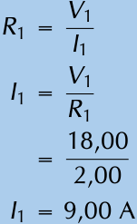
> **[Diagram Context - Textbook_PhysicalSciences_Gr12_Electric-circuits.pdf-0009-10.png]**
> This educational graphic presents a step-by-step algebraic calculation for electrical resistance and current within a physical sciences context. It displays the formulas $R_1 = \frac{V_1}{I_1}$ and rearranged $I_1 = \frac{V_1}{R_1}$, followed by numerical substitution using South African decimal notation ($\frac{18,00}{2,00}$) to solve for current as $9,00\text{ A}$. Conceptually, it guides high school learners through applying Ohm's Law to calculate circuit variables during electrical calculations.

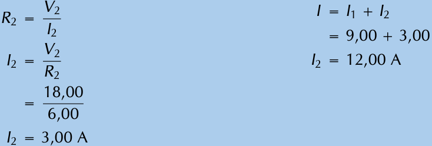
> **[Diagram Context - Textbook_PhysicalSciences_Gr12_Electric-circuits.pdf-0009-15.png]**
> This image displays a set of mathematical equations and calculations related to electrical circuits involving resistance ($R$), potential difference ($V$), and current ($I$). Visible labels and variables include $R_2$, $V_2$, $I$, $I_1$, and $I_2$, along with numerical values and units such as amperes ($\text{A}$). Conceptually, it guides Grade 10–12 Physical Sciences learners through applying Ohm's law and current conservation principles in parallel circuit problem-solving.

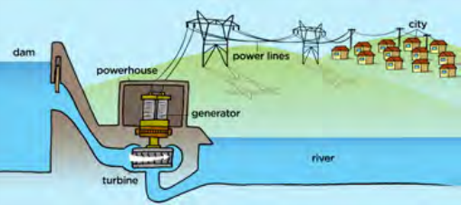
> **[Diagram Context - Textbook_PhysicalSciences_Gr12_Electrodynamics.pdf-0009-00.png]**
> 1. A diagram of a hydroelectric dam and power lines.
 2. A diagram of a river and power lines.
 3. A diagram of a dam and power lines.

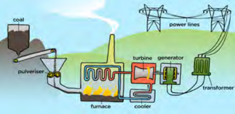
> **[Diagram Context - Textbook_PhysicalSciences_Gr12_Electrodynamics.pdf-0009-01.png]**
> 1. A diagram of a power plant with a coal-fired boiler, a pulveriser, a furnace, a cooling tower, and a transformer.

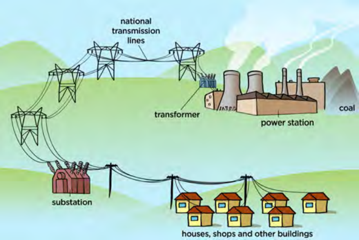
> **[Diagram Context - Textbook_PhysicalSciences_Gr12_Electrodynamics.pdf-0009-02.png]**
> 1. A diagram of a power station with a transformers and a power station.

> **[Diagram Context - Textbook_PhysicalSciences_Gr12_Optical-phenomena-and-properties-of-matter.pdf-0009-07.png]**
> The graphic displays two alternative worked mathematical calculation steps for solving a physics problem involving wave properties and photon energy. The visible symbols and variables include $c$, $f$, $\lambda$, $E$, and $h$, with numerical values utilizing South African decimal comma notation ($3 \times 10^8$, $330 \times 10^{-9}$, $6,63 \times 10^{-34}$, and $6,03 \times 10^{-19}$). This illustrates how to apply the wave equation ($c = f\lambda$) and Planck's energy equation ($E = \frac{hc}{\lambda}$ or $E = hf$) to determine frequency and energy in Grade 12 Physical Sciences.

> **[Diagram Context - Textbook_PhysicalSciences_Gr12_Optical-phenomena-and-properties-of-matter.pdf-0009-09.png]**
> This mathematical calculation graphic displays a physics formula and its numerical substitution. The visible text includes the symbols $E$, $h$, $f$, numbers in scientific notation representing energy and Planck's constant, and the resultant frequency unit $\text{Hz}$. Conceptually, it demonstrates how to apply Planck's equation to calculate the frequency of a photon when given its energy, a key skill for Grade 12 Physical Sciences learners studying the photoelectric effect and light as electromagnetic radiation.

> **[Diagram Context - Textbook_PhysicalSciences_Gr12_Optical-phenomena-and-properties-of-matter.pdf-0009-12.png]**
> This educational graphic shows a multi-step algebraic calculation applying Einstein's photoelectric equation ($E = W_o + K$) to solve for maximum kinetic energy. Visible variables and constants include photon energy ($E$), Planck's constant ($h$), speed of light ($c$), wavelength ($\lambda$), work function ($W_o$), and kinetic energy ($K$). Conceptually, it guides Grade 12 Physical Sciences learners through substituting known values into the wave-particle duality formula to calculate the kinetic energy of an emitted photo-electron in Joules.

---

CHAPTER 17. ELECTRIC CIRCUITS

# Series resistors (ESAFJ)

When we add resistors in series to a circuit:

* There is only one path for current to flow which ensures that the **current is the same at every point in the circuit**.
* The voltage is **divided** across the resistors. The voltage across the battery in the circuit is equal to the sum of voltages across the series resistors:

$$V_{battery} = V_1 + V_2 + \dots$$

* The resistance to the flow of current **increases**. The total resistance, $R_S$ is given by:

$$R_S = R_1 + R_2 + \dots$$

We will revisit each of these features of series circuits in more detail below.

When resistors are in series, one after the other, there is a potential difference across each resistor. The total potential difference across a set of resistors in series is the sum of the potential differences across each of the resistors in the set.

$$V_{battery} = V_1 + V_2 + \dots$$

Look at the circuits below. If we measured the potential difference between the black dots in all of these circuits it would be the same as we saw earlier. So we now know the total potential difference is the same across one, two or three resistors. We also know that some work is required to make charge flow through each resistor.

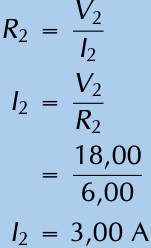

Let us look at this in a bit more detail. In the picture below you can see what the different measurements for $3$ identical resistors in series could look like. The total voltage across all three resistors is the sum of the voltages across the individual resistors. Resistors in series are known as voltage dividers because the total voltage across all the resistors is divided amongst the individual resistors.

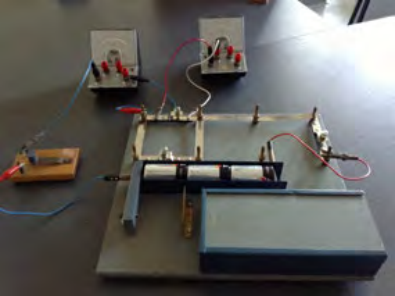

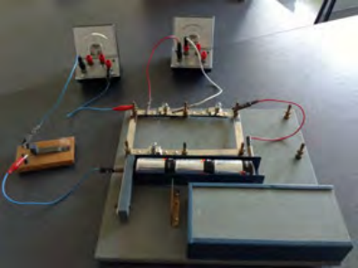

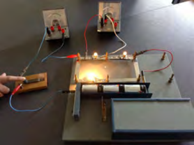

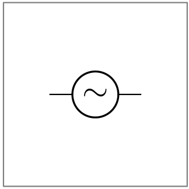

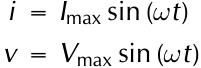

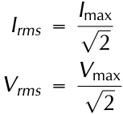

---

CHAPTER 17. ELECTRIC CIRCUITS | 17.4
---

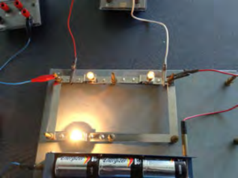
> **[Diagram Context - Textbook_PhysicalSciences_Gr12_Electric-circuits.pdf-0011-03.png]**
> This image shows a physical apparatus representing an electric circuit with multiple branches containing light bulbs connected to a battery pack and external meters via connecting wires and crocodile clips. Visible components include Energizer batteries, conducting strips forming parallel branches, and glowing incandescent bulbs. This setup demonstrates how current divides in a parallel circuit, helping learners understand potential difference, resistance, and the conservation of charge as prescribed by the CAPS Physical Sciences curriculum.

Consider the diagram below. On the left there is a circuit with a single resistor and a battery. **No matter where we measure the current, it is the same in a series circuit**. On the right, we have added a second resistor in series to the circuit. The *total* resistance of the circuit has *increased* and you can see from the reading on the ammeter that the current in the circuit has decreased.

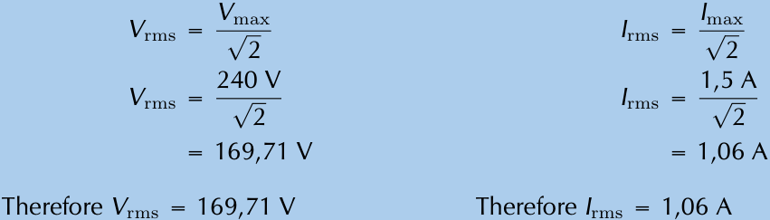
> **[Diagram Context - Textbook_PhysicalSciences_Gr12_Electrodynamics.pdf-0011-11.png]**
> The image shows a table with two columns and four rows. The first column contains the variable "V" and the second column contains the variable "max". The table also includes the variable "v2" and the variable "2v". The first row of the table contains the variable "1.5a" and the variable "1.06a". The second row of the table contains the variable "Therefore" and the variable "1.06a".

## General experiment: Voltage dividers

**Aim:** Test what happens to the current and the voltage in series circuits when additional resistors are added.

**Apparatus:**
* A battery
* A voltmeter
* An ammeter
* Wires
* Resistors

---
Physics: Electricity and Magnetism | 291

> **[Diagram Context - Textbook_PhysicalSciences_Gr12_Optical-phenomena-and-properties-of-matter.pdf-0011-07.png]**
> This diagram illustrates a discharge tube apparatus used to demonstrate atomic emission spectra. It features visible labels for "Gas", "Current", voltage "V", and wavy arrows representing "Photons of various energies". Conceptually, it conveys how passing an electric current through a gas at low pressure excites atoms, causing them to emit photons corresponding to discrete energy transitions when electrons return to lower energy states.

---

# CHAPTER 17. ELECTRIC CIRCUits

## Method:

* Construct each circuit shown below
* Measure the voltage across each resistor in the circuit.
* Measure the current before and after each resistor in the circuit.

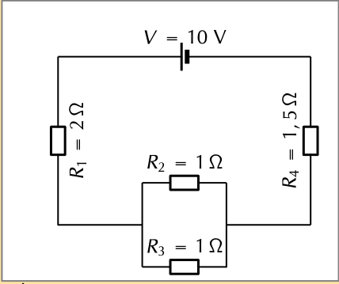
> **[Diagram Context - Textbook_PhysicalSciences_Gr12_Electric-circuits.pdf-0012-01.png]**
> This graphic displays an electric circuit diagram featuring a 10 V voltage source connected in series with four resistors labelled $R_1 = 2\ \Omega$, $R_2 = 1\ \Omega$, $R_3 = 1\ \Omega$, and $R_4 = 1,5\ \Omega$, where $R_2$ and $R_3$ are arranged in parallel. For Grade 10-12 Physical Sciences learners studying Ohm's law and electric circuits, this diagram conveys how to calculate total equivalent resistance and current by combining series and parallel components in a mixed circuit configuration.

## Results and conclusions:

* Compare the sum of the voltages across all the resistors in each of the circuits.
* Compare the various current measurements within the same circuit.

The total resistance is equal to $R_1$ in the first circuit, to $R_1 + R_2$ in the second circuit and $R_1 + R_2 + R_3$ in the third circuit. In general, for resistors in series, the total resistance is given by:

$$R_S = R_1 + R_2 + \dots$$

We know that the potential energy lost across a resistor is proportional to the resistance of the component because the higher the resistance the more work must be done to drive charge through the resistor.

---

### Example 4: Series resistors I

#### QUESTION

A circuit contains two resistors in series. The resistors have resistance values of $5\ \Omega$ and $17\ \Omega$.

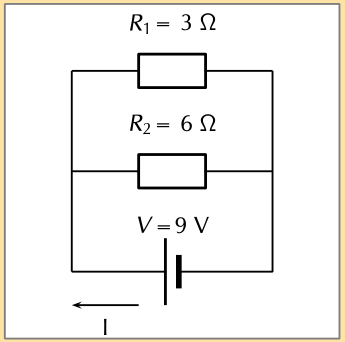
> **[Diagram Context - Textbook_PhysicalSciences_Gr12_Electric-circuits.pdf-0012-12.png]**
> This graphic shows an electric circuit diagram representing a parallel resistor configuration connected to a DC voltage source. Visible labels include two resistors ($R_1 = 3\ \Omega$ and $R_2 = 6\ \Omega$), a voltage source ($V = 9\ \text{V}$), and a directional current arrow labelled $I$. Conceptually, this diagram helps Grade 10 and 11 Physical Sciences learners practice calculating equivalent resistance, potential difference, and branch currents in parallel circuits according to Ohm's Law.

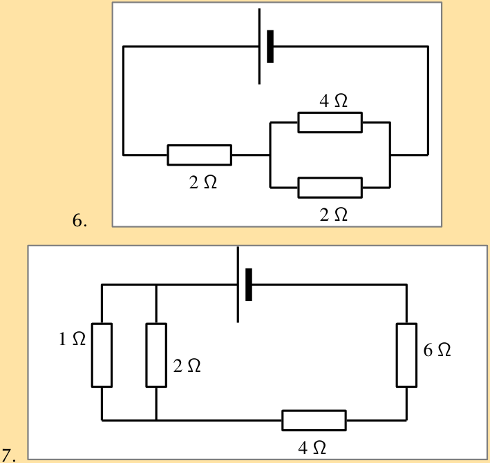
> **[Diagram Context - Textbook_PhysicalSciences_Gr12_Electric-circuits.pdf-0012-15.png]**
> The graphic displays two separate electrical circuit diagrams containing a voltage source and multiple resistors with designated resistance values. Circuit 6 features a $2\ \Omega$ resistor in series with a parallel combination of a $4\ \Omega$ and a $2\ \Omega$ resistor, connected to a DC cell. Circuit 7 shows a parallel combination of $1\ \Omega$ and $2\ \Omega$ resistors connected in series with $4\ \Omega$ and $6\ \Omega$ resistors and a DC cell. These diagrams help Grade 10-12 Physical Sciences learners practice calculating equivalent resistance and applying Ohm's Law in mixed series-parallel circuits.

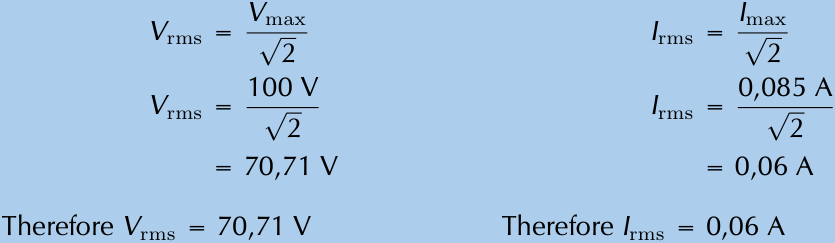
> **[Diagram Context - Textbook_PhysicalSciences_Gr12_Electrodynamics.pdf-0012-05.png]**
> 1. A diagram of a circuit with a voltage of 70V and an amperage of 2A.

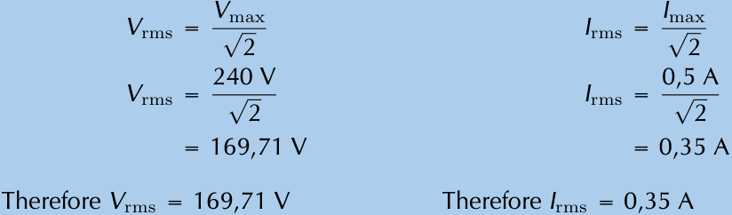
> **[Diagram Context - Textbook_PhysicalSciences_Gr12_Electrodynamics.pdf-0012-07.png]**
> 1. A blue bar graph with two columns labeled "Therefore" and "Therefore" with the numbers "166.71" and "0.35".

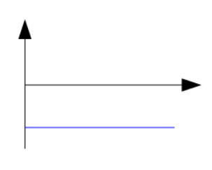

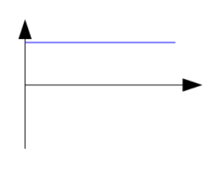

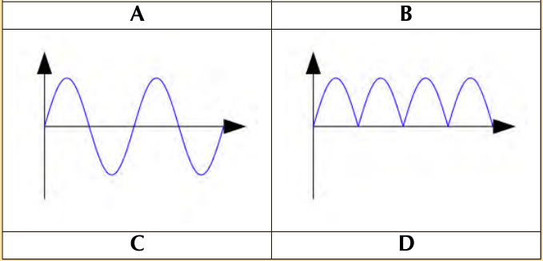
> **[Diagram Context - Textbook_PhysicalSciences_Gr12_Electrodynamics.pdf-0012-13.png]**
> 1. A waveform with a blue line and arrows pointing to the x and y axes.

> **[Diagram Context - Textbook_PhysicalSciences_Gr12_Optical-phenomena-and-properties-of-matter.pdf-0012-01.png]**
> This graphic shows an emission line spectrum plotted against an arrowed horizontal axis labelled "wavelength (nm)". The visible vertical spectral lines are colour-coded and annotated with specific wavelength values of 410, 434, 486, and 656 nanometres. Conceptually, this conveys how electrons in excited atoms release energy at discrete, quantised wavelengths when transitioning to lower energy levels, representing atomic emission spectra as studied in Physical Sciences.

> **[Diagram Context - Textbook_PhysicalSciences_Gr12_Optical-phenomena-and-properties-of-matter.pdf-0012-06.png]**
> This energy level diagram illustrates electron transitions within an atom linked to the emission of different spectral series. Visible labels include energy level numbers (1 through $\infty$), corresponding energy values in Joules, a ground state at $0\text{ J}$, and arrows pointing downwards grouped into ultraviolet, visible light, and infrared spectral regions. Conceptually, it conveys how electrons dropping to lower energy levels emit photons of specific frequencies and energies, demonstrating the formation of atomic emission spectra.

---

CHAPTER 17. ELECTRIC CIRCUITS
17.4

> **[Diagram Context - Textbook_PhysicalSciences_Gr12_Electric-circuits.pdf-0013-04.png]**
> This graphic is an electrical circuit diagram containing four resistors connected in series with a voltage source. The visible labels include resistors $R_1$, $R_2$, $R_3$, and $R_4$, along with a voltage source labeled $V_A$. For a Grade 10-12 Physical Sciences learner, this diagram conveys the concept of a single conducting path where current remains constant and the total resistance is equal to the sum of the individual resistors ($R_{total} = R_1 + R_2 + R_3 + R_4$).

**What is the total resistance in the circuit?**

---

### **SOLUTION**

* **Step 1 : Analyse the question**  
  We are told that the circuit is a series circuit and that we need to calculate the total resistance. The values of the two resistors have been given in the correct units, $\Omega$.

* **Step 2 : Apply the relevant principles**  
  The total resistance for resistors in series is the sum of the individual resistances. We can use

  $$R_S = R_1 + R_2 + \dots$$

  We have only two resistors and we know the resistances. In this case we have that:

  $$\begin{aligned}
  R_S &= R_1 + R_2 + \dots \\
  R_S &= R_1 + R_2 \\
  &= 5\ \Omega + 17\ \Omega \\
  &= 22\ \Omega
  \end{aligned}$$

* **Step 3 : Quote the final result**  
  The total resistance of the resistors in series is $22\ \Omega$.

---
Physics: Electricity and Magnetism
293

> **[Diagram Context - Textbook_PhysicalSciences_Gr12_Electrodynamics.pdf-0013-12.png]**
> 1. A black and white diagram of a circuit with a variable and constant.

> **[Diagram Context - Textbook_PhysicalSciences_Gr12_Optical-phenomena-and-properties-of-matter.pdf-0013-00.png]**
> This graphic illustrates the atomic emission line spectra of hydrogen originating from electron transitions between discrete energy levels ($n = 1$ to $n = 6$). Visible labels include energy level integers ($n = 1$ to $n = 6$), spectral series names (Lyman series, Balmer series, Paschen series), and specific emission wavelengths in nanometres (e.g., $122\text{ nm}$, $656\text{ nm}$, $1875\text{ nm}$). Conceptually, it conveys how electrons dropping to specific lower energy levels emit photons of distinct wavelengths, demonstrating the quantized nature of atomic energy states required for understanding atomic emission spectra.

---

CHAPTER 17. ELECTRIC CIRCUITS

## Example 5: Series resistors II

### QUESTION

A circuit contains three resistors in series. The resistors have resistance values of $0,5\ \Omega$, $7,5\ \Omega$ and $11\ \Omega$.

What is the total resistance in the circuit?

---

### SOLUTION

#### Step 1: Analyse the question
We are told that the circuit is a series circuit and that we need to calculate the total resistance. The values of the three resistors have been given in the correct units, $\Omega$.

#### Step 2: Apply the relevant principles
The total resistance for resistors in series is the sum of the individual resistances. We can use:

$$R_S = R_1 + R_2 + \dots$$

We have three resistors and we know the resistances. In this case we have that:

$$\begin{aligned}
R_S &= R_1 + R_2 + \dots \\
R_S &= R_1 + R_2 + R_3 \\
&= 0,5\ \Omega + 7,5\ \Omega + 11\ \Omega \\
&= 19\ \Omega
\end{aligned}$$

#### Step 3: Quote the final result

> **[Diagram Context - Textbook_PhysicalSciences_Gr12_Electric-circuits.pdf-0014-08.png]**
> This educational graphic presents an electric circuit diagram paired with a corresponding potential difference (voltage) profile graph. The visible labels include emf ($\mathcal{E}$), terminal potential difference ($V$), internal resistance ($r$), load resistor ($R$), and lost volts ($Ir$). For a Grade 11 or 12 Physical Sciences student, this diagram conceptually illustrates how electrical energy supplied by a real battery is divided between internal resistance and external load components in an electric circuit.

> **[Diagram Context - Textbook_PhysicalSciences_Gr12_Electrodynamics.pdf-0014-02.png]**
> The image shows a step-by-step guide to solving a problem involving electrical power. The problem is presented in a table format, with each step clearly labeled. The table includes various equations and variables related to the problem, as well as arrows pointing to the corresponding steps. The problem is designed to help students understand the concept of electrical power and how to calculate it using the given equations.

> **[Diagram Context - Textbook_PhysicalSciences_Gr12_Optical-phenomena-and-properties-of-matter.pdf-0014-11.png]**
> This graphic presents a physics calculation showing the mathematical formula $E = \frac{hc}{\lambda}$ followed by a substituted numerical calculation. Visible symbols and constants include energy ($E$), Planck's constant ($h = 6,63 \times 10^{-34}\text{ J}\cdot\text{s}$), the speed of light ($c = 3 \times 10^8\text{ m}\cdot\text{s}^{-1}$), wavelength ($\lambda = 642 \times 10^{-9}\text{ m}$), and the resulting energy value of $3,1 \times 10^{-19}\text{ J}$. Conceptually, it demonstrates to Grade 12 Physical Sciences learners how to calculate the energy of a photon using its wavelength, reinforcing the inverse proportionality between energy and wavelength in quantum mechanics.

---

*CHAPTER 17. ELECTRIC CIRCUITS* **17.4**

The total resistance of the resistors in series is $19\ \Omega$.

---

## Example 6: Series resistors III

### QUESTION

A circuit contains two resistors in series. The resistors have resistance values of $750\text{ k}\Omega$ and $1,7\text{ M}\Omega$.

What is the total resistance in the circuit?

### SOLUTION

* **Step 1 : Analyse the question**  
  We are told that the circuit is a series circuit and that we need to calculate the total resistance. The values of the two resistors have been given in the correct units, $\Omega$.

* **Step 2 : Apply the relevant principles**  
  The total resistance for resistors in series is the sum of the individual resistances. We can use

  $$R_S = R_1 + R_2 + \dots$$

  We have only two resistors and we now add the resistances. In this case

---

*Physics: Electricity and Magnetism* **295**

> **[Diagram Context - Textbook_PhysicalSciences_Gr12_Electric-circuits.pdf-0015-08.png]**
> This educational graphic displays mathematical working related to electric circuits. It shows the formula for electromotive force ($\mathcal{E} = V + Ir$) alongside a step-by-step substitution of values ($12 = 10 + 4(r)$) to solve for internal resistance ($r = 0,5\ \Omega$). Conceptually, it demonstrates how Grade 11 and 12 Physical Sciences learners apply the terminal potential difference equation to calculate the internal resistance of a real battery in an electric circuit problem.

> **[Diagram Context - Textbook_PhysicalSciences_Gr12_Electric-circuits.pdf-0015-20.png]**
> This educational photograph depicts a physical science apparatus set up on a wooden base, featuring an electrical circuit connected to a variable resistor (rheostat), a battery pack, a switch, and two analogue meters (ammeters/voltmeters) linked by red and blue connecting wires. Visible components include dry cell batteries, a knife switch, terminal posts, and sliding contact wires. Conceptually, this setup demonstrates Ohm's Law and electric circuits for Grade 10-12 CAPS Physical Sciences, allowing learners to investigate the relationship between potential difference, current, and resistance by manipulating the circuit components.

> **[Diagram Context - Textbook_PhysicalSciences_Gr12_Electrodynamics.pdf-0015-00.png]**
> 1. A diagram of a Lewis structure for an amino acid.

> **[Diagram Context - Textbook_PhysicalSciences_Gr12_Electrodynamics.pdf-0015-18.png]**
> 1. A blue background with a table of numbers and equations.

> **[Diagram Context - Textbook_PhysicalSciences_Gr12_Optical-phenomena-and-properties-of-matter.pdf-0015-01.png]**
> The graphic displays a mathematical calculation of energy change for an electron transition between energy levels, shown as a sequence of algebraic and numerical equations. The visible text and symbols include $\Delta E_{electron}$, $E_{2,3}$, $E_2$, $E_3$, equality signs, subtraction signs, scientific notation values in joules ($16,3 \times 10^{-19}$, $19,4 \times 10^{-19}$, and $-3,1 \times 10^{-19}\text{ J}$). This demonstrates to Physical Sciences learners how to calculate the energy difference ($\Delta E$) when an electron transitions between specific atomic energy levels.

---

## CHAPTER 17. ELECTRIC CIRCUITS

### Worked Example (Continuation)

From the previous page, we have that:

$$R_S = R_1 + R_2 + \dots$$

$$R_S = R_1 + R_2$$

$$= 750\text{ k}\Omega + 1,7\text{ M}\Omega$$

$$= 750 \times 10^3\text{ }\Omega + 1,7 \times 10^6\text{ }\Omega$$

$$= 0,75 \times 10^6\text{ }\Omega + 1,7 \times 10^6\text{ }\Omega$$

$$= 2,45 \times 10^6\text{ }\Omega = 2,45\text{ M}\Omega$$

**Step 3: Quote the final result**

The total resistance of the resistors in series is $2,45\text{ M}\Omega$.

---

## Parallel resistors

When we add resistors in parallel to a circuit:

* There are more paths for current to flow which ensures that the **current splits across the different paths**.

* The voltage is **the same** across the resistors. The voltage across the battery in the circuit is equal to the voltage across each of the parallel resistors:

$$V_{battery} = V_1 = V_2 = V_3 \dots$$

* The resistance to the flow of current **decreases**. The total resistance, $R_P$ is given by:

$$\frac{1}{R_P} = \frac{1}{R_1} + \frac{1}{R_2} + \dots$$

When resistors are connected in parallel the start and end points for all the resistors are the same. These points have the same potential energy and so the potential difference between them is the same no matter what is put in between them. You can have one, two or many resistors between the two points, the potential difference will not change. You can ignore whatever components are between two points in a circuit when calculating the difference between the two points.

> **[Diagram Context - Textbook_PhysicalSciences_Gr12_Electric-circuits.pdf-0016-02.png]**
> This educational graphic shows an electric circuit diagram. Visible labels include the ammeter ($A$), external load resistor ($R$), voltmeter across the load ($V_{\text{load}}$), EMF source ($\mathcal{E}$), internal resistance ($r$), and total battery voltage ($V_{\text{battery}}$ enclosed in a dashed box). For a Grade 11 or 12 Physical Sciences student, this diagram conveys the core concepts of Ohm's Law and electric circuits by illustrating how EMF, internal resistance, and terminal potential difference are related in a closed loop.

> **[Diagram Context - Textbook_PhysicalSciences_Gr12_Electric-circuits.pdf-0016-05.png]**
> The graphic shows algebraic derivations and transformations of the electric circuit formula relating emf to terminal potential difference. Visible labels and variables include emf ($\mathcal{E}$), load voltage ($V_{\text{load}}$), internal resistance voltage ($V_{\text{internal resistance}}$ or $I \cdot r$), current ($I$), internal resistance ($r$), and linear equation components ($y$, $m$, $x$, $c$). Conceptually, it demonstrates how Grade 11 and 12 Physical Sciences learners can rearrange the equation $\mathcal{E} = V_{\text{load}} + Ir$ into the slope-intercept linear form $y = mx + c$, enabling them to interpret graph gradients and y-intercepts when analyzing terminal potential difference versus current data.

> **[Diagram Context - Textbook_PhysicalSciences_Gr12_Electric-circuits.pdf-0016-09.png]**
> This graphic is an experimental data table designed for recording physical science measurements. The table contains visible column headers labeled "Setup", "Vload (V)", and "I (A)", with rows corresponding to five distinct resistance setups (Resistance 1 to 5). Conceptually, it provides a structured framework for learners to collect and tabulate voltage and current data during electric circuit investigations, facilitating the analysis of Ohm's law and electrical resistance in CAPS Physical Sciences.

> **[Diagram Context - Textbook_PhysicalSciences_Gr12_Electrodynamics.pdf-0016-00.png]**
> 1. Option 3: R = -31.81 V, I = -31.81 V, V = -31.81 V, R = -31.81 V, I = -31.81 V, V = -31.81 V, R = -31.81 V, I = -31.81 V, V = -31.81 V, R = -31.81 V, I = -31.81 V, V = -31.81 V, R = -31.81 V, I = -31.81 V, V =

> **[Diagram Context - Textbook_PhysicalSciences_Gr12_Optical-phenomena-and-properties-of-matter.pdf-0016-01.png]**
> This educational infographic illustrates the mechanism of the greenhouse effect, featuring the sun, Earth's surface, wavy arrows representing electromagnetic radiation, and small particle clusters labeled as CO₂ molecules with descriptive explanatory text. The diagram displays short-wavelength solar radiation penetrating the atmosphere, the Earth radiating long-wavelength infrared radiation, and greenhouse gases absorbing and re-emitting this heat. Conceptually, it helps FET learners understand how atmospheric carbon dioxide traps thermal energy to warm the planet, supporting environmental science and climate change topics.

---

# CHAPTER 17. ELECTRIC CIRCUITS

## 17.5 Potential Difference in Parallel Circuits

Look at the following circuit diagrams. The battery is the same in all cases, all that changes is more resistors are added between the points marked by the black dots. If we were to measure the potential difference between the two dots in these circuits we would get the same answer for all three cases.

> **[Diagram Context - Textbook_PhysicalSciences_Gr12_Electric-circuits.pdf-0017-02.png]**
> This graph plots terminal potential difference ($V_{\text{load}}$ in volts) on the vertical axis against current ($I$ in amperes) on the horizontal axis, marked with blue data points and a dashed line of best fit that extrapolates to the y-intercept. Visible labels include $V_{\text{load}}$ (V), $I$ (A), and emf ($\mathcal{E}$) marked at the y-intercept. For CAPS Grade 11 and 12 Physical Sciences learners, this graph visually conveys the linear relationship described by $V = \mathcal{E} - Ir$, demonstrating how terminal voltage drops as current increases due to internal resistance, with the y-intercept representing the emf of the cell.

Let's look at two resistors in parallel more closely. When you construct a circuit you use wires and you might think that measuring the voltage in different places on the wires will make a difference. This is not true. The potential difference or voltage measurement will only be different if you measure a different set of components. All points on the wires that have no circuit components between them will give you the same measurements.

All three of the measurements shown in the picture below (i.e. $A-B$, $C-D$ and $E-F$) will give you the same voltage. The different measurement points on the left have no components between them so there is no change in potential energy. Exactly the same applies to the different points on the right. When you measure the potential difference between the points on the left and right you will get the same answer.

> **[Diagram Context - Textbook_PhysicalSciences_Gr12_Optical-phenomena-and-properties-of-matter.pdf-0017-04.png]**
> This graphic displays two fundamental mathematical equations relating to the photoelectric effect: $E = W_0 + E_{k \text{ max}}$ and $E_{k \text{ max}} = hf - W_0$. The visible variables and symbols include $E$ (incident photon energy), $W_0$ (work function), $E_{k \text{ max}}$ (maximum kinetic energy of emitted photoelectrons), $h$ (Planck's constant), and $f$ (frequency of the incident light). For a Grade 12 Physical Sciences learner, these formulas convey the principle of conservation of energy during the photoelectric emission process, showing how the energy of an incoming photon is split into overcoming the metal's work function and imparting kinetic energy to the ejected electron.

---

## CHAPTER 17. ELECTRIC CIRCUits

### Example 7: Voltages I

#### QUESTION

Consider this circuit diagram:

> **[Diagram Context - Textbook_PhysicalSciences_Gr12_Electric-circuits.pdf-0018-11.png]**
> This graphic features an electric circuit diagram accompanied by a set of CAPS-aligned physics calculation questions regarding Ohm's law and electric circuits. Visible labels include resistors ($R_1 = 1,0\ \Omega$, $R_2 = 3,0\ \Omega$, and $R_3$), current ($I = 2,0\text{ A}$), internal resistance ($r = 0,1\ \Omega$), and a voltmeter measuring terminal potential difference ($V = 23,0\text{ V}$). Conceptually, the diagram helps learners apply series and parallel circuit principles, Ohm's law, and calculations involving emf, potential difference, and power dissipation.

What is the voltage across the resistor in the circuit shown?

---

#### SOLUTION

**Step 1: Check what you have and the units**
We have a circuit with a battery and one resistor. We know the voltage across the battery. We want to find the voltage across the resistor.

$$V_{battery} = 2\text{ V}$$

**Step 2: Applicable principles**
We know that the voltage across the battery must be equal to the total voltage across all other circuit components.

$$V_{battery} = V_{total}$$

There is only one other circuit component, the resistor.

$$V_{total} = V_1$$

This means that the voltage across the battery is the same as the voltage across the resistor.

$$V_{battery} = V_{total} = V_1$$

$$V_{battery} = V_{total} = V_1$$

$$V_1 = 2\text{ V}$$

> **[Diagram Context - Textbook_PhysicalSciences_Gr12_Optical-phenomena-and-properties-of-matter.pdf-0018-00.png]**
> This graphic functions as a textbook chapter header, featuring the text "CHAPTER" alongside a green circular icon enclosing the number "12" and bordered by a segmented white dashed ring. It visually organizes the learning material to clearly signal the start of a specific curriculum module for South African high school learners.

---

CHAPTER 17. ELECTRIC CIRCUITS | 17.5
---

## Example 8: Voltages II

### QUESTION

Consider this circuit:

> **[Diagram Context - Textbook_PhysicalSciences_Gr12_Electric-circuits.pdf-0019-07.png]**
> The graphic displays two parallel columns of algebraic derivations using Ohm's Law formulas to calculate potential differences across resistors. The visible variables and symbols include resistance ($R_1$, $R_2$), current ($I$), and potential difference ($V_1$, $V_2$), along with multiplication and equality operators. Conceptually, this demonstrates how to apply $V = I \cdot R$ in a series circuit to find the potential drop across individual resistors with different resistance values for a constant current.

What is the voltage across the unknown resistor in the circuit shown?

### SOLUTION

#### Step 1: Check what you have and the units
We have a circuit with a battery and two resistors. We know the voltage across the battery and one of the resistors. We want to find that voltage across the resistor.

$$V_{battery} = 2\text{V}$$

$$V_{B} = 1\text{V}$$

#### Step 2: Applicable principles
We know that the voltage across the battery must be equal to the total voltage across all other circuit components that are in series.

$$V_{battery} = V_{total}$$

The total voltage in the circuit is the sum of the voltages across the individual resistors

$$V_{total} = V_{A} + V_{B}$$

Using the relationship between the voltage across the battery and total voltage across the resistors

$$V_{battery} = V_{total}$$

---
Physics: Electricity and Magnetism | 299

> **[Diagram Context - Textbook_PhysicalSciences_Gr12_Electric-circuits.pdf-0019-10.png]**
> The graphic shows a series of mathematical equations displaying the calculation for potential difference in an electric circuit. Visible labels include the variables $V$, $V_1$, $V_2$, $V_3$, and numerical values $23$, $2$, $6$, alongside the unit $\text{V}$. Conceptually, it demonstrates how the total voltage divides across components in a series circuit and illustrates the step-by-step calculation required to find an unknown potential difference.

> **[Diagram Context - Textbook_PhysicalSciences_Gr12_Electric-circuits.pdf-0019-13.png]**
> This graphic displays a physics calculation step for determining electrical resistance using Ohm's Law. It shows the algebraic formula $R_3 = \frac{V_3}{I}$, followed by substituted numerical values $\frac{15}{2}$ and the final calculated result of $7,5\ \Omega$. Conceptually, it demonstrates to Grade 10-12 learners how to apply Ohm's Law ($R = \frac{V}{I}$) to calculate the resistance of a specific circuit component using its measured potential difference and current.

> **[Diagram Context - Textbook_PhysicalSciences_Gr12_Electric-circuits.pdf-0019-16.png]**
> This graphic displays a physics calculation showing the mathematical formula for electromotive force ($\mathcal{E} = V + Ir$) applied to solve for emf using numerical values for potential difference, current, and internal resistance. Visible symbols and variables include $\mathcal{E}$ (emf), $V$ (voltage), $I$ (current), $r$ (internal resistance), and units in volts ($\text{V}$), with comma notation standard in South African decimal formatting. Conceptually, this demonstrates how to calculate the total energy supplied per unit charge by a battery by accounting for both the external potential difference and the "lost volts" across the internal resistance of the cell.

> **[Diagram Context - Textbook_PhysicalSciences_Gr12_Electric-circuits.pdf-0019-18.png]**
> This graphic displays a physics calculation equation for electrical power in a resistor. The visible symbols and variables include power ($P_r$), potential difference ($V_r$), current ($I_r$), numerical values $(0,2)$ and $(2)$, and the final unit of watts ($\text{W}$). This demonstrates how Grade 10-12 Physical Sciences learners calculate power dissipated by an internal resistance or specific circuit component using the formula $P = VI$.

---

$17.5$

CHAPTER 17. ELECTRIC CIRCUITS

$$V_{battery} = V_1 + V_{resistor}$$
$$2\text{V} = V_1 + 1\text{V}$$
$$V_1 = 1\text{V}$$

---

### Example 9: Voltages III

#### QUESTION

Consider the circuit diagram:

> **[Diagram Context - Textbook_PhysicalSciences_Gr12_Electric-circuits.pdf-0020-13.png]**
> This circuit diagram displays an electric circuit containing two parallel resistors ($R_1 = 4\ \Omega$ and $R_2 = 12\ \Omega$) connected to a real battery with internal resistance ($r$), highlighted in yellow, and a voltmeter ($V$) measuring a terminal potential difference of $18\text{ V}$ across the parallel combination. Visible labels include $R_1$, $R_2$, internal resistance $r$, voltmeter symbol $V$, and directional arrows indicating conventional current flow. For Grade 11 and 12 Physical Sciences learners, this diagram conceptually illustrates how to apply Ohm's law and current divider principles in parallel networks while accounting for the internal resistance and emf of a real voltage source.

What is the voltage across the unknown resistor in the circuit shown?

#### SOLUTION

**Step 1 : Check what you have and the units**

We have a circuit with a battery and three resistors. We know the voltage across the battery and two of the resistors. We want to find that voltage across the unknown resistor.

$$V_{battery} = 7\text{V}$$
$$V_{known} = V_A + V_C$$
$$= 1\text{V} + 4\text{V}$$

**Step 2 : Applicable principles**

We know that the voltage across the battery must be equal to the total voltage across all other circuit components that are in series.

$$V_{battery} = V_{total}$$

The total voltage in the circuit is the sum of the voltages across the

300
Physics: Electricity and Magnetism

> **[Diagram Context - Textbook_PhysicalSciences_Gr12_Electric-circuits.pdf-0020-16.png]**
> The graphic shows an algebraic calculation step for determining equivalent resistance. Visible symbols and variables include $R$, $R_1$, $R_2$, fractions, addition signs, equality signs, and the unit ohm ($\Omega$). This conveys the step-by-step mathematical process of combining resistors in a parallel circuit configuration to find the total effective resistance according to the CAPS Physical Sciences curriculum.

> **[Diagram Context - Textbook_PhysicalSciences_Gr12_Electrodynamics.pdf-0020-09.png]**
> 1. A diagram of a cell with a laptop and a phone on it.

> **[Diagram Context - Textbook_PhysicalSciences_Gr12_Optical-phenomena-and-properties-of-matter.pdf-0020-06.png]**
> This mathematical calculation graphic displays the step-by-step application of the photoelectric effect formula, specifically solving for maximum kinetic energy ($E_k$). Visible labels and variables include $E_k$, $E_{photon}$, work function ($W_0$), Planck's constant ($h$), speed of light ($c$), and wavelength ($\lambda$), along with substituted numerical values and units. Conceptually, it demonstrates how Grade 12 Physical Sciences learners calculate the kinetic energy of emitted photoelectrons by subtracting the metal's work function from the incident photon energy.

> **[Diagram Context - Textbook_PhysicalSciences_Gr12_Optical-phenomena-and-properties-of-matter.pdf-0020-15.png]**
> This educational graphic presents a mathematical inequality comparison related to the photoelectric effect in Physical Sciences. It displays algebraic variables and text labels, specifically work function terms ($W_{0 \text{ silver}}$, $W_{0 \text{ copper}}$) and photon energy ($E_{photon}$), linked by "less than" symbols ($<$) and a therefore sign ($\therefore$). Conceptually, it illustrates how comparing the threshold frequencies or work functions of different metals dictates the minimum photon energy required for electron emission in accordance with Einstein's photoelectric equation.

> **[Diagram Context - Textbook_PhysicalSciences_Gr12_Optical-phenomena-and-properties-of-matter.pdf-0020-20.png]**
> The graphic displays a conceptual physics comparison involving work function inequalities. It features the variables $W_0 \text{ silver}$, $W_0 \text{ silicon}$, and $E_{\text{photon}}$ linked by greater-than inequality signs and a logical consequence symbol ($\therefore$). This comparison illustrates the threshold frequency and work function concepts in the photoelectric effect, helping Grade 12 learners understand that different materials require different minimum energies to emit photoelectrons.

---

## CHAPTER 17. ELECTRIC CIRCUITS

### Worked Example (Continuation)

$$V_{total} = V_{B} + V_{known}$$

Using the relationship between the voltage across the battery and total voltage across the resistors:

$$\begin{aligned}
V_{battery} &= V_{total} \\
V_{battery} &= V_{B} + V_{known} \\
7\text{ V} &= V_{B} + 5\text{ V} \\
V_{B} &= 2\text{ V}
\end{aligned}$$

---

### Example 10: Voltages IV

#### QUESTION

Consider the circuit diagram:

> **[Diagram Context - Textbook_PhysicalSciences_Gr12_Electric-circuits.pdf-0021-03.png]**
> This educational graphic displays a step-by-step algebraic calculation based on Ohm's Law in an electric circuit. It features the variables resistance ($R_1$), potential difference/voltage ($V_1$), and current ($I_1$), substituting the numerical values $18$ and $4$ to solve for $I_1$, resulting in a final answer of $4,50\text{ A}$. For a Grade 10-12 Physical Sciences learner, it demonstrates the practical application of rearranging formulas to calculate current through a specific resistor in circuit analysis problems.

What is the voltage across the parallel resistor combination in the circuit shown?

*Hint:* the rest of the circuit is the same as the previous problem.

#### SOLUTION

##### Step 1 : Quick Answer
The circuit is the same as the previous example and we know that the voltage difference between two points in a circuit does not depend on what is between them so the answer is the same as above $V_{parallel} = 2\text{ V}$.

##### Step 2 : Check what you have and the units - long answer
We have a circuit with a battery and five resistors (two in series and...

> **[Diagram Context - Textbook_PhysicalSciences_Gr12_Electric-circuits.pdf-0021-08.png]**
> This graphic displays a physics calculation showing algebraic manipulations and substitution using Ohm's Law for a circuit component. The visible variables and numerical values include resistance ($R_2$), potential difference ($V_2 = 18\text{ V}$), current ($I_2 = 12\ \Omega$), and the final calculated current resulting in $1,50\text{ A}$. Conceptually, it demonstrates the step-by-step application of $R = \frac{V}{I}$ and its rearrangement to solve for current in Grade 10-12 Physical Sciences.

> **[Diagram Context - Textbook_PhysicalSciences_Gr12_Electric-circuits.pdf-0021-10.png]**
> This educational graphic displays a mathematical calculation for electrical potential difference based on Ohm's Law. It features the formula $V = I \cdot r$, substituted with the numerical values $6$ and $0,375$, resulting in a final calculated output of $2,25\text{ V}$. For a CAPS Grade 10-12 Physical Sciences student, this demonstrates how to calculate the potential difference (lost volts or voltage drop) across a resistor or internal resistance using current and resistance values.

> **[Diagram Context - Textbook_PhysicalSciences_Gr12_Electric-circuits.pdf-0021-13.png]**
> The image displays mathematical calculation steps for solving an electric circuits problem. Visible variables and symbols include current ($I$, $I_1$, $I_2$), terminal potential difference ($V$), internal resistance ($r$), and emf ($\mathcal{E}$), along with numerical values in amperes (A) and volts (V). Conceptually, it demonstrates how to apply current conservation in parallel branches and use the emf equation ($\mathcal{E} = V + Ir$) to determine total electromotive force in a CAPS Grade 11 or 12 Physics context.

> **[Diagram Context - Textbook_PhysicalSciences_Gr12_Electrodynamics.pdf-0021-02.png]**
> 1. A diagram of a waveform with arrows pointing to the x and y axes.

> **[Diagram Context - Textbook_PhysicalSciences_Gr12_Electrodynamics.pdf-0021-07.png]**
> This educational graphic displays two mathematical equations representing alternating current (AC) circuit relationships. It explicitly features the variable symbols $i$, $I_{\text{max}}$, $v$, $V_{\text{max}}$, frequency $f$, time $t$, and phase angle $\phi$ within sinusoidal functions. For a Grade 12 Physical Sciences learner, these equations convey how instantaneous current and voltage vary sinusoidally with time in an AC circuit, demonstrating parameters like peak values and phase difference.

> **[Diagram Context - Textbook_PhysicalSciences_Gr12_Electrodynamics.pdf-0021-10.png]**
> This educational graphic displays two mathematical formulas relating to alternating current (AC) electricity in Grade 12 Physical Sciences. It shows the root-mean-square current ($I_{rms} = \frac{I_{max}}{\sqrt{2}}$) and root-mean-square voltage ($V_{rms} = \frac{V_{max}}{\sqrt{2}}$). These equations convey conceptually how to calculate the effective values of alternating current and voltage, which are equivalent to direct current (DC) values in terms of work and energy transfer.

> **[Diagram Context - Textbook_PhysicalSciences_Gr12_Electrodynamics.pdf-0021-13.png]**
> 1. A diagram of a circuit with a V and Vmax labeled.

> **[Diagram Context - Textbook_PhysicalSciences_Gr12_Optical-phenomena-and-properties-of-matter.pdf-0021-09.png]**
> The graphic is a scatter plot representing experimental data for the photoelectric effect in Grade 12 Physical Sciences. The visible axes are labelled with maximum kinetic energy ($E_k \times 10^{-19}\text{ J}$) on the vertical axis and frequency ($f \times 10^{15}\text{ Hz}$) on the horizontal axis, plotted with discrete data points. Conceptually, this graph helps learners understand the linear relationship between the frequency of incident light and the maximum kinetic energy of emitted photoelectrons, allowing them to determine Planck's constant and the threshold frequency.

> **[Diagram Context - Textbook_PhysicalSciences_Gr12_Optical-phenomena-and-properties-of-matter.pdf-0021-12.png]**
> This graphic displays a physics calculation showing the relationship between work function, Planck's constant, and threshold frequency. The visible mathematical expressions include symbols and values such as $W_0$, $h$, $f_0$, $3.7 \times 10^{-19}$, $6.6 \times 10^{-34}$, and $0.56 \times 10^{15}\text{ Hz}$. Conceptually, it demonstrates how to apply the formula $W_0 = h f_0$ to calculate the threshold frequency of a metal in the context of the photoelectric effect for Grade 12 Physical Sciences.

---

# CHAPTER 17. ELECTRIC CIRCUITS

three in parallel). We know the voltage across the battery and two of the resistors. We want to find that voltage across the parallel resistors, $V_{parallel}$.

$$V_{battery} = 7\text{ V}$$

$$V_{known} = 1\text{ V} + 4\text{ V}$$

**Step 3 : Applicable principles**

We know that the voltage across the battery must be equal to the total voltage across all other circuit components.

$$V_{battery} = V_{total}$$

Voltages only add algebraically for components in series. The resistors in parallel can be thought of as a single component which is in series with the other components and then the voltages can be added.

$$V_{total} = V_{parallel} + V_{known}$$

Using the relationship between the voltage across the battery and total voltage across the resistors

$$V_{battery} = V_{total}$$

$$V_{battery} = V_{parallel} + V_{known}$$

$$7\text{ V} = V_{parallel} + 5\text{ V}$$

$$V_{parallel} = 2\text{ V}$$

---

In contrast to the series case, when we add resistors in parallel, we create **more paths** along which current can flow. By doing this we *decrease* the total resistance of the circuit!

Take a look at the diagram below. On the left we have the same circuit as in the previous section with a battery and a resistor. The ammeter shows a current of $1\text{ A}$. On the right we have added a second resistor in parallel to the first resistor. This has increased the number of paths (branches) the charge can take through the circuit - the total resistance has decreased. You can see that the current in the circuit has increased. Also notice that the current in the different branches can be different.

> **[Diagram Context - Textbook_PhysicalSciences_Gr12_Electric-circuits.pdf-0022-03.png]**
> This graphic is an electrical circuit diagram containing a DC cell with internal resistance ($r$), a voltmeter ($V$) connected across the terminals, and four resistors ($R_1$, $R_2$, $R_3$, $R_4$) arranged in two distinct parallel sections ($R_{\text{P1}}$ and $R_{\text{P2}}$) connected in series with the power source. It illustrates how to analyse complex resistor networks by breaking them down into combinations of series and parallel components when calculating total resistance, terminal potential difference, and current.

> **[Diagram Context - Textbook_PhysicalSciences_Gr12_Electrodynamics.pdf-0022-03.png]**
> The image shows a diagram of a V-V relationship, which is a mathematical equation that relates the voltage (V) to the maximum current (Vmax) in a circuit. The equation is V = Vmax, and it is represented by a black line on a light beige background. The diagram also includes the variable "V" and the constant "Vmax" written in black. The text "V = Vmax" is written in black, and the numbers "268" and "138,908" are written in black.

> **[Diagram Context - Textbook_PhysicalSciences_Gr12_Electrodynamics.pdf-0022-06.png]**
> 1. The diagram shows a Lewis structure of an amino acid. The amino acid is represented by a black line, and the Lewis structure is shown in a brown line. The diagram also includes a graph that shows the relationship between the current OR voltage and time.

> **[Diagram Context - Textbook_PhysicalSciences_Gr12_Optical-phenomena-and-properties-of-matter.pdf-0022-00.png]**
> This graphic displays a physics graph relating maximum kinetic energy ($E_k \times 10^{-19}\text{ J}$) on the vertical axis to frequency ($f \times 10^{15}\text{ Hz}$) on the horizontal axis, featuring plotted data points and a straight line trend. The visible labels include the axis variables $E_k$ and $f$, numerical scale markings ranging from 0 to 10 for energy and 0 to 2.0 for frequency, and data points represented by black dots along with an orange straight line. Conceptually, this graph is used in Grade 12 Physical Sciences to illustrate the photoelectric effect, allowing learners to determine Planck's constant from the gradient and the work function from the frequency intercept.

---

CHAPTER 17. ELECTRIC CIRCUITS

17.5

> **[Diagram Context - Textbook_PhysicalSciences_Gr12_Electric-circuits.pdf-0023-00.png]**
> This educational graphic displays an electrical circuit diagram alongside step-by-step algebraic calculations for solving equivalent resistance. The circuit diagram shows a single closed loop containing a voltage source (battery symbol) and two equivalent resistors labelled $R_{P1}$ and $R_{P2}$, while the right side displays mathematical equations solving for $R_{P2}$ with a final calculated value of $3,74\ \Omega$. For a high school Physical Sciences student, this visual demonstrates how to simplify complex series-parallel resistor networks into a single equivalent series loop to apply Ohm's Law and circuit calculation principles.

The total resistance of a number of parallel resistors is NOT the sum of the individual resistances as the overall resistance decreases with more paths for the current. The total resistance for parallel resistors is given by:

$$\frac{1}{R_P} = \frac{1}{R_1} + \frac{1}{R_2} + \dots$$

Let us consider the case where we have two resistors in parallel and work out what the final resistance would be. This situation is shown in the diagram below:

> **[Diagram Context - Textbook_PhysicalSciences_Gr12_Electric-circuits.pdf-0023-02.png]**
> This graphic displays a physics calculation step for determining electrical resistance, featuring the variables $R_{P1}$ and $R_{P2}$, numerical values like the fraction $\frac{1}{2}$ and $(3.74)$, and the final unit of ohms ($\Omega$). It demonstrates the proportional relationship where one parallel resistance is half of another, leading to a calculated value of $1,87\ \Omega$. For Grade 10-12 Physical Sciences learners, this illustrates how to substitute known values into circuit equations to solve for equivalent resistance in parallel networks.

Applying the formula for the total resistance we have:

$$\frac{1}{R_P} = \frac{1}{R_1} + \frac{1}{R_2} + \dots$$

There are only two resistors:

$$\frac{1}{R_P} = \frac{1}{R_1} + \frac{1}{R_2}$$

Add the fractions:

$$\frac{1}{R_P} = \frac{1}{R_1} \times \frac{R_2}{R_2} + \frac{1}{R_2} \times \frac{R_1}{R_1}$$

$$\frac{1}{R_P} = \frac{R_2}{R_1R_2} + \frac{R_1}{R_1R_2}$$

---
Physics: Electricity and Magnetism
303

> **[Diagram Context - Textbook_PhysicalSciences_Gr12_Electric-circuits.pdf-0023-05.png]**
> This graphic displays a physics calculation showing Ohm's law applied to an electric circuit. Visible symbols and variables include $V_{battery}$, current ($I$), and external resistance ($R_{Ext}$), along with numerical substitution steps yielding a final value of $5,61\ \Omega$. Conceptually, it demonstrates how learners can calculate external circuit resistance using terminal voltage and current values in alignment with Grade 10-12 CAPS Physical Sciences electricity topics.

> **[Diagram Context - Textbook_PhysicalSciences_Gr12_Electric-circuits.pdf-0023-06.png]**
> This educational graphic displays a physics calculation showing a multi-step algebraic substitution to determine power. Visible symbols and values include $P_{P1}$, $I$, $R_{P1}$, numeric substitutions $(1,07)^2(1,87)$, and the final calculated value in Watts ($2,14\text{ W}$). For a Grade 12 Physical Sciences learner under the CAPS curriculum, this demonstrates how to apply the electric power formula $P = I^2R$ to calculate the power dissipated by a specific resistor in an electric circuit problem.

> **[Diagram Context - Textbook_PhysicalSciences_Gr12_Electric-circuits.pdf-0023-08.png]**
> This graphic displays a physics calculation step using the electrical power formula $P = I^2R$ to find the power dissipated in resistor $P2$. Visible elements include the variables $P_{P2}$ (power), $I$ (current, substituted as $1,07\text{ A}$), and $R_{P2}$ (resistance, substituted as $3,74\ \Omega$), resulting in a final calculated power of $4,28\text{ W}$. For a Grade 12 Physical Sciences student, this demonstrates the correct application of Joule's law or electric power equations during circuit problem-solving.

> **[Diagram Context - Textbook_PhysicalSciences_Gr12_Electric-circuits.pdf-0023-13.png]**
> This circuit diagram illustrates a combined electric circuit powered by a single voltage source (cell), featuring resistors $R_1$ and $R_2$ grouped in "Parallel circuit 1 ($R_{P1}$)" and resistors $R_3$ and $R_4$ grouped in "Parallel circuit 2 ($R_{P2}$)". Visible labels include individual component symbols for the cell and four resistors, along with dashed boxes enclosing the respective parallel configurations. Conceptually, it helps Grade 10-12 Physical Sciences learners understand how to calculate equivalent resistance and analyze current and potential difference in circuits containing multiple parallel combinations connected in series.

> **[Diagram Context - Textbook_PhysicalSciences_Gr12_Electrodynamics.pdf-0023-12.png]**
> This graphic displays mathematical equations representing the instantaneous values of alternating current (AC) and voltage in Grade 12 Physical Sciences. The visible symbols include instantaneous current ($i$), maximum current ($I_{\text{max}}$), instantaneous voltage ($v$), maximum voltage ($V_{\text{max}}$), frequency ($f$), time ($t$), and phase angle ($\phi$). Conceptually, these formulas convey how alternating current and voltage vary sinusoidally with time, demonstrating the periodic nature of AC circuits in CAPS physics.

> **[Diagram Context - Textbook_PhysicalSciences_Gr12_Electrodynamics.pdf-0023-19.png]**
> The image shows a diagram of a Lewis structure for oxygen, with the number 795 displayed below it. The diagram also includes the number 2672.42 A, which is a chemical symbol for the element carbon. The diagram is set against a beige background, and the text "Lewis structure" is written in black at the top of the image.

> **[Diagram Context - Textbook_PhysicalSciences_Gr12_Optical-phenomena-and-properties-of-matter.pdf-0023-04.png]**
> This educational graphic displays a physics calculation showing the mathematical formula for the change in energy ($\Delta E = E_5 - E_2$) substituted with specific energy level values measured in Joules ($21,0 \times 10^{-19}\text{ J}$ and $16,3 \times 10^{-19}\text{ J}$) to yield a final result of $4,7 \times 10^{-19}\text{ J}$. Visible elements include the variables $\Delta E$, $E_5$, and $E_2$, subtraction and equality operators, and SI units of joules ($\text{J}$) expressed in scientific notation. For a Grade 12 Physical Sciences learner studying atomic transitions and the photoelectric effect, this snippet demonstrates how to calculate the energy of a photon emitted or absorbed when an electron transitions between specific energy levels in an atom.

> **[Diagram Context - Textbook_PhysicalSciences_Gr12_Optical-phenomena-and-properties-of-matter.pdf-0023-05.png]**
> This graphic displays a physics calculation showing the mathematical formula and substitution steps to determine wavelength ($\lambda$). Visible symbols and values include Planck's constant ($h = 6,63 \times 10^{-34}\text{ m}^2\text{kg}\cdot\text{s}^{-1}$), the speed of light ($c = 3 \times 10^8\text{ m}\cdot\text{s}^{-1}$), energy difference ($\Delta E = 4,7 \times 10^{-19}\text{ J}$), and the final calculated result of $423\text{ nm}$. For a Grade 12 Physical Sciences learner under the CAPS curriculum, this conveys the quantitative relationship between energy and wavelength in atomic emission or absorption spectra ($\Delta E = \frac{hc}{\lambda}$), demonstrating the practical application of constants to find the wavelength of a photon.

> **[Diagram Context - Textbook_PhysicalSciences_Gr12_Optical-phenomena-and-properties-of-matter.pdf-0023-08.png]**
> The graphic shows a mathematical equation calculating energy change ($\Delta E$) using Planck's equation. The visible symbols and values include $\Delta E$, $h$, $c$, $\lambda$, Planck's constant ($6,63 \times 10^{-34} \text{ m}^2\text{kg}\cdot\text{s}^{-1}$), the speed of light ($3 \times 10^8 \text{ m}\cdot\text{s}^{-1}$), a wavelength of $474 \times 10^{-9} \text{ nm}$, and the final calculated energy of $4,20 \times 10^{-19} \text{ J}$. Conceptually, this demonstrates to Grade 12 Physical Sciences learners how to calculate the energy of a photon or an energy transition using the relationship between energy, Planck's constant, the speed of light, and wavelength.

---

# CHAPTER 17. ELECTRIC CIRCUITS

## Derivation for Resistors in Parallel

Rearranging the parallel resistance formula:

$$\frac{1}{R_P} = \frac{R_2 + R_1}{R_1 R_2}$$

$$\frac{1}{R_P} = \frac{R_1 + R_2}{R_1 R_2}$$

$$R_P = \frac{R_1 R_2}{R_1 + R_2}$$

For any two resistors in parallel we now know that:

$$R_P = \frac{\text{product of resistances}}{\text{sum of resistances}} = \frac{R_1 R_2}{R_1 + R_2}$$

---

## General experiment: Current dividers

**Aim:** Test what happens to the current and the voltage in series circuits when additional resistors are added.

**Apparatus:**
- A battery
- A voltmeter
- An ammeter
- Wires
- Resistors

**Method:**
- Connect each circuit shown below
- Measure the voltage across each resistor in the circuit.
- Measure the current before and after each resistor in the circuit and before and after the parallel branches.

> **[Diagram Context - Textbook_PhysicalSciences_Gr12_Electric-circuits.pdf-0024-01.png]**
> This graphic shows a mathematical derivation involving algebraic equations for electric circuits. The visible variables and symbols include resistance terms ($R_{P1}$, $R_1$, $R_2$), fractions, multiplication signs, plus signs, equality signs, and the unit of ohms ($\Omega$). Conceptually, the steps illustrate the algebraic rearrangement and substitution used to calculate the unknown resistance of a parallel resistor combination in a Grade 11 Physical Sciences electricity problem.

> **[Diagram Context - Textbook_PhysicalSciences_Gr12_Electric-circuits.pdf-0024-02.png]**
> This graphic shows a mathematical calculation step applying Ohm's Law in an electric circuit context. Visible elements include the formula $V = IR$, substituted numerical values with South African decimal comma formatting $(1,07)(1,87)$, and the resulting final calculated voltage of $2,00\text{ V}$. Conceptually, it demonstrates how to calculate potential difference (voltage) across a circuit component by multiplying current ($I$) and resistance ($R$).

> **[Diagram Context - Textbook_PhysicalSciences_Gr12_Electric-circuits.pdf-0024-04.png]**
> The image shows a series of physics calculations demonstrating the mathematical steps required to solve an electric circuit problem involving resistance and power. Visible text and symbols include resistance values ($\Omega$), power calculations ($P_1$, $P_2$), voltage variables ($V$), and fractional resistance relationships (e.g., $R_1 = \frac{3}{5}R_2$). Conceptually, it guides Grade 11 and 12 Physical Sciences learners through applying Ohm's law and electric power formulas to determine unknown resistances and power dissipation in complex circuits.

> **[Diagram Context - Textbook_PhysicalSciences_Gr12_Electric-circuits.pdf-0024-06.png]**
> This graphic displays an algebraic formula and numerical calculation showing the step-by-step determination of electric power. The visible variables and constants include power ($P_2$), potential difference ($V$), resistance ($R_2$), and the resulting unit watts ($\text{W}$). Conceptually, this conveys how to calculate the power dissipated in a specific resistor within an electric circuit by substituting given values into the power equation $P = \frac{V^2}{R}$.

> **[Diagram Context - Textbook_PhysicalSciences_Gr12_Electric-circuits.pdf-0024-10.png]**
> This educational graphic presents a worked numerical calculation in a Grade 11/12 Physical Sciences context, focusing on electric circuits. Visible labels and symbols include resistance variables ($R_{P2}$, $R_3$, $R_4$), electrical power ($P_3$, $P_4$), potential difference ($V$, $V_{P2}$), units of ohms ($\Omega$) and watts ($W$), along with parallel resistor equations and power formulas. Conceptually, it demonstrates how to apply Ohm's law and electrical power equations to determine unknown resistor values and power dissipation within parallel resistor networks.

> **[Diagram Context - Textbook_PhysicalSciences_Gr12_Electrodynamics.pdf-0024-00.png]**
> The image shows a math problem on a gray background. The problem is about calculating the velocity of a car, given the distance traveled and the time taken. The problem is accompanied by a table with the necessary information. The problem is designed to help students understand the concept of velocity and how it is calculated using the formula v = d/t.

> **[Diagram Context - Textbook_PhysicalSciences_Gr12_Optical-phenomena-and-properties-of-matter.pdf-0024-00.png]**
> This educational graphic displays a physics calculation showing the mathematical formula and substitution steps for determining the energy of a photon. Visible components include the variables $E$, $h$, $c$, and $\lambda$, along with numerical values representing the speed of light ($3 \times 10^8$), Planck's constant ($6,63 \times 10^{-34}$), a wavelength of $400 \times 10^{-9}\text{ m}$, and the final calculated energy of $2,01 \times 10^{-19}\text{ J}$. Conceptually, it demonstrates how to apply the Planck-Einstein relation combined with the wave equation ($c = f\lambda$) to calculate the energy of light at a specific wavelength, which is essential for Grade 12 Physical Sciences learners studying photoelectric effect and photons.

> **[Diagram Context - Textbook_PhysicalSciences_Gr12_Optical-phenomena-and-properties-of-matter.pdf-0024-05.png]**
> The graphic shows a worked calculation demonstrating the mathematical determination of photon energy. Visible variables and symbols include energy ($E$), Planck's constant ($h$), speed of light ($c$), wavelength ($\lambda$), and units in Joules ($\text{J}$). Conceptually, it conveys how to calculate the energy of a light photon using the wave equation combined with Planck's constant, reinforcing core concepts in Grade 12 Physical Sciences regarding photons and the photoelectric effect.

---

CHAPTER 17. ELECTRIC CIRCUITS

17.5

Results and conclusions:
- Compare the currents through individual resistors with each other.
- Compare the sum of the currents through individual resistors with the current before the parallel branches.
- Compare the various voltage measurements across the parallel resistors.

### Example 11: Parallel resistors I

**QUESTION**

A circuit contains two resistors in parallel. The resistors have resistance values of $15\ \Omega$ and $7\ \Omega$.

* $15\ \Omega$
* $7\ \Omega$

What is the total resistance in the circuit?

**SOLUTION**

**Step 1 : Analyse the question**  
We are told that the resistors in the circuit are in a parallel circuit and that we need to calculate the total resistance. The values of the two resistors have been given in the correct units, $\Omega$.

**Step 2 : Apply the relevant principles**  
The total resistance for resistors in parallel has been shown to be the

> **[Diagram Context - Textbook_PhysicalSciences_Gr12_Electric-circuits.pdf-0025-02.png]**
> This educational graphic displays step-by-step mathematical calculations for electrical resistance and power. Visible text and symbols include formulas such as $V = I \cdot R$, $R = \frac{V}{I}$, and $P = VI$, along with numerical substitutions resulting in $0,47\ \Omega$ and $0,535\text{ W}$. Conceptually, it demonstrates how to apply Ohm's law and electric power equations to solve for unknown circuit quantities in Grade 10-12 Physical Sciences.

> **[Diagram Context - Textbook_PhysicalSciences_Gr12_Electric-circuits.pdf-0025-07.png]**
> The graphic features an electric circuit diagram paired with a potential difference versus time graph. The circuit includes a battery with internal resistance ($r$), a voltmeter (V), switches ($S_1$ and $S_2$), and parallel branches containing a $2,4\ \Omega$ resistor and two tail lamps, while the graph plots potential difference (volts) on the vertical axis against time (s) on the horizontal axis, showing a drop from 12 V to 9,6 V at time $t_1$. This combined visual helps Grade 11 Physical Sciences learners understand how changes in circuit connections and total resistance affect terminal potential difference and internal voltage drop.

---

# CHAPTER 17. ELECTRIC CIRCUITS

product of the resistances divided by the sum. We can use

$$R_P = \frac{R_1 R_2}{R_1 + R_2}$$

. We have only two resistors and we now the resistances. In this case we have that:

$$\begin{aligned}
R_P &= \frac{R_1 R_2}{R_1 + R_2} \\
&= \frac{(15\ \Omega)(7\ \Omega)}{15\ \Omega + 7\ \Omega} \\
&= \frac{105\ \Omega^2}{22\ \Omega} \\
&= 4,77\ \Omega
\end{aligned}$$

**Step 3 : Quote the final result**

The total resistance of the resistors in parallel is $4,77\ \Omega$.

---

## Example 12: Parallel resistors II

### QUESTION

We add a third parallel resistor to the configuration (setup) in the previous example. The additional resistor has a resistance of .

> **[Diagram Context - Textbook_PhysicalSciences_Gr12_Electric-circuits.pdf-0026-10.png]**
> This educational graphic presents two alternative algebraic calculation methods for solving an electric circuits problem involving Ohm's law and internal resistance. It displays mathematical equations containing variables and constants such as emf, $I$, $R$, $r$, $V_{\text{terminal}}$, and units like $\Omega$ and V. Conceptually, it demonstrates how Grade 11 and 12 Physical Sciences learners can apply different logical pathways using the relationships between emf, terminal potential difference, current, and resistors in series and parallel to arrive at the correct circuit analysis solution.

What is the total resistance in the circuit?

### SOLUTION

**Step 1 : Analyse the question**

We are told that the resistors in the circuit are in parallel circuit and that we need to calculate the total resistance. The value of the additional resistor has been given in the correct units, $\Omega$.

> **[Diagram Context - Textbook_PhysicalSciences_Gr12_Electric-circuits.pdf-0026-12.png]**
> This graphic shows a step-by-step physics calculation to determine electric current and resistance for a circuit involving tail lamps. The visible text and variables include $I_{\text{tail lamps}}$, $R_{\text{tail lamps}}$, potential difference $V$, current $I$, and resistance $R$, expressed in units of amperes ($\text{A}$) and ohms ($\Omega$). Conceptually, it demonstrates how to apply Ohm's law ($R = \frac{V}{I}$) and circuit analysis principles to solve for component resistance in a CAPS Physical Sciences problem.

---

# CHAPTER 17. ELECTRIC CIRCUITS

## 17.5

### Step 2 : Apply the relevant principles

The total resistance for resistors in parallel has been given as $\frac{1}{R_P} = \frac{1}{R_1} + \frac{1}{R_2} + \dots$. We have three resistors and we know the resistances. In this case we have that:

$$\frac{1}{R_P} = \frac{1}{R_1} + \frac{1}{R_2} + \dots \quad \text{there are three resistors}$$

$$\frac{1}{R_P} = \frac{1}{R_1} + \frac{1}{R_2} + \frac{1}{R_3}$$

$$\text{add the fractions} \quad \frac{1}{R_P} = \frac{1}{R_1} \times \frac{R_2R_3}{R_2R_3} + \frac{1}{R_2} \times \frac{R_1R_3}{R_1R_3} + \frac{1}{R_3} \times \frac{R_1R_2}{R_1R_2}$$

$$\frac{1}{R_P} = \frac{R_2R_3}{R_1R_2R_3} + \frac{R_1R_3}{R_1R_2R_3} + \frac{R_1R_2}{R_1R_2R_3}$$

$$\text{rearrange} \quad \frac{1}{R_P} = \frac{R_2R_3 + R_1R_3 + R_1R_2}{R_1R_2R_3}$$

$$R_P = \frac{R_1R_2R_3}{R_2R_3 + R_1R_3 + R_1R_2}$$

$$R_P = \frac{(15\ \Omega)(7\ \Omega)(3\ \Omega)}{(7\ \Omega)(3\ \Omega) + (15\ \Omega)(3\ \Omega) + (7\ \Omega)(15\ \Omega)}$$

$$R_P = \frac{315\ \Omega^3}{21\ \Omega^2 + 45\ \Omega^2 + 105\ \Omega^2}$$

$$R_P = \frac{315\ \Omega^3}{171\ \Omega^2}$$

$$R_P = 1{,}84\ \Omega$$

### Step 3 : Quote the final result

The total resistance of the resistors in parallel is $1{,}84\ \Omega$. It makes sense that this is less than in the previous example because we added an additional path and reduced the overall resistance in the circuit.

When calculating the resistance for complex resistor configurations, you can start with any combination of two resistors (in series or parallel) and calculate their total resistance. Then you can replace them with a single resistor that has the total resistance you calculated. Now use this new resistor in combination with any other resistor and repeat the process until there is only one resistor left. In the above example we could just have used the answer from the first example in parallel with the new resistor and we would get the same answer.

> **[Diagram Context - Textbook_PhysicalSciences_Gr12_Electric-circuits.pdf-0027-03.png]**
> This educational graphic presents a step-by-step mathematical calculation for solving a Grade 11 Physical Sciences electric circuits problem. The text displays algebraic equations and formulas involving variables such as voltage ($V$), current ($I$), external resistance ($R_{\text{ext}}$), and parallel resistance ($R_{\text{parallel}}$, $R_{\text{tail lamps}}$), alongside numerical values and units in ohms ($\Omega$) and amperes (A). Conceptually, it demonstrates how to apply Ohm's law ($V = IR$) and resistor combination formulas for parallel circuits to determine unknown resistances in a complex circuit configuration.

> **[Diagram Context - Textbook_PhysicalSciences_Gr12_Electric-circuits.pdf-0027-12.png]**
> This educational graphic illustrates an electrical circuit diagram of a Wheatstone bridge connected to a DC voltage source, with junction nodes labeled A, B, C, and D. The circuit features resistors $R_1$, $R_2$, $R_3$, and an unknown resistor $R_x$, alongside a variable resistor symbol on $R_2$ and a central voltmeter labeled "V" connected across nodes D and B. For a Grade 12 Physical Sciences student, this diagram conveys the principles of series-parallel resistor networks and potential dividers, used to calculate unknown resistances or demonstrate electrical equilibrium when the voltmeter reading is zero.

---

17.5 CHAPTER 17. ELECTRIC CIRCUITS

## Example 13: Parallel resistors III

### QUESTION

We add a third parallel resistor to the first parallel worked example configuration (setup). The additional resistor has a resistance of $3\ \Omega$.

> **[Diagram Context - Textbook_PhysicalSciences_Gr12_Electric-circuits.pdf-0028-01.png]**
> This educational graphic presents an electrical circuit diagram of a Wheatstone bridge connected to a voltage source. The diagram displays four resistors labeled $R_1$, $R_2$, $R_3$, and $R_x$, junction points labeled A, B, C, and D, and a central voltmeter (V) connected between junctions B and D. For a Grade 11 or 12 Physical Sciences student, this diagram conveys the principles of series-parallel resistor combinations and potential dividers, used to calculate the unknown resistance of $R_x$ by analyzing balanced or unbalanced bridge conditions.

What is the total resistance in the circuit?

---

### SOLUTION

#### Step 1: Analyse the question
We are told that the resistors in the circuit are in a parallel circuit and that we need to calculate the total resistance. The value of the additional resistor has been given in the correct units, $\Omega$.

#### Step 2: Apply the relevant principles
We can swap the resistors around without changing the circuit:

> **[Diagram Context - Textbook_PhysicalSciences_Gr12_Electric-circuits.pdf-0028-02.png]**
> This educational graphic presents a worked solution for an electric circuit problem involving a Wheatstone bridge arrangement. The text includes the labels and variables $R_x$, $R_3$, $R_2$, $R_1$, and the resistance unit ohm ($\Omega$) alongside the proportional formula $R_x : R_3 = R_2 : R_1$. Conceptually, it guides Grade 11 and 12 Physical Sciences learners through a structured two-step problem-solving strategy to identify a balanced bridge circuit and calculate an unknown resistance.

We have already calculated the total resistance of the two resistors in the dashed box to be $4,77\ \Omega$. We can replace these two resistors with a single resistor of $4,77\ \Omega$ to get:

308 Physics: Electricity and Magnetism

---

CHAPTER 17. ELECTRIC CIRCUITS  
17.5

*Step 3 : Calculate the total resistance for the next pair of resistors*  
Then we use the formula for two parallel resistors again to get the total resistance for this new circuit:

$$R_P = \frac{R_1 R_2}{R_1 + R_2}$$
$$= \frac{(4,77\ \Omega)(3\ \Omega)}{4,77\ \Omega + 3\ \Omega}$$
$$= \frac{14,31\ \Omega^2}{11,77\ \Omega}$$
$$= 1,84\ \Omega$$

*Step 4 : Quote the final result*  
The total resistance of the resistors in parallel is $1,84\ \Omega$. This is the same result as when we added all three resistors together at once.

---

## Exercise 17 - 1

1. What is the unit of resistance called and what is its symbol?
2. Explain what happens to the total resistance of a circuit when resistors are added in series?
3. Explain what happens to the total resistance of a circuit when resistors are added in parallel?
4. Why do batteries go flat?

($\text{A}^{+}$) More practice \quad ($\blacktriangleright$) video solutions \quad (?) or help at www.everythingscience.co.za

(1.) 006u \quad (2.) 006v \quad (3.) 006w \quad (4.) 006x

See simulation: ($\blacktriangleright$) Simulation: VPfzj at www.everythingscience.co.za

---

Physics: Electricity and Magnetism  
309

> **[Diagram Context - Textbook_PhysicalSciences_Gr12_Electric-circuits.pdf-0029-11.png]**
> This educational graphic shows a simple electric circuit diagram. The visible components and labels include a DC voltage source represented by a cell on the left, an open or closed switch labelled 'S' at the top, and a light bulb resistor on the right, all connected in a single loop by conducting wires. Conceptually, this diagram illustrates how electrical energy from a source is transferred through a closed conductive path to a load, forming the fundamental basis for investigating current, voltage, and resistance in high school Physical Sciences.

---

# Chapter 17 | Summary: Electric Circuits Revision Notes

## Core Concepts and Definitions

- **Electromotive Force (emf):** The potential difference across the terminals of a battery when it is **not** in a complete circuit. Measured in volts ($\text{V}$).
- **Terminal Potential Difference:** The potential difference across the terminals of a battery when it is in a complete circuit. Measured in volts ($\text{V}$).
- **Voltage ($V$):** A measure of work required/done to move a certain amount of charge. Equivalent to $\text{J} \cdot \text{C}^{-1}$.
- **Current ($I$):** The rate at which charge moves/flows. Measured in amperes ($\text{A}$), which is equivalent to $\text{C} \cdot \text{s}^{-1}$.
- **Conventional Current:** Flows from the positive terminal of a battery, through a circuit, to the negative terminal.
- **Resistance ($R$):** A measure of how much work must be done for charge to flow through a circuit element. Measured in ohms ($\Omega$), which is equivalent to $\text{V} \cdot \text{A}^{-1}$. The resistance of circuit elements depends on the material they are made from as well as their physical characteristics (length and cross-sectional area).

---

## Circuit Components and Measurement Instruments

- **Ammeters:** Measure current and must always be connected in **series**.
- **Voltmeters:** Measure potential difference (voltage) and must always be connected in **parallel**.

---

## Resistors in Series and Parallel

### Resistors in Series (Voltage Dividers)
- Current is constant through resistors connected in series.
- Resistors in series act as **voltage dividers** because the sum of the individual voltages equals the total voltage across the entire set of resistors:
  $$V_{\text{total}} = V_1 + V_2 + \dots$$
- The total resistance of resistors in series is the sum of the individual resistances:
  $$R_S = R_1 + R_2 + \dots$$

### Resistors in Parallel (Current Dividers)
- Voltage is constant across resistors connected in parallel.
- Resistors in parallel act as **current dividers** because the sum of the current through each branch is equal to the total current through the circuit configuration.
- The total resistance of resistors in parallel is calculated using:
  $$\frac{1}{R_P} = \frac{1}{R_1} + \frac{1}{R_2} + \dots$$
- For two parallel resistors specifically, this simplifies to:
  $$R_P = \frac{R_1 R_2}{R_1 + R_2}$$

---

## Summary Table: Physical Quantities in Electric Circuits

| Physical Quantities | | |
| :--- | :--- | :--- |
| **Quantity** | **Unit name** | **Unit symbol** |
| Potential difference ($V$) | volt | $\text{V}$ |
| emf | volt | $\text{V}$ |
| Voltage ($V$) | volt | $\text{V}$ |
| Current ($I$) | ampere | $\text{A}$ |
| Resistance ($R$) | ohm | $\Omega$ |

> **[Diagram Context - Textbook_PhysicalSciences_Gr12_Electric-circuits.pdf-0030-05.png]**
> The graphic is a circuit diagram illustrating an electric circuit connected to a real voltage source with internal resistance. Visible labels include the EMF and internal resistance ($\mathcal{E}, r$), a series resistor ($100\ \Omega$), two parallel resistors ($50\ \Omega$ each), and two voltmeters ($V_1$ and $V_2$). Conceptually, this diagram helps Grade 11 and 12 Physical Sciences learners apply Ohm's Law and calculate total resistance, terminal potential difference, and current distribution in mixed series-parallel networks.

---

# CHAPTER 17. ELECTRIC CIRCUITS

## 17.5 Chapter 17 End of chapter exercises

1. Write definitions for each of the following:
   a. resistor
   b. coulomb
   c. voltmeter

2. Draw a circuit diagram which consists of the following components:
   a. 2 batteries in parallel
   b. an open switch
   c. 2 resistors in parallel
   d. an ammeter measuring total current
   e. a voltmeter measuring potential difference across one of the parallel resistors

3. Complete the table below:

| Quantity | Symbol | Unit of measurement | Symbol of unit |
| :--- | :--- | :--- | :--- |
| e.g. Distance | e.g. $D$ | e.g. kilometre | e.g. $\text{km}$ |
| Resistance | | | |
| Current | | | |
| Potential difference | | | |

4. [SC 2003/11] The emf of a battery can best be explained as the . . .
   a. rate of energy delivered per unit current
   b. rate at which charge is delivered
   c. rate at which energy is delivered
   d. charge per unit of energy delivered by the battery

5. [IEB 2002/11 HG1] Which of the following is the correct definition of the emf of a battery?
   a. It is the product of current and the external resistance of the circuit.
   b. It is a measure of the cell’s ability to conduct an electric current.
   c. It is equal to the “lost volts” in the internal resistance of the circuit.
   d. It is the power supplied by the battery per unit current passing through the battery.

6. [IEB 2005/11 HG] Three identical light bulbs A, B and C are connected in an electric circuit as shown in the diagram below.

---

## CHAPTER 17. ELECTRIC CIRCUITS

> **[Diagram Context - Textbook_PhysicalSciences_Gr12_Electric-circuits.pdf-0032-00.png]**
> The graphic is a textbook section header featuring the green text "CHAPTER" alongside a solid green circular icon containing the white number "10" and a segmented white border. Visible labels and symbols include the capitalized text "CHAPTER" and the number "10". Conceptually, this visual serves as an organizational signpost in CAPS-aligned learning materials to clearly introduce and demarcate the tenth thematic unit of study.

* **a.** How bright is bulb A compared to B and C?
* **b.** How bright are the bulbs after switch S has been opened?
* **c.** How do the currents in bulbs A and B change when switch S is opened?

| | Current in A | Current in B |
| :--- | :--- | :--- |
| (a) | decreases | increases |
| (b) | decreases | decreases |
| (c) | increases | increases |
| (d) | increases | decreases |

7. [IEB 2004/11 HG1] When a current $I$ is maintained in a conductor for a time of $t$, how many electrons with charge $e$ pass any cross-section of the conductor per second?

    * **a.** $It$
    * **b.** $\frac{It}{e}$
    * **c.** $Ite$
    * **d.** $\frac{e}{It}$

8. If you have a circuit consisting of $4$ resistors of equal resistance in series and the total voltage across all of them is $17\text{ V}$, what is the voltage across each of them?
9. If you have a circuit consisting of $4$ resistors of equal resistance in parallel and the total voltage across all of them is $17\text{ V}$, what is the voltage across each of them?
10. In a circuit consisting of a battery and $3$ resistors in series, what is the voltage across the first resistor if the voltage across the battery is $12\text{ V}$ and the voltages across the other two resistors is $3\text{ V}$ and $2\text{ V}$ respectively?
11. There are $3$ resistors in parallel with resistances of $3\text{ }\Omega$, $4\text{ }\Omega$ and $11\text{ }\Omega$. What is the total resistance of the parallel combination?
12. The same three resistors as above are now arranged in series, $3\text{ }\Omega$, $4\text{ }\Omega$ and $11\text{ }\Omega$. What is the total resistance of the series combination?
13. The total resistance of two resistors in parallel is $3\text{ }\Omega$, the one resistor has a resistance of $5\text{ }\Omega$, what is the resistance of the other resistor?
14. In a series circuit there are $3$ resistors with voltages of $2\text{ V}$, $5\text{ V}$ and $8\text{ V}$,

---

# CHAPTER 17. ELECTRIC CIRCUITS

what is the voltage across the battery in the circuit?

15. In a parallel circuit there are 3 resistors with voltages of $2\text{ V}$, $2\text{ V}$ and $2\text{ V}$, what is the voltage across the battery in the circuit?

A+ More practice  
▶ video solutions  
? or help at www.everythingscience.co.za

*(1.)* $006\text{y}$  
*(2.)* $006\text{z}$  
*(3.)* $0070$  
*(4.)* $0071$  
*(5.)* $0072$  
*(6.)* $0073$  
*(7.)* $0074$  
*(8.)* $01\text{uw}$  
*(9.)* $01\text{ux}$  
*(10.)* $01\text{uy}$  
*(11.)* $01\text{uz}$  
*(12.)* $01\text{v}0$  
*(13.)* $01\text{v}1$  
*(14.)* $01\text{v}2$  
*(15.)* $01\text{v}3$

---

Physics: Electricity and Magnetism
313

---

# Chapter 17. Electric circuits

## Exercise 17-1

1. What is the unit of resistance called and what is its symbol?

   **Solution:**
   The unit of resistance is ohm and the symbol is $\Omega$.

2. Explain what happens to the total resistance of a circuit when resistors are added in series?

   **Solution:**
   When resistors are added in series to the circuit the total resistance increases. The total resistance is the sum of the individual values of the resistors ($R_s = R_1 + R_2 + R_3 + \dots$).

3. Explain what happens to the total resistance of a circuit when resistors are added in parallel?

   **Solution:**
   When resistors are added in parallel to the circuit the total resistance decreases. The total resistance is:

   $$\frac{1}{R_{\text{total}}} = \frac{1}{r_1} + \frac{1}{r_2} + \dots$$

   where $R_{\text{total}}$ is the total resistance and $r_1, r_2$, etc. is the resistance of the individual resistors.

4. Why do batteries go flat?

   **Solution:**
   A battery stores chemical potential energy. When it is connected in a circuit, a chemical reaction takes place inside the battery which converts chemical potential energy to electrical energy which powers the electrons to move through the circuit. All the circuit elements (such as the conducting leads, resistors and light bulbs) have some resistance to the flow of charge and convert the electrical energy to heat and, in the case of the light bulb, light. Since energy is always conserved, the battery goes flat when all its chemical potential energy has been converted into other forms of energy.

> **[Diagram Context - Textbook_PhysicalSciences_Gr12_Electric-circuits.pdf-0034-04.png]**
> This graphic displays an electrical circuit diagram containing a voltage source labelled $V_A$ and four resistors labelled $R_1$, $R_2$, $R_3$, and $R_4$ connected in a single closed loop. For a Grade 10-12 Physical Sciences student, this illustrates a series circuit configuration where the same current passes sequentially through multiple resistors, requiring the application of Ohm's Law and the calculation of equivalent resistance as the sum of individual resistances ($R_{s} = R_1 + R_2 + R_3 + R_4$).

---

# End of Chapter Exercises

## Question 1: Definitions

Write definitions for each of the following:

a) resistor  
b) coulomb  
c) voltmeter  

### Solution:

* **a) Resistor:** A physical component of a circuit that has resistance. Resistance is defined as the ratio of the voltage and the current through a physical component, as defined by Ohm's law ($R = \frac{V}{I}$).
* **b) Coulomb:** A coulomb ($C$) is the SI unit of electric charge.
* **c) Voltmeter:** A device that measures the potential difference (in Volts) across a physical component, when connected in parallel with that component.

---

## Question 2: Circuit Diagrams

Draw a circuit diagram which consists of the following components:

a) 2 batteries in parallel  
b) an open switch  
c) 2 resistors in parallel  
d) an ammeter measuring total current  
e) a voltmeter measuring potential difference across one of the parallel resistors  

### Solution:

> **[Diagram Context - Textbook_PhysicalSciences_Gr12_Electric-circuits.pdf-0035-00.png]**
> This diagram shows a closed electric circuit containing a voltage source ($V_A$), current ($I_A$), and four resistors ($R_1$, $R_2$, $R_3$, and $R_4$) connected in series, with directional arrows indicating the conventional current flow. For Grade 10 and 11 Physical Sciences learners, it illustrates how multiple resistors are connected sequentially in a single path, allowing them to apply Ohm's law and calculate total resistance ($R_s = R_1 + R_2 + R_3 + R_4$).

> **[Diagram Context - Textbook_PhysicalSciences_Gr12_Electric-circuits.pdf-0035-11.png]**
> This educational graphic displays a simple closed electric circuit diagram. Visible labels and variables include a voltage source labeled $V_A$, an equivalent resistor labeled $R_{eq}$, and current arrows labeled $I_A$ indicating the direction of flow. Conceptually, this diagram helps Grade 10-12 Physical Sciences learners understand Ohm's Law and the relationship between voltage, current, and resistance in a basic closed loop.

---

3. Complete the table below:

| Quantity | Symbol | Unit of measurement | Symbol of unit |
| :--- | :--- | :--- | :--- |
| e.g. distance | e.g. d | e.g. metres | e.g. m |
| Resistance | | | |
| Current | | | |
| Potential difference | | | |

**Solution:**

| Quantity | Symbol | Unit of measurement | Symbol of unit |
| :--- | :--- | :--- | :--- |
| e.g. distance | e.g. d | e.g. metres | e.g. m |
| Resistance | $R$ | Ohms | $\Omega$ |
| Current | $I$ | Amperes | $A$ |
| Potential difference | $V$ | Volts | $V$ |

4. The emf of a battery can best be explained as the . . .
a) rate of energy delivered per unit current 
b) rate at which charge is delivered 
c) rate at which energy is delivered 
d) charge per unit of energy delivered by the battery

**Solution:** 
a) rate of energy delivered per unit current

5. Which of the following is the correct definition of the emf of a battery?
a) It is the product of current and the external resistance of the circuit.
b) It is a measure of the cell’s ability to conduct an electric current.
c) It is equal to the “lost volts” in the internal resistance of the circuit.

> **[Diagram Context - Textbook_PhysicalSciences_Gr12_Electric-circuits.pdf-0036-00.png]**
> This educational graphic presents a mathematical calculation for determining the equivalent resistance of resistors connected in series. The visible symbols and values include the formula $R_{eq} = R_1 + R_2 + R_3 + R_4$, substituted numerical values using decimal commas ($7,2 + 4,3 + 7,5 + 4,1$), and the final calculated result with the ohm unit ($\Omega$). Conceptually, it demonstrates to high school physical sciences learners how series resistors act as potential dividers and how their individual resistances simply add up to yield a greater total equivalent resistance.

> **[Diagram Context - Textbook_PhysicalSciences_Gr12_Electric-circuits.pdf-0036-08.png]**
> This educational graphic displays a simple closed electrical circuit consisting of a voltage source and a resistor. The diagram includes visible labels for the voltage source ($V_A$), the equivalent resistance ($R_{eq}$), and electric current ($I_A$) indicated by directional arrows along the conductors. Conceptually, it illustrates how a potential difference drives a conventional current through a single resistive load, serving as a foundational model for applying Ohm's Law and calculating power in Grade 10-12 Physical Sciences.

> **[Diagram Context - Textbook_PhysicalSciences_Gr12_Electric-circuits.pdf-0036-11.png]**
> The graphic is a circuit diagram illustrating a single closed loop containing a voltage source and multiple resistors in series. Visible labels include the source voltage ($V_A$), current direction ($I_A$), four series resistors ($R_1$, $R_2$, $R_3$, $R_4$), and a voltmeter ($V_1$) connected in parallel across the first resistor. For a Grade 10-12 Physical Sciences student, this diagram conveys how electric current flows through a series combination of resistors and demonstrates the correct placement of a voltmeter to measure the potential difference across a specific component.

---

d) It is the power supplied by the battery per unit current passing through the battery.

**Solution:**
d) It is the power supplied by the battery per unit current passing through the battery.

6. Three identical light bulbs A, B and C are connected in an electric circuit as shown in the diagram below.

a) How bright is bulb A compared to B and C?  
b) How bright are the bulbs after switch S has been opened?  
c) How do the currents in bulbs A and B change when switch S is opened? (Write only the letter from the table below.)

| | Current in A | Current in B |
| :--- | :--- | :--- |
| **a)** | decreases | increases |
| **b)** | decreases | decreases |
| **c)** | increases | increases |
| **d)** | increases | decreases |

**Solution:**
a) Bulb A will be brighter than B and C as there is more current flowing through it.  
b) Bulb A and B will be equally bright, but bulb C will not be lit up. (When the switch opens, no current flows through bulb C and bulbs A and B are now in series.)  
c) b

> **[Diagram Context - Textbook_PhysicalSciences_Gr12_Electric-circuits.pdf-0037-03.png]**
> This graphic displays an algebraic physics equation, labelled as equation (8), expressing potential difference ($V_1$) in terms of current ($I_A$), equivalent resistance ($R_{eq}$), and individual resistance ($R_1$). The visible variables and symbols include $V_1$, $I_A$, $R_1$, $R_{eq}$, and $V_A$. For a Grade 10-12 Physical Sciences student, this derivation demonstrates how Ohm's Law and current divider principles are applied to calculate voltage drops across specific resistors in complex electric circuits.

> **[Diagram Context - Textbook_PhysicalSciences_Gr12_Electric-circuits.pdf-0037-07.png]**
> The image displays a mathematical equation representing an electric circuit formula, labeled as equation (9). Visible variables and symbols include $V_1$, $V_A$, $R_1$, $R_2$, $R_3$, and $R_4$. Conceptually, this formula conveys the principles of potential dividers in series circuits, allowing high school students to calculate the potential difference across a specific resistor in terms of total voltage and individual resistance values.

> **[Diagram Context - Textbook_PhysicalSciences_Gr12_Electric-circuits.pdf-0037-14.png]**
> This graphic shows an algebraic calculation step and numerical substitution for determining potential difference in an electric circuit. It features variables and constants including $V_1$, $V_A$, and resistors $R_1$, $R_2$, $R_3$, and $R_4$, along with their corresponding numerical values, leading to a calculated and rounded result in volts ($\text{V}$). Conceptually, this demonstrates the application of Ohm's Law and voltage dividers in series circuits for CAPS Grade 11 Physical Sciences learners solving complex electrodynamics problems.

> **[Diagram Context - Textbook_PhysicalSciences_Gr12_Electric-circuits.pdf-0037-20.png]**
> This graphic illustrates a series electrical circuit containing a voltage source ($V_A$), current ($I_A$), four resistors ($R_1$, $R_2$, $R_3$, $R_4$), and voltmeters ($V_2$, $V_3$, $V_4$) connected in parallel across specific components with arrows indicating conventional current flow. For Grade 10-12 Physical Sciences learners, it conceptually demonstrates how potential difference divides across individual resistors connected in series and provides a practical context for applying Ohm's Law and series circuit rules.

> **[Diagram Context - Textbook_PhysicalSciences_Gr12_Electric-circuits.pdf-0037-22.png]**
> The image displays an algebraic physics formula, labelled equation (10), representing a potential divider relationship. The visible variables and symbols include $V_2$, $V_A$, $R_1$, $R_2$, $R_3$, and $R_4$. Conceptually, this equation conveys how potential difference is distributed across specific resistors in a series circuit according to the principles of Ohm's law.

---

7. When a current $I$ is maintained in a conductor for a time of $t$, how many electrons with charge $e$ pass any cross-section of the conductor per second?

a) $It$  
b) $\frac{It}{e}$  
c) $Ite$  
d) $\frac{e}{It}$  

*Solution:*  
a) $It$

---

8. If you have a circuit consisting of $4$ resistors of equal resistance in series and the total voltage across all of them is $17\text{ V}$, what is the voltage across each of them?

*Solution:*  
Resistance of $1$ resistor is $V_R$. In series the resistors are voltage dividers and identical, so the voltage across each is the same. The voltage of the battery will be equal to the sum of voltage in a series circuit.

$$V_{\text{Battery}} = V_R + V_R + V_R + V_R$$
$$17\text{ V} = 4V_R$$
$$V_R = \frac{17}{4}\text{ V}$$
$$= 4,25\text{ V}$$

---

9. If you have a circuit consisting of $4$ resistors of equal resistance in parallel and the total voltage across all of them is $17\text{ V}$, what is the voltage across each of them?

*Solution:*  
The voltage across the parallel set up is the same as the voltage across each resistor.

$$V_R = 17\text{ V}$$

---

10. In a circuit consisting of a battery and $3$ resistors in series, what is the voltage across the first resistor if the voltage across the battery is $12\text{ V}$ and the voltages across the other...

> **[Diagram Context - Textbook_PhysicalSciences_Gr12_Electric-circuits.pdf-0038-11.png]**
> This educational graphic displays an electric circuit diagram. The visible labels and values include a voltage source ($V = 10\text{ V}$) and four resistors with respective resistances of $R_1 = 2\ \Omega$, $R_2 = 1\ \Omega$, $R_3 = 1\ \Omega$, and $R_4 = 1,5\ \Omega$, where $R_2$ and $R_3$ are connected in parallel and combined in series with $R_1$ and $R_4$. For Grade 11 Physical Sciences learners, this diagram conveys how to calculate total equivalent resistance, current, and potential difference in a combined series-parallel resistor network using Ohm's law.

---

### Worked Examples: Resistors in Series and Parallel

---

#### Problem 11: Resistors in Parallel

**Question:**
There are $3$ resistors in parallel with resistances of $3\,\Omega$, $4\,\Omega$ and $11\,\Omega$. What is the total resistance of the parallel combination?

**Solution:**
Given:
$$R_1 = 3\,\Omega$$
$$R_2 = 4\,\Omega$$
$$R_3 = 11\,\Omega$$

The formula for resistors in parallel is:
$$\frac{1}{R_p} = \frac{1}{R_1} + \frac{1}{R_2} + \frac{1}{R_3}$$

For three resistors, this can be simplified to:
$$R_p = \frac{R_1 R_2 R_3}{R_1 R_2 + R_2 R_3 + R_1 R_3}$$

Substitute the given values into the formula:
$$R_p = \frac{(3)(4)(11)}{(3)(4) + (4)(11) + (3)(11)}$$

$$R_p = \frac{132}{12 + 44 + 33}$$

$$R_p = \frac{132}{89}$$

$$R_p = 1,4\,\Omega$$

---

#### Problem 12: Resistors in Series

**Question:**
The same three resistors as above are now arranged in series, $3\,\Omega$, $4\,\Omega$ and $11\,\Omega$. What is the total resistance of the series combination?

**Solution:**
The formula for resistors in series is:
$$R_s = R_1 + R_2 + R_3$$

Substitute the given values:
$$R_s = 3\,\Omega + 4\,\Omega + 11\,\Omega$$

$$R_s = 18\,\Omega$$

---

#### Problem 13: Finding an Unknown Resistor in Parallel

**Question:**
The total resistance of two resistors in parallel is $3\,\Omega$, the one resistor has a resistance of $5\,\Omega$, what is the resistance of the other resistor?

---

> **[Diagram Context - Textbook_PhysicalSciences_Gr12_Electric-circuits.pdf-0039-02.png]**
> This graphic presents a mathematical calculation sequence for resistors connected in parallel, utilizing variable symbols such as $R_p$, $R_2$, and $R_3$, alongside numerical substitution steps culminating in a final resistance value measured in ohms ($\Omega$). It demonstrates to Physical Sciences learners how to apply the parallel resistance formula to calculate equivalent resistance, highlighting the inverse relationship where adding parallel resistors decreases the total circuit resistance.

> **[Diagram Context - Textbook_PhysicalSciences_Gr12_Electric-circuits.pdf-0039-04.png]**
> This mathematical equation calculates total series resistance in an electric circuit. It displays the variables $R_s$, $R_1$, $R_4$, and $R_p$, along with numerical values and the ohm unit symbol ($\Omega$). Conceptually, it demonstrates how to compute the equivalent resistance of resistors connected in series by summing their individual resistance values according to CAPS Physical Sciences CAPS curriculum guidelines.

---

### Worked Example: Parallel Resistance Calculation

*Solution:*

Given:
* $R_p = 3\,\Omega$
* $R_1 = 5\,\Omega$
* $R_2 = ?$

Using the parallel resistance formula for two resistors:
$$R_p = \frac{R_1 R_2}{R_1 + R_2}$$

Rearranging the formula to solve for $R_2$:
$$R_p(R_1 + R_2) = R_1 R_2$$
$$R_p R_1 + R_p R_2 - R_1 R_2 = 0$$
$$R_2(R_p - R_1) = -R_p R_1$$
$$R_2 = \frac{-R_p R_1}{R_p - R_1}$$

Substituting the given values:
$$R_2 = \frac{-(3)(5)}{3 - 5}$$
$$R_2 = \frac{-15}{-2}$$
$$R_2 = 7,5\,\Omega$$

---

### Exercise 14

**Question:** In a series circuit there are 3 resistors with voltages of $2\,\text{V}$, $5\,\text{V}$ and $8\,\text{V}$, what is the voltage across the battery in the circuit?

*Solution:*

In a series circuit:
$$V_{\text{Battery}} = V_1 + V_2 + \dots$$
$$V_{\text{Battery}} = 2\,\text{V} + 5\,\text{V} + 8\,\text{V}$$
$$V_{\text{Battery}} = 15\,\text{V}$$

---

### Exercise 15

**Question:** In a parallel circuit there are 3 resistors with voltages of $2\,\text{V}$, $2\,\text{V}$ and $2\,\text{V}$, what is the voltage across the battery in the circuit?

*Solution:*

$$V_{\text{Battery}} = 2\,\text{V} \quad \text{in a parallel circuit.}$$

> **[Diagram Context - Textbook_PhysicalSciences_Gr12_Electric-circuits.pdf-0040-06.png]**
> This image displays a physics calculation showing the formula for calculating total resistance in a series circuit. The visible variables and symbols include $R_T$, $R_1$, $R_2$, $R_3$, addition signs, parentheses indicating substituted numerical values of 2, and the final unit symbol $\Omega$ (ohms) for resistance. Conceptually, it demonstrates to Grade 10-12 Physical Sciences learners how individual resistor values are directly added together in a series combination to find the equivalent or total resistance of the circuit.

> **[Diagram Context - Textbook_PhysicalSciences_Gr12_Electric-circuits.pdf-0040-08.png]**
> The graphic presents a mathematical equation sequence for calculating equivalent resistance. It displays the variables $R_T$, $R_1$, and $R_2$ alongside numerical values and units of ohms ($\Omega$). This step-by-step calculation demonstrates how to determine the total resistance for resistors connected in parallel within an electric circuit.

> **[Diagram Context - Textbook_PhysicalSciences_Gr12_Electric-circuits.pdf-0040-12.png]**
> This graphic displays a step-by-step mathematical calculation using algebraic equations. It features the variables $R_P$, $R_1$, and $R_2$, fractional values, and the final unit symbol $\Omega$ (ohms). Conceptually, this demonstrates how to calculate the equivalent resistance for resistors connected in parallel within an electric circuit.

> **[Diagram Context - Textbook_PhysicalSciences_Gr12_Electric-circuits.pdf-0040-14.png]**
> This mathematical and physical calculation graphic displays the formula and step-by-step substitution for total resistance ($R_T = R_1 + R_P$). The visible variables and values include $R_T$, $R_1 = 6$, $R_P = 1,33$, and the final calculated result of $7,33\ \Omega$ using standard South African decimal comma notation. Conceptually, this conveys how to calculate the equivalent total resistance in a mixed electric circuit by summing a series resistor with a parallel resistor combination.

