# **CHAPTER 12** 

# _Optical phenomena and properties of matter_ 

|**12.1**|**_Introduction_**|426|
|---|---|---|
|**12.2**|**_The photoelectric effect_**|426|
|**12.3**|**_Emission and absorption spectra_**|435|
|**12.4**|**_Chapter summary_**|441|

12 Optical phenomena and properties of matter 

### 12.1 Introduction ESCQH 

Many people are using solar power as a source of energy for their homes. Solar power can be used to heat water or to supply electricity. Have you ever noticed solar panels on homes and buildings? Have you ever wondered how solar energy is converted to electrical energy? In this chapter, we examine the process that is used to achieve this energy conversion. See video: 27Z3 at www.everythingscience.co.za 


> **[Diagram Context - Textbook_PhysicalSciences_Gr12_Optical-phenomena-and-properties-of-matter.pdf-0002-03.png]**
> This photograph displays an array of photovoltaic solar panels mounted on a building roof under a clear blue sky. There are no visible text labels, axes, or arrows, capturing a real-world application of renewable energy infrastructure. For CAPS Physical Sciences and Technology learners, the image illustrates the practical conversion of solar (radiant) energy into electrical energy, highlighting sustainable energy sources and the generation of electricity from the sun.


Figure 12.1: The use of solar cells to supply electricity. 

###### **Key linked concepts** 

- Units and unit conversions — Physical Sciences, Grade 10, Science skills 

- Equations — Mathematics, Grade 10, Equations and inequalities 

- Electronic configuration — Physical Sciences, Grade 10, The atom 

- Electromagnetic radiation — Physical Sciences, Grade 10, Electromagnetic radiation 

### 12.2 The photoelectric effect ESCQJ 

Around the turn of the twentieth century, it was observed by a number of physicists (including Hertz, Thomson and Von Lenard) that when light was shone onto a metal plate, electrons were emitted by the metal. This is called the photoelectric effect. ( _photo_ for light, _electric_ for the electron.) 

The characteristics of the photoelectric effect were a surprise and a very important development in modern Physics. To understand why it was a surprise we need to look at the history to understand what physicists were expecting to happen and then understand the implications for Physics going forward. 

History and expectations as to the photoelectric effect ESCQK 

In 1887, Heinrich Hertz (a German physicist) noticed that ultraviolet light incident on a metal plate could cause sparks. Metals were known to be good conductors of electricity, because the electrons are more able to move. They should be able to be dislodged if energy were added through the incident light. The problem was that different metals requred different minimum frequencies of light. 

The expectation at the time was that electrons would be emitted for any frequency of light, after a delay (for low intensities) during which the electrons absorbed sufficient energy to escape from the metal surface. The higher the intensity the shorter the delay was be as they would absorb energy faster. This was based on the idea that light was a wave continuously delivering energy to the electrons. 

It is important to remember that higher frequency light corresponds to higher energy. 

The next piece of the puzzle came from Philipp Lenard (a Hungarian physicist) in 1902 when he discovered that the maximum velocity with which electrons are ejected by ultraviolet light is entirely independent of the intensity of light. 

His expectation was that at high intensities the electrons would absorb more energy and so would have a greater velocity. 

A **paradox** existed as the expectations and the observations did not match. 

Albert Einstein (a German physicist) solved this paradox by proposing that light is made up of packets of energy called _quanta_ (now called photons) which interacted with the electrons in the metal like particles instead of waves. Each incident photon would transfer all its energy to one electron in the metal. 

###### **DEFINITION:** _The photoelectric effect_ 

The photoelectric effect is the process whereby an electron is emitted by a substance when light shines on it. 

Einstein received the 1921 Nobel Prize for his contribution to understanding the photoelectric effect. His explanation wasn’t very popular and took a while to be accepted, in fact, some scientists at the time felt that is was a big mistake. 

In the motivation letter for Einstein to be accepted into the Prussian Academy of Science it was specifically mentioned as a mistake: 

_In sum, one can say that there is hardly one among the great problems in which modern physics is so rich to which Einstein has not made a remarkable contribution. That he may sometimes have missed the targeting his speculations, as, for example, in his hypothesis of light-quanta, cannot really be held too much against him, for it is not possible to introduce really new ideas even in the most exact sciences without sometimes taking a risk – A. Pais, “Subtle is the Lord: The Science and the Life of Albert Einstein,” New York: Oxford University Press, 1982, p. 382_ 

##### Implications of Einstein’s model ESCQM 

Einstein’s model is consistent with the observation that the electrons were emitted immediately when light was shone on the metal and that the _intensity_ of the light made _no difference_ to the maximum kinetic energy of the emitted electrons. 

The energy needed to knock an electron out of the substance is called the **work function** (symbol _W_ 0) of the substance. This is a characteristic of the substance. If the energy of the photon is less than the work function then no electron can be emitted, no matter how many photons strike the substance. We know that the frequency of light is related to the energy, that is why there is a minimum frequency of light that can eject electrons. This minimum frequency we call the cut-off frequency, _f_ 0. For a specific colour of light (i.e. a certain frequency or wavelength), the energy of the photons is given by _E_ = _hf_ = _hc/λ_ , where _h_ is Planck’s constant. This tells us that 

the _W_ 0 = _hf_ 0 . 

###### **DEFINITION:** _Work function_ 

The minimum energy needed to knock an electron out of a metal is called the **work function** (symbol _W_ 0) of the metal. As it is energy, it measured in joules (J). 

Energy is conserved so if the photon has a higher energy than _W_ 0 then the excess energy goes into the kinetic energy _Ek_ of the electron that was emitted from the substance. 

The excess over and above the binding energy is actually the **maximum** kinetic energy the emitted electron can have. This is because not all electrons are on the surface of the substance. For electrons below the surface there is additional energy required to eject the electron from the material which then cannot contribute to the kinetic energy of the electron. 

This equation is known as the photo- _E_ = _W_ 0 + _Ek_ max electric equation. _Ek_ max = _hf − W_ 0 

The last piece of the puzzle is now clear, the question was ‘why does increasing the intensity of the light not affect the maximum kinetic energy of the emitted photons?’. The answer is that each emitted electron has absorbed **one** photon, increasing the intensity just increases the number of photons (we expect more electrons but we don’t expect their maximum kinetic energy to change). 

The discovery and understanding of the photoelectric effect was one of the major breakthroughs in science in the twentieth century as it provided concrete evidence of the particle nature of light. It overturned previously held views that light was composed purely of a continuous transverse wave. On the one hand, the wave nature is a good description of phenomena such as diffraction and interference for light, and on the other hand, the photoelectric effect demonstrates the particle nature of light. This is now known as the ’dual-nature’ of light. (dual means two) 

Einstein won the 1921 Nobel Prize for Physics for this quantum theory and his explanation of the photoelectric effect. 


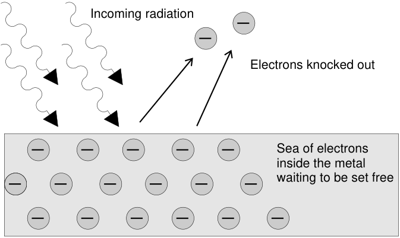
> **[Diagram Context - Textbook_PhysicalSciences_Gr12_Optical-phenomena-and-properties-of-matter.pdf-0004-09.png]**
> The educational graphic illustrates the photoelectric effect on a metal surface. Visible labels include "Incoming radiation" with wavy directional arrows, "Sea of electrons inside the metal waiting to be set free" containing multiple circles with minus signs representing electrons, and "Electrons knocked out" pointing to emitted electrons leaving the surface via straight arrows. For a Grade 12 Physical Sciences learner, the diagram conceptually conveys how incident photons transfer energy to free electrons within a metal, causing them to be ejected when the threshold frequency is met.


Figure 12.2: The photoelectric effect: Incoming photons on the left hit the electrons inside the metal surface. The electrons absorb the energy from the photons, and are ejected from the metal surface. 

We can observe this effect in the following practical demonstration of photoelectric emission. A zinc plate is charged negatively and placed onto the cap of an electroscope. In Figure 12.3, red light is shone onto the zinc plate. There is no change observed even if the intensity (brightness) of the red light is increased. In Figure 12.4, ultraviolet light of low intensity is shone onto the zinc and it is observed that the leaf of the electroscope collapse. This allows us to conclude that the negative charge on the plate decreased as electrons were ejected from the metal when the ultraviolet light was incident on the plate. 


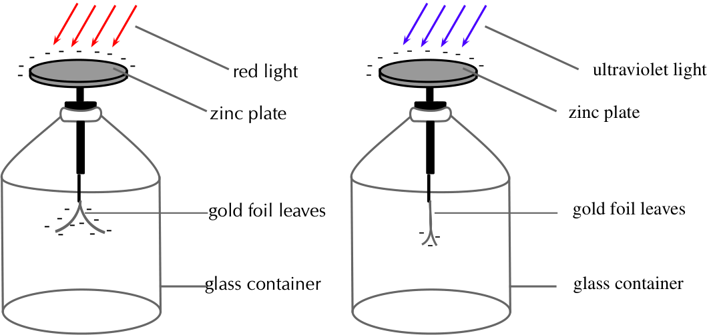
> **[Diagram Context - Textbook_PhysicalSciences_Gr12_Optical-phenomena-and-properties-of-matter.pdf-0005-01.png]**
> This educational graphic illustrates a gold-leaf electroscope apparatus used to demonstrate the photoelectric effect. Visible labels include "zinc plate," "gold foil leaves," "glass container," "red light," and "ultraviolet light," with negative charge symbols (-) indicating electron presence on the plate and leaves. Conceptually, it conveys that low-frequency red light cannot cause photoemission (leaving leaves charged and separated), whereas high-frequency ultraviolet light successfully ejects photoelectrons, causing the electroscope to discharge and the gold leaves to collapse.


Figure 12.3: Red light incident on the zinc plate of an electroscope. 

Figure 12.4: Ultraviolet light incident on the zinc plate of an electroscope. 

The work function is different for different elements. The smaller the work function, the easier it is for electrons to be emitted from the metal. Metals with low work functions make good conductors. This is because the electrons are attached less strongly to their surroundings and can move more easily through these materials. This reduces the resistance of the material to the flow of current i.e. it conducts well. Table 12.1 shows the work functions for a range of elements. 

|Element|Work Fu|nction (J)|
|---|---|---|
|Aluminium|6,9_×_|10^{_−_19}|
|Beryllium|8,0_×_|10^{_−_19}|
|Calcium|4,6_×_|10^{_−_19}|
|Copper|7,5_×_|10^{_−_19}|
|Gold|8,2_×_|10^{_−_19}|
|Lead|6,9_×_|10^{_−_19}|
|Silicon|1,8_×_|10^{_−_19}|
|Silver|6,9_×_|10^{_−_19}|
|Sodium|3,7_×_|10^{_−_19}|

Table 12.1: Work functions of selected elements determined from the photoelectric effect. (From the _Handbook of Chemistry and Physics.)_ 

##### Units of energy 

###### ESCQN 

When dealing with calculations at a small scale (like at the level of electrons) it is more convenient to use different units for energy rather than the joule (J). We define a unit called the electron-volt (eV) as the kinetic energy gained by an electron passing through a potential difference of one volt. _E_ = _q × V_ where q is the charge of the electron and V is the potential difference applied. The charge of 1 electron is 1,6 _×_ 10^{_−_19} C, so 1 eV 

Optical phenomena and properties of matter 

is calculated to be: 1 eV = �1,6 _×_ 10^{_−_19} C _×_ 1 V� = 1,6 _×_ 10^{_−_19} J. You can see that 1,6 _×_ 10^{_−_19} J is a very small amount of energy and so using electron-volts (eV) at this level is easier. Hence, 1 eV = 1,6 _×_ 10^{_−_19} J which means that 1 J = 6,241 _×_ 10^{18} eV. 

**Activity: Demonstration of the photoelectric effect** 

We can set up an experiment similar to the one used originally to study the photoelectric effect. The experiment allows us to measure the number of electrons emitted and the maximum kinetic energy of the ejected electrons. 


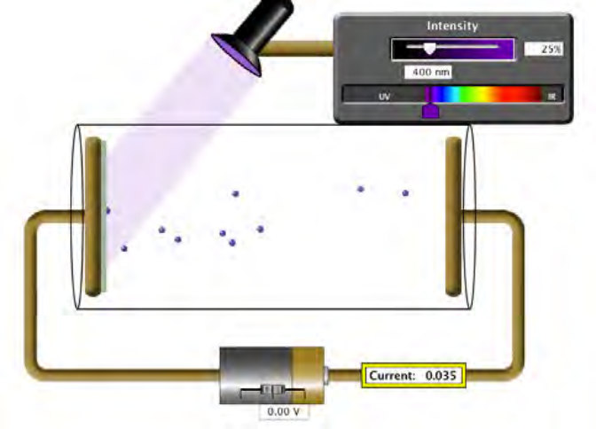
> **[Diagram Context - Textbook_PhysicalSciences_Gr12_Optical-phenomena-and-properties-of-matter.pdf-0006-03.png]**
> This educational graphic is an experimental apparatus demonstrating the photoelectric effect, showing a light source shining ultraviolet light onto a metal plate inside an evacuated tube connected to a circuit. Visible labels and indicators include "Intensity," a wavelength of "400 nm," a spectrum bar ranging from UV to IR, voltage set to "0.00 V," and a measured "Current: 0.035" with blue dots representing emitted photoelectrons traveling between the electrodes. Conceptually, this helps learners understand how incident light above the threshold frequency ejects electrons from a metal surface to generate a measurable electric current.


Figure 12.5: Photoelectric effect apparatus 

In the diagram of the Photoelectric Effect Apparatus, an ammeter allows for a current to be measured. Measuring the current allows us to deduce information about the number of electrons emitted and the kinetic energy of the ejected electrons. 

In the diagram, notice that the potential difference supplied by the battery is zero and yet a current is still measured on the ammeter. This is due to the incoming photons having sufficient frequency and hence energy greater than the work function to eject electrons. The ejected electrons travel across the evacuated space and allow for a current to be measured in the circuit. 

**Remember** , photon energy is related to frequency while intensity is related to the number of photons. 

Using the photoelectric effect equation 

ESCQP 

It is useful to observe the photoelectric effect equation represented graphically. It can be seen from the graph that _Ek_ is plotted on the _y−_ axis and _f_ is plotted on the _x−_ axis. Using the straight line equation, _y_ = _mx_ + _c_ , we can identify 


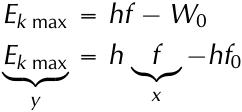
> **[Diagram Context - Textbook_PhysicalSciences_Gr12_Optical-phenomena-and-properties-of-matter.pdf-0007-03.png]**
> The graphic displays two variations of the photoelectric effect equation showing Planck's quantum energy relationship. Visible variables and symbols include $E_{k\text{ max}}$, $h$, $f$, $W_0$, $f_0$, along with algebraic mapping brackets labeled $y$ under $E_{k\text{ max}}$ and $x$ under $f$. This demonstrates to Grade 12 Physical Sciences learners how to map the photoelectric equation to the linear equation format $y = mx + c$ for analyzing graphical problems.


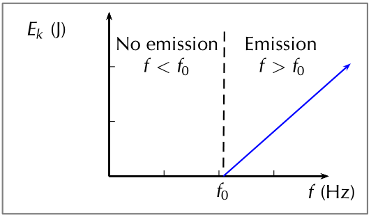
> **[Diagram Context - Textbook_PhysicalSciences_Gr12_Optical-phenomena-and-properties-of-matter.pdf-0007-04.png]**
> This educational graphic is a line graph illustrating the photoelectric effect, showing maximum kinetic energy as a function of frequency. Visible labels include the vertical axis $E_k\text{ (J)}$, the horizontal axis $f\text{ (Hz)}$, threshold frequency $f_0$, and regions marked "No emission ($f < f_0$)" and "Emission ($f > f_0$)" separated by a vertical dashed line. For Grade 12 Physical Sciences learners, the graph visually demonstrates that photoelectrons are only emitted when incident light exceeds the threshold frequency ($f_0$), with kinetic energy increasing linearly above this cutoff value.


This allows us to conclude that the slope of the graph _m_ is Planck’s constant _h_ . Also, the _x_ intercept is the cut-off frequency _f_ 0. 

###### **Worked example 1: The photoelectric effect using silver** 

###### **_QUESTION_** 

Ultraviolet radiation with a wavelength of 250 nm is incident on a silver foil (work function _W_ 0 = 6,9 _×_ 10^{_−_19} J). What is the maximum kinetic energy of the emitted electrons? 

###### **_SOLUTION_** 

###### **Step 1: Determine what is required and how to approach the problem** 

We need to determine the maximum We also have: kinetic energy of an electron ejected _•_ from a silver foil by ultraviolet radia- _W_ 0 silver tion. _•_ The photoelectric effect tells us that: 250 _×_ 

   - Work function of silver: _W_ 0 silver = 6,9 _×_ 10^{_−_19} J 

   - UV radiation wavelength = 250 nm = 250 _×_ 10^{_−_9} m = 2,50 _×_ 10^{_−_7} m 

- _Ek_ max = _E_ photon _− W_ 0 _•_ Planck’s constant: _h_ = 6,63 _×_ 10^{_−_34} m^{2} _·_ kg _·_ s^{_−_1} 

- _Ek_ max = _h_^{_c_} _λ_^{_−W_0} _•_ Speed of light: _c_ = 3 _×_ 10^{8} m _·_ s^{_−_1} 

###### **Step 2: Solve the problem** 


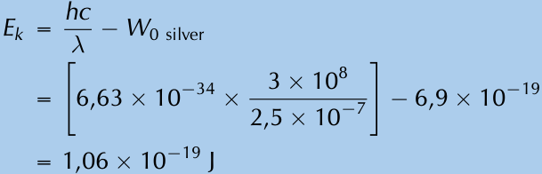
> **[Diagram Context - Textbook_PhysicalSciences_Gr12_Optical-phenomena-and-properties-of-matter.pdf-0007-16.png]**
> This educational graphic displays a physics calculation showing a solved problem for the photoelectric effect. Visible elements include the formula $E_k = \frac{hc}{\lambda} - W_{0 \text{ silver}}$, substituted numerical values containing Planck's constant ($6,63 \times 10^{-34}$), the speed of light ($3 \times 10^8$), wavelength ($\lambda = 2,5 \times 10^{-7}$), work function for silver ($6,9 \times 10^{-19}$), and the final calculated maximum kinetic energy in Joules ($\text{J}$). For a Grade 12 Physical Sciences learner, this demonstrates the step-by-step application of Einstein's photoelectric equation to calculate the maximum kinetic energy of emitted photoelectrons from a specific metal surface.


The maximum kinetic energy of the emitted electron will be 1,06 _×_ 10^{_−_19} J. 

**Worked example 2: The photoelectric effect using gold** 

###### **_QUESTION_** 

If we were to shine the same ultraviolet radiation ( _f_ = 1,2 _×_ 10^{15} Hz) on a gold foil (work function = 8,2 _×_ 10^{_−_19} J ) would any electrons be emitted from the surface of the gold foil? 

###### **_SOLUTION_** 

**Step 1: Calculate the energy of the inciStep 2: Write down the work function dent photons for gold.** 

For the electrons to be emitted from the surface, the energy of each photon needs to be _greater_ than the work function of the material. 


> **[Diagram Context - Textbook_PhysicalSciences_Gr12_Optical-phenomena-and-properties-of-matter.pdf-0008-06.png]**
> The image displays a text-based physics equation showing the work function value for gold, represented by the mathematical expression $W_{0\text{ gold}} = 8,92 \times 10^{-19}\text{ J}$. Visible symbols include the variable $W_0$, the subscript "gold", an equals sign, and the numerical value with its SI unit joules ($\text{J}$). For Grade 12 Physical Sciences learners studying the photoelectric effect under the CAPS curriculum, this conveys the specific minimum amount of energy required to emit an electron from the surface of a gold metal plate.


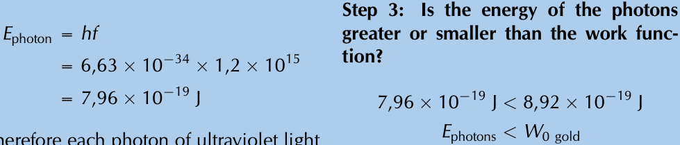
> **[Diagram Context - Textbook_PhysicalSciences_Gr12_Optical-phenomena-and-properties-of-matter.pdf-0008-07.png]**
> This educational graphic shows a worked numerical calculation for the photoelectric effect, specifically determining photon energy ($E_{\text{photon}} = hf$) and comparing it to a metal's work function ($W_0$). Visible labels and symbols include $E_{\text{photon}}$, Planck's constant ($h$), frequency ($f$), and the work function of gold ($W_{0\text{ gold}}$), along with values in Joules ($\text{J}$) and scientific notation. Conceptually, it guides Grade 12 Physical Sciences learners through step-by-step problem-solving to determine whether incident ultraviolet light has sufficient energy to emit photoelectrons from a gold surface.


Therefore each photon of ultraviolet light has an energy of 7,96 _×_ 10^{_−_19} J. 

Since the energy of each photon is less than the work function of gold, the photons do not have enough energy to knock electrons out of the gold. No electrons would be emitted from the gold foil. 

###### **Worked example 3: Photoelectric effect [NSC 2011 Paper 1]** 

###### **_QUESTION_** 

ultraviolet light A metal surface is illuminated with ultraelectrons violet light of wavelength 330 nm. Electrons are emitted from the metal surface. The minimum amount of energy required to emit an electron from the surface of this metal is 3,5 _×_ 10^{_−_19} J. metal 

1. Name the phenomenon illustrated above. (1 mark) 

2. Give ONE word or term for the underlined sentence in the above paragraph. 

(1 mark) 

3. Calculate the frequency of the ultraviolet light. (4 marks) 

4. Calculate the kinetic energy of a photoelectron emitted from the surface of the metal when the ultraviolet light shines on it. (4 marks) 

5. The intensity of the ultraviolet light illuminating the metal is now increased. What effect will this change have on the following: 

   - a) Kinetic energy of the emitted photoelectrons (Write down only INCREASES, DECREASES or REMAINS THE SAME.) (1 mark) 

   - b) Number of photoelectrons emitted per second (Write down only INCREASES, DECREASES or REMAINS THE SAME.) (1 mark) 

6. Overexposure to sunlight causes damage to skin cells. 

   - a) Which type of radiation in sunlight is said to be primarily responsible for this damage? (1 mark) 

   - b) Name the property of this radiation responsible for the damage. (1 mark) 

**[TOTAL: 14 marks]** 

###### **_SOLUTION_** 

**Question 1:** Photo-electric effect (1 mark) **Question 2:** Work function (1 mark) 

###### **Question 3** 


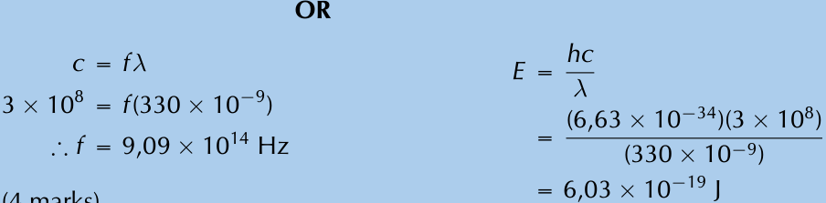
> **[Diagram Context - Textbook_PhysicalSciences_Gr12_Optical-phenomena-and-properties-of-matter.pdf-0009-07.png]**
> The graphic displays two alternative worked mathematical calculation steps for solving a physics problem involving wave properties and photon energy. The visible symbols and variables include $c$, $f$, $\lambda$, $E$, and $h$, with numerical values utilizing South African decimal comma notation ($3 \times 10^8$, $330 \times 10^{-9}$, $6,63 \times 10^{-34}$, and $6,03 \times 10^{-19}$). This illustrates how to apply the wave equation ($c = f\lambda$) and Planck's energy equation ($E = \frac{hc}{\lambda}$ or $E = hf$) to determine frequency and energy in Grade 12 Physical Sciences.


(4 marks) 


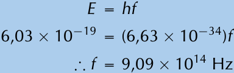
> **[Diagram Context - Textbook_PhysicalSciences_Gr12_Optical-phenomena-and-properties-of-matter.pdf-0009-09.png]**
> This mathematical calculation graphic displays a physics formula and its numerical substitution. The visible text includes the symbols $E$, $h$, $f$, numbers in scientific notation representing energy and Planck's constant, and the resultant frequency unit $\text{Hz}$. Conceptually, it demonstrates how to apply Planck's equation to calculate the frequency of a photon when given its energy, a key skill for Grade 12 Physical Sciences learners studying the photoelectric effect and light as electromagnetic radiation.


###### **Question 4** 

###### **Option 1:** 


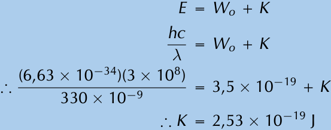
> **[Diagram Context - Textbook_PhysicalSciences_Gr12_Optical-phenomena-and-properties-of-matter.pdf-0009-12.png]**
> This educational graphic shows a multi-step algebraic calculation applying Einstein's photoelectric equation ($E = W_o + K$) to solve for maximum kinetic energy. Visible variables and constants include photon energy ($E$), Planck's constant ($h$), speed of light ($c$), wavelength ($\lambda$), work function ($W_o$), and kinetic energy ($K$). Conceptually, it guides Grade 12 Physical Sciences learners through substituting known values into the wave-particle duality formula to calculate the kinetic energy of an emitted photo-electron in Joules.


**Option 2:** 

_E_ = _Wo_ + _K hf_ = _Wo_ + _K_ ∴ (6,63 _×_ 10^{_−_34} )(9,09 _×_ 10^{14} = 3,5 _×_ 10^{_−_19} + _K_ ∴ _K_ = 2,53 _×_ 10^{_−_19} J (4 marks) **Question 5.1:** Remains the same. **Question 5.2:** Increases (1 mark) (1 mark) **Question 6.1:** Ultraviolet radiation (1 mark) **Question 6.2:** High energy or high frequency (1 mark) **[TOTAL: 12 marks]** 

Solar cells 

ESCQQ 

The generation of electricity using solar cells isn’t due to the photoelectric effect but is similar in nature. Photons in sunlight hit the solar panel and are absorbed by semiconducting materials, such as silicon. 

Electrons (negatively charged) are knocked loose from their atoms, allowing them to flow through the material to produce electricity. This is called the photovoltaic effect. The photovoltaic effect was first observed by French physicist Antoine E. Becquerel in 1839. 

Due to the special composition of solar cells, the electrons are only allowed to move in a single direction. An array of solar cells converts solar energy into a usable amount of direct current (DC) electricity. 

###### **Exercise 12 – 1: The photoelectric effect** 

1. Describe the photoelectric effect. 

2. List two reasons why the observation of the photoelectric effect was significant. 

3. Refer to 12.1: If I shine ultraviolet light with a wavelength of 288 nm onto some aluminium foil, what would the kinetic energy of the emitted electrons be? 

4. I shine a light of an unknown wavelength onto some silver foil. The light has only enough energy to eject electrons from the silver foil but not enough to give them kinetic energy. (Refer to 12.1 when answering the questions below:) 

   - a) If I shine the same light onto some copper foil, would electrons be ejected? b) If I shine the same light onto some silicon, would electrons be ejected? c) If I increase the intensity of the light shining on the silver foil, what happens? d) If I increase the frequency of the light shining on the silver foil, what happens? 

5. The following results were obtained from a photoelectric effect experiment. 

|_f_ (_×_10^{15} Hz)|_Ek_ (_×_10^{_−_19} J)|
|---|---|
|0.60|0.24|
|0.80|1.59|
|1.00|2.89|
|1.20|4.20|
|1.40|5.55|
|1.60|6.89|

- a) Plot a graph of _Ek_ on the _y_ axis and _f_ on the x axis 

- b) Calculate the gradient of the graph. 

- c) The metal used in the experiment is Sodium which has a work function of 3, 7 _×_ 10^{_−_19} . Calculate the cut-off frequency for sodium. 

- d) Determine the _x_ intercept. Compare your _x_ intercept value with the cut-off frequency you calculated. 

- e) If the sodium metal was replaced with another metal with double the work function, sketch on the same graph for sodium, the result you would expect to obtain. 

6. More questions. Sign in at Everything Science on-line and click ’Practice Science’. 

Check answers online with the exercise code below or click on ’show me the answer’. 1. 27Z7 2. 27Z8 3. 27Z9 4. 27ZB 5. 27ZC **www.everythingscience.co.za m.everythingscience.co.za** 

### 12.3 Emission and absorption spectra ESCQR 

Emission spectra ESCQS 

You have learnt previously about the structure of an atom. The electrons surrounding the atomic nucleus are arranged in a series of levels of increasing energy. Each element has a unique number of electrons in a unique configuration therefore each element has its own distinct set of energy levels. This arrangement of energy levels serves as the atom’s unique fingerprint. 

In the early 1900s, scientists found that a liquid or solid heated to high temperatures would give off a broad range of colours of light. However, a gas heated to similar temperatures would emit light only at certain specific wavelengths (colours). The reason for this observation was not understood at the time. 

Scientists studied this effect using a discharge tube. 


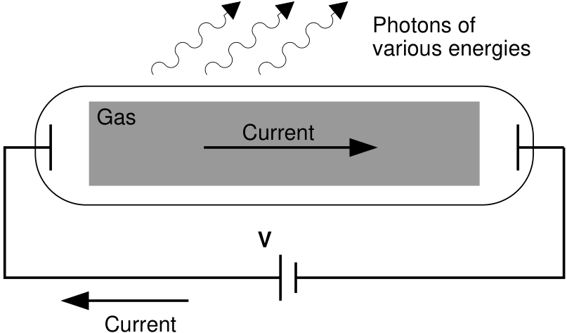
> **[Diagram Context - Textbook_PhysicalSciences_Gr12_Optical-phenomena-and-properties-of-matter.pdf-0011-07.png]**
> This diagram illustrates a discharge tube apparatus used to demonstrate atomic emission spectra. It features visible labels for "Gas", "Current", voltage "V", and wavy arrows representing "Photons of various energies". Conceptually, it conveys how passing an electric current through a gas at low pressure excites atoms, causing them to emit photons corresponding to discrete energy transitions when electrons return to lower energy states.


Figure 12.6: Diagram of a discharge tube. The tube is filled with a gas. When a high enough voltage is applied across the tube, the gas ionises and acts like a conductor, allowing a current to flow through the circuit. The current excites the atoms of the ionised gas. When the atoms fall back to their ground state, they emit photons to carry off the excess energy. 

A discharge tube (shown in Figure 12.6) is a gas-filled, glass tube with a metal plate at both ends. If a large enough voltage difference is applied between the two metal 

plates, the gas atoms inside the tube will absorb enough energy to make some of their electrons come off, i.e. the gas atoms are ionised. These electrons start moving through the gas and create a current, which raises some electrons in other atoms to higher energy levels. Then as the electrons in the atoms fall back down, they emit electromagnetic radiation (light). The amount of light emitted at different wavelengths, called the **emission spectrum** , is shown for a discharge tube filled with hydrogen gas in 12.7 below. Only certain wavelengths (i.e. colours) of light are seen, as shown by the lines in the picture. 


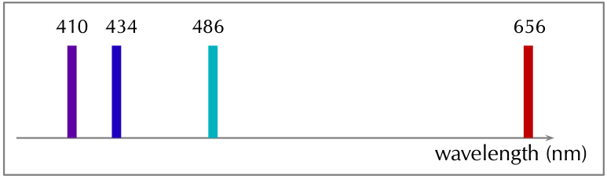
> **[Diagram Context - Textbook_PhysicalSciences_Gr12_Optical-phenomena-and-properties-of-matter.pdf-0012-01.png]**
> This graphic shows an emission line spectrum plotted against an arrowed horizontal axis labelled "wavelength (nm)". The visible vertical spectral lines are colour-coded and annotated with specific wavelength values of 410, 434, 486, and 656 nanometres. Conceptually, this conveys how electrons in excited atoms release energy at discrete, quantised wavelengths when transitioning to lower energy levels, representing atomic emission spectra as studied in Physical Sciences.


Figure 12.7: Diagram of the emission spectrum of hydrogen in the visible spectrum. Four lines are visible, and are labelled with their wavelengths. The three lines in the 400–500 nm range are in the blue part of the spectrum, while the higher line (656 nm) is in the red/orange part. 

Eventually, scientists realised that these lines come from photons of a specific energy, emitted by electrons making transitions between specific energy levels of the atom. Figure 12.8 shows an example of this happening. When an electron in an atom falls from a higher energy level to a lower energy level, it emits a photon to carry off the extra energy. This photon’s energy is equal to the energy difference between the two energy levels (∆ _E_ ). 

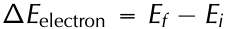

As we previously discussed, the frequency of a photon is related to its energy through the equation _E_ = _hf_ . Since a specific photon frequency (or wavelength) gives us a specific colour, we can see how each coloured line is associated with a specific transition. 


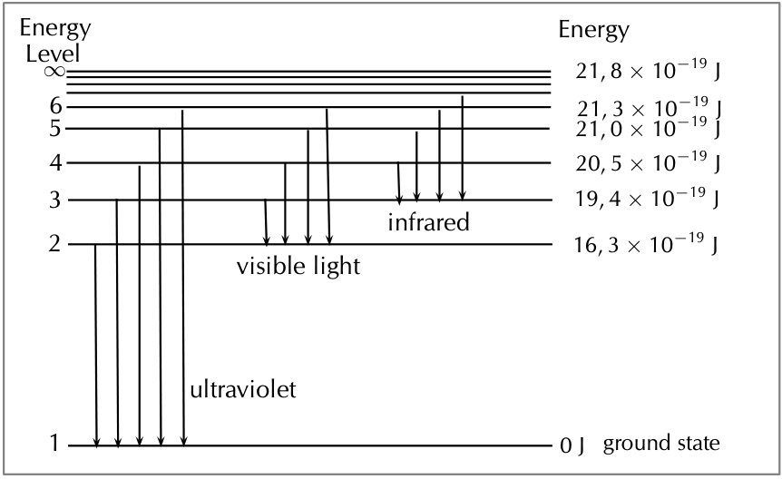
> **[Diagram Context - Textbook_PhysicalSciences_Gr12_Optical-phenomena-and-properties-of-matter.pdf-0012-06.png]**
> This energy level diagram illustrates electron transitions within an atom linked to the emission of different spectral series. Visible labels include energy level numbers (1 through $\infty$), corresponding energy values in Joules, a ground state at $0\text{ J}$, and arrows pointing downwards grouped into ultraviolet, visible light, and infrared spectral regions. Conceptually, it conveys how electrons dropping to lower energy levels emit photons of specific frequencies and energies, demonstrating the formation of atomic emission spectra.


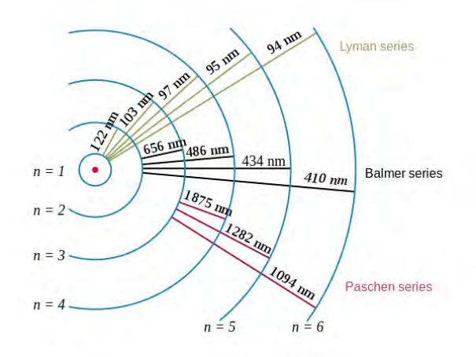
> **[Diagram Context - Textbook_PhysicalSciences_Gr12_Optical-phenomena-and-properties-of-matter.pdf-0013-00.png]**
> This graphic illustrates the atomic emission line spectra of hydrogen originating from electron transitions between discrete energy levels ($n = 1$ to $n = 6$). Visible labels include energy level integers ($n = 1$ to $n = 6$), spectral series names (Lyman series, Balmer series, Paschen series), and specific emission wavelengths in nanometres (e.g., $122\text{ nm}$, $656\text{ nm}$, $1875\text{ nm}$). Conceptually, it conveys how electrons dropping to specific lower energy levels emit photons of distinct wavelengths, demonstrating the quantized nature of atomic energy states required for understanding atomic emission spectra.


Figure 12.8: In the first diagram are shown some of the electron energy levels for the hydrogen atom. The arrows show the electron transitions from higher energy levels to lower energy levels. The energies of the emitted photons are the same as the energy difference between two energy levels. You can think of absorption as the opposite process. The arrows would point upwards and the electrons would jump up to higher levels when they absorb a photon of the right energy. The second representation shows the wavelengths of the light that is emitted for the the various transitions. The transistions are grouped into a series based on the lowest level involved in the transition. 

Visible light is not the only kind of electromagnetic radiation emitted. More energetic or less energetic transitions can produce ultraviolet or infrared radiation. However, because each atom has its own distinct set of energy levels (its fingerprint!), each atom has its own distinct emission spectrum. 

##### Absorption spectra 

###### ESCQT 

Atoms do not only emit photons; they also absorb photons. If a photon hits an atom and the energy of the photon is the same as the gap between two electron energy levels in the atom, then the electron in the lower energy level can absorb the photon and jump up to the higher energy level. If the photon energy does not correspond to the difference between two energy levels then the photon will not be absorbed (it can still be scattered). 

Using this effect, if we have a source of photons of various energies we can obtain the **absorption spectra** for different materials. To get an absorption spectrum, just shine white light on a sample of the material that you are interested in. White light is made up of all the different wavelengths of visible light put together. In the absorption spectrum there will be gaps. The gaps correspond to energies (wavelengths) for which there is a corresponding difference in energy levels for the particular element. 

The absorbed photons show up as black lines because the photons of these wavelengths have been absorbed and do not show up. Because of this, the absorption spectrum is the exact _inverse_ of the emission spectrum. Look at the two figures below. In Figure 12.9 you can see the line emission spectrum of hydrogen. Figure 12.10 shows the absorption spectrum. It is the exact opposite of the emission spectrum! Both emission and absorption techniques can be used to get the same information about the energy levels of an atom. 

Figure 12.9: _Emission_ spectrum of Hydrogen. 

Figure 12.10: _Absorption_ spectrum of Hydrogen. 

The dark lines correspond to the frequencies of light that have been absorbed by the gas. As the photons of light are absorbed by electrons, the electrons move into higher energy levels. This is the opposite process of emission. 

The dark lines, absorption lines, correspond to the frequencies of the emission spectrum of the same element. The amount of energy absorbed by the electron to move into a higher level is the same as the amount of energy released when returning to the original energy level. 

###### **Worked example 4: Absorption** 

###### **_QUESTION_** 

I have an unknown gas in a glass container. I shine a bright white light through one side of the container and measure the spectrum of transmitted light. I notice that there is a black line ( _absorption_ line) in the middle of the visible red band at 642 nm. I have a hunch that the gas might be hydrogen. If I am correct, between which 2 energy levels does this transition occur? (Hint: look at Figure 12.8 and the transitions which are in the visible part of the spectrum.) 

###### **_SOLUTION_** 

###### **Step 1: What is given and what needs to be done?** 

We have an absorption line at 642 nm. This means that the substance in the glass container absorbed photons with a wavelength of 642 nm. We need to calculate which 2 energy levels of hydrogen this transition would correspond to. Therefore we need to know what energy the absorbed photons had. 

###### **Step 2: Calculate the energy of the absorbed photons** 


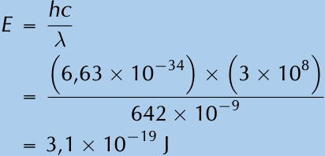
> **[Diagram Context - Textbook_PhysicalSciences_Gr12_Optical-phenomena-and-properties-of-matter.pdf-0014-11.png]**
> This graphic presents a physics calculation showing the mathematical formula $E = \frac{hc}{\lambda}$ followed by a substituted numerical calculation. Visible symbols and constants include energy ($E$), Planck's constant ($h = 6,63 \times 10^{-34}\text{ J}\cdot\text{s}$), the speed of light ($c = 3 \times 10^8\text{ m}\cdot\text{s}^{-1}$), wavelength ($\lambda = 642 \times 10^{-9}\text{ m}$), and the resulting energy value of $3,1 \times 10^{-19}\text{ J}$. Conceptually, it demonstrates to Grade 12 Physical Sciences learners how to calculate the energy of a photon using its wavelength, reinforcing the inverse proportionality between energy and wavelength in quantum mechanics.


The absorbed photons had an energy of 3,1 _×_ 10^{_−_19} J. 

###### **Step 3: Find the energy of the transitions resulting in radiation at visible wavelengths** 

Figure 12.8 shows various energy level transitions. The transitions related to visible wavelengths are marked as the transitions beginning or ending on Energy Level 2. Let us find the energy of those transitions and compare with the energy of the absorbed photons we have just calculated. 

Energy of transition (absorption) from Energy Level 2 to Energy Level 3: 


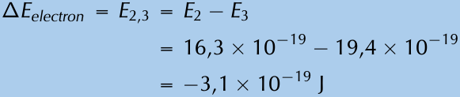
> **[Diagram Context - Textbook_PhysicalSciences_Gr12_Optical-phenomena-and-properties-of-matter.pdf-0015-01.png]**
> The graphic displays a mathematical calculation of energy change for an electron transition between energy levels, shown as a sequence of algebraic and numerical equations. The visible text and symbols include $\Delta E_{electron}$, $E_{2,3}$, $E_2$, $E_3$, equality signs, subtraction signs, scientific notation values in joules ($16,3 \times 10^{-19}$, $19,4 \times 10^{-19}$, and $-3,1 \times 10^{-19}\text{ J}$). This demonstrates to Physical Sciences learners how to calculate the energy difference ($\Delta E$) when an electron transitions between specific atomic energy levels.


Therefore the energy of the photon that an electron must absorb to jump from Energy Level 2 to Energy Level 3 is 3,1 _×_ 10^{_−_19} J. (NOTE: The minus sign means that _absorption_ is occurring.) 

This is the same energy as the photons which were absorbed by the gas in the container! Therefore, since the transitions of all elements are unique, we can say that the gas in the container is hydrogen. The transition is absorption of a photon between Energy Level 2 and Energy Level 3. 

###### **IMPORTANT!** 

The energy of the photon does not correspond to the energy of an energy level, it corresponds to the **difference** in energy between two energy levels. 

Applications of emission and absorption spectra ESCQV 

The study of spectra from stars and galaxies in astronomy is i called _spectroscopy_ . Spectroscopy is a tool widely used in astronomy to learn different things about astronomical objects. 

###### **Identifying elements in astronomical objects using their spectra** 

Measuring the spectrum of light from a star can tell astronomers what the star is made of. Since each element emits or absorbs light only at particular wavelengths, astronomers can identify what elements are in the stars from the lines in their spectra. From studying the spectra of many stars we know that there are many different types of stars which contain different elements and in different amounts. 

###### **Determining velocities of galaxies using spectroscopy** 

You have already learnt in Chapter 6 about the Doppler effect and how the frequency (and wavelength) of sound waves changes depending on whether the object emitting the sound is moving _towards_ or _away_ from you. The same thing happens to electromagnetic radiation (light). If the object emitting the light is moving _towards_ us, then the wavelength of the light appears shorter (called **blueshifted** ). If the object is moving _away_ from us, then the wavelength of its light appears stretched out (called **redshifted** ). 

The Doppler effect affects the spectra of objects in space depending on their motion relative to us on the earth. For example, the light from a distant galaxy that is moving away from us at some velocity will appear redshifted. This means that the emission and absorption lines in the galaxy’s spectrum will be shifted to a longer wavelength (lower frequency). Knowing where each line in the spectrum would normally be if the galaxy was not moving and comparing it to the redshifted position, allows astronomers to precisely measure the velocity of the galaxy relative to the Earth. 

###### **Global warming and greenhouse gases** 

The sun emits radiation (light) over a range of wavelengths that are mainly in the visible part of the spectrum. Radiation at these wavelengths passes through the gases of the 

atmosphere to warm the land and the oceans below. The warm earth then radiates this heat at longer infrared wavelengths. Carbon dioxide (one of the main greenhouse gases) in the atmosphere has energy levels that correspond to the infrared wavelengths that allow it to absorb the infrared radiation. It then also emits at infrared wavelengths in all directions. This effect stops a large amount of the infrared radiation from getting out of the atmosphere, which causes the atmosphere and the earth to heat up. More radiation is coming in than is getting back out. 


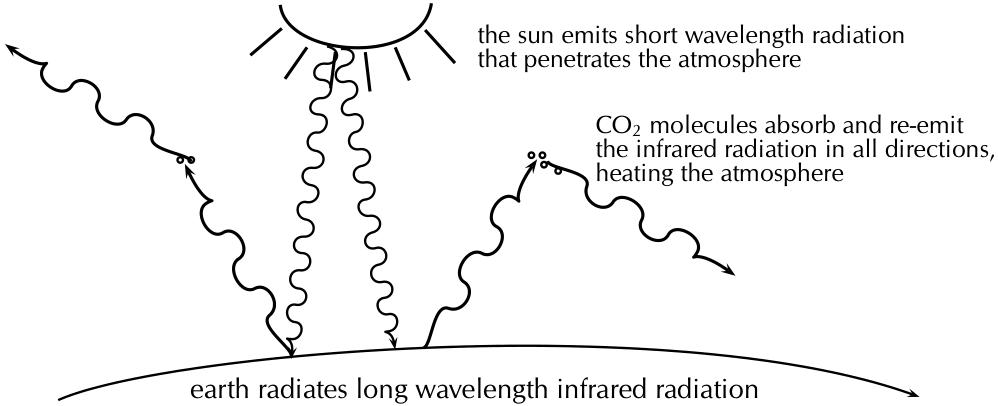
> **[Diagram Context - Textbook_PhysicalSciences_Gr12_Optical-phenomena-and-properties-of-matter.pdf-0016-01.png]**
> This educational infographic illustrates the mechanism of the greenhouse effect, featuring the sun, Earth's surface, wavy arrows representing electromagnetic radiation, and small particle clusters labeled as CO₂ molecules with descriptive explanatory text. The diagram displays short-wavelength solar radiation penetrating the atmosphere, the Earth radiating long-wavelength infrared radiation, and greenhouse gases absorbing and re-emitting this heat. Conceptually, it helps FET learners understand how atmospheric carbon dioxide traps thermal energy to warm the planet, supporting environmental science and climate change topics.


So increasing the amount of greenhouse gases in the atmosphere increases the amount of trapped infrared radiation and therefore the overall temperature of the earth. The earth is a very sensitive and complicated system upon which life depends and changing the delicate balances of temperature and atmospheric gas content may have disastrous consequences if we are not careful. 

###### **Exercise 12 – 2: Emission and absorption spectra** 

1. Explain how atomic emission spectra arise and how they relate to each element on the periodic table. 

2. How do the lines on the atomic spectrum relate to electron transitions between energy levels? 

3. Explain the difference between atomic absorption and emission spectra. 

4. Describe how the absorption and emission spectra of the gases in the atmosphere give rise to the Greenhouse Effect. 

5. What colour is the light emitted by hydrogen when an electron makes the transition from energy level 5 down to energy level 2? (Use 12.8 to find the energy of the released photon.) 

6. I have a glass tube filled with hydrogen gas. I shine white light onto the tube. The spectrum I then measure has an absorption line at a wavelength of 474 nm. Between which two energy levels did the transition occur? (Use 12.8 in solving the problem.) 

7. More questions. Sign in at Everything Science on-line and click ’Practice Science’. 

Check answers online with the exercise code below or click on ’show me the answer’. 1. 27ZD 2. 27ZF 3. 27ZG 4. 27ZH 5. 27ZK 7. 27ZM 

**www.everythingscience.co.za m.everythingscience.co.za** 

12.4 Chapter summary ESCQW 

- The photoelectric effect is the process whereby an electron is emitted by a substance when light shines on it. 

- A substance has a work function which is the minimum energy needed to emit an electron from the metal. The frequency of light whose photons correspond exactly to the work function is known as the cut-off frequency. 


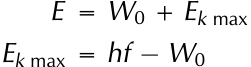
> **[Diagram Context - Textbook_PhysicalSciences_Gr12_Optical-phenomena-and-properties-of-matter.pdf-0017-04.png]**
> This graphic displays two fundamental mathematical equations relating to the photoelectric effect: $E = W_0 + E_{k \text{ max}}$ and $E_{k \text{ max}} = hf - W_0$. The visible variables and symbols include $E$ (incident photon energy), $W_0$ (work function), $E_{k \text{ max}}$ (maximum kinetic energy of emitted photoelectrons), $h$ (Planck's constant), and $f$ (frequency of the incident light). For a Grade 12 Physical Sciences learner, these formulas convey the principle of conservation of energy during the photoelectric emission process, showing how the energy of an incoming photon is split into overcoming the metal's work function and imparting kinetic energy to the ejected electron.


- The number of electrons ejected increases with the intensity of the incident light. 

- The photoelectric effect illustrates the particle nature of light and establishes the quantum theory. 

- Emission spectra are formed when certain frquencies of light are emitted by a gas, as a result of electrons in the atmoms dropping from higher to lower energy levels. The pattern of the spectra is charactersistic of the specific gas. 

- Absorption spectra are formed when certain frequencies of light are absorbed by a material. These photons are absorbed when their energy is exactly the correct amount to raise an electron from one energy level to another. 

|**Physic**|**alQuantities**||
|---|---|---|
|**Quantity**|**Unit name**|**Unit symbol**|
|Energy(_E_)|joule|J|
|Work function (_W_0)|joule|J|
|Frequency(_f_)|hertz|Hz|
|Wavelength (_λ_)|metre|m|

Table 12.2: Units used in **optical phenomena and properties of matter** . 

###### **Exercise 12 – 3:** 

1. Calculate the energy of a photon of red light with a wavelength of 400 nm. 

2. Will ultraviolet light with a wavelength of 990 nm be able to emit electrons from a sheet of calcium with a work function of 2,9 eV? 

3. More questions. Sign in at Everything Science on-line and click ’practise’. 

Check answers online with the exercise code below or click on ’show me the answer’. 

**www.everythingscience.co.za m.everythingscience.co.za** 


> **[Diagram Context - Textbook_PhysicalSciences_Gr12_Optical-phenomena-and-properties-of-matter.pdf-0018-00.png]**
> This graphic functions as a textbook chapter header, featuring the text "CHAPTER" alongside a green circular icon enclosing the number "12" and bordered by a segmented white dashed ring. It visually organizes the learning material to clearly signal the start of a specific curriculum module for South African high school learners.


## _Optical phenomena and properties of matter_ 

|**12.1**|**_Introduction_**|232|
|---|---|---|
|**12.2**|**_The photoelectric effect_**|232|
|**12.3**|**_Emission and absorption spectra_**|235|
|**12.4**|**_Chapter summary_**|236|

12 Optical phenomena and properties of matter 

#### 12.1 Introduction 

Photoelectric effect: 

- Description of the photoelectric effect. 

- Give the significance of the photoelectric effect. 

- Definition of the cut-off frequency. 

- Definition of the work function and that it is material specific 

- The relationship between the cutt-off frequency and maximum wavelength. 

- Calculations using the photoelectric equation. 

- Knowing the relationship between the number of electrons and intensity of the incident radiation. 

- Understanding the nature between the photoelectric effect and the particle of nature of light. 

Emission and absorption spectra: 

- Explanation of the source atomic emission spectra and their unique relationship to each element. 

- Relation between the atomic spectrum and the electron transitions between energy levels. 

- Explaining the difference between atomic absorption and emission spectra. 

- Applications of emission and absorption spectra. 

###### **Key Mathematics Concepts** 

- Units and unit conversions — Physical Sciences, Grade 10, Science skills 

- Equations — Mathematics, Grade 10, Equations and inequalities 

- Electronic configuration — Physical Sciences, Grade 10, The atom 

- Electromagnetic radiation — Physical Sciences, Grade 10, Electromagnetic radiation 

#### 12.2 The photoelectric effect 

###### History and expectations as to the photoelectric effect 

For a paper on the history of the photoelectric effect and the analysis of its treatment in a variety of textbooks see: http://onlinelibrary.wiley.com/doi/10.1002/sce.20389/pdf 

**Exercise 12 – 1: The photoelectric effect** 

1. Describe the photoelectric effect. 

The photoelectric effect its the process whereby an electron is emitted by a metal when light shines on it, on the condition that the energy of the photons (light energy packets) are greater than or equal to the work function of the metal. 

2. List two reasons why the observation of the photoelectric effect was significant. 

   - Two reasons why the observation of the photoelectric effect was significant are (1) that it provides evidence for the particle nature of light and (2) that it opened up a new branch for technological advancement e.g. photocathodes (like in old TVs) and night vision devices. 

3. Refer to tab:work _f un_ : _IfIshineultravioletlightwithawavelengthof_ 288 nm onto some aluminium foil, what would the kinetic energy of the emitted electrons be? 


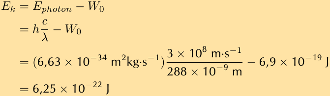
> **[Diagram Context - Textbook_PhysicalSciences_Gr12_Optical-phenomena-and-properties-of-matter.pdf-0020-06.png]**
> This mathematical calculation graphic displays the step-by-step application of the photoelectric effect formula, specifically solving for maximum kinetic energy ($E_k$). Visible labels and variables include $E_k$, $E_{photon}$, work function ($W_0$), Planck's constant ($h$), speed of light ($c$), and wavelength ($\lambda$), along with substituted numerical values and units. Conceptually, it demonstrates how Grade 12 Physical Sciences learners calculate the kinetic energy of emitted photoelectrons by subtracting the metal's work function from the incident photon energy.


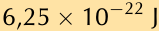

4. I shine a light of an unknown wavelength onto some silver foil. The light has only enough energy to eject electrons from the silver foil but not enough to give them kinetic energy. (Refer to tab:work _f unwhenansweringthequestionsbelow_ :) 

a) If I shine the same light onto some copper foil, would electrons be ejected? 

- b) If I shine the same light onto some silicon, would electrons be ejected? 

- c) If I increase the intensity of the light shining on the silver foil, what happens? d) If I increase the frequency of the light shining on the silver foil, what happens? 

- a) The kinetic energy of the ejected photon is given by 

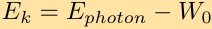

and if for silver foil _Ek_ = 0 then _Ephoton_ = _W_ 0 silver. Therefore, if the same light falls on copper foil we require _Ephoton > W_ 0 copper for electrons to be ejected. The work function for silver is _W_ 0 silver = 6,9 _⇥_ 10^{_−_19} J and the work function for copper is _W_ 0 copper = 7,5 _⇥_ 10^{_−_19} J. Now 


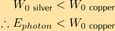
> **[Diagram Context - Textbook_PhysicalSciences_Gr12_Optical-phenomena-and-properties-of-matter.pdf-0020-15.png]**
> This educational graphic presents a mathematical inequality comparison related to the photoelectric effect in Physical Sciences. It displays algebraic variables and text labels, specifically work function terms ($W_{0 \text{ silver}}$, $W_{0 \text{ copper}}$) and photon energy ($E_{photon}$), linked by "less than" symbols ($<$) and a therefore sign ($\therefore$). Conceptually, it illustrates how comparing the threshold frequencies or work functions of different metals dictates the minimum photon energy required for electron emission in accordance with Einstein's photoelectric equation.


and thus no electrons will be ejected. 

- b) Similarly to the previous question we know the kinetic energy of the ejected photon is given by 

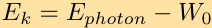

and if for silver foil _Ek_ = 0 then _Ephoton_ = _W_ 0 silver. Therefore, if the same light falls on copper foil we require _Ephoton > W_ 0 silicon for electrons to be ejected. The work function for silver is _W_ 0 silver = 6,9 _⇥_ 10^{_−_19} J and the work function for silicon is _W_ 0 silicon = 1,8 _⇥_ 10^{_−_19} J. Now 


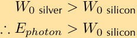
> **[Diagram Context - Textbook_PhysicalSciences_Gr12_Optical-phenomena-and-properties-of-matter.pdf-0020-20.png]**
> The graphic displays a conceptual physics comparison involving work function inequalities. It features the variables $W_0 \text{ silver}$, $W_0 \text{ silicon}$, and $E_{\text{photon}}$ linked by greater-than inequality signs and a logical consequence symbol ($\therefore$). This comparison illustrates the threshold frequency and work function concepts in the photoelectric effect, helping Grade 12 learners understand that different materials require different minimum energies to emit photoelectrons.


and thus electrons will be ejected. 

   - c) More electrons will be ejected from the silver. 

   - d) Increasing the frequency of the light would increase _Ephoton_ and therefore _Ephoton > W_ 0 silver which means that the electron will be ejected with a kinetic energy of _Ek_ = _Ephoton − W_ 0 silver _>_ 0. 

5. The following results were obtained from a photoelectric effect experiment. 

|_f_ (_⇥_10^{15} Hz)|_Ek_ (_⇥_10^{_−_19} J)|
|---|---|
|0.60|0.24|
|0.80|1.59|
|1.00|2.89|
|1.20|4.20|
|1.40|5.55|
|1.60|6.89|

- a) Plot a graph of _Ek_ on the _y_ axis and _f_ on the x axis 

- b) Calculate the gradient of the graph. 

- c) The metal used in the experiment is Sodium which has a work function of 3 _,_ 7 _⇥_ 10^{_−_19} . Calculate the cut-off frequency for sodium. 

- d) Determine the _x_ intercept. Compare your _x_ intercept value with the cut-off frequency you calculated. 

- e) If the sodium metal was replaced with another metal with double the work function, sketch on the same graph for sodium, the result you would expect to obtain. 


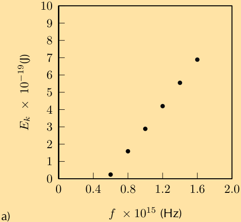
> **[Diagram Context - Textbook_PhysicalSciences_Gr12_Optical-phenomena-and-properties-of-matter.pdf-0021-09.png]**
> The graphic is a scatter plot representing experimental data for the photoelectric effect in Grade 12 Physical Sciences. The visible axes are labelled with maximum kinetic energy ($E_k \times 10^{-19}\text{ J}$) on the vertical axis and frequency ($f \times 10^{15}\text{ Hz}$) on the horizontal axis, plotted with discrete data points. Conceptually, this graph helps learners understand the linear relationship between the frequency of incident light and the maximum kinetic energy of emitted photoelectrons, allowing them to determine Planck's constant and the threshold frequency.


b) gradient = 6 _._ 6 _⇥_ 10^{_−_34} 

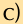


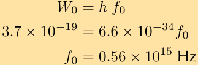
> **[Diagram Context - Textbook_PhysicalSciences_Gr12_Optical-phenomena-and-properties-of-matter.pdf-0021-12.png]**
> This graphic displays a physics calculation showing the relationship between work function, Planck's constant, and threshold frequency. The visible mathematical expressions include symbols and values such as $W_0$, $h$, $f_0$, $3.7 \times 10^{-19}$, $6.6 \times 10^{-34}$, and $0.56 \times 10^{15}\text{ Hz}$. Conceptually, it demonstrates how to apply the formula $W_0 = h f_0$ to calculate the threshold frequency of a metal in the context of the photoelectric effect for Grade 12 Physical Sciences.


d) Check that your _x_ intercept is close to 0,56 _⇥_ 10^{15} which is the cut-off frequency 


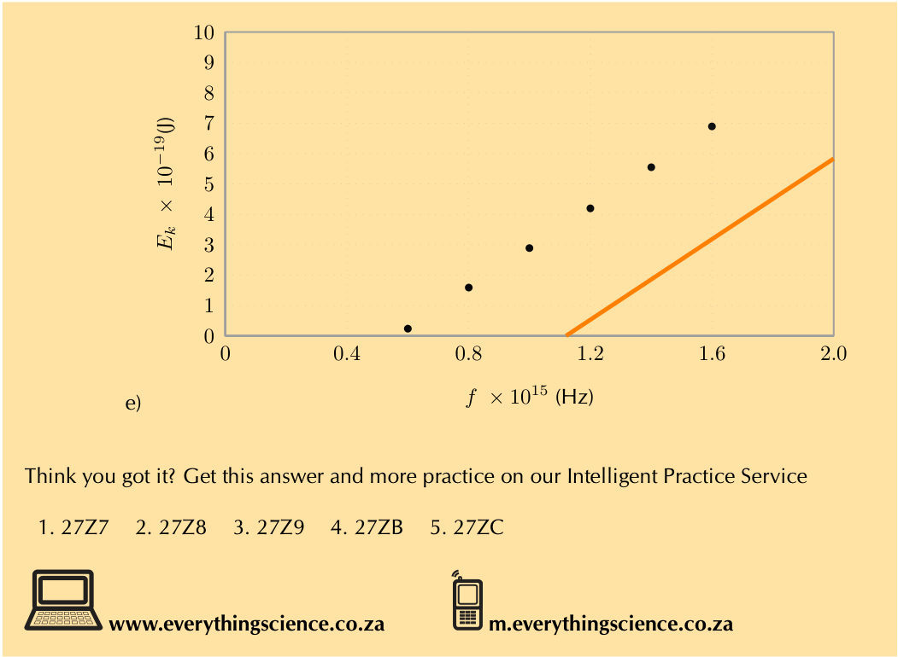
> **[Diagram Context - Textbook_PhysicalSciences_Gr12_Optical-phenomena-and-properties-of-matter.pdf-0022-00.png]**
> This graphic displays a physics graph relating maximum kinetic energy ($E_k \times 10^{-19}\text{ J}$) on the vertical axis to frequency ($f \times 10^{15}\text{ Hz}$) on the horizontal axis, featuring plotted data points and a straight line trend. The visible labels include the axis variables $E_k$ and $f$, numerical scale markings ranging from 0 to 10 for energy and 0 to 2.0 for frequency, and data points represented by black dots along with an orange straight line. Conceptually, this graph is used in Grade 12 Physical Sciences to illustrate the photoelectric effect, allowing learners to determine Planck's constant from the gradient and the work function from the frequency intercept.


#### 12.3 Emission and absorption spectra 

###### **Exercise 12 – 2: Emission and absorption spectra** 

1. Explain how atomic emission spectra arise and how they relate to each element on the periodic table. Atomic emission spectra arise from electrons dropping from higher energy levels to lower energy levels within the atom, photons (light packets) with specific wavelengths are released. The energy levels in an atom are specific/unique to each element on the periodic table therefore the wavelength of light emitted can be used to determine which element the light came from. 

2. How do the lines on the atomic spectrum relate to electron transitions between energy levels? 

   - The lines on the atomic spectrum relate to electron transitions between energy levels, if the electron drops an energy level a photon is released resulting in an emission line and if the electron absorbs a photon and rises an energy level an absorption line is observed on the spectrum. 

3. Explain the difference between atomic absorption and emission spectra. The difference between absorption and emission spectra are that absorption lines are where light has been absorbed by the atom thus you see a dip in the spectrum whereas emission spectra have spikes in the spectra due to atoms releasing photons at those wavelengths. 

4. Describe how the absorption and emission spectra of the gases in the atmosphere give rise to the Greenhouse Effect. 

The following needs to be in your answer: in what wavelength range the sunlight reaches the earth, the absorption of the sunlight and the re-radiation as infrared light, and finally the scattering of the infrared light by the carbon-dioxide and how this scattering contributes to the Greenhouse Effect. 

5. Using t:Optic:Colours calculate the frequency range for yellow light. 

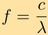

The frequency range of yellow light is 502 THz _−_ 520 THz. (1 THz = 10^{12} Hz) 

6. What colour is the light emitted by hydrogen when an electron makes the transition from energy level 5 down to energy level 2? (Use fig:Henergy to find the energy of the released photon.) 


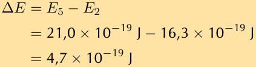
> **[Diagram Context - Textbook_PhysicalSciences_Gr12_Optical-phenomena-and-properties-of-matter.pdf-0023-04.png]**
> This educational graphic displays a physics calculation showing the mathematical formula for the change in energy ($\Delta E = E_5 - E_2$) substituted with specific energy level values measured in Joules ($21,0 \times 10^{-19}\text{ J}$ and $16,3 \times 10^{-19}\text{ J}$) to yield a final result of $4,7 \times 10^{-19}\text{ J}$. Visible elements include the variables $\Delta E$, $E_5$, and $E_2$, subtraction and equality operators, and SI units of joules ($\text{J}$) expressed in scientific notation. For a Grade 12 Physical Sciences learner studying atomic transitions and the photoelectric effect, this snippet demonstrates how to calculate the energy of a photon emitted or absorbed when an electron transitions between specific energy levels in an atom.


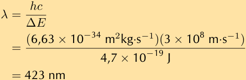
> **[Diagram Context - Textbook_PhysicalSciences_Gr12_Optical-phenomena-and-properties-of-matter.pdf-0023-05.png]**
> This graphic displays a physics calculation showing the mathematical formula and substitution steps to determine wavelength ($\lambda$). Visible symbols and values include Planck's constant ($h = 6,63 \times 10^{-34}\text{ m}^2\text{kg}\cdot\text{s}^{-1}$), the speed of light ($c = 3 \times 10^8\text{ m}\cdot\text{s}^{-1}$), energy difference ($\Delta E = 4,7 \times 10^{-19}\text{ J}$), and the final calculated result of $423\text{ nm}$. For a Grade 12 Physical Sciences learner under the CAPS curriculum, this conveys the quantitative relationship between energy and wavelength in atomic emission or absorption spectra ($\Delta E = \frac{hc}{\lambda}$), demonstrating the practical application of constants to find the wavelength of a photon.


The colour of light emitted at 423 nm is violet. 

7. I have a glass tube filled with hydrogen gas. I shine white light onto the tube. The spectrum I then measure has an absorption line at a wavelength of 474 nm. Between which two energy levels did the transition occur? (Use fig:Henergy in solving the problem.) 


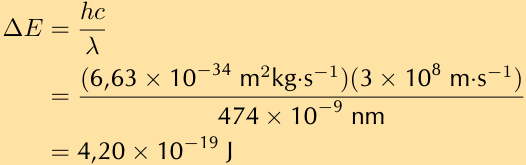
> **[Diagram Context - Textbook_PhysicalSciences_Gr12_Optical-phenomena-and-properties-of-matter.pdf-0023-08.png]**
> The graphic shows a mathematical equation calculating energy change ($\Delta E$) using Planck's equation. The visible symbols and values include $\Delta E$, $h$, $c$, $\lambda$, Planck's constant ($6,63 \times 10^{-34} \text{ m}^2\text{kg}\cdot\text{s}^{-1}$), the speed of light ($3 \times 10^8 \text{ m}\cdot\text{s}^{-1}$), a wavelength of $474 \times 10^{-9} \text{ nm}$, and the final calculated energy of $4,20 \times 10^{-19} \text{ J}$. Conceptually, this demonstrates to Grade 12 Physical Sciences learners how to calculate the energy of a photon or an energy transition using the relationship between energy, Planck's constant, the speed of light, and wavelength.


This energy interval corresponds to a transition from energy level 4 to energy level 2. 

#### 12.4 Chapter summary 

###### **Exercise 12 – 3:** 

1. Calculate the energy of a photon of red light with a wavelength of 400 nm. We first calculate the energy of the photons: 


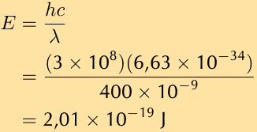
> **[Diagram Context - Textbook_PhysicalSciences_Gr12_Optical-phenomena-and-properties-of-matter.pdf-0024-00.png]**
> This educational graphic displays a physics calculation showing the mathematical formula and substitution steps for determining the energy of a photon. Visible components include the variables $E$, $h$, $c$, and $\lambda$, along with numerical values representing the speed of light ($3 \times 10^8$), Planck's constant ($6,63 \times 10^{-34}$), a wavelength of $400 \times 10^{-9}\text{ m}$, and the final calculated energy of $2,01 \times 10^{-19}\text{ J}$. Conceptually, it demonstrates how to apply the Planck-Einstein relation combined with the wave equation ($c = f\lambda$) to calculate the energy of light at a specific wavelength, which is essential for Grade 12 Physical Sciences learners studying photoelectric effect and photons.


Next convert the work function energy into J: 


The energy of the photons is less than the work function of calcium and so no electrons will be emitted. 

2. Will ultraviolet light with a wavelength of 990 nm be able to emit electrons from a sheet of calcium with a work function of 2,9 eV? 


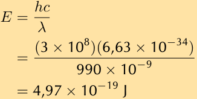
> **[Diagram Context - Textbook_PhysicalSciences_Gr12_Optical-phenomena-and-properties-of-matter.pdf-0024-05.png]**
> The graphic shows a worked calculation demonstrating the mathematical determination of photon energy. Visible variables and symbols include energy ($E$), Planck's constant ($h$), speed of light ($c$), wavelength ($\lambda$), and units in Joules ($\text{J}$). Conceptually, it conveys how to calculate the energy of a light photon using the wave equation combined with Planck's constant, reinforcing core concepts in Grade 12 Physical Sciences regarding photons and the photoelectric effect.


**www.everythingscience.co.za m.everythingscience.co.za** 

## 5. Authentic Exam Question Archetypes & Mark Allocations
*(Extracted from official CAPS examination papers to guide marking, pacing, and rubric design)*

### Archetype 1: QUESTION 2.2.
- **Source Paper:** `Gr12_PhysicalSciences_Chem_Exam11.pdf`
- **Total Mark Allocation:** **[15 Marks]**
- **Recommended Time:** **18 Minutes** (Pacing: ~1.2 min/mark | *Calibrated to Official CAPS Paper Pace (1.2 min/mark)*)
- **Assessment Mode Calibration:** Timed Exam Simulation: 18 min countdown (Pacing Checkpoint: 14 min)
- **Cognitive / Marking Strategy:** NSC Standard (Method Marks [M], Accuracy Marks [A], Carry-Over [CA])

#### Question Prompt & Working:
```text
QUESTION 2.2. 
 
You may use a non-programmable calculator.  
 
You may use appropriate mathematical instruments.  
 
Show ALL formulae and substitutions in ALL calculations. 
 
Round off your FINAL numerical answers to a minimum of TWO decimal 
places. 
 
Give brief motivations, discussions, etc. where required.  
 
You are advised to use the attached DATA SHEETS. 
 
Write neatly and legibly. 
  
 
Physical Sciences/P2 
3 
DBE/November 2021 
NSC 
Copyright reserved  
 Please turn over
```

### Archetype 2: QUESTION 1: MULTIPLE-CHOICE QUESTIONS
- **Source Paper:** `Gr12_PhysicalSciences_Chem_Exam11.pdf`
- **Total Mark Allocation:** **[20 Marks]** (Sub-questions: 2, 2, 2, 2, 2 marks)
- **Recommended Time:** **24 Minutes** (Pacing: ~1.2 min/mark | *Calibrated to Official CAPS Paper Pace (1.2 min/mark)*)
- **Assessment Mode Calibration:** Timed Exam Simulation: 24 min countdown (Pacing Checkpoint: 18 min)
- **Cognitive / Marking Strategy:** NSC Standard (Method Marks [M], Accuracy Marks [A], Carry-Over [CA])

#### Question Prompt & Working:
```text
QUESTION 1:  MULTIPLE-CHOICE QUESTIONS 
  
 
Various options are provided as possible answers to the following questions. Choose 
the answer and write only the letter (A–D) next to the question numbers (1.1 to 1.10) in 
the ANSWER BOOK, e.g. 1.11 E. 
  
 
1.1 
Which formula shows the way in which atoms are bonded in a molecule but 
does not show all the bond lines? 
  
 
 
A 
 
B 
 
C 
 
D 
Empirical 
 
Molecular 
 
Structural 
 
Condensed structural 
 
(2) 
 
1.2 
Which ONE of the following compounds has hydrogen bonds between its 
molecules? 
  
 
 
A 
 
B 
 
C 
 
D 
CH3(CH2)2CH3 
 
CH3COCH2CH3 
 
CH3COOCH2CH3 
 
CH3CH(OH)CH2CH3 
 
(2) 
 
1.3 
Consider the compound below. 
  
 
 
 
 
 
 
 
Which ONE of the following is the IUPAC name of this compound? 
  
 
 
A 
 
B 
 
C 
 
D 
2-methylpe...
```

### Archetype 3: QUESTION 2 (Start on a new page.)
- **Source Paper:** `Gr12_PhysicalSciences_Chem_Exam11.pdf`
- **Total Mark Allocation:** **[18 Marks]** (Sub-questions: 2, 1, 1, 2, 3 marks)
- **Recommended Time:** **22 Minutes** (Pacing: ~1.2 min/mark | *Calibrated to Official CAPS Paper Pace (1.2 min/mark)*)
- **Assessment Mode Calibration:** Timed Exam Simulation: 22 min countdown (Pacing Checkpoint: 16 min)
- **Cognitive / Marking Strategy:** NSC Standard (Method Marks [M], Accuracy Marks [A], Carry-Over [CA])

#### Question Prompt & Working:
```text
QUESTION 2 (Start on a new page.) 
  
 
The letters A to H in the table below represent eight organic compounds. 
  
 
 
A 
 
B 
 
 
 
 
C 
CH3CH2CH2COCH3 
D 
C2H6O 
 
 
 
E 
C2H4 
F 
3-methylbutan-2-one 
 
 
 
G 
 
H 
3-methylbutanal 
 
 
 
2.1 
Define the term unsaturated compound. 
 (2) 
 
2.2 
Write down the: 
  
 
 
2.2.1 
Letter that represents an UNSATURATED compound 
 (1) 
 
 
2.2.2 
NAME of the functional group of compound C 
 (1) 
 
 
2.2.3 
Letter that represents a CHAIN ISOMER of compound C 
 (2) 
 
 
2.2.4 
IUPAC name of compound G 
 (3) 
 
 
2.2.5 
General formula of the homologous series to which compound E 
belongs 
 
(1) 
 
2.3 
Define the term functional isomers. 
 (2) 
 
2.4 
For compound A, write down the: 
  
 
 
2.4.1 
Homologous series to which it belongs 
 (1) 
 
 
...
```
