> **[Diagram Context - Textbook_PhysicalSciences_Gr12_Skills-for-science.pdf-0001-00.png]**
> This graphic is a textbook layout element featuring a green title text and a circular chapter indicator. It displays the text "CHAPTER" alongside a green circular badge containing the number "1" and a segmented white outer ring design. Conceptually, this visual marker serves as a clear navigational heading to orient high school learners to the beginning of a new curriculum module or textbook section.


# _Skills for science_ 

|**1.1**|**_The development of a scientific theory_**|6|
|---|---|---|
|**1.2**|**_Scientific method_**|7|
|**1.3**|**_Data and data analysis_**|13|
|**1.4**|**_Laboratory safety procedures_**|16|

1 Skills for science 

This book deals with the physical sciences - physics and chemistry. All the sciences are based in the use of experiment and testing to understand the world around us better. The scientific method requires us to constantly re-examine our understanding, by testing new evidence with our current theories and making changes to those theories if the evidence does not meet the test. The scientific method therefore is the powerful tool you will use throughout the physical sciences. 

In this chapter you will learn how to gather evidence using the scientific method. 


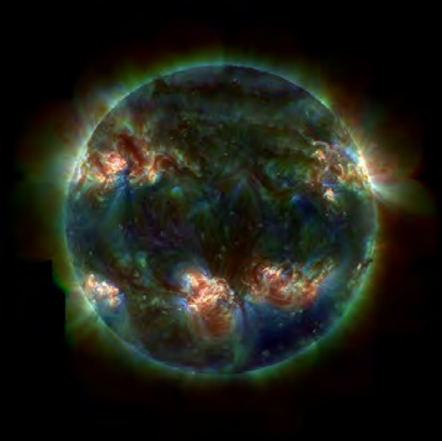
> **[Diagram Context - Textbook_PhysicalSciences_Gr12_Skills-for-science.pdf-0002-03.png]**
> This graphic is a false-color ultraviolet photograph of the Sun displaying active regions, solar flares, and coronal loops across its surface against a black background. No textual labels, symbols, or arrows are present within the frame. Conceptually, it illustrates stellar activity and electromagnetic radiation beyond the visible spectrum, supporting high school CAPS Physical Sciences and Geography topics related to the Sun as a star, nuclear fusion, and space weather.


Figure 1.1: An ultraviolet image of the Sun. 

These skills will then be used throughout this textbook to test scientific theories and practices. 

### 1.1 The development of a scientific theory ESCHQ 

The most important, and most exciting, thing about science and scientific theories is that they are not fixed. Hypotheses are formed and carefully tested, leading to scientific theories that explain those observations and predict results. **The results are not made to fit the hypotheses** . If new information comes to light with the use of better equipment, or the results of other experiments, this new information is used to improve and expand current theories. If a theory is found to have been incorrect it is changed to fit this new information. The data should never be made to fit the theory, if the data does not fit the theory then the theory is reworked or discarded. Although this changing of opinion is often taken for inconsistency, it is this very willingness to adapt that makes science useful, and allows new discoveries to be made. 

Remember that the term theory has a different meaning in science. A **scientific theory** is not like your theory of about why you can only ever find one sock. A scientific theory is one that has been tested and proven through repeated experiment and data. Scientists are constantly testing the data available, as well as commonly held beliefs, and it is this constant testing that allows progress, and improved theories. 

Gravity ESCHR 

The theory of gravity has been slowly developing since the beginning of the 16th century. Galileo Galilei is credited with some of the earliest work. At the time it was widely believed that heavier objects accelerated faster toward the earth than light objects did. Galileo had a hypothesis that this was not true, and performed experiments to prove this. 

Galileo’s work allowed Sir Isaac Newton to hypothesise not only a theory of gravity on earth, but that gravity is what held the planets in their orbits. Newton’s theory was used by John Couch Adams and Urbain Le Verrier to predict the planet Neptune in the solar system and this prediction was proved experimentally when Neptune was discovered by Johann Gottfried Galle. 

Although a large majority of gravitational motion could be explained by Newton’s theory of gravity, there were things that did not fit. But although a newer theory that better fits the facts was eventually proved by Albert Einstein, Newton’s gravitational theory is still successfully used in many applications where the masses, speeds and energies are not too large. 

##### Thermodynamics 

###### ESCHS 

The principles of the three rules of thermodynamics describe how energy works, on all size levels (from the workings of the Earth’s core, to a car engine). The basis for these three rules started as far back as 1650 with Otto von Guericke. He had a hypothesis that a vacuum pump could be made, and proved this by making one. In 1656 Robert Boyle and Robert Hooke used this information and built an air pump. 

###### **FACT** 

Robert Boyle should be a familiar name to you. Boyle’s law came about from his air pump experiments, where he discovered that pressure is inversely proportional to volume at a constant temperature (p _∝_ V<sup><u>1</u>at constant T).</sup> 

Over the next 150 years the theory was expanded on and improved. Denis Papin built a steam pressuriser and release valve, and designed a piston cylinder and engine, which Thomas Savery and Thomas Newcomen built. These engines inspired the study of heat capacity and latent heat. Joseph Black and James Watt increased the steam engine efficiency and it was their work that Sadi Carnot (considered the father of thermodynamics) studied before publishing a discourse on heat, power, energy and engine efficiency in 1824. 

This work by Carnot was the beginning of modern thermodynamics as a science, with the first thermodynamics textbook written in 1859, and the first and second laws of thermodynamics being determined in the 1850s. Scientists such as Lord Kelvin, Max Planck, J. Willard Gibbs (all names you should recognise) among many many others studied thermodynamics. Over the course of 350 years thermodynamics has developed from the building of a vacuum pump, to some of the most important fundamental laws of energy. 

### 1.2 Scientific method ESCHT 

The scientific method is the basic skill process in the world of science. Since the beginning of time humans have been curious as to why and how things happen in the world around us. The scientific method provides scientists with a well structured scientific platform to help find the answers to their questions. Using the scientific method there is no limit as to what we can investigate. The scientific method can be summarised as follows: 

1. Ask a question about the world around you. 

2. Do background research on your questions. 

3. Make a hypothesis about the event that gives a sensible result. You must be able to test your hypothesis through experiment. 

4. Design an experiment to test the hypothesis. These methods must be repeatable and follow a logical approach. 

5. Collect data accurately and interpret the data. You must be able to take measurements, collect information, and present your data in a useful format (drawings, explanations, tables and graphs). 

6. Draw conclusions from the results of the experiment. Your observations must be made objectively, never force the data to fit your hypothesis. 

7. Decide whether your hypothesis explains the data collected accurately. 

8. If the data fits your hypothesis, verify your results by repeating the experiment or getting someone else to repeat the experiment. 

9. If your data does not fit your hypothesis perform more background research and 

###### **FACT** 

In science we never ’prove’ a hypothesis through a single experiment because there is a chance that you made an error somewhere along the way. What you can say is that your results SUPPORT the original hypothesis. 

###### make a new hypothesis. 

Remember that in the development of both the gravitational theory and thermodynamics, scientists expanded on information from their predecessors or peers when developing their own theories. It is therefore very important to communicate findings to the public in the form of scientific publications, at conferences, in articles or TV or radio programmes. It is important to present your experimental data in a specific format, so that others can read your work, understand it, and repeat the experiment. 

1. Aim: A brief sentence describing the purpose of the experiment. 

2. Apparatus: A list of the apparatus. 

3. Method: A list of the steps followed to carry out the experiment. 

4. Results: Tables, graphs and observations about the experiment. 

5. Discussion: What your results mean. 

6. Conclusion: A brief sentence concluding whether or not the aim was met. 

###### **A hypothesis** 

A hypothesis should be specific and should relate directly to the question you are asking. For example if your question about the world was, why do rainbows form, your hypothesis could be: _Rainbows form because of light shining through water droplets_ . After formulating a hypothesis, it needs to be tested through experiment. An incorrect prediction does not mean that you have failed. It means that the experiment has brought some new facts to light that you might not have thought of before. 

###### **Activity: Analysis of the scientific method.** 


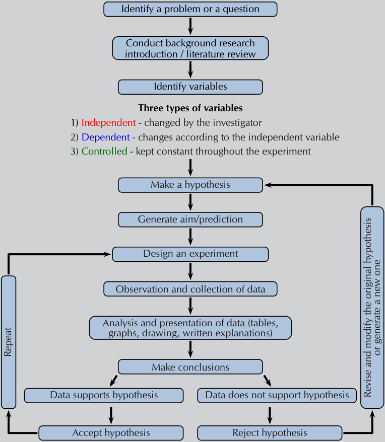
> **[Diagram Context - Textbook_PhysicalSciences_Gr12_Skills-for-science.pdf-0004-13.png]**
> This educational graphic is a flowchart outlining the scientific method and experimental design process. It features sequential process steps connected by directional arrows, including text boxes labelled "Identify a problem or a question," "Conduct background research," "Identify variables" (with sub-labels for Independent, Dependent, and Controlled variables), "Make a hypothesis," "Design an experiment," "Observation and collection of data," "Analysis and presentation of data," and "Make conclusions." Conceptually, this diagram guides CAPS learners through the logical progression of scientific investigation, emphasizing the identification of variables, hypothesis testing, and the iterative nature of scientific inquiry through feedback loops for repeating experiments or revising hypotheses.


Figure 1.2: Overview of scientific method. 

Break into groups of 3 or 4 and study the flow diagram provided, then discuss the questions that follow. 

1. Once you have a problem you would like to study, why is it important to conduct background research before doing anything else? 

2. What is the difference between a dependent, independent, and controlled variable and why is it important to identify them? 

3. What is the difference between identifying a problem, a hypothesis, and a scientific theory? 

4. Why is it important to repeat your experiment if the data fits the hypothesis? 

###### **Activity: Designing your own experiment** 

Recording and writing up an investigation is an integral part of the scientific method. In this activity you are required to design your own experiment. Use the information provided below, and the flow diagram in the previous experiment to help you design your experiment. 

The experiment should be handed in as a 1 - 2 page report. Below are basic steps to follow when designing your own experiment. 

1. Ask a question which you want to find an answer to. 

2. Perform background research on your topic of choice. 

3. Write down your hypothesis. 

4. Identify variables important to your investigation: those that are relevant, those you can measure or observe. 

5. Decide on the independent and dependent variables in your experiment, and those variables that must be kept constant. 

6. Design the experiment you will use to test your hypothesis: 

   - State the aim of the experiment. 

   - List the apparatus (equipment) you will need to perform the experiment. 

   - Write the method that will be used to test your hypothesis 

      - in bullet format 

      - in the correct sequence, with each step of the experiment numbered. 

   - Indicate how the results should be presented, and what data is required. 

##### Reading instruments 

###### ESCHV 

Before you perform an experiment you should be comfortable with certain apparatus that you will be using. The following pages give some commonly used apparatus and how to use them. 


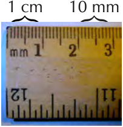
> **[Diagram Context - Textbook_PhysicalSciences_Gr12_Skills-for-science.pdf-0005-23.png]**
> This educational graphic shows a photographic close-up of a standard wooden ruler displaying both centimeter and millimeter measurement scales. Visible labels and annotations include "1 cm" and "10 mm" bracketed above the scale, alongside numerical markings ("1", "2", "3", "11", "12") and smaller graduation ticks labeled with "mm". Conceptually, this diagram illustrates metric length conversion and measurement precision, reinforcing the fundamental relationship that one centimeter is equal to ten millimeters in CAPS physical sciences and mathematics practical work.


Figure 1.3: The end of a ruler. 

Most rulers you find have two sets of lines on them. You can ignore those with the numbers spaced further apart. We only work in the metric system and those are for the imperial system. The closest together lines are for millimetres, the thicker lines are for 5 mm and the thicker, longer lines with numbers next to them mark off every 10 mm (1 cm). 


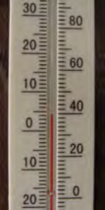
> **[Diagram Context - Textbook_PhysicalSciences_Gr12_Skills-for-science.pdf-0006-00.png]**
> This image shows a dual-scale laboratory apparatus in the form of a glass thermometer displaying numerical calibrations and graduation markings for temperature measurement. The left scale features numerical values ranging from -20 to 30 with intermediate graduation lines, while the right scale displays values from 0 to 80 alongside a rising red liquid column indicating a specific thermal reading. For high school physical sciences learners, this visual demonstrates how to read measurement instruments correctly by identifying scale intervals, estimating values between graduations, and recording temperatures in degrees Celsius.


A thermometer can have one, or two sets of numbers on it. If it has two sets of numbers one will be in Celsius, and one will be in Fahrenheit. We use Celsius, so you can ignore the side with a larger temperature range. In Figure 1.4 you can ignore the right-hand side. Looking on the left you can see that the red line (coloured ethanol here) is next to the fourth line above 0^{_◦_} C. Each small line is 1^{_◦_} C, so the temperature is 4^{_◦_} C. 

Figure 1.4: Reading a thermometer. 


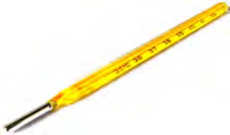
> **[Diagram Context - Textbook_PhysicalSciences_Gr12_Skills-for-science.pdf-0006-03.png]**
> This educational graphic shows a clinical glass thermometer used as a scientific measuring apparatus. Visible on the yellow body are temperature scale markings and numbers in degrees Celsius (showing intervals including 35°C, 36°C, 37°C, 38°C, and 39°C), alongside a silver-coloured metal bulb at the base containing the sensing liquid. For CAPS curriculum learners, this diagram demonstrates the correct practical apparatus and numerical scale used to measure body temperature accurately in scientific investigations.


Laboratory thermometers will go to much higher temperatures than those used for measuring the temperature outside, or your body temperature. It is important to make sure that the thermometer you are using can handle the temperature you will be measuring too. If not, do not use that thermometer as you will break it. Make sure your thermometer is upright whenever you use it in an experiment, to avoid incorrect results. 

Figure 1.5: A laboratory style thermometer. 


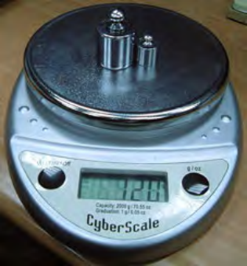
> **[Diagram Context - Textbook_PhysicalSciences_Gr12_Skills-for-science.pdf-0006-07.png]**
> This image shows an experimental apparatus featuring a digital electronic scale (CyberScale) with two metal calibration masses placed on its weighing pan, a digital LCD readout panel, an on/off button, and a unit selection button labelled "g/oz" alongside capacity specifications. It illustrates how precise measuring instruments are used in physical sciences to determine mass and reinforces the distinction between mass and weight in mechanics.


Different scales have different functions. However, a basic function of all scales is a **tare** button. This zeros the balance. It is important that you zero the balance before you take any measurements. If you are weighing something on a piece of paper you should tare the balance with the piece of paper on it, and weigh the substance. Make sure you check the units that your scale is weighing in. If you want your value to be accurate to ,00 g then the scale must measure to that accuracy. A scale that measures in mg would be best. 

Figure 1.6: A scale (also referred to as a balance). 


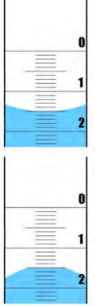
> **[Diagram Context - Textbook_PhysicalSciences_Gr12_Skills-for-science.pdf-0006-10.png]**
> This educational graphic is a scientific apparatus diagram demonstrating how to correctly read the liquid volume in a measuring cylinder. It displays numerical scale markings (0, 1, 2) alongside fine graduation lines and highlights the opposite curvatures of liquid surfaces, specifically showing a concave meniscus (top) and a convex meniscus (bottom). Conceptually, this teaches CAPS Physical Sciences and Life Sciences students proper measurement technique by emphasizing that volume must be read at eye level from the bottom of a concave meniscus (such as water) or the top of a convex meniscus (such as mercury) to avoid parallax errors.


The surface of the water (the _meniscus_ ) is slightly higher at the edges of a container than in the middle. This is due to surface tension and the interaction between the water and the edge of the container (Figure 1.7). When measuring the volume in a burette or measuring cylinder or pipette you should look at the bottom of the meniscus. Where that lies is where you measure the volume. So in this example the meniscus is on the fifth line below the large line that represents 1 ml. Therefore the volume is 1,5 ml. 

It is also possible that the liquid being measured has greater internal forces than those between it and the container. Then the meniscus would be higher in the middle than at the sides, and you would use the top of the meniscus to measure your volume. 

Figure 1.7: The meniscus of water in a burette. 

A burette is used to accurately measure the volume of a liquid added in an experiment. The valve at the bottom allows the liquid to be added drop-by-drop, and the initial and final volume can be measured so that the total volume added is known. More information about burettes is given to you in your first titration experiment this year in Chapter 9. 


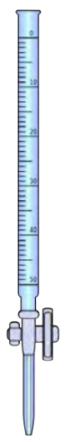
> **[Diagram Context - Textbook_PhysicalSciences_Gr12_Skills-for-science.pdf-0007-01.png]**
> The graphic displays a laboratory apparatus, specifically a vertical glass burette marked with a graduated volume scale ranging downwards from 0 to 50 mL and featuring a stopcock valve at the bottom. This instrument is essential for Physical Sciences learners conducting quantitative volumetric analysis and acid-base titrations, allowing them to accurately measure and deliver variable volumes of liquid reactants.


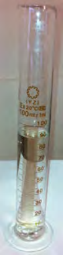
> **[Diagram Context - Textbook_PhysicalSciences_Gr12_Skills-for-science.pdf-0007-02.png]**
> This image shows a laboratory apparatus, specifically a 100 ml glass graduated measuring cylinder containing a liquid. Visible markings on the cylinder include volume graduations labeled from 10 to 100 ml, along with calibration text indicating "Ex 20°C" and "1 ml" divisions. Conceptually, this apparatus is used in high school Natural Sciences and Physical Sciences to accurately measure the volume of liquids and irregularly shaped solid objects via water displacement.


Figure 1.8: A burette. 

A measuring cylinder is used to measure volumes that you want accurate to the nearest millilitre or so. It is not a highly accurate way of measuring volumes. The volume in a measuring cylinder is measured in the same way as for a burette, the difference is that in a measuring cylinder the smallest volume would be at the bottom, while the largest would be at the top. 

Figure 1.9: A measuring cylinder with water. 

There are two types of pipettes you might encounter this year. A volumetric pipette has a large bulb, marked with the set volume it can measure. Above the bulb on these pipettes there is a line. For a 5 ml volumetric pipette, when the meniscus of your liquid sits on the line, then the volume in that pipette is 5 ml. 


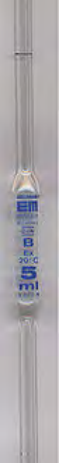
> **[Diagram Context - Textbook_PhysicalSciences_Gr12_Skills-for-science.pdf-0007-07.png]**
> This image displays a laboratory apparatus, specifically a volumetric pipette designed for precision measurement. Visible text includes manufacturer markings, accuracy class indicators like "B", temperature calibration "20°C", and volume capacity "5 ml". In CAPS Physical Sciences, this apparatus is used during acid-base titrations to accurately measure and transfer a fixed volume of standard solution for quantitative analysis.


A graduated pipette has the same type of marking you see on a burette. The top is 0 ml, and the volume increases as you move down the pipette. In this pipette you should fill the pipette to near the 0 ml line and make a note of the volume. You can then add the desired volume, stopping when the volume in the pipette has decreased by the required amount. 


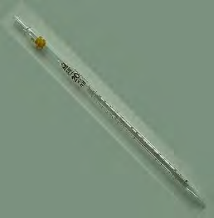
> **[Diagram Context - Textbook_PhysicalSciences_Gr12_Skills-for-science.pdf-0007-09.png]**
> The image shows laboratory apparatus in the form of a graduated glass pipette with calibration markings and a capacity label reading "20 ml". It demonstrates the specific volumetric measuring tool used in CAPS Physical Sciences for precise liquid measurement and titration experiments. This helps learners identify and correctly use volumetric glassware to achieve accurate quantitative results in practical assessments.


Figure 1.11: A graduated pipette. 

Figure 1.10: A 5 ml volumetric pipette. 

Performing experiments 

ESCHW 

A learner wondered whether the rate of evaporation of a substance was related to the boiling point of the substance. Having done background research they realised that the boiling point of a substance is linked to the intermolecular forces within the substance. They know that greater intermolecular forces require more energy to overcome. This led them to form the following hypothesis: 

_The larger the intermolecular forces of a substance the higher the boiling point. Therefore, if a substance has higher boiling point it will have a slower rate of evaporation._ 

Perform the following experiment that the learner designed to test that hypothesis. 

###### **Experiment: Boiling points and rate of evaporation: Part 1** 

###### **Aim:** 

To determine whether the rate of evaporation of a substance is related to its boiling point. 

###### **Apparatus:** 

You will need the following items for this experiment: 

- 220 ml water, 20 ml methylated spirits, 20 ml nail polish remover, 20 ml water, 20 ml ethanol 

###### _•_ One 250 ml beaker, four 20 ml beakers, a thermometer, a stopwatch or clock **Method: WARNING!** 

**All alcohols are toxic, methanol is particularly toxic and can cause blindness, coma or death. Handle all chemicals with care.** 


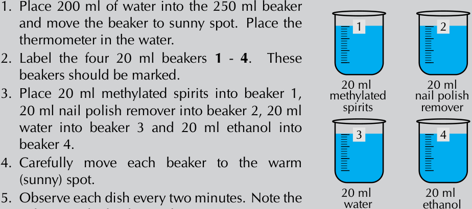
> **[Diagram Context - Textbook_PhysicalSciences_Gr12_Skills-for-science.pdf-0008-13.png]**
> This educational graphic displays an experimental apparatus layout and step-by-step instructions for investigating the rate of evaporation of different liquids. The visual elements include numbered instructional text alongside four 20 ml beakers labeled 1 to 4 containing methylated spirits, nail polish remover, water, and ethanol respectively. Conceptually, this diagram guides CAPS Physical Sciences learners through a comparative practical investigation examining how different types of intermolecular forces influence the evaporation rates and volatility of various organic and inorganic liquids.


5. Observe each dish every two minutes. Note the volume in the beaker each time. 

6. Continue making observations for 20 minutes. Record the volumes in a table. 

###### **Results:** 

- Record your observations from the investigation in a table like the one below. 

|**Substance**|**Methylated**<br>**spirits**|**Nail polish**<br>**remover**|**Water**|**Ethanol**|
|---|---|---|---|---|
|**Boiling point (**^{_◦_}**C)**|78,5|56,5|100|78,4|
|**Initial volume (ml)**|20|20|20|20|
|**2 min**|||||
|**4 min**|||||
|**6 min**|||||

### 1.3 Data and data analysis ESCHX 

In order to analyse the data obtained during experiments it is often necessary to convert that data into different representations. One type of representation is a graph. A few examples are given here. 

##### How to draw graphs in science 

###### ESCHY 

For all graphs plotted from experimental data it is important to remember that you should never _connect the dots_ . Data will never follow a line or curve perfectly. By obtaining multiple experimental data points any discrepancies in each data point can be removed. The line added after the points are plotted should be a **best fit line** that can then be used to more accurately determine further information. 

Features of graphs you plot: 

- An appropriate scale is used for each axis so that the plotted points use most of the axis/space (work out the range of the data and the highest and lowest points). 

- The scale must **remain the same** along the entire axis and should use easy intervals such as 10’s, 20’s, 50’s. Use graph paper for accuracy. 

- Each axis must be labelled with what is shown on the axis and must include the appropriate units in brackets, e.g. Temperature (^{_◦_} C), time (seconds), height (cm). 

- The independent variable is generally plotted along the x-axis, while the dependent variable is generally plotted along the y-axis. 

- Each point has an x and y co-ordinate and is plotted with a symbol which is big enough to see, e.g. a cross or circle. 

- A best fit line is then added to the graph. 

- **Do not** start the graph at the origin unless there is a data point for (0,0), or if the best fit line runs through the origin. 

- The graph must have a clear, descriptive title which outlines the relationship between the dependent and independent variable. 

- If there is more than one set of data drawn on a graph, a different symbol (and/or colour) must be used for each set and a key or legend must define the symbols. 

- Use line graphs when the relationship between the dependent and independent variables is continuous. 

- For a line graph, you can draw a line of best fit with a ruler. The number of points are distributed fairly evenly on each side of the line (see Figure 1.12). 

- With an exponential graph (when the points appear to be following a curve) you can draw a best fit line freehand (see 1.13). 


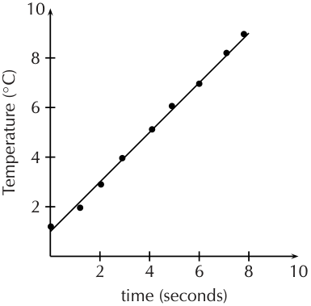
> **[Diagram Context - Textbook_PhysicalSciences_Gr12_Skills-for-science.pdf-0009-19.png]**
> This graphic is a line graph plotting experimental data points with a line of best fit, featuring a vertical axis labeled "Temperature (°C)" with numerical markings from 0 to 10 and a horizontal axis labeled "time (seconds)" with numerical markings from 0 to 10. The diagram conveys a direct, linear proportional relationship between temperature and time for high school physical sciences learners studying data processing and graphical analysis.


Figure 1.12: A straight line graph of the change in temperature with time. 

Change in distance (due to acceleration) with time 


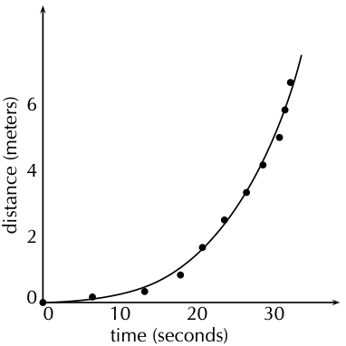
> **[Diagram Context - Textbook_PhysicalSciences_Gr12_Skills-for-science.pdf-0009-22.png]**
> This graphic is a distance-time graph featuring plotted data points and a curved line of best fit. The vertical axis is labeled "distance (meters)" with numerical intervals (0, 2, 4, 6), the horizontal axis is labeled "time (seconds)" with intervals (0, 10, 20, 30), and individual data points are marked with black dots. For Grade 10-12 CAPS Physics learners, this non-linear curve illustrates accelerated motion, where the increasing gradient demonstrates that velocity is changing over time.


Figure 1.13: A graph with an exponential best fit line. 

Skills for science 

Remember that without units much of our work as scientists would be meaningless. We need to express our thoughts clearly and units give meaning to the numbers we measure and calculate. Depending on which units we use, the numbers are different. For example if you have 12 water, it means nothing. You could have 12 ml of water, 12 litres of water, or even 12 bottles of water. Units are an essential part of the language we use. Units must be specified when expressing physical quantities. 

Qualitative and quantitative analysis ESCHZ 

###### **Qualitative analysis** 

In **qualit** ative research you look at the quality of a substance. At how it looks compared to other cases. You do an in-depth analysis of a specific case, and then make an informed decision about similar cases. 

For example, a qualitative study of the study habits of university students could include only a few people, or over twenty. Each person would be asked in-depth questions about how they study, and what works for them, and a general, informed assertion can then be made about these study habits. 

###### **Quantitative analysis** 

In **quanti** tative research you look at specific numbers. You study a large group (data sample) and do statistical analyses of the group, with experimental controls, manipulation of variables, and the modelling and analysis of your data. 

For example, a quantitative study of those same study habits of university students would include a large number of people, for statistical relevance. The questions asked would include raw data of actual studying hours, and the most productive study times. These data points would then be analysed using graphical models. 

###### **Experiment: Boiling points and rate of evaporation: Part 2** 

###### **Results:** 

Now that you remember how to plot graphs, go back to the data you obtained during the previous experiment. 

- On the same set of axes, plot a graph of the volume (ml) versus the time (min) for each substance. 

###### **Analysis of results or discussion:** 

- Analyse the results plotted on the graphs and the table. 

- Which substance has the fastest decrease in volume? Which has the slowest decrease? 

- Discuss if there are any relationships between your independent (time) and dependent (volume) variables (what type of graph did you plot?). 

- It is important to look for patterns/trends in your graphs or tables and describe these clearly in words. 

- Compare the different graphs and the different rates of evaporation to the boiling points of the substances. 

###### **Evaluation of results:** 

- This is where you answer the question _Is the rate of evaporation of a substance related to its boiling point?_ 

- You need to carefully consider the results: 

- Were there any unusual results? If so then these should be discussed and possible reasons given for them. 

- Discuss how you ensured the validity and reliability of the investigation. Was it a fair test (validity) and if the experiment were to be repeated would the results obtained be similar (reliability)? The best way to ensure reliability is to repeat the experiment several times and obtain an average. 

- Discuss any experimental errors that may have occurred during the experiment. These can include errors in the methods and apparatus. Make suggestions on what could be done differently next time. 

- Did this experiment yield qualitative or quantitative results? 

Conclusions based on scientific evidence ESCJ2 

###### **Experiment: Boiling points and rate of evaporation: Part 3** 

###### **Conclusion:** 

You have your results, and the analysis of your results. Now you need to look back at your hypothesis. 

The conclusion needs to link the results to the aim and hypothesis. In a short paragraph, write down if what was observed supports or reject the hypothesis. If your original hypothesis does not match up with the final results of your experiment, do not change the hypothesis. Instead, try to explain what might have been wrong with your original hypothesis. What information did you not have originally that caused you to be wrong in your prediction. 

###### **Activity: Conclusions and bias** 

Read the following extract on bias taken from radiology.rsna.org (01/09/13), and answer the questions that follow: 

_Bias is a form of systematic error that can affect scientific investigations and distort the measurement process. A biased study loses validity in relation to the degree of the bias. While some study designs are more prone to bias, its presence is universal. It is difficult or even impossible to completely eliminate bias. In the process of attempting to do so, new bias may be introduced or a study may be rendered less generalizable. Therefore, the goals are to minimize bias and for both investigators and readers to comprehend its residual effects, limiting misinterpretation and misuse of data._ 

- In the light of the above quotation, why is it important for you to clearly state all your experimental parameters? 

- Why is it important never to try and make the data fit your hypothesis? 

- Look again at the conclusions you drew during your experiment. 

   - Are they biased? 

   - Did you make any assumptions based on preconceived ideas? 

   - Is the data presented in a clear way that does not force a reader to agree with your conclusions? 

**Activity: Different explanations for the same set of experimental data.** 

To prevent bias, it is important to be able to look at the same information in different ways, to make sure your conclusion is the most logical one. 

Divide into groups of three or four and compare the conclusions you drew from the boiling points and rate of evaporation experiment, and answer the questions that follow: 

- Did anyone in the group draw a different conclusion from the one you drew? If yes, discuss the merits and short-falls of the different conclusions. 

- Did your conclusion match what you were expecting to find from the hypothesis? 

- Can you think of any other explanation that would explain your data? 

###### **Activity: Methods of knowing used by non-scientists.** 

Research one of the following topics and report your findings to the class in a five minute oral presentation: 

- Traditional medicines. 

- Navigation and knowledge of the seasons, from the stars. 

Designing a model ESCJ3 

Sometimes a system is too large to be studied, or too difficult to recreate experimentally. In these cases it is possible to design a model based on a smaller system, that fits the data observed for the larger system. Here are some key points to remember when designing a model: 

- A model is a testable idea that describes a large system that is not easily testable. 

- The model should be able to explain as many observations of the large system as possible, and yet be relatively simple. 

An example of a model was the spherical model of the Earth, rather than a flat one. 

- Many educated people of the day (in the late 1400s) knew that the Earth could not be flat due to observations that did not fit. A spherical Earth model was proposed, which was testable on a small scale. 

- The model explained many previously unexplained phenomenon (such as that ships appeared to _sink_ over the horizon, regardless of the direction of travel). 

- The model was further verified by the shape of the Earth’s shadow on the moon during lunar eclipses. 

### 1.4 Laboratory safety procedures ESCJ4 

Laboratories have rules that are enforced as safety precautions. These rules are: 

- Before doing any scientific experiment make sure that you know where the fire extinguishers are in your laboratory and there should also be a bucket of sand to extinguish fires. 

- You are responsible for your own safety as well as the safety of others in the laboratory. Never perform experiments alone. 

- Do not eat or drink in the laboratory. Do not use laboratory glassware to eat or drink from. 

- Ensure that you are dressed appropriately whenever you are near chemicals: 

   - hair tied back 

   - no loose or flammable clothing 

   - closed shoes 

   - gloves 

   - safety glasses 

- Always behave responsibly in the laboratory. Do not run around or play practical jokes. Always check the safety data of any chemicals you are going to use. Never smell, taste or touch chemicals unless instructed to do so. Do not take chemicals from the laboratory. 

- Only perform the experiments that your teacher instructs you to. Never mix chemicals for fun. Follow the given instructions exactly. Do not mix up steps or try things in a different order. 

- Care needs to be taken when pouring liquids or powders from one container to another. When spillages occur you need to call the teacher immediately to assist in cleaning up the spillage. 

- Care needs to be taken when using strong acids and bases. A good safety precaution is to have a solution of sodium bicarbonate in the vicinity to neutralise any spills as quickly as possible. If you spill on yourself wash the area with lots of water and seek medical attention. Never add water to acid. Always add the acid to water. 

- When working with chemicals and gases that are hazardous, a fume cupboard should be used. Always work in a well ventilated area. 

- When you are instructed to smell chemicals, place the container on a laboratory bench and use your hand to gently waft (fan) the vapours towards you. 

- Be alert and careful when handling chemicals, hot glassware, etc. Never heat thick glassware as it will break. (For example, do not heat measuring cylinders). 

- When lighting a Bunsen burner the correct procedure needs to be followed: securely connect the rubber tubing to the gas pipe, have your matches ready, turn on the gas, then light a match and the bunsen burner. Do not leave Bunsen burners and flames unattended. 

- When heating substances in a test tube do not overheat the solution. Remember to face the mouth of the test tube away from you and members of your group when heating a test tube. 

- Always check with your teacher how to dispose of waste. Chemicals should not be disposed of down the sink. 

- Ensure all Bunsen burners are turned off at the end of the practical and all chemical containers are sealed. 

##### Hazard data 

ESCJ5 

Before starting any experiment, research the chemicals and materials you will be using in that experiment. Laboratory chemicals can be dangerous, and you should study the safety data sheets should before working with a chemical. The data sheets can be found at http://www.msds.com/. 

Before working with a chemical, you should also make sure that you know how to, and have the facilities available to, dispose of those chemicals correctly and safely. Many chemicals cannot simply be washed down the sink. If you follow these few simple guidelines you can safely carry out experiments in the laboratory without endangering yourself or others around you. 


> **[Diagram Context - Textbook_PhysicalSciences_Gr12_Skills-for-science.pdf-0014-00.png]**
> This educational graphic functions as a textbook chapter heading or section divider, featuring the text "CHAPTER" alongside a solid green circular icon containing the number "1" framed by a segmented outer ring. The visible labels and symbols include the capitalized word "CHAPTER" and the numeral "1" enclosed in a stylized green circle design. Conceptually, this visual indicator helps learners navigate textbook layouts, signaling the beginning of the first curriculum module or core topic in a structured learning sequence.


## _Skills for science_ 


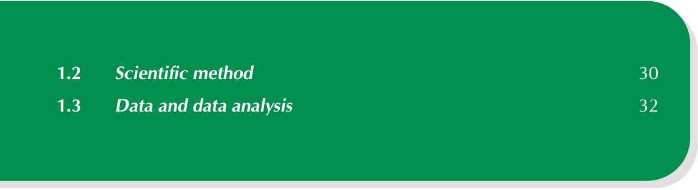
> **[Diagram Context - Textbook_PhysicalSciences_Gr12_Skills-for-science.pdf-0014-02.png]**
> The image shows a table of contents excerpt with a solid green background and white text. It lists two section titles with corresponding page numbers: "1.2 Scientific method" on page 30 and "1.3 Data and data analysis" on page 32. Conceptually, this graphical element serves as an organizational signpost within a CAPS-aligned textbook, guiding students through foundational scientific process skills and data handling required for scientific investigations.


1 Skills for science 

In this chapter learners will look at some basic skills required for practical investigations in the physical sciences. A lot of these skills were introduced to the learners in Grade 10, and while doing practical investigations in Grade 11. Four hours are allocated to this chapter in CAPS. 

The following topics are covered in this chapter. 

- **The development of a scientific theory.** 

- This section should be used to show learners how scientific theories come from the studies of many different people using the information of those who came before them. They should understand that science is ever changing, as more of the world is understood. 

- **The scientific method** In this section learners should generate their own experiment from a question they are interested in. This includes doing background research, and following the scientific method. Before designing their own experiment they should study the flow diagram of the scientific method provided in the activity. 

A brief reminder of how to measure distances, temperature, mass and volumes is covered in this section before the learners are required to complete an experiment. The experiment is broken up into sections. In this first section they perform the experiment. 

- **Data and data analysis** 

- Learners are given an overview of how to present data in graphs, they are then required to analyse the data they obtained in the experiment and determine whether their data is qualitative or quantitative. In the third part of this experiment they have to draw a conclusion based on their results and decide if the results are biased in any way. They need to understand how to design a model based on their experimental data. 

- **Laboratory safety procedures** These skills are not part of the CAPS statement for this chapter. However, it is advisable that you go through these rules with the learners before they perform their first experiments. It would be useful to refer them back to this section throughout the year. 

There is one experiment in this chapter that is split into three parts. This is to help the learners understand the scientific method better. The learners are also required to write up their own experiment. This can be on a topic of their choice, but should follow the scientfic method. More information is provided in the relevant section. 

The skills for science section should be taught while the learners do an investigation themselves. Numerous activities have been provided and the skills for practical investigations should also be discussed and practiced as a class at regular intervals throughout the year. Any support material that develops these skills can be used. 

#### 1.2 Scientific method 

In the analysis of the scientific method activity: 

1. The question may already be answered in the literature, or there may be background research that you can build upon. It is also best to make a hypothesis, prediction and an experiment with as good an understanding of the topic as possible. 

2. A controlled variable is one which you keep constant (controlled) so that it does not have an effect between readings. The independent variable is the one you change between collecting data points, while the dependent variable is the variable that changes as a result of a change in the independent variable. 

   - It is important to identify all the variables that you think will have an effect on your investigation. 

   - Firstly think of all the relevant variables you can change. 

   - Secondly think of all the variables you can measure or observe. 

   - Thirdly choose one variable to change (independent variable) which will have an effect on the one variable you can measure or observe (dependent variable). 

   - All the other variables you need to keep constant (fixed/controlled variable). 

3. _•_ Identifying a problem involves thinking about the world around you and a specific part of it that you don’t understand. 

   - A hypothesis is more formal, it is a prediction about that problem based on your current understanding and background research. 

   - A scientific theory comes from an experimentally tested and proven hypothesis. It is repeatable and current data fits the theory. 

4. Data may fit a hypothesis in a specific instance. That does not mean that the hypothesis is generally true. It is important to repeat the experiment to make sure that the experiment was not an anomaly. Before something becomes a scientific theory it must be tested repeatedly and be repeatable by different people. 

When the learners design their own experiment: 

1. An example of a question that the learner might ask would be why do rainbows form? 

2. Before beginning an investigation background research needs to be undertaken. Background research should always be referenced. 

In this example the type of background research might include the particles found in the atmosphere, the diffraction of light through water and the different wavelengths of light. 

3. Learners must write down a statement that answers their question. This is the hypothesis and should be specific, relating directly to the question they are asking. 

In this example their hypothesis might be: _Rainbows form because of the diffraction of light through water droplets in the atmosphere. If light is shone through water at the right angle a rainbow will form_ . Their hypothesis should be testable. 

4. The learners should identify variables that are important in their specific experiment. For example, the temperature of the water, the type of light they use, the purity of the water, the angle of the light could all be variables in their experiment. 

5. The learners should understand the difference between independent, dependent and controlled variables and be able to identify them in their experiment. 

For example, the type of light might be controlled (sunlight). The temperature could be a independent variable (perform the experiment on different days with different temperatures). With the temperature as an independent variable then the angle the light comes out at could be a dependent variable, to see if there is a link. If the temperature is made a controlled variable on that day, then the angle could be the independent variable, and the shape and size of the rainbow would be the dependent variable. 

6. The learner must design an experiment that accurately tests their hypothesis. The experiment is the most important part of the scientific method. These are all important concepts to know when designing an experiment: 

   - The method should be written so that a complete stranger will be able to carry out the same procedure in the exact same way and get almost identical results. 

   - The method must be clear and precise instructions including the labelling of apparatus, giving exact measurements or quantities of chemicals or substances to be used and making sure that all the apparatus used is listed. 

   - The method must give clear instructions about/describing how the results should be recorded (table, graph, etc.) 

   - The method should include safety precautions where possible. 

7. The learner should present a one page experimental write up with an aim, the apparatus necessary, the method that will be followed. An example experiment is given here. Note that this is just an example, the learners could perform their experiment on anything. 

   - **Aim** 

The aim of this experiment is to determine what happens when sunlight is shone through a glass of water. 

- **Apparatus** 

   - A clear 500 ml glass, three A4 pieces of white paper, a tape measure, sticky tape, a pencil, a thermometer 

   - At least 400 ml of water, sunlight. 

- **Method** 

   - a) Use the sticky tape to stick an A4 piece of a paper to a sunny wall exactly 1 m from the ground. 

   - b) Use the sticky tape to stick an A4 piece of paper above the first one, and the last A4 piece of paper below the first one. 

   - c) Fill the glass with 400 ml water and measure the temperature (be careful to keep the thermometer out of direct sunlight between measuring the temperatures. 

   - d) Hold the glass (near the bottom) level with the bottom of the middle piece of paper in the sunlight. If a rainbow forms on the sheets of paper, mark where it forms on the paper. 

   - e) Measure the temperature of the water in the glass, then move the glass upwards 5 cm and repeat. 

   - f) Repeat step 5 until you reach the top of the uppermost A4 piece of paper. 

- **Results** 

   - Your results should be presented in the form of a table (Result? should be answered with a yes or a no depending on whether a rainbow formed): 

|**Temperature (**^{_◦_}**C)**<br>**Height ofglass (m)**<br>**Result?**<br>**Height of rainbow**|
|---|

From this data the angle of refraction of the water can be measured, as well as what angle is required for the sunlight to create a rainbow through the water. 

###### Performing experiments 

The boiling points and rate of evaporation experiment is a very simple one meant to introduce the learners to the concept of the scientific method in a practical way. It has been broken up into three parts: performing the practical investigation, analysis of results, drawing conclusions. 

The learners should be as accurated as possible when measuring the drop in volume as they will be required to plot a graph of their data. 

#### 1.3 Data and data analysis 

###### Qualitative and quantitative analysis 

This is the second part of the boiling points and rate of evaporation experiment. 

###### **Results** 

Learners should record their results in a table like the one given. They should then plot a graph of all four liquids on the same set of axes. An example of how the drop in nail polish remover might look is given below. 

Change in volume with time 


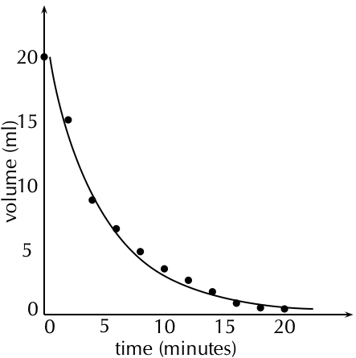
> **[Diagram Context - Textbook_PhysicalSciences_Gr12_Skills-for-science.pdf-0018-01.png]**
> This graphic is a line graph depicting the relationship between volume and time. The visible axes are labelled "volume (ml)" on the vertical axis, with values ranging from 0 to 20, and "time (minutes)" on the horizontal axis, ranging from 0 to 22. It features plotted data points represented as black dots and a smooth curve of best fit showing a decreasing trend over time. Conceptually, this diagram illustrates a decreasing rate of reaction where reactant volume diminishes over time, commonly used in Grade 12 Physical Sciences to calculate reaction rates.


###### **Discussion and conclusion** 

Learners should find that water takes the longest time to evaporate and so has the shallowest drop on their graph. Water has strong intermolecular forces (hydrogen bonds). Ethanol (CH3CH2OH) and methylated spirits (mainly ethanol (CH3CH2OH) with some methanol (CH3OH)) both have hydrogen bonds but these are slightly weaker than the hydrogen bonds in water. Nail polish remover (acetone (CH3COCH3)) has dipole-dipole forces only and so evaporates quickly and will have the sharpest decrease on their graph. 

The graph should be exponential and as time increases the dependent variable (volume) decreases. 

###### Conclusions based on scientific evidence 

In this activity, learners could mention topics such as more direct sunlight on one container, higher volatility (though that is related to intermolecular forces), a breeze speeding up the rate of evaporation over one or more of the containers, and water vapour in the air slowing down the rate of evaporation for water. 

The main point of this activity is that they understand that there can be more than one explanation for a set of data, which why repeating an experiment, doing thorough background research, and not having their ideas fixed before analysing data is so important. 

- Many natural medicines were used by people long before any studies were performed. These plants were tried and tested by people, and were known to help with many different ailments. Many people seek alternative forms of treatment. In South Africa, individuals commonly use traditional medicines like African Potato (Hypoxis hemerocallidea) and ”Cancer bush” (Sutherlandia frutescens), to boost the immune system while undergoing conventional treatments. 

The cancer bush (Sutherlandia frutescent, uNwele) is an indigenous medicinal plant which the Khoi and Nama people used to wash wounds and to reduce high fevers. The early settlers also used this bush to treat chicken pox, eye problems and internal cancers. Cancer patients often lose weight and suffer muscle wastage and a tonic made from this bush may improve appetite, decreases anxiety and slows down the weight loss. 

- A reliable way of navigating is by using the stars. The stars move so slowly you would only notice a change in about 50 000 years, and only in 100 000 years would the constellations look different enough to need a new star map. So we can say the constellations are made up of _fixed_ stars. 

The Earth, on the other hand, spins at 1674,4 km.h^{_−_1} causing the _fixed_ stars to rise and set (including the Sun) every day, and depending on your latitude they will rise and set at specific coordinates, hence you can calculate your latitude if you know the coordinates of the stars you can see. 

In the Southern hemisphere we use the Southern Cross to find South. In the northern hemisphere the Pole star can be used to find North. 

Determining your longitude is a bit more complicated, unless you have an accurate clock. This is why one of the essential tasks a sailor had in the past was to reset the ship clock before continuing the voyage, and why all major sea ports had observatories, to provide sailors with reliable times. 

The stars tell you the time and the direction, so you know when and where you are on Earth. Until very recently in our history, before satellites and digital technology, stars where the most reliable way to navigate at sea, where there are no landmarks. 

Similarly to every culture across the world, the peoples of Africa, and more locally Southern Africa used the stars as a canvas for their mythologies. The stars were also used as agricultural calendars. A few brief examples include: 

- the people living along the Nile in ancient Egypt knew that when Sirius was seen just before sunrise the Nile would flood, 

- all over Africa, the IsiLimela or the Pleiades, a star cluster in Taurus, were used to indicate the start of the growing season. They are also called the ‘digging stars’, and 

- the Venda people saw the Southern Cross and Pointers as giraffes, and in October when the ‘giraffes’ were just above the trees in the evening they new it was time to finish planting. 

## 5. Authentic Exam Question Archetypes & Mark Allocations
*(Extracted from official CAPS examination papers to guide marking, pacing, and rubric design)*

### Archetype 1: QUESTION 2.2.
- **Source Paper:** `Gr12_PhysicalSciences_Chem_Exam11.pdf`
- **Total Mark Allocation:** **[15 Marks]**
- **Recommended Time:** **18 Minutes** (Pacing: ~1.2 min/mark | *Calibrated to Official CAPS Paper Pace (1.2 min/mark)*)
- **Assessment Mode Calibration:** Timed Exam Simulation: 18 min countdown (Pacing Checkpoint: 14 min)
- **Cognitive / Marking Strategy:** NSC Standard (Method Marks [M], Accuracy Marks [A], Carry-Over [CA])

#### Question Prompt & Working:
```text
QUESTION 2.2. 
 
You may use a non-programmable calculator.  
 
You may use appropriate mathematical instruments.  
 
Show ALL formulae and substitutions in ALL calculations. 
 
Round off your FINAL numerical answers to a minimum of TWO decimal 
places. 
 
Give brief motivations, discussions, etc. where required.  
 
You are advised to use the attached DATA SHEETS. 
 
Write neatly and legibly. 
  
 
Physical Sciences/P2 
3 
DBE/November 2021 
NSC 
Copyright reserved  
 Please turn over
```

### Archetype 2: QUESTION 1: MULTIPLE-CHOICE QUESTIONS
- **Source Paper:** `Gr12_PhysicalSciences_Chem_Exam11.pdf`
- **Total Mark Allocation:** **[20 Marks]** (Sub-questions: 2, 2, 2, 2, 2 marks)
- **Recommended Time:** **24 Minutes** (Pacing: ~1.2 min/mark | *Calibrated to Official CAPS Paper Pace (1.2 min/mark)*)
- **Assessment Mode Calibration:** Timed Exam Simulation: 24 min countdown (Pacing Checkpoint: 18 min)
- **Cognitive / Marking Strategy:** NSC Standard (Method Marks [M], Accuracy Marks [A], Carry-Over [CA])

#### Question Prompt & Working:
```text
QUESTION 1:  MULTIPLE-CHOICE QUESTIONS 
  
 
Various options are provided as possible answers to the following questions. Choose 
the answer and write only the letter (A–D) next to the question numbers (1.1 to 1.10) in 
the ANSWER BOOK, e.g. 1.11 E. 
  
 
1.1 
Which formula shows the way in which atoms are bonded in a molecule but 
does not show all the bond lines? 
  
 
 
A 
 
B 
 
C 
 
D 
Empirical 
 
Molecular 
 
Structural 
 
Condensed structural 
 
(2) 
 
1.2 
Which ONE of the following compounds has hydrogen bonds between its 
molecules? 
  
 
 
A 
 
B 
 
C 
 
D 
CH3(CH2)2CH3 
 
CH3COCH2CH3 
 
CH3COOCH2CH3 
 
CH3CH(OH)CH2CH3 
 
(2) 
 
1.3 
Consider the compound below. 
  
 
 
 
 
 
 
 
Which ONE of the following is the IUPAC name of this compound? 
  
 
 
A 
 
B 
 
C 
 
D 
2-methylpe...
```

### Archetype 3: QUESTION 2 (Start on a new page.)
- **Source Paper:** `Gr12_PhysicalSciences_Chem_Exam11.pdf`
- **Total Mark Allocation:** **[18 Marks]** (Sub-questions: 2, 1, 1, 2, 3 marks)
- **Recommended Time:** **22 Minutes** (Pacing: ~1.2 min/mark | *Calibrated to Official CAPS Paper Pace (1.2 min/mark)*)
- **Assessment Mode Calibration:** Timed Exam Simulation: 22 min countdown (Pacing Checkpoint: 16 min)
- **Cognitive / Marking Strategy:** NSC Standard (Method Marks [M], Accuracy Marks [A], Carry-Over [CA])

#### Question Prompt & Working:
```text
QUESTION 2 (Start on a new page.) 
  
 
The letters A to H in the table below represent eight organic compounds. 
  
 
 
A 
 
B 
 
 
 
 
C 
CH3CH2CH2COCH3 
D 
C2H6O 
 
 
 
E 
C2H4 
F 
3-methylbutan-2-one 
 
 
 
G 
 
H 
3-methylbutanal 
 
 
 
2.1 
Define the term unsaturated compound. 
 (2) 
 
2.2 
Write down the: 
  
 
 
2.2.1 
Letter that represents an UNSATURATED compound 
 (1) 
 
 
2.2.2 
NAME of the functional group of compound C 
 (1) 
 
 
2.2.3 
Letter that represents a CHAIN ISOMER of compound C 
 (2) 
 
 
2.2.4 
IUPAC name of compound G 
 (3) 
 
 
2.2.5 
General formula of the homologous series to which compound E 
belongs 
 
(1) 
 
2.3 
Define the term functional isomers. 
 (2) 
 
2.4 
For compound A, write down the: 
  
 
 
2.4.1 
Homologous series to which it belongs 
 (1) 
 
 
...
```
