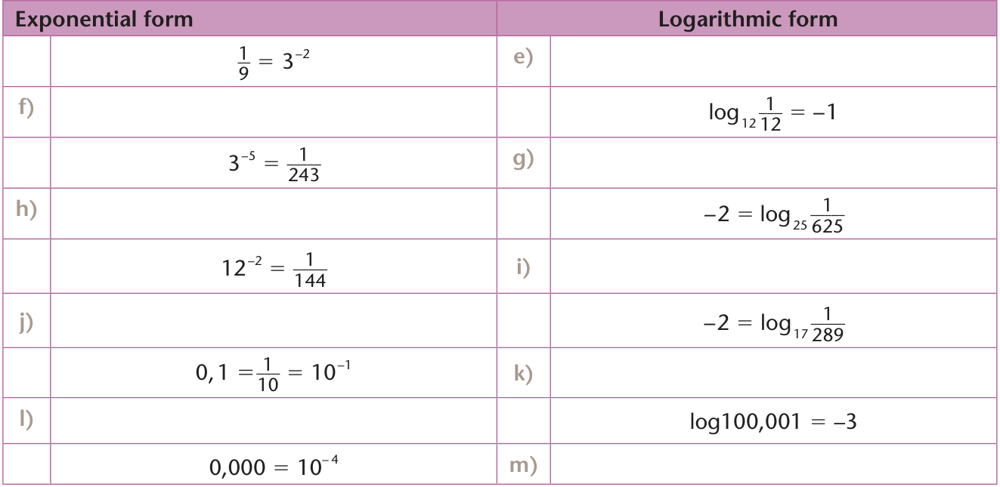
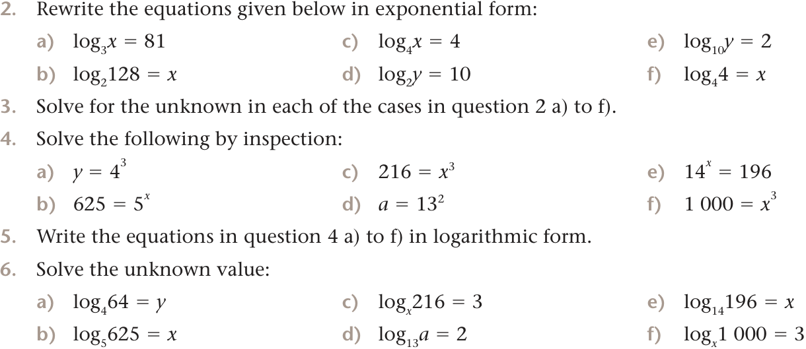
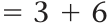
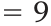
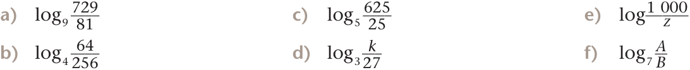
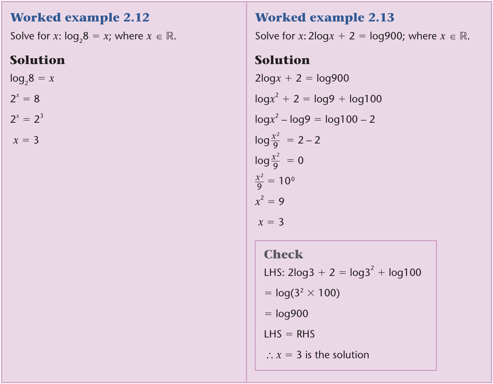
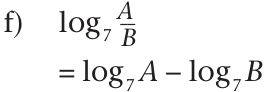
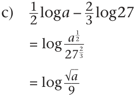
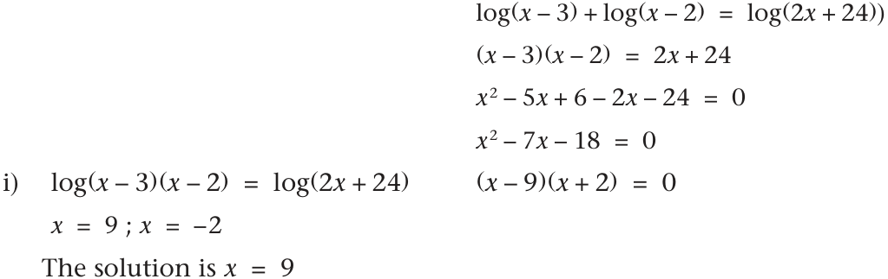
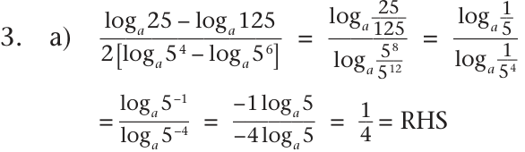

# **2 Logarithms** 

**Objectives** 

###### **In this chapter you will:** 

- learn how to convert an exponential equation to a logarithmic equation and vice versa 

- apply the laws of logarithms to expand and simplify expressions: 

- use the laws of logarithms to solve equations of the form _a_^{_x_} = _b._ 

_A nautilus shell with a logarithmic spiral_ 

TECH_MATHS_G11_LB_Final.indb   27 

2017/01/05   3:23 AM 

## **2.1 The relationship between logarithms and exponents** 

A logarithm is the exponent to which a number must be raised to get another number. For example, the base 10 logarithm of 100 is 2, because log10100 = 2 or 102 = 100. We call it a base 10 logarithm because ten is the number that is raised to an exponent. So: 

|**Exponential form**|**Log form**|
|---|---|
|10^{2} =100|Log10100=2|

###### **Note:** 

The logarithm of the number 100 to base 10 is 2 because 100 = 10^{2} . We write the statement ‘the logarithm of the number 100 to base 10 is 2’. Using mathematical notation as log10100 = 2 

We can use different base units when working with logarithms. For example, you could use two as a base unit. For instance, the base two logarithm of eight is three, because 2^{3} = 8, and log28 = 3. 

In general, we write ‘log’ followed by the base number as a subscript. 

Work through the following exercise, which considers the numbers given in the table below. 

###### **EXERCISE 2.1** 

###### **1.** Complete the table below. 

||**Number**|**The exponent/index to which 10**<br>**must be raised to give the number**|**Number written as a power**<br>**of base 10**|
|---|---|---|---|
|Example|1|0|100|
|Example|0,1|–1|10^{–1}|
|**a)**|0,000001|||
|**b)**|0,00001|||
|**c)**|0,0001|||
|**d)**|0,001|||
|**e)**|0,01|||
|**f)**|10|||
|**g)**|100|||
|**h)**|1 000|||
|**i)**|10 000|||
|**j)**|1 00 000|||
|**k)**|1 000 000|||

**28** Technical Mathematics  |  Grade 11 

TECH_MATHS_G11_LB_Final.indb   28 

2017/01/05   3:23 AM 

**2.** Write each of the following statements using mathematical notation: 

   - **a)** The logarithm of the number 1 000 to base 10 is 3. 

   - **b)** The logarithm of the number 1 000 000 to base 10 is 6. 

   - **c)** The logarithm of the number 10 to base 10 is 1. 

   - **d)** The logarithm of the number 1 to base 10 is 0. 

   - **e)** The logarithm of the number 10 000 to base 10 is 4. 

   - **f)** The logarithm of the number 0,01 to base 10 is –2. 

   - **g)** The logarithm of the number 0,0001 to base 10 is –4. 

   - **h)** The logarithm of the number 0,1 to base 10 is –1. 

###### **Note:** 

Logarithms to base 10 are commonly used perhaps because we use a decimal (base 10) system of counting. 

However, bases other than 10 are also used in many calculations in science, engineering and related fields. 

**3.** What is the logarithm of: 

**a)** 32 to base 2? **e)** 81 to base 3? **i)** 125 to base 5? **b)** 64 to base 2? **f)** 81 to base 9? **j)** 25 to base 5? **c)** 64 to base 4? **g)** 7 to base 49? **k)** 625 to base 5? **d)** 64 to base 8? **h)** 7 to base 7? **l)** 27 to base 3? 

In general, the equation _a_ = _b_^{_x_} is equivalent to log _ba_ = _x_ . The only restriction we put on the base is that it must be a positive number excluding 1. 

###### **Worked example 2.1** 

Write the equation 8 = 23 as a logarithmic equation. 

##### **Solution** 

Exponential equation Logarithmic equation 8 = 23 Log28 = 3 

Chapter 2 **Logarithms 29** 

TECH_MATHS_G11_LB_Final.indb   29 

2017/01/05   3:23 AM 

###### **EXERCISE 2.2** 

Copy the table below in your exercise book. Write the equivalent form of the given equation in the appropriate space. 

||**Exponential equation**||**Logarithmic equation**|
|---|---|---|---|
||729=9<br>3|**a)**||
||512=8<br>3|**b)**||
|**c)**|||log41024=5|
|**d)**|||log6216=3|
||1=9<br>0|**e)**||
|**f)**|||log121=0|
||3<br>5 =243|**g)**||
|**h)**|||2=log25625|
||12<br>2 =144|**i)**||
|**j)**|||2=log17289|
|**k)**|||1=log100100|

Consider the number  ____^{1} 

____100^{.} 

We can write this number in different equivalent forms as shown in the table below: 

____^{1} 100^{=} 0,01 ___^{1} 10–2 10^{2} ____ ____ Using mathematical notation, we write:  100^{1=  10} −2 , which is equivalent to  log 10 1001^{= − 2  or} ___ 0, 01 = 10^{12=  10} −2 , which is equivalent to log100,01 = –2. 

###### **EXERCISE 2.3** 

**1.** Copy the table below in your exercise book. Write the equivalent form of the given equation in the appropriate space. 

|**Exponential form**|||**Logarithmic form**|
|---|---|---|---|
||^{1}<br>_____<br>729 ^{=  9− 3  }|**a)**||
||^{1}<br>_____<br>512 ^{= 8− 3  }|**b)**||
|**c)**|||log4 ^{1}<br>______<br>1024 ^{=− 5}|
|**d)**|||log6 ^{1}<br>_____<br>216 ^{=− 3}|

**30** Technical Mathematics  |  Grade 11 

TECH_MATHS_G11_LB_Final.indb   30 

2017/01/05   3:23 AM 



> **[Diagram Context - Textbook_TechnicalMathematics_Gr11_Logarithms.pdf-0005-00.png]**
> 1. A table with the names of some mathematical functions and their corresponding logarithms.



> **[Diagram Context - Textbook_TechnicalMathematics_Gr11_Logarithms.pdf-0005-01.png]**
> 1. A diagram of a cell with a logarithmic scale.


## **2.2 Laws of logarithms** 

The laws of logarithms allow expressions involving logarithms to be rewritten in a variety of different ways. The laws apply to logarithms of any base, but the same base must be used throughout a calculation. 

There are basic laws that we will work with. These are the: 

- logarithm of a product of numbers: log _axy_ = log _ax_ + log _ay_ 

- logarithm of a quotient number:  log _a_ _^{_x_} _y_ =  log _a x_ −  log _a y_ 

- logarithm of a power: log _ax_^{_n_} = _n_ log _ax_ 

   - log c _b_ 

- base of a logarithm rule:  log _a b_ =  _____ log c _a_ 

###### **Note:** 

The logarithm of 1 to any base is always 0, and the logarithm of a number to the same base is always 1. In particular, log1010 = 1, and log _ee_ = 1 

Chapter 2 **Logarithms 31** 

TECH_MATHS_G11_LB_Final.indb   31 

2017/01/05   3:23 AM 

#### **The logarithm of a product of numbers: log** **_axy_** = **log** **_ax_ + log** **_ay_** 

When exponential expressions with the same base are multiplied, the result is an exponential expression with the same base and an exponent equal to the sum of the exponents. That is, _a_^{_m_} × _a_^{_n_} = _a_^{_m_+}^{_n_} or _a_^{_m_} _a_^{_n_} = _a_^{_m_+}^{_n_} 

In section 2.1 we described an exponent as a logarithm. Thus, when we use laws governing how we operate on logarithms, we are actually thinking about what we are supposed to do with the exponents when we have either a product or a quotient. 

Consider the expression: log2(8 × 64). 

According to the property _a_^{_m_} × _a_^{_n_} = _a_^{_m_+}^{_n_} , when we multiply two numbers that can be expressed in terms of the same base, we add the exponent. 

Thus, when applying this rule to logarithms and using mathematical notation, we write: 

log2(8 × 64) = log28 + log264 





In general, for any positive real numbers _x_ , and _y_ ; and _a_ not equal to 1; log _axy_ = log _ax_ + log _ay_ . 

###### **Note:** 

8 = 2^{3} and 64 = 2^{6} 

**Worked example 2.2 Worked example 2.3** Write log _xabc_ in expanded form. Evaluate log6(216 × 36) without using the calculator. **Solution Solution** log _xabc_ log6(216 × 36) = log _xa_ + log _xb_ + log _xc_ = log6216 + log636 = log66^{3} + log66^{2} = 3log66 + 2log66 = 3 + 2 = 5 

**32** Technical Mathematics  |  Grade 11 

TECH_MATHS_G11_LB_m02_print.indd   32 

2017/01/05   7:58 AM 

###### **EXERCISE 2.4** 

Expand and evaluate (where appropriate) each of the following expressions without using a calculator: 

**a)** log3(729 × 9) **c)** log28 _st_ **e)** log2100 _xyz_ **b)** log5(625 × 125) **d)** log4(64 × 256) **f)** log225 _x_ 

**The logarithm of a quotient number:  log** **_a_ __**^{**_x_**} **_y_** = **log** **_a x_ −  log** **_a y_** 

Another basic property (law) of exponents states that when exponential expressions with the same base are divided, the result is an exponential expression with the same base and an exponent equal ___ to the difference of the numerator and the denominator, that is:^{_am_} _a_^{_n_=}^{_am − n_} or _a_^{_m_} ÷ _a_^{_n_} = _a_^{_m − n_} . 

Let’s apply this to logarithms. 

___ Consider the expression:  log 2 64^{8.} 

___ According to the property^{_a_} _a_^{_mn_=}^{_a_} _m − n_ , when we divide two numbers that can be expressed in terms of the same base, we subtract the exponent of the number 64 (expressed as 26) from the exponent of the number 8 (expressed as 23). 

Thus, when applying this rule to logarithms and using mathematical notation, we write: 

___ log 2 64^{8} 

=  log 2 8 −  log 2 64 =  log 2  2 3 −  log 2  2 6 **Note:** = 3 − 6 8 = 2^{3} and 64 = 2^{6} = − 3 

###### **Worked example 2.4** 

____ Rewrite  log 5 125<sup>25using the quotient property of logarithms and simplify where possible.</sup> 

###### **Solution** 

___ log 5125^{25} =  log 5 25 −  log 5 125 =  log 5  5 2 −  log 5  5 3 = 2 − 3 = − 1 

Chapter 2 **Logarithms 33** 

TECH_MATHS_G11_LB_Final.indb   33 

2017/01/05   3:23 AM 

###### **EXERCISE 2.5** 

Simplify 



> **[Diagram Context - Textbook_TechnicalMathematics_Gr11_Logarithms.pdf-0008-02.png]**
> This image displays a set of six


#### **The logarithm of a power: log** **_ax_**^{**_n_**} = **_n_ log** **_ax_** 

The logarithm of _x_ raised to the power of _n_ is _n_ times the logarithm of _x_ . In general, we state that log _ax_^{_n_} = _n_ log _ax_ ; where _a_ and _x_ are positive real numbers excluding 1 and _n_ ∊ ℝ . 

###### **Worked example 2.5** 

Simplify log10100 _x_ using appropriate log properties and simplify where possible. 

###### **Solution** 

log10100 _x_ = _x_ log10100 = _x_ log10102 = _x_ × 2log1010 = _x_ × 2 = 2 _x_ 

###### **EXERCISE 2.6** 

**1.** Simplify the following without the use of a calculator: 

   - **a)** log5125 **c)** log1010^{5} **e)** log8512 **b)** log381 **d)** log2128 **f)** log959 049 

**2.** Use your calculator to complete the table below. For example: log2 = 0,301 and log8 = 0,903. 

|_x_|1<br>2|3|4|5|6|7<br>8|9|10|
|---|---|---|---|---|---|---|---|---|
|log_x_|0,301|||||0,903|||

**3.** Use the results from exercises 1 and 2 to answer the following questions without using a calculator. 

   - **a)** 3log7 

- **c)** 2log3 **e)** 4log5 **d)** 3log2 **f)** 3log9 

**b)** 6log10 

**4.** Now use your calculator to check whether the statements given below are true or false. **a)** 3log7 = log343 **d)** 3log2 = log9= log9 log9 **g)** log2 = 3,279= 3,2793,279 

      - **d)** 3log2 = log9= log9 log9 **g)** log2 = 3,279= 3,2793,279 __ 

      - **e)** 4log5 = log625 **h)** log^{1} 2^{= 0, 03} 

      - **f)** 3log9 = log729 

   - **b)** 6log10 = log1 000 000 

   - **c)** 2log3 = log8 

**34** Technical Mathematics  |  Grade 11 

TECH_MATHS_G11_LB_Final.indb   34 

2017/01/05   3:23 AM 

###### **EXERCISE 2.7** 

_(Do not use a calculator for this exercise.)_ 

**1.** Simplify each of the following using appropriate log properties: 

**a)** log5625^{10} **c)** log5 _x_ –3 **e)** log _aa_ 2 _x_ __ **b)** log _xx_^{1 000} **d)** log _xy_^{_z_} **f)** log 4 (^{1} 4^{)} 

###### **Worked example 2.6** 

______ Simplify the expression^{log 729} log 81^{without the aid of a calculator.} 

###### **Solution** 

______^{log 729} log 81 = _____^{log  9 3} log  9^{2} = _____^{3 log 9} 2 log 9 = __^{3} 2 = 1 __^{1} 2 

**2.** Simplify without the aid of a calculator: 

______ ______ ______ **a)**^{log 2} **c)**^{log 343} **e)**^{log 625} log 64 log 49 log 25 **b)** ______^{log 32} **d)** ______^{log 216} **f)** ______^{log 512} log 128 log 36 log 4 

**3.** Simplify the log expressions given below: 

_____ ______ ______ **a)**^{log}^{_a_3} **c)**^{2 log}^{_xy_} **e)**^{log 27} log _a_ log _x_^{2} _y_ 3 _a_ _____ ________ _______ b_ log 5 625 **b)**^{log}^{_a_3} **d)**^{log 8}^{_abc_} **f)** 3 _a_ 3 log 2 _abc b_ 

###### **Worked example 2.7** 

Write 3log _a_ – log _b_ + 4log _c_ as a single logarithm. 

###### **Solution** 

###### **Worked example 2.8** 

Write 7log _x_ + 4log _y_ as a single logarithm. 

###### **Solution** 

7log _x_ + 4log _y_ 3log _a_ – log _b_ + 4log _c_ 4 = log _x_^{7} + log _y_^{4} = log _a_ 3 – log _b_ + log _c_ =  log  ____^{_a_3} _b_^{_c_4} = log _x_^{7} _y_^{4} 

Chapter 2 **Logarithms 35** 

TECH_MATHS_G11_LB_Final.indb   35 

2017/01/05   3:23 AM 

**4.** Simplify (without the use of a calculator). 

   - **a)** log _a_^{2} – log3 + log10 

   - **b)** 5log _x_ + 3log _y_ – log _w_ 

   - __ __ 

   - **c)**^{1} 2^{log}^{_a_−  2} 3^{log 27} 

   - __________ 

   - **d)**^{log 4 + log 25} log 0, 001 

- **f)** log _x_ 64 + log _x_ 4 – log _x_ 8 log _abc_ 

- _______________ 

- **g)** 2 log _a_ + log _b_ + log _c_ 

- **h)** log2 + log3 

- **i)** log _a_ – log27 

**e)** log6 + 2log20 – log3 – 3log2 

**_____ log** **_c b_ The base of a logarithm rule:  log** **_a b_ = log** **_c a_** 

By convention, when the base of a logarithm is not indicated, it is assumed to be 10. Logarithms to base 10 are called common logarithms, for example, the base for each of the following logarithms is 10: log1 000, log8, log _a_ , log2. 

**Note:** The log button on your calculator is used to calculate values 

As we learnt earlier, bases other than 10 are needed for applications in science, engineering and related fields. 

_____ log _c b_ The rule  log _a b_ = log _c a_<sup>allows us to rewrite a logarithm to any base other than 10. This rule is useful</sup> when we have to use the calculator to calculate the value of a logarithm of a number to a base other than 10. 

**Worked example 2.9 Worked example 2.10** Change log25 to base 10. Change log36 to base 10. **Solution Solution** log 2 5 log 3 6 = ____^{log5} = ____^{log 6} log 2 log 3 

###### **EXERCISE 2.8** 

**1.** Change to base 10. 

**a)** log1110 **d)** log147 **g)** log612 **b)** log1211 **e)** log1112 **h)** log49 **c)** log126 **f)** log3264 **i)** log25125 **2.** Use the calculator to evaluate the following correct to 2 decimal places. **a)** log1110 **d)** log147 **g)** log612 **b)** log1211 **e)** log1112 **h)** log49 **c)** log126 **f)** log3264 **i)** log25125 

**36** Technical Mathematics  |  Grade 11 

TECH_MATHS_G11_LB_Final.indb   36 

2017/01/05   3:23 AM 

## **2.3 Solving exponential equations of the form:** **_a_**^{**_x_**} = **_b_** 

In previous grades you solved equations similar to these: (1) 2 _x_ – 3 = 8 and (2) 2 _x_ = 8. 

The strategy we use to solve 2 _x_ = 8 is to rewrite the equation such that both sides of the equation have the same base, that is, 2 _x_ = 23. We then ask: For what value(s) of _x_ are the two expressions equal? Since the bases are the same we can focus on the exponents. We conclude that the two sides can only be equal when the bases are raised to the same exponent, that is, when _x_ = 3. 

So then how do we solve an equation like 2 _x_ = 11? 

When considering this equation, we see that it is not possible to write one number in terms of the base of the other. We have already discussed: 

- that we can think of an exponent as a logarithm 

- how to convert between the exponential and logarithmic forms of an equation 

- how to change the base of a logarithm 

We will use the above knowledge to solve the given equation. 

Let’s work through an example. 

###### **Worked example 2.11** 

Solve for _x_ in the equation 5 _x_ = 3. Give your answer correct to three decimal places. 

###### **Solution** 

|5<br>_x_ =3||
|---|---|
|log53= _x_|[Rewrite the given equation in a logarithmic form]|
|^{log 3}<br>____<br>log 5 ^{= }^{_x_}|[Change the base of the logarithm to base 10]|
|0,683= _x_|[Calculator]|
|5<br>0,683 =3|[Check]|

###### **EXERCISE 2.9** 

Solve for _x_ correct to two decimal places: 

|**a)**|2<br>_x_ =11|**e)**|5<br>_x_ =27|**i)**|6<br>_x_ =200|
|---|---|---|---|---|---|
|**b)**|3<br>_x_ =2|**f)**|2<br>_x_ =12|**j)**|8<br>_x_ =90|
|**c)**|3<br>_x_ =5|**g)**|10<br>_x_ =99|**k)**|9<br>_x_ =100|
|**d)**|7<br>_x_ =5|**h)**|4<br>_x_ =52|**l)**|13<br>_x_ =170|

Chapter 2 **Logarithms 37** 

TECH_MATHS_G11_LB_Final.indb   37 

2017/01/05   3:23 AM 

## **2.4 Solving more equations involving logarithms** 

Work through the examples below and use the knowledge gained in previous grades and this chapter to solve equations involving logarithms. 



> **[Diagram Context - Textbook_TechnicalMathematics_Gr11_Logarithms.pdf-0012-02.png]**
> 1. A diagram of a cell with arrows pointing to different parts of the cell.


**38** Technical Mathematics  |  Grade 11 

TECH_MATHS_G11_LB_Final.indb   38 

2017/01/05   3:23 AM 

###### **Worked example 2.14** 

Solve for _x_ : log2( _x_ + 2) + log2( _x_ – 4) = 3; where _x_ ∊ ℝ . 

###### **Solution** 

log2( _x_ + 2)( _x_ – 4) = 3 ( _x_ + 2)( _x_ – 4) = 8 _x_^{2} – 2 _x_ – 8 = 8 _x_^{2} – 2 _x_ – 16 = 0 _x_ =^{2} _______________^{±√} _______________( − 2 )^{2} − 4(1 ) ( − 16 ) 2(1 ) _x_ = _____^{2 +  √} ___68 or  _____^{2 −  √} ___68 2 2 _x_ = 5,1 or _x_ = 3,1 _x_ =  ____________________^{2 ±√} ___________________( − 2 )^{2} − 4(1 ) ( − 16 ) 2(1 ) _x_ =^{2} _____^{+√} ___68 or^{2} _____^{+√} ___68 2 2 _x_ = 5, 1 or − 3, 1 The valid value of _x_ is 5,1 

###### **Check** 

log2(5,1 + 2) + log2(5,1 – 4) = log2(7,1)(1,1) = log2(7,81) = 2,97 ≈3 

###### **EXERCISE 2.10** 

**1.** Solve for x : _x_ ∊ ℝ 

**a)** log327 = _x_ **b)** log _x_ 16 = 4 **c)** log5 _x_ = 3 ___ **d)** log 3 27^{1=}^{_x_} 

**e)** log2( _x_ + 1) = 3 **i)** log _x_ + 3 = log1 000 **f)** log _x_ = log(2 – _x_ ) **j)** __^{1} 2^{log}^{_x_= log 10} **g)** 2log _x_ = 4 **k)** 4log2 _x_ – 1 = log28 __ **h)** log23 _x_ = log2300 **l)** log 2^{1} 8^{=}^{_x_} 

Chapter 2 **Logarithms 39** 

TECH_MATHS_G11_LB_Final.indb   39 

2017/01/05   3:23 AM 

**Worked example 2.15** Solve for _x_ ; where _x_ ∊ ℤ . log2 _x_ + log23 = 3 

###### **Solution** 

log2 _x_ + log23 = 3 log23 _x_ = 3 3 3 _x_ = 2 _x_ = __^{8} 3 = 2 __^{2} 3 **Check** __ LHS =  log 2^{8} 3^{+  log 2 3} =  log 2 8 −  log 2 3 −  log 2 3 =  log 2 8 = 3 _x_ = __^{8} 3^{is the solution} 

**Worked example 2.16** Solve for _x_ ; where _x_ ∊ ℝ . 2log _cx_ = log _c_ 4 + log _c_ ( _x_ – 1) 

###### **Solution** 

log _cx_ 2 = log _c_ 4( _x_ – 1) log _cx_ 2 = log _c_ (4 _x_ – 4) ∴ _x_ 2 = 4 _x_ – 4 _x_ 2 – 4 _x_ + 4 = 0 ( _x_ – 2)( _x_ – 2) = 0 ∴ _x_ = 2 

**Check** 2log _c_ 2 = log _c_ 4 + log _c_ (2 – 1) log _c_ 22 = log _c_ (4(2) – 4) ∴  2^{2} = 4(2) – 4 ∴ 4 = 4 LHS = RHS 

**2.** Solve for _x_ ; where _x_ ∊ ℝ . 

**a)** log7 _x_ + log77 = log714 **b)** log3( _x_ – 8) + log3 _x_ = 2 **c)** log3 _x_ – log33 = 2 **d)** log2( _x_ – 1) = –log2 _x_ + 2 **e)** log _x_ + 1 = 0 

   - **f)** log _x_ 3 + log3 _x_ = 2 **g)** log _x_ 2 – 2 = –log2 _x_ __ 

   - **h)** log 4 ( _x_ )  −  log 4 ( _x_ − 1 )  =^{1} 2 **i)** log( _x_ – 3) + log( _x_ – 2) = log(2 _x_ + 24) 

**3.** Prove that: 

_______________ log _a_ 25 −  log _a_ 125 __ **a)** 4 2[  log _a_ 5^{4} −  log _a_ 5^{6} ]^{=1} **b)** log981 + log91 + log216 – log250,04 = 5 __ __ ____ __ **c)** log 8^{1} 8^{+  log 49  7 1} 2 − log6(216^{1) −  log}^{_a_1 =} 4^{9} 

**4.** Suppose that a rapidly growing bacteria culture contains 1 000 × 20,05 _t_ bacteria after _t_ minutes. 

**a)** How many bacteria will be present after 20 minutes? 

**b)** When will the size of the culture reach 7 000? 

**5.** One thousand Rand deposited into a savings account grows to 1 000 × 20,2 _t_ rand after _t_ years. 

   - **a)** What will the balance be after 5 years? 

   - **b)** When will the balance reach R7 000? 

**6.** The world population is currently 4 billion and will be 4 × 100,0087 _t_ after _t_ years. When will the population reach 6 billion? 

**40** Technical Mathematics  |  Grade 11 

TECH_MATHS_G11_LB_Final.indb   40 

2017/01/05   3:23 AM 

###### **CONSOLIDATION EXERCISE** 

**1.** Calculate the value of each of the following: 

**a)** log327 + log264 ______ log 3 27 **b)** log 2 64 **c)** log327 – log264 **d)** log327 × log264 **e)** log232 + log464 – log100 × log5125 + log21 **2.** Solve for _x_ ; where _x_ ∊ ℝ . **a)** 2 _x_ = 17 **b)** 7 _x_ = 100 **c)** 10 _x_ = 100 **3.** Solve for x; where _x_ ∊ ℝ . **a)** 3 _x_ = 729 **b)** 5 _x_ – 1 = 53 **c)** 4 _x_ + 1 = 256 **4.** Solve for _x_ ; where _x_ ∊ ℝ . **a)** log _x_ 32 = 5 **b)** log2 _x_ = 5 **c)** log232 = _x_ **d)** log( _x_ + 1) = 0 **e)** log( _x_ – 1) = 0 **f)** log _x_ + log( _x_ – 1) = log100 **5.** Calculate the value of: **a)** log56 **b)** log311 **c)** log89 **6.** Write each of the following expressions in expanded form: ____ **a)** log^{_xyz_3} _w_^{2} _____ ab_ ______ ab_ **b)** log^{√} 3√_ c_ log^{√} 3√ _ c_ **c)** log10 _x_ **7.** Write each expression as a single logarithm: **a)** log( _x_ + 1) – 3 + log( _x_ – 1) **b)** log _x_ + 1 **c)** 2 – log53 _x_ 

Chapter 2 **Logarithms 41** 

TECH_MATHS_G11_LB_Final.indb   41 

2017/01/05   3:23 AM 

## **Summary** 

- the number log _ay_ is the exponent that _a_ must be raised to, in order to get the number _y_ . 

- log _ay_ = _x_ implies and is implied by _ax_ = _y_ 

- we read log _ay_ = _x_ as ‘the logarithm of _y_ to base _a_ ’ is equal to _x_ . 

- the equation log _ay_ = _x_ is called the logarithmic form of the equation. 

- the equation _a_^{_x_} = _y_ is called the exponential form of the equation. 

- in the expression log _ay_ , the number _a_ is called the base of the logarithm. The base of _a_ logarithm must always be positive and not equal to 1. 

- in the expression log _ay_ , y is the input and must always be a positive number. 

- the laws of logarithms states: 

   - log _axy_ = log _ax_ + log _ay_ 

   - log _a_ __^{_x_} _y_ =  log _a x_ −  log _a y_ 

   - log _ax_^{_y_} = _y_ log _ax_ 

- for the above laws to apply: _a_ > 0; _a_ Þ 1; _x_ > 0 and _y_ > 0. 

   - log _b y_ 

- the change of base formula for logarithms states:  log _a y_ =  _____ 

   - log _b a_ 

- the change of base formula helps us change from any base _a_ to any base _b_ . 

- for the change of base formula to apply, both _a_ and _b_ must be positive numbers not equal to 1 and _y_ must always be a positive number. 

**42** Technical Mathematics  |  Grade 11 

TECH_MATHS_G11_LB_Final.indb   42 

2017/01/05   3:23 AM 

### CHAPTER 2 **Logarithms** 

#### **Exercise 2.1** 

|1.||**Number**|**The exponent/inde**<br>**must be raised togi**|**x to which 10**<br>**ve the number**|**Number written as a**<br>**power of 10**|
|---|---|---|---|---|---|
|Ex|ample|1|0||10^{0}|
|Ex|ample|0,1|− 1||10^{0}|
|a)||0,000001|− 6||10^{−6}|
|b)||0,00001|− 5||10^{−5}|
|c)||0,0001|− 4||10^{−4}|
|d)||0.001|− 3||10^{−3}|
|e)||0,01|− 2||10^{−2}|
|f)||10|1||10^{1}|
|g)||100|2||10^{2}|
|h)||1 000|3||10^{3}|
|i)||10 000|4||10^{4}|
|j)||100 000|5||10^{5}|
|k)||1 000 000|6||10^{6}|
|2. a)|log10100|0=3|e)|log1010000=4||
|b)|log10100|0000=6|f)|log100, 01=− 2||
|c)|log1010=|1|g)|log100, 0001=− 4||
|d)|log101=|0|h)|log100, 1=− 1||
|3.  a)|5||f)|^{1}<br>__<br>2||
|b)|6||g)|1||
|c)|3||h)|3||
|c)|2||i)|2||
|d)|4||j)|4||
|e)|2||k)|3||

#### **Exercise 2.2** 

|**Exponential equation**|**Logarithmic equation**|
|---|---|
|729=9^{3}|a) log9729=3|
|512=8^{3}|b) log8512=3|
|c) 1024=4^{5}|log 41024=5|
|d) 216=6^{3}|log 6216=3|
|1=9^{0}|e) log91=0|

**278** Technical Mathematics  |  Grade 10 

TECH_MATHS_G11_LB_Final.indb   278 

2017/01/05   3:25 AM 

||**Exponential equation**|**Logarithmic equation**|
|---|---|---|
|f)|1=12^{0}|log 121=0|
|3^{5}|=243|g) log3243=5|
|h)|25^{2} =625|2=log 25625|
|12|^{2} =144|i)<br>log12144=2|
|j)|17^{2} =289|2=log 17289|
|k)|100^{1} =100|1=log 100100|

#### **Exercise 2.3** 

|1.<br>**Exponential form**|**Logarithmic form**|
|---|---|
|^{1}<br>____<br>729^{= 9− 3}|a) log9 ^{1}<br>____<br>729 ^{= –3}|
|^{1}<br>____<br>512 ^{= 8− 3}|b) log8 ^{1}<br>____<br>512 ^{= –3}|
|c)^{1}<br>_____<br>1024 ^{= 4–5}|log4 ^{1}<br>_____<br>1024 ^{= − 5}|
|d)^{1}<br>____<br>216 ^{= 6–3}|log6 ^{1}<br>____<br>216 ^{= − 3}|
|^{1}<br>__<br>9 ^{=  1}<br>__<br>3^{2} ^{=3 −2}|e) log3 ^{1}<br>__<br>9 ^{= –2}|
|f)<br> ^{1}<br>___<br>12 ^{= 12–1}|log12 ^{1}<br>___<br>12 ^{= − 1}|
|3^{−5} = ^{1}<br>____<br>243|g) log12 1/12=–1|
|h) 25^{–2} = ^{1}<br>____<br>625 ^{=  1}<br>____<br>252|− 2=log25 ^{1}<br>____<br>625|
|12^{−2} = ^{1}<br>____<br>144|i)<br>log12 ^{1}<br>____<br>144 ^{= –2}|
|j)<br>17^{–2} = ^{1}<br>____<br>289|− 2 =  log17 ^{1}<br>____<br>289|
|0, 1= ^{1}<br>___<br>10 ^{=  $10^{-1}$}|k) log100,001=–3|
|l)<br>0,001= ^{1}<br>_____<br>~~1000 ~~^{= 10–3}|log 100, 001=− 3|
|0, 0001=10^{–4}|m) log10 ^{1}<br>_____<br>1000 ^{= –4}|

2. a) _x_ =  3^{81} 

b)  128 =  2^{_x_} 

c) _x_ =  4^{4} 

d) _y_ = 10^{2} 

e) _y_ =  10^{2} 

- f) 4 =  4^{_x_} 

Chapter 2  | **Selected Answers 279** 

TECH_MATHS_G11_LB_Final.indb   279 

2017/01/05   3:25 AM 

3. a) _x_ =  3^{81} 6. a)  64 =  4^{_y_} b)  128 =  2^{_x_} _y_ = 3 2^{7} =  2^{_x_} b)  625 =  5^{_x_} _x_ = 7 _x_ = 4 c) _x_ =  4^{4} c)  216 = _x_^{3} _x_ = 256 _x_ = 6 d) _y_ =  2^{10} d) _a_ =  13^{2} _y_ = 1024 _a_ = 169 e) _y_ =  10^{2} e)  196 =  14 _y_ = 100 _x_ = 2 f) 4 =  4^{_x_} f) 1000 = _x_ 4^{1} =  4^{_x_} _x_ = 10 _x_ = 1 

- e)  196 =  14^{_x_} _x_ = 2 

- f) 1000 = _x_^{3} _x_ = 10 

4.  a) _y_ =  4^{3} = 64 b)  625 =  5^{_x_} 5^{4} =  5^{_x_} _x_ = 4 c)  216 = _x_^{3} 6^{3} = _x_^{3} _x_ = 6 d) _a_ =  13^{2} = 169 e)  14^{_x_} = 196 14^{_x_} =  14^{2} _x_ = 2 

- f) 1000 = _x_^{3} _x_ = 10 

- 5.  a)  log 4 _y_ = 3 b)  log 5 625 = _x_ c)  log _x_ 216 = 3 d)  log 13 _a_ = 2 e)  log 14 196 = _x_ f) log _x_ 1000 = 3 

#### **Exercise 2.4** 

- a)  log 3 (729 × 9 ) =  log 3 729 +  log 3 9 =  log 3  3^{6} +  log 3  3^{2} = 6  log 3 3 + 2  log 3 3 = (6 + 2  )log 3 3 = 8 

- b)  log 5 (625 × 125 ) =  log 5 625 +  log 5 125 =  log 5  5^{4} +  log 5  5^{3} = 4  log 5 5 + 3  log 5 5 = (4 + 3  )log 5 5 = 7 

- c)  log 2 8 _st_ 

- d)  log 4 (64 × 256 ) =  log 4 64 +  log 4 256 =  log 4  4^{3} +  log 4  4^{4} = 3  log 4 4 + 4  log 4 4 = (3 + 4  )log 4 4 = 7 

**280** Technical Mathematics  |  Grade 10 

TECH_MATHS_G11_LB_Final.indb   280 

2017/01/05   3:25 AM 

- e)  log 10 (6100 _xyz_ ) =  log 10 100 +  log 10 _x_ +  log 10 _y_ +  log 10 _z_ =  log 10  10^{2} +  log 10 _x_ +  log 10 _y_ +  log 10 _z_ = 2  log 10 10 +  log 10 _x_ +  log 10 _y_ +  log 10 _z_ = 2 +  log 10 _x_ +  log 10 _y_ +  log 10 _z_ 

- f)  log 5 25 _x_ =  log 5 25 +  log 5 _x_ =  log 5  5^{2} +  log 5 _x_ 

_____ e)  log 10^{1000} _z_ =  log 10 1000 −  log 19 _z_ =  log 10 1000 −  log 10 _z_ =  log 10  10^{3} −  log 10 _z_ = 3  log 10 10 −  log 10 _z_ = 3 −  log 10 _z_ 



> **[Diagram Context - Textbook_TechnicalMathematics_Gr11_Logarithms.pdf-0020-03.png]**
> This mathematical expression illustrates the quotient


- = 2  log 5 5 +  log 5 _x_ 

= 2 +  log 5 _x_ 

#### **Exercise 2.6** 

1. a)  log 5 125 

#### **Exercise 2.5** 

____ a)  log 9^{729} 81 =  log 9 729 −  log 9 81 =  log 9  9^{3} −  log 9  9^{2} 

= 3  log 9 9 − 2 log 9 

= (3 − 2  )log 9 9 

= 1 ____ b)  log 4 256^{64} =  log 4 64 −  log 4 256 

=  log 4  4^{3} −  log 4  4^{4} 

= 3  log 4 4 − 4  log 4 4 = (3 − 4  )log 4 4 = − 1 ____ c)  log 5^{625} 25 =  log 5 625 −  log 5 25 =  log 5  5^{4} −  log 5  5^{2} = 4  log 5 5 − 2  log 5 5 

- = (4 − 2  )log 5 5 = 2 

=  log 5  5^{4} = 4 ×  log 5 5 = 4 

b)  log 3 81 =  log 3  3^{4} = 4 

c)  log 10  10^{5} = 5 

d)  log 2 128 =  log 2  2^{7} = 7 

e)  log 8 512 =  log 8  8^{3} = 3 

f) log 9 59049 =  log 9  9^{5} = 5 

- ___ 

- d)  log 3 27^{_k_} =  log 3 _k_ −  log 3 27 =  log 3 _k_ −  log 3  3^{3} =  log 3 _k_ − 3  log 3 3 =  log 3 _k_ − 3 

Chapter 2  | **Selected Answers 281** 

TECH_MATHS_G11_LB_Final.indb   281 

2017/01/05   3:25 AM 

|2.|_x_<br>1<br>2|3|4|5|6<br>7|8|9|10|
|---|---|---|---|---|---|---|---|---|
|l|og _x_<br>0<br>0,301|0,477|0,602|0,699|0.788<br>0,845|0,903|0,954|1|
|3. a)|3 log 7 = 3 × 0, 845<br>= 2 . 535||||d)  log_x_ _y_ ^{_z_}<br>=_z_log_x_ _y_||||
|b)|6 log 10 = 6 × 1<br>= 6||||e)  log_a_ _a_ ^{2}<br>= 2  log_a_ _a_||||
|c)|2 log 3 = 2 × 0 . 477<br>= 0, 954||||= 2<br>f)<br>log4 ( ^{1}<br>__<br>4^{)}<br>_k_<br> ^{1}||||
|d)|3 log 2 = 3 × 0, 301<br>= 0, 602||||=_k_log4 <br>__<br>4<br>=_k_(log41 −  log<br>=_k_(0 − 1 )|44 )|||
|e)|4 log 5 = 4 × 0, 699||||= −_k_||||
||= 2, 796|||2.|a)^{log 2}<br>______<br>log 64||||
|f)|3 log 9 = 3 × 0, 954||||<br>^{log 2}||||
||= 2, 862||||= <br>_____<br>log  2^{6}||||
||||||^{log 2}<br>||||
|4. a)|true||||=<br>______<br>6 log 2||||
|b)|true||||=^{1}<br>__<br>6||||
|c)|false||||b^{log 32}||||
|d)|false||||)<br>______<br>log 128||||
|e)|true||||=^{log  25 }<br>_____<br>lo  2^{7}||||
|f)|true||||g<br>^{5 log 2}||||
|g)|false||||= <br>______<br>7 log 2||||
|h)|false||||=^{5}<br>__<br>7||||
|**Exerc**|**ise 2.7**||||c)^{log 343}<br>______<br>log 49||||
|1. a)|log5625^{10}||||=^{log  73 }<br>_____<br>l  7^{2}||||
||= 10  log55^{4}<br>= 4 × 10  log55||||og<br>=^{3 log 7}<br>______<br>2 log 7||||
||= 400||||=^{3}<br>__<br>2||||
|b)|log_x_ _x_ ^{1000}||||d)^{log 216}<br>______<br>log 36||||
||= 1000  log_x_ _x_<br>= 1000||||<br>=^{log  63 }<br>_____<br>log  6^{2}||||
||||||^{3 log 6}||||
|c)|log5 _x_ ^{−3}||||=<br>______<br>2 log 6||||
||= − 3  log5 _x_||||=^{3}<br>__<br>2||||

**282** Technical Mathematics  |  Grade 10 

TECH_MATHS_G11_LB_Final.indb   282 

2017/01/05   3:25 AM 

______ e)^{log 625} log 25 =  _____^{log  5 4} log  5^{2} =  ______^{4 log 5} 2 log 5 =  __^{4} 2 

= 2 f) ______^{log 512} log 4 =  _____^{log  2 9} log  2^{2} =  ______^{9 log 2} 2 log 2 

=  __^{9} 2 

_____ _____ 3. a)^{log} log^{_a_} _a_^{3 =  3 log} log _a_^{_a_} = 3 

b)  _____^{log}^{_a_3} =  _____^{3 log}^{_a_} 3 _a_ 3 _a_ =  ____^{log}^{_a_} _a_ 

______ c)^{2 log}^{_xy_} log _x_^{2} _y_ Is in simplified form 

________ d)^{log 8}^{_abc_} 3 log 2 _abc_ e)  ______^{log 27} =  _____^{log  3 3} 3 _a_ 3 _a_ =  ______^{3 log 3} 3 _a_ =  _____^{log 3} _a_ _______ b_ log 5 625 f) _b_ = 4 

4. a)  log _a_^{2} − log 3 + log 10 ____ = log^{10} 3^{_a_2} b)  5 log _x_ + 3 log _y_ − log _w_ + log 10 ______ = log^{10}^{_x_} _w_^{5}^{_y_3} 



> **[Diagram Context - Textbook_TechnicalMathematics_Gr11_Logarithms.pdf-0022-08.png]**
> 1. Loga = logarithm of a.


d)  log 6 + 2 log 20 − log 3 − 3 log 2 

_______ =  log^{(6 ×  20 2 )} (3 ×  2^{3)} _____ =  log^{2400} 24 =  log 100 = 2 

__________ d)^{log 4 + log 25} log 0, 001 

=  _________^{log (4 × 25)} _____ log  1000^{1} =  _______^{log 100} _____ log  1000^{1} =  ___− 3^{2=  −} __^{2} 3 

e)  log _x_ 64 +  log _x_ 4 −  log _x_ 8 _______ =  log _x_^{(64 × 4} 8^{)} ____ =  log _x_^{256} 8 =  log _x_ 32 

_______________log _abc_ g) 2 log _a_ + log _b_ + log _c_ =  _______^{log}^{_abc_} log _a_^{2} _bc_ h)  log 2 + log 3 =  log^{(} 2 × 3^{)} =  log 6 i) log _a_ − log 27 ___ =  log  27^{_a_} 

**Exercise 2.8** ______ 1. a)  log 11 10 =^{log 10} log 11 ______ b)  log 12 11 =^{log 11} log 12 ______ c)  log 12 6 =^{log 6} log 12 

Chapter 2  | **Selected Answers 283** 

TECH_MATHS_G11_LB_Final.indb   283 

2017/01/05   3:25 AM 

______ d)  log 14 7 =^{log 7} **Exercise 2,9** log 14 ______ a)  2^{_x_} = 11 e)  log 12 11 =^{log 11} log 12 log  2^{_x_} = log 11 ______ f) log 12 6 =^{log 6} log 12 _x_ log 2 = log 11 ______ g)  log 32 64 =^{log 64} _x_ =  ______^{log 11} log 32 log 2 _____ h)  log 9 4 =^{log 4} _x_ = 3, 46 log 9 = 0, 631 b)  3^{_x_} = 2 i) log 25 125 =  ______^{log 125} log  3^{_x_} = log 2 log 25 = 1, 5 _x_ log 3 = log 2 _x_ =  _____^{log 2} ______ log 3 2. a)  log 11 10 =^{log 10} log 11 _x_ = 0, 63 = 0, 960 c)  3^{_x_} = 5 ______ b)  log 12 11 =  log 12^{log 11} log  3^{_x_} = log 5 = 0, 965 _x_ log 3 = log 5 _x_ =  _____^{log 5} ______ log 3 c)  log 12 6 =^{log 6} log 12 _x_ = 1, 46 = 0, 721 d)  7^{_x_} = 5 ______ d)  log 14 7 =^{log 7} log 14 log  7^{_x_} = log 5 = 0, 737 _x_ log 7 = log 5 _____ x_ =  _____^{log 5} e)  log 12 11 =^{log 11} log 7 log 12 _x_ = 0, 83 = 0, 965 e)  5^{_x_} = 27 ______ f) log 12 6 =^{log 6} log 12 log  5^{_x_} = log 27 = 0, 721 _x_ log 5 = log 27 g)  log 32 64 =  ______^{log 64} log 32 _x_ =  ______^{log 27} log 5 _x_ = 2, 05 = 1, 2 _____ f) 2^{_x_} = 12 h)  log 9 4 =^{log 4} log 9 log  2^{_x_} = log 12 = 0, 631 _x_ log 2 = log 12 i) log 25 125 =  ______^{log 125} _x_ =  ______^{log 12} log 25 log 2 = 1, 5 _x_ = 3, 58 

**284** Technical Mathematics  |  Grade 10 

TECH_MATHS_G11_LB_Final.indb   284 

2017/01/05   3:25 AM 

g)  10^{_x_} = 99 **Exercise 2.10** log  10^{_x_} = log 99 1. a)  log 3 27 = _x x_ log 10 = log 99 27 =  3^{_x_} _x_ =  ______^{log 99} log 10 3^{3} =  3^{_x_} _x_ = 2 _x_ = 3 h)  4^{_x_} = 52 b)  log _x_ 16 = 4 log  4^{_x_} = log 52 16 = _x_^{4} _x_ log 4 = log 52 2^{4} = _x_^{4} _x_ =  ______^{log 52} _x_ = 2 log 4 _x_ = 2, 85 c)  log 5 _x_ = 3 i) 6^{_x_} = 200 _x_ =  5^{3} log  6^{_x_} = log 200 _x_ = 125 _x_ log 6 = log 200 ___ d)  log 3 27^{1=}^{_x_} _x_ =  ______^{log 200} log 6 ___27^{1=  3}^{_x_} _x_ = 2, 96 3^{−3} =  3^{_x_} _x_ = − 3 j) 8^{_x_} = 90 log  8^{_x_} = log 90 e)  log 2 ( _x_ + 1 )  = 3 _x_ log 8 = log 90 _x_ + 1 =  2^{3} _x_ =  ______^{log 90} _x_ = − 1 + 8 log 8 _x_ = 2, 16 _x_ = 7 k)  9^{_x_} = 100 f) log _x_ = log (2 − _x_ ) log  9^{_x_} = log 100 _x_ = 2 − _x x_ log 9 = log 100 2 _x_ = 2 _x_ =  ______^{log 100} _x_ = 1 log 9 _x_ = 2, 10 g)  2 log _x_ = 4 l) 13^{_x_} = 170 log _x_^{2} =  10^{4} _x_^{2} =^{(} 10^{2)2} log  13^{_x_} = log 170 _x_ = 100 _x_ log 13 = log 170 _x_ =  ______^{log 170} log 13 h)  log 2 3 _x_ =  log 2 300 _x_ = 2, 00 3 _x_ = 300 _x_ = 100 

Chapter 2  | **Selected Answers 285** 

TECH_MATHS_G11_LB_Final.indb   285 

2017/01/05   3:25 AM 

i) log _x_ + 3 = log 1000 log _x_ + 3 = log  10^{3} log _x_ = 0 _x_ = 1 j) __^{1} 2^{log}^{_x_= log 10} __ log _x_^{1} 2 = log 10 _ x_^{1} 2 = 10 _x_ = 100 k)  4  log 2 _x_ − 1 =  log 2 8 log 2 _x_^{4} −  log 2 8 = 1 __ log 2^{_x_} 8^{4 = 1} __^{_x_4} 8^{= 2} _x_^{4} = 16 =  2^{4} _x_ = 2 __ l) log 2^{1} 8^{=}^{_x_} __^{1} 8^{=  2}^{_x_} 2^{−3} =  2^{_x_} _x_ = − 3 2. a)  log 7 _x_ +  log 7 7 =  log 7 14 log 7 7 _x_ =  log 7 14 7 _x_ = 14 _x_ = 2 b)  log 3 ( _x_ − 8 )  +  log 3 _x_ = 2 log 3 _x_ ( _x_ − 8 )  = 2 _x_ ( _x_ − 8 )  =  3^{2} _x_^{2} − 8 _x_ − 9 = 0 ( _x_ + 1 ) ( _x_ − 9 )  = 0 _x_ = − 1  or _x_ = 8 

No solution because the logarithm of a negative number does not exist. Also the logarithm of 0 does not exist. 

c)  log 3 _x_ −  log 3 3 = 2 __ log 3 3^{_x_= 2} __3^{_x_=  3 2} _x_ = 27 

**286** Technical Mathematics  |  Grade 10 

TECH_MATHS_G11_LB_Final.indb   286 

2017/01/05   3:25 AM 

d)  log 2 ( _x_ − 1 )  = − log 2 _x_ + 2 log 2 ( _x_ − 1 )  +  log 2 _x_ = 2 log 2 _x_^{(} _x_ − 2^{)} = 2 _x_ ( _x_ − 1 )  − 4 = 0 _x_^{2} − _x_ − 4 = 0 _x_ = 2, 56 ..  or _x_ = − 1, 56   The solution is: _x_ = 2, 56 e)  log _x_ + 1 = 0 log _x_ = − 1 _x_ =  10^{−1} _x_ =  ___^{1} 10 f) log 3 3 +  log 3 _x_ = 2 log 3 3 _x_ = 2 3 _x_ =  3^{2} _x_ = 3 g)  log 2 2 − 2 = − log 2 _x_ log 2 2 _x_ = 2 2 _x_ =  2^{2} _x_ =  __^{4} 2 _x_ = 2 __ h)  log 4^{(} _x_^{)} −  log 4^{(} _x_ − 1^{)} =^{1} 2 ____ __ log 4 _x_ − 1^{_x_=} 2^{1} ___ x_ − 1^{_x_=  4} __2^{1} = 2 _x_ − 2 _x_ = − 2 _x_ = 2 



> **[Diagram Context - Textbook_TechnicalMathematics_Gr11_Logarithms.pdf-0026-01.png]**
> The image shows a math problem involving logarithms. The problem is presented in a table format, with the x-axis labeled "x" and the y-axis labeled "log(x)". The problem is asking the student to find the solution to the equation log(x) = 3x + 2. The problem also includes a diagram of a logarithmic graph, which is used to explain the concept of logarithms. The diagram shows a graph with x-axis labeled "x" and y-axis labeled "log(x)", and the graph is



> **[Diagram Context - Textbook_TechnicalMathematics_Gr11_Logarithms.pdf-0026-02.png]**
> 1. A logarithmic equation with multiple solutions.


Chapter 2  | **Selected Answers 287** 

TECH_MATHS_G11_LB_Final.indb   287 

2017/01/05   3:25 AM 

- b)  log 9 81 +  log 9 1 +  log 2 16 −  log 25 0, 04 2 + 0 + 4 − 1 = 5 

= R.H.S 

__ __ ____ c)  log 8^{1} 8^{+  log 49  7} 2^{1} −  log 6 216^{1−  log}^{_a_1 (} __2 ______ =  log 8  8^{−1} +^{log  7 1} log 49^{−  log 6  216 −1 −  log}^{_aa_0} ________^{1} 2^{log 7} = − 1  log 8 8 +  2 log 7^{+ 3  log 6 6 − 0  log}^{_aa_} = − 1 +  __^{1} 4^{+ 3 − 0} =  __^{9} 4 = R.H.S 

5. a) After 5 years  = 1000 ×  2^{0,2}^{_t_} 

= 1000 ×  2^{0,2×5} 

= _R_ 2000 

- b)  7000 = 1000 ×  2^{0,2}^{_t_} 

7 =  2^{0,05}^{_t_} _____^{log 1} log 2^{= 0, 2}^{_t_} _t_ = 14, 1 years 

6.  4 =  10^{0,0087}^{_t_} 4 =  10^{0,0087}^{_t_} ______^{log 4} log 10^{= 0, 0087}^{_t_} _t_ = 20, 24 years 

4. a) In 20 minutes  = 1000 ×  2^{0,05}^{_t_} = 1000 ×  2^{0,05×20} = 2000 bacteria 

   - b)  7000 = 1000 ×  2^{0,05}^{_t_} 

7 =  2^{0,05}^{_t_} _____^{log 1} log 2^{= 0, 05}^{_t_} _t_ = 56, 14 minutes 

#### **Consolidation exercise** 

1. a)  log 3 27 +  log 2 64 =  log 3  3^{3} +  log 2  2^{6} = 3  log 3 + 6  log 2 2 = 3 + 6 = 9 

______ log 3 27 ______ log 3  3^{3} b) log 2 64^{=} log 2  2^{6} =  _______3  log 3 3 6  log 2 2 =  __^{3} __ 6^{=} 2^{1} c)  log 3 27 −  log 2 64 =  log 3  3^{3} −  log 2  2^{6} = 3  log 3 − 6  log 2 2 = 3 − 6 = − 3 

**288** Technical Mathematics  |  Grade 10 

TECH_MATHS_G11_LB_Final.indb   288 

2017/01/05   3:25 AM 

- d)  log 3 27 ×  log 2 64 =  log 3  3^{3} ×  log 2  2^{6} 

   - = 3  log 3 3 × 6  log 2 2 

= 3 × 6 = 18 

e)  log 2 32 +  log 4 64 −  log 10 100 ×  log 5 125 +  log 2 1 =  log 2  2^{5} +  log 4  4^{3} −  log 10  10^{2} ×  log 5  5^{3} +  log 2  2^{0} = 5  log 2 2 + 3  log 4 4 − 2  log 10 10 × 3  log 5 5 + 0 = 5 + 3 − 2 × 3 = 8 − 6 = 2 2. a)  2^{_x_} = 17 log  2^{_x_} = log 17 _x_ log 2 = log 17 _x_ =  ______^{log 17} log 2 _x_ = 4, 09 

b)  7^{_x_} = 100 log  7^{_x_} = log 100 _x_ log 7 = log 100 _x_ =  _______^{log 100} log 7 _x_ = 2, 37 

c)  10^{_x_} = 300 log  10^{_x_} = log 300 _x_ =  _______^{log 300} log 10 _x_ = 2, 48 3. a)  3^{_x_} = 729 3^{_x_} =  3^{6} _x_ = 6 b)  5^{_x_−1} =  5^{3} _x_ − 1 = 3 _x_ = 4 

Chapter 2  | **Selected Answers 289** 

TECH_MATHS_G11_LB_Final.indb   289 

2017/01/05   3:25 AM 

c)  4^{_x_+1} = 256 4^{_x_+1} =  4^{4} _x_ + 1 = 4 

_x_ = 3 

4. a)  log _x_ 32 = 5 32 = _x_^{5} 2^{5} = _x_^{5} _x_ = 2 

b)  log 2 _x_ = 5 _x_ =  2^{5} _x_ = 32 

c)  log 2 32 = _x_ 32 =  2^{_x_} 2^{5} =  2^{_x_} _x_ = 5 

- d)  log ( _x_ + 1 )  = 0 

_x_ + 1 =  10^{0} _x_ + 1 = 1 _x_ = 0 

e)  log ( _x_ − 1 )  = 0 _x_ − 1 =  10^{0} _x_ − 1 = 1 _x_ = 2 

- ______ 

- b)  log 3 11 =^{log 11} log 3 

- = 2, 18 

- _____ 

- c)  log 8 9 =^{log 9} log 8 

- = 1, 06 

____ 6. a)  log^{_xyz_3} _w_^{2} = log _w_ + log _y_ + 3 log _z_ − 2 log _w_ 

_____ ab_ b)  log^{√} __ 3√ _c_ __ __ __ = log^{√} _a_ + log^{√} _b_ − log  3√ _c_ =  __^{1} 2^{log}^{_a_+} __^{1} 2^{log}^{_b_−} __^{1} 3^{log}^{_c_} 

c)  log 10 _x_ = log 10 + log _x_ = 1 + log _x_ 

7. a)  log^{(} _x_ + 1^{)} − 3 + log ( _x_ − 1 ) =  log^{(} _x_ + 1^{)} ( _x_ − 1 )  − log 1000 _____ 

= log^{_x_} 1000^{2 − 1} 

   - b)  log _x_ + 1 

=  log _x_ + log 10 =  log 10 _x_ 

- c)  2 −  log 5 3 _x_ 

   - =  log 5 25 −  log 5 3 _x_ ___ 

   - =  log 5^{25} 3 _x_ 

f) log _x_ + log^{(} _x_ − 21^{)} = log 100 log _x_^{(} _x_ − 21^{)} = log 100 _x_^{2} − 21 _x_ = 100 _x_^{2} − 21 _x_ − 100 = 0^{(} _x_ − 25^{)(} _x_ + 4^{)} = 0 _x_ = 25 or _x_ = − 4 Solution: _x_ = 25 

- _____ 

- 5. a)  log 5 6 =^{log 6} log 5 

- = 1, 11 

**290** Technical Mathematics  |  Grade 10 

TECH_MATHS_G11_LB_Final.indb   290 

2017/01/05   3:25 AM 

## 5. Authentic Exam Question Archetypes & Mark Allocations
*(Extracted from official CAPS examination papers to guide marking, pacing, and rubric design)*

### Archetype 1: QUESTION 1
- **Source Paper:** `Gr11_TechnicalMathematics_Exam_1.pdf`
- **Total Mark Allocation:** **[26 Marks]** (Sub-questions: 1, 3, 3, 3, 4 marks)
- **Recommended Time:** **31 Minutes** (Pacing: ~1.2 min/mark | *Calibrated to Official CAPS Paper Pace (1.2 min/mark)*)
- **Assessment Mode Calibration:** Timed Exam Simulation: 31 min countdown (Pacing Checkpoint: 23 min)
- **Cognitive / Marking Strategy:** NSC Standard (Method Marks [M], Accuracy Marks [A], Carry-Over [CA])

#### Question Prompt & Working:
```text
QUESTION 1 
 
 
 
In the diagram below, ∆PQR has a right angle at P.  The coordinates of the vertices are 
P(2 ; 6); Q(−1 ; 2) and R(6 ; k).  is the angle of inclination of line PR. 
 
 
 
 
 
 
 
 
 
 
 
 
 
 
 
 
 
 
 
 
 
 
 
 
 
 
 
 
 
1.1 
Complete the statement: 
 
“When two lines are perpendicular the … of the gradients must be equal to -1.” 
(1) 
 
 
Determine: 
 
 
 
1.2 
The gradient of PQ 
(3) 
 
 
 
1.3 
Show that the value of  𝑘= 3 
(3) 
 
 
 
1.4 
The coordinates of the midpoint of QR 
(3) 
 
 
 
1.5 
The coordinates of S, so that QPRS is a rectangle 
(4) 
 
 
 
1.6 
The equation of PR 
(4) 
 
 
 
1.7 
θ, the inclination angle of line PR 
(3) 
 
 
 
1.8 
If the length of PQ = 5 units, calculate the size of Q̂ 
(5) 
 
 
[26] 
 
 
𝜃 
y 
x 
P(2 ; 6) 
Q(−1 ; 2) 
R(6 ; 𝑘) 
O 
Do...
```

### Archetype 2: QUESTION 2
- **Source Paper:** `Gr11_TechnicalMathematics_Exam_1.pdf`
- **Total Mark Allocation:** **[15 Marks]** (Sub-questions: 2, 3, 4, 2, 4 marks)
- **Recommended Time:** **18 Minutes** (Pacing: ~1.2 min/mark | *Calibrated to Official CAPS Paper Pace (1.2 min/mark)*)
- **Assessment Mode Calibration:** Timed Exam Simulation: 18 min countdown (Pacing Checkpoint: 14 min)
- **Cognitive / Marking Strategy:** NSC Standard (Method Marks [M], Accuracy Marks [A], Carry-Over [CA])

#### Question Prompt & Working:
```text
QUESTION 2 
 
 
 
2.1 
Given: 𝑥 = 30,5˚ and 𝑦 = 130,5˚ 
 
 
 
 
 
Determine the following: 
 
 
 
 
 
2.1.1 tan(𝑥+ 𝑦)   
(2) 
 
 
 
 
 
2.1.2 cosec(𝑦−𝑥)  
(3) 
 
 
 
2.2 
If sin 36° = 𝑘, express the following in terms of  𝑘 . 
 
 
 
 
 
2.2.1 
cos 36°  
(4) 
 
 
 
 
 
2.2.2 
sin 216° 
(2) 
 
 
 
2.3 
Solve for θ, θ ∈[0°; 360°] rounded off to ONE decimal digit: 
 
 
 
 
 
tanθ = 2 sin 38,1°  
(4) 
 
 
[15] 
 
 
Downloaded from hlayiso.com
(EC/NOVEMBER 2023)                                       TECHNICAL MATHEMATICS P2  
 
           5 
Copyright reserved 
 
Please turn over
```

### Archetype 3: QUESTION 3
- **Source Paper:** `Gr11_TechnicalMathematics_Exam_1.pdf`
- **Total Mark Allocation:** **[10 Marks]** (Sub-questions: 6, 4 marks)
- **Recommended Time:** **12 Minutes** (Pacing: ~1.2 min/mark | *Calibrated to Official CAPS Paper Pace (1.2 min/mark)*)
- **Assessment Mode Calibration:** Timed Exam Simulation: 12 min countdown (Pacing Checkpoint: 9 min)
- **Cognitive / Marking Strategy:** NSC Standard (Method Marks [M], Accuracy Marks [A], Carry-Over [CA])

#### Question Prompt & Working:
```text
QUESTION 3 
 
 
 
3.1 
Simplify: 
 
 
cos(360° −𝜃).
1
cot(180° + 𝜃) .tan(360° + 𝜃)
cos(180° + 𝜃).tan(180° −𝜃)
 
(6) 
 
 
 
3.2 
Prove that: 
 
 
(𝑡𝑎𝑛𝑥+
1
𝑐𝑜𝑠𝑥)
2
= 1 + 𝑠𝑖𝑛𝑥
1 −𝑠𝑖𝑛𝑥 
(4) 
 
 
[10] 
 
 
 
Downloaded from hlayiso.com
6 
TECHNICAL MATHEMATICS P2 
(ECNOVEMBER 2023) 
Copyright reserved 
 
Please turn over
```
