# Chapter 5: Trigonometry

## Chapter Overview
This chapter covers the fundamental principles of trigonometry, moving from basic triangle similarity to solving equations and working with the Cartesian plane.

### Table of Contents

| Section | Topic | Page |
| :--- | :--- | :--- |
| 5.1 | Introduction | 108 |
| 5.2 | Similarity of triangles | 108 |
| 5.3 | Defining the trigonometric ratios | 110 |
| 5.4 | Reciprocal ratios | 115 |
| 5.5 | Calculator skills | 116 |
| 5.6 | Special angles | 118 |
| 5.7 | Solving trigonometric equations | 120 |
| 5.8 | Defining ratios in the Cartesian plane | 131 |
| 5.9 | Chapter summary | 138 |

---

## Key Concepts

### 1. Similarity of Triangles
Understanding that triangles with the same interior angles are similar, meaning their sides are in proportion.

### 2. Trigonometric Ratios
The study of the relationships between the sides and angles of right-angled triangles. These are defined as:
*   $\sin \theta = \frac{\text{opposite}}{\text{hypotenuse}}$
*   $\cos \theta = \frac{\text{adjacent}}{\text{hypotenuse}}$
*   $\tan \theta = \frac{\text{opposite}}{\text{adjacent}}$

### 3. Reciprocal Ratios
The reciprocals of the primary trigonometric ratios:
*   $\text{cosec } \theta = \frac{1}{\sin \theta}$
*   $\sec \theta = \frac{1}{\cos \theta}$
*   $\cot \theta = \frac{1}{\tan \theta}$

### 4. Special Angles
Specific values for trigonometric functions at angles such as $30^\circ$, $45^\circ$, and $60^\circ$ which can be derived without a calculator.

### 5. The Cartesian Plane
Extending trigonometric definitions to angles greater than $90^\circ$ using coordinates $(x, y)$ and the radius $r = \sqrt{x^2 + y^2}$.

<!-- DIAGRAM_PLACEHOLDER: diagram -->

---

# 5. Trigonometry

## 5.1 Introduction (EMA3M)

Trigonometry is the study of the relationships between the angles and sides of a triangle. The foundation of trigonometry is built upon trigonometric ratios within right-angled triangles.

### Applications of Trigonometry
Trigonometry is essential in various fields, including:
*   **Astronomy:** Triangulation is used to measure distances to nearby stars.
*   **Geography & Navigation:** Used for measuring distances between landmarks and in GPS (Global Positioning System) technology.
*   **Other Fields:** Acoustics, optics, financial market analysis, electronics, probability theory, statistics, biology, medical imaging (CAT scans and ultrasound), chemistry, cryptology, meteorology, oceanography, land surveying, architecture, phonetics, engineering, computer graphics, and game development.

*Figure 5.1: An artist's depiction of a GPS satellite orbiting the Earth. GPS uses triangulation to determine position with an accuracy of within 15 metres.*

---

## 5.2 Similarity of Triangles (EMA3N)

Before studying trigonometric theory, it is important to understand the relationship between similar triangles.

### Investigation: Ratios of similar triangles
**Instructions:**
1. Draw three similar triangles of different sizes.
2. Ensure each triangle has interior angles of $30^{\circ}$, $90^{\circ}$, and $60^{\circ}$.
3. Use a ruler and protractor to measure the lengths of the sides accurately.
4. Fill in the ratios in the table below using simplified fractions.

| Triangle | Opposite side to $30^{\circ}$ | Adjacent side to $30^{\circ}$ | Hypotenuse | Ratio: $\frac{\text{Opposite}}{\text{Hypotenuse}}$ |
| :--- | :--- | :--- | :--- | :--- |
| 1 | | | | |
| 2 | | | | |
| 3 | | | | |

---

### Trigonometry: Ratios in Similar Triangles

#### 1. Introduction to Trigonometric Ratios
Trigonometry is based on the principle that in similar right-angled triangles, the ratios of the lengths of the sides remain constant as long as the angles remain the same, regardless of the size of the triangle.

#### 2. Investigating Side Ratios
Consider three right-angled triangles with identical angles ($30^\circ$ and $60^\circ$) but different side lengths. The ratios of their sides are compared in the table below:

| Ratio | Triangle 1 | Triangle 2 | Triangle 3 |
| :--- | :--- | :--- | :--- |
| Opposite / Adjacent | $\frac{AB}{BC} =$ | $\frac{DE}{EF} =$ | $\frac{GH}{HK} =$ |
| Opposite / Hypotenuse | $\frac{AB}{AC} =$ | $\frac{DE}{DF} =$ | $\frac{GH}{GK} =$ |
| Adjacent / Hypotenuse | $\frac{CB}{AC} =$ | $\frac{FE}{DF} =$ | $\frac{KH}{GK} =$ |

**Key Observation:** If the angle remains constant, the ratio of the sides will always yield the same numerical value, regardless of the actual lengths of the sides.

---

#### 3. Similar Triangles
Two triangles are considered **similar** if their corresponding angles are equal and their corresponding sides are in the same proportion. 

If $\triangle ABC$ is similar to $\triangle DEF$, we denote this as:
$$\triangle ABC ||| \triangle DEF$$

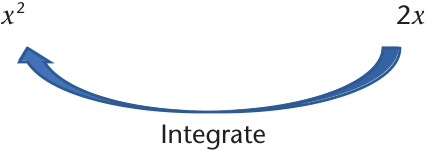
> **[Diagram Context - Textbook_TechnicalMathematics_Gr12_Integration.pdf-0002-09.png]**
> The image shows a diagram of a Lewis structure for water. The diagram is blue and features two arrows pointing in opposite directions, one pointing to the left and the other to the right. The diagram also includes the words "integrate" and "integrate" written in black text. The diagram is set against a gray background.

#### 4. Ratios in Similar Triangles
When triangles are similar, we can deduce the following relationships between their corresponding sides:

*   **Ratio of corresponding sides:**
    $$\frac{AB}{BC} = \frac{DE}{EF}$$
    $$\frac{AB}{AC} = \frac{DE}{DF}$$
    $$\frac{AC}{BC} = \frac{DF}{EF}$$

*   **Combined proportionality:**
    $$\frac{AB}{DE} = \frac{BC}{EF} = \frac{AC}{DF}$$

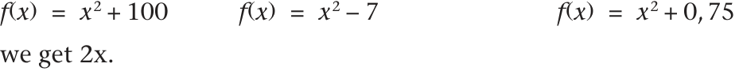
> **[Diagram Context - Textbook_TechnicalMathematics_Gr12_Integration.pdf-0002-11.png]**
> This mathematical text displays three quadratic functions

---

### Similar Triangles
For similar triangles $ABC$ and $DEF$, the corresponding angles are equal:
*   $\hat{A} = \hat{D}$
*   $\hat{B} = \hat{E}$
*   $\hat{C} = \hat{F}$

**NOTE:** The order of letters for similar triangles is very important. Always label similar triangles in corresponding order.
*   $\triangle ABC \parallel \triangle DEF$ is correct.
*   $\triangle ABC \parallel \triangle DFE$ is incorrect.

---

### 5.3 Defining the Trigonometric Ratios

Trigonometric ratios are derived from the properties of similar right-angled triangles.

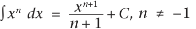
> **[Diagram Context - Textbook_TechnicalMathematics_Gr12_Integration.pdf-0003-01.png]**
> This mathematical equation represents

#### Identifying Sides in a Right-Angled Triangle
In a right-angled triangle, the sides are named based on their position relative to a chosen angle $\theta$:
1.  **Hypotenuse:** The side opposite the right angle. It is always the longest side.
2.  **Opposite:** The side directly across from the angle $\theta$.
3.  **Adjacent:** The side next to the angle $\theta$ (that is not the hypotenuse).

#### The Trigonometric Ratios
The three fundamental trigonometric ratios are defined as follows:

$$\sin \theta = \frac{\text{opposite}}{\text{hypotenuse}}$$

$$\cos \theta = \frac{\text{adjacent}}{\text{hypotenuse}}$$

$$\tan \theta = \frac{\text{opposite}}{\text{adjacent}}$$

**IMPORTANT:** These definitions are **only** applicable to right-angled triangles. Always verify that the triangle contains a $90^\circ$ angle before applying these ratios.

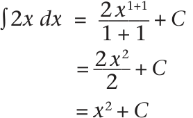
> **[Diagram Context - Textbook_TechnicalMathematics_Gr12_Integration.pdf-0003-03.png]**
> The image shows a math problem involving the use of Lewis structures to represent chemical bonds. The problem is set against a gray background, and it is divided into three sections. The first section contains a Lewis diagram with a cell and a molecule, the second section has a Lewis diagram with a cell and a molecule, and the third section has a Lewis diagram with a cell and a molecule. The problem also includes a table with the same Lewis diagrams and a chemical equation.

---

### Trigonometric Ratios

To remember the trigonometric ratios, use the mnemonic **"Soh Cah Toa"**:

| Ratio | Formula |
| :--- | :--- |
| Sine | $\sin \theta = \frac{\text{opposite}}{\text{hypotenuse}}$ |
| Cosine | $\cos \theta = \frac{\text{adjacent}}{\text{hypotenuse}}$ |
| Tangent | $\tan \theta = \frac{\text{opposite}}{\text{adjacent}}$ |

---

### Worked Example 1: Trigonometric Ratios

**Question:**
Given the following triangle:

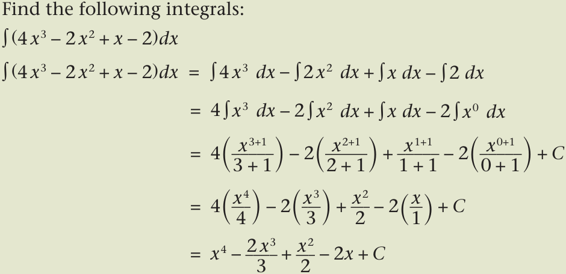
> **[Diagram Context - Textbook_TechnicalMathematics_Gr12_Integration.pdf-0004-06.png]**
> The image shows a math problem involving exponents and radicals. The problem is presented in a clear and organized manner, with the steps clearly outlined. The problem is set against a gray background, which helps to draw attention to the content. The problem is written in a simple, easy-to-understand language, making it accessible to a high school student. The problem is accompanied by a list of visible labels, variables, and arrows, which help to explain the problem step by step.

1. Label the hypotenuse, opposite, and adjacent sides of the triangle with respect to $\theta$.
2. State which sides of the triangle you would use to find $\sin \theta$, $\cos \theta$, and $\tan \theta$.
3. Label the hypotenuse, opposite, and adjacent sides of the triangle with respect to $\alpha$.
4. State which sides of the triangle you would use to find $\sin \alpha$, $\cos \alpha$, and $\tan \alpha$.

**Solution:**

**Step 1: Label the triangle**
*   **Hypotenuse:** Always directly opposite the right angle. It never changes position.
*   **Opposite:** The side directly opposite the angle being considered.
*   **Adjacent:** The remaining side that forms the angle being considered.

<!-- DIAGRAM_PLACEHOLDER: diagram -->

**Step 2: Applying the ratios**

*   **With respect to $\theta$:**
    *   $\sin \theta = \frac{AB}{AC}$
    *   $\cos \theta = \frac{BC}{AC}$
    *   $\tan \theta = \frac{AB}{BC}$

*   **With respect to $\alpha$:**
    *   $\sin \alpha = \frac{BC}{AC}$
    *   $\cos \alpha = \frac{AB}{AC}$
    *   $\tan \alpha = \frac{BC}{AB}$

---

### Step 2: Complete the Trigonometric Ratios

Trigonometric ratios are defined based on the sides of a right-angled triangle relative to a specific angle.

#### Ratios for angle $\theta$
*   $\sin \theta = \frac{\text{opposite}}{\text{hypotenuse}} = \frac{CB}{AC}$
*   $\cos \theta = \frac{\text{adjacent}}{\text{hypotenuse}} = \frac{AB}{AC}$
*   $\tan \theta = \frac{\text{opposite}}{\text{adjacent}} = \frac{CB}{AB}$

#### Ratios for angle $\alpha$
When the reference angle changes to $\alpha$, the sides identified as "opposite" and "adjacent" switch, while the hypotenuse remains the same ($AC$).

*   $\sin \alpha = \frac{\text{opposite}}{\text{hypotenuse}} = \frac{AB}{AC}$
*   $\cos \alpha = \frac{\text{adjacent}}{\text{hypotenuse}} = \frac{CB}{AC}$
*   $\tan \alpha = \frac{\text{opposite}}{\text{adjacent}} = \frac{AB}{CB}$

---

### Exercise 5 – 1

**1. Complete each of the following based on the triangle provided:**

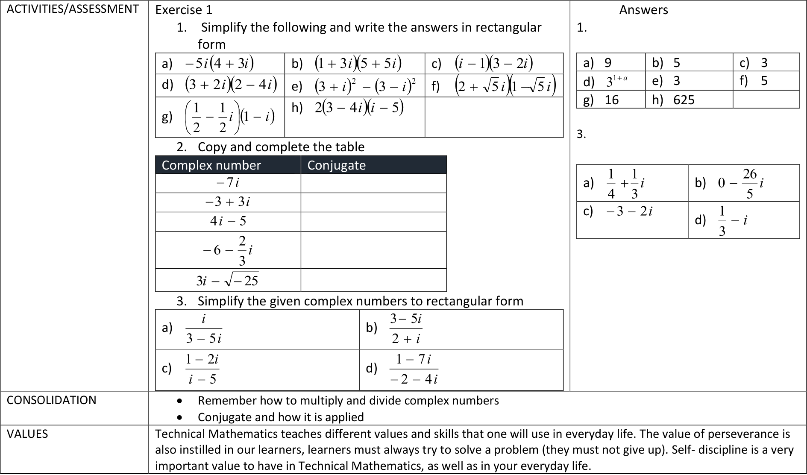
> **[Diagram Context - Textbook_TechnicalMathematics_Gr12_Complex-numbers.pdf-0005-00.png]**
> 1. The diagram shows a Lewis structure of a molecule.

a) $\sin \hat{A} =$
b) $\cos \hat{A} =$
c) $\tan \hat{A} =$
d) $\sin \hat{C} =$
e) $\cos \hat{C} =$
f) $\tan \hat{C} =$

**2. In each of the following triangles, state whether $a$, $b$, and $c$ are the hypotenuse, opposite, or adjacent sides of the triangle with respect to $\theta$.**

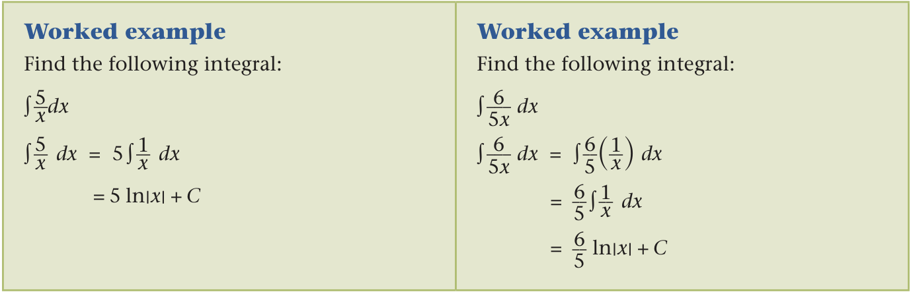
> **[Diagram Context - Textbook_TechnicalMathematics_Gr12_Integration.pdf-0005-02.png]**
> 1. A diagram of a cell with arrows pointing to different parts of the cell.

a) Triangle with angle $\theta$ at the bottom left.
b) Triangle with angle $\theta$ at the top left.

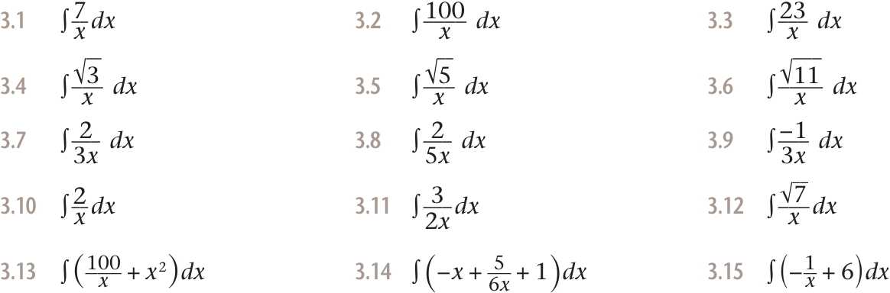
> **[Diagram Context - Textbook_TechnicalMathematics_Gr12_Integration.pdf-0005-05.png]**
> 1. A diagram of a cell with arrows pointing to different parts of the cell.

---

### Trigonometric Ratios in Right-Angled Triangles

To determine the trigonometric ratios for a given angle $\theta$ in a right-angled triangle, use the following definitions based on the sides relative to the angle:

*   **Sine ($\sin$):** $\sin \theta = \frac{\text{opposite}}{\text{hypotenuse}}$
*   **Cosine ($\cos$):** $\cos \theta = \frac{\text{adjacent}}{\text{hypotenuse}}$
*   **Tangent ($\tan$):** $\tan \theta = \frac{\text{opposite}}{\text{adjacent}}$

---

#### Exercises: Identifying Ratios from Diagrams

> **[Diagram Context - Textbook_TechnicalMathematics_Gr12_Complex-numbers.pdf-0006-01.png]**
> 1. A blue grid with white numbers.

For each triangle (c, d, e, f), identify the sides $a, b,$ and $c$ as the opposite, adjacent, or hypotenuse relative to the angle $\theta$ to express the trigonometric ratios.

---

#### Worked Example: Triangle $MON$

<!-- DIAGRAM_PLACEHOLDER: diagram -->

Consider the right-angled triangle $MON$ with sides $m, n,$ and $o$. 

**Given:**
*   Angle at $N = 90^\circ$
*   Hypotenuse = $n$
*   Side opposite to $\hat{O} = o$
*   Side adjacent to $\hat{O} = m$

**Questions and Solutions:**

a) Write down $\cos \hat{O}$ in terms of $m, n$ and $o$:
$$\cos \hat{O} = \frac{\text{adjacent}}{\text{hypotenuse}} = \frac{m}{n}$$

b) Write down $\tan \hat{M}$ in terms of $m, n$ and $o$:
(Relative to $\hat{M}$, the opposite side is $m$ and the adjacent side is $o$)
$$\tan \hat{M} = \frac{\text{opposite}}{\text{adjacent}} = \frac{m}{o}$$

c) Write down $\sin \hat{O}$ in terms of $m, n$ and $o$:
$$\sin \hat{O} = \frac{\text{opposite}}{\text{hypotenuse}} = \frac{o}{n}$$

d) Write down $\cos \hat{M}$ in terms of $m, n$ and $o$:
(Relative to $\hat{M}$, the adjacent side is $o$ and the hypotenuse is $n$)
$$\cos \hat{M} = \frac{\text{adjacent}}{\text{hypotenuse}} = \frac{o}{n}$$

---

### 5.3 Defining Trigonometric Ratios

#### Exercise 4: Identifying Trigonometric Ratios
Find $x$ in the diagram using three different trigonometric ratios. Write down the appropriate ratio for each.

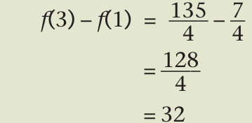
> **[Diagram Context - Textbook_TechnicalMathematics_Gr12_Integration.pdf-0007-00.png]**
> The image shows a math problem involving the conversion of degrees to radians. The problem is presented in a table format, with the first row containing the numbers "130" and "7" and the second row containing the numbers "3" and "4". The problem is asking the student to convert the degrees to radians. The image does not contain any text or additional information.

*   **Sine ratio:** $\sin(x) = \frac{\text{opposite}}{\text{hypotenuse}} = \frac{4}{5}$
*   **Cosine ratio:** $\cos(x) = \frac{\text{adjacent}}{\text{hypotenuse}} = \frac{3}{5}$
*   **Tangent ratio:** $\tan(x) = \frac{\text{opposite}}{\text{adjacent}} = \frac{4}{3}$

---

#### Exercise 5: Evaluating Trigonometric Statements
Which of these statements is true about $\triangle PQR$?

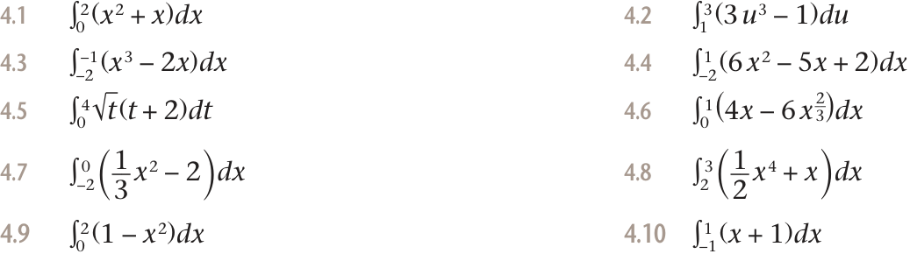
> **[Diagram Context - Textbook_TechnicalMathematics_Gr12_Integration.pdf-0007-04.png]**
> 1. A diagram of a cell with arrows pointing to different parts of the cell.

*   a) $\sin \hat{R} = \frac{p}{q}$ (False: $\sin \hat{R} = \frac{r}{q}$)
*   b) $\tan \hat{Q} = \frac{r}{p}$ (False: $\hat{Q}$ is $90^\circ$, tangent is undefined)
*   c) $\cos \hat{P} = \frac{r}{q}$ (True: $\cos \hat{P} = \frac{\text{adjacent}}{\text{hypotenuse}} = \frac{r}{q}$)
*   d) $\sin \hat{P} = \frac{p}{r}$ (False: $\sin \hat{P} = \frac{p}{q}$)

---

#### Exercise 6: Correct Working for Trigonometric Angles
Sarah wants to find the value of $\alpha$ in the triangle below. Which statement is a correct line of working?

<!-- DIAGRAM_PLACEHOLDER: diagram -->

*   a) $\sin \alpha = \frac{4}{5}$ (**Correct**)
*   b) $\cos (\frac{3}{5}) = \alpha$ (Incorrect notation)
*   c) $\tan \alpha = \frac{5}{4}$ (Incorrect: $\tan \alpha = \frac{4}{3}$)
*   d) $\cos 0,8 = \alpha$ (Incorrect notation: $\cos \alpha = 0,8$)

---

#### Exercise 7: Identifying Errors in Diagrams
Explain what is wrong with the following diagram.

<!-- DIAGRAM_PLACEHOLDER: diagram -->

**Analysis:**
In a right-angled triangle, the **hypotenuse** must always be the longest side. 
*   In the provided diagram, the side labeled $12$ is opposite the right angle, making it the hypotenuse.
*   The side labeled $15$ is a leg of the triangle.
*   Since $15 > 12$, this triangle is mathematically impossible because the hypotenuse ($12$) is shorter than one of the other sides ($15$).

---

### 5.4 Reciprocal Ratios

Each of the three primary trigonometric ratios has a corresponding reciprocal ratio. These are cosecant ($\text{cosec}$), secant ($\text{sec}$), and cotangent ($\text{cot}$).

#### Definitions
The reciprocal ratios are defined as follows:

$$\text{cosec } \theta = \frac{1}{\sin \theta}$$
$$\text{sec } \theta = \frac{1}{\cos \theta}$$
$$\text{cot } \theta = \frac{1}{\tan \theta}$$

#### Ratios in a Right-Angled Triangle
Using the sides of a right-angled triangle, these reciprocals are defined as:

$$\text{cosec } \theta = \frac{\text{hypotenuse}}{\text{opposite}}$$
$$\text{sec } \theta = \frac{\text{hypotenuse}}{\text{adjacent}}$$
$$\text{cot } \theta = \frac{\text{adjacent}}{\text{opposite}}$$

#### Important Identities
The product of a trigonometric ratio and its reciprocal is always equal to $1$:

$$\sin \theta \times \text{cosec } \theta = 1$$
$$\cos \theta \times \text{sec } \theta = 1$$
$$\tan \theta \times \text{cot } \theta = 1$$

***

**Note:** The cosecant ratio is often abbreviated as $\text{csc}$.

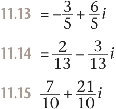
> **[Diagram Context - Textbook_TechnicalMathematics_Gr12_Complex-numbers.pdf-0008-00.png]**
> 1. A diagram of a Lewis structure for the molecule 2-3i.

***

#### Practice Exercises
For further practice, visit [www.everythingmaths.co.za](http://www.everythingmaths.co.za) and click on 'Practise Maths'. Use the following codes to access specific exercises:

| | | | | | |
| :--- | :--- | :--- | :--- | :--- | :--- |
| 1. 2FN9 | 2a. 2FNB | 2b. 2FNC | 2c. 2FND | 2d. 2FNF | 2e. 2FNG |
| 2f. 2FNH | 3a. 2FNJ | 3b. 2FNK | 3c. 2FNM | 3d. 2FNN | 4. 2FNP |
| 5. 2FNQ | 6. 2FNR | 7a. 2FNS | 7b. 2FNT | | |

**Video Resource:**
To watch a video tutorial covering these reciprocal ratios, search for code **2FNV** at [www.everythingmaths.co.za](http://www.everythingmaths.co.za).

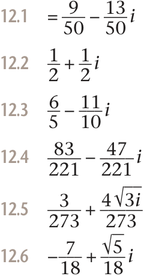
> **[Diagram Context - Textbook_TechnicalMathematics_Gr12_Complex-numbers.pdf-0008-02.png]**
> 1. A diagram of a cell with the number 12.5 on the left side and the number 2.53 on the right side.

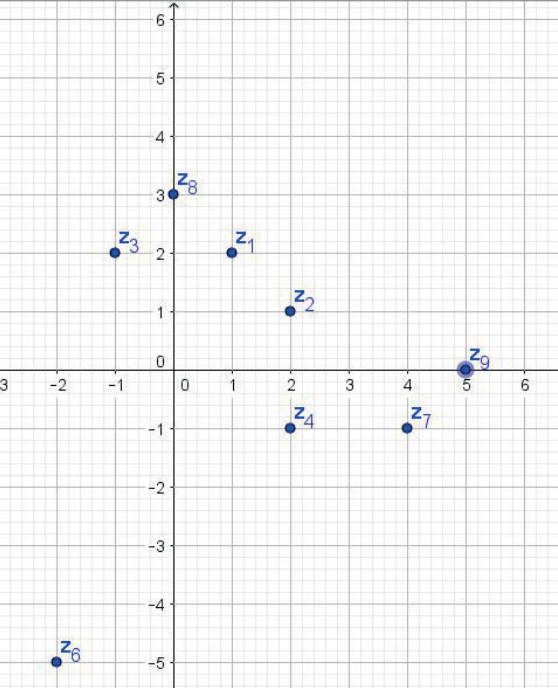
> **[Diagram Context - Textbook_TechnicalMathematics_Gr12_Complex-numbers.pdf-0008-10.png]**
> The image presents a graph with a coordinate plane, labeled with numbers and dotted lines. The graph is labeled with the numbers 1 through 6, and the x and y axes are labeled with numbers. The graph is filled with dots, and arrows are used to connect the dots. The graph is labeled with the numbers 3 through 6, and the x and y axes are labeled with numbers. The graph is labeled with the numbers 1 through 6, and the x and y axes are labeled with numbers.

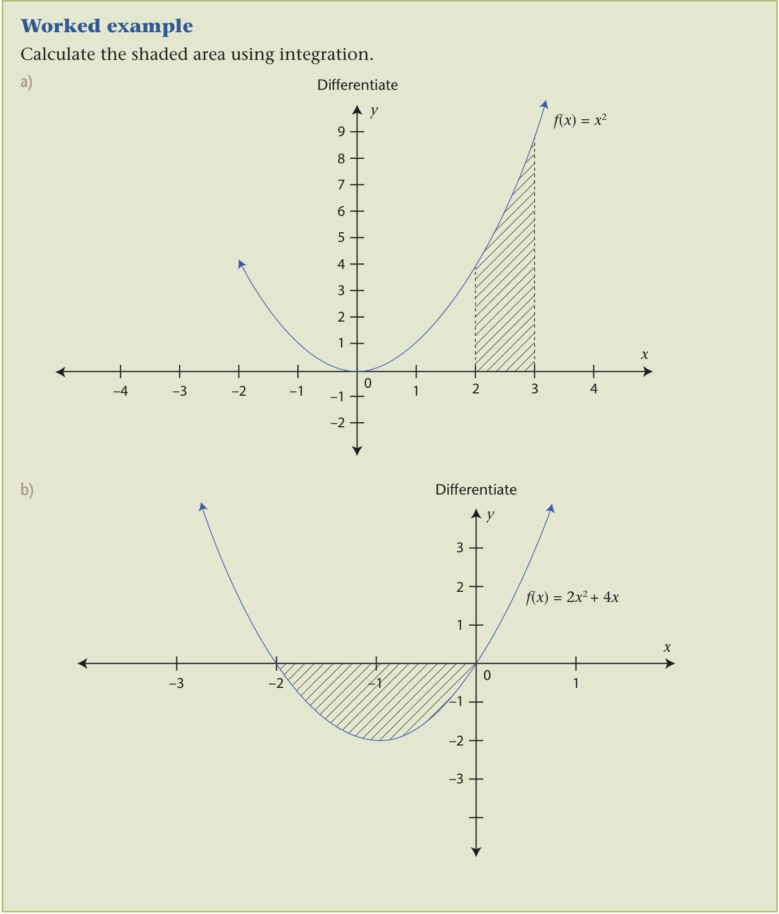
> **[Diagram Context - Textbook_TechnicalMathematics_Gr12_Integration.pdf-0008-00.png]**
> 1. A diagram of a cell with arrows pointing to different parts of the cell.

---

# 5.5 Calculator Skills

In this section, we focus on using a scientific calculator to determine the values of trigonometric ratios for any given angle.

### Important Concepts
*   **Calculator Mode:** Ensure your scientific calculator is set to **"degrees"** mode before performing calculations.
*   **Reciprocal Ratios:** Scientific calculators typically only have buttons for $\sin$, $\cos$, and $\tan$. To calculate reciprocal ratios ($\sec$, $\csc$, $\cot$), you must convert them into their standard counterparts:
    *   $\sec \theta = \frac{1}{\cos \theta}$
    *   $\csc \theta = \frac{1}{\sin \theta}$
    *   $\cot \theta = \frac{1}{\tan \theta}$
*   **Notation Note:** The notation $\sin^2 \theta$ is equivalent to $(\sin \theta)^2$. This rule applies to all trigonometric ratios.

---

### Worked Example: Using your calculator

**Question:** Use your calculator to calculate the following (correct to 2 decimal places):
1. $\cos 48^\circ$
2. $2 \sin 35^\circ$
3. $\tan^2 81^\circ$
4. $3 \sin^2 72^\circ$
5. $\frac{1}{4} \cos 27^\circ$
6. $\frac{5}{6} \tan 34^\circ$
7. $\sec 34^\circ$
8. $\cot 49^\circ$

**Solution:**
On most scientific calculators (such as Casio), an opening bracket is automatically added after pressing $\sin$, $\cos$, or $\tan$. You must press the closing bracket button after typing the angle.

| Calculation | Key Sequence | Result (approx.) |
| :--- | :--- | :--- |
| $\cos 48^\circ$ | `cos` `4` `8` `)` `=` | $0,67$ |
| $2 \sin 35^\circ$ | `2` `sin` `3` `5` `)` `=` | $1,15$ |
| $\tan^2 81^\circ$ | `(` `tan` `8` `1` `)` `)` `x^2` `=` | $39,86$ |
| $3 \sin^2 72^\circ$ | `3` `(` `sin` `7` `2` `)` `)` `x^2` `=` | $2,71$ |

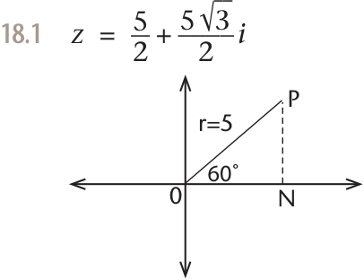
> **[Diagram Context - Textbook_TechnicalMathematics_Gr12_Complex-numbers.pdf-0009-03.png]**
> 1. A diagram of a Lewis structure of an amino acid.

*Note: For reciprocal ratios (questions 5–8), use the conversion formulas provided in the "Important Concepts" section. For example, to calculate $\sec 34^\circ$, input $\frac{1}{\cos 34^\circ}$ into your calculator.*

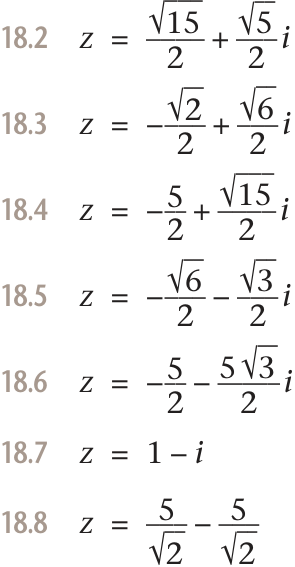
> **[Diagram Context - Textbook_TechnicalMathematics_Gr12_Complex-numbers.pdf-0009-04.png]**
> 1. A diagram of a Lewis structure of an atom.

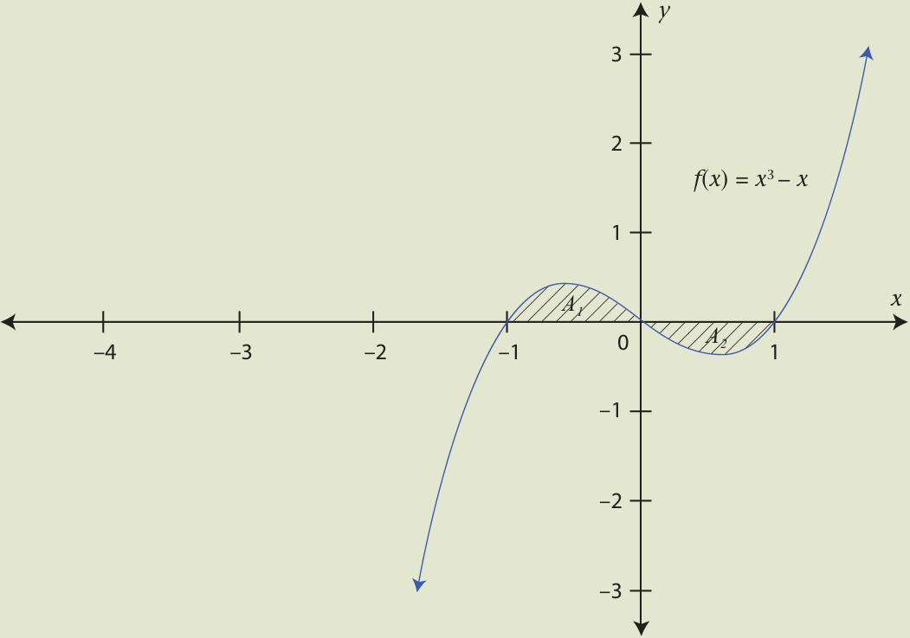
> **[Diagram Context - Textbook_TechnicalMathematics_Gr12_Integration.pdf-0009-01.png]**
> The image presents a diagram of a Lewis structure, a diagram used to represent the valence electrons of an atom. The Lewis structure is a visual representation of the valence electrons of an atom, and it is used to determine the chemical properties of an element. The diagram is labeled with the chemical symbol of the element and the number of valence electrons. The diagram also includes arrows to indicate the valence electrons of the element. The diagram is set against a beige background, and it is labeled with the text "Lewis structure" and "Valence electrons".

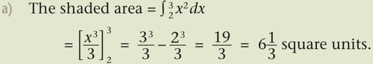
> **[Diagram Context - Textbook_TechnicalMathematics_Gr12_Integration.pdf-0009-03.png]**
> The image shows a math problem with a shaded area labeled "The shaded area". The problem involves a square unit, represented by the number 3, and a rectangle unit, represented by the number 6. The problem also includes a shaded area labeled "3x2". The problem is set against a gray background, and the text "The shaded area" is written in black.

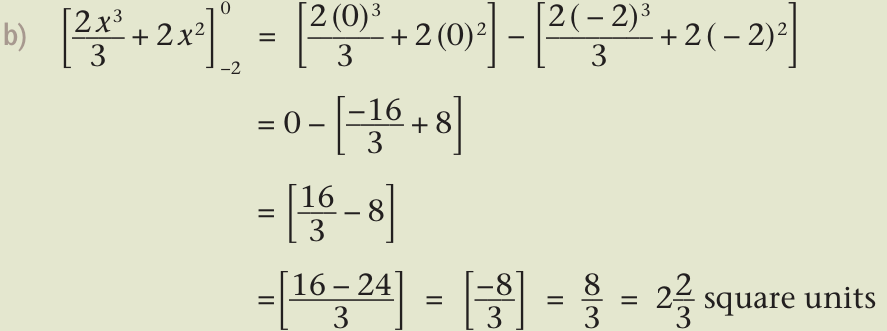
> **[Diagram Context - Textbook_TechnicalMathematics_Gr12_Integration.pdf-0009-05.png]**
> The image shows a math problem involving square units and exponents. The problem is presented in a diagram format, with various equations and variables. The diagram is set against a light brown background, and the text is written in a darker shade of brown. The problem appears to be a complex mathematical equation, possibly involving exponents and square units. The diagram is accompanied by a list of labels, variables, and arrows, which help to explain the problem visually.

---

5. Press
(
1
÷
4
)
cos
27
)
= 0,22275... ≈0,22
OR
Press
cos
27
)
=
ANS
÷
4
=
0,22275... ≈0,22
6. Press
(
5
÷
6
)
tan
34
)
=
0,56209... ≈0,56
OR
Press
tan
34
=
ANS
×
5
÷
6
=
0,56 ≈0,56
7. First write sec in terms of cos: sec 34^\circ =
1
cos 34^\circ (since there is no “sec” button on your calculator).
Press
1
÷
(
cos
34
)
)
=
1,206217... ≈1,21
8. First write cot in terms of tan: cot 49^\circ =
1
tan 49^\circ (since there is no “cot” button on your calculator).
Press
1
÷
(
tan
49
)
)
=
0,869286... ≈0,87
Worked example 3: Calculator work using substitution
QUESTION
If x = 25^\circ and y = 65^\circ, use your calculator to determine whether the following statement is true or false:
sin2 x + cos2 (90^\circ −y) = 1
SOLUTION
Step 1: Calculate the left hand side of the equation
Press
(
sin
25
)
)
x2
+
(
cos
90
−
65
)
)
x2
=
1
Step 2: Write the final answer
LHS = RHS therefore the statement is true.

### Exercise 5 – 2:

1. Use your calculator to determine the value of the following (correct to 2 decimal places):
a) tan 65^\circ
b) sin 38^\circ
c) cos 74^\circ
d) sin 12^\circ
e) cos 26^\circ
f) tan 49^\circ
g) sin 305^\circ
h) tan 124^\circ
i) sec 65^\circ
j) sec 10^\circ
k) sec 48^\circ
l) cot 32^\circ
m) cosec 140^\circ
n) cosec 237^\circ
o) sec 231^\circ
p) cosec 226^\circ
q) 1
4 cos 20^\circ
r) 3 tan 40^\circ
s) 2
3 sin 90^\circ
t)
5
cos 4,3^\circ
u)
$\sqrt{}$
sin 55^\circ
v) sin 90^\circ
cos 90^\circ
w) tan 35^\circ + cot 35^\circ
x) 2 + cos 310^\circ
2 + sin 87^\circ
117

### Chapter 5.

Trigonometry

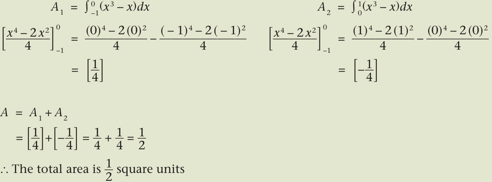

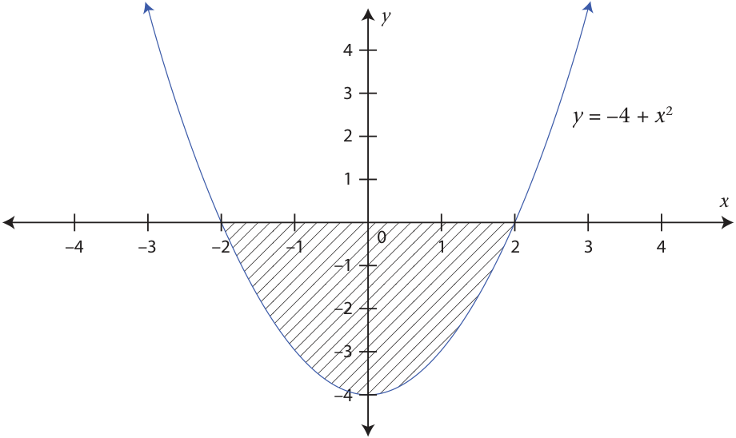

---

### Exercises

**1. Evaluate the following expressions:**
y) $\sqrt{4 \sec 99^\circ}$
z) $\sqrt{\frac{\cot 103^\circ + \sin 1090^\circ}{\sec 10^\circ + 5}}$

**2. If $x = 39^\circ$ and $y = 21^\circ$, use a calculator to determine whether the following statements are true or false:**
a) $\cos x + 2 \cos x = 3 \cos x$
b) $\cos 2y = \cos y + \cos y$
c) $\tan x = \frac{\sin x}{\cos x}$
d) $\cos(x + y) = \cos x + \cos y$

**3. Solve for $x$ in:**
$5^{\tan x} = 125$

---

## 5.6 Special Angles

For most angles, we use a calculator to determine the values of $\sin$, $\cos$, and $\tan$. However, certain angles produce simple ratios that can be determined without a calculator using specific triangles.

### Note: The Theorem of Pythagoras
The lengths of the sides of a right-angled triangle must obey the Theorem of Pythagoras: the square of the hypotenuse equals the sum of the squares of the two other sides.

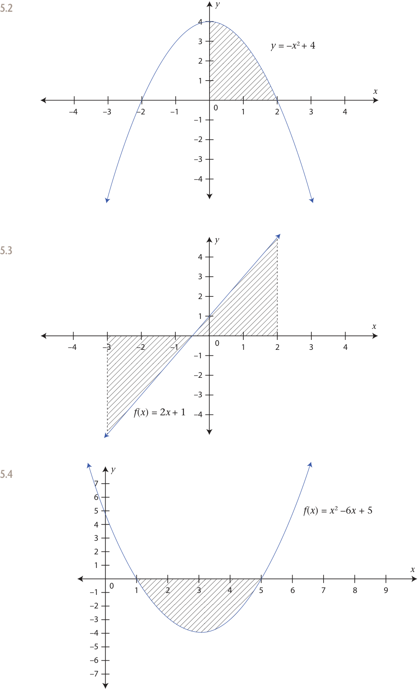
> **[Diagram Context - Textbook_TechnicalMathematics_Gr12_Integration.pdf-0011-00.png]**
> 1. A diagram of a Lewis structure of a molecule.

### Trigonometric Ratios for Special Angles

The following table summarizes the trigonometric ratios for $30^\circ$, $45^\circ$, and $60^\circ$:

| $\theta$ | $30^\circ$ | $45^\circ$ | $60^\circ$ |
| :--- | :--- | :--- | :--- |
| $\cos \theta$ | $\frac{\sqrt{3}}{2}$ | $\frac{1}{\sqrt{2}}$ | $\frac{1}{2}$ |
| $\sin \theta$ | $\frac{1}{2}$ | $\frac{1}{\sqrt{2}}$ | $\frac{\sqrt{3}}{2}$ |
| $\tan \theta$ | $\frac{1}{\sqrt{3}}$ | $1$ | $\sqrt{3}$ |

These values are essential for solving problems involving trigonometric ratios without the use of a calculator.

---

### Exercise 5 – 3: Trigonometry

#### 1. Multiple Choice: Select the closest answer
For each expression, identify the correct value from the provided options:

*   **a)** $\cos 45^\circ$: $\frac{1}{2}, 1, \sqrt{2}, \frac{1}{\sqrt{3}}, \frac{1}{\sqrt{2}}$
*   **b)** $\sin 45^\circ$: $\sqrt{2}, \frac{1}{2}, \frac{1}{\sqrt{2}}, \frac{\sqrt{3}}{1}, 1$
*   **c)** $\tan 30^\circ$: $\frac{1}{2}, \frac{\sqrt{3}}{1}, \frac{1}{\sqrt{2}}, \frac{\sqrt{3}}{2}, \frac{1}{\sqrt{3}}$
*   **d)** $\tan 60^\circ$: $\frac{\sqrt{3}}{2}, \frac{1}{\sqrt{2}}, \frac{1}{\sqrt{3}}, \frac{\sqrt{3}}{1}, 1$
*   **e)** $\cos 45^\circ$: $\frac{\sqrt{3}}{2}, \frac{1}{2}, \frac{1}{\sqrt{3}}, \frac{1}{\sqrt{2}}, \sqrt{2}$
*   **f)** $\tan 30^\circ$: $\frac{1}{\sqrt{2}}, \frac{1}{2}, \frac{\sqrt{3}}{2}, \frac{1}{1}, \frac{1}{\sqrt{3}}$
*   **g)** $\tan 30^\circ$: $\frac{1}{\sqrt{3}}, \frac{1}{2}, \frac{1}{\sqrt{2}}, \frac{\sqrt{3}}{2}, \frac{\sqrt{3}}{1}$
*   **h)** $\cos 60^\circ$: $\frac{1}{\sqrt{3}}, \frac{1}{2}, \frac{\sqrt{3}}{2}, \frac{\sqrt{3}}{1}, \frac{1}{\sqrt{2}}$

---

#### 2. Solve for $\cos \theta$ in surd form

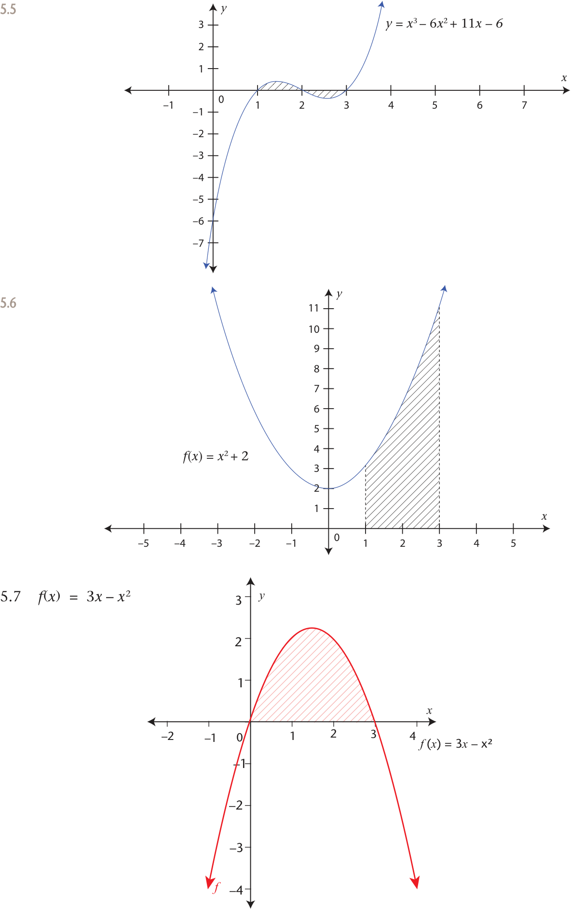
> **[Diagram Context - Textbook_TechnicalMathematics_Gr12_Integration.pdf-0012-00.png]**
> 1. A diagram of a Lewis structure of a molecule.

Given a right-angled triangle with opposite side $5$, adjacent side $5$, and hypotenuse $5\sqrt{2}$:
$$\cos \theta = \frac{\text{adjacent}}{\text{hypotenuse}} = \frac{5}{5\sqrt{2}} = \frac{1}{\sqrt{2}}$$

---

#### 3. Solve for $\tan \theta$ in surd form
<!-- DIAGRAM_PLACEHOLDER: diagram -->
Given a right-angled triangle with opposite side $6$, adjacent side $6\sqrt{3}$, and hypotenuse $12$:
$$\tan \theta = \frac{\text{opposite}}{\text{adjacent}} = \frac{6}{6\sqrt{3}} = \frac{1}{\sqrt{3}}$$

---

#### 4. Calculate the value without using a calculator
*   **a)** $\sin 45^\circ \times \cos 45^\circ$
    $$\left( \frac{1}{\sqrt{2}} \right) \times \left( \frac{1}{\sqrt{2}} \right) = \frac{1}{2}$$

*   **b)** $\cos 60^\circ + \tan 45^\circ$
    $$\frac{1}{2} + 1 = \frac{3}{2}$$

*   **c)** $\sin 60^\circ - \cos 60^\circ$
    $$\frac{\sqrt{3}}{2} - \frac{1}{2} = \frac{\sqrt{3} - 1}{2}$$

---

### 5. Evaluate without a calculator
Select the correct answer from the provided options for each expression:

| Expression | Options |
| :--- | :--- |
| a) $\tan 45^\circ \div \sin 60^\circ$ | $\frac{2}{\sqrt{3}}, \frac{\sqrt{3}}{1}, \frac{\sqrt{2}}{\sqrt{3}}, \frac{1}{1}, \frac{1}{2}$ |
| b) $\tan 30^\circ - \sin 60^\circ$ | $0, \frac{1}{2}, -\frac{\sqrt{3}}{2}, -\frac{1}{2\sqrt{3}}, \frac{\sqrt{3}}{2}$ |
| c) $\sin 30^\circ - \tan 45^\circ - \sin 30^\circ$ | $-\frac{\sqrt{3}}{2}, -1, -\frac{1}{\sqrt{3}}, -\frac{\sqrt{3}}{1}, -\frac{7}{2\sqrt{3}}$ |
| d) $\tan 30^\circ \div \tan 30^\circ \div \sin 45^\circ$ | $\frac{\sqrt{3}}{1}, \frac{2\sqrt{3}}{\sqrt{2}}, \frac{2}{\sqrt{3}}, \frac{\sqrt{2}}{1}, \frac{2\sqrt{2}}{\sqrt{3}}$ |
| e) $\sin 45^\circ \div \sin 30^\circ \div \cos 45^\circ$ | $\frac{\sqrt{2}}{\sqrt{3}}, \frac{1}{\sqrt{2}}, \frac{4}{\sqrt{3}}, 2, \frac{2\sqrt{2}}{\sqrt{3}}$ |
| f) $\tan 60^\circ - \tan 60^\circ - \sin 60^\circ$ | $-\frac{1}{\sqrt{3}}, -\frac{1}{2}, -\frac{1}{\sqrt{2}}, -\frac{1}{1}, -\frac{\sqrt{3}}{2}$ |
| g) $\cos 45^\circ - \sin 60^\circ - \sin 45^\circ$ | $-\frac{1}{2}, -\frac{1}{\sqrt{2}}, -\frac{7}{2\sqrt{3}}, -\frac{\sqrt{3}}{2}, -\frac{1}{\sqrt{3}}$ |

---

### 6. Using special angles
Use special angles to prove the following identities:
a) $\frac{\sin 60^\circ}{\cos 60^\circ} = \tan 60^\circ$
b) $\sin^2 45^\circ + \cos^2 45^\circ = 1$
c) $\cos 30^\circ = \sqrt{1 - \sin^2 30^\circ}$

---

### 7. Trigonometric definitions
Use the definitions of trigonometric ratios to answer the following:
a) Explain why $\sin \alpha \leq 1$ for all values of $\alpha$.
b) Explain why $\cos \alpha$ has a maximum value of $1$.
c) Is there a maximum value for $\tan \alpha$?

---

### 5.7 Solving trigonometric equations
In this section, we will look at:
1. Finding unknown lengths in right-angled triangles.
2. Finding unknown angles in right-angled triangles.
3. Solving more general trigonometric equations.

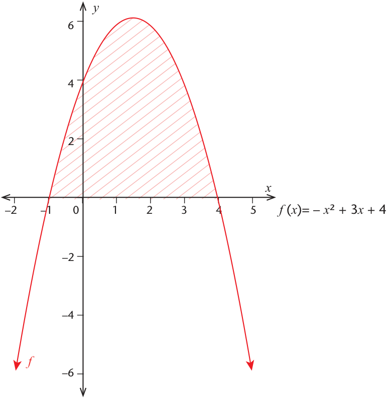
> **[Diagram Context - Textbook_TechnicalMathematics_Gr12_Integration.pdf-0013-01.png]**
> The image presents a diagram of a Lewis structure, a diagram used to represent the valence electrons of an atom. The diagram is colored in red and is labeled with the number of valence electrons. The diagram is set against a white background, and the x-axis is labeled with the number of valence electrons. The y-axis is labeled with the number of valence electrons. The diagram is labeled with the number of valence electrons and the Lewis structure of an atom.

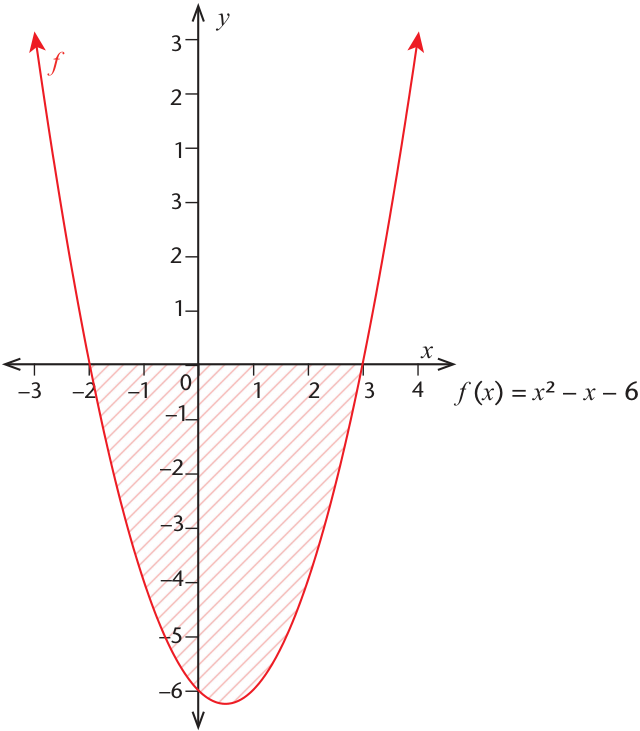
> **[Diagram Context - Textbook_TechnicalMathematics_Gr12_Integration.pdf-0013-03.png]**
> The image presents a graph with a red line and a red arrow, labeled "y = -3/4x + 6". The graph is labeled with the x-axis and y-axis, and the x-axis is labeled with the numbers "1 - 3". The y-axis is labeled with the numbers "0 - 6". The graph is labeled with the title "y = -3/4x + 6". The x-axis is labeled with the numbers "1 - 3", and the y-axis is labeled with the numbers "0 - 6". The graph is

---

# Finding Lengths in Right-Angled Triangles

We can use trigonometric ratios to calculate unknown side lengths in right-angled triangles.

---

## Worked Example 4: Finding Lengths

### Question
Find the length of $x$ in the following right-angled triangle (round your answer to two decimal places).

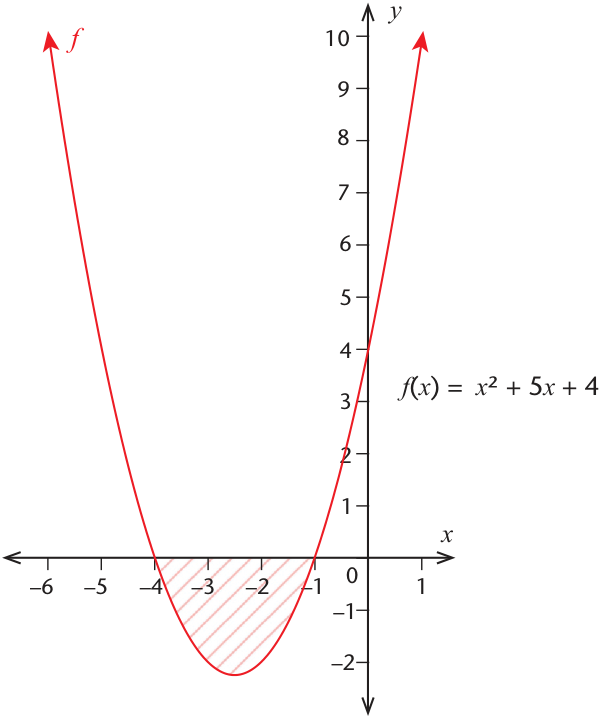
> **[Diagram Context - Textbook_TechnicalMathematics_Gr12_Integration.pdf-0014-01.png]**
> The image presents a graph with a red curve and a red line. The curve is labeled "y" and the line is labeled "x". The graph is labeled "y = f(x) = x + 5". The x-axis is labeled "x" and the y-axis is labeled "y". The graph is labeled "10", "8", "6", "5", and "4". The x-axis is labeled "x" and the y-axis is labeled "y". The curve is labeled "y" and the line is labeled "x". The

### Solution

**Step 1: Identify the sides with reference to the given angle**
*   **Hypotenuse:** The side opposite the right angle.
*   **Opposite:** The side opposite the angle we are interested in ($50^\circ$).
*   **Adjacent:** The remaining side.

Using the sine ratio:
$$\sin \theta = \frac{\text{opposite}}{\text{hypotenuse}}$$
$$\sin 50^\circ = \frac{x}{100}$$

**Step 2: Rearrange the equation to solve for $x$**
$$\sin 50^\circ \times 100 = \frac{x}{100} \times 100$$
$$\sin 50^\circ \times 100 = x$$
$$x = 100 \sin 50^\circ$$

**Step 3: Use your calculator to find the answer**
$$x = 76,60444...$$
$$x \approx 76,60$$

---

## Worked Example 5: Finding Lengths

### Question
Find the length of $x$ in the following right-angled triangle (round your answer to two decimal places).

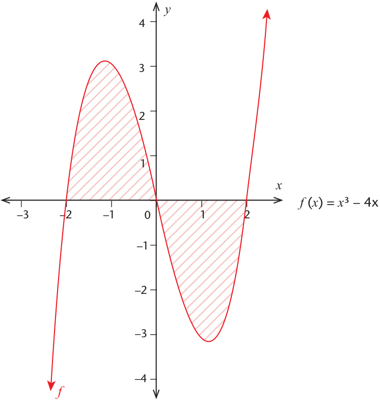
> **[Diagram Context - Textbook_TechnicalMathematics_Gr12_Integration.pdf-0014-03.png]**
> The image presents a graph with a red line and a red curve, which is a Lewis diagram. The graph is labeled with the x and y axes and has a red line that starts at the bottom left corner and ends at the top right corner. The curve is located at the top right corner of the graph. The x-axis is labeled with the numbers 1 through 4, and the y-axis is labeled with the numbers 0 through 6. The curve is labeled with the number 2, and the x-axis is labeled with the numbers 1 through 4. The curve is labeled with the

---

### Solving Trigonometric Equations: Finding Unknown Sides

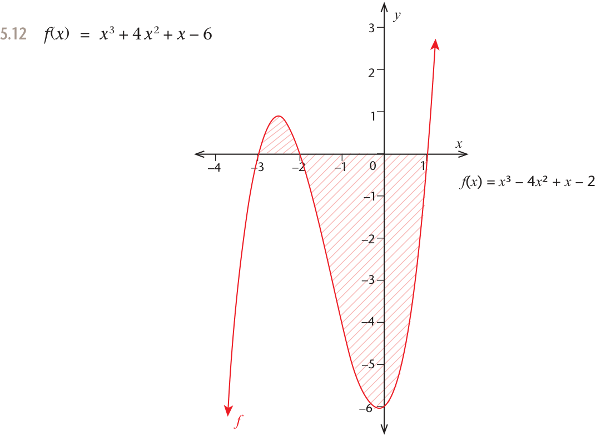
> **[Diagram Context - Textbook_TechnicalMathematics_Gr12_Integration.pdf-0015-00.png]**
> The image presents a diagram of a Lewis structure, a diagram of a cell, and a graph of a function. The diagram of a Lewis structure shows a red arrow pointing to the center of the structure, indicating the number of valence electrons. The diagram of a cell shows a red arrow pointing to the center of the cell, indicating the number of protons. The graph of a function has a red arrow pointing to the center of the graph, indicating the value of the function at that point.

#### Worked Example: Finding an Unknown Side ($x$)

**Step 1: Identify the sides with reference to the given angle**
To solve for an unknown side in a right-angled triangle, first identify the sides relative to the given angle:
*   **Hypotenuse:** Always opposite the right angle.
*   **Opposite:** The side opposite the angle of interest.
*   **Adjacent:** The remaining side next to the angle.

Using the cosine ratio:
$$\cos \theta = \frac{\text{adjacent}}{\text{hypotenuse}}$$
$$\cos 25^\circ = \frac{7}{x}$$

**Step 2: Rearrange the equation to solve for $x$**
Multiply both sides by $x$ to move it out of the denominator:
$$\cos 25^\circ \times x = \frac{7}{x} \times x$$
$$x \cos 25^\circ = 7$$

Divide both sides by $\cos 25^\circ$ to isolate $x$:
$$\frac{x \cos 25^\circ}{\cos 25^\circ} = \frac{7}{\cos 25^\circ}$$
$$x = \frac{7}{\cos 25^\circ}$$

**Step 3: Use your calculator to find the answer**
$$x = \frac{7}{0,90630...}$$
$$x = 7,723645...$$
$$x \approx 7,72$$

---

#### Worked Example 6: Finding Lengths

**QUESTION**
Find the length of $x$ and $y$ in the following right-angled triangle using the appropriate trigonometric ratio (round your answers to two decimal places).

---

### Solving for Unknown Lengths in a Right-Angled Triangle

<!-- DIAGRAM_PLACEHOLDER: diagram -->

#### Worked Example
To find the unknown lengths $x$ and $y$ in the given right-angled triangle with an angle of $25^\circ$ and an adjacent side of $7$:

**Step 1: Identify the opposite and adjacent sides and the hypotenuse with reference to the given angle**

Using the trigonometric ratios:

$$\tan \theta = \frac{\text{opposite}}{\text{adjacent}}$$
$$\tan 25^\circ = \frac{x}{7}$$

$$\cos \theta = \frac{\text{adjacent}}{\text{hypotenuse}}$$
$$\cos 25^\circ = \frac{7}{y}$$

**Step 2: Rearrange the equations to solve for $x$ and $y$**

$$x = 7 \times \tan 25^\circ$$
$$y = \frac{7}{\cos 25^\circ}$$

**Step 3: Use your calculator to find the answers**

$$x = 3,26415...$$
$$x \approx 3,26$$

$$y = 7,72364...$$
$$y \approx 7,72$$

***

**VISIT:**
The following video shows an example of finding unknown lengths in a triangle using the trigonometric ratios:
See video: 2FQT at www.everythingmaths.co.za

---

### Exercise 5 – 4: Trigonometric Ratios in Right-Angled Triangles

**Instruction:** In each triangle, find the length of the side marked with a letter. Give your answers correct to 2 decimal places.

---

#### a)

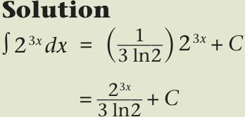
> **[Diagram Context - Textbook_TechnicalMathematics_Gr12_Integration.pdf-0017-06.png]**
> The image shows a math problem that involves solving for the value of x. The problem is presented in a diagram format, with the equation "2x3 = 3x + C" written on a white background. The problem is labeled "Solution" and "3In2 + C" is written below it. The problem also includes a legend that provides the values of x, 3x, and C.

*   **Given:** Angle = $37^\circ$, Adjacent side = $62$, Opposite side = $a$.
*   **Ratio:** $\tan(37^\circ) = \frac{\text{opposite}}{\text{adjacent}} = \frac{a}{62}$
*   **Calculation:** $a = 62 \times \tan(37^\circ) \approx 46.72$

#### b)
<!-- DIAGRAM_PLACEHOLDER: diagram -->
*   **Given:** Angle = $23^\circ$, Adjacent side = $21$, Opposite side = $b$.
*   **Ratio:** $\tan(23^\circ) = \frac{\text{opposite}}{\text{adjacent}} = \frac{b}{21}$
*   **Calculation:** $b = 21 \times \tan(23^\circ) \approx 8.91$

#### c)
<!-- DIAGRAM_PLACEHOLDER: diagram -->
*   **Given:** Angle = $55^\circ$, Hypotenuse = $19$, Adjacent side = $c$.
*   **Ratio:** $\cos(55^\circ) = \frac{\text{adjacent}}{\text{hypotenuse}} = \frac{c}{19}$
*   **Calculation:** $c = 19 \times \cos(55^\circ) \approx 10.90$

#### d)
<!-- DIAGRAM_PLACEHOLDER: diagram -->
*   **Given:** Angle = $49^\circ$, Hypotenuse = $33$, Adjacent side = $d$.
*   **Ratio:** $\cos(49^\circ) = \frac{\text{adjacent}}{\text{hypotenuse}} = \frac{d}{33}$
*   **Calculation:** $d = 33 \times \cos(49^\circ) \approx 21.65$

#### e)
<!-- DIAGRAM_PLACEHOLDER: diagram -->
*   **Given:** Angle = $17^\circ$, Opposite side = $12$, Hypotenuse = $e$.
*   **Ratio:** $\sin(17^\circ) = \frac{\text{opposite}}{\text{hypotenuse}} = \frac{12}{e}$
*   **Calculation:** $e = \frac{12}{\sin(17^\circ)} \approx 41.05$

#### f)
<!-- DIAGRAM_PLACEHOLDER: diagram -->
*   **Given:** Angle = $22^\circ$, Hypotenuse = $31$, Adjacent side = $f$.
*   **Ratio:** $\cos(22^\circ) = \frac{\text{adjacent}}{\text{hypotenuse}} = \frac{f}{31}$
*   **Calculation:** $f = 31 \times \cos(22^\circ) \approx 28.74$

---

### Trigonometry: Solving for Unknown Sides

#### 1. Exercises: Solving for Unknowns in Right-Angled Triangles
Use the trigonometric ratios ($\sin \theta = \frac{\text{opposite}}{\text{hypotenuse}}$, $\cos \theta = \frac{\text{adjacent}}{\text{hypotenuse}}$, $\tan \theta = \frac{\text{opposite}}{\text{adjacent}}$) to solve for the unknown variables in the following diagrams:

**g)**

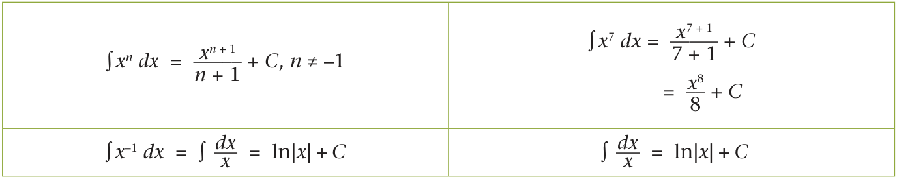
> **[Diagram Context - Textbook_TechnicalMathematics_Gr12_Integration.pdf-0018-10.png]**
> 1. A table with a row and column of equations.

$$\cos(23^\circ) = \frac{g}{32}$$
$$g = 32 \times \cos(23^\circ)$$

**h)**

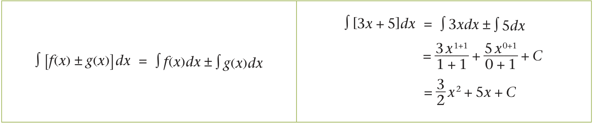
> **[Diagram Context - Textbook_TechnicalMathematics_Gr12_Integration.pdf-0018-12.png]**
> 1. A diagram of a cell with arrows pointing to different parts of the cell.

$$\sin(30^\circ) = \frac{h}{20}$$
$$h = 20 \times \sin(30^\circ)$$

**i)**
<!-- DIAGRAM_PLACEHOLDER: diagram -->
$$\tan(55^\circ) = \frac{4,1}{x}$$
$$x = \frac{4,1}{\tan(55^\circ)}$$

**j)**
<!-- DIAGRAM_PLACEHOLDER: diagram -->
$$\tan(65^\circ) = \frac{x}{4,23}$$
$$x = 4,23 \times \tan(65^\circ)$$

---

#### 2. Trigonometric Ratios in Compound Triangles
Given the diagram below, write down two ratios for each of the following in terms of the sides $AB, BC, BD, AD, DC,$ and $AC$.

<!-- DIAGRAM_PLACEHOLDER: diagram -->

| Ratio | Expression 1 | Expression 2 |
| :--- | :--- | :--- |
| **a) $\sin \hat{B}$** | $\frac{AD}{BD}$ | $\frac{AC}{AB}$ |
| **b) $\cos \hat{D}$** | $\frac{AD}{BD}$ | $\frac{DC}{AC}$ |
| **c) $\tan \hat{B}$** | $\frac{AD}{AB}$ | $\frac{AC}{BC}$ |

---

#### 3. Calculation Problem
In $\triangle MNP$, where $\hat{N} = 90^\circ$, $MP = 20$, and $\hat{P} = 40^\circ$:

**Calculate $NP$:**
$$\cos(40^\circ) = \frac{NP}{20}$$
$$NP = 20 \times \cos(40^\circ)$$
$$NP \approx 15,32$$

**Calculate $MN$:**
$$\sin(40^\circ) = \frac{MN}{20}$$
$$MN = 20 \times \sin(40^\circ)$$
$$MN \approx 12,86$$

---

### Exercise: Calculating Sides in Right-Angled Triangles

**Question 4:** Calculate $x$ and $y$ in the following diagram.

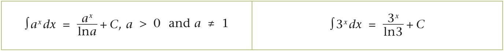
> **[Diagram Context - Textbook_TechnicalMathematics_Gr12_Integration.pdf-0019-01.png]**
> The image shows a diagram of a Lewis structure for carbon dioxide (CO2). The diagram is divided into two sections, with the top section representing the carbon atom and the bottom section representing the oxygen atom. The Lewis structure shows that there are four valence electrons for the carbon and two valence electrons for the oxygen. The diagram also includes arrows to indicate the bonds between the atoms. The diagram is labeled with the chemical formula for CO2, which is "C12H22O11", and the Lewis structure is labeled with the number of valence electrons for each atom.

---

### Finding an Angle (EMA3W)

If the lengths of two sides of a triangle are known, the angles can be calculated using trigonometric ratios.

#### Worked Example 7: Finding angles

**Question:**
Find the value of $\theta$ in the following right-angled triangle using the appropriate trigonometric ratio.

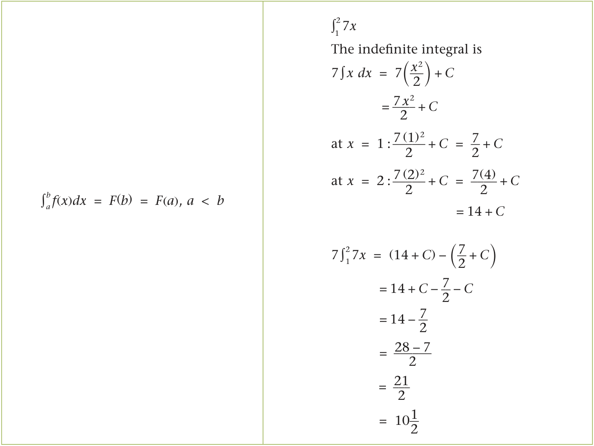
> **[Diagram Context - Textbook_TechnicalMathematics_Gr12_Integration.pdf-0019-06.png]**
> 1. A diagram of a cell with arrows pointing to different parts of the cell.

**Solution:**

**Step 1: Identify the opposite and adjacent sides with reference to the given angle and the hypotenuse.**
In this case, you have the opposite side and the adjacent side for angle $\theta$.

**Step 2: Apply the tangent ratio.**

$$\tan \theta = \frac{\text{opposite}}{\text{adjacent}}$$

$$\tan \theta = \frac{50}{100}$$

---

### Online Resources
For more exercises, visit [www.everythingmaths.co.za](http://www.everythingmaths.co.za) and click on 'Practise Maths'.

| Exercise ID | Reference | Exercise ID | Reference |
| :--- | :--- | :--- | :--- |
| 1a | 2FQV | 1f | 2FR2 |
| 1b | 2FQW | 1g | 2FR3 |
| 1c | 2FQX | 1h | 2FR4 |
| 1d | 2FQY | 1i | 2FR5 |
| 1e | 2FQZ | 1j | 2FR6 |
| 2 | 2FR7 | 3 | 2FR8 |
| 4 | 2FR9 | | |

---

### Solving for an Angle Using Inverse Trigonometric Functions

To determine an unknown angle ($\theta$) when the ratio of two sides is known, you must use the **inverse tangent function** ($\tan^{-1}$) on your calculator. This function works backwards from the ratio to find the angle that produced it.

#### Worked Example
To solve for $\theta$ given a ratio of $\frac{50}{100}$:

1. **Step 2: Use your calculator**
   Press the following sequence: `SHIFT` $\rightarrow$ `tan` $\rightarrow$ `(` $\rightarrow$ `50` $\div$ `100` $\rightarrow$ `)` $\rightarrow$ `=`
   The calculator will display: $26,56505... \approx 26,6^\circ$

2. **Step 3: Write the final answer**
   $\theta \approx 26,6^\circ$

---

### Exercise 5 – 5: Determining $\alpha$ in Right-Angled Triangles

Determine the value of $\alpha$ for each of the following triangles:

**1.**

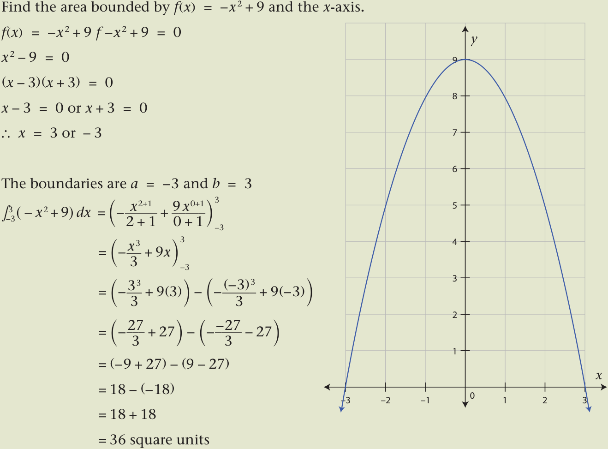
> **[Diagram Context - Textbook_TechnicalMathematics_Gr12_Integration.pdf-0020-06.png]**
> The image shows a math problem involving a Lewis diagram and a graph. The problem is about finding the area bound by a Lewis diagram and a graph. The Lewis diagram is a diagram that represents the structure of a molecule, and it is shown in the image. The graph is a line graph that shows the relationship between two variables. The problem is asking the student to find the area bound by the Lewis diagram and the graph. The problem is also asking the student to explain the conceptually what the diagram conveys.

**2.**
<!-- DIAGRAM_PLACEHOLDER: diagram -->

**3.**
<!-- DIAGRAM_PLACEHOLDER: diagram -->

**4.**
<!-- DIAGRAM_PLACEHOLDER: diagram -->

---

### Trigonometry: Solving for Angles in Right-Angled Triangles

#### Exercises
Determine the value of $\alpha$ in the following triangles:

**5.**

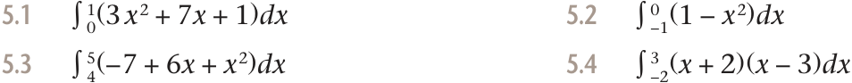
> **[Diagram Context - Textbook_TechnicalMathematics_Gr12_Integration.pdf-0021-07.png]**
> This image displays four mathematical

*   Opposite side = $12$
*   Hypotenuse = $15$

**6.**

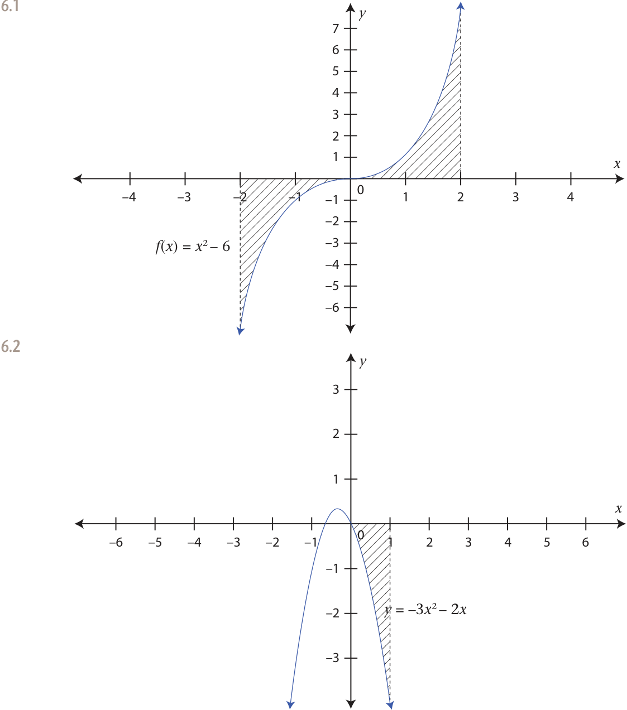
> **[Diagram Context - Textbook_TechnicalMathematics_Gr12_Integration.pdf-0021-10.png]**
> The image shows a diagram of a Lewis structure for carbon dioxide. The diagram is divided into two parts, with the upper half representing the Lewis structure of carbon dioxide and the lower half representing the Lewis structure of oxygen. The diagram is labeled with the chemical symbols for carbon dioxide (CO2) and oxygen (O2). The diagram also includes arrows pointing to the respective Lewis structures of carbon dioxide and oxygen.

*   Opposite side = $1$
*   Adjacent side = $\sqrt{2}$

**7.**
<!-- DIAGRAM_PLACEHOLDER: diagram -->
*   Opposite side = $3,5$
*   Hypotenuse = $7$

---

### Solving Trigonometric Equations
We can solve trigonometric equations even when a triangle is not explicitly provided by using the inverse trigonometric functions on a calculator.

#### Worked Example 8: Solving trigonometric equations

**Question:**
Find the value of $\theta$ if $\cos \theta = 0,2$.

**Solution:**

**Step 1: Use your calculator to solve for $\theta$**
To solve for $\theta$, use the inverse cosine function ($\cos^{-1}$) on your calculator. This function works backwards from the ratio of the sides to determine the angle that resulted in that ratio.

*   **Calculator sequence:** `SHIFT` $\rightarrow$ `cos` $\rightarrow$ `0` $\rightarrow$ `.` $\rightarrow$ `2` $\rightarrow$ `)` $\rightarrow$ `=`
*   **Result:** $78,46304... \approx 78,46$

**Step 2: Write the final answer**
$$\theta \approx 78,46^\circ$$

---

### Worked Example 9: Solving Trigonometric Equations

**Question**
Find the value of $\theta$ if $3 \sin \theta = 2,4$.

**Solution**

*   **Step 1: Rearrange the equation**
    We need to rearrange the equation so that $\sin \theta$ is on one side of the equation:
    $$3 \sin \theta = 2,4$$
    $$\sin \theta = \frac{2,4}{3}$$

*   **Step 2: Use your calculator to solve for $\theta$**
    To solve for $\theta$, use the inverse sine function ($\sin^{-1}$) on your calculator. This works backwards by using the ratio of the sides to determine the angle.
    Press: `SHIFT` `sin` `(` `2` `.` `4` `÷` `3` `)` `=` $53,1301... \approx 53,13^\circ$

*   **Step 3: Write the final answer**
    $$\theta \approx 53,13^\circ$$

---

### Note: Trigonometric Constraints
When solving trigonometric equations, you may encounter an error if you try to calculate $\sin$ or $\cos$ for values greater than $1$. Remember that both the sine and cosine functions have a maximum value of $1$. If the ratio exceeds $1$, there is no solution to the equation.

---

### Worked Example 10: Solving Trigonometric Equations

**Question**
Solve for $\alpha$: $3 \sec \alpha = 1,4$.

**Solution**

*   **Step 1: Convert $\sec$ to $\cos$**
    Since there is no "$\sec$" button on the calculator, we must convert $\sec \alpha$ to $\cos \alpha$ to find $\alpha$:
    $$3 \sec \alpha = 1,4$$
    $$\frac{3}{\cos \alpha} = 1,4$$

*   **Step 2: Rearrange the equation**
    We need to rearrange the equation so that $\cos \alpha$ is isolated:
    $$\frac{3}{\cos \alpha} = 1,4$$
    $$3 = 1,4 \cos \alpha$$
    $$\frac{3}{1,4} = \cos \alpha$$

---

### Solving Trigonometric Equations: Inverse Functions

#### Concept: Using Inverse Functions
To solve for an unknown angle (e.g., $\alpha$), use the inverse trigonometric functions on your calculator (e.g., $\cos^{-1}$, $\sin^{-1}$, or $\tan^{-1}$). These functions work backwards from a ratio to determine the angle.

**Important Note on Domain:**
The values of $\sin \theta$ and $\cos \theta$ must always fall within the range $[-1, 1]$. If a calculation results in a ratio greater than $1$ or less than $-1$, there is **no solution**.

**Example:**
To solve $\cos \alpha = \frac{3}{1,4}$:
1. Since $\frac{3}{1,4} \approx 2,14$, which is $> 1$, the calculator will display a "math error".
2. **Conclusion:** There is no solution.

---

### Exercise 5 – 6

#### 1. Determine the angle (correct to 1 decimal place):
a) $\tan \theta = 1,7$  
b) $\sin \theta = 0,8$  
c) $\cos \alpha = 0,32$  
d) $\tan \beta = 4,2$  
e) $\tan \theta = 5\frac{3}{4}$  
f) $\sin \theta = \frac{2}{3}$  
g) $\cos \beta = 1,2$  
h) $4 \cos \theta = 3$  
i) $\cos 4\theta = 0,3$  
j) $\sin \beta + 2 = 2,65$  
k) $2 \sin \theta + 5 = 0,8$  
l) $3 \tan \beta = 1$  
m) $\sin 3\alpha = 1,2$  
n) $\tan \frac{\theta}{3} = \sin 48^\circ$  
o) $\frac{1}{2} \cos 2\beta = 0,3$  
p) $2 \sin 3\theta + 1 = 2,6$  

#### 2. Given $x = 16^\circ$ and $y = 36^\circ$, evaluate (correct to 3 decimal places):
a) $\sin(x - y)$  
b) $3 \sin x$  
c) $\tan x - \tan y$  
d) $\cos x + \cos y$  
e) $\frac{1}{3} \tan y$  
f) $\text{cosec} (x - y)$  
g) $2 \cos x + \cos 3y$  
h) $\tan(2x - 5y)$  

#### 3. Find the value of $x$ (correct to two decimal places):
a) $\sin x = 0,814$  
b) $\sin x = \tan 45^\circ$  
c) $\tan 2x = 3,123$  
d) $\tan x = 3 \sin 41^\circ$  
e) $\sin(2x + 45) = 0,123$  
f) $\sin(x - 10^\circ) = \cos 57^\circ$  

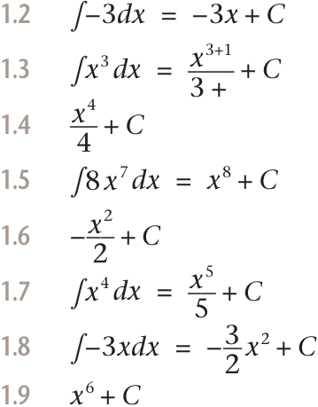
> **[Diagram Context - Textbook_TechnicalMathematics_Gr12_Integration.pdf-0023-03.png]**
> 1. A diagram of a cell with arrows pointing to different parts of the cell.

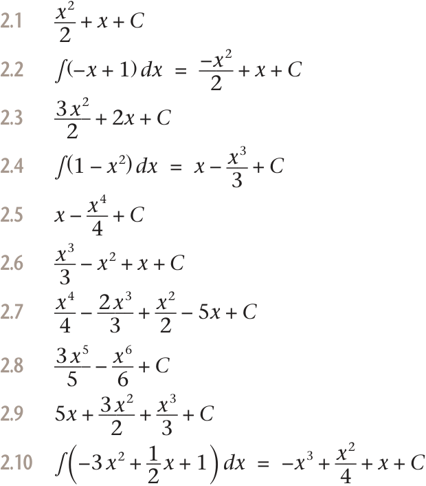
> **[Diagram Context - Textbook_TechnicalMathematics_Gr12_Integration.pdf-0023-05.png]**
> 1. A diagram of a cell with arrows pointing to different parts of the cell.

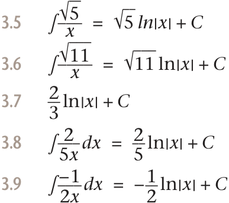
> **[Diagram Context - Textbook_TechnicalMathematics_Gr12_Integration.pdf-0023-09.png]**
> 1. A diagram of a cell with arrows pointing to different parts of the cell.

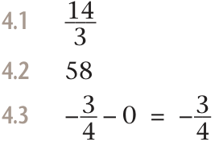
> **[Diagram Context - Textbook_TechnicalMathematics_Gr12_Integration.pdf-0023-11.png]**
> The image shows a diagram of a Lewis structure for water. The diagram is divided into four quadrants, each representing a different energy level. The diagram is color-coded, with the energy levels represented by different colors. The diagram also includes arrows pointing to the correct energy level for each atom. The diagram is labeled with the chemical symbols H2O and the number of energy levels.

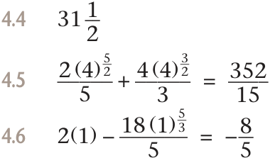
> **[Diagram Context - Textbook_TechnicalMathematics_Gr12_Integration.pdf-0023-12.png]**
> 1. A diagram of a cell with a number of organelles and a nucleus.

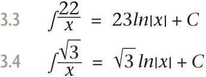
> **[Diagram Context - Textbook_TechnicalMathematics_Gr12_Integration.pdf-0023-21.png]**
> The image shows a diagram of a Lewis structure for carbon dioxide (CO2). The diagram is divided into two sections, with the top section containing the Lewis structure of carbon and the bottom section showing the Lewis structure of oxygen. The diagram is labeled with the chemical symbols for carbon and oxygen, and arrows are used to indicate the bonding between the atoms. The diagram also includes the chemical formula for carbon dioxide, which is C2O4.

---

# 5.8 Defining Ratios in the Cartesian Plane

Trigonometric ratios, previously defined using right-angled triangles, can be extended to any angle by plotting points on the Cartesian plane. These definitions depend on the size of the angle rather than the specific lengths of the triangle sides.

---

## Finding an Angle for Specific Points

To find an angle for a point $(x; y)$ on the Cartesian plane:
1. Draw a line from the origin $(O)$ to the point.
2. Construct a right-angled triangle by drawing a perpendicular line from the point to the $x$-axis.

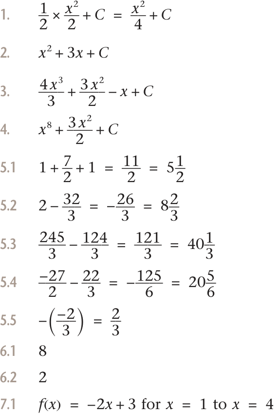
> **[Diagram Context - Textbook_TechnicalMathematics_Gr12_Integration.pdf-0024-01.png]**
> 1. x'+c = 4+c for x = 1, 2, 3, 4, 5, 6, 7, 8, 9, 10.

### Worked Example: Point $P(2; 3)$
For point $P(2; 3)$, we have $x = 2$ and $y = 3$.
*   The side **opposite** to angle $\hat{A}$ is $3$.
*   The side **adjacent** to angle $\hat{A}$ is $2$.

Using the tangent ratio:
$$\tan \hat{A} = \frac{\text{opposite}}{\text{adjacent}} = \frac{3}{2}$$
$$\hat{A} = 56,3^\circ$$

Alternatively, using the Theorem of Pythagoras, we can find the hypotenuse ($r$) and use sine or cosine:
$$\sin \hat{A} = \frac{\text{opposite}}{\text{hypotenuse}} \quad \text{or} \quad \cos \hat{A} = \frac{\text{adjacent}}{\text{hypotenuse}}$$

---

## Angles in Standard Position

An angle is in **standard position** when it is measured from the positive $x$-axis in an anti-clockwise direction.

### Worked Example: Point $Q(-2; 3)$
For point $Q(-2; 3)$, let $\hat{B}$ be the angle in standard position. Let $\alpha$ be the reference angle formed between the line $OQ$ and the negative $x$-axis.

1.  **Calculate the reference angle $\alpha$:**
    Using the coordinates of $Q$, the opposite side is $3$ and the adjacent side is $2$:
    $$\tan \alpha = \frac{\text{opposite}}{\text{adjacent}} = \frac{3}{2}$$
    $$\alpha = 56,3^\circ$$

2.  **Calculate the standard position angle $\hat{B}$:**
    Since $\hat{B} + \alpha = 180^\circ$:
    $$\hat{B} = 180^\circ - \alpha$$
    $$\hat{B} = 180^\circ - 56,3^\circ = 123,7^\circ$$

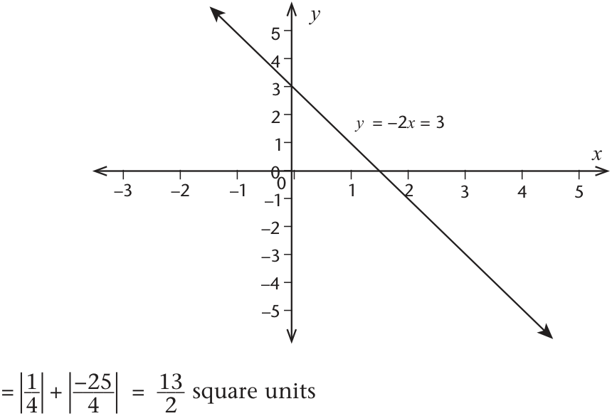
> **[Diagram Context - Textbook_TechnicalMathematics_Gr12_Integration.pdf-0024-02.png]**
> The image shows a graph with a line and a parabola. The line is labeled "y = x - 2x - 3" and the parabola is labeled "y = x - 2x - 3". The graph is labeled "y = 13x - 2". The x and y axes are labeled with numbers. The graph is labeled "y = 13x - 2" and "y = x - 2x - 3". The graph is labeled "y = 13x - 2" and "y = x - 2x - 3".

---

### Trigonometric Ratios in the Cartesian Plane

#### Alternative Method for Calculating Angles
You can calculate the hypotenuse using the Theorem of Pythagoras and then determine the angle $\alpha$ using the following ratios:

$$\sin \alpha = \frac{\text{opposite}}{\text{hypotenuse}}$$
$$\cos \alpha = \frac{\text{adjacent}}{\text{hypotenuse}}$$

> **NOTE:** The definitions of the reciprocals can be extended in the same way.

---

#### Finding Any Angle
If a circle is drawn centered on the origin $(O)$ passing through a point $P(x; y)$, the length from the origin to point $P$ is the radius ($r$). The angle formed between the line $OP$ and the $x$-axis is denoted as $\theta$.

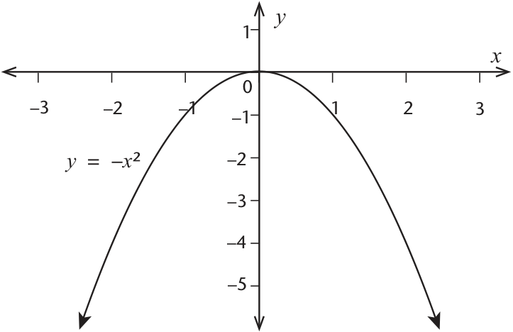
> **[Diagram Context - Textbook_TechnicalMathematics_Gr12_Integration.pdf-0025-01.png]**
> The image presents a black and white diagram of a graph, which is a visual representation of a mathematical function. The graph is labeled with the x and y axes, and it is connected by a line, indicating a linear relationship between the two variables. The graph also includes a curve, which is a visual representation of a quadratic function. The curve is connected to the x and y axes by a line, and it is labeled with the x and y intercepts. The diagram is labeled with the variable names "x" and "y", and it is connected to the x and y

We can define the trigonometric ratios in terms of $x$, $y$, and $r$:

| Ratio | Definition | Reciprocal | Definition |
| :--- | :--- | :--- | :--- |
| $\sin \theta$ | $\frac{y}{r}$ | $\csc \theta$ | $\frac{r}{y}$ |
| $\cos \theta$ | $\frac{x}{r}$ | $\sec \theta$ | $\frac{r}{x}$ |
| $\tan \theta$ | $\frac{y}{x}$ | $\cot \theta$ | $\frac{x}{y}$ |

---

#### The CAST Diagram
The Cartesian plane is divided into four quadrants in an anti-clockwise direction. 
*   The radius $r$ is always positive.
*   The values of $x$ and $y$ change depending on the position of point $P$ in the Cartesian plane.
*   Consequently, trigonometric ratios can be positive or negative depending on the quadrant.
*   The letters **C**, **A**, **S**, and **T** indicate which ratios are positive in each respective quadrant.

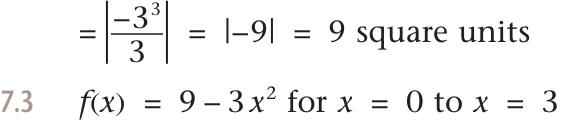
> **[Diagram Context - Textbook_TechnicalMathematics_Gr12_Integration.pdf-0025-02.png]**
> The image shows a math problem that involves square units and square roots. The problem is presented in a table format, with the square units and square roots labeled on the left and right sides, respectively. The problem also includes a Lewis diagram and a circuit diagram, which are used to explain the concept of square roots. The problem is accompanied by a list of variables and a list of biological structures, which are used to explain the concept of square roots. The problem also includes a list of chemical symbols and a list of arrows, which are used to explain the concept of square roots.

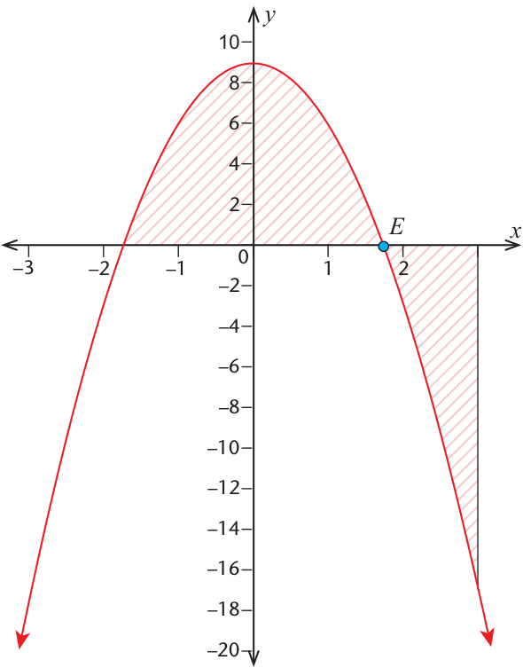
> **[Diagram Context - Textbook_TechnicalMathematics_Gr12_Integration.pdf-0025-03.png]**
> The image presents a diagram of a Lewis structure, a diagram that illustrates the bonding of electrons in a molecule. The diagram is colored in red and is labeled with the variable "y". The diagram also includes a graph labeled "10" and a line labeled "E". The diagram is set against a white background, and the x and y axes are labeled with numbers. The diagram is labeled with the variable "y" and the variable "E". The diagram is labeled with the variable "10".

---

# The CAST Diagram and Trigonometric Ratios

The CAST diagram is a visual tool used to determine the sign of trigonometric ratios in different quadrants of the Cartesian plane.

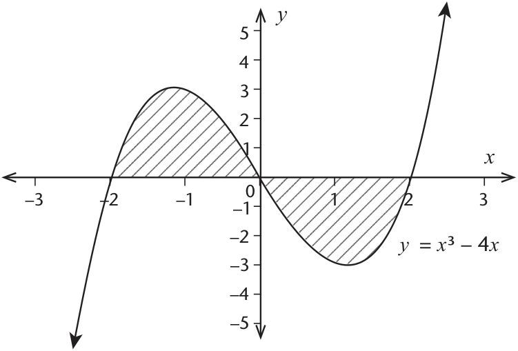
> **[Diagram Context - Textbook_TechnicalMathematics_Gr12_Integration.pdf-0026-01.png]**
> The image is a black and white diagram that shows a graph with a parabola and a line. The graph is labeled with the x and y axes and has a curve on the left side. The x-axis is labeled with the numbers 1 through 4, and the y-axis is labeled with the numbers -3 through 3. The graph has a curve on the left side, and there is a line on the right side. The diagram is labeled with the word "y" and "x".

## Quadrant Analysis
Using the general definitions of trigonometric ratios, we can determine which ratios are positive in each quadrant:

| Quadrant | Positive Ratios | Reasoning |
| :--- | :--- | :--- |
| **Quadrant I** | All ratios | Both $x$ and $y$ values are positive. |
| **Quadrant II** | $\sin \theta, \csc \theta$ | Only $y$ values are positive. |
| **Quadrant III** | $\tan \theta, \cot \theta$ | Both $x$ and $y$ values are negative (negative divided by negative is positive). |
| **Quadrant IV** | $\cos \theta, \sec \theta$ | Only $x$ values are positive. |

### Important Note
The hypotenuse, $r$, represents a length and is **always positive**.

---

## Special Angles in the Cartesian Plane
When working in the Cartesian plane, we consider special angles, including $0^\circ$ and $90^\circ$.

### Case: $\theta = 0^\circ$
When $\theta = 0^\circ$:
* The length of the opposite side is equal to $0$.
* The length of the adjacent side is equal to the length of the hypotenuse ($r$).

---
*Source: Chapter 5. Trigonometry, p. 133*

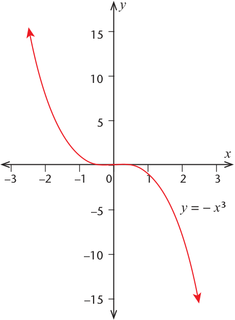
> **[Diagram Context - Textbook_TechnicalMathematics_Gr12_Integration.pdf-0026-04.png]**
> The image is a diagram that shows a graph with a red line and a curve. The x-axis is labeled with the numbers -5, -4, -3, -2, -1, 0, 1, 2, 3, and 4. The y-axis is labeled with the numbers -3, -2, -1, 0, 1, 2, 3, 4, and 5. The red line is pointing to the right. The curve is going upwards, and the x-axis is labeled with the numbers -5, -4, -3, -2

---

### Trigonometric Ratios for $0^\circ$ and $90^\circ$

#### Ratios for $0^\circ$
When $\theta = 0^\circ$, the length of the opposite side is $0$ and the length of the adjacent side is equal to the hypotenuse.
$$\sin 0^\circ = \frac{\text{opposite}}{\text{hypotenuse}} = \frac{0}{\text{hypotenuse}} = 0$$
$$\cos 0^\circ = \frac{\text{adjacent}}{\text{hypotenuse}} = \frac{\text{hypotenuse}}{\text{hypotenuse}} = 1$$
$$\tan 0^\circ = \frac{\text{opposite}}{\text{adjacent}} = \frac{0}{\text{adjacent}} = 0$$

#### Ratios for $90^\circ$
When $\theta = 90^\circ$, the length of the adjacent side is $0$ and the length of the opposite side is equal to the hypotenuse.
$$\sin 90^\circ = \frac{\text{opposite}}{\text{hypotenuse}} = \frac{\text{hypotenuse}}{\text{hypotenuse}} = 1$$
$$\cos 90^\circ = \frac{\text{adjacent}}{\text{hypotenuse}} = \frac{0}{\text{hypotenuse}} = 0$$
$$\tan 90^\circ = \frac{\text{opposite}}{\text{adjacent}} = \frac{\text{opposite}}{0} = \text{undefined}$$

---

### Table of Special Angles

| $\theta$ | $0^\circ$ | $30^\circ$ | $45^\circ$ | $60^\circ$ | $90^\circ$ |
| :--- | :--- | :--- | :--- | :--- | :--- |
| $\sin \theta$ | $0$ | $\frac{1}{2}$ | $\frac{1}{\sqrt{2}}$ | $\frac{\sqrt{3}}{2}$ | $1$ |
| $\cos \theta$ | $1$ | $\frac{\sqrt{3}}{2}$ | $\frac{1}{\sqrt{2}}$ | $\frac{1}{2}$ | $0$ |
| $\tan \theta$ | $0$ | $\frac{1}{\sqrt{3}}$ | $1$ | $\sqrt{3}$ | undefined |

---

### Worked Example 11: Ratios in the Cartesian plane

**Question:**
$P(-3; 4)$ is a point on the Cartesian plane with origin $O$. $\theta$ is the angle between $OP$ and the positive $x$-axis. Without using a calculator, determine the value of:
1. $\cos \theta$
2. $3 \tan \theta$
3. $\frac{1}{2} \csc \theta$

**Solution:**

**Step 1: Sketch point $P$ in the Cartesian plane and label the angle $\theta$**

<!-- DIAGRAM_PLACEHOLDER: diagram -->

**Step 2: Identify coordinates and calculate the hypotenuse ($r$)**
Given $x = -3$ and $y = 4$.
Using the Pythagorean theorem:
$$r^2 = x^2 + y^2$$
$$r^2 = (-3)^2 + (4)^2$$
$$r^2 = 9 + 16 = 25$$
$$r = 5$$

**Step 3: Determine the ratios**
1. $\cos \theta = \frac{x}{r} = \frac{-3}{5}$
2. $3 \tan \theta = 3 \left( \frac{y}{x} \right) = 3 \left( \frac{4}{-3} \right) = -4$
3. $\frac{1}{2} \csc \theta = \frac{1}{2} \left( \frac{r}{y} \right) = \frac{1}{2} \left( \frac{5}{4} \right) = \frac{5}{8}$

---

### Step 2: Use the theorem of Pythagoras to calculate $r$

$$r^2 = x^2 + y^2$$
$$r^2 = (-3)^2 + (4)^2$$
$$r^2 = 25$$
$$\therefore r = 5$$

*Note: $r$ is positive as it is the radius of the circle.*

### Step 3: Substitute values for $x, y$ and $r$ into the required ratios

Given $x = -3$, $y = 4$, and $r = 5$:

| Ratio | Calculation | Result |
| :--- | :--- | :--- |
| $\cos \theta$ | $\frac{x}{r} = \frac{-3}{5}$ | $-\frac{3}{5}$ |
| $3 \tan \theta$ | $3 \left( \frac{y}{x} \right) = 3 \left( \frac{4}{-3} \right)$ | $-4$ |
| $\frac{1}{2} \csc \theta$ | $\frac{1}{2} \left( \frac{r}{y} \right) = \frac{1}{2} \left( \frac{5}{4} \right)$ | $\frac{5}{8}$ |

***

### Worked Example 12: Ratios in the Cartesian plane

**QUESTION**
$\hat{XOK} = \theta$ is an angle in the third quadrant where $X$ is a point on the positive $x$-axis and $K$ is the point $(-5; y)$. $OK$ is $13$ units.

1. Determine, without using a calculator, the value of $y$.
2. Prove that $\tan^2 \theta + 1 = \sec^2 \theta$ without using a calculator.

**SOLUTION**

**Step 1: Sketch point $K$ in the Cartesian plane and label the angle $\theta$**

*(Sketch description: Point $K(-5; y)$ in the third quadrant, $OK = 13$ units, angle $\theta$ measured from the positive $x$-axis).*

---

### Worked Example: Proving Trigonometric Identities

This example demonstrates how to prove the identity $\tan^2\theta + 1 = \sec^2\theta$ using the Cartesian plane.

#### Step 2: Use the theorem of Pythagoras to calculate $y$
Given the relationship between coordinates and the radius $r$:
$$r^2 = x^2 + y^2$$
$$y^2 = r^2 - x^2$$
$$y^2 = (13)^2 - (-5)^2$$
$$y^2 = 169 - 25$$
$$y^2 = 144$$
$$y = \pm 12$$

**Note:** Since $\theta$ lies in the third quadrant, $y$ must be negative. Therefore, $y = -12$.

#### Step 3: Substitute values for $x$, $y$, and $r$ and simplify
Given $x = -5$, $y = -12$, and $r = 13$:

**Left-Hand Side (LHS):**
$$\tan^2\theta + 1 = \left(\frac{y}{x}\right)^2 + 1$$
$$= \left(\frac{-12}{-5}\right)^2 + 1$$
$$= \left(\frac{144}{25}\right) + 1$$
$$= \frac{144 + 25}{25}$$
$$= \frac{169}{25}$$

**Right-Hand Side (RHS):**
$$\sec^2\theta = \left(\frac{r}{x}\right)^2$$
$$= \left(\frac{13}{-5}\right)^2$$
$$= \frac{169}{25}$$

**Conclusion:** Since the LHS = RHS, the identity $\tan^2\theta + 1 = \sec^2\theta$ is proven.

---

### Study Tip
**NOTE:** Whenever you have to solve trigonometric problems without a calculator, it can be very helpful to make a sketch.

---

### Exercise 5 – 7

**1. $B$ is a point in the Cartesian plane. Determine without using a calculator:**

<!-- DIAGRAM_PLACEHOLDER: diagram -->

a) $OB$
b) $\cos \beta$
c) $\csc \beta$
d) $\tan \beta$

---

### Trigonometry Exercises

**2.** If $\sin \theta = 0,4$ and $\theta$ is an obtuse angle, determine:
a) $\cos \theta$
b) $\sqrt{21} \tan \theta$

**3.** Given $\tan \theta = \frac{t}{2}$, where $0^\circ \leq \theta \leq 90^\circ$. Determine the following in terms of $t$:
a) $\sec \theta$
b) $\cot \theta$
c) $\cos^2 \theta$
d) $\tan^2 \theta - \sec^2 \theta$

**4.** Given: $10 \cos \beta + 8 = 0$ and $180^\circ < \beta < 360^\circ$. Determine the value of:
a) $\cos \beta$
b) $\frac{3}{\tan \beta} + 2 \sin^2 \beta$

**5.** If $\sin \theta = -\frac{15}{17}$ and $\cos \theta < 0$ find the following, without the use of a calculator:
a) $\cos \theta$
b) $\tan \theta$
c) $\cos^2 \theta + \sin^2 \theta$

**6.** Find the value of $\sin A + \cos A$ without using a calculator, given that $13 \sin A - 12 = 0$, where $\cos A < 0$.

**7.** If $17 \cos \theta = -8$ and $\tan \theta > 0$ determine the following with the aid of a diagram (not a calculator):
a) $\frac{\cos \theta}{\sin \theta}$
b) $17 \sin \theta - 16 \tan \theta$

**8.** $L$ is a point with co-ordinates $(5; 8)$ on a Cartesian plane. $LK$ forms an angle, $\theta$, with the positive $x$-axis. Set up a diagram and use it to answer the following questions.
a) Find the distance $LK$.
b) Determine $\sin \theta$.
c) Determine $\cos \theta$.
d) Determine $\tan \theta$.
e) Determine $\csc \theta$.
f) Determine $\sec \theta$.
g) Determine $\cot \theta$.
h) Determine $\sin^2 \theta + \cos^2 \theta$.

**9.** Given the following diagram and that $\cos \theta = -\frac{24}{25}$.

<!-- DIAGRAM_PLACEHOLDER: diagram -->

a) State two sets of possible values of $a$ and $b$.
b) If $OA = 100$, state the values of $a$ and $b$.
c) Hence determine without the use of a calculator the value of $\sin \theta$.

---

### 10. Worked Example
**Problem:** If $\tan \alpha = \frac{5}{-12}$ and $0^\circ \leq \alpha \leq 180^\circ$, determine without the use of a calculator the value of $\frac{12}{\cos \alpha}$.

---

## 5.9 Chapter Summary (EMA3Y)

### Trigonometric Ratios for Right-Angled Triangles
We define the three primary trigonometric ratios as follows:

*   $\sin \theta = \frac{\text{opposite}}{\text{hypotenuse}} = \frac{y}{r}$
*   $\cos \theta = \frac{\text{adjacent}}{\text{hypotenuse}} = \frac{x}{r}$
*   $\tan \theta = \frac{\text{opposite}}{\text{adjacent}} = \frac{y}{x}$

### Reciprocal Trigonometric Ratios
Each primary ratio has a corresponding reciprocal ratio:

*   $\text{cosec } \theta = \frac{\text{hypotenuse}}{\text{opposite}} = \frac{r}{y}$
*   $\text{sec } \theta = \frac{\text{hypotenuse}}{\text{adjacent}} = \frac{r}{x}$
*   $\text{cot } \theta = \frac{\text{adjacent}}{\text{opposite}} = \frac{x}{y}$

### Key Principles
*   **Solving Equations:** We use algebraic principles combined with trigonometric ratios to solve simple trigonometric equations.
*   **Special Angles:** Values for $\sin$, $\cos$, and $\tan$ can be determined without a calculator for $0^\circ, 30^\circ, 45^\circ, 60^\circ,$ and $90^\circ$.
*   **Generalization:** The definitions of trigonometric ratios can be extended to any angle.

---

## End of Chapter Exercise 5 – 8

**1. State whether each of the following trigonometric ratios has been written correctly:**

a) $\sin \theta = \frac{\text{hypotenuse}}{\text{adjacent}}$

b) $\tan \theta = \frac{\text{opposite}}{\text{adjacent}}$

c) $\text{sec } \theta = \frac{\text{hypotenuse}}{\text{adjacent}}$

**2. Use your calculator to evaluate the following expressions to two decimal places:**
*(Note: Exercise content continues on subsequent pages)*

---

### Trigonometric Exercises

#### 1. Calculator Practice
Evaluate the following trigonometric expressions using a calculator:

| | | | |
| :--- | :--- | :--- | :--- |
| a) | $\tan 80^\circ$ | b) | $\cos 73^\circ$ |
| c) | $\sin 17^\circ$ | d) | $\tan 313^\circ$ |
| e) | $\cos 138^\circ$ | f) | $\sec 56^\circ$ |
| g) | $\cot 18^\circ$ | h) | $\text{cosec } 37^\circ$ |
| i) | $\sec 257^\circ$ | j) | $\sec 304^\circ$ |
| k) | $3 \sin 51^\circ$ | l) | $4 \cot 54^\circ + 5 \tan 44^\circ$ |
| m) | $\frac{\cos 205^\circ}{4}$ | n) | $\sqrt{\sin 99^\circ}$ |
| o) | $\sqrt{\cos 687^\circ + \sin 120^\circ}$ | p) | $\frac{\tan 70^\circ}{\text{cosec } 1^\circ}$ |
| q) | $\sec 84^\circ + 4 \sin 0,4^\circ \times 50 \cos 50^\circ$ | r) | $\frac{\cos 40^\circ}{\sin 35^\circ} + \tan 38^\circ$ |

---

#### 2. Special Angles: $30^\circ$ and $60^\circ$
Use the triangle below to determine the trigonometric ratios for $30^\circ$ and $60^\circ$.

<!-- DIAGRAM_PLACEHOLDER: diagram -->

**Exercises:**
a) $\sin 60^\circ =$
b) $\cos 60^\circ =$
c) $\tan 60^\circ =$
d) $\sin 30^\circ =$
e) $\cos 30^\circ =$
f) $\tan 30^\circ =$

---

#### 3. Special Angles: $45^\circ$
Use the triangle below to determine the trigonometric ratios for $45^\circ$.

<!-- DIAGRAM_PLACEHOLDER: diagram -->

**Exercises:**
a) $\sin 45^\circ =$
b) $\cos 45^\circ =$
c) $\tan 45^\circ =$

---

#### 4. Evaluation Without a Calculator
Evaluate the following expressions without using a calculator. Select the correct answer from the provided options.

**a) $\sin 60^\circ - \tan 60^\circ$**
Options: $0, \quad -\frac{1}{2}, \quad \frac{2}{\sqrt{3}}, \quad -\frac{\sqrt{3}}{2}, \quad -\frac{2}{\sqrt{3}}$

**b) $\tan 30^\circ - \cos 30^\circ$**
Options: $0, \quad -\frac{1}{2\sqrt{3}}, \quad \frac{\sqrt{3}}{2}, \quad -\frac{2}{\sqrt{3}}, \quad -\frac{\sqrt{3}}{2}$

---

### Trigonometric Expressions and Triangle Calculations

#### Multiple Choice Exercises
Evaluate the following expressions by selecting the correct value from the options provided:

**c) $\tan 60^\circ - \sin 60^\circ - \tan 60^\circ$**
Options: $-\frac{\sqrt{3}}{2}, -\frac{\sqrt{3}}{1}, -\frac{1}{2}, -\frac{1}{1}, -\frac{1}{\sqrt{2}}$

**d) $\sin 30^\circ \times \sin 30^\circ \times \sin 30^\circ$**
Options: $\frac{1}{2}, \frac{1}{2\sqrt{3}}, \frac{1}{8}, \frac{1}{4}, \frac{\sqrt{3}}{4\sqrt{2}}$

**e) $\sin 45^\circ \times \tan 45^\circ \times \tan 60^\circ$**
Options: $\frac{3}{2\sqrt{2}}, \frac{\sqrt{3}}{8}, \frac{3}{4}, \frac{\sqrt{3}}{\sqrt{2}}, \frac{1}{4}$

**f) $\cos 60^\circ \times \cos 45^\circ \times \tan 60^\circ$**
Options: $\frac{\sqrt{3}}{2\sqrt{2}}, \frac{\sqrt{3}}{4}, \frac{3}{4\sqrt{2}}, \frac{1}{2}, \frac{1}{4\sqrt{3}}$

**g) $\tan 45^\circ \times \sin 60^\circ \times \tan 45^\circ$**
Options: $\frac{\sqrt{3}}{2}, \frac{3}{8}, \frac{1}{3}, \frac{\sqrt{3}}{2\sqrt{2}}, \frac{1}{4\sqrt{3}}$

**h) $\cos 30^\circ \times \cos 60^\circ \times \sin 60^\circ$**
Options: $\frac{3}{8}, \frac{3}{2\sqrt{2}}, \frac{\sqrt{3}}{4\sqrt{2}}, \frac{1}{2\sqrt{3}}, \frac{1}{4\sqrt{3}}$

---

#### 6. Evaluation without a calculator
Determine the value of:
$$\sin 60^\circ \cos 30^\circ - \cos 60^\circ \sin 30^\circ + \tan 45^\circ$$

---

#### 7. Solving for $\theta$ (Triangle 1)
Solve for $\sin \theta$ in the following triangle, expressing the answer in surd form:

<!-- DIAGRAM_PLACEHOLDER: diagram -->

*   **Opposite side:** $9$
*   **Adjacent side:** $3\sqrt{3}$
*   **Hypotenuse:** $6\sqrt{3}$

---

#### 8. Solving for $\theta$ (Triangle 2)
Solve for $\tan \theta$ in the following triangle, expressing the answer in surd form:

<!-- DIAGRAM_PLACEHOLDER: diagram -->

*   **Opposite side:** $7$
*   **Adjacent side:** $\frac{7}{\sqrt{3}}$
*   **Hypotenuse:** $\frac{14}{\sqrt{3}}$

---

### Trigonometry Exercises

#### Problem 9
A right-angled triangle has a hypotenuse of $13\text{ mm}$. Find the length of the other two sides if one of the angles is $50^\circ$.

---

#### Problem 10: Solve for $x$ to the nearest integer

**a)**
<!-- DIAGRAM_PLACEHOLDER: diagram -->
*   Given: Hypotenuse $= 10$, Adjacent side $= 8,19$, Angle $= x^\circ$
*   Formula: $\cos(x^\circ) = \frac{\text{adjacent}}{\text{hypotenuse}} = \frac{8,19}{10}$

**b)**
<!-- DIAGRAM_PLACEHOLDER: diagram -->
*   Given: Hypotenuse $= 7$, Adjacent side $= x$, Angle $= 55^\circ$
*   Formula: $\cos(55^\circ) = \frac{x}{7}$

**c)**
<!-- DIAGRAM_PLACEHOLDER: diagram -->
*   Given: Hypotenuse $= 8$, Opposite side $= x$, Angle $= 55^\circ$
*   Formula: $\sin(55^\circ) = \frac{x}{8}$

**d)**
<!-- DIAGRAM_PLACEHOLDER: diagram -->
*   Given: Opposite side $= 5,2$, Hypotenuse $= x$, Angle $= 60^\circ$
*   Formula: $\sin(60^\circ) = \frac{5,2}{x}$

**e)**
<!-- DIAGRAM_PLACEHOLDER: diagram -->
*   Given: Opposite side $= 4,1$, Adjacent side $= x$, Angle $= 50^\circ$
*   Formula: $\tan(50^\circ) = \frac{4,1}{x}$

---

### Trigonometry: Solving for Unknowns in Right-Angled Triangles

#### Exercises: Finding Angles and Sides
For the triangles provided in the diagrams, use the trigonometric ratios:
$$\sin \theta = \frac{\text{opposite}}{\text{hypotenuse}}, \quad \cos \theta = \frac{\text{adjacent}}{\text{hypotenuse}}, \quad \tan \theta = \frac{\text{opposite}}{\text{adjacent}}$$

**Diagrams f, g, h, i:**
<!-- DIAGRAM_PLACEHOLDER: diagram -->

---

#### 11. Calculate the unknown lengths
Use the given angles and side lengths to solve for the variables $a, b, c, d, e, f,$ and $g$.

<!-- DIAGRAM_PLACEHOLDER: diagram -->

---

#### 12. Problem Solving: $\triangle PQR$
**Given:**
*   $PR = 20 \text{ cm}$
*   $QR = 22 \text{ cm}$
*   $P\hat{R}Q = 30^\circ$
*   A perpendicular line is drawn from $P$ to $QR$, intersecting at $X$.

**Tasks:**
a) Calculate the length $XR$.
b) Calculate the length $PX$.
c) Calculate the angle $Q\hat{P}X$.

**Step-by-step Guide for Question 12:**

1.  **Identify the right-angled triangle:** Since $PX \perp QR$, $\triangle PXR$ is a right-angled triangle with $\angle PXR = 90^\circ$.
2.  **Calculate $XR$ (Adjacent to $30^\circ$):**
    $$\cos(30^\circ) = \frac{XR}{PR}$$
    $$XR = 20 \times \cos(30^\circ)$$
3.  **Calculate $PX$ (Opposite to $30^\circ$):**
    $$\sin(30^\circ) = \frac{PX}{PR}$$
    $$PX = 20 \times \sin(30^\circ)$$
4.  **Calculate $Q\hat{P}X$:**
    *   First, find the length $QX$: $QX = QR - XR$.
    *   In $\triangle PXQ$, use the tangent ratio:
    $$\tan(Q\hat{P}X) = \frac{QX}{PX}$$
    $$Q\hat{P}X = \arctan\left(\frac{QX}{PX}\right)$$

---

### Trigonometry Exercises

#### 13. Find the size of $\hat{A}BC$
<!-- DIAGRAM_PLACEHOLDER: diagram -->
Given a triangle $ADB$ with altitude $AC = 9$ and base $DB = 17$. Angle $\hat{D} = 41^\circ$.
*   **Goal:** Find $\hat{A}BC$.
*   **Hint:** Use the right-angled triangle $\triangle ADC$ to find $DC$, then determine $CB = 17 - DC$. Finally, use $\triangle ABC$ to find $\hat{B}$.

#### 14. Find the length of side $CD$
<!-- DIAGRAM_PLACEHOLDER: diagram -->
Given a right-angled triangle $\triangle ADB$ with altitude $AB = 9$. Angles are $\hat{A}_2 = 15^\circ$ and $\hat{C} = 35^\circ$.
*   **Goal:** Find the length of $CD$.
*   **Hint:** Calculate $BC$ using $\triangle ABC$ and $BD$ using $\triangle ABD$. Then $CD = BD - BC$.

#### 15. Triangle Calculations
<!-- DIAGRAM_PLACEHOLDER: diagram -->
Given right-angled triangle $\triangle EFG$ with hypotenuse $EG = 8$ and side $FG = 3$.
*   **a)** Calculate the length of $EF$ using the Pythagorean theorem: $EF^2 + FG^2 = EG^2$.
*   **b)** Determine $\tan(90^\circ - \theta)$.
*   **c)** Determine the value of $\theta$.

#### 16. Calculate $CD$
<!-- DIAGRAM_PLACEHOLDER: diagram -->
Given $\hat{D} = x$, $\hat{C}_1 = 2x$, $BC = 12,2\text{ cm}$, and $AB = 24,6\text{ cm}$.
*   **Goal:** Calculate the length of $CD$.

#### 17. Solve for $\theta$ (where $\theta$ is a positive, acute angle)

| Question | Equation |
| :--- | :--- |
| **a)** | $2 \sin \theta = 1,34$ |
| **b)** | $1 - \tan \theta = -1$ |
| **c)** | $\cos 2\theta = \sin 40^\circ$ |
| **d)** | $\sec \theta = 1,8$ |
| **e)** | $\cot 4\theta = \sin 40^\circ$ |
| **f)** | $\sin 3\theta + 5 = 4$ |
| **g)** | $\cos(4 + \theta) = 0,45$ |
| **h)** | $\frac{\sin \theta}{\cos \theta} = 1$ |

*Note: For (h), recall the identity $\tan \theta = \frac{\sin \theta}{\cos \theta}$.*

---

### Trigonometry Revision Exercises

#### 1. Evaluating Trigonometric Expressions
Given $a = 29^\circ$, $b = 38^\circ$, and $c = 47^\circ$, evaluate the following (round to 2 decimal places):

*   **a)** $\tan(a + c) = \tan(29^\circ + 47^\circ) = \tan(76^\circ)$
*   **b)** $\csc(c - b) = \frac{1}{\sin(47^\circ - 38^\circ)} = \frac{1}{\sin(9^\circ)}$
*   **c)** $\sin(a \times b \times c) = \sin(29^\circ \times 38^\circ \times 47^\circ)$
*   **d)** $\tan a + \sin b + \cos c = \tan(29^\circ) + \sin(38^\circ) + \cos(47^\circ)$

#### 2. Trigonometric Identities and Quadrants
Given $3 \tan \alpha = -5$ and $0^\circ < \alpha < 270^\circ$:
*   **a)** Determine $\cos \alpha$.
*   **b)** Determine $\tan^2 \alpha - \sec^2 \alpha$.
    *   *Hint:* Recall the identity $1 + \tan^2 \alpha = \sec^2 \alpha$.

#### 3. Coordinate Geometry and Angles
*   **20.** Find the angle between the line through $A(5; 0)$ and $B(11; 4)$ and the $x$-axis.
    *   *Procedure:* Calculate the gradient $m = \frac{y_2 - y_1}{x_2 - x_1}$, then use $\theta = \tan^{-1}(m)$.
*   **21.** Find the angle between the line through $C(0; -13)$ and $D(-12; 14)$ and the $y$-axis.
*   **22.** Given $E(5; 0)$, $F(6; 2)$, and $G(8; -2)$, find the angle $F\hat{E}G$.

#### 4. Triangle Geometry
*   **23.** A triangle has angles $40^\circ, 40^\circ,$ and $100^\circ$ with a perimeter of $20\text{ cm}$. Find the length of each side using the Sine Rule:
    $$\frac{a}{\sin A} = \frac{b}{\sin B} = \frac{c}{\sin C}$$
*   **24.** Determine the area of $\triangle ABC$ based on the provided diagram:
    *   The triangle has a height $h = 280$.
    *   The base is divided into segments by the altitude from $B$ to the line $AD$.
    *   Using the given angles $55^\circ$ and $75^\circ$:
        *   In the right-angled triangle formed by the altitude:
            $$\tan(55^\circ) = \frac{280}{AD_{segment1}}$$
            $$\tan(75^\circ) = \frac{280}{AD_{segment2}}$$
    *   Calculate the total base $AC$ and use $\text{Area} = \frac{1}{2} \times \text{base} \times \text{height}$.

---

### Summary of Exercise References

| Exercise | Reference Code | Exercise | Reference Code |
| :--- | :--- | :--- | :--- |
| 18 | 2FW5 | 22 | 2FW9 |
| 19 | 2FW6 | 23 | 2FWB |
| 20 | 2FW7 | 24 | 2FWC |
| 21 | 2FW8 | | |

---

# Chapter 5: Trigonometry

This chapter covers the fundamental principles of trigonometry as required by the CAPS curriculum. Below is the structured outline of the topics covered in this chapter.

## Chapter Contents

| Section | Topic | Page |
| :--- | :--- | :--- |
| 5.1 | Introduction | 230 |
| 5.2 | Similarity of triangles | 230 |
| 5.3 | Defining the trigonometric ratios | 230 |
| 5.4 | Reciprocal ratios | 236 |
| 5.5 | Calculator skills | 236 |
| 5.6 | Special angles | 241 |
| 5.7 | Solving trigonometric equations | 247 |
| 5.8 | Defining ratios in the Cartesian plane | 259 |
| 5.9 | Chapter summary | 270 |

---

## Key Concepts Overview

### 5.2 Similarity of Triangles
Trigonometry is built upon the property that if two triangles are similar, the ratios of their corresponding sides are equal.

### 5.3 Defining the Trigonometric Ratios
For a right-angled triangle with an angle $\theta$, the primary ratios are defined as:
*   $\sin \theta = \frac{\text{opposite}}{\text{hypotenuse}}$
*   $\cos \theta = \frac{\text{adjacent}}{\text{hypotenuse}}$
*   $\tan \theta = \frac{\text{opposite}}{\text{adjacent}}$

### 5.4 Reciprocal Ratios
The reciprocal ratios are defined as:
*   $\text{cosec} \theta = \frac{1}{\sin \theta}$
*   $\sec \theta = \frac{1}{\cos \theta}$
*   $\cot \theta = \frac{1}{\tan \theta}$

### 5.6 Special Angles
The chapter explores exact values for specific angles, such as $30^\circ$, $45^\circ$, and $60^\circ$, which are derived from geometric properties.

### 5.8 Defining Ratios in the Cartesian Plane
Trigonometric ratios are extended beyond right-angled triangles to the Cartesian plane using coordinates $(x, y)$ and the radius $r = \sqrt{x^2 + y^2}$.

<!-- DIAGRAM_PLACEHOLDER: diagram -->

---

# Chapter 5: Trigonometry

## 5.1 Introduction
This chapter covers the definition of trigonometric ratios, their reciprocals, and their application to special angles.

**Key Concepts:**
*   **Similarity of Triangles:** This is the fundamental basis for trigonometric ratios.
*   **Independence:** Trigonometric ratios depend on the size of the angle, not the length of the sides.
*   **Angles:** Angles on the Cartesian plane are always measured from the positive $x$-axis.
*   **Quadrants:** When working on the Cartesian plane, always verify that your answer lies in the correct quadrant.
*   **Terminology:** We refer to sine, cosine, tangent, secant, cosecant, and cotangent as **trigonometric ratios**.
*   **Visualisation:** Always make sketches where appropriate to assist in solving problems.

---

## 5.2 Similarity of Triangles
*(Content to be covered in subsequent sections)*

---

## 5.3 Defining the Trigonometric Ratios

### Exercise 5 - 1
Complete the following based on the triangle provided:

<!-- DIAGRAM_PLACEHOLDER: diagram -->

**Definitions for a right-angled triangle:**
*   **Hypotenuse:** The side directly opposite the right angle.
*   **Opposite:** The side directly opposite the angle being considered.
*   **Adjacent:** The remaining side that forms the angle being considered.

#### a) Sine of $\hat{A}$
$$\sin \hat{A} = \frac{\text{opposite}}{\text{hypotenuse}} = \frac{CB}{AC}$$

#### b) Cosine of $\hat{A}$
$$\cos \hat{A} = \frac{\text{adjacent}}{\text{hypotenuse}}$$

*(Note: The solution for $\cos \hat{A}$ follows the same logic as $\sin \hat{A}$, identifying the adjacent side relative to angle $\hat{A}$ and dividing by the hypotenuse.)*

---

### Trigonometric Ratios in Right-Angled Triangles

To identify the sides of a right-angled triangle relative to a specific angle:
1. **Hypotenuse:** Always the side directly opposite the right angle.
2. **Opposite:** The side directly across from the angle being considered.
3. **Adjacent:** The remaining side that helps form the angle being considered.

---

#### Worked Examples: Trigonometric Ratios

**c) $\tan \hat{A}$**
*   **Solution:** Identify the sides relative to $\hat{A}$.
$$\tan \hat{A} = \frac{\text{opposite}}{\text{adjacent}} = \frac{CB}{AB}$$

**d) $\sin \hat{C}$**
*   **Solution:** Identify the sides relative to $\hat{C}$.
$$\sin \hat{C} = \frac{\text{opposite}}{\text{hypotenuse}} = \frac{AB}{AC}$$

**e) $\cos \hat{C}$**
*   **Solution:** Identify the sides relative to $\hat{C}$.
$$\cos \hat{C} = \frac{\text{adjacent}}{\text{hypotenuse}} = \frac{CB}{AC}$$

**f) $\tan \hat{C}$**
*   **Solution:** Identify the sides relative to $\hat{C}$.
$$\tan \hat{C} = \frac{\text{opposite}}{\text{adjacent}} = \frac{AB}{CB}$$

---

#### Exercise 2: Identifying Sides
State whether $a$, $b$, and $c$ are the hypotenuse, opposite, or adjacent sides with respect to $\theta$.

<!-- DIAGRAM_PLACEHOLDER: diagram -->

*   **Solution:**
    *   First, identify the hypotenuse (the side opposite the right angle).
    *   Identify the side opposite to $\theta$.
    *   Identify the remaining side as the adjacent side.
    *   **Result:** $a$ is the adjacent side.

---

### Identifying Sides in a Right-Angled Triangle

To identify the sides of a right-angled triangle relative to a specific angle $\theta$, follow these rules:
1.  **Hypotenuse:** Always the side directly opposite the right angle.
2.  **Opposite side:** The side directly across from the angle $\theta$.
3.  **Adjacent side:** The remaining side that helps form the angle $\theta$.

---

#### Worked Example: Identifying Sides

**Example b)**
<!-- DIAGRAM_PLACEHOLDER: diagram -->
*   **Solution:**
    *   $a$ is the adjacent side.
    *   $b$ is the opposite side.
    *   $c$ is the hypotenuse.

**Example c)**
<!-- DIAGRAM_PLACEHOLDER: diagram -->
*   **Solution:**
    *   $a$ is the opposite side.
    *   $b$ is the adjacent side.
    *   $c$ is the hypotenuse.

**Example d)**
<!-- DIAGRAM_PLACEHOLDER: diagram -->
*   **Solution:**
    *   $a$ is the hypotenuse.
    *   $b$ is the opposite side.
    *   $c$ is the adjacent side.

**Example e)**
<!-- DIAGRAM_PLACEHOLDER: diagram -->
*   **Note:** Based on the principles of identifying sides relative to angle $\theta$:
    *   The side opposite the right angle is the hypotenuse.
    *   The side opposite $\theta$ is the vertical side.
    *   The side adjacent to $\theta$ is the horizontal side.

---

### Identifying Sides in a Right-Angled Triangle

To identify the sides of a right-angled triangle relative to a specific angle $\theta$:
1.  **Hypotenuse:** Always the side directly opposite the right angle.
2.  **Opposite:** The side directly opposite the angle $\theta$.
3.  **Adjacent:** The remaining side that forms the angle $\theta$ (along with the hypotenuse).

<!-- DIAGRAM_PLACEHOLDER: diagram -->

---

### Worked Example: Trigonometric Ratios

Consider the following right-angled triangle $\triangle OMN$:

<!-- DIAGRAM_PLACEHOLDER: diagram -->

Without using a calculator, determine the trigonometric ratios in terms of $m$, $n$, and $o$.

#### a) Write down $\cos \hat{O}$
*   **Adjacent side:** $m$
*   **Hypotenuse:** $n$
*   **Opposite side:** $o$

$$\cos \hat{O} = \frac{\text{adjacent}}{\text{hypotenuse}} = \frac{m}{n}$$

#### b) Write down $\tan \hat{M}$
*   **Opposite side:** $m$
*   **Hypotenuse:** $n$
*   **Adjacent side:** $o$

$$\tan \hat{M} = \frac{\text{opposite}}{\text{adjacent}} = \frac{m}{o}$$

#### c) Write down $\sin \hat{O}$
*   **Adjacent side:** $m$
*   **Hypotenuse:** $n$
*   **Opposite side:** $o$

$$\sin \hat{O} = \frac{\text{opposite}}{\text{hypotenuse}} = \frac{o}{n}$$

---

### Trigonometric Ratios in Right-Angled Triangles

#### Worked Example: Defining Cosine
**Problem:** Write down $\cos \hat{M}$ in terms of $m, n,$ and $o$.

**Solution:**
*   $m$ is the opposite side.
*   $n$ is the hypotenuse.
*   $o$ is the adjacent side.

Using the definition of cosine:
$$\cos \hat{M} = \frac{\text{adjacent}}{\text{hypotenuse}} = \frac{o}{n}$$

---

#### Worked Example: Finding Trigonometric Ratios
**Problem:** Find $x$ in the diagram by writing down the appropriate ratios.

<!-- DIAGRAM_PLACEHOLDER: diagram -->

**Solution:**
*   Side of length $4$ is the opposite side.
*   Side of length $5$ is the hypotenuse.
*   Side of length $3$ is the adjacent side.

The trigonometric ratios for angle $x$ are:
$$\sin x = \frac{4}{5}$$
$$\cos x = \frac{3}{5}$$
$$\tan x = \frac{4}{3}$$

---

#### Worked Example: Identifying True Statements
**Problem:** Which of these statements is true about $\triangle PQR$?

<!-- DIAGRAM_PLACEHOLDER: diagram -->

**Options:**
a) $\sin \hat{R} = \frac{p}{q}$
b) $\tan \hat{Q} = \frac{r}{p}$
c) $\cos \hat{P} = \frac{r}{q}$
d) $\sin \hat{P} = \frac{p}{r}$

**Solution:**
First, identify the sides relative to angles $\hat{P}$ and $\hat{R}$:
*   $p$ is the opposite side to $\hat{P}$ and the adjacent side to $\hat{R}$.
*   $q$ is the hypotenuse.
*   $r$ is the adjacent side to $\hat{P}$ and the opposite side to $\hat{R}$.

Recall the definitions:
*   $\sin \theta = \frac{\text{opposite}}{\text{hypotenuse}}$
*   $\cos \theta = \frac{\text{adjacent}}{\text{hypotenuse}}$
*   $\tan \theta = \frac{\text{opposite}}{\text{adjacent}}$

Evaluating the options:
*   For $\cos \hat{P}$: The adjacent side is $r$ and the hypotenuse is $q$. Therefore, $\cos \hat{P} = \frac{r}{q}$.

**Conclusion:** Statement **c** is correct.

---

### 6. Trigonometric Ratios in Right-Angled Triangles

**Problem:** Sarah wants to find the value of $\alpha$ in the triangle below. Which statement is a correct line of working?

<!-- DIAGRAM_PLACEHOLDER: diagram -->

**Options:**
a) $\sin \alpha = \frac{4}{5}$
b) $\cos \left(\frac{3}{5}\right) = \alpha$
c) $\tan \alpha = \frac{5}{4}$
d) $\cos 0,8 = \alpha$

**Solution:**
To solve for $\alpha$, identify the sides relative to the angle $\alpha$:
*   **Opposite side:** $4$
*   **Adjacent side:** $3$
*   **Hypotenuse:** $5$

Using the trigonometric ratios:
*   $\sin \alpha = \frac{\text{opposite}}{\text{hypotenuse}} = \frac{4}{5}$ (This is correct).
*   $\cos \alpha = \frac{\text{adjacent}}{\text{hypotenuse}} = \frac{3}{5}$. Therefore, $\alpha = \arccos\left(\frac{3}{5}\right)$. Option (b) is incorrect because the angle and ratio are swapped.
*   $\tan \alpha = \frac{\text{opposite}}{\text{adjacent}} = \frac{4}{3}$. Option (c) is incorrect as it uses the wrong ratio.
*   Option (d) is incorrect as it uses the wrong side ratio for cosine.

---

### 7. Identifying Errors in Trigonometric Diagrams

**Concept:** In any right-angled triangle, the **hypotenuse** must always be the longest side.

**Problem a)**
<!-- DIAGRAM_PLACEHOLDER: diagram -->
**Solution:** The diagram is impossible. The side labeled $15$ is the hypotenuse, but the side labeled $12$ is one of the legs. However, if the hypotenuse is $12$, it cannot be shorter than the other side of the triangle. The hypotenuse must be the longest side.

**Problem b)**
<!-- DIAGRAM_PLACEHOLDER: diagram -->
**Solution:** The diagram is impossible. The side labeled $10$ is given as a leg, while the side labeled $4$ is given as the hypotenuse. Since $10 > 4$, this violates the rule that the hypotenuse must be the longest side of a right-angled triangle.

---

### Practice Exercises
For further practice, visit [www.everythingmaths.co.za](http://www.everythingmaths.co.za) and use the following codes:

| Exercise | Code | Exercise | Code |
| :--- | :--- | :--- | :--- |
| 1 | 2FN9 | 2a | 2FNB |
| 2b | 2FNH | 2c | 2FNC |
| 2d | 2FND | 2e | 2FNF |
| 2f | 2FNG | 3a | 2FNJ |
| 3b | 2FNK | 3c | 2FNM |
| 3d | 2FNN | 4 | 2FNP |
| 5 | 2FNQ | 6 | 2FNR |
| 7a | 2FNT | 7b | 2FNS |

---

## 5.4 Reciprocal ratios

## 5.5 Calculator skills

### Exercise 5 – 2: Use your calculator to determine the value of the following (correct to 2 decimal places):

| Question | Solution |
| :--- | :--- |
| a) $\tan 65^{\circ}$ | $\tan 65^{\circ} = 2,1445069... \approx 2,14$ |
| b) $\sin 38^{\circ}$ | $\sin 38^{\circ} = 0,615661... \approx 0,62$ |
| c) $\cos 74^{\circ}$ | $\cos 74^{\circ} = 0,275637... \approx 0,28$ |
| d) $\sin 12^{\circ}$ | $\sin 12^{\circ} = 0,20791... \approx 0,21$ |
| e) $\cos 26^{\circ}$ | $\cos 26^{\circ} = 0,898794... \approx 0,90$ |
| f) $\tan 49^{\circ}$ | $\tan 49^{\circ} = 1,150368... \approx 1,15$ |
| g) $\sin 305^{\circ}$ | $\sin 305^{\circ} = -0,81915... \approx -0,82$ |
| h) $\tan 124^{\circ}$ | $\tan 124^{\circ} = -1,482560... \approx -1,48$ |

<!-- DIAGRAM_PLACEHOLDER: diagram -->

---

### Trigonometric Reciprocal Functions: Worked Examples

This section provides worked examples for calculating the values of reciprocal trigonometric functions ($\sec \theta$, $\csc \theta$, and $\cot \theta$) using a calculator.

#### Key Definitions
*   **Secant:** $\sec \theta = \frac{1}{\cos \theta}$
*   **Cosecant:** $\csc \theta = \frac{1}{\sin \theta}$
*   **Cotangent:** $\cot \theta = \frac{1}{\tan \theta}$

---

#### Worked Examples

**i) Calculate $\sec 65^\circ$**
$$\sec 65^\circ = \frac{1}{\cos 65^\circ} = 2,36620... \approx 2,37$$

**j) Calculate $\sec 10^\circ$**
$$\sec 10^\circ = \frac{1}{\cos 10^\circ} = 1,01542... \approx 1,02$$

**k) Calculate $\sec 48^\circ$**
$$\sec 48^\circ = \frac{1}{\cos 48^\circ} = 1,49447... \approx 1,49$$

**l) Calculate $\cot 32^\circ$**
$$\cot 32^\circ = \frac{1}{\tan 32^\circ} = 1,6003334... \approx 1,60$$

**m) Calculate $\csc 140^\circ$**
$$\csc 140^\circ = \frac{1}{\sin 140^\circ} = 1,555724... \approx 1,56$$

**n) Calculate $\csc 237^\circ$**
$$\csc 237^\circ = \frac{1}{\sin 237^\circ} = -1,192363... \approx -1,19$$

**o) Calculate $\sec 231^\circ$**
$$\sec 231^\circ = \frac{1}{\cos 231^\circ} = -1,589016... \approx -1,59$$

---

### Trigonometric Calculations: Calculator Skills

This section provides worked examples for evaluating trigonometric expressions using a calculator. Note that results are rounded to two decimal places where applicable.

---

#### Worked Examples

**p) Evaluate $\text{cosec } 226^\circ$**
*   **Solution:**
    $$\text{cosec } 226^\circ = \frac{1}{\sin 226^\circ}$$
    $$= -1,390164...$$
    $$\approx -1,39$$

**q) Evaluate $\frac{1}{4} \cos 20^\circ$**
*   **Solution:**
    $$\frac{1}{4} \cos 20^\circ = \frac{1}{4}(0,939692...)$$
    $$= 0,234923...$$
    $$\approx 0,23$$

**r) Evaluate $3 \tan 40^\circ$**
*   **Solution:**
    $$3 \tan 40^\circ = 3(0,83909963...)$$
    $$= 2,517298894...$$
    $$\approx 2,52$$

**s) Evaluate $\frac{2}{3} \sin 90^\circ$**
*   **Solution:**
    $$\frac{2}{3} \sin 90^\circ = \frac{2}{3}(1)$$
    $$= 0,66666...$$
    $$\approx 0,67$$

**t) Evaluate $\frac{5}{\cos 4,3^\circ}$**
*   **Solution:**
    $$\frac{5}{\cos 4,3^\circ} = \frac{5}{0,9971...}$$
    $$\approx 5,01$$

**u) Evaluate $\sqrt{\sin 55^\circ}$**
*   **Solution:**
    $$\sqrt{\sin 55^\circ} = \sqrt{0,81915...}$$
    $$\approx 0,91$$

**v) Evaluate $\frac{\sin 90^\circ}{\cos 90^\circ}$**
*   **Solution:**
    $$\frac{\sin 90^\circ}{\cos 90^\circ} = \frac{1}{0}$$
    $$\text{undefined}$$

**w) Evaluate $\tan 35^\circ + \cot 35^\circ$**
*   **Solution:**
    *(Note: This expression requires calculation of both terms and summation.)*

---

<!-- DIAGRAM_PLACEHOLDER: diagram -->

---

### Trigonometric Calculations and Verification

This section covers the practical application of trigonometric functions using a calculator, including handling reciprocal functions and verifying algebraic identities.

---

#### 1. Evaluating Trigonometric Expressions
When evaluating expressions involving reciprocal functions like $\sec \theta$ or $\cot \theta$, remember the following identities:
*   $\cot \theta = \frac{1}{\tan \theta}$
*   $\sec \theta = \frac{1}{\cos \theta}$

**Worked Examples:**

**Example x:** Evaluate $\frac{2 + \cos 310^\circ}{2 + \sin 87^\circ}$
$$\frac{2 + \cos 310^\circ}{2 + \sin 87^\circ} = \frac{2,64278...}{2,99862...} \approx 0,88$$

**Example y:** Evaluate $\sqrt{4 \sec 99^\circ}$
$$\sqrt{4 \sec 99^\circ} = \sqrt{\frac{4}{\cos 99^\circ}} = \sqrt{-25,5698...} = \text{non-real}$$
*Note: The square root of a negative number is undefined in the real number system.*

**Example z:** Evaluate $\sqrt{\frac{\cot 103^\circ + \sin 1090^\circ}{\sec 10^\circ + 5}}$
$$\sqrt{\frac{\cot 103^\circ + \sin 1090^\circ}{\sec 10^\circ + 5}} = \sqrt{\frac{\frac{1}{\tan 103^\circ} + \sin 1090^\circ}{\frac{1}{\cos 10^\circ} + 5}} = \sqrt{\frac{0,2611...}{6,015...}} = \sqrt{0,043411...} \approx 0,21$$

---

#### 2. Verifying Trigonometric Statements
To determine if a statement is true or false, calculate the Left-Hand Side (LHS) and the Right-Hand Side (RHS) separately using the given values for $x$ and $y$.

**Given:** $x = 39^\circ$ and $y = 21^\circ$

**Example a:** Verify if $\cos x + 2 \cos x = 3 \cos x$

**LHS:**
$$\cos 39^\circ + 2 \cos 39^\circ = 0,7771... + 1,55429... = 2,3314... \approx 2,33$$

**RHS:**
$$3 \cos 39^\circ = 2,3314... \approx 2,33$$

**Conclusion:** Since LHS = RHS, the statement is **true**.

**Example b:** Verify if $\cos 2y = \cos y + \cos y$

*   **LHS:** $\cos 2(21^\circ) = \cos 42^\circ \approx 0,7431$
*   **RHS:** $\cos 21^\circ + \cos 21^\circ \approx 0,9336 + 0,9336 = 1,8672$

**Conclusion:** Since $0,7431 \neq 1,8672$, the statement is **false**.

---

### Trigonometric Identities and Exponential Equations

This section demonstrates how to verify trigonometric identities using calculator skills and how to solve exponential equations involving trigonometric functions.

---

#### 1. Verifying Trigonometric Identities
To verify if a trigonometric statement is true or false, calculate the Left-Hand Side (LHS) and the Right-Hand Side (RHS) separately using the given values.

**Example c: Verify if $\tan x = \frac{\sin x}{\cos x}$**
*Given $x = 39^\circ$*

**LHS:**
$$\tan x = \tan 39^\circ \approx 0,81$$

**RHS:**
$$\frac{\sin x}{\cos x} = \frac{\sin 39^\circ}{\cos 39^\circ} = \frac{0,62932...}{0,777145...} \approx 0,81$$

**Conclusion:** Since LHS = RHS, the statement is **true**.

---

**Example d: Verify if $\cos(x + y) = \cos x + \cos y$**
*Given $x = 39^\circ$ and $y = 21^\circ$*

**LHS:**
$$\cos(x + y) = \cos(39^\circ + 21^\circ) = \cos 60^\circ = 0,5$$

**RHS:**
$$\cos x + \cos y = \cos 39^\circ + \cos 21^\circ \approx 0,777145... + 0,933358... \approx 1,71$$

**Conclusion:** Since $0,5 \neq 1,71$, the statement is **false**.

---

#### 2. Solving Exponential Equations
When solving equations where the variable is in the exponent, use the property:
If $a^x = a^y$, then $x = y$.

**Worked Example: Solve for $x$ in $5^{\tan x} = 125$**

**Step 1:** Express both sides with the same base.
We know that $125 = 5^3$.

**Step 2:** Rewrite the equation.
$$5^{\tan x} = 5^3$$

**Step 3:** Equate the exponents.
$$\tan x = 3$$

**Step 4:** Solve for $x$ using the inverse tangent function.
$$x = \arctan(3)$$
$$x \approx 71,56505...^\circ$$
$$x \approx 71,57^\circ$$

---

# 5.6 Special Angles

## Exercise 5 – 3

Select the closest answer for each expression from the list provided.

### a) $\cos 45^{\circ}$
**Options:** $\frac{1}{2}, 1, \sqrt{2}, \frac{1}{\sqrt{3}}, \frac{1}{\sqrt{2}}$

**Solution:**
$$\cos 45^{\circ} = \frac{1}{\sqrt{2}}$$

### b) $\sin 45^{\circ}$
**Options:** $\sqrt{2}, \frac{1}{2}, \frac{1}{\sqrt{2}}, \frac{\sqrt{3}}{1}, 1$

**Solution:**
$$\sin 45^{\circ} = \frac{1}{\sqrt{2}}$$

### c) $\tan 30^{\circ}$
**Options:** $\frac{1}{2}, \frac{\sqrt{3}}{1}, \frac{1}{\sqrt{2}}, \frac{\sqrt{3}}{2}, \frac{1}{\sqrt{3}}$

**Solution:**
$$\tan 30^{\circ} = \frac{1}{\sqrt{3}}$$

### d) $\tan 60^{\circ}$
**Options:** $\frac{\sqrt{3}}{2}, \frac{1}{\sqrt{2}}, \frac{1}{\sqrt{3}}, \frac{\sqrt{3}}{1}, 1$

**Solution:**
$$\tan 60^{\circ} = \frac{\sqrt{3}}{1}$$

### e) $\cos 45^{\circ}$
**Options:** $\frac{\sqrt{3}}{2}, \frac{1}{2}, \frac{1}{\sqrt{3}}, \frac{1}{\sqrt{2}}, \sqrt{2}$

**Solution:**
$$\cos 45^{\circ} = \frac{1}{\sqrt{2}}$$

***

*For more exercises, visit www.everythingmaths.co.za and click on 'Practise Maths'.*

---

### Trigonometric Ratios and Special Angles

#### Multiple Choice Exercises
Identify the correct value for the given trigonometric ratios:

**f) $\tan 30^{\circ}$**
Options: $\frac{1}{\sqrt{2}}, \frac{1}{2}, \frac{\sqrt{3}}{2}, \frac{1}{1}, \frac{1}{\sqrt{3}}$
*   **Solution:** $\tan 30^{\circ} = \frac{1}{\sqrt{3}}$

**g) $\tan 30^{\circ}$**
Options: $\frac{1}{\sqrt{3}}, \frac{1}{2}, \frac{1}{\sqrt{2}}, \frac{\sqrt{3}}{2}, \frac{\sqrt{3}}{1}$
*   **Solution:** $\tan 30^{\circ} = \frac{1}{\sqrt{3}}$

**h) $\cos 60^{\circ}$**
Options: $\frac{1}{\sqrt{3}}, \frac{1}{2}, \frac{\sqrt{3}}{2}, \frac{\sqrt{3}}{1}, \frac{1}{\sqrt{2}}$
*   **Solution:** $\cos 60^{\circ} = \frac{1}{2}$

---

#### Solving for Trigonometric Ratios in Triangles

**2. Solve for $\cos \theta$ in the following triangle, in surd form:**

<!-- DIAGRAM_PLACEHOLDER: diagram -->

*   **Solution:**
    Using the definition $\cos \theta = \frac{\text{adjacent}}{\text{hypotenuse}}$:
    $$\cos \theta = \frac{5}{5\sqrt{2}}$$
    $$\cos \theta = \frac{1}{\sqrt{2}}$$

**3. Solve for $\tan \theta$ in the following triangle, in surd form:**

<!-- DIAGRAM_PLACEHOLDER: diagram -->

*   **Solution:**
    Using the definition $\tan \theta = \frac{\text{opposite}}{\text{adjacent}}$:
    $$\tan \theta = \frac{6}{6\sqrt{3}}$$
    $$\tan \theta = \frac{1}{\sqrt{3}}$$

---

### Trigonometry: Evaluating Expressions with Special Angles

This section focuses on evaluating trigonometric expressions using known values for special angles ($30^\circ, 45^\circ, 60^\circ$) without the use of a calculator.

---

#### 4. Calculate the value of the following without using a calculator:

**a) $\sin 45^\circ \times \cos 45^\circ$**
*   **Note:** $\sin 45^\circ = \cos 45^\circ = \frac{1}{\sqrt{2}}$
*   **Calculation:**
    $$\sin 45^\circ \times \cos 45^\circ = \left(\frac{1}{\sqrt{2}}\right) \left(\frac{1}{\sqrt{2}}\right)$$
    $$= \frac{1}{2}$$

**b) $\cos 60^\circ + \tan 45^\circ$**
*   **Note:** $\cos 60^\circ = \frac{1}{2}$ and $\tan 45^\circ = 1$
*   **Calculation:**
    $$\cos 60^\circ + \tan 45^\circ = \frac{1}{2} + 1$$
    $$= \frac{3}{2}$$

**c) $\sin 60^\circ - \cos 60^\circ$**
*   **Note:** $\sin 60^\circ = \frac{\sqrt{3}}{2}$ and $\cos 60^\circ = \frac{1}{2}$
*   **Calculation:**
    $$\sin 60^\circ - \cos 60^\circ = \frac{\sqrt{3}}{2} - \frac{1}{2}$$
    $$= \frac{\sqrt{3} - 1}{2}$$

---

#### 5. Evaluate the following without using a calculator. Select the closest answer from the list provided.

**a) $\tan 45^\circ \div \sin 60^\circ$**
*   **Options:** $\frac{2}{\sqrt{3}}, \frac{\sqrt{3}}{1}, \frac{\sqrt{2}}{\sqrt{3}}, \frac{1}{1}, \frac{1}{2}$
*   **Calculation:**
    $$\tan 45^\circ \div \sin 60^\circ = \frac{1}{1} \div \frac{\sqrt{3}}{2}$$
    $$= 1 \times \frac{2}{\sqrt{3}}$$
    $$= \frac{2}{\sqrt{3}}$$

**b) $\tan 30^\circ - \sin 60^\circ$**
*   **Options:** $0, \frac{1}{2}, -\frac{\sqrt{3}}{2}, -\frac{1}{2\sqrt{3}}, \frac{\sqrt{3}}{2}$
*   **Note:** To solve this, substitute the special angle values: $\tan 30^\circ = \frac{1}{\sqrt{3}}$ and $\sin 60^\circ = \frac{\sqrt{3}}{2}$.

---

### Trigonometry: Working with Special Angles

To solve these problems, substitute the trigonometric ratios with their known values for special angles ($30^\circ, 45^\circ, 60^\circ$) and simplify the resulting arithmetic expressions.

---

#### Worked Example: $\tan 30^\circ - \sin 60^\circ$

$$
\begin{aligned}
\tan 30^\circ - \sin 60^\circ &= \frac{1}{\sqrt{3}} - \frac{\sqrt{3}}{2} \\
&= \frac{2 - (\sqrt{3})(\sqrt{3})}{(2)(\sqrt{3})} \\
&= \frac{2 - 3}{2\sqrt{3}} \\
&= \frac{-1}{2\sqrt{3}}
\end{aligned}
$$

---

#### c) Evaluate: $\sin 30^\circ - \tan 45^\circ - \sin 30^\circ$

**Solution:**
Substitute the values: $\sin 30^\circ = \frac{1}{2}$ and $\tan 45^\circ = 1$.

$$
\begin{aligned}
\sin 30^\circ - \tan 45^\circ - \sin 30^\circ &= \frac{1}{2} - 1 - \frac{1}{2} \\
&= \frac{1 - 2 - 1}{2} \\
&= \frac{-2}{2} \\
&= -1
\end{aligned}
$$

---

#### d) Evaluate: $\tan 30^\circ \div \tan 30^\circ \div \sin 45^\circ$

**Solution:**
Substitute the values: $\tan 30^\circ = \frac{1}{\sqrt{3}}$ and $\sin 45^\circ = \frac{1}{\sqrt{2}}$.

$$
\begin{aligned}
\tan 30^\circ \div \tan 30^\circ \div \sin 45^\circ &= \frac{1}{\sqrt{3}} \div \frac{1}{\sqrt{3}} \div \frac{1}{\sqrt{2}} \\
&= \left( \frac{1}{\sqrt{3}} \times \frac{\sqrt{3}}{1} \right) \div \frac{1}{\sqrt{2}} \\
&= 1 \times \frac{\sqrt{2}}{1} \\
&= \sqrt{2}
\end{aligned}
$$

---

#### e) Evaluate: $\sin 45^\circ \div \sin 30^\circ \div \cos 45^\circ$

**Solution:**
Substitute the values: $\sin 45^\circ = \frac{1}{\sqrt{2}}$, $\sin 30^\circ = \frac{1}{2}$, and $\cos 45^\circ = \frac{1}{\sqrt{2}}$.

$$
\begin{aligned}
\sin 45^\circ \div \sin 30^\circ \div \cos 45^\circ &= \frac{1}{\sqrt{2}} \div \frac{1}{2} \div \frac{1}{\sqrt{2}} \\
&= \left( \frac{1}{\sqrt{2}} \times \frac{2}{1} \right) \div \frac{1}{\sqrt{2}} \\
&= \frac{2}{\sqrt{2}} \times \frac{\sqrt{2}}{1} \\
&= 2
\end{aligned}
$$

---

### Trigonometry: Working with Special Angles

This section focuses on applying trigonometric ratios of special angles ($30^\circ, 45^\circ, 60^\circ$) to simplify expressions and prove identities.

---

#### Worked Example: Simplifying Expressions

**Problem f)** Simplify: $\tan 60^\circ - \tan 60^\circ - \sin 60^\circ$

**Solution:**
Substitute the known values for the special angles:
$$\tan 60^\circ - \tan 60^\circ - \sin 60^\circ = \frac{\sqrt{3}}{1} - \frac{\sqrt{3}}{1} - \frac{\sqrt{3}}{2}$$

Find a common denominator to simplify:
$$= \frac{2(\sqrt{3}) - 2(\sqrt{3}) - \sqrt{3}}{2}$$
$$= \frac{-\sqrt{3}}{2}$$

---

**Problem g)** Simplify: $\cos 45^\circ - \sin 60^\circ - \sin 45^\circ$

**Solution:**
Substitute the known values for the special angles:
$$\cos 45^\circ - \sin 60^\circ - \sin 45^\circ = \frac{1}{\sqrt{2}} - \frac{\sqrt{3}}{2} - \frac{1}{\sqrt{2}}$$

Simplify by combining terms:
$$= \frac{2 - (\sqrt{3})(\sqrt{2}) - 2}{2(\sqrt{2})}$$
$$= \frac{-\sqrt{3}\sqrt{2}}{2\sqrt{2}}$$
$$= \frac{-\sqrt{3}}{2}$$

---

#### Proving Trigonometric Identities

**Problem 6a)** Use special angles to show that: $\frac{\sin 60^\circ}{\cos 60^\circ} = \tan 60^\circ$

**Solution:**
We evaluate the Left-Hand Side (LHS) and Right-Hand Side (RHS) separately.

**LHS:**
$$\frac{\sin 60^\circ}{\cos 60^\circ} = \frac{\frac{\sqrt{3}}{2}}{\frac{1}{2}}$$
$$= \frac{\sqrt{3}}{2} \times \frac{2}{1}$$
$$= \sqrt{3}$$

**RHS:**
$$\tan 60^\circ = \sqrt{3}$$

Since LHS = RHS, the equation is true.

---

**Problem 6b)** Use special angles to show that: $\sin^2 45^\circ + \cos^2 45^\circ = 1$

**Solution:**
We evaluate the Left-Hand Side (LHS).

**LHS:**
$$\sin^2 45^\circ + \cos^2 45^\circ = \left( \frac{1}{\sqrt{2}} \right)^2 + \left( \frac{1}{\sqrt{2}} \right)^2$$
$$= \frac{1}{2} + \frac{1}{2}$$
$$= 1$$

Since LHS = RHS, the equation is true.

---

### Trigonometric Identities and Ratios

#### Worked Example: Verifying Identities
To verify the identity $\sin^2 45^\circ + \cos^2 45^\circ = 1$:

$$
\begin{aligned}
\sin^2 45^\circ + \cos^2 45^\circ &= \left( \frac{1}{\sqrt{2}} \right) \left( \frac{1}{\sqrt{2}} \right) + \left( \frac{1}{\sqrt{2}} \right) \left( \frac{1}{\sqrt{2}} \right) \\
&= \frac{1}{2} + \frac{1}{2} \\
&= 1
\end{aligned}
$$

Since the Right Hand Side (RHS) = 1, the equation is true.

---

#### Worked Example: Verifying $\cos 30^\circ = \sqrt{1 - \sin^2 30^\circ}$

**Solution:**
We use special angles to simplify each side of the equation.

**Left Hand Side (LHS):**
$$\cos 30^\circ = \frac{\sqrt{3}}{2}$$

**Right Hand Side (RHS):**
$$
\begin{aligned}
\sqrt{1 - \sin^2 30^\circ} &= \sqrt{1 - \left( \frac{1}{2} \right) \left( \frac{1}{2} \right)} \\
&= \sqrt{1 - \frac{1}{4}} \\
&= \sqrt{\frac{3}{4}} \\
&= \frac{\sqrt{3}}{2}
\end{aligned}
$$

Since LHS = RHS, the equation is true.

---

### Conceptual Exercises: Trigonometric Ratios

**7. Use the definitions of the trigonometric ratios to answer the following:**

**a) Explain why $\sin \alpha \leq 1$ for all values of $\alpha$.**
*   **Solution:** The sine ratio is defined as $\frac{\text{opposite}}{\text{hypotenuse}}$. In any right-angled triangle, the hypotenuse is the side of the longest length. Therefore, the maximum length of the opposite side is equal to the length of the hypotenuse. The maximum value of the sine ratio is then $\frac{\text{hypotenuse}}{\text{hypotenuse}} = 1$.

**b) Explain why $\cos \alpha$ has a maximum value of 1.**
*   **Solution:** The cosine ratio is defined as $\frac{\text{adjacent}}{\text{hypotenuse}}$. In any right-angled triangle, the hypotenuse is the side of the longest length. Therefore, the maximum length of the adjacent side is equal to the length of the hypotenuse. The maximum value of the cosine ratio is then $\frac{\text{hypotenuse}}{\text{hypotenuse}} = 1$.

**c) Is there a maximum value for $\tan \alpha$?**
*   **Solution:** The tangent ratio is defined as $\frac{\text{opposite}}{\text{adjacent}}$. Since the opposite and adjacent sides can have any value (as long as the length of the side is less than or equal to the length of the hypotenuse), there is no maximum value for the tangent ratio.

---

<!-- DIAGRAM_PLACEHOLDER: diagram -->

---

# 5.7 Solving Trigonometric Equations: Finding Lengths

## Exercise 5 – 4
In each triangle, find the length of the side marked with a letter. Give your answers correct to 2 decimal places.

---

### a)
<!-- DIAGRAM_PLACEHOLDER: diagram -->

**Solution:**

Using the sine ratio:
$$\sin \theta = \frac{\text{opposite}}{\text{hypotenuse}}$$

$$\sin 37^\circ = \frac{a}{62}$$

$$62(0,6018...) = a$$

$$a = 36,10890...$$

$$a \approx 36,11$$

---

### b)
<!-- DIAGRAM_PLACEHOLDER: diagram -->

**Solution:**

Using the tangent ratio:
$$\tan \theta = \frac{\text{opposite}}{\text{adjacent}}$$

$$\tan 23^\circ = \frac{b}{21}$$

$$21(0,42447...) = b$$

$$b = 8,91397...$$

$$b \approx 8,91$$

---

### c)
<!-- DIAGRAM_PLACEHOLDER: diagram -->

**Solution:**

To find side $c$, we identify the relationship between the given angle ($55^\circ$), the adjacent side ($c$), and the hypotenuse ($19$). We use the cosine ratio:

$$\cos \theta = \frac{\text{adjacent}}{\text{hypotenuse}}$$

$$\cos 55^\circ = \frac{c}{19}$$

$$19(\cos 55^\circ) = c$$

$$19(0,57357...) = c$$

$$c = 10,8979...$$

$$c \approx 10,90$$

---

### 5.7 Solving Trigonometric Equations

This section focuses on applying trigonometric ratios ($\sin, \cos, \tan$) to solve for unknown side lengths in right-angled triangles.

---

#### Worked Example d)

**Problem:** Find the value of $d$ in the given right-angled triangle.

<!-- DIAGRAM_PLACEHOLDER: diagram -->

**Solution:**
Using the cosine ratio:
$$\cos \theta = \frac{\text{adjacent}}{\text{hypotenuse}}$$

Substitute the known values:
$$\cos 49^\circ = \frac{d}{33}$$

Solve for $d$:
$$33(0,65605...) = d$$
$$d = 21,64994...$$
$$d \approx 21,65$$

---

#### Worked Example e)

**Problem:** Find the value of $e$ in the given right-angled triangle.

<!-- DIAGRAM_PLACEHOLDER: diagram -->

**Solution:**
Using the sine ratio:
$$\sin \theta = \frac{\text{opposite}}{\text{hypotenuse}}$$

Substitute the known values:
$$\sin 17^\circ = \frac{e}{12}$$

Solve for $e$:
$$12(0,29237...) = e$$
$$e = 3,50846...$$
$$e \approx 3,51$$

---

#### Worked Example f)

**Problem:** Find the value of $f$ in the given right-angled triangle.

<!-- DIAGRAM_PLACEHOLDER: diagram -->

*(Note: Based on the provided image, the calculation for f follows the same trigonometric principles as the examples above.)*

---

### Trigonometry: Solving for Unknown Sides in Right-Angled Triangles

This section covers the application of trigonometric ratios ($\sin, \cos, \tan$) to calculate unknown side lengths in right-angled triangles.

---

#### Worked Example: Solving for $f$
Given a right-angled triangle where the adjacent side is $31$ and the angle is $22^\circ$, find the hypotenuse $f$.

**Solution:**
Using the cosine ratio:
$$\cos \theta = \frac{\text{adjacent}}{\text{hypotenuse}}$$
$$\cos 22^\circ = \frac{31}{f}$$
$$f(0,92718...) = 31$$
$$f = \frac{31}{0,92718...}$$
$$f = 33,434577...$$
$$f \approx 33,43$$

---

#### Worked Example: Solving for $g$
<!-- DIAGRAM_PLACEHOLDER: diagram -->

**Solution:**
Using the cosine ratio:
$$\cos \theta = \frac{\text{adjacent}}{\text{hypotenuse}}$$
$$\cos 23^\circ = \frac{g}{32}$$
$$g = 32 \times \cos 23^\circ$$
$$g = 32(0,92050...)$$
$$g = 29,4561...$$
$$g \approx 29,46$$

---

#### Worked Example: Solving for $h$
<!-- DIAGRAM_PLACEHOLDER: diagram -->

**Solution:**
Using the sine ratio (relative to the $30^\circ$ angle, $h$ is the opposite side and $20$ is the hypotenuse):
$$\sin \theta = \frac{\text{opposite}}{\text{hypotenuse}}$$
$$\sin 30^\circ = \frac{h}{20}$$
$$h = 20 \times \sin 30^\circ$$
$$h = 20(0,5)$$
$$h = 10$$

---

#### Exercise: Solving for $x$
<!-- DIAGRAM_PLACEHOLDER: diagram -->

**Solution:**
*(Note: To solve for $x$ in this triangle, identify the sides relative to the $55^\circ$ angle. Here, $x$ is the adjacent side and $4,1$ is the opposite side. Use the tangent ratio.)*

$$\tan \theta = \frac{\text{opposite}}{\text{adjacent}}$$
$$\tan 55^\circ = \frac{4,1}{x}$$
$$x = \frac{4,1}{\tan 55^\circ}$$
$$x = \frac{4,1}{1,4281...}$$
$$x \approx 2,87$$

---

### Trigonometric Ratios and Applications

#### Worked Example: Solving for an Unknown Side
Given a right-angled triangle with an angle of $65^\circ$, an opposite side of $x$, and an adjacent side of $4,23$:

<!-- DIAGRAM_PLACEHOLDER: diagram -->

**Solution:**
Using the tangent ratio:
$$\tan \theta = \frac{\text{opposite}}{\text{adjacent}}$$
$$\tan 65^\circ = \frac{x}{4,23}$$
$$x = 9,06$$

---

#### Exercise: Trigonometric Ratios in Similar Triangles
Given the triangle $ABD$ with altitude $AC$ perpendicular to $BD$:

<!-- DIAGRAM_PLACEHOLDER: diagram -->

**a) Write down two ratios for $\sin \hat{B}$:**
Since triangles $ABC$ and $ABD$ both contain angle $\hat{B}$, we can express the ratio using both triangles:
$$\sin \hat{B} = \frac{AC}{AB} = \frac{AD}{BD}$$

**b) Write down two ratios for $\cos \hat{D}$:**
Since triangles $ACD$ and $ABD$ both contain angle $\hat{D}$:
$$\cos \hat{D} = \frac{AD}{BD} = \frac{CD}{AD}$$

**c) Write down two ratios for $\tan \hat{B}$:**
Using triangles $ABC$ and $ABD$:
$$\tan \hat{B} = \frac{AC}{BC} = \frac{AD}{AB}$$

---

#### Problem Solving
**Question 3:** In $\triangle MNP$, $\hat{N} = 90^\circ$, $MP = 20$ and $\hat{P} = 40^\circ$. Calculate $NP$ and $MN$ (correct to 2 decimal places).

**Solution:**
*Sketch the triangle:*
<!-- DIAGRAM_PLACEHOLDER: diagram -->

To find $NP$ (adjacent to $\hat{P}$):
$$\cos 40^\circ = \frac{NP}{20}$$
$$NP = 20 \times \cos 40^\circ \approx 15,32$$

To find $MN$ (opposite to $\hat{P}$):
$$\sin 40^\circ = \frac{MN}{20}$$
$$MN = 20 \times \sin 40^\circ \approx 12,86$$

---

### Trigonometry: Solving for Sides in Right-Angled Triangles

<!-- DIAGRAM_PLACEHOLDER: diagram -->

#### Worked Example 1: Finding sides using Sine and Cosine ratios
In $\triangle MNP$, where $\hat{N} = 90^\circ$, $MP = 20$, and $\hat{P} = 40^\circ$:

**1. To find $MN$ (Opposite side to $\hat{P}$), use the sine ratio:**
$$\sin \hat{P} = \frac{MN}{MP}$$
$$\sin 40^\circ = \frac{MN}{20}$$
$$MN = 20 \times \sin 40^\circ$$
$$MN = 20(0,642787...)$$
$$MN \approx 12,86$$

**2. To find $NP$ (Adjacent side to $\hat{P}$), use the cosine ratio:**
$$\cos \hat{P} = \frac{NP}{MP}$$
$$\cos 40^\circ = \frac{NP}{20}$$
$$NP = 20 \times \cos 40^\circ$$
$$NP = 20(0,76604...)$$
$$NP \approx 15,32$$

**Conclusion:** $MN = 12,86$ and $NP = 15,32$.

---

#### Exercise: Calculate $x$ and $y$
<!-- DIAGRAM_PLACEHOLDER: diagram -->

**Problem Statement:**
Calculate the values of $x$ and $y$ in the provided diagram.

**Solution Strategy:**
*   To find $x$, use $\triangle ABC$ and the tangent ratio.
*   To find $y$, use $\triangle ABD$ and the tangent ratio.

---

### Worked Example: Solving for Unknown Sides

To find unknown side lengths in right-angled triangles using trigonometry, we use the tangent ratio:
$$\tan \theta = \frac{\text{opposite}}{\text{adjacent}}$$

**Calculation steps:**

1. Solve for $x$:
   $$\tan 38^\circ = \frac{23,3}{x}$$
   $$x = \frac{23,3}{\tan 38^\circ}$$
   $$x = 29,82264...$$
   $$x \approx 29,82$$

2. Solve for $y$:
   $$\tan 47^\circ = \frac{y}{29,82264...}$$
   $$y = 29,82264... \times \tan 47^\circ$$
   $$y = 31,98086...$$
   $$y \approx 31,98$$

**Result:** $x = 29,82$ and $y = 31,98$.

---

### Finding an Angle

To find an unknown angle ($\alpha$) in a right-angled triangle, we use the inverse tangent function ($\arctan$ or $\tan^{-1}$).

**Exercise 5 – 5:**
Determine $\alpha$ in the following right-angled triangle:

<!-- DIAGRAM_PLACEHOLDER: diagram -->

**Solution:**
Using the ratio $\tan \alpha = \frac{\text{opposite}}{\text{adjacent}}$:

$$\tan \alpha = \frac{4}{9}$$
$$\tan \alpha = 0,4444...$$
$$\alpha = \arctan(0,4444...)$$
$$\alpha = 23,9624...^\circ$$
$$\alpha \approx 23,96^\circ$$

---

### Practice Exercises
For more exercises, visit [www.everythingmaths.co.za](http://www.everythingmaths.co.za) and click on 'Practise Maths'.

| | | | | | |
| :--- | :--- | :--- | :--- | :--- | :--- |
| 1a. 2FQV | 1b. 2FQW | 1c. 2FQX | 1d. 2FQY | 1e. 2FQZ | 1f. 2FR2 |
| 1g. 2FR3 | 1h. 2FR4 | 1i. 2FR5 | 1j. 2FR6 | 2. 2FR7 | 3. 2FR8 |
| 4. 2FR9 | | | | | |

---

### Trigonometry: Solving for Angles in Right-Angled Triangles

This section focuses on using trigonometric ratios to determine the size of an unknown angle ($\alpha$) in a right-angled triangle when two side lengths are known.

---

#### Worked Example 1
<!-- DIAGRAM_PLACEHOLDER: diagram -->

**Solution:**
In this triangle, we are given the side opposite to $\alpha$ ($7,5$) and the hypotenuse ($13$). We use the sine ratio:

$$\sin \alpha = \frac{\text{opposite}}{\text{hypotenuse}}$$
$$\sin \alpha = \frac{7,5}{13}$$
$$\sin \alpha = 0,5769...$$
$$\alpha = 35,2344...^\circ$$
$$\alpha \approx 35,23^\circ$$

---

#### Worked Example 2
<!-- DIAGRAM_PLACEHOLDER: diagram -->

**Solution:**
In this triangle, we are given the side adjacent to $\alpha$ ($1,7$) and the hypotenuse ($2,2$). We use the sine ratio:

$$\sin \alpha = \frac{\text{opposite}}{\text{hypotenuse}}$$
$$\sin \alpha = \frac{1,7}{2,2}$$
$$\alpha = 39,4005...^\circ$$
$$\alpha \approx 39,40^\circ$$

---

#### Worked Example 3
<!-- DIAGRAM_PLACEHOLDER: diagram -->

**Solution:**
In this triangle, we are given the side opposite to $\alpha$ ($4,5$) and the side adjacent to $\alpha$ ($9,1$). We use the tangent ratio:

$$\tan \alpha = \frac{\text{opposite}}{\text{adjacent}}$$
$$\tan \alpha = \frac{4,5}{9,1}$$
$$\tan \alpha = 0,49450...$$
$$\alpha = 26,3126...^\circ$$
$$\alpha \approx 26,31^\circ$$

---

### Trigonometry: Solving for Angles in Right-Angled Triangles

To find an unknown angle ($\alpha$) in a right-angled triangle, we use trigonometric ratios:
*   $\sin \alpha = \frac{\text{opposite}}{\text{hypotenuse}}$
*   $\cos \alpha = \frac{\text{adjacent}}{\text{hypotenuse}}$
*   $\tan \alpha = \frac{\text{opposite}}{\text{adjacent}}$

---

#### Worked Example 1
<!-- DIAGRAM_PLACEHOLDER: diagram -->

**Solution:**
Using the cosine ratio:
$$\cos \alpha = \frac{12}{15}$$
$$\cos \alpha = 0,8$$
$$\alpha = \arccos(0,8)$$
$$\alpha = 36,869897...^\circ$$
$$\alpha \approx 36,87^\circ$$

---

#### Worked Example 6
<!-- DIAGRAM_PLACEHOLDER: diagram -->

**Solution:**
Using the sine ratio:
$$\sin \alpha = \frac{1}{\sqrt{2}}$$
$$\sin \alpha = 0,7071...$$
$$\alpha = \arcsin(0,7071...)$$
$$\alpha = 45^\circ$$

---

#### Worked Example 7
<!-- DIAGRAM_PLACEHOLDER: diagram -->

**Solution:**
Using the sine ratio:
$$\sin \alpha = \frac{3,5}{7}$$
$$\sin \alpha = 0,5$$
$$\alpha = \arcsin(0,5)$$
$$\alpha = 30^\circ$$

---

**Practice Exercises**
For more exercises, visit [www.everythingmaths.co.za](http://www.everythingmaths.co.za) and click on 'Practise Maths'.
Reference codes: 2FRB, 2FRC, 2FRD, 2FRF, 2FRG, 2FRH, 2FRJ.

---

### Teacher's Note: Calculator Errors
If learners encounter a "math error" on their calculator, encourage them to analyze the cause. It is important that learners record "no solution" rather than "math error" when a trigonometric function is mathematically undefined for the given input.

---

### Exercise 5 – 6: Determining Angles
Determine the angle (correct to 1 decimal place).

#### a) $\tan \theta = 1,7$
**Solution:**
$$\tan \theta = 1,7$$
$$\theta = 59,5344...$$
$$\theta \approx 59,5^\circ$$

#### b) $\sin \theta = 0,8$
**Solution:**
$$\sin \theta = 0,8$$
$$\theta = 53,1301...$$
$$\theta \approx 53,1^\circ$$

#### c) $\cos \alpha = 0,32$
**Solution:**
$$\cos \alpha = 0,32$$
$$\alpha = 71,3370...$$
$$\alpha \approx 71,3^\circ$$

#### d) $\tan \beta = 4,2$
**Solution:**
$$\tan \beta = 4,2$$
$$\beta = 76,60750...$$
$$\beta \approx 76,6^\circ$$

#### e) $\tan \theta = 5\frac{3}{4}$
**Solution:**
$$\tan \theta = 5\frac{3}{4}$$
$$\tan \theta = 5,75$$
$$\theta = 80,13419...$$
$$\theta \approx 80,1^\circ$$

#### f) $\sin \theta = \frac{2}{3}$
**Solution:**
$$\sin \theta = \frac{2}{3}$$
$$\sin \theta = 0,666...$$
$$\theta = 41,8103...$$
$$\theta \approx 41,8^\circ$$

#### g) $\cos \beta = 1,2$
**Solution:**
$$\cos \beta = 1,2$$
$$\text{no solution}$$

---

### Solving Trigonometric Equations

To solve trigonometric equations, isolate the trigonometric function (sin, cos, or tan) and use the inverse function on your calculator (e.g., $\arcsin$, $\arccos$, or $\arctan$).

**Note on Domain:** For $\sin \theta$ and $\cos \theta$, the value must be in the range $[-1, 1]$. If the result of your isolation is outside this range, there is no real solution.

---

#### Worked Examples

**h) Solve for $\theta$: $4 \cos \theta = 3$**
$$4 \cos \theta = 3$$
$$\cos \theta = \frac{3}{4}$$
$$\cos \theta = 0,75$$
$$\theta = \arccos(0,75) \approx 41,4^\circ$$

**i) Solve for $\theta$: $\cos 4\theta = 0,3$**
$$\cos 4\theta = 0,3$$
$$4\theta = \arccos(0,3) \approx 72,54239...^\circ$$
$$\theta = \frac{72,54239...^\circ}{4} \approx 18,1^\circ$$

**j) Solve for $\beta$: $\sin \beta + 2 = 2,65$**
$$\sin \beta + 2 = 2,65$$
$$\sin \beta = 0,65$$
$$\beta = \arcsin(0,65) \approx 40,5^\circ$$

**k) Solve for $\theta$: $2 \sin \theta + 5 = 0,8$**
$$2 \sin \theta + 5 = 0,8$$
$$2 \sin \theta = -4,2$$
$$\sin \theta = -2,1$$
*Since $-2,1$ is outside the range $[-1, 1]$, there is **no solution**.*

**l) Solve for $\beta$: $3 \tan \beta = 1$**
$$3 \tan \beta = 1$$
$$\tan \beta = \frac{1}{3}$$
$$\tan \beta \approx 0,3333...$$
$$\beta = \arctan(0,3333...) \approx 18,4^\circ$$

**m) Solve for $\alpha$: $\sin 3\alpha = 1,2$**
$$\sin 3\alpha = 1,2$$
*Since $1,2$ is greater than $1$, there is **no solution**.*

**n) Solve for $\theta$: $\tan \frac{\theta}{3} = \sin 48^\circ$**
*(Note: This problem requires calculating the value of $\sin 48^\circ$ first to proceed with the inverse tangent function.)*

---

### Trigonometric Equations and Evaluations

#### Worked Examples: Solving Trigonometric Equations

**Example o)**
Solve for $\beta$: $\frac{1}{2} \cos 2\beta = 0,3$

**Solution:**
$$\frac{1}{2} \cos 2\beta = 0,3$$
$$\cos 2\beta = 0,6$$
$$2\beta = 53,1301...$$
$$\beta = 26,56505...$$
$$\beta \approx 26,6^\circ$$

**Example p)**
Solve for $\theta$: $2 \sin 3\theta + 1 = 2,6$

**Solution:**
$$2 \sin 3\theta + 1 = 2,6$$
$$2 \sin 3\theta = 1,6$$
$$\sin 3\theta = 0,8$$
$$3\theta = 53,1301...$$
$$\theta = 17,71003...$$
$$\theta \approx 17,7^\circ$$

---

#### Worked Examples: Evaluating Trigonometric Expressions
Given $x = 16^\circ$ and $y = 36^\circ$, evaluate the following expressions correct to 3 decimal places.

**a) $\sin(x - y)$**
**Solution:**
$$\sin(x - y) = \sin(16^\circ - 36^\circ)$$
$$\sin(x - y) = \sin(-20^\circ)$$
$$\sin(x - y) = -0,3420201...$$
$$\sin(x - y) \approx -0,342$$

**b) $3 \sin x$**
**Solution:**
$$3 \sin x = 3 \sin(16^\circ)$$
$$3 \sin x = 0,826912...$$
$$3 \sin x \approx 0,827$$

**c) $\tan x - \tan y$**
**Solution:**
$$\tan x - \tan y = \tan(16^\circ) - \tan(36^\circ)$$
$$\tan x - \tan y = -0,439797...$$
$$\tan x - \tan y \approx -0,440$$

**d) $\cos x + \cos y$**
**Solution:**
$$\cos x + \cos y = \cos(16^\circ) + \cos(36^\circ)$$
*(Note: Calculation based on standard trigonometric evaluation)*
$$\cos(16^\circ) \approx 0,96126$$
$$\cos(36^\circ) \approx 0,80902$$
$$\cos x + \cos y \approx 1,770$$

---

### Trigonometric Calculations and Equations

This section provides worked examples for evaluating trigonometric expressions and solving for unknown angles.

---

#### Worked Examples: Evaluating Expressions
Given $x = 16^\circ$ and $y = 36^\circ$:

**e) Evaluate $\frac{1}{3} \tan y$**
$$\frac{1}{3} \tan y = \frac{1}{3} \tan(36^\circ)$$
$$= 0,24218...$$
$$\approx 0,242$$

**f) Evaluate $\text{cosec}(x - y)$**
$$\text{cosec}(x - y) = \text{cosec}(16^\circ - 36^\circ)$$
$$= \text{cosec}(-20^\circ)$$
$$= \frac{1}{\sin(-20^\circ)}$$
$$= -2,92380...$$
$$\approx -2,924$$

**g) Evaluate $2 \cos x + \cos 3y$**
$$2 \cos x + \cos 3y = 2 \cos(16^\circ) + \cos(3 \times 36^\circ)$$
$$= 2 \cos 16^\circ + \cos 108^\circ$$
$$= 1,61350...$$
$$\approx 1,614$$

**h) Evaluate $\tan(2x - 5y)$**
$$\tan(2x - 5y) = \tan(2(16^\circ) - 5(36^\circ))$$
$$= \tan(-148^\circ)$$
$$= 0,624869...$$
$$\approx 0,625$$

---

#### Exercise 3: Solving for $x$
Find the value of $x$ correct to two decimal places (where applicable).

**a) $\sin x = 0,814$**
$$\sin x = 0,814$$
$$x = \arcsin(0,814)$$
$$x = 54,48860...^\circ$$
$$\approx 54,49^\circ$$

**b) $\sin x = \tan 45^\circ$**
$$\sin x = \tan 45^\circ$$
$$\sin x = 1$$
$$x = \arcsin(1)$$
$$x = 90^\circ$$

---

### Trigonometric Equations: Worked Examples

#### c) Solve for $x$: $\tan 2x = 3,123$
**Solution:**
$$\tan 2x = 3,123$$
$$2x = 72,244677...$$
$$x = 36,12233...$$
$$x \approx 36,12^\circ$$

#### d) Solve for $x$: $\tan x = 3 \sin 41^\circ$
**Solution:**
$$\tan x = 3 \sin 41^\circ$$
$$\tan x = 1,96817...$$
$$x = 63,06558...$$
$$x \approx 63,07^\circ$$

#### e) Solve for $x$: $\sin(2x + 45^\circ) = 0,123$
**Solution:**
$$\sin(2x + 45^\circ) = 0,123$$
$$2x + 45 = 7,06527...$$
$$2x = -37,9347...$$
$$x = -18,9673...$$
$$x \approx -18,97^\circ$$

#### f) Solve for $x$: $\sin(x - 10^\circ) = \cos 57^\circ$
**Solution:**
$$\sin(x - 10^\circ) = \cos 57^\circ$$
$$\sin(x - 10^\circ) = 0,54463...$$
$$x - 10 = 33$$
$$x = 43^\circ$$

---

### 5.8 Defining ratios in the Cartesian plane

<!-- DIAGRAM_PLACEHOLDER: diagram -->

#### Exercise 5 – 7:
1. $B$ is a point in the Cartesian plane. Determine without using a calculator:

---

### 5.8 Defining Ratios in the Cartesian Plane

<!-- DIAGRAM_PLACEHOLDER: diagram -->

#### Worked Example 1
Given the point $B(1; -3)$ on the Cartesian plane with angle $\beta$:

**a) Determine $OB$**
**Solution:**
$OB$ is the hypotenuse of $\triangle BOX$. We use the theorem of Pythagoras:
$$OB^2 = OX^2 + XB^2$$
$$OB^2 = (1)^2 + (3)^2$$
$$OB^2 = 10$$
$$OB = \sqrt{10}$$

**b) Determine $\cos \beta$**
**Solution:**
From the diagram, $x = 1$, $y = -3$, and $r = \sqrt{10}$.
$$\cos \beta = \frac{x}{r}$$
$$\cos \beta = \frac{1}{\sqrt{10}}$$

**c) Determine $\text{cosec } \beta$**
**Solution:**
Using the values $x = 1$, $y = -3$, and $r = \sqrt{10}$:
$$\text{cosec } \beta = \frac{r}{y}$$
$$\text{cosec } \beta = \frac{\sqrt{10}}{-3}$$

**d) Determine $\tan \beta$**
**Solution:**
Using the values $x = 1$, $y = -3$:
$$\tan \beta = \frac{y}{x}$$
$$\tan \beta = \frac{-3}{1}$$
$$\tan \beta = -3$$

---

#### Exercise 2
**If $\sin \theta = 0,4$ and $\theta$ is an obtuse angle, determine:**

**a) $\cos \theta$**
**Solution:**
We first need to determine the values of $x$, $y$, and $r$.
Given $\sin \theta = 0,4 = \frac{4}{10} = \frac{2}{5}$.
Since $\sin \theta = \frac{y}{r}$, we have $y = 2$ and $r = 5$.
Because $\theta$ is an obtuse angle ($90^\circ < \theta < 180^\circ$), the point lies in the second quadrant, meaning $x$ must be negative.

Using Pythagoras:
$$x^2 + y^2 = r^2$$
$$x^2 + (2)^2 = (5)^2$$
$$x^2 + 4 = 25$$
$$x^2 = 21$$
$$x = -\sqrt{21} \quad (\text{since } \theta \text{ is obtuse, } x < 0)$$

Therefore:
$$\cos \theta = \frac{x}{r} = \frac{-\sqrt{21}}{5}$$

---

### Trigonometric Ratios and Cartesian Plane

#### Worked Example: Determining Trigonometric Ratios
Given $\sin \theta = 0,4$ where $\theta$ is an obtuse angle.

**1. Identify $x, y,$ and $r$:**
$$\sin \theta = 0,4 = \frac{4}{10} = \frac{2}{5} = \frac{y}{r}$$
Thus, $y = 2$ and $r = 5$.

**2. Solve for $x$:**
Using the Pythagorean identity $x^2 + y^2 = r^2$:
$$x^2 = r^2 - y^2$$
$$x^2 = (5)^2 - (2)^2$$
$$x^2 = 21$$
$$x = \pm\sqrt{21}$$

**3. Determine the sign of $x$:**
Since $\theta$ is an obtuse angle ($90^\circ < \theta < 180^\circ$), the angle lies in the second quadrant where $x$ is negative.
Therefore, $x = -\sqrt{21}$.

<!-- DIAGRAM_PLACEHOLDER: diagram -->

**4. Determine $\cos \theta$:**
$$\cos \theta = \frac{x}{r} = \frac{-\sqrt{21}}{5}$$

---

#### Worked Example: Evaluating Expressions
**Problem:** Determine the value of $\sqrt{21} \tan \theta$ using the values derived above.

**Solution:**
$$\sqrt{21} \tan \theta = \sqrt{21} \left( \frac{y}{x} \right)$$
$$\sqrt{21} \tan \theta = \sqrt{21} \left( \frac{2}{-\sqrt{21}} \right)$$
$$\sqrt{21} \tan \theta = -2$$

---

#### Exercise: Trigonometric Ratios in Terms of Variables
**Problem 3:** Given $\tan \theta = \frac{t}{2}$, where $0^\circ \leq \theta \leq 90^\circ$. Determine $\sec \theta$ in terms of $t$.

**Solution:**
We identify the components from the definition of tangent:
$$\tan \theta = \frac{t}{2} = \frac{y}{x}$$
Therefore, $y = t$ and $x = 2$.

---

### Trigonometric Ratios in the Cartesian Plane

Given a point $(x, y)$ where $x = 2$ and $y = t$, we first determine the radius $r$ using the Pythagorean theorem:

$$r^2 = x^2 + y^2$$
$$r^2 = (2)^2 + (t)^2$$
$$r^2 = 4 + t^2$$
$$r = \sqrt{4 + t^2}$$

Since $0^\circ \leq \theta \leq 90^\circ$, the angle lies in the first quadrant.

<!-- DIAGRAM_PLACEHOLDER: diagram -->

#### Determining Trigonometric Ratios

**1. Secant ($\sec \theta$)**
$$\sec \theta = \frac{r}{x} = \frac{\sqrt{t^2 + 4}}{2}$$

**2. Cotangent ($\cot \theta$)**
**Solution:** Using the values $x = 2, y = t, r = \sqrt{t^2 + 4}$:
$$\cot \theta = \frac{x}{y} = \frac{2}{t}$$

**3. Cosine Squared ($\cos^2 \theta$)**
**Solution:**
$$\cos^2 \theta = \left( \frac{x}{r} \right)^2$$
$$\cos^2 \theta = \left( \frac{2}{\sqrt{t^2 + 4}} \right)^2$$
$$\cos^2 \theta = \frac{4}{t^2 + 4}$$

**4. Tangent Squared minus Secant Squared ($\tan^2 \theta - \sec^2 \theta$)**
**Solution:**
$$\tan^2 \theta - \sec^2 \theta = \left( \frac{y}{x} \right)^2 - \left( \frac{r}{x} \right)^2$$
$$\tan^2 \theta - \sec^2 \theta = \left( \frac{t}{2} \right)^2 - \left( \frac{\sqrt{t^2 + 4}}{2} \right)^2$$
$$\tan^2 \theta - \sec^2 \theta = \frac{t^2}{4} - \frac{t^2 + 4}{4}$$
$$\tan^2 \theta - \sec^2 \theta = \frac{t^2 - t^2 - 4}{4}$$
$$\tan^2 \theta - \sec^2 \theta = \frac{-4}{4}$$
$$\tan^2 \theta - \sec^2 \theta = -1$$

---

### Trigonometry: Solving for Trigonometric Ratios

**Problem Statement:**
Given $10 \cos \beta + 8 = 0$ and $180^\circ < \beta < 360^\circ$. Determine the value of:

---

#### a) $\cos \beta$

**Solution:**
Rearrange the given equation to isolate $\cos \beta$:

$$10 \cos \beta + 8 = 0$$
$$10 \cos \beta = -8$$
$$\cos \beta = \frac{-8}{10}$$
$$\cos \beta = -\frac{4}{5}$$

---

#### b) $\frac{3}{\tan \beta} + 2 \sin^2 \beta$

**Solution:**
To solve this, we must determine the values of $x$, $y$, and $r$ using the definition $\cos \beta = \frac{x}{r}$.

From part (a), we have:
$$\cos \beta = \frac{x}{r} = \frac{-4}{5}$$

Therefore, $x = -4$ and $r = 5$. We use the Pythagorean identity $r^2 = x^2 + y^2$ to find $y$:

$$y^2 = r^2 - x^2$$
$$y^2 = (5)^2 - (-4)^2$$
$$y^2 = 25 - 16$$
$$y^2 = 9$$
$$y = \pm 3$$

Given the constraint $180^\circ < \beta < 360^\circ$, the angle lies in the third or fourth quadrant. Based on the coordinate geometry and the negative value of $x$, we identify the angle is in the third quadrant, where $y$ is negative. Thus, $y = -3$.

<!-- DIAGRAM_PLACEHOLDER: diagram -->

Now, we calculate the required expression:

1. Find $\tan \beta = \frac{y}{x} = \frac{-3}{-4} = \frac{3}{4}$
2. Find $\sin \beta = \frac{y}{r} = \frac{-3}{5}$

Substitute these into the expression:

$$\frac{3}{\tan \beta} + 2 \sin^2 \beta = \frac{3}{\left(\frac{3}{4}\right)} + 2 \left(\frac{-3}{5}\right)^2$$
$$= 3 \cdot \left(\frac{4}{3}\right) + 2 \left(\frac{9}{25}\right)$$
$$= 4 + \frac{18}{25}$$
$$= \frac{100}{25} + \frac{18}{25}$$
$$= \frac{118}{25}$$

---

### Trigonometric Ratios in the Cartesian Plane

#### Worked Example: Evaluating Trigonometric Expressions
Given the expression $\frac{3}{\tan \beta} + 2 \sin^2 \beta$, we substitute the ratios $\tan \beta = \frac{y}{x}$ and $\sin \beta = \frac{y}{r}$:

$$\frac{3}{\tan \beta} + 2 \sin^2 \beta = \frac{3}{\frac{y}{x}} + 2\left(\frac{y}{r}\right)^2$$
$$= \frac{3x}{y} + \frac{2y^2}{r^2}$$

Substituting the values $x = -4$, $y = -3$, and $r = 5$:

$$= \frac{3(-4)}{-3} + \frac{2(-3)^2}{(5)^2}$$
$$= \frac{-12}{-3} + \frac{18}{25}$$
$$= -4 + \frac{18}{25}$$
$$= \frac{-100 + 18}{25}$$
$$= -\frac{82}{25}$$

---

#### Worked Example: Finding Trigonometric Ratios
**Problem:** If $\sin \theta = -\frac{15}{17}$ and $\cos \theta < 0$, find $\cos \theta$ without the use of a calculator.

**Solution:**
1. **Identify $y$ and $r$:**
   Since $\sin \theta = \frac{y}{r} = -\frac{15}{17}$, we assign $y = -15$ and $r = 17$ (note: $r$ is always positive).

2. **Calculate $x$:**
   Using the Pythagorean identity $x^2 + y^2 = r^2$:
   $$x^2 = r^2 - y^2$$
   $$x^2 = (17)^2 - (-15)^2$$
   $$x^2 = 289 - 225$$
   $$x^2 = 64$$
   $$x = \pm 8$$

3. **Determine the quadrant:**
   We are given $\cos \theta < 0$. Since $\sin \theta$ is negative and $\cos \theta$ is negative, the angle $\theta$ must lie in the **third quadrant**. Therefore, $x = -8$.

<!-- DIAGRAM_PLACEHOLDER: diagram -->

4. **Calculate $\cos \theta$:**
   $$\cos \theta = \frac{x}{r}$$
   $$\cos \theta = -\frac{8}{17}$$

---

### Trigonometric Ratios and Identities

#### Worked Example: Calculating $\tan \theta$
Given $x = -8$, $y = -15$, and $r = 17$:

$$\tan \theta = \frac{y}{x}$$
$$\tan \theta = \frac{-15}{-8}$$
$$\tan \theta = \frac{15}{8}$$

---

#### Worked Example: Proving the Identity $\cos^2 \theta + \sin^2 \theta = 1$
Using the values $x = -8$, $y = -15$, and $r = 17$:

$$\cos^2 \theta + \sin^2 \theta = \left(\frac{x}{r}\right)^2 + \left(\frac{y}{r}\right)^2$$
$$\cos^2 \theta + \sin^2 \theta = \frac{x^2}{r^2} + \frac{y^2}{r^2}$$
$$\cos^2 \theta + \sin^2 \theta = \frac{x^2 + y^2}{r^2}$$
$$\cos^2 \theta + \sin^2 \theta = \frac{(-8)^2 + (-15)^2}{(17)^2}$$
$$\cos^2 \theta + \sin^2 \theta = \frac{64 + 225}{289}$$
$$\cos^2 \theta + \sin^2 \theta = \frac{289}{289} = 1$$

---

#### Problem Solving: Finding Trigonometric Values
**Question:** Find the value of $\sin A + \cos A$ without using a calculator, given that $13 \sin A - 12 = 0$, where $\cos A < 0$.

**Step 1: Determine $y$ and $r$**
$$13 \sin A - 12 = 0$$
$$13 \sin A = 12$$
$$\sin A = \frac{12}{13}$$
Since $\sin A = \frac{y}{r}$, we have $y = 12$ and $r = 13$.

**Step 2: Determine $x$**
Using the Pythagorean theorem $x^2 + y^2 = r^2$:
$$x^2 = r^2 - y^2$$
$$x^2 = (13)^2 - (12)^2$$
$$x^2 = 169 - 144$$
$$x^2 = 25$$
$$x = \pm 5$$

**Step 3: Determine the quadrant**
We are given $\cos A < 0$. Since $y$ is positive ($12$) and $x$ must be negative to satisfy $\cos A < 0$, the angle $A$ lies in the second quadrant. Therefore, $x = -5$.

<!-- DIAGRAM_PLACEHOLDER: diagram -->

---

### Trigonometric Ratios on the Cartesian Plane

#### Worked Example: Evaluating Trigonometric Expressions
To determine the value of $\sin A + \cos A$:

$$\sin A + \cos A = \frac{y}{r} + \frac{x}{r}$$
$$\sin A + \cos A = \frac{y + x}{r}$$
$$\sin A + \cos A = \frac{12 - 5}{13}$$
$$\sin A + \cos A = \frac{7}{13}$$

---

#### Exercise: Working with Given Trigonometric Ratios
**Problem:** If $17 \cos \theta = -8$ and $\tan \theta > 0$, determine the following without a calculator:

**a) $\frac{\cos \theta}{\sin \theta}$**

**Solution:**
1. **Determine $x, y,$ and $r$:**
   Given $17 \cos \theta = -8$:
   $$\cos \theta = \frac{-8}{17}$$
   Therefore, $x = -8$ and $r = 17$.

2. **Calculate $y$:**
   Using the Pythagorean identity $r^2 = x^2 + y^2$:
   $$y^2 = r^2 - x^2$$
   $$y^2 = (17)^2 - (-8)^2$$
   $$y^2 = 289 - 64$$
   $$y^2 = 225$$
   $$y = \pm 15$$

3. **Determine the Quadrant:**
   Since $\tan \theta > 0$ and $x$ is negative, the angle must lie in the third quadrant. Therefore, $y = -15$.

<!-- DIAGRAM_PLACEHOLDER: diagram -->

4. **Calculate the expression:**
   $$\frac{\cos \theta}{\sin \theta} = \cos \theta \times \frac{1}{\sin \theta}$$
   $$\frac{\cos \theta}{\sin \theta} = \frac{y}{r} \times \frac{1}{\frac{y}{r}} = \frac{y}{r} \times \frac{r}{y} = \frac{y}{x}$$
   *(Note: Since $\tan \theta = \frac{y}{x}$, then $\frac{\cos \theta}{\sin \theta} = \frac{1}{\tan \theta} = \frac{x}{y}$)*

   $$\frac{\cos \theta}{\sin \theta} = \frac{-8}{-15} = \frac{8}{15}$$

**b) $17 \sin \theta - 16 \tan \theta$**

**Solution:**
From the previous steps, we have:
$x = -8$
$y = -15$
$r = 17$

---

### Trigonometric Ratios on the Cartesian Plane

#### Worked Example: Evaluating Trigonometric Expressions
Given an expression, substitute the trigonometric ratios based on the coordinates $(x, y)$ and the radius $r$:

$$17 \sin \theta - 16 \tan \theta = 17 \frac{y}{r} - 16 \frac{y}{x}$$
$$= 17 \left( \frac{-15}{17} \right) - 16 \left( \frac{-15}{-8} \right)$$
$$= -15 - 2(15)$$
$$= -45$$

---

#### Problem 8: Working with Coordinates
$L$ is a point with coordinates $(5; 8)$ on a Cartesian plane. $LK$ forms an angle, $\theta$, with the positive $x$-axis.

<!-- DIAGRAM_PLACEHOLDER: diagram -->

**a) Find the distance $LK$**
Given $L(5; 8)$, we identify $x = 5$ and $y = 8$. Using the theorem of Pythagoras where $LK = r$:

$$LK^2 = x^2 + y^2$$
$$LK^2 = 5^2 + 8^2$$
$$LK^2 = 25 + 64$$
$$LK^2 = 89$$
$$LK = \sqrt{89}$$

**b) Find $\sin \theta$**
Using the definition $\sin \theta = \frac{y}{r}$:

$$\sin \theta = \frac{8}{\sqrt{89}}$$

**c) Find $\cos \theta$**
Using the definition $\cos \theta = \frac{x}{r}$:

$$\cos \theta = \frac{5}{\sqrt{89}}$$

**d) Find $\tan \theta$**
Using the definition $\tan \theta = \frac{y}{x}$:

$$\tan \theta = \frac{8}{5}$$

---

### Trigonometric Ratios on the Cartesian Plane

Given the values $x = 5$, $y = 8$, and $r = \sqrt{89}$, the following trigonometric ratios are calculated:

#### e) Calculate $\csc \theta$
**Solution:**
$$\csc \theta = \frac{r}{y}$$
$$\csc \theta = \frac{\sqrt{89}}{8}$$

#### f) Calculate $\sec \theta$
**Solution:**
$$\sec \theta = \frac{r}{x}$$
$$\sec \theta = \frac{\sqrt{89}}{5}$$

#### g) Calculate $\cot \theta$
**Solution:**
$$\cot \theta = \frac{x}{y}$$
$$\cot \theta = \frac{5}{8}$$

#### h) Calculate $\sin^2 \theta + \cos^2 \theta$
**Solution:**
$$\sin^2 \theta + \cos^2 \theta = \left(\frac{y}{r}\right)^2 + \left(\frac{x}{r}\right)^2$$
$$\sin^2 \theta + \cos^2 \theta = \frac{y^2}{r^2} + \frac{x^2}{r^2}$$
$$\sin^2 \theta + \cos^2 \theta = \frac{y^2 + x^2}{r^2}$$
$$\sin^2 \theta + \cos^2 \theta = \frac{64 + 25}{89}$$
$$\sin^2 \theta + \cos^2 \theta = 1$$

---

### Exercise 9
Given the following diagram and that $\cos \theta = -\frac{24}{25}$:

<!-- DIAGRAM_PLACEHOLDER: diagram -->

---

### Trigonometry: Working with Coordinates and Ratios

#### Worked Example: Determining Coordinates on a Cartesian Plane

**Problem Statement:**
Given $\cos \theta = -\frac{24}{25}$.

**a) State two sets of possible values of $a$ and $b$ for point $A(a, b)$.**

*   **Solution:**
    Using the definition $\cos \theta = \frac{x}{r}$, we identify $x = -24$ and $r = 25$. We solve for $y$:
    $$y^2 = r^2 - x^2$$
    $$y^2 = (25)^2 - (24)^2$$
    $$y^2 = 625 - 576$$
    $$y^2 = 49$$
    $$y = \pm 7$$
    Based on the diagram, $y$ must be negative. Thus, one set is $a = -24$ and $b = -7$. Since trigonometric ratios remain constant for any multiple of the radius, we can multiply these values by any integer.
    *   **Possible sets:** $(-24; -7)$ and $(-48; -14)$.

**b) If $OA = 100$, state the values of $a$ and $b$.**

*   **Solution:**
    The original radius was $OA = 25$. If $OA = 100$, we have multiplied the radius by $4$ ($100 \div 25 = 4$). Therefore, we multiply the original $x$ and $y$ values by $4$:
    $$a = 4(-24) = -96$$
    $$b = 4(-7) = -28$$

**c) Determine the value of $\sin \theta$ without a calculator.**

*   **Solution:**
    Using the scaled values $x = -96$, $y = -28$, and $r = 100$:
    $$\sin \theta = \frac{y}{r}$$
    $$\sin \theta = \frac{-28}{100}$$
    $$\sin \theta = -\frac{7}{25}$$

---

#### Exercise: Evaluating Trigonometric Expressions

**Problem 10:**
If $\tan \alpha = \frac{5}{-12}$ and $0^\circ \leq \alpha \leq 180^\circ$, determine without the use of a calculator the value of $\frac{12}{\cos \alpha}$.

*   **Solution:**
    1. **Find $x, y,$ and $r$:**
       Given $\tan \alpha = \frac{y}{x} = \frac{5}{-12}$, we have $y = 5$ and $x = -12$.
       $$r^2 = x^2 + y^2$$
       $$r^2 = (-12)^2 + (5)^2$$
       $$r^2 = 144 + 25$$
       $$r^2 = 169$$
       $$r = 13$$

    2. **Determine the quadrant:**
       Since $0^\circ \leq \alpha \leq 180^\circ$ and $x$ is negative while $y$ is positive, the angle lies in the second quadrant.

    3. **Calculate $\cos \alpha$:**
       $$\cos \alpha = \frac{x}{r} = \frac{-12}{13}$$

    4. **Evaluate the expression:**
       $$\frac{12}{\cos \alpha} = \frac{12}{-\frac{12}{13}}$$
       $$= 12 \times \left( -\frac{13}{12} \right)$$
       $$= -13$$

<!-- DIAGRAM_PLACEHOLDER: diagram -->

---

### Trigonometry: Worked Example and Chapter Summary

<!-- DIAGRAM_PLACEHOLDER: diagram -->

#### Worked Example: Determining Trigonometric Values
Given a point $(-12; 5)$ on the Cartesian plane, we can determine the value of $\frac{12}{\cos \alpha}$ as follows:

Given that $\cos \alpha = \frac{x}{r}$, where $x = -12$ and $r = 13$:

$$\frac{12}{\cos \alpha} = \frac{12}{\frac{x}{r}}$$
$$\frac{12}{\cos \alpha} = \frac{12r}{x}$$
$$\frac{12}{\cos \alpha} = \frac{12(13)}{-12}$$
$$\frac{12}{\cos \alpha} = -13$$

---

### 5.9 Chapter Summary: Exercise 5–8

#### 1. Evaluating Trigonometric Ratios
State whether each of the following trigonometric ratios has been written correctly:

**a) $\sin \theta = \frac{\text{hypotenuse}}{\text{adjacent}}$**
*   **Solution:** Incorrect. The definition of the sine ratio is $\sin \theta = \frac{\text{opposite}}{\text{hypotenuse}}$.

**b) $\tan \theta = \frac{\text{opposite}}{\text{adjacent}}$**
*   **Solution:** Correct. This matches the definition of the tangent ratio.

**c) $\sec \theta = \frac{\text{hypotenuse}}{\text{adjacent}}$**
*   **Solution:** Incorrect. The definition of the secant ratio is $\sec \theta = \frac{\text{hypotenuse}}{\text{opposite}}$.

#### 2. Calculator Practice
Use your calculator to evaluate the following expressions to two decimal places:
*(Note: Refer to your textbook for the specific numerical expressions to evaluate.)*

---

### Trigonometric Function Calculations

This section provides worked examples for calculating trigonometric values using a calculator. Values are rounded to two decimal places.

---

#### Worked Examples

**a) Calculate $\tan 80^{\circ}$**
*   **Solution:**
    $$\tan 80^{\circ} = 5,6712... \approx 5,67$$

**b) Calculate $\cos 73^{\circ}$**
*   **Solution:**
    $$\cos 73^{\circ} = 0,29237... \approx 0,29$$

**c) Calculate $\sin 17^{\circ}$**
*   **Solution:**
    $$\sin 17^{\circ} = 0,2923... \approx 0,29$$

**d) Calculate $\tan 313^{\circ}$**
*   **Solution:**
    $$\tan 313^{\circ} = -1,07236... \approx -1,07$$

**e) Calculate $\cos 138^{\circ}$**
*   **Solution:**
    $$\cos 138^{\circ} = -0,743144... \approx -0,74$$

---

#### Reciprocal Trigonometric Functions
For functions without a direct calculator button ($\sec$, $\cot$, $\csc$), use the reciprocal identities:
*   $\sec \theta = \frac{1}{\cos \theta}$
*   $\cot \theta = \frac{1}{\tan \theta}$
*   $\csc \theta = \frac{1}{\sin \theta}$

**f) Calculate $\sec 56^{\circ}$**
*   **Solution:**
    $$\sec 56^{\circ} = \frac{1}{\cos 56^{\circ}} = \frac{1}{0,5591...} = 1,78829... \approx 1,79$$

**g) Calculate $\cot 18^{\circ}$**
*   **Solution:**
    $$\cot 18^{\circ} = \frac{1}{\tan 18^{\circ}} = \frac{1}{0,32491...} = 3,07768... \approx 3,08$$

**h) Calculate $\csc 37^{\circ}$**
*   **Solution:**
    $$\csc 37^{\circ} = \frac{1}{\sin 37^{\circ}} = \frac{1}{0,6018...} = 1,66164... \approx 1,66$$

---

### Trigonometric Calculations: Worked Examples

This section provides step-by-step solutions for evaluating trigonometric expressions using a calculator. Note that values are rounded to two decimal places where indicated.

---

#### i) Evaluate $\sec 257^\circ$
**Solution:**
$$\sec 257^\circ = \frac{1}{\cos 257^\circ}$$
$$= \frac{1}{-0,224951...}$$
$$= -4,445411...$$
$$\approx -4,45$$

---

#### j) Evaluate $\sec 304^\circ$
**Solution:**
$$\sec 304^\circ = \frac{1}{\cos 304^\circ}$$
$$= \frac{1}{0,559193...}$$
$$= 1,788292...$$
$$\approx 1,79$$

---

#### k) Evaluate $3 \sin 51^\circ$
**Solution:**
$$3 \sin 51^\circ = 2,3314...$$
$$\approx 2,33$$

---

#### l) Evaluate $4 \cot 54^\circ + 5 \tan 44^\circ$
**Solution:**
$$4 \cot 54^\circ + 5 \tan 44^\circ = \frac{4}{\tan 54^\circ} + 5 \tan 44^\circ$$
$$= 7,7346...$$
$$\approx 7,73$$

---

#### m) Evaluate $\frac{\cos 205^\circ}{4}$
**Solution:**
$$\frac{\cos 205^\circ}{4} = -0,22657...$$
$$\approx -0,23$$

---

#### n) Evaluate $\sqrt{\sin 99^\circ}$
**Solution:**
$$\sqrt{\sin 99^\circ} = \sqrt{0,98768...}$$
$$= 0,9938...$$
$$\approx 0,99$$

---

#### o) Evaluate $\sqrt{\cos 687^\circ + \sin 120^\circ}$
**Solution:**
$$\sqrt{\cos 687^\circ + \sin 120^\circ} = \sqrt{1,7046...}$$
$$= 1,3056...$$
$$\approx 1,31$$

---

### Trigonometric Calculations and Ratios

#### Worked Examples: Evaluating Trigonometric Expressions

**p) Evaluate $\frac{\tan 70^\circ}{\csc 1^\circ}$**

**Solution:**
$$\frac{\tan 70^\circ}{\csc 1^\circ} = \tan 70^\circ \times \frac{1}{\frac{1}{\sin 1^\circ}}$$
$$= \tan 70^\circ \times \sin 1^\circ$$
$$= 0,04795...$$
$$\approx 0,05$$

**q) Evaluate $\sec 84^\circ + 4 \sin 0,4^\circ \times 50 \cos 50^\circ$**

**Solution:**
$$\sec 84^\circ + 4 \sin 0,4^\circ \times 50 \cos 50^\circ = \frac{1}{\cos 84^\circ} + 4 \sin 0,4^\circ \times 50 \cos 50^\circ$$
$$= 9,56677... + 0,89749...$$
$$= 10,46426...$$
$$\approx 10,46$$

**r) Evaluate $\frac{\cos 40^\circ}{\sin 35^\circ} + \tan 38^\circ$**

**Solution:**
$$\frac{\cos 40^\circ}{\sin 35^\circ} + \tan 38^\circ = 1,3355... + 0,7812...$$
$$= 2,1168...$$
$$\approx 2,12$$

---

#### Trigonometric Ratios in a Right-Angled Triangle

**Instruction:** Use the triangle provided to determine the trigonometric ratios. Identify the hypotenuse, opposite, and adjacent sides relative to the given angle.

<!-- DIAGRAM_PLACEHOLDER: diagram -->

**a) Determine $\sin 60^\circ$**

**Solution:**
$$\sin 60^\circ = \frac{\text{opposite}}{\text{hypotenuse}} = \frac{\sqrt{3}}{2}$$

**b) Determine $\cos 60^\circ$**

**Solution:**
$$\cos 60^\circ = \frac{\text{adjacent}}{\text{hypotenuse}} = \frac{1}{2}$$

**c) Determine $\tan 60^\circ$**

**Solution:**
*(To be completed using the ratio $\frac{\text{opposite}}{\text{adjacent}}$)*

---

### Trigonometric Ratios: Worked Examples

When determining trigonometric ratios, follow these steps:
1. Identify the **hypotenuse**, **opposite**, and **adjacent** sides relative to the given angle.
2. Write down the correct fraction for the ratio.
3. Verify your answer using a calculator.

---

#### Worked Examples: $30^\circ$ Ratios

**d) $\sin 30^\circ$**
*   **Solution:**
    $$\sin 30^\circ = \frac{1}{2}$$

**e) $\cos 30^\circ$**
*   **Solution:**
    $$\cos 30^\circ = \frac{\sqrt{3}}{2}$$

**f) $\tan 30^\circ$**
*   **Solution:**
    $$\tan 30^\circ = \frac{1}{\sqrt{3}}$$

---

#### 4. Using the $45^\circ$ Triangle

<!-- DIAGRAM_PLACEHOLDER: diagram -->

Use the triangle provided above to complete the following:

**a) $\sin 45^\circ$**
*   **Solution:**
    $$\sin 45^\circ = \frac{1}{\sqrt{2}}$$

**b) $\cos 45^\circ$**
*   **Solution:**
    $$\cos 45^\circ = \frac{1}{\sqrt{2}}$$

**c) $\tan 45^\circ$**
*   **Solution:**
    *(To be completed based on the triangle provided)*

---

### Trigonometry: Evaluating Trigonometric Expressions

**Study Tip:** To evaluate trigonometric expressions, first identify the hypotenuse, opposite, and adjacent sides for the given angle. Write down the correct fraction for each ratio. You can verify your results using a calculator.

---

#### Worked Examples: Evaluating without a calculator

**5. Evaluate the following expressions. Select the correct answer from the provided options.**

---

**a) $\sin 60^\circ - \tan 60^\circ$**

*Options:* $0, -\frac{1}{2}, \frac{2}{\sqrt{3}}, -\frac{\sqrt{3}}{2}, -\frac{2}{\sqrt{3}}$

**Solution:**
$$\sin 60^\circ - \tan 60^\circ = \frac{\sqrt{3}}{2} - \frac{\sqrt{3}}{1}$$
$$= \frac{\sqrt{3} - 2\sqrt{3}}{2}$$
$$= -\frac{\sqrt{3}}{2}$$

---

**b) $\tan 30^\circ - \cos 30^\circ$**

*Options:* $0, -\frac{1}{2\sqrt{3}}, \frac{\sqrt{3}}{2}, -\frac{2}{\sqrt{3}}, -\frac{\sqrt{3}}{2}$

**Solution:**
$$\tan 30^\circ - \cos 30^\circ = \frac{1}{\sqrt{3}} - \frac{\sqrt{3}}{2}$$
$$= \frac{2 - (\sqrt{3})(\sqrt{3})}{2\sqrt{3}}$$
$$= -\frac{1}{2\sqrt{3}}$$

---

**c) $\tan 60^\circ - \sin 60^\circ - \tan 60^\circ$**

*Options:* $-\frac{\sqrt{3}}{2}, -\frac{\sqrt{3}}{1}, -\frac{1}{2}, \frac{1}{1}, -\frac{1}{\sqrt{2}}$

**Solution:**
$$\tan 60^\circ - \sin 60^\circ - \tan 60^\circ = \frac{\sqrt{3}}{1} - \frac{\sqrt{3}}{2} - \frac{\sqrt{3}}{1}$$
$$= \frac{2\sqrt{3} - \sqrt{3} - 2\sqrt{3}}{2}$$
$$= -\frac{\sqrt{3}}{2}$$

---

**d) $\sin 30^\circ \times \sin 30^\circ \times \sin 30^\circ$**

*Options:* $\frac{1}{2}, \frac{1}{2\sqrt{3}}, \frac{1}{8}, \frac{1}{4}, \frac{\sqrt{3}}{4\sqrt{2}}$

**Solution:**
$$\sin 30^\circ \times \sin 30^\circ \times \sin 30^\circ = \frac{1}{2} \times \frac{1}{2} \times \frac{1}{2}$$
$$= \frac{1}{8}$$

---

### Trigonometric Calculations with Special Angles

This section focuses on evaluating trigonometric expressions using the ratios of special angles ($30^\circ, 45^\circ, 60^\circ$) without the use of a calculator.

---

#### Worked Examples: Evaluating Products of Trigonometric Ratios

**e) Evaluate $\sin 45^\circ \times \tan 45^\circ \times \tan 60^\circ$**

**Solution:**
$$\sin 45^\circ \times \tan 45^\circ \times \tan 60^\circ = \frac{1}{\sqrt{2}} \times \frac{1}{1} \times \frac{\sqrt{3}}{1}$$
$$= \frac{\sqrt{3}}{\sqrt{2}}$$

**f) Evaluate $\cos 60^\circ \times \cos 45^\circ \times \tan 60^\circ$**

**Solution:**
$$\cos 60^\circ \times \cos 45^\circ \times \tan 60^\circ = \frac{1}{2} \times \frac{1}{\sqrt{2}} \times \frac{\sqrt{3}}{1}$$
$$= \frac{\sqrt{3}}{2\sqrt{2}}$$

**g) Evaluate $\tan 45^\circ \times \sin 60^\circ \times \tan 45^\circ$**

**Solution:**
$$\tan 45^\circ \times \sin 60^\circ \times \tan 45^\circ = \frac{1}{1} \times \frac{\sqrt{3}}{2} \times \frac{1}{1}$$
$$= \frac{\sqrt{3}}{2}$$

**h) Evaluate $\cos 30^\circ \times \cos 60^\circ \times \sin 60^\circ$**

**Solution:**
$$\cos 30^\circ \times \cos 60^\circ \times \sin 60^\circ = \frac{\sqrt{3}}{2} \times \frac{1}{2} \times \frac{\sqrt{3}}{2}$$
$$= \frac{3}{8}$$

---

#### Exercise: Complex Trigonometric Expressions

**6. Without using a calculator, determine the value of:**
$$\sin 60^\circ \cos 30^\circ - \cos 60^\circ \sin 30^\circ + \tan 45^\circ$$

**Solution:**
Substitute the known values for the special angles:

$$\sin 60^\circ \cos 30^\circ - \cos 60^\circ \sin 30^\circ + \tan 45^\circ = \left( \frac{\sqrt{3}}{2} \right) \left( \frac{\sqrt{3}}{2} \right) - \left( \frac{1}{2} \right) \left( \frac{1}{2} \right) + 1$$

Perform the multiplication:
$$= \frac{3}{4} - \frac{1}{4} + 1$$

Simplify the fractions:
$$= \frac{2}{4} + 1$$
$$= \frac{1}{2} + 1$$
$$= \frac{3}{2}$$

---

### Trigonometry: Solving for Sides and Angles

#### 7. Solving for $\sin \theta$ in Surd Form
**Problem:** Find $\sin \theta$ for the given right-angled triangle.

<!-- DIAGRAM_PLACEHOLDER: diagram -->

**Solution:**
Using the trigonometric ratio $\sin \theta = \frac{\text{opposite}}{\text{hypotenuse}}$:

$$\sin \theta = \frac{9}{6\sqrt{3}}$$

Simplify the fraction by dividing the numerator and denominator by 3:

$$\sin \theta = \frac{3}{2\sqrt{3}}$$

---

#### 8. Solving for $\tan \theta$ in Surd Form
**Problem:** Find $\tan \theta$ for the given right-angled triangle.

<!-- DIAGRAM_PLACEHOLDER: diagram -->

**Solution:**
Using the trigonometric ratio $\tan \theta = \frac{\text{opposite}}{\text{adjacent}}$:

$$\tan \theta = \frac{7}{\frac{7}{\sqrt{3}}}$$

To divide by a fraction, multiply by its reciprocal:

$$\tan \theta = 7 \times \frac{\sqrt{3}}{7}$$

$$\tan \theta = \sqrt{3}$$

---

#### 9. Finding Missing Sides of a Right-Angled Triangle
**Problem:** A right-angled triangle has a hypotenuse of $13\text{ mm}$. Find the length of the other two sides ($a$ and $b$) if one of the angles is $50^\circ$.

<!-- DIAGRAM_PLACEHOLDER: diagram -->

**Solution:**
To find side $b$ (adjacent to the $50^\circ$ angle):
$$\cos 50^\circ = \frac{b}{13}$$
$$b = 13 \times \cos 50^\circ$$

To find side $a$ (opposite to the $50^\circ$ angle):
$$\sin 50^\circ = \frac{a}{13}$$
$$a = 13 \times \sin 50^\circ$$

---

### Trigonometry: Solving for Sides and Angles

#### Worked Example: Finding Missing Sides
To find the length of a side in a right-angled triangle when an angle and the hypotenuse are known, use the sine ratio:

$$\sin \theta = \frac{\text{opposite}}{\text{hypotenuse}}$$

Given $\theta = 50^\circ$ and hypotenuse $= 13$:

$$\sin 50^\circ = \frac{a}{13}$$
$$a = 13 \sin 50^\circ$$
$$a = 9,9585...$$
$$a \approx 9,96 \text{ mm}$$

To find the remaining side ($b$), use the Theorem of Pythagoras ($b^2 = c^2 - a^2$):

$$b^2 = (13)^2 - (9,9585...)^2$$
$$b^2 = 69,8267...$$
$$b = \sqrt{69,8267...}$$
$$b \approx 8,36 \text{ mm}$$

---

#### Exercise 10: Solve for $x$ to the nearest integer

**a)**
<!-- DIAGRAM_PLACEHOLDER: diagram -->

**Solution:**
Using the cosine ratio:
$$\cos \theta = \frac{\text{adjacent}}{\text{hypotenuse}}$$
$$\cos x = \frac{8,19}{10}$$
$$\cos x = 0,819$$
$$x = \arccos(0,819)$$
$$x = 35,0151...$$
$$x \approx 35^\circ$$

**b)**
<!-- DIAGRAM_PLACEHOLDER: diagram -->

**Solution:**
*(Note: This problem requires applying trigonometric ratios to find the base $x$ given the hypotenuse and angle.)*

---

### Trigonometry: Solving for Unknown Sides

In right-angled triangles, we use trigonometric ratios to find unknown side lengths when one angle and one side are known.

---

#### Example c)
**Problem:** Find the value of $x$ in the given right-angled triangle where the hypotenuse is $8$ and the angle is $55^\circ$.

<!-- DIAGRAM_PLACEHOLDER: diagram -->

**Solution:**
We identify the sides relative to the $55^\circ$ angle:
*   The side $x$ is **opposite** the $55^\circ$ angle.
*   The side $8$ is the **hypotenuse**.

Using the sine ratio:
$$\sin \theta = \frac{\text{opposite}}{\text{hypotenuse}}$$

$$\sin 55^\circ = \frac{x}{8}$$

Multiply both sides by $8$:
$$8 \sin 55^\circ = x$$

Calculate the value:
$$x = 6,55321...$$
$$x \approx 7$$

---

#### Example d)
**Problem:** Find the value of $x$ in the given right-angled triangle where the opposite side is $5,2$ and the angle is $60^\circ$.

<!-- DIAGRAM_PLACEHOLDER: diagram -->

**Solution:**
We identify the sides relative to the $60^\circ$ angle:
*   The side $5,2$ is **opposite** the $60^\circ$ angle.
*   The side $x$ is the **hypotenuse**.

Using the sine ratio:
$$\sin \theta = \frac{\text{opposite}}{\text{hypotenuse}}$$

$$\sin 60^\circ = \frac{5,2}{x}$$

Rearrange to solve for $x$:
$$x = \frac{5,2}{\sin 60^\circ}$$

Calculate the value:
$$x = 6,00444...$$
$$x \approx 6$$

---

*Note: The top section of the page shows the conclusion of a previous problem involving the cosine ratio:*
$$\cos \theta = \frac{\text{adjacent}}{\text{hypotenuse}}$$
$$\cos 55^\circ = \frac{x}{7}$$
$$7 \cos 55^\circ = x$$
$$x = 4,01503...$$
$$x \approx 4$$

---

### Trigonometry: Solving for Unknown Sides and Angles

This section covers the application of trigonometric ratios ($\sin$, $\cos$, $\tan$) to solve for unknown variables in right-angled triangles.

---

#### Worked Example 1
<!-- DIAGRAM_PLACEHOLDER: diagram -->

**Solution:**
Using the tangent ratio:
$$\tan \theta = \frac{\text{opposite}}{\text{adjacent}}$$

$$\tan 50^\circ = \frac{4,1}{x}$$

$$x = \frac{4,1}{\tan 50^\circ}$$
$$x = 3,4403...$$
$$x \approx 3$$

---

#### Worked Example 2 (f)
<!-- DIAGRAM_PLACEHOLDER: diagram -->

**Solution:**
Using the sine ratio:
$$\sin \theta = \frac{\text{opposite}}{\text{hypotenuse}}$$

$$\sin x = \frac{4,24}{6}$$

$$\sin x = 0,7067...$$
$$x = 44,96434...$$
$$x \approx 45^\circ$$

---

#### Worked Example 3 (g)
<!-- DIAGRAM_PLACEHOLDER: diagram -->

*(Note: The calculation for this example is not provided in the source text.)*

---

### Trigonometry: Calculating Unknown Angles and Sides

In right-angled triangles, trigonometric ratios relate the sides of the triangle to its interior angles. The primary ratios are:
*   $\sin \theta = \frac{\text{opposite}}{\text{hypotenuse}}$
*   $\cos \theta = \frac{\text{adjacent}}{\text{hypotenuse}}$
*   $\tan \theta = \frac{\text{opposite}}{\text{adjacent}}$

---

#### Worked Example: Finding an Unknown Angle (h)

<!-- DIAGRAM_PLACEHOLDER: diagram -->

**Given:** A right-angled triangle with an opposite side of $5,44$ and an adjacent side of $2,54$. We need to find angle $x$.

**Solution:**
Using the tangent ratio:
$$\tan x = \frac{\text{opposite}}{\text{adjacent}}$$
$$\tan x = \frac{5,44}{2,54}$$
$$\tan x = 2,14173...$$
$$x = \arctan(2,14173...)$$
$$x = 64,9715...^\circ$$
$$x \approx 65^\circ$$

---

#### Worked Example: Finding an Unknown Side (i)

<!-- DIAGRAM_PLACEHOLDER: diagram -->

**Given:** A right-angled triangle with a hypotenuse of $7$ and an angle of $40^\circ$. We need to find the adjacent side $x$.

**Solution:**
Using the cosine ratio:
$$\cos \theta = \frac{\text{adjacent}}{\text{hypotenuse}}$$
$$\cos 40^\circ = \frac{x}{7}$$
$$x = 7 \times \cos 40^\circ$$
$$x = 5,36231...$$
$$x \approx 5$$

---

#### Exercise
11. Calculate the unknown lengths in the diagrams below.

---

### Trigonometric Problem Solving

This section demonstrates how to solve for unknown side lengths in complex geometric figures using trigonometric ratios ($\sin, \cos, \tan$) and the Theorem of Pythagoras.

<!-- DIAGRAM_PLACEHOLDER: diagram -->

---

### Worked Examples

#### 1. Solving for $a$, $b$, and $c$
To find the lengths of $a$, $b$, and $c$, we apply the cosine and sine ratios based on the given angles and the hypotenuse of $16\text{ cm}$.

**Finding $a$:**
Using $\cos \theta = \frac{\text{adjacent}}{\text{hypotenuse}}$:
$$\cos 30^\circ = \frac{a}{16}$$
$$a = 16 \cos 30^\circ$$
$$a \approx 13,86\text{ cm}$$

**Finding $b$:**
Using $\cos \theta = \frac{\text{adjacent}}{\text{hypotenuse}}$:
$$\cos 25^\circ = \frac{b}{13,86}$$
$$b = 13,86 \cos 25^\circ$$
$$b \approx 12,56\text{ cm}$$

**Finding $c$:**
Using $\sin \theta = \frac{\text{opposite}}{\text{hypotenuse}}$:
$$\sin 20^\circ = \frac{c}{12,56}$$
$$c = 12,56 \sin 20^\circ$$
$$c \approx 4,30\text{ cm}$$

---

#### 2. Solving for $d$ and $e$
To find $d$ and $e$, we use the trigonometric ratios and the Theorem of Pythagoras ($a^2 + b^2 = c^2$).

**Finding $d$:**
Using $\cos \theta = \frac{\text{adjacent}}{\text{hypotenuse}}$:
$$\cos 50^\circ = \frac{5}{d}$$
$$d \cos 50^\circ = 5$$
$$d = \frac{5}{\cos 50^\circ}$$
$$d \approx 7,78\text{ cm}$$

**Finding the vertical side (using Pythagoras):**
To find the third side of the triangle containing $d$, we calculate:
$$(5)^2 + (7,78)^2 = 85,5284$$
$$\sqrt{85,5284} \approx 9,25$$

**Finding $e$:**
Using $\tan \theta = \frac{\text{opposite}}{\text{adjacent}}$:
$$\tan 60^\circ = \frac{9,25}{e}$$
$$e \tan 60^\circ = 9,25$$
$$e = \frac{9,25}{\tan 60^\circ}$$
$$e \approx 5,34\text{ cm}$$

---

### Trigonometric Calculations and Applications

#### Finding Unknown Sides using Pythagoras and Trigonometry
When solving for unknown sides in a right-angled triangle, we use the Pythagorean theorem and trigonometric ratios.

**Example Calculation:**
Given two sides, we find the third side using:
$$(5,34)^2 + (7,78)^2 = 89,0044...$$
$$\sqrt{89,0044...} \approx 9,44$$

To find side $g$ using $\tan \theta = \frac{\text{opposite}}{\text{adjacent}}$:
$$\tan 80^\circ = \frac{9,44}{g}$$
$$g \tan 80^\circ = 9,44$$
$$g = \frac{9,44}{\tan 80^\circ} \approx 1,66 \text{ cm}$$

To find side $f$ using the theorem of Pythagoras:
$$f^2 = (9,44)^2 - (1,65)^2$$
$$f = \sqrt{86,39} \approx 9,29 \text{ cm}$$

---

#### Worked Exercise: Triangle $PQR$
**Problem Statement:** In $\triangle PQR$, $PR = 20 \text{ cm}$, $QR = 22 \text{ cm}$ and $P\hat{R}Q = 30^\circ$. The perpendicular line from $P$ to $QR$ intersects $QR$ at $X$.

<!-- DIAGRAM_PLACEHOLDER: diagram -->

**a) Calculate the length $XR$**
Since $PX \perp QR$, we use $\cos \theta = \frac{\text{adjacent}}{\text{hypotenuse}}$:
$$\cos 30^\circ = \frac{XR}{20}$$
$$XR = 20 \cos 30^\circ$$
$$XR = 17,3205... \approx 17,32 \text{ cm}$$

**b) Calculate the length $PX$**
We use $\sin \theta = \frac{\text{opposite}}{\text{hypotenuse}}$:
$$\sin 30^\circ = \frac{PX}{20}$$
$$PX = 20 \sin 30^\circ$$
$$PX = 9,999... \approx 10 \text{ cm}$$

**c) Calculate the angle $Q\hat{P}X$**
To find this angle, we first determine the length of $QX$:
Since $QR = 22 \text{ cm}$ and $XR \approx 17,32 \text{ cm}$:
$$QX = QR - XR$$
$$QX = 22 - 17,32 = 4,68 \text{ cm}$$

Using the tangent ratio in $\triangle PQX$:
$$\tan(Q\hat{P}X) = \frac{\text{opposite}}{\text{adjacent}} = \frac{QX}{PX}$$
$$\tan(Q\hat{P}X) = \frac{4,68}{10} = 0,468$$
$$Q\hat{P}X = \arctan(0,468) \approx 25,08^\circ$$

---

### Trigonometric Calculations in Triangles

#### Preliminary Calculation
To find a missing segment length:
$$QX = QR - XR$$
$$QX = 22 - 17,32$$
$$QX = 4,68$$

To find an angle using the tangent ratio ($\tan \theta = \frac{\text{opposite}}{\text{adjacent}}$):
$$\tan(Q\hat{P}X) = \frac{4,68}{10}$$
$$\tan(Q\hat{P}X) = 0,468$$
$$Q\hat{P}X = 25,0795...^\circ$$
$$Q\hat{P}X \approx 25,08^\circ$$

---

#### Worked Example: Finding the size of $\hat{ABC}$

**Problem:** In the following triangle, find the size of $\hat{ABC}$.

<!-- DIAGRAM_PLACEHOLDER: diagram -->

**Solution:**

1. **Find the length of $DC$:**
   Using the tangent ratio $\tan \theta = \frac{\text{opposite}}{\text{adjacent}}$:
   $$\tan 41^\circ = \frac{9}{DC}$$
   $$DC = \frac{9}{\tan 41^\circ}$$
   $$DC = 7,8235...$$

2. **Find the length of $BC$:**
   Given the total base $BD = 17$:
   $$BC = BD - DC$$
   $$BC = 17 - 7,8235...$$
   $$BC = 9,1764...$$

3. **Find the angle $\hat{ABC}$:**
   Using the tangent ratio in the right-angled triangle $ABC$:
   $$\tan \hat{ABC} = \frac{\text{opposite}}{\text{adjacent}}$$
   $$\tan \hat{ABC} = \frac{9}{9,1764...}$$
   $$\tan \hat{ABC} = 0,98077...$$
   $$\hat{ABC} = 44,439...^\circ$$
   $$\hat{ABC} \approx 44,44^\circ$$

---

#### Exercise
14. In the following triangle, find the length of side $CD$.

---

### Worked Example: Solving for Unknown Lengths in Triangles

<!-- DIAGRAM_PLACEHOLDER: diagram -->

**Problem Statement:**
Given a triangle $ABD$ with a right angle at $B$, where $AB = 9$, $\angle ACB = 35^\circ$, and $\angle CAD = 15^\circ$. Find the length of $CD$.

**Step 1: Find $\angle C\hat{A}B$**
Using the sum of angles in a triangle ($\triangle ABC$):
$$C\hat{A}B = 180^\circ - 90^\circ - 35^\circ = 55^\circ$$

**Step 2: Find $\angle D\hat{A}B$**
$$\angle D\hat{A}B = 15^\circ + 55^\circ = 70^\circ$$

**Step 3: Find $BC$ using the tangent ratio**
Using $\tan \theta = \frac{\text{opposite}}{\text{adjacent}}$:
$$\tan 35^\circ = \frac{9}{BC}$$
$$BC = \frac{9}{\tan 35^\circ}$$
$$BC = 12,85$$

**Step 4: Find $BD$ using the tangent ratio**
$$\tan 70^\circ = \frac{BD}{9}$$
$$BD = 9 \tan 70^\circ$$
$$BD = 24,73$$

**Step 5: Find $CD$**
$$CD = BD - BC$$
$$CD = 24,73 - 12,85$$
$$CD = 11,88$$

---

### Exercise 15

<!-- DIAGRAM_PLACEHOLDER: diagram -->

**Problem:**
In the right-angled triangle $\triangle EFG$, where $\angle EFG = 90^\circ$, $FG = 3$, and the hypotenuse $EG = 8$. 

**a) Determine the length of $EF$.**

*Note: To solve for $EF$, use the Pythagorean Theorem:*
$$EF^2 + FG^2 = EG^2$$
$$EF^2 + 3^2 = 8^2$$
$$EF^2 + 9 = 64$$
$$EF^2 = 64 - 9$$
$$EF^2 = 55$$
$$EF = \sqrt{55} \approx 7,42$$

---

### Trigonometric Calculations and Geometry

#### Worked Example: Finding Trigonometric Ratios
Given a right-angled triangle with sides $GE$, $EF$, and $FG$:

Using the Pythagorean theorem:
$$GE^2 = EF^2 + FG^2$$
$$EF^2 = GE^2 - FG^2$$
$$EF = \sqrt{GE^2 - FG^2}$$
$$EF = \sqrt{8^2 - 3^2}$$
$$EF = \sqrt{64 - 9}$$
$$EF = \sqrt{55}$$

**b) Calculate $\tan(90^\circ - \theta)$**
Given $\hat{G} = \theta$ and $\hat{F} = 90^\circ$, then $\hat{E} = 90^\circ - \theta$.
$$\tan(90^\circ - \theta) = \frac{3}{\sqrt{55}}$$

**c) Calculate the value of $\theta$**
Given $\cos \theta = \frac{3}{8}$:
$$\theta = \cos^{-1} \left( \frac{3}{8} \right)$$
$$\theta = 67,976^\circ$$

---

#### Exercise 16: Geometry Problem
**Problem:** Given $\hat{D} = x$, $\hat{C}_1 = 2x$, $BC = 12,2\text{ cm}$, and $AB = 24,6\text{ cm}$. Calculate $CD$.

<!-- DIAGRAM_PLACEHOLDER: diagram -->

**Solution:**

1. **Calculate $\hat{C}_1$:**
   Using the tangent ratio in $\triangle ABC$:
   $$\tan \hat{C}_1 = \frac{AB}{BC}$$
   $$\tan \hat{C}_1 = \frac{24,6}{12,2}$$
   $$\hat{C}_1 = 63,62257...^\circ$$

2. **Find $\hat{D}$:**
   Since $\hat{C}_1$ is an exterior angle to $\triangle ACD$ (or using the exterior angle theorem where $\hat{C}_1 = \hat{A}_2 + \hat{D}$ and $\hat{A}_2 = \hat{D} = x$):
   $$\hat{D} = \frac{\hat{C}_1}{2}$$
   $$\hat{D} = \frac{63,62257...}{2}$$
   $$\hat{D} = 31,8107...^\circ$$

3. **Calculate $BD$:**
   (Note: The calculation for $BD$ follows from the tangent of $\hat{D}$ in $\triangle ABD$).

---

### Trigonometric Calculations and Solving for $\theta$

#### Worked Example: Calculating Lengths
To find the length of $CD$, we use the tangent ratio:

$$\tan \hat{D} = \frac{AB}{BD}$$
$$BD = \frac{AB}{\tan \hat{D}}$$
$$BD = \frac{24,6}{\tan 31,8107...}$$
$$BD = 39,65906...$$

Now, calculate $CD$:
$$CD = BD - BC$$
$$CD = 39,65906... - 12,2$$
$$CD = 27,45906...$$
$$CD \approx 27,46 \text{ cm}$$

---

#### Exercise: Solve for $\theta$ (where $\theta$ is a positive, acute angle)

**a) $2 \sin \theta = 1,34$**
*   **Solution:**
    $$2 \sin \theta = 1,34$$
    $$\sin \theta = 0,67$$
    $$\theta = 42,06706...$$
    $$\theta = 42,07^\circ$$

**b) $1 - \tan \theta = -1$**
*   **Solution:**
    $$1 - \tan \theta = -1$$
    $$-\tan \theta = -2$$
    $$\tan \theta = 2$$
    $$\theta = 63,43494...$$
    $$\theta = 63,43^\circ$$

**c) $\cos 2\theta = \sin 40^\circ$**
*   **Solution:**
    $$\cos 2\theta = \sin 40^\circ$$
    $$\cos 2\theta = 0,64278...$$
    $$2\theta = 50$$
    $$\theta = 25^\circ$$

**d) $\sec \theta = 1,8$**
*   **Solution:**
    $$\sec \theta = 1,8$$
    $$\frac{1}{\cos \theta} = 1,8$$
    $$1 = 1,8 \cos \theta$$
    $$\frac{1}{1,8} = \cos \theta$$
    $$\theta = 56,25101...$$
    $$\theta \approx 56,25^\circ$$

---

### Trigonometric Equations and Evaluations

#### Worked Examples: Solving for $\theta$

**e) Solve for $\theta$: $\cot 4\theta = \sin 40^\circ$**

1. Write the equation: $\cot 4\theta = \sin 40^\circ$
2. Evaluate the right side: $\cot 4\theta = 0,642787...$
3. Use the identity $\cot x = \frac{1}{\tan x}$: $\frac{1}{\tan 4\theta} = 0,642787...$
4. Rearrange to solve for $\tan 4\theta$: $\tan 4\theta = \frac{1}{0,642787...}$
5. Solve for the angle: $4\theta = 57,2675...^\circ$
6. Final result: $\theta \approx 14,32^\circ$

**f) Solve for $\theta$: $\sin 3\theta + 5 = 4$**

1. Isolate the sine term: $\sin 3\theta = 4 - 5$
2. Simplify: $\sin 3\theta = -1$
3. Solve for the angle: $3\theta = 90^\circ$
4. Final result: $\theta = 30^\circ$

**g) Solve for $\theta$: $\cos(4 + \theta) = 0,45$**

1. Take the inverse cosine: $4 + \theta = \cos^{-1}(0,45)$
2. Calculate: $4 + \theta = 63,25631...^\circ$
3. Solve for $\theta$: $\theta = 63,25631... - 4$
4. Final result: $\theta \approx 59,26^\circ$

**h) Solve for $\theta$: $\frac{\sin \theta}{\cos \theta} = 1$**

*Note: The quotient of sine and cosine is defined as the tangent function.*

1. Derivation: 
   $$\frac{\sin \theta}{\cos \theta} = \sin \theta \times \frac{1}{\cos \theta} = \frac{\text{opposite}}{\text{hypotenuse}} \times \frac{\text{hypotenuse}}{\text{adjacent}} = \frac{\text{opposite}}{\text{adjacent}} = \tan \theta$$
2. Substitute into the equation: $\tan \theta = 1$
3. Final result: $\theta = 45^\circ$

---

#### Evaluation Exercises

**18. Given $a = 29^\circ, b = 38^\circ$ and $c = 47^\circ$, evaluate the following correct to 2 decimal places:**

**a) $\tan(a + c)$**

1. Substitute the values: $\tan(29^\circ + 47^\circ)$
2. Simplify: $\tan(76^\circ)$
3. Calculate: $4,0107...$
4. Final result: $\approx 4,01$

---

### Trigonometric Calculations and Coordinate Geometry

#### Worked Examples: Evaluating Trigonometric Expressions
Given values: $a = 29^\circ$, $b = 38^\circ$, $c = 47^\circ$.

**b) Evaluate $\text{cosec}(c - b)$**
$$\text{cosec}(c - b) = \sin(47^\circ - 38^\circ)$$
$$\text{cosec}(c - b) = \text{cosec}(9^\circ)$$
$$\text{cosec}(9^\circ) = \frac{1}{\sin(9^\circ)}$$
$$\text{cosec}(9^\circ) \approx 6,3924... \approx 6,39$$

**c) Evaluate $\sin(a \times b \times c)$**
$$\sin(a \times b \times c) = \sin((29)(38)(47))$$
$$\sin(a \times b \times c) = \sin(114^\circ)$$
$$\sin(114^\circ) \approx 0,9135... \approx 0,91$$

**d) Evaluate $\tan a + \sin b + \cos c$**
$$\tan a + \sin b + \cos c = \tan(29^\circ) + \sin(38^\circ) + \cos(47^\circ)$$
$$\tan a + \sin b + \cos c \approx 1,8519... \approx 1,85$$

---

#### Exercise 19: Determining Trigonometric Ratios using a Sketch
**Problem:** If $3 \tan \alpha = -5$ and $0^\circ < \alpha < 270^\circ$, determine $\cos \alpha$.

**Step 1: Find $x, y,$ and $r$**
Given:
$$3 \tan \alpha = -5$$
$$\tan \alpha = \frac{-5}{3}$$
Since $\tan \alpha = \frac{y}{x}$, we identify $x = -3$ and $y = 5$ (placing the point in the second quadrant).

**Step 2: Calculate $r$ using the Pythagorean theorem**
$$r^2 = x^2 + y^2$$
$$r^2 = (-3)^2 + (5)^2$$
$$r^2 = 9 + 25$$
$$r^2 = 34$$
$$r = \sqrt{34}$$

**Step 3: Sketch**
<!-- DIAGRAM_PLACEHOLDER: diagram -->

*Note: The sketch illustrates the terminal arm in the second quadrant passing through the point $(-3; 5)$ with the angle $\alpha$ measured from the positive $x$-axis.*

---

### Trigonometric Identities and Coordinate Geometry

#### Worked Example: Evaluating Trigonometric Expressions
Given the values for $x, y,$ and $r$, we can evaluate trigonometric expressions.

**Finding $\cos \alpha$:**
$$\cos \alpha = \frac{x}{r} = \frac{-3}{\sqrt{34}}$$

**Evaluating $\tan^2 \alpha - \sec^2 \alpha$:**
Using the definitions $\tan \alpha = \frac{y}{x}$ and $\sec \alpha = \frac{r}{x}$:

$$\tan^2 \alpha - \sec^2 \alpha = \left(\frac{y}{x}\right)^2 - \left(\frac{r}{x}\right)^2$$
$$= \left(\frac{5}{-3}\right)^2 - \left(\frac{\sqrt{34}}{-3}\right)^2$$
$$= \frac{25}{9} - \frac{34}{9}$$
$$= \frac{-9}{9}$$
$$= -1$$

---

#### Problem 20: Angle between a line and the $x$-axis
**Given:** Points $A(5; 0)$ and $B(11; 4)$. Find the angle between the line $AB$ and the $x$-axis.

<!-- DIAGRAM_PLACEHOLDER: diagram -->

**Instructional Steps:**
1. **Identify the triangle:** The vertical distance from $B$ to the $x$-axis is $4$ units. The horizontal distance from $A$ to the vertical line dropped from $B$ is $11 - 5 = 6$ units.
2. **Apply the tangent ratio:** In a right-angled triangle, $\tan x = \frac{\text{opposite}}{\text{adjacent}}$.
$$\tan x = \frac{4}{6}$$
$$\tan x = 0,6666\dots$$
$$x = \arctan(0,6666\dots)$$
$$x = 33,69^\circ$$

**Conclusion:** The angle between line $AB$ and the $x$-axis is $33,69^\circ$.

---

#### Problem 21: Angle between a line and the $y$-axis
**Given:** Points $C(0; -13)$ and $D(-12; 14)$. Find the angle between the line $CD$ and the $y$-axis.

**Solution:**
*First, draw a diagram to visualize the coordinates and the resulting triangle.*

<!-- DIAGRAM_PLACEHOLDER: diagram -->

---

### Calculating Angles Between Lines and the x-axis

To find the angle between a line and the $x$-axis, we use the tangent ratio in a right-angled triangle formed by the line and the axes.

#### Worked Example: Angle of Line $CD$
Given points $D(-12, 14)$ and $C(0, -13)$:
1. The horizontal distance (adjacent side) from $D$ to the $y$-axis is $12$ units.
2. The vertical distance (opposite side) from the point where the horizontal line from $D$ intercepts the $y$-axis to point $C$ is $14 - (-13) = 27$ units.
3. Using the tangent ratio:
   $$\tan x = \frac{\text{opposite}}{\text{adjacent}} = \frac{12}{27}$$
   $$\tan x = 0,4444...$$
   $$x = 23,96^\circ$$

<!-- DIAGRAM_PLACEHOLDER: diagram -->

---

### Exercise 22: Finding the Angle $F\hat{E}G$

**Problem:** Given the points $E(5; 0)$, $F(6; 2)$, and $G(8; -2)$, find the angle $F\hat{E}G$.

**Solution Strategy:**
To find the angle $F\hat{E}G$, we construct right-angled triangles by dropping perpendiculars from $F$ and $G$ to the $x$-axis. Let $A$ be the point $(6; 0)$ and $B$ be the point $(8; 0)$.

1. **Analyze $\triangle FEA$:**
   * The base $EA = 6 - 5 = 1$ unit.
   * The height $FA = 2 - 0 = 2$ units.
   * Let $\alpha$ be the angle $F\hat{E}A$.
   * $\tan \alpha = \frac{FA}{EA} = \frac{2}{1} = 2$
   * $\alpha = \arctan(2) \approx 63,43^\circ$

2. **Analyze $\triangle GEB$:**
   * The base $EB = 8 - 5 = 3$ units.
   * The height $GB = 0 - (-2) = 2$ units.
   * Let $\beta$ be the angle $G\hat{E}B$.
   * $\tan \beta = \frac{GB}{EB} = \frac{2}{3} \approx 0,6667$
   * $\beta = \arctan\left(\frac{2}{3}\right) \approx 33,69^\circ$

3. **Calculate the total angle $F\hat{E}G$:**
   * Since $F\hat{E}G = \alpha + \beta$:
   * $F\hat{E}G = 63,43^\circ + 33,69^\circ = 97,12^\circ$

<!-- DIAGRAM_PLACEHOLDER: diagram -->

---

### Trigonometric Applications: Finding Angles and Side Lengths

#### Worked Example: Calculating Composite Angles
To find a specific angle formed by two adjacent triangles, we use the tangent ratio: $\tan \theta = \frac{\text{opposite}}{\text{adjacent}}$.

1. **In triangle $FEA$:**
   Given $FA = 2$ and $EA = 1$:
   $$\tan F\hat{E}X = \frac{2}{1}$$
   $$F\hat{E}X = 63,43^\circ$$

2. **In triangle $GEB$:**
   Given $GB = 2$ and $EB = 3$:
   $$\tan G\hat{E}X = \frac{2}{3}$$
   $$G\hat{E}X = 33,69^\circ$$

3. **Total Angle:**
   To find the combined angle $F\hat{E}G$:
   $$G\hat{E}X + F\hat{E}X = F\hat{E}G$$
   $$F\hat{E}G = 33,69^\circ + 63,43^\circ = 97,12^\circ$$

---

#### Worked Example: Finding Side Lengths of a Triangle
**Problem:** A triangle with angles $40^\circ, 40^\circ,$ and $100^\circ$ has a perimeter of $20\text{ cm}$. Find the length of each side.

**1. Sketch and Construction:**
<!-- DIAGRAM_PLACEHOLDER: diagram -->
Construct a perpendicular bisector to create two congruent right-angled triangles.

**2. Set up Equations:**
*   Perimeter: $2a + b = 20$
*   Rearranged: $b = 2(10 - a)$

**3. Use Trigonometry:**
Using the cosine ratio ($\cos \theta = \frac{\text{adjacent}}{\text{hypotenuse}}$) on one of the right-angled triangles:
$$\cos 40^\circ = \frac{\frac{b}{2}}{a}$$

Substitute $b = 2(10 - a)$ into the equation:
$$0,77 = \frac{\frac{2(10 - a)}{2}}{a}$$
$$0,77 = \frac{10 - a}{a}$$
$$0,77a = 10 - a$$
$$1,77a = 10$$
$$a = 5,65\text{ cm}$$

**4. Solve for $b$:**
$$b = 2(10 - 5,65)$$
$$b = 8,7\text{ cm}$$

**Conclusion:**
The lengths of the sides are $8,7\text{ cm}, 5,65\text{ cm},$ and $5,65\text{ cm}$.

---

#### Exercise
24. Determine the area of $\triangle ABC$.

---

### Trigonometry: Triangle Area Problem

**Given:**
*   $\angle A = 55^\circ$
*   $\angle C = 75^\circ$
*   Height $BD = 280$
*   $D$ is the right-angled vertex

**Solution:**

1.  **Calculate $AD$:**
    $$\tan 55^\circ = \frac{280}{AD}$$
    $$AD = \frac{280}{\tan 55^\circ} \approx 196,058$$

2.  **Calculate $CD$:**
    $$\tan 75^\circ = \frac{280}{CD}$$
    $$CD = \frac{280}{\tan 75^\circ} \approx 75,026$$

3.  **Calculate base $AC$:**
    $$AC = AD - CD$$
    $$AC = 196,058 - 75,026 = 121,032$$

4.  **Calculate Area of $\triangle ABC$:**
    $$\text{Area} = \frac{1}{2} \times \text{base} \times \text{height}$$
    $$\text{Area} = \frac{1}{2} \times 121,032 \times 280$$
    $$\therefore \text{Area} = 16\,944 \text{ units}^2$$

---

### Exercise Reference Table

| Question | Code | Question | Code | Question | Code |
| :--- | :--- | :--- | :--- | :--- | :--- |
| 1a | 2FT3 | 2g | 2FTD | 5e | 2FV2 |
| 1b | 2FT4 | 2h | 2FTF | 5f | 2FV3 |
| 1c | 2FT5 | 2i | 2FTG | 5g | 2FV4 |
| 2a | 2FT6 | 2j | 2FTH | 5h | 2FV5 |
| 2b | 2FT7 | 2k | 2FTJ | 6 | 2FV6 |
| 2c | 2FT8 | 2l | 2FTK | 7 | 2FV7 |
| 2d | 2FT9 | 2m | 2FTM | 8 | 2FV8 |
| 2e | 2FTB | 2n | 2FTN | 9 | 2FV9 |
| 2f | 2FTC | 2o | 2FTP | 10a | 2FVB |

*(Table truncated for brevity; additional exercises 10b–24 follow the sequence provided in the source text.)*