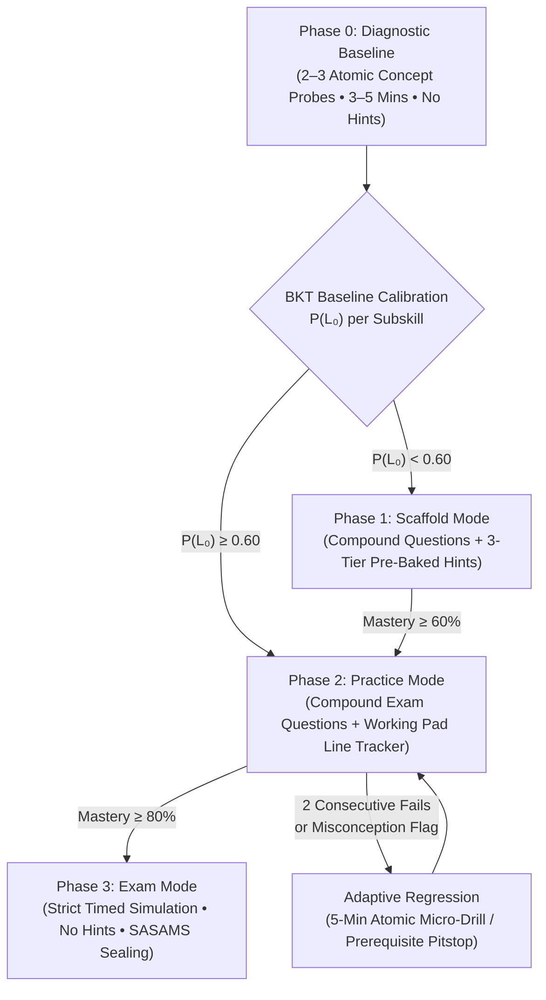

# Automated Curriculum Quality, Procedure Tracking, BKT Progression & UI Certification Plan

## Executive Summary
This document establishes the formal engineering architecture and implementation plan to automate the end-to-end verification of Fundile TLAssistant. It eliminates the need for manual clicking across subjects, grades, and progression modes, providing deterministic certification of:
1. **Question Quality & Curriculum Ground-Truth Alignment** (Grades 7–12 across DBE/IEB exam files and textbook transcripts).
2. **Procedural Working Surface & Step-by-Step Symbolic Checker** (Working Pad KaTeX inputs + SymPy procedure tracking with method and accuracy marks).
3. **Diagnostic Test Architecture & Adaptive BKT Progression** (Atomic concept calibration $\to$ compound guided Scaffold $\to$ autonomous Practice $\to$ timed Exam $\to$ 5-min prerequisite regression).
4. **Interactive UI Button & Ergonomics Integrity** (Zero dead buttons, zero missing facilities, fixed mobile bottom rails, and responsive viewports).
5. **Execution Architecture** (100% deterministic Zero-LLM test execution + optional LLM adversarial examiner auditing + Antigravity agent automated remediation).

---

## 1. Diagnostic Test Architecture: Atomic Probes vs. Compound Exam Questions

### 1.1 The Pedagogical Dilemma
If a student starts a topic by facing a 15-mark compound exam question (e.g., vertical projectile motion involving simultaneous kinematic equations, or a full Cash Receipts Journal), an initial error on line 2 hides the root cause:
- Did the learner fail because of a foundational arithmetic error?
- Did they confuse the physical coordinate convention (upward vs downward)?
- Or do they not understand the core physical law?

### 1.2 Fundile's 3-Phase Progression Model


1. **Phase 0: Diagnostic Baseline (Atomic Conceptual Probes)**:
   - Does **not** overwhelm the student with a monolithic 5-step derivation.
   - Deconstructs the topic into **2–3 atomic, calibrated subskills** (e.g. for Grade 10 Quadratic Equations: Probe 1 = standard form rearrangement, Probe 2 = trinomial factorisation, Probe 3 = finding roots).
   - Unassisted (zero hints) to accurately establish Bayesian Knowledge Tracing baseline parameters $P(L_0)$, slip $P(S)$, and guess $P(G)$.
2. **Phase 1: Scaffold Mode (Stepwise Guided Learning)**:
   - Introduces multi-step compound questions.
   - All 3 pre-baked hints are available (Tier 1 Nudge, Tier 2 Concept Rule, Tier 3 Step Calculation).
3. **Phase 2: Practice Mode (Full Autonomous Compound Working)**:
   - Authentic multi-step exam questions.
   - Employs the **Working Pad**: learners write out their multi-line procedure step by step.
   - The backend **Procedure Tracker** parses each intermediate equation symbolically via SymPy, awards NSC-style method marks [M], accuracy marks [A], and consequential accuracy [CA], and pinpoints the first line that breaks.
4. **Adaptive Regression (Deconstruction on Failure)**:
   - If a learner in Practice fails a compound question twice, the engine utilizes **Deconstructibility (Rule 21)** to temporarily peel the question down into its elementary micro-drill (e.g. just finding factor pairs or just calculating VAT net vs gross), fixes the blocker in 5 minutes, and returns them to Practice.

---

## 2. Procedure Input Space & Intermediate Step-by-Step Checker

### 2.1 UI Working Surface (`WorkingPad.jsx`)
The test suite validates that:
- For subjects involving multi-step procedural working (Mathematics, Technical Mathematics, Mathematical Literacy, Physical Sciences):
  - The UI renders the multi-line `WorkingPad` and `MathAnswerArea`.
  - Learners can type line-by-line equations using the standard keyboard or the contextual `MathKeypad`.
  - Pressing `Enter` cleanly spawns a new line; pressing `Backspace` on an empty line removes it without lost focus.
  - Live KaTeX rendering previews each step in real time.

### 2.2 Symbolic Procedure Tracker (`procedure_tracker.py`)
The backend procedure tracking engine verifies intermediate derivation logic:
```
Line 1: 2x^2 - 8x - 10 = 0    --> [SymPy Eq parsed]  ✓ Equivalent to question
Line 2: 2(x^2 - 4x - 5) = 0   --> [SymPy Eq parsed]  ✓ Equivalent (Method Mark [M] awarded)
Line 3: 2(x - 5)(x + 1) = 0   --> [SymPy Eq parsed]  ✓ Equivalent (Factorisation Mark [M] awarded)
Line 4: x = 5  or  x = -1     --> [SymPy Eq parsed]  ✓ Final roots correct (Accuracy Mark [A] awarded)
```
- **Error Localization:** If a learner writes `Line 3: 2(x - 5)(x - 1) = 0` (sign error), the tracker marks Line 1 and 2 as green (`correct`), flags Line 3 as red (`error`), awards consequential accuracy [CA] for Line 4 if Line 4 logically follows the error in Line 3, and classifies the blunder as `sign_error_distribution`.
- **Automated Test Validation:** The test suite feeds pre-programmed synthetic student derivations (complete, partial, flawed-at-step-2, and unparseable) to verify that the procedure tracker awards exact NSC marks and updates the UI status icons.

---

## 3. Automation Architecture: How It Operates

### 3.1 Zero-LLM Deterministic Core (Free, Instant, Offline CI/CD)
Because Fundile adheres strictly to **Rule 5 & Rule 8 (Zero-LLM Deterministic Standard Engine)**:
- Question generation, SymPy answer solving, procedure tracking, BKT probability calculations, and UI event flows are **100% deterministic Python and React code**.
- **The automated test suite does NOT depend on LLM token costs or external network calls.**
- It executes in seconds as a standard test command:
  ```bash
  npm run audit:full
  # or
  python scripts/system_health_audit.py
  ```

### 3.2 Where AI & Gemini Integrate
1. **Adversarial Lead Examiner Quality Audit (`scripts/examiner_llm_audit.py`)**:
   - Uses the Gemini API (the same infrastructure used for `curriculum_docs_auto/` ingestion) to run batch evaluations comparing generator output directly against official DBE Past Exam Papers and CAPS Textbook chapters.
   - Scores authenticity, tone, curriculum depth, and realism on a 1–100 scale.
2. **Antigravity AI Agent (Continuous Automated Remediation)**:
   - When any automated test fails (e.g., an unhandled SymPy exception or a broken button handler), the Antigravity agent inspects the audit failure log, localizes the code defect, applies the fix, verifies the build, and re-runs the suite autonomously.

---

## 4. The 4-Pillar Verification Matrix

| Verification Pillar | Tool / Test Runner | What It Tests | Success Criterion |
| :--- | :--- | :--- | :--- |
| **1. Question Quality & Curriculum Ground-Truth** | Python Monte Carlo Auditor (`audit_curriculum_coverage.py`) | 100 seeds across all Grades (7–12), all 10 subjects, all archetypes. Scans prompt, solution graph, 3-tier hints, and tags against `curriculum_docs_auto/`. | 100% solvable, 0 division-by-zero, 0% meta-curriculum jargon, 100% CAPS Data Sheet constants. |
| **2. Procedure Working Pad & Tracker** | Pytest (`test_procedure_tracker.py`) + Vitest (`WorkingPad.test.jsx`) | Step-by-step mathematical working pad rendering, line insertion, SymPy line equivalence, error localization, and NSC method [M] / consequential accuracy [CA] mark awards. | Line-by-line KaTeX preview renders, error pinpointed at first faulty step, carry-forward marks awarded. |
| **3. BKT Adaptive Progression Simulation** | Synthetic Learner Persona Suite (`simulate_learner_journey.py`) | 4 synthetic student profiles (Struggling, Average, High-Flier, Prerequisite-Regression) playing through Diagnostic $\to$ Scaffold $\to$ Practice $\to$ Exam $\to$ Micro-Drill. | All 4 personas complete cycles without infinite loops; score gates (60%, 80%) unlock correctly. |
| **4. UI Button & Ergonomics Integrity** | Vitest / React Testing Library (`ui_button_crawler.test.jsx`) | Traverses all screens (Learner, Teacher, Parent, Admin, Landing Page). Tests all `<button>`, `<a>`, folder tabs, modal triggers, and inputs. | 0 dead buttons (`onClick={() => {}}`), 0 console crashes, 0 missing facilities, bottom rail stays pinned. |

---

## 5. Implementation Roadmap & Deliverables

1. **Step 1: Procedural Working & Checker Test Harness** (`test_procedure_tracker.py` + `WorkingPad.test.jsx`):
   - Validates UI line inputs, Enter/Backspace line operations, and backend SymPy line-by-line mark awards.
2. **Step 2: 10,000-Seed Monte Carlo Question & Curriculum Coverage Suite** (`scripts/audit_curriculum_coverage.py`):
   - Audits all generators and static access banks against `curriculum_docs_auto/` exam files.
3. **Step 3: Synthetic Learner BKT Simulation Suite** (`scripts/simulate_learner_journey.py`):
   - Executes headless simulations for the 4 student personas across all subjects.
4. **Step 4: Automated UI Button Crawler** (`scripts/audit_ui_buttons.py` / Vitest):
   - Audits every clickable control across desktop and mobile viewports.
5. **Step 5: Unified 1-Click Certification Runner (`npm run audit:full`)**:
   - Generates the standalone `fundile-system-audit-report.html` dashboard.

---

## 6. LLM Integration Strategy: Offline-First Reliability & Intermittent Connectivity

### 6.1 The Reality of Intermittent Internet in South Africa
A significant portion of South African learners experience intermittent internet connectivity, variable cellular reception, or zero active airtime/data during study sessions. Consequently, **the application must never become an unusable blank screen or block learning when offline**.

### 6.2 The Offline-First Architectural Invariant
1. **Core Learning Engine is 100% Deterministic & Offline-Capable**:
   - The entire **Standard Tier** (diagnostic baseline, guided scaffolding, autonomous practice, exam simulations, 3-tier pre-baked hints, line-by-line procedural checking, and BKT mastery calculations) is designed to operate completely offline on the client device (< 2 MB WebAPK cache).
   - Zero LLM tokens or internet calls are required for a learner to complete their daily study goals.
2. **Progressive AI Enhancement (Pro Tier as an Optional Cloud Layer)**:
   - When active internet connectivity is detected (`navigator.onLine === true`):
     - The **AI Socratic Tutor** activates as a progressive enhancement.
     - Learners can ask free-form clarifying questions, request analogies in their home language, or receive personalized qualitative feedback on business essays.
   - When the learner goes offline or connectivity drops:
     - The UI smoothly falls back to the deterministic pre-baked 3-tier hints drawer (Nudge, Rule, Worked Step).
     - The tutor displays a subtle offline badge: *"Offline Mode Active • Pre-baked hints and worked solutions are fully available without data."*
     - No functionality is crippled or locked.
3. **Decision Pending on Deeper LLM Expansion**:
   - Deeper agentic features (such as autonomous question authoring or continuous live voice agents) remain paused until data-efficient, low-bandwidth edge architectures (e.g. local quantized on-device small language models or ultra-low-byte JSON streaming protocols) are validated.

### 6.3 Anti-Endless Loop & Circuit Breaker Invariants
To prevent infinite recursive loops in both runtime learner progression and automated test simulations:
- **Maximum Micro-Drill Depth ($N \le 2$):** A learner failing a compound question can only be dropped into an atomic micro-drill twice. If still struggling, the system surfaces a teacher/parent diagnostic alert rather than indefinitely degrading prerequisite levels.
- **Cross-Grade Floor:** Prerequisite regression never drops more than 2 grades below the enrolled grade (e.g., Grade 11 cannot regress below Grade 9).
- **Test Suite Circuit Breakers:** All automated simulation runners enforce hard timeout limits (e.g., 5 seconds max per question) and iteration caps (`max_steps = 15`) to guarantee 100% deterministic termination.

