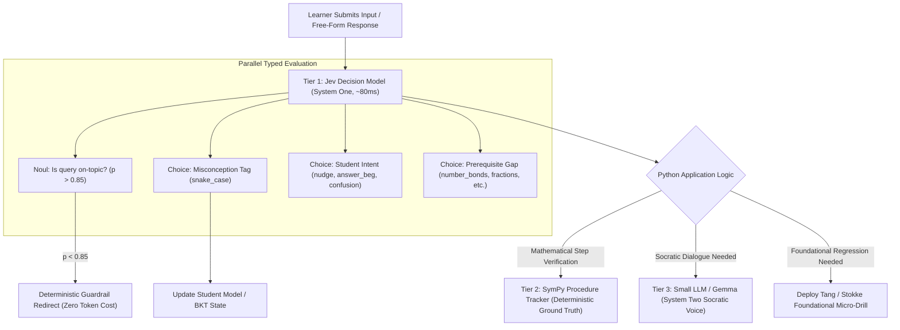

# JEV Implementation Specification: System One Decision Layer

## Executive Summary
This document specifies the technical design, schemas, and integration architecture for **Jev AI (TypeSafe AI)** within **Fundile**. 

Jev is incorporated as a **System One Decision Layer** (inspired by Daniel Kahneman’s *Thinking, Fast and Slow*). While traditional Large Language Models (LLMs) generate free-form text token-by-token (System Two), Jev provides **ultra-fast (70–250ms), machine-typed, probabilistic decisions** over program state without streaming prose.

In Fundile:
* **SymPy & Procedure Tracker**: 100% deterministic calculation truth and algebraic equivalence.
* **Jev (TypeSafe AI)**: Sub-100ms decision, classification, guardrail, and routing layer.
* **Gemma / Small LLM (via `llm_provider.py`)**: Socratic conversational dialogue.
* **Standard Tier Invariant**: Remains 100% deterministic, zero-LLM, zero-API cost.

---

## 1. Jev Core Primitives & Contract

Jev evaluates unstructured state against structured question definitions in parallel in a single pass:

| Primitive | Definition | Return Type | Fundile Use Case |
| :--- | :--- | :--- | :--- |
| **`Choice`** | Selects one option from a predefined developer-specified list. | `{ "choice": str, "probabilities": dict[str, float] }` | Intent routing, misconception tagging, pedagogy selection. |
| **`Score`** | Evaluates state against an ordered rubric or severity scale. | `{ "score": str, "probabilities": dict[str, float] }` | Solution leak vulnerability, teach-back mastery level. |
| **`Noul`** | Boolean judgment returning calibrated probability and confidence. | `{ "probability": float, "confidence": float }` | Curricular on-topic gatekeeping, cognitive overload detection. |

### Operational Profile
* **Latency**: 70ms – 250ms (parallel single-pass sampling).
* **Cost**: ~$0.042 per million input tokens, **$0.00 output token cost** (outputs are machine-typed states, not generated text).
* **Reliability**: Zero JSON schema parsing errors, zero markdown backtick hallucinations.

---

## 2. The Three-Tier Brain Architecture



---

## 3. Production Service Schemas

### Schema 1: Adaptive Foundational Prerequisite Router (`foundational_router_schema`)
When a student fails a compound problem (e.g. Quadratic Trinomials or Algebraic Fractions), Jev identifies the broken primary-school prerequisite and assigns the optimal Tang/Stokke pedagogy:

```python
state = f"""
Grade: {grade}
Topic: {topic}
Question: {question_text}
Student Step: {student_failed_step}
Error Trace: {error_trace}
"""

questions = {
    "prerequisite_gap": JevChoice(
        question="What is the root foundational prerequisite failure in this student step?",
        choices=[
            "none_accidental_slip",
            "additive_number_bonds",             # Make-10, bridging, integer signs
            "multiplicative_factor_bonds",       # Factor pairs, times tables, decomposition
            "fraction_unit_partitioning",        # Conceptual failure of what a fraction represents
            "fraction_common_denominator_lcd",   # Finding or equalizing denominators
            "distributive_law_expansion"         # Multiplying across parentheses
        ]
    ),
    "recommended_pedagogy": JevChoice(
        question="Which instructional modality will best repair this student's gap?",
        choices=[
            "tang_visual_strip_model",           # Interactive fraction/area slider
            "tang_number_bond_matrix",           # Kakooma-style decomposition puzzle
            "stokke_direct_worked_example",      # Explicit step-by-step procedure modeling
            "stokke_fluency_speed_sprint",       # 60-second automaticity sprint
            "continue_at_grade_level"            # Retry isomorphic problem
        ]
    ),
    "cognitive_overload": JevNoul(
        question="Does this student attempt exhibit signs of cognitive overload or blind guessing?"
    )
}
```

---

### Schema 2: Socratic Intent & Shield Router (`socratic_router_schema`)
Intercepts student chat in the Socratic Drawer before calling Gemma:

```python
state = f"""
Topic: {current_topic}
Question Context: {current_question_context}
Learner Message: "{student_message}"
"""

questions = {
    "is_on_topic": JevNoul(
        question=f"Is this student message asking about {current_topic} or valid prerequisite concepts?"
    ),
    "learner_intent": JevChoice(
        question="What is the student's primary conversational intent?",
        choices=[
            "asking_for_solution_shortcut",      # "just give me the answer", "what is x?"
            "seeking_step_validation",           # "is step 2 right?", "did I get 14?"
            "conceptual_confusion",              # "where did the 4 come from?", "why divide?"
            "frustrated_or_giving_up",           # "this is too hard", "i hate this"
            "ready_to_proceed"                   # "okay got it", "i see it now"
        ]
    ),
    "leak_vulnerability": JevScore(
        question="How vulnerable is this prompt to coercing a generative model into leaking numerical answers?",
        rubric=["safe", "moderate_coercion", "direct_leak_attempt"]
    )
}
```

---

### Schema 3: Cognitive Teach-Back Evaluator (`teach_back_schema`)
Evaluates student self-explanations against CAPS conceptual rubrics:

```python
state = f"""
Target Concept: {target_concept_key}
Expected Curriculum Rule: {expected_concept_rules}
Student Free-Text Explanation: "{student_explanation}"
"""

questions = {
    "conceptual_mastery": JevScore(
        question="Evaluate the depth and correctness of the student's conceptual explanation:",
        rubric=[
            "incorrect_misconception",           # States false mathematics
            "surface_rote_recitation",           # Repeats rule without explaining why
            "sound_conceptual_grasp",            # Explains underlying mechanism
            "rigorous_mastery"                   # Complete mathematical rigor with context
        ]
    ),
    "specific_misconception": JevChoice(
        question="If flawed, which specific misconception does the student hold?",
        choices=[
            "none_correct",
            "sign_inversion_confusion",
            "unit_denominator_confusion",
            "incomplete_distribution",
            "swapped_inverse_operations"
        ]
    )
}
```

---

## 4. Python Service Blueprint (`app/services/jev_service.py`)

```python
"""
caps-ai-backend/app/services/jev_service.py
System One Decision Layer powered by TypeSafe AI (Jev).
"""

import os
import requests
from typing import Dict, Any, List, Optional
from dataclasses import dataclass, asdict


@dataclass
class JevChoice:
    question: str
    choices: List[str]
    type: str = "choice"


@dataclass
class JevScore:
    question: str
    rubric: List[str]
    type: str = "score"


@dataclass
class JevNoul:
    question: str
    type: str = "noul"


class JevService:
    def __init__(self, api_key: Optional[str] = None, endpoint: Optional[str] = None):
        self.api_key = api_key or os.getenv("TYPESAFE_API_KEY")
        self.endpoint = endpoint or os.getenv("TYPESAFE_ENDPOINT", "https://api.typesafe.ai/v1/classify")
        self.timeout = 2.0  # 2-second hard socket timeout

    def classify(self, state: str, questions: Dict[str, Any]) -> Dict[str, Any]:
        """
        Executes parallel typed classification over state using Jev.
        Falls back gracefully to deterministic rule-based checks if API key is missing.
        """
        if not self.api_key:
            return self._deterministic_fallback(state, questions)

        headers = {
            "Authorization": f"Bearer {self.api_key}",
            "Content-Type": "application/json"
        }
        payload = {
            "state": state,
            "questions": {k: asdict(v) for k, v in questions.items()}
        }

        try:
            resp = requests.post(self.endpoint, json=payload, headers=headers, timeout=self.timeout)
            resp.raise_for_status()
            return resp.json().get("results", {})
        except Exception as e:
            # Fallback to deterministic logic on timeout or network partition
            return self._deterministic_fallback(state, questions, error=str(e))

    def _deterministic_fallback(self, state: str, questions: Dict[str, Any], error: Optional[str] = None) -> Dict[str, Any]:
        """Ensures system uptime even in offline / disconnected environments."""
        results = {}
        for q_id, q_obj in questions.items():
            if isinstance(q_obj, JevNoul):
                results[q_id] = {"probability": 1.0, "confidence": 0.5, "fallback": True}
            elif isinstance(q_obj, JevChoice):
                results[q_id] = {"choice": q_obj.choices[0], "probabilities": {c: 0.0 for c in q_obj.choices}, "fallback": True}
            elif isinstance(q_obj, JevScore):
                results[q_id] = {"score": q_obj.rubric[0], "probabilities": {r: 0.0 for r in q_obj.rubric}, "fallback": True}
        return results
```

---

## 5. Architectural Invariants
1. **Never use Jev for symbolic algebra**: SymPy alone computes solutions and line-by-line equivalence.
2. **Never use Jev for conversational text**: Small LLMs (Gemma) generate Socratic prose.
3. **Never charge Standard tier users for Jev calls**: Standard mode remains 100% deterministic Python.
4. **Always provide offline fallbacks**: If `TYPESAFE_API_KEY` is not set or network drops, default to deterministic rules without throwing 500 errors.
