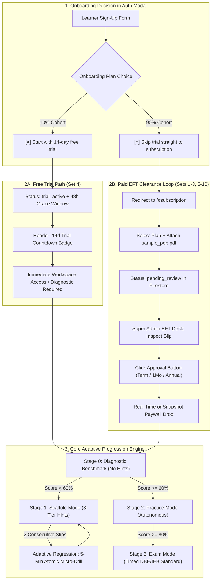

# Fundile National Curriculum Mock Test Participants Dossier (Grades 7–12)

**Document Version:** 1.0.0  
**Companion Master Plan:** [`mocktest.md`](mocktest.md)  
**Curriculum Alignment:** 100% South African CAPS National Curriculum Standards (Senior Phase & FET Phase)  
**Payment Calibration:** 90% Paid Subscriptions (EFT POP Manual Clearance Loop) & 10% 2-Week Free Trial  
**Testing Protocol:** Step-by-Step Interactive Human-in-the-Loop Certification with Concurrent Stakeholder Linking  

---

## 1. Quick Participant Directory & Matrix

| Set | Learner Name | Grade & Phase | Device Form Factor & Viewport | Sign-Up Email | Plan / Mode | Primary Subjects & Topics | Concurrent Stakeholders |
| :---: | :--- | :---: | :--- | :--- | :---: | :--- | :--- |
| **Set 1** | **Lesedi Khumalo** | Gr 10 FET | **Desktop Installed App**<br>(Standalone Window 1024x768) | `lesedi.khumalo@fundile.test` | R349 Term Pass (EFT) | **Accounting:** Cash Receipts Journal (VAT 15%)<br>**Mathematics:** Euclidean Geometry & Algebra | **Super Admin:** Browser Web Cockpit |
| **Set 2** | **Ayanda Ndlovu** | Gr 7 Senior | **Mobile Installed App**<br>(Pixel 7 WebAPK Viewport 393x851) | `ayanda.ndlovu@fundile.test` | R349 Term Pass (EFT) | **Mathematics:** 3D Geometric Nets, Patterns & Division<br>**EMS:** Financial Literacy (Source Documents) | **Teacher:** Mrs. P. Khumalo (`MTH701` Browser)<br>**Parent:** Mr. S. Ndlovu (`PAR-7892` Mobile)<br>**Super Admin:** Browser Web Cockpit |
| **Set 3** | **Bongani Sithole** | Gr 8 Senior | **Mobile Installed App**<br>(Pixel 7 WebAPK Viewport 393x851) | `bongani.sithole@fundile.test` | R149 Monthly (EFT) | **Mathematics:** Linear Equations & Negative Integers<br>**Natural Sciences:** Particle Matter & Density $\rho = \frac{m}{V}$ | **Teacher:** Mr. D. Naidoo (`SCI802` Browser)<br>**Parent:** Mrs. T. Sithole (Mobile)<br>**Super Admin:** Browser Web Cockpit |
| **Set 4** | **Zanele Mthembu** | Gr 9 Senior | **Mobile Installed App**<br>(Pixel 7 WebAPK Viewport 393x851) | `zanele.mthembu@fundile.test` | **14-Day Free Trial**<br>*(10% Sample)* | **EMS:** Accounting Equation ($A = O + L$)<br>**Natural Sciences:** Electric Circuits & Ohm's Law | **Teacher:** Mrs. V. Pillay (`EMS903` Browser)<br>**Super Admin:** Browser Web Cockpit |
| **Set 5** | **Siyabonga Cele** | Gr 10 FET | **Desktop Installed App**<br>(Standalone Window 1024x768) | `siyabonga.cele@fundile.test` | R149 Monthly (EFT) | **Business Studies:** Micro, Market & Macro Environments<br>**Maths Lit:** Municipal Tiered Water/Power Tariffs | **Super Admin:** Browser Web Cockpit |
| **Set 6** | **Ntsako Baloyi** | Gr 11 FET | **Desktop Installed App**<br>(Standalone Window 1024x768) | `ntsako.baloyi@fundile.test` | R349 Term Pass (EFT) | **Physical Sciences:** Newton's Laws & Incline Vectors<br>**Tech Maths:** Complex Numbers & Angular Velocity $\omega$ | **Teacher:** Dr. K. Mokoena (`PHY110` Browser)<br>**Super Admin:** Browser Web Cockpit |
| **Set 7** | **Kelebogile Dlamini** | Gr 11 FET | **Desktop Installed App**<br>(Standalone Window 1024x768) | `kelebogile.dlamini@fundile.test` | R349 Term Pass (EFT) | **Life Sciences:** Photosynthesis, Respiration & ATP Yield<br>**Accounting:** Asset Disposal & Depreciation | **Parent:** Mrs. N. Dlamini (Mobile)<br>**Super Admin:** Browser Web Cockpit |
| **Set 8** | **Prince Mthembu** | Gr 12 Matric | **Desktop Installed App**<br>(Standalone Window 1024x768) | `prince.mthembu@fundile.test` | R999 Annual (EFT) | **Mathematics:** Differential Calculus First Principles [M][CA]<br>**Physical Sciences:** Chemical Equilibrium $K_c$ RICE Tables | **Principal:** Mr. V. Pillay (SASAMS Browser Cockpit)<br>**Super Admin:** Browser Web Cockpit |
| **Set 9** | **Thabo Molefe** | Gr 12 Matric | **Desktop Installed App**<br>(Standalone Window 1024x768) | `thabo.molefe@fundile.test` | R349 Term Pass (EFT) | **Accounting:** Published Company Balance Sheet<br>**Business Studies:** King IV Code of Governance & CSR | **Teacher:** Mr. N. Sithole (`ACC12B` Browser)<br>**Super Admin:** Browser Web Cockpit |
| **Set 10** | **Lerato Khanyile** | Gr 12 Technical | **Desktop Installed App**<br>(Standalone Window 1024x768) | `lerato.khanyile@fundile.test` | R149 Monthly (EFT) | **Tech Maths:** Integral Calculus $\int [f(x)-g(x)]dx$<br>**Maths Lit:** SARS Progressive Tax Brackets (PAYE) | **Parent:** Mr. J. Khanyile (Mobile)<br>**Super Admin:** Browser Web Cockpit |
| **Set 11** | **Sibusiso Zulu** | Gr 12 -> 8 Regression | **Desktop Installed App**<br>(Standalone Window 1024x768) | `sibusiso.zulu@fundile.test` | Systemic License Sync | **Adaptive Descent:** Gr 12 Optimization $\to$ Gr 10 Trinomials $\to$ Gr 8 HCF Factorisation (5-Min SimuLearn Replay) | **Principal / HOD:** Mr. V. Pillay (Browser)<br>**Super Admin:** Browser Web Cockpit |

---

## 2. Universal Sign-Up Standards & Credential Conventions

- **Default Test Password:** `Fundile@2026!` (Satisfies South African enterprise policy: uppercase, lowercase, numeric, symbol, $\ge 6$ chars).
- **Curriculum Selection:** `CAPS` (South African National Curriculum Statement).
- **POPIA Section 35 Consent:** Checkbox `[data-testid="checkbox-popia-consent"]` must be checked for all minor students ($< 18$ years old).
- **48-Hour Email Verification Grace Window:** `emailVerificationGraceUntil` is automatically set to $+48$ hours upon registration, enabling uninterrupted exploration while safeguarding against disposable trial cycling.
- **Access Bank Details for EFT Testing:**
  - **Bank:** Access Bank South Africa
  - **Account Name:** Fundile Learning Technologies (Pty) Ltd
  - **Account Number:** `1029384756`
  - **Branch Code:** `410506`
  - **Reference Format:** `FND-<UID_HASH>` (e.g., `FND-9A4B8C1D`)
  - **Sample POP Fixture:** `e2e/fixtures/sample_pop.pdf`

---

## 3. Comprehensive Participant Dossiers by Set



---

### Set 1: Grade 10 FET Core — Mathematics & Accounting

#### A. Learner Profile
- **Name:** Lesedi Khumalo
- **Age / Phase:** 16 Years Old • FET Phase (Grade 10)
- **School:** Westville High School (Class 10A Commerce)
- **Academic Profile:** Diligent commerce-stream candidate with strong ledger discipline. Occasionally trips up on calculating VAT on Inclusive transactions ($115\%$ vs $100\%$) and confusing cyclic quadrilateral exterior angles with opposite interior supplements.
- **Initial Baseline State:** $0\%$ Formative BKT Mastery, $0$ XP, Stage: `0. Diagnostic (Required)`.

#### B. Sign-Up & Authentication Details
- **Role:** Student (`student`)
- **Grade:** 10
- **Curriculum:** `CAPS`
- **Email:** `lesedi.khumalo@fundile.test`
- **Password:** `Fundile@2026!`
- **Plan Selected:** `direct_subscription` (`[○] Skip trial & proceed straight to subscription`)
- **Subscription Package:** **School Term Pass (R349 / 3 Months — Most Popular)**
- **Payment Method:** Access Bank EFT • Reference: `FND-LES10FET001` • Attachment: `sample_pop.pdf`

#### C. Subject & Topic Under Test
- **Subject 1 (Accounting):** Term 1 Cash Receipts Journal (CRJ) with 15% VAT split and General Ledger posting (`crj_generator.py`).
  - *Modality:* 2D Ledger Table with cell-level coordinate marking (`r0_c0` to `r5_c5`).
  - *Targeted Misconception:* `net_vs_gross_vat_confusion` (placing the 115% gross amount in the 100% sales column).
- **Subject 2 (Mathematics):** Term 1 Euclidean Geometry (Circle theorem angle relations & line transitions) + Algebraic Expressions (`algebraic_expressions_generator.py`).
  - *Modality:* Dynamic Euclidean Geometry Circle Gliders (`DiagramRenderer.jsx`) + SymPy KaTeX line-by-line derivation pad with South African comma decimals (`{,}`).
  - *Targeted Misconception:* `exterior_angle_inversion` (inverting cyclic quad exterior angle relation).

#### D. Concurrent Stakeholders
1. **Super Admin (You):**
   - **Action:** Open Super Admin Cockpit $\to$ EFT Approvals Tab (`tab-admin-payments`).
   - **Verification:** Inspect pending slip from Lesedi Khumalo ($R349$) $\to$ Click **`3 Mo (Term)`** button (`btn-approve-payment-90d`).
   - **Result:** Paywall drops in real time via Firestore `onSnapshot`; problem surface renders instantly with pre-baked 3-tier hints.

---

### Set 2: Grade 7 Senior Phase Foundation — Mathematics & EMS

#### A. Learner Profile
- **Name:** Ayanda Ndlovu
- **Age / Phase:** 13 Years Old • Senior Phase Entry (Grade 7)
- **School:** Westville High School (Class 7C)
- **Academic Profile:** Enthusiastic junior learner transitioning into Senior Phase. Strong visual-spatial intelligence, but prone to arithmetic subtraction borrowing errors in multi-digit long division, and confusing credit invoices with cash receipts in EMS.
- **Initial Baseline State:** $0\%$ Formative BKT Mastery, $0$ XP, Stage: `0. Diagnostic (Required)`.

#### B. Sign-Up & Authentication Details
- **Role:** Student (`student`)
- **Grade:** 7
- **Curriculum:** `CAPS`
- **Email:** `ayanda.ndlovu@fundile.test`
- **Password:** `Fundile@2026!`
- **Plan Selected:** `direct_subscription`
- **Subscription Package:** **School Term Pass (R349 / 3 Months)**
- **Payment Method:** Nedbank EFT • Reference: `FND-AYA07SP002` • Attachment: `sample_pop.pdf`

#### C. Subject & Topic Under Test
- **Subject 1 (Mathematics):**
  - Term 1: Number Patterns ($T_n = 4n - 1$) & Columnar Long Division ($4394 \div 26 = 169$) (`number_operations_division_generator.py`).
  - Term 3: **Geometry of 3D Objects: Geometric Nets for 3D Shapes** (`measurement_3d_nets_generator.py`).
  - *Modality:* Interactive 2D-to-3D Geometric Net Unfolding Canvas (`GeometricNets3DViewer.jsx`) with 3D folding net slider, Polyhedra face matching ($F, V, E$), and Euler's formula verification ($F + V - E = 2$).
  - *Targeted Misconceptions:* `net_overlapping_faces_misconception` (failing to recognize invalid overlapping flaps in nets), `eulers_formula_subtraction_slip`, and `subtraction_borrowing_inversion`.
- **Subject 2 (EMS):** Financial Literacy — Source Documents (Receipts, Cheque Counterfoils, Deposit Slips) (`ems_generator.py`).
  - *Modality:* Document identification and transaction entry matching.
  - *Targeted Misconception:* `source_doc_receipt_vs_invoice`.

#### D. Concurrent Stakeholders
1. **Class Educator:**
   - **Name:** Mrs. Patience Khumalo (Mathematics Educator, Westville High)
   - **Class:** Grade 7C Mathematics
   - **Join Code:** `MTH701`
   - **Task Assigned:** 10-Mark Columnar Division & Geometric Nets Calibration.
2. **Parent / Guardian:**
   - **Name:** Mr. Sipho Ndlovu (Father)
   - **WhatsApp / Mobile:** `+27 82 555 7892`
   - **Email:** `sipho.ndlovu@guardianmail.co.za`
   - **Linking Passcode:** Ephemeral 15-minute code `PAR-7892` generated by Ayanda.
   - **Verification View:** In-app Sunday Academic Pulse preview confirming **1.4 MB cellular data consumption** (< 2 MB WebAPK vs 450 MB video tutoring) and recovered subtraction misconception card.
3. **Super Admin (You):**
   - **Action:** Manual approval of R349 Term Pass in Super Admin EFT desk.

---

### Set 3: Grade 8 Senior Phase Core — Mathematics & Natural Sciences

#### A. Learner Profile
- **Name:** Bongani Sithole
- **Age / Phase:** 14 Years Old • Senior Phase (Grade 8)
- **School:** Westville High School (Class 8A)
- **Academic Profile:** Inquisitive student fascinated by physical science phenomena. Often rushes algebraic transposition, forgetting to change signs when crossing the equals sign, and inverts density formula operations ($\rho = m \cdot V$ instead of $m/V$).
- **Initial Baseline State:** $0\%$ Formative BKT Mastery, $0$ XP, Stage: `0. Diagnostic (Required)`.

#### B. Sign-Up & Authentication Details
- **Role:** Student (`student`)
- **Grade:** 8
- **Curriculum:** `CAPS`
- **Email:** `bongani.sithole@fundile.test`
- **Password:** `Fundile@2026!`
- **Plan Selected:** `direct_subscription`
- **Subscription Package:** **Monthly Pass (R149 / Month — Flexible)**
- **Payment Method:** First National Bank (FNB) EFT • Reference: `FND-BON08SP003` • Attachment: `sample_pop.pdf`

#### C. Subject & Topic Under Test
- **Subject 1 (Mathematics):** Term 2 Algebraic Equations (Single-variable linear equations $3x - 7 = 20$) & Integers (`algebraic_equations_generator.py`).
  - *Modality:* SymPy line-by-line canonical solution balance.
  - *Targeted Misconception:* `sign_change_transposition` (forgetting to invert $+ / -$ across the equals sign).
- **Subject 2 (Natural Sciences):** Term 2 Matter & Materials — Particle Model of Matter, Atomic Structures, and Density Calculations ($\rho = \frac{m}{V}$) (`term2_matter_materials_generator.py`).
  - *Modality:* Particle arrangement schematics with mandatory SI unit normalization ($g/cm^3 \to kg/m^3$).
  - *Targeted Misconception:* `mass_volume_density_inversion`.

#### D. Concurrent Stakeholders
1. **Class Educator:**
   - **Name:** Mr. David Naidoo (Natural Sciences Educator, Westville High)
   - **Class:** Grade 8A Sciences
   - **Join Code:** `SCI802`
   - **Task Assigned:** 12-Mark Density & States of Matter Diagnostic.
2. **Parent / Guardian:**
   - **Name:** Mrs. Thandiwe Sithole (Mother)
   - **WhatsApp / Mobile:** `+27 83 456 1290`
   - **Email:** `thandiwe.sithole@guardianmail.co.za`
3. **Super Admin (You):**
   - **Action:** Manual approval of R149 Monthly Pass (`btn-approve-payment-30d`).

---

### Set 4: Grade 9 Senior Phase Transition — EMS & Natural Sciences (10% Free Trial)

#### A. Learner Profile
- **Name:** Zanele Mthembu
- **Age / Phase:** 15 Years Old • Senior Phase Exit / FET Transition (Grade 9)
- **School:** Westville High School (Class 9A)
- **Academic Profile:** Conscientious learner exploring subject choices for Grade 10 FET stream selection. Tests the seamless zero-payment onboarding experience. Needs clarity on the impact of expenses on Owner's Equity in EMS and series vs parallel current behaviour in physics.
- **Initial Baseline State:** $0\%$ Formative BKT Mastery, $0$ XP, Stage: `0. Diagnostic (Required)`.

#### B. Sign-Up & Authentication Details
- **Role:** Student (`student`)
- **Grade:** 9
- **Curriculum:** `CAPS`
- **Email:** `zanele.mthembu@fundile.test`
- **Password:** `Fundile@2026!`
- **Plan Selected:** **`free_trial` (`[●] Start with 14-day free trial — Recommended`)**
- **Subscription Package:** **14-Day Free Diagnostic Trial (R0 Upfront — 10% Testing Sample)**
- **Verification Grace:** Provisioned with `emailVerificationGraceUntil` (+48 hours) for immediate uninterrupted access.

#### C. Subject & Topic Under Test
- **Subject 1 (EMS):** Term 1 Financial Literacy — The Accounting Equation ($Assets = Owner's\ Equity + Liabilities$) incorporating CRJ and CPJ transactions (`ems_generator.py` / `assessment_generator.py`).
  - *Modality:* 3-Column Accounting Equation balance sheet table ($A = O + L$) with effect signs ($+ / - / 0$) and narrative reasons.
  - *Targeted Misconception:* `owner_equity_expense_inversion` (recording an expense as $+OE$ instead of $-OE$).
- **Subject 2 (Natural Sciences):** Term 3 Energy & Change — Series & Parallel Circuits, Potential Difference, and Ohm's Law ($V = I \times R$) (`electric_circuits_generator.py`).
  - *Modality:* Declarative SVG circuit schematics with switch, ammeter, and voltmeter gliders.
  - *Targeted Misconception:* `series_parallel_current_confusion` (assuming electric current splits in a series branch).

#### D. Concurrent Stakeholders
1. **Class Educator:**
   - **Name:** Mrs. V. Pillay (EMS Educator, Westville High)
   - **Class:** Grade 9A EMS
   - **Join Code:** `EMS903`
   - **Task Assigned:** Accounting Equation 15-Mark Transition Drill.
2. **Super Admin (You):**
   - **Oversight:** Inspects system analytics confirming zero payment barrier was encountered and trial countdown badge rendered with accurate days-remaining indicator.

---

### Set 5: Grade 10 Commercial & Applied — Business Studies & Maths Lit

#### A. Learner Profile
- **Name:** Siyabonga Cele
- **Age / Phase:** 16 Years Old • FET Phase (Grade 10)
- **School:** Westville High School (Class 10C General)
- **Academic Profile:** Practical, real-world thinker enrolled in commercial and applied pathways. Struggles with analytical PESTLE/SWOT classification in Business Studies and multi-tier progressive block tariff calculations in Mathematical Literacy.
- **Initial Baseline State:** $0\%$ Formative BKT Mastery, $0$ XP, Stage: `0. Diagnostic (Required)`.

#### B. Sign-Up & Authentication Details
- **Role:** Student (`student`)
- **Grade:** 10
- **Curriculum:** `CAPS`
- **Email:** `siyabonga.cele@fundile.test`
- **Password:** `Fundile@2026!`
- **Plan Selected:** `direct_subscription`
- **Subscription Package:** **Monthly Pass (R149 / Month)**
- **Payment Method:** Nedbank EFT • Reference: `FND-SIY10COM005` • Attachment: `sample_pop.pdf`

#### C. Subject & Topic Under Test
- **Subject 1 (Business Studies):** Term 1 Business Environments — Micro, Market, and Macro Environments (`bs_generator.py`).
  - *Modality:* Rubric-based semantic concept matching grounded in `caps-wiki/business_studies/grade10/`.
  - *Targeted Misconception:* `macro_vs_market_confusion` (classifying competitors and suppliers as Macro environment instead of Market environment).
- **Subject 2 (Mathematical Literacy):** Term 2 Finance — Tariffs & Break-Even Analysis (`tariffs_tax_brackets_generator.py`).
  - *Modality:* Tiered municipal water & electricity step-rate bracket calculation table.
  - *Targeted Misconception:* `tariff_cumulative_bracket_slip` (applying the top tariff rate to the entire volume rather than tier-by-tier blocks).

#### D. Concurrent Stakeholders
1. **Super Admin (You):**
   - **Action:** Manual approval of R149 Monthly Pass in Super Admin desk.

---

### Set 6: Grade 11 Physical Sciences & Technical Mathematics

#### A. Learner Profile
- **Name:** Ntsako Baloyi
- **Age / Phase:** 17 Years Old • FET Phase (Grade 11 Technical Stream)
- **School:** Westville High School (Class 11D Tech Maths)
- **Academic Profile:** Highly capable technical student preparing for STEM university entry. Struggles with resolving normal force components on inclined planes ($F_N = mg \cos\theta$) and imaginary unit powers ($i^2 = -1$).
- **Initial Baseline State:** $0\%$ Formative BKT Mastery, $0$ XP, Stage: `0. Diagnostic (Required)`.

#### B. Sign-Up & Authentication Details
- **Role:** Student (`student`)
- **Grade:** 11
- **Curriculum:** `CAPS`
- **Email:** `ntsako.baloyi@fundile.test`
- **Password:** `Fundile@2026!`
- **Plan Selected:** `direct_subscription`
- **Subscription Package:** **School Term Pass (R349 / 3 Months)**
- **Payment Method:** Standard Bank EFT • Reference: `FND-NTS11STEM006` • Attachment: `sample_pop.pdf`

#### C. Subject & Topic Under Test
- **Subject 1 (Physical Sciences):** Term 1 Mechanics — Newton's Laws of Motion (I, II, III) & Vector Force Resolution on Inclined Planes (`mechanics_generator.py`) + Electrodynamics Motor Visualizer (`ElectrodynamicsMotorViewer.jsx`).
  - *Modality:* Free-body force diagrams with directional tags ($[N]$, $[S]$, $[\text{down the plane}]$) and live 60fps oscilloscope visualizer.
  - *Targeted Misconception:* `omitted_normal_force_component` (assuming $F_N = mg$ on an incline).
- **Subject 2 (Technical Mathematics):** Term 1 Complex Numbers ($z = a + bi$) & Term 2 Circles and Angular Movement ($\omega = \frac{\theta}{t}$) (`complex_numbers_generator.py`, `circles_angular_movement_generator.py`).
  - *Modality:* Rectangular-to-polar Argand plane transformations with radian measures.
  - *Targeted Misconception:* `i_squared_positive_slip` (evaluating $i^2 = +1$).

#### D. Concurrent Stakeholders
1. **Class Educator:**
   - **Name:** Dr. K. Mokoena (Physical Sciences Educator, Westville High)
   - **Class:** Grade 11B Physical Sciences
   - **Join Code:** `PHY110`
   - **Task Assigned:** 15-Mark Inclined Plane Mechanics Drill.
2. **Super Admin (You):**
   - **Action:** Manual approval of R349 Term Pass in Super Admin desk.

---

### Set 7: Grade 11 Life Sciences & Asset Accounting

#### A. Learner Profile
- **Name:** Kelebogile Dlamini
- **Age / Phase:** 17 Years Old • FET Phase (Grade 11)
- **School:** Westville High School (Class 11C Accounting & Life Sciences)
- **Academic Profile:** Disciplined learner balancing biosciences with financial accounting. Tends to confuse anaerobic ($2\text{ ATP}$) vs aerobic ($36\text{–}38\text{ ATP}$) net yields in cellular respiration and calculates reducing-balance depreciation on historical cost instead of carrying value.
- **Initial Baseline State:** $0\%$ Formative BKT Mastery, $0$ XP, Stage: `0. Diagnostic (Required)`.

#### B. Sign-Up & Authentication Details
- **Role:** Student (`student`)
- **Grade:** 11
- **Curriculum:** `CAPS`
- **Email:** `kelebogile.dlamini@fundile.test`
- **Password:** `Fundile@2026!`
- **Plan Selected:** `direct_subscription`
- **Subscription Package:** **School Term Pass (R349 / 3 Months)**
- **Payment Method:** Capitec Bank EFT • Reference: `FND-KEL11LSC007` • Attachment: `sample_pop.pdf`

#### C. Subject & Topic Under Test
- **Subject 1 (Life Sciences):** Term 2 Photosynthesis & Cellular Respiration (Glycolysis, Krebs Cycle, Oxidative Phosphorylation) (`photosynthesis_respiration_generator.py`).
  - *Modality:* Biological biochemical flowchart matching and organelle structure diagrams.
  - *Targeted Misconception:* `atp_aerobic_anaerobic_yield_slip`.
- **Subject 2 (Accounting):** Term 2 Fixed Assets & Depreciation (Straight-Line vs Reducing-Balance Method & Asset Disposal Account) (`depreciation_asset_disposal_generator.py`).
  - *Modality:* 4-Column General Ledger Asset Disposal and Accumulated Depreciation statement.
  - *Targeted Misconception:* `depreciation_cost_vs_carrying_confusion`.

#### D. Concurrent Stakeholders
1. **Parent / Guardian:**
   - **Name:** Mrs. Nomsa Dlamini (Mother)
   - **WhatsApp / Mobile:** `+27 82 789 4412`
   - **Email:** `nomsa.dlamini@guardianmail.co.za`
   - **Parent View:** In-app weekly profile monitor displaying topic mastery ring and saved mobile data counter.
2. **Super Admin (You):**
   - **Action:** Manual approval of R349 Term Pass in Super Admin desk.

---

### Set 8: Grade 12 Matric Distinction Peak — Mathematics & Physical Sciences

#### A. Learner Profile
- **Name:** Prince Mthembu
- **Age / Phase:** 18 Years Old • Matric Distinction Candidate (Grade 12)
- **School:** Westville High School (Class 12A Senior Science)
- **Academic Profile:** Top-tier candidate aiming for $\ge 90\%$ distinction for competitive engineering faculty admission. Precision testing of method marks $[M]$, accuracy marks $[A]$, and consequential accuracy $[CA]$ under official NSC/IEB exam rubric standards.
- **Initial Baseline State:** $0\%$ Formative BKT Mastery, $0$ XP, Stage: `0. Diagnostic (Required)`.

#### B. Sign-Up & Authentication Details
- **Role:** Student (`student`)
- **Grade:** 12
- **Curriculum:** `CAPS`
- **Email:** `prince.mthembu@fundile.test`
- **Password:** `Fundile@2026!`
- **Plan Selected:** `direct_subscription`
- **Subscription Package:** **Annual Distinction Pass (R999 / 12 Months — Peak Prep)**
- **Payment Method:** Investec Private Bank EFT • Reference: `FND-PRI12MAT008` • Attachment: `sample_pop.pdf`

#### C. Subject & Topic Under Test
- **Subject 1 (Mathematics):** Term 1 Differential Calculus — Derivative from First Principles ($f'(x) = \lim_{h \to 0} \frac{f(x+h)-f(x)}{h}$), Cubic Polynomial Factorisation, and Maxima/Minima Optimisation (`calculus_generator.py`).
  - *Modality:* NSC-calibrated Procedure Tracker awarding method marks $[M]$ and consequential accuracy $[CA]$.
  - *Targeted Misconception:* `limit_h_zero_dropped_early` (dropping $\lim_{h \to 0}$ prior to dividing through by $h$).
- **Subject 2 (Physical Sciences):** Term 2 Chemical Change — Chemical Equilibrium ($K_c$ expressions, Le Chatelier's Principle, and RICE Concentration Tables) (`chemical_reactions_generator.py`).
  - *Modality:* 4-Row RICE (Ratio, Initial, Change, Equilibrium) concentration calculation matrix.
  - *Targeted Misconception:* `kc_solids_liquids_included` (erroneously including pure solids or pure liquid solvents into the $K_c$ fraction).

#### D. Concurrent Stakeholders
1. **School Administrator & Executive Headmaster:**
   - **Name:** Dr. V. Naidoo / Mr. Vinay Pillay (Principal & HOD)
   - **Role:** School Administrator (`school_admin`)
   - **EMIS School Code:** `500124892`
   - **Cockpit Action:** Reviews Grade 12 Calculus pacing heatmap $\to$ Exports formal test marks for South African Schools Administration and Management System (**SASAMS CSV**).
2. **Super Admin (You):**
   - **Action:** Manual approval of R999 Annual Distinction Pass (`btn-approve-payment-365d`).

---

### Set 9: Grade 12 Corporate & Governance — Accounting & Business Studies

#### A. Learner Profile
- **Name:** Thabo Molefe
- **Age / Phase:** 18 Years Old • Matric Commerce Candidate (Grade 12)
- **School:** Westville High School (Class 12C Commerce)
- **Academic Profile:** Senior commerce student targeting BCom Accounting admission. Highly proficient in entry-level journals, but requires calibration on Corporate Balance Sheet notes (Retained Income note dividends declared vs paid) and King IV Code principles.
- **Initial Baseline State:** $0\%$ Formative BKT Mastery, $0$ XP, Stage: `0. Diagnostic (Required)`.

#### B. Sign-Up & Authentication Details
- **Role:** Student (`student`)
- **Grade:** 12
- **Curriculum:** `CAPS`
- **Email:** `thabo.molefe@fundile.test`
- **Password:** `Fundile@2026!`
- **Plan Selected:** `direct_subscription`
- **Subscription Package:** **School Term Pass (R349 / 3 Months)**
- **Payment Method:** First National Bank (FNB) EFT • Reference: `FND-THA12GOV009` • Attachment: `sample_pop.pdf`

#### C. Subject & Topic Under Test
- **Subject 1 (Accounting):** Term 1 Financial Statements of a Public Company — Balance Sheet, Notes to Financial Statements (Retained Income Note 7 & Share Capital), and Cash Flow Statement (`published_financial_statements_generator.py`).
  - *Modality:* Authentic Published Corporate Ledger with sub-totals and check-digit balance validation.
  - *Targeted Misconception:* `retained_income_dividends_timing_error` (confusing interim dividends paid during the year with final dividends declared after year-end).
- **Subject 2 (Business Studies):** Term 1 Corporate Social Responsibility (CSR/CSI) & King IV Code of Governance (`bs_generator.py`).
  - *Modality:* Semantic Rubric evaluation matching King IV transparency, ethical leadership, and stakeholder inclusivity.
  - *Targeted Misconception:* `csr_vs_csi_concept_slip` (conflating internal operational CSR policies with external philanthropic CSI donations).

#### D. Concurrent Stakeholders
1. **Class Educator:**
   - **Name:** Mr. N. Sithole (HOD: Commercial Studies & Accounting Educator)
   - **Class:** Grade 12C Commerce
   - **Join Code:** `ACC12B`
   - **Task Assigned:** 20-Mark Published Balance Sheet & Retained Income Drill.
2. **Super Admin (You):**
   - **Action:** Manual approval of R349 Term Pass in Super Admin desk.

---

### Set 10: Grade 12 Applied & Technical Pathways — Tech Maths & Maths Lit

#### A. Learner Profile
- **Name:** Lerato Khanyile
- **Age / Phase:** 18 Years Old • Matric Technical Candidate (Grade 12)
- **School:** Westville High School (Class 12D)
- **Academic Profile:** Focused vocational and technical student preparing for trade apprenticeships and technical diploma programmes. Strong visual intuition, but needs practice with constant of integration ($+ C$) rules and multi-tiered SARS progressive tax calculations.
- **Initial Baseline State:** $0\%$ Formative BKT Mastery, $0$ XP, Stage: `0. Diagnostic (Required)`.

#### B. Sign-Up & Authentication Details
- **Role:** Student (`student`)
- **Grade:** 12
- **Curriculum:** `CAPS`
- **Email:** `lerato.khanyile@fundile.test`
- **Password:** `Fundile@2026!`
- **Plan Selected:** `direct_subscription`
- **Subscription Package:** **Monthly Pass (R149 / Month)**
- **Payment Method:** Capitec Bank EFT • Reference: `FND-LER12TEC010` • Attachment: `sample_pop.pdf`

#### C. Subject & Topic Under Test
- **Subject 1 (Technical Mathematics):** Term 2 Integral Calculus — Indefinite and Definite Integrals, Mensuration, and Area Between Curves ($\int_{a}^{b} [f(x) - g(x)] dx$) (`mensuration_calculus_generator.py`).
  - *Modality:* Stepwise symbolic integration pad with power rule derivation and bounded limit evaluation.
  - *Targeted Misconception:* `forgot_plus_c_integration` (omitting $+ C$ in indefinite antiderivatives).
- **Subject 2 (Mathematical Literacy):** Term 1 Taxation & Finance — South African Revenue Service (SARS) Progressive Income Tax Brackets, Medical Tax Credits, and Age-Based Rebates (`tariffs_tax_brackets_generator.py`).
  - *Modality:* Multi-bracket progressive income tax calculation table.
  - *Targeted Misconception:* `sars_bracket_flat_tax_slip` (multiplying total gross taxable income by the top marginal rate without tiering).

#### D. Concurrent Stakeholders
1. **Parent / Guardian:**
   - **Name:** Mr. Joshua Khanyile (Father)
   - **WhatsApp / Mobile:** `+27 84 901 8823`
   - **Email:** `joshua.khanyile@guardianmail.co.za`
2. **Super Admin (You):**
   - **Action:** Manual approval of R149 Monthly Pass in Super Admin desk.

---

### Set 11: Cross-Grade Adaptive Descent & Prerequisite Lineage Stress Test

#### A. Learner Profile
- **Name:** Sibusiso Zulu
- **Age / Phase:** 18 Years Old • Struggling Matric Student
- **School:** Westville High School (Class 12B)
- **Academic Profile:** Student struggling with Grade 12 Calculus optimization problems due to deep unaddressed gaps in lower-grade algebra (Grade 10 factoring and Grade 8 common factor extraction). Designed to stress-test the automated cross-grade prerequisite regression tree.
- **Initial Baseline State:** $0\%$ Formative BKT Mastery in Calculus, Stage: `0. Diagnostic (Required)`.

#### B. Sign-Up & Authentication Details
- **Role:** Student (`student`)
- **Grade:** 12
- **Curriculum:** `CAPS`
- **Email:** `sibusiso.zulu@fundile.test`
- **Password:** `Fundile@2026!`
- **Plan Selected:** `direct_subscription` (Institutional License Sync)
- **Payment Status:** Pre-authenticated via school license sync (`approved`).

#### C. Syllabus & Adaptive Descent Lineage
```
[Grade 12 Calculus Optimization: V'(r) = 3πr² - 12r = 0]
                         │
        (Student fails factoring twice in a row)
                         ▼
[Adaptive Regression Tree triggers: prerequisite_tree.py]
                         │
                         ▼
[Grade 10 Algebraic Expressions: Factorising Trinomials]
                         │
        (Persistent misconception: factor pair signs)
                         ▼
[Grade 8 Foundational Algebra: Highest Common Factor (HCF)]
                         │
  (5-Minute SimuLearn Canonical Worked Solution Replay)
                         │
                         ▼
[Student repairs schema → Re-ascends to Grade 10 → Grade 12]
```

- **Cognitive Modality Under Test:**
  - Dynamic Adaptive Prerequisite Lineage Banner (`UniversalWorkspace.jsx`).
  - Cognitive Circuit Breaker to 5-Minute SimuLearn Worked Visual Example (`SimuLearnPlayer.jsx`).
  - Automated ascent back to Grade 12 Calculus upon mastering foundational micro-drills.

#### D. Concurrent Stakeholders
1. **School Administrator & HOD:**
   - **Name:** Mr. Vinay Pillay (School Administrator)
   - **Cockpit Action:** Spots the systemic factoring blocker flagged across 38 learners on the School Misconception Heatmap $\to$ Clicks **`[ Broadcast Remedial Drill ]`** in `SchoolAdminView.jsx` to dispatch the 5-minute micro-fix school-wide.
2. **Super Admin (You):**
   - **Oversight:** Validates that cross-grade regression preserved student psychological safety (zero punitive XP loss) and successfully repaired prerequisite foundations.

---

## 4. Developer & Super Admin Testing Quick-Switch Guide

To instantly test or inspect any of these participants without typing registration credentials manually, utilize the built-in development facilities:

1. **One-Click Persona Switcher Modal:**
   - While in Super Admin or Dev Sandbox mode, click **`Mock School Tester`** in the header or user profile.
   - Type any name (e.g., `"Lesedi"`, `"Ayanda"`, `"Prince"`, `"Naidoo"`) or filter by category (`School Students`, `Independent`, `Faculty`, `Parents`, `School Admin`).
   - Clicking **"Switch to Persona"** immediately rehydrates the reactive session and opens that exact persona's workspace.

2. **Direct Sandbox Mode URL:**
   - Open `http://localhost:5173/?sandbox` to load the full multi-role testing suite with immediate Super Admin perspective access.
