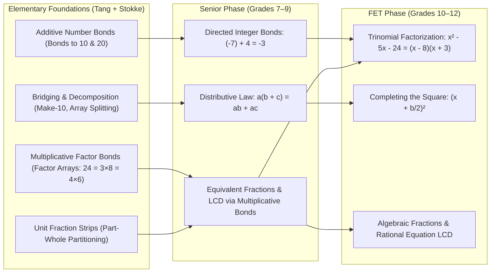

# Stokke & Tang Mathematical Foundation: Pedagogical Specification

## Executive Summary
This document specifies the pedagogical and cognitive architecture for foundational mathematics remediation in **Fundile (Grades 7–12 South African CAPS)**, synthesizing:
1. **Greg Tang’s Conceptual & Visual Modality**: Concrete–Pictorial–Abstract (C-P-A) progression, part-whole number bonds, unitizing, and area/strip representations.
2. **Dr. Anna Stokke’s Science of Math & Cognitive Load Engine**: Explicit direct instruction, working-memory preservation, automaticity of basic arithmetic facts, and systematic spaced/interleaved retrieval practice.

When high school learners (Grades 8–11) struggle with algebra, quadratics, or trigonometry, the failure is almost never with the high-school concept itself—it is almost always rooted in a breakdown in **fractions, proportional reasoning, or basic arithmetic/number-bond automaticity**. This framework deconstructs high-school concepts into their constituent primary-school primitives.

---

## 1. Theoretical Pillars

### Pillar A: Greg Tang (Conceptual Reasoning & Visual Mental Models)
Greg Tang (*The Grapes of Math*, *Math-terpieces*, GregTangMath.com) rejects rote algorithmic memorization in favor of **visual number sense and decomposition**:

* **Concrete–Pictorial–Abstract (C-P-A) Progression**:
  Learners must never be given abstract symbolic rules (e.g., cross-multiplication or algebraic fraction rules) without first mastering the visual and spatial model.
* **Unitizing & Fraction Area/Strip Models**:
  Tang identifies that learners fail fractions (e.g., asserting $\frac{1}{2} + \frac{1}{3} = \frac{2}{5}$) because of **unit confusion**—viewing numerators and denominators as independent whole numbers. Tang resolves this through **partitioned rectangular strip diagrams**, demonstrating that a fraction is a *single number on a continuous number line* and that quantities cannot be combined without a shared physical unit partition.
* **Decomposition & Bridging**:
  Numbers are treated as modular blocks that split and recombine. Instead of finger-counting, Tang teaches:
  $$\text{Bridging 10: } 8 + 5 = 8 + (2 + 3) = (8 + 2) + 3 = 10 + 3 = 13$$
  $$\text{Distributive Multiplication: } 7 \times 14 = 7 \times (10 + 4) = 70 + 28 = 98$$
* **Multiplicative Arrays over Additive Counting**:
  Transitioning learners from repeated addition to rectangular area arrays, establishing the exact cognitive schema required for polynomial expansions.

---

### Pillar B: Dr. Anna Stokke (Evidence-Based Practice & Cognitive Load Engine)
Dr. Anna Stokke (Professor of Mathematics, University of Winnipeg; host of *Chalk & Talk*; co-founder of Archimedes Math Schools) advocates for **the Science of Math and explicit instruction**:

* **Cognitive Load Theory & Working Memory Limits**:
  Working memory can hold only 3–5 novel elements simultaneously. If a Grade 10 student expends 80% of their working memory manually calculating $7 \times 8$ or finding the common denominator of $\frac{1}{3}$ and $\frac{1}{4}$, their working memory collapses. They have zero bandwidth remaining to process algebraic factorization or quadratic structure.
* **Explicit / Direct Instruction over Discovery**:
  Struggling learners do not benefit from unstructured, open-ended problem solving. Stokke demonstrates that explicit modeling (*"I do, We do, You do"*), clear step-by-step procedures, and guided practice provide the fastest and most equitable path to mathematical mastery.
* **Automaticity as a Prerequisite for Advanced Algebra**:
  Basic arithmetic facts, times tables, and fraction conversions must become automatic (retrieval in $<1.2$ seconds from long-term memory) so that higher-order problem-solving becomes fluid.
* **Interleaved & Spaced Retrieval**:
  Blocked practice (doing 25 identical problems in a row) leads to an illusion of competence. Stokke emphasizes **interleaving** operations (mixing addition, subtraction, multiplication, and equivalence of fractions and directed numbers) so the brain actively practices *identifying and selecting the correct strategy*.

---

## 2. The Continuum: From Number Bonds to High School CAPS Algebra

### Detailed Pedagogical Mapping

| Primary Concept | CAPS High School Concept (Grades 8–12) | Cognitive Breakdown if Bond is Missing |
| :--- | :--- | :--- |
| **Additive Bonds to 10 & 20** | **Completing the Square & Integer Arithmetic** | In $x^2 + 6x - 7 = 0$, finding $(6/2)^2 = 9$ requires additive decomposition. If weak, learners memorize steps mechanically without intuition. |
| **Multiplicative Factor Bonds** | **Quadratic Trinomial Factorization ($x^2 + bx + c$)** | Factoring $x^2 - 5x - 24$ requires scanning factor pairs of $-24$ that sum to $-5$ ($-8$ and $+3$). Without automatic bonds, learners freeze or guess randomly. |
| **Area Array Decomposition** | **Binomial Expansion & Common Factor Extraction** | $(x + 3)(x - 4) = x(x - 4) + 3(x - 4)$. Tang’s area model for $7 \times 14$ is structurally identical to the polynomial grid. |
| **Fraction Strip Partitioning** | **Algebraic Fractions & Rational Equations** | Simplifying $\frac{x}{x-2} - \frac{3}{x+1}$. Finding the LCD is finding the shared multiplicative bond between denominators. |
| **Directed Number Bonds** | **Inequalities & Exponent Laws** | Sign distribution errors (e.g. $-(x - 3) = -x - 3$) stem from treating minus as an operation rather than a negative directional bond. |

---

## 3. Architecture in Fundile: The 4 Foundational Slices

When Fundile’s **Procedure Tracker** detects persistent errors or frustration on compound questions (Rule 21 Deconstructibility), it activates one of four foundational micro-drill slices:

### Slice 1: Additive Bonds & Integer Signs (Make-10 & Bridging)
* **Objective**: Automate additive combinations to 10 and 20, extended to directed negative integers.
* **Tang Modality**: Visual part-whole circles and Kakooma-style triangle matrices where learners tap two numbers that sum to the target.
* **Stokke Modality**: 60-second timed sprints mixing positive and negative sums (e.g. $(-6) + 9$, $4 - 11$, $(-7) - (-3)$).

### Slice 2: Multiplicative Factor Bonds (Factor Pair Arrays)
* **Objective**: Rapid, automatic generation of all factor pairs for composite numbers up to 144.
* **Tang Modality**: Rectangular grid slider showing area dimensions ($24$ as $1 \times 24$, $2 \times 12$, $3 \times 8$, $4 \times 6$).
* **Stokke Modality**: Timed retrieval sprints: "Find the factor pair of 36 that adds to -13" ($\rightarrow -4, -9$).

### Slice 3: Fraction Unitizing & Equivalent Strips
* **Objective**: Eliminate numerator/denominator independence; internalize common denominators as equal physical partitions.
* **Tang Modality**: Interactive JSXGraph strip models where learners drag partition sliders until two fractions share an identical sub-grid.
* **Stokke Modality**: Interleaved practice pairing fraction addition with multiplication to break the "cross-multiply everything" reflex.

### Slice 4: The Algebraic Bridge (Distributive & Factoring Grid)
* **Objective**: Connect the arithmetic area model directly to symbolic algebra.
* **Tang Modality**: 2D algebraic tile grid where $(x + a)(x + b)$ fills out $x^2$, $ax$, $bx$, and $ab$.
* **Stokke Modality**: Explicit worked examples followed by immediate fading to symbolic KaTeX entry.

---

## 4. Diagnostic Misconception Taxonomy Integration

Every foundational drill emits standardized `misconception_tags` compliant with Rule 22:

* `fraction_unit_confusion`: Adding numerators and denominators directly ($\frac{1}{2} + \frac{1}{3} = \frac{2}{5}$).
* `fraction_lcd_multiplication_confusion`: Multiplying denominators when addition is required.
* `additive_bond_failure`: Inability to split numbers to bridge 10.
* `factor_pair_blindness`: Inability to produce factor pairs for composite quadratic constants ($c$ in $ax^2 + bx + c$).
* `negative_direction_inversion`: Sign errors when combining directed numbers.
* `incomplete_distribution`: Multiplying only the first term inside brackets ($3(x + 4) = 3x + 4$).

---

## 5. Summary of Pedagogy
1. **Never let high-school learners fail due to primary-school gaps**: Deconstruct compound problems into micro-drills.
2. **Visuals first, procedures second (Tang)**: Build intuitive mental models before algorithms.
3. **Fluency protects working memory (Stokke)**: Timed, spaced, interleaved practice automates arithmetic so the brain can focus on algebra.
