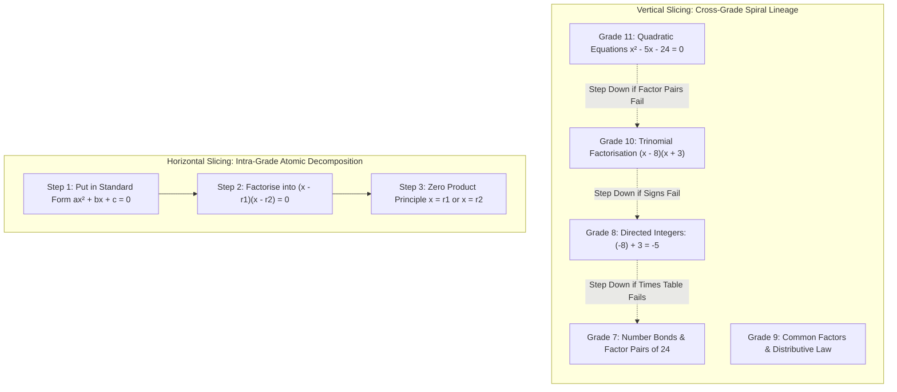

# Subject Specialist Agents & Cross-Grade Spiral Architecture: Implementation Plan

> **Date:** September 22, 2026  
> **Status:** Draft / Pending User Approval  
> **Target System:** Fundile (Grades 7–12 South African CAPS)  

---

## 1. Executive Summary & Root-Cause Diagnosis

### 1.1 The Problem
Recent testing revealed critical gaps in Grade 7 Mathematics:
1. **Pedagogical Misalignment**: Questions in calibration modals contained generic semantic queries (e.g., *"State the fundamental rule, definition, or formula for Exponents"*), which is fundamentally invalid in South African CAPS Mathematics Paper 1 (where knowledge is evaluated purely through numerical and algebraic procedure).
2. **Missing Input Instruments**: Learners had no direct way to enter powers ($x^2, x^n$), radicals ($\sqrt{\;}, \sqrt[3]{\;}$), fractions ($\frac{a}{b}$), subscripts ($T_n$), or standard comma decimals (`,`).
3. **Isolated Grade Silos**: The current architecture evaluated topics in single-grade isolation (`grade=grade, topic=topic`), ignoring the foundational prerequisite lineage that connects high school concepts (Grades 10–12) back to foundational concepts in Senior Phase (Grades 7–9).

### 1.2 The Two Axes of Slicing in Fundile
To prevent conceptual erosion, all agents and engines must operate across two distinct axes:



* **Horizontal Slicing (Intra-Grade / Intra-Topic Decomposition)**:
  Deconstructing a compound exam problem into its atomic micro-drills within the *current* grade (e.g., in Grade 10 Accounting, separating 15% VAT calculation from Contra Account identification and Bank Gross recording).
* **Vertical Slicing (Cross-Grade Spiral Progression & Regression)**:
  Recognizing that advanced concepts build recursively on lower-grade primitives. When a Grade 11 learner repeatedly fails quadratic factorisation, the adaptive progression engine must **step down the grade ladder** to repair the prerequisite schema in Grade 10, Grade 8, or Grade 7, rather than repeatedly drilling the compound Grade 11 problem.

---

## 2. Inventory of All 9 Curriculum Subjects (Grades 7–12)

Fundile models the full South African CAPS curriculum across 9 official subjects:

| Subject Name | Phases & Grades | Primary Cognitive Modality | CAPS Exam Paper Structure |
|---|---|---|---|
| **Mathematics** | Senior Phase (7–9)<br>FET Phase (10–12) | KaTeX symbolic derivations, `WorkingPad`, `MathKeypad`, JSXGraph | **Paper 1**: Algebra, Equations, Sequences, Functions, Finance, Calculus, Probability.<br>**Paper 2**: Euclidean Geometry, Analytical Geometry, Trigonometry, Statistics. |
| **Technical Mathematics** | FET Phase (10–12) | KaTeX derivations, technical formulas, complex numbers, integrals | **Paper 1**: Algebra, Functions, Complex Numbers, Differential & Integral Calculus.<br>**Paper 2**: Analytical Geo, Trig, Euclidean Geo (Circles & Angles). |
| **Mathematical Literacy** | FET Phase (10–12) | Tabular budgets, tariff calculations, measurement, KaTeX working pad | **Paper 1**: Personal/Business Finance, Data Handling.<br>**Paper 2**: Measurement (Perimeter, Area, Volume), Maps, Plans, Assembly. |
| **Economic & Management Sciences (EMS)** | Senior Phase (7–9) | 2D ledger tables, Accounting Equation columns, rubric concept matchers | **Term 1–4**: Financial Literacy (CRJ, CPJ, General Ledger, Accounting Equation) + Economy & Entrepreneurship. |
| **Accounting** | FET Phase (10–12) | 2D journal/ledger tables with coordinate marking, VAT extraction | **Paper 1**: Financial Reporting (GAAP/IFRS Statements, Notes, Cash Flows, Ratios).<br>**Paper 2**: Managerial Accounting, Costing, 15% VAT, Budgets, Bank Rec, Internal Controls. |
| **Business Studies** | FET Phase (10–12) | Rubric-based concept matchers, case-study scenario analyzers | **Paper 1**: Business Environments (Micro, Market, Macro) & Business Operations.<br>**Paper 2**: Business Ventures (Forms of Ownership, Entrepreneurship) & Business Roles (Ethics, CSR, Teamwork, Conflict). |
| **Natural Sciences** | Senior Phase (7–9) | Balanced reactions, particle models, circuits, classification graphs | **Term 1–4**: Life & Living (Biology); Matter & Materials (Chemistry); Energy & Change (Physics); Planet Earth & Beyond. |
| **Physical Sciences** | FET Phase (10–12) | Formula calculations with strict SI units, JSXGraph vectors/forces | **Paper 1 (Physics)**: Mechanics (Newton, Momentum, Work-Energy), Waves, Electricity & Magnetism.<br>**Paper 2 (Chemistry)**: Organic Chemistry, Reaction Rates, Chemical Equilibrium, Acids & Bases, Electrochemistry. |
| **Life Sciences** | FET Phase (10–12) | Biological diagrams, genetic crosses (Punnett squares), terminology | **Paper 1**: Meiosis, Reproduction, Endocrine, Homeostasis, Ecology.<br>**Paper 2**: DNA code of life, Genetics & Inheritance, Evolution. |

---

## 3. Architecture of the 3 Subject Domain Specialists

Rather than creating 9 fragmented agents (which would cause code duplication and agent sprawl) or 1 generic agent (which caused the Grade 7 Maths failure), we establish **3 Domain Specialist Agents** organized around cognitive modalities:

```
.agents/agents/
├── Existing Systems & Governance Agents:
│   ├── generator_architect.json          (Pure Python/SymPy, 6-pillar contract, CC <= 12)
│   ├── cognitive_ui_engineer.json        (React 18 / Vite UI modalities, <2000 lines)
│   ├── eval_triage_architect.json        (BKT mastery, consequential marking, PDF memos)
│   ├── systems_security_architect.json   (SRE, connection pooling, POPIA Sec 35)
│   ├── architecture_governor.json        (Manifest sync, HTML generation)
│   └── curriculum_specialist.json        (CAPS pacing, marks, term calendar metadata)
│
└── NEW Subject Pedagogy Specialists:
    ├── math_sciences_specialist.json       (Math, Tech Math, Math Lit — Grades 7–12)
    ├── commercial_sciences_specialist.json (EMS, Accounting, Business Studies — Grades 7–12)
    └── sciences_domain_specialist.json     (Natural Sciences, Physics, Chemistry, Life Sciences)
```

---

### 3.1 Agent 1: `math_sciences_specialist`
* **Assigned Subjects**: Mathematics (Grades 7–12), Technical Mathematics (Grades 10–12), Mathematical Literacy (Grades 10–12).
* **Cognitive Modality**: Stepwise KaTeX derivations, `WorkingPad`, registry-driven `MathKeypad`, JSXGraph geometric figures.
* **Mandatory Responsibilities & Invariants**:
  1. **Strict Application Purity**: Zero semantic definitions. Every question must be a concrete problem requiring calculation, algebraic manipulation, or geometric proof.
  2. **South African Formatting**: Comma decimal separator (`,` e.g., $3{,}14$ or $R12{,}50$) enforced everywhere.
  3. **Marking Schema Rigor**:
     - Award Method Marks $[M]$ for applying correct procedures.
     - Award Accuracy Marks $[A]$ for exact calculations.
     - Enforce **Consequential Accuracy $[CA]$**: If a student makes an arithmetic slip in Step 1, award full method marks in subsequent steps if calculated correctly from their intermediate value.
  4. **Cross-Grade Spiral Lineage (Vertical Slicing)**:
     - Grade 12 Calculus $\to$ Grade 11 Average Gradient $\to$ Grade 10 Linear Functions ($m = \frac{\Delta y}{\Delta x}$) $\to$ Grade 9 Rate of Change $\to$ Grade 7/8 Ratios & Division.
     - Grade 11 Quadratics $\to$ Grade 10 Trinomials $\to$ Grade 9 Common Factors $\to$ Grade 8 Directed Integers $\to$ Grade 7 Multiplicative Number Bonds.
     - Grade 11 Trig Reductions $\to$ Grade 10 Special Angles & CAST $\to$ Grade 9 Similar Triangles $\to$ Grade 8 Angles on Lines.
  5. **Input Instrument Check**: Ensure the student has access to all required symbols on `MathKeypad` (powers, roots, fractions, subscripts, degree symbol).

---

### 3.2 Agent 2: `commercial_sciences_specialist`
* **Assigned Subjects**: Economic & Management Sciences (Grades 7–9), Accounting (Grades 10–12), Business Studies (Grades 10–12).
* **Cognitive Modality**: 2D ledger & journal tables with cell coordinates; rubric-based keyword/concept matchers for business theory.
* **Mandatory Responsibilities & Invariants**:
  1. **Senior Phase EMS $\to$ FET Accounting Continuity**:
     - Grade 7: Personal budgets, income and expenses.
     - Grade 8: Service business CRJ, CPJ, and the Accounting Equation ($\text{Assets} = \text{Owner's Equity} + \text{Liabilities}$).
     - Grade 9: Trading business CRJ, CPJ with Cost of Sales, Debtors/Creditors Journals, and General Ledger posting.
     - Grades 10–12: Sole Traders $\to$ Partnerships $\to$ Companies with GAAP/IFRS, 15% VAT, and Bank Reconciliation.
  2. **Cell-Level 2D Ledger Engine**:
     - Enforce cell types: `required`, `given`, `must_be_empty`.
     - Coordinate marking with penalty for entering numbers into `must_be_empty` cells.
  3. **Business Studies Case Studies & Legislation**:
     - Scenario-based prompts using authentic South African contexts (SMEs, cooperatives, public companies).
     - Test direct impacts of legislation (B-BBEE, LRA, BCEA, CPA, COIDA) with concept-matched rubrics (no freeform LLM marking).
  4. **Cross-Grade Spiral Lineage (Vertical Slicing)**:
     - Grade 11 Bank Reconciliation $\to$ Grade 10 CRJ/CPJ Bank Account $\to$ Grade 9 General Ledger Posting $\to$ Grade 8 Accounting Equation $\to$ Grade 7 Income & Expense Classification.

---

### 3.3 Agent 3: `sciences_domain_specialist`
* **Assigned Subjects**: Natural Sciences (Grades 7–9), Physical Sciences (Grades 10–12), Life Sciences (Grades 10–12).
* **Cognitive Modality**: Formula calculations with strict SI units, JSXGraph free-body & vector diagrams, balanced chemical reaction equations, Punnett square genetics tables.
* **Mandatory Responsibilities & Invariants**:
  1. **Physics Formulae & Data Sheet Rigor**:
     - Equations must come directly from the official CAPS Examination Data Sheet ($v_f^2 = v_i^2 + 2a\Delta x$, $F_{net} = ma$, $W = F\Delta x \cos \theta$).
     - Every numerical answer must include the correct **SI Unit** ($m\cdot s^{-1}, N, J, W, C, \Omega$). Missing or incorrect units trigger automatic diagnostic deductions.
     - Vectors must declare both **Magnitude and Direction**.
  2. **Chemistry Stoichiometry & IUPAC**:
     - All chemical reactions must be balanced.
     - Calculations ($n = \frac{m}{M}$, $c = \frac{n}{V}$) must show intermediate mole steps.
     - IUPAC nomenclature rules must be strictly validated for organic compounds.
  3. **Life Sciences Biological Accuracy**:
     - Strict distinction between biological terms (mitosis vs meiosis, transcription vs translation, arteriole vs venule).
     - Punnett squares and genetic ratios (phenotypic vs genotypic) must follow CAPS standards.
     - Diagram vision annotations must match `curriculum_docs_auto/`.
  4. **Cross-Grade Spiral Lineage (Vertical Slicing)**:
     - Grade 11 Stoichiometry $\to$ Grade 10 Mole Concept $\to$ Grade 9 Chemical Reactions $\to$ Grade 8 Particle Model of Matter $\to$ Grade 7 Properties of Materials.
     - Grade 12 Genetics $\to$ Grade 10 Mitosis & Chromosomes $\to$ Grade 9 Cell Structure $\to$ Grade 7 Microscopic Life.

---

## 4. Cross-Grade Adaptive Regression Architecture

To enable vertical slicing in the software runtime, the following backend changes are planned:

### 4.1 Prerequisite Lineage Table
A new declarative registry (`caps-ai-backend/app/services/prerequisite_tree.py`) mapping every high school topic to its prerequisite chain:

```python
PREREQUISITE_TREE = {
    "grade11_math_quadratic_equations": {
        "immediate_prerequisite": {
            "grade": 10,
            "topic": "algebraic_expressions",
            "subskill": "trinomial_factorisation"
        },
        "foundational_prerequisite": {
            "grade": 8,
            "topic": "integers",
            "subskill": "directed_integer_addition"
        },
        "elementary_root": {
            "grade": 7,
            "topic": "whole_numbers",
            "subskill": "multiplicative_factor_bonds"
        }
    },
    "grade11_accounting_bank_reconciliation": {
        "immediate_prerequisite": {
            "grade": 10,
            "topic": "cash_journals",
            "subskill": "bank_account_balancing"
        },
        "foundational_prerequisite": {
            "grade": 8,
            "topic": "accounting_equation",
            "subskill": "assets_liabilities_analysis"
        }
    }
}
```

### 4.2 Cross-Grade Regression in `adaptive_progression.py`
Upgrade `evaluate_pro_progression`:
- When a student fails a subskill 3 times or triggers a persistent error tag (e.g., `factor_sum_sign_inversion`), check `PREREQUISITE_TREE`.
- Instead of generating another failed Grade 11 variant, emit an adaptive intervention:
  ```json
  {
    "action": "cross_grade_regression",
    "target_grade": 10,
    "target_topic": "algebraic_expressions",
    "target_subskill": "trinomial_factorisation",
    "reason": "Prerequisite gap detected: Trinomial factorisation (Grade 10) needed before Grade 11 Quadratic Equations.",
    "intervention": {
      "type": "foundational_micro_drill",
      "duration_mins": 5
    }
  }
  ```

---

## 5. Implementation Roadmap & Quality Gates

### Phase 1: Agent Registration
1. Create `math_sciences_specialist.json` in `.agents/agents/`.
2. Create `commercial_sciences_specialist.json` in `.agents/agents/`.
3. Create `sciences_domain_specialist.json` in `.agents/agents/`.
4. Update the 5 existing systems agent definitions to enforce the Horizontal/Vertical Slice contract.

### Phase 2: Cross-Grade Prerequisite Engine
1. Implement `caps-ai-backend/app/services/prerequisite_tree.py`.
2. Update `caps-ai-backend/app/services/adaptive_progression.py` to support cross-grade descent (`target_grade != grade`).
3. Connect Jev System One (`evaluate_foundational_need`) to route to prerequisite grades.

### Phase 3: Grade-by-Grade Subject Audits
1. Deploy `math_sciences_specialist` to audit **Grade 7 Mathematics** across all topics (Whole Numbers, Exponents, Integers, Fractions, Geometry, Measurement, Data Handling).
2. Deploy `commercial_sciences_specialist` to audit **EMS Grades 7–9** and **Accounting Grade 10**.
3. Deploy `sciences_domain_specialist` to audit **Natural Sciences Grades 7–9** and **Physical Sciences Grade 10**.

### Phase 4: Verification & Manifest Synchronization
1. Run automated purity and regression tests:
   ```bash
   python caps-ai-backend/scripts/lint_purity.py
   caps-ai-backend\venv\Scripts\python.exe -m pytest tests/ -v
   npm run build
   ```
2. Update `fundile-architecture.json` and regenerate `fundile-architecture.html`.

---

## 6. User Approval & Sign-Off

> [!IMPORTANT]
> Please review this plan. Upon your sign-off, we will create the specialist agent configurations in `.agents/agents/` and proceed to execute the Grade 7 Mathematics audit.
